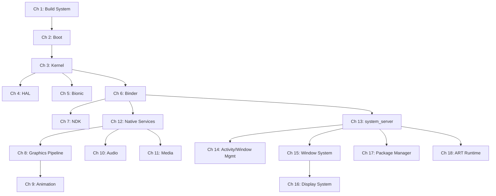
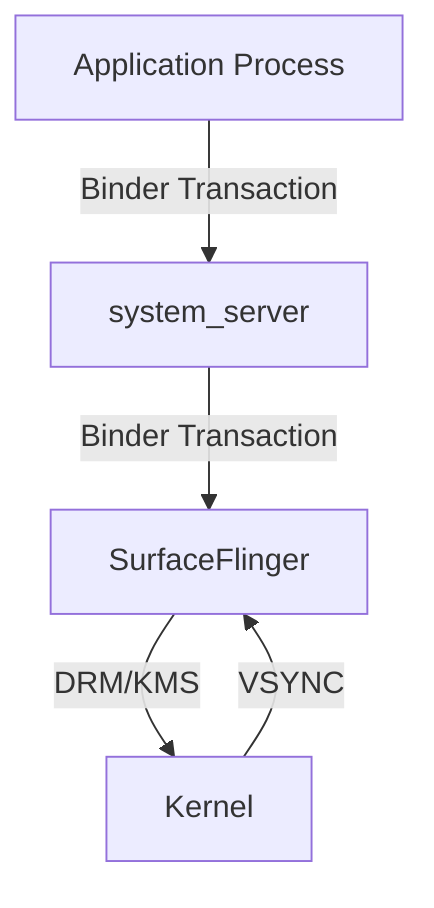
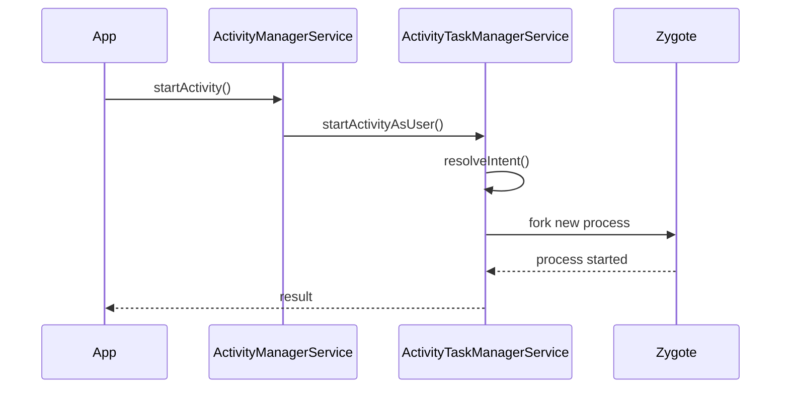
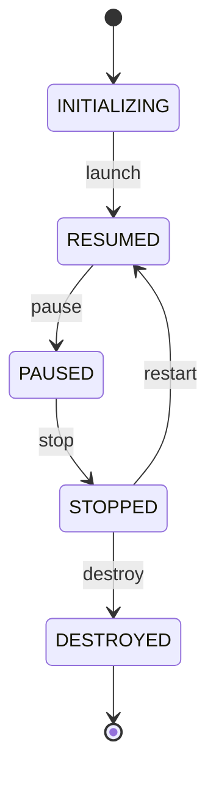

# AOSP 内部机制

## Android 开源项目开发者指南

---

**第一版**

---

*一部以源码引用为基础的 Android 开源项目探索指南，
从内核启动到应用框架。*

---

## 版权

版权所有 2026。保留所有权利。

自行出版。

除嵌入评论性书评中的简短引文以及版权法允许的若干其他非商业用途外，未经作者事先书面许可，本书任何部分均不得以任何形式或任何方式复制、存储于检索系统，或通过电子、机械、影印、录音等方式传播。

本书基于对 Android Open Source Project（AOSP）源码的分析。AOSP 源码采用 Apache License, Version 2.0 授权。所有 AOSP 源码摘录与文件路径引用均用于教育和评论目的。Android 机器人图形复制或修改自 Google 创建并分享的作品，并按照 Creative Commons 3.0 Attribution License 中描述的条款使用。

Android 是 Google LLC 的商标。本书与 Google LLC 或 Android Open Source Project 不存在隶属、认可或赞助关系。

本书中的所有源码引用均对应 2026 年初的 AOSP main 分支。文件路径、行号和代码摘录可能与源码树的过去或未来版本不同。建议读者对照自己检出的源码验证引用。

**免责声明**：本书信息按“原样”提供，且不附带担保。虽然本书已尽力通过直接源码验证确保准确性，作者和出版者均不对任何个人或实体因本书所含信息直接或间接造成或声称造成的任何损失或损害承担责任。

**源码树基线**：`aosp/main` 分支，同步于 2026 年 2 月。

**引用的构建标识**：面向 `aosp_cf_x86_64_phone`、`aosp_cf_arm64_phone` 和 `aosp_riscv64` lunch 目标的 AOSP 构建。

---

## 序言

### 本书解决的问题

Android 驱动着全球超过三十亿台活跃设备。它的源码，即 Android Open Source Project，是有史以来规模最大、影响最深远的开源代码库之一，横跨数百个 Git 仓库与数百万行代码。它触及现代计算栈的每一层：一个 Linux 内核分支、一个定制 C 库、一个即时编译虚拟机、一个硬件抽象层、一个进程间通信框架、图形与媒体管线、窗口管理系统，以及完整的应用框架。

与此同时，围绕它如何整体运转的、带源码引用的完整指南仍然稀缺。

官方 Android 文档非常适合应用开发者。它告诉你如何使用 API。如果你需要理解*这些 API 是如何实现的*，例如 `startActivity()` 调用如何从 Java 穿过 Binder 进入 `system_server` 再返回，帧如何从 Canvas 绘制调用经由渲染管线到达 SurfaceFlinger 并最终显示到屏幕，启动序列如何从内核交接到 init、Zygote 和 `SystemServer`，你很大程度上需要自己阅读源码。

阅读 AOSP 源码需要强大的耐心与工程判断。这个代码库极其庞大，横跨几十种编程语言和构建系统。架构决策很少被集中记录。API 表面看似简单的子系统，在底层往往展现出惊人的复杂性。关键行为隐藏在意想不到的位置。一个试图理解窗口管理系统的开发者，必须沿着 `WindowManagerService`、`ActivityTaskManagerService`、`SurfaceFlinger`、`InputDispatcher`、`View` 层级和 Linux 内核 DRM 子系统追踪代码，而这些组件又通过 Binder、共享内存和同步栅栏相互通信。

本书旨在成为我曾经希望拥有的那本指南。

### 本书的不同之处

本书与其他 Android 参考资料的差异体现在三条原则上：

**每个论断都引用真实源码。** 这不是一本只给出模糊架构图的书。当我说 `Zygote` 会响应应用启动请求 fork 新进程时，我会引用发生该 fork 的精确文件和函数。当我描述 `SurfaceFlinger` 如何合成 layer 时，我会指向具体的合成策略实现。文件路径采用绝对形式，对应标准 AOSP 检出目录。需要精确定位时会附带行号。

**它覆盖完整技术栈。** 大多数 Android 资料聚焦应用框架（面向应用开发者）或内核与 HAL（面向平台开发者）。本书覆盖完整纵向栈：从内核如何启动并挂载文件系统，到 Bionic 如何实现 POSIX syscall 包装，再到 Binder 如何序列化事务、Activity Manager 如何调度应用生命周期、图形管线如何渲染并合成帧。对于任何严肃的平台工作，理解完整技术栈都是必要条件，因为每一层都依赖其下层。

**它面向一线工程师组织内容。** 每章既可作为学习资料，也可作为参考资料。章节以架构概览开头，随后展开源码级详细分析，并以使用真实 AOSP 工具的动手练习收尾。交叉引用连接全书相关概念。Mermaid 图为复杂子系统提供可视化地图。

### 本书适合谁

本书写给需要在平台层理解 Android 的软件工程师：

- **平台工程师**：从事 Android 系统服务、框架或硬件使能工作。本书提供架构上下文，使代码审查和调试更快。

- **ROM 开发者**：构建自定义 Android 发行版。关于构建系统、启动序列和系统配置的章节提供有效定制所需的基础。

- **片上系统（SoC）工程师**：将 Android 移植到新硬件。关于内核集成、HAL 架构和硬件抽象的章节解释代码必须实现的接口。

- **安全研究员**：分析 Android 平台。关于安全模型、TEE 集成、虚拟化和权限框架的章节以源码级精度描绘攻击面。

- **应用开发者**：希望理解自己调用的 API 底层发生了什么。当应用遇到性能悬崖或神秘框架行为时，理解平台内部机制通常是最快的解决路径。

- **学生和研究人员**：研究操作系统、移动计算或大规模软件工程。AOSP 是这些领域中极其丰富的案例研究对象。

你应当能够阅读 Java、Kotlin、C 和 C++ 代码。本书默认你熟悉 Linux 基础知识（进程、文件描述符、系统调用、共享内存）。Android 应用开发经验会有帮助，但并非严格要求。

### 关于范围

Android 极其庞大。即便超过三十五章，本书也无法穷尽每个子系统。我聚焦对平台级工作最重要的领域，并在每个领域中优先讲解架构模式和关键代码路径，而非百科全书式 API 覆盖。对于过于庞大、无法完整覆盖的子系统，例如窗口管理系统的一百个小节，我会聚焦基础机制和最重要的代码路径，为读者提供足够上下文，以便独立深入探索。

AOSP 源码持续变化。本书基于 2026 年初的 `main` 分支编写，并在相关位置标注版本特定行为。不过，本书描述的架构模式通常远比单个实现细节稳定。即便读者使用的源码版本略有差异，概念框架仍然适用，即使具体行号已经移动。

### 致谢

如果没有成千上万位工程师对 Android Open Source Project 的杰出贡献，本书不会存在。他们构建的代码库是一项卓越成就，而将其开源的决定催生了完整的学习、创新和定制生态。

同样感谢 Android 社区：ROM 开发者、XDA 贡献者、Stack Overflow 回答者，以及多年来拼接平台知识碎片的博客作者。本书建立在他们铺就的基础之上。

---

## 关于本书

### 结构

本书分为三十五章，覆盖从构建系统到专用设备形态的完整 AOSP 技术栈。章节按主题分组，但每章都设计为可以独立阅读。

**第一部分：基础**

| 章节 | 标题 | 重点 |
|------|------|------|
| 1 | 构建系统 | Soong、Blueprint、Kati、Ninja、Make：AOSP 如何将源码转换为镜像 |
| 2 | 启动 | 从上电到 bootloader、内核、init、Zygote，再到 SystemServer |
| 3 | 内核 | Android 的 Linux 内核分支：binder driver、ashmem、ION/DMA-BUF、GKI |
| 4 | HAL | 硬件抽象层：HIDL、AIDL HAL、直通式与 binderized HAL |
| 5 | Bionic | Android 的 C 库：syscall 包装、动态链接器、malloc、pthreads |
| 6 | Binder | IPC 框架：driver、libbinder、AIDL 代码生成、事务 |

**第二部分：Native 层**

| 章节 | 标题 | 重点 |
|------|------|------|
| 7 | NDK | Native Development Kit：稳定 API、CDD 契约、JNI 桥接 |
| 8 | 图形与渲染管线 | 从 Canvas/RenderNode 经由 HWUI 到 GPU |
| 9 | 动画 | 属性动画、RenderThread 动画、transition framework |
| 10 | 音频 | AudioFlinger、AudioPolicyService、AAudio、effects 管线 |
| 11 | 媒体 | MediaCodec、MediaExtractor、codec2、DRM framework |
| 12 | Native 服务 | SurfaceFlinger、InputDispatcher、SensorService 等 |

**第三部分：系统服务**

| 章节 | 标题 | 重点 |
|------|------|------|
| 13 | system_server | 进程架构、服务生命周期、Watchdog、SystemServiceManager |
| 14 | Activity 与窗口管理 | AMS、ATMS、task 管理、生命周期状态机 |
| 15 | 窗口系统 | WindowManagerService：100 个小节，覆盖布局、焦点、转场、输入 |
| 16 | 显示系统 | DisplayManagerService、逻辑显示、刷新率管理 |
| 17 | Package Manager | APK 解析、安装流程、权限、split APK、包验证 |
| 18 | ART Runtime | Dex 编译、JIT、AOT、垃圾回收、类加载、profiling |

**第四部分：专用子系统**

| 章节 | 标题 | 重点 |
|------|------|------|
| 19 | Native Bridge 与 Berberis | NativeBridge 接口、指令翻译、guest ABI、trampoline |
| 20 | CompanionDevice 与 VirtualDevice | VDM 架构、虚拟显示、虚拟输入、CDM 策略 |
| 21 | SystemUI | 状态栏、通知栏、快速设置、锁屏、插件系统 |
| 22 | Launcher3 | 主屏架构、workspace、all-apps、拖放、widgets |
| 23 | Widgets、RemoteViews 与 RemoteCompose | 跨进程 UI：RemoteViews、AppWidgetService、RemoteCompose renderer |
| 24 | AI、AppFunctions 与 ComputerControl | 端侧 AI 集成、AppFunctions 框架、无障碍自动化 |
| 25 | Settings | Settings 应用架构、preference framework、搜索索引 |

**第五部分：基础设施**

| 章节 | 标题 | 重点 |
|------|------|------|
| 26 | 模拟器 | Cuttlefish、Goldfish、QEMU 集成、virtio 设备、快照 |
| 27 | 架构支持 | ARM64、x86_64、RISC-V：构建目标、内核配置、ABI 细节 |
| 28 | 安全与 TEE | SELinux 策略、Keymaster/Keymint、Gatekeeper、verified boot、TEE |
| 29 | 虚拟化 | pKVM、crosvm、protected VM、Microdroid、virtualization HAL |
| 30 | 测试 | CTS、VTS、Ravenwood、Atest、TradeFed、host-side 与 device-side |
| 31 | Mainline 模块 | APEX 打包、模块边界、train 更新、模块策略 |

**第六部分：设备类型与实践**

| 章节 | 标题 | 重点 |
|------|------|------|
| 32 | Automotive | Car service、vehicle HAL、cluster、EVS、多显示、驾驶员分心限制 |
| 33 | TV 与 Wear | Leanback、TIF、Wear Ongoing Activities、表盘框架 |
| 34 | Custom ROM Guide | 实践指南：fork、device tree、vendor blob、OTA、签名 |

**附录**

| 附录 | 标题 | 重点 |
|------|------|------|
| A | 搭建 AOSP 开发环境 | Repo、sync、lunch、build、flash |
| B | 浏览源码树 | 仓库地图、关键目录、搜索策略 |
| C | 调试工具参考 | gdb、lldb、systrace、perfetto、logcat、bugreport |
| D | AIDL 与 HIDL 快速参考 | 接口定义语法、代码生成、版本管理 |
| E | 术语表 | 本书使用的关键术语和缩写 |

### 章节剖面

本书每章都遵循一致结构：

1. **概览**：简明总结子系统的目的、它在 Android 架构中的位置，以及涉及的关键源码目录。

2. **架构**：用 Mermaid 图展示主要组件及其关系，并用叙述文字解释设计。

3. **源码分析**：每章核心内容。以文件路径和行号为线索，详细走读关键代码路径。本节回答的问题是：“这在代码中究竟如何工作？”

4. **关键数据结构与接口**：定义子系统契约的核心类型、类、接口和协议。

5. **运行时行为**：子系统在正常运行、启动、错误条件和边缘场景下的行为。序列图展示重要流程。

6. **配置与调优**：控制行为的系统属性、构建标志和配置文件。

7. **交叉引用**：使用 `§N.M` 记法链接相关章节。

8. **Try It**：读者可以在运行中的 AOSP 构建或源码树内执行的动手练习。

9. **Summary**：用要点形式给出关键结论。

---

## 如何阅读本书

### 自底向上的架构

本书按自底向上方式组织：Android 技术栈的底层出现在较早章节。这体现了一种刻意的教学选择。要理解 `startActivity()` 如何工作，需要理解 Binder。要理解 Binder，需要理解内核驱动和共享内存。要理解内核驱动，需要理解 Android 的 Linux 分支与上游内核的差异。

依赖链如下：



同时，**每章都设计为自包含**。如果你已经理解 Binder 并需要学习窗口系统，可以直接阅读第 15 章。交叉引用（使用 `§N.M` 记法）会在需要时指向前置材料。

### 建议阅读路径

不同读者适合采用不同路径：

**面向刚接触 AOSP 的平台工程师：**
按顺序阅读第 1-6 章。这些章节建立对 Android 如何构建、启动和组织的基础理解。随后阅读第 13 章（system_server）和第 14 章（Activity/Window Management）来进入框架层。之后按兴趣继续阅读。

**面向图形/显示专家：**
阅读第 6 章（Binder）建立 IPC 上下文，然后阅读第 8 章（Graphics Pipeline）、第 9 章（Animation）、第 12 章（Native Services，重点关注 SurfaceFlinger）、第 15 章（Window System）和第 16 章（Display System）。

**面向安全研究员：**
阅读第 3 章（Kernel）理解内核攻击面，第 5 章（Bionic）理解 libc 实现，第 6 章（Binder）理解 IPC 攻击面，第 28 章（Security/TEE）理解安全模型，第 29 章（Virtualization）理解隔离架构。

**面向 ROM 开发者：**
从第 1 章（Build System）、第 2 章（Boot）和第 4 章（HAL）开始，然后跳到第 34 章（Custom ROM Guide）阅读实践走读。需要更深入理解时再回到前面章节。

**面向好奇的应用开发者：**
阅读第 6 章（Binder）理解发起系统调用时发生的事情，第 14 章（Activity/Window Management）理解生命周期管理，第 8 章（Graphics Pipeline）理解渲染性能，第 18 章（ART Runtime）理解代码如何执行。

### 使用源码树

本书假定你已经检出并构建 AOSP 源码树。书中所有文件路径都相对于 AOSP 源码树根目录给出。

例如，当本书引用：

```
frameworks/base/services/core/java/com/android/server/wm/WindowManagerService.java
```

它指的是你运行 `repo init` 和 `repo sync` 的目录（通常称为 `<AOSP_ROOT>`）下的该文件。

为了充分利用本书，你应当准备好可浏览的源码树。许多小节在阅读周边代码后更容易理解，而不仅限于书中展示的摘录。附录 A 提供 AOSP 开发环境搭建说明，附录 B 提供高效浏览源码树的策略。

### 交叉引用

章节和小节采用层级编号。当你看到类似 `§6.3` 的引用时，它表示第 6 章第 3 节。类似 `§15.42` 的引用指向第 15 章第 42 节。这些交叉引用广泛用于连接全书相关概念，同时避免重复材料。

当一个概念首次出现时，本书会完整解释它。后续再次引用同一概念时，会使用交叉引用记法指回原始解释。

### “Try It” 练习

大多数章节以包含动手练习的 “Try It” 小节收尾。这些练习通过直接与源码和运行系统交互来强化材料。它们分为几类：

- **源码探索**：使用 `grep`、`cs`（codesearch）或 IDE 在代码库中查找特定模式。
- **构建练习**：修改构建文件、添加日志语句，并重新构建特定组件。
- **运行时观察**：使用 `adb shell`、`dumpsys`、`logcat` 和 tracing 工具在运行设备或模拟器上观察系统行为。
- **调试练习**：附加调试器、设置断点，并单步执行关键代码路径。
- **修改挑战**：对 AOSP 子系统做出具体改动并观察结果。

练习假定读者可以访问运行 AOSP 构建的物理设备或 Cuttlefish 虚拟设备。大多数练习推荐使用 Cuttlefish，因为它提供完整 AOSP 功能，同时无需物理硬件。设置说明见附录 A。

---

## 本书约定

### 代码与文件路径

**行内代码**用于类名（`WindowManagerService`）、方法名（`startActivity()`）、变量名（`mGlobalLock`）、文件名（`AndroidManifest.xml`）、shell 命令（`adb shell dumpsys window`）和系统属性（`ro.build.type`）。

**代码块**用于源码摘录、shell 会话和配置文件。每个从 AOSP 提取的代码块都包含标明源文件的头部注释：

```java
// frameworks/base/services/core/java/com/android/server/wm/ActivityTaskManagerService.java

@Override
public final int startActivity(IApplicationThread caller, String callingPackage,
        String callingFeatureId, Intent intent, String resolvedType,
        IBinder resultTo, String resultWho, int requestCode,
        int startFlags, ProfilerInfo profilerInfo, Bundle bOptions) {
    return startActivityAsUser(caller, callingPackage, callingFeatureId,
            intent, resolvedType, resultTo, resultWho, requestCode,
            startFlags, profilerInfo, bOptions,
            UserHandle.getCallingUserId());
}
```

当代码摘录为了清晰而简化时，例如移除错误检查或日志语句，头部会包含 `(simplified)` 标记：

```java
// frameworks/base/core/java/android/app/ActivityThread.java (simplified)

private void handleBindApplication(AppBindData data) {
    Application app = data.info.makeApplicationInner(data.restrictedBackupMode, null);
    mInitialApplication = app;
    app.onCreate();
}
```

**文件路径**始终使用相对于源码树根目录的完整路径。在正文中引用时，它们格式化为行内代码：

> 窗口布局逻辑实现在
> `frameworks/base/services/core/java/com/android/server/wm/DisplayPolicy.java`。

当具体行号相关时，行号会追加在冒号之后：

> 参见 `frameworks/base/services/core/java/com/android/server/wm/WindowState.java:1247`
> 中的 frame 计算逻辑。

行号对应版权章节中声明的源码树基线。仅在具体行对理解很重要时附带行号；大多数引用省略行号，因为它们会随每次提交移动。

### 图

本书大量使用 Mermaid 图来可视化架构、数据流和运行时行为。使用三类图：

**块图**（`graph TD` 或 `graph LR`）用于架构概览，展示组件关系：



**序列图**（`sequenceDiagram`）用于运行时交互，展示跨组件操作顺序：



**状态图**（`stateDiagram-v2`）用于生命周期和状态机描述：



图用于提供可视化概览。它们始终配有叙述文字来解释细节。你无需 Mermaid 渲染器也能理解本书，但如果可以渲染这些图，它们会更有帮助；大多数现代 Markdown 查看器和文档工具都原生支持 Mermaid。

### 交叉引用记法

交叉引用使用 `§` 符号，后接章节和小节编号：

| 记法 | 含义 |
|------|------|
| `§6` | 第 6 章（Binder） |
| `§6.3` | 第 6 章第 3 节 |
| `§15.42` | 第 15 章第 42 节 |
| `§A` | 附录 A |

当作为补充指针使用时，交叉引用会出现在括号中：

> 事务被序列化到 `Parcel`（§6.3），并通过内核驱动分发（§6.5）。

当被引用材料是理解所必需时，交叉引用会作为直接引用：

> 继续阅读前，请确保理解 §6.3 中描述的 Binder 事务模型。

### 术语

本书中若干术语具有特定含义：

| 术语 | 含义 |
|------|------|
| **AOSP** | Android Open Source Project，开源代码库 |
| **Framework** | `frameworks/base/` 中的 Java/Kotlin 层 |
| **System services** | 运行在 `system_server` 进程中的 Java 服务 |
| **Native services** | 在自身进程中运行的 C++ 服务（例如 SurfaceFlinger） |
| **HAL** | Hardware Abstraction Layer，框架与硬件之间的接口 |
| **Binder** | Android 的 IPC 机制，包括驱动、用户空间库和 AIDL 工具链 |
| **ART** | Android Runtime，执行应用代码的虚拟机 |
| **AIDL** | Android Interface Definition Language，用于 Binder 接口定义 |
| **HIDL** | HAL Interface Definition Language，旧式 HAL 接口定义 |
| **SoC** | System on Chip，处理器及其集成组件 |
| **CDD** | Compatibility Definition Document，Android 兼容性要求 |
| **CTS** | Compatibility Test Suite，验证 CDD 合规性的测试 |
| **VTS** | Vendor Test Suite，验证 HAL 合规性的测试 |
| **GKI** | Generic Kernel Image，Google 统一 Android 内核的努力 |
| **Mainline** | Project Mainline，通过 APEX/APK 模块更新的系统组件 |
| **pKVM** | Protected Kernel-based Virtual Machine，Android 的 hypervisor |
| **TEE** | Trusted Execution Environment，隔离的安全处理环境 |
| **DRM/KMS** | Direct Rendering Manager / Kernel Mode Setting，Linux 显示子系统 |

### 代码讨论中的缩写

讨论代码时，会使用以下缩写指代常见组件：

| 缩写 | 全称 |
|------|------|
| **AMS** | `ActivityManagerService` |
| **ATMS** | `ActivityTaskManagerService` |
| **WMS** | `WindowManagerService` |
| **PMS** | `PackageManagerService` |
| **SF** | `SurfaceFlinger` |
| **HWUI** | Hardware UI rendering library |
| **BQ** | `BufferQueue` |
| **DMS** | `DisplayManagerService` |
| **IMS** | `InputManagerService` |
| **NBS** | `NativeBridgeService` |

### 提示块

全书中，若干段落会被突出显示以提醒特别关注：

> **Note**：补充信息，用于增加上下文或澄清细微点。它对理解主线内容并非必需，但有助于深入理解。

> **Important**：对正确理解至关重要的信息。误解这一点可能导致后续章节中的困惑。

> **Warning**：陷阱、常见错误或反直觉行为。需要特别关注。

> **Historical Note**：关于某项设计缘由的上下文，通常涉及历史决策或向后兼容约束。理解历史有助于解释那些看似随意的设计。

> **Performance**：与系统性能相关的信息，包括关键路径、对延迟敏感的代码和优化策略。

### Shell 会话

Shell 命令使用 `$` 提示符表示用户命令，使用 `#` 表示 root 命令。输出不带提示符：

```bash
$ adb shell dumpsys window displays
Display: mDisplayId=0
  init=1080x2400 base=1080x2400 cur=1080x2400 app=1080x2244 rng=1080x1017-2400x2337
```

多行命令使用反斜杠续行：

```bash
$ source build/envsetup.sh && \
    lunch aosp_cf_x86_64_phone-trunk_staging-userdebug && \
    m -j$(nproc)
```

### 构建与运行时目标

除非另有说明，构建示例面向 Cuttlefish x86_64 虚拟设备：

```bash
$ lunch aosp_cf_x86_64_phone-trunk_staging-userdebug
```

讨论架构特定行为时（尤其在第 19、27 和 29 章），相关目标会明确说明。主要引用的三个架构目标是：

- `aosp_cf_x86_64_phone-trunk_staging-userdebug`：x86_64，主要开发目标
- `aosp_cf_arm64_phone-trunk_staging-userdebug`：ARM64，主要生产架构
- `aosp_riscv64-trunk_staging-userdebug`：RISC-V 64 位，新兴架构

### 源码导航技巧

AOSP 源码树极其庞大，但一些策略可以让导航变得可控：

**了解主要目录。** 最重要的顶层目录如下：

| 目录 | 内容 |
|------|------|
| `frameworks/base/` | 核心框架：服务、核心库、UI toolkit |
| `frameworks/native/` | Native 框架：Binder、SurfaceFlinger、sensor service |
| `frameworks/libs/` | 框架库：二进制翻译、native bridge 支持 |
| `system/core/` | 核心系统：init、adb、logd、libcutils |
| `art/` | Android Runtime：编译器、垃圾回收器、解释器 |
| `bionic/` | C 库、动态链接器、数学库 |
| `packages/` | 系统应用：Settings、SystemUI、Launcher3 |
| `hardware/interfaces/` | AIDL/HIDL HAL 接口定义 |
| `build/` | 构建系统：Soong、Make、Kati 集成 |
| `kernel/` | 内核源码和预构建件 |
| `external/` | 第三方库和工具 |

**使用 Android Code Search。** 在线工具 `cs.android.com` 提供 AOSP 源码的全文搜索、交叉引用和调用层级分析。对于初始探索，它通常比本地 `grep` 更快。

**沿着 Binder 接口追踪。** 当跨进程边界追踪一个功能时，先找到 AIDL 接口定义。它展示客户端与服务端之间的精确契约，使两侧实现都更容易定位。

**阅读服务注册。** 大多数系统服务都会在 `SystemServer.java` 中注册自身。注册顺序揭示依赖关系，也能帮助你发现之前不了解的服务。

---

## 开始之前的一点说明

Android Open Source Project 是一个持续演进的代码库。当你读到这句话时，源码已经发生变化。方法被重构，类被移动，新子系统被加入，旧子系统被废弃。

这正是此类工作的本质。一本关于活代码库的书，在某种意义上是一张快照，即对移动目标的详细照片。但本书的价值不在具体行号或精确方法签名，而在于*架构理解*：模式、设计决策，以及即使实现细节演化也保持稳定的结构关系。

掌握架构，你就能导航任何版本的源码。理解系统为何如此设计，你就能预测在从未见过的代码中该去哪里寻找答案。

让我们开始。

---

*进入第 1 章：构建系统 -->*
