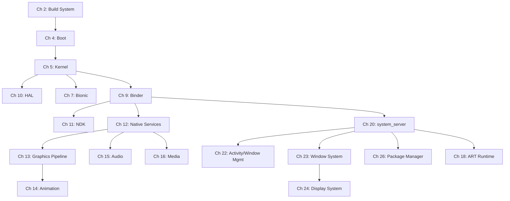
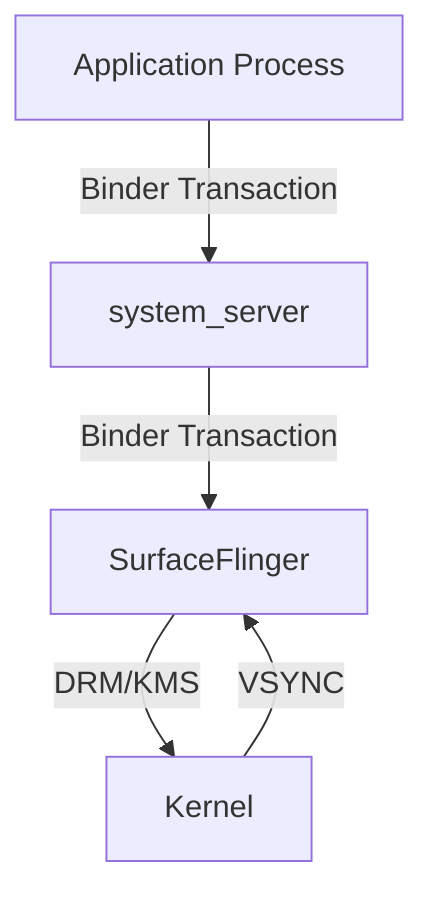
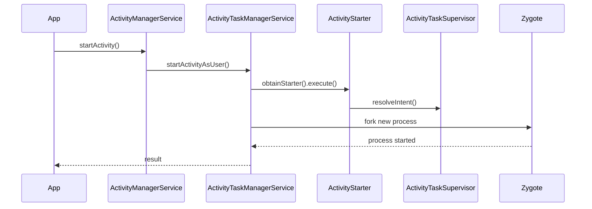
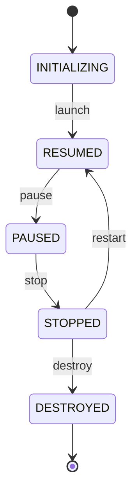

# AOSP 内部机制

## Android 开源项目开发者指南

---

**第一版**

---

*一部带源码引用的 Android Open Source Project 探索指南，
从内核启动到应用框架。*

---

## 版权

版权所有 2026。保留所有权利。

自行出版。

除嵌入评论性书评中的简短引文以及版权法允许的若干其他非商业用途外，未经作者事先书面许可，本书任何部分均不得以任何形式或任何方式复制、存储于检索系统，或通过电子、机械、影印、录音等方式传播。

本书基于对 Android Open Source Project（AOSP）源码的分析。AOSP 源码采用 Apache License, Version 2.0 授权。所有 AOSP 源码摘录与文件路径引用均用于教育和评论目的。Android 机器人图形复制或修改自 Google 创建并分享的作品，并按照 Creative Commons 3.0 Attribution License 中描述的条款使用。

Android 是 Google LLC 的商标。本书与 Google LLC 或 Android Open Source Project 没有关联，也未获得 Google LLC 或 Android Open Source Project 的认可或赞助。

本书中的所有源码引用均对应 2026 年初的 AOSP main 分支。文件路径、行号和代码摘录可能与源码树的过去或未来版本不同。建议读者对照自己检出的源码验证引用。

**免责声明**：本书信息按“原样”提供，且不附带担保。虽然本书已尽力通过直接源码验证确保准确性，作者和出版者均不对任何个人或实体因本书所含信息直接或间接造成或声称造成的任何损失或损害承担责任。

**源码树基线**：`aosp/main` 分支，同步于 2026 年 2 月。

**引用的构建标识**：面向 `aosp_cf_x86_64_phone`、`aosp_cf_arm64_phone` 和 `aosp_riscv64` lunch 目标的 AOSP 构建。

---

## 序言

### 本书解决的问题

Android 驱动着全球超过三十亿台活跃设备。它的源码，即 Android Open Source Project，是有史以来规模最大、影响最深远的开源代码库之一，横跨数百个 Git 仓库与数百万行代码。它触及现代计算栈的每一层：Linux 内核分支、定制 C 库、即时编译虚拟机、硬件抽象层、进程间通信框架、图形与媒体管线、窗口管理系统，以及完整的应用框架。

与此同时，围绕它整体运作方式的、带源码引用的完整指南依然稀缺。

官方 Android 文档非常适合应用开发者。它告诉你如何使用 API。如果你需要理解*这些 API 是如何实现的*，例如 `startActivity()` 调用如何从 Java 穿过 Binder 进入 `system_server` 再返回，帧如何从 Canvas 绘制调用经由渲染管线到达 SurfaceFlinger 并最终显示到屏幕，启动序列如何从内核交接到 init、Zygote 和 `SystemServer`，你很大程度上需要自己阅读源码。

阅读 AOSP 源码需要强大的耐心与工程判断。这个代码库极其庞大，横跨几十种编程语言和构建系统。架构决策很少被集中记录。API 表面看似简单的子系统，在底层往往展现出惊人的复杂性。关键行为隐藏在意想不到的位置。一个试图理解窗口管理系统的开发者，必须沿着 `WindowManagerService`、`ActivityTaskManagerService`、`SurfaceFlinger`、`InputDispatcher`、`View` 层级和 Linux 内核 DRM 子系统追踪代码，而这些组件又通过 Binder、共享内存和同步栅栏相互通信。

本书旨在成为我曾经希望拥有的那本指南。

### 本书的不同之处

本书与其他 Android 参考资料的差异体现在三条原则上：

**每个论断都引用真实源码。** 这不是一本只给出模糊架构图的书。当我说 `Zygote` 会响应应用启动请求 fork 新进程时，我会引用发生该 fork 的精确文件和函数。当我描述 `SurfaceFlinger` 如何合成 layer 时，我会指向具体的合成策略实现。文件路径采用绝对形式，对应标准 AOSP 检出目录。需要精确定位时会附带行号。

**它覆盖完整技术栈。** 大多数 Android 资料聚焦应用框架（面向应用开发者）或内核与 HAL（面向平台开发者）。本书覆盖完整纵向栈：从内核如何启动并挂载文件系统，到 Bionic 如何实现 POSIX syscall 包装，再到 Binder 如何序列化事务、Activity Manager 如何调度应用生命周期、图形管线如何渲染并合成帧。对于任何严肃的平台工作，理解完整技术栈都是必要条件，因为每一层都依赖其下层。

**它面向一线工程师组织内容。** 每章既可作为学习资料，也可作为参考资料。章节以架构概览开头，随后展开源码级详细分析，并以使用真实 AOSP 工具的动手练习收尾。交叉引用连接全书相关概念。Mermaid 图为复杂子系统提供可视化地图。

### 本书适合谁

本书写给需要在平台层理解 Android 的软件工程师：

- **平台工程师**：从事 Android 系统服务、框架或硬件使能工作。本书提供架构上下文，使代码审查和调试更快。

- **ROM 开发者**：构建自定义 Android 发行版。关于构建系统、启动序列和系统配置的章节提供有效定制所需的基础。

- **片上系统（SoC）工程师**：将 Android 移植到新硬件。关于内核集成、HAL 架构和硬件抽象的章节解释代码必须实现的接口。

- **安全研究员**：分析 Android 平台。关于安全模型、TEE 集成、虚拟化和权限框架的章节以源码级精度描绘攻击面。

- **应用开发者**：希望理解自己调用的 API 底层发生了什么。当应用遇到性能悬崖或神秘框架行为时，理解平台内部机制通常是最快的解决路径。

- **学生和研究人员**：研究操作系统、移动计算或大规模软件工程。AOSP 是这些领域中极其丰富的案例研究对象。

你应当能够阅读 Java、Kotlin、C 和 C++ 代码。本书默认你熟悉 Linux 基础知识（进程、文件描述符、系统调用、共享内存）。Android 应用开发经验会有帮助，但并非严格要求。

### 关于范围

Android 极其庞大。即便超过三十五章，本书也无法穷尽每一个子系统。我聚焦于对平台级工作最重要的领域，并在每个领域内优先讲解架构模式和关键代码路径，而不是百科全书式 API 覆盖。当某个子系统过于庞大而无法完整覆盖时，例如窗口管理系统的一百个小节这一典型例子，我会聚焦基础机制和最重要的代码路径，为读者后续自主探索提供足够上下文。

AOSP 源码持续变化。本书基于 2026 年初的 `main` 分支编写，并在必要处标注版本特定行为。不过，本书描述的架构模式通常比单个实现细节稳定得多。使用稍有差异版本源码的读者，即使遇到具体行号偏移，仍可完整应用这些概念框架。

### 致谢

如果没有成千上万为 Android Open Source Project 做出贡献的工程师的非凡工作，本书不会存在。他们构建的代码库是一项卓越成就，而将其开源的决定也成就了一个由学习、创新和定制组成的完整生态。

同样感谢 Android 社区，包括 ROM 开发者、XDA 贡献者、Stack Overflow 答题者，以及多年来把平台知识碎片拼接起来的博客作者。本书建立在他们铺设的基础之上。

---

## 关于本书

### 结构

本书组织为三十五章，覆盖完整 AOSP 技术栈，从构建系统到专门设备形态。章节被分为若干主题部分，同时每一章也都设计成可以独立阅读。

**第一部分：基础**

| 章节 | 标题 | 重点 |
|---------|-------|-------|
| 1 | 构建系统 | Soong、Blueprint、Kati、Ninja、Make：AOSP 如何把源码转换为镜像 |
| 2 | 启动 | 从上电到 bootloader、kernel、init、Zygote，再到 SystemServer |
| 3 | 内核 | Android 的 Linux 内核分支：binder 驱动、ashmem、ION/DMA-BUF、GKI |
| 4 | HAL | 硬件抽象层：HIDL、AIDL HAL，passthrough 与 binderized |
| 5 | Bionic | Android 的 C 库：syscall 包装、动态链接器、malloc、pthreads |
| 6 | Binder | IPC 框架：驱动、libbinder、AIDL 代码生成、事务 |

**第二部分：Native 层**

| 章节 | 标题 | 重点 |
|---------|-------|-------|
| 7 | NDK | Native Development Kit：稳定 API、CDD 契约、JNI 桥接 |
| 8 | 图形与渲染管线 | 从 Canvas/RenderNode 经由 HWUI 到 GPU |
| 9 | 动画 | 属性动画、RenderThread 动画、transition 框架 |
| 10 | 音频 | AudioFlinger、AudioPolicyService、AAudio、effects 管线 |
| 11 | 媒体 | MediaCodec、MediaExtractor、codec2、DRM 框架 |
| 12 | Native 服务 | SurfaceFlinger、InputDispatcher、SensorService 等 |

**第三部分：系统服务**

| 章节 | 标题 | 重点 |
|---------|-------|-------|
| 13 | system_server | 进程架构、服务生命周期、Watchdog、SystemServiceManager |
| 14 | Activity 与 Window 管理 | AMS、ATMS、任务管理、生命周期状态机 |
| 15 | 窗口系统 | WindowManagerService：100 个小节覆盖布局、焦点、过渡和输入 |
| 16 | 显示系统 | DisplayManagerService、逻辑显示、刷新率管理 |
| 17 | Package Manager | APK 解析、安装流程、权限、split APK、包验证 |
| 18 | ART Runtime | Dex 编译、JIT、AOT、垃圾回收、类加载、profiling |

**第四部分：专门子系统**

| 章节 | 标题 | 重点 |
|---------|-------|-------|
| 19 | Native Bridge 与 Berberis | NativeBridge 接口、指令翻译、guest ABI、trampoline |
| 20 | CompanionDevice 与 VirtualDevice | VDM 架构、虚拟显示、虚拟输入、CDM 策略 |
| 21 | SystemUI | 状态栏、通知栏、快速设置、keyguard、插件系统 |
| 22 | Launcher3 | 主屏架构、workspace、all-apps、拖放、widgets |
| 23 | Widgets、RemoteViews 与 RemoteCompose | 跨进程 UI：RemoteViews、AppWidgetService、RemoteCompose renderer |
| 24 | AI、AppFunctions 与 ComputerControl | 端侧 AI 集成、AppFunctions 框架、无障碍自动化 |
| 25 | Settings | Settings 应用架构、preference 框架、搜索索引 |

**第五部分：基础设施**

| 章节 | 标题 | 重点 |
|---------|-------|-------|
| 26 | Emulator | Cuttlefish、Goldfish、QEMU 集成、virtio 设备、快照 |
| 27 | 架构支持 | ARM64、x86_64、RISC-V：构建目标、内核配置、ABI 细节 |
| 28 | 安全与 TEE | SELinux 策略、Keymaster/Keymint、Gatekeeper、verified boot、TEE |
| 29 | 虚拟化 | pKVM、crosvm、protected VM、Microdroid、virtualization HAL |
| 30 | 测试 | CTS、VTS、Ravenwood、Atest、TradeFed、host-side 与 device-side |
| 31 | Mainline 模块 | APEX 打包、模块边界、train updates、模块策略 |

**第六部分：设备类型与实践**

| 章节 | 标题 | 重点 |
|---------|-------|-------|
| 32 | Automotive | Car service、vehicle HAL、cluster、EVS、多显示、驾驶员分心限制 |
| 33 | TV 与 Wear | Leanback、TIF、Wear Ongoing Activities、watch face 框架 |
| 34 | Custom ROM 指南 | 实践指南：fork、device tree、vendor blob、OTA、签名 |

**附录**

| 附录 | 标题 | 重点 |
|----------|-------|-------|
| A | 搭建 AOSP 开发环境 | Repo、sync、lunch、build、flash |
| B | 导航源码树 | 仓库地图、关键目录、搜索策略 |
| C | 调试工具参考 | gdb、lldb、systrace、perfetto、logcat、bugreport |
| D | AIDL 与 HIDL 快速参考 | 接口定义语法、代码生成、版本管理 |
| E | 术语表 | 本书使用的关键术语和缩写 |

### 章节结构

本书每一章都遵循一致结构：

1. **概览**：简要说明子系统用途、在 Android 架构中的位置，以及涉及的关键源码目录。

2. **架构**：用 Mermaid 图展示主要组件及其关系，然后以文字叙述设计。

3. **源码分析**：每章的核心。带文件路径和行号引用的关键代码路径详细走读。本节回答“代码里到底如何工作”这个问题。

4. **关键数据结构和接口**：定义子系统契约的核心类型、类、接口和协议。

5. **运行时行为**：子系统在正常运行、启动、错误条件和边界场景下的行为。序列图展示重要流程。

6. **配置与调优**：控制行为的系统属性、构建 flag 和配置文件。

7. **交叉引用**：使用 `§N.M` 标记链接到相关章节。

8. **动手练习**：读者可以在运行中的 AOSP 构建或源码树中执行的练习。

9. **小结**：以要点形式列出关键结论。

---

## 如何阅读本书

### 自底向上的架构

本书采用自底向上的组织方式：Android 栈中较低的层出现在较早章节。这是一种有意的教学选择。要理解 `startActivity()` 如何工作，你需要理解 Binder。要理解 Binder，你需要理解内核驱动和共享内存。要理解内核驱动，你需要理解 Android 的 Linux 分支与 upstream 的差异。

依赖链如下：


```mermaid
graph TD
    A[Ch 2: Build System] --> B[Ch 4: Boot]
    B --> C[Ch 5: Kernel]
    C --> D[Ch 10: HAL]
    C --> E[Ch 7: Bionic]
    C --> F[Ch 9: Binder]
    F --> G[Ch 11: NDK]
    F --> H[Ch 12: Native Services]
    H --> I[Ch 13: Graphics Pipeline]
    H --> J[Ch 15: Audio]
    H --> K[Ch 16: Media]
    F --> L[Ch 20: system_server]
    L --> M[Ch 22: Activity/Window Mgmt]
    L --> N[Ch 23: Window System]
    L --> O[Ch 26: Package Manager]
    L --> P[Ch 18: ART Runtime]
    I --> Q[Ch 14: Animation]
    N --> R[Ch 24: Display System]
```

同时，**每一章都被设计为自包含**。如果你已经理解 Binder，并且需要学习窗口系统，可以直接阅读第 23 章。交叉引用（使用 `§N.M` 标记）会在需要时指向前置材料。

### 推荐阅读路径

不同读者适合不同的阅读路径：

**刚接触 AOSP 的平台工程师：**
按顺序阅读第 1-9 章。这些章节建立对 Android 如何构建、启动和组织的基础理解。随后阅读第 20 章（system_server）和第 22 章（Activity/Window Management）以进入 framework 层。此后再按兴趣继续。

**图形/显示方向专家：**
阅读第 9 章（Binder）以获得 IPC 上下文，然后阅读第 13 章（Graphics Pipeline）、第 14 章（Animation）、第 12 章（Native Services，重点关注 SurfaceFlinger）、第 23 章（Window System）和第 24 章（Display System）。

**安全研究员：**
阅读第 5 章（Kernel）以理解内核攻击面，第 7 章（Bionic）以理解 libc 实现，第 9 章（Binder）以理解 IPC 攻击面，第 40 章（Security/TEE）以理解安全模型，第 54 章（Virtualization）以理解隔离架构。

**ROM 开发者：**
从第 2 章（Build System）、第 4 章（Boot）和第 10 章（HAL）开始，然后跳到第 63 章（Custom ROM Guide）进行实践走读。需要更深理解时再回到前面的章节。

**好奇的应用开发者：**
阅读第 9 章（Binder）以理解发起系统调用时发生的事情，第 22 章（Activity/Window Management）以理解生命周期管理，第 13 章（Graphics Pipeline）以理解渲染性能，第 18 章（ART Runtime）以理解你的代码如何执行。

### 使用源码树

本书假设你已经检出并构建了 AOSP 源码树。书中所有文件路径均相对于 AOSP 源码树根目录给出。

例如，当本书引用：

```
frameworks/base/services/core/java/com/android/server/wm/WindowManagerService.java
```

它指的是你执行 `repo init` 和 `repo sync` 所在目录（通常称为 `<AOSP_ROOT>`）下的这个文件。

为了最大化本书价值，你应当准备好可浏览的源码树。如果你能阅读周边代码，而不只阅读本书展示的摘录，许多小节会更容易理解。附录 A 提供 AOSP 开发环境搭建说明，附录 B 提供高效导航源码树的策略。

### 交叉引用

章节和小节采用层级编号。当你看到 `§9.3` 这样的引用时，它表示第 9 章第 3 节。`§22.42` 表示第 22 章第 42 节。这些交叉引用在全书中广泛用于连接相关概念，同时避免重复材料。

当某个概念第一次出现时，本书会完整解释。后续再次引用同一概念时，会使用交叉引用标记指回原始解释。

### “Try It” 练习

多数章节以 “Try It” 小节结尾，其中包含动手练习。这些练习通过直接接触源码和运行系统来巩固内容。它们分为几类：

- **源码探索**：使用 `grep`、`cs`（codesearch）或 IDE 在代码库中查找特定模式。
- **构建练习**：修改构建文件、添加日志语句，并重建特定组件。
- **运行时观察**：使用 `adb shell`、`dumpsys`、`logcat` 和 tracing 工具观察运行中设备或模拟器的系统行为。
- **调试练习**：附加调试器、设置断点，并单步执行关键代码路径。
- **修改挑战**：对 AOSP 子系统进行特定修改并观察结果。

这些练习假设你可以访问运行 AOSP 构建的物理设备或 Cuttlefish 虚拟设备。多数练习推荐使用 Cuttlefish，因为它在不需要物理硬件的情况下提供完整 AOSP 功能。搭建说明见附录 A。

---

## 本书约定

### 代码和文件路径

**行内代码**用于类名（`WindowManagerService`）、方法名（`startActivity()`）、变量名（`mGlobalLock`）、文件名（`AndroidManifest.xml`）、shell 命令（`adb shell dumpsys window`）和系统属性（`ro.build.type`）。

**代码块**用于源码摘录、shell 会话和配置文件。每个从 AOSP 提取的代码块都包含标明源码文件的头部注释：

```java
// frameworks/base/services/core/java/com/android/server/wm/ActivityTaskManagerService.java

@Override
public final int startActivity(IApplicationThread caller, String callingPackage,
        String callingFeatureId, Intent intent, String resolvedType,
        IBinder resultTo, String resultWho, int requestCode,
        int startFlags, ProfilerInfo profilerInfo, Bundle bOptions) {
    return startActivityAsUser(caller, callingPackage, callingFeatureId,
            intent, resolvedType, resultTo, resultWho, requestCode,
            startFlags, profilerInfo, bOptions,
            UserHandle.getCallingUserId());
}
```

当代码摘录为清晰起见经过简化时，例如移除错误检查或日志语句，头部会包含 `(simplified)` 标记：

```java
// frameworks/base/core/java/android/app/ActivityThread.java (simplified)

private void handleBindApplication(AppBindData data) {
    Application app = data.info.makeApplicationInner(data.restrictedBackupMode, null);
    mInitialApplication = app;
    app.onCreate();
}
```

**文件路径**始终使用相对于源码树根目录的完整路径。在正文中引用时格式化为行内代码：

> 窗口布局逻辑实现在
> `frameworks/base/services/core/java/com/android/server/wm/DisplayPolicy.java`。

当具体行号相关时，会在冒号后附加：

> 关于 frame 计算逻辑，见 `frameworks/base/services/core/java/com/android/server/wm/WindowState.java:1247`。

行号对应版权小节声明的源码树基线。只有当具体行对于理解很重要时才会包含行号；多数引用省略行号，因为每次提交都会使行号移动。

### 图表

本书大量使用 Mermaid 图来可视化架构、数据流和运行时行为。主要使用三类图：

**块图**（`graph TD` 或 `graph LR`）用于展示组件关系的架构概览：


```mermaid
graph TD
    App[Application Process] -->|Binder Transaction| SS[system_server]
    SS -->|Binder Transaction| SF[SurfaceFlinger]
    SF -->|DRM/KMS| K[Kernel]
    K -->|VSYNC| SF
```

**序列图**（`sequenceDiagram`）用于展示多个组件之间按时间顺序发生的运行时交互：


```mermaid
sequenceDiagram
    participant App
    participant AMS as ActivityManagerService
    participant ATMS as ActivityTaskManagerService
    participant AS as ActivityStarter
    participant ATS as ActivityTaskSupervisor
    participant Zygote

    App->>AMS: startActivity()
    AMS->>ATMS: startActivityAsUser()
    ATMS->>AS: obtainStarter().execute()
    AS->>ATS: resolveIntent()
    ATMS->>Zygote: fork new process
    Zygote-->>ATMS: process started
    ATMS-->>App: result
```

**状态图**（`stateDiagram-v2`）用于描述生命周期和状态机：


```mermaid
stateDiagram-v2
    [*] --> INITIALIZING
    INITIALIZING --> RESUMED : launch
    RESUMED --> PAUSED : pause
    PAUSED --> STOPPED : stop
    STOPPED --> RESUMED : restart
    STOPPED --> DESTROYED : destroy
    DESTROYED --> [*]
```

图表用于提供视觉概览。每个图表都会配有解释细节的叙述文本。理解本书并不要求你拥有 Mermaid 渲染器，但如果可以渲染图表，它们会更有用；大多数现代 Markdown 查看器和文档工具都原生支持 Mermaid。

### 交叉引用标记

交叉引用使用 `§` 符号加章节和小节编号：

| 标记 | 含义 |
|----------|---------|
| `§9` | 第 9 章（Binder） |
| `§9.3` | 第 9 章第 3 节 |
| `§22.42` | 第 22 章第 42 节 |
| `§A` | 附录 A |

交叉引用作为补充指针使用时出现在括号中：

> 事务被序列化为 `Parcel`（§9.3），并通过内核驱动派发（§9.5）。

当被引用材料是继续阅读的必要前置内容时，也会直接引用：

> 继续之前，请确认你已经理解 §9.3 描述的 Binder 事务模型。

### 术语

本书中某些术语具有特定含义：

| 术语 | 含义 |
|------|---------|
| **AOSP** | Android Open Source Project，即开源代码库 |
| **Framework** | `frameworks/base/` 中的 Java/Kotlin 层 |
| **System services** | 运行在 `system_server` 进程中的 Java 服务 |
| **Native services** | 运行在各自进程中的 C++ 服务，例如 SurfaceFlinger |
| **HAL** | Hardware Abstraction Layer，即 framework 与硬件之间的接口 |
| **Binder** | Android 的 IPC 机制，包括驱动、用户态库和 AIDL 工具链 |
| **ART** | Android Runtime，即执行应用代码的虚拟机 |
| **AIDL** | Android Interface Definition Language，用于 Binder 接口定义 |
| **HIDL** | HAL Interface Definition Language，旧版 HAL 接口定义语言 |
| **SoC** | System on Chip，即处理器及其集成组件 |
| **CDD** | Compatibility Definition Document，即 Android 兼容性要求 |
| **CTS** | Compatibility Test Suite，即验证 CDD 符合性的测试 |
| **VTS** | Vendor Test Suite，即验证 HAL 符合性的测试 |
| **GKI** | Generic Kernel Image，即 Google 统一 Android 内核的努力 |
| **Mainline** | Project Mainline，即通过 APEX/APK 模块更新的系统组件 |
| **pKVM** | Protected Kernel-based Virtual Machine，即 Android 的 hypervisor |
| **TEE** | Trusted Execution Environment，即隔离的安全处理环境 |
| **DRM/KMS** | Direct Rendering Manager / Kernel Mode Setting，即 Linux 显示子系统 |

### 代码讨论中的缩写

讨论代码时，下列缩写用于频繁引用的组件：

| 缩写 | 全称 |
|--------------|-----------|
| **AMS** | `ActivityManagerService` |
| **ATMS** | `ActivityTaskManagerService` |
| **WMS** | `WindowManagerService` |
| **PMS** | `PackageManagerService` |
| **SF** | `SurfaceFlinger` |
| **HWUI** | Hardware UI rendering library |
| **BQ** | `BufferQueue` |
| **DMS** | `DisplayManagerService` |
| **IMS** | `InputManagerService` |
| **NBS** | `NativeBridgeService` |

### 提示块

文本中若干段落会以特殊方式强调：

> **Note**：补充信息，用于添加上下文或澄清微妙点。它不是理解正文必需的信息，但有助于更深入理解。

> **Important**：对正确理解至关重要的信息。误解该点可能导致后续章节中的困惑。

> **Warning**：陷阱、常见错误或违反直觉的行为。请特别关注这些内容。

> **Historical Note**：关于某项设计为何如此的背景，通常涉及遗留决策或向后兼容约束。理解历史有助于解释看似随意的设计。

> **Performance**：与系统性能相关的信息，包括关键路径、延迟敏感代码和优化策略。

### Shell 会话

Shell 命令使用 `$` 提示符表示用户命令，使用 `#` 表示 root 命令。输出不带提示符：

```bash
$ adb shell dumpsys window displays
Display: mDisplayId=0
  init=1080x2400 base=1080x2400 cur=1080x2400 app=1080x2244 rng=1080x1017-2400x2337
```

多行命令使用反斜杠续行：

```bash
$ source build/envsetup.sh && \
    lunch aosp_cf_x86_64_phone-trunk_staging-userdebug && \
    m -j$(nproc)
```

### 构建和运行目标

除非另有说明，构建示例都以 Cuttlefish x86_64 虚拟设备为目标：

```bash
$ lunch aosp_cf_x86_64_phone-trunk_staging-userdebug
```

当讨论架构特定行为时，尤其是在第 19、27 和 29 章中，会明确说明相关目标。主要引用的三个架构目标是：

- `aosp_cf_x86_64_phone-trunk_staging-userdebug`：x86_64，主要开发目标
- `aosp_cf_arm64_phone-trunk_staging-userdebug`：ARM64，主要生产架构
- `aosp_riscv64-trunk_staging-userdebug`：RISC-V 64-bit，新兴架构

### 源码导航技巧

AOSP 源码树极其庞大，但一些策略可以让导航变得可控：

**了解主要目录。** 最重要的顶层目录包括：

| 目录 | 内容 |
|-----------|----------|
| `frameworks/base/` | 核心 framework：services、core libraries、UI toolkit |
| `frameworks/native/` | Native framework：Binder、SurfaceFlinger、sensor service |
| `frameworks/libs/` | Framework libraries：binary translation、native bridge support |
| `system/core/` | 核心系统：init、adb、logd、libcutils |
| `art/` | Android Runtime：compiler、garbage collector、interpreter |
| `bionic/` | C library、dynamic linker、math library |
| `packages/` | 系统应用：Settings、SystemUI、Launcher3 |
| `hardware/interfaces/` | AIDL/HIDL HAL 接口定义 |
| `build/` | 构建系统：Soong、Make、Kati 集成 |
| `kernel/` | 内核源码和 prebuilts |
| `external/` | 第三方库和工具 |

**使用 Android Code Search。** `cs.android.com` 在线工具提供 AOSP 源码的全文搜索、交叉引用和调用层级分析。进行初步探索时，它通常比本地 `grep` 更快。

**沿着 Binder 接口追踪。** 当跨进程追踪某项功能时，先找到 AIDL 接口定义。它会展示客户端与服务端之间的精确契约，使查找双方实现变得直接。

**阅读服务注册。** 多数系统服务在 `SystemServer.java` 中注册自身。注册顺序揭示依赖关系，也能帮助你发现此前不知道的服务。

---

## 开始之前的一点说明

Android Open Source Project 是一个活的代码库。当你读到这句话时，源码已经发生了变化。方法被重构。类被移动。新子系统被加入，旧子系统被弃用。

这正是这项工作的本质。一本关于活代码库的书，在某种意义上是一张快照，一张移动目标的详细照片。但本书的价值并不在于具体行号或精确方法签名。它在于*架构理解*：模式、设计决策和结构关系，即使实现细节演进，这些内容仍保持稳定。

学会架构，你就能导航任何版本的源码。理解系统为何这样设计，你就能预判应该去哪里查找，即使面对从未见过的代码。

让我们开始。
