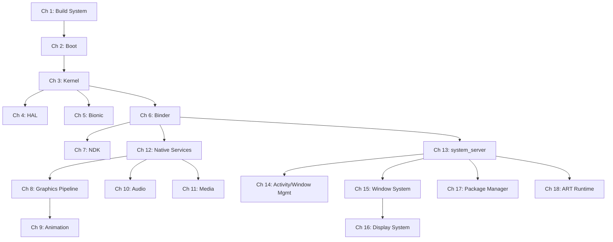
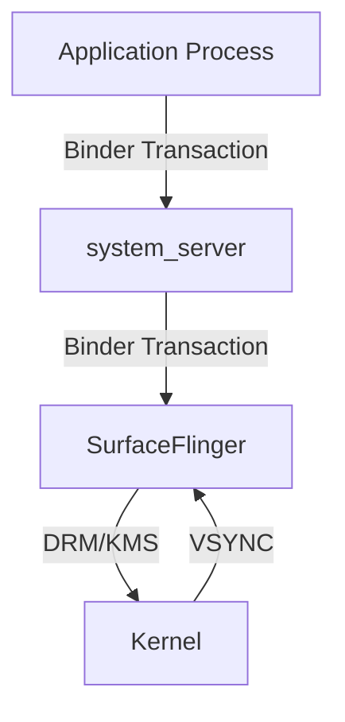
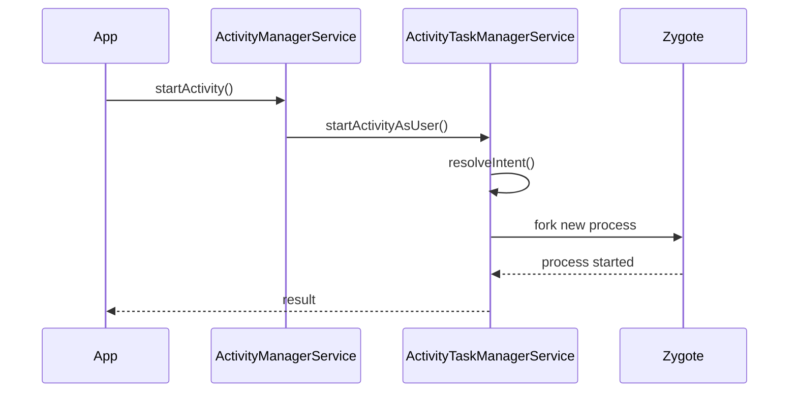
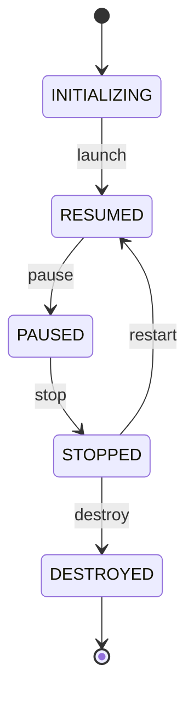

# AOSP Internals

## A Developer's Guide to the Android Open Source Project

---

**First Edition**

---

*A source-code-referenced exploration of the Android Open Source Project,
from kernel boot to application framework.*

---

## Copyright

Copyright 2026. All rights reserved.

Self-published.

No part of this book may be reproduced, stored in a retrieval system, or
transmitted in any form or by any means -- electronic, mechanical, photocopying,
recording, or otherwise -- without the prior written permission of the author,
except for brief quotations embedded in critical reviews and certain other
noncommercial uses permitted by copyright law.

This book is based on analysis of the Android Open Source Project (AOSP) source
code, which is licensed under the Apache License, Version 2.0. All AOSP source
code excerpts and file path references are used for educational and commentary
purposes. The Android robot is reproduced or modified from work created and
shared by Google and used according to terms described in the Creative Commons
3.0 Attribution License.

Android is a trademark of Google LLC. This book is not affiliated with,
endorsed by, or sponsored by Google LLC or the Android Open Source Project.

All source code references in this book correspond to the AOSP main branch
as of early 2026. File paths, line numbers, and code excerpts may differ in
past or future revisions of the source tree. The reader is encouraged to verify
references against their own checked-out source.

**Disclaimer**: The information in this book is provided on an "as is" basis,
without warranty. While every effort has been made to ensure accuracy through
direct source code verification, neither the author nor the publisher shall have
any liability to any person or entity with respect to any loss or damage caused
or alleged to be caused directly or indirectly by the information contained in
this book.

**Source tree baseline**: `aosp/main` branch, synced February 2026.

**Build identifiers referenced**: AOSP builds targeting `aosp_cf_x86_64_phone`,
`aosp_cf_arm64_phone`, and `aosp_riscv64` lunch targets.

---

## Preface

### The Problem This Book Solves

Android powers over three billion active devices worldwide. Its source code --
the Android Open Source Project -- is one of the largest and most consequential
open-source codebases ever assembled, spanning millions of lines across
hundreds of Git repositories. It touches every layer of a modern computing
stack: a Linux kernel fork, a custom C library, a just-in-time compiling
virtual machine, a hardware abstraction layer, an inter-process communication
framework, graphics and media pipelines, a window management system, and a
full application framework.

And yet, there is no comprehensive, source-code-referenced guide to how it
all works.

The official Android documentation is excellent for application developers. It
tells you how to use the APIs. But if you need to understand *how those APIs
are implemented* -- how a `startActivity()` call traverses from Java through
Binder into `system_server` and back, how a frame makes its way from a Canvas
draw call through the render pipeline to SurfaceFlinger and onto a display, how
the boot sequence hands off from the kernel to init to Zygote to
`SystemServer` -- you are largely on your own. You must read the code.

Reading the AOSP source is not for the faint of heart. The codebase is
enormous, sprawling across dozens of programming languages and build systems.
Architectural decisions are rarely documented. Subsystems that appear simple
from the API surface reveal staggering complexity underneath. Critical behavior
hides in places you would not think to look. A developer trying to understand
the window management system, for example, must trace code across
`WindowManagerService`, `ActivityTaskManagerService`, `SurfaceFlinger`,
`InputDispatcher`, the `View` hierarchy, and the Linux kernel's DRM subsystem
-- all communicating through Binder, shared memory, and synchronization fences.

This book exists to be the guide I wished I had.

### What Makes This Book Different

Three principles distinguish this work from other Android references:

**Every claim references actual source code.** This is not a book of
hand-waving architectural diagrams. When I say that `Zygote` forks a new
process in response to an application launch request, I cite the exact file
and function where that fork happens. When I describe how `SurfaceFlinger`
composits layers, I point to the specific composition strategy implementations.
File paths are absolute, referencing a standard AOSP checkout. Line numbers
are included where precision matters.

**It covers the full stack.** Most Android resources focus on either the
application framework (for app developers) or the kernel and HAL (for
platform developers). This book spans the complete vertical: from how the
kernel boots and mounts filesystems, through how Bionic implements POSIX
syscall wrappers, through how Binder serializes transactions, through how
the Activity Manager schedules application lifecycles, through how the
graphics pipeline renders and composits frames. Understanding the full stack
is essential for anyone doing serious platform work, because every layer
depends on the ones below it.

**It is structured for working engineers.** Each chapter is designed to be
useful both as a learning resource and as a reference. Chapters open with
an architectural overview, proceed through detailed source-level analysis,
and close with hands-on exercises using real AOSP tools. Cross-references
connect related concepts across chapters. Mermaid diagrams provide visual
maps of complex subsystems.

### Who This Book Is For

This book is written for software engineers who need to understand Android
at the platform level:

- **Platform engineers** working on Android system services, the framework,
  or hardware enablement. This book provides the architectural context that
  makes code review and debugging faster.

- **ROM developers** building custom Android distributions. The chapters on
  build systems, boot sequences, and system configuration provide the
  foundation for effective customization.

- **System-on-chip (SoC) engineers** porting Android to new hardware. The
  chapters on kernel integration, HAL architecture, and hardware abstraction
  explain the interfaces your code must implement.

- **Security researchers** analyzing the Android platform. The chapters on
  the security model, TEE integration, virtualization, and the permission
  framework map the attack surface with source-level precision.

- **Application developers** who want to understand what happens beneath the
  APIs they call. When your app hits a performance cliff or a mysterious
  framework behavior, understanding the platform internals is often the
  fastest path to a solution.

- **Students and researchers** studying operating systems, mobile computing,
  or large-scale software engineering. AOSP is a uniquely rich case study
  in all of these areas.

You should be comfortable reading Java, Kotlin, C, and C++ code. Familiarity
with Linux fundamentals (processes, file descriptors, system calls, shared
memory) is assumed. Prior experience with Android application development is
helpful but not strictly required.

### A Note on Scope

Android is vast. Even at over thirty-five chapters, this book cannot cover
every subsystem exhaustively. I have focused on the areas that matter most
to platform-level work, and within each area, I have prioritized the
architectural patterns and critical code paths over encyclopedic API
coverage. Where a subsystem is too large to cover completely -- the window
management system's one hundred sections being a notable example -- I have
focused on the foundational mechanisms and the most important code paths,
providing enough context for the reader to explore further independently.

The AOSP source changes constantly. I have worked from the `main` branch
as of early 2026, and I have noted version-specific behaviors where they
matter. The architectural patterns described in this book, however, tend to
be far more stable than individual implementation details. A reader working
with a slightly different version of the source should find the conceptual
framework fully applicable, even where specific line numbers have shifted.

### Acknowledgments

This book would not exist without the extraordinary work of the thousands of
engineers who have contributed to the Android Open Source Project. The
codebase they have built is a remarkable achievement, and the decision to
make it open source has enabled an entire ecosystem of learning, innovation,
and customization.

Thanks are also due to the Android community -- the ROM developers, the
XDA contributors, the Stack Overflow answerers, the bloggers who have
pieced together fragments of platform knowledge over the years. This book
stands on the foundation they built.

---

## About This Book

### Structure

This book is organized into thirty-five chapters spanning the complete AOSP
stack, from the build system to specialized device form factors. The chapters
are grouped into thematic parts, though each chapter is designed to be
readable on its own.

**Part I: Foundations**

| Chapter | Title | Focus |
|---------|-------|-------|
| 1 | Build System | Soong, Blueprint, Kati, Ninja, Make -- how AOSP transforms source into images |
| 2 | Boot | From power-on through bootloader, kernel, init, Zygote, to SystemServer |
| 3 | Kernel | Android's Linux kernel fork: binder driver, ashmem, ION/DMA-BUF, GKI |
| 4 | HAL | Hardware Abstraction Layer: HIDL, AIDL HALs, passthrough vs. binderized |
| 5 | Bionic | Android's C library: syscall wrappers, dynamic linker, malloc, pthreads |
| 6 | Binder | IPC framework: driver, libbinder, AIDL code generation, transactions |

**Part II: Native Layer**

| Chapter | Title | Focus |
|---------|-------|-------|
| 7 | NDK | Native Development Kit: stable APIs, the CDD contract, JNI bridge |
| 8 | Graphics and Render Pipeline | From Canvas/RenderNode through HWUI to GPU |
| 9 | Animation | Property animation, RenderThread animation, transition framework |
| 10 | Audio | AudioFlinger, AudioPolicyService, AAudio, effects pipeline |
| 11 | Media | MediaCodec, MediaExtractor, codec2, DRM framework |
| 12 | Native Services | SurfaceFlinger, InputDispatcher, SensorService, and beyond |

**Part III: System Services**

| Chapter | Title | Focus |
|---------|-------|-------|
| 13 | system_server | Process architecture, service lifecycle, Watchdog, SystemServiceManager |
| 14 | Activity and Window Management | AMS, ATMS, task management, lifecycle state machines |
| 15 | Window System | WindowManagerService: 100 sections covering layout, focus, transitions, input |
| 16 | Display System | DisplayManagerService, logical displays, refresh rate management |
| 17 | Package Manager | APK parsing, installation flows, permissions, split APKs, package verification |
| 18 | ART Runtime | Dex compilation, JIT, AOT, garbage collection, class loading, profiling |

**Part IV: Specialized Subsystems**

| Chapter | Title | Focus |
|---------|-------|-------|
| 19 | Native Bridge and Berberis | NativeBridge interface, instruction translation, guest ABI, trampolines |
| 20 | CompanionDevice and VirtualDevice | VDM architecture, virtual displays, virtual input, CDM policies |
| 21 | SystemUI | Status bar, notification shade, quick settings, keyguard, plugin system |
| 22 | Launcher3 | Home screen architecture, workspace, all-apps, drag-and-drop, widgets |
| 23 | Widgets, RemoteViews, and RemoteCompose | Cross-process UI: RemoteViews, AppWidgetService, RemoteCompose renderer |
| 24 | AI, AppFunctions, and ComputerControl | On-device AI integration, AppFunctions framework, accessibility automation |
| 25 | Settings | Settings app architecture, preference framework, search indexing |

**Part V: Infrastructure**

| Chapter | Title | Focus |
|---------|-------|-------|
| 26 | Emulator | Cuttlefish, Goldfish, QEMU integration, virtio devices, snapshots |
| 27 | Architecture Support | ARM64, x86_64, RISC-V: build targets, kernel configs, ABI specifics |
| 28 | Security and TEE | SELinux policies, Keymaster/Keymint, Gatekeeper, verified boot, TEE |
| 29 | Virtualization | pKVM, crosvm, protected VMs, Microdroid, virtualization HAL |
| 30 | Testing | CTS, VTS, Ravenwood, Atest, TradeFed, host-side vs. device-side |
| 31 | Mainline Modules | APEX packaging, module boundaries, train updates, module policy |

**Part VI: Device Types and Practice**

| Chapter | Title | Focus |
|---------|-------|-------|
| 32 | Automotive | Car service, vehicle HAL, cluster, EVS, multi-display, driver distraction |
| 33 | TV and Wear | Leanback, TIF, Wear Ongoing Activities, watch face framework |
| 34 | Custom ROM Guide | Practical guide: forking, device trees, vendor blobs, OTA, signing |

**Appendices**

| Appendix | Title | Focus |
|----------|-------|-------|
| A | Setting Up an AOSP Development Environment | Repo, sync, lunch, build, flash |
| B | Navigating the Source Tree | Repository map, key directories, search strategies |
| C | Debugging Tools Reference | gdb, lldb, systrace, perfetto, logcat, bugreport |
| D | AIDL and HIDL Quick Reference | Interface definition syntax, code generation, versioning |
| E | Glossary | Key terms and acronyms used throughout the book |

### Chapter Anatomy

Every chapter in this book follows a consistent structure:

1. **Overview**: A concise summary of the subsystem's purpose, its place in
   the Android architecture, and the key source directories involved.

2. **Architecture**: A Mermaid diagram showing the major components and their
   relationships, followed by a narrative description of the design.

3. **Source Analysis**: The core of each chapter. Detailed walk-throughs of
   critical code paths, with file paths and line references. This section
   answers the question: "How does this actually work in the code?"

4. **Key Data Structures and Interfaces**: The central types, classes,
   interfaces, and protocols that define the subsystem's contracts.

5. **Runtime Behavior**: How the subsystem behaves during normal operation,
   startup, error conditions, and edge cases. Sequence diagrams illustrate
   important flows.

6. **Configuration and Tuning**: System properties, build flags, and
   configuration files that control behavior.

7. **Cross-References**: Links to related chapters using `§N.M` notation.

8. **Try It**: Hands-on exercises that the reader can perform on a running
   AOSP build or within the source tree.

9. **Summary**: Key takeaways in bullet-point form.

---

## How to Read This Book

### Bottom-Up Architecture

This book is organized bottom-up: lower layers of the Android stack appear
in earlier chapters. This reflects a deliberate pedagogical choice. To
understand how `startActivity()` works, you need to understand Binder. To
understand Binder, you need to understand the kernel driver and shared memory.
To understand the kernel driver, you need to understand how Android's Linux
fork differs from upstream.

The dependency chain looks like this:



That said, **each chapter is designed to be self-contained**. If you already
understand Binder and need to learn about the window system, you can go
directly to Chapter 15. Cross-references (using `§N.M` notation) point you
to prerequisite material when it is needed.

### Suggested Reading Paths

Different readers will benefit from different paths through the material:

**For the platform engineer new to AOSP:**
Start with Chapters 1-6 in order. These build the foundational understanding
of how Android is built, booted, and structured. Then proceed to Chapter 13
(system_server) and Chapter 14 (Activity/Window Management) for the framework
layer. From there, follow your interests.

**For the graphics/display specialist:**
Read Chapter 6 (Binder) for IPC context, then Chapters 8 (Graphics Pipeline),
9 (Animation), 12 (Native Services, focusing on SurfaceFlinger), 15 (Window
System), and 16 (Display System).

**For the security researcher:**
Read Chapter 3 (Kernel) for the kernel attack surface, Chapter 5 (Bionic) for
the libc implementation, Chapter 6 (Binder) for the IPC attack surface,
Chapter 28 (Security/TEE) for the security model, and Chapter 29
(Virtualization) for the isolation architecture.

**For the ROM developer:**
Start with Chapter 1 (Build System), Chapter 2 (Boot), and Chapter 4 (HAL),
then skip to Chapter 34 (Custom ROM Guide) for the practical walk-through.
Return to earlier chapters as needed for deeper understanding.

**For the curious application developer:**
Read Chapter 6 (Binder) to understand what happens when you make a system
call, Chapter 14 (Activity/Window Management) to understand lifecycle
management, Chapter 8 (Graphics Pipeline) to understand rendering performance,
and Chapter 18 (ART Runtime) to understand how your code executes.

### Working with the Source Tree

This book assumes you have an AOSP source tree checked out and built. All
file paths in the book are given relative to the root of the AOSP source tree.

For example, when the book references:

```
frameworks/base/services/core/java/com/android/server/wm/WindowManagerService.java
```

This refers to that file under whichever directory you ran `repo init` and
`repo sync` in (often called `<AOSP_ROOT>`).

To get the most out of this book, you should have the source tree available
for browsing. Many sections will make more sense if you can read the
surrounding code, not just the excerpts shown in the book. Appendix A
provides instructions for setting up an AOSP development environment, and
Appendix B offers strategies for navigating the source tree efficiently.

### Cross-References

Chapters and sections are numbered hierarchically. When you see a reference
like `§6.3`, it means Chapter 6, Section 3. References like `§15.42` point
to Chapter 15, Section 42. These cross-references are used extensively to
connect related concepts across the book without duplicating material.

When a concept is first introduced, it is explained in full. Subsequent
references to the same concept use cross-reference notation to point back
to the original explanation.

### "Try It" Exercises

Most chapters end with a "Try It" section containing hands-on exercises. These
are designed to reinforce the material through direct interaction with the
source code and running system. They fall into several categories:

- **Source exploration**: Using `grep`, `cs` (codesearch), or an IDE to find
  specific patterns in the codebase.
- **Build exercises**: Modifying build files, adding log statements, and
  rebuilding specific components.
- **Runtime observation**: Using `adb shell`, `dumpsys`, `logcat`, and
  tracing tools to observe system behavior on a running device or emulator.
- **Debugging exercises**: Attaching debuggers, setting breakpoints, and
  stepping through critical code paths.
- **Modification challenges**: Making specific changes to AOSP subsystems
  and observing the results.

The exercises assume access to either a physical device running an AOSP build
or a Cuttlefish virtual device. Cuttlefish is recommended for most exercises,
as it provides full AOSP functionality without requiring physical hardware.
See Appendix A for setup instructions.

---

## Conventions Used in This Book

### Code and File Paths

**Inline code** is used for class names (`WindowManagerService`), method names
(`startActivity()`), variable names (`mGlobalLock`), file names
(`AndroidManifest.xml`), shell commands (`adb shell dumpsys window`), and
system properties (`ro.build.type`).

**Code blocks** are used for source code excerpts, shell sessions, and
configuration files. Every code block extracted from AOSP includes a header
comment indicating the source file:

```java
// frameworks/base/services/core/java/com/android/server/wm/ActivityTaskManagerService.java

@Override
public final int startActivity(IApplicationThread caller, String callingPackage,
        String callingFeatureId, Intent intent, String resolvedType,
        IBinder resultTo, String resultWho, int requestCode,
        int startFlags, ProfilerInfo profilerInfo, Bundle bOptions) {
    return startActivityAsUser(caller, callingPackage, callingFeatureId,
            intent, resolvedType, resultTo, resultWho, requestCode,
            startFlags, profilerInfo, bOptions,
            UserHandle.getCallingUserId());
}
```

When a code excerpt has been simplified for clarity -- for example, by
removing error checking or logging statements -- the header includes the
notation `(simplified)`:

```java
// frameworks/base/core/java/android/app/ActivityThread.java (simplified)

private void handleBindApplication(AppBindData data) {
    Application app = data.info.makeApplicationInner(data.restrictedBackupMode, null);
    mInitialApplication = app;
    app.onCreate();
}
```

**File paths** always use the full path relative to the source tree root.
They are formatted as inline code when referenced in running text:

> The window layout logic is implemented in
> `frameworks/base/services/core/java/com/android/server/wm/DisplayPolicy.java`.

When a specific line number is relevant, it is appended after a colon:

> See `frameworks/base/services/core/java/com/android/server/wm/WindowState.java:1247`
> for the frame computation logic.

Line numbers correspond to the source tree baseline stated in the copyright
section. They are included only when the specific line is important for
understanding; most references omit line numbers because they shift with
every commit.

### Diagrams

This book uses Mermaid diagrams extensively to visualize architecture,
data flow, and runtime behavior. Three diagram types are used:

**Block diagrams** (`graph TD` or `graph LR`) for architectural overviews
showing component relationships:



**Sequence diagrams** (`sequenceDiagram`) for runtime interactions showing
the order of operations across components:



**State diagrams** (`stateDiagram-v2`) for lifecycle and state machine
descriptions:



Diagrams are meant to provide a visual overview. They are always accompanied
by narrative text that explains the details. You do not need a Mermaid
renderer to understand the book, but the diagrams are more useful if you
can render them -- most modern Markdown viewers and documentation tools
support Mermaid natively.

### Cross-Reference Notation

Cross-references use the `§` symbol followed by chapter and section numbers:

| Notation | Meaning |
|----------|---------|
| `§6` | Chapter 6 (Binder) |
| `§6.3` | Chapter 6, Section 3 |
| `§15.42` | Chapter 15, Section 42 |
| `§A` | Appendix A |

Cross-references appear in parentheses when used as supplementary pointers:

> The transaction is serialized into a `Parcel` (§6.3) and dispatched
> through the kernel driver (§6.5).

Or as direct references when the cross-referenced material is essential:

> Before proceeding, ensure you understand the Binder transaction model
> described in §6.3.

### Terminology

Certain terms are used with specific meanings throughout this book:

| Term | Meaning |
|------|---------|
| **AOSP** | Android Open Source Project -- the open-source codebase |
| **Framework** | The Java/Kotlin layer in `frameworks/base/` |
| **System services** | Java services running in the `system_server` process |
| **Native services** | C++ services running in their own processes (e.g., SurfaceFlinger) |
| **HAL** | Hardware Abstraction Layer -- the interface between framework and hardware |
| **Binder** | Android's IPC mechanism, including driver, userspace library, and AIDL tooling |
| **ART** | Android Runtime -- the virtual machine that executes application code |
| **AIDL** | Android Interface Definition Language -- used for Binder interface definitions |
| **HIDL** | HAL Interface Definition Language -- legacy HAL interface definitions |
| **SoC** | System on Chip -- the processor and integrated components |
| **CDD** | Compatibility Definition Document -- requirements for Android compatibility |
| **CTS** | Compatibility Test Suite -- tests verifying CDD compliance |
| **VTS** | Vendor Test Suite -- tests verifying HAL compliance |
| **GKI** | Generic Kernel Image -- Google's effort to unify Android kernels |
| **Mainline** | Project Mainline -- updatable system components via APEX/APK modules |
| **pKVM** | Protected Kernel-based Virtual Machine -- Android's hypervisor |
| **TEE** | Trusted Execution Environment -- isolated secure processing |
| **DRM/KMS** | Direct Rendering Manager / Kernel Mode Setting -- Linux display subsystem |

### Abbreviations in Code Discussion

When discussing code, the following abbreviations are used for frequently
referenced components:

| Abbreviation | Full Name |
|--------------|-----------|
| **AMS** | `ActivityManagerService` |
| **ATMS** | `ActivityTaskManagerService` |
| **WMS** | `WindowManagerService` |
| **PMS** | `PackageManagerService` |
| **SF** | `SurfaceFlinger` |
| **HWUI** | Hardware UI rendering library |
| **BQ** | `BufferQueue` |
| **DMS** | `DisplayManagerService` |
| **IMS** | `InputManagerService` |
| **NBS** | `NativeBridgeService` |

### Admonitions

Throughout the text, certain passages are highlighted for special attention:

> **Note**: Supplementary information that adds context or clarifies a
> subtle point. Not essential for understanding the main text, but useful
> for deeper comprehension.

> **Important**: Information that is critical for correct understanding.
> Misunderstanding this point may lead to confusion in later sections.

> **Warning**: Pitfalls, common mistakes, or behaviors that are
> counterintuitive. Pay special attention to these.

> **Historical Note**: Context about why something is designed the way it is,
> often involving legacy decisions or backward-compatibility constraints.
> Understanding history helps explain designs that might otherwise seem
> arbitrary.

> **Performance**: Information relevant to system performance, including
> critical paths, latency-sensitive code, and optimization strategies.

### Shell Sessions

Shell commands are shown with a `$` prompt for user commands and `#` for
root commands. Output is shown without a prompt:

```bash
$ adb shell dumpsys window displays
Display: mDisplayId=0
  init=1080x2400 base=1080x2400 cur=1080x2400 app=1080x2244 rng=1080x1017-2400x2337
```

Multi-line commands use backslash continuation:

```bash
$ source build/envsetup.sh && \
    lunch aosp_cf_x86_64_phone-trunk_staging-userdebug && \
    m -j$(nproc)
```

### Build and Runtime Targets

Unless otherwise noted, build examples target the Cuttlefish x86_64
virtual device:

```bash
$ lunch aosp_cf_x86_64_phone-trunk_staging-userdebug
```

When architecture-specific behavior is discussed (particularly in Chapters
19, 27, and 29), the relevant target is stated explicitly. The three primary
architecture targets referenced are:

- `aosp_cf_x86_64_phone-trunk_staging-userdebug` -- x86_64, primary development target
- `aosp_cf_arm64_phone-trunk_staging-userdebug` -- ARM64, primary production architecture
- `aosp_riscv64-trunk_staging-userdebug` -- RISC-V 64-bit, emerging architecture

### Source Navigation Tips

The AOSP source tree is enormous, but a few strategies make navigation
manageable:

**Know the major directories.** The most important top-level directories are:

| Directory | Contents |
|-----------|----------|
| `frameworks/base/` | Core framework: services, core libraries, UI toolkit |
| `frameworks/native/` | Native framework: Binder, SurfaceFlinger, sensor service |
| `frameworks/libs/` | Framework libraries: binary translation, native bridge support |
| `system/core/` | Core system: init, adb, logd, libcutils |
| `art/` | Android Runtime: compiler, garbage collector, interpreter |
| `bionic/` | C library, dynamic linker, math library |
| `packages/` | System applications: Settings, SystemUI, Launcher3 |
| `hardware/interfaces/` | AIDL/HIDL HAL interface definitions |
| `build/` | Build system: Soong, Make, Kati integration |
| `kernel/` | Kernel sources and prebuilts |
| `external/` | Third-party libraries and tools |

**Use Android Code Search.** The online tool at `cs.android.com` provides
full-text search, cross-references, and call hierarchy analysis across the
AOSP source. It is often faster than local `grep` for initial exploration.

**Follow the Binder interfaces.** When tracing a feature across process
boundaries, find the AIDL interface definition first. It shows you the exact
contract between client and server, making it straightforward to find both
sides of the implementation.

**Read the service registration.** Most system services register themselves
in `SystemServer.java`. The registration order reveals dependencies and
can help you find services you did not know existed.

---

## A Note Before We Begin

The Android Open Source Project is a living codebase. By the time you read
this sentence, the source has changed. Methods have been refactored. Classes
have moved. New subsystems have been added and old ones deprecated.

This is the nature of the endeavor. A book about a living codebase is, in
some sense, a snapshot -- a detailed photograph of a moving target. But the
value of this book is not in the specific line numbers or the exact method
signatures. It is in the *architectural understanding*: the patterns, the
design decisions, the structural relationships that remain stable even as
the implementation details evolve.

Learn the architecture, and you will be able to navigate any version of the
source. Understand why the system is designed the way it is, and you will be
able to predict where to look even in code you have never seen before.

Let us begin.

---

*Proceed to Chapter 1: Build System -->*
