# 第 1 章：引言

> *“Android 是一个开放平台。任何人都可以使用它。这正是它的魅力所在。”*
> -- Android 联合创始人 Andy Rubin

---

## 1.1 为什么要写这本书

Android Open Source Project 是人类历史上规模最大、复杂度最高、影响力最深的开源项目之一。它驱动着三十多亿台活跃设备，覆盖手机、平板、电视、汽车、可穿戴设备和嵌入式系统。它的代码库横跨数千个 Git 仓库，包含数亿行代码。它的架构将用 C 编写的 Linux 内核，与 Java/Kotlin 应用框架连接在一起，中间由原生 C++ 服务、自定义 IPC 机制 Binder，以及专门打造的运行时 ART 串联。

然而，尽管它无处不在，AOSP 依然缺乏系统性的理解基础，哪怕是在经验丰富的 Android 应用开发者群体中也是如此。典型 Android 开发者接触 AOSP 的窗口十分狭窄：他们通过 developer.android.com 上文档化的 SDK API 使用它。而这些 API 之下的内容，例如系统服务、原生守护进程、硬件抽象层、内核驱动，以及把所有部分缝合起来的构建系统，依然是一个鲜少有人探索、也更少有人能够自信导航的世界。

本书正是为改变这一点而存在。

无论你是 OEM 的系统工程师、正在集成新 SoC 的芯片厂商工程师、构建自定义发行版的 ROM 开发者、分析平台的安全研究员，还是仅仅想弄清楚调用 `startActivity()` 时究竟发生了什么的应用开发者，本书都会为你提供阅读、理解、修改、构建和调试 AOSP 所需的知识。

第一章负责搭建全书的舞台。我们会精确定义 AOSP 究竟是什么，以及它不是什么；会从内核到应用梳理整个平台架构；会逐目录走读源码树；会说明哪些部分由谁维护；会回顾平台的版本历史；还会给出本书后续章节的路线图。

---

## 1.2 AOSP 与 Android 究竟有什么区别

“AOSP”和“Android”这两个词常被混用，但它们指向的是不同事物。理解这一差异，是在源码层面使用 Android 平台的基础。

### 1.2.1 AOSP：开源基础层

AOSP，也就是 **Android Open Source Project**，是 Google 以 Apache 2.0 许可发布的、完整且可构建的开源操作系统（其中部分组件采用 GPL、LGPL 和 BSD 许可）。它包括：

- **Linux 内核**（包含 Android 特有补丁）
- **C 库**（Bionic，即 Android 的定制 libc）
- **原生运行时**与原生服务（SurfaceFlinger、AudioFlinger、InputFlinger 等数十项服务）
- **Android Runtime**（ART），用于执行应用字节码
- **Java/Kotlin 框架**（应用开发者使用的 `android.*` API）
- **构建系统**（Soong/Blueprint 及对旧版 Make 的支持）
- **系统应用**（Settings、Launcher3、SystemUI、Contacts、Dialer、Camera、Calendar 等）
- **兼容性测试套件**（CTS），用于定义什么才算“兼容 Android”
- **带有参考实现的硬件抽象层**（HAL）
- **开发工具**（adb、fastboot、模拟器配置等）

你可以下载 AOSP、构建它，并刷写到受支持硬件上（主要是 Google 参考设备和 Android Emulator），全过程除了访问源码仓库之外，并不需要 Google 的额外参与。最终产物是一个功能完整的操作系统，但它并不是消费者日常认知中的那个“Android”。

### 1.2.2 Google Mobile Services：专有层

大多数消费级设备上出厂的 Android，都包含一层来自 Google 的重要专有组件，称为 **Google Mobile Services（GMS）**。这一层包括：

| 组件 | 说明 |
|---|---|
| **Google Play Store** | 主要应用分发市场 |
| **Google Play Services** | 提供定位、认证、推送通知（FCM）、SafetyNet/Play Integrity 以及大量其他 API 的后台服务 |
| **Google Search / Assistant** | 语音助手与搜索集成 |
| **Chrome** | 默认浏览器（替代 AOSP Browser2） |
| **Gmail** | 邮件客户端（替代 AOSP Email） |
| **Google Maps** | 地图与导航 |
| **YouTube** | 视频流媒体 |
| **Google Photos** | 照片管理（替代 AOSP Gallery） |
| **Google Play Protect** | 安全扫描 |
| **Google Dialer / Contacts** | AOSP 应用的增强版本 |
| **SetupWizard** | 首次开机引导体验 |

GMS 并不是开源软件。OEM 通过名为 **Mobile Application Distribution Agreement（MADA）** 的法律协议获得其授权。该协议在历史上要求 OEM 预装一组最小 Google 应用集合，并将它们放置在特定位置，例如主屏上的 Google Search。**Android Compatibility Definition Document（CDD）** 和 **CTS** 定义技术要求；MADA 定义商业要求。

这一差异会带来非常实际的后果：

1. **单独的 AOSP 是“去 Google 化”的。** 如果你从源码构建 AOSP 而不添加 GMS，你将得到一个可用系统，但其中没有 Google 账号集成、没有 Play Store、没有基于 FCM 的推送通知，也没有依赖 Google 的 API。Play Store 中很多应用无法正常工作，因为它们依赖 Google Play Services。

2. **自定义 ROM 正是在这个缝隙中运作。** LineageOS、GrapheneOS、CalyxOS 和 /e/OS 这类项目都基于 AOSP 构建，要么完全排除 GMS，要么将其作为可选项引入（例如 Open GApps、MindTheGapps），要么用开源替代方案（如 microG）替换其功能。

3. **华为 / 荣耀是规模化“AOSP 无 GMS”最典型的案例。** 在美国贸易限制阻止 Google 向华为授权 GMS 后，华为推出了运行 AOSP、同时配套自家 Huawei Mobile Services（HMS）和 AppGallery 商店的设备。

### 1.2.3 OEM 层：厂商定制

位于 AOSP 与消费者设备之间的，还有一层 **OEM 定制层**。主流 OEM 都会进行大规模修改：

| OEM | 定制品牌 | 核心修改 |
|---|---|---|
| **Samsung** | One UI | 定制 SystemUI、多窗口增强、DeX 桌面模式、Knox 安全、S Pen 集成、定制相机栈 |
| **Xiaomi** | MIUI / HyperOS | 深度定制 UI、自定义启动器、控制中心、安全应用、双开支持 |
| **OPPO/OnePlus** | ColorOS / OxygenOS | 定制 AOD、shelf、Zen Mode、自定义相册与相机 |
| **Google** | Pixel Experience | Material You 主题、Pixel Launcher、Pixel 独占功能、Tensor 特定优化 |
| **Huawei** | EMUI / HarmonyOS | 几乎全栈自定义，华为逐步以自有体系替代 AOSP |
| **Sony** | 接近原生 | 整体较接近 AOSP，增加相机、音频和显示增强 |
| **Motorola** | My UX | 接近原生，增加手势功能（砍两下开手电、扭两下开相机） |

这些定制会触及栈中的每一层：内核（自定义驱动、调度器调优）、HAL（专有相机、音频、显示实现）、框架（自定义系统服务）、SystemUI（状态栏、快速设置、锁屏）、以及应用（启动器、相册、相机、设置）。

### 1.2.4 完整图景

消费设备上的完整 Android 技术栈，可以理解为三层同心结构：

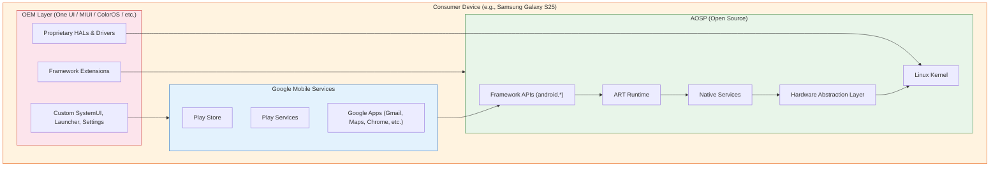

**本书的关键视角：** 我们几乎只聚焦绿色这一层，也就是 AOSP 本身。操作系统真正居住于此。GMS 与 OEM 修改都建立在它之上，而理解 AOSP 是理解这两者的前提。

### 1.2.5 AOSP 许可

AOSP 并不采用单一许可证。不同组件使用不同许可证，这反映了它们的来源：

| 组件 | 许可证 | 原因 |
|---|---|---|
| Linux Kernel | GPLv2 | 继承自上游 Linux |
| Bionic（libc） | BSD | 避免用户空间受到 GPL 传染；允许专有应用存在 |
| Framework（Java） | Apache 2.0 | 宽松许可；允许 OEM 修改而不强制公开源码 |
| ART | Apache 2.0 | 与 framework 相同 |
| Toolchain（LLVM/Clang） | Apache 2.0 with LLVM exception | 上游 LLVM 许可 |
| 外部库 | 各不相同 | 每个库保留原始许可证（MIT、BSD、LGPL 等） |
| CTS | Apache 2.0 | 允许 OEM 无许可证顾虑地运行测试 |
| SELinux 策略 | Public Domain | 源自上游 SELinux |

为 Bionic 选择 BSD 许可而不是 glibc 的 LGPL，是一个奠基性决策。它让专有应用和专有 HAL 实现能够在法律上安全地链接 Android 的 C 库，而不会触发 copyleft 义务。这也是移动生态能够在保留专有驱动和应用的前提下采纳 Android 的原因之一。

---

## 1.3 AOSP 的分层蛋糕：系统架构

Android 的架构是一个分层栈。每一层向上一层提供服务，同时向下一层消费服务。理解这个技术栈，也就是理解各层分别位于何处、彼此通过什么机制通信，是开展 AOSP 工作最重要的概念基础。

### 1.3.1 完整架构

```mermaid
graph TB
    subgraph Applications["Layer 7: Applications"]
        SystemApps["System Apps<br/>(SystemUI, Launcher3, Settings,<br/>Contacts, Dialer, Camera2)"]
        UserApps["User Apps<br/>(Third-party APKs)"]
    end

    subgraph FrameworkAPI["Layer 6: Framework APIs"]
        AndroidAPI["android.* packages<br/>(app, content, view, widget,<br/>media, location, telephony,<br/>net, os, graphics, ...)"]
    end

    subgraph FrameworkServices["Layer 5: Framework Services (system_server)"]
        AMS["ActivityManager<br/>Service"]
        WMS["WindowManager<br/>Service"]
        PMS["PackageManager<br/>Service"]
        PKMS["PowerManager<br/>Service"]
        IMS_FW["InputMethod<br/>ManagerService"]
        NMS["Notification<br/>ManagerService"]
        CMS["ConnectivityService"]
        TMS["TelephonyService"]
        Others["60+ more<br/>services"]
    end

    subgraph ART_Layer["Layer 4: Android Runtime"]
        ART["ART<br/>(AOT + JIT + Interpreter)"]
        CoreLibs["Core Libraries<br/>(libcore: java.*, javax.*,<br/>org.apache.*, android.icu.*)"]
        Zygote["Zygote Process<br/>(App process factory)"]
    end

    subgraph NativeLayer["Layer 3: Native Services & Libraries"]
        SF["SurfaceFlinger"]
        AF["AudioFlinger"]
        IF["InputFlinger"]
        MC["MediaCodec /<br/>MediaPlayerService"]
        CamSvc["CameraService"]
        SenSvc["SensorService"]
        NativeBinder["libbinder /<br/>libbinder_ndk"]
        Bionic_Lib["Bionic<br/>(libc, libm, libdl)"]
    end

    subgraph HAL_Layer["Layer 2: Hardware Abstraction Layer"]
        HIDL_HALs["HIDL HALs<br/>(Legacy: camera, audio,<br/>sensors, graphics)"]
        AIDL_HALs["AIDL HALs<br/>(Modern: power, vibrator,<br/>health, light)"]
        HWBinder["hwbinder /<br/>vndbinder"]
    end

    subgraph Kernel_Layer["Layer 1: Linux Kernel"]
        Drivers["Device Drivers<br/>(GPU, Camera, Touch,<br/>Modem, Sensors)"]
        Binder_Driver["Binder Driver<br/>(/dev/binder,<br/>/dev/hwbinder,<br/>/dev/vndbinder)"]
        Subsystems["Kernel Subsystems<br/>(Memory, Scheduler, Filesystems,<br/>Networking, Power)"]
        AndroidKernel["Android-specific<br/>(Binder, ashmem/memfd,<br/>ION/DMA-BUF, fuse)"]
    end

    Applications --> FrameworkAPI
    FrameworkAPI --> FrameworkServices
    FrameworkServices --> ART_Layer
    FrameworkServices --> NativeLayer
    ART_Layer --> NativeLayer
    NativeLayer --> HAL_Layer
    HAL_Layer --> Kernel_Layer

    style Applications fill:#fff9c4,stroke:#f9a825
    style FrameworkAPI fill:#e8f5e9,stroke:#2e7d32
    style FrameworkServices fill:#c8e6c9,stroke:#2e7d32
    style ART_Layer fill:#e3f2fd,stroke:#1565c0
    style NativeLayer fill:#e1f5fe,stroke:#0277bd
    style HAL_Layer fill:#f3e5f5,stroke:#7b1fa2
    style Kernel_Layer fill:#fce4ec,stroke:#c62828
```

下面我们自底向上，详细审视每一层。

### 1.3.2 第 1 层：Linux 内核

Android 运行在 Linux 内核之上。到 Android 15 为止，内核基于 **Linux 6.x Long-Term Support（LTS）** 分支，并叠加通过 **Android Common Kernel（ACK）** 和 **Generic Kernel Image（GKI）** 计划维护的 Android 特定补丁。

#### Android 特定内核能力

Android 内核并不是原味 Linux。它包含多个 Android 特有子系统与驱动：

| 特性 | 作用 | 源码位置 |
|---|---|---|
| **Binder** | Android 的核心 IPC 机制。它是一个内核驱动，为进程间提供基于事务的通信。共有三个设备节点：`/dev/binder`（framework）、`/dev/hwbinder`（HAL）、`/dev/vndbinder`（vendor）。 | 内核中的 `drivers/android/binder.c` |
| **Ashmem / memfd** | 匿名共享内存。最初使用 `ashmem`，现在逐步迁移到标准 Linux `memfd_create`。用于在进程间共享大块数据，例如 GraphicBuffer。 | `drivers/staging/android/`（旧实现） |
| **ION / DMA-BUF Heaps** | 用于硬件缓冲区（GPU、相机、显示）的内存分配器。ION 是 Android 特有实现；DMA-BUF heaps 是更易于上游接纳的替代方案。 | `drivers/dma-buf/` |
| **Low Memory Killer** | 在内存压力下杀死后台进程。最初是 Android 特有的 `lowmemorykiller`，现在主要使用用户空间 `lmkd` 配合内核的 PSI（Pressure Stall Information）。 | 用户空间：`system/memory/lmkd/` |
| **fuse（用于存储）** | FUSE 文件系统为 scoped storage 提供支撑层，是应用文件访问中的性能关键路径。 | 标准内核 fuse |
| **dm-verity** | Verified boot 机制，用于确保系统分区未被篡改。 | `drivers/md/dm-verity*` |
| **SELinux** | 强制访问控制。Android 使用严格的 SELinux 策略约束每个进程。 | 策略：`system/sepolicy/` |

#### Generic Kernel Image（GKI）

从 Android 12 开始，Google 引入 **GKI** 架构来解决内核碎片化问题。其核心思路如下：

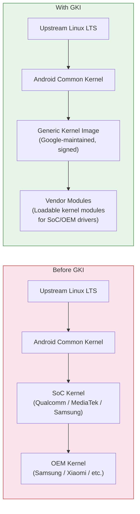

在 GKI 之前，每台设备都拥有独特内核：上游 Linux LTS 先由 Google 分叉为 ACK，再由 SoC 厂商再次分叉，例如 Qualcomm 的 `msm-kernel`，随后又被 OEM 再分叉一次。这导致了严重碎片化，设备通常搭载远落后于上游的内核版本，安全补丁往往需要数月才能传播。

GKI 提供了由 Google 构建的一份通用内核二进制，它可在同一 Android 版本和同一内核版本的所有设备之间共享。厂商特定功能则通过 **loadable kernel modules（LKM）** 和 **vendor_dlkm**（vendor dynamically loaded kernel modules）放在独立分区中交付。这样一来，Google 就可以在更大程度上独立于厂商更新内核。

在 AOSP 源码树中，与内核相关的内容位于：

- `kernel/configs/`：GKI 内核配置片段
- `kernel/prebuilts/`：开发用预构建内核镜像
- `kernel/tests/`：内核测试套件

真实内核源码通常通过单独的 kernel manifest 获取，例如 `repo init -u https://android.googlesource.com/kernel/manifest`，因为它体量极大，而且大多数平台开发者并不需要直接修改它。

### 1.3.3 第 2 层：硬件抽象层（HAL）

HAL 是 Android 用户空间与硬件特定驱动之间的接口层。它让 Android 可以在不修改 framework 的前提下运行在多样化硬件上。

#### HAL 架构演化

Android 的 HAL 架构经历了显著演进：

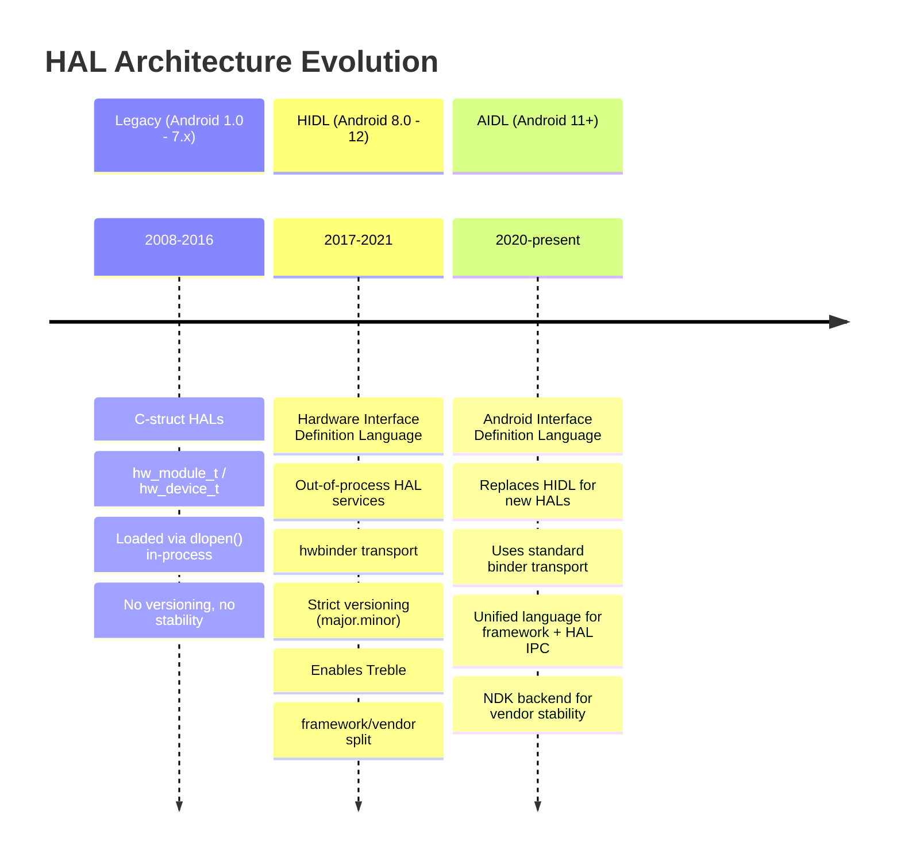

**旧版 HAL**（Treble 之前）是直接加载进调用进程的共享库。例如 camera HAL 就是被 `cameraserver` 通过 `dlopen()` 载入的 `.so` 文件。这种方式可以工作，但 HAL 与 framework 强耦合，更新任一方都往往要求另一方同步更新。

**Project Treble**（Android 8.0）引入了 **HIDL（Hardware Interface Definition Language）**，它将 HAL 移入独立进程，并通过 `hwbinder` 通信。这在 framework 与 vendor 实现之间建立了稳定、可版本化的接口，从而实现：

- **更快的系统升级**：OEM 可以在不修改 vendor HAL 的前提下更新 Android framework
- **Generic System Image（GSI）**：一份 system image 可运行在多台设备上
- **Vendor Test Suite（VTS）**：对 HAL 实现进行自动化测试

**Stable AIDL**（Android 11+）现已成为首选 HAL 接口语言。它使用多年来已经广泛用于应用到框架 IPC 的同一套 AIDL，但依赖稳定的 **NDK backend** 供厂商实现。新的 HAL 必须使用 AIDL 编写；HIDL 已冻结，不再接收新接口。

#### HAL 接口目录

规范的 HAL 接口定义位于 `hardware/interfaces/`：

```
hardware/interfaces/
    audio/              -- Audio HAL (capture, playback, effects)
    automotive/         -- Automotive-specific HALs (vehicle, EVS)
    biometrics/         -- Fingerprint, face authentication
    bluetooth/          -- Bluetooth HAL
    boot/               -- Boot control HAL (A/B updates)
    broadcastradio/     -- FM/AM radio
    camera/             -- Camera HAL (camera2 API backend)
    cas/                -- Conditional Access System (DRM for broadcast)
    confirmationui/     -- Trusted UI confirmation
    contexthub/         -- Context Hub (always-on sensor processor)
    drm/                -- DRM plugin HAL (Widevine, etc.)
    dumpstate/          -- Bug report generation
    fastboot/           -- Fastboot HAL
    gatekeeper/         -- Password/PIN verification
    gnss/               -- GPS/GNSS location
    graphics/           -- Graphics HALs:
        allocator/      --   Gralloc (buffer allocation)
        composer/       --   HWC (hardware composer for display)
        mapper/         --   Buffer mapping
    health/             -- Battery/charging health
    identity/           -- Identity credential
    input/              -- Input classifier
    ir/                 -- Infrared (IR blaster)
    keymaster/          -- Cryptographic key management
    light/              -- LED/backlight control
    media/              -- Media codec (OMX/Codec2)
    memtrack/           -- Memory tracking
    neuralnetworks/     -- NNAPI (ML acceleration)
    nfc/                -- NFC
    power/              -- Power management, power hints
    radio/              -- Telephony radio (RIL replacement)
    secure_element/     -- Secure element access
    sensors/            -- Sensor HAL (accelerometer, gyro, etc.)
    soundtrigger/       -- Hotword detection
    thermal/            -- Thermal management
    tv/                 -- TV input framework
    usb/                -- USB HAL
    vibrator/           -- Haptic feedback
    wifi/               -- Wi-Fi HAL
    ... and more (60+ HAL interfaces total)
```

每个 HAL 接口目录都包含定义接口的 `.aidl` 或 `.hal` 文件，以及默认实现和 VTS（Vendor Test Suite）测试。

#### Treble 边界：VNDK 与 Vendor 分区

Project Treble 在 **system 分区**（framework，由 Google/OEM 更新）与 **vendor 分区**（HAL/驱动，由 SoC 厂商更新）之间建立了硬边界：

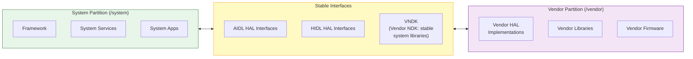

**VNDK（Vendor NDK）** 是 vendor 代码被允许链接的系统库集合。Vendor 代码不能随意链接任意 system 库，只能链接 VNDK 中声明的库。这一点在构建时和运行时都受到约束，运行时通过 **linker namespace** 实现，配置位于 `system/linkerconfig/`。

### 1.3.4 第 3 层：原生服务与库

位于内核与 HAL 之上的，是丰富的原生（C/C++）服务和库层。它们是系统中的主力组件，负责显示合成、音频混音、输入分发、媒体播放等工作。

#### 核心原生服务

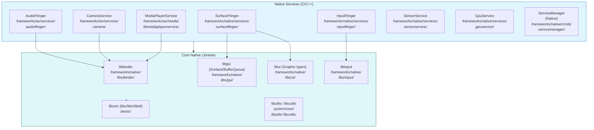

下面列出最重要的原生服务：

**SurfaceFlinger**（`frameworks/native/services/surfaceflinger/`）是显示合成器。你在 Android 设备上看到的每一帧，最终都由 SurfaceFlinger 合成。它通过 `BufferQueue` 机制接收来自应用窗口的 buffer，使用 GPU 进行 client composition 或通过 HWC HAL 进行 hardware composition，将它们合成为最终帧并送往显示设备。SurfaceFlinger 负责多显示管理、VSYNC 时序，并与 system_server 中的 WindowManagerService 协调窗口布局与可见性。

**AudioFlinger**（`frameworks/av/services/audioflinger/`）是音频混音器与路由器。它从应用和系统服务接收音频数据，依据流类型（音乐、通知、闹钟、语音通话）混合多路音频，应用效果处理，并通过 Audio HAL 路由到合适的输出设备。它还处理采样率转换、声道映射和延迟控制。

**InputFlinger**（`frameworks/native/services/inputflinger/`）从内核的 `/dev/input/` 设备中读取原始输入事件（触摸、键盘、鼠标、游戏手柄），对其进行分类，并分发到正确窗口。它内部的 **InputDispatcher** 维护窗口到输入通道的映射，确保触摸事件到达触点所在窗口、键盘事件到达焦点窗口，而系统手势（返回、主页、最近任务）会在抵达应用之前被截获。

**CameraService**（`frameworks/av/services/camera/`）位于应用使用的 Camera2 API 与厂商实现的 Camera HAL 之间，负责管理摄像头设备生命周期、请求处理和流管理。

**MediaPlayerService / MediaCodecService**（`frameworks/av/`）提供媒体播放与编码能力。Codec2 框架是对原始 OMX/Stagefright 架构的继任者，用于管理软硬件视频音频 codec。

**ServiceManager**（`frameworks/native/cmds/servicemanager/`）是原生 Binder 服务注册中心。所有希望通过 Binder 暴露能力的系统服务都要向 ServiceManager 注册自己；客户端通过名字查找服务。实际上系统里有三个 ServiceManager：framework binder 使用的 `/dev/binder`，HW binder 使用的 `/dev/hwbinder`（由 `hwservicemanager` 管理），以及 vendor binder 使用的 `/dev/vndbinder`（由 `vndservicemanager` 管理）。

#### Bionic：Android 的 C 库

Bionic（`bionic/`）是 Android 的定制 C 库。它**不是** glibc。Bionic 由 Google 基于 BSD 代码从头实现，其目标非常明确：

1. **体积小**：移动设备内存有限，Bionic 比 glibc 小得多。
2. **启动快**：`dlopen()`、`pthread_create()` 等常见操作针对移动工作负载做了优化。
3. **BSD 许可**：避免 LGPL 对 OEM 强加“必须让用户可替换 C 库”的义务。
4. **Android 特性**：属性系统（`__system_property_get`）、Android 日志（`__android_log_print`）、Binder 支持。

Bionic 包含：

- `bionic/libc/`：C 库本体
- `bionic/libm/`：数学库
- `bionic/libdl/`：动态链接库接口
- `bionic/linker/`：动态链接器（`/system/bin/linker64`），负责加载共享库并在运行时解析符号

`bionic/linker/` 中的动态链接器尤其关键，因为它实现了用来落实 Treble 边界的 **linker namespace** 隔离。不同 namespace，例如 default、sphal、vndk、rs，控制哪些库对哪些进程可见，从而阻止 vendor 代码访问不稳定的 system 库。

### 1.3.5 第 4 层：Android Runtime（ART）

Android Runtime（`art/`）负责执行应用字节码。ART 在 Android 5.0（Lollipop）中取代了 Dalvik，成为默认运行时。

#### ART 编译流水线

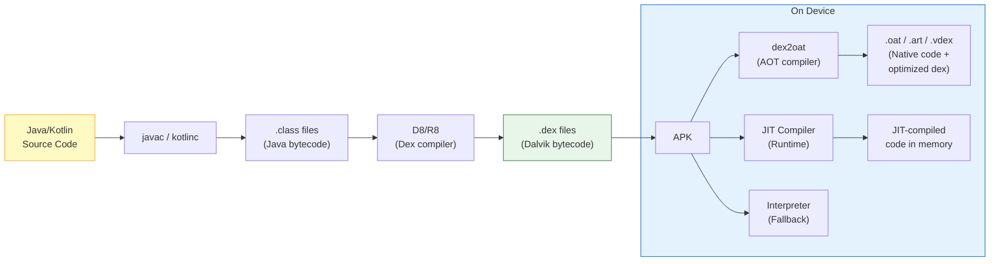

ART 使用 **多层级编译策略**：

1. **解释器**：逐条执行字节码。速度最慢，但始终可用，适用于调试和冷门代码路径。

2. **JIT（Just-In-Time）编译器**：在运行时将热点方法编译为本地代码。JIT 会分析执行热度，并将 profile 数据写入磁盘。

3. **AOT（Ahead-Of-Time）编译器**（`dex2oat`）：在空闲时或安装时，根据 JIT profile 预编译高频方法。这就是 Android 7.0 引入的 **Profile-Guided Optimization（PGO）** 路线。

4. **Cloud Profiles**（Android 9+）：Google Play 会分发从其他用户聚合得到的 profile。这样一来，`dex2oat` 在你首次运行应用之前，就能用这些云端 profile 编译最常用的方法。

`art/` 源码树主要包括：

- `art/runtime/`：运行时本体（GC、类加载、JNI、线程）
- `art/compiler/`：JIT 与 AOT 编译器
- `art/dex2oat/`：AOT 编译工具
- `art/libartbase/`：基础工具库
- `art/libdexfile/`：DEX 文件解析
- `art/libnativebridge/`：运行 ARM 应用到 x86 时使用的 native bridge（Berberis/Houdini 翻译）
- `art/libnativeloader/`：带 namespace 隔离的库加载
- `art/odrefresh/`：设备上 ART 模块产物刷新
- `art/openjdkjvm/`：JVM 接口实现
- `art/openjdkjvmti/`：JVMTI（调试/分析）接口
- `art/profman/`：PGO 的 profile 管理器
- `art/imgdiag/`：boot image 诊断

#### Zygote：进程工厂

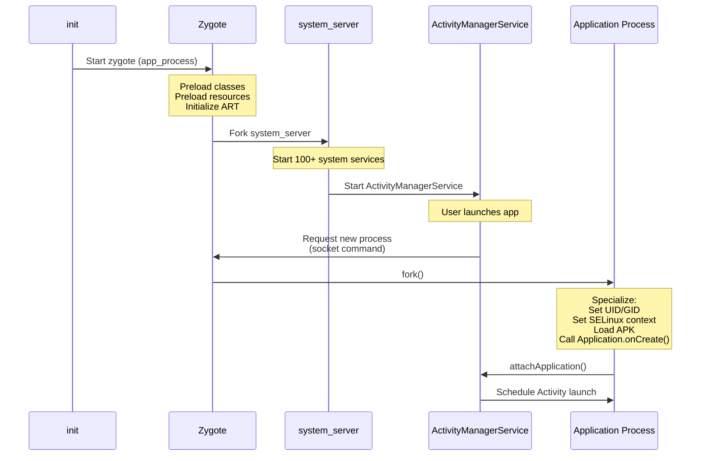

**Zygote**（`frameworks/base/cmds/app_process/` 与 `system/zygote/`）是 Android 最重要的架构创新之一。它是所有应用进程以及 `system_server` 的父进程。

Android 启动时：

1. `init` 进程启动 `zygote`（严格说是 `app_process64` 二进制）
2. Zygote 初始化 ART 运行时
3. Zygote **预加载**数千个所有应用都需要的 Java 类与资源
4. Zygote 进入循环，在 Unix domain socket 上等待命令

当需要新应用进程时：

1. `ActivityManagerService` 向 Zygote 的 socket 发送命令
2. Zygote 调用 `fork()` 创建子进程
3. 子进程通过 **copy-on-write** 共享继承所有预加载类与资源
4. 子进程进行 specialize：设置 UID、GID、SELinux context，加载 APK，并开始执行

这种基于 fork 的架构，是 Android 应用启动足够快的核心原因。没有 Zygote，每个应用都要从零启动一个新的 ART 实例，加载并校验成千上万个类，并解析 framework 资源，这一过程会耗费数秒。有了 Zygote，`fork()` 只需毫秒级，且共享页减少了物理内存占用。

### 1.3.6 第 5 层：Framework Services（system_server）

`system_server` 进程是 Android framework 的心脏。它是 Zygote fork 出的第一个进程，承载着 **100 多个系统服务**，共同管理用户体验的每个方面。

#### system_server 服务图谱

`system_server` 中的服务位于源码树 `frameworks/base/services/core/java/com/android/server/` 下。该目录包含 100 多个子目录：

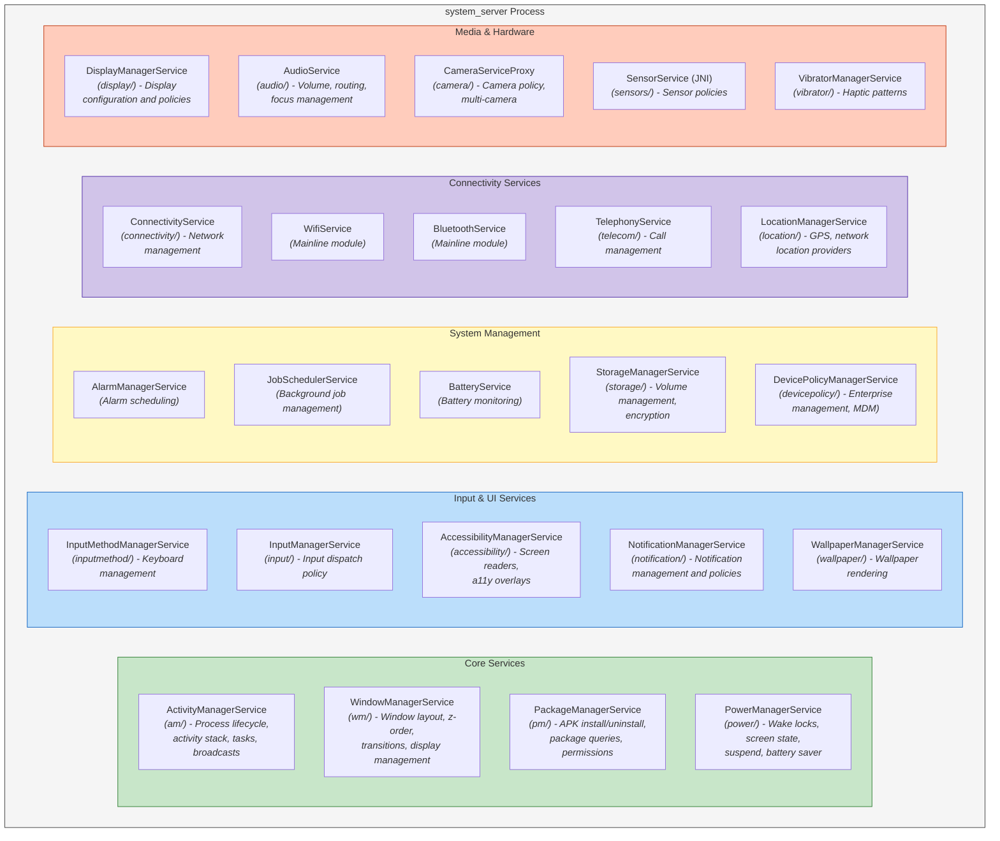

下面是 `frameworks/base/services/core/java/com/android/server/` 中较完整的服务子目录清单：

| 目录 | 服务 | 责任 |
|---|---|---|
| `am/` | ActivityManagerService | 进程生命周期、activity 栈、task、最近任务、broadcast、content provider、OOM 调整 |
| `wm/` | WindowManagerService | 窗口层级、z-order、输入焦点、显示布局、转场、旋转 |
| `pm/` | PackageManagerService | APK 安装、卸载、包解析、权限管理、intent 解析 |
| `power/` | PowerManagerService | Wake lock、亮灭屏、doze/idle 模式、省电、suspend |
| `display/` | DisplayManagerService | 显示生命周期、亮度、色彩模式、显示策略 |
| `input/` | InputManagerService | 输入设备管理、键值映射、输入分发策略 |
| `inputmethod/` | InputMethodManagerService | 软键盘管理、IME 切换 |
| `notification/` | NotificationManagerService | 通知投递、排序、策略、免打扰 |
| `audio/` | AudioService | 音量控制、音频路由、音频焦点、音效 |
| `connectivity/` | ConnectivityService | 网络管理、默认网络选择、VPN |
| `location/` | LocationManagerService | 定位 provider、地理围栏、GNSS 管理 |
| `telecom/` | TelecomService | 通话管理、呼叫路由、通话中 UI |
| `camera/` | CameraServiceProxy | 相机访问策略、多摄协调 |
| `storage/` | StorageManagerService | 卷管理、加密、adoptable storage |
| `content/` | ContentService | 内容观察者通知、同步管理 |
| `accounts/` | AccountManagerService | 账户管理、认证 token |
| `clipboard/` | ClipboardService | 系统剪贴板 |
| `accessibility/` | AccessibilityManagerService | 无障碍事件分发、无障碍服务 |
| `app/` | ActivityTaskManagerService | task 与 activity 管理（自 AMS 拆分） |
| `backup/` | BackupManagerService | 应用备份与恢复 |
| `biometrics/` | BiometricService | 指纹、人脸、虹膜认证 |
| `companion/` | CompanionDeviceManagerService | 配对设备管理（手表等） |
| `dreams/` | DreamManagerService | 屏保（Daydream）管理 |
| `hdmi/` | HdmiControlService | HDMI-CEC 控制 |
| `incident/` | IncidentManager | bugreport / incident 管理 |
| `integrity/` | AppIntegrityManagerService | APK 完整性校验 |
| `lights/` | LightsService | LED 与背光控制 |
| `locksettings/` | LockSettingsService | PIN、图案、密码管理 |
| `media/` | MediaSessionService | 媒体会话与传输控制 |
| `net/` | NetworkManagementService | 低层网络配置（iptables、routing） |
| `om/` | OverlayManagerService | Runtime Resource Overlay（主题覆盖） |
| `people/` | PeopleService | 会话、shortcut 与人物相关功能 |
| `permission/` | PermissionManagerService | 运行时权限授予与策略 |
| `policy/` | PhoneWindowManager | 硬件按键处理、系统手势策略 |
| `role/` | RoleManagerService | 默认应用角色（浏览器、拨号器、短信） |
| `search/` | SearchManagerService | 搜索框架 |
| `security/` | SecurityStateManager | 安全补丁级别跟踪 |
| `selinux/` | SELinuxService | SELinux 策略管理 |
| `slice/` | SliceManagerService | Slice 内容（应用内容预览） |
| `statusbar/` | StatusBarManagerService | 状态栏图标与通知栏协调 |
| `trust/` | TrustManagerService | Trust agent（Smart Lock） |
| `tv/` | TvInputManagerService | TV 输入框架 |
| `uri/` | UriGrantsManagerService | URI 权限授予 |
| `vibrator/` | VibratorManagerService | 触觉反馈模式 |
| `wallpaper/` | WallpaperManagerService | 壁纸渲染与管理 |
| `webkit/` | WebViewUpdateService | WebView 包管理 |

这还远不是全部，总计有 100 多个子目录。每个服务都通过 Binder IPC 与应用及其他服务通信，并通过 AIDL 定义的接口暴露能力。

#### system_server 启动过程

当 `system_server` 启动时（由 Zygote fork 出来），它会按 `SystemServer.java`（`frameworks/base/services/java/com/android/server/SystemServer.java`）中定义的特定顺序初始化服务：

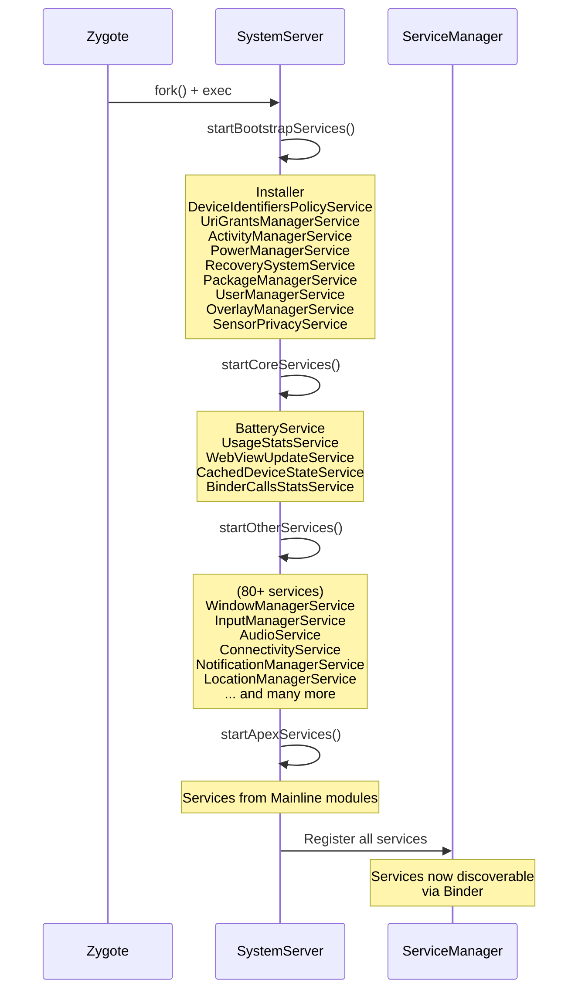

服务分四个阶段启动：

1. **Bootstrap services**：系统能运转所必需的最小集合，例如 AMS、PMS、PowerManager。
2. **Core services**：不是 bootstrap 关键路径，但同样重要，例如 Battery、UsageStats。
3. **Other services**：其余所有服务，例如 Window、Input、Audio、Connectivity、Notification、Location。
4. **APEX services**：来自 Mainline 模块的服务。

### 1.3.7 第 6 层：Framework API

Framework API 层（`frameworks/base/core/java/android/`）是应用开发者直接面对的层。它是 Android 平台的公开表面，由 developer.android.com 进行文档化，并按 API level 进行版本管理。

`android.*` 包层级大约包含 50 个顶层包：

| 包名 | 用途 |
|---|---|
| `android.app` | Activity、Service、Application、Fragment、Notification、Dialog |
| `android.content` | ContentProvider、ContentResolver、Intent、Context、SharedPreferences |
| `android.view` | View、ViewGroup、Window、MotionEvent、KeyEvent、Surface |
| `android.widget` | TextView、Button、RecyclerView、ImageView 以及各类标准控件 |
| `android.os` | Binder、Handler、Looper、Bundle、Parcel、Process、SystemClock |
| `android.graphics` | Canvas、Paint、Bitmap、drawable.*、animation.* |
| `android.media` | MediaPlayer、MediaRecorder、AudioTrack、AudioRecord、MediaCodec |
| `android.net` | ConnectivityManager、NetworkInfo、Uri、wifi.* |
| `android.telephony` | TelephonyManager、SmsManager、PhoneStateListener |
| `android.location` | LocationManager、LocationListener、Geocoder |
| `android.hardware` | Camera2 API、SensorManager、usb.*、biometrics.* |
| `android.database` | SQLite 包装类、Cursor、ContentValues |
| `android.provider` | Contacts、MediaStore、Settings、CallLog |
| `android.security` | KeyStore、KeyChain |
| `android.accounts` | AccountManager |
| `android.animation` | ValueAnimator、ObjectAnimator、AnimatorSet |
| `android.transition` | Scene、Transition framework |
| `android.speech` | 语音识别、TTS |
| `android.print` | 打印框架 |
| `android.service` | 多种服务类型的抽象基类 |
| `android.permission` | 权限相关 API |
| `android.util` | Log、TypedValue、SparseArray、ArrayMap |
| `android.text` | Spannable、TextWatcher、Html、Editable |
| `android.webkit` | WebView、WebSettings、WebChromeClient |

这些包中的类，本质上大多都是 Binder 客户端代理。当你调用 `startActivity()` 时，`Activity` 类（位于 `android.app`）会继续调用 `ActivityTaskManager`，后者再通过 `IActivityTaskManager.Stub.Proxy` 发起 Binder 事务，最终到达 `system_server` 中的 `ActivityTaskManagerService`。这种模式，也就是 **客户端代理封装 Binder IPC，再连接服务端实现**，贯穿整个 Android framework。

### 1.3.8 第 7 层：应用

位于栈顶的是应用，包括系统随附应用和用户安装应用。

#### AOSP 中的系统应用

AOSP 在 `packages/apps/` 中自带了大量系统应用：

| 应用 | 目录 | 说明 |
|---|---|---|
| **SystemUI** | `frameworks/base/packages/SystemUI/` | 状态栏、通知栏、快速设置、锁屏、音量面板、电源菜单、最近任务、画中画 |
| **Launcher3** | `packages/apps/Launcher3/` | 主屏、应用抽屉、桌面小部件、workspace |
| **Settings** | `packages/apps/Settings/` | 系统设置应用 |
| **Contacts** | `packages/apps/Contacts/` | 联系人管理 |
| **Dialer** | `packages/apps/Dialer/` | 电话拨号与通话管理 |
| **Camera2** | `packages/apps/Camera2/` | 相机应用 |
| **Calendar** | `packages/apps/Calendar/` | 日历应用 |
| **Messaging** | `packages/apps/Messaging/` | SMS/MMS 消息 |
| **DeskClock** | `packages/apps/DeskClock/` | 时钟、闹钟、计时器、秒表 |
| **Music** | `packages/apps/Music/` | 基础音乐播放器 |
| **Gallery2** | `packages/apps/Gallery2/` | 照片图库 |
| **DocumentsUI** | `packages/apps/DocumentsUI/` | 文件管理器（Storage Access Framework UI） |
| **Browser2** | `packages/apps/Browser2/` | 基于 WebView 的浏览器 |
| **KeyChain** | `packages/apps/KeyChain/` | 证书管理 |
| **CertInstaller** | `packages/apps/CertInstaller/` | 证书安装 |
| **ManagedProvisioning** | `packages/apps/ManagedProvisioning/` | 企业设备配置（工作资料） |
| **Stk** | `packages/apps/Stk/` | SIM Toolkit |
| **StorageManager** | `packages/apps/StorageManager/` | 存储管理 |
| **ThemePicker** | `packages/apps/ThemePicker/` | Material You 主题定制 |
| **Traceur** | `packages/apps/Traceur/` | 系统追踪工具 |
| **WallpaperPicker2** | `packages/apps/WallpaperPicker2/` | 壁纸选择 |
| **TV** | `packages/apps/TV/` | Android TV 启动器与节目指南 |

SystemUI 值得特别强调，因为它并不是一个典型应用。它是一个具有系统特权的进程，负责核心系统界面框架：状态栏、通知下拉、快速设置面板、锁屏、音量对话框、电源菜单、画中画控制、最近任务界面（某些配置下）等。它运行在独立进程 `com.android.systemui` 中，拥有提升后的权限，并与 `WindowManagerService` 及其他系统服务深度耦合。

#### Content Provider

AOSP 还在 `packages/providers/` 中提供了一系列系统内容提供者：

| Provider | 说明 |
|---|---|
| `ContactsProvider` | 联系人数据库（contacts2.db） |
| `MediaProvider` | 媒体数据库（图片、视频、音频）与 scoped storage |
| `CalendarProvider` | 日历事件与提醒 |
| `TelephonyProvider` | SMS/MMS 消息、运营商配置 |
| `DownloadProvider` | 系统下载管理器 |
| `SettingsProvider` | system、secure、global 设置 |
| `BlockedNumberProvider` | 已阻止电话号码 |
| `UserDictionaryProvider` | 自定义输入法词典 |
| `BookmarkProvider` | 浏览器书签（旧组件） |

---
## 1.4 仓库结构：完整导览

AOSP 源码树规模极其庞大。完整检出包括预构建工具链和所有默认仓库时，体积很容易超过 300 GB。理解顶层目录结构，是高效导航代码库的关键。

源码通过 `repo` 管理，它是构建在 Git 之上的多仓库工具。`.repo/manifest.xml` 文件定义了完整的 Git 仓库集合及其检出路径。一次典型 AOSP 检出通常包含 1000 多个独立 Git 仓库，每个仓库映射到源码树中的一个子目录。

### 1.4.1 目录地图

下面给出 AOSP 源码树顶层目录的完整式清单，包括它们的用途、近似体量贡献，以及它们对不同类型开发者的重要性。

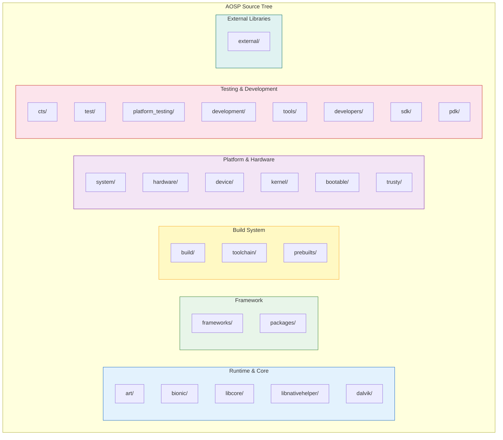

### 1.4.2 运行时与核心库

#### `art/`：Android Runtime

Android Runtime 是执行所有 Java/Kotlin 应用代码与 framework 代码的虚拟机。

```
art/
    runtime/          -- Core runtime: GC, class linker, JNI, threads, monitors
    compiler/         -- Optimizing compiler (for JIT and AOT)
    dex2oat/          -- Ahead-of-time compilation tool
    libdexfile/       -- DEX file format parser and verifier
    libartbase/       -- Base utilities shared across ART components
    libartservice/    -- ART service (manages compilation on device)
    libarttools/      -- Tools library
    libartpalette/    -- Platform abstraction layer
    libnativebridge/  -- Native bridge (for ISA translation, e.g., ARM on x86)
    libnativeloader/  -- Library loading with namespace isolation
    odrefresh/        -- On-device refresh of boot image artifacts
    openjdkjvm/       -- JVM TI and JNI interface implementation
    openjdkjvmti/     -- JVMTI implementation (for debuggers/profilers)
    profman/          -- Profile manager (processes JIT profiles for PGO)
    imgdiag/          -- Boot image diagnostics
    dexdump/          -- DEX file disassembler
    dexlist/          -- DEX file lister
    oatdump/          -- OAT file disassembler
    dalvikvm/         -- ART entry point (dalvikvm command)
    adbconnection/    -- ADB-based debugging connection
    sigchainlib/      -- Signal chain management (for native signal handlers)
    perfetto_hprof/   -- Heap profiling via Perfetto
    test/             -- Extensive test suite (thousands of tests)
    benchmark/        -- Performance benchmarks
    tools/            -- Development utilities
    build/            -- Build configuration
```

**哪些人最关心这个目录：** 运行时工程师、GC 研究者、JIT/AOT 编译器开发者、排查类加载或 JNI 问题的工程师。

#### `bionic/`：Android 的 C 库

Bionic 是 Android 的 C 库、数学库和动态链接器。

```
bionic/
    libc/             -- C library implementation
        arch-arm/     --   ARM-specific assembly (memcpy, strcmp, etc.)
        arch-arm64/   --   ARM64-specific assembly
        arch-riscv64/ --   RISC-V 64-bit assembly
        arch-x86/     --   x86-specific assembly
        arch-x86_64/  --   x86_64-specific assembly
        bionic/       --   Core C library sources (pthread, malloc, stdio, etc.)
        dns/          --   DNS resolver
        include/      --   C library headers
        kernel/       --   Kernel header wrappers (auto-generated from kernel)
        malloc_debug/ --   Memory debugging tools
        stdio/        --   Standard I/O implementation
        stdlib/       --   Standard library (qsort, bsearch, etc.)
        string/       --   String operations
        system_properties/ -- Android property system client
        upstream-*    --   Code imported from OpenBSD, FreeBSD, NetBSD
    libm/             -- Math library (sin, cos, sqrt, etc.)
    libdl/            -- Dynamic loading library (dlopen, dlsym)
    libstdc++/        -- Minimal C++ standard library (full C++ is libc++)
    linker/           -- Dynamic linker (/system/bin/linker64)
    tests/            -- Test suite
    benchmarks/       -- Performance benchmarks
    tools/            -- Maintenance tools (header generation, symbol checking)
    apex/             -- APEX module configuration
    docs/             -- Documentation
```

**哪些人最关心这个目录：** 在 C 层工作的原生开发者，排查内存问题（`malloc_debug`）、链接器/加载器问题，或架构特定行为的工程师。`linker/` 子目录对于理解 namespace 隔离与 Treble vendor 边界尤其关键。

#### `libcore/`：Java 核心库

Android 上 Java 标准库的实现位于这里。

```
libcore/
    dalvik/           -- Dalvik-specific classes (system, bytecode)
    dom/              -- DOM XML implementation
    harmony-tests/    -- Apache Harmony compatibility tests
    json/             -- org.json (JSON parsing)
    luni/             -- Main library: java.*, javax.*, sun.misc.*
    mmodules/         -- Mainline module boundaries
    ojluni/           -- OpenJDK-derived code (java.util, java.io, etc.)
    xml/              -- XML parsing (SAX, XPath)
```

它们提供 `java.lang`、`java.util`、`java.io`、`java.net`、`java.nio`、`java.security`、`java.sql`、`javax.crypto` 等标准 Java API。与标准 JDK 不同，Android 的实现经过了大量定制：它使用 Bionic 而不是 glibc，部分文本功能使用 `android.icu` 而非传统 `java.text`，同时还具备 Android 特有的安全 provider。

**哪些人最关心这个目录：** 任何正在排查 Android 上 Java 标准库行为、或参与 ART Mainline 模块工作的工程师。

#### `libnativehelper/`：JNI 帮助库

这是一个用于简化 JNI（Java Native Interface）编码的工具库：

```
libnativehelper/
    header_only_include/  -- Header-only JNI helpers
    include/              -- Public headers
    include_jni/          -- JNI specification headers (jni.h)
    tests/                -- Tests
```

它提供 `JNIHelp.h`，内含 `jniRegisterNativeMethods()`、`jniThrowException()`、`jniCreateString()` 等辅助函数，可显著减少平台 JNI 代码中的样板代码。

#### `dalvik/`：遗留 Dalvik VM（主要具有历史意义）

```
dalvik/
    dexgen/           -- DEX file generation utilities
    docs/             -- Historical documentation
    dx/               -- Original dx tool (DEX compiler, replaced by D8)
    opcode-gen/       -- Opcode definition generation
    tools/            -- Utilities
```

当 ART 在 Android 5.0 中取代 Dalvik 后，Dalvik VM 本体已被移除。如今这个目录主要保留工具、遗留的 `dx` 编译器（已在构建系统中被 D8/R8 取代），以及其他工具使用的 opcode 定义。

### 1.4.3 Framework

#### `frameworks/`：Android Framework

这是 AOSP 中最大、也是最重要的目录。它包含完整的应用框架、原生服务、系统库和系统组件。

```
frameworks/
    base/                 -- The core framework (MASSIVE: ~30M+ lines)
        core/             --   Core API classes (android.* packages)
            java/         --     Java source for framework APIs
            jni/          --     JNI bridge implementations
            res/          --     Framework resources (layouts, drawables, strings)
            proto/        --     Protobuf definitions
        services/         --   system_server services
            core/         --     Core services (AMS, WMS, PMS, 100+ more)
            java/         --     SystemServer.java entry point
            companion/    --     Companion device services
            appfunctions/ --     App functions service
            devicepolicy/ --     Device administration
            contentcapture/ --   Content capture service
            credentials/  --     Credentials manager service
            incremental/  --     Incremental file system service
            midi/         --     MIDI service
            net/          --     Network services
            people/       --     People/conversation services
            permission/   --     Permission service
            print/        --     Print service
            restrictions/ --     App restrictions
            texttospeech/ --     TTS service
            translation/  --     Translation service
            usage/        --     Usage stats service
            usb/          --     USB service
            voiceinteraction/ -- Voice interaction service
            wifi/         --     WiFi service
        packages/         --   Framework-internal applications
            SystemUI/     --     Status bar, notification shade, lock screen
            SettingsLib/  --     Shared settings library
            SettingsProvider/ --  Settings content provider
            Shell/        --     ADB shell utilities
            CompanionDeviceManager/ -- Companion device pairing
            FusedLocation/ --    Fused location provider
            PrintSpooler/ --     Print spooler service
            Tethering/    --     Tethering/hotspot
            MtpDocumentsProvider/ -- MTP file access
            CredentialManager/ -- Credential management UI
        graphics/         --   Graphics classes (Canvas, Paint, etc.)
        libs/             --   Framework libraries
            hwui/         --     Hardware-accelerated 2D rendering (Skia/HWUI)
            androidfw/    --     Asset manager, resource system
            input/        --     Input framework library
            WindowManager/ --    WindowManager library
        media/            --   Media framework Java classes
        location/         --   Location framework Java classes
        telecomm/         --   Telecom framework Java classes
        wifi/             --   WiFi framework Java classes
        cmds/             --   Command-line tools
            app_process/  --     Zygote entry point
            am/           --     Activity Manager CLI (am start, am broadcast)
            pm/           --     Package Manager CLI (pm install, pm list)
            wm/           --     Window Manager CLI (wm size, wm density)
            input/        --     Input CLI (input tap, input text)
            svc/          --     Service control CLI
            settings/     --     Settings CLI (settings put, settings get)
            bootanimation/ --    Boot animation player
            idmap2/       --     Resource overlay compiler
        test-runner/      --   AndroidJUnitRunner
        tools/            --   Build and analysis tools
            aapt2/        --     Android Asset Packaging Tool 2
            lint/         --     Lint rules

    native/               -- Native framework (C/C++)
        services/
            surfaceflinger/  -- Display compositor
            inputflinger/    -- Input event processing
            sensorservice/   -- Sensor event processing
            audiomanager/    -- Audio policy bridge
            gpuservice/      -- GPU management
            batteryservice/  -- Battery state
            displayservice/  -- Display service bridge
            vibratorservice/ -- Vibrator service
            stats/           -- StatsD
        libs/
            binder/          -- libbinder (Binder IPC client library)
            gui/             -- libgui (Surface, BufferQueue)
            ui/              -- libui (Graphic buffer types)
            input/           -- libinput
            sensor/          -- libsensor
            nativewindow/    -- ANativeWindow
            nativedisplay/   -- ADisplay
            renderengine/    -- GPU render engine (for SurfaceFlinger)
            permission/      -- Permission checking
            math/            -- Math utilities (vec, mat)
            ftl/             -- Functional Template Library
        cmds/
            servicemanager/  -- Binder ServiceManager daemon
            dumpsys/         -- dumpsys tool
            dumpstate/       -- Bug report generator
            cmd/             -- cmd tool (talks to services)
            atrace/          -- System trace tool
            installd/        -- Package installation daemon
            lshal/           -- HAL listing tool

    av/                   -- Audio/Video framework
        camera/           --   Camera service and client
        media/            --   Media framework
        libmediaplayerservice/ -- Media player service
        libstagefright/ --       Media codec framework
        codec2/        --        Codec2 (modern codec framework)
        libaudioclient/ --       Audio client library
        audioserver/   --        Audio server process
        services/
            camera/        --   Camera service
            audioflinger/  --   Audio mixer and router
            audiopolicy/   --   Audio routing policy
            mediametrics/  --   Media metrics
            mediadrm/      --   DRM service

    hardware/             -- Hardware abstraction framework layer
    compile/              -- Compilation tools
    ex/                   -- Extension libraries
    libs/                 -- Additional framework libraries
        binary_translation/ -- Berberis (native bridge / ISA translation)
        modules-utils/      -- Mainline module utilities
        native_bridge_support/ -- Native bridge support libraries
        systemui/           -- SystemUI shared libraries
        service_entitlement/ -- Carrier entitlement
    minikin/              -- Text layout engine (used by Skia/HWUI)
    multidex/             -- MultiDex support library
    opt/                  -- Optional framework components (telephony, net)
    proto_logging/        -- Protobuf-based logging
    rs/                   -- RenderScript (deprecated)
    wilhelm/              -- OpenSL ES / OpenMAX AL audio APIs
    layoutlib/            -- Layout rendering library (for Android Studio preview)
```

**哪些人最关心这个目录：** 所有人。这就是 Android framework 的主体。应用开发者会在这里追踪 bug；系统开发者会在这里修改服务；OEM 工程师会在这里定制 SystemUI、Settings 与系统服务；SoC 厂商会通过这里定义的接口接入 HAL。

#### `packages/`：应用、模块、Provider 与服务

```
packages/
    apps/                 -- System applications (55+)
        Launcher3/        --   Home screen and app drawer
        Settings/         --   System settings
        Camera2/          --   Camera application
        Contacts/         --   Contact management
        Dialer/           --   Phone dialer
        Calendar/         --   Calendar
        DeskClock/        --   Clocks and alarms
        Messaging/        --   SMS/MMS
        Music/            --   Music player
        Gallery2/         --   Photo gallery
        DocumentsUI/      --   File manager
        Browser2/         --   Browser
        ThemePicker/      --   Material You theming
        Traceur/          --   System tracing
        WallpaperPicker2/ --   Wallpaper selection
        ManagedProvisioning/ -- Work profile setup
        Car/              --   Android Auto apps
        TV/               --   Android TV app
        TvSettings/       --   Android TV settings
        ...

    modules/              -- Mainline modules (40+)
        Bluetooth/        --   Bluetooth stack
        Wifi/             --   WiFi stack
        Connectivity/     --   Network connectivity
        Telephony/        --   Telephony
        Telecom/          --   Telecom service
        Media/            --   Media framework components
        Permission/       --   Permission controller
        NeuralNetworks/   --   NNAPI runtime
        DnsResolver/      --   DNS resolution
        IPsec/            --   IPsec VPN
        Nfc/              --   NFC stack
        AdServices/       --   Advertising services
        Uwb/              --   Ultra-Wideband
        Virtualization/   --   pVM (protected VMs)
        DeviceLock/       --   Device lock service
        adb/              --   ADB daemon
        Scheduling/       --   Scheduling module
        ...

    providers/            -- Content providers
        ContactsProvider/ --   Contacts database
        MediaProvider/    --   Media files database
        CalendarProvider/ --   Calendar storage
        TelephonyProvider/ --  SMS/MMS storage
        DownloadProvider/ --   Downloads
        SettingsProvider/ --   Settings storage (in frameworks/base/)
        ...

    services/             -- Background services
        Telephony/        --   Telephony service
        Telecomm/         --   Telecom service
        Car/              --   Automotive services
        Mtp/              --   MTP (Media Transfer Protocol)
        ...

    inputmethods/         -- Input methods
    screensavers/         -- Screen savers
    wallpapers/           -- Live wallpapers
```

**哪些人最关心这个目录：** 研究系统应用架构的应用开发者，定制预装应用的 OEM 工程师，Mainline 模块开发者。

### 1.4.4 构建系统

#### `build/`：构建系统

AOSP 使用混合构建系统：**Soong**（基于 Blueprint，使用 Go 编写）是主构建系统，同时保留对遗留 **Make** 组件的支持。

```
build/
    soong/            -- Soong build system (Go source)
        android/      --   Android module types
        cc/           --   C/C++ build rules
        java/         --   Java build rules
        apex/         --   APEX package build rules
        rust/         --   Rust build rules
        python/       --   Python build rules
        genrule/      --   Generic build rules
        ...
    make/             -- Legacy Make-based build system
        core/         --   Core Makefile logic
        target/       --   Target configuration
        tools/        --   Build tools (releasetools, zipalign, etc.)
        envsetup.sh   --   Environment setup (lunch, m, mm, mmm commands)
    blueprint/        -- Blueprint build file parser (Soong's frontend)
    pesto/            -- Build analysis tools
    release/          -- Release configuration
    target/           -- Target (device) build configuration
    tools/            -- Build utilities
```

AOSP 中的构建文件命名方式如下：

- `Android.bp`：Soong（Blueprint）构建文件，当前首选
- `Android.mk`：遗留 Make 构建文件，正逐步迁移到 `.bp`
- `Makefile`：较少使用，仅用于特殊场景

**哪些人最关心这个目录：** 所有构建 AOSP 的开发者。构建系统是你最先接触的部分，也是构建失败时最后要排查的部分。

#### `toolchain/`：编译器工具链配置

```
toolchain/
    pgo-profiles/     -- Profile-Guided Optimization profiles for the toolchain
```

真实的编译器二进制（Clang/LLVM、Rust）位于 `prebuilts/`。这个目录主要保存工具链配置，以及用于优化编译器输出的 PGO profile。

#### `prebuilts/`：预构建二进制

这是 AOSP 中按磁盘体积计算最大的目录。它包含预构建编译器工具链、SDK 以及其他在正常 AOSP 构建过程中不会从源码编译的工具。

```
prebuilts/
    clang/             -- Clang/LLVM compiler (multiple versions)
    gcc/               -- Legacy GCC compiler (for kernel, being phased out)
    go/                -- Go compiler (for Soong build system)
    jdk/               -- Java Development Kit
    build-tools/       -- aapt2, zipalign, d8, etc.
    gradle-plugin/     -- Android Gradle Plugin
    maven_repo/        -- Maven repository (AndroidX, etc.)
    sdk/               -- Android SDK platforms
    android-emulator/  -- Emulator binaries
    clang-tools/       -- Clang-based analysis tools
    cmake/             -- CMake (for NDK builds)
    cmdline-tools/     -- Android SDK command-line tools
    ktlint/            -- Kotlin linter
    manifest-merger/   -- Manifest merger tool
    bazel/             -- Bazel build tool (experimental)
    devtools/          -- Development tools
    ...
```

**哪些人最关心这个目录：** 更新工具链的构建工程师、调试编译器问题的开发者、搭建构建环境的工程师。

### 1.4.5 平台与硬件

#### `system/`：核心系统组件

这里存放的是内核与 framework 之间的低层系统组件。

```
system/
    core/                 -- Core system utilities
        init/             --   init process (PID 1, first userspace process)
        rootdir/          --   Root filesystem init.rc files
        fastboot/         --   Fastboot protocol implementation
        adb/              --   Android Debug Bridge daemon (in Mainline now)
        debuggerd/        --   Crash handler (generates tombstones)
        libcutils/        --   C utility library (properties, threads, etc.)
        libutils/         --   C++ utility library (RefBase, String, Vector)
        liblog/           --   Android logging library
        libsparse/        --   Sparse image handling
        fs_mgr/           --   Filesystem manager (mount, verity, overlayfs)
        healthd/          --   Battery health daemon
        bootstat/         --   Boot statistics
        storaged/         --   Storage health monitoring
        watchdogd/        --   Hardware watchdog daemon
        run-as/           --   run-as command (debuggable app access)
        sdcard/           --   FUSE-based SD card emulation (legacy)
        toolbox/          --   Small command-line utilities
        property_service/ --   Property service
        llkd/             --   Live lock daemon
        libprocessgroup/  --   Cgroup management
        trusty/           --   Trusty TEE client libraries

    sepolicy/             -- SELinux policy
        private/          --   Platform-private policy
        public/           --   Public policy (visible to vendor)
        vendor/           --   Vendor-extendable policy
        prebuilts/        --   Prebuilt policies

    apex/                 -- APEX module infrastructure
        apexd/            --   APEX daemon (manages module installation)
        apexer/           --   APEX package creation tool
        tools/            --   APEX utilities

    security/             -- Security components
    bpf/                  -- BPF (Berkeley Packet Filter) programs
    connectivity/         -- Connectivity components
    media/                -- Low-level media components
    memory/               -- Memory management (lmkd, libmeminfo)
    netd/                 -- Network daemon
    vold/                 -- Volume daemon (disk encryption, mounting)
    update_engine/        -- OTA update engine
    hardware/             -- Hardware service manager
    libhidl/              -- HIDL runtime library
    libhwbinder/          -- Hardware binder library
    libvintf/             -- VINTF (Vendor Interface) manifest library
    linkerconfig/         -- Linker namespace configuration
    logging/              -- Logd (centralized log daemon)
    extras/               -- Additional system tools
    zygote/               -- Zygote configuration
    ...
```

**哪些人最关心这个目录：** 系统工程师、安全研究员（sepolicy）、启动工程师（init、fs_mgr）、存储工程师（vold）、网络工程师（netd）、以及所有调试系统守护进程的人。

#### `hardware/`：硬件抽象

```
hardware/
    interfaces/       -- HAL interface definitions (AIDL and HIDL)
        audio/        --   Audio HAL
        camera/       --   Camera HAL
        graphics/     --   Graphics HAL (HWC, Gralloc)
        sensors/      --   Sensor HAL
        bluetooth/    --   Bluetooth HAL
        wifi/         --   WiFi HAL
        radio/        --   Telephony HAL
        power/        --   Power HAL
        vibrator/     --   Vibrator HAL
        health/       --   Battery health HAL
        neuralnetworks/ -- NNAPI HAL
        ... (60+ interfaces)

    libhardware/      -- Legacy HAL loading library (hw_get_module)
    libhardware_legacy/ -- Even older HAL loading
    ril/              -- Radio Interface Layer (telephony, legacy)

    google/           -- Google-specific hardware support
    qcom/             -- Qualcomm hardware support
    samsung/          -- Samsung hardware support
    broadcom/         -- Broadcom (WiFi, Bluetooth)
    nxp/              -- NXP (NFC)
    invensense/       -- InvenSense (sensors)
    ti/               -- Texas Instruments
    st/               -- STMicroelectronics
    synaptics/        -- Synaptics (touch)
```

**哪些人最关心这个目录：** HAL 实现者、SoC 厂商、设备 bring-up 工程师、驱动开发者。

#### `device/`：设备配置

每个受支持设备都在这里拥有配置目录：

```
device/
    generic/          -- Generic device configurations
        goldfish/     --   Emulator (QEMU-based)
        car/          --   Android Automotive emulator
        tv/           --   Android TV emulator
        common/       --   Common configuration shared across generics
    google/           -- Google devices (Pixel)
    google_car/       -- Google Automotive
    amlogic/          -- Amlogic SoC devices
    linaro/           -- Linaro reference boards
    sample/           -- Sample device configuration (template)
```

一个典型设备配置目录通常包含：

- `BoardConfig.mk`：板级配置，例如分区大小、内核配置、架构
- `device.mk`：设备级配置，例如需要打入哪些包
- `AndroidProducts.mk`：产品定义，也就是 lunch target
- `<product>.mk`：产品特定配置
- `overlay/`：Runtime Resource Overlay，用于定制 framework 资源
- `sepolicy/`：设备特定 SELinux 策略
- `init.*.rc`：设备特定 init 脚本
- 内核配置片段

当你运行 `lunch` 选择构建目标时，本质上就是在选择这些 device 目录里定义的某个 product。

#### `kernel/`：内核配置与预构建件

```
kernel/
    configs/          -- GKI kernel configuration fragments
    prebuilts/        -- Prebuilt kernel images
    tests/            -- Kernel test suites
```

如前所述，完整内核源码通常位于独立仓库。这个目录主要保存配置片段、开发用预构建镜像和测试基础设施。

#### `bootable/`：启动与 Recovery

```
bootable/
    recovery/         -- Recovery mode implementation
    deprecated-ota/   -- Legacy OTA update tools
    libbootloader/    -- Bootloader libraries
```

Recovery 系统负责 OTA 更新（应用升级包）、恢复出厂设置和 sideload。现代设备大多使用 `update_engine`（`system/update_engine/`）完成 A/B seamless update，但 recovery 仍然用于非 A/B 设备和出厂重置。

#### `trusty/`：Trusted Execution Environment

```
trusty/
    device/           -- TEE device configurations
    hardware/         -- TEE hardware abstraction
    host/             -- Host-side tools
    kernel/           -- Trusty kernel (separate OS)
    user/             -- Trusty userspace applications
    vendor/           -- Vendor TEE components
```

Trusty 是 Google 的 Trusted Execution Environment（TEE）操作系统。它与 Android 同时运行在同一处理器上，但位于单独的安全世界中，通常依赖 ARM TrustZone。Trusty 承载密钥存储（Keymaster）、生物特征模板存储、DRM 密钥处理等安全敏感工作。并非所有设备都使用 Trusty，有些设备使用 Qualcomm 的 QSEE 或其他 TEE 实现，但 Trusty 是 AOSP 中的参考 TEE。

### 1.4.6 测试与开发

#### `cts/`：Compatibility Test Suite

```
cts/
    tests/            -- CTS test cases (organized by API area)
    hostsidetests/    -- Tests that run on the host (controlling the device)
    apps/             -- Test helper applications
    libs/             -- Test libraries
    common/           -- Common test utilities
    helpers/          -- Test helper utilities
    suite/            -- Test suite configuration
```

CTS 是 Android 生态的支柱之一。要出货带 Google Play（GMS）的设备，OEM 必须通过 CTS。这是一套包含数十万测试的系统，用来验证 API 兼容性。CTS 确保一个面向 Android SDK 编写的应用，在 Samsung Galaxy 与 Google Pixel 上具有一致行为。

CTS 覆盖内容包括：

- API 行为，例如 `Context.getSystemService()` 是否返回正确服务
- 权限执行，例如普通应用在应抛 `SecurityException` 时是否确实抛出
- 媒体 codec，例如设备是否满足所需 codec 与质量要求
- 图形，例如 OpenGL ES / Vulkan 行为是否正确
- 安全，例如 SELinux 是否 enforcing、文件权限是否正确
- 性能，例如设备是否达到最低基准要求
- 以及成千上万的其他测试用例

#### `test/`：测试基础设施

```
test/
    vts/              -- Vendor Test Suite (tests HAL implementations)
    mlts/             -- Machine Learning Test Suite
    catbox/           -- Test suite for automotive
    mts/              -- Mainline Test Suite
    ...
```

VTS（Vendor Test Suite）是 CTS 在 vendor 分区侧的配套体系。它用于验证 HAL 实现是否符合 HIDL/AIDL 接口规范。

#### `platform_testing/`：平台级测试

```
platform_testing/
    tests/            -- Platform integration tests
    libraries/        -- Test utility libraries
    build/            -- Test build configuration
```

这里存放的是超出 CTS 范畴的平台级测试，用于验证不属于公开 API 契约的内部平台行为。

#### `development/`：开发辅助工具

```
development/
    apps/             -- Sample applications
    samples/          -- SDK samples
    tools/            -- Development tools
    ide/              -- IDE configuration
    scripts/          -- Helper scripts
    vndk/             -- VNDK tools
    ...
```

这里包含示例代码、开发工具和 IDE 配置。这些示例与 SDK sample 不同，更多展示的是系统级能力。

#### `developers/`：开发者文档与示例

```
developers/
    build/            -- Build configuration for samples
    samples/          -- Developer-facing code samples
```

这里提供额外的开发者示例和文档支撑内容。

#### `tools/`：开发与分析工具

```
tools/
    metalava/         -- API signature extraction and checking tool
    tradefederation/  -- Trade Federation (test harness framework)
    apksig/           -- APK signing library
    apkzlib/          -- APK ZIP library
    treble/           -- Treble compliance tools
    acloud/           -- Cloud-based Android Virtual Devices
    asuite/           -- Test suite management (atest, etc.)
    security/         -- Security analysis tools
    dexter/           -- DEX analysis tool
    repohooks/        -- Repo pre-upload hooks
    netsim/           -- Network simulation
    rootcanal/        -- Bluetooth emulation
    external_updater/ -- Tool for updating external/ projects
    carrier_settings/ -- Carrier configuration tools
    lint_checks/      -- Custom lint checks
    ...
```

**Metalava** 值得特别说明。它负责从源码中提取 Android API 签名，与旧版本进行比较，并强制执行 API 兼容规则，例如不能移除 public API、不能修改方法签名等。它生成的 API surface 文件，例如 `current.txt`、`removed.txt`、`system-current.txt`，是 Android API 的规范定义。

**Trade Federation（TradeFed）** 是运行 CTS、VTS 等测试套件的测试 harness，负责设备管理、测试执行、结果收集和报告。

#### `sdk/`：SDK 构建支持

```
sdk/
    build_tools/      -- SDK build tools configuration
    emulator/         -- Emulator configuration
    ...
```

这里存放用于构建 Android SDK 的支持文件，而这些 SDK 最终会通过 Android Studio 提供给应用开发者。

#### `pdk/`：Platform Development Kit

```
pdk/
    build/            -- PDK build support
    ...
```

Platform Development Kit 让 OEM 与 SoC 厂商在新 Android 版本公开发布前，就能提前启动定制和移植工作。Google 会在 NDA 约束下向合作伙伴提供 PDK，使其更早介入。

### 1.4.7 外部库

#### `external/`：第三方库

`external/` 拥有 **467+ 个子目录**，是 AOSP 中横向最宽的目录之一。这里存放平台各处使用的第三方开源库：

| 分类 | 示例 |
|---|---|
| **压缩** | zlib、zstd、brotli、lz4、xz |
| **密码学** | boringssl（Google 分叉的 OpenSSL）、conscrypt |
| **数据库** | sqlite |
| **图形** | skia（2D 渲染引擎）、vulkan-*、angle、mesa3d |
| **媒体** | libvpx、libaom、opus、flac、tremolo、libmpeg2 |
| **网络** | curl、okhttp、grpc、protobuf |
| **字体** | noto-fonts、roboto-fonts |
| **文本 / Unicode** | icu、harfbuzz_ng、libxml2、expat |
| **语言** | kotlin-*、python3、lua |
| **测试** | googletest、junit、mockito、robolectric |
| **ML / AI** | tensorflow-lite、XNNPACK、flatbuffers |
| **构建** | cmake、ninja、gyp |
| **调试** | lldb、valgrind、strace、elfutils |
| **安全** | selinux、pcre、libcap |
| **蓝牙** | aac（A2DP 用）、libldac |
| **车载** | android_onboarding |
| **其他** | libjpeg-turbo、libpng、giflib、webp、freetype |

`external/` 中每个子目录都有自己的上游项目、许可证和更新节奏。`tools/external_updater/` 工具用于跟踪上游版本并自动化更新这些依赖。

**哪些人最关心这个目录：** 排查第三方库行为、更新外部依赖、或审计许可证的工程师。

### 1.4.8 输出目录

#### `out/`：构建输出

```
out/
    target/                       -- Device build artifacts
        product/<device>/
            system/               --   System partition image contents
            vendor/               --   Vendor partition image contents
            system.img            --   System image
            vendor.img            --   Vendor image
            boot.img              --   Boot image (kernel + ramdisk)
            recovery.img          --   Recovery image
            super.img             --   Super image (dynamic partitions)
    host/                         -- Host tool build artifacts
    soong/                        -- Soong intermediate files
        .intermediates/           --   Build intermediates (MASSIVE)
    .module_paths/                -- Module path cache
```

`out/` 不会被提交到版本控制。所有构建产物都在这里生成。一次完整构建往往会产生 100+ GB 的中间产物和最终产物。`out/target/product/<device>/` 目录中则保存可以刷机的镜像。

### 1.4.9 源码树规模透视

为了帮助你建立体量感，可以用下面的近似分布理解 AOSP：

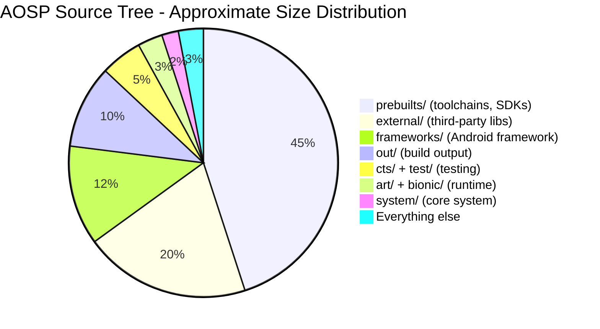

源码树绝大部分磁盘占用来自预构建二进制（编译器、SDK、模拟器镜像）和第三方库。真正由 Android 平台自己编写的代码，例如 framework、runtime、system 组件和 build system，虽然在总磁盘占用中不是最大头，但其体量依然极为惊人，仍然是数千万行级别。

---

## 1.5 谁在维护什么

Android 生态是 Google、芯片厂商、OEM 与开源社区共同协作的结果。理解每一层由谁负责，是判断 bug 应提给谁、patch 应投向何处，以及哪些约束塑造了当前架构的关键。

### 1.5.1 参与者地图

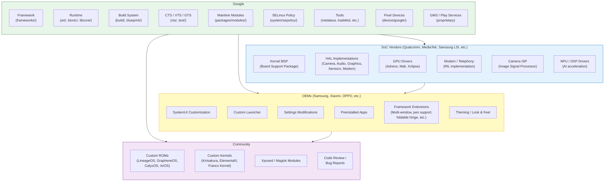

### 1.5.2 Google 的职责

Google 是 AOSP 的主要维护者。绝大多数 framework 代码、runtime 改进、build system 变更和测试基础设施都由 Google 工程师主导完成。Google 的具体职责包括：

**Framework 开发：**

- `system_server` 中的全部系统服务（AMS、WMS、PMS 及其他 100+ 服务）
- Android API surface（`frameworks/base/core/`）
- 原生服务（SurfaceFlinger、AudioFlinger、InputFlinger）
- 媒体框架（`frameworks/av/`）
- 构建系统（Soong、Blueprint、Make）

**API 治理：**

- API 设计评审（每个新 public API 都要经过 API council）
- API 兼容性强制（通过 Metalava 与 CTS）
- API level 管理（每个 Android 发布都会增加 API level）
- 废弃策略（API 会被标记 deprecated，但极少移除）

**兼容性：**

- CTS 的开发与维护
- CDD（Compatibility Definition Document）的编写
- 用于 HAL 合规性的 VTS（Vendor Test Suite）
- 用于 GMS 合规性的 GTS（Google Test Suite，专有）
- Treble / VNDK 的稳定性要求

**Mainline 模块：**

- Google 开发并维护可通过 Play Store 独立更新的 Mainline 模块。到 Android 15，已有 30 多个模块被“mainline 化”，包括：
  - Connectivity（WiFi、Bluetooth、Tethering、DNS）
  - Media（codec、extractor）
  - Permissions
  - ART（运行时本体）
  - ADB
  - Scheduling
  - Neural Networks（NNAPI）
  - 以及更多

**参考硬件：**

- Pixel 设备承担参考实现角色
- Android Emulator（Goldfish/Cuttlefish）提供软件参考实现
- Google Tensor 芯片让 Google 能够对完整技术栈进行联合优化

**安全：**

- 每月安全公告与补丁
- SELinux 策略开发
- Verified boot 实现
- Keystore/Keymaster/StrongBox 规范

### 1.5.3 SoC 厂商的职责

芯片厂商，例如 Qualcomm、MediaTek、Samsung LSI、Google Tensor、Unisoc 等，提供软件栈最底层部分：

**Kernel BSP（Board Support Package）：**

- SoC 的 device tree 定义
- 所有片上外设的驱动实现
- 电源管理（DVFS、idle state）
- 热管理
- 内核调度器调优

**HAL 实现：**

| HAL | SoC 厂商提供的内容 |
|---|---|
| **Camera** | ISP 驱动、3A 算法（自动对焦 / 自动曝光 / 自动白平衡）、HDR 处理、多摄同步 |
| **Graphics** | GPU 内核驱动、用户空间 GL/Vulkan 库、用于显示合成的 HWC（Hardware Composer） |
| **Audio** | ALSA / 音频内核驱动、音频 DSP 固件与控制、codec 配置 |
| **Sensors** | 传感器 hub 固件、sensor HAL 实现 |
| **Modem / Telephony** | RIL（Radio Interface Layer）实现、modem 固件、IMS（VoLTE/VoWiFi） |
| **Video Codec** | 硬件 codec 驱动、Codec2 HAL 实现 |
| **AI/ML** | NPU / DSP 驱动、NNAPI HAL 实现 |
| **WiFi** | WiFi 驱动、WiFi HAL 实现、固件 |
| **Bluetooth** | 蓝牙控制器驱动、BT HAL 实现、固件 |
| **GNSS** | GNSS 驱动、定位 HAL 实现 |

SoC 厂商通常会以大量专有源码和预构建二进制形式交付 BSP。OEM 则接收这套 BSP，并将它与自身设备配置集成。

Treble 架构意味着 SoC 厂商可以实现一次 HAL，然后 OEM 在更高层独立更新 Android framework。实践中，大版本升级通常依然需要 SoC 厂商更新 BSP，但小版本更新与安全补丁已经可以在不依赖厂商参与的前提下推进。

### 1.5.4 OEM 的职责

OEM，例如 Samsung、Xiaomi、OPPO、OnePlus、Motorola、Sony，甚至 Google 自己，都要对最终消费级产品负责。他们的工作覆盖：

**设备 bring-up：**

- 板级特定配置（device tree、分区布局）
- 设备特定 init 脚本
- SELinux 策略定制
- 内核配置（开关特性）

**用户体验定制：**

- SystemUI 修改（状态栏、快速设置、锁屏）
- 自定义 launcher（Samsung One UI Home、Xiaomi Poco Launcher 等）
- Settings 应用定制（增加 OEM 自有设置页）
- 主题与视觉设计（图标、颜色、动画、字体）
- 声音资源（铃声、通知音、UI 声音）
- 开机动画

**功能开发：**

- 多窗口增强（Samsung DeX、折叠屏分屏）
- 手写笔支持（Samsung S Pen、Motorola Smart Stylus）
- 相机软件（计算摄影、滤镜、模式）
- 安全增强（Samsung Knox、Xiaomi Mi Security）
- 无障碍能力
- 区域化定制（双卡行为、本地支付集成）

**测试与认证：**

- 运行 CTS 取得 Android compatibility certification
- 运行 GTS 取得 GMS certification
- 运营商认证测试
- 区域法规测试（FCC、CE 等）

**更新：**

- 将新 Android 版本移植到旧设备
- 集成每月安全补丁
- 推送 Mainline 模块更新（通过 Play Store）
- 固件更新（modem、TrustZone、bootloader）

### 1.5.5 社区贡献

开源社区扮演着若干重要角色：

**自定义 ROM 开发：**
自定义 ROM 以 AOSP 为基础构建替代性发行版。主要项目包括：

| 项目 | 重点 |
|---|---|
| **LineageOS** | CyanogenMod 的继任者。设备支持广、整体接近 AOSP，同时加入实用增强，是最大的自定义 ROM 社区。 |
| **GrapheneOS** | 安全与隐私优先。提供硬化内存分配器、改进沙箱、默认无 Google 依赖，仅支持 Pixel。 |
| **CalyxOS** | 以隐私为导向，可选 microG（开源 Play Services 替代方案），支持 Pixel 和少量其他设备。 |
| **/e/OS** | 去 Google 化 Android，同时配套云服务，面向想要隐私但不想承受复杂配置的普通用户。 |
| **Paranoid Android** | 以 UI 创新与设计见长，曾引入多项后来被 AOSP 吸收的特性，例如 immersive mode、heads-up notifications。 |
| **crDroid** | 功能丰富，整合多个来源的定制能力。 |

**Bug 报告与代码评审：**
AOSP 的 Gerrit 实例（android-review.googlesource.com）接受外部贡献，不过流程比普通开源项目更严格。社区成员也会在 AOSP issue tracker（issuetracker.google.com）提交问题，并参与邮件列表讨论。

**自定义内核：**
独立内核开发者会为特定设备构建优化内核，通常会在官方发布前就引入上游 Linux 改进、调度器调优和性能优化。

**Xposed / Magisk：**
改机社区通过 Xposed（运行时 Java 方法 hook）和 Magisk（systemless root）在不修改 system 分区的前提下改变 Android 行为。这些工具展示了对 ART 内部机制、init 系统和 dm-verity 的深刻理解。

---

## 1.6 AOSP 版本历史

自首次发布以来，Android 已发生巨大演进。下表记录了从 Android 1.0 到 Android 15 的主要版本。

### 1.6.1 完整版本表

| 版本 | API Level | 代号 | 发布时间 | 关键亮点 |
|---|---|---|---|---|
| **1.0** | 1 | （无） | 2008 年 9 月 | 首个公开版本。HTC Dream（T-Mobile G1）。具备 Gmail、Maps、Browser、Market 的基础智能手机操作系统。 |
| **1.1** | 2 | Petit Four（内部代号） | 2009 年 2 月 | Bug 修复与 API 打磨。 |
| **1.5** | 3 | **Cupcake** | 2009 年 4 月 | 虚拟键盘、视频录制、widgets、AppWidget framework、动画转场。 |
| **1.6** | 4 | **Donut** | 2009 年 9 月 | CDMA 支持、不同屏幕尺寸支持、快速搜索框、电池用量展示。 |
| **2.0** | 5 | **Eclair** | 2009 年 10 月 | 多账户支持、Exchange、HTML5、Bluetooth 2.1、动态壁纸、新浏览器。 |
| **2.0.1** | 6 | Eclair | 2009 年 12 月 | 小版本更新。 |
| **2.1** | 7 | Eclair MR1 | 2010 年 1 月 | 动态壁纸 API、五屏桌面。 |
| **2.2** | 8 | **Froyo** | 2010 年 5 月 | Dalvik JIT 编译、USB 共享、WiFi 热点、应用安装到 SD 卡、Chrome V8 JS 引擎。 |
| **2.3** | 9 | **Gingerbread** | 2010 年 12 月 | NFC 支持、SIP VoIP、陀螺仪/气压计 API、并发 GC、绿黑主题新 UI。 |
| **2.3.3** | 10 | Gingerbread MR1 | 2011 年 2 月 | NFC API 改进、新传感器。 |
| **3.0** | 11 | **Honeycomb** | 2011 年 2 月 | 平板专属版本。Action bar、fragment、硬件加速 2D 图形、全息 UI。 |
| **3.1** | 12 | Honeycomb MR1 | 2011 年 5 月 | USB host API、MTP/PTP、摇杆支持。 |
| **3.2** | 13 | Honeycomb MR2 | 2011 年 7 月 | 屏幕兼容性改进。 |
| **4.0** | 14 | **Ice Cream Sandwich** | 2011 年 10 月 | 统一手机和平板体验。Face Unlock、流量监控、Android Beam（NFC 共享）、新 Holo 主题。 |
| **4.0.3** | 15 | Ice Cream Sandwich MR1 | 2011 年 12 月 | Social stream API、calendar provider 改进。 |
| **4.1** | 16 | **Jelly Bean** | 2012 年 7 月 | Project Butter（三重缓冲、VSYNC 编排、60fps）、可展开通知、Google Now。 |
| **4.2** | 17 | Jelly Bean MR1 | 2012 年 11 月 | 多用户支持（平板）、Daydream 屏保、SELinux（permissive）。 |
| **4.3** | 18 | Jelly Bean MR2 | 2013 年 7 月 | Bluetooth Low Energy、受限 profile、OpenGL ES 3.0、SELinux（enforcing）。 |
| **4.4** | 19 | **KitKat** | 2013 年 10 月 | Project Svelte（低内存优化、512MB 设备）、Storage Access Framework、打印框架、ART 作为开发者选项引入。 |
| **5.0** | 21 | **Lollipop** | 2014 年 11 月 | **ART 取代 Dalvik**（AOT 编译）。Material Design。64 位 ABI 支持。Project Volta（JobScheduler、电池分析）。多网络 API。 |
| **5.1** | 22 | Lollipop MR1 | 2015 年 3 月 | 多 SIM、设备保护（Factory Reset Protection）、高清语音通话。 |
| **6.0** | 23 | **Marshmallow** | 2015 年 10 月 | **运行时权限** 取代纯安装时模型。Doze（深度休眠）、App Standby、指纹 API、USB-C、adoptable storage。 |
| **7.0** | 24 | **Nougat** | 2016 年 8 月 | 多窗口（分屏）、通知直接回复、Vulkan API、**JIT 编译器**（ART 变为 JIT+AOT 混合）、文件级加密、无缝 A/B 更新。 |
| **7.1** | 25 | Nougat MR1 | 2016 年 10 月 | 应用快捷方式、图片键盘、增强动态壁纸、Daydream VR。 |
| **8.0** | 26 | **Oreo** | 2017 年 8 月 | **Project Treble**（framework/vendor 分离）、通知 channel、autofill framework、PIP、adaptive icon、神经网络 API（NNAPI）。 |
| **8.1** | 27 | Oreo MR1 | 2017 年 12 月 | Android Go（低内存设备）、Neural Networks API 1.0。 |
| **9** | 28 | **Pie** | 2018 年 8 月 | 手势导航、adaptive battery / brightness（基于机器学习）、刘海屏 API、室内定位（WiFi RTT）、Biometric API、DNS over TLS。 |
| **10** | 29 | **Android 10** | 2019 年 9 月 | 首个公开不使用甜点命名的版本。深色主题、**scoped storage**、手势导航、折叠设备支持、5G API、**Project Mainline**（APEX 模块）、bubbles API。 |
| **11** | 30 | **Android 11** | 2020 年 9 月 | 通知中的 conversation、bubbles、一次性权限、**Stable AIDL for HALs**、5G 增强、无线调试、device controls（智能家居）。 |
| **12** | 31 | **Android 12** | 2021 年 10 月 | **Material You**（从壁纸生成动态主题）、**GKI**、隐私面板、模糊定位、麦克风/相机指示器、splash screen API、Mainline 模块扩展。 |
| **12L** | 32 | Android 12L | 2022 年 3 月 | 大屏优化（平板、折叠屏、ChromeOS），包括任务栏、多列布局和更好的分屏。 |
| **13** | 33 | **Android 13** | 2022 年 8 月 | 应用级语言偏好、主题图标、通知权限、photo picker、predictive back gesture、可编程 shader（AGSL）。 |
| **14** | 34 | **Android 14** | 2023 年 10 月 | 语法屈折 API、区域偏好、path interop、credential manager、health connect、Ultra HDR、无损 USB 音频，以及更高的平台稳定性。 |
| **15** | 35 | **Android 15（Vanilla Ice Cream）** | 2024 年 | 应用归档、局部屏幕共享、卫星连接 API、增强 PDF 渲染、**AV1 软件 codec**、NFC 支付改进、private space（用于敏感应用的独立 profile）、更强的录屏 / 投屏安全保护、Health Connect 扩展。 |

### 1.6.2 架构里程碑

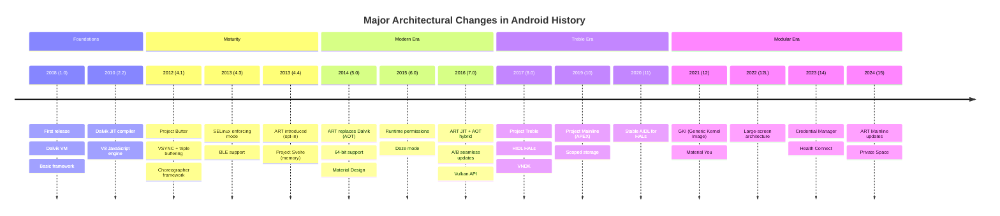

### 1.6.3 API Level 增长

Android SDK 中公开 API 的数量一直在快速增长：

| 版本 | 公开 API 数量（约） | 代表性新增内容 |
|---|---|---|
| API 1（1.0） | ~2,000 | 基础能力：Activity、View、Intent、ContentProvider |
| API 8（2.2） | ~5,000 | Backup、Cloud-to-Device Messaging |
| API 14（4.0） | ~10,000 | ActionBar、Fragments（手机侧）、Social API |
| API 21（5.0） | ~18,000 | Material Design、Camera2、JobScheduler、ART |
| API 26（8.0） | ~25,000 | Autofill、NNAPI、Notification Channels |
| API 29（10） | ~30,000 | 深色主题、Scoped Storage、BiometricPrompt |
| API 33（13） | ~35,000 | Photo picker、应用级语言、主题图标 |
| API 35（15） | ~40,000+ | Satellite API、Private space、Health Connect |

每个 API level 都严格包含前一个版本的全部能力（极少数废弃 API 最终会被移除）。这些 API 由 Metalava 维护的签名文件定义：

- `current.txt`：公开 API 签名
- `system-current.txt`：System API（供特权应用使用）
- `module-lib-current.txt`：Module library API（供 Mainline 模块使用）
- `test-current.txt`：Test API

---

## 1.7 开发者之旅：本书路线图

使用 AOSP 是一段逐步深入的旅程：从下载源码开始，逐渐进入理解、修改、构建、测试和向上游贡献。本节梳理典型开发路径，并将其映射到本书的章节安排中。

### 1.7.1 这段旅程

```mermaid
graph TB
    subgraph Phase1["Phase 1: Setup"]
        Download["Download Source<br/>(repo init + sync)"]
        Environment["Set Up Build<br/>Environment"]
        FirstBuild["First Build<br/>(lunch + m)"]
        Flash["Flash & Run<br/>(Emulator or Device)"]
    end

    subgraph Phase2["Phase 2: Understanding"]
        Architecture["Study Architecture<br/>(This chapter)"]
        BuildSystem["Learn Build System<br/>(Soong, Blueprint, Make)"]
        Binder_study["Understand Binder<br/>(IPC mechanism)"]
        Boot["Trace Boot Process<br/>(init → Zygote → system_server)"]
    end

    subgraph Phase3["Phase 3: Exploration"]
        ReadCode["Read Framework Code<br/>(Follow an API call end-to-end)"]
        Tracing["Use System Tracing<br/>(Perfetto, systrace)"]
        Debugging["Debug with GDB/LLDB<br/>and Android Studio"]
        Dumpsys["Use dumpsys, logcat,<br/>and other diagnostic tools"]
    end

    subgraph Phase4["Phase 4: Modification"]
        ModifyFramework["Modify a System Service"]
        AddHAL["Implement a HAL"]
        CustomApp["Modify a System App<br/>(SystemUI, Launcher, Settings)"]
        NewDevice["Add a New Device<br/>(device/ configuration)"]
    end

    subgraph Phase5["Phase 5: Mastery"]
        Performance["Performance Analysis<br/>and Optimization"]
        Security["Security Hardening<br/>and SELinux Policy"]
        Contribute["Contribute Upstream<br/>(Gerrit code review)"]
        Maintain["Maintain a Custom<br/>Distribution"]
    end

    Phase1 --> Phase2
    Phase2 --> Phase3
    Phase3 --> Phase4
    Phase4 --> Phase5

    style Phase1 fill:#e8f5e9,stroke:#2e7d32
    style Phase2 fill:#e3f2fd,stroke:#1565c0
    style Phase3 fill:#fff9c4,stroke:#f9a825
    style Phase4 fill:#f3e5f5,stroke:#7b1fa2
    style Phase5 fill:#fce4ec,stroke:#c62828
```

### 1.7.2 第 1 阶段：获取源码并完成构建

第一步是下载 AOSP 源码并成功构建。对应内容在 **第 2 章：搭建开发环境**。

```
# Install repo tool
mkdir -p ~/bin
curl https://storage.googleapis.com/git-repo-downloads/repo > ~/bin/repo
chmod a+x ~/bin/repo

# Initialize the AOSP repository
mkdir aosp && cd aosp
repo init -u https://android.googlesource.com/platform/manifest -b main

# Sync all repositories (this downloads ~100 GB)
repo sync -c -j$(nproc) --optimized-fetch

# Set up the build environment
source build/envsetup.sh

# Choose a build target
lunch aosp_cf_x86_64_phone-trunk_staging-eng

# Build
m -j$(nproc)
```

`lunch` 命令用于选择 **product**（设备配置）、**release** 和 **variant**（eng、userdebug、user）：

| Variant | 说明 | 调试能力 | 性能 |
|---|---|---|---|
| `eng` | 工程构建。完整调试能力、全部开发工具。 | 完整：adb root、全部日志、debug assertion | 较低（有调试开销） |
| `userdebug` | 接近量产、但保留调试能力。**开发首选。** | 支持 adb root，可用调试日志 | 接近量产 |
| `user` | 正式量产构建，即面向消费者的版本。 | 不支持 adb root，日志受限 | 完整量产性能 |

构建完成后，你可以启动模拟器：

```
# Launch Cuttlefish (cloud/headless emulator)
launch_cvd

# Or launch the graphical emulator
emulator
```

### 1.7.3 第 2 阶段：理解架构

当源码已经下载、系统已经跑起来，下一步就是理解各个部分如何协同。这也是本书前几章的重点：

- **第 1 章（本章）**：宏观图景，包括架构、源码树、参与方
- **第 2 章**：构建环境、repo、Soong/Blueprint、构建目标
- **第 3 章**：深入构建系统，理解 `Android.bp` 的工作方式、模块类型与变体
- **第 4 章**：启动流程，从 bootloader 一直到锁屏界面
- **第 5 章**：Binder IPC，理解一切跨进程通信的骨架
- **第 6 章**：system_server 与 framework services，理解 Android 的心脏

### 1.7.4 第 3 阶段：探索与调试

在理解架构之后，你就可以开始观察真实运行中的系统：

- **第 7 章**：调试工具，包括 logcat、dumpsys、Perfetto、LLDB、Android Studio 平台调试
- **第 8 章**：ART 内部机制，包括 GC、JIT/AOT、类加载
- **第 9 章**：图形管线，包括 SurfaceFlinger、HWUI、BufferQueue、HWC
- **第 10 章**：输入管线，从触摸屏驱动直到应用的 `onTouchEvent()`
- **第 11 章**：Activity 与窗口管理，包括 AMS、WMS、task stack

### 1.7.5 第 4 阶段：修改与开发

理解之后，才具备修改能力：

- **第 12 章**：修改 framework service，例如增加新的 system service
- **第 13 章**：HAL 开发，实现硬件抽象层
- **第 14 章**：系统应用开发，定制 SystemUI、Launcher、Settings
- **第 15 章**：设备 bring-up，为新硬件增加支持
- **第 16 章**：Mainline 模块，开发可更新组件

### 1.7.6 第 5 阶段：进阶与精通

- **第 17 章**：性能优化，包括 profiling、tracing、benchmark
- **第 18 章**：安全架构，包括 SELinux、Keystore、verified boot、sandboxing
- **第 19 章**：测试，包括 CTS、VTS 和平台测试编写
- **第 20 章**：向 AOSP 贡献，包括 Gerrit 工作流与 code review 流程

### 1.7.7 端到端追踪一次 API 调用

为了让“理解架构”这件事更加具体，我们来追踪一次应用调用 `startActivity(intent)` 时到底发生什么：

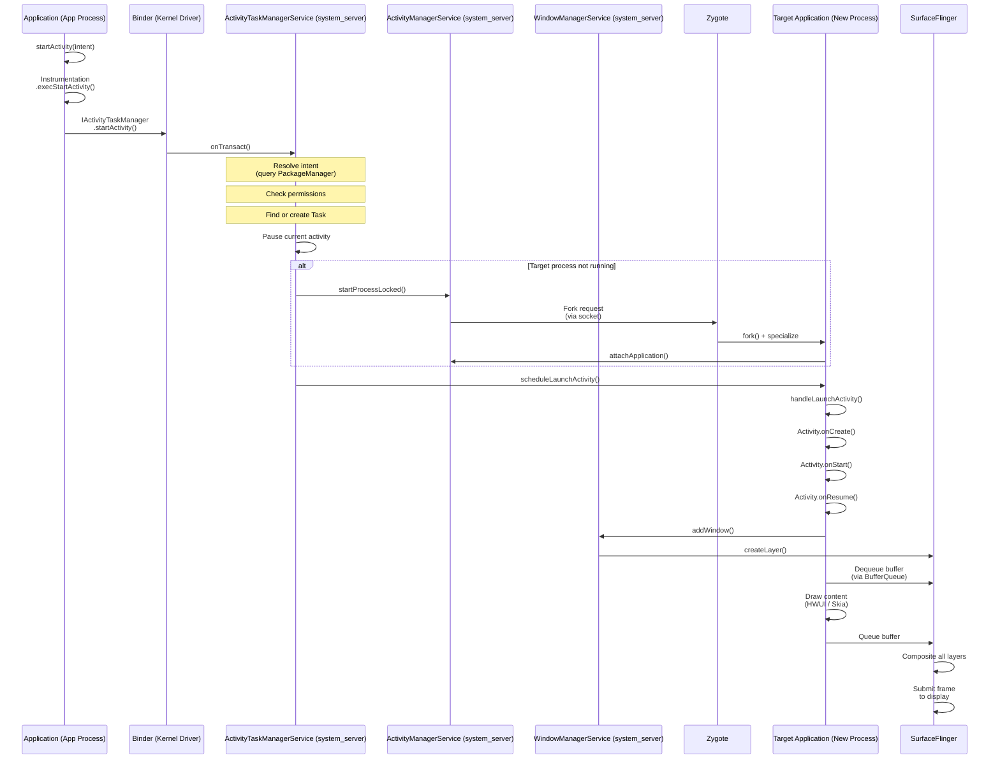

单次 `startActivity()` 调用会穿越：

1. **应用进程**（Java）：`Activity.startActivity()`
2. **Binder IPC**（内核驱动）：跨进程事务
3. **system_server**（Java）：`ActivityTaskManagerService` 解析 intent、检查权限、管理 task / activity stack
4. **Zygote**（native）：如有必要则 fork 新进程
5. **目标应用进程**（Java）：执行 Activity 生命周期回调
6. **WindowManagerService**（Java）：创建窗口并完成布局
7. **SurfaceFlinger**（native C++）：完成显示合成
8. **Display HAL**（vendor）：完成硬件合成和显示输出

一次 `startActivity()` 几乎触及 Android 栈中的每一层。这正是理解全栈架构极其重要的原因。当某处出现问题，例如启动慢、权限被拒、显示异常，你需要知道应该从哪一层开始排查。

---

## 1.8 关键概念速查

本节对你在本书以及 AOSP 开发中最常遇到的重要概念给出简明定义。每个概念都会在后续章节中展开；这里提供的是快速检索与定向导航。

### 1.8.1 Binder

**Binder** 是 Android 的进程间通信（IPC）机制。它是 Android 中最重要的架构元素，几乎所有跨进程通信都要经过 Binder。

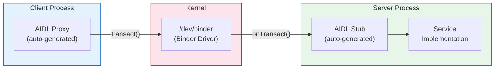

**关键特征：**

- **基于事务**：客户端发送 data parcel，并接收 reply parcel
- **默认同步**：调用方会阻塞，直到服务端处理完成并返回
- **面向对象**：Binder 引用可以作为对象句柄在进程间传递
- **由内核中介**：内核驱动负责数据拷贝、UID/PID 验证与引用计数
- **三套实例**：`/dev/binder`（framework IPC）、`/dev/hwbinder`（framework-to-HAL）、`/dev/vndbinder`（vendor-to-vendor）

**源码位置：**

- 内核驱动：`drivers/android/binder.c`（内核源码中）
- 原生库：`frameworks/native/libs/binder/`
- Java 层：`frameworks/base/core/java/android/os/Binder.java`
- AIDL 编译器：`system/tools/aidl/`
- ServiceManager：`frameworks/native/cmds/servicemanager/`

Binder 会在 **第 5 章** 中深入展开。

### 1.8.2 HAL（Hardware Abstraction Layer）

**Hardware Abstraction Layer** 是 Android framework 与硬件特定厂商实现之间的标准化接口。它让同一套 Android framework 可以运行在不同硬件平台上。

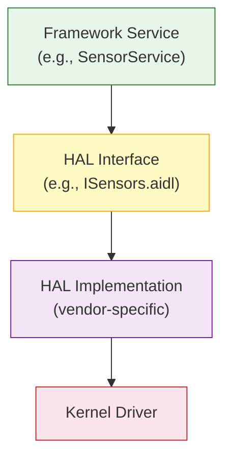

**关键特征：**

- 由 AIDL（现代）或 HIDL（遗留）接口定义
- 由 SoC 厂商与 OEM 实现
- 出于稳定性与安全性考虑，通常运行在独立进程中（out-of-process HAL）
- 由 VTS（Vendor Test Suite）测试
- 通过版本机制实现向后兼容

**源码位置：** `hardware/interfaces/`（接口定义）

HAL 开发会在 **第 13 章** 中展开。

### 1.8.3 AIDL（Android Interface Definition Language）

**AIDL** 是定义 Binder IPC 接口的语言。AIDL 编译器能够生成 Java、C++、NDK C++ 或 Rust 的客户端 proxy 与服务端 stub 代码。

```
// Example: IActivityManager.aidl
interface IActivityManager {
    int startActivity(in IApplicationThread caller,
                      in String callingPackage,
                      in Intent intent,
                      in String resolvedType,
                      in IBinder resultTo,
                      in String resultWho,
                      int requestCode,
                      int startFlags,
                      in ProfilerInfo profilerInfo,
                      in Bundle bOptions);
    // ... many more methods
}
```

**关键特征：**

- 同时用于 framework IPC 与 HAL 接口（Stable AIDL）
- 支持 parcelable 数据类型（自定义数据结构）
- 可为 Java、C++（libbinder）、NDK C++（libbinder_ndk）和 Rust 生成代码
- Stable AIDL 接口具备版本机制且要求向后兼容
- Android 11+ 中，新的 HAL 接口已经以 AIDL 取代 HIDL

**源码位置：**

- AIDL 编译器：`system/tools/aidl/`
- Framework 中的 AIDL：散布在 `frameworks/base/core/java/`
- HAL 中的 AIDL：`hardware/interfaces/`

### 1.8.4 HIDL（Hardware Interface Definition Language）

**HIDL** 是伴随 Project Treble（Android 8.0）引入的 HAL 接口定义语言。它已经被 Stable AIDL 取代，不再用于新接口，但旧 HAL 仍在使用。

```
// Example: ICameraDevice.hal (HIDL)
interface ICameraDevice {
    getCameraCharacteristics()
        generates (Status status, CameraMetadata cameraCharacteristics);
    open(ICameraDeviceCallback callback)
        generates (Status status, ICameraDeviceSession session);
    // ...
};
```

**关键特征：**

- 使用 `hwbinder` 传输，而非 framework binder
- 严格版本化，例如 `android.hardware.camera.device@3.5`
- 支持 binderized（跨进程）与 passthrough（进程内）两种模式
- 已冻结：不再接受新的 HIDL 接口
- 现有 HIDL 接口会继续维护，直至迁移到 AIDL

**源码位置：**

- HIDL 编译器：`system/tools/hidl/`
- HAL HIDL 文件：`hardware/interfaces/` 中的 `.hal`
- 运行时：`system/libhidl/`

### 1.8.5 APEX（Android Pony EXpress）

**APEX** 是 Mainline 模块的打包格式。它承载那些可以独立于整机 OTA 更新、并通过 Google Play Store 下发的 Android 核心组件。

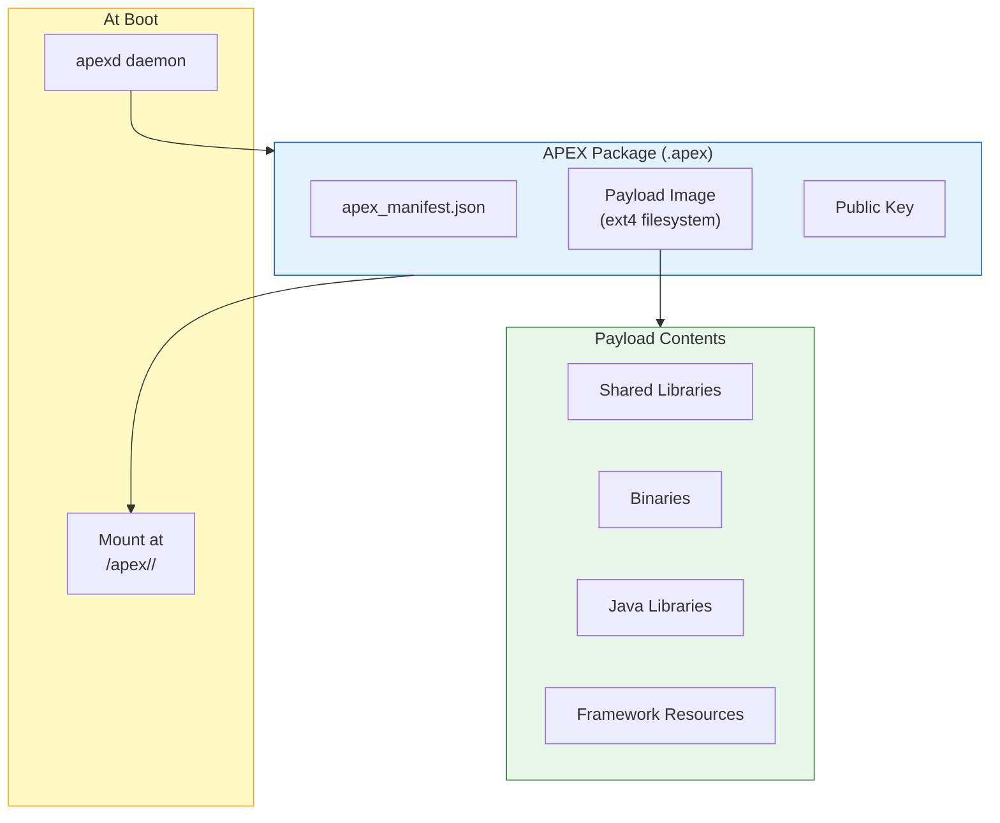

**关键特征：**

- 自包含包，内置独立文件系统镜像
- 启动时挂载到 `/apex/<name>/`
- 通过加密签名并进行完整性验证
- 支持 rollback，在新版本异常时回退
- 可通过 Play Store 更新，无需整机 OTA
- 由 `apexd`（`system/apex/apexd/`）管理
- 典型模块包括 ART、Conscrypt、Media、DNS Resolver、WiFi、Tethering

**源码位置：** `system/apex/`（基础设施），`packages/modules/`（具体模块）

### 1.8.6 Mainline

**Project Mainline**（Android 10 引入）是 Android 的模块化更新计划。它将核心组件拆分为可通过 Play Store 独立更新的模块。每个模块会以 APEX 或可更新 APK 形式交付。

```mermaid
graph TB
    subgraph Traditional["Traditional Update Model"]
        Google1["Google releases<br/>new Android version"]
        SoC1["SoC vendor updates BSP"]
        OEM1["OEM integrates & tests"]
        Carrier1["Carrier approves"]
        User1["User receives update<br/>(6-18 months later)"]

        Google1 --> SoC1 --> OEM1 --> Carrier1 --> User1
    end

    subgraph Mainline_Model["Mainline Update Model"]
        Google2["Google updates<br/>Mainline module"]
        PlayStore["Google Play Store<br/>delivers update"]
        User2["User receives update<br/>(days/weeks)"]

        Google2 --> PlayStore --> User2
    end

    style Traditional fill:#fce4ec,stroke:#c62828
    style Mainline_Model fill:#e8f5e9,stroke:#2e7d32
```

到 Android 15，Mainline 模块包括：

| 模块 | 类型 | 更新内容 |
|---|---|---|
| **ART** | APEX | 运行时本体（GC、JIT、AOT、核心库） |
| **Conscrypt** | APEX | TLS/SSL（证书处理、加密） |
| **DNS Resolver** | APEX | DNS 解析 |
| **Media** | APEX | 媒体 codec、extractor 与 framework |
| **WiFi** | APEX | WiFi 栈 |
| **Tethering** | APEX | 热点与共享网络 |
| **Bluetooth** | APEX | 蓝牙栈 |
| **Connectivity** | APEX | 网络连接 |
| **Telephony** | APEX | 电话与蜂窝框架 |
| **Permission Controller** | APK | 权限界面 |
| **Neural Networks** | APEX | NNAPI runtime |
| **StatsD** | APEX | 指标采集 |
| **IPsec** | APEX | VPN |
| **SDK Extensions** | APEX | API 扩展机制 |
| **AdServices** | APEX | 隐私友好型广告服务 |
| **UWB** | APEX | 超宽带 |
| **ADB** | APEX | Android Debug Bridge |
| **Health Connect** | APK | 健康与运动数据 |
| **Scheduling** | APEX | 任务调度 |
| **Profiling** | APEX | 性能分析 |
| **On-Device Personalization** | APEX | 设备侧个性化 ML |

Mainline 的意义再怎么强调都不为过。在 Mainline 之前，如果 DNS 解析器或媒体框架存在安全漏洞，就必须依赖整机 OTA，而这需要走完 OEM 与运营商的整个更新链路。有了 Mainline，Google 可以在数周内向数十亿设备推送修复，而不必等待 OEM 发布系统更新。

### 1.8.7 ART（Android Runtime）

**ART** 是在 Android 上执行应用与 framework 代码的托管运行时。它在 Android 5.0 中取代 Dalvik。

**关键特征：**

- 执行 DEX 字节码（Dalvik Executable 格式）
- 多层级执行：解释器、JIT 编译器、AOT 编译器（`dex2oat`）
- Profile-Guided Optimization：JIT profile 指导 AOT 编译
- 并发、分代垃圾回收器（CC：Concurrent Copying）
- 支持 32 位与 64 位架构（ARM、ARM64、x86、x86_64、RISC-V）
- 本身也是 Mainline 模块，可通过 Play Store 更新

**源码位置：** `art/`

ART 内部机制会在 **第 8 章** 深入讲解。

### 1.8.8 Zygote

**Zygote** 是所有 Android 应用进程及 `system_server` 的父进程。

**关键特征：**

- 启动早期由 `init` 拉起
- 预加载公共类（约 6000+）和资源
- 在 Unix domain socket 上监听 fork 请求
- 通过 `fork()` 与 copy-on-write 实现快速进程创建
- 在 64 位设备上通常有两个实例：`zygote64`（主）与 `zygote`（给遗留 32 位应用使用）

**源码位置：**

- 入口：`frameworks/base/cmds/app_process/`
- Java：`frameworks/base/core/java/com/android/internal/os/ZygoteInit.java`
- 配置：`system/zygote/`

### 1.8.9 system_server

**system_server** 是承载全部 Java framework 服务的进程。它是 Zygote 在启动过程中 fork 出的第一个进程。

**关键特征：**

- 承载 100+ 个系统服务（AMS、WMS、PMS 等）
- 服务通过 Binder IPC 与应用通信
- 以 `system` 用户（UID 1000）运行，拥有广泛权限
- system_server 崩溃会导致系统级重启（soft reboot）
- 在内核与 init 之后，它是最关键的进程

**源码位置：**

- 入口：`frameworks/base/services/java/com/android/server/SystemServer.java`
- 服务实现：`frameworks/base/services/core/java/com/android/server/`
- 原生组件：`frameworks/base/services/core/jni/`

### 1.8.10 SurfaceFlinger

**SurfaceFlinger** 是负责将所有可见 surface（窗口、图层）合成为屏幕最终图像的系统服务。

```mermaid
graph LR
    App1["App 1<br/>Window"] --> BQ1["BufferQueue"]
    App2["App 2<br/>Window"] --> BQ2["BufferQueue"]
    SysUI["SystemUI<br/>(Status Bar)"] --> BQ3["BufferQueue"]
    Nav["Navigation<br/>Bar"] --> BQ4["BufferQueue"]

    BQ1 --> SF["SurfaceFlinger"]
    BQ2 --> SF
    BQ3 --> SF
    BQ4 --> SF

    SF --> HWC["HWC HAL<br/>(Hardware<br/>Composer)"]
    HWC --> Display["Display"]

    style SF fill:#e3f2fd,stroke:#1565c0
    style HWC fill:#f3e5f5,stroke:#7b1fa2
    style Display fill:#e8f5e9,stroke:#2e7d32
```

**关键特征：**

- 通过 `BufferQueue` 接收所有可见窗口的 buffer
- 使用 HWC（Hardware Composer）处理硬件图层，使用 GPU 进行 client composition
- 管理 VSYNC 时序与帧调度
- 支持多显示（内屏、外接、虚拟显示）
- 是显示性能的关键，掉帧会直接表现为卡顿

**源码位置：** `frameworks/native/services/surfaceflinger/`

图形管线会在 **第 9 章** 详细讨论。

### 1.8.11 WindowManagerService（WMS）

**WindowManagerService** 负责管理窗口层级，它决定哪些窗口可见、它们的大小和位置、z-order、输入焦点，以及各种转场与动画。

**关键特征：**

- 管理所有显示上的全部窗口
- 基于显示大小、insets 与 system bars 计算窗口布局
- 与 SurfaceFlinger 协作创建与销毁 layer
- 管理窗口转场与动画
- 执行窗口策略，例如可置顶规则与焦点规则
- 与 ActivityTaskManagerService 紧密协作，处理 activity 窗口

**源码位置：**
`frameworks/base/services/core/java/com/android/server/wm/`

### 1.8.12 ActivityManagerService（AMS）/ ActivityTaskManagerService（ATMS）

**ActivityManagerService** 负责应用进程管理，包括进程生命周期（启动、停止、杀死）、OOM 调整（内存紧张时应优先杀谁）以及 broadcast 分发。

**ActivityTaskManagerService** 在 Android 10 中从 AMS 拆出，负责 activity、task 与 activity stack，也就是用户可见的“任务管理”部分：谁在前台、如何切任务、最近任务列表如何维护。

**关键特征：**

- AMS：进程生命周期、OOM adj、broadcast 分发、content provider、service 绑定
- ATMS：activity 生命周期、task 管理、最近任务、多窗口
- 两者共同构成 system_server 中最复杂的服务组合
- 源码目录里 `am/` 放置 AMS，而 `wm/` 同时包含 ATMS 与 WMS，这反映了 activity 管理与窗口管理的强耦合关系

**源码位置：**

- AMS：`frameworks/base/services/core/java/com/android/server/am/`
- ATMS：`frameworks/base/services/core/java/com/android/server/wm/`

Activity 与窗口管理会在 **第 11 章** 展开。

### 1.8.13 PackageManagerService（PMS）

**PackageManagerService** 负责一切与 APK 包相关的工作：安装、卸载、包查询、权限管理、intent 解析和 APK 校验。

**关键特征：**

- 启动时扫描并索引全部已安装包
- 负责 APK 安装，包括 split APK
- 将 intent 解析到目标组件
- 管理权限，包括安装时权限和运行时权限
- 强制执行包签名与完整性校验
- 维护包状态，例如组件启用 / 禁用、默认处理器
- 它也是 system_server 中最复杂的服务之一

**源码位置：**
`frameworks/base/services/core/java/com/android/server/pm/`

---

## 1.9 AOSP 开发工具概览

在进入后续章节细节之前，先熟悉每天使用的核心工具，会极大降低 AOSP 开发门槛。

### 1.9.1 源码管理

| 工具 | 命令 | 用途 |
|---|---|---|
| **repo** | `repo init`、`repo sync` | 多仓库管理（对 Git 的封装） |
| **git** | `git log`、`git diff`、`git commit` | 单仓库版本控制 |
| **Gerrit** | Web UI | AOSP 代码评审系统 |

### 1.9.2 构建工具

| 工具 | 命令 | 用途 |
|---|---|---|
| **lunch** | `lunch <target>` | 选择构建目标（设备 + variant） |
| **m** | `m` | 构建整个系统平台 |
| **mm** | `mm` | 构建当前目录中的模块 |
| **mmm** | `mmm <path>` | 构建指定目录中的模块 |
| **mma** | `mma` | 连同依赖一起构建 |
| **soong_ui** | （内部） | 构建系统入口 |
| **blueprint** | （内部） | `.bp` 文件解析器 |

### 1.9.3 调试与分析

| 工具 | 命令示例 | 用途 |
|---|---|---|
| **adb** | `adb shell`、`adb logcat` | 设备通信与日志 |
| **logcat** | `adb logcat -s TAG` | 系统与应用日志查看 |
| **dumpsys** | `adb shell dumpsys activity` | 导出系统服务状态 |
| **am** | `adb shell am start -n com.pkg/.Activity` | Activity Manager 命令 |
| **pm** | `adb shell pm list packages` | Package Manager 命令 |
| **wm** | `adb shell wm size` | Window Manager 命令 |
| **settings** | `adb shell settings get system font_scale` | 读写系统设置 |
| **cmd** | `adb shell cmd package list packages` | 通用服务命令接口 |
| **Perfetto** | `perfetto -c config.pbtxt` | 全系统 tracing |
| **systrace** | `systrace.py --time=5 gfx view` | 旧版系统 tracing |
| **simpleperf** | `simpleperf record -p <pid>` | CPU profiling |
| **LLDB** | `lldb` | 原生代码调试器 |
| **Android Studio** | IDE | Java/Kotlin 调试、布局检查 |

### 1.9.4 设备工具

| 工具 | 命令 | 用途 |
|---|---|---|
| **fastboot** | `fastboot flash system system.img` | 刷写分区镜像 |
| **adb sideload** | `adb sideload update.zip` | 在 recovery 中安装 OTA |
| **make snod** | `make snod` | 不全量构建，仅重建 system image |
| **emulator** | `emulator` | 基于 QEMU 的 Android Emulator |
| **launch_cvd** | `launch_cvd` | 启动 Cuttlefish 虚拟设备 |
| **lshal** | `adb shell lshal` | 列出 HAL 服务 |
| **service** | `adb shell service list` | 列出 Binder 服务 |

### 1.9.5 dumpsys：你最好的朋友

`dumpsys` 值得被单独强调，因为它几乎是 AOSP 开发中**最好用的诊断工具**。它会向系统服务发起查询，并打印其内部状态：

```bash
# List all services
adb shell dumpsys -l

# Dump a specific service (examples)
adb shell dumpsys activity              # AMS state (processes, tasks, etc.)
adb shell dumpsys activity activities   # Activity stacks only
adb shell dumpsys activity processes    # Process list with OOM adj
adb shell dumpsys window               # WMS state (windows, displays)
adb shell dumpsys window displays       # Display configuration
adb shell dumpsys package <pkg>        # Package details
adb shell dumpsys meminfo              # Memory usage by process
adb shell dumpsys battery              # Battery state
adb shell dumpsys alarm                # Alarm schedule
adb shell dumpsys jobscheduler         # Scheduled jobs
adb shell dumpsys notification         # Notification state
adb shell dumpsys audio                # Audio state
adb shell dumpsys SurfaceFlinger       # SurfaceFlinger state
adb shell dumpsys input                # Input state (devices, dispatch)
adb shell dumpsys connectivity         # Network state
adb shell dumpsys power                # Power state (wake locks, etc.)
adb shell dumpsys usagestats           # App usage statistics
```

每个系统服务都会实现一个 `dump()` 方法，以可读文本形式输出当前状态。调试任何问题时，针对相关服务运行 `dumpsys`，往往都是最先要做的事情。

---

## 1.10 本书中的约定

在本书中，我们统一使用以下约定：

### 1.10.1 源码路径

所有源码路径都相对于 AOSP 根目录给出。当我们写下：

```
frameworks/base/services/core/java/com/android/server/wm/WindowManagerService.java
```

它对应的真实路径就是：

```
<AOSP_ROOT>/frameworks/base/services/core/java/com/android/server/wm/WindowManagerService.java
```

其中 `<AOSP_ROOT>` 是你执行 `repo init` 和 `repo sync` 的目录。本书中的所有路径都相对于这个根目录。

### 1.10.2 代码清单

代码清单会带上语言标识，并在相关情况下附上源码文件路径：

```java
// frameworks/base/core/java/android/app/Activity.java
public void startActivity(Intent intent) {
    this.startActivity(intent, null);
}
```

当代码被省略时，使用省略号（`...`）表示被隐藏部分：

```java
public class ActivityManagerService extends IActivityManager.Stub {
    // ... hundreds of fields ...

    @Override
    public void startActivity(...) {
        // ... implementation ...
    }
}
```

### 1.10.3 Shell 命令

Shell 命令使用 `$` 表示普通用户命令，使用 `#` 表示 root 命令：

```bash
$ adb shell                      # Connect to device shell
$ source build/envsetup.sh       # Set up build environment
# setenforce 0                   # Disable SELinux (root required)
```

### 1.10.4 Mermaid 图

本书会大量使用 Mermaid 图表示架构、时序图和流程图。任何支持 Mermaid 的 Markdown 查看器都可以渲染这些图，包括 GitHub、GitLab 和大多数现代文档工具。

### 1.10.5 术语

| 术语 | 含义 |
|---|---|
| **AOSP** | Android Open Source Project |
| **Framework** | system_server 中的 Java/Kotlin 层以及 `android.*` API |
| **Native** | C/C++ 代码，相对 Java/Kotlin 而言 |
| **HAL** | Hardware Abstraction Layer |
| **Service** | 运行在 system_server 中的系统服务（Java）或独立守护进程（native） |
| **Process** | 拥有独立 PID 和内存空间的操作系统进程 |
| **Binder service** | 可通过 Binder IPC 访问的服务 |
| **Client** | 发起 Binder 调用的进程 |
| **Server** | 承载 Binder 服务实现的进程 |
| **SoC** | System on Chip，例如 Qualcomm Snapdragon、MediaTek Dimensity |
| **OEM** | Original Equipment Manufacturer，设备制造商，例如 Samsung、Xiaomi |
| **BSP** | Board Support Package，即针对特定 SoC 的内核与驱动集合 |
| **CTS** | Compatibility Test Suite |
| **VTS** | Vendor Test Suite |
| **GMS** | Google Mobile Services |
| **CDD** | Compatibility Definition Document |
| **GKI** | Generic Kernel Image |
| **GSI** | Generic System Image |

---

## 1.11 Summary

本章建立了理解与操作 AOSP 所需的基础知识：

1. **AOSP 是 Android 生态的开源底座。** Google 在其上叠加 GMS（专有层），OEM 在其上增加定制，社区则在其上构建替代发行版。明确你所在的层，是一切平台工作的起点。

2. **Android 的架构是清晰分层的技术栈。** 它从 Linux 内核开始，向上经过 HAL、原生服务、ART 运行时、framework 服务（system_server）、公开 API，最终到达应用层。每一层都有明确职责，并通过稳定接口与相邻层通信。

3. **源码树虽然庞大，但组织良好。** 30+ 个顶层目录各司其职：`art/` 存放运行时，`bionic/` 存放 C 库，`frameworks/` 存放应用框架，`hardware/` 存放 HAL 接口，`system/` 存放核心系统组件，`packages/` 存放应用与模块，`build/` 存放构建系统，等等。

4. **Android 生态是一种协作结构。** Google 负责 framework、CTS、Mainline；SoC 厂商负责内核、HAL 与驱动；OEM 负责定制与设备 bring-up；社区则贡献自定义 ROM、问题反馈与补丁。

5. **Android 在 15+ 年、35 个 API level 中经历了剧烈演进。** 关键架构转折包括 Dalvik 向 ART 的切换、Project Treble 带来的 vendor 分离、Project Mainline 带来的模块化更新，以及 GKI 带来的内核标准化。

6. **开发者的旅程** 起始于源码下载与构建，随后进入架构理解，再进阶到修改、测试与贡献平台。

7. **核心术语**，例如 Binder、HAL、AIDL、HIDL、APEX、Mainline、ART、Zygote、system_server、SurfaceFlinger、WMS、AMS、PMS，是 AOSP 开发的基本词汇。你会在本书后续每一章中反复遇见它们。

下一章，我们会真正卷起袖子，搭建完整的 AOSP 开发环境：安装依赖、下载源码、配置构建，并在模拟器中跑出第一版系统。

---

## 1.12 Further Reading

- **AOSP Source**: https://source.android.com/
- **AOSP Code Search**: https://cs.android.com/
- **AOSP Gerrit (Code Review)**: https://android-review.googlesource.com/
- **AOSP Issue Tracker**: https://issuetracker.google.com/issues?q=componentid:192735
- **Android Architecture Overview**: https://source.android.com/docs/core/architecture
- **Project Treble**: https://source.android.com/docs/core/architecture/treble
- **Project Mainline**: https://source.android.com/docs/core/ota/modular-system
- **GKI**: https://source.android.com/docs/core/architecture/kernel/generic-kernel-image
- **CTS Documentation**: https://source.android.com/docs/compatibility/cts
- **CDD**: https://source.android.com/docs/compatibility/cdd
- **Android API Reference**: https://developer.android.com/reference
- **Android Platform Architecture**: https://developer.android.com/guide/platform

---

*下一章：第 2 章 -- 搭建开发环境*

