# Chapter 1: Introduction

> *"Android is an open platform. It's available for anyone to use. That's the beauty of it."*
> -- Andy Rubin, co-founder of Android

---

## 1.1 Why This Book Exists

The Android Open Source Project is one of the largest, most complex, and most
consequential open-source projects in human history. It powers over three billion
active devices, from phones and tablets to televisions, cars, wearables, and
embedded systems. Its codebase spans hundreds of millions of lines of code across
thousands of Git repositories. Its architecture bridges a Linux kernel written in
C with a Java/Kotlin application framework, connected by native C++ services, a
custom IPC mechanism (Binder), and a purpose-built runtime (ART).

And yet, for all its ubiquity, AOSP remains poorly understood -- even among
experienced Android application developers. The typical Android developer
interacts with AOSP through a narrow window: the SDK APIs documented on
developer.android.com. What lies beneath those APIs -- the services, the native
daemons, the hardware abstraction layers, the kernel drivers, the build system
that stitches it all together -- is a world that few developers explore and fewer
still can navigate with confidence.

This book exists to change that.

Whether you are a system engineer at an OEM, a silicon vendor integrating a new
SoC, a ROM developer building a custom distribution, a security researcher
analyzing the platform, or simply a curious application developer who wants to
understand what happens when you call `startActivity()`, this book will give you
the knowledge you need to read, understand, modify, build, and debug AOSP.

This first chapter sets the stage. We will define precisely what AOSP is (and
what it is not), survey the architecture from kernel to application, walk through
the source tree directory by directory, establish who maintains what, review the
platform's version history, and lay out the roadmap for the rest of the book.

---

## 1.2 What is AOSP vs. Android

The terms "AOSP" and "Android" are often used interchangeably, but they refer to
different things. Understanding the distinction is fundamental to working with
the platform at the source level.

### 1.2.1 AOSP: The Open-Source Foundation

AOSP -- the **Android Open Source Project** -- is the complete, buildable,
open-source operating system that Google releases under the Apache 2.0 license
(with some components under GPL, LGPL, and BSD licenses). It includes:

- A **Linux kernel** (with Android-specific patches)
- A **C library** (Bionic, Android's custom libc)
- A **native runtime** and native services (SurfaceFlinger, AudioFlinger,
  InputFlinger, and dozens more)
- The **Android Runtime** (ART), which executes application bytecode
- The **Java/Kotlin framework** (the `android.*` APIs that application developers
  use)
- A **build system** (Soong/Blueprint with legacy Make support)
- **System applications** (Settings, Launcher3, SystemUI, Contacts, Dialer,
  Camera, Calendar, and more)
- A **Compatibility Test Suite** (CTS) that defines what it means to be
  "Android-compatible"
- **Hardware Abstraction Layers** (HALs) with reference implementations
- **Developer tools** (adb, fastboot, emulator configurations)

You can download AOSP, build it, and flash it onto supported hardware (primarily
Google's reference devices and the Android Emulator) without any involvement from
Google beyond accessing the source repositories. The result is a fully functional
operating system -- but it is not the "Android" that consumers know.

### 1.2.2 Google Mobile Services: The Proprietary Layer

The Android that ships on most consumer devices includes a substantial proprietary
layer from Google called **Google Mobile Services (GMS)**. This layer includes:

| Component | Description |
|---|---|
| **Google Play Store** | The primary application marketplace |
| **Google Play Services** | Background service providing APIs for location, auth, push notifications (FCM), SafetyNet/Play Integrity, and hundreds more |
| **Google Search / Assistant** | Voice assistant and search integration |
| **Chrome** | The default browser (replaces AOSP Browser2) |
| **Gmail** | Email client (replaces AOSP Email) |
| **Google Maps** | Mapping and navigation |
| **YouTube** | Video streaming |
| **Google Photos** | Photo management (replaces AOSP Gallery) |
| **Google Play Protect** | Security scanning |
| **Google Dialer / Contacts** | Enhanced versions of AOSP apps |
| **SetupWizard** | The first-boot experience |

GMS is not open source. It is licensed to OEMs through a legal agreement called
the **Mobile Application Distribution Agreement (MADA)**, which historically
requires OEMs to bundle a minimum set of Google applications and place them in
specific locations (e.g., Google Search on the home screen). The **Android
Compatibility Definition Document (CDD)** and **CTS** set the technical
requirements; MADA sets the business requirements.

This distinction has significant implications:

1. **AOSP alone is "degoogled."** If you build AOSP from source without adding
   GMS, you get a functional OS with no Google account integration, no Play Store,
   no push notifications via FCM, and no Google-dependent APIs. Many apps from
   the Play Store will not function correctly because they depend on Google Play
   Services.

2. **Custom ROMs operate in this gap.** Projects like LineageOS, GrapheneOS,
   CalyxOS, and /e/OS build from AOSP and either exclude GMS entirely, include
   it optionally (via packages like Open GApps or MindTheGapps), or replace its
   functionality with open-source alternatives (microG).

3. **Huawei/Honor is the most prominent example of AOSP-without-GMS at scale.**
   After US trade restrictions prevented Google from licensing GMS to Huawei, the
   company shipped devices running AOSP with its own Huawei Mobile Services (HMS)
   and AppGallery store.

### 1.2.3 The OEM Layer: Vendor Customizations

Between AOSP and the consumer device lies another layer: the **OEM
customization**. Major OEMs apply extensive modifications:

| OEM | Customization Brand | Key Modifications |
|---|---|---|
| **Samsung** | One UI | Custom SystemUI, multi-window enhancements, DeX desktop mode, Knox security, S Pen integration, custom camera stack |
| **Xiaomi** | MIUI / HyperOS | Heavily customized UI, custom launcher, control center, security app, dual-app support |
| **OPPO/OnePlus** | ColorOS / OxygenOS | Custom AOD, shelf, Zen Mode, custom gallery and camera |
| **Google** | Pixel Experience | Material You theming, Pixel Launcher, Pixel-exclusive features, Tensor-specific optimizations |
| **Huawei** | EMUI / HarmonyOS | Custom everything -- Huawei progressively replaced AOSP with their own stack |
| **Sony** | Stock-like | Relatively close to AOSP with camera, audio, and display enhancements |
| **Motorola** | My UX | Near-stock with gesture additions (chop for flashlight, twist for camera) |

These customizations touch every layer of the stack: kernel (custom drivers,
scheduler tweaks), HAL (proprietary camera, audio, and display implementations),
framework (custom system services), SystemUI (custom status bar, quick settings,
lock screen), and applications (custom launcher, gallery, camera, settings).

### 1.2.4 The Complete Picture

The full Android stack on a consumer device can be understood as three concentric
layers:

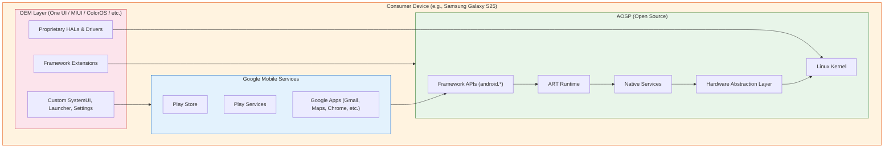

**Key insight for this book:** We focus almost exclusively on the green layer --
AOSP itself. This is where the operating system lives. GMS and OEM modifications
are built on top of it, and understanding AOSP is prerequisite to understanding
either of them.

### 1.2.5 AOSP Licensing

AOSP is not under a single license. Different components use different licenses,
reflecting their origins:

| Component | License | Rationale |
|---|---|---|
| Linux Kernel | GPLv2 | Inherited from upstream Linux |
| Bionic (libc) | BSD | Avoids GPL contamination of userspace; allows proprietary apps |
| Framework (Java) | Apache 2.0 | Permissive; allows OEM modification without source disclosure |
| ART | Apache 2.0 | Same as framework |
| Toolchain (LLVM/Clang) | Apache 2.0 with LLVM exception | Upstream LLVM license |
| External libraries | Various | Each library retains its original license (MIT, BSD, LGPL, etc.) |
| CTS | Apache 2.0 | Allows OEMs to run tests without license concerns |
| SELinux policies | Public Domain | Derived from upstream SELinux |

The deliberate choice of BSD for Bionic (instead of glibc's LGPL) was a
foundational decision that made it legally safe for proprietary applications and
proprietary HAL implementations to link against Android's C library without
triggering copyleft obligations. This decision is one of the reasons the mobile
ecosystem could adopt Android while maintaining proprietary drivers and
applications.

---

## 1.3 The AOSP Layer Cake: System Architecture

Android's architecture is a layered stack, where each layer provides services to
the layer above it and consumes services from the layer below. Understanding this
stack -- what lives where, what communicates with what, and through which
mechanisms -- is the single most important conceptual foundation for working with
AOSP.

### 1.3.1 The Complete Architecture

```mermaid
graph TB
    subgraph Applications["Layer 7: Applications"]
        SystemApps["System Apps<br/>(SystemUI, Launcher3, Settings,<br/>Contacts, Dialer, Camera2)"]
        UserApps["User Apps<br/>(Third-party APKs)"]
    end

    subgraph FrameworkAPI["Layer 6: Framework APIs"]
        AndroidAPI["android.* packages<br/>(app, content, view, widget,<br/>media, location, telephony,<br/>net, os, graphics, ...)"]
    end

    subgraph FrameworkServices["Layer 5: Framework Services (system_server)"]
        AMS["ActivityManager<br/>Service"]
        WMS["WindowManager<br/>Service"]
        PMS["PackageManager<br/>Service"]
        PKMS["PowerManager<br/>Service"]
        IMS_FW["InputMethod<br/>ManagerService"]
        NMS["Notification<br/>ManagerService"]
        CMS["ConnectivityService"]
        TMS["TelephonyService"]
        Others["60+ more<br/>services"]
    end

    subgraph ART_Layer["Layer 4: Android Runtime"]
        ART["ART<br/>(AOT + JIT + Interpreter)"]
        CoreLibs["Core Libraries<br/>(libcore: java.*, javax.*,<br/>org.apache.*, android.icu.*)"]
        Zygote["Zygote Process<br/>(App process factory)"]
    end

    subgraph NativeLayer["Layer 3: Native Services & Libraries"]
        SF["SurfaceFlinger"]
        AF["AudioFlinger"]
        IF["InputFlinger"]
        MC["MediaCodec /<br/>MediaPlayerService"]
        CamSvc["CameraService"]
        SenSvc["SensorService"]
        NativeBinder["libbinder /<br/>libbinder_ndk"]
        Bionic_Lib["Bionic<br/>(libc, libm, libdl)"]
    end

    subgraph HAL_Layer["Layer 2: Hardware Abstraction Layer"]
        HIDL_HALs["HIDL HALs<br/>(Legacy: camera, audio,<br/>sensors, graphics)"]
        AIDL_HALs["AIDL HALs<br/>(Modern: power, vibrator,<br/>health, light)"]
        HWBinder["hwbinder /<br/>vndbinder"]
    end

    subgraph Kernel_Layer["Layer 1: Linux Kernel"]
        Drivers["Device Drivers<br/>(GPU, Camera, Touch,<br/>Modem, Sensors)"]
        Binder_Driver["Binder Driver<br/>(/dev/binder,<br/>/dev/hwbinder,<br/>/dev/vndbinder)"]
        Subsystems["Kernel Subsystems<br/>(Memory, Scheduler, Filesystems,<br/>Networking, Power)"]
        AndroidKernel["Android-specific<br/>(Binder, ashmem/memfd,<br/>ION/DMA-BUF, fuse)"]
    end

    Applications --> FrameworkAPI
    FrameworkAPI --> FrameworkServices
    FrameworkServices --> ART_Layer
    FrameworkServices --> NativeLayer
    ART_Layer --> NativeLayer
    NativeLayer --> HAL_Layer
    HAL_Layer --> Kernel_Layer

    style Applications fill:#fff9c4,stroke:#f9a825
    style FrameworkAPI fill:#e8f5e9,stroke:#2e7d32
    style FrameworkServices fill:#c8e6c9,stroke:#2e7d32
    style ART_Layer fill:#e3f2fd,stroke:#1565c0
    style NativeLayer fill:#e1f5fe,stroke:#0277bd
    style HAL_Layer fill:#f3e5f5,stroke:#7b1fa2
    style Kernel_Layer fill:#fce4ec,stroke:#c62828
```

Let us examine each layer in detail, from the bottom up.

### 1.3.2 Layer 1: The Linux Kernel

Android runs on the Linux kernel. As of Android 15, the kernel is based on the
**Linux 6.x Long-Term Support (LTS)** branch with Android-specific patches
managed through the **Android Common Kernel (ACK)** and the **Generic Kernel
Image (GKI)** initiative.

#### Android-Specific Kernel Features

The Android kernel is not vanilla Linux. It includes several Android-specific
subsystems and drivers:

| Feature | Purpose | Source Location |
|---|---|---|
| **Binder** | Android's primary IPC mechanism. A kernel driver that provides transaction-based communication between processes. Three devices: `/dev/binder` (framework), `/dev/hwbinder` (HAL), `/dev/vndbinder` (vendor). | `drivers/android/binder.c` in kernel |
| **Ashmem / memfd** | Anonymous shared memory. Originally `ashmem`, now transitioning to standard Linux `memfd_create`. Used for sharing large data between processes (e.g., GraphicBuffer). | `drivers/staging/android/` (legacy) |
| **ION / DMA-BUF Heaps** | Memory allocator for hardware buffers (GPU, camera, display). ION was Android-specific; DMA-BUF heaps is the upstream-friendly replacement. | `drivers/dma-buf/` |
| **Low Memory Killer** | Kills background processes under memory pressure. Originally Android-specific (`lowmemorykiller`), now uses userspace `lmkd` with kernel's PSI (Pressure Stall Information). | Userspace: `system/memory/lmkd/` |
| **fuse (for storage)** | FUSE filesystem provides the scoped storage layer. Performance-critical path for app file access. | Standard kernel fuse |
| **dm-verity** | Verified boot. Ensures system partitions haven't been tampered with. | `drivers/md/dm-verity*` |
| **SELinux** | Mandatory access control. Android uses a strict SELinux policy that confines every process. | Policy: `system/sepolicy/` |

#### Generic Kernel Image (GKI)

Starting with Android 12, Google introduced the **GKI** architecture to solve
kernel fragmentation. The idea:

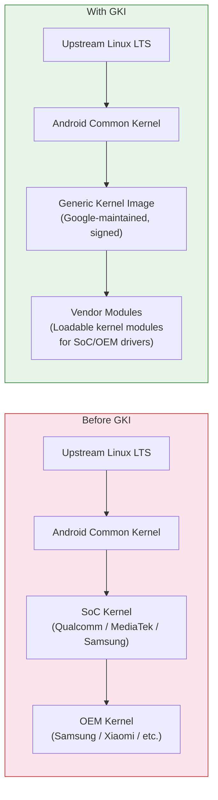

Before GKI, each device had a unique kernel: upstream Linux LTS was forked by
Google (ACK), then forked again by the SoC vendor (e.g., Qualcomm's `msm-kernel`),
then forked again by the OEM. This created massive fragmentation -- devices
shipped with kernels that were years behind upstream, and security patches took
months to propagate.

GKI provides a single, Google-built kernel binary that is common across all
devices using the same Android version and kernel version. Vendor-specific
functionality is delivered as **loadable kernel modules (LKMs)** and
**vendor_dlkm** (vendor dynamically loaded kernel modules) on a separate
partition. This means Google can update the kernel independently of vendors.

In the AOSP source tree, kernel-related content lives in:

- `kernel/configs/` -- GKI kernel configuration fragments
- `kernel/prebuilts/` -- Prebuilt kernel images for development
- `kernel/tests/` -- Kernel test suites

The actual kernel source is typically obtained separately via a kernel manifest
(`repo init -u https://android.googlesource.com/kernel/manifest`) because it is
extremely large and most platform developers do not need to modify it.

### 1.3.3 Layer 2: Hardware Abstraction Layer (HAL)

The HAL is the interface between Android's userspace and hardware-specific
drivers. It allows Android to run on diverse hardware without modifying the
framework.

#### HAL Architecture Evolution

Android's HAL architecture has evolved significantly:

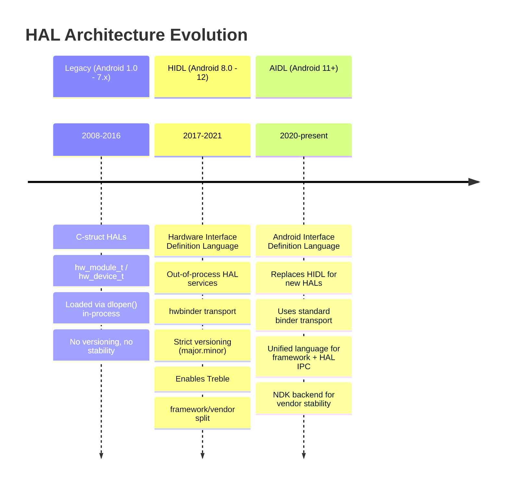

**Legacy HALs** (pre-Treble) were shared libraries loaded directly into the
calling process. The camera HAL, for example, was a `.so` file loaded into
`cameraserver` via `dlopen()`. This worked, but meant the HAL and the framework
were tightly coupled -- updating one required updating the other.

**Project Treble** (Android 8.0) introduced **HIDL (Hardware Interface
Definition Language)**, which moved HALs into separate processes communicating
over `hwbinder`. This created a stable, versioned interface between the framework
and vendor implementations, enabling:

- **Faster OS updates**: OEMs could update the Android framework without
  modifying vendor HALs
- **Generic System Images (GSI)**: A single system image that works across
  multiple devices
- **Vendor Test Suite (VTS)**: Automated testing of HAL implementations

**Stable AIDL** (Android 11+) is now the preferred HAL interface language. It
uses the same AIDL that has been used for years in application-to-framework IPC,
but with a stable **NDK backend** that vendors can implement against. New HALs
must be written in AIDL; HIDL is frozen and will not accept new interfaces.

#### HAL Interface Directory

The canonical HAL interface definitions live in `hardware/interfaces/`:

```
hardware/interfaces/
    audio/              -- Audio HAL (capture, playback, effects)
    automotive/         -- Automotive-specific HALs (vehicle, EVS)
    biometrics/         -- Fingerprint, face authentication
    bluetooth/          -- Bluetooth HAL
    boot/               -- Boot control HAL (A/B updates)
    broadcastradio/     -- FM/AM radio
    camera/             -- Camera HAL (camera2 API backend)
    cas/                -- Conditional Access System (DRM for broadcast)
    confirmationui/     -- Trusted UI confirmation
    contexthub/         -- Context Hub (always-on sensor processor)
    drm/                -- DRM plugin HAL (Widevine, etc.)
    dumpstate/          -- Bug report generation
    fastboot/           -- Fastboot HAL
    gatekeeper/         -- Password/PIN verification
    gnss/               -- GPS/GNSS location
    graphics/           -- Graphics HALs:
        allocator/      --   Gralloc (buffer allocation)
        composer/       --   HWC (hardware composer for display)
        mapper/         --   Buffer mapping
    health/             -- Battery/charging health
    identity/           -- Identity credential
    input/              -- Input classifier
    ir/                 -- Infrared (IR blaster)
    keymaster/          -- Cryptographic key management
    light/              -- LED/backlight control
    media/              -- Media codec (OMX/Codec2)
    memtrack/           -- Memory tracking
    neuralnetworks/     -- NNAPI (ML acceleration)
    nfc/                -- NFC
    power/              -- Power management, power hints
    radio/              -- Telephony radio (RIL replacement)
    secure_element/     -- Secure element access
    sensors/            -- Sensor HAL (accelerometer, gyro, etc.)
    soundtrigger/       -- Hotword detection
    thermal/            -- Thermal management
    tv/                 -- TV input framework
    usb/                -- USB HAL
    vibrator/           -- Haptic feedback
    wifi/               -- Wi-Fi HAL
    ... and more (60+ HAL interfaces total)
```

Each HAL interface directory contains `.aidl` or `.hal` files that define the
interface, along with default implementations and VTS (Vendor Test Suite) tests.

#### The Treble Boundary: VNDK and Vendor Partition

Project Treble established a hard boundary between the **system partition**
(framework, updated by Google/OEM) and the **vendor partition** (HALs/drivers,
updated by SoC vendor):

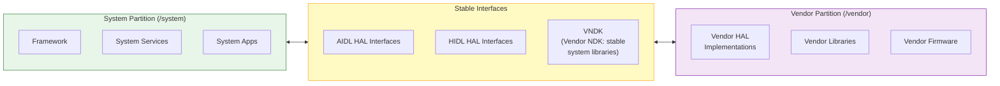

The **VNDK (Vendor NDK)** is the set of system libraries that vendor code is
allowed to link against. Vendor code cannot link against arbitrary system
libraries -- only those in the VNDK. This is enforced at build time and at
runtime through **linker namespaces** (configured in `system/linkerconfig/`).

### 1.3.4 Layer 3: Native Services and Libraries

Above the kernel and HALs sits a rich layer of native (C/C++) services and
libraries. These are the workhorses of the system -- they handle display
composition, audio mixing, input dispatch, media playback, and more.

#### Core Native Services

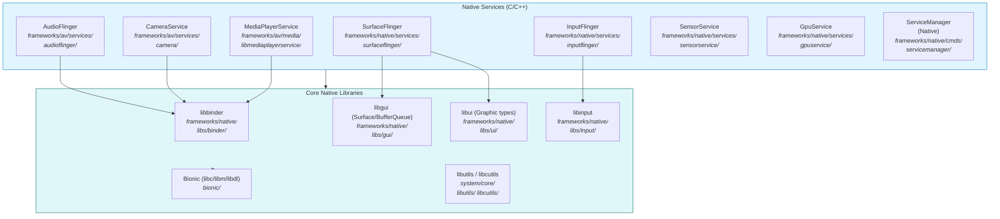

Let us examine the most important native services:

**SurfaceFlinger** (`frameworks/native/services/surfaceflinger/`) is the display
compositor. Every frame you see on an Android device is composed by
SurfaceFlinger. It receives buffers from application windows (via the
`BufferQueue` mechanism), composites them together using either the GPU
(client composition) or the display hardware (hardware composition via HWC HAL),
and sends the final frame to the display. SurfaceFlinger manages multiple
displays, handles VSYNC timing, and coordinates with the WindowManagerService in
system_server for window layout and visibility.

**AudioFlinger** (`frameworks/av/services/audioflinger/`) is the audio mixer and
router. It receives audio data from applications and system services, mixes
multiple audio streams according to their types (music, notification, alarm,
voice call), applies effects, and routes the mixed audio to the appropriate
output device via the Audio HAL. It handles sample rate conversion, channel
mapping, and latency management.

**InputFlinger** (`frameworks/native/services/inputflinger/`) reads raw input
events from the kernel's `/dev/input/` devices (touch, keyboard, mouse, gamepad),
classifies them, and dispatches them to the correct window. The **InputDispatcher**
component maintains a mapping of windows to input channels and ensures that touch
events reach the window under the touch point, keyboard events reach the focused
window, and system gestures (back, home, recent apps) are intercepted before
reaching applications.

**CameraService** (`frameworks/av/services/camera/`) mediates between the Camera2
API (used by applications) and the Camera HAL (implemented by vendors). It
manages camera device lifecycle, request processing, and stream management.

**MediaPlayerService / MediaCodecService** (`frameworks/av/`) provides media
playback and encoding. The Codec2 framework (successor to the original OMX/Stagefright
architecture) manages hardware and software codecs for video and audio.

**ServiceManager** (`frameworks/native/cmds/servicemanager/`) is the native Binder
service registry. Every system service that wants to be accessible over Binder
registers itself with ServiceManager. Clients look up services by name. There are
actually three ServiceManagers: one for framework binder (`/dev/binder`), one for
HW binder (`/dev/hwbinder`, managed by `hwservicemanager`), and one for vendor
binder (`/dev/vndbinder`, managed by `vndservicemanager`).

#### Bionic: Android's C Library

Bionic (`bionic/`) is Android's custom C library. It is *not* glibc. Bionic was
written from scratch (incorporating code from BSD) with specific goals:

1. **Small size**: Mobile devices have limited memory. Bionic is significantly
   smaller than glibc.
2. **Fast startup**: `dlopen()`, `pthread_create()`, and other common operations
   are optimized for mobile workloads.
3. **BSD license**: Avoids LGPL, which would require OEMs to provide a way for
   users to replace the C library.
4. **Android-specific features**: Properties system (`__system_property_get`),
   Android logging (`__android_log_print`), Binder support.

Bionic includes:

- `bionic/libc/` -- The C library itself
- `bionic/libm/` -- Math library
- `bionic/libdl/` -- Dynamic linker library
- `bionic/linker/` -- The dynamic linker (`/system/bin/linker64`), responsible
  for loading shared libraries and resolving symbols at runtime

The dynamic linker in `bionic/linker/` is particularly important because it
implements the **linker namespace** isolation that enforces the Treble boundary.
Different namespaces (default, sphal, vndk, rs) control which libraries are
visible to which processes, preventing vendor code from accessing unstable
system libraries.

### 1.3.5 Layer 4: Android Runtime (ART)

The Android Runtime (`art/`) executes application bytecode. ART replaced Dalvik
as the default runtime in Android 5.0 (Lollipop).

#### ART Compilation Pipeline

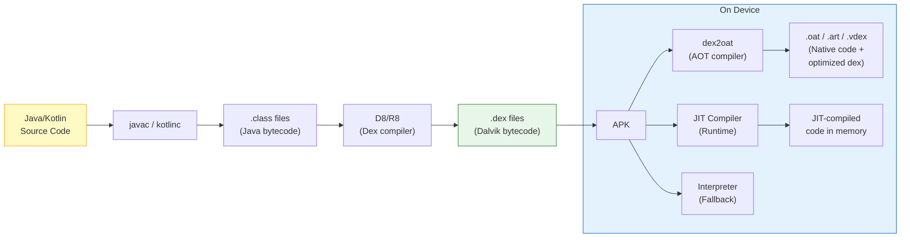

ART uses a **multi-tier compilation strategy**:

1. **Interpreter**: Executes bytecode instruction-by-instruction. Slowest but
   always available. Used for debugging and for code executed rarely.

2. **JIT (Just-In-Time) Compiler**: Compiles hot methods to native code at
   runtime. The JIT profiles code execution and saves profile data to disk.

3. **AOT (Ahead-Of-Time) Compiler** (`dex2oat`): Uses JIT profiles to
   pre-compile frequently-used methods to native code during idle time or at
   install time. This is the **Profile-Guided Optimization (PGO)** approach
   introduced in Android 7.0.

4. **Cloud Profiles** (Android 9+): Google Play distributes aggregated
   profiles collected from other users. When you install an app, `dex2oat` can
   use the cloud profile to compile the most commonly used methods before you
   even run the app.

The ART source tree in `art/` contains:

- `art/runtime/` -- The runtime itself (GC, class loading, JNI, threading)
- `art/compiler/` -- The JIT and AOT compilers
- `art/dex2oat/` -- The AOT compilation tool
- `art/libartbase/` -- Base utilities
- `art/libdexfile/` -- DEX file parsing
- `art/libnativebridge/` -- Native bridge for running ARM apps on x86 (used by
  Berberis/Houdini translation)
- `art/libnativeloader/` -- Library loading with namespace isolation
- `art/odrefresh/` -- On-device refresh of ART module artifacts
- `art/openjdkjvm/` -- JVM interface implementation
- `art/openjdkjvmti/` -- JVMTI (debug/profiling) interface
- `art/profman/` -- Profile manager for PGO
- `art/imgdiag/` -- Diagnostics for boot image

#### Zygote: The Process Factory

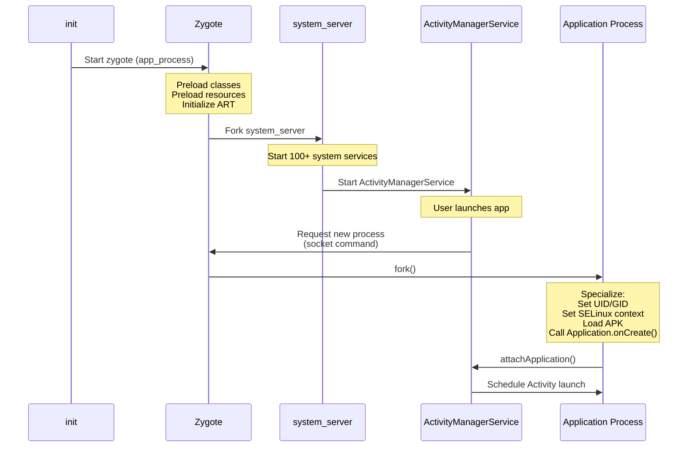

**Zygote** (`frameworks/base/cmds/app_process/` and `system/zygote/`) is one of
Android's most important architectural innovations. It is the parent process of
every application process and `system_server`.

When Android boots:

1. The `init` process starts `zygote` (technically, the `app_process64` binary)
2. Zygote initializes the ART runtime
3. Zygote **preloads** thousands of Java classes and resources that all
   applications will need
4. Zygote enters a loop, listening on a Unix domain socket for commands

When a new application process is needed:

1. `ActivityManagerService` sends a command to Zygote's socket
2. Zygote calls `fork()`, creating a child process
3. The child process inherits all preloaded classes and resources via
   **copy-on-write** memory sharing
4. The child specializes: sets its UID, GID, SELinux context, loads the
   application's APK, and begins execution

This fork-based architecture is what makes Android app startup fast. Without
Zygote, each app would need to start a new ART instance from scratch, load and
verify thousands of classes, and parse framework resources -- a process that
would take several seconds. With Zygote, `fork()` takes milliseconds, and the
shared pages mean less physical memory is consumed.

### 1.3.6 Layer 5: Framework Services (system_server)

The `system_server` process is the heart of the Android framework. It is the
first process Zygote forks, and it hosts **over 100 system services** that
collectively manage every aspect of the user experience.

#### system_server Service Catalog

The services in `system_server` are organized in the source tree under
`frameworks/base/services/core/java/com/android/server/`. This directory
contains over 100 subdirectories:

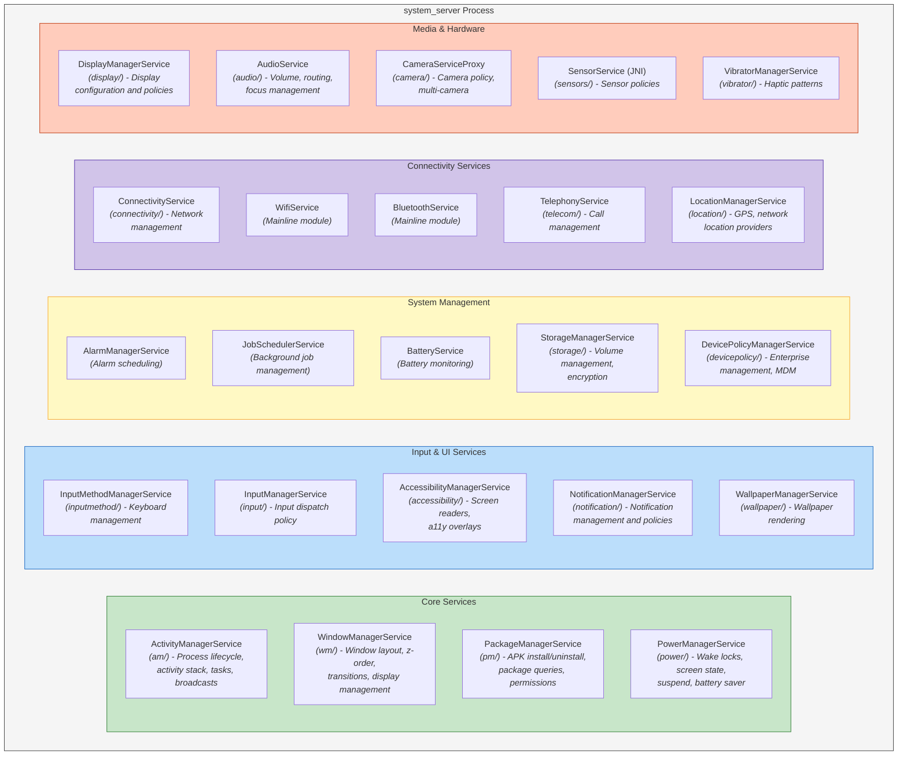

Here is a more complete listing of the service subdirectories found in
`frameworks/base/services/core/java/com/android/server/`:

| Directory | Service | Responsibility |
|---|---|---|
| `am/` | ActivityManagerService | Process lifecycle, activity stacks, tasks, recent apps, broadcasts, content providers, OOM adjustment |
| `wm/` | WindowManagerService | Window hierarchy, z-ordering, input focus, display layout, transitions, rotations |
| `pm/` | PackageManagerService | APK installation, uninstallation, package resolution, permission management, intent resolution |
| `power/` | PowerManagerService | Wake locks, screen on/off, doze/idle mode, battery saver, suspend |
| `display/` | DisplayManagerService | Display lifecycle, brightness, color mode, display policies |
| `input/` | InputManagerService | Input device management, key mapping, input dispatch policy |
| `inputmethod/` | InputMethodManagerService | Soft keyboard management, IME switching |
| `notification/` | NotificationManagerService | Notification posting, ranking, policies, DND |
| `audio/` | AudioService | Volume control, audio routing, audio focus, sound effects |
| `connectivity/` | ConnectivityService | Network management, default network selection, VPN |
| `location/` | LocationManagerService | Location providers, geofencing, GNSS management |
| `telecom/` | TelecomService | Call management, call routing, in-call UI |
| `camera/` | CameraServiceProxy | Camera access policies, multi-camera coordination |
| `storage/` | StorageManagerService | Volume management, encryption, adoption |
| `content/` | ContentService | Content observer notifications, sync management |
| `accounts/` | AccountManagerService | Account management, authentication tokens |
| `clipboard/` | ClipboardService | System clipboard |
| `accessibility/` | AccessibilityManagerService | Accessibility event dispatch, a11y services |
| `app/` | ActivityTaskManagerService | Task and activity management (split from AMS) |
| `backup/` | BackupManagerService | Application backup and restore |
| `biometrics/` | BiometricService | Fingerprint, face, iris authentication |
| `companion/` | CompanionDeviceManagerService | Paired device management (watches, etc.) |
| `dreams/` | DreamManagerService | Screen saver (Daydream) management |
| `hdmi/` | HdmiControlService | HDMI-CEC control |
| `incident/` | IncidentManager | Bug report / incident management |
| `integrity/` | AppIntegrityManagerService | APK integrity verification |
| `lights/` | LightsService | LED and backlight control |
| `locksettings/` | LockSettingsService | PIN, pattern, password management |
| `media/` | MediaSessionService | Media session management, transport controls |
| `net/` | NetworkManagementService | Low-level network configuration (iptables, routing) |
| `om/` | OverlayManagerService | Runtime Resource Overlays (theming) |
| `people/` | PeopleService | Conversations, shortcuts, people-related features |
| `permission/` | PermissionManagerService | Runtime permission grants and policies |
| `policy/` | PhoneWindowManager | Hardware key handling, system gesture policy |
| `role/` | RoleManagerService | Default app roles (browser, dialer, SMS) |
| `search/` | SearchManagerService | Search framework |
| `security/` | SecurityStateManager | Security patch level tracking |
| `selinux/` | SELinuxService | SELinux policy management |
| `slice/` | SliceManagerService | Slice content (app content previews) |
| `statusbar/` | StatusBarManagerService | Status bar icon and notification shade coordination |
| `trust/` | TrustManagerService | Trust agents (Smart Lock) |
| `tv/` | TvInputManagerService | TV input framework |
| `uri/` | UriGrantsManagerService | URI permission grants |
| `vibrator/` | VibratorManagerService | Haptic feedback patterns |
| `wallpaper/` | WallpaperManagerService | Wallpaper rendering and management |
| `webkit/` | WebViewUpdateService | WebView package management |

And this is not exhaustive -- there are over 100 subdirectories in total. Each
service communicates with applications and other services via Binder IPC,
exposing its functionality through AIDL-defined interfaces.

#### system_server Startup

When `system_server` starts (forked from Zygote), it initializes services in a
specific order defined in `SystemServer.java`
(`frameworks/base/services/java/com/android/server/SystemServer.java`):

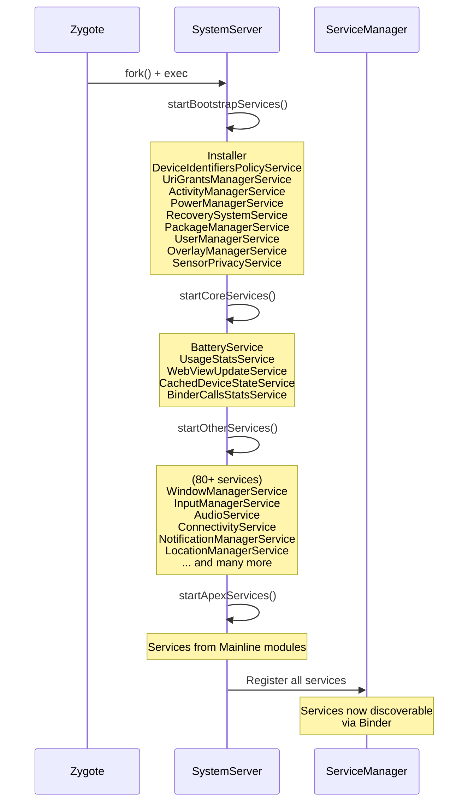

Services are started in four phases:

1. **Bootstrap services** -- The absolute minimum needed for the system to
   function (AMS, PMS, PowerManager)
2. **Core services** -- Essential but not bootstrap-critical (Battery, UsageStats)
3. **Other services** -- Everything else (Window, Input, Audio, Connectivity,
   Notification, Location, etc.)
4. **APEX services** -- Services that come from Mainline modules

### 1.3.7 Layer 6: Framework APIs

The Framework API layer (`frameworks/base/core/java/android/`) is what
application developers interact with. It is the public surface of the Android
platform, documented at developer.android.com and versioned by API level.

The `android.*` package hierarchy contains approximately 50 top-level packages:

| Package | Purpose |
|---|---|
| `android.app` | Activity, Service, Application, Fragment, Notification, Dialog |
| `android.content` | ContentProvider, ContentResolver, Intent, Context, SharedPreferences |
| `android.view` | View, ViewGroup, Window, MotionEvent, KeyEvent, Surface |
| `android.widget` | TextView, Button, RecyclerView, ImageView, and all standard widgets |
| `android.os` | Binder, Handler, Looper, Bundle, Parcel, Process, SystemClock |
| `android.graphics` | Canvas, Paint, Bitmap, drawable.*, animation.* |
| `android.media` | MediaPlayer, MediaRecorder, AudioTrack, AudioRecord, MediaCodec |
| `android.net` | ConnectivityManager, NetworkInfo, Uri, wifi.* |
| `android.telephony` | TelephonyManager, SmsManager, PhoneStateListener |
| `android.location` | LocationManager, LocationListener, Geocoder |
| `android.hardware` | Camera2 API, SensorManager, usb.*, biometrics.* |
| `android.database` | SQLite wrappers, Cursor, ContentValues |
| `android.provider` | Contacts, MediaStore, Settings, CallLog |
| `android.security` | KeyStore, KeyChain |
| `android.accounts` | AccountManager |
| `android.animation` | ValueAnimator, ObjectAnimator, AnimatorSet |
| `android.transition` | Scene, Transition framework |
| `android.speech` | Speech recognition, text-to-speech |
| `android.print` | Printing framework |
| `android.service` | Abstract base classes for various service types |
| `android.permission` | Permission-related APIs |
| `android.util` | Log, TypedValue, SparseArray, ArrayMap |
| `android.text` | Spannable, TextWatcher, Html, Editable |
| `android.webkit` | WebView, WebSettings, WebChromeClient |

Each of these packages contains classes that are essentially Binder client
proxies. When you call `startActivity()`, the `Activity` class (in
`android.app`) calls through to `ActivityTaskManager`, which calls through
to an `IActivityTaskManager.Stub.Proxy`, which makes a Binder transaction to
`ActivityTaskManagerService` in `system_server`. This pattern -- **client-side
proxy wrapping Binder IPC to a server-side implementation** -- is universal
across the Android framework.

### 1.3.8 Layer 7: Applications

At the top of the stack sit the applications -- both system apps that ship with
the OS and user-installed apps.

#### System Applications in AOSP

AOSP ships with a substantial set of system applications in `packages/apps/`:

| Application | Directory | Description |
|---|---|---|
| **SystemUI** | `frameworks/base/packages/SystemUI/` | Status bar, notification shade, quick settings, lock screen, volume dialog, power menu, recent apps, pip |
| **Launcher3** | `packages/apps/Launcher3/` | Home screen, app drawer, widgets, workspace |
| **Settings** | `packages/apps/Settings/` | System settings application |
| **Contacts** | `packages/apps/Contacts/` | Contact management |
| **Dialer** | `packages/apps/Dialer/` | Phone dialer and call management |
| **Camera2** | `packages/apps/Camera2/` | Camera application |
| **Calendar** | `packages/apps/Calendar/` | Calendar application |
| **Messaging** | `packages/apps/Messaging/` | SMS/MMS messaging |
| **DeskClock** | `packages/apps/DeskClock/` | Clock, alarm, timer, stopwatch |
| **Music** | `packages/apps/Music/` | Basic music player |
| **Gallery2** | `packages/apps/Gallery2/` | Photo gallery |
| **DocumentsUI** | `packages/apps/DocumentsUI/` | File manager (Storage Access Framework UI) |
| **Browser2** | `packages/apps/Browser2/` | WebView-based browser |
| **KeyChain** | `packages/apps/KeyChain/` | Certificate management |
| **CertInstaller** | `packages/apps/CertInstaller/` | Certificate installation |
| **ManagedProvisioning** | `packages/apps/ManagedProvisioning/` | Enterprise device setup (work profile) |
| **Stk** | `packages/apps/Stk/` | SIM Toolkit |
| **StorageManager** | `packages/apps/StorageManager/` | Storage management |
| **ThemePicker** | `packages/apps/ThemePicker/` | Material You theme customization |
| **Traceur** | `packages/apps/Traceur/` | System tracing (developer tool) |
| **WallpaperPicker2** | `packages/apps/WallpaperPicker2/` | Wallpaper selection |
| **TV** | `packages/apps/TV/` | Android TV launcher and EPG |

SystemUI deserves special mention because it is not a typical application -- it
is a system-privileged process that provides the core user interface chrome:
the status bar, the notification shade, the quick settings panel, the lock
screen, the volume dialog, the power menu, the picture-in-picture controls,
the recent apps interface (on some configurations), and more. It runs in its
own process (`com.android.systemui`) with elevated permissions and deep
integration with `WindowManagerService` and other system services.

#### Content Providers

AOSP also ships system content providers in `packages/providers/`:

| Provider | Description |
|---|---|
| `ContactsProvider` | Contacts database (contacts2.db) |
| `MediaProvider` | Media database (images, video, audio) and scoped storage |
| `CalendarProvider` | Calendar events and reminders |
| `TelephonyProvider` | SMS/MMS messages, carrier configuration |
| `DownloadProvider` | System download manager |
| `SettingsProvider` | System, secure, and global settings |
| `BlockedNumberProvider` | Blocked phone numbers |
| `UserDictionaryProvider` | Custom keyboard dictionary |
| `BookmarkProvider` | Browser bookmarks (legacy) |

---

## 1.4 Repository Structure: A Complete Guide

The AOSP source tree is enormous. A full checkout, including prebuilt toolchains
and all default repositories, can exceed 300 GB. Understanding the top-level
directory structure is essential for navigating the codebase efficiently.

The source is managed by `repo`, a tool built on top of Git. The
`.repo/manifest.xml` file defines the complete set of Git repositories and where
they are checked out. A typical AOSP checkout has over 1,000 individual Git
repositories, each mapping to a subdirectory in the source tree.

### 1.4.1 Directory Map

Below is a comprehensive listing of the top-level directories in the AOSP source
tree, with their purpose, approximate
size contribution, and significance to different types of developers.

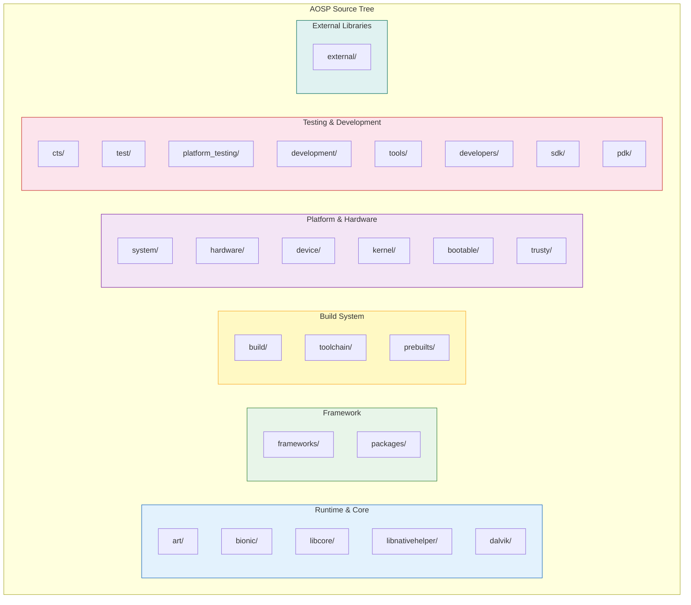

### 1.4.2 Runtime and Core Libraries

#### `art/` -- Android Runtime

The Android Runtime is the virtual machine that executes all Java/Kotlin
application code and framework code.

```
art/
    runtime/          -- Core runtime: GC, class linker, JNI, threads, monitors
    compiler/         -- Optimizing compiler (for JIT and AOT)
    dex2oat/          -- Ahead-of-time compilation tool
    libdexfile/       -- DEX file format parser and verifier
    libartbase/       -- Base utilities shared across ART components
    libartservice/    -- ART service (manages compilation on device)
    libarttools/      -- Tools library
    libartpalette/    -- Platform abstraction layer
    libnativebridge/  -- Native bridge (for ISA translation, e.g., ARM on x86)
    libnativeloader/  -- Library loading with namespace isolation
    odrefresh/        -- On-device refresh of boot image artifacts
    openjdkjvm/       -- JVM TI and JNI interface implementation
    openjdkjvmti/     -- JVMTI implementation (for debuggers/profilers)
    profman/          -- Profile manager (processes JIT profiles for PGO)
    imgdiag/          -- Boot image diagnostics
    dexdump/          -- DEX file disassembler
    dexlist/          -- DEX file lister
    oatdump/          -- OAT file disassembler
    dalvikvm/         -- ART entry point (dalvikvm command)
    adbconnection/    -- ADB-based debugging connection
    sigchainlib/      -- Signal chain management (for native signal handlers)
    perfetto_hprof/   -- Heap profiling via Perfetto
    test/             -- Extensive test suite (thousands of tests)
    benchmark/        -- Performance benchmarks
    tools/            -- Development utilities
    build/            -- Build configuration
```

**Who cares about this directory:** Runtime engineers, garbage collection
researchers, JIT/AOT compiler developers, anyone debugging class loading or
JNI issues.

#### `bionic/` -- Android's C Library

Bionic is the C library, math library, and dynamic linker for Android.

```
bionic/
    libc/             -- C library implementation
        arch-arm/     --   ARM-specific assembly (memcpy, strcmp, etc.)
        arch-arm64/   --   ARM64-specific assembly
        arch-riscv64/ --   RISC-V 64-bit assembly
        arch-x86/     --   x86-specific assembly
        arch-x86_64/  --   x86_64-specific assembly
        bionic/       --   Core C library sources (pthread, malloc, stdio, etc.)
        dns/          --   DNS resolver
        include/      --   C library headers
        kernel/       --   Kernel header wrappers (auto-generated from kernel)
        malloc_debug/ --   Memory debugging tools
        stdio/        --   Standard I/O implementation
        stdlib/       --   Standard library (qsort, bsearch, etc.)
        string/       --   String operations
        system_properties/ -- Android property system client
        upstream-*    --   Code imported from OpenBSD, FreeBSD, NetBSD
    libm/             -- Math library (sin, cos, sqrt, etc.)
    libdl/            -- Dynamic loading library (dlopen, dlsym)
    libstdc++/        -- Minimal C++ standard library (full C++ is libc++)
    linker/           -- Dynamic linker (/system/bin/linker64)
    tests/            -- Test suite
    benchmarks/       -- Performance benchmarks
    tools/            -- Maintenance tools (header generation, symbol checking)
    apex/             -- APEX module configuration
    docs/             -- Documentation
```

**Who cares about this directory:** Native developers working at the C level,
anyone debugging memory issues (malloc_debug), linker/loader problems, or
architecture-specific behavior. The `linker/` subdirectory is essential for
understanding namespace isolation and the Treble vendor boundary.

#### `libcore/` -- Java Core Libraries

The Java standard library implementation for Android.

```
libcore/
    dalvik/           -- Dalvik-specific classes (system, bytecode)
    dom/              -- DOM XML implementation
    harmony-tests/    -- Apache Harmony compatibility tests
    json/             -- org.json (JSON parsing)
    luni/             -- Main library: java.*, javax.*, sun.misc.*
    mmodules/         -- Mainline module boundaries
    ojluni/           -- OpenJDK-derived code (java.util, java.io, etc.)
    xml/              -- XML parsing (SAX, XPath)
```

These provide the `java.lang`, `java.util`, `java.io`, `java.net`, `java.nio`,
`java.security`, `java.sql`, `javax.crypto`, and other standard Java APIs.
Unlike a standard JDK, Android's implementation is heavily modified: it uses
Bionic instead of glibc, `android.icu` instead of some `java.text`
functionality, and has Android-specific security providers.

**Who cares about this directory:** Anyone debugging Java standard library
behavior on Android, or working on the ART Mainline module.

#### `libnativehelper/` -- JNI Helper Library

Utility library that simplifies JNI (Java Native Interface) coding:

```
libnativehelper/
    header_only_include/  -- Header-only JNI helpers
    include/              -- Public headers
    include_jni/          -- JNI specification headers (jni.h)
    tests/                -- Tests
```

Provides `JNIHelp.h` with functions like `jniRegisterNativeMethods()`,
`jniThrowException()`, and `jniCreateString()` that reduce boilerplate in
JNI code throughout the platform.

#### `dalvik/` -- Legacy Dalvik VM (Mostly Historical)

```
dalvik/
    dexgen/           -- DEX file generation utilities
    docs/             -- Historical documentation
    dx/               -- Original dx tool (DEX compiler, replaced by D8)
    opcode-gen/       -- Opcode definition generation
    tools/            -- Utilities
```

The Dalvik VM itself was removed when ART replaced it in Android 5.0. This
directory now contains mostly tools, the legacy `dx` compiler (replaced by D8/R8
in the build system), and opcode definitions used by other tools.

### 1.4.3 Framework

#### `frameworks/` -- The Android Framework

This is the largest and most important directory in AOSP. It contains the entire
Android application framework, native services, system libraries, and system
components.

```
frameworks/
    base/                 -- The core framework (MASSIVE: ~30M+ lines)
        core/             --   Core API classes (android.* packages)
            java/         --     Java source for framework APIs
            jni/          --     JNI bridge implementations
            res/          --     Framework resources (layouts, drawables, strings)
            proto/        --     Protobuf definitions
        services/         --   system_server services
            core/         --     Core services (AMS, WMS, PMS, 100+ more)
            java/         --     SystemServer.java entry point
            companion/    --     Companion device services
            appfunctions/ --     App functions service
            devicepolicy/ --     Device administration
            contentcapture/ --   Content capture service
            credentials/  --     Credentials manager service
            incremental/  --     Incremental file system service
            midi/         --     MIDI service
            net/          --     Network services
            people/       --     People/conversation services
            permission/   --     Permission service
            print/        --     Print service
            restrictions/ --     App restrictions
            texttospeech/ --     TTS service
            translation/  --     Translation service
            usage/        --     Usage stats service
            usb/          --     USB service
            voiceinteraction/ -- Voice interaction service
            wifi/         --     WiFi service
        packages/         --   Framework-internal applications
            SystemUI/     --     Status bar, notification shade, lock screen
            SettingsLib/  --     Shared settings library
            SettingsProvider/ --  Settings content provider
            Shell/        --     ADB shell utilities
            CompanionDeviceManager/ -- Companion device pairing
            FusedLocation/ --    Fused location provider
            PrintSpooler/ --     Print spooler service
            Tethering/    --     Tethering/hotspot
            MtpDocumentsProvider/ -- MTP file access
            CredentialManager/ -- Credential management UI
        graphics/         --   Graphics classes (Canvas, Paint, etc.)
        libs/             --   Framework libraries
            hwui/         --     Hardware-accelerated 2D rendering (Skia/HWUI)
            androidfw/    --     Asset manager, resource system
            input/        --     Input framework library
            WindowManager/ --    WindowManager library
        media/            --   Media framework Java classes
        location/         --   Location framework Java classes
        telecomm/         --   Telecom framework Java classes
        wifi/             --   WiFi framework Java classes
        cmds/             --   Command-line tools
            app_process/  --     Zygote entry point
            am/           --     Activity Manager CLI (am start, am broadcast)
            pm/           --     Package Manager CLI (pm install, pm list)
            wm/           --     Window Manager CLI (wm size, wm density)
            input/        --     Input CLI (input tap, input text)
            svc/          --     Service control CLI
            settings/     --     Settings CLI (settings put, settings get)
            bootanimation/ --    Boot animation player
            idmap2/       --     Resource overlay compiler
        test-runner/      --   AndroidJUnitRunner
        tools/            --   Build and analysis tools
            aapt2/        --     Android Asset Packaging Tool 2
            lint/         --     Lint rules

    native/               -- Native framework (C/C++)
        services/
            surfaceflinger/  -- Display compositor
            inputflinger/    -- Input event processing
            sensorservice/   -- Sensor event processing
            audiomanager/    -- Audio policy bridge
            gpuservice/      -- GPU management
            batteryservice/  -- Battery state
            displayservice/  -- Display service bridge
            vibratorservice/ -- Vibrator service
            stats/           -- StatsD
        libs/
            binder/          -- libbinder (Binder IPC client library)
            gui/             -- libgui (Surface, BufferQueue)
            ui/              -- libui (Graphic buffer types)
            input/           -- libinput
            sensor/          -- libsensor
            nativewindow/    -- ANativeWindow
            nativedisplay/   -- ADisplay
            renderengine/    -- GPU render engine (for SurfaceFlinger)
            permission/      -- Permission checking
            math/            -- Math utilities (vec, mat)
            ftl/             -- Functional Template Library
        cmds/
            servicemanager/  -- Binder ServiceManager daemon
            dumpsys/         -- dumpsys tool
            dumpstate/       -- Bug report generator
            cmd/             -- cmd tool (talks to services)
            atrace/          -- System trace tool
            installd/        -- Package installation daemon
            lshal/           -- HAL listing tool

    av/                   -- Audio/Video framework
        camera/           --   Camera service and client
        media/            --   Media framework
            libmediaplayerservice/ -- Media player service
            libstagefright/ --       Media codec framework
            codec2/        --        Codec2 (modern codec framework)
            libaudioclient/ --       Audio client library
            audioserver/   --        Audio server process
        services/
            camera/        --   Camera service
            audioflinger/  --   Audio mixer and router
            audiopolicy/   --   Audio routing policy
            mediametrics/  --   Media metrics
            mediadrm/      --   DRM service

    hardware/             -- Hardware abstraction framework layer
    compile/              -- Compilation tools
    ex/                   -- Extension libraries
    libs/                 -- Additional framework libraries
        binary_translation/ -- Berberis (native bridge / ISA translation)
        modules-utils/      -- Mainline module utilities
        native_bridge_support/ -- Native bridge support libraries
        systemui/           -- SystemUI shared libraries
        service_entitlement/ -- Carrier entitlement
    minikin/              -- Text layout engine (used by Skia/HWUI)
    multidex/             -- MultiDex support library
    opt/                  -- Optional framework components (telephony, net)
    proto_logging/        -- Protobuf-based logging
    rs/                   -- RenderScript (deprecated)
    wilhelm/              -- OpenSL ES / OpenMAX AL audio APIs
    layoutlib/            -- Layout rendering library (for Android Studio preview)
```

**Who cares about this directory:** Everyone. This is the Android framework.
Application developers trace bugs here. System developers modify services here.
OEM engineers customize SystemUI, settings, and services here. SoC vendors
integrate HALs through interfaces defined here.

#### `packages/` -- Applications, Modules, Providers, and Services

```
packages/
    apps/                 -- System applications (55+)
        Launcher3/        --   Home screen and app drawer
        Settings/         --   System settings
        Camera2/          --   Camera application
        Contacts/         --   Contact management
        Dialer/           --   Phone dialer
        Calendar/         --   Calendar
        DeskClock/        --   Clocks and alarms
        Messaging/        --   SMS/MMS
        Music/            --   Music player
        Gallery2/         --   Photo gallery
        DocumentsUI/      --   File manager
        Browser2/         --   Browser
        ThemePicker/      --   Material You theming
        Traceur/          --   System tracing
        WallpaperPicker2/ --   Wallpaper selection
        ManagedProvisioning/ -- Work profile setup
        Car/              --   Android Auto apps
        TV/               --   Android TV app
        TvSettings/       --   Android TV settings
        ...

    modules/              -- Mainline modules (40+)
        Bluetooth/        --   Bluetooth stack
        Wifi/             --   WiFi stack
        Connectivity/     --   Network connectivity
        Telephony/        --   Telephony
        Telecom/          --   Telecom service
        Media/            --   Media framework components
        Permission/       --   Permission controller
        NeuralNetworks/   --   NNAPI runtime
        DnsResolver/      --   DNS resolution
        IPsec/            --   IPsec VPN
        Nfc/              --   NFC stack
        AdServices/       --   Advertising services
        Uwb/              --   Ultra-Wideband
        Virtualization/   --   pVM (protected VMs)
        DeviceLock/       --   Device lock service
        adb/              --   ADB daemon
        Scheduling/       --   Scheduling module
        ...

    providers/            -- Content providers
        ContactsProvider/ --   Contacts database
        MediaProvider/    --   Media files database
        CalendarProvider/ --   Calendar storage
        TelephonyProvider/ --  SMS/MMS storage
        DownloadProvider/ --   Downloads
        SettingsProvider/ --   Settings storage (in frameworks/base/)
        ...

    services/             -- Background services
        Telephony/        --   Telephony service
        Telecomm/         --   Telecom service
        Car/              --   Automotive services
        Mtp/              --   MTP (Media Transfer Protocol)
        ...

    inputmethods/         -- Input methods
    screensavers/         -- Screen savers
    wallpapers/           -- Live wallpapers
```

**Who cares about this directory:** Application developers studying system app
architecture. OEM engineers customizing preinstalled apps. Mainline module
developers.

### 1.4.4 Build System

#### `build/` -- The Build System

AOSP uses a hybrid build system: **Soong** (Blueprint-based, written in Go) is
the primary build system, with legacy **Make** support for components not yet
converted.

```
build/
    soong/            -- Soong build system (Go source)
        android/      --   Android module types
        cc/           --   C/C++ build rules
        java/         --   Java build rules
        apex/         --   APEX package build rules
        rust/         --   Rust build rules
        python/       --   Python build rules
        genrule/      --   Generic build rules
        ...
    make/             -- Legacy Make-based build system
        core/         --   Core Makefile logic
        target/       --   Target configuration
        tools/        --   Build tools (releasetools, zipalign, etc.)
        envsetup.sh   --   Environment setup (lunch, m, mm, mmm commands)
    blueprint/        -- Blueprint build file parser (Soong's frontend)
    pesto/            -- Build analysis tools
    release/          -- Release configuration
    target/           -- Target (device) build configuration
    tools/            -- Build utilities
```

Build files in AOSP are named:

- `Android.bp` -- Soong (Blueprint) build files (preferred)
- `Android.mk` -- Legacy Make build files (being migrated to .bp)
- `Makefile` -- Rare, for special cases

**Who cares about this directory:** Everyone who builds AOSP. The build system
is the first thing you interact with and the last thing you debug when builds
break.

#### `toolchain/` -- Compiler Toolchain Configuration

```
toolchain/
    pgo-profiles/     -- Profile-Guided Optimization profiles for the toolchain
```

The actual compiler binaries (Clang/LLVM, Rust) are in `prebuilts/`. This
directory contains toolchain configuration and PGO profiles used to optimize
the compiler's output.

#### `prebuilts/` -- Prebuilt Binaries

The largest directory in the AOSP tree by raw size. Contains prebuilt
compiler toolchains, SDKs, and other tools that are not built from source
during a normal AOSP build.

```
prebuilts/
    clang/             -- Clang/LLVM compiler (multiple versions)
    gcc/               -- Legacy GCC compiler (for kernel, being phased out)
    go/                -- Go compiler (for Soong build system)
    jdk/               -- Java Development Kit
    build-tools/       -- aapt2, zipalign, d8, etc.
    gradle-plugin/     -- Android Gradle Plugin
    maven_repo/        -- Maven repository (AndroidX, etc.)
    sdk/               -- Android SDK platforms
    android-emulator/  -- Emulator binaries
    clang-tools/       -- Clang-based analysis tools
    cmake/             -- CMake (for NDK builds)
    cmdline-tools/     -- Android SDK command-line tools
    ktlint/            -- Kotlin linter
    manifest-merger/   -- Manifest merger tool
    bazel/             -- Bazel build tool (experimental)
    devtools/          -- Development tools
    ...
```

**Who cares about this directory:** Build engineers updating toolchains, anyone
debugging compiler issues, developers setting up the build environment.

### 1.4.5 Platform and Hardware

#### `system/` -- Core System Components

Low-level system components that sit between the kernel and the framework.

```
system/
    core/                 -- Core system utilities
        init/             --   init process (PID 1, first userspace process)
        rootdir/          --   Root filesystem init.rc files
        fastboot/         --   Fastboot protocol implementation
        adb/              --   Android Debug Bridge daemon (in Mainline now)
        debuggerd/        --   Crash handler (generates tombstones)
        libcutils/        --   C utility library (properties, threads, etc.)
        libutils/         --   C++ utility library (RefBase, String, Vector)
        liblog/           --   Android logging library
        libsparse/        --   Sparse image handling
        fs_mgr/           --   Filesystem manager (mount, verity, overlayfs)
        healthd/          --   Battery health daemon
        bootstat/         --   Boot statistics
        storaged/         --   Storage health monitoring
        watchdogd/        --   Hardware watchdog daemon
        run-as/           --   run-as command (debuggable app access)
        sdcard/           --   FUSE-based SD card emulation (legacy)
        toolbox/          --   Small command-line utilities
        property_service/ --   Property service
        llkd/             --   Live lock daemon
        libprocessgroup/  --   Cgroup management
        trusty/           --   Trusty TEE client libraries

    sepolicy/             -- SELinux policy
        private/          --   Platform-private policy
        public/           --   Public policy (visible to vendor)
        vendor/           --   Vendor-extendable policy
        prebuilts/        --   Prebuilt policies

    apex/                 -- APEX module infrastructure
        apexd/            --   APEX daemon (manages module installation)
        apexer/           --   APEX package creation tool
        tools/            --   APEX utilities

    security/             -- Security components
    bpf/                  -- BPF (Berkeley Packet Filter) programs
    connectivity/         -- Connectivity components
    media/                -- Low-level media components
    memory/               -- Memory management (lmkd, libmeminfo)
    netd/                 -- Network daemon
    vold/                 -- Volume daemon (disk encryption, mounting)
    update_engine/        -- OTA update engine
    hardware/             -- Hardware service manager
    libhidl/              -- HIDL runtime library
    libhwbinder/          -- Hardware binder library
    libvintf/             -- VINTF (Vendor Interface) manifest library
    linkerconfig/         -- Linker namespace configuration
    logging/              -- Logd (centralized log daemon)
    extras/               -- Additional system tools
    zygote/               -- Zygote configuration
    ...
```

**Who cares about this directory:** System engineers, security researchers
(sepolicy), boot engineers (init, fs_mgr), storage engineers (vold), network
engineers (netd), anyone debugging system daemons.

#### `hardware/` -- Hardware Abstraction

```
hardware/
    interfaces/       -- HAL interface definitions (AIDL and HIDL)
        audio/        --   Audio HAL
        camera/       --   Camera HAL
        graphics/     --   Graphics HAL (HWC, Gralloc)
        sensors/      --   Sensor HAL
        bluetooth/    --   Bluetooth HAL
        wifi/         --   WiFi HAL
        radio/        --   Telephony HAL
        power/        --   Power HAL
        vibrator/     --   Vibrator HAL
        health/       --   Battery health HAL
        neuralnetworks/ -- NNAPI HAL
        ... (60+ interfaces)

    libhardware/      -- Legacy HAL loading library (hw_get_module)
    libhardware_legacy/ -- Even older HAL loading
    ril/              -- Radio Interface Layer (telephony, legacy)

    google/           -- Google-specific hardware support
    qcom/             -- Qualcomm hardware support
    samsung/          -- Samsung hardware support
    broadcom/         -- Broadcom (WiFi, Bluetooth)
    nxp/              -- NXP (NFC)
    invensense/       -- InvenSense (sensors)
    ti/               -- Texas Instruments
    st/               -- STMicroelectronics
    synaptics/        -- Synaptics (touch)
```

**Who cares about this directory:** HAL implementors, SoC vendors, device
bring-up engineers, driver developers.

#### `device/` -- Device Configurations

Each supported device has a configuration directory here:

```
device/
    generic/          -- Generic device configurations
        goldfish/     --   Emulator (QEMU-based)
        car/          --   Android Automotive emulator
        tv/           --   Android TV emulator
        common/       --   Common configuration shared across generics
    google/           -- Google devices (Pixel)
    google_car/       -- Google Automotive
    amlogic/          -- Amlogic SoC devices
    linaro/           -- Linaro reference boards
    sample/           -- Sample device configuration (template)
```

A device configuration directory typically contains:

- `BoardConfig.mk` -- Board-level configuration (partition sizes, kernel
  config, architecture)
- `device.mk` -- Device-level configuration (which packages to include)
- `AndroidProducts.mk` -- Product definitions (lunch targets)
- `<product>.mk` -- Product-specific configuration
- `overlay/` -- Runtime resource overlays (customizing framework resources)
- `sepolicy/` -- Device-specific SELinux policy
- `init.*.rc` -- Device-specific init scripts
- Kernel configuration fragments

When you run `lunch` to select a build target, you are selecting a product
defined in one of these device directories.

#### `kernel/` -- Kernel Configuration and Prebuilts

```
kernel/
    configs/          -- GKI kernel configuration fragments
    prebuilts/        -- Prebuilt kernel images
    tests/            -- Kernel test suites
```

As mentioned earlier, the full kernel source is typically in a separate
repository. This directory contains configuration fragments, prebuilt images
for development, and test infrastructure.

#### `bootable/` -- Boot and Recovery

```
bootable/
    recovery/         -- Recovery mode implementation
    deprecated-ota/   -- Legacy OTA update tools
    libbootloader/    -- Bootloader libraries
```

The recovery system handles OTA updates (applying update packages),
factory reset, and sideloading. Modern devices use `update_engine`
(`system/update_engine/`) for A/B seamless updates, but recovery remains
for non-A/B devices and for factory reset.

#### `trusty/` -- Trusted Execution Environment

```
trusty/
    device/           -- TEE device configurations
    hardware/         -- TEE hardware abstraction
    host/             -- Host-side tools
    kernel/           -- Trusty kernel (separate OS)
    user/             -- Trusty userspace applications
    vendor/           -- Vendor TEE components
```

Trusty is Google's Trusted Execution Environment (TEE) operating system. It
runs alongside Android on the same processor, in a separate secure world
(typically using ARM TrustZone). Trusty hosts security-sensitive operations
like key storage (Keymaster), biometric template storage, and DRM key
handling. Not all devices use Trusty -- some use Qualcomm's QSEE or other
TEE implementations -- but it is the reference TEE in AOSP.

### 1.4.6 Testing and Development

#### `cts/` -- Compatibility Test Suite

```
cts/
    tests/            -- CTS test cases (organized by API area)
    hostsidetests/    -- Tests that run on the host (controlling the device)
    apps/             -- Test helper applications
    libs/             -- Test libraries
    common/           -- Common test utilities
    helpers/          -- Test helper utilities
    suite/            -- Test suite configuration
```

CTS is one of the pillars of the Android ecosystem. To ship a device with
Google Play (GMS), OEMs must pass CTS -- a suite of hundreds of thousands of
tests that verify API compatibility. CTS ensures that an app written against
the Android SDK will work the same way on a Samsung Galaxy as on a Google Pixel.

CTS tests cover:

- API behavior (does `Context.getSystemService()` return the correct service?)
- Permission enforcement (does a non-privileged app get SecurityException when
  expected?)
- Media codecs (does the device support required codecs at required quality?)
- Graphics (does OpenGL ES / Vulkan behave correctly?)
- Security (is SELinux enforcing? Are file permissions correct?)
- Performance (does the device meet minimum benchmarks?)
- And thousands more test cases

#### `test/` -- Test Infrastructure

```
test/
    vts/              -- Vendor Test Suite (tests HAL implementations)
    mlts/             -- Machine Learning Test Suite
    catbox/           -- Test suite for automotive
    mts/              -- Mainline Test Suite
    ...
```

VTS (Vendor Test Suite) is the companion to CTS for the vendor partition. It
tests HAL implementations to ensure they conform to the HIDL/AIDL interface
specifications.

#### `platform_testing/` -- Platform-Level Testing

```
platform_testing/
    tests/            -- Platform integration tests
    libraries/        -- Test utility libraries
    build/            -- Test build configuration
```

Platform-level tests that go beyond CTS, testing internal platform behavior
that is not part of the public API contract.

#### `development/` -- Development Utilities

```
development/
    apps/             -- Sample applications
    samples/          -- SDK samples
    tools/            -- Development tools
    ide/              -- IDE configuration
    scripts/          -- Helper scripts
    vndk/             -- VNDK tools
    ...
```

Contains sample code, development tools, and IDE configurations. The samples
here are different from the SDK samples -- they often demonstrate system-level
features.

#### `developers/` -- Developer Documentation and Samples

```
developers/
    build/            -- Build configuration for samples
    samples/          -- Developer-facing code samples
```

Additional developer-facing samples and documentation support.

#### `tools/` -- Development and Analysis Tools

```
tools/
    metalava/         -- API signature extraction and checking tool
    tradefederation/  -- Trade Federation (test harness framework)
    apksig/           -- APK signing library
    apkzlib/          -- APK ZIP library
    treble/           -- Treble compliance tools
    acloud/           -- Cloud-based Android Virtual Devices
    asuite/           -- Test suite management (atest, etc.)
    security/         -- Security analysis tools
    dexter/           -- DEX analysis tool
    repohooks/        -- Repo pre-upload hooks
    netsim/           -- Network simulation
    rootcanal/        -- Bluetooth emulation
    external_updater/ -- Tool for updating external/ projects
    carrier_settings/ -- Carrier configuration tools
    lint_checks/      -- Custom lint checks
    ...
```

**Metalava** deserves special mention: it is the tool that extracts the Android
API signature from source code, compares it against previous versions, and
enforces API compatibility rules (no removing public APIs, no changing method
signatures, etc.). The API surface files it generates (`current.txt`,
`removed.txt`, `system-current.txt`) are the canonical definition of the
Android API.

**Trade Federation (TradeFed)** is the test harness used to run CTS, VTS, and
other test suites. It handles device management, test execution, result
collection, and reporting.

#### `sdk/` -- SDK Build Support

```
sdk/
    build_tools/      -- SDK build tools configuration
    emulator/         -- Emulator configuration
    ...
```

Support files for building the Android SDK that is distributed to application
developers via Android Studio.

#### `pdk/` -- Platform Development Kit

```
pdk/
    build/            -- PDK build support
    ...
```

The Platform Development Kit helps OEMs and SoC vendors start their
customization work before a new Android version is publicly released. Google
shares the PDK with partners under NDA, allowing them to begin porting work
early.

### 1.4.7 External Libraries

#### `external/` -- Third-Party Libraries

With over **467 subdirectories**, `external/` is one of the widest directories
in AOSP. It contains third-party open-source libraries used throughout the
platform:

| Category | Examples |
|---|---|
| **Compression** | zlib, zstd, brotli, lz4, xz |
| **Cryptography** | boringssl (OpenSSL fork by Google), conscrypt |
| **Database** | sqlite |
| **Graphics** | skia (2D rendering engine), vulkan-*, angle, mesa3d |
| **Media** | libvpx, libaom, opus, flac, tremolo, libmpeg2 |
| **Networking** | curl, okhttp, grpc, protobuf |
| **Fonts** | noto-fonts, roboto-fonts |
| **Text/Unicode** | icu, harfbuzz_ng, libxml2, expat |
| **Languages** | kotlin-*, python3, lua |
| **Testing** | googletest, junit, mockito, robolectric |
| **ML/AI** | tensorflow-lite, XNNPACK, flatbuffers |
| **Build** | cmake, ninja, gyp |
| **Debugging** | lldb, valgrind, strace, elfutils |
| **Security** | selinux, pcre, libcap |
| **Bluetooth** | aac (for A2DP), libldac |
| **Automotive** | android_onboarding |
| **Misc** | libjpeg-turbo, libpng, giflib, webp, freetype |

Each subdirectory in `external/` has its own upstream project, license, and
update cadence. The `tools/external_updater/` tool helps maintain these
dependencies by tracking upstream versions and automating updates.

**Who cares about this directory:** Anyone debugging a third-party library
behavior, updating an external dependency, or auditing licenses.

### 1.4.8 Output

#### `out/` -- Build Output

```
out/
    target/                       -- Device build artifacts
        product/<device>/
            system/               --   System partition image contents
            vendor/               --   Vendor partition image contents
            system.img            --   System image
            vendor.img            --   Vendor image
            boot.img              --   Boot image (kernel + ramdisk)
            recovery.img          --   Recovery image
            super.img             --   Super image (dynamic partitions)
    host/                         -- Host tool build artifacts
    soong/                        -- Soong intermediate files
        .intermediates/           --   Build intermediates (MASSIVE)
    .module_paths/                -- Module path cache
```

The `out/` directory is not checked into version control. It is where all build
artifacts are generated. A full build can produce 100+ GB of intermediate and
final artifacts. The `out/target/product/<device>/` directory contains the
flashable images.

### 1.4.9 Source Tree Size Perspective

To give a sense of scale:

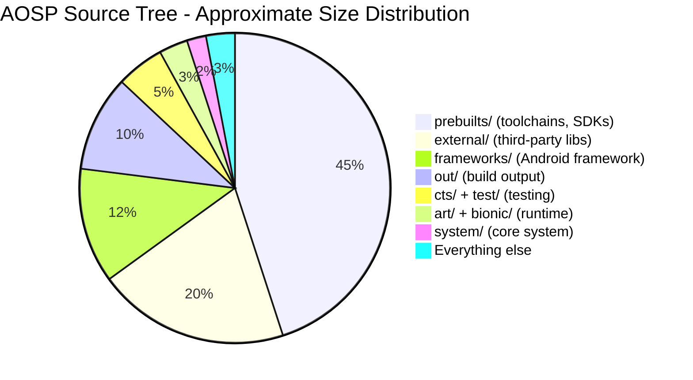

The vast majority of the source tree's disk consumption comes from prebuilt
binaries (compilers, SDKs, emulator images) and external third-party libraries.
The actual Android-specific code -- the framework, runtime, system components,
and build system -- is a much smaller fraction of the total disk usage, though
it is still enormous in its own right (tens of millions of lines of code).

---

## 1.5 Who Maintains What

The Android ecosystem is a collaboration between Google, silicon vendors, OEMs,
and the open-source community. Understanding who is responsible for which parts
of the stack is essential for knowing where to file bugs, where to send patches,
and whose constraints shape the architecture.

### 1.5.1 The Stakeholder Map

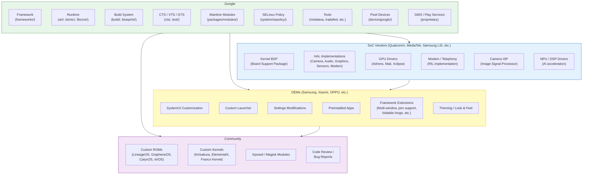

### 1.5.2 Google's Role

Google is the primary maintainer of AOSP. Google engineers write the majority
of framework code, runtime improvements, build system changes, and test
infrastructure. Google's specific responsibilities include:

**Framework Development:**

- All system services in `system_server` (AMS, WMS, PMS, and 100+ others)
- The Android API surface (`frameworks/base/core/`)
- Native services (SurfaceFlinger, AudioFlinger, InputFlinger)
- Media framework (`frameworks/av/`)
- The build system (Soong, Blueprint, Make)

**API Governance:**

- API design review (every new public API goes through an API council)
- API compatibility enforcement (via Metalava and CTS)
- API level management (each Android release increments the API level)
- Deprecation policy (APIs are deprecated but rarely removed)

**Compatibility:**

- CTS development and maintenance
- CDD (Compatibility Definition Document) authorship
- VTS (Vendor Test Suite) for HAL compliance
- GTS (Google Test Suite, proprietary) for GMS compliance
- Treble / VNDK stability requirements

**Mainline Modules:**

- Google develops and maintains Mainline modules that can be updated via the
  Play Store independently of full OS updates. As of Android 15, over 30
  modules are "mainlined," including:
  - Connectivity (WiFi, Bluetooth, Tethering, DNS)
  - Media (codecs, extractors)
  - Permissions
  - ART (the runtime itself!)
  - ADB
  - Scheduling
  - Neural Networks (NNAPI)
  - And more

**Reference Hardware:**

- Pixel devices serve as the reference implementation
- The Android Emulator (Goldfish/Cuttlefish) provides a software reference
- Google Tensor chips allow Google to optimize the full stack

**Security:**

- Monthly security bulletins and patches
- SELinux policy development
- Verified boot implementation
- Keystore/Keymaster/StrongBox specifications

### 1.5.3 SoC Vendor Responsibilities

Silicon vendors (Qualcomm, MediaTek, Samsung LSI, Google Tensor, Unisoc, and
others) provide the lowest layers of the software stack:

**Kernel Board Support Package (BSP):**

- Device tree definitions for the SoC
- Driver implementations for all on-chip peripherals
- Power management (DVFS, idle states)
- Thermal management
- Kernel scheduler tuning

**HAL Implementations:**

| HAL | What SoC Vendors Provide |
|---|---|
| **Camera** | ISP drivers, 3A algorithms (auto-focus, auto-exposure, auto-white-balance), HDR processing, multi-camera synchronization |
| **Graphics** | GPU kernel driver, userspace GL/Vulkan libraries, HWC (Hardware Composer) for display composition |
| **Audio** | ALSA/audio kernel driver, audio DSP firmware and control, codec configuration |
| **Sensors** | Sensor hub firmware, sensor HAL implementation |
| **Modem / Telephony** | RIL (Radio Interface Layer) implementation, modem firmware, IMS (VoLTE/VoWiFi) |
| **Video Codec** | Hardware codec drivers, Codec2 HAL implementation |
| **AI/ML** | NPU/DSP drivers, NNAPI HAL implementation |
| **WiFi** | WiFi driver, WiFi HAL implementation, firmware |
| **Bluetooth** | BT controller driver, BT HAL implementation, firmware |
| **GNSS** | GNSS driver, location HAL implementation |

SoC vendors typically deliver their BSP as a large set of proprietary source
code and prebuilt binaries. OEMs receive this BSP and integrate it with their
device configuration.

The Treble architecture means that SoC vendors can deliver HAL implementations
once, and OEMs can update the Android framework independently. In practice,
major OS upgrades still require BSP updates from the SoC vendor, but minor
updates and security patches can be applied without vendor involvement.

### 1.5.4 OEM Responsibilities

OEMs (Samsung, Xiaomi, OPPO, OnePlus, Motorola, Sony, Google itself, and many
others) are responsible for the final consumer product. Their work spans:

**Device Bring-up:**

- Board-specific configuration (device tree, partition layout)
- Device-specific init scripts
- SELinux policy customization
- Kernel configuration (enabling/disabling features)

**User Experience Customization:**

- SystemUI modifications (status bar, quick settings, lock screen)
- Custom launcher (Samsung One UI Home, Xiaomi Poco Launcher, etc.)
- Settings app customization (adding OEM-specific settings pages)
- Theming and visual design (icons, colors, animations, fonts)
- Sounds (ringtones, notification sounds, UI sounds)
- Boot animation

**Feature Development:**

- Multi-window enhancements (Samsung DeX, foldable split-screen)
- Pen/stylus support (Samsung S Pen, Motorola Smart Stylus)
- Camera software (computational photography, filters, modes)
- Security additions (Samsung Knox, Xiaomi Mi Security)
- Accessibility features
- Regional customizations (dual SIM behavior, local payment integration)

**Testing and Certification:**

- Running CTS to achieve Android compatibility certification
- Running GTS for GMS certification
- Carrier certification testing
- Regional regulatory testing (FCC, CE, etc.)

**Updates:**

- Porting new Android versions to existing devices
- Monthly security patch integration
- Mainline module updates (via Play Store)
- Firmware updates (modem, TrustZone, bootloader)

### 1.5.5 Community Contributions

The open-source community plays several roles:

**Custom ROM Development:**
Custom ROMs take AOSP and build alternative distributions. Major projects:

| Project | Focus |
|---|---|
| **LineageOS** | Successor to CyanogenMod. Broad device support, close to AOSP with useful additions. The largest custom ROM community. |
| **GrapheneOS** | Security and privacy focused. Hardened memory allocator, improved sandboxing, no Google dependencies by default. Pixel-only. |
| **CalyxOS** | Privacy focused with optional microG (open-source Play Services replacement). Pixel and a few other devices. |
| **/e/OS** | De-Googled Android with cloud services. Targeted at mainstream users who want privacy without complexity. |
| **Paranoid Android** | UI innovation and design focus. Known for introducing features later adopted by AOSP (immersive mode, heads-up notifications). |
| **crDroid** | Feature-rich, combining customizations from multiple sources. |

**Bug Reports and Code Review:**
The AOSP Gerrit instance (android-review.googlesource.com) accepts external
contributions, though the process is more restrictive than typical open-source
projects. Community members also file bugs on the AOSP issue tracker
(issuetracker.google.com) and participate in mailing lists.

**Custom Kernels:**
Independent kernel developers build optimized kernels for specific devices,
often incorporating upstream Linux improvements, scheduler tweaks, and
performance optimizations ahead of the official release cycle.

**Xposed / Magisk:**
The modding community uses frameworks like Xposed (runtime Java method hooking)
and Magisk (systemless root) to modify Android behavior without changing the
system partition. These tools demonstrate deep understanding of ART internals,
the init system, and dm-verity.

---

## 1.6 AOSP Version History

Android has evolved dramatically since its initial release. The following table
documents every major release, from Android 1.0 to Android 15.

### 1.6.1 Complete Version Table

| Version | API Level | Code Name | Release Date | Key Highlights |
|---|---|---|---|---|
| **1.0** | 1 | (None) | Sep 2008 | First public release. HTC Dream (T-Mobile G1). Basic smartphone OS with Gmail, Maps, Browser, Market. |
| **1.1** | 2 | Petit Four (internal) | Feb 2009 | Bug fixes, API refinements. |
| **1.5** | 3 | **Cupcake** | Apr 2009 | Virtual keyboard, video recording, widgets, AppWidget framework, animated transitions. |
| **1.6** | 4 | **Donut** | Sep 2009 | CDMA support, different screen sizes, quick search box, battery usage display. |
| **2.0** | 5 | **Eclair** | Oct 2009 | Multi-account support, Exchange support, HTML5, Bluetooth 2.1, live wallpapers, new browser. |
| **2.0.1** | 6 | Eclair | Dec 2009 | Minor update. |
| **2.1** | 7 | Eclair MR1 | Jan 2010 | Live wallpapers API, five home screens. |
| **2.2** | 8 | **Froyo** | May 2010 | JIT compilation (Dalvik), USB tethering, WiFi hotspot, apps on SD card, Chrome V8 JS engine. |
| **2.3** | 9 | **Gingerbread** | Dec 2010 | NFC support, SIP VoIP, gyroscope/barometer APIs, concurrent GC, new UI with green/black theme. |
| **2.3.3** | 10 | Gingerbread MR1 | Feb 2011 | NFC API improvements, new sensors. |
| **3.0** | 11 | **Honeycomb** | Feb 2011 | Tablet-only release. Action bar, fragments, hardware-accelerated 2D graphics, holographic UI. |
| **3.1** | 12 | Honeycomb MR1 | May 2011 | USB host API, MTP/PTP, joystick support. |
| **3.2** | 13 | Honeycomb MR2 | Jul 2011 | Screen compatibility improvements. |
| **4.0** | 14 | **Ice Cream Sandwich** | Oct 2011 | Unified phone/tablet experience. Face Unlock, data usage monitoring, Android Beam (NFC sharing), new Holo theme. |
| **4.0.3** | 15 | Ice Cream Sandwich MR1 | Dec 2011 | Social stream API, calendar provider improvements. |
| **4.1** | 16 | **Jelly Bean** | Jul 2012 | Project Butter (triple buffering, VSYNC choreography, 60fps), expandable notifications, Google Now. |
| **4.2** | 17 | Jelly Bean MR1 | Nov 2012 | Multi-user support (tablets), Daydream screen savers, SELinux (permissive). |
| **4.3** | 18 | Jelly Bean MR2 | Jul 2013 | Bluetooth Low Energy, restricted profiles, OpenGL ES 3.0, SELinux (enforcing). |
| **4.4** | 19 | **KitKat** | Oct 2013 | Project Svelte (low-memory optimization, 512MB devices), storage access framework, printing framework, ART introduced as developer option. |
| **5.0** | 21 | **Lollipop** | Nov 2014 | **ART replaces Dalvik** (AOT compilation). Material Design. 64-bit ABI support. Project Volta (JobScheduler, battery historian). Multi-networking API. |
| **5.1** | 22 | Lollipop MR1 | Mar 2015 | Multi-SIM, device protection (Factory Reset Protection), HD voice calling. |
| **6.0** | 23 | **Marshmallow** | Oct 2015 | **Runtime permissions** (replaces install-time-only model). Doze (deep sleep), App Standby, fingerprint API, USB-C, adoptable storage. |
| **7.0** | 24 | **Nougat** | Aug 2016 | Multi-window (split screen), direct reply notifications, Vulkan API, **JIT compiler** (ART now uses JIT+AOT hybrid). File-based encryption, seamless A/B updates. |
| **7.1** | 25 | Nougat MR1 | Oct 2016 | App shortcuts, image keyboard, enhanced live wallpapers, Daydream VR. |
| **8.0** | 26 | **Oreo** | Aug 2017 | **Project Treble** (framework/vendor split). Notification channels, autofill framework, PIP (Picture-in-Picture), adaptive icons, neural networks API (NNAPI). |
| **8.1** | 27 | Oreo MR1 | Dec 2017 | Android Go (low-memory devices), Neural Networks API 1.0. |
| **9** | 28 | **Pie** | Aug 2018 | Gesture navigation, adaptive battery/brightness (ML-based), display cutout API, indoor positioning (WiFi RTT). Biometric API. DNS over TLS. |
| **10** | 29 | **Android 10** | Sep 2019 | First version with no dessert name (public). Dark theme, **scoped storage**, gesture navigation, foldable device support, 5G APIs, **Project Mainline** (APEX modules), bubbles API. |
| **11** | 30 | **Android 11** | Sep 2020 | Conversations in notifications, bubbles, one-time permissions, **Stable AIDL for HALs**, 5G enhancements, wireless debugging, device controls (smart home). |
| **12** | 31 | **Android 12** | Oct 2021 | **Material You** (dynamic theming from wallpaper). **GKI** (Generic Kernel Image). Privacy dashboard, approximate location, microphone/camera indicators, splash screen API, Mainline module expansion. |
| **12L** | 32 | Android 12L | Mar 2022 | Large-screen optimizations (tablets, foldables, ChromeOS). Taskbar, multi-column layouts, better split-screen. |
| **13** | 33 | **Android 13** | Aug 2022 | Per-app language preferences, themed app icons, notification permission, photo picker, predictive back gesture, programmable shaders (AGSL). |
| **14** | 34 | **Android 14** | Oct 2023 | Grammatical inflection API, regional preferences, path interop, credential manager, health connect, ultra HDR, lossless USB audio. **Platform stability** improvements. |
| **15** | 35 | **Android 15 (Vanilla Ice Cream)** | 2024 | App archiving, partial screen sharing, satellite connectivity APIs, improved PDF rendering, **AV1 software codec**, NFC tap-to-pay improvements, private space (separate profile for sensitive apps), enhanced security for screen recording/projection, Health Connect expansion. |

### 1.6.2 Architectural Milestones

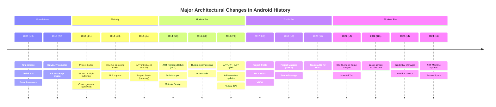

### 1.6.3 API Level Growth

The number of public APIs in the Android SDK has grown enormously:

| Version | Approx. Public API Count | Notable Additions |
|---|---|---|
| API 1 (1.0) | ~2,000 | Foundation: Activity, View, Intent, ContentProvider |
| API 8 (2.2) | ~5,000 | Backup, Cloud-to-Device Messaging |
| API 14 (4.0) | ~10,000 | ActionBar, Fragments (phones), Social APIs |
| API 21 (5.0) | ~18,000 | Material Design, Camera2, JobScheduler, ART |
| API 26 (8.0) | ~25,000 | Autofill, NNAPI, Notification Channels |
| API 29 (10) | ~30,000 | Dark theme, Scoped Storage, BiometricPrompt |
| API 33 (13) | ~35,000 | Photo picker, Per-app language, Themed icons |
| API 35 (15) | ~40,000+ | Satellite APIs, Private space, Health Connect |

Each API level is a strict superset of the previous (with rare deprecation
removals). The API is defined by signature files maintained by Metalava:

- `current.txt` -- Public API signature
- `system-current.txt` -- System API (for privileged apps)
- `module-lib-current.txt` -- Module library API (for Mainline modules)
- `test-current.txt` -- Test API

---

## 1.7 The Developer's Journey: Roadmap of This Book

Working with AOSP is a journey that begins with downloading the source and
progressively deepens into understanding, modifying, building, testing, and
contributing to the platform. This section outlines the typical developer
journey and maps it to the chapters of this book.

### 1.7.1 The Journey

```mermaid
graph TB
    subgraph Phase1["Phase 1: Setup"]
        Download["Download Source<br/>(repo init + sync)"]
        Environment["Set Up Build<br/>Environment"]
        FirstBuild["First Build<br/>(lunch + m)"]
        Flash["Flash & Run<br/>(Emulator or Device)"]
    end

    subgraph Phase2["Phase 2: Understanding"]
        Architecture["Study Architecture<br/>(This chapter)"]
        BuildSystem["Learn Build System<br/>(Soong, Blueprint, Make)"]
        Binder_study["Understand Binder<br/>(IPC mechanism)"]
        Boot["Trace Boot Process<br/>(init → Zygote → system_server)"]
    end

    subgraph Phase3["Phase 3: Exploration"]
        ReadCode["Read Framework Code<br/>(Follow an API call end-to-end)"]
        Tracing["Use System Tracing<br/>(Perfetto, systrace)"]
        Debugging["Debug with GDB/LLDB<br/>and Android Studio"]
        Dumpsys["Use dumpsys, logcat,<br/>and other diagnostic tools"]
    end

    subgraph Phase4["Phase 4: Modification"]
        ModifyFramework["Modify a System Service"]
        AddHAL["Implement a HAL"]
        CustomApp["Modify a System App<br/>(SystemUI, Launcher, Settings)"]
        NewDevice["Add a New Device<br/>(device/ configuration)"]
    end

    subgraph Phase5["Phase 5: Mastery"]
        Performance["Performance Analysis<br/>and Optimization"]
        Security["Security Hardening<br/>and SELinux Policy"]
        Contribute["Contribute Upstream<br/>(Gerrit code review)"]
        Maintain["Maintain a Custom<br/>Distribution"]
    end

    Phase1 --> Phase2
    Phase2 --> Phase3
    Phase3 --> Phase4
    Phase4 --> Phase5

    style Phase1 fill:#e8f5e9,stroke:#2e7d32
    style Phase2 fill:#e3f2fd,stroke:#1565c0
    style Phase3 fill:#fff9c4,stroke:#f9a825
    style Phase4 fill:#f3e5f5,stroke:#7b1fa2
    style Phase5 fill:#fce4ec,stroke:#c62828
```

### 1.7.2 Phase 1: Getting the Source and Building

The first step is to download the AOSP source code and build it. This is
covered in **Chapter 2: Setting Up the Development Environment**.

```
# Install repo tool
mkdir -p ~/bin
curl https://storage.googleapis.com/git-repo-downloads/repo > ~/bin/repo
chmod a+x ~/bin/repo

# Initialize the AOSP repository
mkdir aosp && cd aosp
repo init -u https://android.googlesource.com/platform/manifest -b main

# Sync all repositories (this downloads ~100 GB)
repo sync -c -j$(nproc) --optimized-fetch

# Set up the build environment
source build/envsetup.sh

# Choose a build target
lunch aosp_cf_x86_64_phone-trunk_staging-eng

# Build
m -j$(nproc)
```

The `lunch` command selects a **product** (device configuration), a **release**,
and a **variant** (eng, userdebug, or user):

| Variant | Description | Debugging | Performance |
|---|---|---|---|
| `eng` | Engineering build. Full debugging, all development tools. | Full: adb root, all logs, debug assertions | Lower (debug overhead) |
| `userdebug` | Production-like with debugging. **Recommended for development.** | adb root, debug logs available | Near-production |
| `user` | Production build. What ships to consumers. | No adb root, limited logs | Full production |

After building, you can launch the emulator:

```
# Launch Cuttlefish (cloud/headless emulator)
launch_cvd

# Or launch the graphical emulator
emulator
```

### 1.7.3 Phase 2: Understanding the Architecture

With the source downloaded and a running build, the next step is understanding
how the pieces fit together. This is the focus of the early chapters:

- **Chapter 1 (this chapter)**: The big picture -- architecture, source tree,
  stakeholders
- **Chapter 2**: Build environment, repo, Soong/Blueprint, build targets
- **Chapter 3**: The build system in depth -- how `Android.bp` files work, module
  types, build variants
- **Chapter 4**: The boot process -- from bootloader to lock screen
- **Chapter 5**: Binder IPC -- the backbone of all inter-process communication
- **Chapter 6**: system_server and framework services -- the heart of Android

### 1.7.4 Phase 3: Exploration and Debugging

Once you understand the architecture, you can explore the live system:

- **Chapter 7**: Debugging tools -- logcat, dumpsys, Perfetto, LLDB, Android
  Studio platform debugging
- **Chapter 8**: ART internals -- garbage collection, JIT/AOT, class loading
- **Chapter 9**: Graphics pipeline -- SurfaceFlinger, HWUI, BufferQueue, HWC
- **Chapter 10**: Input pipeline -- from touchscreen driver to app's
  `onTouchEvent()`
- **Chapter 11**: Activity and window management -- AMS, WMS, task stacks

### 1.7.5 Phase 4: Modification and Development

With understanding comes the ability to modify:

- **Chapter 12**: Modifying framework services -- adding a new system service
- **Chapter 13**: HAL development -- implementing a hardware abstraction layer
- **Chapter 14**: System app development -- customizing SystemUI, Launcher,
  Settings
- **Chapter 15**: Device bring-up -- adding support for new hardware
- **Chapter 16**: Mainline modules -- developing updatable components

### 1.7.6 Phase 5: Advanced Topics and Mastery

- **Chapter 17**: Performance optimization -- profiling, tracing, benchmarking
- **Chapter 18**: Security architecture -- SELinux, Keystore, verified boot,
  sandboxing
- **Chapter 19**: Testing -- CTS, VTS, writing platform tests
- **Chapter 20**: Contributing to AOSP -- Gerrit workflow, code review process

### 1.7.7 Tracing an API Call End-to-End

To give a concrete sense of what "understanding the architecture" means in
practice, let us trace what happens when an application calls
`startActivity(intent)`:

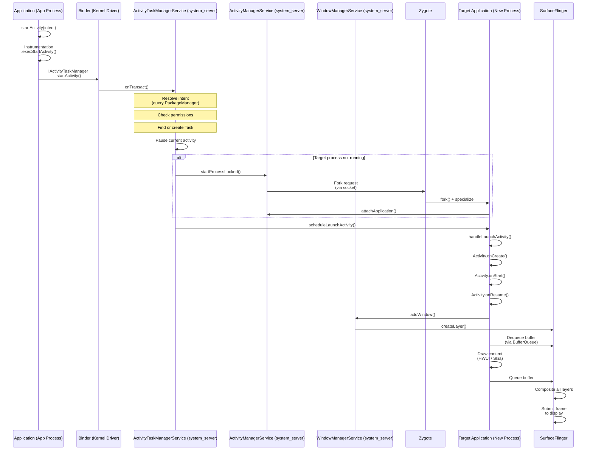

This single API call traverses:

1. **Application process** (Java) -- `Activity.startActivity()`
2. **Binder IPC** (kernel driver) -- Cross-process transaction
3. **system_server** (Java) -- `ActivityTaskManagerService` resolves the intent,
   checks permissions, manages the task/activity stack
4. **Zygote** (native) -- Forks a new process if needed
5. **Target application process** (Java) -- Activity lifecycle callbacks
6. **WindowManagerService** (Java) -- Window creation and layout
7. **SurfaceFlinger** (native C++) -- Display composition
8. **Display HAL** (vendor) -- Hardware composition and display output

A single call to `startActivity()` touches virtually every layer of the Android
stack. This is why understanding the full architecture is so valuable -- when
something goes wrong (a slow launch, a permission denial, a display glitch), you
need to know which layer to investigate.

---

## 1.8 Key Concepts Quick Reference

This section provides brief definitions of the most important concepts you will
encounter throughout this book and throughout AOSP development. Each concept is
explored in depth in later chapters; this serves as a quick reference and
orientation.

### 1.8.1 Binder

**Binder** is Android's inter-process communication (IPC) mechanism. It is the
single most important architectural element in Android -- virtually all
communication between processes goes through Binder.

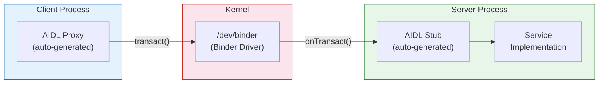

**Key characteristics:**

- **Transaction-based**: Clients send a data parcel, receive a reply parcel
- **Synchronous by default**: Caller blocks until the server processes the
  request and returns
- **Object-oriented**: Binder references are passed as object handles across
  processes
- **Kernel-mediated**: The kernel driver handles data copying, UID/PID
  verification, and reference counting
- **Three instances**: `/dev/binder` (framework IPC), `/dev/hwbinder`
  (framework-to-HAL), `/dev/vndbinder` (vendor-to-vendor)

**Source locations:**

- Kernel driver: `drivers/android/binder.c` (in kernel source)
- Native library: `frameworks/native/libs/binder/`
- Java layer: `frameworks/base/core/java/android/os/Binder.java`
- AIDL compiler: `system/tools/aidl/`
- ServiceManager: `frameworks/native/cmds/servicemanager/`

Binder is covered in depth in **Chapter 5**.

### 1.8.2 HAL (Hardware Abstraction Layer)

The **Hardware Abstraction Layer** is a standardized interface between Android's
framework and hardware-specific vendor implementations. It allows the same
Android framework to run on different hardware platforms.

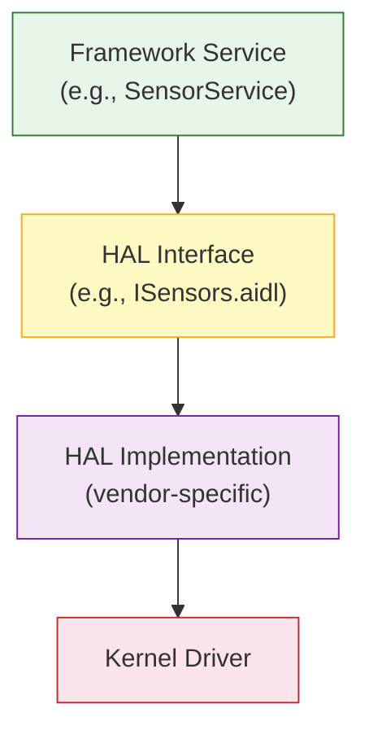

**Key characteristics:**

- Defined by AIDL (modern) or HIDL (legacy) interfaces
- Implemented by SoC vendors and OEMs
- Run in separate processes (out-of-process HALs) for stability and security
- Tested by VTS (Vendor Test Suite)
- Versioned for backward compatibility

**Source location:** `hardware/interfaces/` (interface definitions)

HAL development is covered in **Chapter 13**.

### 1.8.3 AIDL (Android Interface Definition Language)

**AIDL** is a language for defining interfaces that can be used for Binder IPC.
The AIDL compiler generates client-side proxy and server-side stub code in
Java, C++, NDK C++, or Rust.

```
// Example: IActivityManager.aidl
interface IActivityManager {
    int startActivity(in IApplicationThread caller,
                      in String callingPackage,
                      in Intent intent,
                      in String resolvedType,
                      in IBinder resultTo,
                      in String resultWho,
                      int requestCode,
                      int startFlags,
                      in ProfilerInfo profilerInfo,
                      in Bundle bOptions);
    // ... many more methods
}
```

**Key characteristics:**

- Used for both framework IPC and HAL interfaces (Stable AIDL)
- Supports parcelable data types (custom data structures)
- Generates code for Java, C++ (libbinder), NDK C++ (libbinder_ndk), and Rust
- Stable AIDL interfaces are versioned and backward-compatible
- Replaces HIDL for new HAL interfaces (Android 11+)

**Source locations:**

- AIDL compiler: `system/tools/aidl/`
- Framework AIDL files: Throughout `frameworks/base/core/java/`
- HAL AIDL files: `hardware/interfaces/`

### 1.8.4 HIDL (Hardware Interface Definition Language)

**HIDL** was introduced with Project Treble (Android 8.0) as the HAL interface
definition language. It has been superseded by Stable AIDL for new interfaces
but remains in use for existing HALs.

```
// Example: ICameraDevice.hal (HIDL)
interface ICameraDevice {
    getCameraCharacteristics()
        generates (Status status, CameraMetadata cameraCharacteristics);
    open(ICameraDeviceCallback callback)
        generates (Status status, ICameraDeviceSession session);
    // ...
};
```

**Key characteristics:**

- Uses `hwbinder` transport (separate from framework binder)
- Strictly versioned (e.g., `android.hardware.camera.device@3.5`)
- Supports both binderized (cross-process) and passthrough (in-process) modes
- Frozen: no new HIDL interfaces are accepted
- Existing HIDL interfaces will be maintained until migrated to AIDL

**Source locations:**

- HIDL compiler: `system/tools/hidl/`
- HAL HIDL files: `hardware/interfaces/` (`.hal` files)
- Runtime: `system/libhidl/`

### 1.8.5 APEX (Android Pony EXpress)

**APEX** is the packaging format for Mainline modules -- components of Android
that can be updated independently of a full OS update, delivered via the Google
Play Store.

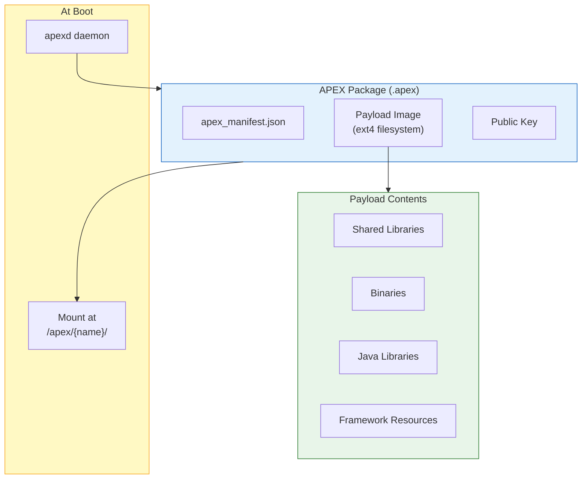

**Key characteristics:**

- Self-contained package with its own filesystem image
- Mounted at `/apex/<name>/` at boot
- Cryptographically signed and verified
- Supports rollback (if a new version causes issues)
- Updated via the Play Store (does not require a full OTA)
- Managed by `apexd` (`system/apex/apexd/`)
- Examples: ART, Conscrypt, Media, DNS Resolver, WiFi, Tethering

**Source location:** `system/apex/` (infrastructure), `packages/modules/`
(individual modules)

### 1.8.6 Mainline

**Project Mainline** (introduced in Android 10) is the initiative to modularize
Android so that core components can be updated independently via the Play Store.
Each Mainline module is delivered as an APEX or an updated APK.

```mermaid
graph TB
    subgraph Traditional["Traditional Update Model"]
        Google1["Google releases<br/>new Android version"]
        SoC1["SoC vendor updates BSP"]
        OEM1["OEM integrates & tests"]
        Carrier1["Carrier approves"]
        User1["User receives update<br/>(6-18 months later)"]

        Google1 --> SoC1 --> OEM1 --> Carrier1 --> User1
    end

    subgraph Mainline_Model["Mainline Update Model"]
        Google2["Google updates<br/>Mainline module"]
        PlayStore["Google Play Store<br/>delivers update"]
        User2["User receives update<br/>(days/weeks)"]

        Google2 --> PlayStore --> User2
    end

    style Traditional fill:#fce4ec,stroke:#c62828
    style Mainline_Model fill:#e8f5e9,stroke:#2e7d32
```

As of Android 15, Mainline modules include:

| Module | Type | What It Updates |
|---|---|---|
| **ART** | APEX | The runtime itself (GC, JIT, AOT, core libs) |
| **Conscrypt** | APEX | TLS/SSL (certificate handling, crypto) |
| **DNS Resolver** | APEX | DNS resolution |
| **Media** | APEX | Media codecs, extractors, framework |
| **WiFi** | APEX | WiFi stack |
| **Tethering** | APEX | Hotspot and tethering |
| **Bluetooth** | APEX | Bluetooth stack |
| **Connectivity** | APEX | Network connectivity |
| **Telephony** | APEX | Telephony framework |
| **Permission Controller** | APK | Permission UI |
| **Neural Networks** | APEX | NNAPI runtime |
| **StatsD** | APEX | Metrics collection |
| **IPsec** | APEX | VPN |
| **SDK Extensions** | APEX | API extension mechanism |
| **AdServices** | APEX | Privacy-preserving advertising |
| **UWB** | APEX | Ultra-Wideband |
| **ADB** | APEX | Android Debug Bridge |
| **Health Connect** | APK | Health and fitness data |
| **Scheduling** | APEX | Task scheduling |
| **Profiling** | APEX | Performance profiling |
| **On-Device Personalization** | APEX | ML personalization |

The significance of Mainline cannot be overstated. Before Mainline, a security
vulnerability in the DNS resolver or the media framework required a full OS
update that had to go through the entire OEM/carrier update pipeline. With
Mainline, Google can push a fix to billions of devices within weeks, regardless
of whether the OEM has issued an OS update.

### 1.8.7 ART (Android Runtime)

**ART** is the managed runtime that executes application and framework code on
Android. It replaced Dalvik in Android 5.0.

**Key characteristics:**

- Executes DEX bytecode (Dalvik Executable format)
- Multi-tier execution: interpreter, JIT compiler, AOT compiler (`dex2oat`)
- Profile-Guided Optimization: JIT profiles guide AOT compilation
- Concurrent, generational garbage collector (CC: Concurrent Copying)
- Supports 32-bit and 64-bit architectures (ARM, ARM64, x86, x86_64, RISC-V)
- Itself is a Mainline module (updatable via Play Store)

**Source location:** `art/`

ART internals are covered in **Chapter 8**.

### 1.8.8 Zygote

**Zygote** is the parent process from which all Android application processes
and `system_server` are forked.

**Key characteristics:**

- Started by `init` early in boot
- Preloads common classes (~6,000+) and resources
- Listens on a Unix domain socket for fork requests
- Uses `fork()` for fast process creation via copy-on-write
- Two instances on 64-bit: `zygote64` (primary) and `zygote` (32-bit for
  legacy apps)

**Source locations:**

- Entry point: `frameworks/base/cmds/app_process/`
- Java: `frameworks/base/core/java/com/android/internal/os/ZygoteInit.java`
- Configuration: `system/zygote/`

### 1.8.9 system_server

**system_server** is the process that hosts all Java-based framework services.
It is the first process Zygote forks during boot.

**Key characteristics:**

- Hosts 100+ system services (AMS, WMS, PMS, and many more)
- Services communicate with apps via Binder IPC
- Runs as the `system` user (UID 1000) with broad permissions
- Crashes in system_server cause a full system restart (soft reboot)
- The most critical process after the kernel and init

**Source locations:**

- Entry point: `frameworks/base/services/java/com/android/server/SystemServer.java`
- Services: `frameworks/base/services/core/java/com/android/server/`
- Native components: `frameworks/base/services/core/jni/`

### 1.8.10 SurfaceFlinger

**SurfaceFlinger** is the system service that composes all visible surfaces
(windows, layers) into the final image displayed on screen.

```mermaid
graph LR
    App1["App 1<br/>Window"] --> BQ1["BufferQueue"]
    App2["App 2<br/>Window"] --> BQ2["BufferQueue"]
    SysUI["SystemUI<br/>(Status Bar)"] --> BQ3["BufferQueue"]
    Nav["Navigation<br/>Bar"] --> BQ4["BufferQueue"]

    BQ1 --> SF["SurfaceFlinger"]
    BQ2 --> SF
    BQ3 --> SF
    BQ4 --> SF

    SF --> HWC["HWC HAL<br/>(Hardware<br/>Composer)"]
    HWC --> Display["Display"]

    style SF fill:#e3f2fd,stroke:#1565c0
    style HWC fill:#f3e5f5,stroke:#7b1fa2
    style Display fill:#e8f5e9,stroke:#2e7d32
```

**Key characteristics:**

- Receives buffers from all visible windows via `BufferQueue`
- Composites using HWC (Hardware Composer) for hardware layers and GPU for
  client composition
- Manages VSYNC timing and frame scheduling
- Supports multiple displays (internal, external, virtual)
- Critical for display performance (janky frames = visible stutter)

**Source location:** `frameworks/native/services/surfaceflinger/`

The graphics pipeline is covered in **Chapter 9**.

### 1.8.11 WindowManagerService (WMS)

**WindowManagerService** manages the window hierarchy -- determining which
windows are visible, their size and position, their z-order (stacking), input
focus, and transitions/animations.

**Key characteristics:**

- Manages all windows on all displays
- Determines window layout based on display size, insets, and system bars
- Coordinates with SurfaceFlinger for layer creation and destruction
- Manages window transitions and animations
- Enforces window policy (which windows can appear on top, focus rules)
- Works closely with ActivityTaskManagerService for activity windows

**Source location:**
`frameworks/base/services/core/java/com/android/server/wm/`

### 1.8.12 ActivityManagerService (AMS) / ActivityTaskManagerService (ATMS)

**ActivityManagerService** manages application processes, including process
lifecycle (start, stop, kill), OOM adjustment (which processes to kill under
memory pressure), and broadcast dispatch.

**ActivityTaskManagerService** (split from AMS in Android 10) manages activities,
tasks, and activity stacks -- the user-visible "task management" that determines
which activity is in the foreground, handles task switching, and manages the
recent apps list.

**Key characteristics:**

- AMS: Process lifecycle, OOM adj, broadcast dispatch, content providers,
  service binding
- ATMS: Activity lifecycle, task management, recent apps, multi-window
- Together, they are the most complex services in system_server
- The source directory `am/` contains AMS and `wm/` contains ATMS and WMS
  (reflecting the close relationship between activity and window management)

**Source locations:**

- AMS: `frameworks/base/services/core/java/com/android/server/am/`
- ATMS: `frameworks/base/services/core/java/com/android/server/wm/`

Activity and window management are covered in **Chapter 11**.

### 1.8.13 PackageManagerService (PMS)

**PackageManagerService** is responsible for everything related to APK packages:
installation, uninstallation, package queries, permission management, intent
resolution, and APK verification.

**Key characteristics:**

- Scans and indexes all installed packages at boot
- Handles APK installation (including split APKs)
- Resolves intents to target components
- Manages permissions (both install-time and runtime)
- Enforces package signing and verification
- Maintains package state (enabled/disabled components, default handlers)
- One of the most complex services in system_server

**Source location:**
`frameworks/base/services/core/java/com/android/server/pm/`

---

## 1.9 AOSP Development Tools Overview

Before diving into the details in subsequent chapters, it is helpful to know the
essential tools you will use daily when working with AOSP.

### 1.9.1 Source Management

| Tool | Command | Purpose |
|---|---|---|
| **repo** | `repo init`, `repo sync` | Multi-repository management (wraps Git) |
| **git** | `git log`, `git diff`, `git commit` | Version control for individual repositories |
| **Gerrit** | Web UI | Code review system for AOSP contributions |

### 1.9.2 Build Tools

| Tool | Command | Purpose |
|---|---|---|
| **lunch** | `lunch <target>` | Select build target (device + variant) |
| **m** | `m` | Build the entire platform |
| **mm** | `mm` | Build modules in the current directory |
| **mmm** | `mmm <path>` | Build modules in a specified directory |
| **mma** | `mma` | Build including dependencies |
| **soong_ui** | (internal) | Build system entry point |
| **blueprint** | (internal) | `.bp` file parser |

### 1.9.3 Debugging and Analysis

| Tool | Command Example | Purpose |
|---|---|---|
| **adb** | `adb shell`, `adb logcat` | Device communication, logging |
| **logcat** | `adb logcat -s TAG` | System and application log viewer |
| **dumpsys** | `adb shell dumpsys activity` | Dump system service state |
| **am** | `adb shell am start -n com.pkg/.Activity` | Activity manager commands |
| **pm** | `adb shell pm list packages` | Package manager commands |
| **wm** | `adb shell wm size` | Window manager commands |
| **settings** | `adb shell settings get system font_scale` | Read/write system settings |
| **cmd** | `adb shell cmd package list packages` | Generic service command interface |
| **Perfetto** | `perfetto -c config.pbtxt` | System-wide tracing |
| **systrace** | `systrace.py --time=5 gfx view` | Legacy system tracing |
| **simpleperf** | `simpleperf record -p <pid>` | CPU profiling |
| **LLDB** | `lldb` | Native code debugger |
| **Android Studio** | IDE | Java/Kotlin debugging, layout inspection |

### 1.9.4 Device Tools

| Tool | Command | Purpose |
|---|---|---|
| **fastboot** | `fastboot flash system system.img` | Flash partition images |
| **adb sideload** | `adb sideload update.zip` | Install OTA from recovery |
| **make snod** | `make snod` | Rebuild system image without full build |
| **emulator** | `emulator` | QEMU-based Android Emulator |
| **launch_cvd** | `launch_cvd` | Cuttlefish virtual device |
| **lshal** | `adb shell lshal` | List HAL services |
| **service** | `adb shell service list` | List Binder services |

### 1.9.5 The dumpsys Command: Your Best Friend

The `dumpsys` command deserves special attention because it is the single most
useful diagnostic tool for AOSP development. It queries system services and
prints their internal state:

```bash
# List all services
adb shell dumpsys -l

# Dump a specific service (examples)
adb shell dumpsys activity              # AMS state (processes, tasks, etc.)
adb shell dumpsys activity activities   # Activity stacks only
adb shell dumpsys activity processes    # Process list with OOM adj
adb shell dumpsys window               # WMS state (windows, displays)
adb shell dumpsys window displays       # Display configuration
adb shell dumpsys package <pkg>        # Package details
adb shell dumpsys meminfo              # Memory usage by process
adb shell dumpsys battery              # Battery state
adb shell dumpsys alarm                # Alarm schedule
adb shell dumpsys jobscheduler         # Scheduled jobs
adb shell dumpsys notification         # Notification state
adb shell dumpsys audio                # Audio state
adb shell dumpsys SurfaceFlinger       # SurfaceFlinger state
adb shell dumpsys input                # Input state (devices, dispatch)
adb shell dumpsys connectivity         # Network state
adb shell dumpsys power                # Power state (wake locks, etc.)
adb shell dumpsys usagestats           # App usage statistics
```

Each system service implements a `dump()` method that outputs its current state
as human-readable text. When debugging any issue, `dumpsys` of the relevant
service is usually the first command to run.

---

## 1.10 Conventions Used in This Book

Throughout this book, we use the following conventions:

### 1.10.1 Source Paths

All source paths are given relative to the AOSP root directory. When we write:

```
frameworks/base/services/core/java/com/android/server/wm/WindowManagerService.java
```

This means the file is at:

```
<AOSP_ROOT>/frameworks/base/services/core/java/com/android/server/wm/WindowManagerService.java
```

Where `<AOSP_ROOT>` is the directory where you ran `repo init` and `repo sync`.
All paths in this book are relative to that root.

### 1.10.2 Code Listings

Code listings include the language identifier and, where relevant, the source
file path:

```java
// frameworks/base/core/java/android/app/Activity.java
public void startActivity(Intent intent) {
    this.startActivity(intent, null);
}
```

When code is abbreviated, ellipses (`...`) indicate omitted sections:

```java
public class ActivityManagerService extends IActivityManager.Stub {
    // ... hundreds of fields ...

    @Override
    public void startActivity(...) {
        // ... implementation ...
    }
}
```

### 1.10.3 Shell Commands

Shell commands are prefixed with `$` for user commands and `#` for root
commands:

```bash
$ adb shell                      # Connect to device shell
$ source build/envsetup.sh       # Set up build environment
# setenforce 0                   # Disable SELinux (root required)
```

### 1.10.4 Mermaid Diagrams

This book makes extensive use of Mermaid diagrams for architecture
visualizations, sequence diagrams, and flow charts. These diagrams can be
rendered by any Markdown viewer that supports Mermaid (including GitHub,
GitLab, and most modern documentation tools).

### 1.10.5 Terminology

| Term | Meaning |
|---|---|
| **AOSP** | Android Open Source Project |
| **Framework** | The Java/Kotlin layer in system_server and the `android.*` APIs |
| **Native** | C/C++ code (as opposed to Java/Kotlin) |
| **HAL** | Hardware Abstraction Layer |
| **Service** | A system service running in system_server (Java) or as a standalone daemon (native) |
| **Process** | An OS-level process with its own PID and memory space |
| **Binder service** | A service accessible over Binder IPC |
| **Client** | The process that calls a Binder service |
| **Server** | The process that hosts a Binder service implementation |
| **SoC** | System on Chip (e.g., Qualcomm Snapdragon, MediaTek Dimensity) |
| **OEM** | Original Equipment Manufacturer (device maker, e.g., Samsung, Xiaomi) |
| **BSP** | Board Support Package (kernel + drivers for a specific SoC) |
| **CTS** | Compatibility Test Suite |
| **VTS** | Vendor Test Suite |
| **GMS** | Google Mobile Services |
| **CDD** | Compatibility Definition Document |
| **GKI** | Generic Kernel Image |
| **GSI** | Generic System Image |

---

## 1.11 Summary

This chapter established the foundational knowledge needed to work with AOSP:

1. **AOSP is the open-source base** on which the Android ecosystem is built.
   Google adds GMS (proprietary). OEMs add customizations. The community builds
   alternative distributions. Understanding which layer you are working in is
   essential.

2. **Android's architecture is a layered stack**, from the Linux kernel through
   HALs, native services, the ART runtime, framework services (system_server),
   the public API, and applications. Each layer has clear responsibilities and
   well-defined interfaces to adjacent layers.

3. **The source tree is vast but organized.** The 30+ top-level directories each
   serve a specific purpose: `art/` for the runtime, `bionic/` for the C library,
   `frameworks/` for the application framework, `hardware/` for HAL interfaces,
   `system/` for core system components, `packages/` for applications and
   modules, `build/` for the build system, and so on.

4. **The ecosystem is a collaboration** between Google (framework, CTS, Mainline),
   SoC vendors (kernel, HALs, drivers), OEMs (customization, device bring-up),
   and the community (custom ROMs, bug reports, contributions).

5. **Android has evolved dramatically** over 15+ years and 35 API levels, with
   major architectural shifts including the move from Dalvik to ART, Project
   Treble for the vendor split, Project Mainline for modular updates, and GKI
   for kernel standardization.

6. **The developer's journey** starts with downloading and building the source,
   progresses through understanding the architecture, and advances to modifying,
   testing, and contributing to the platform.

7. **Core concepts** -- Binder, HAL, AIDL, HIDL, APEX, Mainline, ART, Zygote,
   system_server, SurfaceFlinger, WMS, AMS, PMS -- are the vocabulary of AOSP
   development. You will encounter them in every chapter that follows.

In the next chapter, we will roll up our sleeves and set up a complete AOSP
development environment: installing dependencies, downloading the source,
configuring the build, and running our first build on an emulator.

---

## 1.12 Further Reading

- **AOSP Source**: https://source.android.com/
- **AOSP Code Search**: https://cs.android.com/
- **AOSP Gerrit (Code Review)**: https://android-review.googlesource.com/
- **AOSP Issue Tracker**: https://issuetracker.google.com/issues?q=componentid:192735
- **Android Architecture Overview**: https://source.android.com/docs/core/architecture
- **Project Treble**: https://source.android.com/docs/core/architecture/treble
- **Project Mainline**: https://source.android.com/docs/core/ota/modular-system
- **GKI**: https://source.android.com/docs/core/architecture/kernel/generic-kernel-image
- **CTS Documentation**: https://source.android.com/docs/compatibility/cts
- **CDD**: https://source.android.com/docs/compatibility/cdd
- **Android API Reference**: https://developer.android.com/reference
- **Android Platform Architecture**: https://developer.android.com/guide/platform

---

*Next: Chapter 2 -- Setting Up the Development Environment*
