# 第 2 章：源码与构建系统

> *“Android 也许是历史上最大的开源项目之一，无论从代码体量还是参与贡献的社区规模来看都是如此。”*
> -- Android 工程副总裁 Dave Burke

Android Open Source Project 横跨数千个 Git 仓库，交付了数亿行代码。要构建这样一套系统，必须依赖专门打造的工具链。这条工具链已经在十多年里持续演进，从递归式 GNU Make，到 Soong/Blueprint 元构建系统，再到最近逐步迈向 Bazel。本章将沿着整条流水线展开：获取源码、理解构建系统的三层结构、配置 product、定义模块、产出镜像，并在模拟器中运行最终结果。

本章中的每条路径和每段代码片段，都已经对照 AOSP `android16-qpr2-release` 分支完成核验。凡是引用源码文件时，我们都会给出它相对于源码树根目录的位置，方便你在自己的检出环境中同步阅读。

---

## 2.1 获取源码

### 2.1.1 前置条件与硬件要求

在获取 AOSP 之前，你的工作站需要满足一些基础条件：

| 资源 | 最低要求 | 推荐配置 |
|----------|---------|-------------|
| 磁盘空间（仅源码） | 250 GB | 400 GB（包含一份构建输出） |
| 磁盘空间（含构建） | 400 GB | 600 GB+（强烈建议使用 SSD） |
| 内存 | 32 GB | 64 GB+ |
| CPU | 4 核 | 16+ 核（构建具备高度并行性） |
| 操作系统 | Ubuntu 20.04+ / macOS（Intel 或 Apple Silicon） | Ubuntu 22.04 LTS |
| 文件系统 | 区分大小写（Linux 上通常为 ext4） | ext4 或 APFS（macOS） |

构建系统要求文件系统**区分大小写**。在 macOS 上，单独卷上的 APFS 可以配置为区分大小写；在 Linux 上，ext4 原生就是区分大小写的。使用 NTFS 或 HFS+ 这类默认大小写不敏感的文件系统，会引发隐蔽而棘手的失败。

在 Debian/Ubuntu 主机上，你还需要安装以下软件包：

```bash
sudo apt-get install git-core gnupg flex bison build-essential \
  zip curl zlib1g-dev libc6-dev-i386 x11proto-core-dev \
  libx11-dev lib32z1-dev libgl1-mesa-dev libxml2-utils \
  xsltproc unzip fontconfig python3
```

### 2.1.2 `repo` 工具

AOSP 并不是一个单一 Git 仓库。它是由**数百个** Git 仓库拼接而成的集合，而完成这项拼接工作的工具就是 **`repo`**。`repo` 是一个基于 Python 的 Git 封装层，主要负责：

- 一次性抓取和同步多个 Git 仓库
- 维护一份 *manifest* 文件，用它描述有哪些仓库、它们对应哪些路径、应跟踪哪些分支或 tag
- 提供 topic branch、向 Gerrit 上传 code review 以及其他多仓库工作流中的便捷命令

按如下方式安装 `repo`：

```bash
# Create a directory for the repo tool
mkdir -p ~/bin
export PATH=~/bin:$PATH

# Download the latest repo launcher
curl https://storage.googleapis.com/git-repo-downloads/repo > ~/bin/repo
chmod a+x ~/bin/repo
```

`repo` launcher 本身只是一个很小的引导脚本。首次使用时，它会从 `https://gerrit.googlesource.com/git-repo` 下载完整的 `repo` 实现。

**为什么不直接使用单一 Git 仓库？** Git 对超大规模仓库的伸缩性并不理想。即便 Git 的对象存储已经足够高效，在 AOSP 这种规模的单仓库上，clone、branch 和 status 检查仍会变得异常缓慢。多仓库方案还带来了额外收益：

- **独立的项目历史：** 每个子系统，例如 framework、kernel、外部库，都保有自己的提交历史，并能独立分支。
- **选择性检出：** 你可以只同步自己需要的那部分源码树。
- **访问控制：** 不同仓库可以配置不同 owner 与评审规则。
- **更自然的 fork 与 rebase：** 当 AOSP 引入上游项目，例如 BoringSSL、ICU、LLVM 时，保留独立仓库结构会更清晰。

下面这些 `repo` 子命令是你最应该熟悉的：

| 命令 | 用途 |
|---------|---------|
| `repo init` | 初始化新工作区 |
| `repo sync` | 拉取并更新全部仓库 |
| `repo start` | 在多个仓库上开启 topic branch |
| `repo upload` | 上传变更到 Gerrit 进行 code review |
| `repo status` | 查看所有仓库的工作树状态 |
| `repo diff` | 查看跨仓库统一 diff |
| `repo forall` | 在每个仓库中执行一条命令 |
| `repo info` | 显示 manifest 信息 |
| `repo manifest` | 输出解析后的 manifest |
| `repo branches` | 显示现有 topic branch |
| `repo prune` | 删除已合并 topic branch |

几个 `repo forall` 的例子：

```bash
# Find all repositories that have uncommitted changes
repo forall -c 'git status --short' | grep -v "^$"

# Count total lines of code across all C/C++ files
repo forall -c 'find . -name "*.cpp" -o -name "*.c" -o -name "*.h" \
  | xargs wc -l 2>/dev/null' | tail -1

# Run git gc in every repository (compact storage)
repo forall -c 'git gc --auto'
```

### 2.1.3 初始化工作区：`repo init`

获取源码的第一步，是初始化一个工作区目录：

```bash
mkdir aosp && cd aosp

# Initialize with a specific branch
repo init -u https://android.googlesource.com/platform/manifest \
  -b android16-qpr2-release
```

`repo init` 常用参数如下：

| 参数 | 用途 |
|------|---------|
| `-u URL` | Manifest 仓库地址 |
| `-b BRANCH` | 要检出的分支或 tag |
| `-m MANIFEST` | 仓库内使用的 manifest 文件（默认 `default.xml`） |
| `--depth=N` | 浅克隆深度，节省时间和磁盘 |
| `--partial-clone` | 使用 Git partial clone，按需下载 blob |
| `--clone-filter=blob:limit=10M` | 仅主动拉取小于 10 MB 的 blob |
| `-g GROUP` | 仅同步指定 group 的项目 |
| `--repo-rev=REV` | 将 repo 工具本身固定到特定版本 |

运行 `repo init` 之后，工作区中会生成一个 `.repo/` 目录：

```
aosp/
  .repo/
    manifests/          <-- The manifest Git repository
      default.xml       <-- The primary manifest file
      GLOBAL-PREUPLOAD.cfg
    manifests.git/      <-- Bare clone of the manifest repo
    manifest.xml        <-- Symlink to the active manifest
    repo/               <-- The repo tool's own source code
    project.list        <-- Cached list of project paths
    project-objects/    <-- Shared bare Git repos (if using --reference)
    projects/           <-- Bare Git repos for each project
```

### 2.1.4 Manifest 文件

Manifest 文件是描述整棵源码树组成方式的唯一事实来源。理解 manifest 极其关键，因为它定义了你整个源码树的**形状**：有哪些项目、它们跟踪哪个分支，以及它们在目录结构中的组织方式。

当前 AOSP 默认 manifest 位于 `.repo/manifests/default.xml`，文件长度为 1045 行，其开头如下：

```xml
<?xml version="1.0" encoding="UTF-8"?>
<manifest>

  <remote  name="aosp"
           fetch=".."
           review="https://android-review.googlesource.com/" />
  <default revision="android16-qpr2-release"
           remote="aosp"
           sync-j="4" />

  <superproject name="platform/superproject" remote="aosp"
                revision="android-latest-release"/>
  <contactinfo bugurl="go/repo-bug" />

  <!-- BEGIN open-source projects -->
  <project path="build/make" name="platform/build" groups="pdk,sysui-studio" >
    <linkfile src="CleanSpec.mk" dest="build/CleanSpec.mk" />
    <linkfile src="buildspec.mk.default" dest="build/buildspec.mk.default" />
    <linkfile src="core" dest="build/core" />
    <linkfile src="envsetup.sh" dest="build/envsetup.sh" />
    <linkfile src="target" dest="build/target" />
    <linkfile src="tools" dest="build/tools" />
  </project>
  <project path="build/blueprint" name="platform/build/blueprint"
           groups="pdk,tradefed" />
  <project path="build/soong" name="platform/build/soong"
           groups="pdk,tradefed,sysui-studio" >
    <linkfile src="root.bp" dest="Android.bp" />
    <linkfile src="bootstrap.bash" dest="bootstrap.bash" />
  </project>
  ...
</manifest>
```

**源码：** `.repo/manifests/default.xml`

Manifest 中的关键元素如下：

| 元素 | 用途 |
|---------|---------|
| `<remote>` | 定义 Git 服务器，包括名称、fetch URL 和 Gerrit review URL |
| `<default>` | 设置默认 revision、remote 与 sync 并行度 |
| `<project>` | 表示一个 Git 仓库，将服务端 `name` 映射到本地 `path` |
| `<linkfile>` | 检出后创建一个符号链接，在 `build/make` 中大量使用 |
| `<copyfile>` | 检出后复制一个文件 |
| `<superproject>` | 指向 Git superproject，用于提供原子快照 |
| `<include>` | 引入其他 manifest 片段 |
| `groups` | 为项目分组，便于选择性同步 |

注意 `build/make` 下的 `<linkfile>` 条目。它们会在顶层创建 `build/envsetup.sh`、`build/core/`、`build/target/` 等符号链接，使旧脚本仍能通过历史路径找到这些内容。

另一个重要点是，`build/soong` 项目也创建了两个关键符号链接：

- `root.bp` 会变成源码树根目录下的 `Android.bp`，它是 Soong 的入口点
- `bootstrap.bash` 会变成根目录下的 `bootstrap.bash`

Manifest 还在 `<default>` 中定义了 `sync-j="4"`，也就是 `repo sync` 默认使用 4 个并行抓取线程。你可以通过命令行参数，例如 `-j16` 或更高值，在高速网络环境下显著提升同步速度。

#### Manifest 结构深入理解

Manifest 文件本身具有层级结构。下面按元素展开：

**`<remote>` 元素：**
```xml
<remote name="aosp"
        fetch=".."
        review="https://android-review.googlesource.com/" />
```

- `name`：供 `<project>` 引用的服务器标签。
- `fetch`：仓库抓取的基础 URL。这里的 `".."` 表示“相对于 manifest URL 向上一层”，因此如果 manifest 位于 `https://android.googlesource.com/platform/manifest`，那么 `".."` 实际解析为 `https://android.googlesource.com/`。
- `review`：Gerrit code review 服务地址。`repo upload` 会用它提交变更进行评审。

**`<default>` 元素：**
```xml
<default revision="android16-qpr2-release"
         remote="aosp"
         sync-j="4" />
```

- `revision`：所有没有单独指定 revision 的项目默认跟踪的分支或 tag。
- `remote`：所有项目默认使用的 remote。
- `sync-j`：sync 操作的默认并行度。

**`<project>` 元素：**
```xml
<project path="build/make" name="platform/build" groups="pdk,sysui-studio" >
    <linkfile src="envsetup.sh" dest="build/envsetup.sh" />
</project>
```

- `path`：该仓库在本地源码树中的检出路径。
- `name`：服务端的仓库名，会附加在 remote 的 fetch URL 后。
- `groups`：该项目所属的逗号分隔 group 列表。
- `revision`：可选，用来覆写默认 revision。
- `clone-depth`：可选，控制浅克隆深度。
- 子元素包括：`<linkfile>`、`<copyfile>`、`<annotation>`。

**`<superproject>` 元素：**
```xml
<superproject name="platform/superproject" remote="aosp"
              revision="android-latest-release"/>
```

它指向一个 Git superproject，用来记录在某个时间点上整棵源码树中每个子仓库的 SHA-1。这样就可以获得整个源码树的原子快照，这对可重复构建和问题二分定位都很有价值。

#### Local Manifest

你可以通过在 `.repo/local_manifests/` 下创建**本地 manifest**，在不修改上游 manifest 的前提下自定义源码树。例如，添加一个自定义项目：

```xml
<!-- .repo/local_manifests/my_projects.xml -->
<?xml version="1.0" encoding="UTF-8"?>
<manifest>
  <project path="vendor/mycompany"
           name="mycompany/vendor"
           remote="myremote"
           revision="main" />
  <remote name="myremote"
          fetch="https://github.com/mycompany/" />
</manifest>
```

如果需要移除上游 manifest 中定义的项目：

```xml
<manifest>
  <remove-project name="platform/external/some-project" />
</manifest>
```

这对 OEM 或 SoC 厂商尤其有用，因为他们往往需要在不 fork 上游 manifest 的情况下，把自有专有组件插入源码树。

### 2.1.5 同步源码：`repo sync`

初始化完成后，就可以拉取全部源码：

```bash
# Full sync with 16 parallel threads
repo sync -j16
```

完整 AOSP 检出第一次通常要下载大约 100 GB 的压缩 Git 数据。根据网络速度不同，首次同步通常需要 1 到 3 小时。使用 partial clone 可以显著减少这部分开销：

```bash
# Partial clone: blobs are fetched on demand
repo init -u https://android.googlesource.com/platform/manifest \
  -b android16-qpr2-release \
  --partial-clone \
  --clone-filter=blob:limit=10M

repo sync -c -j16 --no-tags
```

`repo sync` 常用参数：

| 参数 | 用途 |
|------|---------|
| `-j N` | 并行抓取任务数 |
| `-c` | 只抓取当前分支，速度更快 |
| `--no-tags` | 跳过 tag 抓取，节省时间和空间 |
| `--optimized-fetch` | 仅抓取已变化项目 |
| `--prune` | 删除过期分支 |
| `-f` | 某个项目失败时仍继续执行 |

### 2.1.6 部分同步与 Groups

你并不总是需要整棵源码树。Manifest 会给项目打上 **groups**，你可以只同步某些 group：

```bash
# Sync only PDK (Platform Development Kit) projects
repo init -u https://android.googlesource.com/platform/manifest \
  -b android16-qpr2-release \
  -g pdk

repo sync -j16
```

Manifest 中可见的 group 包括 `pdk`、`tradefed`、`cts`、`device`、`vendor`，以及 `yukawa`、`hikey` 这类设备特定 group。

你也可以只同步单个项目：

```bash
# Sync only the frameworks/base repository
repo sync frameworks/base

# Sync multiple specific projects
repo sync frameworks/base packages/apps/Settings system/core
```

**Group 操作示例：**

```bash
# Sync everything EXCEPT device-specific projects
repo init ... -g default,-device

# Sync only PDK and tradefed groups
repo init ... -g pdk,tradefed

# List all projects and their groups
repo list -g
```

Group 机制同时支持包含和排除。特殊 group `default` 表示没有显式 group 的项目集合，而在 group 名前面加 `-` 则表示排除该组。

**使用 groups 节省磁盘空间的效果：**

| 同步配置 | 近似体积 |
|-------------------|-----------------|
| 全量同步（全部 groups） | ~100 GB（Git 数据） |
| 仅 PDK（`-g pdk`） | ~60 GB |
| 最小化 build system 同步 | ~20 GB |
| Partial clone + 当前分支 | ~30 GB |

### 2.1.7 使用 Topic Branch

当你需要跨多个仓库开发时，`repo` 提供了 topic branch 管理能力：

```bash
# Start a topic branch in specific projects
repo start my-feature frameworks/base packages/apps/Settings

# Start a topic branch in all projects
repo start my-feature --all

# Check the status of all topic branches
repo branches

# Upload changes for code review
repo upload

# Delete merged topic branches
repo prune
```

`repo upload` 会将你的本地提交打包并推送到 Gerrit 做 code review。Gerrit 是 Google 的 Web 代码评审工具，所有 AOSP 贡献都会通过位于 `https://android-review.googlesource.com/` 的 Gerrit 流程进入。

### 2.1.8 仓库布局

执行完整同步后，顶层目录结构大致如下：

```
aosp/
  Android.bp           <-- Symlink to build/soong/root.bp
  art/                 <-- Android Runtime (ART)
  bionic/              <-- C library, dynamic linker, libm
  bootable/            <-- Recovery, bootloader libraries
  build/               <-- Build system
    blueprint/         <-- Blueprint parser and framework
    make/              <-- Make-based build system (legacy + glue)
    soong/             <-- Soong build system (Go)
    pesto/             <-- Bazel experiments
    release/           <-- Release configuration
  cts/                 <-- Compatibility Test Suite
  dalvik/              <-- Dalvik (historical, mostly superseded by ART)
  development/         <-- Developer tools and samples
  device/              <-- Device-specific configuration
    generic/           <-- Emulator targets (goldfish, cuttlefish)
    google/            <-- Pixel and Google devices
  external/            <-- Third-party open-source projects
  frameworks/          <-- Android framework
    base/              <-- Core framework (Java + native)
    native/            <-- SurfaceFlinger, Binder, etc.
  hardware/            <-- HAL definitions and implementations
  kernel/              <-- Kernel build configuration and prebuilts
  libcore/             <-- Core Java libraries (OpenJDK)
  libnativehelper/     <-- JNI helper library
  packages/            <-- System apps and services
    apps/              <-- Settings, Launcher, Camera, etc.
    modules/           <-- Mainline modules (APEX packages)
  prebuilts/           <-- Prebuilt compilers, SDKs, tools
  system/              <-- Low-level system components (init, adb, etc.)
  tools/               <-- Various development tools
  vendor/              <-- Vendor-specific code
```

位于根目录的 `Android.bp` 实际上是一个指向 `build/soong/` 的符号链接：

```
// build/soong/root.bp
// Soong finds all Android.bp and Blueprints files in the source tree,
// subdirs= and optional_subdirs= are obsolete and this file no longer
// needs a list of the top level directories that may contain Android.bp
// files.
```

**源码：** `build/soong/root.bp`

这个看似空白的文件非常重要。它告诉 Soong：这里就是源码树根目录，而 Soong 应该从这里开始递归发现其下所有 `Android.bp` 文件。

---
## 2.2 构建系统架构

### 2.2.1 历史演进

AOSP 构建系统先后经历了三代主要形态：

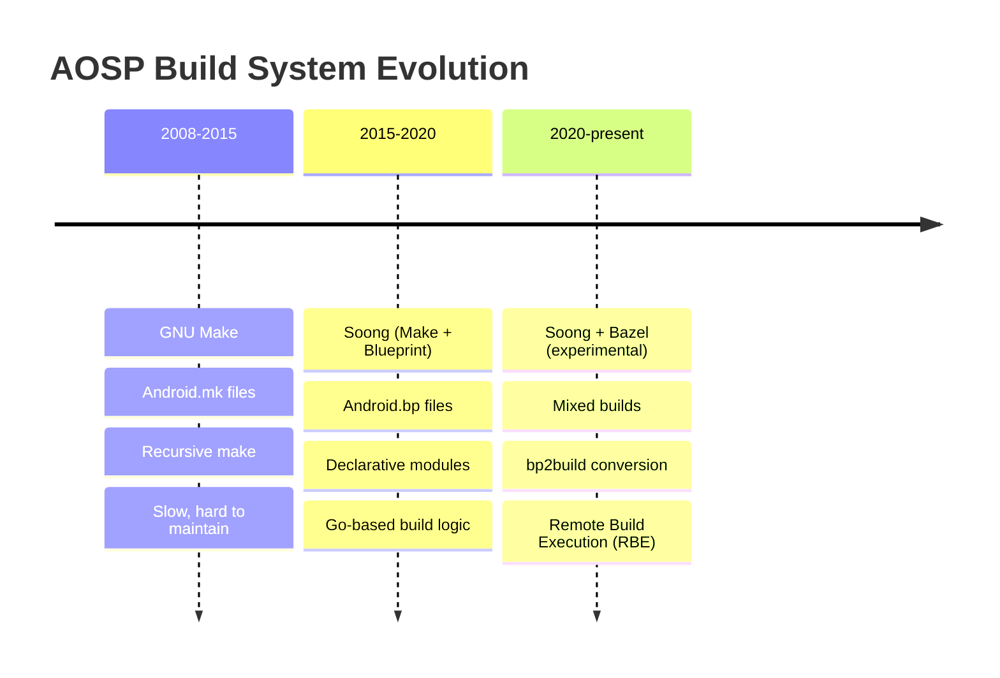

**第一代：GNU Make（2008-2015）。**
最早的 Android 构建系统完全基于 GNU Make。每个模块都通过 `Android.mk` 文件描述，依赖 Make 变量与 include 指令组织。一个典型的 `Android.mk` 形态如下：

```makefile
# Legacy Android.mk format (still supported but deprecated)
LOCAL_PATH := $(call my-dir)

include $(CLEAR_VARS)
LOCAL_MODULE := libexample
LOCAL_SRC_FILES := example.cpp
LOCAL_SHARED_LIBRARIES := liblog libutils
LOCAL_C_INCLUDES := $(LOCAL_PATH)/include
LOCAL_CFLAGS := -Wall -Werror
include $(BUILD_SHARED_LIBRARY)
```

这套系统可以工作，但也承受了 Make 众所周知的问题：

- **增量构建慢：** 每次调用时，Make 都要重新评估完整依赖图，并解析成千上万个被 include 的 Makefile。
- **变量作用域脆弱：** Make 变量默认是全局的，当两个模块不小心共用了同名变量时，很容易引发隐蔽 bug。
- **并行能力受限：** 递归式 Make 跨目录天然趋向串行。
- **缺乏依赖边界约束：** 任意 Makefile 都可以引用其他 Makefile 中的变量，模块边界几乎无法推理。
- **报错信息糟糕：** 当深层 include 链中出现问题时，错误信息往往几乎无法读懂。

在其巅峰时期，基于 Make 的构建系统包含 10000 多个 `Android.mk` 文件，光是解析阶段就可能耗费数小时，还没开始真正编译。

**第二代：Soong / Blueprint（2015 至今）。**
Google 推出了 Soong 作为替代方案，并构建出三层架构。模块现在通过 `Android.bp` 文件声明，语法简单、声明式、近似 JSON，而构建逻辑本身则写在 Go 代码中。Make 依然存在，但主要作为 product 配置和镜像装配的薄胶水层；新的模块始终应定义在 `Android.bp` 中。

从 Make 到 Soong 的迁移是渐进完成的。`androidmk` 工具可以自动转换，两个系统长期并存。随着 Android 版本持续演进，越来越多模块已经迁移。到当前版本为止，平台中绝大多数模块都已使用 `Android.bp`。

Soong 背后的关键洞见，是 **将声明与逻辑分离**。在 Make 中，构建文件格式本身就是编程语言，模块声明与构建逻辑写在同一个文件里；在 Soong 中，`Android.bp` 文件只负责声明，不允许条件语句和循环，而所有构建逻辑都集中在 Soong 二进制的 Go 代码中。这让 `Android.bp` 文件更简单，也更不容易出错。

**第三代：Bazel（2020 至今，实验性）。**
Google 一直在推动将构建系统迁移到 Bazel，也就是其内部 Blaze 构建系统的开源版本。相关工作主要体现在 `build/pesto/` 目录以及 `bp2build` 等工具中。到当前版本，Bazel 已用于内核构建（Kleaf）和若干实验路径，但整个平台构建仍然由 Soong 主导。

迁移 Bazel 的动机包括：

- **构建 Hermeticity：** Bazel 会对每个构建 action 进行沙箱隔离，从而提升可重复性。
- **远程执行：** 构建 action 可以分发到机器集群上执行。
- **按内容寻址缓存：** 构建结果可以在开发者、CI 和不同分支之间共享。
- **超大规模伸缩性：** Bazel 专为超大代码库设计，Google 内部 monorepo 的规模已达数十亿行。

不过，将 AOSP 这样复杂的构建系统迁移到 Bazel 本身就是多年工程。因此在可预见未来里，Soong 依然会是主构建系统。

### 2.2.2 三层架构

现代 AOSP 构建系统由三层组成，每层使用不同技术实现：

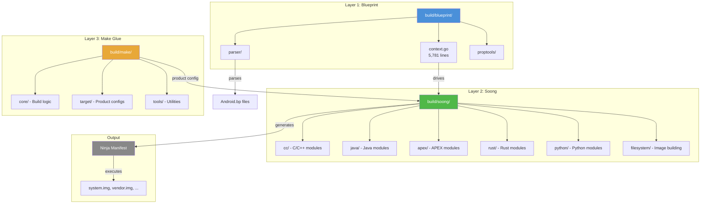

下面逐层展开。

### 2.2.3 第 1 层：Blueprint（`build/blueprint/`）

Blueprint 是元构建框架。它是一个 Go 库，负责解析模块定义文件、解析依赖、运行 mutator，并生成 Ninja 构建规则。Blueprint **并不专属于 Android**，它是一套通用工具。

`build/blueprint/` 中的 `doc.go` 这样描述这个框架：

```go
// Blueprint is a meta-build system that reads in Blueprints files that
// describe modules that need to be built, and produces a Ninja
// (https://ninja-build.org/) manifest describing the commands that need
// to be run and their dependencies.  Where most build systems use built-in
// rules or a domain-specific language to describe the logic how modules are
// converted to build rules, Blueprint delegates this to per-project build
// logic written in Go.
```

**源码：** `build/blueprint/doc.go`

Blueprint 的核心是 `context.go`（5781 行，约 89 KB），其中定义了 `Context` 结构体。它是整个构建过程的中心状态对象，并通过四个阶段驱动整个流程：

```go
// A Context contains all the state needed to parse a set of Blueprints files
// and generate a Ninja file.  The process of generating a Ninja file proceeds
// through a series of four phases.  Each phase corresponds with a some methods
// on the Context object
//
//          Phase                            Methods
//       ------------      -------------------------------------------
//    1. Registration         RegisterModuleType, RegisterSingletonType
//
//    2. Parse                    ParseBlueprintsFiles, Parse
//
//    3. Generate            ResolveDependencies, PrepareBuildActions
//
//    4. Write                           WriteBuildFile
```

**源码：** `build/blueprint/context.go` 第 70-84 行

四个阶段的工作方式如下：

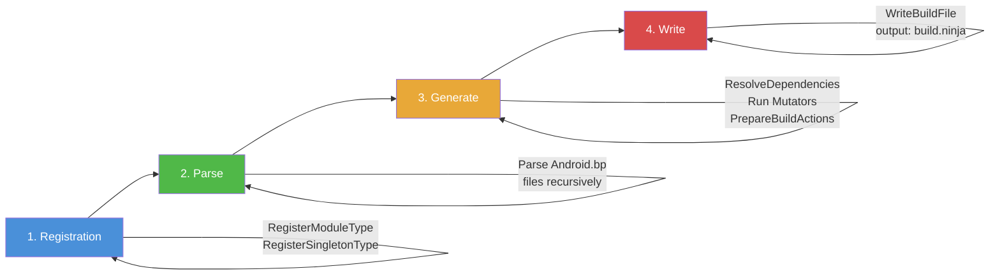

1. **Registration：** 向 Context 注册模块类型，例如 `cc_binary`、`java_library`，以及 singleton。每种模块类型都对应一个 Go factory 函数。

2. **Parse：** 递归发现并解析源码树中的全部 `Android.bp` 文件。Blueprint parser 会读取这种接近 JSON 的语法，并通过反射填充 Go 结构体。

3. **Generate：** 解析模块间依赖。系统会按注册顺序运行 *mutator*，它们可以自顶向下或自底向上访问模块，以传播信息或把模块拆分成多个 variant，例如按目标架构拆成不同变体。之后每个模块生成自己的 build action。

4. **Write：** 把累积得到的 build action 序列化为 Ninja manifest。

`build/blueprint/` 下的关键目录和文件包括：

| 目录 / 文件 | 用途 |
|---------------|---------|
| `context.go` | 核心调度器（5781 行） |
| `parser/` | Blueprint 文件解析器 |
| `proptools/` | 反射式属性处理工具 |
| `pathtools/` | 文件路径工具与 glob 匹配 |
| `depset/` | 依赖集合实现，类似 Bazel depset |
| `bpfmt/` | Blueprint 文件格式化工具 |
| `bpmodify/` | 以编程方式修改 Blueprint 文件 |
| `bootstrap/` | 自举逻辑 |
| `gobtools/` | Go 二进制序列化工具 |
| `gotestmain/` | 测试 main 生成器 |
| `gotestrunner/` | 测试运行辅助 |
| `metrics/` | 构建指标与事件处理 |
| `incremental.go` | 增量构建支持 |
| `live_tracker.go` | 依赖的实时文件跟踪 |

#### Blueprint Mutator

Mutator 是 Blueprint 中最关键的概念之一。Mutator 本质上是一个遍历模块并可对其进行修改的函数。它们主要用于：

- **创建变体：** 一个模块声明可以被拆成多个 *variant*。例如，一个 `cc_library` 会被拆分成 device 和 host 两类变体，并进一步拆成 arm64、x86_64 等架构变体。
- **传播依赖信息：** 可以把某个模块的信息传递给依赖它的模块，或者反向传播。
- **补全默认值：** 可基于全局构建配置推导模块属性的默认值。

Mutator 会按固定顺序运行：


1. **Pre-deps mutator** 在依赖解析前运行。它们可以添加依赖，或者创建 variant。
2. **依赖解析阶段** 将依赖名字匹配到真实模块。
3. **Post-deps mutator** 在依赖解析后运行，可以读取依赖信息。
4. **Final-deps mutator** 最后执行，用于收尾式修改。

例如，APEX 系统就通过 post-deps mutator 为每个出现在不同 APEX 中的库创建独立 variant：

```go
// From build/soong/apex/apex.go
func RegisterPostDepsMutators(ctx android.RegisterMutatorsContext) {
    ctx.BottomUp("apex_unique", apexUniqueVariationsMutator)
    ctx.BottomUp("mark_platform_availability", markPlatformAvailability)
    ctx.InfoBasedTransition("apex",
        android.NewGenericTransitionMutatorAdapter(&apexTransitionMutator{}))
}
```

**源码：** `build/soong/apex/apex.go` 第 64-70 行

#### Blueprint Provider

Provider 是 Blueprint 在模块间传递结构化信息的机制。当模块生成 build action 时，它可以设置 *provider* 数据，而依赖它的模块随后可以读取这些数据。相比 Make 的全局变量，这是一种更有边界的设计：

```go
// Provider declaration (from build/soong/cc/cc.go)
var CcObjectInfoProvider = blueprint.NewProvider[CcObjectInfo]()

// Setting a provider (in the generating module)
ctx.SetProvider(CcObjectInfoProvider, CcObjectInfo{
    ObjFiles:   objFiles,
    TidyFiles:  tidyFiles,
    KytheFiles: kytheFiles,
})

// Reading a provider (in a dependent module)
if info, ok := ctx.OtherModuleProvider(dep, CcObjectInfoProvider); ok {
    // Use info.ObjFiles, etc.
}
```

### 2.2.4 第 2 层：Soong（`build/soong/`）

Soong 才是 Android 真正意义上的构建系统。它构建在 Blueprint 之上，向其中注册 Android 特有的模块类型、mutator 与 singleton。`build/soong/` 目录下包含 74 个子目录，按模块类型与构建能力进行组织。

来自 `build/soong/README.md` 的定义如下：

```
Soong is one of the build systems used in Android, which is controlled
by files called Android.bp. There is also the legacy Make-based build
system that is controlled by files called Android.mk.

Android.bp file are JSON-like declarative descriptions of "modules" to
build; a "module" is the basic unit of building that Soong understands,
similarly to how "target" is the basic unit of building for Make.
```

**源码：** `build/soong/README.md` 第 1-8 行

README 进一步描述了构建逻辑：

```
The build logic is written in Go using the blueprint framework.
Build logic receives module definitions parsed into Go structures
using reflection and produces build rules. The build rules are
collected by blueprint and written to a ninja build file.
```

**源码：** `build/soong/README.md` 第 610-614 行

`build/soong/` 下的关键子目录如下：

| 目录 | 用途 | 关键文件 |
|-----------|---------|-----------|
| `cc/` | C/C++ 模块类型，例如 `cc_binary`、`cc_library` | `cc.go`、`library.go`、`binary.go` |
| `java/` | Java/Kotlin 模块类型，例如 `java_library`、`android_app` | `java.go`、`app.go`、`sdk_library.go` |
| `apex/` | APEX 模块类型，`apex.go` 长达 3001 行 | `apex.go`、`builder.go`、`key.go` |
| `rust/` | Rust 模块类型 | `rust.go`、`library.go` |
| `python/` | Python 模块类型 | `python.go` |
| `sh/` | Shell 脚本模块类型 | `sh_binary.go` |
| `genrule/` | 通用构建规则模块 | `genrule.go` |
| `android/` | Soong 核心框架，例如模块基类、架构处理 | `module.go`、`arch.go`、`paths.go` |
| `filesystem/` | 镜像文件构建 | `filesystem.go` |
| `ui/` | 构建 UI 与进度报告 | `build.go` |
| `cmd/` | 命令行入口 | `soong_build/`、`soong_ui/` |
| `bpf/` | BPF 程序编译 | `bpf.go` |
| `sdk/` | SDK snapshot 生成 | `sdk.go` |
| `snapshot/` | vendor snapshot 管理 | `snapshot.go` |
| `linkerconfig/` | linker namespace 配置 | `linkerconfig.go` |
| `aconfig/` | build flag（aconfig）集成 | `aconfig.go` |
| `bin/` | `m`、`mm`、`mmm` 等 shell 脚本 | `m`、`mm`、`mmm` |
| `kernel/` | 与 kernel 相关的构建逻辑 | `kernel.go` |

#### 走进 Go 代码：模块注册

每种模块类型都会通过一个 Go `init()` 函数向 Soong 注册。下面看三类最核心模块家族的注册方式：

**C/C++ 模块**（`build/soong/cc/cc.go`，4778 行）：

```go
// This file contains the module types for compiling C/C++ for Android,
// and converts the properties into the flags and filenames necessary to
// pass to the compiler.  The final creation of the rules is handled in
// builder.go
package cc
```

**源码：** `build/soong/cc/cc.go` 第 15-19 行

C/C++ 模块系统定义了大量用于追踪编译状态的数据结构。例如，`LinkerInfo` 结构体用于捕获全部链接依赖：

```go
type LinkerInfo struct {
    WholeStaticLibs []string
    StaticLibs      []string  // modules to statically link
    SharedLibs      []string  // modules to dynamically link
    HeaderLibs      []string  // header-only dependencies
    SystemSharedLibs []string
    ...
}
```

**源码：** `build/soong/cc/cc.go` 第 81-99 行

`cc/` 目录包含 30 多个 Go 文件，每个文件处理 C/C++ 编译的不同方面：

| 文件 | 用途 | 行数 |
|------|---------|-------|
| `cc.go` | 核心模块类型与属性 | 4,778 |
| `builder.go` | Ninja 规则生成 | ~2,000 |
| `binary.go` | `cc_binary` 实现 | ~500 |
| `library.go` | `cc_library` 实现 | ~2,000 |
| `sanitize.go` | ASan/TSan/UBSan 集成 | ~1,500 |
| `ndk_sysroot.go` | NDK sysroot 管理 | ~400 |
| `stl.go` | C++ STL 选择 | ~300 |
| `cmake_snapshot.go` | CMake 项目生成 | ~400 |
| `check.go` | 构建一致性检查 | ~200 |

**Java 模块**（`build/soong/java/java.go`，4070 行）：

```go
// This file contains the module types for compiling Java for Android,
// and converts the properties into the flags and filenames necessary
// to pass to the Module.  The final creation of the rules is handled
// in builder.go
package java

func registerJavaBuildComponents(ctx android.RegistrationContext) {
    ctx.RegisterModuleType("java_defaults", DefaultsFactory)
    ctx.RegisterModuleType("java_library", LibraryFactory)
    ctx.RegisterModuleType("java_library_static", LibraryStaticFactory)
    ctx.RegisterModuleType("java_library_host", LibraryHostFactory)
    ctx.RegisterModuleType("java_binary", BinaryFactory)
    ctx.RegisterModuleType("java_binary_host", BinaryHostFactory)
    ctx.RegisterModuleType("java_test", TestFactory)
    ctx.RegisterModuleType("java_test_helper_library", TestHelperLibraryFactory)
    ctx.RegisterModuleType("java_test_host", TestHostFactory)
    ctx.RegisterModuleType("java_test_import", JavaTestImportFactory)
    ctx.RegisterModuleType("java_import", ImportFactory)
    ctx.RegisterModuleType("java_import_host", ImportFactoryHost)
    ctx.RegisterModuleType("java_device_for_host", DeviceForHostFactory)
    ctx.RegisterModuleType("java_host_for_device", HostForDeviceFactory)
    ctx.RegisterModuleType("dex_import", DexImportFactory)
    ctx.RegisterModuleType("java_api_library", ApiLibraryFactory)
    ctx.RegisterModuleType("java_api_contribution", ApiContributionFactory)
    ...
}
```

**源码：** `build/soong/java/java.go` 第 50-70 行

**Genrule 模块**（`build/soong/genrule/genrule.go`，1042 行）：

```go
// A genrule module takes a list of source files ("srcs" property), an
// optional list of tools ("tools" property), and a command line ("cmd"
// property), to generate output files ("out" property).
package genrule

func RegisterGenruleBuildComponents(ctx android.RegistrationContext) {
    ctx.RegisterModuleType("genrule_defaults", defaultsFactory)
    ctx.RegisterModuleType("gensrcs", GenSrcsFactory)
    ctx.RegisterModuleType("genrule", GenRuleFactory)
    ...
}
```

**源码：** `build/soong/genrule/genrule.go` 第 15-67 行

`genrule` 模块类型非常适合代码生成、protocol buffer 编译、AIDL 接口生成，以及所有需要通过任意命令产出源码文件的场景。

#### Soong 构建流程内部机制

当 `soong_ui` 启动一次构建时，内部会依次经历以下步骤：

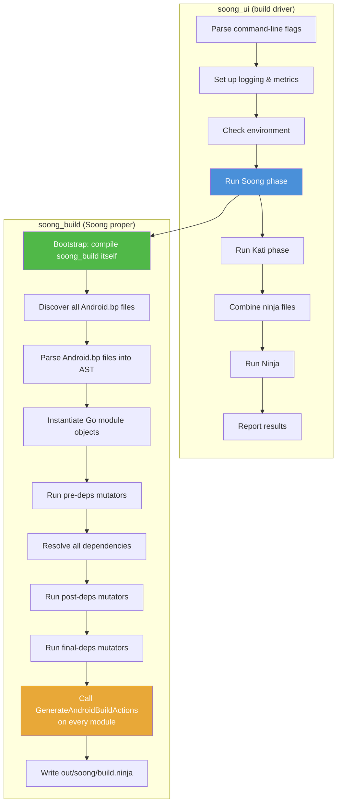

其中最关键的一步是 **SB9：GenerateAndroidBuildActions**。每种模块类型都必须实现这个方法。它会检查模块属性、解析依赖，然后生成 Ninja 构建规则，例如编译命令、链接命令、文件复制规则等。

构建入口脚本位于 `build/soong/soong_ui.bash`：

```bash
#!/bin/bash -eu
source $(cd $(dirname $BASH_SOURCE) &> /dev/null && pwd)/../make/shell_utils.sh
require_top

# To track how long we took to startup.
case $(uname -s) in
  Darwin)
    export TRACE_BEGIN_SOONG=`$TOP/prebuilts/build-tools/path/darwin-x86/date +%s%3N`
    ;;
  *)
    export TRACE_BEGIN_SOONG=$(date +%s%N)
    ;;
esac

setup_cog_env_if_needed
set_network_file_system_type_env_var

# Save the current PWD for use in soong_ui
export ORIGINAL_PWD=${PWD}
export TOP=$(gettop)
source ${TOP}/build/soong/scripts/microfactory.bash

soong_build_go soong_ui android/soong/cmd/soong_ui
soong_build_go mk2rbc android/soong/mk2rbc/mk2rbc
soong_build_go rbcrun rbcrun/rbcrun
soong_build_go release-config android/soong/cmd/release_config/release_config

cd ${TOP}
exec "$(getoutdir)/soong_ui" "$@"
```

**源码：** `build/soong/soong_ui.bash`

这个脚本完成 Go 构建系统的自举：它先编译 `soong_ui` 及若干辅助工具，再执行 `soong_ui`，由它来编排整个构建过程。

### 2.2.5 第 3 层：Make 胶水层（`build/make/`）

虽然 Soong 负责模块编译，但 GNU Make 仍通过 Kati 发挥关键作用。Kati 是一个针对 Android 优化的 Make clone。它主要负责：

- **Product 配置：** `PRODUCT_*` 变量、`BoardConfig.mk` 和设备 makefile 依然以 Make 方式编写。
- **镜像装配：** 将编译产物组合成分区镜像，例如 `system.img`、`vendor.img` 的规则仍在 Make 中。
- **遗留模块：** 仍有一部分模块使用 `Android.mk`，虽然每个版本都在减少。

`build/make/` 目录包含 25 个顶层条目：

| 目录 / 文件 | 用途 |
|---------------|---------|
| `core/` | 核心构建逻辑，包括 include、rule、模块定义 |
| `target/` | product 与 board 配置文件 |
| `tools/` | 构建工具，例如 releasetools、signapk |
| `envsetup.sh` | shell 环境设置脚本（1187 行） |
| `common/` | 公共构建逻辑 |
| `packaging/` | 包装与装配规则 |
| `Changes.md` | 构建系统变更日志 |
| `shell_utils.sh` | shell 工具函数 |

构建时三层系统的关系如下：

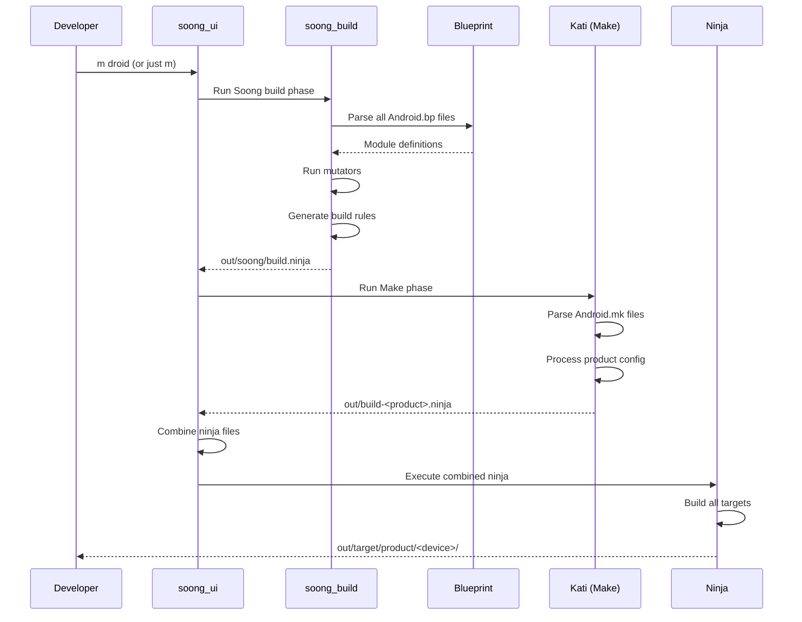

### 2.2.6 Soong README：模块定义

Soong 的 README（`build/soong/README.md`）是 `Android.bp` 语法最权威的参考资料。下面是它所定义的几个关键元素。

**模块结构：**

```
cc_binary {
    name: "gzip",
    srcs: ["src/test/minigzip.c"],
    shared_libs: ["libz"],
    stl: "none",
}
```

README 明确指出：“Every module must have a `name` property, and the value must be unique across all Android.bp files.”

**源码：** `build/soong/README.md` 第 43-48 行

**变量：**

```
gzip_srcs = ["src/test/minigzip.c"],

cc_binary {
    name: "gzip",
    srcs: gzip_srcs,
    shared_libs: ["libz"],
    stl: "none",
}
```

README 中写道：“Variables are scoped to the remainder of the file they are declared in, as well as any child Android.bp files. Variables are immutable with one exception -- they can be appended to with a += assignment, but only before they have been referenced.”

**源码：** `build/soong/README.md` 第 76-91 行

**支持的数据类型：**

| 类型 | 语法 |
|------|--------|
| Bool | `true` 或 `false` |
| Integer | `42` |
| String | `"hello"` |
| List of strings | `["a", "b", "c"]` |
| Map | `{key1: "val", key2: ["val2"]}` |

**注释：** 同时支持 `/* */` 和 `//` 两种风格。

**Defaults 模块：**

```
cc_defaults {
    name: "gzip_defaults",
    shared_libs: ["libz"],
    stl: "none",
}

cc_binary {
    name: "gzip",
    defaults: ["gzip_defaults"],
    srcs: ["src/test/minigzip.c"],
}
```

**源码：** `build/soong/README.md` 第 126-142 行

Defaults 模块允许多个模块共享一组属性，从而减少重复配置。

---

## 2.3 `envsetup.sh` 与 `lunch`

### 2.3.1 `source build/envsetup.sh`

每一次 AOSP 构建会话，几乎都从加载环境设置脚本开始：

```bash
source build/envsetup.sh
```

这个脚本真实位于 `build/make/envsetup.sh`（1187 行），并通过 manifest 中的 `<linkfile>` 指令被链接到顶层路径 `build/envsetup.sh`。

脚本加载时会完成以下工作：

1. **通过 `_gettop_once` 找到源码树根目录：**

```bash
function _gettop_once
{
    local TOPFILE=build/make/core/envsetup.mk
    if [ -n "$TOP" -a -f "$TOP/$TOPFILE" ] ; then
        # The following circumlocution ensures we remove symlinks from TOP.
        (cd "$TOP"; PWD= /bin/pwd)
    else
        if [ -f $TOPFILE ] ; then
            PWD= /bin/pwd
        else
            local HERE=$PWD
            local T=
            while [ \( ! \( -f $TOPFILE \) \) -a \( "$PWD" != "/" \) ]; do
                \cd ..
                T=`PWD= /bin/pwd -P`
            done
            \cd "$HERE"
            if [ -f "$T/$TOPFILE" ]; then
                echo "$T"
            fi
        fi
    fi
}
```

**源码：** `build/make/envsetup.sh` 第 18-43 行

这个函数会沿目录树向上查找 `build/make/core/envsetup.mk` 作为哨兵文件。这也是构建系统判断一个目录是否为 AOSP 根目录的规范方式。

2. **加载 `shell_utils.sh`：** 引入通用 shell 工具函数。

3. **通过 `set_global_paths()` 设置全局路径：**

```bash
function set_global_paths()
{
    ...
    ANDROID_GLOBAL_BUILD_PATHS=$T/build/soong/bin
    ANDROID_GLOBAL_BUILD_PATHS+=:$T/build/bazel/bin
    ANDROID_GLOBAL_BUILD_PATHS+=:$T/development/scripts
    ANDROID_GLOBAL_BUILD_PATHS+=:$T/prebuilts/devtools/tools

    # add kernel specific binaries
    if [ $(uname -s) = Linux ] ; then
        ANDROID_GLOBAL_BUILD_PATHS+=:$T/prebuilts/misc/linux-x86/dtc
        ANDROID_GLOBAL_BUILD_PATHS+=:$T/prebuilts/misc/linux-x86/libufdt
    fi
    ...
    export PATH=$ANDROID_GLOBAL_BUILD_PATHS:$PATH
}
```

**源码：** `build/make/envsetup.sh` 第 259-317 行

这一步会把构建工具、Bazel 二进制、模拟器预构建工具，以及 device tree compiler（dtc）等路径加入 `PATH`。

4. **通过 `source_vendorsetup()` 加载厂商设置脚本：**

```bash
function source_vendorsetup() {
    ...
    for dir in device vendor product; do
        for f in $(cd "$T" && test -d $dir && \
            find -L $dir -maxdepth 4 -name 'vendorsetup.sh' 2>/dev/null \
            | sort); do
            if [[ -z "$allowed" || "$allowed_files" =~ $f ]]; then
                echo "including $f"; . "$T/$f"
            else
                echo "ignoring $f, not in $allowed"
            fi
        done
    done
    ...
}
```

**源码：** `build/make/envsetup.sh` 第 1061-1090 行

它会在 `device/`、`vendor/` 和 `product/` 下查找并执行 `vendorsetup.sh`。这些脚本通常用来增加设备特定 lunch combo，或者设置厂商自定义环境变量。

5. **通过 `addcompletions()` 安装 shell 补全：** 为 `lunch`、`m`、`adb`、`fastboot` 等命令提供补全能力。

6. **在 `USE_LEFTOVERS=1` 时自动恢复上一次 lunch 选择。**

### 2.3.2 `envsetup.sh` 中定义的关键函数

脚本加载完成后，会在当前 shell 中定义大量函数。下面是最重要的一批：

| 函数 | 用途 |
|----------|---------|
| `lunch` | 选择构建目标（product、release、variant） |
| `tapas` | 配置 unbundled app 构建 |
| `banchan` | 配置 unbundled APEX 构建 |
| `m` | 从源码树根目录发起构建，本质上委托给 `soong_ui.bash` |
| `mm` | 构建当前目录中的模块 |
| `mmm` | 构建指定目录中的模块 |
| `croot` | `cd` 到源码树根目录 |
| `gomod` | `cd` 到某个指定模块所在目录 |
| `godir` | `cd` 到匹配某个模式的目录 |
| `adb` | 包装器，确保使用源码树自带 adb |
| `fastboot` | 包装器，确保使用源码树自带 fastboot |
| `make` | 重定向到 `soong_ui.bash --make-mode` |
| `printconfig` | 显示当前构建配置 |
| `leftovers` | 恢复上一次 lunch 选择 |

其中 `make` 函数非常值得注意，因为它会拦截系统原生 `make` 命令：

```bash
function get_make_command()
{
    # If we're in the top of an Android tree, use soong_ui.bash instead of make
    if [ -f build/soong/soong_ui.bash ]; then
        # Always use the real make if -C is passed in
        for arg in "$@"; do
            if [[ $arg == -C* ]]; then
                echo command make
                return
            fi
        done
        echo build/soong/soong_ui.bash --make-mode
    else
        echo command make
    fi
}

function make()
{
    _wrap_build $(get_make_command "$@") "$@"
}
```

**源码：** `build/make/envsetup.sh` 第 1010-1030 行

这意味着，在 AOSP 源码树中输入 `make`，实际执行的是 `soong_ui.bash --make-mode`，而不是直接调用 GNU Make。

### 2.3.3 `lunch` 命令

`lunch` 是选择构建目标的核心命令。它会设置三个基础变量：

| 变量 | 用途 | 示例 |
|----------|---------|---------|
| `TARGET_PRODUCT` | 要为哪个设备 / product 构建 | `aosp_arm64` |
| `TARGET_RELEASE` | release 配置 | `trunk_staging` |
| `TARGET_BUILD_VARIANT` | 构建变体（eng / userdebug / user） | `eng` |

`lunch` 支持两种输入格式：

```bash
# New format (recommended): positional arguments
lunch aosp_arm64 trunk_staging eng

# Legacy format: dash-separated
lunch aosp_arm64-trunk_staging-eng
```

如果省略 release 与 variant，它们默认分别是 `trunk_staging` 与 `eng`：

```bash
function lunch()
{
    ...
    # Handle the new format.
    if [[ -z $legacy ]]; then
        product=$1
        release=$2
        if [[ -z $release ]]; then
            release=trunk_staging
        fi
        variant=$3
        if [[ -z $variant ]]; then
            variant=eng
        fi
    fi

    # Validate the selection and set all the environment stuff
    _lunch_meat $product $release $variant
    ...
}
```

**源码：** `build/make/envsetup.sh` 第 550-596 行

真正承担主要工作的函数是 `_lunch_meat`：

```bash
function _lunch_meat()
{
    local product=$1
    local release=$2
    local variant=$3

    TARGET_PRODUCT=$product \
    TARGET_RELEASE=$release \
    TARGET_BUILD_VARIANT=$variant \
    TARGET_BUILD_APPS= \
    build_build_var_cache
    if [ $? -ne 0 ]
    then
        if [[ "$product" =~ .*_(eng|user|userdebug) ]]
        then
            echo "Did you mean -${product/*_/}? (dash instead of underscore)"
        fi
        return 1
    fi
    export TARGET_PRODUCT=$(_get_build_var_cached TARGET_PRODUCT)
    export TARGET_BUILD_VARIANT=$(_get_build_var_cached TARGET_BUILD_VARIANT)
    export TARGET_RELEASE=$release
    export TARGET_BUILD_TYPE=release
    export TARGET_BUILD_APPS=

    set_stuff_for_environment
    ...
}
```

**源码：** `build/make/envsetup.sh` 第 447-491 行

它主要完成四件事：

1. 调用 `soong_ui.bash --dumpvars-mode` 解析并缓存构建变量
2. 导出 `TARGET_PRODUCT`、`TARGET_BUILD_VARIANT`、`TARGET_RELEASE` 和 `TARGET_BUILD_TYPE`
3. 调用 `set_stuff_for_environment()`，设置 `PATH`、`JAVA_HOME`、`ANDROID_PRODUCT_OUT` 等环境变量
4. 打印当前配置

### 2.3.4 构建变体

三种 build variant 决定了系统包含哪些内容，以及这些内容以什么方式构建：

| Variant | 说明 | `ro.debuggable` | `adb` | 优化级别 |
|---------|-------------|-----------------|-------|---------------|
| `user` | 量产构建，访问受限 | `0` | 默认关闭 | 完整优化 |
| `userdebug` | 类似 user，但保留 root 与调试工具 | `1` | 开启 | 完整优化 |
| `eng` | 开发构建，额外工具更多，优化更弱 | `1` | 开启 | 降低优化 |

Variant 还会决定安装哪些软件包。例如，`eng` 独有的包会包含 `strace` 这类开发工具，而 `user` 构建不会带这些内容。

### 2.3.5 `envsetup.mk` 与 `config.mk`

在 `lunch` 设置完环境变量之后，构建系统的 Make 层会通过 `build/make/core/envsetup.mk` 与 `build/make/core/config.mk` 读取它们。

`envsetup.mk` 会建立基础构建变量：

```makefile
# Variables we check:
#     HOST_BUILD_TYPE = { release debug }
#     TARGET_BUILD_TYPE = { release debug }
# and we output a bunch of variables, see the case statement at
# the bottom for the full list
#     OUT_DIR is also set to "out" if it's not already set.

# ...

# The product defaults to generic on hardware
ifeq ($(TARGET_PRODUCT),)
TARGET_PRODUCT := aosp_arm64
endif

# the variant -- the set of files that are included for a build
ifeq ($(strip $(TARGET_BUILD_VARIANT)),)
TARGET_BUILD_VARIANT := eng
endif
```

**源码：** `build/make/core/envsetup.mk` 第 1-85 行

它还负责探测 host 环境：

```makefile
# HOST_OS
ifneq (,$(findstring Linux,$(UNAME)))
  HOST_OS := linux
endif
ifneq (,$(findstring Darwin,$(UNAME)))
  HOST_OS := darwin
endif

# HOST_ARCH
ifneq (,$(findstring x86_64,$(UNAME)))
  HOST_ARCH := x86_64
  HOST_2ND_ARCH := x86
  HOST_IS_64_BIT := true
endif
```

**源码：** `build/make/core/envsetup.mk` 第 122-183 行

并定义分区输出目录：

```makefile
TARGET_COPY_OUT_SYSTEM := system
TARGET_COPY_OUT_SYSTEM_DLKM := system_dlkm
TARGET_COPY_OUT_DATA := data
TARGET_COPY_OUT_VENDOR := $(_vendor_path_placeholder)
TARGET_COPY_OUT_PRODUCT := $(_product_path_placeholder)
TARGET_COPY_OUT_SYSTEM_EXT := $(_system_ext_path_placeholder)
TARGET_COPY_OUT_ODM := $(_odm_path_placeholder)
```

**源码：** `build/make/core/envsetup.mk` 第 254-289 行

`config.mk` 是顶层配置 include，它一开始就放了一个保护逻辑，阻止用户直接调用：

```makefile
ifndef KATI
$(warning Directly using config.mk from make is no longer supported.)
$(warning )
$(warning If you are just attempting to build, you probably need to re-source envsetup.sh:)
$(warning )
$(warning $$ source build/envsetup.sh)
$(error done)
endif

BUILD_SYSTEM :=$= build/make/core
BUILD_SYSTEM_COMMON :=$= build/make/common
```

**源码：** `build/make/core/config.mk` 第 1-22 行

这里的 `ifndef KATI` 已经告诉我们一个重要事实：Make 层并不是通过标准 GNU Make 执行的，而是借助 **Kati**。Kati 是一个面向 Android 构建模式优化过的 Make 实现。

### 2.3.6 Kati：Make 的替代者

Kati（旧版源码树中位于 `build/kati/`，现在主要以预构建形式存在）是 Google 的 Make 兼容构建工具。它诞生的直接目标，就是解决 GNU Make 在 Android 构建中的性能问题：

- **解析更快：** Kati 解析 Makefile 的速度明显快于 GNU Make。
- **缓存能力更好：** 它可以在多次调用间缓存 Makefile 的解析结果。
- **生成 Ninja：** Kati 不直接执行构建命令，而是生成 Ninja manifest，再交给 Ninja 执行。
- **兼容性高：** Kati 力求成为 GNU Make 的替代品，不过会有意放弃少数极少使用的 Make 特性。

在 AOSP 构建中，Kati 主要负责：

- Product 配置（`PRODUCT_*` 变量）
- Board 配置（`BOARD_*` 变量）
- 镜像装配规则
- 仍然基于 `Android.mk` 的遗留模块

Kati 的输出是 `out/build-<TARGET_PRODUCT>.ninja`。它会与 Soong 生成的 `out/soong/build.ninja` 合并成一个 `out/combined-<TARGET_PRODUCT>.ninja`，随后由 Ninja 执行。

### 2.3.7 构建变量如何流动

理解构建变量的流转，是排查构建配置问题的关键：

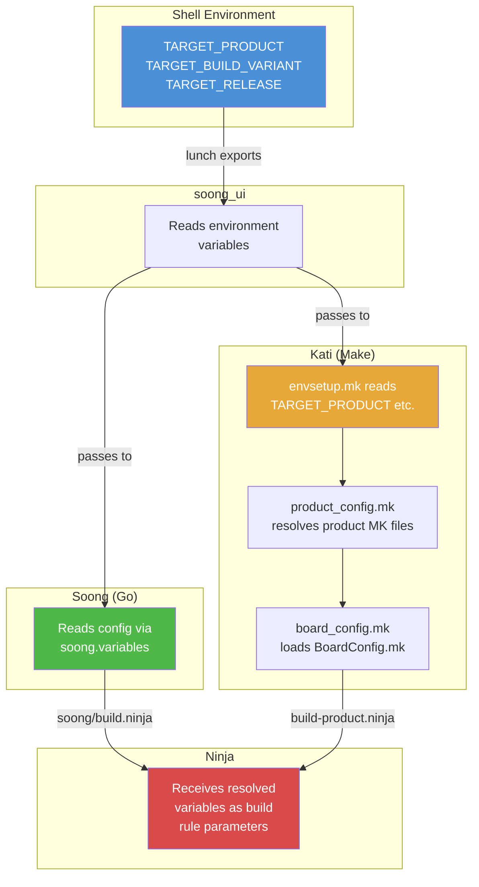

在 Make 层中，变量解析链条如下：

1. `build/make/core/config.mk` 是顶层入口
2. 它会 include `build/make/core/envsetup.mk`，后者从环境变量中读取 `TARGET_PRODUCT` 与 `TARGET_BUILD_VARIANT`
3. `envsetup.mk` 再 include `product_config.mk`，后者定位并加载该 product 的 makefile，例如 `build/make/target/product/aosp_arm64.mk`
4. Product makefile 使用 `inherit-product` 继续引入基础配置
5. `board_config.mk` 再定位并加载设备的 `BoardConfig.mk`
6. 所有解析完成的变量随后既用于镜像装配，也会通过 `soong.variables` 传入 Soong

其中最关键的变量解析发生在 `envsetup.mk`：

```makefile
# Read the product specs so we can get TARGET_DEVICE and other
# variables that we need in order to locate the output files.
include $(BUILD_SYSTEM)/product_config.mk

SDK_HOST_ARCH := x86
TARGET_OS := linux

# Some board configuration files use $(PRODUCT_OUT)
TARGET_OUT_ROOT := $(OUT_DIR)/target
TARGET_PRODUCT_OUT_ROOT := $(TARGET_OUT_ROOT)/product
PRODUCT_OUT := $(TARGET_PRODUCT_OUT_ROOT)/$(TARGET_DEVICE)

include $(BUILD_SYSTEM)/board_config.mk
```

**源码：** `build/make/core/envsetup.mk` 第 349-368 行

这正是计算 `PRODUCT_OUT` 的地方，也就是目标设备全部构建输出的目录。对 `aosp_arm64` 来说，它会解析成 `out/target/product/generic_arm64/`。

### 2.3.8 `tapas` 与 `banchan`

除了 `lunch`，`envsetup.sh` 还提供了两个针对 unbundled 构建的专用命令：

**`tapas`：构建独立应用**

```bash
# Build the Camera app for ARM64
tapas Camera arm64 eng

# Build multiple apps
tapas Camera Gallery arm64 userdebug
```

`tapas` 函数位于 `build/make/envsetup.sh` 第 676-747 行，用来配置 unbundled app 构建。它会把指定应用名写入 `TARGET_BUILD_APPS`，从而告诉构建系统只构建这些应用及其依赖，而不是整个系统平台。

**`banchan`：构建独立 APEX**

```bash
# Build the Wi-Fi APEX for ARM64
banchan com.android.wifi arm64 eng

# Build multiple APEXes
banchan com.android.wifi com.android.bt arm64 userdebug
```

`banchan` 函数位于 `build/make/envsetup.sh` 第 749-811 行。它与 `tapas` 的思路类似，但专门用于 APEX 模块。由于 APEX 在很大程度上与具体设备解耦，因此它会使用 `module_arm64` 这类 product 作为构建目标。

这两个命令都非常适合：

- Mainline 模块开发，例如只处理某个特定 APEX
- AOSP 树内的应用开发
- 缩短构建时间，只构建真正需要的部分
- CI/CD 流水线中按模块测试

### 2.3.9 `leftovers` 命令

`leftovers` 用于恢复你上一次的 `lunch` 选择：

```bash
function leftovers()
{
    ...
    local dot_leftovers="$(getoutdir)/.leftovers"
    ...
    local product release variant
    IFS=" " read -r product release variant < "$dot_leftovers"
    echo "$INFO: Loading previous lunch: $product $release $variant"
    lunch $product $release $variant
}
```

**源码：** `build/make/envsetup.sh` 第 598-642 行

每次运行 `lunch` 时，系统都会把当前选择写入 `out/.leftovers`。下次你重新 `source build/envsetup.sh` 后，可以：

- 手动运行 `leftovers` 恢复上次选择
- 在 shell profile 中设置 `USE_LEFTOVERS=1`，实现自动恢复

如果你长期只为同一个 target 构建，这个功能会非常实用，因为它能省掉反复输入完整 lunch 命令的时间。

---

## 2.4 `Android.bp` 模块定义

### 2.4.1 Blueprint 语言

`Android.bp` 文件使用一种简单、声明式的语法，并且有意避免条件语句和控制流。正如 Soong README 所说：

> "By design, Android.bp files are very simple. There are no conditionals or
> control flow statements -- any complexity is handled in build logic written in
> Go."

**源码：** `build/soong/README.md` 第 27-28 行

这一设计选择把复杂性全部推入构建系统的 Go 代码中，使其能够被系统化测试和维护，而不至于把复杂逻辑分散到成千上万个构建文件里。

### 2.4.2 模块类型

AOSP 定义了几十种模块类型。最常用的一批如下：

**C/C++ 模块类型**（定义在 `build/soong/cc/`）：

| 模块类型 | 用途 |
|-------------|---------|
| `cc_binary` | 原生可执行文件 |
| `cc_library` | 原生共享库和 / 或静态库 |
| `cc_library_shared` | 仅共享库（`.so`） |
| `cc_library_static` | 仅静态库（`.a`） |
| `cc_library_headers` | 仅头文件库 |
| `cc_test` | 原生测试可执行文件（gtest） |
| `cc_benchmark` | 原生 benchmark（google-benchmark） |
| `cc_defaults` | cc 模块共享默认配置 |
| `cc_prebuilt_binary` | 预构建原生二进制 |
| `cc_prebuilt_library_shared` | 预构建共享库 |

**Java/Kotlin 模块类型**（定义在 `build/soong/java/`）：

| 模块类型 | 用途 |
|-------------|---------|
| `java_library` | Java 库（`.jar`） |
| `java_library_static` | 静态 Java 库 |
| `android_library` | Android 库（aar） |
| `android_app` | Android 应用（APK） |
| `android_test` | Android instrumentation test |
| `java_defaults` | Java 模块共享默认配置 |
| `java_sdk_library` | 带 stub 的 SDK 库 |

**其他重要模块类型：**

| 模块类型 | 定义位置 | 用途 |
|-------------|-----------|---------|
| `apex` | `build/soong/apex/` | APEX 模块包 |
| `apex_key` | `build/soong/apex/` | APEX 签名密钥 |
| `rust_binary` | `build/soong/rust/` | Rust 可执行文件 |
| `rust_library` | `build/soong/rust/` | Rust 库 |
| `python_binary_host` | `build/soong/python/` | Python host 工具 |
| `sh_binary` | `build/soong/sh/` | shell 脚本二进制 |
| `genrule` | `build/soong/genrule/` | 自定义构建规则 |
| `filegroup` | `build/soong/android/` | 一组源码文件 |
| `prebuilt_etc` | `build/soong/etc/` | 安装到 `/etc` 的文件 |
| `bpf` | `build/soong/bpf/` | BPF 程序 |

如果你想生成当前版本的完整模块类型列表和对应属性，可以运行：

```bash
m soong_docs
# Output: $OUT_DIR/soong/docs/soong_build.html
```

### 2.4.3 `package` 模块

每个包含 `Android.bp` 的目录都会形成一个 *package*。你可以使用 `package` 模块控制包级设置：

```
package {
    default_team: "trendy_team_android_settings_app",
    default_applicable_licenses: ["packages_apps_Settings_license"],
    default_visibility: [":__subpackages__"],
}
```

**源码：** `packages/apps/Settings/Android.bp` 第 1-4 行

`package` 模块没有 `name` 属性，它的名字会自动设置为当前目录路径。它可控制的包级配置包括：

- `default_visibility`：控制其他 package 能否看到本 package 中的模块
- `default_applicable_licenses`：指定本 package 内全部模块默认适用的 license
- `default_team`：记录负责该 package 的团队，用于代码归属追踪

### 2.4.4 `license` 模块

AOSP 要求全部模块都声明 license。`license` 模块类型用于描述授权条款：

```
license {
    name: "packages_apps_Settings_license",
    visibility: [":__subpackages__"],
    license_kinds: [
        "SPDX-license-identifier-Apache-2.0",
    ],
    license_text: [
        "NOTICE",
    ],
}
```

**源码：** `packages/apps/Settings/Android.bp` 第 8-17 行

这确保构建系统能够追踪每个二进制文件和库所适用的许可，从而支持自动化合规检查。

### 2.4.5 `filegroup` 模块

`filegroup` 提供了一种为一组源码文件命名的方式，从而允许其他模块引用它：

```
filegroup {
    name: "com.android.wifi-androidManifest",
    srcs: ["AndroidManifest.xml"],
}
```

**源码：** `packages/modules/Wifi/apex/Android.bp` 第 54-57 行

其他模块可以在 `srcs` 或其他文件列表属性中，使用 `:name` 语法引用该 filegroup。

### 2.4.6 `genrule` 模块

`genrule` 模块类型用于执行任意命令来生成源码文件：

```
genrule {
    name: "statslog-settings-java-gen",
    tools: ["stats-log-api-gen"],
    cmd: "$(location stats-log-api-gen) --java $(out) --module settings" +
        " --javaPackage com.android.settings.core.instrumentation" +
        " --javaClass SettingsStatsLog",
    out: ["com/android/settings/core/instrumentation/SettingsStatsLog.java"],
}
```

**源码：** `packages/apps/Settings/Android.bp` 第 24-30 行

`genrule` 的关键属性包括：

- `tools`：命令依赖的 host 工具，会被解析成最终输出路径
- `tool_files`：附加工具输入文件
- `srcs`：输入源码文件
- `cmd`：要执行的命令，其中包含若干特殊变量：
  - `$(location <tool>)`：工具二进制路径
  - `$(in)`：全部输入文件
  - `$(out)`：全部输出文件
  - `$(genDir)`：输出目录
- `out`：输出文件列表，相对于 `genDir`

`gensrcs` 是 `genrule` 的变体，它会对每个输入文件分别执行一次命令，适合批量转换场景。

### 2.4.7 走读一个 C/C++ 模块

Soong README 给出了一个标准示例：

```
cc_binary {
    name: "gzip",
    srcs: ["src/test/minigzip.c"],
    shared_libs: ["libz"],
    stl: "none",
}
```

**源码：** `build/soong/README.md` 第 35-41 行

下面展开一个更完整的 C/C++ 模块配置，说明常见属性：

```
cc_library_shared {
    name: "libexample",

    // Source files -- supports globs and path expansions
    srcs: [
        "src/*.cpp",
        ":generated_sources",  // Output of another module
    ],

    // Header search paths (relative to module directory)
    local_include_dirs: ["include"],
    export_include_dirs: ["include/public"],

    // Dependencies
    shared_libs: [          // Shared library dependencies
        "libbase",
        "liblog",
    ],
    static_libs: [          // Static library dependencies
        "libfoo_static",
    ],
    header_libs: [          // Header-only dependencies
        "libhardware_headers",
    ],

    // Compiler flags
    cflags: ["-Wall", "-Werror"],
    cppflags: ["-std=c++20"],

    // Architecture-specific configuration
    arch: {
        arm: {
            srcs: ["arm_specific.cpp"],
        },
        arm64: {
            cflags: ["-DARCH_ARM64"],
        },
        x86_64: {
            srcs: ["x86_specific.cpp"],
        },
    },

    // Target-specific (device vs. host)
    target: {
        android: {
            shared_libs: ["libcutils"],
        },
        host: {
            cflags: ["-DHOST_BUILD"],
        },
    },

    // Visibility control
    visibility: ["//frameworks/base:__subpackages__"],

    // APEX packaging
    apex_available: [
        "com.android.runtime",
        "//apex_available:platform",
    ],
}
```

在 `Android.bp` 中，`arch` 和 `target` 块就是条件选择的主要实现方式。它并不通过 `if/else` 语句表达，而是把属性按架构或目标环境组织起来，随后由构建系统在构建时与顶层属性进行合并。

### 2.4.8 走读一个 Android 应用

下面是来自 Settings 应用的真实示例：

```
android_library {
    name: "Settings-core",
    defaults: [
        "SettingsLib-search-defaults",
        "SettingsLintDefaults",
        "SpaPrivilegedLib-defaults",
    ],

    srcs: [
        "src/**/*.java",
        "src/**/*.kt",
    ],
    exclude_srcs: [
        "src/com/android/settings/biometrics/fingerprint2/lib/**/*.kt",
    ],
    javac_shard_size: 50,
    use_resource_processor: true,
    resource_dirs: [
        "res",
        "res-export",
        "res-product",
    ],
    optional_uses_libs: ["com.android.extensions.appfunctions"],
    static_libs: [
        "androidx.compose.runtime_runtime-livedata",
        "androidx.lifecycle_lifecycle-livedata-ktx",
        "androidx.navigation_navigation-fragment-ktx",
        "gson",
        "guava",
        "BiometricsSharedLib",
        "SystemUIUnfoldLib",
        "WifiTrackerLib",
        ...
    ],
}
```

**源码：** `packages/apps/Settings/Android.bp` 第 47-100+ 行

这个例子里有几个值得注意的点：

- **`defaults`**：从多个 defaults 模块拉入共享配置
- **`srcs`**：通过 glob 模式（`**/*.java`）递归匹配 Java 与 Kotlin 文件
- **`exclude_srcs`**：从 glob 结果中排除指定文件
- **`javac_shard_size`**：把源码分成每片 50 个文件，以提升并行编译能力
- **`static_libs`**：列出需要打包进产物中的编译期依赖
- **`use_resource_processor`**：启用 Android 资源处理

### 2.4.9 走读一个 APEX 模块

下面是 Wi-Fi APEX 模块的定义：

```
apex_defaults {
    name: "com.android.wifi-defaults",
    androidManifest: ":com.android.wifi-androidManifest",
    bootclasspath_fragments: ["com.android.wifi-bootclasspath-fragment"],
    systemserverclasspath_fragments: [
        "com.android.wifi-systemserverclasspath-fragment",
    ],
    compat_configs: ["wifi-compat-config"],
    prebuilts: [
        "cacerts_wfa",
        "mainline_supplicant_conf",
        "mainline_supplicant_rc",
    ],
    key: "com.android.wifi.key",
    certificate: ":com.android.wifi.certificate",
    apps: [
        "OsuLogin",
        "ServiceWifiResources",
        "WifiDialog",
    ],
    jni_libs: [
        "libservice-wifi-jni",
    ],
    defaults: ["r-launched-apex-module"],
    compressible: true,
}

apex {
    name: "com.android.wifi",
    defaults: ["com.android.wifi-defaults"],
    manifest: "apex_manifest.json",
}

apex_key {
    name: "com.android.wifi.key",
    public_key: "com.android.wifi.avbpubkey",
    private_key: "com.android.wifi.pem",
}
```

**源码：** `packages/modules/Wifi/apex/Android.bp` 第 21-79 行

这里展示了典型的 APEX 组织模式：

- `apex_defaults`：定义共享配置
- `apex`：真正产出 `.apex` 文件的模块
- `apex_key`：提供签名密钥
- APEX 中可以打包应用、JNI 库、预构建文件、bootclasspath fragment 和兼容性配置

### 2.4.10 Namespace

对于体量很大的源码树，当模块重名风险增大时，Soong 提供了 namespace 机制：

```
soong_namespace {
    imports: [
        "hardware/google/pixel",
        "device/google/gs201/powerstats",
    ],
}

cc_binary {
    name: "android.hardware.power.stats-service.pixel",
    defaults: ["powerstats_pixel_binary_defaults"],
    srcs: ["*.cpp"],
}
```

**源码：** `build/soong/README.md` 第 258-279 行

README 说明得很清楚：“The name of a namespace is the path of its directory.” 名称解析会先检查模块所在 namespace，再按顺序查找 imported namespace，最后回退到全局 namespace。

### 2.4.11 可见性控制

模块可见性用于控制哪些其他模块可以依赖当前模块：

```
cc_library {
    name: "libinternal",
    visibility: [
        "//frameworks/base:__subpackages__",
        "//packages/apps/Settings:__pkg__",
    ],
}
```

可见性系统支持多种模式：

| 模式 | 含义 |
|---------|---------|
| `["//visibility:public"]` | 所有人都可以使用这个模块 |
| `["//visibility:private"]` | 仅同一个 package 内可见 |
| `["//some/package:__pkg__"]` | 仅 `some/package` 中的模块可见 |
| `["//project:__subpackages__"]` | `project` 或其子 package 内的模块可见 |
| `[":__subpackages__"]` | 当前 package 子 package 的简写 |

**源码：** `build/soong/README.md` 第 308-374 行

### 2.4.12 条件选择与 Select 语句

`Android.bp` 有意不提供传统条件语句。作为替代，Soong 提供了几种机制：

**架构选择器**（`arch` 属性）：

```
cc_library {
    ...
    arch: {
        arm: { srcs: ["arm.cpp"] },
        x86: { srcs: ["x86.cpp"] },
    },
}
```

**目标选择器**（`target` 属性）：

```
cc_library {
    ...
    target: {
        android: { shared_libs: ["libcutils"] },
        host: { cflags: ["-DHOST_BUILD"] },
    },
}
```

**Select 语句**（较新的机制）：

```
cc_library {
    ...
    srcs: select(arch(), {
        "arm64": ["arm64_impl.cpp"],
        "x86_64": ["x86_impl.cpp"],
        default: ["generic_impl.cpp"],
    }),
}
```

Soong README 明确建议优先使用 select，而不是较老的 `soong_config_module_type` 机制：

> "Select statement is a new mechanism for supporting conditionals, which is
> easier to write and maintain and reduces boilerplate code. It is recommended
> to use select statements instead of soong_config_module_type."

**源码：** `build/soong/README.md` 第 444-448 行

**Soong config 变量**（主要给 vendor 模块使用）：

```
soong_config_module_type {
    name: "acme_cc_defaults",
    module_type: "cc_defaults",
    config_namespace: "acme",
    variables: ["board"],
    bool_variables: ["feature"],
    properties: ["cflags", "srcs"],
}
```

这些变量可以在 `BoardConfig.mk` 中设置：

```makefile
$(call soong_config_set,acme,board,soc_a)
$(call soong_config_set,acme,feature,true)
```

**源码：** `build/soong/README.md` 第 452-568 行

### 2.4.13 `bpfmt` 格式化器

Soong 自带 `Android.bp` 文件的标准格式化器：

```bash
# Recursively format all Android.bp files
bpfmt -w .
```

标准格式要求使用 4 空格缩进、多元素列表的每一项单独换行，并始终保留尾随逗号。

### 2.4.14 将 `Android.mk` 转为 `Android.bp`

`androidmk` 工具可以完成第一轮自动转换：

```bash
androidmk Android.mk > Android.bp
```

README 中的说明是：

> "The tool converts variables, modules, comments, and some conditionals, but
> any custom Makefile rules, complex conditionals or extra includes must be
> converted by hand."

**源码：** `build/soong/README.md` 第 389-399 行

---

## 2.5 构建图

### 2.5.1 构建命令：`m`、`mm`、`mmm`

完成 `lunch` 之后，真正发起构建时通常使用 `m`、`mm` 或 `mmm`。它们都是 `build/soong/bin/` 下的 shell 脚本：

**`m`：从源码树根部发起构建**

```bash
#!/bin/bash
source $(cd $(dirname $BASH_SOURCE) &> /dev/null && pwd)/../../make/shell_utils.sh
require_top
_wrap_build "$TOP/build/soong/soong_ui.bash" --build-mode --all-modules \
  --dir="$(pwd)" "$@"
exit $?
```

**源码：** `build/soong/bin/m`

**`mm`：构建当前目录中的模块**

```bash
#!/bin/bash
source $(cd $(dirname $BASH_SOURCE) &> /dev/null && pwd)/../../make/shell_utils.sh
require_top
_wrap_build "$TOP/build/soong/soong_ui.bash" --build-mode --modules-in-a-dir \
  --dir="$(pwd)" "$@"
exit $?
```

**源码：** `build/soong/bin/mm`

**`mmm`：构建指定目录中的模块**

```bash
#!/bin/bash
source $(cd $(dirname $BASH_SOURCE) &> /dev/null && pwd)/../../make/shell_utils.sh
require_top
_wrap_build "$TOP/build/soong/soong_ui.bash" --build-mode --modules-in-dirs \
  --dir="$(pwd)" "$@"
exit $?
```

**源码：** `build/soong/bin/mmm`

这三个命令最终都会调用 `soong_ui.bash`，区别只在于所传的 `--build-mode` 标志不同：

| 命令 | 范围 | 示例 |
|---------|-------|---------|
| `m` | 整棵源码树 | `m`、`m droid`、`m Settings` |
| `mm` | 当前目录 | `cd frameworks/base && mm` |
| `mmm` | 指定目录或目录集合 | `mmm packages/apps/Settings` |

你也可以直接向 `m` 传递模块名：

```bash
# Build specific modules
m Settings framework-minus-apex services

# Build a specific image
m systemimage

# "droid" is the default target -- builds everything
m droid

# Build nothing (just run the build system setup)
m nothing
```

### 2.5.2 构建流水线

一次完整构建会经历多个阶段：

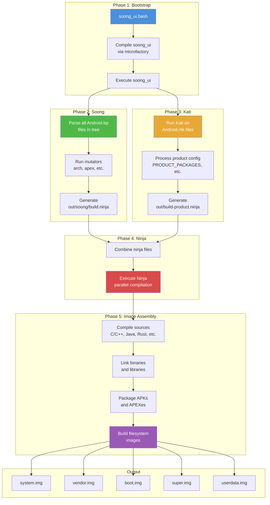

### 2.5.3 Ninja：底层构建执行器

无论 Soong 还是 Kati，实际上都**不直接编译任何东西**。它们本质上都是 *build graph generator*，负责生成 Ninja manifest 文件。真正执行构建工作的底层工具是 **Ninja**。

Ninja 由 Google 的 Evan Martin 为 Chrome / Chromium 构建场景设计，其目标只有一个：尽可能快地执行构建图。和 Make 不同，Ninja 不负责发现或推导构建图，它要求上游已经提供预计算好的 `.ninja` 文件，而它只负责忠实执行。

Ninja 之所以快，是因为它：

- 读取描述全部 build edge（规则与依赖关系）的 `.ninja` 文件
- 基于文件时间戳判断最小的过期目标集合
- 在遵守依赖顺序的前提下并行执行构建命令
- 提供简洁的实时进度展示
- 启动速度极快，即便面对超大构建也通常在秒级内完成启动

#### Ninja 文件格式

一个 Ninja 文件由规则和 build edge 构成：

```ninja
# Rule definition: how to compile a C file
rule cc
  command = clang -c $cflags -o $out $in
  description = CC $out

# Build edge: apply the rule to specific files
build out/obj/foo.o: cc src/foo.c
  cflags = -Wall -O2

# Another rule: linking
rule link
  command = clang -o $out $in $ldflags
  description = LINK $out

# Build edge: link object files into a binary
build out/bin/myapp: link out/obj/foo.o out/obj/bar.o
  ldflags = -lm
```

Soong 和 Kati 生成的 Ninja 文件通常非常庞大，完整 AOSP 构建的合并文件往往可达到数百 MB。

合并后的 Ninja 文件通常位于：

```
out/combined-<TARGET_PRODUCT>.ninja
```

你还可以使用 Ninja 自带工具查看构建图：

```bash
# Show all commands needed to build a target
prebuilts/build-tools/linux-x86/bin/ninja \
  -f out/combined-aosp_arm64.ninja \
  -t commands out/target/product/generic_arm64/system.img

# Show the dependency graph for a target
ninja -f out/combined-aosp_arm64.ninja -t graph libcutils > deps.dot

# Show build rules for a specific output
ninja -f out/combined-aosp_arm64.ninja -t query <output-file>
```

`envsetup.sh` 里的 `showcommands` 还提供了一个便捷封装：

```bash
# Show all commands Ninja would run
showcommands <target>
```

### 2.5.4 输出目录

所有构建产物都位于 `out/` 目录下；如果设置了 `$OUT_DIR`，则会落到该目录：

```
out/
  .module_paths/              <-- Module path cache
  soong/
    .intermediates/           <-- Soong intermediate outputs
    build.ninja               <-- Soong-generated ninja file
    docs/                     <-- Generated documentation
  target/
    product/
      <device>/               <-- Device-specific outputs
        android-info.txt      <-- Device metadata
        boot.img              <-- Kernel + ramdisk
        dtbo.img              <-- Device Tree Blob Overlay
        init_boot.img         <-- Init boot image (Android 13+)
        obj/                  <-- Native object files
        ramdisk.img           <-- Root filesystem ramdisk
        super.img             <-- Dynamic partitions container
        system/               <-- Staged system partition contents
        system.img            <-- System partition image
        userdata.img          <-- User data partition image
        vendor/               <-- Staged vendor partition contents
        vendor.img            <-- Vendor partition image
        vendor_boot.img       <-- Vendor boot image
        product.img           <-- Product partition image
        system_ext.img        <-- System extension partition image
        recovery.img          <-- Recovery image
        vbmeta.img            <-- Verified Boot metadata
        symbols/              <-- Unstripped binaries (for debugging)
        testcases/            <-- Test binaries
  host/
    linux-x86/                <-- Host tools built during the build
      bin/                    <-- Host binaries (adb, fastboot, etc.)
      testcases/              <-- Host test cases
  combined-<product>.ninja    <-- Combined ninja manifest
  build-<product>.ninja       <-- Kati-generated ninja manifest
  verbose.log.gz              <-- Build log (if enabled)
  error.log                   <-- Error log
  dist/                       <-- Distribution artifacts
```

`out/target/product/<device>/` 中几个最重要的镜像如下：

| 镜像 | 用途 |
|-------|---------|
| `system.img` | 核心 Android OS，包括 framework、应用与库 |
| `vendor.img` | 硬件特定 HAL 与固件 |
| `boot.img` | 内核与通用 ramdisk |
| `vendor_boot.img` | vendor 特定 ramdisk |
| `init_boot.img` | 通用 ramdisk（Android 13+，GKI 场景） |
| `super.img` | 动态分区容器，内部承载 system、vendor、product 等 |
| `userdata.img` | 初始用户数据分区 |
| `product.img` | product 分区定制内容 |
| `system_ext.img` | system extension 分区 |
| `recovery.img` | recovery 模式镜像 |
| `vbmeta.img` | Android Verified Boot 元数据 |
| `dtbo.img` | device tree blob overlay |

### 2.5.5 Soong 中间产物目录

`out/soong/.intermediates/` 是 Soong 存放中间构建产物的地方。每个模块都会拥有自己的子目录，并按模块在源码树中的路径进行组织：

```
out/soong/.intermediates/
  frameworks/base/core/java/
    framework-minus-apex/
      android_common/
        javac/          <-- Java compilation outputs
        dex/            <-- DEX conversion outputs
        combined/       <-- Combined JAR
  external/zlib/
    libz/
      android_arm64_armv8-a_shared/   <-- Device shared lib variant
        libz.so
      android_arm64_armv8-a_static/   <-- Device static lib variant
        libz.a
      linux_glibc_x86_64_shared/      <-- Host shared lib variant
        libz.so
  packages/apps/Settings/
    Settings/
      android_common/
        Settings.apk
```

这里的目录结构准确反映了 mutator 创建出来的 **module variant**。同一个 `cc_library`，例如 `libz`，可能同时存在多个变体：

- `android_arm64_armv8-a_shared`：面向 device、ARM64、共享库
- `android_arm64_armv8-a_static`：面向 device、ARM64、静态库
- `linux_glibc_x86_64_shared`：面向 host、Linux x86_64、共享库
- 以及更多，例如 sanitizer 变体、APEX 变体等

这个目录非常容易膨胀，完整构建时达到 100+ GB 也很常见。执行 `m clean` 会删除整个 `out/` 目录。

### 2.5.6 动态分区与 `super.img`

现代 Android（10+）采用 **动态分区**。也就是说，系统不再依赖一组固定大小的独立分区，而是使用一个 `super.img` 容器，在其中动态分配 system、vendor、product 等逻辑分区空间。这部分配置通常写在 `BoardConfig.mk` 中：

```makefile
# From device/generic/goldfish/board/BoardConfigCommon.mk:

# emulator needs super.img
BOARD_BUILD_SUPER_IMAGE_BY_DEFAULT := true

# 8G + 8M
BOARD_SUPER_PARTITION_SIZE ?= 8598323200
BOARD_SUPER_PARTITION_GROUPS := emulator_dynamic_partitions

BOARD_EMULATOR_DYNAMIC_PARTITIONS_PARTITION_LIST := \
  system \
  system_dlkm \
  system_ext \
  product \
  vendor

# 8G
BOARD_EMULATOR_DYNAMIC_PARTITIONS_SIZE ?= 8589934592
```

**源码：** `device/generic/goldfish/board/BoardConfigCommon.mk` 第 44-72 行

---

## 2.6 Product 配置

### 2.6.1 Product 配置层级

一个 AOSP product 通过一系列分层 Make 文件定义，这些文件共同描述要安装哪些包、要设置哪些属性，以及如何配置硬件板级参数。整体层级遵循从通用到具体的方向：

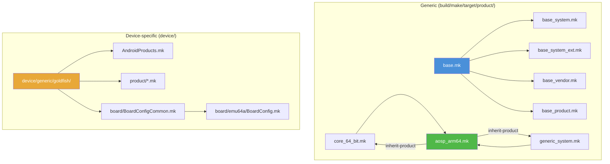

### 2.6.2 `inherit-product` 机制

`inherit-product` 是 product 配置体系的主干函数。它会 include 另一个 product makefile，并继承其中所有变量设置：

```makefile
$(call inherit-product, $(SRC_TARGET_DIR)/product/core_64_bit.mk)
```

这有点类似面向对象中的类继承。继承链条可以非常深，一个典型 product makefile 可能会连续继承 5 到 10 个其他 makefile，每个文件负责增加或覆写某一层配置。

关于 `inherit-product`，有几个重要规则：

- 类似 `PRODUCT_PACKAGES` 这样的变量通常会被**追加**，而不是完全覆写。
- 类似 `PRODUCT_NAME` 的变量则会被**最后一次赋值**覆盖。
- `inherit-product` 的调用顺序会直接影响覆写行为。
- `inherit-product-if-exists` 是一种变体，如果目标文件不存在，它会静默跳过，适合可选 vendor 组件。

整体继承模式遵循分层思路：

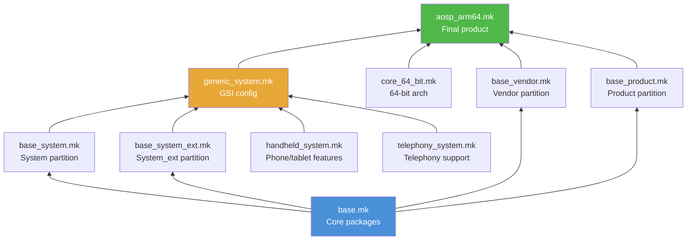

### 2.6.3 `build/make/target/product/` 中的 Product Makefile

这个目录中存放的是通用 product 定义，真实设备 product 通常都会从这里继承。关键文件包括：

| 文件 | 用途 |
|------|---------|
| `base.mk` | 聚合全部基础分区 makefile |
| `base_system.mk` | 定义 system 分区基础包 |
| `base_system_ext.mk` | 定义 system_ext 分区基础包 |
| `base_vendor.mk` | 定义 vendor 分区基础包 |
| `base_product.mk` | 定义 product 分区基础包 |
| `core_64_bit.mk` | 开启 64 位架构支持 |
| `core_64_bit_only.mk` | 仅 64 位，不含 32 位支持 |
| `generic_system.mk` | GSI（Generic System Image）配置 |
| `aosp_arm64.mk` | ARM64 平台的 AOSP product |
| `aosp_x86_64.mk` | x86_64 平台的 AOSP product |
| `aosp_riscv64.mk` | RISC-V 64 平台的 AOSP product |

`base.mk` 本身是一个简单的聚合器：

```makefile
# This makefile is suitable to inherit by products that don't need to be
# split up by partition.
$(call inherit-product, $(SRC_TARGET_DIR)/product/base_system.mk)
$(call inherit-product, $(SRC_TARGET_DIR)/product/base_system_ext.mk)
$(call inherit-product, $(SRC_TARGET_DIR)/product/base_vendor.mk)
$(call inherit-product, $(SRC_TARGET_DIR)/product/base_product.mk)
```

**源码：** `build/make/target/product/base.mk` 第 17-23 行

`base_system.mk` 中定义了 `PRODUCT_PACKAGES`，也就是安装到 system 分区中的包。这份列表非常长，通常有数百项，里面包含 Android 的基础组件：

```makefile
# Base modules and settings for the system partition.
PRODUCT_PACKAGES += \
    abx \
    aconfigd-system \
    adbd_system_api \
    aflags \
    am \
    android.hidl.base-V1.0-java \
    android.hidl.manager-V1.0-java \
    android.system.suspend-service \
    android.test.base \
    android.test.mock \
    android.test.runner \
    apexd \
    ...
    com.android.adbd \
    com.android.adservices \
    com.android.appsearch \
    com.android.bt \
    com.android.conscrypt \
    com.android.i18n \
    com.android.media \
    com.android.media.swcodec \
    com.android.wifi \
    ...
    framework \
    framework-graphics \
    ...
```

**源码：** `build/make/target/product/base_system.mk` 第 18-100+ 行

需要注意的是，许多 APEX 模块，例如 `com.android.wifi`、`com.android.media` 等，也会直接出现在 `PRODUCT_PACKAGES` 里。这意味着它们在 product 配置层面被视作一等安装包。

### 2.6.4 一个具体 Product：`aosp_arm64`

`aosp_arm64.mk` 很适合用来观察所有配置拼图是如何拼到一起的：

```makefile
# The system image of aosp_arm64-userdebug is a GSI for the devices with:
# - ARM 64 bits user space
# - 64 bits binder interface
# - system-as-root
# - VNDK enforcement
# - compatible property override enabled

#
# All components inherited here go to system image
#
$(call inherit-product, $(SRC_TARGET_DIR)/product/core_64_bit.mk)
$(call inherit-product, $(SRC_TARGET_DIR)/product/generic_system.mk)

# Enable mainline checking for exact this product name
ifeq (aosp_arm64,$(TARGET_PRODUCT))
PRODUCT_ENFORCE_ARTIFACT_PATH_REQUIREMENTS := relaxed
endif

#
# All components inherited here go to system_ext image
#
$(call inherit-product, $(SRC_TARGET_DIR)/product/handheld_system_ext.mk)
$(call inherit-product, $(SRC_TARGET_DIR)/product/telephony_system_ext.mk)

# pKVM
$(call inherit-product-if-exists, \
  packages/modules/Virtualization/apex/product_packages.mk)

#
# All components inherited here go to product image
#
$(call inherit-product, $(SRC_TARGET_DIR)/product/aosp_product.mk)

#
# All components inherited here go to vendor or vendor_boot image
#
$(call inherit-product, $(SRC_TARGET_DIR)/board/generic_arm64/device.mk)
AB_OTA_UPDATER := true
AB_OTA_PARTITIONS ?= system

#
# Special settings for GSI releasing
#
ifeq (aosp_arm64,$(TARGET_PRODUCT))
MODULE_BUILD_FROM_SOURCE ?= true
$(call inherit-product, $(SRC_TARGET_DIR)/product/gsi_release.mk)
PRODUCT_SOONG_DEFINED_SYSTEM_IMAGE := aosp_system_image
USE_SOONG_DEFINED_SYSTEM_IMAGE := true
endif

PRODUCT_NAME := aosp_arm64
PRODUCT_DEVICE := generic_arm64
PRODUCT_BRAND := Android
PRODUCT_MODEL := AOSP on ARM64
PRODUCT_NO_BIONIC_PAGE_SIZE_MACRO := true
```

**源码：** `build/make/target/product/aosp_arm64.mk`

这里有几个关键点：

1. **按分区组织继承：** 注释明确标出了哪些继承项分别落入 system、system_ext、product、vendor。
2. **`inherit-product`：** 通过 `$(call inherit-product, ...)` 引入其他 product makefile 及其变量。
3. **`PRODUCT_NAME`：** 最终的 product 名称，也就是 lunch combo 中使用的名字。
4. **`PRODUCT_DEVICE`：** 设备名，它会影响 `BoardConfig.mk` 的定位。

### 2.6.5 核心 `PRODUCT_*` 变量

| 变量 | 用途 | 示例 |
|----------|---------|---------|
| `PRODUCT_NAME` | Product 名称 | `aosp_arm64` |
| `PRODUCT_DEVICE` | 设备名，通常对应 `device/<vendor>/<name>/` | `generic_arm64` |
| `PRODUCT_BRAND` | 品牌字符串 | `Android` |
| `PRODUCT_MODEL` | 型号字符串 | `AOSP on ARM64` |
| `PRODUCT_PACKAGES` | 要安装的模块列表 | `Settings framework ...` |
| `PRODUCT_COPY_FILES` | 要复制进镜像的文件 | `src:dest` 对 |
| `PRODUCT_PROPERTY_OVERRIDES` | 要设置的系统属性 | `ro.foo=bar` |
| `PRODUCT_BOOT_JARS` | 放入 BOOTCLASSPATH 的 jar | `framework core-oj ...` |
| `PRODUCT_SOONG_NAMESPACES` | 暴露给 Make 的 Soong namespace | `hardware/google/pixel` |
| `PRODUCT_ENFORCE_ARTIFACT_PATH_REQUIREMENTS` | 是否强制路径规范 | `relaxed` 或 `true` |
| `PRODUCT_MANIFEST_FILES` | 设备 manifest 片段 | VINTF manifest 路径 |

### 2.6.6 `PRODUCT_COPY_FILES`

`PRODUCT_COPY_FILES` 用于把源码树中的文件复制到输出镜像中的指定路径：

```makefile
PRODUCT_COPY_FILES += \
    device/generic/goldfish/data/etc/config.ini:config.ini \
    device/generic/goldfish/display_settings.xml:$(TARGET_COPY_OUT_VENDOR)/etc/display_settings.xml \
    frameworks/native/data/etc/android.hardware.wifi.xml:$(TARGET_COPY_OUT_VENDOR)/etc/permissions/android.hardware.wifi.xml
```

它的格式是 `source:destination`，其中 `destination` 相对于 `PRODUCT_OUT`。`TARGET_COPY_OUT_*` 变量则帮助你把文件落到正确分区：

| 变量 | 展开结果 | 分区 |
|----------|-----------|-----------|
| `TARGET_COPY_OUT_SYSTEM` | `system` | System |
| `TARGET_COPY_OUT_VENDOR` | `vendor` | Vendor |
| `TARGET_COPY_OUT_PRODUCT` | `product` | Product |
| `TARGET_COPY_OUT_SYSTEM_EXT` | `system_ext` | System Extension |
| `TARGET_COPY_OUT_ODM` | `odm` | ODM |

### 2.6.7 `PRODUCT_PROPERTY_OVERRIDES`

系统属性，例如 `ro.*`、`persist.*` 等，可以通过 product 配置进行设置：

```makefile
PRODUCT_PROPERTY_OVERRIDES += \
    ro.hardware.egl=mesa \
    ro.opengles.version=196610 \
    debug.hwui.renderer=skiagl \
    persist.sys.dalvik.vm.lib.2=libart.so
```

这些属性最终会进入设备上的若干 `build.prop` 或 `default.prop` 文件。

### 2.6.8 Release 配置

AOSP 构建系统提供了一套较新的 release 配置机制，主要由 `build/release/` 管理。这套机制允许不同 release，例如 `trunk_staging`、`next`、`ap3a`，在不修改 product makefile 的前提下控制 feature flag 与配置变体。

Release 作为 `lunch` 的第二个参数传入：

```bash
lunch aosp_arm64 trunk_staging eng
#                ^^^^^^^^^^^^^^^
#                release config
```

Release 配置文件会定义特定 release 下启用哪些能力，通常通过 aconfig flag 与 release-specific build flag 完成。

### 2.6.9 设备配置：Goldfish（模拟器）

Goldfish 模拟器设备定义位于 `device/generic/goldfish/`。其中的 `AndroidProducts.mk` 列出了可用 product：

```makefile
PRODUCT_MAKEFILES := \
    $(LOCAL_DIR)/64bitonly/product/sdk_phone64_x86_64.mk \
    $(LOCAL_DIR)/64bitonly/product/sdk_phone16k_x86_64.mk \
    $(LOCAL_DIR)/64bitonly/product/sdk_phone64_x86_64_minigbm.mk \
    $(LOCAL_DIR)/64bitonly/product/sdk_phone64_x86_64_riscv64.mk \
    $(LOCAL_DIR)/64bitonly/product/sdk_tablet_arm64.mk \
    $(LOCAL_DIR)/64bitonly/product/sdk_tablet_x86_64.mk \
    $(LOCAL_DIR)/64bitonly/product/sdk_phone64_arm64.mk \
    $(LOCAL_DIR)/64bitonly/product/sdk_phone64_arm64_minigbm.mk \
    $(LOCAL_DIR)/64bitonly/product/sdk_phone16k_arm64.mk \
    $(LOCAL_DIR)/64bitonly/product/sdk_phone64_arm64_riscv64.mk \
    $(LOCAL_DIR)/64bitonly/product/sdk_slim_x86_64.mk \
    $(LOCAL_DIR)/64bitonly/product/sdk_slim_arm64.mk \
```

**源码：** `device/generic/goldfish/AndroidProducts.mk`

### 2.6.10 `BoardConfig.mk`

`BoardConfig.mk` 负责定义设备的硬件级配置。以下是 Goldfish ARM64 模拟器的例子：

```makefile
# arm64 emulator specific definitions
TARGET_ARCH := arm64
TARGET_ARCH_VARIANT := armv8-a
TARGET_CPU_VARIANT := generic
TARGET_CPU_ABI := arm64-v8a

TARGET_2ND_ARCH_VARIANT := armv8-a
TARGET_2ND_CPU_VARIANT := generic

include device/generic/goldfish/board/BoardConfigCommon.mk

BOARD_BOOTIMAGE_PARTITION_SIZE := 0x02000000
BOARD_USERDATAIMAGE_PARTITION_SIZE := 576716800
```

**源码：** `device/generic/goldfish/board/emu64a/BoardConfig.mk`

而所有 Goldfish 变体共享的公共配置是：

```makefile
include build/make/target/board/BoardConfigGsiCommon.mk

BOARD_VENDOR_SEPOLICY_DIRS += device/generic/goldfish/sepolicy/vendor
SYSTEM_EXT_PRIVATE_SEPOLICY_DIRS += \
  device/generic/goldfish/sepolicy/system_ext/private

TARGET_BOOTLOADER_BOARD_NAME := goldfish_$(TARGET_ARCH)

NUM_FRAMEBUFFER_SURFACE_BUFFERS := 3

# Build OpenGLES emulation guest and host libraries
BUILD_EMULATOR_OPENGL := true
BUILD_QEMU_IMAGES := true

# Build and enable the OpenGL ES View renderer
USE_OPENGL_RENDERER := true

# Emulator doesn't support sparse image format
TARGET_USERIMAGES_SPARSE_EXT_DISABLED := true

# emulator is Non-A/B device
AB_OTA_UPDATER := none
AB_OTA_PARTITIONS :=

# emulator needs super.img
BOARD_BUILD_SUPER_IMAGE_BY_DEFAULT := true

# 8G + 8M
BOARD_SUPER_PARTITION_SIZE ?= 8598323200
BOARD_SUPER_PARTITION_GROUPS := emulator_dynamic_partitions

BOARD_EMULATOR_DYNAMIC_PARTITIONS_PARTITION_LIST := \
  system \
  system_dlkm \
  system_ext \
  product \
  vendor

BOARD_SYSTEMIMAGE_FILE_SYSTEM_TYPE := $(EMULATOR_RO_PARTITION_FS)
BOARD_PRODUCTIMAGE_FILE_SYSTEM_TYPE := $(EMULATOR_RO_PARTITION_FS)
BOARD_SYSTEM_EXTIMAGE_FILE_SYSTEM_TYPE := $(EMULATOR_RO_PARTITION_FS)

BOARD_USES_SYSTEM_DLKMIMAGE := true
BOARD_SYSTEM_DLKMIMAGE_FILE_SYSTEM_TYPE := erofs

#vendor boot
BOARD_INCLUDE_DTB_IN_BOOTIMG := false
BOARD_BOOT_HEADER_VERSION := 4
BOARD_MKBOOTIMG_ARGS += --header_version $(BOARD_BOOT_HEADER_VERSION)
BOARD_VENDOR_BOOTIMAGE_PARTITION_SIZE := 0x06000000
BOARD_RAMDISK_USE_LZ4 := true
```

**源码：** `device/generic/goldfish/board/BoardConfigCommon.mk`

常见 `BOARD_*` 变量包括：

| 变量 | 用途 |
|----------|---------|
| `TARGET_ARCH` | 主架构，例如 arm64、x86_64 |
| `TARGET_ARCH_VARIANT` | 架构变体，例如 armv8-a |
| `TARGET_CPU_VARIANT` | CPU 变体，例如 generic、cortex-a53 |
| `TARGET_CPU_ABI` | CPU ABI 字符串，例如 arm64-v8a、x86_64 |
| `BOARD_BOOTIMAGE_PARTITION_SIZE` | boot 分区大小 |
| `BOARD_SUPER_PARTITION_SIZE` | super 分区大小 |
| `BOARD_SUPER_PARTITION_GROUPS` | 动态分区组 |
| `BOARD_SYSTEMIMAGE_FILE_SYSTEM_TYPE` | system 镜像文件系统，例如 ext4、erofs |
| `BOARD_BOOT_HEADER_VERSION` | boot 镜像头版本 |
| `BOARD_VENDOR_SEPOLICY_DIRS` | vendor SEPolicy 目录 |

### 2.6.11 Product 配置流转

从 `lunch` 到完整 build configuration 的完整路径如下：

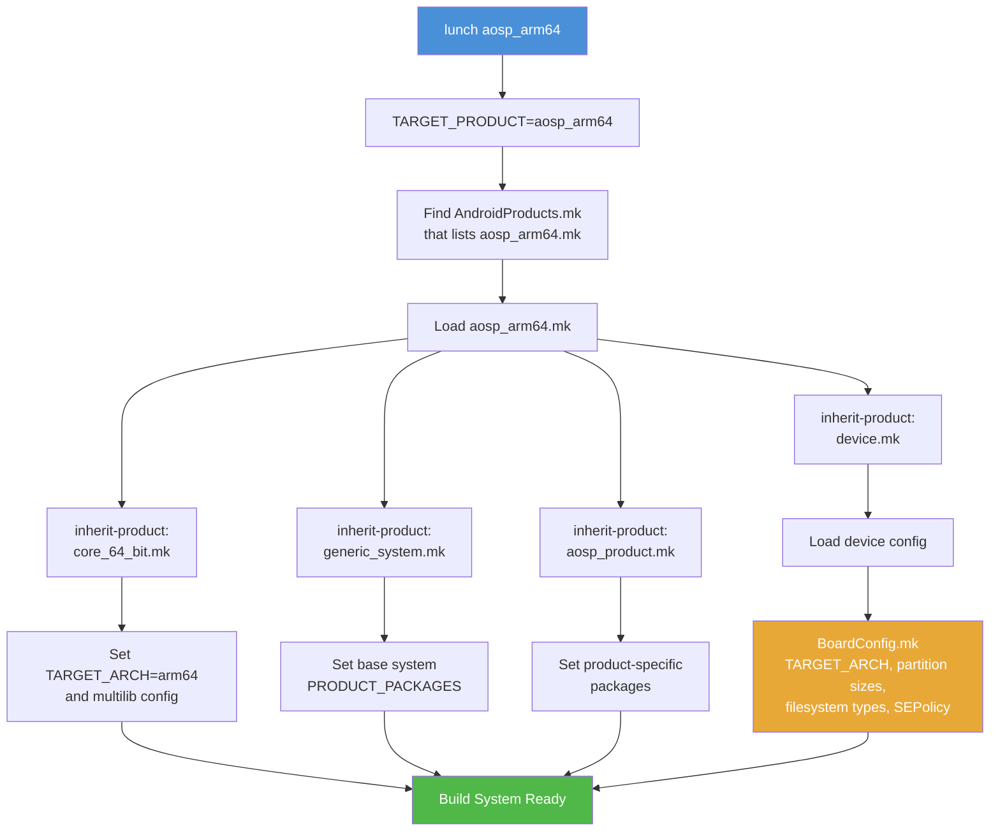

---

## 2.7 APEX：模块化系统组件

### 2.7.1 什么是 APEX

APEX（Android Pony EXpress）是 Android 10 引入的一种容器格式，它允许系统组件脱离整机 OS 独立更新。在 APEX 之前，更新一个系统库或运行时，往往必须依赖完整 OTA（over-the-air）更新。有了 APEX 之后，像 ART 运行时、Wi-Fi 栈、DNS 解析器这样的单独组件，就可以通过 Google Play Store 或类似机制独立更新。

一个 APEX 文件本质上是一类特殊的 Android 包，其中包含：

- 原生共享库（`.so` 文件）
- 可执行文件
- Java 库（JAR）
- Android 应用（APK）
- 配置文件
- 描述该包的 manifest
- 用于集成 verified boot 的签名密钥

### 2.7.2 APEX 架构

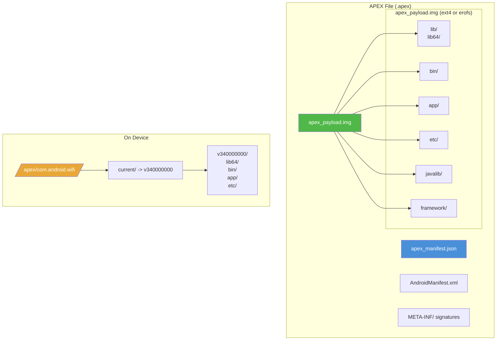

### 2.7.3 设备上的 APEX 生命周期

理解 APEX 在运行时如何工作，有助于解释它在构建期为何会有那些要求：


运行时流程大致如下：

1. 启动时，`apexd`（APEX daemon）扫描 APEX 文件。
2. 每个 APEX 的签名都会通过预装公钥进行校验。
3. 每个 APEX 内部的 `apex_payload.img` 会被作为 loop device 挂载。
4. 挂载后的文件系统再被 bind-mount 到 `/apex/<name>/current/`。
5. 其中的库和二进制，通过 linker 配置向系统暴露。

预装 APEX 位于 `/system/apex/`。当新版本通过 Play Store 等渠道到达时，它会先存到 `/data/apex/`，然后在下次启动时激活，同时保留旧版本用于 rollback。

### 2.7.4 构建系统中的 APEX

APEX 的构建逻辑位于 `build/soong/apex/`。核心文件 `apex.go`（3001 行）定义了模块类型和构建逻辑：

```go
// package apex implements build rules for creating the APEX files which
// are container for lower-level system components.
// See https://source.android.com/devices/tech/ota/apex
package apex

func init() {
    registerApexBuildComponents(android.InitRegistrationContext)
}

func registerApexBuildComponents(ctx android.RegistrationContext) {
    ctx.RegisterModuleType("apex", BundleFactory)
    ctx.RegisterModuleType("apex_test", TestApexBundleFactory)
    ctx.RegisterModuleType("apex_vndk", vndkApexBundleFactory)
    ctx.RegisterModuleType("apex_defaults", DefaultsFactory)
    ctx.RegisterModuleType("prebuilt_apex", PrebuiltFactory)
    ctx.RegisterModuleType("override_apex", OverrideApexFactory)
    ctx.RegisterModuleType("apex_set", apexSetFactory)

    ctx.PreDepsMutators(RegisterPreDepsMutators)
    ctx.PostDepsMutators(RegisterPostDepsMutators)
}
```

**源码：** `build/soong/apex/apex.go` 第 17-58 行

`apexBundleProperties` 结构体定义了 APEX 模块可声明的属性：

```go
type apexBundleProperties struct {
    // Json manifest file describing meta info of this APEX bundle.
    Manifest *string `android:"path"`

    // AndroidManifest.xml file used for the zip container
    AndroidManifest proptools.Configurable[string] `android:"path,..."`

    // Determines the file contexts file for setting security contexts
    File_contexts *string `android:"path"`

    // Canned fs config file for customizing file uid/gid/mod/capabilities
    Canned_fs_config proptools.Configurable[string] `android:"path,..."`

    ApexNativeDependencies

    Multilib apexMultilibProperties

    // List of runtime resource overlays (RROs)
    Rros []string

    // List of bootclasspath fragments
    Bootclasspath_fragments proptools.Configurable[[]string]

    // List of systemserverclasspath fragments
    Systemserverclasspath_fragments proptools.Configurable[[]string]

    // List of java libraries
    Java_libs []string

    // List of sh binaries
    Sh_binaries []string

    // List of platform_compat_config files
    Compat_configs []string

    // List of filesystem images
    Filesystems []string
    ...
}
```

**源码：** `build/soong/apex/apex.go` 第 72-120 行

完整的 `apexBundleProperties` 还包含控制 APEX 更新行为的属性：

```go
// Whether this APEX is considered updatable or not. When set to true,
// this will enforce additional rules for making sure that the APEX is
// truly updatable. To be updatable, min_sdk_version should be set as
// well. This will also disable the size optimizations like symlinking
// to the system libs. Default is true.
Updatable *bool

// Whether this APEX can use platform APIs or not. Can be set to true
// only when `updatable: false`. Default is false.
Platform_apis *bool

// Whether this APEX is installable to one of the partitions like
// system, vendor, etc. Default: true.
Installable *bool

// The type of filesystem to use. Either 'ext4', 'f2fs' or 'erofs'.
// Default 'ext4'.
Payload_fs_type *string
```

**源码：** `build/soong/apex/apex.go` 第 125-147 行

`ApexNativeDependencies` 结构体则定义了 APEX 内究竟要打包哪些东西：

```go
type ApexNativeDependencies struct {
    // List of native libraries embedded inside this APEX.
    Native_shared_libs proptools.Configurable[[]string]

    // List of JNI libraries embedded inside this APEX.
    Jni_libs proptools.Configurable[[]string]

    // List of rust dyn libraries embedded inside this APEX.
    Rust_dyn_libs []string

    // List of native executables embedded inside this APEX.
    Binaries proptools.Configurable[[]string]

    // List of native tests embedded inside this APEX.
    Tests []string

    // List of filesystem images embedded inside this APEX bundle.
    Filesystems []string

    // List of prebuilt_etcs embedded inside this APEX bundle.
    Prebuilts proptools.Configurable[[]string]
}
```

**源码：** `build/soong/apex/apex.go` 第 188-209 行

这里出现的 `proptools.Configurable[[]string]` 值得注意。它支持较新的 select 条件机制，也就是依赖列表可以根据构建配置动态变化。

### 2.7.5 声明一个 APEX 模块

以下是声明一个 APEX 的完整模式，以 Wi-Fi 模块为例：

```
// Step 1: Define the signing key
apex_key {
    name: "com.android.wifi.key",
    public_key: "com.android.wifi.avbpubkey",
    private_key: "com.android.wifi.pem",
}

// Step 2: Define the certificate
android_app_certificate {
    name: "com.android.wifi.certificate",
    certificate: "com.android.wifi",
}

// Step 3: Define defaults (optional, but recommended)
apex_defaults {
    name: "com.android.wifi-defaults",
    bootclasspath_fragments: ["com.android.wifi-bootclasspath-fragment"],
    systemserverclasspath_fragments: [
        "com.android.wifi-systemserverclasspath-fragment"
    ],
    key: "com.android.wifi.key",
    certificate: ":com.android.wifi.certificate",
    apps: ["OsuLogin", "ServiceWifiResources", "WifiDialog"],
    jni_libs: ["libservice-wifi-jni"],
    compressible: true,
}

// Step 4: Define the APEX itself
apex {
    name: "com.android.wifi",
    defaults: ["com.android.wifi-defaults"],
    manifest: "apex_manifest.json",
}
```

**源码：** `packages/modules/Wifi/apex/Android.bp`

### 2.7.6 模块如何声明 APEX 可用性

当某个库或二进制需要在 APEX 中可用时，它会使用 `apex_available` 属性：

```
cc_library {
    name: "libwifi-jni",
    srcs: ["*.cpp"],
    shared_libs: ["liblog", "libbase"],

    // This library can be used in the wifi APEX and the platform
    apex_available: [
        "com.android.wifi",
        "//apex_available:platform",
    ],
}
```

特殊值 `//apex_available:platform` 表示这个模块也可以在 APEX 之外使用，也就是直接部署在 system 分区。如果没有这个值，模块就只允许在 APEX 场景下使用。

APEX 构建系统会通过 mutator，为每个模块在其出现的每个 APEX 中创建独立 variant，从而确保不同 APEX 间依赖是隔离的。

### 2.7.7 AOSP 中的重要 APEX 模块

正如 `base_system.mk` 所体现的那样，许多 Android 核心组件都已经以 APEX 形式交付：

| APEX 名称 | 组件 |
|-----------|-----------|
| `com.android.adbd` | Android Debug Bridge daemon |
| `com.android.art` | Android Runtime（ART） |
| `com.android.bt` | Bluetooth 栈 |
| `com.android.conscrypt` | TLS/SSL provider |
| `com.android.i18n` | 国际化（ICU） |
| `com.android.media` | 媒体框架 |
| `com.android.media.swcodec` | 软件 codec |
| `com.android.mediaprovider` | 媒体存储 |
| `com.android.os.statsd` | 统计守护进程 |
| `com.android.permission` | 权限控制器 |
| `com.android.resolv` | DNS 解析器 |
| `com.android.sdkext` | SDK 扩展 |
| `com.android.tethering` | 网络共享与连接 |
| `com.android.wifi` | Wi-Fi 栈 |
| `com.android.neuralnetworks` | Neural Networks HAL |
| `com.android.virt` | 虚拟化框架 |

---

## 2.8 AOSP 中的 Bazel

### 2.8.1 为什么是 Bazel

Bazel 是 Google 开源的构建系统，源自其内部系统 Blaze。相较 Soong，它具备几个明显优势：

- **Hermeticity：** 构建在沙箱中执行，更容易做到可重复。
- **远程执行：** 构建 action 可以分发到集群上。
- **缓存能力：** 构建结果可在开发者与 CI 之间共享。
- **伸缩性：** 它为数十亿行代码级别的仓库而设计。
- **语言支持：** 基于 Starlark rule，对多种语言有一等支持。

Google 一直在尝试把 AOSP 的部分构建迁移到 Bazel，但这是一项渐进、多年的工程。

### 2.8.2 当前状态

到当前 AOSP 版本为止，Bazel 在平台构建中的角色依然是实验性且有限的：

- **内核构建（Kleaf）：** 内核构建系统已经迁移到 Bazel，详见 2.9。
- **部分外部项目：** 某些外部项目，例如 Skia，会同时维护 Bazel 构建文件与 Soong 定义。
- **构建实验：** `build/pesto/experiments/` 目录中包含实验性的 Bazel 集成测试。
- **bp2build：** 已经存在把 `Android.bp` 转换成 Bazel `BUILD` 文件的工具，但使用范围仍然有限。

### 2.8.3 bp2build：把 `Android.bp` 转换成 `BUILD`

`bp2build` 工具隶属于 `build/soong/`，它可以自动把 `Android.bp` 模块定义转换成 Bazel 的 `BUILD.bazel` 文件。这是 Soong 向 Bazel 迁移的主要机制。

转换流程如下：

1. 先解析全部 `Android.bp` 文件，方式与 Soong 的正常解析一致
2. 对每个已经注册 Bazel 转换规则的模块类型，生成对应的 Bazel rule
3. 在 `Android.bp` 文件旁边写出 `BUILD.bazel`

并不是所有模块类型都已经具备 Bazel 对应实现。整个转换过程是按需启用、逐步推进的，也就是说，只有被显式打开 Bazel 转换的模块才会被纳入。

示例转换如下：

**Android.bp：**
```
cc_library {
    name: "libfoo",
    srcs: ["foo.cpp"],
    shared_libs: ["libbar"],
}
```

**生成后的 BUILD.bazel：**
```python
cc_library_shared(
    name = "libfoo",
    srcs = ["foo.cpp"],
    dynamic_deps = [":libbar"],
)
```

### 2.8.4 `build/pesto/` 目录

Bazel 集成实验主要位于 `build/pesto/`：

```
build/pesto/
  OWNERS
  experiments/
    prepare_bazel_test_env
```

这个目录有意保持轻量。Bazel 的主要落地点目前仍在内核构建系统（Kleaf）和各个自行维护 Bazel 构建文件的独立项目中。

### 2.8.5 结合 RBE 的构建性能

AOSP 已经可以通过 Soong 的 `remoteexec` 包（`build/soong/remoteexec/`）为部分构建 action 提供 RBE 支持。启用方式如下：

```bash
# Source the RBE setup script
source build/make/rbesetup.sh

# Set RBE-specific environment variables
export USE_RBE=1
export RBE_SERVICE=...  # Your RBE endpoint
export RBE_DIR=...      # RBE client directory

# Build with RBE
m -j200  # Higher parallelism since work is distributed
```

在正确配置 RBE 与远端 worker 池后，构建时间通常可以显著下降：

| 构建类型 | 本地（16 核） | 使用 RBE（约 500 核） |
|-----------|------------------|----------------------|
| 全量 clean build | 3-4 小时 | 30-45 分钟 |
| 增量构建（小改动） | 5-15 分钟 | 2-5 分钟 |
| 增量构建（framework 级改动） | 20-40 分钟 | 10-15 分钟 |

性能收益主要来自：

- 将编译分发到大量机器上
- 命中缓存时几乎零成本复用结果
- 把 I/O 压力分散到远端高速存储

### 2.8.6 Skia 的 Bazel 构建

较成熟的 Bazel 集成案例之一，是图形库 Skia（`external/skia/bazel/`）。该目录中维护了一套完整的 Bazel 构建系统，例如：

```
external/skia/bazel/
  BUILD.bazel              <-- Top-level build file
  Makefile                 <-- Compatibility wrapper
  buildrc                  <-- Bazel configuration
  cipd_deps.bzl            <-- CIPD dependency definitions
  common_config_settings/  <-- Shared configuration
  cpp_modules.bzl          <-- C++ module definitions
  deps.json                <-- Dependency metadata
  deps_parser/             <-- Dependency parser tool
  device_specific_configs/ <-- Per-device configurations
  external/                <-- External dependency rules
  flags.bzl                <-- Build flag definitions
  gcs_mirror.bzl           <-- Google Cloud Storage mirror rules
```

它很好地展示了一种双栈模式：项目既支持 Soong，以便无缝接入 AOSP 整体构建；也支持 Bazel，以便独立开发或远程执行。

### 2.8.7 Remote Build Execution（RBE）

Bazel 最重要的优势之一，就是对 Remote Build Execution（RBE）的原生支持。AOSP 已经通过 Soong 的 `remoteexec` 包部分接入了这套能力，而 `build/make/rbesetup.sh` 则负责帮助配置凭据与 endpoint。

RBE 的工作方式大致如下：

1. 先分析构建图，识别哪些 action 适合远程执行
2. 将这些 action 的输入上传到 CAS（Content Addressable Store）
3. 在远端 worker 上执行该 action
4. 下载输出，或直接从 action cache 中复用

对于超大规模构建，RBE 可以通过把编译分发到数百台机器上，大幅降低总体构建时长。

### 2.8.8 Mixed Build

长期迁移计划依赖 **mixed build**，也就是 Soong 与 Bazel 共存：

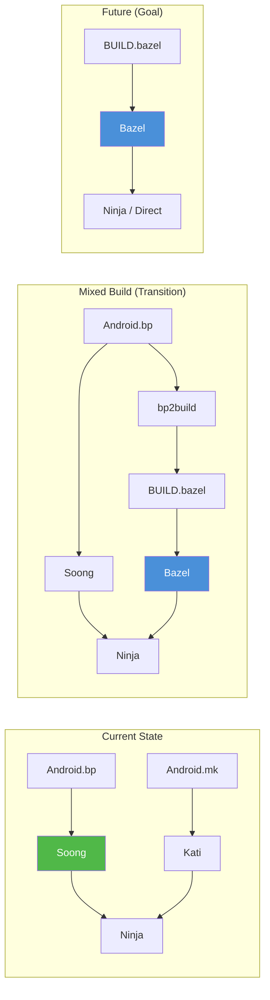

在 mixed build 中，一部分模块由 Soong 构建，另一部分由 Bazel 构建，最后再把结果合并成一个统一的 Ninja manifest。`bp2build` 则负责自动把 `Android.bp` 定义转换成 `BUILD.bazel` 文件。

---

## 2.9 Kleaf：内核构建系统

### 2.9.1 概览

Kleaf 是 AOSP 基于 Bazel 的内核构建系统。与仍由 Soong 主导的平台构建不同，内核构建已经完整迁移到 Bazel。Kleaf 提供了 hermetic、可重复的内核构建能力，并支持：

- 多架构，例如 ARM64、ARM、x86_64、i386、RISC-V 64
- Generic Kernel Image（GKI）架构
- 自定义或用户自带工具链
- 远程构建执行
- 增量构建

### 2.9.2 工具链配置

Kleaf 的工具链配置位于 `prebuilts/clang/host/linux-x86/kleaf/`。其中几个关键文件如下：

**`architecture_constants.bzl`** 定义支持的架构：

```python
"""List of supported architectures by Kleaf."""

ArchInfo = provider(
    "An architecture for a clang toolchain.",
    fields = {
        "name": "a substring of the name of the toolchain.",
        "target_os": "OS of the target platform",
        "target_cpu": "CPU of the target platform",
        "target_libc": "libc of the target platform",
    },
)

SUPPORTED_ARCHITECTURES = [
    ArchInfo(
        name = "1_linux_musl_x86_64",
        target_os = "linux",
        target_cpu = "x86_64",
        target_libc = "musl",
    ),
    ArchInfo(
        name = "2_linux_x86_64",
        target_os = "linux",
        target_cpu = "x86_64",
        target_libc = "glibc",
    ),
    ArchInfo(
        name = "android_arm64",
        target_os = "android",
        target_cpu = "arm64",
        target_libc = None,
    ),
    ArchInfo(
        name = "android_arm",
        target_os = "android",
        target_cpu = "arm",
        target_libc = None,
    ),
    ArchInfo(
        name = "android_x86_64",
        target_os = "android",
        target_cpu = "x86_64",
        target_libc = None,
    ),
    ArchInfo(
        name = "android_i386",
        target_os = "android",
        target_cpu = "i386",
        target_libc = None,
    ),
    ArchInfo(
        name = "android_riscv64",
        target_os = "android",
        target_cpu = "riscv64",
        target_libc = None,
    ),
]
```

**源码：** `prebuilts/clang/host/linux-x86/kleaf/architecture_constants.bzl`

其中包含 `riscv64` 这一点很值得注意，它反映了 AOSP 对 RISC-V 支持的持续推进，而这一架构未来在 Android 设备中的重要性很可能进一步上升。

**`clang_toolchain.bzl`** 则定义了实际的 Clang 工具链规则：

```python
"""Defines a cc toolchain for kernel build, based on clang."""

load("@kernel_toolchain_info//:dict.bzl", "VARS")
load("@rules_cc//cc/toolchains:cc_toolchain.bzl", "cc_toolchain")
load(":clang_config.bzl", "clang_config")

_CC_TOOLCHAIN_TYPE = Label("@bazel_tools//tools/cpp:toolchain_type")

def _clang_toolchain_internal(
        name,
        clang_version,
        arch,
        clang_pkg,
        clang_all_binaries,
        clang_includes,
        linker_files = None,
        sysroot_label = None,
        sysroot_dir = None,
        ...):
    """Defines a cc toolchain for kernel build, based on clang.

    Args:
        name: name of the toolchain
        clang_version: value of `CLANG_VERSION`, e.g. `r475365b`.
        arch: an ArchInfo object to look up extra kwargs.
        ...
    """
```

**源码：** `prebuilts/clang/host/linux-x86/kleaf/clang_toolchain.bzl` 第 15-50 行

### 2.9.3 工具链解析

Kleaf README 描述了两种工具链来源：

1. **默认工具链：** 命名规则是 `{target_os}_{target_cpu}_clang_toolchain`，当没有显式指定版本时，就会回退到这类默认工具链。

2. **用户工具链：** 通过 `--user_clang_toolchain` 参数传入，适合开发或测试时覆盖默认工具链。

解析流程遵循 Bazel 标准的 toolchain resolution 机制：

```
For a build without any flags or transitions, Bazel uses
"single-platform builds" by default, so the target platform is
the same as the execution platform with two constraint values:
(linux, x86_64).

In Kleaf, if a target is built with --config=android_{cpu}, or
is wrapped in an android_filegroup with a given cpu, the target
platform has two constraint values (android, {cpu}).
```

**源码：** `prebuilts/clang/host/linux-x86/kleaf/README.md` 第 88-99 行

### 2.9.4 使用 Kleaf 构建内核

使用 Kleaf 构建内核时，你会运行 Bazel 命令，通常它们会再被 `build/kernel/build.sh` 或 `tools/bazel` 之类的脚本包装：

```bash
# Build the GKI kernel for ARM64
tools/bazel run //common:kernel_aarch64_dist

# Build with a custom toolchain
tools/bazel run --user_clang_toolchain=/path/to/toolchain \
  //common:kernel_aarch64_dist

# Build kernel modules for a specific device
tools/bazel run //private/google-modules/soc/gs201:zuma_dist

# Build with debugging enabled
tools/bazel run //common:kernel_aarch64_debug_dist
```

Kleaf 定义了几类关键 Bazel rule：

| Rule | 用途 |
|------|---------|
| `kernel_build` | 构建内核二进制 |
| `kernel_modules` | 构建内核模块（`.ko`） |
| `kernel_images` | 构建 boot 镜像 |
| `kernel_modules_install` | 将模块安装到 staging 目录 |
| `kernel_uapi_headers` | 生成 userspace API 头文件 |
| `ddk_module` | 构建设备驱动套件模块 |
| `android_filegroup` | 带 Android 平台注解的文件分组 |

#### Kleaf 构建配置

Kleaf 使用 Bazel 的配置系统处理不同构建变体：

```python
# Example from a kernel BUILD.bazel file
kernel_build(
    name = "kernel_aarch64",
    outs = [
        "Image",
        "Image.lz4",
        "System.map",
        "vmlinux",
        "vmlinux.symvers",
    ],
    build_config = "build.config.gki.aarch64",
    module_outs = [
        # GKI modules
        "drivers/block/virtio_blk.ko",
        "drivers/net/virtio_net.ko",
        "fs/erofs/erofs.ko",
        ...
    ],
)
```

这里的 `build_config` 文件用于指定内核配置项。它与传统 `defconfig` 的职责相似，但已经适配到 Bazel 工作流中。

### 2.9.5 与 GKI 的关系

**Generic Kernel Image（GKI）** 是 Android 统一设备间内核基础的方案，而 Kleaf 正是产出 GKI 内核的构建系统。

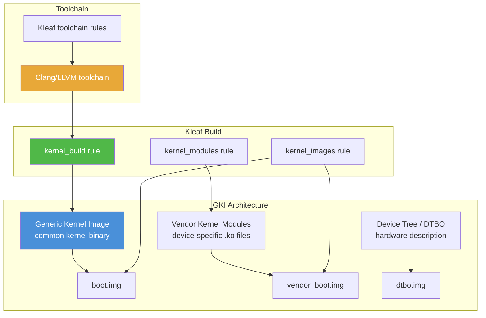

GKI 把内核分成两部分：

- **通用内核二进制**，来自 Android Common Kernel，对于相同 Android 版本的所有设备保持一致
- **Vendor 内核模块**（`.ko` 文件），承载设备特定驱动

Kleaf 同时负责构建这两部分，其中通用内核是主要的 GKI 产物，而 vendor 模块则按设备分别构建。

### 2.9.6 GKI 合规性与稳定性

GKI 架构对内核模块提出了严格要求：

- **KMI（Kernel Module Interface）稳定性：** 通用内核与 vendor 模块之间的接口，在同一 GKI release 内必须保持稳定。对 GKI 6.1 编译出来的 vendor 模块，应能在任意 GKI 6.1 内核上运行。
- **符号列表：** GKI 内核只导出一组明确声明的符号，供 vendor 模块使用，这些符号列表本身是版本化管理的。
- **模块签名：** 所有 GKI 模块都必须使用 GKI 签名密钥签名。
- **ABI 监控：** 自动化工具会比较多次构建之间的内核 ABI，以发现破坏性变化。

Kleaf 已将这些要求融入自己的 rule，实现自动 KMI 检查和签名模块生成。

### 2.9.7 Kleaf 与传统内核构建的对比

| 维度 | 传统方式（`build/build.sh`） | Kleaf（Bazel） |
|--------|-------------------------------|---------------|
| 构建工具 | Shell 脚本 + Make | Bazel |
| Hermeticity | 依赖宿主机工具 | 完整 hermetic |
| 缓存 | 无，或需要手工管理 | 内建按内容寻址缓存 |
| 远程执行 | 无 | 有，通过 RBE |
| 增量构建 | 能力有限 | 完整继承 Bazel 增量机制 |
| 工具链管理 | 手工 | Bazel toolchain rule |
| 可重复性 | 尽力而为 | 目标即保证可重复 |
| 配置方式 | build.config 文件 | Bazel config + build.config |
| 多设备支持 | 倾向串行 | 可并行 |

Kleaf 的迁移，是 AOSP 与 Bazel 结合中最成功的案例之一。它很好地展示了 Bazel hermetic 构建模型的收益。

### 2.9.8 关键 Kleaf 文件

| 文件 | 用途 |
|------|---------|
| `BUILD.bazel` | 顶层工具链声明 |
| `clang_toolchain.bzl` | Clang 工具链规则定义 |
| `architecture_constants.bzl` | 支持的架构定义 |
| `clang_config.bzl` | Clang 配置，例如 flag 与 feature |
| `clang_toolchain_repository.bzl` | 用户工具链的 repository rule |
| `common.bzl` | 公共工具函数 |
| `linux.bzl` | Linux 特定配置 |
| `android.bzl` | Android 特定配置 |
| `empty_toolchain.bzl` | 面向不支持平台的 no-op 工具链 |
| `template_BUILD.bazel` | 生成 BUILD 文件时使用的模板 |

---

## 2.10 Try It：为模拟器构建 AOSP

这一节给出一步步的实操流程，帮助你从源码构建 AOSP 并在 Android Emulator 中跑起来。这是最快获得一套可工作的 AOSP 环境并开始动手改代码的方式。

### 2.10.1 系统准备

**步骤 1：确认前置条件。**

你需要一台 Linux 机器，推荐 Ubuntu 22.04 LTS，至少具备 32 GB 内存、400 GB 可用磁盘空间（强烈建议 SSD）以及多核 CPU。

```bash
# Install required packages (Ubuntu/Debian)
sudo apt-get update
sudo apt-get install -y git-core gnupg flex bison build-essential \
  zip curl zlib1g-dev libc6-dev-i386 libncurses5 \
  lib32z1-dev libgl1-mesa-dev libxml2-utils xsltproc unzip \
  fontconfig python3 python3-pip openjdk-21-jdk

# Install repo
mkdir -p ~/bin
curl https://storage.googleapis.com/git-repo-downloads/repo > ~/bin/repo
chmod a+x ~/bin/repo
export PATH=~/bin:$PATH

# Configure git (required by repo)
git config --global user.name "Your Name"
git config --global user.email "you@example.com"
```

**步骤 2：创建工作目录。**

```bash
# Create the AOSP directory (needs 400+ GB of free space)
mkdir -p ~/aosp
cd ~/aosp
```

### 2.10.2 获取源码

**步骤 3：初始化 repo 工作区。**

```bash
# Initialize with the latest release branch
repo init -u https://android.googlesource.com/platform/manifest \
  -b android16-qpr2-release

# For a faster initial sync, use partial clones:
# repo init -u https://android.googlesource.com/platform/manifest \
#   -b android16-qpr2-release \
#   --partial-clone \
#   --clone-filter=blob:limit=10M
```

**步骤 4：同步源码。**

```bash
# Full sync -- this takes 1-3 hours on a good connection
repo sync -c -j$(nproc) --no-tags

# For subsequent syncs (much faster):
# repo sync -c -j$(nproc) --no-tags --optimized-fetch
```

### 2.10.3 设置构建环境

**步骤 5：加载 `envsetup.sh`。**

```bash
# Must be run from the root of the AOSP tree
source build/envsetup.sh
```

你会看到类似输出：

```
including device/generic/goldfish/vendorsetup.sh
including device/google/cuttlefish/vendorsetup.sh
...
```

**步骤 6：使用 `lunch` 选择构建目标。**

对于模拟器，你可以选以下目标之一：

```bash
# ARM64 emulator (recommended for Apple Silicon Macs or ARM servers)
lunch aosp_arm64-trunk_staging-eng

# x86_64 emulator (recommended for Intel/AMD hosts -- faster emulation)
lunch sdk_phone64_x86_64-trunk_staging-eng

# Shorthand (uses defaults: trunk_staging release, eng variant)
lunch aosp_arm64
```

之后会看到当前构建配置：

```
============================================
PLATFORM_VERSION_CODENAME=VanillaIceCream
PLATFORM_VERSION=16
PRODUCT_SOONG_NAMESPACES=...
TARGET_PRODUCT=aosp_arm64
TARGET_BUILD_VARIANT=eng
TARGET_ARCH=arm64
TARGET_ARCH_VARIANT=armv8-a
TARGET_CPU_VARIANT=generic
HOST_OS=linux
HOST_OS_EXTRA=...
HOST_ARCH=x86_64
OUT_DIR=out
============================================
```

### 2.10.4 发起构建

**步骤 7：开始构建。**

```bash
# Build everything (the "droid" target is the default)
m -j$(nproc)

# Or equivalently:
m droid -j$(nproc)
```

`-j` 用于控制并行度。在一台 16 核、64 GB 内存的机器上，首次完整构建通常需要 2 到 4 小时。后续增量构建则会快得多，小改动通常只需几分钟。

**构建进度** 会以紧凑格式显示：

```
[  1% 245/24532] //frameworks/base/core/java:framework-minus-apex
[  2% 489/24532] //external/protobuf:libprotobuf-java-nano
...
[ 99% 24500/24532] //build/make/target/product:system_image
[100% 24532/24532] Build completed successfully
```

**常见构建目标：**

| 目标 | 构建内容 |
|--------|----------------|
| `m` 或 `m droid` | 全平台构建，包含全部镜像 |
| `m systemimage` | 仅 system image |
| `m vendorimage` | 仅 vendor image |
| `m bootimage` | 仅 boot image |
| `m Settings` | 仅 Settings 模块 |
| `m framework-minus-apex` | 仅 framework JAR |
| `m nothing` | 仅运行构建系统准备流程，不真正编译 |
| `m clean` | 删除整个 out/ 目录 |

**步骤 8：确认构建输出。**

```bash
ls out/target/product/generic_arm64/

# You should see:
# android-info.txt  boot.img  ramdisk.img  super.img
# system.img  userdata.img  vendor.img  vendor_boot.img
# ...
```

### 2.10.5 运行模拟器

**步骤 9：启动模拟器。**

```bash
# The emulator command is available after lunch
emulator
```

模拟器会：

1. 在 `$ANDROID_PRODUCT_OUT` 中定位已构建好的镜像
2. 启动一个基于 QEMU 的虚拟机
3. 使用你刚刚编译出来的镜像启动 Android

常用模拟器参数：

```bash
# Specify RAM size
emulator -memory 4096

# Disable GPU acceleration (if you have driver issues)
emulator -gpu swiftshader_indirect

# Use a specific skin/resolution
emulator -skin 1080x1920

# Enable verbose kernel logs
emulator -show-kernel

# Wipe user data (fresh start)
emulator -wipe-data

# Run headless (no GUI window)
emulator -no-window
```

### 2.10.6 修改代码并增量重建

**步骤 10：改动代码并做增量重建。**

从源码构建的真正价值，在于你可以修改任何部分。例如，想修改一个系统属性：

```bash
# Edit a file
vi frameworks/base/core/java/android/os/Build.java

# Rebuild just the affected module
m framework-minus-apex

# Or rebuild everything (Ninja will only rebuild what changed)
m
```

如果你修改的是系统应用：

```bash
# Edit Settings source
vi packages/apps/Settings/src/com/android/settings/Settings.java

# Rebuild just Settings
m Settings

# Push the rebuilt APK to a running emulator
adb install -r out/target/product/generic_arm64/system/priv-app/Settings/Settings.apk

# Or reboot the emulator to pick up all changes
adb reboot
```

### 2.10.7 调试构建失败

AOSP 构建失败往往比较吓人，因为代码库太大。下面是几种常见失败类型和对应策略：

**缺少依赖：**
```
error: frameworks/base/core/java/android/os/Foo.java:5: error: cannot find symbol
  import com.android.internal.bar.Baz;
```

这通常意味着模块的 `Android.bp` 缺失某个依赖。先查清楚缺失类属于哪个模块：

```bash
# Search for the class definition
grep -rn "class Baz" frameworks/ --include="*.java"

# Or use the module index
allmod | grep -i baz
```

**Soong / Blueprint 解析错误：**
```
error: build/soong/cc/cc.go:123: module "libfoo": depends on "libbar" which
is not visible to this module
```

这属于可见性错误。被依赖模块需要在自己的 `visibility` 中加入当前模块所在 package。

**Ninja 执行错误：**
```
FAILED: out/soong/.intermediates/...
clang: error: ...
```

真正的编译器错误会出现在输出中。你可以直接重新执行失败命令：

```bash
# Show the exact command that failed
showcommands <target> 2>&1 | grep FAILED -A 5
```

**构建时内存不足：**

如果 Ninja 被 OOM killer 杀掉了，就降低并行度：

```bash
# Limit to 8 parallel jobs (instead of auto-detecting CPU count)
m -j8

# Or set a memory limit per job
export NINJA_STATUS="[%f/%t %r] "
```

**构建缓存过期或损坏：**

如果怀疑构建缓存出了问题：

```bash
# Delete Soong intermediates for a specific module
rm -rf out/soong/.intermediates/frameworks/base/core/java/framework-minus-apex/

# Or delete all intermediates (forces full rebuild)
m clean

# Nuclear option: delete everything
rm -rf out/
```

### 2.10.8 调试 Soong 本身

当你需要理解或修改构建系统自身时，Soong 提供了内建调试支持。

**生成文档：**

```bash
m soong_docs
# Opens at: out/soong/docs/soong_build.html
```

这会生成所有已注册模块类型及其属性的 HTML 文档。

**使用 Delve 调试：**

来自 `build/soong/README.md` 的示例：

```bash
# Debug soong_build (the main Soong binary)
SOONG_DELVE=5006 m nothing

# Debug only specific steps
SOONG_DELVE=2345 SOONG_DELVE_STEPS='build,modulegraph' m

# Debug soong_ui (the build driver)
SOONG_UI_DELVE=5006 m nothing
```

随后可用调试器连接，例如 IntelliJ IDEA 或 `dlv connect :5006`。

**查询模块图：**

```bash
# Generate the module graph
m json-module-graph

# Generate queryable module info
m module-info

# The output is at:
# out/target/product/<device>/module-info.json
```

`module-info.json` 以机器可读形式记录了构建中的每个模块，包括路径、依赖和安装位置。

### 2.10.9 使用 Cuttlefish 替代 Goldfish

虽然本章重点介绍的是 Goldfish 模拟器，也就是传统 AOSP Emulator，但 Google 还维护着 **Cuttlefish**，它是一种更适合云环境的虚拟设备：

```bash
# Build for Cuttlefish
lunch aosp_cf_x86_64_phone trunk_staging eng
m

# Launch Cuttlefish (requires specific host setup)
launch_cvd
```

Cuttlefish 的优势：

- 作为真正虚拟机运行，依赖 KVM / crosvm
- 硬件模拟更接近真实设备
- 更适合 CI/CD 流水线
- 支持多实例并发运行
- 可以在服务器上无界面运行

Cuttlefish 的代价：

- 宿主机准备工作更多
- 需要 KVM 支持
- 普及度不如 Goldfish 模拟器

### 2.10.10 实用开发命令

在完成 `source build/envsetup.sh` 和 `lunch` 后，可以使用很多便捷命令：

```bash
# Navigate the tree
croot                    # cd to tree root
gomod <module>          # cd to a module's directory
godir <pattern>         # cd to a directory matching a pattern

# Query the build system
get_build_var TARGET_PRODUCT     # Print a build variable
get_build_var PRODUCT_OUT        # Print the output directory
pathmod <module>                 # Print a module's source path
outmod <module>                  # Print a module's output path
allmod                           # List all modules
refreshmod                       # Refresh the module index

# Search the source tree
cgrep <pattern>         # Search C/C++ files
jgrep <pattern>         # Search Java files
resgrep <pattern>       # Search resource XML files
sgrep <pattern>         # Search all source files

# Debug and inspect
showcommands <target>   # Show Ninja commands for a target
aninja                  # Run Ninja directly with arguments
```

### 2.10.11 构建性能优化建议

1. **使用 SSD。** 构建过程中会触发海量小 I/O。SSD 相比 HDD 往往会带来 2 到 5 倍差异。

2. **尽量增加内存。** 推荐 64 GB。只有 32 GB 时，可能需要主动限制并行度，例如 16 核机器使用 `-j8` 而不是 `-j$(nproc)`。

3. **使用 `ccache`。** `ccache` 能缓存编译结果：
   ```bash
   export USE_CCACHE=1
   export CCACHE_EXEC=/usr/bin/ccache
   export CCACHE_DIR=~/.ccache
   ccache -M 100G  # Set cache size
   ```

4. **把输出目录放到单独磁盘。** 如果源码在网络盘上，把输出目录放到本地 SSD 会更稳：
   ```bash
   export OUT_DIR=/local/ssd/aosp-out
   ```

5. **考虑 `--skip-soong-tests`。** 开发阶段可以跳过某些测试生成：
   ```bash
   m --skip-soong-tests
   ```

6. **依赖增量构建。** 在第一次完整构建完成后，后续只会重编译发生变化的模块。Ninja 在这方面非常高效。

7. **单模块开发时优先 `mm`。** 处理单个模块时，`mm` 常常比 `m` 快得多，因为它能跳过 Kati 阶段。

### 2.10.12 增量开发工作流

日常开发中，典型工作流通常如下：

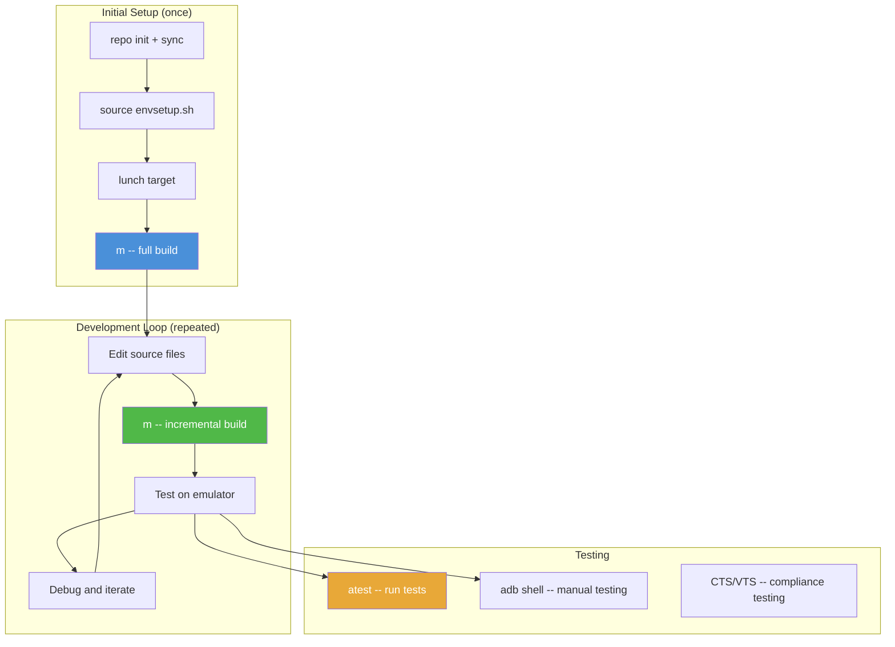

**`atest` 工具：**

`atest` 是 AOSP 的测试运行器，能够自动发现、构建并执行测试：

```bash
# Run all tests for a module
atest SettingsTests

# Run a specific test class
atest SettingsTests:com.android.settings.wifi.WifiSettingsTest

# Run tests with verbose output
atest -v FrameworksCoreTests

# List available tests
atest --list-modules
```

**推送单个文件：**

为了加快迭代，你还可以不做整轮构建，直接把单个文件推送到运行中的设备：

```bash
# Push a rebuilt shared library
adb push out/target/product/generic_arm64/system/lib64/libfoo.so /system/lib64/

# Push a rebuilt app
adb install -r out/target/product/generic_arm64/system/app/Settings/Settings.apk

# Restart the system server to pick up framework changes
adb shell stop && adb shell start

# Or reboot entirely
adb reboot
```

注意：直接 push 文件只适用于 `eng` 或 `userdebug` 构建，因为这类系统通常允许写入 system 分区，或者可以通过 `adb remount` 达成。

### 2.10.13 理解构建输出信息

构建过程中，Soong 会以紧凑格式输出进度。理解这些信息有助于判断构建时间主要花在哪里：

```
[ 47% 11523/24532] //frameworks/base/core/java:framework-minus-apex metalava ...
```

各字段含义：

- `47%`：已完成 build edge 的百分比
- `11523/24532`：已完成边数 / 总边数
- `//frameworks/base/core/java:framework-minus-apex`：当前正在构建的模块
- `metalava`：正在运行的工具，也就是 API 文档与兼容性检查工具

如果构建长时间卡在某个百分比，通常是某个耗时很长的 action 还没完成。常见瓶颈包括：

- **D8 / R8 dexing**：把 Java 字节码转换成 DEX
- **Metalava**：做 API 兼容性检查
- **大型二进制链接**：尤其是 framework JAR
- **镜像生成**：创建文件系统镜像

在构建过程中按任意键，Ninja 会输出当前活跃 action，从而帮助你定位瓶颈。

### 2.10.14 并行构建配置

AOSP 构建支持多个层面的并行控制：

```bash
# Ninja parallelism (number of simultaneous build actions)
m -j$(nproc)              # Use all CPU cores (default)
m -j8                     # Limit to 8 parallel actions
m -j1                     # Sequential build (for debugging)

# Soong parallelism (internal to the build system setup)
# Controlled automatically based on available resources

# Java compilation sharding (in Android.bp)
android_library {
    name: "Settings-core",
    javac_shard_size: 50,  // Compile in shards of 50 files
}
```

最优 `-j` 取值依赖你的机器配置：

- 64 GB+ 内存：通常可直接使用 `-j$(nproc)` 或更高
- 32 GB 内存：建议使用 `-j$(( $(nproc) / 2 ))`
- 16 GB 内存：建议控制在 `-j4` 到 `-j8`

真正的瓶颈往往是内存，而不只是 CPU。每个编译器实例可能占用 1 到 2 GB 内存，因此在 32 GB 机器上，通常安全的并行编译数大约是 16 个左右。

---

## 2.11 进阶主题

### 2.11.1 `soong.variables` 桥接文件

Soong 与 Kati 需要共享配置数据，它们之间通过 `out/soong/soong.variables` 这个 JSON 文件通信：它由 Kati 写入，由 Soong 读取。

```json
{
    "Platform_sdk_version": 35,
    "Platform_sdk_codename": "VanillaIceCream",
    "Platform_version_active_codenames": ["VanillaIceCream"],
    "DeviceName": "generic_arm64",
    "DeviceArch": "arm64",
    "DeviceArchVariant": "armv8-a",
    "DeviceCpuVariant": "generic",
    "DeviceSecondaryArch": "",
    "Aml_abis": ["arm64-v8a"],
    "Eng": true,
    "Debuggable": true,
    ...
}
```

这个文件是 Make 世界与 Go 世界之间的桥。你在 `.mk` 文件中改动某个 product 变量时，它就会通过 `soong.variables` 影响 Soong 的行为。

### 2.11.2 ABI 稳定性与 VNDK

Android 构建系统通过多种机制强制执行 **ABI（Application Binary Interface）稳定性**：

- **VNDK（Vendor Native Development Kit）：** 一组对 vendor 保证 ABI 稳定的系统库
- **AIDL 接口：** system 与 vendor 分区之间的稳定 IPC 接口
- **HIDL 接口：** 旧式 HAL 接口语言，正在逐步被 AIDL 取代
- **System SDK：** 提供给 vendor 应用的稳定 Java API

构建系统会跟踪哪些模块属于 VNDK，并强制执行依赖规则：

```go
// Module that is part of the VNDK
cc_library {
    name: "libcutils",
    vndk: {
        enabled: true,
    },
    ...
}
```

Vendor 模块只能依赖 VNDK 库以及它们自己的私有库。任何通过不稳定接口穿越 system / vendor 边界的依赖，构建系统都会直接拒绝。

### 2.11.3 构建标志与特性开关

AOSP 通过 **aconfig** 管理 feature flag：

```go
// Flag declaration (in .aconfig file)
package: "com.android.settings.flags"

flag {
    name: "new_wifi_page"
    namespace: "settings_ui"
    description: "Enable the redesigned WiFi settings page"
    bug: "b/123456789"
}
```

这些特性开关会根据 release 配置在构建期解析：

```go
// Using a flag in Android.bp
cc_library {
    name: "libwifi_settings",
    srcs: select(release_flag("RELEASE_NEW_WIFI_PAGE"), {
        true: ["new_wifi_page.cpp"],
        default: ["old_wifi_page.cpp"],
    }),
}
```

这种机制使得同一份源码树可以在不同 release 配置下产出不同构建，而无需维护独立分支。

### 2.11.4 构建系统指标

AOSP 构建系统会采集详细的性能指标：

```bash
# Build with metrics collection
m --build-event-log=build_event.log

# View build metrics
cat out/soong_build_metrics.pb | protoc --decode=...
```

关键指标包括：

- 总构建时长
- 各阶段耗时，例如 Soong、Kati、Ninja
- 处理模块数量
- 缓存命中率
- 内存峰值
- I/O 统计

这些指标对于定位性能瓶颈、跟踪不同版本间的构建优化效果非常有价值。

### 2.11.5 可重复构建

AOSP 一直在追求 reproducible build，也就是在相同源码和相同构建环境下，应该得到完全一致的输出。为此构建系统采取了若干措施：

- **固定时间戳：** 使用确定性时间戳，而不是当前系统时间
- **排序输入：** 对文件列表与目录遍历结果排序，消除顺序带来的差异
- **Hermetic 工具链：** 编译器和工具以预构建形式固定在仓库中
- **沙箱式构建：** Soong 限制对声明输入范围外文件的访问
- **`BUILD_DATETIME_FILE`：** 在全部构建规则中统一使用固定构建时间

可重复构建对以下场景都很关键：

- 安全审计，例如验证二进制是否与源码一致
- CI/CD 缓存，例如相同输入应产生相同输出
- 法规合规，某些市场要求构建可重复

### 2.11.6 构建系统内部机制：模块变体架构

构建系统最复杂的部分之一，就是模块 variant 管理。一个单独的 `cc_library` 声明，最终可能会膨胀成很多个变体：

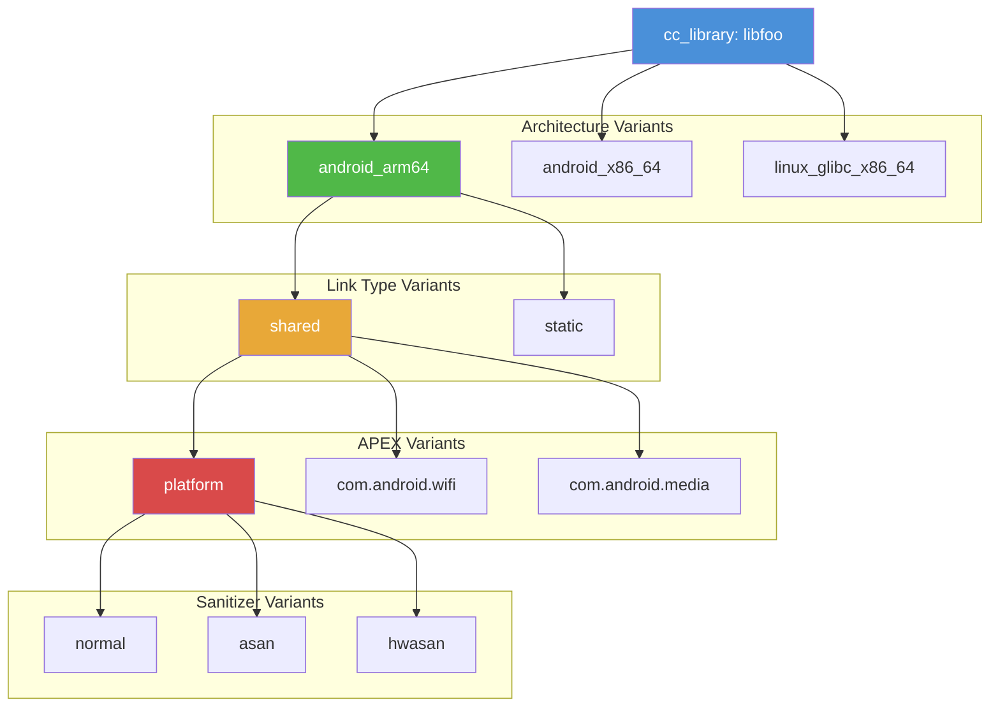

因此，一个单独的 `cc_library` 最终可能扩展成数十个变体，每个变体都会生成自己的二进制。这个扩展过程由 mutator 体系系统化完成：

1. **Architecture mutator：** 按目标架构拆分，例如 arm64、x86_64，同时生成 host 变体
2. **Link type mutator：** 拆出 shared 和 static 版本
3. **APEX mutator：** 按模块出现的每个 APEX 拆出对应变体，同时保留 platform 变体
4. **Sanitizer mutator：** 生成 ASan、TSan、HWSan 等特殊变体
5. **Image mutator：** 按不同镜像分区继续拆变体

这也是 `out/soong/.intermediates/` 会如此庞大的根本原因，因为它要为每个模块的每个变体单独保存构建产物。

---

## Summary

本章覆盖了 AOSP 构建生命周期的完整路径，从获取源码到在模拟器中运行最终产物。关键结论如下：

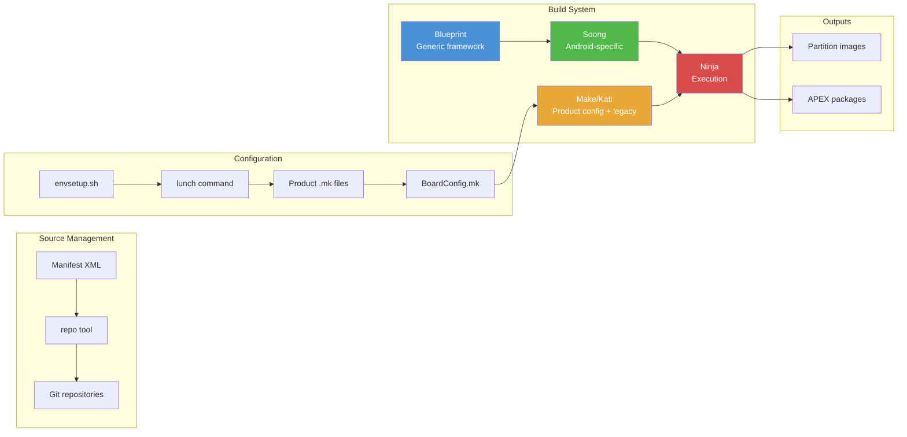

**需要记住的关键文件：**

| 文件 | 用途 |
|------|---------|
| `.repo/manifests/default.xml` | 定义全部仓库的 manifest |
| `build/make/envsetup.sh` | shell 环境设置脚本（1187 行） |
| `build/soong/soong_ui.bash` | 构建系统入口 |
| `build/soong/README.md` | Soong / Android.bp 参考文档 |
| `build/blueprint/context.go` | Blueprint 核心（5781 行） |
| `build/make/core/envsetup.mk` | 核心构建变量设置 |
| `build/make/core/config.mk` | 构建配置入口 |
| `build/make/target/product/*.mk` | 通用 product 定义 |
| `build/soong/apex/apex.go` | APEX 构建逻辑（3001 行） |
| `prebuilts/clang/host/linux-x86/kleaf/` | 内核构建工具链规则 |

**构建系统做的三件大事：**

1. **解析** 成千上万个 `Android.bp` 与 `Android.mk` 文件，建立整棵源码树中全部模块的依赖图。
2. **配置** 当前构建，结合所选 product、架构与 variant，通过 product makefile 与 board 配置完成环境收束。
3. **执行** 实际构建，交由 Ninja 编排 C/C++、Java、Kotlin、Rust 等语言的并行编译，再把结果装配成可刷写分区镜像。

下一章，我们将转向 Android 的运行时架构，去理解这些镜像真正启动到设备上时发生了什么，从 bootloader、`init` 一直到完整运行的 Android 系统。

---

## 2.12 构建系统参考表

这一节提供便于开发时快速检索的汇总表。

### 2.12.1 常用构建命令总表

| 命令 | 用途 | 示例 |
|---------|---------|---------|
| `source build/envsetup.sh` | 初始化构建环境 | 每个终端会话运行一次 |
| `lunch <target>` | 选择构建目标 | `lunch aosp_arm64` |
| `m` | 从树根构建 | `m` 或 `m droid` |
| `m <module>` | 构建指定模块 | `m Settings` |
| `m <image>` | 构建指定镜像 | `m systemimage` |
| `mm` | 构建当前目录 | `cd frameworks/base && mm` |
| `mmm <dir>` | 构建指定目录 | `mmm packages/apps/Settings` |
| `m clean` | 删除输出目录 |  |
| `m nothing` | 仅运行构建准备逻辑 | 适合检查配置 |
| `m soong_docs` | 生成模块文档 | 输出到 `out/soong/docs/` |
| `m json-module-graph` | 生成模块图 |  |
| `m module-info` | 生成模块索引 |  |
| `atest <test>` | 运行测试 | `atest SettingsTests` |
| `croot` | `cd` 到源码树根目录 |  |
| `gomod <module>` | `cd` 到模块源码目录 | `gomod Settings` |
| `pathmod <module>` | 打印模块源码路径 | `pathmod Settings` |
| `outmod <module>` | 打印模块输出路径 | `outmod Settings` |
| `allmod` | 列出全部模块 |  |
| `refreshmod` | 刷新模块索引 |  |
| `printconfig` | 显示当前构建配置 |  |
| `get_build_var <var>` | 打印构建变量 | `get_build_var TARGET_PRODUCT` |
| `showcommands <target>` | 显示构建命令 |  |
| `bpfmt -w .` | 格式化 Android.bp 文件 |  |
| `androidmk Android.mk` | 将 mk 转为 bp |  |
| `tapas <app>` | 构建独立应用 | `tapas Camera eng` |
| `banchan <apex>` | 构建独立 APEX | `banchan com.android.wifi arm64` |

### 2.12.2 关键环境变量

| 变量 | 设置者 | 用途 |
|----------|--------|---------|
| `TOP` | envsetup.sh | 源码树根目录 |
| `TARGET_PRODUCT` | lunch | Product 名称，例如 `aosp_arm64` |
| `TARGET_BUILD_VARIANT` | lunch | 构建变体，例如 `eng`、`userdebug`、`user` |
| `TARGET_RELEASE` | lunch | Release 配置 |
| `TARGET_BUILD_TYPE` | lunch | 固定为 `release` |
| `TARGET_BUILD_APPS` | tapas / banchan | 独立 app / APEX 名称 |
| `ANDROID_PRODUCT_OUT` | lunch | 设备输出目录路径 |
| `ANDROID_HOST_OUT` | lunch | host 工具输出目录 |
| `ANDROID_BUILD_TOP` | envsetup.sh | 与 TOP 相同，已不推荐 |
| `ANDROID_JAVA_HOME` | lunch | JDK 路径 |
| `OUT_DIR` | 用户可选设置 | 覆盖默认输出目录，默认是 `out` |
| `USE_CCACHE` | 用户可选设置 | 是否启用 ccache |
| `CCACHE_DIR` | 用户可选设置 | ccache 目录位置 |
| `SOONG_DELVE` | 用户可选设置 | soong_build 的调试端口 |
| `SOONG_UI_DELVE` | 用户可选设置 | soong_ui 的调试端口 |
| `NINJA_STATUS` | 用户可选设置 | 自定义 Ninja 状态格式 |

### 2.12.3 `cc_library` 常见 Android.bp 属性

| 属性 | 类型 | 用途 |
|----------|------|---------|
| `name` | string | 模块名，必须唯一 |
| `srcs` | string 列表 | 源文件，支持 glob |
| `exclude_srcs` | string 列表 | 从 `srcs` 中排除的文件 |
| `generated_sources` | string 列表 | 产出源码的模块 |
| `generated_headers` | string 列表 | 产出头文件的模块 |
| `cflags` | string 列表 | C/C++ 编译器 flag |
| `cppflags` | string 列表 | 仅 C++ 的编译 flag |
| `conlyflags` | string 列表 | 仅 C 的编译 flag |
| `asflags` | string 列表 | 汇编 flag |
| `ldflags` | string 列表 | 链接器 flag |
| `shared_libs` | string 列表 | 共享库依赖 |
| `static_libs` | string 列表 | 静态库依赖 |
| `whole_static_libs` | string 列表 | 整库打包的静态库 |
| `header_libs` | string 列表 | 仅头文件依赖 |
| `runtime_libs` | string 列表 | 仅运行时依赖的共享库 |
| `local_include_dirs` | string 列表 | 私有 include 路径 |
| `export_include_dirs` | string 列表 | 公共 include 路径 |
| `export_shared_lib_headers` | string 列表 | 传递导出头文件 |
| `stl` | string | C++ STL 选择 |
| `host_supported` | bool | 是否也构建 host 版本 |
| `device_supported` | bool | 是否构建设备版本，默认 true |
| `vendor` | bool | 是否安装到 vendor 分区 |
| `vendor_available` | bool | 是否可供 vendor 模块使用 |
| `recovery_available` | bool | 是否可在 recovery 使用 |
| `apex_available` | string 列表 | 可进入哪些 APEX |
| `min_sdk_version` | string | 最低 SDK 版本 |
| `defaults` | string 列表 | 继承的 defaults 模块 |
| `visibility` | string 列表 | 可见性规则 |
| `enabled` | bool | 是否启用该模块 |
| `arch` | map | 按架构配置的属性 |
| `target` | map | 按目标类型配置的属性，例如 android / host |
| `multilib` | map | 多库位配置，例如 lib32 / lib64 |
| `sanitize` | map | Sanitizer 配置 |
| `strip` | map | strip 配置 |
| `pack_relocations` | bool | 是否压缩 relocation，默认 true |
| `allow_undefined_symbols` | bool | 是否允许未定义符号 |
| `nocrt` | bool | 不链接 C runtime startup |
| `no_libcrt` | bool | 不链接 compiler runtime |
| `stubs` | map | 生成版本化 stub |
| `vndk` | map | VNDK 配置 |

### 2.12.4 `android_app` 常见 Android.bp 属性

| 属性 | 类型 | 用途 |
|----------|------|---------|
| `name` | string | 模块名 |
| `srcs` | string 列表 | Java/Kotlin 源文件 |
| `resource_dirs` | string 列表 | Android 资源目录 |
| `asset_dirs` | string 列表 | Asset 目录 |
| `manifest` | string | AndroidManifest.xml 路径 |
| `static_libs` | string 列表 | 静态 Java 库依赖 |
| `libs` | string 列表 | 仅编译期依赖 |
| `platform_apis` | bool | 是否使用平台隐藏 API |
| `certificate` | string | 签名证书 |
| `privileged` | bool | 是否作为特权应用安装 |
| `overrides` | string 列表 | 它替代哪些应用 |
| `required` | string 列表 | 必须一并安装的模块 |
| `dex_preopt` | map | DEX 预优化配置 |
| `optimize` | map | ProGuard / R8 优化配置 |
| `aaptflags` | string 列表 | 额外 AAPT flag |
| `package_name` | string | 覆盖包名 |
| `sdk_version` | string | 构建时使用的 SDK 版本 |
| `min_sdk_version` | string | 最低 SDK 版本 |
| `target_sdk_version` | string | 目标 SDK 版本 |
| `uses_libs` | string 列表 | 共享库依赖 |
| `optional_uses_libs` | string 列表 | 可选共享库依赖 |
| `jni_libs` | string 列表 | JNI 原生库 |
| `use_resource_processor` | bool | 是否启用资源处理器 |
| `javac_shard_size` | int | 每个 javac shard 的文件数 |
| `errorprone` | map | Error-prone 检查器配置 |

### 2.12.5 目录结构速查

| 路径 | 内容 |
|------|----------|
| `art/` | Android Runtime，例如 ART VM、dex2oat |
| `bionic/` | C 库，例如 libc、libm、libdl 与 linker |
| `bootable/` | Recovery 与 bootloader 相关库 |
| `build/blueprint/` | Blueprint 元构建框架 |
| `build/make/` | 基于 Make 的构建系统与 product 配置 |
| `build/soong/` | Soong 构建系统（Go） |
| `build/pesto/` | Bazel 集成实验 |
| `build/release/` | Release 配置 |
| `cts/` | Compatibility Test Suite |
| `dalvik/` | Dalvik VM 遗留内容 |
| `development/` | 开发工具与示例 |
| `device/` | 设备配置 |
| `device/generic/goldfish/` | Goldfish 模拟器设备 |
| `device/google/cuttlefish/` | Cuttlefish 虚拟设备 |
| `external/` | 第三方项目，700+ 仓库 |
| `frameworks/base/` | 核心 Android framework |
| `frameworks/native/` | Native framework，例如 SurfaceFlinger、Binder |
| `frameworks/av/` | 音视频框架 |
| `hardware/interfaces/` | HIDL / AIDL HAL 定义 |
| `kernel/` | 内核构建配置与预构建件 |
| `libcore/` | 核心 Java 库，基于 OpenJDK |
| `packages/apps/` | 系统应用 |
| `packages/modules/` | Mainline 模块（APEX） |
| `packages/providers/` | Content Provider |
| `packages/services/` | 系统服务 |
| `prebuilts/` | 预构建工具，例如 Clang、JDK、SDK |
| `system/core/` | 核心系统工具，例如 init、adb、logcat |
| `system/extras/` | 额外系统工具 |
| `system/sepolicy/` | SELinux 策略 |
| `tools/` | 开发工具 |
| `vendor/` | Vendor 特定代码 |

---

## 构建系统术语表

| 术语 | 定义 |
|------|-----------|
| **ABI** | Application Binary Interface，也就是二进制层接口，规定数据类型、尺寸、对齐、调用约定与系统调用号。 |
| **AIDL** | Android Interface Definition Language，用于定义系统组件之间稳定的 IPC 接口。 |
| **Android.bp** | Soong 使用的 Blueprint 文件格式。它是一种声明式、近似 JSON 的模块定义语法。 |
| **Android.mk** | 遗留的 Make 模块定义格式。仍可使用，但正在逐步退出。 |
| **APEX** | Android Pony EXpress，可独立更新系统组件的容器格式。 |
| **Blueprint** | Soong 底层的元构建框架，用于解析模块定义并生成 Ninja manifest。 |
| **BoardConfig.mk** | 设备级配置文件，用于定义架构、分区尺寸和硬件特性。 |
| **bp2build** | 把 `Android.bp` 转换成 Bazel `BUILD` 文件的工具，是 Soong 向 Bazel 迁移的重要桥梁。 |
| **bpfmt** | Blueprint 文件格式化器，可以把它理解为 Android.bp 的 gofmt。 |
| **Context** | Blueprint 中的中心状态对象，负责串起四个构建阶段。 |
| **Cuttlefish** | 面向云环境的 Android 虚拟设备，是 Goldfish 的替代方案之一。 |
| **Dynamic Partitions** | 逻辑分区系统，允许在单个 `super.img` 中灵活分配 system、vendor 等分区空间。 |
| **GKI** | Generic Kernel Image，同版本设备共享的标准化内核二进制。 |
| **Goldfish** | 传统 Android 模拟器设备，基于 QEMU。 |
| **GSI** | Generic System Image，理论上可运行在所有符合 Treble 的设备上的 system.img。 |
| **HIDL** | Hardware Interface Definition Language，旧式 HAL 接口语言，正在被 AIDL 取代。 |
| **Kati** | 用 Go 编写、兼容 Make 的构建工具，AOSP 用它替代 GNU Make。 |
| **Kleaf** | Bazel 化的内核构建系统，名字来自 kernel 与 leaf 的组合。 |
| **KMI** | Kernel Module Interface，即 GKI 内核与 vendor 模块之间的稳定 ABI。 |
| **Mainline** | Android 通过 APEX 与 APK 让系统组件经 Play Store 更新的项目。 |
| **Manifest** | 定义 AOSP 源码树由哪些 Git 仓库组成的 XML 文件。 |
| **Module** | Soong 中最基本的构建单元，类似 Make 或 Bazel 中的 target。 |
| **Mutator** | Blueprint 中遍历并修改模块的函数，例如创建架构变体。 |
| **Ninja** | 快速、低层的构建执行器。Soong 与 Kati 生成 Ninja manifest，由 Ninja 实际执行。 |
| **PDK** | Platform Development Kit，供硬件合作伙伴做早期 bring-up 的 AOSP 子集。 |
| **Provider** | Blueprint 在依赖图中于模块之间传递结构化数据的机制。 |
| **RBE** | Remote Build Execution，把构建 action 分发到集群中执行以加快构建。 |
| **repo** | 使用 manifest 管理多 Git 仓库的 Python 工具。 |
| **Soong** | Android 的主构建系统，构建在 Blueprint 之上，处理 `Android.bp` 文件。 |
| **soong_ui** | 构建系统入口 / 驱动，负责协调 Soong、Kati 与 Ninja。 |
| **super.img** | 动态分区容器镜像，内部承载 system、vendor、product 等。 |
| **Treble** | 把 OS framework 与 vendor 代码分离的 Android 架构，是加快升级速度的基础。 |
| **Variant** | 同一模块的不同构建变体，例如 arm64 shared、arm64 static、x86_64 shared。 |
| **VNDK** | Vendor Native Development Kit，对 vendor 保证 ABI 稳定的一组系统库。 |

## Further Reading

### 树内文档

以下文件位于你的 AOSP 检出环境中，适合作为权威参考：

- **`build/soong/README.md`**：完整 Soong 与 Android.bp 参考文档，约 738 行。涵盖模块语法、变量、条件机制、namespace、visibility 与调试。
- **`build/blueprint/doc.go`**：Blueprint 框架架构总览，解释元构建概念、四阶段流程与 mutator 系统。
- **`build/make/Changes.md`**：构建系统变更日志，包含废弃变量与迁移指南。
- **`build/make/README.md`**：Make 层文档与相关链接。
- **`build/soong/docs/best_practices.md`**：编写 Android.bp 的最佳实践，包括如何移除条件逻辑。
- **`build/soong/docs/selects.md`**：select 语句，也就是新条件机制的详细文档。
- **`build/soong/docs/perf.md`**：构建性能优化指南。
- **`build/soong/docs/compdb.md`**：如何生成 `compile_commands.json`，便于 VSCode、CLion 等 IDE 集成。
- **`prebuilts/clang/host/linux-x86/kleaf/README.md`**：Kleaf 工具链与内核构建文档。

### 外部资源

- **Android Source website:** https://source.android.com/setup/build
  官方 AOSP 构建入门指南。
- **Android Build Cookbook:** https://source.android.com/setup/build/building
  分步骤构建说明。
- **APEX documentation:** https://source.android.com/devices/tech/ota/apex
  官方 APEX 架构与开发指南。
- **GKI documentation:** https://source.android.com/devices/architecture/kernel/generic-kernel-image
  Generic Kernel Image 架构说明。
- **Project Treble:** https://source.android.com/devices/architecture
  system / vendor 分离架构。
- **Repo tool repository:** https://gerrit.googlesource.com/git-repo/
  repo 工具源码与文档。
- **Ninja build system:** https://ninja-build.org/
  Ninja 文档与设计理念。
- **Bazel documentation:** https://bazel.build/
  Bazel 完整文档。
- **Gerrit Code Review:** https://android-review.googlesource.com/
  AOSP 代码评审平台。
- **Android CI:** https://ci.android.com/
  持续集成看板，可查看最新构建状态。
- **Android Code Search:** https://cs.android.com/
  面向整棵 AOSP 源码树的 Web 代码搜索。

### 生成文档

构建完成后，你还可以获得以下额外资源：

```bash
# Module type reference (HTML)
m soong_docs
# Output: out/soong/docs/soong_build.html

# Module dependency graph (JSON)
m json-module-graph
# Output: out/soong/module_graph.json

# Module info database
m module-info
# Output: out/target/product/<device>/module-info.json

# Installed file list
# Output: out/target/product/<device>/installed-files.txt
```

