# Chapter 2: Source Code and Build System

> *"Android is probably the largest open-source project in history, both in terms
> of the code itself and the community that contributes to it."*
> -- Dave Burke, VP of Engineering, Android

The Android Open Source Project ships hundreds of millions of lines of code
across thousands of Git repositories. Building it demands a bespoke toolchain
that has evolved over more than a decade, from recursive GNU Make, to the
Soong/Blueprint meta-build system, and most recently toward Bazel. This chapter
walks through the entire pipeline: fetching the source, understanding the three
layers of the build system, configuring a product, defining modules, producing
images, and running the result on an emulator.

Every path and code snippet in this chapter was verified against the AOSP
`android16-qpr2-release` branch. Where we quote source files, we give their
location relative to the tree root so you can read along on your own checkout.

---

## 2.1 Getting the Source

### 2.1.1 Prerequisites and Hardware Requirements

Before you can fetch AOSP, your workstation needs to meet some baseline
requirements:

| Resource | Minimum | Recommended |
|----------|---------|-------------|
| Disk space (source only) | 250 GB | 400 GB (with one build output) |
| Disk space (with build) | 400 GB | 600 GB+ (SSD strongly preferred) |
| RAM | 32 GB | 64 GB+ |
| CPU | 4 cores | 16+ cores (build is highly parallel) |
| OS | Ubuntu 20.04+ / macOS (Intel or Apple Silicon) | Ubuntu 22.04 LTS |
| File system | Case-sensitive (ext4 on Linux) | ext4 or APFS (macOS) |

The build system requires a case-sensitive file system. On macOS, APFS is
case-sensitive by default on separate volumes; on Linux ext4 is case-sensitive
natively. Using NTFS or HFS+ (case-insensitive) will cause subtle failures.

You will also need the following packages on a Debian/Ubuntu host:

```bash
sudo apt-get install git-core gnupg flex bison build-essential \
  zip curl zlib1g-dev libc6-dev-i386 x11proto-core-dev \
  libx11-dev lib32z1-dev libgl1-mesa-dev libxml2-utils \
  xsltproc unzip fontconfig python3
```

### 2.1.2 The `repo` Tool

AOSP is not a single Git repository. It is a collection of *hundreds* of Git
repositories stitched together by a tool called **`repo`**. `repo` is a Python
wrapper around Git that manages:

- Fetching and synchronizing many Git repositories at once
- Maintaining a *manifest* file that describes which repositories exist at
  which paths and which branches/tags they should track
- Providing convenience commands for topic branches, uploading code reviews to
  Gerrit, and other multi-repository workflows

Install `repo` as follows:

```bash
# Create a directory for the repo tool
mkdir -p ~/bin
export PATH=~/bin:$PATH

# Download the latest repo launcher
curl https://storage.googleapis.com/git-repo-downloads/repo > ~/bin/repo
chmod a+x ~/bin/repo
```

The `repo` launcher is a small bootstrap script. On first use it downloads
the full `repo` implementation from `https://gerrit.googlesource.com/git-repo`.

**Why not a single Git repository?** Git scales poorly to repositories with
millions of files. Even with Git's efficient object storage, cloning,
branching, and status checks become painfully slow on a monolithic repo of
AOSP's size. The multi-repository approach also enables:

- **Independent project history:** Each subsystem (framework, kernel, external
  libraries) has its own commit history and can be branched independently.
- **Selective checkouts:** You can sync only the parts of the tree you need.
- **Access control:** Different repositories can have different owners and
  review requirements.
- **Forking and rebasing:** When AOSP imports upstream projects (e.g.,
  BoringSSL, ICU, LLVM), it is cleaner to keep them as separate repositories.

The key `repo` subcommands you should know:

| Command | Purpose |
|---------|---------|
| `repo init` | Initialize a new workspace |
| `repo sync` | Fetch and update all repositories |
| `repo start` | Start a new topic branch across repos |
| `repo upload` | Upload changes for code review (Gerrit) |
| `repo status` | Show working tree status across all repos |
| `repo diff` | Show unified diff across all repos |
| `repo forall` | Run a command in every repository |
| `repo info` | Show information about the manifest |
| `repo manifest` | Output the resolved manifest |
| `repo branches` | Show existing topic branches |
| `repo prune` | Delete merged topic branches |

Some examples of `repo forall`:

```bash
# Find all repositories that have uncommitted changes
repo forall -c 'git status --short' | grep -v "^$"

# Count total lines of code across all C/C++ files
repo forall -c 'find . -name "*.cpp" -o -name "*.c" -o -name "*.h" \
  | xargs wc -l 2>/dev/null' | tail -1

# Run git gc in every repository (compact storage)
repo forall -c 'git gc --auto'
```

### 2.1.3 Initializing a Workspace: `repo init`

The first step to getting the source is initializing a workspace directory:

```bash
mkdir aosp && cd aosp

# Initialize with a specific branch
repo init -u https://android.googlesource.com/platform/manifest \
  -b android16-qpr2-release
```

Key flags for `repo init`:

| Flag | Purpose |
|------|---------|
| `-u URL` | Manifest repository URL |
| `-b BRANCH` | Branch or tag to check out |
| `-m MANIFEST` | Manifest file within the repository (default: `default.xml`) |
| `--depth=N` | Shallow clone depth (saves disk/time) |
| `--partial-clone` | Use Git partial clones (downloads blobs on demand) |
| `--clone-filter=blob:limit=10M` | Only fetch blobs under 10 MB eagerly |
| `-g GROUP` | Sync only projects in a specific group |
| `--repo-rev=REV` | Pin the repo tool itself to a specific version |

After `repo init`, a `.repo/` directory is created in your workspace:

```
aosp/
  .repo/
    manifests/          <-- The manifest Git repository
      default.xml       <-- The primary manifest file
      GLOBAL-PREUPLOAD.cfg
    manifests.git/      <-- Bare clone of the manifest repo
    manifest.xml        <-- Symlink to the active manifest
    repo/               <-- The repo tool's own source code
    project.list        <-- Cached list of project paths
    project-objects/    <-- Shared bare Git repos (if using --reference)
    projects/           <-- Bare Git repos for each project
```

### 2.1.4 The Manifest File

The manifest file is the single source of truth for what repositories make up
the tree and where they go. Understanding the manifest is crucial because it
defines the *shape* of your entire source tree -- which projects exist, which
branches they track, and how they are organized into directories.

The current AOSP default manifest at
`.repo/manifests/default.xml` (1,045 lines) begins:

```xml
<?xml version="1.0" encoding="UTF-8"?>
<manifest>

  <remote  name="aosp"
           fetch=".."
           review="https://android-review.googlesource.com/" />
  <default revision="android16-qpr2-release"
           remote="aosp"
           sync-j="4" />

  <superproject name="platform/superproject" remote="aosp"
                revision="android-latest-release"/>
  <contactinfo bugurl="go/repo-bug" />

  <!-- BEGIN open-source projects -->
  <project path="build/make" name="platform/build" groups="pdk,sysui-studio" >
    <linkfile src="CleanSpec.mk" dest="build/CleanSpec.mk" />
    <linkfile src="buildspec.mk.default" dest="build/buildspec.mk.default" />
    <linkfile src="core" dest="build/core" />
    <linkfile src="envsetup.sh" dest="build/envsetup.sh" />
    <linkfile src="target" dest="build/target" />
    <linkfile src="tools" dest="build/tools" />
  </project>
  <project path="build/blueprint" name="platform/build/blueprint"
           groups="pdk,tradefed" />
  <project path="build/soong" name="platform/build/soong"
           groups="pdk,tradefed,sysui-studio" >
    <linkfile src="root.bp" dest="Android.bp" />
    <linkfile src="bootstrap.bash" dest="bootstrap.bash" />
  </project>
  ...
</manifest>
```

**Source:** `.repo/manifests/default.xml`

Key elements of the manifest:

| Element | Purpose |
|---------|---------|
| `<remote>` | Defines a Git server (name, fetch URL, Gerrit review URL) |
| `<default>` | Sets default revision, remote, and sync parallelism |
| `<project>` | One Git repository: maps `name` (server-side) to `path` (local) |
| `<linkfile>` | Creates a symlink after checkout (used heavily by `build/make`) |
| `<copyfile>` | Copies a file after checkout |
| `<superproject>` | Points to a Git superproject for atomic snapshots |
| `<include>` | Includes another manifest fragment |
| `groups` | Assigns projects to groups for selective sync |

Notice the `<linkfile>` entries for `build/make`: they create symlinks at
top-level paths like `build/envsetup.sh`, `build/core/`, and `build/target/`
so that legacy scripts can find them at their historical locations.

Also noteworthy: the `build/soong` project creates two critical symlinks:

- `root.bp` becomes `Android.bp` at the tree root (the entry point for Soong)
- `bootstrap.bash` becomes `bootstrap.bash` at the tree root

The manifest also defines `sync-j="4"` in the `<default>` element, meaning
`repo sync` will use 4 parallel fetch threads by default. You can override
this on the command line with `-j16` or higher for faster syncs on good network
connections.

#### Manifest Structure Deep Dive

A manifest file is hierarchical. Understanding each element in detail:

**The `<remote>` element:**
```xml
<remote name="aosp"
        fetch=".."
        review="https://android-review.googlesource.com/" />
```

- `name`: A label used by `<project>` elements to indicate which server hosts
  the repository.
- `fetch`: The base URL for fetching. `".."` means "relative to the manifest
  URL", so if the manifest is at `https://android.googlesource.com/platform/manifest`,
  then `".."` resolves to `https://android.googlesource.com/`.
- `review`: The Gerrit code review server URL. This is used by `repo upload`
  to submit changes for review.

**The `<default>` element:**
```xml
<default revision="android16-qpr2-release"
         remote="aosp"
         sync-j="4" />
```

- `revision`: Default branch/tag for all projects that do not specify their own.
- `remote`: Default remote for all projects.
- `sync-j`: Default parallelism for sync operations.

**The `<project>` element:**
```xml
<project path="build/make" name="platform/build" groups="pdk,sysui-studio" >
    <linkfile src="envsetup.sh" dest="build/envsetup.sh" />
</project>
```

- `path`: Where in the local tree this repository is checked out.
- `name`: The repository name on the server (appended to the remote's fetch URL).
- `groups`: Comma-separated list of groups this project belongs to.
- `revision`: (optional) Override the default revision for this project.
- `clone-depth`: (optional) Shallow clone depth.
- Children: `<linkfile>`, `<copyfile>`, `<annotation>`.

**The `<superproject>` element:**
```xml
<superproject name="platform/superproject" remote="aosp"
              revision="android-latest-release"/>
```

This points to a Git superproject that tracks the SHA-1 of every constituent
repository at a specific point in time. It enables atomic snapshots of the
entire tree, which is useful for reproducible builds and bisection.

#### Local Manifests

You can customize the manifest without modifying the original by creating
**local manifest** files in `.repo/local_manifests/`. For example, to add a
custom project:

```xml
<!-- .repo/local_manifests/my_projects.xml -->
<?xml version="1.0" encoding="UTF-8"?>
<manifest>
  <project path="vendor/mycompany"
           name="mycompany/vendor"
           remote="myremote"
           revision="main" />
  <remote name="myremote"
          fetch="https://github.com/mycompany/" />
</manifest>
```

To remove a project defined in the upstream manifest:

```xml
<manifest>
  <remove-project name="platform/external/some-project" />
</manifest>
```

This is particularly useful when OEMs or SoC vendors need to add their
proprietary components to the tree without forking the upstream manifest.

### 2.1.5 Syncing the Source: `repo sync`

Once initialized, fetch all the source code:

```bash
# Full sync with 16 parallel threads
repo sync -j16
```

For a full AOSP checkout this downloads approximately 100 GB of Git data
(compressed). The first sync takes 1-3 hours depending on network speed. You
can substantially reduce this with partial clones:

```bash
# Partial clone: blobs are fetched on demand
repo init -u https://android.googlesource.com/platform/manifest \
  -b android16-qpr2-release \
  --partial-clone \
  --clone-filter=blob:limit=10M

repo sync -c -j16 --no-tags
```

Key flags for `repo sync`:

| Flag | Purpose |
|------|---------|
| `-j N` | Number of parallel fetch jobs |
| `-c` | Fetch only the current branch (faster) |
| `--no-tags` | Skip fetching tags (saves time/space) |
| `--optimized-fetch` | Only fetch projects that changed |
| `--prune` | Remove stale branches |
| `-f` | Continue even if a project fails |

### 2.1.6 Partial Sync and Groups

You do not always need the entire tree. The manifest assigns projects to
**groups**, and you can sync only specific groups:

```bash
# Sync only PDK (Platform Development Kit) projects
repo init -u https://android.googlesource.com/platform/manifest \
  -b android16-qpr2-release \
  -g pdk

repo sync -j16
```

Groups visible in the manifest include `pdk`, `tradefed`, `cts`, `device`,
`vendor`, and device-specific groups like `yukawa` and `hikey`.

You can also sync individual projects:

```bash
# Sync only the frameworks/base repository
repo sync frameworks/base

# Sync multiple specific projects
repo sync frameworks/base packages/apps/Settings system/core
```

**Group operations:**

```bash
# Sync everything EXCEPT device-specific projects
repo init ... -g default,-device

# Sync only PDK and tradefed groups
repo init ... -g pdk,tradefed

# List all projects and their groups
repo list -g
```

The group system works with both inclusion and exclusion. The special group
`default` includes projects that have no explicit group assigned. Prefixing
a group name with `-` excludes it.

**Disk space savings with groups:**

| Sync Configuration | Approximate Size |
|-------------------|-----------------|
| Full sync (all groups) | ~100 GB (Git data) |
| PDK only (`-g pdk`) | ~60 GB |
| Minimal build system only | ~20 GB |
| Partial clone + current branch only | ~30 GB |

### 2.1.7 Working with Topic Branches

When developing across multiple repositories, `repo` provides topic branch
management:

```bash
# Start a topic branch in specific projects
repo start my-feature frameworks/base packages/apps/Settings

# Start a topic branch in all projects
repo start my-feature --all

# Check the status of all topic branches
repo branches

# Upload changes for code review
repo upload

# Delete merged topic branches
repo prune
```

The `repo upload` command packages your local commits and pushes them to
Gerrit for code review. Gerrit is Google's web-based code review tool, and
all AOSP contributions go through Gerrit at
`https://android-review.googlesource.com/`.

### 2.1.8 The Repository Layout

After a full sync, the top-level directory structure looks like this:

```
aosp/
  Android.bp           <-- Symlink to build/soong/root.bp
  art/                 <-- Android Runtime (ART)
  bionic/              <-- C library, dynamic linker, libm
  bootable/            <-- Recovery, bootloader libraries
  build/               <-- Build system
    blueprint/         <-- Blueprint parser and framework
    make/              <-- Make-based build system (legacy + glue)
    soong/             <-- Soong build system (Go)
    pesto/             <-- Bazel experiments
    release/           <-- Release configuration
  cts/                 <-- Compatibility Test Suite
  dalvik/              <-- Dalvik (historical, mostly superseded by ART)
  development/         <-- Developer tools and samples
  device/              <-- Device-specific configuration
    generic/           <-- Emulator targets (goldfish, cuttlefish)
    google/            <-- Pixel and Google devices
  external/            <-- Third-party open-source projects
  frameworks/          <-- Android framework
    base/              <-- Core framework (Java + native)
    native/            <-- SurfaceFlinger, Binder, etc.
  hardware/            <-- HAL definitions and implementations
  kernel/              <-- Kernel build configuration and prebuilts
  libcore/             <-- Core Java libraries (OpenJDK)
  libnativehelper/     <-- JNI helper library
  packages/            <-- System apps and services
    apps/              <-- Settings, Launcher, Camera, etc.
    modules/           <-- Mainline modules (APEX packages)
  prebuilts/           <-- Prebuilt compilers, SDKs, tools
  system/              <-- Low-level system components (init, adb, etc.)
  tools/               <-- Various development tools
  vendor/              <-- Vendor-specific code
```

The `Android.bp` file at the root is actually a symlink into `build/soong/`:

```
// build/soong/root.bp
// Soong finds all Android.bp and Blueprints files in the source tree,
// subdirs= and optional_subdirs= are obsolete and this file no longer
// needs a list of the top level directories that may contain Android.bp
// files.
```

**Source:** `build/soong/root.bp`

This seemingly empty file is important: it signals to Soong that this is the
root of the source tree, and that Soong should recursively discover all
`Android.bp` files beneath it.

---

## 2.2 Build System Architecture

### 2.2.1 Historical Evolution

The AOSP build system has gone through three major generations:

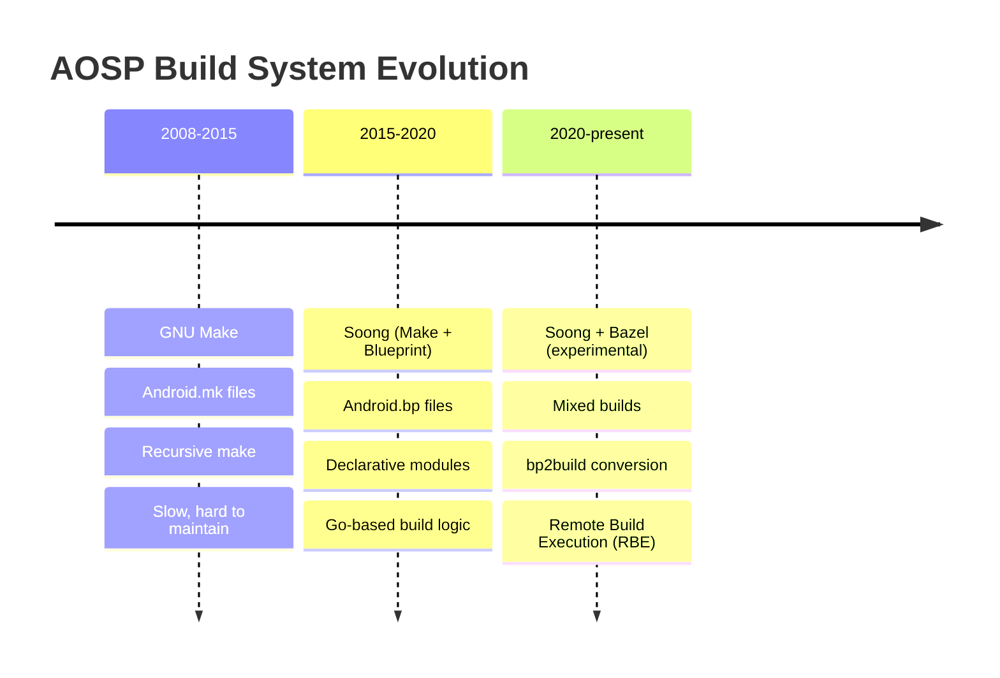

**Generation 1: GNU Make (2008-2015).**
The original Android build system was pure GNU Make. Every module was described
in an `Android.mk` file using Make variables and include directives. A typical
Android.mk file looked like:

```makefile
# Legacy Android.mk format (still supported but deprecated)
LOCAL_PATH := $(call my-dir)

include $(CLEAR_VARS)
LOCAL_MODULE := libexample
LOCAL_SRC_FILES := example.cpp
LOCAL_SHARED_LIBRARIES := liblog libutils
LOCAL_C_INCLUDES := $(LOCAL_PATH)/include
LOCAL_CFLAGS := -Wall -Werror
include $(BUILD_SHARED_LIBRARY)
```

The system worked but suffered from well-known Make problems:

- **Slow incremental builds:** Make had to re-evaluate the entire dependency
  graph on every invocation, parsing thousands of Makefile includes.
- **Fragile variable scoping:** Make variables are global by default, leading
  to subtle bugs when two modules accidentally shared a variable name.
- **Difficulty with parallelism:** Recursive Make is inherently sequential
  across directory boundaries.
- **No dependency enforcement:** Any Makefile could reference any variable
  from any other Makefile, making it impossible to reason about module
  boundaries.
- **Poor error messages:** When something went wrong in the deeply nested
  include chains, error messages were nearly indecipherable.

At its peak, the Make-based build system had over 10,000 `Android.mk` files
and took hours to parse before even starting compilation.

**Generation 2: Soong/Blueprint (2015-present).**
Google introduced Soong as a replacement, with a three-layer architecture
(described below). Modules are now declared in `Android.bp` files using a
simple, declarative, JSON-like syntax. The build logic itself is written in Go.
Make is still present as a thin glue layer for product configuration and image
assembly, but new modules should always be defined in `Android.bp`.

The migration from Make to Soong has been gradual: the `androidmk` tool
performs automated conversion, and both systems coexist. Over successive
Android releases, more modules have been converted. As of the current release,
the vast majority of platform modules use `Android.bp`.

The key insight behind Soong is the **separation of declaration from logic**.
In Make, the build file format *is* the programming language -- you declare
modules and write build logic in the same files. In Soong, the `Android.bp`
files are purely declarative (no conditionals, no loops), and all build logic
lives in Go code within the Soong binary. This makes `Android.bp` files much
simpler and less error-prone.

**Generation 3: Bazel (2020-present, experimental).**
Google has been working on migrating the build to Bazel, the open-source
version of their internal Blaze build system. This effort is tracked through
the `build/pesto/` directory and tools like `bp2build`. As of the current
release, Bazel is used for kernel builds (Kleaf) and select experiments, but
the platform build remains Soong-driven.

The migration to Bazel is motivated by:

- **Build hermeticity:** Bazel sandboxes each build action, ensuring
  reproducibility.
- **Remote execution:** Build actions can be distributed across a cluster of
  machines.
- **Content-addressable caching:** Build results can be shared across
  developers, CI systems, and even different branches.
- **Scalability:** Bazel is designed for extremely large codebases (Google's
  internal monorepo has billions of lines of code).

However, migrating a build system as complex as AOSP's is a multi-year effort,
and Soong will remain the primary build system for the foreseeable future.

### 2.2.2 The Three-Layer Architecture

The modern AOSP build system consists of three layers, each implemented in a
different technology:

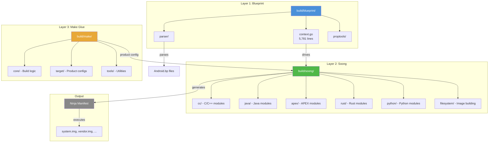

Let us examine each layer in detail.

### 2.2.3 Layer 1: Blueprint (`build/blueprint/`)

Blueprint is the meta-build framework -- a Go library that provides the
machinery for parsing module definition files, resolving dependencies, running
mutators, and generating Ninja build rules. Blueprint is **not
Android-specific**; it is a general-purpose tool.

The `doc.go` file in `build/blueprint/` describes the framework:

```go
// Blueprint is a meta-build system that reads in Blueprints files that
// describe modules that need to be built, and produces a Ninja
// (https://ninja-build.org/) manifest describing the commands that need
// to be run and their dependencies.  Where most build systems use built-in
// rules or a domain-specific language to describe the logic how modules are
// converted to build rules, Blueprint delegates this to per-project build
// logic written in Go.
```

**Source:** `build/blueprint/doc.go`

The core of Blueprint is `context.go` (5,781 lines, ~89 KB), which defines the
`Context` struct -- the central state object that orchestrates the entire build
process through four phases:

```go
// A Context contains all the state needed to parse a set of Blueprints files
// and generate a Ninja file.  The process of generating a Ninja file proceeds
// through a series of four phases.  Each phase corresponds with a some methods
// on the Context object
//
//          Phase                            Methods
//       ------------      -------------------------------------------
//    1. Registration         RegisterModuleType, RegisterSingletonType
//
//    2. Parse                    ParseBlueprintsFiles, Parse
//
//    3. Generate            ResolveDependencies, PrepareBuildActions
//
//    4. Write                           WriteBuildFile
```

**Source:** `build/blueprint/context.go`, lines 70-84

The four phases in detail:

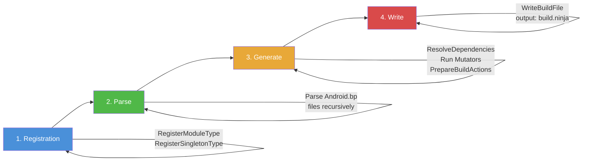

1. **Registration:** Module types (e.g., `cc_binary`, `java_library`) and
   singletons are registered with the Context. Each module type maps to a Go
   factory function.

2. **Parse:** All `Android.bp` files in the tree are discovered and parsed.
   The Blueprint parser reads the JSON-like syntax and populates Go structs
   using reflection.

3. **Generate:** Dependencies between modules are resolved. *Mutators* run
   in registration order -- they can visit modules top-down or bottom-up to
   propagate information or split modules into variants (e.g., one per
   target architecture). Then each module generates its build actions.

4. **Write:** The accumulated build actions are serialized into a Ninja
   manifest file.

Key directories under `build/blueprint/`:

| Directory/File | Purpose |
|---------------|---------|
| `context.go` | Core orchestration (5,781 lines) |
| `parser/` | Blueprint file parser |
| `proptools/` | Property reflection and manipulation utilities |
| `pathtools/` | File path utilities and glob matching |
| `depset/` | Dependency set implementation (like Bazel depsets) |
| `bpfmt/` | Blueprint file formatter |
| `bpmodify/` | Programmatic Blueprint file modification tool |
| `bootstrap/` | Self-bootstrapping logic |
| `gobtools/` | Go binary tools for serialization |
| `gotestmain/` | Test main generator |
| `gotestrunner/` | Test runner utilities |
| `metrics/` | Build metrics and event handling |
| `incremental.go` | Incremental build support |
| `live_tracker.go` | Live file tracking for dependencies |

#### Blueprint Mutators

Mutators are one of the most important concepts in Blueprint. A mutator is a
function that visits modules and can modify them. Mutators are used for:

- **Variant creation:** A single module declaration can be split into
  multiple *variants*. For example, a `cc_library` is split into device and
  host variants, and further into architecture variants (arm64, x86_64, etc.).
- **Dependency propagation:** Information from one module can be pushed into
  its dependents (or vice versa).
- **Property defaulting:** Default values can be computed based on global
  build configuration.

Mutators run in a specific order:

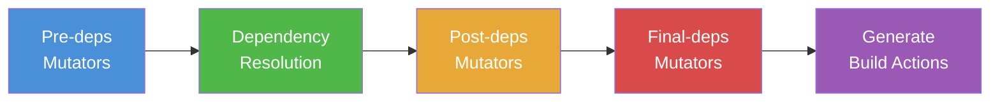

1. **Pre-deps mutators** run before dependencies are resolved. They can add
   dependencies or create variants.
2. **Dependency resolution** matches dependency names to actual modules.
3. **Post-deps mutators** run after dependencies are resolved. They can access
   dependency information.
4. **Final-deps mutators** run last, for late-stage modifications.

The APEX system, for example, uses post-deps mutators to create separate
variants of libraries for each APEX they appear in:

```go
// From build/soong/apex/apex.go
func RegisterPostDepsMutators(ctx android.RegisterMutatorsContext) {
    ctx.BottomUp("apex_unique", apexUniqueVariationsMutator)
    ctx.BottomUp("mark_platform_availability", markPlatformAvailability)
    ctx.InfoBasedTransition("apex",
        android.NewGenericTransitionMutatorAdapter(&apexTransitionMutator{}))
}
```

**Source:** `build/soong/apex/apex.go`, lines 64-70

#### Blueprint Providers

Providers are Blueprint's mechanism for passing information between modules.
When a module generates build actions, it can set *provider* data that its
dependents can then read. This is more structured than Make's global variables:

```go
// Provider declaration (from build/soong/cc/cc.go)
var CcObjectInfoProvider = blueprint.NewProvider[CcObjectInfo]()

// Setting a provider (in the generating module)
ctx.SetProvider(CcObjectInfoProvider, CcObjectInfo{
    ObjFiles:   objFiles,
    TidyFiles:  tidyFiles,
    KytheFiles: kytheFiles,
})

// Reading a provider (in a dependent module)
if info, ok := ctx.OtherModuleProvider(dep, CcObjectInfoProvider); ok {
    // Use info.ObjFiles, etc.
}
```

### 2.2.4 Layer 2: Soong (`build/soong/`)

Soong is Android's build system proper. It is built *on top of* Blueprint,
registering Android-specific module types, mutators, and singletons. The
`build/soong/` directory contains 74 subdirectories, organized by the type of
module or build functionality they handle.

From `build/soong/README.md`:

```
Soong is one of the build systems used in Android, which is controlled
by files called Android.bp. There is also the legacy Make-based build
system that is controlled by files called Android.mk.

Android.bp file are JSON-like declarative descriptions of "modules" to
build; a "module" is the basic unit of building that Soong understands,
similarly to how "target" is the basic unit of building for Make.
```

**Source:** `build/soong/README.md`, lines 1-8

The build logic is described further:

```
The build logic is written in Go using the blueprint framework.
Build logic receives module definitions parsed into Go structures
using reflection and produces build rules. The build rules are
collected by blueprint and written to a ninja build file.
```

**Source:** `build/soong/README.md`, lines 610-614

Key subdirectories of `build/soong/`:

| Directory | Purpose | Key Files |
|-----------|---------|-----------|
| `cc/` | C/C++ module types (`cc_binary`, `cc_library`, etc.) | `cc.go`, `library.go`, `binary.go` |
| `java/` | Java/Kotlin module types (`java_library`, `android_app`, etc.) | `java.go`, `app.go`, `sdk_library.go` |
| `apex/` | APEX module type (3,001 lines in `apex.go`) | `apex.go`, `builder.go`, `key.go` |
| `rust/` | Rust module types | `rust.go`, `library.go` |
| `python/` | Python module types | `python.go` |
| `sh/` | Shell script module types | `sh_binary.go` |
| `genrule/` | Generic build rule modules | `genrule.go` |
| `android/` | Core Soong framework (module base classes, arch handling) | `module.go`, `arch.go`, `paths.go` |
| `filesystem/` | Image file building | `filesystem.go` |
| `ui/` | Build UI and progress reporting | `build.go` |
| `cmd/` | Command-line entry points | `soong_build/`, `soong_ui/` |
| `bpf/` | BPF program compilation | `bpf.go` |
| `sdk/` | SDK snapshot generation | `sdk.go` |
| `snapshot/` | Vendor snapshot management | `snapshot.go` |
| `linkerconfig/` | Linker namespace configuration | `linkerconfig.go` |
| `aconfig/` | Build flags (aconfig) integration | `aconfig.go` |
| `bin/` | Shell scripts for `m`, `mm`, `mmm`, etc. | `m`, `mm`, `mmm` |
| `kernel/` | Kernel-related build logic | `kernel.go` |

#### Inside the Go Code: Module Registration

Each module type is registered with Soong by a Go `init()` function. Let us
look at how the three major module families register themselves:

**C/C++ modules** (`build/soong/cc/cc.go`, 4,778 lines):

```go
// This file contains the module types for compiling C/C++ for Android,
// and converts the properties into the flags and filenames necessary to
// pass to the compiler.  The final creation of the rules is handled in
// builder.go
package cc
```

**Source:** `build/soong/cc/cc.go`, lines 15-19

The C/C++ module system defines extensive data structures for tracking
compilation state. For example, the `LinkerInfo` struct captures all linking
dependencies:

```go
type LinkerInfo struct {
    WholeStaticLibs []string
    StaticLibs      []string  // modules to statically link
    SharedLibs      []string  // modules to dynamically link
    HeaderLibs      []string  // header-only dependencies
    SystemSharedLibs []string
    ...
}
```

**Source:** `build/soong/cc/cc.go`, lines 81-99

The `cc/` directory contains over 30 Go files, each handling a different
aspect of C/C++ compilation:

| File | Purpose | Lines |
|------|---------|-------|
| `cc.go` | Core module types and properties | 4,778 |
| `builder.go` | Ninja rule generation | ~2,000 |
| `binary.go` | `cc_binary` implementation | ~500 |
| `library.go` | `cc_library` implementation | ~2,000 |
| `sanitize.go` | ASan/TSan/UBSan integration | ~1,500 |
| `ndk_sysroot.go` | NDK sysroot management | ~400 |
| `stl.go` | C++ STL selection | ~300 |
| `cmake_snapshot.go` | CMake project generation | ~400 |
| `check.go` | Build consistency checks | ~200 |

**Java modules** (`build/soong/java/java.go`, 4,070 lines):

```go
// This file contains the module types for compiling Java for Android,
// and converts the properties into the flags and filenames necessary
// to pass to the Module.  The final creation of the rules is handled
// in builder.go
package java

func registerJavaBuildComponents(ctx android.RegistrationContext) {
    ctx.RegisterModuleType("java_defaults", DefaultsFactory)
    ctx.RegisterModuleType("java_library", LibraryFactory)
    ctx.RegisterModuleType("java_library_static", LibraryStaticFactory)
    ctx.RegisterModuleType("java_library_host", LibraryHostFactory)
    ctx.RegisterModuleType("java_binary", BinaryFactory)
    ctx.RegisterModuleType("java_binary_host", BinaryHostFactory)
    ctx.RegisterModuleType("java_test", TestFactory)
    ctx.RegisterModuleType("java_test_helper_library", TestHelperLibraryFactory)
    ctx.RegisterModuleType("java_test_host", TestHostFactory)
    ctx.RegisterModuleType("java_test_import", JavaTestImportFactory)
    ctx.RegisterModuleType("java_import", ImportFactory)
    ctx.RegisterModuleType("java_import_host", ImportFactoryHost)
    ctx.RegisterModuleType("java_device_for_host", DeviceForHostFactory)
    ctx.RegisterModuleType("java_host_for_device", HostForDeviceFactory)
    ctx.RegisterModuleType("dex_import", DexImportFactory)
    ctx.RegisterModuleType("java_api_library", ApiLibraryFactory)
    ctx.RegisterModuleType("java_api_contribution", ApiContributionFactory)
    ...
}
```

**Source:** `build/soong/java/java.go`, lines 50-70

**Genrule modules** (`build/soong/genrule/genrule.go`, 1,042 lines):

```go
// A genrule module takes a list of source files ("srcs" property), an
// optional list of tools ("tools" property), and a command line ("cmd"
// property), to generate output files ("out" property).
package genrule

func RegisterGenruleBuildComponents(ctx android.RegistrationContext) {
    ctx.RegisterModuleType("genrule_defaults", defaultsFactory)
    ctx.RegisterModuleType("gensrcs", GenSrcsFactory)
    ctx.RegisterModuleType("genrule", GenRuleFactory)
    ...
}
```

**Source:** `build/soong/genrule/genrule.go`, lines 15-67

The `genrule` module type is particularly useful for code generation, protocol
buffer compilation, AIDL interface generation, and any other case where you
need to run an arbitrary command to produce source files.

#### Soong Build Flow Internals

When `soong_ui` starts a build, it proceeds through these internal steps:

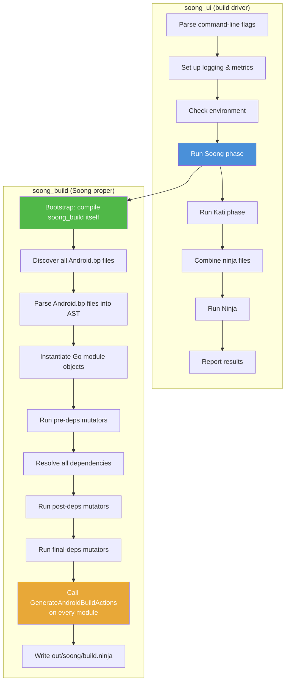

The key step is **SB9: GenerateAndroidBuildActions**. This is the method that
every module type must implement. It examines the module's properties, resolves
its dependencies, and emits Ninja build rules (compile commands, link commands,
file copies, etc.).

The entry point for the build is `build/soong/soong_ui.bash`:

```bash
#!/bin/bash -eu
source $(cd $(dirname $BASH_SOURCE) &> /dev/null && pwd)/../make/shell_utils.sh
require_top

# To track how long we took to startup.
case $(uname -s) in
  Darwin)
    export TRACE_BEGIN_SOONG=`$TOP/prebuilts/build-tools/path/darwin-x86/date +%s%3N`
    ;;
  *)
    export TRACE_BEGIN_SOONG=$(date +%s%N)
    ;;
esac

setup_cog_env_if_needed
set_network_file_system_type_env_var

# Save the current PWD for use in soong_ui
export ORIGINAL_PWD=${PWD}
export TOP=$(gettop)
source ${TOP}/build/soong/scripts/microfactory.bash

soong_build_go soong_ui android/soong/cmd/soong_ui
soong_build_go mk2rbc android/soong/mk2rbc/mk2rbc
soong_build_go rbcrun rbcrun/rbcrun
soong_build_go release-config android/soong/cmd/release_config/release_config

cd ${TOP}
exec "$(getoutdir)/soong_ui" "$@"
```

**Source:** `build/soong/soong_ui.bash`

This script bootstraps the Go-based build system: it first compiles `soong_ui`
(the build driver) and several helper tools, then executes `soong_ui` which
orchestrates the entire build.

### 2.2.5 Layer 3: Make Glue (`build/make/`)

Although Soong handles module compilation, GNU Make (via Kati, a Make clone
optimized for Android) still plays an important role:

- **Product configuration:** `PRODUCT_*` variables, `BoardConfig.mk`, and
  device makefiles are still written in Make.
- **Image assembly:** The rules for combining compiled artifacts into partition
  images (`system.img`, `vendor.img`, etc.) are in Make.
- **Legacy modules:** Some modules still use `Android.mk` (though this is
  decreasing with every release).

The `build/make/` directory contains 25 top-level entries:

| Directory/File | Purpose |
|---------------|---------|
| `core/` | Core build logic (includes, rules, module definitions) |
| `target/` | Product and board configuration files |
| `tools/` | Build utilities (releasetools, signapk, etc.) |
| `envsetup.sh` | Shell environment setup script (1,187 lines) |
| `common/` | Shared build logic |
| `packaging/` | Package assembly rules |
| `Changes.md` | Build system change log |
| `shell_utils.sh` | Shell utility functions |

The relationship between these layers during a build is:

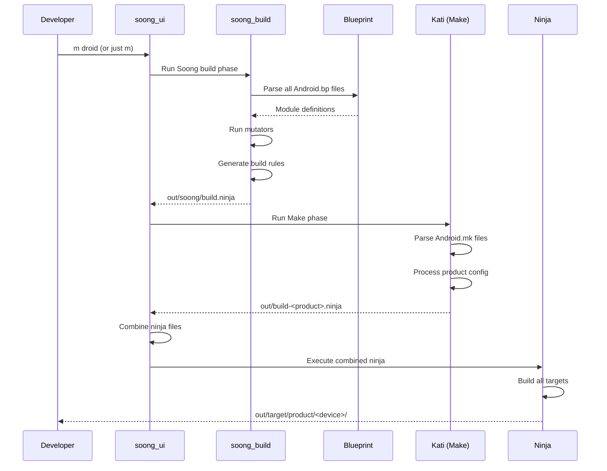

### 2.2.6 The Soong README: Module Definitions

The Soong README (`build/soong/README.md`) provides the authoritative reference
for `Android.bp` syntax. Here are the key elements it documents.

**Module structure:**

```
cc_binary {
    name: "gzip",
    srcs: ["src/test/minigzip.c"],
    shared_libs: ["libz"],
    stl: "none",
}
```

The README states: "Every module must have a `name` property, and the value
must be unique across all Android.bp files."

**Source:** `build/soong/README.md`, lines 43-48

**Variables:**

```
gzip_srcs = ["src/test/minigzip.c"],

cc_binary {
    name: "gzip",
    srcs: gzip_srcs,
    shared_libs: ["libz"],
    stl: "none",
}
```

"Variables are scoped to the remainder of the file they are declared in, as
well as any child Android.bp files. Variables are immutable with one exception
-- they can be appended to with a += assignment, but only before they have been
referenced."

**Source:** `build/soong/README.md`, lines 76-91

**Types supported:**

| Type | Syntax |
|------|--------|
| Bool | `true` or `false` |
| Integer | `42` |
| String | `"hello"` |
| List of strings | `["a", "b", "c"]` |
| Map | `{key1: "val", key2: ["val2"]}` |

**Comments:** Both `/* */` and `//` styles are supported.

**Defaults modules:**

```
cc_defaults {
    name: "gzip_defaults",
    shared_libs: ["libz"],
    stl: "none",
}

cc_binary {
    name: "gzip",
    defaults: ["gzip_defaults"],
    srcs: ["src/test/minigzip.c"],
}
```

**Source:** `build/soong/README.md`, lines 126-142

Defaults modules allow sharing properties across multiple module definitions,
reducing duplication.

---

## 2.3 `envsetup.sh` and `lunch`

### 2.3.1 Sourcing `envsetup.sh`

Every AOSP build session begins by sourcing the environment setup script:

```bash
source build/envsetup.sh
```

This script lives at `build/make/envsetup.sh` (1,187 lines) and is symlinked
to the top-level `build/envsetup.sh` via the manifest's `<linkfile>` directive.

The script does the following on load:

1. **Locates the tree root** using the `_gettop_once` function:

```bash
function _gettop_once
{
    local TOPFILE=build/make/core/envsetup.mk
    if [ -n "$TOP" -a -f "$TOP/$TOPFILE" ] ; then
        # The following circumlocution ensures we remove symlinks from TOP.
        (cd "$TOP"; PWD= /bin/pwd)
    else
        if [ -f $TOPFILE ] ; then
            PWD= /bin/pwd
        else
            local HERE=$PWD
            local T=
            while [ \( ! \( -f $TOPFILE \) \) -a \( "$PWD" != "/" \) ]; do
                \cd ..
                T=`PWD= /bin/pwd -P`
            done
            \cd "$HERE"
            if [ -f "$T/$TOPFILE" ]; then
                echo "$T"
            fi
        fi
    fi
}
```

**Source:** `build/make/envsetup.sh`, lines 18-43

The function walks up the directory tree looking for `build/make/core/envsetup.mk`
as a sentinel file. This is the canonical way the build system identifies the
root of an AOSP checkout.

2. **Sources `shell_utils.sh`:** Imports common shell utilities.

3. **Sets global paths** via `set_global_paths()`:

```bash
function set_global_paths()
{
    ...
    ANDROID_GLOBAL_BUILD_PATHS=$T/build/soong/bin
    ANDROID_GLOBAL_BUILD_PATHS+=:$T/build/bazel/bin
    ANDROID_GLOBAL_BUILD_PATHS+=:$T/development/scripts
    ANDROID_GLOBAL_BUILD_PATHS+=:$T/prebuilts/devtools/tools

    # add kernel specific binaries
    if [ $(uname -s) = Linux ] ; then
        ANDROID_GLOBAL_BUILD_PATHS+=:$T/prebuilts/misc/linux-x86/dtc
        ANDROID_GLOBAL_BUILD_PATHS+=:$T/prebuilts/misc/linux-x86/libufdt
    fi
    ...
    export PATH=$ANDROID_GLOBAL_BUILD_PATHS:$PATH
}
```

**Source:** `build/make/envsetup.sh`, lines 259-317

This adds build tools, Bazel binaries, emulator prebuilts, and device tree
compiler (dtc) to `PATH`.

4. **Sources vendor setup scripts** via `source_vendorsetup()`:

```bash
function source_vendorsetup() {
    ...
    for dir in device vendor product; do
        for f in $(cd "$T" && test -d $dir && \
            find -L $dir -maxdepth 4 -name 'vendorsetup.sh' 2>/dev/null \
            | sort); do
            if [[ -z "$allowed" || "$allowed_files" =~ $f ]]; then
                echo "including $f"; . "$T/$f"
            else
                echo "ignoring $f, not in $allowed"
            fi
        done
    done
    ...
}
```

**Source:** `build/make/envsetup.sh`, lines 1061-1090

This discovers and executes `vendorsetup.sh` files under `device/`, `vendor/`,
and `product/` directories. These scripts typically add device-specific lunch
combos or set up vendor-specific environment variables.

5. **Adds shell completions** via `addcompletions()` for commands like `lunch`,
   `m`, `adb`, and `fastboot`.

6. **Optionally restores previous lunch** if `USE_LEFTOVERS=1` is set.

### 2.3.2 Key Functions Defined by `envsetup.sh`

The script defines many shell functions that become available after sourcing.
Here are the most important ones:

| Function | Purpose |
|----------|---------|
| `lunch` | Select build target (product, release, variant) |
| `tapas` | Configure unbundled app build |
| `banchan` | Configure unbundled APEX build |
| `m` | Build from the top of the tree (delegates to `soong_ui.bash`) |
| `mm` | Build modules in the current directory |
| `mmm` | Build modules in specified directories |
| `croot` | `cd` to the top of the tree |
| `gomod` | `cd` to a specific module's directory |
| `godir` | `cd` to a directory matching a pattern |
| `adb` | Wrapper that ensures tree's adb is used |
| `fastboot` | Wrapper that ensures tree's fastboot is used |
| `make` | Redirects to `soong_ui.bash --make-mode` |
| `printconfig` | Display current build configuration |
| `leftovers` | Restore previous lunch selection |

The `make` function is notable -- it intercepts the system `make` command:

```bash
function get_make_command()
{
    # If we're in the top of an Android tree, use soong_ui.bash instead of make
    if [ -f build/soong/soong_ui.bash ]; then
        # Always use the real make if -C is passed in
        for arg in "$@"; do
            if [[ $arg == -C* ]]; then
                echo command make
                return
            fi
        done
        echo build/soong/soong_ui.bash --make-mode
    else
        echo command make
    fi
}

function make()
{
    _wrap_build $(get_make_command "$@") "$@"
}
```

**Source:** `build/make/envsetup.sh`, lines 1010-1030

This means that typing `make` in an AOSP tree actually invokes `soong_ui.bash
--make-mode`, not GNU Make directly.

### 2.3.3 The `lunch` Command

`lunch` is the pivotal command that selects your build target. It sets three
fundamental variables:

| Variable | Purpose | Example |
|----------|---------|---------|
| `TARGET_PRODUCT` | Which device/product to build for | `aosp_arm64` |
| `TARGET_RELEASE` | Release configuration | `trunk_staging` |
| `TARGET_BUILD_VARIANT` | Build variant (eng/userdebug/user) | `eng` |

The `lunch` function supports two formats:

```bash
# New format (recommended): positional arguments
lunch aosp_arm64 trunk_staging eng

# Legacy format: dash-separated
lunch aosp_arm64-trunk_staging-eng
```

If release and variant are omitted, they default to `trunk_staging` and `eng`
respectively:

```bash
function lunch()
{
    ...
    # Handle the new format.
    if [[ -z $legacy ]]; then
        product=$1
        release=$2
        if [[ -z $release ]]; then
            release=trunk_staging
        fi
        variant=$3
        if [[ -z $variant ]]; then
            variant=eng
        fi
    fi

    # Validate the selection and set all the environment stuff
    _lunch_meat $product $release $variant
    ...
}
```

**Source:** `build/make/envsetup.sh`, lines 550-596

The `_lunch_meat` function does the heavy lifting:

```bash
function _lunch_meat()
{
    local product=$1
    local release=$2
    local variant=$3

    TARGET_PRODUCT=$product \
    TARGET_RELEASE=$release \
    TARGET_BUILD_VARIANT=$variant \
    TARGET_BUILD_APPS= \
    build_build_var_cache
    if [ $? -ne 0 ]
    then
        if [[ "$product" =~ .*_(eng|user|userdebug) ]]
        then
            echo "Did you mean -${product/*_/}? (dash instead of underscore)"
        fi
        return 1
    fi
    export TARGET_PRODUCT=$(_get_build_var_cached TARGET_PRODUCT)
    export TARGET_BUILD_VARIANT=$(_get_build_var_cached TARGET_BUILD_VARIANT)
    export TARGET_RELEASE=$release
    export TARGET_BUILD_TYPE=release
    export TARGET_BUILD_APPS=

    set_stuff_for_environment
    ...
}
```

**Source:** `build/make/envsetup.sh`, lines 447-491

This function:

1. Invokes `soong_ui.bash --dumpvars-mode` to resolve and cache build variables
2. Exports `TARGET_PRODUCT`, `TARGET_BUILD_VARIANT`, `TARGET_RELEASE`, and
   `TARGET_BUILD_TYPE`
3. Calls `set_stuff_for_environment()`, which sets up `PATH`, `JAVA_HOME`,
   `ANDROID_PRODUCT_OUT`, and other environment variables
4. Prints the current configuration

### 2.3.4 Build Variants

The three build variants control what is included and how it is built:

| Variant | Description | `ro.debuggable` | `adb` | Optimizations |
|---------|-------------|-----------------|-------|---------------|
| `user` | Production build. Limited access. | `0` | Off by default | Full |
| `userdebug` | Like user, but with root access and debug tools. | `1` | On | Full |
| `eng` | Development build. Extra tools, no optimization. | `1` | On | Reduced |

The variant is used to select which packages are installed. For example,
`eng`-only packages include development tools like `strace`, while `user`
builds exclude them.

### 2.3.5 `envsetup.mk` and `config.mk`

After `lunch` sets the environment variables, the build system's Make layer
reads them through `build/make/core/envsetup.mk` and `build/make/core/config.mk`.

`envsetup.mk` establishes fundamental build variables:

```makefile
# Variables we check:
#     HOST_BUILD_TYPE = { release debug }
#     TARGET_BUILD_TYPE = { release debug }
# and we output a bunch of variables, see the case statement at
# the bottom for the full list
#     OUT_DIR is also set to "out" if it's not already set.

# ...

# The product defaults to generic on hardware
ifeq ($(TARGET_PRODUCT),)
TARGET_PRODUCT := aosp_arm64
endif

# the variant -- the set of files that are included for a build
ifeq ($(strip $(TARGET_BUILD_VARIANT)),)
TARGET_BUILD_VARIANT := eng
endif
```

**Source:** `build/make/core/envsetup.mk`, lines 1-85

It also detects the host configuration:

```makefile
# HOST_OS
ifneq (,$(findstring Linux,$(UNAME)))
  HOST_OS := linux
endif
ifneq (,$(findstring Darwin,$(UNAME)))
  HOST_OS := darwin
endif

# HOST_ARCH
ifneq (,$(findstring x86_64,$(UNAME)))
  HOST_ARCH := x86_64
  HOST_2ND_ARCH := x86
  HOST_IS_64_BIT := true
endif
```

**Source:** `build/make/core/envsetup.mk`, lines 122-183

And defines the partition output directories:

```makefile
TARGET_COPY_OUT_SYSTEM := system
TARGET_COPY_OUT_SYSTEM_DLKM := system_dlkm
TARGET_COPY_OUT_DATA := data
TARGET_COPY_OUT_VENDOR := $(_vendor_path_placeholder)
TARGET_COPY_OUT_PRODUCT := $(_product_path_placeholder)
TARGET_COPY_OUT_SYSTEM_EXT := $(_system_ext_path_placeholder)
TARGET_COPY_OUT_ODM := $(_odm_path_placeholder)
```

**Source:** `build/make/core/envsetup.mk`, lines 254-289

`config.mk` is the top-level configuration include. It starts with a guard
that prevents direct invocation:

```makefile
ifndef KATI
$(warning Directly using config.mk from make is no longer supported.)
$(warning )
$(warning If you are just attempting to build, you probably need to re-source envsetup.sh:)
$(warning )
$(warning $$ source build/envsetup.sh)
$(error done)
endif

BUILD_SYSTEM :=$= build/make/core
BUILD_SYSTEM_COMMON :=$= build/make/common
```

**Source:** `build/make/core/config.mk`, lines 1-22

The `ifndef KATI` guard tells us an important detail: the Make-based build does
not use standard GNU Make. It uses **Kati**, a Make implementation written in
Go that is faster and more compatible with Android's build patterns.

### 2.3.6 Kati: The Make Replacement

Kati (`build/kati/` in older trees, now part of the prebuilts) is Google's
Make-compatible build tool. It was created to address the performance problems
with GNU Make on the Android build:

- **Faster parsing:** Kati parses Makefiles much faster than GNU Make.
- **Better caching:** Kati caches parsed Makefile results between invocations.
- **Ninja generation:** Rather than executing build commands directly, Kati
  generates a Ninja manifest, which Ninja then executes.
- **Compatibility:** Kati aims to be a drop-in replacement for GNU Make,
  though it intentionally does not support some rarely-used Make features.

In the AOSP build, Kati handles:

- Product configuration (`PRODUCT_*` variables)
- Board configuration (`BOARD_*` variables)
- Image assembly rules
- Remaining `Android.mk` modules

The output of Kati is `out/build-<TARGET_PRODUCT>.ninja`, which is combined
with Soong's `out/soong/build.ninja` into a single `out/combined-<TARGET_PRODUCT>.ninja`
that Ninja executes.

### 2.3.7 How Build Variables Flow

Understanding the flow of build variables is essential for debugging build
configuration issues:

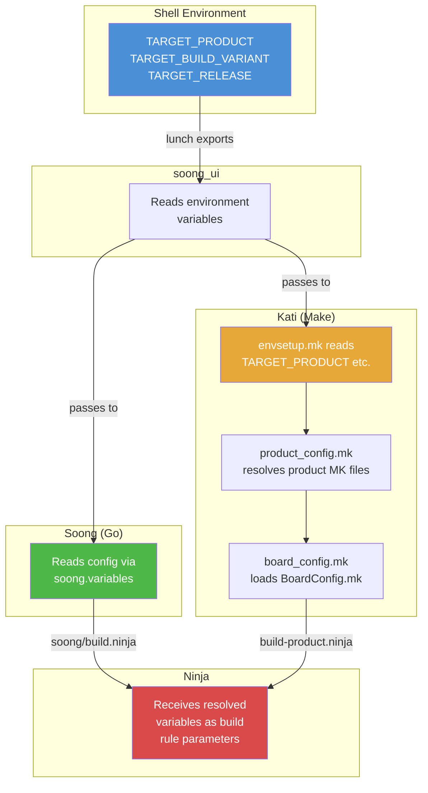

The variable resolution chain in the Make layer is:

1. `build/make/core/config.mk` is the top-level entry point
2. It includes `build/make/core/envsetup.mk`, which reads `TARGET_PRODUCT`
   and `TARGET_BUILD_VARIANT` from the environment
3. `envsetup.mk` includes `product_config.mk`, which finds and loads the
   product's makefile (e.g., `build/make/target/product/aosp_arm64.mk`)
4. The product makefile uses `inherit-product` to pull in base configurations
5. `board_config.mk` locates and loads `BoardConfig.mk` for the device
6. All resolved variables are then available for image assembly and as inputs
   to Soong via `soong.variables`

The key variable resolution happens in `envsetup.mk`:

```makefile
# Read the product specs so we can get TARGET_DEVICE and other
# variables that we need in order to locate the output files.
include $(BUILD_SYSTEM)/product_config.mk

SDK_HOST_ARCH := x86
TARGET_OS := linux

# Some board configuration files use $(PRODUCT_OUT)
TARGET_OUT_ROOT := $(OUT_DIR)/target
TARGET_PRODUCT_OUT_ROOT := $(TARGET_OUT_ROOT)/product
PRODUCT_OUT := $(TARGET_PRODUCT_OUT_ROOT)/$(TARGET_DEVICE)

include $(BUILD_SYSTEM)/board_config.mk
```

**Source:** `build/make/core/envsetup.mk`, lines 349-368

This is where `PRODUCT_OUT` -- the directory where all build outputs for the
target device go -- is computed. For `aosp_arm64`, this resolves to
`out/target/product/generic_arm64/`.

### 2.3.8 The `tapas` and `banchan` Commands

In addition to `lunch`, `envsetup.sh` provides two specialized commands for
unbundled builds:

**`tapas` -- Build unbundled apps:**

```bash
# Build the Camera app for ARM64
tapas Camera arm64 eng

# Build multiple apps
tapas Camera Gallery arm64 userdebug
```

The `tapas` function (`build/make/envsetup.sh`, lines 676-747) configures an
unbundled app build. It sets `TARGET_BUILD_APPS` to the specified app names,
which tells the build system to only build those apps (and their dependencies)
rather than the entire platform.

**`banchan` -- Build unbundled APEXes:**

```bash
# Build the Wi-Fi APEX for ARM64
banchan com.android.wifi arm64 eng

# Build multiple APEXes
banchan com.android.wifi com.android.bt arm64 userdebug
```

The `banchan` function (`build/make/envsetup.sh`, lines 749-811) is similar
to `tapas` but specialized for APEX modules. It uses `module_arm64` (or the
appropriate architecture variant) as the product, since APEXes are largely
device-independent.

Both commands are useful for:

- Mainline module development (working on a specific APEX)
- App development within the AOSP tree
- Faster builds (only building what you need)
- CI/CD pipelines that test individual modules

### 2.3.9 The `leftovers` Command

The `leftovers` command restores your previous `lunch` selection:

```bash
function leftovers()
{
    ...
    local dot_leftovers="$(getoutdir)/.leftovers"
    ...
    local product release variant
    IFS=" " read -r product release variant < "$dot_leftovers"
    echo "$INFO: Loading previous lunch: $product $release $variant"
    lunch $product $release $variant
}
```

**Source:** `build/make/envsetup.sh`, lines 598-642

When you run `lunch`, it saves your selection to `out/.leftovers`. The next
time you source `envsetup.sh`, you can either:

- Run `leftovers` manually to restore the previous selection
- Set `USE_LEFTOVERS=1` in your shell profile to auto-restore

This is particularly useful when you are always building for the same target
and do not want to type the full lunch command every time.

---

## 2.4 Android.bp Module Definitions

### 2.4.1 The Blueprint Language

`Android.bp` files use a simple, declarative syntax that intentionally avoids
conditionals and control flow. As the Soong README explains:

> "By design, Android.bp files are very simple. There are no conditionals or
> control flow statements -- any complexity is handled in build logic written in
> Go."

**Source:** `build/soong/README.md`, lines 27-28

This design decision pushes complexity into the build system's Go code, where
it can be properly tested and maintained, rather than scattering it across
thousands of build files.

### 2.4.2 Module Types

AOSP defines dozens of module types. The most commonly used are:

**C/C++ Module Types (defined in `build/soong/cc/`):**

| Module Type | Purpose |
|-------------|---------|
| `cc_binary` | Native executable |
| `cc_library` | Native shared and/or static library |
| `cc_library_shared` | Shared library only (.so) |
| `cc_library_static` | Static library only (.a) |
| `cc_library_headers` | Header-only library |
| `cc_test` | Native test executable (gtest) |
| `cc_benchmark` | Native benchmark (google-benchmark) |
| `cc_defaults` | Shared defaults for cc modules |
| `cc_prebuilt_binary` | Prebuilt native binary |
| `cc_prebuilt_library_shared` | Prebuilt shared library |

**Java/Kotlin Module Types (defined in `build/soong/java/`):**

| Module Type | Purpose |
|-------------|---------|
| `java_library` | Java library (.jar) |
| `java_library_static` | Static Java library |
| `android_library` | Android library (aar) |
| `android_app` | Android application (APK) |
| `android_test` | Android instrumentation test |
| `java_defaults` | Shared defaults for Java modules |
| `java_sdk_library` | SDK library with stubs |

**Other Important Module Types:**

| Module Type | Defined In | Purpose |
|-------------|-----------|---------|
| `apex` | `build/soong/apex/` | APEX module package |
| `apex_key` | `build/soong/apex/` | Signing key for APEX |
| `rust_binary` | `build/soong/rust/` | Rust executable |
| `rust_library` | `build/soong/rust/` | Rust library |
| `python_binary_host` | `build/soong/python/` | Python host tool |
| `sh_binary` | `build/soong/sh/` | Shell script binary |
| `genrule` | `build/soong/genrule/` | Custom build rule |
| `filegroup` | `build/soong/android/` | Group of source files |
| `prebuilt_etc` | `build/soong/etc/` | File installed to /etc |
| `bpf` | `build/soong/bpf/` | BPF program |

You can generate a complete, current list of module types and their properties
by running:

```bash
m soong_docs
# Output: $OUT_DIR/soong/docs/soong_build.html
```

### 2.4.3 The `package` Module

Each directory with an `Android.bp` file forms a *package*. You can control
package-level settings with the `package` module:

```
package {
    default_team: "trendy_team_android_settings_app",
    default_applicable_licenses: ["packages_apps_Settings_license"],
    default_visibility: [":__subpackages__"],
}
```

**Source:** `packages/apps/Settings/Android.bp`, lines 1-4

The `package` module does not have a `name` property -- its name is
automatically set to the path of its directory. Package-level settings include:

- `default_visibility`: Controls what other packages can see modules in this
  package.
- `default_applicable_licenses`: Specifies the license that applies to all
  modules in this package.
- `default_team`: The team responsible for this package (used for code
  ownership tracking).

### 2.4.4 The `license` Module

AOSP requires license declarations for all modules. The `license` module type
declares the licensing terms:

```
license {
    name: "packages_apps_Settings_license",
    visibility: [":__subpackages__"],
    license_kinds: [
        "SPDX-license-identifier-Apache-2.0",
    ],
    license_text: [
        "NOTICE",
    ],
}
```

**Source:** `packages/apps/Settings/Android.bp`, lines 8-17

This ensures that the build system can track which licenses apply to every
binary and library, enabling automated compliance checking.

### 2.4.5 The `filegroup` Module

Filegroups provide a way to name a collection of source files so they can be
referenced from other modules:

```
filegroup {
    name: "com.android.wifi-androidManifest",
    srcs: ["AndroidManifest.xml"],
}
```

**Source:** `packages/modules/Wifi/apex/Android.bp`, lines 54-57

Other modules can reference this filegroup using the `:name` syntax in their
`srcs` or other file-list properties.

### 2.4.6 The `genrule` Module

The `genrule` module type runs arbitrary commands to generate source files:

```
genrule {
    name: "statslog-settings-java-gen",
    tools: ["stats-log-api-gen"],
    cmd: "$(location stats-log-api-gen) --java $(out) --module settings" +
        " --javaPackage com.android.settings.core.instrumentation" +
        " --javaClass SettingsStatsLog",
    out: ["com/android/settings/core/instrumentation/SettingsStatsLog.java"],
}
```

**Source:** `packages/apps/Settings/Android.bp`, lines 24-30

Key genrule properties:

- `tools`: Host tools used by the command (resolved to their output paths)
- `tool_files`: Additional tool input files
- `srcs`: Input source files
- `cmd`: The command to run. Special variables:
  - `$(location <tool>)`: Path to a tool binary
  - `$(in)`: All input files
  - `$(out)`: All output files
  - `$(genDir)`: The output directory
- `out`: List of output files (relative to genDir)

The `gensrcs` variant runs the command once per input file, which is useful
for batch transformations.

### 2.4.7 Walkthrough: A C/C++ Module

The Soong README includes a canonical example:

```
cc_binary {
    name: "gzip",
    srcs: ["src/test/minigzip.c"],
    shared_libs: ["libz"],
    stl: "none",
}
```

**Source:** `build/soong/README.md`, lines 35-41

Let us examine the common properties for C/C++ modules:

```
cc_library_shared {
    name: "libexample",

    // Source files -- supports globs and path expansions
    srcs: [
        "src/*.cpp",
        ":generated_sources",  // Output of another module
    ],

    // Header search paths (relative to module directory)
    local_include_dirs: ["include"],
    export_include_dirs: ["include/public"],

    // Dependencies
    shared_libs: [          // Shared library dependencies
        "libbase",
        "liblog",
    ],
    static_libs: [          // Static library dependencies
        "libfoo_static",
    ],
    header_libs: [          // Header-only dependencies
        "libhardware_headers",
    ],

    // Compiler flags
    cflags: ["-Wall", "-Werror"],
    cppflags: ["-std=c++20"],

    // Architecture-specific configuration
    arch: {
        arm: {
            srcs: ["arm_specific.cpp"],
        },
        arm64: {
            cflags: ["-DARCH_ARM64"],
        },
        x86_64: {
            srcs: ["x86_specific.cpp"],
        },
    },

    // Target-specific (device vs. host)
    target: {
        android: {
            shared_libs: ["libcutils"],
        },
        host: {
            cflags: ["-DHOST_BUILD"],
        },
    },

    // Visibility control
    visibility: ["//frameworks/base:__subpackages__"],

    // APEX packaging
    apex_available: [
        "com.android.runtime",
        "//apex_available:platform",
    ],
}
```

The `arch` and `target` blocks are how conditionals work in `Android.bp`.
Rather than `if/else` statements, properties are nested under architecture or
target selectors, and the build system merges them with the top-level
properties at build time.

### 2.4.8 Walkthrough: An Android App

Here is a real-world example from the Settings app:

```
android_library {
    name: "Settings-core",
    defaults: [
        "SettingsLib-search-defaults",
        "SettingsLintDefaults",
        "SpaPrivilegedLib-defaults",
    ],

    srcs: [
        "src/**/*.java",
        "src/**/*.kt",
    ],
    exclude_srcs: [
        "src/com/android/settings/biometrics/fingerprint2/lib/**/*.kt",
    ],
    javac_shard_size: 50,
    use_resource_processor: true,
    resource_dirs: [
        "res",
        "res-export",
        "res-product",
    ],
    optional_uses_libs: ["com.android.extensions.appfunctions"],
    static_libs: [
        "androidx.compose.runtime_runtime-livedata",
        "androidx.lifecycle_lifecycle-livedata-ktx",
        "androidx.navigation_navigation-fragment-ktx",
        "gson",
        "guava",
        "BiometricsSharedLib",
        "SystemUIUnfoldLib",
        "WifiTrackerLib",
        ...
    ],
}
```

**Source:** `packages/apps/Settings/Android.bp`, lines 47-100+

Key observations:

- **`defaults`** pulls in shared configuration from multiple defaults modules.
- **`srcs`** uses glob patterns (`**/*.java`) to match all Java and Kotlin
  files recursively.
- **`exclude_srcs`** removes specific files from the glob results.
- **`javac_shard_size`** controls compilation parallelism by splitting the
  source into shards of 50 files each.
- **`static_libs`** lists compile-time dependencies that are bundled into the
  output.
- **`use_resource_processor`** enables Android resource processing.

### 2.4.9 Walkthrough: An APEX Module

Here is the Wi-Fi APEX module:

```
apex_defaults {
    name: "com.android.wifi-defaults",
    androidManifest: ":com.android.wifi-androidManifest",
    bootclasspath_fragments: ["com.android.wifi-bootclasspath-fragment"],
    systemserverclasspath_fragments: [
        "com.android.wifi-systemserverclasspath-fragment",
    ],
    compat_configs: ["wifi-compat-config"],
    prebuilts: [
        "cacerts_wfa",
        "mainline_supplicant_conf",
        "mainline_supplicant_rc",
    ],
    key: "com.android.wifi.key",
    certificate: ":com.android.wifi.certificate",
    apps: [
        "OsuLogin",
        "ServiceWifiResources",
        "WifiDialog",
    ],
    jni_libs: [
        "libservice-wifi-jni",
    ],
    defaults: ["r-launched-apex-module"],
    compressible: true,
}

apex {
    name: "com.android.wifi",
    defaults: ["com.android.wifi-defaults"],
    manifest: "apex_manifest.json",
}

apex_key {
    name: "com.android.wifi.key",
    public_key: "com.android.wifi.avbpubkey",
    private_key: "com.android.wifi.pem",
}
```

**Source:** `packages/modules/Wifi/apex/Android.bp`, lines 21-79

This demonstrates the APEX pattern:

- `apex_defaults` defines shared configuration
- `apex` is the actual module that produces the `.apex` file
- `apex_key` provides the signing key
- The APEX bundles apps, JNI libraries, prebuilt files, bootclasspath fragments,
  and compatibility configurations

### 2.4.10 Namespaces

For large trees where module name collisions might occur, Soong supports
namespaces:

```
soong_namespace {
    imports: [
        "hardware/google/pixel",
        "device/google/gs201/powerstats",
    ],
}

cc_binary {
    name: "android.hardware.power.stats-service.pixel",
    defaults: ["powerstats_pixel_binary_defaults"],
    srcs: ["*.cpp"],
}
```

**Source:** `build/soong/README.md`, lines 258-279

The README explains: "The name of a namespace is the path of its directory."
Name resolution first checks the module's own namespace, then searches imported
namespaces in order, and finally falls back to the global namespace.

### 2.4.11 Visibility Control

Module visibility controls which other modules can depend on a given module:

```
cc_library {
    name: "libinternal",
    visibility: [
        "//frameworks/base:__subpackages__",
        "//packages/apps/Settings:__pkg__",
    ],
}
```

The visibility system supports several patterns:

| Pattern | Meaning |
|---------|---------|
| `["//visibility:public"]` | Anyone can use this module |
| `["//visibility:private"]` | Only the same package |
| `["//some/package:__pkg__"]` | Only modules in `some/package` |
| `["//project:__subpackages__"]` | Modules in `project` or its sub-packages |
| `[":__subpackages__"]` | Shorthand for the current package's sub-packages |

**Source:** `build/soong/README.md`, lines 308-374

### 2.4.12 Conditionals and Select Statements

`Android.bp` files deliberately lack traditional conditionals. Instead, Soong
provides several mechanisms:

**Architecture selectors** (the `arch` property):

```
cc_library {
    ...
    arch: {
        arm: { srcs: ["arm.cpp"] },
        x86: { srcs: ["x86.cpp"] },
    },
}
```

**Target selectors** (the `target` property):

```
cc_library {
    ...
    target: {
        android: { shared_libs: ["libcutils"] },
        host: { cflags: ["-DHOST_BUILD"] },
    },
}
```

**Select statements** (newer mechanism):

```
cc_library {
    ...
    srcs: select(arch(), {
        "arm64": ["arm64_impl.cpp"],
        "x86_64": ["x86_impl.cpp"],
        default: ["generic_impl.cpp"],
    }),
}
```

The Soong README recommends select statements over the older
`soong_config_module_type` mechanism:

> "Select statement is a new mechanism for supporting conditionals, which is
> easier to write and maintain and reduces boilerplate code. It is recommended
> to use select statements instead of soong_config_module_type."

**Source:** `build/soong/README.md`, lines 444-448

**Soong config variables** (for vendor modules):

```
soong_config_module_type {
    name: "acme_cc_defaults",
    module_type: "cc_defaults",
    config_namespace: "acme",
    variables: ["board"],
    bool_variables: ["feature"],
    properties: ["cflags", "srcs"],
}
```

These variables are set from `BoardConfig.mk`:

```makefile
$(call soong_config_set,acme,board,soc_a)
$(call soong_config_set,acme,feature,true)
```

**Source:** `build/soong/README.md`, lines 452-568

### 2.4.13 The `bpfmt` Formatter

Soong includes a canonical formatter for `Android.bp` files:

```bash
# Recursively format all Android.bp files
bpfmt -w .
```

The canonical format uses 4-space indents, newlines after every element in a
multi-element list, and always includes trailing commas.

### 2.4.14 Converting `Android.mk` to `Android.bp`

The `androidmk` tool performs a first-pass conversion:

```bash
androidmk Android.mk > Android.bp
```

From the README:

> "The tool converts variables, modules, comments, and some conditionals, but
> any custom Makefile rules, complex conditionals or extra includes must be
> converted by hand."

**Source:** `build/soong/README.md`, lines 389-399

---

## 2.5 The Build Graph

### 2.5.1 Build Commands: `m`, `mm`, `mmm`

After lunching, you invoke the build using the `m`, `mm`, or `mmm` commands.
These are shell scripts in `build/soong/bin/`:

**`m` -- Build from the top of the tree:**

```bash
#!/bin/bash
source $(cd $(dirname $BASH_SOURCE) &> /dev/null && pwd)/../../make/shell_utils.sh
require_top
_wrap_build "$TOP/build/soong/soong_ui.bash" --build-mode --all-modules \
  --dir="$(pwd)" "$@"
exit $?
```

**Source:** `build/soong/bin/m`

**`mm` -- Build modules in the current directory:**

```bash
#!/bin/bash
source $(cd $(dirname $BASH_SOURCE) &> /dev/null && pwd)/../../make/shell_utils.sh
require_top
_wrap_build "$TOP/build/soong/soong_ui.bash" --build-mode --modules-in-a-dir \
  --dir="$(pwd)" "$@"
exit $?
```

**Source:** `build/soong/bin/mm`

**`mmm` -- Build modules in specified directories:**

```bash
#!/bin/bash
source $(cd $(dirname $BASH_SOURCE) &> /dev/null && pwd)/../../make/shell_utils.sh
require_top
_wrap_build "$TOP/build/soong/soong_ui.bash" --build-mode --modules-in-dirs \
  --dir="$(pwd)" "$@"
exit $?
```

**Source:** `build/soong/bin/mmm`

All three commands delegate to `soong_ui.bash` with different `--build-mode`
flags. The key difference:

| Command | Scope | Example |
|---------|-------|---------|
| `m` | Entire tree | `m` or `m droid` or `m Settings` |
| `mm` | Current directory only | `cd frameworks/base && mm` |
| `mmm` | Specified directory(ies) | `mmm packages/apps/Settings` |

You can also pass specific module names to `m`:

```bash
# Build specific modules
m Settings framework-minus-apex services

# Build a specific image
m systemimage

# "droid" is the default target -- builds everything
m droid

# Build nothing (just run the build system setup)
m nothing
```

### 2.5.2 The Build Pipeline

A complete build proceeds through several phases:

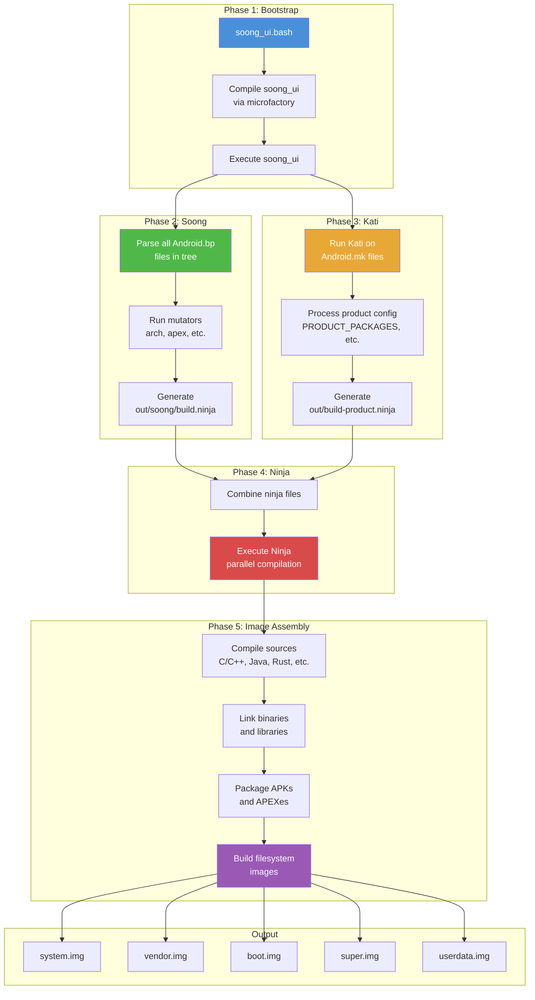

### 2.5.3 Ninja: The Low-Level Build Executor

Neither Soong nor Kati actually compiles anything. They are *build graph
generators* -- they produce Ninja manifest files. **Ninja** is the low-level
build executor that does the actual work.

Ninja was created by Evan Martin at Google specifically for the Chrome/Chromium
build. It is designed for one thing: executing a build graph as fast as
possible. Unlike Make, Ninja does not discover or compute the build graph --
it expects a pre-computed `.ninja` file and simply executes it.

Ninja is designed for speed:

- It reads a `.ninja` file that describes all build edges (rules and their
  dependencies)
- It determines the minimal set of outdated targets (using file timestamps)
- It executes build commands in parallel, respecting dependency order
- It provides a compact, real-time progress display
- It has extremely fast startup time (sub-second even for large builds)

#### Ninja File Format

A Ninja file consists of rules and build edges:

```ninja
# Rule definition: how to compile a C file
rule cc
  command = clang -c $cflags -o $out $in
  description = CC $out

# Build edge: apply the rule to specific files
build out/obj/foo.o: cc src/foo.c
  cflags = -Wall -O2

# Another rule: linking
rule link
  command = clang -o $out $in $ldflags
  description = LINK $out

# Build edge: link object files into a binary
build out/bin/myapp: link out/obj/foo.o out/obj/bar.o
  ldflags = -lm
```

The Ninja files generated by Soong and Kati are enormous -- the combined
file for a full AOSP build can be hundreds of megabytes.

The combined Ninja file is generated at:
```
out/combined-<TARGET_PRODUCT>.ninja
```

You can inspect the build graph using Ninja's built-in tools:

```bash
# Show all commands needed to build a target
prebuilts/build-tools/linux-x86/bin/ninja \
  -f out/combined-aosp_arm64.ninja \
  -t commands out/target/product/generic_arm64/system.img

# Show the dependency graph for a target
ninja -f out/combined-aosp_arm64.ninja -t graph libcutils > deps.dot

# Show build rules for a specific output
ninja -f out/combined-aosp_arm64.ninja -t query <output-file>
```

The `showcommands` function in `envsetup.sh` provides a convenient wrapper:

```bash
# Show all commands Ninja would run
showcommands <target>
```

### 2.5.4 The Output Directory

All build artifacts are placed under the `out/` directory (or `$OUT_DIR` if
overridden):

```
out/
  .module_paths/              <-- Module path cache
  soong/
    .intermediates/           <-- Soong intermediate outputs
    build.ninja               <-- Soong-generated ninja file
    docs/                     <-- Generated documentation
  target/
    product/
      <device>/               <-- Device-specific outputs
        android-info.txt      <-- Device metadata
        boot.img              <-- Kernel + ramdisk
        dtbo.img              <-- Device Tree Blob Overlay
        init_boot.img         <-- Init boot image (Android 13+)
        obj/                  <-- Native object files
        ramdisk.img           <-- Root filesystem ramdisk
        super.img             <-- Dynamic partitions container
        system/               <-- Staged system partition contents
        system.img            <-- System partition image
        userdata.img          <-- User data partition image
        vendor/               <-- Staged vendor partition contents
        vendor.img            <-- Vendor partition image
        vendor_boot.img       <-- Vendor boot image
        product.img           <-- Product partition image
        system_ext.img        <-- System extension partition image
        recovery.img          <-- Recovery image
        vbmeta.img            <-- Verified Boot metadata
        symbols/              <-- Unstripped binaries (for debugging)
        testcases/            <-- Test binaries
  host/
    linux-x86/                <-- Host tools built during the build
      bin/                    <-- Host binaries (adb, fastboot, etc.)
      testcases/              <-- Host test cases
  combined-<product>.ninja    <-- Combined ninja manifest
  build-<product>.ninja       <-- Kati-generated ninja manifest
  verbose.log.gz              <-- Build log (if enabled)
  error.log                   <-- Error log
  dist/                       <-- Distribution artifacts
```

The key images in `out/target/product/<device>/`:

| Image | Purpose |
|-------|---------|
| `system.img` | Core Android OS (framework, apps, libraries) |
| `vendor.img` | Hardware-specific HALs and firmware |
| `boot.img` | Kernel + generic ramdisk |
| `vendor_boot.img` | Vendor-specific ramdisk |
| `init_boot.img` | Generic ramdisk (Android 13+, GKI) |
| `super.img` | Dynamic partitions container (holds system, vendor, product, etc.) |
| `userdata.img` | Initial user data partition |
| `product.img` | Product-specific customizations |
| `system_ext.img` | System extensions (OEM additions to the system partition) |
| `recovery.img` | Recovery mode image |
| `vbmeta.img` | Android Verified Boot metadata |
| `dtbo.img` | Device tree blob overlays |

### 2.5.5 The Soong Intermediates Directory

The `out/soong/.intermediates/` directory is where Soong stores intermediate
build artifacts. Each module gets its own subdirectory, organized by the
module's path in the source tree:

```
out/soong/.intermediates/
  frameworks/base/core/java/
    framework-minus-apex/
      android_common/
        javac/          <-- Java compilation outputs
        dex/            <-- DEX conversion outputs
        combined/       <-- Combined JAR
  external/zlib/
    libz/
      android_arm64_armv8-a_shared/   <-- Device shared lib variant
        libz.so
      android_arm64_armv8-a_static/   <-- Device static lib variant
        libz.a
      linux_glibc_x86_64_shared/      <-- Host shared lib variant
        libz.so
  packages/apps/Settings/
    Settings/
      android_common/
        Settings.apk
```

The directory structure reflects the **module variants** created by mutators.
A single `cc_library` like `libz` may have many variants:

- `android_arm64_armv8-a_shared`: Device ARM64, shared library
- `android_arm64_armv8-a_static`: Device ARM64, static library
- `linux_glibc_x86_64_shared`: Host Linux x86_64, shared library
- And potentially more for sanitizers, APEX variants, etc.

This directory can grow very large (100+ GB for a full build). The `m clean`
command deletes the entire `out/` directory.

### 2.5.6 Dynamic Partitions and `super.img`

Modern Android (10+) uses **dynamic partitions**: instead of fixed-size
individual partitions, a single `super.img` contains a logical volume manager
that allocates space to system, vendor, product, and other partitions
dynamically. This is configured in `BoardConfig.mk`:

```makefile
# From device/generic/goldfish/board/BoardConfigCommon.mk:

# emulator needs super.img
BOARD_BUILD_SUPER_IMAGE_BY_DEFAULT := true

# 8G + 8M
BOARD_SUPER_PARTITION_SIZE ?= 8598323200
BOARD_SUPER_PARTITION_GROUPS := emulator_dynamic_partitions

BOARD_EMULATOR_DYNAMIC_PARTITIONS_PARTITION_LIST := \
  system \
  system_dlkm \
  system_ext \
  product \
  vendor

# 8G
BOARD_EMULATOR_DYNAMIC_PARTITIONS_SIZE ?= 8589934592
```

**Source:** `device/generic/goldfish/board/BoardConfigCommon.mk`, lines 44-72

---

## 2.6 Product Configuration

### 2.6.1 The Product Configuration Hierarchy

An AOSP product is defined through a hierarchy of Make files that specify what
packages to install, what properties to set, and how to configure the board
hardware. The hierarchy flows from generic to specific:

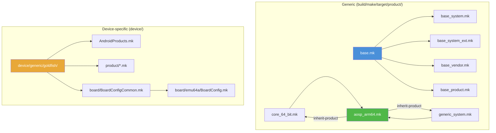

### 2.6.2 The `inherit-product` Mechanism

The `inherit-product` function is the backbone of product configuration. It
includes another product makefile and inherits all its variable settings:

```makefile
$(call inherit-product, $(SRC_TARGET_DIR)/product/core_64_bit.mk)
```

This is similar to class inheritance in object-oriented programming. The
inheritance chain can be deep -- a typical product makefile might inherit from
5-10 other makefiles, each adding or overriding specific settings.

Important rules about `inherit-product`:

- Variables like `PRODUCT_PACKAGES` are *appended*, not overridden.
- Variables like `PRODUCT_NAME` are *overridden* by the last assignment.
- The order of `inherit-product` calls matters for override behavior.
- `inherit-product-if-exists` is a variant that silently skips if the file
  does not exist (useful for optional vendor components).

The inheritance pattern follows a layered approach:

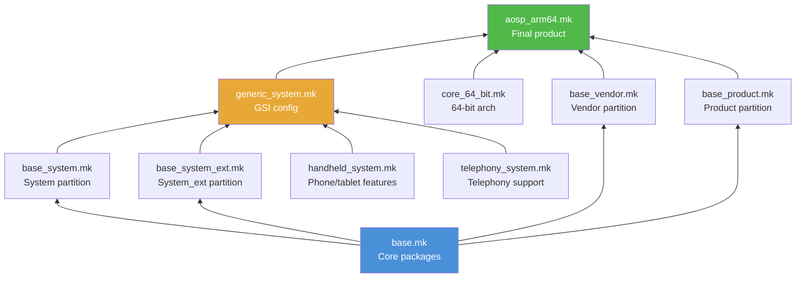

### 2.6.3 Product Makefiles in `build/make/target/product/`

This directory contains the generic product definitions that real device
products inherit from. Key files:

| File | Purpose |
|------|---------|
| `base.mk` | Inherits all base partition makefiles |
| `base_system.mk` | Defines base system packages (PRODUCT_PACKAGES) |
| `base_system_ext.mk` | Defines base system_ext packages |
| `base_vendor.mk` | Defines base vendor packages |
| `base_product.mk` | Defines base product packages |
| `core_64_bit.mk` | Enables 64-bit architecture support |
| `core_64_bit_only.mk` | 64-bit only (no 32-bit support) |
| `generic_system.mk` | Generic System Image (GSI) configuration |
| `aosp_arm64.mk` | AOSP product for ARM64 |
| `aosp_x86_64.mk` | AOSP product for x86_64 |
| `aosp_riscv64.mk` | AOSP product for RISC-V 64 |

The `base.mk` file is a simple aggregator:

```makefile
# This makefile is suitable to inherit by products that don't need to be
# split up by partition.
$(call inherit-product, $(SRC_TARGET_DIR)/product/base_system.mk)
$(call inherit-product, $(SRC_TARGET_DIR)/product/base_system_ext.mk)
$(call inherit-product, $(SRC_TARGET_DIR)/product/base_vendor.mk)
$(call inherit-product, $(SRC_TARGET_DIR)/product/base_product.mk)
```

**Source:** `build/make/target/product/base.mk`, lines 17-23

The `base_system.mk` file defines PRODUCT_PACKAGES -- the packages installed
into the system partition. This is a very long list (hundreds of entries) that
includes the fundamental components of Android:

```makefile
# Base modules and settings for the system partition.
PRODUCT_PACKAGES += \
    abx \
    aconfigd-system \
    adbd_system_api \
    aflags \
    am \
    android.hidl.base-V1.0-java \
    android.hidl.manager-V1.0-java \
    android.system.suspend-service \
    android.test.base \
    android.test.mock \
    android.test.runner \
    apexd \
    ...
    com.android.adbd \
    com.android.adservices \
    com.android.appsearch \
    com.android.bt \
    com.android.conscrypt \
    com.android.i18n \
    com.android.media \
    com.android.media.swcodec \
    com.android.wifi \
    ...
    framework \
    framework-graphics \
    ...
```

**Source:** `build/make/target/product/base_system.mk`, lines 18-100+

Notice that many APEX modules (`com.android.wifi`, `com.android.media`, etc.)
are listed directly in `PRODUCT_PACKAGES`. They are treated as first-class
installable packages.

### 2.6.4 A Concrete Product: `aosp_arm64`

The `aosp_arm64.mk` product definition shows how all the pieces come together:

```makefile
# The system image of aosp_arm64-userdebug is a GSI for the devices with:
# - ARM 64 bits user space
# - 64 bits binder interface
# - system-as-root
# - VNDK enforcement
# - compatible property override enabled

#
# All components inherited here go to system image
#
$(call inherit-product, $(SRC_TARGET_DIR)/product/core_64_bit.mk)
$(call inherit-product, $(SRC_TARGET_DIR)/product/generic_system.mk)

# Enable mainline checking for exact this product name
ifeq (aosp_arm64,$(TARGET_PRODUCT))
PRODUCT_ENFORCE_ARTIFACT_PATH_REQUIREMENTS := relaxed
endif

#
# All components inherited here go to system_ext image
#
$(call inherit-product, $(SRC_TARGET_DIR)/product/handheld_system_ext.mk)
$(call inherit-product, $(SRC_TARGET_DIR)/product/telephony_system_ext.mk)

# pKVM
$(call inherit-product-if-exists, \
  packages/modules/Virtualization/apex/product_packages.mk)

#
# All components inherited here go to product image
#
$(call inherit-product, $(SRC_TARGET_DIR)/product/aosp_product.mk)

#
# All components inherited here go to vendor or vendor_boot image
#
$(call inherit-product, $(SRC_TARGET_DIR)/board/generic_arm64/device.mk)
AB_OTA_UPDATER := true
AB_OTA_PARTITIONS ?= system

#
# Special settings for GSI releasing
#
ifeq (aosp_arm64,$(TARGET_PRODUCT))
MODULE_BUILD_FROM_SOURCE ?= true
$(call inherit-product, $(SRC_TARGET_DIR)/product/gsi_release.mk)
PRODUCT_SOONG_DEFINED_SYSTEM_IMAGE := aosp_system_image
USE_SOONG_DEFINED_SYSTEM_IMAGE := true
endif

PRODUCT_NAME := aosp_arm64
PRODUCT_DEVICE := generic_arm64
PRODUCT_BRAND := Android
PRODUCT_MODEL := AOSP on ARM64
PRODUCT_NO_BIONIC_PAGE_SIZE_MACRO := true
```

**Source:** `build/make/target/product/aosp_arm64.mk`

Key things to notice:

1. **Partition-organized inheritance:** Comments clearly mark which inherited
   makefiles contribute to which partition (system, system_ext, product, vendor).
2. **`inherit-product`:** The `$(call inherit-product, ...)` function includes
   another product makefile and inherits its variable settings.
3. **`PRODUCT_NAME`:** The final product name used in lunch combos.
4. **`PRODUCT_DEVICE`:** The device name, which determines which `BoardConfig.mk`
   to use.

### 2.6.5 Key PRODUCT_* Variables

| Variable | Purpose | Example |
|----------|---------|---------|
| `PRODUCT_NAME` | Product name | `aosp_arm64` |
| `PRODUCT_DEVICE` | Device name (matches `device/<vendor>/<name>/`) | `generic_arm64` |
| `PRODUCT_BRAND` | Brand string | `Android` |
| `PRODUCT_MODEL` | Model string | `AOSP on ARM64` |
| `PRODUCT_PACKAGES` | List of modules to install | `Settings framework ...` |
| `PRODUCT_COPY_FILES` | Files to copy into the image | `src:dest` pairs |
| `PRODUCT_PROPERTY_OVERRIDES` | System properties to set | `ro.foo=bar` |
| `PRODUCT_BOOT_JARS` | Jars in BOOTCLASSPATH | `framework core-oj ...` |
| `PRODUCT_SOONG_NAMESPACES` | Soong namespaces to expose to Make | `hardware/google/pixel` |
| `PRODUCT_ENFORCE_ARTIFACT_PATH_REQUIREMENTS` | Enforce path conventions | `relaxed` or `true` |
| `PRODUCT_MANIFEST_FILES` | Device manifest fragments | VINTF manifest paths |

### 2.6.6 PRODUCT_COPY_FILES

The `PRODUCT_COPY_FILES` variable copies files from the source tree into the
output image at specific paths:

```makefile
PRODUCT_COPY_FILES += \
    device/generic/goldfish/data/etc/config.ini:config.ini \
    device/generic/goldfish/display_settings.xml:$(TARGET_COPY_OUT_VENDOR)/etc/display_settings.xml \
    frameworks/native/data/etc/android.hardware.wifi.xml:$(TARGET_COPY_OUT_VENDOR)/etc/permissions/android.hardware.wifi.xml
```

The format is `source:destination`, where `destination` is relative to
`PRODUCT_OUT`. The `TARGET_COPY_OUT_*` variables help place files into the
correct partition:

| Variable | Expands To | Partition |
|----------|-----------|-----------|
| `TARGET_COPY_OUT_SYSTEM` | `system` | System |
| `TARGET_COPY_OUT_VENDOR` | `vendor` | Vendor |
| `TARGET_COPY_OUT_PRODUCT` | `product` | Product |
| `TARGET_COPY_OUT_SYSTEM_EXT` | `system_ext` | System Extension |
| `TARGET_COPY_OUT_ODM` | `odm` | ODM |

### 2.6.7 PRODUCT_PROPERTY_OVERRIDES

System properties (`ro.*`, `persist.*`, etc.) are set through product
configuration:

```makefile
PRODUCT_PROPERTY_OVERRIDES += \
    ro.hardware.egl=mesa \
    ro.opengles.version=196610 \
    debug.hwui.renderer=skiagl \
    persist.sys.dalvik.vm.lib.2=libart.so
```

These end up in various `build.prop` or `default.prop` files on the device.

### 2.6.8 Release Configuration

The AOSP build system has a relatively new release configuration mechanism
managed through `build/release/`. This system allows different "releases"
(e.g., `trunk_staging`, `next`, `ap3a`) to control feature flags and
configuration variants without changing product makefiles.

The release is specified as the second argument to `lunch`:

```bash
lunch aosp_arm64 trunk_staging eng
#                ^^^^^^^^^^^^^^^
#                release config
```

Release configuration files define which features are enabled for a particular
release, using aconfig flags and release-specific build flags.

### 2.6.9 Device Configuration: Goldfish (Emulator)

The goldfish emulator device is defined in `device/generic/goldfish/`. Its
`AndroidProducts.mk` lists the available products:

```makefile
PRODUCT_MAKEFILES := \
    $(LOCAL_DIR)/64bitonly/product/sdk_phone64_x86_64.mk \
    $(LOCAL_DIR)/64bitonly/product/sdk_phone16k_x86_64.mk \
    $(LOCAL_DIR)/64bitonly/product/sdk_phone64_x86_64_minigbm.mk \
    $(LOCAL_DIR)/64bitonly/product/sdk_phone64_x86_64_riscv64.mk \
    $(LOCAL_DIR)/64bitonly/product/sdk_tablet_arm64.mk \
    $(LOCAL_DIR)/64bitonly/product/sdk_tablet_x86_64.mk \
    $(LOCAL_DIR)/64bitonly/product/sdk_phone64_arm64.mk \
    $(LOCAL_DIR)/64bitonly/product/sdk_phone64_arm64_minigbm.mk \
    $(LOCAL_DIR)/64bitonly/product/sdk_phone16k_arm64.mk \
    $(LOCAL_DIR)/64bitonly/product/sdk_phone64_arm64_riscv64.mk \
    $(LOCAL_DIR)/64bitonly/product/sdk_slim_x86_64.mk \
    $(LOCAL_DIR)/64bitonly/product/sdk_slim_arm64.mk \
```

**Source:** `device/generic/goldfish/AndroidProducts.mk`

### 2.6.10 `BoardConfig.mk`

The `BoardConfig.mk` file defines hardware-level configuration for a device.
For the goldfish ARM64 emulator:

```makefile
# arm64 emulator specific definitions
TARGET_ARCH := arm64
TARGET_ARCH_VARIANT := armv8-a
TARGET_CPU_VARIANT := generic
TARGET_CPU_ABI := arm64-v8a

TARGET_2ND_ARCH_VARIANT := armv8-a
TARGET_2ND_CPU_VARIANT := generic

include device/generic/goldfish/board/BoardConfigCommon.mk

BOARD_BOOTIMAGE_PARTITION_SIZE := 0x02000000
BOARD_USERDATAIMAGE_PARTITION_SIZE := 576716800
```

**Source:** `device/generic/goldfish/board/emu64a/BoardConfig.mk`

The common configuration shared across all goldfish variants:

```makefile
include build/make/target/board/BoardConfigGsiCommon.mk

BOARD_VENDOR_SEPOLICY_DIRS += device/generic/goldfish/sepolicy/vendor
SYSTEM_EXT_PRIVATE_SEPOLICY_DIRS += \
  device/generic/goldfish/sepolicy/system_ext/private

TARGET_BOOTLOADER_BOARD_NAME := goldfish_$(TARGET_ARCH)

NUM_FRAMEBUFFER_SURFACE_BUFFERS := 3

# Build OpenGLES emulation guest and host libraries
BUILD_EMULATOR_OPENGL := true
BUILD_QEMU_IMAGES := true

# Build and enable the OpenGL ES View renderer
USE_OPENGL_RENDERER := true

# Emulator doesn't support sparse image format
TARGET_USERIMAGES_SPARSE_EXT_DISABLED := true

# emulator is Non-A/B device
AB_OTA_UPDATER := none
AB_OTA_PARTITIONS :=

# emulator needs super.img
BOARD_BUILD_SUPER_IMAGE_BY_DEFAULT := true

# 8G + 8M
BOARD_SUPER_PARTITION_SIZE ?= 8598323200
BOARD_SUPER_PARTITION_GROUPS := emulator_dynamic_partitions

BOARD_EMULATOR_DYNAMIC_PARTITIONS_PARTITION_LIST := \
  system \
  system_dlkm \
  system_ext \
  product \
  vendor

BOARD_SYSTEMIMAGE_FILE_SYSTEM_TYPE := $(EMULATOR_RO_PARTITION_FS)
BOARD_PRODUCTIMAGE_FILE_SYSTEM_TYPE := $(EMULATOR_RO_PARTITION_FS)
BOARD_SYSTEM_EXTIMAGE_FILE_SYSTEM_TYPE := $(EMULATOR_RO_PARTITION_FS)

BOARD_USES_SYSTEM_DLKMIMAGE := true
BOARD_SYSTEM_DLKMIMAGE_FILE_SYSTEM_TYPE := erofs

#vendor boot
BOARD_INCLUDE_DTB_IN_BOOTIMG := false
BOARD_BOOT_HEADER_VERSION := 4
BOARD_MKBOOTIMG_ARGS += --header_version $(BOARD_BOOT_HEADER_VERSION)
BOARD_VENDOR_BOOTIMAGE_PARTITION_SIZE := 0x06000000
BOARD_RAMDISK_USE_LZ4 := true
```

**Source:** `device/generic/goldfish/board/BoardConfigCommon.mk`

Key `BOARD_*` variables:

| Variable | Purpose |
|----------|---------|
| `TARGET_ARCH` | Primary architecture (arm64, x86_64, etc.) |
| `TARGET_ARCH_VARIANT` | Architecture variant (armv8-a, etc.) |
| `TARGET_CPU_VARIANT` | CPU variant (generic, cortex-a53, etc.) |
| `TARGET_CPU_ABI` | CPU ABI string (arm64-v8a, x86_64, etc.) |
| `BOARD_BOOTIMAGE_PARTITION_SIZE` | Boot partition size |
| `BOARD_SUPER_PARTITION_SIZE` | Super partition size |
| `BOARD_SUPER_PARTITION_GROUPS` | Dynamic partition groups |
| `BOARD_SYSTEMIMAGE_FILE_SYSTEM_TYPE` | System image filesystem (ext4, erofs) |
| `BOARD_BOOT_HEADER_VERSION` | Boot image header version |
| `BOARD_VENDOR_SEPOLICY_DIRS` | Vendor SEPolicy directories |

### 2.6.11 The Product Configuration Flow

The complete flow from `lunch` to a configured build:

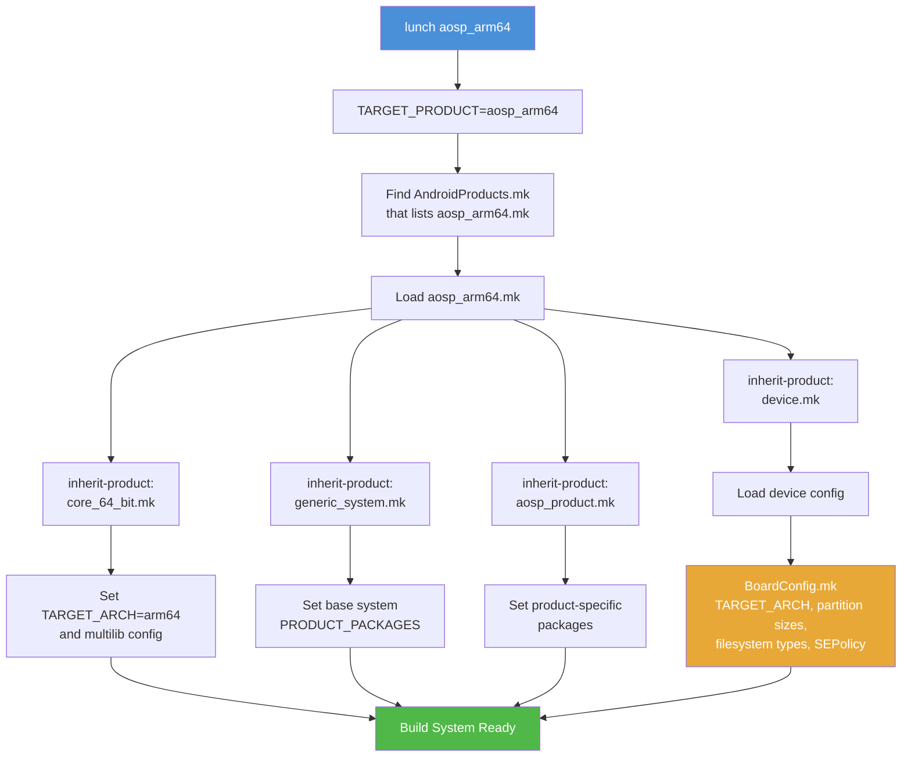

---

## 2.7 APEX: Modular System Components

### 2.7.1 What is APEX?

APEX (Android Pony EXpress) is a container format introduced in Android 10 that
allows system components to be updated independently of the full OS. Before
APEX, updating a system library or runtime required a full OTA (over-the-air)
update. With APEX, individual components -- like the ART runtime, the Wi-Fi
stack, or the DNS resolver -- can be updated through the Google Play Store or
a similar mechanism.

An APEX file is a special kind of Android package that contains:

- Native shared libraries (`.so` files)
- Executables
- Java libraries (JARs)
- Android apps (APKs)
- Configuration files
- A manifest describing the package
- A signing key for verified boot integration

### 2.7.2 APEX Architecture

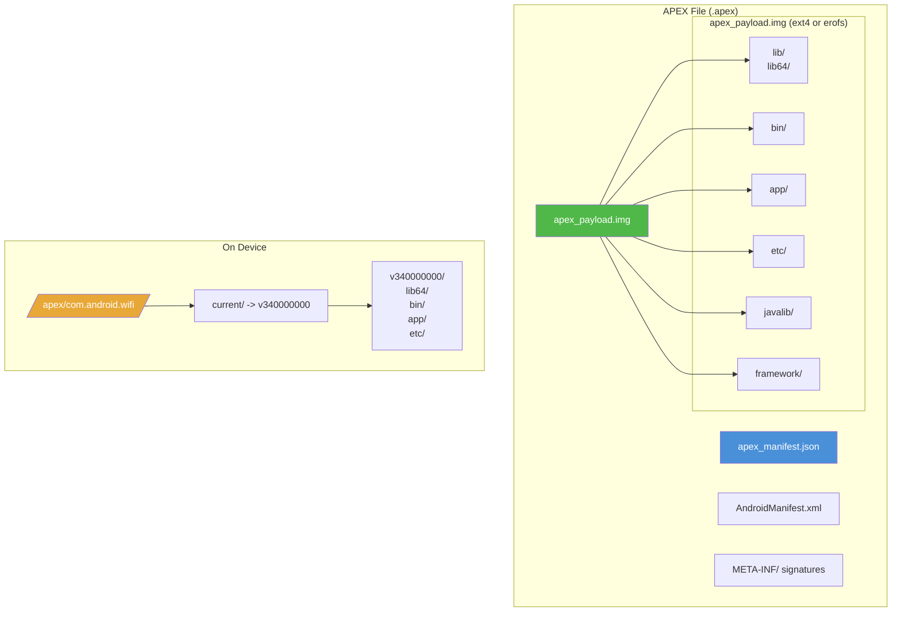

### 2.7.3 APEX Lifecycle on Device

Understanding how APEX works at runtime helps explain the build-time
requirements:

```mermaid
graph TB
    subgraph "Boot Sequence"
        A[Device boots]
        B[init starts apexd]
        C["apexd scans /system/apex/<br/>and /data/apex/"]
        D["For each APEX:<br/>verify signature"]
        E["Mount apex_payload.img<br/>as loop device"]
        F["Bind-mount to<br/>/apex/<name>/current/"]
        G["Update linker<br/>configuration"]
        H["System uses libraries<br/>from /apex/<name>/"]

        A --> B --> C --> D --> E --> F --> G --> H
    end

    subgraph "Update Flow"
        U1["New APEX pushed<br/>to /data/apex/"]
        U2["apexd verifies<br/>new APEX"]
        U3["On next boot:<br/>new APEX activated"]
        U4["Old APEX retained<br/>for rollback"]

        U1 --> U2 --> U3 --> U4
    end

    style A fill:#4a90d9,color:#fff
    style E fill:#50b848,color:#fff
    style U1 fill:#e8a838,color:#fff
```

1. At boot, `apexd` (the APEX daemon) scans for APEX files.
2. Each APEX file's signature is verified using the pre-installed public key.
3. The `apex_payload.img` inside each APEX is mounted as a loop device.
4. The mounted filesystem is bind-mounted to `/apex/<name>/current/`.
5. Libraries and binaries from the APEX are made available to the system
   through the linker configuration.

Pre-installed APEXes live in `/system/apex/`. When an update is received
(e.g., through the Play Store), the new APEX is stored in `/data/apex/` and
activated on the next boot. The old version is retained for rollback.

### 2.7.4 APEX in the Build System

The APEX build logic lives in `build/soong/apex/`. The main file, `apex.go`
(3,001 lines), defines the module types and build logic:

```go
// package apex implements build rules for creating the APEX files which
// are container for lower-level system components.
// See https://source.android.com/devices/tech/ota/apex
package apex

func init() {
    registerApexBuildComponents(android.InitRegistrationContext)
}

func registerApexBuildComponents(ctx android.RegistrationContext) {
    ctx.RegisterModuleType("apex", BundleFactory)
    ctx.RegisterModuleType("apex_test", TestApexBundleFactory)
    ctx.RegisterModuleType("apex_vndk", vndkApexBundleFactory)
    ctx.RegisterModuleType("apex_defaults", DefaultsFactory)
    ctx.RegisterModuleType("prebuilt_apex", PrebuiltFactory)
    ctx.RegisterModuleType("override_apex", OverrideApexFactory)
    ctx.RegisterModuleType("apex_set", apexSetFactory)

    ctx.PreDepsMutators(RegisterPreDepsMutators)
    ctx.PostDepsMutators(RegisterPostDepsMutators)
}
```

**Source:** `build/soong/apex/apex.go`, lines 17-58

The `apexBundleProperties` struct defines all the properties an APEX module can
declare:

```go
type apexBundleProperties struct {
    // Json manifest file describing meta info of this APEX bundle.
    Manifest *string `android:"path"`

    // AndroidManifest.xml file used for the zip container
    AndroidManifest proptools.Configurable[string] `android:"path,..."`

    // Determines the file contexts file for setting security contexts
    File_contexts *string `android:"path"`

    // Canned fs config file for customizing file uid/gid/mod/capabilities
    Canned_fs_config proptools.Configurable[string] `android:"path,..."`

    ApexNativeDependencies

    Multilib apexMultilibProperties

    // List of runtime resource overlays (RROs)
    Rros []string

    // List of bootclasspath fragments
    Bootclasspath_fragments proptools.Configurable[[]string]

    // List of systemserverclasspath fragments
    Systemserverclasspath_fragments proptools.Configurable[[]string]

    // List of java libraries
    Java_libs []string

    // List of sh binaries
    Sh_binaries []string

    // List of platform_compat_config files
    Compat_configs []string

    // List of filesystem images
    Filesystems []string
    ...
}
```

**Source:** `build/soong/apex/apex.go`, lines 72-120

The full `apexBundleProperties` struct also includes properties for controlling
the APEX update behavior:

```go
// Whether this APEX is considered updatable or not. When set to true,
// this will enforce additional rules for making sure that the APEX is
// truly updatable. To be updatable, min_sdk_version should be set as
// well. This will also disable the size optimizations like symlinking
// to the system libs. Default is true.
Updatable *bool

// Whether this APEX can use platform APIs or not. Can be set to true
// only when `updatable: false`. Default is false.
Platform_apis *bool

// Whether this APEX is installable to one of the partitions like
// system, vendor, etc. Default: true.
Installable *bool

// The type of filesystem to use. Either 'ext4', 'f2fs' or 'erofs'.
// Default 'ext4'.
Payload_fs_type *string
```

**Source:** `build/soong/apex/apex.go`, lines 125-147

The `ApexNativeDependencies` struct defines what goes inside the APEX:

```go
type ApexNativeDependencies struct {
    // List of native libraries embedded inside this APEX.
    Native_shared_libs proptools.Configurable[[]string]

    // List of JNI libraries embedded inside this APEX.
    Jni_libs proptools.Configurable[[]string]

    // List of rust dyn libraries embedded inside this APEX.
    Rust_dyn_libs []string

    // List of native executables embedded inside this APEX.
    Binaries proptools.Configurable[[]string]

    // List of native tests embedded inside this APEX.
    Tests []string

    // List of filesystem images embedded inside this APEX bundle.
    Filesystems []string

    // List of prebuilt_etcs embedded inside this APEX bundle.
    Prebuilts proptools.Configurable[[]string]
}
```

**Source:** `build/soong/apex/apex.go`, lines 188-209

Note the use of `proptools.Configurable[[]string]` -- this is a type that
supports the newer select statement conditional mechanism, allowing the list
of dependencies to vary based on build configuration.

### 2.7.5 Declaring an APEX Module

Here is the complete pattern for declaring an APEX, using the Wi-Fi module as
our example:

```
// Step 1: Define the signing key
apex_key {
    name: "com.android.wifi.key",
    public_key: "com.android.wifi.avbpubkey",
    private_key: "com.android.wifi.pem",
}

// Step 2: Define the certificate
android_app_certificate {
    name: "com.android.wifi.certificate",
    certificate: "com.android.wifi",
}

// Step 3: Define defaults (optional, but recommended)
apex_defaults {
    name: "com.android.wifi-defaults",
    bootclasspath_fragments: ["com.android.wifi-bootclasspath-fragment"],
    systemserverclasspath_fragments: [
        "com.android.wifi-systemserverclasspath-fragment"
    ],
    key: "com.android.wifi.key",
    certificate: ":com.android.wifi.certificate",
    apps: ["OsuLogin", "ServiceWifiResources", "WifiDialog"],
    jni_libs: ["libservice-wifi-jni"],
    compressible: true,
}

// Step 4: Define the APEX itself
apex {
    name: "com.android.wifi",
    defaults: ["com.android.wifi-defaults"],
    manifest: "apex_manifest.json",
}
```

**Source:** `packages/modules/Wifi/apex/Android.bp`

### 2.7.6 How Modules Declare APEX Availability

When a library or binary should be available inside an APEX, it uses the
`apex_available` property:

```
cc_library {
    name: "libwifi-jni",
    srcs: ["*.cpp"],
    shared_libs: ["liblog", "libbase"],

    // This library can be used in the wifi APEX and the platform
    apex_available: [
        "com.android.wifi",
        "//apex_available:platform",
    ],
}
```

The special value `//apex_available:platform` means the module can also be
used outside any APEX (i.e., directly on the system partition). Without this,
a module is restricted to APEX usage only.

The APEX build system uses a *mutator* to create separate build variants for
each APEX a module appears in. This ensures that dependencies are properly
isolated per-APEX.

### 2.7.7 Key APEX Modules in AOSP

As seen in `base_system.mk`, many core Android components are delivered as
APEX modules:

| APEX Name | Component |
|-----------|-----------|
| `com.android.adbd` | Android Debug Bridge daemon |
| `com.android.art` | Android Runtime (ART) |
| `com.android.bt` | Bluetooth stack |
| `com.android.conscrypt` | TLS/SSL provider |
| `com.android.i18n` | Internationalization (ICU) |
| `com.android.media` | Media framework |
| `com.android.media.swcodec` | Software codecs |
| `com.android.mediaprovider` | Media storage |
| `com.android.os.statsd` | Statistics daemon |
| `com.android.permission` | Permission controller |
| `com.android.resolv` | DNS resolver |
| `com.android.sdkext` | SDK extensions |
| `com.android.tethering` | Tethering and connectivity |
| `com.android.wifi` | Wi-Fi stack |
| `com.android.neuralnetworks` | Neural Networks HAL |
| `com.android.virt` | Virtualization framework |

---

## 2.8 Bazel in AOSP

### 2.8.1 Why Bazel?

Bazel is Google's open-source build system, evolved from their internal system
Blaze. It offers several advantages over Soong:

- **Hermeticity:** Builds are sandboxed and reproducible.
- **Remote execution:** Build actions can be distributed across a cluster.
- **Caching:** Build results can be shared across developers and CI.
- **Scalability:** Designed for repositories with billions of lines of code.
- **Language support:** First-class support for many languages through Starlark
  rules.

Google has been working to migrate parts of AOSP's build to Bazel, but this
is an incremental, multi-year effort.

### 2.8.2 Current Status

As of the current AOSP release, Bazel's role in the platform build is
experimental and limited:

- **Kernel builds (Kleaf):** The kernel build system has been migrated to
  Bazel (see Section 2.9).
- **Select external projects:** Some external projects like Skia maintain
  Bazel build files alongside their Soong definitions.
- **Build experiments:** The `build/pesto/experiments/` directory contains
  experimental Bazel integration tests.
- **bp2build:** A tool that converts `Android.bp` files to Bazel `BUILD` files
  has been developed, though its use remains limited.

### 2.8.3 bp2build: Converting Android.bp to BUILD

The `bp2build` tool (part of `build/soong/`) automatically converts
`Android.bp` module definitions into Bazel `BUILD.bazel` files. This is the
primary mechanism for the Soong-to-Bazel migration.

The conversion works by:

1. Parsing all `Android.bp` files (same as Soong does normally)
2. For each module type that has a registered Bazel conversion, generating the
   equivalent Bazel rule
3. Writing `BUILD.bazel` files alongside the `Android.bp` files

Not all module types have Bazel equivalents yet. The conversion is
opt-in and incremental -- only modules that have been explicitly enabled for
Bazel conversion are included.

Example conversion:

**Android.bp:**
```
cc_library {
    name: "libfoo",
    srcs: ["foo.cpp"],
    shared_libs: ["libbar"],
}
```

**Generated BUILD.bazel:**
```python
cc_library_shared(
    name = "libfoo",
    srcs = ["foo.cpp"],
    dynamic_deps = [":libbar"],
)
```

### 2.8.4 The `build/pesto/` Directory

The Bazel integration experiments live in `build/pesto/`:

```
build/pesto/
  OWNERS
  experiments/
    prepare_bazel_test_env
```

This directory is intentionally sparse -- the primary Bazel work is in the
kernel build system (Kleaf) and in individual projects that maintain their own
Bazel build files.

### 2.8.5 Build Performance with RBE

AOSP already supports RBE for some build actions through Soong's `remoteexec`
package (`build/soong/remoteexec/`). To enable RBE:

```bash
# Source the RBE setup script
source build/make/rbesetup.sh

# Set RBE-specific environment variables
export USE_RBE=1
export RBE_SERVICE=...  # Your RBE endpoint
export RBE_DIR=...      # RBE client directory

# Build with RBE
m -j200  # Higher parallelism since work is distributed
```

With RBE configured and a remote worker pool available, build times can
decrease dramatically:

| Build Type | Local (16 cores) | With RBE (~500 cores) |
|-----------|------------------|----------------------|
| Full clean build | 3-4 hours | 30-45 minutes |
| Incremental (small change) | 5-15 minutes | 2-5 minutes |
| Incremental (framework) | 20-40 minutes | 10-15 minutes |

The performance gains come from:

- Distributing compilation across many machines
- Caching compilation results (cache hit = zero cost)
- Reduced I/O contention (remote machines have fast storage)

### 2.8.6 Skia's Bazel Build

One of the more mature Bazel integrations is in the Skia graphics library
(`external/skia/bazel/`). This directory contains a complete Bazel build
system for Skia, with files like:

```
external/skia/bazel/
  BUILD.bazel              <-- Top-level build file
  Makefile                 <-- Compatibility wrapper
  buildrc                  <-- Bazel configuration
  cipd_deps.bzl            <-- CIPD dependency definitions
  common_config_settings/  <-- Shared configuration
  cpp_modules.bzl          <-- C++ module definitions
  deps.json                <-- Dependency metadata
  deps_parser/             <-- Dependency parser tool
  device_specific_configs/ <-- Per-device configurations
  external/                <-- External dependency rules
  flags.bzl                <-- Build flag definitions
  gcs_mirror.bzl           <-- Google Cloud Storage mirror rules
```

This shows the pattern for projects that want to support both Soong (for
integration with the AOSP build) and Bazel (for standalone development or
remote execution).

### 2.8.7 Remote Build Execution (RBE)

One of Bazel's key advantages is support for Remote Build Execution (RBE).
AOSP already supports RBE for some build actions through Soong's `remoteexec`
package (`build/soong/remoteexec/`). The `build/make/rbesetup.sh` script
helps configure RBE credentials and endpoints.

RBE works by:

1. Analyzing the build graph to identify actions that can run remotely
2. Uploading action inputs to a Content Addressable Store (CAS)
3. Executing the action on a remote worker
4. Downloading the outputs (or retrieving them from the action cache)

For large builds, RBE can dramatically reduce build times by distributing
compilation across hundreds of machines.

### 2.8.8 Mixed Builds

The long-term migration plan involves **mixed builds** where Soong and Bazel
coexist:

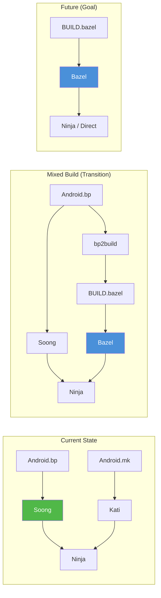

In a mixed build, some modules are built by Soong and some by Bazel, with the
results combined into a single Ninja manifest. The `bp2build` tool
automatically generates `BUILD.bazel` files from `Android.bp` definitions.

---

## 2.9 Kleaf -- Kernel Build System

### 2.9.1 Overview

Kleaf is AOSP's Bazel-based kernel build system. Unlike the platform build
(which uses Soong), the kernel build has been fully migrated to Bazel. Kleaf
provides hermetic, reproducible kernel builds with support for:

- Multiple architectures (ARM64, ARM, x86_64, i386, RISC-V 64)
- The Generic Kernel Image (GKI) architecture
- Custom and user-provided toolchains
- Remote build execution
- Incremental builds

### 2.9.2 Toolchain Configuration

Kleaf's toolchain configuration lives in
`prebuilts/clang/host/linux-x86/kleaf/`. The key files are:

**`architecture_constants.bzl`** defines the supported architectures:

```python
"""List of supported architectures by Kleaf."""

ArchInfo = provider(
    "An architecture for a clang toolchain.",
    fields = {
        "name": "a substring of the name of the toolchain.",
        "target_os": "OS of the target platform",
        "target_cpu": "CPU of the target platform",
        "target_libc": "libc of the target platform",
    },
)

SUPPORTED_ARCHITECTURES = [
    ArchInfo(
        name = "1_linux_musl_x86_64",
        target_os = "linux",
        target_cpu = "x86_64",
        target_libc = "musl",
    ),
    ArchInfo(
        name = "2_linux_x86_64",
        target_os = "linux",
        target_cpu = "x86_64",
        target_libc = "glibc",
    ),
    ArchInfo(
        name = "android_arm64",
        target_os = "android",
        target_cpu = "arm64",
        target_libc = None,
    ),
    ArchInfo(
        name = "android_arm",
        target_os = "android",
        target_cpu = "arm",
        target_libc = None,
    ),
    ArchInfo(
        name = "android_x86_64",
        target_os = "android",
        target_cpu = "x86_64",
        target_libc = None,
    ),
    ArchInfo(
        name = "android_i386",
        target_os = "android",
        target_cpu = "i386",
        target_libc = None,
    ),
    ArchInfo(
        name = "android_riscv64",
        target_os = "android",
        target_cpu = "riscv64",
        target_libc = None,
    ),
]
```

**Source:** `prebuilts/clang/host/linux-x86/kleaf/architecture_constants.bzl`

Note the inclusion of `riscv64` -- this reflects AOSP's ongoing work to support
the RISC-V architecture, which is expected to become increasingly important for
Android devices.

**`clang_toolchain.bzl`** defines the actual Clang toolchain rules:

```python
"""Defines a cc toolchain for kernel build, based on clang."""

load("@kernel_toolchain_info//:dict.bzl", "VARS")
load("@rules_cc//cc/toolchains:cc_toolchain.bzl", "cc_toolchain")
load(":clang_config.bzl", "clang_config")

_CC_TOOLCHAIN_TYPE = Label("@bazel_tools//tools/cpp:toolchain_type")

def _clang_toolchain_internal(
        name,
        clang_version,
        arch,
        clang_pkg,
        clang_all_binaries,
        clang_includes,
        linker_files = None,
        sysroot_label = None,
        sysroot_dir = None,
        ...):
    """Defines a cc toolchain for kernel build, based on clang.

    Args:
        name: name of the toolchain
        clang_version: value of `CLANG_VERSION`, e.g. `r475365b`.
        arch: an ArchInfo object to look up extra kwargs.
        ...
    """
```

**Source:** `prebuilts/clang/host/linux-x86/kleaf/clang_toolchain.bzl`, lines 15-50

### 2.9.3 Toolchain Resolution

Kleaf supports two types of toolchains, as described in its README:

1. **Default toolchains:** Named `{target_os}_{target_cpu}_clang_toolchain`,
   these are the fallback toolchains when no version is specified.

2. **User toolchains:** Provided via `--user_clang_toolchain` flag, these
   override the defaults for development or testing.

The resolution process follows Bazel's standard toolchain resolution:

```
For a build without any flags or transitions, Bazel uses
"single-platform builds" by default, so the target platform is
the same as the execution platform with two constraint values:
(linux, x86_64).

In Kleaf, if a target is built with --config=android_{cpu}, or
is wrapped in an android_filegroup with a given cpu, the target
platform has two constraint values (android, {cpu}).
```

**Source:** `prebuilts/clang/host/linux-x86/kleaf/README.md`, lines 88-99

### 2.9.4 Building a Kernel with Kleaf

To build a kernel using Kleaf, you use Bazel commands (typically wrapped by
a `build/kernel/build.sh` or `tools/bazel` script):

```bash
# Build the GKI kernel for ARM64
tools/bazel run //common:kernel_aarch64_dist

# Build with a custom toolchain
tools/bazel run --user_clang_toolchain=/path/to/toolchain \
  //common:kernel_aarch64_dist

# Build kernel modules for a specific device
tools/bazel run //private/google-modules/soc/gs201:zuma_dist

# Build with debugging enabled
tools/bazel run //common:kernel_aarch64_debug_dist
```

The Kleaf build system defines several key Bazel rules:

| Rule | Purpose |
|------|---------|
| `kernel_build` | Build a kernel binary |
| `kernel_modules` | Build kernel modules (.ko files) |
| `kernel_images` | Build boot images |
| `kernel_modules_install` | Install modules to a staging directory |
| `kernel_uapi_headers` | Generate userspace API headers |
| `ddk_module` | Build a Device Driver Kit module |
| `android_filegroup` | Group files with Android platform annotations |

#### Kleaf Build Configuration

Kleaf uses Bazel's configuration system to handle different build variants:

```python
# Example from a kernel BUILD.bazel file
kernel_build(
    name = "kernel_aarch64",
    outs = [
        "Image",
        "Image.lz4",
        "System.map",
        "vmlinux",
        "vmlinux.symvers",
    ],
    build_config = "build.config.gki.aarch64",
    module_outs = [
        # GKI modules
        "drivers/block/virtio_blk.ko",
        "drivers/net/virtio_net.ko",
        "fs/erofs/erofs.ko",
        ...
    ],
)
```

The `build_config` file specifies kernel configuration options (similar to
the traditional `defconfig` mechanism but adapted for Bazel).

### 2.9.5 Relationship with GKI

The **Generic Kernel Image (GKI)** is Android's approach to standardizing the
kernel across devices. Kleaf is the build system that produces GKI kernels.

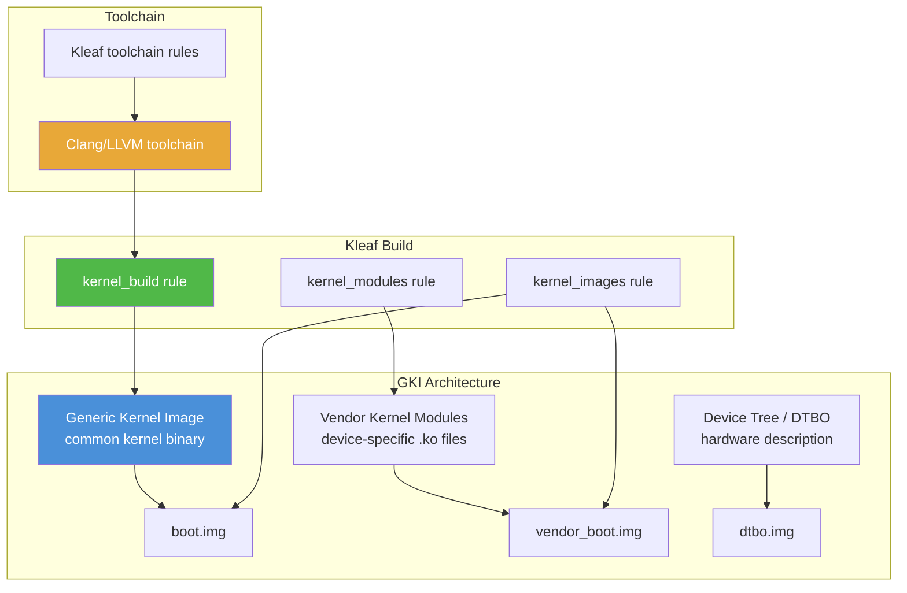

GKI separates the kernel into:

- A **generic kernel binary** (built from the Android Common Kernel source)
  that is the same across all devices using the same Android version
- **Vendor kernel modules** (`.ko` files) that contain device-specific drivers

Kleaf builds both components, with the generic kernel being the primary GKI
artifact and vendor modules being built separately for each device.

### 2.9.6 GKI Compliance and Stability

The GKI architecture imposes strict requirements on kernel modules:

- **KMI (Kernel Module Interface) stability:** The interface between the
  generic kernel and vendor modules must remain stable within a GKI release.
  Vendor modules compiled against GKI 6.1 must work with any GKI 6.1 kernel.
- **Symbol lists:** The GKI kernel exports a defined set of symbols that
  vendor modules can use. The symbol list is version-controlled.
- **Module signing:** All GKI modules must be signed with the GKI signing key.
- **ABI monitoring:** Automated tools compare the kernel ABI between builds
  to detect breaking changes.

Kleaf integrates these requirements into its build rules, automatically
checking KMI compliance and generating signed modules.

### 2.9.7 Kleaf vs. Traditional Kernel Build

Comparing the traditional kernel build with Kleaf:

| Aspect | Traditional (`build/build.sh`) | Kleaf (Bazel) |
|--------|-------------------------------|---------------|
| Build tool | Shell scripts + Make | Bazel |
| Hermeticity | Depends on host tools | Fully hermetic |
| Caching | None (or manual) | Built-in content-addressable |
| Remote execution | No | Yes (via RBE) |
| Incremental builds | Limited | Full Bazel incremental |
| Toolchain management | Manual | Bazel toolchain rules |
| Reproducibility | Best-effort | Guaranteed |
| Configuration | build.config files | Bazel configs + build.config |
| Multi-device support | Sequential | Parallel |

The migration to Kleaf has been one of AOSP's most successful Bazel
integrations, demonstrating the benefits of Bazel's hermetic build model.

### 2.9.8 Key Kleaf Files

| File | Purpose |
|------|---------|
| `BUILD.bazel` | Top-level toolchain declarations |
| `clang_toolchain.bzl` | Clang toolchain rule definitions |
| `architecture_constants.bzl` | Supported architecture definitions |
| `clang_config.bzl` | Clang configuration (flags, features) |
| `clang_toolchain_repository.bzl` | Repository rules for user toolchains |
| `common.bzl` | Common utilities |
| `linux.bzl` | Linux-specific configuration |
| `android.bzl` | Android-specific configuration |
| `empty_toolchain.bzl` | No-op toolchain for unsupported platforms |
| `template_BUILD.bazel` | Template for generated BUILD files |

---

## 2.10 Try It: Build AOSP for the Emulator

This section provides a step-by-step guide to building AOSP from source and
running it on the Android Emulator. This is the fastest way to get a
working AOSP build and start making changes.

### 2.10.1 System Preparation

**Step 1: Ensure you have the prerequisites.**

You need a Linux machine (Ubuntu 22.04 LTS recommended) with at least 32 GB
of RAM, 400 GB of free disk space (SSD strongly recommended), and a
multicore CPU.

```bash
# Install required packages (Ubuntu/Debian)
sudo apt-get update
sudo apt-get install -y git-core gnupg flex bison build-essential \
  zip curl zlib1g-dev libc6-dev-i386 libncurses5 \
  lib32z1-dev libgl1-mesa-dev libxml2-utils xsltproc unzip \
  fontconfig python3 python3-pip openjdk-21-jdk

# Install repo
mkdir -p ~/bin
curl https://storage.googleapis.com/git-repo-downloads/repo > ~/bin/repo
chmod a+x ~/bin/repo
export PATH=~/bin:$PATH

# Configure git (required by repo)
git config --global user.name "Your Name"
git config --global user.email "you@example.com"
```

**Step 2: Create a working directory.**

```bash
# Create the AOSP directory (needs 400+ GB of free space)
mkdir -p ~/aosp
cd ~/aosp
```

### 2.10.2 Fetching the Source

**Step 3: Initialize the repo workspace.**

```bash
# Initialize with the latest release branch
repo init -u https://android.googlesource.com/platform/manifest \
  -b android16-qpr2-release

# For a faster initial sync, use partial clones:
# repo init -u https://android.googlesource.com/platform/manifest \
#   -b android16-qpr2-release \
#   --partial-clone \
#   --clone-filter=blob:limit=10M
```

**Step 4: Sync the source.**

```bash
# Full sync -- this takes 1-3 hours on a good connection
repo sync -c -j$(nproc) --no-tags

# For subsequent syncs (much faster):
# repo sync -c -j$(nproc) --no-tags --optimized-fetch
```

### 2.10.3 Setting Up the Build Environment

**Step 5: Source `envsetup.sh`.**

```bash
# Must be run from the root of the AOSP tree
source build/envsetup.sh
```

You will see output like:

```
including device/generic/goldfish/vendorsetup.sh
including device/google/cuttlefish/vendorsetup.sh
...
```

**Step 6: Select a build target with `lunch`.**

For the emulator, use one of these targets:

```bash
# ARM64 emulator (recommended for Apple Silicon Macs or ARM servers)
lunch aosp_arm64-trunk_staging-eng

# x86_64 emulator (recommended for Intel/AMD hosts -- faster emulation)
lunch sdk_phone64_x86_64-trunk_staging-eng

# Shorthand (uses defaults: trunk_staging release, eng variant)
lunch aosp_arm64
```

The output will show the build configuration:

```
============================================
PLATFORM_VERSION_CODENAME=VanillaIceCream
PLATFORM_VERSION=16
PRODUCT_SOONG_NAMESPACES=...
TARGET_PRODUCT=aosp_arm64
TARGET_BUILD_VARIANT=eng
TARGET_ARCH=arm64
TARGET_ARCH_VARIANT=armv8-a
TARGET_CPU_VARIANT=generic
HOST_OS=linux
HOST_OS_EXTRA=...
HOST_ARCH=x86_64
OUT_DIR=out
============================================
```

### 2.10.4 Building

**Step 7: Start the build.**

```bash
# Build everything (the "droid" target is the default)
m -j$(nproc)

# Or equivalently:
m droid -j$(nproc)
```

The `-j` flag controls parallelism. On a 16-core machine with 64 GB RAM, a
first build takes approximately 2-4 hours. Subsequent incremental builds are
much faster (minutes for small changes).

**Build progress** is displayed in a compact format:

```
[  1% 245/24532] //frameworks/base/core/java:framework-minus-apex
[  2% 489/24532] //external/protobuf:libprotobuf-java-nano
...
[ 99% 24500/24532] //build/make/target/product:system_image
[100% 24532/24532] Build completed successfully
```

**Common build targets:**

| Target | What it builds |
|--------|----------------|
| `m` or `m droid` | Full platform build (all images) |
| `m systemimage` | Just the system image |
| `m vendorimage` | Just the vendor image |
| `m bootimage` | Just the boot image |
| `m Settings` | Just the Settings app module |
| `m framework-minus-apex` | Just the framework JAR |
| `m nothing` | Run build system setup only (no compilation) |
| `m clean` | Delete the entire out/ directory |

**Step 8: Verify the build outputs.**

```bash
ls out/target/product/generic_arm64/

# You should see:
# android-info.txt  boot.img  ramdisk.img  super.img
# system.img  userdata.img  vendor.img  vendor_boot.img
# ...
```

### 2.10.5 Running the Emulator

**Step 9: Launch the emulator.**

```bash
# The emulator command is available after lunch
emulator
```

The emulator will:

1. Locate the built images in `$ANDROID_PRODUCT_OUT`
2. Start a QEMU-based virtual machine
3. Boot Android using your freshly built images

Useful emulator flags:

```bash
# Specify RAM size
emulator -memory 4096

# Disable GPU acceleration (if you have driver issues)
emulator -gpu swiftshader_indirect

# Use a specific skin/resolution
emulator -skin 1080x1920

# Enable verbose kernel logs
emulator -show-kernel

# Wipe user data (fresh start)
emulator -wipe-data

# Run headless (no GUI window)
emulator -no-window
```

### 2.10.6 Making Changes and Rebuilding

**Step 10: Make a change and rebuild incrementally.**

The power of building from source is the ability to modify anything. For
example, to add a system property:

```bash
# Edit a file
vi frameworks/base/core/java/android/os/Build.java

# Rebuild just the affected module
m framework-minus-apex

# Or rebuild everything (Ninja will only rebuild what changed)
m
```

For a change to a system app:

```bash
# Edit Settings source
vi packages/apps/Settings/src/com/android/settings/Settings.java

# Rebuild just Settings
m Settings

# Push the rebuilt APK to a running emulator
adb install -r out/target/product/generic_arm64/system/priv-app/Settings/Settings.apk

# Or reboot the emulator to pick up all changes
adb reboot
```

### 2.10.7 Debugging Build Failures

Build failures in AOSP can be daunting due to the size of the codebase. Here
are strategies for diagnosing common issues:

**Missing dependencies:**
```
error: frameworks/base/core/java/android/os/Foo.java:5: error: cannot find symbol
  import com.android.internal.bar.Baz;
```

This usually means a dependency is missing in the module's `Android.bp` file.
Check what module provides the missing class:

```bash
# Search for the class definition
grep -rn "class Baz" frameworks/ --include="*.java"

# Or use the module index
allmod | grep -i baz
```

**Soong/Blueprint parse errors:**
```
error: build/soong/cc/cc.go:123: module "libfoo": depends on "libbar" which
is not visible to this module
```

This is a visibility error. The depended-upon module needs to add the
depending module's package to its `visibility` list.

**Ninja execution errors:**
```
FAILED: out/soong/.intermediates/...
clang: error: ...
```

The actual compiler error will be in the output. You can re-run the failing
command directly:

```bash
# Show the exact command that failed
showcommands <target> 2>&1 | grep FAILED -A 5
```

**Out-of-memory during build:**

If Ninja gets killed by the OOM killer, reduce parallelism:

```bash
# Limit to 8 parallel jobs (instead of auto-detecting CPU count)
m -j8

# Or set a memory limit per job
export NINJA_STATUS="[%f/%t %r] "
```

**Stale build outputs:**

If you suspect the build cache is corrupted:

```bash
# Delete Soong intermediates for a specific module
rm -rf out/soong/.intermediates/frameworks/base/core/java/framework-minus-apex/

# Or delete all intermediates (forces full rebuild)
m clean

# Nuclear option: delete everything
rm -rf out/
```

### 2.10.8 Debugging Soong Itself

Soong provides built-in debugging support for when you need to understand
or modify the build system itself.

**Generating documentation:**
```bash
m soong_docs
# Opens at: out/soong/docs/soong_build.html
```

This generates HTML documentation for all registered module types and their
properties.

**Debugging with Delve:**

From `build/soong/README.md`:

```bash
# Debug soong_build (the main Soong binary)
SOONG_DELVE=5006 m nothing

# Debug only specific steps
SOONG_DELVE=2345 SOONG_DELVE_STEPS='build,modulegraph' m

# Debug soong_ui (the build driver)
SOONG_UI_DELVE=5006 m nothing
```

Then connect with a debugger (e.g., IntelliJ IDEA or `dlv connect :5006`).

**Querying the module graph:**

```bash
# Generate the module graph
m json-module-graph

# Generate queryable module info
m module-info

# The output is at:
# out/target/product/<device>/module-info.json
```

The `module-info.json` file contains machine-readable information about every
module in the build, including paths, dependencies, and installed locations.

### 2.10.9 Using Cuttlefish Instead of Goldfish

While this chapter focused on the Goldfish emulator (the traditional AOSP
emulator), Google also maintains **Cuttlefish** -- a virtual device that runs
in a cloud-friendly environment:

```bash
# Build for Cuttlefish
lunch aosp_cf_x86_64_phone trunk_staging eng
m

# Launch Cuttlefish (requires specific host setup)
launch_cvd
```

Cuttlefish advantages:

- Runs as a real virtual machine (using KVM/crosvm)
- More accurate hardware emulation
- Better suited for CI/CD pipelines
- Supports multiple concurrent instances
- Can run headless on servers

Cuttlefish disadvantages:

- Requires more host setup
- Needs KVM support
- Not as widely available as the Goldfish emulator

### 2.10.10 Useful Development Commands

After sourcing `envsetup.sh` and running `lunch`, many convenience commands
are available:

```bash
# Navigate the tree
croot                    # cd to tree root
gomod <module>          # cd to a module's directory
godir <pattern>         # cd to a directory matching a pattern

# Query the build system
get_build_var TARGET_PRODUCT     # Print a build variable
get_build_var PRODUCT_OUT        # Print the output directory
pathmod <module>                 # Print a module's source path
outmod <module>                  # Print a module's output path
allmod                           # List all modules
refreshmod                       # Refresh the module index

# Search the source tree
cgrep <pattern>         # Search C/C++ files
jgrep <pattern>         # Search Java files
resgrep <pattern>       # Search resource XML files
sgrep <pattern>         # Search all source files

# Debug and inspect
showcommands <target>   # Show Ninja commands for a target
aninja                  # Run Ninja directly with arguments
```

### 2.10.11 Build Performance Tips

1. **Use an SSD.** The build performs millions of small I/O operations. An SSD
   vs. HDD can mean a 2-5x speed difference.

2. **Maximize RAM.** 64 GB is recommended. With 32 GB, you may need to limit
   parallelism (`-j8` instead of `-j$(nproc)` on a 16-core machine).

3. **Use `ccache`.** The `ccache` tool caches compilation results:
   ```bash
   export USE_CCACHE=1
   export CCACHE_EXEC=/usr/bin/ccache
   export CCACHE_DIR=~/.ccache
   ccache -M 100G  # Set cache size
   ```

4. **Use a separate output directory.** If your source is on a network drive,
   put the output on a local SSD:
   ```bash
   export OUT_DIR=/local/ssd/aosp-out
   ```

5. **Consider `--skip-soong-tests`.** During development, you can skip test
   generation:
   ```bash
   m --skip-soong-tests
   ```

6. **Use incremental builds.** After the first full build, subsequent builds
   only recompile changed modules. Ninja is very efficient at detecting what
   needs rebuilding.

7. **Use `mm` for focused development.** When working on a single module,
   `mm` is much faster than `m` because it skips the Kati phase.

### 2.10.12 Incremental Development Workflow

For day-to-day development, the typical workflow is:

```mermaid
graph TB
    subgraph "Initial Setup (once)"
        S1[repo init + sync]
        S2[source envsetup.sh]
        S3[lunch target]
        S4[m -- full build]
        S1 --> S2 --> S3 --> S4
    end

    subgraph "Development Loop (repeated)"
        D1[Edit source files]
        D2[m -- incremental build]
        D3[Test on emulator]
        D4[Debug and iterate]

        D1 --> D2 --> D3 --> D4 --> D1
    end

    subgraph "Testing"
        T1[atest -- run tests]
        T2[adb shell -- manual testing]
        T3[CTS/VTS -- compliance testing]
    end

    S4 --> D1
    D3 --> T1
    D3 --> T2

    style S4 fill:#4a90d9,color:#fff
    style D2 fill:#50b848,color:#fff
    style T1 fill:#e8a838,color:#fff
```

**The atest tool:**

`atest` is AOSP's test runner that automatically discovers, builds, and runs
tests:

```bash
# Run all tests for a module
atest SettingsTests

# Run a specific test class
atest SettingsTests:com.android.settings.wifi.WifiSettingsTest

# Run tests with verbose output
atest -v FrameworksCoreTests

# List available tests
atest --list-modules
```

**Pushing individual files:**

For rapid iteration, you can push individual files to a running device
without rebuilding:

```bash
# Push a rebuilt shared library
adb push out/target/product/generic_arm64/system/lib64/libfoo.so /system/lib64/

# Push a rebuilt app
adb install -r out/target/product/generic_arm64/system/app/Settings/Settings.apk

# Restart the system server to pick up framework changes
adb shell stop && adb shell start

# Or reboot entirely
adb reboot
```

Note: Pushing files directly only works on `eng` or `userdebug` builds where
the system partition is writable (or you can use `adb remount`).

### 2.10.13 Understanding Build Output Messages

During a build, Soong prints progress in a compact format. Understanding
these messages helps diagnose where the build spends its time:

```
[ 47% 11523/24532] //frameworks/base/core/java:framework-minus-apex metalava ...
```

The fields are:

- `47%` -- Percentage of build edges completed
- `11523/24532` -- Completed edges / total edges
- `//frameworks/base/core/java:framework-minus-apex` -- The module being built
- `metalava` -- The tool being run (metalava is the API documentation tool)

If the build appears stuck at a particular percentage, it is likely waiting
for a long-running action to complete. Common bottlenecks include:

- **D8/R8 dexing:** Converting Java bytecode to DEX format
- **Metalava:** API compatibility checking
- **Linking large binaries:** Especially the framework JAR
- **Image building:** Creating filesystem images

You can see which actions are currently running by pressing any key during
the build (Ninja will print the active actions).

### 2.10.14 Parallel Build Configuration

The AOSP build respects several parallelism controls:

```bash
# Ninja parallelism (number of simultaneous build actions)
m -j$(nproc)              # Use all CPU cores (default)
m -j8                     # Limit to 8 parallel actions
m -j1                     # Sequential build (for debugging)

# Soong parallelism (internal to the build system setup)
# Controlled automatically based on available resources

# Java compilation sharding (in Android.bp)
android_library {
    name: "Settings-core",
    javac_shard_size: 50,  // Compile in shards of 50 files
}
```

The optimal `-j` value depends on your machine:

- With 64+ GB RAM: use `-j$(nproc)` or higher
- With 32 GB RAM: use `-j$(( $(nproc) / 2 ))`
- With 16 GB RAM: use `-j4` to `-j8`

Memory is often the bottleneck, not CPU. Each compiler instance can use
1-2 GB of memory, so with 32 GB of RAM you can safely run about 16 parallel
compilation jobs.

---

## 2.11 Advanced Topics

### 2.11.1 The `soong.variables` Bridge

Soong and Kati need to share configuration information. This is done through
`out/soong/soong.variables`, a JSON file that Kati writes and Soong reads:

```json
{
    "Platform_sdk_version": 35,
    "Platform_sdk_codename": "VanillaIceCream",
    "Platform_version_active_codenames": ["VanillaIceCream"],
    "DeviceName": "generic_arm64",
    "DeviceArch": "arm64",
    "DeviceArchVariant": "armv8-a",
    "DeviceCpuVariant": "generic",
    "DeviceSecondaryArch": "",
    "Aml_abis": ["arm64-v8a"],
    "Eng": true,
    "Debuggable": true,
    ...
}
```

This file bridges the Make world (where product configuration lives) with the
Go world (where module compilation happens). When you change a product
variable in a `.mk` file, it flows through `soong.variables` to affect Soong's
behavior.

### 2.11.2 ABI Stability and VNDK

The Android build system enforces **ABI (Application Binary Interface)
stability** through several mechanisms:

- **VNDK (Vendor Native Development Kit):** A set of system libraries that
  vendors can depend on with guaranteed ABI stability across Android versions.
- **AIDL interfaces:** Stable IPC interfaces between system and vendor
  partitions.
- **HIDL interfaces:** Hardware Abstraction Layer interfaces (legacy, being
  replaced by AIDL).
- **System SDK:** Stable Java APIs for vendor applications.

The build system tracks which modules are part of the VNDK and enforces
dependency rules:

```
// Module that is part of the VNDK
cc_library {
    name: "libcutils",
    vndk: {
        enabled: true,
    },
    ...
}
```

Vendor modules can only depend on VNDK libraries and their own private
libraries. The build system rejects dependencies that would cross the
system/vendor boundary through non-stable interfaces.

### 2.11.3 Build Flags and Feature Gates

AOSP uses **aconfig** (Android Configuration) for feature flags:

```
// Flag declaration (in .aconfig file)
package: "com.android.settings.flags"

flag {
    name: "new_wifi_page"
    namespace: "settings_ui"
    description: "Enable the redesigned WiFi settings page"
    bug: "b/123456789"
}
```

Feature flags are resolved at build time based on the release configuration:

```
// Using a flag in Android.bp
cc_library {
    name: "libwifi_settings",
    srcs: select(release_flag("RELEASE_NEW_WIFI_PAGE"), {
        true: ["new_wifi_page.cpp"],
        default: ["old_wifi_page.cpp"],
    }),
}
```

This mechanism allows the same source tree to produce different builds
depending on the release configuration, without requiring separate branches.

### 2.11.4 Build System Metrics

The AOSP build system collects detailed metrics about build performance:

```bash
# Build with metrics collection
m --build-event-log=build_event.log

# View build metrics
cat out/soong_build_metrics.pb | protoc --decode=...
```

Key metrics include:

- Total build time
- Time spent in each phase (Soong, Kati, Ninja)
- Number of modules processed
- Cache hit rates
- Memory usage peaks
- I/O statistics

These metrics are invaluable for identifying build performance bottlenecks
and tracking improvements across releases.

### 2.11.5 Reproducible Builds

AOSP strives for reproducible builds -- given the same source code and build
environment, the output should be identical. This is achieved through:

- **Fixed timestamps:** Build outputs use deterministic timestamps rather than
  the current time.
- **Sorted inputs:** File lists and directory traversals are sorted to
  eliminate ordering-dependent variations.
- **Hermetic toolchain:** Prebuilt compilers and tools are checked into the
  repository.
- **Sandboxed builds:** Soong restricts access to files outside the declared
  inputs.
- **BUILD_DATETIME_FILE:** A fixed build timestamp used across all build rules.

Reproducibility is important for:

- Security auditing (verifying that a binary matches its source)
- CI/CD caching (identical inputs produce identical outputs)
- Regulatory compliance (some markets require reproducible builds)

### 2.11.6 Build System Internals: Module Variant Architecture

One of the most complex aspects of the build system is module variant
management. A single `cc_library` declaration can expand into many variants:

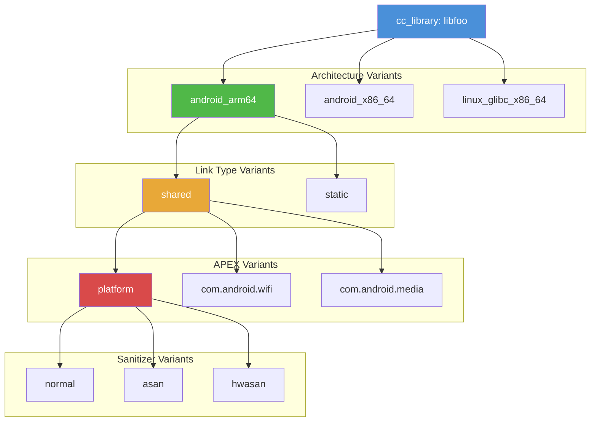

A single `cc_library` can thus expand into dozens of variants, each producing
its own binary. The mutator system handles this expansion systematically:

1. **Architecture mutator:** Creates one variant per target architecture
   (arm64, x86_64, etc.) plus host variants.
2. **Link type mutator:** Creates shared and static library variants.
3. **APEX mutator:** Creates one variant per APEX the library appears in,
   plus a platform variant.
4. **Sanitizer mutator:** Creates variants for ASan, TSan, HWSan, etc.
5. **Image mutator:** Creates variants for different partition images.

This is why the `out/soong/.intermediates/` directory is so large -- it
contains separate build artifacts for every variant of every module.

---

## Summary

This chapter covered the complete lifecycle of an AOSP build, from fetching the
source to running the result on an emulator. Here are the key takeaways:

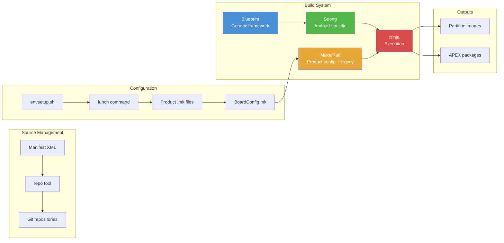

**Key files to remember:**

| File | Purpose |
|------|---------|
| `.repo/manifests/default.xml` | Manifest defining all repositories |
| `build/make/envsetup.sh` | Shell environment setup (1,187 lines) |
| `build/soong/soong_ui.bash` | Build system entry point |
| `build/soong/README.md` | Soong/Android.bp reference documentation |
| `build/blueprint/context.go` | Blueprint core (5,781 lines) |
| `build/make/core/envsetup.mk` | Core build variable setup |
| `build/make/core/config.mk` | Build configuration entry point |
| `build/make/target/product/*.mk` | Generic product definitions |
| `build/soong/apex/apex.go` | APEX build logic (3,001 lines) |
| `prebuilts/clang/host/linux-x86/kleaf/` | Kernel build toolchain rules |

**Three things the build system does:**

1. **Parses** thousands of `Android.bp` and `Android.mk` files to build a
   dependency graph of all modules in the tree.
2. **Configures** the build based on the selected product, architecture, and
   variant, using product makefiles and board configuration.
3. **Executes** the build through Ninja, which orchestrates parallel
   compilation of C/C++, Java, Kotlin, Rust, and other languages, then
   assembles the results into flashable partition images.

In the next chapter, we will explore the runtime architecture of Android --
what happens when these images boot on a device, from the bootloader through
`init` to the fully running Android system.

---

## 2.12 Build System Reference Tables

This section provides consolidated reference tables for quick lookup during
development.

### 2.12.1 Complete List of Common Build Commands

| Command | Purpose | Example |
|---------|---------|---------|
| `source build/envsetup.sh` | Initialize build environment | Run once per terminal session |
| `lunch <target>` | Select build target | `lunch aosp_arm64` |
| `m` | Build from tree root | `m` or `m droid` |
| `m <module>` | Build a specific module | `m Settings` |
| `m <image>` | Build a specific image | `m systemimage` |
| `mm` | Build current directory | `cd frameworks/base && mm` |
| `mmm <dir>` | Build specified directory | `mmm packages/apps/Settings` |
| `m clean` | Delete output directory | |
| `m nothing` | Run setup only | Useful for checking config |
| `m soong_docs` | Generate module docs | Output in out/soong/docs/ |
| `m json-module-graph` | Generate module graph | |
| `m module-info` | Generate module index | |
| `atest <test>` | Run a test | `atest SettingsTests` |
| `croot` | cd to tree root | |
| `gomod <module>` | cd to module's source | `gomod Settings` |
| `pathmod <module>` | Print module's path | `pathmod Settings` |
| `outmod <module>` | Print module's output path | `outmod Settings` |
| `allmod` | List all modules | |
| `refreshmod` | Refresh module index | |
| `printconfig` | Show build configuration | |
| `get_build_var <var>` | Print a build variable | `get_build_var TARGET_PRODUCT` |
| `showcommands <target>` | Show build commands | |
| `bpfmt -w .` | Format Android.bp files | |
| `androidmk Android.mk` | Convert mk to bp | |
| `tapas <app>` | Build unbundled app | `tapas Camera eng` |
| `banchan <apex>` | Build unbundled APEX | `banchan com.android.wifi arm64` |

### 2.12.2 Key Environment Variables

| Variable | Set By | Purpose |
|----------|--------|---------|
| `TOP` | envsetup.sh | Root of the source tree |
| `TARGET_PRODUCT` | lunch | Product name (e.g., `aosp_arm64`) |
| `TARGET_BUILD_VARIANT` | lunch | Build variant (`eng`/`userdebug`/`user`) |
| `TARGET_RELEASE` | lunch | Release configuration |
| `TARGET_BUILD_TYPE` | lunch | Always `release` |
| `TARGET_BUILD_APPS` | tapas/banchan | Unbundled app/APEX names |
| `ANDROID_PRODUCT_OUT` | lunch | Path to device output directory |
| `ANDROID_HOST_OUT` | lunch | Path to host tools output |
| `ANDROID_BUILD_TOP` | envsetup.sh | Same as TOP (deprecated) |
| `ANDROID_JAVA_HOME` | lunch | Path to JDK |
| `OUT_DIR` | User (optional) | Override output directory (default: `out`) |
| `USE_CCACHE` | User (optional) | Enable ccache (`1` to enable) |
| `CCACHE_DIR` | User (optional) | ccache directory location |
| `SOONG_DELVE` | User (optional) | Debug port for soong_build |
| `SOONG_UI_DELVE` | User (optional) | Debug port for soong_ui |
| `NINJA_STATUS` | User (optional) | Custom Ninja status format |

### 2.12.3 Common Android.bp Properties for cc_library

| Property | Type | Purpose |
|----------|------|---------|
| `name` | string | Module name (must be unique) |
| `srcs` | list of strings | Source files (supports globs) |
| `exclude_srcs` | list of strings | Files to exclude from srcs |
| `generated_sources` | list of strings | Source-generating modules |
| `generated_headers` | list of strings | Header-generating modules |
| `cflags` | list of strings | C/C++ compiler flags |
| `cppflags` | list of strings | C++ only compiler flags |
| `conlyflags` | list of strings | C only compiler flags |
| `asflags` | list of strings | Assembly flags |
| `ldflags` | list of strings | Linker flags |
| `shared_libs` | list of strings | Shared library dependencies |
| `static_libs` | list of strings | Static library dependencies |
| `whole_static_libs` | list of strings | Static libs included entirely |
| `header_libs` | list of strings | Header-only dependencies |
| `runtime_libs` | list of strings | Runtime-only shared libraries |
| `local_include_dirs` | list of strings | Private include paths |
| `export_include_dirs` | list of strings | Public include paths |
| `export_shared_lib_headers` | list of strings | Transitively export headers |
| `stl` | string | C++ STL selection |
| `host_supported` | bool | Build for host too |
| `device_supported` | bool | Build for device (default: true) |
| `vendor` | bool | Install to vendor partition |
| `vendor_available` | bool | Available to vendor modules |
| `recovery_available` | bool | Available in recovery |
| `apex_available` | list of strings | APEX modules this can be in |
| `min_sdk_version` | string | Minimum SDK version |
| `defaults` | list of strings | Defaults modules to inherit from |
| `visibility` | list of strings | Visibility rules |
| `enabled` | bool | Whether the module is enabled |
| `arch` | map | Architecture-specific properties |
| `target` | map | Target-specific properties (android/host) |
| `multilib` | map | Multilib properties (lib32/lib64) |
| `sanitize` | map | Sanitizer configuration |
| `strip` | map | Strip configuration |
| `pack_relocations` | bool | Pack relocations (default: true) |
| `allow_undefined_symbols` | bool | Allow undefined symbols |
| `nocrt` | bool | Don't link C runtime startup |
| `no_libcrt` | bool | Don't link compiler runtime |
| `stubs` | map | Generate stubs for versioning |
| `vndk` | map | VNDK configuration |

### 2.12.4 Common Android.bp Properties for android_app

| Property | Type | Purpose |
|----------|------|---------|
| `name` | string | Module name |
| `srcs` | list of strings | Java/Kotlin source files |
| `resource_dirs` | list of strings | Android resource directories |
| `asset_dirs` | list of strings | Asset directories |
| `manifest` | string | AndroidManifest.xml path |
| `static_libs` | list of strings | Static Java library dependencies |
| `libs` | list of strings | Compile-time-only dependencies |
| `platform_apis` | bool | Use platform (hidden) APIs |
| `certificate` | string | Signing certificate |
| `privileged` | bool | Install as privileged app |
| `overrides` | list of strings | Apps this replaces |
| `required` | list of strings | Modules that must be installed too |
| `dex_preopt` | map | DEX pre-optimization settings |
| `optimize` | map | ProGuard/R8 optimization |
| `aaptflags` | list of strings | Extra AAPT flags |
| `package_name` | string | Override package name |
| `sdk_version` | string | SDK version to build against |
| `min_sdk_version` | string | Minimum SDK version |
| `target_sdk_version` | string | Target SDK version |
| `uses_libs` | list of strings | Shared library dependencies |
| `optional_uses_libs` | list of strings | Optional shared library deps |
| `jni_libs` | list of strings | JNI native libraries |
| `use_resource_processor` | bool | Enable resource processor |
| `javac_shard_size` | int | Files per javac shard |
| `errorprone` | map | Error-prone checker config |

### 2.12.5 Directory Structure Quick Reference

| Path | Contents |
|------|----------|
| `art/` | Android Runtime (ART VM, dex2oat, etc.) |
| `bionic/` | C library (libc, libm, libdl, linker) |
| `bootable/` | Recovery, bootloader libraries |
| `build/blueprint/` | Blueprint meta-build framework |
| `build/make/` | Make-based build system and product config |
| `build/soong/` | Soong build system (Go) |
| `build/pesto/` | Bazel integration experiments |
| `build/release/` | Release configuration |
| `cts/` | Compatibility Test Suite |
| `dalvik/` | Dalvik VM (historical) |
| `development/` | Developer tools and samples |
| `device/` | Device configurations |
| `device/generic/goldfish/` | Emulator (Goldfish) device |
| `device/google/cuttlefish/` | Virtual device (Cuttlefish) |
| `external/` | Third-party projects (700+ repos) |
| `frameworks/base/` | Core Android framework |
| `frameworks/native/` | Native framework (SurfaceFlinger, Binder) |
| `frameworks/av/` | Audio/Video framework |
| `hardware/interfaces/` | HIDL/AIDL HAL definitions |
| `kernel/` | Kernel build config and prebuilts |
| `libcore/` | Core Java libraries (OpenJDK-based) |
| `packages/apps/` | System applications |
| `packages/modules/` | Mainline modules (APEX) |
| `packages/providers/` | Content providers |
| `packages/services/` | System services |
| `prebuilts/` | Prebuilt tools (Clang, JDK, SDK, etc.) |
| `system/core/` | Core system utilities (init, adb, logcat) |
| `system/extras/` | Additional system utilities |
| `system/sepolicy/` | SELinux policy |
| `tools/` | Development tools |
| `vendor/` | Vendor-specific code |

---

## Glossary of Build System Terms

| Term | Definition |
|------|-----------|
| **ABI** | Application Binary Interface. The binary-level interface between two program modules, defining data types, sizes, alignment, calling conventions, and system call numbers. |
| **AIDL** | Android Interface Definition Language. Used to define stable IPC interfaces between system components. |
| **Android.bp** | Blueprint file format used by Soong. Declarative, JSON-like syntax for defining build modules. |
| **Android.mk** | Legacy Make-based module definition format. Still supported but being phased out in favor of Android.bp. |
| **APEX** | Android Pony EXpress. A container format for independently updatable system components. |
| **Blueprint** | The meta-build framework underlying Soong. A Go library for parsing module definitions and generating Ninja manifests. |
| **BoardConfig.mk** | Device-level configuration file that defines architecture, partition sizes, and hardware features. |
| **bp2build** | Tool that converts Android.bp files to Bazel BUILD files for the Soong-to-Bazel migration. |
| **bpfmt** | Blueprint file formatter (analogous to gofmt for Go). |
| **Context** | The central state object in Blueprint that orchestrates the four build phases. |
| **Cuttlefish** | A cloud-friendly Android virtual device (alternative to the Goldfish emulator). |
| **Dynamic Partitions** | A logical volume system that allows flexible partition sizing within a single `super.img`. |
| **GKI** | Generic Kernel Image. A standardized kernel binary shared across devices of the same Android version. |
| **Goldfish** | The traditional Android emulator device, based on QEMU. |
| **GSI** | Generic System Image. A system.img that should work on any device compliant with Project Treble. |
| **HIDL** | Hardware Interface Definition Language. Legacy HAL interface language being replaced by AIDL. |
| **Kati** | A Make-compatible build tool written in Go, used by AOSP instead of GNU Make. |
| **Kleaf** | Bazel-based kernel build system. The name is a portmanteau of "kernel" and "leaf" (Bazel). |
| **KMI** | Kernel Module Interface. The stable ABI between the GKI kernel and vendor kernel modules. |
| **Mainline** | The Android project for delivering OS component updates via the Play Store using APEX and APK. |
| **Manifest** | An XML file defining the set of Git repositories that make up the AOSP source tree. |
| **Module** | The basic unit of building in Soong. Analogous to a "target" in Make or Bazel. |
| **Mutator** | A Blueprint function that visits modules to modify them (e.g., creating architecture variants). |
| **Ninja** | A fast, low-level build execution tool. Soong and Kati generate Ninja manifests; Ninja executes them. |
| **PDK** | Platform Development Kit. A subset of AOSP used by hardware partners for early device bring-up. |
| **Provider** | Blueprint's mechanism for passing structured data between modules in the dependency graph. |
| **RBE** | Remote Build Execution. Distributes build actions across a cluster for faster builds. |
| **repo** | A Python tool that manages multiple Git repositories using a manifest file. |
| **Soong** | Android's primary build system, built on top of Blueprint. Processes Android.bp files. |
| **soong_ui** | The build system driver/entry point. Orchestrates Soong, Kati, and Ninja. |
| **super.img** | The container image for dynamic partitions. Contains system, vendor, product, etc. |
| **Treble** | The Android architecture that separates the OS framework from vendor-specific code, enabling faster updates. |
| **Variant** | One of multiple builds of the same module (e.g., arm64 shared, arm64 static, x86_64 shared, etc.). |
| **VNDK** | Vendor Native Development Kit. A set of system libraries with guaranteed ABI stability for vendors. |

## Further Reading

### In-Tree Documentation

These files are available in your AOSP checkout and provide authoritative
reference information:

- **`build/soong/README.md`** -- Comprehensive Soong and Android.bp reference
  (738 lines). Covers module syntax, variables, conditionals, namespaces,
  visibility, and debugging.
- **`build/blueprint/doc.go`** -- Blueprint framework architecture overview.
  Explains the meta-build concept, four build phases, and mutator system.
- **`build/make/Changes.md`** -- Chronological log of build system changes,
  deprecated variables, and migration guides.
- **`build/make/README.md`** -- Make layer documentation and links.
- **`build/soong/docs/best_practices.md`** -- Best practices for writing
  Android.bp files, including how to remove conditionals.
- **`build/soong/docs/selects.md`** -- Detailed documentation for select
  statements (the new conditional mechanism).
- **`build/soong/docs/perf.md`** -- Build performance optimization guide.
- **`build/soong/docs/compdb.md`** -- Generating compile_commands.json for
  IDE integration (VSCode, CLion, etc.).
- **`prebuilts/clang/host/linux-x86/kleaf/README.md`** -- Kleaf toolchain
  documentation for kernel builds.

### External Resources

- **Android Source website:** https://source.android.com/setup/build
  -- Official getting started guide for building AOSP.
- **Android Build Cookbook:** https://source.android.com/setup/build/building
  -- Step-by-step build instructions.
- **APEX documentation:** https://source.android.com/devices/tech/ota/apex
  -- Official APEX architecture and development guide.
- **GKI documentation:** https://source.android.com/devices/architecture/kernel/generic-kernel-image
  -- Generic Kernel Image architecture.
- **Project Treble:** https://source.android.com/devices/architecture
  -- The vendor/system partition split architecture.
- **Repo tool repository:** https://gerrit.googlesource.com/git-repo/
  -- Source code and documentation for the repo tool.
- **Ninja build system:** https://ninja-build.org/
  -- Ninja's documentation and design philosophy.
- **Bazel documentation:** https://bazel.build/
  -- Comprehensive Bazel build system documentation.
- **Gerrit Code Review:** https://android-review.googlesource.com/
  -- The AOSP code review platform.
- **Android CI:** https://ci.android.com/
  -- Continuous integration dashboard showing latest build status.
- **Android Code Search:** https://cs.android.com/
  -- Web-based code search for the entire AOSP tree.

### Generated Documentation

After building, these additional resources are available:

```bash
# Module type reference (HTML)
m soong_docs
# Output: out/soong/docs/soong_build.html

# Module dependency graph (JSON)
m json-module-graph
# Output: out/soong/module_graph.json

# Module info database
m module-info
# Output: out/target/product/<device>/module-info.json

# Installed file list
# Output: out/target/product/<device>/installed-files.txt
```
