# 第 3 章：特性开关与 aconfig

> *“发布新代码，与开启新行为，是两件根本不同的事。特性开关就是对这种分离的显式承认。”*
> -- Android Platform Engineering

---

大型软件项目天然面临一个矛盾：开发者需要频繁向主干提交代码，以降低合并冲突；与此同时，尚未完成的功能又绝不能抵达最终用户。十多年来，Android OEM 主要通过长期存在的发布分支、无休止的 cherry-pick，以及散落在成千上万文件中的 `#ifdef` 式编译期开关来应对这个矛盾。结果几乎是注定的：合并债务、陈旧分支，以及“开发者实际测试的内容”和“最终出货内容”之间日益扩大的鸿沟。

从 Android 14（API 34）开始，并在 Android 15（API 35）中显著成熟的 **aconfig** 系统，引入了一套统一的构建期与运行时特性开关基础设施。它位于构建策略、运行时配置、代码生成和测试体系的交叉点，几乎触达平台每一层。按当前 AOSP 源码树统计，已有 440+ 个 `.aconfig` 声明文件，覆盖 framework、系统服务、HAL、Mainline 模块以及 vendor 分区。

本章将完整追踪特性开关流水线：从 trunk-stable 开发策略背后的动机，到 `.aconfig` 声明格式与 Soong 模块类型如何把声明接入构建系统；再到 Rust 编写的 `aconfig` 工具如何生成类型安全的 Java、C++、Rust 访问代码；再进入由 `aconfigd` 和内存映射存储文件支撑的运行时解析系统；最后落到测试基础设施，理解工程师如何在单元测试和集成测试中覆盖每一种旗标组合。

---

## 3.1  Feature Flag Architecture

### 3.1.1  为什么需要特性开关

AOSP 中对特性开关的需求，可以用一个短语概括：**trunk-stable development**。它的思想是，不再把未发布功能隔离在长期分叉的分支上，而是把所有代码都直接提交到主干，再通过构建期或运行时可切换的 flag 将新行为包裹起来。这种做法带来几个直接收益：

1. **减少合并冲突。** 所有工程师都面对同一棵源码树。开发中的功能以“默认关闭的 flag”形式提交，避免了功能分支在几个月后与主干严重偏离。

2. **支持渐进式发布。** 某个功能可以先面向 dogfood 构建启用，再扩大到 beta 用户，然后按比例灰度到生产环境，整个过程中无需修改代码。如果发现问题，服务端直接关闭 flag 即可，无需 OTA。

3. **解耦发布节奏。** 发布列车可以在主干任意位置切出。尚未准备好的功能保持在关闭状态，它们的代码已经存在，但行为保持惰性。

4. **提高测试一致性。** CI 可以在多种旗标组合下运行完整测试集，例如全开、全关和混合态，从而捕获基于分支开发模式难以发现的交互问题。

5. **支持受 flag 保护的 API。** 新 public API 可以通过 `@FlaggedApi` 注解按 flag 控制可见性。这对于跨多个 Android 版本发布的 Mainline 模块尤其重要。

### 3.1.2  Trunk-Stable 开发模型

Trunk-stable 模型改变了平台工程师的思维方式：

```
Traditional Model:
  main ─── feature-branch-A ──┐
       ├── feature-branch-B ──┤── merge → release-branch
       └── feature-branch-C ──┘

Trunk-Stable Model:
  main ──── all features committed (behind flags) ──── cut release
            flag_a=disabled  flag_b=enabled  flag_c=disabled
```

在这种模型下，主干必须始终保持可发布状态。功能是否对外生效，不再由“代码是否合并”决定，而是由独立于代码本身的 flag 配置决定。**release configuration** 会选择某个构建目标中哪些 flag 被启用，例如 `bp4a`、`ap3a`、`trunk_staging`。

### 3.1.3  Flag 类型与权限

aconfig 中的 flag 具有两个正交维度：

**状态**（启用或禁用）：

| 状态 | 含义 |
|-------------|---------------------------------------------------|
| `ENABLED` | 该 flag 背后的功能处于启用状态 |
| `DISABLED` | 该 flag 背后的功能处于停用状态 |

**权限**（谁可以修改它）：

| 权限 | 含义 |
|--------------|---------------------------------------------------------------|
| `READ_ONLY` | 值在构建期固化，运行时不可覆写 |
| `READ_WRITE` | 值可在运行时通过 DeviceConfig 或 aconfigd 覆写 |

此外，flag 还可以在声明中设置 **`is_fixed_read_only`**。它提供了更强保证：该 flag 永远不能脱离声明默认值，既不能在运行时修改，也不能通过 release configuration 覆盖。构建系统会利用这一点进行编译期优化，例如 R8 可以完全消除固定只读 flag 背后的死分支。

### 3.1.4  高层架构

aconfig 系统横跨构建期与运行时：

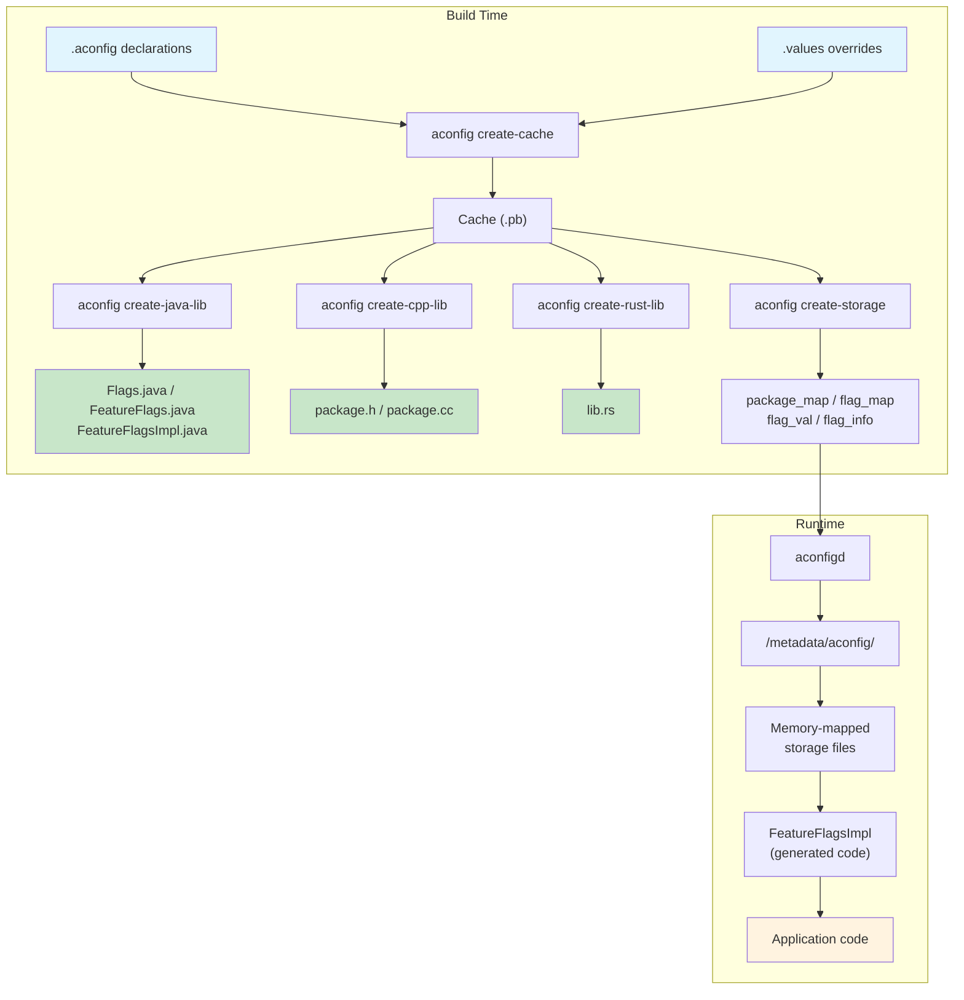

### 3.1.5  Container

**Container** 是一类软件单元，它会被构建并安装为一个独立产物。Container 概念在 aconfig 中非常关键，因为运行时 flag 存储文件是按 container 组织的。主要 container 包括：

- **`system`**：system 分区
- **`system_ext`**：system_ext 分区
- **`vendor`**：vendor 分区
- **`product`**：product 分区
- **APEX 模块**：每个 APEX，例如 `com.android.configinfrastructure`、`com.android.wifi`
- **APK**：独立发布的 APK 也可以是一个 container

Container 决定了存储文件放置位置，以及系统启动时如何解析这些 flag 值。某个 container 中声明的 flag，不能被其他 container 中运行的代码直接读取，除非明确导出。

---

## 3.2  The aconfig System

### 3.2.1  aconfig 工具

`aconfig` 二进制是一个 Rust 工具，位于：

```
build/make/tools/aconfig/aconfig/
```

它提供若干子命令，构成整个构建期流水线的骨架：

| 子命令 | 用途 |
|--------------------|-------------------------------------------------------------|
| `create-cache` | 解析 `.aconfig` 声明和 `.values` 覆盖，生成二进制 protobuf cache |
| `create-java-lib` | 从 cache 生成 Java 源码 |
| `create-cpp-lib` | 从 cache 生成 C++ 源码 |
| `create-rust-lib` | 从 cache 生成 Rust 源码 |
| `create-storage` | 生成二进制存储文件，例如 `package_map`、`flag_map`、`flag_val`、`flag_info` |
| `dump-cache` | 以多种格式输出 cache 内容，例如文本、protobuf、自定义模板 |

这个工具会通过 `build/soong/aconfig/init.go` 第 158 行的 `pctx.HostBinToolVariable("aconfig", "aconfig")` 注册为 host binary。

### 3.2.2  `.aconfig` 文件格式

Flag 声明使用 text-protobuf 格式，由 `build/make/tools/aconfig/aconfig_protos/protos/aconfig.proto` 中的 `flag_declarations` message 定义。每个 `.aconfig` 文件会声明 package、container 以及一个或多个 flag：

```protobuf
// File: system/apex/apexd/apexd.aconfig

package: "com.android.apex.flags"
container: "system"

flag {
  name: "mount_before_data"
  namespace: "treble"
  description: "This flag controls if allowing mounting APEXes
                before the data partition"
  bug: "361701397"
  is_fixed_read_only: true
}
```

再看一个更复杂的例子，来自 ConfigInfrastructure 模块：

```protobuf
// File: packages/modules/ConfigInfrastructure/framework/flags.aconfig

package: "android.provider.flags"
container: "com.android.configinfrastructure"

flag {
  name: "new_storage_writer_system_api"
  namespace: "core_experiments_team_internal"
  description: "API flag for writing new storage"
  bug: "367765164"
  is_fixed_read_only: true
  is_exported: true
}

flag {
  name: "dump_improvements"
  namespace: "core_experiments_team_internal"
  description: "Added more information on dumpsys device_config"
  bug: "364399200"
  is_exported: true
}

flag {
  name: "enable_immediate_clear_override_bugfix"
  namespace: "core_experiments_team_internal"
  description: "Bugfix flag to allow clearing a local override
                immediately"
  bug: "387316969"
  metadata {
    purpose: PURPOSE_BUGFIX
  }
}
```

### 3.2.3  声明字段

每个 `flag_declaration` message 支持的字段如下，定义位于 `aconfig.proto` 第 72-98 行：

| 字段 | 类型 | 必填 | 说明 |
|----------------------|------------|----------|---------------------------------------------------|
| `name` | `string` | 是 | snake_case 标识符，例如 `mount_before_data` |
| `namespace` | `string` | 是 | 面向服务端管理的组织分组 |
| `description` | `string` | 是 | 该 flag 的人类可读说明 |
| `bug` | `string` | 是 | 对应 bug tracker ID，可重复 |
| `is_fixed_read_only` | `bool` | 否 | 若为 true，则值既不能在运行时改变，也不能通过 release config 覆盖 |
| `is_exported` | `bool` | 否 | 若为 true，则该 flag 可在 container 之外访问 |
| `metadata` | `message` | 否 | 附加元数据，例如 purpose、storage backend |

`metadata` message 支持的字段如下：

```protobuf
message flag_metadata {
  enum flag_purpose {
    PURPOSE_UNSPECIFIED = 0;
    PURPOSE_FEATURE = 1;
    PURPOSE_BUGFIX = 2;
  }

  enum flag_storage_backend {
    UNSPECIFIED = 0;
    ACONFIGD = 1;
    DEVICE_CONFIG = 2;
    NONE = 3;
  }

  optional flag_purpose purpose = 1;
  optional flag_storage_backend storage = 2;
}
```

其中 `purpose` 用于区分“功能性 flag”和“bugfix flag”，而 `storage` 则决定运行时后端：是新的 `ACONFIGD` 内存映射存储，还是旧的 `DEVICE_CONFIG`（基于 Settings）的存储方式。

### 3.2.4  命名规范

aconfig 系统对命名施加了严格规则，见 `aconfig.proto` 第 26-57 行：

- **Flag 名称：** 必须是小写 snake_case，不能有连续下划线，不能以数字开头。例如 `adjust_rate` 合法，而 `AdjustRate` 与 `adjust__rate` 不合法。
- **Package 名称：** 由点分隔的小写 snake_case 段组成，每一段同样遵守上述规则，例如 `com.android.mypackage`。
- **Namespace：** 必须是小写 snake_case，例如 `core_experiments_team_internal`。
- **Container：** 必须小写；对于 APEX，一般使用点分隔名称，例如 `system`、`com.android.configinfrastructure`。

### 3.2.5  Namespace

Namespace 是服务端旗标管理的组织单元。它把相关 flag 聚合在一起，这些 flag 往往由同一团队负责，并经由同一 rollout 流程推进。在 Google 内部服务端系统“Gantry”中，namespace 会映射到可独立管理的配置面板。

Namespace 与 package 并非一一对应关系：多个 package 可以共享一个 namespace，而单个 package 也可以包含属于不同 namespace 的 flag。旧的 DeviceConfig 运行时系统会把 namespace 当作读取属性时的 namespace：

```java
DeviceConfig.getProperties("core_experiments_team_internal");
```

在新的 `aconfigd` 存储系统中，namespace 仍然保存在元数据里，但在查找路径中的中心性已经下降，因为系统会按 package 和 flag name 编制索引，而不是直接按 namespace。

### 3.2.6  Flag Values 文件

Flag values 用于覆盖某个声明 flag 的默认状态与权限。它们使用 `flag_value` protobuf message 格式：

```protobuf
// File: build/make/tools/aconfig/aconfig/tests/first.values

flag_value {
    package: "com.android.aconfig.test"
    name: "disabled_ro"
    state: DISABLED
    permission: READ_ONLY
}
flag_value {
    package: "com.android.aconfig.test"
    name: "enabled_rw"
    state: ENABLED
    permission: READ_WRITE
}
flag_value {
    package: "com.android.aconfig.test"
    name: "enabled_fixed_ro"
    state: ENABLED
    permission: READ_ONLY
}
```

真实的 release configuration 通常把值存储在 `.textproto` 文件中：

```protobuf
// File: build/release/aconfig/bp1a/.../single_thread_executor_flag_values.textproto

flag_value {
  package: "com.android.internal.camera.flags"
  name: "single_thread_executor"
  state: ENABLED
  permission: READ_ONLY
}
```

### 3.2.7  Value 解析顺序

当 `aconfig create-cache` 处理某个 flag 时，会按顺序应用 values：

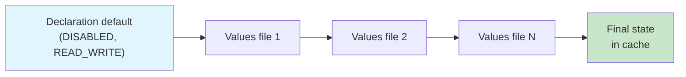

具体顺序如下：

1. **声明默认值：** 所有 flag 初始状态都是 `DISABLED`，权限都是 `READ_WRITE`，定义见 `commands.rs` 第 74-75 行。
2. **依次应用 values 文件：** 后出现的值覆盖前面的值。
3. **构建期权限强化：** 如果设置了 `RELEASE_ACONFIG_REQUIRE_ALL_READ_ONLY`，则所有 flag 都会被强制成 `READ_ONLY`。
4. **固定只读强化：** 对设置了 `is_fixed_read_only: true` 的 flag，values 文件无权改变其状态。

每次 value 覆盖都会以 **tracepoint** 的形式记录在 cache 中，从而允许开发者追踪某个 flag 最终值究竟由哪个文件设置：

```protobuf
message tracepoint {
  optional string source = 1;
  optional flag_state state = 2;
  optional flag_permission permission = 3;
}
```

---

## 3.3  Flag Code Generation

### 3.3.1  生成文件结构

`aconfig` 工具会为 Java、C++、Rust 三种语言生成类型安全的访问代码。对每个 package 来说，生成代码整体遵循一致结构：公开访问 facade、运行时实现以及测试接口。

**Java**（由 `aconfig create-java-lib` 生成）：

| 文件 | 用途 |
|---------------------------|----------------------------------------------------|
| `Flags.java` | 静态访问入口，每个 flag 对应一个方法 |
| `FeatureFlags.java` | 声明全部 flag 方法的接口 |
| `FeatureFlagsImpl.java` | 运行时实现，负责从存储中读取值 |
| `CustomFeatureFlags.java` | 允许调用方注入自定义 flag 解析逻辑的包装层 |
| `FakeFeatureFlagsImpl.java` | 用于单元测试的测试替身 |

**C++**（由 `aconfig create-cpp-lib` 生成）：

| 文件 | 用途 |
|-----------------------|-------------------------------------------------------|
| `<package>.h` | 头文件，声明 inline accessor 与 C-linkage 函数 |
| `<package>.cc` | 运行时实现，从存储中读取值 |

**Rust**（由 `aconfig create-rust-lib` 生成）：

| 文件 | 用途 |
|--------------|--------------------------------------------------------------|
| `src/lib.rs` | 声明 flag accessor 函数的 Rust 模块 |

### 3.3.2  代码生成模式

`aconfig` 工具支持四种代码生成模式，通过 `--mode` 参数控制，定义见 `codegen/mod.rs` 第 58-64 行：

```rust
pub enum CodegenMode {
    Exported,       // For flags visible outside their container
    ForceReadOnly,  // All flags treated as read-only
    Production,     // Normal production mode
    Test,           // Test mode with mutable flag state
}
```

这些模式会通过 `java_aconfig_library`、`cc_aconfig_library` 和 `rust_aconfig_library` 模块的 `mode` 属性传入。支持的字符串取值见 `codegen/java_aconfig_library.go` 第 31 行：

```go
var aconfigSupportedModes = []string{
    "production", "test", "exported", "force-read-only",
}
```

### 3.3.3  `Flags.java`：公开 API 表面

生成后的 `Flags.java` 是 flag 检查的主要入口。它通过静态方法向调用方暴露访问接口，而内部实现则委托给某个 `FeatureFlags` 实例。

下面的模板来自 `build/make/tools/aconfig/aconfig/templates/Flags.java.template`：

```java
// Generated code for package com.android.apex.flags

package com.android.apex.flags;

public final class Flags {

    /** @hide */
    public static final String FLAG_MOUNT_BEFORE_DATA =
        "com.android.apex.flags.mount_before_data";

    @com.android.aconfig.annotations.AssumeTrueForR8
    @com.android.aconfig.annotations.AconfigFlagAccessor
    public static boolean mountBeforeData() {
        return FEATURE_FLAGS.mountBeforeData();
    }

    private static FeatureFlags FEATURE_FLAGS = new FeatureFlagsImpl();
}
```

几个关键点：

1. **Flag 名常量** 会采用 `FLAG_<UPPER_SNAKE_CASE>` 形式，值为完整限定名 `package.flag_name`。
2. **R8 注解** 用于让 R8 在编译期假设 flag 的值：
   - `@AssumeTrueForR8`：当 flag 是 `ENABLED` 且 `READ_ONLY`
   - `@AssumeFalseForR8`：当 flag 是 `DISABLED` 且 `READ_ONLY`
   - 对于 `READ_WRITE` flag，则不会加这类注解，因为它们可能在运行时变化
3. **方法命名** 会把 snake_case 转为 camelCase，例如 `mount_before_data` 变成 `mountBeforeData()`
4. **测试模式下**，`Flags.java` 还会额外暴露 `setFeatureFlags()` 与 `unsetFeatureFlags()` 之类的方法，供测试注入替身

### 3.3.4  `FeatureFlags.java`：接口层

生成出来的接口中，每个 flag 都对应一个布尔方法：

```java
package com.android.apex.flags;

/** @hide */
public interface FeatureFlags {
    @com.android.aconfig.annotations.AssumeTrueForR8
    @com.android.aconfig.annotations.AconfigFlagAccessor
    boolean mountBeforeData();
}
```

这个接口就是生产实现与测试实现共同需要满足的契约。

### 3.3.5  `FeatureFlagsImpl.java`：运行时解析

运行时实现会根据存储后端不同而变化。aconfig 会在多个模板之间做选择：

**新存储系统（基于 aconfigd）** 使用模板 `FeatureFlagsImpl.new_storage.java.template`：

```java
package com.example.flags;

import android.os.flagging.PlatformAconfigPackageInternal;
import android.util.Log;

/** @hide */
public final class FeatureFlagsImpl implements FeatureFlags {
    private static final String TAG = "FeatureFlagsImpl";
    private static volatile boolean isCached = false;
    private static boolean myReadWriteFlag = false;

    private void init() {
        try {
            PlatformAconfigPackageInternal reader =
                PlatformAconfigPackageInternal.load(
                    "com.example.flags", 0xABCD1234L);
            myReadWriteFlag = reader.getBooleanFlagValue(0);
        } catch (Exception e) {
            Log.e(TAG, e.toString());
        } catch (LinkageError e) {
            // For mainline modules on older devices
            Log.e(TAG, e.toString());
        }
        isCached = true;
    }

    @Override
    public boolean myReadWriteFlag() {
        if (!isCached) {
            init();
        }
        return myReadWriteFlag;
    }

    @Override
    public boolean myReadOnlyFlag() {
        return true;  // Baked at build time
    }
}
```

对于平台 container，例如 `system`、`system_ext`、`product`、`vendor`，实现会使用 `PlatformAconfigPackageInternal`；对于非平台 container，例如 APEX 模块，则使用 `AconfigPackageInternal`。两者都会从 `/metadata/aconfig/` 下的内存映射存储文件中读取值。

这里的 **package fingerprint**，例如 `0xABCD1234L`，本质上是 package 名的 SipHash13，用来校验当前读取的是不是正确存储文件。

**旧式 DeviceConfig 存储** 使用模板 `FeatureFlagsImpl.deviceConfig.java.template`：

```java
package com.example.flags;

import android.os.Binder;
import android.provider.DeviceConfig;
import android.provider.DeviceConfig.Properties;

/** @hide */
public final class FeatureFlagsImpl implements FeatureFlags {
    private static volatile boolean my_namespace_is_cached = false;
    private static boolean myReadWriteFlag = false;

    private void load_overrides_my_namespace() {
        final long ident = Binder.clearCallingIdentity();
        try {
            Properties properties =
                DeviceConfig.getProperties("my_namespace");
            myReadWriteFlag =
                properties.getBoolean(
                    Flags.FLAG_MY_READ_WRITE_FLAG, false);
        } catch (NullPointerException e) {
            throw new RuntimeException(
                "Cannot read value from namespace my_namespace "
                + "from DeviceConfig. It could be that the code "
                + "using flag executed before SettingsProvider "
                + "initialization. Please use fixed read-only flag "
                + "by adding is_fixed_read_only: true in flag "
                + "declaration.", e);
        } catch (SecurityException e) {
            // Skip loading for isolated processes
        } finally {
            Binder.restoreCallingIdentity(ident);
        }
        my_namespace_is_cached = true;
    }

    @Override
    public boolean myReadWriteFlag() {
        if (!my_namespace_is_cached) {
            load_overrides_my_namespace();
        }
        return myReadWriteFlag;
    }

    @Override
    public boolean myReadOnlyFlag() {
        return true;  // Baked at build time
    }
}
```

DeviceConfig 版本会按 namespace 分组批量读取 flag，通过一次 `getProperties()` 减少逐 flag IPC 开销。

**测试模式** 则使用 `FeatureFlagsImpl.test_mode.java.template`：

```java
package com.example.flags;

/** @hide */
public final class FeatureFlagsImpl implements FeatureFlags {
    @Override
    public boolean myFlag() {
        throw new UnsupportedOperationException(
            "Method is not implemented.");
    }
}
```

在 test mode 下，真实实现对每次访问都会抛异常，从而强制测试必须显式设置 flag 值，而不能不小心依赖生产默认值。

### 3.3.6  `FakeFeatureFlagsImpl.java`：测试替身

对非 exported library，系统还会生成 `FakeFeatureFlagsImpl`，它通过一个 map 保存测试值：

```java
package com.example.flags;

import java.util.HashMap;
import java.util.Map;
import java.util.function.Predicate;

/** @hide */
public class FakeFeatureFlagsImpl extends CustomFeatureFlags {
    private final Map<String, Boolean> mFlagMap = new HashMap<>();
    private final FeatureFlags mDefaults;

    public FakeFeatureFlagsImpl() {
        this(null);
    }

    public FakeFeatureFlagsImpl(FeatureFlags defaults) {
        super(null);
        mDefaults = defaults;
        for (String flagName : getFlagNames()) {
            mFlagMap.put(flagName, null);
        }
    }

    @Override
    protected boolean getValue(String flagName,
                               Predicate<FeatureFlags> getter) {
        Boolean value = this.mFlagMap.get(flagName);
        if (value != null) {
            return value;
        }
        if (mDefaults != null) {
            return getter.test(mDefaults);
        }
        throw new IllegalArgumentException(flagName + " is not set");
    }

    public void setFlag(String flagName, boolean value) {
        if (!this.mFlagMap.containsKey(flagName)) {
            throw new IllegalArgumentException(
                "no such flag " + flagName);
        }
        this.mFlagMap.put(flagName, value);
    }

    public void resetAll() {
        for (Map.Entry entry : mFlagMap.entrySet()) {
            entry.setValue(null);
        }
    }
}
```

这个类使单元测试能够在不依赖真实系统、不依赖 DeviceConfig provider 的前提下，显式设置特定 flag 的值。

### 3.3.7  `CustomFeatureFlags.java`：委托包装层

`CustomFeatureFlags` 提供了一种委托模式，允许调用方注入自定义 flag 解析逻辑：

```java
package com.example.flags;

import java.util.function.BiPredicate;
import java.util.function.Predicate;

/** @hide */
public class CustomFeatureFlags implements FeatureFlags {
    private BiPredicate<String, Predicate<FeatureFlags>> mGetValueImpl;

    public CustomFeatureFlags(
            BiPredicate<String, Predicate<FeatureFlags>> getValueImpl) {
        mGetValueImpl = getValueImpl;
    }

    @Override
    public boolean myFlag() {
        return getValue(Flags.FLAG_MY_FLAG,
            FeatureFlags::myFlag);
    }

    public boolean isFlagReadOnlyOptimized(String flagName) {
        if (mReadOnlyFlagsSet.contains(flagName) &&
            isOptimizationEnabled()) {
            return true;
        }
        return false;
    }

    @com.android.aconfig.annotations.AssumeTrueForR8
    private boolean isOptimizationEnabled() {
        return false;
    }

    protected boolean getValue(String flagName,
                               Predicate<FeatureFlags> getter) {
        return mGetValueImpl.test(flagName, getter);
    }
}
```

这里的 `isOptimizationEnabled()` 明明返回 `false`，却被标上 `@AssumeTrueForR8`，这是一个故意设计的模式：R8 可以在优化时把它视为恒真，从而为只读 flag 消除 `isFlagReadOnlyOptimized` 相关分支；而运行时行为又保留了动态判断路径。

### 3.3.8  `ExportedFlags.java`：对外简化 API

对 exported flag library 来说，如果使用 `mode: "exported"` 且 `single_exported_file: true`，aconfig 还会生成额外的 `ExportedFlags.java`，为平台外消费者提供更稳定、简洁的 API：

```java
// Generated: ExportedFlags.java
package com.example.flags;

import android.os.Build;

public class ExportedFlags {

    public static boolean myExportedFlag() {
        if (Build.VERSION.SDK_INT >= 36) {
            return true;  // Finalized at SDK 36
        }
        return Flags.myExportedFlag();
    }
}
```

这个类会对 finalized flag 加入 SDK 版本判断，从而确保当应用跨多个 Android 版本运行时，行为仍然兼容。与此同时，原始的 `Flags` 和 `FeatureFlags` 类通常会被标记为 `@Deprecated`，引导开发者迁移到 `ExportedFlags`。

### 3.3.9  `FeatureFlagsImpl` 模板选择逻辑

aconfig 的 Java 代码生成会根据存储后端与 codegen mode，在多个 `FeatureFlagsImpl` 模板间切换。来自 `codegen/java.rs` 中 `add_feature_flags_impl_template` 的逻辑大致如下：

1. **Test mode**：使用 `FeatureFlagsImpl.test_mode.java.template`，所有访问都抛异常
2. **DeviceConfig 存储**：使用 `FeatureFlagsImpl.deviceConfig.java.template`，按 namespace 批量读取
3. **新 aconfigd 存储**：使用 `FeatureFlagsImpl.new_storage.java.template`，通过 `AconfigPackageInternal` 读取内存映射文件
4. **遗留 internal 模式**：使用 `FeatureFlagsImpl.legacy_flag.internal.java.template`，逐 flag 调用 `DeviceConfig.getBoolean()`，且不做缓存
5. **Exported 模式**：使用 `FeatureFlagsImpl.exported.java.template`

位于 `build/make/tools/aconfig/aconfig/templates/` 下的完整模板清单如下：

```
CustomFeatureFlags.java.template
ExportedFlags.java.template
FakeFeatureFlagsImpl.java.template
FeatureFlags.java.template
FeatureFlagsImpl.deviceConfig.java.template
FeatureFlagsImpl.exported.java.template
FeatureFlagsImpl.legacy_flag.internal.java.template
FeatureFlagsImpl.new_storage.java.template
FeatureFlagsImpl.test_mode.java.template
Flags.java.template
cpp_exported_header.template
cpp_source_file.template
rust.template
rust_test.template
```

模板引擎使用的是 Rust crate `TinyTemplate`，支持 `{{ if condition }}`、`{{ for item in list }}` 以及 `{variable}` 这样的模板语法。

### 3.3.10  C++ 代码生成

对 C++ 来说，生成代码采用 provider 模式。头文件会声明一个抽象 `flag_provider_interface`，为每个 flag 提供虚方法：

```cpp
// Generated: com_android_aconfig_test.h

#pragma once

#ifndef COM_ANDROID_ACONFIG_TEST
#define COM_ANDROID_ACONFIG_TEST(FLAG) \
    COM_ANDROID_ACONFIG_TEST_##FLAG
#endif

#ifndef COM_ANDROID_ACONFIG_TEST_ENABLED_FIXED_RO
#define COM_ANDROID_ACONFIG_TEST_ENABLED_FIXED_RO true
#endif

#ifdef __cplusplus

#include <memory>

namespace com::android::aconfig::test {

class flag_provider_interface {
public:
    virtual ~flag_provider_interface() = default;
    virtual bool enabled_fixed_ro() = 0;
    virtual bool disabled_rw() = 0;
};

extern std::unique_ptr<flag_provider_interface> provider_;

// Fixed read-only: resolved at compile time via macro
constexpr inline bool enabled_fixed_ro() {
    return COM_ANDROID_ACONFIG_TEST_ENABLED_FIXED_RO;
}

// Read-write: delegates to provider at runtime
inline bool disabled_rw() {
    return provider_->disabled_rw();
}

}  // namespace com::android::aconfig::test

extern "C" {
#endif

bool com_android_aconfig_test_enabled_fixed_ro();
bool com_android_aconfig_test_disabled_rw();

#ifdef __cplusplus
}
#endif
```

这里有几个很关键的设计点：

1. **固定只读 flag** 会被生成为 `constexpr inline` 函数，并返回预处理宏值，从而使编译器能在编译期彻底消除死代码。
2. **可写 flag** 则通过 `provider_` 指针在运行时委托读取。
3. **C-linkage 函数**（`extern "C"`）让 C 代码与 JNI 同样可以消费这些 accessor。
4. **`[[clang::no_destroy]]`** 会应用到 provider 指针上，以规避线程安全上下文中的析构顺序问题。
5. **测试模式下**，每个 flag 还会额外生成 setter，例如 `void disabled_rw(bool val)`，同时生成 `reset_flags()` 用于测试清理。

### 3.3.11  Rust 代码生成

Rust 生成代码与 C++ 类似，也采用 provider / trait 模式：

```rust
// Generated: src/lib.rs

pub fn enabled_fixed_ro() -> bool {
    true  // Fixed read-only
}

pub fn disabled_rw() -> bool {
    // Read from storage via provider
    PROVIDER.disabled_rw()
}
```

在 test mode 下，Rust flag 会通过带 mutex 的可变静态对象保存测试值，生成测试代码时还会使用 thread-local provider，从而避免并行测试之间相互污染。

### 3.3.12  代码生成流水线

从声明到可用 library 的完整路径如下：

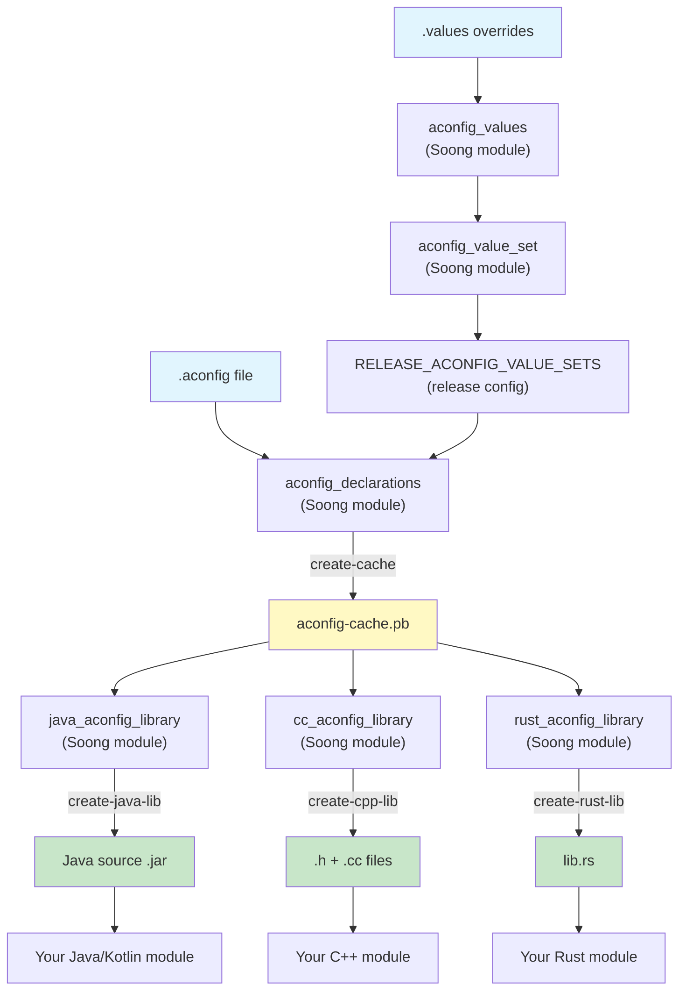

---

## 3.4  Flag Storage and Runtime

### 3.4.1  存储架构总览

aconfig 为运行时 flag 解析支持两类存储后端，它们由声明中的 `metadata.storage` 按 flag 逐个选择：

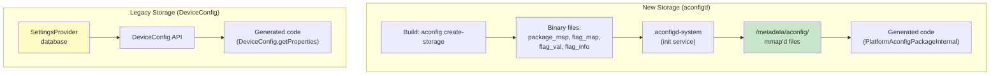

### 3.4.2  新存储：aconfigd 与内存映射文件

新的存储系统，正是为了解决 DeviceConfig 方案在性能与启动顺序上的不足而设计的。它由四种二进制文件构成，这些文件在构建期通过 `aconfig create-storage` 生成：

| 文件类型 | 内容 |
|-----------------|-------------------------------------------------------------|
| `package_map` | 将 package 名映射到其在 flag 文件中的偏移范围 |
| `flag_map` | 将 package 内部的 flag 名映射到 `flag_val` 偏移 |
| `flag_val` | 紧凑布尔值数组，保存 flag 值 |
| `flag_info` | 保存每个 flag 的元信息，例如权限和属性 |

这些文件由 `build/make/tools/aconfig/aconfig_storage_file/protos/aconfig_storage_metadata.proto` 中的 `storage_file_info` proto 描述：

```protobuf
message storage_file_info {
  optional uint32 version = 1;
  optional string container = 2;
  optional string package_map = 3;
  optional string flag_map = 4;
  optional string flag_val = 5;
  optional string flag_info = 6;
  optional int64 timestamp = 7;
}
```

启动时，`aconfigd-system` 服务负责初始化存储：

```
# From system/server_configurable_flags/aconfigd/aconfigd.rc

service early_system_aconfigd_platform_init
    /system/bin/aconfigd-system early-platform-init
    class core
    user system
    group system
    oneshot
    disabled

on early-init
    mkdir /metadata/aconfig 0775 root system
    mkdir /metadata/aconfig/flags 0770 root system
    mkdir /metadata/aconfig/maps 0775 root system
    mkdir /metadata/aconfig/boot 0775 root system
    exec_start early_system_aconfigd_platform_init
```

客户端进程会以只读方式 mmap 这些存储文件。`aconfig_storage_read_api/src/lib.rs` 第 62 行定义了根目录常量：

```rust
pub const STORAGE_LOCATION: &str = "/metadata/aconfig";
```

### 3.4.3  存储读取 API

`aconfig_storage_read_api` crate 提供四个核心读取函数：

```rust
// 1. Get package read context (package offset info)
pub fn get_package_read_context(
    container: &str, package: &str
) -> Result<Option<PackageReadContext>>

// 2. Get flag read context (flag offset within package)
pub fn get_flag_read_context(
    container: &str, package_id: u32, flag: &str
) -> Result<Option<FlagReadContext>>

// 3. Read a boolean flag value at a global offset
pub fn get_boolean_flag_value(
    container: &str, offset: u32
) -> Result<bool>

// 4. Get storage file version
pub fn get_storage_file_version(
    file_path: &str
) -> Result<u32>
```

这些都属于底层 API，只供生成代码调用。应用开发者不应该直接使用。

单个 flag 的读取路径如下：

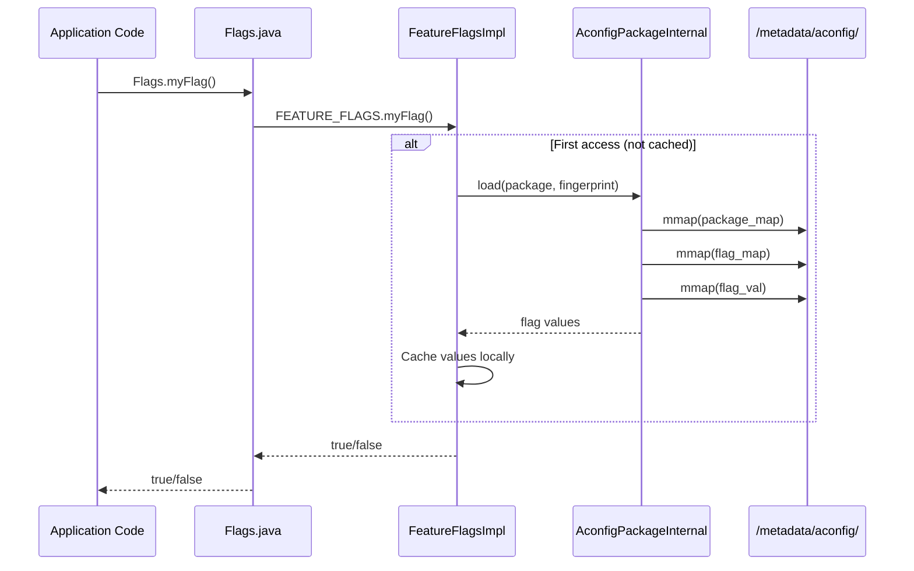

### 3.4.4  存储文件内部结构

这四种二进制文件都采用版本化格式，并以哈希表实现查找。其文件结构定义位于 `build/make/tools/aconfig/aconfig_storage_file/src/lib.rs`。

**Package Map**（`package_map`）：

Package map 通过哈希表把 package 名映射到元信息。每个节点大致包含：

```rust
pub struct PackageTableNode {
    pub package_name: String,    // e.g., "com.android.apex.flags"
    pub package_id: u32,         // Unique ID within this container
    pub boolean_start_index: u32,// Offset into flag_val for this package
    pub fingerprint: u64,        // SipHash13 of flag names (v2+)
    pub next_offset: Option<u32>,// Hash collision chain
}
```

哈希表大小会从一组质数中选择，以降低冲突概率：

```rust
pub(crate) const HASH_PRIMES: [u32; 29] = [
    7, 17, 29, 53, 97, 193, 389, 769, 1543, 3079,
    6151, 12289, 24593, 49157, 98317, 196613, ...
];
```

**Flag Map**（`flag_map`）：

Flag map 使用另一张哈希表，将 `(package_id, flag_name)` 映射到 flag 元信息：

```rust
pub struct FlagTableNode {
    pub package_id: u32,
    pub flag_name: String,
    pub flag_type: StoredFlagType,  // ReadOnlyBoolean, ReadWriteBoolean,
                                     // FixedReadOnlyBoolean
    pub flag_index: u16,            // Index within the package's range
    pub next_offset: Option<u32>,
}
```

其中 `flag_type` 用于区分：

- `ReadOnlyBoolean`：构建期设值，运行时不可覆写
- `ReadWriteBoolean`：运行时可覆写
- `FixedReadOnlyBoolean`：永久固定值，可用于编译期优化

**Flag Value**（`flag_val`）：

该文件本质上是一个紧凑布尔值数组。为了便于随机访问，每个 flag 占用一个字节，而不是一个 bit。某个具体 flag 的偏移计算公式是：

```
offset = package.boolean_start_index + flag.flag_index
```

**Flag Info**（`flag_info`）：

该文件以位掩码形式保存每个 flag 的附加属性：

```rust
pub enum FlagInfoBit {
    IsReadWrite = 0x01,
    HasServerOverride = 0x02,
    HasLocalOverride = 0x04,
}
```

这些位会记录该 flag 是否被服务端配置覆写、是否有本地 `aflags` 覆写等信息。

**存储文件版本** 则编码在每个文件的前四个字节中。当前版本方案大致如下：

| 版本 | 特性 |
|---------|-------------------------------------------------------|
| 1 | 基础 package / flag map 与 value storage |
| 2 | 增加 package fingerprint（SipHash13 of flag names） |
| 3 | 增加 exported read redaction 支持 |

默认写入版本是 2（`DEFAULT_FILE_VERSION`），当前最大可读取版本是 3（`MAX_SUPPORTED_FILE_VERSION`）。

### 3.4.5  Package Fingerprint

每个 package 都有一个通过 SipHash13 计算出的 fingerprint，逻辑位于 `aconfig_storage_file/src/sip_hasher13.rs`。它基于 package 内 flag 名称的排序列表计算，用途主要有两个：

1. **完整性校验：** 生成代码中内嵌该 fingerprint，运行时会把它与存储文件中的 fingerprint 比对，用于发现“代码与存储不匹配”的情况。
2. **缓存失效：** 如果 package 中增删了 flag，fingerprint 就会变化，从而迫使生成代码重新从存储中读取。

这个 fingerprint 会以十六进制字面量形式出现在生成代码中：

```java
PlatformAconfigPackageInternal reader =
    PlatformAconfigPackageInternal.load(
        "com.example.flags", 0xABCD1234L);
```

### 3.4.6  CXX 互操作层

存储读取 API 本身使用 Rust 实现，但 `cc_aconfig_library` 生成的代码需要在 C++ 中调用这些能力。因此 `aconfig_storage_read_api` crate 通过 `cxx::bridge` 生成 C++ 绑定：

```rust
#[cxx::bridge]
mod ffi {
    pub struct PackageReadContextQueryCXX {
        pub query_success: bool,
        pub error_message: String,
        pub package_exists: bool,
        pub package_id: u32,
        pub boolean_start_index: u32,
        pub fingerprint: u64,
    }

    pub struct FlagReadContextQueryCXX {
        pub query_success: bool,
        pub error_message: String,
        pub flag_exists: bool,
        pub flag_type: u16,
        pub flag_index: u16,
    }

    pub struct BooleanFlagValueQueryCXX {
        pub query_success: bool,
        pub error_message: String,
        pub flag_value: bool,
    }

    extern "Rust" {
        pub fn get_package_read_context_cxx(
            file: &[u8], package: &str,
        ) -> PackageReadContextQueryCXX;

        pub fn get_flag_read_context_cxx(
            file: &[u8], package_id: u32, flag: &str,
        ) -> FlagReadContextQueryCXX;

        pub fn get_boolean_flag_value_cxx(
            file: &[u8], offset: u32,
        ) -> BooleanFlagValueQueryCXX;
    }
}
```

这里每个查询都显式返回一个结果结构体，包含 `query_success` 和 `error_message`，而不是直接暴露 Rust 的 `Result`。这是因为 `Result` 无法原样跨 FFI 边界传递。`flag_type` 也会编码成 `u16` 以适配 C++。

### 3.4.7  aconfigd 服务架构

`aconfigd` 为了兼顾安全性与可更新性，被拆成了两个二进制：

| 二进制 | 位置 | 用途 |
|----------------------|---------------------------------------------------|--------------------------------|
| `aconfigd-system` | `/system/bin/aconfigd-system` | 平台 flag 初始化 |
| `aconfigd-mainline` | `/apex/com.android.configinfrastructure/bin/` | Mainline 模块 flag 处理 |

system 实例通过 `system/server_configurable_flags/aconfigd/aconfigd.rc` 中定义的三个 one-shot 服务运行：

```
service early_system_aconfigd_platform_init
    /system/bin/aconfigd-system early-platform-init
    class core
    user system
    group system
    oneshot
    disabled

service system_aconfigd_platform_init
    /system/bin/aconfigd-system platform-init
    class core
    user system
    group system
    oneshot
    disabled

service system_aconfigd_socket_service
    /system/bin/aconfigd-system start-socket
    class core
    user system
    group system
    oneshot
    disabled
    socket aconfigd_system stream 666 system system
```

**启动时序：**

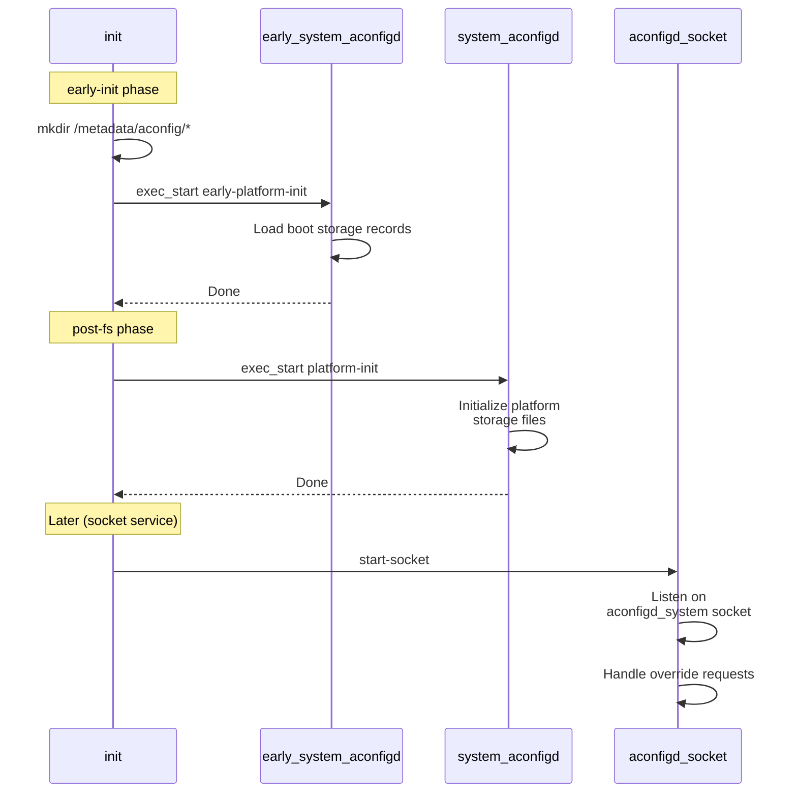

socket 服务用于处理运行时 flag override 请求。其内部逻辑位于 `aconfigd_commands.rs`，大致如下：

```rust
const ACONFIGD_SOCKET: &str = "aconfigd_system";
const ACONFIGD_ROOT_DIR: &str = "/metadata/aconfig";
const STORAGE_RECORDS: &str =
    "/metadata/aconfig/storage_records.pb";

pub fn start_socket() -> Result<()> {
    let fd = rustutils::sockets::
        android_get_control_socket(ACONFIGD_SOCKET)?;
    let listener = UnixListener::from(fd);
    let mut aconfigd = Aconfigd::new(
        Path::new(ACONFIGD_ROOT_DIR),
        Path::new(STORAGE_RECORDS));
    aconfigd.initialize_from_storage_record()?;

    for stream in listener.incoming() {
        match stream {
            Ok(mut stream) => {
                aconfigd.handle_socket_request_from_stream(
                    &mut stream)?;
            }
            Err(errmsg) => {
                error!("failed to listen: {:?}", errmsg);
            }
        }
    }
    Ok(())
}
```

运行时 `/metadata/aconfig/` 目录结构大致如下：

```
/metadata/aconfig/
    storage_records.pb          # Index of all storage files
    platform_storage_records.pb # Platform-only records
    maps/
        system.package.map      # Per-container package maps
        system.flag.map
        com.android.wifi.package.map
        com.android.wifi.flag.map
        ...
    flags/
        system.val              # Per-container flag values
        system.info
        com.android.wifi.val
        com.android.wifi.info
        ...
    boot/
        system.val              # Boot-time snapshots
        system.info
        ...
```

### 3.4.8  旧存储：DeviceConfig 与 Settings.Global

在 aconfigd 出现之前，flag 主要存储于 Android 的 DeviceConfig 框架中，而 DeviceConfig 最终又落在 Settings.Global content provider 的 `settings_config` 表里。这种方案存在几个天然局限：

1. **依赖启动顺序：** DeviceConfig 必须等 SettingsProvider 启动后才能工作，因此那些在启动早期就需要用到的 flag 无法依赖这一后端。
2. **IPC 开销：** 每次 `DeviceConfig.getProperties()` 背后都伴随着对 SettingsProvider 的 Binder IPC。
3. **跨 namespace 不具备原子性：** 单个 namespace 内可原子读取，但多个 namespace 之间则不行。
4. **权限模型受限：** DeviceConfig 访问依赖特定 SELinux 权限，并非所有进程都有这些权限。

生成代码里会显式处理这些失败场景：

```java
try {
    Properties properties =
        DeviceConfig.getProperties("my_namespace");
    myFlag = properties.getBoolean(
        Flags.FLAG_MY_FLAG, false);
} catch (NullPointerException e) {
    throw new RuntimeException(
        "Cannot read value from namespace my_namespace "
        + "from DeviceConfig. It could be that the code "
        + "using flag executed before SettingsProvider "
        + "initialization. Please use fixed read-only "
        + "flag by adding is_fixed_read_only: true in "
        + "flag declaration.", e);
} catch (SecurityException e) {
    // For isolated process case, skip loading
}
```

### 3.4.9  运行时 flag 值解析链

某个 flag 在运行时最终取值的完整链路如下：

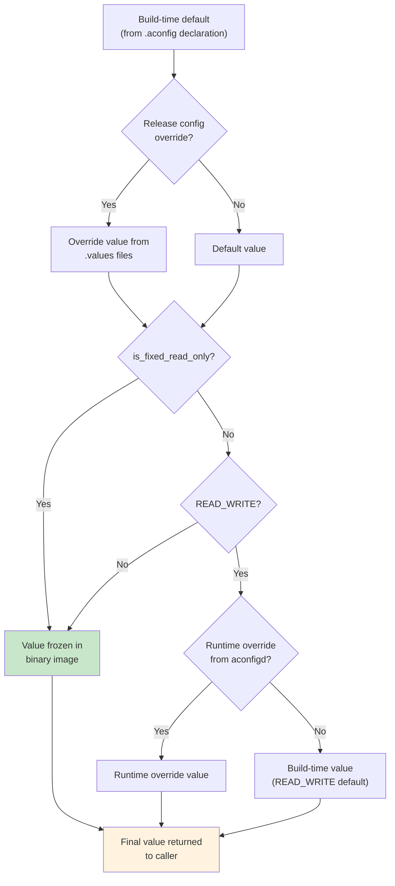

**只读 flag**，包括 `is_fixed_read_only`，会在构建期完全解析，生成代码直接返回常量：

```java
public boolean myFixedFlag() {
    return true;  // Baked at build time, never changes
}
```

而 **可写 flag** 则需要运行时查找。它们在构建期的值只是默认值，如果没有运行时 override，则返回这个默认值。

### 3.4.10  `aflags` CLI 工具

`aflags` 是一个设备侧工具，用来查看和修改 flag 值。它实际会把工作委托给 ConfigInfrastructure APEX 中的可更新二进制 `aflags_updatable`：

```rust
// From build/make/tools/aconfig/aflags/src/main.rs

fn invoke_updatable_aflags() {
    let updatable_command =
        "/apex/com.android.configinfrastructure/bin/aflags_updatable";
    // ... delegate all arguments to updatable binary
}
```

常见命令如下：

```bash
# List all flags and their values
adb shell aflags list

# Show a specific flag
adb shell aflags list --package com.android.apex.flags

# Override a flag value (read-write flags only)
adb shell aflags enable com.android.apex.flags.mount_before_data

# Clear an override
adb shell aflags clear com.android.apex.flags.mount_before_data
```

---

## 3.5  Flag Lifecycle

### 3.5.1  生命周期阶段

每个 flag 都会经历一条相对清晰的生命周期，从创建到最终清理：

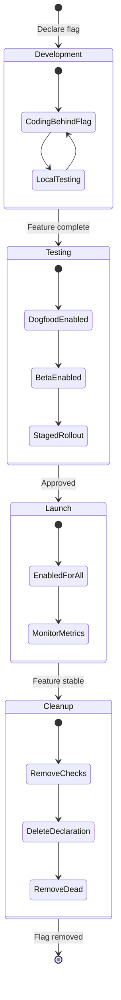

### 3.5.2  第一阶段：开发

在开发阶段，一个 flag 通常处于如下状态：

- 在 `.aconfig` 文件中**声明**
- 默认状态设置为 `DISABLED`
- 在代码中通过 `if (Flags.myNewFeature()) { ... }` 之类的方式**保护**
- 通过 `aflags` 或构建配置在本地做**测试**

开发者通常会在 `Android.bp` 中加入 flag 声明与 codegen library：

```blueprint
aconfig_declarations {
    name: "my-feature-flags",
    package: "com.android.myfeature.flags",
    container: "system",
    srcs: ["my_feature.aconfig"],
}

java_aconfig_library {
    name: "my-feature-flags-java",
    aconfig_declarations: "my-feature-flags",
}
```

### 3.5.3  第二阶段：测试

随着功能逐渐成熟：

- dogfood / beta build 的 release config 会把该 flag 设成 `ENABLED` 且 `READ_WRITE`
- 服务端配置可以对特定用户群体启用或关闭该 flag
- CI 会在 flag 开启与关闭两种状态下分别跑测试

### 3.5.4  第三阶段：上线

当功能正式发布时：

- 该 flag 会在 release config 中被设为 `ENABLED` 且 `READ_ONLY`
- 如果该 flag 保护的是 API，则它会为某个 target SDK level 进行 finalize
- 其值会被直接固化到二进制中，运行时不可再被覆写

### 3.5.5  第四阶段：清理

当某个功能在一个 release 周期中稳定运行后：

- 对应 `.aconfig` 中的 flag 声明会被删除
- 所有 `if (Flags.myFlag())` 检查会被替换成已启用的那条代码路径
- 关闭分支对应的死代码会被删除
- 该 flag 的 codegen library 依赖也会从构建配置中移除

清理动作非常重要。失效 flag 会迅速形成技术债。aconfig 提供的 `dump-cache` 命令可以辅助发现那些在所有 release config 中都已固定不变的 flag，从而帮助清理。

### 3.5.6  Bugfix Flag

带有 `purpose: PURPOSE_BUGFIX` 的 flag，生命周期通常会更快：

- 初始设置为 `READ_WRITE`，以便如果修复引发回归时可以快速回滚
- 在功能启用一个 release 周期后，升级为 `READ_ONLY`
- 下一次 release 再完成清理

```protobuf
flag {
  name: "enable_immediate_clear_override_bugfix"
  namespace: "core_experiments_team_internal"
  description: "Bugfix flag to allow clearing a local
                override immediately"
  bug: "387316969"
  metadata {
    purpose: PURPOSE_BUGFIX
  }
}
```

### 3.5.7  Exported Flag 与 Finalized Flag

标记为 `is_exported: true` 的 flag，可以被其原始 container 之外的代码访问。这对于 Mainline 模块尤其重要，因为它们往往会暴露 API 给平台外部构建的应用使用。

当某个受 flag 保护的 API 在某个 SDK level 上完成 finalize 之后，它会进入 **finalized flags** 体系。`aconfig_protos/protos/aconfig_internal.proto` 中的 `finalized_flag` proto 记录如下信息：

```protobuf
message finalized_flag {
  optional string name = 1;
  optional string package = 2;
  optional int32 min_sdk = 3;
}
```

因此，在生成的 exported 代码里，会自动出现 SDK 判断：

```java
public static boolean myExportedFlag() {
    if (Build.VERSION.SDK_INT >= 36) {
        return true;  // Finalized at SDK 36
    }
    return FEATURE_FLAGS.myExportedFlag();
}
```

这能保证当应用运行在 SDK 36+ 上时，总是看到该 flag 为启用状态，而不再受运行时 flag 状态影响。

---

## 3.6  Build System Integration

### 3.6.1  Soong 模块类型

aconfig 的构建集成，通过两个包向 Soong 注册了六类模块类型。

**来自 `build/soong/aconfig/init.go`**（第 163-170 行）：

```go
func RegisterBuildComponents(ctx android.RegistrationContext) {
    ctx.RegisterModuleType("aconfig_declarations",
        DeclarationsFactory)
    ctx.RegisterModuleType("aconfig_values",
        ValuesFactory)
    ctx.RegisterModuleType("aconfig_value_set",
        ValueSetFactory)
    ctx.RegisterSingletonModuleType(
        "all_aconfig_declarations",
        AllAconfigDeclarationsFactory)
    ctx.RegisterParallelSingletonType(
        "exported_java_aconfig_library",
        ExportedJavaDeclarationsLibraryFactory)
}
```

**来自 `build/soong/aconfig/codegen/init.go`**（第 81-86 行）：

```go
func RegisterBuildComponents(ctx android.RegistrationContext) {
    ctx.RegisterModuleType("aconfig_declarations_group",
        AconfigDeclarationsGroupFactory)
    ctx.RegisterModuleType("cc_aconfig_library",
        CcAconfigLibraryFactory)
    ctx.RegisterModuleType("java_aconfig_library",
        JavaDeclarationsLibraryFactory)
    ctx.RegisterModuleType("rust_aconfig_library",
        RustAconfigLibraryFactory)
}
```

### 3.6.2  `aconfig_declarations`

`aconfig_declarations` 是整个 flag 流水线的起点。它处理 `.aconfig` 源文件，并产出二进制 cache。

**属性**（来自 `aconfig_declarations.go` 第 39-56 行）：

| 属性 | 类型 | 必填 | 说明 |
|---------------|------------|----------|----------------------------------------------------|
| `srcs` | `[]string` | 是 | `.aconfig` 文件列表 |
| `package` | `string` | 是 | Java 风格 package 名 |
| `container` | `string` | 是 | 这些 flag 所属的 container |
| `exportable` | `bool` | 否 | 是否允许这些 flag 被重新打包导出 |

frameworks/base 中的例子如下：

```blueprint
// frameworks/base/android-sdk-flags/Android.bp

aconfig_declarations {
    name: "android.sdk.flags-aconfig",
    package: "android.sdk",
    container: "system",
    srcs: ["flags.aconfig"],
}
```

它的构建动作会调用 `aconfig create-cache`，把声明文件和 release configuration 匹配到的 values 合并起来。核心规则位于 `init.go` 第 27-45 行：

```go
aconfigRule = pctx.AndroidStaticRule("aconfig",
    blueprint.RuleParams{
        Command: `${aconfig} create-cache` +
            ` --package ${package}` +
            ` ${container}` +
            ` ${declarations}` +
            ` ${values}` +
            ` ${default-permission}` +
            ` ${allow-read-write}` +
            ` --cache ${out}.tmp` +
            ` && ( if cmp -s ${out}.tmp ${out} ;` +
            `   then rm ${out}.tmp ;` +
            `   else mv ${out}.tmp ${out} ; fi )`,
    }, ...)
```

这里 `cmp -s` / `mv` 的模式本质上是一种优化：只有当 cache 文件内容真正发生变化时，才会替换正式输出，从而避免触发下游 codegen 的无意义重建。

### 3.6.3  `aconfig_values`

`aconfig_values` 用于给特定 package 提供 flag 值覆盖，这些 values 会进一步被收集进 value set。

**属性**（来自 `aconfig_values.go` 第 28-33 行）：

| 属性 | 类型 | 必填 | 说明 |
|-----------|------------|----------|------------------------------------------|
| `srcs` | `[]string` | 是 | `.values` 或 `.textproto` 文件列表 |
| `package` | `string` | 是 | 这些值适用到哪个 package |

例如：

```blueprint
// build/release/aconfig/bp4a/android.app/Android.bp

aconfig_values {
    name: "aconfig-values-platform_build_release-bp4a-android.app-all",
    package: "android.app",
    srcs: [
        "*_flag_values.textproto",
    ],
}
```

### 3.6.4  `aconfig_value_set`

`aconfig_value_set` 用于把多个 `aconfig_values` 模块聚合成一组，然后由某个 release configuration 整体引用。

**属性**（来自 `aconfig_value_set.go` 第 31-37 行）：

| 属性 | 类型 | 说明 |
|----------|------------|------------------------------------------------|
| `values` | `[]string` | `aconfig_values` 模块名列表 |
| `srcs` | `[]string` | 包含 values 的 `Android.bp` 文件路径 |

例如：

```blueprint
// build/release/aconfig/bp4a/Android.bp

aconfig_value_set {
    name: "aconfig_value_set-platform_build_release-bp4a",
    srcs: [
        "*/Android.bp",
    ],
}
```

其中 `srcs` 是一种更新的发现方式：它允许系统从指定 `Android.bp` 文件中自动发现相关 `aconfig_values` 模块。

### 3.6.5  与 Release Configuration 的集成

把 value set 真正接入构建的关键变量，是 release configuration 中的 `RELEASE_ACONFIG_VALUE_SETS`。这个变量列出当前构建目标应应用哪些 `aconfig_value_set`。

在 Soong 中，每个 `aconfig_declarations` 模块都会自动依赖该变量指定的 value set，逻辑见 `aconfig_declarations.go` 第 92-98 行：

```go
func (module *DeclarationsModule) DepsMutator(
        ctx android.BottomUpMutatorContext) {
    valuesFromConfig := ctx.Config().ReleaseAconfigValueSets()
    if len(valuesFromConfig) > 0 {
        ctx.AddDependency(ctx.Module(), implicitValuesTag,
            valuesFromConfig...)
    }
}
```

它的解析链如下：

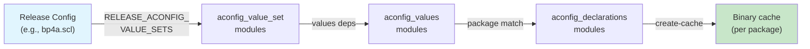

### 3.6.6  `java_aconfig_library`

`java_aconfig_library` 会从一个 `aconfig_declarations` 模块生成 Java library。

**属性**（来自 `codegen/java_aconfig_library.go` 第 33-43 行）：

| 属性 | 类型 | 必填 | 说明 |
|------------------------|----------|----------|------------------------------------------------|
| `aconfig_declarations` | `string` | 是 | 目标 `aconfig_declarations` 模块名 |
| `mode` | `string` | 否 | 代码生成模式，默认 `"production"` |

示例：

```blueprint
java_aconfig_library {
    name: "android.sdk.flags-aconfig-java",
    aconfig_declarations: "android.sdk.flags-aconfig",
}
```

这个模块会自动依赖：

- `aconfig-annotations-lib`：提供 R8 优化注解
- `unsupportedappusage`：提供兼容性注解
- `aconfig_storage_stub`：提供运行时存储访问能力

同时还会为生成类注册 JarJar rename 规则，以支持 exported 场景下的重打包：

```go
module.AddJarJarRenameRule(declarations.Package+".Flags", "")
module.AddJarJarRenameRule(declarations.Package+".FeatureFlags", "")
module.AddJarJarRenameRule(
    declarations.Package+".FeatureFlagsImpl", "")
module.AddJarJarRenameRule(
    declarations.Package+".CustomFeatureFlags", "")
module.AddJarJarRenameRule(
    declarations.Package+".FakeFeatureFlagsImpl", "")
```

### 3.6.7  `cc_aconfig_library`

`cc_aconfig_library` 用于生成 C/C++ library。

**属性**（来自 `codegen/cc_aconfig_library.go` 第 38-48 行）：

| 属性 | 类型 | 必填 | 说明 |
|------------------------|----------|----------|------------------------------------------------|
| `aconfig_declarations` | `string` | 是 | 对应的 `aconfig_declarations` 模块名 |
| `mode` | `string` | 否 | 代码生成模式，默认 `"production"` |

示例：

```blueprint
cc_aconfig_library {
    name: "my-feature-flags-cc",
    aconfig_declarations: "my-feature-flags",
}
```

在 production 和 exported 模式下，它会自动依赖：

- `libaconfig_storage_read_api_cc`
- `libbase`
- `liblog`

而在 `force-read-only` 模式下，由于不需要运行时读取存储，因此这些依赖会被省略。

生成文件命名规则如下：

- **源文件：** `<package_with_underscores>.cc`，例如 `com_android_apex_flags.cc`
- **头文件：** `include/<package_with_underscores>.h`

### 3.6.8  `rust_aconfig_library`

`rust_aconfig_library` 用于生成 Rust crate：

```blueprint
rust_aconfig_library {
    name: "my-feature-flags-rust",
    aconfig_declarations: "my-feature-flags",
}
```

这个 crate 可以被其他 Rust 模块以 `rlibs`、`dylibs` 或 `rustlibs` 形式依赖。

### 3.6.9  `aconfig_declarations_group`

`aconfig_declarations_group` 能把多个 codegen library 聚合成一个依赖，这在大配置场景下非常有用，例如 `frameworks/base/AconfigFlags.bp`：

```blueprint
aconfig_declarations_group {
    name: "framework-minus-apex-aconfig-declarations",
    aconfig_declarations_groups: [
        "aconfig_trade_in_mode_flags",
        "audio-framework-aconfig",
    ],
    java_aconfig_libraries: [
        "android.app.flags-aconfig-java",
        "android.content.flags-aconfig-java",
        "android.location.flags-aconfig-java",
        "android.os.flags-aconfig-java",
        // ... many more
    ],
}
```

### 3.6.10  `all_aconfig_declarations` 单例

`all_aconfig_declarations` singleton 会把整棵源码树中的全部 `aconfig_declarations` 模块收集起来，并导出为一个总文件，供 Google 内部旗标管理服务 Gantry 使用：

来自 `all_aconfig_declarations.go` 第 37-43 行：

```go
// A singleton module that collects all of the aconfig flags
// declared in the tree into a single combined file for export
// to the external flag setting server (inside Google it's Gantry).
//
// Note that this is ALL aconfig_declarations modules present
// in the tree, not just ones that are relevant to the product
// currently being built.
```

它会产出：

- `all_aconfig_declarations.pb`
- `all_aconfig_declarations.textproto`
- 以及对应的存储文件，例如 `.package.map`、`.flag.map`、`.flag.info`、`.val`

这些产物会随着 `docs`、`droid`、`sdk`、`release_config_metadata`、`gms` 等 build goal 一起分发。

### 3.6.11  `exported_java_aconfig_library`

`exported_java_aconfig_library` singleton 会为整棵源码树里所有 exported flag 生成一个统一的 Java JAR，最终作为 `android-flags.jar` 随 SDK 分发：

```go
ctx.DistForGoalWithFilename("sdk", this.intermediatePath,
    "android-flags.jar")
```

这样，平台外构建的应用，例如在 Android Studio 中开发的应用，也可以使用这个 JAR 来访问 exported flag，而不需要构建整个平台。

### 3.6.12  依赖图

一个典型 flag 集成的完整依赖图如下：

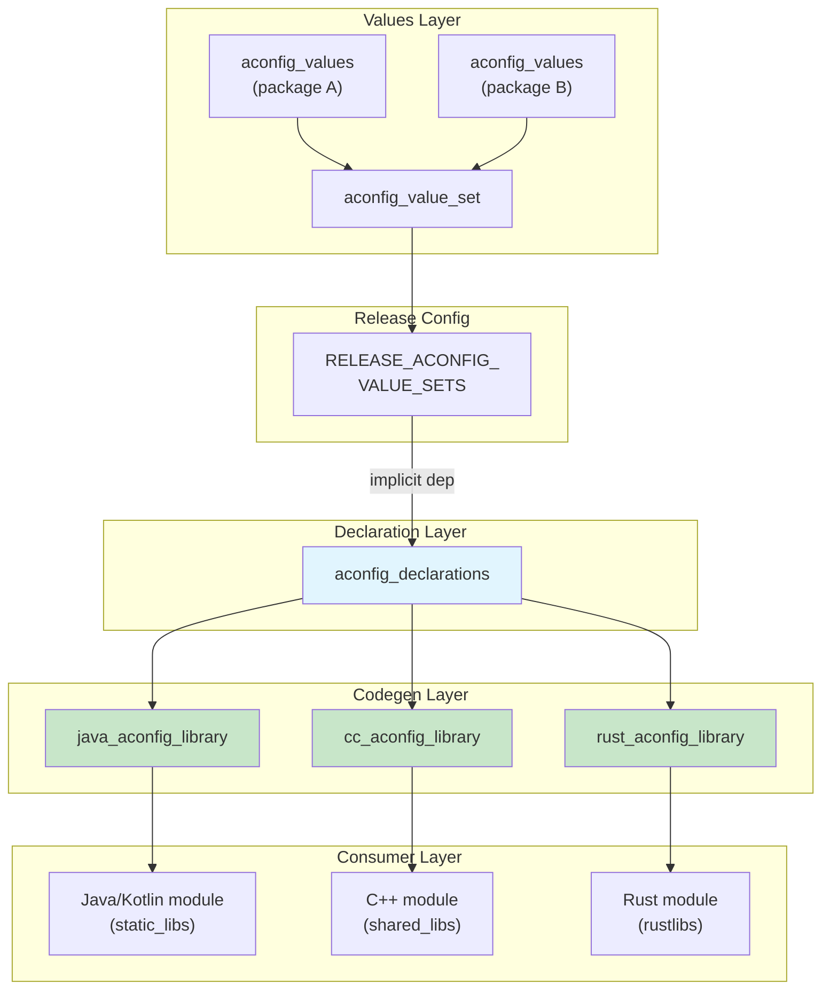

### 3.6.13  Build Flag（`build_flag_declarations`）

除了 aconfig feature flag 之外，构建系统还支持另一类旗标：**build flag**。它们控制的是构建行为本身，而不是运行时功能开关。相关实现位于 `build/soong/aconfig/build_flags/`：

```go
// build/soong/aconfig/build_flags/declarations.go

type DeclarationsModule struct {
    android.ModuleBase
    android.DefaultableModuleBase

    properties struct {
        // Build flag declaration files
        Srcs []string `android:"path"`
    }
}
```

Build flag 与 aconfig flag 的核心区别在于：

- 它只影响构建行为，不影响运行时
- 不会生成 Java / C++ / Rust accessor 代码
- 它们被 Soong / Make 直接消费
- 它们不需要存储文件，也不依赖 aconfigd

常见 build flag 例子包括：

- `RELEASE_ACONFIG_REQUIRE_ALL_READ_ONLY`
- `RELEASE_EXPORTED_FLAG_CHECK`
- `RELEASE_CONFIG_FORCE_READ_ONLY`

### 3.6.14  一个 Package 只能有一个模块的规则

`all_aconfig_declarations` singleton 会强制执行一个关键约束：整棵源码树中，每个 package 只能对应一个 `aconfig_declarations` 模块。这项检查位于 `all_aconfig_declarations.go` 第 205-216 行：

```go
var numOffendingPkg = 0
offendingPkgsMessage := ""
for pkg, cnt := range packages {
    if cnt > 1 {
        offendingPkgsMessage += fmt.Sprintf(
            "%d aconfig_declarations found for package %s\n",
            cnt, pkg)
        numOffendingPkg++
    }
}

if numOffendingPkg > 0 {
    panic("Only one aconfig_declarations allowed " +
          "for each package.\n" + offendingPkgsMessage)
}
```

这个约束的意义在于：

- 每个 flag 只有一个权威声明来源
- flag ID 与存储偏移可保持确定性
- Gantry 等服务端旗标管理系统能对 package 到 flag 的映射保持无歧义

### 3.6.15  构建期旗标与 Release Configuration

aconfig 通过若干 build flag 接入更宽泛的 release configuration 基础设施：

| Build Flag | 效果 |
|---------------------------------------------|-------------------------------------------------------|
| `RELEASE_ACONFIG_VALUE_SETS` | 选择当前构建需要应用的 value set |
| `RELEASE_ACONFIG_FLAG_DEFAULT_PERMISSION` | 全局默认 flag 权限 |
| `RELEASE_ACONFIG_REQUIRE_ALL_READ_ONLY` | 强制全部 flag 为 `READ_ONLY` |
| `RELEASE_CONFIG_FORCE_READ_ONLY` | 在 release config 层强制只读 |
| `RELEASE_ACONFIG_EXTRA_RELEASE_CONFIGS` | 为额外 release config 生成产物 |
| `RELEASE_ACONFIG_STORAGE_VERSION` | 存储文件格式版本号 |

其中 `RELEASE_ACONFIG_REQUIRE_ALL_READ_ONLY` 对生产构建特别关键。一旦它被设置，所有 flag 的权限都会被改写成 `READ_ONLY`，从而确保发布版本中不存在可运行时篡改的 flag。

---

## 3.7  Testing with Flags

### 3.7.1  测试挑战

Feature flag 会制造一个组合爆炸问题。如果一个模块有 N 个 flag，那么理论上就存在 2^N 种组合。aconfig 的测试基础设施围绕这个问题提供了多种机制：

1. **SetFlagsRule**：JUnit `TestRule`，用于在测试进程内控制 flag 值
2. **`@EnableFlags` / `@DisableFlags`**：按测试方法或类声明 flag 状态
3. **`@RequiresFlagsEnabled` / `@RequiresFlagsDisabled`**：表达“仅当某 flag 处于指定状态时才运行此测试”
4. **FlagsParameterization**：把同一个测试跑在多组 flag 组合上
5. **FakeFeatureFlagsImpl**：为每个 flag package 自动生成的测试替身
6. **CheckFlagsRule**：面向 device-side test，用于检查设备实际 flag 状态是否满足前提

### 3.7.2  SetFlagsRule

`SetFlagsRule` 位于：

`platform_testing/libraries/flag-helpers/junit/src_base/android/platform/test/flag/junit/SetFlagsRule.java`

它是首选测试机制。它的做法是：把每个 `Flags` 类中的 `FEATURE_FLAGS` 字段反射替换成一个 `FakeFeatureFlagsImpl` 实例：

```java
public final class SetFlagsRule implements TestRule {

    // Key constants for reflection
    private static final String FAKE_FEATURE_FLAGS_IMPL_CLASS_NAME =
        "FakeFeatureFlagsImpl";
    private static final String FEATURE_FLAGS_FIELD_NAME =
        "FEATURE_FLAGS";
    private static final String FLAGS_CLASS_NAME = "Flags";

    // Two initialization modes
    public enum DefaultInitValueType {
        NULL_DEFAULT,    // Flags must be explicitly set
        DEVICE_DEFAULT,  // Use device/build default values
    }
}
```

它会通过反射依次完成：

1. 找到 `Flags.java` 中的静态字段 `FEATURE_FLAGS`
2. 保存原始 `FeatureFlagsImpl` 实例
3. 用 `FakeFeatureFlagsImpl` 替换它
4. 在测试结束后恢复原始实现

### 3.7.3  `@EnableFlags` 与 `@DisableFlags`

这两个注解提供了最清晰的声明式 flag 设置方式。定义位于：

`platform_testing/libraries/annotations/src/android/platform/test/annotations/`

```java
// EnableFlags.java

@Retention(RetentionPolicy.RUNTIME)
@Target({ElementType.METHOD, ElementType.TYPE})
public @interface EnableFlags {
    /**
     * The list of the feature flags to be enabled.
     * Each item is the full flag name with the format
     * {package_name}.{flag_name}.
     */
    String[] value();
}
```

```java
// DisableFlags.java

@Retention(RetentionPolicy.RUNTIME)
@Target({ElementType.METHOD, ElementType.TYPE})
public @interface DisableFlags {
    String[] value();
}
```

测试中的用法如下：

```java
@RunWith(AndroidJUnit4.class)
public class MyFeatureTest {
    @Rule
    public final SetFlagsRule mSetFlagsRule = new SetFlagsRule();

    @Test
    @EnableFlags(Flags.FLAG_MY_NEW_FEATURE)
    public void testWithFeatureEnabled() {
        assertTrue(Flags.myNewFeature());
        // Test the enabled code path
    }

    @Test
    @DisableFlags(Flags.FLAG_MY_NEW_FEATURE)
    public void testWithFeatureDisabled() {
        assertFalse(Flags.myNewFeature());
        // Test the disabled code path
    }

    @Test
    @EnableFlags(Flags.FLAG_MY_NEW_FEATURE)
    @DisableFlags(Flags.FLAG_OTHER_FEATURE)
    public void testMixedFlags() {
        assertTrue(Flags.myNewFeature());
        assertFalse(Flags.otherFeature());
    }
}
```

这些注解遵循以下优先级规则：

- 方法级注解会覆盖类级注解中对同一 flag 的设置
- 同一层级上，同一个 flag 不能同时被设为 enabled 和 disabled
- 如果同一 flag 同时出现在类级和方法级注解中，它们的值必须一致

### 3.7.4  `@RequiresFlagsEnabled` 与 `@RequiresFlagsDisabled`

`@EnableFlags` / `@DisableFlags` 会主动设置 flag 值，而 `@RequiresFlagsEnabled` / `@RequiresFlagsDisabled` 则表达“前置条件”。如果设备实际 flag 状态不满足要求，则测试会通过 JUnit `Assume` 被跳过，而不是失败：

```java
@Test
@RequiresFlagsEnabled(Flags.FLAG_MY_NEW_FEATURE)
public void testOnlyWhenFeatureExists() {
    // This test only runs if the flag is already enabled
    // on the device under test
}
```

这类注解在 CTS 测试中特别重要，因为 CTS 需要运行在多种设备配置上。

### 3.7.5  代码方式控制 flag

除了注解，你也可以通过 `SetFlagsRule` 以编程方式设置 flag：

```java
@Rule
public final SetFlagsRule mSetFlagsRule = new SetFlagsRule();

@Before
public void setUp() {
    mSetFlagsRule.enableFlags(Flags.FLAG_MY_FEATURE);
}

@Test
public void myTest() {
    // Flag is enabled
    mSetFlagsRule.disableFlags(Flags.FLAG_MY_FEATURE);
    // Flag is now disabled
}
```

不过 `enableFlags()` / `disableFlags()` 这种 API 现在已被更偏好的注解方案取代。注解在可读性和与 `FlagsParameterization` 的协作方面都更好。

### 3.7.6  FlagsParameterization

`FlagsParameterization` 能让同一个测试在多组 flag 组合上运行：

```java
@RunWith(Parameterized.class)
public class MyParameterizedTest {
    @Parameterized.Parameters(name = "{0}")
    public static List<FlagsParameterization> getParams() {
        return FlagsParameterization.allCombinationsOf(
            Flags.FLAG_FEATURE_A,
            Flags.FLAG_FEATURE_B
        );
    }

    @Rule
    public final SetFlagsRule mSetFlagsRule;

    public MyParameterizedTest(
            FlagsParameterization flags) {
        mSetFlagsRule = new SetFlagsRule(flags);
    }

    @Test
    public void testInteraction() {
        // This test runs 4 times:
        // A=true  B=true
        // A=true  B=false
        // A=false B=true
        // A=false B=false
    }
}
```

当 `@EnableFlags` 与 `FlagsParameterization` 同时使用时，若二者设置冲突，则测试不会失败，而会因 JUnit assumption failure 被跳过。

### 3.7.7  Test Mode 代码生成

当 `java_aconfig_library` 配置 `mode: "test"` 时，生成出来的 `FeatureFlagsImpl.java` 会对每次访问都抛异常：

```java
public final class FeatureFlagsImpl implements FeatureFlags {
    @Override
    public boolean myFlag() {
        throw new UnsupportedOperationException(
            "Method is not implemented.");
    }
}
```

此时 `Flags.java` 还会额外暴露测试辅助方法：

```java
public static void setFeatureFlags(FeatureFlags featureFlags) {
    Flags.FEATURE_FLAGS = featureFlags;
}

public static void unsetFeatureFlags() {
    Flags.FEATURE_FLAGS = null;
}
```

这种模式的目的，是强迫测试显式配置 flag 值，彻底避免测试不小心依赖生产默认值。

### 3.7.8  C++ Test Mode

在 C++ test mode 下，生成头文件会附带 setter 与 reset 函数：

```cpp
namespace com::android::aconfig::test {

// Normal accessor
inline bool my_flag() {
    return provider_->my_flag();
}

// Test setter
inline void my_flag(bool val) {
    provider_->my_flag(val);
}

// Reset all flags
inline void reset_flags() {
    return provider_->reset_flags();
}

}  // namespace
```

对应的 C++ 测试代码写法如下：

```cpp
TEST(MyTest, FeatureEnabled) {
    com::android::aconfig::test::my_flag(true);
    // Test with flag enabled
    com::android::aconfig::test::reset_flags();
}
```

### 3.7.9  Device 测试中的 CheckFlagsRule

`SetFlagsRule` 会主动在测试进程中设置 flag，而 `CheckFlagsRule` 的目标则是面向真实设备的 instrumentation test。它不会设置值，而是检查“设备当前 flag 状态是否满足测试前提”：

```java
@RunWith(AndroidJUnit4.class)
public class MyDeviceTest {
    @Rule
    public final CheckFlagsRule mCheckFlagsRule =
        DeviceFlagsValueProvider.createCheckFlagsRule();

    @Test
    @RequiresFlagsEnabled(Flags.FLAG_MY_FEATURE)
    public void testOnlyWhenEnabled() {
        // This test only runs if the device has
        // the flag enabled
    }

    @Test
    @RequiresFlagsDisabled(Flags.FLAG_MY_FEATURE)
    public void testOnlyWhenDisabled() {
        // This test only runs if the device has
        // the flag disabled
    }
}
```

`CheckFlagsRule` 会读取设备上的真实 flag 状态，无论来源是 DeviceConfig 还是 aconfigd，然后对不满足前置条件的测试执行 skip。这对必须适配多种设备配置的 CTS 特别关键。

它与 `SetFlagsRule` 的区别如下：

| 维度 | SetFlagsRule | CheckFlagsRule |
|-----------------|-------------------------|-----------------------------|
| Flag 控制方式 | 主动设置值 | 读取设备真实状态 |
| 测试行为 | 强制 flag 状态 | 状态不匹配则 skip |
| 适用场景 | 单元测试、Robolectric | 设备 instrumentation test |
| 注解配套 | `@EnableFlags` / `@DisableFlags` | `@RequiresFlagsEnabled` / `@RequiresFlagsDisabled` |
| 底层实现 | `FakeFeatureFlagsImpl` | `DeviceFlagsValueProvider` |

### 3.7.10  Host-Side Flag Testing

对 host-side 测试，也就是运行在开发机上的测试，`HostFlagsValueProvider` 会从构建配置中读取 flag 值：

```java
// platform_testing/libraries/flag-helpers/junit/
//   src_host/.../host/HostFlagsValueProvider.java

public class HostFlagsValueProvider implements IFlagsValueProvider {
    // Reads flag values from the aconfig cache files
    // generated during the build
}
```

这让 CTS 或类似套件在 host 机器上驱动设备时，也能做出基于 flag 的正确判断。

### 3.7.11  Ravenwood Flag 支持

Ravenwood，也就是 Android 的 host-side device testing 框架，同样通过 `SetFlagsRule` 支持 aconfig flag。由于 Ravenwood 运行在 host JVM 中，没有真正 Android framework，因此它依赖 test mode 下的 `FakeFeatureFlagsImpl`。

测试基础设施会自动识别 Ravenwood 环境，并注入合适的 flag provider。Ravenwood 测试仍然可以使用和设备测试相同的 `@EnableFlags` 与 `@DisableFlags` 注解。

### 3.7.12  测试架构图

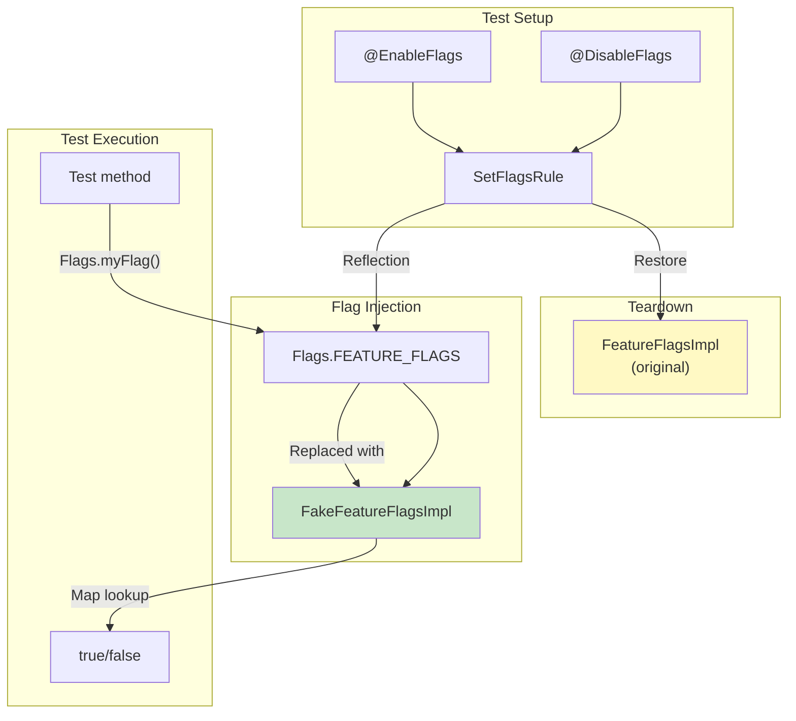

### 3.7.13  Flag 测试最佳实践

1. **同时测试开启与关闭两种状态。** 每个 flag 都应该覆盖 enabled 和 disabled 两条路径，否则当 flag 被翻转时很容易出现回归。

2. **优先使用注解，而不是编程式控制。** `@EnableFlags` 与 `@DisableFlags` 更直观，也更适合与参数化测试配合。

3. **显式测试交互。** 当两个 flag 有耦合时，使用 `FlagsParameterization.allCombinationsOf()` 覆盖全部四种组合。

4. **集成测试优先使用 DEVICE_DEFAULT。** `DefaultInitValueType.DEVICE_DEFAULT` 会从构建默认值出发，更接近生产行为。

5. **注意清理静态状态。** 虽然 `SetFlagsRule` 会自动恢复 flag 值，但被测代码本身若把某些 flag 结果缓存到静态状态中，仍可能保留副作用。

---

## 3.8  Legacy Feature Flags

在 aconfig 之前，Android 已经积累了多种“土法”特性开关方案。理解这些旧机制非常重要，因为它们至今仍广泛存在于代码库中，而且 aconfig 在某些场景下就是对它们的标准化封装或替代。

### 3.8.1  SystemProperties

`SystemProperties`（`android.os.SystemProperties`）提供键值字符串属性，其中很多长期被当作 feature flag 使用：

```java
// Check a system property flag
boolean enabled = SystemProperties.getBoolean(
    "ro.feature.my_feature", false);
```

常见与 flag 相关的属性前缀：

| 前缀 | 可变性 | 说明 |
|----------------|------------|------------------------------------------|
| `ro.*` | 只读 | 开机时确定，运行时不可改 |
| `persist.*` | 持久 | 可运行时写入，重启后保留 |
| `sys.*` | 易失 | 可写，重启丢失 |
| `debug.*` | 调试用途 | 常用于开发期开关 |

**局限：**

- 没有类型安全，一切都是字符串
- 没有集中式声明，完全靠约定
- 与构建系统无直接集成，通常通过 init 脚本、build.prop 或运行时赋值设置
- 旧版本中 key 和 value 长度受限
- 不支持 per-user 或 per-profile 精细控制

### 3.8.2  `Settings.Global` 与 `Settings.Secure`

`Settings` provider 提供了比 SystemProperties 更灵活的持久化键值存储，因此也常被用于控制某些行为：

```java
// Read a settings-based flag
int value = Settings.Global.getInt(
    context.getContentResolver(),
    "my_feature_flag", 0);
```

| 表 | 作用域 | 用途 |
|------------------|-----------|-----------------------------------------|
| `Settings.Global` | 设备级 | 系统级 feature flag |
| `Settings.Secure` | 每用户 | 用户级 feature flag |
| `Settings.System` | 每用户 | 更偏用户可见设置，而非真正 feature flag |

**局限：**

- 依赖 `ContentResolver`，也就是必须先拿到 context
- 在 `SettingsProvider` 启动前不可用
- 除了基本 getter 外几乎没有类型安全
- 缺乏集中声明与生命周期管理

### 3.8.3  DeviceConfig

`DeviceConfig`（`android.provider.DeviceConfig`）是在 Android 10 引入的、面向 feature flag 的专用机制。它按 namespace 组织旗标，并支持服务端推送：

```java
// Read a DeviceConfig flag
boolean enabled = DeviceConfig.getBoolean(
    "my_namespace", "my_flag", false);

// Listen for changes
DeviceConfig.addOnPropertiesChangedListener(
    "my_namespace",
    executor,
    properties -> {
        boolean newValue = properties.getBoolean(
            "my_flag", false);
    });
```

DeviceConfig 本质上是 aconfig 运行时存储系统的前身。对于声明中带有 `metadata { storage: DEVICE_CONFIG }` 的 flag，aconfig 仍会生成基于 DeviceConfig 的访问代码。

**局限：**

- 底层仍建立在 Settings.Global 之上，因此 IPC 开销依旧存在
- 依赖 SettingsProvider 初始化完成
- 无法做编译期死代码消除
- 没有标准化声明格式，仍然大量依赖约定

### 3.8.4  `config.xml` Resource Overlay

基于资源的特性开关，通过 XML 配置文件表达，并允许 OEM 通过 overlay 覆盖：

```xml
<!-- frameworks/base/core/res/res/values/config.xml -->
<resources>
    <bool name="config_enableMultiWindow">true</bool>
    <integer name="config_maxRunningUsers">4</integer>
</resources>
```

OEM 可以通过 Runtime Resource Overlay（RRO）或构建期静态 overlay 覆盖它们：

```xml
<!-- device/vendor/overlay/res/values/config.xml -->
<resources>
    <bool name="config_enableMultiWindow">false</bool>
</resources>
```

**局限：**

- 本质上是构建期或安装期配置，不能真正动态切换
- 没有服务端控制能力
- 没有生命周期管理
- 覆盖通常是 per-device，而非 per-user 或按人群 rollout

### 3.8.5  对比矩阵

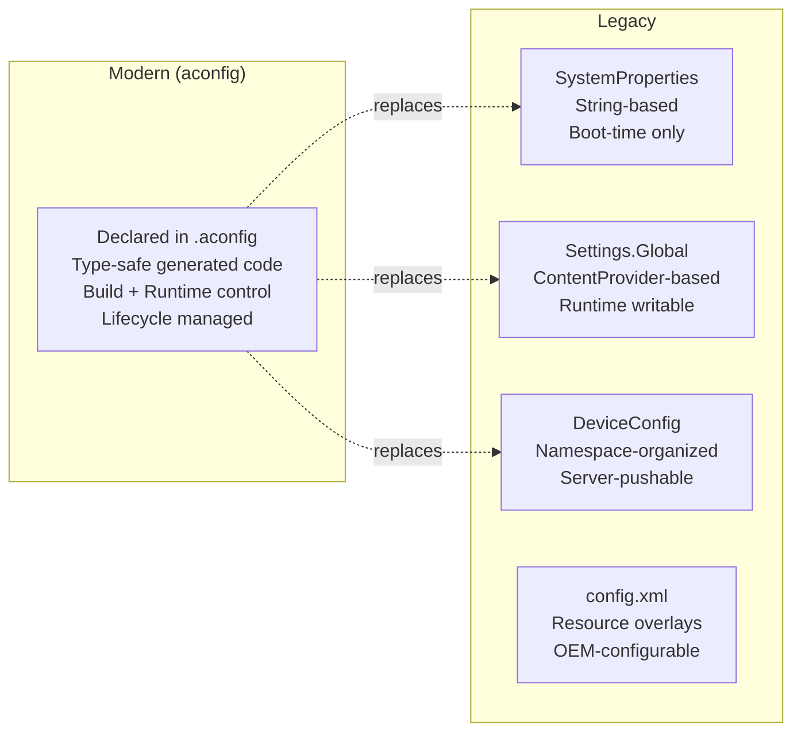

| 能力 | aconfig | SystemProperties | Settings.Global | DeviceConfig | config.xml |
|----------------------|---------------|------------------|-----------------|--------------|------------|
| 类型安全 | 有，依赖 codegen | 无 | 无 | 无 | 有限 |
| 声明形式 | `.aconfig` | 约定 | 约定 | 约定 | XML |
| 构建期控制 | 有 | 有 | 无 | 无 | 有 |
| 运行时控制 | 有，仅对 RW | 有限 | 有 | 有 | 无 |
| 服务端推送 | 有 | 无 | 无 | 有 | 无 |
| 死代码消除 | 有，R8 可做 | 无 | 无 | 无 | 无 |
| 生命周期管理 | 有 | 无 | 无 | 无 | 无 |
| 测试基础设施 | 有 | 需手工实现 | 需手工实现 | 需手工实现 | 需手工实现 |
| 启动早期可用 | 新方案可用 | 可用 | 不可用 | 不可用 | 可用 |
| per-user | 无 | 无 | Secure 支持 | 无 | 无 |

### 3.8.6  构建期 Feature Macro

在 aconfig 出现之前，native 代码经常直接使用预处理宏作为 feature flag：

```cpp
// Traditional approach
#ifdef ENABLE_FANCY_RENDERING
    renderFancy(scene);
#else
    renderBasic(scene);
#endif
```

这些宏一般通过 `Android.bp` 或 `Android.mk` 中的 `cflags` 注入：

```blueprint
cc_library {
    name: "mylib",
    cflags: ["-DENABLE_FANCY_RENDERING"],
}
```

**局限：**

- 宏定义和使用点分离，没有统一声明
- 无法做运行时 override
- 没有成体系测试基础设施
- 拼写错误会悄悄创造出一个新宏
- 无法集中查看当前到底有哪些 flag

aconfig 的 C++ codegen 一方面保留了“固定只读 flag 零运行时开销”的优势，另一方面又为可写 flag 增加了运行时灵活性。

### 3.8.7  `@FlaggedApi` 注解

`@FlaggedApi` 负责把 aconfig flag 与 Android API surface 连接起来。当一个 public API 被某个 flag 保护时：

```java
@FlaggedApi(Flags.FLAG_MY_NEW_API)
public void myNewApi() {
    // This API only exists when the flag is enabled
}
```

此时 metalava 与 API surface checker 就可以利用这个注解：

- 决定该 API 是否要进入 public API signature
- 跟踪“哪个 API 由哪个 flag 保护”
- 强制 finalized API 与对应 flag 保持一致
- 生成能反映 flag 状态的 SDK stub

`all_aconfig_declarations` singleton 还会生成元数据，供 metalava 检查“flag 状态”与“API 可见性”是否一致。

### 3.8.8  从遗留方案迁移到 aconfig

如果要把旧式 feature flag 迁移到 aconfig，常见步骤是：

1. 在 `.aconfig` 文件中**声明**一个语义等价的新 flag
2. 通过 `java_aconfig_library` 或 `cc_aconfig_library` **生成**访问库
3. 把旧读法，例如 `SystemProperties.getBoolean(...)` 或 `DeviceConfig.getBoolean(...)`，替换成生成 accessor，例如 `Flags.myFlag()`
4. 在相应 release config 中补上 values，使其默认行为与旧 flag 一致
5. 加上 `@EnableFlags` / `@DisableFlags` 对应测试
6. 当所有调用方都迁移完毕后，删除旧 flag

对于原本基于 DeviceConfig 的 flag，还可以渐进迁移：在 aconfig 声明中保留 `metadata { storage: DEVICE_CONFIG }`，先获得集中声明和类型安全 codegen，再逐步迁往新的运行时存储后端。

---

## 3.9  Try It

下面这些练习会带你走完整个 aconfig 工作流，从声明一个 flag 到在多种状态下测试它。

### 3.9.1  练习 1：观察现有 flag

先在 AOSP 树中浏览现有 `.aconfig`：

```bash
# Count all .aconfig declaration files
find . -name "*.aconfig" -type f | wc -l
# Expected: ~440+ files

# Examine a simple flag declaration
cat system/apex/apexd/apexd.aconfig

# Examine a complex declaration with metadata
cat packages/modules/ConfigInfrastructure/framework/flags.aconfig

# Look at the Android.bp that wires up declarations
cat frameworks/base/android-sdk-flags/Android.bp
```

### 3.9.2  练习 2：追踪构建流水线

沿着单个 flag 在构建系统中的路径走一遍：

```bash
# Find all aconfig_declarations modules for a package
grep -r "aconfig_declarations {" \
    frameworks/base/android-sdk-flags/Android.bp

# Find the corresponding java_aconfig_library
grep -A5 "java_aconfig_library {" \
    frameworks/base/android-sdk-flags/Android.bp

# See which release configs set values for this package
find build/release/aconfig -name "*.textproto" \
    -exec grep -l "android.sdk" {} \;
```

### 3.9.3  练习 3：查看生成代码

构建完成后，直接查看生成出来的 flag 代码：

```bash
# Build the flag library
m android.sdk.flags-aconfig-java

# Find the generated source jar
find out/soong/.intermediates -name "*.srcjar" \
    -path "*android.sdk.flags-aconfig-java*"

# Extract and examine
mkdir /tmp/flags-gen
cd /tmp/flags-gen
unzip <path-to-srcjar>
cat android/sdk/Flags.java
cat android/sdk/FeatureFlags.java
cat android/sdk/FeatureFlagsImpl.java
```

### 3.9.4  练习 4：直接使用 aconfig 工具

`aconfig` 二进制本身就可以单独使用：

```bash
# Build the aconfig tool
m aconfig

# Create a test .aconfig file
cat > /tmp/test.aconfig << 'EOF'
package: "com.example.test"
container: "system"

flag {
    name: "my_test_flag"
    namespace: "test_namespace"
    description: "A test flag for learning"
    bug: "12345"
}

flag {
    name: "my_readonly_flag"
    namespace: "test_namespace"
    description: "A read-only test flag"
    bug: "12345"
    is_fixed_read_only: true
}
EOF

# Create a values override file
cat > /tmp/test.values << 'EOF'
flag_value {
    package: "com.example.test"
    name: "my_test_flag"
    state: ENABLED
    permission: READ_WRITE
}
flag_value {
    package: "com.example.test"
    name: "my_readonly_flag"
    state: ENABLED
    permission: READ_ONLY
}
EOF

# Create the cache
aconfig create-cache \
    --package com.example.test \
    --container system \
    --declarations /tmp/test.aconfig \
    --values /tmp/test.values \
    --cache /tmp/test-cache.pb

# Dump the cache in human-readable format
aconfig dump-cache \
    --cache /tmp/test-cache.pb \
    --format '{fully_qualified_name} state={state} \
              permission={permission}'

# Generate Java code
mkdir -p /tmp/java-out
aconfig create-java-lib \
    --cache /tmp/test-cache.pb \
    --mode production \
    --out /tmp/java-out

# Examine the generated code
find /tmp/java-out -name "*.java" -exec echo "=== {} ===" \; \
    -exec cat {} \;
```

### 3.9.5  练习 5：用 `dump-cache` 查询 flag

`dump-cache` 支持较丰富的格式化与过滤能力：

```bash
# Show all flags with their trace (which files set values)
aconfig dump-cache \
    --cache /tmp/test-cache.pb \
    --format '{fully_qualified_name} {trace}'

# Filter by permission
aconfig dump-cache \
    --cache /tmp/test-cache.pb \
    --filter 'permission:READ_WRITE' \
    --format '{name}: {state}'

# Filter by state
aconfig dump-cache \
    --cache /tmp/test-cache.pb \
    --filter 'state:ENABLED+permission:READ_ONLY' \
    --format '{fully_qualified_name}'

# Output as text protobuf
aconfig dump-cache \
    --cache /tmp/test-cache.pb \
    --format textproto
```

### 3.9.6  练习 6：编写受 flag 保护的代码

创建一个简单模块来使用 aconfig flag。

**步骤 1：声明 flag**（`my_module/flags.aconfig`）：

```protobuf
package: "com.example.mymodule"
container: "system"

flag {
    name: "enable_new_algorithm"
    namespace: "performance"
    description: "Use the new O(n log n) algorithm"
    bug: "999999"
}

flag {
    name: "enable_caching"
    namespace: "performance"
    description: "Enable result caching"
    bug: "999998"
    is_fixed_read_only: true
}
```

**步骤 2：添加构建规则**（`my_module/Android.bp`）：

```blueprint
aconfig_declarations {
    name: "my-module-flags",
    package: "com.example.mymodule",
    container: "system",
    srcs: ["flags.aconfig"],
}

java_aconfig_library {
    name: "my-module-flags-java",
    aconfig_declarations: "my-module-flags",
}

java_library {
    name: "my-module",
    srcs: ["src/**/*.java"],
    static_libs: ["my-module-flags-java"],
}
```

**步骤 3：在代码中使用 flag**（`my_module/src/.../MyProcessor.java`）：

```java
import com.example.mymodule.Flags;

public class MyProcessor {
    public Result process(Input input) {
        if (Flags.enableNewAlgorithm()) {
            return newAlgorithm(input);
        } else {
            return legacyAlgorithm(input);
        }
    }

    private Result fetchResult(Key key) {
        if (Flags.enableCaching()) {
            Result cached = cache.get(key);
            if (cached != null) return cached;
        }
        Result result = computeResult(key);
        if (Flags.enableCaching()) {
            cache.put(key, result);
        }
        return result;
    }
}
```

### 3.9.7  练习 7：为 flag 编写测试

为 enabled / disabled 两种状态都写测试：

```java
import static org.junit.Assert.*;

import android.platform.test.annotations.DisableFlags;
import android.platform.test.annotations.EnableFlags;
import android.platform.test.flag.junit.SetFlagsRule;
import com.example.mymodule.Flags;

import org.junit.Rule;
import org.junit.Test;
import org.junit.runner.RunWith;
import org.junit.runners.JUnit4;

@RunWith(JUnit4.class)
public class MyProcessorTest {

    @Rule
    public final SetFlagsRule mSetFlagsRule = new SetFlagsRule();

    private final MyProcessor mProcessor = new MyProcessor();

    @Test
    @EnableFlags(Flags.FLAG_ENABLE_NEW_ALGORITHM)
    public void testNewAlgorithm() {
        Result result = mProcessor.process(testInput);
        // Verify new algorithm behavior
        assertEquals(expectedNewResult, result);
    }

    @Test
    @DisableFlags(Flags.FLAG_ENABLE_NEW_ALGORITHM)
    public void testLegacyAlgorithm() {
        Result result = mProcessor.process(testInput);
        // Verify legacy algorithm behavior
        assertEquals(expectedLegacyResult, result);
    }

    @Test
    @EnableFlags({
        Flags.FLAG_ENABLE_NEW_ALGORITHM,
        Flags.FLAG_ENABLE_CACHING
    })
    public void testNewAlgorithmWithCaching() {
        Result first = mProcessor.process(testInput);
        Result second = mProcessor.process(testInput);
        // Verify caching behavior
        assertSame(first, second);
    }
}
```

### 3.9.8  练习 8：参数化 flag 测试

让同一个测试覆盖全部组合：

```java
import android.platform.test.flag.junit.SetFlagsRule;
import android.platform.test.flag.junit.FlagsParameterization;
import com.example.mymodule.Flags;

import org.junit.Rule;
import org.junit.Test;
import org.junit.runner.RunWith;
import org.junit.runners.Parameterized;

import java.util.List;

@RunWith(Parameterized.class)
public class MyProcessorParameterizedTest {

    @Parameterized.Parameters(name = "{0}")
    public static List<FlagsParameterization> getParams() {
        return FlagsParameterization.allCombinationsOf(
            Flags.FLAG_ENABLE_NEW_ALGORITHM,
            Flags.FLAG_ENABLE_CACHING
        );
        // Generates 4 combinations:
        // [new=T, cache=T], [new=T, cache=F],
        // [new=F, cache=T], [new=F, cache=F]
    }

    @Rule
    public final SetFlagsRule mSetFlagsRule;

    public MyProcessorParameterizedTest(
            FlagsParameterization flags) {
        mSetFlagsRule = new SetFlagsRule(flags);
    }

    @Test
    public void testProcessNeverCrashes() {
        MyProcessor processor = new MyProcessor();
        // This test runs 4 times, once per combination
        Result result = processor.process(testInput);
        assertNotNull(result);
    }
}
```

### 3.9.9  练习 9：在设备上观察运行时 flag 状态

使用设备命令查看和操作运行时 flag：

```bash
# List all aconfig flags on the device
adb shell aflags list

# Filter by package
adb shell aflags list | grep "com.android.apex"

# Check a specific flag value
adb shell device_config get \
    core_experiments_team_internal \
    com.android.provider.flags.dump_improvements

# Override a read-write flag
adb shell aflags enable \
    com.android.provider.flags.dump_improvements

# Verify the override
adb shell aflags list | grep dump_improvements

# Clear the override
adb shell aflags clear \
    com.android.provider.flags.dump_improvements

# Inspect flag storage files
adb shell ls -la /metadata/aconfig/
adb shell ls -la /metadata/aconfig/maps/
adb shell ls -la /metadata/aconfig/flags/
```

### 3.9.10  练习 10：创建一个 C++ flag library

把 aconfig 集成进一个 native 模块：

**步骤 1：声明 flag**（`my_native/flags.aconfig`）：

```protobuf
package: "com.example.mynative"
container: "system"

flag {
    name: "use_new_codec"
    namespace: "media"
    description: "Use the new hardware codec path"
    bug: "111111"
}
```

**步骤 2：构建规则**（`my_native/Android.bp`）：

```blueprint
aconfig_declarations {
    name: "my-native-flags",
    package: "com.example.mynative",
    container: "system",
    srcs: ["flags.aconfig"],
}

cc_aconfig_library {
    name: "my-native-flags-cc",
    aconfig_declarations: "my-native-flags",
}

cc_library {
    name: "my-native-lib",
    srcs: ["my_codec.cpp"],
    shared_libs: [
        "my-native-flags-cc",
        "libaconfig_storage_read_api_cc",
        "libbase",
        "liblog",
    ],
}
```

**步骤 3：在 C++ 中使用**（`my_native/my_codec.cpp`）：

```cpp
#include "com_example_mynative.h"

void processFrame(Frame& frame) {
    if (com::example::mynative::use_new_codec()) {
        newCodecPath(frame);
    } else {
        legacyCodecPath(frame);
    }
}
```

### 3.9.11  练习 11：观察 Soong 构建集成

跟踪 Soong 如何处理 aconfig 模块：

```bash
# Look at the Soong module registration
cat build/soong/aconfig/init.go

# Examine the declarations module implementation
cat build/soong/aconfig/aconfig_declarations.go

# See how values flow from release config to declarations
grep -n "ReleaseAconfigValueSets" \
    build/soong/aconfig/aconfig_declarations.go

# Examine the codegen module types
cat build/soong/aconfig/codegen/init.go

# Look at the Java codegen integration
cat build/soong/aconfig/codegen/java_aconfig_library.go

# See the all_aconfig_declarations singleton
cat build/soong/aconfig/all_aconfig_declarations.go
```

### 3.9.12  练习 12：查看 aconfig Proto Schema

研究支撑整个系统的 protobuf 定义：

```bash
# The main aconfig proto definition
cat build/make/tools/aconfig/aconfig_protos/protos/aconfig.proto

# The internal proto for finalized flags
cat build/make/tools/aconfig/aconfig_protos/protos/aconfig_internal.proto

# The storage metadata proto
cat build/make/tools/aconfig/aconfig_storage_file/protos/\
    aconfig_storage_metadata.proto
```

需要重点理解的消息包括：

| Message | 文件 | 用途 |
|--------------------|------------------|--------------------------------------------|
| `flag_declaration` | `aconfig.proto` | 输入：单个 flag 声明 |
| `flag_declarations` | `aconfig.proto` | 输入：package 级声明包装 |
| `flag_value` | `aconfig.proto` | 输入：某个 flag 的值覆盖 |
| `flag_values` | `aconfig.proto` | 输入：值覆盖集合 |
| `parsed_flag` | `aconfig.proto` | 输出：已经解析并带 trace 的 flag |
| `parsed_flags` | `aconfig.proto` | 输出：全部解析后的 flag 集合 |
| `tracepoint` | `aconfig.proto` | 输出：某个 flag 值来源轨迹 |
| `finalized_flag` | `aconfig_internal.proto` | 内部：API finalize 记录 |
| `storage_file_info` | `aconfig_storage_metadata.proto` | 存储文件定位信息 |

---

## Summary

aconfig 特性开关系统，代表了 Android 在“代码开发”与“功能可用性”之间的一次根本性转型。它对平台的关键贡献可以概括为：

**构建期基础设施：**

- `.aconfig` 声明格式提供了标准化、protobuf 支撑的 flag 元数据结构，包括 package、namespace、container、permission、purpose 和 storage backend。
- Soong 模块类型，例如 `aconfig_declarations`、`aconfig_values`、`aconfig_value_set`、`java_aconfig_library`、`cc_aconfig_library`、`rust_aconfig_library`，共同构成了从声明到可用 library 的类型安全流水线。
- Release configuration 通过选择不同 value set，实现无需改代码即可定制不同目标构建中的 flag 状态。

**代码生成：**

- `aconfig` 工具能够为 Java、C++ 和 Rust 生成类型安全 accessor，彻底消除字符串式 flag 查找。
- 生成代码包含 R8 优化注解，使只读 flag 背后的死代码可在编译期被消除。
- 四种 codegen mode，即 production、test、exported、force-read-only，分别服务于不同构建场景。

**运行时解析：**

- `aconfigd` 服务与内存映射存储文件，让 flag 可以在启动早期可用，并实现接近零 IPC 的读取开销。
- 旧的 DeviceConfig backend 仍然保留，以满足兼容性需求。
- 对于可写 flag，服务端 override 不再要求通过 OTA 发布。

**测试体系：**

- `SetFlagsRule`、`@EnableFlags` / `@DisableFlags`、`FlagsParameterization` 提供了成熟的单元测试支持。
- 自动生成的 `FakeFeatureFlagsImpl` 提供了隔离测试能力。
- test mode 下的生成实现会强制测试显式配置 flag 状态，从而避免意外依赖生产默认值。

这些能力组合在一起，也就是 trunk-stable 开发、类型安全 codegen、高效运行时解析与完整测试支持，共同解决了 Android 平台在持续迭代、海量功能并行推进的前提下，仍要维持平台稳定性的核心难题。

---

## Key Source Files

| 路径 | 说明 |
|------|-------------|
| `build/make/tools/aconfig/aconfig_protos/protos/aconfig.proto` | Flag 声明与 value 的 protobuf schema |
| `build/make/tools/aconfig/aconfig/src/commands.rs` | aconfig 工具的核心命令实现 |
| `build/make/tools/aconfig/aconfig/src/codegen/java.rs` | Java 代码生成逻辑 |
| `build/make/tools/aconfig/aconfig/src/codegen/cpp.rs` | C++ 代码生成逻辑 |
| `build/make/tools/aconfig/aconfig/src/codegen/rust.rs` | Rust 代码生成逻辑 |
| `build/make/tools/aconfig/aconfig/src/codegen/mod.rs` | `CodegenMode` 枚举与共用工具 |
| `build/make/tools/aconfig/aconfig/templates/Flags.java.template` | Java `Flags` 模板 |
| `build/make/tools/aconfig/aconfig/templates/FeatureFlags.java.template` | Java `FeatureFlags` 接口模板 |
| `build/make/tools/aconfig/aconfig/templates/FeatureFlagsImpl.new_storage.java.template` | 新存储后端的 `FeatureFlagsImpl` 模板 |
| `build/make/tools/aconfig/aconfig/templates/FeatureFlagsImpl.deviceConfig.java.template` | DeviceConfig 后端的 `FeatureFlagsImpl` 模板 |
| `build/make/tools/aconfig/aconfig/templates/FeatureFlagsImpl.test_mode.java.template` | test mode `FeatureFlagsImpl` 模板 |
| `build/make/tools/aconfig/aconfig/templates/FakeFeatureFlagsImpl.java.template` | 测试替身模板 |
| `build/make/tools/aconfig/aconfig/templates/CustomFeatureFlags.java.template` | 自定义委托包装层模板 |
| `build/make/tools/aconfig/aconfig/templates/cpp_exported_header.template` | C++ 头文件模板 |
| `build/make/tools/aconfig/aconfig/templates/cpp_source_file.template` | C++ 源文件模板 |
| `build/soong/aconfig/init.go` | Soong 模块注册与构建规则 |
| `build/soong/aconfig/aconfig_declarations.go` | `aconfig_declarations` 模块类型实现 |
| `build/soong/aconfig/aconfig_values.go` | `aconfig_values` 模块类型实现 |
| `build/soong/aconfig/aconfig_value_set.go` | `aconfig_value_set` 模块类型实现 |
| `build/soong/aconfig/all_aconfig_declarations.go` | 收集全部声明的 singleton |
| `build/soong/aconfig/exported_java_aconfig_library.go` | 导出 JAR singleton |
| `build/soong/aconfig/codegen/init.go` | codegen 模块注册与构建规则 |
| `build/soong/aconfig/codegen/java_aconfig_library.go` | `java_aconfig_library` 模块类型 |
| `build/soong/aconfig/codegen/cc_aconfig_library.go` | `cc_aconfig_library` 模块类型 |
| `build/soong/aconfig/codegen/rust_aconfig_library.go` | `rust_aconfig_library` 模块类型 |
| `build/soong/aconfig/codegen/aconfig_declarations_group.go` | group 模块类型 |
| `build/make/tools/aconfig/aconfig_storage_read_api/src/lib.rs` | 存储读取 API |
| `build/make/tools/aconfig/aconfig_storage_file/protos/aconfig_storage_metadata.proto` | 存储元数据 proto |
| `system/server_configurable_flags/aconfigd/aconfigd.rc` | aconfigd init service 定义 |
| `system/server_configurable_flags/aconfigd/src/aconfigd_commands.rs` | aconfigd 命令处理器 |
| `build/make/tools/aconfig/aflags/src/main.rs` | 设备侧 CLI `aflags` |
| `platform_testing/libraries/flag-helpers/junit/src_base/android/platform/test/flag/junit/SetFlagsRule.java` | 用于控制 flag 的测试规则 |
| `platform_testing/libraries/annotations/src/android/platform/test/annotations/EnableFlags.java` | `@EnableFlags` 注解 |
| `platform_testing/libraries/annotations/src/android/platform/test/annotations/DisableFlags.java` | `@DisableFlags` 注解 |
| `frameworks/base/AconfigFlags.bp` | framework 侧 flag library 聚合文件 |
| `build/release/aconfig/bp4a/Android.bp` | release config value set 示例 |
