# Chapter 3: Feature Flags and aconfig

> *"Shipping new code and enabling new behavior are two fundamentally different
> acts.  A feature flag is the explicit acknowledgment of that separation."*
> -- Android Platform Engineering

---

Large-scale software projects face an inherent contradiction: developers need to
commit code to the mainline branch frequently to reduce merge conflicts, yet
half-finished features must never reach end users.  For over a decade, Android
OEMs addressed this tension through long-lived release branches, cherry-pick
marathons, and `#ifdef`-like compile-time switches scattered across thousands
of files.  The result was predictable -- merge debt, stale branches, and an
ever-growing distance between what developers tested and what shipped.

Starting with Android 14 (API 34) and maturing significantly in Android 15
(API 35), the **aconfig** system introduces a unified, build-and-runtime
feature flag infrastructure.  It sits at the intersection of build policy,
runtime configuration, code generation, and testing, touching nearly every layer
of the platform.  As of the current AOSP tree, there are over 440 `.aconfig`
declaration files spanning frameworks, system services, HALs, Mainline modules,
and vendor partitions.

This chapter traces the entire feature flag pipeline: from the policy motivation
behind trunk-stable development, through the `.aconfig` declaration format and
the Soong module types that wire declarations into the build, to the Rust-based
`aconfig` tool that generates type-safe Java, C++, and Rust accessor code, into
the runtime flag resolution system backed by `aconfigd` and memory-mapped
storage files, and finally through the testing infrastructure that lets
engineers exercise every flag combination in unit and integration tests.

---

## 3.1  Feature Flag Architecture

### 3.1.1  Why Feature Flags?

The motivation for feature flags in AOSP is captured in a single phrase:
**trunk-stable development**.  Instead of isolating unreleased features on
long-lived branches, all code lives on the mainline trunk, guarded by flags
that can be flipped at build time or at runtime.  This approach yields several
benefits:

1. **Reduced merge conflicts.**  Every engineer works against the same tree.
   Features-in-progress are committed behind disabled flags, eliminating the
   need for feature branches that diverge over months.

2. **Gradual rollouts.**  A feature can be enabled for dogfood builds, then
   beta users, then a staged production rollout -- all without code changes.
   If a problem is detected, the flag is disabled server-side; no OTA required.

3. **Release decoupling.**  The release train can cut at any point on trunk.
   Features not ready for a particular release remain behind disabled flags;
   their code is present but inert.

4. **Consistent testing.**  CI can run the full test suite with flags in
   multiple combinations -- enabled, disabled, and mixed -- catching
   interactions that branch-based development misses entirely.

5. **Flag-guarded APIs.**  New public APIs can be annotated with
   `@FlaggedApi`, allowing the API surface to be conditionally visible
   depending on flag state.  This is critical for Mainline modules that
   ship across multiple Android versions.

### 3.1.2  Trunk-Stable Development Model

The trunk-stable model changes the mental model for platform engineers:

```
Traditional Model:
  main ─── feature-branch-A ──┐
       ├── feature-branch-B ──┤── merge → release-branch
       └── feature-branch-C ──┘

Trunk-Stable Model:
  main ──── all features committed (behind flags) ──── cut release
            flag_a=disabled  flag_b=enabled  flag_c=disabled
```

In the trunk-stable model, the main branch is always in a releasable state.
Features are enabled or disabled through flag configuration that is
orthogonal to the code itself.  The **release configuration** selects which
flags are enabled for a given build target (e.g., `bp4a`, `ap3a`,
`trunk_staging`).

### 3.1.3  Flag Types and Permissions

Flags in aconfig have two orthogonal dimensions:

**State** (enabled or disabled):

| State       | Meaning                                           |
|-------------|---------------------------------------------------|
| `ENABLED`   | The feature behind this flag is active.            |
| `DISABLED`  | The feature behind this flag is inactive.          |

**Permission** (who can change the flag):

| Permission   | Meaning                                                       |
|--------------|---------------------------------------------------------------|
| `READ_ONLY`  | The flag value is baked at build time.  Cannot be overridden at runtime. |
| `READ_WRITE` | The flag can be overridden at runtime via DeviceConfig or aconfigd. |

Additionally, flags may be marked as **`is_fixed_read_only`** in their
declaration.  This is a stronger guarantee: the flag can never be changed from
its declared default, not even by release configuration.  The build system
uses this to enable compile-time optimizations -- the R8 optimizer can
completely eliminate dead code branches behind fixed read-only flags.

### 3.1.4  High-Level Architecture

The aconfig system spans build time and runtime:

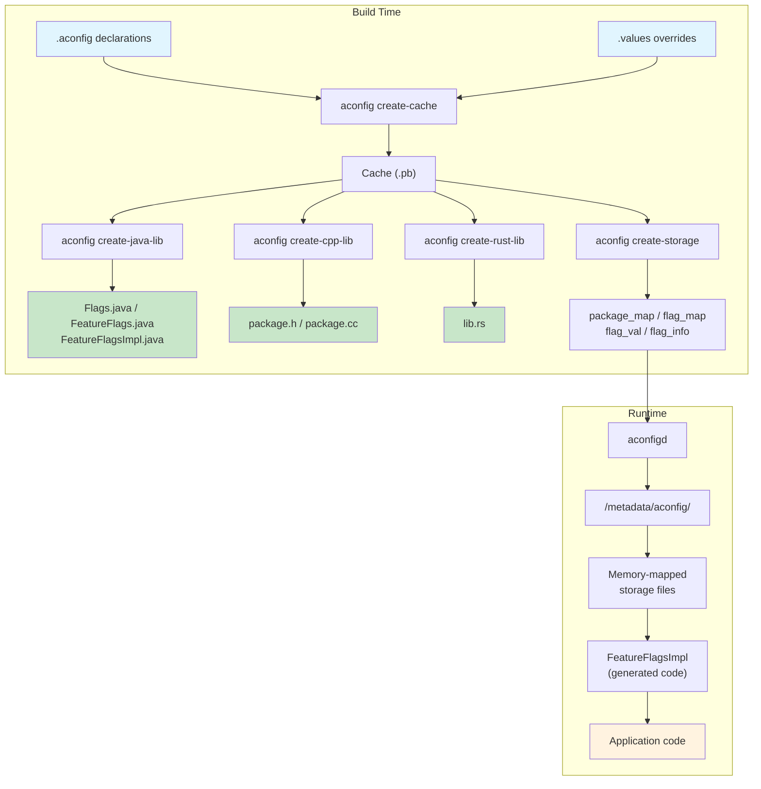

### 3.1.5  Containers

A **container** is a unit of software that is built and installed as a single
artifact.  The container concept is central to aconfig because flag storage
files are organized per container.  The main containers are:

- **`system`** -- the system partition
- **`system_ext`** -- the system_ext partition
- **`vendor`** -- the vendor partition
- **`product`** -- the product partition
- **APEX modules** -- each APEX (e.g., `com.android.configinfrastructure`,
  `com.android.wifi`) is its own container
- **APKs** -- independently released APKs are their own containers

The container determines where storage files are placed and how flag values
are resolved at boot.  A flag declared in one container cannot be read by
code running in a different container without explicit export.

---

## 3.2  The aconfig System

### 3.2.1  The aconfig Tool

The `aconfig` binary is a Rust tool located at:

```
build/make/tools/aconfig/aconfig/
```

It provides several subcommands that form the backbone of the build-time
pipeline:

| Subcommand         | Purpose                                                     |
|--------------------|-------------------------------------------------------------|
| `create-cache`     | Parse `.aconfig` declarations and `.values` overrides into a binary protobuf cache |
| `create-java-lib`  | Generate Java source from the cache                         |
| `create-cpp-lib`   | Generate C++ source from the cache                          |
| `create-rust-lib`  | Generate Rust source from the cache                         |
| `create-storage`   | Generate binary storage files (package_map, flag_map, flag_val, flag_info) |
| `dump-cache`       | Dump cache contents in various formats (text, protobuf, custom) |

The tool is registered as a host binary in the Soong build system through
`pctx.HostBinToolVariable("aconfig", "aconfig")` in
`build/soong/aconfig/init.go` (line 158).

### 3.2.2  The .aconfig File Format

Flag declarations use a text-protobuf format defined by the `flag_declarations`
message in `build/make/tools/aconfig/aconfig_protos/protos/aconfig.proto`.
Each `.aconfig` file declares a package, a container, and one or more flags:

```protobuf
// File: system/apex/apexd/apexd.aconfig

package: "com.android.apex.flags"
container: "system"

flag {
  name: "mount_before_data"
  namespace: "treble"
  description: "This flag controls if allowing mounting APEXes
                before the data partition"
  bug: "361701397"
  is_fixed_read_only: true
}
```

A more complex example from the ConfigInfrastructure module:

```protobuf
// File: packages/modules/ConfigInfrastructure/framework/flags.aconfig

package: "android.provider.flags"
container: "com.android.configinfrastructure"

flag {
  name: "new_storage_writer_system_api"
  namespace: "core_experiments_team_internal"
  description: "API flag for writing new storage"
  bug: "367765164"
  is_fixed_read_only: true
  is_exported: true
}

flag {
  name: "dump_improvements"
  namespace: "core_experiments_team_internal"
  description: "Added more information on dumpsys device_config"
  bug: "364399200"
  is_exported: true
}

flag {
  name: "enable_immediate_clear_override_bugfix"
  namespace: "core_experiments_team_internal"
  description: "Bugfix flag to allow clearing a local override
                immediately"
  bug: "387316969"
  metadata {
    purpose: PURPOSE_BUGFIX
  }
}
```

### 3.2.3  Declaration Fields

Each `flag_declaration` message supports these fields, as defined in
`aconfig.proto` (lines 72-98):

| Field                | Type       | Required | Description                                       |
|----------------------|------------|----------|---------------------------------------------------|
| `name`               | `string`   | Yes      | Snake_case identifier (e.g., `mount_before_data`)  |
| `namespace`          | `string`   | Yes      | Organizational grouping for server-side management |
| `description`        | `string`   | Yes      | Human-readable purpose of the flag                 |
| `bug`                | `string`   | Yes      | Bug tracker ID (can be repeated)                   |
| `is_fixed_read_only` | `bool`     | No       | If true, value cannot change at runtime or via release config |
| `is_exported`        | `bool`     | No       | If true, flag is accessible outside its container  |
| `metadata`           | `message`  | No       | Additional metadata (purpose, storage backend)     |

The `metadata` message supports:

```protobuf
message flag_metadata {
  enum flag_purpose {
    PURPOSE_UNSPECIFIED = 0;
    PURPOSE_FEATURE = 1;
    PURPOSE_BUGFIX = 2;
  }

  enum flag_storage_backend {
    UNSPECIFIED = 0;
    ACONFIGD = 1;
    DEVICE_CONFIG = 2;
    NONE = 3;
  }

  optional flag_purpose purpose = 1;
  optional flag_storage_backend storage = 2;
}
```

The `purpose` field distinguishes between feature flags (which gate new
functionality) and bugfix flags (which gate correctness fixes).  The
`storage` field selects the runtime backend: the new `ACONFIGD`-based
memory-mapped storage or the legacy `DEVICE_CONFIG` (Settings-based) storage.

### 3.2.4  Naming Conventions

The aconfig system enforces strict naming rules (see `aconfig.proto` lines
26-57):

- **Flag names:** lowercase snake_case, no consecutive underscores, no leading
  digits (e.g., `adjust_rate` is valid; `AdjustRate` and `adjust__rate` are
  not)
- **Package names:** dot-delimited lowercase snake_case segments, each segment
  following the same rules (e.g., `com.android.mypackage`)
- **Namespaces:** lowercase snake_case (e.g., `core_experiments_team_internal`)
- **Containers:** lowercase, dot-delimited for APEX names (e.g., `system`,
  `com.android.configinfrastructure`)

### 3.2.5  Namespaces

Namespaces serve as the organizational unit for server-side flag management.
They group related flags that are typically owned by the same team and
managed through the same rollout pipeline.  On the server side (Google's
internal "Gantry" system), namespaces map to individual configuration
surfaces that teams can independently manage.

A namespace does not correspond one-to-one with a package; multiple packages
can share a namespace, and a package can contain flags in different namespaces.
The runtime DeviceConfig system (legacy storage) uses the namespace as the
property namespace for flag lookups:

```java
DeviceConfig.getProperties("core_experiments_team_internal");
```

In the new `aconfigd` storage system, namespaces are still tracked in the
metadata but are less central to the lookup path, since flags are indexed by
package and name rather than namespace.

### 3.2.6  The Flag Values File

Flag values override the default state and permission of declared flags.
They use the `flag_value` protobuf message format:

```protobuf
// File: build/make/tools/aconfig/aconfig/tests/first.values

flag_value {
    package: "com.android.aconfig.test"
    name: "disabled_ro"
    state: DISABLED
    permission: READ_ONLY
}
flag_value {
    package: "com.android.aconfig.test"
    name: "enabled_rw"
    state: ENABLED
    permission: READ_WRITE
}
flag_value {
    package: "com.android.aconfig.test"
    name: "enabled_fixed_ro"
    state: ENABLED
    permission: READ_ONLY
}
```

Real release configurations store values as `.textproto` files:

```protobuf
// File: build/release/aconfig/bp1a/.../single_thread_executor_flag_values.textproto

flag_value {
  package: "com.android.internal.camera.flags"
  name: "single_thread_executor"
  state: ENABLED
  permission: READ_ONLY
}
```

### 3.2.7  Value Resolution Order

When `aconfig create-cache` processes a flag, it applies values in order:

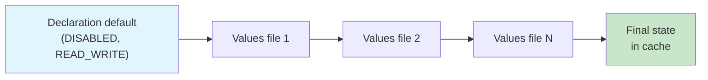

1. **Declaration default:** All flags start as `DISABLED` with `READ_WRITE`
   permission (defined in `commands.rs` line 74-75).
2. **Values files** are applied in order.  Later values override earlier ones.
3. **Build-time permission enforcement:** If
   `RELEASE_ACONFIG_REQUIRE_ALL_READ_ONLY` is set, all flags are forced to
   `READ_ONLY` regardless of their declared permission.
4. **Fixed read-only enforcement:** Flags with `is_fixed_read_only: true`
   cannot have their state overridden by values files.

Each value application is recorded as a **tracepoint** in the cache, allowing
developers to trace exactly which file set each flag's final value:

```protobuf
message tracepoint {
  optional string source = 1;
  optional flag_state state = 2;
  optional flag_permission permission = 3;
}
```

---

## 3.3  Flag Code Generation

### 3.3.1  Generated File Structure

The `aconfig` tool generates type-safe accessor code in three languages.  For
each package, the generated code follows a consistent pattern across all
languages: a public accessor facade, a runtime implementation, and a testing
interface.

**Java** (generated by `aconfig create-java-lib`):

| File                      | Purpose                                            |
|---------------------------|----------------------------------------------------|
| `Flags.java`              | Static accessor methods, one per flag               |
| `FeatureFlags.java`       | Interface declaring all flag methods                |
| `FeatureFlagsImpl.java`   | Runtime implementation (reads from storage)         |
| `CustomFeatureFlags.java` | Delegation wrapper for custom flag resolution       |
| `FakeFeatureFlagsImpl.java` | Test double for unit testing                     |

**C++** (generated by `aconfig create-cpp-lib`):

| File                  | Purpose                                               |
|-----------------------|-------------------------------------------------------|
| `<package>.h`         | Header with inline accessors and C-linkage functions  |
| `<package>.cc`        | Implementation reading from storage at runtime        |

**Rust** (generated by `aconfig create-rust-lib`):

| File         | Purpose                                                      |
|--------------|--------------------------------------------------------------|
| `src/lib.rs` | Module with flag accessor functions                          |

### 3.3.2  Code Generation Modes

The `aconfig` tool supports four code generation modes, controlled by the
`--mode` parameter (defined in `codegen/mod.rs` lines 58-64):

```rust
pub enum CodegenMode {
    Exported,       // For flags visible outside their container
    ForceReadOnly,  // All flags treated as read-only
    Production,     // Normal production mode
    Test,           // Test mode with mutable flag state
}
```

These modes are selected via the `mode` property on `java_aconfig_library`,
`cc_aconfig_library`, and `rust_aconfig_library` modules.  The supported
mode strings are (from `codegen/java_aconfig_library.go` line 31):

```go
var aconfigSupportedModes = []string{
    "production", "test", "exported", "force-read-only",
}
```

### 3.3.3  Flags.java -- The Public API Surface

The generated `Flags.java` is the primary entry point for flag checks.  It
provides static methods that delegate to an internal `FeatureFlags`
implementation.

Looking at the template in
`build/make/tools/aconfig/aconfig/templates/Flags.java.template`:

```java
// Generated code for package com.android.apex.flags

package com.android.apex.flags;

public final class Flags {

    /** @hide */
    public static final String FLAG_MOUNT_BEFORE_DATA =
        "com.android.apex.flags.mount_before_data";

    @com.android.aconfig.annotations.AssumeTrueForR8
    @com.android.aconfig.annotations.AconfigFlagAccessor
    public static boolean mountBeforeData() {
        return FEATURE_FLAGS.mountBeforeData();
    }

    private static FeatureFlags FEATURE_FLAGS = new FeatureFlagsImpl();
}
```

Key observations:

1. **Flag name constants** follow the pattern `FLAG_<UPPER_SNAKE_CASE>` and
   store the fully-qualified flag name (`package.flag_name`).

2. **R8 annotations** enable the R8 optimizer to assume a flag's value at
   compile time:
   - `@AssumeTrueForR8` -- on flags that are `ENABLED` and `READ_ONLY`
   - `@AssumeFalseForR8` -- on flags that are `DISABLED` and `READ_ONLY`
   - Read-write flags have no such annotation, since their value can change
     at runtime.

3. **Method naming** converts snake_case flag names to camelCase method names
   (e.g., `mount_before_data` becomes `mountBeforeData()`).

4. **In test mode**, `Flags.java` additionally exposes `setFeatureFlags()`
   and `unsetFeatureFlags()` methods for injecting test doubles.

### 3.3.4  FeatureFlags.java -- The Interface

The generated interface declares one boolean method per flag:

```java
package com.android.apex.flags;

/** @hide */
public interface FeatureFlags {
    @com.android.aconfig.annotations.AssumeTrueForR8
    @com.android.aconfig.annotations.AconfigFlagAccessor
    boolean mountBeforeData();
}
```

This interface is the contract that both the production and test
implementations must satisfy.

### 3.3.5  FeatureFlagsImpl.java -- Runtime Resolution

The runtime implementation varies based on the storage backend.  The aconfig
tool selects among several templates:

**New storage (aconfigd-based)** -- template
`FeatureFlagsImpl.new_storage.java.template`:

```java
package com.example.flags;

import android.os.flagging.PlatformAconfigPackageInternal;
import android.util.Log;

/** @hide */
public final class FeatureFlagsImpl implements FeatureFlags {
    private static final String TAG = "FeatureFlagsImpl";
    private static volatile boolean isCached = false;
    private static boolean myReadWriteFlag = false;

    private void init() {
        try {
            PlatformAconfigPackageInternal reader =
                PlatformAconfigPackageInternal.load(
                    "com.example.flags", 0xABCD1234L);
            myReadWriteFlag = reader.getBooleanFlagValue(0);
        } catch (Exception e) {
            Log.e(TAG, e.toString());
        } catch (LinkageError e) {
            // For mainline modules on older devices
            Log.e(TAG, e.toString());
        }
        isCached = true;
    }

    @Override
    public boolean myReadWriteFlag() {
        if (!isCached) {
            init();
        }
        return myReadWriteFlag;
    }

    @Override
    public boolean myReadOnlyFlag() {
        return true;  // Baked at build time
    }
}
```

For platform containers (`system`, `system_ext`, `product`, `vendor`), the
implementation uses `PlatformAconfigPackageInternal`.  For non-platform
containers (APEX modules), it uses `AconfigPackageInternal`.  Both read
flag values from memory-mapped storage files under `/metadata/aconfig/`.

The **package fingerprint** (`0xABCD1234L`) is a SipHash13 of the package name,
used to verify that the correct storage file is being read.

**Legacy DeviceConfig storage** -- template
`FeatureFlagsImpl.deviceConfig.java.template`:

```java
package com.example.flags;

import android.os.Binder;
import android.provider.DeviceConfig;
import android.provider.DeviceConfig.Properties;

/** @hide */
public final class FeatureFlagsImpl implements FeatureFlags {
    private static volatile boolean my_namespace_is_cached = false;
    private static boolean myReadWriteFlag = false;

    private void load_overrides_my_namespace() {
        final long ident = Binder.clearCallingIdentity();
        try {
            Properties properties =
                DeviceConfig.getProperties("my_namespace");
            myReadWriteFlag =
                properties.getBoolean(
                    Flags.FLAG_MY_READ_WRITE_FLAG, false);
        } catch (NullPointerException e) {
            throw new RuntimeException(
                "Cannot read value from namespace my_namespace "
                + "from DeviceConfig. It could be that the code "
                + "using flag executed before SettingsProvider "
                + "initialization. Please use fixed read-only flag "
                + "by adding is_fixed_read_only: true in flag "
                + "declaration.", e);
        } catch (SecurityException e) {
            // Skip loading for isolated processes
        } finally {
            Binder.restoreCallingIdentity(ident);
        }
        my_namespace_is_cached = true;
    }

    @Override
    public boolean myReadWriteFlag() {
        if (!my_namespace_is_cached) {
            load_overrides_my_namespace();
        }
        return myReadWriteFlag;
    }

    @Override
    public boolean myReadOnlyFlag() {
        return true;  // Baked at build time
    }
}
```

The DeviceConfig-based implementation groups flag reads by namespace,
performing a bulk `getProperties()` call to avoid per-flag IPC overhead.

**Test mode** -- template `FeatureFlagsImpl.test_mode.java.template`:

```java
package com.example.flags;

/** @hide */
public final class FeatureFlagsImpl implements FeatureFlags {
    @Override
    public boolean myFlag() {
        throw new UnsupportedOperationException(
            "Method is not implemented.");
    }
}
```

In test mode, the real implementation throws on every access, forcing tests
to explicitly set flag values through the fake implementation.  This ensures
tests never accidentally depend on production flag values.

### 3.3.6  FakeFeatureFlagsImpl.java -- Test Double

The `FakeFeatureFlagsImpl` is generated for non-exported libraries and
provides a map-backed implementation for testing:

```java
package com.example.flags;

import java.util.HashMap;
import java.util.Map;
import java.util.function.Predicate;

/** @hide */
public class FakeFeatureFlagsImpl extends CustomFeatureFlags {
    private final Map<String, Boolean> mFlagMap = new HashMap<>();
    private final FeatureFlags mDefaults;

    public FakeFeatureFlagsImpl() {
        this(null);
    }

    public FakeFeatureFlagsImpl(FeatureFlags defaults) {
        super(null);
        mDefaults = defaults;
        for (String flagName : getFlagNames()) {
            mFlagMap.put(flagName, null);
        }
    }

    @Override
    protected boolean getValue(String flagName,
                               Predicate<FeatureFlags> getter) {
        Boolean value = this.mFlagMap.get(flagName);
        if (value != null) {
            return value;
        }
        if (mDefaults != null) {
            return getter.test(mDefaults);
        }
        throw new IllegalArgumentException(flagName + " is not set");
    }

    public void setFlag(String flagName, boolean value) {
        if (!this.mFlagMap.containsKey(flagName)) {
            throw new IllegalArgumentException(
                "no such flag " + flagName);
        }
        this.mFlagMap.put(flagName, value);
    }

    public void resetAll() {
        for (Map.Entry entry : mFlagMap.entrySet()) {
            entry.setValue(null);
        }
    }
}
```

This class enables unit tests to set specific flag values without requiring
a running system or `DeviceConfig` provider.

### 3.3.7  CustomFeatureFlags.java -- Delegation Wrapper

The `CustomFeatureFlags` class provides a delegation pattern allowing
callers to inject custom flag resolution logic:

```java
package com.example.flags;

import java.util.function.BiPredicate;
import java.util.function.Predicate;

/** @hide */
public class CustomFeatureFlags implements FeatureFlags {
    private BiPredicate<String, Predicate<FeatureFlags>> mGetValueImpl;

    public CustomFeatureFlags(
            BiPredicate<String, Predicate<FeatureFlags>> getValueImpl) {
        mGetValueImpl = getValueImpl;
    }

    @Override
    public boolean myFlag() {
        return getValue(Flags.FLAG_MY_FLAG,
            FeatureFlags::myFlag);
    }

    public boolean isFlagReadOnlyOptimized(String flagName) {
        if (mReadOnlyFlagsSet.contains(flagName) &&
            isOptimizationEnabled()) {
            return true;
        }
        return false;
    }

    @com.android.aconfig.annotations.AssumeTrueForR8
    private boolean isOptimizationEnabled() {
        return false;
    }

    protected boolean getValue(String flagName,
                               Predicate<FeatureFlags> getter) {
        return mGetValueImpl.test(flagName, getter);
    }
}
```

The `isOptimizationEnabled()` method is marked `@AssumeTrueForR8` but returns
`false`.  This is an intentional pattern: R8 can assume this returns `true`,
enabling it to optimize away the `isFlagReadOnlyOptimized` checks for
read-only flags in release builds, while the actual runtime behavior
preserves the dynamic check.

### 3.3.8  ExportedFlags.java -- Simplified External API

For exported flag libraries (`mode: "exported"` with `single_exported_file:
true`), the aconfig tool generates an additional `ExportedFlags.java` that
provides a simplified API for external consumers (apps built outside the
platform):

```java
// Generated: ExportedFlags.java
package com.example.flags;

import android.os.Build;

public class ExportedFlags {

    public static boolean myExportedFlag() {
        if (Build.VERSION.SDK_INT >= 36) {
            return true;  // Finalized at SDK 36
        }
        return Flags.myExportedFlag();
    }
}
```

This class provides stable flag accessors that include SDK version checks
for finalized flags, ensuring backward compatibility when apps target
multiple Android versions.  The `@Deprecated` annotation is applied to the
original `Flags` and `FeatureFlags` classes to encourage migration to
`ExportedFlags`.

### 3.3.9  FeatureFlagsImpl Template Selection

The aconfig Java codegen selects from multiple `FeatureFlagsImpl`
templates based on the storage backend and code generation mode.
The selection logic (from the `add_feature_flags_impl_template` function
in `codegen/java.rs`) considers:

1. **Test mode** -- uses `FeatureFlagsImpl.test_mode.java.template`
   (throws on every access)
2. **DeviceConfig storage** -- uses
   `FeatureFlagsImpl.deviceConfig.java.template` (batch reads via
   `DeviceConfig.getProperties()`)
3. **New aconfigd storage** -- uses
   `FeatureFlagsImpl.new_storage.java.template` (reads from
   memory-mapped files via `AconfigPackageInternal`)
4. **Legacy internal** -- uses
   `FeatureFlagsImpl.legacy_flag.internal.java.template` (individual
   `DeviceConfig.getBoolean()` calls per flag, without caching)
5. **Exported mode** -- uses
   `FeatureFlagsImpl.exported.java.template`

The complete template inventory in
`build/make/tools/aconfig/aconfig/templates/`:

```
CustomFeatureFlags.java.template
ExportedFlags.java.template
FakeFeatureFlagsImpl.java.template
FeatureFlags.java.template
FeatureFlagsImpl.deviceConfig.java.template
FeatureFlagsImpl.exported.java.template
FeatureFlagsImpl.legacy_flag.internal.java.template
FeatureFlagsImpl.new_storage.java.template
FeatureFlagsImpl.test_mode.java.template
Flags.java.template
cpp_exported_header.template
cpp_source_file.template
rust.template
rust_test.template
```

The template engine used is `TinyTemplate` (a Rust crate), with
template directives like `{{ if condition }}`, `{{ for item in list }}`,
and `{variable}` substitution.

### 3.3.10  C++ Code Generation

For C++, the generated code follows a provider pattern.  The header declares
an abstract `flag_provider_interface` with virtual methods for each flag:

```cpp
// Generated: com_android_aconfig_test.h

#pragma once

#ifndef COM_ANDROID_ACONFIG_TEST
#define COM_ANDROID_ACONFIG_TEST(FLAG) \
    COM_ANDROID_ACONFIG_TEST_##FLAG
#endif

#ifndef COM_ANDROID_ACONFIG_TEST_ENABLED_FIXED_RO
#define COM_ANDROID_ACONFIG_TEST_ENABLED_FIXED_RO true
#endif

#ifdef __cplusplus

#include <memory>

namespace com::android::aconfig::test {

class flag_provider_interface {
public:
    virtual ~flag_provider_interface() = default;
    virtual bool enabled_fixed_ro() = 0;
    virtual bool disabled_rw() = 0;
};

extern std::unique_ptr<flag_provider_interface> provider_;

// Fixed read-only: resolved at compile time via macro
constexpr inline bool enabled_fixed_ro() {
    return COM_ANDROID_ACONFIG_TEST_ENABLED_FIXED_RO;
}

// Read-write: delegates to provider at runtime
inline bool disabled_rw() {
    return provider_->disabled_rw();
}

}  // namespace com::android::aconfig::test

extern "C" {
#endif

bool com_android_aconfig_test_enabled_fixed_ro();
bool com_android_aconfig_test_disabled_rw();

#ifdef __cplusplus
}
#endif
```

Key design decisions in the C++ codegen:

1. **Fixed read-only flags** become `constexpr` inline functions that
   return a preprocessor macro value.  This enables the compiler to
   eliminate dead code at compile time.

2. **Read-write flags** go through a `provider_` pointer that is
   initialized at runtime from memory-mapped storage.

3. **C-linkage functions** (`extern "C"`) are provided for consumption
   from C code and JNI.

4. **`[[clang::no_destroy]]`** annotation is applied to the provider
   pointer to avoid destruction-order issues in thread-safe contexts.

5. **In test mode**, each flag also gets a setter function (`void
   disabled_rw(bool val)`) and a `reset_flags()` function for test
   cleanup.

### 3.3.11  Rust Code Generation

For Rust, the generated code uses a provider trait pattern similar to C++:

```rust
// Generated: src/lib.rs

pub fn enabled_fixed_ro() -> bool {
    true  // Fixed read-only
}

pub fn disabled_rw() -> bool {
    // Read from storage via provider
    PROVIDER.disabled_rw()
}
```

In test mode, Rust flags use a mutable static (behind a mutex) that tests
can set and reset.  The generated test code uses a thread-local provider
to avoid interference between parallel tests.

### 3.3.12  The Code Generation Pipeline

The complete pipeline from declaration to usable library:

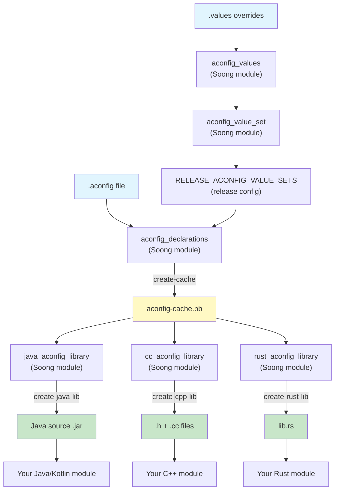

---

## 3.4  Flag Storage and Runtime

### 3.4.1  Storage Architecture Overview

The aconfig system supports two storage backends for runtime flag resolution,
selected per-flag through the `metadata.storage` field in declarations:

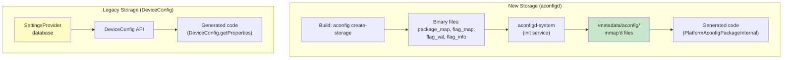

### 3.4.2  New Storage: aconfigd and Memory-Mapped Files

The new storage system was introduced to address performance and boot-time
limitations of the DeviceConfig approach.  It consists of four binary file
types, generated at build time by `aconfig create-storage`:

| File Type       | Content                                                     |
|-----------------|-------------------------------------------------------------|
| `package_map`   | Maps package names to their offset ranges in the flag files |
| `flag_map`      | Maps flag names (within a package) to offsets in flag_val   |
| `flag_val`      | Compact array of boolean flag values                        |
| `flag_info`     | Metadata about each flag (permissions, attributes)          |

These files are defined by the `storage_file_info` proto in
`build/make/tools/aconfig/aconfig_storage_file/protos/aconfig_storage_metadata.proto`:

```protobuf
message storage_file_info {
  optional uint32 version = 1;
  optional string container = 2;
  optional string package_map = 3;
  optional string flag_map = 4;
  optional string flag_val = 5;
  optional string flag_info = 6;
  optional int64 timestamp = 7;
}
```

At boot time, the `aconfigd-system` service initializes the storage:

```
# From system/server_configurable_flags/aconfigd/aconfigd.rc

service early_system_aconfigd_platform_init
    /system/bin/aconfigd-system early-platform-init
    class core
    user system
    group system
    oneshot
    disabled

on early-init
    mkdir /metadata/aconfig 0775 root system
    mkdir /metadata/aconfig/flags 0770 root system
    mkdir /metadata/aconfig/maps 0775 root system
    mkdir /metadata/aconfig/boot 0775 root system
    exec_start early_system_aconfigd_platform_init
```

The storage files are memory-mapped read-only by client processes.  The
constant `STORAGE_LOCATION` in `aconfig_storage_read_api/src/lib.rs`
(line 62) defines the root path:

```rust
pub const STORAGE_LOCATION: &str = "/metadata/aconfig";
```

### 3.4.3  Storage Read API

The `aconfig_storage_read_api` crate provides four core functions for
reading from the memory-mapped storage files:

```rust
// 1. Get package read context (package offset info)
pub fn get_package_read_context(
    container: &str, package: &str
) -> Result<Option<PackageReadContext>>

// 2. Get flag read context (flag offset within package)
pub fn get_flag_read_context(
    container: &str, package_id: u32, flag: &str
) -> Result<Option<FlagReadContext>>

// 3. Read a boolean flag value at a global offset
pub fn get_boolean_flag_value(
    container: &str, offset: u32
) -> Result<bool>

// 4. Get storage file version
pub fn get_storage_file_version(
    file_path: &str
) -> Result<u32>
```

These are low-level APIs intended only for use by generated code.
Application developers should never call them directly.

The read path for a single flag:

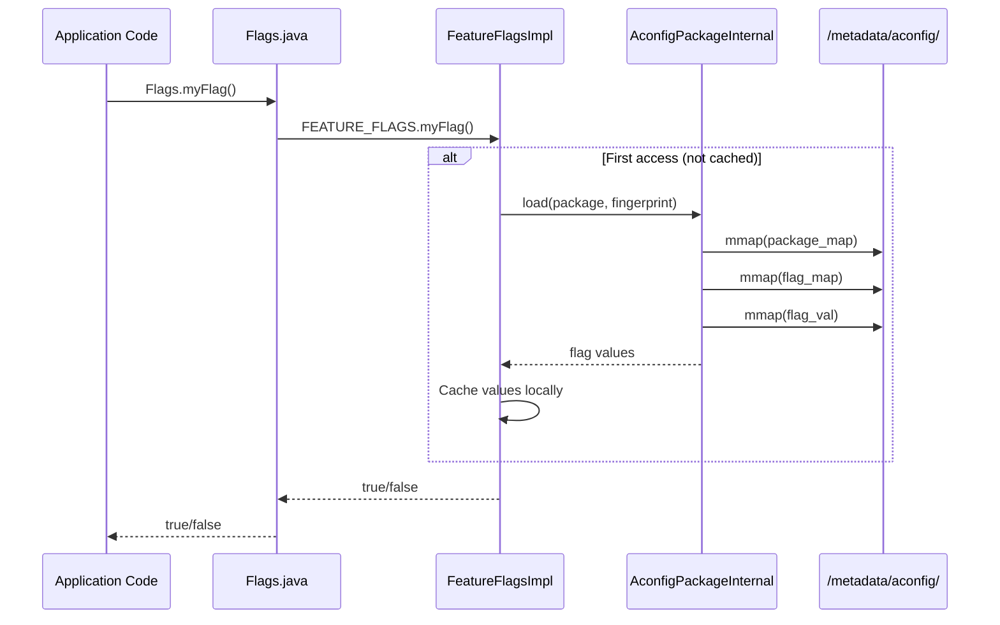

### 3.4.4  Storage File Internals

The four binary storage files use a versioned format with hash-table-based
lookups.  The file format is defined in
`build/make/tools/aconfig/aconfig_storage_file/src/lib.rs`.

**Package Map** (`package_map`):

The package map uses a hash table to map package names to their metadata.
Each entry contains:

```rust
pub struct PackageTableNode {
    pub package_name: String,    // e.g., "com.android.apex.flags"
    pub package_id: u32,         // Unique ID within this container
    pub boolean_start_index: u32,// Offset into flag_val for this package
    pub fingerprint: u64,        // SipHash13 of flag names (v2+)
    pub next_offset: Option<u32>,// Hash collision chain
}
```

The hash table size is chosen from a set of prime numbers
(`HASH_PRIMES` array) to minimize collisions:

```rust
pub(crate) const HASH_PRIMES: [u32; 29] = [
    7, 17, 29, 53, 97, 193, 389, 769, 1543, 3079,
    6151, 12289, 24593, 49157, 98317, 196613, ...
];
```

**Flag Map** (`flag_map`):

The flag map uses a separate hash table to map (package_id, flag_name)
pairs to flag metadata:

```rust
pub struct FlagTableNode {
    pub package_id: u32,
    pub flag_name: String,
    pub flag_type: StoredFlagType,  // ReadOnlyBoolean, ReadWriteBoolean,
                                     // FixedReadOnlyBoolean
    pub flag_index: u16,            // Index within the package's range
    pub next_offset: Option<u32>,
}
```

The `flag_type` distinguishes between:

- `ReadOnlyBoolean` -- value set at build time, not overridable at runtime
- `ReadWriteBoolean` -- value can be overridden at runtime
- `FixedReadOnlyBoolean` -- value permanently fixed, enables compiler
  optimizations

**Flag Value** (`flag_val`):

The flag value file is a compact array of boolean values.  Each flag
occupies one byte (not one bit) for efficient random access without
bit manipulation.  The offset for a specific flag is:

```
offset = package.boolean_start_index + flag.flag_index
```

**Flag Info** (`flag_info`):

The flag info file stores attribute bitmasks for each flag:

```rust
pub enum FlagInfoBit {
    IsReadWrite = 0x01,
    HasServerOverride = 0x02,
    HasLocalOverride = 0x04,
}
```

These bits track whether a flag has been overridden by server-side
configuration or local `aflags` commands.

**Storage file versions** are encoded as the first four bytes of each
file.  The current version scheme:

| Version | Features                                              |
|---------|-------------------------------------------------------|
| 1       | Basic package/flag maps and value storage              |
| 2       | Added package fingerprints (SipHash13 of flag names)   |
| 3       | Added exported read redaction support                  |

The default write version is 2 (`DEFAULT_FILE_VERSION`), and the
maximum supported read version is 3 (`MAX_SUPPORTED_FILE_VERSION`).

### 3.4.5  Package Fingerprint

Each package has a fingerprint computed using SipHash13 (from
`aconfig_storage_file/src/sip_hasher13.rs`).  The fingerprint is
computed from the sorted list of flag names within the package.  It
serves two purposes:

1. **Integrity verification:** generated code includes the fingerprint
   and verifies it at runtime against the storage file, detecting
   mismatches between code and storage.

2. **Cache invalidation:** if a flag is added or removed from a
   package, the fingerprint changes, ensuring the generated code
   re-reads from storage.

The fingerprint appears in generated code as a hex literal:

```java
PlatformAconfigPackageInternal reader =
    PlatformAconfigPackageInternal.load(
        "com.example.flags", 0xABCD1234L);
```

### 3.4.6  CXX Interop Layer

The storage read API is implemented in Rust but needs to be callable from
C++ (for `cc_aconfig_library` generated code).  The `aconfig_storage_read_api`
crate uses `cxx::bridge` to generate C++ bindings:

```rust
#[cxx::bridge]
mod ffi {
    pub struct PackageReadContextQueryCXX {
        pub query_success: bool,
        pub error_message: String,
        pub package_exists: bool,
        pub package_id: u32,
        pub boolean_start_index: u32,
        pub fingerprint: u64,
    }

    pub struct FlagReadContextQueryCXX {
        pub query_success: bool,
        pub error_message: String,
        pub flag_exists: bool,
        pub flag_type: u16,
        pub flag_index: u16,
    }

    pub struct BooleanFlagValueQueryCXX {
        pub query_success: bool,
        pub error_message: String,
        pub flag_value: bool,
    }

    extern "Rust" {
        pub fn get_package_read_context_cxx(
            file: &[u8], package: &str,
        ) -> PackageReadContextQueryCXX;

        pub fn get_flag_read_context_cxx(
            file: &[u8], package_id: u32, flag: &str,
        ) -> FlagReadContextQueryCXX;

        pub fn get_boolean_flag_value_cxx(
            file: &[u8], offset: u32,
        ) -> BooleanFlagValueQueryCXX;
    }
}
```

Each query returns a result struct with an explicit `query_success` field
and `error_message`, avoiding Rust's `Result` type which does not
translate directly across the FFI boundary.  The `flag_type` is encoded
as a `u16` for C++ compatibility.

### 3.4.7  The aconfigd Service Architecture

The `aconfigd` service is split into two binaries for security and
updatability:

| Binary               | Location                                          | Purpose                        |
|----------------------|---------------------------------------------------|--------------------------------|
| `aconfigd-system`    | `/system/bin/aconfigd-system`                     | Platform flag initialization   |
| `aconfigd-mainline`  | `/apex/com.android.configinfrastructure/bin/`     | Mainline module flag handling  |

The system instance runs as three separate one-shot services defined
in `system/server_configurable_flags/aconfigd/aconfigd.rc`:

```
service early_system_aconfigd_platform_init
    /system/bin/aconfigd-system early-platform-init
    class core
    user system
    group system
    oneshot
    disabled

service system_aconfigd_platform_init
    /system/bin/aconfigd-system platform-init
    class core
    user system
    group system
    oneshot
    disabled

service system_aconfigd_socket_service
    /system/bin/aconfigd-system start-socket
    class core
    user system
    group system
    oneshot
    disabled
    socket aconfigd_system stream 666 system system
```

**Boot sequence:**

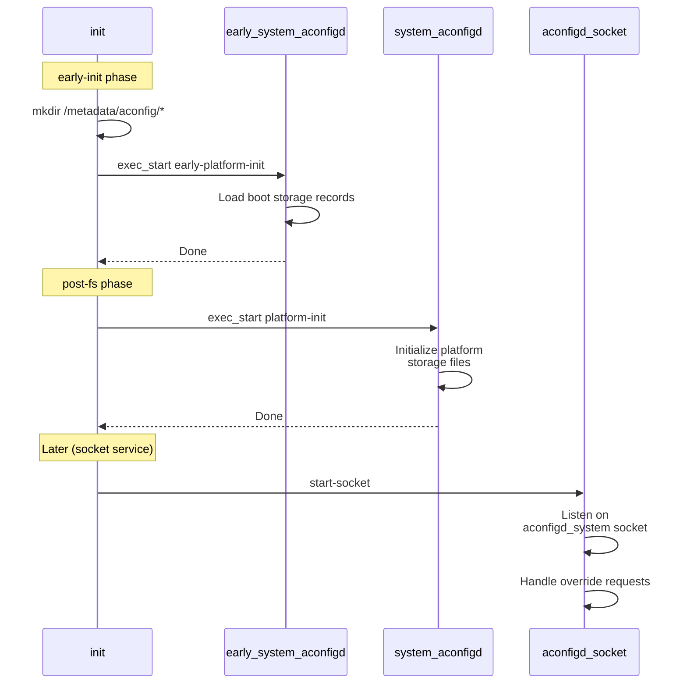

The socket service handles runtime flag override requests.  Internally
(from `aconfigd_commands.rs`), it creates an `Aconfigd` instance and
processes requests through a Unix domain socket:

```rust
const ACONFIGD_SOCKET: &str = "aconfigd_system";
const ACONFIGD_ROOT_DIR: &str = "/metadata/aconfig";
const STORAGE_RECORDS: &str =
    "/metadata/aconfig/storage_records.pb";

pub fn start_socket() -> Result<()> {
    let fd = rustutils::sockets::
        android_get_control_socket(ACONFIGD_SOCKET)?;
    let listener = UnixListener::from(fd);
    let mut aconfigd = Aconfigd::new(
        Path::new(ACONFIGD_ROOT_DIR),
        Path::new(STORAGE_RECORDS));
    aconfigd.initialize_from_storage_record()?;

    for stream in listener.incoming() {
        match stream {
            Ok(mut stream) => {
                aconfigd.handle_socket_request_from_stream(
                    &mut stream)?;
            }
            Err(errmsg) => {
                error!("failed to listen: {:?}", errmsg);
            }
        }
    }
    Ok(())
}
```

The `/metadata/aconfig/` directory structure at runtime:

```
/metadata/aconfig/
    storage_records.pb          # Index of all storage files
    platform_storage_records.pb # Platform-only records
    maps/
        system.package.map      # Per-container package maps
        system.flag.map
        com.android.wifi.package.map
        com.android.wifi.flag.map
        ...
    flags/
        system.val              # Per-container flag values
        system.info
        com.android.wifi.val
        com.android.wifi.info
        ...
    boot/
        system.val              # Boot-time snapshots
        system.info
        ...
```

### 3.4.8  Legacy Storage: DeviceConfig and Settings.Global

Before the aconfigd system, flags were stored in Android's DeviceConfig
framework, which ultimately reads from the `settings_config` table in
the Settings.Global content provider.  This approach has several limitations:

1. **Boot ordering dependency:** DeviceConfig requires SettingsProvider to be
   running.  Flags needed before SettingsProvider initialization cannot use
   this backend.

2. **IPC overhead:** Each `DeviceConfig.getProperties()` call involves a
   Binder IPC to the SettingsProvider process.

3. **No atomic multi-flag reads:** While `getProperties()` returns all
   flags in a namespace atomically, cross-namespace reads are not atomic.

4. **Permission model:** DeviceConfig access requires specific SELinux
   permissions that not all processes have.

The generated code for DeviceConfig storage includes explicit error
handling for these cases:

```java
try {
    Properties properties =
        DeviceConfig.getProperties("my_namespace");
    myFlag = properties.getBoolean(
        Flags.FLAG_MY_FLAG, false);
} catch (NullPointerException e) {
    throw new RuntimeException(
        "Cannot read value from namespace my_namespace "
        + "from DeviceConfig. It could be that the code "
        + "using flag executed before SettingsProvider "
        + "initialization. Please use fixed read-only "
        + "flag by adding is_fixed_read_only: true in "
        + "flag declaration.", e);
} catch (SecurityException e) {
    // For isolated process case, skip loading
}
```

### 3.4.9  Flag Value Resolution at Runtime

The complete resolution chain for a flag's value at runtime:

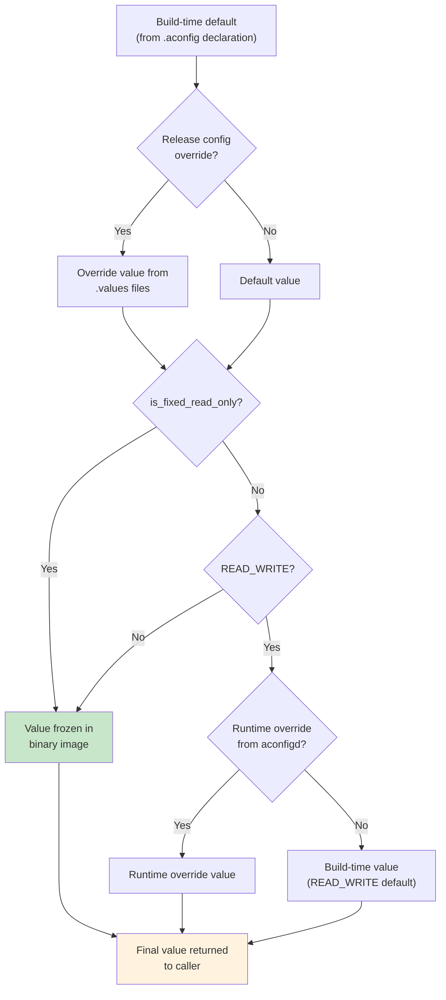

**Read-only flags** (including `is_fixed_read_only`) are fully resolved at
build time.  The generated code returns a constant:

```java
public boolean myFixedFlag() {
    return true;  // Baked at build time, never changes
}
```

**Read-write flags** require a runtime lookup.  Their build-time value
serves as the default if no runtime override is present.

### 3.4.10  The aflags CLI Tool

The `aflags` binary is a device-side tool for inspecting and manipulating
flag values.  It delegates to the updatable `aflags_updatable` binary
in the ConfigInfrastructure APEX:

```rust
// From build/make/tools/aconfig/aflags/src/main.rs

fn invoke_updatable_aflags() {
    let updatable_command =
        "/apex/com.android.configinfrastructure/bin/aflags_updatable";
    // ... delegate all arguments to updatable binary
}
```

Common `aflags` commands:

```bash
# List all flags and their values
adb shell aflags list

# Show a specific flag
adb shell aflags list --package com.android.apex.flags

# Override a flag value (read-write flags only)
adb shell aflags enable com.android.apex.flags.mount_before_data

# Clear an override
adb shell aflags clear com.android.apex.flags.mount_before_data
```

---

## 3.5  Flag Lifecycle

### 3.5.1  Lifecycle Phases

Every flag follows a predictable lifecycle from creation to cleanup:

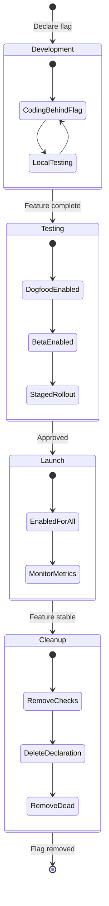

### 3.5.2  Phase 1: Development

During development, a flag is:

- **Declared** in a `.aconfig` file with `DISABLED` default state
- **Guarded** in code with `if (Flags.myNewFeature()) { ... }`
- **Tested** locally by overriding with `aflags` or build config

The developer's `Android.bp` adds the flag declaration and codegen library:

```blueprint
aconfig_declarations {
    name: "my-feature-flags",
    package: "com.android.myfeature.flags",
    container: "system",
    srcs: ["my_feature.aconfig"],
}

java_aconfig_library {
    name: "my-feature-flags-java",
    aconfig_declarations: "my-feature-flags",
}
```

### 3.5.3  Phase 2: Testing

As the feature matures:

- The release configuration for dogfood/beta builds sets the flag to
  `ENABLED` with `READ_WRITE` permission
- Server-side configuration can enable/disable the flag for specific
  user populations
- CI runs tests with the flag in both states

### 3.5.4  Phase 3: Launch

At launch:

- The flag is set to `ENABLED` and `READ_ONLY` in the release config
- For API-guarded features, the flag is finalized for the target SDK level
- The flag's value is baked into the binary and cannot be overridden

### 3.5.5  Phase 4: Cleanup

After the feature has been stable for a release cycle:

- The flag declaration is removed from the `.aconfig` file
- All `if (Flags.myFlag())` checks are replaced with the enabled branch
- Dead code from the disabled branch is removed
- The flag's codegen library dependency is removed

Cleanup is critical -- stale flags accumulate technical debt.  The aconfig
system assists cleanup by providing the `dump-cache` command to identify
flags that have been in a fixed state across all release configurations.

### 3.5.6  Bugfix Flags

Flags with `purpose: PURPOSE_BUGFIX` follow an accelerated lifecycle.  They
are typically:

- Created as `READ_WRITE` to allow quick rollback if the fix causes regression
- Promoted to `READ_ONLY` after one release cycle with the fix active
- Cleaned up in the following release

```protobuf
flag {
  name: "enable_immediate_clear_override_bugfix"
  namespace: "core_experiments_team_internal"
  description: "Bugfix flag to allow clearing a local
                override immediately"
  bug: "387316969"
  metadata {
    purpose: PURPOSE_BUGFIX
  }
}
```

### 3.5.7  Exported and Finalized Flags

Flags marked `is_exported: true` are visible to code outside their
originating container.  This is essential for Mainline modules that expose
APIs consumed by apps built outside the platform.

When an API guarded by a flag is finalized for a given SDK level, the
flag enters the **finalized flags** system.  The `finalized_flag` proto
in `aconfig_protos/protos/aconfig_internal.proto` records:

```protobuf
message finalized_flag {
  optional string name = 1;
  optional string package = 2;
  optional int32 min_sdk = 3;
}
```

In the generated exported code, finalized flags include an SDK version
check:

```java
public static boolean myExportedFlag() {
    if (Build.VERSION.SDK_INT >= 36) {
        return true;  // Finalized at SDK 36
    }
    return FEATURE_FLAGS.myExportedFlag();
}
```

This ensures that apps running on SDK 36+ always see the flag as enabled,
regardless of the runtime flag state.

---

## 3.6  Build System Integration

### 3.6.1  Soong Module Types

The aconfig build integration registers six module types through two
packages:

**From `build/soong/aconfig/init.go`** (lines 163-170):

```go
func RegisterBuildComponents(ctx android.RegistrationContext) {
    ctx.RegisterModuleType("aconfig_declarations",
        DeclarationsFactory)
    ctx.RegisterModuleType("aconfig_values",
        ValuesFactory)
    ctx.RegisterModuleType("aconfig_value_set",
        ValueSetFactory)
    ctx.RegisterSingletonModuleType(
        "all_aconfig_declarations",
        AllAconfigDeclarationsFactory)
    ctx.RegisterParallelSingletonType(
        "exported_java_aconfig_library",
        ExportedJavaDeclarationsLibraryFactory)
    ctx.RegisterModuleType(
        "all_aconfig_declarations_extension",
        AllAconfigDeclarationsExtensionFactory)
}
```

**From `build/soong/aconfig/codegen/init.go`** (lines 81-86):

```go
func RegisterBuildComponents(ctx android.RegistrationContext) {
    ctx.RegisterModuleType("aconfig_declarations_group",
        AconfigDeclarationsGroupFactory)
    ctx.RegisterModuleType("cc_aconfig_library",
        CcAconfigLibraryFactory)
    ctx.RegisterModuleType("java_aconfig_library",
        JavaDeclarationsLibraryFactory)
    ctx.RegisterModuleType("rust_aconfig_library",
        RustAconfigLibraryFactory)
}
```

### 3.6.2  aconfig_declarations

The `aconfig_declarations` module type is the starting point of the flag
pipeline.  It processes `.aconfig` source files and produces a binary cache.

**Properties** (from `aconfig_declarations.go` lines 39-56):

| Property      | Type       | Required | Description                                        |
|---------------|------------|----------|----------------------------------------------------|
| `srcs`        | `[]string` | Yes      | List of `.aconfig` files                            |
| `package`     | `string`   | Yes      | Java-style package name                             |
| `container`   | `string`   | Yes      | Container the flags belong to                       |
| `exportable`  | `bool`     | No       | Whether flags can be repackaged for export          |

Example from frameworks/base:

```blueprint
// frameworks/base/android-sdk-flags/Android.bp

aconfig_declarations {
    name: "android.sdk.flags-aconfig",
    package: "android.sdk",
    container: "system",
    srcs: ["flags.aconfig"],
}
```

The build action invokes `aconfig create-cache` with all declaration files
and any matching values from the release configuration.  The core build
rule in `init.go` (lines 27-45):

```go
aconfigRule = pctx.AndroidStaticRule("aconfig",
    blueprint.RuleParams{
        Command: `${aconfig} create-cache` +
            ` --package ${package}` +
            ` ${container}` +
            ` ${declarations}` +
            ` ${values}` +
            ` ${default-permission}` +
            ` ${allow-read-write}` +
            ` --cache ${out}.tmp` +
            ` && ( if cmp -s ${out}.tmp ${out} ;` +
            `   then rm ${out}.tmp ;` +
            `   else mv ${out}.tmp ${out} ; fi )`,
    }, ...)
```

The `cmp -s` / `mv` pattern is an optimization: the cache file is only
updated if its contents actually changed, avoiding unnecessary rebuilds
of downstream codegen targets.

### 3.6.3  aconfig_values

The `aconfig_values` module type provides flag value overrides for a specific
package.  Values modules are collected into value sets.

**Properties** (from `aconfig_values.go` lines 28-33):

| Property  | Type       | Required | Description                              |
|-----------|------------|----------|------------------------------------------|
| `srcs`    | `[]string` | Yes      | List of `.values` or `.textproto` files   |
| `package` | `string`   | Yes      | Package to which these values apply       |

Example:

```blueprint
// build/release/aconfig/bp4a/android.app/Android.bp

aconfig_values {
    name: "aconfig-values-platform_build_release-bp4a-android.app-all",
    package: "android.app",
    srcs: [
        "*_flag_values.textproto",
    ],
}
```

### 3.6.4  aconfig_value_set

The `aconfig_value_set` module type aggregates multiple `aconfig_values`
modules into a single set that can be referenced by a release configuration.

**Properties** (from `aconfig_value_set.go` lines 31-37):

| Property | Type       | Description                                    |
|----------|------------|------------------------------------------------|
| `values` | `[]string` | List of `aconfig_values` module names           |
| `srcs`   | `[]string` | Paths to `Android.bp` files containing values   |

Example:

```blueprint
// build/release/aconfig/bp4a/Android.bp

aconfig_value_set {
    name: "aconfig_value_set-platform_build_release-bp4a",
    srcs: [
        "*/Android.bp",
    ],
}
```

The `srcs` property is a newer approach that automatically discovers
`aconfig_values` modules from the specified `Android.bp` files.

### 3.6.5  Release Configuration Integration

The bridge between value sets and the build is the release configuration
variable `RELEASE_ACONFIG_VALUE_SETS`.  This variable lists the
`aconfig_value_set` modules that should be applied for the current build
target.

In the Soong build, each `aconfig_declarations` module automatically
adds a dependency on the value sets specified by this variable (from
`aconfig_declarations.go` lines 92-98):

```go
func (module *DeclarationsModule) DepsMutator(
        ctx android.BottomUpMutatorContext) {
    valuesFromConfig := ctx.Config().ReleaseAconfigValueSets()
    if len(valuesFromConfig) > 0 {
        ctx.AddDependency(ctx.Module(), implicitValuesTag,
            valuesFromConfig...)
    }
}
```

The resolution chain:

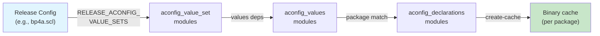

### 3.6.6  java_aconfig_library

The `java_aconfig_library` module type generates a Java library from an
`aconfig_declarations` module:

**Properties** (from `codegen/java_aconfig_library.go` lines 33-43):

| Property               | Type     | Required | Description                                    |
|------------------------|----------|----------|------------------------------------------------|
| `aconfig_declarations` | `string` | Yes      | Name of the aconfig_declarations module         |
| `mode`                 | `string` | No       | Code generation mode (default: `"production"`)  |

Example:

```blueprint
java_aconfig_library {
    name: "android.sdk.flags-aconfig-java",
    aconfig_declarations: "android.sdk.flags-aconfig",
}
```

The module automatically adds dependencies on:

- `aconfig-annotations-lib` -- for R8 optimization annotations
- `unsupportedappusage` -- for backward compatibility annotations
- `aconfig_storage_stub` -- for runtime storage access

And registers JarJar rename rules for the generated classes to support
repackaging in the exported case:

```go
module.AddJarJarRenameRule(declarations.Package+".Flags", "")
module.AddJarJarRenameRule(declarations.Package+".FeatureFlags", "")
module.AddJarJarRenameRule(
    declarations.Package+".FeatureFlagsImpl", "")
module.AddJarJarRenameRule(
    declarations.Package+".CustomFeatureFlags", "")
module.AddJarJarRenameRule(
    declarations.Package+".FakeFeatureFlagsImpl", "")
```

### 3.6.7  cc_aconfig_library

The `cc_aconfig_library` module type generates a C/C++ library:

**Properties** (from `codegen/cc_aconfig_library.go` lines 38-48):

| Property               | Type     | Required | Description                                    |
|------------------------|----------|----------|------------------------------------------------|
| `aconfig_declarations` | `string` | Yes      | Name of the aconfig_declarations module         |
| `mode`                 | `string` | No       | Code generation mode (default: `"production"`)  |

Example:

```blueprint
cc_aconfig_library {
    name: "my-feature-flags-cc",
    aconfig_declarations: "my-feature-flags",
}
```

For production and exported modes, the library automatically depends on:

- `libaconfig_storage_read_api_cc` -- C++ storage read API
- `libbase` -- Android base library
- `liblog` -- Android logging

For `force-read-only` mode, these dependencies are omitted since no
runtime storage access is needed.

The generated file names follow the pattern:

- **Source:** `<package_with_underscores>.cc` (e.g., `com_android_apex_flags.cc`)
- **Header:** `include/<package_with_underscores>.h`

### 3.6.8  rust_aconfig_library

The `rust_aconfig_library` module type generates a Rust library crate:

```blueprint
rust_aconfig_library {
    name: "my-feature-flags-rust",
    aconfig_declarations: "my-feature-flags",
}
```

This creates a library that can be added to `rlibs`, `dylibs`, or
`rustlibs` dependencies of other Rust modules.

### 3.6.9  aconfig_declarations_group

The `aconfig_declarations_group` module type aggregates multiple
codegen libraries into a single dependency, simplifying large build
configurations like `frameworks/base/AconfigFlags.bp`:

```blueprint
aconfig_declarations_group {
    name: "framework-minus-apex-aconfig-declarations",
    aconfig_declarations_groups: [
        "aconfig_trade_in_mode_flags",
        "audio-framework-aconfig",
    ],
    java_aconfig_libraries: [
        "android.app.flags-aconfig-java",
        "android.content.flags-aconfig-java",
        "android.location.flags-aconfig-java",
        "android.os.flags-aconfig-java",
        // ... many more
    ],
}
```

### 3.6.10  all_aconfig_declarations Singleton

The `all_aconfig_declarations` singleton module collects every
`aconfig_declarations` module in the entire tree into a single
combined file.  This combined file is exported to the flag management
server (Google's internal "Gantry" system):

From `all_aconfig_declarations.go` (lines 37-43):

```go
// A singleton module that collects all of the aconfig flags
// declared in the tree into a single combined file for export
// to the external flag setting server (inside Google it's Gantry).
//
// Note that this is ALL aconfig_declarations modules present
// in the tree, not just ones that are relevant to the product
// currently being built.
```

The singleton produces:

- `all_aconfig_declarations.pb` -- binary protobuf of all flags
- `all_aconfig_declarations.textproto` -- text protobuf of all flags
- Storage files: `.package.map`, `.flag.map`, `.flag.info`, `.val`

These artifacts are distributed as part of the `docs`, `droid`, `sdk`,
`release_config_metadata`, and `gms` build goals.

### 3.6.11  exported_java_aconfig_library

The `exported_java_aconfig_library` singleton generates a JAR file
containing Java flag accessor code for all exported flags across the
entire tree.  This JAR is distributed as `android-flags.jar` with the
SDK:

```go
ctx.DistForGoalWithFilename("sdk", this.intermediatePath,
    "android-flags.jar")
```

Apps built outside the platform (in Android Studio) can use this JAR
to access exported flags without needing to build the full platform.

### 3.6.12  Dependency Graph

The complete dependency graph for a typical flag integration:

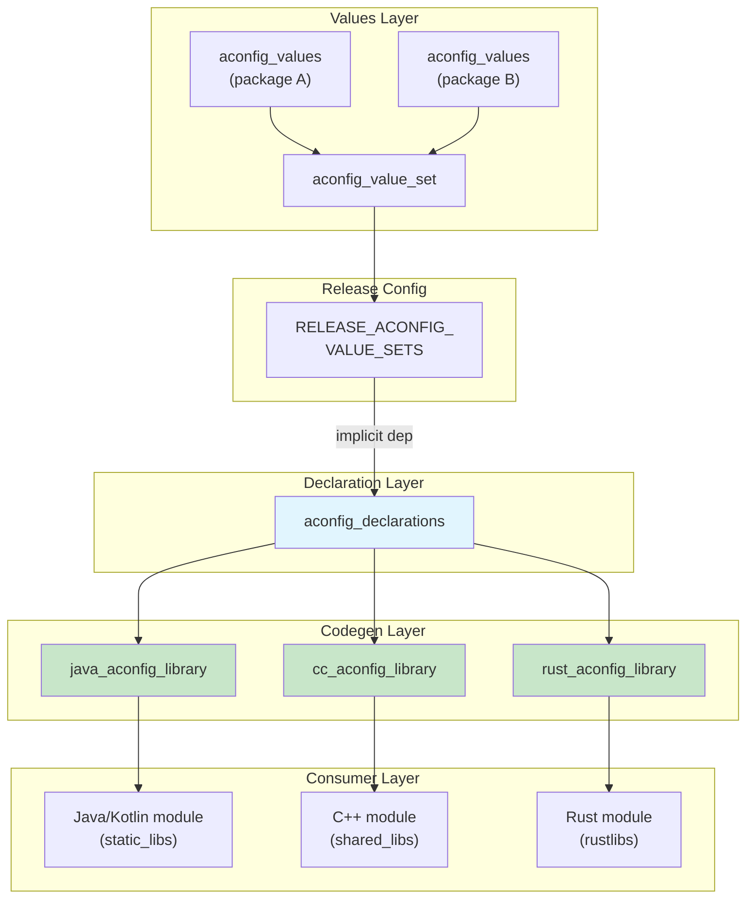

### 3.6.13  Build Flags (build_flag_declarations)

In addition to aconfig feature flags, the build system supports
**build flags** -- a separate flag type used to control build-time
behavior (as opposed to runtime feature toggles).  Build flags are
managed by the `build_flags` package in
`build/soong/aconfig/build_flags/`:

```go
// build/soong/aconfig/build_flags/declarations.go

type DeclarationsModule struct {
    android.ModuleBase
    android.DefaultableModuleBase

    properties struct {
        // Build flag declaration files
        Srcs []string `android:"path"`
    }
}
```

Build flags differ from aconfig flags in that they:

- Only affect build behavior, never runtime behavior
- Do not generate accessor code (Java/C++/Rust)
- Are consumed directly by the build system (Soong, Make)
- Do not require storage files or aconfigd

Examples of build flags:

- `RELEASE_ACONFIG_REQUIRE_ALL_READ_ONLY` (force all flags to read-only)
- `RELEASE_EXPORTED_FLAG_CHECK` (enable exported flag validation)
- `RELEASE_CONFIG_FORCE_READ_ONLY` (force read-only at config level)

### 3.6.14  One Package Per Module Rule

The `all_aconfig_declarations` singleton enforces a critical constraint:
each package may only have one `aconfig_declarations` module in the
entire tree.  This is checked during the singleton build action (from
`all_aconfig_declarations.go` lines 205-216):

```go
var numOffendingPkg = 0
offendingPkgsMessage := ""
for pkg, cnt := range packages {
    if cnt > 1 {
        offendingPkgsMessage += fmt.Sprintf(
            "%d aconfig_declarations found for package %s\n",
            cnt, pkg)
        numOffendingPkg++
    }
}

if numOffendingPkg > 0 {
    panic("Only one aconfig_declarations allowed " +
          "for each package.\n" + offendingPkgsMessage)
}
```

This restriction ensures that:

- Each flag has exactly one authoritative declaration
- Flag IDs and storage offsets are deterministic
- The server-side flag management system (Gantry) has an unambiguous
  mapping from package to flags

### 3.6.15  Build-Time Flags vs. Release Configuration

The aconfig system integrates with the broader release configuration
infrastructure through several build flags:

| Build Flag                                  | Effect                                                |
|---------------------------------------------|-------------------------------------------------------|
| `RELEASE_ACONFIG_VALUE_SETS`                | Selects which value sets apply to this build            |
| `RELEASE_ACONFIG_FLAG_DEFAULT_PERMISSION`   | Default permission for all flags                       |
| `RELEASE_ACONFIG_REQUIRE_ALL_READ_ONLY`     | Forces all flags to READ_ONLY                          |
| `RELEASE_CONFIG_FORCE_READ_ONLY`            | Forces all flags to read-only at build level           |
| `RELEASE_ACONFIG_EXTRA_RELEASE_CONFIGS`     | Additional release configs to generate artifacts for   |
| `RELEASE_ACONFIG_STORAGE_VERSION`           | Version number for storage file format                 |

The `RELEASE_ACONFIG_REQUIRE_ALL_READ_ONLY` flag is particularly important
for production release builds.  When set, it overrides every flag's permission
to `READ_ONLY`, ensuring that no flag can be changed at runtime in the
released build.

---

## 3.7  Testing with Flags

### 3.7.1  The Testing Challenge

Feature flags create a combinatorial testing problem.  If a module has
N flags, there are 2^N possible flag combinations.  The aconfig testing
infrastructure provides several mechanisms to manage this complexity:

1. **SetFlagsRule** -- A JUnit `TestRule` that controls flag values within
   a test process
2. **@EnableFlags / @DisableFlags** -- Annotations for declarative flag
   configuration per test method or class
3. **@RequiresFlagsEnabled / @RequiresFlagsDisabled** -- Annotations that
   skip tests when flag preconditions are not met
4. **FlagsParameterization** -- Utility for running tests across multiple
   flag combinations
5. **FakeFeatureFlagsImpl** -- Generated test double for each flag package
6. **CheckFlagsRule** -- A `TestRule` for device-side tests that checks
   flag preconditions

### 3.7.2  SetFlagsRule

The `SetFlagsRule` class in
`platform_testing/libraries/flag-helpers/junit/src_base/android/platform/test/flag/junit/SetFlagsRule.java`
is the primary testing mechanism.  It works by replacing the `FEATURE_FLAGS`
field in each `Flags` class with a `FakeFeatureFlagsImpl` instance:

```java
public final class SetFlagsRule implements TestRule {

    // Key constants for reflection
    private static final String FAKE_FEATURE_FLAGS_IMPL_CLASS_NAME =
        "FakeFeatureFlagsImpl";
    private static final String FEATURE_FLAGS_FIELD_NAME =
        "FEATURE_FLAGS";
    private static final String FLAGS_CLASS_NAME = "Flags";

    // Two initialization modes
    public enum DefaultInitValueType {
        NULL_DEFAULT,    // Flags must be explicitly set
        DEVICE_DEFAULT,  // Use device/build default values
    }
}
```

The rule uses reflection to:

1. Find the `FEATURE_FLAGS` static field in `Flags.java`
2. Save the original `FeatureFlagsImpl` instance
3. Replace it with a `FakeFeatureFlagsImpl`
4. Restore the original after the test

### 3.7.3  @EnableFlags and @DisableFlags Annotations

These annotations provide a declarative way to set flag values for tests.
They are defined in
`platform_testing/libraries/annotations/src/android/platform/test/annotations/`:

```java
// EnableFlags.java

@Retention(RetentionPolicy.RUNTIME)
@Target({ElementType.METHOD, ElementType.TYPE})
public @interface EnableFlags {
    /**
     * The list of the feature flags to be enabled.
     * Each item is the full flag name with the format
     * {package_name}.{flag_name}.
     */
    String[] value();
}
```

```java
// DisableFlags.java

@Retention(RetentionPolicy.RUNTIME)
@Target({ElementType.METHOD, ElementType.TYPE})
public @interface DisableFlags {
    String[] value();
}
```

Usage in tests:

```java
@RunWith(AndroidJUnit4.class)
public class MyFeatureTest {
    @Rule
    public final SetFlagsRule mSetFlagsRule = new SetFlagsRule();

    @Test
    @EnableFlags(Flags.FLAG_MY_NEW_FEATURE)
    public void testWithFeatureEnabled() {
        assertTrue(Flags.myNewFeature());
        // Test the enabled code path
    }

    @Test
    @DisableFlags(Flags.FLAG_MY_NEW_FEATURE)
    public void testWithFeatureDisabled() {
        assertFalse(Flags.myNewFeature());
        // Test the disabled code path
    }

    @Test
    @EnableFlags(Flags.FLAG_MY_NEW_FEATURE)
    @DisableFlags(Flags.FLAG_OTHER_FEATURE)
    public void testMixedFlags() {
        assertTrue(Flags.myNewFeature());
        assertFalse(Flags.otherFeature());
    }
}
```

The annotations follow specific precedence rules:

- Method-level annotations override class-level annotations for the same flag
- A flag cannot be both enabled and disabled at the same level (this is an error)
- If a flag is set by both the class and method annotations, the values must
  be consistent

### 3.7.4  @RequiresFlagsEnabled and @RequiresFlagsDisabled

While `@EnableFlags` and `@DisableFlags` actively set flag values,
`@RequiresFlagsEnabled` and `@RequiresFlagsDisabled` express preconditions.
If the flag is not in the required state, the test is skipped (via JUnit
`Assume`):

```java
@Test
@RequiresFlagsEnabled(Flags.FLAG_MY_NEW_FEATURE)
public void testOnlyWhenFeatureExists() {
    // This test only runs if the flag is already enabled
    // on the device under test
}
```

These annotations are particularly useful for CTS tests that must run on
different device configurations.

### 3.7.5  Programmatic Flag Control

In addition to annotations, flags can be set programmatically through
the `SetFlagsRule`:

```java
@Rule
public final SetFlagsRule mSetFlagsRule = new SetFlagsRule();

@Before
public void setUp() {
    mSetFlagsRule.enableFlags(Flags.FLAG_MY_FEATURE);
}

@Test
public void myTest() {
    // Flag is enabled
    mSetFlagsRule.disableFlags(Flags.FLAG_MY_FEATURE);
    // Flag is now disabled
}
```

Note: The `enableFlags()` and `disableFlags()` methods on `SetFlagsRule`
are deprecated in favor of the annotation-based approach.  The annotations
provide better readability and support for `FlagsParameterization`.

### 3.7.6  FlagsParameterization

`FlagsParameterization` enables running the same test across multiple
flag combinations:

```java
@RunWith(Parameterized.class)
public class MyParameterizedTest {
    @Parameterized.Parameters(name = "{0}")
    public static List<FlagsParameterization> getParams() {
        return FlagsParameterization.allCombinationsOf(
            Flags.FLAG_FEATURE_A,
            Flags.FLAG_FEATURE_B
        );
    }

    @Rule
    public final SetFlagsRule mSetFlagsRule;

    public MyParameterizedTest(
            FlagsParameterization flags) {
        mSetFlagsRule = new SetFlagsRule(flags);
    }

    @Test
    public void testInteraction() {
        // This test runs 4 times:
        // A=true  B=true
        // A=true  B=false
        // A=false B=true
        // A=false B=false
    }
}
```

When `@EnableFlags` is used with `FlagsParameterization`, tests that
conflict with the parameterization are skipped via JUnit assumption
failure, not failed.

### 3.7.7  Test Mode Code Generation

When `java_aconfig_library` is configured with `mode: "test"`, the
generated `FeatureFlagsImpl.java` throws on every flag access:

```java
public final class FeatureFlagsImpl implements FeatureFlags {
    @Override
    public boolean myFlag() {
        throw new UnsupportedOperationException(
            "Method is not implemented.");
    }
}
```

And `Flags.java` exposes additional methods for test setup:

```java
public static void setFeatureFlags(FeatureFlags featureFlags) {
    Flags.FEATURE_FLAGS = featureFlags;
}

public static void unsetFeatureFlags() {
    Flags.FEATURE_FLAGS = null;
}
```

This pattern forces tests to explicitly configure flag state, preventing
accidental dependencies on production defaults.

### 3.7.8  C++ Test Mode

In C++ test mode, the generated header provides setter functions and a
reset function:

```cpp
namespace com::android::aconfig::test {

// Normal accessor
inline bool my_flag() {
    return provider_->my_flag();
}

// Test setter
inline void my_flag(bool val) {
    provider_->my_flag(val);
}

// Reset all flags
inline void reset_flags() {
    return provider_->reset_flags();
}

}  // namespace
```

C++ test code:

```cpp
TEST(MyTest, FeatureEnabled) {
    com::android::aconfig::test::my_flag(true);
    // Test with flag enabled
    com::android::aconfig::test::reset_flags();
}
```

### 3.7.9  CheckFlagsRule for Device Tests

While `SetFlagsRule` actively sets flag values within the test process,
`CheckFlagsRule` is designed for device-side instrumentation tests where
flags cannot be programmatically controlled.  Instead of setting flag
values, it verifies that the device's flag state matches the test's
requirements:

```java
@RunWith(AndroidJUnit4.class)
public class MyDeviceTest {
    @Rule
    public final CheckFlagsRule mCheckFlagsRule =
        DeviceFlagsValueProvider.createCheckFlagsRule();

    @Test
    @RequiresFlagsEnabled(Flags.FLAG_MY_FEATURE)
    public void testOnlyWhenEnabled() {
        // This test only runs if the device has
        // the flag enabled
    }

    @Test
    @RequiresFlagsDisabled(Flags.FLAG_MY_FEATURE)
    public void testOnlyWhenDisabled() {
        // This test only runs if the device has
        // the flag disabled
    }
}
```

`CheckFlagsRule` reads the actual device flag state (from DeviceConfig
or aconfigd) and skips tests whose preconditions are not met.  This is
essential for CTS tests that must pass on all device configurations.

The distinction between `SetFlagsRule` and `CheckFlagsRule`:

| Aspect          | SetFlagsRule            | CheckFlagsRule              |
|-----------------|-------------------------|-----------------------------|
| Flag control    | Actively sets values    | Reads device state           |
| Test behavior   | Forces flag state       | Skips on mismatch            |
| Use case        | Unit tests, Robolectric | Device instrumentation tests |
| Annotations     | @EnableFlags/@DisableFlags | @RequiresFlagsEnabled/Disabled |
| Implementation  | FakeFeatureFlagsImpl    | DeviceFlagsValueProvider     |

### 3.7.10  Host-Side Flag Testing

For host-side tests (running on the development machine, not on a device),
the `HostFlagsValueProvider` reads flag values from the build configuration:

```java
// platform_testing/libraries/flag-helpers/junit/
//   src_host/.../host/HostFlagsValueProvider.java

public class HostFlagsValueProvider implements IFlagsValueProvider {
    // Reads flag values from the aconfig cache files
    // generated during the build
}
```

This enables CTS and similar test suites to make flag-aware decisions
when running tests from a host machine against a connected device.

### 3.7.11  Ravenwood Flag Support

Ravenwood (Android's host-side device testing framework) supports aconfig
flags through the same `SetFlagsRule` mechanism.  Since Ravenwood tests
run on the host JVM without a real Android framework, the flag
implementation uses the test mode with `FakeFeatureFlagsImpl`.

The test infrastructure detects the Ravenwood environment and
automatically uses the appropriate flag provider.  Ravenwood tests can
use the same `@EnableFlags` and `@DisableFlags` annotations as device
tests.

### 3.7.12  Testing Architecture Diagram

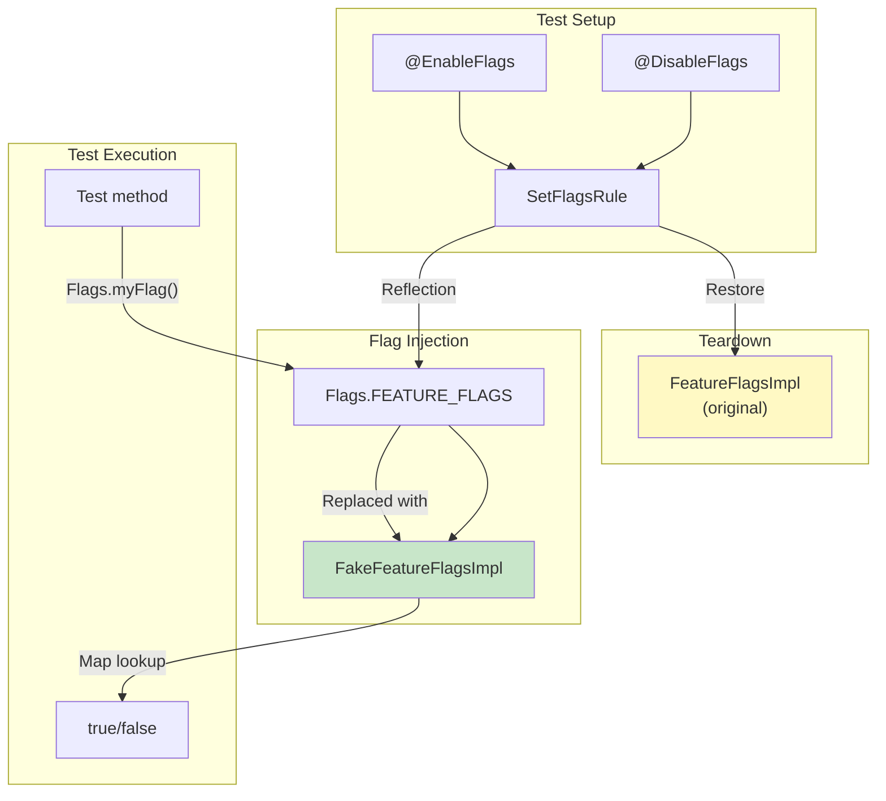

### 3.7.13  Best Practices for Flag Testing

1. **Test both states.** Every flag should have tests for both enabled and
   disabled paths.  Missing coverage on one path leads to regressions when
   the flag is flipped.

2. **Use annotations over programmatic control.** The `@EnableFlags` and
   `@DisableFlags` annotations are more readable and composable than
   programmatic `enableFlags()` / `disableFlags()` calls.

3. **Test interactions.** When two flags interact, use
   `FlagsParameterization.allCombinationsOf()` to cover all four states.

4. **Use DEVICE_DEFAULT for integration tests.** The
   `DefaultInitValueType.DEVICE_DEFAULT` mode starts with build-time
   defaults, matching production behavior more closely.

5. **Clean up test flags.** `SetFlagsRule` automatically restores flag
   state after each test, but be aware that static state in the code
   under test may retain flag-dependent values.

---

## 3.8  Legacy Feature Flags

Before the aconfig system, Android used several ad hoc mechanisms for
feature flagging.  Understanding these is important because they are still
widely used in the codebase and because aconfig builds upon (and
sometimes delegates to) these older systems.

### 3.8.1  SystemProperties

The `SystemProperties` class (`android.os.SystemProperties`) provides
key-value string properties, many of which function as feature flags:

```java
// Check a system property flag
boolean enabled = SystemProperties.getBoolean(
    "ro.feature.my_feature", false);
```

Property categories relevant to flagging:

| Prefix         | Mutability | Description                              |
|----------------|------------|------------------------------------------|
| `ro.*`         | Read-only  | Set at boot, cannot be changed at runtime |
| `persist.*`    | Persistent | Survives reboot, writable at runtime      |
| `sys.*`        | Volatile   | Writable, lost at reboot                  |
| `debug.*`      | Debug      | Typically used for development flags      |

**Limitations:**

- No type safety -- everything is a string
- No centralized declaration -- properties are defined by convention
- No build-system integration -- values are set in init scripts, build
  properties, or at runtime
- Maximum key length of 91 characters, value length of 92 characters
  (in older versions)
- No support for per-user or per-profile flags

### 3.8.2  Settings.Global and Settings.Secure

The `Settings` provider offers persistent key-value storage with more
flexibility than SystemProperties:

```java
// Read a settings-based flag
int value = Settings.Global.getInt(
    context.getContentResolver(),
    "my_feature_flag", 0);
```

| Table            | Scope     | Use Case                                |
|------------------|-----------|-----------------------------------------|
| `Settings.Global`| Device-wide | System-level feature flags              |
| `Settings.Secure`| Per-user   | User-specific feature flags             |
| `Settings.System`| Per-user   | User-visible settings (not flags)       |

**Limitations:**

- Requires `ContentResolver` (context dependency)
- Not available before `SettingsProvider` starts
- No type safety beyond basic int/float/string getters
- No centralized declaration or lifecycle management

### 3.8.3  DeviceConfig

`DeviceConfig` (`android.provider.DeviceConfig`) was introduced in Android
10 as a purpose-built feature flag system.  It stores flags organized by
namespace and supports server-side flag pushes:

```java
// Read a DeviceConfig flag
boolean enabled = DeviceConfig.getBoolean(
    "my_namespace", "my_flag", false);

// Listen for changes
DeviceConfig.addOnPropertiesChangedListener(
    "my_namespace",
    executor,
    properties -> {
        boolean newValue = properties.getBoolean(
            "my_flag", false);
    });
```

DeviceConfig was the precursor to aconfig's runtime storage and is still
used as a backend for flags with `metadata { storage: DEVICE_CONFIG }`.
The aconfig system generates code that reads from DeviceConfig when this
backend is selected.

**Limitations:**

- Built on top of Settings.Global (same IPC overhead)
- Requires SettingsProvider to be initialized
- No compile-time dead code elimination
- No standardized declaration format (flags are defined by convention)

### 3.8.4  config.xml Resource Overlays

Resource-based feature flags use XML configuration files that can be
overlaid by OEMs:

```xml
<!-- frameworks/base/core/res/res/values/config.xml -->
<resources>
    <bool name="config_enableMultiWindow">true</bool>
    <integer name="config_maxRunningUsers">4</integer>
</resources>
```

OEMs override these through Runtime Resource Overlays (RROs) or
build-time static overlays:

```xml
<!-- device/vendor/overlay/res/values/config.xml -->
<resources>
    <bool name="config_enableMultiWindow">false</bool>
</resources>
```

**Limitations:**

- Build-time only (RROs can change at install time, but not dynamically)
- No server-side control
- No lifecycle management
- Overlays are per-device, not per-user or per-population

### 3.8.5  Comparison Matrix

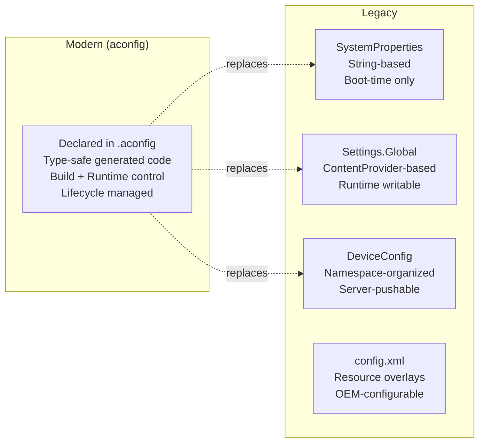

| Feature              | aconfig       | SystemProperties | Settings.Global | DeviceConfig | config.xml |
|----------------------|---------------|------------------|-----------------|--------------|------------|
| Type safety          | Yes (codegen) | No               | No              | No           | Limited    |
| Declaration          | `.aconfig`    | Convention       | Convention      | Convention   | XML        |
| Build-time control   | Yes           | Yes              | No              | No           | Yes        |
| Runtime control      | Yes (RW)      | Limited          | Yes             | Yes          | No         |
| Server-side push     | Yes           | No               | No              | Yes          | No         |
| Dead code elim.      | Yes (R8)      | No               | No              | No           | No         |
| Lifecycle mgmt       | Yes           | No               | No              | No           | No         |
| Test infrastructure  | Yes           | Manual           | Manual          | Manual       | Manual     |
| Boot-time available  | Yes (new)     | Yes              | No              | No           | Yes        |
| Per-user             | No            | No               | Secure only     | No           | No         |

### 3.8.6  Build-Time Feature Macros

Before aconfig, native code commonly used preprocessor macros for
feature flagging:

```cpp
// Traditional approach
#ifdef ENABLE_FANCY_RENDERING
    renderFancy(scene);
#else
    renderBasic(scene);
#endif
```

These macros are set at compile time through `Android.bp` or `Android.mk`
`cflags`:

```blueprint
cc_library {
    name: "mylib",
    cflags: ["-DENABLE_FANCY_RENDERING"],
}
```

**Limitations:**

- The flag and its check are disconnected (no single declaration)
- No runtime override capability
- No test infrastructure for exercising both code paths
- Typos in macro names silently create new macros
- No centralized visibility into which flags exist

The aconfig C++ codegen preserves the zero-overhead nature of compile-time
macros for fixed read-only flags (using `constexpr inline` functions and
preprocessor defines) while adding runtime flexibility for read-write
flags.

### 3.8.7  @FlaggedApi Annotation

The `@FlaggedApi` annotation bridges aconfig flags with the Android
API surface.  When a new public API is gated by a flag:

```java
@FlaggedApi(Flags.FLAG_MY_NEW_API)
public void myNewApi() {
    // This API only exists when the flag is enabled
}
```

The metalava documentation tool and the API surface checker use this
annotation to:

- Include or exclude the API from the public API signature based on
  flag state
- Track which APIs are gated by which flags
- Enforce that finalized APIs are properly associated with their flags
- Generate SDK stubs that reflect the flag-dependent API surface

The `all_aconfig_declarations` singleton generates metadata that
metalava consumes to verify the consistency between flag states and
API visibility.

### 3.8.8  Migration from Legacy to aconfig

When migrating a legacy flag to aconfig:

1. **Declare the flag** in a `.aconfig` file with the same semantic meaning
2. **Generate the library** with `java_aconfig_library` or `cc_aconfig_library`
3. **Replace the legacy read** (`SystemProperties.getBoolean(...)` or
   `DeviceConfig.getBoolean(...)`) with the generated accessor (`Flags.myFlag()`)
4. **Add values** to the appropriate release configuration to match the
   legacy flag's default behavior
5. **Add tests** using `@EnableFlags` / `@DisableFlags`
6. **Remove the legacy flag** once all consumers have migrated

For flags that were previously controlled via `DeviceConfig`, the migration
can be gradual: set `metadata { storage: DEVICE_CONFIG }` in the aconfig
declaration to keep using the DeviceConfig backend while gaining the
benefits of type-safe generated code and centralized declaration.

---

## 3.9  Try It

The following exercises walk through the complete aconfig workflow, from
declaring a flag to testing it in all states.

### 3.9.1  Exercise 1: Inspect Existing Flags

Explore the flags declared in the AOSP tree:

```bash
# Count all .aconfig declaration files
find . -name "*.aconfig" -type f | wc -l
# Expected: ~440+ files

# Examine a simple flag declaration
cat system/apex/apexd/apexd.aconfig

# Examine a complex declaration with metadata
cat packages/modules/ConfigInfrastructure/framework/flags.aconfig

# Look at the Android.bp that wires up declarations
cat frameworks/base/android-sdk-flags/Android.bp
```

### 3.9.2  Exercise 2: Trace the Build Pipeline

Follow a single flag through the build system:

```bash
# Find all aconfig_declarations modules for a package
grep -r "aconfig_declarations {" \
    frameworks/base/android-sdk-flags/Android.bp

# Find the corresponding java_aconfig_library
grep -A5 "java_aconfig_library {" \
    frameworks/base/android-sdk-flags/Android.bp

# See which release configs set values for this package
find build/release/aconfig -name "*.textproto" \
    -exec grep -l "android.sdk" {} \;
```

### 3.9.3  Exercise 3: Examine Generated Code

After building, inspect the generated flag code:

```bash
# Build the flag library
m android.sdk.flags-aconfig-java

# Find the generated source jar
find out/soong/.intermediates -name "*.srcjar" \
    -path "*android.sdk.flags-aconfig-java*"

# Extract and examine
mkdir /tmp/flags-gen
cd /tmp/flags-gen
unzip <path-to-srcjar>
cat android/sdk/Flags.java
cat android/sdk/FeatureFlags.java
cat android/sdk/FeatureFlagsImpl.java
```

### 3.9.4  Exercise 4: Use the aconfig Tool Directly

The `aconfig` binary can be used standalone for exploration:

```bash
# Build the aconfig tool
m aconfig

# Create a test .aconfig file
cat > /tmp/test.aconfig << 'EOF'
package: "com.example.test"
container: "system"

flag {
    name: "my_test_flag"
    namespace: "test_namespace"
    description: "A test flag for learning"
    bug: "12345"
}

flag {
    name: "my_readonly_flag"
    namespace: "test_namespace"
    description: "A read-only test flag"
    bug: "12345"
    is_fixed_read_only: true
}
EOF

# Create a values override file
cat > /tmp/test.values << 'EOF'
flag_value {
    package: "com.example.test"
    name: "my_test_flag"
    state: ENABLED
    permission: READ_WRITE
}
flag_value {
    package: "com.example.test"
    name: "my_readonly_flag"
    state: ENABLED
    permission: READ_ONLY
}
EOF

# Create the cache
aconfig create-cache \
    --package com.example.test \
    --container system \
    --declarations /tmp/test.aconfig \
    --values /tmp/test.values \
    --cache /tmp/test-cache.pb

# Dump the cache in human-readable format
aconfig dump-cache \
    --cache /tmp/test-cache.pb \
    --format '{fully_qualified_name} state={state} \
              permission={permission}'

# Generate Java code
mkdir -p /tmp/java-out
aconfig create-java-lib \
    --cache /tmp/test-cache.pb \
    --mode production \
    --out /tmp/java-out

# Examine the generated code
find /tmp/java-out -name "*.java" -exec echo "=== {} ===" \; \
    -exec cat {} \;
```

### 3.9.5  Exercise 5: Query Flags with dump-cache

The `dump-cache` command supports rich formatting and filtering:

```bash
# Show all flags with their trace (which files set values)
aconfig dump-cache \
    --cache /tmp/test-cache.pb \
    --format '{fully_qualified_name} {trace}'

# Filter by permission
aconfig dump-cache \
    --cache /tmp/test-cache.pb \
    --filter 'permission:READ_WRITE' \
    --format '{name}: {state}'

# Filter by state
aconfig dump-cache \
    --cache /tmp/test-cache.pb \
    --filter 'state:ENABLED+permission:READ_ONLY' \
    --format '{fully_qualified_name}'

# Output as text protobuf
aconfig dump-cache \
    --cache /tmp/test-cache.pb \
    --format textproto
```

### 3.9.6  Exercise 6: Write Flag-Guarded Code

Create a simple module that uses aconfig flags.

**Step 1: Declare flags** (`my_module/flags.aconfig`):

```protobuf
package: "com.example.mymodule"
container: "system"

flag {
    name: "enable_new_algorithm"
    namespace: "performance"
    description: "Use the new O(n log n) algorithm"
    bug: "999999"
}

flag {
    name: "enable_caching"
    namespace: "performance"
    description: "Enable result caching"
    bug: "999998"
    is_fixed_read_only: true
}
```

**Step 2: Add build rules** (`my_module/Android.bp`):

```blueprint
aconfig_declarations {
    name: "my-module-flags",
    package: "com.example.mymodule",
    container: "system",
    srcs: ["flags.aconfig"],
}

java_aconfig_library {
    name: "my-module-flags-java",
    aconfig_declarations: "my-module-flags",
}

java_library {
    name: "my-module",
    srcs: ["src/**/*.java"],
    static_libs: ["my-module-flags-java"],
}
```

**Step 3: Use flags in code** (`my_module/src/.../MyProcessor.java`):

```java
import com.example.mymodule.Flags;

public class MyProcessor {
    public Result process(Input input) {
        if (Flags.enableNewAlgorithm()) {
            return newAlgorithm(input);
        } else {
            return legacyAlgorithm(input);
        }
    }

    private Result fetchResult(Key key) {
        if (Flags.enableCaching()) {
            Result cached = cache.get(key);
            if (cached != null) return cached;
        }
        Result result = computeResult(key);
        if (Flags.enableCaching()) {
            cache.put(key, result);
        }
        return result;
    }
}
```

### 3.9.7  Exercise 7: Write Flag Tests

Write tests covering both flag states:

```java
import static org.junit.Assert.*;

import android.platform.test.annotations.DisableFlags;
import android.platform.test.annotations.EnableFlags;
import android.platform.test.flag.junit.SetFlagsRule;
import com.example.mymodule.Flags;

import org.junit.Rule;
import org.junit.Test;
import org.junit.runner.RunWith;
import org.junit.runners.JUnit4;

@RunWith(JUnit4.class)
public class MyProcessorTest {

    @Rule
    public final SetFlagsRule mSetFlagsRule = new SetFlagsRule();

    private final MyProcessor mProcessor = new MyProcessor();

    @Test
    @EnableFlags(Flags.FLAG_ENABLE_NEW_ALGORITHM)
    public void testNewAlgorithm() {
        Result result = mProcessor.process(testInput);
        // Verify new algorithm behavior
        assertEquals(expectedNewResult, result);
    }

    @Test
    @DisableFlags(Flags.FLAG_ENABLE_NEW_ALGORITHM)
    public void testLegacyAlgorithm() {
        Result result = mProcessor.process(testInput);
        // Verify legacy algorithm behavior
        assertEquals(expectedLegacyResult, result);
    }

    @Test
    @EnableFlags({
        Flags.FLAG_ENABLE_NEW_ALGORITHM,
        Flags.FLAG_ENABLE_CACHING
    })
    public void testNewAlgorithmWithCaching() {
        Result first = mProcessor.process(testInput);
        Result second = mProcessor.process(testInput);
        // Verify caching behavior
        assertSame(first, second);
    }
}
```

### 3.9.8  Exercise 8: Parameterized Flag Testing

Test all flag combinations:

```java
import android.platform.test.flag.junit.SetFlagsRule;
import android.platform.test.flag.junit.FlagsParameterization;
import com.example.mymodule.Flags;

import org.junit.Rule;
import org.junit.Test;
import org.junit.runner.RunWith;
import org.junit.runners.Parameterized;

import java.util.List;

@RunWith(Parameterized.class)
public class MyProcessorParameterizedTest {

    @Parameterized.Parameters(name = "{0}")
    public static List<FlagsParameterization> getParams() {
        return FlagsParameterization.allCombinationsOf(
            Flags.FLAG_ENABLE_NEW_ALGORITHM,
            Flags.FLAG_ENABLE_CACHING
        );
        // Generates 4 combinations:
        // [new=T, cache=T], [new=T, cache=F],
        // [new=F, cache=T], [new=F, cache=F]
    }

    @Rule
    public final SetFlagsRule mSetFlagsRule;

    public MyProcessorParameterizedTest(
            FlagsParameterization flags) {
        mSetFlagsRule = new SetFlagsRule(flags);
    }

    @Test
    public void testProcessNeverCrashes() {
        MyProcessor processor = new MyProcessor();
        // This test runs 4 times, once per combination
        Result result = processor.process(testInput);
        assertNotNull(result);
    }
}
```

### 3.9.9  Exercise 9: Inspect Runtime Flag State on Device

Use device tools to examine and manipulate flags at runtime:

```bash
# List all aconfig flags on the device
adb shell aflags list

# Filter by package
adb shell aflags list | grep "com.android.apex"

# Check a specific flag value
adb shell device_config get \
    core_experiments_team_internal \
    com.android.provider.flags.dump_improvements

# Override a read-write flag
adb shell aflags enable \
    com.android.provider.flags.dump_improvements

# Verify the override
adb shell aflags list | grep dump_improvements

# Clear the override
adb shell aflags clear \
    com.android.provider.flags.dump_improvements

# Inspect flag storage files
adb shell ls -la /metadata/aconfig/
adb shell ls -la /metadata/aconfig/maps/
adb shell ls -la /metadata/aconfig/flags/
```

### 3.9.10  Exercise 10: Create a C++ Flag Library

Integrate aconfig with a native module:

**Step 1: Declare flags** (`my_native/flags.aconfig`):

```protobuf
package: "com.example.mynative"
container: "system"

flag {
    name: "use_new_codec"
    namespace: "media"
    description: "Use the new hardware codec path"
    bug: "111111"
}
```

**Step 2: Build rules** (`my_native/Android.bp`):

```blueprint
aconfig_declarations {
    name: "my-native-flags",
    package: "com.example.mynative",
    container: "system",
    srcs: ["flags.aconfig"],
}

cc_aconfig_library {
    name: "my-native-flags-cc",
    aconfig_declarations: "my-native-flags",
}

cc_library {
    name: "my-native-lib",
    srcs: ["my_codec.cpp"],
    shared_libs: [
        "my-native-flags-cc",
        "libaconfig_storage_read_api_cc",
        "libbase",
        "liblog",
    ],
}
```

**Step 3: Use in C++ code** (`my_native/my_codec.cpp`):

```cpp
#include "com_example_mynative.h"

void processFrame(Frame& frame) {
    if (com::example::mynative::use_new_codec()) {
        newCodecPath(frame);
    } else {
        legacyCodecPath(frame);
    }
}
```

### 3.9.11  Exercise 11: Explore the Soong Build Integration

Trace how Soong processes aconfig modules:

```bash
# Look at the Soong module registration
cat build/soong/aconfig/init.go

# Examine the declarations module implementation
cat build/soong/aconfig/aconfig_declarations.go

# See how values flow from release config to declarations
grep -n "ReleaseAconfigValueSets" \
    build/soong/aconfig/aconfig_declarations.go

# Examine the codegen module types
cat build/soong/aconfig/codegen/init.go

# Look at the Java codegen integration
cat build/soong/aconfig/codegen/java_aconfig_library.go

# See the all_aconfig_declarations singleton
cat build/soong/aconfig/all_aconfig_declarations.go
```

### 3.9.12  Exercise 12: Examine the aconfig Proto Schema

Study the protobuf definitions that underpin the system:

```bash
# The main aconfig proto definition
cat build/make/tools/aconfig/aconfig_protos/protos/aconfig.proto

# The internal proto for finalized flags
cat build/make/tools/aconfig/aconfig_protos/protos/aconfig_internal.proto

# The storage metadata proto
cat build/make/tools/aconfig/aconfig_storage_file/protos/\
    aconfig_storage_metadata.proto
```

Key messages to understand:

| Message            | File             | Purpose                                    |
|--------------------|------------------|--------------------------------------------|
| `flag_declaration` | `aconfig.proto`  | Input: individual flag declaration          |
| `flag_declarations`| `aconfig.proto`  | Input: package-level declaration wrapper    |
| `flag_value`       | `aconfig.proto`  | Input: value override for a flag            |
| `flag_values`      | `aconfig.proto`  | Input: collection of value overrides        |
| `parsed_flag`      | `aconfig.proto`  | Output: fully resolved flag with trace      |
| `parsed_flags`     | `aconfig.proto`  | Output: collection of resolved flags        |
| `tracepoint`       | `aconfig.proto`  | Output: origin record for a flag value      |
| `finalized_flag`   | `aconfig_internal.proto` | Internal: API finalization record  |
| `storage_file_info`| `aconfig_storage_metadata.proto` | Storage file locations   |

---

## Summary

The aconfig feature flag system represents a fundamental shift in how Android
manages the gap between code development and feature availability.  Its key
contributions to the platform are:

**Build-time infrastructure:**

- The `.aconfig` declaration format provides a standardized, protobuf-backed
  schema for flag metadata (package, namespace, container, permission,
  purpose, storage backend)
- The Soong module types (`aconfig_declarations`, `aconfig_values`,
  `aconfig_value_set`, `java_aconfig_library`, `cc_aconfig_library`,
  `rust_aconfig_library`) create a type-safe, dependency-tracked pipeline
  from declaration to usable library
- Release configurations select which value sets apply, enabling per-target
  flag customization without code changes

**Code generation:**

- The `aconfig` tool generates type-safe accessor code in Java, C++, and
  Rust, eliminating string-based flag lookups
- Generated code includes R8 optimization annotations that enable dead code
  elimination for read-only flags
- Four code generation modes (production, test, exported, force-read-only)
  serve different build contexts

**Runtime resolution:**

- The `aconfigd` service and memory-mapped storage files provide boot-time
  flag availability and zero-IPC flag reads
- The legacy DeviceConfig backend remains available for backward compatibility
- Read-write flags support server-side overrides without requiring OTA updates

**Testing:**

- The `SetFlagsRule`, `@EnableFlags` / `@DisableFlags` annotations, and
  `FlagsParameterization` provide comprehensive unit testing support
- Generated `FakeFeatureFlagsImpl` classes enable isolated testing
- Test mode generation forces explicit flag configuration, preventing
  accidental dependencies on production defaults

The combination of these capabilities -- trunk-stable development, type-safe
code generation, efficient runtime resolution, and comprehensive testing --
addresses the fundamental challenge of shipping hundreds of features on a
continuous development cadence while maintaining platform stability.

---

## Key Source Files

| Path | Description |
|------|-------------|
| `build/make/tools/aconfig/aconfig_protos/protos/aconfig.proto` | Flag declaration and value protobuf schema |
| `build/make/tools/aconfig/aconfig/src/commands.rs` | Core aconfig tool command implementations |
| `build/make/tools/aconfig/aconfig/src/codegen/java.rs` | Java code generation logic |
| `build/make/tools/aconfig/aconfig/src/codegen/cpp.rs` | C++ code generation logic |
| `build/make/tools/aconfig/aconfig/src/codegen/rust.rs` | Rust code generation logic |
| `build/make/tools/aconfig/aconfig/src/codegen/mod.rs` | CodegenMode enum and shared utilities |
| `build/make/tools/aconfig/aconfig/templates/Flags.java.template` | Java Flags class template |
| `build/make/tools/aconfig/aconfig/templates/FeatureFlags.java.template` | Java FeatureFlags interface template |
| `build/make/tools/aconfig/aconfig/templates/FeatureFlagsImpl.new_storage.java.template` | New storage FeatureFlagsImpl template |
| `build/make/tools/aconfig/aconfig/templates/FeatureFlagsImpl.deviceConfig.java.template` | DeviceConfig FeatureFlagsImpl template |
| `build/make/tools/aconfig/aconfig/templates/FeatureFlagsImpl.test_mode.java.template` | Test mode FeatureFlagsImpl template |
| `build/make/tools/aconfig/aconfig/templates/FakeFeatureFlagsImpl.java.template` | Test fake implementation template |
| `build/make/tools/aconfig/aconfig/templates/CustomFeatureFlags.java.template` | Custom delegation wrapper template |
| `build/make/tools/aconfig/aconfig/templates/cpp_exported_header.template` | C++ header template |
| `build/make/tools/aconfig/aconfig/templates/cpp_source_file.template` | C++ source template |
| `build/soong/aconfig/init.go` | Soong module registration and build rules |
| `build/soong/aconfig/aconfig_declarations.go` | aconfig_declarations module type |
| `build/soong/aconfig/aconfig_values.go` | aconfig_values module type |
| `build/soong/aconfig/aconfig_value_set.go` | aconfig_value_set module type |
| `build/soong/aconfig/all_aconfig_declarations.go` | Singleton collecting all declarations |
| `build/soong/aconfig/exported_java_aconfig_library.go` | Exported JAR singleton |
| `build/soong/aconfig/codegen/init.go` | Codegen module registration and build rules |
| `build/soong/aconfig/codegen/java_aconfig_library.go` | java_aconfig_library module type |
| `build/soong/aconfig/codegen/cc_aconfig_library.go` | cc_aconfig_library module type |
| `build/soong/aconfig/codegen/rust_aconfig_library.go` | rust_aconfig_library module type |
| `build/soong/aconfig/codegen/aconfig_declarations_group.go` | Group module type |
| `build/make/tools/aconfig/aconfig_storage_read_api/src/lib.rs` | Storage read API |
| `build/make/tools/aconfig/aconfig_storage_file/protos/aconfig_storage_metadata.proto` | Storage metadata proto |
| `system/server_configurable_flags/aconfigd/aconfigd.rc` | aconfigd init service definition |
| `system/server_configurable_flags/aconfigd/src/aconfigd_commands.rs` | aconfigd command handlers |
| `build/make/tools/aconfig/aflags/src/main.rs` | aflags device CLI tool |
| `platform_testing/libraries/flag-helpers/junit/src_base/android/platform/test/flag/junit/SetFlagsRule.java` | Test rule for flag control |
| `platform_testing/libraries/annotations/src/android/platform/test/annotations/EnableFlags.java` | @EnableFlags annotation |
| `platform_testing/libraries/annotations/src/android/platform/test/annotations/DisableFlags.java` | @DisableFlags annotation |
| `frameworks/base/AconfigFlags.bp` | Framework flag library aggregation |
| `build/release/aconfig/bp4a/Android.bp` | Release config value set example |
