# 第 4 章：启动与 init

从按下电源键到看到 Android 主屏，这段旅程是整个系统编程领域中编排最精细的序列之一。Android 的启动过程横跨多个特权层级，从固件在裸机模式执行开始，经过 Linux 内核 ring-0 初始化，最终抵达运行在用户空间中的 Java 系统服务。任何参与平台 bring-up、排查启动失败、优化开机时长，或者单纯希望理解 Android 如何“活过来”的开发者，都必须真正理解这一过程。

本章会沿着真实 AOSP 源码追踪完整启动路径，从 bootloader 一直到主屏。我们会阅读真实的 C++ 与 Java 文件，拆解 init.rc 语言，并建立一套清晰的依赖链模型，理解每个组件究竟在什么条件下启动。

---

## 4.1 Android Boot Sequence Overview

### 4.1.1 The Complete Boot Flow

Android 启动序列可以分成七个主要阶段。每个阶段都会按严格定义的顺序把控制权交给下一阶段，而这些阶段之间的依赖关系决定了“什么事情能在什么时候发生”。

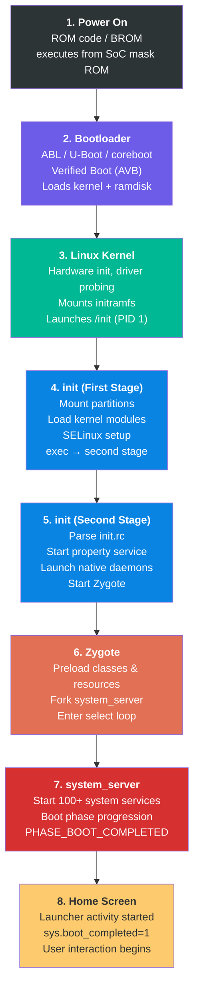

Header 的固定长度就是 `AVB_VBMETA_IMAGE_HEADER_SIZE`（256）字节，起始 magic 是 `AVB0`（`AVB_MAGIC`）。源码第 42-46 行如下：

```c
// external/avb/libavb/avb_vbmeta_image.h, lines 42-46
#define AVB_VBMETA_IMAGE_HEADER_SIZE 256
#define AVB_MAGIC "AVB0"
#define AVB_MAGIC_LEN 4
#define AVB_RELEASE_STRING_SIZE 48
```

vbmeta 中的 flags 会直接控制验证行为。第 59-62 行定义如下：

```c
// external/avb/libavb/avb_vbmeta_image.h, lines 59-62
typedef enum {
  AVB_VBMETA_IMAGE_FLAGS_HASHTREE_DISABLED = (1 << 0),
  AVB_VBMETA_IMAGE_FLAGS_VERIFICATION_DISABLED = (1 << 1)
} AvbVBMetaImageFlags;
```

其中 `HASHTREE_DISABLED` 会关闭 dm-verity 运行时校验，而 `VERIFICATION_DISABLED` 则会关闭包括 descriptor 解析在内的全部验证。这两个 flag 只允许在设备解锁状态下启用。

#### 验证过程

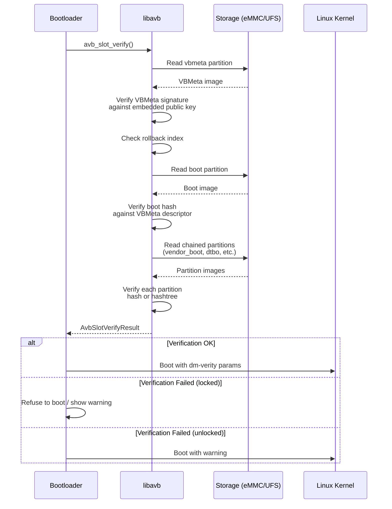

AVB 的核心入口函数是 `avb_slot_verify()`，定义在 `external/avb/libavb/avb_slot_verify.h` 中。其返回结果码位于第 45-55 行：

```c
// external/avb/libavb/avb_slot_verify.h, lines 45-55
typedef enum {
  AVB_SLOT_VERIFY_RESULT_OK,
  AVB_SLOT_VERIFY_RESULT_ERROR_OOM,
  AVB_SLOT_VERIFY_RESULT_ERROR_IO,
  AVB_SLOT_VERIFY_RESULT_ERROR_VERIFICATION,
  AVB_SLOT_VERIFY_RESULT_ERROR_ROLLBACK_INDEX,
  AVB_SLOT_VERIFY_RESULT_ERROR_PUBLIC_KEY_REJECTED,
  AVB_SLOT_VERIFY_RESULT_ERROR_INVALID_METADATA,
  AVB_SLOT_VERIFY_RESULT_ERROR_UNSUPPORTED_VERSION,
  AVB_SLOT_VERIFY_RESULT_ERROR_INVALID_ARGUMENT
} AvbSlotVerifyResult;
```

这些结果码分别对应特定故障模式：

- `ERROR_VERIFICATION`：hash 不匹配，表示分区内容被篡改
- `ERROR_ROLLBACK_INDEX`：试图刷入旧版本镜像，触发 rollback protection
- `ERROR_PUBLIC_KEY_REJECTED`：签名公钥不在设备信任集内
- `ERROR_UNSUPPORTED_VERSION`：vbmeta 需要更高版本 libavb 才能理解

#### dm-verity 与 Hashtree 校验

对于 `system`、`vendor` 这类超大分区，开机时直接对全分区做 hash 校验成本太高。AVB 因此使用 **dm-verity**，它是 Linux kernel 的 device-mapper target，会在读盘时按需验证数据块。

dm-verity 采用 Merkle tree，也就是 hash tree 结构：

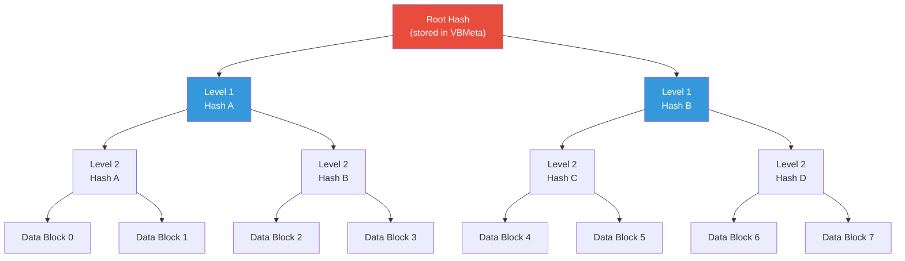

当某个数据块被读取时，kernel 会计算该数据块的 hash，并沿树向上验证，一直到 root hash。如果任意一层不匹配，就说明数据遭到修改。

Hashtree 错误模式定义在 `avb_slot_verify.h` 第 86-93 行：

```c
// external/avb/libavb/avb_slot_verify.h, lines 86-93
typedef enum {
  AVB_HASHTREE_ERROR_MODE_RESTART_AND_INVALIDATE,
  AVB_HASHTREE_ERROR_MODE_RESTART,
  AVB_HASHTREE_ERROR_MODE_EIO,
  AVB_HASHTREE_ERROR_MODE_LOGGING,
  AVB_HASHTREE_ERROR_MODE_MANAGED_RESTART_AND_EIO,
  AVB_HASHTREE_ERROR_MODE_PANIC
} AvbHashtreeErrorMode;
```

生产设备通常使用 `RESTART_AND_INVALIDATE`。一旦 dm-verity 检测到损坏，设备会重启，并将当前 A/B slot 标记为失效，从而回退到另一槽位。`LOGGING` 模式则只适用于显式允许验证失败的开发环境。

#### Rollback 保护

Rollback protection 防止攻击者刷回已知存在漏洞的旧版本系统。其机制如下：

1. 每个 vbmeta image 都带有 rollback index，也就是单调递增版本号
2. 设备会在防篡改存储中保存可接受的最小 rollback index，通常是 RPMB
3. 如果正在验证的 vbmeta 中 rollback index 小于已存储值，`AVB_SLOT_VERIFY_RESULT_ERROR_ROLLBACK_INDEX` 就会返回
4. 成功启动后，系统会把存储中的最小 rollback index 更新到当前值

### 4.2.4 Recovery 模式

Android recovery 系统提供最小运行环境，用于 OTA、恢复出厂设置和 sideload。相关代码位于 `bootable/recovery/`。

Recovery 依赖 boot mode 切换，相关枚举位于 `system/core/init/first_stage_init.cpp` 第 66-70 行：

```cpp
// system/core/init/first_stage_init.cpp, lines 66-70
enum class BootMode {
    NORMAL_MODE,
    RECOVERY_MODE,
    CHARGER_MODE,
};
```

处于 recovery mode 时，first-stage init 会走不同路径，例如跳过标准的 first-stage mount 流程。第 523-524 行如下：

```cpp
// system/core/init/first_stage_init.cpp, lines 523-524
if (IsRecoveryMode()) {
    LOG(INFO) << "First stage mount skipped (recovery mode)";
```

在现代 A/B 设备上，recovery ramdisk 通常不再来自单独 recovery 分区，而是使用常规 boot 分区中的内容。`ForceNormalBoot()`（第 117-119 行）则负责判断是否从 recovery 重定向回 normal boot：

```cpp
// system/core/init/first_stage_init.cpp, lines 117-119
bool ForceNormalBoot(const std::string& cmdline, const std::string& bootconfig) {
    return bootconfig.find("androidboot.force_normal_boot = \"1\"") != std::string::npos ||
           cmdline.find("androidboot.force_normal_boot=1") != std::string::npos;
}
```

这允许同一份 boot image 同时服务 normal boot 与 recovery boot，两者通过 bootconfig 参数决定走哪条路径。

---

## 4.2 Bootloader and Verified Boot

### 4.2.1 Android Bootloader Architecture

Android 并不强制规定具体的 bootloader 实现，而是定义了一组任何 bootloader 都必须满足的要求：

1. **A/B 槽位管理**：支持通过双槽位完成无缝更新
2. **Verified Boot**：实现 Android Verified Boot（AVB）协议
3. **Fastboot 协议**：支持 fastboot 刷写协议
4. **Kernel 加载**：能够加载并解压 kernel、ramdisk 和 DTB
5. **启动模式选择**：支持 normal boot、recovery、fastboot 和 charger 等模式

Android 生态中最常见的 bootloader 实现包括：

- **ABL（Android Bootloader）**：Qualcomm Snapdragon 平台常见的基于 UEFI 的 bootloader
- **U-Boot**：大量 ARM SoC 厂商使用的开源 bootloader
- **coreboot**：部分源自 Chromebook 体系的 Android 设备会使用它

### 4.2.2 Boot Partitions

现代 Android 设备使用多分区 boot image 布局。理解这些分区，是研究启动链的基础：

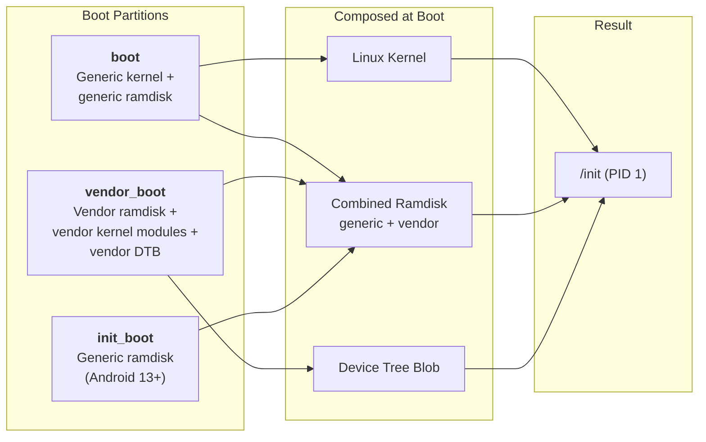

**boot 分区：** 保存 Linux kernel image，以及在 Android 13 之前承载 generic ramdisk。它的 boot image header 定义在 `system/tools/mkbootimg/include/bootimg/bootimg.h` 中，包含 kernel 大小、ramdisk 大小、page size、OS version 和 header version 等元数据。

**vendor_boot 分区：** 从 Android 11 引入，也就是 boot image header v3。它包含 vendor ramdisk、vendor kernel modules 和 device tree blob。它使 vendor 可以在不修改 generic boot image 的情况下独立更新自身启动组件。

**init_boot 分区：** 从 Android 13 引入，也就是 boot image header v4。它把 generic ramdisk 从 boot 分区中单独抽出，放入自己的分区。这样，包含 first-stage init 的 generic ramdisk 就可以随着 GKI 更新独立演进。

### 4.2.3 Android Verified Boot（AVB）

Android Verified Boot 用于确保系统启动过程中被执行的所有代码和数据都来自可信来源。AVB 的实现位于 `external/avb/`，是整个 boot chain 中最关键的安全组件之一。

#### AVB 库结构

核心 AVB 库位于 `external/avb/libavb/`。它的主头文件是 `external/avb/libavb/libavb.h`，会 include 所有子组件头文件：

| 头文件 | 用途 |
|---|---|
| `avb_vbmeta_image.h` | VBMeta 镜像格式与解析 |
| `avb_slot_verify.h` | 槽位校验逻辑 |
| `avb_crypto.h` | 加密原语 |
| `avb_hashtree_descriptor.h` | Hashtree，也就是 dm-verity 描述符 |
| `avb_hash_descriptor.h` | boot image 的 hash 描述符 |
| `avb_chain_partition_descriptor.h` | 分区间的信任链描述 |
| `avb_ops.h` | bootloader 操作接口 |
| `avb_footer.h` | 追加在已校验分区尾部的 footer |

#### VBMeta 镜像结构

VBMeta image 是 AVB 的核心。其结构定义在 `external/avb/libavb/avb_vbmeta_image.h` 第 64-116 行：

```
+-----------------------------------------+
| Header data - fixed size (256 bytes)    |
+-----------------------------------------+
| Authentication data - variable size     |
+-----------------------------------------+
| Auxiliary data - variable size          |
+-----------------------------------------+
```
## 4.3 Init: The First Process

Init 是 Android 用户空间中最重要的进程。它的 PID 是 1，也是所有其他进程的祖先。只要 init 崩溃，kernel 就会 panic。Init 主要负责：

- 挂载文件系统
- 加载 SELinux policy
- 启动全部 native daemon
- 管理 Android property system
- 监控并重启崩溃服务
- 处理 reboot 与 shutdown 请求

### 4.3.1 双阶段设计

Android 的 init 采用 two-stage architecture。它的根本原因是一个典型的“先有鸡还是先有蛋”问题：SELinux policy 位于 `/system` 分区，但挂载这些分区本身又必须由 first-stage init 完成。解决方式就是把 init 分成两个阶段，并以同一二进制的两次 `exec()` 运行。

入口位于 `system/core/init/main.cpp`。这个 `main()` 实际上是多个执行模式的统一分发器：

```cpp
// system/core/init/main.cpp, lines 53-83
int main(int argc, char** argv) {
#if __has_feature(address_sanitizer)
    __asan_set_error_report_callback(AsanReportCallback);
#elif __has_feature(hwaddress_sanitizer)
    __hwasan_set_error_report_callback(AsanReportCallback);
#endif
    // Boost prio which will be restored later
    setpriority(PRIO_PROCESS, 0, -20);
    if (!strcmp(basename(argv[0]), "ueventd")) {
        return ueventd_main(argc, argv);
    }

    if (argc > 1) {
        if (!strcmp(argv[1], "subcontext")) {
            android::base::InitLogging(argv, &android::base::KernelLogger);
            const BuiltinFunctionMap& function_map = GetBuiltinFunctionMap();

            return SubcontextMain(argc, argv, &function_map);
        }

        if (!strcmp(argv[1], "selinux_setup")) {
            return SetupSelinux(argv);
        }

        if (!strcmp(argv[1], "second_stage")) {
            return SecondStageMain(argc, argv);
        }
    }

    return FirstStageMain(argc, argv);
}
```

这段代码直接说明：同一个 `/system/bin/init` 二进制，实际上会根据参数承担五种不同角色：

| 调用方式 | 对应函数 | 作用 |
|---|---|---|
| `init`（无参数） | `FirstStageMain()` | 第一阶段初始化 |
| `init selinux_setup` | `SetupSelinux()` | 加载 SELinux policy |
| `init second_stage` | `SecondStageMain()` | 进入主 init 循环 |
| `init subcontext` | `SubcontextMain()` | 以 SELinux 子上下文执行命令 |
| `ueventd`（通过符号链接调用） | `ueventd_main()` | 设备节点管理器 |

第 60 行还会把 init 优先级提升到 -20，也就是最高优先级，确保它在启动过程中获得尽可能多的 CPU 时间。之后在进入主事件循环前，这个优先级会恢复到 0。

此外，first-stage init 还有独立入口 `system/core/init/first_stage_main.cpp`：

```cpp
// system/core/init/first_stage_main.cpp, lines 19-21
int main(int argc, char** argv) {
    return android::init::FirstStageMain(argc, argv);
}
```

这之所以存在，是因为 first-stage init 会以更小的独立二进制形式放在 ramdisk 中，而完整的 `main.cpp` 二进制位于 `/system` 分区。

### 4.3.2 First-Stage Init：打基础

First-stage init 的实现位于 `system/core/init/first_stage_init.cpp`。`FirstStageMain()` 从第 333 行开始，是 Android 启动链中最关键的函数之一：只要这里失败，设备就不可能继续启动。

#### 第一阶段：应急基础设施（第 333-422 行）

Init 一开始会先安装 crash handler，然后搭起最小文件系统基础设施，以便与外界通信：

```cpp
// system/core/init/first_stage_init.cpp, lines 333-349
int FirstStageMain(int argc, char** argv) {
    if (REBOOT_BOOTLOADER_ON_PANIC) {
        InstallRebootSignalHandlers();
    }

    boot_clock::time_point start_time = boot_clock::now();

    std::vector<std::pair<std::string, int>> errors;
#define CHECKCALL(x) \
    if ((x) != 0) errors.emplace_back(#x " failed", errno);

    // Clear the umask.
    umask(0);

    CHECKCALL(clearenv());
    CHECKCALL(setenv("PATH", _PATH_DEFPATH, 1));
    // Get the basic filesystem setup we need put together in the initramdisk
    // on / and then we'll let the rc file figure out the rest.
    CHECKCALL(mount("tmpfs", "/dev", "tmpfs", MS_NOSUID, "mode=0755"));
```

这里的 `CHECKCALL` 很有意思：它不会在第一个失败点立刻中断，而是先把全部错误收集起来，稍后统一报告。原因很直接：此时日志系统尚未初始化，连 `/dev/kmsg` 都还没有。

随后它会继续建立设备节点和伪文件系统：

```cpp
// system/core/init/first_stage_init.cpp, lines 351-381
CHECKCALL(mkdir("/dev/pts", 0755));
CHECKCALL(mkdir("/dev/socket", 0755));
CHECKCALL(mkdir("/dev/dm-user", 0755));
CHECKCALL(mount("devpts", "/dev/pts", "devpts", 0, NULL));
CHECKCALL(mount("proc", "/proc", "proc", 0,
    "hidepid=2,gid=" MAKE_STR(AID_READPROC)));
// ...
CHECKCALL(mount("sysfs", "/sys", "sysfs", 0, NULL));
CHECKCALL(mount("selinuxfs", "/sys/fs/selinux", "selinuxfs", 0, NULL));

CHECKCALL(mknod("/dev/kmsg", S_IFCHR | 0600, makedev(1, 11)));
// ...
CHECKCALL(mknod("/dev/random", S_IFCHR | 0666, makedev(1, 8)));
CHECKCALL(mknod("/dev/urandom", S_IFCHR | 0666, makedev(1, 9)));
CHECKCALL(mknod("/dev/ptmx", S_IFCHR | 0666, makedev(5, 2)));
CHECKCALL(mknod("/dev/null", S_IFCHR | 0666, makedev(1, 3)));
```

这里能看到不少安全细节：

- `/proc` 以 `hidepid=2` 挂载，减少普通进程观察其他进程信息的能力
- `/dev/kmsg` 权限是 0600，阻止非特权访问 kernel log
- `selinuxfs` 挂载在 `/sys/fs/selinux`，后面加载 SELinux policy 会依赖它

只有完成这些动作以后，init 才能真正开始写日志：

```cpp
// system/core/init/first_stage_init.cpp, lines 412-424
SetStdioToDevNull(argv);
// Now that tmpfs is mounted on /dev and we have /dev/kmsg, we can actually
// talk to the outside world...
InitKernelLogging(argv);

if (!errors.empty()) {
    for (const auto& [error_string, error_errno] : errors) {
        LOG(ERROR) << error_string << " " << strerror(error_errno);
    }
    LOG(FATAL) << "Init encountered errors starting first stage, aborting";
}

LOG(INFO) << "init first stage started!";
```

#### 第二阶段：加载内核模块（第 441-458 行）

现代 Android 设备通常采用模块化 kernel，很多驱动不会直接编进内核，而是以模块方式加载。first-stage init 必须在挂载分区前就把这些模块加载好，因为负责存储控制器的驱动本身就可能也是模块。

```cpp
// system/core/init/first_stage_init.cpp, lines 441-458
boot_clock::time_point module_start_time = boot_clock::now();
int module_count = 0;
BootMode boot_mode = GetBootMode(cmdline, bootconfig);
if (!LoadKernelModules(boot_mode, want_console,
                       want_parallel, module_count)) {
    if (want_console != FirstStageConsoleParam::DISABLED) {
        LOG(ERROR) << "Failed to load kernel modules, starting console";
    } else {
        LOG(FATAL) << "Failed to load kernel modules";
    }
}
if (module_count > 0) {
    auto module_elapse_time = std::chrono::duration_cast<std::chrono::milliseconds>(
            boot_clock::now() - module_start_time);
    setenv(kEnvInitModuleDurationMs,
           std::to_string(module_elapse_time.count()).c_str(), 1);
    LOG(INFO) << "Loaded " << module_count << " kernel modules took "
              << module_elapse_time.count() << " ms";
}
```

`LoadKernelModules()` 会在 `/lib/modules/` 下寻找与当前 kernel 版本匹配的模块目录，并支持并行加载：

```cpp
// system/core/init/first_stage_init.cpp, lines 282-284
bool retval = (want_parallel) ? m.LoadModulesParallel(std::thread::hardware_concurrency())
                              : m.LoadListedModules(!want_console);
```

加载哪些模块，也会随着 boot mode 改变。例如 charger mode 下只需更少模块，因为设备只需要显示充电动画：

```cpp
// system/core/init/first_stage_init.cpp, lines 187-212
std::string GetModuleLoadList(BootMode boot_mode, const std::string& dir_path) {
    std::string module_load_file;
    switch (boot_mode) {
        case BootMode::NORMAL_MODE:
            module_load_file = "modules.load";
            break;
        case BootMode::RECOVERY_MODE:
            module_load_file = "modules.load.recovery";
            break;
        case BootMode::CHARGER_MODE:
            module_load_file = "modules.load.charger";
            break;
    }
    // ...
}
```

#### 第三阶段：挂载分区（第 462-540 行）

当内核模块加载完成，尤其是存储驱动到位后，first-stage init 才能挂载关键分区：

```cpp
// system/core/init/first_stage_init.cpp, lines 526-540
if (!fsm) {
    fsm = CreateFirstStageMount(cmdline);
}
if (!fsm) {
    LOG(FATAL) << "FirstStageMount not available";
}

if (!created_devices && !fsm->DoCreateDevices()) {
    LOG(FATAL) << "Failed to create devices required for first stage mount";
}

if (!fsm->DoFirstStageMount()) {
    LOG(FATAL) << "Failed to mount required partitions early ...";
}
```

这一步也是 dm-verity 配置真正接入的地方。`FirstStageMount` 类位于 `system/core/init/first_stage_mount.cpp`，它会读取 fstab、创建 verity 需要的 device-mapper 节点，并挂载 `/system`、`/vendor` 等关键分区。

#### 第四阶段：切换到 SELinux Setup（第 557-582 行）

分区挂载完成后，first-stage init 开始准备 SELinux 切换，并通过 `exec()` 进入 `"selinux_setup"` 模式：

```cpp
// system/core/init/first_stage_init.cpp, lines 557-575
const char* path = "/system/bin/init";
const char* args[] = {path, "selinux_setup", nullptr};
auto fd = open("/dev/kmsg", O_WRONLY | O_CLOEXEC);
dup2(fd, STDOUT_FILENO);
dup2(fd, STDERR_FILENO);
close(fd);
execv(path, const_cast<char**>(args));

// execv() only returns if an error happened, in which case we
// panic and never fall through this conditional.
PLOG(FATAL) << "execv(\"" << path << "\") failed";
```

一个关键细节是：`execv()` 会把当前 ramdisk 中的 first-stage init 进程镜像，替换成 `/system/bin/init` 上的完整版 init。之所以此时能这么做，是因为 `/system` 已经被挂载好了。在此之前，ramdisk 还会被释放以回收内存：

```cpp
// system/core/init/first_stage_init.cpp, lines 548-549
if (old_root_dir && old_root_info.st_dev != new_root_info.st_dev) {
    FreeRamdisk(old_root_dir.get(), old_root_info.st_dev);
}
```

### 4.3.3 SELinux Setup：安全上下文切换

SELinux setup 阶段的实现位于 `system/core/init/selinux.cpp`。文件开头的注释已经很好地概括了策略加载设计：旧设备采用单体 policy，而 Treble 设备采用从 `/system`、`/vendor`、`/product`、`/odm` 组合出来的 split policy。

`SetupSelinux()` 位于第 780-836 行：

```cpp
// system/core/init/selinux.cpp, lines 780-829
int SetupSelinux(char** argv) {
    SetStdioToDevNull(argv);
    InitKernelLogging(argv);
    // ...
    SelinuxSetupKernelLogging();

    bool use_overlays = EarlySetupOverlays();

    if (IsMicrodroid()) {
        LoadSelinuxPolicyMicrodroid();
    } else {
        LoadSelinuxPolicyAndroid();
    }

    SelinuxSetEnforcement();
    // ...
    if (selinux_android_restorecon("/system/bin/init", 0) == -1) {
        PLOG(FATAL) << "restorecon failed of /system/bin/init failed";
    }
    // ...
    const char* path = "/system/bin/init";
    const char* args[] = {path, "second_stage", nullptr};
    execv(path, const_cast<char**>(args));
```

`LoadSelinuxPolicyAndroid()` 的注释展示了一个非常细致的五步切换流程，尤其是为了处理 snapuserd 运行中的情形：

```cpp
// system/core/init/selinux.cpp, lines 670-708 (comment + function)
// We use a five-step process to address this:
//  (1) Read the policy into a string, with snapuserd running.
//  (2) Rewrite the snapshot device-mapper tables, to generate new dm-user
//      devices and to flush I/O.
//  (3) Kill snapuserd, which no longer has any dm-user devices to attach to.
//  (4) Load the sepolicy and issue critical restorecons in /dev, carefully
//      avoiding anything that would read from /system.
//  (5) Re-launch snapuserd and attach it to the dm-user devices from step (2).
void LoadSelinuxPolicyAndroid() {
    MountMissingSystemPartitions();

    LOG(INFO) << "Opening SELinux policy";
    std::string policy;
    ReadPolicy(&policy);

    auto snapuserd_helper = SnapuserdSelinuxHelper::CreateIfNeeded();
    if (snapuserd_helper) {
        snapuserd_helper->StartTransition();
    }

    LoadSelinuxPolicy(policy);

    if (snapuserd_helper) {
        snapuserd_helper->FinishTransition();
        snapuserd_helper = nullptr;
    }
}
```

在加载 policy 并设置 enforcement mode 之后，`SetupSelinux()` 还会对 `/system/bin/init` 本身执行一次 `restorecon`，从而保证下一次 `exec()` 时，init 能从 kernel domain 切换到真正的 `init` SELinux domain。然后它再一次 `exec()` 进入 second-stage init。

### 4.3.4 完整的 First-Stage 流程

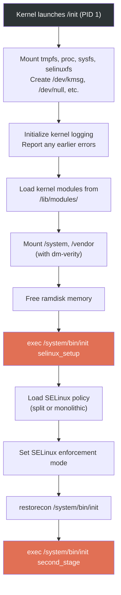

### 4.3.5 Second-Stage Init：真正的主舞台

Second-stage init 才是整个用户空间启动编排的核心。`SecondStageMain()` 位于 `system/core/init/init.cpp` 第 1048 行之后，是 Android 用户空间启动的中心函数。

#### 初始设置（第 1048-1166 行）

```cpp
// system/core/init/init.cpp, lines 1048-1063
int SecondStageMain(int argc, char** argv) {
    if (REBOOT_BOOTLOADER_ON_PANIC) {
        InstallRebootSignalHandlers();
    }

    boot_clock::time_point start_time = boot_clock::now();

    trigger_shutdown = [](const std::string& command) {
        shutdown_state.TriggerShutdown(command);
    };

    SetStdioToDevNull(argv);
    InitKernelLogging(argv);
    LOG(INFO) << "init second stage started!";
```

随后它会快速执行一系列关键步骤：

1. **Property 初始化**：第 1108 行 `PropertyInit()` 会建立 Android 全局 property system
2. **SELinux context 恢复**：恢复 first-stage 创建设备节点的安全标签
3. **Epoll 事件循环设置**：为 SIGCHLD、SIGTERM 等信号建立主事件循环
4. **Property service 启动**：`StartPropertyService()` 拉起处理 property set 请求的线程
5. **Boot script 加载**：`LoadBootScripts()` 解析全部 init.rc 文件

源码片段如下：

```cpp
// system/core/init/init.cpp, lines 1108-1179
PropertyInit();

// Umount second stage resources after property service has read the .prop files.
UmountSecondStageRes();
// ...
MountExtraFilesystems();

// Now set up SELinux for second stage.
SelabelInitialize();
SelinuxRestoreContext();

Epoll epoll;
if (auto result = epoll.Open(); !result.ok()) {
    PLOG(FATAL) << result.error();
}
// ...
InstallSignalFdHandler(&epoll);
InstallInitNotifier(&epoll);
StartPropertyService(&property_fd);
// ...
ActionManager& am = ActionManager::GetInstance();
ServiceList& sm = ServiceList::GetInstance();

LoadBootScripts(am, sm);
```

#### 加载 Boot Scripts（第 339-363 行）

`LoadBootScripts()` 会解析全部 init.rc 文件：

```cpp
// system/core/init/init.cpp, lines 339-363
static void LoadBootScripts(ActionManager& action_manager, ServiceList& service_list) {
    Parser parser = CreateParser(action_manager, service_list);

    std::string bootscript = GetProperty("ro.boot.init_rc", "");
    if (bootscript.empty()) {
        parser.ParseConfig("/system/etc/init/hw/init.rc");
        if (!parser.ParseConfig("/system/etc/init")) {
            late_import_paths.emplace_back("/system/etc/init");
        }
        parser.ParseConfig("/system_ext/etc/init");
        if (!parser.ParseConfig("/vendor/etc/init")) {
            late_import_paths.emplace_back("/vendor/etc/init");
        }
        if (!parser.ParseConfig("/odm/etc/init")) {
            late_import_paths.emplace_back("/odm/etc/init");
        }
        if (!parser.ParseConfig("/product/etc/init")) {
            late_import_paths.emplace_back("/product/etc/init");
        }
    } else {
        parser.ParseConfig(bootscript);
    }
}
```

也就是说，init.rc 会按如下顺序从多个目录加载：

1. `/system/etc/init/hw/init.rc`：主 init.rc
2. `/system/etc/init/`：system 分区服务
3. `/system_ext/etc/init/`：system_ext 服务
4. `/vendor/etc/init/`：vendor 服务
5. `/odm/etc/init/`：ODM 服务
6. `/product/etc/init/`：product 服务

解析器识别三类 section，定义见 `CreateParser()`：

```cpp
// system/core/init/init.cpp, lines 275-284
Parser CreateParser(ActionManager& action_manager, ServiceList& service_list) {
    Parser parser;

    parser.AddSectionParser("service",
                            std::make_unique<ServiceParser>(&service_list, GetSubcontext()));
    parser.AddSectionParser("on",
                            std::make_unique<ActionParser>(&action_manager, GetSubcontext()));
    parser.AddSectionParser("import", std::make_unique<ImportParser>(&parser));

    return parser;
}
```

#### Action 队列与 Trigger 顺序（第 1205-1243 行）

当脚本加载完成后，init 会把整条启动 trigger 链塞进队列：

```cpp
// system/core/init/init.cpp, lines 1205-1243
am.QueueBuiltinAction(SetupCgroupsAction, "SetupCgroups");
am.QueueBuiltinAction(TestPerfEventSelinuxAction, "TestPerfEventSelinux");
am.QueueEventTrigger("early-init");
am.QueueBuiltinAction(ConnectEarlyStageSnapuserdAction, "ConnectEarlyStageSnapuserd");

// Queue an action that waits for coldboot done so we know ueventd has set up
// all of /dev...
am.QueueBuiltinAction(wait_for_coldboot_done_action, "wait_for_coldboot_done");
// ...
// ... so that we can start queuing up actions that require stuff from /dev.
am.QueueBuiltinAction(SetMmapRndBitsAction, "SetMmapRndBits");
// ...

// Trigger all the boot actions to get us started.
am.QueueEventTrigger("init");

// Don't mount filesystems or start core system services in charger mode.
std::string bootmode = GetProperty("ro.bootmode", "");
if (bootmode == "charger") {
    am.QueueEventTrigger("charger");
} else {
    am.QueueEventTrigger("late-init");
}

// Run all property triggers based on current state of the properties.
am.QueueBuiltinAction(queue_property_triggers_action, "queue_property_triggers");
```

这建立了启动序列中的关键 trigger 顺序：`early-init -> init -> late-init`。

#### 主事件循环（第 1246-1296 行）

随后 init 进入无限事件循环：

```cpp
// system/core/init/init.cpp, lines 1244-1296
// Restore prio before main loop
setpriority(PRIO_PROCESS, 0, 0);
while (true) {
    const boot_clock::time_point far_future = boot_clock::time_point::max();
    boot_clock::time_point next_action_time = far_future;

    auto shutdown_command = shutdown_state.CheckShutdown();
    if (shutdown_command) {
        LOG(INFO) << "Got shutdown_command '" << *shutdown_command
                  << "' Calling HandlePowerctlMessage()";
        HandlePowerctlMessage(*shutdown_command);
    }

    if (!(prop_waiter_state.MightBeWaiting() || Service::is_exec_service_running())) {
        am.ExecuteOneCommand();
        if (am.HasMoreCommands()) {
            next_action_time = boot_clock::now();
        }
    }

    if (!IsShuttingDown()) {
        auto next_process_action_time = HandleProcessActions();
        if (next_process_action_time) {
            next_action_time = std::min(next_action_time, *next_process_action_time);
        }
    }

    std::optional<std::chrono::milliseconds> epoll_timeout;
    if (next_action_time != far_future) {
        epoll_timeout = std::chrono::ceil<std::chrono::milliseconds>(
                std::max(next_action_time - boot_clock::now(), 0ns));
    }
    auto epoll_result = epoll.Wait(epoll_timeout);
    if (!epoll_result.ok()) {
        LOG(ERROR) << epoll_result.error();
    }
    if (!IsShuttingDown()) {
        HandleControlMessages();
        SetUsbController();
    }
}
```

每轮循环做的事情非常克制：

1. 检查是否有 pending shutdown
2. 执行一条排队中的 action
3. 处理进程超时与重启
4. 计算下一次需要醒来的时间
5. 在 epoll 上等待信号、property 变化或 timeout

单线程、事件驱动设计是故意的：它让 action 执行顺序保持可预测，并避免多线程编排带来的 race condition。

### 4.3.6 Android Property System

Property system 是 Android 的全局键值系统，由 `system/core/init/property_service.cpp` 实现。它既是配置中心，也是启动期间最常用的轻量 IPC 机制。

Property 名称前缀通常决定其行为：

| 前缀 | 行为 |
|---|---|
| `ro.*` | 只读，通常仅在启动早期设置一次 |
| `persist.*` | 持久化到磁盘，重启后保留 |
| `sys.*` | 通用系统属性 |
| `init.svc.*` | 由 init 自动设置，用于表示服务状态 |
| `ctl.*` | 控制属性，用于 start / stop / restart 服务 |
| `next_boot.*` | 持久保存，但下次启动时生效 |

Property service 会对所有 set 操作执行 SELinux MAC 校验。`CheckPermissions()` 定义在 `property_service.cpp` 附近：

```cpp
// system/core/init/property_service.cpp, lines 498-499
uint32_t CheckPermissions(const std::string& name, const std::string& value,
                          const std::string& source_context, const ucred& cr,
                          std::string* error) {
```

其中 `ctl.*` 属性会被特殊处理。当某个进程设置 `ctl.start` 时，property service 会把它转成控制消息投递给 init 主循环，由后者真正启动服务：

```cpp
// system/core/init/property_service.cpp, lines 439-466
static uint32_t SendControlMessage(const std::string& msg, const std::string& name,
                                   pid_t pid, SocketConnection* socket,
                                   std::string* error) {
    auto lock = std::lock_guard{accept_messages_lock};
    if (!accept_messages) {
        if (msg == "stop") return PROP_SUCCESS;
        *error = "Received control message after shutdown, ignoring";
        return PROP_ERROR_HANDLE_CONTROL_MESSAGE;
    }
    // ...
    bool queue_success = QueueControlMessage(msg, name, pid, fd);
```

而 `PropertyChanged()` 则展示了 property 变更如何流入整个系统：

```cpp
// system/core/init/init.cpp, lines 365-388
void PropertyChanged(const std::string& name, const std::string& value) {
    if (name == "sys.powerctl") {
        trigger_shutdown(value);
    } else if (name == "sys.shutdown.requested") {
        HandleShutdownRequestedMessage(value);
    }

    if (property_triggers_enabled) {
        ActionManager::GetInstance().QueuePropertyChange(name, value);
        WakeMainInitThread();
    }

    prop_waiter_state.CheckAndResetWait(name, value);
}
```

其中 `sys.powerctl` 优先级最高：它会绕过常规事件队列，直接触发 shutdown / reboot。

### 4.3.7 init.rc 语言

init.rc 是用于声明 init 管理的服务与动作的 DSL。主文件位于 `system/core/rootdir/init.rc`。

#### 文件结构与 Import

主 init.rc 开头就是一系列 import：

```
# system/core/rootdir/init.rc, lines 7-13
import /init.environ.rc
import /system/etc/init/hw/init.usb.rc
import /init.${ro.hardware}.rc
import /vendor/etc/init/hw/init.${ro.hardware}.rc
import /system/etc/init/hw/init.usb.configfs.rc
import /system/etc/init/hw/init.${ro.zygote}.rc
```

这里使用了 property expansion：`${ro.hardware}` 会被替换为设备硬件名，而 `${ro.zygote}` 会决定当前采用哪个 Zygote 配置，即 32 位、64 位还是双 Zygote。

#### Action 与 Trigger

Action 的基本形式是：

```
on <trigger>
    <command>
    <command>
    ...
```

例如 `early-init` trigger 会先做基础 kernel 参数与节点准备：

```
# system/core/rootdir/init.rc, lines 15-46
on early-init
    # Disable sysrq from keyboard
    write /proc/sys/kernel/sysrq 0

    # Android doesn't need kernel module autoloading, and it causes SELinux
    # denials.  So disable it by setting modprobe to the empty string.
    write /proc/sys/kernel/modprobe \n

    # Set the security context of /adb_keys if present.
    restorecon /adb_keys

    # Set the security context of /postinstall if present.
    restorecon /postinstall

    # memory.pressure_level used by lmkd
    chown root system /dev/memcg/memory.pressure_level
    chmod 0040 /dev/memcg/memory.pressure_level
    # app mem cgroups, used by activity manager, lmkd and zygote
    mkdir /dev/memcg/apps/ 0755 system system
    # cgroup for system_server and surfaceflinger
    mkdir /dev/memcg/system 0550 system system
```

`late-init` 则是整条启动链的主协调者：

```
# system/core/rootdir/init.rc, lines 508-537
on late-init
    trigger early-fs

    # Mount fstab in init.{$device}.rc by mount_all command. Optional parameter
    # '--early' can be specified to skip entries with 'latemount'.
    # /system and /vendor must be mounted by the end of the fs stage,
    # while /data is optional.
    trigger fs
    trigger post-fs

    # Mount fstab in init.{$device}.rc by mount_all with '--late' parameter
    # to only mount entries with 'latemount'. This is needed if '--early' is
    # specified in the previous mount_all command on the fs stage.
    trigger late-fs

    # Now we can mount /data. File encryption requires keymaster to decrypt
    # /data, which in turn can only be loaded when system properties are present.
    trigger post-fs-data

    # Should be before netd, but after apex, properties and logging is available.
    trigger load-bpf-programs
    trigger bpf-progs-loaded

    # Now we can start zygote.
    trigger zygote-start

    # Remove a file to wake up anything waiting for firmware.
    trigger firmware_mounts_complete
```

其 trigger 链可视化如下：

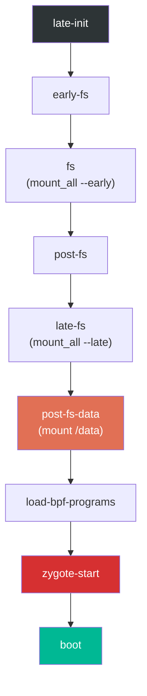

其中 `post-fs-data` 尤其重要，因为它真正准备 `/data`：

```
# system/core/rootdir/init.rc, lines 654-684
on post-fs-data

    # Start checkpoint before we touch data
    exec - system system -- /system/bin/vdc checkpoint prepareCheckpoint

    # We chown/chmod /data again so because mount is run as root + defaults
    chown system system /data
    chmod 0771 /data
    # We restorecon /data in case the userdata partition has been reset.
    restorecon /data

    # Make sure we have the device encryption key.
    installkey /data

    # Start bootcharting as soon as possible after the data partition is
    # mounted to collect more data.
    mkdir /data/bootchart 0755 shell shell encryption=Require
    bootchart start
```

而 `zygote-start` trigger 则是 Java 世界真正开始的地方：

```
# system/core/rootdir/init.rc, lines 1101-1105
on zygote-start
    wait_for_prop odsign.verification.done 1
    start statsd
    start zygote
    start zygote_secondary
```

这里通过 `wait_for_prop` 把 Zygote 启动卡在 `odsign.verification.done=1` 之后，确保 ART 将要使用的产物已经完成验证。

#### Property Trigger

Action 也可以由 property 变化触发：

```
on property:sys.boot_completed=1 && property:ro.config.batteryless=true
    write /proc/sys/vm/dirty_expire_centisecs 200
    write /proc/sys/vm/dirty_writeback_centisecs 200
```

当某个 property 变化后，init 会重新评估相关 property trigger。如果表达式匹配，就执行该 action。复合 trigger 中的所有条件都必须同时满足。

#### Service 定义

Service 是 init 管理的常驻进程。以下是主要 Zygote 服务定义，来自 `system/core/rootdir/init.zygote64.rc`：

```
# system/core/rootdir/init.zygote64.rc, lines 1-20
service zygote /system/bin/app_process64 -Xzygote /system/bin --zygote --start-system-server --socket-name=zygote
    class main
    priority -20
    user root
    group root readproc reserved_disk
    socket zygote stream 660 root system
    socket usap_pool_primary stream 660 root system
    onrestart exec_background - system system -- /system/bin/vdc volume abort_fuse
    onrestart write /sys/power/state on
    onrestart write /sys/power/wake_lock zygote_kwl
    onrestart restart audioserver
    onrestart restart cameraserver
    onrestart restart media
    onrestart restart --only-if-running media.tuner
    onrestart restart netd
    onrestart restart wificond
    task_profiles ProcessCapacityHigh MaxPerformance
    critical window=${zygote.critical_window.minute:-off} target=zygote-fatal
```

这段定义中的核心指令含义如下：

| 指令 | 含义 |
|---|---|
| `service zygote` | 声明名为 zygote 的服务 |
| `/system/bin/app_process64` | 可执行文件路径 |
| `-Xzygote` | 传给 Dalvik / ART VM 的参数 |
| `--zygote` | 告诉 app_process 以 Zygote 模式启动 |
| `--start-system-server` | 初始化后 fork system_server |
| `class main` | 属于 `main` 这个 service class |
| `priority -20` | 最高调度优先级 |
| `user root` / `group root` | 以 root 身份运行，Zygote 需要 root 才能 fork 并切换 UID |
| `socket zygote stream 660` | 创建 `/dev/socket/zygote` |
| `socket usap_pool_primary` | USAP（Unspecialized App Process）池的 socket |
| `onrestart restart audioserver` | Zygote 重启时，联动重启相关服务 |
| `critical window=...` | 若 Zygote 在时间窗内频繁崩溃，则触发设备重启 |

对于同时支持 64 位和 32 位应用的设备，还会使用 `init.zygote64_32.rc`：

```
# system/core/rootdir/init.zygote64_32.rc, lines 1-11
import /system/etc/init/hw/init.zygote64.rc

service zygote_secondary /system/bin/app_process32 -Xzygote /system/bin --zygote --socket-name=zygote_secondary --enable-lazy-preload
    class main
    priority -20
    user root
    group root readproc reserved_disk
    socket zygote_secondary stream 660 root system
    socket usap_pool_secondary stream 660 root system
    onrestart restart zygote
    task_profiles ProcessCapacityHigh MaxPerformance
```

次级 Zygote 使用 `--enable-lazy-preload`，意味着它会等到第一次 32 位 app fork 请求到来时才进行类预加载，以节省整体 boot 时间。

### 4.3.8 init.rc 解析流程

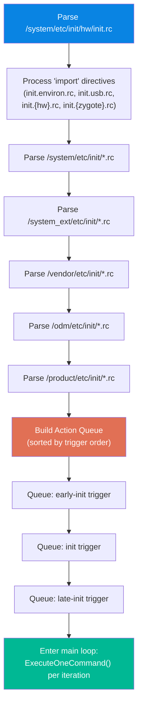

### 4.3.9 init.rc 内建命令速览

| 命令 | 示例 | 说明 |
|---|---|---|
| `mkdir` | `mkdir /data/system 0775 system system` | 创建目录并设置权限 |
| `write` | `write /proc/sys/kernel/sysrq 0` | 向文件写字符串 |
| `chmod` | `chmod 0660 /dev/kmsg` | 修改权限 |
| `chown` | `chown system system /data` | 修改属主 |
| `mount` | `mount ext4 /dev/block/sda1 /system` | 挂载文件系统 |
| `mount_all` | `mount_all /vendor/etc/fstab.device` | 按 fstab 批量挂载 |
| `start` | `start servicemanager` | 启动服务 |
| `stop` | `stop console` | 停止服务 |
| `restart` | `restart zygote` | 重启服务 |
| `setprop` | `setprop ro.build.type userdebug` | 设置系统属性 |
| `trigger` | `trigger late-init` | 触发某个 trigger |
| `exec` | `exec -- /system/bin/vdc ...` | fork+exec，并等待完成 |
| `exec_start` | `exec_start apexd-bootstrap` | 启动服务并等待 |
| `wait` | `wait /dev/block/sda1 5` | 等待文件出现 |
| `wait_for_prop` | `wait_for_prop sys.odsign.status done` | 等待属性达到指定值 |
| `symlink` | `symlink ../tun /dev/net/tun` | 创建符号链接 |
| `restorecon` | `restorecon /dev` | 恢复 SELinux context |
| `installkey` | `installkey /data` | 安装加密密钥 |
| `class_start` | `class_start core` | 启动某个 class 下全部服务 |
| `class_stop` | `class_stop late_start` | 停止某个 class 下全部服务 |
| `enable` | `enable some_service` | 启用一个被 disabled 的服务 |
| `setrlimit` | `setrlimit nice 40 40` | 设置资源限制 |
| `import` | `import /init.${ro.hardware}.rc` | 导入另一个 rc 文件 |

---

## 4.4 Zygote: The App Incubator

Zygote 让 Android 获得了非常快的应用启动时间。它不会为每个 app 单独从零加载 framework，而是先把 framework 预加载一次，然后直接 `fork()` 自己。子进程通过 Linux 的 copy-on-write 共享预加载的代码和数据，显著降低 app 启动成本。

### 4.4.1 从 init 到 Zygote：Native Bridge

当 init 启动 Zygote 服务时，它执行的是 `app_process64`（或者 `app_process32`），而这个 native 入口定义在 `frameworks/base/cmds/app_process/app_main.cpp` 中。

其 `main()` 一开始就创建 `AppRuntime`，它是 `AndroidRuntime` 的子类：

```cpp
// frameworks/base/cmds/app_process/app_main.cpp, lines 173-189
int main(int argc, char* const argv[])
{
    // ...
    AppRuntime runtime(argv[0], computeArgBlockSize(argc, argv));
    // Process command line arguments
    // ignore argv[0]
    argc--;
    argv++;
```

随后第 257-282 行会根据 `--zygote` 做关键分支：

```cpp
// frameworks/base/cmds/app_process/app_main.cpp, lines 257-282
bool zygote = false;
bool startSystemServer = false;
bool application = false;
String8 niceName;
String8 className;

++i;  // Skip unused "parent dir" argument.
while (i < argc) {
    const char* arg = argv[i++];
    if (strcmp(arg, "--zygote") == 0) {
        zygote = true;
        niceName = ZYGOTE_NICE_NAME;
    } else if (strcmp(arg, "--start-system-server") == 0) {
        startSystemServer = true;
    } else if (strcmp(arg, "--application") == 0) {
        application = true;
    } else if (strncmp(arg, "--nice-name=", 12) == 0) {
        niceName = (arg + 12);
    } else if (strncmp(arg, "--", 2) != 0) {
        className = arg;
        break;
    } else {
        --i;
        break;
    }
}
```

在 Zygote 模式下，系统会建立 Dalvik cache、读取 ABI 信息，然后以 `ZygoteInit` 作为入口类启动 Android runtime：

```cpp
// frameworks/base/cmds/app_process/app_main.cpp, lines 305-343
if (!className.empty()) {
    // Not in zygote mode...
} else {
    // We're in zygote mode.
    maybeCreateDalvikCache();

    if (startSystemServer) {
        args.add(String8("start-system-server"));
    }

    char prop[PROP_VALUE_MAX];
    if (property_get(ABI_LIST_PROPERTY, prop, NULL) == 0) {
        LOG_ALWAYS_FATAL("app_process: Unable to determine ABI list...");
        return 11;
    }

    String8 abiFlag("--abi-list=");
    abiFlag.append(prop);
    args.add(abiFlag);
    // ...
}

if (zygote) {
    runtime.start("com.android.internal.os.ZygoteInit", args, zygote);
} else if (!className.empty()) {
    runtime.start("com.android.internal.os.RuntimeInit", args, zygote);
}
```

`runtime.start()` 会启动 ART VM，加载指定 Java 类，并调用其 `main()`。这也是启动链从 native C++ 切到 Java 世界的边界。

`AppRuntime` 还提供了生命周期回调。比如 `onZygoteInit()` 会在从 Zygote fork 出新进程时启动 Binder thread pool：

```cpp
// frameworks/base/cmds/app_process/app_main.cpp, lines 92-97
virtual void onZygoteInit()
{
    sp<ProcessState> proc = ProcessState::self();
    ALOGV("App process: starting thread pool.\n");
    proc->startThreadPool();
}
```

Zygote 自己不会启动 Binder thread pool，但它 fork 出来的子进程会在 specialize 后立刻启动。这也是应用进程能马上参与 Binder IPC 的基础。

### 4.4.2 `ZygoteInit.java`：Java 侧入口

`ZygoteInit.main()` 位于 `frameworks/base/core/java/com/android/internal/os/ZygoteInit.java` 第 814 行：

```java
// frameworks/base/core/java/com/android/internal/os/ZygoteInit.java, lines 814-931
@UnsupportedAppUsage
public static void main(String[] argv) {
    ZygoteServer zygoteServer = null;

    // Mark zygote start. This ensures that thread creation will throw
    // an error.
    ZygoteHooks.startZygoteNoThreadCreation();

    // Zygote goes into its own process group.
    try {
        Os.setpgid(0, 0);
    } catch (ErrnoException ex) {
        throw new RuntimeException("Failed to setpgid(0,0)", ex);
    }

    Runnable caller;
    try {
        // ...
        boolean startSystemServer = false;
        String zygoteSocketName = "zygote";
        String abiList = null;
        boolean enableLazyPreload = false;
        for (int i = 1; i < argv.length; i++) {
            if ("start-system-server".equals(argv[i])) {
                startSystemServer = true;
            } else if ("--enable-lazy-preload".equals(argv[i])) {
                enableLazyPreload = true;
            } else if (argv[i].startsWith(ABI_LIST_ARG)) {
                abiList = argv[i].substring(ABI_LIST_ARG.length());
            } else if (argv[i].startsWith(SOCKET_NAME_ARG)) {
                zygoteSocketName = argv[i].substring(SOCKET_NAME_ARG.length());
            }
        }
```

其中 `ZygoteHooks.startZygoteNoThreadCreation()` 是很重要的安全措施：它会把当前状态标记成“禁止新建线程”。原因在于：在多线程进程中调用 `fork()` 非常危险，因为子进程只继承调用线程，其他线程中的锁和同步原语会陷入未定义状态。

### 4.4.3 类与资源预加载

`preload()` 方法，位于第 127-173 行，是 Zygote 为所有 app 支付的一次性预热成本：

```java
// frameworks/base/core/java/com/android/internal/os/ZygoteInit.java, lines 127-173
static void preload(TimingsTraceLog bootTimingsTraceLog) {
    Log.d(TAG, "begin preload");
    bootTimingsTraceLog.traceBegin("BeginPreload");
    beginPreload();
    bootTimingsTraceLog.traceEnd(); // BeginPreload
    bootTimingsTraceLog.traceBegin("PreloadClasses");
    preloadClasses();
    bootTimingsTraceLog.traceEnd(); // PreloadClasses
    bootTimingsTraceLog.traceBegin("CacheNonBootClasspathClassLoaders");
    cacheNonBootClasspathClassLoaders();
    bootTimingsTraceLog.traceEnd(); // CacheNonBootClasspathClassLoaders
    bootTimingsTraceLog.traceBegin("PreloadResources");
    Resources.preloadResources();
    bootTimingsTraceLog.traceEnd(); // PreloadResources
    Trace.traceBegin(Trace.TRACE_TAG_DALVIK, "PreloadAppProcessHALs");
    nativePreloadAppProcessHALs();
    Trace.traceEnd(Trace.TRACE_TAG_DALVIK);
    Trace.traceBegin(Trace.TRACE_TAG_DALVIK, "PreloadGraphicsDriver");
    maybePreloadGraphicsDriver();
    Trace.traceEnd(Trace.TRACE_TAG_DALVIK);
    preloadSharedLibraries();
    preloadTextResources();
    // ...
    WebViewFactory.prepareWebViewInZygote();
    endPreload();
    warmUpJcaProviders();
    Log.d(TAG, "end preload");

    sPreloadComplete = true;
}
```

预加载过程包括：

1. **`preloadClasses()`**：从 `/system/etc/preloaded-classes` 加载 15000+ 个类
2. **`cacheNonBootClasspathClassLoaders()`**：为若干不在 bootclasspath 上但常用的库预先创建 classloader，例如 `android.hidl.base-V1.0-java.jar` 等
3. **`Resources.preloadResources()`**：加载系统默认资源，例如 drawable、layout、theme
4. **`nativePreloadAppProcessHALs()`**：预加载 app process 需要的 HAL
5. **`maybePreloadGraphicsDriver()`**：通过 OpenGL / Vulkan 调用把 graphics driver 预热进内存
6. **`preloadSharedLibraries()`**：预加载关键 native 库

例如共享库预加载片段如下：

```java
// frameworks/base/core/java/com/android/internal/os/ZygoteInit.java, lines 195-207
private static void preloadSharedLibraries() {
    Log.i(TAG, "Preloading shared libraries...");
    System.loadLibrary("android");
    System.loadLibrary("jnigraphics");
    // ...
}
```

而 `preloadClasses()` 则会暂时降低特权，以防某些静态初始化器在 root 身份下做出不该做的事：

```java
// frameworks/base/core/java/com/android/internal/os/ZygoteInit.java, lines 306-315
boolean droppedPriviliges = false;
if (reuid == ROOT_UID && regid == ROOT_GID) {
    try {
        Os.setregid(ROOT_GID, UNPRIVILEGED_GID);
        Os.setreuid(ROOT_UID, UNPRIVILEGED_UID);
    } catch (ErrnoException ex) {
        throw new RuntimeException("Failed to drop root", ex);
    }
    droppedPriviliges = true;
}
```

### 4.4.4 fork `system_server`

当预加载完成后，Zygote 会 fork 出自己最重要的第一个子进程：`system_server`。`forkSystemServer()` 位于第 691-799 行，它会先准备好完整参数：

```java
// frameworks/base/core/java/com/android/internal/os/ZygoteInit.java, lines 718-729
/* Hardcoded command line to start the system server */
String[] args = {
        "--setuid=1000",
        "--setgid=1000",
        "--setgroups=1001,1002,1003,1004,1005,1006,1007,1008,1009,1010,1018,1021,1023,"
                + "1024,1032,1065,3001,3002,3003,3005,3006,3007,3009,3010,3011,3012",
        "--capabilities=" + capabilities + "," + capabilities,
        "--nice-name=system_server",
        "--runtime-args",
        "--target-sdk-version=" + VMRuntime.SDK_VERSION_CUR_DEVELOPMENT,
        "com.android.server.SystemServer",
};
```

几个关键细节：

- **UID 1000**：也就是 `system` 用户，而非 root
- **Groups**：包含网络、蓝牙、日志等多种能力相关 group
- **Capabilities**：Linux capability，而不是 Android permission
- **入口类**：`com.android.server.SystemServer`

真正的 fork 发生在第 777 行：

```java
// frameworks/base/core/java/com/android/internal/os/ZygoteInit.java, lines 777-783
/* Request to fork the system server process */
pid = Zygote.forkSystemServer(
        parsedArgs.mUid, parsedArgs.mGid,
        parsedArgs.mGids,
        parsedArgs.mRuntimeFlags,
        null,
        parsedArgs.mPermittedCapabilities,
        parsedArgs.mEffectiveCapabilities);
```

在子进程中，也就是 `pid == 0` 的分支里，Zygote socket 会被关闭，然后进入 system_server 初始化：

```java
// frameworks/base/core/java/com/android/internal/os/ZygoteInit.java, lines 789-796
/* For child process */
if (pid == 0) {
    if (hasSecondZygote(abiList)) {
        waitForSecondaryZygote(socketName);
    }
    zygoteServer.closeServerSocket();
    return handleSystemServerProcess(parsedArgs);
}
```

### 4.4.5 Zygote 的 Select Loop

在 fork 出 system_server 后，Zygote 会进入 select loop，在 `zygote` socket 上等待来自 `system_server` 的 fork 请求：

```java
// frameworks/base/core/java/com/android/internal/os/ZygoteInit.java, lines 901-916
if (startSystemServer) {
    Runnable r = forkSystemServer(abiList, zygoteSocketName, zygoteServer);
    if (r != null) {
        r.run();
        return;
    }
}

Log.i(TAG, "Accepting command socket connections");

// The select loop returns early in the child process after a fork and
// loops forever in the zygote.
caller = zygoteServer.runSelectLoop(abiList);
```

这个 select loop 会永远运行在 Zygote 父进程中。当 ActivityManagerService 需要拉起新应用时，它会把 UID、GID、capability、SELinux context 等参数通过 socket 发给 Zygote，随后 Zygote fork 一个子进程，并完成 specialize。

### 4.4.6 USAP：Unspecialized App Process

现代 Android 还引入了 USAP（Unspecialized App Process）池这一优化，也就是先让 Zygote 预先 fork 一批尚未 specialize 的子进程。当真正需要启动 app 时，不再执行一次完整 fork+specialize，而是直接把现成的 USAP specialize 成目标 app。这样可以进一步降低启动延迟。

USAP socket 会和主 Zygote socket 一起创建，正如 `init.zygote64.rc` 中看到的：

```
socket usap_pool_primary stream 660 root system
```

### 4.4.7 完整的 Zygote 流程

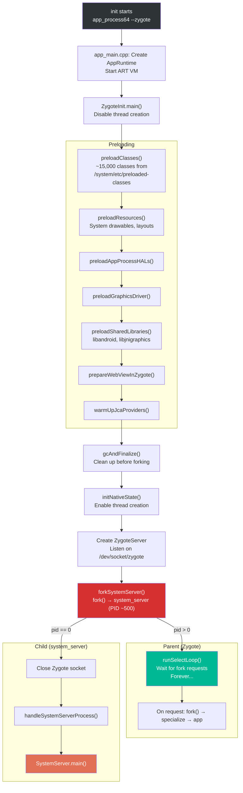

---

## 4.5 system_server Startup

`system_server` 是 Android framework 的中央中枢。它承载着 100 多个系统服务，为应用提供几乎全部平台 API。入口位于 `frameworks/base/services/java/com/android/server/SystemServer.java`。

### 4.5.1 SystemServer 入口

`main()` 第 710 行看起来异常简单：

```java
// frameworks/base/services/java/com/android/server/SystemServer.java, lines 710-712
public static void main(String[] args) {
    new SystemServer().run();
}
```

构造函数会记录启动信息：

```java
// frameworks/base/services/java/com/android/server/SystemServer.java, lines 714-727
public SystemServer() {
    // Check for factory test mode.
    mFactoryTestMode = FactoryTest.getMode();

    // Record process start information.
    mStartCount = SystemProperties.getInt(SYSPROP_START_COUNT, 0) + 1;
    mRuntimeStartElapsedTime = SystemClock.elapsedRealtime();
    mRuntimeStartUptime = SystemClock.uptimeMillis();

    // Remember if it's runtime restart or reboot.
    mRuntimeRestart = mStartCount > 1;
}
```

`mStartCount` 表示自上次 reboot 以来 system_server 已经启动了多少次。如果大于 1，就意味着这是一次 runtime restart，也就是 system_server 之前崩溃过，并在 Zygote / init 的作用下重新拉起。

### 4.5.2 `run()`：Bootstrap

真正的 system_server 初始化集中在 `run()` 中，位置约为第 836-1083 行：

```java
// frameworks/base/services/java/com/android/server/SystemServer.java, lines 836-953
private void run() {
    // ...
    t.traceBegin("InitBeforeStartServices");

    // Record the process start information in sys props.
    SystemProperties.set(SYSPROP_START_COUNT, String.valueOf(mStartCount));
    // ...

    // Here we go!
    Slog.i(TAG, "Entered the Android system server!");
    // ...

    // Mmmmmm... more memory!
    VMRuntime.getRuntime().clearGrowthLimit();

    // Ensure binder calls into the system always run at foreground priority.
    BinderInternal.disableBackgroundScheduling(true);

    // Increase the number of binder threads in system_server
    BinderInternal.setMaxThreads(sMaxBinderThreads);

    // Prepare the main looper thread (this thread).
    android.os.Process.setThreadPriority(
            android.os.Process.THREAD_PRIORITY_FOREGROUND);
    Looper.prepareMainLooper();
    // ...

    // Initialize native services.
    System.loadLibrary("android_servers");
    // ...

    // Initialize the system context.
    createSystemContext();
    // ...

    // Create the system service manager.
    mSystemServiceManager = new SystemServiceManager(mSystemContext);
```

关键初始化动作包括：

- **`clearGrowthLimit()`**：移除 heap growth limit，允许 system_server 使用更多堆空间
- **`setMaxThreads(31)`**：把 Binder 线程上限提升到 31，比普通 app 高很多
- **`Looper.prepareMainLooper()`**：准备主线程消息循环
- **`System.loadLibrary("android_servers")`**：加载系统服务对应的 JNI / native companion 库
- **`createSystemContext()`**：创建供服务使用的 system 级 `Context`

### 4.5.3 四个服务启动阶段

完成 bootstrap 之后，`run()` 会按四个阶段依次启动系统服务：

```java
// frameworks/base/services/java/com/android/server/SystemServer.java, lines 1024-1044
// Start services.
try {
    t.traceBegin("StartServices");
    // ...
    startBootstrapServices(t);
    startCoreServices(t);
    startOtherServices(t);
    startApexServices(t);
    // ...
    CriticalEventLog.getInstance().logSystemServerStarted();
} catch (Throwable ex) {
    Slog.e("System", "************ Failure starting system services", ex);
    throw ex;
}
```

当全部服务启动完成后，system_server 便进入主循环：

```java
// frameworks/base/services/java/com/android/server/SystemServer.java, lines 1080-1082
// Loop forever.
Looper.loop();
throw new RuntimeException("Main thread loop unexpectedly exited");
```

### 4.5.4 Bootstrap Services

`startBootstrapServices()`（第 1176-1451 行）负责拉起“系统起步所需的最小服务集合”。这些服务之间通常有复杂互依赖，因此必须在同一阶段集中初始化。

源码注释这样描述：

```java
// frameworks/base/services/java/com/android/server/SystemServer.java, lines 1170-1175
/**
 * Starts the small tangle of critical services that are needed to get the
 * system off the ground.  These services have complex mutual dependencies
 * which is why we initialize them all in one place here.
 */
private void startBootstrapServices(@NonNull TimingsTraceAndSlog t) {
```

从实际代码中可抽取出如下典型顺序：

| 顺序 | 服务 | 代码位置 | 作用 |
|---|---|---|---|
| 1 | ArtModuleServiceInitializer | 1187 | ART 运行时集成 |
| 2 | Watchdog | 1193 | 死锁检测 |
| 3 | ProtoLogConfigurationService | 1200 | ProtoLog 基础设施 |
| 4 | PlatformCompat | 1211 | 应用兼容框架 |
| 5 | FileIntegrityService | 1222 | 文件完整性 |
| 6 | Installer | 1229 | 安装支持 |
| 7 | DeviceIdentifiersPolicyService | 1235 | 设备 ID 访问策略 |
| 8 | FeatureFlagsService | 1241 | 运行时 feature flag |
| 9 | UriGrantsManagerService | 1246 | Content URI 权限 |
| 10 | PowerStatsService | 1250 | 功耗测量 |
| 11 | IStatsService | 1255 | 统计采集 |
| 12 | MemtrackProxyService | 1261 | 内存追踪 |
| 13 | AccessCheckingService | 1266 | 权限与 AppOp |
| 14 | ActivityTaskManagerService + ActivityManagerService | 1274-1283 | Activity 生命周期与进程管理 |
| 15 | DataLoaderManagerService | 1287 | 增量数据加载 |
| 16 | IncrementalService | 1293 | 增量 APK 安装 |
| 17 | PowerManagerService | 1301 | 电源状态管理 |
| 18 | ThermalManagerService | 1305 | 热管理 |
| 19 | RecoverySystemService | 1316 | OTA 与 recovery |
| 20 | LightsService | 1327 | LED 与背光 |
| 21 | DisplayManagerService | 1340 | 显示管理 |
| 22 | **PHASE_WAIT_FOR_DEFAULT_DISPLAY** | 1345 | 第一个 boot phase checkpoint |
| 23 | DomainVerificationService | 1357 | App Link 验证 |
| 24 | PackageManagerService | 1363 | 包管理 |
| 25 | DexUseManagerLocal | 1377 | DEX 使用跟踪 |
| 26 | UserManagerService | 1397 | 多用户管理 |
| 27 | OverlayManagerService | 1426 | 运行时资源 overlay |
| 28 | SensorPrivacyService | 1437 | 传感器访问控制 |
| 29 | SensorService | 1449 | 传感器管理 |

其中 `PHASE_WAIT_FOR_DEFAULT_DISPLAY` 是第一个关键同步点：

```java
// frameworks/base/services/java/com/android/server/SystemServer.java, lines 1344-1346
// We need the default display before we can initialize the package manager.
t.traceBegin("WaitForDisplay");
mSystemServiceManager.startBootPhase(t, SystemService.PHASE_WAIT_FOR_DEFAULT_DISPLAY);
t.traceEnd();
```

这是因为 `PackageManagerService` 需要 display metrics 才能做资源选择，因此必须等显示系统可用后才能继续。

### 4.5.5 Core Services

`startCoreServices()`（第 1457-1533 行）负责启动核心但依赖关系相对简单的服务，例如：

| 顺序 | 服务 | 用途 |
|---|---|---|
| 1 | SystemConfigService | 系统配置 |
| 2 | BatteryService | 电池状态追踪 |
| 3 | UsageStatsService | 使用统计 |
| 4 | WebViewUpdateService | WebView 更新 |
| 5 | CachedDeviceStateService | 设备状态缓存 |
| 6 | BinderCallsStatsService | Binder 调用 profiling |
| 7 | LooperStatsService | Handler / Looper profiling |
| 8 | RollbackManagerService | 回滚管理 |
| 9 | NativeTombstoneManagerService | native crash 记录 |
| 10 | BugreportManagerService | bugreport 捕获 |
| 11 | GpuService | GPU 管理 |
| 12 | RemoteProvisioningService | 远程密钥下发 |

### 4.5.6 Other Services

`startOtherServices()`（第 1539 行起）会启动剩余 70+ 个服务。这里是 `SystemServer.java` 中最长的方法之一，负责拉起：

- WindowManagerService
- InputManagerService
- NetworkManagementService
- ConnectivityService
- NotificationManagerService
- LocationManagerService
- AudioService
- 以及更多

这一阶段也会按设备能力启动来自 APEX、Wear、TV、Automotive 等领域的服务。

### 4.5.7 Boot Phase Progression

系统服务会沿着清晰定义的 boot phase 向前推进。每个 phase 代表系统进入某个“就绪里程碑”，服务可以在对应 phase 时执行依赖更多前置条件的初始化。

```mermaid
flowchart LR
    P1["<b>PHASE_WAIT_FOR_<br/>DEFAULT_DISPLAY</b><br/>(100)<br/>Display available"]
    P2["<b>PHASE_LOCK_<br/>SETTINGS_READY</b><br/>(480)<br/>Lock screen ready"]
    P3["<b>PHASE_SYSTEM_<br/>SERVICES_READY</b><br/>(500)<br/>Core services ready"]
    P4["<b>PHASE_DEVICE_<br/>SPECIFIC_SERVICES_READY</b><br/>(520)<br/>Device services ready"]
    P5["<b>PHASE_ACTIVITY_<br/>MANAGER_READY</b><br/>(550)<br/>AMS ready"]
    P6["<b>PHASE_THIRD_PARTY_<br/>APPS_CAN_START</b><br/>(600)<br/>Apps can launch"]
    P7["<b>PHASE_BOOT_<br/>COMPLETED</b><br/>(1000)<br/>Boot done"]

    P1 --> P2 --> P3 --> P4 --> P5 --> P6 --> P7

    style P1 fill:#0984e3,color:#fff
    style P3 fill:#e17055,color:#fff
    style P6 fill:#00b894,color:#fff
    style P7 fill:#d63031,color:#fff
```

| Phase | 值 | 说明 |
|---|---|---|
| `PHASE_WAIT_FOR_DEFAULT_DISPLAY` | 100 | 默认显示可用 |
| `PHASE_LOCK_SETTINGS_READY` | 480 | 锁屏设置就绪 |
| `PHASE_SYSTEM_SERVICES_READY` | 500 | 核心系统服务可用 |
| `PHASE_DEVICE_SPECIFIC_SERVICES_READY` | 520 | 设备特定服务可用 |
| `PHASE_ACTIVITY_MANAGER_READY` | 550 | AMS 已可启动 activity |
| `PHASE_THIRD_PARTY_APPS_CAN_START` | 600 | 第三方应用可以启动 |
| `PHASE_BOOT_COMPLETED` | 1000 | 启动完成，系统进入稳定运行态 |

当 `PHASE_BOOT_COMPLETED` 达成后，`sys.boot_completed` 会被置为 `1`，boot animation 会被关闭，home / launcher activity 会被启动。

### 4.5.8 Boot Animation 生命周期

Boot animation 进程 `bootanim` 由 init.rc 作为服务启动，并持续循环显示默认 Android logo 或 OEM 自定义动画。它会一直运行到 system_server 达到 `PHASE_BOOT_COMPLETED`，然后通过设置 `service.bootanim.exit=1` 通知其退出。

### 4.5.9 完整的 system_server 启动时序

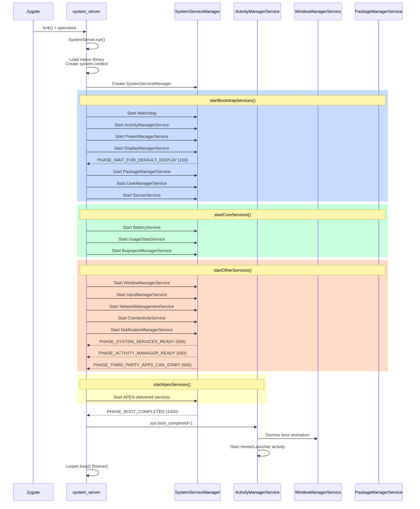

---

### 4.1.2 Stage-by-Stage Summary

**Stage 1: Power On（ROM Code）**

当电源键被按下时，SoC 会先从芯片内部 mask ROM 中执行代码。这段 ROM code 是制造时固化进去的、不可变的最小引导程序。它负责初始化最基础硬件，例如时钟发生器和内存控制器，再从固定存储位置，通常是 eMMC / UFS 的 boot 分区起始处，加载一级 bootloader，并把控制权交给它。这一阶段完全由芯片厂商实现，不属于 AOSP。

**Stage 2: Bootloader（ABL / U-Boot）**

Bootloader 是第一个会因设备而异的软件组件。在现代 Android 设备上，Qualcomm 平台通常使用 Android Bootloader（ABL），而其他很多 SoC 会使用 U-Boot。Bootloader 的核心职责包括：

- 初始化 DRAM 和关键外设
- 实现 Android Verified Boot（AVB）以验证系统完整性
- 选择正确的启动槽位（A/B 分区）
- 加载 Linux kernel、ramdisk 与 DTB（Device Tree Blob）
- 设置 kernel command line 参数
- 将控制权转交给内核

**Stage 3: Linux Kernel**

Linux kernel 会初始化硬件子系统、探测设备驱动、挂载初始 RAM 文件系统（initramfs），并启动第一个用户空间进程 `/init`，它的 PID 是 1。内核启动期间的行为，会受到 bootloader 传入的 command line 参数和 Device Tree 的控制。

**Stage 4: init（First Stage）**

init 进程分两个阶段执行。第一阶段的 init 运行在 ramdisk 中，环境最小化。它的任务是挂载必要分区，例如 `/system`、`/vendor`、`/product`，加载内核模块，设置 SELinux policy，然后通过 `exec()` 进入第二阶段 init。之所以采用双阶段设计，是因为第一阶段必须在 SELinux policy 完整加载前运行，而第二阶段则运行在完整 SELinux 强制模式下。

**Stage 5: init（Second Stage）**

第二阶段 init 是主要的用户空间调度者。它会解析声明服务与 action 的 init.rc 配置文件，启动 property service，也就是 Android 的键值配置系统，拉起 native daemon，例如 surfaceflinger、servicemanager、logd，并最终启动 Zygote。

**Stage 6: Zygote**

Zygote 是一个专用进程，它会把 Android framework 的核心类与资源预加载进内存，然后进入等待 fork 请求的循环。每一个 Android 应用进程，本质上都是从 Zygote fork 出来的，因此应用启动时可以天然继承预热过的 framework 状态。

**Stage 7: system_server**

`system_server` 是 Zygote fork 出的第一个进程。它承载着 100 多个系统服务，例如 ActivityManagerService、PackageManagerService、WindowManagerService 等。这些服务会按严格顺序经历 boot phase progression，而每个 phase 都会解锁额外能力。

**Stage 8: Home Screen**

当 system_server 进入 `PHASE_BOOT_COMPLETED` 后，系统就进入就绪态。Launcher activity 被启动，boot animation 被关闭，属性 `sys.boot_completed` 会被设置成 `1`，通知整个平台设备已经完全可操作。

### 4.1.3 Timing and Dependencies

下图给出了各阶段的大致时间关系及其重叠方式：

```mermaid
gantt
    title Android Boot Timeline (Approximate)
    dateFormat X
    axisFormat %s

    section Firmware
    ROM Code           :a1, 0, 200
    Bootloader + AVB   :a2, 200, 1500

    section Kernel
    Kernel Init        :a3, 1500, 3500
    Driver Probing     :a4, 2500, 4000

    section Init
    First Stage Init   :a5, 4000, 5500
    SELinux Setup      :a6, 5500, 6000
    Second Stage Init  :a7, 6000, 8000

    section Framework
    Zygote Preload     :a8, 7500, 10000
    system_server      :a9, 9500, 14000

    section UI
    Boot Animation     :a10, 6500, 14000
    Home Screen        :a11, 14000, 15000
```

从上电到主屏，整体启动时间通常在 5 到 30 秒之间，具体取决于硬件和软件配置。最耗时的三个阶段通常是：内核驱动探测、Zygote 类预加载，以及 system_server 服务初始化。

---

## 4.6 Try It: Add a Custom Init Service

下面做一个实操练习：添加一个在启动时拉起的自定义 native daemon。

### 4.6.1 Step 1: Write the Native Daemon

先创建一个简单守护进程，每隔几秒向 kernel log 打一次日志。

创建文件 `device/generic/car/mybootdaemon/mybootdaemon.cpp`：

```cpp
// device/generic/car/mybootdaemon/mybootdaemon.cpp
#include <android-base/logging.h>
#include <unistd.h>

int main(int /* argc */, char** argv) {
    // Initialize logging to the kernel log (kmsg).
    android::base::InitLogging(argv, &android::base::KernelLogger);

    LOG(INFO) << "mybootdaemon: Starting up!";

    // A real daemon would do useful work here.
    // This example simply logs heartbeat messages.
    int counter = 0;
    while (true) {
        LOG(INFO) << "mybootdaemon: heartbeat #" << counter++;
        sleep(10);
    }

    // Unreachable, but good practice.
    return 0;
}
```

### 4.6.2 Step 2: Create the Build File

创建 `device/generic/car/mybootdaemon/Android.bp`：

```json
cc_binary {
    name: "mybootdaemon",
    srcs: ["mybootdaemon.cpp"],
    shared_libs: [
        "libbase",
        "liblog",
    ],
    init_rc: ["mybootdaemon.rc"],

    // Install to /system/bin
    vendor: false,
}
```

`init_rc` 字段会告诉构建系统把 rc 文件和二进制一起安装。最终它会被放到 `/system/etc/init/mybootdaemon.rc`，而这个目录正是 init 在 `LoadBootScripts()` 中会解析的标准目录之一。

### 4.6.3 Step 3: Create the init.rc File

创建 `device/generic/car/mybootdaemon/mybootdaemon.rc`：

```
service mybootdaemon /system/bin/mybootdaemon
    class late_start
    user system
    group system log
    disabled
    oneshot

on property:sys.boot_completed=1
    start mybootdaemon
```

几个关键指令：

- `service mybootdaemon`：声明服务名
- `/system/bin/mybootdaemon`：可执行文件路径
- `class late_start`：归入 `late_start` class
- `user system`：以 `system` 用户而不是 root 运行
- `group system log`：授予系统与日志相关 group
- `disabled`：不会随着 class 自动启动，必须显式 start
- `oneshot`：退出后不自动重启

`on property:sys.boot_completed=1` 让它在系统完全启动后再启动。这是最安全的切入点，因为此时大部分系统服务都已就绪。

### 4.6.4 Step 4: Add SELinux Policy

真实设备上，如果不给 daemon 配 SELinux policy，它几乎一定什么都做不了。

创建 `device/generic/car/sepolicy/private/mybootdaemon.te`：

```
# Define the mybootdaemon domain
type mybootdaemon, domain;
type mybootdaemon_exec, exec_type, file_type, system_file_type;

# Allow init to transition to our domain when starting the service
init_daemon_domain(mybootdaemon)

# Allow basic logging
allow mybootdaemon kmsg_device:chr_file { open write };

# Allow reading system properties
get_prop(mybootdaemon, default_prop)
```

然后在 `device/generic/car/sepolicy/private/file_contexts` 中加入：

```
/system/bin/mybootdaemon      u:object_r:mybootdaemon_exec:s0
```

### 4.6.5 Step 5: Build and Test

把模块加进设备 makefile，例如 `device/generic/car/device.mk`：

```makefile
PRODUCT_PACKAGES += mybootdaemon
```

构建：

```bash
source build/envsetup.sh
lunch <your_target>
m mybootdaemon
```

如果要完整构建镜像：

```bash
m
```

### 4.6.6 Step 6: Verify

刷入镜像或启动模拟器后，做如下检查：

```bash
# Check that the service is defined
adb shell getprop init.svc.mybootdaemon
# Expected: "running" (after boot completes)

# Check the service status
adb shell service list | grep mybootdaemon

# View the daemon's log output
adb shell dmesg | grep mybootdaemon
# Expected output:
# mybootdaemon: Starting up!
# mybootdaemon: heartbeat #0
# mybootdaemon: heartbeat #1

# Manually stop and start the service
adb shell setprop ctl.stop mybootdaemon
adb shell getprop init.svc.mybootdaemon
# Expected: "stopped"

adb shell setprop ctl.start mybootdaemon
adb shell getprop init.svc.mybootdaemon
# Expected: "running"
```

### 4.6.7 Common Pitfalls

**问题：服务启动失败，提示 `permission denied`**

这几乎总是 SELinux 问题。先看审计日志：

```bash
adb shell dmesg | grep "avc: denied"
```

然后用 `audit2allow` 辅助生成策略。

**问题：服务刚启动就退出**

先看 init 是否在不停重启它：

```bash
adb shell getprop init.svc.mybootdaemon
```

如果看到 `restarting`，说明服务崩了。检查 logcat 和 dmesg。如果它是 `oneshot` 且正常退出，那么 `stopped` 是预期行为。

**问题：服务在依赖未就绪前启动**

用 property trigger 给启动做门控，例如：

```
on property:sys.boot_completed=1 && property:init.svc.netd=running
    start mybootdaemon
```

**问题：服务运行在错误的 SELinux context**

检查文件 context：

```bash
adb shell ls -Z /system/bin/mybootdaemon
# Expected: u:object_r:mybootdaemon_exec:s0
```

再检查进程 context：

```bash
adb shell ps -eZ | grep mybootdaemon
# Expected: u:r:mybootdaemon:s0
```

### 4.6.8 Understanding Service States

Init 会通过一组状态来追踪每个服务。理解这些状态，对调试服务启动问题非常关键：

| 状态 | Property 值 | 含义 |
|---|---|---|
| `stopped` | `init.svc.<name>=stopped` | 服务未运行 |
| `starting` | `init.svc.<name>=starting` | 正在启动 |
| `running` | `init.svc.<name>=running` | 正在运行 |
| `stopping` | `init.svc.<name>=stopping` | 正在停止 |
| `restarting` | `init.svc.<name>=restarting` | 延迟后将自动重启 |

其状态机如下：

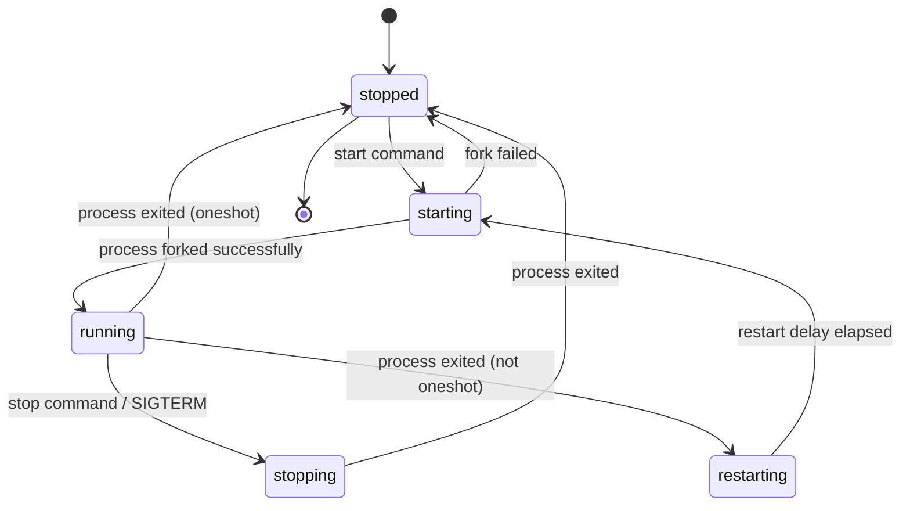

重启延迟默认是 5 秒，目的是防止服务崩溃后频繁循环拉起，耗尽 CPU。

`HandleProcessActions()` 负责驱动 timeout 与 restart：

```cpp
// system/core/init/init.cpp, lines 390-418
static std::optional<boot_clock::time_point> HandleProcessActions() {
    std::optional<boot_clock::time_point> next_process_action_time;
    for (const auto& s : ServiceList::GetInstance()) {
        if ((s->flags() & SVC_RUNNING) && s->timeout_period()) {
            auto timeout_time = s->time_started() + *s->timeout_period();
            if (boot_clock::now() > timeout_time) {
                s->Timeout();
            } else {
                if (!next_process_action_time ||
                    timeout_time < *next_process_action_time) {
                    next_process_action_time = timeout_time;
                }
            }
        }

        if (!(s->flags() & SVC_RESTARTING)) continue;

        auto restart_time = s->time_started() + s->restart_period();
        if (boot_clock::now() > restart_time) {
            if (auto result = s->Start(); !result.ok()) {
                LOG(ERROR) << "Could not restart process '" << s->name()
                           << "': " << result.error();
            }
        } else {
            if (!next_process_action_time ||
                restart_time < *next_process_action_time) {
                next_process_action_time = restart_time;
            }
        }
    }
    return next_process_action_time;
}
```

### 4.6.9 Advanced: Making a Persistent Daemon

如果你想让 daemon 崩溃后由 init 自动拉起，可以把 rc 改成：

```
service mybootdaemon /system/bin/mybootdaemon
    class late_start
    user system
    group system log

on property:sys.boot_completed=1
    enable mybootdaemon
    class_start late_start
```

只要去掉 `oneshot`，init 就会在进程退出后自动重启它。这里使用 `enable` 而不是 `start`，是为了配合 service class 的启动机制。

对于那些“崩太多次就应触发系统重启”的关键服务，则可以加上：

```
service mybootdaemon /system/bin/mybootdaemon
    class late_start
    user system
    group system log
    critical
```

这意味着：如果服务在四分钟内崩溃四次以上，设备会被重启。这与 Zygote 自己采用的是同一套保护机制。

---

## 4.7 Deep Dive: The init.rc Language

这一节给出更系统的 init.rc 语言参考，这是每个 Android 平台工程师都必须掌握的基本功。

### 4.7.1 Sections

Init.rc 文件由三类 section 组成：

**Action** 以 `on` 开头：

```
on <trigger> [&& <trigger>]*
    <command>
    <command>
    ...
```

**Service** 以 `service` 开头：

```
service <name> <pathname> [ <argument> ]*
    <option>
    <option>
    ...
```

**Import** 用于引入其他 rc 文件：

```
import <path>
```

Import 会在当前文件全部解析完成后统一处理。Import 路径中支持属性展开，例如 `import /init.${ro.hardware}.rc`。

### 4.7.2 Trigger Types

Init 支持多种 trigger：

**Boot trigger**，在启动流程中只触发一次：

| Trigger | 触发时机 |
|---|---|
| `early-init` | 启动极早期 |
| `init` | 基础设备设置完成后 |
| `late-init` | 主要启动流程协调点 |
| `early-fs` | 文件系统挂载前 |
| `fs` | 文件系统挂载阶段 |
| `post-fs` | `/system` 和 `/vendor` 挂载后 |
| `late-fs` | 后续延迟挂载阶段 |
| `post-fs-data` | `/data` 挂载后 |
| `zygote-start` | 启动 Zygote 的时机 |
| `boot` | 系统已可启动服务 |
| `charger` | 设备处于仅充电模式 |

**Property trigger**，当属性达到特定值时触发：

```
on property:ro.debuggable=1
    start adbd

on property:vold.decrypt=trigger_restart_framework
    start surfaceflinger
    start zygote
```

**复合 trigger**，同时组合 boot trigger 与 property trigger：

```
on boot && property:ro.config.low_ram=true
    write /proc/sys/vm/dirty_expire_centisecs 200
    write /proc/sys/vm/dirty_background_ratio 5
```

### 4.7.3 `init` Trigger：系统基础配置

`init` trigger 位于 `system/core/rootdir/init.rc` 第 106 行之后，用于做最基础的系统配置：

```
# system/core/rootdir/init.rc, lines 106-184 (selected)
on init
    sysclktz 0

    # Mix device-specific information into the entropy pool
    copy /proc/cmdline /dev/urandom
    copy /proc/bootconfig /dev/urandom

    symlink /proc/self/fd/0 /dev/stdin
    symlink /proc/self/fd/1 /dev/stdout
    symlink /proc/self/fd/2 /dev/stderr

    # cpuctl hierarchy for devices using utilclamp
    mkdir /dev/cpuctl/foreground
    mkdir /dev/cpuctl/background
    mkdir /dev/cpuctl/top-app
    mkdir /dev/cpuctl/rt
    mkdir /dev/cpuctl/system
    mkdir /dev/cpuctl/system-background
    mkdir /dev/cpuctl/dex2oat
```

它会设置时区、用引导信息增强熵池、建立标准 I/O 符号链接，并初始化 cpuctl cgroup 层级。后面 ActivityManagerService 会根据进程重要性，把进程分配到 foreground、background、top-app 等 CPU 控制组中。

### 4.7.4 Service Option 参考

| 选项 | 示例 | 说明 |
|---|---|---|
| `class <name>` | `class main` | 服务所属 class |
| `user <name>` | `user system` | 以指定用户运行 |
| `group <name> [<name>]*` | `group system inet` | 主 group 与附加 group |
| `capabilities <cap>+` | `capabilities NET_ADMIN NET_RAW` | 保留的 Linux capability |
| `socket <name> <type> <perm> [user [group]]` | `socket zygote stream 660 root system` | 创建 UNIX domain socket |
| `file <path> <type>` | `file /dev/kmsg w` | 提前打开文件描述符 |
| `onrestart <command>` | `onrestart restart audioserver` | 服务重启时执行 |
| `oneshot` |  | 退出后不自动重启 |
| `disabled` |  | 不随 class 自动启动 |
| `critical [window=<min>] [target=<target>]` | `critical window=10 target=zygote-fatal` | 崩溃过于频繁时触发重启 |
| `priority <int>` | `priority -20` | 调度优先级 |
| `oom_score_adjust <int>` | `oom_score_adjust -1000` | OOM 杀手分值调整 |
| `namespace <ns>` | `namespace mnt` | 进入指定 namespace |
| `seclabel <label>` | `seclabel u:r:healthd:s0` | SELinux label |
| `writepid <file>+` | `writepid /dev/cpuset/system/tasks` | 把 PID 写入指定路径 |
| `task_profiles <profile>+` | `task_profiles ProcessCapacityHigh` | 应用 task / cgroup profile |
| `interface <name> <instance>` | `interface aidl android.hardware.power.IPower/default` | 注册接口 |
| `stdio_to_kmsg` |  | 重定向 stdout / stderr 到 kmsg |
| `enter_namespace <ns> <path>` | `enter_namespace net /proc/1/ns/net` | 进入现有 namespace |
| `gentle_kill` |  | 停止服务时先发 SIGTERM，再发 SIGKILL |
| `shutdown <behavior>` | `shutdown critical` | 定义 shutdown 行为 |
| `restart_period <seconds>` | `restart_period 5` | 最短重启间隔 |
| `timeout_period <seconds>` | `timeout_period 10` | 服务超时强杀阈值 |
| `updatable` |  | 服务可被 APEX 覆盖 |
| `sigstop` |  | fork 后先发送 SIGSTOP，方便调试器附加 |

### 4.7.5 Service Class

服务通过 class 分组，以便 init 可以批量 start / stop：

| Class | 用途 | 通常由谁触发 |
|---|---|---|
| `core` | Zygote 之前必须存在的核心服务 | `post-fs-data` / `class_start core` |
| `main` | 包括 Zygote 在内的主服务集合 | `zygote-start` / `class_start main` |
| `late_start` | 开机后期启动的服务 | `boot` / `class_start late_start` |
| `hal` | HAL 服务 | 设备特定 trigger |
| `early_hal` | 启动早期就需要的 HAL | 早于 `late-init` |

### 4.7.6 Ueventd：设备节点管理

正如前面看到的，当 init 以 `ueventd` 名义被调用时，它就会变成设备节点管理器。Ueventd 监听 kernel uevent，并在 `/dev/` 下创建具有正确权限的设备节点。

它的配置写在 `ueventd.rc` 中，例如：

```
# Example ueventd rules
/dev/null                 0666   root       root
/dev/zero                 0666   root       root
/dev/full                 0666   root       root
/dev/random               0666   root       root
/dev/urandom              0666   root       root
/dev/ashmem               0666   root       root
/dev/binder               0666   root       root
/dev/hwbinder             0666   root       root
/dev/vndbinder            0666   root       root
```

### 4.7.7 init.rc 处理顺序

完整的 init.rc 处理顺序如下：

1. 先解析 `/system/etc/init/hw/init.rc`
2. 收集当前文件中全部 `import`
3. 解析 `/system/etc/init/` 中的 `.rc`
4. 解析 `/system_ext/etc/init/`
5. 解析 `/vendor/etc/init/`
6. 解析 `/odm/etc/init/`
7. 解析 `/product/etc/init/`
8. 递归处理之前收集到的全部 `import`

在同一目录内，`.rc` 文件会按字母序解析。所以虽然可以通过文件名前缀影响顺序，但并不建议依赖这种技巧。

---

## 4.8 Deep Dive: Property Service Internals

Property service 是启动期间最频繁使用的基础设施之一。这一节重点看其内部实现。

### 4.8.1 Property Storage

Android property 存储在映射到 `/dev/__properties__/` 的共享内存区域中。它整体采用 trie，也就是前缀树，来高效查找。每个读取属性的进程都会 mmap 这些区域，因此读取 property 完全不需要 IPC。

属性区域在 `PropertyInit()` 中初始化，而 `PropertyInit()` 会在 `SecondStageMain()` 第 1108 行被调用。描述 trie 结构的 property info area 位于 `/dev/__properties__/property_info`，其实现对应 `property_info_area`：

```cpp
// system/core/init/property_service.cpp, line 116
[[clang::no_destroy]] static PropertyInfoAreaFile property_info_area;
```

### 4.8.2 Property Set 流程

当进程调用 `SystemProperties.set()` 或原生层的 `__system_property_set()` 时，请求会经由 UNIX domain socket 发到 init 进程内的 property service 线程：

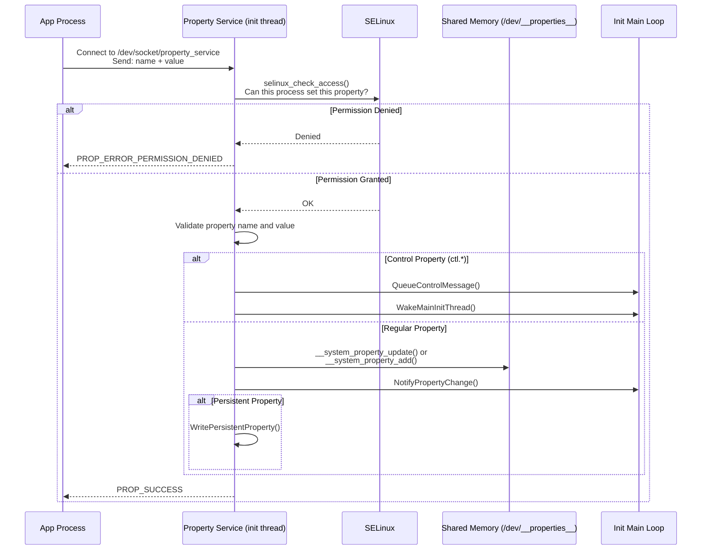

### 4.8.3 SELinux Property 访问控制

每一次 property set 都要经过 SELinux 检查。`CheckMacPerms()` 实现如下：

```cpp
// system/core/init/property_service.cpp, lines 162-176
static bool CheckMacPerms(const std::string& name, const char* target_context,
                          const char* source_context, const ucred& cr) {
    if (!target_context || !source_context) {
        return false;
    }

    PropertyAuditData audit_data;
    audit_data.name = name.c_str();
    audit_data.cr = &cr;

    auto lock = std::lock_guard{selinux_check_access_lock};
    return selinux_check_access(source_context, target_context,
                                "property_service", "set",
                                &audit_data) == 0;
}
```

Property info area 会把不同 property 名映射到不同 SELinux context，例如 `ro.build.*` 可以映射到 `build_prop`，`persist.sys.*` 则可能映射到 `system_prop`。不同 context 又对应不同读写规则。

对应的审计回调如下：

```cpp
// system/core/init/property_service.cpp, lines 123-134
static int PropertyAuditCallback(void* data, security_class_t /*cls*/,
                                  char* buf, size_t len) {
    auto* d = reinterpret_cast<PropertyAuditData*>(data);

    if (!d || !d->name || !d->cr) {
        LOG(ERROR) << "AuditCallback invoked with null data arguments!";
        return 0;
    }

    snprintf(buf, len, "property=%s pid=%d uid=%d gid=%d",
             d->name, d->cr->pid, d->cr->uid, d->cr->gid);
    return 0;
}
```

### 4.8.4 Property Service 线程

Property service 运行在一个独立线程中，而不是挂在 init 主循环里。原因很明确：property set 请求可能来自任何进程、任何时刻，若把这些处理都塞进主循环，会直接拖慢整个 init 事件处理。

`SocketConnection` 用于承载 property 请求的 wire protocol：

```cpp
// system/core/init/property_service.cpp, lines 223-226
class SocketConnection {
  public:
    SocketConnection() = default;
    SocketConnection(int socket, const ucred& cred) : socket_(socket), cred_(cred) {}
```

每个连接都通过 UNIX socket 自动获得调用进程的 `ucred`，也就是 PID、UID、GID。结合 SELinux context，系统才能完整判断一次 property set 是否被允许。

### 4.8.5 持久化属性

以 `persist.` 为前缀的属性会持久化到 `/data/property/` 下，并跨重启保留。写入操作是异步的，以避免设置属性时卡在磁盘 I/O 上：

```cpp
// system/core/init/property_service.cpp, lines 414-423
bool need_persist = StartsWith(name, "persist.") || StartsWith(name, "next_boot.");
if (socket && persistent_properties_loaded && need_persist) {
    if (persist_write_thread) {
        persist_write_thread->Write(name, value, std::move(*socket));
        return {};
    }
    WritePersistentProperty(name, value);
}
```

其中 `next_boot.` 属性也会持久化，但语义是“在下次启动时生效”。

### 4.8.6 Property 变更通知

当某个属性变化后，系统会通知相关订阅方。桥接 property service 线程与 init 主循环的关键函数是 `NotifyPropertyChange()`：

```cpp
// system/core/init/property_service.cpp, lines 178-185
void NotifyPropertyChange(const std::string& name, const std::string& value) {
    auto lock = std::lock_guard{accept_messages_lock};
    if (accept_messages) {
        PropertyChanged(name, value);
    }
}
```

它最终调用前面提到的 `PropertyChanged()`，从而给 action queue 添加 property trigger，并唤醒主循环。

唤醒机制本身则依赖 eventfd：

```cpp
// system/core/init/init.cpp, lines 143-156
static void InstallInitNotifier(Epoll* epoll) {
    wake_main_thread_fd = eventfd(0, EFD_CLOEXEC);
    if (wake_main_thread_fd == -1) {
        PLOG(FATAL) << "Failed to create eventfd for waking init";
    }
    auto clear_eventfd = [] {
        uint64_t counter;
        TEMP_FAILURE_RETRY(read(wake_main_thread_fd, &counter, sizeof(counter)));
    };

    if (auto result = epoll->RegisterHandler(wake_main_thread_fd, clear_eventfd);
        !result.ok()) {
        LOG(FATAL) << result.error();
    }
}
```

---

## 4.9 Deep Dive: system_server Service Categories

system_server 会启动远超 100 个服务。理解这些服务的分类和关键角色，对平台开发者非常重要。

### 4.9.1 `startOtherServices()`：Framework 主体

`startOtherServices()` 位于 `SystemServer.java` 第 1539 行之后，是类中最长的方法之一，负责启动 Android framework 的“主体部分”。

例如，输入与显示相关服务：

```java
// frameworks/base/services/java/com/android/server/SystemServer.java
t.traceBegin("StartInputManagerService");
inputManager = mSystemServiceManager.startService(
        InputManagerService.Lifecycle.class).getService();
t.traceEnd();

t.traceBegin("StartWindowManagerService");
mSystemServiceManager.startBootPhase(t, SystemService.PHASE_WAIT_FOR_SENSOR_SERVICE);
wm = WindowManagerService.main(context, inputManager, !mFirstBoot,
        new PhoneWindowManager(), mActivityManagerService.mActivityTaskManager);
ServiceManager.addService(Context.WINDOW_SERVICE, wm, /* allowIsolated= */ false,
        DUMP_FLAG_PRIORITY_CRITICAL | DUMP_FLAG_PRIORITY_HIGH | DUMP_FLAG_PROTO);
t.traceEnd();
```

这里能看到一个重要细节：WindowManagerService 启动前，需要通过 `PHASE_WAIT_FOR_SENSOR_SERVICE`，因为屏幕旋转检测等能力依赖 sensor service。

存储与内容服务也有强依赖：

```java
t.traceBegin("StartStorageManagerService");
mSystemServiceManager.startService(StorageManagerService.Lifecycle.class);
storageManager = IStorageManager.Stub.asInterface(
        ServiceManager.getService("mount"));
t.traceEnd();
```

StorageManagerService 必须早于 NotificationManagerService，因为 USB 连接和存储事件相关通知依赖它。

### 4.9.2 APEX 交付的服务

现代 Android 会通过 APEX 交付大量系统服务。`startApexServices()` 会从 APEX 中启动这些 updatable service：

| APEX 模块 | 服务类 | 用途 |
|---|---|---|
| `com.android.os.statsd` | `StatsCompanion` | 统计采集 |
| `com.android.scheduling` | `RebootReadinessManagerService` | 安全重启编排 |
| `com.android.wifi` | `WifiService`、`WifiScanningService` | Wi-Fi 管理 |
| `com.android.tethering` | `ConnectivityServiceInitializer` | 网络连接管理 |
| `com.android.uwb` | `UwbService` | 超宽带 |
| `com.android.bt` | `BluetoothService` | 蓝牙 |
| `com.android.devicelock` | `DeviceLockService` | 设备锁定 |
| `com.android.profiling` | `ProfilingService` | 系统 profiling |

这些服务会从各自 APEX 挂载点下的 JAR 中加载。例如：

```java
// frameworks/base/services/java/com/android/server/SystemServer.java
private static final String WIFI_APEX_SERVICE_JAR_PATH =
        "/apex/com.android.wifi/javalib/service-wifi.jar";
private static final String WIFI_SERVICE_CLASS =
        "com.android.server.wifi.WifiService";
```

### 4.9.3 安全模式检测

在启动大部分 other services 之前，WindowManagerService 会先检测设备是否处于 safe mode：

```java
// frameworks/base/services/java/com/android/server/SystemServer.java, lines 1849-1862
final boolean safeMode = wm.detectSafeMode();
if (safeMode) {
    Settings.Global.putInt(context.getContentResolver(),
            Settings.Global.AIRPLANE_MODE_ON, 1);
}
```

Safe mode 通常由特定按键组合触发，用于在系统不稳定时仍然以最小集模式进入环境，便于排查问题。

---

## 4.10 Boot Time Measurement and Optimization

Android 对启动时长高度敏感，因此整条链路都带有埋点和测量能力。常用工具包括：

- `bootchart`
- `atrace` / `perfetto`
- `logcat` 中各组件的启动时戳
- `system_server` 中的 `TimingsTraceAndSlog`

优化的主要方向通常集中在：

- 减少 kernel driver probing 时长
- 缩短 first-stage mount 和 dm-verity 初始化时间
- 减少 Zygote 预加载成本
- 精简 system_server 首阶段服务数量
- 把可延后初始化的工作移到 boot completed 之后

---

## 4.11 Debugging Boot Issues

启动问题调试时，最常用的手段包括：

```bash
# Kernel log
adb shell dmesg

# init and early userspace logs
adb logcat -b all

# Service states
adb shell getprop | grep init.svc

# Boot completed marker
adb shell getprop sys.boot_completed

# Trace long boot phases
adb shell atrace --async_start
adb shell atrace --async_stop > trace.html
```

排查时一般按层次推进：

1. 先确认 bootloader / AVB 是否通过
2. 再确认 kernel 是否成功启动 `/init`
3. 检查 first-stage mount 和 SELinux setup 是否完成
4. 查看 init 是否成功拉起 Zygote
5. 查看 system_server 是否卡在某个 boot phase

---

## 4.12 Deep Dive: Signal Handling in init

Init 的信号处理策略既是安全设计，也是它事件驱动架构的重要组成部分。核心策略包括：

- 使用 `signalfd` 把信号转成 fd 事件，统一纳入 epoll
- 使用 `SA_NOCLDSTOP` 避免子进程 stop / continue 时产生噪音
- 通过 `pthread_atfork` 在子进程中恢复正常 signal mask

例如，处理容器场景中 SIGTERM 的逻辑如下：

```cpp
// system/core/init/init.cpp, lines 713-721
static void HandleSigtermSignal(const signalfd_siginfo& siginfo) {
    if (siginfo.ssi_pid != 0) {
        // Drop any userspace SIGTERM requests.
        LOG(DEBUG) << "Ignoring SIGTERM from pid " << siginfo.ssi_pid;
        return;
    }

    HandlePowerctlMessage("shutdown,container");
}
```

这里的关键安全点在于：只有来自 PID 0，也就是 kernel 的 SIGTERM 才会被接受。任意用户空间进程向 init 发送 SIGTERM 都会被直接忽略。

而在 fork 子进程后，init 还必须恢复子进程的 signal 行为：

```cpp
// system/core/init/init.cpp, lines 745-759
static void UnblockSignals() {
    const struct sigaction act {
        .sa_handler = SIG_DFL
    };
    sigaction(SIGCHLD, &act, nullptr);

    sigset_t mask;
    sigemptyset(&mask);
    sigaddset(&mask, SIGCHLD);
    sigaddset(&mask, SIGTERM);

    if (sigprocmask(SIG_UNBLOCK, &mask, nullptr) == -1) {
        PLOG(FATAL) << "failed to unblock signals for PID " << getpid();
    }
}
```

如果不做这一步，init 子进程会继承 init 自己的 blocked signal mask，从而无法正常处理自己的子进程退出等事件。

---

## 4.13 Deep Dive: The Shutdown Sequence

Shutdown 流程实际上是 boot 流程的反向版本，同样经过了精心设计。

### 4.13.1 触发 Shutdown

Shutdown 通过设置 `sys.powerctl` 属性触发：

```bash
# Reboot the device
setprop sys.powerctl reboot

# Shutdown the device
setprop sys.powerctl shutdown

# Reboot to bootloader
setprop sys.powerctl reboot,bootloader

# Reboot to recovery
setprop sys.powerctl reboot,recovery
```

`PropertyChanged()` 会以最高优先级拦截 `sys.powerctl`：

```cpp
// system/core/init/init.cpp, lines 365-373
void PropertyChanged(const std::string& name, const std::string& value) {
    if (name == "sys.powerctl") {
        trigger_shutdown(value);
    } else if (name == "sys.shutdown.requested") {
        HandleShutdownRequestedMessage(value);
    }
    // ...
}
```

### 4.13.2 Shutdown 状态机

`ShutdownState` 类用于在 property 线程与 init 主线程之间安全传递 shutdown 请求：

```cpp
// system/core/init/init.cpp, lines 241-268
static class ShutdownState {
  public:
    void TriggerShutdown(const std::string& command) {
        auto lock = std::lock_guard{shutdown_command_lock_};
        shutdown_command_ = command;
        do_shutdown_ = true;
        WakeMainInitThread();
    }

    std::optional<std::string> CheckShutdown() {
        auto lock = std::lock_guard{shutdown_command_lock_};
        if (do_shutdown_ && !IsShuttingDown()) {
            do_shutdown_ = false;
            return shutdown_command_;
        }
        return {};
    }
  private:
    std::mutex shutdown_command_lock_;
    std::string shutdown_command_;
    bool do_shutdown_ = false;
} shutdown_state;
```

### 4.13.3 Shutdown 顺序

一旦 shutdown 被触发，init 大致会按下列顺序执行：

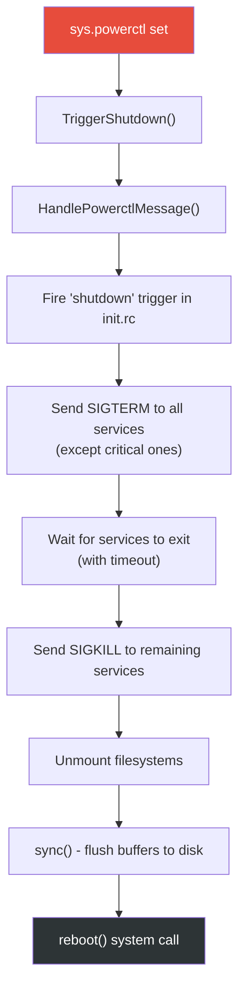

带有 `shutdown critical` 语义的服务会最后停止，以便确保诸如文件系统写回等关键操作能够完成。

---

## 4.14 Advanced Topics

### 4.14.1 Mount Namespace

Init 支持 mount namespace，让不同进程看到不同的文件系统视图。`SetupMountNamespaces()` 会在 second-stage init 中调用：

```cpp
// system/core/init/init.cpp, line 1170
if (!SetupMountNamespaces()) {
    PLOG(FATAL) << "SetupMountNamespaces failed";
}
```

Mount namespace 主要用于：

- **APEX 管理**：不同 namespace 对 `/apex` 目录可能看到不同挂载结构
- **Vendor 隔离**：vendor 进程的 `/apex` 视图可与 system 进程不同
- **linkerconfig**：不同 namespace 采用不同 linker 配置

### 4.14.2 Subcontext

Init 支持“subcontext 执行”，也就是某些 init 命令并不直接在 init 进程中执行，而是交给具有不同 SELinux context 的辅助进程。这常用于 vendor init 脚本。

入口条件如下：

```cpp
// system/core/init/main.cpp, lines 66-70
if (!strcmp(argv[1], "subcontext")) {
    android::base::InitLogging(argv, &android::base::KernelLogger);
    const BuiltinFunctionMap& function_map = GetBuiltinFunctionMap();
    return SubcontextMain(argc, argv, &function_map);
}
```

Subcontext 进程通过 socket 与 init 主进程通信，接收要执行的命令并返回结果，从而在不扩大 init 本身权限的前提下，让 vendor 脚本完成需要 vendor SELinux 权限的操作。

### 4.14.3 APEX Init Scripts

APEX 本身也可以带 init.rc。某个 APEX 激活后，init 会把其中脚本解析进 action 和 service 列表中。`CreateApexConfigParser()` 就是专门处理 APEX 脚本的：

```cpp
// system/core/init/init.cpp, lines 312-337
Parser CreateApexConfigParser(ActionManager& action_manager,
                               ServiceList& service_list) {
    Parser parser;
    auto subcontext = GetSubcontext();
    // ...
    parser.AddSectionParser("service",
        std::make_unique<ServiceParser>(&service_list, subcontext));
    parser.AddSectionParser("on",
        std::make_unique<ActionParser>(&action_manager, subcontext));
    return parser;
}
```

APEX init script 可以定义新服务和 action，但它们仍然受各自 SELinux policy 约束。

### 4.14.4 Control Message：start / stop / restart

Control message 是运行时启动或停止 init 管理服务的机制。其映射表定义在 `init.cpp` 中：

```cpp
// system/core/init/init.cpp, lines 516-531
static const std::map<std::string, ControlMessageFunction, std::less<>>&
    GetControlMessageMap() {
    [[clang::no_destroy]]
    static const std::map<std::string, ControlMessageFunction, std::less<>>
        control_message_functions = {
        {"sigstop_on",   [](auto* service) { service->set_sigstop(true);
                                              return Result<void>{}; }},
        {"sigstop_off",  [](auto* service) { service->set_sigstop(false);
                                              return Result<void>{}; }},
        {"oneshot_on",   [](auto* service) { service->set_oneshot(true);
                                              return Result<void>{}; }},
        {"oneshot_off",  [](auto* service) { service->set_oneshot(false);
                                              return Result<void>{}; }},
        {"start",        DoControlStart},
        {"stop",         DoControlStop},
        {"restart",      DoControlRestart},
    };
    return control_message_functions;
}
```

除了常规的 start / stop / restart，还支持：

- `sigstop_on` / `sigstop_off`
- `oneshot_on` / `oneshot_off`
- `interface_start` / `interface_stop` / `interface_restart`
- APEX 场景中的 `apex_load` / `apex_unload`

### 4.14.5 基于 Epoll 的事件循环架构

Init 的主循环建立在 Linux `epoll` 之上，这是它整个运行模型的骨架。

```cpp
// system/core/init/init.cpp, lines 1125-1128
Epoll epoll;
if (auto result = epoll.Open(); !result.ok()) {
    PLOG(FATAL) << result.error();
}
```

Epoll 中主要注册三类 fd：

1. **signalfd**：把 SIGCHLD、SIGTERM 转成 fd 事件
2. **wake eventfd**：由 property 线程或其他线程用来唤醒主循环
3. **mount event handler**：监听挂载相关事件

而 `SetFirstCallback(ReapAnyOutstandingChildren)` 这样的设计，保证了子进程回收总是优先于其他事件处理，避免 zombie 进程和服务重启之间的竞态。

### 4.14.6 GSI 检查

Second-stage init 还会检查当前设备是不是在运行 GSI：

```cpp
// system/core/init/init.cpp, lines 1186-1195
auto is_running = android::gsi::IsGsiRunning() ? "1" : "0";
SetProperty(gsi::kGsiBootedProp, is_running);
auto is_installed = android::gsi::IsGsiInstalled() ? "1" : "0";
SetProperty(gsi::kGsiInstalledProp, is_installed);
if (android::gsi::IsGsiRunning()) {
    std::string dsu_slot;
    if (android::gsi::GetActiveDsu(&dsu_slot)) {
        SetProperty(gsi::kDsuSlotProp, dsu_slot);
    }
}
```

这些属性可供 init.rc 或 system service 在 GSI / DSU 环境下调整行为。

---

## 4.15 The Complete Boot Sequence in One Diagram

下面这张图把本章涉及的整个启动链汇总在一起：

```mermaid
flowchart TD
    subgraph "Hardware / Firmware"
        PO["Power On"]
        BROM["Boot ROM"]
        BL["Bootloader (ABL/U-Boot)"]
        AVB["Android Verified Boot<br/>Verify vbmeta → boot → vendor_boot"]
    end

    subgraph "Linux Kernel"
        KI["Kernel Init"]
        DP["Driver Probing"]
        RM["Mount initramfs"]
        PI["Launch /init (PID 1)"]
    end

    subgraph "First Stage Init"
        FS["Mount tmpfs, proc, sysfs"]
        KM["Load Kernel Modules"]
        FSM["Mount /system, /vendor<br/>(with dm-verity)"]
        FRR["Free ramdisk"]
        SEL["exec → selinux_setup"]
    end

    subgraph "SELinux Setup"
        SLP["Load SELinux Policy<br/>(split or monolithic)"]
        ENF["Set Enforcement Mode"]
        RC["restorecon /system/bin/init"]
        EX2["exec → second_stage"]
    end

    subgraph "Second Stage Init"
        PI2["Property Init"]
        PS["Start Property Service"]
        EP["Create Epoll Loop"]
        LBS["Load Boot Scripts<br/>(init.rc + all directories)"]
        TQ["Queue Triggers:<br/>early-init → init → late-init"]
    end

    subgraph "Trigger Chain"
        EI["early-init"]
        IN["init"]
        LI["late-init"]
        EFS["early-fs → fs → post-fs"]
        LFS["late-fs"]
        PFD["post-fs-data<br/>(mount /data)"]
        ZS["zygote-start"]
    end

    subgraph "Zygote"
        AP["app_process64 --zygote"]
        ART["Start ART VM"]
        PRE["Preload ~15K classes<br/>+ resources + drivers"]
        FSS["Fork system_server"]
        SSL["Enter select loop<br/>(wait for fork requests)"]
    end

    subgraph "system_server"
        SM["SystemServer.main()"]
        BS["startBootstrapServices()<br/>AMS, PMS, WMS, DisplayManager"]
        CS["startCoreServices()<br/>Battery, Usage, WebView"]
        OS["startOtherServices()<br/>70+ framework services"]
        AS["startApexServices()<br/>WiFi, BT, Connectivity"]
        P100["PHASE 100: Default Display"]
        P500["PHASE 500: System Services Ready"]
        P600["PHASE 600: Apps Can Start"]
        P1K["PHASE 1000: Boot Completed"]
    end

    subgraph "Home Screen"
        BC["sys.boot_completed=1"]
        BA["Dismiss boot animation"]
        HL["Launch Home/Launcher"]
        UI["User Interaction"]
    end

    PO --> BROM --> BL --> AVB --> KI
    KI --> DP --> RM --> PI
    PI --> FS --> KM --> FSM --> FRR --> SEL
    SEL --> SLP --> ENF --> RC --> EX2
    EX2 --> PI2 --> PS --> EP --> LBS --> TQ
    TQ --> EI --> IN --> LI
    LI --> EFS --> LFS --> PFD --> ZS
    ZS --> AP --> ART --> PRE --> FSS
    FSS --> SSL
    FSS --> SM --> BS --> CS --> OS --> AS
    BS --> P100
    OS --> P500
    OS --> P600
    AS --> P1K
    P1K --> BC --> BA --> HL --> UI

    style PO fill:#2d3436,color:#fff
    style AVB fill:#6c5ce7,color:#fff
    style PI fill:#00b894,color:#fff
    style SEL fill:#fdcb6e,color:#333
    style EX2 fill:#fdcb6e,color:#333
    style ZS fill:#e17055,color:#fff
    style FSS fill:#d63031,color:#fff
    style P1K fill:#d63031,color:#fff
    style UI fill:#00b894,color:#fff
```

---

## Summary

本章完整追踪了 Android 从上电到主屏的启动链：

1. **Bootloader** 通过 AVB（`external/avb/libavb/`）加载并验证 kernel
2. **Linux kernel** 启动 `/init`，使其成为 PID 1
3. **First-stage init**（`system/core/init/first_stage_init.cpp`）负责挂载分区并加载内核模块
4. **SELinux setup**（`system/core/init/selinux.cpp`）负责加载安全策略并切换到正确安全域
5. **Second-stage init**（`system/core/init/init.cpp`）解析 init.rc、启动 property service，并拉起全部 native daemon
6. **Zygote**（`frameworks/base/cmds/app_process/app_main.cpp` 与 `frameworks/base/core/java/com/android/internal/os/ZygoteInit.java`）预加载 framework，并 fork `system_server`
7. **system_server**（`frameworks/base/services/java/com/android/server/SystemServer.java`）分四个阶段拉起 100+ 系统服务，最终推进到 `PHASE_BOOT_COMPLETED`

核心架构洞见如下：

- **双阶段 init** 解决了 SELinux chicken-and-egg 问题
- **init.rc trigger 链** 决定了整个启动序列的依赖顺序
- **Zygote 的 fork 模型** 通过 copy-on-write 实现快速应用启动
- **system_server 的 boot phase progression** 让服务可以按依赖层次做分阶段初始化
- **property system** 既是配置中心，也是启动期间的重要协调机制

### Key Source File Reference

| 文件路径 | 用途 | 对应小节 |
|---|---|---|
| `system/core/init/first_stage_main.cpp` | first-stage init 入口 | 4.3.1 |
| `system/core/init/first_stage_init.cpp` | first-stage init 实现 | 4.3.2 |
| `system/core/init/main.cpp` | init 多模式分发入口 | 4.3.1 |
| `system/core/init/init.cpp` | second-stage init 与主循环 | 4.3.5 |
| `system/core/init/selinux.cpp` | SELinux policy 加载 | 4.3.3 |
| `system/core/init/property_service.cpp` | property service 实现 | 4.3.6, 4.8 |
| `system/core/rootdir/init.rc` | 主 init.rc 配置 | 4.3.7 |
| `system/core/rootdir/init.zygote64.rc` | 64 位 Zygote 服务定义 | 4.3.7 |
| `system/core/rootdir/init.zygote64_32.rc` | 双 Zygote 定义 | 4.3.7 |
| `frameworks/base/cmds/app_process/app_main.cpp` | Zygote native 入口 | 4.4.1 |
| `frameworks/base/core/java/com/android/internal/os/ZygoteInit.java` | Zygote Java 入口 | 4.4.2-4.4.5 |
| `frameworks/base/services/java/com/android/server/SystemServer.java` | system_server 入口 | 4.5 |
| `external/avb/libavb/avb_vbmeta_image.h` | VBMeta 镜像格式 | 4.2.3 |
| `external/avb/libavb/avb_slot_verify.h` | Slot 验证 API | 4.2.3 |
| `external/avb/libavb/avb_hashtree_descriptor.h` | dm-verity hashtree 格式 | 4.2.3 |

### Architectural Insights

Android 启动链呈现出几个非常鲜明的设计原则：

**通过 exec 链做职责分离。** First-stage init、SELinux setup 与 second-stage init 虽然都是 `/system/bin/init`，但它们通过多次 `exec()` 作为不同进程镜像运行，每个阶段职责清晰且边界明确。

**基于 epoll 的单线程主循环。** Init 刻意保持单线程调度，以换取启动时序的确定性。Properties、signals 和 timers 都统一通过 epoll 复用。

**基于 fork 的进程创建。** Zygote 的 fork 模型是 Android 应用启动性能的核心，它把 framework 预热成本支付一次，然后通过 copy-on-write 共享给全部 app。

**分阶段 boot。** system_server 通过 phase progression，让服务在不同就绪里程碑下做更深入的初始化，避免“服务 A 调用还没起来的服务 B”这类时序 bug。

**Property trigger 作为协调机制。** Property system 在启动过程中扮演轻量级发布-订阅系统的角色。服务通过 `init.svc.*` 这类属性公布状态，而 init.rc trigger 则用这些状态继续编排启动序列。

**纵深防御。** 整个 boot 链从多层面建立防护：

- AVB 确保只运行已验证代码
- dm-verity 提供运行时文件系统完整性校验
- SELinux 把每个进程限制在自己的安全域内
- Property system 对全部配置变更执行 MAC
- 服务以最小特权运行，只保留必要 user / group / capabilities

### Glossary of Terms

| 术语 | 定义 |
|---|---|
| **ABL** | Android Bootloader，也就是 Qualcomm 基于 UEFI 的 bootloader |
| **APEX** | Android Pony EXpress，可更新系统组件包 |
| **AVB** | Android Verified Boot，启动链验证系统 |
| **BPF** | Berkeley Packet Filter，内核级包过滤 |
| **DTB** | Device Tree Blob，供 kernel 使用的硬件描述 |
| **dm-verity** | 基于 device-mapper 的运行时文件系统完整性校验 |
| **epoll** | Linux I/O 事件通知设施 |
| **fstab** | 文件系统表，描述挂载点与挂载选项 |
| **GKI** | Generic Kernel Image，标准化 Android 内核 |
| **GSI** | Generic System Image，用于兼容性测试的标准 system image |
| **init.rc** | init 配置语言文件 |
| **PID 1** | 用户空间第一个进程，在 Android 中即 init |
| **RPMB** | Replay Protected Memory Block，eMMC/UFS 上的安全存储区域 |
| **SELinux** | Security-Enhanced Linux，强制访问控制系统 |
| **SoC** | System on Chip，高度集成的芯片系统 |
| **USAP** | Unspecialized App Process，预先 fork 好但尚未 specialize 的 app 进程 |
| **VBMeta** | Verified Boot Metadata，承载已签名分区验证信息 |
| **Zygote** | 预加载 framework 并 fork 出全部 app 进程的核心进程 |
| **system_server** | 承载 100+ 系统服务的 framework 核心进程 |

### Further Reading

- 本书后续关于进程管理的章节，会继续讲解 Zygote fork 出的 app 进程如何被 AMS 管理
- 后续 Binder 章节，会补上 system_server 与 app 之间 IPC 的完整机制
- `system/core/init/README.md` 中包含更多 init.rc 语言文档
- `external/avb/README.md` 更详细地记录了 AVB 协议和工具

