# Chapter 4: Boot and Init

The journey from pressing the power button to seeing the Android home screen is one
of the most carefully orchestrated sequences in all of systems programming. Android's
boot process spans multiple privilege levels -- from firmware executing in bare-metal
machine mode, through the Linux kernel's ring-0 initialization, all the way up to
Java-based system services running in userspace. Understanding this sequence in
detail is essential for any developer who works on platform bring-up, debug boot
failures, optimize boot times, or simply wants to understand how Android comes to
life.

This chapter traces the complete boot path through actual AOSP source code, from the
bootloader to the home screen. We will read the real C++ and Java files, examine
the init.rc language, and build a mental model of the dependency chain that governs
when each component starts.

---

## 4.1 Android Boot Sequence Overview

### 4.1.1 The Complete Boot Flow

The Android boot sequence consists of seven major stages. Each stage hands off
control to the next in a carefully defined order, with strict dependencies that
determine what can happen when.

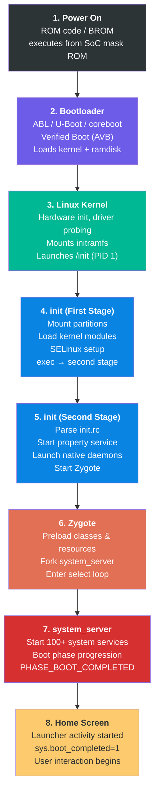

### 4.1.2 Stage-by-Stage Summary

**Stage 1: Power On (ROM Code)**

When the power button is pressed, the System-on-Chip (SoC) begins executing code
from its internal mask ROM -- a small, immutable piece of code burned into the chip
during manufacturing. This ROM code initializes the most basic hardware (clock
generators, memory controllers), loads the primary bootloader from a fixed storage
location (typically the beginning of the eMMC/UFS boot partition), and transfers
control to it. This stage is entirely vendor-specific and not part of AOSP.

**Stage 2: Bootloader (ABL/U-Boot)**

The bootloader is the first software component that can vary between devices. On
modern Android devices this is typically Android Bootloader (ABL) for Qualcomm
platforms, or U-Boot for various other SoCs. The bootloader's primary
responsibilities are:

- Initialize DRAM and critical peripherals
- Implement Android Verified Boot (AVB) to ensure system integrity
- Select the correct boot slot (A/B partitioning)
- Load the Linux kernel, ramdisk, and DTB (Device Tree Blob)
- Set kernel command line parameters
- Transfer control to the kernel

**Stage 3: Linux Kernel**

The Linux kernel initializes hardware subsystems, probes device drivers, mounts the
initial RAM filesystem (initramfs), and launches the very first userspace process:
`/init`, which runs as PID 1. The kernel's behavior during boot is controlled by
command line parameters passed from the bootloader and the Device Tree.

**Stage 4: init (First Stage)**

The init process executes in two stages. First-stage init runs from the ramdisk with
a minimal environment. Its job is to mount essential partitions (`/system`, `/vendor`,
`/product`), load kernel modules, set up SELinux policy, and then `exec()` itself
into second-stage init. This two-stage design exists because first-stage init needs
to run before SELinux policy is loaded, while second-stage init runs under full
SELinux enforcement.

**Stage 5: init (Second Stage)**

Second-stage init is the primary userspace orchestrator. It parses the init.rc
configuration files that declare services and actions, starts the property service
(Android's key-value configuration system), starts native daemons (surfaceflinger,
servicemanager, logd), and ultimately starts Zygote.

**Stage 6: Zygote**

Zygote is a specialized process that preloads the Android framework's core classes
and resources into memory, then enters a loop waiting for fork requests. Every
Android application process is created by forking from Zygote, which gives each app
a warm start with pre-initialized framework code.

**Stage 7: system_server**

The `system_server` is the first process forked from Zygote. It hosts over 100 system
services -- ActivityManagerService, PackageManagerService, WindowManagerService, and
many more. These services go through a carefully ordered boot phase progression,
with each phase unlocking additional functionality.

**Stage 8: Home Screen**

Once system_server reaches `PHASE_BOOT_COMPLETED`, the system is ready. The launcher
activity is started, the boot animation is dismissed, and the property
`sys.boot_completed` is set to `1`, signaling to all components that the device is
fully operational.

### 4.1.3 Timing and Dependencies

The following diagram shows the approximate timing and overlap between stages:

```mermaid
gantt
    title Android Boot Timeline (Approximate)
    dateFormat X
    axisFormat %s

    section Firmware
    ROM Code           :a1, 0, 200
    Bootloader + AVB   :a2, 200, 1500

    section Kernel
    Kernel Init        :a3, 1500, 3500
    Driver Probing     :a4, 2500, 4000

    section Init
    First Stage Init   :a5, 4000, 5500
    SELinux Setup      :a6, 5500, 6000
    Second Stage Init  :a7, 6000, 8000

    section Framework
    Zygote Preload     :a8, 7500, 10000
    system_server      :a9, 9500, 14000

    section UI
    Boot Animation     :a10, 6500, 14000
    Home Screen        :a11, 14000, 15000
```

The total boot time from power-on to home screen typically ranges from 5 to 30
seconds depending on hardware and software configuration. The three most
time-consuming stages are kernel driver probing, Zygote class preloading, and
system_server service initialization.

---

## 4.2 Bootloader and Verified Boot

### 4.2.1 Android Bootloader Architecture

Android does not mandate a specific bootloader implementation. Instead, it defines a
set of requirements that any bootloader must satisfy:

1. **A/B Slot Management**: Support for seamless updates via dual boot slots
2. **Verified Boot**: Implementation of Android Verified Boot (AVB) protocol
3. **Fastboot Protocol**: Support for the fastboot flashing protocol
4. **Kernel Loading**: Ability to load and decompress the kernel, ramdisk, and DTB
5. **Boot Mode Selection**: Support for normal boot, recovery, fastboot, and charger modes

The most common bootloader implementations in the Android ecosystem are:

- **ABL (Android Bootloader)**: Qualcomm's UEFI-based bootloader for Snapdragon platforms
- **U-Boot**: The open-source bootloader used by many ARM SoC vendors
- **coreboot**: Used by some Chromebook-derived Android devices

### 4.2.2 Boot Partitions

Modern Android devices use a multi-partition boot image layout. Understanding these
partitions is critical for anyone working on boot:

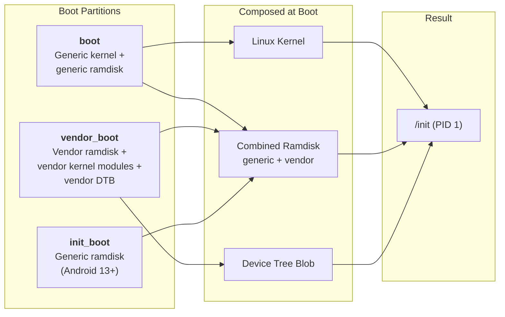

**boot partition**: Contains the Linux kernel image and, prior to Android 13, the
generic ramdisk. The boot image header (defined in
`system/tools/mkbootimg/include/bootimg/bootimg.h`) contains metadata about kernel
size, ramdisk size, page size, OS version, and header version.

**vendor_boot partition**: Introduced in Android 11 (boot image header v3). Contains
the vendor ramdisk (with device-specific init files and firmware), vendor kernel
modules, and the device tree blob. This partition allows the vendor to update its
boot components independently of the generic boot image.

**init_boot partition**: Introduced in Android 13 (boot image header v4). Moves the
generic ramdisk out of the boot partition into its own partition. This enables
updating the generic ramdisk (which contains first-stage init) independently through
GKI (Generic Kernel Image) updates.

### 4.2.3 Android Verified Boot (AVB)

Android Verified Boot ensures that all code and data that is executed comes from a
trusted source. The AVB implementation lives in `external/avb/` and is one of the
most critical security components in the Android boot chain.

#### The AVB Library Structure

The core AVB library is at `external/avb/libavb/`. The master header file is
`external/avb/libavb/libavb.h`, which includes all the component headers:

| Header File | Purpose |
|---|---|
| `avb_vbmeta_image.h` | VBMeta image format and parsing |
| `avb_slot_verify.h` | Slot verification logic |
| `avb_crypto.h` | Cryptographic primitives |
| `avb_hashtree_descriptor.h` | Hashtree (dm-verity) descriptors |
| `avb_hash_descriptor.h` | Hash descriptors for boot images |
| `avb_chain_partition_descriptor.h` | Chain of trust across partitions |
| `avb_ops.h` | Bootloader operations interface |
| `avb_footer.h` | Footer appended to verified partitions |

#### VBMeta Image Structure

The VBMeta image is the cornerstone of AVB. As defined in
`external/avb/libavb/avb_vbmeta_image.h` (lines 64-116):

```
+-----------------------------------------+
| Header data - fixed size (256 bytes)    |
+-----------------------------------------+
| Authentication data - variable size     |
+-----------------------------------------+
| Auxiliary data - variable size          |
+-----------------------------------------+
```

The header is exactly `AVB_VBMETA_IMAGE_HEADER_SIZE` (256) bytes and begins with
the magic bytes `AVB0` (`AVB_MAGIC`). From the source at line 42-46:

```c
// external/avb/libavb/avb_vbmeta_image.h, lines 42-46
#define AVB_VBMETA_IMAGE_HEADER_SIZE 256
#define AVB_MAGIC "AVB0"
#define AVB_MAGIC_LEN 4
#define AVB_RELEASE_STRING_SIZE 48
```

The vbmeta flags control verification behavior. From line 59-62:

```c
// external/avb/libavb/avb_vbmeta_image.h, lines 59-62
typedef enum {
  AVB_VBMETA_IMAGE_FLAGS_HASHTREE_DISABLED = (1 << 0),
  AVB_VBMETA_IMAGE_FLAGS_VERIFICATION_DISABLED = (1 << 1)
} AvbVBMetaImageFlags;
```

`HASHTREE_DISABLED` turns off dm-verity runtime verification, while
`VERIFICATION_DISABLED` disables all verification including descriptor parsing.
Both flags can only be set when the device is unlocked.

#### The Verification Process

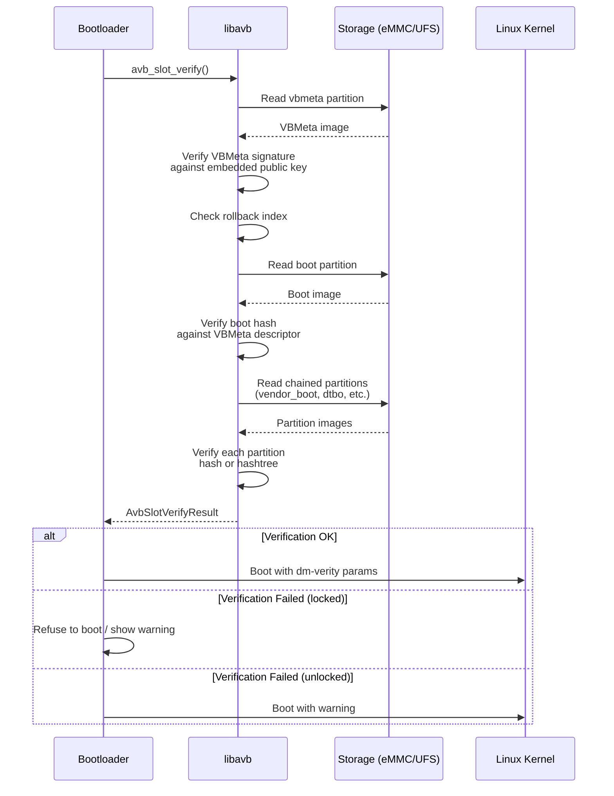

The central function is `avb_slot_verify()`, defined in
`external/avb/libavb/avb_slot_verify.h`. The result codes (lines 45-55) tell the
bootloader exactly what happened:

```c
// external/avb/libavb/avb_slot_verify.h, lines 45-55
typedef enum {
  AVB_SLOT_VERIFY_RESULT_OK,
  AVB_SLOT_VERIFY_RESULT_ERROR_OOM,
  AVB_SLOT_VERIFY_RESULT_ERROR_IO,
  AVB_SLOT_VERIFY_RESULT_ERROR_VERIFICATION,
  AVB_SLOT_VERIFY_RESULT_ERROR_ROLLBACK_INDEX,
  AVB_SLOT_VERIFY_RESULT_ERROR_PUBLIC_KEY_REJECTED,
  AVB_SLOT_VERIFY_RESULT_ERROR_INVALID_METADATA,
  AVB_SLOT_VERIFY_RESULT_ERROR_UNSUPPORTED_VERSION,
  AVB_SLOT_VERIFY_RESULT_ERROR_INVALID_ARGUMENT
} AvbSlotVerifyResult;
```

Each result code corresponds to a specific failure mode:

- `ERROR_VERIFICATION`: Hash mismatch -- the partition content has been tampered with
- `ERROR_ROLLBACK_INDEX`: Someone tried to flash an older, potentially vulnerable
  image (rollback protection)
- `ERROR_PUBLIC_KEY_REJECTED`: The signing key is not in the device's trusted key set
- `ERROR_UNSUPPORTED_VERSION`: The vbmeta image requires a newer version of libavb

#### dm-verity and Hashtree Verification

For large partitions like `system` and `vendor`, computing a hash of the entire
partition at boot would be prohibitively slow. Instead, AVB uses **dm-verity**, a
Linux kernel device-mapper target that verifies data blocks on-the-fly as they are
read from disk.

dm-verity uses a Merkle tree (hash tree) structure:

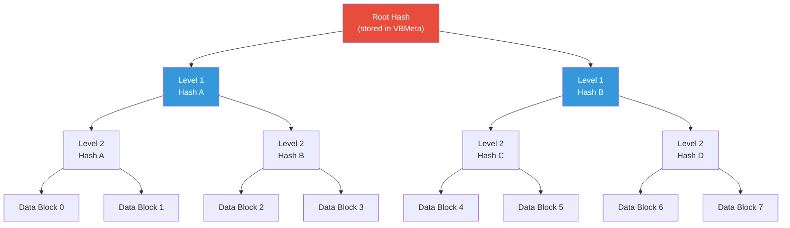

When a data block is read, the kernel computes its hash and walks up the tree to
verify it against the root hash. If any block has been modified, the hash mismatch
is detected and the kernel takes action based on the configured error mode.

The hashtree error modes are defined in `avb_slot_verify.h` (lines 86-93):

```c
// external/avb/libavb/avb_slot_verify.h, lines 86-93
typedef enum {
  AVB_HASHTREE_ERROR_MODE_RESTART_AND_INVALIDATE,
  AVB_HASHTREE_ERROR_MODE_RESTART,
  AVB_HASHTREE_ERROR_MODE_EIO,
  AVB_HASHTREE_ERROR_MODE_LOGGING,
  AVB_HASHTREE_ERROR_MODE_MANAGED_RESTART_AND_EIO,
  AVB_HASHTREE_ERROR_MODE_PANIC
} AvbHashtreeErrorMode;
```

In production (`RESTART_AND_INVALIDATE`), if dm-verity detects corruption, the device
restarts and the current slot is marked as invalid, triggering a fallback to the
other A/B slot. The `LOGGING` mode is available only when verification errors are
explicitly allowed (unlocked devices) and is used purely for development and
debugging.

#### Rollback Protection

Rollback protection prevents an attacker from flashing an older version of Android
that has known vulnerabilities. The mechanism works through rollback indices:

1. Each vbmeta image contains a rollback index -- a monotonically increasing version
   number
2. The device stores the minimum accepted rollback index in tamper-evident storage
   (typically RPMB on eMMC/UFS)
3. During verification, if the vbmeta's rollback index is less than the stored
   minimum, `AVB_SLOT_VERIFY_RESULT_ERROR_ROLLBACK_INDEX` is returned
4. After a successful boot, the stored minimum is updated to match the current
   rollback index

### 4.2.4 Recovery Mode

The Android recovery system provides a minimal environment for applying system
updates (OTAs) and performing factory resets. The recovery code lives in
`bootable/recovery/`.

Recovery operates through boot modes -- as we can see in
`system/core/init/first_stage_init.cpp` (lines 66-70):

```cpp
// system/core/init/first_stage_init.cpp, lines 66-70
enum class BootMode {
    NORMAL_MODE,
    RECOVERY_MODE,
    CHARGER_MODE,
};
```

When in recovery mode, first-stage init takes a different path -- skipping the normal
first-stage mount procedure. From line 523-524:

```cpp
// system/core/init/first_stage_init.cpp, lines 523-524
if (IsRecoveryMode()) {
    LOG(INFO) << "First stage mount skipped (recovery mode)";
```

Modern A/B devices boot the recovery ramdisk from the regular boot partition rather
than a separate recovery partition. The `ForceNormalBoot()` function (lines 117-119)
determines whether to redirect from recovery into normal boot:

```cpp
// system/core/init/first_stage_init.cpp, lines 117-119
bool ForceNormalBoot(const std::string& cmdline, const std::string& bootconfig) {
    return bootconfig.find("androidboot.force_normal_boot = \"1\"") != std::string::npos ||
           cmdline.find("androidboot.force_normal_boot=1") != std::string::npos;
}
```

This allows the same boot image to serve both normal and recovery boots, with the
bootconfig parameter controlling which path is taken.

---

## 4.3 Init: The First Process

Init is the single most important userspace process in Android. It is PID 1 -- the
ancestor of all other processes. If init crashes, the kernel panics. Init is
responsible for:

- Mounting filesystems
- Loading SELinux policy
- Starting all native daemons
- Managing the Android property system
- Monitoring and restarting crashed services
- Processing reboot and shutdown requests

### 4.3.1 The Two-Stage Design

Android's init uses a two-stage architecture. This design is driven by a fundamental
chicken-and-egg problem: SELinux policy lives on the `/system` partition, but
first-stage init needs to run before any partitions are mounted (because it is the
process that mounts them). The solution is to split init into two stages that run
as separate executions of the same binary.

The entry point is `system/core/init/main.cpp`. This single main() function acts as
a dispatch point for all init's execution modes:

```cpp
// system/core/init/main.cpp, lines 53-83
int main(int argc, char** argv) {
#if __has_feature(address_sanitizer)
    __asan_set_error_report_callback(AsanReportCallback);
#elif __has_feature(hwaddress_sanitizer)
    __hwasan_set_error_report_callback(AsanReportCallback);
#endif
    // Boost prio which will be restored later
    setpriority(PRIO_PROCESS, 0, -20);
    if (!strcmp(basename(argv[0]), "ueventd")) {
        return ueventd_main(argc, argv);
    }

    if (argc > 1) {
        if (!strcmp(argv[1], "subcontext")) {
            android::base::InitLogging(argv, &android::base::KernelLogger);
            const BuiltinFunctionMap& function_map = GetBuiltinFunctionMap();

            return SubcontextMain(argc, argv, &function_map);
        }

        if (!strcmp(argv[1], "selinux_setup")) {
            return SetupSelinux(argv);
        }

        if (!strcmp(argv[1], "second_stage")) {
            return SecondStageMain(argc, argv);
        }
    }

    return FirstStageMain(argc, argv);
}
```

This reveals that the `/system/bin/init` binary actually serves five different roles
depending on how it is invoked:

| Invocation | Function | Purpose |
|---|---|---|
| `init` (no args) | `FirstStageMain()` | First-stage initialization |
| `init selinux_setup` | `SetupSelinux()` | Load SELinux policy |
| `init second_stage` | `SecondStageMain()` | Main init loop |
| `init subcontext` | `SubcontextMain()` | SELinux subcontext worker |
| `ueventd` (symlink) | `ueventd_main()` | Device node manager |

Note line 60: the process priority is immediately boosted to -20 (highest priority)
to ensure init gets as much CPU time as possible during boot. This priority is
restored to 0 (normal) later, at line 1245 of `init.cpp`, just before entering the
main event loop.

The first-stage init has a separate, minimal entry point at
`system/core/init/first_stage_main.cpp`:

```cpp
// system/core/init/first_stage_main.cpp, lines 19-21
int main(int argc, char** argv) {
    return android::init::FirstStageMain(argc, argv);
}
```

This exists because first-stage init is linked as a separate, smaller binary that
lives in the ramdisk, while the full `main.cpp` binary lives on the `/system`
partition.

### 4.3.2 First-Stage Init: Building the Foundation

First-stage init's implementation is in `system/core/init/first_stage_init.cpp`. The
`FirstStageMain()` function (starting at line 333) is one of the most critical
pieces of code in all of Android -- if it fails, the device will not boot.

#### Phase 1: Emergency Infrastructure (lines 333-422)

The very first thing init does is set up crash handlers, then build the minimal
filesystem infrastructure needed to communicate with the outside world:

```cpp
// system/core/init/first_stage_init.cpp, lines 333-349
int FirstStageMain(int argc, char** argv) {
    if (REBOOT_BOOTLOADER_ON_PANIC) {
        InstallRebootSignalHandlers();
    }

    boot_clock::time_point start_time = boot_clock::now();

    std::vector<std::pair<std::string, int>> errors;
#define CHECKCALL(x) \
    if ((x) != 0) errors.emplace_back(#x " failed", errno);

    // Clear the umask.
    umask(0);

    CHECKCALL(clearenv());
    CHECKCALL(setenv("PATH", _PATH_DEFPATH, 1));
    // Get the basic filesystem setup we need put together in the initramdisk
    // on / and then we'll let the rc file figure out the rest.
    CHECKCALL(mount("tmpfs", "/dev", "tmpfs", MS_NOSUID, "mode=0755"));
```

The `CHECKCALL` macro is notable: rather than aborting on the first failure, it
collects all errors and reports them later. This is because at this point, logging
is not yet initialized (we do not even have `/dev/kmsg` yet), so we cannot report
errors until the basic filesystem mounts complete.

The critical filesystem setup continues with device nodes and pseudo-filesystems
(lines 350-404):

```cpp
// system/core/init/first_stage_init.cpp, lines 351-381
CHECKCALL(mkdir("/dev/pts", 0755));
CHECKCALL(mkdir("/dev/socket", 0755));
CHECKCALL(mkdir("/dev/dm-user", 0755));
CHECKCALL(mount("devpts", "/dev/pts", "devpts", 0, NULL));
CHECKCALL(mount("proc", "/proc", "proc", 0,
    "hidepid=2,gid=" MAKE_STR(AID_READPROC)));
// ...
CHECKCALL(mount("sysfs", "/sys", "sysfs", 0, NULL));
CHECKCALL(mount("selinuxfs", "/sys/fs/selinux", "selinuxfs", 0, NULL));

CHECKCALL(mknod("/dev/kmsg", S_IFCHR | 0600, makedev(1, 11)));
// ...
CHECKCALL(mknod("/dev/random", S_IFCHR | 0666, makedev(1, 8)));
CHECKCALL(mknod("/dev/urandom", S_IFCHR | 0666, makedev(1, 9)));
CHECKCALL(mknod("/dev/ptmx", S_IFCHR | 0666, makedev(5, 2)));
CHECKCALL(mknod("/dev/null", S_IFCHR | 0666, makedev(1, 3)));
```

Note the security-conscious choices here:

- `/proc` is mounted with `hidepid=2`, which hides other processes' information from
  non-root users
- `/dev/kmsg` has mode 0600 (root only), preventing unprivileged access to kernel
  messages
- The `selinuxfs` mount at `/sys/fs/selinux` is required for loading SELinux policy
  later

Only after these mounts complete can init actually log messages:

```cpp
// system/core/init/first_stage_init.cpp, lines 412-424
SetStdioToDevNull(argv);
// Now that tmpfs is mounted on /dev and we have /dev/kmsg, we can actually
// talk to the outside world...
InitKernelLogging(argv);

if (!errors.empty()) {
    for (const auto& [error_string, error_errno] : errors) {
        LOG(ERROR) << error_string << " " << strerror(error_errno);
    }
    LOG(FATAL) << "Init encountered errors starting first stage, aborting";
}

LOG(INFO) << "init first stage started!";
```

#### Phase 2: Kernel Module Loading (lines 441-458)

Modern Android devices have modular kernels where many drivers are loaded as kernel
modules rather than being compiled into the kernel. First-stage init must load these
modules before it can mount partitions (because the storage controller driver might
itself be a module):

```cpp
// system/core/init/first_stage_init.cpp, lines 441-458
boot_clock::time_point module_start_time = boot_clock::now();
int module_count = 0;
BootMode boot_mode = GetBootMode(cmdline, bootconfig);
if (!LoadKernelModules(boot_mode, want_console,
                       want_parallel, module_count)) {
    if (want_console != FirstStageConsoleParam::DISABLED) {
        LOG(ERROR) << "Failed to load kernel modules, starting console";
    } else {
        LOG(FATAL) << "Failed to load kernel modules";
    }
}
if (module_count > 0) {
    auto module_elapse_time = std::chrono::duration_cast<std::chrono::milliseconds>(
            boot_clock::now() - module_start_time);
    setenv(kEnvInitModuleDurationMs,
           std::to_string(module_elapse_time.count()).c_str(), 1);
    LOG(INFO) << "Loaded " << module_count << " kernel modules took "
              << module_elapse_time.count() << " ms";
}
```

The `LoadKernelModules()` function (lines 215-290) searches for module directories
under `/lib/modules/`, matching the running kernel version. It supports parallel
module loading to speed up boot:

```cpp
// system/core/init/first_stage_init.cpp, lines 282-284
bool retval = (want_parallel) ? m.LoadModulesParallel(std::thread::hardware_concurrency())
                              : m.LoadListedModules(!want_console);
```

The module load list varies by boot mode. Charger mode loads fewer modules since the
device only needs to display a charging animation:

```cpp
// system/core/init/first_stage_init.cpp, lines 187-212
std::string GetModuleLoadList(BootMode boot_mode, const std::string& dir_path) {
    std::string module_load_file;
    switch (boot_mode) {
        case BootMode::NORMAL_MODE:
            module_load_file = "modules.load";
            break;
        case BootMode::RECOVERY_MODE:
            module_load_file = "modules.load.recovery";
            break;
        case BootMode::CHARGER_MODE:
            module_load_file = "modules.load.charger";
            break;
    }
    // ...
}
```

#### Phase 3: Mounting Partitions (lines 462-540)

With kernel modules loaded (including storage drivers), first-stage init can now
mount the essential partitions:

```cpp
// system/core/init/first_stage_init.cpp, lines 526-540
if (!fsm) {
    fsm = CreateFirstStageMount(cmdline);
}
if (!fsm) {
    LOG(FATAL) << "FirstStageMount not available";
}

if (!created_devices && !fsm->DoCreateDevices()) {
    LOG(FATAL) << "Failed to create devices required for first stage mount";
}

if (!fsm->DoFirstStageMount()) {
    LOG(FATAL) << "Failed to mount required partitions early ...";
}
```

This is where dm-verity is configured. The `FirstStageMount` class (in
`system/core/init/first_stage_mount.cpp`) reads the fstab, creates device-mapper
nodes for verity-protected partitions, and mounts `/system`, `/vendor`, and other
required partitions.

#### Phase 4: Handoff to SELinux Setup (lines 557-582)

After partitions are mounted, first-stage init prepares for the SELinux transition
and `exec()`s itself as the "selinux_setup" phase:

```cpp
// system/core/init/first_stage_init.cpp, lines 557-575
const char* path = "/system/bin/init";
const char* args[] = {path, "selinux_setup", nullptr};
auto fd = open("/dev/kmsg", O_WRONLY | O_CLOEXEC);
dup2(fd, STDOUT_FILENO);
dup2(fd, STDERR_FILENO);
close(fd);
execv(path, const_cast<char**>(args));

// execv() only returns if an error happened, in which case we
// panic and never fall through this conditional.
PLOG(FATAL) << "execv(\"" << path << "\") failed";
```

Note the critical detail: the `execv()` call replaces the first-stage init binary
(from the ramdisk) with the full init binary from `/system/bin/init`. This is now
possible because `/system` has been mounted. Before the exec, the ramdisk
filesystem is freed to reclaim memory (line 549):

```cpp
// system/core/init/first_stage_init.cpp, lines 548-549
if (old_root_dir && old_root_info.st_dev != new_root_info.st_dev) {
    FreeRamdisk(old_root_dir.get(), old_root_info.st_dev);
}
```

### 4.3.3 SELinux Setup: The Security Transition

The SELinux setup phase is implemented in `system/core/init/selinux.cpp`. The file
begins with an excellent comment block (lines 18-50) that explains the entire
SELinux policy loading strategy. The two key concepts are:

1. **Monolithic policy**: Legacy devices use a single `/sepolicy` file
2. **Split policy**: Treble devices combine policy from `/system`, `/vendor`,
   `/product`, and `/odm` partitions

The `SetupSelinux()` function (lines 780-836) orchestrates the process:

```cpp
// system/core/init/selinux.cpp, lines 780-829
int SetupSelinux(char** argv) {
    SetStdioToDevNull(argv);
    InitKernelLogging(argv);
    // ...
    SelinuxSetupKernelLogging();

    bool use_overlays = EarlySetupOverlays();

    if (IsMicrodroid()) {
        LoadSelinuxPolicyMicrodroid();
    } else {
        LoadSelinuxPolicyAndroid();
    }

    SelinuxSetEnforcement();
    // ...
    if (selinux_android_restorecon("/system/bin/init", 0) == -1) {
        PLOG(FATAL) << "restorecon failed of /system/bin/init failed";
    }
    // ...
    const char* path = "/system/bin/init";
    const char* args[] = {path, "second_stage", nullptr};
    execv(path, const_cast<char**>(args));
```

The `LoadSelinuxPolicyAndroid()` function (lines 685-708) demonstrates the careful
five-step process needed when snapuserd (Virtual A/B snapshot daemon) is running:

```cpp
// system/core/init/selinux.cpp, lines 670-708 (comment + function)
// We use a five-step process to address this:
//  (1) Read the policy into a string, with snapuserd running.
//  (2) Rewrite the snapshot device-mapper tables, to generate new dm-user
//      devices and to flush I/O.
//  (3) Kill snapuserd, which no longer has any dm-user devices to attach to.
//  (4) Load the sepolicy and issue critical restorecons in /dev, carefully
//      avoiding anything that would read from /system.
//  (5) Re-launch snapuserd and attach it to the dm-user devices from step (2).
void LoadSelinuxPolicyAndroid() {
    MountMissingSystemPartitions();

    LOG(INFO) << "Opening SELinux policy";
    std::string policy;
    ReadPolicy(&policy);

    auto snapuserd_helper = SnapuserdSelinuxHelper::CreateIfNeeded();
    if (snapuserd_helper) {
        snapuserd_helper->StartTransition();
    }

    LoadSelinuxPolicy(policy);

    if (snapuserd_helper) {
        snapuserd_helper->FinishTransition();
        snapuserd_helper = nullptr;
    }
}
```

After loading SELinux policy and setting enforcement mode, `SetupSelinux()` performs
a `restorecon` on `/system/bin/init` itself so that the next `exec()` transitions
init from the kernel domain to the proper `init` SELinux domain. It then exec's
into second-stage init.

### 4.3.4 The Complete First-Stage Flow

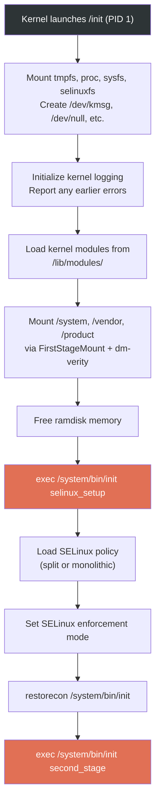

### 4.3.5 Second-Stage Init: The Main Event

Second-stage init is where the real orchestration begins. The `SecondStageMain()`
function in `system/core/init/init.cpp` (starting at line 1048) is the heart of
Android's userspace startup.

#### Initial Setup (lines 1048-1166)

```cpp
// system/core/init/init.cpp, lines 1048-1063
int SecondStageMain(int argc, char** argv) {
    if (REBOOT_BOOTLOADER_ON_PANIC) {
        InstallRebootSignalHandlers();
    }

    boot_clock::time_point start_time = boot_clock::now();

    trigger_shutdown = [](const std::string& command) {
        shutdown_state.TriggerShutdown(command);
    };

    SetStdioToDevNull(argv);
    InitKernelLogging(argv);
    LOG(INFO) << "init second stage started!";
```

The second-stage init then performs a rapid series of setup steps:

1. **Property initialization** (line 1108): `PropertyInit()` sets up the property
   system, which is Android's global key-value configuration store

2. **SELinux context restoration** (lines 1122-1123): Restores security labels on
   `/dev` nodes created during first-stage

3. **Epoll event loop setup** (lines 1125-1136): Creates the event loop that will
   drive init's main loop, registers signal handlers for SIGCHLD (child death) and
   SIGTERM

4. **Property service startup** (line 1137): `StartPropertyService()` launches the
   property service thread that handles property set requests from other processes

5. **Boot scripts loading** (line 1179): `LoadBootScripts()` parses all the init.rc
   files

```cpp
// system/core/init/init.cpp, lines 1108-1179
PropertyInit();

// Umount second stage resources after property service has read the .prop files.
UmountSecondStageRes();
// ...
MountExtraFilesystems();

// Now set up SELinux for second stage.
SelabelInitialize();
SelinuxRestoreContext();

Epoll epoll;
if (auto result = epoll.Open(); !result.ok()) {
    PLOG(FATAL) << result.error();
}
// ...
InstallSignalFdHandler(&epoll);
InstallInitNotifier(&epoll);
StartPropertyService(&property_fd);
// ...
ActionManager& am = ActionManager::GetInstance();
ServiceList& sm = ServiceList::GetInstance();

LoadBootScripts(am, sm);
```

#### Loading Boot Scripts (lines 339-363)

The `LoadBootScripts()` function is where init.rc files are parsed:

```cpp
// system/core/init/init.cpp, lines 339-363
static void LoadBootScripts(ActionManager& action_manager, ServiceList& service_list) {
    Parser parser = CreateParser(action_manager, service_list);

    std::string bootscript = GetProperty("ro.boot.init_rc", "");
    if (bootscript.empty()) {
        parser.ParseConfig("/system/etc/init/hw/init.rc");
        if (!parser.ParseConfig("/system/etc/init")) {
            late_import_paths.emplace_back("/system/etc/init");
        }
        parser.ParseConfig("/system_ext/etc/init");
        if (!parser.ParseConfig("/vendor/etc/init")) {
            late_import_paths.emplace_back("/vendor/etc/init");
        }
        if (!parser.ParseConfig("/odm/etc/init")) {
            late_import_paths.emplace_back("/odm/etc/init");
        }
        if (!parser.ParseConfig("/product/etc/init")) {
            late_import_paths.emplace_back("/product/etc/init");
        }
    } else {
        parser.ParseConfig(bootscript);
    }
}
```

Init.rc files are loaded from five locations in a specific order:

1. `/system/etc/init/hw/init.rc` -- the master init.rc file
2. `/system/etc/init/` -- system partition services
3. `/system_ext/etc/init/` -- system extension services
4. `/vendor/etc/init/` -- vendor services
5. `/odm/etc/init/` -- ODM (Original Design Manufacturer) services
6. `/product/etc/init/` -- product-specific services

The parser recognizes three section types (from `CreateParser()`, lines 275-284):

```cpp
// system/core/init/init.cpp, lines 275-284
Parser CreateParser(ActionManager& action_manager, ServiceList& service_list) {
    Parser parser;

    parser.AddSectionParser("service",
                            std::make_unique<ServiceParser>(&service_list, GetSubcontext()));
    parser.AddSectionParser("on",
                            std::make_unique<ActionParser>(&action_manager, GetSubcontext()));
    parser.AddSectionParser("import", std::make_unique<ImportParser>(&parser));

    return parser;
}
```

#### Action Queue and Trigger Sequence (lines 1205-1243)

After all scripts are loaded, init queues the trigger sequence that drives the
entire boot:

```cpp
// system/core/init/init.cpp, lines 1205-1243
am.QueueBuiltinAction(SetupCgroupsAction, "SetupCgroups");
am.QueueBuiltinAction(TestPerfEventSelinuxAction, "TestPerfEventSelinux");
am.QueueEventTrigger("early-init");
am.QueueBuiltinAction(ConnectEarlyStageSnapuserdAction, "ConnectEarlyStageSnapuserd");

// Queue an action that waits for coldboot done so we know ueventd has set up
// all of /dev...
am.QueueBuiltinAction(wait_for_coldboot_done_action, "wait_for_coldboot_done");
// ...
// ... so that we can start queuing up actions that require stuff from /dev.
am.QueueBuiltinAction(SetMmapRndBitsAction, "SetMmapRndBits");
// ...

// Trigger all the boot actions to get us started.
am.QueueEventTrigger("init");

// Don't mount filesystems or start core system services in charger mode.
std::string bootmode = GetProperty("ro.bootmode", "");
if (bootmode == "charger") {
    am.QueueEventTrigger("charger");
} else {
    am.QueueEventTrigger("late-init");
}

// Run all property triggers based on current state of the properties.
am.QueueBuiltinAction(queue_property_triggers_action, "queue_property_triggers");
```

This establishes the trigger ordering: `early-init` -> `init` -> `late-init`, which
is the backbone of the init.rc trigger chain.

#### The Main Event Loop (lines 1246-1296)

Init then enters its infinite event loop:

```cpp
// system/core/init/init.cpp, lines 1244-1296
// Restore prio before main loop
setpriority(PRIO_PROCESS, 0, 0);
while (true) {
    const boot_clock::time_point far_future = boot_clock::time_point::max();
    boot_clock::time_point next_action_time = far_future;

    auto shutdown_command = shutdown_state.CheckShutdown();
    if (shutdown_command) {
        LOG(INFO) << "Got shutdown_command '" << *shutdown_command
                  << "' Calling HandlePowerctlMessage()";
        HandlePowerctlMessage(*shutdown_command);
    }

    if (!(prop_waiter_state.MightBeWaiting() || Service::is_exec_service_running())) {
        am.ExecuteOneCommand();
        if (am.HasMoreCommands()) {
            next_action_time = boot_clock::now();
        }
    }

    if (!IsShuttingDown()) {
        auto next_process_action_time = HandleProcessActions();
        if (next_process_action_time) {
            next_action_time = std::min(next_action_time, *next_process_action_time);
        }
    }

    std::optional<std::chrono::milliseconds> epoll_timeout;
    if (next_action_time != far_future) {
        epoll_timeout = std::chrono::ceil<std::chrono::milliseconds>(
                std::max(next_action_time - boot_clock::now(), 0ns));
    }
    auto epoll_result = epoll.Wait(epoll_timeout);
    if (!epoll_result.ok()) {
        LOG(ERROR) << epoll_result.error();
    }
    if (!IsShuttingDown()) {
        HandleControlMessages();
        SetUsbController();
    }
}
```

Each iteration of this loop:

1. Checks for pending shutdown commands
2. Executes one queued action (if not waiting for a property or exec service)
3. Handles process timeouts and restarts
4. Waits on epoll for signals, property changes, or timeout

This single-threaded, event-driven design is intentional: it ensures that actions
execute in a deterministic order and prevents race conditions that could occur with
multi-threaded execution.

### 4.3.6 The Android Property System

The property system is Android's global key-value store, implemented in
`system/core/init/property_service.cpp`. Properties are the primary mechanism
for configuration and inter-process communication during boot.

Properties follow naming conventions that determine their behavior:

| Prefix | Behavior |
|---|---|
| `ro.*` | Read-only; can only be set once (typically during boot) |
| `persist.*` | Persisted to disk; survives reboots |
| `sys.*` | System properties; general-purpose |
| `init.svc.*` | Automatically set by init to track service states |
| `ctl.*` | Control properties; trigger init actions (start/stop/restart services) |
| `next_boot.*` | Persisted, applied on next boot |

The property service enforces SELinux MAC (Mandatory Access Control) on all property
operations. From `property_service.cpp`, the `CheckPermissions()` function (declared
around line 498) validates that the calling process has SELinux permission to set a
given property:

```cpp
// system/core/init/property_service.cpp, lines 498-499
uint32_t CheckPermissions(const std::string& name, const std::string& value,
                          const std::string& source_context, const ucred& cr,
                          std::string* error) {
```

Control properties (`ctl.*`) get special handling. When a process sets `ctl.start`
to a service name, the property service forwards this as a control message to init's
main loop, which then starts the service. From lines 439-465, the
`SendControlMessage()` function handles this:

```cpp
// system/core/init/property_service.cpp, lines 439-466
static uint32_t SendControlMessage(const std::string& msg, const std::string& name,
                                   pid_t pid, SocketConnection* socket,
                                   std::string* error) {
    auto lock = std::lock_guard{accept_messages_lock};
    if (!accept_messages) {
        if (msg == "stop") return PROP_SUCCESS;
        *error = "Received control message after shutdown, ignoring";
        return PROP_ERROR_HANDLE_CONTROL_MESSAGE;
    }
    // ...
    bool queue_success = QueueControlMessage(msg, name, pid, fd);
```

The `PropertyChanged()` function in `init.cpp` (lines 365-388) shows how property
changes flow through the system:

```cpp
// system/core/init/init.cpp, lines 365-388
void PropertyChanged(const std::string& name, const std::string& value) {
    if (name == "sys.powerctl") {
        trigger_shutdown(value);
    } else if (name == "sys.shutdown.requested") {
        HandleShutdownRequestedMessage(value);
    }

    if (property_triggers_enabled) {
        ActionManager::GetInstance().QueuePropertyChange(name, value);
        WakeMainInitThread();
    }

    prop_waiter_state.CheckAndResetWait(name, value);
}
```

The `sys.powerctl` property is handled with the highest urgency -- it bypasses the
normal event queue to trigger immediate shutdown/reboot.

### 4.3.7 The init.rc Language

The init.rc language is a domain-specific language for declaring the services and
actions that init manages. The master file is at `system/core/rootdir/init.rc`.

#### File Structure and Imports

The init.rc file begins with import statements that bring in additional configuration
files:

```
# system/core/rootdir/init.rc, lines 7-13
import /init.environ.rc
import /system/etc/init/hw/init.usb.rc
import /init.${ro.hardware}.rc
import /vendor/etc/init/hw/init.${ro.hardware}.rc
import /system/etc/init/hw/init.usb.configfs.rc
import /system/etc/init/hw/init.${ro.zygote}.rc
```

Note the use of property expansion: `${ro.hardware}` is replaced with the device's
hardware name, and `${ro.zygote}` determines which Zygote configuration is used
(32-bit, 64-bit, or both).

#### Actions and Triggers

Actions are blocks of commands that execute when a trigger condition is met:

```
on <trigger>
    <command>
    <command>
    ...
```

The `early-init` trigger runs first and sets up basic kernel parameters:

```
# system/core/rootdir/init.rc, lines 15-46
on early-init
    # Disable sysrq from keyboard
    write /proc/sys/kernel/sysrq 0

    # Android doesn't need kernel module autoloading, and it causes SELinux
    # denials.  So disable it by setting modprobe to the empty string.
    write /proc/sys/kernel/modprobe \n

    # Set the security context of /adb_keys if present.
    restorecon /adb_keys

    # Set the security context of /postinstall if present.
    restorecon /postinstall

    # memory.pressure_level used by lmkd
    chown root system /dev/memcg/memory.pressure_level
    chmod 0040 /dev/memcg/memory.pressure_level
    # app mem cgroups, used by activity manager, lmkd and zygote
    mkdir /dev/memcg/apps/ 0755 system system
    # cgroup for system_server and surfaceflinger
    mkdir /dev/memcg/system 0550 system system
```

The `late-init` trigger is the main boot orchestrator, chaining together the
filesystem mount and service start sequence:

```
# system/core/rootdir/init.rc, lines 508-537
on late-init
    trigger early-fs

    # Mount fstab in init.{$device}.rc by mount_all command. Optional parameter
    # '--early' can be specified to skip entries with 'latemount'.
    # /system and /vendor must be mounted by the end of the fs stage,
    # while /data is optional.
    trigger fs
    trigger post-fs

    # Mount fstab in init.{$device}.rc by mount_all with '--late' parameter
    # to only mount entries with 'latemount'. This is needed if '--early' is
    # specified in the previous mount_all command on the fs stage.
    trigger late-fs

    # Now we can mount /data. File encryption requires keymaster to decrypt
    # /data, which in turn can only be loaded when system properties are present.
    trigger post-fs-data

    # Should be before netd, but after apex, properties and logging is available.
    trigger load-bpf-programs
    trigger bpf-progs-loaded

    # Now we can start zygote.
    trigger zygote-start

    # Remove a file to wake up anything waiting for firmware.
    trigger firmware_mounts_complete
```

The trigger chain diagram:

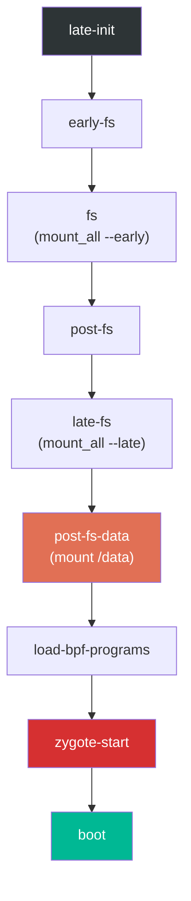

The `post-fs-data` trigger is particularly important because it prepares the `/data`
partition:

```
# system/core/rootdir/init.rc, lines 654-684
on post-fs-data

    # Start checkpoint before we touch data
    exec - system system -- /system/bin/vdc checkpoint prepareCheckpoint

    # We chown/chmod /data again so because mount is run as root + defaults
    chown system system /data
    chmod 0771 /data
    # We restorecon /data in case the userdata partition has been reset.
    restorecon /data

    # Make sure we have the device encryption key.
    installkey /data

    # Start bootcharting as soon as possible after the data partition is
    # mounted to collect more data.
    mkdir /data/bootchart 0755 shell shell encryption=Require
    bootchart start
```

The `zygote-start` trigger is where the critical Java runtime begins:

```
# system/core/rootdir/init.rc, lines 1101-1105
on zygote-start
    wait_for_prop odsign.verification.done 1
    start statsd
    start zygote
    start zygote_secondary
```

Note the `wait_for_prop` command: Zygote startup is gated on `odsign.verification.done`,
which indicates that on-device signing verification has completed. This ensures that
the ART artifacts that Zygote will load have been verified.

#### Property Triggers

Actions can also be triggered by property changes:

```
on property:sys.boot_completed=1 && property:ro.config.batteryless=true
    write /proc/sys/vm/dirty_expire_centisecs 200
    write /proc/sys/vm/dirty_writeback_centisecs 200
```

Property triggers are evaluated whenever any property changes. If the condition
matches, the associated commands execute. Compound triggers (using `&&`) require
all conditions to be true simultaneously.

#### Service Definitions

Services are persistent processes that init manages. Here is the primary Zygote
service definition from `system/core/rootdir/init.zygote64.rc`:

```
# system/core/rootdir/init.zygote64.rc, lines 1-20
service zygote /system/bin/app_process64 -Xzygote /system/bin --zygote --start-system-server --socket-name=zygote
    class main
    priority -20
    user root
    group root readproc reserved_disk
    socket zygote stream 660 root system
    socket usap_pool_primary stream 660 root system
    onrestart exec_background - system system -- /system/bin/vdc volume abort_fuse
    onrestart write /sys/power/state on
    onrestart write /sys/power/wake_lock zygote_kwl
    onrestart restart audioserver
    onrestart restart cameraserver
    onrestart restart media
    onrestart restart --only-if-running media.tuner
    onrestart restart netd
    onrestart restart wificond
    task_profiles ProcessCapacityHigh MaxPerformance
    critical window=${zygote.critical_window.minute:-off} target=zygote-fatal
```

Let us break down each directive:

| Directive | Meaning |
|---|---|
| `service zygote` | Declares a service named "zygote" |
| `/system/bin/app_process64` | The executable path |
| `-Xzygote` | Passed to the Dalvik/ART VM |
| `--zygote` | Tells app_process to start in Zygote mode |
| `--start-system-server` | Fork system_server after initialization |
| `class main` | Belongs to the "main" service class |
| `priority -20` | Run at highest scheduling priority |
| `user root` / `group root` | Run as root (Zygote needs root to fork and set UIDs) |
| `socket zygote stream 660` | Create a UNIX socket at `/dev/socket/zygote` |
| `socket usap_pool_primary` | Socket for the USAP (Unspecialized App Process) pool |
| `onrestart restart audioserver` | When Zygote restarts, also restart these services |
| `critical window=...` | If Zygote crashes too frequently, reboot the device |

The `critical` directive is a safety net: if Zygote crashes repeatedly within the
specified window, init will reboot the device to recovery to prevent a crash loop.

For devices that support both 64-bit and 32-bit apps, the file
`init.zygote64_32.rc` is used:

```
# system/core/rootdir/init.zygote64_32.rc, lines 1-11
import /system/etc/init/hw/init.zygote64.rc

service zygote_secondary /system/bin/app_process32 -Xzygote /system/bin --zygote --socket-name=zygote_secondary --enable-lazy-preload
    class main
    priority -20
    user root
    group root readproc reserved_disk
    socket zygote_secondary stream 660 root system
    socket usap_pool_secondary stream 660 root system
    onrestart restart zygote
    task_profiles ProcessCapacityHigh MaxPerformance
```

The secondary Zygote uses `--enable-lazy-preload`, meaning it defers class
preloading until the first app fork request. This saves boot time because 32-bit
apps are relatively rare on modern devices.

### 4.3.8 init.rc Parsing Flow

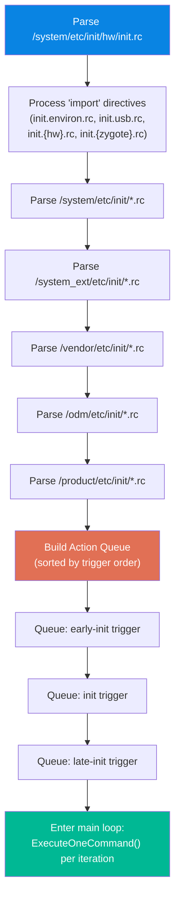

### 4.3.9 Summary of init.rc Built-in Commands

The following table lists the most commonly used init.rc commands:

| Command | Example | Description |
|---|---|---|
| `mkdir` | `mkdir /data/system 0775 system system` | Create directory with permissions |
| `write` | `write /proc/sys/kernel/sysrq 0` | Write a string to a file |
| `chmod` | `chmod 0660 /dev/kmsg` | Change file permissions |
| `chown` | `chown system system /data` | Change file ownership |
| `mount` | `mount ext4 /dev/block/sda1 /system` | Mount a filesystem |
| `mount_all` | `mount_all /vendor/etc/fstab.device` | Mount all entries from fstab |
| `start` | `start servicemanager` | Start a service |
| `stop` | `stop console` | Stop a service |
| `restart` | `restart zygote` | Restart a service |
| `setprop` | `setprop ro.build.type userdebug` | Set a system property |
| `trigger` | `trigger late-init` | Fire a trigger event |
| `exec` | `exec -- /system/bin/vdc ...` | Fork+exec and wait for completion |
| `exec_start` | `exec_start apexd-bootstrap` | Start a service and wait |
| `wait` | `wait /dev/block/sda1 5` | Wait for a file to appear (timeout) |
| `wait_for_prop` | `wait_for_prop sys.odsign.status done` | Wait for property value |
| `symlink` | `symlink ../tun /dev/net/tun` | Create a symbolic link |
| `restorecon` | `restorecon /dev` | Restore SELinux context |
| `installkey` | `installkey /data` | Install encryption key |
| `class_start` | `class_start core` | Start all services in a class |
| `class_stop` | `class_stop late_start` | Stop all services in a class |
| `enable` | `enable some_service` | Enable a disabled service |
| `setrlimit` | `setrlimit nice 40 40` | Set resource limits |
| `import` | `import /init.${ro.hardware}.rc` | Import another rc file |

---

## 4.4 Zygote: The App Incubator

Zygote is the process that gives Android its remarkably fast application startup
times. Rather than loading the entire Android framework from scratch for each new
app, Zygote preloads the framework once and then forks itself. The child process
inherits all preloaded code and data via Linux's copy-on-write memory sharing,
making app startup almost instantaneous from the framework's perspective.

### 4.4.1 From init to Zygote: The Native Bridge

When init starts the Zygote service, it executes `app_process64` (or
`app_process32`), which is the native entry point defined in
`frameworks/base/cmds/app_process/app_main.cpp`.

The `main()` function at line 173 begins by creating the `AppRuntime`, a subclass of
`AndroidRuntime` that customizes behavior for the app_process context:

```cpp
// frameworks/base/cmds/app_process/app_main.cpp, lines 173-189
int main(int argc, char* const argv[])
{
    // ...
    AppRuntime runtime(argv[0], computeArgBlockSize(argc, argv));
    // Process command line arguments
    // ignore argv[0]
    argc--;
    argv++;
```

After parsing command-line arguments, the critical decision point occurs at lines
257-282 where the `--zygote` flag determines the execution path:

```cpp
// frameworks/base/cmds/app_process/app_main.cpp, lines 257-282
bool zygote = false;
bool startSystemServer = false;
bool application = false;
String8 niceName;
String8 className;

++i;  // Skip unused "parent dir" argument.
while (i < argc) {
    const char* arg = argv[i++];
    if (strcmp(arg, "--zygote") == 0) {
        zygote = true;
        niceName = ZYGOTE_NICE_NAME;
    } else if (strcmp(arg, "--start-system-server") == 0) {
        startSystemServer = true;
    } else if (strcmp(arg, "--application") == 0) {
        application = true;
    } else if (strncmp(arg, "--nice-name=", 12) == 0) {
        niceName = (arg + 12);
    } else if (strncmp(arg, "--", 2) != 0) {
        className = arg;
        break;
    } else {
        --i;
        break;
    }
}
```

In Zygote mode, the Dalvik cache is created, ABI information is gathered, and then
the Android runtime is started with `ZygoteInit` as the entry class:

```cpp
// frameworks/base/cmds/app_process/app_main.cpp, lines 305-343
if (!className.empty()) {
    // Not in zygote mode...
} else {
    // We're in zygote mode.
    maybeCreateDalvikCache();

    if (startSystemServer) {
        args.add(String8("start-system-server"));
    }

    char prop[PROP_VALUE_MAX];
    if (property_get(ABI_LIST_PROPERTY, prop, NULL) == 0) {
        LOG_ALWAYS_FATAL("app_process: Unable to determine ABI list...");
        return 11;
    }

    String8 abiFlag("--abi-list=");
    abiFlag.append(prop);
    args.add(abiFlag);
    // ...
}

if (zygote) {
    runtime.start("com.android.internal.os.ZygoteInit", args, zygote);
} else if (!className.empty()) {
    runtime.start("com.android.internal.os.RuntimeInit", args, zygote);
}
```

The `runtime.start()` call starts the ART virtual machine, loads the specified Java
class, and calls its `main()` method. This is the transition from native C++ code
to Java code.

The `AppRuntime` class provides callback methods for lifecycle events. The
`onZygoteInit()` callback (lines 92-97) starts the Binder thread pool when a process
is forked from Zygote:

```cpp
// frameworks/base/cmds/app_process/app_main.cpp, lines 92-97
virtual void onZygoteInit()
{
    sp<ProcessState> proc = ProcessState::self();
    ALOGV("App process: starting thread pool.\n");
    proc->startThreadPool();
}
```

This is critical: Zygote itself does NOT start a Binder thread pool (because it does
not need one), but every child process forked from Zygote starts one immediately upon
specialization. This is what enables IPC for application processes.

### 4.4.2 ZygoteInit.java: The Java-Side Entry Point

`ZygoteInit.main()` in
`frameworks/base/core/java/com/android/internal/os/ZygoteInit.java` (line 814) is
the Java entry point:

```java
// frameworks/base/core/java/com/android/internal/os/ZygoteInit.java, lines 814-931
@UnsupportedAppUsage
public static void main(String[] argv) {
    ZygoteServer zygoteServer = null;

    // Mark zygote start. This ensures that thread creation will throw
    // an error.
    ZygoteHooks.startZygoteNoThreadCreation();

    // Zygote goes into its own process group.
    try {
        Os.setpgid(0, 0);
    } catch (ErrnoException ex) {
        throw new RuntimeException("Failed to setpgid(0,0)", ex);
    }

    Runnable caller;
    try {
        // ...
        boolean startSystemServer = false;
        String zygoteSocketName = "zygote";
        String abiList = null;
        boolean enableLazyPreload = false;
        for (int i = 1; i < argv.length; i++) {
            if ("start-system-server".equals(argv[i])) {
                startSystemServer = true;
            } else if ("--enable-lazy-preload".equals(argv[i])) {
                enableLazyPreload = true;
            } else if (argv[i].startsWith(ABI_LIST_ARG)) {
                abiList = argv[i].substring(ABI_LIST_ARG.length());
            } else if (argv[i].startsWith(SOCKET_NAME_ARG)) {
                zygoteSocketName = argv[i].substring(SOCKET_NAME_ARG.length());
            }
        }
```

The `ZygoteHooks.startZygoteNoThreadCreation()` call is a safety measure: it marks
the current state such that any attempt to create a new thread will throw an
exception. This is because fork() in a multi-threaded process is dangerous -- only
the calling thread is replicated in the child, leaving mutexes and other
synchronization primitives in an undefined state.

### 4.4.3 Class and Resource Preloading

The `preload()` method (lines 127-173) is where Zygote pays the one-time cost of
loading the Android framework:

```java
// frameworks/base/core/java/com/android/internal/os/ZygoteInit.java, lines 127-173
static void preload(TimingsTraceLog bootTimingsTraceLog) {
    Log.d(TAG, "begin preload");
    bootTimingsTraceLog.traceBegin("BeginPreload");
    beginPreload();
    bootTimingsTraceLog.traceEnd(); // BeginPreload
    bootTimingsTraceLog.traceBegin("PreloadClasses");
    preloadClasses();
    bootTimingsTraceLog.traceEnd(); // PreloadClasses
    bootTimingsTraceLog.traceBegin("CacheNonBootClasspathClassLoaders");
    cacheNonBootClasspathClassLoaders();
    bootTimingsTraceLog.traceEnd(); // CacheNonBootClasspathClassLoaders
    bootTimingsTraceLog.traceBegin("PreloadResources");
    Resources.preloadResources();
    bootTimingsTraceLog.traceEnd(); // PreloadResources
    Trace.traceBegin(Trace.TRACE_TAG_DALVIK, "PreloadAppProcessHALs");
    nativePreloadAppProcessHALs();
    Trace.traceEnd(Trace.TRACE_TAG_DALVIK);
    Trace.traceBegin(Trace.TRACE_TAG_DALVIK, "PreloadGraphicsDriver");
    maybePreloadGraphicsDriver();
    Trace.traceEnd(Trace.TRACE_TAG_DALVIK);
    preloadSharedLibraries();
    preloadTextResources();
    // ...
    WebViewFactory.prepareWebViewInZygote();
    endPreload();
    warmUpJcaProviders();
    Log.d(TAG, "end preload");

    sPreloadComplete = true;
}
```

The preloading sequence:

1. **`preloadClasses()`**: Loads ~15,000+ classes from `/system/etc/preloaded-classes`
   (the path is defined at line 111 as `PRELOADED_CLASSES`). Each line in the file is
   a fully qualified class name that is loaded via `Class.forName()`.

2. **`cacheNonBootClasspathClassLoaders()`**: Pre-creates class loaders for legacy
   libraries that are not on the boot classpath but are needed by old apps:
   - `android.hidl.base-V1.0-java.jar`
   - `android.hidl.manager-V1.0-java.jar`
   - `android.test.base.jar`
   - `org.apache.http.legacy.jar`

3. **`Resources.preloadResources()`**: Loads the system's default resources
   (drawables, layouts, themes) into memory.

4. **`nativePreloadAppProcessHALs()`**: Preloads HAL (Hardware Abstraction Layer)
   libraries needed by app processes.

5. **`maybePreloadGraphicsDriver()`**: Makes an OpenGL/Vulkan call to force-load the
   graphics driver into memory.

6. **`preloadSharedLibraries()`**: Loads critical native libraries:

```java
// frameworks/base/core/java/com/android/internal/os/ZygoteInit.java, lines 195-207
private static void preloadSharedLibraries() {
    Log.i(TAG, "Preloading shared libraries...");
    System.loadLibrary("android");
    System.loadLibrary("jnigraphics");
    // ...
}
```

7. **`warmUpJcaProviders()`**: Pre-initializes Java Cryptography Architecture
   providers to avoid cold-start delays for crypto operations.

The `preloadClasses()` method (lines 284-397) is the most time-consuming step. It
temporarily drops root privileges while loading classes (to prevent static
initializers from gaining unintended access), then restores them afterward:

```java
// frameworks/base/core/java/com/android/internal/os/ZygoteInit.java, lines 306-315
boolean droppedPriviliges = false;
if (reuid == ROOT_UID && regid == ROOT_GID) {
    try {
        Os.setregid(ROOT_GID, UNPRIVILEGED_GID);
        Os.setreuid(ROOT_UID, UNPRIVILEGED_UID);
    } catch (ErrnoException ex) {
        throw new RuntimeException("Failed to drop root", ex);
    }
    droppedPriviliges = true;
}
```

### 4.4.4 Forking system_server

After preloading, Zygote forks its first and most important child process:
`system_server`. The `forkSystemServer()` method (lines 691-799) sets up the fork:

```java
// frameworks/base/core/java/com/android/internal/os/ZygoteInit.java, lines 718-729
/* Hardcoded command line to start the system server */
String[] args = {
        "--setuid=1000",
        "--setgid=1000",
        "--setgroups=1001,1002,1003,1004,1005,1006,1007,1008,1009,1010,1018,1021,1023,"
                + "1024,1032,1065,3001,3002,3003,3005,3006,3007,3009,3010,3011,3012",
        "--capabilities=" + capabilities + "," + capabilities,
        "--nice-name=system_server",
        "--runtime-args",
        "--target-sdk-version=" + VMRuntime.SDK_VERSION_CUR_DEVELOPMENT,
        "com.android.server.SystemServer",
};
```

Key details:

- **UID 1000**: The `system` user, not root. system_server drops root privileges.
- **Groups**: A specific set of supplementary groups giving access to network,
  Bluetooth, logging, and other capabilities.
- **Capabilities**: Linux capabilities (not to be confused with Android permissions)
  including `CAP_KILL`, `CAP_NET_ADMIN`, `CAP_SYS_NICE`, etc.
- **Entry class**: `com.android.server.SystemServer`

The actual fork happens at line 777:

```java
// frameworks/base/core/java/com/android/internal/os/ZygoteInit.java, lines 777-783
/* Request to fork the system server process */
pid = Zygote.forkSystemServer(
        parsedArgs.mUid, parsedArgs.mGid,
        parsedArgs.mGids,
        parsedArgs.mRuntimeFlags,
        null,
        parsedArgs.mPermittedCapabilities,
        parsedArgs.mEffectiveCapabilities);
```

In the child process (pid == 0), the server socket is closed (the child does not
accept fork requests) and the system server initialization begins:

```java
// frameworks/base/core/java/com/android/internal/os/ZygoteInit.java, lines 789-796
/* For child process */
if (pid == 0) {
    if (hasSecondZygote(abiList)) {
        waitForSecondaryZygote(socketName);
    }
    zygoteServer.closeServerSocket();
    return handleSystemServerProcess(parsedArgs);
}
```

### 4.4.5 The Zygote Select Loop

After forking system_server, Zygote enters its select loop to wait for fork requests
from `system_server` (via the `zygote` socket):

```java
// frameworks/base/core/java/com/android/internal/os/ZygoteInit.java, lines 901-916
if (startSystemServer) {
    Runnable r = forkSystemServer(abiList, zygoteSocketName, zygoteServer);
    if (r != null) {
        r.run();
        return;
    }
}

Log.i(TAG, "Accepting command socket connections");

// The select loop returns early in the child process after a fork and
// loops forever in the zygote.
caller = zygoteServer.runSelectLoop(abiList);
```

The select loop runs forever in the Zygote process. When ActivityManagerService needs
to start a new application, it sends a command to the Zygote socket specifying the
UID, GID, capabilities, SELinux context, and other parameters. Zygote forks, applies
these parameters, and the child process becomes the new application.

### 4.4.6 USAP: Unspecialized App Processes

Modern Android includes the USAP (Unspecialized App Process) pool, an optimization
where Zygote pre-forks a pool of unspecialized processes. When a new app needs to
start, instead of fork+specialize (which takes time), an already-forked USAP is
simply specialized. This reduces app startup latency.

The USAP socket is created alongside the main Zygote socket (as seen in the
`init.zygote64.rc` service definition):

```
socket usap_pool_primary stream 660 root system
```

### 4.4.7 The Complete Zygote Flow

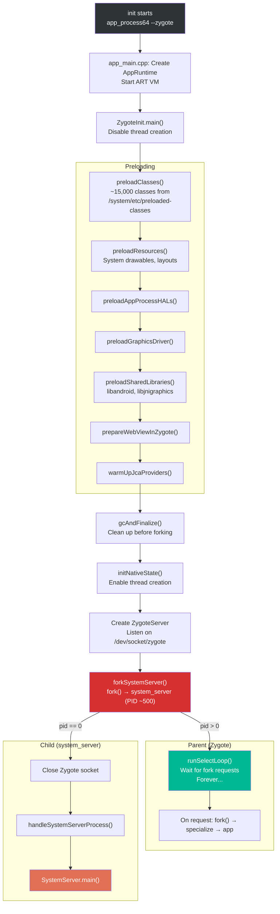

---

## 4.5 system_server Startup

The `system_server` process is the central hub of the Android framework. It hosts
over 100 system services that collectively provide the APIs and functionality that
applications depend on. The entry point is `SystemServer.java` at
`frameworks/base/services/java/com/android/server/SystemServer.java`.

### 4.5.1 SystemServer Entry Point

The `main()` method at line 710 is strikingly simple:

```java
// frameworks/base/services/java/com/android/server/SystemServer.java, lines 710-712
public static void main(String[] args) {
    new SystemServer().run();
}
```

The constructor (lines 714-727) records startup information:

```java
// frameworks/base/services/java/com/android/server/SystemServer.java, lines 714-727
public SystemServer() {
    // Check for factory test mode.
    mFactoryTestMode = FactoryTest.getMode();

    // Record process start information.
    mStartCount = SystemProperties.getInt(SYSPROP_START_COUNT, 0) + 1;
    mRuntimeStartElapsedTime = SystemClock.elapsedRealtime();
    mRuntimeStartUptime = SystemClock.uptimeMillis();

    // Remember if it's runtime restart or reboot.
    mRuntimeRestart = mStartCount > 1;
}
```

The `mStartCount` tracks how many times system_server has started since the last
reboot. A count greater than 1 indicates a runtime restart (system_server crashed
and was restarted by Zygote, which itself was restarted by init).

### 4.5.2 The run() Method: Bootstrap

The private `run()` method (lines 836-1083) contains the complete system_server
initialization sequence. It begins with critical setup:

```java
// frameworks/base/services/java/com/android/server/SystemServer.java, lines 836-953
private void run() {
    // ...
    t.traceBegin("InitBeforeStartServices");

    // Record the process start information in sys props.
    SystemProperties.set(SYSPROP_START_COUNT, String.valueOf(mStartCount));
    // ...

    // Here we go!
    Slog.i(TAG, "Entered the Android system server!");
    // ...

    // Mmmmmm... more memory!
    VMRuntime.getRuntime().clearGrowthLimit();

    // Ensure binder calls into the system always run at foreground priority.
    BinderInternal.disableBackgroundScheduling(true);

    // Increase the number of binder threads in system_server
    BinderInternal.setMaxThreads(sMaxBinderThreads);

    // Prepare the main looper thread (this thread).
    android.os.Process.setThreadPriority(
            android.os.Process.THREAD_PRIORITY_FOREGROUND);
    Looper.prepareMainLooper();
    // ...

    // Initialize native services.
    System.loadLibrary("android_servers");
    // ...

    // Initialize the system context.
    createSystemContext();
    // ...

    // Create the system service manager.
    mSystemServiceManager = new SystemServiceManager(mSystemContext);
```

Key setup steps:

- **`clearGrowthLimit()`**: Removes the heap growth limit, giving system_server
  access to all available heap memory
- **`setMaxThreads(31)`**: Sets the maximum Binder thread count to 31 (the constant
  `sMaxBinderThreads` at line 493), much higher than the default for regular apps
- **`Looper.prepareMainLooper()`**: Sets up the message loop for the main thread
- **`System.loadLibrary("android_servers")`**: Loads the native companion library
  containing JNI implementations for system services
- **`createSystemContext()`**: Creates the system-level `Context` used by services

### 4.5.3 The Four Service Start Phases

After initialization, `run()` starts services in four distinct phases (lines
1024-1044):

```java
// frameworks/base/services/java/com/android/server/SystemServer.java, lines 1024-1044
// Start services.
try {
    t.traceBegin("StartServices");
    // ...
    startBootstrapServices(t);
    startCoreServices(t);
    startOtherServices(t);
    startApexServices(t);
    // ...
    CriticalEventLog.getInstance().logSystemServerStarted();
} catch (Throwable ex) {
    Slog.e("System", "************ Failure starting system services", ex);
    throw ex;
}
```

After all services are started, system_server enters its main loop:

```java
// frameworks/base/services/java/com/android/server/SystemServer.java, lines 1080-1082
// Loop forever.
Looper.loop();
throw new RuntimeException("Main thread loop unexpectedly exited");
```

### 4.5.4 Bootstrap Services

The `startBootstrapServices()` method (lines 1176-1451) starts the services that
have complex mutual dependencies and must be initialized together. These are the
absolute foundation of the system:

```java
// frameworks/base/services/java/com/android/server/SystemServer.java, lines 1170-1175
/**
 * Starts the small tangle of critical services that are needed to get the
 * system off the ground.  These services have complex mutual dependencies
 * which is why we initialize them all in one place here.
 */
private void startBootstrapServices(@NonNull TimingsTraceAndSlog t) {
```

The bootstrap service start order (extracted from the actual source):

| Order | Service | Source Line | Purpose |
|---|---|---|---|
| 1 | ArtModuleServiceInitializer | 1187 | ART runtime integration |
| 2 | Watchdog | 1193 | Deadlock detection |
| 3 | ProtoLogConfigurationService | 1200 | ProtoLog framework |
| 4 | PlatformCompat | 1211 | App compatibility framework |
| 5 | FileIntegrityService | 1222 | File system integrity |
| 6 | Installer | 1229 | Package installation support |
| 7 | DeviceIdentifiersPolicyService | 1235 | Device ID access policy |
| 8 | FeatureFlagsService | 1241 | Runtime feature flags |
| 9 | UriGrantsManagerService | 1246 | Content URI permissions |
| 10 | PowerStatsService | 1250 | Power measurement |
| 11 | IStatsService | 1255 | Statistics collection (native) |
| 12 | MemtrackProxyService | 1261 | Memory tracking |
| 13 | AccessCheckingService | 1266 | Permission and AppOp management |
| 14 | ActivityTaskManagerService + ActivityManagerService | 1274-1283 | Activity lifecycle, process management |
| 15 | DataLoaderManagerService | 1287 | Incremental data loading |
| 16 | IncrementalService | 1293 | Incremental APK installation |
| 17 | PowerManagerService | 1301 | Power state management |
| 18 | ThermalManagerService | 1305 | Thermal monitoring |
| 19 | RecoverySystemService | 1316 | OTA and recovery |
| 20 | LightsService | 1327 | LED and backlight control |
| 21 | DisplayManagerService | 1340 | Display management |
| 22 | **PHASE_WAIT_FOR_DEFAULT_DISPLAY** | 1345 | *First boot phase checkpoint* |
| 23 | DomainVerificationService | 1357 | App link verification |
| 24 | PackageManagerService | 1363 | Package management |
| 25 | DexUseManagerLocal | 1377 | DEX file usage tracking |
| 26 | UserManagerService | 1397 | Multi-user management |
| 27 | OverlayManagerService | 1426 | Runtime resource overlays |
| 28 | SensorPrivacyService | 1437 | Sensor access control |
| 29 | SensorService | 1449 | Hardware sensor management |

Note the `PHASE_WAIT_FOR_DEFAULT_DISPLAY` at step 22 (line 1345):

```java
// frameworks/base/services/java/com/android/server/SystemServer.java, lines 1344-1346
// We need the default display before we can initialize the package manager.
t.traceBegin("WaitForDisplay");
mSystemServiceManager.startBootPhase(t, SystemService.PHASE_WAIT_FOR_DEFAULT_DISPLAY);
t.traceEnd();
```

This boot phase is a synchronization point: `PackageManagerService` needs display
metrics to properly handle resource selection, so it cannot start until the display
is available.

### 4.5.5 Core Services

The `startCoreServices()` method (lines 1457-1533) starts essential services that
do not have the complex interdependencies of bootstrap services:

| Order | Service | Purpose |
|---|---|---|
| 1 | SystemConfigService | System configuration |
| 2 | BatteryService | Battery level tracking |
| 3 | UsageStatsService | App usage statistics |
| 4 | WebViewUpdateService | WebView component updates |
| 5 | CachedDeviceStateService | Device state caching |
| 6 | BinderCallsStatsService | Binder call profiling |
| 7 | LooperStatsService | Handler message profiling |
| 8 | RollbackManagerService | APK rollback management |
| 9 | NativeTombstoneManagerService | Native crash tracking |
| 10 | BugreportManagerService | Bug report capture |
| 11 | GpuService | GPU driver management |
| 12 | RemoteProvisioningService | Remote key provisioning |

### 4.5.6 Other Services

The `startOtherServices()` method (lines 1539 onward) starts the remaining
~70+ system services. This is the longest method in all of SystemServer, starting
services like:

- WindowManagerService
- InputManagerService
- NetworkManagementService
- ConnectivityService
- NotificationManagerService
- LocationManagerService
- AudioService
- And many more

This method also starts APEX-delivered services and legacy Wear OS, TV, and
Automotive services based on device feature flags.

### 4.5.7 Boot Phase Progression

System services progress through well-defined boot phases. Each phase represents a
milestone in system readiness. Services can register to be notified when a phase is
reached, allowing them to perform additional initialization that depends on other
services being available.

```mermaid
flowchart LR
    P1["<b>PHASE_WAIT_FOR_<br/>DEFAULT_DISPLAY</b><br/>(100)<br/>Display available"]
    P2["<b>PHASE_LOCK_<br/>SETTINGS_READY</b><br/>(480)<br/>Lock screen ready"]
    P3["<b>PHASE_SYSTEM_<br/>SERVICES_READY</b><br/>(500)<br/>Core services ready"]
    P4["<b>PHASE_DEVICE_<br/>SPECIFIC_SERVICES_READY</b><br/>(520)<br/>Device services ready"]
    P5["<b>PHASE_ACTIVITY_<br/>MANAGER_READY</b><br/>(550)<br/>AMS ready"]
    P6["<b>PHASE_THIRD_PARTY_<br/>APPS_CAN_START</b><br/>(600)<br/>Apps can launch"]
    P7["<b>PHASE_BOOT_<br/>COMPLETED</b><br/>(1000)<br/>Boot done"]

    P1 --> P2 --> P3 --> P4 --> P5 --> P6 --> P7

    style P1 fill:#0984e3,color:#fff
    style P3 fill:#e17055,color:#fff
    style P6 fill:#00b894,color:#fff
    style P7 fill:#d63031,color:#fff
```

| Phase | Value | Description |
|---|---|---|
| `PHASE_WAIT_FOR_DEFAULT_DISPLAY` | 100 | Default display is available |
| `PHASE_LOCK_SETTINGS_READY` | 480 | Lock screen settings are available |
| `PHASE_SYSTEM_SERVICES_READY` | 500 | Core system services are ready for use |
| `PHASE_DEVICE_SPECIFIC_SERVICES_READY` | 520 | Device-specific services are ready |
| `PHASE_ACTIVITY_MANAGER_READY` | 550 | ActivityManagerService is ready to launch activities |
| `PHASE_THIRD_PARTY_APPS_CAN_START` | 600 | Third-party applications may be started |
| `PHASE_BOOT_COMPLETED` | 1000 | Boot is complete, all services running |

When `PHASE_BOOT_COMPLETED` is reached, the system property `sys.boot_completed` is
set to `1`, the boot animation is dismissed, and the home screen (launcher) activity
is started. This is the signal to all system components that the device is fully
operational.

### 4.5.8 The Boot Animation Lifecycle

The boot animation process (`bootanim`) is started as a service by init.rc and
runs a loop displaying either a default Android logo or a custom manufacturer
animation. It continues running until system_server signals completion by setting
the `service.bootanim.exit` property to `1`, which happens as part of reaching
`PHASE_BOOT_COMPLETED`.

### 4.5.9 Full system_server Boot Timeline

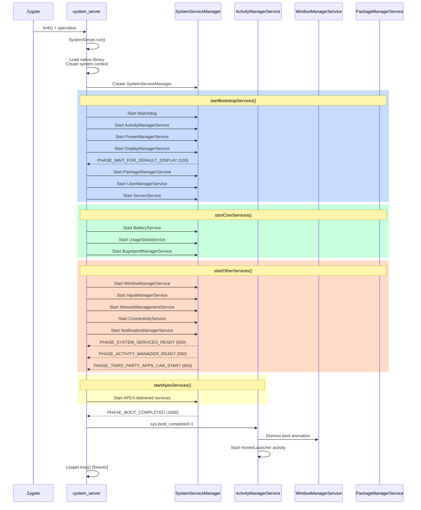

---

## 4.6 Try It: Add a Custom Init Service

Now that we understand the complete boot sequence, let us walk through a practical
exercise: adding a custom native daemon that starts during boot.

### 4.6.1 Step 1: Write the Native Daemon

Create a simple daemon that logs a message to the kernel log every few seconds.

Create the file `device/generic/car/mybootdaemon/mybootdaemon.cpp`:

```cpp
// device/generic/car/mybootdaemon/mybootdaemon.cpp
#include <android-base/logging.h>
#include <unistd.h>

int main(int /* argc */, char** argv) {
    // Initialize logging to the kernel log (kmsg).
    android::base::InitLogging(argv, &android::base::KernelLogger);

    LOG(INFO) << "mybootdaemon: Starting up!";

    // A real daemon would do useful work here.
    // This example simply logs heartbeat messages.
    int counter = 0;
    while (true) {
        LOG(INFO) << "mybootdaemon: heartbeat #" << counter++;
        sleep(10);
    }

    // Unreachable, but good practice.
    return 0;
}
```

### 4.6.2 Step 2: Create the Build File

Create `device/generic/car/mybootdaemon/Android.bp`:

```json
cc_binary {
    name: "mybootdaemon",
    srcs: ["mybootdaemon.cpp"],
    shared_libs: [
        "libbase",
        "liblog",
    ],
    init_rc: ["mybootdaemon.rc"],

    // Install to /system/bin
    vendor: false,
}
```

The `init_rc` field tells the build system to install our init.rc file alongside the
binary. The build system will place it at `/system/etc/init/mybootdaemon.rc`, which
is one of the directories that init parses during `LoadBootScripts()`.

### 4.6.3 Step 3: Create the init.rc File

Create `device/generic/car/mybootdaemon/mybootdaemon.rc`:

```
service mybootdaemon /system/bin/mybootdaemon
    class late_start
    user system
    group system log
    disabled
    oneshot

on property:sys.boot_completed=1
    start mybootdaemon
```

Let us examine each directive:

- **`service mybootdaemon`**: Declares the service name
- **`/system/bin/mybootdaemon`**: The executable path
- **`class late_start`**: Belongs to the `late_start` class, which starts after
  `zygote-start`
- **`user system`**: Run as the `system` user (UID 1000), not root
- **`group system log`**: Supplementary groups for system access and logging
- **`disabled`**: The service does not start automatically with its class -- it must
  be explicitly started
- **`oneshot`**: The service runs once and is not restarted if it exits

The `on property:sys.boot_completed=1` trigger starts our daemon after the system
has fully booted. This is the safest time to start custom daemons because all
system services are available.

### 4.6.4 Step 4: Add the SELinux Policy

For a real device, you must create SELinux policy for your daemon. Without it,
SELinux will deny all operations and your daemon will fail to function.

Create `device/generic/car/sepolicy/private/mybootdaemon.te`:

```
# Define the mybootdaemon domain
type mybootdaemon, domain;
type mybootdaemon_exec, exec_type, file_type, system_file_type;

# Allow init to transition to our domain when starting the service
init_daemon_domain(mybootdaemon)

# Allow basic logging
allow mybootdaemon kmsg_device:chr_file { open write };

# Allow reading system properties
get_prop(mybootdaemon, default_prop)
```

And add the file context in `device/generic/car/sepolicy/private/file_contexts`:

```
/system/bin/mybootdaemon      u:object_r:mybootdaemon_exec:s0
```

### 4.6.5 Step 5: Build and Test

Add the module to your device makefile (e.g., `device/generic/car/device.mk`):

```makefile
PRODUCT_PACKAGES += mybootdaemon
```

Build the system image:

```bash
source build/envsetup.sh
lunch <your_target>
m mybootdaemon
```

For a full system image build:

```bash
m
```

### 4.6.6 Step 6: Verify

After flashing the image or booting the emulator:

```bash
# Check that the service is defined
adb shell getprop init.svc.mybootdaemon
# Expected: "running" (after boot completes)

# Check the service status
adb shell service list | grep mybootdaemon

# View the daemon's log output
adb shell dmesg | grep mybootdaemon
# Expected output:
# mybootdaemon: Starting up!
# mybootdaemon: heartbeat #0
# mybootdaemon: heartbeat #1

# Manually stop and start the service
adb shell setprop ctl.stop mybootdaemon
adb shell getprop init.svc.mybootdaemon
# Expected: "stopped"

adb shell setprop ctl.start mybootdaemon
adb shell getprop init.svc.mybootdaemon
# Expected: "running"
```

### 4.6.7 Common Pitfalls

**Problem: Service fails to start with "permission denied"**

This is almost always a SELinux issue. Check the audit log:

```bash
adb shell dmesg | grep "avc: denied"
```

Use `audit2allow` to generate the necessary policy rules.

**Problem: Service starts but immediately exits**

Check if init is killing the service. Look for the `SVC_RESTARTING` flag:

```bash
adb shell getprop init.svc.mybootdaemon
```

If it shows "restarting", your service is crashing. Check logcat and dmesg for
crash information. If your service is `oneshot` and exits normally, the status will
be "stopped" -- this is expected behavior.

**Problem: Service starts before a dependency is ready**

Use property triggers to gate startup. For example, to wait for the network stack:

```
on property:sys.boot_completed=1 && property:init.svc.netd=running
    start mybootdaemon
```

**Problem: Service runs as wrong SELinux context**

Verify the file context:

```bash
adb shell ls -Z /system/bin/mybootdaemon
# Expected: u:object_r:mybootdaemon_exec:s0
```

And verify the process context:

```bash
adb shell ps -eZ | grep mybootdaemon
# Expected: u:r:mybootdaemon:s0
```

### 4.6.8 Understanding Service States

Init tracks each service through a set of state flags. Understanding these states
is critical for debugging service startup issues:

| State | Property Value | Meaning |
|---|---|---|
| `stopped` | `init.svc.<name>=stopped` | Service is not running |
| `starting` | `init.svc.<name>=starting` | Service is being started |
| `running` | `init.svc.<name>=running` | Service is running |
| `stopping` | `init.svc.<name>=stopping` | Service is being stopped |
| `restarting` | `init.svc.<name>=restarting` | Service will restart after a delay |

The state machine:

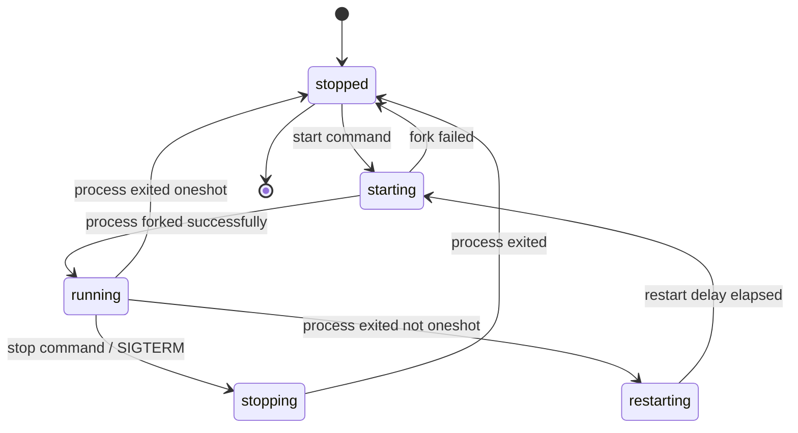

The restart delay (default: 5 seconds) prevents a crashing service from consuming
all CPU by restarting in a tight loop. This delay can be customized per-service
with the `restart_period` option.

The `HandleProcessActions()` function (init.cpp lines 390-418) drives the restart
logic:

```cpp
// system/core/init/init.cpp, lines 390-418
static std::optional<boot_clock::time_point> HandleProcessActions() {
    std::optional<boot_clock::time_point> next_process_action_time;
    for (const auto& s : ServiceList::GetInstance()) {
        if ((s->flags() & SVC_RUNNING) && s->timeout_period()) {
            auto timeout_time = s->time_started() + *s->timeout_period();
            if (boot_clock::now() > timeout_time) {
                s->Timeout();
            } else {
                if (!next_process_action_time ||
                    timeout_time < *next_process_action_time) {
                    next_process_action_time = timeout_time;
                }
            }
        }

        if (!(s->flags() & SVC_RESTARTING)) continue;

        auto restart_time = s->time_started() + s->restart_period();
        if (boot_clock::now() > restart_time) {
            if (auto result = s->Start(); !result.ok()) {
                LOG(ERROR) << "Could not restart process '" << s->name()
                           << "': " << result.error();
            }
        } else {
            if (!next_process_action_time ||
                restart_time < *next_process_action_time) {
                next_process_action_time = restart_time;
            }
        }
    }
    return next_process_action_time;
}
```

This function iterates over all services, checking for two conditions:

1. **Timeout**: If a running service has a `timeout_period` and has exceeded it, the
   service is killed
2. **Restart**: If a service is in the `SVC_RESTARTING` state and the restart delay
   has elapsed, the service is restarted

The function returns the next time it needs to run, which is used to set the epoll
timeout in the main loop.

### 4.6.9 Advanced: Making a Persistent Daemon

To create a daemon that is automatically restarted by init if it crashes, modify
the rc file:

```
service mybootdaemon /system/bin/mybootdaemon
    class late_start
    user system
    group system log

on property:sys.boot_completed=1
    enable mybootdaemon
    class_start late_start
```

Without the `oneshot` directive, init will automatically restart the service if it
exits. The `enable` command is used instead of `start` to allow the service to start
with its class.

For critical services that should trigger a device reboot if they crash too many
times:

```
service mybootdaemon /system/bin/mybootdaemon
    class late_start
    user system
    group system log
    critical
```

The `critical` directive tells init to reboot the device if the service crashes more
than four times in four minutes. This is the same mechanism used for Zygote itself.

---

## 4.7 Deep Dive: The init.rc Language

This section provides a comprehensive reference for the init.rc language, which
every Android platform developer needs to understand.

### 4.7.1 Sections

Init.rc files consist of three types of sections:

**Actions** begin with the `on` keyword:

```
on <trigger> [&& <trigger>]*
    <command>
    <command>
    ...
```

**Services** begin with the `service` keyword:

```
service <name> <pathname> [ <argument> ]*
    <option>
    <option>
    ...
```

**Imports** bring in additional rc files:

```
import <path>
```

Imports are processed after all sections in the current file are parsed. Property
expansion (`${property.name}`) works in import paths, allowing hardware-specific
configuration: `import /init.${ro.hardware}.rc`.

### 4.7.2 Trigger Types

Init supports several trigger types:

**Boot triggers** fire once during the boot sequence:

| Trigger | When it fires |
|---|---|
| `early-init` | Very early in boot, before most setup |
| `init` | After basic device setup |
| `late-init` | Main boot orchestrator trigger |
| `early-fs` | Before filesystem mounts |
| `fs` | Filesystem mount phase |
| `post-fs` | After /system and /vendor are mounted |
| `late-fs` | Late filesystem mount phase |
| `post-fs-data` | After /data is mounted |
| `zygote-start` | Time to start Zygote |
| `boot` | System is ready for services |
| `charger` | Device is in charger-only mode |

**Property triggers** fire when a property matches a value:

```
on property:ro.debuggable=1
    start adbd

on property:vold.decrypt=trigger_restart_framework
    start surfaceflinger
    start zygote
```

**Compound triggers** combine boot and property triggers:

```
on boot && property:ro.config.low_ram=true
    write /proc/sys/vm/dirty_expire_centisecs 200
    write /proc/sys/vm/dirty_background_ratio 5
```

All conditions in a compound trigger must be true for the action to execute. When
a property trigger is part of a compound trigger, the action fires when the property
changes to the specified value AND all other conditions are met.

### 4.7.3 The init Trigger: System Configuration

The `init` trigger (at line 106 of `system/core/rootdir/init.rc`) performs foundational
system configuration. Here is the full action with annotations:

```
# system/core/rootdir/init.rc, lines 106-184 (selected)
on init
    sysclktz 0

    # Mix device-specific information into the entropy pool
    copy /proc/cmdline /dev/urandom
    copy /proc/bootconfig /dev/urandom

    symlink /proc/self/fd/0 /dev/stdin
    symlink /proc/self/fd/1 /dev/stdout
    symlink /proc/self/fd/2 /dev/stderr

    # cpuctl hierarchy for devices using utilclamp
    mkdir /dev/cpuctl/foreground
    mkdir /dev/cpuctl/background
    mkdir /dev/cpuctl/top-app
    mkdir /dev/cpuctl/rt
    mkdir /dev/cpuctl/system
    mkdir /dev/cpuctl/system-background
    mkdir /dev/cpuctl/dex2oat
```

This action sets the system clock timezone, seeds the entropy pool with boot
information (improving the quality of random numbers early in boot), creates standard
I/O symlinks, and sets up CPU control group hierarchies used for process scheduling.

The CPU control groups (foreground, background, top-app, etc.) are critical for
Android's process scheduling. ActivityManagerService later assigns processes to these
groups based on their importance, ensuring that foreground apps get more CPU time
than background processes.

### 4.7.4 Service Options Reference

The complete set of service options available in init.rc:

| Option | Example | Description |
|---|---|---|
| `class <name>` | `class main` | Service class for group start/stop |
| `user <name>` | `user system` | Run as this user |
| `group <name> [<name>]*` | `group system inet` | Primary and supplementary groups |
| `capabilities <cap>+` | `capabilities NET_ADMIN NET_RAW` | Linux capabilities to retain |
| `socket <name> <type> <perm> [user [group]]` | `socket zygote stream 660 root system` | Create a UNIX domain socket |
| `file <path> <type>` | `file /dev/kmsg w` | Open a file descriptor |
| `onrestart <command>` | `onrestart restart audioserver` | Command to run on restart |
| `oneshot` | | Do not restart when process exits |
| `disabled` | | Do not auto-start with class |
| `critical [window=<min>] [target=<target>]` | `critical window=10 target=zygote-fatal` | Reboot if crashes too often |
| `priority <int>` | `priority -20` | Scheduling priority (-20 to 19) |
| `oom_score_adjust <int>` | `oom_score_adjust -1000` | OOM killer score adjustment |
| `namespace <ns>` | `namespace mnt` | Run in a mount namespace |
| `seclabel <label>` | `seclabel u:r:healthd:s0` | SELinux security label |
| `writepid <file>+` | `writepid /dev/cpuset/system/tasks` | Write PID to these files |
| `task_profiles <profile>+` | `task_profiles ProcessCapacityHigh` | Apply cgroup/task profiles |
| `interface <name> <instance>` | `interface aidl android.hardware.power.IPower/default` | Register an interface |
| `stdio_to_kmsg` | | Redirect stdout/stderr to kmsg |
| `enter_namespace <ns> <path>` | `enter_namespace net /proc/1/ns/net` | Enter an existing namespace |
| `gentle_kill` | | Send SIGTERM before SIGKILL on stop |
| `shutdown <behavior>` | `shutdown critical` | Behavior during system shutdown |
| `restart_period <seconds>` | `restart_period 5` | Minimum time between restarts |
| `timeout_period <seconds>` | `timeout_period 10` | Kill service after N seconds |
| `updatable` | | Service can be overridden by APEX |
| `sigstop` | | Send SIGSTOP after fork (for debugger attach) |

### 4.7.5 Service Classes

Services are grouped into classes, allowing init to start or stop groups of services
at once. The standard classes are:

| Class | Purpose | Started by |
|---|---|---|
| `core` | Core services needed before zygote | `on post-fs-data` / `class_start core` |
| `main` | Main services including Zygote | `on zygote-start` / `class_start main` |
| `late_start` | Services that start after boot | `on boot` / `class_start late_start` |
| `hal` | Hardware abstraction layer services | Device-specific triggers |
| `early_hal` | HAL services needed early | Before `late-init` |

When `class_start main` is executed, all services with `class main` that are not
`disabled` will be started. Similarly, `class_stop main` stops all services in that
class.

### 4.7.6 Ueventd: Device Node Management

As mentioned in section 3.3.1, when init is invoked with the name `ueventd`, it
becomes the device node manager. Ueventd listens for kernel uevents and creates
device nodes in `/dev/` with appropriate permissions.

Ueventd's configuration is in `ueventd.rc` files. These define ownership and
permissions for device nodes:

```
# Example ueventd rules
/dev/null                 0666   root       root
/dev/zero                 0666   root       root
/dev/full                 0666   root       root
/dev/random               0666   root       root
/dev/urandom              0666   root       root
/dev/ashmem               0666   root       root
/dev/binder               0666   root       root
/dev/hwbinder             0666   root       root
/dev/vndbinder            0666   root       root
```

### 4.7.7 init.rc Processing Order

Understanding the processing order of init.rc files is critical for debugging boot
issues. The complete order is:

1. `/system/etc/init/hw/init.rc` is parsed first
2. All `import` statements in `init.rc` are collected (but not processed yet)
3. Files in `/system/etc/init/` are parsed (alphabetical order)
4. Files in `/system_ext/etc/init/` are parsed
5. Files in `/vendor/etc/init/` are parsed
6. Files in `/odm/etc/init/` are parsed
7. Files in `/product/etc/init/` are parsed
8. All collected `import` statements are processed (recursively)

Within each directory, `.rc` files are processed in alphabetical order. This means
that naming your rc file with a numeric prefix (e.g., `01-myservice.rc`) can
influence processing order, though relying on this is discouraged.

---

## 4.8 Deep Dive: Property Service Internals

The property service is one of the most heavily used IPC mechanisms during boot. This
section examines its implementation in detail.

### 4.8.1 Property Storage

Android properties are stored in shared memory regions mapped at
`/dev/__properties__/`. The property area is organized as a trie (prefix tree) for
efficient lookup. Each property area file is memory-mapped into every process that
reads properties, making reads extremely fast (no IPC needed).

The property storage is initialized in `PropertyInit()`, which is called from
`SecondStageMain()` in `init.cpp` (line 1108). The property info area
(`/dev/__properties__/property_info`) describes the trie structure and is parsed by
`property_info_area` (defined in `property_service.cpp` line 116):

```cpp
// system/core/init/property_service.cpp, line 116
[[clang::no_destroy]] static PropertyInfoAreaFile property_info_area;
```

### 4.8.2 Property Set Flow

When a process calls `SystemProperties.set()` (Java) or `__system_property_set()`
(native), the request flows through a UNIX domain socket to the property service
thread running inside the init process. The flow is:

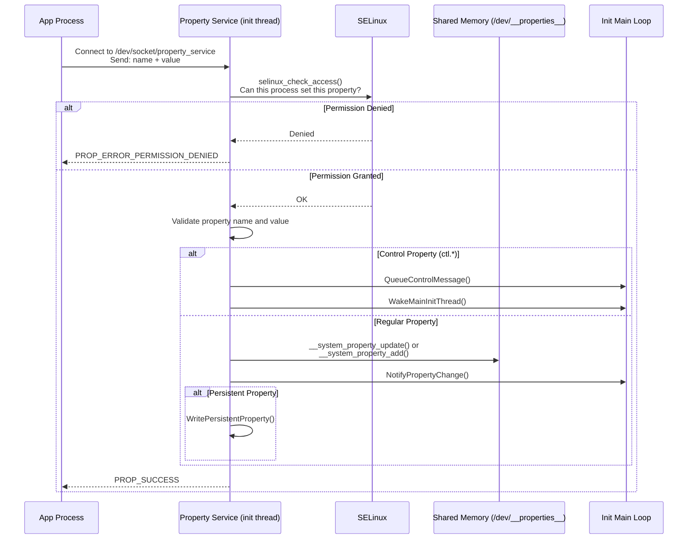

### 4.8.3 SELinux Property Access Control

Every property set operation is checked against SELinux policy. The
`CheckMacPerms()` function (lines 162-176 of `property_service.cpp`) performs this
check:

```cpp
// system/core/init/property_service.cpp, lines 162-176
static bool CheckMacPerms(const std::string& name, const char* target_context,
                          const char* source_context, const ucred& cr) {
    if (!target_context || !source_context) {
        return false;
    }

    PropertyAuditData audit_data;
    audit_data.name = name.c_str();
    audit_data.cr = &cr;

    auto lock = std::lock_guard{selinux_check_access_lock};
    return selinux_check_access(source_context, target_context,
                                "property_service", "set",
                                &audit_data) == 0;
}
```

The property info area maps property names to SELinux contexts. For example,
`ro.build.*` properties might map to `build_prop`, while `persist.sys.*` might map
to `system_prop`. Each context has separate SELinux rules controlling which domains
can read or write properties with that context.

The audit callback (lines 123-134) provides detailed logging for SELinux denials:

```cpp
// system/core/init/property_service.cpp, lines 123-134
static int PropertyAuditCallback(void* data, security_class_t /*cls*/,
                                  char* buf, size_t len) {
    auto* d = reinterpret_cast<PropertyAuditData*>(data);

    if (!d || !d->name || !d->cr) {
        LOG(ERROR) << "AuditCallback invoked with null data arguments!";
        return 0;
    }

    snprintf(buf, len, "property=%s pid=%d uid=%d gid=%d",
             d->name, d->cr->pid, d->cr->uid, d->cr->gid);
    return 0;
}
```

### 4.8.4 The Property Service Thread

The property service runs in its own thread, separate from init's main loop. This
design is important: property set requests can arrive at any time from any process,
and handling them in the main loop would delay action execution. The
`SocketConnection` class (starting at line 223) handles the wire protocol for
property requests:

```cpp
// system/core/init/property_service.cpp, lines 223-226
class SocketConnection {
  public:
    SocketConnection() = default;
    SocketConnection(int socket, const ucred& cred) : socket_(socket), cred_(cred) {}
```

Each connection receives the caller's credentials (`ucred`) through the UNIX socket,
which provides the PID, UID, and GID of the calling process. These credentials,
combined with the SELinux context, determine whether the property set is allowed.

### 4.8.5 Persistent Properties

Properties with the `persist.` prefix are stored persistently on disk under
`/data/property/`. They survive reboots. The write is handled asynchronously to
avoid blocking property set calls on disk I/O:

```cpp
// system/core/init/property_service.cpp, lines 414-423
bool need_persist = StartsWith(name, "persist.") || StartsWith(name, "next_boot.");
if (socket && persistent_properties_loaded && need_persist) {
    if (persist_write_thread) {
        persist_write_thread->Write(name, value, std::move(*socket));
        return {};
    }
    WritePersistentProperty(name, value);
}
```

Properties with the `next_boot.` prefix are also persisted, but they are applied
on the next boot rather than immediately.

### 4.8.6 Property Change Notification

When a property changes, all interested parties are notified. The
`NotifyPropertyChange()` function (lines 178-185) bridges the property service thread
and init's main loop:

```cpp
// system/core/init/property_service.cpp, lines 178-185
void NotifyPropertyChange(const std::string& name, const std::string& value) {
    auto lock = std::lock_guard{accept_messages_lock};
    if (accept_messages) {
        PropertyChanged(name, value);
    }
}
```

This calls `PropertyChanged()` in `init.cpp`, which queues property triggers and
wakes the main thread. The wake-up mechanism uses an eventfd, as shown in
`InstallInitNotifier()` (init.cpp lines 143-156):

```cpp
// system/core/init/init.cpp, lines 143-156
static void InstallInitNotifier(Epoll* epoll) {
    wake_main_thread_fd = eventfd(0, EFD_CLOEXEC);
    if (wake_main_thread_fd == -1) {
        PLOG(FATAL) << "Failed to create eventfd for waking init";
    }
    auto clear_eventfd = [] {
        uint64_t counter;
        TEMP_FAILURE_RETRY(read(wake_main_thread_fd, &counter, sizeof(counter)));
    };

    if (auto result = epoll->RegisterHandler(wake_main_thread_fd, clear_eventfd);
        !result.ok()) {
        LOG(FATAL) << result.error();
    }
}
```

---

## 4.9 Deep Dive: system_server Service Categories

The system_server starts well over 100 services. Understanding the categories and
key services is essential for platform developers.

### 4.9.1 startOtherServices: The Bulk of the Framework

The `startOtherServices()` method in `SystemServer.java` (starting at line 1539) is
the longest method in the class. It starts the "grab bag" of services that constitute
the Android framework. Here is a detailed breakdown of the key services started in
this method:

**Input and Display Services (lines ~1707-1765):**

```java
// frameworks/base/services/java/com/android/server/SystemServer.java
t.traceBegin("StartInputManagerService");
inputManager = mSystemServiceManager.startService(
        InputManagerService.Lifecycle.class).getService();
t.traceEnd();

t.traceBegin("StartWindowManagerService");
mSystemServiceManager.startBootPhase(t, SystemService.PHASE_WAIT_FOR_SENSOR_SERVICE);
wm = WindowManagerService.main(context, inputManager, !mFirstBoot,
        new PhoneWindowManager(), mActivityManagerService.mActivityTaskManager);
ServiceManager.addService(Context.WINDOW_SERVICE, wm, /* allowIsolated= */ false,
        DUMP_FLAG_PRIORITY_CRITICAL | DUMP_FLAG_PRIORITY_HIGH | DUMP_FLAG_PROTO);
t.traceEnd();
```

Note the `PHASE_WAIT_FOR_SENSOR_SERVICE` boot phase gate -- WindowManagerService
needs the sensor service (for rotation detection) before it can fully initialize.

**Storage and Content Services:**

```java
t.traceBegin("StartStorageManagerService");
mSystemServiceManager.startService(StorageManagerService.Lifecycle.class);
storageManager = IStorageManager.Stub.asInterface(
        ServiceManager.getService("mount"));
t.traceEnd();
```

StorageManagerService must start before NotificationManagerService because
notifications about USB connections and storage events depend on it.

**Connectivity Services:**

The networking stack is particularly complex, with multiple interdependent services:

```java
t.traceBegin("StartBluetoothService");
mSystemServiceManager.startServiceFromJar(BLUETOOTH_SERVICE_CLASS,
    BLUETOOTH_APEX_SERVICE_JAR_PATH);
t.traceEnd();

t.traceBegin("IpConnectivityMetrics");
mSystemServiceManager.startService(IpConnectivityMetrics.class);
t.traceEnd();
```

Bluetooth is loaded from an APEX jar (`/apex/com.android.bt/javalib/service-bluetooth.jar`),
demonstrating how modular system services have become.

### 4.9.2 APEX-Delivered Services

Modern Android delivers many system services through APEX packages. The
`startApexServices()` method starts services that come from updatable APEX modules:

| APEX Module | Service Class | Purpose |
|---|---|---|
| `com.android.os.statsd` | `StatsCompanion` | Statistics collection |
| `com.android.scheduling` | `RebootReadinessManagerService` | Safe reboot scheduling |
| `com.android.wifi` | `WifiService`, `WifiScanningService` | WiFi management |
| `com.android.tethering` | `ConnectivityServiceInitializer` | Network connectivity |
| `com.android.uwb` | `UwbService` | Ultra-wideband |
| `com.android.bt` | `BluetoothService` | Bluetooth |
| `com.android.devicelock` | `DeviceLockService` | Device lock/unlock |
| `com.android.profiling` | `ProfilingService` | System profiling |

These services are loaded from JAR files inside their respective APEX mounts under
`/apex/`. For example:

```java
// frameworks/base/services/java/com/android/server/SystemServer.java
private static final String WIFI_APEX_SERVICE_JAR_PATH =
        "/apex/com.android.wifi/javalib/service-wifi.jar";
private static final String WIFI_SERVICE_CLASS =
        "com.android.server.wifi.WifiService";
```

### 4.9.3 Safe Mode Detection

Before starting the bulk of other services, WindowManagerService checks for safe
mode (line 1851):

```java
// frameworks/base/services/java/com/android/server/SystemServer.java, lines 1849-1862
final boolean safeMode = wm.detectSafeMode();
if (safeMode) {
    Settings.Global.putInt(context.getContentResolver(),
            Settings.Global.AIRPLANE_MODE_ON, 1);
}
```

Safe mode is triggered when the user holds certain buttons during boot. In safe
mode, third-party apps are disabled, and airplane mode is automatically enabled.

### 4.9.4 Service Start Timing Constraints

The system_server uses a `SystemServerInitThreadPool` to parallelize initialization
where possible. For example, the secondary Zygote preload and HIDL service
initialization run in background threads:

```java
// frameworks/base/services/java/com/android/server/SystemServer.java, lines 1750-1755
SystemServerInitThreadPool.submit(() -> {
    TimingsTraceAndSlog traceLog = TimingsTraceAndSlog.newAsyncLog();
    traceLog.traceBegin(START_HIDL_SERVICES);
    startHidlServices();
    traceLog.traceEnd();
}, START_HIDL_SERVICES);
```

However, parallelization is constrained by the Watchdog: if a thread holds a lock
for too long, the Watchdog will kill system_server. The Watchdog is started as the
very first bootstrap service (line 1193) to ensure it can detect deadlocks from the
earliest possible point.

### 4.9.5 The Final Handoff

When all services are started and boot phases are complete, system_server enters its
main Looper (line 1081):

```java
// frameworks/base/services/java/com/android/server/SystemServer.java, lines 1080-1082
// Loop forever.
Looper.loop();
throw new RuntimeException("Main thread loop unexpectedly exited");
```

The `Looper.loop()` call never returns under normal operation. The main thread
processes messages from various system services, including ActivityManagerService's
handler messages, WindowManagerService display updates, and more. If the main loop
exits, the RuntimeException at line 1082 causes system_server to crash, which
triggers Zygote to restart, which triggers init to restart Zygote -- the entire Java
framework reboots.

---

## 4.10 Boot Time Measurement and Optimization

Understanding boot performance is essential for platform developers. Android provides
built-in tools for measuring and optimizing boot time.

### 4.10.1 Boot Time Properties

Init records timing information in system properties:

| Property | Description |
|---|---|
| `ro.boottime.init` | Timestamp when first-stage init started |
| `ro.boottime.init.first_stage` | Duration of first-stage init |
| `ro.boottime.init.selinux` | Duration of SELinux setup |
| `ro.boottime.init.modules` | Duration of kernel module loading |
| `ro.boottime.init.cold_boot_wait` | Time init waited for ueventd |

These are set in `RecordStageBoottimes()` (init.cpp lines 885-912):

```cpp
// system/core/init/init.cpp, lines 885-912
static void RecordStageBoottimes(const boot_clock::time_point& second_stage_start_time) {
    int64_t first_stage_start_time_ns = -1;
    if (auto first_stage_start_time_str = getenv(kEnvFirstStageStartedAt);
        first_stage_start_time_str) {
        SetProperty("ro.boottime.init", first_stage_start_time_str);
        android::base::ParseInt(first_stage_start_time_str, &first_stage_start_time_ns);
    }
    // ...
    SetProperty("ro.boottime.init.first_stage",
                std::to_string(selinux_start_time_ns - first_stage_start_time_ns));
    SetProperty("ro.boottime.init.selinux",
                std::to_string(second_stage_start_time.time_since_epoch().count() -
                               selinux_start_time_ns));
    if (auto init_module_time_str = getenv(kEnvInitModuleDurationMs);
        init_module_time_str) {
        SetProperty("ro.boottime.init.modules", init_module_time_str);
        unsetenv(kEnvInitModuleDurationMs);
    }
}
```

### 4.10.2 Bootchart

Android supports bootchart, a tool that records CPU, disk I/O, and process activity
during boot. Bootchart is started via init.rc:

```
# system/core/rootdir/init.rc, line 670-671
mkdir /data/bootchart 0755 shell shell encryption=Require
bootchart start
```

To capture a bootchart:

```bash
# Enable bootchart (requires userdebug/eng build)
adb shell touch /data/bootchart/enabled

# Reboot the device
adb reboot

# After boot, pull the data
adb shell tar -czf /data/local/tmp/bootchart.tgz /data/bootchart/
adb pull /data/local/tmp/bootchart.tgz
```

### 4.10.3 systrace/Perfetto Boot Tracing

Android's tracing infrastructure (Perfetto) can capture boot traces. system_server
uses `TimingsTraceAndSlog` throughout its initialization to record precise timing
for each service start:

```java
// Example from SystemServer.java
t.traceBegin("StartActivityManager");
// ... start AMS ...
t.traceEnd();
```

These traces can be captured with:

```bash
# Capture a boot trace
adb shell atrace --async_start -b 32768 -c am wm dalvik
adb reboot
# After boot:
adb shell atrace --async_dump -o /data/local/tmp/boot_trace
adb pull /data/local/tmp/boot_trace
```

### 4.10.4 Boot Monitor

For debuggable builds, init supports a boot timeout monitor that triggers a kernel
panic if boot does not complete within a specified time. This is configured via the
`ro.boot.boot_timeout` property and implemented in `StartSecondStageBootMonitor()`
(init.cpp lines 1022-1046):

```cpp
// system/core/init/init.cpp, lines 1022-1046
static void SecondStageBootMonitor(int timeout_sec) {
    auto cur_time = boot_clock::now().time_since_epoch();
    int cur_sec = std::chrono::duration_cast<std::chrono::seconds>(cur_time).count();
    int extra_sec = timeout_sec <= cur_sec ? 0 : timeout_sec - cur_sec;
    auto boot_timeout = std::chrono::seconds(extra_sec);

    LOG(INFO) << "Started BootMonitorThread, expiring in " << timeout_sec
              << " seconds from boot-up";

    if (!WaitForProperty("sys.boot_completed", "1", boot_timeout)) {
        LOG(ERROR) << "BootMonitorThread: boot didn't complete in " << timeout_sec
                   << " seconds. Trigger a panic!";
        std::this_thread::sleep_for(200ms);
        // trigger a kernel panic
        WriteStringToFile("c", PROC_SYSRQ);
    }
}
```

This safety net is invaluable during development: if a code change causes an infinite
boot loop, the device will eventually panic and (on devices with
`REBOOT_BOOTLOADER_ON_PANIC` enabled) reboot into the bootloader, allowing the
developer to flash a fixed image.

### 4.10.5 Common Boot Optimization Techniques

1. **Parallel kernel module loading**: Set `androidboot.load_modules_parallel=true`
   in bootconfig to enable parallel module loading during first-stage init

2. **Lazy Zygote preloading**: The secondary (32-bit) Zygote uses
   `--enable-lazy-preload` to defer class preloading until first use

3. **SystemServerInitThreadPool**: system_server parallelizes service initialization
   using a thread pool for independent services

4. **APEX preloading**: Pre-creating loop devices accelerates APEX mounting (see
   `InitExtraDevices()` in init.cpp lines 869-883):

```cpp
// system/core/init/init.cpp, lines 869-883
static void InitExtraDevices() {
    if constexpr (com::android::apex::flags::mount_before_data()) {
        constexpr int kMaxLoopDevices = 128;
        std::thread([]() {
            dm::LoopControl loop_control;
            for (int i = 0; i < kMaxLoopDevices; i++) {
                (void)loop_control.Add(i);
            }
        }).detach();
    }
}
```

5. **Bootchart analysis**: Use bootchart to identify the longest-running boot steps
   and optimize them

---

## 4.11 Debugging Boot Issues

### 4.11.1 Accessing Boot Logs

If the device is not booting, use these methods to access boot logs:

**Kernel log (dmesg)**:
```bash
adb shell dmesg > dmesg.log
```

**Last boot log (if device booted at least once)**:
```bash
adb shell cat /sys/fs/pstore/console-ramoops-0
```

**Init log**:
```bash
adb shell logcat -b all -d | grep "init: "
```

**Service status**:
```bash
adb shell getprop | grep "init.svc."
```

### 4.11.2 Common Boot Failures

**"Failed to mount required partitions early"**

This occurs in first-stage init when `DoFirstStageMount()` fails. Common causes:

- Corrupted fstab
- dm-verity failure (corrupted system image)
- Missing block device (storage driver not loaded)

**"SELinux: Could not load policy"**

SELinux policy failed to load during the selinux_setup phase. Common causes:

- Mismatched system/vendor SELinux policy versions
- Corrupted precompiled_sepolicy
- Missing policy files

**"Zygote: Unable to determine ABI list"**

The `ro.product.cpu.abilist` property is not set. This typically indicates a
problem with property loading or a missing `build.prop` file.

**Service crashes in a loop**

If a service with the `critical` flag crashes repeatedly, init will reboot the
device. Check logcat for crash traces and use `adb shell getprop init.svc.<name>`
to monitor service state.

### 4.11.3 First-Stage Console

For debugging first-stage init failures, you can enable a console. Add
`androidboot.first_stage_console=1` to the kernel command line or bootconfig. This
drops into a shell before first-stage mount, allowing you to inspect the early boot
environment.

The console support is in `first_stage_init.cpp` (lines 437-476):

```cpp
// system/core/init/first_stage_init.cpp, lines 437-438
auto want_console = ALLOW_FIRST_STAGE_CONSOLE ?
    FirstStageConsole(cmdline, bootconfig) : 0;
```

### 4.11.4 Using adb to Debug init.rc

Check which triggers have fired and which services are running:

```bash
# List all services and their states
adb shell getprop | grep init.svc

# Check if a specific trigger has fired (via property)
adb shell getprop sys.boot_completed

# Dump init's internal state
adb shell kill -3 1  # Send SIGQUIT to init (PID 1)
# State will be dumped to the kernel log
adb shell dmesg | tail -100
```

---

## 4.12 Deep Dive: Signal Handling in init

Since init is PID 1, it has unique responsibilities with respect to signal handling.
If PID 1 exits, the kernel panics. Therefore, init must be extremely careful about
how it handles signals.

### 4.12.1 SIGCHLD: Child Process Death

When any child process dies, init receives SIGCHLD. This is how init knows to
restart services. The signal handling setup is in `InstallSignalFdHandler()`
(init.cpp lines 782-808):

```cpp
// system/core/init/init.cpp, lines 782-808
static void InstallSignalFdHandler(Epoll* epoll) {
    // Applying SA_NOCLDSTOP to a defaulted SIGCHLD handler prevents the
    // signalfd from receiving SIGCHLD when a child process stops or
    // continues (b/77867680#comment9).
    const struct sigaction act {
        .sa_flags = SA_NOCLDSTOP, .sa_handler = SIG_DFL
    };
    sigaction(SIGCHLD, &act, nullptr);

    // Register a handler to unblock signals in the child processes.
    const int result = pthread_atfork(nullptr, nullptr, &UnblockSignals);
    if (result != 0) {
        LOG(FATAL) << "Failed to register a fork handler: " << strerror(result);
    }

    Result<void> cs_result = RegisterSignalFd(epoll, SIGCHLD, Service::GetSigchldFd());
    if (!cs_result.ok()) {
        PLOG(FATAL) << cs_result.error();
    }

    if (!IsRebootCapable()) {
        Result<int> cs_result = CreateAndRegisterSignalFd(epoll, SIGTERM);
        if (!cs_result.ok()) {
            PLOG(FATAL) << cs_result.error();
        }
        sigterm_fd = cs_result.value();
    }
}
```

Key design decisions:

1. **SA_NOCLDSTOP**: Only receive SIGCHLD when children terminate, not when they
   stop/continue. This prevents spurious wake-ups when processes are debugged with
   SIGSTOP.

2. **pthread_atfork**: Registers `UnblockSignals()` as a post-fork handler. This
   ensures that child processes created by `fork()` from init have normal signal
   handling, rather than inheriting init's blocked signal mask.

3. **signalfd**: Instead of using traditional signal handlers (which are inherently
   racy), init uses `signalfd` to convert signals into file descriptor events that
   can be multiplexed with `epoll()`. This allows signal handling to be integrated
   cleanly into init's event loop.

### 4.12.2 SIGTERM: Container Shutdown

In container environments (where init is not running as the root PID namespace),
SIGTERM is used to request graceful shutdown. From lines 713-721:

```cpp
// system/core/init/init.cpp, lines 713-721
static void HandleSigtermSignal(const signalfd_siginfo& siginfo) {
    if (siginfo.ssi_pid != 0) {
        // Drop any userspace SIGTERM requests.
        LOG(DEBUG) << "Ignoring SIGTERM from pid " << siginfo.ssi_pid;
        return;
    }

    HandlePowerctlMessage("shutdown,container");
}
```

Note the security check: only SIGTERM from PID 0 (the kernel) is honored. Any
userspace process sending SIGTERM to init is silently ignored.

### 4.12.3 Signal Handling in Child Processes

When init forks a child (to start a service), the child must unblock signals that
init blocked. The `UnblockSignals()` function (lines 745-759) handles this:

```cpp
// system/core/init/init.cpp, lines 745-759
static void UnblockSignals() {
    const struct sigaction act {
        .sa_handler = SIG_DFL
    };
    sigaction(SIGCHLD, &act, nullptr);

    sigset_t mask;
    sigemptyset(&mask);
    sigaddset(&mask, SIGCHLD);
    sigaddset(&mask, SIGTERM);

    if (sigprocmask(SIG_UNBLOCK, &mask, nullptr) == -1) {
        PLOG(FATAL) << "failed to unblock signals for PID " << getpid();
    }
}
```

This restores the default SIGCHLD handler and unblocks both SIGCHLD and SIGTERM in
the child process. Without this, services started by init would inherit init's
blocked signal mask and would not be able to detect when their own children exit.

---

## 4.13 Deep Dive: The Shutdown Sequence

The shutdown sequence is the reverse of the boot sequence, and it is just as
carefully orchestrated.

### 4.13.1 Triggering Shutdown

Shutdown is triggered by setting the `sys.powerctl` property:

```bash
# Reboot the device
setprop sys.powerctl reboot

# Shutdown the device
setprop sys.powerctl shutdown

# Reboot to bootloader
setprop sys.powerctl reboot,bootloader

# Reboot to recovery
setprop sys.powerctl reboot,recovery
```

The `PropertyChanged()` function in init.cpp (line 372) intercepts `sys.powerctl`
immediately, bypassing the normal event queue:

```cpp
// system/core/init/init.cpp, lines 365-373
void PropertyChanged(const std::string& name, const std::string& value) {
    if (name == "sys.powerctl") {
        trigger_shutdown(value);
    } else if (name == "sys.shutdown.requested") {
        HandleShutdownRequestedMessage(value);
    }
    // ...
}
```

### 4.13.2 The Shutdown State Machine

The `ShutdownState` class (init.cpp lines 241-268) manages the shutdown process:

```cpp
// system/core/init/init.cpp, lines 241-268
static class ShutdownState {
  public:
    void TriggerShutdown(const std::string& command) {
        auto lock = std::lock_guard{shutdown_command_lock_};
        shutdown_command_ = command;
        do_shutdown_ = true;
        WakeMainInitThread();
    }

    std::optional<std::string> CheckShutdown() {
        auto lock = std::lock_guard{shutdown_command_lock_};
        if (do_shutdown_ && !IsShuttingDown()) {
            do_shutdown_ = false;
            return shutdown_command_;
        }
        return {};
    }
  private:
    std::mutex shutdown_command_lock_;
    std::string shutdown_command_;
    bool do_shutdown_ = false;
} shutdown_state;
```

The design is thread-safe: `TriggerShutdown()` can be called from the property
service thread, while `CheckShutdown()` is called from the main init thread. The
lock ensures that the shutdown command is safely transferred between threads.

### 4.13.3 Shutdown Process Order

When shutdown is triggered, init executes the following sequence:

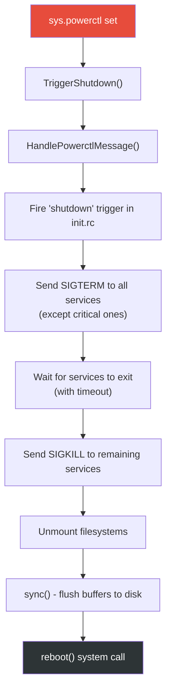

Services marked with `shutdown critical` are the last to be stopped, ensuring that
critical operations (like filesystem writes) can complete before the device powers
off.

---

## 4.14 Advanced Topics

### 4.14.1 Mount Namespaces

Init supports mount namespaces to provide different filesystem views to different
processes. The `SetupMountNamespaces()` function (called from `SecondStageMain()` at
line 1170) creates separate mount namespaces:

```cpp
// system/core/init/init.cpp, line 1170
if (!SetupMountNamespaces()) {
    PLOG(FATAL) << "SetupMountNamespaces failed";
}
```

Mount namespaces are used for:

- **APEX management**: APEXes are mounted differently in the default namespace vs.
  the bootstrap namespace
- **Vendor isolation**: Vendor processes may have a different view of `/apex` than
  system processes
- **linkerconfig**: Different processes may have different linker configurations based
  on their namespace

### 4.14.2 Subcontext

Init supports "subcontext" execution, where certain init commands run in a separate
process with a different SELinux context. This is used for vendor init scripts that
need to run with vendor-specific SELinux permissions.

From `main.cpp` (lines 66-70):

```cpp
// system/core/init/main.cpp, lines 66-70
if (!strcmp(argv[1], "subcontext")) {
    android::base::InitLogging(argv, &android::base::KernelLogger);
    const BuiltinFunctionMap& function_map = GetBuiltinFunctionMap();
    return SubcontextMain(argc, argv, &function_map);
}
```

The subcontext process communicates with init's main process via a socket,
receiving commands to execute and returning results. This design allows vendor
init scripts to run commands that require vendor SELinux permissions without
granting those permissions to init itself.

### 4.14.3 APEX Init Scripts

APEXes can include their own init.rc scripts. When an APEX is activated, init
parses its scripts and integrates them into the action and service lists. The
`CreateApexConfigParser()` function (init.cpp lines 312-337) creates a parser
specifically for APEX scripts:

```cpp
// system/core/init/init.cpp, lines 312-337
Parser CreateApexConfigParser(ActionManager& action_manager,
                               ServiceList& service_list) {
    Parser parser;
    auto subcontext = GetSubcontext();
    // ...
    parser.AddSectionParser("service",
        std::make_unique<ServiceParser>(&service_list, subcontext));
    parser.AddSectionParser("on",
        std::make_unique<ActionParser>(&action_manager, subcontext));
    return parser;
}
```

APEX init scripts can define new services and actions, but they are restricted to
operations that their SELinux policy allows.

### 4.14.4 Control Messages: start/stop/restart

Control messages are the mechanism by which system services start and stop init-
managed services at runtime. The control message map is defined in init.cpp
(lines 516-531):

```cpp
// system/core/init/init.cpp, lines 516-531
static const std::map<std::string, ControlMessageFunction, std::less<>>&
    GetControlMessageMap() {
    [[clang::no_destroy]]
    static const std::map<std::string, ControlMessageFunction, std::less<>>
        control_message_functions = {
        {"sigstop_on",   [](auto* service) { service->set_sigstop(true);
                                              return Result<void>{}; }},
        {"sigstop_off",  [](auto* service) { service->set_sigstop(false);
                                              return Result<void>{}; }},
        {"oneshot_on",   [](auto* service) { service->set_oneshot(true);
                                              return Result<void>{}; }},
        {"oneshot_off",  [](auto* service) { service->set_oneshot(false);
                                              return Result<void>{}; }},
        {"start",        DoControlStart},
        {"stop",         DoControlStop},
        {"restart",      DoControlRestart},
    };
    return control_message_functions;
}
```

Beyond the standard start/stop/restart, control messages also support:

- `sigstop_on`/`sigstop_off`: Enable/disable sending SIGSTOP to a service after
  fork, useful for attaching a debugger before the service runs any code
- `oneshot_on`/`oneshot_off`: Dynamically change whether a service restarts after
  exit
- `interface_start`/`interface_stop`/`interface_restart`: Control services by their
  registered interface name rather than their service name

APEX control messages (`apex_load`/`apex_unload`) are handled separately and allow
loading and unloading APEX init scripts at runtime.

### 4.14.5 The Epoll-Based Event Loop Architecture

Init's main loop is built on Linux's `epoll` facility, providing an efficient event
multiplexing mechanism. The architecture deserves detailed examination because it is
the backbone of init's entire operation.

The epoll instance is created in `SecondStageMain()`:

```cpp
// system/core/init/init.cpp, lines 1125-1128
Epoll epoll;
if (auto result = epoll.Open(); !result.ok()) {
    PLOG(FATAL) << result.error();
}
```

Three types of file descriptors are registered with epoll:

1. **Signal file descriptors**: SIGCHLD (child death) and SIGTERM (shutdown request)
   are converted to file descriptor events via `signalfd()`. This avoids the
   inherent races of traditional signal handlers.

2. **The wake eventfd**: A non-blocking eventfd used to wake the main loop when
   property changes or control messages arrive from other threads.

3. **Mount event handler**: Watches for filesystem mount/unmount events and updates
   properties accordingly.

The epoll has a "first callback" mechanism that ensures child reaping always happens
before any other event processing:

```cpp
// system/core/init/init.cpp, line 1133
epoll.SetFirstCallback(ReapAnyOutstandingChildren);
```

This prevents a race condition where a service monitors another service's exit
(through `init.svc.*` properties) and requests a restart before init has reaped
the zombie process.

The main loop's structure (lines 1246-1296) follows a classic event-driven pattern:

1. Check for pending shutdown
2. Execute one queued action (from init.rc triggers)
3. Handle process restarts and timeouts
4. Calculate the sleep timeout based on pending work
5. Wait on epoll (with timeout)
6. Handle control messages

The single-action-per-iteration design (line 1261, `am.ExecuteOneCommand()`) is
deliberate: it prevents any single burst of actions from starving signal handling or
property processing. If more actions are pending, the next action time is set to
"now", which causes epoll to return immediately.

When there is no pending work, init calls `mallopt(M_PURGE_ALL, 0)` (line 1286) to
release memory back to the kernel. This is a small but important optimization:
during steady-state operation (after boot), init is mostly idle, and releasing its
heap pages reduces memory pressure on the system.

### 4.14.6 The GSI (Generic System Image) Check

Init checks whether the device is running a GSI during second-stage startup
(init.cpp lines 1186-1195):

```cpp
// system/core/init/init.cpp, lines 1186-1195
auto is_running = android::gsi::IsGsiRunning() ? "1" : "0";
SetProperty(gsi::kGsiBootedProp, is_running);
auto is_installed = android::gsi::IsGsiInstalled() ? "1" : "0";
SetProperty(gsi::kGsiInstalledProp, is_installed);
if (android::gsi::IsGsiRunning()) {
    std::string dsu_slot;
    if (android::gsi::GetActiveDsu(&dsu_slot)) {
        SetProperty(gsi::kDsuSlotProp, dsu_slot);
    }
}
```

These properties allow init.rc scripts and system services to adapt behavior when
running on a GSI, which is commonly used for VTS (Vendor Test Suite) testing.

---

## 4.15 The Complete Boot Sequence in One Diagram

The following diagram summarizes the entire boot sequence covered in this chapter,
showing the flow between all major components:

```mermaid
flowchart TD
    subgraph "Hardware / Firmware"
        PO["Power On"]
        BROM["Boot ROM"]
        BL["Bootloader (ABL/U-Boot)"]
        AVB["Android Verified Boot<br/>Verify vbmeta → boot → vendor_boot"]
    end

    subgraph "Linux Kernel"
        KI["Kernel Init"]
        DP["Driver Probing"]
        RM["Mount initramfs"]
        PI["Launch /init (PID 1)"]
    end

    subgraph "First Stage Init"
        FS["Mount tmpfs, proc, sysfs"]
        KM["Load Kernel Modules"]
        FSM["Mount /system, /vendor<br/>(with dm-verity)"]
        FRR["Free ramdisk"]
        SEL["exec → selinux_setup"]
    end

    subgraph "SELinux Setup"
        SLP["Load SELinux Policy<br/>(split or monolithic)"]
        ENF["Set Enforcement Mode"]
        RC["restorecon /system/bin/init"]
        EX2["exec → second_stage"]
    end

    subgraph "Second Stage Init"
        PI2["Property Init"]
        PS["Start Property Service"]
        EP["Create Epoll Loop"]
        LBS["Load Boot Scripts<br/>(init.rc + all directories)"]
        TQ["Queue Triggers:<br/>early-init → init → late-init"]
    end

    subgraph "Trigger Chain"
        EI["early-init"]
        IN["init"]
        LI["late-init"]
        EFS["early-fs → fs → post-fs"]
        LFS["late-fs"]
        PFD["post-fs-data<br/>(mount /data)"]
        ZS["zygote-start"]
    end

    subgraph "Zygote"
        AP["app_process64 --zygote"]
        ART["Start ART VM"]
        PRE["Preload ~15K classes<br/>+ resources + drivers"]
        FSS["Fork system_server"]
        SSL["Enter select loop<br/>(wait for fork requests)"]
    end

    subgraph "system_server"
        SM["SystemServer.main()"]
        BS["startBootstrapServices()<br/>AMS, PMS, WMS, DisplayManager"]
        CS["startCoreServices()<br/>Battery, Usage, WebView"]
        OS["startOtherServices()<br/>70+ framework services"]
        AS["startApexServices()<br/>WiFi, BT, Connectivity"]
        P100["PHASE 100: Default Display"]
        P500["PHASE 500: System Services Ready"]
        P600["PHASE 600: Apps Can Start"]
        P1K["PHASE 1000: Boot Completed"]
    end

    subgraph "Home Screen"
        BC["sys.boot_completed=1"]
        BA["Dismiss boot animation"]
        HL["Launch Home/Launcher"]
        UI["User Interaction"]
    end

    PO --> BROM --> BL --> AVB --> KI
    KI --> DP --> RM --> PI
    PI --> FS --> KM --> FSM --> FRR --> SEL
    SEL --> SLP --> ENF --> RC --> EX2
    EX2 --> PI2 --> PS --> EP --> LBS --> TQ
    TQ --> EI --> IN --> LI
    LI --> EFS --> LFS --> PFD --> ZS
    ZS --> AP --> ART --> PRE --> FSS
    FSS --> SSL
    FSS --> SM --> BS --> CS --> OS --> AS
    BS --> P100
    OS --> P500
    OS --> P600
    AS --> P1K
    P1K --> BC --> BA --> HL --> UI

    style PO fill:#2d3436,color:#fff
    style AVB fill:#6c5ce7,color:#fff
    style PI fill:#00b894,color:#fff
    style SEL fill:#fdcb6e,color:#333
    style EX2 fill:#fdcb6e,color:#333
    style ZS fill:#e17055,color:#fff
    style FSS fill:#d63031,color:#fff
    style P1K fill:#d63031,color:#fff
    style UI fill:#00b894,color:#fff
```

---

## Summary

This chapter traced the complete Android boot sequence from power-on to home screen:

1. **Bootloader** loads and verifies the kernel using AVB (`external/avb/libavb/`)

1. **Bootloader** loads and verifies the kernel using AVB (`external/avb/libavb/`)
2. **Linux kernel** launches `/init` as PID 1
3. **First-stage init** (`system/core/init/first_stage_init.cpp`) mounts partitions
   and loads kernel modules
4. **SELinux setup** (`system/core/init/selinux.cpp`) loads security policy and
   transitions to the proper security domain
5. **Second-stage init** (`system/core/init/init.cpp`) parses init.rc files, starts
   the property service, and launches all native daemons
6. **Zygote** (`frameworks/base/cmds/app_process/app_main.cpp` and
   `frameworks/base/core/java/com/android/internal/os/ZygoteInit.java`) preloads the
   Android framework and forks `system_server`
7. **system_server** (`frameworks/base/services/java/com/android/server/SystemServer.java`)
   starts 100+ system services in four phases, progressing through boot phase
   milestones until `PHASE_BOOT_COMPLETED`

Key architectural insights:

- **Two-stage init** solves the SELinux chicken-and-egg problem: first-stage runs
  before policy is loaded, second-stage runs under full enforcement
- **The init.rc trigger chain** (`early-init` -> `init` -> `late-init` ->
  `early-fs` -> `fs` -> `post-fs` -> `post-fs-data` -> `zygote-start` -> `boot`)
  enforces the dependency order for the entire boot sequence
- **Zygote's fork model** enables fast app startup through copy-on-write memory
  sharing of preloaded framework code
- **Boot phase progression** in system_server allows services to perform staged
  initialization based on what other services are available
- **The property system** serves as both a configuration store and an IPC mechanism,
  with property triggers driving much of the boot orchestration

### Key Source File Reference

The following table provides a comprehensive reference to every source file discussed
in this chapter:

| File Path | Purpose | Section |
|---|---|---|
| `system/core/init/first_stage_main.cpp` | First-stage init entry point | 3.3.1 |
| `system/core/init/first_stage_init.cpp` | First-stage init implementation | 3.3.2 |
| `system/core/init/main.cpp` | Init dispatch (all modes) | 3.3.1 |
| `system/core/init/init.cpp` | Second-stage init + main loop | 3.3.5 |
| `system/core/init/selinux.cpp` | SELinux policy loading | 3.3.3 |
| `system/core/init/property_service.cpp` | Property service implementation | 3.3.6, 3.8 |
| `system/core/rootdir/init.rc` | Master init.rc configuration | 3.3.7 |
| `system/core/rootdir/init.zygote64.rc` | 64-bit Zygote service definition | 3.3.7 |
| `system/core/rootdir/init.zygote64_32.rc` | Dual Zygote (64+32) definition | 3.3.7 |
| `frameworks/base/cmds/app_process/app_main.cpp` | Zygote native entry point | 3.4.1 |
| `frameworks/base/core/java/com/android/internal/os/ZygoteInit.java` | Zygote Java entry point | 3.4.2-3.4.5 |
| `frameworks/base/services/java/com/android/server/SystemServer.java` | system_server entry point | 3.5 |
| `external/avb/libavb/avb_vbmeta_image.h` | VBMeta image format | 3.2.3 |
| `external/avb/libavb/avb_slot_verify.h` | Slot verification API | 3.2.3 |
| `external/avb/libavb/avb_hashtree_descriptor.h` | dm-verity hashtree format | 3.2.3 |

### Architectural Insights

The boot sequence reveals several fundamental design principles of Android:

**Separation of concerns through exec chains**: First-stage init, SELinux setup,
and second-stage init are all the same binary (`/system/bin/init`) but execute as
separate process images via `exec()`. Each stage has a focused responsibility and
a well-defined interface to the next stage (via command-line arguments and
environment variables).

**Event-driven, single-threaded main loop**: Init's main loop is deliberately
single-threaded for determinism. Properties, signals, and timers are all multiplexed
through epoll. The only multi-threaded aspect is the property service thread, which
communicates with the main loop through an eventfd.

**Fork-based process creation**: Zygote's fork model is the key optimization that
makes Android's app startup times possible. By paying the cost of framework loading
once (in Zygote) and sharing it across all apps via copy-on-write, Android avoids
the 2-5 second startup penalty that would occur if each app loaded the framework
independently.

**Boot phase progression**: system_server's phased boot allows services to perform
staged initialization. A service can do basic setup during its constructor, then
wait for `PHASE_SYSTEM_SERVICES_READY` before accessing other services, and
`PHASE_BOOT_COMPLETED` before assuming the system is fully operational. This
eliminates timing-dependent bugs that would occur if services tried to use other
services that had not yet started.

**Property triggers as a coordination mechanism**: The property system serves as a
lightweight publish-subscribe mechanism during boot. Services announce their state
by setting properties (e.g., `init.svc.zygote=running`), and init.rc triggers
respond to those state changes to orchestrate the boot sequence. The
`wait_for_prop` command provides synchronous waiting when strict ordering is
required.

**Defense in depth**: The boot sequence implements multiple layers of security:

- AVB ensures only verified code runs
- dm-verity provides runtime integrity checking
- SELinux confines every process to its security domain
- The property system enforces MAC on all configuration changes
- Services run with minimal privileges (user/group/capabilities)

The source files referenced in this chapter are the authoritative documentation for
Android's boot process. When the code changes, this documentation changes with it
-- which is why reading the actual source is always more reliable than any external
documentation, including this book.

### Glossary of Terms

| Term | Definition |
|---|---|
| **ABL** | Android Bootloader; Qualcomm's UEFI-based bootloader |
| **APEX** | Android Pony EXpress; updatable system component package |
| **AVB** | Android Verified Boot; chain-of-trust verification system |
| **BPF** | Berkeley Packet Filter; kernel-level packet filtering |
| **DTB** | Device Tree Blob; hardware description for the kernel |
| **dm-verity** | Device-mapper verity; runtime filesystem integrity verification |
| **epoll** | Linux I/O event notification facility |
| **fstab** | Filesystem table; describes mount points and options |
| **GKI** | Generic Kernel Image; standardized Android kernel |
| **GSI** | Generic System Image; standardized system partition for testing |
| **init.rc** | Init configuration language files |
| **PID 1** | The first userspace process; init in Android |
| **RPMB** | Replay Protected Memory Block; secure storage on eMMC/UFS |
| **SELinux** | Security-Enhanced Linux; mandatory access control |
| **SoC** | System on Chip; integrated circuit with CPU, GPU, etc. |
| **USAP** | Unspecialized App Process; pre-forked Zygote child |
| **VBMeta** | Verified Boot Metadata; signed partition verification data |
| **Zygote** | Process that pre-loads framework and forks all app processes |
| **system_server** | Central framework process hosting 100+ system services |

### Further Reading

To continue exploring the topics covered in this chapter:

- **Chapter 4** will cover Android's process management and how
  ActivityManagerService manages the lifecycle of application processes that Zygote
  creates
- **Chapter 5** will examine the Binder IPC mechanism that system_server services
  use to communicate with applications
- The Android source code at `system/core/init/README.md` contains additional
  documentation on the init.rc language
- The `external/avb/README.md` file provides detailed documentation on the AVB
  protocol and tools
