# 第 5 章：内核

Linux 内核是每一台 Android 设备的基础。它负责管理硬件、执行安全边界、调度进程，并提供整个 Android 框架赖以构建的底层原语，例如 Binder IPC 和共享内存。然而，Android 设备上运行的内核并不是原样的上游 Linux 内核。在超过十五年的演进过程中，Android 累积了一系列内核修改、树外驱动和配置要求，这些内容使其与任何桌面或服务器 Linux 发行版都明显不同。

本章将深入分析 Android 内核：Android 在上游 Linux 之上增加了什么，Generic Kernel Image（GKI）架构如何减少碎片化，各个 Android 特有子系统如何在驱动层工作，设备树如何描述硬件，内核配置如何跨版本管理，内核如何集成进 AOSP 构建系统，以及如何在真实设备和模拟器上调试内核级问题。

贯穿本章，我们都会引用 AOSP 源码树中的真实文件。这里提到的每一个路径、配置片段和模块名，都可以在该源码树中找到。

---

## 5.1 Android 内核与上游 Linux 的区别

### 5.1.1 一个并非真正意义上“分叉”的分叉

Android 并不会长期维护 Linux 内核的永久分叉。Google 维护的是一组“Android Common Kernel”（ACK）分支，这些分支跟踪特定的上游长期支持（LTS）版本。每个 ACK 分支都从某个上游 LTS 标签起步（例如 `6.6`、`6.12`），再加入一组经过筛选的补丁，以提供 Android 特有能力。这些补丁大致分为几类：

1. **Android 专用驱动**，用于实现核心平台能力（Binder、ashmem、incremental-fs）
2. **调度器与内存管理修改**，用于提升移动设备的交互性能
3. **额外的安全加固**，超出上游默认提供的能力
4. **Vendor hook 基础设施**（trace 事件与受限 vendor hook），允许 SoC 厂商在不修改核心内核代码的情况下定制行为
5. **与 Android 测试流水线集成的测试和调试基础设施**

目标始终是尽量缩小与上游的差异。许多最初出现在 Android 树中的补丁，这些年来已经被合入上游。wakelock（现为 `PM_WAKELOCKS`）、低内存杀手（已被基于 PSI 的用户态 lmkd 取代）以及 `ashmem`（正逐步由 `memfd` 替代）都体现了这种收敛趋势。

### 5.1.2 Android 的主要增量

下表总结了 Android 相比原生上游内核额外增加或强制要求的关键内核级特性：

| 特性 | 内核配置 | 用途 | 状态 |
|---------|--------------|---------|--------|
| Binder IPC | `CONFIG_ANDROID_BINDER_IPC` | 为所有框架服务提供跨进程通信 | 活跃，必需 |
| Binderfs | `CONFIG_ANDROID_BINDERFS` | 动态管理 Binder 设备 | 活跃，必需 |
| Ashmem | `CONFIG_ASHMEM` | 匿名共享内存区域 | 活跃，正过渡到 memfd |
| Wakelocks | `CONFIG_PM_WAKELOCKS` | 在关键操作期间阻止系统休眠 | 活跃，必需 |
| PSI（Pressure Stall Information） | `CONFIG_PSI` | 为 lmkd 监控内存压力 | 活跃，必需 |
| DMA-BUF Heaps | `CONFIG_DMABUF_HEAPS_SYSTEM` | 图形缓冲区分配（ION 替代方案） | 活跃 |
| FUSE 文件系统 | `CONFIG_FUSE_FS` | 通过用户态文件系统提供存储访问 | 活跃，必需 |
| Incremental FS | `CONFIG_INCREMENTAL_FS` | 按需加载 APK 数据块 | 活跃 |
| dm-verity | `CONFIG_DM_VERITY` | 对系统分区实施 Verified Boot | 活跃，必需 |
| FS encryption | `CONFIG_FS_ENCRYPTION` | 对 userdata 执行基于文件的加密 | 活跃，必需 |
| FS verity | `CONFIG_FS_VERITY` | 对单个文件做完整性校验 | 活跃，必需 |
| UID system stats | `CONFIG_UID_SYS_STATS` | 按 UID 统计 I/O 与 CPU | 活跃，必需 |
| CPU freq times | `CONFIG_CPU_FREQ_TIMES` | 按 UID 跟踪 CPU 频点驻留时间 | 活跃，必需 |
| GPU memory tracing | `CONFIG_TRACE_GPU_MEM` | 跟踪 GPU 内存分配 | 活跃，必需 |

这些配置项在 AOSP 树 `kernel/configs/` 目录中的 Android 基础配置片段里被声明为强制要求。

### 5.1.3 架构对比

下图展示了 Android 内核与上游 Linux 内核在分层架构上的差异：

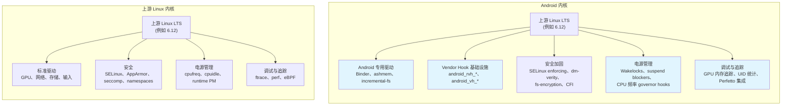

### 5.1.4 向上游收敛的趋势

Google 一直在持续缩小 Android Common Kernel 与上游 Linux 之间的差距。一些历史上仅属于 Android 的特性已经合入上游，或者正在收敛之中：

**已经上游化或正在收敛：**

- `PM_WAKELOCKS`：wakelock 基础设施已经进入上游 Linux
- PSI（Pressure Stall Information）：最初为 Android 的 lmkd 开发，如今已经是标准内核能力
- 旧的内核内低内存杀手（`CONFIG_ANDROID_LOW_MEMORY_KILLER`）已经移除；Android 现在使用读取 PSI 事件的用户态守护进程 `lmkd`
- `memfd_create()` 正在逐步替代新代码中的 `ashmem`
- ION 分配器已由上游 DMA-BUF heap 框架取代

**仍然属于 Android 特有：**

- Binder 驱动（与 Android IPC 模型深度绑定）
- Incremental FS（专门用于 APK 流式加载）
- Vendor hooks（`trace_android_rvh_*` 和 `trace_android_vh_*`）
- 基于 UID 的资源统计（`CONFIG_UID_SYS_STATS`、`CONFIG_CPU_FREQ_TIMES`）

旧内核内低内存杀手被显式禁用这一点，可以直接在基础配置片段中看到。以 Android 16（分支 `b`）的 6.12 内核配置为例：

```
# CONFIG_ANDROID_LOW_MEMORY_KILLER is not set
```

**来源**：`kernel/configs/b/android-6.12/android-base.config`，第 2 行。

这一行代码本身就概括了一段持续多年的迁移历史：内核内 OOM 杀手已经被一个更复杂的用户态守护进程替代，后者借助 PSI 事件做出更智能的内存管理决策。

---

## 5.2 GKI（Generic Kernel Image）

### 5.2.1 碎片化问题

在 GKI 出现之前，每一台 Android 设备都带着一份独一无二的内核。SoC 厂商（Qualcomm、MediaTek、Samsung LSI 等）会从某个 Android Common Kernel 分支出发，加入数百个针对自己 SoC 的补丁，再交给设备 OEM，OEM 又会继续叠加与具体硬件相关的更多补丁。结果就是高度碎片化的生态：

- 没有厂商配合时，安全补丁无法送达内核
- 每台设备都有专属内核二进制，无法独立更新
- 修复一个内核缺陷需要在多层 vendor 内核树之间传播
- 无法进行大规模测试，因为几乎没有两台设备运行同一份内核

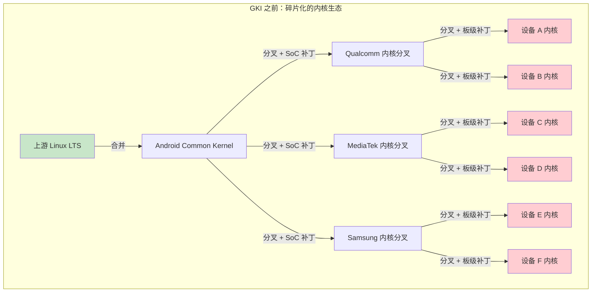

### 5.2.2 GKI 2.0 架构

GKI 通过把内核拆成两部分来解决这一问题：

1. **GKI 核心内核**：由 Google 基于 Android Common Kernel 源码构建的单一二进制。对于使用同一内核版本的所有设备，这个二进制完全一致。

2. **Vendor 模块**：可加载内核模块（`.ko` 文件），其中包含所有 SoC 相关和设备相关代码。它们由厂商针对稳定的 Kernel Module Interface（KMI）构建。

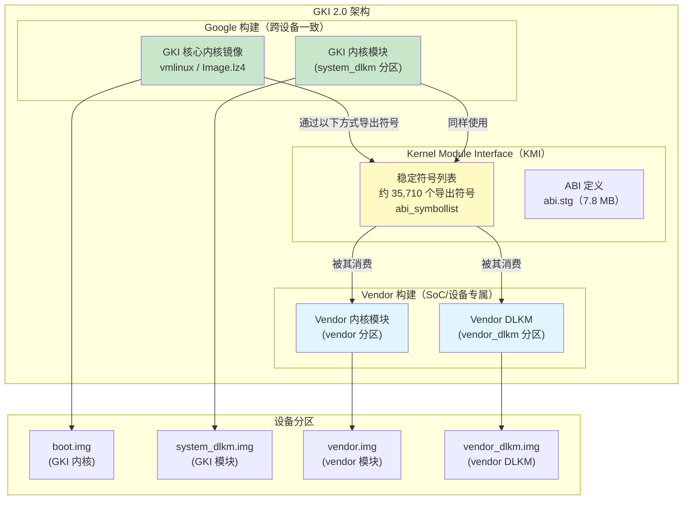

### 5.2.3 Kernel Module Interface（KMI）

KMI 是 GKI 核心内核与 vendor 模块之间的契约。它由以下几部分组成：

1. **一份符号列表**：vendor 模块允许调用的内核函数和变量集合。对于 6.6 内核，这个列表大约包含 35,710 项。

   **来源**：`kernel/prebuilts/6.6/arm64/abi_symbollist`（35,710 行）

   符号列表以常用符号开始，并按区段组织：

   ```
   [abi_symbol_list]
   # commonly used symbols
     module_layout
     __put_task_struct
     utf8_data_table

   [abi_symbol_list]
     add_cpu
     add_device_randomness
     add_timer
     ...
   ```

2. **一份 ABI 定义**：对 KMI 导出的类型、结构体和函数签名的机器可读描述。对于 6.6 内核，该文件大约 7.8 MB。

   **来源**：`kernel/prebuilts/6.6/arm64/abi.stg`（7,819,214 字节）

3. **模块版本控制**（`CONFIG_MODVERSIONS=y`）：系统会基于每个导出符号的原型计算 CRC 校验值。如果模块是针对某个旧版本符号编译的，而符号签名后来发生变化，那么该模块将无法加载。

KMI 会在每个 GKI 版本上冻结。一旦冻结，Google 就保证在该内核分支的整个生命周期内，符号列表和 ABI 都不会发生向后不兼容的变化。这使 vendor 可以独立于内核更新发布模块更新，反之亦然。

### 5.2.4 KMI 符号稳定性保证

配置项 `CONFIG_MODVERSIONS=y`（存在于所有 Android 基础配置中）会为每个导出符号启用编译期 CRC 生成。当模块加载时，内核会检查模块中的 CRC 是否与当前运行内核中的 CRC 匹配。如果不匹配，模块加载会失败，并报出类似这样的错误：

```
disagrees about version of symbol <name>
```

这就是 KMI 稳定性的执行机制：即使符号名还在，只要它的类型签名变了，系统也会检测出来并拒绝加载。

### 5.2.5 Vendor Hooks

由于厂商不能修改 GKI 核心内核，他们需要一种机制来针对自己的 SoC 定制内核行为。GKI 通过 **vendor hooks** 提供了这项能力。这些 hook 本质上是轻量级 tracepoint，厂商可以注册回调：

- **`android_vh_*`**（vendor hooks）：标准 tracepoint，vendor 可以挂接。它们可在任意上下文中安全调用。
- **`android_rvh_*`**（restricted vendor hooks）：位于性能关键路径中的 hook，对回调函数有更严格的要求。

KMI 符号列表中就包含 vendor hook 的注册函数：

```
android_rvh_probe_register
```

**来源**：`kernel/prebuilts/6.6/arm64/abi_symbollist`，第 28 行

Vendor hooks 允许 SoC 厂商：

- 针对自身的 big.LITTLE/DynamIQ CPU 拓扑定制调度器
- 加入与特定传感器硬件绑定的热管理逻辑
- 实现自定义内存管理策略
- 接入电源管理决策过程

### 5.2.6 AOSP 中的 GKI 预编译内核

AOSP 树中自带 GKI 预编译内核，供模拟器和参考设备使用。这些预编译产物包括：

```
kernel/prebuilts/
    6.1/
        arm64/
        x86_64/
    6.6/
        arm64/          # 共 114 个文件，约 96 个 .ko 模块
            kernel-6.6              # 未压缩内核镜像
            kernel-6.6-gz           # Gzip 压缩内核
            kernel-6.6-lz4          # LZ4 压缩内核
            kernel-6.6-allsyms      # 带全符号的调试内核
            kernel-6.6-gz-allsyms   # 调试压缩内核
            kernel-6.6-lz4-allsyms  # 调试 LZ4 压缩内核
            vmlinux                  # 带调试信息的 ELF 内核
            System.map               # 符号地址映射
            System.map-allsyms       # 完整符号映射
            abi_symbollist           # KMI 符号列表（35,710 行）
            abi_symbollist.raw       # 原始符号名
            abi.stg                  # ABI 定义（约 7.8 MB）
            abi-full.stg             # 完整 ABI 定义
            kernel_version.mk        # 构建系统使用的版本字符串
            *.ko                     # 约 96 个 GKI 内核模块
        x86_64/
    6.12/
        arm64/
        x86_64/
    common-modules/
        virtual-device/
            6.1/
            6.6/
                arm64/   # 57 个设备专用模块
                x86-64/
            6.12/
            mainline/
        trusty/
    mainline/
        arm64/
        x86_64/
```

6.6 arm64 预编译内核的版本字符串可以揭示其来源：

```
BOARD_KERNEL_VERSION := 6.6.100-android15-8-gf988247102d3-ab14039625-4k
```

**来源**：`kernel/prebuilts/6.6/arm64/kernel_version.mk`

拆解如下：

- `6.6.100`：上游 LTS 版本 6.6，补丁级别 100
- `android15`：Android 15 ACK 分支
- `8`：该分支上的第八次发布
- `gf988247102d3`：git commit 哈希
- `ab14039625`：Android build ID
- `4k`：4K 页大小变体

### 5.2.7 GKI 发布生命周期

每个 GKI 内核分支都有明确的生命周期，包括上线与终止支持（EOL）日期。这些信息记录在 `kernel/configs/kernel-lifetimes.xml` 中：

```xml
<branch name="android16-6.12"
        min_android_release="16"
        version="6.12"
        launch="2024-11-17"
        eol="2029-07-01">
    <lts-versions>
        <release version="6.12.23" launch="2025-06-12" eol="2026-10-01"/>
        <release version="6.12.30" launch="2025-07-11" eol="2026-11-01"/>
        <release version="6.12.38" launch="2025-08-11" eol="2026-12-01"/>
    </lts-versions>
</branch>
```

**来源**：`kernel/configs/kernel-lifetimes.xml`，第 146-152 行

从这个文件可以得到几个关键观察：

- 一个内核分支会跨越多年维护，例如 `android14-6.1` 从 2022 年持续到 2029 年
- 每个分支中的具体 LTS 发行版也有各自独立的 EOL 日期
- 季度 GKI 发布通常有 12 到 15 个月的支持窗口
- 较老的分支（5.10 之前）会被标记为 “non-GKI kernel”，因为 GKI 是从 Android 12 / kernel 5.10 开始引入的

完整的受支持内核版本谱系如下：

| 分支 | 内核 | 最低 Android 版本 | 启动时间 | EOL |
|--------|--------|-------------|--------|-----|
| android12-5.10 | 5.10 | 12 | 2020-12 | 2027-07 |
| android13-5.15 | 5.15 | 13 | 2021-10 | 2028-07 |
| android14-5.15 | 5.15 | 14 | 2021-10 | 2028-07 |
| android14-6.1 | 6.1 | 14 | 2022-12 | 2029-07 |
| android15-6.6 | 6.6 | 15 | 2023-10 | 2028-07 |
| android16-6.12 | 6.12 | 16 | 2024-11 | 2029-07 |

### 5.2.8 Vendor 如何在不分叉的前提下扩展

在 GKI 模式下，vendor 扩展模型如下：

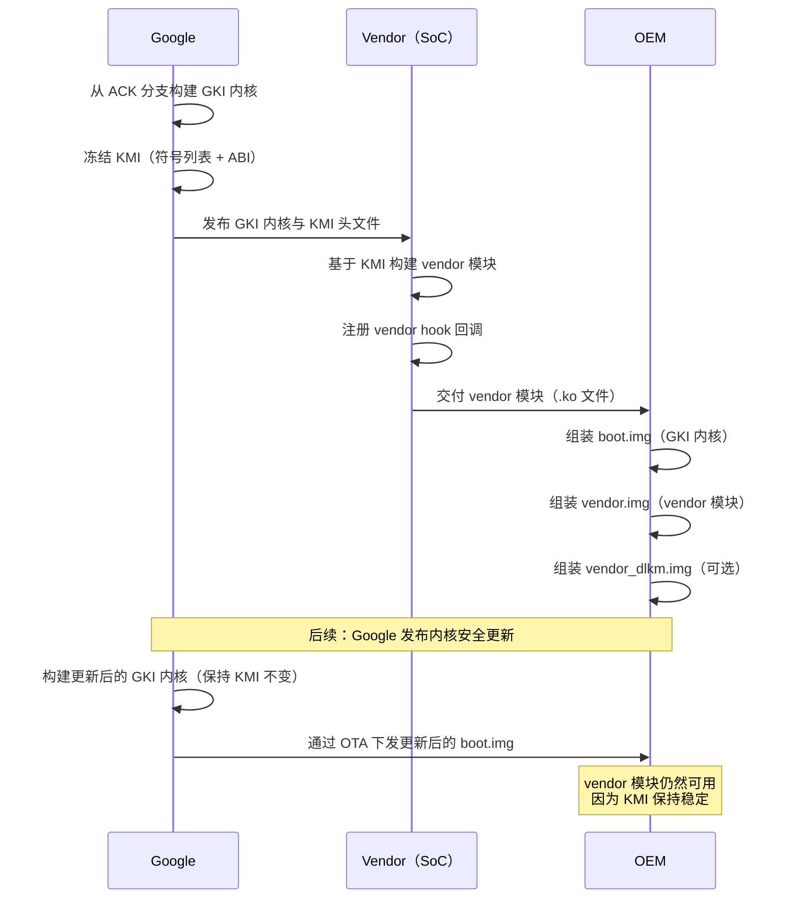

这种分离带来的结果是：

- Google 可以在不依赖 vendor 参与的情况下更新内核并修复安全问题
- Vendor 可以独立更新自己的模块，而不必等待内核更新
- OEM 可以在同一 KMI 世代内混用不同版本的 GKI 内核与 vendor 模块

---

## 5.3 关键 Android 专用内核特性

### 5.3.1 Binder 驱动

Binder 是 Android 的进程间通信（IPC）机制。应用与系统服务之间的每一次交互，例如启动 Activity、绑定 Service、查询 ContentProvider、发送 Intent，最终都会经过 Binder。Binder 驱动就是让这一切成为可能的内核组件。

#### 内核配置

Binder 在 Android 基础配置中需要两个选项：

```
CONFIG_ANDROID_BINDER_IPC=y
CONFIG_ANDROID_BINDERFS=y
```

**来源**：`kernel/configs/b/android-6.12/android-base.config`，第 18-19 行

`CONFIG_ANDROID_BINDERFS` 会启用 `binderfs`。这是一个特殊文件系统，用于动态创建 Binder 设备节点。它替代了传统静态设备节点方式，例如直接创建 `/dev/binder`、`/dev/hwbinder` 和 `/dev/vndbinder`。

#### 事务模型

Binder 驱动实现的是一种同步 RPC 机制，具备以下特征：

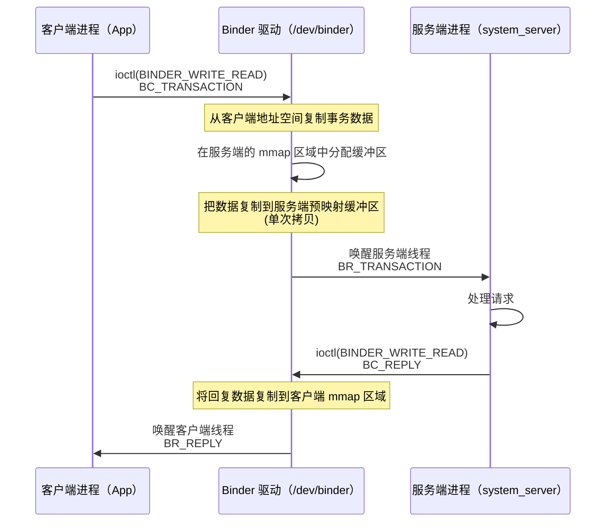

事务模型的关键点如下：

1. **单次拷贝的数据传输**：Binder 驱动通过 `mmap()` 在服务端进程地址空间中创建一块共享区域。客户端发起事务时，驱动会把数据直接从客户端用户态缓冲区复制到服务端映射区域。这意味着数据只需要拷贝一次，而传统 IPC 往往需要两次拷贝。

2. **对象翻译**：Binder handle（远程对象引用）在跨进程传递时由驱动进行转换。驱动会维护一个带引用计数的 Binder 节点与代理句柄映射。

3. **死亡通知**：一个进程可以注册对另一个进程中 Binder 对象的死亡通知。驱动会跟踪这些注册关系，并在宿主进程退出时发送 `BR_DEAD_BINDER` 通知。

4. **安全上下文传播**：驱动会把调用方的 PID、UID 和 SELinux 安全上下文写入每笔事务，使服务端可以做鉴权决策。

#### 内存映射

每个打开 Binder 设备的进程都会用 `mmap()` 映射一段内存。驱动使用这块区域投递事务数据：

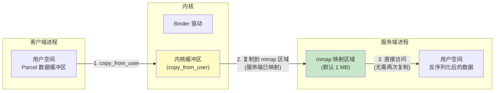

默认 mmap 大小是 1 MB 减去两个页，即 1,048,576 - 8,192 = 1,040,384 字节。这代表任意时刻某个进程的入站事务在途数据总上限。

#### 线程管理

Binder 驱动会为每个进程管理线程池：

- 进程打开 Binder 设备后，要么通过 `BINDER_SET_CONTEXT_MGR` 注册自己（如 servicemanager），要么开始处理事务
- 当现有线程都忙碌时，驱动可以通过 `BR_SPAWN_LOOPER` 请求创建新线程
- 最大线程数通过 `BINDER_SET_MAX_THREADS` 设置
- 线程通过 `ioctl(BINDER_WRITE_READ)` 进入驱动，并在有事务到来或有回复需要投递之前一直阻塞

Binder 线程管理在用户态的实现位于 `frameworks/native/libs/binder/IPCThreadState.cpp`：

```cpp
// frameworks/native/libs/binder/IPCThreadState.cpp
#include <binder/IPCThreadState.h>
#include <sys/ioctl.h>
#include "binder_module.h"
```

**来源**：`frameworks/native/libs/binder/IPCThreadState.cpp`

#### 三个 Binder 域

现代 Android 使用三个彼此分离的 Binder 域，每个域都有独立设备节点，以满足 Treble 架构的隔离要求：

| 域 | 设备 | 用途 | 使用者 |
|--------|--------|---------|-------|
| Framework | `/dev/binder` | 应用到 framework 的 IPC | Apps、system_server |
| Hardware | `/dev/hwbinder` | framework 到 HAL 的 IPC | system_server、HAL 进程 |
| Vendor | `/dev/vndbinder` | vendor 内部 IPC | 仅 vendor 进程 |

启用 `binderfs`（`CONFIG_ANDROID_BINDERFS=y`）后，这些设备节点通过挂载 binderfs 动态创建，而不是通过 `mknod` 静态生成。这使容器化 Android 实例也能拥有独立的 Binder 命名空间。

### 5.3.2 DMA-BUF Heap 系统

#### 从 ION 到 DMA-BUF Heaps

ION 内存分配器曾是 Android 最初的方案，用于分配物理连续或带有特殊约束的内存缓冲区，以供 GPU、相机、视频编解码器和显示硬件使用。ION 是一个 Android 专有的树外驱动，位于 `drivers/staging/android/`。

从 kernel 5.10 开始，ION 已被上游 **DMA-BUF heap 框架**取代。该框架提供相同能力，也就是分配可用于 DMA 且可在硬件设备与用户态之间共享的缓冲区，但它通过标准的上游内核接口实现。

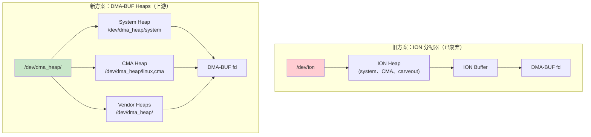

#### DMA-BUF Heaps 的工作方式

1. **Heap 注册**：内核驱动向 DMA-BUF heap 框架注册 heap，每个 heap 都会以字符设备形式出现在 `/dev/dma_heap/` 下。

2. **分配**：用户态打开对应的 heap 设备，并调用 `ioctl(DMA_HEAP_IOCTL_ALLOC)` 分配缓冲区。返回的文件描述符就是 DMA-BUF fd。

3. **共享**：DMA-BUF fd 可以通过 Unix 域套接字或 Binder 传给其他进程。任意持有该 fd 的进程都可以把缓冲区映射进自己的地址空间，或者把它交给硬件设备驱动使用。

4. **零拷贝流水线**：GPU、相机和显示设备都可以通过 DMA-BUF fd 引用同一块物理内存，从而避免图形流水线中的重复拷贝。

模拟器的 goldfish 模块中包含一个 `system_heap.ko`，它为虚拟设备提供 DMA-BUF system heap：

**来源**：`prebuilts/qemu-kernel/arm64/6.12/goldfish_modules/system_heap.ko`

#### 配置

GKI 基础配置要求支持 sync file。这是 DMA-BUF 同步 fence 面向用户态的接口：

```
CONFIG_SYNC_FILE=y
```

**来源**：`kernel/configs/b/android-6.12/android-base.config`，第 238 行

### 5.3.3 FUSE 透传与存储访问

#### 存储访问问题

Android 的存储模型经历过多次演进：

1. **Android 10 之前**：SDCardFS（堆叠式文件系统）为每个应用提供不同权限视图的存储访问。
2. **Android 10+**：SDCardFS 被废弃，转而使用完全运行在用户态的 FUSE，由 MediaProvider 进程提供服务。
3. **Android 12+**：为了弥补所有 I/O 都经由用户态守护进程带来的性能损失，引入了 FUSE passthrough。

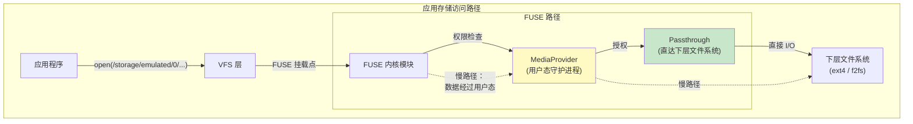

#### FUSE Passthrough 如何工作

FUSE passthrough 允许 FUSE 守护进程（MediaProvider）告诉内核，某些文件操作可以直接由内核处理，从而绕过 FUSE 用户态守护进程的数据搬运路径：

1. 应用通过 FUSE 挂载点打开文件，例如 `/storage/emulated/0/Download/photo.jpg`。
2. FUSE 内核模块向 MediaProvider 发送 `OPEN` 请求。
3. MediaProvider 做权限校验，若授权通过，就在真实文件系统上打开底层文件，并通知 FUSE 内核模块对该文件启用 passthrough。
4. 应用后续的 `read()` 和 `write()` 调用将直接从 FUSE 内核模块到达下层文件系统，完全绕过 MediaProvider。

这种设计保留了 MediaProvider 权限检查带来的安全性，同时让实际数据 I/O 的性能接近原生文件系统。

#### 配置

Android 基础配置中，FUSE 文件系统支持是强制要求：

```
CONFIG_FUSE_FS=y
```

**来源**：`kernel/configs/b/android-6.12/android-base.config`，第 69 行

### 5.3.4 Incremental FS

#### 目标与设计

Incremental FS（`incfs`）让 Android 能够在 APK 数据尚未全部下载完成时就开始使用它。这是 Android “Incremental APK Installation” 特性的内核组成部分，使大型应用，尤其是游戏，能够在数据仍在流式传输时启动。

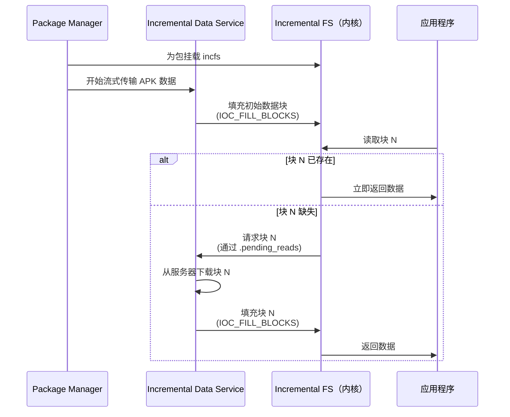

#### 内核接口

Incremental FS 内核模块通过 ioctl 命令暴露接口，这些定义位于用户态头文件 `system/incremental_delivery/incfs/kernel-headers/linux/incrementalfs.h` 中：

```c
#define INCFS_NAME "incremental-fs"
#define INCFS_MAGIC_NUMBER (0x5346434e49ul & ULONG_MAX)
#define INCFS_DATA_FILE_BLOCK_SIZE 4096

#define INCFS_IOC_CREATE_FILE \
    _IOWR(INCFS_IOCTL_BASE_CODE, 30, struct incfs_new_file_args)
#define INCFS_IOC_FILL_BLOCKS \
    _IOR(INCFS_IOCTL_BASE_CODE, 32, struct incfs_fill_blocks)
#define INCFS_IOC_GET_FILLED_BLOCKS \
    _IOR(INCFS_IOCTL_BASE_CODE, 34, struct incfs_get_filled_blocks_args)
```

**来源**：`system/incremental_delivery/incfs/kernel-headers/linux/incrementalfs.h`

关键设计特征包括：

1. **块级粒度**：文件被切分为 4 KB 数据块，每个块都可以独立存在或缺失。

2. **按需分页**：当进程读取一个尚未送达的块时，内核会阻塞这次读取，并通过特殊文件 `.pending_reads` 通知用户态数据加载器去获取该块。

3. **压缩支持**：块可以使用 LZ4 或 Zstd 压缩存储：
   ```c
   enum incfs_compression_alg {
     COMPRESSION_NONE = 0,
     COMPRESSION_LZ4 = 1,
     COMPRESSION_ZSTD = 2,
   };
   ```

4. **完整性校验**：Incremental FS 支持按文件的哈希树（`INCFS_BLOCK_FLAGS_HASH`）与 fs-verity 集成（`INCFS_XATTR_VERITY_NAME`），在数据块到达时校验其完整性。

5. **特殊文件**：文件系统暴露若干特殊文件用于监控和控制：
   - `.pending_reads`：数据加载器读取它，以发现当前缺哪些块
   - `.log`：调试用访问日志
   - `.blocks_written`：跟踪写入进度
   - `.index`：建立 file ID 到 inode 的映射
   - `.incomplete`：列出尚未完整加载的文件

#### 用户态集成

用户态实现位于 `system/incremental_delivery/incfs/`：

```
system/incremental_delivery/
    incfs/
        Android.bp
        incfs.cpp           # incfs 核心库
        incfs_ndk.c         # NDK 接口
        MountRegistry.cpp   # 挂载点跟踪
        path.cpp            # 路径工具
        kernel-headers/
            linux/
                incrementalfs.h  # 内核 UAPI 头文件
    libdataloader/          # 数据加载服务接口
    sysprop/                # incfs 相关 system property
```

**来源**：`system/incremental_delivery/incfs/`

### 5.3.5 Ashmem 与共享内存

Android shared memory（ashmem）提供具名、引用计数的共享内存区域。它是基础配置中的必需项：

```
CONFIG_ASHMEM=y
```

**来源**：`kernel/configs/b/android-6.12/android-base.config`，第 20 行

Ashmem 与标准 POSIX 共享内存（`shm_open`）相比有几个差异：

- 区域可以被 pin 和 unpin，内核在内存压力下可以回收未 pin 的页
- 区域按文件描述符做引用计数，最后一个 fd 关闭时内存才释放
- 区域可以被 seal（变为不可修改），增强安全性

虽然 ashmem 仍然因为兼容性而必须保留，但新代码更推荐使用 `memfd_create()`。这是上游 Linux 的等价机制，通过标准内核 API 提供相近能力。

### 5.3.6 Wakelocks 与电源管理

Android 的 wakelock 机制用于在关键操作执行期间阻止系统进入 suspend。对应的内核配置是：

```
CONFIG_PM_WAKELOCKS=y
```

**来源**：`kernel/configs/b/android-6.12/android-base.config`，第 210 行

同时，`CONFIG_PM_AUTOSLEEP` 被显式禁用：

```
# CONFIG_PM_AUTOSLEEP is not set
```

**来源**：`kernel/configs/b/android-6.12/android-base.config`，第 12 行

原因在于 Android 由用户态管理休眠/唤醒周期，具体是通过 PowerManager 服务来控制，而不是依赖内核的 autosleep 机制。

wakelock 接口通过以下路径暴露：

- `/sys/power/wake_lock`：写入 wakelock 名称以获取
- `/sys/power/wake_unlock`：写入 wakelock 名称以释放

用户态的 PowerManager 服务（位于 `system_server` 中）通过这些接口实现 Android 的机会式 suspend 模型：系统会积极尝试进入 suspend，除非有实体持有 wakelock。

### 5.3.7 Low Memory Killer Daemon（lmkd）

内核内低内存杀手（`CONFIG_ANDROID_LOW_MEMORY_KILLER`）已经从现代 Android 内核中移除，取而代之的是用户态守护进程 `lmkd`。它能够在内存压力下更智能地决定杀掉哪些进程。

#### 架构

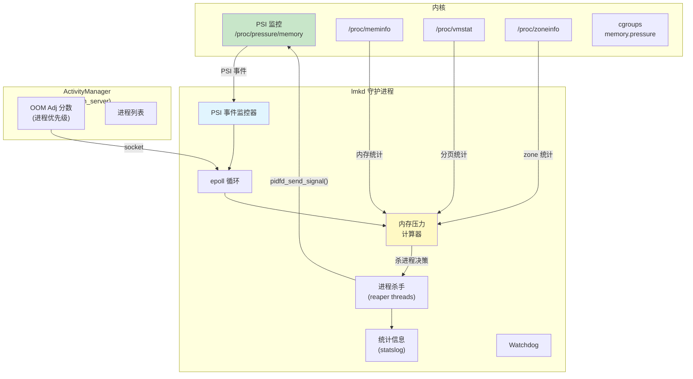

#### 基于 PSI 的触发机制

lmkd 使用内核的 Pressure Stall Information（PSI）接口检测内存压力。PSI 是 Google 与内核社区紧密协作的产物，现在已经成为标准内核能力。

lmkd 中与 PSI 监控相关的配置如下：

```c
#define DEFAULT_PSI_WINDOW_SIZE_MS 1000
#define PSI_POLL_PERIOD_SHORT_MS 10
#define PSI_POLL_PERIOD_LONG_MS 100
```

**来源**：`system/memory/lmkd/lmkd.cpp`，第 117-121 行

PSI 接口通过 libpsi 初始化：

```c
// system/memory/lmkd/libpsi/psi.cpp
int init_psi_monitor(enum psi_stall_type stall_type,
                     int threshold_us,
                     int window_us,
                     enum psi_resource resource) {
    fd = TEMP_FAILURE_RETRY(open(psi_resource_file[resource],
                                 O_WRONLY | O_CLOEXEC));
```

**来源**：`system/memory/lmkd/libpsi/psi.cpp`

#### OOM Adjustment 分数

lmkd 从 `system_server` 中的 ActivityManager 接收进程优先级信息。每个进程都会被赋予一个 OOM adjustment 分数，用来表示其重要性：

```c
#define SYSTEM_ADJ (-900)        // 系统进程（永不杀）
#define PERCEPTIBLE_APP_ADJ 200  // 用户可感知但非前台
#define PREVIOUS_APP_ADJ 700     // 上一个前台应用
```

**来源**：`system/memory/lmkd/lmkd.cpp`，第 79-80、98 行

当检测到内存压力时，lmkd 会从 OOM adjustment 分数最高的进程开始杀，也就是从最不重要的进程往前推进，直到释放出足够内存。

#### 关键源码文件

```
system/memory/lmkd/
    lmkd.cpp            # 守护进程主逻辑（2000+ 行）
    lmkd.rc             # init.rc 服务定义
    reaper.cpp           # 进程执行终结（使用 pidfd）
    reaper.h
    watchdog.cpp         # lmkd 卡死时的 watchdog
    watchdog.h
    statslog.cpp         # 统计上报
    statslog.h
    libpsi/
        psi.cpp          # PSI 监控接口
        include/
            psi/psi.h    # PSI 头文件
    liblmkd_utils.cpp   # 工具函数
```

**来源**：`system/memory/lmkd/`

### 5.3.8 dm-verity 与 Verified Boot

dm-verity 是一个 device-mapper target，用于对块设备做透明完整性校验。Android 用它在启动期间验证系统分区完整性：

```
CONFIG_DM_VERITY=y
```

**来源**：`kernel/configs/b/android-6.12/android-base.config`，第 60 行

dm-verity 通过为整个分区维护一棵哈希树（Merkle tree）工作。每次读取时，驱动都会计算数据块的哈希，并和哈希树中的值比对。校验失败时，读取会返回 I/O 错误。

#### dm-verity 的 Merkle 树如何工作

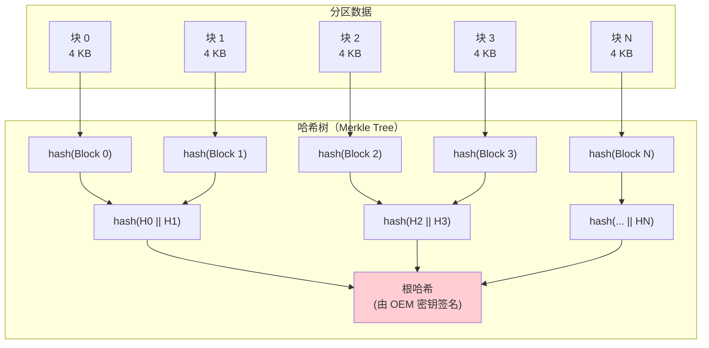

根哈希由设备 OEM 的密钥签名，并在内核加载前由 bootloader 校验。这就建立起一条从 bootloader 到系统分区每一个数据块的完整信任链。

dm-verity 具备几种工作模式：

- **Enforcing**（默认）：校验失败直接产生 I/O 错误，设备可能重启进入 recovery
- **Logging**：记录校验失败日志，但读取仍继续，常用于开发阶段
- **EIO**：校验失败时返回 `EIO`，但系统继续运行

Android 中的 verified boot 链条是多个内核子系统共同构成的：

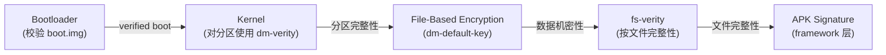

完整 verified boot 链涉及的相关配置包括：

```
CONFIG_DM_DEFAULT_KEY=y          # dm-crypt 默认密钥
CONFIG_DM_SNAPSHOT=y             # OTA 所需快照支持
CONFIG_FS_ENCRYPTION=y           # 基于文件的加密
CONFIG_FS_ENCRYPTION_INLINE_CRYPT=y  # 硬件 inline crypto
CONFIG_FS_VERITY=y               # 按文件完整性校验（fs-verity）
CONFIG_BLK_INLINE_ENCRYPTION=y   # 块级 inline encryption
```

#### File-Based Encryption（FBE）

Android 使用的是基于文件的加密，而不是整盘加密。这样不同文件可以用不同密钥加密，也就支持了诸如 Direct Boot 这样的能力：设备在用户解锁前也能显示锁屏、接收来电等。

在模拟器的 fstab 中可以看到加密配置：

```
/dev/block/vdc  /data  ext4  ...  fileencryption=aes-256-xts:aes-256-cts,...
```

**来源**：`device/generic/goldfish/board/fstab/arm`

它表明：

- 文件内容使用 `aes-256-xts` 加密，用于保护机密性
- 文件名使用 `aes-256-cts` 加密，用于防止元数据泄漏

#### fs-verity：按文件完整性校验

dm-verity 保护整个分区，而 fs-verity（`CONFIG_FS_VERITY=y`）则对单个文件做完整性校验。它的用途包括：

- 安装后校验 APK 文件，作为 APK 签名的补充
- 保护可写分区上的系统文件
- 确保下载内容的完整性

fs-verity 与 dm-verity 使用相同的 Merkle tree 思路，只是作用范围变成单个文件。一旦某个文件启用 fs-verity，下一次读取时，任何内容篡改都会体现为哈希不匹配。

### 5.3.9 eBPF 集成

Android 广泛使用 eBPF（extended Berkeley Packet Filter）处理网络、监控与安全问题：

```
CONFIG_BPF_JIT=y
CONFIG_BPF_SYSCALL=y
CONFIG_CGROUP_BPF=y
CONFIG_NETFILTER_XT_MATCH_BPF=y
CONFIG_NET_ACT_BPF=y
CONFIG_NET_CLS_BPF=y
```

**来源**：`kernel/configs/b/android-6.12/android-base.config`

6.12 配置还额外要求：

```
CONFIG_BPF_JIT_ALWAYS_ON=y
```

启动时，eBPF 程序会从 `/system/etc/bpf/` 加载，用途包括：

- 按 UID 统计网络流量
- 网络防火墙规则
- CPU 频率跟踪
- 追踪与性能分析

#### Android 上的 eBPF 架构

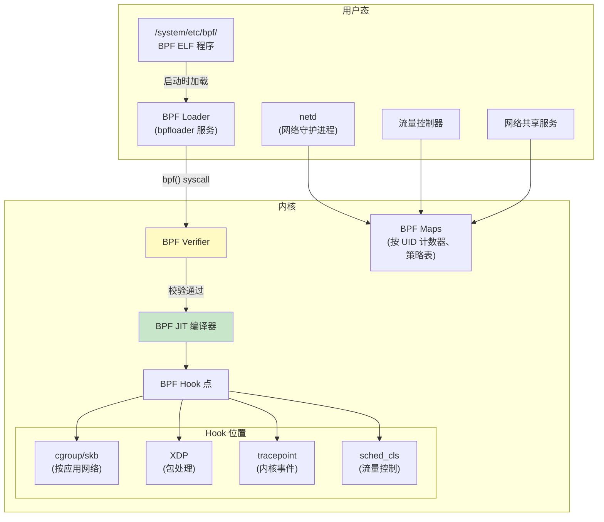

BPF loader（`bpfloader`）是启动期间最早拉起的服务之一。它会把 `/system/etc/bpf/` 下所有 `.o`（BPF ELF）文件加载进内核，并固定到 `/sys/fs/bpf/`。之后 `netd`、tethering 服务等组件会挂接这些固定好的程序。

Android 上 eBPF 的主要用例包括：

1. **按 UID 统计流量**：挂在 cgroup socket hook 上的 BPF 程序按 UID 统计收发字节数，支持设置中的流量展示与按应用限流。

2. **网络防火墙**：BPF 程序实现了取代 iptables 的每应用网络访问控制，性能更好、控制粒度也更细。

3. **网络共享卸载**：BPF 程序负责 USB/WiFi 共享中的包转发，把原本慢速的用户态处理迁移到内核 BPF 中。

4. **CPU 频率跟踪**：挂到调度 tracepoint 上的 BPF 程序统计每个 UID 在不同 CPU 频点上的停留时间，支持更准确的电量归因。

### 5.3.10 SELinux 强制执行

SELinux（Security-Enhanced Linux）在 Android 上是强制要求，并在内核层配置：

```
CONFIG_SECURITY=y
CONFIG_SECURITY_NETWORK=y
CONFIG_SECURITY_SELINUX=y
CONFIG_DEFAULT_SECURITY_SELINUX=y
```

**来源**：`kernel/configs/b/android-6.12/android-base.config`，第 222-226、57 行

Android 在量产设备上以 enforcing 模式运行 SELinux。每个进程、文件、socket 和内核对象都会被赋予安全标签，而 SELinux 策略（由 AOSP 树中的 `.te` 文件编译而来）定义了不同标签对象之间允许执行哪些操作。

内核中的 SELinux 子系统会：

- 给所有内核对象打标签（inode、socket、进程、IPC 对象）
- 通过 Linux Security Module（LSM）hook 拦截安全相关系统调用
- 对照已加载策略检查每个操作
- 拒绝所有未被显式允许的操作
- 把拒绝事件记录到审计子系统（`CONFIG_AUDIT=y`）

SELinux 是约束应用沙箱、防止提权、限制系统服务被攻陷影响面的核心机制。

### 5.3.11 Seccomp Filter

除 SELinux 外，Android 还使用 seccomp-BPF 过滤器来限制每个进程可用的系统调用：

```
CONFIG_SECCOMP=y
CONFIG_SECCOMP_FILTER=y
```

**来源**：`kernel/configs/b/android-6.12/android-base.config`，第 221-222 行

Seccomp 过滤器使用 BPF 程序检查每个系统调用及其参数。如果调用不在 allowlist 中，进程会被 SIGSYS 直接杀死。这提供了纵深防御：即使攻击者突破了 SELinux 沙箱，也依然无法调用危险 syscall。

Android 的 seccomp 策略是按架构定义的，并由 Zygote 在 fork 应用进程前施加。

### 5.3.12 Cgroups 与资源控制

Android 大量使用 Linux cgroups（control groups）进行资源管理：

```
CONFIG_CGROUPS=y
CONFIG_CGROUP_BPF=y
CONFIG_CGROUP_CPUACCT=y
CONFIG_CGROUP_FREEZER=y
CONFIG_CGROUP_SCHED=y
```

**来源**：`kernel/configs/b/android-6.12/android-base.config`，第 33-37 行

这些 cgroup 在 Android 中承担的具体职责如下：

| Cgroup 子系统 | 配置 | Android 用途 |
|-----------------|--------|---------------|
| cpuacct | `CONFIG_CGROUP_CPUACCT` | 按 UID 统计 CPU 时间 |
| freezer | `CONFIG_CGROUP_FREEZER` | 冻结缓存/后台应用 |
| cpu（sched） | `CONFIG_CGROUP_SCHED` | 控制应用组的 CPU 调度优先级 |
| bpf | `CONFIG_CGROUP_BPF` | 通过 BPF 实现按应用网络控制 |

Android 上的 cgroup 层级由 `init` 与 `system_server` 管理。模拟器的 init 脚本展示了顶层 cgroup 的创建过程：

```
on init
    mkdir /dev/cpuctl/foreground
    mkdir /dev/cpuctl/background
    mkdir /dev/cpuctl/top-app
    mkdir /dev/cpuctl/rt
```

**来源**：`device/generic/goldfish/init/init.ranchu.rc`，第 47-50 行

这些目录对应 Android 的进程调度分组：

- **top-app**：当前用户正在看的前台应用
- **foreground**：用户能感知到的进程，例如音乐播放器
- **background**：后台运行进程
- **rt**：实时优先级进程，例如音频与传感器处理

---

## 5.4 设备树与板级支持

### 5.4.1 设备树基础

设备树是一种描述系统硬件拓扑的数据结构。在 ARM 和 RISC-V 平台上，bootloader 会把设备树 blob（DTB）传给内核，内核据此发现并配置硬件设备。

设备树之所以必要，是因为 ARM 和 RISC-V 系统不像 x86 那样有 ACPI 作为标准硬件发现机制。设备树恰好补上了这个空白。

Android 基础配置会强制要求至少启用一种硬件描述机制：

```xml
<!-- CONFIG_ACPI || CONFIG_OF -->
<group>
    <conditions>
        <config>
            <key>CONFIG_ACPI</key>
            <value type="bool">n</value>
        </config>
    </conditions>
    <config>
        <key>CONFIG_OF</key>
        <value type="bool">y</value>
    </config>
</group>
```

**来源**：`kernel/configs/b/android-6.12/android-base-conditional.xml`，第 148-172 行

这个条件要求的含义是：如果 ACPI 被关闭，那么 Device Tree（`CONFIG_OF`）就必须启用，反之亦然。ARM 设备通常使用 OF（Open Firmware / Device Tree），x86 设备通常使用 ACPI。

### 5.4.2 DTS、DTB 和 DTBO

设备树数据会在以下几种格式之间流转：

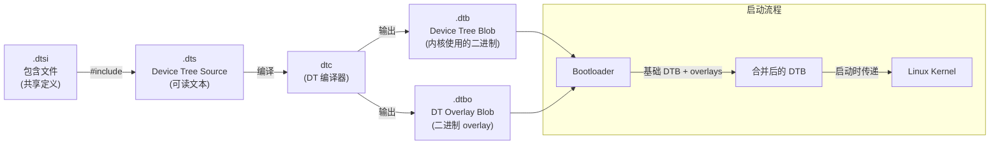

- **DTS**（Device Tree Source）：人类可读的文本文件，用树状结构描述硬件，节点代表设备，属性描述设备配置。
- **DTSI**（Device Tree Source Include）：供多个 DTS 文件共享的定义。通常 SoC 定义写在 DTSI 里，各个板子的 DTS 引入它并补充板级节点。
- **DTB**（Device Tree Blob）：DTS 编译得到的二进制文件，内核真正解析的就是它。
- **DTBO**（Device Tree Blob Overlay）：编译后的 overlay，可叠加在基础 DTB 上，用来在不修改 SoC 基础 DTB 的前提下做板级定制。

### 5.4.3 设备树 Overlay（DTBO）

Android 广泛使用设备树 overlay，以分离 SoC 级与板级硬件描述：

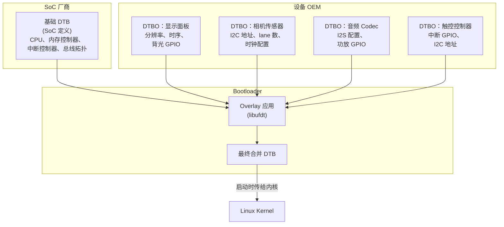

DTBO 分区是 Android 的标准分区之一，其中可包含一个或多个 overlay。启动时，bootloader 读取基础 DTB（通常编译进内核镜像，或位于独立分区）、再读取 DTBO 分区中的 overlay，使用 libufdt 把它们合并起来，然后把合并结果交给内核。

### 5.4.4 模拟器（Goldfish）设备树

Android 模拟器使用设备树描述它的虚拟硬件。goldfish 虚拟设备包含一个预编译 DTB：

**来源**：`kernel/prebuilts/common-modules/virtual-device/6.6/arm64/fvp-base-revc.dtb`

`device/generic/goldfish/` 中的模拟器板级配置明确说明 boot image 不包含 DTB：

```makefile
BOARD_INCLUDE_DTB_IN_BOOTIMG := false
```

**来源**：`device/generic/goldfish/board/BoardConfigCommon.mk`，第 75 行

模拟器中的设备信息改由以下组合提供：

1. QEMU 传给虚拟机的设备树
2. 面向半虚拟化设备的 virtio 设备发现
3. 面向 goldfish 专用虚拟硬件的平台设备注册

模拟器 goldfish 虚拟平台包含以下设备专用内核模块：

```
goldfish_address_space.ko  # 面向宿主通信的虚拟地址空间
goldfish_battery.ko        # 由宿主控制状态的虚拟电池
goldfish_pipe.ko           # 高带宽主机-来宾通信管道
goldfish_sync.ko           # GPU 模拟所需同步原语
```

**来源**：`prebuilts/qemu-kernel/arm64/6.12/goldfish_modules/`

### 5.4.5 虚拟设备模块

除了 goldfish 专用模块外，模拟器还会加载大量 GKI 与虚拟设备模块。以 kernel 6.6 arm64 为例，virtual-device common modules 里一共包含 57 个模块：

```
kernel/prebuilts/common-modules/virtual-device/6.6/arm64/
    virtio_dma_buf.ko       # 通过 virtio 共享 DMA buffer
    virtio_mmio.ko          # 内存映射 virtio 传输
    virtio-rng.ko           # 虚拟随机数发生器
    virtio_net.ko           # 虚拟网卡
    virtio_input.ko         # 虚拟输入设备
    virtio_snd.ko           # 虚拟音频设备
    virtio-gpu.ko           # 虚拟 GPU（3D 加速）
    virtio-media.ko         # 虚拟媒体设备
    cfg80211.ko             # 无线配置
    mac80211.ko             # IEEE 802.11 无线协议栈
    mac80211_hwsim.ko       # 模拟无线硬件
    system_heap.ko          # DMA-BUF system heap
    ...
```

**来源**：`kernel/prebuilts/common-modules/virtual-device/6.6/arm64/`

### 5.4.6 设备树语法参考

下面是一个简化版的、接近 goldfish 风格的设备树示例：

```dts
/dts-v1/;

/ {
    compatible = "android,goldfish";
    #address-cells = <2>;
    #size-cells = <2>;

    chosen {
        bootargs = "8250.nr_uarts=1";
    };

    memory@80000000 {
        device_type = "memory";
        reg = <0x0 0x80000000 0x0 0x80000000>;  /* 2 GB */
    };

    cpus {
        #address-cells = <1>;
        #size-cells = <0>;

        cpu@0 {
            device_type = "cpu";
            compatible = "arm,armv8";
            reg = <0x0>;
            enable-method = "psci";
        };
    };

    virtio_mmio@a003c00 {
        compatible = "virtio,mmio";
        reg = <0x0 0xa003c00 0x0 0x200>;
        interrupts = <0 43 4>;
        /* /data 分区的块设备 */
    };

    /* 其他 virtio 设备，如网络、GPU 等 */
};
```

关键元素如下：

- `compatible` 字符串用于标识应该绑定哪个驱动
- `reg` 属性指定 memory-mapped I/O 地址与大小
- `interrupts` 指定中断号和中断类型
- `chosen` 节点用于传递内核命令行参数

### 5.4.7 设备树与驱动绑定

内核使用 `compatible` 属性把设备树节点和驱动匹配起来。当内核遇到一个设备树节点时，它会遍历所有已注册的平台驱动，查找其 `of_match_table` 中是否存在匹配的 `compatible` 字符串。

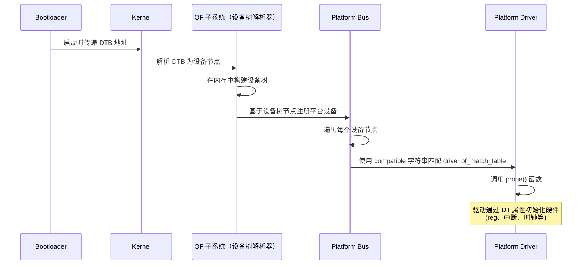

例如 virtio MMIO transport 驱动会匹配 `"virtio,mmio"`。当设备树中包含 `virtio_mmio` 节点时，内核会自动加载并探测 virtio MMIO 驱动，接着再通过 virtio 设备协商协议发现各类具体 virtio 设备，例如网络、块设备、GPU 等。

### 5.4.8 设备树属性参考

Android 设备树中常见的设备树属性如下：

| 属性 | 类型 | 示例 | 用途 |
|----------|------|---------|---------|
| `compatible` | string list | `"arm,armv8"` | 驱动匹配 |
| `reg` | address, size pairs | `<0x0 0xa003c00 0x0 0x200>` | MMIO 寄存器 |
| `interrupts` | interrupt specifiers | `<0 43 4>` | IRQ 配置 |
| `clocks` | phandle + clock-id | `<&cru CLK_UART0>` | 时钟源 |
| `clock-names` | string list | `"uartclk", "apb_pclk"` | 具名时钟引用 |
| `status` | string | `"okay"` 或 `"disabled"` | 启用/禁用节点 |
| `#address-cells` | u32 | `<2>` | 子节点地址宽度 |
| `#size-cells` | u32 | `<2>` | 子节点大小宽度 |
| `pinctrl-0` | phandle list | `<&uart0_pins>` | 引脚配置 |
| `dma-ranges` | ranges | `<0x0 0x0 ...>` | DMA 地址转换 |

### 5.4.9 DTBO 分区格式

DTBO 分区使用 Android 定义的一种专用二进制格式：

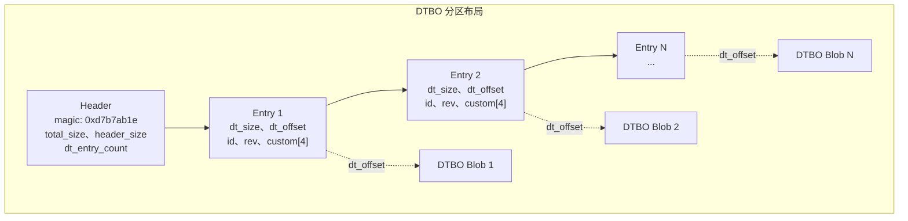

bootloader 会根据 entry 元数据中的硬件标识（board ID、revision 等）选择要应用哪个 overlay。这使同一个 DTBO 分区可以同时容纳多个硬件变体所需的 overlay。

### 5.4.10 测试设备树修改

Android 提供了若干方式来验证设备树变更：

1. **dtc（Device Tree Compiler）**：编译和反编译 DTS 文件，验证语法：
   ```bash
   # 把 DTS 编译成 DTB
   dtc -I dts -O dtb -o board.dtb board.dts

   # 把 DTB 反编译成 DTS（便于检查）
   dtc -I dtb -O dts -o decompiled.dts board.dtb
   ```

2. **fdtdump**：把 DTB 以人类可读格式导出：
   ```bash
   fdtdump board.dtb
   ```

3. **运行中设备的 `/proc/device-tree`**：内核把解析后的设备树暴露为文件系统层级：
   ```bash
   adb shell ls /proc/device-tree/
   adb shell cat /proc/device-tree/compatible
   ```

4. **VTS 测试**：Vendor Test Suite 包含验证设备树属性是否与 framework compatibility matrix 一致的测试。

---

## 5.5 内核配置

### 5.5.1 配置架构

Android 的内核配置管理建立在 Linux 标准 Kconfig 基础设施之上，并采用分层体系。Android 并不维护单一庞大的 `defconfig` 文件，而是使用一组 **配置片段（configuration fragments）**，组合后生成最终内核配置。

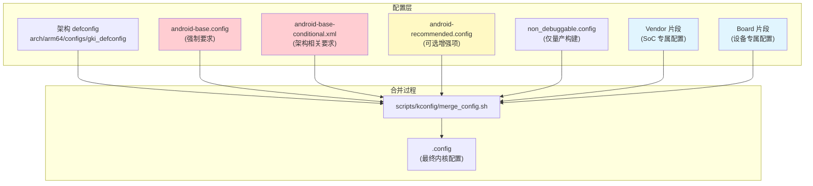

### 5.5.2 `kernel/configs` 仓库

内核配置片段存放在 `kernel/configs/` 中，结构如下：

```
kernel/configs/
    README.md                    # 完整文档
    kernel-lifetimes.xml         # 分支生命周期与 EOL 日期
    approved-ogki-builds.xml     # 获批 OEM GKI 构建
    Android.bp                   # 构建规则
    build/
        Android.bp
        kernel_config.go         # Soong 配置处理
    tools/
        Android.bp
        bump.py                  # 版本升级工具
        check_fragments.sh       # 配置片段校验
        kconfig_xml_fixup.py     # XML 修复工具
    xsd/
        approvedBuild/           # XML schema 定义
    b/                           # Android 16（Baklava）版本
        android-6.12/
            Android.bp
            android-base.config
            android-base-conditional.xml
            android-tv-base.config
            android-tv-base-conditional.xml
    c/                           # Android 16 QPR（Custard）
        android-6.12/
    v/                           # Android 15（Vanilla Ice Cream）
        android-6.1/
        android-6.6/
    u/                           # Android 14（Upside Down Cake）
        android-5.15/
        android-6.1/
    t/                           # Android 13（Tiramisu）
        android-5.10/
        android-5.15/
    s/                           # Android 12（Snow Cone）
        android-4.19/
        android-5.4/
        android-5.10/
    r/                           # Android 11（Red Velvet）
        android-5.4/
```

**来源**：`kernel/configs/`

目录命名使用 Android 甜点代号的首字母：`b` 代表 Baklava（Android 16），`v` 代表 Vanilla Ice Cream（Android 15），`u` 代表 Upside Down Cake（Android 14），以此类推。

### 5.5.3 基础配置片段

`android-base.config` 文件包含 Android 正常运行所 **必须** 的全部内核配置项。这些配置会作为 VTS（Vendor Test Suite）测试的一部分进行验证，也会在启动过程中通过 VINTF（Vendor Interface）兼容矩阵检查。

查看 Android 16 / kernel 6.12 的基础配置（`kernel/configs/b/android-6.12/android-base.config`），可以看到总计 262 行内容，大致分为：

**显式禁用项**（第 1-15 行）：
```
# CONFIG_ANDROID_LOW_MEMORY_KILLER is not set
# CONFIG_ANDROID_PARANOID_NETWORK is not set
# CONFIG_BPFILTER is not set
# CONFIG_DEVMEM is not set
# CONFIG_FHANDLE is not set
# CONFIG_FW_CACHE is not set
# CONFIG_IP6_NF_NAT is not set
# CONFIG_MODULE_FORCE_UNLOAD is not set
# CONFIG_NFSD is not set
# CONFIG_NFS_FS is not set
# CONFIG_PM_AUTOSLEEP is not set
# CONFIG_RT_GROUP_SCHED is not set
# CONFIG_SYSVIPC is not set
# CONFIG_USELIB is not set
```

其中几个比较值得注意：

- `CONFIG_DEVMEM`：禁用 `/dev/mem`，避免原始物理内存访问，提升安全性
- `CONFIG_MODULE_FORCE_UNLOAD`：禁止强制卸载模块，提升稳定性
- `CONFIG_SYSVIPC`：Android 不使用 SysV IPC，因为 Binder 已经替代它
- `CONFIG_USELIB`：出于安全考虑禁用遗留 syscall

**Android 核心要求**（第 16-261 行）：

- IPC：`CONFIG_ANDROID_BINDER_IPC`、`CONFIG_ANDROID_BINDERFS`
- 内存：`CONFIG_ASHMEM`、`CONFIG_SHMEM`
- 文件系统：`CONFIG_FUSE_FS`、`CONFIG_FS_ENCRYPTION`、`CONFIG_FS_VERITY`
- 安全：`CONFIG_SECURITY_SELINUX`、`CONFIG_SECCOMP`、`CONFIG_SECCOMP_FILTER`、`CONFIG_STACKPROTECTOR_STRONG`
- 电源：`CONFIG_PM_WAKELOCKS`、`CONFIG_SUSPEND`
- 网络：大量 netfilter/iptables 配置（80+ 项）
- 监控：`CONFIG_PSI`、`CONFIG_UID_SYS_STATS`、`CONFIG_TRACE_GPU_MEM`
- 构建工具链：`CONFIG_CC_IS_CLANG`、`CONFIG_AS_IS_LLVM`、`CONFIG_LD_IS_LLD`

### 5.5.4 条件配置

`android-base-conditional.xml` 用来表达那些依赖目标架构或其他内核配置值的要求。对于 Android 16 / kernel 6.12：

**最低 LTS 版本要求：**
```xml
<kernel minlts="6.12.0" />
```

**架构相关要求：**

对于 ARM64：
```xml
<group>
    <conditions>
        <config>
            <key>CONFIG_ARM64</key>
            <value type="bool">y</value>
        </config>
    </conditions>
    <config><key>CONFIG_ARM64_PAN</key><value type="bool">y</value></config>
    <config><key>CONFIG_CFI_CLANG</key><value type="bool">y</value></config>
    <config><key>CONFIG_SHADOW_CALL_STACK</key><value type="bool">y</value></config>
    <config><key>CONFIG_RANDOMIZE_BASE</key><value type="bool">y</value></config>
    <config><key>CONFIG_KFENCE</key><value type="bool">y</value></config>
    <config><key>CONFIG_USERFAULTFD</key><value type="bool">y</value></config>
</group>
```

**来源**：`kernel/configs/b/android-6.12/android-base-conditional.xml`，第 27-90 行

这些 ARM64 专属要求包含多项重要安全特性：

- **CFI_CLANG**：Control Flow Integrity，阻止控制流劫持攻击
- **SHADOW_CALL_STACK**：为返回地址使用独立栈，防止 ROP 攻击
- **ARM64_PAN**：Privileged Access Never，防止内核误访问用户态内存
- **RANDOMIZE_BASE**：KASLR，随机化内核地址空间布局
- **KFENCE**：Kernel Electric Fence，低开销内存错误检测器

对于 x86：
```xml
<group>
    <conditions>
        <config>
            <key>CONFIG_X86</key>
            <value type="bool">y</value>
        </config>
    </conditions>
    <config><key>CONFIG_MITIGATION_PAGE_TABLE_ISOLATION</key><value type="bool">y</value></config>
    <config><key>CONFIG_MITIGATION_RETPOLINE</key><value type="bool">y</value></config>
    <config><key>CONFIG_RANDOMIZE_BASE</key><value type="bool">y</value></config>
</group>
```

x86 特有安全要求包括对 Meltdown（PTI）与 Spectre（Retpoline）的缓解。

### 5.5.5 不同内核版本间的配置差异

比较 Android 15（`v`）下的 6.6 配置与 Android 16（`b`）下的 6.12 配置，可以看到 Android 内核要求是如何演进的：

| 配置项 | 6.6（Android 15） | 6.12（Android 16） | 说明 |
|--------------|-------------------|---------------------|-------|
| `CONFIG_BPF_JIT_ALWAYS_ON` | absent | `y` | 出于安全考虑，JIT 编译成为强制要求 |
| `CONFIG_SCHED_DEBUG` | `y` | absent | 从强制列表移除 |
| `CONFIG_HID_WACOM` | `y` | absent | 转为可选项 |
| `CONFIG_IP_NF_MATCH_RPFILTER` | absent | `y` | 新增反向路径过滤 |

### 5.5.6 `kernel-lifetimes.xml`

`kernel-lifetimes.xml` 用于跟踪每一条 Android 内核分支的支持生命周期。它是以下信息的权威来源：

1. **分支名与版本**：Android 版本和内核版本之间的映射
2. **发布与 EOL 日期**：分支何时首次可用、何时停止支持
3. **LTS 发行版跟踪**：同一分支下每个 GKI 发布各自的上线和 EOL 日期

```xml
<branch name="android15-6.6"
        min_android_release="15"
        version="6.6"
        launch="2023-10-29"
        eol="2028-07-01">
    <lts-versions>
        <release version="6.6.30" launch="2024-07-12" eol="2025-11-01"/>
        <release version="6.6.46" launch="2024-09-16" eol="2025-11-01"/>
        <!-- ... more releases ... -->
        <release version="6.6.98" launch="2025-08-11" eol="2026-12-01"/>
    </lts-versions>
</branch>
```

**来源**：`kernel/configs/kernel-lifetimes.xml`，第 128-144 行

这些数据会被 VTS、framework compatibility matrix 检查器以及构建系统消费，用来确保设备交付时使用的是受支持的内核版本。

### 5.5.7 `approved-ogki-builds.xml`

`approved-ogki-builds.xml` 列出 OEM（Original Equipment Manufacturers）获准使用的具体 GKI 构建。“OGKI” 代表 OEM GKI，也就是 OEM 被明确允许用于量产设备的 GKI 构建。

每个条目包含：

- 一个 SHA-256 哈希（`id`），用于唯一标识该构建
- 一个 bug 编号（`bug`），指向审批跟踪记录

```xml
<ogki-approved version="1">
    <branch name="android14-6.1">
        <build id="ac5884e09bd22ecd..." bug="352795077"/>
    </branch>
    <branch name="android15-6.6">
        <build id="9541494216af24d2..." bug="359105495"/>
        <!-- ... 80+ approved builds ... -->
    </branch>
    <branch name="android16-6.12">
        <build id="38a0ecd98b0b73ee..." bug="435129220"/>
        <!-- ... 10+ approved builds ... -->
    </branch>
</ogki-approved>
```

**来源**：`kernel/configs/approved-ogki-builds.xml`

这套审批流程确保量产设备上只会使用经过测试和验证的内核构建。

### 5.5.8 TV 专用配置

Android TV 设备有额外的内核配置要求。对于 Android 16 / kernel 6.12，系统提供了专门的 TV 配置片段：

```
kernel/configs/b/android-6.12/
    android-tv-base.config
    android-tv-base-conditional.xml
```

**来源**：`kernel/configs/b/android-6.12/android-tv-base.config`

TV 基础配置与标准基础配置大体一致，这反映出 Android TV 正在逐步向主线 Android 平台收敛。主要差异集中在媒体编解码支持，以及 HDMI 设备所需的 CEC（Consumer Electronics Control）相关能力。

### 5.5.9 配置校验

Android 在多个阶段对内核配置做校验：

1. **构建时**：构建系统检查内核配置是否符合 VINTF 兼容矩阵。

2. **VTS（Vendor Test Suite）**：`VtsKernelConfig` 测试验证运行中内核是否包含设备 launch level 所要求的全部配置项。

3. **启动时**：VINTF 框架会把运行中内核配置与 framework compatibility matrix 对比，不兼容时记录警告，或直接阻止启动。

这些构建规则由 `kernel/configs/build/kernel_config.go` 基于 `.config` 与 `.xml` 文件生成兼容矩阵格式：

**来源**：`kernel/configs/build/kernel_config.go`

此外，`kernel/configs/tools/check_fragments.sh` 脚本可用于验证配置片段是否格式正确且不存在冲突：

**来源**：`kernel/configs/tools/check_fragments.sh`

---

## 5.6 内核构建集成

### 5.6.1 两条路径：预编译与源码构建

AOSP 构建系统支持两种集成内核的方式：

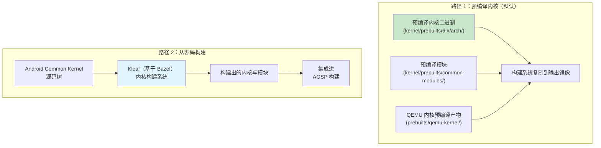

#### 预编译内核（模拟器默认路径）

对于模拟器和参考构建，AOSP 使用以下位置中的预编译内核：

1. **GKI 预编译产物**：`kernel/prebuilts/{6.1,6.6,6.12}/{arm64,x86_64}/`
2. **虚拟设备模块**：`kernel/prebuilts/common-modules/virtual-device/{6.1,6.6,6.12}/`
3. **QEMU 专用预编译产物**：`prebuilts/qemu-kernel/{arm64,x86_64}/`

模拟器的 board config 通过以下方式选择内核版本：

```makefile
TARGET_KERNEL_USE ?= 6.12
KERNEL_ARTIFACTS_PATH := prebuilts/qemu-kernel/arm64/$(TARGET_KERNEL_USE)
EMULATOR_KERNEL_FILE := $(KERNEL_ARTIFACTS_PATH)/kernel-$(TARGET_KERNEL_USE)-gz
```

**来源**：`device/generic/goldfish/board/kernel/arm64.mk`，第 20-21、65 行

这里使用了 `?=` 赋值，因此 `TARGET_KERNEL_USE` 默认是 6.12，但可以在命令行中覆盖，以测试其他内核版本：

```bash
# 使用 6.6 而不是 6.12 来构建模拟器
make TARGET_KERNEL_USE=6.6 sdk_phone64_arm64
```

#### 使用 Kleaf 从源码构建

对于 vendor 定制内核，推荐的构建系统是 Kleaf。它是一个基于 Bazel 的内核构建系统。第 2 章（构建系统）已经详细介绍了 Kleaf；它和 AOSP 构建的关键集成点如下：

1. Kleaf 独立于平台构建过程单独构建内核
2. 输出产物（内核镜像 + 模块）会放入一个 staging 目录
3. AOSP 平台构建在生成镜像时再拾取这些内核产物

### 5.6.2 模拟器内核更新流程

`prebuilts/qemu-kernel/update_emu_kernels.sh` 脚本记录了模拟器预编译内核的更新流程：

```bash
#!/bin/bash
KERNEL_VERSION="6.12"

# ./update_emu_kernel.sh --bug 123 --bid 123456
```

**来源**：`prebuilts/qemu-kernel/update_emu_kernels.sh`

这个脚本会：

1. 接受一个内部 CI 构建产物的 build ID（`--bid`）
2. 拉取每种架构对应的内核二进制和 GKI 模块
3. 拉取 goldfish 专用虚拟设备模块
4. 把它们放到 `prebuilts/qemu-kernel/` 树中
5. 记录关联 bug 编号以便跟踪

### 5.6.3 模块组织方式

GKI 模块按照不同类别组织，并分别通过不同分区交付：

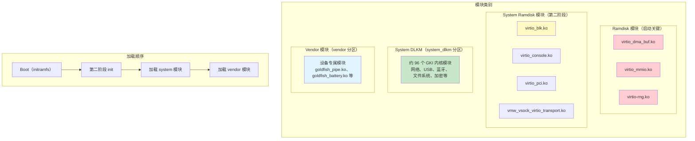

模拟器 arm64 的 board config 明确给出了这种分类：

```makefile
# 启动关键模块，从 vendor ramdisk 加载
RAMDISK_KERNEL_MODULES := \
    virtio_dma_buf.ko \
    virtio_mmio.ko \
    virtio-rng.ko \

# 第二阶段加载的 system 模块
RAMDISK_SYSTEM_KERNEL_MODULES := \
    virtio_blk.ko \
    virtio_console.ko \
    virtio_pci.ko \
    virtio_pci_legacy_dev.ko \
    virtio_pci_modern_dev.ko \
    vmw_vsock_virtio_transport.ko \

# 所有 GKI 模块都进入 system_dlkm
BOARD_SYSTEM_KERNEL_MODULES := \
    $(wildcard $(KERNEL_MODULES_ARTIFACTS_PATH)/*.ko)

# Vendor 模块（剔除 ramdisk 模块）
BOARD_VENDOR_KERNEL_MODULES := \
    $(filter-out $(BOARD_VENDOR_RAMDISK_KERNEL_MODULES) \
                 $(EMULATOR_EXCLUDE_KERNEL_MODULES), \
                 $(wildcard $(VIRTUAL_DEVICE_KERNEL_MODULES_PATH)/*.ko))
```

**来源**：`device/generic/goldfish/board/kernel/arm64.mk`，第 27-58 行

### 5.6.4 模块黑名单

部分模块虽然在预编译集合中存在，但运行时不应加载。模拟器维护了一份 blocklist：

```
blocklist vkms.ko
# When enabled, hijacks the first audio device that's expected to be backed by
# virtio-snd. See also: aosp/3391025
blocklist snd-aloop.ko
```

**来源**：`device/generic/goldfish/board/kernel/kernel_modules.blocklist`

- `vkms.ko`（Virtual Kernel Mode Setting）被列入黑名单，因为模拟器使用的是 `virtio-gpu.ko` 而不是它来处理显示
- `snd-aloop.ko`（ALSA loopback）被列入黑名单，因为它会与提供真实音频设备的 `virtio_snd.ko` 冲突

### 5.6.5 Boot 镜像生成

boot 镜像（`boot.img`）包含内核镜像、ramdisk 与启动参数。模拟器的 board config 指定了：

```makefile
BOARD_BOOT_HEADER_VERSION := 4
BOARD_MKBOOTIMG_ARGS += --header_version $(BOARD_BOOT_HEADER_VERSION)
BOARD_VENDOR_BOOTIMAGE_PARTITION_SIZE := 0x06000000
BOARD_RAMDISK_USE_LZ4 := true
```

**来源**：`device/generic/goldfish/board/BoardConfigCommon.mk`，第 76-79 行

boot image version 4 是最新格式，它支持：

- 独立的 vendor boot 镜像（`vendor_boot.img`）
- `boot.img` 中的 generic ramdisk
- `vendor_boot.img` 中的 vendor ramdisk
- 位于独立 `bootconfig` 区段中的启动配置

内核命令行通过文件而非 boot image header 传入：

```makefile
# BOARD_KERNEL_CMDLINE is not supported (b/361341981), use the file below
PRODUCT_COPY_FILES += \
    device/generic/goldfish/board/kernel/arm64_cmdline.txt:kernel_cmdline.txt
```

**来源**：`device/generic/goldfish/board/kernel/arm64.mk`，第 67-69 行

arm64 的内核命令行非常精简：
```
8250.nr_uarts=1
```

**来源**：`device/generic/goldfish/board/kernel/arm64_cmdline.txt`

x86_64 的命令行会额外指定一个 clocksource：
```
8250.nr_uarts=1 clocksource=pit
```

**来源**：`device/generic/goldfish/board/kernel/x86_64_cmdline.txt`

### 5.6.6 16K 页大小支持

现代 Android（16+）支持 16K 页大小内核，这有助于改善 TLB（Translation Lookaside Buffer）利用率，并提升内存密集型负载的性能。模拟器包含专门的 16K 页大小配置：

```
device/generic/goldfish/board/kernel/
    arm64.mk             # 标准 4K 页大小
    arm64_16k.mk         # 16K 页大小变体
    arm64_16k_cmdline.txt
    x86_64.mk
    x86_64_16k.mk
    x86_64_16k_cmdline.txt
```

**来源**：`device/generic/goldfish/board/kernel/`

16K 页大小变体使用独立的一套预编译内核：

```makefile
TARGET_KERNEL_USE := 6.12
KERNEL_ARTIFACTS_PATH := prebuilts/qemu-kernel/arm64_16k/$(TARGET_KERNEL_USE)
```

**来源**：`device/generic/goldfish/board/kernel/arm64_16k.mk`，第 20-21 行

4K 页大小构建的内核版本字符串里包含 `-4k` 后缀，16K 构建则会包含 `-16k` 后缀。

### 5.6.7 GSI（Generic System Image）与内核

Generic System Image 是 Google 提供的参考 AOSP 构建，它应该能在任何符合 GKI 规范的设备上运行。GSI 的 board config 清晰展示了这一场景下内核是如何处理的：

```makefile
# build/make/target/board/BoardConfigGsiCommon.mk
TARGET_NO_KERNEL := true
```

**来源**：`build/make/target/board/BoardConfigGsiCommon.mk`

`TARGET_NO_KERNEL := true` 表示 GSI 不会打包内核。这是一个有意为之的设计：GSI 的 system image 需要搭配设备原有内核一起运行，而原有内核位于 boot 分区。正是这种清晰分离，使得 GSI 能够在任何兼容 GKI 的设备上运行，而无需替换其内核。

GSI 同时会启用 system_dlkm，以保证模块兼容性：

```makefile
BOARD_USES_SYSTEM_DLKMIMAGE := true
BOARD_SYSTEM_DLKMIMAGE_FILE_SYSTEM_TYPE := ext4
TARGET_COPY_OUT_SYSTEM_DLKM := system_dlkm
```

**来源**：`build/make/target/board/BoardConfigGsiCommon.mk`

### 5.6.8 构建系统中的内核版本

构建系统需要知道内核版本，以便做兼容性检查。对于预编译内核，这个信息由 `kernel_version.mk` 提供：

```makefile
BOARD_KERNEL_VERSION := 6.6.100-android15-8-gf988247102d3-ab14039625-4k
```

**来源**：`kernel/prebuilts/6.6/arm64/kernel_version.mk`

版本字符串中的各部分会被以下系统使用：

- **VINTF compatibility matrix**：确保 framework 与内核兼容
- **VTS 测试**：验证内核满足声明 Android 版本所需条件
- **OTA 系统**：确保内核更新保持兼容性

### 5.6.9 Super 分区与动态分区

模拟器使用 Android 的动态分区系统，并包含一个 super 分区：

```makefile
BOARD_BUILD_SUPER_IMAGE_BY_DEFAULT := true
BOARD_SUPER_PARTITION_SIZE ?= 8598323200  # 8G + 8M
BOARD_SUPER_PARTITION_GROUPS := emulator_dynamic_partitions

BOARD_EMULATOR_DYNAMIC_PARTITIONS_PARTITION_LIST := \
    system \
    system_dlkm \
    system_ext \
    product \
    vendor
```

**来源**：`device/generic/goldfish/board/BoardConfigCommon.mk`，第 44-55 行

其中 `system_dlkm` 分区专门用于存放 GKI 内核模块：

```makefile
BOARD_USES_SYSTEM_DLKMIMAGE := true
BOARD_SYSTEM_DLKMIMAGE_FILE_SYSTEM_TYPE := erofs  # we never write here
TARGET_COPY_OUT_SYSTEM_DLKM := system_dlkm
```

**来源**：`device/generic/goldfish/board/BoardConfigCommon.mk`，第 67-69 行

注释 “we never write here” 明确说明 `system_dlkm` 是只读分区：内核模块从这里加载，但运行时不会写回。使用 `erofs`（Enhanced Read-Only File System）也进一步强化了这种不可变性。

---

## 5.7 内核调试

### 5.7.1 内核追踪基础设施

Linux 内核提供了多种强大的追踪机制，Android 也把它们深度集成进自己的工具链：

```mermaid
graph TB
    subgraph "内核追踪机制"
        FT["ftrace<br/>/sys/kernel/tracing/"]
        TP["Tracepoints<br/>(静态埋点)"]
        KP["kprobes<br/>(动态埋点)"]
        EBPF["eBPF Programs<br/>(可编程追踪)"]
    end

    subgraph "Android 追踪工具"
        ATRACE["atrace<br/>(Android trace 工具)"]
        PERFETTO["Perfetto<br/>(全系统追踪)"]
        SYSTRACE["Systrace<br/>(旧工具，底层使用 atrace)"]
        SIMPLEPERF["simpleperf<br/>(CPU profiling)"]
    end

    subgraph "输出"
        UI["Perfetto UI<br/>(ui.perfetto.dev)"]
        REPORT["Trace 报告"]
        FLAME["火焰图"]
    end

    FT --> ATRACE
    FT --> PERFETTO
    TP --> PERFETTO
    KP --> PERFETTO
    EBPF --> PERFETTO
    ATRACE --> PERFETTO
    PERFETTO --> UI
    SIMPLEPERF --> FLAME
    PERFETTO --> REPORT

    style PERFETTO fill:#c8e6c9
    style FT fill:#e1f5fe
```

### 5.7.2 ftrace

ftrace 是内核内建的追踪框架。Android 基础配置要求启用 profiling 支持：

```
CONFIG_PROFILING=y
```

**来源**：`kernel/configs/b/android-6.12/android-base.config`，第 214 行

ftrace 提供以下能力：

- **函数追踪**：追踪每一次内核函数调用，或者某些特定函数
- **函数图追踪**：追踪函数进入和退出，并记录耗时
- **事件追踪**：记录特定内核事件，例如调度、I/O、内存分配等
- **Trace marker**：用户态可以向 `/sys/kernel/tracing/trace_marker` 写入内容，把事件注入内核 trace

关键 ftrace 虚拟文件包括：

```
/sys/kernel/tracing/
    available_tracers       # 可用 tracer 列表
    current_tracer          # 当前启用的 tracer
    trace                   # 可读文本格式 trace 输出
    trace_pipe              # 流式 trace 输出
    tracing_on              # 开/关 tracing
    buffer_size_kb          # 每 CPU buffer 大小
    events/                 # 可用 tracepoint
        sched/              # 调度器事件
            sched_switch/
            sched_wakeup/
        binder/             # Binder IPC 事件
            binder_transaction/
            binder_lock/
        block/              # 块 I/O 事件
        ext4/               # ext4 文件系统事件
        f2fs/               # f2fs 文件系统事件
```

#### 在 Android 上使用 ftrace

在运行中的设备上启用函数追踪：

```bash
# 启用 tracing
adb shell "echo 1 > /sys/kernel/tracing/tracing_on"

# 设置 tracer
adb shell "echo function_graph > /sys/kernel/tracing/current_tracer"

# 只追踪指定函数（例如 binder）
adb shell "echo 'binder_*' > /sys/kernel/tracing/set_ftrace_filter"

# 读取 trace
adb shell cat /sys/kernel/tracing/trace

# 关闭 tracing
adb shell "echo 0 > /sys/kernel/tracing/tracing_on"
```

### 5.7.3 Tracepoints

Tracepoint 是编译进内核的静态埋点。它们会在内核代码中的特定位置输出结构化事件数据。Android 大量使用 tracepoint，主要场景包括：

- **调度追踪**：`sched_switch`、`sched_wakeup`、`sched_process_exit`
- **Binder 追踪**：`binder_transaction`、`binder_return`、`binder_lock`
- **内存追踪**：`mm_page_alloc`、`mm_page_free`、`oom_score_adj_update`
- **GPU 内存追踪**：`gpu_mem_total`（由 `CONFIG_TRACE_GPU_MEM=y` 支持）
- **电源管理**：`cpu_frequency`、`cpu_idle`、`suspend_resume`

Android 基础配置中要求 `CONFIG_TRACE_GPU_MEM=y`，用于启用 GPU 内存追踪 tracepoint：

```
CONFIG_TRACE_GPU_MEM=y
```

**来源**：`kernel/configs/b/android-6.12/android-base.config`，第 243 行

### 5.7.4 与 Perfetto 的集成

Perfetto 是 Android 的全系统追踪基础设施，后续章节会详细展开。它与内核的集成主要通过 `traced_probes` 守护进程完成，该进程从内核 tracing ring buffer 中读取 ftrace 事件。

Perfetto 的 ftrace 集成代码位于：

```
external/perfetto/src/traced/probes/ftrace/
    cpu_reader.cc           # 读取 ftrace 每 CPU ring buffer
    cpu_reader.h
    event_info.cc           # 把 ftrace event ID 映射为名字
    event_info_constants.cc # 已知事件定义
    compact_sched.cc        # 调度事件的紧凑编码
    atrace_hal_wrapper.cc   # Android trace HAL 集成
    atrace_wrapper.cc       # atrace 命令集成
```

**来源**：`external/perfetto/src/traced/probes/ftrace/`

Perfetto 的 ftrace 集成流程如下：

1. 为每个 CPU 打开 `/sys/kernel/tracing/per_cpu/cpuN/trace_pipe_raw`
2. 通过 `/sys/kernel/tracing/events/<category>/<event>/enable` 启用所需 tracepoint
3. 从 ring buffer 中读取二进制 trace 数据
4. 把事件编码成 Perfetto 的 protobuf trace 格式
5. 把 trace 写入文件，或流式发送给 Perfetto trace viewer

#### 用 Perfetto 采集内核 Trace

```bash
# 录制 10 秒 trace，包含调度和 binder 事件
adb shell perfetto \
    -c - \
    -o /data/misc/perfetto-traces/trace.perfetto-trace \
    <<EOF
buffers {
    size_kb: 63488
}
data_sources {
    config {
        name: "linux.ftrace"
        ftrace_config {
            ftrace_events: "sched/sched_switch"
            ftrace_events: "sched/sched_wakeup"
            ftrace_events: "binder/binder_transaction"
            ftrace_events: "power/cpu_frequency"
            ftrace_events: "power/cpu_idle"
        }
    }
}
duration_ms: 10000
EOF

# 拉回 trace 文件
adb pull /data/misc/perfetto-traces/trace.perfetto-trace .

# 用 Perfetto UI 打开：https://ui.perfetto.dev
```

### 5.7.5 kprobes 与动态追踪

kprobes 允许你在运行时对任意内核函数打点，而无需重新编译内核。它的工作方式是在目标地址插入断点指令，并在命中时执行处理函数。

Android 的基础配置要求 `CONFIG_PROFILING=y`，这为 kprobes 提供了所需基础设施。当它与 eBPF（`CONFIG_BPF_SYSCALL=y`、`CONFIG_BPF_JIT=y`）结合时，kprobes 就成为实现定制化内核观测的强大工具。

#### 基于 eBPF 的内核追踪

Android 大量启用 eBPF 相关配置，因此也支持用 eBPF 程序做内核追踪：

```bash
# 查看已加载的 BPF 程序
adb shell bpftool prog list

# 查看 BPF map（BPF 程序使用的键值存储）
adb shell bpftool map list
```

启动时从 `/system/etc/bpf/` 加载的 eBPF 程序可以提供：

- 按 UID 统计网络流量
- 按 UID 跟踪 CPU 时间
- 内存事件监控

### 5.7.6 使用 debuggerd 分析崩溃

当 Android 上某个进程崩溃时，`debuggerd`（更具体地说是 `crash_dump`）会抓取一份 tombstone。它是一份详细的崩溃报告，包含寄存器状态、堆栈回溯、内存映射和信号信息。

崩溃抓取机制的实现位于：

```
system/core/debuggerd/
    crash_dump.cpp          # 崩溃处理主逻辑
    debuggerd.cpp           # debuggerd 守护进程
    libdebuggerd/
        tombstone.cpp       # tombstone 生成
        tombstone_proto.cpp # Protobuf 格式 tombstone
        backtrace.cpp       # 栈展开
        utility.cpp         # 工具函数
    handler/                # 进程内安装的 signal handler
    crasher/                # 测试崩溃程序
```

**来源**：`system/core/debuggerd/`

#### debuggerd 的工作方式

```mermaid
sequenceDiagram
    participant P as 崩溃进程
    participant SH as Signal Handler（进程内）
    participant CD as crash_dump
    participant TS as Tombstone Writer
    participant LOG as logcat

    P->>P: SIGSEGV / SIGABRT / 等
    P->>SH: 收到 signal
    SH->>SH: clone crash_dump 进程
    SH->>CD: fork + execve crash_dump
    CD->>CD: ptrace(ATTACH) 到崩溃进程
    CD->>CD: 读取寄存器、内存映射
    CD->>CD: 栈展开（libunwindstack）
    CD->>TS: 生成 tombstone
    TS->>TS: 写入 /data/tombstones/tombstone_NN
    TS->>LOG: 把崩溃摘要写入 logcat
    CD->>P: 恢复执行（进程随后退出）
```

#### 内核提供给崩溃分析的信息源

debuggerd 会读取若干内核提供的文件来构造 tombstone：

- `/proc/<pid>/maps`：崩溃进程的内存映射
- `/proc/<pid>/status`：进程状态（UID、状态、线程数）
- `/proc/<pid>/task/<tid>/status`：线程级状态
- `/proc/<pid>/comm`：进程命令名
- `/proc/<pid>/cmdline`：完整命令行
- `/proc/version`：内核版本字符串

内核的 `ptrace()` 系统调用是崩溃分析的关键，它允许 `crash_dump` 读取崩溃进程的寄存器与内存。

### 5.7.7 内核日志分析

内核 ring buffer（`dmesg`）是最重要的调试工具之一。在 Android 上，内核消息还会带着 `kernel` tag 被转发到 `logcat`。

```bash
# 读取内核 ring buffer
adb shell dmesg

# 实时跟踪内核消息
adb shell dmesg -w

# 从 logcat 读取内核消息
adb logcat -b kernel

# 针对特定子系统过滤
adb shell dmesg | grep -i binder
adb shell dmesg | grep -i "low memory"
adb shell dmesg | grep -i "oom"
```

#### 需要重点关注的常见内核消息

| 消息模式 | 子系统 | 含义 |
|----------------|-----------|---------|
| `binder: ...: ... got transaction` | Binder | 事务处理 |
| `lowmemorykiller:` | lmkd/OOM | 进程因内存压力被杀 |
| `oom_reaper:` | OOM | 内核 OOM reaper 工作中 |
| `CPU: ... MHz` | cpufreq | CPU 频率变化 |
| `audit: ` | SELinux | 策略违规 |
| `init: ` | init | 服务生命周期事件 |
| `dm_verity: ` | dm-verity | 完整性校验事件 |
| `FUSE: ` | FUSE | 文件系统操作 |
| `incfs: ` | Incremental FS | 增量加载事件 |

#### pstore：跨重启保留内核 panic 信息

pstore（persistent store）子系统能够在重启后保留内核日志，这对分析 kernel panic 至关重要：

```mermaid
graph LR
    subgraph "崩溃前"
        DMESG["内核 Ring Buffer<br/>(dmesg)"]
        PSTORE_W["pstore Writer<br/>(ramoops backend)"]
        RAM["保留内存区域<br/>(重启后依然保留)"]
    end

    subgraph "重启后"
        RAM2["保留内存区域"]
        PSTORE_R["pstore Reader"]
        FILES["/sys/fs/pstore/<br/>dmesg-ramoops-0<br/>console-ramoops-0<br/>pmsg-ramoops-0"]
    end

    DMESG --> PSTORE_W
    PSTORE_W --> RAM
    RAM -.->|"重启后保留"| RAM2
    RAM2 --> PSTORE_R
    PSTORE_R --> FILES
```

在配置了 pstore 的设备上，panic 前的最后一批内核日志会保存在保留内存里。设备重启后，这些消息会出现在 `/sys/fs/pstore/` 下：

```bash
# 崩溃后检查 pstore 数据
adb shell ls /sys/fs/pstore/
# 输出可能包括：
#   dmesg-ramoops-0     # 上一次内核日志
#   console-ramoops-0   # 上一次控制台输出
#   pmsg-ramoops-0      # 上一次用户态消息

# 读取崩溃日志
adb shell cat /sys/fs/pstore/dmesg-ramoops-0
```

### 5.7.8 Kernel Panic 与 Ramdump 分析

当崩溃的是内核本身，而不是用户态进程时，需要使用不同机制：

1. **Kernel panic 日志**：panic 前的最后一批内核消息会保存在 `pstore` 中，通常由保留内存区域承载。下次启动时，这些消息会出现在 `/sys/fs/pstore/`。

2. **Ramdump**：某些 SoC 支持在 kernel panic 时抓取完整内存转储。可以结合 `vmlinux` 符号文件使用 `crash` 或 `gdb` 进行分析。

3. **SysRq**：基础配置启用了 Magic SysRq 键（`CONFIG_MAGIC_SYSRQ=y`），因此即使系统看起来已经卡死，也可以触发内核调试动作：

   ```bash
   # 触发 kernel panic（用于测试 ramdump 抓取）
   adb shell "echo c > /proc/sysrq-trigger"

   # 打印所有运行中任务
   adb shell "echo t > /proc/sysrq-trigger"

   # 打印内存信息
   adb shell "echo m > /proc/sysrq-trigger"
   ```

### 5.7.9 调试 Binder 子系统

Binder 通过 `debugfs` 暴露了自己的一套调试接口：

```
/sys/kernel/debug/binder/
    state           # 全局 binder 状态（所有进程）
    stats           # Binder 事务统计
    transactions    # 活跃事务
    proc/<pid>      # 每进程 binder 状态
    failed_reply    # 失败事务细节
```

读取 Binder 状态：

```bash
# 查看 binder 统计
adb shell cat /sys/kernel/debug/binder/stats

# 查看 system_server 的 binder 状态（PID 会变化）
adb shell cat /sys/kernel/debug/binder/proc/$(adb shell pidof system_server)
```

#### 理解 Binder 调试输出

`binder stats` 文件提供了很有价值的 IPC 健康度信息：

```
# 示例 binder stats 输出结构
binder stats:
BC_TRANSACTION: 12345          # 发送的事务总数
BC_REPLY: 12340                # 发送的回复总数
BR_TRANSACTION: 12345          # 接收的事务总数
BR_REPLY: 12340                # 接收的回复总数
BR_DEAD_BINDER: 5              # 死亡通知次数
proc: 42                       # 使用 binder 的进程数
  threads: 8                   # 每进程平均线程数
  requested_threads: 4
  requested_threads_started: 4
  ready_threads: 6
  free_async_space: 524288
```

需要重点关注的指标：

- **BR_DEAD_BINDER 很高**：服务频繁死亡，需要排查 OOM kill 或崩溃
- **ready_threads 接近 0**：线程池耗尽，进程无法继续处理新事务
- **free_async_space 接近 0**：异步事务缓冲区耗尽，oneway 调用会被丢弃
- **BC_TRANSACTION 远大于 BR_REPLY**：事务超时，服务端负载过高

### 5.7.10 热与功耗调试

Android 的内核级电源管理可以通过若干接口调试：

```bash
# CPU 频率信息
adb shell cat /sys/devices/system/cpu/cpu0/cpufreq/scaling_cur_freq
adb shell cat /sys/devices/system/cpu/cpu0/cpufreq/scaling_available_frequencies

# CPU idle 状态信息
adb shell cat /sys/devices/system/cpu/cpu0/cpuidle/state0/name
adb shell cat /sys/devices/system/cpu/cpu0/cpuidle/state0/time

# 热区信息
adb shell cat /sys/class/thermal/thermal_zone0/type
adb shell cat /sys/class/thermal/thermal_zone0/temp

# Wakelock 信息
adb shell cat /sys/power/wake_lock
adb shell cat /d/wakeup_sources
```

### 5.7.11 内存调试

若干内核能力可以帮助定位内存问题：

1. **KFENCE**（Kernel Electric Fence）：在 ARM64 和 x86 的条件配置中都是强制要求。KFENCE 通过带守护页的 slab 对象池检测 use-after-free 与越界访问。

2. **PSI 监控**：除了 lmkd 外，也可以直接读取 PSI：
   ```bash
   adb shell cat /proc/pressure/memory
   # 输出：some avg10=0.00 avg60=0.00 avg300=0.00 total=0
   #       full avg10=0.00 avg60=0.00 avg300=0.00 total=0
   ```

3. **meminfo 与 vmstat**：标准内核内存报告接口：
   ```bash
   adb shell cat /proc/meminfo
   adb shell cat /proc/vmstat
   ```

4. **UID sys stats**：按应用统计 I/O：
   ```bash
   adb shell cat /proc/uid_io/stats
   ```

---

## 5.8 动手实践：检查模拟器内核

这一节给出一组动手练习，用来探索 Android 模拟器的内核。这些练习默认你已经同步好一份 AOSP 源码树，并且已经构建好了模拟器镜像，或者至少可以使用预编译镜像。

### 练习 1：检查预编译内核

先从 AOSP 树里的内核预编译产物开始：

```bash
# 列出可用的预编译内核版本
ls kernel/prebuilts/
# 输出：6.1  6.6  6.12  common-modules  mainline

# 查看内核版本字符串
cat kernel/prebuilts/6.6/arm64/kernel_version.mk
# 输出：BOARD_KERNEL_VERSION := 6.6.100-android15-8-gf988247102d3-ab14039625-4k

# 统计 GKI 模块数量
ls kernel/prebuilts/6.6/arm64/*.ko | wc -l
# 输出：96

# 列出一些关键模块
ls kernel/prebuilts/6.6/arm64/*.ko | head -20
```

**重点观察：**

- 内核版本字符串编码了 LTS 版本、Android 版本、git commit、build ID 与页大小
- GKI 模块覆盖网络、蓝牙、USB、WiFi、文件系统、加密和各类驱动
- `vmlinux` 文件包含完整调试符号，对内核调试很有价值

### 练习 2：检查 KMI 符号列表

KMI 符号列表定义了 GKI 内核与 vendor 模块之间的契约：

```bash
# 统计 KMI 符号总数
wc -l kernel/prebuilts/6.6/arm64/abi_symbollist
# 输出：35710

# 看看它的结构
head -30 kernel/prebuilts/6.6/arm64/abi_symbollist

# 搜索 binder 相关符号
grep -i binder kernel/prebuilts/6.6/arm64/abi_symbollist

# 搜索 Android 专有符号
grep android kernel/prebuilts/6.6/arm64/abi_symbollist

# 检查原始符号列表（只有名字，没有区段）
head -10 kernel/prebuilts/6.6/arm64/abi_symbollist.raw
# 输出：ANDROID_GKI_memcg_stat_item
#         ANDROID_GKI_node_stat_item
#         ANDROID_GKI_struct_dwc3
#         ...
```

**重点观察：**

- `ANDROID_GKI_*` 符号是 Android 对内核结构体的专用扩展
- `android_rvh_*` 符号是受限 vendor hook 注册函数
- 符号列表按 `[abi_symbol_list]` 区段组织
- `module_layout` 这类常用符号会出现在前部

### 练习 3：探索虚拟设备模块

模拟器会同时使用 GKI 模块和设备专属模块：

```bash
# 列出 goldfish 专用模块
ls prebuilts/qemu-kernel/arm64/6.12/goldfish_modules/

# 列出模拟器使用的 GKI 模块
ls prebuilts/qemu-kernel/arm64/6.12/gki_modules/ | head -20

# 统计模拟器模块总数
ls prebuilts/qemu-kernel/arm64/6.12/goldfish_modules/ | wc -l
ls prebuilts/qemu-kernel/arm64/6.12/gki_modules/ | wc -l

# 查看模块黑名单
cat device/generic/goldfish/board/kernel/kernel_modules.blocklist
```

**重点观察：**

- Goldfish 模块（`goldfish_*.ko`）只属于模拟器虚拟硬件
- Virtio 模块（`virtio_*.ko`）实现半虚拟化设备，例如网络、GPU、输入和声音
- `system_heap.ko` 模块提供 DMA-BUF 分配能力
- 黑名单中的模块（`vkms.ko`、`snd-aloop.ko`）会与 virtio 对应模块冲突

### 练习 4：阅读内核配置

检查 Android 基础配置，理解内核的最低要求：

```bash
# 读取 Android 16 / kernel 6.12 的基础配置
cat kernel/configs/b/android-6.12/android-base.config

# 统计强制开启的配置项
grep -c "=y" kernel/configs/b/android-6.12/android-base.config
# （必须启用的配置项数量）

# 统计显式禁用项数量
grep -c "is not set" kernel/configs/b/android-6.12/android-base.config

# 查看架构相关要求
cat kernel/configs/b/android-6.12/android-base-conditional.xml

# 比较不同版本之间的差异
diff kernel/configs/v/android-6.6/android-base.config \
     kernel/configs/b/android-6.12/android-base.config
```

**重点观察：**

- 基础配置按字母序排列，便于维护
- 安全相关项（SELinux、seccomp、encryption）都是强制项
- 网络相关项（netfilter、iptables）很多，因为 Android 防火墙依赖它们
- 条件 XML 补充了架构专属安全能力，例如 CFI、SCS、KFENCE

### 练习 5：查看内核生命周期数据

```bash
# 查看内核分支生命周期
cat kernel/configs/kernel-lifetimes.xml

# 查看获批的 OGKI 构建
cat kernel/configs/approved-ogki-builds.xml | head -20

# 统计每个分支的获批构建数量
grep -c "<build" kernel/configs/approved-ogki-builds.xml
```

**重点观察：**

- 每个分支的 EOL 都被定义到未来若干年，通常有 4 到 6 年支持期
- 同一分支中的 LTS release 单独维护更短的生命周期，通常为 12 到 15 个月
- `android16-6.12` 是最新分支，从 2025 年开始有具体 release
- `approved-ogki-builds.xml` 中 `android15-6.6` 的条目显著多于 `android16-6.12`，反映出成熟度差异

### 练习 6：提取运行中的模拟器内核配置

如果你有一个运行中的模拟器，可以直接导出内核编译时配置：

```bash
# 启动模拟器
emulator -avd <your_avd> &

# 等待启动完成
adb wait-for-device

# 导出内核配置（要求 CONFIG_IKCONFIG_PROC=y）
adb shell "zcat /proc/config.gz" > emulator_kernel_config.txt

# 查看内核版本
adb shell cat /proc/version

# 查看已加载模块
adb shell lsmod

# 查看内存信息
adb shell cat /proc/meminfo

# 查看 PSI 状态
adb shell cat /proc/pressure/memory
adb shell cat /proc/pressure/cpu
adb shell cat /proc/pressure/io
```

基础配置中的 `CONFIG_IKCONFIG=y` 和 `CONFIG_IKCONFIG_PROC=y` 保证了内核配置始终可以通过 `/proc/config.gz` 在运行时访问，这对排查配置相关问题非常有用。

### 练习 7：在模拟器上探索 Binder

```bash
# 查看 binder 设备
adb shell ls -la /dev/binderfs/

# 查看 binder 统计
adb shell cat /sys/kernel/debug/binder/stats 2>/dev/null || \
adb shell cat /dev/binderfs/binder-control/../stats 2>/dev/null

# 实时观察 binder 事务（需要 root）
adb root
adb shell "echo 1 > /sys/kernel/tracing/events/binder/binder_transaction/enable"
adb shell cat /sys/kernel/tracing/trace_pipe
# （观察过程中打开一个应用，就能看到事务流动）
```

### 练习 8：使用 atrace 追踪内核活动

```bash
# 列出可用 trace 类别
adb shell atrace --list_categories

# 采集 5 秒 trace，包含调度和 binder 事件
adb shell atrace -t 5 sched binder -o /data/local/tmp/trace.txt

# 拉回并检查
adb pull /data/local/tmp/trace.txt
```

### 练习 9：检查启动时的模块加载

模拟器的 init 脚本展示了启动过程中模块是如何加载的：

```bash
# 读取模拟器 init 脚本
cat device/generic/goldfish/init/init.ranchu.rc
```

`init.ranchu.rc` 中的关键片段：

```
on early-init
    start vendor.dlkm_loader
    exec u:r:modprobe:s0 -- /system/bin/modprobe -a -d /system/lib/modules zram.ko
```

**来源**：`device/generic/goldfish/init/init.ranchu.rc`，第 37-38 行

这说明：

1. `vendor.dlkm_loader` 服务会从 `vendor_dlkm` 加载 vendor 模块
2. `zram.ko` 会在 early init 阶段通过 modprobe 从 `system_dlkm` 加载
3. `modprobe` 命令运行在 `modprobe` 这个 SELinux 域中（`u:r:modprobe:s0`）

该 init 脚本还配置了 zram swap：

```
on init
    write /sys/block/zram0/comp_algorithm lz4
    write /proc/sys/vm/page-cluster 0
```

**来源**：`device/generic/goldfish/init/init.ranchu.rc`，第 41-42 行

### 练习 10：检查模拟器文件系统布局

模拟器的 fstab 揭示了它的分区布局：

```bash
cat device/generic/goldfish/board/fstab/arm
```

关键条目如下：

```
system       /system       erofs   ro    wait,logical,first_stage_mount
system       /system       ext4    ro    wait,logical,first_stage_mount
vendor       /vendor       erofs   ro    wait,logical,first_stage_mount
system_dlkm  /system_dlkm  erofs   ro    wait,logical,first_stage_mount
/dev/block/vdc  /data      ext4    ...   wait,check,quota,fileencryption=...
/dev/block/zram0  none     swap    defaults  zramsize=75%
```

**来源**：`device/generic/goldfish/board/fstab/arm`

值得注意的点：

- system、vendor 和 system_dlkm 都是只读挂载（erofs 或 ext4）
- data 分区启用了基于文件的加密（`fileencryption=aes-256-xts:...`）
- data 分区启用了 fs-verity（`fsverity`）
- zram swap 使用 75% 的内存作为压缩交换空间
- 动态分区使用 Android 的 `logical` 分区系统，位于 super 分区中

---

## 5.9 总结

Android 内核是在 Linux 内核之上经过精细管理的一层扩展，它补充了 Android 在 IPC（Binder）、内存管理（lmkd + PSI）、存储（FUSE passthrough、Incremental FS）、安全（dm-verity、基于文件的加密、SELinux）和电源管理（wakelocks）方面的独特需求。

GKI 架构代表了 Android 内核管理方式的一次根本性转变。通过把内核拆分为 Google 构建的核心镜像与拥有稳定接口（KMI）的 vendor 模块，GKI 带来了：

- 独立的内核安全更新能力
- 整个生态更低的碎片化程度
- 更长的内核支持周期（每个分支 4 到 6 年）
- 面向量产设备的已验证、已批准内核构建

内核配置系统确保所有 Android 设备都满足最小配置要求，并在构建时、测试时（VTS）和启动时（VINTF compatibility matrix）进行验证。生命周期管理系统（`kernel-lifetimes.xml`）则明确说明哪些内核处于支持状态，以及支持会持续多久。

对于 AOSP 开发者而言，理解内核层非常重要，因为它关系到：

- 调试涉及调度、内存或 I/O 行为的性能问题
- 理解安全模型，而这个模型最终由内核执行
- 处理那些需要修改内核模块或设备树的硬件特性
- 为已在现场运行的设备维护和更新内核

第 4.8 节的练习为你提供了一个上手起点，可以借助 Android 模拟器探索内核。模拟器自带一份功能完整的 GKI 内核，并且其架构与量产设备保持一致。

### 关键结论

1. **Android 内核是上游 Linux 加上一组有针对性的扩展。** 差异面被刻意控制在较小范围内，许多曾经只属于 Android 的特性已经合入上游。

2. **GKI 是未来方向。** 从 Android 12 / kernel 5.10 开始，所有新设备都必须采用带稳定 KMI 的 GKI 架构。这让内核独立更新成为可能，也降低了生态碎片化。

3. **配置通过片段管理，而不是靠单一大而全的 defconfig。** `kernel/configs/` 仓库维护每个 Android 版本、每个内核版本的配置要求，并在构建、测试和启动时持续验证。

4. **安全在每一层都被执行。** 从 dm-verity（分区完整性）、到基于文件的加密（数据机密性）、再到 SELinux（强制访问控制）、seccomp（系统调用过滤）、以及 CFI 和 SCS（代码完整性），内核提供了完整的纵深防御。

5. **调试工具链能力丰富且集成紧密。** ftrace、Perfetto、eBPF、debuggerd 和 pstore 组合起来，提供了完整的内核级可观测性。

6. **模拟器本身就是一个功能完整的 GKI 目标。** goldfish 虚拟设备使用与量产设备相同的 GKI 架构，因此是进行内核开发与测试的理想平台。

### 与其他章节的交叉引用

- **第 2 章（构建系统）**：Kleaf，基于 Bazel 的内核构建系统
- **第 3 章（启动流程）**：内核如何被加载，以及 init 进程如何开始执行
- **第 5 章（硬件抽象）**：依赖内核驱动的 HAL
- **第 10 章（安全）**：SELinux 策略、seccomp 过滤器、verified boot 链
- **第 14 章（性能）**：Perfetto trace、CPU 调度与内存调优

### 关键文件参考

| 文件 / 目录 | 用途 |
|-----------------|---------|
| `kernel/configs/` | 内核配置片段与生命周期数据 |
| `kernel/configs/b/android-6.12/android-base.config` | Android 16 强制内核配置 |
| `kernel/configs/b/android-6.12/android-base-conditional.xml` | 架构专属要求 |
| `kernel/configs/kernel-lifetimes.xml` | 分支支持生命周期 |
| `kernel/configs/approved-ogki-builds.xml` | 已批准 OEM GKI 构建 |
| `kernel/prebuilts/6.6/arm64/` | GKI 6.6 预编译内核与模块 |
| `kernel/prebuilts/6.6/arm64/abi_symbollist` | KMI 符号列表（35,710 个符号） |
| `kernel/prebuilts/common-modules/virtual-device/` | 虚拟设备内核模块 |
| `prebuilts/qemu-kernel/arm64/6.12/` | 模拟器内核预编译产物 |
| `device/generic/goldfish/` | 模拟器设备配置 |
| `device/generic/goldfish/board/kernel/arm64.mk` | 模拟器 arm64 内核配置 |
| `device/generic/goldfish/board/BoardConfigCommon.mk` | 模拟器板级配置 |
| `device/generic/goldfish/init/init.ranchu.rc` | 模拟器 init 脚本 |
| `system/memory/lmkd/` | Low Memory Killer Daemon |
| `system/memory/lmkd/lmkd.cpp` | lmkd 主逻辑 |
| `system/memory/lmkd/libpsi/psi.cpp` | PSI 监控接口 |
| `system/incremental_delivery/incfs/` | Incremental FS 用户态库 |
| `system/core/debuggerd/` | 崩溃抓取处理器 |
| `frameworks/native/libs/binder/IPCThreadState.cpp` | Binder 用户态 IPC |
| `external/perfetto/src/traced/probes/ftrace/` | Perfetto 内核追踪集成 |
| `build/make/target/board/BoardConfigGsiCommon.mk` | GSI 板级配置 |
