# Chapter 5: Kernel

The Linux kernel is the foundation of every Android device. It manages hardware,
enforces security boundaries, schedules processes, and provides the low-level
primitives -- such as Binder IPC and shared memory -- on which the entire Android
framework is built. Yet the kernel running on an Android device is not a stock
upstream Linux kernel. Over more than fifteen years, Android has accumulated a
set of kernel modifications, out-of-tree drivers, and configuration requirements
that distinguish it from any desktop or server Linux distribution.

This chapter examines the Android kernel in depth: what Android adds to upstream
Linux, how the Generic Kernel Image (GKI) architecture reduces fragmentation,
how individual Android-specific subsystems work at the driver level, how device
trees describe hardware, how kernel configuration is managed across releases, how
the kernel integrates into the AOSP build system, and how to debug kernel-level
problems on real and emulated devices.

Throughout this chapter, we reference real files in the AOSP source tree. Every
path, config fragment, and module name cited here can be found in that tree.

---

## 5.1 Android Kernel vs Upstream Linux

### 5.1.1 The Fork That Is Not Really a Fork

Android does not maintain a permanent fork of the Linux kernel. Instead, Google
maintains a set of "Android Common Kernel" (ACK) branches that track specific
upstream Long-Term Support (LTS) releases. Each ACK branch starts from an
upstream LTS tag (e.g., `6.6`, `6.12`) and adds a curated set of patches that
provide Android-specific functionality. These patches fall into several
categories:

1. **Android-specific drivers** that implement core platform features (Binder,
   ashmem, incremental-fs)
2. **Scheduler and memory management changes** that improve interactive
   performance on mobile devices
3. **Security hardening** beyond what upstream provides by default
4. **Vendor hook infrastructure** (trace events and restricted vendor hooks)
   that allow SoC vendors to customize behavior without modifying core kernel
   code
5. **Test and debug infrastructure** integrated with Android's testing pipeline

The goal is to minimize the delta from upstream. Many patches that originated in
the Android tree have been upstreamed over the years -- wakelocks (now
`PM_WAKELOCKS`), the low memory killer (replaced by PSI-based userspace lmkd),
and `ashmem` (being superseded by `memfd`) are all examples of this convergence.

### 5.1.2 Major Android Additions

The following table summarizes the most significant kernel-level features that
Android adds or requires beyond a stock upstream kernel:

| Feature | Kernel Config | Purpose | Status |
|---------|--------------|---------|--------|
| Binder IPC | `CONFIG_ANDROID_BINDER_IPC` | Cross-process communication for all framework services | Active, required |
| Binderfs | `CONFIG_ANDROID_BINDERFS` | Dynamic Binder device management | Active, required |
| Ashmem | `CONFIG_ASHMEM` | Anonymous shared memory regions | Active, transitioning to memfd |
| Wakelocks | `CONFIG_PM_WAKELOCKS` | Prevent system suspend during critical operations | Active, required |
| PSI (Pressure Stall Information) | `CONFIG_PSI` | Memory pressure monitoring for lmkd | Active, required |
| DMA-BUF Heaps | `CONFIG_DMABUF_HEAPS_SYSTEM` | Graphics buffer allocation (ION replacement) | Active |
| FUSE filesystem | `CONFIG_FUSE_FS` | Userspace filesystem for storage access | Active, required |
| Incremental FS | `CONFIG_INCREMENTAL_FS` | On-demand APK block loading | Active |
| dm-verity | `CONFIG_DM_VERITY` | Verified boot for system partitions | Active, required |
| FS encryption | `CONFIG_FS_ENCRYPTION` | File-based encryption for userdata | Active, required |
| FS verity | `CONFIG_FS_VERITY` | Per-file integrity verification | Active, required |
| UID system stats | `CONFIG_UID_SYS_STATS` | Per-UID I/O and CPU accounting | Active, required |
| CPU freq times | `CONFIG_CPU_FREQ_TIMES` | Per-UID CPU frequency residency tracking | Active, required |
| GPU memory tracing | `CONFIG_TRACE_GPU_MEM` | GPU memory allocation tracing | Active, required |

These config options are declared as mandatory in the Android base configuration
fragments stored in the `kernel/configs/` directory of the AOSP tree.

### 5.1.3 Architectural Comparison

The following diagram illustrates how the Android kernel differs from an upstream
Linux kernel in terms of its layered architecture:

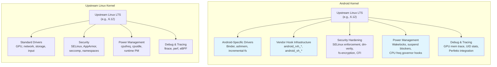

### 5.1.4 The Upstream Convergence Trend

Google has been actively working to reduce the delta between the Android Common
Kernel and upstream Linux. Several historically Android-only features have been
upstreamed or are in the process:

**Already upstreamed or converging:**

- `PM_WAKELOCKS` -- wakelock infrastructure is now part of upstream Linux
- PSI (Pressure Stall Information) -- originally developed for Android's lmkd,
  now a standard kernel feature
- The old in-kernel low memory killer (`CONFIG_ANDROID_LOW_MEMORY_KILLER`) has
  been removed; Android now uses a userspace daemon (lmkd) that reads PSI events
- `memfd_create()` is gradually replacing `ashmem` for new code
- ION allocator has been replaced by the upstream DMA-BUF heap framework

**Still Android-specific:**

- Binder driver (deeply integrated with Android's IPC model)
- Incremental FS (specialized for APK streaming)
- Vendor hooks (trace_android_rvh_* and trace_android_vh_*)
- UID-based resource accounting (`CONFIG_UID_SYS_STATS`,
  `CONFIG_CPU_FREQ_TIMES`)

The explicit disabling of the old in-kernel low memory killer is visible in the
base config fragments. In the Android 16 (branch `b`) config for kernel 6.12:

```
# CONFIG_ANDROID_LOW_MEMORY_KILLER is not set
```

**Source**: `kernel/configs/b/android-6.12/android-base.config`, line 2.

This single line tells the story of a multi-year migration: the kernel's
in-process OOM killer has been replaced by a sophisticated userspace daemon that
uses PSI events for more intelligent memory management decisions.

---

## 5.2 GKI (Generic Kernel Image)

### 5.2.1 The Fragmentation Problem

Before GKI, every Android device shipped a unique kernel. SoC vendors (Qualcomm,
MediaTek, Samsung LSI, etc.) would take an Android Common Kernel branch, apply
hundreds of patches for their SoC, and pass it to device OEMs who would apply
yet more patches for their specific hardware. The result was a deeply fragmented
ecosystem:

- Security patches could not be delivered to kernels without vendor cooperation
- Each device had a unique kernel binary that could not be updated independently
- Kernel bugs required fixes to propagate through multiple vendor trees
- Testing at scale was impossible because no two devices ran the same kernel

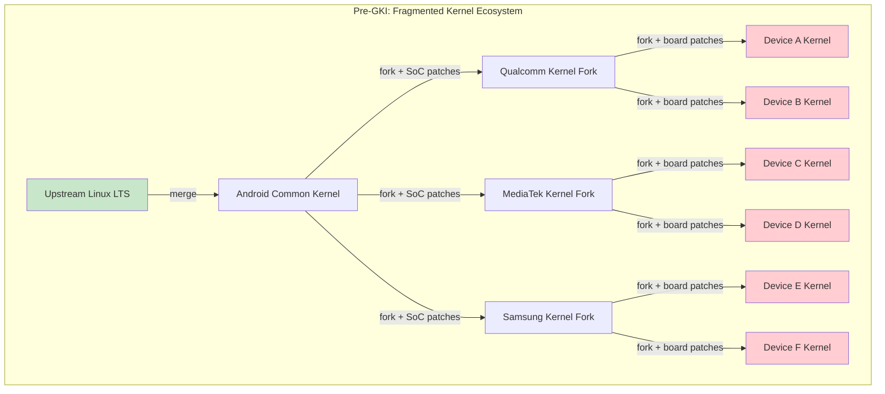

### 5.2.2 GKI 2.0 Architecture

GKI solves this by splitting the kernel into two parts:

1. **GKI core kernel** -- a single binary built by Google from the Android Common
   Kernel source. This binary is identical across all devices using the same
   kernel version.

2. **Vendor modules** -- loadable kernel modules (`.ko` files) that contain all
   SoC-specific and device-specific code. These are built by vendors against a
   stable Kernel Module Interface (KMI).

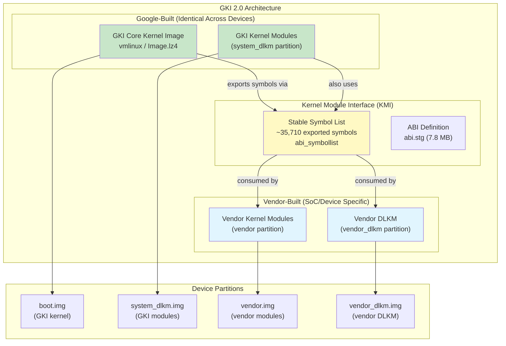

### 5.2.3 The Kernel Module Interface (KMI)

The KMI is the contract between the GKI core kernel and vendor modules. It
consists of:

1. **A symbol list** -- the set of kernel functions and variables that vendor
   modules are allowed to call. For kernel 6.6, this list contains
   approximately 35,710 entries.

   **Source**: `kernel/prebuilts/6.6/arm64/abi_symbollist` (35,710 lines)

   The symbol list begins with commonly used symbols and is organized into
   sections:

   ```
   [abi_symbol_list]
   # commonly used symbols
     module_layout
     __put_task_struct
     utf8_data_table

   [abi_symbol_list]
     add_cpu
     add_device_randomness
     add_timer
     ...
   ```

2. **An ABI definition** -- a machine-readable description of the types,
   structures, and function signatures exported by the KMI. For kernel 6.6, this
   file is approximately 7.8 MB.

   **Source**: `kernel/prebuilts/6.6/arm64/abi.stg` (7,819,214 bytes)

3. **Module versioning** (`CONFIG_MODVERSIONS=y`) -- CRC checksums are computed
   for each exported symbol based on its prototype. A module compiled against
   one version of a symbol cannot be loaded if the symbol's signature has
   changed.

The KMI is frozen for each GKI release. Once frozen, Google guarantees that the
symbol list and ABI will not change in backwards-incompatible ways for the
lifetime of that kernel branch. This allows vendors to ship module updates
independently of kernel updates, and vice versa.

### 5.2.4 KMI Symbol Stability Guarantees

The config option `CONFIG_MODVERSIONS=y` (present in all Android base configs)
enables compile-time CRC generation for every exported symbol. When a module is
loaded, the kernel checks that the CRCs in the module match the CRCs in the
running kernel. If they do not match, the module load fails with an error like:

```
disagrees about version of symbol <name>
```

This is the enforcement mechanism for KMI stability: even if the symbol name
exists, a change to its type signature will be detected and rejected.

### 5.2.5 Vendor Hooks

Since vendors cannot modify the GKI core kernel, they need a mechanism to
customize kernel behavior for their SoC. GKI provides this through **vendor
hooks** -- lightweight tracepoints that vendors can register callbacks for:

- **`android_vh_*`** (vendor hooks) -- standard tracepoints that vendors can
  attach to. These are safe to call from any context.
- **`android_rvh_*`** (restricted vendor hooks) -- hooks in performance-critical
  paths where the callback must meet stricter requirements.

The KMI symbol list includes vendor hook registration functions:

```
android_rvh_probe_register
```

**Source**: `kernel/prebuilts/6.6/arm64/abi_symbollist`, line 28

Vendor hooks allow SoC vendors to:

- Customize the scheduler for their big.LITTLE/DynamIQ CPU topology
- Add thermal management logic tied to specific sensor hardware
- Implement custom memory management policies
- Hook into power management decisions

### 5.2.6 GKI Prebuilt Kernels in AOSP

The AOSP tree ships prebuilt GKI kernels for use by the emulator and reference
devices. These prebuilts include:

```
kernel/prebuilts/
    6.1/
        arm64/
        x86_64/
    6.6/
        arm64/          # 114 files total, ~96 .ko modules
            kernel-6.6              # Uncompressed kernel image
            kernel-6.6-gz           # Gzip-compressed kernel
            kernel-6.6-lz4          # LZ4-compressed kernel
            kernel-6.6-allsyms      # Debug kernel with all symbols
            kernel-6.6-gz-allsyms   # Debug compressed kernel
            kernel-6.6-lz4-allsyms  # Debug LZ4 compressed kernel
            vmlinux                  # ELF kernel with debug info
            System.map               # Symbol address map
            System.map-allsyms       # Full symbol map
            abi_symbollist           # KMI symbol list (35,710 lines)
            abi_symbollist.raw       # Raw symbol names
            abi.stg                  # ABI definition (~7.8 MB)
            abi-full.stg             # Full ABI definition
            kernel_version.mk        # Version string for build system
            *.ko                     # ~96 GKI kernel modules
        x86_64/
    6.12/
        arm64/
        x86_64/
    common-modules/
        virtual-device/
            6.1/
            6.6/
                arm64/   # 57 device-specific modules
                x86-64/
            6.12/
            mainline/
        trusty/
    mainline/
        arm64/
        x86_64/
```

The kernel version string for the 6.6 arm64 prebuilt reveals its lineage:

```
BOARD_KERNEL_VERSION := 6.6.100-android15-8-gf988247102d3-ab14039625-4k
```

**Source**: `kernel/prebuilts/6.6/arm64/kernel_version.mk`

Breaking this down:

- `6.6.100` -- upstream LTS version 6.6, patch level 100
- `android15` -- Android 15 ACK branch
- `8` -- eighth release from this branch
- `gf988247102d3` -- git commit hash
- `ab14039625` -- Android build ID
- `4k` -- 4K page size variant

### 5.2.7 GKI Release Lifecycle

Each GKI kernel branch has a defined lifecycle with launch and end-of-life (EOL)
dates. These are tracked in `kernel/configs/kernel-lifetimes.xml`:

```xml
<branch name="android16-6.12"
        min_android_release="16"
        version="6.12"
        launch="2024-11-17"
        eol="2029-07-01">
    <lts-versions>
        <release version="6.12.23" launch="2025-06-12" eol="2026-10-01"/>
        <release version="6.12.30" launch="2025-07-11" eol="2026-11-01"/>
        <release version="6.12.38" launch="2025-08-11" eol="2026-12-01"/>
    </lts-versions>
</branch>
```

**Source**: `kernel/configs/kernel-lifetimes.xml`, lines 146-152

Key observations from this file:

- Kernel branches span multiple years (e.g., android14-6.1 runs from 2022 to
  2029)
- Each branch has specific LTS releases with their own EOL dates
- Quarterly GKI releases have a 12-15 month support window
- Older branches (pre-5.10) are marked as "non-GKI kernel" since GKI was
  introduced with kernel 5.10 for Android 12

The complete lineage of supported kernel versions:

| Branch | Kernel | Min Android | Launch | EOL |
|--------|--------|-------------|--------|-----|
| android12-5.10 | 5.10 | 12 | 2020-12 | 2027-07 |
| android13-5.15 | 5.15 | 13 | 2021-10 | 2028-07 |
| android14-5.15 | 5.15 | 14 | 2021-10 | 2028-07 |
| android14-6.1 | 6.1 | 14 | 2022-12 | 2029-07 |
| android15-6.6 | 6.6 | 15 | 2023-10 | 2028-07 |
| android16-6.12 | 6.12 | 16 | 2024-11 | 2029-07 |

### 5.2.8 How Vendors Extend Without Forking

Under GKI, the vendor extension model works as follows:

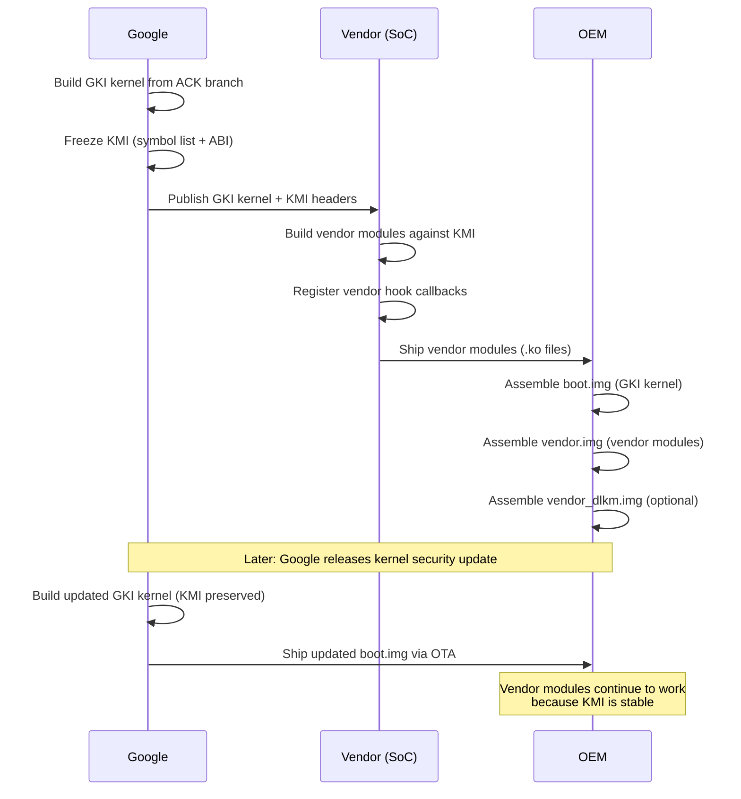

This separation means:

- Google can update the kernel for security fixes without vendor involvement
- Vendors can update their modules without waiting for a kernel update
- OEMs can mix and match GKI kernel versions with vendor module versions (within
  the same KMI generation)

---

## 5.3 Key Android-Specific Kernel Features

### 5.3.1 Binder Driver

Binder is Android's inter-process communication (IPC) mechanism. Every
interaction between apps and system services -- launching an Activity, binding a
Service, querying a ContentProvider, sending an Intent -- flows through Binder.
The Binder driver is the kernel component that makes this possible.

#### Kernel Configuration

Binder requires two config options in the Android base config:

```
CONFIG_ANDROID_BINDER_IPC=y
CONFIG_ANDROID_BINDERFS=y
```

**Source**: `kernel/configs/b/android-6.12/android-base.config`, lines 18-19

The `CONFIG_ANDROID_BINDERFS` option enables `binderfs`, a special filesystem
that allows dynamic creation of Binder device nodes. This replaced the
traditional approach of creating `/dev/binder`, `/dev/hwbinder`, and
`/dev/vndbinder` as static device nodes.

#### Transaction Model

The Binder driver implements a synchronous RPC mechanism with the following
characteristics:

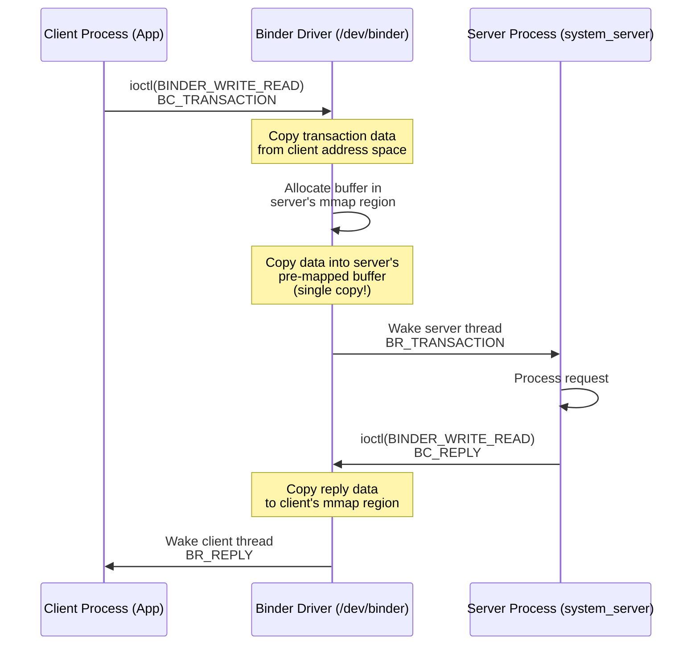

Key aspects of the transaction model:

1. **Single-copy data transfer**: The Binder driver uses `mmap()` to create a
   shared memory region in the server process's address space. When a client
   sends a transaction, the driver copies data directly from the client's
   user-space buffer into the server's mmap'ed region. This means data is
   copied only once (client user-space to server kernel-mapped buffer), rather
   than the two copies required by traditional IPC mechanisms (client to kernel,
   kernel to server).

2. **Object translation**: Binder handles (references to remote objects) are
   translated by the driver as transactions cross process boundaries. The driver
   maintains a reference-counted mapping of Binder nodes and their proxy
   handles.

3. **Death notifications**: A process can register for notification when a Binder
   object in another process dies. The driver tracks these registrations and
   sends `BR_DEAD_BINDER` notifications when the hosting process exits.

4. **Security context propagation**: The driver embeds the caller's PID, UID,
   and SELinux security context into every transaction, allowing the server to
   make authorization decisions.

#### Memory Mapping

Each process that opens the Binder device maps a region of memory using `mmap()`.
This region is used by the driver to deliver transaction data:

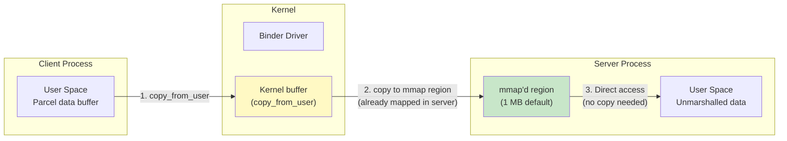

The default mmap size is 1 MB minus two pages (1,048,576 - 8,192 = 1,040,384
bytes). This is the maximum amount of data that can be in flight for a single
process's incoming transactions at any given time.

#### Thread Management

The Binder driver manages a thread pool for each process:

- When a process opens the Binder device, it registers itself with
  `BINDER_SET_CONTEXT_MGR` (for servicemanager) or starts handling transactions.
- The driver can request the creation of new threads via `BR_SPAWN_LOOPER` when
  all existing threads are busy.
- The maximum thread count is set via `BINDER_SET_MAX_THREADS`.
- Threads enter the driver via `ioctl(BINDER_WRITE_READ)` and block until a
  transaction arrives or there is a reply to deliver.

The userspace side of Binder thread management is implemented in
`frameworks/native/libs/binder/IPCThreadState.cpp`:

```cpp
// frameworks/native/libs/binder/IPCThreadState.cpp
#include <binder/IPCThreadState.h>
#include <sys/ioctl.h>
#include "binder_module.h"
```

**Source**: `frameworks/native/libs/binder/IPCThreadState.cpp`

#### The Three Binder Domains

Modern Android uses three separate Binder domains, each with its own device
node, to enforce the Treble architecture separation:

| Domain | Device | Purpose | Users |
|--------|--------|---------|-------|
| Framework | `/dev/binder` | App-to-framework IPC | Apps, system_server |
| Hardware | `/dev/hwbinder` | Framework-to-HAL IPC | system_server, HAL processes |
| Vendor | `/dev/vndbinder` | Vendor-internal IPC | Vendor processes only |

With `binderfs` (`CONFIG_ANDROID_BINDERFS=y`), these device nodes are created
dynamically by mounting a binderfs filesystem, rather than being statically
created via `mknod`. This allows containerized Android instances to have their
own isolated Binder namespaces.

### 5.3.2 DMA-BUF Heap System

#### From ION to DMA-BUF Heaps

The ION memory allocator was Android's original solution for allocating
physically contiguous or otherwise specially-constrained memory buffers for use
by GPUs, cameras, video codecs, and display hardware. ION was an Android-only
out-of-tree driver that lived in `drivers/staging/android/`.

Starting with kernel 5.10, ION has been replaced by the upstream **DMA-BUF heap
framework**. This framework provides the same functionality -- allocating
DMA-capable buffers that can be shared between hardware devices and userspace --
but through a standard, upstream kernel interface.

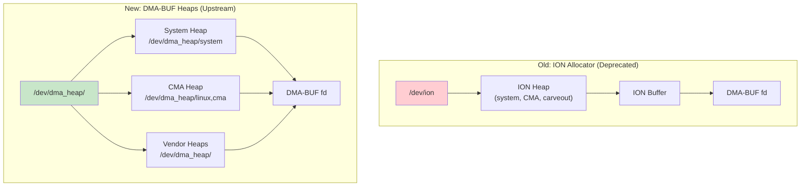

#### How DMA-BUF Heaps Work

1. **Heap registration**: Kernel drivers register heaps with the DMA-BUF heap
   framework, each appearing as a character device under `/dev/dma_heap/`.

2. **Allocation**: Userspace opens the appropriate heap device and calls
   `ioctl(DMA_HEAP_IOCTL_ALLOC)` to allocate a buffer. The returned file
   descriptor is a DMA-BUF fd.

3. **Sharing**: The DMA-BUF fd can be passed to other processes via Unix domain
   sockets or Binder. Any process with the fd can map the buffer into its
   address space or pass it to a hardware device driver.

4. **Zero-copy pipeline**: The GPU, camera, and display can all reference the
   same physical memory through the DMA-BUF fd, avoiding copies in the graphics
   pipeline.

The emulator's goldfish modules include a `system_heap.ko` module that provides
a DMA-BUF system heap for the virtual device:

**Source**: `prebuilts/qemu-kernel/arm64/6.12/goldfish_modules/system_heap.ko`

#### Configuration

The GKI base config requires sync file support, which is the userspace-facing
interface for DMA-BUF synchronization fences:

```
CONFIG_SYNC_FILE=y
```

**Source**: `kernel/configs/b/android-6.12/android-base.config`, line 238

### 5.3.3 FUSE Passthrough and Storage Access

#### The Storage Access Problem

Android's storage model has undergone several revisions:

1. **Pre-Android 10**: SDCardFS (a stackable filesystem) provided per-app
   storage views with different permission sets.
2. **Android 10+**: SDCardFS was deprecated in favor of FUSE, which runs
   entirely in userspace via the MediaProvider process.
3. **Android 12+**: FUSE passthrough was introduced to recover the performance
   lost by routing all I/O through a userspace daemon.

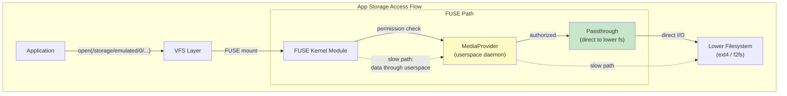

#### How FUSE Passthrough Works

FUSE passthrough allows the FUSE daemon (MediaProvider) to indicate that certain
file operations should be handled directly by the kernel, bypassing the FUSE
userspace daemon for data transfer:

1. The app opens a file through the FUSE mount (e.g.,
   `/storage/emulated/0/Download/photo.jpg`).
2. The FUSE kernel module sends an `OPEN` request to MediaProvider.
3. MediaProvider checks permissions and, if authorized, opens the underlying file
   on the real filesystem and tells the FUSE kernel module to use passthrough for
   this file.
4. Subsequent `read()` and `write()` calls from the app go directly from the
   FUSE kernel module to the lower filesystem, bypassing MediaProvider entirely.

This provides the security benefits of MediaProvider's permission checking while
recovering nearly native filesystem performance for actual data I/O.

#### Configuration

FUSE filesystem support is mandatory in the Android base config:

```
CONFIG_FUSE_FS=y
```

**Source**: `kernel/configs/b/android-6.12/android-base.config`, line 69

### 5.3.4 Incremental FS

#### Purpose and Design

Incremental FS (`incfs`) enables Android to start using an APK before all of its
data has been downloaded. This is the kernel component that supports Android's
"Incremental APK Installation" feature, which allows large apps (especially
games) to launch while still streaming their data.

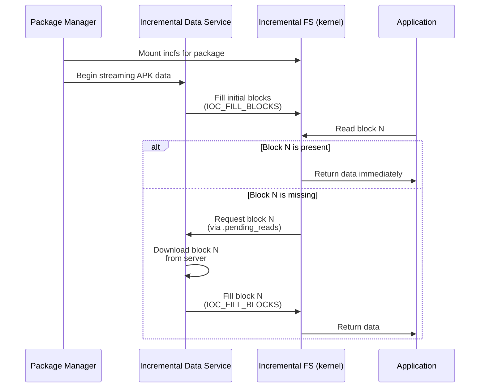

#### Kernel Interface

The Incremental FS kernel module exposes its interface through ioctl commands
defined in the userspace header at
`system/incremental_delivery/incfs/kernel-headers/linux/incrementalfs.h`:

```c
#define INCFS_NAME "incremental-fs"
#define INCFS_MAGIC_NUMBER (0x5346434e49ul & ULONG_MAX)
#define INCFS_DATA_FILE_BLOCK_SIZE 4096

#define INCFS_IOC_CREATE_FILE \
    _IOWR(INCFS_IOCTL_BASE_CODE, 30, struct incfs_new_file_args)
#define INCFS_IOC_FILL_BLOCKS \
    _IOR(INCFS_IOCTL_BASE_CODE, 32, struct incfs_fill_blocks)
#define INCFS_IOC_GET_FILLED_BLOCKS \
    _IOR(INCFS_IOCTL_BASE_CODE, 34, struct incfs_get_filled_blocks_args)
```

**Source**: `system/incremental_delivery/incfs/kernel-headers/linux/incrementalfs.h`

Key design characteristics:

1. **Block-level granularity**: Files are divided into 4 KB blocks. Each block
   can be independently present or absent.

2. **Demand paging**: When a process reads a block that has not yet been
   delivered, the kernel blocks the read and signals the userspace data loader
   (via the `.pending_reads` special file) to fetch that block.

3. **Compression support**: Blocks can be stored compressed using LZ4 or Zstd:
   ```c
   enum incfs_compression_alg {
     COMPRESSION_NONE = 0,
     COMPRESSION_LZ4 = 1,
     COMPRESSION_ZSTD = 2,
   };
   ```

4. **Integrity verification**: Incremental FS supports per-file hash trees
   (`INCFS_BLOCK_FLAGS_HASH`) and fs-verity integration
   (`INCFS_XATTR_VERITY_NAME`) to verify block integrity as blocks arrive.

5. **Special files**: The filesystem exposes several special files for
   monitoring and control:
   - `.pending_reads` -- read by the data loader to discover which blocks are
     needed
   - `.log` -- access log for debugging
   - `.blocks_written` -- tracks write progress
   - `.index` -- maps file IDs to inodes
   - `.incomplete` -- lists files that are not yet fully loaded

#### Userspace Integration

The userspace component lives in `system/incremental_delivery/incfs/`:

```
system/incremental_delivery/
    incfs/
        Android.bp
        incfs.cpp           # Core incfs library
        incfs_ndk.c         # NDK interface
        MountRegistry.cpp   # Mount point tracking
        path.cpp            # Path utilities
        kernel-headers/
            linux/
                incrementalfs.h  # Kernel UAPI header
    libdataloader/          # Data loader service interface
    sysprop/                # System properties for incfs
```

**Source**: `system/incremental_delivery/incfs/`

### 5.3.5 Ashmem and Shared Memory

Android shared memory (ashmem) provides named, reference-counted shared memory
regions. It is required by the base config:

```
CONFIG_ASHMEM=y
```

**Source**: `kernel/configs/b/android-6.12/android-base.config`, line 20

Ashmem differs from standard POSIX shared memory (`shm_open`) in several ways:

- Regions can be pinned and unpinned, allowing the kernel to reclaim unpinned
  pages under memory pressure
- Regions are reference-counted by file descriptors -- when the last fd is
  closed, the memory is freed
- Regions can be sealed (made immutable) for security

While ashmem remains required for backward compatibility, new code is encouraged
to use `memfd_create()`, which is the upstream Linux equivalent and provides
similar functionality through the standard kernel API.

### 5.3.6 Wakelocks and Power Management

Android's wakelock mechanism prevents the system from entering suspend while
critical operations are in progress. The kernel component is:

```
CONFIG_PM_WAKELOCKS=y
```

**Source**: `kernel/configs/b/android-6.12/android-base.config`, line 210

Note that `CONFIG_PM_AUTOSLEEP` is explicitly disabled:

```
# CONFIG_PM_AUTOSLEEP is not set
```

**Source**: `kernel/configs/b/android-6.12/android-base.config`, line 12

This is because Android manages the sleep/wake cycle from userspace (through
the PowerManager service) rather than relying on the kernel's autosleep
mechanism.

The wakelock interface is exposed through:

- `/sys/power/wake_lock` -- write a wakelock name to acquire
- `/sys/power/wake_unlock` -- write a wakelock name to release

The userspace PowerManager service (in system_server) uses these interfaces to
implement Android's opportunistic suspend model, where the system aggressively
tries to enter suspend unless something holds a wakelock.

### 5.3.7 Low Memory Killer Daemon (lmkd)

The in-kernel low memory killer (`CONFIG_ANDROID_LOW_MEMORY_KILLER`) has been
removed from modern Android kernels. It is replaced by a userspace daemon,
`lmkd`, that makes more intelligent decisions about which processes to kill
under memory pressure.

#### Architecture

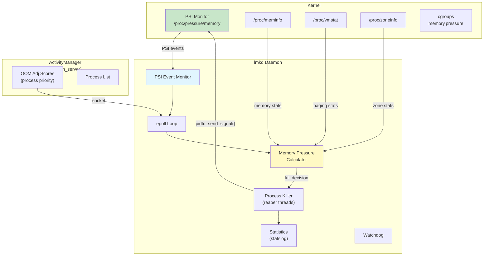

#### PSI-Based Triggering

lmkd uses the kernel's Pressure Stall Information (PSI) interface to detect
memory pressure. PSI was developed in close collaboration between Google and the
kernel community and is now a standard kernel feature.

The PSI monitor configuration in lmkd:

```c
#define DEFAULT_PSI_WINDOW_SIZE_MS 1000
#define PSI_POLL_PERIOD_SHORT_MS 10
#define PSI_POLL_PERIOD_LONG_MS 100
```

**Source**: `system/memory/lmkd/lmkd.cpp`, lines 117-121

The PSI interface is initialized through the libpsi library:

```c
// system/memory/lmkd/libpsi/psi.cpp
int init_psi_monitor(enum psi_stall_type stall_type,
                     int threshold_us,
                     int window_us,
                     enum psi_resource resource) {
    fd = TEMP_FAILURE_RETRY(open(psi_resource_file[resource],
                                 O_WRONLY | O_CLOEXEC));
```

**Source**: `system/memory/lmkd/libpsi/psi.cpp`

#### OOM Adjustment Scores

lmkd receives process priority information from ActivityManager in
system_server. Each process is assigned an OOM adjustment score that reflects
its importance:

```c
#define SYSTEM_ADJ (-900)        // System processes (never kill)
#define PERCEPTIBLE_APP_ADJ 200  // Perceptible but not foreground
#define PREVIOUS_APP_ADJ 700     // Previous foreground app
```

**Source**: `system/memory/lmkd/lmkd.cpp`, lines 79-80, 98

When memory pressure is detected, lmkd kills processes starting from the highest
OOM adjustment score (least important) and works downward until sufficient memory
is freed.

#### Key Source Files

```
system/memory/lmkd/
    lmkd.cpp            # Main daemon logic (2000+ lines)
    lmkd.rc             # init.rc service definition
    reaper.cpp           # Process kill execution (using pidfd)
    reaper.h
    watchdog.cpp         # Watchdog timer for lmkd hangs
    watchdog.h
    statslog.cpp         # Statistics reporting
    statslog.h
    libpsi/
        psi.cpp          # PSI monitor interface
        include/
            psi/psi.h    # PSI header
    liblmkd_utils.cpp   # Utility functions
```

**Source**: `system/memory/lmkd/`

### 5.3.8 dm-verity and Verified Boot

dm-verity is a device-mapper target that provides transparent integrity checking
of block devices. Android uses it to verify the integrity of system partitions
during boot:

```
CONFIG_DM_VERITY=y
```

**Source**: `kernel/configs/b/android-6.12/android-base.config`, line 60

dm-verity works by maintaining a hash tree (Merkle tree) of the entire
partition. On every read, the driver computes the hash of the data block and
verifies it against the hash tree. If verification fails, the read returns an
I/O error.

#### How dm-verity's Merkle Tree Works

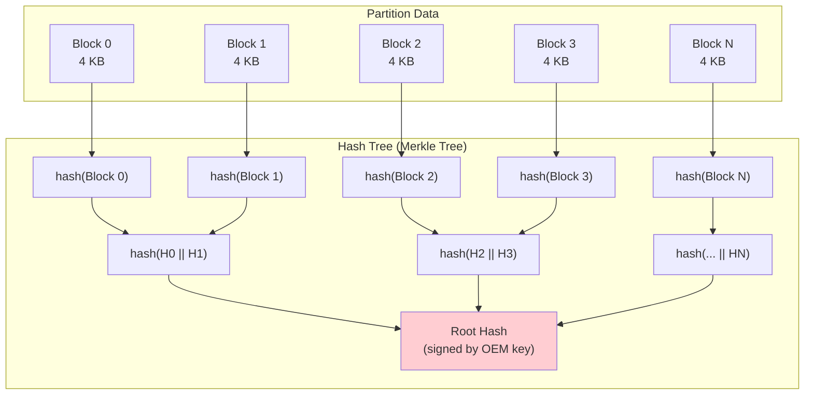

The root hash is signed by the device OEM's key and verified by the bootloader
before the kernel is loaded. This creates an unbroken chain of trust from the
bootloader to every individual data block on the system partition.

dm-verity operates in several modes:

- **Enforcing** (default): I/O errors on verification failure. The device may
  restart in recovery mode.
- **Logging**: Verification failures are logged but reads succeed. Used during
  development.
- **EIO**: Returns `EIO` errors on verification failure but continues operation.

The verified boot chain in Android combines several kernel subsystems:

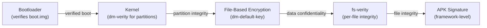

Related config options for the full verified boot chain:

```
CONFIG_DM_DEFAULT_KEY=y          # Default key for dm-crypt
CONFIG_DM_SNAPSHOT=y             # Snapshot support for OTA
CONFIG_FS_ENCRYPTION=y           # File-based encryption
CONFIG_FS_ENCRYPTION_INLINE_CRYPT=y  # Hardware inline crypto
CONFIG_FS_VERITY=y               # Per-file integrity (fs-verity)
CONFIG_BLK_INLINE_ENCRYPTION=y   # Block-level inline encryption
```

#### File-Based Encryption (FBE)

Android uses file-based encryption rather than full-disk encryption. This allows
different files to be encrypted with different keys, enabling features like
Direct Boot (where the device can show the lock screen and receive phone calls
before the user unlocks the device).

The encryption configuration is visible in the emulator's fstab:

```
/dev/block/vdc  /data  ext4  ...  fileencryption=aes-256-xts:aes-256-cts,...
```

**Source**: `device/generic/goldfish/board/fstab/arm`

This specifies:

- `aes-256-xts` for file content encryption (provides confidentiality)
- `aes-256-cts` for file name encryption (prevents metadata leakage)

#### fs-verity: Per-File Integrity

While dm-verity protects entire partitions, fs-verity (`CONFIG_FS_VERITY=y`)
provides per-file integrity verification. It is used for:

- Verifying APK files after installation (complementing APK signatures)
- Protecting system files on writable partitions
- Ensuring integrity of downloaded content

fs-verity uses the same Merkle tree concept as dm-verity but applies it to
individual files. Once a file has fs-verity enabled, any modification to its
contents will be detected as a hash mismatch on the next read.

### 5.3.9 eBPF Integration

Android uses eBPF (extended Berkeley Packet Filter) extensively for networking,
monitoring, and security:

```
CONFIG_BPF_JIT=y
CONFIG_BPF_SYSCALL=y
CONFIG_CGROUP_BPF=y
CONFIG_NETFILTER_XT_MATCH_BPF=y
CONFIG_NET_ACT_BPF=y
CONFIG_NET_CLS_BPF=y
```

**Source**: `kernel/configs/b/android-6.12/android-base.config`

The 6.12 config additionally requires:

```
CONFIG_BPF_JIT_ALWAYS_ON=y
```

eBPF programs are loaded during boot from `/system/etc/bpf/` and are used for:

- Network traffic accounting per UID
- Network firewall rules
- CPU frequency tracking
- Tracing and profiling

#### eBPF Architecture on Android

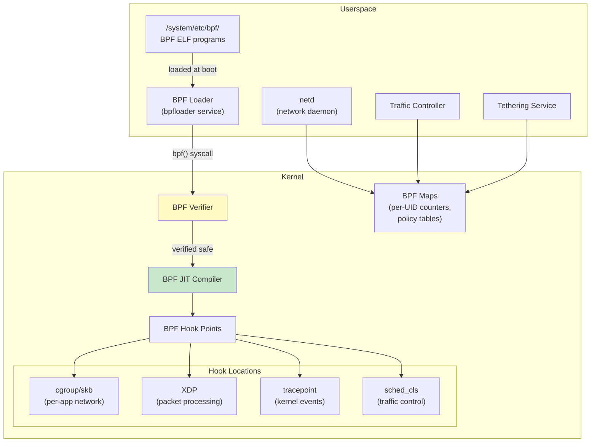

The BPF loader (`bpfloader`) is one of the first services started during boot.
It loads all `.o` (BPF ELF) files from `/system/etc/bpf/` and pins them into the
BPF filesystem at `/sys/fs/bpf/`. Other services like `netd` and the tethering
service then attach to these pinned programs.

Key eBPF use cases on Android:

1. **Per-UID traffic accounting**: BPF programs attached to cgroup socket hooks
   count bytes sent and received per UID, enabling the Settings app's data usage
   display and per-app data limits.

2. **Network firewall**: BPF programs implement the iptables replacement for
   per-app network access control, providing both better performance and more
   granular control.

3. **Tethering offload**: BPF programs handle packet forwarding for USB/WiFi
   tethering, moving the packet processing from userspace (slow) to kernel BPF
   (fast).

4. **CPU frequency tracking**: BPF programs attached to scheduler tracepoints
   track per-UID time spent at each CPU frequency, enabling accurate battery
   usage attribution.

### 5.3.10 SELinux Enforcement

SELinux (Security-Enhanced Linux) is mandatory on Android and is configured at
the kernel level:

```
CONFIG_SECURITY=y
CONFIG_SECURITY_NETWORK=y
CONFIG_SECURITY_SELINUX=y
CONFIG_DEFAULT_SECURITY_SELINUX=y
```

**Source**: `kernel/configs/b/android-6.12/android-base.config`, lines 222-226, 57

Android runs SELinux in enforcing mode on production devices. Every process,
file, socket, and kernel object is assigned a security label, and the SELinux
policy (compiled from `.te` files in the AOSP tree) defines which operations are
allowed between labeled objects.

The kernel's SELinux subsystem:

- Labels all kernel objects (inodes, sockets, processes, IPC objects)
- Intercepts security-relevant system calls via Linux Security Module (LSM) hooks
- Checks each operation against the loaded policy
- Denies operations not explicitly allowed
- Logs denied operations to the audit subsystem (`CONFIG_AUDIT=y`)

SELinux is the primary mechanism that confines apps to their sandbox, prevents
privilege escalation, and limits the impact of compromised system services.

### 5.3.11 Seccomp Filter

Beyond SELinux, Android uses seccomp-BPF filters to restrict the system calls
available to each process:

```
CONFIG_SECCOMP=y
CONFIG_SECCOMP_FILTER=y
```

**Source**: `kernel/configs/b/android-6.12/android-base.config`, lines 221-222

Seccomp filters use BPF programs (not eBPF -- these are classic BPF) to examine
each system call and its arguments. If a system call is not on the allowlist, the
process is killed with SIGSYS. This provides defense in depth: even if an
attacker escapes the SELinux sandbox, they still cannot invoke dangerous system
calls.

Android's seccomp policies are defined per-architecture and are applied by the
Zygote process before forking app processes.

### 5.3.12 Cgroups and Resource Control

Android uses Linux cgroups (control groups) extensively for resource management:

```
CONFIG_CGROUPS=y
CONFIG_CGROUP_BPF=y
CONFIG_CGROUP_CPUACCT=y
CONFIG_CGROUP_FREEZER=y
CONFIG_CGROUP_SCHED=y
```

**Source**: `kernel/configs/b/android-6.12/android-base.config`, lines 33-37

These cgroups serve specific Android purposes:

| Cgroup Subsystem | Config | Android Usage |
|-----------------|--------|---------------|
| cpuacct | `CONFIG_CGROUP_CPUACCT` | Per-UID CPU time accounting |
| freezer | `CONFIG_CGROUP_FREEZER` | Freezing cached/background apps |
| cpu (sched) | `CONFIG_CGROUP_SCHED` | CPU scheduling priority for app groups |
| bpf | `CONFIG_CGROUP_BPF` | Per-app network control via BPF |

The cgroup hierarchy on Android is managed by `init` and the `system_server`
process. The init script for the emulator shows the top-level cgroup setup:

```
on init
    mkdir /dev/cpuctl/foreground
    mkdir /dev/cpuctl/background
    mkdir /dev/cpuctl/top-app
    mkdir /dev/cpuctl/rt
```

**Source**: `device/generic/goldfish/init/init.ranchu.rc`, lines 47-50

These cgroup directories correspond to Android's process scheduling groups:

- **top-app**: The foreground application currently visible to the user
- **foreground**: Processes the user is aware of (e.g., music player)
- **background**: Processes running in the background
- **rt**: Real-time priority processes (audio, sensor processing)

---

## 5.4 Device Tree and Board Support

### 5.4.1 Device Tree Fundamentals

The device tree is a data structure that describes the hardware topology of a
system. On ARM and RISC-V platforms, the bootloader passes a device tree blob
(DTB) to the kernel, which uses it to discover and configure hardware devices.

The device tree is necessary because, unlike x86 systems (which use ACPI for
hardware discovery), ARM and RISC-V systems do not have a standard mechanism for
the kernel to probe hardware. The device tree fills this gap.

The Android base config enforces that at least one hardware description mechanism
is present:

```xml
<!-- CONFIG_ACPI || CONFIG_OF -->
<group>
    <conditions>
        <config>
            <key>CONFIG_ACPI</key>
            <value type="bool">n</value>
        </config>
    </conditions>
    <config>
        <key>CONFIG_OF</key>
        <value type="bool">y</value>
    </config>
</group>
```

**Source**: `kernel/configs/b/android-6.12/android-base-conditional.xml`, lines 148-172

This conditional requirement means: if ACPI is disabled, then Device Tree
(`CONFIG_OF`) must be enabled, and vice versa. ARM devices use OF (Open
Firmware / Device Tree); x86 devices typically use ACPI.

### 5.4.2 DTS, DTB, and DTBO

Device tree data flows through several formats:

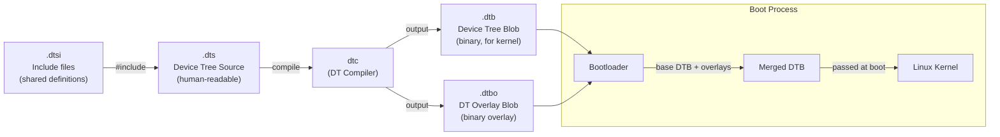

- **DTS** (Device Tree Source): Human-readable text files that describe hardware.
  They use a tree structure with nodes representing devices and properties
  describing their configuration.
- **DTSI** (Device Tree Source Include): Shared definitions included by multiple
  DTS files. Typically, the SoC definition is in a DTSI, and each board's DTS
  includes it and adds board-specific nodes.
- **DTB** (Device Tree Blob): Compiled binary form of a DTS file. This is what
  the kernel actually parses.
- **DTBO** (Device Tree Blob Overlay): A compiled overlay that can be applied on
  top of a base DTB. Overlays allow board-specific customization without
  modifying the base SoC DTB.

### 5.4.3 Device Tree Overlays (DTBO)

Android uses device tree overlays extensively to separate SoC-level and
board-level hardware descriptions:

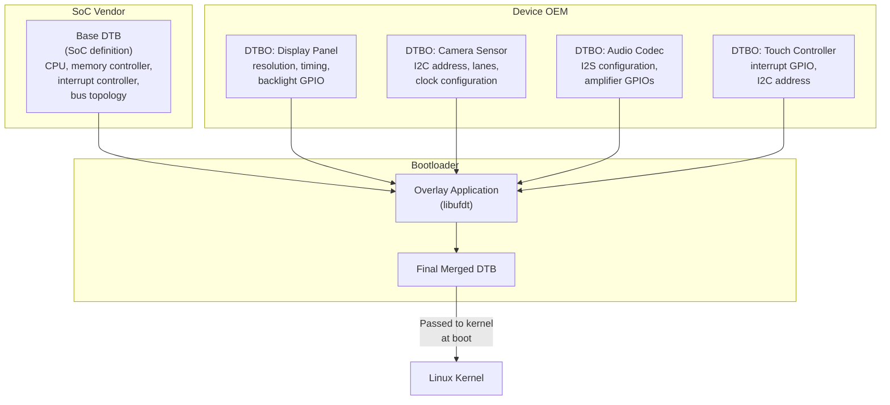

The DTBO partition is a standard Android partition that contains one or more
overlays. During boot, the bootloader reads the base DTB (typically compiled into
the kernel image or stored in a separate partition), reads the overlays from the
DTBO partition, applies them using the libufdt library, and passes the merged
result to the kernel.

### 5.4.4 Emulator (Goldfish) Device Tree

The Android emulator uses device tree to describe its virtual hardware. The
goldfish virtual device includes a precompiled DTB:

**Source**: `kernel/prebuilts/common-modules/virtual-device/6.6/arm64/fvp-base-revc.dtb`

The emulator board configuration in `device/generic/goldfish/` explicitly states
that it does not include a DTB in the boot image:

```makefile
BOARD_INCLUDE_DTB_IN_BOOTIMG := false
```

**Source**: `device/generic/goldfish/board/BoardConfigCommon.mk`, line 75

Instead, the emulator's QEMU host provides device information through a
combination of:

1. Device tree passed by QEMU to the virtual machine
2. virtio device discovery for paravirtualized devices
3. Platform device registration for goldfish-specific virtual hardware

The emulator's goldfish virtual platform includes these device-specific kernel
modules:

```
goldfish_address_space.ko  # Virtual address space for host communication
goldfish_battery.ko        # Virtual battery with host-controlled state
goldfish_pipe.ko           # High-bandwidth host-guest communication pipe
goldfish_sync.ko           # Synchronization primitives for GPU emulation
```

**Source**: `prebuilts/qemu-kernel/arm64/6.12/goldfish_modules/`

### 5.4.5 Virtual Device Modules

Beyond the goldfish-specific modules, the emulator loads a substantial set of
GKI and virtual device modules. The virtual device common modules for kernel 6.6
arm64 include 57 modules:

```
kernel/prebuilts/common-modules/virtual-device/6.6/arm64/
    virtio_dma_buf.ko       # DMA buffer sharing via virtio
    virtio_mmio.ko          # Memory-mapped virtio transport
    virtio-rng.ko           # Virtual random number generator
    virtio_net.ko           # Virtual network adapter
    virtio_input.ko         # Virtual input devices
    virtio_snd.ko           # Virtual sound device
    virtio-gpu.ko           # Virtual GPU (3D acceleration)
    virtio-media.ko         # Virtual media device
    cfg80211.ko             # Wireless configuration
    mac80211.ko             # IEEE 802.11 wireless stack
    mac80211_hwsim.ko       # Simulated wireless hardware
    system_heap.ko          # DMA-BUF system heap
    ...
```

**Source**: `kernel/prebuilts/common-modules/virtual-device/6.6/arm64/`

### 5.4.6 Device Tree Syntax Reference

A simplified example of what a goldfish-style device tree might look like:

```dts
/dts-v1/;

/ {
    compatible = "android,goldfish";
    #address-cells = <2>;
    #size-cells = <2>;

    chosen {
        bootargs = "8250.nr_uarts=1";
    };

    memory@80000000 {
        device_type = "memory";
        reg = <0x0 0x80000000 0x0 0x80000000>;  /* 2 GB */
    };

    cpus {
        #address-cells = <1>;
        #size-cells = <0>;

        cpu@0 {
            device_type = "cpu";
            compatible = "arm,armv8";
            reg = <0x0>;
            enable-method = "psci";
        };
    };

    virtio_mmio@a003c00 {
        compatible = "virtio,mmio";
        reg = <0x0 0xa003c00 0x0 0x200>;
        interrupts = <0 43 4>;
        /* Block device for /data partition */
    };

    /* Additional virtio devices for network, GPU, etc. */
};
```

Key elements:

- `compatible` strings identify the driver that should bind to each device
- `reg` properties specify the memory-mapped I/O address and size
- `interrupts` specify the interrupt number and type
- The `chosen` node passes kernel command-line arguments

### 5.4.7 Device Tree and Driver Binding

The kernel uses the `compatible` property to match device tree nodes to drivers.
When the kernel encounters a device tree node, it searches through all registered
platform drivers for one whose `of_match_table` contains a matching `compatible`
string.

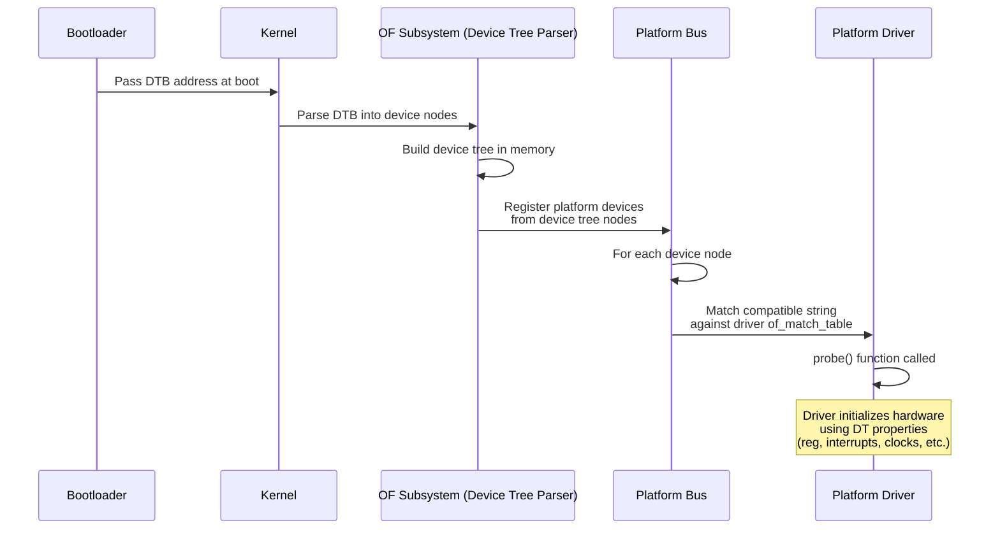

For example, the virtio MMIO transport driver matches the `"virtio,mmio"`
compatible string. When the device tree contains a `virtio_mmio` node, the
kernel automatically loads and probes the virtio MMIO driver, which then
discovers individual virtio devices (network, block, GPU, etc.) through the
virtio device negotiation protocol.

### 5.4.8 Device Tree Properties Reference

Common device tree properties used in Android device trees:

| Property | Type | Example | Purpose |
|----------|------|---------|---------|
| `compatible` | string list | `"arm,armv8"` | Driver matching |
| `reg` | address, size pairs | `<0x0 0xa003c00 0x0 0x200>` | MMIO registers |
| `interrupts` | interrupt specifiers | `<0 43 4>` | IRQ configuration |
| `clocks` | phandle + clock-id | `<&cru CLK_UART0>` | Clock sources |
| `clock-names` | string list | `"uartclk", "apb_pclk"` | Named clock refs |
| `status` | string | `"okay"` or `"disabled"` | Enable/disable node |
| `#address-cells` | u32 | `<2>` | Address width in child nodes |
| `#size-cells` | u32 | `<2>` | Size width in child nodes |
| `pinctrl-0` | phandle list | `<&uart0_pins>` | Pin configuration |
| `dma-ranges` | ranges | `<0x0 0x0 ...>` | DMA address translation |

### 5.4.9 DTBO Partition Format

The DTBO partition uses a specific binary format defined by Android:

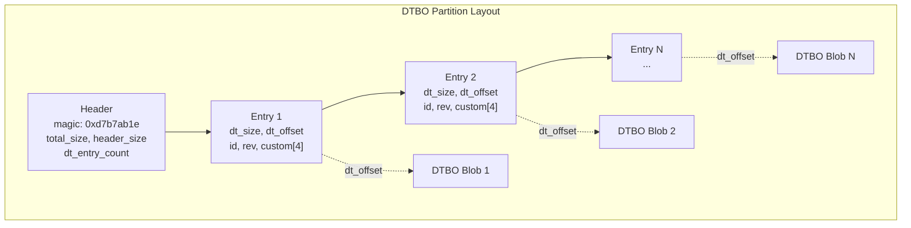

The bootloader selects which overlay(s) to apply based on hardware identifiers
(board ID, revision, etc.) stored in the entry metadata. This allows a single
DTBO partition to contain overlays for multiple hardware variants.

### 5.4.10 Testing Device Tree Changes

Android provides several ways to validate device tree changes:

1. **dtc (Device Tree Compiler)**: Compile and decompile DTS files for syntax
   validation:
   ```bash
   # Compile DTS to DTB
   dtc -I dts -O dtb -o board.dtb board.dts

   # Decompile DTB to DTS (for inspection)
   dtc -I dtb -O dts -o decompiled.dts board.dtb
   ```

2. **fdtdump**: Dump a DTB in human-readable format:
   ```bash
   fdtdump board.dtb
   ```

3. **/proc/device-tree on running device**: The kernel exposes the parsed device
   tree as a filesystem hierarchy:
   ```bash
   adb shell ls /proc/device-tree/
   adb shell cat /proc/device-tree/compatible
   ```

4. **VTS tests**: The Vendor Test Suite includes tests that verify device tree
   properties match the framework compatibility matrix.

---

## 5.5 Kernel Configuration

### 5.5.1 Configuration Architecture

Android's kernel configuration management is a layered system built on top of
Linux's standard Kconfig infrastructure. Rather than maintaining a single
monolithic `defconfig` file, Android uses a set of **configuration fragments**
that are combined to produce the final kernel configuration.

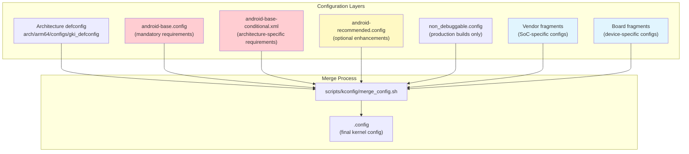

### 5.5.2 The kernel/configs Repository

The kernel configuration fragments are stored in `kernel/configs/` with the
following structure:

```
kernel/configs/
    README.md                    # Comprehensive documentation
    kernel-lifetimes.xml         # Branch lifecycle and EOL dates
    approved-ogki-builds.xml     # Approved OEM GKI builds
    Android.bp                   # Build rules
    build/
        Android.bp
        kernel_config.go         # Soong config processing
    tools/
        Android.bp
        bump.py                  # Version bump utility
        check_fragments.sh       # Fragment validation
        kconfig_xml_fixup.py     # XML fixup utility
    xsd/
        approvedBuild/           # XML schema definitions
    b/                           # Android 16 (Baklava) release
        android-6.12/
            Android.bp
            android-base.config
            android-base-conditional.xml
            android-tv-base.config
            android-tv-base-conditional.xml
    c/                           # Android 16 QPR (Custard)
        android-6.12/
    v/                           # Android 15 (Vanilla Ice Cream)
        android-6.1/
        android-6.6/
    u/                           # Android 14 (Upside Down Cake)
        android-5.15/
        android-6.1/
    t/                           # Android 13 (Tiramisu)
        android-5.10/
        android-5.15/
    s/                           # Android 12 (Snow Cone)
        android-4.19/
        android-5.4/
        android-5.10/
    r/                           # Android 11 (Red Velvet)
        android-5.4/
```

**Source**: `kernel/configs/`

The directory naming convention uses the first letter of the Android dessert
codename: `b` for Baklava (Android 16), `v` for Vanilla Ice Cream (Android 15),
`u` for Upside Down Cake (Android 14), and so on.

### 5.5.3 Base Configuration Fragment

The `android-base.config` file contains all kernel configuration options that
are **mandatory** for Android to function. These are tested as part of VTS
(Vendor Test Suite) and verified during boot through the VINTF (Vendor Interface)
compatibility matrix.

Examining the Android 16 / kernel 6.12 base config
(`kernel/configs/b/android-6.12/android-base.config`), we find 262 lines
organized into:

**Explicitly disabled options** (lines 1-15):
```
# CONFIG_ANDROID_LOW_MEMORY_KILLER is not set
# CONFIG_ANDROID_PARANOID_NETWORK is not set
# CONFIG_BPFILTER is not set
# CONFIG_DEVMEM is not set
# CONFIG_FHANDLE is not set
# CONFIG_FW_CACHE is not set
# CONFIG_IP6_NF_NAT is not set
# CONFIG_MODULE_FORCE_UNLOAD is not set
# CONFIG_NFSD is not set
# CONFIG_NFS_FS is not set
# CONFIG_PM_AUTOSLEEP is not set
# CONFIG_RT_GROUP_SCHED is not set
# CONFIG_SYSVIPC is not set
# CONFIG_USELIB is not set
```

Notable disablements:

- `CONFIG_DEVMEM` -- disables `/dev/mem` for security (prevents raw physical
  memory access)
- `CONFIG_MODULE_FORCE_UNLOAD` -- prevents force-unloading modules (stability)
- `CONFIG_SYSVIPC` -- SysV IPC is not used on Android (Binder replaces it)
- `CONFIG_USELIB` -- legacy syscall disabled for security

**Core Android requirements** (lines 16-261):

- IPC: `CONFIG_ANDROID_BINDER_IPC`, `CONFIG_ANDROID_BINDERFS`
- Memory: `CONFIG_ASHMEM`, `CONFIG_SHMEM`
- Filesystems: `CONFIG_FUSE_FS`, `CONFIG_FS_ENCRYPTION`, `CONFIG_FS_VERITY`
- Security: `CONFIG_SECURITY_SELINUX`, `CONFIG_SECCOMP`,
  `CONFIG_SECCOMP_FILTER`, `CONFIG_STACKPROTECTOR_STRONG`
- Power: `CONFIG_PM_WAKELOCKS`, `CONFIG_SUSPEND`
- Networking: extensive netfilter/iptables configuration (80+ options)
- Monitoring: `CONFIG_PSI`, `CONFIG_UID_SYS_STATS`, `CONFIG_TRACE_GPU_MEM`
- Build toolchain: `CONFIG_CC_IS_CLANG`, `CONFIG_AS_IS_LLVM`, `CONFIG_LD_IS_LLD`

### 5.5.4 Conditional Configuration

The `android-base-conditional.xml` file expresses requirements that depend on
the target architecture or other kernel configuration values. For Android 16 /
kernel 6.12:

**Minimum LTS version:**
```xml
<kernel minlts="6.12.0" />
```

**Architecture-specific requirements:**

For ARM64:
```xml
<group>
    <conditions>
        <config>
            <key>CONFIG_ARM64</key>
            <value type="bool">y</value>
        </config>
    </conditions>
    <config><key>CONFIG_ARM64_PAN</key><value type="bool">y</value></config>
    <config><key>CONFIG_CFI_CLANG</key><value type="bool">y</value></config>
    <config><key>CONFIG_SHADOW_CALL_STACK</key><value type="bool">y</value></config>
    <config><key>CONFIG_RANDOMIZE_BASE</key><value type="bool">y</value></config>
    <config><key>CONFIG_KFENCE</key><value type="bool">y</value></config>
    <config><key>CONFIG_USERFAULTFD</key><value type="bool">y</value></config>
</group>
```

**Source**: `kernel/configs/b/android-6.12/android-base-conditional.xml`,
lines 27-90

These ARM64-specific requirements include important security features:

- **CFI_CLANG** -- Control Flow Integrity, prevents control-flow hijacking attacks
- **SHADOW_CALL_STACK** -- uses a separate stack for return addresses, preventing
  ROP attacks
- **ARM64_PAN** -- Privileged Access Never, prevents kernel from accidentally
  accessing user memory
- **RANDOMIZE_BASE** -- KASLR, randomizes kernel address space layout
- **KFENCE** -- Kernel Electric Fence, low-overhead memory error detector

For x86:
```xml
<group>
    <conditions>
        <config>
            <key>CONFIG_X86</key>
            <value type="bool">y</value>
        </config>
    </conditions>
    <config><key>CONFIG_MITIGATION_PAGE_TABLE_ISOLATION</key><value type="bool">y</value></config>
    <config><key>CONFIG_MITIGATION_RETPOLINE</key><value type="bool">y</value></config>
    <config><key>CONFIG_RANDOMIZE_BASE</key><value type="bool">y</value></config>
</group>
```

x86-specific security requirements include mitigations for Meltdown (PTI) and
Spectre (Retpoline).

### 5.5.5 Configuration Differences Across Kernel Versions

Comparing the Android 15 (v) config for kernel 6.6 with the Android 16 (b)
config for kernel 6.12 reveals the evolution of Android's kernel requirements:

| Config Option | 6.6 (Android 15) | 6.12 (Android 16) | Notes |
|--------------|-------------------|---------------------|-------|
| `CONFIG_BPF_JIT_ALWAYS_ON` | absent | `y` | Mandatory JIT compilation for security |
| `CONFIG_SCHED_DEBUG` | `y` | absent | Removed from mandatory list |
| `CONFIG_HID_WACOM` | `y` | absent | Moved to optional |
| `CONFIG_IP_NF_MATCH_RPFILTER` | absent | `y` | Added reverse-path filter |

### 5.5.6 kernel-lifetimes.xml

The `kernel-lifetimes.xml` file tracks the support lifecycle for every Android
kernel branch. It serves as the authoritative source for:

1. **Branch names and versions** -- mapping between Android releases and kernel
   versions
2. **Launch and EOL dates** -- when each branch was first available and when
   support ends
3. **LTS release tracking** -- individual GKI releases with their own launch and
   EOL dates

```xml
<branch name="android15-6.6"
        min_android_release="15"
        version="6.6"
        launch="2023-10-29"
        eol="2028-07-01">
    <lts-versions>
        <release version="6.6.30" launch="2024-07-12" eol="2025-11-01"/>
        <release version="6.6.46" launch="2024-09-16" eol="2025-11-01"/>
        <!-- ... more releases ... -->
        <release version="6.6.98" launch="2025-08-11" eol="2026-12-01"/>
    </lts-versions>
</branch>
```

**Source**: `kernel/configs/kernel-lifetimes.xml`, lines 128-144

This data is consumed by VTS tests, the framework compatibility matrix checker,
and the build system to enforce that devices ship with supported kernel versions.

### 5.5.7 approved-ogki-builds.xml

The `approved-ogki-builds.xml` file lists specific GKI builds that are approved
for use by OEMs (Original Equipment Manufacturers). "OGKI" stands for OEM GKI --
it refers to GKI builds that OEMs are explicitly permitted to ship on their
devices.

Each entry contains:

- A SHA-256 hash (`id`) that uniquely identifies the build
- A bug number (`bug`) that links to the approval tracking

```xml
<ogki-approved version="1">
    <branch name="android14-6.1">
        <build id="ac5884e09bd22ecd..." bug="352795077"/>
    </branch>
    <branch name="android15-6.6">
        <build id="9541494216af24d2..." bug="359105495"/>
        <!-- ... 80+ approved builds ... -->
    </branch>
    <branch name="android16-6.12">
        <build id="38a0ecd98b0b73ee..." bug="435129220"/>
        <!-- ... 10+ approved builds ... -->
    </branch>
</ogki-approved>
```

**Source**: `kernel/configs/approved-ogki-builds.xml`

This approval process ensures that only tested, validated kernel builds are used
on production devices.

### 5.5.8 TV-Specific Configuration

Android TV devices have additional kernel configuration requirements. For
Android 16 / kernel 6.12, there are dedicated TV config fragments:

```
kernel/configs/b/android-6.12/
    android-tv-base.config
    android-tv-base-conditional.xml
```

**Source**: `kernel/configs/b/android-6.12/android-tv-base.config`

The TV base config is largely identical to the standard base config, reflecting
Android TV's convergence with the mainline Android platform. The primary
differences relate to media codec support and CEC (Consumer Electronics Control)
for HDMI devices.

### 5.5.9 Configuration Validation

Android validates kernel configurations at multiple stages:

1. **Build time**: The build system checks that the kernel configuration matches
   the VINTF compatibility matrix.

2. **VTS (Vendor Test Suite)**: The `VtsKernelConfig` test verifies that the
   running kernel's configuration includes all required options for the device's
   launch level.

3. **Boot time**: The VINTF framework compares the running kernel's configuration
   against the framework compatibility matrix and logs warnings or blocks boot if
   incompatible.

The build rules are generated from the config fragments through
`kernel/configs/build/kernel_config.go`, which processes the `.config` and
`.xml` files into compatibility matrix format.

**Source**: `kernel/configs/build/kernel_config.go`

The `kernel/configs/tools/check_fragments.sh` script can be used to validate
that config fragments are properly formatted and non-conflicting:

**Source**: `kernel/configs/tools/check_fragments.sh`

---

## 5.6 Kernel Build Integration

### 5.6.1 Two Paths: Prebuilt vs Source

The AOSP build system supports two approaches for including the kernel:

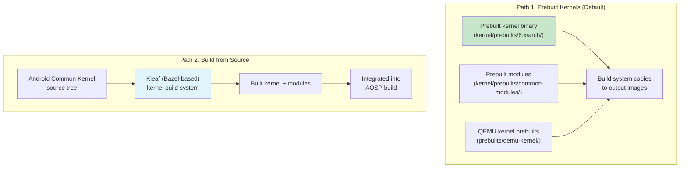

#### Prebuilt Kernels (Default for Emulator)

For the emulator and reference builds, AOSP uses prebuilt kernels stored in:

1. **GKI prebuilts**: `kernel/prebuilts/{6.1,6.6,6.12}/{arm64,x86_64}/`
2. **Virtual device modules**: `kernel/prebuilts/common-modules/virtual-device/{6.1,6.6,6.12}/`
3. **QEMU-specific prebuilts**: `prebuilts/qemu-kernel/{arm64,x86_64}/`

The emulator board config selects the kernel version:

```makefile
TARGET_KERNEL_USE ?= 6.12
KERNEL_ARTIFACTS_PATH := prebuilts/qemu-kernel/arm64/$(TARGET_KERNEL_USE)
EMULATOR_KERNEL_FILE := $(KERNEL_ARTIFACTS_PATH)/kernel-$(TARGET_KERNEL_USE)-gz
```

**Source**: `device/generic/goldfish/board/kernel/arm64.mk`, lines 20-21, 65

Note the `?=` assignment: `TARGET_KERNEL_USE` defaults to 6.12 but can be
overridden on the command line to test with different kernel versions:

```bash
# Build emulator with kernel 6.6 instead of 6.12
make TARGET_KERNEL_USE=6.6 sdk_phone64_arm64
```

#### Building from Source with Kleaf

For vendor-specific kernels, the preferred build system is Kleaf -- a
Bazel-based kernel build system. Kleaf was covered in detail in Chapter 2 (Build
System), but its key integration points with the AOSP build are:

1. Kleaf builds the kernel independently from the platform build
2. The output (kernel image + modules) is placed in a staging directory
3. The AOSP platform build picks up the kernel artifacts during image generation

### 5.6.2 Emulator Kernel Update Process

The `prebuilts/qemu-kernel/update_emu_kernels.sh` script documents the process
for updating the emulator's prebuilt kernels:

```bash
#!/bin/bash
KERNEL_VERSION="6.12"

# ./update_emu_kernel.sh --bug 123 --bid 123456
```

**Source**: `prebuilts/qemu-kernel/update_emu_kernels.sh`

The script:

1. Takes a build ID (`--bid`) from an internal CI build
2. Fetches the kernel binary and GKI modules for each architecture
3. Fetches the goldfish-specific virtual device modules
4. Places them in the `prebuilts/qemu-kernel/` tree
5. Records the bug number for tracking

### 5.6.3 Module Organization

GKI modules are organized into several categories, each delivered through a
different partition:

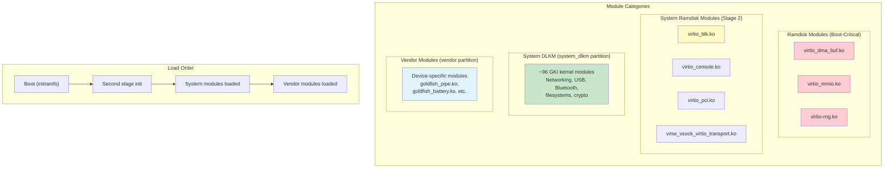

The emulator's arm64 board config defines this categorization explicitly:

```makefile
# Boot-critical modules loaded from vendor ramdisk
RAMDISK_KERNEL_MODULES := \
    virtio_dma_buf.ko \
    virtio_mmio.ko \
    virtio-rng.ko \

# System modules loaded during second stage
RAMDISK_SYSTEM_KERNEL_MODULES := \
    virtio_blk.ko \
    virtio_console.ko \
    virtio_pci.ko \
    virtio_pci_legacy_dev.ko \
    virtio_pci_modern_dev.ko \
    vmw_vsock_virtio_transport.ko \

# All GKI modules go to system_dlkm
BOARD_SYSTEM_KERNEL_MODULES := \
    $(wildcard $(KERNEL_MODULES_ARTIFACTS_PATH)/*.ko)

# Vendor modules (minus ramdisk ones)
BOARD_VENDOR_KERNEL_MODULES := \
    $(filter-out $(BOARD_VENDOR_RAMDISK_KERNEL_MODULES) \
                 $(EMULATOR_EXCLUDE_KERNEL_MODULES), \
                 $(wildcard $(VIRTUAL_DEVICE_KERNEL_MODULES_PATH)/*.ko))
```

**Source**: `device/generic/goldfish/board/kernel/arm64.mk`, lines 27-58

### 5.6.4 Module Blocklisting

Some modules are included in the prebuilt set but should not be loaded at
runtime. The emulator maintains a blocklist:

```
blocklist vkms.ko
# When enabled, hijacks the first audio device that's expected to be backed by
# virtio-snd. See also: aosp/3391025
blocklist snd-aloop.ko
```

**Source**: `device/generic/goldfish/board/kernel/kernel_modules.blocklist`

- `vkms.ko` (Virtual Kernel Mode Setting) is blocklisted because the emulator
  uses `virtio-gpu.ko` instead for display.
- `snd-aloop.ko` (ALSA loopback) is blocklisted because it conflicts with
  `virtio_snd.ko`, which provides the actual audio device.

### 5.6.5 Boot Image Generation

The boot image (`boot.img`) contains the kernel image, ramdisk, and boot
parameters. The emulator's board config specifies:

```makefile
BOARD_BOOT_HEADER_VERSION := 4
BOARD_MKBOOTIMG_ARGS += --header_version $(BOARD_BOOT_HEADER_VERSION)
BOARD_VENDOR_BOOTIMAGE_PARTITION_SIZE := 0x06000000
BOARD_RAMDISK_USE_LZ4 := true
```

**Source**: `device/generic/goldfish/board/BoardConfigCommon.mk`, lines 76-79

Boot image version 4 is the latest format, supporting:

- Separate vendor boot image (`vendor_boot.img`)
- Generic ramdisk in `boot.img`
- Vendor ramdisk in `vendor_boot.img`
- Boot configuration in a separate `bootconfig` section

The kernel command line is passed via a file rather than the boot image header:

```makefile
# BOARD_KERNEL_CMDLINE is not supported (b/361341981), use the file below
PRODUCT_COPY_FILES += \
    device/generic/goldfish/board/kernel/arm64_cmdline.txt:kernel_cmdline.txt
```

**Source**: `device/generic/goldfish/board/kernel/arm64.mk`, lines 67-69

The arm64 kernel command line is minimal:
```
8250.nr_uarts=1
```

**Source**: `device/generic/goldfish/board/kernel/arm64_cmdline.txt`

The x86_64 command line adds a clocksource specification:
```
8250.nr_uarts=1 clocksource=pit
```

**Source**: `device/generic/goldfish/board/kernel/x86_64_cmdline.txt`

### 5.6.6 16K Page Size Support

Modern Android (16+) supports 16K page size kernels, which provide better TLB
(Translation Lookaside Buffer) utilization and improved performance for
memory-intensive workloads. The emulator includes dedicated 16K page size
configurations:

```
device/generic/goldfish/board/kernel/
    arm64.mk             # Standard 4K page size
    arm64_16k.mk         # 16K page size variant
    arm64_16k_cmdline.txt
    x86_64.mk
    x86_64_16k.mk
    x86_64_16k_cmdline.txt
```

**Source**: `device/generic/goldfish/board/kernel/`

The 16K page size variant uses a separate set of prebuilt kernels:

```makefile
TARGET_KERNEL_USE := 6.12
KERNEL_ARTIFACTS_PATH := prebuilts/qemu-kernel/arm64_16k/$(TARGET_KERNEL_USE)
```

**Source**: `device/generic/goldfish/board/kernel/arm64_16k.mk`, lines 20-21

The kernel version string for 4K page size builds includes a `-4k` suffix, while
16K builds would have a `-16k` suffix.

### 5.6.7 The GSI (Generic System Image) and Kernel

The Generic System Image is Google's reference AOSP build that should work on
any GKI-compliant device. The GSI board configuration reveals how the kernel
is handled in this context:

```makefile
# build/make/target/board/BoardConfigGsiCommon.mk
TARGET_NO_KERNEL := true
```

**Source**: `build/make/target/board/BoardConfigGsiCommon.mk`

The `TARGET_NO_KERNEL := true` setting means the GSI does not include a kernel.
This is intentional: the GSI's system image is designed to be paired with the
device's existing kernel (which lives in the boot partition). This clean
separation is what makes it possible to run a GSI on any GKI-compliant device
without replacing its kernel.

The GSI also enables system_dlkm for module compatibility:

```makefile
BOARD_USES_SYSTEM_DLKMIMAGE := true
BOARD_SYSTEM_DLKMIMAGE_FILE_SYSTEM_TYPE := ext4
TARGET_COPY_OUT_SYSTEM_DLKM := system_dlkm
```

**Source**: `build/make/target/board/BoardConfigGsiCommon.mk`

### 5.6.8 Kernel Versioning in the Build System

The build system needs to know the kernel version for compatibility checking. For
prebuilt kernels, this is provided by `kernel_version.mk`:

```makefile
BOARD_KERNEL_VERSION := 6.6.100-android15-8-gf988247102d3-ab14039625-4k
```

**Source**: `kernel/prebuilts/6.6/arm64/kernel_version.mk`

The version string components are used by:

- **VINTF compatibility matrix**: Ensures framework and kernel are compatible
- **VTS tests**: Validates that the kernel meets requirements for the declared
  Android version
- **OTA system**: Ensures kernel updates maintain compatibility

### 5.6.9 Super Partition and Dynamic Partitions

The emulator uses Android's dynamic partitioning system with a super partition:

```makefile
BOARD_BUILD_SUPER_IMAGE_BY_DEFAULT := true
BOARD_SUPER_PARTITION_SIZE ?= 8598323200  # 8G + 8M
BOARD_SUPER_PARTITION_GROUPS := emulator_dynamic_partitions

BOARD_EMULATOR_DYNAMIC_PARTITIONS_PARTITION_LIST := \
    system \
    system_dlkm \
    system_ext \
    product \
    vendor
```

**Source**: `device/generic/goldfish/board/BoardConfigCommon.mk`, lines 44-55

The `system_dlkm` partition is specifically for GKI kernel modules:

```makefile
BOARD_USES_SYSTEM_DLKMIMAGE := true
BOARD_SYSTEM_DLKMIMAGE_FILE_SYSTEM_TYPE := erofs  # we never write here
TARGET_COPY_OUT_SYSTEM_DLKM := system_dlkm
```

**Source**: `device/generic/goldfish/board/BoardConfigCommon.mk`, lines 67-69

The comment "we never write here" confirms that `system_dlkm` is a read-only
partition -- kernel modules are loaded from it but never modified at runtime.
The use of `erofs` (Enhanced Read-Only File System) further enforces this
immutability.

---

## 5.7 Kernel Debugging

### 5.7.1 Kernel Tracing Infrastructure

The Linux kernel provides several powerful tracing mechanisms that Android
integrates with its tooling:

```mermaid
graph TB
    subgraph "Kernel Tracing Mechanisms"
        FT["ftrace<br/>/sys/kernel/tracing/"]
        TP["Tracepoints<br/>(static instrumentation)"]
        KP["kprobes<br/>(dynamic instrumentation)"]
        EBPF["eBPF Programs<br/>(programmable tracing)"]
    end

    subgraph "Android Tracing Tools"
        ATRACE["atrace<br/>(Android trace tool)"]
        PERFETTO["Perfetto<br/>(system-wide tracing)"]
        SYSTRACE["Systrace<br/>(legacy, uses atrace)"]
        SIMPLEPERF["simpleperf<br/>(CPU profiling)"]
    end

    subgraph "Output"
        UI["Perfetto UI<br/>(ui.perfetto.dev)"]
        REPORT["Trace reports"]
        FLAME["Flame graphs"]
    end

    FT --> ATRACE
    FT --> PERFETTO
    TP --> PERFETTO
    KP --> PERFETTO
    EBPF --> PERFETTO
    ATRACE --> PERFETTO
    PERFETTO --> UI
    SIMPLEPERF --> FLAME
    PERFETTO --> REPORT

    style PERFETTO fill:#c8e6c9
    style FT fill:#e1f5fe
```

### 5.7.2 ftrace

ftrace is the kernel's built-in tracing framework. Android requires profiling
support in the base config:

```
CONFIG_PROFILING=y
```

**Source**: `kernel/configs/b/android-6.12/android-base.config`, line 214

ftrace provides:

- **Function tracing**: Trace every kernel function call (or specific functions)
- **Function graph tracing**: Trace function entry and exit with timing
- **Event tracing**: Record specific kernel events (scheduling, I/O, memory
  allocation, etc.)
- **Trace markers**: Userspace can write to `/sys/kernel/tracing/trace_marker`
  to inject events into the kernel trace

Key ftrace virtual files:

```
/sys/kernel/tracing/
    available_tracers       # List of available tracers
    current_tracer          # Currently active tracer
    trace                   # Human-readable trace output
    trace_pipe              # Streaming trace output
    tracing_on              # Enable/disable tracing
    buffer_size_kb          # Per-CPU buffer size
    events/                 # Available tracepoints
        sched/              # Scheduler events
            sched_switch/
            sched_wakeup/
        binder/             # Binder IPC events
            binder_transaction/
            binder_lock/
        block/              # Block I/O events
        ext4/               # ext4 filesystem events
        f2fs/               # f2fs filesystem events
```

#### Using ftrace on Android

To enable function tracing on a running device:

```bash
# Enable tracing
adb shell "echo 1 > /sys/kernel/tracing/tracing_on"

# Set the tracer
adb shell "echo function_graph > /sys/kernel/tracing/current_tracer"

# Filter to specific functions (e.g., binder)
adb shell "echo 'binder_*' > /sys/kernel/tracing/set_ftrace_filter"

# Read the trace
adb shell cat /sys/kernel/tracing/trace

# Disable
adb shell "echo 0 > /sys/kernel/tracing/tracing_on"
```

### 5.7.3 Tracepoints

Tracepoints are static instrumentation points compiled into the kernel. They
provide structured event data at specific locations in the kernel code. Android
uses tracepoints extensively for:

- **Scheduler tracing**: `sched_switch`, `sched_wakeup`, `sched_process_exit`
- **Binder tracing**: `binder_transaction`, `binder_return`, `binder_lock`
- **Memory tracing**: `mm_page_alloc`, `mm_page_free`, `oom_score_adj_update`
- **GPU memory tracing**: `gpu_mem_total` (required by `CONFIG_TRACE_GPU_MEM=y`)
- **Power management**: `cpu_frequency`, `cpu_idle`, `suspend_resume`

The `CONFIG_TRACE_GPU_MEM=y` requirement in the Android base config enables
GPU memory tracking tracepoints:

```
CONFIG_TRACE_GPU_MEM=y
```

**Source**: `kernel/configs/b/android-6.12/android-base.config`, line 243

### 5.7.4 Integration with Perfetto

Perfetto is Android's system-wide tracing infrastructure (detailed in a later
chapter). Its kernel integration works through the `traced_probes` daemon, which
reads ftrace events from the kernel tracing ring buffers.

The Perfetto ftrace integration code is at:

```
external/perfetto/src/traced/probes/ftrace/
    cpu_reader.cc           # Reads ftrace per-CPU ring buffers
    cpu_reader.h
    event_info.cc           # Maps ftrace event IDs to names
    event_info_constants.cc # Known event definitions
    compact_sched.cc        # Compact encoding for scheduler events
    atrace_hal_wrapper.cc   # Android trace HAL integration
    atrace_wrapper.cc       # atrace command integration
```

**Source**: `external/perfetto/src/traced/probes/ftrace/`

Perfetto's ftrace integration:

1. Opens `/sys/kernel/tracing/per_cpu/cpuN/trace_pipe_raw` for each CPU
2. Enables requested tracepoints via
   `/sys/kernel/tracing/events/<category>/<event>/enable`
3. Reads binary trace data from the ring buffers
4. Encodes events into Perfetto's protobuf trace format
5. Writes the trace to a file or streams it to the Perfetto trace viewer

#### Capturing a Kernel Trace with Perfetto

```bash
# Record a 10-second trace with scheduler and binder events
adb shell perfetto \
    -c - \
    -o /data/misc/perfetto-traces/trace.perfetto-trace \
    <<EOF
buffers {
    size_kb: 63488
}
data_sources {
    config {
        name: "linux.ftrace"
        ftrace_config {
            ftrace_events: "sched/sched_switch"
            ftrace_events: "sched/sched_wakeup"
            ftrace_events: "binder/binder_transaction"
            ftrace_events: "power/cpu_frequency"
            ftrace_events: "power/cpu_idle"
        }
    }
}
duration_ms: 10000
EOF

# Pull the trace
adb pull /data/misc/perfetto-traces/trace.perfetto-trace .

# Open in Perfetto UI: https://ui.perfetto.dev
```

### 5.7.5 kprobes and Dynamic Tracing

kprobes allow instrumenting arbitrary kernel functions at runtime without
recompiling the kernel. They work by inserting a breakpoint instruction at the
target address and executing a handler when it is hit.

Android's base config requires `CONFIG_PROFILING=y`, which enables the
infrastructure needed for kprobes. When combined with eBPF (`CONFIG_BPF_SYSCALL=y`,
`CONFIG_BPF_JIT=y`), kprobes become a powerful tool for custom kernel
instrumentation.

#### eBPF-Based Kernel Tracing

Android's extensive eBPF configuration enables kernel tracing programs:

```bash
# List loaded BPF programs
adb shell bpftool prog list

# Show BPF maps (key-value stores used by BPF programs)
adb shell bpftool map list
```

eBPF programs loaded at boot from `/system/etc/bpf/` provide:

- Per-UID network traffic accounting
- Per-UID CPU time tracking
- Memory event monitoring

### 5.7.6 Kernel Crash Analysis with debuggerd

When a process crashes on Android, `debuggerd` (specifically `crash_dump`)
captures a tombstone -- a detailed crash report containing register state, stack
traces, memory maps, and signal information.

The crash dump mechanism is implemented at:

```
system/core/debuggerd/
    crash_dump.cpp          # Main crash handler
    debuggerd.cpp           # Debuggerd daemon
    libdebuggerd/
        tombstone.cpp       # Tombstone generation
        tombstone_proto.cpp # Protobuf tombstone format
        backtrace.cpp       # Stack unwinding
        utility.cpp         # Utility functions
    handler/                # Signal handler installed in processes
    crasher/                # Test crash program
```

**Source**: `system/core/debuggerd/`

#### How debuggerd Works

```mermaid
sequenceDiagram
    participant P as Crashing Process
    participant SH as Signal Handler (in-process)
    participant CD as crash_dump
    participant TS as Tombstone Writer
    participant LOG as logcat

    P->>P: SIGSEGV / SIGABRT / etc.
    P->>SH: Signal delivered
    SH->>SH: Clone crash_dump process
    SH->>CD: fork + execve crash_dump
    CD->>CD: ptrace(ATTACH) to crashed process
    CD->>CD: Read registers, memory maps
    CD->>CD: Unwind stack (libunwindstack)
    CD->>TS: Generate tombstone
    TS->>TS: Write /data/tombstones/tombstone_NN
    TS->>LOG: Log crash summary to logcat
    CD->>P: Resume (process will exit)
```

#### Kernel Crash Information Sources

debuggerd reads several kernel-provided files to construct the tombstone:

- `/proc/<pid>/maps` -- memory map of the crashed process
- `/proc/<pid>/status` -- process status (UID, state, threads)
- `/proc/<pid>/task/<tid>/status` -- per-thread status
- `/proc/<pid>/comm` -- process command name
- `/proc/<pid>/cmdline` -- full command line
- `/proc/version` -- kernel version string

The kernel's `ptrace()` system call is essential for crash analysis -- it allows
crash_dump to read the crashed process's registers and memory.

### 5.7.7 Kernel Log Analysis

The kernel ring buffer (`dmesg`) is one of the most important debugging tools.
On Android, kernel messages are also forwarded to `logcat` with the `kernel` tag.

```bash
# Read kernel ring buffer
adb shell dmesg

# Follow kernel messages in real time
adb shell dmesg -w

# Read kernel messages from logcat
adb logcat -b kernel

# Filter for specific subsystems
adb shell dmesg | grep -i binder
adb shell dmesg | grep -i "low memory"
adb shell dmesg | grep -i "oom"
```

#### Common Kernel Messages to Watch For

| Message Pattern | Subsystem | Meaning |
|----------------|-----------|---------|
| `binder: ...: ... got transaction` | Binder | Transaction processing |
| `lowmemorykiller:` | lmkd/OOM | Process killed for memory |
| `oom_reaper:` | OOM | Kernel OOM reaper active |
| `CPU: ... MHz` | cpufreq | CPU frequency change |
| `audit: ` | SELinux | Policy violation |
| `init: ` | init | Service lifecycle events |
| `dm_verity: ` | dm-verity | Integrity verification events |
| `FUSE: ` | FUSE | Filesystem operations |
| `incfs: ` | Incremental FS | Incremental loading events |

#### pstore: Surviving Kernel Panics

The pstore (persistent store) subsystem saves kernel logs across reboots, which
is essential for diagnosing kernel panics:

```mermaid
graph LR
    subgraph "Before Crash"
        DMESG["Kernel Ring Buffer<br/>(dmesg)"]
        PSTORE_W["pstore Writer<br/>(ramoops backend)"]
        RAM["Reserved Memory Region<br/>(survives reboot)"]
    end

    subgraph "After Reboot"
        RAM2["Reserved Memory Region"]
        PSTORE_R["pstore Reader"]
        FILES["/sys/fs/pstore/<br/>dmesg-ramoops-0<br/>console-ramoops-0<br/>pmsg-ramoops-0"]
    end

    DMESG --> PSTORE_W
    PSTORE_W --> RAM
    RAM -.->|"survives reboot"| RAM2
    RAM2 --> PSTORE_R
    PSTORE_R --> FILES
```

On devices with pstore configured, the last kernel messages before a panic are
preserved in a reserved memory region. After the device reboots, these messages
appear as files under `/sys/fs/pstore/`:

```bash
# Check for pstore data after a crash
adb shell ls /sys/fs/pstore/
# Output might include:
#   dmesg-ramoops-0     # Last kernel log
#   console-ramoops-0   # Last console output
#   pmsg-ramoops-0      # Last userspace messages

# Read the crash log
adb shell cat /sys/fs/pstore/dmesg-ramoops-0
```

### 5.7.8 Kernel Panic and Ramdump Analysis

When the kernel itself crashes (as opposed to a userspace process), different
mechanisms apply:

1. **Kernel panic logs**: The last kernel messages before a panic are preserved
   in `pstore` (persistent store), typically backed by a reserved memory region.
   On the next boot, these messages appear in `/sys/fs/pstore/`.

2. **Ramdumps**: Some SoCs support capturing a full memory dump on kernel panic.
   These can be analyzed with tools like `crash` or `gdb` using the vmlinux
   symbol file.

3. **SysRq**: The base config enables the Magic SysRq key (`CONFIG_MAGIC_SYSRQ=y`),
   which allows triggering kernel debugging actions even when the system appears
   hung:

   ```bash
   # Trigger a kernel panic (for testing ramdump capture)
   adb shell "echo c > /proc/sysrq-trigger"

   # Show all running tasks
   adb shell "echo t > /proc/sysrq-trigger"

   # Show memory information
   adb shell "echo m > /proc/sysrq-trigger"
   ```

### 5.7.9 Debugging the Binder Subsystem

Binder has its own set of debug interfaces exposed through `debugfs`:

```
/sys/kernel/debug/binder/
    state           # Global binder state (all processes)
    stats           # Binder transaction statistics
    transactions    # Active transactions
    proc/<pid>      # Per-process binder state
    failed_reply    # Failed transaction details
```

Reading binder state:

```bash
# Show binder statistics
adb shell cat /sys/kernel/debug/binder/stats

# Show binder state for system_server (PID varies)
adb shell cat /sys/kernel/debug/binder/proc/$(adb shell pidof system_server)
```

#### Interpreting Binder Debug Output

The binder stats file provides valuable information about system IPC health:

```
# Example binder stats output structure
binder stats:
BC_TRANSACTION: 12345          # Total transactions sent
BC_REPLY: 12340                # Total replies sent
BR_TRANSACTION: 12345          # Total transactions received
BR_REPLY: 12340                # Total replies received
BR_DEAD_BINDER: 5              # Death notifications
proc: 42                       # Number of processes using binder
  threads: 8                   # Average threads per process
  requested_threads: 4
  requested_threads_started: 4
  ready_threads: 6
  free_async_space: 524288
```

Key metrics to monitor:

- **High BR_DEAD_BINDER count**: Services are dying frequently; investigate
  OOM kills or crashes
- **ready_threads near 0**: Thread pool exhaustion; the process cannot handle
  more incoming transactions
- **free_async_space near 0**: Async transaction buffer full; oneway calls
  will be dropped
- **BC_TRANSACTION >> BR_REPLY**: Transactions timing out; server processes
  are overloaded

### 5.7.10 Thermal and Power Debugging

Android's kernel-level power management can be debugged through several
interfaces:

```bash
# CPU frequency information
adb shell cat /sys/devices/system/cpu/cpu0/cpufreq/scaling_cur_freq
adb shell cat /sys/devices/system/cpu/cpu0/cpufreq/scaling_available_frequencies

# CPU idle state information
adb shell cat /sys/devices/system/cpu/cpu0/cpuidle/state0/name
adb shell cat /sys/devices/system/cpu/cpu0/cpuidle/state0/time

# Thermal zone information
adb shell cat /sys/class/thermal/thermal_zone0/type
adb shell cat /sys/class/thermal/thermal_zone0/temp

# Wakelock information
adb shell cat /sys/power/wake_lock
adb shell cat /d/wakeup_sources
```

### 5.7.11 Memory Debugging

Several kernel features assist with memory debugging:

1. **KFENCE** (Kernel Electric Fence): Required on ARM64 and x86 by the
   conditional config. KFENCE detects use-after-free and out-of-bounds access
   for slab objects using a pool of guard pages.

2. **PSI monitoring**: Beyond lmkd, PSI can be read directly:
   ```bash
   adb shell cat /proc/pressure/memory
   # Output: some avg10=0.00 avg60=0.00 avg300=0.00 total=0
   #         full avg10=0.00 avg60=0.00 avg300=0.00 total=0
   ```

3. **meminfo and vmstat**: Standard kernel memory reporting:
   ```bash
   adb shell cat /proc/meminfo
   adb shell cat /proc/vmstat
   ```

4. **UID sys stats**: Per-application I/O accounting:
   ```bash
   adb shell cat /proc/uid_io/stats
   ```

---

## 5.8 Try It: Examine the Emulator Kernel

This section provides hands-on exercises for exploring the Android emulator's
kernel. These exercises assume you have an AOSP source tree synced and an
emulator image built (or the ability to use prebuilt images).

### Exercise 1: Inspect the Prebuilt Kernel

Start by examining the kernel prebuilts in the AOSP tree:

```bash
# List the available prebuilt kernel versions
ls kernel/prebuilts/
# Output: 6.1  6.6  6.12  common-modules  mainline

# Check the kernel version string
cat kernel/prebuilts/6.6/arm64/kernel_version.mk
# Output: BOARD_KERNEL_VERSION := 6.6.100-android15-8-gf988247102d3-ab14039625-4k

# Count the GKI modules
ls kernel/prebuilts/6.6/arm64/*.ko | wc -l
# Output: 96

# List some notable modules
ls kernel/prebuilts/6.6/arm64/*.ko | head -20
```

**What to look for:**

- The kernel version string encodes the LTS version, Android release, git
  commit, build ID, and page size
- GKI modules cover networking (bluetooth, USB, WiFi), filesystems, crypto,
  and device drivers
- The vmlinux file contains full debug symbols for kernel debugging

### Exercise 2: Examine the KMI Symbol List

The KMI symbol list defines the contract between the GKI kernel and vendor
modules:

```bash
# Count total KMI symbols
wc -l kernel/prebuilts/6.6/arm64/abi_symbollist
# Output: 35710

# Look at the structure
head -30 kernel/prebuilts/6.6/arm64/abi_symbollist

# Search for binder-related symbols
grep -i binder kernel/prebuilts/6.6/arm64/abi_symbollist

# Search for Android-specific symbols
grep android kernel/prebuilts/6.6/arm64/abi_symbollist

# Check the raw symbol list (just names, no sections)
head -10 kernel/prebuilts/6.6/arm64/abi_symbollist.raw
# Output: ANDROID_GKI_memcg_stat_item
#         ANDROID_GKI_node_stat_item
#         ANDROID_GKI_struct_dwc3
#         ...
```

**What to look for:**

- `ANDROID_GKI_*` symbols are Android-specific extensions to kernel structures
- `android_rvh_*` symbols are restricted vendor hook registration functions
- The symbol list is organized into `[abi_symbol_list]` sections
- Commonly used symbols like `module_layout` appear at the top

### Exercise 3: Explore the Virtual Device Modules

The emulator uses a combination of GKI modules and device-specific modules:

```bash
# List goldfish-specific modules
ls prebuilts/qemu-kernel/arm64/6.12/goldfish_modules/

# List GKI modules used by the emulator
ls prebuilts/qemu-kernel/arm64/6.12/gki_modules/ | head -20

# Count total emulator modules
ls prebuilts/qemu-kernel/arm64/6.12/goldfish_modules/ | wc -l
ls prebuilts/qemu-kernel/arm64/6.12/gki_modules/ | wc -l

# Check the module blocklist
cat device/generic/goldfish/board/kernel/kernel_modules.blocklist
```

**What to look for:**

- Goldfish modules (`goldfish_*.ko`) are specific to the emulator's virtual
  hardware
- Virtio modules (`virtio_*.ko`) implement paravirtualized devices (network,
  GPU, input, sound)
- The `system_heap.ko` module provides DMA-BUF allocation
- Blocklisted modules (`vkms.ko`, `snd-aloop.ko`) would conflict with virtio
  equivalents

### Exercise 4: Read the Kernel Configuration

Examine the Android base configuration to understand what the kernel requires:

```bash
# Read the Android 16 base config for kernel 6.12
cat kernel/configs/b/android-6.12/android-base.config

# Count mandatory config options
grep -c "=y" kernel/configs/b/android-6.12/android-base.config
# (Count of options that must be enabled)

# Count explicitly disabled options
grep -c "is not set" kernel/configs/b/android-6.12/android-base.config

# Check architecture-specific requirements
cat kernel/configs/b/android-6.12/android-base-conditional.xml

# Compare across releases
diff kernel/configs/v/android-6.6/android-base.config \
     kernel/configs/b/android-6.12/android-base.config
```

**What to look for:**

- The base config is alphabetically sorted for maintainability
- Security options (SELinux, seccomp, encryption) are mandatory
- Networking options (netfilter, iptables) are extensive because Android's
  firewall depends on them
- The conditional XML adds architecture-specific security features (CFI, SCS,
  KFENCE)

### Exercise 5: Examine the Kernel Lifecycle Data

```bash
# View kernel branch lifecycles
cat kernel/configs/kernel-lifetimes.xml

# Check approved OGKI builds
cat kernel/configs/approved-ogki-builds.xml | head -20

# Count approved builds per branch
grep -c "<build" kernel/configs/approved-ogki-builds.xml
```

**What to look for:**

- Each branch has a defined EOL years in the future (4-6 years of support)
- LTS releases within a branch have shorter individual lifetimes (12-15 months)
- The android16-6.12 branch is the newest, with releases starting in 2025
- The approved-ogki-builds.xml file has far more android15-6.6 entries than
  android16-6.12, reflecting the maturity difference

### Exercise 6: Extract the Running Emulator's Kernel Config

If you have a running emulator, you can extract the kernel's compiled-in
configuration:

```bash
# Start the emulator
emulator -avd <your_avd> &

# Wait for boot
adb wait-for-device

# Extract the kernel config (CONFIG_IKCONFIG_PROC=y is required)
adb shell "zcat /proc/config.gz" > emulator_kernel_config.txt

# Check the kernel version
adb shell cat /proc/version

# List loaded modules
adb shell lsmod

# Check memory info
adb shell cat /proc/meminfo

# Check PSI status
adb shell cat /proc/pressure/memory
adb shell cat /proc/pressure/cpu
adb shell cat /proc/pressure/io
```

The `CONFIG_IKCONFIG=y` and `CONFIG_IKCONFIG_PROC=y` options in the base config
ensure that the kernel's configuration is always accessible at runtime through
`/proc/config.gz`. This is invaluable for debugging configuration-related issues.

### Exercise 7: Explore Binder on the Emulator

```bash
# Check binder devices
adb shell ls -la /dev/binderfs/

# Check binder stats
adb shell cat /sys/kernel/debug/binder/stats 2>/dev/null || \
adb shell cat /dev/binderfs/binder-control/../stats 2>/dev/null

# Watch binder transactions in real time (root required)
adb root
adb shell "echo 1 > /sys/kernel/tracing/events/binder/binder_transaction/enable"
adb shell cat /sys/kernel/tracing/trace_pipe
# (Open an app while watching to see transactions flow)
```

### Exercise 8: Trace Kernel Activity with atrace

```bash
# List available trace categories
adb shell atrace --list_categories

# Capture a 5-second trace including scheduler and binder events
adb shell atrace -t 5 sched binder -o /data/local/tmp/trace.txt

# Pull and examine
adb pull /data/local/tmp/trace.txt
```

### Exercise 9: Examine Module Loading at Boot

The emulator's init script shows how modules are loaded during boot:

```bash
# Read the emulator's init script
cat device/generic/goldfish/init/init.ranchu.rc
```

Key lines from `init.ranchu.rc`:

```
on early-init
    start vendor.dlkm_loader
    exec u:r:modprobe:s0 -- /system/bin/modprobe -a -d /system/lib/modules zram.ko
```

**Source**: `device/generic/goldfish/init/init.ranchu.rc`, lines 37-38

This shows:

1. The `vendor.dlkm_loader` service loads vendor modules from `vendor_dlkm`
2. `zram.ko` is loaded from `system_dlkm` via modprobe during early init
3. The modprobe command runs in the `modprobe` SELinux domain (`u:r:modprobe:s0`)

The init script also configures zram for swap:

```
on init
    write /sys/block/zram0/comp_algorithm lz4
    write /proc/sys/vm/page-cluster 0
```

**Source**: `device/generic/goldfish/init/init.ranchu.rc`, lines 41-42

### Exercise 10: Examine the Emulator's Filesystem Layout

The emulator's fstab reveals the partition layout:

```bash
cat device/generic/goldfish/board/fstab/arm
```

Key entries:

```
system       /system       erofs   ro    wait,logical,first_stage_mount
system       /system       ext4    ro    wait,logical,first_stage_mount
vendor       /vendor       erofs   ro    wait,logical,first_stage_mount
system_dlkm  /system_dlkm  erofs   ro    wait,logical,first_stage_mount
/dev/block/vdc  /data      ext4    ...   wait,check,quota,fileencryption=...
/dev/block/zram0  none     swap    defaults  zramsize=75%
```

**Source**: `device/generic/goldfish/board/fstab/arm`

Notable observations:

- System, vendor, and system_dlkm are mounted read-only (either erofs or ext4)
- Data partition uses file-based encryption (`fileencryption=aes-256-xts:...`)
- Data partition has fs-verity enabled (`fsverity`)
- zram swap uses 75% of RAM as compressed swap space
- Dynamic partitions use Android's `logical` partition system (in the super
  partition)

---

## 5.9 Summary

The Android kernel is a carefully managed extension of the Linux kernel, with
additions that support Android's unique requirements for IPC (Binder), memory
management (lmkd + PSI), storage (FUSE passthrough, incremental FS), security
(dm-verity, file-based encryption, SELinux), and power management (wakelocks).

The GKI architecture represents a fundamental shift in how Android kernels are
managed. By splitting the kernel into a Google-built core image and
vendor-supplied modules with a stable interface (KMI), GKI enables:

- Independent kernel security updates
- Reduced fragmentation across the ecosystem
- Longer kernel support lifetimes (4-6 years per branch)
- Verified, approved kernel builds for production devices

The kernel configuration system ensures that all Android devices meet a minimum
set of requirements, verified at build time, test time (VTS), and boot time
(VINTF compatibility matrix). The lifecycle management system
(`kernel-lifetimes.xml`) provides transparency about which kernels are supported
and for how long.

For developers working with AOSP, understanding the kernel layer is essential
for:

- Debugging performance issues that involve scheduler, memory, or I/O behavior
- Understanding the security model (which is enforced at the kernel level)
- Working with hardware-specific features that require kernel module or device
  tree changes
- Maintaining and updating kernels for devices in the field

The exercises in section 4.8 provide a starting point for hands-on kernel
exploration using the Android emulator, which includes a fully functional GKI
kernel with the same architecture as production devices.

### Key Takeaways

1. **The Android kernel is upstream Linux plus targeted extensions.** The delta
   is intentionally minimized, and many former Android-only features have been
   upstreamed.

2. **GKI is the future.** Starting with Android 12 / kernel 5.10, all new
   devices must use the GKI architecture with a stable KMI. This enables
   independent kernel updates and reduces ecosystem fragmentation.

3. **Configuration is managed through fragments, not monolithic defconfigs.**
   The `kernel/configs/` repository maintains per-release, per-kernel-version
   configuration requirements that are validated at build, test, and boot time.

4. **Security is enforced at every layer.** From dm-verity (partition integrity)
   to file-based encryption (data confidentiality) to SELinux (mandatory access
   control) to seccomp (system call filtering) to CFI and SCS (code integrity),
   the kernel provides defense in depth.

5. **Debugging tools are rich and well-integrated.** The combination of ftrace,
   Perfetto, eBPF, debuggerd, and pstore provides comprehensive kernel-level
   observability.

6. **The emulator is a fully functional GKI target.** The goldfish virtual device
   uses the same GKI architecture as production devices, making it an excellent
   platform for kernel development and testing.

### Cross-References to Other Chapters

- **Chapter 2 (Build System)**: Kleaf, the Bazel-based kernel build system
- **Chapter 3 (Boot Process)**: How the kernel is loaded and init processes begin
- **Chapter 5 (Hardware Abstraction)**: HALs that depend on kernel drivers
- **Chapter 10 (Security)**: SELinux policy, seccomp filters, verified boot chain
- **Chapter 14 (Performance)**: Perfetto tracing, CPU scheduling, memory tuning

### Key File Reference

| File / Directory | Purpose |
|-----------------|---------|
| `kernel/configs/` | Kernel configuration fragments and lifecycle data |
| `kernel/configs/b/android-6.12/android-base.config` | Android 16 mandatory kernel config |
| `kernel/configs/b/android-6.12/android-base-conditional.xml` | Architecture-specific requirements |
| `kernel/configs/kernel-lifetimes.xml` | Branch support lifecycle |
| `kernel/configs/approved-ogki-builds.xml` | Approved OEM GKI builds |
| `kernel/prebuilts/6.6/arm64/` | GKI 6.6 prebuilt kernel and modules |
| `kernel/prebuilts/6.6/arm64/abi_symbollist` | KMI symbol list (35,710 symbols) |
| `kernel/prebuilts/common-modules/virtual-device/` | Virtual device kernel modules |
| `prebuilts/qemu-kernel/arm64/6.12/` | Emulator kernel prebuilts |
| `device/generic/goldfish/` | Emulator device configuration |
| `device/generic/goldfish/board/kernel/arm64.mk` | Emulator arm64 kernel config |
| `device/generic/goldfish/board/BoardConfigCommon.mk` | Emulator board configuration |
| `device/generic/goldfish/init/init.ranchu.rc` | Emulator init script |
| `system/memory/lmkd/` | Low Memory Killer Daemon |
| `system/memory/lmkd/lmkd.cpp` | lmkd main logic |
| `system/memory/lmkd/libpsi/psi.cpp` | PSI monitor interface |
| `system/incremental_delivery/incfs/` | Incremental FS userspace library |
| `system/core/debuggerd/` | Crash dump handler |
| `frameworks/native/libs/binder/IPCThreadState.cpp` | Binder userspace IPC |
| `external/perfetto/src/traced/probes/ftrace/` | Perfetto kernel trace integration |
| `build/make/target/board/BoardConfigGsiCommon.mk` | GSI board configuration |
