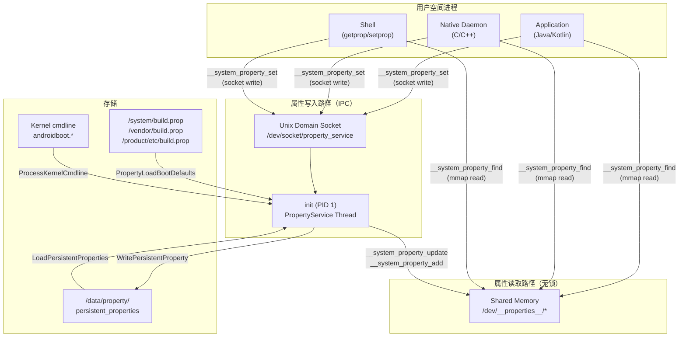
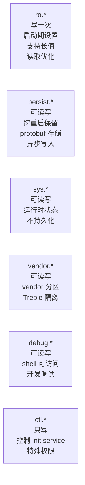
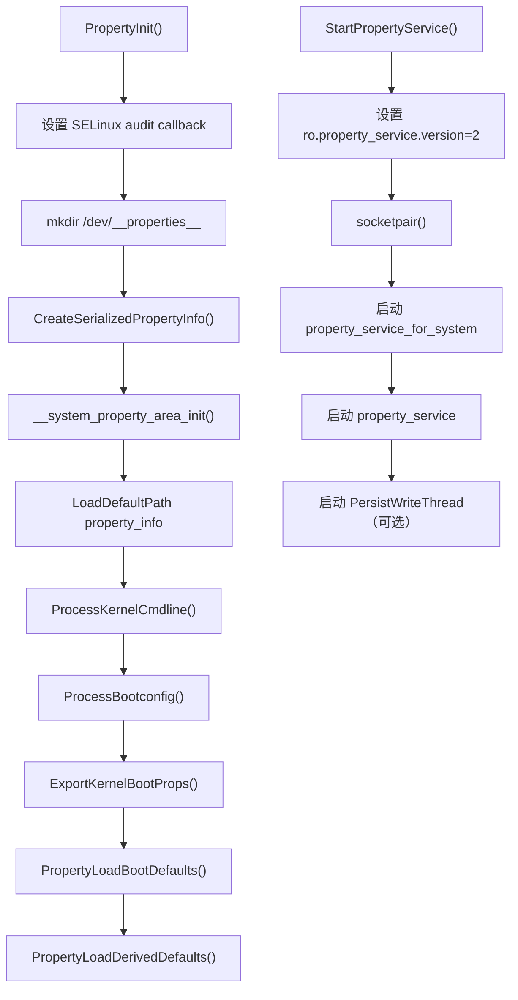
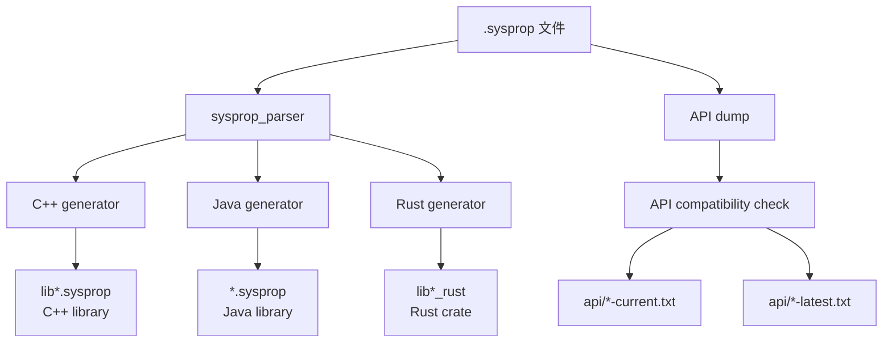
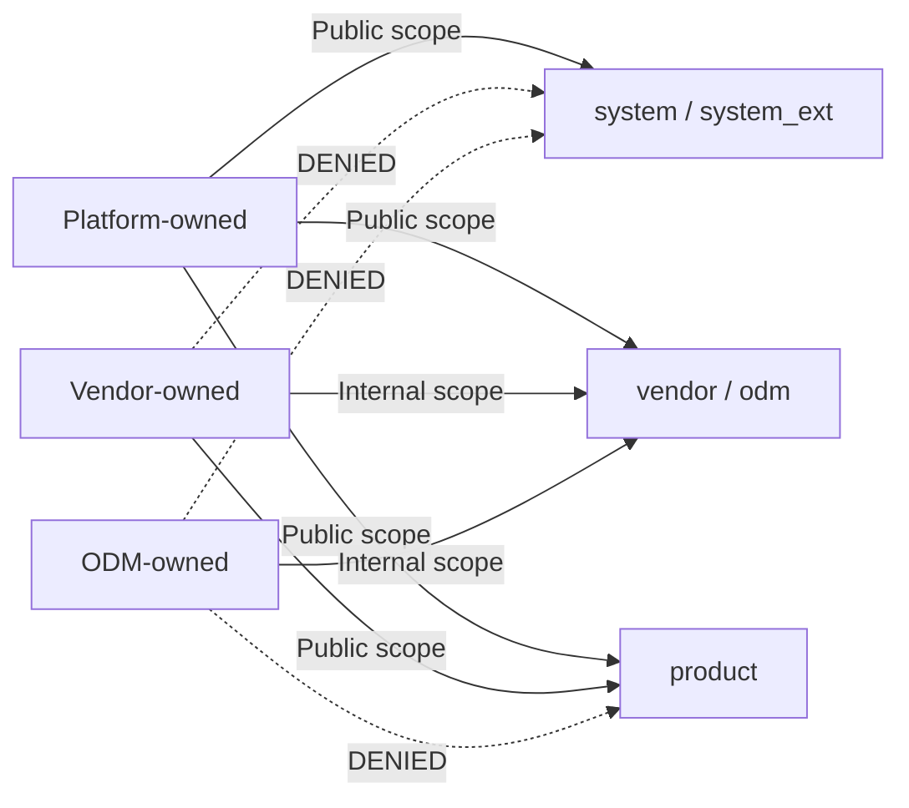
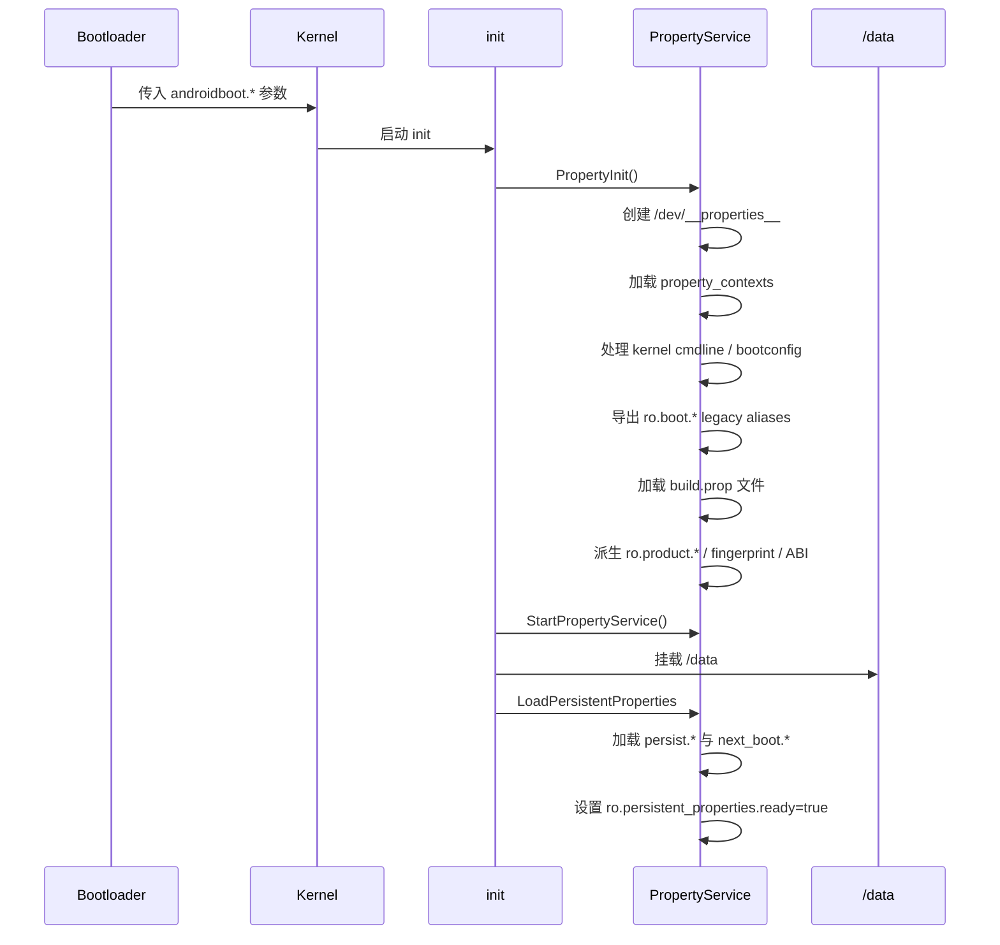

# 第 6 章：系统属性

Android 的系统属性是一套设备级键值存储，是进程之间传递配置数据的主要机制。从 init 在早期启动阶段设置 `ro.build.fingerprint`，到 Java 应用读取 `persist.sys.language` 判断用户区域设置，系统属性贯穿 Android 栈的每一层。它们体积小（历史上 key 最多 32 字节，可变属性 value 最多 92 字节）、读取快（读取无需 IPC，只是共享内存查询），并且受控（写入由 init 通过 Unix domain socket 代理，并由 SELinux 强制执行）。

虽然系统属性表面上只是简单的键值接口，但其内部包含共享内存区域、trie 数据结构、SELinux 强制访问控制、protobuf 序列化持久化存储，以及构建期类型系统等多层协作。本章会沿着真实 AOSP 源码逐层拆解：从 `bionic/libc/system_properties/` 中的 bionic 实现，到 `system/core/init/property_service.cpp` 中的 property service，再到 `frameworks/base/core/java/android/os/SystemProperties.java` 中的 Java API，以及 Soong 构建系统里的 `sysprop_library` 模块类型。

---

## 6.1 属性架构

### 6.1.1 设计目标与约束

系统属性机制的架构来自几个明确约束：

1. **无锁读取。** 任意进程都必须能在不加锁、不执行 IPC 的情况下读取任意属性。这一点很关键，因为属性读取位于热路径上，例如每次 `getprop` 调用、Java 层读取构建特征、native daemon 检查 debug flag。

2. **单一写入者。** 只有 init 进程（PID 1）可以修改包含属性数据的共享内存区域。其他进程必须通过 Unix domain socket 向 init 发送请求。

3. **SELinux 强制执行。** 读取和写入都受 SELinux 控制。属性命名空间被划分到不同 SELinux context 中，进程必须具备对应的 `property_service { set }` 或 `file { read }` 权限。

4. **启动期不可变。** 以 `ro.` 开头的只读属性只能在启动期间设置一次，之后在设备生命周期内保持不可变。

5. **持久化。** 以 `persist.` 开头的属性会通过 protobuf 序列化文件写入 `/data/property/persistent_properties`，从而跨重启保留。



### 6.1.2 共享内存区域

系统属性机制的基础是一组位于 `/dev/__properties__/` 下的内存映射文件。该目录位于 `tmpfs` 文件系统中，因此完全存在于内存里。init 会在启动早期创建该目录：

```cpp
// Source: system/core/init/property_service.cpp, PropertyInit()
void PropertyInit() {
    selinux_callback cb;
    cb.func_audit = PropertyAuditCallback;
    selinux_set_callback(SELINUX_CB_AUDIT, cb);

    mkdir("/dev/__properties__", S_IRWXU | S_IXGRP | S_IXOTH);
    CreateSerializedPropertyInfo();
    if (__system_property_area_init()) {
        LOG(FATAL) << "Failed to initialize property area";
    }
    if (!property_info_area.LoadDefaultPath()) {
        LOG(FATAL) << "Failed to load serialized property info file";
    }
    ...
}
```

`__system_property_area_init()` 由 bionic 实现，用于创建真正的内存映射文件。每个 SELinux context 在 `/dev/__properties__/` 下都有独立文件，此外还有一个全局 serial number 专用文件。

每个 property area 的大小定义在 `bionic/libc/system_properties/prop_area.cpp`：

```c
// Source: bionic/libc/system_properties/prop_area.cpp
#ifdef LARGE_SYSTEM_PROPERTY_NODE
constexpr size_t PA_SIZE = 1024 * 1024;       // 1 MB
#else
constexpr size_t PA_SIZE = 128 * 1024;        // 128 KB
#endif
constexpr uint32_t PROP_AREA_MAGIC = 0x504f5250;  // little-endian "PROP"
constexpr uint32_t PROP_AREA_VERSION = 0xfc6ed0ab;
```

init 以 `O_RDWR` 打开文件，并用 `PROT_READ | PROT_WRITE` 映射；其他进程则以只读方式打开同一文件，并用 `PROT_READ` 映射。`map_fd_ro()` 还会校验文件所有者与权限，只接受 root 拥有、组和其他用户不可写的文件，这保证了 property area 本身的可信性。

### 6.1.3 `prop_area` 结构

`prop_area` 是每个内存映射属性文件的头部结构，定义在 `bionic/libc/system_properties/include/system_properties/prop_area.h`：

```c
class prop_area {
 public:
    prop_area(const uint32_t magic, const uint32_t version)
        : magic_(magic), version_(version) {
        atomic_store_explicit(&serial_, 0u, memory_order_relaxed);
        memset(reserved_, 0, sizeof(reserved_));
        bytes_used_ = sizeof(prop_trie_node);
        bytes_used_ += __builtin_align_up(PROP_VALUE_MAX, sizeof(uint_least32_t));
    }

 private:
    uint32_t bytes_used_;
    atomic_uint_least32_t serial_;
    uint32_t magic_;
    uint32_t version_;
    uint32_t reserved_[28];
    char data_[0];
};
```

内存布局如下：

```text
+---------------------+  offset 0
|   bytes_used_ (4B)  |
+---------------------+  offset 4
|   serial_ (4B)      |  每次属性变化时原子递增
+---------------------+  offset 8
|   magic_ (4B)       |  0x504f5250 ("PROP")
+---------------------+  offset 12
|   version_ (4B)     |  0xfc6ed0ab
+---------------------+  offset 16
|   reserved_[28]     |  112 字节保留区
+---------------------+  offset 128
|   data_[]           |  Trie 节点、prop_info、value
+---------------------+  offset PA_SIZE
```

`serial_` 字段很关键。该区域内任意属性新增或修改时，它都会原子递增。读取者可以通过 `__system_property_area_serial()` 轮询该 serial，无需加锁即可检测属性变化。`data_[]` 区域以根 `prop_trie_node` 开始，后面是一个 `PROP_VALUE_MAX` 大小的 dirty backup area，再往后才是动态分配的 trie 节点和属性信息。

### 6.1.4 Trie 结构

属性使用混合 trie/二叉树结构存储。属性名以 `.` 分割后的每个片段都会成为 trie 中的一个节点。在同一层级内，兄弟节点又按照二叉搜索树组织，以提升查找效率。

源码中的经典注释展示了这个结构：

```c
// Source: bionic/libc/system_properties/include/system_properties/prop_area.h
//
// Properties are stored in a hybrid trie/binary tree structure.
// Each property's name is delimited at '.' characters, and the tokens are put
// into a trie structure.  Siblings at each level of the trie are stored in a
// binary tree.  For instance, "ro.secure"="1" could be stored as follows:
//
// +-----+   children    +----+   children    +--------+
// |     |-------------->| ro |-------------->| secure |
// +-----+               +----+               +--------+
//                       /    \                /   |
//                 left /      \ right   left /    |  prop   +===========+
//                     v        v            v     +-------->| ro.secure |
//                  +-----+   +-----+     +-----+            +-----------+
//                  | net |   | sys |     | com |            |     1     |
//                  +-----+   +-----+     +-----+            +===========+
```

`prop_trie_node` 结构如下：

```c
struct prop_trie_node {
    uint32_t namelen;
    atomic_uint_least32_t prop;
    atomic_uint_least32_t left;
    atomic_uint_least32_t right;
    atomic_uint_least32_t children;
    char name[0];
};
```

对于 `ro.build.fingerprint` 这样的属性名，查找过程是：

1. 从 root 节点开始，进入 children。
2. 在兄弟二叉树中查找 `ro` 片段。
3. 进入 `ro` 的 children，查找 `build`。
4. 进入 `build` 的 children，查找 `fingerprint`。
5. 返回挂在 `fingerprint` 节点上的 `prop_info`。

### 6.1.5 `prop_info` 结构

每个真实属性值都存储在一个 `prop_info` 结构中，定义在 `bionic/libc/system_properties/include/system_properties/prop_info.h`：

```c
struct prop_info {
    static constexpr uint32_t kLongFlag = 1 << 16;
    static constexpr size_t kLongLegacyErrorBufferSize = 56;

    atomic_uint_least32_t serial;
    union {
        char value[PROP_VALUE_MAX];
        struct {
            char error_message[kLongLegacyErrorBufferSize];
            uint32_t offset;
        } long_property;
    };
    char name[0];
};
```

`serial` 字段同时承担多种职责：

- **bit 0（dirty bit）**：写入进行中时置 1，读取者看到 dirty serial 后读取备份区。
- **bit 16（long flag）**：当值超过 `PROP_VALUE_MAX` 时置 1，只读属性可通过该机制存储长值。
- **bit 24-31（value length）**：高 8 位编码当前值长度。
- **其余位**：单调递增计数器。

`prop_info` 的内存布局如下：

```text
+----------------------------+  offset 0
|  serial (4B, atomic)       |  Dirty bit | Long flag | Length | Counter
+----------------------------+  offset 4
|  value[92] or              |  短值内联存储
|  { error_msg[56], offset } |  长值使用偏移寻址
+----------------------------+  offset 96
|  name[]                    |  完整属性名，以 NUL 结尾
+----------------------------+
```

### 6.1.6 Wait-Free 读取协议

系统属性实现了一套 wait-free 读取协议，即使写入正在进行，读取者也永远不会阻塞。协议依赖 `serial` 字段与 dirty backup area。

init 更新属性时会执行如下步骤：

```c
int SystemProperties::Update(prop_info* pi, const char* value, unsigned int len) {
    uint32_t serial = atomic_load_explicit(&pi->serial, memory_order_relaxed);
    unsigned int old_len = SERIAL_VALUE_LEN(serial);

    memcpy(pa->dirty_backup_area(), pi->value, old_len + 1);
    serial |= 1;
    atomic_store_explicit(&pi->serial, serial, memory_order_release);
    atomic_thread_fence(memory_order_release);
    memcpy(pi->value, value, len + 1);
    int new_serial = (len << 24) | ((serial + 1) & 0xffffff);
    atomic_store_explicit(&pi->serial, new_serial, memory_order_release);
    __futex_wake(&pi->serial, INT32_MAX);
    ...
}
```

读取端的 `ReadMutablePropertyValue()` 会检查 dirty bit。若发现写入者正处于中间状态，就从 dirty backup area 读取旧值；若读取过程中 serial 发生变化，则重新读取。这保证了读取者要么看到完整旧值，要么看到完整新值，永远不会看到被写到一半的值。

只读属性（`ro.*`）有额外优化：它们设置后不会变化，因此读取者可以跳过 dirty-bit 协议，直接读取 value 或 long value。

### 6.1.7 长属性值

历史上，属性值受 `PROP_VALUE_MAX`（92 字节）限制。从 Android O 开始，只读属性（`ro.*`）可以使用 “long property” 机制存储更长的值。当 value 长度超过 `PROP_VALUE_MAX` 时，serial 中的 `kLongFlag`（bit 16）会被置位，真实值存储在 property area 中的另一段偏移位置。

```c
prop_info* prop_area::new_prop_info(const char* name, uint32_t namelen,
    const char* value, uint32_t valuelen, uint_least32_t* const off) {
    if (valuelen >= PROP_VALUE_MAX) {
        uint32_t long_value_offset = 0;
        char* long_location = reinterpret_cast<char*>(
            allocate_obj(valuelen + 1, &long_value_offset));
        memcpy(long_location, value, valuelen);
        long_location[valuelen] = '\0';
        long_value_offset -= new_offset;
        info = new (p) prop_info(name, namelen, long_value_offset);
    } else {
        info = new (p) prop_info(name, namelen, value, valuelen);
    }
}
```

`prop_info::long_value()` 通过相对偏移还原指针：

```c
const char* long_value() const {
    return reinterpret_cast<const char*>(this) + long_property.offset;
}
```

这使 `ro.build.fingerprint` 这类很长的只读属性可以完整存储，避免被截断。

### 6.1.8 `property_info` Trie（SELinux Context Trie）

除了保存实际值的 property value trie 外，还有第二棵 trie，用于把属性名映射到 SELinux context 与类型信息。这就是 `property_info` trie，会被序列化到 `/dev/__properties__/property_info`。

init 启动时从多个 `property_contexts` 文件构建它：

```c
void CreateSerializedPropertyInfo() {
    auto property_infos = std::vector<PropertyInfoEntry>();
    LoadPropertyInfoFromFile("/system/etc/selinux/plat_property_contexts", &property_infos);
    LoadPropertyInfoFromFile("/system_ext/etc/selinux/system_ext_property_contexts", ...);
    LoadPropertyInfoFromFile("/vendor/etc/selinux/vendor_property_contexts", ...);
    LoadPropertyInfoFromFile("/product/etc/selinux/product_property_contexts", ...);
    LoadPropertyInfoFromFile("/odm/etc/selinux/odm_property_contexts", ...);

    auto serialized_contexts = std::string();
    BuildTrie(property_infos, "u:object_r:default_prop:s0", "string",
              &serialized_contexts, &error);
    WriteStringToFile(serialized_contexts, PROP_TREE_FILE, 0444, 0, 0, false);
    selinux_android_restorecon(PROP_TREE_FILE, 0);
}
```

序列化格式由 `system/core/property_service/libpropertyinfoparser/include/property_info_parser/property_info_parser.h` 定义，包括 `PropertyInfoAreaHeader`、`TrieNodeInternal` 和 `PropertyEntry`。当进程调用 `__system_property_find("debug.myapp.trace")` 时，bionic 会先查 `property_info` trie 找到 `debug.*` 对应的 SELinux context，再打开 `/dev/__properties__/` 下对应的 property area 文件，最后在该区域内查找真实 value。

这套两级查找使每个 SELinux context 都映射到独立内存映射文件，从而让内核可以在文件级别执行读取权限控制。

---

## 6.2 属性命名空间

Android 系统属性遵循层级命名约定。前缀决定了属性的可变性、持久化行为和访问控制。理解这些命名空间是使用平台属性机制的基础。

### 6.2.1 只读属性（`ro.*`）

以 `ro.` 开头的属性是 “write-once” 属性：启动期间可以设置，但之后不能修改。强制逻辑位于 `system/core/init/property_service.cpp`：

```c
static std::optional<uint32_t> PropertySet(const std::string& name,
    const std::string& value, SocketConnection* socket, std::string* error) {
    prop_info* pi = (prop_info*)__system_property_find(name.c_str());
    if (pi != nullptr) {
        if (StartsWith(name, "ro.")) {
            *error = "Read-only property was already set";
            return {PROP_ERROR_READ_ONLY_PROPERTY};
        }
        __system_property_update(pi, value.c_str(), valuelen);
    } else {
        __system_property_add(name.c_str(), name.size(), value.c_str(), valuelen);
    }
}
```

`ro.*` 属性的关键特征如下：

- **首次设置后不可变。** 已存在的 `ro.*` 再次设置会返回 `PROP_ERROR_READ_ONLY_PROPERTY`。
- **支持长值。** 与可变属性不同，`ro.*` 可以通过 long property 机制存储超过 `PROP_VALUE_MAX` 的值。
- **读取路径优化。** 由于设置后不会变化，读取者跳过 dirty-bit 协议。
- **启动期间设置。** 通常来自 `build.prop`、kernel command line（`androidboot.*`）和 device tree。

常见 `ro.*` 属性如下：

| 属性 | 说明 | 示例值 |
|----------|-------------|---------------|
| `ro.build.fingerprint` | 唯一构建标识 | `google/raven/raven:14/...` |
| `ro.build.type` | 构建类型 | `userdebug`, `user`, `eng` |
| `ro.build.version.sdk` | API level | `34` |
| `ro.product.model` | 设备型号 | `Pixel 6 Pro` |
| `ro.product.manufacturer` | 设备厂商 | `Google` |
| `ro.hardware` | 硬件平台 | `tensor` |
| `ro.debuggable` | Debug 构建标记 | `1` 或 `0` |
| `ro.secure` | 安全执行标记 | `1` |
| `ro.boot.serialno` | 设备序列号 | 设备相关 |
| `ro.vendor.api_level` | Vendor API level | `34` |

### 6.2.2 持久化属性（`persist.*`）

以 `persist.` 开头的属性会自动保存到磁盘，并在重启后恢复。持久化机制由 `system/core/init/persistent_properties.cpp` 实现。

存储文件是 `/data/property/persistent_properties`，编码格式为 Protocol Buffer：

```c
[[clang::no_destroy]] std::string persistent_property_filename =
    "/data/property/persistent_properties";
```

当设置 `persist.*` 属性时，`PropertySet()` 会触发写入：

```c
bool need_persist = StartsWith(name, "persist.") || StartsWith(name, "next_boot.");
if (socket && persistent_properties_loaded && need_persist) {
    if (persist_write_thread) {
        persist_write_thread->Write(name, value, std::move(*socket));
        return {};
    }
    WritePersistentProperty(name, value);
}
```

写入过程会读取整个 protobuf 文件，更新对应条目，然后用临时文件加 `rename()` 的原子替换模式写回。为了持久性，写入会对文件执行 `fsync()`，再对目录 fd 执行 `fsync()`。当 `ro.property_service.async_persist_writes` 为 `true` 时，init 会把持久化写入交给专用 `PersistWriteThread` 异步执行，写入完成后再通知属性变化并给 socket 返回 `PROP_SUCCESS`。

### 6.2.3 阶段化属性（`next_boot.*`）

`next_boot.` 前缀用于暂存下一次重启后才生效的属性变化。它们和 `persist.*` 属性一起保存在同一个 protobuf 文件中，但启动时会被“应用”为对应的 `persist.*` 值。

```c
auto const staged_prefix = std::string_view("next_boot.");
for (const auto& property_record : persistent_properties->properties()) {
    auto const& prop_name = property_record.name();
    if (StartsWith(prop_name, staged_prefix)) {
        auto actual_prop_name = prop_name.substr(staged_prefix.size());
        staged_props[actual_prop_name] = property_record.value();
    }
}
```

例如设置 `next_boot.persist.sys.language=fr`，会让下一次启动时的 `persist.sys.language` 变成 `fr`。应用后，`next_boot.*` 条目会被移除。

### 6.2.4 系统运行时属性（`sys.*`）

`sys.*` 命名空间用于反映当前系统状态的运行时属性。这些属性可变，但不会跨重启持久化。

| 属性 | 说明 |
|----------|-------------|
| `sys.boot_completed` | 启动完成后设置为 `1` |
| `sys.powerctl` | 触发重启或关机 |
| `sys.oem_unlock_allowed` | OEM unlock 策略 |
| `sys.sysctl.extra_free_kbytes` | 内存调优参数 |

`sys.powerctl` 是特殊属性，设置它会触发设备重启或关机。property service 会记录发起设置的进程信息，以便审计。

### 6.2.5 Vendor 属性（`vendor.*`）

`vendor.*` 前缀保留给 vendor 专用属性。这些属性受 Project Treble 引入的 Vendor Interface（VINTF）属性命名空间隔离规则约束。第 6.7 节会详细说明。

### 6.2.6 Debug 属性（`debug.*`）

`debug.*` 命名空间通常用于开发和调试。相较系统属性，它的 SELinux 策略更宽松，使开发者可以在 `userdebug` 构建上通过 `adb shell setprop` 设置这些属性。

```text
# Source: system/sepolicy/private/property_contexts
debug.                  u:object_r:debug_prop:s0
debug.db.               u:object_r:debuggerd_prop:s0
```

### 6.2.7 控制属性（`ctl.*`）

`ctl.*` 并不是常规属性命名空间。property service 会拦截这些属性，用它们控制 init service：

```c
if (StartsWith(name, "ctl.")) {
    return {SendControlMessage(name.c_str() + 4, value, cr.pid, socket, error)};
}
```

设置 `ctl.start=<service_name>` 会启动服务，`ctl.stop=<service_name>` 会停止服务，`ctl.restart=<service_name>` 会重启服务。这类操作的权限检查基于目标 service 的 SELinux context。

### 6.2.8 服务状态属性（`init.svc.*`）

init 会自动维护 `init.svc.<service_name>` 属性，用于反映每个服务的状态：`stopped`、`starting`、`running`、`stopping`、`restarting`。

### 6.2.9 命名空间行为总结



---

## 6.3 Property Contexts 与 SELinux 集成

### 6.3.1 `property_contexts` 文件格式

`property_contexts` 文件把属性名前缀映射到 SELinux context 与类型。典型条目如下：

```text
# prefix/exact-name          SELinux context                 type
ro.build.                    u:object_r:build_prop:s0        exact string
persist.sys.                 u:object_r:system_prop:s0       string
debug.                       u:object_r:debug_prop:s0        string
vendor.                      u:object_r:vendor_prop:s0       string
```

这些 context 决定了：

- 属性写入时需要哪些 `property_service { set }` 权限。
- 属性读取时 property area 文件需要哪些 `file { read }` 权限。
- 属性 value 需要满足哪种类型约束，例如 `bool`、`int`、`uint`、`enum` 或 `string`。

### 6.3.2 分区专属 Context 文件

Android 会从多个分区加载 property context：

| 文件 | 作用域 |
|------|--------|
| `/system/etc/selinux/plat_property_contexts` | 平台属性 |
| `/system_ext/etc/selinux/system_ext_property_contexts` | system_ext 属性 |
| `/vendor/etc/selinux/vendor_property_contexts` | vendor 属性 |
| `/product/etc/selinux/product_property_contexts` | product 属性 |
| `/odm/etc/selinux/odm_property_contexts` | ODM 属性 |

init 把这些文件合并成序列化 `property_info` trie，并写入 `/dev/__properties__/property_info`。

### 6.3.3 属性写入的 SELinux 强制执行

写入属性时，property service 会取得调用方的 SELinux context，再检查调用方是否有权设置目标属性：

```c
static bool CheckMacPerms(const std::string& name, const char* target_context,
                          const char* source_context, const ucred& cr) {
    PropertyAuditData audit_data;
    audit_data.name = name.c_str();
    audit_data.cr = &cr;
    return selinux_check_access(source_context, target_context,
                                "property_service", "set", &audit_data) == 0;
}
```

权限模型的含义是：调用方进程域必须对目标属性 context 拥有 `property_service set` 权限。以普通 app 为例，它即使能连接 property_service socket，也会因为缺少 SELinux 权限而无法设置大多数系统属性。

### 6.3.4 属性读取的 SELinux 强制执行

读取权限通过文件访问控制实现。每个 SELinux context 对应一个独立 property area 文件，这些文件本身带有相应 SELinux label。进程要读取某类属性，就必须能读取对应文件。

这种设计把读取路径保持在无 IPC、无锁的共享内存访问上，同时仍然利用内核的文件权限和 SELinux 权限做强制隔离。

### 6.3.5 类型检查

`property_contexts` 中可以声明属性类型。property service 在设置属性时会对 value 做类型检查，避免把布尔属性写成任意字符串，或把整数属性写成非法文本。

常见类型包括：

| 类型 | 说明 | 示例 |
|------|------|------|
| `string` | 任意字符串 | `userdebug` |
| `bool` | 布尔值 | `true`, `false`, `1`, `0` |
| `int` | 有符号整数 | `-1`, `42` |
| `uint` | 无符号整数 | `0`, `4096` |
| `double` | 浮点数 | `0.75` |
| `enum` | 枚举值 | `disabled`, `filtered`, `full` |

类型检查把属性从“任意字符串开关”提升为具备基本 schema 的系统接口。

### 6.3.6 Appcompat Override 机制

系统属性服务还支持 appcompat override 机制，用于在兼容性场景下覆盖部分属性行为。这类机制通常服务于平台迁移和兼容性开关，允许系统在不改变基础属性定义的情况下，对特定应用或场景施加额外行为。

---

## 6.4 Init 中的 PropertyService

### 6.4.1 初始化序列

property service 的启动分为两个阶段：先初始化共享内存和 property context，再启动 socket 线程接受写入请求。



### 6.4.2 加载启动属性

`PropertyLoadBootDefaults()` 负责按正确顺序加载所有属性文件。顺序很重要，因为后加载、更具体分区中的属性会覆盖先加载、更通用分区中的属性。

```c
void PropertyLoadBootDefaults() {
    std::map<std::string, std::string> properties;
    LoadPropertiesFromSecondStageRes(&properties);
    load_properties_from_file("/system/build.prop", nullptr, &properties);
    load_properties_from_partition("system_ext", 30);
    load_properties_from_file("/system_dlkm/etc/build.prop", nullptr, &properties);
    load_properties_from_file("/vendor/default.prop", nullptr, &properties);
    load_properties_from_file("/vendor/build.prop", nullptr, &properties);
    load_properties_from_file("/vendor_dlkm/etc/build.prop", nullptr, &properties);
    load_properties_from_file("/odm_dlkm/etc/build.prop", nullptr, &properties);
    load_properties_from_partition("odm", 28);
    load_properties_from_partition("product", 30);

    for (const auto& [name, value] : properties) {
        PropertySetNoSocket(name, value, &error);
    }

    property_initialize_ro_product_props();
    property_derive_build_fingerprint();
    property_initialize_ro_cpu_abilist();
    property_initialize_ro_vendor_api_level();
    update_sys_usb_config();
}
```

优先级从低到高如下：

1. `system/build.prop`
2. `system_ext/etc/build.prop`
3. `system_dlkm/etc/build.prop`
4. `vendor/default.prop` 与 `vendor/build.prop`
5. `vendor_dlkm/etc/build.prop`
6. `odm_dlkm/etc/build.prop`
7. `odm/etc/build.prop`
8. `product/etc/build.prop`

### 6.4.3 Kernel Command Line 处理

init 会把 kernel command line 和 bootconfig 中的 `androidboot.*` 参数转换为 `ro.boot.*` 属性：

```c
constexpr auto ANDROIDBOOT_PREFIX = "androidboot."sv;

static void ProcessKernelCmdline() {
    android::fs_mgr::ImportKernelCmdline(
        [&](const std::string& key, const std::string& value) {
            if (StartsWith(key, ANDROIDBOOT_PREFIX)) {
                InitPropertySet("ro.boot." + key.substr(ANDROIDBOOT_PREFIX.size()), value);
            }
        });
}
```

随后 `ExportKernelBootProps()` 会创建遗留别名：

```c
static void ExportKernelBootProps() {
    struct { const char* src_prop; const char* dst_prop; const char* default_value; } prop_map[] = {
        { "ro.boot.serialno",   "ro.serialno",   ""        },
        { "ro.boot.mode",       "ro.bootmode",   "unknown" },
        { "ro.boot.baseband",   "ro.baseband",   "unknown" },
        { "ro.boot.bootloader", "ro.bootloader", "unknown" },
        { "ro.boot.hardware",   "ro.hardware",   "unknown" },
        { "ro.boot.revision",   "ro.revision",   "0"       },
    };
    ...
}
```

### 6.4.4 基于 Socket 的写入 API

property service 通过两个 Unix domain socket 接受写入请求：

```c
void StartPropertyService(int* epoll_socket) {
    InitPropertySet("ro.property_service.version", "2");
    socketpair(AF_UNIX, SOCK_SEQPACKET | SOCK_CLOEXEC, 0, sockets);
    StartThread(PROP_SERVICE_FOR_SYSTEM_NAME, 0660, AID_SYSTEM,
                property_service_for_system_thread, true);
    StartThread(PROP_SERVICE_NAME, 0666, 0,
                property_service_thread, false);
}
```

两个 socket 的职责如下：

- **`property_service_for_system`**（mode 0660）：仅 system 组进程可访问，也监听 init 内部消息，例如加载持久化属性。
- **`property_service`**（mode 0666）：所有进程可访问，是通用属性设置 socket。

每个 socket 都运行在自己的 epoll 线程中，接收连接、读取消息、检查凭据，并调用属性设置逻辑。

### 6.4.5 Wire Protocol

属性设置协议有两种消息类型：

**`PROP_MSG_SETPROP`（遗留）：**

```text
[uint32_t cmd=1] [char name[PROP_NAME_MAX]] [char value[PROP_VALUE_MAX]]
```

它使用固定长度字段，没有响应，供旧版 bionic 使用。

**`PROP_MSG_SETPROP2`（当前）：**

```text
[uint32_t cmd=2] [uint32_t name_len] [char name[]] [uint32_t value_len] [char value[]]
```

它使用长度前缀字符串，并返回一个 uint32 响应码。property service 通过 `SO_PEERCRED` 获取调用方 `pid`、`uid`、`gid`，再基于 SELinux context 和属性 context 执行权限检查。

### 6.4.6 属性变化通知

属性成功设置后，init 可以触发 `.rc` 文件中定义的 action。每次成功设置属性后都会调用 `NotifyPropertyChange()`：

```c
void NotifyPropertyChange(const std::string& name, const std::string& value) {
    auto lock = std::lock_guard{accept_messages_lock};
    if (accept_messages) {
        PropertyChanged(name, value);
    }
}
```

这支持如下 `.rc` trigger：

```text
on property:sys.boot_completed=1
    start post_boot_service

on property:ro.debuggable=1
    start adbd
```

### 6.4.7 加载持久化属性

持久化属性会在 `/data` 挂载后加载。system socket 线程通过来自 init 主循环的 protobuf 消息处理该操作：

```c
static void HandleInitSocket() {
    auto message = ReadMessage(init_socket);
    auto init_message = InitMessage{};
    init_message.ParseFromString(*message);

    switch (init_message.msg_case()) {
    case InitMessage::kLoadPersistentProperties: {
        load_override_properties();
        auto persistent_properties = LoadPersistentProperties();
        for (const auto& property_record : persistent_properties.properties()) {
            InitPropertySet(property_record.name(), property_record.value());
        }
        InitPropertySet("ro.persistent_properties.ready", "true");
        persistent_properties_loaded = true;
        break;
    }
    }
}
```

旧格式曾经把持久化属性存成 `/data/property/` 下的单独文件。现代 Android 使用单一 protobuf 文件。迁移逻辑会在新文件读取失败时回退到旧目录格式，成功读取后写回新格式，并删除旧文件。

---

## 6.5 `SystemProperties` Java API

### 6.5.1 Hidden API

Java 层系统属性接口由 `android.os.SystemProperties` 提供，文件位于 `frameworks/base/core/java/android/os/SystemProperties.java`。该类带有 `@SystemApi` 和 `@hide` 标注，因此它不属于公开 SDK，但平台代码和使用 system SDK 的应用可以访问。

```java
@SystemApi
@RavenwoodKeepWholeClass
public class SystemProperties {
    private static final String TAG = "SystemProperties";
    public static final int PROP_VALUE_MAX = 91;
    ...
}
```

### 6.5.2 Get 方法

`SystemProperties` 提供多个类型化 getter：

```java
@NonNull @SystemApi
public static String get(@NonNull String key) {
    if (TRACK_KEY_ACCESS) onKeyAccess(key);
    return native_get(key);
}

@NonNull @SystemApi
public static String get(@NonNull String key, @Nullable String def) {
    if (TRACK_KEY_ACCESS) onKeyAccess(key);
    return native_get(key, def);
}

@SystemApi
public static int getInt(@NonNull String key, int def) {
    if (TRACK_KEY_ACCESS) onKeyAccess(key);
    return native_get_int(key, def);
}
```

还包括 `getLong()`、`getBoolean()` 等变体。Java 方法最终调用 native 方法，再进入 bionic 的 `__system_property_find()` 与 `__system_property_read_callback()`。

### 6.5.3 Set 方法

`set()` 方法会调用 native setter，最终通过 property_service socket 发送写入请求：

```java
@SystemApi
public static void set(@NonNull String key, @Nullable String val) {
    if (val != null && !key.startsWith("ro.") && val.length() > PROP_VALUE_MAX) {
        throw new IllegalArgumentException("value of system property '" + key + "' is longer than " + PROP_VALUE_MAX + " characters");
    }
    native_set(key, val);
}
```

Java 层也保留了可变属性长度限制：非 `ro.*` 属性的 value 不能超过 `PROP_VALUE_MAX`。

### 6.5.4 基于 Handle 的优化访问

为了避免重复按字符串查找属性，`SystemProperties` 支持先查找 handle，再通过 handle 快速读取：

```java
public static Handle find(@NonNull String name) {
    long nativeHandle = native_find(name);
    if (nativeHandle == 0) return null;
    return new Handle(nativeHandle);
}

public static final class Handle {
    private final long mNativeHandle;
    public String get() { return native_get(mNativeHandle); }
    public int getInt(int def) { return native_get_int(mNativeHandle, def); }
    public long getLong(long def) { return native_get_long(mNativeHandle, def); }
    public boolean getBoolean(boolean def) { return native_get_boolean(mNativeHandle, def); }
}
```

这适合频繁读取同一属性的热路径。

### 6.5.5 变化回调

Java API 支持注册属性变化回调：

```java
public static void addChangeCallback(@NonNull Runnable callback) {
    synchronized (sChangeCallbacks) {
        if (sChangeCallbacks.size() == 0) native_add_change_callback();
        sChangeCallbacks.add(callback);
    }
}
```

底层通过 property area 的全局 serial 与 futex 等待机制实现。当任意属性变化时，等待者会被唤醒，Java 层再分发回调。

### 6.5.6 Digest 方法

`digestOf()` 用于对一组属性计算摘要。它读取指定 key 的值，按 key 排序，再把 `key=value` 字符串输入 SHA-1。该方法常用于构建稳定指纹或比较属性集合。

### 6.5.7 NDK 与 Native 访问

native 代码通过 bionic 暴露的 system property API 访问属性：

```c
const prop_info* pi = __system_property_find("ro.build.version.sdk");
if (pi != nullptr) {
    __system_property_read_callback(pi, callback, cookie);
}

char value[PROP_VALUE_MAX];
__system_property_get("ro.product.model", value);
```

实现位于：

```text
bionic/libc/bionic/system_property_api.cpp
bionic/libc/system_properties/system_properties.cpp
```

### 6.5.8 `UnsupportedAppUsage` 与 Greylist

由于历史原因，一些非 SDK 应用曾直接调用 `SystemProperties`。Android 通过 `@UnsupportedAppUsage` 与 greylist 机制在兼容性和 API 封装之间折中：平台可以限制新应用访问隐藏 API，同时允许旧应用在过渡期继续运行。

---

## 6.6 Soong 中的 `sysprop_library`

### 6.6.1 动机：把类型化属性作为 API

直接调用 `SystemProperties.get("some.string.key")` 有几个问题：key 是字符串、value 缺少类型、API 稳定性无法检查、跨分区依赖难以管理。`sysprop_library` 通过 `.sysprop` 声明文件解决这些问题，把系统属性变成可类型检查、可生成代码、可做 API 兼容性检查的接口。

### 6.6.2 `.sysprop` 文件格式

一个 `.sysprop` 文件会声明模块、所有者和属性列表：

```protobuf
module: "android.sysprop.BluetoothProperties"
owner: Platform

prop {
    api_name: "snoop_default_mode"
    type: Enum
    scope: Public
    access: ReadWrite
    enum_values: "empty|disabled|filtered|full"
    prop_name: "persist.bluetooth.btsnoopdefaultmode"
}
```

关键字段如下：

| 字段 | 说明 |
|------|------|
| `module` | 生成代码的包名或命名空间 |
| `owner` | 属性所有者，例如 `Platform`、`Vendor`、`Odm` |
| `api_name` | 生成 API 的方法名 |
| `type` | 属性类型，例如 `Boolean`、`Integer`、`String`、`Enum` |
| `scope` | API 作用域，`Public` 或 `Internal` |
| `access` | 访问方式，`Readonly`、`Writeonce` 或 `ReadWrite` |
| `prop_name` | 真实系统属性名 |

### 6.6.3 `Android.bp` 模块定义

`sysprop_library` 在 Soong 中这样声明：

```json
sysprop_library {
    name: "PlatformProperties",
    srcs: ["srcs/android/sysprop/PlatformProperties.sysprop"],
    property_owner: "Platform",
}
```

构建系统会基于该模块生成 Java、C++ 和 Rust 访问库，并生成 API dump 文件进行兼容性检查。

### 6.6.4 代码生成

`sysprop_library` 的生成流程如下：



### 6.6.5 生成的 Java 代码

对于如下属性：

```protobuf
prop {
    api_name: "snoop_default_mode"
    type: Enum
    scope: Public
    access: ReadWrite
    enum_values: "empty|disabled|filtered|full"
    prop_name: "persist.bluetooth.btsnoopdefaultmode"
}
```

生成的 Java 代码大致如下：

```java
package android.sysprop;

public final class BluetoothProperties {
    public enum snoop_default_mode_values {
        EMPTY("empty"), DISABLED("disabled"), FILTERED("filtered"), FULL("full");
    }

    public static Optional<snoop_default_mode_values> snoop_default_mode() {
        String value = SystemProperties.get("persist.bluetooth.btsnoopdefaultmode");
        return snoop_default_mode_values.tryParse(value);
    }

    public static void snoop_default_mode(snoop_default_mode_values value) {
        SystemProperties.set("persist.bluetooth.btsnoopdefaultmode", value.getPropValue());
    }
}
```

### 6.6.6 生成的 C++ 代码

对应 C++ API 通常生成 `std::optional` getter 与 `Result<void>` setter：

```cpp
namespace android::sysprop {

std::optional<std::string> snoop_default_mode();
android::base::Result<void> snoop_default_mode(const std::string& value);

}  // namespace android::sysprop
```

### 6.6.7 Scope 与 Access 控制

`scope` 字段控制生成内容：

- **`Public`**：属性进入 internal 和 public 生成库，被视为稳定 API，必须通过兼容性检查。
- **`Internal`**：属性只进入 internal 生成库，不属于稳定 API surface。

`access` 字段控制生成的方法：

- **`Readonly`**：只生成 getter。通常用于构建期或启动期设置的属性。
- **`Writeonce`**：生成 getter 和 setter，但 setter 被文档化为一次性使用，常见于 `ro.*`。
- **`ReadWrite`**：同时生成 getter 和 setter。

### 6.6.8 API 兼容性检查

`sysprop_library` 通过两类文件强制 API 稳定：

```go
// 1. 从 .sysprop dump 当前 API
rule.Command().BuiltTool("sysprop_api_dump").Output(m.dumpedApiFile).Inputs(srcs)

// 2. 比较 dump 与 checked-in current.txt
rule.Command().Text("( cmp").Flag("-s").Input(m.dumpedApiFile).Text(currentApiArgument)

// 3. 比较 current.txt 与 latest.txt，要求向后兼容
rule.Command().BuiltTool("sysprop_api_checker").Text(latestApiArgument).Text(currentApiArgument)
```

这确保 `.sysprop` 与 `api/<name>-current.txt` 一致，并且当前 API 与 `api/<name>-latest.txt` 向后兼容。若有有意 API 变更，需要运行 dump 命令并更新对应 `current.txt`。

### 6.6.9 与 `property_contexts` 集成

`sysprop_library` 会自动与属性类型检查系统集成。构建期会收集所有 sysprop library 列表，供 `property_contexts` 规则验证其中声明的类型约束是否与 `.sysprop` 文件一致。

---

## 6.7 Vendor 属性与 Treble 隔离

### 6.7.1 Vendor Interface 与属性命名空间

Project Treble 引入了 system 分区和 vendor 分区之间的严格隔离。对应到系统属性，含义如下：

1. **Vendor 属性应使用 `vendor.` 或 `persist.vendor.` 前缀。** 这能明确它们位于 vendor 命名空间。
2. **系统组件不应依赖 vendor 专用属性。** `sysprop_library` 的 ownership 模型会在构建期执行该规则。
3. **暴露给 vendor 代码的平台属性必须稳定。** 当 vendor 代码使用 Platform 所有的 `sysprop_library` 时，只能访问 `Public` scope 属性，并且这些属性必须通过 API 兼容性检查。

### 6.7.2 Vendor Property Contexts

vendor 分区通过 `/vendor/etc/selinux/vendor_property_contexts` 提供自己的 property_contexts 文件。该文件定义 vendor 专用属性的 SELinux label。

从 vendor 分区文件加载属性时，property service 会使用特殊 vendor context：

```c
static constexpr const char* const kVendorPathPrefixes[4] = {
    "/vendor", "/odm", "/vendor_dlkm", "/odm_dlkm",
};

if (SelinuxGetVendorAndroidVersion() >= __ANDROID_API_P__) {
    for (const auto& vendor_path_prefix : kVendorPathPrefixes) {
        if (StartsWith(filename, vendor_path_prefix)) {
            context = kVendorContext;
        }
    }
}
```

这意味着从 vendor 分区文件加载的属性会以 vendor SELinux context 设置，其访问规则不同于 platform/init context。

### 6.7.3 Vendor API Level

`ro.vendor.api_level` 由 init 自动计算，用来表示 vendor 分区必须支持的最低 API level：

```c
static void property_initialize_ro_vendor_api_level() {
    constexpr auto VENDOR_API_LEVEL_PROP = "ro.vendor.api_level";
    if (__system_property_find(VENDOR_API_LEVEL_PROP) != nullptr) return;

    auto vendor_api_level = GetIntProperty("ro.board.first_api_level", __ANDROID_VENDOR_API_MAX__);
    vendor_api_level = GetIntProperty("ro.board.api_level", vendor_api_level);
    auto product_first_api_level = GetIntProperty("ro.product.first_api_level", __ANDROID_API_FUTURE__);
    vendor_api_level = std::min(
        AVendorSupport_getVendorApiLevelOf(product_first_api_level), vendor_api_level);
    PropertySetNoSocket(VENDOR_API_LEVEL_PROP, std::to_string(vendor_api_level), &error);
}
```

### 6.7.4 跨分区属性访问规则

`sysprop_library` 构建系统会基于所有权和安装分区执行访问规则：



核心规则如下：

- **Platform-owned** 属性可通过 `Public` scope 被所有分区读取。
- **Vendor-owned** 属性不可从 system 分区访问。
- **ODM-owned** 属性只能从 vendor/ODM 分区访问。
- **Product** 分区始终使用 `Public` scope，因为它不能拥有属性。

### 6.7.5 ODM 与 Vendor DLKM 分区

ODM（Original Design Manufacturer）和 DLKM（Dynamic Loadable Kernel Modules）分区也有自己的 `build.prop` 文件。property service 的加载顺序确保 ODM 属性可以覆盖 vendor 属性：

```text
vendor/default.prop       -> 先加载
vendor/build.prop         -> 覆盖 vendor/default.prop
vendor_dlkm/etc/build.prop
odm_dlkm/etc/build.prop
odm/etc/build.prop        -> 覆盖所有 vendor 属性
```

这个层级允许 ODM 在不修改 vendor 分区的情况下定制 vendor 属性。

---

## 6.8 启动属性

### 6.8.1 构建属性（`ro.build.*`）

构建属性由构建系统在构建期设置，并写入各分区的 `build.prop` 文件。它们描述构建配置：

| 属性 | 说明 | 示例 |
|----------|-------------|---------|
| `ro.build.display.id` | 构建显示字符串 | `UP1A.231005.007` |
| `ro.build.version.incremental` | 增量构建号 | `10817346` |
| `ro.build.version.sdk` | SDK API level | `34` |
| `ro.build.version.release` | 用户可见版本 | `14` |
| `ro.build.version.security_patch` | 安全补丁日期 | `2023-10-05` |
| `ro.build.type` | 构建类型 | `user` / `userdebug` / `eng` |
| `ro.build.tags` | 构建标签 | `release-keys` / `dev-keys` |
| `ro.build.fingerprint` | 组合 fingerprint | 派生值 |
| `ro.build.id` | Build ID | `UP1A.231005.007` |

### 6.8.2 Build Fingerprint 派生

如果 `ro.build.fingerprint` 没有显式设置，init 会自动派生：

```c
static void property_derive_build_fingerprint() {
    std::string build_fingerprint = GetProperty("ro.build.fingerprint", "");
    if (!build_fingerprint.empty()) return;

    const std::string UNKNOWN = "unknown";
    build_fingerprint = GetProperty("ro.product.brand", UNKNOWN);
    build_fingerprint += '/';
    build_fingerprint += GetProperty("ro.product.name", UNKNOWN);
    build_fingerprint += '/';
    build_fingerprint += GetProperty("ro.product.device", UNKNOWN);
    build_fingerprint += ':';
    build_fingerprint += GetProperty("ro.build.version.release_or_codename", UNKNOWN);
    build_fingerprint += '/';
    build_fingerprint += GetProperty("ro.build.id", UNKNOWN);
    build_fingerprint += '/';
    build_fingerprint += GetProperty("ro.build.version.incremental", UNKNOWN);
    build_fingerprint += ':';
    build_fingerprint += GetProperty("ro.build.type", UNKNOWN);
    build_fingerprint += '/';
    build_fingerprint += GetProperty("ro.build.tags", UNKNOWN);
    PropertySetNoSocket("ro.build.fingerprint", build_fingerprint, &error);
}
```

最终 fingerprint 形如：`google/raven/raven:14/UP1A.231005.007/10817346:userdebug/dev-keys`。

### 6.8.3 Product 属性（`ro.product.*`）

`ro.product.*` 属性描述产品身份，例如品牌、设备名、型号和制造商。Android 支持按分区提供 product 属性，例如 `ro.product.system.*`、`ro.product.vendor.*`、`ro.product.product.*`。init 会根据 `ro.product.property_source_order` 指定的优先级派生最终的 `ro.product.*` 值。

常见属性包括：

| 属性 | 说明 |
|------|------|
| `ro.product.brand` | 品牌 |
| `ro.product.name` | 产品名 |
| `ro.product.device` | 设备代号 |
| `ro.product.model` | 用户可见型号 |
| `ro.product.manufacturer` | 制造商 |

### 6.8.4 硬件属性（`ro.hardware.*`）

硬件属性通常来自 bootloader 传入的 `androidboot.*` 参数，并映射为 `ro.boot.*` 后再派生到 legacy 属性。例如 `androidboot.hardware` 会变成 `ro.boot.hardware`，再导出为 `ro.hardware`。HAL、init rc 与设备专属脚本常用这些属性选择硬件路径。

### 6.8.5 Boot Mode 属性（`ro.boot.*`）

`ro.boot.*` 属性来自 kernel command line 或 bootconfig，用于承载 bootloader 提供的信息，例如 serial number、boot mode、baseband、bootloader version、hardware name 和 hardware revision。

```text
androidboot.serialno=ABC123       -> ro.boot.serialno=ABC123
androidboot.hardware=raven        -> ro.boot.hardware=raven
androidboot.mode=normal           -> ro.boot.mode=normal
```

### 6.8.6 CPU ABI List 属性

init 会基于系统支持的 ABI 派生 CPU ABI list 属性：

| 属性 | 说明 |
|------|------|
| `ro.product.cpu.abilist` | 所有支持 ABI |
| `ro.product.cpu.abilist32` | 32 位 ABI 列表 |
| `ro.product.cpu.abilist64` | 64 位 ABI 列表 |

这些属性会被 package manager、zygote 和应用兼容性逻辑使用，用来选择 native library ABI。

### 6.8.7 完整启动属性加载时间线



---

## 6.9 动手实践：探索系统属性

### 6.9.1 练习：列出并检查属性

```bash
# 列出所有属性
adb shell getprop

# 查看构建 fingerprint
adb shell getprop ro.build.fingerprint

# 查看属性数量
adb shell getprop | wc -l

# 按命名空间过滤
adb shell getprop | grep '^\[ro\.'
adb shell getprop | grep '^\[persist\.'
adb shell getprop | grep '^\[vendor\.'
```

### 6.9.2 练习：设置并观察属性

```bash
# 设置 debug 属性
adb shell setprop debug.myapp.trace 1
adb shell getprop debug.myapp.trace

# 尝试修改只读属性会失败
adb shell setprop ro.build.type eng
```

`ro.*` 属性首次设置后不可修改，普通进程还会受到 SELinux 权限限制。

### 6.9.3 练习：观察属性变化

```bash
# 观察 property trigger 可使用 logcat
adb logcat | grep -i property

# 在另一个终端设置属性
adb shell setprop debug.myapp.trace 2
```

### 6.9.4 练习：检查 Property Contexts

```bash
# 查看平台 property contexts
adb shell cat /system/etc/selinux/plat_property_contexts | head

# 查看 vendor property contexts
adb shell cat /vendor/etc/selinux/vendor_property_contexts | head

# 搜索 debug 属性 context
adb shell grep '^debug\.' /system/etc/selinux/plat_property_contexts
```

### 6.9.5 练习：持久化属性存储

```bash
# 设置持久化属性
adb shell setprop persist.myapp.enabled true

# 检查属性值
adb shell getprop persist.myapp.enabled

# root 后可检查持久化文件
adb root
adb shell ls -l /data/property/
adb shell ls -l /data/property/persistent_properties
```

### 6.9.6 练习：属性派生链

```bash
echo "Brand:   $(adb shell getprop ro.product.brand)"
echo "Name:    $(adb shell getprop ro.product.name)"
echo "Device:  $(adb shell getprop ro.product.device)"
echo "Release: $(adb shell getprop ro.build.version.release_or_codename)"
echo "ID:      $(adb shell getprop ro.build.id)"
echo "Incr:    $(adb shell getprop ro.build.version.incremental)"
echo "Type:    $(adb shell getprop ro.build.type)"
echo "Tags:    $(adb shell getprop ro.build.tags)"
echo "Fingerprint: $(adb shell getprop ro.build.fingerprint)"
```

### 6.9.7 练习：通过属性控制服务

```bash
# 列出运行中服务
adb shell getprop | grep "init.svc\." | grep running

# 查看具体服务状态
adb shell getprop init.svc.adbd

# 通过 ctl 属性重启服务
adb root
adb shell setprop ctl.restart adbd
```

### 6.9.8 练习：构建 `sysprop_library`

创建 `.sysprop` 文件：

```protobuf
# my_module/MyAppProperties.sysprop
module: "com.example.MyAppProperties"
owner: Platform

prop {
    api_name: "debug_enabled"
    type: Boolean
    scope: Internal
    access: ReadWrite
    prop_name: "persist.myapp.debug_enabled"
}

prop {
    api_name: "max_connections"
    type: Integer
    scope: Internal
    access: ReadWrite
    prop_name: "persist.myapp.max_connections"
}
```

创建 `Android.bp`：

```json
sysprop_library {
    name: "MyAppProperties",
    srcs: ["MyAppProperties.sysprop"],
    property_owner: "Platform",
}
```

生成库提供类型安全访问：

```java
import com.example.MyAppProperties;

Optional<Boolean> debug = MyAppProperties.debug_enabled();
if (debug.orElse(false)) {
    Log.d(TAG, "Debug mode is enabled");
}

Optional<Integer> maxConn = MyAppProperties.max_connections();
int connections = maxConn.orElse(10);

MyAppProperties.debug_enabled(true);
MyAppProperties.max_connections(20);
```

### 6.9.9 练习：测量属性读取性能

```bash
adb shell "
    START=\$(date +%s%N)
    for i in \$(seq 1 10000); do
        getprop ro.build.fingerprint > /dev/null
    done
    END=\$(date +%s%N)
    ELAPSED=\$(( (END - START) / 1000000 ))
    echo \"10000 reads in \${ELAPSED}ms\"
    echo \"Average: \$(( ELAPSED * 1000 / 10000 )) us per read\"
"
```

`getprop` 包含进程创建开销。真实共享内存查询通常远低于 1 微秒。更准确的 benchmark 应使用 native 程序直接调用 `__system_property_find()` 与 `__system_property_read_callback()`。

### 6.9.10 练习：探索内存中的 Property Trie

```bash
# 查看 init 映射的 property 区域
adb shell "cat /proc/1/maps | grep __properties__"

# 查看其他进程映射
PID=$(adb shell pidof com.android.systemui)
adb shell "cat /proc/$PID/maps | grep __properties__"
```

这个练习可以看到：每个进程的 property area 虚拟地址可能不同，但它们都通过共享内存映射文件引用同一批物理页。

---

## 总结

Android 系统属性看起来只是简单键值机制，但在接口背后隐藏了大量复杂性。它通过多个子系统协作实现了设计目标：

1. **无锁读取**：通过内存映射文件和基于 trie 的查找结构实现，并利用 atomic 操作与 dirty-backup-area 协议保证一致性。

2. **集中写入**：所有写入都经由 init 的 property service，通过 Unix domain socket 接收请求并统一修改共享内存。

3. **SELinux 强制执行**：每个属性 context 都有独立 property area 文件，文件本身由内核和 SELinux 执行访问控制。

4. **类型化、受 API 管理的属性**：`sysprop_library` 生成 Java、C++ 和 Rust 的类型安全访问器，同时强制 API 兼容性。

5. **分区隔离**：Treble 对齐的 ownership 模型明确划分 platform、vendor 和 ODM 属性边界及访问规则。

系统属性相关的关键源码如下：

| 组件 | 路径 |
|-----------|------|
| Property service（init） | `system/core/init/property_service.cpp` |
| 持久化属性 | `system/core/init/persistent_properties.cpp` |
| 共享内存 trie | `bionic/libc/system_properties/prop_area.cpp` |
| `prop_info` 结构 | `bionic/libc/system_properties/include/system_properties/prop_info.h` |
| Trie 节点结构 | `bionic/libc/system_properties/include/system_properties/prop_area.h` |
| 系统属性核心 | `bionic/libc/system_properties/system_properties.cpp` |
| NDK API | `bionic/libc/bionic/system_property_api.cpp` |
| 序列化 context | `bionic/libc/system_properties/contexts_serialized.cpp` |
| Property info trie | `system/core/property_service/libpropertyinfoparser/include/property_info_parser/property_info_parser.h` |
| Java API | `frameworks/base/core/java/android/os/SystemProperties.java` |
| Soong `sysprop_library` | `build/soong/sysprop/sysprop_library.go` |
| 平台 property contexts | `system/sepolicy/private/property_contexts` |
| 示例 `.sysprop` 文件 | `system/libsysprop/srcs/android/sysprop/BluetoothProperties.sysprop` |
