# Chapter 6: System Properties

Android's system properties are a device-wide key-value store that provides the
primary mechanism for communicating configuration data between processes. From the
moment init sets `ro.build.fingerprint` during early boot to the instant a Java
application reads `persist.sys.language` to determine the user's locale, system
properties permeate every layer of the Android stack. They are small (key up to 32
bytes historically, value up to 92 bytes for mutable properties), fast (reads require
no IPC -- just a shared memory lookup), and controlled (writes are mediated by init
through a Unix domain socket and enforced by SELinux).

Despite their apparent simplicity, system properties involve a sophisticated
interplay of shared memory regions, trie data structures, SELinux mandatory access
control, protobuf-serialized persistent storage, and a build-time type system. This
chapter dissects each layer by reading the actual AOSP source code, from the bionic
implementation in `bionic/libc/system_properties/` through the property service in
`system/core/init/property_service.cpp`, up to the Java API in
`frameworks/base/core/java/android/os/SystemProperties.java` and the Soong build
system's `sysprop_library` module type.

---

## 6.1 Property Architecture

### 6.1.1 Design Goals and Constraints

The system property mechanism was designed with several firm constraints that shaped
its architecture:

1. **Lock-free reads.** Any process must be able to read any property without
   acquiring a lock or performing IPC. This is critical because property reads happen
   in hot paths -- every `getprop` call, every Java reflection of build
   characteristics, every native daemon checking a debug flag.

2. **Single writer.** Only the init process (PID 1) may modify the shared memory
   regions containing property data. All other processes must send a request to init
   through a Unix domain socket.

3. **SELinux enforcement.** Both reads and writes are controlled by SELinux. The
   property namespace is partitioned into SELinux contexts, and processes must have
   the appropriate `property_service { set }` or `file { read }` permissions.

4. **Boot-time immutability.** Properties prefixed with `ro.` (read-only) can be set
   exactly once during boot and then become immutable for the lifetime of the device.

5. **Persistence.** Properties prefixed with `persist.` survive reboots by being
   written to `/data/property/persistent_properties` as a protobuf-serialized file.

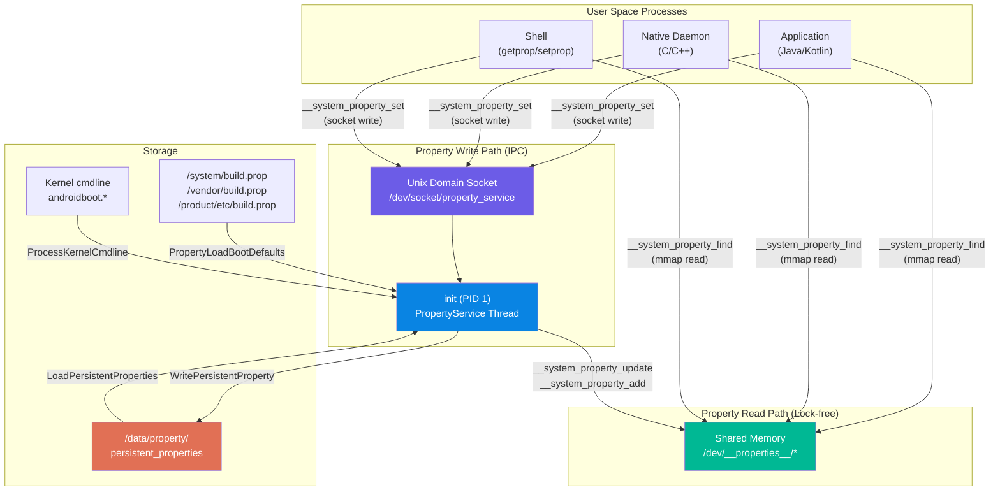

### 6.1.2 The Shared Memory Region

The foundation of the system property mechanism is a set of memory-mapped files
located under `/dev/__properties__/`. This directory resides on a `tmpfs` filesystem,
meaning it lives entirely in RAM. Init creates this directory early in boot:

```
// Source: system/core/init/property_service.cpp, PropertyInit()
void PropertyInit() {
    selinux_callback cb;
    cb.func_audit = PropertyAuditCallback;
    selinux_set_callback(SELINUX_CB_AUDIT, cb);

    mkdir("/dev/__properties__", S_IRWXU | S_IXGRP | S_IXOTH);
    CreateSerializedPropertyInfo();
    if (__system_property_area_init()) {
        LOG(FATAL) << "Failed to initialize property area";
    }
    if (!property_info_area.LoadDefaultPath()) {
        LOG(FATAL) << "Failed to load serialized property info file";
    }
    ...
}
```

The function `__system_property_area_init()` is implemented in bionic and creates the
actual memory-mapped files. Each SELinux context gets its own file under
`/dev/__properties__/`, and there is one special file for the global serial number.

The size of each property area is defined in
`bionic/libc/system_properties/prop_area.cpp`:

```c
// Source: bionic/libc/system_properties/prop_area.cpp
#ifdef LARGE_SYSTEM_PROPERTY_NODE
constexpr size_t PA_SIZE = 1024 * 1024;       // 1 MB
#else
constexpr size_t PA_SIZE = 128 * 1024;        // 128 KB
#endif
constexpr uint32_t PROP_AREA_MAGIC = 0x504f5250;  // "PROP" in little-endian
constexpr uint32_t PROP_AREA_VERSION = 0xfc6ed0ab;
```

Each property area file is created with `mmap()` using `MAP_SHARED`, so that init
(the writer) and all other processes (readers) see the same physical pages:

```c
// Source: bionic/libc/system_properties/prop_area.cpp
prop_area* prop_area::map_prop_area_rw(const char* filename, const char* context,
                                       bool* fsetxattr_failed) {
    const int fd = open(filename, O_RDWR | O_CREAT | O_NOFOLLOW | O_CLOEXEC | O_EXCL, 0444);
    ...
    if (context) {
        if (fsetxattr(fd, XATTR_NAME_SELINUX, context, strlen(context) + 1, 0) != 0) {
            // SELinux context labeling for the property file
            ...
        }
    }

    if (ftruncate(fd, PA_SIZE) < 0) { ... }

    void* const memory_area = mmap(nullptr, pa_size_, PROT_READ | PROT_WRITE,
                                   MAP_SHARED, fd, 0);
    ...
    prop_area* pa = new (memory_area) prop_area(PROP_AREA_MAGIC, PROP_AREA_VERSION);
    close(fd);
    return pa;
}
```

Notice that init opens the file with `O_RDWR` and maps it `PROT_READ | PROT_WRITE`,
while all other processes open the same file read-only and map it `PROT_READ`:

```c
// Source: bionic/libc/system_properties/prop_area.cpp
prop_area* prop_area::map_prop_area(const char* filename) {
    int fd = open(filename, O_CLOEXEC | O_NOFOLLOW | O_RDONLY);
    ...
    prop_area* map_result = map_fd_ro(fd);
    ...
}
```

The `map_fd_ro` function also validates ownership and permissions:

```c
prop_area* prop_area::map_fd_ro(const int fd) {
    struct stat fd_stat;
    if (fstat(fd, &fd_stat) < 0) { return nullptr; }

    if ((fd_stat.st_uid != 0) || (fd_stat.st_gid != 0) ||
        ((fd_stat.st_mode & (S_IWGRP | S_IWOTH)) != 0) ||
        (fd_stat.st_size < static_cast<off_t>(sizeof(prop_area)))) {
        return nullptr;  // Refuse to map files not owned by root
    }
    ...
    void* const map_result = mmap(nullptr, pa_size_, PROT_READ, MAP_SHARED, fd, 0);
    ...
}
```

This security check ensures that only root-owned, non-group/world-writable files are
accepted as valid property areas.

### 6.1.3 The prop_area Structure

The `prop_area` structure serves as the header for each memory-mapped property file.
It is defined in `bionic/libc/system_properties/include/system_properties/prop_area.h`:

```c
// Source: bionic/libc/system_properties/include/system_properties/prop_area.h
class prop_area {
 public:
    prop_area(const uint32_t magic, const uint32_t version)
        : magic_(magic), version_(version) {
        atomic_store_explicit(&serial_, 0u, memory_order_relaxed);
        memset(reserved_, 0, sizeof(reserved_));
        bytes_used_ = sizeof(prop_trie_node);
        // Reserve space for the "dirty backup area" right after the root node.
        // This area is PROP_VALUE_MAX bytes and is used for wait-free reads.
        bytes_used_ += __builtin_align_up(PROP_VALUE_MAX, sizeof(uint_least32_t));
    }

 private:
    uint32_t bytes_used_;
    atomic_uint_least32_t serial_;
    uint32_t magic_;
    uint32_t version_;
    uint32_t reserved_[28];
    char data_[0];           // Flexible array member: the actual trie data
};
```

The layout in memory is:

```
+---------------------+  offset 0
|   bytes_used_ (4B)  |
+---------------------+  offset 4
|   serial_ (4B)      |  Atomic, incremented on every property change
+---------------------+  offset 8
|   magic_ (4B)       |  0x504f5250 ("PROP")
+---------------------+  offset 12
|   version_ (4B)     |  0xfc6ed0ab
+---------------------+  offset 16
|   reserved_[28]     |  112 bytes of reserved space
+---------------------+  offset 128
|   data_[]           |  <-- Trie nodes, prop_info entries, values
|   ...               |
+---------------------+  offset PA_SIZE (128KB or 1MB)
```

The `serial_` field is crucial. It is atomically incremented every time any property
within this area is added or modified. Readers can use this to detect changes without
any locking, by polling the serial number via `__system_property_area_serial()`.

The `data_[]` region begins with the root `prop_trie_node`, followed by a
`PROP_VALUE_MAX`-sized "dirty backup area," and then all dynamically allocated trie
nodes and property info entries.

### 6.1.4 The Trie Structure

Properties are stored in a hybrid trie/binary-tree structure. Each segment of a
property name (delimited by `.`) becomes a node in the trie. At each level, sibling
nodes are organized as a binary search tree for efficient lookup.

The canonical comment in the source code illustrates this beautifully:

```
// Source: bionic/libc/system_properties/include/system_properties/prop_area.h
//
// Properties are stored in a hybrid trie/binary tree structure.
// Each property's name is delimited at '.' characters, and the tokens are put
// into a trie structure.  Siblings at each level of the trie are stored in a
// binary tree.  For instance, "ro.secure"="1" could be stored as follows:
//
// +-----+   children    +----+   children    +--------+
// |     |-------------->| ro |-------------->| secure |
// +-----+               +----+               +--------+
//                       /    \                /   |
//                 left /      \ right   left /    |  prop   +===========+
//                     v        v            v     +-------->| ro.secure |
//                  +-----+   +-----+     +-----+            +-----------+
//                  | net |   | sys |     | com |            |     1     |
//                  +-----+   +-----+     +-----+            +===========+
```

The `prop_trie_node` structure:

```c
// Source: bionic/libc/system_properties/include/system_properties/prop_area.h
struct prop_trie_node {
    uint32_t namelen;

    // Atomic "pointers" (actually offsets from data_ base)
    // Using release-consume ordering for thread safety
    atomic_uint_least32_t prop;       // -> prop_info if property exists here
    atomic_uint_least32_t left;       // -> left child in BST
    atomic_uint_least32_t right;      // -> right child in BST
    atomic_uint_least32_t children;   // -> first child in trie (next level)

    char name[0];                     // Flexible: the segment name

    prop_trie_node(const char* name, const uint32_t name_length) {
        this->namelen = name_length;
        memcpy(this->name, name, name_length);
        this->name[name_length] = '\0';
    }
};
```

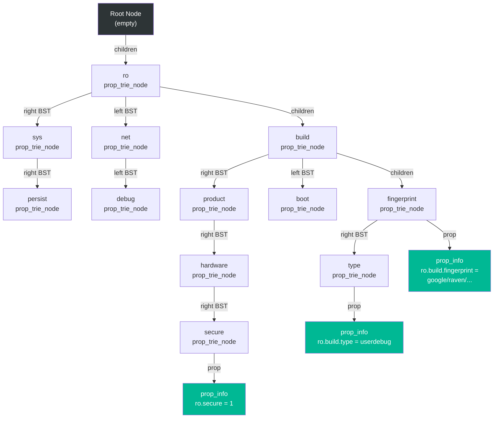

The `find_property` method walks this trie to locate a property:

```c
// Source: bionic/libc/system_properties/prop_area.cpp
const prop_info* prop_area::find_property(prop_trie_node* const trie,
    const char* name, uint32_t namelen,
    const char* value, uint32_t valuelen, bool alloc_if_needed) {
    if (!trie) return nullptr;

    const char* remaining_name = name;
    prop_trie_node* current = trie;
    while (true) {
        const char* sep = strchr(remaining_name, '.');
        const bool want_subtree = (sep != nullptr);
        const uint32_t substr_size = (want_subtree)
            ? sep - remaining_name : strlen(remaining_name);

        if (!substr_size) return nullptr;

        // Navigate to children, creating if needed
        prop_trie_node* root = nullptr;
        uint_least32_t children_offset =
            atomic_load_explicit(&current->children, memory_order_relaxed);
        if (children_offset != 0) {
            root = to_prop_trie_node(&current->children);
        } else if (alloc_if_needed) {
            uint_least32_t new_offset;
            root = new_prop_trie_node(remaining_name, substr_size, &new_offset);
            if (root) {
                atomic_store_explicit(&current->children, new_offset,
                                      memory_order_release);
            }
        }
        if (!root) return nullptr;

        // Binary search among siblings
        current = find_prop_trie_node(root, remaining_name, substr_size,
                                       alloc_if_needed);
        if (!current) return nullptr;
        if (!want_subtree) break;
        remaining_name = sep + 1;
    }

    // Check if this node has a prop_info attached
    uint_least32_t prop_offset =
        atomic_load_explicit(&current->prop, memory_order_relaxed);
    if (prop_offset != 0) {
        return to_prop_info(&current->prop);
    } else if (alloc_if_needed) {
        // Allocate new prop_info
        ...
    }
    return nullptr;
}
```

For a property name like `ro.build.fingerprint`, the lookup proceeds as:

1. Start at root node, descend to children
2. Binary search among children for `ro` segment
3. Descend to `ro`'s children, binary search for `build`
4. Descend to `build`'s children, binary search for `fingerprint`
5. Return the `prop_info` attached to the `fingerprint` node

The binary search among siblings is implemented in `find_prop_trie_node`:

```c
// Source: bionic/libc/system_properties/prop_area.cpp
prop_trie_node* prop_area::find_prop_trie_node(prop_trie_node* const trie,
    const char* name, uint32_t namelen, bool alloc_if_needed) {
    prop_trie_node* current = trie;
    while (true) {
        if (!current) return nullptr;
        const int ret = cmp_prop_name(name, namelen, current->name,
                                       current->namelen);
        if (ret == 0) return current;        // Found
        if (ret < 0) {                       // Go left
            uint_least32_t left_offset =
                atomic_load_explicit(&current->left, memory_order_relaxed);
            if (left_offset != 0) {
                current = to_prop_trie_node(&current->left);
            } else {
                if (!alloc_if_needed) return nullptr;
                // Allocate new node to the left
                ...
            }
        } else {                             // Go right
            ...
        }
    }
}
```

### 6.1.5 The prop_info Structure

Each actual property value is stored in a `prop_info` structure, defined in
`bionic/libc/system_properties/include/system_properties/prop_info.h`:

```c
// Source: bionic/libc/system_properties/include/system_properties/prop_info.h
struct prop_info {
    static constexpr uint32_t kLongFlag = 1 << 16;
    static constexpr size_t kLongLegacyErrorBufferSize = 56;

    atomic_uint_least32_t serial;
    union {
        char value[PROP_VALUE_MAX];       // 92 bytes for short values
        struct {
            char error_message[kLongLegacyErrorBufferSize];
            uint32_t offset;              // Offset to long value
        } long_property;
    };
    char name[0];                         // Property name follows

    bool is_long() const {
        return (load_const_atomic(&serial, memory_order_relaxed) & kLongFlag) != 0;
    }

    const char* long_value() const {
        return reinterpret_cast<const char*>(this) + long_property.offset;
    }
};

static_assert(sizeof(prop_info) == 96, "sizeof struct prop_info must be 96 bytes");
```

The `serial` field in `prop_info` serves multiple purposes:

- **Bit 0 (dirty bit):** Set to 1 while a write is in progress. Readers seeing a
  dirty serial know to read from the backup area instead.
- **Bit 16 (long flag):** Set to 1 if the value exceeds `PROP_VALUE_MAX` (92 bytes).
  Read-only properties can store arbitrarily long values using this mechanism.
- **Bits 24-31 (value length):** The upper byte encodes the current value length.
- **Remaining bits:** A monotonically increasing counter.

The memory layout of a `prop_info`:

```
+----------------------------+  offset 0
|  serial (4B, atomic)       |  Dirty bit | Long flag | Length | Counter
+----------------------------+  offset 4
|  value[92] or              |  For short: inline value
|  { error_msg[56]           |  For long: error message buffer
|    offset (4B) }           |            + offset to long value
+----------------------------+  offset 96
|  name[] (variable)         |  Full property name, null-terminated
+----------------------------+
```

### 6.1.6 Wait-Free Read Protocol

The system properties mechanism implements a sophisticated wait-free read protocol
that ensures readers never block, even when a write is in progress. The protocol
relies on the `serial` field and the "dirty backup area."

When init needs to update a property, it follows this sequence in
`bionic/libc/system_properties/system_properties.cpp`:

```c
// Source: bionic/libc/system_properties/system_properties.cpp
int SystemProperties::Update(prop_info* pi, const char* value, unsigned int len) {
    ...
    uint32_t serial = atomic_load_explicit(&pi->serial, memory_order_relaxed);
    unsigned int old_len = SERIAL_VALUE_LEN(serial);

    // Step 1: Copy old value to dirty backup area
    memcpy(pa->dirty_backup_area(), pi->value, old_len + 1);

    // Step 2: Set dirty bit (bit 0 = 1)
    serial |= 1;
    atomic_store_explicit(&pi->serial, serial, memory_order_release);

    // Step 3: Memory fence before value update
    atomic_thread_fence(memory_order_release);

    // Step 4: Copy new value into prop_info
    memcpy(pi->value, value, len + 1);

    // Step 5: Clear dirty bit, update length and counter
    int new_serial = (len << 24) | ((serial + 1) & 0xffffff);
    atomic_store_explicit(&pi->serial, new_serial, memory_order_release);

    // Step 6: Wake waiters via futex
    __futex_wake(&pi->serial, INT32_MAX);

    // Step 7: Increment the global area serial
    atomic_store_explicit(serial_pa->serial(),
        atomic_load_explicit(serial_pa->serial(), memory_order_relaxed) + 1,
        memory_order_release);
    __futex_wake(serial_pa->serial(), INT32_MAX);
    return 0;
}
```

On the reader side, `ReadMutablePropertyValue` handles the dirty bit:

```c
// Source: bionic/libc/system_properties/system_properties.cpp
uint32_t SystemProperties::ReadMutablePropertyValue(const prop_info* pi, char* value) {
    uint32_t new_serial = load_const_atomic(&pi->serial, memory_order_acquire);
    uint32_t serial;
    unsigned int len;
    for (;;) {
        serial = new_serial;
        len = SERIAL_VALUE_LEN(serial);
        if (__predict_false(SERIAL_DIRTY(serial))) {
            // Writer is mid-update: read from backup area instead
            prop_area* pa = contexts_->GetPropAreaForName(pi->name);
            memcpy(value, pa->dirty_backup_area(), len + 1);
        } else {
            memcpy(value, pi->value, len + 1);
        }
        atomic_thread_fence(memory_order_acquire);
        new_serial = load_const_atomic(&pi->serial, memory_order_relaxed);
        if (__predict_true(serial == new_serial)) {
            break;  // Serial unchanged: read was consistent
        }
        // Serial changed during read: retry
        atomic_thread_fence(memory_order_acquire);
    }
    return serial;
}
```

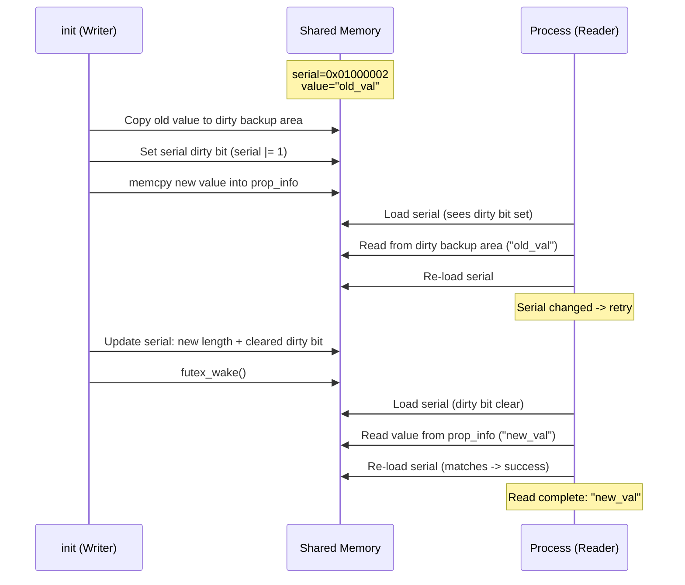

Read-only properties (`ro.*`) receive an optimization: since they can never change
after being set, the reader skips the dirty-bit protocol entirely:

```c
// Source: bionic/libc/system_properties/system_properties.cpp
void SystemProperties::ReadCallback(const prop_info* pi,
    void (*callback)(void* cookie, const char* name,
                     const char* value, uint32_t serial),
    void* cookie) {
    if (is_read_only(pi->name)) {
        // Read-only: no dirty bit check needed
        uint32_t serial = load_const_atomic(&pi->serial, memory_order_relaxed);
        if (pi->is_long()) {
            callback(cookie, pi->name, pi->long_value(), serial);
        } else {
            callback(cookie, pi->name, pi->value, serial);
        }
        return;
    }
    // Mutable property: use the full protocol
    char value_buf[PROP_VALUE_MAX];
    uint32_t serial = ReadMutablePropertyValue(pi, value_buf);
    callback(cookie, pi->name, value_buf, serial);
}
```

### 6.1.7 Long Property Values

Historically, property values were limited to `PROP_VALUE_MAX` (92 bytes). Starting
with Android O, read-only (`ro.*`) properties can exceed this limit using the "long
property" mechanism. When a value exceeds `PROP_VALUE_MAX`, the `kLongFlag` (bit 16)
is set in the serial, and the value is stored at a separate offset within the
property area:

```c
// Source: bionic/libc/system_properties/prop_area.cpp
prop_info* prop_area::new_prop_info(const char* name, uint32_t namelen,
    const char* value, uint32_t valuelen, uint_least32_t* const off) {
    uint_least32_t new_offset;
    void* const p = allocate_obj(sizeof(prop_info) + namelen + 1, &new_offset);
    if (p == nullptr) return nullptr;

    prop_info* info;
    if (valuelen >= PROP_VALUE_MAX) {
        // Long value: allocate separate storage
        uint32_t long_value_offset = 0;
        char* long_location = reinterpret_cast<char*>(
            allocate_obj(valuelen + 1, &long_value_offset));
        if (!long_location) return nullptr;

        memcpy(long_location, value, valuelen);
        long_location[valuelen] = '\0';

        // Store offset relative to the prop_info structure
        long_value_offset -= new_offset;
        info = new (p) prop_info(name, namelen, long_value_offset);
    } else {
        // Short value: store inline
        info = new (p) prop_info(name, namelen, value, valuelen);
    }
    *off = new_offset;
    return info;
}
```

The `long_value()` method on `prop_info` reconstructs the pointer:

```c
const char* long_value() const {
    return reinterpret_cast<const char*>(this) + long_property.offset;
}
```

This allows properties like `ro.build.fingerprint` (which can be quite long) to store
their full values without truncation.

### 6.1.8 The property_info Trie (SELinux Context Trie)

Separate from the property value trie (which stores actual values), there is a second
trie structure that maps property names to their SELinux contexts and type
information. This is the "property_info" trie, serialized into
`/dev/__properties__/property_info`.

Init builds this trie at boot from `property_contexts` files:

```c
// Source: system/core/init/property_service.cpp
void CreateSerializedPropertyInfo() {
    auto property_infos = std::vector<PropertyInfoEntry>();

    // Load platform property contexts
    if (access("/system/etc/selinux/plat_property_contexts", R_OK) != -1) {
        LoadPropertyInfoFromFile(
            "/system/etc/selinux/plat_property_contexts", &property_infos);

        // Load partition-specific contexts
        LoadPropertyInfoFromFile(
            "/system_ext/etc/selinux/system_ext_property_contexts", ...);
        LoadPropertyInfoFromFile(
            "/vendor/etc/selinux/vendor_property_contexts", ...);
        LoadPropertyInfoFromFile(
            "/product/etc/selinux/product_property_contexts", ...);
        LoadPropertyInfoFromFile(
            "/odm/etc/selinux/odm_property_contexts", ...);
    }
    ...

    // Serialize into a compact binary format
    auto serialized_contexts = std::string();
    auto error = std::string();
    if (!BuildTrie(property_infos, "u:object_r:default_prop:s0", "string",
                   &serialized_contexts, &error)) {
        LOG(ERROR) << "Unable to serialize property contexts: " << error;
        return;
    }

    // Write to /dev/__properties__/property_info
    WriteStringToFile(serialized_contexts, PROP_TREE_FILE, 0444, 0, 0, false);
    selinux_android_restorecon(PROP_TREE_FILE, 0);
}
```

The serialized property_info trie is defined in
`system/core/property_service/libpropertyinfoparser/include/property_info_parser/property_info_parser.h`:

```c
// Source: system/core/property_service/libpropertyinfoparser/.../property_info_parser.h
struct PropertyInfoAreaHeader {
    uint32_t current_version;
    uint32_t minimum_supported_version;
    uint32_t size;
    uint32_t contexts_offset;     // -> array of SELinux context strings
    uint32_t types_offset;        // -> array of type strings
    uint32_t root_offset;         // -> root TrieNodeInternal
};

struct TrieNodeInternal {
    uint32_t property_entry;      // -> PropertyEntry for this node
    uint32_t num_child_nodes;
    uint32_t child_nodes;         // -> sorted array of child node offsets
    uint32_t num_prefixes;
    uint32_t prefix_entries;      // -> prefix match entries
    uint32_t num_exact_matches;
    uint32_t exact_match_entries; // -> exact match entries
};

struct PropertyEntry {
    uint32_t name_offset;
    uint32_t namelen;
    uint32_t context_index;       // Index into contexts array
    uint32_t type_index;          // Index into types array
};
```

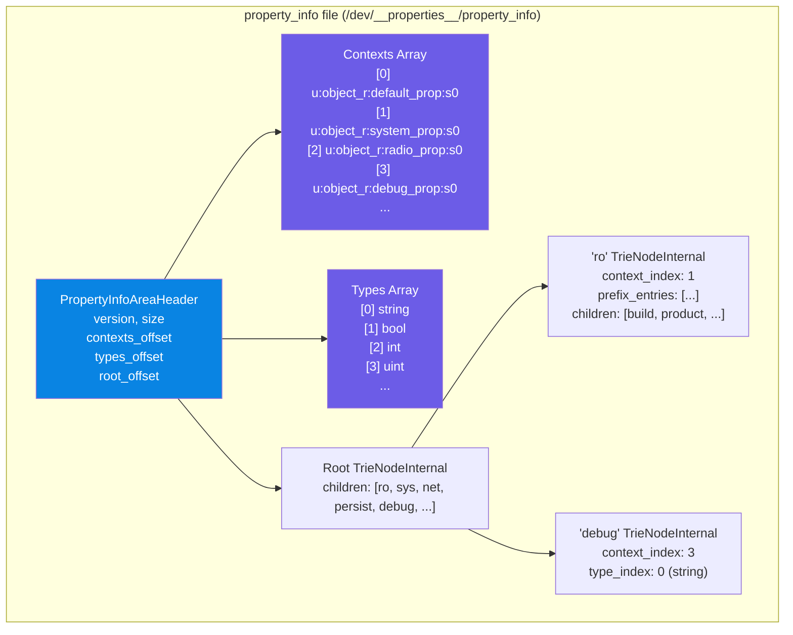

When a process calls `__system_property_find("debug.myapp.trace")`, the bionic
library:

1. Looks up the property_info trie to find the SELinux context index for `debug.*`
2. Uses that index to open the correct property area file under `/dev/__properties__/`
3. Searches the property value trie within that area for the actual value

This two-level lookup ensures that each SELinux context maps to its own memory-mapped
file, enabling the kernel to enforce read permissions at the file level.

---

## 6.2 Property Namespaces

Android system properties follow a hierarchical naming convention where the prefix
determines the property's behavior regarding mutability, persistence, and access
control. Understanding these namespaces is essential for working with the platform.

### 6.2.1 Read-Only Properties (ro.*)

Properties beginning with `ro.` are "write-once" -- they can be set during boot but
cannot be modified afterward. The enforcement is in
`system/core/init/property_service.cpp`:

```c
// Source: system/core/init/property_service.cpp, PropertySet()
static std::optional<uint32_t> PropertySet(const std::string& name,
    const std::string& value, SocketConnection* socket, std::string* error) {
    ...
    prop_info* pi = (prop_info*)__system_property_find(name.c_str());
    if (pi != nullptr) {
        // ro.* properties are actually "write-once".
        if (StartsWith(name, "ro.")) {
            *error = "Read-only property was already set";
            return {PROP_ERROR_READ_ONLY_PROPERTY};
        }
        __system_property_update(pi, value.c_str(), valuelen);
    } else {
        int rc = __system_property_add(name.c_str(), name.size(),
                                        value.c_str(), valuelen);
        ...
    }
    ...
}
```

Key characteristics of `ro.*` properties:

- **Immutable after first set.** Any attempt to set an already-existing `ro.*`
  property returns `PROP_ERROR_READ_ONLY_PROPERTY`.
- **Can have long values.** Unlike mutable properties (limited to 91 bytes), `ro.*`
  properties can store values exceeding `PROP_VALUE_MAX` using the long property
  mechanism.
- **Optimized reads.** Readers skip the dirty-bit protocol, since the value can never
  change after being set.
- **Set during boot.** Typically loaded from `build.prop` files, kernel command line
  (`androidboot.*`), and device tree.

Common `ro.*` properties include:

| Property | Description | Example Value |
|----------|-------------|---------------|
| `ro.build.fingerprint` | Unique build identifier | `google/raven/raven:14/...` |
| `ro.build.type` | Build variant | `userdebug`, `user`, `eng` |
| `ro.build.version.sdk` | API level | `34` |
| `ro.product.model` | Device model | `Pixel 6 Pro` |
| `ro.product.manufacturer` | Device manufacturer | `Google` |
| `ro.hardware` | Hardware platform | `tensor` |
| `ro.debuggable` | Debug build flag | `1` or `0` |
| `ro.secure` | Security enforcement | `1` |
| `ro.boot.serialno` | Device serial number | (varies) |
| `ro.vendor.api_level` | Vendor API level | `34` |

### 6.2.2 Persistent Properties (persist.*)

Properties beginning with `persist.` are automatically saved to disk and restored
across reboots. The persistence mechanism is implemented in
`system/core/init/persistent_properties.cpp`.

The storage file is `/data/property/persistent_properties`, encoded as a Protocol
Buffer:

```c
// Source: system/core/init/persistent_properties.cpp
[[clang::no_destroy]] std::string persistent_property_filename =
    "/data/property/persistent_properties";
```

When a `persist.*` property is set, `PropertySet()` triggers a write:

```c
// Source: system/core/init/property_service.cpp
bool need_persist = StartsWith(name, "persist.") || StartsWith(name, "next_boot.");
if (socket && persistent_properties_loaded && need_persist) {
    if (persist_write_thread) {
        persist_write_thread->Write(name, value, std::move(*socket));
        return {};  // Response sent asynchronously after write completes
    }
    WritePersistentProperty(name, value);
}
```

The write operation reads the entire protobuf file, updates the relevant entry, and
writes it back atomically using a rename:

```c
// Source: system/core/init/persistent_properties.cpp
void WritePersistentProperty(const std::string& name, const std::string& value) {
    auto persistent_properties = LoadPersistentPropertyFile();
    if (!persistent_properties.ok()) {
        // Recover from memory if file is corrupted
        persistent_properties = LoadPersistentPropertiesFromMemory();
    }

    // Find and update, or add new entry
    auto it = std::find_if(...);
    if (it != persistent_properties->mutable_properties()->end()) {
        it->set_value(value);
    } else {
        AddPersistentProperty(name, value, &persistent_properties.value());
    }

    WritePersistentPropertyFile(*persistent_properties);
}
```

The write-to-disk uses the standard atomic rename pattern:

```c
// Source: system/core/init/persistent_properties.cpp
Result<void> WritePersistentPropertyFile(
    const PersistentProperties& persistent_properties) {
    const std::string temp_filename = persistent_property_filename + ".tmp";
    unique_fd fd(TEMP_FAILURE_RETRY(
        open(temp_filename.c_str(),
             O_WRONLY | O_CREAT | O_NOFOLLOW | O_TRUNC | O_CLOEXEC, 0600)));
    ...
    std::string serialized_string;
    persistent_properties.SerializeToString(&serialized_string);
    WriteStringToFd(serialized_string, fd);
    fsync(fd.get());
    fd.reset();

    // Atomic rename
    rename(temp_filename.c_str(), persistent_property_filename.c_str());

    // fsync the directory for durability
    auto dir_fd = unique_fd{open(dir.c_str(), O_DIRECTORY | O_RDONLY | O_CLOEXEC)};
    fsync(dir_fd.get());
    return {};
}
```

For performance, an asynchronous write thread is available. When
`ro.property_service.async_persist_writes` is `true`, init delegates persistent
writes to a dedicated `PersistWriteThread`:

```c
// Source: system/core/init/property_service.cpp
class PersistWriteThread {
  public:
    void Write(std::string name, std::string value, SocketConnection socket);
  private:
    void Work() {
        while (true) {
            std::tuple<std::string, std::string, SocketConnection> item;
            {
                std::unique_lock<std::mutex> lock(mutex_);
                while (work_.empty()) { cv_.wait(lock); }
                item = std::move(work_.front());
                work_.pop_front();
            }
            WritePersistentProperty(std::get<0>(item), std::get<1>(item));
            NotifyPropertyChange(std::get<0>(item), std::get<1>(item));
            std::get<2>(item).SendUint32(PROP_SUCCESS);
        }
    }
    std::thread thread_;
    std::mutex mutex_;
    std::condition_variable cv_;
    std::deque<std::tuple<std::string, std::string, SocketConnection>> work_;
};
```

### 6.2.3 Staged Properties (next_boot.*)

Properties prefixed with `next_boot.` are a newer mechanism for staging property
changes that take effect on the next reboot. They are stored alongside `persist.*`
properties in the same protobuf file, but at boot time they are "applied" by
replacing the corresponding `persist.*` value:

```c
// Source: system/core/init/persistent_properties.cpp, LoadPersistentProperties()
auto const staged_prefix = std::string_view("next_boot.");
auto staged_props = std::unordered_map<std::string, std::string>();
for (const auto& property_record : persistent_properties->properties()) {
    auto const& prop_name = property_record.name();
    auto const& prop_value = property_record.value();
    if (StartsWith(prop_name, staged_prefix)) {
        auto actual_prop_name = prop_name.substr(staged_prefix.size());
        staged_props[actual_prop_name] = prop_value;
    }
}
```

For example, setting `next_boot.persist.sys.language` to `fr` will cause
`persist.sys.language` to be `fr` on the next boot. The `next_boot.*` entries are
removed after they are applied.

### 6.2.4 System Properties (sys.*)

The `sys.*` namespace is used for runtime state properties that reflect the current
system status. These are mutable and do not persist across reboots. Common examples:

| Property | Description |
|----------|-------------|
| `sys.boot_completed` | Set to `1` when boot completes |
| `sys.powerctl` | Triggers reboot/shutdown |
| `sys.oem_unlock_allowed` | OEM unlock policy |
| `sys.sysctl.extra_free_kbytes` | Memory tuning |

The `sys.powerctl` property is special -- setting it triggers a device reboot or
shutdown. The property service logs the setting process for accountability:

```c
// Source: system/core/init/property_service.cpp
if (name == "sys.powerctl") {
    std::string cmdline_path = StringPrintf("proc/%d/cmdline", cr.pid);
    std::string process_cmdline;
    if (ReadFileToString(cmdline_path, &process_cmdline)) {
        process_log_string = StringPrintf(" (%s)", process_cmdline.c_str());
    }
    LOG(INFO) << "Received sys.powerctl='" << value << "' from pid: "
              << cr.pid << process_log_string;
}
```

### 6.2.5 Vendor Properties (vendor.*)

The `vendor.*` prefix is reserved for vendor-specific properties. These properties
are subject to the Vendor Interface (VINTF) property namespace isolation rules
introduced with Project Treble. See Section 58.7 for detailed coverage.

### 6.2.6 Debug Properties (debug.*)

The `debug.*` namespace is accessible to the shell user and is typically used for
development and debugging purposes. These properties have relaxed SELinux policies
compared to system properties, allowing developers to set them via `adb shell
setprop` without root access on `userdebug` builds.

From the property_contexts file:

```
# Source: system/sepolicy/private/property_contexts
debug.                  u:object_r:debug_prop:s0
debug.db.               u:object_r:debuggerd_prop:s0
```

### 6.2.7 Control Properties (ctl.*)

The `ctl.*` namespace is not a regular property namespace -- these properties are
intercepted by the property service to control init services:

```c
// Source: system/core/init/property_service.cpp
if (StartsWith(name, "ctl.")) {
    return {SendControlMessage(name.c_str() + 4, value, cr.pid, socket, error)};
}
```

Setting `ctl.start=<service_name>` starts a service, `ctl.stop=<service_name>` stops
it, and `ctl.restart=<service_name>` restarts it. Permission checks for these
operations are based on the target service's SELinux context.

### 6.2.8 Service State Properties (init.svc.*)

Init automatically maintains `init.svc.<service_name>` properties that reflect the
state of each service: `stopped`, `starting`, `running`, `stopping`, `restarting`.

### 6.2.9 Summary of Namespace Behaviors

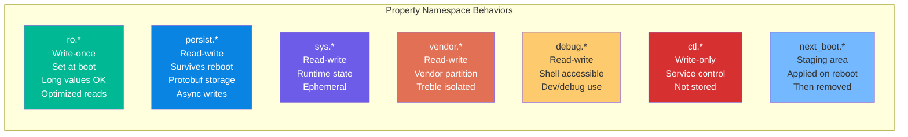

---

## 6.3 Property Contexts and SELinux Integration

### 6.3.1 The property_contexts File Format

Every system property is assigned an SELinux security context through
`property_contexts` files. These files map property name prefixes (or exact names) to
SELinux labels, and optionally specify a type constraint. The format is:

```
<property_name_prefix>    <selinux_context>    [exact]    [type]
```

Where:

- **property_name_prefix**: A property name prefix (e.g., `debug.`) matching all
  properties starting with that string
- **selinux_context**: The SELinux label (e.g., `u:object_r:debug_prop:s0`)
- **exact** (optional): If present, only exact name matches qualify
- **type** (optional): Type constraint (`string`, `bool`, `int`, `uint`, `enum`)

Examples from `system/sepolicy/private/property_contexts`:

```
# Source: system/sepolicy/private/property_contexts
net.rmnet               u:object_r:net_radio_prop:s0
net.                    u:object_r:system_prop:s0
debug.                  u:object_r:debug_prop:s0
debug.db.               u:object_r:debuggerd_prop:s0
sys.powerctl            u:object_r:powerctl_prop:s0
persist.sys.            u:object_r:system_prop:s0
persist.bluetooth.      u:object_r:bluetooth_prop:s0
ro.build.               u:object_r:build_prop:s0
persist.profcollectd.enabled  u:object_r:profcollectd_enabled_prop:s0  exact  bool
```

Notice the matching precedence: more specific prefixes override less specific ones.
For example, `debug.db.uid` matches `debug.db.` (the `debuggerd_prop` context),
not `debug.` (the `debug_prop` context).

### 6.3.2 Partition-Specific Context Files

Each partition can provide its own property_contexts file. Init loads them in order:

```c
// Source: system/core/init/property_service.cpp, CreateSerializedPropertyInfo()
// Platform contexts
"/system/etc/selinux/plat_property_contexts"

// System extension contexts
"/system_ext/etc/selinux/system_ext_property_contexts"

// Vendor contexts
"/vendor/etc/selinux/vendor_property_contexts"

// Product contexts
"/product/etc/selinux/product_property_contexts"

// ODM contexts
"/odm/etc/selinux/odm_property_contexts"
```

All contexts are merged into a single serialized trie at boot time. This
allows each partition to define contexts for its own properties without
modifying the platform policy.

### 6.3.3 SELinux Enforcement on Property Writes

When a process attempts to set a property, the property service performs an SELinux
access check. This is implemented in `CheckMacPerms`:

```c
// Source: system/core/init/property_service.cpp
static bool CheckMacPerms(const std::string& name, const char* target_context,
                          const char* source_context, const ucred& cr) {
    if (!target_context || !source_context) {
        return false;
    }

    PropertyAuditData audit_data;
    audit_data.name = name.c_str();
    audit_data.cr = &cr;

    auto lock = std::lock_guard{selinux_check_access_lock};
    return selinux_check_access(source_context, target_context,
                                "property_service", "set",
                                &audit_data) == 0;
}
```

The check flow:

1. The process connects to the property service socket.
2. Init retrieves the process's SELinux context via `getpeercon()`.
3. Init looks up the target property's SELinux context from the property_info trie.
4. `selinux_check_access()` verifies the SELinux policy allows the source context
   to perform the `set` action on the `property_service` object class with the
   target context.

On failure, the denial is logged in the kernel audit log and the property set
returns `PROP_ERROR_PERMISSION_DENIED`.

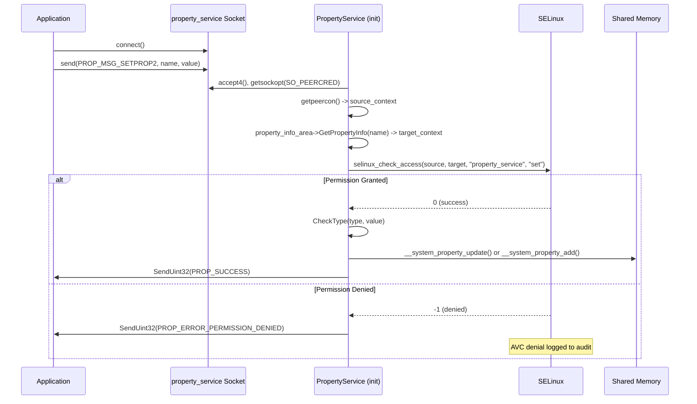

### 6.3.4 SELinux Enforcement on Property Reads

Read access control is more subtle. Since reads are performed directly from shared
memory without IPC, the enforcement occurs at the file level -- each SELinux context
gets its own file under `/dev/__properties__/`, and the kernel's file access
permissions determine which contexts a process can read.

The `ContextsSerialized` implementation maps each context to its own property area
file:

```c
// Source: bionic/libc/system_properties/contexts_serialized.cpp
prop_area* ContextsSerialized::GetPropAreaForName(const char* name) {
    uint32_t index;
    property_info_area_file_->GetPropertyInfoIndexes(name, &index, nullptr);
    if (index == ~0u || index >= num_context_nodes_) {
        return nullptr;
    }
    auto* context_node = &context_nodes_[index];
    if (!context_node->pa()) {
        context_node->Open(false, nullptr);
    }
    return context_node->pa();
}
```

When `Open()` attempts to mmap the property area file, the kernel checks whether the
calling process's SELinux context has `file { read open map }` permission for the
file's SELinux label. If the process lacks permission, the mmap fails and the
property appears not to exist.

### 6.3.5 Type Checking

Starting with Android P, property_contexts can specify type constraints. The type
checking is performed by the property service on writes:

```c
// Source: system/core/init/property_service.cpp
uint32_t CheckPermissions(const std::string& name, const std::string& value,
    const std::string& source_context, const ucred& cr, std::string* error) {
    ...
    const char* target_context = nullptr;
    const char* type = nullptr;
    property_info_area->GetPropertyInfo(name.c_str(), &target_context, &type);

    if (!CheckMacPerms(name, target_context, source_context.c_str(), cr)) {
        *error = "SELinux permission check failed";
        return PROP_ERROR_PERMISSION_DENIED;
    }

    if (!CheckType(type, value)) {
        *error = StringPrintf(
            "Property type check failed, value doesn't match expected type '%s'",
            (type ?: "(null)"));
        return PROP_ERROR_INVALID_VALUE;
    }

    return PROP_SUCCESS;
}
```

Supported type constraints:

| Type | Valid Values | Example |
|------|-------------|---------|
| `string` | Any string | `"hello world"` |
| `bool` | `true`, `false`, `1`, `0` | `true` |
| `int` | Signed integer | `-42` |
| `uint` | Unsigned integer | `1024` |
| `double` | Floating-point | `3.14` |
| `enum` | One of specified values | `filtered` |

### 6.3.6 The Appcompat Override Mechanism

Android provides an "appcompat override" mechanism that allows the platform to
present different property values to apps targeting older SDK levels. This is managed
through a parallel property area under `/dev/__properties__/appcompat_override/`:

```c
// Source: system/core/init/property_service.cpp
static constexpr char APPCOMPAT_OVERRIDE_PROP_FOLDERNAME[] =
    "/dev/__properties__/appcompat_override";
static constexpr char APPCOMPAT_OVERRIDE_PROP_TREE_FILE[] =
    "/dev/__properties__/appcompat_override/property_info";
```

When enabled (via `WRITE_APPCOMPAT_OVERRIDE_SYSTEM_PROPERTIES`), properties prefixed
with `ro.appcompat_override.` are written to the override area. Apps using the legacy
property API may see values from the override area instead of the primary area,
depending on their target SDK version.

---

## 6.4 PropertyService in Init

### 6.4.1 Initialization Sequence

The property service is initialized in two phases during init's second stage. The
complete initialization flow is:

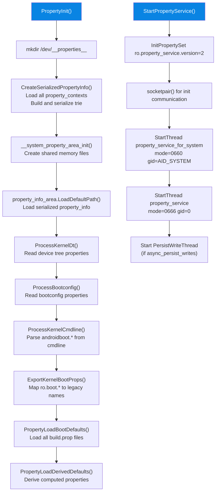

### 6.4.2 Loading Boot Properties

The `PropertyLoadBootDefaults()` function is responsible for loading all property
files in the correct order. The ordering is critical because properties defined in
later (more specific) partitions override those defined in earlier (more generic)
ones:

```c
// Source: system/core/init/property_service.cpp
void PropertyLoadBootDefaults() {
    std::map<std::string, std::string> properties;

    // Phase 1: Second stage ramdisk properties
    LoadPropertiesFromSecondStageRes(&properties);

    // Phase 2: System partition (lowest precedence among partitions)
    load_properties_from_file("/system/build.prop", nullptr, &properties);

    // Phase 3: System extension partition
    load_properties_from_partition("system_ext", 30);

    // Phase 4: System DLKM
    load_properties_from_file("/system_dlkm/etc/build.prop", nullptr, &properties);

    // Phase 5: Vendor partition
    load_properties_from_file("/vendor/default.prop", nullptr, &properties);
    load_properties_from_file("/vendor/build.prop", nullptr, &properties);

    // Phase 6: Vendor DLKM
    load_properties_from_file("/vendor_dlkm/etc/build.prop", nullptr, &properties);

    // Phase 7: ODM DLKM
    load_properties_from_file("/odm_dlkm/etc/build.prop", nullptr, &properties);

    // Phase 8: ODM partition
    load_properties_from_partition("odm", 28);

    // Phase 9: Product partition (highest precedence)
    load_properties_from_partition("product", 30);

    // Phase 10: Debug ramdisk properties (if present)
    if (access(kDebugRamdiskProp, R_OK) == 0) {
        load_properties_from_file(kDebugRamdiskProp, nullptr, &properties);
    }

    // Commit all properties to shared memory
    for (const auto& [name, value] : properties) {
        std::string error;
        PropertySetNoSocket(name, value, &error);
    }

    // Derive composed properties
    property_initialize_ro_product_props();
    property_derive_build_fingerprint();
    property_initialize_ro_cpu_abilist();
    property_initialize_ro_vendor_api_level();
    update_sys_usb_config();
}
```

The precedence order from lowest to highest is:

1. `system/build.prop`
2. `system_ext/etc/build.prop`
3. `system_dlkm/etc/build.prop`
4. `vendor/default.prop` and `vendor/build.prop`
5. `vendor_dlkm/etc/build.prop`
6. `odm_dlkm/etc/build.prop`
7. `odm/etc/build.prop`
8. `product/etc/build.prop`

### 6.4.3 Kernel Command Line Processing

Init converts `androidboot.*` parameters from the kernel command line and bootconfig
into `ro.boot.*` properties:

```c
// Source: system/core/init/property_service.cpp
constexpr auto ANDROIDBOOT_PREFIX = "androidboot."sv;

static void ProcessKernelCmdline() {
    android::fs_mgr::ImportKernelCmdline(
        [&](const std::string& key, const std::string& value) {
            if (StartsWith(key, ANDROIDBOOT_PREFIX)) {
                InitPropertySet("ro.boot." + key.substr(ANDROIDBOOT_PREFIX.size()),
                                value);
            }
        });
}

static void ProcessBootconfig() {
    android::fs_mgr::ImportBootconfig(
        [&](const std::string& key, const std::string& value) {
            if (StartsWith(key, ANDROIDBOOT_PREFIX)) {
                InitPropertySet("ro.boot." + key.substr(ANDROIDBOOT_PREFIX.size()),
                                value);
            }
        });
}
```

After loading `ro.boot.*` properties, `ExportKernelBootProps` creates legacy
aliases:

```c
// Source: system/core/init/property_service.cpp
static void ExportKernelBootProps() {
    struct {
        const char* src_prop;
        const char* dst_prop;
        const char* default_value;
    } prop_map[] = {
        { "ro.boot.serialno",   "ro.serialno",   "",        },
        { "ro.boot.mode",       "ro.bootmode",   "unknown", },
        { "ro.boot.baseband",   "ro.baseband",   "unknown", },
        { "ro.boot.bootloader", "ro.bootloader", "unknown", },
        { "ro.boot.hardware",   "ro.hardware",   "unknown", },
        { "ro.boot.revision",   "ro.revision",   "0",       },
    };
    for (const auto& prop : prop_map) {
        std::string value = GetProperty(prop.src_prop, prop.default_value);
        if (value != "") InitPropertySet(prop.dst_prop, value);
    }
}
```

### 6.4.4 The Socket-Based Write API

The property service accepts write requests through two Unix domain sockets:

```c
// Source: system/core/init/property_service.cpp
void StartPropertyService(int* epoll_socket) {
    InitPropertySet("ro.property_service.version", "2");

    int sockets[2];
    socketpair(AF_UNIX, SOCK_SEQPACKET | SOCK_CLOEXEC, 0, sockets);
    *epoll_socket = from_init_socket = sockets[0];
    init_socket = sockets[1];

    StartSendingMessages();

    // Socket for system processes (mode=0660, gid=system)
    StartThread(PROP_SERVICE_FOR_SYSTEM_NAME, 0660, AID_SYSTEM,
                property_service_for_system_thread, true);

    // Socket for all processes (mode=0666, gid=0)
    StartThread(PROP_SERVICE_NAME, 0666, 0,
                property_service_thread, false);
    ...
}
```

Two sockets are created:

- **`property_service_for_system`** (mode 0660): Only accessible by system-group
  processes. This socket also listens for internal init messages (e.g., load
  persistent properties).
- **`property_service`** (mode 0666): Accessible by all processes. This is the
  general-purpose property set socket.

Each socket runs its own thread in an epoll loop:

```c
// Source: system/core/init/property_service.cpp
static void PropertyServiceThread(int fd, bool listen_init) {
    Epoll epoll;
    epoll.Open();
    epoll.RegisterHandler(fd, std::bind(handle_property_set_fd, fd));

    if (listen_init) {
        epoll.RegisterHandler(init_socket, HandleInitSocket);
    }

    while (true) {
        auto epoll_result = epoll.Wait(std::nullopt);
        ...
    }
}
```

### 6.4.5 The Wire Protocol

The property set protocol uses two message types:

**PROP_MSG_SETPROP (legacy):**
```
[uint32_t cmd=1] [char name[PROP_NAME_MAX]] [char value[PROP_VALUE_MAX]]
```
Fixed-size fields, no response. Used by older bionic versions.

**PROP_MSG_SETPROP2 (current):**
```
[uint32_t cmd=2] [uint32_t name_len] [char name[]] [uint32_t value_len] [char value[]]
```
Length-prefixed strings, with a uint32 response code.

```c
// Source: system/core/init/property_service.cpp
static void handle_property_set_fd(int fd) {
    static constexpr uint32_t kDefaultSocketTimeout = 5000; /* ms */

    int s = accept4(fd, nullptr, nullptr, SOCK_CLOEXEC);
    ...
    ucred cr;
    socklen_t cr_size = sizeof(cr);
    getsockopt(s, SOL_SOCKET, SO_PEERCRED, &cr, &cr_size);

    SocketConnection socket(s, cr);
    uint32_t timeout_ms = kDefaultSocketTimeout;

    uint32_t cmd = 0;
    socket.RecvUint32(&cmd, &timeout_ms);

    switch (cmd) {
    case PROP_MSG_SETPROP: {
        char prop_name[PROP_NAME_MAX];
        char prop_value[PROP_VALUE_MAX];
        socket.RecvChars(prop_name, PROP_NAME_MAX, &timeout_ms);
        socket.RecvChars(prop_value, PROP_VALUE_MAX, &timeout_ms);
        ...
        HandlePropertySetNoSocket(prop_name, prop_value, source_context, cr, &error);
        break;
    }
    case PROP_MSG_SETPROP2: {
        std::string name, value;
        socket.RecvString(&name, &timeout_ms);
        socket.RecvString(&value, &timeout_ms);
        ...
        auto result = HandlePropertySet(name, value, source_context, cr,
                                         &socket, &error);
        if (result) socket.SendUint32(*result);
        break;
    }
    }
}
```

### 6.4.6 Property Change Notifications

When a property changes, init can trigger actions defined in `.rc` files. The
`PropertyChanged` function is called after every successful property set:

```c
// Source: system/core/init/property_service.cpp
void NotifyPropertyChange(const std::string& name, const std::string& value) {
    auto lock = std::lock_guard{accept_messages_lock};
    if (accept_messages) {
        PropertyChanged(name, value);
    }
}
```

This enables `.rc` file triggers like:

```
on property:sys.boot_completed=1
    start post_boot_service

on property:ro.debuggable=1
    start adbd
```

### 6.4.7 Loading Persistent Properties

Persistent properties are loaded after `/data` is mounted. The system socket thread
handles this via a protobuf message from init's main loop:

```c
// Source: system/core/init/property_service.cpp
static void HandleInitSocket() {
    auto message = ReadMessage(init_socket);
    auto init_message = InitMessage{};
    init_message.ParseFromString(*message);

    switch (init_message.msg_case()) {
    case InitMessage::kLoadPersistentProperties: {
        load_override_properties();

        auto persistent_properties = LoadPersistentProperties();
        for (const auto& property_record : persistent_properties.properties()) {
            InitPropertySet(property_record.name(), property_record.value());
        }

        // Enable debug features if debug ramdisk was used
        if (android::base::GetBoolProperty("ro.force.debuggable", false)) {
            update_sys_usb_config();
        }

        InitPropertySet("ro.persistent_properties.ready", "true");
        persistent_properties_loaded = true;
        break;
    }
    }
}
```

The legacy persistent property format stored individual files under
`/data/property/` (one file per property). Modern Android uses a single protobuf
file. The migration is handled transparently:

```c
// Source: system/core/init/persistent_properties.cpp
PersistentProperties LoadPersistentProperties() {
    auto persistent_properties = LoadPersistentPropertyFile();
    if (!persistent_properties.ok()) {
        // Fallback to legacy directory format
        persistent_properties = LoadLegacyPersistentProperties();
        if (persistent_properties.ok()) {
            // Migrate to new format
            WritePersistentPropertyFile(*persistent_properties);
            RemoveLegacyPersistentPropertyFiles();
        }
    }
    ...
}
```

---

## 6.5 SystemProperties Java API

### 6.5.1 The Hidden API

The Java interface to system properties is provided by
`android.os.SystemProperties`, located at
`frameworks/base/core/java/android/os/SystemProperties.java`. This class is annotated
with `@SystemApi` and `@hide`, meaning it is not part of the public SDK but is
available to platform code and apps using the system SDK:

```java
// Source: frameworks/base/core/java/android/os/SystemProperties.java
@SystemApi
@RavenwoodKeepWholeClass
public class SystemProperties {
    private static final String TAG = "SystemProperties";

    public static final int PROP_VALUE_MAX = 91;
    ...
}
```

### 6.5.2 Get Methods

The class provides several typed getter methods:

```java
// Source: frameworks/base/core/java/android/os/SystemProperties.java

// String get with empty default
@NonNull @SystemApi
public static String get(@NonNull String key) {
    if (TRACK_KEY_ACCESS) onKeyAccess(key);
    return native_get(key);
}

// String get with custom default
@NonNull @SystemApi
public static String get(@NonNull String key, @Nullable String def) {
    if (TRACK_KEY_ACCESS) onKeyAccess(key);
    return native_get(key, def);
}

// Integer get
@SystemApi
public static int getInt(@NonNull String key, int def) {
    if (TRACK_KEY_ACCESS) onKeyAccess(key);
    return native_get_int(key, def);
}

// Long get
@SystemApi
public static long getLong(@NonNull String key, long def) {
    if (TRACK_KEY_ACCESS) onKeyAccess(key);
    return native_get_long(key, def);
}

// Boolean get -- accepts: y/yes/1/true/on and n/no/0/false/off
@SystemApi
public static boolean getBoolean(@NonNull String key, boolean def) {
    if (TRACK_KEY_ACCESS) onKeyAccess(key);
    return native_get_boolean(key, def);
}
```

The native methods are declared with JNI optimization annotations:

```java
@FastNative
private static native String native_get(String key, String def);
@FastNative
private static native int native_get_int(String key, int def);
@FastNative
private static native long native_get_long(String key, long def);
@FastNative
private static native boolean native_get_boolean(String key, boolean def);
```

The `@FastNative` annotation indicates these are "fast" JNI calls that skip the
standard JNI overhead. They can directly call into bionic's
`__system_property_find()` and `__system_property_read()`, which are simply shared
memory lookups.

### 6.5.3 Set Method

The `set` method is notably NOT annotated with `@FastNative`:

```java
// _NOT_ FastNative: native_set performs IPC and can block
@UnsupportedAppUsage(maxTargetSdk = Build.VERSION_CODES.P)
private static native void native_set(String key, String def);

@UnsupportedAppUsage
public static void set(@NonNull String key, @Nullable String val) {
    if (val != null && !key.startsWith("ro.") &&
        val.getBytes(StandardCharsets.UTF_8).length > PROP_VALUE_MAX) {
        throw new IllegalArgumentException(
            "value of system property '" + key + "' is longer than "
            + PROP_VALUE_MAX + " bytes: " + val);
    }
    if (TRACK_KEY_ACCESS) onKeyAccess(key);
    native_set(key, val);
}
```

The `set()` method performs IPC to the property service through the Unix domain
socket, so it can block. The value length validation (91 bytes) is enforced in Java
before the native call, but only for non-`ro.*` properties (which can use the long
property mechanism).

### 6.5.4 Handle-Based Optimized Access

For frequently-read properties, the class provides a `Handle` mechanism that caches
the `prop_info` pointer from bionic:

```java
// Source: frameworks/base/core/java/android/os/SystemProperties.java

@Nullable
public static Handle find(@NonNull String name) {
    long nativeHandle = native_find(name);
    if (nativeHandle == 0) {
        return null;
    }
    return new Handle(nativeHandle);
}

public static final class Handle {
    private final long mNativeHandle;

    @NonNull public String get() {
        return native_get(mNativeHandle);
    }

    public int getInt(int def) {
        return native_get_int(mNativeHandle, def);
    }

    public long getLong(long def) {
        return native_get_long(mNativeHandle, def);
    }

    public boolean getBoolean(boolean def) {
        return native_get_boolean(mNativeHandle, def);
    }

    private Handle(long nativeHandle) {
        mNativeHandle = nativeHandle;
    }
}
```

The `native_find()` call returns the pointer to `prop_info` in shared memory. By
caching this handle, subsequent reads via `native_get(long handle)` bypass the trie
lookup entirely, going directly to the property's memory location. The handle-based
getters are annotated with `@CriticalNative` for integer/boolean types, which is even
faster than `@FastNative` as it skips JNI environment setup entirely.

### 6.5.5 Change Callbacks

Applications can register callbacks to be notified when any property changes:

```java
// Source: frameworks/base/core/java/android/os/SystemProperties.java

@UnsupportedAppUsage
private static final ArrayList<Runnable> sChangeCallbacks = new ArrayList<Runnable>();

@UnsupportedAppUsage
public static void addChangeCallback(@NonNull Runnable callback) {
    synchronized (sChangeCallbacks) {
        if (sChangeCallbacks.size() == 0) {
            native_add_change_callback();
        }
        sChangeCallbacks.add(callback);
    }
}

// Called from native code when any property changes
private static void callChangeCallbacks() {
    ArrayList<Runnable> callbacks = null;
    synchronized (sChangeCallbacks) {
        if (sChangeCallbacks.size() == 0) return;
        callbacks = new ArrayList<Runnable>(sChangeCallbacks);
    }
    final long token = Binder.clearCallingIdentity();
    try {
        for (int i = 0; i < callbacks.size(); i++) {
            try {
                callbacks.get(i).run();
            } catch (Throwable t) {
                Log.e(TAG, "Exception in SystemProperties change callback", t);
            }
        }
    } finally {
        Binder.restoreCallingIdentity(token);
    }
}
```

The native change callback mechanism uses `__system_property_wait_any()` under the
hood, which blocks on a futex until the global area serial number changes.

### 6.5.6 Digest Method

The `digestOf` method computes a SHA-1 hash of a set of property values, useful for
detecting configuration changes:

```java
// Source: frameworks/base/core/java/android/os/SystemProperties.java
public static @NonNull String digestOf(@NonNull String... keys) {
    Arrays.sort(keys);
    try {
        final MessageDigest digest = MessageDigest.getInstance("SHA-1");
        for (String key : keys) {
            final String item = key + "=" + get(key) + "\n";
            digest.update(item.getBytes(StandardCharsets.UTF_8));
        }
        return HexEncoding.encodeToString(digest.digest()).toLowerCase();
    } catch (NoSuchAlgorithmException e) {
        throw new RuntimeException(e);
    }
}
```

### 6.5.7 NDK and Native Access

For NDK applications, the public C API is:

```c
// sys/system_properties.h (NDK header)
int __system_property_get(const char* name, char* value);
const prop_info* __system_property_find(const char* name);
void __system_property_read_callback(
    const prop_info* pi,
    void (*callback)(void* cookie, const char* name,
                     const char* value, uint32_t serial),
    void* cookie);
int __system_property_foreach(
    void (*propfn)(const prop_info* pi, void* cookie),
    void* cookie);
bool __system_property_wait(
    const prop_info* pi, uint32_t old_serial,
    uint32_t* new_serial_ptr, const timespec* relative_timeout);
```

For setting properties, the NDK provides the higher-level `android-base` library:

```c
// android-base/properties.h
namespace android::base {
    std::string GetProperty(const std::string& key, const std::string& default_value);
    bool GetBoolProperty(const std::string& key, bool default_value);
    int GetIntProperty(const std::string& key, int default_value);
    bool SetProperty(const std::string& key, const std::string& value);
    bool WaitForProperty(const std::string& key, const std::string& expected_value,
                         std::chrono::milliseconds relative_timeout);
    bool WaitForPropertyCreation(const std::string& key,
                                  std::chrono::milliseconds relative_timeout);
}
```

### 6.5.8 UnsupportedAppUsage and Greylist

Many `SystemProperties` methods are annotated with `@UnsupportedAppUsage`, meaning
third-party apps historically accessed them through reflection. Starting with Android
P, access to hidden APIs became restricted. The annotations track which APIs were
used by apps and at what SDK level they were blocked:

```java
@UnsupportedAppUsage(maxTargetSdk = Build.VERSION_CODES.P)
private static native String native_get(String key, String def);
```

This means apps targeting API 28 (Pie) or above cannot reflectively call
`native_get`. The formal replacement for third-party use is the `sysprop_library`
mechanism (Section 58.6).

---

## 6.6 sysprop_library in Soong

### 6.6.1 Motivation: Typed Properties as APIs

The traditional property mechanism has several limitations for cross-partition
communication:

1. **No type safety.** All values are strings; callers must parse and validate
   manually.
2. **No API tracking.** There is no mechanism to detect breaking changes when a
   property is renamed or its expected values change.
3. **No code generation.** Each caller writes their own get/set boilerplate.
4. **No ownership model.** It is unclear which partition "owns" a property.

The `sysprop_library` module type in Soong addresses all of these. It defines
properties in `.sysprop` files, generates type-safe accessor libraries in Java, C++,
and Rust, and enforces API compatibility.

### 6.6.2 The .sysprop File Format

Properties are defined in `.sysprop` files using a protobuf text format. Here is an
example from `system/libsysprop/srcs/android/sysprop/BluetoothProperties.sysprop`:

```protobuf
# Source: system/libsysprop/srcs/android/sysprop/BluetoothProperties.sysprop
module: "android.sysprop.BluetoothProperties"
owner: Platform

prop {
    api_name: "snoop_default_mode"
    type: Enum
    scope: Public
    access: ReadWrite
    enum_values: "empty|disabled|filtered|full"
    prop_name: "persist.bluetooth.btsnoopdefaultmode"
}

prop {
    api_name: "factory_reset"
    type: Boolean
    scope: Public
    access: ReadWrite
    prop_name: "persist.bluetooth.factoryreset"
}

prop {
    api_name: "isGapLePrivacyEnabled"
    type: Boolean
    scope: Public
    access: Readonly
    prop_name: "bluetooth.core.gap.le.privacy.enabled"
}

prop {
    api_name: "getClassOfDevice"
    type: UIntList
    scope: Public
    access: Readonly
    prop_name: "bluetooth.device.class_of_device"
}
```

Each `prop` block specifies:

| Field | Description | Values |
|-------|-------------|--------|
| `api_name` | Generated method name | Any valid identifier |
| `type` | Property value type | `Boolean`, `Integer`, `Long`, `Double`, `String`, `Enum`, `UInt`, `UIntList`, `IntList`, `StringList` |
| `scope` | Visibility scope | `Public` (stable API), `Internal` (implementation detail) |
| `access` | Read/write access | `Readonly`, `Writeonce`, `ReadWrite` |
| `prop_name` | Actual property key | e.g., `persist.bluetooth.factoryreset` |
| `enum_values` | For Enum type | Pipe-separated values |
| `integer_as_bool` | Interpret integer as boolean | `true` / `false` |

### 6.6.3 Module Definition in Android.bp

A `sysprop_library` is declared in an `Android.bp` file:

```json
sysprop_library {
    name: "PlatformProperties",
    srcs: ["*.sysprop"],
    property_owner: "Platform",
    vendor_available: true,
    api_packages: ["android.sysprop"],
}
```

The `property_owner` field controls cross-partition access:

```go
// Source: build/soong/sysprop/sysprop_library.go
switch m.Owner() {
case "Platform":
    // Every partition can access platform-defined properties
    isOwnerPlatform = true
case "Vendor":
    // System can't access vendor's properties
    if installedInSystem {
        ctx.ModuleErrorf("System can't access sysprop_library owned by Vendor")
    }
case "Odm":
    // Only vendor can access Odm-defined properties
    if !installedInVendorOrOdm {
        ctx.ModuleErrorf("Odm-defined properties should be accessed only in "
            + "Vendor or Odm")
    }
}
```

### 6.6.4 Code Generation

When a `sysprop_library` module is defined, Soong automatically creates several
sub-modules through `syspropLibraryHook`:

```go
// Source: build/soong/sysprop/sysprop_library.go
func syspropLibraryHook(ctx android.LoadHookContext, m *syspropLibrary) {
    ...
    // 1. C++ implementation library (lib<name>)
    ctx.CreateModule(cc.LibraryFactory, &ccProps)

    // 2. Java source generator
    ctx.CreateModule(syspropJavaGenFactory, &syspropGenProperties{
        Srcs:  m.properties.Srcs,
        Scope: scope,
        Name:  proptools.StringPtr(m.javaGenModuleName()),
    })

    // 3. Java implementation library
    ctx.CreateModule(java.LibraryFactory, &javaLibraryProperties{
        Name: proptools.StringPtr(m.BaseModuleName()),
        Srcs: []string{":" + m.javaGenModuleName()},
    })

    // 4. Public Java stub (if platform-owned and installed in system)
    if isOwnerPlatform && installedInSystem {
        ctx.CreateModule(syspropJavaGenFactory, ...)   // public scope
        ctx.CreateModule(java.LibraryFactory, ...)     // public stub
    }

    // 5. Rust implementation library
    ctx.CreateModule(syspropRustGenFactory, &rustProps)
    ...
}
```

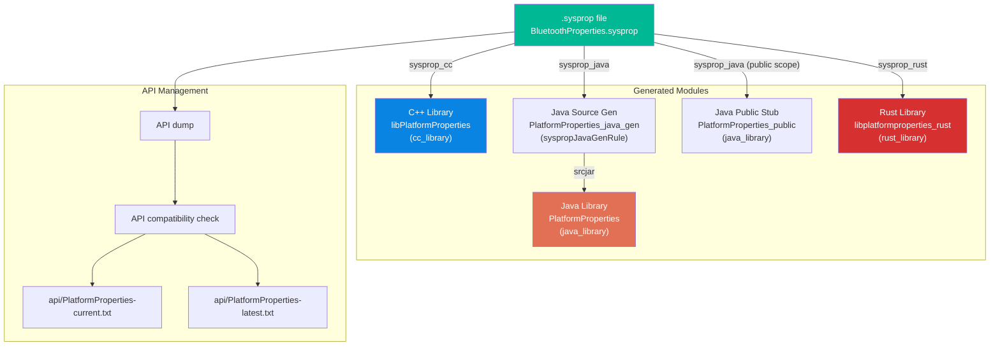

### 6.6.5 Generated Java Code

For a property defined as:

```protobuf
prop {
    api_name: "snoop_default_mode"
    type: Enum
    scope: Public
    access: ReadWrite
    enum_values: "empty|disabled|filtered|full"
    prop_name: "persist.bluetooth.btsnoopdefaultmode"
}
```

The generated Java code would look like:

```java
package android.sysprop;

public final class BluetoothProperties {
    // Enum type
    public enum snoop_default_mode_values {
        EMPTY("empty"),
        DISABLED("disabled"),
        FILTERED("filtered"),
        FULL("full");
        ...
    }

    // Getter
    public static Optional<snoop_default_mode_values> snoop_default_mode() {
        String value = SystemProperties.get("persist.bluetooth.btsnoopdefaultmode");
        return snoop_default_mode_values.tryParse(value);
    }

    // Setter (because access: ReadWrite)
    public static void snoop_default_mode(snoop_default_mode_values value) {
        SystemProperties.set("persist.bluetooth.btsnoopdefaultmode",
                              value.getPropValue());
    }
}
```

### 6.6.6 Generated C++ Code

The corresponding C++ code generates:

```cpp
namespace android::sysprop {

// Getter returning std::optional
std::optional<std::string> snoop_default_mode();

// Setter returning Result<void>
android::base::Result<void> snoop_default_mode(const std::string& value);

}  // namespace android::sysprop
```

### 6.6.7 Scope and Access Control in Generated Code

The `scope` field controls what gets generated:

- **`Public`**: The property appears in both the internal and public generated
  libraries. It is considered a stable API and must pass compatibility checks.
- **`Internal`**: The property only appears in the internal library. It is not
  part of the stable API surface.

The `access` field controls which methods are generated:

- **`Readonly`**: Only a getter is generated. The property name typically does not
  start with `persist.` and is set at build time or during boot.
- **`Writeonce`**: Both getter and setter are generated, but the setter is documented
  as one-time use (for `ro.*` properties).
- **`ReadWrite`**: Both getter and setter are generated.

### 6.6.8 API Compatibility Checking

The `sysprop_library` module enforces API stability through a two-file check:

```go
// Source: build/soong/sysprop/sysprop_library.go
// 1. Dump current API from .sysprop files
rule.Command().
    BuiltTool("sysprop_api_dump").
    Output(m.dumpedApiFile).
    Inputs(srcs)

// 2. Compare dump to checked-in current.txt (must be identical)
rule.Command().
    Text("( cmp").Flag("-s").
    Input(m.dumpedApiFile).
    Text(currentApiArgument).
    Text("|| ( echo ...error... ; exit 38) )")

// 3. Compare current.txt to latest.txt (must be compatible)
rule.Command().
    BuiltTool("sysprop_api_checker").
    Text(latestApiArgument).
    Text(currentApiArgument)
```

This ensures that:

1. The `.sysprop` files match the checked-in `api/<name>-current.txt`.
2. The current API is backward-compatible with `api/<name>-latest.txt`.

To update the API after intentional changes:

```bash
m PlatformProperties-dump-api && \
    cp out/.../api-dump.txt <module>/api/PlatformProperties-current.txt
```

### 6.6.9 Integration with property_contexts

The `sysprop_library` module automatically integrates with the property type checking
system. The list of all sysprop libraries is collected at build time:

```go
// Source: build/soong/sysprop/sysprop_library.go
if m.ExportedToMake() {
    syspropLibrariesLock.Lock()
    defer syspropLibrariesLock.Unlock()

    libraries := syspropLibraries(ctx.Config())
    *libraries = append(*libraries, "//"+ctx.ModuleDir()+":"+ctx.ModuleName())
}
```

This list is used by the property_contexts build rules to ensure that the type
constraints in property_contexts match those declared in `.sysprop` files.

---

## 6.7 Vendor Properties and Treble Isolation

### 6.7.1 The Vendor Interface and Property Namespaces

Android's Project Treble introduced strict separation between the system and vendor
partitions. For system properties, this means:

1. **Vendor properties should use the `vendor.` or `persist.vendor.` prefix.** This
   ensures they are clearly in the vendor namespace.

2. **System components should not depend on vendor-specific properties.** The
   `sysprop_library` ownership model enforces this at build time.

3. **Platform properties visible to vendor code must be stable.** When a
   `sysprop_library` owned by `Platform` is used by vendor code, only the `Public`
   scope properties are accessible, and they must pass API compatibility checks.

### 6.7.2 Vendor Property Contexts

The vendor partition provides its own property_contexts file at
`/vendor/etc/selinux/vendor_property_contexts`. This file defines SELinux labels for
vendor-specific properties.

When loading properties from vendor partition files, the property service uses a
special vendor context:

```c
// Source: system/core/init/property_service.cpp
static void LoadProperties(char* data, const char* filter,
    const char* filename, std::map<std::string, std::string>* properties) {
    static constexpr const char* const kVendorPathPrefixes[4] = {
        "/vendor",
        "/odm",
        "/vendor_dlkm",
        "/odm_dlkm",
    };

    const char* context = kInitContext;
    if (SelinuxGetVendorAndroidVersion() >= __ANDROID_API_P__) {
        for (const auto& vendor_path_prefix : kVendorPathPrefixes) {
            if (StartsWith(filename, vendor_path_prefix)) {
                context = kVendorContext;
            }
        }
    }
    ...
}
```

This means properties loaded from vendor partition files are set with the vendor
SELinux context, which has different access rules than the platform (init) context.

### 6.7.3 Vendor API Level

The `ro.vendor.api_level` property is automatically computed by init to reflect the
minimum API level the vendor partition must support:

```c
// Source: system/core/init/property_service.cpp
static void property_initialize_ro_vendor_api_level() {
    constexpr auto VENDOR_API_LEVEL_PROP = "ro.vendor.api_level";

    if (__system_property_find(VENDOR_API_LEVEL_PROP) != nullptr) {
        return;  // Already set explicitly
    }

    auto vendor_api_level = GetIntProperty("ro.board.first_api_level",
                                            __ANDROID_VENDOR_API_MAX__);
    if (vendor_api_level != __ANDROID_VENDOR_API_MAX__) {
        vendor_api_level = GetIntProperty("ro.board.api_level", vendor_api_level);
    }

    auto product_first_api_level =
        GetIntProperty("ro.product.first_api_level", __ANDROID_API_FUTURE__);
    if (product_first_api_level == __ANDROID_API_FUTURE__) {
        product_first_api_level =
            GetIntProperty("ro.build.version.sdk", __ANDROID_API_FUTURE__);
    }

    vendor_api_level = std::min(
        AVendorSupport_getVendorApiLevelOf(product_first_api_level),
        vendor_api_level);

    PropertySetNoSocket(VENDOR_API_LEVEL_PROP,
                         std::to_string(vendor_api_level), &error);
}
```

### 6.7.4 Cross-Partition Property Access Rules

The `sysprop_library` build system enforces access rules based on ownership and
installation partition:

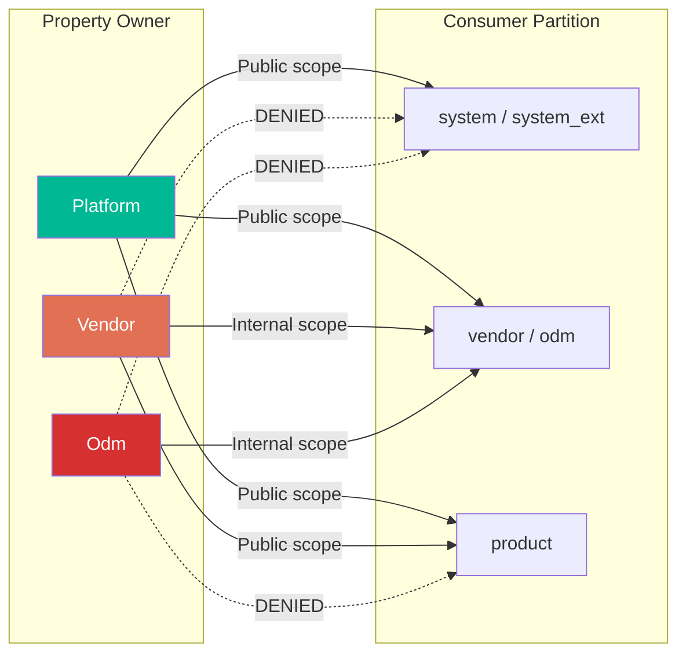

Key rules:

- **Platform-owned** properties can be read by all partitions using the `Public`
  scope.
- **Vendor-owned** properties cannot be accessed from the system partition.
- **ODM-owned** properties can only be accessed from vendor/ODM partitions.
- The **Product** partition always uses `Public` scope, as it cannot own properties.

### 6.7.5 The ODM and Vendor DLKM Partitions

ODM (Original Design Manufacturer) and DLKM (Dynamic Loadable Kernel Modules)
partitions have their own build.prop files loaded by the property service. The
loading order ensures that ODM properties override vendor properties:

```
vendor/default.prop       -> loaded first
vendor/build.prop         -> overrides vendor/default.prop
vendor_dlkm/etc/build.prop
odm_dlkm/etc/build.prop
odm/etc/build.prop        -> overrides all vendor properties
```

This hierarchy allows an ODM to customize vendor properties without modifying the
vendor partition.

---

## 6.8 Boot Properties

### 6.8.1 Build Properties (ro.build.*)

Build properties are set at build time by the build system and embedded in
`build.prop` files. They describe the build configuration:

| Property | Description | Example |
|----------|-------------|---------|
| `ro.build.display.id` | Display string for build | `UP1A.231005.007` |
| `ro.build.version.incremental` | Incremental build number | `10817346` |
| `ro.build.version.sdk` | SDK API level | `34` |
| `ro.build.version.release` | User-visible version | `14` |
| `ro.build.version.security_patch` | Security patch date | `2023-10-05` |
| `ro.build.type` | Build type | `user` / `userdebug` / `eng` |
| `ro.build.tags` | Build tags | `release-keys` / `dev-keys` |
| `ro.build.fingerprint` | Composite fingerprint | (derived) |
| `ro.build.id` | Build ID | `UP1A.231005.007` |

### 6.8.2 Build Fingerprint Derivation

The build fingerprint is automatically derived if not explicitly set:

```c
// Source: system/core/init/property_service.cpp
static void property_derive_build_fingerprint() {
    std::string build_fingerprint = GetProperty("ro.build.fingerprint", "");
    if (!build_fingerprint.empty()) {
        return;  // Already set explicitly
    }

    const std::string UNKNOWN = "unknown";
    build_fingerprint = GetProperty("ro.product.brand", UNKNOWN);
    build_fingerprint += '/';
    build_fingerprint += GetProperty("ro.product.name", UNKNOWN);

    // 16KB page size device option support
    bool has16KbDevOption =
        android::base::GetBoolProperty("ro.product.build.16k_page.enabled", false);
    if (has16KbDevOption && getpagesize() == 16384) {
        build_fingerprint += "_16kb";
    }

    build_fingerprint += '/';
    build_fingerprint += GetProperty("ro.product.device", UNKNOWN);
    build_fingerprint += ':';
    build_fingerprint += GetProperty("ro.build.version.release_or_codename", UNKNOWN);
    build_fingerprint += '/';
    build_fingerprint += GetProperty("ro.build.id", UNKNOWN);
    build_fingerprint += '/';
    build_fingerprint += GetProperty("ro.build.version.incremental", UNKNOWN);
    build_fingerprint += ':';
    build_fingerprint += GetProperty("ro.build.type", UNKNOWN);
    build_fingerprint += '/';
    build_fingerprint += GetProperty("ro.build.tags", UNKNOWN);

    PropertySetNoSocket("ro.build.fingerprint", build_fingerprint, &error);
}
```

The resulting fingerprint looks like:
`google/raven/raven:14/UP1A.231005.007/10817346:userdebug/dev-keys`

### 6.8.3 Product Properties (ro.product.*)

Product properties describe the device identity. They follow a partition-specific
derivation system where each partition can define its own values, and a priority
order determines which value wins:

```c
// Source: system/core/init/property_service.cpp
static void property_initialize_ro_product_props() {
    const char* RO_PRODUCT_PROPS[] = {
        "brand", "device", "manufacturer", "model", "name",
    };
    const char* RO_PRODUCT_PROPS_DEFAULT_SOURCE_ORDER =
        "product,odm,vendor,system_ext,system";

    std::string ro_product_props_source_order =
        GetProperty("ro.product.property_source_order", "");
    if (ro_product_props_source_order.empty()) {
        ro_product_props_source_order = RO_PRODUCT_PROPS_DEFAULT_SOURCE_ORDER;
    }

    for (const auto& ro_product_prop : RO_PRODUCT_PROPS) {
        std::string base_prop = "ro.product." + std::string(ro_product_prop);
        if (!GetProperty(base_prop, "").empty()) continue;

        for (const auto& source : Split(ro_product_props_source_order, ",")) {
            std::string target_prop = "ro.product." + source + "." + ro_product_prop;
            std::string target_prop_val = GetProperty(target_prop, "");
            if (!target_prop_val.empty()) {
                PropertySetNoSocket(base_prop, target_prop_val, &error);
                break;
            }
        }
    }
}
```

The derivation chain for `ro.product.model`:

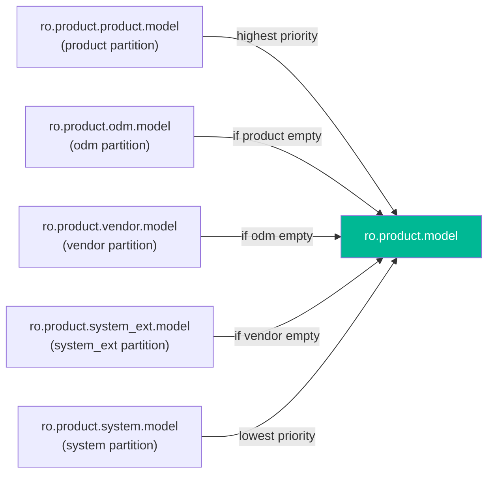

### 6.8.4 Hardware Properties (ro.hardware.*)

Hardware properties describe the physical hardware platform:

| Property | Source | Description |
|----------|--------|-------------|
| `ro.hardware` | Kernel cmdline / DT | Hardware platform name |
| `ro.boot.hardware` | Kernel cmdline | Boot hardware identifier |
| `ro.hardware.chipname` | Vendor build.prop | SoC chip name |
| `ro.boot.hardware.cpu.pagesize` | Derived at boot | CPU page size |

The hardware property is typically set from the kernel command line and then
propagated:

```c
// From ExportKernelBootProps():
{ "ro.boot.hardware", "ro.hardware", "unknown" }
```

The CPU page size property is derived automatically:

```c
// Source: system/core/init/property_service.cpp
void PropertyLoadDerivedDefaults() {
    const char* PAGE_PROP = "ro.boot.hardware.cpu.pagesize";
    if (GetProperty(PAGE_PROP, "").empty()) {
        PropertySetNoSocket(PAGE_PROP, std::to_string(getpagesize()), &error);
    }
}
```

### 6.8.5 Boot Mode Properties (ro.boot.*)

These properties come from the kernel command line (`androidboot.*`) and bootconfig:

| Property | Description |
|----------|-------------|
| `ro.boot.serialno` | Device serial number |
| `ro.boot.mode` | Boot mode (normal, charger, recovery) |
| `ro.boot.baseband` | Baseband version |
| `ro.boot.bootloader` | Bootloader version |
| `ro.boot.hardware` | Hardware identifier |
| `ro.boot.revision` | Hardware revision |
| `ro.boot.slot_suffix` | A/B slot suffix (_a or _b) |
| `ro.boot.verifiedbootstate` | Verified boot state (green/yellow/orange) |

The kernel command line to property mapping:

```
Kernel cmdline:  androidboot.serialno=ABC123
    -> Property:  ro.boot.serialno=ABC123

Bootconfig:      androidboot.hardware=tensor
    -> Property:  ro.boot.hardware=tensor
```

### 6.8.6 CPU ABI List Properties

The CPU ABI list properties determine which instruction set architectures the device
supports:

```c
// Source: system/core/init/property_service.cpp
static void property_initialize_ro_cpu_abilist() {
    const char* kAbilistSources[] = {
        "product", "odm", "vendor", "system",
    };

    // Find first source defining these properties
    for (const auto& source : kAbilistSources) {
        const auto abilist32_prop = "ro." + source + ".product.cpu.abilist32";
        const auto abilist64_prop = "ro." + source + ".product.cpu.abilist64";
        abilist32_prop_val = GetProperty(abilist32_prop, "");
        abilist64_prop_val = GetProperty(abilist64_prop, "");
        if (abilist32_prop_val != "" || abilist64_prop_val != "") {
            break;
        }
    }

    // Merge: 64-bit first, then 32-bit
    auto abilist_prop_val = abilist64_prop_val;
    if (abilist32_prop_val != "") {
        if (abilist_prop_val != "") abilist_prop_val += ",";
        abilist_prop_val += abilist32_prop_val;
    }

    PropertySetNoSocket("ro.product.cpu.abilist", abilist_prop_val, &error);
    PropertySetNoSocket("ro.product.cpu.abilist32", abilist32_prop_val, &error);
    PropertySetNoSocket("ro.product.cpu.abilist64", abilist64_prop_val, &error);
}
```

Typical values:

- `ro.product.cpu.abilist` = `arm64-v8a,armeabi-v7a,armeabi`
- `ro.product.cpu.abilist64` = `arm64-v8a`
- `ro.product.cpu.abilist32` = `armeabi-v7a,armeabi`

### 6.8.7 Complete Boot Property Loading Timeline

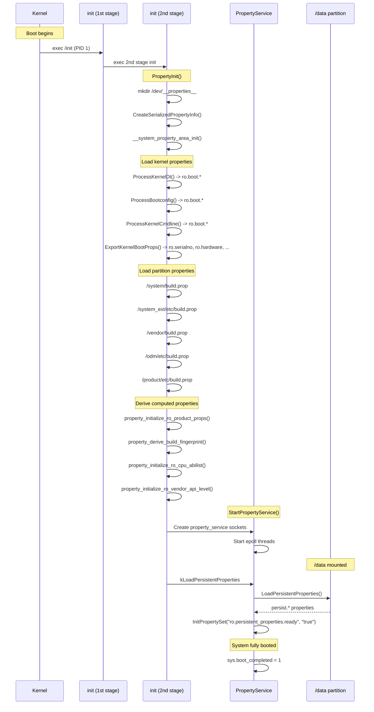

---

## 6.9 Try It: Exploring System Properties

This section provides hands-on exercises for understanding the system properties
mechanism. All exercises assume you have an `adb`-connected device or emulator
running a `userdebug` or `eng` build.

### 6.9.1 Exercise: Listing and Inspecting Properties

**List all properties:**

```bash
# List all properties (typically 800-1200 on a real device)
adb shell getprop | wc -l

# List all read-only properties
adb shell getprop | grep "^\[ro\."

# List all persistent properties
adb shell getprop | grep "^\[persist\."
```

**Read specific properties:**

```bash
# Build fingerprint
adb shell getprop ro.build.fingerprint

# Device model
adb shell getprop ro.product.model

# API level
adb shell getprop ro.build.version.sdk

# Boot mode
adb shell getprop ro.bootmode

# Check if device is debuggable
adb shell getprop ro.debuggable
```

**Inspect the property area files:**

```bash
# List the property area files
adb shell ls -la /dev/__properties__/

# Check the property_info file size
adb shell ls -la /dev/__properties__/property_info

# Count property area files (one per SELinux context)
adb shell ls /dev/__properties__/ | wc -l
```

### 6.9.2 Exercise: Setting and Observing Properties

**Set a debug property:**

```bash
# Set a debug property (allowed for shell user on userdebug builds)
adb shell setprop debug.mytest.value "hello world"

# Verify it was set
adb shell getprop debug.mytest.value
# Output: hello world

# Try setting a persist property
adb shell setprop persist.mytest.value "survives reboot"
adb shell getprop persist.mytest.value

# Reboot and verify persistence
adb reboot
# After reboot:
adb shell getprop persist.mytest.value
# Output: survives reboot
```

**Observe the read-only constraint:**

```bash
# Try to change a read-only property (will fail)
adb shell setprop ro.build.type "eng"
# This will silently fail or produce an error

# Verify it didn't change
adb shell getprop ro.build.type
```

### 6.9.3 Exercise: Watching Property Changes

**Use waitforprop to wait for a property:**

```bash
# In one terminal, wait for a property to change
adb shell "
    echo 'Waiting for debug.mytest.signal...'
    while [ \"\$(getprop debug.mytest.signal)\" != 'go' ]; do
        sleep 0.1
    done
    echo 'Signal received!'
"

# In another terminal, trigger the change
adb shell setprop debug.mytest.signal go
```

**Monitor all property changes with watchprops:**

```bash
# Start watching (this tool blocks and prints changes as they happen)
adb shell watchprops
# Now set any property in another terminal to see it reported
```

### 6.9.4 Exercise: Examining Property Contexts

**View the property_contexts files:**

```bash
# Platform property contexts
adb shell cat /system/etc/selinux/plat_property_contexts | head -30

# Vendor property contexts
adb shell cat /vendor/etc/selinux/vendor_property_contexts | head -20

# Check what context a specific property has
adb shell getprop -Z debug.test.value
```

**Test SELinux enforcement:**

```bash
# Check what your shell's SELinux context is
adb shell id -Z

# Try to set a property you shouldn't have access to
adb shell setprop ro.boot.serialno "fake"
# This should fail due to both read-only and SELinux restrictions

# Check the audit log for denials
adb shell dmesg | grep "avc.*property_service"
```

### 6.9.5 Exercise: Persistent Property Storage

**Examine the persistent property file:**

```bash
# Check the persistent properties file
adb shell ls -la /data/property/

# The file is protobuf-encoded, so it's not directly human-readable
# You can examine it with a hex dump
adb shell xxd /data/property/persistent_properties | head -20
```

**Track persistent property writes:**

```bash
# Set a persistent property and observe the file update
adb shell "
    ls -la /data/property/persistent_properties
    setprop persist.mytest.timestamp \$(date +%s)
    ls -la /data/property/persistent_properties
"
# The file size and modification time should change
```

### 6.9.6 Exercise: Property Derivation Chain

**Trace product property derivation:**

```bash
# See where ro.product.model comes from
# Check each source partition:
echo "System:     $(adb shell getprop ro.product.system.model)"
echo "System_ext: $(adb shell getprop ro.product.system_ext.model)"
echo "Vendor:     $(adb shell getprop ro.product.vendor.model)"
echo "ODM:        $(adb shell getprop ro.product.odm.model)"
echo "Product:    $(adb shell getprop ro.product.product.model)"
echo ""
echo "Final:      $(adb shell getprop ro.product.model)"
echo "Source order: $(adb shell getprop ro.product.property_source_order)"
```

**Inspect build fingerprint components:**

```bash
echo "Brand:   $(adb shell getprop ro.product.brand)"
echo "Name:    $(adb shell getprop ro.product.name)"
echo "Device:  $(adb shell getprop ro.product.device)"
echo "Release: $(adb shell getprop ro.build.version.release_or_codename)"
echo "ID:      $(adb shell getprop ro.build.id)"
echo "Incr:    $(adb shell getprop ro.build.version.incremental)"
echo "Type:    $(adb shell getprop ro.build.type)"
echo "Tags:    $(adb shell getprop ro.build.tags)"
echo ""
echo "Fingerprint: $(adb shell getprop ro.build.fingerprint)"
```

### 6.9.7 Exercise: Service Control via Properties

**Use ctl.* properties to control services:**

```bash
# List running services
adb shell getprop | grep "init.svc\." | grep running

# Check a specific service state
adb shell getprop init.svc.adbd

# Restart a service via ctl property (requires appropriate permissions)
adb root
adb shell setprop ctl.restart adbd

# Watch the service state change
adb shell "
    echo 'Before: '$(getprop init.svc.adbd)
    setprop ctl.restart adbd
    sleep 1
    echo 'After:  '$(getprop init.svc.adbd)
"
```

### 6.9.8 Exercise: Building a sysprop_library

**Create a minimal sysprop_library:**

Create a `.sysprop` file:

```protobuf
# my_module/MyAppProperties.sysprop
module: "com.example.MyAppProperties"
owner: Platform

prop {
    api_name: "debug_enabled"
    type: Boolean
    scope: Internal
    access: ReadWrite
    prop_name: "persist.myapp.debug_enabled"
}

prop {
    api_name: "max_connections"
    type: Integer
    scope: Internal
    access: ReadWrite
    prop_name: "persist.myapp.max_connections"
}
```

Create the `Android.bp`:

```json
sysprop_library {
    name: "MyAppProperties",
    srcs: ["MyAppProperties.sysprop"],
    property_owner: "Platform",
}
```

After building, the generated library provides type-safe access:

```java
// Generated Java usage
import com.example.MyAppProperties;

// Type-safe boolean getter (returns Optional<Boolean>)
Optional<Boolean> debug = MyAppProperties.debug_enabled();
if (debug.orElse(false)) {
    Log.d(TAG, "Debug mode is enabled");
}

// Type-safe integer getter
Optional<Integer> maxConn = MyAppProperties.max_connections();
int connections = maxConn.orElse(10);

// Type-safe setters
MyAppProperties.debug_enabled(true);
MyAppProperties.max_connections(20);
```

### 6.9.9 Exercise: Measuring Property Read Performance

**Benchmark property reads:**

```bash
# Time 10000 property reads
adb shell "
    START=\$(date +%s%N)
    for i in \$(seq 1 10000); do
        getprop ro.build.fingerprint > /dev/null
    done
    END=\$(date +%s%N)
    ELAPSED=\$(( (END - START) / 1000000 ))
    echo \"10000 reads in \${ELAPSED}ms\"
    echo \"Average: \$(( ELAPSED * 1000 / 10000 )) us per read\"
"
```

Note that `getprop` involves process creation overhead. The actual shared memory
lookup is much faster (typically under 1 microsecond). A more accurate benchmark would
use a native program that calls `__system_property_find()` and
`__system_property_read_callback()` directly.

### 6.9.10 Exercise: Exploring the Property Trie in Memory

**Use debuggerd to examine the property memory map:**

```bash
# Find the init process
adb shell "cat /proc/1/maps | grep __properties__"
# This shows the memory-mapped property regions for init

# For any other process, replace 1 with the PID:
PID=$(adb shell pidof com.android.systemui)
adb shell "cat /proc/$PID/maps | grep __properties__"
```

This exercise reveals that every process has the property areas mapped at potentially
different virtual addresses, but they all reference the same physical pages through
the shared memory-mapped files.

---

## Summary

Android's system properties are a deceptively simple-looking mechanism that hides
considerable complexity beneath its key-value interface. The architecture achieves its
design goals through several interacting subsystems:

1. **Lock-free reads** via memory-mapped files with a trie-based lookup structure,
   using atomic operations and a dirty-backup-area protocol to ensure consistency
   without locks.

2. **Centralized writes** through init's property service, which accepts requests
   over Unix domain sockets and mediates all mutations to the shared memory.

3. **SELinux enforcement** through per-context property area files, where each
   SELinux context gets its own memory-mapped file with kernel-enforced access
   control.

4. **Typed, API-managed properties** through the `sysprop_library` build system
   module, which generates type-safe accessors in Java, C++, and Rust while
   enforcing API compatibility.

5. **Partition isolation** through the Treble-aligned ownership model, where
   platform, vendor, and ODM properties have clearly defined boundaries and
   access rules.

The key source files for system properties are:

| Component | Path |
|-----------|------|
| Property service (init) | `system/core/init/property_service.cpp` |
| Persistent properties | `system/core/init/persistent_properties.cpp` |
| Shared memory trie | `bionic/libc/system_properties/prop_area.cpp` |
| prop_info structure | `bionic/libc/system_properties/include/system_properties/prop_info.h` |
| Trie node structure | `bionic/libc/system_properties/include/system_properties/prop_area.h` |
| System property core | `bionic/libc/system_properties/system_properties.cpp` |
| NDK API | `bionic/libc/bionic/system_property_api.cpp` |
| Serialized contexts | `bionic/libc/system_properties/contexts_serialized.cpp` |
| Property info trie | `system/core/property_service/libpropertyinfoparser/include/property_info_parser/property_info_parser.h` |
| Java API | `frameworks/base/core/java/android/os/SystemProperties.java` |
| Soong sysprop_library | `build/soong/sysprop/sysprop_library.go` |
| Platform property contexts | `system/sepolicy/private/property_contexts` |
| Example .sysprop file | `system/libsysprop/srcs/android/sysprop/BluetoothProperties.sysprop` |
