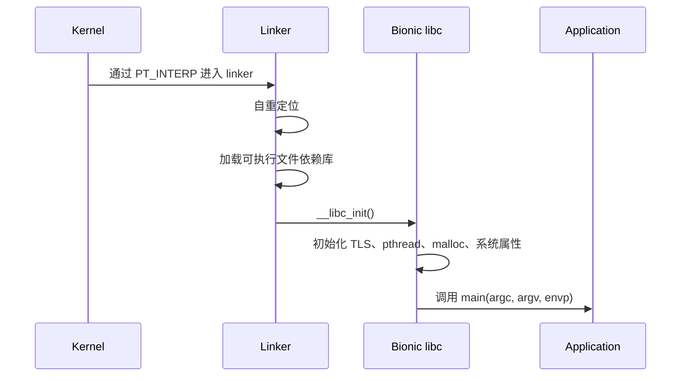
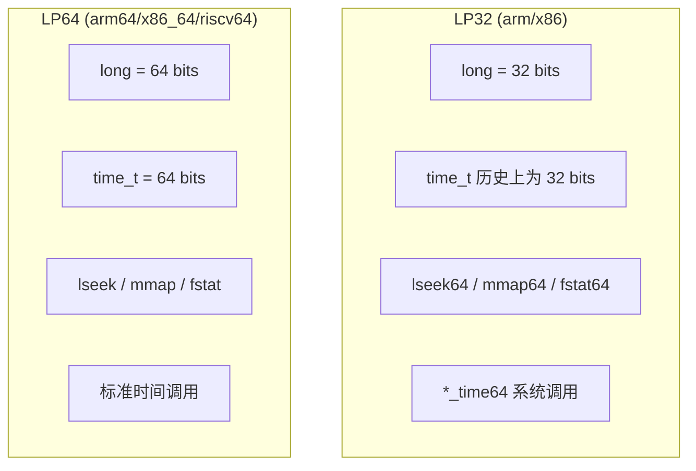
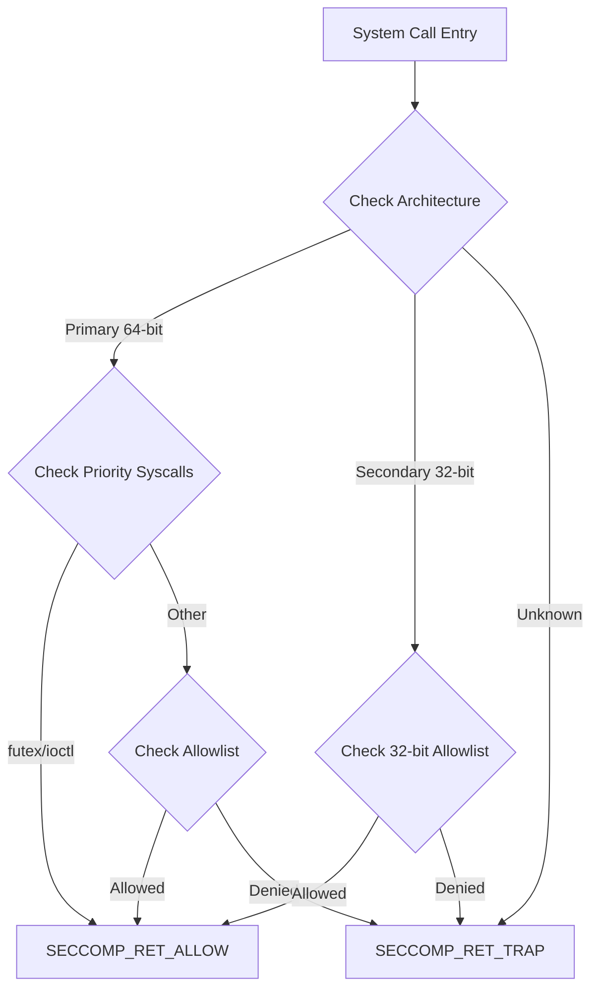
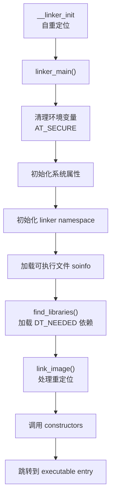
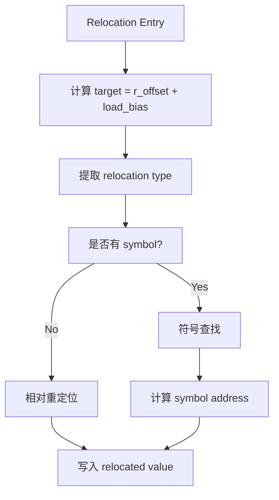
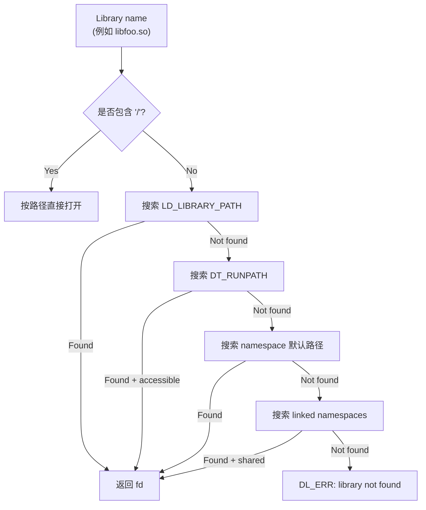
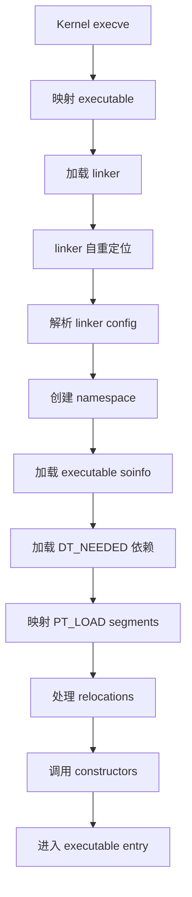
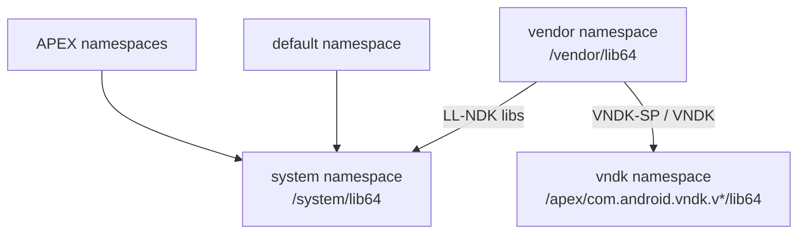
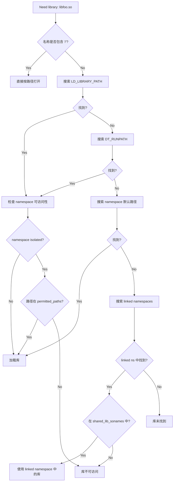
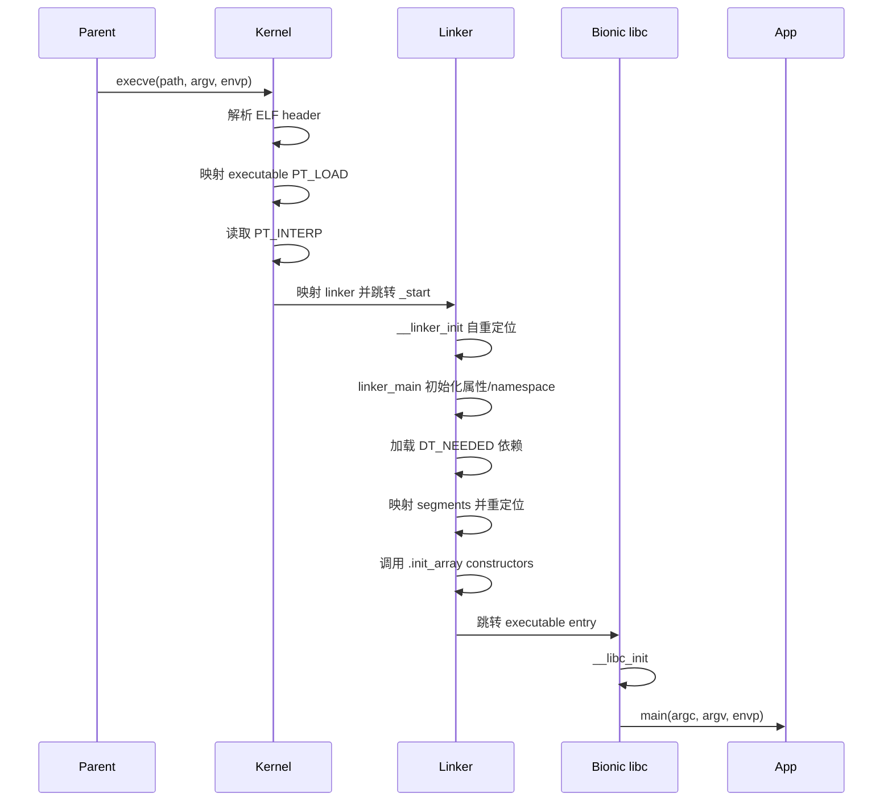

# 第 7 章：Bionic 与动态链接器

Android 不使用 GNU C Library（glibc）。它使用的是 **Bionic**，这是一个从一开始就面向移动设备设计的自定义 C 库。本章从源码层面深入讲解 Bionic 的架构、系统调用接口、负责加载 Android 上每个 native 二进制文件的动态链接器，以及在库加载层面执行 Treble 架构边界的 VNDK 命名空间隔离。

Android 上的每个 native 进程，从启动系统的 init daemon，到你刚刚启动的应用，都会经过本章分析的代码。相关源码位于 AOSP 树的 `bionic/` 下，支撑基础设施位于 `system/linkerconfig/` 和 `build/soong/cc/`。

---

## 7.1 Bionic：Android 的 C 库

### 7.1.1 为什么不用 glibc？

选择创建新的 C 库而不是采用 glibc，是 Android 历史上最早也最重要的决策之一。原因既有法律层面，也有技术层面：

1. **许可证。** glibc 使用 LGPL。虽然 LGPL 允许动态链接且不把 copyleft 义务传递给调用代码，但 Android 团队希望为设备制造商和应用开发者消除任何不确定性。Bionic 使用三条款 BSD 许可证，对下游使用几乎不施加限制。

2. **体积。** glibc 面向通用 Linux 系统，支持大量 locale、完整国际化机制、NSS（Name Service Switch）模块，以及丰富 GNU 扩展。在闪存和 RAM 受限的移动设备上，这些开销并不合适。Bionic 移除了 Android 不需要的一切。

3. **启动速度。** 每个 Android 应用都从 Zygote 进程 fork 而来，许多 native daemon 也会在启动期间运行。动态链接和 C 库初始化耗时会被数百个进程放大。Bionic 为快速启动设计：动态链接器精简，初始化路径短，TLS 布局在编译期固定，而不是运行时计算。

4. **Android 专用能力。** Bionic 直接集成 Android 属性系统、日志基础设施（liblog）、安全模型（Zygote fork 时施加的 seccomp-BPF 过滤器）和内存分配器（Scudo）。把这些能力接入 glibc 需要大量补丁。

5. **线程模型。** Bionic 的 pthread 实现与 Linux 内核线程原语（clone、futex、robust mutex）紧密耦合，并省略了 Android 不使用的 POSIX thread cancellation 等能力。

### 7.1.2 源码树布局

Bionic C 库源码位于：

```text
bionic/libc/
```

该目录包含 38 个顶层条目，最重要的如下：

| 目录 | 用途 |
|-----------|---------|
| `bionic/` | 核心 C 库实现（261 个 `.cpp` 文件） |
| `arch-arm/` | ARM 32 位汇编和架构专属代码 |
| `arch-arm64/` | AArch64 汇编、IFUNC resolver、Oryon 优化 |
| `arch-x86/` | x86 32 位代码 |
| `arch-x86_64/` | x86-64 代码 |
| `arch-riscv64/` | RISC-V 64 位代码 |
| `arch-common/` | 架构无关汇编 helper |
| `include/` | 暴露给 NDK 的公共 C 库头文件 |
| `kernel/` | 清洗后的 Linux 内核头文件 |
| `private/` | libc 与 linker 共享的内部头文件 |
| `seccomp/` | Seccomp-BPF 策略生成与安装 |
| `stdio/` | 标准 I/O 实现 |
| `dns/` | DNS resolver（精简版 NetBSD resolver） |
| `upstream-freebsd/` | 从 FreeBSD 导入的代码 |
| `upstream-netbsd/` | 从 NetBSD 导入的代码 |
| `upstream-openbsd/` | 从 OpenBSD 导入的代码 |
| `async_safe/` | async-signal-safe 日志与格式化 |
| `system_properties/` | Android 属性系统客户端 |
| `tools/` | 代码生成脚本（`gensyscalls.py`、`genseccomp.py`） |
| `tzcode/` | 时区处理（来自 IANA tz database） |
| `platform/` | 平台专属头文件 |
| `memory/` | Memory Tagging Extension（MTE）支持 |

### 7.1.3 核心库：`bionic/libc/bionic/`

`bionic/libc/bionic/` 是 C 库核心，包含 261 个源文件，实现从 `malloc()` 到 `pthread_create()` 的各类能力。

**进程初始化：**

- `libc_init_common.cpp`：静态与动态可执行文件的通用初始化
- `libc_init_dynamic.cpp`：动态链接可执行文件的初始化路径
- `libc_init_static.cpp`：静态链接可执行文件的初始化路径

**线程：**

- `pthread_create.cpp`：线程创建
- `pthread_mutex.cpp`：mutex 实现，使用 Linux futex
- `pthread_cond.cpp`：条件变量
- `pthread_rwlock.cpp`：读写锁
- `pthread_internal.h`：内部线程状态结构

**内存分配：**

- `malloc_common.cpp`：allocator dispatch 层

`bionic/libc/bionic/malloc_common.cpp` 中的 `calloc()` 展示了 Bionic 内存分配的核心 dispatch 模式：

```cpp
extern "C" void* calloc(size_t n_elements, size_t elem_size) {
  auto dispatch_table = GetDispatchTable();
  if (__predict_false(dispatch_table != nullptr)) {
    return MaybeTagPointer(dispatch_table->calloc(n_elements, elem_size));
  }
  void* result = Malloc(calloc)(n_elements, elem_size);
  if (__predict_false(result == nullptr)) {
    warning_log("calloc(%zu, %zu) failed: returning null pointer", n_elements, elem_size);
  }
  return MaybeTagPointer(result);
}
```

`GetDispatchTable()` 会检查 debug malloc 或 profiling malloc 是否已安装。若已安装，调用会被重定向；否则通过 `Malloc()` 宏落到默认分配器 Scudo。`MaybeTagPointer()` 调用体现了 Bionic 对 MTE 等内存标记能力的集成。

### 7.1.4 进程初始化

动态链接 native 进程的启动路径可以简化为：



静态链接路径由 `libc_init_static.cpp` 处理；动态链接路径由 `libc_init_dynamic.cpp` 处理。两者最终都会进入通用初始化逻辑，建立 C 运行时需要的线程状态、TLS、环境变量、atexit handler 和 allocator 状态。

### 7.1.5 Thread-Local Storage 与 Bionic TCB

Bionic 的线程局部存储（TLS）布局经过严格设计，目标是让热路径访问尽可能快。每个线程都有一个 Thread Control Block（TCB），其中保存 pthread 内部状态、errno、TLS slot 和架构专属线程指针。

Android 把部分 TLS slot 保留给系统使用，例如：

- `TLS_SLOT_SELF`：指向当前线程自身
- `TLS_SLOT_THREAD_ID`：线程 ID
- `TLS_SLOT_ERRNO`：`errno`
- `TLS_SLOT_OPENGL_API`：OpenGL dispatch
- `TLS_SLOT_BIONIC_TLS`：Bionic 内部 TLS 数据

固定 TLS 布局减少了运行时查找成本，也让 linker、libc 和 ART 可以共享一套高效线程状态访问模型。

### 7.1.6 架构专属优化

Bionic 在每个 CPU 架构下都提供专属优化实现。AArch64 目录尤其重要：

```text
bionic/libc/arch-arm64/
    bionic/         # syscall stub、setjmp、clone 等
    string/         # memcpy/memmove/memset/strcmp 等优化实现
    ifuncs.cpp      # IFUNC resolver
```

IFUNC（indirect function）允许 libc 在运行时根据 CPU feature 选择最优实现。例如同一个 `memcpy()` 可以在不同 ARM 核心上选择不同 NEON 或微架构优化版本。这种优化对 Android 非常重要，因为 Android 设备覆盖大量 SoC 与 CPU 微架构。

### 7.1.7 上游代码与 BSD 传统

Bionic 并不是从零实现所有 C 库函数。它大量复用了 BSD 系代码，包括 FreeBSD、NetBSD 和 OpenBSD 的实现。对应目录包括：

```text
bionic/libc/upstream-freebsd/
bionic/libc/upstream-netbsd/
bionic/libc/upstream-openbsd/
```

这种 BSD 传统与 Bionic 的许可证目标一致，也让 Android 可以在保持轻量的同时复用成熟实现。

### 7.1.8 属性系统客户端

Bionic 中的 `system_properties/` 目录实现了系统属性客户端读取逻辑。它负责映射 `/dev/__properties__/` 下的共享内存区域，查找属性 trie，并提供 `__system_property_find()`、`__system_property_read_callback()` 等 API。

这一层是第 6 章系统属性机制在 native 侧的入口。属性读取无需 IPC，写入则通过 socket 交给 init 的 property service。

### 7.1.9 Bionic 与 glibc：特性对比

| 特性 | Bionic | glibc |
|------|--------|-------|
| 许可证 | BSD | LGPL |
| 目标平台 | Android / 移动设备 | 通用 Linux |
| 动态链接器 | Android 专用 linker | `ld-linux.so` |
| NSS | 精简或无 | 完整 NSS 模块系统 |
| pthread cancellation | 基本不支持 | 完整 POSIX 支持 |
| malloc 默认实现 | Scudo | ptmalloc |
| Android 属性系统 | 原生集成 | 无 |
| Seccomp 策略 | 与 Zygote 集成 | 无 Android 集成 |
| linker namespace | 原生支持 | 无 Android Treble 模型 |

### 7.1.10 内存安全特性

Bionic 与 Android 平台集成了多种内存安全能力：

- **Scudo allocator**：默认 hardened allocator，提供 quarantine、checksum 和随机化等保护。
- **MTE（Memory Tagging Extension）**：AArch64 内存标记支持，用于检测 use-after-free 与越界访问。
- **HWASan / ASan 集成**：支持 sanitizer 构建和运行时替换库路径。
- **FORTIFY**：对常见 C 函数调用做编译期与运行时边界检查。
- **CFI**：部分构建中启用控制流完整性保护。

---

## 7.2 系统调用接口

### 7.2.1 Android 上系统调用如何工作

Bionic 是用户态和 Linux 内核系统调用 ABI 之间的主要封装层。大多数 libc 函数最终会落到一个系统调用 stub。例如 `open()`、`read()`、`write()`、`mmap()`、`futex()` 都会通过架构专属汇编进入内核。

系统调用路径如下：


### 7.2.2 `SYSCALLS.TXT`：系统调用定义文件

Bionic 的系统调用接口由 `bionic/libc/SYSCALLS.TXT` 驱动。这个文件声明每个 syscall wrapper 的名字、参数、返回类型以及适用架构。

典型条目类似：

```text
int openat(int, const char*, int, mode_t) all
ssize_t read(int, void*, size_t) all
int clock_gettime(clockid_t, timespec*) all
```

该文件不是文档，而是代码生成输入。`gensyscalls.py` 读取它并生成 C/C++ 声明、汇编 stub 和相关元数据。这样可以保持不同架构之间的 syscall wrapper 一致。

### 7.2.3 系统调用 Stub 生成

生成脚本位于：

```text
bionic/libc/tools/gensyscalls.py
```

它为不同架构生成对应汇编入口。例如 AArch64 使用 `svc #0` 进入内核，x86-64 使用 `syscall` 指令，RISC-V 使用 `ecall`。

生成 stub 需要处理不同 ABI 的细节：参数寄存器、返回值寄存器、errno 转换、64 位参数对齐，以及 LP32/LP64 命名差异。调用失败时，Linux 返回负 errno，Bionic wrapper 会把它转换成 `-1` 并设置线程局部的 `errno`。

### 7.2.4 系统调用目录

`SYSCALLS.TXT` 既包含 POSIX 常用调用，也包含 Android 平台需要的 Linux 专用调用。常见类别如下：

| 类别 | 示例 |
|------|------|
| 文件 I/O | `openat`, `read`, `write`, `close`, `lseek` |
| 内存管理 | `mmap`, `mprotect`, `munmap`, `madvise` |
| 进程/线程 | `clone`, `fork`, `execve`, `exit`, `wait4` |
| 同步 | `futex`, `set_robust_list` |
| 信号 | `rt_sigaction`, `rt_sigprocmask`, `sigaltstack` |
| 时间 | `clock_gettime`, `nanosleep`, `timerfd_*` |
| 网络 | `socket`, `connect`, `sendto`, `recvfrom` |
| Android 关键路径 | `ioctl`（Binder）、`epoll_*`、`eventfd` |

### 7.2.5 LP32 与 LP64 差异

Android 同时支持 32 位和 64 位用户态 ABI。LP32 与 LP64 在类型宽度和 syscall 名称上有差异：



32 位系统上许多 syscall 带 `64` 后缀，或者使用寄存器对传递 64 位参数。`SYSCALLS.TXT` 生成器会自动处理这些 ABI 要求，包括 ARM 要求 64 位参数对从偶数寄存器开始这一限制。

`*_time64` 调用用于解决 Y2038 问题：32 位 `time_t` 会在 2038 年 1 月溢出。`clock_gettime64`、`futex_time64` 等调用即使在 32 位平台上也使用 64 位时间结构。

### 7.2.6 Seccomp-BPF：系统调用过滤

Android 使用 seccomp-BPF 限制应用进程可用的系统调用。这是关键安全边界：即使攻击者在应用进程内获得任意代码执行，也无法调用被 seccomp 过滤器阻止的危险 syscall。

seccomp 策略由多个文本文件构建：

| 文件 | 用途 |
|------|---------|
| `SYSCALLS.TXT` | bionic 需要的基础 syscall 集合 |
| `SECCOMP_ALLOWLIST_COMMON.TXT` | 所有进程额外允许的调用 |
| `SECCOMP_ALLOWLIST_APP.TXT` | 应用进程额外允许的调用 |
| `SECCOMP_ALLOWLIST_SYSTEM.TXT` | system server 额外允许的调用 |
| `SECCOMP_BLOCKLIST_APP.TXT` | 即使在 `SYSCALLS.TXT` 中也要从应用移除的调用 |
| `SECCOMP_BLOCKLIST_COMMON.TXT` | 所有 Zygote 子进程都要移除的调用 |
| `SECCOMP_PRIORITY.TXT` | 优先检查的 syscall，用于热路径优化 |

最终策略公式如下：

```text
Final Allowlist = SYSCALLS.TXT - BLOCKLIST + ALLOWLIST
```

应用 blocklist 会移除修改 UID/GID、修改系统时间、挂载文件系统、加载内核模块、重启设备等危险调用。`SECCOMP_PRIORITY.TXT` 把 `futex` 和 `ioctl` 放在最前，因为它们在 Android 进程中调用极其频繁：`futex` 用于 mutex/condvar，`ioctl` 用于 Binder IPC。

### 7.2.7 Seccomp 策略安装

seccomp 过滤器由 Zygote 在 fork 应用进程前安装。实现位于 `bionic/libc/seccomp/seccomp_policy.cpp`。

过滤器需要处理双架构系统，例如 64 位内核运行 32 位应用。它先检查 seccomp data 中的架构字段，再跳转到对应架构的过滤器：

```cpp
static size_t ValidateArchitectureAndJumpIfNeeded(filter& f) {
    f.push_back(BPF_STMT(BPF_LD|BPF_W|BPF_ABS, arch_nr));
    f.push_back(BPF_JUMP(BPF_JMP|BPF_JEQ|BPF_K, PRIMARY_ARCH, 2, 0));
    f.push_back(BPF_JUMP(BPF_JMP|BPF_JEQ|BPF_K, SECONDARY_ARCH, 1, 0));
    Disallow(f);
    return f.size() - 2;
}
```

生成的 BPF 过滤器大致如下：



过滤器通过 `prctl(PR_SET_SECCOMP, SECCOMP_MODE_FILTER, &prog)` 安装。`SECCOMP_RET_TRAP` 会向进程发送 SIGSYS，Android 的 debuggerd 会捕获并生成崩溃报告，清晰标识被禁止的 syscall。

### 7.2.8 VDSO：避免系统调用开销

对最敏感的系统调用，内核提供 VDSO（Virtual Dynamic Shared Object）：一段由内核映射到每个进程地址空间的小型共享库。Bionic 动态链接器会显式定位并链接 VDSO。

`bionic/linker/linker_main.cpp` 中的 `add_vdso()` 会通过 auxiliary vector 中的 `AT_SYSINFO_EHDR` 找到 VDSO ELF header，为它创建 `soinfo`，执行 prelink/link 阶段，并设置 `DF_1_NODELETE` 防止卸载。

VDSO 加速的 Bionic 调用包括：

- `clock_gettime()`：最频繁调用的时间函数
- `clock_getres()`：查询时钟分辨率
- `gettimeofday()`：遗留时间查询

---

## 7.3 动态链接器

### 7.3.1 概览

动态链接器在 64 位设备上是 `/system/bin/linker64`，在 32 位设备上是 `/system/bin/linker`。它负责加载 Android 上每个动态链接可执行文件和共享库。它是内核映射新进程后最早执行的用户态代码，其正确性决定了系统中每个 native 二进制文件能否运行。

linker 源码位于 `bionic/linker/`，约 50 个源文件、7000 多行 C++。关键文件如下：

| 文件 | 行数 | 用途 |
|------|-------|---------|
| `linker.cpp` | 3,791 | 核心链接逻辑：库搜索、加载、命名空间管理 |
| `linker_phdr.cpp` | 1,737 | ELF 解析、segment 加载、地址空间管理 |
| `linker_main.cpp` | 859 | 入口、初始化、主链接流程 |
| `linker_relocate.cpp` | 686 | 重定位处理 |
| `linker_namespaces.h` | 183 | 命名空间数据结构 |
| `linker_soinfo.h` | ~400 | `soinfo` 结构定义 |
| `linker_config.cpp` | ~500 | 配置文件解析器 |
| `dlfcn.cpp` | ~100 | `dlopen` / `dlsym` API 表面 |

### 7.3.2 Linker 入口点

当内核执行动态链接 ELF 二进制文件时，会：

1. 映射可执行文件的 PT_LOAD segment。
2. 读取 PT_INTERP segment 找到 linker 路径，例如 `/system/bin/linker64`。
3. 把 linker 映射进进程。
4. 设置 auxiliary vector（AT_PHDR、AT_ENTRY、AT_BASE 等）。
5. 把控制权交给 linker 入口点。

linker 的入口点是架构专属汇编中的 `_start`，它会调用 `__linker_init`。这里存在一个自举问题：linker 自己也是需要重定位的动态链接二进制。解决方式是两阶段初始化：先使用 position-independent code 完成自重定位，再加载和链接可执行文件及其所有依赖。

### 7.3.3 主链接流程

`bionic/linker/linker_main.cpp` 中的 `linker_main()` 编排整个链接过程：

```cpp
static ElfW(Addr) linker_main(KernelArgumentBlock& args,
                               const char* exe_to_load) {
  ProtectedDataGuard guard;
  __libc_init_AT_SECURE(args.envp);
  __system_properties_init();
  platform_properties_init();
  linker_debuggerd_init();
  ...
}
```

主流程如下：



### 7.3.4 `soinfo` 结构

`soinfo` 是 linker 中表示已加载 ELF 对象的核心结构。每个可执行文件、共享库、VDSO 都有一个 `soinfo`。它保存 ELF header、program header、dynamic section、符号表、字符串表、重定位表、依赖关系、命名空间、引用计数和初始化状态。

可以把 `soinfo` 理解为 linker 维护的“已加载库对象模型”。所有 `dlopen()`、`dlsym()`、重定位、构造函数调用和命名空间检查，最终都会围绕 `soinfo` 展开。

### 7.3.5 ELF 加载：`ElfReader` 类

ELF 加载由 `bionic/linker/linker_phdr.cpp` 中的 `ElfReader` 负责。它会读取 ELF header、program headers，检查 ELF magic、架构、ABI、文件类型、page alignment，并预留地址空间。

加载过程包括：

1. 读取 ELF header 并校验格式。
2. 读取 program header table。
3. 计算 PT_LOAD segment 总大小。
4. 预留地址空间。
5. 映射每个 PT_LOAD segment。
6. 处理 BSS 和 zero-fill。
7. 设置 segment protection。

### 7.3.6 Load Bias 与虚拟地址计算

ELF 文件中的虚拟地址是相对其链接地址的。实际加载时，ASLR 会把库放到随机基址。linker 使用 `load_bias` 把 ELF 虚拟地址转换为进程内真实地址：

```text
runtime_address = elf_virtual_address + load_bias
```

重定位、符号地址计算、dynamic section 指针修正都依赖这个公式。

### 7.3.7 16KiB 页大小兼容性

现代 Android 支持 16KiB page size。linker 必须处理为 4KiB 对齐构建的旧 ELF 与 16KiB 系统之间的兼容性问题。`ElfReader` 会检查 program alignment，如果对齐小于系统 page size 且未启用 compat 模式，就拒绝加载并报告错误。

16KiB compat 模式会使用特殊映射路径，把数据读入已有匿名映射，而不是直接 `mmap()` 文件 segment。这为页面大小迁移提供兼容空间。

### 7.3.8 重定位处理

重定位由 `bionic/linker/linker_relocate.cpp` 实现。linker 会遍历 `.rela.dyn`、`.rela.plt` 等重定位表，为每个 entry 计算目标地址、解析符号，并写入最终地址。

核心流程如下：



linker 使用模板特化生成三类 relocation loop：

- **JumpTable**：最常见 relocation 类型的跳表快速路径
- **Typical**：典型重定位组合的优化路径
- **General**：处理 TLS、text relocation、IFUNC 等复杂情况

符号查找会使用缓存。典型 Android 应用启动时可能处理数万次重定位，符号缓存命中率通常超过 80%，显著降低启动时间。

### 7.3.9 符号解析

符号解析是根据符号名寻找定义地址的过程。linker 支持两种 hash table：

1. **ELF hash（`DT_HASH`）**：传统 ELF hash table。
2. **GNU hash（`DT_GNU_HASH`）**：更高效，使用 Bloom filter 快速排除不可能命中的库。

GNU hash 的 Bloom filter 很重要，因为大多数符号只定义在一两个库中。查找某个符号时，绝大多数库会被 Bloom filter 快速判定为“不可能包含该符号”，无需遍历 hash chain。

符号查找顺序遵循 ELF 规则：对于带 `DT_SYMBOLIC` 的库，先查自身符号表；否则先查 global scope（`RTLD_GLOBAL` 加载的库），再查 local scope（当前库及其依赖）。

### 7.3.10 库搜索与加载

当 linker 需要加载库（来自 `DT_NEEDED` 或 `dlopen()`）时，会按固定顺序搜索：



Android linker 的一个独特能力是可以直接从 APK（ZIP 文件）中加载共享库。路径使用 `!/` 作为分隔符，例如：

```text
/data/app/com.example/base.apk!/lib/arm64-v8a/libfoo.so
```

APK 内的库必须未压缩并且 page-aligned，这样 linker 可以直接把 APK 文件中的库内容映射进进程地址空间。

### 7.3.11 依赖遍历与加载顺序

`find_libraries()` 使用广度优先遍历依赖树。BFS 顺序确保依赖库先于需要它们的库被加载。该遍历器也用于 `dlsym(RTLD_DEFAULT)` 全局符号查找、基于 handle 的 `dlsym()` 查找，以及构造函数调用排序。

遍历 action 支持三种结果：`kWalkStop`、`kWalkContinue`、`kWalkSkip`，因此同一个 walker 既能用于查找，也能用于完整遍历。

### 7.3.12 `dlopen` / `dlsym` / `dlclose` API

应用运行时通过 `dl*` 系列函数与 linker 交互。这些 API 暴露在 `bionic/linker/dlfcn.cpp`：

```cpp
void* __loader_dlopen(const char* filename, int flags, const void* caller_addr) __LINKER_PUBLIC__;
void* __loader_dlsym(void* handle, const char* symbol, const void* caller_addr) __LINKER_PUBLIC__;
int __loader_dlclose(void* handle) __LINKER_PUBLIC__;
```

所有函数都带 `caller_addr` 参数。linker 用它判断调用者属于哪个 `soinfo`，进而确定调用者所在 namespace，并在该 namespace 中搜索目标库或符号。

Android 扩展 API `android_dlopen_ext()` 还支持：

- `ANDROID_DLEXT_FORCE_LOAD`：即使已经加载也强制加载
- `ANDROID_DLEXT_USE_LIBRARY_FD`：从指定 fd 加载
- `ANDROID_DLEXT_RESERVED_ADDRESS`：加载到指定地址
- `ANDROID_DLEXT_USE_NAMESPACE`：在指定 linker namespace 中加载

### 7.3.13 Protected Data 与安全

linker 中部分全局数据在初始化完成后会被保护为只读。`ProtectedDataGuard` 用于在需要修改 linker 内部状态时临时切换内存保护，修改完成后恢复只读。这降低了内存破坏漏洞直接篡改 linker 关键状态的风险。

### 7.3.14 Linker 配置

linker 的 namespace 和路径配置由 linkerconfig 生成。相关工具位于：

```text
system/linkerconfig/
```

生成结果会描述每个 namespace 的搜索路径、允许访问路径、是否隔离，以及 namespace 之间的 link 关系。

### 7.3.15 完整 ELF 加载流水线



---

## 7.4 VNDK 与 Linker Namespaces

### 7.4.1 Treble 命名空间问题

Project Treble 要求 system 分区和 vendor 分区可以独立更新。库加载层面的问题是：vendor 进程不能随意链接 system 私有库，否则 system 更新可能破坏 vendor 二进制。linker namespace 就是用来在运行时强制执行这一边界的机制。

### 7.4.2 `android_namespace_t` 结构

`android_namespace_t` 表示一个 linker namespace。它包含命名空间名、类型标志、默认库搜索路径、允许访问路径、已加载库列表，以及指向其他 namespace 的 link。

核心概念如下：

- **isolated**：隔离 namespace 只能加载允许路径中的库。
- **visible**：可被其他 namespace 查找或链接。
- **default_library_paths**：默认搜索目录。
- **permitted_paths**：隔离 namespace 中允许访问的路径。
- **linked namespaces**：可从其他 namespace 共享指定 soname。

### 7.4.3 Namespace 架构

Treble 设备通常包含多个 namespace：



系统库、vendor 库、VNDK 库和 APEX 库被分配到不同 namespace。跨 namespace 访问必须通过显式 link，并且只能访问配置中声明为 shared 的库名。

### 7.4.4 VNDK 库分类

VNDK（Vendor Native Development Kit）定义了 vendor 代码可依赖的一组稳定 native 库。大致分为：

| 类别 | 说明 |
|------|------|
| LL-NDK | 最底层稳定库，如 `libc.so`、`libm.so`、`libdl.so`、`liblog.so` |
| VNDK-SP | 可被 same-process HAL 使用的稳定库 |
| VNDK | Vendor 可使用的 framework native 库稳定子集 |
| FWK-only | framework 私有库，vendor 不可直接访问 |

### 7.4.5 `linkerconfig` 工具

`linkerconfig` 根据设备配置、VNDK 版本、APEX 信息和分区布局生成 linker namespace 配置。入口位于 `system/linkerconfig/main.cc`。

它生成的配置会被 linker 在进程启动时读取，用于创建 namespace、设置搜索路径、声明 permitted path 和 namespace link。

### 7.4.6 Bionic 库链接

`libc.so`、`libm.so`、`libdl.so` 等 Bionic 基础库属于 LL-NDK，几乎所有 namespace 都需要访问它们。linkerconfig 会建立从 vendor / vndk namespace 到 system namespace 的受限 link，只共享这些基础稳定库。

### 7.4.7 System Namespace 配置

system namespace 通常包含 `/system/lib64`、`/system_ext/lib64`、APEX runtime 库路径等。它服务 framework 进程和 system daemon，可访问平台私有库。

### 7.4.8 Vendor Namespace 配置

vendor namespace 的默认搜索路径指向 `/vendor/lib64`、`/odm/lib64` 等 vendor 分区路径。它通常是 isolated namespace，因此不能直接访问 `/system/lib64` 中的任意库，只能通过显式 link 访问 LL-NDK 或 VNDK 库。

### 7.4.9 VNDK Namespace 配置

VNDK namespace 通常指向 `/apex/com.android.vndk.vXX/lib64/`。它承载一组供 vendor 使用的稳定 framework native 库版本。vendor namespace 会通过 link 访问 VNDK namespace 中允许共享的 soname。

### 7.4.10 Exempt List：向后兼容

为了兼容旧应用或旧 vendor 实现，linker 支持 exempt list。它允许某些库在严格 namespace 规则之外被加载，但通常只对旧 SDK 目标或特定兼容场景启用，并伴随警告。长期趋势是减少这类例外。

### 7.4.11 Namespace 如何影响 `dlopen`

`dlopen()` 的搜索范围由调用者所在 namespace 决定。linker 通过 `caller_addr` 找到调用者 `soinfo`，再确定 namespace。若目标库不在该 namespace 的默认路径、permitted path 或 linked namespace 的 shared soname 集合中，加载会失败。

### 7.4.12 运行时 Namespace 创建

Android 提供 `android_create_namespace()` 等扩展 API，用于在运行时创建 namespace。这常用于 classloader namespace、native bridge、isolated app 或加载特定 APK 内 native 库的场景。

### 7.4.13 默认库路径

linker 内置多组默认路径：普通路径、ASan 路径、HWASan 路径。ASan/HWASan 模式会优先搜索 sanitizer instrumented 库，例如 `/data/asan/` 或 `hwasan/` 子目录，然后回退到普通路径。这允许同一设备上同时存在生产库和 sanitizer 库。

### 7.4.14 Namespace 隔离实践

一个 vendor 进程（例如 `/vendor/bin/camera_server`）通常位于 `vendor/default` namespace。它可以加载自己的 vendor 库，例如 `/vendor/lib64/hw/libcamera_hal.so`，也可以通过 vndk namespace 使用 `libcutils.so`、`libutils.so` 等 VNDK 库，并通过 system namespace link 使用 LL-NDK 库如 `libc.so`、`libm.so`、`liblog.so`。

但它不能直接访问 framework 私有库，例如 `/system/lib64/libandroid_runtime.so`。这正是 namespace 隔离要强制执行的边界。

### 7.4.15 VNDK 的演进与弱化

VNDK 系统正在演进。较新的 AOSP 版本在 linkerconfig 中包含 `--deprecate_vndk` 标志。趋势是更多使用 APEX 模块进行库版本管理，而不是依赖 VNDK。APEX 可以携带自己的库版本，并拥有独立 mount namespace 和 linker namespace，隔离性更强，也更适合独立更新。

不过，VNDK 对现有 vendor 实现的向后兼容仍然重要，并会和 APEX 方案在多个 Android 世代中共存。

### 7.4.16 库加载决策树

当 linker 遇到 `DT_NEEDED` 或 `dlopen()` 时，完整决策过程如下：



### 7.4.17 Segment 加载细节

`ElfReader::LoadSegments()` 遍历每个 PT_LOAD program header，并把对应文件区域映射进预留地址空间。每个 segment 经过四个子操作：

1. **MapSegment / CompatMapSegment**：使用 `mmap64()` 和 `MAP_FIXED` 把文件内容映射到地址空间。16KiB 兼容模式下使用 compat 路径。
2. **ZeroFillSegment**：若 writable segment 的文件大小未覆盖完整页，页尾剩余部分必须清零。
3. **DropPaddingPages**：在 page size 迁移场景下释放 segment 间 padding page，降低内存压力。
4. **MapBssSection**：若 `p_memsz > p_filesz`，多出的部分是 BSS，linker 会在 segment 末尾映射匿名页。

linker 会拒绝同时 writable 和 executable 的 segment（W+E），这是 W^X 安全策略的一部分。从 API level 26 开始，这类库会被拒绝加载。

### 7.4.18 `find_libraries` 算法

`find_libraries()` 是依赖解析核心。它处理循环依赖、跨 namespace 加载、ASLR load shuffling、重复库检测和 soname 规则。算法大致分为：

1. 检查目标 soname 是否已在当前 namespace 或 linked namespace 中加载。
2. 尝试从当前 namespace 加载。
3. 对旧应用启用 exempt list fallback。
4. 搜索 linked namespaces。
5. 为新加载库创建 `LoadTask` 并解析其 `DT_NEEDED`。
6. 广度优先加载依赖并执行重定位。

### 7.4.19 重复检测与 Soname 契约

linker 使用 soname 判断库是否已经加载。若两个路径不同但 soname 相同，linker 通常会复用已加载实例，而不是重复加载。这对 ELF 依赖一致性非常重要，也避免同一个库的全局状态出现多个副本。

### 7.4.20 `DT_NEEDED` 与 `DT_RUNPATH` 处理

`DT_NEEDED` 声明库依赖，`DT_RUNPATH` 声明相对当前库的运行时搜索路径。Android linker 会在搜索默认 namespace 路径之前检查请求库的 `DT_RUNPATH`，并确保找到的路径对当前 namespace 可访问。

### 7.4.21 GDB 集成

linker 维护调试器可见的 loaded library 列表，并在库加载/卸载时通知 debugger。这使 GDB、LLDB 和 debuggerd 能够看到进程中的共享库、符号和加载地址。

### 7.4.22 CFI（Control Flow Integrity）Shadow

linker 支持 CFI shadow，用于把代码地址映射到对应的 CFI check 信息。启用 CFI 的库加载后，linker 会注册其 shadow 信息，使运行时可以快速验证间接调用目标是否合法。

### 7.4.23 Linker 中的 TLS

动态链接器还负责处理 ELF TLS 模型，包括 TLS segment、TLS module ID、线程创建时的 TLS 初始化，以及 `__tls_get_addr()` 所需元数据。TLS 处理必须与 Bionic pthread 实现保持一致。

### 7.4.24 MTE Globals 支持

在支持 Memory Tagging Extension 的 AArch64 设备上，linker 可以为全局变量应用内存标记。重定位处理时会使用 `apply_memtag_if_mte_globals()` 修正目标地址，保证全局数据访问符合 MTE 标记规则。

### 7.4.25 调试 Linker

linker 支持多类调试输出。`LD_DEBUG` 可启用不同类别日志，例如 library search、relocation、statistics、timing 等。调试库加载问题时，最常见的信息包括搜索路径、namespace 名称、库不可访问原因、未解析符号和 ABI mismatch。

### 7.4.26 `ldd` 工具

Android 提供 `ldd` 风格工具用于查看 ELF 依赖解析。它可以显示库的 `DT_NEEDED` 依赖、解析路径和 namespace 可访问性，有助于定位 native 库加载失败。

### 7.4.27 Linker Namespace 生命周期

namespace 通常在进程启动早期由 linkerconfig 配置创建，也可能在运行时由 classloader 或平台扩展 API 创建。namespace 会随着进程存在而存在，其内加载的 `soinfo` 通过引用计数和 `dlclose()` 生命周期管理。

---

## 总结

Bionic 和动态链接器共同构成 Android native 运行时的基础层。Bionic 提供精简、快速、与 Android 深度集成的 C 库；动态链接器负责加载 ELF、解析依赖、执行重定位、调用构造函数，并通过 namespace 执行 Treble 边界。

关键结论如下：

1. **Bionic 是 Android 专用 C 库。** 它以 BSD 许可证、低开销和 Android 集成为核心目标，而不是复刻 glibc。
2. **系统调用接口由生成系统维护。** `SYSCALLS.TXT` 和 `gensyscalls.py` 保证多架构 syscall wrapper 一致。
3. **seccomp 是应用沙箱的重要边界。** Zygote 在 fork 前安装过滤器，限制应用可调用的 syscall。
4. **linker 是启动性能关键路径。** ELF 加载、重定位、符号查找和 constructor 调用都会直接影响进程启动时间。
5. **namespace 是 Treble 的运行时执行机制。** 它限制 system/vendor 之间的 native 库依赖，防止跨分区私有 ABI 耦合。

### 架构专属系统调用约定

| 架构 | syscall 指令 | syscall number 寄存器 | 参数寄存器 | 返回寄存器 |
|------|--------------|------------------------|------------|------------|
| arm | `svc #0` | `r7` | `r0-r6` | `r0` |
| arm64 | `svc #0` | `x8` | `x0-x5` | `x0` |
| x86 | `int 0x80` / `sysenter` | `eax` | `ebx,ecx,edx,esi,edi,ebp` | `eax` |
| x86_64 | `syscall` | `rax` | `rdi,rsi,rdx,r10,r8,r9` | `rax` |
| riscv64 | `ecall` | `a7` | `a0-a5` | `a0` |

### Linker 配置文件格式

linker 配置描述 namespace、search path、permitted path 和 namespace link。概念格式如下：

```ini
namespace.default.isolated = true
namespace.default.search.paths = /system/${LIB}
namespace.default.permitted.paths = /system/${LIB}
namespace.default.links = runtime,vndk
namespace.default.link.runtime.shared_libs = libc.so:libm.so:libdl.so
```

### 关键术语表

| 术语 | 含义 |
|------|------|
| Bionic | Android 的 C 库 |
| linker | Android 动态链接器 |
| `soinfo` | linker 中表示已加载 ELF 对象的数据结构 |
| `DT_NEEDED` | ELF 中声明依赖库的 dynamic entry |
| `DT_RUNPATH` | ELF 中声明运行时搜索路径的 dynamic entry |
| relocation | 把符号引用修正为运行时地址的过程 |
| load bias | ELF 虚拟地址到运行时地址的偏移 |
| namespace | linker 的库搜索与访问隔离域 |
| VNDK | Vendor 可使用的稳定 native framework 库集合 |
| LL-NDK | vendor 可使用的底层稳定 NDK 库 |

### 延伸阅读与交叉引用

- 第 2 章：Soong 构建系统与 native 模块
- 第 4 章：启动流程与 init
- 第 6 章：系统属性
- 第 10 章：SELinux、seccomp 与安全模型
- 第 14 章：启动性能与 Perfetto trace

---

## 7.5 Musl：主机侧的 Bionic 替代方案

### 7.5.1 为什么 AOSP 中有 Musl？

AOSP 中的 Musl 用于主机侧构建场景，尤其是需要可移植、轻量、静态链接友好的 host 工具时。它不是 Android 设备运行时的 libc，设备端仍然使用 Bionic。Musl 的价值在于为构建工具提供一个更可控的 Linux libc 目标，减少对宿主发行版 glibc 版本的依赖。

### 7.5.2 Musl 源码与版本

Musl 源码作为 external 项目集成在 AOSP 中。它保持相对上游的同步，并通过 Android 构建系统生成 host toolchain 需要的库和头文件。

### 7.5.3 为 Host 构建启用 Musl

构建系统可以选择使用 Musl 作为 host libc 目标。这样构建出的 host 工具更容易在不同 Linux 发行版之间运行，因为它们不强依赖宿主系统的 glibc ABI。

### 7.5.4 构建系统集成

Soong 对 Musl host target 提供专门支持。host 模块可以根据目标 OS/libc 变体生成 glibc 或 musl 版本。构建规则会选择对应 sysroot、headers、crt 对象和链接参数。

### 7.5.5 预编译 Musl 工具链

AOSP 可以携带预编译 Musl 工具链，用于保证构建环境一致性。这样 CI 与开发者机器上的 host 工具行为更一致。

### 7.5.6 Bionic-Musl 头文件共享

Bionic 和 Musl 在 host/device 边界上有部分头文件共享或协调需求，尤其是 Linux UAPI、标准 C 头文件、架构定义和构建工具使用的接口。共享需要谨慎处理，避免把设备端 Bionic 语义泄漏到 host Musl 目标，或反过来污染设备端 ABI。

### 7.5.7 Musl 与 Sanitizer 限制

Musl host 构建与 sanitizer 组合存在限制。部分 sanitizer runtime 与 glibc 集成更成熟，而 Musl 的 TLS、动态链接和 libc 内部实现差异会影响 sanitizer 支持范围。

### 7.5.8 Bionic vs. Musl vs. Glibc

| 维度 | Bionic | Musl | glibc |
|------|--------|------|-------|
| 主要用途 | Android 设备端 | 轻量 host / 静态链接 | 通用 Linux 发行版 |
| 许可证 | BSD | MIT | LGPL |
| 体积 | 小 | 很小 | 大 |
| Android 集成 | 深度集成 | 无设备端集成 | 无 Android 集成 |
| ABI 目标 | Android ABI | Linux host ABI | Linux host ABI |
| NSS / locale | 精简 | 精简 | 完整 |

### 7.5.9 何时使用 Musl

Musl 适合构建需要跨 Linux 发行版运行的 host 工具、静态链接工具和 CI 环境中的可复现工具。Android 设备端 native 代码应继续使用 Bionic。

---

## 7.6 高级主题

### 7.6.1 `soinfo` 方法接口

`soinfo` 不只是数据结构，也提供大量方法封装 linker 对 ELF 对象的操作。例如读取 dynamic section、获取 soname、查询符号表、处理版本信息、判断是否 linked、管理 children/parents、调用 constructors/destructors、设置 namespace 与引用计数等。

这些方法让 linker 的核心算法可以把 ELF 对象当作高层对象处理，而不是在各处直接操作裸指针和 dynamic tag。

### 7.6.2 GNU Hash：NEON 加速符号查找

在 AArch64 上，linker 可以使用 NEON 优化 GNU hash 查找。GNU hash 本身已经通过 Bloom filter 提供快速拒绝，NEON 优化进一步加快批量比较和 hash chain 扫描。这对启动阶段的大量符号解析很有价值。

### 7.6.3 CFI Shadow 架构

CFI shadow 是一张从代码地址到 CFI metadata 的快速映射表。linker 在加载启用 CFI 的库时注册对应代码范围，让运行时检查可以快速判断间接调用目标是否落在合法函数入口。

### 7.6.4 Block Allocator

linker 在早期启动阶段不能随意依赖普通 malloc，也希望避免大量小对象分配带来的开销。因此它使用 block allocator 管理内部对象，例如 `soinfo`、namespace、load task 等。block allocator 以大块内存为单位分配，再切分给 linker 内部结构使用。

### 7.6.5 Linker 中的 Sanitizer 支持

linker 支持 ASan、HWASan 等 sanitizer 模式下的库路径重定向和运行时行为。启用 sanitizer 时，linker 会优先搜索 sanitizer instrumented 库路径，并确保 sanitizer runtime 在正确时机加载。

### 7.6.6 完整进程启动序列

完整 native 进程启动序列如下：



这个序列说明了 linker 为什么是 Android 中最敏感的性能组件之一。linker 中的每一微秒都会乘以进程启动次数。符号缓存、模板特化 relocation loop、NEON hash、protected-data guard 等优化，最终都服务于降低启动开销。

### 7.6.7 错误消息与诊断

linker 在链接失败时会提供详细错误信息。理解这些信息是调试 native 库问题的关键：

| 错误信息 | 原因 | 解决方式 |
|--------------|-------|---------|
| `"libfoo.so" not found` | 搜索路径中没有库 | 检查 namespace 路径、APK lib 目录 |
| `cannot locate symbol "bar" referenced by "libfoo.so"` | 强符号未解析 | 检查库依赖和符号可见性 |
| `"libfoo.so" is not accessible for the namespace "default"` | namespace 隔离 | 检查 linkerconfig、manifest `uses-native-library` |
| `"libfoo.so" is 32-bit instead of 64-bit` | ABI 不匹配 | 为正确架构构建库 |
| `"libfoo.so" has bad ELF magic` | 文件损坏或不是 ELF | 校验文件完整性 |
| `Android only supports position-independent executables` | 非 PIE 可执行文件 | 使用 `-fPIE -pie` 重建 |
| `has load segments that are both writable and executable` | W+E segment | 修正 linker script，拆分 segment |
| `program alignment cannot be smaller than system page size` | 16KiB 系统加载 4KiB 对齐库 | 使用 16KiB 对齐重建或启用兼容模式 |

### 7.6.8 性能考虑

linker 性能直接影响应用启动时间和系统启动时间。关键点包括：

**重定位处理：**

- 模板特化的 `process_relocation_impl<Mode>` 生成多条专用路径，减少常见情况分支开销。
- 符号缓存减少重复 hash table 查找，典型负载中命中率可超过 80%。
- `__predict_false` 和 `__predict_true` 帮助编译器优化分支预测。

**ELF 加载：**

- `ElfReader` 使用 `MappedFileFragment` 零拷贝读取 header。
- Segment 映射使用 `MAP_FIXED | MAP_PRIVATE` 替换预留的 `PROT_NONE` 区域。
- Transparent huge pages（`MADV_HUGEPAGE`）降低大代码段 TLB 压力。

**内存管理：**

- block allocator 避免 linker 内部结构频繁 malloc/free。
- `purge_unused_memory()` 在交给应用前释放不再需要的内部 buffer。
- RELRO 保护 GOT 等已解析区域，使只读页可在进程间共享。

启用 `LD_DEBUG=timing` 时，linker 会报告总耗时：

```text
LINKER TIME: /system/bin/app_process64: 15234 microseconds
```

### 关键源码文件参考

| 文件 | 路径 | 用途 |
|------|------|---------|
| `SYSCALLS.TXT` | `bionic/libc/SYSCALLS.TXT` | 系统调用定义 |
| `gensyscalls.py` | `bionic/libc/tools/gensyscalls.py` | Stub 生成器 |
| `SECCOMP_BLOCKLIST_APP.TXT` | `bionic/libc/SECCOMP_BLOCKLIST_APP.TXT` | 应用禁用 syscall |
| `SECCOMP_ALLOWLIST_APP.TXT` | `bionic/libc/SECCOMP_ALLOWLIST_APP.TXT` | 应用额外允许 syscall |
| `SECCOMP_ALLOWLIST_COMMON.TXT` | `bionic/libc/SECCOMP_ALLOWLIST_COMMON.TXT` | 全局额外允许 syscall |
| `SECCOMP_BLOCKLIST_COMMON.TXT` | `bionic/libc/SECCOMP_BLOCKLIST_COMMON.TXT` | 全局禁用 syscall |
| `SECCOMP_PRIORITY.TXT` | `bionic/libc/SECCOMP_PRIORITY.TXT` | 热路径 syscall |
| `seccomp_policy.cpp` | `bionic/libc/seccomp/seccomp_policy.cpp` | BPF filter 生成 |
| `syscall.S` (arm64) | `bionic/libc/arch-arm64/bionic/syscall.S` | AArch64 syscall 入口 |
| `ifuncs.cpp` (arm64) | `bionic/libc/arch-arm64/ifuncs.cpp` | IFUNC resolver |
| `libc_init_dynamic.cpp` | `bionic/libc/bionic/libc_init_dynamic.cpp` | 动态初始化 |
| `libc_init_common.cpp` | `bionic/libc/bionic/libc_init_common.cpp` | 通用初始化 |
| `malloc_common.cpp` | `bionic/libc/bionic/malloc_common.cpp` | allocator dispatch |
| `pthread_create.cpp` | `bionic/libc/bionic/pthread_create.cpp` | 线程创建 |
| `linker.cpp` | `bionic/linker/linker.cpp` | 核心 linker 逻辑 |
| `linker_main.cpp` | `bionic/linker/linker_main.cpp` | linker 入口与主流程 |
| `linker_phdr.cpp` | `bionic/linker/linker_phdr.cpp` | ELF 加载 |
| `linker_relocate.cpp` | `bionic/linker/linker_relocate.cpp` | 重定位处理 |
| `linker_namespaces.h` | `bionic/linker/linker_namespaces.h` | namespace 结构 |
| `linker_soinfo.h` | `bionic/linker/linker_soinfo.h` | `soinfo` 定义 |
| `linker_config.cpp` | `bionic/linker/linker_config.cpp` | 配置解析器 |
| `dlfcn.cpp` | `bionic/linker/dlfcn.cpp` | `dlopen` / `dlsym` API |
| `vndk.go` | `build/soong/cc/vndk.go` | VNDK 构建定义 |
| `main.cc` | `system/linkerconfig/main.cc` | Linkerconfig 入口 |
| `systemdefault.cc` | `system/linkerconfig/contents/namespace/systemdefault.cc` | System namespace |
| `vendordefault.cc` | `system/linkerconfig/contents/namespace/vendordefault.cc` | Vendor namespace |
| `vndk.cc` | `system/linkerconfig/contents/namespace/vndk.cc` | VNDK namespace |
| `system_links.cc` | `system/linkerconfig/contents/common/system_links.cc` | Bionic lib links |
