# 第 7 章：Bionic 与动态链接器

Android 不使用 GNU C Library (glibc)。相反，它依赖于 **Bionic**，这是一个专为移动设备设计的自定义 C 库。本章将对 Bionic 的架构、系统调用接口、加载 Android 上每个原生二进制文件的动态链接器以及在库加载层面执行 Treble 架构边界的 VNDK 命名空间隔离进行深入的源码级剖析。

Android 上的每个原生进程——从启动系统的 init 守护进程到你刚刚启动的应用——都会经过这里分析的代码。源码位于 AOSP 树中的 `bionic/` 下，支撑基础设施位于 `system/linkerconfig/` 和 `build/soong/cc/` 中。

---

## 7.1 Bionic：Android 的 C 库

### 7.1.1 为什么不使用 glibc？

选择创建新的 C 库而不是采用 glibc 是 Android 历史上最早也最重要的决策之一。原因既有法律层面，也有技术层面：

1. **许可证。** glibc 使用 LGPL 许可证。虽然 LGPL 允许动态链接而不会对调用代码施加 copyleft 义务，但 Android 团队希望消除设备制造商和应用开发者的任何歧义。Bionic 使用三条款 BSD 许可证，对下游使用几乎没有任何限制。

2. **体积。** glibc 是为通用 Linux 系统设计的。它支持数十种语言环境、广泛的国际化机制、NSS (Name Service Switch) 模块和丰富的 GNU 扩展。在闪存和 RAM 受限的移动设备上，这些开销是不受欢迎的。Bionic 剔除了 Android 不需要的一切。

3. **启动速度。** 每个 Android 应用都从 Zygote 进程 fork 而来，许多原生守护进程在启动期间运行。执行动态链接和 C 库初始化的时间会被数百个进程放大。Bionic 专为快速启动而设计：它的动态链接器精简，初始化路径短，线程局部存储 (TLS) 布局在编译时固定，而不是在运行时计算。

4. **Android 专用特性。** Bionic 直接集成了 Android 的属性系统、日志基础设施 (liblog)、安全模型 (在 Zygote fork 时应用的 seccomp-BPF 过滤器) 和内存分配器 (Scudo)。这些集成如果使用 glibc 则需要大量的补丁。

5. **线程模型。** Bionic 的 pthread 实现与 Linux 内核的线程原语 (clone, futex, robust mutexes) 紧密耦合，并省略了 Android 不使用的 POSIX 线程取消 (thread cancellation) 等特性。

### 7.1.2 源码树布局

Bionic C 库源码位于：

```
bionic/libc/
```

该目录包含 38 个顶层条目。最重要的包括：

| 目录 | 用途 |
|-----------|---------|
| `bionic/` | 核心 C 库实现 (261 个 .cpp 文件) |
| `arch-arm/` | ARM 32 位汇编和架构专属代码 |
| `arch-arm64/` | AArch64 汇编、IFUNC 解析器、Oryon 优化 |
| `arch-x86/` | x86 32 位代码 |
| `arch-x86_64/` | x86-64 代码 |
| `arch-riscv64/` | RISC-V 64 位代码 |
| `arch-common/` | 架构无关汇编辅助代码 |
| `include/` | 暴露给 NDK 的公共 C 库头文件 |
| `kernel/` | 经过清洗的 Linux 内核头文件 |
| `private/` | libc 和链接器共享的内部头文件 |
| `seccomp/` | Seccomp-BPF 策略生成与安装 |
| `stdio/` | 标准 I/O 实现 |
| `dns/` | DNS 解析器 (精简版 NetBSD 解析器) |
| `upstream-freebsd/` | 从 FreeBSD 导入的代码 |
| `upstream-netbsd/` | 从 NetBSD 导入的代码 |
| `upstream-openbsd/` | 从 OpenBSD 导入的代码 |
| `async_safe/` | 异步信号安全日志记录与格式化 |
| `system_properties/` | Android 属性系统客户端 |
| `tools/` | 代码生成脚本 (gensyscalls.py, genseccomp.py) |
| `tzcode/` | 时区处理 (来自 IANA tz 数据库) |
| `platform/` | 平台专用头文件 |
| `memory/` | 内存标记支持 (MTE) |

### 7.1.3 核心库：bionic/libc/bionic/

`bionic/libc/bionic/` 目录是 C 库的核心。它包含 261 个源文件，实现了从 `malloc()` 到 `pthread_create()` 的一切。关键文件包括：

**进程初始化：**

- `libc_init_common.cpp` —— 静态和动态可执行文件的通用初始化
- `libc_init_dynamic.cpp` —— 动态链接可执行文件的初始化路径
- `libc_init_static.cpp` —— 静态链接可执行文件的初始化路径

**线程：**

- `pthread_create.cpp` —— 线程创建
- `pthread_mutex.cpp` —— 互斥锁实现 (使用 Linux futex)
- `pthread_cond.cpp` —— 条件变量
- `pthread_rwlock.cpp` —— 读写锁
- `pthread_internal.h` —— 内部线程状态结构

**内存分配：**

- `malloc_common.cpp` —— 分配器的调度层

摘自 `bionic/libc/bionic/malloc_common.cpp` (第 67-77 行)：

```cpp
extern "C" void* calloc(size_t n_elements, size_t elem_size) {
  auto dispatch_table = GetDispatchTable();
  if (__predict_false(dispatch_table != nullptr)) {
    return MaybeTagPointer(dispatch_table->calloc(n_elements, elem_size));
  }
  void* result = Malloc(calloc)(n_elements, elem_size);
  if (__predict_false(result == nullptr)) {
    warning_log("calloc(%zu, %zu) failed: returning null pointer", n_elements, elem_size);
  }
  return MaybeTagPointer(result);
}
```

这种调度模式是 Bionic 内存分配架构的基础。`GetDispatchTable()` 调用检查是否安装了 debug malloc 或 profiling malloc。如果是，调用将被重定向。否则，它通过 `Malloc()` 宏回退到 Scudo (默认分配器)。`MaybeTagPointer()` 调用在支持它的硬件上实现 MTE (内存标记扩展) 指针标记。

**系统调用包装器：**

- `clone.cpp`, `exec.cpp`, `fork.cpp` —— 进程管理
- `socket.cpp`, `accept.cpp` —— 网络 I/O

**字符串和内存操作：**

- 通过 IFUNC (间接函数) 调度进行架构优化

**动态库支持：**

- `dl_iterate_phdr_static.cpp` —— 静态可执行文件的 `dl_iterate_phdr`
- `dlfcn.cpp` —— `dlopen`/`dlsym`/`dlclose` 包装器

### 7.1.4 进程初始化

当一个动态链接的可执行文件启动时，内核会映射该可执行文件和动态链接器 (见第 7.3 节)。链接器执行重定位，然后调用 libc 的 `.preinit_array` 条目 `__libc_preinit`。该函数定义在 `bionic/libc/bionic/libc_init_dynamic.cpp` 中，在任何其他共享库初始化程序之前运行：

摘自 `bionic/libc/bionic/libc_init_dynamic.cpp` (第 29-42 行)：

```cpp
/*
 * 此源文件为动态可执行文件提供两个重要函数：
 *
 * - C 运行时初始化程序 (__libc_preinit)，由动态链接器在加载 libc.so 时调用。
 *   这发生在任何其他初始化程序 (例如程序依赖的其他共享库中的静态 C++ 构造函数) 之前。
 *
 * - 程序启动函数 (__libc_init)，在完成所有动态链接后调用。
 */
```

初始化序列如下：

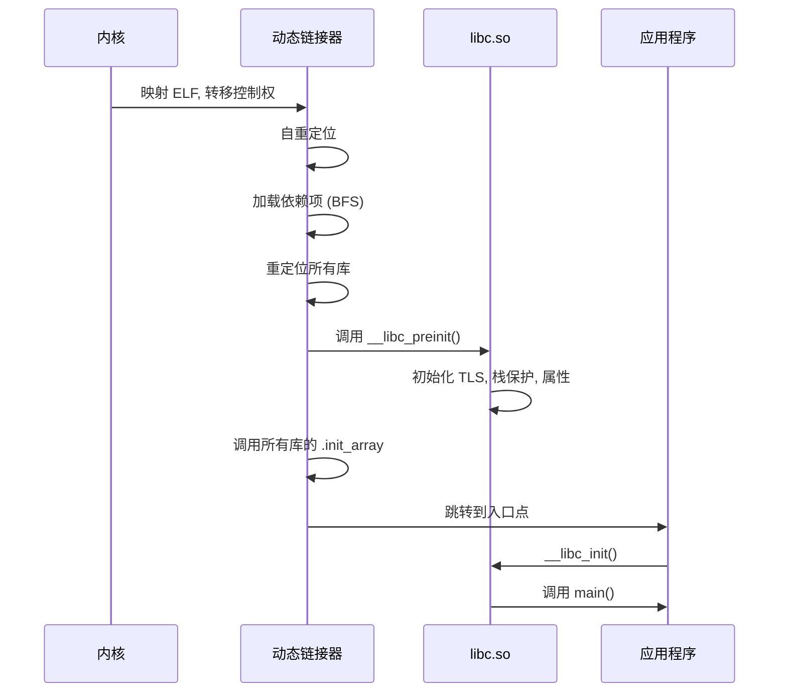
```mermaid
sequenceDiagram
    participant Kernel as 内核
    participant Linker as 动态链接器
    participant LibC as libc.so
    participant App as 应用程序

    Kernel->>Linker: 映射 ELF, 转移控制权
    Linker->>Linker: 自重定位
    Linker->>Linker: 加载依赖项 (BFS)
    Linker->>Linker: 重定位所有库
    Linker->>LibC: 调用 __libc_preinit()
    LibC->>LibC: 初始化 TLS, 栈保护, 属性
    Linker->>Linker: 调用所有库的 .init_array
    Linker->>App: 跳转到入口点
    App->>LibC: __libc_init()
    LibC->>App: 调用 main()
```

`__libc_preinit_impl` 函数执行以下关键步骤：

1. **TLS 生成同步** —— 向链接器注册 libc 的 TLS 生成计数器副本，以便 TLS 模块保持同步。
2. **全局变量初始化** —— 设置 `__libc_globals`，这是一个包含分配器调度表的可写保护结构。
3. **通用初始化** —— 调用 `__libc_init_common()`，初始化系统属性客户端，设置 `environ` 指针，并配置堆分配器。
4. **Netd 客户端初始化** —— 注册 DNS 解析钩子。
5. **回调注册** —— 为链接器提供 HWASan 库加载/卸载事件和 MTE 栈重映射的回调。

摘自 `bionic/libc/bionic/libc_init_common.cpp` (第 58-61 行)：

```cpp
__LIBC_HIDDEN__ constinit WriteProtected<libc_globals> __libc_globals;
__LIBC_HIDDEN__ constinit _Atomic(bool) __libc_memtag_stack;
__LIBC_HIDDEN__ constinit bool __libc_memtag_stack_abi;
```

`WriteProtected<>` 模板将全局变量结构映射到通常为只读的内存中。修改需要显式获取 `ProtectedDataGuard`，它会暂时将页面重新映射为可写。这可以防止分配器调度表等关键数据被破坏。

### 7.1.5 线程局部存储与 Bionic TCB

Bionic 的 TLS 实现与内核紧密集成。每个线程都有一个 **线程控制块 (TCB)**，可以通过专用寄存器访问 (AArch64 上为 TPIDR_EL0，x86-64 上为 GS 段)。TCB 布局定义在 `bionic/libc/private/bionic_tls.h` 中。

摘自 `bionic/libc/bionic/pthread_create.cpp` (第 62-71 行)：

```cpp
__attribute__((no_stack_protector))
void __init_tcb_stack_guard(bionic_tcb* tcb) {
  // GCC 在 x86 上在 TLS 中寻找栈保护，因此从我们的全局变量中将其复制到那里。
  tcb->tls_slot(TLS_SLOT_STACK_GUARD) = reinterpret_cast<void*>(__stack_chk_guard);
}

void __init_bionic_tls_ptrs(bionic_tcb* tcb, bionic_tls* tls) {
  tcb->thread()->bionic_tcb = tcb;
  tcb->thread()->bionic_tls = tls;
  tcb->tls_slot(TLS_SLOT_BIONIC_TLS) = tls;
}
```

关键 TLS 插槽包括：

| 插槽 | 用途 |
|------|---------|
| `TLS_SLOT_SELF` | 指向 TCB 自身的指针 |
| `TLS_SLOT_THREAD_ID` | 用于快速 `gettid()` 的线程 ID |
| `TLS_SLOT_STACK_GUARD` | 用于 `-fstack-protector` 的栈金丝雀 |
| `TLS_SLOT_BIONIC_TLS` | 指向完整 `bionic_tls` 结构的指针 |
| `TLS_SLOT_DTV` | 用于 ELF TLS 的动态线程向量 (Dynamic Thread Vector) |
| `TLS_SLOT_ART` | 为 Android 运行时 (ART) 保留 |

这种固定布局意味着访问线程局部状态不需要函数调用或哈希表查找——只需寄存器读取和常量偏移量。特别是栈保护金丝雀，在受栈保护的代码中的每个函数入口和出口都会被访问，因此将其放置在固定的 TLS 插槽中对于性能至关重要。

### 7.1.6 架构专用优化

Bionic 为性能关键函数提供架构专用实现。最显著的是字符串和内存操作。

**IFUNC (间接函数) 调度：**

在 AArch64 上，`memcpy`, `memset`, `strcmp` 和 `strlen` 等函数在程序启动时通过 GNU IFUNC 解析器进行调度。解析器检查 CPU 能力并选择最佳实现。

摘自 `bionic/libc/arch-arm64/ifuncs.cpp` (第 36-49, 69-79 行)：

```cpp
inline int implementer(uint64_t midr_el1) { return (midr_el1 >> 24) & 0xff; }
inline int variant(uint64_t midr_el1) { return (midr_el1 >> 20) & 0xf; }
inline int part(uint64_t midr_el1) { return (midr_el1 >> 4) & 0xfff; }
inline int revision(uint64_t midr_el1) { return (midr_el1 >> 0) & 0xf; }

static inline bool __bionic_is_oryon(unsigned long hwcap) {
  if (!(hwcap & HWCAP_CPUID)) return false;
  unsigned long midr;
  __asm__ __volatile__("mrs %0, MIDR_EL1" : "=r"(midr));
  return implementer(midr) == 'Q' && part(midr) <= 15;
}

// ...

DEFINE_IFUNC_FOR(memcpy) {
  if (arg->_hwcap2 & HWCAP2_MOPS) {
    RETURN_FUNC(memcpy_func_t, __memmove_aarch64_mops);
  } else if (__bionic_is_oryon(arg->_hwcap)) {
    RETURN_FUNC(memcpy_func_t, __memcpy_aarch64_nt);
  } else if (arg->_hwcap & HWCAP_ASIMD) {
    RETURN_FUNC(memcpy_func_t, __memcpy_aarch64_simd);
  } else {
    RETURN_FUNC(memcpy_func_t, __memcpy_aarch64);
  }
}
```

这段代码展示了 AArch64 的四种 `memcpy` 实现：

1. **MOPS (内存操作)** —— 使用 Armv8.8-A `CPYFE` 指令进行硬件加速内存复制。这是受支持硅片上的最快路径。
2. **Oryon 非临时 (non-temporal)** —— Qualcomm Oryon 核心 (实施者 'Q', 部件 0-15) 受益于绕过大容量复制缓存层级的非临时存储。实现在 `bionic/libc/arch-arm64/oryon/memcpy-nt.S` 中。
3. **ASIMD (NEON)** —— 使用 128 位 SIMD 加载/存储对。大多数 AArch64 设备的标准快速路径。
4. **通用 (Generic)** —— 针对缺乏 ASIMD 的核心的标量回退 (在 AArch64 上是理论上的，但为了完整性而存在)。

类似地，`memchr` 具有 MTE 感知和标准变体：

```cpp
DEFINE_IFUNC_FOR(memchr) {
  if (arg->_hwcap2 & HWCAP2_MTE) {
    RETURN_FUNC(memchr_func_t, __memchr_aarch64_mte);
  } else {
    RETURN_FUNC(memchr_func_t, __memchr_aarch64);
  }
}
```

MTE 感知变体必须处理搜索缓冲区中的指针标记不匹配的可能性，需要进行标记剥离比较。

**架构专用汇编文件：**

每个架构目录都包含针对最关键路径的手写汇编：

| 架构 | 关键汇编文件 |
|-------------|-------------------|
| `arch-arm64/bionic/` | `syscall.S`, `setjmp.S`, `vfork.S`, `__bionic_clone.S` |
| `arch-arm64/string/` | `__memcpy_chk.S`, `__memset_chk.S` |
| `arch-arm64/oryon/` | `memcpy-nt.S`, `memset-nt.S` |
| `arch-arm/bionic/` | Cortex-A53/A55/A7/A9/A15/Krait/Kryo 特定例程 |
| `arch-x86_64/bionic/` | `syscall.S`, `setjmp.S` |
| `arch-x86_64/string/` | SSE/AVX 优化的字符串操作 |
| `arch-riscv64/bionic/` | `syscall.S`, `setjmp.S` |
| `arch-riscv64/string/` | RISC-V 字符串操作 |

ARM 32 位树特别丰富，具有针对 Cortex-A53, Cortex-A55, Cortex-A7, Cortex-A9, Cortex-A15, Krait (Qualcomm) 和 Kryo (Qualcomm) 的 CPU 特定子目录。ARM 上的 IFUNC 解析器根据 `/proc/cpuinfo` 或 HWCAP 值在运行时选择这些实现。

### 7.1.7 上游代码与 BSD 传承

Bionic 并非从头开始实现一切。它从三个 BSD 操作系统导入了代码：

- **OpenBSD**：提供了 `strlcpy`, `strlcat`, `arc4random`, `reallocarray` 以及大部分标准字符串库。OpenBSD 对安全性的关注使其成为强化实现的自然来源。

- **FreeBSD**：贡献了部分数学库 (`libm`)、区域设置支持和一些字符串函数。

- **NetBSD**：提供了 DNS 解析器 (`bionic/libc/dns/`) 和一些杂项实用函数。

导入的代码保存在单独的目录中 (`upstream-openbsd/`, `upstream-freebsd/`, `upstream-netbsd/`)，并定期更新以合并上游错误修复和安全补丁。

### 7.1.8 属性系统客户端

Android 的属性系统 (`__system_property_get`, `__system_property_set`) 部分是在 Bionic 中实现的。`bionic/libc/system_properties/` 中的客户端代码提供了从映射到每个进程的共享内存区域进行无锁读取的功能。这就是 Android 上的每个进程如何在没有 IPC 开销的情况下读取系统属性的方式。

属性区域在 `__libc_init_common()` 期间初始化：

摘自 `bionic/libc/bionic/libc_init_common.cpp` (第 54 行)：

```cpp
extern "C" int __system_properties_init(void);
```

此函数映射属性区域文件 (`/dev/__properties__/`) 并设置用于属性读取的内部数据结构。

### 7.1.9 Bionic 与 glibc：特性对比

| 特性 | Bionic | glibc |
|---------|--------|-------|
| 许可证 | BSD | LGPL |
| 体积 (stripped) | ~1 MB | ~8 MB |
| 区域设置支持 | 最小 (ASCII + UTF-8) | 完整 ICU 级别 |
| NSS 模块 | 无 | 有 |
| 线程取消 | 无 | 有 |
| 栈保护器 | 固定 TLS 插槽 | 可变偏移量 |
| 默认分配器 | Scudo | ptmalloc2 |
| 从 APK dlopen | 是 (支持 ZIP 文件) | 否 |
| `android_dlopen_ext` | 是 | N/A |
| seccomp 集成 | 内置 | 外部 |
| 属性系统 | 内置 | N/A |
| FORTIFY_SOURCE | 增强型 | 标准 |

### 7.1.10 内存安全特性

Bionic 融合了多个没有 glibc 等效项的内存安全特性：

**MTE (内存标记扩展)：**
在 Armv8.5-A 及更高版本的硬件上，Bionic 支持堆和栈内存的 MTE。`arch-arm64/bionic/` 中的 `note_memtag_heap_async.S` 和 `note_memtag_heap_sync.S` 文件包含请求堆分配 MTE 的 ELF 注释。

**Scudo 强化分配器：**
Bionic 的默认分配器是 Scudo，这是一种安全强化的分配器，提供隔离页 (guard pages)、隔离区 (quarantine zones) 和完整性检查。`malloc_common.cpp` 中的调度机制允许透明地替换 Scudo 为调试分配器。

**GWP-ASan：**
一种采样分配器，可捕获生产环境中的 use-after-free 和缓冲区溢出错误，通过 `gwp_asan_wrappers.h` 集成。

**FORTIFY_SOURCE：**
Bionic 的 FORTIFY 实现比 glibc 的更激进，对字符串和内存函数中的缓冲区溢出具有额外的编译时和运行时检查。

**标记指针 (Tagged pointers)：**
即使没有 MTE 硬件，Bionic 也可以标记堆指针的最高字节 (ARM 上的最高字节忽略 / TBI)，以检测某些类别的内存损坏。

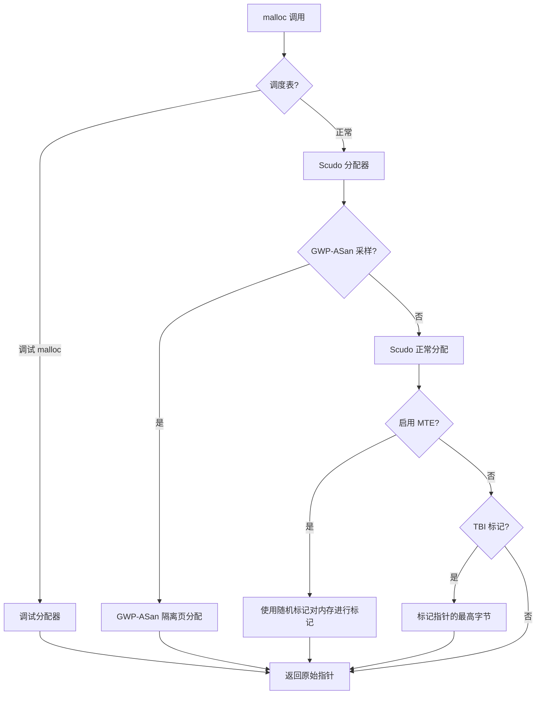
```mermaid
graph TD
    A["malloc 调用"] --> B{"调度表?"}
    B -->|"调试 malloc"| C["调试分配器"]
    B -->|"正常"| D["Scudo 分配器"]
    D --> E{"GWP-ASan 采样?"}
    E -->|"是"| F["GWP-ASan 隔离页分配"]
    E -->|"否"| G["Scudo 正常分配"]
    G --> H{"启用 MTE?"}
    H -->|"是"| I["使用随机标记对内存进行标记"]
    H -->|"否"| J{"TBI 标记?"}
    J -->|"是"| K["标记指针的最高字节"]
    J -->|"否"| L["返回原始指针"]
    I --> L
    K --> L
    F --> L
    C --> L
```

---

## 7.2 系统调用接口

### 7.2.1 系统调用在 Android 上如何工作

用户空间代码与 Linux 内核之间的每一次交互都通过系统调用进行。Bionic 提供了该接口的用户空间一半：从用户模式转换到内核模式的薄汇编桩 (stubs)，以及提供 POSIX API 的 C 包装函数。

系统调用接口有三层：

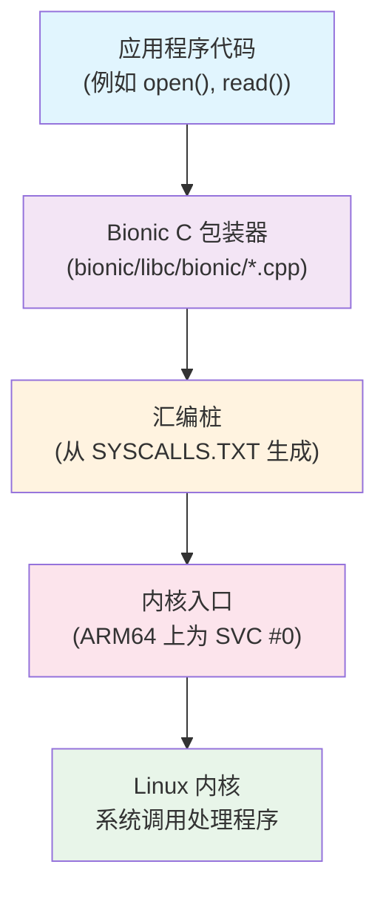
```mermaid
graph TD
    A["应用程序代码<br/>(例如 open(), read())"] --> B["Bionic C 包装器<br/>(bionic/libc/bionic/*.cpp)"]
    B --> C["汇编桩<br/>(从 SYSCALLS.TXT 生成)"]
    C --> D["内核入口<br/>(ARM64 上为 SVC #0)"]
    D --> E["Linux 内核<br/>系统调用处理程序"]

    style A fill:#e1f5fe
    style B fill:#f3e5f5
    style C fill:#fff3e0
    style D fill:#fce4ec
    style E fill:#e8f5e9
```

### 7.2.2 SYSCALLS.TXT：系统调用定义文件

Bionic 中的所有系统调用桩都是从一个定义文件自动生成的：

**源文件：** `bionic/libc/SYSCALLS.TXT` (384 行)

摘自 `bionic/libc/SYSCALLS.TXT` (第 1-14 行)：

```
# 此文件用于自动生成 bionic 的系统调用桩。
#
# 它由名为 gensyscalls.py 的 python 脚本处理，
# 通常通过 libc/Android.bp 中的 genrules 运行。
#
# 每个非空、非注释行具有以下格式：
#
#     func_name[|alias_list][:syscall_name[:socketcall_id]]([parameter_list]) arch_list
#
# 其中：
#     arch_list ::= "all" | arches
#     arches    ::= arch |  arch "," arches
#     arch      ::= "arm" | "arm64" | "riscv64" | "x86" | "x86_64" | "lp32" | "lp64"
```

SYSCALLS.TXT 中的每一行都描述了一个系统调用，包括其函数名称、可选别名、参数类型以及应在其上生成的架构。该格式支持几种重要的模式：

**直接系统调用映射：**
```
read(int, void*, size_t)        all
write(int, const void*, size_t) all
```

**重命名的系统调用 (C 名称与内核名称不同)：**
```
__close:close(int)  all
__getpid:getpid()  all
__openat:openat(int, const char*, int, mode_t) all
```

`__close:close` 语法意味着“生成一个名为 `__close` 的函数，该函数调用内核的 `close` 系统调用”。应用程序调用的实际 `close()` 函数是 `bionic/libc/bionic/` 中的一个 C 包装器，它在调用 `__close` 之前执行额外的工作 (如 FORTIFY 检查或 fdsan 验证)。

**架构条件系统调用：**
```
getuid:getuid32()   lp32
getuid()            lp64
```

在 32 位平台 (`lp32`) 上，`getuid` 函数调用内核的 `getuid32` 系统调用 (因为原始 `getuid` 使用 16 位 UID)。在 64 位平台 (`lp64`) 上，它直接调用 `getuid`。

**别名函数：**
```
lseek|lseek64(int, off_t, int) lp64
_exit|_Exit:exit_group(int)    all
```

管道符号创建共用相同实现的多个符号别名。在 64 位系统上，`lseek` 和 `lseek64` 是相同的，因为 `off_t` 是 64 位的。

**x86 socketcall 多路复用：**
```
__socket:socketcall:1(int, int, int) x86
__connect:socketcall:3(int, struct sockaddr*, socklen_t) x86
```

在 32 位 x86 上，套接字操作通过单个 `socketcall` 系统调用进行多路复用，带有数字子命令。Bionic 的生成器会自动处理这一点。

### 7.2.3 系统调用 Stub 生成

`gensyscalls.py` 脚本 (`bionic/libc/tools/gensyscalls.py`) 读取 SYSCALLS.TXT 并生成架构专用的汇编桩。支持的架构有：

```python
SupportedArchitectures = [ "arm", "arm64", "riscv64", "x86", "x86_64" ]
```

**ARM 32 位桩 (4 个或更少的寄存器参数)：**

```asm
ENTRY(%(func)s)
    mov     ip, r7
    .cfi_register r7, ip
    ldr     r7, =%(NR_name)s
    swi     #0
    mov     r7, ip
    .cfi_restore r7
    cmn     r0, #(MAX_ERRNO + 1)
    bxls    lr
    neg     r0, r0
    b       __set_errno_internal
END(%(func)s)
```

在 ARM 上，系统调用号放在寄存器 r7 中，`SWI` (软件中断) 指令陷波进入内核。该桩保存并恢复 r7 (Thumb 模式下为帧指针)，以避免破坏调用堆栈。

**AArch64 系统调用函数：**

摘自 `bionic/libc/arch-arm64/bionic/syscall.S` (第 31-49 行)：

```asm
ENTRY(syscall)
    /* 将系统调用号从 x0 移动到 x8 */
    mov     x8, x0
    /* 将系统调用参数从 x1 至 x6 移动到 x0 至 x5 */
    mov     x0, x1
    mov     x1, x2
    mov     x2, x3
    mov     x3, x4
    mov     x4, x5
    mov     x5, x6
    svc     #0

    /* 检查系统调用是否成功返回 */
    cmn     x0, #(MAX_ERRNO + 1)
    cneg    x0, x0, hi
    b.hi    __set_errno_internal

    ret
END(syscall)
```

这是 AArch64 的通用 `syscall()` 函数。系统调用号放在 x8 中，最多六个参数放在 x0-x5 中。`SVC #0` 指令进入内核。返回时，如果 x0 包含 [-MAX_ERRNO, -1] 范围内的值，则错误被取反并通过 `__set_errno_internal` 存储在 `errno` 中。

### 7.2.4 系统调用目录

SYSCALLS.TXT 分几个类别定义系统调用。以下是主要组的分解：

**进程和标识管理：**
```
getuid(), getgid(), geteuid(), getegid()
setuid(), setgid(), setresuid(), setresgid()
getpid(), getppid(), getpgid(), getsid()
kill(), tgkill()
execve(), clone(), _exit()
```

**文件描述符：**
```
read(), write(), pread64(), pwrite64()
__close:close(), __openat:openat()
__fcntl64:fcntl64() (lp32), __fcntl:fcntl() (lp64)
__dup:dup(), __dup3:dup3()
```

**内存管理：**
```
__mmap2:mmap2() (lp32), mmap|mmap64() (lp64)
munmap(), mprotect(), madvise(), mremap()
__brk:brk(), mseal() (lp64 only)
```

**文件系统：**
```
chdir(), mount(), umount2(), getcwd()
fstatat64(), statx()
setxattr(), getxattr(), listxattr()
```

**网络 (按架构)：**
```
__socket:socket()              arm,lp64
__socket:socketcall:1()        x86
bind(), listen(), __accept4:accept4()
```

**信号：**
```
__rt_sigaction:rt_sigaction()
__rt_sigprocmask:rt_sigprocmask()
__rt_sigsuspend:rt_sigsuspend()
__signalfd4:signalfd4()
```

**架构专用：**
```
__set_tls:__ARM_NR_set_tls(void*)                    arm
cacheflush:__ARM_NR_cacheflush(long, long, long)     arm
__riscv_flush_icache:riscv_flush_icache(void*, void*, unsigned long) riscv64
__set_thread_area:set_thread_area(void*)              x86
arch_prctl(int, unsigned long)                        x86_64
```

**VDSO 加速调用：**
```
__clock_getres:clock_getres(clockid_t, struct timespec*) all
__clock_gettime:clock_gettime(clockid_t, struct timespec*) all
__gettimeofday:gettimeofday(struct timeval*, struct timezone*) all
```

这三个系统调用通常由 VDSO (虚拟动态共享对象) 处理，内核将其映射到每个进程。VDSO 包含这些调用的用户空间实现，它们从内核管理的共享内存页中读取，避免了完全内核转换的开销。Bionic 的动态链接器显式加载 VDSO (见第 7.3 节)。

### 7.2.5 LP32 与 LP64 的差异

系统调用接口在 32 位和 64 位平台之间存在显著差异：

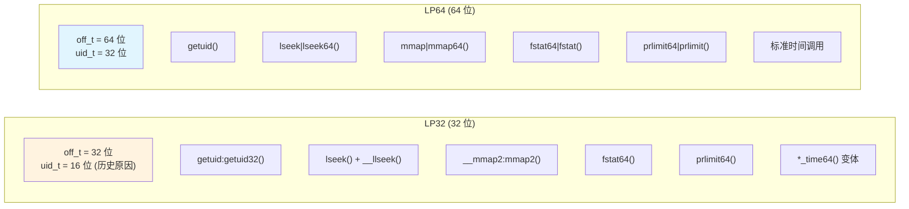
```mermaid
graph LR
    subgraph "LP32 (32 位)"
        A1["off_t = 32 位<br/>uid_t = 16 位 (历史原因)"]
        A2["getuid:getuid32()"]
        A3["lseek() + __llseek()"]
        A4["__mmap2:mmap2()"]
        A5["fstat64()"]
        A6["prlimit64()"]
        A7["*_time64() 变体"]
    end

    subgraph "LP64 (64 位)"
        B1["off_t = 64 位<br/>uid_t = 32 位"]
        B2["getuid()"]
        B3["lseek|lseek64()"]
        B4["mmap|mmap64()"]
        B5["fstat64|fstat()"]
        B6["prlimit64|prlimit()"]
        B7["标准时间调用"]
    end

    style A1 fill:#fff3e0
    style B1 fill:#e1f5fe
```

在 32 位系统上，许多系统调用带有 `64` 后缀，或者使用寄存器对来处理 64 位参数。SYSCALLS.TXT 生成器会自动处理 ABI 要求，包括 ARM 的约束，即 64 位参数对必须从偶数寄存器开始。

`*_time64` 变体 (`SECCOMP_ALLOWLIST_COMMON.TXT` 的第 76-91 行) 尤其值得注意：

```
clock_gettime64(clockid_t, timespec64*) lp32
clock_settime64(clockid_t, const timespec64*) lp32
futex_time64(int*, int, int, const timespec64*, int*, int) lp32
```

这些是为 Y2038 问题添加的：32 位 `time_t` 在 2038 年 1 月溢出。即使在 32 位平台上，`*_time64` 系统调用也使用 64 位时间结构。

### 7.2.6 Seccomp-BPF：系统调用过滤

Android 使用 seccomp-BPF (带有伯克利数据包过滤器的安全计算) 限制应用程序进程可以使用的系统调用。这是一个关键的安全边界：即使攻击者在应用进程内实现了任意代码执行，他们也无法调用 seccomp 过滤器阻止的危险系统调用。

seccomp 策略由多个文本文件构建：

| 文件 | 用途 |
|------|---------|
| `SYSCALLS.TXT` | Bionic 需要的基础系统调用集 |
| `SECCOMP_ALLOWLIST_COMMON.TXT` | 额外的允许调用 (所有进程) |
| `SECCOMP_ALLOWLIST_APP.TXT` | 额外的允许调用 (仅限应用进程) |
| `SECCOMP_ALLOWLIST_SYSTEM.TXT` | 额外的允许调用 (仅限系统服务器) |
| `SECCOMP_BLOCKLIST_APP.TXT` | 即使在 SYSCALLS.TXT 中也要从应用中移除的调用 |
| `SECCOMP_BLOCKLIST_COMMON.TXT` | 从所有 Zygote 子进程中移除的调用 |
| `SECCOMP_PRIORITY.TXT` | 首先检查的系统调用 (热路径优化) |

**最终策略的公式：**

```
最终允许列表 = SYSCALLS.TXT - 阻断列表 + 允许列表
```

摘自 `bionic/libc/SECCOMP_BLOCKLIST_APP.TXT` (第 1-7 行)：

```
# 最终的 seccomp 允许列表是 SYSCALLS.TXT - SECCOMP_BLOCKLIST.TXT
#   + SECCOMP_ALLOWLIST.TXT
# 阻断列表中的任何条目必须在 syscalls 文件中，且不在
#   allowlist 文件中
```

**针对应用的被阻断系统调用：**

`SECCOMP_BLOCKLIST_APP.TXT` 文件 (51 行) 从应用进程中移除了危险的系统调用：

```
# 修改 ID 的系统调用。
setgid32(gid_t)     lp32
setgid(gid_t)       lp64
setuid32(uid_t)     lp32
setuid(uid_t)       lp64

# 修改时间的系统调用。
adjtimex(struct timex*)   all
clock_adjtime(clockid_t, struct timex*)   all
clock_settime(clockid_t, const struct timespec*)  all
settimeofday(const struct timeval*, const struct timezone*)   all

# 危险操作
chroot(const char*)  all
init_module(void*, unsigned long, const char*)  all
delete_module(const char*, unsigned int)   all
mount(const char*, const char*, const char*, unsigned long, const void*)  all
reboot(int, int, int, void*)  all
```

这些是 SYSCALLS.TXT 中存在的系统调用 (因为系统守护进程需要它们)，但对于非特权的应用程序进程来说太危险了。

**通用阻断列表** (`SECCOMP_BLOCKLIST_COMMON.TXT`) 增加了：

```
swapon(const char*, int) all
swapoff(const char*) all
```

**应用允许列表** (`SECCOMP_ALLOWLIST_APP.TXT`, 62 行) 重新启用了应用需要但不在基础 SYSCALLS.TXT 集中的特定调用，通常是为了后向兼容性：

```
# 调试 32 位 Chrome 需要
pipe(int pipefd[2])  lp32

# b/34813887
open(const char *path, int oflag, ... ) lp32,x86_64

# 在 U 中 Bionic 未使用，因为 riscv64 没有它，但
# 遗留应用仍在使用 (http://b/254179267)。
renameat(int, const char*, int, const char*)  arm,x86,arm64,x86_64
```

每个条目都引用了 Android 错误跟踪器 ID，记录了例外存在的原因。

**优先级优化：**

摘自 `bionic/libc/SECCOMP_PRIORITY.TXT` (第 9-10 行)：

```
futex
ioctl
```

在 BPF 过滤器中，这两个系统调用会首先被检查。由于 `futex` 和 `ioctl` 是典型 Android 进程中最频繁调用的系统调用 (`futex` 用于互斥锁/条件变量操作，`ioctl` 用于 Binder IPC)，首先检查它们可以最大限度地减少每个系统调用执行的平均 BPF 指令数。

### 7.2.7 Seccomp 策略安装

seccomp 过滤器在 Zygote 进程 fork 应用进程之前由其安装。实现在 `bionic/libc/seccomp/seccomp_policy.cpp` 中。

过滤器通过检查 seccomp 数据结构中的架构字段并跳转到适当的过滤器，来处理双架构系统 (例如运行 32 位应用的 64 位内核)：

摘自 `bionic/libc/seccomp/seccomp_policy.cpp` (第 33-94 行)：

```cpp
#if defined __arm__ || defined __aarch64__
#define PRIMARY_ARCH AUDIT_ARCH_AARCH64
static const struct sock_filter* primary_app_filter = arm64_app_filter;
// ...
#define SECONDARY_ARCH AUDIT_ARCH_ARM
static const struct sock_filter* secondary_app_filter = arm_app_filter;
// ...
#elif defined __i386__ || defined __x86_64__
#define PRIMARY_ARCH AUDIT_ARCH_X86_64
// ...
#define SECONDARY_ARCH AUDIT_ARCH_I386
// ...
#elif defined(__riscv)
#define PRIMARY_ARCH AUDIT_ARCH_RISCV64
// ...
#endif
```

跳转逻辑：

摘自 `bionic/libc/seccomp/seccomp_policy.cpp` (第 128-141 行)：

```cpp
static size_t ValidateArchitectureAndJumpIfNeeded(filter& f) {
    f.push_back(BPF_STMT(BPF_LD|BPF_W|BPF_ABS, arch_nr));
    f.push_back(BPF_JUMP(BPF_JMP|BPF_JEQ|BPF_K, PRIMARY_ARCH, 2, 0));
    f.push_back(BPF_JUMP(BPF_JMP|BPF_JEQ|BPF_K, SECONDARY_ARCH, 1, 0));
    Disallow(f);
    return f.size() - 2;
}
```

**BPF 程序结构：**

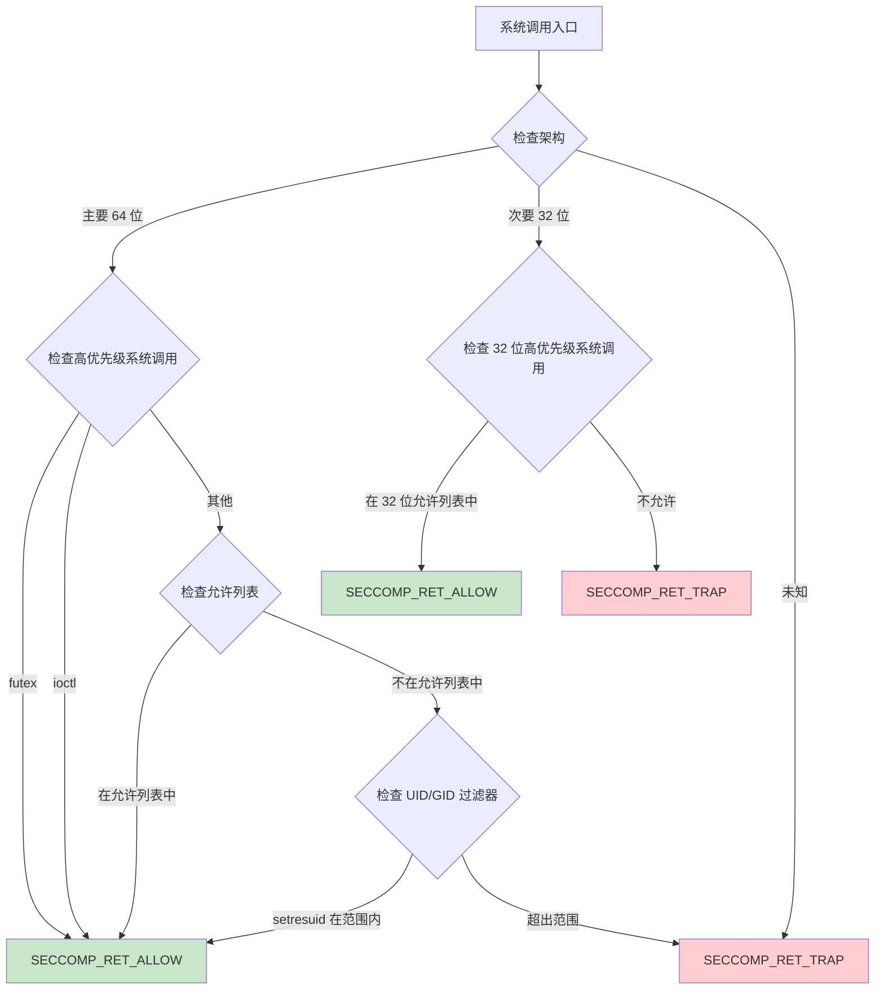
```mermaid
graph TD
    A["系统调用入口"] --> B{"检查架构"}
    B -->|"主要 64 位"| C{"检查高优先级系统调用"}
    B -->|"次要 32 位"| D{"检查 32 位高优先级系统调用"}
    B -->|"未知"| E["SECCOMP_RET_TRAP"]

    C -->|"futex"| F["SECCOMP_RET_ALLOW"]
    C -->|"ioctl"| F
    C -->|"其他"| G{"检查允许列表"}

    G -->|"在允许列表中"| F
    G -->|"不在允许列表中"| H{"检查 UID/GID 过滤器"}

    H -->|"setresuid 在范围内"| F
    H -->|"超出范围"| E

    D -->|"在 32 位允许列表中"| F2["SECCOMP_RET_ALLOW"]
    D -->|"不允许"| E2["SECCOMP_RET_TRAP"]

    style E fill:#ffcdd2
    style E2 fill:#ffcdd2
    style F fill:#c8e6c9
    style F2 fill:#c8e6c9
```

生成了三个单独的过滤器配置文件：

1. **应用过滤器** —— 用于常规应用程序进程
2. **应用 Zygote 过滤器** —— 用于应用 Zygote 进程 (由隔离服务使用)
3. **系统过滤器** —— 用于系统服务器和特权守护进程

过滤器从 C 结构编译为 BPF 字节码，并使用 `prctl(PR_SET_SECCOMP)` 安装：

摘自 `bionic/libc/seccomp/seccomp_policy.cpp` (第 193-199 行)：

```cpp
static bool install_filter(filter const& f) {
    struct sock_fprog prog = {
        static_cast<unsigned short>(f.size()),
        const_cast<struct sock_filter*>(&f[0]),
    };
    if (prctl(PR_SET_SECCOMP, SECCOMP_MODE_FILTER, &prog) < 0) {
```

`SECCOMP_RET_TRAP` 操作向进程发送 SIGSYS 信号，Android 的 debuggerd 会捕获该信号进行崩溃报告。这会产生一份清晰的崩溃报告，标识被禁止的系统调用，有助于调试。

### 7.2.8 VDSO：避免系统调用开销

对于性能最敏感的系统调用，内核提供了一个虚拟动态共享对象 (VDSO) —— 一个由内核映射到每个进程地址空间的小型共享库。Bionic 的动态链接器会显式定位并链接 VDSO。

摘自 `bionic/linker/linker_main.cpp` (第 184-205 行)：

```cpp
static void add_vdso() {
  ElfW(Ehdr)* ehdr_vdso = reinterpret_cast<ElfW(Ehdr)*>(
      getauxval(AT_SYSINFO_EHDR));
  if (ehdr_vdso == nullptr) {
    return;
  }

  vdso = soinfo_alloc(&g_default_namespace, "[vdso]", nullptr, 0, 0);

  vdso->phdr = reinterpret_cast<ElfW(Phdr)*>(
      reinterpret_cast<char*>(ehdr_vdso) + ehdr_vdso->e_phoff);
  vdso->phnum = ehdr_vdso->e_phnum;
  vdso->base = reinterpret_cast<ElfW(Addr)>(ehdr_vdso);
  vdso->size = phdr_table_get_load_size(vdso->phdr, vdso->phnum);
  vdso->load_bias = get_elf_exec_load_bias(ehdr_vdso);

  if (!vdso->prelink_image() ||
      !vdso->link_image(SymbolLookupList(vdso), vdso, nullptr, nullptr)) {
    __linker_cannot_link(g_argv[0]);
  }

  // 防止意外卸载...
  vdso->set_dt_flags_1(vdso->get_dt_flags_1() | DF_1_NODELETE);
  vdso->set_linked();
}
```

VDSO 通过 `AT_SYSINFO_EHDR` 辅助向量条目定位，内核在 exec 时将其放在进程堆栈上。链接器将 VDSO 视为任何其他共享库——创建 `soinfo` 结构，运行 prelink 和 link 阶段——但 VDSO 的代码完全在用户空间运行，读取内核管理的共享数据结构来回答诸如“现在几点？”之类的查询，而无需进行模式切换。

Bionic 中的 VDSO 加速调用：

- `clock_gettime()` —— 最频繁调用的时间函数
- `clock_getres()` —— 时钟分辨率查询
- `gettimeofday()` —— 遗留的时间查询
## 7.3 动态链接器 (The Dynamic Linker)

### 7.3.1 概述

动态链接器（在 64 位设备上为 `/system/bin/linker64`，32 位上为 `/system/bin/linker`）负责加载 Android 上的每一个动态链接可执行文件和共享库。它是内核映射新进程后执行的第一段用户空间代码，其正确运行是系统中每个原生二进制文件的基础。

链接器的源码位于 `bionic/linker/`，包含约 50 个源文件，总计超过 7,000 行 C++ 代码。关键文件如下：

| 文件 | 行数 | 用途 |
|------|-------|---------|
| `linker.cpp` | 3,791 | 核心链接逻辑：库搜索、加载、命名空间管理 |
| `linker_phdr.cpp` | 1,737 | ELF 解析、段加载、地址空间管理 |
| `linker_main.cpp` | 859 | 入口点、初始化、主链接流程 |
| `linker_relocate.cpp` | 686 | 重定位处理 |
| `linker_namespaces.h` | 183 | 命名空间数据结构 |
| `linker_soinfo.h` | ~400 | `soinfo` 结构定义 |
| `linker_config.cpp` | ~500 | 配置文件解析器 |
| `dlfcn.cpp` | ~100 | `dlopen`/`dlsym` API 接口层 |

### 7.3.2 链接器入口点 (The Linker Entry Point)

当内核执行一个动态链接的 ELF 二进制文件时，它会：

1. 映射可执行文件的 `PT_LOAD` 段。
2. 读取 `PT_INTERP` 段以获取链接器路径（例如 `/system/bin/linker64`）。
3. 将链接器映射到进程空间。
4. 设置辅助向量（Auxiliary Vector，如 `AT_PHDR`, `AT_ENTRY`, `AT_BASE` 等）。
5. 将控制权转交给链接器的入口点。

链接器的入口点是 `_start`（由架构特定的汇编实现），它会调用 `__linker_init`。该函数面临一个引导（bootstrapping）问题：链接器本身也是一个动态链接的二进制文件，在它能够重定位其他任何东西之前，必须先完成自身的重定位。

解决方案是分为两个阶段初始化：

1. **自重定位 (Self-relocation)** —— 使用仅包含地址无关代码（PIC，无外部符号引用）的逻辑处理链接器自身的重定位。
2. **主链接 (Main link)** —— 加载并链接可执行文件及其所有依赖库。

### 7.3.3 主链接序列 (The Main Linking Sequence)

位于 `bionic/linker/linker_main.cpp` 的 `linker_main` 函数负责编排整个链接过程。

摘自 `bionic/linker/linker_main.cpp` (第 297-525 行)：

```cpp
static ElfW(Addr) linker_main(KernelArgumentBlock& args,
                               const char* exe_to_load) {
  ProtectedDataGuard guard;

  // 清理环境
  __libc_init_AT_SECURE(args.envp);

  // 初始化系统属性
  __system_properties_init();

  // 初始化平台属性
  platform_properties_init();

  // 注册 debuggerd 信号处理程序
  linker_debuggerd_init();
```

该函数按以下阶段执行：

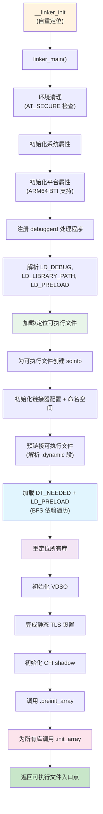
```mermaid
graph TD
    A["__linker_init<br/>(自重定位)"] --> B["linker_main()"]
    B --> C["环境清理<br/>(AT_SECURE 检查)"]
    C --> D["初始化系统属性"]
    D --> E["初始化平台属性<br/>(ARM64 BTI 支持)"]
    E --> F["注册 debuggerd 处理程序"]
    F --> G["解析 LD_DEBUG,<br/>LD_LIBRARY_PATH, LD_PRELOAD"]
    G --> H["加载/定位可执行文件"]
    H --> I["为可执行文件创建 soinfo"]
    I --> J["初始化链接器配置 + 命名空间"]
    J --> K["预链接可执行文件<br/>(解析 .dynamic 段)"]
    K --> L["加载 DT_NEEDED + LD_PRELOAD<br/>(BFS 依赖遍历)"]
    L --> M["重定位所有库"]
    M --> N["初始化 VDSO"]
    N --> O["完成静态 TLS 设置"]
    O --> P["初始化 CFI shadow"]
    P --> Q["调用 .preinit_array"]
    Q --> R["为所有库调用 .init_array"]
    R --> S["返回可执行文件入口点"]

    style A fill:#fff3e0
    style H fill:#e8f5e9
    style L fill:#e1f5fe
    style M fill:#f3e5f5
    style R fill:#fce4ec
    style S fill:#c8e6c9
```

**第 1 阶段：环境与安全**

```cpp
  // 这些通常由 __libc_init_AT_SECURE 完成清理，
  // 但再次检查的成本极低。
  const char* ldpath_env = nullptr;
  const char* ldpreload_env = nullptr;
  if (!getauxval(AT_SECURE)) {
    ldpath_env = getenv("LD_LIBRARY_PATH");
    ldpreload_env = getenv("LD_PRELOAD");
  }
```

当 `AT_SECURE` 被设置（可执行文件具有 setuid/setgid 权限）时，`LD_LIBRARY_PATH` 和 `LD_PRELOAD` 会被忽略。这防止了权限提升攻击，即用户通过设置这些变量向特权进程注入恶意库。

**第 2 阶段：可执行文件初始化**

摘自 `bionic/linker/linker_main.cpp` (第 340-358 行)：

```cpp
  const ExecutableInfo exe_info = exe_to_load ?
      load_executable(exe_to_load) :
      get_executable_info(args.argv[0]);

  soinfo* si = soinfo_alloc(&g_default_namespace,
                            exe_info.path.c_str(), &exe_info.file_stat,
                            0, RTLD_GLOBAL);
  somain = si;
  si->phdr = exe_info.phdr;
  si->phnum = exe_info.phdr_count;
  si->set_should_pad_segments(exe_info.should_pad_segments);
  get_elf_base_from_phdr(si->phdr, si->phnum, &si->base, &si->load_bias);
  si->size = phdr_table_get_load_size(si->phdr, si->phnum);
  si->dynamic = nullptr;
  si->set_main_executable();
  init_link_map_head(*si);
  set_bss_vma_name(si);
```

`get_executable_info` 函数从辅助向量（`AT_PHDR`, `AT_PHNUM`, `AT_ENTRY`）读取可执行文件的程序头。内核已经映射了可执行文件，链接器只需找到这些头部。

`soinfo` 结构是链接器针对每个库维护的元数据。它是从自定义的块分配器（`LinkerTypeAllocator<soinfo>`）分配的，该分配器按页大小映射内存，从而支持通过 `ProtectedDataGuard` 进行写保护。

**第 3 阶段：命名空间初始化与依赖加载**

```cpp
  std::vector<android_namespace_t*> namespaces =
      init_default_namespaces(exe_info.path.c_str());

  if (!si->prelink_image()) __linker_cannot_link(g_argv[0]);

  // 加载 ld_preloads 和依赖项。
  for (const ElfW(Dyn)* d = si->dynamic; d->d_tag != DT_NULL; ++d) {
    if (d->d_tag == DT_NEEDED) {
      const char* name = fix_dt_needed(
          si->get_string(d->d_un.d_val), si->get_realpath());
      needed_library_name_list.push_back(name);
    }
  }

  if (!find_libraries(&g_default_namespace, si,
                      needed_library_names, needed_libraries_count,
                      nullptr, &g_ld_preloads, ld_preloads_count,
                      RTLD_GLOBAL, nullptr,
                      true /* add_as_children */, &namespaces)) {
    __linker_cannot_link(g_argv[0]);
  }
```

`prelink_image` 方法解析 `.dynamic` 段以提取符号表、重定位表、`DT_NEEDED` 条目以及初始化/终止函数。随后 `find_libraries` 函数执行广度优先依赖遍历（BFS），加载每个库并将其添加到相应的命名空间中。

**第 4 阶段：调用构造函数与跳转**

```cpp
  si->call_pre_init_constructors();
  si->call_constructors();

  ElfW(Addr) entry = exe_info.entry_point;
  return entry;
```

在所有库加载并完成重定位后，链接器按依赖顺序（先叶子节点，后根节点）调用初始化函数。最后返回可执行文件的入口点地址，控制权移交给应用程序。

### 7.3.4 soinfo 结构体 (The soinfo Structure)

`soinfo` 结构体是链接器对已加载共享库的内部表示。每个库 —— 包括可执行文件本身、链接器以及 VDSO —— 都有一个对应的 `soinfo`。

摘自 `bionic/linker/linker_soinfo.h` (第 157-248 行)：

```cpp
struct soinfo {
  const ElfW(Phdr)* phdr;
  size_t phnum;
  ElfW(Addr) base;
  size_t size;

  ElfW(Dyn)* dynamic;
  soinfo* next;

 private:
  uint32_t flags_;
  const char* strtab_;
  ElfW(Sym)* symtab_;

  size_t nbucket_;
  size_t nchain_;
  uint32_t* bucket_;
  uint32_t* chain_;

#if defined(USE_RELA)
  ElfW(Rela)* plt_rela_;
  size_t plt_rela_count_;
  ElfW(Rela)* rela_;
  size_t rela_count_;
#else
  ElfW(Rel)* plt_rel_;
  size_t plt_rel_count_;
  ElfW(Rel)* rel_;
  size_t rel_count_;
#endif

  linker_ctor_function_t* preinit_array_;
  size_t preinit_array_count_;
  linker_ctor_function_t* init_array_;
  size_t init_array_count_;
  linker_dtor_function_t* fini_array_;
  size_t fini_array_count_;

  linker_ctor_function_t init_func_;
  linker_dtor_function_t fini_func_;

#if defined(__arm__)
  uint32_t* ARM_exidx;
  size_t ARM_exidx_count;
#endif

  link_map link_map_head;
  bool constructors_called;
  ElfW(Addr) load_bias;
  bool has_DT_SYMBOLIC;
};
```

`flags_` 字段中的关键标志位：

| 标志 | 值 | 含义 |
|------|-------|---------|
| `FLAG_LINKED` | 0x00000001 | 库已完全完成链接 |
| `FLAG_EXE` | 0x00000004 | 这是主可执行文件 |
| `FLAG_LINKER` | 0x00000010 | 这是链接器本身 |
| `FLAG_GNU_HASH` | 0x00000040 | 使用 GNU 散列表 |
| `FLAG_MAPPED_BY_CALLER` | 0x00000080 | 内存由外部提供 |
| `FLAG_IMAGE_LINKED` | 0x00000100 | `link_image` 已运行 |
| `FLAG_PRELINKED` | 0x00000400 | `prelink_image` 已运行 |
| `FLAG_GLOBALS_TAGGED` | 0x00000800 | MTE 全局符号已标记 |

`soinfo` 结构通过 `next` 指针组成单向链表，由 `solist_add_soinfo` 和 `solist_remove_soinfo` 维护。链表顺序为：

1. 主可执行文件 (`somain`)
2. 链接器本身 (`solinker`)
3. VDSO (如果存在)
4. 其他按加载顺序排列的库

### 7.3.5 ELF 加载：ElfReader 类

`bionic/linker/linker_phdr.cpp` 中的 `ElfReader` 类处理读取 ELF 文件并将其映射到内存的物理机制。

**读取 ELF 文件：**

摘自 `bionic/linker/linker_phdr.cpp` (第 171-208 行)：

```cpp
bool ElfReader::Read(const char* name, int fd, off64_t file_offset,
                     off64_t file_size) {
  if (did_read_) {
    return true;
  }
  name_ = name;
  fd_ = fd;
  file_offset_ = file_offset;
  file_size_ = file_size;

  if (ReadElfHeader() &&
      VerifyElfHeader() &&
      ReadProgramHeaders() &&
      CheckProgramHeaderAlignment() &&
      ReadSectionHeaders() &&
      ReadDynamicSection() &&
      ReadPadSegmentNote()) {
    did_read_ = true;
  }
  // ...
  return did_read_;
}
```

Read 阶段执行校验并读取元数据：

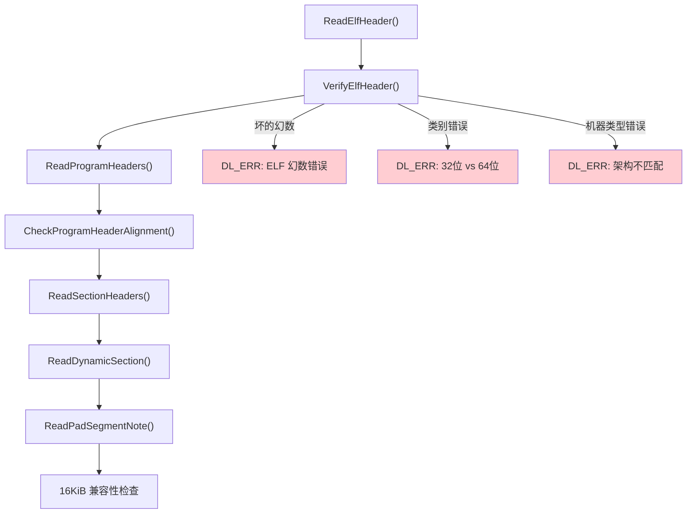
```mermaid
graph TD
    A["ReadElfHeader()"] --> B["VerifyElfHeader()"]
    B --> C["ReadProgramHeaders()"]
    C --> D["CheckProgramHeaderAlignment()"]
    D --> E["ReadSectionHeaders()"]
    E --> F["ReadDynamicSection()"]
    F --> G["ReadPadSegmentNote()"]
    G --> H["16KiB 兼容性检查"]

    B -->|"坏的幻数"| X["DL_ERR: ELF 幻数错误"]
    B -->|"类别错误"| Y["DL_ERR: 32位 vs 64位"]
    B -->|"机器类型错误"| Z["DL_ERR: 架构不匹配"]

    style X fill:#ffcdd2
    style Y fill:#ffcdd2
    style Z fill:#ffcdd2
```

**ELF 头部校验：**

摘自 `bionic/linker/linker_phdr.cpp` (第 271-340 行)：

```cpp
bool ElfReader::VerifyElfHeader() {
  if (memcmp(header_.e_ident, ELFMAG, SELFMAG) != 0) {
    DL_ERR("\"%s\" has bad ELF magic", name_.c_str());
    return false;
  }

  int elf_class = header_.e_ident[EI_CLASS];
#if defined(__LP64__)
  if (elf_class != ELFCLASS64) {
    if (elf_class == ELFCLASS32) {
      DL_ERR("\"%s\" is 32-bit instead of 64-bit", name_.c_str());
    }
    return false;
  }
#endif

  if (header_.e_type != ET_DYN) {
    DL_ERR("\"%s\" has unexpected e_type: %d", name_.c_str(), header_.e_type);
    return false;
  }

  if (header_.e_machine != GetTargetElfMachine()) {
    DL_ERR("\"%s\" is for %s instead of %s",
           name_.c_str(),
           EM_to_string(header_.e_machine),
           EM_to_string(GetTargetElfMachine()));
    return false;
  }
  return true;
}
```

链接器要求 `e_type == ET_DYN`。这意味着 Android 仅加载**地址无关可执行文件 (PIE)**。非 PIE 支持在 API 21 中因安全原因（ASLR 的有效性）被移除。

**将段加载到内存：**

摘自 `bionic/linker/linker_phdr.cpp` (第 211-238 行)：

```cpp
bool ElfReader::Load(address_space_params* address_space) {
  CHECK(did_read_);
  if (did_load_) {
    return true;
  }
  bool reserveSuccess = ReserveAddressSpace(address_space);
  if (reserveSuccess && LoadSegments() && FindPhdr() &&
      FindGnuPropertySection()) {
    did_load_ = true;
#if defined(__aarch64__)
    if (note_gnu_property_.IsBTICompatible()) {
      did_load_ =
          (phdr_table_protect_segments(phdr_table_, phdr_num_, load_bias_,
               should_pad_segments_, should_use_16kib_app_compat_,
               &note_gnu_property_) == 0);
    }
#endif
  }
  return did_load_;
}
```

Load 阶段步骤：

1. **ReserveAddressSpace** —— 通过 `mmap(PROT_NONE)` 为所有 `PT_LOAD` 段分配一块连续的虚拟地址范围。
2. **LoadSegments** —— 将文件中的每个 `PT_LOAD` 段映射到预留范围内，并设置相应的权限。
3. **FindPhdr** —— 在映射后的镜像中定位程序头表。
4. **FindGnuPropertySection** —— 在 AArch64 上读取 `.note.gnu.property` 以检查 BTI（分支目标识别）兼容性。
5. **BTI 保护** —— 如果库支持 BTI，则对可执行段应用 `PROT_BTI`。

**支持 ASLR 增强的地址空间预留：**

摘自 `bionic/linker/linker_phdr.cpp` (第 589-662 行)：

```cpp
// 预留一个虚拟地址范围，使其在扩展到下一个 2**align 边界时不会与现有映射重叠。
static void* ReserveWithAlignmentPadding(size_t size, size_t mapping_align,
                                          size_t start_align,
                                          void** out_gap_start,
                                          size_t* out_gap_size) {
  // ...
#if defined(__LP64__)
  size_t first_byte = reinterpret_cast<size_t>(
      __builtin_align_up(mmap_ptr, mapping_align));
  size_t last_byte = reinterpret_cast<size_t>(
      __builtin_align_down(mmap_ptr + mmap_size, mapping_align) - 1);
  if (first_byte / kGapAlignment != last_byte / kGapAlignment) {
    // 该库跨越了 2MB 边界，将使新的巨页产生碎片。
    // 在其之前插入随机的不可访问巨页以改进 ASLR。
    gap_size = kGapAlignment * (is_first_stage_init() ? 1 :
        arc4random_uniform(kMaxGapUnits - 1) + 1);
  }
#endif
```

这段代码实现了一项 ASLR 增强功能：当库的映射跨越 2MB（PMD 大小）边界时，链接器会在库之前插入随机数量的不可访问 2MB 页。这增加了攻击者通过探测可读内存映射来定位库代码的难度。间隙大小是随机的（1 到 32 个 2MB 单元，即 2-64MB），且每次库加载时都会变化。

### 7.3.6 加载偏移 (Load Bias) 与虚拟地址计算

ELF 加载中的核心概念是**加载偏移 (load bias)**：

摘自 `bionic/linker/linker_phdr.cpp` 的文档注释：

> 加载偏移必须添加到从 ELF 文件中读取的任何 `p_vaddr` 值上，以确定对应的内存地址。
>
> `load_bias = phdr0_load_address - page_start(phdr0->p_vaddr)`

加载偏移是第一个段实际被映射到的位置与其“期望”位置（其 `p_vaddr`）之间的差值。由于所有段都保持相对位置，将加载偏移添加到任何 `p_vaddr` 即可得到实际内存地址：

`实际地址 = p_vaddr + 加载偏移`

### 7.3.7 16KiB 页大小兼容性

Android 正在从 4KiB 页大小过渡到 16KiB。链接器包含了在 16KiB 页设备上加载 4KiB 对齐库的兼容性逻辑：

摘自 `bionic/linker/linker_phdr.cpp` (第 190-206 行)：

```cpp
if (kPageSize == 16 * 1024 && min_align_ < kPageSize) {
    auto compat_prop_val =
        ::android::base::GetProperty(
            "bionic.linker.16kb.app_compat.enabled", "false");

    should_use_16kib_app_compat_ =
        ParseBool(compat_prop_val) == ParseBoolResult::kTrue ||
        get_16kb_appcompat_mode();
}
```

在兼容模式下，链接器将 ELF 段读取到可写的预留空间中，而不是直接使用 `mmap()`，因为 `mmap()` 要求映射必须按系统页大小（16KiB）对齐，而库的段可能仅按 4KiB 对齐。

### 7.3.8 重定位处理 (Relocation Processing)

在所有段映射完成后，链接器必须处理**重定位 (relocations)** —— 即对代码和数据进行修补，以编码那些直到加载时才能确定地址的符号引用。

重定位引擎位于 `bionic/linker/linker_relocate.cpp`。

摘自 `bionic/linker/linker_relocate.cpp` (第 63-95 行)：

```cpp
class Relocator {
 public:
  Relocator(const VersionTracker& version_tracker,
            const SymbolLookupList& lookup_list)
      : version_tracker(version_tracker), lookup_list(lookup_list)
  {}

  soinfo* si = nullptr;
  const char* si_strtab = nullptr;
  size_t si_strtab_size = 0;
  ElfW(Sym)* si_symtab = nullptr;

  const VersionTracker& version_tracker;
  const SymbolLookupList& lookup_list;

  // 为重复符号查找缓存 键/值
  ElfW(Word) cache_sym_val = 0;
  const ElfW(Sym)* cache_sym = nullptr;
  soinfo* cache_si = nullptr;
  // ...
};
```

`Relocator` 类维护处理库重定位的状态。**符号缓存**是一项关键优化：一个库中的许多重定位会引用同一个符号，缓存避免了重复的散列表查找。

**重定位模式：**

链接器对 `RelocMode` 使用模板特化，生成三种版本的重定位循环：
- `JumpTable`: `JUMP_SLOT` 重定位的快速路径（用于 PLT）。
- `Typical`: 处理绝对地址、全局数据（`GLOB_DAT`）或相对偏移的快速路径。
- `General`: 处理 TLS、文本重定位（仅 32 位）和 IFUNC 等罕见情况。

**处理单个重定位：**

摘自 `bionic/linker/linker_relocate.cpp` (第 163-176 行)：

```cpp
template <RelocMode Mode>
static bool process_relocation_impl(Relocator& relocator,
                                     const rel_t& reloc) {
  void* const rel_target = reinterpret_cast<void*>(
      relocator.si->apply_memtag_if_mte_globals(
          reloc.r_offset + relocator.si->load_bias));
  const uint32_t r_type = ELFW(R_TYPE)(reloc.r_info);
  const uint32_t r_sym = ELFW(R_SYM)(reloc.r_info);

  soinfo* found_in = nullptr;
  const ElfW(Sym)* sym = nullptr;
  const char* sym_name = nullptr;
  ElfW(Addr) sym_addr = 0;

  if (r_sym != 0) {
    sym_name = relocator.get_string(
        relocator.si_symtab[r_sym].st_name);
  }
```

链接器对每个重定位条目执行以下操作：
1. 计算目标地址（偏移 + 加载偏移）。
2. 提取重定位类型和符号索引。
3. 在字符串表中查找符号名称。
4. **符号解析 (Symbol resolution)**：将符号解析为具体地址。
5. 应用重定位（将解析后的地址写入目标位置）。

### 7.3.9 符号解析 (Symbol Resolution)

符号解析是根据名称查找符号定义的过程。链接器支持两种散列表格式：
1. **ELF hash** (经典 `DT_HASH`)。
2. **GNU hash** (`DT_GNU_HASH`)：一种更高效的格式，使用 **Bloom 过滤器**进行快速过滤。

摘自 `bionic/linker/linker_soinfo.h` (第 80-98 行)：

```cpp
struct SymbolLookupLib {
  uint32_t gnu_maskwords_ = 0;
  uint32_t gnu_shift2_ = 0;
  ElfW(Addr)* gnu_bloom_filter_ = nullptr;

  const char* strtab_;
  size_t strtab_size_;
  const ElfW(Sym)* symtab_;
  const ElfW(Versym)* versym_;

  const uint32_t* gnu_chain_;
  size_t gnu_nbucket_;
  uint32_t* gnu_bucket_;

  soinfo* si_ = nullptr;

  bool needs_sysv_lookup() const {
    return si_ != nullptr && gnu_bloom_filter_ == nullptr;
  }
};
```

`SymbolLookupLib` 结构体预先提取了从库中查找符号所需的所有字段，避免了重定位循环中重复的指针追踪。

**符号查找顺序：**
- 如果库设置了 `DT_SYMBOLIC`，首先查找自身的符号表。
- 否则遵循标准 ELF 规则：首先是全局作用域（所有以 `RTLD_GLOBAL` 加载的库），然后是局部作用域（该库及其依赖项）。

### 7.3.10 库搜索与加载 (Library Search and Loading)

当链接器需要加载库时，它会按定义好的顺序搜索多个位置。

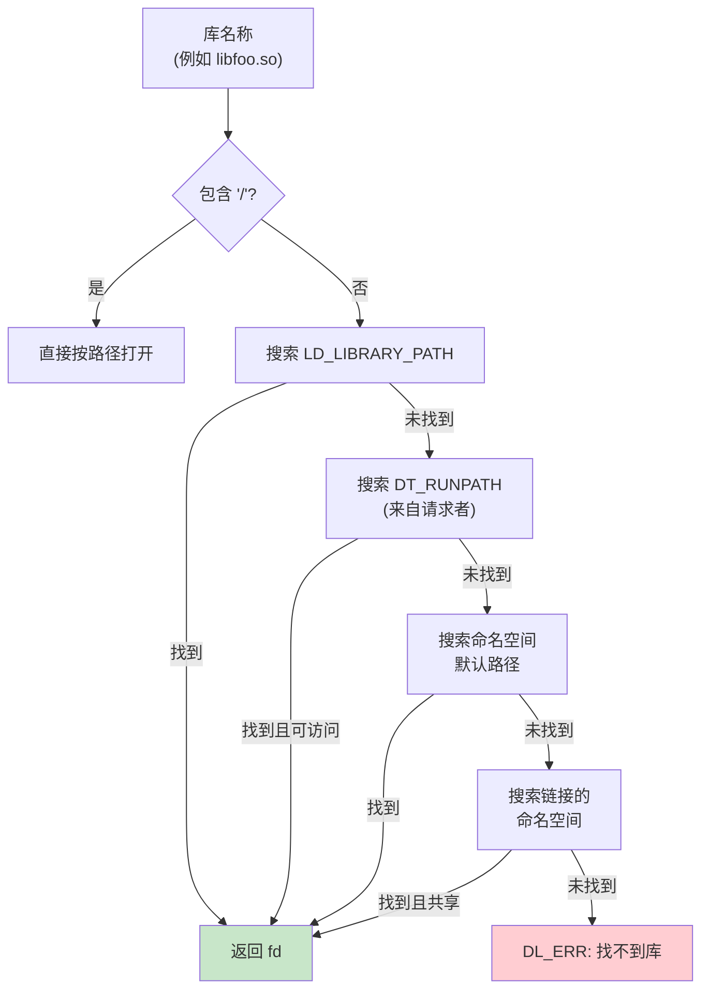
```mermaid
graph TD
    A["库名称<br/>(例如 libfoo.so)"] --> B{包含 '/'?}
    B -->|是| C["直接按路径打开"]
    B -->|否| D["搜索 LD_LIBRARY_PATH"]
    D -->|找到| Z["返回 fd"]
    D -->|未找到| E["搜索 DT_RUNPATH<br/>(来自请求者)"]
    E -->|找到且可访问| Z
    E -->|未找到| F["搜索命名空间<br/>默认路径"]
    F -->|找到| Z
    F -->|未找到| G["搜索链接的<br/>命名空间"]
    G -->|找到且共享| Z
    G -->|未找到| H["DL_ERR: 找不到库"]

    style Z fill:#c8e6c9
    style H fill:#ffcdd2
```

**从 APK 文件 (ZIP) 加载：**
Android 链接器的一个独特功能是能够直接从 APK 文件（即 ZIP 归档）加载共享库。库必须以非压缩且页对齐（page-aligned）的方式存储在 ZIP 中。路径语法使用 `!/` 作为分隔符。

### 7.3.11 依赖遍历与加载顺序

`find_libraries` 函数执行依赖树的**广度优先遍历 (BFS)**。BFS 顺序确保了依赖库总是在需要它们的库之前被加载。

### 7.3.12 dlopen/dlsym/dlclose API

应用程序通过 `dl*` 系列函数在运行时与链接器交互。这些函数在 `dlfcn.cpp` 中暴露，并通过 `caller_addr` 参数确定调用者的命名空间上下文。

### 7.3.13 数据保护与安全 (Protected Data)

链接器通过 `ProtectedDataGuard` 保护其内部数据结构（如 `soinfo` 分配器）。这些分配器使用只读内存映射，只有在需要修改链接器数据时，才通过 RAII 机制临时获取写权限。这是一种深度防御措施，防止攻击者篡改链接器内部结构。

### 7.3.14 链接器配置 (Linker Configuration)

链接器从 `/linkerconfig/ld.config.txt` 读取配置。该文件定义了命名空间、搜索路径、允许的路径以及命名空间之间的链接关系。

### 7.3.15 完整的 ELF 加载流水线

以下是从 `dlopen("libfoo.so")` 到执行的完整流水线：

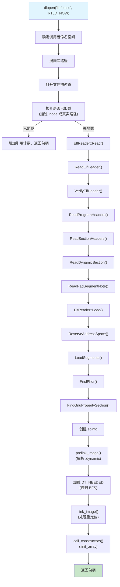
```mermaid
graph TD
    A["dlopen('libfoo.so', RTLD_NOW)"] --> B["确定调用者命名空间"]
    B --> C["搜索库路径"]
    C --> D["打开文件描述符"]
    D --> E["检查是否已加载<br/>(通过 inode 或真实路径)"]
    E -->|已加载| F["增加引用计数，返回句柄"]
    E -->|未加载| G["ElfReader::Read()"]

    G --> G1["ReadElfHeader()"]
    G1 --> G2["VerifyElfHeader()"]
    G2 --> G3["ReadProgramHeaders()"]
    G3 --> G4["ReadSectionHeaders()"]
    G4 --> G5["ReadDynamicSection()"]
    G5 --> G6["ReadPadSegmentNote()"]

    G6 --> H["ElfReader::Load()"]
    H --> H1["ReserveAddressSpace()"]
    H1 --> H2["LoadSegments()"]
    H2 --> H3["FindPhdr()"]
    H3 --> H4["FindGnuPropertySection()"]

    H4 --> I["创建 soinfo"]
    I --> J["prelink_image()<br/>(解析 .dynamic)"]
    J --> K["加载 DT_NEEDED<br/>(递归 BFS)"]
    K --> L["link_image()<br/>(处理重定位)"]
    L --> M["call_constructors()<br/>(.init_array)"]
    M --> N["返回句柄"]

    style A fill:#e1f5fe
    style N fill:#c8e6c9
```
## 7.4 VNDK 与 Linker Namespaces

### 7.4.1 Treble 命名空间问题

Android 的 Treble 架构（从 Android 8.0 引入）将 **platform**（框架层）与 **vendor**（供应商实现）分离。其目标是允许平台独立于供应商代码进行更新。但原生库带来了一个挑战：如果供应商库和平台库都链接到 `libutils.so`，它们可能需要该库的不同版本。

解决方案是 **linker namespaces**（链接器命名空间）——这是链接器的一种机制，用于隔离不同的库集，使其无法看到彼此的符号。

### 7.4.2 android_namespace_t 结构

摘自 `bionic/linker/linker_namespaces.h`（第 72-183 行）：

```cpp
struct android_namespace_t {
  const char* get_name() const { return name_.c_str(); }
  bool is_isolated() const { return is_isolated_; }
  bool is_also_used_as_anonymous() const {
    return is_also_used_as_anonymous_;
  }

  const std::vector<std::string>& get_ld_library_paths() const;
  const std::vector<std::string>& get_default_library_paths() const;
  const std::vector<std::string>& get_permitted_paths() const;
  const std::vector<std::string>& get_allowed_libs() const;

  const std::vector<android_namespace_link_t>& linked_namespaces() const;
  void add_linked_namespace(android_namespace_t* linked_namespace,
                            std::unordered_set<std::string> shared_lib_sonames,
                            bool allow_all_shared_libs);

  void add_soinfo(soinfo* si);
  void remove_soinfo(soinfo* si);
  const soinfo_list_t& soinfo_list() const;

  bool is_accessible(const std::string& path);
  bool is_accessible(soinfo* si);

 private:
  std::string name_;
  bool is_isolated_;
  bool is_exempt_list_enabled_;
  bool is_also_used_as_anonymous_;
  std::vector<std::string> ld_library_paths_;
  std::vector<std::string> default_library_paths_;
  std::vector<std::string> permitted_paths_;
  std::vector<std::string> allowed_libs_;
  std::vector<android_namespace_link_t> linked_namespaces_;
  soinfo_list_t soinfo_list_;
};
```

核心概念：

- **Isolated namespace（隔离命名空间）**：当 `is_isolated_` 为 true 时，该命名空间只能从其 `default_library_paths_` 和 `permitted_paths_` 中加载库。这可以防止供应商代码意外加载平台库。

- **Namespace links（命名空间链接）**：通过链接，一个命名空间中的库可以对另一个命名空间可见。每个链接指定了哪些库是共享的：

```cpp
struct android_namespace_link_t {
  android_namespace_t* linked_namespace_;
  std::unordered_set<std::string> shared_lib_sonames_;
  bool allow_all_shared_libs_;

  bool is_accessible(const char* soname) const {
    return allow_all_shared_libs_ ||
           shared_lib_sonames_.find(soname) != shared_lib_sonames_.end();
  }
};
```

- **Allowed libs（允许的库）**：对可以加载到命名空间中的库进行的额外过滤，不受路径限制。

### 7.4.3 命名空间架构

标准的 Android 命名空间拓扑如下所示：

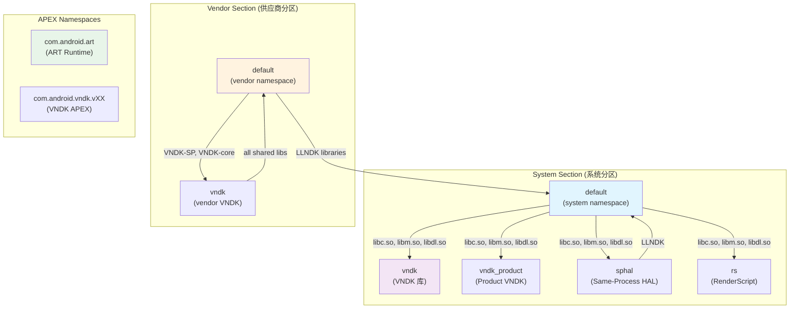
```mermaid
graph TD
    subgraph "System Section (系统分区)"
        SYS["default<br/>(system namespace)"]
        VNDK["vndk<br/>(VNDK 库)"]
        VNDK_PROD["vndk_product<br/>(Product VNDK)"]
        SPHAL["sphal<br/>(Same-Process HAL)"]
        RS["rs<br/>(RenderScript)"]
    end

    subgraph "Vendor Section (供应商分区)"
        VDEF["default<br/>(vendor namespace)"]
        VVNDK["vndk<br/>(vendor VNDK)"]
    end

    subgraph "APEX Namespaces"
        APEX["com.android.art<br/>(ART Runtime)"]
        APEX2["com.android.vndk.vXX<br/>(VNDK APEX)"]
    end

    SYS -->|"libc.so, libm.so, libdl.so"| VNDK
    SYS -->|"libc.so, libm.so, libdl.so"| VNDK_PROD
    SYS -->|"libc.so, libm.so, libdl.so"| SPHAL
    SYS -->|"libc.so, libm.so, libdl.so"| RS

    VDEF -->|"LLNDK libraries"| SYS
    VDEF -->|"VNDK-SP, VNDK-core"| VVNDK
    VVNDK -->|"all shared libs"| VDEF

    SPHAL -->|"LLNDK"| SYS

    style SYS fill:#e1f5fe
    style VDEF fill:#fff3e0
    style VNDK fill:#f3e5f5
    style APEX fill:#e8f5e9
```

### 7.4.4 VNDK 库类别

VNDK (Vendor NDK) 定义了四类库：

摘自 `build/soong/cc/vndk.go`（第 23-29 行）：

```go
const (
    llndkLibrariesTxt       = "llndk.libraries.txt"
    vndkCoreLibrariesTxt    = "vndkcore.libraries.txt"
    vndkSpLibrariesTxt      = "vndksp.libraries.txt"
    vndkPrivateLibrariesTxt = "vndkprivate.libraries.txt"
    vndkProductLibrariesTxt = "vndkproduct.libraries.txt"
)
```

| 类别 | 描述 | 示例库 |
|----------|-------------|-------------------|
| **LL-NDK** | Low-Level NDK；始终对供应商可用 | `libc.so`, `libm.so`, `libdl.so`, `liblog.so` |
| **VNDK-core** | 核心 VNDK；对供应商可用但具有版本控制 | `libcutils.so`, `libbase.so`, `libutils.so` |
| **VNDK-SP** | Same-Process VNDK；加载到框架进程中 | `libhardware.so`, `libhidlbase.so` |
| **VNDK-private** | 仅对其他 VNDK 模块可用，不对供应商直接开放 | 内部 VNDK 实现库 |

构建系统中的 `VndkProperties` 结构定义了一个库如何声明其 VNDK 成员身份：

摘自 `build/soong/cc/vndk.go`（第 45-76 行）：

```go
type VndkProperties struct {
    Vndk struct {
        // 声明为 VNDK 或 VNDK-SP 模块
        Enabled *bool

        // 声明为 VNDK-SP 模块，它是 VNDK 的子集
        Support_system_process *bool

        // 声明为 VNDK-private 模块
        Private *bool

        // 扩展另一个模块
        Extends *string
    }
}
```

### 7.4.5 linkerconfig 工具

`system/linkerconfig/` 工具在启动时生成链接器配置。它由 init 在早期启动序列中调用，并生成 `/linkerconfig/ld.config.txt`。

摘自 `system/linkerconfig/main.cc`（第 33-43 行）：

```cpp
#include "linkerconfig/apex.h"
#include "linkerconfig/apexconfig.h"
#include "linkerconfig/baseconfig.h"
#include "linkerconfig/configparser.h"
#include "linkerconfig/context.h"
#include "linkerconfig/environment.h"
#include "linkerconfig/namespacebuilder.h"
#include "linkerconfig/recovery.h"
#include "linkerconfig/variableloader.h"
#include "linkerconfig/variables.h"
```

该工具使用模块化生成器模式。每个命名空间在 `system/linkerconfig/contents/namespace/` 中都有一个专用的生成器（builder）：

| 生成器文件 | 命名空间 | 用途 |
|-------------|-----------|---------|
| `systemdefault.cc` | `default` (system) | 框架层代码 |
| `vendordefault.cc` | `default` (vendor) | 供应商二进制文件 |
| `vndk.cc` | `vndk` / `vndk_product` | VNDK 库 |
| `sphal.cc` | `sphal` | 同进程 HAL (Same-process HALs) |
| `rs.cc` | `rs` | RenderScript |
| `apexdefault.cc` | APEX-specific | 每个 APEX 专有的命名空间 |
| `productdefault.cc` | `default` (product) | 产品分区 (Product partition) |
| `recoverydefault.cc` | `default` (recovery) | 恢复模式 |
| `isolateddefault.cc` | `default` (isolated) | 隔离进程 |

### 7.4.6 Bionic 库链接

每个命名空间都需要访问核心 Bionic 库。这是通过 `AddStandardSystemLinks` 函数配置的：

摘自 `system/linkerconfig/contents/common/system_links.cc`（第 29-62 行）：

```cpp
const std::vector<std::string> kBionicLibs = {
    "libc.so",
    "libdl.so",
    "libdl_android.so",
    "libm.so",
};

void AddStandardSystemLinks(const Context& ctx, Section* section) {
  const std::string system_ns_name = ctx.GetSystemNamespaceName();
  section->ForEachNamespaces([&](Namespace& ns) {
    if (ns.GetName() != system_ns_name) {
      ns.GetLink(system_ns_name).AddSharedLib(kBionicLibs);
    }
  });
}
```

这确保了每个命名空间都可以通过指向系统命名空间的链接来解析 Bionic 的核心库。如果没有这一点，基本的 C 库函数将无法使用。

### 7.4.7 系统命名空间配置

用于框架代码的系统（默认）命名空间在 `system/linkerconfig/contents/namespace/systemdefault.cc` 中配置。

摘自 `system/linkerconfig/contents/namespace/systemdefault.cc`（第 31-78 行）：

```cpp
void SetupSystemPermittedPaths(Namespace* ns) {
  const std::vector<std::string> permitted_paths = {
      "/system/${LIB}/drm",
      "/system/${LIB}/extractors",
      "/system/${LIB}/hw",
      system_ext + "/${LIB}",

      // odex 文件所在地（libart 需要 dlopen 它们）
      "/system/framework",
      "/system/app",
      "/system/priv-app",
      system_ext + "/framework",
      system_ext + "/app",
      system_ext + "/priv-app",
      "/vendor/framework",
      "/vendor/app",
      "/vendor/priv-app",
      "/odm/framework",
      "/odm/app",
      "/odm/priv-app",
      product + "/framework",
      product + "/app",
      product + "/priv-app",
      "/data",
      "/mnt/expand",
      "/apex/com.android.runtime/${LIB}/bionic",
      "/system/${LIB}/bootstrap",
  };
```

注意关于 VNDK 隔离的显式注释：

```cpp
  // 我们不能将整个 /system/${LIB} 作为允许路径，
  // 因为这样做可以通过绝对路径加载 /system/${LIB}/vndk* 目录中的库。
  // VNDK 库是使用以前版本的 Android 构建的，因此不得加载到此命名空间中。
```

这就是安全边界的作用：即使系统命名空间具有广泛的权限，它也会刻意排除 VNDK 目录以防止版本混杂。

### 7.4.8 供应商命名空间配置

供应商进程在具有严格隔离的专有命名空间中运行：

摘自 `system/linkerconfig/contents/namespace/vendordefault.cc`（第 35-68 行）：

```cpp
Namespace BuildVendorNamespace(const Context& ctx,
                                const std::string& name) {
  Namespace ns(name, /*is_isolated=*/true, /*is_visible=*/true);

  ns.AddSearchPath("/odm/${LIB}");
  ns.AddSearchPath("/vendor/${LIB}");
  ns.AddSearchPath("/vendor/${LIB}/hw");
  ns.AddSearchPath("/vendor/${LIB}/egl");

  ns.AddPermittedPath("/odm");
  ns.AddPermittedPath("/vendor");
  ns.AddPermittedPath("/system/vendor");

  // 链接到其他命名空间
  ns.GetLink("rs").AddSharedLib("libRS_internal.so");
  ns.AddRequires(base::Split(
      Var("LLNDK_LIBRARIES_VENDOR", ""), ":"));

  if (IsVendorVndkVersionDefined()) {
    ns.GetLink(ctx.GetSystemNamespaceName())
        .AddSharedLib(Var("SANITIZER_DEFAULT_VENDOR"));
    ns.GetLink("vndk").AddSharedLib({
        Var("VNDK_SAMEPROCESS_LIBRARIES_VENDOR"),
        Var("VNDK_CORE_LIBRARIES_VENDOR")});
  }
  return ns;
}
```

供应商命名空间：

- 是 **隔离的** (`is_isolated=true`) —— 只能从列出的路径加载
- 可以搜索 `/odm/${LIB}` 和 `/vendor/${LIB}`（以及 hw/egl 子目录）
- 拥有指向以下位置的链接：
  - **system** 命名空间：用于 LL-NDK 库（libc, libm, libdl, liblog）
  - **VNDK** 命名空间：用于受版本控制的 VNDK 库
  - **RenderScript** 命名空间：用于 `libRS_internal.so`

### 7.4.9 VNDK 命名空间配置

VNDK 命名空间是受版本控制的 VNDK 库所在地：

摘自 `system/linkerconfig/contents/namespace/vndk.cc`（第 30-123 行）：

```cpp
Namespace BuildVndkNamespace(const Context& ctx,
                              VndkUserPartition vndk_user) {
  const char* name;
  if (is_system_or_unrestricted_section &&
      vndk_user == VndkUserPartition::Product) {
    name = "vndk_product";
  } else {
    name = "vndk";
  }

  Namespace ns(name, /*is_isolated=*/true,
               /*is_visible=*/is_system_or_unrestricted_section);

  // 搜索顺序：
  // 1. VNDK 扩展 (vendor/lib/vndk-sp, vendor/lib/vndk)
  // 2. VNDK APEX (/apex/com.android.vndk.vXX/${LIB})
  // 3. vendor/lib 或 product/lib 中的扩展依赖

  for (const auto& lib_path : lib_paths) {
    ns.AddSearchPath(lib_path + "/vndk-sp");
    if (!is_system_or_unrestricted_section) {
      ns.AddSearchPath(lib_path + "/vndk");
    }
  }
  ns.AddSearchPath("/apex/com.android.vndk.v" + vndk_version + "/${LIB}");
```

VNDK 命名空间的搜索顺序揭示了其扩展机制：

1. **VNDK 扩展** (`/vendor/${LIB}/vndk-sp`) —— 供应商提供的对 VNDK 库的替换或扩展
2. **VNDK APEX** (`/apex/com.android.vndk.vXX/${LIB}`) —— 标准的 VNDK 库，以 APEX 模块形式发布
3. **回退路径 (Fallback)** —— 供应商专有的库目录，用于存放 VNDK 扩展所依赖的库

`vndk_product` 变体是用于产品分区应用的一个并行命名空间，这些应用可能使用与供应商代码不同的 VNDK 版本。

### 7.4.10 豁免名单（Exempt List）：向后兼容性

链接器包含一个用于向后兼容的豁免名单：

摘自 `bionic/linker/linker.cpp`（第 226-268 行）：

```cpp
static bool is_exempt_lib(android_namespace_t* ns, const char* name,
                           const soinfo* needed_by) {
  static const char* const kLibraryExemptList[] = {
    "libandroid_runtime.so",
    "libbinder.so",
    "libcrypto.so",
    "libcutils.so",
    "libexpat.so",
    "libgui.so",
    "libmedia.so",
    "libnativehelper.so",
    "libssl.so",
    "libstagefright.so",
    "libsqlite.so",
    "libui.so",
    "libutils.so",
    nullptr
  };

  // 如果目标版本是 N 或更高，不享受豁免名单。
  if (get_application_target_sdk_version() >= 24) {
    return false;
  }
  // ...
}
```

针对 API 级别 23 (Marshmallow) 或更低版本的应用被允许直接访问这些平台库，即使它们不是 NDK 的一部分。这是必要的，因为许多 Treble 之前的应用依赖于这些私有库。针对 API 级别 24 (Nougat) 或更高版本的应用则受到严格的命名空间隔离约束。

### 7.4.11 命名空间如何与 dlopen 交互

当应用程序调用 `dlopen("libfoo.so", RTLD_NOW)` 时，会执行以下感知命名空间的逻辑：

1. 链接器根据返回地址确定调用者的命名空间。
2. 搜索调用者的命名空间路径。
3. 如果未找到，检查链接的命名空间，但仅限于链接的 `shared_lib_sonames` 集合中的库。
4. 如果库位于隔离的命名空间中，链接器会验证其是否位于可访问路径上。

可访问性检查逻辑如下：

摘自 `bionic/linker/linker.cpp`（第 1221-1249 行）：

```cpp
  if ((fs_stat.f_type != TMPFS_MAGIC) && (!ns->is_accessible(realpath))) {
    const soinfo* needed_by = task->is_dt_needed() ?
        task->get_needed_by() : nullptr;
    if (is_exempt_lib(ns, name, needed_by)) {
      // 对旧版应用允许访问并发出警告
    } else {
      DL_OPEN_ERR("library \"%s\" needed or dlopened by \"%s\" is not "
                   "accessible for the namespace \"%s\"",
                   name, needed_or_dlopened_by, ns->get_name());
    }
  }
```

注意 `TMPFS_MAGIC` 异常：从 tmpfs（通过 `memfd_create()` 创建）加载的库会绕过可访问性检查。这使得应用能够在运行时创建库（例如 JIT 编译），而无需在库搜索路径上拥有一个可写的目录。

### 7.4.12 运行时命名空间创建

应用程序和框架可以通过 `android_create_namespace` API 在运行时创建新的命名空间：

摘自 `bionic/linker/dlfcn.cpp`（第 51-57 行）：

```cpp
android_namespace_t* __loader_android_create_namespace(
    const char* name,
    const char* ld_library_path,
    const char* default_library_path,
    uint64_t type,
    const char* permitted_when_isolated_path,
    android_namespace_t* parent_namespace,
    const void* caller_addr) __LINKER_PUBLIC__;
```

这被 `libnativeloader` 所使用，它为每个应用创建具有适当隔离度的命名空间。每个应用获得自己的命名空间，该空间可以看到：

- 应用自身的可执行原生库（来自 APK）
- LL-NDK 库（通过指向系统命名空间的链接）
- VNDK 库（如果应用使用了 NDK）
- 应用清单文件中 `uses-native-library` 条目列出的库

### 7.4.13 默认库路径

链接器根据设备配置定义默认库搜索路径：

摘自 `bionic/linker/linker.cpp`（第 105-154 行）：

```cpp
#if defined(__LP64__)
static const char* const kSystemLibDir     = "/system/lib64";
static const char* const kOdmLibDir        = "/odm/lib64";
static const char* const kVendorLibDir     = "/vendor/lib64";
static const char* const kAsanSystemLibDir = "/data/asan/system/lib64";
static const char* const kAsanOdmLibDir    = "/data/asan/odm/lib64";
static const char* const kAsanVendorLibDir = "/data/asan/vendor/lib64";
#else
static const char* const kSystemLibDir     = "/system/lib";
// ...
#endif

static const char* const kDefaultLdPaths[] = {
  kSystemLibDir,
  kOdmLibDir,
  kVendorLibDir,
  nullptr
};

static const char* const kAsanDefaultLdPaths[] = {
  kAsanSystemLibDir,
  kSystemLibDir,
  kAsanOdmLibDir,
  kOdmLibDir,
  kAsanVendorLibDir,
  kVendorLibDir,
  nullptr
};

#if defined(__aarch64__)
static const char* const kHwasanSystemLibDir = "/system/lib64/hwasan";
static const char* const kHwasanOdmLibDir    = "/odm/lib64/hwasan";
static const char* const kHwasanVendorLibDir = "/vendor/lib64/hwasan";
#endif
```

路径分为三组：

1. **Default（默认）** —— 正常操作：`/system/lib64`, `/odm/lib64`, `/vendor/lib64`
2. **ASan** —— 地址检测 (AddressSanitizer) 模式：优先搜索 `/data/asan/` 中的检测库，失败后回退到正常路径。
3. **HWASan** —— 硬件地址检测 (Hardware AddressSanitizer) 模式（仅限 AArch64）：优先搜索 `hwasan/` 子目录中的检测库。

这允许检测版本与生产版本共存于同一设备上，当检测器启用时，检测版本具有优先权。

### 7.4.14 命名空间隔离实践

以下是在符合 Treble 标准的设备上，供应商进程的命名空间隔离工作原理示例：

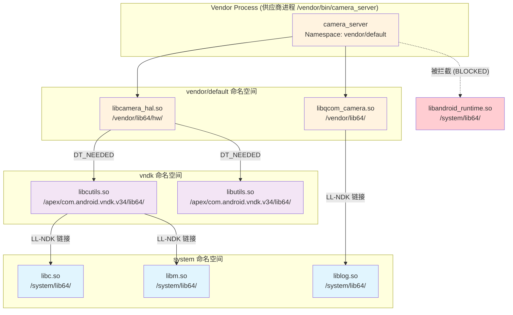
```mermaid
graph TD
    subgraph "Vendor Process (供应商进程 /vendor/bin/camera_server)"
        VP["camera_server<br/>Namespace: vendor/default"]
    end

    subgraph "vendor/default 命名空间"
        VL1["libcamera_hal.so<br/>/vendor/lib64/hw/"]
        VL2["libqcom_camera.so<br/>/vendor/lib64/"]
    end

    subgraph "vndk 命名空间"
        VNDK1["libcutils.so<br/>/apex/com.android.vndk.v34/lib64/"]
        VNDK2["libutils.so<br/>/apex/com.android.vndk.v34/lib64/"]
    end

    subgraph "system 命名空间"
        SYS1["libc.so<br/>/system/lib64/"]
        SYS2["libm.so<br/>/system/lib64/"]
        SYS3["liblog.so<br/>/system/lib64/"]
    end

    VP --> VL1
    VP --> VL2
    VL1 -->|"DT_NEEDED"| VNDK1
    VL1 -->|"DT_NEEDED"| VNDK2
    VNDK1 -->|"LL-NDK 链接"| SYS1
    VNDK1 -->|"LL-NDK 链接"| SYS2
    VL2 -->|"LL-NDK 链接"| SYS3

    VP -.->|"被拦截 (BLOCKED)"| SYS_PRIV["libandroid_runtime.so<br/>/system/lib64/"]

    style VP fill:#fff3e0
    style VL1 fill:#fff3e0
    style VL2 fill:#fff3e0
    style VNDK1 fill:#f3e5f5
    style VNDK2 fill:#f3e5f5
    style SYS1 fill:#e1f5fe
    style SYS2 fill:#e1f5fe
    style SYS3 fill:#e1f5fe
    style SYS_PRIV fill:#ffcdd2
```

在此场景中：

- `camera_server` 位于 `vendor/default` 命名空间中。
- 它可以加载自己的供应商库（`libcamera_hal.so`, `libqcom_camera.so`）。
- 这些库可以通过 `vndk` 命名空间链接使用 VNDK 库（`libcutils.so`, `libutils.so`）。
- 所有库都可以通过指向系统命名空间的链接使用 LL-NDK 库（`libc.so`, `libm.so`, `liblog.so`）。
- 直接访问平台私有库（`libandroid_runtime.so`）被命名空间隔离机制 **拦截**。

### 7.4.15 VNDK 的弃用与演进

VNDK 系统正在演进。最新的 AOSP 版本在 `linkerconfig` 中包含了一个 `--deprecate_vndk` 标志：

摘自 `system/linkerconfig/main.cc`（第 62-63 行）：

```cpp
    {"deprecate_vndk", no_argument, 0, 'd'},
```

趋势是趋向于使用 APEX 模块进行库版本控制，而不是 VNDK 机制。每个 APEX 可以携带其专有版本的库，并在各自的挂载命名空间（mount namespace）和链接器命名空间中隔离。这提供了比 VNDK 强得多的隔离（VNDK 共享单个进程地址空间），并更好地支持独立更新。

然而，VNDK 对于与现有供应商实现的向后兼容性仍然至关重要，很可能会在未来几个 Android 版本中与基于 APEX 的解决方案共存。

### 7.4.16 库加载决策树：find_libraries 算法

当链接器遇到 `DT_NEEDED` 条目或 `dlopen` 调用时，完整的决策过程如下：

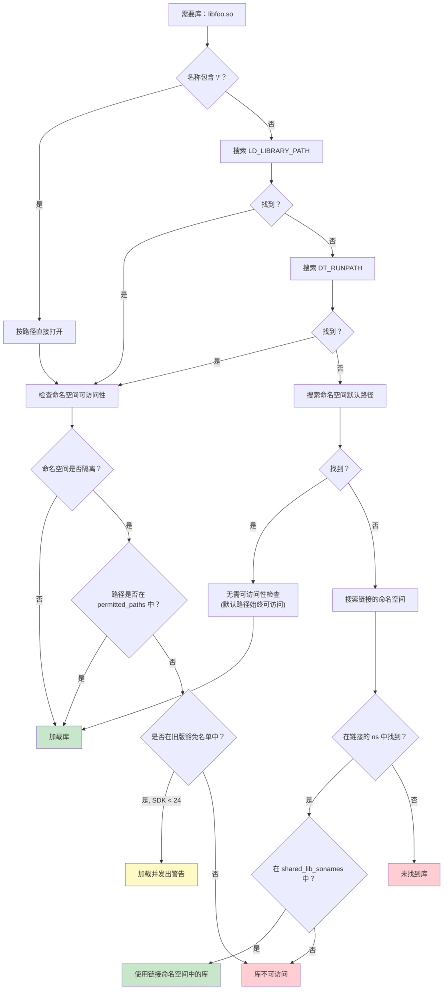
```mermaid
graph TD
    A["需要库：libfoo.so"] --> B{名称包含 '/'？}
    B -->|是| C["按路径直接打开"]
    B -->|否| D["搜索 LD_LIBRARY_PATH"]
    D --> E{找到？}
    E -->|是| F["检查命名空间可访问性"]
    E -->|否| G["搜索 DT_RUNPATH"]
    G --> H{找到？}
    H -->|是| F
    H -->|否| I["搜索命名空间默认路径"]
    I --> J{找到？}
    J -->|是| K["无需可访问性检查<br/>(默认路径始终可访问)"]
    J -->|否| L["搜索链接的命名空间"]
    L --> M{在链接的 ns 中找到？}
    M -->|是| N{在 shared_lib_sonames 中？}
    N -->|是| O["使用链接命名空间中的库"]
    N -->|否| P["库不可访问"]
    M -->|否| Q["未找到库"]

    F --> R{命名空间是否隔离？}
    R -->|否| S["加载库"]
    R -->|是| T{路径是否在 permitted_paths 中？}
    T -->|是| S
    T -->|否| U{是否在旧版豁免名单中？}
    U -->|是, SDK < 24| V["加载并发出警告"]
    U -->|否| P

    C --> F
    K --> S

    style S fill:#c8e6c9
    style O fill:#c8e6c9
    style V fill:#fff9c4
    style P fill:#ffcdd2
    style Q fill:#ffcdd2
```

这是 `find_library_internal` 函数实现的多阶段算法。该函数负责处理循环依赖、跨命名空间加载以及为了 ASLR（地址空间布局随机化）进行的加载乱序（load shuffling）。

摘自 `bionic/linker/linker.cpp`（第 1459-1528 行）：

```cpp
static bool find_library_internal(android_namespace_t* ns,
                                   LoadTask* task,
                                   ZipArchiveCache* zip_archive_cache,
                                   LoadTaskList* load_tasks,
                                   int rtld_flags) {
  soinfo* candidate;

  // 阶段 1：检查是否已加载（通过 soname）
  if (find_loaded_library_by_soname(ns, task->get_name(),
          true /* 搜索链接的命名空间 */, &candidate)) {
    task->set_soinfo(candidate);
    return true;
  }

  // 阶段 2：尝试从此命名空间加载
  if (load_library(ns, task, zip_archive_cache, load_tasks,
                   rtld_flags, true)) {
    return true;
  }

  // 阶段 3：旧版应用的豁免名单回退
  if (ns->is_exempt_list_enabled() &&
      is_exempt_lib(ns, task->get_name(), task->get_needed_by())) {
    ns = &g_default_namespace;
    if (load_library(ns, task, zip_archive_cache, load_tasks,
                     rtld_flags, true)) {
      return true;
    }
  }

  // 阶段 4：搜索链接的命名空间
  for (auto& linked_namespace : ns->linked_namespaces()) {
    if (find_library_in_linked_namespace(linked_namespace, task)) {
      if (task->get_soinfo() != nullptr) {
        return true;  // 已加载
      }
      // 可以在链接的命名空间中加载
      if (load_library(linked_namespace.linked_namespace(), task,
                       zip_archive_cache, load_tasks, rtld_flags,
                       false)) {
        return true;
      }
    }
  }

  return false;
}
```
## 7.5 Musl：主机侧的 Bionic 替代方案

虽然 Bionic 是 Android 针对设备端目标的 C 库，但 AOSP 还集成了 **musl libc**，作为 **主机端工具编译（host tool compilation）** 的替代 C 库。本节将解释 musl 在 AOSP 中存在的原因、其集成方式，以及何时使用它来替代 glibc。

### 7.5.1 为什么 AOSP 中有 Musl？

Android 的构建系统在 Linux 主机上运行。默认情况下，主机工具（如 `aapt2`、`dex2oat` 或 `zipalign`）是针对 **glibc**（大多数 Linux 发行版上的标准 C 库）编译的。然而，glibc 在构建工具的分发方面存在一些缺陷：

- **动态链接依赖**：glibc 二进制文件依赖于主机精确的 glibc 版本，这在较旧的系统上会导致“GLIBC_2.XX not found”错误。
- **庞大的共享库占用**：glibc 会引入许多共享对象。
- **复杂的静态链接**：glibc 不鼓励静态链接，并且在静态链接时存在已知问题（如 NSS、locale、dlopen）。

Musl 解决了这些问题：

- **干净的静态链接**：musl 从设计之初就考虑了静态链接。
- **最小依赖**：生成自包含的二进制文件。
- **可移植的输出**：静态链接的 musl 二进制文件可以在任何 Linux 内核版本上运行，无需担心 glibc 版本问题。

### 7.5.2 Musl 源码与版本

Musl 位于 AOSP 树的 `external/musl/` 目录下：

```
external/musl/
├── Android.bp              # 构建规则
├── sources.bp              # 生成的源文件列表
├── README                  # 上游 v1.2.5
├── METADATA                # 版本和许可证信息
├── android/                # Android 专用适配层
│   ├── generate_bp.py      # 从上游生成 sources.bp
│   ├── relinterp.c         # 动态解释器重定位
│   ├── ldso_trampoline.cpp # 加载器跳板（Loader trampoline）
│   └── include/            # Android 专用的头文件覆盖
│       ├── features.h
│       ├── math.h
│       ├── resolv.h
│       └── string.h
├── include/                # musl 公共头文件
├── src/                    # musl 源码（上游）
│   ├── string/             # 字符串操作
│   ├── malloc/             # 内存分配
│   ├── thread/             # 线程原语
│   ├── stdio/              # 标准 I/O
│   └── ...
└── ldso/                   # 动态链接器（musl 的 ld.so）
```

`android/` 目录包含了 Android 专用的适配代码，用于桥接 musl 上游行为与 AOSP 需求之间的差异。

### 7.5.3 为主机构建启用 Musl

通过 `USE_HOST_MUSL` 环境变量激活 Musl：

```bash
# 启用 musl 进行主机工具编译
export USE_HOST_MUSL=true
m aapt2   # 现在针对 musl 而非 glibc 进行编译
```

构建系统的流程经过多个层级：

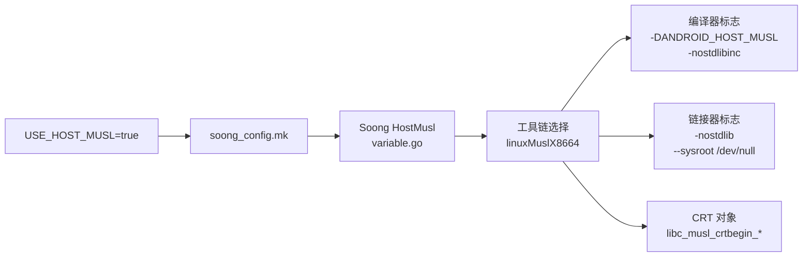
```mermaid
flowchart LR
    ENV["USE_HOST_MUSL=true"] --> MK["soong_config.mk"]
    MK --> SOONG["Soong HostMusl<br/>variable.go"]
    SOONG --> TC["工具链选择<br/>linuxMuslX8664"]
    TC --> FLAGS["编译器标志<br/>-DANDROID_HOST_MUSL<br/>-nostdlibinc"]
    TC --> LINK["链接器标志<br/>-nostdlib<br/>--sysroot /dev/null"]
    TC --> CRT["CRT 对象<br/>libc_musl_crtbegin_*"]
```

### 7.5.4 构建系统集成

当启用 musl 时，Soong 会选择专用的工具链工厂，覆盖默认的基于 glibc 的主机编译：

```go
// 编译器标志：强制隔离主机环境
var linuxMuslCflags = []string{
    "-DANDROID_HOST_MUSL",
    "-nostdlibinc",
    "--sysroot /dev/null",
}
```

`--sysroot /dev/null` 标志至关重要：它防止编译器找到任何系统头文件或库，确保与主机的 glibc 完全隔离。所有头文件均来自 musl 自身的 `include/` 目录。

#### 架构支持

Musl 支持四种主机架构，每种架构都有专用的 LLVM triple：

| 架构 | LLVM Triple | 工具链工厂 |
|---|---|---|
| x86 | `i686-linux-musl` | `linuxMuslX86ToolchainFactory` |
| x86_64 | `x86_64-linux-musl` | `linuxMuslX8664ToolchainFactory` |
| ARM | `arm-linux-musleabihf` | `linuxMuslArmToolchainFactory` |
| ARM64 | `aarch64-linux-musl` | `linuxMuslArm64ToolchainFactory` |

#### CRT 对象

Musl 提供自己的 C 运行时启动对象（Defined in `external/musl/Android.bp`）：
- `libc_musl_crtbegin_dynamic`：动态可执行文件启动
- `libc_musl_crtbegin_static`：静态可执行文件启动
- `libc_musl_crtbegin_so`：共享库启动
- `libc_musl_crtend[_so]`：清理对象

### 7.5.5 预编译 Musl 工具链

预编译的 Clang 工具链包含所有支持架构的 musl 运行时库，位于 `prebuilts/clang/host/linux-x86/clang-*/musl/`。这确保了构建过程的自洽性。

### 7.5.6 Bionic-Musl 头文件共享

有趣的是，musl 重用了 Bionic 内核 UAPI 层的一些头文件。构建系统生成一个包含 Bionic 内核头文件的 musl sysroot。这确保了 musl 和 bionic 在内核结构定义（如 `ioctl` 编号、socket 选项等）上达成一致，因为两者最终都针对相同的 Linux 内核。

### 7.5.7 Musl 与 Sanitizer 限制

并非所有 Sanitizer 都能与 musl 配合工作。由于 musl 动态链接器在 `LD_PRELOAD` 和 `dlopen` 方面的语义不同，CFI 以及 ARM64 地址/硬件地址 Sanitizer 在 musl 环境下会被禁用。

### 7.5.8 Bionic vs. Musl vs. Glibc

| 特性 | Bionic | glibc | musl |
|---|---|---|---|
| **目标** | Android 设备 | Linux 主机 (默认) | Linux 主机 (选配) |
| **静态链接** | 支持 | 存在问题 (NSS/locale) | 干净，推荐使用 |
| **二进制移植性** | 不适用 | 绑定主机 glibc 版本 | 可在任何 Linux 上运行 |
| **体积** | 极小 | 较大 | 极小 |
| **POSIX 合规性** | 部分 (有意为之) | 完全 | 几乎完全 |
| **激活方式** | 设备端默认 | 主机端默认 | `USE_HOST_MUSL=true` |

---

## 7.6 高级主题

### 7.6.1 `soinfo` 方法接口

`soinfo` 结构体为链接器提供了丰富的方法接口，用于操作已加载的库。

从 `bionic/linker/linker_soinfo.h` 可以看到关键方法：
- `prelink_image()`：解析 `.dynamic` 节，填充 `soinfo` 字段（符号表、重定位表等），但不解析符号。
- `link_image()`：处理所有重定位，解析符号引用并修正代码/数据。
- `protect_relro()`：将 RELRO（重定位只读）页面标记为只读，防止 GOT 覆写攻击。
- `resolve_symbol_address()`：对于标准符号，增加 load bias；对于 **GNU IFUNC** 符号，调用 resolver 函数以确定运行时地址。

`soinfo` 的生命周期严格遵循：分配 -> 读取 -> 加载 -> 预链接 -> 链接 -> RELRO 保护 -> 运行 Init -> 卸载销毁。

### 7.6.2 GNU Hash：NEON 加速符号查找

链接器为 ARM 架构集成了 NEON 加速的 GNU hash 实现。

GNU hash 函数（`h = h * 33 + c`）是著名的 DJB hash。在 ARM 上，NEON 实现利用 SIMD 指令并行处理多个字节。这在处理长符号名时能带来显著的性能提升。此外，hash 计算过程会顺带返回字符串长度，从而避免了后续冗余的 `strlen()` 调用。

### 7.6.3 CFI Shadow 架构

控制流完整性（CFI）Shadow 是链接器管理的关键安全特性。它提供了一个查找表，将代码地址映射到 CFI 验证信息。

- **延迟初始化**：仅在加载第一个启用 CFI 的库时才创建，避免性能浪费。
- **16 位粒度**：每个 Shadow 条目是一个 16 位值，编码一段代码地址范围的验证信息。
- **更新时机**：在库加载后（构造函数运行前）和卸载前更新，确保一致性。
- **失效处理**：若 CFI 检查失败，调用 `__loader_cfi_fail` 进行集中崩溃处理。

### 7.6.4 Block Allocator（块分配器）

链接器使用自定义的块分配器（`LinkerTypeAllocator`）而非 `malloc` 来分配 `soinfo` 等结构。

1. **确定性布局**：所有 `soinfo` 结构位于已知页面，便于通过 `ProtectedDataGuard` 进行写保护。
2. **无 Malloc 依赖**：在 libc.so 加载之前的早期初始化阶段，链接器无法使用 `malloc`。
3. **安全强化**：在 `dlopen`/`dlclose` 调用的间隙，链接器元数据页面会被 `mprotect` 设为只读。

### 7.6.5 完整进程启动序列

从 `execve()` 到 `main()` 的完整序列：

1. **内核阶段**：解析 ELF 头部，映射 `PT_LOAD` 段，映射解释器（`linker64`），设置辅助向量（Auxiliary Vector）和栈，跳转至链接器。
2. **链接器自举**：`__linker_init` 进行自重定位（无外部依赖）。
3. **环境初始化**：清理敏感环境变量，初始化系统属性，初始化 BTI/MTE 硬件特性。
4. **可执行文件设置**：创建 `somain` 的 `soinfo`。
5. **依赖解析**：广度优先搜索（BFS）遍历 `DT_NEEDED` 依赖树，调用 `ElfReader` 加载库。
6. **链接阶段**：遍历所有库执行 `prelink_image` 和 `link_image`（重定位），处理 RELRO。
7. **VDSO 链接**：将内核映射的 `[vdso]` 接入 `soinfo` 链表。
8. **MTE 与 TLS**：初始化主线程静态 TLS，完成 MTE 堆栈保护设置。
9. **CFI 设置**：初始化 CFI Shadow 表。
10. **构造函数调用**：先调用 libc 的 `.preinit_array`，然后按依赖顺序调用各库的构造函数（Constructors）。
11. **移交控制权**：跳转至 `AT_ENTRY`，进入应用的 `_start` -> `__libc_init` -> `main()`。

### 7.6.6 架构特定的系统调用约定

Bionic 支持的五种架构的系统调用约定参考表：

| 架构 | 系统调用号寄存器 | 参数 1 | 参数 2 | 参数 3 | 参数 4 | 参数 5 | 参数 6 | 指令 | 返回值 |
|-------------|---------------|-------|-------|-------|-------|-------|-------|-------------|--------|
| arm | r7 | r0 | r1 | r2 | r3 | r4 | r5 | `swi #0` | r0 |
| arm64 | x8 | x0 | x1 | x2 | x3 | x4 | x5 | `svc #0` | x0 |
| x86 | eax | ebx | ecx | edx | esi | edi | ebp | `int $0x80` | eax |
| x86_64 | rax | rdi | rsi | rdx | r10 | r8 | r9 | `syscall` | rax |
| riscv64 | a7 | a0 | a1 | a2 | a3 | a4 | a5 | `ecall` | a0 |

在出错时，返回值在 [-4095, -1] 范围内。Bionic 的 stub 程序会取反该值并存入 `errno`。注意 32 位 x86 只有 6 个参数寄存器，且 socket 操作通过 `socketcall` 复用。

### 7.6.7 链接器配置文件格式参考

链接器启动时解析的 `ld.config.txt` 语法摘要：

```
config     := section*
section    := "[" name "]" newline property*
property   := name "=" value | name "+=" value

# 命名空间属性
namespace.<ns>.search.paths = <路径列表>
namespace.<ns>.permitted.paths = <允许路径列表>
namespace.<ns>.isolated = true|false
namespace.<ns>.visible = true|false
namespace.<ns>.links = <目标命名空间列表>
namespace.<ns>.link.<target>.shared_libs = <共享库列表>

# 节选择器
dir.<section> = <路径前缀>
additional.namespaces = <命名空间列表>
```

`${LIB}` 占位符在 32 位系统扩展为 `lib`，64 位扩展为 `lib64`。`$ORIGIN` 扩展为当前库所在的目录。

---

## 总结

本章追踪了 Android 原生执行环境从底层到顶层的全路径：从 `SYSCALLS.TXT` 生成的系统调用 stub、限制调用权限的 Seccomp-BPF 过滤器，到提供 POSIX 基础的 C 库，最后到编排库加载、符号解析和命名空间隔离的动态链接器。

核心要点：
1. **Bionic 是为 Android 量身定制的**：其 BSD 许可证、极小的体积、快速启动以及深度集成使其与 glibc 本质不同。
2. **系统调用接口是自动生成的**：通过声明式定义实现跨五种架构的一致性。
3. **Seccomp-BPF 在内核级别构建安全边界**：通过白名单过滤限制内核攻击面。
4. **动态链接器是原生代码的守门人**：负责 ELF 加载、ASLR/BTI 安全增强以及高性能重定位。
5. **链接器命名空间强制执行 Treble 架构边界**：通过 `linkerconfig` 配置的命名空间隔离平台、供应商和产品代码，实现模块化解耦。

这些组件共同构成了每个 Android 进程运行的原生运行时基石。
