# Chapter 7: Bionic and the Dynamic Linker

Android does not use the GNU C Library (glibc). Instead, it relies on **Bionic**,
a custom C library designed from the ground up for mobile devices. This chapter
performs a deep, source-level walkthrough of Bionic's architecture, its system
call interface, the dynamic linker that loads every native binary on Android,
and the VNDK namespace isolation that enforces the Treble architecture boundary
at the library-loading level.

Every native process on Android -- from the init daemon that boots the system to
the app you launched a moment ago -- passes through the code examined here. The
source files live under `bionic/` in the AOSP tree, with supporting
infrastructure in `system/linkerconfig/` and `build/soong/cc/`.

---

## 7.1 Bionic: Android's C Library

### 7.1.1 Why Not glibc?

The choice to create a new C library rather than adopt glibc was one of the
earliest and most consequential decisions in Android's history. The reasons
are both legal and technical:

1. **Licensing.** glibc is licensed under the LGPL. While the LGPL permits
   dynamic linking without imposing copyleft obligations on the calling code,
   the Android team wanted to avoid any ambiguity for device manufacturers and
   app developers. Bionic is licensed under the three-clause BSD license, which
   imposes essentially no restrictions on downstream use.

2. **Size.** glibc is designed for general-purpose Linux systems. It supports
   dozens of locales, extensive internationalization machinery, NSS (Name
   Service Switch) modules, and a rich set of GNU extensions. On a mobile
   device with constrained flash storage and RAM, this overhead is unwelcome.
   Bionic strips away everything that Android does not need.

3. **Startup speed.** Every Android application starts as a fork of the Zygote
   process, and many native daemons launch during boot. The time to perform
   dynamic linking and C library initialization is multiplied by hundreds of
   processes. Bionic is designed for fast startup: its dynamic linker is lean,
   its initialization path is short, and its thread-local storage (TLS) layout
   is fixed at compile time rather than computed at runtime.

4. **Android-specific features.** Bionic integrates directly with Android's
   property system, its logging infrastructure (liblog), its security model
   (seccomp-BPF filters applied at Zygote fork), and its memory allocator
   (Scudo). These integrations would require extensive patching of glibc.

5. **Thread model.** Bionic's pthread implementation is tightly coupled to the
   Linux kernel's threading primitives (clone, futex, robust mutexes) and
   omits features like POSIX thread cancellation that Android does not use.

### 7.1.2 Source Tree Layout

The Bionic C library source lives at:

```
bionic/libc/
```

The directory contains 38 top-level entries. The most important are:

| Directory | Purpose |
|-----------|---------|
| `bionic/` | Core C library implementations (261 .cpp files) |
| `arch-arm/` | ARM 32-bit assembly and architecture-specific code |
| `arch-arm64/` | AArch64 assembly, IFUNC resolvers, Oryon optimizations |
| `arch-x86/` | x86 32-bit code |
| `arch-x86_64/` | x86-64 code |
| `arch-riscv64/` | RISC-V 64-bit code |
| `arch-common/` | Architecture-independent assembly helpers |
| `include/` | Public C library headers exposed to the NDK |
| `kernel/` | Sanitized Linux kernel headers |
| `private/` | Internal headers shared between libc and the linker |
| `seccomp/` | Seccomp-BPF policy generation and installation |
| `stdio/` | Standard I/O implementation |
| `dns/` | DNS resolver (a stripped-down NetBSD resolver) |
| `upstream-freebsd/` | Code imported from FreeBSD |
| `upstream-netbsd/` | Code imported from NetBSD |
| `upstream-openbsd/` | Code imported from OpenBSD |
| `async_safe/` | Async-signal-safe logging and formatting |
| `system_properties/` | Android property system client |
| `tools/` | Code generation scripts (gensyscalls.py, genseccomp.py) |
| `tzcode/` | Timezone handling (from IANA tz database) |
| `platform/` | Platform-specific headers |
| `memory/` | Memory tagging support (MTE) |

### 7.1.3 Core Library: bionic/libc/bionic/

The `bionic/libc/bionic/` directory is the heart of the C library. It contains
261 source files implementing everything from `malloc()` to `pthread_create()`.
Key files include:

**Process initialization:**

- `libc_init_common.cpp` -- Common initialization for static and dynamic executables
- `libc_init_dynamic.cpp` -- Initialization path for dynamically-linked executables
- `libc_init_static.cpp` -- Initialization path for statically-linked executables

**Threading:**

- `pthread_create.cpp` -- Thread creation
- `pthread_mutex.cpp` -- Mutex implementation (uses Linux futexes)
- `pthread_cond.cpp` -- Condition variables
- `pthread_rwlock.cpp` -- Reader-writer locks
- `pthread_internal.h` -- Internal thread state structures

**Memory allocation:**

- `malloc_common.cpp` -- Dispatch layer for the allocator

From `bionic/libc/bionic/malloc_common.cpp` (lines 67-77):

```cpp
extern "C" void* calloc(size_t n_elements, size_t elem_size) {
  auto dispatch_table = GetDispatchTable();
  if (__predict_false(dispatch_table != nullptr)) {
    return MaybeTagPointer(dispatch_table->calloc(n_elements, elem_size));
  }
  void* result = Malloc(calloc)(n_elements, elem_size);
  if (__predict_false(result == nullptr)) {
    warning_log("calloc(%zu, %zu) failed: returning null pointer", n_elements, elem_size);
  }
  return MaybeTagPointer(result);
}
```

This dispatch pattern is fundamental to Bionic's memory allocation architecture.
The `GetDispatchTable()` call checks whether a debug malloc or profiling malloc
has been installed. If so, the call is redirected. Otherwise, it falls through
to Scudo (the default allocator) via the `Malloc()` macro. The
`MaybeTagPointer()` call implements MTE (Memory Tagging Extension) pointer
tagging on hardware that supports it.

**System call wrappers:**

- `clone.cpp`, `exec.cpp`, `fork.cpp` -- Process management
- `socket.cpp`, `accept.cpp` -- Network I/O

**String and memory operations:**

- Architecture-optimized via IFUNC (Indirect Function) dispatch

**Dynamic library support:**

- `dl_iterate_phdr_static.cpp` -- `dl_iterate_phdr` for static executables
- `dlfcn.cpp` -- `dlopen`/`dlsym`/`dlclose` wrappers

### 7.1.4 Process Initialization

When a dynamically-linked executable starts, the kernel maps the executable and
the dynamic linker (see Section 6.3). The linker performs relocation, then
calls libc's `.preinit_array` entry `__libc_preinit`. This function, defined in
`bionic/libc/bionic/libc_init_dynamic.cpp`, runs before any other shared
library initializer:

From `bionic/libc/bionic/libc_init_dynamic.cpp` (lines 29-42):

```cpp
/*
 * This source files provides two important functions for dynamic
 * executables:
 *
 * - a C runtime initializer (__libc_preinit), which is called by
 *   the dynamic linker when libc.so is loaded. This happens before
 *   any other initializer (e.g. static C++ constructors in other
 *   shared libraries the program depends on).
 *
 * - a program launch function (__libc_init), which is called after
 *   all dynamic linking has been performed.
 */
```

The initialization sequence is:

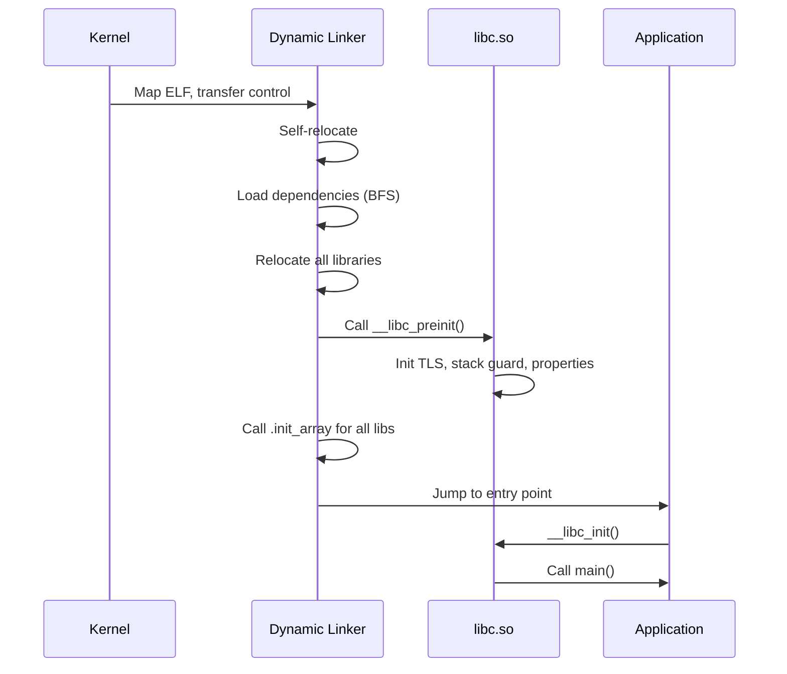

The `__libc_preinit_impl` function performs these critical steps:

1. **TLS generation synchronization** -- Registers libc's copy of the TLS
   generation counter with the linker so TLS modules stay in sync.
2. **Global variable initialization** -- Sets up `__libc_globals`, a
   write-protected structure containing the allocator dispatch table.
3. **Common initialization** -- Calls `__libc_init_common()` which initializes
   the system properties client, sets up the `environ` pointer, and configures
   the heap allocator.
4. **Netd client initialization** -- Registers DNS resolution hooks.
5. **Callback registration** -- Provides the linker with callbacks for HWASan
   library load/unload events and MTE stack remapping.

From `bionic/libc/bionic/libc_init_common.cpp` (lines 58-61):

```cpp
__LIBC_HIDDEN__ constinit WriteProtected<libc_globals> __libc_globals;
__LIBC_HIDDEN__ constinit _Atomic(bool) __libc_memtag_stack;
__LIBC_HIDDEN__ constinit bool __libc_memtag_stack_abi;
```

The `WriteProtected<>` template maps the globals structure into memory that is
normally read-only. Modifications require explicitly acquiring a
`ProtectedDataGuard`, which temporarily remaps the page as writable. This
defends against corruption of critical data like the allocator dispatch table.

### 7.1.5 Thread-Local Storage and the Bionic TCB

Bionic's TLS implementation is tightly integrated with the kernel. Each thread
has a **Thread Control Block (TCB)** accessible via a dedicated register
(TPIDR_EL0 on AArch64, GS segment on x86-64). The TCB layout is defined in
`bionic/libc/private/bionic_tls.h`.

From `bionic/libc/bionic/pthread_create.cpp` (lines 62-71):

```cpp
__attribute__((no_stack_protector))
void __init_tcb_stack_guard(bionic_tcb* tcb) {
  // GCC looks in the TLS for the stack guard on x86, so copy it there
  // from our global.
  tcb->tls_slot(TLS_SLOT_STACK_GUARD) = reinterpret_cast<void*>(__stack_chk_guard);
}

void __init_bionic_tls_ptrs(bionic_tcb* tcb, bionic_tls* tls) {
  tcb->thread()->bionic_tcb = tcb;
  tcb->thread()->bionic_tls = tls;
  tcb->tls_slot(TLS_SLOT_BIONIC_TLS) = tls;
}
```

Key TLS slots include:

| Slot | Purpose |
|------|---------|
| `TLS_SLOT_SELF` | Pointer to the TCB itself |
| `TLS_SLOT_THREAD_ID` | Thread ID for fast `gettid()` |
| `TLS_SLOT_STACK_GUARD` | Stack canary for `-fstack-protector` |
| `TLS_SLOT_BIONIC_TLS` | Pointer to the full `bionic_tls` structure |
| `TLS_SLOT_DTV` | Dynamic Thread Vector for ELF TLS |
| `TLS_SLOT_ART` | Reserved for the Android Runtime |

This fixed layout means that accessing thread-local state requires no function
calls or hash table lookups -- just a register read and a constant offset. The
stack guard canary, in particular, is accessed on every function entry and exit
in stack-protected code, so its placement in a fixed TLS slot is critical for
performance.

### 7.1.6 Architecture-Specific Optimizations

Bionic provides architecture-specific implementations for performance-critical
functions. The most notable are the string and memory operations.

**IFUNC (Indirect Function) Dispatch:**

On AArch64, functions like `memcpy`, `memset`, `strcmp`, and `strlen` are
dispatched at program startup via GNU IFUNC resolvers. The resolver examines
CPU capabilities and selects the optimal implementation.

From `bionic/libc/arch-arm64/ifuncs.cpp` (lines 36-49, 69-79):

```cpp
inline int implementer(uint64_t midr_el1) { return (midr_el1 >> 24) & 0xff; }
inline int variant(uint64_t midr_el1) { return (midr_el1 >> 20) & 0xf; }
inline int part(uint64_t midr_el1) { return (midr_el1 >> 4) & 0xfff; }
inline int revision(uint64_t midr_el1) { return (midr_el1 >> 0) & 0xf; }

static inline bool __bionic_is_oryon(unsigned long hwcap) {
  if (!(hwcap & HWCAP_CPUID)) return false;
  unsigned long midr;
  __asm__ __volatile__("mrs %0, MIDR_EL1" : "=r"(midr));
  return implementer(midr) == 'Q' && part(midr) <= 15;
}

// ...

DEFINE_IFUNC_FOR(memcpy) {
  if (arg->_hwcap2 & HWCAP2_MOPS) {
    RETURN_FUNC(memcpy_func_t, __memmove_aarch64_mops);
  } else if (__bionic_is_oryon(arg->_hwcap)) {
    RETURN_FUNC(memcpy_func_t, __memcpy_aarch64_nt);
  } else if (arg->_hwcap & HWCAP_ASIMD) {
    RETURN_FUNC(memcpy_func_t, __memcpy_aarch64_simd);
  } else {
    RETURN_FUNC(memcpy_func_t, __memcpy_aarch64);
  }
}
```

This code reveals four `memcpy` implementations for AArch64:

1. **MOPS (Memory Operations)** -- Uses the Armv8.8-A CPYFE instruction for
   hardware-accelerated memory copy. This is the fastest path on supported
   silicon.
2. **Oryon non-temporal** -- Qualcomm Oryon cores (implementer 'Q', parts 0-15)
   benefit from non-temporal stores that bypass the cache hierarchy for large
   copies. The implementation is in `bionic/libc/arch-arm64/oryon/memcpy-nt.S`.
3. **ASIMD (NEON)** -- Uses 128-bit SIMD load/store pairs. The standard fast
   path for most AArch64 devices.
4. **Generic** -- A scalar fallback for cores that lack ASIMD (theoretical on
   AArch64, but present for completeness).

Similarly, `memchr` has MTE-aware and standard variants:

```cpp
DEFINE_IFUNC_FOR(memchr) {
  if (arg->_hwcap2 & HWCAP2_MTE) {
    RETURN_FUNC(memchr_func_t, __memchr_aarch64_mte);
  } else {
    RETURN_FUNC(memchr_func_t, __memchr_aarch64);
  }
}
```

The MTE-aware variant must handle the possibility that pointer tags in the
search buffer do not match, requiring tag-stripped comparisons.

**Architecture-specific assembly files:**

Each architecture directory contains hand-written assembly for the most
critical paths:

| Architecture | Key Assembly Files |
|-------------|-------------------|
| `arch-arm64/bionic/` | `syscall.S`, `setjmp.S`, `vfork.S`, `__bionic_clone.S` |
| `arch-arm64/string/` | `__memcpy_chk.S`, `__memset_chk.S` |
| `arch-arm64/oryon/` | `memcpy-nt.S`, `memset-nt.S` |
| `arch-arm/bionic/` | Cortex-A53/A55/A7/A9/A15/Krait/Kryo-specific routines |
| `arch-x86_64/bionic/` | `syscall.S`, `setjmp.S` |
| `arch-x86_64/string/` | SSE/AVX-optimized string operations |
| `arch-riscv64/bionic/` | `syscall.S`, `setjmp.S` |
| `arch-riscv64/string/` | RISC-V string operations |

The ARM 32-bit tree is particularly rich, with CPU-specific subdirectories for
Cortex-A53, Cortex-A55, Cortex-A7, Cortex-A9, Cortex-A15, Krait (Qualcomm),
and Kryo (Qualcomm). The IFUNC resolver on ARM selects among these at runtime
based on `/proc/cpuinfo` or HWCAP values.

### 7.1.7 Upstream Code and the BSD Heritage

Bionic does not implement everything from scratch. It imports code from three
BSD operating systems:

- **OpenBSD**: Provides `strlcpy`, `strlcat`, `arc4random`, `reallocarray`,
  and much of the standard string library. OpenBSD's focus on security makes
  it a natural source for hardened implementations.

- **FreeBSD**: Contributes parts of the math library (`libm`), locale support,
  and some string functions.

- **NetBSD**: Provides the DNS resolver (`bionic/libc/dns/`) and some
  miscellaneous utility functions.

Imports are kept in separate directories (`upstream-openbsd/`, `upstream-freebsd/`,
`upstream-netbsd/`) and are periodically updated to incorporate upstream bug
fixes and security patches.

### 7.1.8 The Property System Client

Android's property system (`__system_property_get`, `__system_property_set`)
is implemented partly in Bionic. The client-side code in
`bionic/libc/system_properties/` provides lock-free reads from a shared memory
region mapped into every process. This is how every process on Android can read
system properties without IPC overhead.

The property area is initialized during `__libc_init_common()`:

From `bionic/libc/bionic/libc_init_common.cpp` (line 54):

```cpp
extern "C" int __system_properties_init(void);
```

This function maps the property area file (`/dev/__properties__/`) and sets up
the internal data structures for property reads.

### 7.1.9 Bionic vs. glibc: Feature Comparison

| Feature | Bionic | glibc |
|---------|--------|-------|
| License | BSD | LGPL |
| Size (stripped) | ~1 MB | ~8 MB |
| Locale support | Minimal (ASCII + UTF-8) | Full ICU-level |
| NSS modules | No | Yes |
| Thread cancellation | No | Yes |
| Stack protector | Fixed TLS slot | Variable offset |
| Default allocator | Scudo | ptmalloc2 |
| `dlopen` from APK | Yes (ZIP file support) | No |
| `android_dlopen_ext` | Yes | N/A |
| seccomp integration | Built-in | External |
| Property system | Built-in | N/A |
| FORTIFY_SOURCE | Enhanced | Standard |

### 7.1.10 Memory Safety Features

Bionic incorporates several memory safety features that have no glibc equivalent:

**MTE (Memory Tagging Extension):**
On Armv8.5-A and later hardware, Bionic supports MTE for both heap and stack
memory. The `note_memtag_heap_async.S` and `note_memtag_heap_sync.S` files in
`arch-arm64/bionic/` contain ELF notes that request MTE for heap allocations.

**Scudo hardened allocator:**
Bionic's default allocator is Scudo, a security-hardened allocator that provides
guard pages, quarantine zones, and integrity checks. The dispatch mechanism in
`malloc_common.cpp` allows Scudo to be transparently replaced with debug
allocators.

**GWP-ASan:**
A sampling allocator that catches use-after-free and buffer overflow bugs in
production, integrated via `gwp_asan_wrappers.h`.

**FORTIFY_SOURCE:**
Bionic's FORTIFY implementation is more aggressive than glibc's, with additional
compile-time and runtime checks for buffer overflows in string and memory
functions.

**Tagged pointers:**
Even without MTE hardware, Bionic can tag the top byte of heap pointers
(Top-Byte Ignore / TBI on ARM) to detect certain classes of memory corruption.

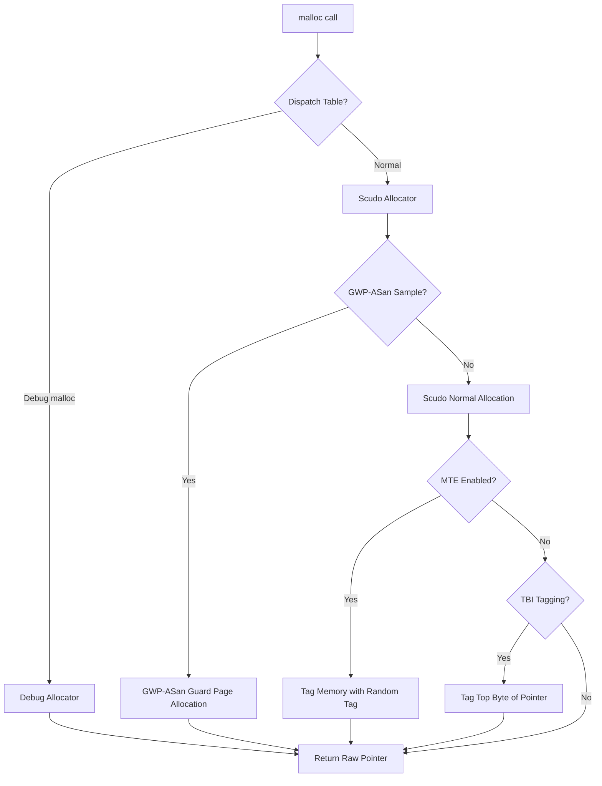

---

## 7.2 System Call Interface

### 7.2.1 How System Calls Work on Android

Every interaction between user-space code and the Linux kernel passes through a
system call. Bionic provides the user-space half of this interface: the thin
assembly stubs that transition from user mode to kernel mode, and the C wrapper
functions that provide the POSIX API.

The system call interface has three layers:

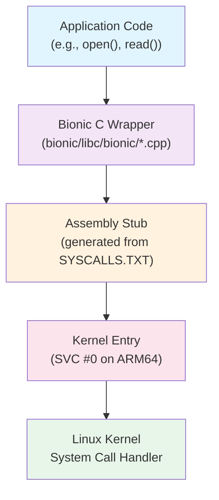

### 7.2.2 SYSCALLS.TXT: The System Call Definition File

All system call stubs in Bionic are auto-generated from a single definition
file:

**Source file:** `bionic/libc/SYSCALLS.TXT` (384 lines)

From `bionic/libc/SYSCALLS.TXT` (lines 1-14):

```
# This file is used to automatically generate bionic's system call stubs.
#
# It is processed by a python script named gensyscalls.py,
# normally run via the genrules in libc/Android.bp.
#
# Each non-blank, non-comment line has the following format:
#
#     func_name[|alias_list][:syscall_name[:socketcall_id]]([parameter_list]) arch_list
#
# where:
#     arch_list ::= "all" | arches
#     arches    ::= arch |  arch "," arches
#     arch      ::= "arm" | "arm64" | "riscv64" | "x86" | "x86_64" | "lp32" | "lp64"
```

Each line in SYSCALLS.TXT describes one system call with its function name,
optional aliases, parameter types, and the architectures on which it should
be generated. The format supports several important patterns:

**Direct system call mapping:**
```
read(int, void*, size_t)        all
write(int, const void*, size_t) all
```

**Renamed system calls (where the C name differs from the kernel name):**
```
__close:close(int)  all
__getpid:getpid()  all
__openat:openat(int, const char*, int, mode_t) all
```

The `__close:close` syntax means "generate a function named `__close` that
invokes the kernel's `close` system call." The actual `close()` function that
applications call is a C wrapper in `bionic/libc/bionic/` that performs
additional work (like FORTIFY checks or fdsan validation) before calling
`__close`.

**Architecture-conditional system calls:**
```
getuid:getuid32()   lp32
getuid()            lp64
```

On 32-bit platforms (`lp32`), the `getuid` function calls the kernel's
`getuid32` system call (because the original `getuid` uses 16-bit UIDs). On
64-bit platforms (`lp64`), it calls `getuid` directly.

**Aliased functions:**
```
lseek|lseek64(int, off_t, int) lp64
_exit|_Exit:exit_group(int)    all
```

The pipe symbol creates multiple symbol aliases that share the same
implementation. On 64-bit systems, `lseek` and `lseek64` are identical because
`off_t` is 64-bit.

**x86 socketcall multiplexing:**
```
__socket:socketcall:1(int, int, int) x86
__connect:socketcall:3(int, struct sockaddr*, socklen_t) x86
```

On 32-bit x86, socket operations are multiplexed through a single `socketcall`
system call, with a numeric sub-command. Bionic's generator handles this
automatically.

### 7.2.3 System Call Stub Generation

The `gensyscalls.py` script (`bionic/libc/tools/gensyscalls.py`) reads
SYSCALLS.TXT and generates architecture-specific assembly stubs. The supported
architectures are:

```python
SupportedArchitectures = [ "arm", "arm64", "riscv64", "x86", "x86_64" ]
```

**ARM 32-bit stub (4 or fewer register arguments):**

```asm
ENTRY(%(func)s)
    mov     ip, r7
    .cfi_register r7, ip
    ldr     r7, =%(NR_name)s
    swi     #0
    mov     r7, ip
    .cfi_restore r7
    cmn     r0, #(MAX_ERRNO + 1)
    bxls    lr
    neg     r0, r0
    b       __set_errno_internal
END(%(func)s)
```

On ARM, the system call number goes in register r7, and the SWI (Software
Interrupt) instruction traps into the kernel. The stub saves and restores r7
(which is the frame pointer in Thumb mode) to avoid corrupting the call stack.

**AArch64 syscall function:**

From `bionic/libc/arch-arm64/bionic/syscall.S` (lines 31-49):

```asm
ENTRY(syscall)
    /* Move syscall No. from x0 to x8 */
    mov     x8, x0
    /* Move syscall parameters from x1 thru x6 to x0 thru x5 */
    mov     x0, x1
    mov     x1, x2
    mov     x2, x3
    mov     x3, x4
    mov     x4, x5
    mov     x5, x6
    svc     #0

    /* check if syscall returned successfully */
    cmn     x0, #(MAX_ERRNO + 1)
    cneg    x0, x0, hi
    b.hi    __set_errno_internal

    ret
END(syscall)
```

This is the generic `syscall()` function for AArch64. The system call number
goes in x8, and up to six arguments go in x0-x5. The `SVC #0` instruction
enters the kernel. On return, if x0 contains a value in the range
[-MAX_ERRNO, -1], the error is negated and stored in `errno` via
`__set_errno_internal`.

### 7.2.4 The System Call Catalog

SYSCALLS.TXT defines system calls in several categories. Here is a breakdown
of the major groups:

**Process and identity management:**
```
getuid(), getgid(), geteuid(), getegid()
setuid(), setgid(), setresuid(), setresgid()
getpid(), getppid(), getpgid(), getsid()
kill(), tgkill()
execve(), clone(), _exit()
```

**File descriptors:**
```
read(), write(), pread64(), pwrite64()
__close:close(), __openat:openat()
__fcntl64:fcntl64() (lp32), __fcntl:fcntl() (lp64)
__dup:dup(), __dup3:dup3()
```

**Memory management:**
```
__mmap2:mmap2() (lp32), mmap|mmap64() (lp64)
munmap(), mprotect(), madvise(), mremap()
__brk:brk(), mseal() (lp64 only)
```

**File system:**
```
chdir(), mount(), umount2(), getcwd()
fstatat64(), statx()
setxattr(), getxattr(), listxattr()
```

**Networking (per-architecture):**
```
__socket:socket()              arm,lp64
__socket:socketcall:1()        x86
bind(), listen(), __accept4:accept4()
```

**Signals:**
```
__rt_sigaction:rt_sigaction()
__rt_sigprocmask:rt_sigprocmask()
__rt_sigsuspend:rt_sigsuspend()
__signalfd4:signalfd4()
```

**Architecture-specific:**
```
__set_tls:__ARM_NR_set_tls(void*)                    arm
cacheflush:__ARM_NR_cacheflush(long, long, long)     arm
__riscv_flush_icache:riscv_flush_icache(void*, void*, unsigned long) riscv64
__set_thread_area:set_thread_area(void*)              x86
arch_prctl(int, unsigned long)                        x86_64
```

**VDSO-accelerated calls:**
```
__clock_getres:clock_getres(clockid_t, struct timespec*) all
__clock_gettime:clock_gettime(clockid_t, struct timespec*) all
__gettimeofday:gettimeofday(struct timeval*, struct timezone*) all
```

These three system calls are typically handled by the VDSO (Virtual Dynamic
Shared Object), which the kernel maps into every process. The VDSO contains
user-space implementations of these calls that read from kernel-managed shared
memory pages, avoiding the overhead of a full kernel transition. Bionic's
dynamic linker explicitly loads the VDSO (see Section 6.3).

### 7.2.5 LP32 vs. LP64 Differences

The system call interface differs significantly between 32-bit and 64-bit
platforms:

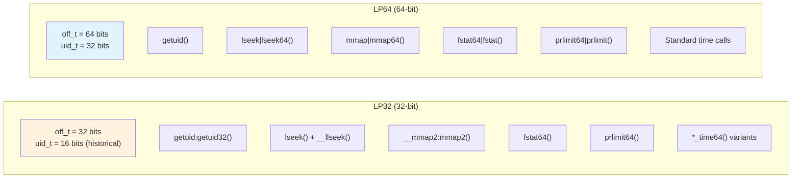

On 32-bit systems, many system calls have `64` suffixes or use register pairs
for 64-bit arguments. The SYSCALLS.TXT generator handles the ABI requirements
automatically, including ARM's constraint that 64-bit argument pairs must start
on an even-numbered register.

The time64 variants (lines 76-91 of `SECCOMP_ALLOWLIST_COMMON.TXT`) are
particularly notable:

```
clock_gettime64(clockid_t, timespec64*) lp32
clock_settime64(clockid_t, const timespec64*) lp32
futex_time64(int*, int, int, const timespec64*, int*, int) lp32
```

These were added for the Y2038 problem: 32-bit `time_t` overflows in January

2038. The `*_time64` system calls use 64-bit time structures even on 32-bit
platforms.

### 7.2.6 Seccomp-BPF: System Call Filtering

Android restricts which system calls are available to application processes
using seccomp-BPF (Secure Computing with Berkeley Packet Filter). This is a
critical security boundary: even if an attacker achieves arbitrary code
execution within an app process, they cannot invoke dangerous system calls
that the seccomp filter blocks.

The seccomp policy is built from multiple text files:

| File | Purpose |
|------|---------|
| `SYSCALLS.TXT` | Base set of system calls bionic needs |
| `SECCOMP_ALLOWLIST_COMMON.TXT` | Additional allowed calls (all processes) |
| `SECCOMP_ALLOWLIST_APP.TXT` | Additional allowed calls (app processes only) |
| `SECCOMP_ALLOWLIST_SYSTEM.TXT` | Additional allowed calls (system server only) |
| `SECCOMP_BLOCKLIST_APP.TXT` | Calls removed from apps even if in SYSCALLS.TXT |
| `SECCOMP_BLOCKLIST_COMMON.TXT` | Calls removed from all Zygote children |
| `SECCOMP_PRIORITY.TXT` | Syscalls to check first (hot path optimization) |

**The formula for the final policy:**

```
Final Allowlist = SYSCALLS.TXT - BLOCKLIST + ALLOWLIST
```

From `bionic/libc/SECCOMP_BLOCKLIST_APP.TXT` (lines 1-7):

```
# The final seccomp allowlist is SYSCALLS.TXT - SECCOMP_BLOCKLIST.TXT
#   + SECCOMP_ALLOWLIST.TXT
# Any entry in the blocklist must be in the syscalls file and not be in
#   the allowlist file
```

**Blocked system calls for apps:**

The `SECCOMP_BLOCKLIST_APP.TXT` file (51 lines) removes dangerous system calls
from app processes:

```
# Syscalls to modify IDs.
setgid32(gid_t)     lp32
setgid(gid_t)       lp64
setuid32(uid_t)     lp32
setuid(uid_t)       lp64

# Syscalls to modify times.
adjtimex(struct timex*)   all
clock_adjtime(clockid_t, struct timex*)   all
clock_settime(clockid_t, const struct timespec*)  all
settimeofday(const struct timeval*, const struct timezone*)   all

# Dangerous operations
chroot(const char*)  all
init_module(void*, unsigned long, const char*)  all
delete_module(const char*, unsigned int)   all
mount(const char*, const char*, const char*, unsigned long, const void*)  all
reboot(int, int, int, void*)  all
```

These are system calls that exist in SYSCALLS.TXT (because system daemons need
them) but are too dangerous for unprivileged app processes.

**The common blocklist** (`SECCOMP_BLOCKLIST_COMMON.TXT`) adds:

```
swapon(const char*, int) all
swapoff(const char*) all
```

**The app allowlist** (`SECCOMP_ALLOWLIST_APP.TXT`, 62 lines) re-enables
specific calls that apps need but are not in the base SYSCALLS.TXT set, often
for backward compatibility:

```
# Needed for debugging 32-bit Chrome
pipe(int pipefd[2])  lp32

# b/34813887
open(const char *path, int oflag, ... ) lp32,x86_64

# Not used by bionic in U because riscv64 doesn't have it, but still
# used by legacy apps (http://b/254179267).
renameat(int, const char*, int, const char*)  arm,x86,arm64,x86_64
```

Each entry references an Android bug tracker ID, documenting why the exception
exists.

**Priority optimization:**

From `bionic/libc/SECCOMP_PRIORITY.TXT` (lines 9-10):

```
futex
ioctl
```

These two system calls are checked first in the BPF filter. Since `futex` and
`ioctl` are the most frequently invoked system calls in a typical Android
process (futex for mutex/condvar operations, ioctl for Binder IPC), checking
them first minimizes the average number of BPF instructions executed per system
call.

### 7.2.7 Seccomp Policy Installation

The seccomp filter is installed by the Zygote process before it forks
application processes. The implementation is in
`bionic/libc/seccomp/seccomp_policy.cpp`.

From `bionic/libc/seccomp/seccomp_policy.cpp` (lines 33-94):

```cpp
#if defined __arm__ || defined __aarch64__
#define PRIMARY_ARCH AUDIT_ARCH_AARCH64
static const struct sock_filter* primary_app_filter = arm64_app_filter;
// ...
#define SECONDARY_ARCH AUDIT_ARCH_ARM
static const struct sock_filter* secondary_app_filter = arm_app_filter;
// ...
#elif defined __i386__ || defined __x86_64__
#define PRIMARY_ARCH AUDIT_ARCH_X86_64
// ...
#define SECONDARY_ARCH AUDIT_ARCH_I386
// ...
#elif defined(__riscv)
#define PRIMARY_ARCH AUDIT_ARCH_RISCV64
// ...
#endif
```

The filter handles dual-architecture systems (e.g., a 64-bit kernel running
32-bit apps) by checking the architecture field in the seccomp data structure
and jumping to the appropriate filter:

From `bionic/libc/seccomp/seccomp_policy.cpp` (lines 128-141):

```cpp
static size_t ValidateArchitectureAndJumpIfNeeded(filter& f) {
    f.push_back(BPF_STMT(BPF_LD|BPF_W|BPF_ABS, arch_nr));
    f.push_back(BPF_JUMP(BPF_JMP|BPF_JEQ|BPF_K, PRIMARY_ARCH, 2, 0));
    f.push_back(BPF_JUMP(BPF_JMP|BPF_JEQ|BPF_K, SECONDARY_ARCH, 1, 0));
    Disallow(f);
    return f.size() - 2;
}
```

**The BPF program structure:**

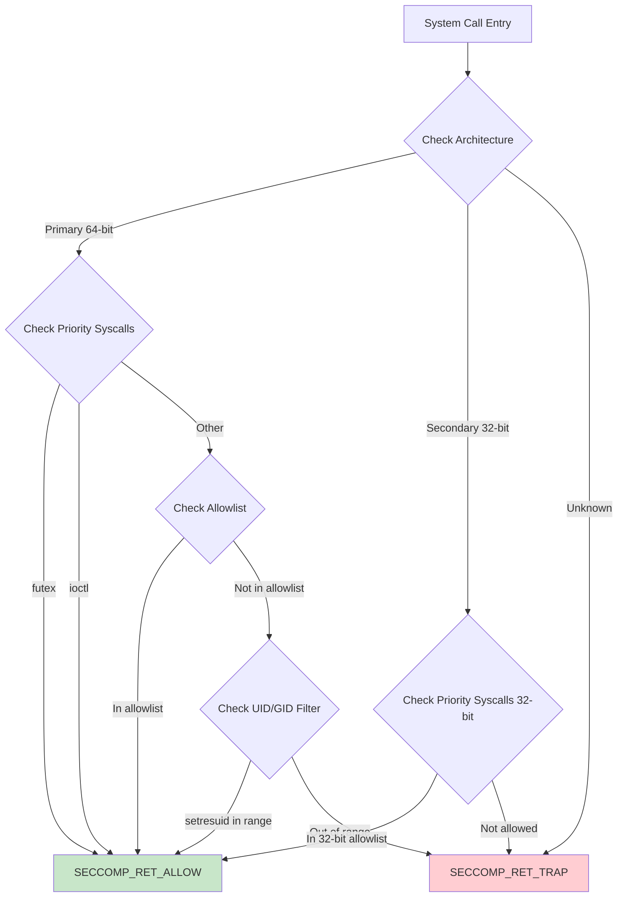

Three separate filter profiles are generated:

1. **App filter** -- For regular application processes
2. **App Zygote filter** -- For app zygote processes (used by isolated services)
3. **System filter** -- For system server and privileged daemons

The filters are compiled from C structures into BPF bytecode and installed
using `prctl(PR_SET_SECCOMP)`:

From `bionic/libc/seccomp/seccomp_policy.cpp` (lines 193-199):

```cpp
static bool install_filter(filter const& f) {
    struct sock_fprog prog = {
        static_cast<unsigned short>(f.size()),
        const_cast<struct sock_filter*>(&f[0]),
    };
    if (prctl(PR_SET_SECCOMP, SECCOMP_MODE_FILTER, &prog) < 0) {
```

The `SECCOMP_RET_TRAP` action sends a SIGSYS signal to the process, which
Android's debuggerd captures for crash reporting. This produces a clear
crash report that identifies the forbidden system call, aiding debugging.

### 7.2.8 VDSO: Avoiding System Call Overhead

For the most performance-sensitive system calls, the kernel provides a Virtual
Dynamic Shared Object (VDSO) -- a tiny shared library mapped by the kernel into
every process's address space. Bionic's dynamic linker explicitly locates and
links the VDSO.

From `bionic/linker/linker_main.cpp` (lines 184-205):

```cpp
static void add_vdso() {
  ElfW(Ehdr)* ehdr_vdso = reinterpret_cast<ElfW(Ehdr)*>(
      getauxval(AT_SYSINFO_EHDR));
  if (ehdr_vdso == nullptr) {
    return;
  }

  vdso = soinfo_alloc(&g_default_namespace, "[vdso]", nullptr, 0, 0);

  vdso->phdr = reinterpret_cast<ElfW(Phdr)*>(
      reinterpret_cast<char*>(ehdr_vdso) + ehdr_vdso->e_phoff);
  vdso->phnum = ehdr_vdso->e_phnum;
  vdso->base = reinterpret_cast<ElfW(Addr)>(ehdr_vdso);
  vdso->size = phdr_table_get_load_size(vdso->phdr, vdso->phnum);
  vdso->load_bias = get_elf_exec_load_bias(ehdr_vdso);

  if (!vdso->prelink_image() ||
      !vdso->link_image(SymbolLookupList(vdso), vdso, nullptr, nullptr)) {
    __linker_cannot_link(g_argv[0]);
  }

  // Prevent accidental unloads...
  vdso->set_dt_flags_1(vdso->get_dt_flags_1() | DF_1_NODELETE);
  vdso->set_linked();
}
```

The VDSO is located via the `AT_SYSINFO_EHDR` auxiliary vector entry, which
the kernel places on the process stack at exec time. The linker treats the
VDSO like any other shared library -- creating a `soinfo` structure, running
the prelink and link phases -- but the VDSO's code runs entirely in user space,
reading kernel-maintained data structures to answer queries like "what time is
it?" without a mode switch.

VDSO-accelerated calls in Bionic:

- `clock_gettime()` -- The single most frequently called time function
- `clock_getres()` -- Clock resolution query
- `gettimeofday()` -- Legacy time-of-day query

---

## 7.3 The Dynamic Linker

### 7.3.1 Overview

The dynamic linker (`/system/bin/linker64` on 64-bit devices, `/system/bin/linker`
on 32-bit) is responsible for loading every dynamically-linked executable and
shared library on Android. It is the first user-space code to execute after the
kernel maps a new process, and its correct operation is essential for every
native binary on the system.

The linker source lives in `bionic/linker/` and comprises approximately 50
source files totaling over 7,000 lines of C++. The key files are:

| File | Lines | Purpose |
|------|-------|---------|
| `linker.cpp` | 3,791 | Core linking logic: library search, loading, namespace management |
| `linker_phdr.cpp` | 1,737 | ELF parsing, segment loading, address space management |
| `linker_main.cpp` | 859 | Entry point, initialization, main linking sequence |
| `linker_relocate.cpp` | 686 | Relocation processing |
| `linker_namespaces.h` | 183 | Namespace data structures |
| `linker_soinfo.h` | ~400 | `soinfo` structure definition |
| `linker_config.cpp` | ~500 | Configuration file parser |
| `dlfcn.cpp` | ~100 | `dlopen`/`dlsym` API surface |

### 7.3.2 The Linker Entry Point

When the kernel executes a dynamically-linked ELF binary, it:

1. Maps the executable's PT_LOAD segments
2. Reads the PT_INTERP segment to find the linker path (e.g., `/system/bin/linker64`)
3. Maps the linker into the process
4. Sets up the auxiliary vector (AT_PHDR, AT_ENTRY, AT_BASE, etc.)
5. Transfers control to the linker's entry point

The linker's entry point is `_start` (in architecture-specific assembly), which
calls `__linker_init`. This function faces a bootstrapping problem: the linker
itself is a dynamically-linked binary that needs to be relocated before it can
relocate anything else.

The solution is a two-phase initialization:

1. **Self-relocation** -- Process the linker's own relocations using only
   position-independent code (no external symbol references)
2. **Main link** -- Load and link the executable and all its dependencies

### 7.3.3 The Main Linking Sequence

The `linker_main` function in `bionic/linker/linker_main.cpp` orchestrates the
entire linking process.

From `bionic/linker/linker_main.cpp` (lines 297-525):

```cpp
static ElfW(Addr) linker_main(KernelArgumentBlock& args,
                               const char* exe_to_load) {
  ProtectedDataGuard guard;

  // Sanitize the environment.
  __libc_init_AT_SECURE(args.envp);

  // Initialize system properties
  __system_properties_init();

  // Initialize platform properties.
  platform_properties_init();

  // Register the debuggerd signal handler.
  linker_debuggerd_init();
```

The function proceeds through these phases:

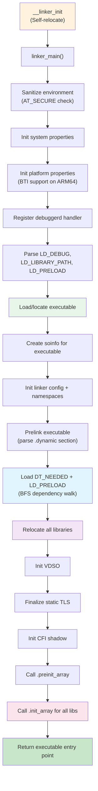

**Phase 1: Environment and Security**

```cpp
  // These should have been sanitized by __libc_init_AT_SECURE, but the
  // test doesn't cost us anything.
  const char* ldpath_env = nullptr;
  const char* ldpreload_env = nullptr;
  if (!getauxval(AT_SECURE)) {
    ldpath_env = getenv("LD_LIBRARY_PATH");
    ldpreload_env = getenv("LD_PRELOAD");
  }
```

When `AT_SECURE` is set (the executable is setuid/setgid), `LD_LIBRARY_PATH`
and `LD_PRELOAD` are ignored. This prevents privilege escalation attacks where a
user sets these variables to inject malicious libraries into a privileged
process.

**Phase 2: Executable Initialization**

From `bionic/linker/linker_main.cpp` (lines 340-358):

```cpp
  const ExecutableInfo exe_info = exe_to_load ?
      load_executable(exe_to_load) :
      get_executable_info(args.argv[0]);

  soinfo* si = soinfo_alloc(&g_default_namespace,
                            exe_info.path.c_str(), &exe_info.file_stat,
                            0, RTLD_GLOBAL);
  somain = si;
  si->phdr = exe_info.phdr;
  si->phnum = exe_info.phdr_count;
  si->set_should_pad_segments(exe_info.should_pad_segments);
  get_elf_base_from_phdr(si->phdr, si->phnum, &si->base, &si->load_bias);
  si->size = phdr_table_get_load_size(si->phdr, si->phnum);
  si->dynamic = nullptr;
  si->set_main_executable();
  init_link_map_head(*si);
  set_bss_vma_name(si);
```

The `get_executable_info` function reads the executable's program headers from
the auxiliary vector (`AT_PHDR`, `AT_PHNUM`, `AT_ENTRY`). The kernel has
already mapped the executable, so the linker just needs to find the headers.

The `soinfo` structure is the linker's per-library metadata. It is allocated
from a custom block allocator (`LinkerTypeAllocator<soinfo>`) that maps memory
in page-sized blocks, enabling write-protection via `ProtectedDataGuard`.

**Phase 3: Namespace Initialization and Dependency Loading**

```cpp
  std::vector<android_namespace_t*> namespaces =
      init_default_namespaces(exe_info.path.c_str());

  if (!si->prelink_image()) __linker_cannot_link(g_argv[0]);

  // Load ld_preloads and dependencies.
  for (const ElfW(Dyn)* d = si->dynamic; d->d_tag != DT_NULL; ++d) {
    if (d->d_tag == DT_NEEDED) {
      const char* name = fix_dt_needed(
          si->get_string(d->d_un.d_val), si->get_realpath());
      needed_library_name_list.push_back(name);
    }
  }

  if (!find_libraries(&g_default_namespace, si,
                      needed_library_names, needed_libraries_count,
                      nullptr, &g_ld_preloads, ld_preloads_count,
                      RTLD_GLOBAL, nullptr,
                      true /* add_as_children */, &namespaces)) {
    __linker_cannot_link(g_argv[0]);
  }
```

The `prelink_image` method parses the `.dynamic` section to extract symbol
tables, relocation tables, DT_NEEDED entries, and initialization/finalization
functions. The `find_libraries` function then performs a breadth-first
dependency walk, loading each library and adding it to the appropriate namespace.

**Phase 4: Constructor Invocation and Handoff**

```cpp
  si->call_pre_init_constructors();
  si->call_constructors();

  ElfW(Addr) entry = exe_info.entry_point;
  return entry;
```

After all libraries are loaded and relocated, the linker calls initialization
functions in dependency order (leaves first, roots last). It then returns the
executable's entry point address, and control transfers to the application.

### 7.3.4 The soinfo Structure

The `soinfo` structure is the linker's representation of a loaded shared
library. Every library -- including the executable itself, the linker, and the
VDSO -- has one.

From `bionic/linker/linker_soinfo.h` (lines 157-248):

```cpp
struct soinfo {
  const ElfW(Phdr)* phdr;
  size_t phnum;
  ElfW(Addr) base;
  size_t size;

  ElfW(Dyn)* dynamic;
  soinfo* next;

 private:
  uint32_t flags_;
  const char* strtab_;
  ElfW(Sym)* symtab_;

  size_t nbucket_;
  size_t nchain_;
  uint32_t* bucket_;
  uint32_t* chain_;

#if defined(USE_RELA)
  ElfW(Rela)* plt_rela_;
  size_t plt_rela_count_;
  ElfW(Rela)* rela_;
  size_t rela_count_;
#else
  ElfW(Rel)* plt_rel_;
  size_t plt_rel_count_;
  ElfW(Rel)* rel_;
  size_t rel_count_;
#endif

  linker_ctor_function_t* preinit_array_;
  size_t preinit_array_count_;
  linker_ctor_function_t* init_array_;
  size_t init_array_count_;
  linker_dtor_function_t* fini_array_;
  size_t fini_array_count_;

  linker_ctor_function_t init_func_;
  linker_dtor_function_t fini_func_;

#if defined(__arm__)
  uint32_t* ARM_exidx;
  size_t ARM_exidx_count;
#endif

  link_map link_map_head;
  bool constructors_called;
  ElfW(Addr) load_bias;
  bool has_DT_SYMBOLIC;
};
```

Key flags in the `flags_` field:

| Flag | Value | Meaning |
|------|-------|---------|
| `FLAG_LINKED` | 0x00000001 | Library is fully linked |
| `FLAG_EXE` | 0x00000004 | This is the main executable |
| `FLAG_LINKER` | 0x00000010 | This is the linker itself |
| `FLAG_GNU_HASH` | 0x00000040 | Uses GNU hash table |
| `FLAG_MAPPED_BY_CALLER` | 0x00000080 | Memory was provided externally |
| `FLAG_IMAGE_LINKED` | 0x00000100 | `link_image` has run |
| `FLAG_PRELINKED` | 0x00000400 | `prelink_image` has run |
| `FLAG_GLOBALS_TAGGED` | 0x00000800 | MTE globals tagged |

The `soinfo` structures form a singly-linked list via the `next` pointer,
maintained by `solist_add_soinfo` and `solist_remove_soinfo`. The list order
is:

1. The main executable (`somain`)
2. The linker itself (`solinker`)
3. The VDSO (if present)
4. All other libraries in load order

### 7.3.5 ELF Loading: The ElfReader Class

The `ElfReader` class in `bionic/linker/linker_phdr.cpp` handles the mechanics
of reading and mapping ELF files into memory.

**Reading an ELF file:**

From `bionic/linker/linker_phdr.cpp` (lines 171-208):

```cpp
bool ElfReader::Read(const char* name, int fd, off64_t file_offset,
                     off64_t file_size) {
  if (did_read_) {
    return true;
  }
  name_ = name;
  fd_ = fd;
  file_offset_ = file_offset;
  file_size_ = file_size;

  if (ReadElfHeader() &&
      VerifyElfHeader() &&
      ReadProgramHeaders() &&
      CheckProgramHeaderAlignment() &&
      ReadSectionHeaders() &&
      ReadDynamicSection() &&
      ReadPadSegmentNote()) {
    did_read_ = true;
  }
  // ...
  return did_read_;
}
```

The Read phase performs validation and reads metadata:

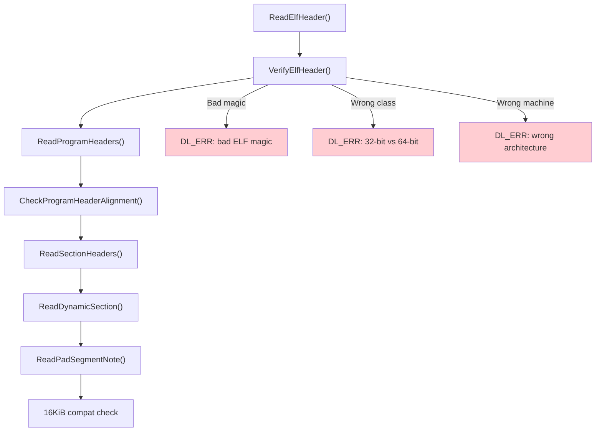

**ELF header verification:**

From `bionic/linker/linker_phdr.cpp` (lines 271-340):

```cpp
bool ElfReader::VerifyElfHeader() {
  if (memcmp(header_.e_ident, ELFMAG, SELFMAG) != 0) {
    DL_ERR("\"%s\" has bad ELF magic", name_.c_str());
    return false;
  }

  int elf_class = header_.e_ident[EI_CLASS];
#if defined(__LP64__)
  if (elf_class != ELFCLASS64) {
    if (elf_class == ELFCLASS32) {
      DL_ERR("\"%s\" is 32-bit instead of 64-bit", name_.c_str());
    }
    return false;
  }
#endif

  if (header_.e_type != ET_DYN) {
    DL_ERR("\"%s\" has unexpected e_type: %d", name_.c_str(), header_.e_type);
    return false;
  }

  if (header_.e_machine != GetTargetElfMachine()) {
    DL_ERR("\"%s\" is for %s instead of %s",
           name_.c_str(),
           EM_to_string(header_.e_machine),
           EM_to_string(GetTargetElfMachine()));
    return false;
  }
  return true;
}
```

The `GetTargetElfMachine()` function returns the expected ELF machine type
based on the compile-time architecture:

```cpp
static int GetTargetElfMachine() {
#if defined(__arm__)
  return EM_ARM;
#elif defined(__aarch64__)
  return EM_AARCH64;
#elif defined(__i386__)
  return EM_386;
#elif defined(__riscv)
  return EM_RISCV;
#elif defined(__x86_64__)
  return EM_X86_64;
#endif
}
```

Note that the linker requires `e_type == ET_DYN`. This means Android only loads
Position-Independent Executables (PIE). Non-PIE support was dropped in API level
21 for security (ASLR effectiveness):

```cpp
if (elf_hdr->e_type != ET_DYN) {
    __linker_error("error: Android only supports position-independent "
                   "executables (-fPIE)");
}
```

**Loading segments into memory:**

From `bionic/linker/linker_phdr.cpp` (lines 211-238):

```cpp
bool ElfReader::Load(address_space_params* address_space) {
  CHECK(did_read_);
  if (did_load_) {
    return true;
  }
  bool reserveSuccess = ReserveAddressSpace(address_space);
  if (reserveSuccess && LoadSegments() && FindPhdr() &&
      FindGnuPropertySection()) {
    did_load_ = true;
#if defined(__aarch64__)
    if (note_gnu_property_.IsBTICompatible()) {
      did_load_ =
          (phdr_table_protect_segments(phdr_table_, phdr_num_, load_bias_,
               should_pad_segments_, should_use_16kib_app_compat_,
               &note_gnu_property_) == 0);
    }
#endif
  }
  return did_load_;
}
```

The Load phase:

1. **ReserveAddressSpace** -- Allocates a contiguous virtual address range for
   all PT_LOAD segments via `mmap(PROT_NONE)`.
2. **LoadSegments** -- Maps each PT_LOAD segment from the file into the
   reserved range with appropriate permissions.
3. **FindPhdr** -- Locates the program header table within the mapped image.
4. **FindGnuPropertySection** -- Reads `.note.gnu.property` for BTI
   (Branch Target Identification) compatibility on AArch64.
5. **BTI protection** -- If the library is BTI-compatible, applies
   `PROT_BTI` to executable segments.

**Address space reservation with ASLR enhancement:**

From `bionic/linker/linker_phdr.cpp` (lines 589-662):

```cpp
// Reserve a virtual address range such that if its limits were extended
// to the next 2**align boundary, it would not overlap with any existing
// mappings.
static void* ReserveWithAlignmentPadding(size_t size, size_t mapping_align,
                                          size_t start_align,
                                          void** out_gap_start,
                                          size_t* out_gap_size) {
  // ...
#if defined(__LP64__)
  size_t first_byte = reinterpret_cast<size_t>(
      __builtin_align_up(mmap_ptr, mapping_align));
  size_t last_byte = reinterpret_cast<size_t>(
      __builtin_align_down(mmap_ptr + mmap_size, mapping_align) - 1);
  if (first_byte / kGapAlignment != last_byte / kGapAlignment) {
    // This library crosses a 2MB boundary and will fragment a new huge
    // page. Insert random inaccessible huge pages before to improve
    // ASLR.
    gap_size = kGapAlignment * (is_first_stage_init() ? 1 :
        arc4random_uniform(kMaxGapUnits - 1) + 1);
  }
#endif
```

This code implements an ASLR enhancement: when a library's mapping crosses a
2MB (PMD-sized) boundary, the linker inserts a random number of inaccessible
2MB pages before the library. This makes it harder for attackers to locate
library code by probing for readable memory mappings. The gap size is random
(1 to 32 units of 2MB = 2-64MB) and varies per library load.

### 7.3.6 The Load Bias and Virtual Address Calculation

A central concept in ELF loading is the **load bias**:

From the documentation comment in `bionic/linker/linker_phdr.cpp` (lines 74-149):

```
An ELF file's program header table contains one or more PT_LOAD
segments, which corresponds to portions of the file that need to
be mapped into the process' address space.

Each loadable segment has the following important properties:
    p_offset  -> segment file offset
    p_filesz  -> segment file size
    p_memsz   -> segment memory size (always >= p_filesz)
    p_vaddr   -> segment's virtual address
    p_flags   -> segment flags (e.g. readable, writable, executable)
    p_align   -> segment's alignment

The load_bias must be added to any p_vaddr value read from the ELF
file to determine the corresponding memory address.

    load_bias = phdr0_load_address - page_start(phdr0->p_vaddr)
```

The load bias is the difference between where the first segment was actually
mapped and where it "wanted" to be (its p_vaddr). Since all segments maintain
their relative positions, adding the load bias to any p_vaddr gives the actual
memory address:

```
actual_address = p_vaddr + load_bias
```

The calculation:

From `bionic/linker/linker_phdr.cpp` (lines 516-553):

```cpp
size_t phdr_table_get_load_size(const ElfW(Phdr)* phdr_table,
                                 size_t phdr_count,
                                 ElfW(Addr)* out_min_vaddr,
                                 ElfW(Addr)* out_max_vaddr) {
  ElfW(Addr) min_vaddr = UINTPTR_MAX;
  ElfW(Addr) max_vaddr = 0;

  for (size_t i = 0; i < phdr_count; ++i) {
    const ElfW(Phdr)* phdr = &phdr_table[i];
    if (phdr->p_type != PT_LOAD) {
      continue;
    }
    if (phdr->p_vaddr < min_vaddr) {
      min_vaddr = phdr->p_vaddr;
    }
    if (phdr->p_vaddr + phdr->p_memsz > max_vaddr) {
      max_vaddr = phdr->p_vaddr + phdr->p_memsz;
    }
  }

  min_vaddr = page_start(min_vaddr);
  max_vaddr = page_end(max_vaddr);

  return max_vaddr - min_vaddr;
}
```

### 7.3.7 16KiB Page Size Compatibility

Android is transitioning from 4KiB to 16KiB page sizes. The linker includes
compatibility logic for loading 4KiB-aligned libraries on 16KiB-page devices:

From `bionic/linker/linker_phdr.cpp` (lines 190-206):

```cpp
if (kPageSize == 16 * 1024 && min_align_ < kPageSize) {
    auto compat_prop_val =
        ::android::base::GetProperty(
            "bionic.linker.16kb.app_compat.enabled", "false");

    should_use_16kib_app_compat_ =
        ParseBool(compat_prop_val) == ParseBoolResult::kTrue ||
        get_16kb_appcompat_mode();
}
```

In compatibility mode, the linker reads ELF segments into a writable
reservation rather than using `mmap()` directly, because `mmap()` requires
mappings aligned to the system page size (16KiB), but the library's segments
may be aligned to only 4KiB.

This is controlled by the system property
`bionic.linker.16kb.app_compat.enabled` and an ELF note
(`NT_ANDROID_TYPE_PAD_SEGMENT`) that indicates the library supports
segment padding for page size migration.

### 7.3.8 Relocation Processing

After all segments are mapped, the linker must process **relocations** --
patches to code and data that encode references to symbols whose addresses are
not known until load time.

The relocation engine is in `bionic/linker/linker_relocate.cpp`.

From `bionic/linker/linker_relocate.cpp` (lines 63-95):

```cpp
class Relocator {
 public:
  Relocator(const VersionTracker& version_tracker,
            const SymbolLookupList& lookup_list)
      : version_tracker(version_tracker), lookup_list(lookup_list)
  {}

  soinfo* si = nullptr;
  const char* si_strtab = nullptr;
  size_t si_strtab_size = 0;
  ElfW(Sym)* si_symtab = nullptr;

  const VersionTracker& version_tracker;
  const SymbolLookupList& lookup_list;

  // Cache key/value for repeated symbol lookups
  ElfW(Word) cache_sym_val = 0;
  const ElfW(Sym)* cache_sym = nullptr;
  soinfo* cache_si = nullptr;
  // ...
};
```

The `Relocator` class maintains state for processing a library's relocations.
The symbol cache (lines 78-81) is a critical optimization: many relocations in
a library reference the same symbol, and the cache avoids repeated hash table
lookups.

**Relocation modes:**

From `bionic/linker/linker_relocate.cpp` (lines 132-139):

```cpp
enum class RelocMode {
  // Fast path for JUMP_SLOT relocations.
  JumpTable,
  // Fast path for typical relocations: ABSOLUTE, GLOB_DAT, or RELATIVE.
  Typical,
  // Handle all relocation types, including text sections and statistics.
  General,
};
```

The linker uses template specialization on `RelocMode` to generate three
versions of the relocation loop. The `JumpTable` and `Typical` modes are
optimized fast paths that handle the vast majority of relocations. The
`General` mode handles rare cases like TLS relocations, text relocations
(32-bit only), and IFUNCs.

**Processing a single relocation:**

From `bionic/linker/linker_relocate.cpp` (lines 163-176):

```cpp
template <RelocMode Mode>
static bool process_relocation_impl(Relocator& relocator,
                                     const rel_t& reloc) {
  void* const rel_target = reinterpret_cast<void*>(
      relocator.si->apply_memtag_if_mte_globals(
          reloc.r_offset + relocator.si->load_bias));
  const uint32_t r_type = ELFW(R_TYPE)(reloc.r_info);
  const uint32_t r_sym = ELFW(R_SYM)(reloc.r_info);

  soinfo* found_in = nullptr;
  const ElfW(Sym)* sym = nullptr;
  const char* sym_name = nullptr;
  ElfW(Addr) sym_addr = 0;

  if (r_sym != 0) {
    sym_name = relocator.get_string(
        relocator.si_symtab[r_sym].st_name);
  }
```

For each relocation entry, the linker:

1. Computes the target address (offset + load_bias)
2. Extracts the relocation type and symbol index
3. Looks up the symbol name in the string table
4. Resolves the symbol to an address
5. Applies the relocation (writes the resolved address to the target)

**Symbol lookup with caching:**

From `bionic/linker/linker_relocate.cpp` (lines 100-130):

```cpp
static inline bool lookup_symbol(Relocator& relocator, uint32_t r_sym,
                                  const char* sym_name,
                                  soinfo** found_in,
                                  const ElfW(Sym)** sym) {
  if (r_sym == relocator.cache_sym_val) {
    *found_in = relocator.cache_si;
    *sym = relocator.cache_sym;
    count_relocation_if<DoLogging>(kRelocSymbolCached);
  } else {
    const version_info* vi = nullptr;
    if (!relocator.si->lookup_version_info(
            relocator.version_tracker, r_sym, sym_name, &vi)) {
      return false;
    }

    soinfo* local_found_in = nullptr;
    const ElfW(Sym)* local_sym = soinfo_do_lookup(
        sym_name, vi, &local_found_in, relocator.lookup_list);

    relocator.cache_sym_val = r_sym;
    relocator.cache_si = local_found_in;
    relocator.cache_sym = local_sym;
    *found_in = local_found_in;
    *sym = local_sym;
  }

  if (*sym == nullptr) {
    if (ELF_ST_BIND(relocator.si_symtab[r_sym].st_info) != STB_WEAK) {
      DL_ERR("cannot locate symbol \"%s\" referenced by \"%s\"",
             sym_name, relocator.si->get_realpath());
      return false;
    }
  }
  return true;
}
```

The lookup uses version information (ELF symbol versioning) when available,
which allows libraries to export multiple versions of the same symbol. This is
how libc can evolve its API without breaking backward compatibility.

**Relocation statistics:**

```cpp
void print_linker_stats() {
  LD_DEBUG(statistics,
           "RELO STATS: %s: %d abs, %d rel, %d symbol (%d cached)",
           g_argv[0],
           linker_stats.count[kRelocAbsolute],
           linker_stats.count[kRelocRelative],
           linker_stats.count[kRelocSymbol],
           linker_stats.count[kRelocSymbolCached]);
}
```

These statistics, enabled via `LD_DEBUG=statistics`, reveal the relocation
workload. A typical Android app might process tens of thousands of relocations
during startup. The symbol cache typically achieves hit rates above 80%,
significantly reducing startup time.

### 7.3.9 Symbol Resolution

Symbol resolution is the process of finding the definition of a symbol given
its name. The linker supports two hash table formats:

1. **ELF hash** (classic `DT_HASH`) -- The original ELF hash table
2. **GNU hash** (`DT_GNU_HASH`) -- A more efficient format that uses a Bloom
   filter for fast rejection

From `bionic/linker/linker_soinfo.h` (lines 80-98):

```cpp
struct SymbolLookupLib {
  uint32_t gnu_maskwords_ = 0;
  uint32_t gnu_shift2_ = 0;
  ElfW(Addr)* gnu_bloom_filter_ = nullptr;

  const char* strtab_;
  size_t strtab_size_;
  const ElfW(Sym)* symtab_;
  const ElfW(Versym)* versym_;

  const uint32_t* gnu_chain_;
  size_t gnu_nbucket_;
  uint32_t* gnu_bucket_;

  soinfo* si_ = nullptr;

  bool needs_sysv_lookup() const {
    return si_ != nullptr && gnu_bloom_filter_ == nullptr;
  }
};
```

The `SymbolLookupLib` structure pre-extracts all the fields needed for symbol
lookup from a library, avoiding repeated pointer chasing during the relocation
loop. The `needs_sysv_lookup()` method returns true only for libraries that
lack a GNU hash table (increasingly rare).

**GNU hash Bloom filter:**

The GNU hash table includes a Bloom filter that allows the linker to quickly
reject lookups for symbols that definitely do not exist in a library. This is
particularly effective because most symbols are defined in only one or two
libraries, so the vast majority of lookups in other libraries will be rejected
by the Bloom filter without examining the hash chains.

**Symbol lookup order:**

The `SymbolLookupList` class defines the order in which libraries are searched:

```cpp
class SymbolLookupList {
  std::vector<SymbolLookupLib> libs_;
  SymbolLookupLib sole_lib_;
  const SymbolLookupLib* begin_;
  const SymbolLookupLib* end_;
  size_t slow_path_count_ = 0;
  // ...
};
```

For a library with `DT_SYMBOLIC`, its own symbol table is searched first.
Otherwise, the order follows the standard ELF rules: global scope first (all
libraries loaded with RTLD_GLOBAL), then the local scope (the library and its
dependencies).

### 7.3.10 Library Search and Loading

When the linker needs to load a library (either from DT_NEEDED or dlopen), it
searches multiple locations in a defined order.

From `bionic/linker/linker.cpp` (lines 1051-1082):

```cpp
static int open_library(android_namespace_t* ns,
                        ZipArchiveCache* zip_archive_cache,
                        const char* name, soinfo *needed_by,
                        off64_t* file_offset, std::string* realpath) {
  // If the name contains a slash, open directly
  if (strchr(name, '/') != nullptr) {
    return open_library_at_path(zip_archive_cache, name,
                                 file_offset, realpath);
  }

  // 1. LD_LIBRARY_PATH has the highest priority
  int fd = open_library_on_paths(zip_archive_cache, name, file_offset,
                                  ns->get_ld_library_paths(), realpath);

  // 2. Try the DT_RUNPATH, and verify accessibility
  if (fd == -1 && needed_by != nullptr) {
    fd = open_library_on_paths(zip_archive_cache, name, file_offset,
                                needed_by->get_dt_runpath(), realpath);
    if (fd != -1 && !ns->is_accessible(*realpath)) {
      close(fd);
      fd = -1;
    }
  }

  // 3. Search the namespace's default paths
  if (fd == -1) {
    fd = open_library_on_paths(zip_archive_cache, name, file_offset,
                                ns->get_default_library_paths(), realpath);
  }

  return fd;
}
```

The search order is:

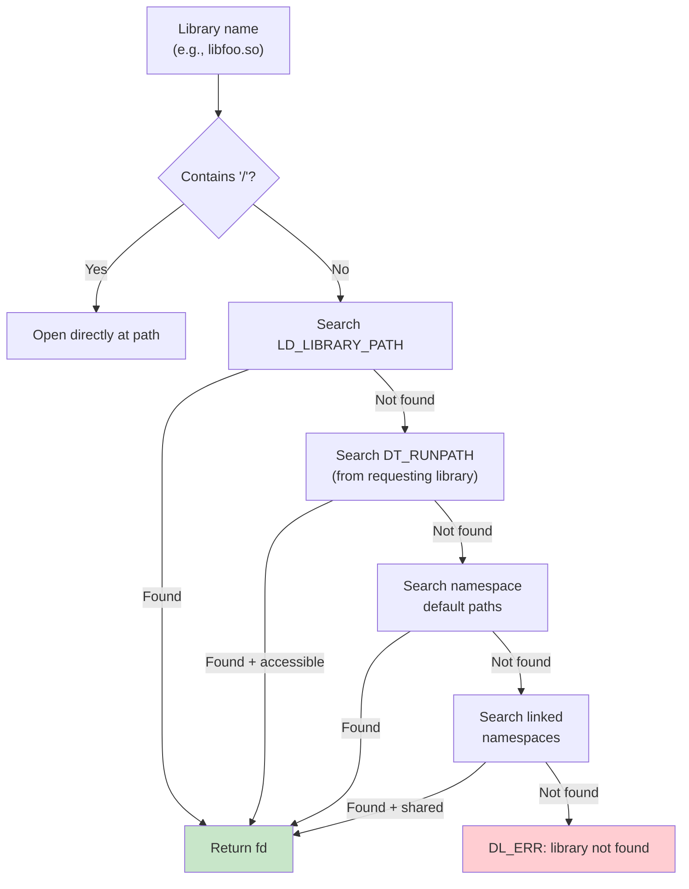

**Loading from APK files (ZIP):**

A unique feature of Android's linker is the ability to load shared libraries
directly from APK files (which are ZIP archives). From `bionic/linker/linker.cpp`
(lines 927-996):

```cpp
static int open_library_in_zipfile(ZipArchiveCache* zip_archive_cache,
                                    const char* const input_path,
                                    off64_t* file_offset,
                                    std::string* realpath) {
  // Treat an '!/' separator inside a path as the separator between
  // the zip file name and the subdirectory to search within it.
  const char* const separator = strstr(path, kZipFileSeparator);
  // ...
  ZipEntry entry;
  if (FindEntry(handle, file_path, &entry) != 0) {
    close(fd);
    return -1;
  }

  // Check if it is properly stored (not compressed, page-aligned)
  if (entry.method != kCompressStored ||
      (entry.offset % page_size()) != 0) {
    close(fd);
    return -1;
  }

  *file_offset = entry.offset;
  return fd;
}
```

The library must be stored uncompressed and page-aligned within the ZIP file.
The linker opens the APK, finds the entry, and returns a file descriptor with
the offset to the library data. The path syntax uses `!/` as a separator:
`/data/app/com.example/base.apk!/lib/arm64-v8a/libfoo.so`.

### 7.3.11 Dependency Walking and Load Order

The `find_libraries` function (in `linker.cpp`) performs a breadth-first walk
of the dependency tree. The BFS order ensures that dependencies are loaded
before the libraries that need them.

From `bionic/linker/linker.cpp` (lines 703-741):

```cpp
template<typename F>
static bool walk_dependencies_tree(soinfo* root_soinfo, F action) {
  SoinfoLinkedList visit_list;
  SoinfoLinkedList visited;

  visit_list.push_back(root_soinfo);

  soinfo* si;
  while ((si = visit_list.pop_front()) != nullptr) {
    if (visited.contains(si)) {
      continue;
    }

    walk_action_result_t result = action(si);

    if (result == kWalkStop) {
      return false;
    }

    visited.push_back(si);

    if (result != kWalkSkip) {
      si->get_children().for_each([&](soinfo* child) {
        visit_list.push_back(child);
      });
    }
  }

  return true;
}
```

This BFS walker is used for:

- Loading dependencies (`find_libraries`)
- `dlsym(RTLD_DEFAULT)` global symbol lookup
- `dlsym(handle)` handle-based symbol lookup
- Constructor invocation ordering

The three possible action results (`kWalkStop`, `kWalkContinue`, `kWalkSkip`)
allow the walker to be used for both search (stop when found) and traversal
(visit everything) operations.

### 7.3.12 The dlopen/dlsym/dlclose API

Applications interact with the linker at runtime through the `dl*` family of
functions. These are exposed through `dlfcn.cpp`:

From `bionic/linker/dlfcn.cpp` (lines 49-99):

```cpp
extern "C" {
android_namespace_t* __loader_android_create_namespace(
    const char* name,
    const char* ld_library_path,
    const char* default_library_path,
    uint64_t type,
    const char* permitted_when_isolated_path,
    android_namespace_t* parent_namespace,
    const void* caller_addr) __LINKER_PUBLIC__;

void* __loader_android_dlopen_ext(
    const char* filename,
    int flags,
    const android_dlextinfo* extinfo,
    const void* caller_addr) __LINKER_PUBLIC__;

void* __loader_dlopen(
    const char* filename,
    int flags,
    const void* caller_addr) __LINKER_PUBLIC__;

void* __loader_dlsym(
    void* handle,
    const char* symbol,
    const void* caller_addr) __LINKER_PUBLIC__;

int __loader_dlclose(void* handle) __LINKER_PUBLIC__;
```

All functions take a `caller_addr` parameter, which the linker uses to
determine the namespace context. By examining which `soinfo` contains the
caller's address, the linker determines which namespace the caller belongs to,
and searches that namespace for the requested library.

**Android-specific extensions:**

`android_dlopen_ext` provides capabilities beyond standard `dlopen`:

- `ANDROID_DLEXT_FORCE_LOAD` -- Load even if already loaded
- `ANDROID_DLEXT_USE_LIBRARY_FD` -- Load from an explicit file descriptor
- `ANDROID_DLEXT_RESERVED_ADDRESS` -- Load at a specific address
- `ANDROID_DLEXT_USE_NAMESPACE` -- Load into a specific namespace

### 7.3.13 Protected Data and Security

The linker protects its internal data structures against corruption:

From `bionic/linker/linker.cpp` (lines 468-491):

```cpp
ProtectedDataGuard::ProtectedDataGuard() {
  if (ref_count_++ == 0) {
    protect_data(PROT_READ | PROT_WRITE);
  }
  if (ref_count_ == 0) { // overflow
    async_safe_fatal("Too many nested calls to dlopen()");
  }
}

ProtectedDataGuard::~ProtectedDataGuard() {
  if (--ref_count_ == 0) {
    protect_data(PROT_READ);
  }
}

void ProtectedDataGuard::protect_data(int protection) {
  g_soinfo_allocator.protect_all(protection);
  g_soinfo_links_allocator.protect_all(protection);
  g_namespace_allocator.protect_all(protection);
  g_namespace_list_allocator.protect_all(protection);
}
```

All four allocators (soinfo, soinfo links, namespaces, namespace links) are
protected with read-only memory mappings. A `ProtectedDataGuard` must be
acquired (via RAII) before modifying any linker data. This is a defense-in-depth
measure: if an attacker corrupts linker data structures, the linker will crash
with a SIGSEGV (access violation) rather than executing attacker-controlled
code.

### 7.3.14 Linker Configuration

The linker reads its configuration from one of several locations:

From `bionic/linker/linker.cpp` (lines 98-103):

```cpp
static const char* const kLdConfigArchFilePath =
    "/system/etc/ld.config." ABI_STRING ".txt";
static const char* const kLdConfigFilePath =
    "/system/etc/ld.config.txt";
static const char* const kLdConfigVndkLiteFilePath =
    "/system/etc/ld.config.vndk_lite.txt";
static const char* const kLdGeneratedConfigFilePath =
    "/linkerconfig/ld.config.txt";
```

The preferred source is the generated configuration at `/linkerconfig/ld.config.txt`,
produced by the `linkerconfig` tool (see Section 6.4). This file defines
namespaces, their search paths, permitted paths, and inter-namespace links.

The configuration file format uses INI-style sections:

```ini
[default]
namespace.default.search.paths = /system/${LIB}
namespace.default.permitted.paths = /system/${LIB}/hw
namespace.default.isolated = true

namespace.default.links = vndk,system
namespace.default.link.vndk.shared_libs = libcutils.so:libbase.so
namespace.default.link.system.shared_libs = libc.so:libm.so:libdl.so
```

The `ConfigParser` class in `bionic/linker/linker_config.cpp` parses this
format, supporting assignment (`=`), append (`+=`), and section (`[name]`)
directives.

### 7.3.15 The Complete ELF Loading Pipeline

Here is the complete pipeline from `dlopen("libfoo.so")` to execution:

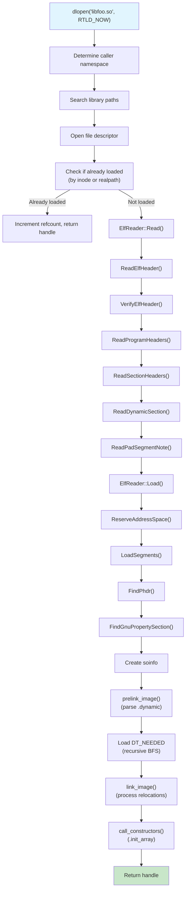

---

## 7.4 VNDK and Linker Namespaces

### 7.4.1 The Treble Namespace Problem

Android's Treble architecture (introduced in Android 8.0) separates the
**platform** (framework) from the **vendor** implementation. The goal is to
allow the platform to be updated independently of vendor code. But native
libraries pose a challenge: if a vendor library and a platform library both
link against `libutils.so`, they might need different versions of it.

The solution is **linker namespaces** -- the linker's mechanism for isolating
different sets of libraries so they cannot see each other's symbols.

### 7.4.2 The android_namespace_t Structure

From `bionic/linker/linker_namespaces.h` (lines 72-183):

```cpp
struct android_namespace_t {
  const char* get_name() const { return name_.c_str(); }
  bool is_isolated() const { return is_isolated_; }
  bool is_also_used_as_anonymous() const {
    return is_also_used_as_anonymous_;
  }

  const std::vector<std::string>& get_ld_library_paths() const;
  const std::vector<std::string>& get_default_library_paths() const;
  const std::vector<std::string>& get_permitted_paths() const;
  const std::vector<std::string>& get_allowed_libs() const;

  const std::vector<android_namespace_link_t>& linked_namespaces() const;
  void add_linked_namespace(android_namespace_t* linked_namespace,
                            std::unordered_set<std::string> shared_lib_sonames,
                            bool allow_all_shared_libs);

  void add_soinfo(soinfo* si);
  void remove_soinfo(soinfo* si);
  const soinfo_list_t& soinfo_list() const;

  bool is_accessible(const std::string& path);
  bool is_accessible(soinfo* si);

 private:
  std::string name_;
  bool is_isolated_;
  bool is_exempt_list_enabled_;
  bool is_also_used_as_anonymous_;
  std::vector<std::string> ld_library_paths_;
  std::vector<std::string> default_library_paths_;
  std::vector<std::string> permitted_paths_;
  std::vector<std::string> allowed_libs_;
  std::vector<android_namespace_link_t> linked_namespaces_;
  soinfo_list_t soinfo_list_;
};
```

Key concepts:

- **Isolated namespace**: When `is_isolated_` is true, the namespace can only
  load libraries from its `default_library_paths_` and `permitted_paths_`. This
  prevents vendor code from accidentally loading platform libraries.

- **Namespace links**: Libraries from one namespace can be made visible to
  another through links. Each link specifies which libraries are shared:

```cpp
struct android_namespace_link_t {
  android_namespace_t* linked_namespace_;
  std::unordered_set<std::string> shared_lib_sonames_;
  bool allow_all_shared_libs_;

  bool is_accessible(const char* soname) const {
    return allow_all_shared_libs_ ||
           shared_lib_sonames_.find(soname) != shared_lib_sonames_.end();
  }
};
```

- **Allowed libs**: An additional filter on which libraries can be loaded into
  the namespace, regardless of path.

### 7.4.3 Namespace Architecture

The standard Android namespace topology looks like this:

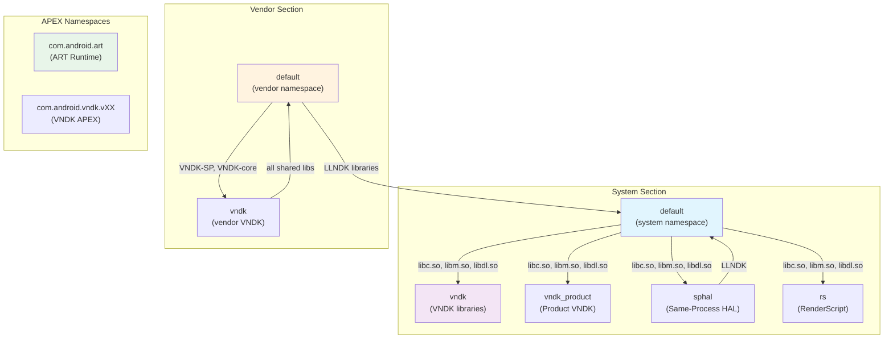

### 7.4.4 VNDK Library Categories

The VNDK (Vendor NDK) defines four categories of libraries:

From `build/soong/cc/vndk.go` (lines 23-29):

```go
const (
    llndkLibrariesTxt       = "llndk.libraries.txt"
    vndkCoreLibrariesTxt    = "vndkcore.libraries.txt"
    vndkSpLibrariesTxt      = "vndksp.libraries.txt"
    vndkPrivateLibrariesTxt = "vndkprivate.libraries.txt"
    vndkProductLibrariesTxt = "vndkproduct.libraries.txt"
)
```

| Category | Description | Example Libraries |
|----------|-------------|-------------------|
| **LL-NDK** | Low-Level NDK; always available to vendor | `libc.so`, `libm.so`, `libdl.so`, `liblog.so` |
| **VNDK-core** | Core VNDK; available to vendor but versioned | `libcutils.so`, `libbase.so`, `libutils.so` |
| **VNDK-SP** | Same-Process VNDK; loaded into the framework process | `libhardware.so`, `libhidlbase.so` |
| **VNDK-private** | Available only to other VNDK modules, not to vendor directly | Internal VNDK implementation libraries |

The `VndkProperties` structure in the build system defines how a library
declares its VNDK membership:

From `build/soong/cc/vndk.go` (lines 45-76):

```go
type VndkProperties struct {
    Vndk struct {
        // declared as a VNDK or VNDK-SP module
        Enabled *bool

        // declared as a VNDK-SP module, which is a subset of VNDK
        Support_system_process *bool

        // declared as a VNDK-private module
        Private *bool

        // Extending another module
        Extends *string
    }
}
```

### 7.4.5 The linkerconfig Tool

The `system/linkerconfig/` tool generates the linker configuration at boot
time. It is invoked by init during the early boot sequence and produces
`/linkerconfig/ld.config.txt`.

From `system/linkerconfig/main.cc` (lines 33-43):

```cpp
#include "linkerconfig/apex.h"
#include "linkerconfig/apexconfig.h"
#include "linkerconfig/baseconfig.h"
#include "linkerconfig/configparser.h"
#include "linkerconfig/context.h"
#include "linkerconfig/environment.h"
#include "linkerconfig/namespacebuilder.h"
#include "linkerconfig/recovery.h"
#include "linkerconfig/variableloader.h"
#include "linkerconfig/variables.h"
```

The tool uses a modular builder pattern. Each namespace has a dedicated builder
in `system/linkerconfig/contents/namespace/`:

| Builder File | Namespace | Purpose |
|-------------|-----------|---------|
| `systemdefault.cc` | `default` (system) | Framework code |
| `vendordefault.cc` | `default` (vendor) | Vendor binaries |
| `vndk.cc` | `vndk` / `vndk_product` | VNDK libraries |
| `sphal.cc` | `sphal` | Same-process HALs |
| `rs.cc` | `rs` | RenderScript |
| `apexdefault.cc` | APEX-specific | Per-APEX namespaces |
| `productdefault.cc` | `default` (product) | Product partition |
| `recoverydefault.cc` | `default` (recovery) | Recovery mode |
| `isolateddefault.cc` | `default` (isolated) | Isolated processes |

### 7.4.6 Bionic Library Links

Every namespace needs access to the core Bionic libraries. This is configured
by the `AddStandardSystemLinks` function:

From `system/linkerconfig/contents/common/system_links.cc` (lines 29-62):

```cpp
const std::vector<std::string> kBionicLibs = {
    "libc.so",
    "libdl.so",
    "libdl_android.so",
    "libm.so",
};

void AddStandardSystemLinks(const Context& ctx, Section* section) {
  const std::string system_ns_name = ctx.GetSystemNamespaceName();
  section->ForEachNamespaces([&](Namespace& ns) {
    if (ns.GetName() != system_ns_name) {
      ns.GetLink(system_ns_name).AddSharedLib(kBionicLibs);
    }
  });
}
```

This ensures that every namespace can resolve Bionic's core libraries through
a link to the system namespace. Without this, basic C library functions would
be unavailable.

### 7.4.7 System Namespace Configuration

The system (default) namespace for framework code is configured in
`system/linkerconfig/contents/namespace/systemdefault.cc`.

From `system/linkerconfig/contents/namespace/systemdefault.cc` (lines 31-78):

```cpp
void SetupSystemPermittedPaths(Namespace* ns) {
  const std::vector<std::string> permitted_paths = {
      "/system/${LIB}/drm",
      "/system/${LIB}/extractors",
      "/system/${LIB}/hw",
      system_ext + "/${LIB}",

      // Where odex files are located (libart needs to dlopen them)
      "/system/framework",
      "/system/app",
      "/system/priv-app",
      system_ext + "/framework",
      system_ext + "/app",
      system_ext + "/priv-app",
      "/vendor/framework",
      "/vendor/app",
      "/vendor/priv-app",
      "/odm/framework",
      "/odm/app",
      "/odm/priv-app",
      product + "/framework",
      product + "/app",
      product + "/priv-app",
      "/data",
      "/mnt/expand",
      "/apex/com.android.runtime/${LIB}/bionic",
      "/system/${LIB}/bootstrap",
  };
```

Note the explicit comment about VNDK isolation:

```cpp
  // We can't have entire /system/${LIB} as permitted paths because
  // doing so makes it possible to load libs in /system/${LIB}/vndk*
  // directories by their absolute paths. VNDK libs are built with
  // previous versions of Android and thus must not be loaded into
  // this namespace.
```

This is the security boundary in action: even though the system namespace has
broad permissions, it deliberately excludes VNDK directories to prevent version
mixing.

### 7.4.8 Vendor Namespace Configuration

Vendor processes run in their own namespace with strict isolation:

From `system/linkerconfig/contents/namespace/vendordefault.cc` (lines 35-68):

```cpp
Namespace BuildVendorNamespace(const Context& ctx,
                                const std::string& name) {
  Namespace ns(name, /*is_isolated=*/true, /*is_visible=*/true);

  ns.AddSearchPath("/odm/${LIB}");
  ns.AddSearchPath("/vendor/${LIB}");
  ns.AddSearchPath("/vendor/${LIB}/hw");
  ns.AddSearchPath("/vendor/${LIB}/egl");

  ns.AddPermittedPath("/odm");
  ns.AddPermittedPath("/vendor");
  ns.AddPermittedPath("/system/vendor");

  // Links to other namespaces
  ns.GetLink("rs").AddSharedLib("libRS_internal.so");
  ns.AddRequires(base::Split(
      Var("LLNDK_LIBRARIES_VENDOR", ""), ":"));

  if (IsVendorVndkVersionDefined()) {
    ns.GetLink(ctx.GetSystemNamespaceName())
        .AddSharedLib(Var("SANITIZER_DEFAULT_VENDOR"));
    ns.GetLink("vndk").AddSharedLib({
        Var("VNDK_SAMEPROCESS_LIBRARIES_VENDOR"),
        Var("VNDK_CORE_LIBRARIES_VENDOR")});
  }
  return ns;
}
```

The vendor namespace:

- Is **isolated** (`is_isolated=true`) -- can only load from listed paths
- Can search `/odm/${LIB}` and `/vendor/${LIB}` (plus hw/egl subdirectories)
- Has links to:
  - The **system** namespace for LL-NDK libraries (libc, libm, libdl, liblog)
  - The **VNDK** namespace for versioned VNDK libraries
  - The **RenderScript** namespace for `libRS_internal.so`

### 7.4.9 VNDK Namespace Configuration

The VNDK namespace is where versioned VNDK libraries live:

From `system/linkerconfig/contents/namespace/vndk.cc` (lines 30-123):

```cpp
Namespace BuildVndkNamespace(const Context& ctx,
                              VndkUserPartition vndk_user) {
  const char* name;
  if (is_system_or_unrestricted_section &&
      vndk_user == VndkUserPartition::Product) {
    name = "vndk_product";
  } else {
    name = "vndk";
  }

  Namespace ns(name, /*is_isolated=*/true,
               /*is_visible=*/is_system_or_unrestricted_section);

  // Search order:
  // 1. VNDK Extensions (vendor/lib/vndk-sp, vendor/lib/vndk)
  // 2. VNDK APEX (/apex/com.android.vndk.vXX/${LIB})
  // 3. vendor/lib or product/lib for extensions

  for (const auto& lib_path : lib_paths) {
    ns.AddSearchPath(lib_path + "/vndk-sp");
    if (!is_system_or_unrestricted_section) {
      ns.AddSearchPath(lib_path + "/vndk");
    }
  }
  ns.AddSearchPath("/apex/com.android.vndk.v" + vndk_version + "/${LIB}");
```

The VNDK namespace search order reveals the extension mechanism:

1. **VNDK Extensions** (`/vendor/${LIB}/vndk-sp`) -- Vendor-provided
   replacements or extensions of VNDK libraries
2. **VNDK APEX** (`/apex/com.android.vndk.vXX/${LIB}`) -- The canonical VNDK
   libraries, shipped as an APEX module
3. **Fallback** -- Vendor's own library directory for libraries that VNDK
   extensions depend on

The `vndk_product` variant is a parallel namespace for product-partition apps,
which may use a different VNDK version than vendor code.

### 7.4.10 The Exempt List: Backward Compatibility

The linker includes an exempt list for backward compatibility:

From `bionic/linker/linker.cpp` (lines 226-268):

```cpp
static bool is_exempt_lib(android_namespace_t* ns, const char* name,
                           const soinfo* needed_by) {
  static const char* const kLibraryExemptList[] = {
    "libandroid_runtime.so",
    "libbinder.so",
    "libcrypto.so",
    "libcutils.so",
    "libexpat.so",
    "libgui.so",
    "libmedia.so",
    "libnativehelper.so",
    "libssl.so",
    "libstagefright.so",
    "libsqlite.so",
    "libui.so",
    "libutils.so",
    nullptr
  };

  // If you're targeting N, you don't get the exempt-list.
  if (get_application_target_sdk_version() >= 24) {
    return false;
  }
  // ...
}
```

Apps targeting API level 23 (Marshmallow) or lower are allowed to access these
platform libraries directly, even though they are not part of the NDK. This was
necessary because many pre-Treble apps depended on these private libraries.
Apps targeting API level 24 (Nougat) or higher are subject to strict namespace
isolation.

### 7.4.11 How Namespaces Interact with dlopen

When an application calls `dlopen("libfoo.so", RTLD_NOW)`, the following
namespace-aware logic executes:

1. The linker determines the caller's namespace from the return address
2. It searches the caller's namespace paths
3. If not found, it checks linked namespaces, but only for libraries in the
   link's shared_lib_sonames set
4. If the library is in an isolated namespace, the linker verifies it is on
   an accessible path

The accessibility check:

From `bionic/linker/linker.cpp` (lines 1221-1249):

```cpp
  if ((fs_stat.f_type != TMPFS_MAGIC) && (!ns->is_accessible(realpath))) {
    const soinfo* needed_by = task->is_dt_needed() ?
        task->get_needed_by() : nullptr;
    if (is_exempt_lib(ns, name, needed_by)) {
      // Allow with warning for legacy apps
    } else {
      DL_OPEN_ERR("library \"%s\" needed or dlopened by \"%s\" is not "
                   "accessible for the namespace \"%s\"",
                   name, needed_or_dlopened_by, ns->get_name());
    }
  }
```

Note the `TMPFS_MAGIC` exception: libraries loaded from tmpfs (created via
`memfd_create()`) bypass the accessibility check. This enables apps to create
libraries at runtime (e.g., JIT compilation) without needing a writable
directory on the library search path.

### 7.4.12 Runtime Namespace Creation

Applications and the framework can create new namespaces at runtime through
the `android_create_namespace` API:

From `bionic/linker/dlfcn.cpp` (lines 51-57):

```cpp
android_namespace_t* __loader_android_create_namespace(
    const char* name,
    const char* ld_library_path,
    const char* default_library_path,
    uint64_t type,
    const char* permitted_when_isolated_path,
    android_namespace_t* parent_namespace,
    const void* caller_addr) __LINKER_PUBLIC__;
```

This is used by `libnativeloader`, which creates per-app namespaces with
appropriate isolation. Each app gets its own namespace that can see:

- The app's own native libraries (from the APK)
- LL-NDK libraries (via link to system namespace)
- VNDK libraries (if the app uses the NDK)
- Libraries listed in the app's `uses-native-library` manifest entries

### 7.4.13 Default Library Paths

The linker defines default library search paths based on the device's
configuration:

From `bionic/linker/linker.cpp` (lines 105-154):

```cpp
#if defined(__LP64__)
static const char* const kSystemLibDir     = "/system/lib64";
static const char* const kOdmLibDir        = "/odm/lib64";
static const char* const kVendorLibDir     = "/vendor/lib64";
static const char* const kAsanSystemLibDir = "/data/asan/system/lib64";
static const char* const kAsanOdmLibDir    = "/data/asan/odm/lib64";
static const char* const kAsanVendorLibDir = "/data/asan/vendor/lib64";
#else
static const char* const kSystemLibDir     = "/system/lib";
// ...
#endif

static const char* const kDefaultLdPaths[] = {
  kSystemLibDir,
  kOdmLibDir,
  kVendorLibDir,
  nullptr
};

static const char* const kAsanDefaultLdPaths[] = {
  kAsanSystemLibDir,
  kSystemLibDir,
  kAsanOdmLibDir,
  kOdmLibDir,
  kAsanVendorLibDir,
  kVendorLibDir,
  nullptr
};

#if defined(__aarch64__)
static const char* const kHwasanSystemLibDir = "/system/lib64/hwasan";
static const char* const kHwasanOdmLibDir    = "/odm/lib64/hwasan";
static const char* const kHwasanVendorLibDir = "/vendor/lib64/hwasan";
#endif
```

There are three sets of paths:

1. **Default** -- Normal operation: `/system/lib64`, `/odm/lib64`, `/vendor/lib64`
2. **ASan** -- AddressSanitizer mode: ASan-instrumented libraries in
   `/data/asan/` are searched first, falling back to the normal paths
3. **HWASan** -- Hardware AddressSanitizer mode (AArch64 only): HWASan-instrumented
   libraries in `hwasan/` subdirectories are searched first

This allows sanitized builds to coexist with production builds on the same
device, with the sanitized versions taking priority when the sanitizer is
enabled.

### 7.4.14 Namespace Isolation in Practice

Here is a concrete example of how namespace isolation works for a vendor
process on a Treble-compliant device:

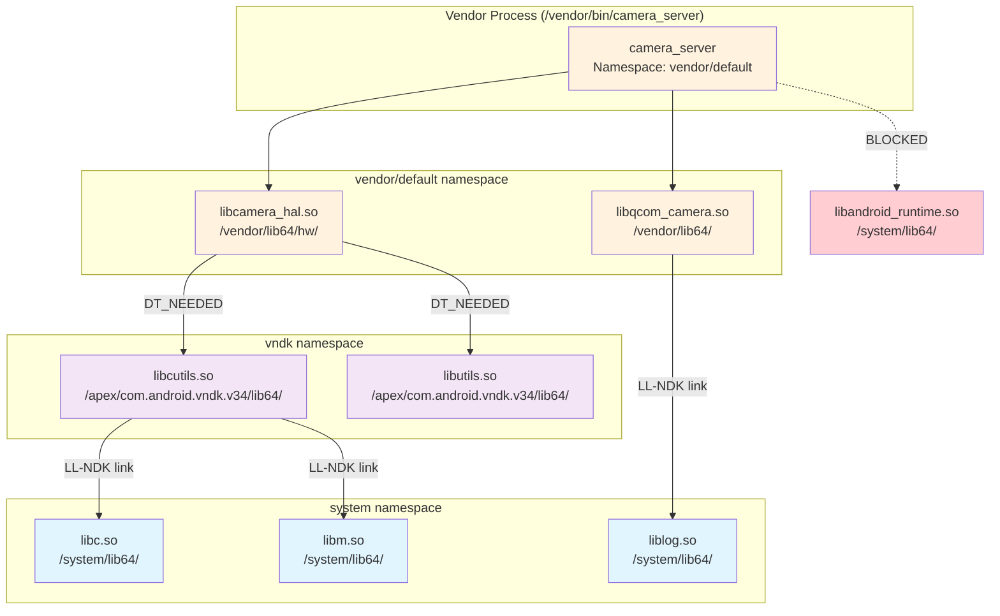

In this scenario:

- `camera_server` lives in the vendor/default namespace
- It can load its own vendor libraries (`libcamera_hal.so`, `libqcom_camera.so`)
- Those libraries can use VNDK libraries (`libcutils.so`, `libutils.so`)
  through the vndk namespace link
- Everyone can use LL-NDK libraries (`libc.so`, `libm.so`, `liblog.so`) through
  links to the system namespace
- Direct access to platform-private libraries (`libandroid_runtime.so`) is
  **blocked** by namespace isolation

### 7.4.15 VNDK Deprecation and Evolution

The VNDK system is evolving. Recent AOSP versions include a `--deprecate_vndk`
flag in linkerconfig:

From `system/linkerconfig/main.cc` (lines 62-63):

```cpp
    {"deprecate_vndk", no_argument, 0, 'd'},
```

The trend is toward using APEX modules for library versioning rather than the
VNDK mechanism. Each APEX can carry its own versions of libraries, isolated in
their own mount namespace and linker namespace. This provides stronger isolation
than VNDK (which shares a single process address space) and better supports
independent updates.

However, VNDK remains essential for backward compatibility with existing vendor
implementations and will likely coexist with APEX-based solutions for multiple
Android generations.

### 7.4.16 Putting It All Together: The Library Loading Decision Tree

When the linker encounters a `DT_NEEDED` entry or `dlopen` call, the complete
decision process is:

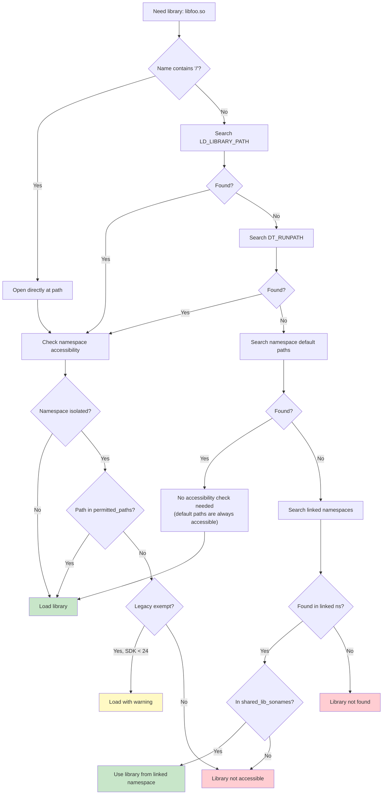

### 7.4.17 Segment Loading In Detail

The `LoadSegments()` method in the ElfReader class iterates over every PT_LOAD
program header and maps the corresponding file region into the reserved address
space.

From `bionic/linker/linker_phdr.cpp` (lines 987-1086):

```cpp
bool ElfReader::LoadSegments() {
  size_t seg_align = should_use_16kib_app_compat_ ?
      kCompatPageSize : kPageSize;

  if (kPageSize >= 16384 && min_align_ < kPageSize &&
      !should_use_16kib_app_compat_) {
    DL_ERR_AND_LOG(
        "\"%s\" program alignment (%zu) cannot be smaller than "
        "system page size (%zu)", name_.c_str(), min_align_, kPageSize);
    return false;
  }

  for (size_t i = 0; i < phdr_num_; ++i) {
    const ElfW(Phdr)* phdr = &phdr_table_[i];
    if (phdr->p_type != PT_LOAD) continue;

    ElfW(Addr) p_memsz = phdr->p_memsz;
    ElfW(Addr) p_filesz = phdr->p_filesz;
    _extend_load_segment_vma(phdr_table_, phdr_num_, i, &p_memsz,
                              &p_filesz, should_pad_segments_,
                              should_use_16kib_app_compat_);

    // Segment addresses in memory
    ElfW(Addr) seg_start = phdr->p_vaddr + load_bias_;
    ElfW(Addr) seg_end = seg_start + p_memsz;
    ElfW(Addr) seg_page_end = __builtin_align_up(seg_end, seg_align);
    ElfW(Addr) seg_file_end = seg_start + p_filesz;

    if (file_length != 0) {
      int prot = PFLAGS_TO_PROT(phdr->p_flags);
      if ((prot & (PROT_EXEC | PROT_WRITE)) == (PROT_EXEC | PROT_WRITE)) {
        if (DL_ERROR_AFTER(26, "\"%s\" has load segments that are both "
                           "writable and executable", name_.c_str())) {
          return false;
        }
      }

      if (should_use_16kib_app_compat_) {
        if (!CompatMapSegment(i, file_length)) return false;
      } else {
        if (!MapSegment(i, file_length)) return false;
      }
    }

    ZeroFillSegment(phdr);
    DropPaddingPages(phdr, seg_file_end);
    if (!MapBssSection(phdr, seg_page_end, seg_file_end)) return false;
  }
  return true;
}
```

Each PT_LOAD segment goes through four sub-operations:

1. **MapSegment / CompatMapSegment** -- Maps the file content into the address
   space using `mmap64()` with `MAP_FIXED`. For 16KiB compatibility mode, the
   compat path reads data into an existing anonymous mapping instead of using
   `mmap` directly.

2. **ZeroFillSegment** -- If the segment is writable and its file size is less
   than a page boundary, the remainder of the partial page must be zeroed. This
   is required by the ELF specification for BSS-like data.

3. **DropPaddingPages** -- When segment extension is active (for page size
   migration), padding pages between segments are released using
   `MADV_DONTNEED` to reduce memory pressure.

4. **MapBssSection** -- If `p_memsz > p_filesz`, the excess represents BSS
   data. The linker maps additional anonymous pages at the end of the segment
   and names them `.bss` using `prctl(PR_SET_VMA)`.

**MapSegment in detail:**

From `bionic/linker/linker_phdr.cpp` (lines 868-893):

```cpp
bool ElfReader::MapSegment(size_t seg_idx, size_t len) {
  const ElfW(Phdr)* phdr = &phdr_table_[seg_idx];
  void* start = reinterpret_cast<void*>(
      page_start(phdr->p_vaddr + load_bias_));
  const ElfW(Addr) offset = file_offset_ +
      page_start(phdr->p_offset);
  int prot = PFLAGS_TO_PROT(phdr->p_flags);

  void* seg_addr = mmap64(start, len, prot,
      MAP_FIXED | MAP_PRIVATE, fd_, offset);

  if (seg_addr == MAP_FAILED) {
    DL_ERR("couldn't map \"%s\" segment %zd: %m",
           name_.c_str(), seg_idx);
    return false;
  }

  // Mark segments as huge page eligible
  if ((phdr->p_flags & PF_X) && phdr->p_align == kPmdSize &&
      get_transparent_hugepages_supported()) {
    madvise(seg_addr, len, MADV_HUGEPAGE);
  }

  return true;
}
```

Note the transparent huge page support: executable segments aligned to PMD
size (2MB) receive `MADV_HUGEPAGE`, which tells the kernel to use huge pages
for these mappings. This reduces TLB misses for large code sections.

**W+E segment rejection:**

The linker rejects libraries with segments that are simultaneously writable and
executable (`W+E`), starting from API level 26. This is a security measure:
`W+E` segments would allow an attacker who can write to memory to also execute
that memory, defeating W^X protections.

**Segment extension for page size migration:**

The `_extend_load_segment_vma` function extends the file-backed portion of a
segment to fill the gap between adjacent PT_LOAD segments. This is necessary
because on a system with a larger page size than the ELF was built for, the
gap between segments would be mapped as separate VMAs (Virtual Memory Areas),
consuming kernel slab memory. By extending segments to be contiguous, the
kernel can merge them into a single VMA:

From `bionic/linker/linker_phdr.cpp` (lines 817-866):

```cpp
static inline void _extend_load_segment_vma(
    const ElfW(Phdr)* phdr_table, size_t phdr_count,
    size_t phdr_idx, ElfW(Addr)* p_memsz,
    ElfW(Addr)* p_filesz, bool should_pad_segments,
    bool should_use_16kib_app_compat) {
  if (should_use_16kib_app_compat) return;

  const ElfW(Phdr)* phdr = &phdr_table[phdr_idx];

  // Don't do extension for p_align > 64KiB
  if (phdr->p_align <= kPageSize || phdr->p_align > 64*1024 ||
      !should_pad_segments) {
    return;
  }

  // Find next PT_LOAD segment
  const ElfW(Phdr)* next = nullptr;
  if (phdr_idx + 1 < phdr_count &&
      phdr_table[phdr_idx + 1].p_type == PT_LOAD) {
    next = &phdr_table[phdr_idx + 1];
  }

  if (!next || *p_memsz != *p_filesz) return;

  ElfW(Addr) next_start = page_start(next->p_vaddr);
  ElfW(Addr) curr_end = page_end(phdr->p_vaddr + *p_memsz);

  if (curr_end >= next_start) return;

  // Extend to be contiguous
  ElfW(Addr) extend = next_start - curr_end;
  *p_memsz += extend;
  *p_filesz += extend;
}
```

### 7.4.18 The find_libraries Algorithm

The `find_libraries` function is the workhorse of dependency resolution. It
implements a multi-phase algorithm that handles circular dependencies,
cross-namespace loading, and load shuffling for ASLR.

From `bionic/linker/linker.cpp` (lines 1459-1528):

```cpp
static bool find_library_internal(android_namespace_t* ns,
                                   LoadTask* task,
                                   ZipArchiveCache* zip_archive_cache,
                                   LoadTaskList* load_tasks,
                                   int rtld_flags) {
  soinfo* candidate;

  // Phase 1: Check if already loaded (by soname)
  if (find_loaded_library_by_soname(ns, task->get_name(),
          true /* search_linked_namespaces */, &candidate)) {
    task->set_soinfo(candidate);
    return true;
  }

  // Phase 2: Try to load from this namespace
  if (load_library(ns, task, zip_archive_cache, load_tasks,
                   rtld_flags, true)) {
    return true;
  }

  // Phase 3: Exempt list fallback for legacy apps
  if (ns->is_exempt_list_enabled() &&
      is_exempt_lib(ns, task->get_name(), task->get_needed_by())) {
    ns = &g_default_namespace;
    if (load_library(ns, task, zip_archive_cache, load_tasks,
                     rtld_flags, true)) {
      return true;
    }
  }

  // Phase 4: Search linked namespaces
  for (auto& linked_namespace : ns->linked_namespaces()) {
    if (find_library_in_linked_namespace(linked_namespace, task)) {
      if (task->get_soinfo() != nullptr) {
        return true;  // Already loaded
      }
      // Ok to load in linked namespace
      if (load_library(linked_namespace.linked_namespace(), task,
                       zip_archive_cache, load_tasks, rtld_flags,
                       false)) {
        return true;
      }
    }
  }

  return false;
}
```

The four phases represent a carefully ordered fallback chain:

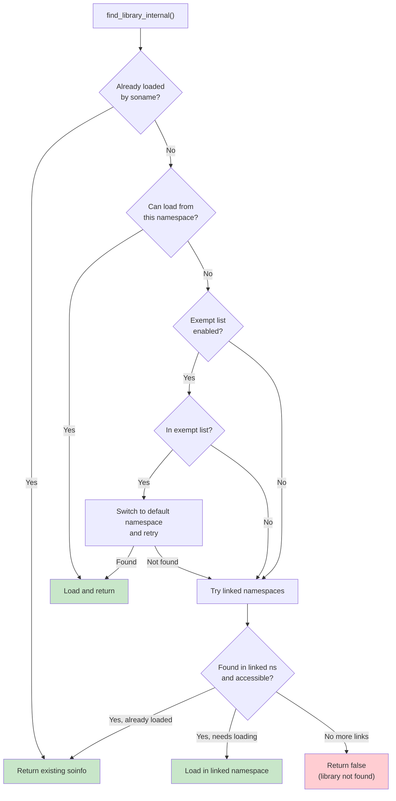

**Load shuffling for ASLR:**

After all LoadTasks have been created but before they are loaded, the linker
shuffles the load order:

From `bionic/linker/linker.cpp` (lines 1532-1543):

```cpp
static void shuffle(std::vector<LoadTask*>* v) {
  if (is_first_stage_init()) {
    // arc4random* is not available in first stage init
    return;
  }
  for (size_t i = 0, size = v->size(); i < size; ++i) {
    size_t n = size - i;
    size_t r = arc4random_uniform(n);
    std::swap((*v)[n-1], (*v)[r]);
  }
}
```

This randomizes the order in which libraries are mapped into memory,
complementing the per-library ASLR from `ReserveWithAlignmentPadding`. Even if
an attacker knows which libraries a process loads, the order is unpredictable.

### 7.4.19 Duplicate Detection and the Soname Contract

The linker uses two strategies to detect if a library is already loaded:

**By inode (strongest):**

From `bionic/linker/linker.cpp` (lines 1106-1137):

```cpp
static bool find_loaded_library_by_inode(android_namespace_t* ns,
                                          const struct stat& file_stat,
                                          off64_t file_offset,
                                          bool search_linked_namespaces,
                                          soinfo** candidate) {
  auto predicate = [&](soinfo* si) {
    return si->get_st_ino() == file_stat.st_ino &&
           si->get_st_dev() == file_stat.st_dev &&
           si->get_file_offset() == file_offset;
  };

  *candidate = ns->soinfo_list().find_if(predicate);

  if (*candidate == nullptr && search_linked_namespaces) {
    for (auto& link : ns->linked_namespaces()) {
      android_namespace_t* linked_ns = link.linked_namespace();
      soinfo* si = linked_ns->soinfo_list().find_if(predicate);
      if (si != nullptr && link.is_accessible(si->get_soname())) {
        *candidate = si;
        return true;
      }
    }
  }
  return *candidate != nullptr;
}
```

**By realpath (fallback):**

```cpp
static bool find_loaded_library_by_realpath(android_namespace_t* ns,
                                             const char* realpath,
                                             bool search_linked_namespaces,
                                             soinfo** candidate) {
  auto predicate = [&](soinfo* si) {
    return strcmp(realpath, si->get_realpath()) == 0;
  };
  // ...
}
```

The inode-based check handles symlinks and hard links correctly: if
`/system/lib64/libfoo.so` and `/system/lib64/libfoo_v2.so` are hard links
to the same file, inode detection ensures only one copy is loaded. The
realpath check handles the case where proc is not mounted (early boot).

### 7.4.20 DT_NEEDED Processing and DT_RUNPATH

When a library is first loaded, the linker scans its `.dynamic` section for
DT_NEEDED entries (libraries it depends on) and DT_RUNPATH (additional search
paths):

From `bionic/linker/linker.cpp` (lines 1276-1310):

```cpp
  const ElfReader& elf_reader = task->get_elf_reader();
  for (const ElfW(Dyn)* d = elf_reader.dynamic();
       d->d_tag != DT_NULL; ++d) {
    if (d->d_tag == DT_RUNPATH) {
      si->set_dt_runpath(elf_reader.get_string(d->d_un.d_val));
    }
    if (d->d_tag == DT_SONAME) {
      si->set_soname(elf_reader.get_string(d->d_un.d_val));
    }
    if (d->d_tag == DT_FLAGS_1) {
      si->set_dt_flags_1(d->d_un.d_val);
    }
  }

  for (const ElfW(Dyn)* d = elf_reader.dynamic();
       d->d_tag != DT_NULL; ++d) {
    if (d->d_tag == DT_NEEDED) {
      const char* name = fix_dt_needed(
          elf_reader.get_string(d->d_un.d_val), elf_reader.name());
      load_tasks->push_back(
          LoadTask::create(name, si, ns, task->get_readers_map()));
    }
  }
```

DT_FLAGS_1 is checked early because the `DF_1_GLOBAL` flag determines
whether the library should be visible in the global scope. This must be known
before the library's dependencies are loaded so that namespace linking is
correct.

The `fix_dt_needed` function handles a backward compatibility issue: some
older 32-bit libraries had DT_NEEDED entries with absolute paths instead of
bare sonames. For apps targeting API level 22 or lower, the function strips
the directory component.

### 7.4.21 GDB Integration

The linker maintains a debug data structure that GDB uses to discover loaded
libraries. This is the `link_map` structure, part of the standard ELF debugging
interface.

From `bionic/linker/linker_main.cpp` (lines 207-215):

```cpp
static void init_link_map_head(soinfo& info) {
  auto& map = info.link_map_head;
  map.l_addr = info.load_bias;
  map.l_name = const_cast<char*>(info.get_realpath());
  phdr_table_get_dynamic_section(info.phdr, info.phnum,
      info.load_bias, &map.l_ld, nullptr);
}
```

Every `soinfo` contains a `link_map_head` that forms part of a doubly-linked
list. GDB reads this list through the `r_debug` structure (exposed as
`_r_debug` in the linker's symbol table) to enumerate loaded libraries, set
breakpoints in newly-loaded code, and resolve symbol addresses.

When a library is loaded or unloaded, the linker calls `notify_gdb_of_load`
or `notify_gdb_of_unload`, which update the `r_debug` state and trigger a
breakpoint that GDB can catch:

From `bionic/linker/linker.cpp` (lines 274-295):

```cpp
static void notify_gdb_of_load(soinfo* info) {
  if (info->is_linker() || info->is_main_executable()) {
    return;
  }

  link_map* map = &(info->link_map_head);
  map->l_addr = info->load_bias;
  map->l_name = const_cast<char*>(info->get_realpath());
  map->l_ld = info->dynamic;

  CHECK(map->l_name != nullptr);
  CHECK(map->l_name[0] != '\0');

  notify_gdb_of_load(map);
}
```

### 7.4.22 CFI (Control Flow Integrity) Shadow

The linker maintains a CFI shadow -- a data structure that enables
LLVM's Control Flow Integrity checks at runtime:

From `bionic/linker/linker.cpp` (lines 173-177):

```cpp
static CFIShadowWriter g_cfi_shadow;

CFIShadowWriter* get_cfi_shadow() {
  return &g_cfi_shadow;
}
```

After all libraries are loaded and linked, the linker initializes the CFI
shadow:

From `bionic/linker/linker_main.cpp` (line 503):

```cpp
if (!get_cfi_shadow()->InitialLinkDone(solist_get_head()))
    __linker_cannot_link(g_argv[0]);
```

The CFI shadow maps each executable page to a shadow entry that records which
indirect call targets are valid. When a CFI-instrumented library makes an
indirect call, it checks the shadow to verify the target is a valid function
entry point. Invalid targets trigger a controlled crash via
`__loader_cfi_fail`.

### 7.4.23 TLS (Thread-Local Storage) in the Linker

The linker manages ELF TLS (Thread-Local Storage) for all loaded libraries.
TLS variables declared with `__thread` or `thread_local` in C/C++ require
per-thread copies, and the linker allocates and initializes these.

From `bionic/linker/linker_tls.h` (lines 36-65):

```cpp
void linker_setup_exe_static_tls(const char* progname);
void linker_finalize_static_tls();

void register_soinfo_tls(soinfo* si);
void unregister_soinfo_tls(soinfo* si);

const TlsModule& get_tls_module(size_t module_id);

struct TlsDescriptor {
#if defined(__arm__)
  size_t arg;
  TlsDescResolverFunc* func;
#else
  TlsDescResolverFunc* func;
  size_t arg;
#endif
};

struct TlsDynamicResolverArg {
  size_t generation;
  TlsIndex index;
};

extern "C" size_t tlsdesc_resolver_static(size_t);
extern "C" size_t tlsdesc_resolver_dynamic(size_t);
extern "C" size_t tlsdesc_resolver_unresolved_weak(size_t);
```

There are two TLS allocation strategies:

1. **Static TLS** -- For the executable and libraries loaded at startup. The
   total static TLS size is computed before any thread is created, and each
   thread's TLS block is pre-allocated as part of the thread stack.

2. **Dynamic TLS** -- For libraries loaded via `dlopen()` after threads exist.
   These use a Dynamic Thread Vector (DTV) that is lazily extended when a thread
   first accesses TLS from a dlopen'd library.

The three TLSDESC resolvers handle different cases:

- `tlsdesc_resolver_static` -- Fast path for static TLS (single offset add)
- `tlsdesc_resolver_dynamic` -- Slow path for dynamic TLS (may allocate)
- `tlsdesc_resolver_unresolved_weak` -- For weak TLS symbols that resolved to
  null (returns a dummy address)

### 7.4.24 MTE Globals Support

On AArch64 hardware with MTE (Memory Tagging Extension), the linker can tag
global variables in loaded libraries:

From `bionic/linker/linker_soinfo.h` (line 70):

```cpp
#define FLAG_GLOBALS_TAGGED   0x00000800 // globals have been tagged by MTE
```

The `apply_memtag_if_mte_globals` method (used during relocation) checks if a
relocation target address falls within a tagged global region and applies the
appropriate tag. This catches buffer overflows on global variables at runtime.

From `bionic/linker/linker_relocate.cpp` (line 169):

```cpp
void* const rel_target = reinterpret_cast<void*>(
    relocator.si->apply_memtag_if_mte_globals(
        reloc.r_offset + relocator.si->load_bias));
```

### 7.4.25 Debugging the Linker

The linker provides several debugging mechanisms:

**LD_DEBUG environment variable:**

Setting `LD_DEBUG` enables verbose logging. The value is a comma-separated
list of categories:

| Value | What it logs |
|-------|-------------|
| `any` | All debug output |
| `lookup` | Symbol lookup results |
| `reloc` | Relocation processing |
| `timing` | Total link time in microseconds |
| `statistics` | Relocation counts (absolute, relative, symbol, cached) |

**LD_SHOW_AUXV:**

Setting this environment variable dumps the auxiliary vector at startup,
showing AT_PHDR, AT_ENTRY, AT_BASE, AT_HWCAP, etc.

**linker logging:**

From `bionic/linker/linker_main.cpp` (lines 508-513):

```cpp
if (g_linker_debug_config.timing) {
    gettimeofday(&t1, nullptr);
    long long t0_us = (t0.tv_sec * 1000000LL) + t0.tv_usec;
    long long t1_us = (t1.tv_sec * 1000000LL) + t1.tv_usec;
    LD_DEBUG(timing, "LINKER TIME: %s: %lld microseconds",
             g_argv[0], t1_us - t0_us);
}
```

Note that `LD_DEBUG` and `LD_SHOW_AUXV` are only honored when `AT_SECURE` is
not set (i.e., for non-setuid/non-setgid processes). This prevents information
leakage from privileged processes.

### 7.4.26 The ldd Tool

Android's linker includes a built-in `ldd` equivalent. When invoked as
`linker64 --list /path/to/binary`, the linker sets the `g_is_ldd` flag:

From `bionic/linker/linker_main.cpp` (lines 489-492):

```cpp
  // Exit early for ldd. We don't want to run the code that was loaded,
  // so skip the constructor calls. Skip CFI setup because it would call
  // __cfi_init in libdl.so.
  if (g_is_ldd) _exit(EXIT_SUCCESS);
```

In ldd mode, the linker loads all dependencies (printing their paths as it
goes) but exits before calling constructors. This safely reveals the dependency
tree without executing any library code.

### 7.4.27 Linker Namespace Lifecycle

Namespaces have a defined lifecycle during process startup and at runtime:

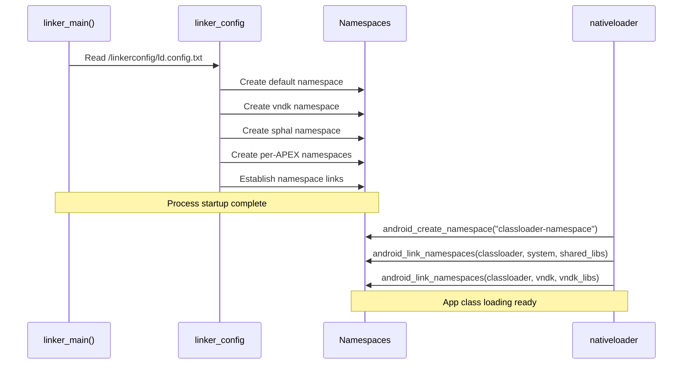

The initial namespaces are created from the linker configuration file during
`init_default_namespaces()`. Later, when the Java class loader loads native
libraries for an app, `libnativeloader` calls `android_create_namespace` to
create an app-specific namespace and links it to the system and VNDK namespaces
with appropriate library allowlists.

---

## Summary

This chapter has traced the path from the lowest levels of Android's native
execution environment -- the system call stubs generated from `SYSCALLS.TXT`,
the seccomp-BPF filters that constrain which calls are permitted -- through
the C library that provides the POSIX foundation, and up to the dynamic linker
that orchestrates library loading, symbol resolution, and namespace isolation.

The key takeaways:

1. **Bionic is purpose-built for Android.** Its BSD license, small size, fast
   startup, and deep Android integration make it fundamentally different from
   glibc. The architecture-specific IFUNC dispatch (with paths for MOPS, Oryon,
   NEON, MTE) demonstrates the performance engineering invested in core
   operations.

2. **The system call interface is generated, not hand-written.** The
   `SYSCALLS.TXT` + `gensyscalls.py` approach provides a single source of
   truth for all five architectures, with architecture-specific concerns
   (32-bit UID calls, socketcall multiplexing, time64 variants) handled
   declaratively.

3. **Seccomp-BPF creates a security boundary at the system call level.** The
   allowlist/blocklist composition (with priority optimization for `futex` and
   `ioctl`) restricts the kernel attack surface for app processes, while the
   architecture-aware BPF programs handle dual-ABI systems.

4. **The dynamic linker is the gatekeeper for all native code.** Its
   ElfReader validates and loads ELF files with ASLR enhancement, 16KiB page
   compatibility, and BTI support. The relocation engine uses template-based
   fast paths and symbol caching for performance.

5. **Linker namespaces enforce the Treble architecture boundary.** The
   `android_namespace_t` structure, configured by `linkerconfig`, creates
   isolated worlds for platform, vendor, and product code. LL-NDK and VNDK
   libraries provide controlled interfaces between these worlds, while the
   exempt list maintains backward compatibility for legacy apps.

Together, these components form the native runtime foundation upon which every
Android process executes. Understanding them is essential for anyone working on
system-level Android development, debugging library loading issues, or
implementing platform security features.

### Architecture-Specific System Call Conventions

To aid readers working on specific architectures, here is a reference table
of system call conventions across all five architectures supported by Bionic:

| Architecture | Syscall Number | Arg 1 | Arg 2 | Arg 3 | Arg 4 | Arg 5 | Arg 6 | Instruction | Return |
|-------------|---------------|-------|-------|-------|-------|-------|-------|-------------|--------|
| arm | r7 | r0 | r1 | r2 | r3 | r4 | r5 | `swi #0` | r0 |
| arm64 | x8 | x0 | x1 | x2 | x3 | x4 | x5 | `svc #0` | x0 |
| x86 | eax | ebx | ecx | edx | esi | edi | ebp | `int $0x80` | eax |
| x86_64 | rax | rdi | rsi | rdx | r10 | r8 | r9 | `syscall` | rax |
| riscv64 | a7 | a0 | a1 | a2 | a3 | a4 | a5 | `ecall` | a0 |

On error, the return value is in the range [-4095, -1] (or [-MAX_ERRNO, -1]
in Bionic terms). Bionic stubs negate this value and store it in `errno` via
`__set_errno_internal`.

Note the x86 peculiarity: 32-bit x86 has only six registers available for
system call arguments, and socket operations are multiplexed through the
`socketcall` system call with a sub-command number. This multiplexing is
absent on all other architectures.

### Linker Configuration File Format

For completeness, here is the grammar of the `ld.config.txt` file format
that the linker parses at startup:

```
config     := section*
section    := "[" name "]" newline property*
property   := name "=" value newline
            | name "+=" value newline

# Namespace properties
namespace.<ns>.search.paths = <colon-separated-paths>
namespace.<ns>.permitted.paths = <colon-separated-paths>
namespace.<ns>.asan.search.paths = <colon-separated-paths>
namespace.<ns>.asan.permitted.paths = <colon-separated-paths>
namespace.<ns>.hwasan.search.paths = <colon-separated-paths>
namespace.<ns>.hwasan.permitted.paths = <colon-separated-paths>
namespace.<ns>.isolated = true|false
namespace.<ns>.visible = true|false
namespace.<ns>.links = <comma-separated-ns-names>
namespace.<ns>.link.<target>.shared_libs = <colon-separated-libs>
namespace.<ns>.link.<target>.allow_all_shared_libs = true|false
namespace.<ns>.allowed_libs = <colon-separated-libs>

# Section selectors
dir.<section> = <path-prefix>
additional.namespaces = <comma-separated-ns-names>
```

The `${LIB}` placeholder in paths is expanded to `lib` on 32-bit systems and
`lib64` on 64-bit systems. The `$ORIGIN` placeholder is expanded to the
directory containing the requesting library.

### Glossary of Key Terms

| Term | Definition |
|------|-----------|
| **ASLR** | Address Space Layout Randomization; randomizes memory layout |
| **BTI** | Branch Target Identification; ARM security feature |
| **CFI** | Control Flow Integrity; prevents indirect call hijacking |
| **DT_NEEDED** | Dynamic table entry listing a required dependency |
| **DT_RUNPATH** | Dynamic table entry with additional library search paths |
| **ELF** | Executable and Linkable Format; binary format for executables |
| **GOT** | Global Offset Table; stores resolved symbol addresses |
| **IFUNC** | Indirect Function; runtime-resolved function selection |
| **LL-NDK** | Low-Level NDK; always-available libraries for vendor |
| **Load Bias** | Offset between ELF virtual address and actual memory address |
| **MTE** | Memory Tagging Extension; ARM memory safety feature |
| **PLT** | Procedure Linkage Table; enables lazy symbol resolution |
| **PMD** | Page Middle Directory; 2MB page table entry |
| **RELRO** | Relocation Read-Only; security hardening for GOT |
| **Seccomp-BPF** | Secure Computing with Berkeley Packet Filter |
| **soinfo** | Shared Object Info; linker metadata for loaded libraries |
| **soname** | Shared Object Name; canonical library identifier |
| **TLS** | Thread-Local Storage; per-thread variables |
| **VNDK** | Vendor NDK; versioned library interface for Treble |
| **VNDK-SP** | VNDK Same-Process; libraries loaded in framework processes |
| **VDSO** | Virtual Dynamic Shared Object; kernel-mapped user-space syscalls |
| **W^X** | Write XOR Execute; security policy preventing W+E pages |

### Further Reading and Cross-References

The topics covered in this chapter connect to several other chapters in
this book:

- **Chapter 3 (Boot and Init)**: The init process is the first user-space
  process and one of the first consumers of Bionic and the dynamic linker.
  Understanding the linker's first-stage init special cases (no arc4random,
  no /proc) requires understanding the boot sequence.

- **Chapter 4 (Kernel)**: The system call interface described in Section 6.2
  is the boundary between user space and kernel space. The seccomp-BPF
  filters are enforced by the kernel's seccomp infrastructure.

- **Chapter 8 (Binder IPC)**: Binder is the most frequent user of the
  `ioctl` system call, which is why `ioctl` is in the seccomp priority list.
  The Binder driver's file descriptor is one of the first things any Android
  process opens after the linker hands off control.

- **Chapter 9 (ART and Dalvik)**: The ART runtime uses `dlopen()` extensively
  to load JNI libraries, and `libnativeloader` creates per-app linker
  namespaces. ART's OAT files are loaded through the same ELF loading
  pipeline described in Section 6.3.

- **Chapter 11 (HAL and HIDL)**: The Same-Process HAL (SP-HAL) mechanism
  relies on the `sphal` linker namespace to load vendor HAL implementations
  directly into framework processes while maintaining namespace isolation.

- **Chapter 14 (Security)**: The memory safety features described in this
  chapter (MTE, CFI, FORTIFY_SOURCE, seccomp-BPF, W^X, RELRO) form the
  foundation of Android's native code security model. The linker's namespace
  isolation is also a key component of the Treble security boundary.

Understanding Bionic and the dynamic linker is foundational to understanding
Android at the system level. Every native component -- from the init daemon
to the most complex graphics pipeline -- passes through the code paths
documented here.

---

## 7.5 Musl: The Host-Side Alternative to Bionic

While Bionic is Android's C library for device targets, AOSP also integrates
**musl libc** as an alternative C library for **host tool compilation**. This
section explains why musl exists in AOSP, how it's integrated, and when it's
used instead of glibc.

### 7.5.1 Why Musl in AOSP?

Android's build system runs on Linux host machines. By default, host tools
(such as `aapt2`, `dex2oat`, or `zipalign`) are compiled against **glibc**,
the standard C library on most Linux distributions. However, glibc has
drawbacks for build tool distribution:

- **Dynamic linking dependencies** — glibc binaries depend on the host's exact
  glibc version, causing "GLIBC_2.XX not found" errors on older systems
- **Large shared library footprint** — glibc pulls in many shared objects
- **Complex static linking** — glibc discourages static linking and has known
  issues when linked statically (NSS, locale, dlopen)

Musl solves these problems:

- **Clean static linking** — musl is designed for static linking from the start
- **Minimal dependencies** — produces self-contained binaries
- **Portable output** — statically-linked musl binaries run on any Linux kernel
  version without glibc version concerns

### 7.5.2 Musl Source and Version

Musl lives at `external/musl/` in the AOSP tree:

```
external/musl/
├── Android.bp              # Build rules (622 lines)
├── sources.bp              # Generated source file lists
├── README                  # Upstream v1.2.5
├── METADATA                # Version and license info
├── android/                # Android-specific adaptations
│   ├── generate_bp.py      # Generates sources.bp from upstream
│   ├── relinterp.c         # Dynamic interpreter relocation
│   ├── ldso_trampoline.cpp # Loader trampoline
│   └── include/            # Android-specific header overrides
│       ├── features.h
│       ├── math.h
│       ├── resolv.h
│       └── string.h
├── include/                # musl public headers
├── src/                    # musl source (upstream)
│   ├── string/             # String operations
│   ├── malloc/             # Memory allocation
│   ├── thread/             # Threading primitives
│   ├── stdio/              # Standard I/O
│   └── ...
└── ldso/                   # Dynamic linker (musl's ld.so)
```

The `android/` directory contains Android-specific adaptations that bridge
differences between musl's upstream behavior and AOSP's requirements.

### 7.5.3 Enabling Musl for Host Builds

Musl is activated through the `USE_HOST_MUSL` environment variable:

```bash
# Enable musl for host tool compilation
export USE_HOST_MUSL=true
m aapt2   # Now compiled against musl instead of glibc
```

The build system plumbing flows through several layers:

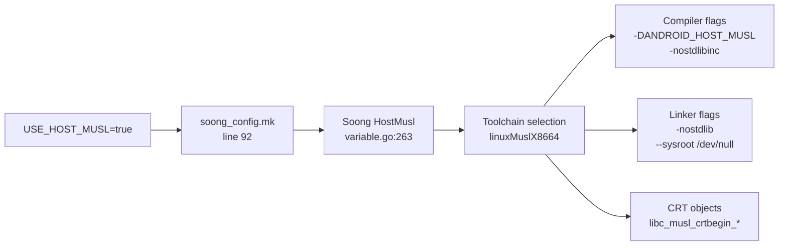

```go
// Source: build/soong/android/config.go:2402
func (c *config) UseHostMusl() bool {
    return Bool(c.productVariables.HostMusl)
}
```

### 7.5.4 Build System Integration

When musl is enabled, Soong selects dedicated toolchain factories that
override the default glibc-based host compilation:

```go
// Source: build/soong/cc/config/x86_linux_host.go:43
var linuxMuslCflags = []string{
    "-DANDROID_HOST_MUSL",
    "-nostdlibinc",
    "--sysroot /dev/null",
}
```

```go
// Source: build/soong/cc/config/x86_linux_host.go:66
var linuxMuslLdflags = []string{
    "-nostdlib",
    "--sysroot /dev/null",
}
```

The `--sysroot /dev/null` flag is critical: it prevents the compiler from
finding any system headers or libraries, ensuring complete isolation from the
host's glibc. All headers come from musl's own `include/` directory.

#### Architecture Support

Musl supports four host architectures, each with a dedicated LLVM triple:

| Architecture | LLVM Triple | Toolchain Factory |
|---|---|---|
| x86 | `i686-linux-musl` | `linuxMuslX86ToolchainFactory` |
| x86_64 | `x86_64-linux-musl` | `linuxMuslX8664ToolchainFactory` |
| ARM | `arm-linux-musleabihf` | `linuxMuslArmToolchainFactory` |
| ARM64 | `aarch64-linux-musl` | `linuxMuslArm64ToolchainFactory` |

#### CRT Objects

Musl provides its own C runtime startup objects, defined in `Android.bp`:

```
// Source: external/musl/Android.bp:460-505
libc_musl_crtbegin_dynamic  → Dynamic executable startup
libc_musl_crtbegin_static   → Static executable startup
libc_musl_crtbegin_so       → Shared library startup
libc_musl_crtend            → Executable cleanup
libc_musl_crtend_so         → Shared library cleanup
```

#### Default Shared Libraries

```go
// Source: build/soong/cc/config/x86_linux_host.go:115
var MuslDefaultSharedLibraries = []string{"libc_musl"}
```

When musl is active, `libc_musl` replaces glibc as the default system shared
library. All host tools link against it instead.

### 7.5.5 Prebuilt Musl Toolchain

The prebuilt Clang toolchain includes musl runtime libraries for all supported
architectures:

```
prebuilts/clang/host/linux-x86/clang-r563880c/musl/
├── lib/
│   ├── x86_64-unknown-linux-musl/     # x86_64 runtime
│   ├── aarch64-unknown-linux-musl/    # ARM64 runtime
│   ├── arm-unknown-linux-musleabihf/  # ARM runtime
│   ├── i686-unknown-linux-musl/       # x86 runtime
│   └── libc_musl.so                   # Dynamic musl library
```

### 7.5.6 Bionic-Musl Header Sharing

Interestingly, musl reuses some headers from Bionic's kernel UAPI layer. The
build system generates a musl sysroot that includes Bionic's kernel headers:

```java
// Source: bionic/libc/Android.bp:2703
cc_genrule {
    name: "libc_musl_sysroot_bionic_headers",
    // Copies bionic's kernel UAPI headers for musl's use
}
```

This ensures musl and bionic agree on kernel structure definitions (`ioctl`
numbers, socket options, etc.) since both ultimately target the same Linux
kernel.

### 7.5.7 Sanitizer Limitations with Musl

Not all sanitizers work with musl. The build system disables several:

```go
// Source: build/soong/cc/sanitize.go:677-686
// CFI is disabled for musl
if ctx.toolchain().Musl() {
    s.Cfi = nil
}
// ARM64 address and HW address sanitizers are also disabled
```

Sanitizer runtimes are statically linked with musl (unlike glibc where they
can be dynamically loaded), because musl's dynamic linker has different
semantics for `LD_PRELOAD` and `dlopen`.

### 7.5.8 Bionic vs. Musl vs. Glibc

#### Comparison of AOSP's Three C Libraries

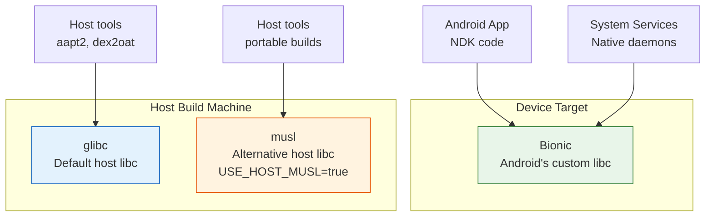

| Aspect | Bionic | glibc | musl |
|---|---|---|---|
| **Target** | Android device | Linux host (default) | Linux host (opt-in) |
| **Static linking** | Supported | Problematic (NSS/locale) | Clean, recommended |
| **Binary portability** | N/A (device only) | Tied to host glibc version | Runs on any Linux |
| **Size** | Minimal | Large | Minimal |
| **POSIX compliance** | Partial (intentional) | Full | Nearly full |
| **Thread model** | pthread (custom) | NPTL | Custom lightweight |
| **Activation** | Default for device | Default for host | `USE_HOST_MUSL=true` |

### 7.5.9 When to Use Musl

Musl is primarily useful for:

- **CI/CD environments** — build servers with varying glibc versions
- **Hermetic builds** — reproducible builds independent of host system libraries
- **Distribution** — shipping prebuilt host tools that work across Linux distros
- **Cross-compilation** — building host tools for ARM build servers (ARM64 musl
  toolchain)

The AOSP build infrastructure is progressively moving toward musl for host
tools to improve build hermeticity and reduce "works on my machine" issues.

---

## 7.6 Advanced Topics

### 7.6.1 The soinfo Method Interface

The `soinfo` structure provides a rich method interface for the linker to
operate on loaded libraries. The key methods reveal the lifecycle of a loaded
library:

From `bionic/linker/linker_soinfo.h` (lines 250-347):

```cpp
struct soinfo {
  // Lifecycle
  void call_constructors();
  void call_destructors();
  void call_pre_init_constructors();
  bool prelink_image(bool deterministic_memtag_globals = false);
  bool link_image(const SymbolLookupList& lookup_list,
                  soinfo* local_group_root,
                  const android_dlextinfo* extinfo,
                  size_t* relro_fd_offset);
  bool protect_relro();
  bool protect_16kib_app_compat_code();

  // MTE support
  void tag_globals(bool deterministic_memtag_globals);
  ElfW(Addr) apply_memtag_if_mte_globals(ElfW(Addr) sym_addr) const;

  // Symbol lookup
  const ElfW(Sym)* find_symbol_by_name(SymbolName& symbol_name,
                                        const version_info* vi) const;
  ElfW(Sym)* find_symbol_by_address(const void* addr);

  ElfW(Addr) resolve_symbol_address(const ElfW(Sym)* s) const {
    if (ELF_ST_TYPE(s->st_info) == STT_GNU_IFUNC) {
      return call_ifunc_resolver(s->st_value + load_bias);
    }
    return static_cast<ElfW(Addr)>(s->st_value + load_bias);
  }

  // Reference counting
  size_t increment_ref_count();
  size_t decrement_ref_count();
  size_t get_ref_count() const;

  // Navigation
  soinfo* get_local_group_root() const;
  soinfo_list_t& get_children();
  soinfo_list_t& get_parents();
  android_namespace_t* get_primary_namespace();
  android_namespace_list_t& get_secondary_namespaces();

  // Version support
  const ElfW(Versym)* get_versym(size_t n) const;
  ElfW(Addr) get_verneed_ptr() const;
  size_t get_verneed_cnt() const;
  ElfW(Addr) get_verdef_ptr() const;
  size_t get_verdef_cnt() const;
};
```

The `resolve_symbol_address` method is particularly noteworthy: for standard
symbols, it simply adds the load bias to the symbol value. But for GNU IFUNC
symbols (`STT_GNU_IFUNC`), it calls the IFUNC resolver function to determine
the actual implementation address at runtime. This is how architecture-specific
optimizations (like the memcpy variants in Section 6.1.6) are dispatched.

The lifecycle methods are called in a strict order:

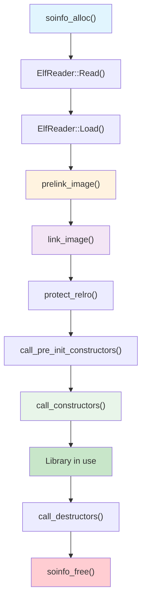

**prelink_image()** parses the `.dynamic` section to fill in the soinfo
fields: symbol table, string table, hash tables, relocation tables, and
init/fini arrays. It does not resolve any symbols.

**link_image()** processes all relocations, resolving symbol references and
patching code and data. After this step, all function pointers and global
variable references point to the correct addresses.

**protect_relro()** marks RELRO (Relocation Read-Only) pages as read-only.
RELRO is a security feature: after relocations are applied to the GOT (Global
Offset Table), those pages are remapped as read-only to prevent GOT overwrite
attacks.

### 7.6.2 GNU Hash: NEON-Accelerated Symbol Lookup

The linker includes a NEON-accelerated GNU hash implementation for ARM
architectures:

From `bionic/linker/linker_gnu_hash.h` (lines 35-54):

```cpp
#if defined(__arm__) || defined(__aarch64__)
#define USE_GNU_HASH_NEON 1
#else
#define USE_GNU_HASH_NEON 0
#endif

#if USE_GNU_HASH_NEON
#include "arch/arm_neon/linker_gnu_hash_neon.h"
#endif

static std::pair<uint32_t, uint32_t>
calculate_gnu_hash_simple(const char* name) {
  uint32_t h = 5381;
  const uint8_t* name_bytes =
      reinterpret_cast<const uint8_t*>(name);
  #pragma unroll 8
  while (*name_bytes != 0) {
    h += (h << 5) + *name_bytes++; // h*33 + c
  }
  return { h, reinterpret_cast<const char*>(name_bytes) - name };
}

static inline std::pair<uint32_t, uint32_t>
calculate_gnu_hash(const char* name) {
#if USE_GNU_HASH_NEON
  return calculate_gnu_hash_neon(name);
#else
  return calculate_gnu_hash_simple(name);
#endif
}
```

The GNU hash function (`h = h * 33 + c`, starting from 5381) is the well-known
DJB hash. The simple implementation uses `#pragma unroll 8` to hint the
compiler to unroll the loop. On ARM, the NEON implementation processes multiple
bytes in parallel using SIMD instructions, which is measurably faster for long
symbol names.

The function returns both the hash value and the symbol name length. The length
is a byproduct of the hash computation (we scan to the null terminator) and
avoids a redundant `strlen()` call later in the lookup.

### 7.6.3 CFI Shadow Architecture

The CFI (Control Flow Integrity) shadow is a critical security feature managed
by the linker. It provides a lookup table that maps code addresses to CFI
validation information.

From `bionic/linker/linker_cfi.h` (lines 38-49):

```cpp
// This class keeps the contents of CFI shadow up-to-date with the
// current set of loaded libraries.
// Shadow is mapped and initialized lazily as soon as the first
// CFI-enabled DSO is loaded. It is updated after any library is
// loaded (but before any constructors are ran), and before any
// library is unloaded.
class CFIShadowWriter : private CFIShadow {
  uint16_t* MemToShadow(uintptr_t x) {
    return reinterpret_cast<uint16_t*>(
        *shadow_start + MemToShadowOffset(x));
  }
```

The shadow has the following characteristics:

- **Lazy initialization** -- Not created until the first CFI-enabled library
  is loaded, avoiding overhead for processes that do not use CFI.
- **16-bit granularity** -- Each shadow entry is a 16-bit value that encodes
  the validation information for a range of code addresses.
- **Update timing** -- Updated after library load (before constructors) and
  before library unload. This ensures that CFI checks during constructors
  operate on a consistent shadow.
- **Integration** -- The `__loader_cfi_fail` function in `dlfcn.cpp` is
  called when a CFI check fails, providing a centralized crash handler with
  diagnostic information.

### 7.6.4 The Block Allocator

The linker uses a custom block allocator for soinfo and related structures
instead of malloc. This provides two benefits:

1. **Deterministic layout** -- All soinfo structures are in known pages,
   making write-protection possible via `ProtectedDataGuard`.
2. **No malloc dependency** -- The linker cannot use malloc (which lives in
   libc.so) during early initialization before libc is loaded.

From `bionic/linker/linker.cpp` (lines 89-91):

```cpp
static LinkerTypeAllocator<soinfo> g_soinfo_allocator;
static LinkerTypeAllocator<LinkedListEntry<soinfo>> g_soinfo_links_allocator;
static LinkerTypeAllocator<android_namespace_t> g_namespace_allocator;
static LinkerTypeAllocator<LinkedListEntry<android_namespace_t>>
    g_namespace_list_allocator;
```

The `LinkerTypeAllocator` allocates objects in page-sized blocks. When a new
object is needed and the current block is full, a new page is `mmap`'d. The
allocator tracks all pages, enabling `protect_all()` to iterate over them and
change their protection with `mprotect()`.

From `bionic/linker/linker.cpp` (lines 484-491):

```cpp
void ProtectedDataGuard::protect_data(int protection) {
  g_soinfo_allocator.protect_all(protection);
  g_soinfo_links_allocator.protect_all(protection);
  g_namespace_allocator.protect_all(protection);
  g_namespace_list_allocator.protect_all(protection);
}
```

This means that between `dlopen`/`dlclose` calls, all linker metadata is
read-only. An attacker who corrupts a soinfo structure (e.g., to redirect
function pointers) will trigger a page fault before the corruption can be
exploited.

### 7.6.5 Sanitizer Support in the Linker

The linker has deep integration with several sanitizers:

**ASan (AddressSanitizer):**

ASan-instrumented libraries are installed in `/data/asan/system/lib64/` (and
similar paths for vendor/odm). The linker prepends these paths when ASan mode
is detected, ensuring that instrumented versions of libraries take priority
over production versions.

**HWASan (Hardware AddressSanitizer):**

HWASan-instrumented libraries live in `hwasan/` subdirectories. The linker
notifies HWASan of library load/unload events via weak callbacks:

From `bionic/libc/bionic/libc_init_dynamic.cpp` (lines 75-80):

```cpp
extern "C" __attribute__((weak)) void __hwasan_library_loaded(
    ElfW(Addr) base,
    const ElfW(Phdr)* phdr,
    ElfW(Half) phnum);
extern "C" __attribute__((weak)) void __hwasan_library_unloaded(
    ElfW(Addr) base,
    const ElfW(Phdr)* phdr,
    ElfW(Half) phnum);
```

These weak symbols are resolved only when HWASan runtime is present, allowing
the same linker binary to work with or without HWASan.

**MTE (Memory Tagging Extension):**

MTE support is integrated at multiple levels:

- **Stack tagging** -- The linker calls `__libc_init_mte_stack()` after
  loading all libraries that request stack tagging via their `.dynamic` section.
- **Heap tagging** -- Enabled via ELF notes (`note_memtag_heap_async.S` /
  `note_memtag_heap_sync.S`).
- **Global tagging** -- The linker's `tag_globals()` method applies MTE tags
  to global variables in libraries that opt in.

### 7.6.6 The Complete Process Startup Sequence

Combining all the components from this chapter, here is the complete sequence
from `exec()` to `main()` for a dynamically-linked Android application:

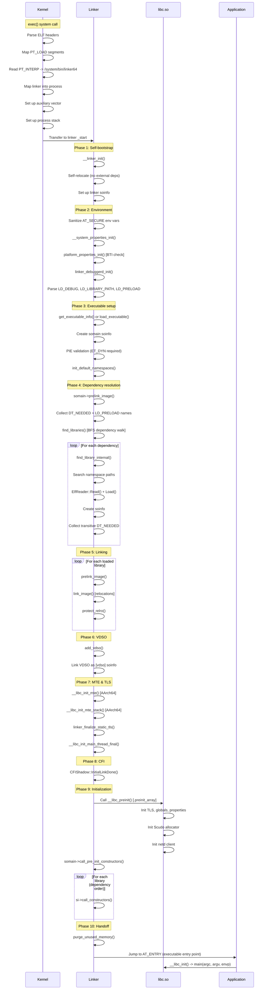

This sequence illustrates why the linker is one of the most
performance-sensitive components in Android. Every microsecond spent in the
linker is multiplied by every process start. The linker's careful optimization
-- symbol caching, template-specialized relocation loops, NEON-accelerated
hashing, protected-data guards -- all serve to minimize this startup overhead.

### 7.6.7 Error Messages and Diagnostics

The linker provides detailed error messages when linking fails. Understanding
these messages is essential for debugging native library issues:

| Error Message | Cause | Solution |
|--------------|-------|---------|
| `"libfoo.so" not found` | Library not on any search path | Check namespace paths, APK lib directory |
| `cannot locate symbol "bar" referenced by "libfoo.so"` | Unresolved strong symbol | Check library dependencies, symbol visibility |
| `"libfoo.so" is not accessible for the namespace "default"` | Namespace isolation | Check linkerconfig, uses-native-library manifest |
| `"libfoo.so" is 32-bit instead of 64-bit` | ABI mismatch | Build library for correct architecture |
| `"libfoo.so" has bad ELF magic` | Corrupted or non-ELF file | Verify file integrity |
| `Android only supports position-independent executables` | Non-PIE executable | Rebuild with -fPIE -pie |
| `has load segments that are both writable and executable` | W+E segment (API >= 26) | Fix linker script, use separate segments |
| `program alignment cannot be smaller than system page size` | 4KiB library on 16KiB system | Rebuild with 16KiB alignment or enable compat |

Each error message is carefully crafted to include the library name, the
namespace context, and (where applicable) a reference to the Android bug
tracker entry that motivated the error or exception.

### 7.6.8 Performance Considerations

The linker's performance directly affects app startup time and system boot
time. Key performance characteristics:

**Relocation processing:**

- The template-specialized `process_relocation_impl<Mode>` generates three
  separate code paths, eliminating branch overhead for the common cases.
- The symbol cache reduces redundant hash table lookups by 80%+ in typical
  workloads.
- The `__predict_false` and `__predict_true` hints guide the compiler's branch
  prediction optimizations.

**ELF loading:**

- The `ElfReader` uses `MappedFileFragment` for zero-copy reading of headers
  (mmap instead of read).
- Segment mapping uses `MAP_FIXED | MAP_PRIVATE`, which tells the kernel to
  replace the existing PROT_NONE mapping without creating a new VMA.
- Transparent huge pages (`MADV_HUGEPAGE`) reduce TLB pressure for large
  executable segments.

**Memory management:**

- The block allocator avoids the overhead of malloc/free for linker-internal
  structures.
- `purge_unused_memory()` is called before handing control to the application,
  returning any internal buffers that are no longer needed.
- RELRO protection prevents accidental writes to resolved GOT entries,
  improving cache behavior (read-only pages can be shared between processes).

**Startup timing:**

The linker records and reports its total execution time when `LD_DEBUG=timing`:

```
LINKER TIME: /system/bin/app_process64: 15234 microseconds
```

Typical values range from 5ms for simple executables to 50ms+ for applications
with many native dependencies. The Android team continuously optimizes this
path, as it directly affects the user-perceived app launch latency.

---

### Key Source Files Reference

| File | Path | Purpose |
|------|------|---------|
| SYSCALLS.TXT | `bionic/libc/SYSCALLS.TXT` | System call definitions |
| gensyscalls.py | `bionic/libc/tools/gensyscalls.py` | Stub generator |
| SECCOMP_BLOCKLIST_APP.TXT | `bionic/libc/SECCOMP_BLOCKLIST_APP.TXT` | Blocked syscalls for apps |
| SECCOMP_ALLOWLIST_APP.TXT | `bionic/libc/SECCOMP_ALLOWLIST_APP.TXT` | Extra allowed syscalls for apps |
| SECCOMP_ALLOWLIST_COMMON.TXT | `bionic/libc/SECCOMP_ALLOWLIST_COMMON.TXT` | Extra allowed syscalls for all |
| SECCOMP_BLOCKLIST_COMMON.TXT | `bionic/libc/SECCOMP_BLOCKLIST_COMMON.TXT` | Common blocked syscalls |
| SECCOMP_PRIORITY.TXT | `bionic/libc/SECCOMP_PRIORITY.TXT` | Hot-path syscalls |
| seccomp_policy.cpp | `bionic/libc/seccomp/seccomp_policy.cpp` | BPF filter generation |
| syscall.S (arm64) | `bionic/libc/arch-arm64/bionic/syscall.S` | AArch64 syscall entry |
| ifuncs.cpp (arm64) | `bionic/libc/arch-arm64/ifuncs.cpp` | IFUNC resolvers |
| libc_init_dynamic.cpp | `bionic/libc/bionic/libc_init_dynamic.cpp` | Dynamic init |
| libc_init_common.cpp | `bionic/libc/bionic/libc_init_common.cpp` | Common init |
| malloc_common.cpp | `bionic/libc/bionic/malloc_common.cpp` | Allocator dispatch |
| pthread_create.cpp | `bionic/libc/bionic/pthread_create.cpp` | Thread creation |
| linker.cpp | `bionic/linker/linker.cpp` | Core linker logic |
| linker_main.cpp | `bionic/linker/linker_main.cpp` | Linker entry and main sequence |
| linker_phdr.cpp | `bionic/linker/linker_phdr.cpp` | ELF loading |
| linker_relocate.cpp | `bionic/linker/linker_relocate.cpp` | Relocation processing |
| linker_namespaces.h | `bionic/linker/linker_namespaces.h` | Namespace structures |
| linker_soinfo.h | `bionic/linker/linker_soinfo.h` | soinfo definition |
| linker_config.cpp | `bionic/linker/linker_config.cpp` | Config file parser |
| dlfcn.cpp | `bionic/linker/dlfcn.cpp` | dlopen/dlsym API |
| vndk.go | `build/soong/cc/vndk.go` | VNDK build definitions |
| main.cc | `system/linkerconfig/main.cc` | Linkerconfig entry point |
| systemdefault.cc | `system/linkerconfig/contents/namespace/systemdefault.cc` | System namespace |
| vendordefault.cc | `system/linkerconfig/contents/namespace/vendordefault.cc` | Vendor namespace |
| vndk.cc | `system/linkerconfig/contents/namespace/vndk.cc` | VNDK namespace |
| system_links.cc | `system/linkerconfig/contents/common/system_links.cc` | Bionic lib links |
