# 第 8 章：内存管理

内存管理可以说是移动操作系统中最关键的子系统。Android 设备运行在严格的物理约束下，即便旗舰手机拥有 8 到 16 GB RAM，用户也常常安装几十个应用，并期望它们之间可以即时切换。本章拆解 AOSP 如何从硬件页表一直到开发者可见的 Java `onTrimMemory()` 回调来协调内存。我们会跟踪 Linux 内核虚拟内存子系统、用户态 Low Memory Killer Daemon（lmkd）、cgroup accounting、压缩 swap（zRAM）、图形缓冲区分配（ION/DMA-BUF）、匿名共享内存（ashmem/memfd）、profiling 工具，以及用于防御漏洞利用的内存安全加固能力。

每一节都会引用 AOSP 源码树中的真实文件。当出现 `system/memory/lmkd/lmkd.cpp` 这样的路径时，它都是相对于 AOSP checkout 根目录而言。

---

## 8.1 内存架构

### 8.1.1 虚拟内存基础

Android 运行在 Linux 内核之上，内核为每个进程提供独立虚拟地址空间。在 64 位 ARM 设备（AArch64）上，内核通常使用 39 位或 48 位虚拟地址空间，使每个进程最多拥有 256 TB 可寻址内存，远大于实际设备物理内存。CPU 中的 MMU 通过多级页表把虚拟地址转换为物理页框号。

```text
Virtual Address (48-bit example)
+--------+--------+--------+--------+-----------+
| L0 idx | L1 idx | L2 idx | L3 idx | Page Offs |
| (9 bit)| (9 bit)| (9 bit)| (9 bit)| (12 bit)  |
+--------+--------+--------+--------+-----------+
         |
         v
    Page Table Walk (AArch64 上 4 级页表)
         |
         v
    Physical Frame Number + Offset = Physical Address
```

关键概念如下：

| 概念 | 说明 |
|---|---|
| **Page** | 内存管理最小单元，ARM64 通常为 4 KB，部分新 SoC 为 16 KB |
| **Page Table** | 把虚拟地址映射到物理地址的层级结构 |
| **TLB** | Translation Lookaside Buffer，硬件中的地址转换缓存 |
| **Page Fault** | 虚拟地址没有有效映射时触发的 CPU 异常 |
| **Demand Paging** | 页面直到首次访问才分配，或从 backing store 加载 |
| **Copy-on-Write (CoW)** | 共享页只有在某个进程写入时才复制，是 `fork()` 和 Zygote 的关键机制 |

### 8.1.2 进程地址空间布局

每个 Android 进程都通过 `fork()` 从 Zygote 继承初始地址空间。64 位设备上的一般布局如下：

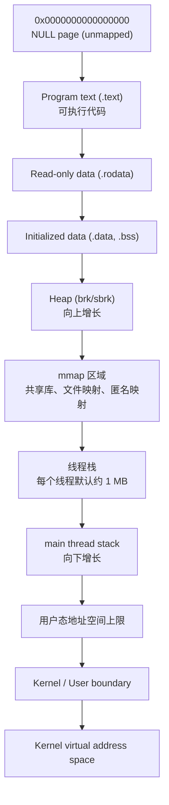

Android 在这个布局中加入了若干专用区域：

- **Dalvik/ART Heap**：Java/Kotlin 对象的托管堆，位于 mmap 区域中。ART 使用 `mmap(MAP_ANONYMOUS)` 创建 large object space、non-moving space 和其他 GC space。
- **JIT Code Cache**：ART JIT 编译器通过 `mmap(PROT_READ | PROT_EXEC)` 分配可执行内存保存编译方法。
- **Ashmem / memfd 区域**：用于 Binder 事务、图形缓冲区和跨进程数据共享的共享内存段。
- **Stack Guard Pages**：每个线程栈边界都有未映射 guard page，用于捕获栈溢出。

### 8.1.3 内核内存与用户态内存

内核会保留虚拟地址空间的高地址部分供自身使用。用户态进程不能访问内核内存，这由 MMU 强制执行。该隔离是系统稳定性的基础，应用 bug 不能直接破坏内核数据结构。

内核内存主要区域如下：

| 区域 | 用途 |
|---|---|
| **Linear mapping** | 对所有物理 RAM 的直接映射 |
| **vmalloc area** | 虚拟连续但物理可离散的分配 |
| **Module space** | 可加载内核模块 |
| **fixmap** | 编译期固定虚拟地址，用于特殊硬件 |
| **PCI I/O space** | 外设 memory-mapped I/O |

Android 内核配置中常见内存相关特性：

```text
CONFIG_ZRAM=y                    # RAM 中的压缩 swap
CONFIG_MEMCG=y                   # Memory cgroup 支持
CONFIG_PSI=y                     # Pressure Stall Information
CONFIG_TRANSPARENT_HUGEPAGE=y    # THP 降低 TLB miss
CONFIG_KSM=y                     # Kernel Same-page Merging（可选）
CONFIG_KASAN=y                   # Kernel Address Sanitizer（debug 构建）
CONFIG_ARM64_MTE=y               # Memory Tagging Extension（ARMv8.5+）
```

### 8.1.4 Memory Zones 与 NUMA

Linux 内核把物理内存组织为 zone，例如 `ZONE_DMA`、`ZONE_DMA32`、`ZONE_NORMAL`、`ZONE_MOVABLE`。移动设备通常没有服务器式复杂 NUMA 拓扑，但内核仍使用 node/zone 抽象来描述内存。lmkd 会读取 `/proc/zoneinfo`，根据各 zone 的 watermark 判断系统距离 OOM 的程度。

### 8.1.5 Zygote 与 Copy-on-Write

Zygote 是 Android 内存效率的核心。系统启动时，Zygote 预加载 framework class、resources、常用对象和部分 native 库。应用启动时并不从零创建进程，而是从 Zygote fork。

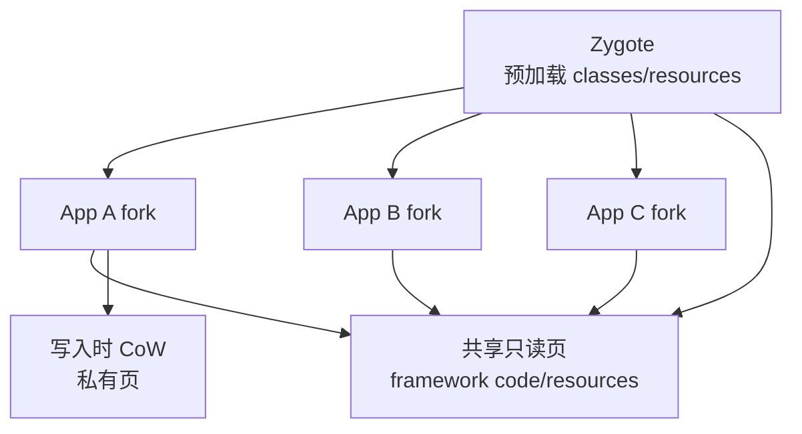

只要应用不写入共享页，这些页就在所有 app 之间共享。写入发生时，内核才复制页面。这让 Android 可以在大量进程之间共享 framework 代码和只读数据。

### 8.1.6 内存回收机制

Linux 内核有多层回收机制：

- **kswapd**：后台回收线程，在内存低于 watermark 时异步回收页面。
- **direct reclaim**：分配路径上同步回收，通常意味着内存压力更严重。
- **page cache reclaim**：丢弃可从文件重新读取的 clean cache 页。
- **swap out**：把匿名页换出到 zRAM。
- **compaction**：整理物理内存，为高阶页分配创造连续空间。

lmkd 观察 PSI、vmstat、zoneinfo 和 meminfo，当系统回收效率不足时主动杀死低优先级进程。

### 8.1.7 Page Cache

Page cache 用于缓存文件内容，是 Linux 内存系统的重要部分。应用读取 APK、dex、so、图片和数据库文件时，数据通常进入 page cache。page cache 可以在内存压力下回收，因为 clean file-backed 页面可从磁盘重新读取。

Android 内存分析中，区分 anonymous memory、file-backed memory、page cache、shared clean 和 private dirty 很重要。`dumpsys meminfo`、`showmap` 和 `/proc/[pid]/smaps` 都围绕这些概念组织输出。

---

## 8.2 Low Memory Killer Daemon（lmkd）

### 8.2.1 历史背景：从内核驱动到用户态守护进程

早期 Android 使用内核内 Low Memory Killer 驱动。现代 Android 已迁移到用户态 `lmkd`，它基于 PSI 和更丰富的进程状态做决策。用户态实现更灵活，可以结合 ActivityManager 的 OOM adjustment、swap 状态、thrashing 指标、vendor hook 和 statsd 记录。

核心源码位于：

```text
system/memory/lmkd/lmkd.cpp
system/memory/lmkd/lmkd.rc
system/memory/lmkd/reaper.cpp
system/memory/lmkd/watchdog.cpp
system/memory/lmkd/libpsi/psi.cpp
```

### 8.2.2 `lmkd` 服务配置

`lmkd` 由 init 启动，作为系统内存压力管理守护进程运行。它监听来自 ActivityManagerService 的进程优先级更新，监控 PSI 和内核内存指标，并在必要时执行 kill。

### 8.2.3 通信协议

AMS 与 lmkd 之间通过 socket 通信。AMS 会发送进程注册、进程移除、OOM score 更新等消息。lmkd 用这些信息维护 pid 到 oom_adj、uid、进程名、pidfd 等状态的映射。

常见消息语义包括：

- 添加或更新进程记录。
- 删除已退出进程。
- 更新 `oom_score_adj`。
- 通知 lmkd 某些系统状态变化。
- lmkd 回报 kill 事件。

### 8.2.4 OOM Adjustment 分数

`oom_score_adj` 表示进程重要性，数值越高越容易被杀。AMS 根据进程生命周期、组件状态、用户可见性和服务绑定关系计算该分数。

| 类别 | 典型 adj | 含义 |
|------|----------|------|
| System | 负值 | system_server、native system daemon |
| Persistent | 负值 | 常驻系统进程 |
| Foreground | 0 | 当前前台进程 |
| Perceptible | 200 左右 | 用户可感知进程，如音乐播放 |
| Service | 500 左右 | 后台服务 |
| Previous | 700 左右 | 上一个前台应用 |
| Cached | 900+ | 缓存后台进程，优先牺牲 |

lmkd 通常从最高 adj 开始选择 victim，优先杀 cached/background 进程，尽量保护前台和用户可感知进程。

### 8.2.5 基于 PSI 的 Kill 触发

PSI（Pressure Stall Information）提供 CPU、memory、IO stall 的时间比例。lmkd 通过 `/proc/pressure/memory` 监听内存压力事件。相比只看 free memory，PSI 更能反映用户可感知卡顿，因为它直接衡量任务因内存回收而停顿的时间。

PSI 事件通常分为：

- **some**：至少有一个任务因内存压力停顿。
- **full**：所有非 idle 任务都被内存压力阻塞。

critical PSI 事件会触发更激进的 kill 策略。

### 8.2.6 Kill 决策逻辑

lmkd 决策会综合以下输入：

- 当前 PSI 事件级别。
- 上一次 kill 后系统是否恢复。
- free pages 与 zone watermark。
- swap 可用量与 swap utilization。
- workingset refault / thrashing 比例。
- direct reclaim 与 kswapd 扫描状态。
- GPU memory、file cache、anonymous memory 等额外指标。

决策结果是一个 kill reason 和最小 `oom_score_adj`。然后 lmkd 在候选进程中选择 victim。

### 8.2.7 完整 Kill 决策状态机

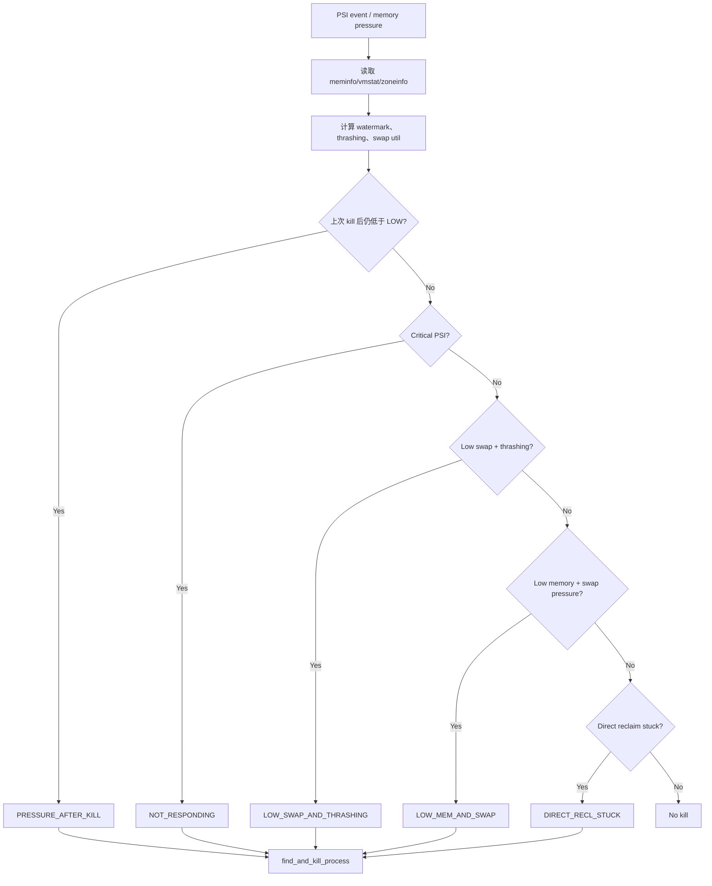

### 8.2.8 Watermark 计算

lmkd 通过 zone watermark 判断系统距离 OOM 的程度：

```c
enum zone_watermark {
    WMARK_MIN = 0,   // 低于 min：direct reclaim，OOM 风险高
    WMARK_LOW,       // 低于 low：kswapd 活跃
    WMARK_HIGH,      // 低于 high：kswapd 可能开始工作
    WMARK_NONE       // 高于所有 watermark：健康
};
```

watermark 层级如下：

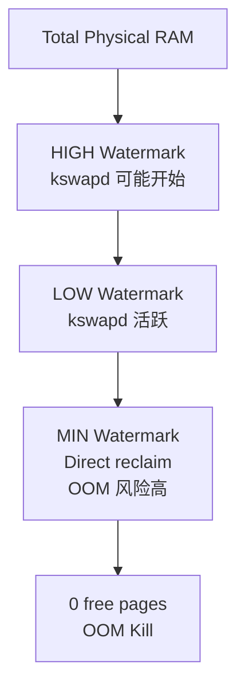

### 8.2.9 Victim 选择：`find_and_kill_process`

victim 选择算法从最高 OOM score 向下遍历：

```c
static int find_and_kill_process(int min_score_adj, struct kill_info *ki,
                                 union meminfo *mi, struct wakeup_info *wi,
                                 struct timespec *tm, struct psi_data *pd) {
    for (int i = OOM_SCORE_ADJ_MAX; i >= min_score_adj; i--) {
        procp = choose_heaviest_task ? proc_get_heaviest(i) : proc_adj_tail(i);
        killed_size = kill_one_process(procp, min_score_adj, ki, mi, wi, tm, pd);
        if (killed_size) break;
    }
    return killed_size;
}
```

双策略很重要：

1. **cached/background 进程**：按类似 LRU 的顺序杀掉同一 adj 级别中最近加入的进程。
2. **用户可感知进程**：选择最重的进程，尽量减少需要杀死的可见进程数量。

### 8.2.10 Kill 执行：`kill_one_process`

选中 victim 后，lmkd 会执行多重安全检查：确认进程仍有效、检测 PID 复用、读取 RSS/swap 供日志使用、调用 vendor hook 尝试在不杀进程的情况下释放内存，然后通过 reaper 发送 kill。

```c
start_wait_for_proc_kill(pidfd < 0 ? pid : pidfd);
kill_result = reaper.kill({ pidfd, pid, uid }, false);
```

kill 后，lmkd 会记录日志、通知 AMS、写入 statsd，并从内部表中移除 pid。

### 8.2.11 Watchdog Kill 路径

如果 lmkd 主事件循环卡住，watchdog 线程会执行紧急 kill。该路径是同步的，因为主线程已经不可用，不能依赖异步 reaper 队列。watchdog 从高 OOM score 开始查找 victim，并使用 `pid_invalidate()` 标记 pid。

### 8.2.12 Thrashing 检测

lmkd 通过 `/proc/vmstat` 中的 `workingset_refault` 检测内存 thrashing。`workingset_refault` 表示最近被逐出 page cache 的页又被 fault 回来，是系统频繁丢弃仍在使用数据的强信号。

| 属性 | 默认值 | Low RAM 默认值 |
|---|---|---|
| `ro.lmk.thrashing_limit` | 100 | 30 |
| `ro.lmk.thrashing_limit_decay` | 10 | 50 |
| `ro.lmk.thrashing_limit_critical` | 派生 | 派生 |

### 8.2.13 Reaper：异步杀进程

reaper 把 kill 操作从主事件循环中拆出来，避免 lmkd 在等待进程退出时阻塞。它优先使用 `pidfd_send_signal()`，可以避免 PID 复用竞态。异步 reaper 还可以等待进程死亡并回收状态，降低主循环延迟。

### 8.2.14 Watchdog

watchdog 监控 lmkd 主线程活性。如果主循环长时间没有响应，watchdog 会记录超时并尝试同步杀死低优先级进程，以快速释放内存并恢复系统。

### 8.2.15 可配置属性

lmkd 行为由多组 `ro.lmk.*` 属性控制，例如 PSI 阈值、thrashing limit、swap utilization limit、kill timeout、kill_heaviest_task 等。OEM 会根据设备 RAM、zRAM 大小、存储性能和产品策略调优这些值。

### 8.2.16 事件循环架构

lmkd 主循环基于 epoll，监听来自 AMS 的控制 socket、PSI fd、memory pressure fd、BPF memory event 和 watchdog 通知。所有输入最终都会进入统一状态机，更新进程表或触发 kill 检查。

### 8.2.17 BPF Memory Event 集成

现代 Android 可通过 BPF map / event 读取额外内存信息，例如 GPU memory 总量。lmkd 中的 `read_gpu_total_kb()` 从 `/sys/fs/bpf/map_gpuMem_gpu_mem_total_map` 读取 GPU 使用量，用于更准确判断系统总内存压力。

### 8.2.18 Swap Utilization 计算

swap utilization 用于衡量 zRAM 是否接近饱和。低 swap 剩余空间加高 thrashing 通常意味着系统继续回收收益很低，此时杀进程比继续换页更有效。

---

## 8.3 Cgroups 与内存统计

### 8.3.1 Cgroup 版本

Android 使用 cgroup 对进程分组并统计资源。不同 Android 版本和设备可能同时使用 cgroup v1 与 v2 控制器。memory cgroup 用于按进程组统计内存使用、限制和 pressure。

### 8.3.2 进程组分配

ActivityManagerService 根据进程状态把进程放入不同 cgroup，例如 top-app、foreground、background、cached、restricted。调度、内存、IO 和 freezer 策略都可基于这些分组施加。

### 8.3.3 Task Profiles

Task profiles 是 Android 对 cgroup 操作的抽象。配置文件描述某类任务应加入哪些 cgroup、设置哪些参数。framework 和 native daemon 通过 task profile API 应用这些策略，而不是直接操作 cgroupfs。

### 8.3.4 Memory Cgroup Accounting

memory cgroup 能统计匿名页、file cache、swap、RSS、page fault、pressure 等指标。系统服务可以用这些数据做 per-app 或 per-UID 内存归因。

### 8.3.5 App Categories 与 Freezer Cgroup

Android 使用 freezer cgroup 冻结 cached/background app，降低 CPU 唤醒和内存抖动。冻结进程仍保留内存，但不会运行用户态代码。与 lmkd 配合时，冻结 app 通常也是低优先级 kill 候选。

---

## 8.4 zRAM（压缩 Swap）

### 8.4.1 zRAM 架构

zRAM 是位于 RAM 中的压缩块设备，用作 swap。匿名页被换出时不会写到慢速闪存，而是压缩后存入内存中的 zRAM 设备。这样牺牲 CPU 换取更高有效内存容量。

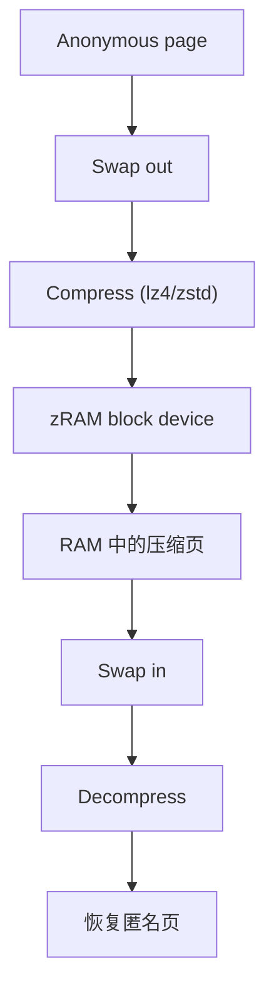

### 8.4.2 zRAM 配置

Android init 脚本通常配置 zRAM 大小、压缩算法和 swappiness。常见参数包括：

```text
/sys/block/zram0/disksize
/sys/block/zram0/comp_algorithm
/proc/sys/vm/swappiness
/proc/sys/vm/page-cluster
```

模拟器和设备配置常使用 lz4，因为它速度快、延迟低。

### 8.4.3 `zsmalloc`：zRAM 内存分配器

zRAM 使用 `zsmalloc` 管理压缩对象。压缩页大小可变，`zsmalloc` 会把它们打包到内存 page 中，以减少内部碎片。它适合大量小型、大小不一的压缩对象。

### 8.4.4 Android 的 zRAM 调优

调优 zRAM 需要平衡：

- RAM 容量与 zRAM 大小。
- CPU 压缩/解压开销。
- 存储速度与是否启用 writeback。
- lmkd kill aggressiveness。
- 目标设备类别，如 low-RAM、mid-range、flagship。

### 8.4.5 zRAM Writeback

部分设备支持把 zRAM 中冷页写回磁盘或 backing device，以进一步释放 RAM。这需要考虑闪存寿命、I/O 延迟和功耗，因此必须谨慎启用。

### 8.4.6 监控 zRAM 性能

可通过以下接口观察 zRAM：

```bash
adb shell cat /proc/swaps
adb shell cat /sys/block/zram0/mm_stat
adb shell cat /sys/block/zram0/stat
adb shell cat /proc/meminfo | grep -i swap
```

### 8.4.7 zRAM 与 lmkd 交互总结

zRAM 给系统更多时间在不杀进程的情况下缓解内存压力，但当 swap 接近饱和、thrashing 增加、PSI 变差时，继续换页会导致卡顿。lmkd 会利用 swap utilization 和 thrashing 指标判断何时从“回收/换页”切换到“杀进程”。

### 8.4.8 针对不同设备等级调优 zRAM

| 设备类别 | zRAM 策略 |
|----------|-----------|
| Low-RAM | 较大 zRAM、更积极后台 kill、更低 thrashing 阈值 |
| Mid-range | 平衡 zRAM 大小和 kill 策略 |
| Flagship | 较宽松缓存保留，优先体验和快速切换 |
| Wear/TV | 根据固定工作负载和交互模式调优 |

---

## 8.5 ION / DMA-BUF（图形缓冲区分配）

### 8.5.1 演进：ION 到 DMA-BUF Heaps

Android 最初使用 ION 分配图形、相机、视频和显示硬件共享的缓冲区。ION 是 Android 专用内核驱动。现代 Android 已迁移到上游 DMA-BUF heaps 框架，减少树外补丁并统一缓冲区共享接口。

### 8.5.2 ION 分配器（遗留）

ION 提供多个 heap，如 system、CMA、carveout。用户态通过 `/dev/ion` 和 ioctl 分配 buffer，并得到可传递的 DMA-BUF fd。由于 ION 长期不在上游主线，维护成本高，最终被 DMA-BUF heaps 替代。

### 8.5.3 DMA-BUF Heaps（现代）

DMA-BUF heaps 通过 `/dev/dma_heap/<name>` 暴露 heap。用户态打开 heap 设备并调用 `DMA_HEAP_IOCTL_ALLOC` 分配 buffer，返回 fd 可在进程和硬件设备之间共享。

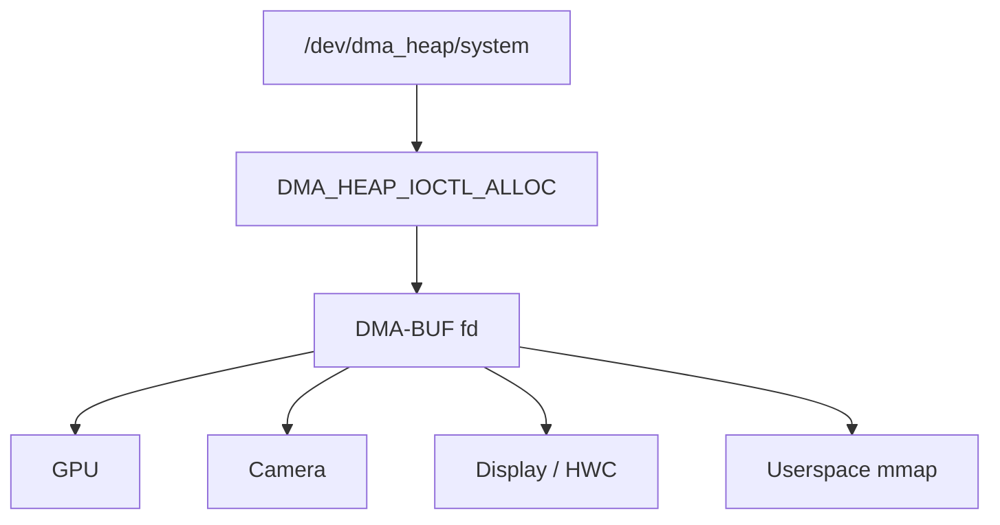

### 8.5.4 Gralloc：图形内存分配 HAL

Gralloc HAL 把 framework 层的 buffer 需求转换成具体 DMA-BUF heap 分配。`GraphicBufferAllocator` 会根据 mapper 版本选择 Gralloc5、Gralloc4、Gralloc3 或 Gralloc2 实现。

相关源码包括：

```text
frameworks/native/libs/ui/GraphicBufferAllocator.cpp
frameworks/native/libs/ui/GraphicBufferMapper.cpp
system/memory/libdmabufheap/BufferAllocator.cpp
```

### 8.5.5 `GraphicBuffer` 生命周期

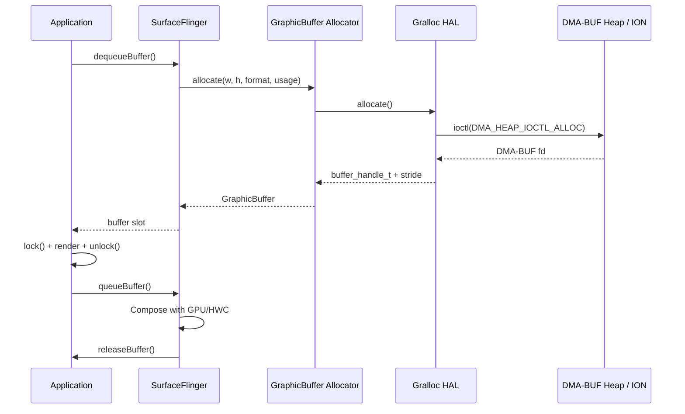

`GraphicBufferAllocator` 维护全局 allocation list 供调试使用，`adb shell dumpsys SurfaceFlinger` 可查看当前图形缓冲区分配情况。

### 8.5.6 `HardwareBuffer`：NDK 接口

NDK 开发者通过 `AHardwareBuffer` 分配图形缓冲区。关键 usage flag 包括 CPU read/write、GPU sampled image、GPU color output、composer overlay、video encode、camera write 和 protected content。DMA-BUF allocator 可根据这些 flag 选择 cached 或 uncached heap。

### 8.5.7 DMA-BUF Sync 与 Cache Coherency

CPU 与硬件加速器共享内存时，需要显式管理 cache coherency。DMA-BUF 使用 `DMA_BUF_IOCTL_SYNC`：

1. **CPU 访问前**：`CpuSyncStart()` 使 CPU 看到硬件写入。
2. **CPU 访问后**：`CpuSyncEnd()` 刷新 CPU 写入，使硬件可见。

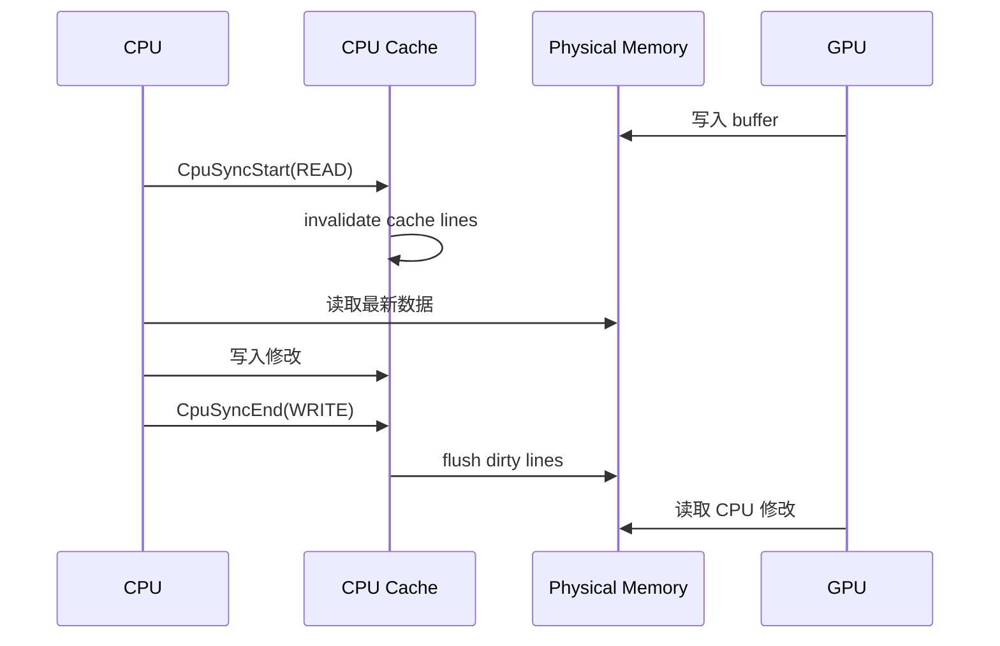

### 8.5.8 GPU 内存跟踪

lmkd 通过 BPF map 跟踪 GPU 内存总量：

```c
static int64_t read_gpu_total_kb() {
    static android::base::unique_fd fd(
        android::bpf::mapRetrieveRO("/sys/fs/bpf/map_gpuMem_gpu_mem_total_map"));
    ...
}
```

该 BPF map 由 GPU memory tracking 程序维护，使 lmkd 无需 vendor 专用代码也能获得 GPU 内存使用量。

---

## 8.6 Ashmem 与 Memfd

### 8.6.1 Ashmem（Android Shared Memory）

Ashmem 是 Android 最早的共享内存机制，最初由内核驱动 `drivers/staging/android/ashmem.c` 实现。它提供：

- **命名区域**：region 名称可在 `/proc/[pid]/maps` 中看到，便于调试。
- **pin/unpin**：可 unpin 让内核在内存压力下回收，再访问前重新 pin。
- **按大小分配**：相比 POSIX shared memory，更符合 Android 早期需求。

典型使用模式：

```c
int fd = open("/dev/ashmem", O_RDWR);
ioctl(fd, ASHMEM_SET_NAME, "my-shared-region");
ioctl(fd, ASHMEM_SET_SIZE, 4096);
void* ptr = mmap(NULL, 4096, PROT_READ | PROT_WRITE, MAP_SHARED, fd, 0);
```

### 8.6.2 Memfd：现代替代方案

Android 正从 ashmem 迁移到 `memfd_create()`。memfd 是上游 Linux syscall，会创建由 tmpfs 支撑的匿名 fd。

优势包括：

- 上游内核支持，无需 Android 专用驱动。
- 支持 sealing，可防止写入或 resize。
- fd-based sharing 与 seccomp/SELinux 自然兼容。

```c
int fd = memfd_create("my-shared-region", MFD_CLOEXEC | MFD_ALLOW_SEALING);
ftruncate(fd, 4096);
void* ptr = mmap(NULL, 4096, PROT_READ | PROT_WRITE, MAP_SHARED, fd, 0);
fcntl(fd, F_ADD_SEALS, F_SEAL_SHRINK | F_SEAL_GROW | F_SEAL_WRITE);
```

### 8.6.3 Binder 中的共享内存

Binder 可传递 fd，因此大块数据通常通过 ashmem 或 memfd 共享，而不是直接塞进 Binder transaction。

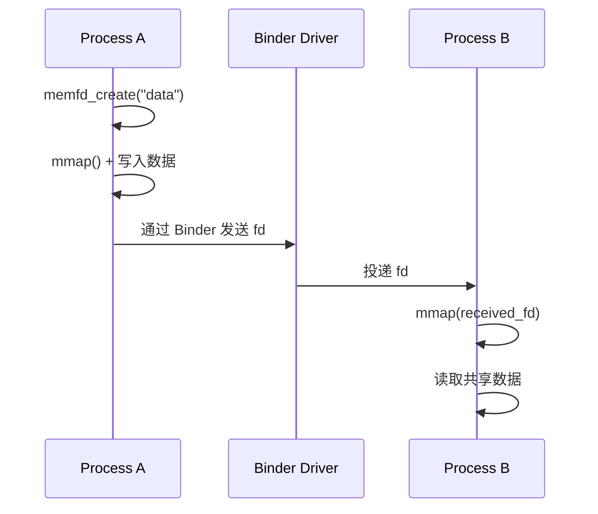

### 8.6.4 `SharedMemory` Java API

`android.os.SharedMemory` 对 Java 代码封装了 memfd：

```java
SharedMemory shm = SharedMemory.create("my-region", 4096);
ByteBuffer buffer = shm.mapReadWrite();
buffer.putInt(42);
shm.setProtect(OsConstants.PROT_READ);
parcel.writeParcelable(shm, 0);
```

### 8.6.5 Purgeable Memory

ashmem 的一个特殊能力是 purgeable memory：unpin 后内核可以在压力下回收内容，重新 pin 时若返回 `ASHMEM_WAS_PURGED`，调用方需要重建数据。

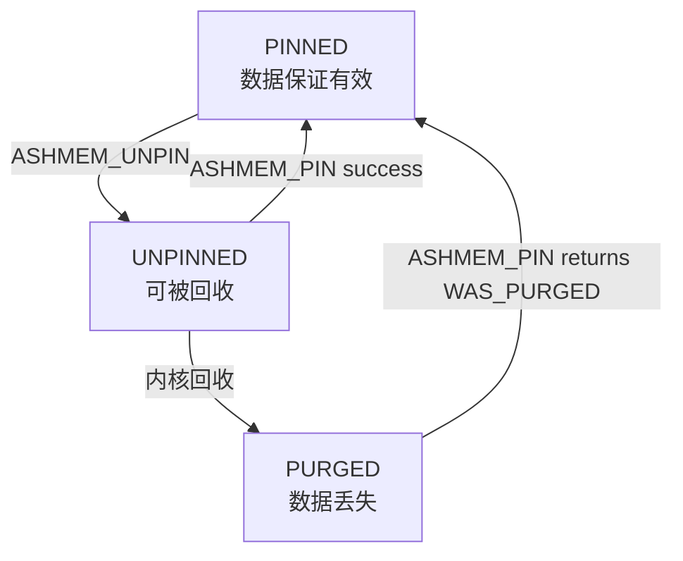

memfd 本身不直接替代 purgeable 语义，framework 通常通过显式 cache 管理实现类似效果。

### 8.6.6 共享区域内存统计

共享内存会带来统计问题：

- **PSS**：共享页按映射进程数均摊。
- **RSS**：每个进程都计算完整页。
- **USS**：只统计某进程独占页。

`dumpsys meminfo` 会分别展示这些指标。

### 8.6.7 Ashmem 与 Memfd 对比

| 特性 | Ashmem | Memfd |
|---|---|---|
| 内核支持 | Android 专用驱动 | 上游 Linux syscall |
| 创建方式 | `open("/dev/ashmem")` + ioctl | `memfd_create()` |
| sealing | 无 | 支持 |
| purgeable | 支持 pin/unpin | 不直接支持 |
| 推荐状态 | 兼容保留 | 新代码推荐 |

### 8.6.8 内存映射模式

共享内存通常使用 `mmap(MAP_SHARED)` 映射。只读消费者可使用 `PROT_READ`，生产者使用 `PROT_READ | PROT_WRITE`。对可执行映射应格外谨慎，Android 安全策略会尽量避免 writable + executable 内存。

---

## 8.7 内存 Profiling

### 8.7.1 `dumpsys meminfo`

`dumpsys meminfo` 是 Android 最常用内存诊断入口：

```bash
adb shell dumpsys meminfo
adb shell dumpsys meminfo <package-or-pid>
```

它展示 Dalvik heap、native heap、code、stack、graphics、private dirty、PSS、RSS、swap PSS 等指标。

### 8.7.2 `procstats`

`procstats` 记录进程随时间变化的内存状态，适合分析长期后台行为和进程生命周期内存占用：

```bash
adb shell dumpsys procstats
```

### 8.7.3 `heapprofd`（Perfetto Native Heap Profiling）

`heapprofd` 是 Perfetto 的 native heap profiler，可以采样 native allocations 并关联调用栈。它适合定位 native 内存泄漏和高分配热点。

```bash
adb shell perfetto -c /data/misc/perfetto-configs/heapprofd.pbtx -o /data/misc/perfetto-traces/heap.pftrace
adb pull /data/misc/perfetto-traces/heap.pftrace
```

### 8.7.4 `showmap`

`showmap` 解析 `/proc/[pid]/smaps`，按映射区域展示 RSS、PSS、private/shared dirty/clean：

```bash
adb shell showmap <pid>
adb shell showmap -a <pid>
```

### 8.7.5 `libmemunreachable`：Native 泄漏检测

`libmemunreachable` 通过扫描 native heap、寄存器、栈和全局变量，寻找不可达但仍被分配的内存块。它适合 debug build 下定位 native 泄漏。

相关源码：

```text
system/memory/libmemunreachable/MemUnreachable.cpp
```

### 8.7.6 Memory Profiling 决策树

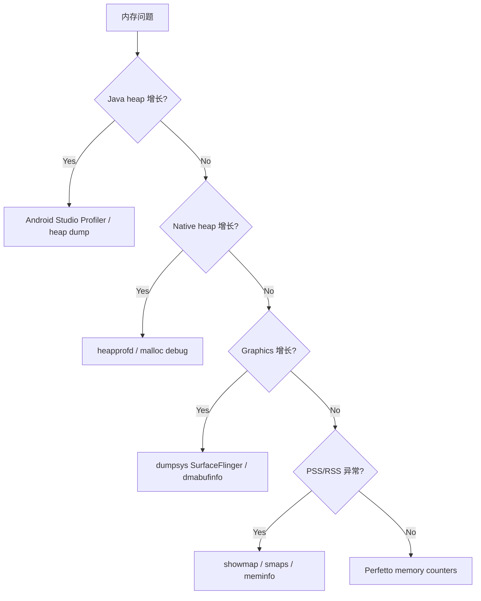

### 8.7.7 理解内存指标

| 指标 | 含义 |
|------|------|
| RSS | 驻留物理内存总量，共享页按完整页计入 |
| PSS | Proportional Set Size，共享页均摊 |
| USS | Unique Set Size，独占页 |
| Private Dirty | 进程私有且已修改的页，最影响回收 |
| Shared Clean | 可共享且干净的文件映射页 |
| Swap PSS | 被换出页按比例分摊后的大小 |

### 8.7.8 阅读 `dumpsys meminfo` 输出

阅读 meminfo 时应重点看：Dalvik Heap 是否持续增长、Native Heap 是否异常、Graphics 是否过高、Private Dirty 是否无法回收、Swap PSS 是否持续攀升，以及 TOTAL PSS 是否符合设备等级预期。

### 8.7.9 Perfetto Memory Counters

Perfetto 可采集内存 counters，包括进程 RSS、oom_score_adj、LMK 事件、ion/dmabuf、zRAM、swap、page faults 等。它适合把内存变化和 UI jank、进程生命周期、GC、IO 放到同一条时间线上分析。

### 8.7.10 `/proc` 文件系统内存文件

常用 `/proc` 入口：

```bash
cat /proc/meminfo
cat /proc/vmstat
cat /proc/zoneinfo
cat /proc/pressure/memory
cat /proc/<pid>/smaps
cat /proc/<pid>/status
cat /proc/<pid>/oom_score_adj
```

---

## 8.8 App 内存管理

### 8.8.1 ActivityManager 内存裁剪

framework 通过 `ComponentCallbacks2.onTrimMemory()` 通知应用释放内存。不同 level 表示不同压力和进程状态，例如 UI hidden、running low、running critical、background、moderate、complete。

应用应在回调中释放图片缓存、对象池、临时 buffer、可重建数据，而不是等待 lmkd 杀死进程。

### 8.8.2 `AppProfiler`

`AppProfiler` 位于 ActivityManagerService 内部，负责跟踪应用内存、触发 PSS 采样、维护进程 profile 信息，并把数据提供给系统决策和 dumpsys 输出。

源码路径：

```text
frameworks/base/services/core/java/com/android/server/am/AppProfiler.java
```

### 8.8.3 `ProcessList` 与 OOM Adjustment

`ProcessList` 管理 OOM adj 常量、阈值和进程优先级计算结果。AMS 计算出新的 adj 后，会把它同步给内核和 lmkd，使内存回收决策与用户可见状态一致。

### 8.8.4 AMS 如何与 lmkd 通信

AMS 通过 lmkd socket 发送进程状态更新。每当进程启动、退出、adj 改变或状态变化时，AMS 会更新 lmkd 进程表。这保证 lmkd 选择 victim 时使用的是 framework 认可的进程重要性。

### 8.8.5 内存限制与阈值

应用内存上限由设备 RAM、`largeHeap`、ART heap growth limit、target SDK 和系统策略共同决定。开发者不应依赖 `largeHeap` 作为常规方案，它会提高单进程内存上限，但可能降低系统多任务能力。

### 8.8.6 进程生命周期与内存

进程生命周期与内存优先级紧密相关：前台进程最受保护，可见/可感知进程次之，service 与 cached 进程更容易被杀。cached 进程保留内存是为了提升下次启动速度，但在压力下会优先释放。

### 8.8.7 App 开发者最佳实践

- 实现 `onTrimMemory()` 并按 level 释放不同缓存。
- 使用有界 `LruCache`，避免无限 bitmap cache。
- 避免 static 持有 Activity/Context。
- 控制线程数，优先使用线程池。
- 及时关闭 Cursor、Bitmap、HardwareBuffer、file descriptor。
- 用 heapprofd 或 Java heap dump 定位泄漏。

### 8.8.8 ART GC 与内存

ART 管理 Java/Kotlin heap，并根据分配速率、heap utilization、foreground/background 状态选择 GC 时机。GC 能回收托管对象，但无法直接回收 native allocations、graphics buffers 或未释放的 fd。混合 Java/native 应用必须同时关注 Dalvik heap 和 native heap。

---

## 8.9 内核内存特性

### 8.9.1 KASAN（Kernel Address Sanitizer）

KASAN 是内核地址错误检测器，用于 debug 构建中发现 use-after-free、out-of-bounds 等内核内存错误。它开销较大，通常不用于量产构建。

### 8.9.2 MTE（Memory Tagging Extension）

MTE 是 ARMv8.5 引入的硬件内存标记能力。它把指针 tag 与内存 tag 匹配，用于检测 use-after-free 和越界访问。Android 把 MTE 集成到内核、Bionic、Scudo、ART 和应用兼容策略中。

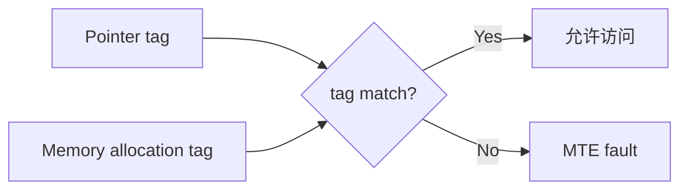

### 8.9.3 GWP-ASan

GWP-ASan 是低开销概率采样式内存错误检测器。它只对一小部分 allocation 使用 guard page，因此适合在生产环境中以较低概率启用，用于捕获真实用户环境中的 native heap bug。

### 8.9.4 Scudo：Android Hardened Allocator

Scudo 是 Android 默认 native allocator。它提供 chunk header checksum、quarantine、随机化、double-free 检测、use-after-free 缓解等能力。Bionic 的 malloc dispatch 会默认落到 Scudo，也可被 malloc debug 或 profiling 机制替换。

### 8.9.5 MTE 与 Android 内存栈集成

MTE 集成涉及硬件、内核、编译器、Bionic、Scudo、ART 和应用 manifest。系统可以按进程启用同步或异步 MTE fault 模式，并根据兼容性策略决定哪些应用启用。

### 8.9.6 Kernel Same-page Merging（KSM）

KSM 会扫描匿名页，找出内容相同的页面并合并为 CoW 页。它可以降低内存占用，但会消耗 CPU，也可能带来侧信道风险。因此 Android 上是否启用取决于设备策略。

### 8.9.7 Transparent Huge Pages（THP）

THP 使用更大的页减少 TLB miss，对大段连续内存访问有利。但它也可能增加内存碎片和 compaction 开销。Android 会根据 workload 和设备特性谨慎启用。

---

## 8.10 动手实践

### 练习 52.1：观察 lmkd 行为

```bash
adb logcat -s lowmemorykiller lmkd ActivityManager
adb shell cat /proc/pressure/memory
adb shell cat /proc/meminfo
```

启动多个内存密集应用，观察 lmkd 日志中的 kill reason、pid、uid、oom_score_adj、RSS 和 swap。

### 练习 52.2：用 `dumpsys` 分析内存

```bash
adb shell dumpsys meminfo
adb shell dumpsys meminfo com.android.systemui
```

关注 TOTAL PSS、Private Dirty、Dalvik Heap、Native Heap 和 Graphics。

### 练习 52.3：用 `heapprofd` 分析 native 内存

```bash
adb shell perfetto -c /data/misc/perfetto-configs/heapprofd.pbtx -o /data/misc/perfetto-traces/heap.pftrace
adb pull /data/misc/perfetto-traces/heap.pftrace
```

用 Perfetto UI 打开 trace，定位 allocation callstack。

### 练习 52.4：探索 zRAM

```bash
adb shell cat /proc/swaps
adb shell cat /sys/block/zram0/mm_stat
adb shell cat /sys/block/zram0/comp_algorithm
```

比较原始数据大小、压缩后大小和压缩比。

### 练习 52.5：检测不可达内存

使用支持的 debug build 运行 libmemunreachable 工具，检查 native heap 中无法从根集合到达的 allocation。

### 练习 52.6：实验 Memory Cgroups

```bash
adb shell cat /proc/self/cgroup
adb shell ls /dev/memcg
adb shell cat /proc/<pid>/cgroup
```

观察不同进程类别进入的 cgroup。

### 练习 52.7：监控图形内存

```bash
adb shell dumpsys SurfaceFlinger
adb shell dumpsys meminfo | grep -i graphics
adb shell dmabuf_dump 2>/dev/null || true
```

### 练习 52.8：触发并观察 `onTrimMemory`

编写测试应用实现 `ComponentCallbacks2.onTrimMemory()`，用压力工具或多任务切换触发不同 trim level，并记录释放缓存前后的内存变化。

### 练习 52.9：在支持硬件上检查 MTE

```bash
adb shell getprop | grep -i mte
adb shell cat /proc/cpuinfo | grep -i mte
```

### 练习 52.10：用 Perfetto 跟踪内存

采集包含 process stats、memory counters、LMK events、sched 和 heap profile 的 trace，把 kill 事件与 PSI、RSS、UI 卡顿关联起来分析。

### 练习 52.11：分析 DMA-BUF 分配

```bash
adb shell dumpsys SurfaceFlinger
adb shell cat /sys/kernel/debug/dma_buf/bufinfo 2>/dev/null
```

### 练习 52.12：实时调查进程 OOM 分数

```bash
while true; do
  adb shell 'for p in /proc/[0-9]*; do [ -f $p/oom_score_adj ] && echo $(basename $p) $(cat $p/oom_score_adj) $(cat $p/comm); done | sort -nk2 | tail'
  sleep 2
done
```

### 练习 52.13：比较内存指标

选择一个进程，对比 `dumpsys meminfo`、`showmap`、`/proc/[pid]/status` 和 `/proc/[pid]/smaps` 中的 RSS、PSS、Private Dirty。

### 练习 52.14：构建内存压力实验

创建逐步分配 Java heap、native heap 和 graphics buffer 的测试应用，分别观察 GC、onTrimMemory、zRAM 增长和 lmkd kill。

### 练习 52.15：调查 lmkd Kill 历史

```bash
adb logcat -b events | grep -i lmk
adb shell dumpsys activity lmk
```

### 练习 52.16：使用 memtest 做内存压力测试

在测试设备上运行内存压力工具，观察 PSI、zRAM、kswapd、direct reclaim 和 lmkd 响应。不要在主力设备或生产设备上运行破坏性压力测试。

### 练习 52.17：审计内存安全特性

检查设备是否启用 Scudo、GWP-ASan、MTE、KASAN、KSM、THP、zRAM 和相关 kernel config。结合 `getprop`、`/proc/config.gz`、`/proc/cpuinfo` 和 linker/allocator 日志验证。

---

## 总结

Android 内存管理体现了几个核心原则：

1. **主动优于被动。** lmkd 不等待内核 OOM killer 作为最后手段，而是主动监控压力并在系统进入危险状态前杀死低优先级进程。

2. **按重要性杀进程。** OOM score 体系保护用户体验：前台应用受到保护，cached 后台进程优先牺牲。

3. **协作式内存管理。** `onTrimMemory()` 给应用主动释放内存的机会，比杀进程更高效。

4. **安全纵深防御。** MTE、GWP-ASan、KASAN 和 Scudo 提供重叠保护层，没有单一机制被孤立依赖。

5. **软硬件协同设计。** MTE 需要硬件支持，但深度集成进 Scudo、compiler、kernel。DMA-BUF 也把硬件共享缓冲区能力和软件分配策略连接起来。

6. **透明性与可观测性。** dumpsys、heapprofd、Perfetto、showmap、libmemunreachable 等工具确保内存行为可在各层被理解和调试。

### 架构原则

- 用 Zygote + CoW 最大化 framework 页共享。
- 用 zRAM 延后 kill，但用 lmkd 防止 thrashing 损害交互性。
- 用 cgroup 和 OOM adj 把内存决策与用户可见状态对齐。
- 用 DMA-BUF 统一硬件共享 buffer 管理。
- 用 profiling 工具让问题可定位、可量化。

### 常见陷阱

| 陷阱 | 症状 | 解决方式 |
|---|---|---|
| 未实现 `onTrimMemory()` | 后台频繁被杀 | 实现 trim callback 释放缓存 |
| 持有 Activity 引用 | Dalvik heap 无界增长 | 使用 WeakReference，避免 static Activity 引用 |
| Native 内存泄漏 | Native Heap 持续增长 | 使用 heapprofd 定位分配点 |
| Bitmap cache 无上限 | Private Dirty 很高 | 使用有大小限制的 LruCache |
| 后台服务过多 | 高 oom_adj 仍占内存 | 使用 WorkManager 替代常驻服务 |
| JNI global ref 过大 | Non-moving space 增长 | 及时释放 global refs |
| DMA-BUF 泄漏 | Graphics memory 增长 | Surface 销毁时释放 GraphicBuffer |
| 线程栈累积 | 线程数导致 stack 内存增长 | 使用有界线程池 |

---

## 关键源码文件参考

| 组件 | 路径 |
|---|---|
| lmkd 主实现 | `system/memory/lmkd/lmkd.cpp` |
| lmkd init 服务 | `system/memory/lmkd/lmkd.rc` |
| lmkd 协议定义 | `system/memory/lmkd/include/lmkd.h` |
| Process reaper | `system/memory/lmkd/reaper.cpp` |
| Watchdog | `system/memory/lmkd/watchdog.cpp` |
| Kill statistics | `system/memory/lmkd/statslog.h` |
| PSI monitor library | `system/memory/lmkd/libpsi/psi.cpp` |
| PSI header | `system/memory/lmkd/libpsi/include/psi/psi.h` |
| ION allocator | `system/memory/libion/ion.c` |
| DMA-BUF heap allocator | `system/memory/libdmabufheap/BufferAllocator.cpp` |
| DMA-BUF heap include | `system/memory/libdmabufheap/include/BufferAllocator/BufferAllocator.h` |
| GraphicBufferAllocator | `frameworks/native/libs/ui/GraphicBufferAllocator.cpp` |
| GraphicBufferMapper | `frameworks/native/libs/ui/GraphicBufferMapper.cpp` |
| GraphicBuffer header | `frameworks/native/libs/ui/include/ui/GraphicBuffer.h` |
| libmemunreachable | `system/memory/libmemunreachable/MemUnreachable.cpp` |
| showmap tool | `system/memory/libmeminfo/tools/showmap.cpp` |
| procrank / librank | `system/memory/libmeminfo/tools/procrank.cpp` |
| smapinfo library | `system/memory/libmeminfo/libsmapinfo/smapinfo.cpp` |
| ProcessList (Java) | `frameworks/base/services/core/java/com/android/server/am/ProcessList.java` |
| AppProfiler (Java) | `frameworks/base/services/core/java/com/android/server/am/AppProfiler.java` |
| ComponentCallbacks2 | `frameworks/base/core/java/android/content/ComponentCallbacks2.java` |
| ActivityManagerService | `frameworks/base/services/core/java/com/android/server/am/ActivityManagerService.java` |
| libdmabufinfo | `system/memory/libmeminfo/libdmabufinfo/` |
| libmemevents | `system/memory/libmeminfo/libmemevents/` |
| procmem tool | `system/memory/libmeminfo/tools/procmem.cpp` |
| wsstop tool | `system/memory/libmeminfo/tools/wsstop.cpp` |

---

## 延伸阅读

### 内核文档

- Linux 内核源码中的 `Documentation/admin-guide/mm/`：包含 zRAM、KSM、THP、hugetlbfs 等内存管理文档。
- `Documentation/admin-guide/cgroup-v2.txt`：cgroup v2 memory controller 文档。
- `Documentation/vm/`：内核 VM 子系统设计文档。

### Android 专用资源

- `system/memory/lmkd/README.md`：lmkd 设计概览。
- Perfetto 文档：`https://perfetto.dev/docs/data-sources/memory-counters`。
- Android CDD：不同设备类别的内存要求。

### 学术与行业参考

- Mel Gorman 的 *Understanding the Linux Virtual Memory Manager*。
- ARM Architecture Reference Manual 中关于 MTE 的章节。
- LLVM 项目文档中的 Scudo Hardened Allocator 设计文档。
- Google Project Zero 关于 MTE 部署和有效性的博客文章。

### 相关 AOSP 章节

- 第 4 章（Kernel）：内核启动流程与基础子系统。
- 第 6 章（Bionic and Linker）：C 库 allocator（Scudo）细节。
- 第 9 章（Graphics Render Pipeline）：GraphicBuffer 如何流经显示管线。
- 第 19 章（ART Runtime）：GC 算法与托管堆内部机制。
- 第 39 章（Power Management）：内存管理与 suspend、doze mode 的交互。
- 第 46 章（Debugging Tools）：Perfetto 和 systrace 等调试技术。
