# 第 8 章：内存管理

内存管理无疑是移动操作系统中最关键的子系统。Android 设备在严苛的物理限制下运行——旗舰机可能有 8--16 GB 的 RAM，但用户通常安装了数十个应用并期望在它们之间瞬间切换。本章将剖析 AOSP 如何编排内存，从硬件页表一直到开发者交互的 Java `onTrimMemory()` 回调。我们将追踪 Linux 内核虚拟内存子系统、用户态低内存杀手守护进程 (lmkd)、cgroup 统计、压缩交换区 (zRAM)、图形缓冲区分配 (ION/DMA-BUF)、匿名共享内存 (ashmem/memfd)、分析工具，以及保护系统免受攻击的面向安全的内存硬化特性。

本章每个小节都引用了位于 AOSP 源码树中的真实文件。当出现类似 `system/memory/lmkd/lmkd.cpp` 的路径时，它是相对于 AOSP 检出根目录的。

---

## 8.1 内存架构

### 8.1.1 虚拟内存基础

Android 运行在 Linux 内核之上，内核为每个进程提供独立的虚拟地址空间。在 64 位 ARM 设备 (AArch64) 上，内核通常使用 39 位或 48 位虚拟地址空间，为每个进程提供高达 256 TB 的可寻址内存——这远超任何物理设备所能包含的容量。CPU 中的内存管理单元 (MMU) 通过多级页表将虚拟地址翻译为物理帧号 (PFN)。

```
虚拟地址 (48 位示例)
+--------+--------+--------+--------+-----------+
| L0 索引 | L1 索引 | L2 索引 | L3 索引 | 页内偏移  |
| (9 bit)| (9 bit)| (9 bit)| (9 bit)| (12 bit)  |
+--------+--------+--------+--------+-----------+
         |
         v
    页表遍历 (AArch64 上为 4 级)
         |
         v
    物理帧号 + 偏移 = 物理地址
```

Android 开发者和平台工程师的关键概念：

| 概念 | 描述 |
|---|---|
| **页 (Page)** | 内存管理的最小单位，ARM64 上通常为 4 KB (某些新 SoC 支持 16 KB) |
| **页表 (Page Table)** | 映射虚拟地址到物理地址的分层结构 |
| **TLB** | 转换检测缓冲区 (Translation Lookaside Buffer)——硬件缓存，存储最近的翻译结果 |
| **缺页中断 (Page Fault)** | 当虚拟地址没有有效映射时触发的 CPU 异常 |
| **请求分页 (Demand Paging)** | 页面直到首次访问（次要缺页中断）或从存储介质加载（主要缺页中断）时才分配 |
| **写时拷贝 (CoW)** | 共享页面仅在某个进程尝试写入时才被复制——这是 `fork()` 和 Zygote 机制的核心 |

### 8.1.2 进程地址空间布局

每个 Android 进程都通过 `fork()` 从 Zygote 继承其初始地址空间。64 位设备上的通用布局遵循以下模式：


```mermaid
graph TD
    subgraph "进程虚拟地址空间 (64位)"
        A["0x0000000000000000<br/>NULL 页 (未映射)"]
        B["程序文本 (.text)<br/>可执行代码"]
        C["只读数据 (.rodata)"]
        D["已初始化数据 (.data, .bss)"]
        E["堆 (Heap) (brk/sbrk)<br/>向上增长"]
        F["内存映射区域 (mmap)<br/>共享库、文件映射、<br/>匿名映射"]
        G["线程栈<br/>(每个默认约 1 MB)"]
        H["[stack] - 主线程栈<br/>向下增长"]
        I["0x0000007fffffffff<br/>用户空间上限 (39位 VA)"]
        J["--- 内核 / 用户边界 ---"]
        K["0xffffff8000000000<br/>内核虚拟地址空间"]
    end

    A --> B --> C --> D --> E --> F --> G --> H --> I --> J --> K

    style A fill:#ff6666,color:#000
    style J fill:#ffcc00,color:#000
    style K fill:#66aaff,color:#000
```

在该布局内，Android 增加了几个专用区域：

- **Dalvik/ART 堆**：Java/Kotlin 对象的托管堆，位于 mmap 区域。ART 使用 `mmap(MAP_ANONYMOUS)` 来创建大对象空间、非移动空间和其他 GC 空间。
- **JIT 代码缓存**：ART 的 JIT 编译器通过 `mmap(PROT_READ | PROT_EXEC)` 为编译后的方法分配可执行内存。
- **Ashmem / memfd 区域**：用于 Binder 事务、图形缓冲区和进程间数据共享的共享内存段。
- **栈保护页 (Stack Guard Pages)**：每个线程的栈都由未映射的保护页界定，以捕获栈溢出。

### 8.1.3 内核 vs. 用户空间内存

内核保留虚拟地址空间的高端部分供自己使用。用户空间进程无法访问内核内存（由 MMU 强制执行）。这种隔离是系统稳定性的基础——有漏洞的应用无法破坏内核数据结构。

内核内存分为：

| 区域 | 用途 |
|---|---|
| **线性映射 (Linear mapping)** | 所有物理 RAM 的直接映射（带偏移的等值映射） |
| **vmalloc 区域** | 虚拟连续但物理分散的分配 |
| **模块空间 (Module space)** | 可加载内核模块 |
| **fixmap** | 针对特殊硬件的编译期固定虚拟地址 |
| **PCI I/O 空间** | 外设设备的内存映射 I/O |

Android 的内核配置增加了几个重要的内存相关特性：

```
# 典型的 Android 内核配置摘录
CONFIG_ZRAM=y                    # RAM 中的压缩交换区
CONFIG_MEMCG=y                   # 内存 cgroup 支持
CONFIG_PSI=y                     # 压力停顿信息 (Pressure Stall Information)
CONFIG_TRANSPARENT_HUGEPAGE=y    # 透明大页，用于减少 TLB 未命中
CONFIG_KSM=y                     # 内核同页合并 (Kernel Same-page Merging, 可选)
CONFIG_KASAN=y                   # 内核地址消毒剂 (Kernel Address Sanitizer, 调试构建)
CONFIG_ARM64_MTE=y               # 内存标签扩展 (Memory Tagging Extension, ARMv8.5+)
```

### 8.1.4 内存域与 NUMA

Linux 内核将物理内存组织为多个域 (zones)：

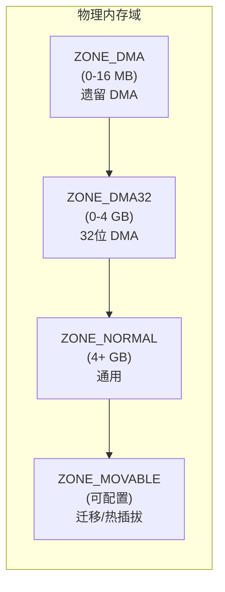
```mermaid
graph LR
    subgraph "物理内存域"
        DMA["ZONE_DMA<br/>(0-16 MB)<br/>遗留 DMA"]
        DMA32["ZONE_DMA32<br/>(0-4 GB)<br/>32位 DMA"]
        NORMAL["ZONE_NORMAL<br/>(4+ GB)<br/>通用"]
        MOVABLE["ZONE_MOVABLE<br/>(可配置)<br/>迁移/热插拔"]
    end

    DMA --> DMA32 --> NORMAL --> MOVABLE
```

lmkd 守护进程通过解析 `/proc/zoneinfo` 来了解域级别的内存压力。`system/memory/lmkd/lmkd.cpp` 中的解析代码定义了这些结构：

```c
// system/memory/lmkd/lmkd.cpp (第 301-391 行)

/* /proc/zoneinfo 中解析的字段 */
enum zoneinfo_zone_field {
    ZI_ZONE_NR_FREE_PAGES = 0,
    ZI_ZONE_MIN,
    ZI_ZONE_LOW,
    ZI_ZONE_HIGH,
    ZI_ZONE_PRESENT,
    ZI_ZONE_NR_FREE_CMA,
    ZI_ZONE_FIELD_COUNT
};

struct zoneinfo_zone {
    union zoneinfo_zone_fields fields;
    int64_t protection[MAX_NR_ZONES];
    int64_t max_protection;
};

struct zoneinfo {
    int node_count;
    struct zoneinfo_node nodes[MAX_NR_NODES];
    int64_t totalreserve_pages;
    int64_t total_inactive_file;
    int64_t total_active_file;
};
```

`totalreserve_pages` 字段是每个域的 `max_protection + high watermark` 之和，代表内核为自身操作保留的最小内存量。这对 lmkd 计算可用内存至关重要。

### 8.1.5 Zygote 与写时拷贝

Zygote 进程是 Android 内存效率的核心。每个应用进程都从 Zygote fork 而来，Zygote 预加载了整个 Android 框架（约 100+ MB 的类库、资源和原生代码）。得益于写时拷贝 (CoW)，在修改之前，这些页面在物理上由 Zygote 和每个 fork 出的应用进程共享。

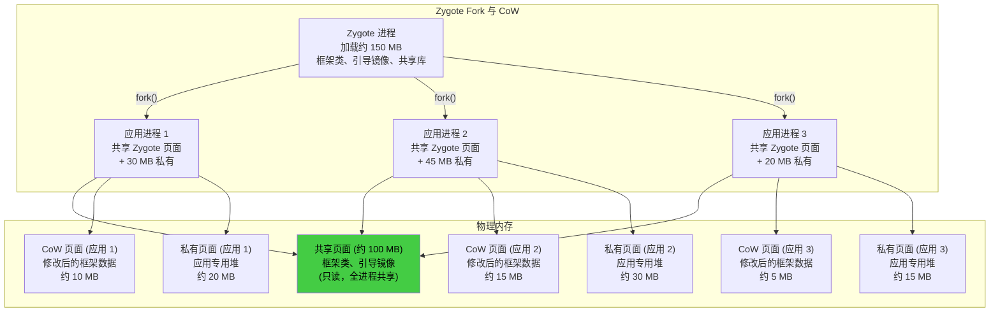
```mermaid
graph TD
    subgraph "Zygote Fork 与 CoW"
        Zygote["Zygote 进程<br/>加载约 150 MB<br/>框架类、引导镜像、共享库"]

        App1["应用进程 1<br/>共享 Zygote 页面<br/>+ 30 MB 私有"]
        App2["应用进程 2<br/>共享 Zygote 页面<br/>+ 45 MB 私有"]
        App3["应用进程 3<br/>共享 Zygote 页面<br/>+ 20 MB 私有"]
    end

    subgraph "物理内存"
        Shared["共享页面 (约 100 MB)<br/>框架类、引导镜像<br/>(只读，全进程共享)"]
        CoW1["CoW 页面 (应用 1)<br/>修改后的框架数据<br/>约 10 MB"]
        CoW2["CoW 页面 (应用 2)<br/>修改后的框架数据<br/>约 15 MB"]
        CoW3["CoW 页面 (应用 3)<br/>修改后的框架数据<br/>约 5 MB"]
        Private1["私有页面 (应用 1)<br/>应用专用堆<br/>约 20 MB"]
        Private2["私有页面 (应用 2)<br/>应用专用堆<br/>约 30 MB"]
        Private3["私有页面 (应用 3)<br/>应用专用堆<br/>约 15 MB"]
    end

    Zygote -->|"fork()"| App1
    Zygote -->|"fork()"| App2
    Zygote -->|"fork()"| App3

    App1 --> Shared
    App2 --> Shared
    App3 --> Shared

    App1 --> CoW1
    App1 --> Private1
    App2 --> CoW2
    App2 --> Private2
    App3 --> CoW3
    App3 --> Private3

    style Shared fill:#44cc44,color:#000
```

如果没有 Zygote 和 CoW，这三个应用中的每一个都需要一份独立的框架副本，从而使共享代码的内存消耗翻三倍。有了 CoW，物理成本为：

- **无 CoW**：3 x 150 MB = 450 MB 框架 + 95 MB 私有 = 545 MB 总量
- **有 CoW**：100 MB 共享 + 30 MB CoW 页面 + 95 MB 私有 = 225 MB 总量

这种差异在 Android 设备上通常运行的 20-40 个进程中会被成倍放大。

### 8.1.6 内存回收机制

当压力增加时，内核采用几种机制来回收内存：

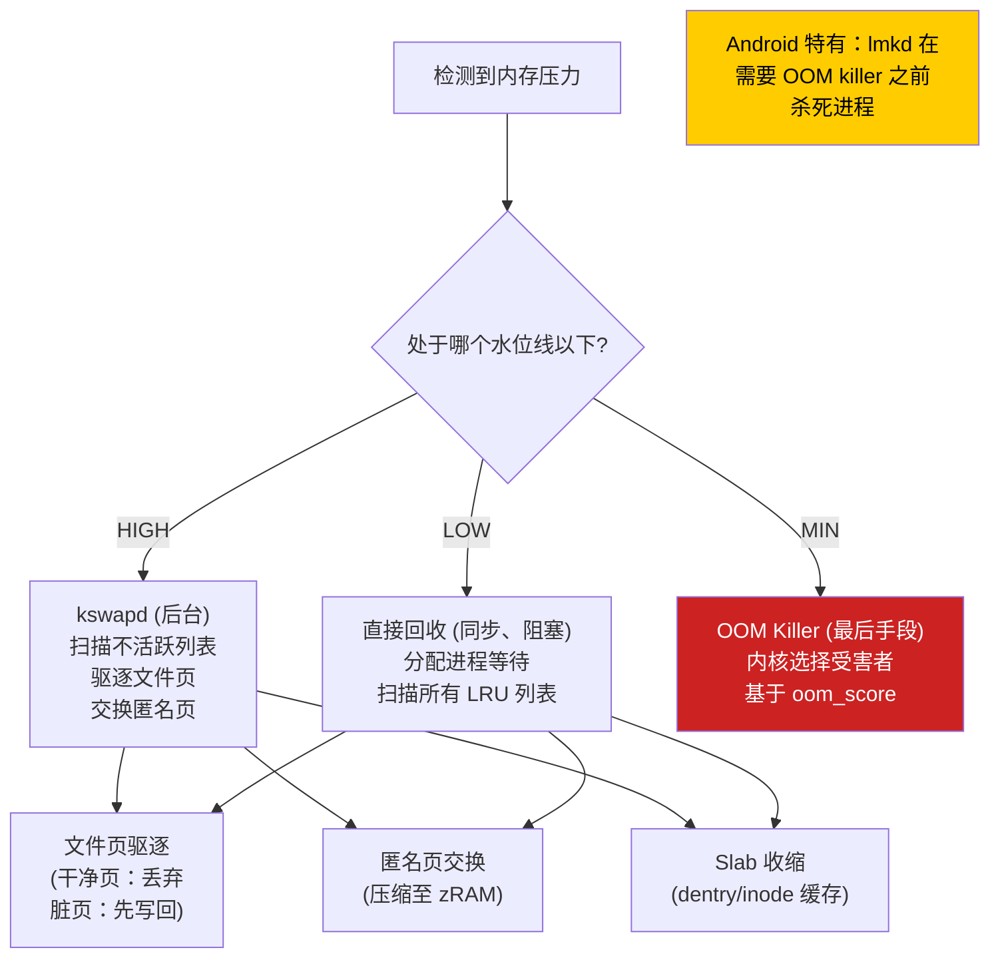
```mermaid
flowchart TD
    Pressure["检测到内存压力"] --> Watermark{"处于哪个水位线以下?"}

    Watermark -->|"HIGH"| kswapd["kswapd (后台)<br/>扫描不活跃列表<br/>驱逐文件页<br/>交换匿名页"]

    Watermark -->|"LOW"| DirectRecl["直接回收 (同步、阻塞)<br/>分配进程等待<br/>扫描所有 LRU 列表"]

    Watermark -->|"MIN"| OOM["OOM Killer (最后手段)<br/>内核选择受害者<br/>基于 oom_score"]

    kswapd --> FileEvict["文件页驱逐<br/>(干净页：丢弃<br/>脏页：先写回)"]
    kswapd --> AnonSwap["匿名页交换<br/>(压缩至 zRAM)"]
    kswapd --> SlabShrink["Slab 收缩<br/>(dentry/inode 缓存)"]

    DirectRecl --> FileEvict
    DirectRecl --> AnonSwap
    DirectRecl --> SlabShrink

    Note1["Android 特有：lmkd 在<br/>需要 OOM killer 之前<br/>杀死进程"]

    style OOM fill:#cc2222,color:#fff
    style Note1 fill:#ffcc00,color:#000
```

页面回收算法使用两个关键指标：

- **不活跃比例 (Inactive ratio)**：页面根据访问模式从活跃列表降级到不活跃列表。最近未被访问的页面更有可能被驱逐。
- **扫描优先级 (Scan priority)**：优先级越高，每个回收周期扫描的页面越多。直接回收使用比 kswapd 更高的优先级。

### 8.1.7 页面缓存 (Page Cache)

Linux 页面缓存将最近读取的文件数据保留在内存中。在 Android 上，这尤为重要，原因如下：

1. **应用启动速度**取决于页面缓存中是否存在 APK 内容（DEX、资源、原生库）。
2. **页面缓存是可驱逐的**——内核在内存压力下会回收这些页面，这就是为什么文件缓存大小会影响 lmkd 的杀进程决策。
3. **活跃 vs. 不活跃列表**——内核维护 LRU 列表以决定优先驱逐哪些页面。lmkd 通过 `/proc/meminfo` 读取这些信息：

```c
// system/memory/lmkd/lmkd.cpp (第 394-441 行)
enum meminfo_field {
    MI_NR_FREE_PAGES = 0,
    MI_CACHED,
    MI_SWAP_CACHED,
    MI_BUFFERS,
    MI_SHMEM,
    MI_UNEVICTABLE,
    MI_TOTAL_SWAP,
    MI_FREE_SWAP,
    MI_ACTIVE_ANON,
    MI_INACTIVE_ANON,
    MI_ACTIVE_FILE,
    MI_INACTIVE_FILE,
    MI_SRECLAIMABLE,
    MI_SUNRECLAIM,
    MI_KERNEL_STACK,
    MI_PAGE_TABLES,
    // ...
    MI_FIELD_COUNT
};
```

---

## 8.2 低内存杀手守护进程 (lmkd)

低内存杀手守护进程是核心用户态组件，负责在内存压力下保持 Android 系统响应。当物理内存不足时，lmkd 会选择并杀死进程以释放内存，以免系统进入不可恢复的内存溢出 (OOM) 状态。

**源码目录**：`system/memory/lmkd/`

| 文件 | 用途 |
|---|---|
| `lmkd.cpp` | 主守护进程实现 (约 3400 行) |
| `lmkd.rc` | Init 服务定义 |
| `lmkd.h` (位于 `include/`) | 命令协议定义 |
| `reaper.cpp` / `reaper.h` | 使用 `process_mrelease()` 的异步进程收割 |
| `watchdog.cpp` / `watchdog.h` | 检测 lmkd 挂起的看门狗定时器 |
| `statslog.cpp` / `statslog.h` | 杀死事件的统计日志 |
| `libpsi/psi.cpp` | PSI (压力停顿信息) 监控接口 |

### 8.2.1 历史背景：从内核驱动到用户态守护进程

Android 最初使用位于 `drivers/staging/android/lowmemorykiller.c` 的内核内低内存杀手 (LMK) 驱动。该内核驱动通过挂接到内核的 shrink 回调机制运行。当内存低于配置的阈值时，驱动会遍历进程列表并杀死 `oom_adj_score` 超过阈值的最高分进程。

迁移到用户态守护进程 (lmkd) 的原因有几个：

1. **Staging 驱动移除**：内核社区从 staging 树中拒绝了 LMK 驱动。
2. **灵活性**：用户态守护进程可以独立于内核进行更新。
3. **PSI 集成**：现代内核中的压力停顿信息 (PSI) 框架提供了比旧的 vmpressure 事件更好的内存压力信号。
4. **更好的杀进程策略**：用户态可以访问更多进程元数据。

代码仍然会检查遗留的内核内接口：

```c
// system/memory/lmkd/lmkd.cpp (第 86-87, 155 行)
#define INKERNEL_MINFREE_PATH "/sys/module/lowmemorykiller/parameters/minfree"
#define INKERNEL_ADJ_PATH "/sys/module/lowmemorykiller/parameters/adj"

/* 如果没有内存压力事件，默认使用旧的内核内接口 */
static bool use_inkernel_interface = true;
static bool has_inkernel_module;
```

### 8.2.2 lmkd 服务配置

该守护进程由 Android 的 init系统通过其 `.rc` 文件启动：

```
# system/memory/lmkd/lmkd.rc (第 1-8 行)
service lmkd /system/bin/lmkd
    class core
    user lmkd
    group lmkd system readproc
    capabilities DAC_OVERRIDE KILL IPC_LOCK SYS_NICE SYS_RESOURCE
    critical
    socket lmkd seqpacket+passcred 0660 system system
    task_profiles ServiceCapacityLow
```

该配置的关键点：

- **`class core`**：lmkd 在核心服务类中启动，意味着它在启动早期运行。
- **`user lmkd`**：以专用用户身份运行，实现安全隔离。
- **`capabilities`**：需要 `CAP_KILL` 来终止进程，`CAP_DAC_OVERRIDE` 来写入 `/proc/[pid]/oom_score_adj`，以及 `CAP_SYS_RESOURCE` 进行资源调整。
- **`critical`**：如果 lmkd 崩溃，系统将重启（它就是这么核心）。
- **`socket lmkd`**：创建一个 Unix 域套接字，用于与 ActivityManagerService 通信。
- **重新初始化触发器**：`.rc` 文件包含属性触发器（第 10-72 行），当通过 `persist.device_config.lmkd_native.*` 属性更改实验性标志时，会重新初始化 lmkd。

### 8.2.3 通信协议

lmkd 通过 Unix 域套接字与框架（主要是 ActivityManagerService 中的 `ProcessList.java`）通信。协议定义在 `include/lmkd.h` 中：

```c
// system/memory/lmkd/include/lmkd.h (第 29-42 行)
enum lmk_cmd {
    LMK_TARGET = 0,         /* 将 minfree 与 oom_adj_score 关联 */
    LMK_PROCPRIO,           /* 注册一个进程并设置其 oom_adj_score */
    LMK_PROCREMOVE,         /* 注销一个进程 */
    LMK_PROCPURGE,          /* 清除所有已注册进程 */
    LMK_GETKILLCNT,         /* 获取杀死次数 */
    LMK_SUBSCRIBE,          /* 订阅异步事件 */
    LMK_PROCKILL,           /* 进程被杀时向订阅客户端发送的主动消息 */
    LMK_UPDATE_PROPS,       /* 重新初始化属性 */
    LMK_STAT_KILL_OCCURRED, /* 用于 statsd 日志的主动消息 */
    LMK_START_MONITORING,   /* 如果之前跳过了，则启动 psi 监控 */
    LMK_BOOT_COMPLETED,     /* 通知 LMKD 启动已完成 */
    LMK_PROCS_PRIO,         /* 注册多个进程并设置相同的 oom_adj_score */
};
```

正常运行期间的消息流：

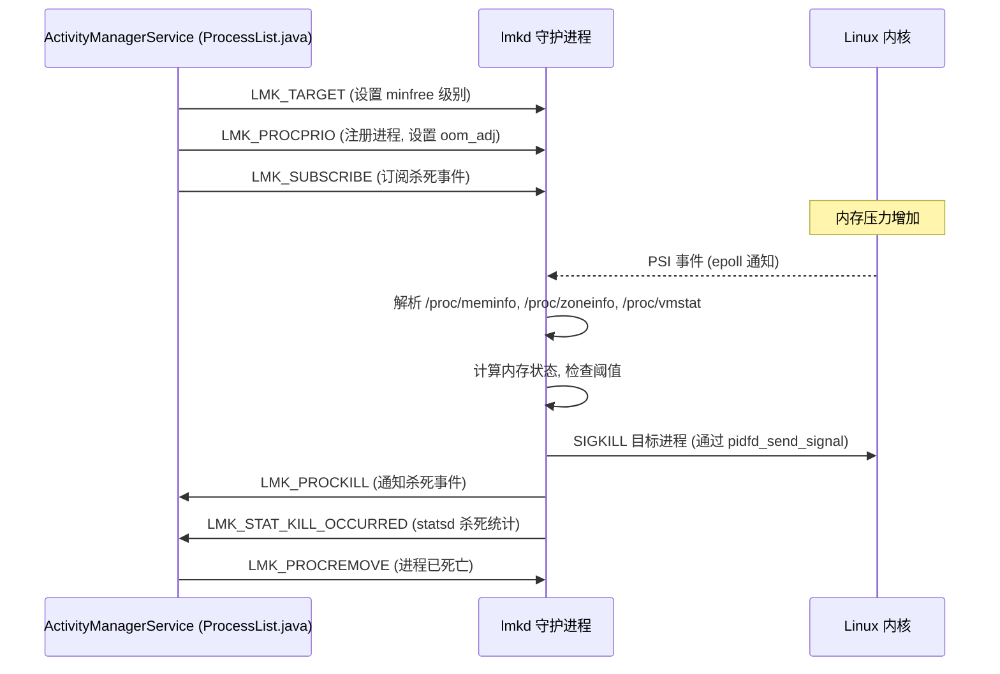
```mermaid
sequenceDiagram
    participant AMS as ActivityManagerService (ProcessList.java)
    participant LMKD as lmkd 守护进程
    participant Kernel as Linux 内核

    AMS->>LMKD: LMK_TARGET (设置 minfree 级别)
    AMS->>LMKD: LMK_PROCPRIO (注册进程, 设置 oom_adj)
    AMS->>LMKD: LMK_SUBSCRIBE (订阅杀死事件)

    Note over Kernel: 内存压力增加

    Kernel-->>LMKD: PSI 事件 (epoll 通知)
    LMKD->>LMKD: 解析 /proc/meminfo, /proc/zoneinfo, /proc/vmstat
    LMKD->>LMKD: 计算内存状态, 检查阈值
    LMKD->>Kernel: SIGKILL 目标进程 (通过 pidfd_send_signal)
    LMKD->>AMS: LMK_PROCKILL (通知杀死事件)
    LMKD->>AMS: LMK_STAT_KILL_OCCURRED (statsd 杀死统计)

    AMS->>LMKD: LMK_PROCREMOVE (进程已死亡)
```

每个数据包都以网络字节序的 `int` 命令代码开头，后跟命令专用字段。例如，`LMK_PROCPRIO` 包携带：

```c
// system/memory/lmkd/include/lmkd.h (第 106-113 行)
struct lmk_procprio {
    pid_t pid;
    uid_t uid;
    int oomadj;
    enum proc_type ptype;
};
```

`LMK_PROCS_PRIO` 命令（第 41 行）是一项优化，允许在单个数据包中批量更新多个进程优先级，从而在许多进程优先级同时变化时（例如 Activity 切换期间）减少套接字往返。

### 8.2.4 OOM 调整分值 (OOM Adjustment Scores)

Android 中的每个进程都有一个表示其重要性的 OOM 调整分值 (`oom_adj_score`)。分值越低表示越重要。lmkd 将此值写入 `/proc/[pid]/oom_score_adj`，并据此决定优先杀死哪些进程。

分值范围定义在 `frameworks/base/services/core/java/com/android/server/am/ProcessList.java` 中：

| 常量 | 分值 | 进程类型 |
|---|---|---|
| `NATIVE_ADJ` | -1000 | 原生系统守护进程 |
| `SYSTEM_ADJ` | -900 | system_server |
| `PERSISTENT_PROC_ADJ` | -800 | 持久化系统进程 |
| `PERSISTENT_SERVICE_ADJ` | -700 | 持久化服务 |
| `FOREGROUND_APP_ADJ` | 0 | 当前可见的前台应用 |
| `VISIBLE_APP_ADJ` | 100 | 可见但未聚焦的 Activity |
| `PERCEPTIBLE_APP_ADJ` | 200 | 用户可感知的进程（例如播放音频） |
| `PERCEPTIBLE_LOW_APP_ADJ` | 250 | 低优先级可感知进程 |
| `BACKUP_APP_ADJ` | 300 | 正在执行备份 |
| `HEAVY_WEIGHT_APP_ADJ` | 400 | 重量级后台进程 |
| `SERVICE_ADJ` | 500 | 正在运行服务 |
| `HOME_APP_ADJ` | 600 | Launcher 应用 |
| `PREVIOUS_APP_ADJ` | 700 | 上一个前台应用 |
| `SERVICE_B_ADJ` | 800 | B 列表服务 |
| `CACHED_APP_MIN_ADJ` | 900 | 缓存（空）进程最小分值 |
| `CACHED_APP_LMK_FIRST_ADJ` | 950 | 优先杀死的缓存进程 |
| `CACHED_APP_MAX_ADJ` | 999 | 缓存进程最大分值 |

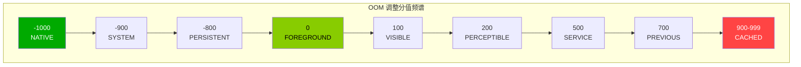
```mermaid
graph LR
    subgraph "OOM 调整分值频谱"
        direction LR
        A["-1000<br/>NATIVE"] --> B["-900<br/>SYSTEM"] --> C["-800<br/>PERSISTENT"]
        C --> D["0<br/>FOREGROUND"] --> E["100<br/>VISIBLE"]
        E --> F["200<br/>PERCEPTIBLE"] --> G["500<br/>SERVICE"]
        G --> H["700<br/>PREVIOUS"] --> I["900-999<br/>CACHED"]
    end

    style A fill:#00aa00,color:#fff
    style D fill:#88cc00,color:#000
    style I fill:#ff4444,color:#fff
```

lmkd 维护一个按 OOM 分值排序的双向链表，以快速找到分值最高（最不重要）的进程：

```c
// system/memory/lmkd/lmkd.cpp (第 520-534, 541-552)
struct proc {
    struct adjslot_list asl;
    int pid;
    int pidfd;
    uid_t uid;
    int oomadj;
    pid_t reg_pid;
    bool valid;
    struct proc *pidhash_next;
};

#define PIDHASH_SZ 1024
static struct proc *pidhash[PIDHASH_SZ];
#define pid_hashfn(x) ((((x) >> 8) ^ (x)) & (PIDHASH_SZ - 1))

#define ADJTOSLOT(adj) ((adj) + -OOM_SCORE_ADJ_MIN)
#define ADJTOSLOT_COUNT (ADJTOSLOT(OOM_SCORE_ADJ_MAX) + 1)
static struct adjslot_list procadjslot_list[ADJTOSLOT_COUNT];
```

`procadjslot_list` 是一个包含 2001 个槽位的数组（从 -1000 到 +1000），每个槽位都是该 OOM 分值的进程链表。通过从第 2000 个槽位开始向后扫描，可以实现对最高分进程的 O(1) 查找。

### 8.2.5 基于 PSI 的杀进程触发器

现代 lmkd 使用内核的压力停顿信息 (PSI) 框架作为杀进程决策的主要触发器。PSI 衡量任务因等待内存资源而停顿的时间百分比。

PSI 接口通过 `/proc/pressure/memory` 访问，报告内容如下：

```
some avg10=0.00 avg60=0.00 avg300=0.00 total=0
full avg10=0.00 avg60=0.00 avg300=0.00 total=0
```

- **`some`**：至少有一个任务在等待内存而停顿。
- **`full`**：所有非空闲任务同时因内存而停顿。

lmkd 在三个压力级别注册 PSI 监控器：

```c
// system/memory/lmkd/lmkd.cpp (第 158-170, 226-230 行)
enum vmpressure_level {
    VMPRESS_LEVEL_LOW = 0,
    VMPRESS_LEVEL_MEDIUM,
    VMPRESS_LEVEL_CRITICAL,
    VMPRESS_LEVEL_COUNT
};

static struct psi_threshold psi_thresholds[VMPRESS_LEVEL_COUNT] = {
    { PSI_SOME, 70 },    /* 1秒内有 70ms 处于部分停顿 */
    { PSI_SOME, 100 },   /* 1秒内有 100ms 处于部分停顿 */
    { PSI_FULL, 70 },    /* 1秒内有 70ms 处于完全停顿 */
};
```

PSI 监控库 (`system/memory/lmkd/libpsi/psi.cpp`) 向内核注册触发器：

```c
// system/memory/lmkd/libpsi/psi.cpp (第 36-83 行)
int init_psi_monitor(enum psi_stall_type stall_type, int threshold_us,
                     int window_us, enum psi_resource resource) {
    int fd;
    char buf[256];

    fd = TEMP_FAILURE_RETRY(open(psi_resource_file[resource],
                                 O_WRONLY | O_CLOEXEC));
    if (fd < 0) {
        ALOGE("No kernel psi monitor support (errno=%d)", errno);
        return -1;
    }

    // 写入触发器："some 70000 1000000" 意味着
    // "在 1000ms 窗口内 'some' 停顿超过 70ms 时发出通知"
    snprintf(buf, sizeof(buf), "%s %d %d",
             stall_type_name[stall_type], threshold_us, window_us);

    write(fd, buf, strlen(buf) + 1);
    return fd;  // fd 可以被添加到 epoll 中
}
```

返回的文件描述符被添加到 lmkd 的 epoll 集中。当内核检测到内存停顿时间在窗口内超过阈值时，会在 fd 上触发一个 `EPOLLPRI` 事件。

### 8.2.6 杀进程决策逻辑

当 PSI 事件触发时，lmkd 进入其杀进程决策循环。该逻辑考虑多个因素：

```mermaid
flowchart TD
    A[收到 PSI 事件] --> B["解析 /proc/meminfo<br/>/proc/zoneinfo<br/>/proc/vmstat"]
    B --> C{"检查杀进程<br/>超时"}
    C -->|仍在等待| D["跳过 - 上次杀进程<br/>尚未生效"]
    C -->|超时已过| E{"评估内存<br/>状况"}

    E --> F{"是否存在抖动 (Thrashing)?<br/>workingset_refault<br/>变化 > 阈值"}
    E --> G{"Swap 是否过低?<br/>free_swap < 阈值"}
    E --> H{"内存是否过低?<br/>free < minfree 级别"}
    E --> I{"直接回收 (Direct reclaim)<br/>是否挂起?"}

    F --> J["根据压力级别<br/>确定 min_score_adj"]
    G --> J
    H --> J
    I --> J

    J --> K[find_and_kill_process]
    K --> L{是否杀死最重任务 (kill_heaviest_task)?}
    L -->|是| M["杀死 min_score_adj 及以上<br/>RSS 最高的进程"]
    L -->|否| N["杀死 min_score_adj 及以上<br/>oom_adj 最高的进程"]

    M --> O["通过 pidfd_send_signal<br/>发送 SIGKILL"]
    N --> O
    O --> P["收割者线程调用<br/>process_mrelease"]
    P --> Q["记录杀死统计,<br/>通知 AMS"]
```

代码中列举了杀进程原因：

```c
// system/memory/lmkd/statslog.h (第 69-85 行)
enum kill_reasons {
    NONE = -1,
    PRESSURE_AFTER_KILL = 0,
    NOT_RESPONDING,
    LOW_SWAP_AND_THRASHING,
    LOW_MEM_AND_SWAP,
    LOW_MEM_AND_THRASHING,
    DIRECT_RECL_AND_THRASHING,
    LOW_MEM_AND_SWAP_UTIL,
    LOW_FILECACHE_AFTER_THRASHING,
    LOW_MEM,
    DIRECT_RECL_STUCK,
    KILL_REASON_COUNT
};
```

可用内存的计算非常细致。lmkd 计算“易用可用”内存，其中考虑了文件缓存的驱逐能力和交换压缩：

```c
// system/memory/lmkd/lmkd.cpp (第 1969-1984 行)
mi->field.easy_available = mi->field.nr_free_pages;
if (relaxed_available_memory && swap_compression_ratio) {
    mi->field.easy_available += mi->field.active_file
                              + mi->field.inactive_file;
    mi->field.easy_available -= mi->field.dirty;

    int64_t anon_pages = mi->field.active_anon + mi->field.inactive_anon;
    mi->field.easy_available +=
        (swap_compression_ratio - swap_compression_ratio_div)
        * anon_pages / swap_compression_ratio;
} else {
    mi->field.easy_available += mi->field.inactive_file;
}
```

该计算识别出：

- 空闲页面是立即可用的。
- 文件备份页面（活跃和不活跃）可以通过驱逐来回收内存。
- 脏页需要先写回，因此被减去。
- 匿名页可以交换，但 zRAM 压缩意味着它们只能释放其原始大小的 `(1 - 1/压缩率)`。

### 8.2.7 完整的杀进程决策状态机

`lmkd.cpp` 中的完整 PSI 事件处理函数 (`__mp_event_psi`) 实现了一个复杂的状态机，在决定是否杀进程之前评估多个内存条件：

```c
// system/memory/lmkd/lmkd.cpp (第 2729-2999 行, 略有删减)
static void __mp_event_psi(enum event_source source,
                           union psi_event_data data,
                           uint32_t events,
                           struct polling_params *poll_params) {
    static int64_t init_ws_refault;
    static int64_t prev_workingset_refault;
    static int64_t base_file_lru;
    static bool killing;
    static int thrashing_limit = thrashing_limit_pct;
    static struct wakeup_info wi;
    static int max_thrashing = 0;

    union meminfo mi;
    union vmstat vs;
    struct psi_data psi_data;
    int64_t thrashing = 0;
    bool swap_is_low = false;
    enum kill_reasons kill_reason = NONE;
    // ...

    // 步骤 1：基于待处理杀进程的速率限制
    bool kill_pending = is_kill_pending();
    if (kill_pending && (kill_timeout_ms == 0 ||
        get_time_diff_ms(&last_kill_tm, &curr_tm)
            < static_cast<long>(kill_timeout_ms))) {
        wi.skipped_wakeups++;
        goto no_kill;
    }

    // 步骤 2：解析所有内存状态
    vmstat_parse(&vs);
    meminfo_parse(&mi);

    // 步骤 3：计算抖动百分比
    thrashing = (workingset_refault_file - init_ws_refault) * 100
                / (base_file_lru + 1);
    thrashing += prev_thrash_growth;

    // 步骤 4：检查交换水平
    swap_is_low = get_free_swap(&mi) < swap_low_threshold;

    // 步骤 5：识别回收状态
    in_direct_reclaim = vs.field.pgscan_direct != init_pgscan_direct;
    in_kswapd_reclaim = vs.field.pgscan_kswapd != init_pgscan_kswapd;

    // 步骤 6：检查水位线
    wmark = get_lowest_watermark(&mi, &watermarks);

    // 步骤 7：基于组合状态确定杀进程原因
    if (cycle_after_kill && wmark < WMARK_LOW) {
        kill_reason = PRESSURE_AFTER_KILL;
    } else if (level == VMPRESS_LEVEL_CRITICAL) {
        kill_reason = NOT_RESPONDING;
    } else if (swap_is_low && thrashing > thrashing_limit_pct) {
        kill_reason = LOW_SWAP_AND_THRASHING;
    } else if (swap_is_low && wmark < WMARK_HIGH) {
        kill_reason = LOW_MEM_AND_SWAP;
    } else if (reclaim == DIRECT_RECLAIM && thrashing > thrashing_limit) {
        kill_reason = DIRECT_RECL_AND_THRASHING;
    } // ... 更多条件
}
```

完整的杀进程决策树：

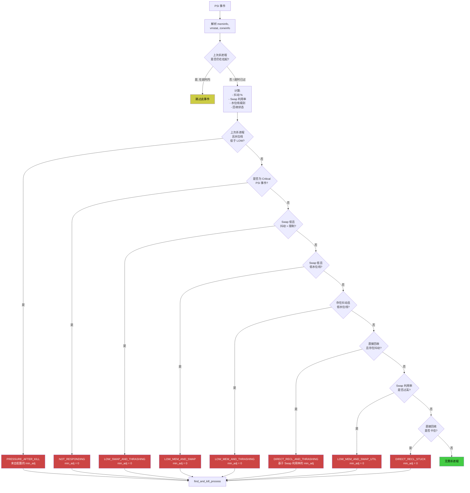
```mermaid
flowchart TD
    Start[PSI 事件] --> ParseState["解析 meminfo,<br/>vmstat, zoneinfo"]
    ParseState --> KillPending{"上次杀进程<br/>是否仍在挂起?"}
    KillPending -->|是, 在超时内| Skip[跳过此事件]
    KillPending -->|否 / 超时已过| CalcState["计算:<br/>- 抖动 %<br/>- Swap 利用率<br/>- 水位线级别<br/>- 回收状态"]

    CalcState --> Cond1{"上次杀进程<br/>且水位线<br/>低于 LOW?"}
    Cond1 -->|是| R1["PRESSURE_AFTER_KILL<br/>来自配置的 min_adj"]
    Cond1 -->|否| Cond2{"是否为 Critical<br/>PSI 事件?"}

    Cond2 -->|是| R2["NOT_RESPONDING<br/>min_adj = 0"]
    Cond2 -->|否| Cond3{"Swap 低且<br/>抖动 > 限制?"}

    Cond3 -->|是| R3["LOW_SWAP_AND_THRASHING<br/>min_adj = 0"]
    Cond3 -->|否| Cond4{"Swap 低且<br/>低水位线?"}

    Cond4 -->|是| R4["LOW_MEM_AND_SWAP<br/>min_adj = 0"]
    Cond4 -->|否| Cond5{"存在抖动且<br/>低水位线?"}

    Cond5 -->|是| R5["LOW_MEM_AND_THRASHING<br/>min_adj = 0"]
    Cond5 -->|否| Cond6{"直接回收<br/>且存在抖动?"}

    Cond6 -->|是| R6["DIRECT_RECL_AND_THRASHING<br/>基于 Swap 利用率的 min_adj"]
    Cond6 -->|否| Cond7{"Swap 利用率<br/>是否过高?"}

    Cond7 -->|是| R7["LOW_MEM_AND_SWAP_UTIL<br/>min_adj = 0"]
    Cond7 -->|否| Cond8{"直接回收<br/>是否卡住?"}

    Cond8 -->|是| R8["DIRECT_RECL_STUCK<br/>min_adj = 0"]
    Cond8 -->|否| NoKill[无需杀进程]

    R1 --> Kill[find_and_kill_process]
    R2 --> Kill
    R3 --> Kill
    R4 --> Kill
    R5 --> Kill
    R6 --> Kill
    R7 --> Kill
    R8 --> Kill

    style R1 fill:#cc4444,color:#fff
    style R2 fill:#cc4444,color:#fff
    style R3 fill:#cc4444,color:#fff
    style R4 fill:#cc4444,color:#fff
    style R5 fill:#cc4444,color:#fff
    style R6 fill:#cc4444,color:#fff
    style R7 fill:#cc4444,color:#fff
    style R8 fill:#cc4444,color:#fff
    style NoKill fill:#44cc44,color:#000
    style Skip fill:#cccc44,color:#000
```

### 8.2.8 水位线计算

lmkd 计算域水位线以了解系统离 OOM 还有多远：

```c
// system/memory/lmkd/lmkd.cpp (第 2649-2701 行)
enum zone_watermark {
    WMARK_MIN = 0,   // 低于 min：直接回收，存在 OOM 风险
    WMARK_LOW,       // 低于 low：kswapd 活跃
    WMARK_HIGH,      // 低于 high：kswapd 可能很快启动
    WMARK_NONE       // 高于所有水位线：健康
};

struct zone_watermarks {
    long high_wmark;
    long low_wmark;
    long min_wmark;
};

void calc_zone_watermarks(struct zoneinfo *zi,
                          struct zone_watermarks *watermarks) {
    memset(watermarks, 0, sizeof(struct zone_watermarks));

    for (int node_idx = 0; node_idx < zi->node_count; node_idx++) {
        struct zoneinfo_node *node = &zi->nodes[node_idx];
        for (int zone_idx = 0; zone_idx < node->zone_count; zone_idx++) {
            struct zoneinfo_zone *zone = &node->zones[zone_idx];
            if (!zone->fields.field.present) continue;

            watermarks->high_wmark += zone->max_protection
                                    + zone->fields.field.high;
            watermarks->low_wmark  += zone->max_protection
                                    + zone->fields.field.low;
            watermarks->min_wmark  += zone->max_protection
                                    + zone->fields.field.min;
        }
    }
}

static enum zone_watermark get_lowest_watermark(
        union meminfo *mi, struct zone_watermarks *watermarks) {
    int64_t nr_free_pages = mi->field.nr_free_pages
                          - mi->field.cma_free;

    if (nr_free_pages < watermarks->min_wmark) return WMARK_MIN;
    if (nr_free_pages < watermarks->low_wmark) return WMARK_LOW;
    if (nr_free_pages < watermarks->high_wmark) return WMARK_HIGH;
    return WMARK_NONE;
}
```

水位线层次结构可视化：

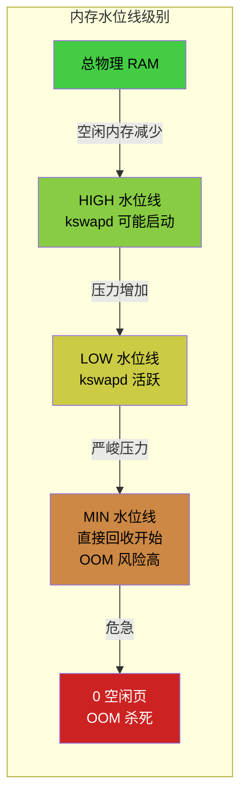
```mermaid
graph TD
    subgraph "内存水位线级别"
        direction TB
        Full["总物理 RAM"]
        HighW["HIGH 水位线<br/>kswapd 可能启动"]
        LowW["LOW 水位线<br/>kswapd 活跃"]
        MinW["MIN 水位线<br/>直接回收开始<br/>OOM 风险高"]
        Zero["0 空闲页<br/>OOM 杀死"]
    end

    Full -->|"空闲内存减少"| HighW
    HighW -->|"压力增加"| LowW
    LowW -->|"严峻压力"| MinW
    MinW -->|"危急"| Zero

    style Full fill:#44cc44,color:#000
    style HighW fill:#88cc44,color:#000
    style LowW fill:#cccc44,color:#000
    style MinW fill:#cc8844,color:#000
    style Zero fill:#cc2222,color:#fff
```

### 8.2.9 受害者选择：find_and_kill_process

受害者选择算法从最高 OOM 分值向下迭代：

```c
// system/memory/lmkd/lmkd.cpp (第 2555-2591 行)
static int find_and_kill_process(int min_score_adj,
                                 struct kill_info *ki,
                                 union meminfo *mi,
                                 struct wakeup_info *wi,
                                 struct timespec *tm,
                                 struct psi_data *pd) {
    int killed_size = 0;
    bool choose_heaviest_task = kill_heaviest_task;

    for (int i = OOM_SCORE_ADJ_MAX; i >= min_score_adj; i--) {
        struct proc *procp;

        if (!choose_heaviest_task && i <= PERCEPTIBLE_APP_ADJ) {
            // 对于可感知进程，始终杀死最重的
            // 以尽量减少受害者数量
            choose_heaviest_task = true;
        }

        while (true) {
            procp = choose_heaviest_task ?
                proc_get_heaviest(i) : proc_adj_tail(i);

            if (!procp) break;

            killed_size = kill_one_process(procp, min_score_adj,
                                           ki, mi, wi, tm, pd);
            if (killed_size >= 0) break;
        }
        if (killed_size) break;
    }
    return killed_size;
}
```

双重选择策略非常重要：

1. **对于缓存/后台进程** (`oom_adj > PERCEPTIBLE_APP_ADJ`)：杀死每个分值级别中最近添加的进程 (`proc_adj_tail`)。这遵循类似 LRU 的顺序。
2. **对于可感知进程** (`oom_adj <= 200`)：始终杀死最重的进程 (`proc_get_heaviest`)，它会为每个候选进程读取 `/proc/[pid]/statm`。这可以最大限度地减少必须死亡的“用户可见”进程的数量。

`proc_get_heaviest` 函数：

```c
// system/memory/lmkd/lmkd.cpp (第 2253-2278 行)
static struct proc *proc_get_heaviest(int oomadj) {
    struct adjslot_list *head = &procadjslot_list[ADJTOSLOT(oomadj)];
    struct adjslot_list *curr = head->next;
    struct proc *maxprocp = NULL;
    int maxsize = 0;

    // 优化：如果只有一个进程，跳过大小查找
    if ((curr != head) && (curr->next == head)) {
        return (struct proc *)curr;
    }

    while (curr != head) {
        int pid = ((struct proc *)curr)->pid;
        int tasksize = proc_get_size(pid);
        if (tasksize < 0) {
            // 进程已死，进行清理
            struct adjslot_list *next = curr->next;
            pid_remove(pid);
            curr = next;
        } else {
            if (tasksize > maxsize) {
                maxsize = tasksize;
                maxprocp = (struct proc *)curr;
            }
            curr = curr->next;
        }
    }
    return maxprocp;
}
```

### 8.2.10 杀进程执行：kill_one_process

一旦选定受害者，将执行带有广泛安全检查的杀进程操作：

```c
// system/memory/lmkd/lmkd.cpp (第 2443-2549 行, 略有删减)
static int kill_one_process(struct proc* procp, int min_oom_score,
                            struct kill_info *ki, union meminfo *mi,
                            struct wakeup_info *wi, struct timespec *tm,
                            struct psi_data *pd) {
    int pid = procp->pid;
    int pidfd = procp->pidfd;
    uid_t uid = procp->uid;
    char buf[4096]; // pagesize

    // 安全检查 1：验证进程是否仍然有效
    if (!procp->valid || !read_proc_status(pid, buf, sizeof(buf))) {
        goto out;
    }

    // 安全检查 2：检测 PID 重用
    int64_t tgid;
    if (!parse_status_tag(buf, "Tgid:", &tgid)) {
        goto out;
    }
    if (tgid != pid) {
        ALOGE("Possible pid reuse detected (pid %d, tgid %" PRId64 ")!",
              pid, tgid);
        goto out;
    }

    // 读取 RSS 和 swap 以用于日志记录
    int64_t rss_kb, swap_kb;
    parse_status_tag(buf, "VmRSS:", &rss_kb);
    parse_status_tag(buf, "VmSwap:", &swap_kb);

    // 执行杀进程
    if (pidfd >= 0) {
        if (pidfd_send_signal(pidfd, SIGKILL, NULL, 0) < 0) {
            PLOG(ERROR) << "pidfd_send_signal(SIGKILL) failed";
            return -1;
        }
    } else {
        if (kill(pid, SIGKILL) < 0) {
            PLOG(ERROR) << "kill(SIGKILL) failed";
            return -1;
        }
    }

    // 记录杀死事件
    ALOGI("Kill '%s' (%d), uid %d, oom_score_adj %d "
          "to free %" PRId64 "kB rss, %" PRId64 "kB swap; "
          "reason: %s",
          procp->taskname, pid, uid, procp->oomadj, rss_kb, swap_kb,
          ki->kill_desc);

    return rss_kb;
out:
    return -1;
}

### 8.2.11 看门狗杀进程路径

当 lmkd 的主事件循环挂起（由看门狗定时器检测到）时，看门狗线程会执行自己的紧急杀进程操作：

```c
// system/memory/lmkd/lmkd.cpp (第 2305-2329 行)
static void watchdog_callback() {
    int prev_pid = 0;

    ALOGW("lmkd watchdog timed out!");
    for (int oom_score = OOM_SCORE_ADJ_MAX; oom_score >= 0;) {
        struct proc target;

        if (!find_victim(oom_score, prev_pid, target)) {
            oom_score--;
            prev_pid = 0;
            continue;
        }

        if (target.valid &&
            reaper.kill({ target.pidfd, target.pid, target.uid },
                        true /* 同步 */) == 0) {
            ALOGW("lmkd watchdog killed process %d, oom_score_adj %d",
                  target.pid, oom_score);
            pid_invalidate(target.pid);
            break;
        }
        prev_pid = target.pid;
    }
}
```

看门狗杀进程是**同步的**（注意 `reaper.kill()` 的 `true` 参数），这意味着它会阻塞直到 `pidfd_send_signal(SIGKILL)` 完成。这是因为看门狗线程无法使用异步收割者队列（处理队列完成的主线程已挂起）。看门狗还使用 `pid_invalidate()` 而不是 `pid_remove()`，因为后者只能从主线程 safe 调用。

### 8.2.12 抖动检测 (Thrashing Detection)

lmkd 通过监控 `/proc/vmstat` 中的 `workingset_refault` 计数器来检测内存抖动：

```c
// system/memory/lmkd/lmkd.cpp (第 474-497 行)
enum vmstat_field {
    VS_FREE_PAGES,
    VS_INACTIVE_FILE,
    VS_ACTIVE_FILE,
    VS_WORKINGSET_REFAULT,
    VS_WORKINGSET_REFAULT_FILE,
    VS_PGSCAN_KSWAPD,
    VS_PGSCAN_DIRECT,
    VS_PGSCAN_DIRECT_THROTTLE,
    VS_PGREFILL,
    VS_FIELD_COUNT
};
```

`workingset_refault` 指的是最近从页面缓存中驱逐、现在又被重新换入的页面——这是系统正在发生剧烈抖动的强烈信号。抖动百分比相对于页面扫描进行计算，并与可配置的阈值进行比较：

| 属性 | 默认值 | 低内存设备默认值 |
|---|---|---|
| `ro.lmk.thrashing_limit` | 100 | 30 |
| `ro.lmk.thrashing_limit_decay` | 10 | 50 |
| `ro.lmk.thrashing_limit_critical` | (衍生) | (衍生) |

### 8.2.13 收割者：异步进程杀死

当 lmkd 决定杀死一个进程时，实际的杀死操作由收割者 (Reaper) 线程池执行。这种设计将杀进程决策与从被杀进程中回收内存的潜在缓慢过程解耦。

`Reaper` 类 (`system/memory/lmkd/reaper.h` 和 `reaper.cpp`) 管理一个线程池：

```c
// system/memory/lmkd/reaper.h (第 23-60 行)
class Reaper {
public:
    struct target_proc {
        int pidfd;
        int pid;
        uid_t uid;
    };
private:
    std::mutex mutex_;
    std::condition_variable cond_;
    std::vector<struct target_proc> queue_;
    int active_requests_;
    int comm_fd_;
    int thread_cnt_;
    pthread_t* thread_pool_;
    bool debug_enabled_;
    // ...
};
```

收割者线程的主循环：

1. **出队**一个杀进程请求。
2. 通过 `pidfd_send_signal()` **发送 SIGKILL**——使用 pidfd 以避免 PID 回收竞争。
3. **调整 cgroup 和优先级**以加速内存回收。
4. **调用 `process_mrelease()`**——一个 Linux 系统调用（编号 448），触发从垂死进程中同步回收内存。

```c
// system/memory/lmkd/reaper.cpp (第 46-48, 91-137 行)
static int process_mrelease(int pidfd, unsigned int flags) {
    return syscall(__NR_process_mrelease, pidfd, flags);
}

static void* reaper_main(void* param) {
    Reaper *reaper = static_cast<Reaper*>(param);
    // ...
    for (;;) {
        target = reaper->dequeue_request();

        if (pidfd_send_signal(target.pidfd, SIGKILL, NULL, 0)) {
            reaper->notify_kill_failure(target.pid);
            goto done;
        }

        set_process_group_and_prio(target.uid, target.pid,
            {"CPUSET_SP_FOREGROUND", "SCHED_SP_FOREGROUND"},
            ANDROID_PRIORITY_NORMAL);

        if (process_mrelease(target.pidfd, 0)) {
            ALOGE("process_mrelease %d failed: %s",
                  target.pid, strerror(errno));
        }
done:
        close(target.pidfd);
        reaper->request_complete();
    }
}
```

`process_mrelease()` 系统调用非常重要，因为如果没有它，被杀进程的内存将由内核作为 `exit_mmap()` 的一部分延迟释放。通过 `process_mrelease()`，调用线程会主动回收垂死进程的内存，从而缩短杀进程决策与实际内存可用之间的时间。

### 8.2.14 看门狗 (The Watchdog)

lmkd 包含一个看门狗定时器 (`system/memory/lmkd/watchdog.cpp`)，用于检测守护进程是否挂起——这可能是灾难性的，因为在内存压力期间将没有进程被杀死：

```c
// system/memory/lmkd/watchdog.h (第 23-39 行)
class Watchdog {
private:
    int timeout_;                  // 2 秒 (WATCHDOG_TIMEOUT_SEC)
    timer_t timer_;
    std::atomic<bool> timer_created_;
    void (*callback_)();
public:
    Watchdog(int timeout, void (*callback)())
        : timeout_(timeout), timer_created_(false), callback_(callback) {}
    bool init();
    bool start();
    bool stop();
    bool create_timer(sigset_t &sigset);
    void bite() const { if (callback_) callback_(); }
};
```

看门狗使用 `CLOCK_MONOTONIC` 定时器并通过 `SIGALRM` 传递。如果 lmkd 的主事件循环没有在 2 秒超时内解除看门狗，看门狗就会“咬人”——通常触发中止或记录诊断信息。

### 8.2.15 可配置属性

lmkd 从系统属性中读取配置，并支持实验性覆盖：

```c
// system/memory/lmkd/lmkd.cpp (第 108-110 行)
#define GET_LMK_PROPERTY(type, name, def) \
    property_get_##type("persist.device_config.lmkd_native." name, \
        property_get_##type("ro.lmk." name, def))
```

关键属性：

| 属性 | 默认值 | 描述 |
|---|---|---|
| `ro.lmk.debug` | false | 启用详细的杀进程日志 |
| `ro.lmk.kill_heaviest_task` | false | 按 RSS 而非 oom_adj 杀进程 |
| `ro.lmk.kill_timeout_ms` | 0 | 两次杀进程之间的最小时间 |
| `ro.lmk.use_minfree_levels` | false | 使用传统的 minfree 阈值 |
| `ro.lmk.psi_partial_stall_ms` | 70 (低内存 200) | PSI some-stall 阈值 |
| `ro.lmk.psi_complete_stall_ms` | 700 | PSI full-stall 阈值 |
| `ro.lmk.psi_window_size_ms` | 1000 | PSI 监控窗口 |
| `ro.lmk.swap_free_low_percentage` | 10 | 低 Swap 阈值 |
| `ro.lmk.thrashing_limit` | 100 (低内存 30) | 抖动百分比阈值 |
| `ro.lmk.swap_compression_ratio` | 1 | 预期的 zRAM 压缩率 |
| `ro.lmk.filecache_min_kb` | 0 | 要维持的最小文件缓存量 |
| `ro.lmk.direct_reclaim_threshold_ms` | 0 | 直接回收停顿阈值 |

### 8.2.16 事件循环架构

lmkd 主事件循环使用 `epoll` 在多个事件源之间进行多路复用：

```c
// system/memory/lmkd/lmkd.cpp (第 284-290 行)
/*
 * 1 个 ctrl 监听 socket, 3 个 ctrl 数据 socket, 3 个内存压力级别,
 * 1 个 lmk 事件 + 1 个用于等待进程死亡的 fd
 * + 1 个用于接收杀进程失败通知的 fd
 * + 1 个用于接收 memevent_listener 通知系统的 fd
 */
#define MAX_EPOLL_EVENTS (1 + MAX_DATA_CONN + VMPRESS_LEVEL_COUNT \
                          + 1 + 1 + 1 + 1)
```

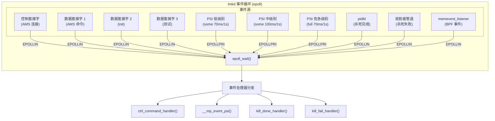
```mermaid
graph TD
    subgraph "lmkd 事件循环 (epoll)"
        EPoll["epoll_wait()"]

        subgraph "事件源"
            CtrlSock["控制套接字<br/>(AMS 连接)"]
            DataSock1["数据套接字 1<br/>(AMS 命令)"]
            DataSock2["数据套接字 2<br/>(init)"]
            DataSock3["数据套接字 3<br/>(测试)"]
            PSI_Low["PSI 低级别<br/>(some 70ms/1s)"]
            PSI_Med["PSI 中级别<br/>(some 100ms/1s)"]
            PSI_Crit["PSI 危急级别<br/>(full 70ms/1s)"]
            KillDone["pidfd<br/>(杀死完成)"]
            KillFail["收割者管道<br/>(杀死失败)"]
            MemEvent["memevent_listener<br/>(BPF 事件)"]
        end
    end

    CtrlSock -->|EPOLLIN| EPoll
    DataSock1 -->|EPOLLIN| EPoll
    DataSock2 -->|EPOLLIN| EPoll
    DataSock3 -->|EPOLLIN| EPoll
    PSI_Low -->|EPOLLPRI| EPoll
    PSI_Med -->|EPOLLPRI| EPoll
    PSI_Crit -->|EPOLLPRI| EPoll
    KillDone -->|EPOLLIN| EPoll
    KillFail -->|EPOLLIN| EPoll
    MemEvent -->|EPOLLIN| EPoll

    EPoll --> Handler["事件处理器分发"]
    Handler --> CmdH["ctrl_command_handler()"]
    Handler --> PsiH["__mp_event_psi()"]
    Handler --> KillH["kill_done_handler()"]
    Handler --> FailH["kill_fail_handler()"]
```

在收到 PSI 事件后，lmkd 进入轮询模式，定期短间隔重新检查内存状况：

| 常量 | 值 | 用途 |
|---|---|---|
| `PSI_POLL_PERIOD_SHORT_MS` | 10 ms | 高压期间的轮询间隔 |
| `PSI_POLL_PERIOD_LONG_MS` | 100 ms | 中压期间的轮询间隔 |
| `DEFAULT_PSI_WINDOW_SIZE_MS` | 1000 ms | PSI 监控窗口大小 |

这种轮询是必要的，因为 PSI 事件受速率限制（每个窗口最多一个），但内存状况在窗口内可能迅速变化。

### 8.2.17 BPF 内存事件集成

现代 lmkd 集成了内核的 BPF (Berkeley Packet Filter) 子系统，以接收更精细的内存事件。`memevent_listener` 跟踪直接回收和 kswapd 活动：

```c
// system/memory/lmkd/lmkd.cpp (第 183 行)
static std::unique_ptr<android::bpf::memevents::MemEventListener>
    memevent_listener(nullptr);
static struct timespec direct_reclaim_start_tm;
static struct timespec kswapd_start_tm;
```

BPF 程序在启动完成后加载：

```c
// system/memory/lmkd/lmkd.cpp (LMK_BOOT_COMPLETED 处理器)
case LMK_BOOT_COMPLETED:
    // 启动完成后初始化内存事件监听器
    // 以防止等待 BPF 程序加载
    init_memevent();
    boot_completed_handled = true;
    break;
```

这种 BPF 集成提供了比解析 `/proc/vmstat` 计数器更准确的回收检测，后者可能会错过轮询间隔之间短暂的回收脉冲。

### 8.2.18 交换利用率计算

lmkd 计算交换利用率以检测交换子系统何时趋于饱和：

```c
// system/memory/lmkd/lmkd.cpp (第 2712-2717 行)
static int calc_swap_utilization(union meminfo *mi) {
    int64_t swap_used = mi->field.total_swap - get_free_swap(mi);
    int64_t total_swappable = mi->field.active_anon
                            + mi->field.inactive_anon
                            + mi->field.shmem + swap_used;
    return total_swappable > 0 ? (swap_used * 100) / total_swappable : 0;
}
```

该计算代表已交换的可交换内存百分比。高利用率（可通过 `ro.lmk.swap_util_max` 配置）表明系统换出页面的剩余能力有限，使得杀进程变得更加紧迫。

---

## 8.3 Cgroup 与内存统计 (Memory Accounting)

Android 使用 Linux cgroups (控制组) 将进程组织成层次结构，以便进行资源管理和统计。内存 cgroup (`memcg`) 对于跟踪每个应用的内存使用情况和强制执行软限制尤为重要。

### 8.3.1 Cgroup 版本

Android 同时支持 cgroup v1 和 cgroup v2. lmkd 代码会检测正在使用的版本：

```c
// system/memory/lmkd/statslog.h (第 33-37 行)
enum class MemcgVersion {
    kNotFound,
    kV1,
    kV2,
};

MemcgVersion memcg_version();
```

在现代 Android (Android 12+) 上，首选 cgroup v2. cgroup 层次结构在启动期间由 init 配置：

```
/dev/memcg/                          # cgroup v1 内存控制器挂载点
/dev/memcg/apps/                     # 所有应用进程
/dev/memcg/apps/uid_<uid>/           # 按 UID 分组
/dev/memcg/apps/uid_<uid>/pid_<pid>/ # 按进程分组
/dev/memcg/system/                   # 系统进程

# cgroup v2 (统一层次结构)
/sys/fs/cgroup/                      # 统一的 cgroup v2 挂载点
```

### 8.3.2 进程组分配

当 ActivityManagerService 通过 `LMK_PROCPRIO` 向 lmkd 注册进程时，lmkd 会将进程分配给适当的 cgroup 并设置其内存软限制：

```c
// system/memory/lmkd/lmkd.cpp (第 1119-1172 行)
static void register_oom_adj_proc(const struct lmk_procprio& proc,
                                   struct ucred* cred) {
    char val[20];
    int soft_limit_mult;

    if (proc.ptype == PROC_TYPE_APP && per_app_memcg) {
        if (proc.oomadj >= 900) {
            soft_limit_mult = 0;
        } else if (proc.oomadj >= 800) {
            soft_limit_mult = 0;
        } else if (proc.oomadj >= 700) {
            soft_limit_mult = 0;
        } else if (proc.oomadj >= 600) {
            // Launcher 应该是可感知的
            soft_limit_mult = 1;
        } else if (proc.oomadj >= 300) {
            soft_limit_mult = 1;
        } else if (proc.oomadj >= 200) {
            soft_limit_mult = 8;      // 64 MB
        } else if (proc.oomadj >= 100) {
            soft_limit_mult = 10;     // 80 MB
        } else if (proc.oomadj >= 0) {
            soft_limit_mult = 20;     // 160 MB
        } else {
            // 持久化进程：512 MB
            soft_limit_mult = 64;
        }

        snprintf(val, sizeof(val), "%d",
                 soft_limit_mult * EIGHT_MEGA);  // EIGHT_MEGA = 1 << 23
        // 写入 cgroup memory.soft_limit_in_bytes
        std::string soft_limit_path;
        CgroupGetAttributePathForTask("MemSoftLimit",
                                       proc.pid, &soft_limit_path);
        writefilestring(soft_limit_path.c_str(), val, !is_system_server);
    }
}
```

软限制倍数转化为实际内存限制：

| OOM 分值范围 | 软限制倍数 | 有效限制 |
|---|---|---|
| >= 900 (cached) | 0 | 无限制 |
| >= 700 (previous) | 0 | 无限制 |
| >= 600 (home) | 1 | 8 MB |
| >= 300 (backup) | 1 | 8 MB |
| >= 200 (perceptible) | 8 | 64 MB |
| >= 100 (visible) | 10 | 80 MB |
| >= 0 (foreground) | 20 | 160 MB |
| < 0 (persistent) | 64 | 512 MB |

这些是**软限制**——内核会尝试先从超过软限制的进程中回收内存，然后再从限制范围内的进程中回收，但如果内存充足，进程可以使用更多内存。

### 8.3.3 任务规范 (Task Profiles)

Android 使用任务规范框架扩展了 cgroup 管理，该框架提供了将进程分配给 cgroup 的更高级别 API：

```c
// 在 reaper.cpp 中使用 (第 56-65, 98-99 行)
set_process_group_and_prio(target.uid, target.pid,
    {"CPUSET_SP_FOREGROUND", "SCHED_SP_FOREGROUND"},
    ANDROID_PRIORITY_NORMAL);

// 在收割者线程初始化中
SetTaskProfiles(tid, {"CPUSET_SP_FOREGROUND"}, true);
```

任务规范在 JSON 配置文件中定义：

```
/etc/task_profiles.json          # 规范定义
/etc/cgroups.json                # cgroup 控制器配置
```

内存子系统常用的任务规范：

| 规范 | 用途 |
|---|---|
| `ServiceCapacityLow` | 后台服务的低 CPU 容量 |
| `CPUSET_SP_FOREGROUND` | 前台 CPU 集（所有核心） |
| `SCHED_SP_FOREGROUND` | 前台调度组 |
| `HighEnergySaving` | 后台任务的高能效执行 |
| `MaxPerformance` | 前台应用的满性能 |

### 8.3.4 内存 Cgroup 统计

内存 cgroup 为每个组跟踪多个计数器：

```
# 每个 cgroup 的内存统计文件 (cgroup v1)
memory.usage_in_bytes         # 当前内存使用量
memory.max_usage_in_bytes     # 峰值内存使用量
memory.limit_in_bytes         # 硬限制 (OOM 杀死触发器)
memory.soft_limit_in_bytes    # 软限制 (回收优先级)
memory.stat                   # 详细统计
memory.oom_control            # OOM killer 设置

# 每个 cgroup 的内存统计文件 (cgroup v2)
memory.current                # 当前内存使用量
memory.high                   # 高压阈值
memory.max                    # 硬限制
memory.stat                   # 详细统计
memory.events                 # OOM 和其他事件
```

`memory.stat` 文件提供了细粒度的细分：

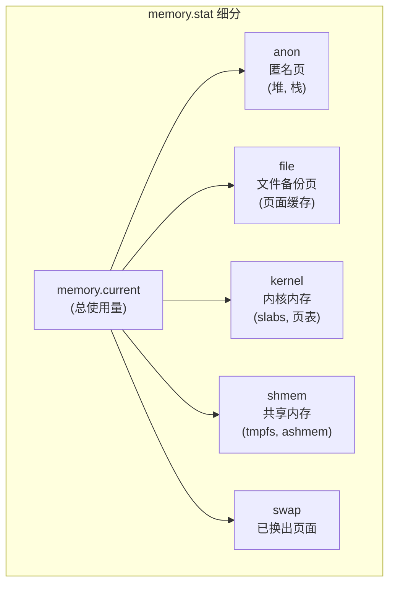
```mermaid
graph TD
    subgraph "memory.stat 细分"
        Total["memory.current<br/>(总使用量)"]
        Anon["anon<br/>匿名页<br/>(堆, 栈)"]
        File["file<br/>文件备份页<br/>(页面缓存)"]
        Kernel["kernel<br/>内核内存<br/>(slabs, 页表)"]
        Shmem["shmem<br/>共享内存<br/>(tmpfs, ashmem)"]
        Swap["swap<br/>已换出页面"]
    end

    Total --> Anon
    Total --> File
    Total --> Kernel
    Total --> Shmem
    Total --> Swap
```

### 8.3.5 应用类别与 Freezer Cgroup

Android 11 引入了应用冻结器 (App Freezer)，它使用 cgroup freezer 控制器来挂起后台应用，而不是直接杀死它们。冻结的应用消耗零 CPU 但保留其内存：

```
/sys/fs/cgroup/freezer/apps/uid_<uid>/pid_<pid>/freezer.state
# "FROZEN" 或 "THAWED"
```

当应用被冻结时，lmkd 会调低其回收优先级，因为冻结的应用不太可能很快重新激活页面，这使得它们的页面成为页面回收的理想候选者。

Freezer 与 lmkd 的交互非常重要：
1. 当应用进入后台时，ActivityManagerService 可能会将其冻结。
2. 冻结的应用依然消耗内存——它们的 oom_adj 很高，是 lmkd 杀进程的候选者。
3. 在杀死冻结应用之前，lmkd 必须先将其解冻（解冻状态下进程才能处理信号）。
4. 如果内存压力严峻，lmkd 可能会优先杀死冻结应用，因为定义上它们并没有在执行对用户有用的工作。

---

## 8.4 zRAM (压缩交换区)

Android 使用 zRAM（压缩的 RAM 磁盘）作为交换设备，而不是传统的基于磁盘的交换。zRAM 在存储页面之前会在内存中进行压缩，允许系统在付出压缩和解压缩 CPU 周期的代价下，有效地增加可用内存容量。

### 8.4.1 zRAM 架构

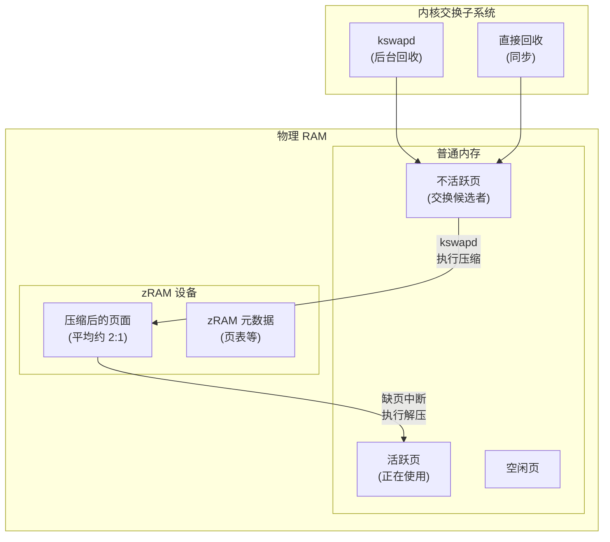
```mermaid
graph TD
    subgraph "物理 RAM"
        subgraph "普通内存"
            Active["活跃页<br/>(正在使用)"]
            Inactive["不活跃页<br/>(交换候选者)"]
            Free["空闲页"]
        end

        subgraph "zRAM 设备"
            Compressed["压缩后的页面<br/>(平均约 2:1)"]
            Metadata["zRAM 元数据<br/>(页表等)"]
        end
    end

    Inactive -->|"kswapd<br/>执行压缩"| Compressed
    Compressed -->|"缺页中断<br/>执行解压"| Active

    subgraph "内核交换子系统"
        kswapd["kswapd<br/>(后台回收)"]
        DirectReclaim["直接回收<br/>(同步)"]
    end

    kswapd --> Inactive
    DirectReclaim --> Inactive
```

Android 上 zRAM 的关键特性：
- **压缩算法**：LZ4（速度默认）或 ZSTD（更高的压缩率，更多的 CPU 消耗）。
- **典型压缩率**：应用数据通常为 2:1 到 3:1。
- **zRAM 大小**：通常配置为物理 RAM 的 50-75%。
- **无磁盘交换**：Android 刻意避免使用闪存进行交换，以保护闪存寿命并避免缓慢的 I/O 停顿。

### 8.4.2 zRAM 配置

zRAM 在启动期间通过 init 脚本进行配置：

```shell
# 典型的 init.rc zram 配置
write /sys/block/zram0/comp_algorithm lz4
write /sys/block/zram0/disksize 2147483648   # 2 GB
exec_start swapon_all

# fstab 条目
/dev/block/zram0  none  swap  defaults  zramsize=2147483648,zram_backingdev_size=512M
```

内核通过 `/sys/block/zram0/` 暴露 zRAM 统计信息：
- `disksize`：最大未压缩数据大小。
- `mem_used_total`：压缩数据实际消耗的内存。
- `orig_data_size`：原始（未压缩）数据大小。
- `compr_data_size`：压缩后的数据大小。
- `comp_algorithm`：正在使用的压缩算法。

### 8.4.3 zsmalloc：zRAM 内存分配器

zRAM 使用一种名为 zsmalloc 的专用内存分配器（来自内核中的 `mm/zsmalloc.c`）。传统的分配器如 slab 按页大小或更大的块进行分配，这对于 zRAM 处理的许多小型压缩对象来说会浪费内存。

zsmalloc 特性：
- **大小类 (Size classes)**：对象按大小类分组（32 字节到 4 KB）。
- **紧凑化 (Compaction)**：可以紧凑化部分填充的页面以减少碎片。
- **跨页分配 (Page spanning)**：单个 zsmalloc 对象可以跨越多个物理页。

### 8.4.4 zRAM 对 lmkd 的影响

lmkd 非常敏锐地意识到 zRAM 的行为。`ro.lmk.swap_compression_ratio` 属性（默认 1:1）用于调整可用内存的计算。在 zRAM 开启的情况下，内核报告的 `SwapFree` 可能是误导性的，因为交换空间本身就消耗物理 RAM。

### 8.4.5 zRAM 写回 (Writeback)

Android 10+ 支持 zRAM 写回，冷压缩页面会被写入备份设备（通常是闪存上的专用分区）：
- `write /sys/block/zram0/idle all`：标记所有页面为闲置。
- `write /sys/block/zram0/writeback idle`：将闲置页面写回闪存。

这进一步减小了 zRAM 的内存占用，但为了减少闪存磨损，通常会谨慎使用。

---

## 8.5 ION / DMA-BUF (图形缓冲区分配)

图形缓冲区是 Android 设备上最大的内存消耗者之一。1080p RGBA 缓冲区约占 8 MB。图形流水线需要专门的分配机制，使 CPU 和各种硬件加速器（GPU、显示控制器、摄像头 ISP）都能访问这些内存。

### 8.5.1 演进：从 ION 到 DMA-BUF 堆

Android 的图形缓冲区分配经历了几个阶段：
- **ION 分配器** (`/dev/ion`)：早期 Android 的标准，支持 System、CMA、Carveout 等多种堆类型。
- **DMA-BUF 堆** (`/dev/dma_heap/`)：现代 Android (12+) 的标准，是 Linux 上游的替代方案。

### 8.5.2 ION 堆类型

| 堆类型 | 描述 | 用途 |
|---|---|---|
| `ION_HEAP_SYSTEM` | 来自伙伴分配器的页面 | 通用缓冲区 |
| `ION_HEAP_DMA` (CMA) | 连续内存分配器 | 摄像头、显示 |
| `ION_HEAP_CARVEOUT` | 预留的物理内存区域 | 安全视频、受信任执行环境 |

### 8.5.3 DMA-BUF 堆 (现代)

DMA-BUF 堆是 ION 的上游 Linux 替代方案。每个堆在 `/dev/dma_heap/` 下暴露自己的设备节点。`BufferAllocator` 类透明地处理了 ION 到 DMA-BUF 的转换。

### 8.5.4 Gralloc：图形内存分配 HAL

Gralloc HAL 位于 ION/DMA-BUF 之上，为分配图形缓冲区提供标准化接口。它包含 `GraphicBufferAllocator` 和 `GraphicBufferMapper`。

### 8.5.5 GraphicBuffer 生命周期

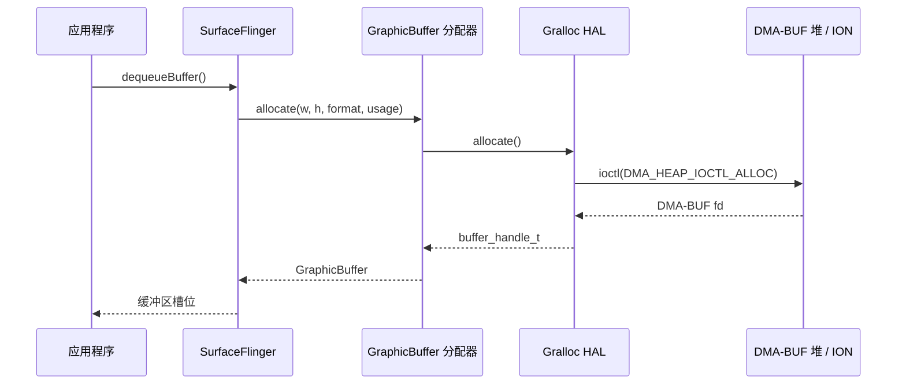
```mermaid
sequenceDiagram
    participant App as 应用程序
    participant SF as SurfaceFlinger
    participant GBA as GraphicBuffer 分配器
    participant Gralloc as Gralloc HAL
    participant DMA as DMA-BUF 堆 / ION

    App->>SF: dequeueBuffer()
    SF->>GBA: allocate(w, h, format, usage)
    GBA->>Gralloc: allocate()
    Gralloc->>DMA: ioctl(DMA_HEAP_IOCTL_ALLOC)
    DMA-->>Gralloc: DMA-BUF fd
    Gralloc-->>GBA: buffer_handle_t
    GBA-->>SF: GraphicBuffer
    SF-->>App: 缓冲区槽位
```

### 8.5.6 GPU 内存追踪

lmkd 通过 BPF map (`/sys/fs/bpf/map_gpuMem_gpu_mem_total_map`) 跟踪全局 GPU 内存使用情况。这使得系统在内存压力决策时能够考虑到不可见但巨大的 GPU 资源占用。

---

## 8.6 匿名共享内存 (Ashmem) 与 memfd

共享内存是 Android 进程间通信的核心，广泛用于 Binder 大数据传输、Gralloc 缓冲区以及跨进程资源共享。

### 8.6.1 Ashmem (Android Shared Memory)

Ashmem 是 Android 独有的内核驱动 (`drivers/staging/android/ashmem.c`)，提供：
- **命名区域**：在 `/proc/[pid]/maps` 中可见。
- **Pinning/Unpinning**：允许内核在压力下回收“解锁”的内存块。

### 8.6.2 memfd：现代替代方案

Android 10 开始转向 Linux 标准的 `memfd_create()`。
- **密封 (Sealing)**：通过 `F_ADD_SEALS` 保证 fd 发送后内容不可被修改。
- **安全性**：与 SELinux 和 seccomp 配合更自然。

---

## 8.7 内存分析与工具

Android 提供了一系列工具，从宏观概览到微观分配回溯：

### 8.7.1 dumpsys meminfo

最常用的快速分析工具：
- **Pss Total**：成比例集大小，衡量进程内存影响最准确的指标。
- **Private Dirty**：进程修改过的、无法共享的页面。
- **Private Clean**：未修改的私有页面（如从 APK 加载的代码）。
- **Rss Total**：实际映射的总页数（包含共享页的完整大小）。

### 8.7.2 heapprofd (Perfetto 原生堆分析)

`heapprofd` 是一个无守护进程的堆分析器，通过采样拦截 `malloc/free`，捕获分配热点的火焰图 (Flamegraph)。它对性能影响极小，非常适合在量产版本上进行分析。

### 8.7.3 showmap 与 libmeminfo

`showmap` 提供了进程内存映射的详细视图，构建在 `/proc/[pid]/smaps` 之上。相关的工具还包括：
- `procrank`：按内存使用量对进程进行排名。
- `procmem`：进程内存摘要。

### 8.7.4 libmemunreachable：原生泄露检测

`libmemunreachable` 是一个运行时的原生代码泄露检测器。它通过执行一次“保守的垃圾回收”扫描进程堆，找出没有根引用的孤立内存块。

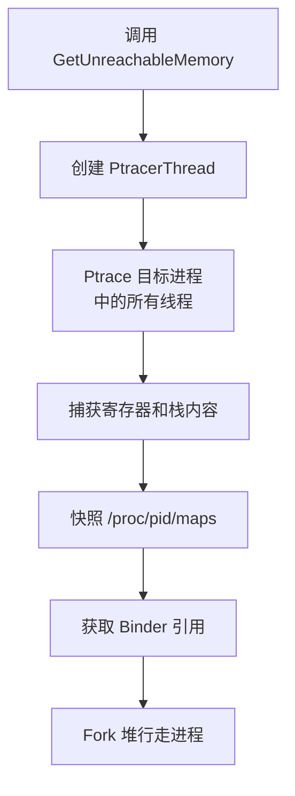
```mermaid
flowchart TD
    A[调用 GetUnreachableMemory] --> B[创建 PtracerThread]
    B --> C["Ptrace 目标进程<br/>中的所有线程"]
    C --> D["捕获寄存器和栈内容"]
    D --> E[快照 /proc/pid/maps]
    E --> F[获取 Binder 引用]
    F --> G[Fork 堆行走进程]
```

代码能够识别不同的映射类型，以实现准确的根（root）识别：

```cpp
// system/memory/libmemunreachable/MemUnreachable.cpp (第 256-277 行)
// 堆映射 (潜在的泄露)
if (mapping_name == "[anon:libc_malloc]" ||
    StartsWith(mapping_name, "[anon:scudo:") ||
    StartsWith(mapping_name, "[anon:GWP-ASan")) {
    heap_mappings.emplace_back(*it);
}
// Dalvik 堆 (全局根)
else if (has_prefix(mapping_name, "[anon:dalvik-")) {
    globals_mappings.emplace_back(*it);
}
// 线程栈
else if (has_prefix(mapping_name, "[stack")) {
    stack_mappings.emplace_back(*it);
}
```

命令行用法：

```shell
# 转储进程的无法到达内存
adb shell dumpsys -t 600 meminfo --unreachable <pid>

# 原生代码中的编程用法
#include <memunreachable/memunreachable.h>
android::UnreachableMemoryInfo info;
android::GetUnreachableMemory(info, 100);
ALOGE("%s", info.ToString(true).c_str());
```

### 8.7.6 内存分析决策树

选择合适的工具取决于你正在调查的问题：

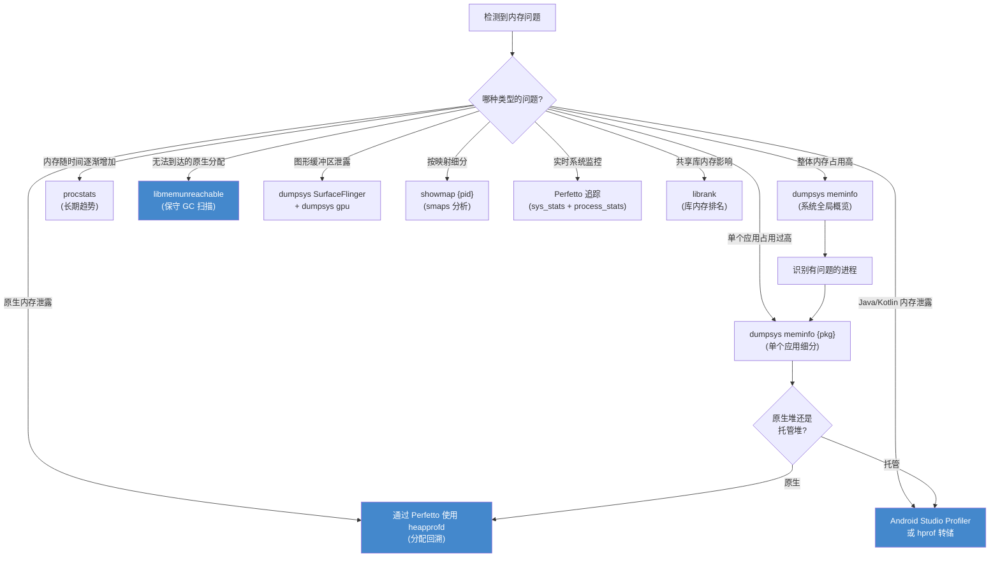
```mermaid
flowchart TD
    Start["检测到内存问题"] --> Q1{"哪种类型的问题?"}

    Q1 -->|"整体内存占用高"| DumpSys["dumpsys meminfo<br/>(系统全局概览)"]
    Q1 -->|"单个应用占用过高"| AppDebug["dumpsys meminfo {pkg}<br/>(单个应用细分)"]
    Q1 -->|"内存随时间逐渐增加"| ProcStats["procstats<br/>(长期趋势)"]
    Q1 -->|"原生内存泄露"| NativeLeak["通过 Perfetto 使用 heapprofd<br/>(分配回溯)"]
    Q1 -->|"Java/Kotlin 内存泄露"| JavaLeak["Android Studio Profiler<br/>或 hprof 转储"]
    Q1 -->|"无法到达的原生分配"| Unreachable["libmemunreachable<br/>(保守 GC 扫描)"]
    Q1 -->|"图形缓冲区泄露"| GraphicsLeak["dumpsys SurfaceFlinger<br/>+ dumpsys gpu"]
    Q1 -->|"按映射细分"| ShowMap["showmap {pid}<br/>(smaps 分析)"]
    Q1 -->|"实时系统监控"| Perfetto["Perfetto 追踪<br/>(sys_stats + process_stats)"]
    Q1 -->|"共享库内存影响"| LibRank["librank<br/>(库内存排名)"]

    DumpSys --> Narrow["识别有问题的进程"]
    Narrow --> AppDebug
    AppDebug --> Q2{"原生堆还是<br/>托管堆?"}
    Q2 -->|原生| NativeLeak
    Q2 -->|托管| JavaLeak

    style NativeLeak fill:#4488cc,color:#fff
    style JavaLeak fill:#4488cc,color:#fff
    style Unreachable fill:#4488cc,color:#fff
```

### 8.7.7 理解内存指标

各种内存指标可能令人困惑。以下是每个指标的精确定义：

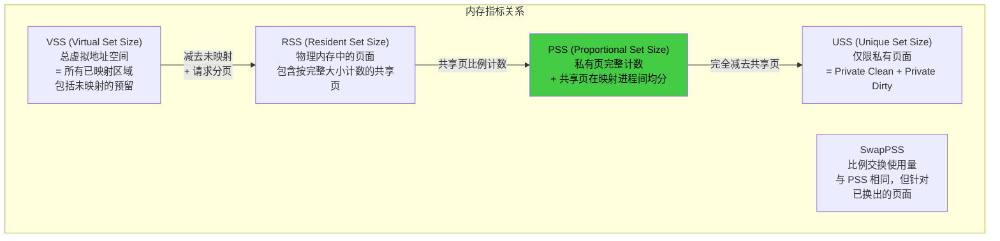
```mermaid
graph TD
    subgraph "内存指标关系"
        VSS["VSS (Virtual Set Size)<br/>总虚拟地址空间<br/>= 所有已映射区域<br/>包括未映射的预留"]

        RSS["RSS (Resident Set Size)<br/>物理内存中的页面<br/>包含按完整大小计数的共享页"]

        PSS["PSS (Proportional Set Size)<br/>私有页完整计数<br/>+ 共享页在映射进程间均分"]

        USS["USS (Unique Set Size)<br/>仅限私有页面<br/>= Private Clean + Private Dirty"]

        SwapPSS["SwapPSS<br/>比例交换使用量<br/>与 PSS 相同，但针对<br/>已换出的页面"]
    end

    VSS -->|"减去未映射<br/>+ 请求分页"| RSS
    RSS -->|"共享页比例计数"| PSS
    PSS -->|"完全减去共享页"| USS

    style PSS fill:#44cc44,color:#000
```

**PSS 是推荐使用的指标**，用于比较进程之间的内存占用，因为它能正确核算共享内存，且不会重复计数。

| 指标 | 最适合用于 | 局限性 |
|---|---|---|
| **VSS** | 检测地址空间耗尽 | 极大地高估了实际内存使用量 |
| **RSS** | 瞬时物理内存使用情况 | 重复计算了共享页 |
| **PSS** | 进程间公平比较 | 计算缓慢（需要解析 smaps） |
| **USS** | 理解私有内存成本 | 完全忽略了共享内存 |
| **SwapPSS** | 理解总内存影响 | 仅在较新的内核上可用 |

---

## 8.8 应用内存管理

### 8.8.1 ActivityManager 内存修剪 (Memory Trimming)

Android 框架通过 `ActivityManagerService` (AMS) 主动管理应用内存。当系统检测到内存压力时，AMS 会向应用程序发送 `onTrimMemory()` 回调，让它们在系统被迫杀死进程之前有机会释放缓存资源。

修剪级别定义在 `ComponentCallbacks2.java` 中：

```java
// frameworks/base/core/java/android/content/ComponentCallbacks2.java

// 运行中的进程级别 (应用在前台或靠近前台)
static final int TRIM_MEMORY_RUNNING_MODERATE = 5;   // 中度压力
static final int TRIM_MEMORY_RUNNING_LOW = 10;        // 可用内存不足
static final int TRIM_MEMORY_RUNNING_CRITICAL = 15;   // 危急，即将杀进程

// 后台进程级别
static final int TRIM_MEMORY_UI_HIDDEN = 20;          // UI 不再可见
static final int TRIM_MEMORY_BACKGROUND = 40;          // 在后台 LRU 列表中
static final int TRIM_MEMORY_MODERATE = 60;            // 在 LRU 列表中间
static final int TRIM_MEMORY_COMPLETE = 80;            // 在 LRU 列表末尾
```

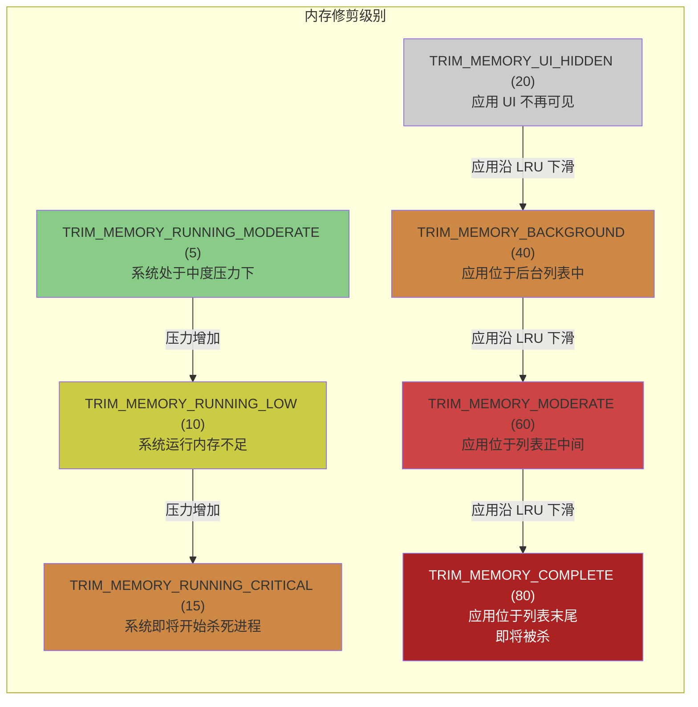
```mermaid
graph TD
    subgraph "内存修剪级别"
        direction TB
        A["TRIM_MEMORY_RUNNING_MODERATE (5)<br/>系统处于中度压力下"]
        B["TRIM_MEMORY_RUNNING_LOW (10)<br/>系统运行内存不足"]
        C["TRIM_MEMORY_RUNNING_CRITICAL (15)<br/>系统即将开始杀死进程"]
        D["TRIM_MEMORY_UI_HIDDEN (20)<br/>应用 UI 不再可见"]
        E["TRIM_MEMORY_BACKGROUND (40)<br/>应用位于后台列表中"]
        F["TRIM_MEMORY_MODERATE (60)<br/>应用位于列表正中间"]
        G["TRIM_MEMORY_COMPLETE (80)<br/>应用位于列表末尾<br/>即将被杀"]
    end

    A -->|"压力增加"| B -->|"压力增加"| C
    D -->|"应用沿 LRU 下滑"| E -->|"应用沿 LRU 下滑"| F -->|"应用沿 LRU 下滑"| G

    style A fill:#88cc88
    style B fill:#cccc44
    style C fill:#cc8844
    style D fill:#cccccc
    style E fill:#cc8844
    style F fill:#cc4444
    style G fill:#aa2222,color:#fff
```

### 8.8.2 AppProfiler

`AppProfiler` 类 (`frameworks/base/services/core/java/com/android/server/am/AppProfiler.java`) 负责管理内存状态跟踪和修剪回调：

```java
// frameworks/base/services/core/java/com/android/server/am/AppProfiler.java

public class AppProfiler {
    // 定期调用以更新低内存状态
    void updateLowMemStateLSP(int numCached, int numEmpty,
                               int numTrimming, long now) {
        // 确定当前内存状态
        // 向相应的进程发送 TRIM_MEMORY 回调
    }

    // 修剪 UI 隐藏的进程
    private void trimMemoryUiHiddenIfNecessaryLSP(ProcessRecord app) {
        // 当应用失去可见性时发送 TRIM_MEMORY_UI_HIDDEN
    }
}
```

### 8.8.3 ProcessList 与 OOM 调整

`ProcessList` 类管理进程重要性与 OOM 分值之间的映射：

```java
// frameworks/base/services/core/java/com/android/server/am/ProcessList.java

public final class ProcessList {
    // OOM 调整级别 (第 213-284 行)
    public static final int CACHED_APP_MIN_ADJ = 900;
    public static final int PERCEPTIBLE_APP_ADJ = 200;
    public static final int VISIBLE_APP_ADJ = 100;
    public static final int FOREGROUND_APP_ADJ = 0;

    // lmkd 的默认 minfree 级别
    private static final int[] mOomAdj = new int[] {
        FOREGROUND_APP_ADJ, VISIBLE_APP_ADJ, PERCEPTIBLE_APP_ADJ,
        PERCEPTIBLE_LOW_APP_ADJ, CACHED_APP_MIN_ADJ,
        CACHED_APP_LMK_FIRST_ADJ
    };

    // 为进程设置 oom_adj
    public static void setOomAdj(int pid, int uid, int amt) {
        // 通过 lmkd 套接字写入 /proc/[pid]/oom_score_adj
    }
}
```

### 8.8.4 AMS 如何与 lmkd 通信

当进程优先级发生变化时的通信流程：

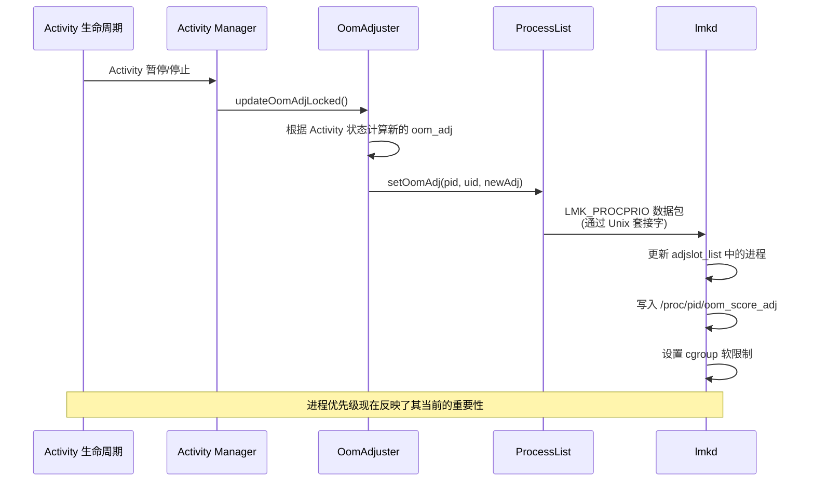
```mermaid
sequenceDiagram
    participant App as Activity 生命周期
    participant AMS as Activity Manager
    participant OomAdj as OomAdjuster
    participant ProcList as ProcessList
    participant LMKD as lmkd

    App->>AMS: Activity 暂停/停止
    AMS->>OomAdj: updateOomAdjLocked()
    OomAdj->>OomAdj: 根据 Activity 状态计算新的 oom_adj
    OomAdj->>ProcList: setOomAdj(pid, uid, newAdj)
    ProcList->>LMKD: LMK_PROCPRIO 数据包<br/>(通过 Unix 套接字)
    LMKD->>LMKD: 更新 adjslot_list 中的进程
    LMKD->>LMKD: 写入 /proc/pid/oom_score_adj
    LMKD->>LMKD: 设置 cgroup 软限制

    Note over App,LMKD: 进程优先级现在反映了其当前的重要性
```

### 8.8.5 内存限制与阈值

Android 对应用程序施加了多种内存限制：

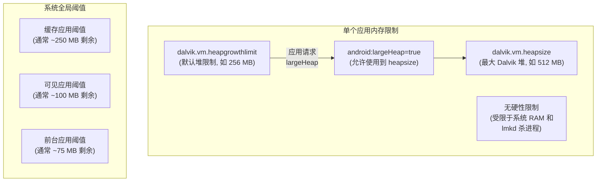
```mermaid
graph TD
    subgraph "单个应用内存限制"
        DalvikLimit["dalvik.vm.heapsize<br/>(最大 Dalvik 堆, 如 512 MB)"]
        GrowthLimit["dalvik.vm.heapgrowthlimit<br/>(默认堆限制, 如 256 MB)"]
        LargeHeap["android:largeHeap=true<br/>(允许使用到 heapsize)"]
        NativeLimit["无硬性限制<br/>(受限于系统 RAM 和<br/>lmkd 杀进程)"]
    end

    GrowthLimit -->|"应用请求<br/>largeHeap"| LargeHeap
    LargeHeap --> DalvikLimit

    subgraph "系统全局阈值"
        CachedThresh["缓存应用阈值<br/>(通常 ~250 MB 剩余)"]
        VisibleThresh["可见应用阈值<br/>(通常 ~100 MB 剩余)"]
        ForegroundThresh["前台应用阈值<br/>(通常 ~75 MB 剩余)"]
    end
```

### 8.8.6 进程生命周期与内存

了解进程生命周期状态如何映射到内存管理：

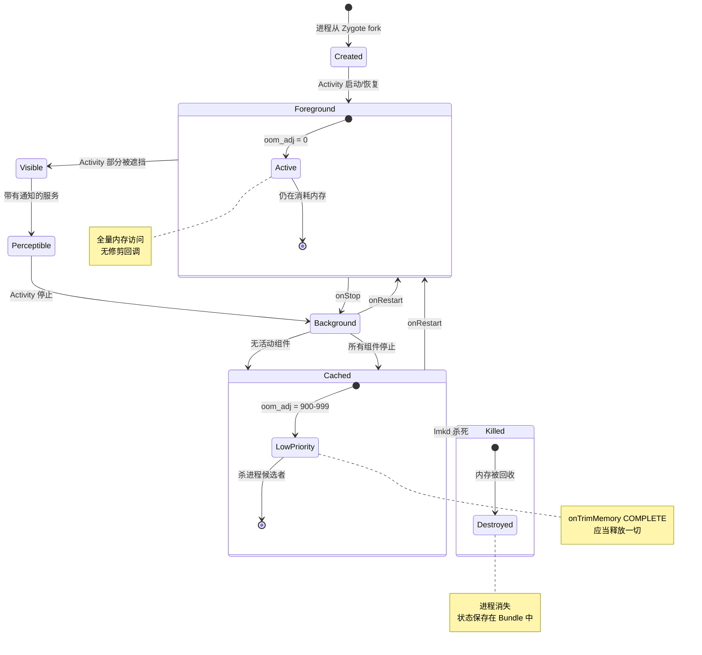
```mermaid
stateDiagram-v2
    [*] --> Created: 进程从 Zygote fork
    Created --> Foreground: Activity 启动/恢复
    Foreground --> Visible: Activity 部分被遮挡
    Visible --> Perceptible: 带有通知的服务
    Perceptible --> Background: Activity 停止
    Background --> Cached: 无活动组件
    Cached --> Killed: lmkd 杀死

    Foreground --> Background: onStop
    Background --> Foreground: onRestart
    Cached --> Foreground: onRestart
    Background --> Cached: 所有组件停止

    state Foreground {
        [*] --> Active: oom_adj = 0
        Active --> [*]: 仍在消耗内存
        note right of Active: 全量内存访问<br/>无修剪回调
    }

    state Cached {
        [*] --> LowPriority: oom_adj = 900-999
        LowPriority --> [*]: 杀进程候选者
        note right of LowPriority: onTrimMemory COMPLETE<br/>应当释放一切
    }

    state Killed {
        [*] --> Destroyed: 内存被回收
        note right of Destroyed: 进程消失<br/>状态保存在 Bundle 中
    }
```

### 8.8.7 ART 垃圾回收与内存

Android Runtime (ART) 通过垃圾回收管理 Java/Kotlin 对象内存。

- **堆空间**：包括 Main Space（大多数分配）、Large Object Space（> 12 KB 的对象）、Image Space（启动镜像类）和 Zygote Space（所有应用共享）。
- **GC 算法**：
    - **Concurrent Copying (CC)**：默认收集器，低停顿，具有压缩功能。
    - **Concurrent Mark-Sweep (CMS)**：传统的非压缩收集器。

ART 在应用进入后台时执行**压缩 GC**，以减少碎片并缩小内存占用。

### 8.8.8 应用开发者的最佳实践

应用开发者应当通过实现 `onTrimMemory()` 来主动释放资源：

```java
public class MyApplication extends Application {
    @Override
    public void onTrimMemory(int level) {
        super.onTrimMemory(level);

        if (level >= TRIM_MEMORY_COMPLETE) {
            // 释放所有缓存数据
            clearImageCache();
            clearDatabaseCache();
            releasePooledConnections();
        } else if (level >= TRIM_MEMORY_MODERATE) {
            // 释放大部分缓存数据
            trimImageCacheToHalf();
        } else if (level >= TRIM_MEMORY_BACKGROUND) {
            // 释放非必要缓存数据
            trimImageCacheToQuarter();
        } else if (level >= TRIM_MEMORY_UI_HIDDEN) {
            // UI 不再可见，释放 UI 相关资源
            releaseLayoutInflaterCache();
        }
    }
}
```

**关键准则：**
1. **始终响应 `TRIM_MEMORY_UI_HIDDEN`**：这是你的应用不再可见的第一个信号。
2. **渐进式释放**：不要在 `TRIM_MEMORY_BACKGROUND` 时释放所有内容，应用可能很快回到前台。
3. **避免持有大型 Bitmap**：使用 `Bitmap.recycle()` 或让 GC 处理。
4. **定期分析**：使用 `adb shell dumpsys meminfo <package>` 验证修剪回调是否生效。

---

## 8.9 内核与底层内存特性

### 8.9.1 KASAN (内核地址消毒剂)

KASAN 检测内核代码中的越界访问和使用已释放内存 (UAF) 错误。它在 Android 调试/开发构建中启用。它通过维护一个“影子内存”区域来跟踪每个内存字节的有效性。

### 8.9.2 MTE (内存标签扩展)

ARM 的 **Memory Tagging Extension (MTE)** 是从 ARMv8.5 开始提供的硬件辅助内存安全特性。Android 是首个全系统采用 MTE 的主流平台。

MTE 为指针和内存分配分配一个 4 位的标签（0-15）。硬件在每次访问时检查指针标签是否与内存标签匹配。

**MTE 模式：**
- **同步 (Synchronous)**：违规时立即崩溃。用于测试和安全关键进程。
- **异步 (Asynchronous)**：通过 SIGSEGV 延迟报告。用于生产环境监控，开销 < 1%。

### 8.9.3 GWP-ASan

GWP-ASan 是一种概率性的内存错误检测器。与完整的 ASan 不同，它的开销极小，默认在生产环境的 Android 构建中启用。它通过随机选择少量分配并将其放置在受保护的页面中来捕捉溢出和 UAF。

### 8.9.4 Scudo：Android 的硬化分配器

Scudo 是 Android 自 Android 11 起的默认内存分配器（取代了 jemalloc）。
- **安全特性**：块头校验和、隔离区 (Quarantine)、随机化分配地址。
- **性能特性**：每个线程的本地缓存 (lock-free)、基于大小类的分配。

### 8.9.5 KSM (内核同页合并)

KSM 扫描内存中内容相同的页面，并使用写时拷贝 (CoW) 将它们合并。这对 Android 很有利，因为多个应用实例或库可能存在相同的内存镜像。

---

## 8.10 关键源码文件参考

| 组件 | 路径 |
|---|---|
| lmkd 主实现 | `system/memory/lmkd/lmkd.cpp` |
| lmkd 协议定义 | `system/memory/lmkd/include/lmkd.h` |
| 进程收割者 (Reaper) | `system/memory/lmkd/reaper.cpp` |
| 内存无法到达检测 | `system/memory/libmemunreachable/MemUnreachable.cpp` |
| showmap 工具 | `system/memory/libmeminfo/tools/showmap.cpp` |
| DMA-BUF 堆分配器 | `system/memory/libdmabufheap/BufferAllocator.cpp` |
| ProcessList (Java) | `frameworks/base/services/core/java/com/android/server/am/ProcessList.java` |

---

## 8.11 延伸阅读

- **Linux 内核文档**：`Documentation/admin-guide/mm/` —— 关于 zRAM, KSM, THP 的完整文档。
- **Android 源码文档**：`system/memory/lmkd/README.md` —— lmkd 设计概述。
- **Perfetto 文档**：`https://perfetto.dev/docs/data-sources/memory-counters`。

---

## 8.12 动手实践

### 练习 8.1：观察 lmkd 的运行

在运行中的设备上监控 lmkd 行为：
```shell
# 1. 查看 lmkd 日志输出
adb logcat -s lowmemorykiller:* lmkd:*

# 2. 查看由 AMS 设置的 minfree 级别
adb shell getprop sys.lmk.minfree_levels

# 3. 实时监控 PSI 压力
adb shell "while true; do cat /proc/pressure/memory; sleep 1; echo '---'; done"
```

### 练习 8.2：使用 dumpsys 分析内存

```shell
# 1. 获取系统全局内存摘要
adb shell dumpsys meminfo

# 2. 挑选一个特定应用进行深度分析
adb shell dumpsys meminfo com.android.systemui
```

### 练习 8.3：探索 zRAM

```shell
# 1. 查看 zRAM 压缩算法和磁盘大小
adb shell cat /sys/block/zram0/comp_algorithm
adb shell cat /sys/block/zram0/disksize

# 2. 计算实际压缩率
adb shell "mm_stat=\$(cat /sys/block/zram0/mm_stat); \
  orig=\$(echo \$mm_stat | awk '{print \$1}'); \
  compr=\$(echo \$mm_stat | awk '{print \$2}'); \
  echo \"Ratio: \$(echo \"scale=2; \$orig / \$compr\" | bc):1\""
```

---

## 总结 (Summary)

Android 的内存管理是一个复杂的、跨层协作的系统，从硬件页表延伸到 Java 应用回调。

**核心结论：**
1. **lmkd 是守护者**：它通过 PSI 持续监控压力，在系统进入 OOM 之前果断杀进程。
2. **OOM 分值决定生存**：系统建立了从原生守护进程到缓存应用的严格杀进程等级制度。
3. **zRAM 扩展了容量**：通过内存内压缩，Android 设备能容纳比物理 RAM 更多的活跃数据。
4. **安全性是内置的**：MTE, GWP-ASan 和 Scudo 提供了多层防御，防止内存破坏漏洞。

### 架构原则
- **主动优于被动**：在内核 OOM 发生之前，lmkd 就已经开始行动。
- **重要性优先**：确保前台应用的体验，优先牺牲后台进程。
- **协作管理**：通过 `onTrimMemory` 给予应用自救的机会。
- **深度防御**：不依赖单一机制保护内存安全。
