# Chapter 8: Memory Management

Memory management is arguably the single most critical subsystem in a mobile operating system.
Android devices operate under severe physical constraints -- a flagship phone may have 8--16 GB of
RAM, yet users routinely have dozens of apps installed and expect instant switching between them.
This chapter dissects how AOSP orchestrates memory from the hardware page tables all the way up to
the Java `onTrimMemory()` callbacks that developers interact with. We trace the path through the
Linux kernel's virtual memory subsystem, the userspace Low Memory Killer Daemon (lmkd), cgroup
accounting, compressed swap (zRAM), graphics buffer allocation (ION/DMA-BUF), anonymous shared
memory (ashmem/memfd), profiling tools, and the security-oriented memory hardening features that
protect against exploitation.

Every section references real source files rooted at the AOSP tree. When a path such as
`system/memory/lmkd/lmkd.cpp` appears, it is relative to the AOSP checkout root.

---

## 8.1 Memory Architecture

### 8.1.1 Virtual Memory Fundamentals

Android runs on the Linux kernel, which provides each process with its own virtual address space.
On a 64-bit ARM device (AArch64), the kernel typically uses a 39-bit or 48-bit virtual address
space, giving each process up to 256 TB of addressable memory -- vastly more than any physical
device will ever contain. The Memory Management Unit (MMU) in the CPU translates virtual addresses
to physical frame numbers through multi-level page tables.

```
Virtual Address (48-bit example)
+--------+--------+--------+--------+-----------+
| L0 idx | L1 idx | L2 idx | L3 idx | Page Offs |
| (9 bit)| (9 bit)| (9 bit)| (9 bit)| (12 bit)  |
+--------+--------+--------+--------+-----------+
         |
         v
    Page Table Walk (4 levels on AArch64)
         |
         v
    Physical Frame Number + Offset = Physical Address
```

Key concepts for Android developers and platform engineers:

| Concept | Description |
|---|---|
| **Page** | The smallest unit of memory management, typically 4 KB on ARM64 (16 KB on some newer SoCs) |
| **Page Table** | Hierarchical structure mapping virtual to physical addresses |
| **TLB** | Translation Lookaside Buffer -- hardware cache of recent translations |
| **Page Fault** | CPU exception when a virtual address has no valid mapping |
| **Demand Paging** | Pages are not allocated until first access (minor fault) or loaded from backing store (major fault) |
| **Copy-on-Write (CoW)** | Shared pages are duplicated only when one process writes to them -- critical for `fork()` and Zygote |

### 8.1.2 Process Address Space Layout

Every Android process inherits its initial address space from Zygote via `fork()`. The general
layout on a 64-bit device follows this pattern:


```mermaid
graph TD
    subgraph "Process Virtual Address Space (64-bit)"
        A["0x0000000000000000<br/>NULL page (unmapped)"]
        B["Program text (.text)<br/>Executable code"]
        C["Read-only data (.rodata)"]
        D["Initialized data (.data, .bss)"]
        E["Heap (brk/sbrk)<br/>grows upward"]
        F["Memory-mapped regions (mmap)<br/>shared libraries, file mappings,<br/>anonymous mappings"]
        G["Thread stacks<br/>(each ~1 MB default)"]
        H["[stack] - main thread stack<br/>grows downward"]
        I["0x0000007fffffffff<br/>User space limit (39-bit VA)"]
        J["--- Kernel / User boundary ---"]
        K["0xffffff8000000000<br/>Kernel virtual address space"]
    end

    A --> B --> C --> D --> E --> F --> G --> H --> I --> J --> K

    style A fill:#ff6666,color:#000
    style J fill:#ffcc00,color:#000
    style K fill:#66aaff,color:#000
```

Within this layout, Android adds several specialized regions:

- **Dalvik/ART Heap**: The managed heap for Java/Kotlin objects, located within mmap regions. ART
  uses `mmap(MAP_ANONYMOUS)` to create the large object space, non-moving space, and other GC
  spaces.
- **JIT Code Cache**: ART's JIT compiler allocates executable memory via `mmap(PROT_READ |
  PROT_EXEC)` for compiled methods.
- **Ashmem / memfd Regions**: Shared memory segments used for Binder transactions, graphics
  buffers, and inter-process data sharing.
- **Stack Guard Pages**: Each thread's stack is bounded by unmapped guard pages to catch stack
  overflows.

### 8.1.3 Kernel vs. Userspace Memory

The kernel reserves the upper portion of the virtual address space for its own use. Userspace
processes cannot access kernel memory (enforced by the MMU). This separation is fundamental to
system stability -- a buggy app cannot corrupt kernel data structures.

The kernel's memory is divided into:

| Region | Purpose |
|---|---|
| **Linear mapping** | Direct mapping of all physical RAM (identity-mapped with offset) |
| **vmalloc area** | Virtually contiguous but physically scattered allocations |
| **Module space** | Loadable kernel modules |
| **fixmap** | Compile-time fixed virtual addresses for special hardware |
| **PCI I/O space** | Memory-mapped I/O for peripheral devices |

Android's kernel configuration adds several important memory-related features:

```
# Typical Android kernel config excerpts
CONFIG_ZRAM=y                    # Compressed swap in RAM
CONFIG_MEMCG=y                   # Memory cgroup support
CONFIG_PSI=y                     # Pressure Stall Information
CONFIG_TRANSPARENT_HUGEPAGE=y    # THP for reduced TLB misses
CONFIG_KSM=y                     # Kernel Same-page Merging (optional)
CONFIG_KASAN=y                   # Kernel Address Sanitizer (debug builds)
CONFIG_ARM64_MTE=y               # Memory Tagging Extension (ARMv8.5+)
```

### 8.1.4 Memory Zones and NUMA

The Linux kernel organizes physical memory into zones:

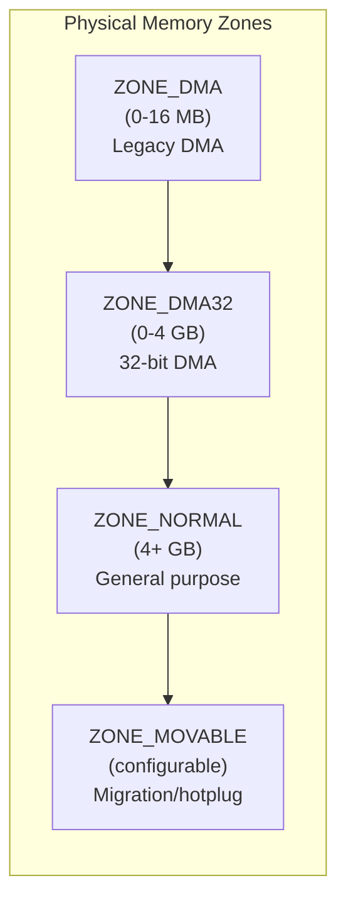
```mermaid
graph LR
    subgraph "Physical Memory Zones"
        DMA["ZONE_DMA<br/>(0-16 MB)<br/>Legacy DMA"]
        DMA32["ZONE_DMA32<br/>(0-4 GB)<br/>32-bit DMA"]
        NORMAL["ZONE_NORMAL<br/>(4+ GB)<br/>General purpose"]
        MOVABLE["ZONE_MOVABLE<br/>(configurable)<br/>Migration/hotplug"]
    end

    DMA --> DMA32 --> NORMAL --> MOVABLE
```

The lmkd daemon parses `/proc/zoneinfo` to understand memory pressure at the zone level. The
parsing code in `system/memory/lmkd/lmkd.cpp` defines these structures:

```c
// system/memory/lmkd/lmkd.cpp (lines 301-391)

/* Fields to parse in /proc/zoneinfo */
enum zoneinfo_zone_field {
    ZI_ZONE_NR_FREE_PAGES = 0,
    ZI_ZONE_MIN,
    ZI_ZONE_LOW,
    ZI_ZONE_HIGH,
    ZI_ZONE_PRESENT,
    ZI_ZONE_NR_FREE_CMA,
    ZI_ZONE_FIELD_COUNT
};

struct zoneinfo_zone {
    union zoneinfo_zone_fields fields;
    int64_t protection[MAX_NR_ZONES];
    int64_t max_protection;
};

struct zoneinfo {
    int node_count;
    struct zoneinfo_node nodes[MAX_NR_NODES];
    int64_t totalreserve_pages;
    int64_t total_inactive_file;
    int64_t total_active_file;
};
```

The `totalreserve_pages` field is the sum of each zone's `max_protection + high watermark`,
representing the minimum amount of memory the kernel reserves for its own operations. This is
critical for lmkd's calculation of available memory.

### 8.1.5 Zygote and Copy-on-Write

The Zygote process is central to Android's memory efficiency. Every app process is forked from
Zygote, which pre-loads the entire Android framework (approximately 100+ MB of class libraries,
resources, and native code). Thanks to copy-on-write (CoW), all these pages are physically shared
between Zygote and every forked app process until they are modified.

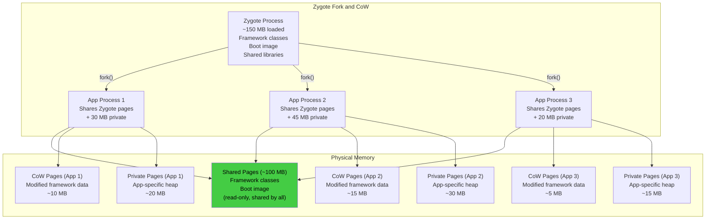
```mermaid
graph TD
    subgraph "Zygote Fork and CoW"
        Zygote["Zygote Process<br/>~150 MB loaded<br/>Framework classes<br/>Boot image<br/>Shared libraries"]

        App1["App Process 1<br/>Shares Zygote pages<br/>+ 30 MB private"]
        App2["App Process 2<br/>Shares Zygote pages<br/>+ 45 MB private"]
        App3["App Process 3<br/>Shares Zygote pages<br/>+ 20 MB private"]
    end

    subgraph "Physical Memory"
        Shared["Shared Pages (~100 MB)<br/>Framework classes<br/>Boot image<br/>(read-only, shared by all)"]
        CoW1["CoW Pages (App 1)<br/>Modified framework data<br/>~10 MB"]
        CoW2["CoW Pages (App 2)<br/>Modified framework data<br/>~15 MB"]
        CoW3["CoW Pages (App 3)<br/>Modified framework data<br/>~5 MB"]
        Private1["Private Pages (App 1)<br/>App-specific heap<br/>~20 MB"]
        Private2["Private Pages (App 2)<br/>App-specific heap<br/>~30 MB"]
        Private3["Private Pages (App 3)<br/>App-specific heap<br/>~15 MB"]
    end

    Zygote -->|"fork()"| App1
    Zygote -->|"fork()"| App2
    Zygote -->|"fork()"| App3

    App1 --> Shared
    App2 --> Shared
    App3 --> Shared

    App1 --> CoW1
    App1 --> Private1
    App2 --> CoW2
    App2 --> Private2
    App3 --> CoW3
    App3 --> Private3

    style Shared fill:#44cc44,color:#000
```

Without Zygote and CoW, each of those three apps would need its own copy of the framework,
tripling the memory consumption for shared code. With CoW, the physical cost is:

- **Without CoW**: 3 x 150 MB = 450 MB for framework + 95 MB private = 545 MB total
- **With CoW**: 100 MB shared + 30 MB CoW pages + 95 MB private = 225 MB total

This difference is multiplied across the 20-40 processes typically running on an Android device.

### 8.1.6 Memory Reclaim Mechanisms

The kernel employs several mechanisms to reclaim memory when pressure increases:

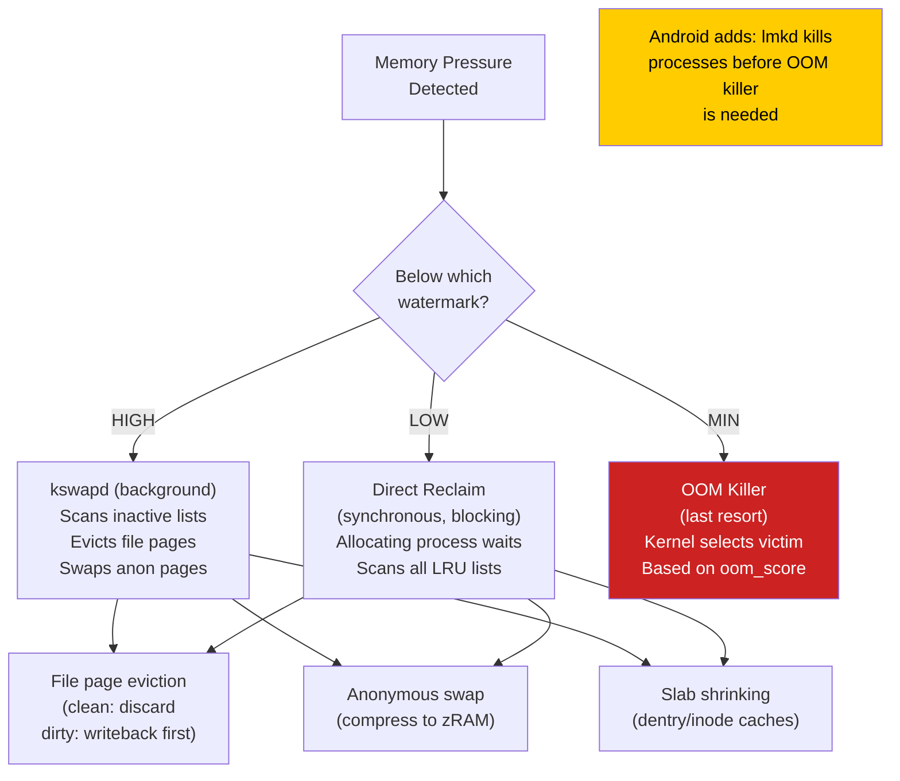
```mermaid
flowchart TD
    Pressure["Memory Pressure<br/>Detected"] --> Watermark{"Below which<br/>watermark?"}

    Watermark -->|"HIGH"| kswapd["kswapd (background)<br/>Scans inactive lists<br/>Evicts file pages<br/>Swaps anon pages"]

    Watermark -->|"LOW"| DirectRecl["Direct Reclaim<br/>(synchronous, blocking)<br/>Allocating process waits<br/>Scans all LRU lists"]

    Watermark -->|"MIN"| OOM["OOM Killer<br/>(last resort)<br/>Kernel selects victim<br/>Based on oom_score"]

    kswapd --> FileEvict["File page eviction<br/>(clean: discard<br/>dirty: writeback first)"]
    kswapd --> AnonSwap["Anonymous swap<br/>(compress to zRAM)"]
    kswapd --> SlabShrink["Slab shrinking<br/>(dentry/inode caches)"]

    DirectRecl --> FileEvict
    DirectRecl --> AnonSwap
    DirectRecl --> SlabShrink

    Note1["Android adds: lmkd kills<br/>processes before OOM killer<br/>is needed"]

    style OOM fill:#cc2222,color:#fff
    style Note1 fill:#ffcc00,color:#000
```

The page reclaim algorithm uses two key metrics:

- **Inactive ratio**: Pages are demoted from active to inactive lists based on access patterns.
  Pages that have not been accessed recently are more likely to be evicted.
- **Scan priority**: Higher priority means more pages are scanned per reclaim cycle. Direct
  reclaim uses higher priority than kswapd.

### 8.1.7 The Page Cache

The Linux page cache keeps recently read file data in memory. On Android, this is especially
important because:

1. **App launch speed** depends on having APK contents (DEX, resources, native libraries) in the
   page cache.
2. **The page cache is evictable** -- the kernel reclaims these pages under memory pressure, which
   is why the file cache size factors into lmkd's killing decisions.
3. **Active vs. Inactive lists** -- the kernel maintains LRU lists to decide which pages to evict
   first. lmkd reads these via `/proc/meminfo`:

```c
// system/memory/lmkd/lmkd.cpp (lines 394-441)
enum meminfo_field {
    MI_NR_FREE_PAGES = 0,
    MI_CACHED,
    MI_SWAP_CACHED,
    MI_BUFFERS,
    MI_SHMEM,
    MI_UNEVICTABLE,
    MI_TOTAL_SWAP,
    MI_FREE_SWAP,
    MI_ACTIVE_ANON,
    MI_INACTIVE_ANON,
    MI_ACTIVE_FILE,
    MI_INACTIVE_FILE,
    MI_SRECLAIMABLE,
    MI_SUNRECLAIM,
    MI_KERNEL_STACK,
    MI_PAGE_TABLES,
    // ...
    MI_FIELD_COUNT
};
```

---

## 8.2 Low Memory Killer Daemon (lmkd)

The Low Memory Killer Daemon is the central userspace component responsible for keeping the
Android system responsive under memory pressure. When physical memory runs low, lmkd selects and
kills processes to free memory before the system enters an unrecoverable out-of-memory (OOM)
state.

**Source directory**: `system/memory/lmkd/`

| File | Purpose |
|---|---|
| `lmkd.cpp` | Main daemon implementation (~3400 lines) |
| `lmkd.rc` | Init service definition |
| `lmkd.h` (in `include/`) | Command protocol definitions |
| `reaper.cpp` / `reaper.h` | Asynchronous process reaping with `process_mrelease()` |
| `watchdog.cpp` / `watchdog.h` | Watchdog timer to detect lmkd hangs |
| `statslog.cpp` / `statslog.h` | Statistics logging for kill events |
| `libpsi/psi.cpp` | PSI (Pressure Stall Information) monitor interface |

### 8.2.1 Historical Context: From Kernel Driver to Userspace Daemon

Android originally used an in-kernel Low Memory Killer (LMK) driver located at
`drivers/staging/android/lowmemorykiller.c`. This kernel driver operated by hooking into the
kernel's shrink callback mechanism. When memory fell below configured thresholds, the driver
would walk the process list and kill the process with the highest `oom_adj_score` exceeding the
threshold.

The migration to a userspace daemon (lmkd) happened for several reasons:

1. **Staging driver removal**: The kernel community rejected the LMK driver from the staging tree.
2. **Flexibility**: A userspace daemon can be updated independently of the kernel.
3. **PSI integration**: The Pressure Stall Information (PSI) framework in modern kernels provides a
   better signal for memory pressure than the old vmpressure events.
4. **Better kill strategies**: Userspace has access to more process metadata.

The code still checks for the legacy in-kernel interface:

```c
// system/memory/lmkd/lmkd.cpp (lines 86-87, 155)
#define INKERNEL_MINFREE_PATH "/sys/module/lowmemorykiller/parameters/minfree"
#define INKERNEL_ADJ_PATH "/sys/module/lowmemorykiller/parameters/adj"

/* default to old in-kernel interface if no memory pressure events */
static bool use_inkernel_interface = true;
static bool has_inkernel_module;
```

### 8.2.2 lmkd Service Configuration

The daemon is started by Android's init system via its `.rc` file:

```
# system/memory/lmkd/lmkd.rc (lines 1-8)
service lmkd /system/bin/lmkd
    class core
    user lmkd
    group lmkd system readproc
    capabilities DAC_OVERRIDE KILL IPC_LOCK SYS_NICE SYS_RESOURCE
    critical
    socket lmkd seqpacket+passcred 0660 system system
    task_profiles ServiceCapacityLow
```

Key aspects of this configuration:

- **`class core`**: lmkd starts in the core service class, meaning it launches early in boot.
- **`user lmkd`**: Runs as a dedicated user for security isolation.
- **`capabilities`**: Requires `CAP_KILL` to terminate processes, `CAP_DAC_OVERRIDE` to write to
  `/proc/[pid]/oom_score_adj`, and `CAP_SYS_RESOURCE` for resource adjustments.
- **`critical`**: If lmkd crashes, the system will reboot (it is that essential).
- **`socket lmkd`**: Creates a Unix domain socket for communication with ActivityManagerService.
- **Reinit triggers**: The `.rc` file includes property triggers (lines 10-72) that reinitialize
  lmkd when experiment flags change via `persist.device_config.lmkd_native.*` properties.

### 8.2.3 Communication Protocol

lmkd communicates with the framework (primarily `ProcessList.java` in ActivityManagerService) over
a Unix domain socket. The protocol is defined in `include/lmkd.h`:

```c
// system/memory/lmkd/include/lmkd.h (lines 29-42)
enum lmk_cmd {
    LMK_TARGET = 0,         /* Associate minfree with oom_adj_score */
    LMK_PROCPRIO,           /* Register a process and set its oom_adj_score */
    LMK_PROCREMOVE,         /* Unregister a process */
    LMK_PROCPURGE,          /* Purge all registered processes */
    LMK_GETKILLCNT,         /* Get number of kills */
    LMK_SUBSCRIBE,          /* Subscribe for asynchronous events */
    LMK_PROCKILL,           /* Unsolicited msg to subscribed clients on proc kills */
    LMK_UPDATE_PROPS,       /* Reinit properties */
    LMK_STAT_KILL_OCCURRED, /* Unsolicited msg for statsd logging */
    LMK_START_MONITORING,   /* Start psi monitoring if skipped earlier */
    LMK_BOOT_COMPLETED,     /* Notify LMKD boot is completed */
    LMK_PROCS_PRIO,         /* Register processes and set the same oom_adj_score */
};
```

The message flow during normal operation:

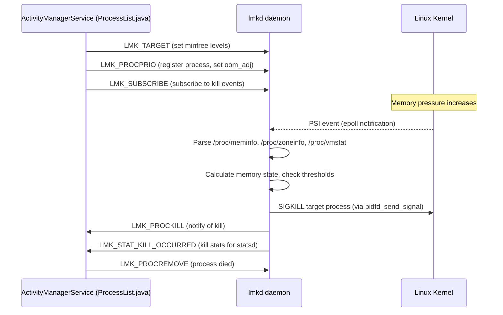
```mermaid
sequenceDiagram
    participant AMS as ActivityManagerService (ProcessList.java)
    participant LMKD as lmkd daemon
    participant Kernel as Linux Kernel

    AMS->>LMKD: LMK_TARGET (set minfree levels)
    AMS->>LMKD: LMK_PROCPRIO (register process, set oom_adj)
    AMS->>LMKD: LMK_SUBSCRIBE (subscribe to kill events)

    Note over Kernel: Memory pressure increases

    Kernel-->>LMKD: PSI event (epoll notification)
    LMKD->>LMKD: Parse /proc/meminfo, /proc/zoneinfo, /proc/vmstat
    LMKD->>LMKD: Calculate memory state, check thresholds
    LMKD->>Kernel: SIGKILL target process (via pidfd_send_signal)
    LMKD->>AMS: LMK_PROCKILL (notify of kill)
    LMKD->>AMS: LMK_STAT_KILL_OCCURRED (kill stats for statsd)

    AMS->>LMKD: LMK_PROCREMOVE (process died)
```

Each packet starts with an `int` command code in network byte order, followed by command-specific
fields. For example, the `LMK_PROCPRIO` packet carries:

```c
// system/memory/lmkd/include/lmkd.h (lines 106-113)
struct lmk_procprio {
    pid_t pid;
    uid_t uid;
    int oomadj;
    enum proc_type ptype;
};
```

The `LMK_PROCS_PRIO` command (line 41) is an optimization that allows batching multiple process
priority updates in a single packet, reducing socket round-trips when many process priorities
change simultaneously (e.g., during activity transitions).

### 8.2.4 OOM Adjustment Scores

Every process in Android has an OOM adjustment score (`oom_adj_score`) that indicates its
importance. Lower scores mean higher importance. lmkd writes this value to
`/proc/[pid]/oom_score_adj` and uses it to decide which processes to kill first.

The score ranges are defined in `frameworks/base/services/core/java/com/android/server/am/ProcessList.java`:

| Constant | Value | Process Type |
|---|---|---|
| `NATIVE_ADJ` | -1000 | Native system daemons |
| `SYSTEM_ADJ` | -900 | system_server |
| `PERSISTENT_PROC_ADJ` | -800 | Persistent system processes |
| `PERSISTENT_SERVICE_ADJ` | -700 | Persistent services |
| `FOREGROUND_APP_ADJ` | 0 | Currently visible foreground app |
| `VISIBLE_APP_ADJ` | 100 | Visible but not focused activity |
| `PERCEPTIBLE_APP_ADJ` | 200 | Perceptible to user (e.g., playing audio) |
| `PERCEPTIBLE_LOW_APP_ADJ` | 250 | Low-priority perceptible |
| `BACKUP_APP_ADJ` | 300 | Performing backup |
| `HEAVY_WEIGHT_APP_ADJ` | 400 | Heavy-weight background process |
| `SERVICE_ADJ` | 500 | Running a service |
| `HOME_APP_ADJ` | 600 | Launcher app |
| `PREVIOUS_APP_ADJ` | 700 | Previous foreground app |
| `SERVICE_B_ADJ` | 800 | B-list service |
| `CACHED_APP_MIN_ADJ` | 900 | Minimum cached (empty) process score |
| `CACHED_APP_LMK_FIRST_ADJ` | 950 | First cached process to kill |
| `CACHED_APP_MAX_ADJ` | 999 | Maximum cached process score |

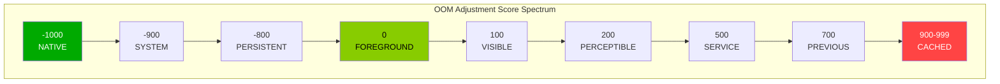
```mermaid
graph LR
    subgraph "OOM Adjustment Score Spectrum"
        direction LR
        A["-1000<br/>NATIVE"] --> B["-900<br/>SYSTEM"] --> C["-800<br/>PERSISTENT"]
        C --> D["0<br/>FOREGROUND"] --> E["100<br/>VISIBLE"]
        E --> F["200<br/>PERCEPTIBLE"] --> G["500<br/>SERVICE"]
        G --> H["700<br/>PREVIOUS"] --> I["900-999<br/>CACHED"]
    end

    style A fill:#00aa00,color:#fff
    style D fill:#88cc00,color:#000
    style I fill:#ff4444,color:#fff
```

lmkd maintains a doubly-linked list sorted by OOM score to quickly find the highest-score
(least important) process:

```c
// system/memory/lmkd/lmkd.cpp (lines 520-534, 541-552)
struct proc {
    struct adjslot_list asl;
    int pid;
    int pidfd;
    uid_t uid;
    int oomadj;
    pid_t reg_pid;
    bool valid;
    struct proc *pidhash_next;
};

#define PIDHASH_SZ 1024
static struct proc *pidhash[PIDHASH_SZ];
#define pid_hashfn(x) ((((x) >> 8) ^ (x)) & (PIDHASH_SZ - 1))

#define ADJTOSLOT(adj) ((adj) + -OOM_SCORE_ADJ_MIN)
#define ADJTOSLOT_COUNT (ADJTOSLOT(OOM_SCORE_ADJ_MAX) + 1)
static struct adjslot_list procadjslot_list[ADJTOSLOT_COUNT];
```

The `procadjslot_list` is an array of 2001 slots (from -1000 to +1000), where each slot is a
linked list of processes with that OOM score. This allows O(1) lookup of the highest-score
process by scanning backwards from slot 2000.

### 8.2.5 PSI-Based Kill Triggers

Modern lmkd uses the kernel's Pressure Stall Information (PSI) framework as its primary trigger
for kill decisions. PSI measures the percentage of time that tasks are stalled waiting for memory
resources.

The PSI interface is accessed through `/proc/pressure/memory`, which reports:

```
some avg10=0.00 avg60=0.00 avg300=0.00 total=0
full avg10=0.00 avg60=0.00 avg300=0.00 total=0
```

- **`some`**: At least one task is stalled on memory.
- **`full`**: All non-idle tasks are stalled on memory simultaneously.

lmkd registers PSI monitors at three pressure levels:

```c
// system/memory/lmkd/lmkd.cpp (lines 158-170, 226-230)
enum vmpressure_level {
    VMPRESS_LEVEL_LOW = 0,
    VMPRESS_LEVEL_MEDIUM,
    VMPRESS_LEVEL_CRITICAL,
    VMPRESS_LEVEL_COUNT
};

static struct psi_threshold psi_thresholds[VMPRESS_LEVEL_COUNT] = {
    { PSI_SOME, 70 },    /* 70ms out of 1sec for partial stall */
    { PSI_SOME, 100 },   /* 100ms out of 1sec for partial stall */
    { PSI_FULL, 70 },    /* 70ms out of 1sec for complete stall */
};
```

The PSI monitor library (`system/memory/lmkd/libpsi/psi.cpp`) registers triggers with the kernel:

```c
// system/memory/lmkd/libpsi/psi.cpp (lines 36-83)
int init_psi_monitor(enum psi_stall_type stall_type, int threshold_us,
                     int window_us, enum psi_resource resource) {
    int fd;
    char buf[256];

    fd = TEMP_FAILURE_RETRY(open(psi_resource_file[resource],
                                 O_WRONLY | O_CLOEXEC));
    if (fd < 0) {
        ALOGE("No kernel psi monitor support (errno=%d)", errno);
        return -1;
    }

    // Write trigger: "some 70000 1000000" means
    // "notify when 'some' stall exceeds 70ms in a 1000ms window"
    snprintf(buf, sizeof(buf), "%s %d %d",
             stall_type_name[stall_type], threshold_us, window_us);

    write(fd, buf, strlen(buf) + 1);
    return fd;  // fd can be added to epoll
}
```

The returned file descriptor is added to lmkd's epoll set. When the kernel detects that memory
stall time exceeds the threshold within the window, it triggers an `EPOLLPRI` event on the fd.

### 8.2.6 Kill Decision Logic

When a PSI event fires, lmkd enters its kill decision loop. The logic considers multiple factors:

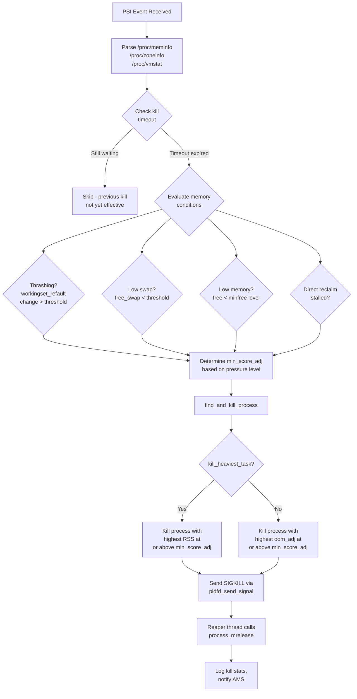
```mermaid
flowchart TD
    A[PSI Event Received] --> B["Parse /proc/meminfo<br/>/proc/zoneinfo<br/>/proc/vmstat"]
    B --> C{"Check kill<br/>timeout"}
    C -->|Still waiting| D["Skip - previous kill<br/>not yet effective"]
    C -->|Timeout expired| E{"Evaluate memory<br/>conditions"}

    E --> F{"Thrashing?<br/>workingset_refault<br/>change > threshold"}
    E --> G{"Low swap?<br/>free_swap < threshold"}
    E --> H{"Low memory?<br/>free < minfree level"}
    E --> I{"Direct reclaim<br/>stalled?"}

    F --> J["Determine min_score_adj<br/>based on pressure level"]
    G --> J
    H --> J
    I --> J

    J --> K[find_and_kill_process]
    K --> L{kill_heaviest_task?}
    L -->|Yes| M["Kill process with<br/>highest RSS at<br/>or above min_score_adj"]
    L -->|No| N["Kill process with<br/>highest oom_adj at<br/>or above min_score_adj"]

    M --> O["Send SIGKILL via<br/>pidfd_send_signal"]
    N --> O
    O --> P["Reaper thread calls<br/>process_mrelease"]
    P --> Q["Log kill stats,<br/>notify AMS"]
```

The kill reasons are enumerated in the code:

```c
// system/memory/lmkd/statslog.h (lines 69-85)
enum kill_reasons {
    NONE = -1,
    PRESSURE_AFTER_KILL = 0,
    NOT_RESPONDING,
    LOW_SWAP_AND_THRASHING,
    LOW_MEM_AND_SWAP,
    LOW_MEM_AND_THRASHING,
    DIRECT_RECL_AND_THRASHING,
    LOW_MEM_AND_SWAP_UTIL,
    LOW_FILECACHE_AFTER_THRASHING,
    LOW_MEM,
    DIRECT_RECL_STUCK,
    KILL_REASON_COUNT
};
```

The memory available calculation is nuanced. lmkd computes "easy available" memory that accounts
for file cache evictability and swap compression:

```c
// system/memory/lmkd/lmkd.cpp (lines 1969-1984)
mi->field.easy_available = mi->field.nr_free_pages;
if (relaxed_available_memory && swap_compression_ratio) {
    mi->field.easy_available += mi->field.active_file
                              + mi->field.inactive_file;
    mi->field.easy_available -= mi->field.dirty;

    int64_t anon_pages = mi->field.active_anon + mi->field.inactive_anon;
    mi->field.easy_available +=
        (swap_compression_ratio - swap_compression_ratio_div)
        * anon_pages / swap_compression_ratio;
} else {
    mi->field.easy_available += mi->field.inactive_file;
}
```

This calculation recognizes that:

- Free pages are immediately available.
- File-backed pages (active and inactive) can be evicted to reclaim memory.
- Dirty pages need to be written back first, so they are subtracted.
- Anonymous pages can be swapped, but zRAM compression means they only free
  `(1 - 1/compression_ratio)` of their original size.

### 8.2.7 The Full Kill Decision State Machine

The complete PSI event handler (`__mp_event_psi`) in `lmkd.cpp` implements a sophisticated
state machine that evaluates multiple memory conditions before deciding whether to kill:

```c
// system/memory/lmkd/lmkd.cpp (lines 2729-2999, abbreviated)
static void __mp_event_psi(enum event_source source,
                           union psi_event_data data,
                           uint32_t events,
                           struct polling_params *poll_params) {
    static int64_t init_ws_refault;
    static int64_t prev_workingset_refault;
    static int64_t base_file_lru;
    static bool killing;
    static int thrashing_limit = thrashing_limit_pct;
    static struct wakeup_info wi;
    static int max_thrashing = 0;

    union meminfo mi;
    union vmstat vs;
    struct psi_data psi_data;
    int64_t thrashing = 0;
    bool swap_is_low = false;
    enum kill_reasons kill_reason = NONE;
    // ...

    // Step 1: Rate-limit based on pending kills
    bool kill_pending = is_kill_pending();
    if (kill_pending && (kill_timeout_ms == 0 ||
        get_time_diff_ms(&last_kill_tm, &curr_tm)
            < static_cast<long>(kill_timeout_ms))) {
        wi.skipped_wakeups++;
        goto no_kill;
    }

    // Step 2: Parse all memory state
    vmstat_parse(&vs);
    meminfo_parse(&mi);

    // Step 3: Calculate thrashing percentage
    thrashing = (workingset_refault_file - init_ws_refault) * 100
                / (base_file_lru + 1);
    thrashing += prev_thrash_growth;

    // Step 4: Check swap levels
    swap_is_low = get_free_swap(&mi) < swap_low_threshold;

    // Step 5: Identify reclaim state
    in_direct_reclaim = vs.field.pgscan_direct != init_pgscan_direct;
    in_kswapd_reclaim = vs.field.pgscan_kswapd != init_pgscan_kswapd;

    // Step 6: Check watermarks
    wmark = get_lowest_watermark(&mi, &watermarks);

    // Step 7: Determine kill reason based on combined state
    if (cycle_after_kill && wmark < WMARK_LOW) {
        kill_reason = PRESSURE_AFTER_KILL;
    } else if (level == VMPRESS_LEVEL_CRITICAL) {
        kill_reason = NOT_RESPONDING;
    } else if (swap_is_low && thrashing > thrashing_limit_pct) {
        kill_reason = LOW_SWAP_AND_THRASHING;
    } else if (swap_is_low && wmark < WMARK_HIGH) {
        kill_reason = LOW_MEM_AND_SWAP;
    } else if (reclaim == DIRECT_RECLAIM && thrashing > thrashing_limit) {
        kill_reason = DIRECT_RECL_AND_THRASHING;
    } // ... more conditions
}
```

The kill decision tree in full:

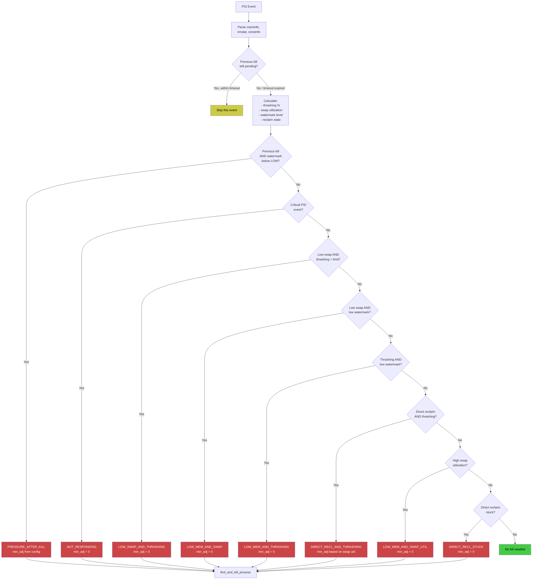
```mermaid
flowchart TD
    Start[PSI Event] --> ParseState["Parse meminfo,<br/>vmstat, zoneinfo"]
    ParseState --> KillPending{"Previous kill<br/>still pending?"}
    KillPending -->|Yes, within timeout| Skip[Skip this event]
    KillPending -->|No / timeout expired| CalcState["Calculate:<br/>- thrashing %<br/>- swap utilization<br/>- watermark level<br/>- reclaim state"]

    CalcState --> Cond1{"Previous kill<br/>AND watermark<br/>below LOW?"}
    Cond1 -->|Yes| R1["PRESSURE_AFTER_KILL<br/>min_adj from config"]
    Cond1 -->|No| Cond2{"Critical PSI<br/>event?"}

    Cond2 -->|Yes| R2["NOT_RESPONDING<br/>min_adj = 0"]
    Cond2 -->|No| Cond3{"Low swap AND<br/>thrashing > limit?"}

    Cond3 -->|Yes| R3["LOW_SWAP_AND_THRASHING<br/>min_adj = 0"]
    Cond3 -->|No| Cond4{"Low swap AND<br/>low watermark?"}

    Cond4 -->|Yes| R4["LOW_MEM_AND_SWAP<br/>min_adj = 0"]
    Cond4 -->|No| Cond5{"Thrashing AND<br/>low watermark?"}

    Cond5 -->|Yes| R5["LOW_MEM_AND_THRASHING<br/>min_adj = 0"]
    Cond5 -->|No| Cond6{"Direct reclaim<br/>AND thrashing?"}

    Cond6 -->|Yes| R6["DIRECT_RECL_AND_THRASHING<br/>min_adj based on swap util"]
    Cond6 -->|No| Cond7{"High swap<br/>utilization?"}

    Cond7 -->|Yes| R7["LOW_MEM_AND_SWAP_UTIL<br/>min_adj = 0"]
    Cond7 -->|No| Cond8{"Direct reclaim<br/>stuck?"}

    Cond8 -->|Yes| R8["DIRECT_RECL_STUCK<br/>min_adj = 0"]
    Cond8 -->|No| NoKill[No kill needed]

    R1 --> Kill[find_and_kill_process]
    R2 --> Kill
    R3 --> Kill
    R4 --> Kill
    R5 --> Kill
    R6 --> Kill
    R7 --> Kill
    R8 --> Kill

    style R1 fill:#cc4444,color:#fff
    style R2 fill:#cc4444,color:#fff
    style R3 fill:#cc4444,color:#fff
    style R4 fill:#cc4444,color:#fff
    style R5 fill:#cc4444,color:#fff
    style R6 fill:#cc4444,color:#fff
    style R7 fill:#cc4444,color:#fff
    style R8 fill:#cc4444,color:#fff
    style NoKill fill:#44cc44,color:#000
    style Skip fill:#cccc44,color:#000
```

### 8.2.8 Watermark Calculation

lmkd calculates zone watermarks to understand how close the system is to OOM:

```c
// system/memory/lmkd/lmkd.cpp (lines 2649-2701)
enum zone_watermark {
    WMARK_MIN = 0,   // Below min: direct reclaim, risk of OOM
    WMARK_LOW,       // Below low: kswapd is active
    WMARK_HIGH,      // Below high: kswapd may start soon
    WMARK_NONE       // Above all watermarks: healthy
};

struct zone_watermarks {
    long high_wmark;
    long low_wmark;
    long min_wmark;
};

void calc_zone_watermarks(struct zoneinfo *zi,
                          struct zone_watermarks *watermarks) {
    memset(watermarks, 0, sizeof(struct zone_watermarks));

    for (int node_idx = 0; node_idx < zi->node_count; node_idx++) {
        struct zoneinfo_node *node = &zi->nodes[node_idx];
        for (int zone_idx = 0; zone_idx < node->zone_count; zone_idx++) {
            struct zoneinfo_zone *zone = &node->zones[zone_idx];
            if (!zone->fields.field.present) continue;

            watermarks->high_wmark += zone->max_protection
                                    + zone->fields.field.high;
            watermarks->low_wmark  += zone->max_protection
                                    + zone->fields.field.low;
            watermarks->min_wmark  += zone->max_protection
                                    + zone->fields.field.min;
        }
    }
}

static enum zone_watermark get_lowest_watermark(
        union meminfo *mi, struct zone_watermarks *watermarks) {
    int64_t nr_free_pages = mi->field.nr_free_pages
                          - mi->field.cma_free;

    if (nr_free_pages < watermarks->min_wmark) return WMARK_MIN;
    if (nr_free_pages < watermarks->low_wmark) return WMARK_LOW;
    if (nr_free_pages < watermarks->high_wmark) return WMARK_HIGH;
    return WMARK_NONE;
}
```

The watermark hierarchy visualized:

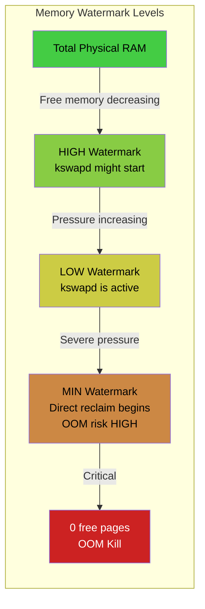
```mermaid
graph TD
    subgraph "Memory Watermark Levels"
        direction TB
        Full["Total Physical RAM"]
        HighW["HIGH Watermark<br/>kswapd might start"]
        LowW["LOW Watermark<br/>kswapd is active"]
        MinW["MIN Watermark<br/>Direct reclaim begins<br/>OOM risk HIGH"]
        Zero["0 free pages<br/>OOM Kill"]
    end

    Full -->|"Free memory decreasing"| HighW
    HighW -->|"Pressure increasing"| LowW
    LowW -->|"Severe pressure"| MinW
    MinW -->|"Critical"| Zero

    style Full fill:#44cc44,color:#000
    style HighW fill:#88cc44,color:#000
    style LowW fill:#cccc44,color:#000
    style MinW fill:#cc8844,color:#000
    style Zero fill:#cc2222,color:#fff
```

### 8.2.9 Victim Selection: find_and_kill_process

The victim selection algorithm iterates from the highest OOM score downward:

```c
// system/memory/lmkd/lmkd.cpp (lines 2555-2591)
static int find_and_kill_process(int min_score_adj,
                                 struct kill_info *ki,
                                 union meminfo *mi,
                                 struct wakeup_info *wi,
                                 struct timespec *tm,
                                 struct psi_data *pd) {
    int killed_size = 0;
    bool choose_heaviest_task = kill_heaviest_task;

    for (int i = OOM_SCORE_ADJ_MAX; i >= min_score_adj; i--) {
        struct proc *procp;

        if (!choose_heaviest_task && i <= PERCEPTIBLE_APP_ADJ) {
            // For perceptible processes, always kill heaviest
            // to minimize the number of victims
            choose_heaviest_task = true;
        }

        while (true) {
            procp = choose_heaviest_task ?
                proc_get_heaviest(i) : proc_adj_tail(i);

            if (!procp) break;

            killed_size = kill_one_process(procp, min_score_adj,
                                           ki, mi, wi, tm, pd);
            if (killed_size >= 0) break;
        }
        if (killed_size) break;
    }
    return killed_size;
}
```

The dual selection strategy is important:

1. **For cached/background processes** (`oom_adj > PERCEPTIBLE_APP_ADJ`): Kill the most recently
   added process at each score level (`proc_adj_tail`). This follows an LRU-like order.
2. **For perceptible processes** (`oom_adj <= 200`): Always kill the heaviest process
   (`proc_get_heaviest`), which reads `/proc/[pid]/statm` for each candidate. This minimizes the
   number of visible-to-user processes that must die.

The `proc_get_heaviest` function:

```c
// system/memory/lmkd/lmkd.cpp (lines 2253-2278)
static struct proc *proc_get_heaviest(int oomadj) {
    struct adjslot_list *head = &procadjslot_list[ADJTOSLOT(oomadj)];
    struct adjslot_list *curr = head->next;
    struct proc *maxprocp = NULL;
    int maxsize = 0;

    // Optimization: if only one process, skip size lookup
    if ((curr != head) && (curr->next == head)) {
        return (struct proc *)curr;
    }

    while (curr != head) {
        int pid = ((struct proc *)curr)->pid;
        int tasksize = proc_get_size(pid);
        if (tasksize < 0) {
            // Process died, clean up
            struct adjslot_list *next = curr->next;
            pid_remove(pid);
            curr = next;
        } else {
            if (tasksize > maxsize) {
                maxsize = tasksize;
                maxprocp = (struct proc *)curr;
            }
            curr = curr->next;
        }
    }
    return maxprocp;
}
```

### 8.2.10 The Kill Execution: kill_one_process

Once a victim is selected, the kill is performed with extensive safety checks:

```c
// system/memory/lmkd/lmkd.cpp (lines 2443-2549, abbreviated)
static int kill_one_process(struct proc* procp, int min_oom_score,
                            struct kill_info *ki, union meminfo *mi,
                            struct wakeup_info *wi, struct timespec *tm,
                            struct psi_data *pd) {
    int pid = procp->pid;
    int pidfd = procp->pidfd;
    uid_t uid = procp->uid;
    char buf[pagesize];

    // Safety check 1: verify process is still valid
    if (!procp->valid || !read_proc_status(pid, buf, sizeof(buf))) {
        goto out;
    }

    // Safety check 2: detect PID reuse
    int64_t tgid;
    if (!parse_status_tag(buf, PROC_STATUS_TGID_FIELD, &tgid)) {
        goto out;
    }
    if (tgid != pid) {
        ALOGE("Possible pid reuse detected (pid %d, tgid %" PRId64 ")!",
              pid, tgid);
        goto out;
    }

    // Read RSS and swap for logging
    parse_status_tag(buf, PROC_STATUS_RSS_FIELD, &rss_kb);
    parse_status_tag(buf, PROC_STATUS_SWAP_FIELD, &swap_kb);

    // Hook: allow vendor code to free memory without killing
    result = lmkd_free_memory_before_kill_hook(procp, rss_kb / page_k,
                                                procp->oomadj, /*...*/);
    if (result > 0) {
        ALOGI("Skipping kill; %ld kB freed elsewhere.", result * page_k);
        return result;
    }

    // Execute the kill via the reaper
    start_wait_for_proc_kill(pidfd < 0 ? pid : pidfd);
    kill_result = reaper.kill({ pidfd, pid, uid }, false);

    if (kill_result) {
        stop_wait_for_proc_kill(false);
        goto out;
    }

    // Log the kill
    ALOGI("Kill '%s' (%d), uid %d, oom_score_adj %d "
          "to free %" PRId64 "kB rss, %" PRId64 "kB swap; "
          "reason: %s",
          taskname, pid, uid, procp->oomadj, rss_kb, swap_kb,
          ki->kill_desc);
    killinfo_log(procp, min_oom_score, rss_kb, swap_kb,
                 ki, mi, wi, tm, pd);

    // Notify AMS and statsd
    ctrl_data_write_lmk_kill_occurred((pid_t)pid, uid, rss_kb);
    stats_write_lmk_kill_occurred(&kill_st, mem_st);

out:
    pid_remove(pid);
    return result;
}
```

The `lmkd_free_memory_before_kill_hook` is a vendor hook that allows OEM-specific code to free
memory (e.g., by compacting specific caches or dropping GPU resources) without actually killing
a process. If the hook frees enough memory, the kill is skipped entirely.

### 8.2.11 The Watchdog Kill Path

When lmkd's main event loop hangs (detected by the watchdog timer), the watchdog thread
performs its own emergency kill:

```c
// system/memory/lmkd/lmkd.cpp (lines 2305-2329)
static void watchdog_callback() {
    int prev_pid = 0;

    ALOGW("lmkd watchdog timed out!");
    for (int oom_score = OOM_SCORE_ADJ_MAX; oom_score >= 0;) {
        struct proc target;

        if (!find_victim(oom_score, prev_pid, target)) {
            oom_score--;
            prev_pid = 0;
            continue;
        }

        if (target.valid &&
            reaper.kill({ target.pidfd, target.pid, target.uid },
                        true /* synchronous */) == 0) {
            ALOGW("lmkd watchdog killed process %d, oom_score_adj %d",
                  target.pid, oom_score);
            pid_invalidate(target.pid);
            break;
        }
        prev_pid = target.pid;
    }
}
```

The watchdog kill is **synchronous** (note the `true` parameter to `reaper.kill()`), meaning it
blocks until `pidfd_send_signal(SIGKILL)` completes. This is because the watchdog thread cannot
use the asynchronous reaper queue (the main thread that processes queue completions is hung).
The watchdog also uses `pid_invalidate()` instead of `pid_remove()` because the latter can only
be called from the main thread safely.

### 8.2.12 Thrashing Detection

lmkd detects memory thrashing by monitoring `workingset_refault` counters from `/proc/vmstat`:

```c
// system/memory/lmkd/lmkd.cpp (lines 474-497)
enum vmstat_field {
    VS_FREE_PAGES,
    VS_INACTIVE_FILE,
    VS_ACTIVE_FILE,
    VS_WORKINGSET_REFAULT,
    VS_WORKINGSET_REFAULT_FILE,
    VS_PGSCAN_KSWAPD,
    VS_PGSCAN_DIRECT,
    VS_PGSCAN_DIRECT_THROTTLE,
    VS_PGREFILL,
    VS_FIELD_COUNT
};
```

A `workingset_refault` is a page that was recently evicted from the page cache and is now being
faulted back in -- a strong signal that the system is thrashing. The thrashing percentage is
calculated relative to page scans and compared against configurable thresholds:

| Property | Default | Low RAM Default |
|---|---|---|
| `ro.lmk.thrashing_limit` | 100 | 30 |
| `ro.lmk.thrashing_limit_decay` | 10 | 50 |
| `ro.lmk.thrashing_limit_critical` | (derived) | (derived) |

### 8.2.13 The Reaper: Asynchronous Process Killing

When lmkd decides to kill a process, the actual killing is performed by a pool of reaper threads.
This design decouples the kill decision from the potentially slow process of reclaiming memory
from the killed process.

The `Reaper` class (`system/memory/lmkd/reaper.h` and `reaper.cpp`) manages a thread pool:

```c
// system/memory/lmkd/reaper.h (lines 23-60)
class Reaper {
public:
    struct target_proc {
        int pidfd;
        int pid;
        uid_t uid;
    };
private:
    std::mutex mutex_;
    std::condition_variable cond_;
    std::vector<struct target_proc> queue_;
    int active_requests_;
    int comm_fd_;
    int thread_cnt_;
    pthread_t* thread_pool_;
    bool debug_enabled_;
    // ...
};
```

The reaper thread's main loop:

1. **Dequeue** a kill request.
2. **Send SIGKILL** via `pidfd_send_signal()` -- uses the pidfd to avoid PID recycling races.
3. **Adjust cgroups and priority** of the dying process to speed up memory reclamation.
4. **Call `process_mrelease()`** -- a Linux syscall (number 448) that triggers synchronous memory
   reclamation from the dying process.

```c
// system/memory/lmkd/reaper.cpp (lines 46-48, 91-137)
static int process_mrelease(int pidfd, unsigned int flags) {
    return syscall(__NR_process_mrelease, pidfd, flags);
}

static void* reaper_main(void* param) {
    Reaper *reaper = static_cast<Reaper*>(param);
    // ...
    for (;;) {
        target = reaper->dequeue_request();

        if (pidfd_send_signal(target.pidfd, SIGKILL, NULL, 0)) {
            reaper->notify_kill_failure(target.pid);
            goto done;
        }

        set_process_group_and_prio(target.uid, target.pid,
            {"CPUSET_SP_FOREGROUND", "SCHED_SP_FOREGROUND"},
            ANDROID_PRIORITY_NORMAL);

        if (process_mrelease(target.pidfd, 0)) {
            ALOGE("process_mrelease %d failed: %s",
                  target.pid, strerror(errno));
        }
done:
        close(target.pidfd);
        reaper->request_complete();
    }
}
```

The `process_mrelease()` syscall is significant because without it, memory from a killed process
is freed lazily by the kernel as part of `exit_mmap()`. With `process_mrelease()`, the calling
thread actively reclaims the dying process's memory, reducing the time between the kill decision
and actual memory availability.

### 8.2.14 The Watchdog

lmkd includes a watchdog timer (`system/memory/lmkd/watchdog.cpp`) to detect when the daemon
hangs -- which could be catastrophic since no processes would be killed during memory pressure:

```c
// system/memory/lmkd/watchdog.h (lines 23-39)
class Watchdog {
private:
    int timeout_;                  // 2 seconds (WATCHDOG_TIMEOUT_SEC)
    timer_t timer_;
    std::atomic<bool> timer_created_;
    void (*callback_)();
public:
    Watchdog(int timeout, void (*callback)())
        : timeout_(timeout), timer_created_(false), callback_(callback) {}
    bool init();
    bool start();
    bool stop();
    bool create_timer(sigset_t &sigset);
    void bite() const { if (callback_) callback_(); }
};
```

The watchdog uses a `CLOCK_MONOTONIC` timer with `SIGALRM` delivery. If lmkd's main event loop
does not disarm the watchdog within the 2-second timeout, the watchdog bites -- typically
triggering an abort or logging diagnostic information.

### 8.2.15 Configurable Properties

lmkd reads configuration from system properties, with experiment overrides available:

```c
// system/memory/lmkd/lmkd.cpp (lines 108-110)
#define GET_LMK_PROPERTY(type, name, def) \
    property_get_##type("persist.device_config.lmkd_native." name, \
        property_get_##type("ro.lmk." name, def))
```

Key properties:

| Property | Default | Description |
|---|---|---|
| `ro.lmk.debug` | false | Enable verbose kill logging |
| `ro.lmk.kill_heaviest_task` | false | Kill by RSS rather than oom_adj |
| `ro.lmk.kill_timeout_ms` | 0 | Minimum time between kills |
| `ro.lmk.use_minfree_levels` | false | Use traditional minfree thresholds |
| `ro.lmk.psi_partial_stall_ms` | 70 (200 on low-RAM) | PSI some-stall threshold |
| `ro.lmk.psi_complete_stall_ms` | 700 | PSI full-stall threshold |
| `ro.lmk.psi_window_size_ms` | 1000 | PSI monitoring window |
| `ro.lmk.swap_free_low_percentage` | 10 | Low swap threshold |
| `ro.lmk.thrashing_limit` | 100 (30 on low-RAM) | Thrashing percentage threshold |
| `ro.lmk.swap_compression_ratio` | 1 | Expected zRAM compression ratio |
| `ro.lmk.filecache_min_kb` | 0 | Minimum file cache to maintain |
| `ro.lmk.direct_reclaim_threshold_ms` | 0 | Direct reclaim stall threshold |

### 8.2.16 Event Loop Architecture

The lmkd main event loop uses `epoll` to multiplex between multiple event sources:

```c
// system/memory/lmkd/lmkd.cpp (lines 284-290)
/*
 * 1 ctrl listen socket, 3 ctrl data socket, 3 memory pressure levels,
 * 1 lmk events + 1 fd to wait for process death
 * + 1 fd to receive kill failure notifications
 * + 1 fd to receive memevent_listener notifications
 */
#define MAX_EPOLL_EVENTS (1 + MAX_DATA_CONN + VMPRESS_LEVEL_COUNT \
                          + 1 + 1 + 1 + 1)
```

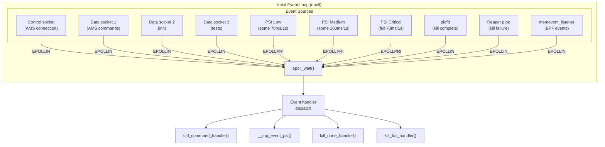
```mermaid
graph TD
    subgraph "lmkd Event Loop (epoll)"
        EPoll["epoll_wait()"]

        subgraph "Event Sources"
            CtrlSock["Control socket<br/>(AMS connection)"]
            DataSock1["Data socket 1<br/>(AMS commands)"]
            DataSock2["Data socket 2<br/>(init)"]
            DataSock3["Data socket 3<br/>(tests)"]
            PSI_Low["PSI Low<br/>(some 70ms/1s)"]
            PSI_Med["PSI Medium<br/>(some 100ms/1s)"]
            PSI_Crit["PSI Critical<br/>(full 70ms/1s)"]
            KillDone["pidfd<br/>(kill complete)"]
            KillFail["Reaper pipe<br/>(kill failure)"]
            MemEvent["memevent_listener<br/>(BPF events)"]
        end
    end

    CtrlSock -->|EPOLLIN| EPoll
    DataSock1 -->|EPOLLIN| EPoll
    DataSock2 -->|EPOLLIN| EPoll
    DataSock3 -->|EPOLLIN| EPoll
    PSI_Low -->|EPOLLPRI| EPoll
    PSI_Med -->|EPOLLPRI| EPoll
    PSI_Crit -->|EPOLLPRI| EPoll
    KillDone -->|EPOLLIN| EPoll
    KillFail -->|EPOLLIN| EPoll
    MemEvent -->|EPOLLIN| EPoll

    EPoll --> Handler["Event handler<br/>dispatch"]
    Handler --> CmdH["ctrl_command_handler()"]
    Handler --> PsiH["__mp_event_psi()"]
    Handler --> KillH["kill_done_handler()"]
    Handler --> FailH["kill_fail_handler()"]
```

After receiving a PSI event, lmkd enters a polling mode where it periodically re-checks memory
conditions at short intervals:

| Constant | Value | Purpose |
|---|---|---|
| `PSI_POLL_PERIOD_SHORT_MS` | 10 ms | Polling interval during high pressure |
| `PSI_POLL_PERIOD_LONG_MS` | 100 ms | Polling interval during moderate pressure |
| `DEFAULT_PSI_WINDOW_SIZE_MS` | 1000 ms | PSI monitor window size |

This polling is necessary because PSI events are rate-limited (at most one per window), but
memory conditions can change rapidly within a window.

### 8.2.17 BPF Memory Event Integration

Modern lmkd integrates with the kernel's BPF (Berkeley Packet Filter) subsystem to receive
more granular memory events. The `memevent_listener` tracks direct reclaim and kswapd activity:

```c
// system/memory/lmkd/lmkd.cpp (line 183)
static std::unique_ptr<android::bpf::memevents::MemEventListener>
    memevent_listener(nullptr);
static struct timespec direct_reclaim_start_tm;
static struct timespec kswapd_start_tm;
```

The BPF programs are loaded after boot completion:

```c
// system/memory/lmkd/lmkd.cpp (LMK_BOOT_COMPLETED handler)
case LMK_BOOT_COMPLETED:
    // Initialize the memevent listener after boot is completed
    // to prevent waiting for BPF programs to be loaded
    init_memevent();
    boot_completed_handled = true;
    break;
```

This BPF integration provides more accurate reclaim detection than parsing `/proc/vmstat`
counters, which can miss short bursts of reclaim activity between polling intervals.

### 8.2.18 Swap Utilization Calculation

lmkd calculates swap utilization to detect when the swap subsystem is becoming saturated:

```c
// system/memory/lmkd/lmkd.cpp (lines 2712-2717)
static int calc_swap_utilization(union meminfo *mi) {
    int64_t swap_used = mi->field.total_swap - get_free_swap(mi);
    int64_t total_swappable = mi->field.active_anon
                            + mi->field.inactive_anon
                            + mi->field.shmem + swap_used;
    return total_swappable > 0 ? (swap_used * 100) / total_swappable : 0;
}
```

This calculation represents the percentage of swappable memory that has already been swapped.
A high utilization (configurable via `ro.lmk.swap_util_max`) indicates that the system has
limited remaining capacity to swap out pages, making kills more urgent.

---

## 8.3 Cgroups and Memory Accounting

Android uses Linux cgroups (control groups) to organize processes into hierarchical groups for
resource management and accounting. Memory cgroups (`memcg`) are particularly important for
tracking per-app memory usage and enforcing soft limits.

### 8.3.1 Cgroup Versions

Android supports both cgroup v1 and cgroup v2. The lmkd code detects which version is in use:

```c
// system/memory/lmkd/statslog.h (lines 33-37)
enum class MemcgVersion {
    kNotFound,
    kV1,
    kV2,
};

MemcgVersion memcg_version();
```

On modern Android (Android 12+), cgroup v2 is preferred. The cgroup hierarchy is configured
during boot by init:

```
/dev/memcg/                          # cgroup v1 memory controller mount
/dev/memcg/apps/                     # All app processes
/dev/memcg/apps/uid_<uid>/           # Per-UID groups
/dev/memcg/apps/uid_<uid>/pid_<pid>/ # Per-process groups
/dev/memcg/system/                   # System processes

# cgroup v2 (unified hierarchy)
/sys/fs/cgroup/                      # Unified cgroup v2 mount
```

### 8.3.2 Process Group Assignment

When ActivityManagerService registers a process with lmkd via `LMK_PROCPRIO`, lmkd assigns the
process to the appropriate cgroup and sets its memory soft limit:

```c
// system/memory/lmkd/lmkd.cpp (lines 1119-1172)
static void register_oom_adj_proc(const struct lmk_procprio& proc,
                                   struct ucred* cred) {
    char val[20];
    int soft_limit_mult;

    if (proc.ptype == PROC_TYPE_APP && per_app_memcg) {
        if (proc.oomadj >= 900) {
            soft_limit_mult = 0;
        } else if (proc.oomadj >= 800) {
            soft_limit_mult = 0;
        } else if (proc.oomadj >= 700) {
            soft_limit_mult = 0;
        } else if (proc.oomadj >= 600) {
            // Launcher should be perceptible
            soft_limit_mult = 1;
        } else if (proc.oomadj >= 300) {
            soft_limit_mult = 1;
        } else if (proc.oomadj >= 200) {
            soft_limit_mult = 8;      // 64 MB
        } else if (proc.oomadj >= 100) {
            soft_limit_mult = 10;     // 80 MB
        } else if (proc.oomadj >= 0) {
            soft_limit_mult = 20;     // 160 MB
        } else {
            // Persistent processes: 512 MB
            soft_limit_mult = 64;
        }

        snprintf(val, sizeof(val), "%d",
                 soft_limit_mult * EIGHT_MEGA);  // EIGHT_MEGA = 1 << 23
        // Write to cgroup memory.soft_limit_in_bytes
        std::string soft_limit_path;
        CgroupGetAttributePathForTask("MemSoftLimit",
                                       proc.pid, &soft_limit_path);
        writefilestring(soft_limit_path.c_str(), val, !is_system_server);
    }
}
```

The soft limit multiplier translates to actual memory limits:

| OOM Score Range | Soft Limit Multiplier | Effective Limit |
|---|---|---|
| >= 900 (cached) | 0 | No limit |
| >= 700 (previous) | 0 | No limit |
| >= 600 (home) | 1 | 8 MB |
| >= 300 (backup) | 1 | 8 MB |
| >= 200 (perceptible) | 8 | 64 MB |
| >= 100 (visible) | 10 | 80 MB |
| >= 0 (foreground) | 20 | 160 MB |
| < 0 (persistent) | 64 | 512 MB |

These are **soft limits** -- the kernel will attempt to reclaim memory from processes exceeding
their soft limit before reclaiming from processes within their limit, but a process can use more
memory if available.

### 8.3.3 Task Profiles

Android extends cgroup management with the task profiles framework, which provides a higher-level
API for assigning processes to cgroups:

```c
// Used in reaper.cpp (lines 56-65, 98-99)
set_process_group_and_prio(target.uid, target.pid,
    {"CPUSET_SP_FOREGROUND", "SCHED_SP_FOREGROUND"},
    ANDROID_PRIORITY_NORMAL);

// In reaper thread initialization
SetTaskProfiles(tid, {"CPUSET_SP_FOREGROUND"}, true);
```

Task profiles are defined in JSON configuration files:

```
/etc/task_profiles.json          # Profile definitions
/etc/cgroups.json                # Cgroup controller configuration
```

Common task profiles used by the memory subsystem:

| Profile | Purpose |
|---|---|
| `ServiceCapacityLow` | Low CPU capacity for background services |
| `CPUSET_SP_FOREGROUND` | Foreground CPU set (all cores) |
| `SCHED_SP_FOREGROUND` | Foreground scheduling group |
| `HighEnergySaving` | Power-efficient execution for background tasks |
| `MaxPerformance` | Full performance for foreground apps |

### 8.3.4 Memory Cgroup Accounting

Memory cgroups track several counters for each group:

```
# Per-cgroup memory accounting files (cgroup v1)
memory.usage_in_bytes         # Current memory usage
memory.max_usage_in_bytes     # Peak memory usage
memory.limit_in_bytes         # Hard limit (OOM kill trigger)
memory.soft_limit_in_bytes    # Soft limit (reclaim priority)
memory.stat                   # Detailed statistics
memory.oom_control            # OOM killer settings

# Per-cgroup memory accounting files (cgroup v2)
memory.current                # Current memory usage
memory.high                   # High pressure threshold
memory.max                    # Hard limit
memory.stat                   # Detailed statistics
memory.events                 # OOM and other events
```

The `memory.stat` file provides granular breakdowns:

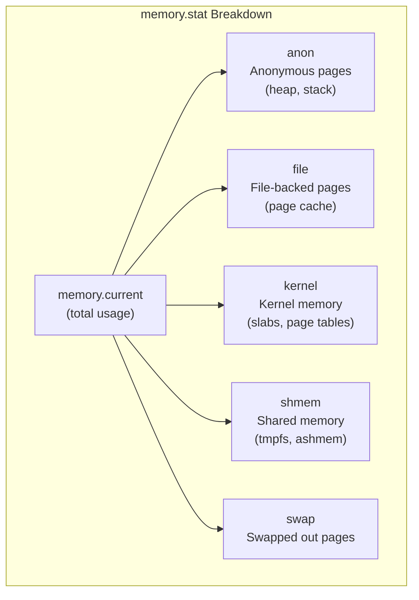
```mermaid
graph TD
    subgraph "memory.stat Breakdown"
        Total["memory.current<br/>(total usage)"]
        Anon["anon<br/>Anonymous pages<br/>(heap, stack)"]
        File["file<br/>File-backed pages<br/>(page cache)"]
        Kernel["kernel<br/>Kernel memory<br/>(slabs, page tables)"]
        Shmem["shmem<br/>Shared memory<br/>(tmpfs, ashmem)"]
        Swap["swap<br/>Swapped out pages"]
    end

    Total --> Anon
    Total --> File
    Total --> Kernel
    Total --> Shmem
    Total --> Swap
```

### 8.3.5 App Categories and Freezer Cgroup

Android 11 introduced the app freezer, which uses the cgroup freezer controller to suspend
background apps instead of killing them. Frozen apps consume zero CPU but retain their memory:

```
/sys/fs/cgroup/freezer/                    # Freezer cgroup hierarchy
/sys/fs/cgroup/freezer/frozen/tasks        # Frozen process PIDs
/sys/fs/cgroup/freezer/frozen/freezer.state # "FROZEN" or "THAWED"
```

The interaction between the freezer and lmkd is important:

1. When an app goes to the background, ActivityManagerService may freeze it.
2. Frozen apps still consume memory -- their oom_adj is high, making them candidates for lmkd
   killing.
3. Before killing a frozen app, lmkd must first thaw it (a frozen process cannot handle signals).
4. If memory pressure is severe, lmkd may kill frozen apps before unfrozen cached apps because
   frozen apps are definitionally not performing useful work.

---

## 8.4 zRAM (Compressed Swap)

Android uses zRAM (compressed RAM disk) as its swap device instead of traditional disk-based
swap. zRAM compresses pages in memory before storing them, allowing the system to effectively
increase its usable memory capacity at the cost of CPU cycles for compression and decompression.

### 8.4.1 zRAM Architecture

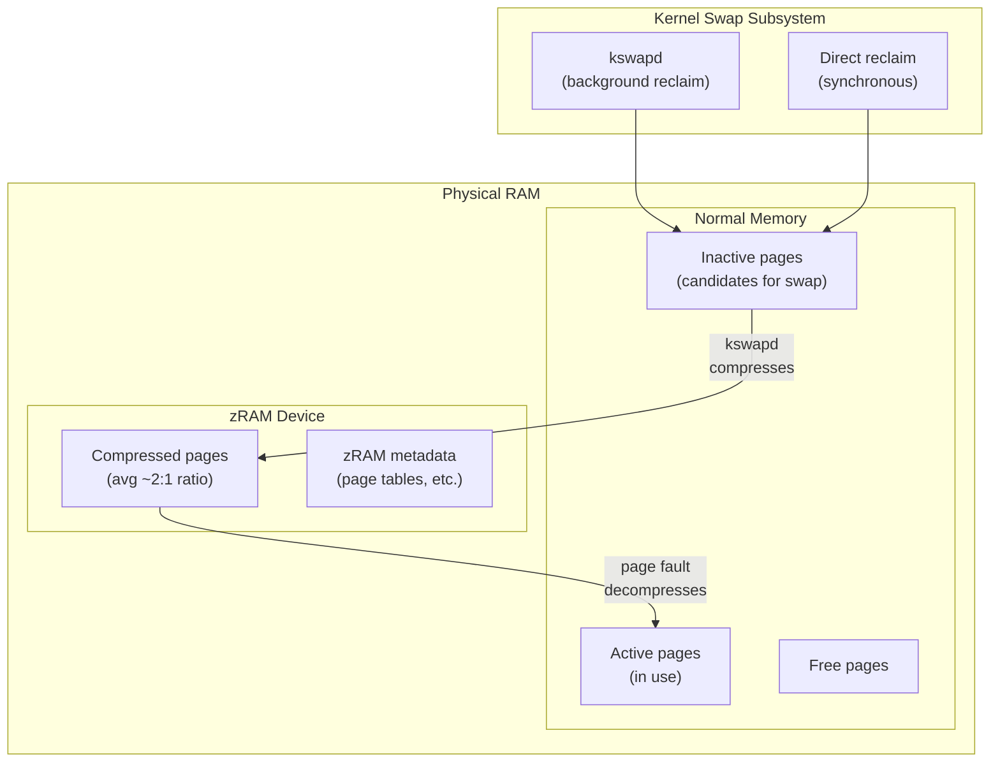
```mermaid
graph TD
    subgraph "Physical RAM"
        subgraph "Normal Memory"
            Active["Active pages<br/>(in use)"]
            Inactive["Inactive pages<br/>(candidates for swap)"]
            Free["Free pages"]
        end

        subgraph "zRAM Device"
            Compressed["Compressed pages<br/>(avg ~2:1 ratio)"]
            Metadata["zRAM metadata<br/>(page tables, etc.)"]
        end
    end

    Inactive -->|"kswapd<br/>compresses"| Compressed
    Compressed -->|"page fault<br/>decompresses"| Active

    subgraph "Kernel Swap Subsystem"
        kswapd["kswapd<br/>(background reclaim)"]
        DirectReclaim["Direct reclaim<br/>(synchronous)"]
    end

    kswapd --> Inactive
    DirectReclaim --> Inactive
```

Key characteristics of zRAM on Android:

- **Compression algorithm**: LZ4 (default for speed) or ZSTD (better ratio, more CPU).
- **Typical compression ratio**: 2:1 to 3:1 for app data.
- **zRAM size**: Usually configured to 50-75% of physical RAM.
- **No disk swap**: Android deliberately avoids using flash storage for swap to preserve
  flash lifespan and avoid slow I/O stalls.

### 8.4.2 zRAM Configuration

zRAM is configured during boot through init scripts:

```shell
# Typical init.rc zram configuration
write /sys/block/zram0/comp_algorithm lz4
write /sys/block/zram0/disksize 2147483648   # 2 GB
exec_start swapon_all

# fstab entry
/dev/block/zram0  none  swap  defaults  zramsize=2147483648,zram_backingdev_size=512M
```

The kernel exposes zRAM statistics through `/sys/block/zram0/`:

| File | Content |
|---|---|
| `disksize` | Maximum uncompressed data size |
| `mem_used_total` | Actual memory consumed by compressed data |
| `orig_data_size` | Original (uncompressed) data size |
| `compr_data_size` | Compressed data size |
| `mem_limit` | Memory limit for zRAM |
| `comp_algorithm` | Compression algorithm in use |
| `num_reads` / `num_writes` | I/O statistics |

### 8.4.3 zsmalloc: The zRAM Memory Allocator

zRAM uses a specialized memory allocator called zsmalloc (from `mm/zsmalloc.c` in the kernel).
Traditional allocators like slab allocate in page-sized or larger chunks, which would waste
memory for the many small compressed objects that zRAM handles.

zsmalloc features:

- **Size classes**: Objects are grouped by size class (32 bytes to 4 KB).
- **Compaction**: Can compact partially-filled pages to reduce fragmentation.
- **No per-object metadata**: The allocator stores metadata separately from the data pages.
- **Page spanning**: A single zsmalloc object can span multiple physical pages.

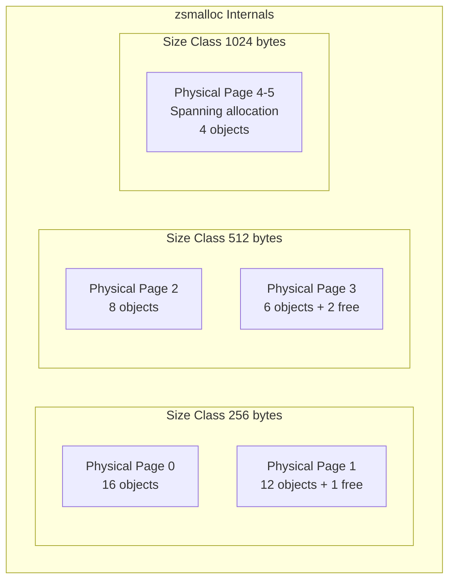
```mermaid
graph TD
    subgraph "zsmalloc Internals"
        subgraph "Size Class 256 bytes"
            Page1["Physical Page 0<br/>16 objects"]
            Page2["Physical Page 1<br/>12 objects + 1 free"]
        end

        subgraph "Size Class 512 bytes"
            Page3["Physical Page 2<br/>8 objects"]
            Page4["Physical Page 3<br/>6 objects + 2 free"]
        end

        subgraph "Size Class 1024 bytes"
            Page5["Physical Page 4-5<br/>Spanning allocation<br/>4 objects"]
        end
    end
```

### 8.4.4 zRAM Tuning for Android

lmkd is acutely aware of zRAM's behavior. Several lmkd properties directly affect how swap
is considered in kill decisions:

```c
// system/memory/lmkd/lmkd.cpp (lines 1989-1999)
// In the case of ZRAM, mi->field.free_swap can't be used directly
// because swap space is taken from free memory or reclaimed.
// Use the lowest of free_swap and easily available memory to
// measure free swap because they represent how much swap space
// the system will consider to use and how much it can actually use.
static inline int64_t get_free_swap(union meminfo *mi) {
    if (swap_compression_ratio)
        return std::min(mi->field.free_swap,
                        mi->field.easy_available * swap_compression_ratio /
                        swap_compression_ratio_div);
    return mi->field.free_swap;
}
```

This is a critical insight: free swap reported by the kernel (`SwapFree` in `/proc/meminfo`)
can be misleading on zRAM because the swap space itself consumes physical RAM. If the system
has 100 MB of free swap but only 50 MB of free physical RAM, it can only actually swap 50 MB
(before compression). The `swap_compression_ratio` property (default: 1:1) adjusts this
calculation.

### 8.4.5 zRAM Writeback

Android 10+ supports zRAM writeback, where cold compressed pages are written to a backing
device (typically a dedicated partition on flash storage):

```
# Enable writeback backing device
write /sys/block/zram0/backing_dev /dev/block/by-name/swap

# Trigger writeback of idle pages
write /sys/block/zram0/idle all
write /sys/block/zram0/writeback idle
```

Writeback reduces zRAM's memory footprint by moving infrequently accessed pages to flash.
However, this is used cautiously due to flash wear concerns. The `zram_backingdev_size`
parameter in the fstab limits how much data can be written back.

### 8.4.6 Monitoring zRAM Performance

```shell
# Check zRAM status
adb shell cat /sys/block/zram0/mm_stat
# Output: orig_data_size compr_data_size mem_used_total mem_limit
#         max_used_total same_pages pages_compacted huge_pages

# Check swap usage
adb shell cat /proc/meminfo | grep -i swap
# SwapTotal:       2097148 kB
# SwapFree:        1234567 kB
# SwapCached:       123456 kB

# Check zRAM compression stats
adb shell cat /sys/block/zram0/stat
```

### 8.4.7 zRAM and lmkd Interaction Summary

The relationship between zRAM and lmkd's kill decisions is summarized in this diagram:

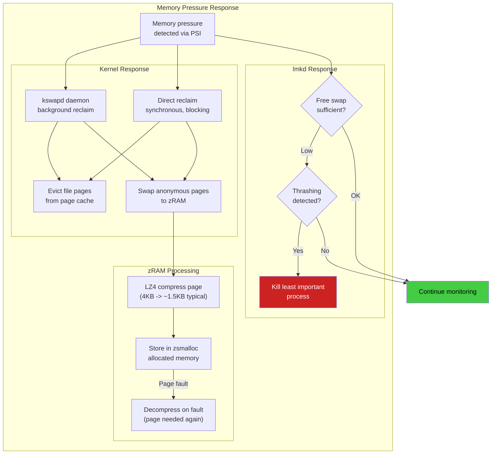
```mermaid
flowchart TD
    subgraph "Memory Pressure Response"
        Pressure["Memory pressure<br/>detected via PSI"]

        subgraph "Kernel Response"
            kswapd["kswapd daemon<br/>background reclaim"]
            DirectRecl["Direct reclaim<br/>synchronous, blocking"]
            FileEvict["Evict file pages<br/>from page cache"]
            AnonSwap["Swap anonymous pages<br/>to zRAM"]
        end

        subgraph "zRAM Processing"
            Compress["LZ4 compress page<br/>(4KB -> ~1.5KB typical)"]
            Store["Store in zsmalloc<br/>allocated memory"]
            Decompress["Decompress on fault<br/>(page needed again)"]
        end

        subgraph "lmkd Response"
            CheckSwap{"Free swap<br/>sufficient?"}
            CheckThrash{"Thrashing<br/>detected?"}
            Kill["Kill least important<br/>process"]
        end
    end

    Pressure --> kswapd
    kswapd --> FileEvict
    kswapd --> AnonSwap
    Pressure --> DirectRecl
    DirectRecl --> FileEvict
    DirectRecl --> AnonSwap

    AnonSwap --> Compress --> Store
    Store -->|Page fault| Decompress

    Pressure --> CheckSwap
    CheckSwap -->|Low| CheckThrash
    CheckThrash -->|Yes| Kill
    CheckSwap -->|OK| Monitor[Continue monitoring]
    CheckThrash -->|No| Monitor

    style Kill fill:#cc2222,color:#fff
    style Monitor fill:#44cc44,color:#000
```

### 8.4.8 Tuning zRAM for Different Device Classes

Different device classes require different zRAM configurations:

| Device Class | RAM | Recommended zRAM Size | Compression Algo | Notes |
|---|---|---|---|---|
| Low-RAM (Go) | 1-2 GB | 50% of RAM | LZ4 | Maximum swap, minimal CPU overhead |
| Mid-range | 4-6 GB | 50-75% of RAM | LZ4 | Balance between swap capacity and performance |
| Flagship | 8-12 GB | 50% of RAM | LZ4 or ZSTD | Can afford higher compression CPU cost |
| High-end | 16+ GB | 25-50% of RAM | ZSTD | Less swap needed, optimize compression ratio |

The `ro.lmk.swap_compression_ratio` property should be set to match the observed compression
ratio on each device:

```shell
# Measure actual compression ratio
adb shell "mm_stat=$(cat /sys/block/zram0/mm_stat); \
  orig=$(echo $mm_stat | awk '{print $1}'); \
  compr=$(echo $mm_stat | awk '{print $2}'); \
  ratio=$(echo \"scale=1; $orig / $compr\" | bc); \
  echo \"Actual compression ratio: ${ratio}:1\""

# Set the property accordingly
adb shell setprop persist.device_config.lmkd_native.swap_compression_ratio 3
adb shell setprop persist.device_config.lmkd_native.swap_compression_ratio_div 1
```

---

## 8.5 ION / DMA-BUF (Graphics Buffer Allocation)

Graphics buffers are among the largest memory consumers on an Android device. A single 1080p
RGBA buffer occupies approximately 8 MB. The graphics pipeline requires specialized allocation
mechanisms that can provide memory accessible by both the CPU and various hardware accelerators
(GPU, video encoder/decoder, display controller, camera ISP).

### 8.5.1 Evolution: ION to DMA-BUF Heaps

Android's graphics buffer allocation has evolved through several generations:

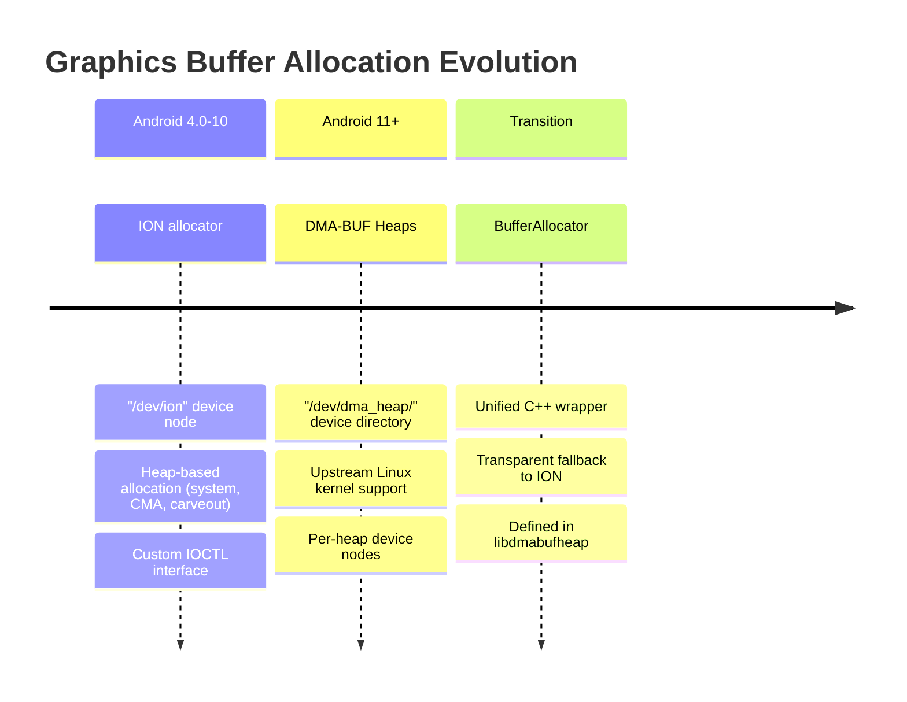
```mermaid
timeline
    title Graphics Buffer Allocation Evolution
    section Android 4.0-10
        ION allocator : "/dev/ion" device node
                      : Heap-based allocation (system, CMA, carveout)
                      : Custom IOCTL interface
    section Android 11+
        DMA-BUF Heaps : "/dev/dma_heap/" device directory
                      : Upstream Linux kernel support
                      : Per-heap device nodes
    section Transition
        BufferAllocator : Unified C++ wrapper
                        : Transparent fallback to ION
                        : Defined in libdmabufheap
```

**Source directories**:

- `system/memory/libion/` -- Legacy ION userspace library
- `system/memory/libdmabufheap/` -- DMA-BUF heap allocator (modern)
- `frameworks/native/libs/ui/` -- GraphicBuffer, Gralloc interface

### 8.5.2 The ION Allocator (Legacy)

ION provides heap-based memory allocation through the `/dev/ion` device:

```c
// system/memory/libion/ion.c (lines 58-63, 95-111)
int ion_open() {
    int fd = open("/dev/ion", O_RDONLY | O_CLOEXEC);
    if (fd < 0) ALOGE("open /dev/ion failed: %s", strerror(errno));
    return fd;
}

int ion_alloc(int fd, size_t len, size_t align,
              unsigned int heap_mask, unsigned int flags,
              ion_user_handle_t* handle) {
    struct ion_allocation_data data = {
        .len = len,
        .align = align,
        .heap_id_mask = heap_mask,
        .flags = flags,
    };
    return ion_ioctl(fd, ION_IOC_ALLOC, &data);
}
```

ION supports two ABI versions -- the library detects which is in use:

```c
// system/memory/libion/ion.c (lines 40-56)
enum ion_version { ION_VERSION_UNKNOWN, ION_VERSION_MODERN, ION_VERSION_LEGACY };

int ion_is_legacy(int fd) {
    int version = atomic_load_explicit(&g_ion_version, memory_order_acquire);
    if (version == ION_VERSION_UNKNOWN) {
        int err = ion_free(fd, (ion_user_handle_t)0);
        version = (err == -ENOTTY) ? ION_VERSION_MODERN : ION_VERSION_LEGACY;
        atomic_store_explicit(&g_ion_version, version, memory_order_release);
    }
    return version == ION_VERSION_LEGACY;
}
```

ION heap types:

| Heap Type | Description | Use Case |
|---|---|---|
| `ION_HEAP_SYSTEM` | Pages from the buddy allocator | General-purpose buffers |
| `ION_HEAP_SYSTEM_CONTIG` | Physically contiguous pages | Hardware requiring contiguous DMA |
| `ION_HEAP_CARVEOUT` | Reserved physical memory region | Secure video, trusted execution |
| `ION_HEAP_DMA` (CMA) | Contiguous Memory Allocator | Camera, display |

### 8.5.3 DMA-BUF Heaps (Modern)

DMA-BUF heaps are the upstream Linux replacement for ION. Each heap exposes its own device node
under `/dev/dma_heap/`:

```c
// system/memory/libdmabufheap/BufferAllocator.cpp (lines 39-41)
static constexpr char kDmaHeapRoot[] = "/dev/dma_heap/";
static constexpr char kIonDevice[] = "/dev/ion";
static constexpr char kIonSystemHeapName[] = "ion_system_heap";
```

The `BufferAllocator` class transparently handles the ION-to-DMA-BUF transition:

```c
// system/memory/libdmabufheap/BufferAllocator.cpp (lines 267-286)
int BufferAllocator::Alloc(const std::string& heap_name, size_t len,
                           unsigned int heap_flags, size_t legacy_align) {
    // Try DMA-BUF heap first
    int dma_buf_heap_fd = OpenDmabufHeap(heap_name);
    if (dma_buf_heap_fd >= 0)
        return DmabufAlloc(heap_name, len, dma_buf_heap_fd);

    // Fall back to ION if DMA-BUF heap doesn't exist
    if (ion_fd_ >= 0)
        return IonAlloc(heap_name, len, heap_flags, legacy_align);

    return -1;
}
```

The allocation through DMA-BUF heaps uses a simple ioctl:

```c
// system/memory/libdmabufheap/BufferAllocator.cpp (lines 216-236)
int BufferAllocator::DmabufAlloc(const std::string& heap_name,
                                  size_t len, int fd) {
    struct dma_heap_allocation_data heap_data{
        .len = len,
        .fd_flags = O_RDWR | O_CLOEXEC,
    };

    auto ret = TEMP_FAILURE_RETRY(
        ioctl(fd, DMA_HEAP_IOCTL_ALLOC, &heap_data));
    if (ret < 0) {
        PLOG(ERROR) << "Unable to allocate from DMA-BUF heap: "
                    << heap_name;
        return ret;
    }

    return heap_data.fd;  // Returns a DMA-BUF file descriptor
}
```

### 8.5.4 Gralloc: The Graphics Memory Allocator HAL

The Gralloc (Graphics Allocation) HAL sits above ION/DMA-BUF and provides the standardized
interface for allocating graphics buffers. It has evolved through multiple versions:

```c
// frameworks/native/libs/ui/GraphicBufferMapper.cpp (lines 60-83)
GraphicBufferMapper::GraphicBufferMapper() {
    mMapper = std::make_unique<const Gralloc5Mapper>();
    if (mMapper->isLoaded()) {
        mMapperVersion = Version::GRALLOC_5;
        return;
    }
    mMapper = std::make_unique<const Gralloc4Mapper>();
    if (mMapper->isLoaded()) {
        mMapperVersion = Version::GRALLOC_4;
        return;
    }
    mMapper = std::make_unique<const Gralloc3Mapper>();
    if (mMapper->isLoaded()) {
        mMapperVersion = Version::GRALLOC_3;
        return;
    }
    mMapper = std::make_unique<const Gralloc2Mapper>();
    if (mMapper->isLoaded()) {
        mMapperVersion = Version::GRALLOC_2;
        return;
    }
    LOG_ALWAYS_FATAL("gralloc-mapper is missing");
}
```

The `GraphicBufferAllocator` selects the matching allocator implementation:

```c
// frameworks/native/libs/ui/GraphicBufferAllocator.cpp (lines 54-76)
GraphicBufferAllocator::GraphicBufferAllocator()
    : mMapper(GraphicBufferMapper::getInstance()) {
    switch (mMapper.getMapperVersion()) {
        case GraphicBufferMapper::GRALLOC_5:
            mAllocator = std::make_unique<const Gralloc5Allocator>(
                reinterpret_cast<const Gralloc5Mapper&>(
                    mMapper.getGrallocMapper()));
            break;
        case GraphicBufferMapper::GRALLOC_4:
            mAllocator = std::make_unique<const Gralloc4Allocator>(/*...*/);
            break;
        case GraphicBufferMapper::GRALLOC_3:
            mAllocator = std::make_unique<const Gralloc3Allocator>(/*...*/);
            break;
        case GraphicBufferMapper::GRALLOC_2:
            mAllocator = std::make_unique<const Gralloc2Allocator>(/*...*/);
            break;
    }
}
```

### 8.5.5 GraphicBuffer Lifecycle

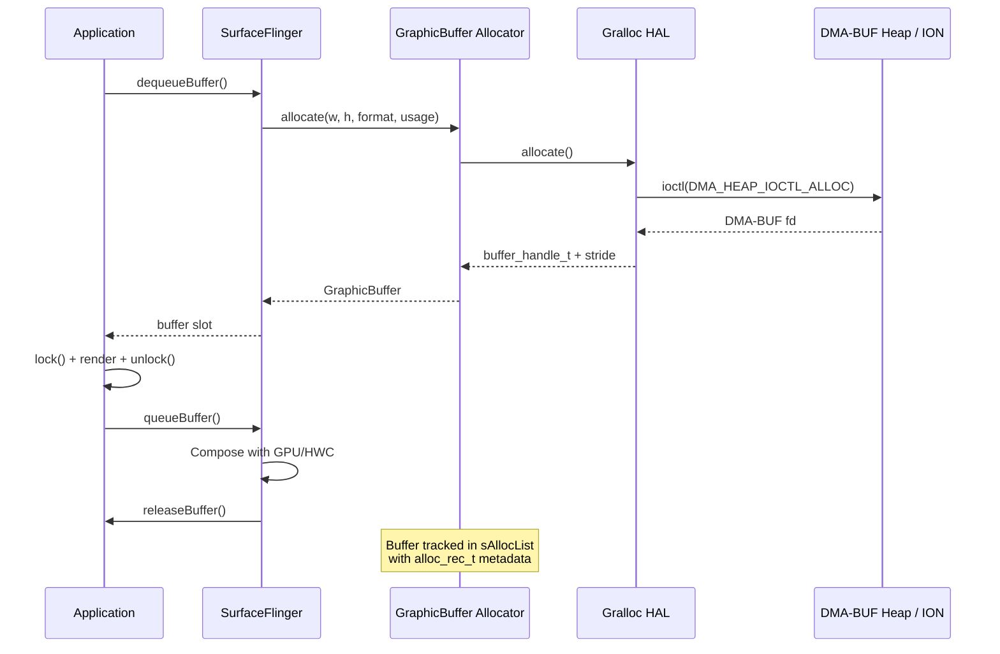
```mermaid
sequenceDiagram
    participant App as Application
    participant SF as SurfaceFlinger
    participant GBA as GraphicBuffer Allocator
    participant Gralloc as Gralloc HAL
    participant DMA as DMA-BUF Heap / ION

    App->>SF: dequeueBuffer()
    SF->>GBA: allocate(w, h, format, usage)
    GBA->>Gralloc: allocate()
    Gralloc->>DMA: ioctl(DMA_HEAP_IOCTL_ALLOC)
    DMA-->>Gralloc: DMA-BUF fd
    Gralloc-->>GBA: buffer_handle_t + stride
    GBA-->>SF: GraphicBuffer
    SF-->>App: buffer slot

    App->>App: lock() + render + unlock()
    App->>SF: queueBuffer()
    SF->>SF: Compose with GPU/HWC
    SF->>App: releaseBuffer()

    Note over GBA: Buffer tracked in sAllocList<br/>with alloc_rec_t metadata
```

The allocator maintains a global allocation list for debugging:

```c
// frameworks/native/libs/ui/GraphicBufferAllocator.cpp (lines 89-111)
void GraphicBufferAllocator::dump(std::string& result, bool less) const {
    Mutex::Autolock _l(sLock);
    KeyedVector<buffer_handle_t, alloc_rec_t>& list(sAllocList);
    uint64_t total = 0;
    result.append("GraphicBufferAllocator buffers:\n");
    StringAppendF(&result,
        "%18s | %12s | %18s | %s | %8s | %10s | %s\n",
        "Handle", "Size", "W (Stride) x H",
        "Layers", "Format", "Usage", "Requestor");
    for (size_t i = 0; i < count; i++) {
        const alloc_rec_t& rec(list.valueAt(i));
        // ... format and print each allocation
        total += rec.size;
    }
    StringAppendF(&result,
        "Total allocated by GraphicBufferAllocator (estimate): "
        "%.2f KB\n", static_cast<double>(total) / 1024.0);
}
```

This dump is accessible via `adb shell dumpsys SurfaceFlinger` and shows all outstanding
graphics buffer allocations.

### 8.5.6 HardwareBuffer: The NDK Interface

For NDK developers, `AHardwareBuffer` provides the public API for allocating graphics buffers:

```c
// frameworks/native/libs/ui/include/ui/GraphicBuffer.h
class GraphicBuffer {
    AHB_CONVERSION static GraphicBuffer* fromAHardwareBuffer(AHardwareBuffer*);
    AHB_CONVERSION AHardwareBuffer* toAHardwareBuffer();
};
```

Key usage flags that affect allocation:

| Flag | Value | Description |
|---|---|---|
| `AHARDWAREBUFFER_USAGE_CPU_READ` | Various | CPU needs read access |
| `AHARDWAREBUFFER_USAGE_CPU_WRITE` | Various | CPU needs write access |
| `AHARDWAREBUFFER_USAGE_GPU_SAMPLED_IMAGE` | | GPU texture sampling |
| `AHARDWAREBUFFER_USAGE_GPU_COLOR_OUTPUT` | | GPU render target |
| `AHARDWAREBUFFER_USAGE_COMPOSER_OVERLAY` | | Hardware composer overlay |
| `AHARDWAREBUFFER_USAGE_VIDEO_ENCODE` | | Video encoder input |
| `AHARDWAREBUFFER_USAGE_CAMERA_WRITE` | | Camera output buffer |
| `AHARDWAREBUFFER_USAGE_PROTECTED_CONTENT` | | DRM-protected content |

The DMA-BUF allocator can route allocations to different heaps based on these flags:

```c
// system/memory/libdmabufheap/BufferAllocator.cpp (lines 288-312)
int BufferAllocator::AllocSystem(bool cpu_access_needed, size_t len,
                                  unsigned int heap_flags) {
    if (!cpu_access_needed) {
        // Try uncached heap first for non-CPU buffers
        static bool uncached_support = [this]() -> bool {
            auto heaps = this->GetDmabufHeapList();
            return (heaps.find(kDmabufSystemUncachedHeapName)
                    != heaps.end());
        }();

        if (uncached_support) {
            int fd = OpenDmabufHeap(kDmabufSystemUncachedHeapName);
            return DmabufAlloc(kDmabufSystemUncachedHeapName, len, fd);
        }
    }
    // Fall back to cached system heap
    return Alloc(kDmabufSystemHeapName, len, heap_flags);
}
```

### 8.5.7 DMA-BUF Sync and Cache Coherency

When the CPU and hardware accelerators share memory, cache coherency must be managed explicitly:

```c
// system/memory/libdmabufheap/BufferAllocator.cpp (lines 369-382)
int BufferAllocator::DoSync(unsigned int dmabuf_fd, bool start,
                            SyncType sync_type, /*...*/) {
    if (uses_legacy_ion_iface_) {
        return LegacyIonCpuSync(dmabuf_fd, /*...*/);
    }

    struct dma_buf_sync sync = {
        .flags = (start ? DMA_BUF_SYNC_START : DMA_BUF_SYNC_END) |
                 static_cast<uint64_t>(sync_type),
    };
    return TEMP_FAILURE_RETRY(
        ioctl(dmabuf_fd, DMA_BUF_IOCTL_SYNC, &sync));
}
```

The sync protocol:

1. **Before CPU access**: `CpuSyncStart()` -- invalidates caches so CPU sees hardware's writes.
2. **After CPU access**: `CpuSyncEnd()` -- flushes caches so hardware sees CPU's writes.

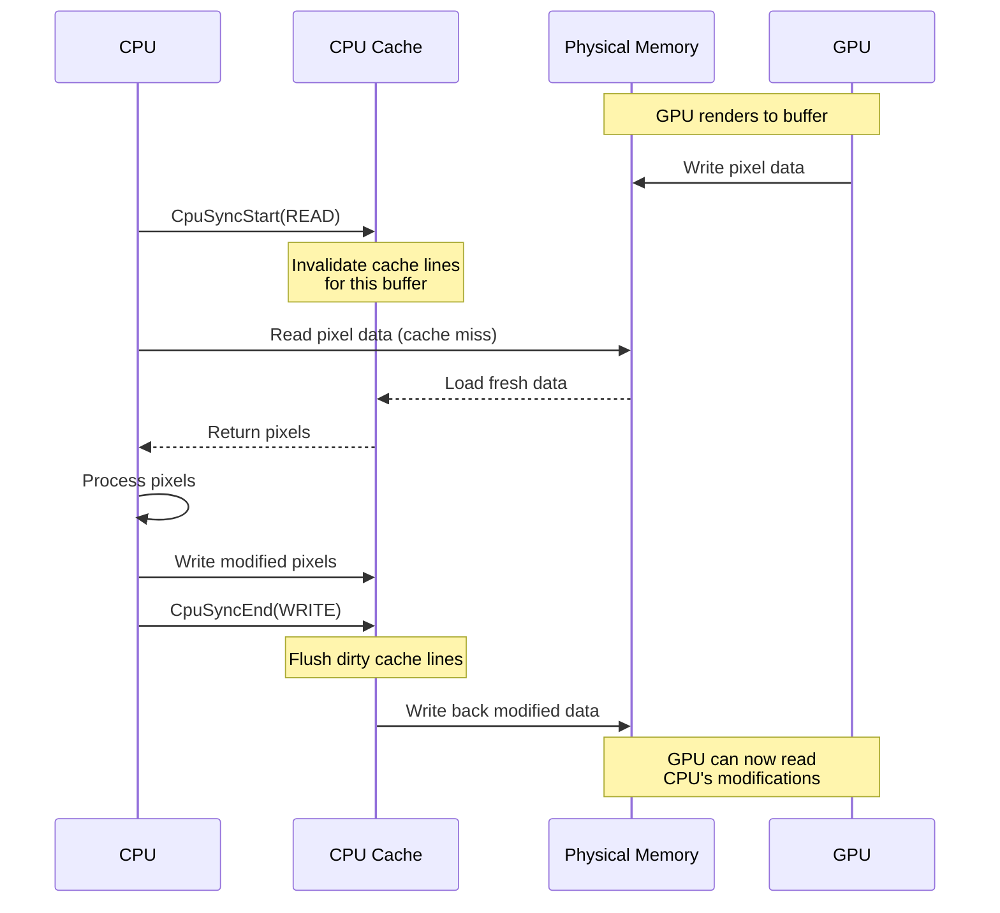
```mermaid
sequenceDiagram
    participant CPU
    participant Cache as CPU Cache
    participant RAM as Physical Memory
    participant GPU

    Note over GPU,RAM: GPU renders to buffer
    GPU->>RAM: Write pixel data

    CPU->>Cache: CpuSyncStart(READ)
    Note over Cache: Invalidate cache lines<br/>for this buffer

    CPU->>RAM: Read pixel data (cache miss)
    RAM-->>Cache: Load fresh data
    Cache-->>CPU: Return pixels

    CPU->>CPU: Process pixels
    CPU->>Cache: Write modified pixels

    CPU->>Cache: CpuSyncEnd(WRITE)
    Note over Cache: Flush dirty cache lines
    Cache->>RAM: Write back modified data

    Note over GPU,RAM: GPU can now read<br/>CPU's modifications
```

### 8.5.8 GPU Memory Tracking

lmkd tracks GPU memory usage through a BPF map:

```c
// system/memory/lmkd/lmkd.cpp (lines 1928-1941)
static int64_t read_gpu_total_kb() {
    static android::base::unique_fd fd(
        android::bpf::mapRetrieveRO(
            "/sys/fs/bpf/map_gpuMem_gpu_mem_total_map"));
    static constexpr uint64_t kBpfKeyGpuTotalUsage = 0;
    uint64_t value;

    if (!fd.ok()) return 0;

    return android::bpf::findMapEntry(fd, &kBpfKeyGpuTotalUsage, &value)
        ? 0
        : (int32_t)(value / 1024);
}
```

This BPF map is maintained by a GPU memory tracking BPF program that hooks into the GPU driver's
allocation and deallocation paths, providing the total GPU memory usage without requiring
vendor-specific code in lmkd.

---

## 8.6 Ashmem and Memfd

Anonymous shared memory (ashmem) and memfd are mechanisms for creating shared memory regions
that can be passed between processes, typically via Binder.

### 8.6.1 Ashmem (Android Shared Memory)

Ashmem was Android's original shared memory mechanism, implemented as a kernel driver at
`drivers/staging/android/ashmem.c`. It provides:

- **Named regions**: Each region has a name visible in `/proc/[pid]/maps` for debugging.
- **Pinning/unpinning**: Regions can be unpinned to allow the kernel to reclaim their memory
  under pressure, and re-pinned when needed.
- **Size-based allocation**: Unlike POSIX shared memory, ashmem regions can be resized.

The typical usage pattern:

```c
// Traditional ashmem usage (deprecated in favor of memfd)
#include <linux/ashmem.h>

int fd = open("/dev/ashmem", O_RDWR);
ioctl(fd, ASHMEM_SET_NAME, "my-shared-region");
ioctl(fd, ASHMEM_SET_SIZE, 4096);
void* ptr = mmap(NULL, 4096, PROT_READ | PROT_WRITE, MAP_SHARED, fd, 0);

// Pin/unpin for memory pressure response
struct ashmem_pin pin = { .offset = 0, .len = 0 };  // entire region
ioctl(fd, ASHMEM_UNPIN, &pin);   // Allow kernel to reclaim
ioctl(fd, ASHMEM_PIN, &pin);     // Re-pin before access
// Returns ASHMEM_WAS_PURGED if data was reclaimed
```

### 8.6.2 Memfd: The Modern Replacement

Android has been transitioning from ashmem to `memfd_create()`, a standard Linux system call
that creates anonymous file descriptors backed by the tmpfs filesystem. Memfd offers several
advantages:

- **Upstream kernel support**: No need for Android-specific kernel patches.
- **Sealing**: `fcntl(fd, F_ADD_SEALS, ...)` can make regions read-only or prevent resizing.
- **Better security**: File descriptor-based sharing works naturally with seccomp and SELinux.

```c
// Modern shared memory creation
#include <sys/mman.h>

int fd = memfd_create("my-shared-region", MFD_CLOEXEC | MFD_ALLOW_SEALING);
ftruncate(fd, 4096);
void* ptr = mmap(NULL, 4096, PROT_READ | PROT_WRITE, MAP_SHARED, fd, 0);

// Seal to prevent modification after initialization
fcntl(fd, F_ADD_SEALS, F_SEAL_SHRINK | F_SEAL_GROW | F_SEAL_WRITE);
```

### 8.6.3 Shared Memory in Binder

Shared memory is critical for Binder IPC when transferring large data. The typical pattern:

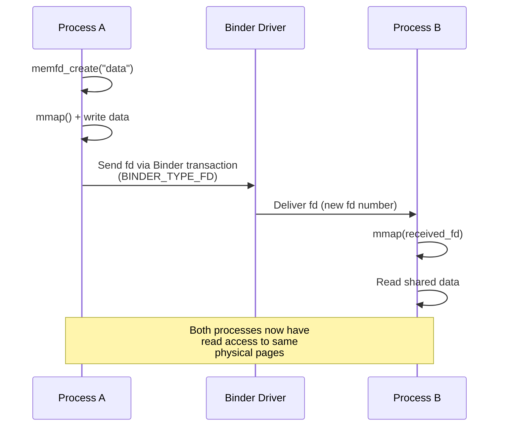
```mermaid
sequenceDiagram
    participant A as Process A
    participant Binder as Binder Driver
    participant B as Process B

    A->>A: memfd_create("data")
    A->>A: mmap() + write data
    A->>Binder: Send fd via Binder transaction<br/>(BINDER_TYPE_FD)
    Binder->>B: Deliver fd (new fd number)
    B->>B: mmap(received_fd)
    B->>B: Read shared data

    Note over A,B: Both processes now have<br/>read access to same<br/>physical pages
```

### 8.6.4 SharedMemory Java API

The `android.os.SharedMemory` class wraps memfd for Java code:

```java
// Create shared memory
SharedMemory shm = SharedMemory.create("my-region", 4096);
ByteBuffer buffer = shm.mapReadWrite();
buffer.putInt(42);
shm.setProtect(OsConstants.PROT_READ); // Make read-only

// Pass to another process via Binder (implements Parcelable)
parcel.writeParcelable(shm, 0);
```

### 8.6.5 Purgeable Memory

One ashmem feature that memfd does not directly replace is purgeable memory -- the ability to
unpin memory regions so the kernel can reclaim them under pressure. This pattern is important
for caches:

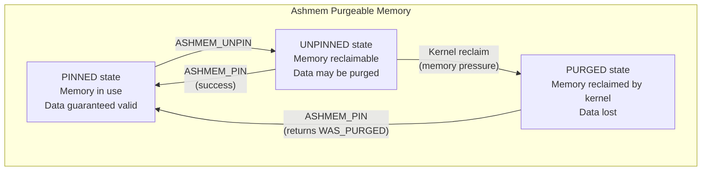
```mermaid
graph TD
    subgraph "Ashmem Purgeable Memory"
        Pinned["PINNED state<br/>Memory in use<br/>Data guaranteed valid"]
        Unpinned["UNPINNED state<br/>Memory reclaimable<br/>Data may be purged"]
        Purged["PURGED state<br/>Memory reclaimed by kernel<br/>Data lost"]
    end

    Pinned -->|"ASHMEM_UNPIN"| Unpinned
    Unpinned -->|"ASHMEM_PIN<br/>(success)"| Pinned
    Unpinned -->|"Kernel reclaim<br/>(memory pressure)"| Purged
    Purged -->|"ASHMEM_PIN<br/>(returns WAS_PURGED)"| Pinned
```

For memfd-based replacements, Android provides `ASharedMemory_setProt()` through the NDK, and
the framework handles purgeability through explicit cache management rather than kernel-assisted
unpinning.

### 8.6.6 Memory Accounting for Shared Regions

Shared memory presents accounting challenges:

- **PSS (Proportional Set Size)**: Shared pages are divided equally among all processes mapping
  them. A 4 KB page mapped by 4 processes contributes 1 KB to each process's PSS.
- **RSS (Resident Set Size)**: Each process counts the full page in its RSS.
- **USS (Unique Set Size)**: Only pages exclusively mapped by one process.

The `dumpsys meminfo` output shows these distinctions for each process.

### 8.6.7 Comparing Ashmem and Memfd

| Feature | Ashmem | Memfd |
|---|---|---|
| **Kernel support** | Android-specific driver | Upstream Linux syscall |
| **Creation** | `open("/dev/ashmem")` + ioctl | `memfd_create()` |
| **Naming** | `ASHMEM_SET_NAME` ioctl | Name in `memfd_create()` arg |
| **Sizing** | `ASHMEM_SET_SIZE` ioctl | `ftruncate()` |
| **Sealing** | Not supported | `F_SEAL_*` via `fcntl()` |
| **Purgeable** | `ASHMEM_PIN`/`ASHMEM_UNPIN` | Not directly supported |
| **SELinux** | Custom policy rules | Standard file descriptor policy |
| **seccomp** | Requires ioctl allowlist | Standard syscall filtering |
| **Availability** | All Android versions | Android 10+ (API 29+) |
| **NDK API** | `ASharedMemory_create()` | `ASharedMemory_create()` (uses memfd internally) |
| **Binder transport** | Via `BINDER_TYPE_FD` | Via `BINDER_TYPE_FD` |

### 8.6.8 Memory Mapping Patterns

The choice of mmap flags significantly affects memory behavior:

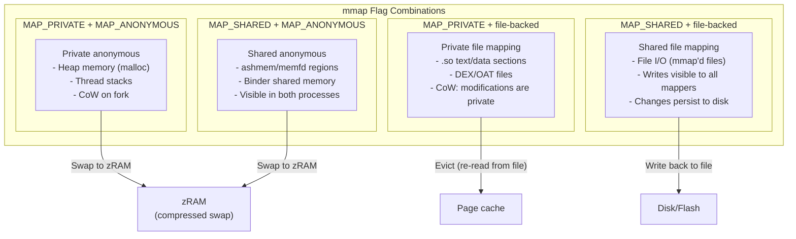
```mermaid
graph TD
    subgraph "mmap Flag Combinations"
        subgraph "MAP_PRIVATE + MAP_ANONYMOUS"
            PA["Private anonymous<br/>- Heap memory (malloc)<br/>- Thread stacks<br/>- CoW on fork"]
        end

        subgraph "MAP_SHARED + MAP_ANONYMOUS"
            SA["Shared anonymous<br/>- ashmem/memfd regions<br/>- Binder shared memory<br/>- Visible in both processes"]
        end

        subgraph "MAP_PRIVATE + file-backed"
            PF["Private file mapping<br/>- .so text/data sections<br/>- DEX/OAT files<br/>- CoW: modifications are private"]
        end

        subgraph "MAP_SHARED + file-backed"
            SF["Shared file mapping<br/>- File I/O (mmap'd files)<br/>- Writes visible to all mappers<br/>- Changes persist to disk"]
        end
    end

    PA -->|"Swap to zRAM"| zRAM["zRAM<br/>(compressed swap)"]
    SA -->|"Swap to zRAM"| zRAM
    PF -->|"Evict (re-read from file)"| PageCache["Page cache"]
    SF -->|"Write back to file"| Disk["Disk/Flash"]
```

---

## 8.7 Memory Profiling

Android provides a comprehensive set of tools for analyzing memory usage at various levels of
detail, from high-level per-app summaries to individual allocation backtraces.

### 8.7.1 dumpsys meminfo

The primary tool for quick memory analysis:

```shell
# System-wide memory summary
adb shell dumpsys meminfo

# Per-process detailed breakdown
adb shell dumpsys meminfo <package-name-or-pid>
```

Sample output structure:

```
Applications Memory Usage (in Kilobytes):
Uptime: 12345678 Realtime: 12345678

** MEMINFO in pid 1234 [com.example.app] **
                   Pss  Private  Private  SwapPss   Rss
                 Total    Dirty    Clean    Dirty  Total
                ------   ------   ------   ------  ------
  Native Heap    12345    12300       45      234   15678
  Dalvik Heap     8765     8700       65      123   12345
  Dalvik Other    1234     1200       34        0    2345
        Stack      234      234        0        0     512
       Ashmem       56       56        0        0     100
    Other dev        8        0        8        0      16
     .so mmap     3456      100     2000        0    8000
    .jar mmap        0        0        0        0       0
    .apk mmap     1234        0     1234        0    5000
    .ttf mmap      234        0      234        0     500
    .dex mmap     2345       56     2289        0    3456
    .oat mmap      567        0      567        0    1234
    .art mmap     1234      800      434        0    3456
   Other mmap      456      100      356        0    1000
    GL mtrack    15000    15000        0        0   15000
      Unknown     2345     2300       45        0    4567
        TOTAL    50069    41046     7311      357   73189
```

Key columns:

- **Pss Total**: Proportional Set Size -- the most accurate measure of a process's memory impact.
- **Private Dirty**: Pages modified by this process that cannot be shared.
- **Private Clean**: Unmodified private pages (e.g., code loaded from APK).
- **SwapPss Dirty**: Proportional swap usage.
- **Rss Total**: Total pages mapped (includes shared pages at full count).

### 8.7.2 procstats

The `procstats` service tracks per-process memory usage over time, useful for identifying
long-term trends and background memory leaks:

```shell
# Current process stats
adb shell dumpsys procstats

# Last 3 hours
adb shell dumpsys procstats --hours 3

# CSV output for analysis
adb shell dumpsys procstats --csv
```

procstats categorizes processes into states (foreground, background, cached, etc.) and tracks
PSS in each state. The output includes min/average/max PSS for each process across its various
states, enabling identification of processes that gradually increase memory usage.

### 8.7.3 heapprofd (Perfetto Native Heap Profiling)

`heapprofd` is a daemon-less heap profiler that captures allocation backtraces with minimal
overhead. It integrates with Perfetto for trace collection:

```shell
# Profile a running process
adb shell perfetto \
  -c - --txt \
  -o /data/misc/perfetto-traces/heap.perfetto-trace <<EOF
buffers: {
    size_kb: 65536
    fill_policy: RING_BUFFER
}
data_sources: {
    config {
        name: "android.heapprofd"
        target_buffer: 0
        heapprofd_config {
            sampling_interval_bytes: 4096
            process_cmdline: "com.example.app"
            continuous_dump_config {
                dump_phase_ms: 0
                dump_interval_ms: 10000
            }
        }
    }
}
duration_ms: 30000
EOF
```

heapprofd works by:

1. **Intercepting malloc/free**: Uses a shared library preloaded into the target process.
2. **Sampling**: Not every allocation is recorded; only one in every N bytes (configurable).
3. **Stack unwinding**: Captures the full call stack at the allocation point.
4. **Streaming to Perfetto**: Results are written to the Perfetto tracing infrastructure.

The output can be visualized in [Perfetto UI](https://ui.perfetto.dev/) with flamegraphs showing
allocation hotspots.

### 8.7.4 showmap

`showmap` provides a detailed view of a process's memory mappings, built on top of
`/proc/[pid]/smaps`:

**Source**: `system/memory/libmeminfo/tools/showmap.cpp`

```shell
# Show all mappings
adb shell showmap <pid>

# Output format
#  virtual                          shared   shared  private  private
#     size      RSS      PSS    clean    dirty    clean    dirty  # object
# -------- -------- -------- -------- -------- -------- -------- ----
#    12288     4096     1024     2048     1024      512      512  [anon:libc_malloc]
```

The related tools in `system/memory/libmeminfo/tools/`:

| Tool | Purpose |
|---|---|
| `showmap.cpp` | Per-mapping memory breakdown |
| `procmem.cpp` | Process memory summary |
| `procrank.cpp` | Rank processes by memory usage |
| `librank.cpp` | Rank shared libraries by memory consumption |
| `wsstop.cpp` | Working set size tracking |

### 8.7.5 libmemunreachable: Native Leak Detection

`libmemunreachable` is a runtime leak detector for native (C/C++) code. It works by performing
a conservative garbage collection pass over a process's heap.

**Source**: `system/memory/libmemunreachable/`

The detection algorithm (`system/memory/libmemunreachable/MemUnreachable.cpp`):

```c++
// system/memory/libmemunreachable/MemUnreachable.cpp (lines 53-75)
class MemUnreachable {
public:
    MemUnreachable(pid_t pid, Allocator<void> allocator)
        : pid_(pid), allocator_(allocator), heap_walker_(allocator_) {}

    bool CollectAllocations(
        const allocator::vector<ThreadInfo>& threads,
        const allocator::vector<Mapping>& mappings,
        const allocator::vector<uintptr_t>& refs);

    bool GetUnreachableMemory(
        allocator::vector<Leak>& leaks, size_t limit,
        size_t* num_leaks, size_t* leak_bytes);
};
```

The detection process:

```mermaid
flowchart TD
    A[GetUnreachableMemory called] --> B[Create PtracerThread]
    B --> C["Ptrace all threads<br/>in target process"]
    C --> D["Capture thread registers<br/>and stack contents"]
    D --> E[Snapshot /proc/pid/maps]
    E --> F[Get Binder references]
    F --> G[Fork heap walker process]

    subgraph "Heap Walker (child process)"
        G --> H["Enumerate all heap allocations<br/>via malloc_iterate"]
        H --> I["Mark roots:<br/>- Global variables<br/>- Thread stacks<br/>- Thread registers<br/>- Binder references"]
        I --> J["Walk heap: for each root,<br/>scan for pointers to allocations"]
        J --> K["Unreachable = allocations<br/>not reachable from any root"]
        K --> L["Fold similar leaks<br/>by backtrace"]
        L --> M[Send results via pipe]
    end

    M --> N[Receive leak report]
```

The code recognizes different mapping types for accurate root identification:

```c++
// system/memory/libmemunreachable/MemUnreachable.cpp (lines 256-277)
// Heap mappings (potential leaks)
if (mapping_name == "[anon:libc_malloc]" ||
    StartsWith(mapping_name, "[anon:scudo:") ||
    StartsWith(mapping_name, "[anon:GWP-ASan")) {
    heap_mappings.emplace_back(*it);
}
// Dalvik heap (global roots)
else if (has_prefix(mapping_name, "[anon:dalvik-")) {
    globals_mappings.emplace_back(*it);
}
// Thread stacks
else if (has_prefix(mapping_name, "[stack")) {
    stack_mappings.emplace_back(*it);
}
```

Usage from the command line:

```shell
# Dump unreachable memory for a process
adb shell dumpsys -t 600 meminfo --unreachable <pid>

# Programmatic usage in native code
#include <memunreachable/memunreachable.h>
android::UnreachableMemoryInfo info;
android::GetUnreachableMemory(info, 100);
ALOGE("%s", info.ToString(true).c_str());
```

### 8.7.6 Memory Profiling Decision Tree

Choosing the right tool depends on what you are investigating:

```mermaid
flowchart TD
    Start["Memory Issue<br/>Detected"] --> Q1{"What kind<br/>of issue?"}

    Q1 -->|"High overall<br/>memory usage"| DumpSys["dumpsys meminfo<br/>(system-wide overview)"]
    Q1 -->|"Single app<br/>using too much"| AppDebug["dumpsys meminfo {pkg}<br/>(per-app breakdown)"]
    Q1 -->|"Gradual memory<br/>increase over time"| ProcStats["procstats<br/>(long-term trends)"]
    Q1 -->|"Native memory<br/>leak"| NativeLeak["heapprofd via Perfetto<br/>(allocation backtraces)"]
    Q1 -->|"Java/Kotlin<br/>memory leak"| JavaLeak["Android Studio Profiler<br/>or hprof dump"]
    Q1 -->|"Unreachable native<br/>allocations"| Unreachable["libmemunreachable<br/>(conservative GC scan)"]
    Q1 -->|"Graphics buffer<br/>leak"| GraphicsLeak["dumpsys SurfaceFlinger<br/>+ dumpsys gpu"]
    Q1 -->|"Per-mapping<br/>breakdown"| ShowMap["showmap {pid}<br/>(smaps analysis)"]
    Q1 -->|"Real-time system<br/>monitoring"| Perfetto["Perfetto trace<br/>(sys_stats + process_stats)"]
    Q1 -->|"Shared library<br/>memory impact"| LibRank["librank<br/>(library memory ranking)"]

    DumpSys --> Narrow["Identify problematic<br/>process"]
    Narrow --> AppDebug
    AppDebug --> Q2{"Native or<br/>managed heap?"}
    Q2 -->|Native| NativeLeak
    Q2 -->|Managed| JavaLeak

    style NativeLeak fill:#4488cc,color:#fff
    style JavaLeak fill:#4488cc,color:#fff
    style Unreachable fill:#4488cc,color:#fff
```

### 8.7.7 Understanding Memory Metrics

The various memory metrics can be confusing. Here is a precise definition of each:

```mermaid
graph TD
    subgraph "Memory Metric Relationships"
        VSS["VSS (Virtual Set Size)<br/>Total virtual address space<br/>= All mapped regions<br/>Includes unmapped reservations"]

        RSS["RSS (Resident Set Size)<br/>Pages physically in RAM<br/>Includes shared pages<br/>at full count"]

        PSS["PSS (Proportional Set Size)<br/>Private pages at full count<br/>+ Shared pages divided<br/>among mapping processes"]

        USS["USS (Unique Set Size)<br/>Only private pages<br/>= Private Clean + Private Dirty"]

        SwapPSS["SwapPSS<br/>Proportional swap usage<br/>Same as PSS but for<br/>swapped-out pages"]
    end

    VSS -->|"Minus unmapped<br/>+ demand-paged"| RSS
    RSS -->|"Shared pages<br/>proportionally counted"| PSS
    PSS -->|"Minus shared<br/>pages entirely"| USS

    style PSS fill:#44cc44,color:#000
```

**PSS is the recommended metric** for comparing memory usage between processes because it
properly accounts for shared memory without double-counting.

| Metric | Best For | Limitation |
|---|---|---|
| **VSS** | Detecting address space exhaustion | Hugely overestimates actual memory use |
| **RSS** | Instantaneous physical memory use | Double-counts shared pages |
| **PSS** | Fair comparison between processes | Slow to compute (requires smaps) |
| **USS** | Understanding private memory cost | Ignores shared memory entirely |
| **SwapPSS** | Understanding total memory impact | Only available on newer kernels |

### 8.7.8 Reading dumpsys meminfo Output

A detailed walkthrough of interpreting `dumpsys meminfo` output for a single process:

```
** MEMINFO in pid 1234 [com.example.app] **
                   Pss  Private  Private  SwapPss   Rss
                 Total    Dirty    Clean    Dirty  Total
                ------   ------   ------   ------  ------
  Native Heap    12345    12300       45      234   15678
```

- **Native Heap**: Memory allocated via `malloc()`, `new`, etc. in native code.
  - `Private Dirty`: Modified heap pages (the "real cost" of native allocations).
  - `Private Clean`: Rarely seen for heap; would indicate copy-on-write pages not yet modified.
  - `SwapPss Dirty`: Heap pages that have been swapped to zRAM.

```
  Dalvik Heap     8765     8700       65      123   12345
```

- **Dalvik Heap**: ART's managed heap for Java/Kotlin objects.
  - High `Private Dirty` indicates many live objects.
  - `SwapPss` shows objects that ART's GC did not collect but the kernel swapped out.

```
  .so mmap     3456      100     2000        0    8000
```

- **.so mmap**: Shared library mappings.
  - `Private Clean` (2000): Library code pages loaded into this process's private address space.
  - `Private Dirty` (100): Modified library data (globals, writable data sections).
  - High `Rss` but low `Pss` indicates good sharing with other processes.

```
  .dex mmap     2345       56     2289        0    3456
```

- **.dex mmap**: DEX file mappings (app code).
  - Mostly `Private Clean`: code pages loaded from the APK.
  - These pages are backed by the APK file and can be evicted without swapping.

```
        TOTAL    50069    41046     7311      357   73189
```

- **TOTAL**: Sum of all categories.
  - **Key insight**: `Private Dirty` (41046) is the process's irreducible memory footprint.
  - `Private Clean` (7311) can be reclaimed by evicting and re-reading from backing files.
  - `SwapPss` (357) represents additional memory consumed in zRAM.

### 8.7.9 Perfetto Memory Counters

Perfetto provides system-wide memory tracking through its `linux.process_stats` and
`linux.sys_stats` data sources:

```shell
# Collect memory counters with Perfetto
adb shell perfetto \
  -c - --txt \
  -o /data/misc/perfetto-traces/mem.perfetto-trace <<EOF
buffers: { size_kb: 32768 }
data_sources: {
    config {
        name: "linux.process_stats"
        target_buffer: 0
        process_stats_config {
            scan_all_processes_on_start: true
            proc_stats_poll_ms: 1000
        }
    }
}
data_sources: {
    config {
        name: "linux.sys_stats"
        target_buffer: 0
        sys_stats_config {
            meminfo_period_ms: 1000
            meminfo_counters: MEMINFO_MEM_FREE
            meminfo_counters: MEMINFO_CACHED
            meminfo_counters: MEMINFO_SWAP_FREE
            vmstat_period_ms: 1000
            vmstat_counters: VMSTAT_PGSCAN_KSWAPD
            vmstat_counters: VMSTAT_PGSCAN_DIRECT
        }
    }
}
duration_ms: 60000
EOF
```

### 8.7.10 /proc Filesystem Memory Files

The `/proc` filesystem exposes per-process and system-wide memory information:

| Path | Content |
|---|---|
| `/proc/meminfo` | System-wide memory statistics |
| `/proc/[pid]/status` | Process status including VmRSS, VmSwap |
| `/proc/[pid]/statm` | Process memory in pages (total, resident, shared, text, data) |
| `/proc/[pid]/maps` | Virtual memory mappings |
| `/proc/[pid]/smaps` | Detailed per-mapping statistics |
| `/proc/[pid]/smaps_rollup` | Aggregated smaps data (faster) |
| `/proc/[pid]/oom_score_adj` | OOM adjustment score |
| `/proc/[pid]/oom_score` | Kernel-computed OOM score |
| `/proc/vmstat` | Virtual memory statistics |
| `/proc/zoneinfo` | Per-zone memory information |
| `/proc/pressure/memory` | PSI memory pressure |
| `/proc/pressure/io` | PSI I/O pressure |
| `/proc/pressure/cpu` | PSI CPU pressure |

---

## 8.8 App Memory Management

### 8.8.1 ActivityManager Memory Trimming

The Android framework actively manages app memory through the `ActivityManagerService` (AMS).
When the system detects memory pressure, AMS sends `onTrimMemory()` callbacks to applications,
giving them the opportunity to release cached resources before the system resorts to killing
processes.

The trim levels are defined in `ComponentCallbacks2.java`:

```java
// frameworks/base/core/java/android/content/ComponentCallbacks2.java

// Running process levels (app is in foreground or near-foreground)
static final int TRIM_MEMORY_RUNNING_MODERATE = 5;   // Moderate pressure
static final int TRIM_MEMORY_RUNNING_LOW = 10;        // Low memory available
static final int TRIM_MEMORY_RUNNING_CRITICAL = 15;   // Critical, kills imminent

// Background process levels
static final int TRIM_MEMORY_UI_HIDDEN = 20;          // UI no longer visible
static final int TRIM_MEMORY_BACKGROUND = 40;          // In background LRU list
static final int TRIM_MEMORY_MODERATE = 60;            // Middle of LRU list
static final int TRIM_MEMORY_COMPLETE = 80;            // Bottom of LRU list
```

```mermaid
graph TD
    subgraph "Memory Trim Levels"
        direction TB
        A["TRIM_MEMORY_RUNNING_MODERATE (5)<br/>System is under moderate pressure"]
        B["TRIM_MEMORY_RUNNING_LOW (10)<br/>System is running low"]
        C["TRIM_MEMORY_RUNNING_CRITICAL (15)<br/>System about to kill processes"]
        D["TRIM_MEMORY_UI_HIDDEN (20)<br/>App UI no longer visible"]
        E["TRIM_MEMORY_BACKGROUND (40)<br/>App is in background list"]
        F["TRIM_MEMORY_MODERATE (60)<br/>App in middle of list"]
        G["TRIM_MEMORY_COMPLETE (80)<br/>App near end of list<br/>Kill imminent"]
    end

    A -->|"Increasing<br/>pressure"| B -->|"Increasing<br/>pressure"| C
    D -->|"App moves<br/>down LRU"| E -->|"App moves<br/>down LRU"| F -->|"App moves<br/>down LRU"| G

    style A fill:#88cc88
    style B fill:#cccc44
    style C fill:#cc8844
    style D fill:#cccccc
    style E fill:#cc8844
    style F fill:#cc4444
    style G fill:#aa2222,color:#fff
```

### 8.8.2 The AppProfiler

The `AppProfiler` class (`frameworks/base/services/core/java/com/android/server/am/AppProfiler.java`)
manages memory state tracking and trim callbacks:

```java
// frameworks/base/services/core/java/com/android/server/am/AppProfiler.java

public class AppProfiler {
    // Called periodically to update low memory state
    void updateLowMemStateLSP(int numCached, int numEmpty,
                               int numTrimming, long now) {
        // Determine current memory state
        // Send TRIM_MEMORY callbacks to appropriate processes
    }

    // Trim UI-hidden processes
    private void trimMemoryUiHiddenIfNecessaryLSP(ProcessRecord app) {
        // Send TRIM_MEMORY_UI_HIDDEN when app loses visibility
    }
}
```

### 8.8.3 ProcessList and OOM Adjustment

The `ProcessList` class manages the mapping between process importance and OOM scores:

```java
// frameworks/base/services/core/java/com/android/server/am/ProcessList.java

public final class ProcessList {
    // OOM adjustment levels (lines 213-284)
    public static final int CACHED_APP_MIN_ADJ = 900;
    public static final int PERCEPTIBLE_APP_ADJ = 200;
    public static final int VISIBLE_APP_ADJ = 100;
    public static final int FOREGROUND_APP_ADJ = 0;

    // Default minfree levels for lmkd
    private static final int[] mOomAdj = new int[] {
        FOREGROUND_APP_ADJ, VISIBLE_APP_ADJ, PERCEPTIBLE_APP_ADJ,
        PERCEPTIBLE_LOW_APP_ADJ, CACHED_APP_MIN_ADJ,
        CACHED_APP_LMK_FIRST_ADJ
    };

    // Set the oom_adj for a process
    public static void setOomAdj(int pid, int uid, int amt) {
        // Writes to /proc/[pid]/oom_score_adj via lmkd socket
    }
}
```

### 8.8.4 How AMS Communicates with lmkd

The communication flow when a process priority changes:

```mermaid
sequenceDiagram
    participant App as Activity Lifecycle
    participant AMS as Activity Manager
    participant OomAdj as OomAdjuster
    participant ProcList as ProcessList
    participant LMKD as lmkd

    App->>AMS: Activity paused/stopped
    AMS->>OomAdj: updateOomAdjLocked()
    OomAdj->>OomAdj: Compute new oom_adj<br/>based on activity state
    OomAdj->>ProcList: setOomAdj(pid, uid, newAdj)
    ProcList->>LMKD: LMK_PROCPRIO packet<br/>(via Unix socket)
    LMKD->>LMKD: Update proc in adjslot_list
    LMKD->>LMKD: Write to /proc/pid/oom_score_adj
    LMKD->>LMKD: Set cgroup soft limit

    Note over App,LMKD: Process priority now reflects<br/>its current importance
```

### 8.8.5 Memory Limits and Thresholds

Android imposes several memory limits on applications:

```mermaid
graph TD
    subgraph "Per-App Memory Limits"
        DalvikLimit["dalvik.vm.heapsize<br/>(max Dalvik heap, e.g., 512 MB)"]
        GrowthLimit["dalvik.vm.heapgrowthlimit<br/>(default heap limit, e.g., 256 MB)"]
        LargeHeap["android:largeHeap=true<br/>(allows up to heapsize)"]
        NativeLimit["No hard limit<br/>(bounded by system RAM<br/>and lmkd kills)"]
    end

    GrowthLimit -->|"App requests<br/>largeHeap"| LargeHeap
    LargeHeap --> DalvikLimit

    subgraph "System-wide Thresholds"
        CachedThresh["Cached app threshold<br/>(typically ~250 MB free)"]
        VisibleThresh["Visible app threshold<br/>(typically ~100 MB free)"]
        ForegroundThresh["Foreground app threshold<br/>(typically ~75 MB free)"]
    end
```

The ProcessList computes minfree levels based on device RAM:

```java
// frameworks/base/services/core/java/com/android/server/am/ProcessList.java
// (minfree level computation, abbreviated)
// Scale minfree levels based on device memory size
final long cachedAppMem = getMemLevel(CACHED_APP_MIN_ADJ);
// visibleAppThreshold, foregroundAppThreshold, etc. are derived
// from the device's total RAM and reported to the kernel/lmkd
```

### 8.8.6 The Process Lifecycle and Memory

Understanding how process lifecycle states map to memory management:

```mermaid
stateDiagram-v2
    [*] --> Created: Process fork'd from Zygote
    Created --> Foreground: Activity started/resumed
    Foreground --> Visible: Activity partially obscured
    Visible --> Perceptible: Service with notification
    Perceptible --> Background: Activity stopped
    Background --> Cached: No active components
    Cached --> Killed: lmkd kills

    Foreground --> Background: onStop
    Background --> Foreground: onRestart
    Cached --> Foreground: onRestart
    Background --> Cached: All components stopped

    state Foreground {
        [*] --> Active: oom_adj = 0
        Active --> [*]: Still using memory
        note right of Active: Full memory access<br/>No trim callbacks
    }

    state Cached {
        [*] --> LowPriority: oom_adj = 900-999
        LowPriority --> [*]: Candidate for killing
        note right of LowPriority: onTrimMemory COMPLETE<br/>should release everything
    }

    state Killed {
        [*] --> Destroyed: Memory reclaimed
        note right of Destroyed: Process gone<br/>Saved state in Bundle
    }
```

### 8.8.7 Best Practices for App Developers

App developers should implement `onTrimMemory()` to release resources proactively:

```java
public class MyApplication extends Application {
    @Override
    public void onTrimMemory(int level) {
        super.onTrimMemory(level);

        if (level >= TRIM_MEMORY_COMPLETE) {
            // Release ALL cached data
            clearImageCache();
            clearDatabaseCache();
            releasePooledConnections();
        } else if (level >= TRIM_MEMORY_MODERATE) {
            // Release most cached data
            trimImageCacheToHalf();
            clearDatabaseCache();
        } else if (level >= TRIM_MEMORY_BACKGROUND) {
            // Release non-essential cached data
            trimImageCacheToQuarter();
        } else if (level >= TRIM_MEMORY_UI_HIDDEN) {
            // UI is hidden; release UI-specific resources
            releaseLayoutInflaterCache();
            clearBitmapCacheForInvisibleViews();
        }
    }
}
```

Key guidelines:

1. **Always respond to `TRIM_MEMORY_UI_HIDDEN`** -- this is the first signal that your app is no
   longer visible.
2. **Release caches progressively** -- do not release everything at `TRIM_MEMORY_BACKGROUND`; the
   app may return to the foreground.
3. **Avoid holding large bitmaps** -- use `Bitmap.recycle()` or let the GC handle it.
4. **Use `onLowMemory()`** as a fallback for pre-API-14 compatibility.
5. **Profile regularly** -- use `adb shell dumpsys meminfo <package>` to verify that your trim
   callbacks are effective.

### 8.8.8 ART Garbage Collection and Memory

The Android Runtime (ART) manages Java/Kotlin object memory through garbage collection. Key
memory spaces:

```mermaid
graph TD
    subgraph "ART Heap Spaces"
        Main["Main Space<br/>(RegionSpace or BumpPointer)<br/>Most allocations"]
        LOS["Large Object Space<br/>Objects > 12 KB"]
        ImageSpace["Image Space<br/>Boot image classes<br/>(.art files)"]
        NonMoving["Non-Moving Space<br/>JNI globals, interned strings"]
        ZygoteSpace["Zygote Space<br/>Shared with all apps<br/>(CoW after fork)"]
    end

    subgraph "GC Algorithms"
        CC["Concurrent Copying (CC)<br/>Default collector<br/>Low pause, compacting"]
        CMS["Concurrent Mark-Sweep<br/>Legacy, non-compacting"]
    end

    Main --> CC
    LOS --> CC
    NonMoving --> CMS
```

ART triggers GC based on:

- **Heap growth**: When the heap exceeds its current target size.
- **Explicit request**: `System.gc()` or `Runtime.gc()`.
- **Native memory pressure**: Native allocations tracked via `mallinfo()`.
- **Background transition**: When the app goes to background, ART performs a compacting GC to
  reduce fragmentation and memory footprint.

---

## 8.9 Kernel Memory Features

### 8.9.1 KASAN (Kernel Address Sanitizer)

KASAN detects out-of-bounds accesses and use-after-free bugs in kernel code. It is enabled in
Android debug/development builds:

```
CONFIG_KASAN=y
CONFIG_KASAN_GENERIC=y   # Software-based, slower but comprehensive
# or
CONFIG_KASAN_SW_TAGS=y   # ARM64 tag-based, faster
# or
CONFIG_KASAN_HW_TAGS=y   # Hardware MTE-based, minimal overhead
```

KASAN works by maintaining a shadow memory region that tracks the validity of each memory
byte. For every 8 bytes of real memory, KASAN uses 1 byte of shadow memory to record which
bytes are accessible:

```mermaid
graph TD
    subgraph "KASAN Shadow Memory"
        Real["Real Memory<br/>8 bytes"]
        Shadow["Shadow Byte<br/>1 byte"]
    end

    Real --> Shadow

    subgraph "Shadow Values"
        V0["0x00: All 8 bytes valid"]
        V1["0x01-0x07: First N bytes valid"]
        VN["0xFC: Free'd by kfree"]
        VA["0xF1: Stack left redzone"]
        VB["0xF8: Stack use-after-scope"]
    end
```

### 8.9.2 MTE (Memory Tagging Extension)

ARM's Memory Tagging Extension (MTE), available from ARMv8.5, provides hardware-assisted
memory safety. Android was the first major platform to adopt MTE system-wide.

MTE assigns a 4-bit tag (0-15) to both pointers and memory allocations. The hardware
checks that the pointer tag matches the memory tag on every access:

```mermaid
graph LR
    subgraph "MTE-Tagged Pointer"
        Tag["Tag<br/>(4 bits)"]
        Addr["Virtual Address<br/>(60 bits)"]
    end

    subgraph "Physical Memory"
        MT1["Allocation 1<br/>Tag: 0x3"]
        MT2["Allocation 2<br/>Tag: 0x7"]
        MT3["Free memory<br/>Tag: 0xA"]
    end

    Tag -->|"Must match"| MT1

    style Tag fill:#ff9900,color:#000
    style MT1 fill:#ff9900,color:#000
```

Android's MTE configuration:

```
# Kernel config
CONFIG_ARM64_MTE=y
CONFIG_KASAN_HW_TAGS=y

# Per-process MTE mode (Android property)
arm64.memtag.process.<process_name>=sync   # Synchronous: crash on error
arm64.memtag.process.<process_name>=async  # Asynchronous: delayed reporting
arm64.memtag.process.<process_name>=off    # Disabled
```

MTE modes:

| Mode | Overhead | Detection | Use Case |
|---|---|---|---|
| Synchronous | ~3-5% | Immediate crash on violation | Testing, security-critical processes |
| Asymmetric | ~1-2% | Sync for reads, async for writes | Production on some devices |
| Asynchronous | <1% | Delayed reporting via SIGSEGV | Production monitoring |

### 8.9.3 GWP-ASan (Guarded With Probability - AddressSanitizer)

GWP-ASan is a probabilistic memory error detector that instruments a small fraction of
allocations. Unlike full ASan, it has negligible runtime overhead and is enabled by default
on production Android builds.

Key features:

- **Guard pages**: Selected allocations are placed in their own page with guard pages before and
  after, catching overflows immediately.
- **Delayed free**: Freed memory is quarantined and its pages are marked inaccessible, catching
  use-after-free.
- **Probabilistic**: Only 1 in ~1000 allocations is guarded, keeping overhead near zero.
- **Crash reports**: When a bug is detected, the crash report includes the allocation and
  deallocation backtraces.

The `libmemunreachable` code recognizes GWP-ASan mappings:

```c++
// system/memory/libmemunreachable/MemUnreachable.cpp (line 258)
} else if (mapping_name == "[anon:libc_malloc]" ||
           android::base::StartsWith(mapping_name, "[anon:scudo:") ||
           android::base::StartsWith(mapping_name, "[anon:GWP-ASan")) {
    heap_mappings.emplace_back(*it);
}
```

Configuration via Android manifest:

```xml
<application android:gwpAsanMode="always">
    <!-- Enable GWP-ASan for this app's native code -->
</application>
```

Or via system property for system processes:

```
# Enable for all system processes
persist.sys.gwp_asan.enable=true
```

### 8.9.4 Scudo: Android's Hardened Allocator

Scudo is Android's default memory allocator (replacing jemalloc since Android 11). It is
designed to be both fast and resistant to heap exploitation:

Security features:

- **Chunk header checksums**: Each allocation has a checksum that detects corruption.
- **Quarantine**: Recently freed chunks are quarantined to catch use-after-free.
- **Guard pages**: Randomly inserted guard pages between allocation regions.
- **Randomization**: Allocation addresses are randomized to defeat heap spraying.

Performance features:

- **Per-thread caches**: Thread-local storage for fast allocation without locking.
- **Size-class based**: Fixed-size allocations for common sizes reduce fragmentation.
- **Primary and secondary allocators**: Small allocations use the primary (fast); large
  allocations use mmap directly.

```mermaid
graph TD
    subgraph "Scudo Allocator Architecture"
        App["Application malloc/free"]
        TCache["Per-Thread Cache<br/>(lock-free)"]
        Primary["Primary Allocator<br/>(size classes: 16B-64KB)<br/>Region-based"]
        Secondary["Secondary Allocator<br/>(>64KB)<br/>mmap-based"]
        Quarantine["Quarantine<br/>(delayed free)"]
    end

    App --> TCache
    TCache --> Primary
    TCache --> Secondary
    Primary --> Quarantine
    Secondary --> Quarantine

    subgraph "Security Checks"
        HC["Header Checksum"]
        AB["Alignment Check"]
        DC["Double-Free Detection"]
    end

    Primary --> HC
    Primary --> AB
    Quarantine --> DC
```

### 8.9.5 MTE Integration with the Android Memory Stack


MTE's integration with Android's memory subsystem is comprehensive:

```mermaid
graph TD
    subgraph "MTE Integration Points"
        Scudo_MTE["Scudo Allocator<br/>- Tags each allocation<br/>- Re-tags on free<br/>- Checks on malloc/free"]
        Stack_MTE["Stack Protection<br/>- Compiler tags stack frames<br/>- Detects stack buffer overflow<br/>- Tags change per function call"]
        Heap_MTE["Heap Protection<br/>- Use-after-free detection<br/>- Buffer overflow detection<br/>- Double-free detection"]
        Kernel_MTE["Kernel MTE (KASAN_HW_TAGS)<br/>- Kernel heap tagging<br/>- Slab allocator integration<br/>- Near-zero overhead"]
    end

    subgraph "Configuration"
        Manifest["AndroidManifest.xml<br/>android:memtagMode"]
        SysProp["System property<br/>arm64.memtag.process.*"]
        BuildConfig["Build config<br/>SANITIZE_TARGET=memtag_heap"]
    end

    Manifest --> Scudo_MTE
    SysProp --> Scudo_MTE
    BuildConfig --> Kernel_MTE
```

Android's MTE deployment strategy:

1. **Phase 1** (Android 12): MTE available on supported hardware, opt-in per-app.
2. **Phase 2** (Android 13-14): System processes run with MTE by default on supported devices.
3. **Phase 3** (Android 15+): Expanding to more processes, async mode for production.

When MTE detects an error, the fault generates a `SIGSEGV` with `si_code = SEGV_MTEAERR`
(async) or `SEGV_MTESERR` (sync). The crash report includes:

- The faulting address with its tag.
- The expected tag (from the memory allocation).
- The allocation and (if available) deallocation backtraces.
- Whether this was a buffer overflow, use-after-free, or other violation.

### 8.9.6 Kernel Same-page Merging (KSM)


KSM scans memory for pages with identical content and merges them using copy-on-write. This is
particularly beneficial on Android where multiple instances of the same app or library may exist
in memory:

```
# Enable KSM (if compiled into kernel)
echo 1 > /sys/kernel/mm/ksm/run
echo 100 > /sys/kernel/mm/ksm/sleep_millisecs
echo 1000 > /sys/kernel/mm/ksm/pages_to_scan

# Monitor KSM effectiveness
cat /sys/kernel/mm/ksm/pages_sharing    # Pages being shared
cat /sys/kernel/mm/ksm/pages_shared     # Unique pages shared
cat /sys/kernel/mm/ksm/pages_unshared   # Pages scanned but unique
```

On Android, KSM is most effective for:

- Zygote-forked app processes that have not yet diverged.
- Multiple instances of the same WebView content.
- ART's compiled code cache when multiple apps use the same libraries.

### 8.9.7 Transparent Huge Pages (THP)

THP allows the kernel to use 2 MB pages (on ARM64) instead of 4 KB pages, reducing TLB misses
and improving performance for large contiguous allocations:

```
# Android kernel typically enables THP selectively
CONFIG_TRANSPARENT_HUGEPAGE=y
echo madvise > /sys/kernel/mm/transparent_hugepage/enabled
```

On Android, THP is usually set to `madvise` mode, meaning only memory regions explicitly marked
with `madvise(MADV_HUGEPAGE)` will use huge pages. This prevents unexpected memory bloat from
automatic huge page promotion.

---

## 8.10 Try It

This section provides hands-on exercises to explore Android's memory management in practice.

### Exercise 52.1: Observe lmkd in Action

Monitor lmkd's behavior on a running device:

```shell
# 1. Watch lmkd log output
adb logcat -s lowmemorykiller:* lmkd:*

# 2. Check current lmkd configuration
adb shell getprop | grep ro.lmk

# 3. View the minfree levels set by AMS
adb shell getprop sys.lmk.minfree_levels

# 4. Monitor PSI pressure in real-time
adb shell "while true; do cat /proc/pressure/memory; sleep 1; echo '---'; done"

# 5. See all processes sorted by oom_score_adj
adb shell "for p in /proc/[0-9]*/oom_score_adj; do \
  pid=\$(echo \$p | cut -d/ -f3); \
  score=\$(cat \$p 2>/dev/null); \
  name=\$(cat /proc/\$pid/cmdline 2>/dev/null | tr '\0' ' '); \
  echo \"\$score \$pid \$name\"; \
done" | sort -n
```

### Exercise 52.2: Analyze Memory with dumpsys

```shell
# 1. Get system-wide memory summary
adb shell dumpsys meminfo

# 2. Pick a specific app and analyze it
adb shell dumpsys meminfo com.android.systemui

# 3. Compare PSS vs RSS
adb shell dumpsys meminfo --oom

# 4. View procstats for background memory trends
adb shell dumpsys procstats --hours 3

# 5. Check Graphics buffer allocations
adb shell dumpsys SurfaceFlinger --dispsync | head -50
adb shell dumpsys meminfo --gpu
```

### Exercise 52.3: Profile Native Memory with heapprofd

```shell
# 1. Start heap profiling for a target app
adb shell perfetto \
  -c - --txt \
  -o /data/misc/perfetto-traces/heap_profile.perfetto-trace <<EOF
buffers: {
    size_kb: 65536
    fill_policy: RING_BUFFER
}
data_sources: {
    config {
        name: "android.heapprofd"
        target_buffer: 0
        heapprofd_config {
            sampling_interval_bytes: 4096
            process_cmdline: "com.android.systemui"
            shmem_size_bytes: 8388608
            block_client: true
        }
    }
}
duration_ms: 10000
EOF

# 2. Pull the trace
adb pull /data/misc/perfetto-traces/heap_profile.perfetto-trace .

# 3. Open in Perfetto UI: https://ui.perfetto.dev/
# Navigate to the "Heap Profile" track
# Use flamegraph view to identify allocation hotspots
```

### Exercise 52.4: Explore zRAM

```shell
# 1. Check zRAM configuration
adb shell cat /sys/block/zram0/comp_algorithm
adb shell cat /sys/block/zram0/disksize

# 2. Check zRAM usage statistics
adb shell cat /sys/block/zram0/mm_stat
# Fields: orig_data_size compr_data_size mem_used_total ...

# 3. Calculate compression ratio
adb shell "mm_stat=\$(cat /sys/block/zram0/mm_stat); \
  orig=\$(echo \$mm_stat | awk '{print \$1}'); \
  compr=\$(echo \$mm_stat | awk '{print \$2}'); \
  echo \"Original: \$orig bytes\"; \
  echo \"Compressed: \$compr bytes\"; \
  echo \"Ratio: \$(echo \"scale=2; \$orig / \$compr\" | bc):1\""

# 4. Monitor swap activity
adb shell vmstat 1 10
# Watch the si (swap in) and so (swap out) columns
```

### Exercise 52.5: Detect Unreachable Memory

```shell
# 1. Enable unreachable memory detection for a debug build
adb shell setprop libc.debug.malloc.options "backtrace"

# 2. Trigger a leak report for a process
adb shell dumpsys -t 600 meminfo --unreachable $(adb shell pidof com.android.systemui)

# 3. Interpret the output:
# - "X bytes in Y unreachable allocations" = potential leaks
# - Backtrace shows where the leaked memory was allocated
# - "referencing Z unreachable bytes" = transitive leak graph
```

### Exercise 52.6: Experiment with Memory Cgroups

```shell
# 1. Check cgroup version in use
adb shell mount | grep cgroup

# 2. List memory cgroup hierarchy
adb shell ls /dev/memcg/apps/

# 3. Check a specific app's memory usage in its cgroup
adb shell "uid=\$(dumpsys package com.android.settings | \
  grep userId= | head -1 | awk -F= '{print \$2}'); \
  echo \"UID: \$uid\"; \
  cat /dev/memcg/apps/uid_\$uid/memory.usage_in_bytes 2>/dev/null || \
  echo 'Cgroup not found (check if per-app memcg is enabled)'"

# 4. View cgroup memory statistics
adb shell cat /dev/memcg/apps/memory.stat
```

### Exercise 52.7: Monitor Graphics Memory

```shell
# 1. Check DMA-BUF allocation summary
adb shell cat /proc/dma_buf/bufinfo 2>/dev/null || \
  echo "DMA-BUF debug info not available"

# 2. View GraphicBuffer allocations
adb shell dumpsys SurfaceFlinger | grep -A 20 "GraphicBufferAllocator"

# 3. Check GPU memory usage
adb shell dumpsys gpu

# 4. List DMA-BUF heaps available on this device
adb shell ls /dev/dma_heap/
```

### Exercise 52.8: Trigger and Observe onTrimMemory

Create a test application with the following code:

```java
public class MemoryTestActivity extends Activity {
    private static final String TAG = "MemoryTest";
    private List<byte[]> memoryHog = new ArrayList<>();

    @Override
    public void onTrimMemory(int level) {
        super.onTrimMemory(level);
        String levelName;
        switch (level) {
            case TRIM_MEMORY_RUNNING_MODERATE: levelName = "RUNNING_MODERATE"; break;
            case TRIM_MEMORY_RUNNING_LOW: levelName = "RUNNING_LOW"; break;
            case TRIM_MEMORY_RUNNING_CRITICAL: levelName = "RUNNING_CRITICAL"; break;
            case TRIM_MEMORY_UI_HIDDEN: levelName = "UI_HIDDEN"; break;
            case TRIM_MEMORY_BACKGROUND: levelName = "BACKGROUND"; break;
            case TRIM_MEMORY_MODERATE: levelName = "MODERATE"; break;
            case TRIM_MEMORY_COMPLETE: levelName = "COMPLETE"; break;
            default: levelName = "UNKNOWN(" + level + ")"; break;
        }
        Log.w(TAG, "onTrimMemory: " + levelName);

        // Release memory based on level
        if (level >= TRIM_MEMORY_BACKGROUND) {
            memoryHog.clear();
            Log.w(TAG, "Released all cached memory");
        }
    }
}
```

Then observe:

```shell
# Monitor trim callbacks
adb logcat -s MemoryTest:* ActivityManager:* lowmemorykiller:*

# Force a trim callback
adb shell am send-trim-memory com.example.memorytest RUNNING_LOW

# Navigate away from the app and watch for UI_HIDDEN
# Open multiple other apps to increase pressure
```

### Exercise 52.9: Examine MTE on Supported Hardware

```shell
# 1. Check if MTE is available
adb shell cat /proc/cpuinfo | grep -i mte

# 2. Check MTE status for a process
adb shell cat /proc/$(adb shell pidof com.android.systemui)/status | grep Tagged

# 3. Check system-wide MTE configuration
adb shell getprop persist.arm64.memtag.default

# 4. Check per-process MTE overrides
adb shell getprop | grep memtag.process
```

### Exercise 52.10: Trace Memory with Perfetto

```shell
# 1. Create a Perfetto trace config for comprehensive memory analysis
cat > /tmp/mem_trace_config.txt << 'CONFIGEOF'
buffers: {
    size_kb: 65536
    fill_policy: RING_BUFFER
}

# System-wide memory counters
data_sources: {
    config {
        name: "linux.sys_stats"
        target_buffer: 0
        sys_stats_config {
            meminfo_period_ms: 500
            meminfo_counters: MEMINFO_MEM_TOTAL
            meminfo_counters: MEMINFO_MEM_FREE
            meminfo_counters: MEMINFO_MEM_AVAILABLE
            meminfo_counters: MEMINFO_CACHED
            meminfo_counters: MEMINFO_SWAP_CACHED
            meminfo_counters: MEMINFO_ACTIVE
            meminfo_counters: MEMINFO_INACTIVE
            meminfo_counters: MEMINFO_SWAP_TOTAL
            meminfo_counters: MEMINFO_SWAP_FREE
            meminfo_counters: MEMINFO_DIRTY
            vmstat_period_ms: 500
            vmstat_counters: VMSTAT_PGSCAN_KSWAPD
            vmstat_counters: VMSTAT_PGSCAN_DIRECT
            vmstat_counters: VMSTAT_PGFAULT
            vmstat_counters: VMSTAT_PGMAJFAULT
            vmstat_counters: VMSTAT_WORKINGSET_REFAULT
            stat_period_ms: 500
        }
    }
}

# Per-process memory stats
data_sources: {
    config {
        name: "linux.process_stats"
        target_buffer: 0
        process_stats_config {
            scan_all_processes_on_start: true
            proc_stats_poll_ms: 2000
        }
    }
}

# LMK events via atrace
data_sources: {
    config {
        name: "linux.ftrace"
        target_buffer: 0
        ftrace_config {
            atrace_categories: "am"
            atrace_categories: "dalvik"
            atrace_apps: "*"
        }
    }
}

duration_ms: 60000
CONFIGEOF

# 2. Push config and start trace
adb push /tmp/mem_trace_config.txt /data/local/tmp/
adb shell perfetto \
  -c /data/local/tmp/mem_trace_config.txt \
  -o /data/misc/perfetto-traces/memory_analysis.perfetto-trace

# 3. While tracing, launch several apps to create memory pressure
# (manually open apps on the device)

# 4. Pull and analyze
adb pull /data/misc/perfetto-traces/memory_analysis.perfetto-trace .
echo "Open the trace at https://ui.perfetto.dev/"
echo "Look for:"
echo "  - Memory counter tracks (MemFree, SwapFree, etc.)"
echo "  - Process memory RSS/PSS trends"
echo "  - LMK kill events in the timeline"
echo "  - Correlation between memory drops and process kills"
```

### Exercise 52.11: Analyze DMA-BUF Allocations

```shell
# 1. Check what DMA-BUF heaps are available
adb shell ls -la /dev/dma_heap/

# 2. View all DMA-BUF allocations system-wide
adb shell "cat /proc/dma_buf/bufinfo 2>/dev/null | head -50"

# 3. Check per-process DMA-BUF usage
adb shell "for pid in $(ls /proc/ | grep '^[0-9]'); do \
  dma_size=0; \
  if [ -d /proc/$pid/fdinfo ]; then \
    for fd in /proc/$pid/fdinfo/*; do \
      size=$(grep -s 'size:' $fd | awk '{print $2}'); \
      exp=$(grep -s 'exp_name:' $fd | awk '{print $2}'); \
      if [ -n '$exp' ] && [ -n '$size' ]; then \
        dma_size=$((dma_size + size)); \
      fi; \
    done; \
    if [ $dma_size -gt 0 ]; then \
      name=$(cat /proc/$pid/cmdline 2>/dev/null | tr '\0' ' '); \
      echo \"$pid ($name): $((dma_size / 1024)) KB DMA-BUF\"; \
    fi; \
  fi; \
done 2>/dev/null | sort -t: -k2 -n -r | head -20"

# 4. Monitor GraphicBufferAllocator state
adb shell dumpsys SurfaceFlinger | \
  sed -n '/GraphicBufferAllocator/,/^$/p'
```

### Exercise 52.12: Investigate Process OOM Scores in Real-Time

```shell
# 1. Create a monitoring script
cat > /tmp/oom_monitor.sh << 'SCRIPTEOF'
#!/system/bin/sh
echo "=== OOM Score Monitor ==="
echo "Press Ctrl+C to stop"
echo ""
while true; do
    echo "--- $(date) ---"
    printf "%-8s %-6s %-40s\n" "OOM_ADJ" "PID" "PROCESS"
    echo "-------- ------ ----------------------------------------"

    for p in /proc/[0-9]*/oom_score_adj; do
        pid=$(echo $p | cut -d/ -f3)
        score=$(cat $p 2>/dev/null)
        if [ -n "$score" ]; then
            name=$(cat /proc/$pid/cmdline 2>/dev/null | tr '\0' ' ' | cut -c1-40)
            if [ -n "$name" ]; then
                printf "%-8s %-6s %-40s\n" "$score" "$pid" "$name"
            fi
        fi
    done | sort -n | tail -30

    echo ""
    echo "Memory: $(grep MemFree /proc/meminfo) | $(grep SwapFree /proc/meminfo)"
    echo "PSI: $(cat /proc/pressure/memory | head -1)"
    echo ""
    sleep 5
done
SCRIPTEOF

adb push /tmp/oom_monitor.sh /data/local/tmp/
adb shell chmod 755 /data/local/tmp/oom_monitor.sh
adb shell /data/local/tmp/oom_monitor.sh
```

### Exercise 52.13: Compare Memory Metrics

```shell
# Compare PSS, RSS, USS, and VSS for a single process
adb shell "pid=\$(pidof com.android.systemui); \
  echo '=== Memory Metrics for SystemUI (PID: '\$pid') ==='; \
  echo ''; \
  echo '--- From /proc/'\$pid'/status ---'; \
  grep -E 'VmSize|VmRSS|VmSwap|VmPeak|VmHWM|RssAnon|RssFile|RssShmem' \
    /proc/\$pid/status; \
  echo ''; \
  echo '--- From /proc/'\$pid'/statm (in pages) ---'; \
  statm=\$(cat /proc/\$pid/statm); \
  echo 'Total: '\$(echo \$statm | awk '{print \$1}')'  '; \
  echo 'RSS:   '\$(echo \$statm | awk '{print \$2}')'  '; \
  echo 'Shared:'\$(echo \$statm | awk '{print \$3}')'  '; \
  echo ''; \
  echo '--- From smaps_rollup ---'; \
  cat /proc/\$pid/smaps_rollup 2>/dev/null; \
  echo ''; \
  echo '--- From dumpsys meminfo ---'; \
  dumpsys meminfo \$pid | head -30"
```

### Exercise 52.14: Build a Memory Pressure Experiment

Write a shell script that creates controlled memory pressure and observes the system's response:

```shell
#!/system/bin/sh
# memory_pressure_test.sh
# WARNING: This will kill background apps. Run on a test device only.

echo "=== Memory Pressure Experiment ==="
echo "Starting baseline measurement..."

# Record baseline
BASELINE_FREE=$(cat /proc/meminfo | grep MemFree | awk '{print $2}')
BASELINE_CACHED=$(cat /proc/meminfo | grep "^Cached:" | awk '{print $2}')
echo "Baseline - Free: ${BASELINE_FREE} kB, Cached: ${BASELINE_CACHED} kB"

# Monitor PSI and lmk events in background
cat /proc/pressure/memory &
PSI_PID=$!

# Record lmkd kills
logcat -b events -s lowmemorykiller:* &
LOG_PID=$!

echo "Creating memory pressure (allocating anonymous pages)..."
# Use dd to consume memory (each block is 1MB)
for i in $(seq 1 100); do
    dd if=/dev/zero bs=1M count=1 2>/dev/null | cat > /dev/null &
    sleep 0.1
    FREE=$(cat /proc/meminfo | grep MemFree | awk '{print $2}')
    CACHED=$(cat /proc/meminfo | grep "^Cached:" | awk '{print $2}')
    echo "[$i] Free: ${FREE} kB, Cached: ${CACHED} kB"

    if [ "$FREE" -lt 50000 ]; then
        echo "Stopping - free memory critically low"
        break
    fi
done

# Cleanup
kill $PSI_PID $LOG_PID 2>/dev/null
echo "=== Experiment Complete ==="
```

### Exercise 52.15: Investigate lmkd Kill History

```shell
# 1. Parse recent lmkd kills from the event log
adb shell logcat -b events -d | grep lowmemorykiller | tail -20

# 2. Get detailed kill statistics
adb shell "logcat -b main -d | grep -E 'Kill.*oom_score_adj|lowmemorykiller' | tail -20"

# 3. Query lmkd kill counts via its socket interface
# (This requires a custom tool or using ProcessList's getKillCount())
adb shell dumpsys activity processes | grep -A5 "Kill Counts"

# 4. Analyze the pattern: what oom_adj levels are being killed?
adb shell "logcat -b main -d | grep 'Kill.*oom_score_adj' | \
  sed 's/.*oom_score_adj \([0-9]*\).*/\1/' | sort | uniq -c | sort -rn"

# 5. Check how much memory was freed by each kill
adb shell "logcat -b main -d | grep 'Kill.*to free' | \
  sed 's/.*to free \([0-9]*\)kB.*/\1/' | \
  awk '{sum+=\$1; count++} END {print \"Total freed: \" sum \"kB in \" count \" kills\"}'"
```

### Exercise 52.16: Memory Stress Testing with memtest

```shell
# Build and push a simple memory stress tool
cat > /tmp/memstress.c << 'CEOF'
#include <stdio.h>
#include <stdlib.h>
#include <string.h>
#include <unistd.h>
#include <sys/mman.h>

int main(int argc, char *argv[]) {
    size_t chunk_mb = 10;
    size_t max_mb = 500;
    size_t total = 0;

    if (argc > 1) max_mb = atoi(argv[1]);
    if (argc > 2) chunk_mb = atoi(argv[2]);

    printf("Memory stress: allocating up to %zu MB in %zu MB chunks\n",
           max_mb, chunk_mb);

    while (total < max_mb) {
        size_t size = chunk_mb * 1024 * 1024;
        void *p = mmap(NULL, size, PROT_READ | PROT_WRITE,
                        MAP_PRIVATE | MAP_ANONYMOUS, -1, 0);
        if (p == MAP_FAILED) {
            printf("mmap failed at %zu MB\n", total);
            break;
        }
        // Touch every page to make it resident
        memset(p, 0xAA, size);
        total += chunk_mb;
        printf("Allocated %zu MB (total: %zu MB)\n", chunk_mb, total);

        // Read memory state
        FILE *f = fopen("/proc/meminfo", "r");
        if (f) {
            char line[256];
            while (fgets(line, sizeof(line), f)) {
                if (strncmp(line, "MemFree:", 8) == 0 ||
                    strncmp(line, "SwapFree:", 9) == 0) {
                    printf("  %s", line);
                }
            }
            fclose(f);
        }
        usleep(500000); // 500ms between allocations
    }

    printf("Holding %zu MB. Press Enter to release...\n", total);
    getchar();
    return 0;
}
CEOF

# Cross-compile for Android (requires NDK)
# $NDK/toolchains/llvm/prebuilt/linux-x86_64/bin/aarch64-linux-android30-clang \
#   -o /tmp/memstress /tmp/memstress.c -static

# Alternatively, use a pre-built test:
echo "Use 'adb shell am start-activity' to launch multiple heavy apps"
echo "Monitor with: adb logcat -s lowmemorykiller:* lmkd:*"
```

### Exercise 52.17: Audit Memory Security Features

```shell
# 1. Check which security features are active
echo "=== Memory Security Audit ==="

# MTE status
adb shell "cat /proc/cpuinfo | grep -c 'mte' && \
  echo 'MTE: Hardware available' || echo 'MTE: Not available'"

# GWP-ASan status
adb shell "getprop libc.debug.gwp_asan.max_allocs"
adb shell "getprop persist.sys.gwp_asan.enable"

# Scudo configuration
adb shell "cat /proc/\$(pidof com.android.systemui)/maps | \
  grep -c 'scudo' && echo 'Scudo: Active' || echo 'Scudo: Not detected'"

# ASLR status
adb shell "cat /proc/sys/kernel/randomize_va_space"
# 2 = Full randomization (expected)

# Stack canary (compile-time, verify with binary inspection)
adb shell "readelf -s /system/bin/surfaceflinger 2>/dev/null | \
  grep -c '__stack_chk_fail' && \
  echo 'Stack canaries: Present' || echo 'Stack canaries: Check manually'"

# SELinux status
adb shell getenforce

echo ""
echo "=== Per-Process MTE Status ==="
adb shell "for p in /proc/[0-9]*/status; do \
  pid=\$(echo \$p | cut -d/ -f3); \
  tagged=\$(grep 'Tagged_addr_ctrl' \$p 2>/dev/null); \
  if [ -n \"\$tagged\" ]; then \
    name=\$(cat /proc/\$pid/cmdline 2>/dev/null | tr '\0' ' ' | cut -c1-30); \
    echo \"PID \$pid (\$name): \$tagged\"; \
  fi; \
done 2>/dev/null | head -20"
```

---

## Summary

Android's memory management is a sophisticated multi-layered system that spans from hardware
page tables to Java application callbacks. The key components covered in this chapter:

```mermaid
graph TD
    subgraph "Hardware Layer"
        MMU["MMU / Page Tables"]
        MTE_HW["MTE (ARMv8.5+)"]
        TLB["TLB Cache"]
    end

    subgraph "Kernel Layer"
        VMM["Virtual Memory Manager"]
        PageCache["Page Cache"]
        Zones["Memory Zones"]
        zRAM["zRAM<br/>(compressed swap)"]
        DMABUF["DMA-BUF Heaps"]
        Memfd["memfd / ashmem"]
        PSI["PSI Framework"]
        Cgroups["Memory Cgroups"]
        KSM_K["KSM"]
    end

    subgraph "Native Layer"
        Scudo["Scudo Allocator"]
        GWPASan["GWP-ASan"]
        LMKD["lmkd"]
        Gralloc["Gralloc HAL"]
        LibMem["libmemunreachable"]
        Heapprofd["heapprofd"]
    end

    subgraph "Framework Layer"
        AMS["ActivityManagerService"]
        ProcList["ProcessList"]
        AppProfiler_f["AppProfiler"]
        Dumpsys["dumpsys meminfo"]
    end

    subgraph "App Layer"
        TrimMem["onTrimMemory()"]
        ART_GC["ART Garbage Collector"]
        HWBuffer["HardwareBuffer"]
    end

    MMU --> VMM
    MTE_HW --> Scudo
    VMM --> PageCache
    VMM --> Zones
    VMM --> zRAM
    VMM --> DMABUF
    PSI --> LMKD
    Cgroups --> LMKD
    LMKD --> AMS
    DMABUF --> Gralloc
    AMS --> ProcList
    AMS --> AppProfiler_f
    ProcList --> TrimMem
    Gralloc --> HWBuffer
```

The critical takeaways:

1. **lmkd is the guardian** -- it continuously monitors memory pressure via PSI and makes kill
   decisions to prevent system-wide OOM conditions.

2. **OOM scores create a kill hierarchy** -- from native daemons (never killed) through
   foreground apps (rarely killed) to cached processes (killed first).

3. **zRAM extends effective RAM** -- by compressing swap pages in memory, Android devices
   can hold more data than their physical RAM would otherwise allow.

4. **Graphics memory is special** -- the DMA-BUF/ION/Gralloc stack handles the complex
   requirements of sharing memory between CPU, GPU, and other hardware accelerators.

5. **Developers have agency** -- proper implementation of `onTrimMemory()` callbacks can
   significantly improve the user experience by reducing the need for process kills.

6. **Security is built in** -- MTE, GWP-ASan, KASAN, and Scudo provide multiple layers of
   defense against memory corruption vulnerabilities.

---

### Architectural Principles

The design of Android's memory management reflects several core principles:

**1. Proactive over reactive**: Rather than waiting for the kernel's OOM killer (which is a last
resort and can kill critical processes), lmkd proactively monitors pressure and kills processes
before the situation becomes critical.

**2. Importance-ordered killing**: The OOM score system ensures that the user's experience is
preserved -- foreground apps are protected while cached background processes are sacrificed first.

**3. Cooperative memory management**: The `onTrimMemory()` callback system gives apps the
opportunity to release memory voluntarily, which is more efficient than killing because the process
does not need to be restarted.

**4. Defense in depth for security**: MTE, GWP-ASan, KASAN, and Scudo provide overlapping layers
of protection. No single mechanism is relied upon exclusively.

**5. Hardware-software co-design**: Features like MTE require hardware support but are deeply
integrated into the software stack (Scudo, compiler, kernel). The DMA-BUF system similarly bridges
hardware capabilities with software allocation policies.

**6. Transparency and observability**: Extensive profiling tools (dumpsys, heapprofd, Perfetto,
showmap, libmemunreachable) ensure that memory behavior can be understood and debugged at every
level.

### Common Pitfalls

| Pitfall | Symptom | Solution |
|---|---|---|
| Not implementing `onTrimMemory()` | App killed frequently in background | Implement trim callbacks to release caches |
| Holding references to Activities | Dalvik heap grows unbounded | Use WeakReference, avoid static Activity refs |
| Native memory leak | Native Heap grows over time | Use heapprofd to find allocation site |
| Bitmap cache not bounded | Private Dirty very high | Use LruCache with size limit |
| Too many background services | App has high oom_adj yet consumes memory | Use WorkManager instead of persistent services |
| Large JNI global references | Non-moving space grows | Release global refs when no longer needed |
| DMA-BUF leak | Graphics memory grows | Ensure GraphicBuffer release on surface destruction |
| Thread stack accumulation | Stack memory grows with thread count | Use thread pools with bounded size |

---

## Key Source Files Reference

| Component | Path |
|---|---|
| lmkd main implementation | `system/memory/lmkd/lmkd.cpp` |
| lmkd init service | `system/memory/lmkd/lmkd.rc` |
| lmkd protocol definitions | `system/memory/lmkd/include/lmkd.h` |
| Process reaper | `system/memory/lmkd/reaper.cpp` |
| Watchdog | `system/memory/lmkd/watchdog.cpp` |
| Kill statistics | `system/memory/lmkd/statslog.h` |
| PSI monitor library | `system/memory/lmkd/libpsi/psi.cpp` |
| PSI header | `system/memory/lmkd/libpsi/include/psi/psi.h` |
| ION allocator | `system/memory/libion/ion.c` |
| DMA-BUF heap allocator | `system/memory/libdmabufheap/BufferAllocator.cpp` |
| DMA-BUF heap include | `system/memory/libdmabufheap/include/BufferAllocator/BufferAllocator.h` |
| GraphicBufferAllocator | `frameworks/native/libs/ui/GraphicBufferAllocator.cpp` |
| GraphicBufferMapper | `frameworks/native/libs/ui/GraphicBufferMapper.cpp` |
| GraphicBuffer header | `frameworks/native/libs/ui/include/ui/GraphicBuffer.h` |
| libmemunreachable | `system/memory/libmemunreachable/MemUnreachable.cpp` |
| showmap tool | `system/memory/libmeminfo/tools/showmap.cpp` |
| procrank / librank | `system/memory/libmeminfo/tools/procrank.cpp` |
| smapinfo library | `system/memory/libmeminfo/libsmapinfo/smapinfo.cpp` |
| ProcessList (Java) | `frameworks/base/services/core/java/com/android/server/am/ProcessList.java` |
| AppProfiler (Java) | `frameworks/base/services/core/java/com/android/server/am/AppProfiler.java` |
| ComponentCallbacks2 | `frameworks/base/core/java/android/content/ComponentCallbacks2.java` |
| ActivityManagerService | `frameworks/base/services/core/java/com/android/server/am/ActivityManagerService.java` |
| libdmabufinfo | `system/memory/libmeminfo/libdmabufinfo/` |
| libmemevents | `system/memory/libmeminfo/libmemevents/` |
| procmem tool | `system/memory/libmeminfo/tools/procmem.cpp` |
| wsstop tool | `system/memory/libmeminfo/tools/wsstop.cpp` |

---

## Further Reading

For deeper exploration of the topics covered in this chapter:

### Kernel Documentation
- `Documentation/admin-guide/mm/` in the Linux kernel source -- comprehensive documentation on
  the kernel's memory management subsystem including zRAM, KSM, THP, and hugetlbfs.
- `Documentation/admin-guide/cgroup-v2.txt` -- cgroup v2 memory controller documentation.
- `Documentation/vm/` -- design documents for the kernel VM subsystem.

### Android-Specific Resources
- Android source documentation in `system/memory/lmkd/README.md` -- overview of lmkd design.
- The Perfetto documentation at `https://perfetto.dev/docs/data-sources/memory-counters` for
  details on memory trace analysis.
- Android CDD (Compatibility Definition Document) memory requirements for different device
  categories.

### Academic and Industry References
- "Understanding the Linux Virtual Memory Manager" by Mel Gorman -- the definitive reference on
  Linux kernel memory management internals.
- ARM Architecture Reference Manual, sections on Memory Tagging Extension (MTE).
- "Scudo Hardened Allocator" design document in LLVM project documentation.
- Google's Project Zero blog posts on MTE deployment and effectiveness.

### Related AOSP Chapters
- Chapter 4 (Kernel) covers the kernel boot process and basic kernel subsystems.
- Chapter 6 (Bionic and Linker) covers the C library allocator (Scudo) in more detail.
- Chapter 9 (Graphics Render Pipeline) covers how GraphicBuffer flows through the display
  pipeline.
- Chapter 19 (ART Runtime) covers garbage collection algorithms and managed heap internals.
- Chapter 39 (Power Management) covers the interaction between memory management and power
  states (suspend, doze mode).
- Chapter 46 (Debugging Tools) covers additional debugging techniques including Perfetto and
  systrace integration.
