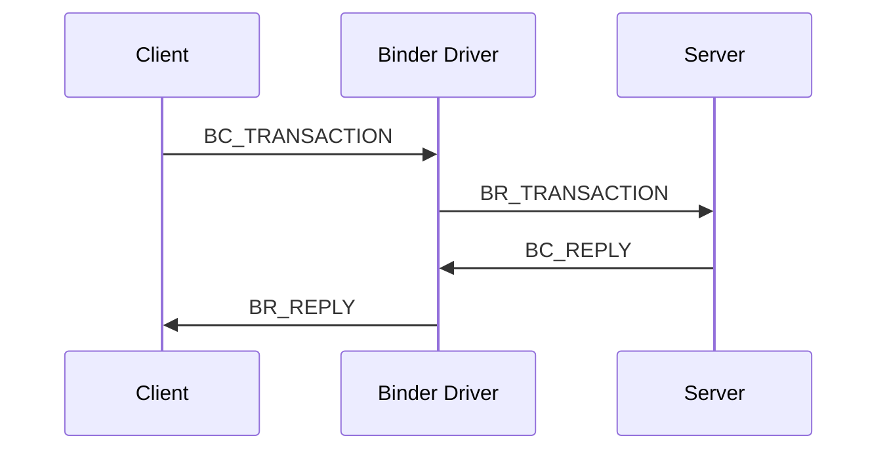
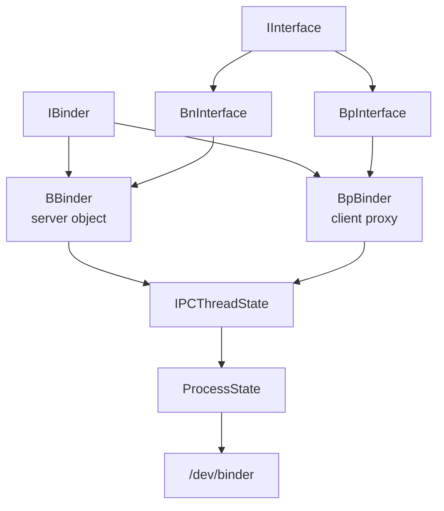
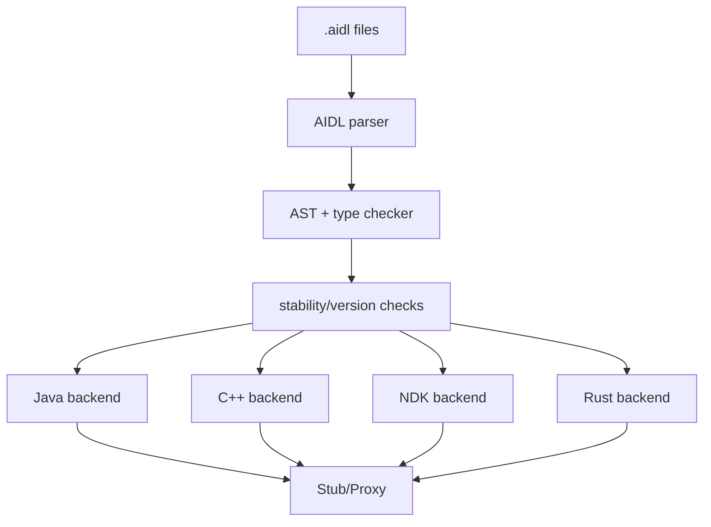
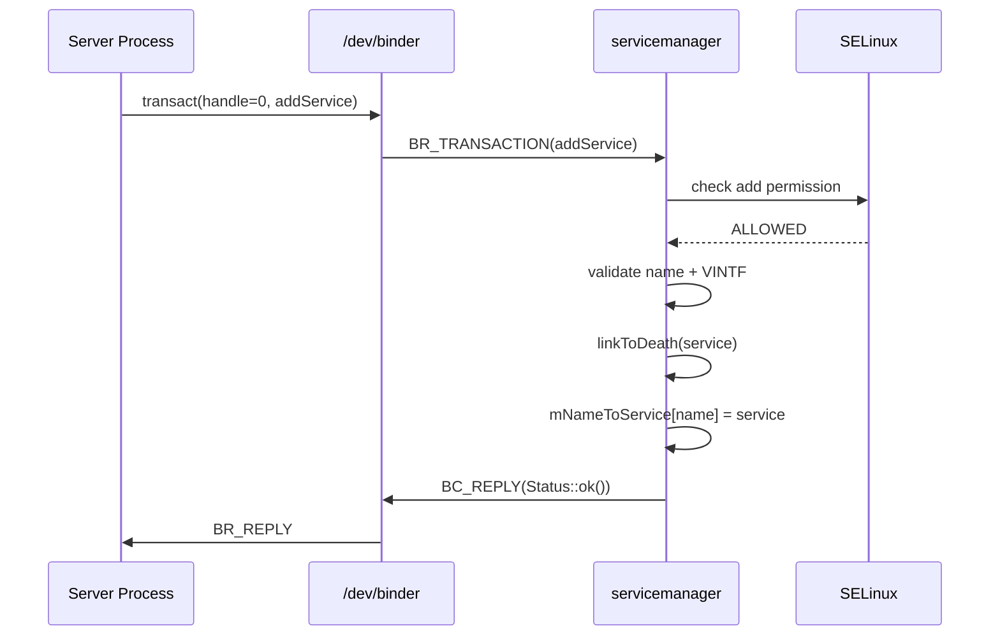
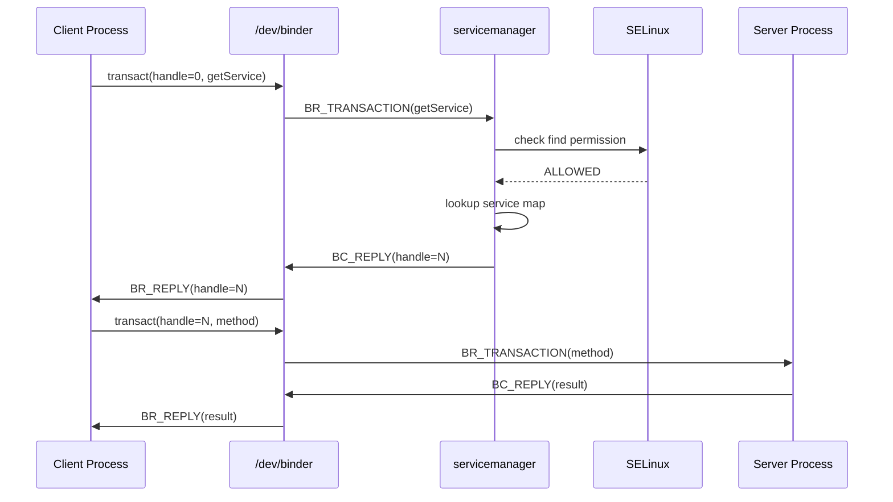
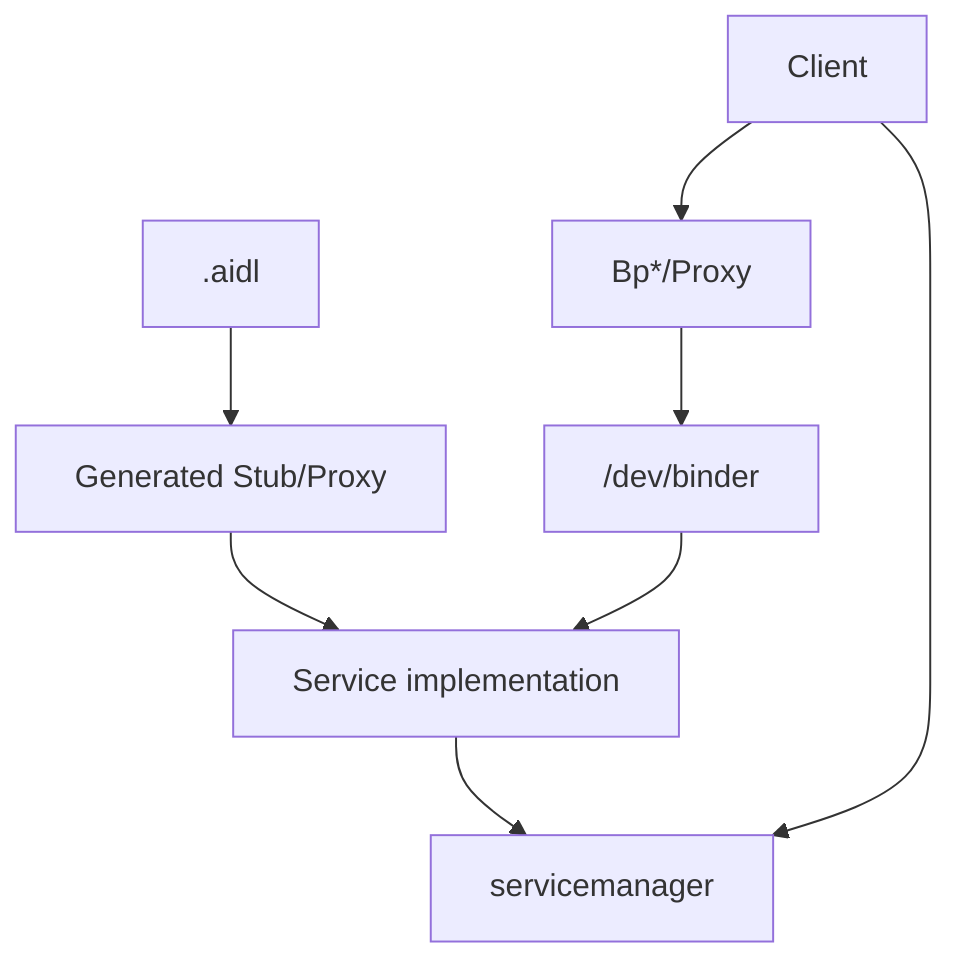
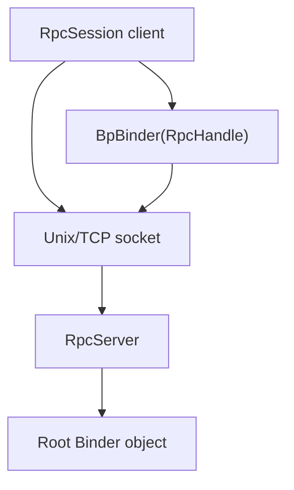
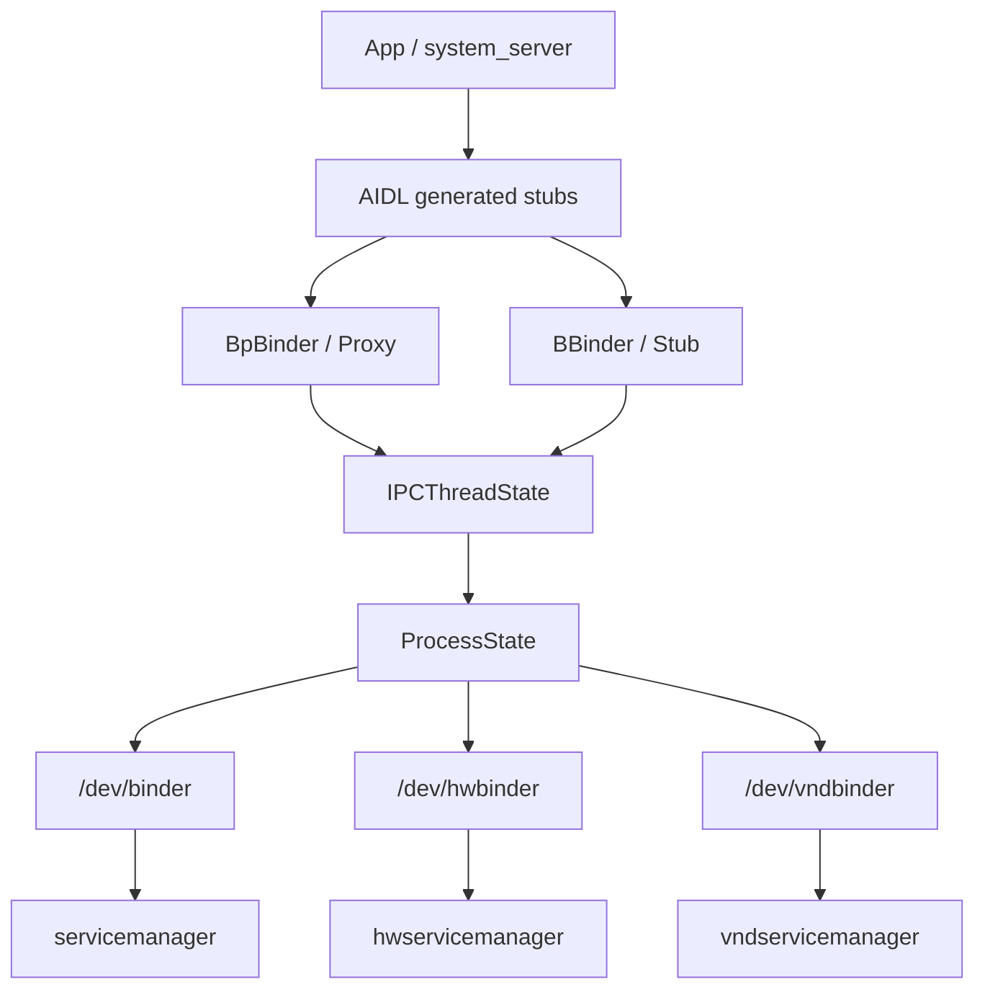

# 第 9 章：Binder IPC

Binder 是 Android 进程间通信的核心。每一次 Activity 启动、每一次 service 调用、每一次权限检查、每一次 surface 合成都经过 Binder。它不仅是 IPC 机制，更是让 Android 组件化架构成立的面向对象中间件。理解 Binder 是理解 AOSP 其他系统服务的前提。

本章从 Binder 内核驱动讲起，向上覆盖 C++ 和 Rust 用户态库、AIDL 代码生成工具链，以及作为系统名称服务的 `servicemanager`。读完本章后，你应该能够追踪一次完整事务如何从客户端进程进入内核，再到服务端进程，并能实现自己的 Binder service。

---

## 9.1 为什么是 Binder？

### 9.1.1 问题：移动操作系统需要安全、快速的 IPC

Android 在独立进程中运行大量系统服务，例如 Activity Manager、Window Manager、Package Manager、SurfaceFlinger 等。应用运行在自己的沙箱进程中，需要每秒数百次与这些服务通信。因此 IPC 机制必须满足几个硬性要求：

1. **基于身份的安全。** 内核必须权威地标识调用方 UID、PID 和 SELinux context，使服务端可以做访问控制决策。
2. **对象引用语义。** 客户端应能持有服务端进程中特定对象的引用，对象死亡时能收到 death notification，最后一个引用释放时对象能被清理。
3. **单次拷贝数据传输。** 移动硬件上性能很关键，数据应最多跨地址空间复制一次。
4. **同步与异步调用。** 同时支持 request-reply 同步调用和 fire-and-forget 的 `oneway` 异步调用。
5. **线程池管理。** 内核应能管理服务端线程池，在需要时请求新线程，并回收空闲线程。

### 9.1.2 历史背景

Binder 的起源早于 Android。它来自 OpenBinder，由 Be Inc.（BeOS 创造者）在 2000 年代早期开发，Dianne Hackborn 等人参与其中。Google 构建 Android 时，团队把 OpenBinder 改造成了 Android Binder。

原始设计的关键洞察是：移动设备需要基于 capability 的 IPC 系统，对象引用本身就是 capability。Unix IPC 更偏向 channel，即连接到某个命名端点，而不是持有特定对象引用。Binder 通过内核驱动补上了这一差距。

Binder 驱动最初位于 Android kernel 的 `drivers/staging/android/`，后来逐步清理并合入上游 Linux 的 `drivers/android/`。现代 Linux kernel 已包含 Binder 驱动。

### 9.1.3 与传统 Unix IPC 对比

| 机制 | 拷贝次数 | 身份 | 对象引用 | 线程管理 |
|-----------|--------|----------|-------------|-------------|
| Pipe | 2 | 无 per-message 身份 | 无 | 无 |
| Unix Socket | 2 | `SO_PEERCRED`，按连接 | 无 | 无 |
| Shared Memory | 0 | 无 | 无 | 无 |
| SysV Message Queue | 2 | 有限 UID 检查 | 无 | 无 |
| Binder | 1 | 每事务 UID/PID/SELinux SID | 有，带引用计数和死亡通知 | 有，内核管理线程池 |

管道和 Unix socket 需要从发送方复制到内核，再从内核复制到接收方。共享内存能做到零拷贝，但不提供同步、消息边界和身份。Binder 通过把接收方缓冲区映射给内核，实现数据直接复制到接收方 mmap 区域，从而只需一次拷贝。

### 9.1.4 单次拷贝机制

进程打开 `/dev/binder` 后，会调用 `mmap()` 映射 Binder 缓冲区。`ProcessState.cpp` 中定义了默认大小：

```cpp
#define BINDER_VM_SIZE ((1 * 1024 * 1024) - sysconf(_SC_PAGE_SIZE) * 2)
```

这会创建约 1 MB 的缓冲区，并预留两个 guard page。事务到达时，Binder 驱动在接收方映射区域内分配空间，并把发送方数据直接复制过去。接收方随后从自己的虚拟地址空间读取，无需第二次拷贝。

```text
Sender                    Kernel                    Receiver
┌─────────┐    copy_from_user     ┌──────────────┐
│ Parcel  │ ─────────────────────>│ mmap buffer  │
│ data    │                       │ in receiver  │
└─────────┘                       └──────────────┘
```

### 9.1.5 基于身份的安全

Binder 每个事务都会携带内核验证过的调用方 UID、PID 和 SELinux SID。服务端无需相信客户端提供的身份字段，而是直接从驱动传来的元数据读取调用者身份。system_server 中大量权限检查都依赖该机制。

### 9.1.6 对象引用与死亡通知

Binder 不是简单消息队列。它支持跨进程对象引用：服务端导出 `BBinder` 对象，客户端收到一个 handle 并包装为 `BpBinder` proxy。内核维护强弱引用计数，并在对象宿主进程死亡时向注册者发送 death notification。

### 9.1.7 三个 Binder 域

Android 使用三个 Binder 设备域隔离 framework、HAL 和 vendor：

| 域 | 设备 | 管理器 | 用途 |
|----|------|--------|------|
| Framework | `/dev/binder` | `servicemanager` | app 与 framework service |
| HAL | `/dev/hwbinder` | `hwservicemanager` | HIDL HAL，已逐步废弃 |
| Vendor | `/dev/vndbinder` | `vndservicemanager` | vendor 内部服务 |

---

## 9.2 Binder 驱动

Binder 驱动是用户态 Binder 栈的基础。用户态通过 `/dev/binder`、`/dev/hwbinder` 或 `/dev/vndbinder` 与驱动交互，核心接口是 `ioctl()`。

### 9.2.1 关键 ioctl 命令

常见 ioctl 包括：

| 命令 | 作用 |
|------|------|
| `BINDER_WRITE_READ` | 写命令并读取驱动返回命令，Binder 主通道 |
| `BINDER_SET_MAX_THREADS` | 设置进程 Binder 线程池最大线程数 |
| `BINDER_SET_CONTEXT_MGR` | 成为 context manager，即 servicemanager |
| `BINDER_VERSION` | 查询驱动协议版本 |
| `BINDER_GET_NODE_DEBUG_INFO` | 调试节点信息 |
| `BINDER_ENABLE_ONEWAY_SPAM_DETECTION` | 启用 oneway spam 检测 |

### 9.2.2 `BINDER_WRITE_READ` 结构

`BINDER_WRITE_READ` 是 Binder 驱动最核心的数据结构。用户态把要发送的命令放进 write buffer，同时提供 read buffer 接收驱动返回的命令。

```c
struct binder_write_read {
    binder_size_t write_size;
    binder_size_t write_consumed;
    binder_uintptr_t write_buffer;
    binder_size_t read_size;
    binder_size_t read_consumed;
    binder_uintptr_t read_buffer;
};
```

`IPCThreadState::talkWithDriver()` 会围绕这个结构执行 ioctl。

### 9.2.3 事务协议：`BC_` 与 `BR_` 命令

Binder 协议分为两类命令：

- **`BC_*`（Binder Command）**：用户态发给驱动，例如 `BC_TRANSACTION`、`BC_REPLY`、`BC_FREE_BUFFER`、`BC_ENTER_LOOPER`。
- **`BR_*`（Binder Return）**：驱动返回给用户态，例如 `BR_TRANSACTION`、`BR_REPLY`、`BR_TRANSACTION_COMPLETE`、`BR_DEAD_BINDER`、`BR_SPAWN_LOOPER`。

典型同步调用流程如下：



### 9.2.4 Transaction Data 结构

事务数据包含目标 handle、transaction code、flags、sender identity、data buffer、offsets buffer 等。data buffer 保存 Parcel 字节，offsets buffer 指向其中的 Binder object、fd 等特殊对象。

### 9.2.5 完整事务流程

一次完整事务从客户端 `BpBinder::transact()` 开始，经 `IPCThreadState::writeTransactionData()` 写入 `BC_TRANSACTION`，驱动解析目标 handle、分配接收方 buffer、复制数据、唤醒服务端线程。服务端收到 `BR_TRANSACTION` 后执行 `BBinder::transact()` / `onTransact()`，再通过 `BC_REPLY` 返回结果。

### 9.2.6 内存映射与 Buffer 管理

每个 Binder 进程都有一块 mmap buffer。驱动在接收方进程的 buffer 中分配事务空间，服务端处理完后通过 `BC_FREE_BUFFER` 释放。Binder buffer 耗尽通常意味着服务端处理慢、线程池饥饿、oneway 请求堆积或传输过大数据。

### 9.2.7 引用计数

Binder 驱动维护 node 与 ref。node 表示服务端真实对象，ref 表示其他进程持有的引用。强引用和弱引用分别对应对象生命周期和观察关系。驱动通过 `BR_INCREFS`、`BR_ACQUIRE`、`BR_RELEASE`、`BR_DECREFS` 等命令协调用户态引用变化。

### 9.2.8 死亡通知

客户端可通过 `linkToDeath()` 注册死亡通知。目标 Binder 对象所在进程死亡时，驱动发送 `BR_DEAD_BINDER`，libbinder 回调 death recipient。客户端随后可以清理 proxy、重连 service 或通知上层。

### 9.2.9 冻结进程通知

现代 Binder 支持 frozen process notification，用于与 app freezer 集成。当目标进程被冻结或解冻时，调用方可收到状态变化，避免对冻结进程发送不合适的同步调用。

### 9.2.10 线程池管理

Binder 驱动跟踪每个进程的 Binder 线程状态。当所有线程忙碌且未达到上限时，驱动会通过 `BR_SPAWN_LOOPER` 请求用户态创建新线程。主线程通过 `BC_ENTER_LOOPER` 加入线程池，派生线程通过 `BC_REGISTER_LOOPER` 注册。

### 9.2.11 成为 Context Manager

`servicemanager` 启动后会打开 `/dev/binder` 并调用 `BINDER_SET_CONTEXT_MGR`。成功后，它成为 handle 0 对应的 context manager。所有客户端通过 handle 0 获取 service manager，再进行 service 注册和查询。

---

## 9.3 `libbinder`（C++ 与 Rust）

`libbinder` 是 Binder 的用户态 C++ 框架，负责把驱动协议封装成对象模型。它定义 `IBinder`、`BBinder`、`BpBinder`、`ProcessState`、`IPCThreadState`、`Parcel` 等核心类。

### 9.3.1 `IBinder`：基础接口

`IBinder` 是所有 Binder 对象的基类。它定义 `transact()`、`linkToDeath()`、`unlinkToDeath()`、`pingBinder()`、`isBinderAlive()` 等通用操作。无论本地对象还是远程 proxy，都以 `IBinder` 暴露。

### 9.3.2 `BBinder`：服务端对象

`BBinder` 是服务端本地 Binder 对象。派生类不直接覆盖 `transact()`，而是覆盖 `onTransact()`。这是 Template Method 模式：`transact()` 处理 ping、dump、shell command 等通用逻辑，再把接口专属事务交给 `onTransact()`。

```cpp
class BBinder : public IBinder {
public:
    virtual status_t transact(uint32_t code, const Parcel& data,
                              Parcel* reply, uint32_t flags = 0) final;
protected:
    virtual status_t onTransact(uint32_t code, const Parcel& data,
                                Parcel* reply, uint32_t flags = 0);
};
```

### 9.3.3 `BpBinder`：客户端 Proxy

`BpBinder` 是指向远程 Binder 对象的客户端 proxy。它持有内核 handle，或者 RPC Binder session/address。调用 `BpBinder::transact()` 会进入 `IPCThreadState::transact()`，打包 Parcel 并发送给驱动。

`BpBinder` 还包含 proxy count tracking，用于防止 Binder proxy 泄漏。默认水位线包括 low 2000、warning 2250、high 2500。超过高水位时，系统可触发回调并杀死泄漏进程。

### 9.3.4 `ProcessState`：进程级单例

`ProcessState` 管理整个进程的 Binder 驱动连接：

1. 打开 `/dev/binder` 或 `/dev/vndbinder`。
2. mmap Binder transaction buffer。
3. 维护 handle 到 `BpBinder` 的映射表。
4. 提供 handle 0 context object。
5. 启动和管理 Binder 线程池。
6. 安装 `pthread_atfork` handler，防止 fork 后错误使用 Binder。

### 9.3.5 `IPCThreadState`：线程级状态

`IPCThreadState` 是线程局部对象，管理当前线程与 Binder 驱动的通信。它持有输入输出 `Parcel` buffer、调用方 PID/UID/SID、work source、pending deref 列表等。`mIn` 和 `mOut` 是 `BINDER_WRITE_READ` ioctl 的读写缓冲。

### 9.3.6 线程池循环

线程加入 Binder 线程池后，调用 `joinThreadPool()` 并进入循环：处理 pending deref、等待驱动命令、执行事务、在空闲超时后退出。主线程使用 `BC_ENTER_LOOPER`，派生线程使用 `BC_REGISTER_LOOPER`。

### 9.3.7 事务执行

`getAndExecuteCommand()` 调用 `talkWithDriver()`，从驱动读取 `BR_*` 命令，再调用 `executeCommand()` 分发。若线程池所有线程忙碌超过 100ms，libbinder 会记录 starvation 日志。

### 9.3.8 调用方身份管理

Binder 支持临时清除调用方身份，用于 system_server 代表调用方执行后再恢复自身权限上下文：

```cpp
int64_t IPCThreadState::clearCallingIdentity();
void IPCThreadState::restoreCallingIdentity(int64_t token);
```

这对应 Java 层常见的 `Binder.clearCallingIdentity()` / `Binder.restoreCallingIdentity()` 模式。

### 9.3.9 `IInterface` 与模板模式

`IInterface` 是类型化 Binder 接口基类。`BnInterface<T>` 生成服务端基类，继承接口和 `BBinder`；`BpInterface<T>` 生成客户端基类，继承接口并持有远程 `IBinder`。

```cpp
template <typename INTERFACE>
class BnInterface : public INTERFACE, public BBinder { ... };

template <typename INTERFACE>
class BpInterface : public INTERFACE, public BpRefBase { ... };
```

### 9.3.10 `Parcel` 类

`Parcel` 是 Binder 事务的序列化容器。它保存 typed data、Binder object references 和 file descriptors。常见 API 包括 `writeInt32()`、`writeString16()`、`writeStrongBinder()`、`writeFileDescriptor()` 和 `writeParcelable()`。

### 9.3.11 Rust Binder

Rust Binder 位于：

```text
frameworks/native/libs/binder/rust/
```

它围绕 NDK Binder 提供安全封装，核心类型包括 `SpIBinder`、`Binder<T: Remotable>`、`Interface` trait。Rust AIDL 后端会生成 Rust trait、proxy 和 native binder wrapper。

### 9.3.12 完整类层级



---

## 9.4 AIDL 代码生成

### 9.4.1 AIDL 编译器架构

AIDL 编译器位于 `system/tools/aidl/`。它解析 `.aidl` 文件，构建 AST，执行类型检查、稳定性检查和版本检查，然后生成 Java、C++、NDK C++ 或 Rust 代码。

### 9.4.2 AIDL 语法

典型 AIDL 接口如下：

```aidl
package android.hardware.echo;

interface IEchoService {
    String echo(in String input);
    int getCallCount();
    oneway void ping();
}
```

### 9.4.3 AIDL 类型映射

| AIDL 类型 | Java | C++ / NDK | Rust |
|-----------|------|-----------|------|
| `int` | `int` | `int32_t` | `i32` |
| `long` | `long` | `int64_t` | `i64` |
| `String` | `String` | `std::string` / `String16` | `String` |
| `boolean` | `boolean` | `bool` | `bool` |
| `List<T>` | `List<T>` | `std::vector<T>` | `Vec<T>` |
| interface | typed proxy | `sp<T>` / `std::shared_ptr<T>` | `Strong<dyn T>` |

### 9.4.4 方向修饰符：`in`、`out`、`inout`

`in` 表示客户端传入，`out` 表示服务端写回，`inout` 表示双向。跨进程传递大型对象时应谨慎使用 `out` 和 `inout`，避免额外序列化成本和 Binder buffer 压力。

### 9.4.5 `oneway` 方法

`oneway` 方法是异步调用，客户端只等待驱动确认事务提交，不等待服务端执行完成。它适合通知类调用，但可能导致队列堆积，因此应避免用 `oneway` 发送大量或耗时工作。

### 9.4.6 Parcelable 类型

Parcelable 用于声明可跨 Binder 传输的结构化数据。AIDL 可生成 Java/C++/Rust 的序列化逻辑，并支持 stable parcelable 作为 HAL 接口的一部分。

### 9.4.7 生成代码：Java

Java 后端通常生成 `Stub` 和 `Proxy`。`Stub` 继承 Binder 并在 `onTransact()` 中解析 transaction code；`Proxy` 持有远程 `IBinder`，把方法调用写入 `Parcel` 并调用 `transact()`。

### 9.4.8 生成代码：C++

C++ 后端生成 `Bn*` 和 `Bp*` 类。`Bn*::onTransact()` 反序列化参数并调用服务实现；`Bp*` 方法序列化参数并发起 Binder 事务。

### 9.4.9 生成代码：Rust

Rust 后端生成 trait、native service wrapper 和 proxy，实现类型安全的 Binder 调用，并利用 Rust 所有权模型降低资源管理错误。

### 9.4.10 NDK Backend 与 CPP Backend

NDK backend 面向稳定 ABI，适合 vendor/HAL 和跨分区接口；CPP backend 面向平台内部 C++，不保证 vendor 稳定 ABI。新 HAL 接口应优先使用 stable AIDL + NDK/Rust backend。

### 9.4.11 Enum 与 Constant 声明

AIDL 支持 enum 和常量。enum 提供跨语言一致的符号值，常量用于协议版本、flag、默认值等。稳定接口中应避免改变已有 enum 数值含义。

### 9.4.12 Union 类型

AIDL union 表示多个类型中的一个，适合表达 tagged variant。生成代码会包含 tag 和对应 value，并在反序列化时执行合法性检查。

### 9.4.13 Nullable 类型

`@nullable` 表示参数或返回值可为空。不同语言映射到 `null`、`std::optional` 或 Rust `Option<T>`。

### 9.4.14 Annotations

AIDL 注解控制稳定性、nullable、VINTF stability、Java-only 行为等。HAL 接口常使用 `@VintfStability` 表示接口可跨 system/vendor 边界稳定使用。

### 9.4.15 API 版本化与稳定性

Stable AIDL 要求接口演进保持向后兼容。通常只能追加方法或字段，不能改变已有方法签名、transaction ID、字段语义或 enum 数值。

### 9.4.16 Transaction ID 分配

AIDL 为每个方法分配 transaction code。生成代码中客户端和服务端必须使用相同 code。稳定接口需要保证已有 code 不变，否则旧客户端和新服务端会发生协议错配。

### 9.4.17 AIDL 编译流水线



---

## 9.5 `servicemanager`

### 9.5.1 架构概览

`servicemanager` 是 framework Binder 域的名称服务。它注册为 handle 0 的 context manager，维护 service name 到 Binder object 的映射，并执行 SELinux 和 VINTF 访问控制。

### 9.5.2 启动序列

`servicemanager` 由 init 启动，打开 `/dev/binder`，成为 context manager，注册自身服务，进入 Binder 线程循环。其他进程通过 handle 0 调用 `addService()`、`getService()`、`checkService()`。

### 9.5.3 `ServiceManager` 类

`frameworks/native/cmds/servicemanager/ServiceManager.cpp` 实现服务注册、查询、权限检查、死亡监听、callback 和 dumpsys 集成。核心数据结构是 service name 到 service record 的 map。

### 9.5.4 服务注册（`addService`）

服务进程调用 `addService(name, binder)` 注册服务。servicemanager 会：

1. 读取调用方 UID/PID/SID。
2. 检查 SELinux `add` 权限。
3. 校验服务名合法性。
4. 对 VINTF 声明服务检查 manifest。
5. 对服务 Binder 注册 death recipient。
6. 写入 `mNameToService`。
7. 通知等待该服务的 callback。

### 9.5.5 服务查询（`getService` / `checkService`）

客户端通过 `getService()` 或 `checkService()` 查询服务。servicemanager 检查 SELinux `find` 权限，通过后返回目标 service 的 Binder handle。`getService()` 可等待服务出现，`checkService()` 立即返回。

### 9.5.6 SELinux 访问控制

servicemanager 通过 SELinux 决定调用方能否 add/find 某个 service。service 名称会映射到 service context，例如 `activity_service`、`package_service`、`surfaceflinger_service` 等。

### 9.5.7 VINTF Manifest 集成

稳定 HAL AIDL 服务必须在 VINTF manifest 中声明。servicemanager 会验证服务名是否满足声明要求，防止未声明 HAL 随意注册。

### 9.5.8 Client Callback 支持

客户端可注册 service notification callback，在服务注册时收到通知。这是 `waitForService()` 高效等待的基础，避免轮询 servicemanager。

### 9.5.9 `dumpsys` 集成

`dumpsys` 通过 servicemanager 列出服务，并对目标服务调用 dump。服务可声明 dump priority，使 `dumpsys -l` 和分级 dump 更高效。

### 9.5.10 服务注册完整流程



### 9.5.11 服务查询完整流程



### 9.5.12 `vndservicemanager`

vendor service manager 使用 `/dev/vndbinder`，为 vendor 服务提供独立名称空间。VNDK 构建中默认 driver 是 `/dev/vndbinder`：

```cpp
#ifdef __ANDROID_VNDK__
const char* kDefaultDriver = "/dev/vndbinder";
#else
const char* kDefaultDriver = "/dev/binder";
#endif
```

### 9.5.13 `LazyServiceRegistrar`

`LazyServiceRegistrar` 支持按需启动 service。没有客户端时 service 可退出；客户端请求时 init 再启动它。这常用于空闲时保持运行成本较高的 HAL 服务。

### 9.5.14 `waitForService` 与高效等待

推荐使用 `waitForService()` 获取服务。它基于 notification callback 阻塞等待，而不是循环调用 `getService()` 轮询。

---

## 9.6 `hwservicemanager` 与 HIDL Binder

### 9.6.1 三个 Binder 域

| 域 | 设备 | Context Manager | 接口语言 | 状态 |
|--------|--------|----------------|-------------------|--------|
| Framework | `/dev/binder` | `servicemanager` | AIDL | 活跃 |
| HAL | `/dev/hwbinder` | `hwservicemanager` | HIDL | Android 13+ 起废弃 |
| Vendor | `/dev/vndbinder` | `vndservicemanager` | AIDL | 活跃 |

### 9.6.2 为什么需要三个域？

三域架构随 Project Treble 引入，用于强制 framework/vendor 边界。framework 域用于 app 与系统服务通信；HAL 域用于 framework 与 HIDL HAL 通信；vendor 域用于 vendor 内部通信。SELinux 策略会阻止 vendor 进程打开 `/dev/binder`，也阻止 framework 随意打开 `/dev/vndbinder`。

### 9.6.3 `hwservicemanager`

`hwservicemanager` 管理 `/dev/hwbinder` 上的 HIDL 服务。较新的设备若已迁移所有 HAL 到 AIDL，`hwservicemanager` 可以完全不启动。其接口是 HIDL `IServiceManager`，支持 `get()`、`add()`、`list()`、`registerForNotifications()` 等操作。

### 9.6.4 HIDL 与 AIDL

| 特性 | HIDL | AIDL |
|---------|------|------|
| Transport | `/dev/hwbinder` | `/dev/binder` 或 `/dev/vndbinder` |
| 服务命名 | `package@version::IInterface/instance` | `package.IInterface/instance` |
| 版本化 | package 级别，如 `@1.0` | method 级别，append-only |
| 语言支持 | C++、Java | C++、Java、NDK C++、Rust |
| 状态 | 已废弃 | 活跃，推荐 |
| Passthrough | 支持 | 不适用 |

### 9.6.5 从 HIDL 到 AIDL 的迁移

Android 13 开始，所有新 HAL 接口必须使用 AIDL。迁移路径通常是：定义新 AIDL 接口、实现 AIDL service、注册到 `servicemanager`、更新 VINTF manifest、最终移除 HIDL 接口。

### 9.6.6 Passthrough HAL

HIDL 支持 passthrough 模式，即 HAL 作为共享库直接加载进客户端进程，不走 IPC。AIDL 不支持 passthrough，所有通信都通过 Binder IPC。少数直接加载场景使用 `openDeclaredPassthroughHal()` 替代。

### 9.6.7 RPC Binder

Android 12+ 引入 RPC Binder，用 socket 传输 Binder 协议，用于跨设备和 VM 通信。它复用 `libbinder` 接口，但 transport 是 TCP/Unix socket，而不是内核 Binder 驱动。

---

## 9.7 动手实践：编写 Binder 服务

### 9.7.1 步骤 1：定义 AIDL 接口

```aidl
package android.hardware.echo;

interface IEchoService {
    String echo(in String input);
    int getCallCount();
    oneway void ping();
}
```

### 9.7.2 步骤 2：构建配置

为 AIDL 接口创建 `Android.bp`，使用 `aidl_interface` 声明接口名、srcs、backend、stability 和 owner。HAL 场景通常需要 `stability: "vintf"`。

### 9.7.3 步骤 3：实现服务（C++）

服务端继承生成的 `BnEchoService`，实现 `echo()`、`getCallCount()`、`ping()`。同步方法返回 `ScopedAStatus`，oneway 方法应快速返回。

### 9.7.4 步骤 4：服务主入口

服务进程 main 通常执行：创建 service、设置 Binder 线程池最大线程数、向 servicemanager 注册、启动线程池并 join。

### 9.7.5 步骤 5：服务构建配置

为 service binary 创建 `cc_binary`，链接生成的 AIDL NDK/C++ 库和 `libbinder_ndk` 或 `libbinder`。

### 9.7.6 步骤 6：Init 配置

添加 `.rc` service 配置，指定 binary 路径、class、user/group、SELinux domain、restart 策略和 task profile。

### 9.7.7 步骤 7：VINTF Manifest 条目

稳定 HAL AIDL 服务需要在 VINTF manifest 中声明 interface、instance 和 version。servicemanager 会用它验证注册合法性。

### 9.7.8 步骤 8：编写客户端

客户端通过 `AServiceManager_waitForService()` 或 C++ `waitForService()` 获取 binder，再转换为类型化接口调用方法。

### 9.7.9 步骤 9：Rust 实现

Rust service 实现生成的 trait，创建 Binder wrapper，注册到 service manager，并进入 thread pool。Rust 后端适合新 HAL 和安全敏感服务。

### 9.7.10 步骤 10：Java 客户端实现

Java 客户端通过 `ServiceManager.waitForService()` 或 framework 封装获取 `IBinder`，再使用生成的 `Stub.asInterface()` 转换为类型化接口。

### 9.7.11 步骤 11：处理死亡通知

客户端可调用 `linkToDeath()` 注册 death recipient。服务死亡时清理缓存 proxy，并重新等待服务出现。

### 9.7.12 步骤 12：调试服务

常用命令：

```bash
adb shell service list
adb shell dumpsys <service>
adb logcat -s servicemanager BinderIPC
adb shell cat /sys/kernel/debug/binder/state
```

### 9.7.13 常见陷阱

| 问题 | 表现 | 修复 |
|------|------|------|
| 忘记注册 service | 客户端 wait 卡住 | 检查 init、SELinux、servicemanager 日志 |
| SELinux find/add 被拒 | `avc: denied` | 添加 service_contexts 与 allow 规则 |
| 事务过大 | `FAILED_TRANSACTION` | 使用 shared memory / fd |
| oneway 滥用 | buffer 耗尽、延迟升高 | 限流或改同步调用 |
| 线程池过小 | thread pool starved | 调整 max threads，缩短 handler |

### 9.7.14 完整 Binder 服务架构



---

## 9.8 Binder 内部机制深挖

### 9.8.1 `writeTransactionData` 函数

`IPCThreadState::writeTransactionData()` 把 Parcel 内容转换成 `binder_transaction_data`，写入目标 handle、transaction code、flags、data buffer 和 offsets buffer，然后把 `BC_TRANSACTION` 或 `BC_REPLY` 写进 `mOut`。

### 9.8.2 `executeCommand` 函数（`BR_TRANSACTION`）

`executeCommand()` 处理驱动返回命令。收到 `BR_TRANSACTION` 时，它构造 `Parcel`，设置 calling identity，找到目标 `BBinder`，调用 `transact()`，并根据是否 oneway 写回 reply。

### 9.8.3 `BBinder::transact` 与模板方法模式

`BBinder::transact()` 是 final，负责通用事务处理；接口实现只覆盖 `onTransact()`。这保证 dump、shell、ping 等元操作行为一致。

### 9.8.4 `BBinder::Extras` 与惰性初始化模式

`BBinder::Extras` 保存 death recipient、extension、observer 等可选状态。只有需要时才分配，避免每个 Binder 对象都承担额外内存成本。

### 9.8.5 `waitForResponse` 循环

同步调用会在 `waitForResponse()` 中等待 `BR_REPLY`。等待期间线程也可能处理嵌套 incoming transaction，这支持 Binder 的 reentrant 调用模型。

### 9.8.6 嵌套事务

服务端在处理一个 Binder 调用时又发起另一个同步 Binder 调用，可能导致嵌套事务。Binder 驱动和 libbinder 支持这种 reentrant 模型，但复杂服务要避免锁顺序错误和死锁。

### 9.8.7 Binder Context Object（Handle 0）

handle 0 是 context manager，也就是 servicemanager。`defaultServiceManager()` 最终会获取 handle 0 的 proxy，并通过它查询其他服务。

### 9.8.8 Stability Enforcement

Binder 对象和 AIDL 接口可带 stability 信息，例如 local、VINTF。跨分区稳定接口必须满足稳定性要求，防止不稳定对象穿越 system/vendor 边界。

### 9.8.9 Parcel 内部结构

Parcel 包含 data buffer、objects array、file descriptor 标记、位置指针和 ownership 信息。objects array 指向 data buffer 中的 flat binder object、fd object 等特殊对象。

### 9.8.10 `ProcessState` 构造函数

`ProcessState` 构造时打开 Binder driver、校验版本、设置最大线程数、mmap buffer，并初始化 handle table。默认 driver 根据构建环境选择 `/dev/binder` 或 `/dev/vndbinder`。

### 9.8.11 Binder 缓存

`ProcessState` 缓存 handle 到 `BpBinder` 的映射，避免同一 handle 创建多个 proxy。servicemanager singleton 也被缓存，避免反复查询 handle 0。

### 9.8.12 `defaultServiceManager()` 单例

`defaultServiceManager()` 返回全局 `IServiceManager` proxy。首次调用时通过 handle 0 获取 servicemanager，后续调用复用缓存。

### 9.8.13 Flat Binder Objects

`flat_binder_object` 是 Parcel 中表示 Binder 对象或 handle 的内核 ABI 结构。它可表示本地 binder、远程 handle、weak binder、fd 等对象类型。

### 9.8.14 Parcel Objects Array

Parcel 的 objects array 保存特殊对象在 data buffer 中的偏移。驱动依靠该数组在跨进程复制时翻译 Binder object、handle 和 fd。

### 9.8.15 Transaction Flags

常见 flag 包括 `TF_ONE_WAY`、`TF_ACCEPT_FDS`、`TF_CLEAR_BUF` 等。`TF_ONE_WAY` 表示异步调用；`TF_ACCEPT_FDS` 表示接收方接受 fd；`TF_CLEAR_BUF` 用于安全清理 buffer。

---

## 9.9 高级主题

### 9.9.1 Binder Observers

Binder observer 可用于观察事务、对象生命周期或调试事件。它们通常用于系统诊断、统计和性能分析。

### 9.9.2 Call Restrictions

libbinder 可设置调用限制，防止某些线程或上下文执行不允许的 Binder 调用。例如在特定上下文中禁止阻塞式 Binder 调用，避免死锁或卡顿。

### 9.9.3 后台调度

Binder 可以影响调用线程调度策略。后台进程发起调用时，系统可避免不必要地提升优先级，降低后台工作对前台体验的影响。

### 9.9.4 调度策略继承

Binder 支持一定程度的 scheduler policy inheritance，使服务端处理调用时继承客户端的优先级信息，减少优先级反转。

### 9.9.5 Extensions

Binder extension 允许给 Binder 对象附加额外接口，而不改变原始接口定义。客户端可查询 extension 获取增强能力。

### 9.9.6 Binder Recording

Binder recording 可记录事务用于调试和重放。它有助于诊断复杂跨进程交互，但需要谨慎处理隐私和安全数据。

### 9.9.7 RPC Binder 概览

RPC Binder 把 Binder 对象模型运行在 socket transport 上，使跨设备、虚拟机、host/guest 通信能够复用 AIDL/libbinder 生态。

### 9.9.8 Binder 接口稳定性级别

Binder 接口可具有不同稳定性级别。平台内部接口可以不稳定；跨分区 HAL 接口需要 VINTF stability；RPC 或 APEX 场景可能有额外稳定性要求。

### 9.9.9 Binder 线程池配置模式

线程池大小应匹配服务负载。CPU 密集服务需要限制并发，I/O 等待多的服务可适度增加线程。过小会饥饿，过大则增加内存和调度开销。

---

## 9.10 RPC Binder

### 9.10.1 为什么需要 RPC Binder？

内核 Binder 只能在同一内核实例内工作。虚拟化、跨设备通信、host/guest 调试和某些模块化场景需要跨进程边界之外的 Binder 语义。RPC Binder 通过 socket transport 提供相同对象模型。

### 9.10.2 架构



### 9.10.3 核心类

核心类包括 `RpcServer`、`RpcSession`、`RpcTransport`、`RpcTransportCtx`、`RpcState`。`BpBinder` 通过 `std::variant<BinderHandle, RpcHandle>` 同时支持内核 Binder 与 RPC Binder。

### 9.10.4 Wire Protocol

RPC Binder wire protocol 在 socket 上传输 Binder transaction、reply、object reference、fd 等信息。它保留 Binder 对象语义，但不依赖 `/dev/binder` 驱动。

### 9.10.5 Transport Layers

RPC Binder 支持 Unix domain socket、TCP socket、vsock 等 transport。不同 transport 适合本机、跨设备或虚拟机场景。

### 9.10.6 安全：TLS 与认证

跨设备 RPC Binder 需要认证和加密。TLS transport 可提供机密性和完整性，认证层确保对端身份可信。安全模型需要根据具体部署场景设计。

### 9.10.7 文件描述符传输

本机 Unix socket 可传递 fd，TCP 等远程 transport 不能直接传递 Linux fd。RPC Binder 需要根据 transport 能力决定是否支持 fd，或使用替代机制。

### 9.10.8 线程模型

RPC Binder 有自己的 session/thread 模型。服务端 `RpcServer` 接受连接，session 管理并发事务，线程池执行请求。它与内核 Binder 的线程池概念相似，但调度由用户态 transport 驱动。

### 9.10.9 Rust 与 NDK Bindings

RPC Binder 可与 Rust 和 NDK Binder 绑定配合使用，使同一 AIDL 接口能够在内核 Binder 与 socket transport 之间迁移。

### 9.10.10 AOSP 中的使用场景

RPC Binder 常用于虚拟化、Microdroid、host tool 与 guest service 通信、跨进程测试，以及需要 Binder 语义但不能使用内核 Binder 的场景。

### 9.10.11 Kernel Binder 与 RPC Binder

| 维度 | Kernel Binder | RPC Binder |
|------|---------------|------------|
| Transport | `/dev/binder` ioctl/mmap | socket/vsock/TCP |
| 身份 | 内核提供 UID/PID/SID | transport/auth 层提供 |
| fd 传递 | 原生支持 | 取决于 transport |
| 使用范围 | 同一 Android 系统 | 跨 VM/设备/host |
| 性能 | 高，单次拷贝 | 取决于 socket 与加密 |

---

## 9.11 调试与诊断

### 9.11.1 `debugfs` 接口

Binder 驱动通过 debugfs 暴露状态：

```bash
adb shell cat /sys/kernel/debug/binder/state
adb shell cat /sys/kernel/debug/binder/stats
adb shell cat /sys/kernel/debug/binder/transactions
adb shell cat /sys/kernel/debug/binder/proc/<pid>
```

这些文件可查看进程、线程、node、ref、transaction 和 buffer 使用情况。

### 9.10.2 Perfetto Tracing

Perfetto 可采集 Binder driver、sched、线程池和 service 调用相关 trace。它适合分析跨进程延迟、Binder thread starvation 和长事务。

### 9.10.3 `service` 命令

`service` 命令可列出和调用 Binder 服务：

```bash
adb shell service list
adb shell service check activity
adb shell service call activity <code>
```

### 9.10.4 常见错误码

常见错误包括 `DEAD_OBJECT`、`FAILED_TRANSACTION`、`BAD_VALUE`、`PERMISSION_DENIED`、`UNKNOWN_TRANSACTION`。AIDL 还会把服务异常封装为 `binder::Status` exception code。

### 9.10.5 诊断 Binder Buffer 耗尽

Binder buffer 耗尽通常来自：

1. `onTransact()` 处理太慢，积压请求。
2. Binder 线程池饥饿。
3. 发送 bitmap 或大数据，没有使用 shared memory。
4. oneway 调用过多，队列无法及时消费。

### 9.10.6 使用 atrace 跟踪 Binder 事务

```bash
adb shell atrace --async_start -c binder_driver binder_lock
adb shell atrace --async_stop > trace.txt
```

然后用 Perfetto UI 查看 trace。

### 9.10.7 监控 Binder Proxy 数量

```bash
adb shell dumpsys activity binder-proxies
adb shell ls /proc/<pid>/fd | wc -l
```

debug 构建上 proxy throttle 水位可通过系统属性调整。

### 9.10.8 使用 `binder_exception_to_string`

AIDL exception code 与内核 `status_t` 不同：

| Exception Code | 名称 | 含义 |
|----------------|------|------|
| -1 | `EX_SECURITY` | 安全违规 |
| -2 | `EX_BAD_PARCELABLE` | Parcelable 数据错误 |
| -3 | `EX_ILLEGAL_ARGUMENT` | 参数非法 |
| -4 | `EX_NULL_POINTER` | 空指针 |
| -5 | `EX_ILLEGAL_STATE` | 状态非法 |
| -6 | `EX_NETWORK_MAIN_THREAD` | 主线程网络操作 |
| -7 | `EX_UNSUPPORTED_OPERATION` | 不支持的操作 |
| -8 | `EX_SERVICE_SPECIFIC` | 服务专属错误 |
| -9 | `EX_PARCELABLE` | 自定义 Parcelable 异常 |
| -128 | `EX_TRANSACTION_FAILED` | 事务失败 |

---

## 9.11 总结

### 关键源码文件

| 组件 | 路径 |
|-----------|------|
| ProcessState | `frameworks/native/libs/binder/ProcessState.cpp` |
| IPCThreadState | `frameworks/native/libs/binder/IPCThreadState.cpp` |
| IBinder header | `frameworks/native/libs/binder/include/binder/IBinder.h` |
| BBinder | `frameworks/native/libs/binder/Binder.cpp` |
| BpBinder | `frameworks/native/libs/binder/BpBinder.cpp` |
| IInterface | `frameworks/native/libs/binder/include/binder/IInterface.h` |
| Parcel | `frameworks/native/libs/binder/include/binder/Parcel.h` |
| IServiceManager | `frameworks/native/libs/binder/include/binder/IServiceManager.h` |
| servicemanager main | `frameworks/native/cmds/servicemanager/main.cpp` |
| ServiceManager | `frameworks/native/cmds/servicemanager/ServiceManager.cpp` |
| Access control | `frameworks/native/cmds/servicemanager/Access.cpp` |
| servicemanager.rc | `frameworks/native/cmds/servicemanager/servicemanager.rc` |
| vndservicemanager.rc | `frameworks/native/cmds/servicemanager/vndservicemanager.rc` |
| AIDL compiler | `system/tools/aidl/aidl.cpp` |
| AIDL to C++ | `system/tools/aidl/aidl_to_cpp.cpp` |
| AIDL to Java | `system/tools/aidl/aidl_to_java.cpp` |
| AIDL to Rust | `system/tools/aidl/aidl_to_rust.cpp` |
| Rust binder | `frameworks/native/libs/binder/rust/src/lib.rs` |
| Rust binder traits | `frameworks/native/libs/binder/rust/src/binder.rs` |
| Rust proxy | `frameworks/native/libs/binder/rust/src/proxy.rs` |
| Rust native | `frameworks/native/libs/binder/rust/src/native.rs` |
| hwservicemanager | `system/hwservicemanager/ServiceManager.h` |
| hwservicemanager.rc | `system/hwservicemanager/hwservicemanager.rc` |
| LazyServiceRegistrar | `frameworks/native/libs/binder/include/binder/LazyServiceRegistrar.h` |
| Kernel header bridge | `frameworks/native/libs/binder/binder_module.h` |

### 架构总结



### 关键结论

1. **Binder 是单次拷贝 IPC 机制。** 内核把数据直接复制到接收方 mmap buffer。
2. **每个事务都携带内核验证身份。** UID、PID、SELinux context 是 Android 安全模型基础。
3. **对象引用语义是 Binder 的核心。** 引用计数和死亡通知支撑分布式对象生命周期。
4. **架构分层清晰。** 内核驱动 -> libbinder -> AIDL 生成代码 -> service 实现。
5. **servicemanager 是系统名称服务。** 它受 SELinux 和 VINTF manifest 保护。
6. **三个 Binder 域执行 Treble 边界。** binder、hwbinder、vndbinder 隔离 framework、HAL 和 vendor。
7. **AIDL 是新接口标准。** 支持 Java、C++、NDK C++ 和 Rust。
8. **HIDL 与 hwbinder 已被 AIDL 取代。** Android 13 起新 HAL 接口使用 AIDL。

---

下一章将继续讨论硬件抽象层（HAL）架构，并建立在本章介绍的 AIDL 和 Binder 概念之上。
