# 第 9 章：Binder IPC
Binder 是 Android 进程间通信的核心。无论是 Activity 的启动、服务调用、权限检查，还是 Surface 的合成，都要经过 Binder。它不仅仅是一个 IPC 机制，更是实现 Android 组件化架构的对象导向中间件。理解 Binder 是理解 AOSP 其它所有内容的前置条件。

本章将从内核驱动程序开始剖析 Binder，经过 C++ 和 Rust 用户态库，进入 AIDL 代码生成工具链，最后到达充当系统名称服务的 `servicemanager`。学完本章后，你将能够跟踪一个完整的事务从客户端进程穿过内核进入服务端进程的全过程，并能够构建自己的 Binder 服务。

---

## 9.1 为什么选择 Binder？

### 9.1.1 问题所在：移动操作系统的安全且快速的 IPC

Android 在独立的进程中运行着数十个系统服务（Activity Manager、Window Manager、Package Manager、SurfaceFlinger 等）。运行在各自沙箱进程中的应用程序必须每秒与这些服务通信数百次。IPC 机制必须满足几个硬性指标：

1. **基于身份的安全机制。** 内核必须能够权威地识别调用者（UID、PID、SELinux 上下文），以便服务端做出访问控制决策。传统的 Unix IPC（管道、Unix 套接字）可以通过 `SO_PEERCRED` 传递凭据，但那是基于连接的，而不是基于每个事务（transaction）的。

2. **对象引用语义。** 客户端应该能够持有服务端进程中某个特定对象的引用。当该对象销毁时，客户端应收到死亡通知（death notification）。当最后一个引用被释放时，对象应被清理。

3. **单次拷贝（One-copy）数据传输。** 为了移动端硬件的性能，数据在地址空间之间最多只能拷贝一次。传统的同步消息传递（管道、消息队列）需要从发送方拷贝到内核，再从内核拷贝到接收方——共计两次拷贝。

4. **同步与异步调用。** 必须同时支持“请求-响应”（同步）和“发完即忘”（oneway/异步）模式。

5. **线程池管理。** 内核应能管理服务端进程中的线程池，根据需要生成新线程并回收空闲线程。

### 9.1.2 历史背景

Binder 的起源早于 Android。它源自 OpenBinder，由 Dianne Hackborn 等人于 21 世纪初在 Be Inc.（BeOS 的创造者）开发。当 Palm 收购 Be 的技术后，OpenBinder 继续演进。谷歌构建 Android 时，开发团队（包括 Hackborn）将 OpenBinder 适配成了现在的 Android Binder。

原始设计的核心洞察是：移动设备需要一个**基于能力（capability-based）**的 IPC 系统，其中对象引用充当能力凭证。Unix IPC 机制是面向通道的（你连接到一个命名端点），而不是面向对象的（你持有一个特定对象的引用）。Binder 通过内核驱动程序提供对象引用语义，从而弥合了这一差距。

内核驱动程序最初位于主线之外（在 Android 内核的 `drivers/staging/android/` 目录中）。经过多年的清理，它已被合并到 Linux 主线内核的 `drivers/android/` 目录下。现代 Linux 内核（5.0+）已包含 Binder 驱动，无需任何 Android 特有的补丁。

### 9.1.3 与传统 Unix IPC 的对比

| 机制 | 拷贝次数 | 身份识别 | 对象引用 | 线程管理 |
|-----------|--------|----------|-------------|-------------|
| **管道 (Pipe)** | 2 (写 + 读) | 无（单条消息级别）| 否 | 否 |
| **Unix 套接字** | 2 (发 + 收) | SO_PEERCRED (基于连接) | 否 | 否 |
| **共享内存** | 0 | 无 | 否 | 否 |
| **SysV 消息队列** | 2 | 有限 (UID 检查) | 否 | 否 |
| **Binder** | **1** (驱动直接拷贝至接收方 mmap 缓冲区) | **基于事务** (UID, PID, SELinux SID) | **是** (引用计数, 死亡通知) | **是** (内核管理线程池) |

**管道和 Unix 套接字**需要两次拷贝：一次从发送方缓冲区到内核，第二次从内核到接收方缓冲区。它们不提供每条消息的身份识别——`SO_PEERCRED` 只能告诉你谁建立了连接，而不能在多路复用的连接中告诉你某条特定消息是谁发的。

**共享内存**（`ashmem` 或 `memfd`）实现了零拷贝，但不提供同步机制、消息分帧或身份识别。它通常与 Binder **配合使用**（例如，SurfaceFlinger 使用共享内存传输图形缓冲区，但使用 Binder 进行控制流通信）。

**Binder** 通过内存映射实现单次拷贝：内核映射接收方地址空间的一个区域，然后将发送方的数据直接拷贝到该区域。接收方直接从自己的映射内存中读取数据，无需额外拷贝。

### 9.1.4 单次拷贝（One-Copy）机制

当一个进程打开 `/dev/binder` 时，它会调用 `mmap()` 来映射 Binder 缓冲区。如 `ProcessState.cpp` 中定义：

```cpp
// frameworks/native/libs/binder/ProcessState.cpp
#define BINDER_VM_SIZE ((1 * 1024 * 1024) - sysconf(_SC_PAGE_SIZE) * 2)
```

这创建了一个约 1 MB 的缓冲区（减去两个页面的保护页）。当事务到达时，Binder 驱动程序在接收方的映射区域内分配空间，并将发送方的数据直接拷贝到那里。接收方从其自身的虚拟地址空间中读取——仅需单次拷贝。

```
发送方                    内核                    接收方
┌─────────┐    copy_from_user     ┌──────────────┐
│  Parcel │ ─────────────────────>│  接收方的      │
│  数据    │                       │  mmap 缓冲区  │
└─────────┘                       └──────────────┘
                                        │
                                        │ (已位于接收方的
                                        │  地址空间内)
                                        v
                                  ┌──────────────┐
                                  │  接收方        │
                                  │  读取数据      │
                                  └──────────────┘
```

### 9.1.5 基于身份的安全机制

每一个 Binder 事务都携带发送方的 UID 和 PID，这些信息由内核驱动程序注入（而非用户态注入）。发送方无法伪造这些值。接收进程通过以下接口读取它们：

```cpp
// frameworks/native/libs/binder/include/binder/IPCThreadState.h
[[nodiscard]] pid_t getCallingPid() const;
[[nodiscard]] uid_t getCallingUid() const;
[[nodiscard]] const char* getCallingSid() const;  // SELinux 安全 ID (SID)
```

这种基于事务的身份识别是 Android 权限模型的基础。当应用调用 `ActivityManager.startActivity()` 时，`system_server` 接收到 Binder 事务，读取调用者的 UID，并检查该 UID 是否拥有所需的权限。

### 9.1.6 对象引用与死亡通知

Binder 提供了一种分布式对象模型。服务端创建一个 `BBinder` 对象（称为“节点/node”）。当它通过 Binder 将该对象发送给客户端时，客户端会收到一个 `BpBinder`（称为“代理/proxy”）。内核驱动程序维护节点的引用计数——当所有代理都被释放后，节点就可以被回收。

如果服务端进程死亡，内核驱动会向每一个注册了 `DeathRecipient` 的客户端发送 `BR_DEAD_BINDER` 通知：

```cpp
// frameworks/native/libs/binder/include/binder/IBinder.h
class DeathRecipient : public virtual RefBase {
public:
    virtual void binderDied(const wp<IBinder>& who) = 0;
};

virtual status_t linkToDeath(const sp<DeathRecipient>& recipient,
                             void* cookie = nullptr,
                             uint32_t flags = 0) = 0;
```

这就是 Android 检测应用崩溃并触发 `ActivityManagerService`、`WindowManagerService` 等服务清理工作的机制。

### 9.1.7 三个 Binder 域（Domains）

现代 Android 拥有三个独立的 Binder 设备节点，每个节点都有自己的上下文管理器（Context Manager）。Project Treble (Android 8.0) 引入了这种拆分，以便在 IPC 层强制执行框架/供应商（framework/vendor）的边界：


```mermaid
graph TB
    subgraph "Framework 域"
        A[Apps] <-->|"/dev/binder"| B[system_server]
        B <-->|"/dev/binder"| C[servicemanager]
    end

    subgraph "HAL 域 (已废弃)"
        D["Framework<br/>clients"] <-->|"/dev/hwbinder"| E[HAL services]
        E <-->|"/dev/hwbinder"| F[hwservicemanager]
    end

    subgraph "Vendor 域"
        G["Vendor<br/>processes"] <-->|"/dev/vndbinder"| H[Vendor services]
        H <-->|"/dev/vndbinder"| I[vndservicemanager]
    end

    style A fill:#e1f5fe
    style B fill:#e1f5fe
    style C fill:#e1f5fe
    style D fill:#fff3e0
    style E fill:#fff3e0
    style F fill:#fff3e0
    style G fill:#e8f5e9
    style H fill:#e8f5e9
    style I fill:#e8f5e9
```

| 域 | 设备节点 | 上下文管理器 | 接口语言 | 状态 |
|--------|--------|----------------|-------------------|--------|
| Framework | `/dev/binder` | `servicemanager` | AIDL | 活跃 |
| HAL | `/dev/hwbinder` | `hwservicemanager` | HIDL | **已废弃** (Android 13+) |
| Vendor | `/dev/vndbinder` | `vndservicemanager` | AIDL | 活跃 |

SELinux 策略强制执行这些边界：供应商进程无法打开 `/dev/binder`，框架进程也不应打开 `/dev/vndbinder`。进程默认使用的设备取决于编译变体：

```cpp
// frameworks/native/libs/binder/ProcessState.cpp
#ifdef __ANDROID_VNDK__
const char* kDefaultDriver = "/dev/vndbinder";
#else
const char* kDefaultDriver = "/dev/binder";
#endif
```

§9.6 将深入探讨 HAL 域（`hwservicemanager` 以及 HIDL 到 AIDL 的迁移）。

---

## 9.2 Binder 驱动程序

Binder 驱动是一个 Linux 内核模块（现已合并至主线内核的 `drivers/android/`）。它实现了一个字符设备（如 `/dev/binder`），用户态通过 `ioctl()` 和 `mmap()` 与之通信。

### 9.2.1 核心 ioctl 命令

驱动程序暴露了几个 ioctl 命令，最关键的是：

| ioctl | 用途 |
|-------|---------|
| `BINDER_WRITE_READ` | 核心主力：在一次调用中发送命令并接收响应 |
| `BINDER_SET_MAX_THREADS` | 配置内核管理线程的最大数量 |
| `BINDER_SET_CONTEXT_MGR` | 声明调用进程为上下文管理器 (service manager) |
| `BINDER_SET_CONTEXT_MGR_EXT` | 同上，但带有安全上下文标志 |
| `BINDER_GET_NODE_DEBUG_INFO` | 获取关于 Binder 节点的调试信息 |
| `BINDER_GET_NODE_INFO_FOR_REF` | 获取某个引用的引用计数信息 |

`binder_module.h` 头文件桥接了用户态与内核接口：

```cpp
// frameworks/native/libs/binder/binder_module.h
#include <linux/android/binder.h>
#include <sys/ioctl.h>
```

### 9.2.2 BINDER_WRITE_READ 结构体

所有的事务数据都通过 `binder_write_read` 结构体流动：

```c
struct binder_write_read {
    binder_size_t write_size;       /* 待写入的字节数 */
    binder_size_t write_consumed;   /* 驱动已消耗的字节数 */
    binder_uintptr_t write_buffer;  /* 指向写命令缓冲区的指针 */
    binder_size_t read_size;        /* 可读取的字节数 */
    binder_size_t read_consumed;    /* 驱动已写入（用户态已消耗）的字节数 */
    binder_uintptr_t read_buffer;   /* 指向读缓冲区的指针 */
};
```

单次 `ioctl(fd, BINDER_WRITE_READ, &bwr)` 调用可以同时发送发出的命令并接收返回的响应。这就是 `IPCThreadState::talkWithDriver()` 的工作原理：

```cpp
// frameworks/native/libs/binder/IPCThreadState.cpp
status_t IPCThreadState::talkWithDriver(bool doReceive)
{
    // ... 初始化 bwr 结构体 ...
    bwr.write_size = outAvail;
    bwr.write_buffer = (uintptr_t)mOut.data();

    if (doReceive && needRead) {
        bwr.read_size = mIn.dataCapacity();
        bwr.read_buffer = (uintptr_t)mIn.data();
    }
    // ... 执行 ioctl ...
    status_t err;
    do {
        if (ioctl(mProcess->mDriverFD, BINDER_WRITE_READ, &bwr) >= 0)
            err = NO_ERROR;
        else
            err = -errno;
    } while (err == -EINTR);
    // ...
}
```

### 9.2.3 事务协议：BC_ 与 BR_ 命令

写缓冲区包含 **BC_ (Binder Command)** 码，用于用户态向驱动发令。读缓冲区返回 **BR_ (Binder Return)** 码，用于驱动向用户态反馈。

**BC_ (命令 -- 用户态至驱动):**
包括 `BC_TRANSACTION`（发起事务）、`BC_REPLY`（响应事务）、`BC_FREE_BUFFER`（释放缓冲区）、`BC_ENTER_LOOPER`（进入循环）等。

**BR_ (返回 -- 驱动至用户态):**
包括 `BR_TRANSACTION`（接收到事务）、`BR_REPLY`（接收到响应）、`BR_DEAD_BINDER`（检测到 Binder 死亡）、`BR_SPAWN_LOOPER`（通知创建新线程）等。

### 9.2.4 事务数据结构

每个 `BC_TRANSACTION` 和 `BR_TRANSACTION` 都携带一个 `binder_transaction_data` 结构：

```c
struct binder_transaction_data {
    union {
        __u32 handle;     /* 目标：句柄（客户端代理侧使用） */
        binder_uintptr_t ptr; /* 目标：指针（服务端本地节点使用） */
    } target;
    binder_uintptr_t cookie;  /* 目标对象 cookie */
    __u32 code;               /* 事务命令代码（接口定义相关） */
    __u32 flags;              /* 如 TF_ONE_WAY, TF_ACCEPT_FDS 等 */
    pid_t sender_pid;         /* 由驱动填写的发送方 PID */
    uid_t sender_euid;        /* 由驱动填写的发送方 UID */
    binder_size_t data_size;  /* 数据字节数 */
    binder_size_t offsets_size; /* 偏移数组字节数 */
    union {
        struct {
            binder_uintptr_t buffer;  /* 指向事务数据的指针 */
            binder_uintptr_t offsets; /* 指向对象偏移数组的指针 */
        } ptr;
        __u8 buf[8];
    } data;
};
```

`sender_pid` 和 `sender_euid` 字段由内核驱动程序填写，而非用户态。这正是 Binder 身份不可伪造的原因。

### 9.2.5 完整事务流程

下图展示了一个同步 Binder 事务的完整生命周期：

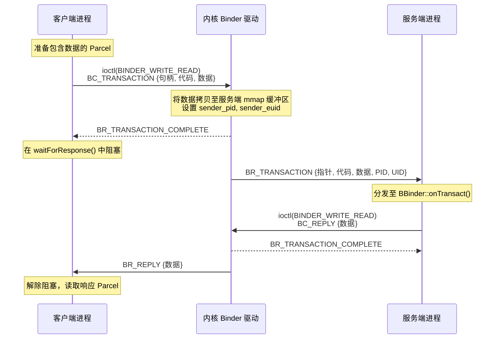
```mermaid
sequenceDiagram
    participant Client as 客户端进程
    participant KD as 内核 Binder 驱动
    participant Server as 服务端进程

    Note over Client: 准备包含数据的 Parcel
    Client->>KD: ioctl(BINDER_WRITE_READ)<br/>BC_TRANSACTION {句柄, 代码, 数据}
    Note over KD: 将数据拷贝至服务端 mmap 缓冲区<br/>设置 sender_pid, sender_euid

    KD-->>Client: BR_TRANSACTION_COMPLETE
    Note over Client: 在 waitForResponse() 中阻塞

    KD->>Server: BR_TRANSACTION {指针, 代码, 数据, PID, UID}
    Note over Server: 分发至 BBinder::onTransact()

    Server->>KD: ioctl(BINDER_WRITE_READ)<br/>BC_REPLY {数据}
    KD-->>Server: BR_TRANSACTION_COMPLETE

    KD->>Client: BR_REPLY {数据}
    Note over Client: 解除阻塞，读取响应 Parcel
```

对于 **oneway (异步)** 事务，流程更短：

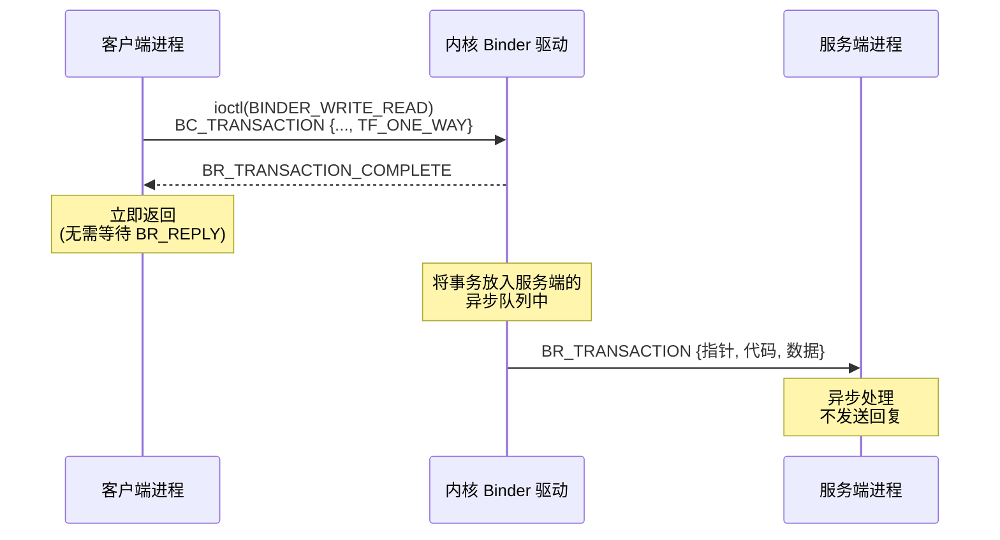
```mermaid
sequenceDiagram
    participant Client as 客户端进程
    participant KD as 内核 Binder 驱动
    participant Server as 服务端进程

    Client->>KD: ioctl(BINDER_WRITE_READ)<br/>BC_TRANSACTION {..., TF_ONE_WAY}
    KD-->>Client: BR_TRANSACTION_COMPLETE
    Note over Client: 立即返回<br/>(无需等待 BR_REPLY)

    Note over KD: 将事务放入服务端的<br/>异步队列中
    KD->>Server: BR_TRANSACTION {指针, 代码, 数据}
    Note over Server: 异步处理<br/>不发送回复
```

### 9.2.6 内存映射与缓冲区管理

当 `ProcessState` 打开 Binder 驱动时，它会调用 `mmap()`。这约 1 MB 的缓冲区在用户态被映射为只读——只有内核可以向其中写入。驱动程序在该缓冲区内为传入的事务分配子区域。接收方处理完事务后，必须发出 `BC_FREE_BUFFER` 命令将缓冲区释放回驱动程序。

该缓冲区大小是所有并发传入事务总大小的硬性上限。如果一个进程有太多的挂起事务，缓冲区将被填满，新的事务将失败并返回 `FAILED_TRANSACTION`。这就是为什么系统在 Binder 缓冲区利用率过高时会记录警告。


## 9.3 libbinder (C++ 与 Rust)

源码目录：`frameworks/native/libs/binder/`

libbinder 是 AOSP 中 Binder 系统的核心用户态库。它为 C++ 和 Rust 开发者提供了操作 Binder 驱动的高层抽象。该库由大约 80 个源码文件组成，定义了 Binder 对象的生命周期、序列化（Parcel）以及线程池管理逻辑。

### 9.3.1 libbinder 架构与类层次结构

libbinder 的设计采用了典型的代理模式（Proxy Pattern）和模板方法模式。

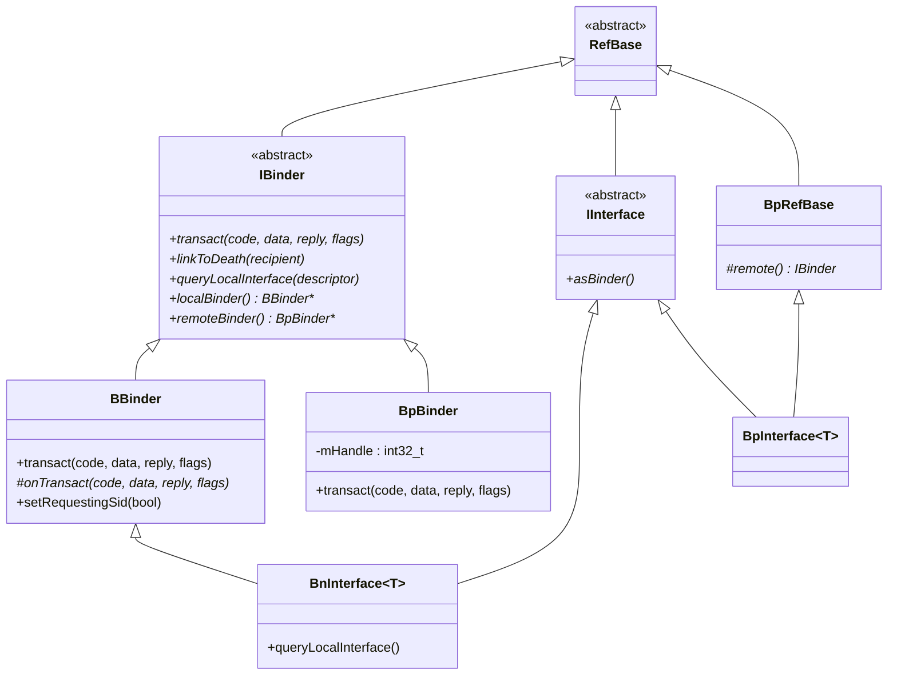
```mermaid
classDiagram
    class RefBase {
        <<abstract>>
    }
    class IBinder {
        <<abstract>>
        +transact(code, data, reply, flags)*
        +linkToDeath(recipient)*
        +queryLocalInterface(descriptor)*
        +localBinder()* BBinder*
        +remoteBinder()* BpBinder*
    }
    class BBinder {
        +transact(code, data, reply, flags)
        #onTransact(code, data, reply, flags)*
        +setRequestingSid(bool)
    }
    class BpBinder {
        +transact(code, data, reply, flags)
        -mHandle : int32_t
    }
    class IInterface {
        <<abstract>>
        +asBinder()*
    }
    class BnInterface~T~ {
        +queryLocalInterface()
    }
    class BpInterface~T~ {
    }
    class BpRefBase {
        #remote() IBinder*
    }

    RefBase <|-- IBinder
    IBinder <|-- BBinder
    IBinder <|-- BpBinder
    RefBase <|-- IInterface
    IInterface <|-- BnInterface
    BBinder <|-- BnInterface
    IInterface <|-- BpInterface
    BpRefBase <|-- BpInterface
    RefBase <|-- BpRefBase
```

- **IBinder**: 接口基类，定义了 `transact()` 虚函数，这是所有 Binder 调用的入口。
- **BBinder (Binder Body)**: 服务端对象的基类。它运行在提供服务的进程中，通过重写 `onTransact()` 来处理请求。
- **BpBinder (Binder Proxy)**: 客户端代理。它持有内核分配的句柄（Handle），通过该句柄将调用转发给内核。
- **IInterface**: 业务接口的抽象基类，用于将 `IBinder` 转换为强类型的业务接口（如 `ICameraService`）。

### 9.3.2 ProcessState 与 IPCThreadState

Binder 在用户态的运行依赖于两个核心单例：

1.  **ProcessState (进程状态)**:
    -   **单例范围**: 每个进程一个。
    -   **主要角色**: 打开 `/dev/binder` 设备节点，并通过 `mmap()` 映射 ~1MB 的接收缓冲区。
    -   **线程池管理**: 负责通过 `startThreadPool()` 启动 Binder 线程。
    -   **句柄管理**: 维护一个 `mHandleToObject` 表，记录内核句柄与 `BpBinder` 对象的映射。

2.  **IPCThreadState (线程间通信状态)**:
    -   **单例范围**: 每个 Binder 线程一个（使用线程局部存储 TLS）。
    -   **主要角色**: 真正与内核驱动打交道的类。它封装了 `ioctl(BINDER_WRITE_READ)` 调用。
    -   **数据缓冲**: 维护 `mIn` 和 `mOut` 两个 `Parcel` 对象，分别作为从内核读取和向内核写入的缓冲区。
    -   **调用栈**: 负责执行 `talkWithDriver()`，并在收到 `BR_TRANSACTION` 时分发到目标的 `BBinder::transact`。

### 9.3.3 线程池 (Thread Pool) 机制

Binder 驱动具备动态线程管理能力。当服务端进程的所有 Binder 线程都在忙碌且有新请求到达时，驱动会向用户态发送 `BR_SPAWN_LOOPER` 命令，请求进程创建一个新线程加入池中。

- **最大线程数**: 默认为 15 个，由 `ProcessState::setThreadPoolMaxThreadCount()` 配置。
- **joinThreadPool()**: 线程进入一个死循环，不断调用 `getAndExecuteCommand()`。
- **身份标识**: 通过 `getCallingPid()` 和 `getCallingUid()` 获取调用方的身份。内核保证这些信息的真实性，无法被用户态伪造。

### 9.3.4 Rust Binder 后端 (binder-rs)

Rust Binder（`frameworks/native/libs/binder/rust/`）是基于 `libbinder_ndk` 的封装。它利用 Rust 的内存安全特性管理 Binder 引用。

- **SpIBinder**: 相当于 C++ 中的 `sp<IBinder>`，代表对远程对象的强引用。
- **WpIBinder**: 弱引用计数，防止循环引用导致内存泄露。
- **实现原理**: Rust 对象通过封装 `AIBinder` 结构体与 NDK 层的 C API 交互。它利用 `repr(C)` 确保内存布局与底层库兼容，并使用 Rust 的 `Drop` 特征自动处理引用计数的释放。

### 9.3.5 Parcel 数据格式

`Parcel` 是 Binder 传输的载体，它不仅仅是一个字节数组，而是一个能够识别“对象”的容器。

- **扁平化 (Marshalling)**: 将基本类型（int, float）写入连续内存。
- **类型化读写**: 支持 `writeStrongBinder()` 写入 Binder 对象。当写入 Binder 对象时，驱动会介入，如果是 `BBinder` 则在内核创建节点，如果是 `BpBinder` 则传递句柄。
- **文件描述符 (FD) 传递**: 通过 `writeFileDescriptor()` 传输。内核会执行 `dup()` 操作，并在目标进程的文件描述符表中安装该 FD，实现真正的跨进程资源共享。

---

## 9.4 AIDL 编译与代码生成

AIDL (Android Interface Definition Language) 解决了手动编写 Binder 样板代码的繁琐和易错问题。

### 9.4.1 AIDL 编译过程

AIDL 编译器（`aidl`）是一个前端工具，它解析 `.aidl` 文件并根据目标后端（Java, C++, NDK, Rust）生成相应的存根（Stub）和代理（Proxy）类。

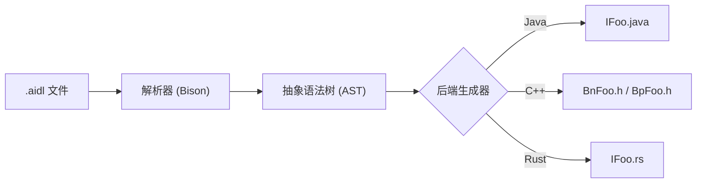
```mermaid
flowchart LR
    A[".aidl 文件"] --> B["解析器 (Bison)"]
    B --> C["抽象语法树 (AST)"]
    C --> D{"后端生成器"}
    D -->|Java| E["IFoo.java"]
    D -->|C++| F["BnFoo.h / BpFoo.h"]
    D -->|Rust| G["IFoo.rs"]
```

### 9.4.2 生成的 C++/Java 代码结构

无论在哪种语言中，AIDL 都会生成以下核心组件：

1.  **接口类 (Interface)**: 定义业务方法（如 `void doSomething()`）。
2.  **存根类 (Stub)**:
    -   **角色**: 服务端基类（继承自 `BBinder` 或 `Binder`）。
    -   **职责**: 实现 `onTransact()` 派发逻辑。它从 `Parcel` 中解包（Unmarshall）参数，调用实际的业务实现，然后将结果压入 reply Parcel。
3.  **代理类 (Proxy)**:
    -   **角色**: 客户端实现（封装了 `BpBinder`）。
    -   **职责**: 实现业务接口。它将参数打包（Marshall）进 `Parcel`，调用底层的 `transact()`，然后从 reply Parcel 中解析返回值。

### 9.4.3 技术细节：同步与异步

- **同步调用**: 默认情况下，AIDL 生成的是同步阻塞调用。客户端线程会挂起，直到服务端处理完毕并返回回复。
- **oneway (异步)**: 在方法前加上 `oneway` 关键字。此时客户端调用会立即返回，内核不会等待服务端执行，也不会发送回复。这对于通知类接口非常有用，但注意 `oneway` 调用在同一个 Binder 对象上是顺序执行的。

### 9.4.4 类型映射与方向指令 (Direction Specifiers)

AIDL 引入了 `in`, `out`, `inout` 指令：
- **in**: 数据从客户端流向服务端（默认）。
- **out**: 数据由服务端填充并返回给客户端。
- **inout**: 双向流动，开销最大。

对于基本类型，由于是按值传递，通常只能是 `in`。对于 `Parcelable` 对象（如 `Bundle` 或自定义结构体），方向指令决定了编译器是否需要在回复包中重新读取该对象。


## 9.5 servicemanager

源码目录：`frameworks/native/cmds/servicemanager/`

`servicemanager` 是 Android 中第一个启动的服务。它是所有 Binder 服务的名称服务器（Name-server）：进程通过名称注册服务，客户端通过名称查找服务。

### 9.5.1 架构概览

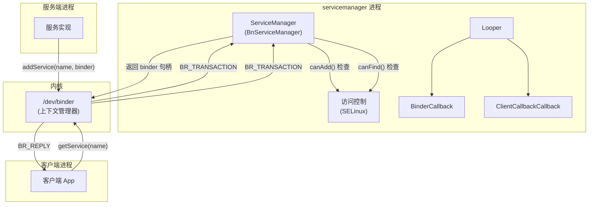
```mermaid
graph TD
    subgraph "servicemanager 进程"
        SM["ServiceManager<br/>(BnServiceManager)"]
        AC["访问控制<br/>(SELinux)"]
        LO["Looper"]
        BC["BinderCallback"]
        CC["ClientCallbackCallback"]
    end

    subgraph "内核"
        BD["/dev/binder<br/>(上下文管理器)"]
    end

    subgraph "服务端进程"
        SRV["服务实现"]
    end

    subgraph "客户端进程"
        CLI["客户端 App"]
    end

    SRV -->|"addService(name, binder)"| BD
    BD -->|"BR_TRANSACTION"| SM
    SM -->|"canAdd() 检查"| AC

    CLI -->|"getService(name)"| BD
    BD -->|"BR_TRANSACTION"| SM
    SM -->|"canFind() 检查"| AC
    SM -->|"返回 binder 句柄"| BD
    BD -->|"BR_REPLY"| CLI

    LO --> BC
    LO --> CC
```

### 9.5.2 启动序列

`servicemanager` 在引导早期由 init 启动。其 init.rc 文件如下：

```rc
# frameworks/native/cmds/servicemanager/servicemanager.rc
service servicemanager /system/bin/servicemanager
    class core animation
    user system
    group system readproc
    critical
    file /dev/kmsg w
    onrestart setprop servicemanager.ready false
    onrestart restart --only-if-running apexd
    onrestart restart audioserver
    onrestart restart gatekeeperd
    onrestart class_restart --only-enabled main
    onrestart class_restart --only-enabled hal
    onrestart class_restart --only-enabled early_hal
    task_profiles ProcessCapacityHigh
    shutdown critical
```

`critical` 标志意味着如果 `servicemanager` 崩溃次数过多，系统将重启。`onrestart` 触发所有依赖服务的重启。

从 Android 11 开始，`servicemanager` 已从 C++ 重写为 **Rust**，以提高内存安全性和开发效率。虽然其逻辑保持一致，但核心实现现在位于 Rust 代码库中。

### 9.5.3 注册为上下文管理器 (Context Manager)

作为系统服务的核心，`servicemanager` 必须向 Binder 驱动注册自己为 **上下文管理器 (Context Manager)**。

在 C++ 版本（以及 Rust 版本的逻辑实现）中，通过 `becomeContextManager()` 调用实现：

```cpp
// 历史 C++ 参考实现
sp<ProcessState> ps = ProcessState::initWithDriver(driver);
// ...
if (!ps->becomeContextManager()) {
    LOG(FATAL) << "Could not become context manager";
}
```

在内核底层，这会发出 `BINDER_SET_CONTEXT_MGR` 系统的 ioctl 调用。Binder 驱动仅允许一个进程成为上下文管理器，且该进程通常被硬编码为句柄 0（Handle 0）。

### 9.5.4 ServiceManager 类

`ServiceManager` 类继承自 `BnServiceManager`（由 AIDL 生成）并实现 `DeathRecipient` 接口：

```cpp
// frameworks/native/cmds/servicemanager/ServiceManager.h
class ServiceManager : public os::BnServiceManager,
                       public IBinder::DeathRecipient {
public:
    // ...
    binder::Status getService(const std::string& name, sp<IBinder>* outBinder) override;
    binder::Status checkService(const std::string& name, sp<IBinder>* outBinder) override;
    binder::Status addService(const std::string& name, const sp<IBinder>& binder,
                              bool allowIsolated, int32_t dumpPriority) override;
    // ...
};
```

### 9.5.5 服务注册 (addService) 流转

当服务端进程调用 `addService()` 时：

1. **权限检查**：验证调用者 UID（通常仅限系统 UID 或具有特定权限的进程）。
2. **SELinux 策略检查**：调用 `selinux_check_access` 验证调用者是否有权“add”该特定名称的服务。
3. **VINTF 清单验证**：对于 HAL 服务，验证其是否在 VINTF 清单中声明。
4. **死亡通知 (Death Notification)**：`servicemanager` 会通过 `linkToDeath` 监控服务端进程。如果服务端崩溃，`servicemanager` 会自动清理注册信息。
5. **存储**：将服务名称与 Binder 句柄的映射关系存入 `mNameToService`。

### 9.5.6 服务查找 (getService / checkService)

- **`getService()`**：如果服务未运行，会尝试触发 init 启动该服务（通过设置 `startIfNotFound=true`）。
- **`checkService()`**：立即返回。如果服务不存在则返回空。

### 9.5.7 VINTF 清单集成

为了支持 Project Treble 和模块化，`servicemanager` 与 **VINTF (Vendor Interface object)** 紧密集成。

```cpp
static bool meetsDeclarationRequirements(const Access::CallingContext& ctx,
                                         const sp<IBinder>& binder,
                                         const std::string& name) {
    if (!Stability::requiresVintfDeclaration(binder)) {
        return true;
    }
    return isVintfDeclared(ctx, name);
}
```

这确保了 HAL 服务必须在设备清单（Device Manifest）文件中显式声明，防止非法或未定义的服务注册，从而维护了系统与供应商分区之间的严格边界。

---

## 9.6 hwservicemanager 与 HIDL Binder

源码目录：`system/hwservicemanager/`

随着 Android 8.0 (Project Treble) 的引入，Android 被划分为系统（System）和供应商（Vendor）两个域。为了解耦这两个域，引入了第二 Binder 域：`/dev/hwbinder`。

### 9.6.1 hwservicemanager 的角色

`hwservicemanager` 是 `/dev/hwbinder` 域的上下文管理器。它专门用于管理 **HIDL (HAL Interface Definition Language)** 服务。

其职责包括：
- 管理硬件服务（Vendor HALs）的注册与查找。
- 维护从 FQN (完全限定名称，如 `android.hardware.foo@1.0::IFoo/default`) 到 Binder 对象的映射。
- 为那些仍处于“直通模式”（Passthrough）的 HAL 提供支持。

### 9.6.2 HIDL 与 AIDL 的差异

| 特性 | HIDL | AIDL |
|---------|------|------|
| 传输层设备 | `/dev/hwbinder` | `/dev/binder` 或 `/dev/vndbinder` |
| 服务命名 | `package@version::IInterface/instance` | `package.IInterface/instance` |
| 现状 | **已弃用 (Deprecated)** | 活跃，推荐使用 |

### 9.6.3 从 HIDL 转向 AIDL (Halization)

在 Treble 早期，所有 HAL 都必须使用 HIDL 并在 `/dev/hwbinder` 上运行。然而，维护两套 Binder 基础设施（`servicemanager` 和 `hwservicemanager`）增加了复杂性。

从 Android 11 开始，Google 推出了 **Aidl HALs**。主要变化如下：
1. **统一域**：现代 HAL 现在直接使用 AIDL 并在 `/dev/binder` (系统) 或 `/dev/vndbinder` (供应商) 上运行。
2. **弃用 hwservicemanager**：在仅包含 AIDL HAL 的现代设备上，`hwservicemanager` 甚至可能不会启动。
3. **稳定性保证**：AIDL 引入了 `@VintfStability` 标记，确保跨分区的接口兼容性，这在以前是 HIDL 的核心卖点。

### 9.6.4 供应商域与 vndservicemanager

为了进一步隔离，供应商进程之间可以使用第三个 Binder 域：`/dev/vndbinder`。

- **`vndservicemanager`**：它是 `servicemanager` 二进制文件的另一个实例，但在启动时绑定到 `/dev/vndbinder`。
- **用途**：用于供应商私有 HAL 之间的通信，不涉及系统分区。
- **设备树 (Device Tree)**：Binder 驱动的实例（binder, hwbinder, vnbinder）通过设备树进行配置。

### 9.6.5 现代架构下的服务注册流

在现代（Android 13+）设备中，一个典型的 HAL 注册流程如下：
1. HAL 实现 AIDL 接口。
2. HAL 进程启动，获取 `defaultServiceManager()`（指向 `/dev/binder`）。
3. 调用 `addService("android.hardware.foo.IFoo/default", ...)`。
4. `servicemanager` 检查 VINTF 清单，确认该 AIDL HAL 已声明。
5. 注册成功。


## 9.7 Binder 内部机制深挖 (Binder Internals: Deep Dive)

本节将深入探讨 Binder 驱动层与 `libbinder` 的底层实现，特别是内核数据结构、内存映射机制、事务处理逻辑以及生命周期管理。这对于需要进行系统性能优化或底层调试的开发者至关重要。

### 9.7.1 Binder 内核核心数据结构

Binder 驱动在内核空间维护了一系列复杂的数据结构来管理进程、线程和 Binder 对象。

1.  **binder_proc**: 代表一个打开了 `/dev/binder` 的进程。它维护了进程的内存映射信息（`binder_buffer`）、待处理的待办事项队列（`todo`）、以及该进程拥有的所有 Binder 实体（`nodes`）和引用（`refs`）。
2.  **binder_thread**: 代表进程中的一个 Binder 线程。每个线程都有自己的等待队列和**事务栈（Transaction Stack）**，用于处理同步调用。
3.  **binder_node**: 代表一个 Binder 实体（即 `BBinder` 在内核中的映射）。它记录了实体在用户空间的指针、所属进程以及引用计数。
4.  **binder_ref**: 代表一个 Binder 引用（即 `BpBinder` 在内核中的映射）。它建立了客户端进程与远程 `binder_node` 之间的联系。内核通过句柄（Handle）来标识这些引用。

### 9.7.2 物理内存映射与页面分配 (Memory Mapping)

Binder 的“一次拷贝”特性依赖于内核对物理内存的精巧管理。

*   **地址空间预留**: 当进程调用 `mmap()` 时，Binder 驱动并不会立即分配所有物理内存。它只是在内核虚拟地址空间（VM Area）预留出一块区域（通常是 1MB 减去两页）。
*   **动态页面分配**: 只有在实际需要发送事务数据时，内核才会按需分配物理页面（`struct page`）。
*   **双重映射 (Dual Mapping)**: 分配的物理页面会同时映射到两个位置：
    1.  **内核虚拟空间**: 供内核驱动写入接收到的数据。
    2.  **用户虚拟空间**: 供接收进程直接读取数据（只读权限）。
*   **释放**: 接收进程处理完数据后调用 `BC_FREE_BUFFER`，驱动会回收相应的物理页面。

### 9.7.3 事务栈与同步阻塞 (The Transaction Stack)

为了支持 Binder 的嵌套调用（递归调用），驱动为每个 `binder_thread` 维护了一个 **事务栈（Transaction Stack）**。

*   **入栈**: 当线程 A 发起对进程 B 的同步调用时，一个新的 `binder_transaction` 结构会被创建并压入 A 的事务栈。线程 A 进入阻塞状态。
*   **嵌套处理**: 如果进程 B 在处理过程中反过来调用 A（回调），内核会检查 A 的事务栈。如果发现 A 正在等待 B 的响应，内核会直接将此新事务派发给处于阻塞状态的线程 A，从而避免死锁。
*   **出栈**: 当 B 返回响应（`BC_REPLY`）时，相应的事务从栈中弹出，线程 A 被唤醒并获取结果。

### 9.7.4 引用计数与死亡通知 (Reference Counting & Death Notifications)

Binder 使用复杂的引用计数机制来确保对象在不同进程间的生命周期安全。

*   **引用计数 (Reference Counting)**:
    *   内核通过 `BC_ACQUIRE`/`BC_RELEASE`（强引用）和 `BC_INCREFS`/`BC_DECREFS`（弱引用）命令同步用户空间与内核空间的计数。
    *   当一个 `binder_node` 的所有引用计数归零时，内核会通知所属进程释放该 `BBinder` 对象。
*   **死亡通知 (Death Notifications/linkToDeath)**:
    *   客户端通过 `linkToDeath()` 向 Binder 驱动注册。
    *   内核会将客户端进程的 `binder_ref` 与其对应的 `binder_node` 关联起来。
    *   如果拥有 `binder_node` 的进程崩溃，驱动会检测到该进程的 `binder_proc` 结构被销毁，随后遍历其所有 `nodes`，向所有注册了死亡通知的客户端发送 `BR_DEAD_BINDER`。

### 9.7.5 Binder 线程池管理 (Thread Pool Management)

Binder 驱动与 `libbinder` 共同协作来动态调整服务端的线程数量。

*   **Looper 状态**: 线程通过 `BC_ENTER_LOOPER` 或 `BC_REGISTER_LOOPER` 进入循环状态。
*   **BR_SPAWN_LOOPER**: 当驱动发现当前的空闲 Binder 线程不足以处理待办任务时，它会向用户空间发送 `BR_SPAWN_LOOPER` 指令。
*   **动态扩展**: `ProcessState` 接收到此指令后，会根据 `setThreadPoolMaxThreadCount` 设置的上限，决定是否创建一个新的线程进入 `joinThreadPool()`。

---

## 9.8 高级主题 (Advanced Topics)

### 9.8.1 eBPF Binder 追踪

在现代 Android（Android 12+）中，传统的 Ftrace 正在被 eBPF 追踪所取代。

*   **挂钩点**: eBPF 程序可以挂载到 `binder_transaction` 和 `binder_return_done` 等内核函数上。
*   **实时监控**: 通过 `bpftrace` 或 Perfetto 的 eBPF 数据源，开发者可以精确监控每个事务的耗时、缓冲区占用情况以及调用链，而不会产生过大的性能开销。

### 9.8.2 BinderFS 机制

为了支持多个 Binder 实例（如容器化需求）并解决固定设备节点的限制，Android 引入了 **BinderFS**。

*   **原理**: BinderFS 是一个伪文件系统。与过去在内核启动时静态创建 `/dev/binder` 不同，现在可以通过挂载文件系统来动态创建。
*   **设置过程**:
    ```bash
    mkdir /dev/binderfs
    mount -t binder binder /dev/binderfs
    # 创建新的 Binder 实例
    ln -s /dev/binderfs/binder /dev/binder
    ```
*   **优势**: 每个容器可以拥有独立的 Binder 上下文（Context Manager），互不干扰。

### 9.8.3 Trusty/TEE Binder (Trusty IPC)

Android 的可信执行环境（TEE），如 Trusty，也使用了类 Binder 的通信机制。

*   **Trusty IPC (TIPC)**: Trusty 内部使用基于共享内存和消息队列的 TIPC 协议。
*   **RPC Binder 结合**: 通过 RPC Binder 框架，Android 安全侧的服务（如 Keymaster 4.0+）可以将 AIDL 接口直接暴露给 Trusty。
*   **安全性**: 通信通过物理隔离的共享内存缓冲区完成，确保普通世界（Normal World）无法非法访问安全世界（Secure World）的 Binder 状态。

### 9.8.4 稳定性级别与 VINTF

为了支持 Treble 架构下的跨分区更新，Binder 引入了显式的稳定性声明：

1.  **VINTF 稳定性**: 保证跨版本兼容，可用于 System 与 Vendor 分区之间的通信。
2.  **System 稳定性**: 仅限 System 分区内部使用。
3.  **Vendor 稳定性**: 仅限 Vendor 分区内部使用。

AIDL 编译器在生成代码时会检查稳定性级别，确保不会意外调用不兼容的接口。


## 9.9 RPC Binder

传统的 Binder 依赖于 `/dev/binder` 内核驱动，这要求通信的两个进程必须共享同一个 Linux 内核。**RPC Binder**（在 Android 12 中引入）将内核驱动替换为**基于套接字的传输（socket-based transport）**，从而实现了跨内核边界的 Binder 通信——包括虚拟机之间、通过网络连接，或进入可信执行环境（TEE）。

### 9.9.1 为什么需要 RPC Binder？

内核 Binder 驱动有一个根本限制：客户端和服务端必须运行在同一个内核上，并能访问同一个 `/dev/binder` 设备。在以下场景中，这种模式失效：

| 场景 | 问题 | RPC Binder 解决方案 |
|---|---|---|
| 受保护的虚拟机 (pKVM) | Guest VM 无法访问宿主机的 `/dev/binder` | vsock 传输 |
| Microdroid | 运行隔离工作负载的轻量级 VM | Unix 域套接字自举（bootstrap） |
| Trusty TEE | 安全世界拥有独立的内核 | TIPC 传输 |
| 远程调试 | 开发机内核 ≠ 设备内核 | TCP/inet 传输 |
| CompOS | 在隔离的 VM 中进行编译 | 通过 vsock 连接宿主服务 |

### 9.9.2 架构

RPC Binder 镜像了内核 Binder 的 BBinder/BpBinder 模型，但将驱动替换为通过套接字传输的用户态线性协议（wire protocol）：

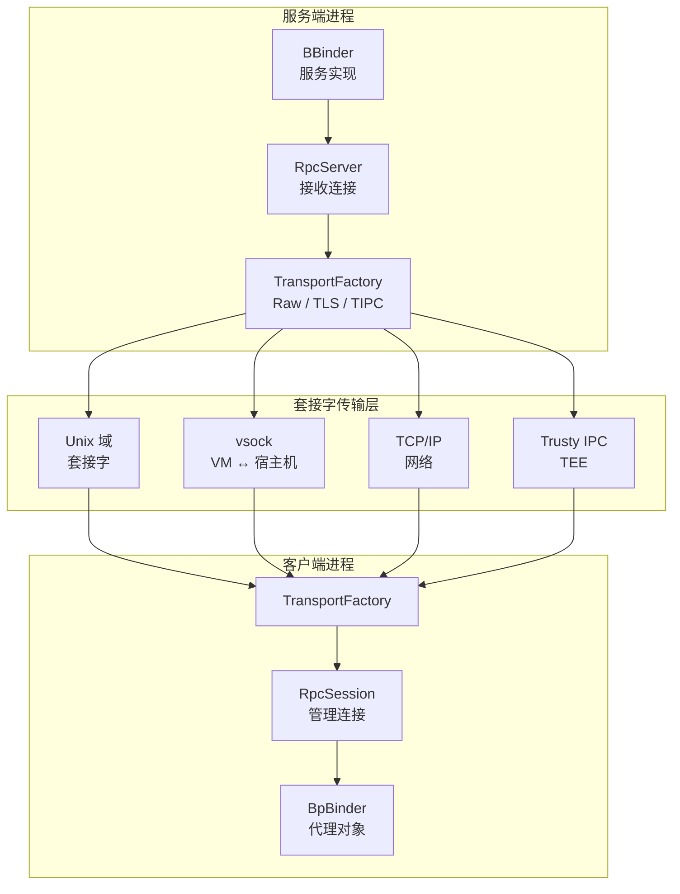
```mermaid
graph TB
    subgraph Server["服务端进程"]
        BB["BBinder<br/>服务实现"] --> RS["RpcServer<br/>接收连接"]
        RS --> TF["TransportFactory<br/>Raw / TLS / TIPC"]
    end

    subgraph Transport["套接字传输层"]
        direction LR
        UDS["Unix 域<br/>套接字"]
        VSOCK["vsock<br/>VM ↔ 宿主机"]
        TCP["TCP/IP<br/>网络"]
        TIPC["Trusty IPC<br/>TEE"]
    end

    subgraph Client["客户端进程"]
        SESS["RpcSession<br/>管理连接"] --> BP["BpBinder<br/>代理对象"]
        CTF["TransportFactory"] --> SESS
    end

    TF --> UDS
    TF --> VSOCK
    TF --> TCP
    TF --> TIPC
    UDS --> CTF
    VSOCK --> CTF
    TCP --> CTF
    TIPC --> CTF
```

其核心价值在于：**AIDL 接口无需修改即可在 RPC Binder 上工作**。一个使用 `BnFoo`（继承自 `BBinder`）实现的服务，可以通过 `RpcServer` 暴露出来，而无需对服务本身进行任何代码更改。客户端通过 `RpcSession` 获取 `BpBinder` 代理，并像调用内核 Binder 代理一样调用它。

### 9.9.3 核心类

#### RPC 服务端：`RpcServer`

`RpcServer` 监听传入的连接并将其分发给处理线程。它支持多种传输设置方法：

```cpp
// 来源：frameworks/native/libs/binder/include/binder/RpcServer.h:57-104
sp<RpcServer> server = RpcServer::make();

// 选择一种传输方式：
server->setupUnixDomainServer("/path/to/socket");
server->setupVsockServer(VMADDR_CID_ANY, port, &assignedPort);
server->setupInetServer("0.0.0.0", port, &assignedPort);
server->setupUnixDomainSocketBootstrapServer(bootstrapFd);

// 配置：
server->setRootObject(myService);         // 设置单个根对象
server->setPerSessionRootObject(factory);  // 为每个会话设置工厂
server->setMaxThreads(4);                  // 线程池大小

// 开始接收连接：
server->join();  // 阻塞调用
```

`setPerSessionRootObject()` 工厂函数为每个客户端会话创建一个新的根 Binder 对象——当服务端需要针对每个客户端维护状态或进行隔离时非常有用。

#### RPC 会话：`RpcSession`

`RpcSession` 建立到 `RpcServer` 的传出连接，并提供客户端 Binder 代理：

```cpp
// 来源：frameworks/native/libs/binder/include/binder/RpcSession.h:125-141
sp<RpcSession> session = RpcSession::make();
session->setupUnixDomainClient("/path/to/socket");
// 或：session->setupVsockClient(cid, port);
// 或：session->setupInetClient("10.0.0.1", port);

sp<IBinder> root = session->getRootObject();
sp<IMyService> service = IMyService::asInterface(root);
service->doSomething();  // 通过套接字进行的 RPC 调用
```

#### RPC 状态：`RpcState`

`RpcState` 实现线性协议的状态机——将事务序列化为 `RpcWireTransaction` 结构体，管理跨套接字的 Binder 引用计数，并处理异步（oneway）事务的排序。

### 9.9.4 线性协议 (Wire Protocol)

RPC 线性协议在 `RpcWireFormat.h` 中定义，由长度前缀的消息组成：

#### 连接握手

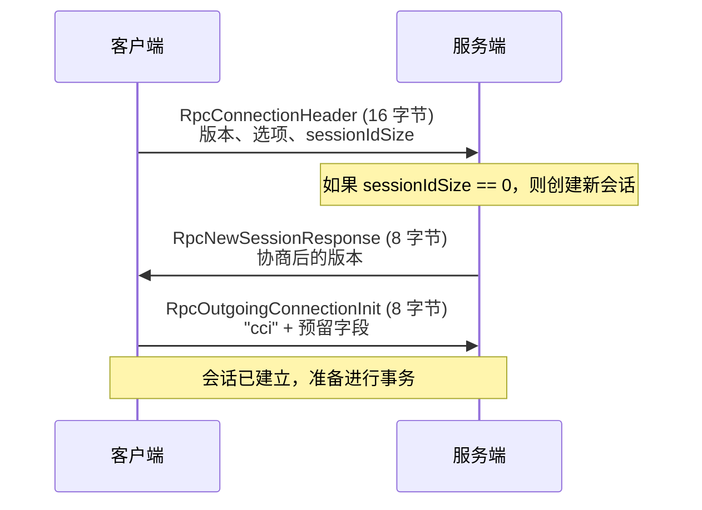
```mermaid
sequenceDiagram
    participant C as 客户端
    participant S as 服务端

    C->>S: RpcConnectionHeader (16 字节)<br/>版本、选项、sessionIdSize
    Note over S: 如果 sessionIdSize == 0，则创建新会话
    S->>C: RpcNewSessionResponse (8 字节)<br/>协商后的版本
    C->>S: RpcOutgoingConnectionInit (8 字节)<br/>"cci" + 预留字段
    Note over C,S: 会话已建立，准备进行事务
```

```cpp
// 来源：frameworks/native/libs/binder/RpcWireFormat.h:47-56
struct RpcConnectionHeader {
    uint32_t version;              // 调用者支持的最大版本
    uint8_t  options;              // RPC_CONNECTION_OPTION_INCOMING
    uint8_t  fileDescriptorTransportMode;
    uint8_t  reserved[8];
    uint16_t sessionIdSize;        // 0 = 新会话, 32 = 现有会话
};
static_assert(sizeof(RpcConnectionHeader) == 16);
```

会话 ID 为 32 字节（`kSessionIdBytes`），在创建新会话时由服务端随机生成。

#### 事务格式

线上传输的每条消息都以 `RpcWireHeader` 开头：

```cpp
// 来源：frameworks/native/libs/binder/RpcWireFormat.h:123-129
struct RpcWireHeader {
    uint32_t command;     // RPC_COMMAND_TRANSACT / REPLY / DEC_STRONG
    uint32_t bodySize;
    uint32_t reserved[2];
};

struct RpcWireTransaction {
    RpcWireAddress address;   // 8 字节：目标 Binder 地址
    uint32_t code;            // 事务代码 (AIDL 方法索引)
    uint32_t flags;           // FLAG_ONEWAY 等
    uint64_t asyncNumber;     // oneway 调用的排序号
    uint32_t parcelDataSize;  // Parcel 负载大小
    uint32_t reserved[3];
    uint8_t  data[];          // 紧跟 Parcel 数据
};
```

`asyncNumber` 字段确保 oneway 事务按顺序交付，因为套接字传输不保证跨多个连接的交付顺序。

#### 协议版本

| 版本 | 特性 |
|---|---|
| 0 | 初始协议 |
| 1 | 回复中显式的 Parcel 大小 |
| 2 | 事务头中的 Binder 位置（当前稳定版） |
| 3 | 下一个版本（开发中） |
| 0xF0000000 | 实验性（仅供开发使用） |

版本协商发生在连接握手期间——客户端发送其支持的最大版本，服务端返回它支持的且 ≤ 客户端最大版本的最高版本。

### 9.9.5 传输层

#### Unix 域套接字（UDS）

设备上 RPC Binder 最常用的传输方式。用于当内核 Binder 不可用或不适用时，同一机器上进程间的通信：

```cpp
// 服务端
server->setupUnixDomainServer("/dev/socket/my_rpc_service");

// 客户端
session->setupUnixDomainClient("/dev/socket/my_rpc_service");
```

自举（bootstrap）变体传递一个现有的已连接套接字对，适用于父子进程间的通信：

```cpp
// 来源：frameworks/native/libs/binder/RpcServer.cpp:66
status_t RpcServer::setupUnixDomainSocketBootstrapServer(unique_fd bootstrapFd);
```

#### Vsock（虚拟机套接字）

Vsock 提供 VM Guest 与其 Host 之间的直接通信，无需网络配置。这是 **pKVM 受保护虚拟机**和 **Microdroid** 的主要传输方式：

```cpp
// 来源：frameworks/native/libs/binder/RpcServer.cpp:74
status_t RpcServer::setupVsockServer(unsigned bindCid, unsigned port,
                                      unsigned* assignedPort);
```

```rust
// 来源：packages/modules/Virtualization/android/virtmgr/src/virtualmachine.rs:1503
let (vm_server, _) = RpcServer::new_vsock(service, cid, port)
    .context(format!("Could not start RpcServer on port {port}"))?;
```

#### TCP/IP（Inet）

用于可通过网络访问的 RPC 服务，主要用于测试和远程调试场景：

```cpp
// 来源：frameworks/native/libs/binder/RpcServer.cpp
status_t RpcServer::setupInetServer(const char* address, unsigned int port,
                                     unsigned int* assignedPort);
```

#### Trusty TIPC

一种用于与 Trusty TEE（可信执行环境）通信的专门传输方式。使用 Trusty 的 IPC 机制而非套接字：

```cpp
// 来源：frameworks/native/libs/binder/trusty/RpcServerTrusty.cpp
// 独立的 RpcServerTrusty 类，具有 TIPC 特有的传输方式
// 来源：frameworks/native/libs/binder/trusty/RpcTransportTipcTrusty.cpp
// Trusty 端 Binder 的 TIPC 传输实现
```

Trusty 传输使得 Android 服务能够使用与常规 Binder 调用相同的 AIDL 接口定义来调用安全世界服务（如 Keymaster 或 Gatekeeper）。

### 9.9.6 安全：TLS 与身份验证

RPC Binder 对跨越信任边界的传输支持 TLS 加密：

```cpp
// 使用 TLS 创建服务端
auto tlsFactory = RpcTransportCtxFactoryTls::make(authInfo);
sp<RpcServer> server = RpcServer::make(std::move(tlsFactory));
```

TLS 实现基于 OpenSSL，支持：

- **`RpcAuth`** — 使用证书和私钥配置 SSL 上下文。
- **`RpcCertificateVerifier`** — 自定义对端证书验证回调。
- **证书格式** — PEM 和 DER (`RpcCertificateFormat.h`)。
- **密钥格式** — PEM 和 DER (`RpcKeyFormat.h`)。

对于单个设备内的传输（Unix 域套接字），通常不需要 TLS，而是使用原始（未加密）传输：

```cpp
// 来源：frameworks/native/libs/binder/RpcServer.cpp:57
sp<RpcServer> RpcServer::make(
        std::unique_ptr<RpcTransportCtxFactory> rpcTransportCtxFactory) {
    // 默认为无 TLS
    if (rpcTransportCtxFactory == nullptr)
        rpcTransportCtxFactory = binder::os::makeDefaultRpcTransportCtxFactory();
    // ...
}
```

### 9.9.7 文件描述符传输

RPC Binder 可以利用套接字辅助数据（SCM_RIGHTS）跨进程边界传递文件描述符，类似于内核 Binder 的 `flat_binder_object`：

```cpp
// 来源：frameworks/native/libs/binder/include/binder/RpcSession.h:107-113
enum class FileDescriptorTransportMode : uint8_t {
    NONE   = 0,   // 不传递 FD（默认）
    UNIX   = 1,   // Unix 域套接字辅助数据
    TRUSTY = 2,   // Trusty IPC 句柄
};
```

这对于跨 RPC 边界共享内存映射缓冲区、硬件设备句柄或其他内核资源至关重要。

### 9.9.8 线程模型

RPC Binder 为每个会话管理两个连接池：

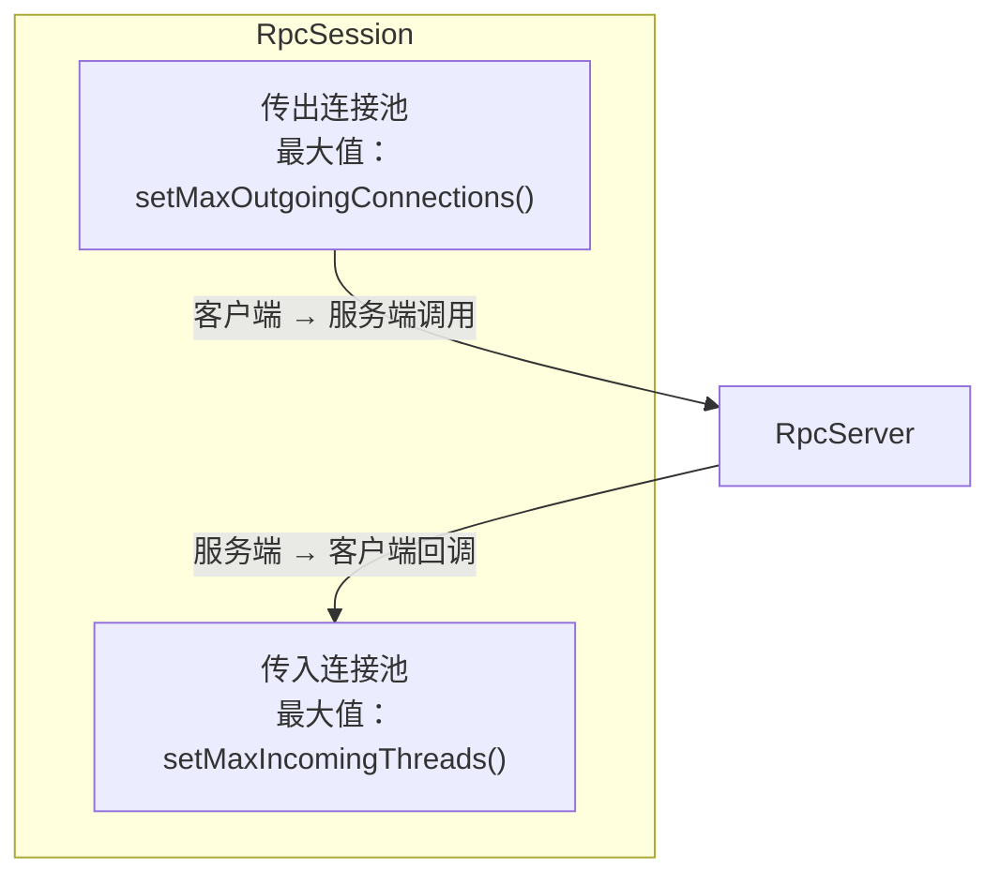
```mermaid
graph TB
    subgraph Session["RpcSession"]
        direction TB
        OUT["传出连接池<br/>最大值：setMaxOutgoingConnections()"]
        IN["传入连接池<br/>最大值：setMaxIncomingThreads()"]
    end

    OUT -->|"客户端 → 服务端调用"| SERVER["RpcServer"]
    SERVER -->|"服务端 → 客户端回调"| IN
```

- **传出连接 (Outgoing connections)**：承载客户端到服务端的事务。池大小受 `setMaxOutgoingConnections()` 限制（默认 10）。
- **传入连接 (Incoming connections)**：处理服务端到客户端的回调（反向调用）。受 `setMaxIncomingThreads()` 限制。
- **服务端线程**：通过 `RpcServer::setMaxThreads()` 管理。

对于嵌入式环境（Trusty），通过 `BINDER_RPC_SINGLE_THREADED` 编译标志可以使用**单线程模式**，该模式将互斥锁和线程替换为无操作实现。

### 9.9.9 Rust 与 NDK 绑定

#### Rust API

`rpcbinder` crate 为 RPC Binder 提供了 Rust 绑定：

```rust
// 来源：packages/modules/Virtualization/android/virtmgr/src/main.rs:35
use rpcbinder::{FileDescriptorTransportMode, RpcServer};

// 来源：packages/modules/Virtualization/android/virtmgr/src/virtualmachine.rs:1503
let (vm_server, _) = RpcServer::new_vsock(service, cid, port)?;
```

Rust API 支持：
- `RpcServer::new_vsock()` — vsock 服务端
- `RpcServer::new_unix_domain_bootstrap()` — 自举服务端
- `RpcSession` — 客户端连接
- `FileDescriptorTransportMode` — FD 传输配置

#### NDK API（不稳定）

NDK 为 RPC Binder 提供了一个 C API，目前标记为不稳定（仅限平台使用）：

```cpp
// 来源：frameworks/native/libs/binder/ndk/include_platform/android/binder_rpc.h
ARpcSession* ARpcSession_new();
void ARpcSession_free(ARpcSession* session);
AIBinder* ARpcSession_setupUnixDomainBootstrapClient(
        ARpcSession* session, int bootstrapFd);
void ARpcSession_setMaxIncomingThreads(ARpcSession* session, size_t threads);
void ARpcSession_setMaxOutgoingConnections(ARpcSession* session, size_t connections);
void ARpcSession_setFileDescriptorTransportMode(
        ARpcSession* session, ARpcSession_FileDescriptorTransportMode mode);
```

### 9.9.10 AOSP 中的用例

#### Microdroid 与受保护的虚拟机

RPC Binder 的主要生产用例是 **Microdroid**——一个用于隔离计算的轻量级 Android VM。虚拟机管理器 (`virtmgr`) 通过 vsock 使用 RPC Binder 向 Guest VM 暴露服务：

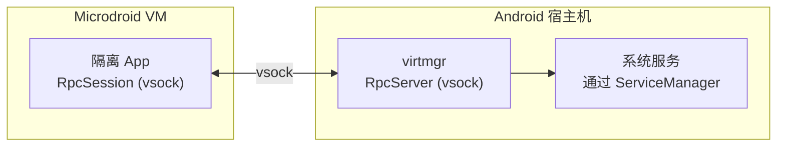
```mermaid
graph LR
    subgraph Host["Android 宿主机"]
        VM_MGR["virtmgr<br/>RpcServer (vsock)"]
        SVC["系统服务<br/>通过 ServiceManager"]
    end

    subgraph Guest["Microdroid VM"]
        APP["隔离 App<br/>RpcSession (vsock)"]
    end

    APP <-->|"vsock"| VM_MGR
    VM_MGR --> SVC
```

Guest VM 没有 `/dev/binder` 设备。所有与宿主机的 Binder 通信都通过 vsock 上的 RPC Binder 完成。`virtmgr` 守护进程创建一个 `RpcServer` 接收来自 Guest 的 vsock 连接，提供对一组精选宿主服务的访问。

#### CompOS（编译操作系统）

CompOS 在隔离的 VM 中运行 `dex2oat`（DEX 到本地代码编译），以确保验证启动的完整性。它使用 RPC Binder 接收来自宿主机的编译请求并返回编译产物。

#### Trusty TEE 通信

通过 TIPC 的 RPC Binder 为 Trusty 安全世界服务提供了标准的 AIDL 接口。服务（如 Keymaster 和 Gatekeeper）可以在 Android 和 Trusty 两端使用相同的 AIDL 定义，而无需自定义 IPC 协议。

#### 通过 AccessorProvider 在虚拟机中访问服务

NDK `ABinderRpc_AccessorProvider` API 实现了跨 VM 边界的自动服务发现。当某个服务在本地不可用时（因为进程处于没有内核 Binder 的 VM 中），AccessorProvider 回调会透明地建立到宿主机的 RPC Binder 连接。

### 9.9.11 内核 Binder vs. RPC Binder

| 特性 | 内核 Binder | RPC Binder |
|---|---|---|
| **传输方式** | `/dev/binder` 驱动 | 套接字 (Unix/vsock/TCP/TIPC) |
| **数据拷贝** | 通过 `mmap` 进行一次拷贝 | 标准套接字 send/recv |
| **作用范围** | 仅限同一内核 | 跨内核、跨机器 |
| **FD 传递** | `flat_binder_object` | `SCM_RIGHTS` 辅助数据 |
| **线程管理** | 内核管理的线程池 | 用户态线程池 |
| **引用计数** | 内核跟踪 | 线性协议 (`DEC_STRONG`) |
| **死亡通知** | 内核讣告 (obituaries) | 连接断开检测 |
| **性能** | 延迟较低 (mmap) | 延迟较高 (套接字拷贝) |
| **安全性** | 内核提供的 UID/PID | TLS 证书 / 套接字权限 |
| **AIDL 兼容性** | 原生支持 | 完全兼容（相同接口） |

---

## 9.10 调试与诊断

### 9.10.1 debugfs 接口

Binder 驱动通过 debugfs 暴露调试信息：

```
/sys/kernel/debug/binder/
├── failed_transaction_log  # 失败事务日志
├── state                   # 当前驱动状态
├── stats                   # 全局统计信息
├── transaction_log         # 最近事务日志
└── proc/                   # 进程特定信息
    ├── <pid>/
    │   ├── state
    │   └── stats
    └── ...
```

**示例：查看所有 Binder 进程：**
```bash
adb shell cat /sys/kernel/debug/binder/state
```

**示例：查看特定进程的事务：**
```bash
adb shell cat /sys/kernel/debug/binder/proc/<pid>/state
```

### 9.10.2 Perfetto 追踪

`servicemanager` 集成了 Perfetto 用于追踪：

```cpp
// frameworks/native/cmds/servicemanager/ServiceManager.cpp
#define SM_PERFETTO_TRACE_FUNC(...) \
    PERFETTO_TE_SCOPED(servicemanager, \
        PERFETTO_TE_SLICE_BEGIN(__func__) __VA_OPT__(,) __VA_ARGS__)
```

每个 `addService`、`getService` 和 `checkService` 调用都会被追踪。

### 9.10.3 service 命令

`service` shell 命令可以直接与服务交互：

```bash
# 列出所有服务
adb shell service list

# 检查服务是否存在
adb shell service check SurfaceFlinger

# 调用服务方法 (raw)
adb shell service call SurfaceFlinger 1
# 1 = FIRST_CALL_TRANSACTION (ISurfaceComposer 中的第一个方法)
```

### 9.10.4 常见错误码

| 错误 | 含义 |
|-------|---------|
| `DEAD_OBJECT` | 服务端进程已死亡 (BR_DEAD_REPLY) |
| `FAILED_TRANSACTION` | 事务失败（缓冲区溢出、进程冻结等）(BR_FAILED_REPLY) |
| `PERMISSION_DENIED` | SELinux 拒绝访问 |
| `BAD_TYPE` | 接口描述符不匹配 |
| `UNKNOWN_TRANSACTION` | 服务端不识别该事务代码 |
| `FDS_NOT_ALLOWED` | 该事务不允许携带文件描述符 |

### 9.10.5 诊断 Binder 缓冲区耗尽

当进程的 Binder 缓冲区填满时，你会看到如下错误：

```
binder: 1234:5678 transaction failed 29201, size 100-0 line 3170
```

诊断方法：
```bash
# 检查特定进程的缓冲区分配情况
adb shell cat /sys/kernel/debug/binder/proc/<pid>/state

# 寻找 "allocated" 和 "free" 缓冲区大小
# 如果一个进程有大量待处理的传入事务，分配量会很高
```

常见原因：
1. **onTransact 处理缓慢**：服务端处理事务耗时过长，导致缓冲区堆满排队请求。
2. **Binder 线程饥饿**：所有线程都忙，新事务在队列中等待。
3. **巨型事务**：通过 Binder 发送位图或大数据，而不是使用共享内存。

### 9.10.6 使用 atrace 追踪 Binder 事务

```bash
# 启用 Binder 追踪
adb shell atrace --async_start -c binder_driver binder_lock

# 停止并收集追踪
adb shell atrace --async_stop > trace.txt

# 在 Perfetto UI 中查看
```

### 9.10.7 监控 Binder 代理计数 (Proxy Counts)

```bash
# 检查每个 UID 的代理计数
adb shell dumpsys activity binder-proxies

# 检查进程的总代理计数
adb shell ls /proc/<pid>/fd | wc -l  # 粗略估算
```

代理节流阈值（低水位 2000 / 警告 2250 / 高水位 2500）在调试版本中可通过系统属性配置。

### 9.10.8 使用 binder_exception_to_string

在调试 AIDL Binder 异常时，可以对状态码进行解码。以下是 AIDL `binder::Status` 异常代码（与内核级的 `status_t` 不同）：

| 异常代码 | 名称 | 含义 |
|----------------|------|---------|
| -1 | `EX_SECURITY` | 安全违规 |
| -2 | `EX_BAD_PARCELABLE` | 错误的 Parcelable 数据 |
| -3 | `EX_ILLEGAL_ARGUMENT` | 参数非法 |
| -4 | `EX_NULL_POINTER` | 空指针 |
| -5 | `EX_ILLEGAL_STATE` | 状态非法 |
| -6 | `EX_NETWORK_MAIN_THREAD` | 在主线程进行网络操作 |
| -7 | `EX_UNSUPPORTED_OPERATION` | 不支持的操作 |
| -8 | `EX_SERVICE_SPECIFIC` | 服务特定错误（附带详细代码） |
| -9 | `EX_PARCELABLE` | 自定义 Parcelable 异常 |
| -128 | `EX_TRANSACTION_FAILED` | 事务失败 |


## 9.11 动手实践：编写一个 Binder 服务

本节将演示如何创建一个完整的 Binder 服务和客户端。我们将创建一个简单的“echo”服务，以此展示完整的生命周期。

### 9.11.1 第一步：定义 AIDL 接口

创建 AIDL 文件：

```aidl
// hardware/interfaces/example/echo/aidl/android/hardware/echo/IEchoService.aidl
package android.hardware.echo;

interface IEchoService {
    /** 回显输入的字符串 */
    String echo(in String input);

    /** 返回已进行的 echo 调用次数 */
    int getCallCount();

    /** “发后即忘”的单向通知 */
    oneway void ping();
}
```

### 9.11.2 第二步：构建配置

为 AIDL 接口创建 `Android.bp`：

```
// hardware/interfaces/example/echo/aidl/Android.bp
aidl_interface {
    name: "android.hardware.echo",
    vendor_available: true,
    srcs: ["android/hardware/echo/*.aidl"],
    stability: "vintf",
    backend: {
        cpp: {
            enabled: true,
        },
        java: {
            enabled: true,
        },
        rust: {
            enabled: true,
        },
    },
}
```

### 9.11.3 第三步：实现服务 (C++)

```cpp
// hardware/interfaces/example/echo/aidl/default/EchoService.h
#pragma once

#include <aidl/android/hardware/echo/BnEchoService.h>
#include <atomic>

namespace aidl::android::hardware::echo {

class EchoService : public BnEchoService {
public:
    // 同步：回显输入内容
    ndk::ScopedAStatus echo(const std::string& input,
                            std::string* _aidl_return) override {
        mCallCount++;
        *_aidl_return = "Echo: " + input;
        return ndk::ScopedAStatus::ok();
    }

    // 同步：返回调用计数
    ndk::ScopedAStatus getCallCount(int32_t* _aidl_return) override {
        *_aidl_return = mCallCount.load();
        return ndk::ScopedAStatus::ok();
    }

    // 单向 (Oneway)：无需回复
    ndk::ScopedAStatus ping() override {
        ALOGI("收到 Ping！当前调用计数: %d", mCallCount.load());
        return ndk::ScopedAStatus::ok();
    }

private:
    std::atomic<int32_t> mCallCount{0};
};

}  // namespace aidl::android::hardware::echo
```

### 9.11.4 第四步：服务入口点 (Main Entry Point)

```cpp
// hardware/interfaces/example/echo/aidl/default/main.cpp
#include "EchoService.h"

#include <android-base/logging.h>
#include <android/binder_manager.h>
#include <android/binder_process.h>

using aidl::android::hardware::echo::EchoService;

int main() {
    // 初始化 Binder 线程池
    ABinderProcess_setThreadPoolMaxThreadCount(0);

    // 创建服务实例
    std::shared_ptr<EchoService> echo =
        ndk::SharedRefBase::make<EchoService>();

    // 向 servicemanager 注册服务
    const std::string instance =
        std::string() + EchoService::descriptor + "/default";
    binder_status_t status = AServiceManager_addService(
        echo->asBinder().get(), instance.c_str());
    CHECK_EQ(status, STATUS_OK)
        << "注册失败: " << instance;

    LOG(INFO) << "EchoService 已注册为 " << instance;

    // 加入线程池（永久阻塞）
    ABinderProcess_startThreadPool();
    ABinderProcess_joinThreadPool();

    // 不应到达此处
    LOG(FATAL) << "EchoService 意外退出";
    return EXIT_FAILURE;
}
```

### 9.11.5 第五步：服务的构建配置

```
// hardware/interfaces/example/echo/aidl/default/Android.bp
cc_binary {
    name: "android.hardware.echo-service",
    relative_install_path: "hw",
    vendor: true,
    srcs: ["main.cpp"],
    shared_libs: [
        "libbase",
        "libbinder_ndk",
        "android.hardware.echo-V1-ndk",
    ],
}
```

### 9.11.6 第六步：Init 配置

```rc
// hardware/interfaces/example/echo/aidl/default/echo-service.rc
service vendor.echo /vendor/bin/hw/android.hardware.echo-service
    class hal
    user system
    group system
```

### 9.11.7 第七步：VINTF Manifest 条目

添加到设备 manifest 中：

```xml
<hal format="aidl">
    <name>android.hardware.echo</name>
    <version>1</version>
    <fqname>IEchoService/default</fqname>
</hal>
```

### 9.11.8 第八步：编写客户端

```cpp
// 调用 echo 服务的简单客户端
#include <aidl/android/hardware/echo/IEchoService.h>
#include <android/binder_manager.h>
#include <android-base/logging.h>

using aidl::android::hardware::echo::IEchoService;

int main() {
    // 获取服务
    const std::string instance =
        std::string() + IEchoService::descriptor + "/default";
    std::shared_ptr<IEchoService> service =
        IEchoService::fromBinder(
            ndk::SpAIBinder(AServiceManager_waitForService(
                instance.c_str())));
    CHECK(service != nullptr) << "获取失败: " << instance;

    // 进行 echo 调用
    std::string result;
    auto status = service->echo("Hello, Binder!", &result);
    CHECK(status.isOk()) << "echo 失败: "
                         << status.getDescription();
    LOG(INFO) << "Echo 结果: " << result;

    // 获取调用计数
    int32_t count;
    status = service->getCallCount(&count);
    CHECK(status.isOk());
    LOG(INFO) << "调用计数: " << count;

    // 发送单向 ping（立即返回）
    status = service->ping();
    CHECK(status.isOk());
    LOG(INFO) << "Ping 已发送 (oneway)";

    return 0;
}
```

### 9.11.9 第九步：使用 Rust 实现

Rust 版本的服务实现：

```rust
// Rust 服务实现
use binder::BinderFeatures;
use android_hardware_echo::aidl::android::hardware::echo::IEchoService::{
    BnEchoService, IEchoService,
};
use std::sync::atomic::{AtomicI32, Ordering};

struct EchoService {
    call_count: AtomicI32,
}

impl binder::Interface for EchoService {}

impl IEchoService for EchoService {
    fn echo(&self, input: &str) -> binder::Result<String> {
        self.call_count.fetch_add(1, Ordering::Relaxed);
        Ok(format!("Echo: {}", input))
    }

    fn getCallCount(&self) -> binder::Result<i32> {
        Ok(self.call_count.load(Ordering::Relaxed))
    }

    fn ping(&self) -> binder::Result<()> {
        log::info!("收到 Ping！计数: {}",
                   self.call_count.load(Ordering::Relaxed));
        Ok(())
    }
}

fn main() {
    binder::ProcessState::start_thread_pool();

    let service = EchoService {
        call_count: AtomicI32::new(0),
    };
    let service_binder = BnEchoService::new_binder(
        service,
        BinderFeatures::default(),
    );

    binder::add_service(
        &format!("{}/default", <BnEchoService as IEchoService>::get_descriptor()),
        service_binder.as_binder(),
    ).expect("注册服务失败");

    binder::ProcessState::join_thread_pool();
}
```

### 9.11.10 第十步：使用 Java 实现客户端

```java
// echo 服务的 Java 客户端
import android.hardware.echo.IEchoService;
import android.os.IBinder;
import android.os.ServiceManager;
import android.util.Log;

public class EchoClient {
    private static final String TAG = "EchoClient";
    private static final String SERVICE_NAME =
        "android.hardware.echo.IEchoService/default";

    public static void main(String[] args) {
        // 从 service manager 获取服务
        IBinder binder = ServiceManager.waitForService(SERVICE_NAME);
        if (binder == null) {
            Log.e(TAG, "获取 echo 服务失败");
            return;
        }

        // 转换为类型化接口
        IEchoService service = IEchoService.Stub.asInterface(binder);
        if (service == null) {
            Log.e(TAG, "转换为 IEchoService 失败");
            return;
        }

        try {
            // 进行同步 echo 调用
            String result = service.echo("Hello from Java!");
            Log.i(TAG, "Echo 结果: " + result);

            // 获取调用计数
            int count = service.getCallCount();
            Log.i(TAG, "调用计数: " + count);

            // 发送单向 ping
            service.ping();
            Log.i(TAG, "Ping 已发送");

        } catch (android.os.RemoteException e) {
            Log.e(TAG, "远程异常: " + e.getMessage());
        }
    }
}
```

在底层，`IEchoService.Stub.asInterface(binder)` 会检查该 binder 是本地对象（同进程）还是远程代理：

- 如果是本地对象，它会直接返回实际的 `IEchoService` 实现（零拷贝，无 IPC）。
- 如果是远程对象，它会将其包装在 `IEchoService.Stub.Proxy` 中，通过 binder 进行调用编组（marshall）。

这就是 `queryLocalInterface()` 优化，它避免了进程内调用时不必要的序列化操作。

### 9.11.11 第十一步：处理死亡通知 (Death Notifications)

```cpp
// C++ 示例：注册死亡通知
class MyDeathRecipient : public android::IBinder::DeathRecipient {
public:
    void binderDied(const android::wp<android::IBinder>& who) override {
        ALOGE("Echo 服务已终止！正在尝试重新连接...");
        // 此处编写重连逻辑
    }
};

// 客户端代码中：
sp<MyDeathRecipient> deathRecipient = sp<MyDeathRecipient>::make();
status_t status = binder->linkToDeath(deathRecipient);
if (status != OK) {
    ALOGE("链接到死亡通知失败: %d", status);
}
```

死亡通知对于构建健壮的客户端实现至关重要。当服务端进程崩溃时，客户端会收到通知，并可以尝试重新连接或清理资源。

### 9.11.12 第十二步：调试你的服务

**列出所有已注册的服务：**

```bash
adb shell service list
# 或
adb shell dumpsys -l
```

**检查服务是否已注册：**

```bash
adb shell service check android.hardware.echo.IEchoService/default
```

**从命令行调用服务方法：**

```bash
adb shell service call android.hardware.echo.IEchoService/default \
    1 s16 "Hello"
# 1 = FIRST_CALL_TRANSACTION (echo 方法)
# s16 = 第一个参数为 String16
```

**转储 (Dump) 服务状态：**

```bash
adb shell dumpsys android.hardware.echo.IEchoService/default
```

**查看 Binder 调试信息：**

```bash
adb shell cat /sys/kernel/debug/binder/stats
adb shell cat /sys/kernel/debug/binder/transactions
adb shell cat /sys/kernel/debug/binder/state
```

**使用 systrace/perfetto 查看 Binder 调用：**

```bash
adb shell perfetto -o /data/misc/perfetto-traces/trace \
    -c - <<EOF
buffers: {
    size_kb: 63488
}
data_sources: {
    config {
        name: "linux.ftrace"
        ftrace_config {
            ftrace_events: "binder/*"
        }
    }
}
duration_ms: 5000
EOF
```

### 9.11.13 常见陷阱

1. **未启动 Binder 线程池。** 如果忘记调用 `ABinderProcess_startThreadPool()`，你的服务虽然可以注册成功，但永远不会响应事务。

2. **在单向 (Oneway) 方法中阻塞。** 单向方法应当迅速返回。耗时操作应分发到单独的工作线程中执行。

3. **Binder 缓冲区溢出。** 1 MB 的 mmap 缓冲区由所有挂起的传入事务共享。通过 Binder 发送大数据（例如大型位图）是一种反模式——应改用 `ashmem` 或 `ParcelFileDescriptor`。

4. **Binder 代理泄漏。** 积累过多的 `BpBinder` 引用而不释放会触发代理节流（水位线为 2500）。这通常表现为 `JavaBinder: !!! FAILED BINDER TRANSACTION !!!` 错误。

5. **缺少 VINTF 声明。** 未在 VINTF manifest 中条目的 HAL 服务在注册时会失败，抛出 `EX_ILLEGAL_ARGUMENT` 异常。

6. **错误的 Binder 域 (Domain)。** Vendor 进程默认使用 `/dev/vndbinder`。如果你不小心在错误的域上注册，其他域的客户端将无法找到你的服务。

7. **在调用 Binder 后执行 Fork。** `ProcessState` 安装了 fork 处理程序，会在子进程中使 Binder 文件描述符失效。在 `fork()` 后使用 Binder 会导致崩溃：
   ```cpp
   static void verifyNotForked(bool forked) {
       LOG_ALWAYS_FATAL_IF(forked,
           "libbinder ProcessState can not be used after fork");
   }
   ```

### 9.11.14 完整 Binder 服务的架构图

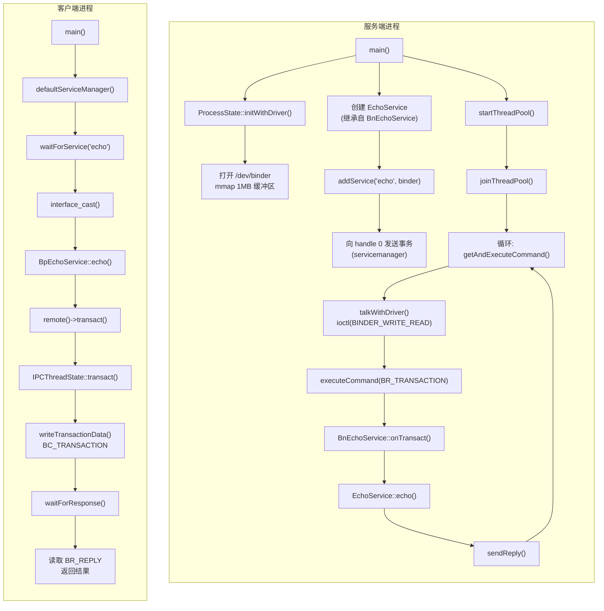
```mermaid
graph TD
    subgraph "服务端进程"
        direction TB
        M["main()"] --> PS["ProcessState::initWithDriver()"]
        PS --> TB["打开 /dev/binder<br/>mmap 1MB 缓冲区"]
        M --> SVC["创建 EchoService<br/>(继承自 BnEchoService)"]
        SVC --> REG["addService('echo', binder)"]
        REG --> SM_CALL["向 handle 0 发送事务<br/>(servicemanager)"]
        M --> TP["startThreadPool()"]
        TP --> JT["joinThreadPool()"]
        JT --> LOOP["循环: getAndExecuteCommand()"]
        LOOP --> TW["talkWithDriver()<br/>ioctl(BINDER_WRITE_READ)"]
        TW --> EX["executeCommand(BR_TRANSACTION)"]
        EX --> OT["BnEchoService::onTransact()"]
        OT --> EC["EchoService::echo()"]
        EC --> REP["sendReply()"]
        REP --> LOOP
    end

    subgraph "客户端进程"
        direction TB
        CM["main()"] --> DSM["defaultServiceManager()"]
        DSM --> WS["waitForService('echo')"]
        WS --> IC["interface_cast<IEchoService>()"]
        IC --> BP["BpEchoService::echo()"]
        BP --> TR["remote()->transact()"]
        TR --> IPT["IPCThreadState::transact()"]
        IPT --> WTD["writeTransactionData()<br/>BC_TRANSACTION"]
        WTD --> WFR["waitForResponse()"]
        WFR --> RES["读取 BR_REPLY<br/>返回结果"]
    end
```

---

## 9.12 总结

### 关键源文件

| 组件 | 路径 |
|-----------|------|
| ProcessState | `frameworks/native/libs/binder/ProcessState.cpp` |
| IPCThreadState | `frameworks/native/libs/binder/IPCThreadState.cpp` |
| IBinder 头文件 | `frameworks/native/libs/binder/include/binder/IBinder.h` |
| BBinder | `frameworks/native/libs/binder/Binder.cpp` |
| BpBinder | `frameworks/native/libs/binder/BpBinder.cpp` |
| IInterface | `frameworks/native/libs/binder/include/binder/IInterface.h` |
| Parcel | `frameworks/native/libs/binder/include/binder/Parcel.h` |
| IServiceManager | `frameworks/native/libs/binder/include/binder/IServiceManager.h` |
| servicemanager 入口 | `frameworks/native/cmds/servicemanager/main.cpp` |
| ServiceManager 实现 | `frameworks/native/cmds/servicemanager/ServiceManager.cpp` |
| 访问控制 (Access control) | `frameworks/native/cmds/servicemanager/Access.cpp` |
| servicemanager.rc | `frameworks/native/cmds/servicemanager/servicemanager.rc` |
| vndservicemanager.rc | `frameworks/native/cmds/servicemanager/vndservicemanager.rc` |
| AIDL 编译器 | `system/tools/aidl/aidl.cpp` |
| AIDL 转 C++ | `system/tools/aidl/aidl_to_cpp.cpp` |
| AIDL 转 Java | `system/tools/aidl/aidl_to_java.cpp` |
| AIDL 转 Rust | `system/tools/aidl/aidl_to_rust.cpp` |
| Rust binder 库 | `frameworks/native/libs/binder/rust/src/lib.rs` |
| Rust binder traits | `frameworks/native/libs/binder/rust/src/binder.rs` |
| Rust 代理 (Proxy) | `frameworks/native/libs/binder/rust/src/proxy.rs` |
| Rust 本地实现 (Native) | `frameworks/native/libs/binder/rust/src/native.rs` |
| hwservicemanager | `system/hwservicemanager/ServiceManager.h` |
| hwservicemanager.rc | `system/hwservicemanager/hwservicemanager.rc` |
| LazyServiceRegistrar | `frameworks/native/libs/binder/include/binder/LazyServiceRegistrar.h` |
| 内核头文件桥接 | `frameworks/native/libs/binder/binder_module.h` |

### 架构总结

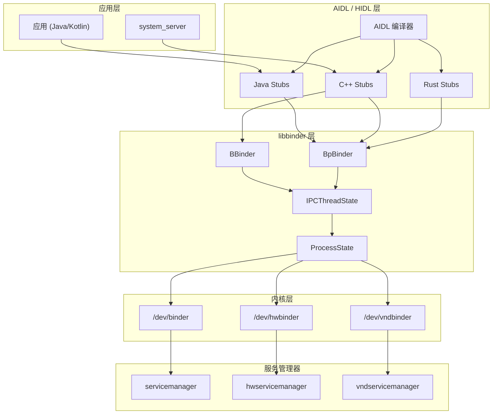
```mermaid
graph TB
    subgraph "应用层"
        APP["应用 (Java/Kotlin)"]
        SYS["system_server"]
    end

    subgraph "AIDL / HIDL 层"
        AIDL["AIDL 编译器"]
        JAVA_STUB["Java Stubs"]
        CPP_STUB["C++ Stubs"]
        RUST_STUB["Rust Stubs"]
    end

    subgraph "libbinder 层"
        BB["BBinder"]
        BP["BpBinder"]
        IPC["IPCThreadState"]
        PS["ProcessState"]
    end

    subgraph "内核层"
        BD["/dev/binder"]
        HBD["/dev/hwbinder"]
        VBD["/dev/vndbinder"]
    end

    subgraph "服务管理器"
        SM["servicemanager"]
        HSM["hwservicemanager"]
        VSM["vndservicemanager"]
    end

    APP --> JAVA_STUB
    SYS --> CPP_STUB
    AIDL --> JAVA_STUB
    AIDL --> CPP_STUB
    AIDL --> RUST_STUB

    JAVA_STUB --> BP
    CPP_STUB --> BB
    CPP_STUB --> BP
    RUST_STUB --> BP

    BB --> IPC
    BP --> IPC
    IPC --> PS
    PS --> BD
    PS --> HBD
    PS --> VBD

    BD --> SM
    HBD --> HSM
    VBD --> VSM
```

### 核心要点

1. **Binder 是一种“单次拷贝” IPC 机制**，通过内存映射 (mmap) 实现高性能。内核直接将数据从发送方拷贝到接收方的映射缓冲区中。

2. **每次事务都携带内核验证的身份信息**（UID、PID、SELinux 上下文），这构成了 Android 安全模型的基础。

3. **对象引用语义**（配合引用计数和死亡通知）实现了可靠的分布式对象生命周期管理。

4. **架构是分层的：** 内核驱动程序 -> libbinder (C++/Rust) -> AIDL 生成的 Stubs -> 服务具体实现。

5. **servicemanager 是整个系统的名称服务器 (Name Server)**，受 SELinux 和 VINTF manifest 校验的保护。

6. **三个 Binder 域** (binder, hwbinder, vndbinder) 强制执行了 Treble 架构中 framework 与 vendor 之间的边界。

7. **AIDL 是标准的接口定义语言**，适用于所有新的 Binder 接口，能够生成 Java、C++、NDK C++ 和 Rust 代码。

8. **HIDL 和 hwbinder 已被弃用**，从 Android 13 开始，HAL 接口优先采用 AIDL。

---

*下一章：第 10 章将基于此处介绍的 AIDL 和 Binder 概念，深入探讨硬件抽象层 (HAL) 架构。*
