# Chapter 9: Binder IPC

Binder is the heart of Android's inter-process communication. Every activity
launch, every service call, every permission check, every surface composition
passes through Binder. It is not merely an IPC mechanism -- it is the
object-oriented middleware that makes Android's component architecture possible.
Understanding Binder is prerequisite to understanding everything else in AOSP.

This chapter dissects Binder from the kernel driver through the C++ and Rust
userspace libraries, into the AIDL code-generation toolchain, and up to the
`servicemanager` that acts as the system's name-service. By the end you will be
able to trace a complete transaction from a client process through the kernel
into a server process, and you will have built your own Binder service.

---

## 9.1 Why Binder?

### 9.1.1 The Problem: Secure, Fast IPC for a Mobile OS

Android runs dozens of system services (Activity Manager, Window Manager,
Package Manager, SurfaceFlinger, etc.) in separate processes. Applications in
their own sandboxed processes must communicate with these services hundreds of
times per second. The IPC mechanism must satisfy several hard requirements:

1. **Identity-based security.** The kernel must authoritatively identify the
   caller (UID, PID, SELinux context) so that the server can make access-control
   decisions. Traditional Unix IPC (pipes, Unix sockets) can pass credentials
   via `SO_PEERCRED`, but this is per-connection, not per-transaction.

2. **Object-reference semantics.** A client should be able to hold a reference
   to a specific object in a server process. When that object dies, the client
   should receive a death notification. When the last reference is released, the
   object should be cleaned up.

3. **One-copy data transfer.** For performance on mobile hardware, data should
   be copied at most once between address spaces. Traditional message passing
   (pipes, message queues) requires a copy from sender to kernel, then another
   from kernel to receiver -- two copies.

4. **Synchronous and asynchronous calls.** Both request-reply (synchronous) and
   fire-and-forget (oneway / asynchronous) patterns must be supported.

5. **Thread-pool management.** The kernel should be able to manage a pool of
   threads in the server process, spawning new threads as needed and retiring
   idle ones.

### 9.1.2 Historical Context

Binder's origins predate Android. It descends from OpenBinder, developed at
Be Inc. (creators of BeOS) in the early 2000s by Dianne Hackborn and others.
When Palm acquired Be's technology, OpenBinder continued development. When
Google built Android, the team (which included Hackborn) adapted OpenBinder into
what became the Android Binder.

The key insight of the original design was that mobile devices need a
*capability-based* IPC system where object references serve as capabilities.
Unix IPC mechanisms are channel-oriented (you connect to a named endpoint), not
object-oriented (you hold a reference to a specific object). Binder bridges this
gap by providing object-reference semantics through a kernel driver.

The kernel driver was initially out-of-tree (in the Android kernel `drivers/
staging/android/` directory). Over the years, it was cleaned up and merged into
the upstream Linux kernel under `drivers/android/`. Modern Linux kernels (5.0+)
include the binder driver without any Android-specific patches.

### 9.1.3 Comparison with Traditional Unix IPC

| Mechanism | Copies | Identity | Object Refs | Thread Mgmt |
|-----------|--------|----------|-------------|-------------|
| **Pipe** | 2 (write + read) | None per-message | No | No |
| **Unix Socket** | 2 (send + recv) | SO_PEERCRED (per-connection) | No | No |
| **Shared Memory** | 0 | None | No | No |
| **SysV Message Queue** | 2 | Limited (uid check) | No | No |
| **Binder** | **1** (driver copies into recipient's mmap'd buffer) | **Per-transaction** (UID, PID, SELinux SID) | **Yes** (ref-counted, death notifications) | **Yes** (kernel-managed thread pool) |

**Pipes and Unix sockets** require two copies: one from the sender's buffer
into the kernel, and a second from the kernel into the receiver's buffer. They
provide no per-message identity -- `SO_PEERCRED` only tells you who opened the
connection, not who sent a particular message on a multiplexed connection.

**Shared memory** (`ashmem` or `memfd`) achieves zero copies but provides no
synchronization, no message framing, and no identity. It is used *in
combination* with Binder (for example, SurfaceFlinger uses shared-memory
buffers but Binder for the control plane).

**Binder** achieves a single copy through memory mapping: the kernel maps a
region of the receiver's address space, then copies the sender's data directly
into that region. The receiver reads the data from its own mapped memory without
an additional copy.

### 9.1.4 The One-Copy Mechanism

When a process opens `/dev/binder`, it calls `mmap()` to map the binder
buffer. As defined in `ProcessState.cpp`:

```cpp
// frameworks/native/libs/binder/ProcessState.cpp
#define BINDER_VM_SIZE ((1 * 1024 * 1024) - sysconf(_SC_PAGE_SIZE) * 2)
```

This creates a ~1 MB buffer (minus two pages for guard pages). When a
transaction arrives, the binder driver allocates space within the receiver's
mapped region and copies the sender's data directly there. The receiver reads
from its own virtual address space -- a single copy.

```
Sender                    Kernel                    Receiver
┌─────────┐    copy_from_user     ┌──────────────┐
│  Parcel  │ ─────────────────────>│  Receiver's  │
│  data    │                       │  mmap buffer │
└─────────┘                       └──────────────┘
                                        │
                                        │ (already in receiver's
                                        │  address space)
                                        v
                                  ┌──────────────┐
                                  │  Receiver     │
                                  │  reads data   │
                                  └──────────────┘
```

### 9.1.5 Identity-Based Security

Every Binder transaction carries the sender's UID and PID, injected by the
kernel driver (not by userspace). The sender cannot forge these values. The
receiving process reads them via:

```cpp
// frameworks/native/libs/binder/include/binder/IPCThreadState.h
[[nodiscard]] pid_t getCallingPid() const;
[[nodiscard]] uid_t getCallingUid() const;
[[nodiscard]] const char* getCallingSid() const;  // SELinux Security ID
```

This per-transaction identity is the foundation of Android's permission model.
When an app calls `ActivityManager.startActivity()`, the system_server receives
the Binder transaction, reads the caller's UID, and checks whether that UID
has the required permission.

### 9.1.6 Object References and Death Notifications

Binder provides a distributed object model. A server creates a `BBinder` object
(the "node"). When it sends that object across Binder to a client, the client
receives a `BpBinder` (the "proxy"). The kernel driver maintains reference
counts on the node -- when all proxies are released, the node can be
garbage-collected.

If the server process dies, the kernel driver sends a `BR_DEAD_BINDER`
notification to every client that registered a `DeathRecipient`:

```cpp
// frameworks/native/libs/binder/include/binder/IBinder.h
class DeathRecipient : public virtual RefBase {
public:
    virtual void binderDied(const wp<IBinder>& who) = 0;
};

virtual status_t linkToDeath(const sp<DeathRecipient>& recipient,
                             void* cookie = nullptr,
                             uint32_t flags = 0) = 0;
```

This is how Android detects when an app crashes and triggers cleanup in
`ActivityManagerService`, `WindowManagerService`, etc.

### 9.1.7 The Three Binder Domains

Modern Android has three separate binder device nodes, each with its own
context manager:

| Device | Context Manager | Purpose |
|--------|----------------|---------|
| `/dev/binder` | `servicemanager` | Framework services (system_server <-> apps) |
| `/dev/hwbinder` | `hwservicemanager` | HAL services (HIDL interfaces) |
| `/dev/vndbinder` | `vndservicemanager` | Vendor-to-vendor services |

The default device node depends on the build variant:

```cpp
// frameworks/native/libs/binder/ProcessState.cpp
#ifdef __ANDROID_VNDK__
const char* kDefaultDriver = "/dev/vndbinder";
#else
const char* kDefaultDriver = "/dev/binder";
#endif
```

---

## 9.2 The Binder Driver

The binder driver is a Linux kernel module (now mainlined in the upstream kernel
under `drivers/android/`). It implements a character device (`/dev/binder`)
that userspace communicates with via `ioctl()` and `mmap()`.

### 9.2.1 Key ioctl Commands

The driver exposes several ioctl commands. The most important are:

| ioctl | Purpose |
|-------|---------|
| `BINDER_WRITE_READ` | Main workhorse: sends commands and receives responses in one call |
| `BINDER_SET_MAX_THREADS` | Configures the maximum number of kernel-managed threads |
| `BINDER_SET_CONTEXT_MGR` | Declares the calling process as the context manager (service manager) |
| `BINDER_SET_CONTEXT_MGR_EXT` | Same, but with security context flags |
| `BINDER_GET_NODE_DEBUG_INFO` | Retrieves debug info about binder nodes |
| `BINDER_GET_NODE_INFO_FOR_REF` | Gets reference count info for a handle |

The `binder_module.h` header bridges userspace to the kernel interface:

```cpp
// frameworks/native/libs/binder/binder_module.h
#include <linux/android/binder.h>
#include <sys/ioctl.h>
```

### 9.2.2 The BINDER_WRITE_READ Structure

All transaction data flows through the `binder_write_read` structure:

```c
struct binder_write_read {
    binder_size_t write_size;       /* bytes to write */
    binder_size_t write_consumed;   /* bytes consumed by driver */
    binder_uintptr_t write_buffer;  /* pointer to write commands */
    binder_size_t read_size;        /* bytes available to read */
    binder_size_t read_consumed;    /* bytes written by driver */
    binder_uintptr_t read_buffer;   /* pointer to read buffer */
};
```

A single `ioctl(fd, BINDER_WRITE_READ, &bwr)` can both send outgoing commands
and receive incoming responses. This is how `IPCThreadState::talkWithDriver()`
works:

```cpp
// frameworks/native/libs/binder/IPCThreadState.cpp (line ~1268)
status_t IPCThreadState::talkWithDriver(bool doReceive)
{
    if (mProcess->mDriverFD < 0) {
        return -EBADF;
    }

    binder_write_read bwr;

    // Is the read buffer empty?
    const bool needRead = mIn.dataPosition() >= mIn.dataSize();
    const size_t outAvail = (!doReceive || needRead) ? mOut.dataSize() : 0;

    bwr.write_size = outAvail;
    bwr.write_buffer = (uintptr_t)mOut.data();

    if (doReceive && needRead) {
        bwr.read_size = mIn.dataCapacity();
        bwr.read_buffer = (uintptr_t)mIn.data();
    } else {
        bwr.read_size = 0;
        bwr.read_buffer = 0;
    }

    // Return immediately if there is nothing to do.
    if ((bwr.write_size == 0) && (bwr.read_size == 0)) return NO_ERROR;

    bwr.write_consumed = 0;
    bwr.read_consumed = 0;
    status_t err;
    do {
#if defined(BINDER_WITH_KERNEL_IPC)
        if (ioctl(mProcess->mDriverFD, BINDER_WRITE_READ, &bwr) >= 0)
            err = NO_ERROR;
        else
            err = -errno;
#else
        err = INVALID_OPERATION;
#endif
    } while (err == -EINTR);
    // ...
}
```

### 9.2.3 Transaction Protocol: BC_ and BR_ Commands

The write buffer contains **BC_ (Binder Command)** codes. The read buffer
returns **BR_ (Binder Return)** codes. The complete set is defined in the
kernel header and echoed in `IPCThreadState.cpp`:

**BC_ (Commands -- userspace to driver):**

```cpp
// frameworks/native/libs/binder/IPCThreadState.cpp (line ~135)
static const char* kCommandStrings[] = {
    "BC_TRANSACTION",
    "BC_REPLY",
    "BC_ACQUIRE_RESULT",
    "BC_FREE_BUFFER",
    "BC_INCREFS",
    "BC_ACQUIRE",
    "BC_RELEASE",
    "BC_DECREFS",
    "BC_INCREFS_DONE",
    "BC_ACQUIRE_DONE",
    "BC_ATTEMPT_ACQUIRE",
    "BC_REGISTER_LOOPER",
    "BC_ENTER_LOOPER",
    "BC_EXIT_LOOPER",
    "BC_REQUEST_DEATH_NOTIFICATION",
    "BC_CLEAR_DEATH_NOTIFICATION",
    "BC_DEAD_BINDER_DONE",
    "BC_TRANSACTION_SG",
    "BC_REPLY_SG",
    "BC_REQUEST_FREEZE_NOTIFICATION",
    "BC_CLEAR_FREEZE_NOTIFICATION",
    "BC_FREEZE_NOTIFICATION_DONE",
};
```

**BR_ (Returns -- driver to userspace):**

```cpp
// frameworks/native/libs/binder/IPCThreadState.cpp (line ~109)
static const char* kReturnStrings[] = {
    "BR_ERROR",
    "BR_OK",
    "BR_TRANSACTION/BR_TRANSACTION_SEC_CTX",
    "BR_REPLY",
    "BR_ACQUIRE_RESULT",
    "BR_DEAD_REPLY",
    "BR_TRANSACTION_COMPLETE",
    "BR_INCREFS",
    "BR_ACQUIRE",
    "BR_RELEASE",
    "BR_DECREFS",
    "BR_ATTEMPT_ACQUIRE",
    "BR_NOOP",
    "BR_SPAWN_LOOPER",
    "BR_FINISHED",
    "BR_DEAD_BINDER",
    "BR_CLEAR_DEATH_NOTIFICATION_DONE",
    "BR_FAILED_REPLY",
    "BR_FROZEN_REPLY",
    "BR_ONEWAY_SPAM_SUSPECT",
    "BR_TRANSACTION_PENDING_FROZEN",
    "BR_FROZEN_BINDER",
    "BR_CLEAR_FREEZE_NOTIFICATION_DONE",
};
```

### 9.2.4 Transaction Data Structure

Each `BC_TRANSACTION` and `BR_TRANSACTION` carries a `binder_transaction_data`:

```c
struct binder_transaction_data {
    union {
        __u32 handle;     /* target: handle (proxy side) */
        binder_uintptr_t ptr; /* target: binder (local node) */
    } target;
    binder_uintptr_t cookie;  /* target object cookie */
    __u32 code;               /* transaction command (interface-specific) */
    __u32 flags;              /* TF_ONE_WAY, TF_ACCEPT_FDS, etc. */
    pid_t sender_pid;         /* filled in by driver */
    uid_t sender_euid;        /* filled in by driver */
    binder_size_t data_size;  /* number of bytes of data */
    binder_size_t offsets_size; /* number of bytes of offsets */
    union {
        struct {
            binder_uintptr_t buffer;  /* pointer to transaction data */
            binder_uintptr_t offsets; /* pointer to offsets array */
        } ptr;
        __u8 buf[8];
    } data;
};
```

The `sender_pid` and `sender_euid` fields are filled in by the kernel driver,
not by userspace. This is what makes Binder identity unforgeable.

### 9.2.5 Complete Transaction Flow

The following diagram shows the full lifecycle of a synchronous Binder
transaction:

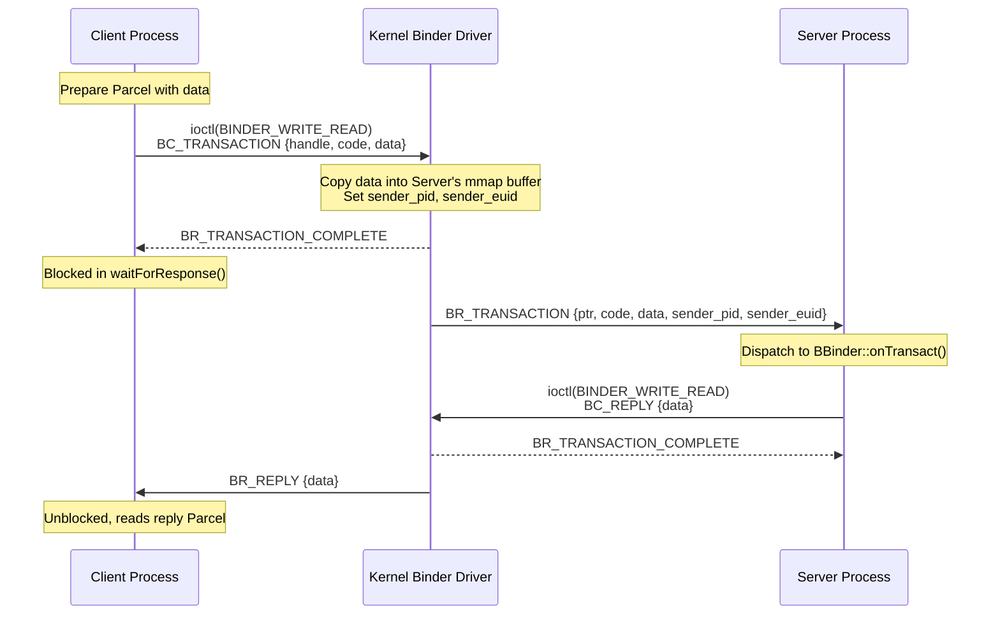
```mermaid
sequenceDiagram
    participant Client as Client Process
    participant KD as Kernel Binder Driver
    participant Server as Server Process

    Note over Client: Prepare Parcel with data
    Client->>KD: ioctl(BINDER_WRITE_READ)<br/>BC_TRANSACTION {handle, code, data}
    Note over KD: Copy data into Server's mmap buffer<br/>Set sender_pid, sender_euid

    KD-->>Client: BR_TRANSACTION_COMPLETE
    Note over Client: Blocked in waitForResponse()

    KD->>Server: BR_TRANSACTION {ptr, code, data, sender_pid, sender_euid}
    Note over Server: Dispatch to BBinder::onTransact()

    Server->>KD: ioctl(BINDER_WRITE_READ)<br/>BC_REPLY {data}
    KD-->>Server: BR_TRANSACTION_COMPLETE

    KD->>Client: BR_REPLY {data}
    Note over Client: Unblocked, reads reply Parcel
```

For **oneway (asynchronous)** transactions, the flow is shorter:

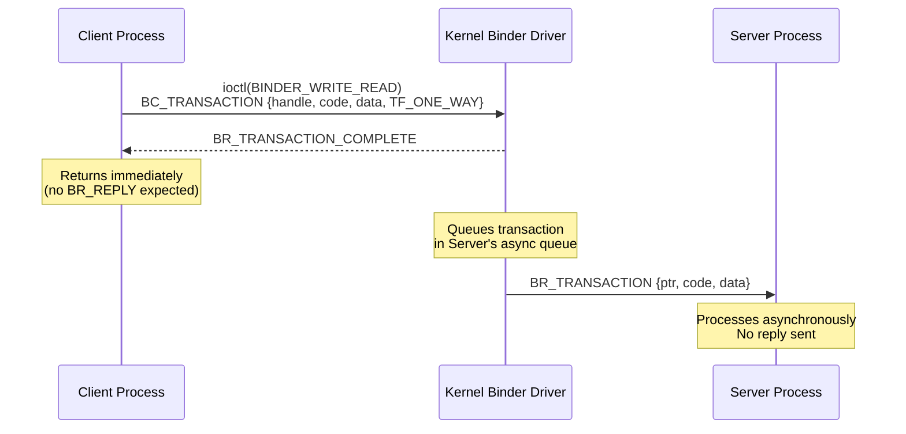
```mermaid
sequenceDiagram
    participant Client as Client Process
    participant KD as Kernel Binder Driver
    participant Server as Server Process

    Client->>KD: ioctl(BINDER_WRITE_READ)<br/>BC_TRANSACTION {handle, code, data, TF_ONE_WAY}
    KD-->>Client: BR_TRANSACTION_COMPLETE
    Note over Client: Returns immediately<br/>(no BR_REPLY expected)

    Note over KD: Queues transaction<br/>in Server's async queue
    KD->>Server: BR_TRANSACTION {ptr, code, data}
    Note over Server: Processes asynchronously<br/>No reply sent
```

### 9.2.6 Memory Mapping and Buffer Management

When `ProcessState` opens the binder driver, it calls `mmap()`:

```cpp
// frameworks/native/libs/binder/ProcessState.cpp
#define BINDER_VM_SIZE ((1 * 1024 * 1024) - sysconf(_SC_PAGE_SIZE) * 2)
```

This 1 MB (minus guard pages) buffer is mapped read-only in userspace -- only
the kernel can write into it. The driver allocates sub-regions within this
buffer for incoming transactions. After the receiver processes a transaction,
it must issue `BC_FREE_BUFFER` to release the buffer back to the driver.

This buffer size is a hard limit on the total size of all concurrent incoming
transactions. If a process has too many pending transactions, the buffer fills
up and new transactions will fail with `FAILED_TRANSACTION`. This is why the
system logs a warning when binder buffer utilization is high.

### 9.2.7 Reference Counting

The driver maintains reference counts on binder nodes. Four commands manage
references:

| Command | Effect |
|---------|--------|
| `BC_INCREFS` | Increment weak reference count |
| `BC_ACQUIRE` | Increment strong reference count |
| `BC_RELEASE` | Decrement strong reference count |
| `BC_DECREFS` | Decrement weak reference count |

In `IPCThreadState.cpp`:

```cpp
// frameworks/native/libs/binder/IPCThreadState.cpp (line ~996)
void IPCThreadState::incStrongHandle(int32_t handle, BpBinder *proxy)
{
    LOG_REMOTEREFS("IPCThreadState::incStrongHandle(%d)\n", handle);
    mOut.writeInt32(BC_ACQUIRE);
    mOut.writeInt32(handle);
    // ...
}

void IPCThreadState::decStrongHandle(int32_t handle)
{
    LOG_REMOTEREFS("IPCThreadState::decStrongHandle(%d)\n", handle);
    mOut.writeInt32(BC_RELEASE);
    mOut.writeInt32(handle);
    flushIfNeeded();
}
```

When a strong reference count drops to zero and there are no weak references,
the kernel driver cleans up the node.

### 9.2.8 Death Notifications

When a process dies, the kernel driver iterates all references held to binder
nodes in that process and sends `BR_DEAD_BINDER` to each process that
registered a death notification:

```cpp
// frameworks/native/libs/binder/IPCThreadState.cpp (line ~1050)
status_t IPCThreadState::requestDeathNotification(int32_t handle, BpBinder* proxy)
{
    mOut.writeInt32(BC_REQUEST_DEATH_NOTIFICATION);
    mOut.writeInt32((int32_t)handle);
    mOut.writePointer((uintptr_t)proxy);
    return NO_ERROR;
}
```

### 9.2.9 Frozen Process Notifications

Android 14+ added process freezing support. When a process is frozen (e.g., a
cached app in the freezer cgroup), the driver can notify clients:

```cpp
// frameworks/native/libs/binder/IPCThreadState.cpp (line ~1066)
status_t IPCThreadState::addFrozenStateChangeCallback(int32_t handle, BpBinder* proxy) {
    static bool isSupported =
            ProcessState::isDriverFeatureEnabled(
                ProcessState::DriverFeature::FREEZE_NOTIFICATION);
    if (!isSupported) {
        return INVALID_OPERATION;
    }
    proxy->getWeakRefs()->incWeak(proxy);
    mOut.writeInt32(BC_REQUEST_FREEZE_NOTIFICATION);
    mOut.writeInt32((int32_t)handle);
    mOut.writePointer((uintptr_t)proxy);
    // ...
}
```

The `FrozenStateChangeCallback` interface lets clients react:

```cpp
// frameworks/native/libs/binder/include/binder/IBinder.h
class FrozenStateChangeCallback : public virtual RefBase {
public:
    enum class State {
        FROZEN,
        UNFROZEN,
    };
    virtual void onStateChanged(const wp<IBinder>& who, State state) = 0;
};
```

### 9.2.10 Thread Pool Management

The driver manages a pool of threads in each process. When all existing threads
are busy handling transactions and a new transaction arrives, the driver sends
`BR_SPAWN_LOOPER` to tell the process to create a new thread. The maximum is
configured by:

```cpp
// frameworks/native/libs/binder/ProcessState.cpp (line ~451)
status_t ProcessState::setThreadPoolMaxThreadCount(size_t maxThreads) {
    LOG_ALWAYS_FATAL_IF(mThreadPoolStarted && maxThreads < mMaxThreads,
           "Binder threadpool cannot be shrunk after starting");
    status_t result = NO_ERROR;
    if (ioctl(mDriverFD, BINDER_SET_MAX_THREADS, &maxThreads) != -1) {
        mMaxThreads = maxThreads;
    } else {
        result = -errno;
        ALOGE("Binder ioctl to set max threads failed: %s", strerror(-result));
    }
    return result;
}
```

The default maximum is 15 threads:

```cpp
#define DEFAULT_MAX_BINDER_THREADS 15
```

### 9.2.11 Becoming the Context Manager

Only one process per binder domain can become the "context manager" -- the
process that holds handle 0. This is how `servicemanager` registers itself:

```cpp
// frameworks/native/libs/binder/ProcessState.cpp (line ~234)
bool ProcessState::becomeContextManager()
{
    std::unique_lock<std::mutex> _l(mLock);

    flat_binder_object obj {
        .flags = FLAT_BINDER_FLAG_TXN_SECURITY_CTX,
    };

    int result = ioctl(mDriverFD, BINDER_SET_CONTEXT_MGR_EXT, &obj);

    // fallback to original method
    if (result != 0) {
        android_errorWriteLog(0x534e4554, "121035042");
        int unused = 0;
        result = ioctl(mDriverFD, BINDER_SET_CONTEXT_MGR, &unused);
    }
    // ...
    return result == 0;
}
```

The `FLAT_BINDER_FLAG_TXN_SECURITY_CTX` flag requests that the driver include
the SELinux security context in every transaction to the context manager.

---

## 9.3 libbinder (C++ and Rust)

Source directory: `frameworks/native/libs/binder/`

This directory contains approximately 80 source files implementing the userspace
Binder framework. The key classes form a clear hierarchy:

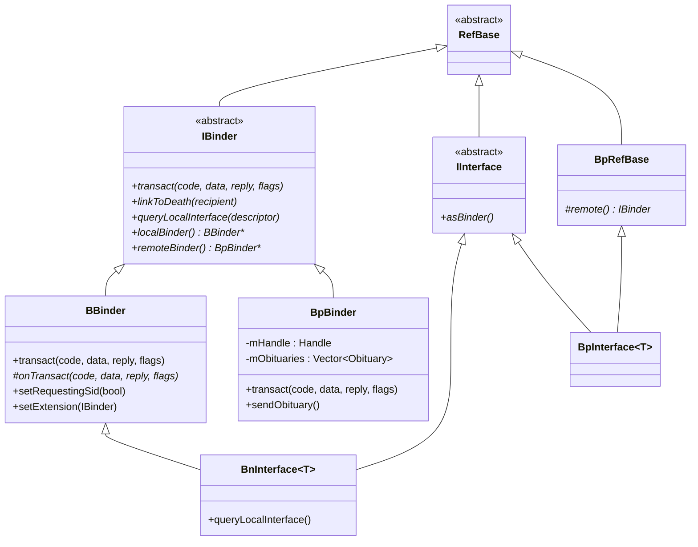
```mermaid
classDiagram
    class RefBase {
        <<abstract>>
    }
    class IBinder {
        <<abstract>>
        +transact(code, data, reply, flags)*
        +linkToDeath(recipient)*
        +queryLocalInterface(descriptor)*
        +localBinder()* BBinder*
        +remoteBinder()* BpBinder*
    }
    class BBinder {
        +transact(code, data, reply, flags)
        #onTransact(code, data, reply, flags)*
        +setRequestingSid(bool)
        +setExtension(IBinder)
    }
    class BpBinder {
        +transact(code, data, reply, flags)
        +sendObituary()
        -mHandle : Handle
        -mObituaries : Vector~Obituary~
    }
    class IInterface {
        <<abstract>>
        +asBinder()*
    }
    class BnInterface~T~ {
        +queryLocalInterface()
    }
    class BpInterface~T~ {
    }
    class BpRefBase {
        #remote() IBinder*
    }

    RefBase <|-- IBinder
    IBinder <|-- BBinder
    IBinder <|-- BpBinder
    RefBase <|-- IInterface
    IInterface <|-- BnInterface
    BBinder <|-- BnInterface
    IInterface <|-- BpInterface
    BpRefBase <|-- BpInterface
    RefBase <|-- BpRefBase
```

### 9.3.1 IBinder -- The Base Interface

`IBinder` is the abstract base class for all binder objects. Its most important
member is `transact()`:

```cpp
// frameworks/native/libs/binder/include/binder/IBinder.h (line ~186)
virtual status_t transact(uint32_t code,
                          const Parcel& data,
                          Parcel* reply,
                          uint32_t flags = 0) = 0;
```

It also defines the well-known transaction codes:

```cpp
// frameworks/native/libs/binder/include/binder/IBinder.h (line ~54)
enum {
    FIRST_CALL_TRANSACTION = 0x00000001,
    LAST_CALL_TRANSACTION = 0x00ffffff,

    PING_TRANSACTION        = B_PACK_CHARS('_', 'P', 'N', 'G'),
    DUMP_TRANSACTION        = B_PACK_CHARS('_', 'D', 'M', 'P'),
    SHELL_COMMAND_TRANSACTION = B_PACK_CHARS('_', 'C', 'M', 'D'),
    INTERFACE_TRANSACTION   = B_PACK_CHARS('_', 'N', 'T', 'F'),
    EXTENSION_TRANSACTION   = B_PACK_CHARS('_', 'E', 'X', 'T'),
    DEBUG_PID_TRANSACTION   = B_PACK_CHARS('_', 'P', 'I', 'D'),
    SET_RPC_CLIENT_TRANSACTION = B_PACK_CHARS('_', 'R', 'P', 'C'),

    FLAG_ONEWAY     = 0x00000001,
    FLAG_CLEAR_BUF  = 0x00000020,
    FLAG_PRIVATE_VENDOR = 0x10000000,
};
```

The `B_PACK_CHARS` macro encodes four ASCII characters into a 32-bit integer,
creating human-readable-in-hex transaction codes (`_PNG`, `_DMP`, etc.). These
are "meta-transactions" understood by all binder objects.

Interface-specific transactions use codes starting from
`FIRST_CALL_TRANSACTION` (1). AIDL numbers methods sequentially from this base.

### 9.3.2 BBinder -- The Server-Side Object

`BBinder` represents a local binder object -- one that lives in the current
process. It is the server side.

```cpp
// frameworks/native/libs/binder/include/binder/Binder.h (line ~31)
class BBinder : public IBinder {
public:
    BBinder();
    virtual const String16& getInterfaceDescriptor() const;
    virtual bool isBinderAlive() const;
    virtual status_t pingBinder();

    // transact() is final -- it calls onTransact()
    virtual status_t transact(uint32_t code, const Parcel& data,
                              Parcel* reply, uint32_t flags = 0) final;

protected:
    virtual ~BBinder();
    // Subclasses override this to handle transactions
    virtual status_t onTransact(uint32_t code, const Parcel& data,
                                Parcel* reply, uint32_t flags = 0);
};
```

The `transact()` method is marked `final` -- derived classes override
`onTransact()` instead. This is a Template Method pattern: `transact()` handles
meta-transactions (ping, dump, shell command, etc.) and delegates
interface-specific calls to `onTransact()`.

The size of these classes is carefully controlled and enforced with
`static_assert`:

```cpp
// frameworks/native/libs/binder/Binder.cpp (line ~54)
#ifdef __LP64__
static_assert(sizeof(IBinder) == 24);
static_assert(sizeof(BBinder) == 40);
#else
static_assert(sizeof(IBinder) == 12);
static_assert(sizeof(BBinder) == 20);
#endif
```

These are frozen because `BBinder` is part of the ABI used by prebuilt vendor
libraries.

### 9.3.3 BpBinder -- The Client-Side Proxy

`BpBinder` is a proxy to a binder object in another process. It holds a kernel
handle (an integer) or an RPC session reference:

```cpp
// frameworks/native/libs/binder/include/binder/BpBinder.h (line ~180)
struct BinderHandle {
    int32_t handle;
};
struct RpcHandle {
    sp<RpcSession> session;
    uint64_t address;
};
using Handle = std::variant<BinderHandle, RpcHandle>;
```

When you call `transact()` on a `BpBinder`, it delegates to
`IPCThreadState::transact()`, which packages the data and sends it to the
kernel:

```cpp
// frameworks/native/libs/binder/IPCThreadState.cpp (line ~919)
status_t IPCThreadState::transact(int32_t handle,
                                  uint32_t code, const Parcel& data,
                                  Parcel* reply, uint32_t flags)
{
    // ...
    flags |= TF_ACCEPT_FDS;
    err = writeTransactionData(BC_TRANSACTION, flags, handle, code, data, nullptr);

    if (err != NO_ERROR) {
        if (reply) reply->setError(err);
        return (mLastError = err);
    }

    if ((flags & TF_ONE_WAY) == 0) {
        // Synchronous: wait for reply
        if (reply) {
            err = waitForResponse(reply);
        } else {
            Parcel fakeReply;
            err = waitForResponse(&fakeReply);
        }
    } else {
        // Oneway: just wait for TRANSACTION_COMPLETE
        err = waitForResponse(nullptr, nullptr);
    }
    return err;
}
```

#### Binder Proxy Throttling

BpBinder includes sophisticated proxy count tracking to prevent binder proxy
leaks (a common cause of system instability):

```cpp
// frameworks/native/libs/binder/BpBinder.cpp (line ~71)
uint32_t BpBinder::sBinderProxyCountHighWatermark = 2500;
uint32_t BpBinder::sBinderProxyCountLowWatermark = 2000;
uint32_t BpBinder::sBinderProxyCountWarningWatermark = 2250;
```

When a process accumulates more than 2500 binder proxy references (typically
due to a leak), the system fires a callback that can kill the offending process.

### 9.3.4 ProcessState -- Per-Process Singleton

`ProcessState` is a singleton that manages the binder driver connection for
the entire process:

```cpp
// frameworks/native/libs/binder/ProcessState.cpp (line ~106)
sp<ProcessState> ProcessState::self()
{
    return init(kDefaultDriver, false /*requireDefault*/);
}
```

It opens the binder driver, mmaps the buffer, and manages the handle-to-object
mapping. Key responsibilities:

1. **Driver initialization:** Opens `/dev/binder` (or `/dev/vndbinder`),
   mmaps the transaction buffer.

2. **Handle table:** Maps kernel handles to `BpBinder` objects:
   ```cpp
   struct handle_entry {
       IBinder* binder;
       RefBase::weakref_type* refs;
   };
   Vector<handle_entry> mHandleToObject;
   ```

3. **Context object:** Handle 0 is the context manager (`servicemanager`):
   ```cpp
   sp<IBinder> ProcessState::getContextObject(const sp<IBinder>& /*caller*/)
   {
       sp<IBinder> context = getStrongProxyForHandle(0);
       // ...
       return context;
   }
   ```

4. **Thread pool:** Spawns and manages binder threads:
   ```cpp
   void ProcessState::startThreadPool()
   {
       std::unique_lock<std::mutex> _l(mLock);
       if (!mThreadPoolStarted) {
           mThreadPoolStarted = true;
           spawnPooledThread(true);
       }
   }
   ```

5. **Fork safety:** Binder cannot be used after `fork()` because the kernel
   driver state is per-process. `ProcessState` installs `pthread_atfork` handlers:
   ```cpp
   int ret = pthread_atfork(ProcessState::onFork,
                            ProcessState::parentPostFork,
                            ProcessState::childPostFork);
   ```

### 9.3.5 IPCThreadState -- Per-Thread State

`IPCThreadState` is a thread-local object that manages the actual
communication with the binder driver:

```cpp
// frameworks/native/libs/binder/IPCThreadState.cpp (line ~374)
IPCThreadState* IPCThreadState::self()
{
    if (gHaveTLS.load(std::memory_order_acquire)) {
restart:
        const pthread_key_t k = gTLS;
        IPCThreadState* st = (IPCThreadState*)pthread_getspecific(k);
        if (st) return st;
        return new IPCThreadState;
    }
    // ...first-time TLS setup...
}
```

Key members:

```cpp
// frameworks/native/libs/binder/include/binder/IPCThreadState.h (line ~240)
const sp<ProcessState>    mProcess;
Vector<BBinder*>          mPendingStrongDerefs;
Vector<RefBase::weakref_type*> mPendingWeakDerefs;
Parcel                    mIn;     // incoming data from driver
Parcel                    mOut;    // outgoing data to driver
pid_t                     mCallingPid;
const char*               mCallingSid;
uid_t                     mCallingUid;
int32_t                   mWorkSource;
```

The `mIn` and `mOut` `Parcel` objects act as write and read buffers for
`BINDER_WRITE_READ` ioctls. They are initialized with a 256-byte capacity:

```cpp
// frameworks/native/libs/binder/IPCThreadState.cpp (line ~1127)
IPCThreadState::IPCThreadState()
      : mProcess(ProcessState::self()),
        // ...
{
    pthread_setspecific(gTLS, this);
    clearCaller();
    mIn.setDataCapacity(256);
    mOut.setDataCapacity(256);
}
```

### 9.3.6 The Thread Pool Loop

When a thread joins the binder thread pool, it enters a loop that processes
transactions:

```cpp
// frameworks/native/libs/binder/IPCThreadState.cpp (line ~839)
void IPCThreadState::joinThreadPool(bool isMain)
{
    mProcess->mCurrentThreads++;
    mOut.writeInt32(isMain ? BC_ENTER_LOOPER : BC_REGISTER_LOOPER);

    mIsLooper = true;
    status_t result;
    do {
        processPendingDerefs();
        // now get the next command to be processed, waiting if necessary
        result = getAndExecuteCommand();

        // Let this thread exit the thread pool if it is no longer
        // needed and it is not the main process thread.
        if(result == TIMED_OUT && !isMain) {
            break;
        }
    } while (result != -ECONNREFUSED && result != -EBADF);

    mOut.writeInt32(BC_EXIT_LOOPER);
    mIsLooper = false;
    // ...
}
```

The difference between `BC_ENTER_LOOPER` (main thread) and
`BC_REGISTER_LOOPER` (spawned thread) tells the driver that the main thread
should never time out, while spawned threads can be retired.

### 9.3.7 Transaction Execution

When a transaction arrives, `getAndExecuteCommand()` reads it and dispatches:

```cpp
// frameworks/native/libs/binder/IPCThreadState.cpp (line ~730)
status_t IPCThreadState::getAndExecuteCommand()
{
    status_t result;
    int32_t cmd;

    result = talkWithDriver();
    if (result >= NO_ERROR) {
        size_t IN = mIn.dataAvail();
        if (IN < sizeof(int32_t)) return result;
        cmd = mIn.readInt32();

        size_t newThreadsCount =
            mProcess->mExecutingThreadsCount.fetch_add(1) + 1;
        // ...starvation detection...

        result = executeCommand(cmd);

        // ...thread count bookkeeping...
    }
    return result;
}
```

The starvation detection is notable: if all threads are busy for more than
100ms, the system logs an error:

```cpp
if (starvationTime > 100ms) {
    ALOGE("binder thread pool (%zu threads) starved for %" PRId64 " ms",
          maxThreads, to_ms(starvationTime));
}
```

### 9.3.8 Caller Identity Management

A critical feature of Binder is the ability to temporarily clear the caller
identity to perform privileged operations on behalf of a caller:

```cpp
// frameworks/native/libs/binder/IPCThreadState.cpp (line ~562)
int64_t IPCThreadState::clearCallingIdentity()
{
    int64_t token = packCallingIdentity(mHasExplicitIdentity,
                                        mCallingUid, mCallingPid);
    clearCaller();
    mHasExplicitIdentity = true;
    return token;
}
```

The identity is packed into a 64-bit token:

```
 32b          1b              1b                 30b
[ calling uid | calling pid(sign) | has explicit identity | calling pid(rest) ]
```

This is the `Binder.clearCallingIdentity()` / `Binder.restoreCallingIdentity()`
pattern used ubiquitously in system_server.

### 9.3.9 IInterface and the Template Pattern

`IInterface` is the base class for typed Binder interfaces. The template
classes `BnInterface<T>` and `BpInterface<T>` create the server and client
sides:

```cpp
// frameworks/native/libs/binder/include/binder/IInterface.h (line ~69)
template <typename INTERFACE>
class BnInterface : public INTERFACE, public BBinder {
public:
    virtual sp<IInterface> queryLocalInterface(const String16& _descriptor);
    virtual const String16& getInterfaceDescriptor() const;
    typedef INTERFACE BaseInterface;
protected:
    virtual IBinder* onAsBinder();
};

template <typename INTERFACE>
class BpInterface : public INTERFACE, public BpRefBase {
public:
    explicit BpInterface(const sp<IBinder>& remote);
    typedef INTERFACE BaseInterface;
protected:
    virtual IBinder* onAsBinder();
};
```

The `interface_cast<>` template converts an `IBinder` to a typed interface:

```cpp
template<typename INTERFACE>
inline sp<INTERFACE> interface_cast(const sp<IBinder>& obj)
{
    return INTERFACE::asInterface(obj);
}
```

### 9.3.10 The Parcel Class

`Parcel` is the serialization container for Binder transactions. It holds
typed data, binder object references, and file descriptors:

```cpp
// frameworks/native/libs/binder/include/binder/Parcel.h (line ~64)
class Parcel {
    friend class IPCThreadState;
    friend class RpcState;
public:
    Parcel();
    ~Parcel();

    const uint8_t* data() const;
    size_t dataSize() const;
    size_t dataAvail() const;
    size_t dataPosition() const;
    // ...
};
```

Parcels support writing primitives (`writeInt32`, `writeFloat`, `writeString16`),
binder references (`writeStrongBinder`), file descriptors
(`writeFileDescriptor`), and complex types (`writeParcelable`).

### 9.3.11 Rust Binder

Source directory: `frameworks/native/libs/binder/rust/`

Android supports writing Binder services in Rust through a safe wrapper around
the NDK binder library. The key types mirror the C++ hierarchy:

```rust
// frameworks/native/libs/binder/rust/src/proxy.rs
/// A strong reference to a Binder remote object.
/// This struct encapsulates the generic C++ `sp<IBinder>` class.
pub struct SpIBinder(ptr::NonNull<sys::AIBinder>);
```

```rust
// frameworks/native/libs/binder/rust/src/native.rs
/// Rust wrapper around Binder remotable objects.
/// Implements the C++ `BBinder` class.
#[repr(C)]
pub struct Binder<T: Remotable> {
    ibinder: *mut sys::AIBinder,
    rust_object: *mut T,
}
```

The `Interface` trait is the Rust equivalent of `IInterface`:

```rust
// frameworks/native/libs/binder/rust/src/binder.rs
/// Super-trait for Binder interfaces.
/// This is equivalent `IInterface` in C++.
pub trait Interface: Send + Sync + DowncastSync {
    fn as_binder(&self) -> SpIBinder {
        panic!("This object was not a Binder object and cannot be converted into an SpIBinder.")
    }

    fn dump(&self, _writer: &mut dyn Write, _args: &[&CStr]) -> Result<()> {
        Ok(())
    }
}
```

The AIDL compiler generates Rust code that uses the `declare_binder_interface!`
macro:

```rust
// frameworks/native/libs/binder/rust/src/lib.rs (example from docs)
declare_binder_interface! {
    ITest["android.os.ITest"] {
        native: BnTest(on_transact),
        proxy: BpTest,
    }
}
```

The Rust binder library is built on top of the NDK binder API
(`libbinder_ndk`), which makes it usable in APEX modules that cannot depend on
the platform's `libbinder.so`.

### 9.3.12 The Complete Class Hierarchy

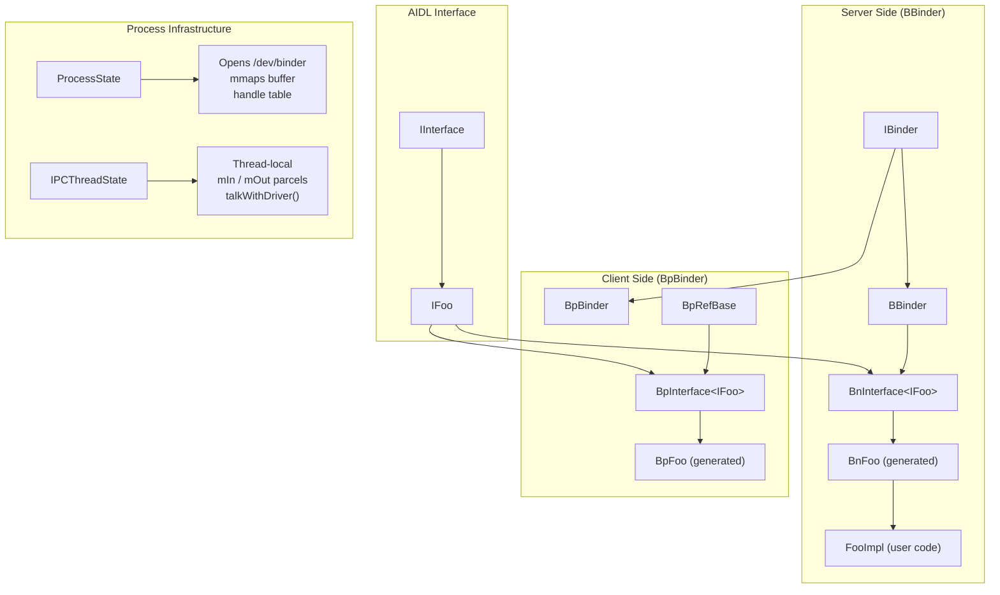
```mermaid
graph TD
    subgraph "Server Side (BBinder)"
        A[IBinder] --> B[BBinder]
        B --> C["BnInterface&lt;IFoo&gt;"]
        C --> D["BnFoo (generated)"]
        D --> E["FooImpl (user code)"]
    end

    subgraph "Client Side (BpBinder)"
        A --> F[BpBinder]
        G[BpRefBase] --> H["BpInterface&lt;IFoo&gt;"]
        H --> I["BpFoo (generated)"]
    end

    subgraph "AIDL Interface"
        J[IInterface] --> K[IFoo]
        K --> C
        K --> H
    end

    subgraph "Process Infrastructure"
        L[ProcessState] --> M["Opens /dev/binder<br/>mmaps buffer<br/>handle table"]
        N[IPCThreadState] --> O["Thread-local<br/>mIn / mOut parcels<br/>talkWithDriver()"]
    end
```

---

## 9.4 AIDL Code Generation

Source directory: `system/tools/aidl/`

AIDL (Android Interface Definition Language) is the primary way to define Binder
interfaces. The AIDL compiler translates `.aidl` files into Java, C++, NDK
C++, and Rust stubs.

### 9.4.1 AIDL Compiler Architecture

The AIDL compiler is a single binary that handles all backend targets:

```
system/tools/aidl/
├── aidl.cpp                 # Main entry point
├── aidl_language.h          # AST definitions
├── aidl_language_l.ll       # Lexer (flex)
├── aidl_language_y.yy       # Parser (bison)
├── aidl_to_java.cpp         # Java backend
├── aidl_to_java.h
├── aidl_to_cpp.cpp          # C++ backend
├── aidl_to_cpp.h
├── aidl_to_ndk.cpp          # NDK C++ backend
├── aidl_to_ndk.h
├── aidl_to_rust.cpp         # Rust backend
├── aidl_to_rust.h
├── generate_java.cpp        # Java code generation
├── generate_cpp.cpp         # C++ code generation
├── generate_ndk.cpp         # NDK code generation
├── generate_rust.cpp        # Rust code generation
├── aidl_checkapi.cpp        # API compatibility checking
├── aidl_dumpapi.cpp         # API dumping
└── ...
```

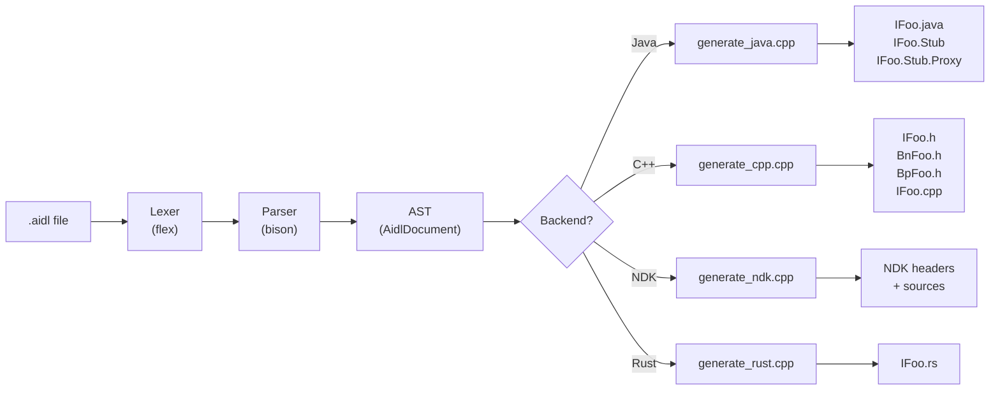
```mermaid
flowchart LR
    A[".aidl file"] --> B["Lexer<br/>(flex)"]
    B --> C["Parser<br/>(bison)"]
    C --> D["AST<br/>(AidlDocument)"]
    D --> E{"Backend?"}
    E -->|Java| F["generate_java.cpp"]
    E -->|C++| G["generate_cpp.cpp"]
    E -->|NDK| H["generate_ndk.cpp"]
    E -->|Rust| I["generate_rust.cpp"]
    F --> J["IFoo.java<br/>IFoo.Stub<br/>IFoo.Stub.Proxy"]
    G --> K["IFoo.h<br/>BnFoo.h<br/>BpFoo.h<br/>IFoo.cpp"]
    H --> L["NDK headers<br/>+ sources"]
    I --> M["IFoo.rs"]
```

### 9.4.2 AIDL Syntax

A typical AIDL interface definition:

```aidl
// android/os/IServiceManager.aidl
package android.os;

import android.os.IServiceCallback;

interface IServiceManager {
    // Get a binder by name, blocking if not found
    IBinder getService(String name);

    // Check without blocking
    IBinder checkService(String name);

    // Register a service
    void addService(String name, IBinder service,
                    boolean allowIsolated, int dumpPriority);

    // List registered services
    String[] listServices(int dumpPriority);

    // Register for notifications when a service is added
    void registerForNotifications(String name,
                                  IServiceCallback callback);

    // Check if a service is declared in VINTF manifest
    boolean isDeclared(String name);
}
```

### 9.4.3 AIDL Type Mapping

AIDL types map to different target types per backend:

| AIDL Type | Java | C++ | Rust |
|-----------|------|-----|------|
| `boolean` | `boolean` | `bool` | `bool` |
| `byte` | `byte` | `int8_t` | `i8` |
| `char` | `char` | `char16_t` | `u16` |
| `int` | `int` | `int32_t` | `i32` |
| `long` | `long` | `int64_t` | `i64` |
| `float` | `float` | `float` | `f32` |
| `double` | `double` | `double` | `f64` |
| `String` | `String` | `String16` | `String` |
| `IBinder` | `IBinder` | `sp<IBinder>` | `SpIBinder` |
| `FileDescriptor` | `FileDescriptor` | `unique_fd` | `OwnedFd` |
| `ParcelFileDescriptor` | `ParcelFileDescriptor` | `ParcelFileDescriptor` | `ParcelFileDescriptor` |
| `T[]` | `T[]` | `vector<T>` | `Vec<T>` |
| `List<T>` | `List<T>` | `vector<T>` | `Vec<T>` |
| `Map` | `Map` | -- (not supported) | -- |

The C++ backend helpers are defined in:

```cpp
// system/tools/aidl/aidl_to_cpp.h
std::string CppNameOf(const AidlTypeSpecifier& type,
                      const AidlTypenames& typenames);
std::string ParcelReadMethodOf(const AidlTypeSpecifier& type,
                               const AidlTypenames& typenames);
std::string ParcelWriteMethodOf(const AidlTypeSpecifier& type,
                                const AidlTypenames& typenames);
```

### 9.4.4 Direction Specifiers: in, out, inout

AIDL method parameters can have direction specifiers that control marshalling:

```aidl
interface IFoo {
    void process(in ParcelFileDescriptor input,
                 out ParcelFileDescriptor output,
                 inout Bundle data);
}
```

| Direction | Meaning | Generated Code |
|-----------|---------|----------------|
| `in` (default) | Data flows from client to server | Client writes, server reads |
| `out` | Data flows from server to client | Server writes, client reads from reply |
| `inout` | Data flows both ways | Client writes, server reads + writes, client reads reply |

Primitive types are always `in`. The `out` and `inout` specifiers are only valid
for parcelable types, arrays, and other non-primitive types.

### 9.4.5 oneway Methods

Methods marked `oneway` are fire-and-forget -- the client does not wait for a
reply:

```aidl
oneway interface ICallback {
    void onResult(int status);
}
```

In an `oneway` interface, ALL methods must be `oneway`. Alternatively,
individual methods can be marked:

```aidl
interface IFoo {
    void syncMethod();              // synchronous
    oneway void asyncNotify(int x); // asynchronous
}
```

Oneway calls:

- Return immediately after the driver queues the transaction
- Cannot return values or throw exceptions to the caller
- Are executed serially per-binder-object (the driver queues them)
- Use `TF_ONE_WAY` flag in the kernel

### 9.4.6 Parcelable Types

AIDL supports structured parcelable types:

```aidl
// Structured parcelable (AIDL-defined)
parcelable ConnectionInfo {
    String ipAddress;
    int port;
}

// Unstructured parcelable (Java-only, defined elsewhere)
parcelable Bundle;
```

Structured parcelables are fully defined in AIDL and the compiler generates
complete serialization code for all backends. Unstructured parcelables are
opaque references to Java classes that implement `Parcelable`.

### 9.4.7 Generated Code: Java

For an interface `IFoo`, the Java backend generates:

```
IFoo.java
├── interface IFoo extends android.os.IInterface
├── static class Stub extends android.os.Binder implements IFoo
│   └── static class Proxy implements IFoo
└── static class Default implements IFoo
```

The `Stub` class is the server side. Its `onTransact()` unmarshalls the incoming
parcel and dispatches to the appropriate method:

```java
// Generated code (simplified)
@Override
public boolean onTransact(int code, Parcel data, Parcel reply, int flags) {
    switch (code) {
        case TRANSACTION_getService: {
            data.enforceInterface(DESCRIPTOR);
            String _arg0 = data.readString();
            IBinder _result = this.getService(_arg0);
            reply.writeNoException();
            reply.writeStrongBinder(_result);
            return true;
        }
        // ...
    }
    return super.onTransact(code, data, reply, flags);
}
```

The `Stub.Proxy` class is the client side. Each method marshalls arguments into
a Parcel and calls `transact()`:

```java
// Generated code (simplified)
@Override
public IBinder getService(String name) throws RemoteException {
    Parcel _data = Parcel.obtain();
    Parcel _reply = Parcel.obtain();
    try {
        _data.writeInterfaceToken(DESCRIPTOR);
        _data.writeString(name);
        mRemote.transact(TRANSACTION_getService, _data, _reply, 0);
        _reply.readException();
        return _reply.readStrongBinder();
    } finally {
        _reply.recycle();
        _data.recycle();
    }
}
```

### 9.4.8 Generated Code: C++

The C++ backend generates header and implementation files:

```
IFoo.h      - Pure virtual interface
BnFoo.h     - Server-side stub (extends BnInterface<IFoo>)
BpFoo.h     - Client-side proxy (extends BpInterface<IFoo>)
IFoo.cpp    - Implementation of BnFoo::onTransact() and BpFoo methods
```

The code generation context is defined in:

```cpp
// system/tools/aidl/aidl_to_cpp.h
struct CodeGeneratorContext {
  CodeWriter& writer;
  const AidlTypenames& types;
  const AidlTypeSpecifier& type;
  const string name;
  const bool isPointer;
};
```

The generated `BpFoo` methods call `remote()->transact()`:

```cpp
// Generated code (simplified)
::android::binder::Status BpFoo::getService(
        const ::std::string& name,
        ::android::sp<::android::IBinder>* _aidl_return) {
    ::android::Parcel _aidl_data;
    _aidl_data.markForBinder(remoteStrong());
    _aidl_data.writeInterfaceToken(getInterfaceDescriptor());
    _aidl_data.writeUtf8AsUtf16(name);

    ::android::Parcel _aidl_reply;
    ::android::status_t _aidl_ret_status = remote()->transact(
        BnFoo::TRANSACTION_getService, _aidl_data, &_aidl_reply, 0);
    // ...read reply...
}
```

### 9.4.9 Generated Code: Rust

The Rust backend generates implementations of the AIDL interface trait:

```rust
// Generated code (simplified)
impl IFoo for BpFoo {
    fn getService(&self, name: &str) -> binder::Result<Option<SpIBinder>> {
        let _aidl_data = self.build_parcel_getService(name)?;
        let _aidl_reply = self.binder.submit_transact(
            transactions::getService,
            _aidl_data,
            binder::binder_impl::FLAG_PRIVATE_LOCAL,
        );
        self.read_response_getService(name, _aidl_reply)
    }
}
```

### 9.4.10 NDK Backend vs CPP Backend

AIDL generates two different C++ backends:

**CPP Backend (libbinder):**

- Links against `libbinder.so` (platform library)
- Uses `sp<IBinder>`, `Parcel`, `BBinder`, `BpBinder`
- Can only be used in the platform (not in APEX modules)
- Has access to all libbinder features

**NDK Backend (libbinder_ndk):**

- Links against `libbinder_ndk.so` (NDK stable library)
- Uses `AIBinder`, `AParcel`, NDK types
- Can be used in APEX modules (stable ABI)
- Wraps libbinder_ndk C API in C++ wrappers
- This is what the Rust binder library uses underneath

The build system chooses the backend based on the `backend` configuration:

```
aidl_interface {
    name: "android.hardware.foo",
    backend: {
        cpp: {
            enabled: true,   // generates libbinder (platform) code
        },
        ndk: {
            enabled: true,   // generates libbinder_ndk (APEX-safe) code
        },
        java: {
            enabled: true,
        },
        rust: {
            enabled: true,
        },
    },
}
```

For HAL services (which may live in APEX modules), the NDK backend is required.
For system_server services, the CPP backend is typically used.

### 9.4.11 Enum and Constant Declarations

AIDL supports enums and constants:

```aidl
@Backing(type="int")
enum Status {
    OK = 0,
    ERROR = 1,
    UNAVAILABLE = 2,
}

interface IFoo {
    const int MAX_SIZE = 1024;
    const String DESCRIPTOR = "android.hardware.foo.IFoo";

    Status getStatus();
}
```

The `@Backing` annotation specifies the underlying integer type. Without it,
the default backing type is `byte` for AIDL enums.

### 9.4.12 Union Types

AIDL supports tagged unions:

```aidl
union MediaContent {
    String url;
    byte[] rawData;
    ParcelFileDescriptor fileHandle;
}
```

In C++, this generates a class with a tag enum and accessor methods. Only one
variant is active at a time.

### 9.4.13 Nullable Types

AIDL supports nullable reference types with the `@nullable` annotation:

```aidl
interface IFoo {
    @nullable IBinder getOptionalService();
    void process(@nullable String optionalName);
}
```

In C++, nullable types are represented as `std::optional<T>` or as nullable
pointers. In Java, they map to normal nullable references. In Rust, they map
to `Option<T>`.

### 9.4.14 Annotations

AIDL supports several annotations that affect code generation:

| Annotation | Applies To | Effect |
|-----------|-----------|--------|
| `@nullable` | Parameters, return values | Allows null values |
| `@utf8InCpp` | String types | Use `std::string` instead of `String16` |
| `@Backing(type=T)` | Enum | Specifies backing integer type |
| `@VintfStability` | Interface, parcelable | Marks as VINTF-stable |
| `@Hide` | Methods, fields | Hidden from SDK |
| `@JavaPassthrough` | Any | Pass annotation through to Java |
| `@Enforce("perm")` | Methods | Generate permission check |
| `@PropagateAllowBlocking` | Methods | Allow blocking from oneway callers |
| `@SuppressWarnings` | Any | Suppress AIDL warnings |
| `@JavaOnlyStableParcelable` | Parcelable | Java-only stable parcelable |
| `@JavaDefault` | Interface | Generate default implementation |
| `@Descriptor` | Interface | Override interface descriptor |

### 9.4.15 API Versioning and Stability

AIDL supports stable interfaces that maintain backward compatibility across
Android releases. The build system tracks API surfaces:

```
aidl_api/
└── android.os.IServiceManager/
    ├── 1/
    │   └── android/os/IServiceManager.aidl
    ├── 2/
    │   └── android/os/IServiceManager.aidl
    └── current/
        └── android/os/IServiceManager.aidl
```

The `aidl_checkapi.cpp` tool verifies that new versions are backward-compatible:

- Methods can only be added (never removed or reordered)
- Method signatures cannot change
- Parcelable fields can only be appended
- Enum values can only be added

### 9.4.16 Transaction ID Assignment

Each method in an AIDL interface gets a transaction code starting from
`FIRST_CALL_TRANSACTION`:

```cpp
// system/tools/aidl/aidl_to_cpp.h
std::string GetTransactionIdFor(const std::string& clazz,
                                const AidlMethod& method);
```

Methods are numbered sequentially in declaration order:

| Method | Transaction Code |
|--------|-----------------|
| First method | `FIRST_CALL_TRANSACTION + 0` = `1` |
| Second method | `FIRST_CALL_TRANSACTION + 1` = `2` |
| Third method | `FIRST_CALL_TRANSACTION + 2` = `3` |
| ... | ... |

This sequential numbering is why AIDL stable interfaces cannot reorder methods.

### 9.4.17 The AIDL Compilation Pipeline

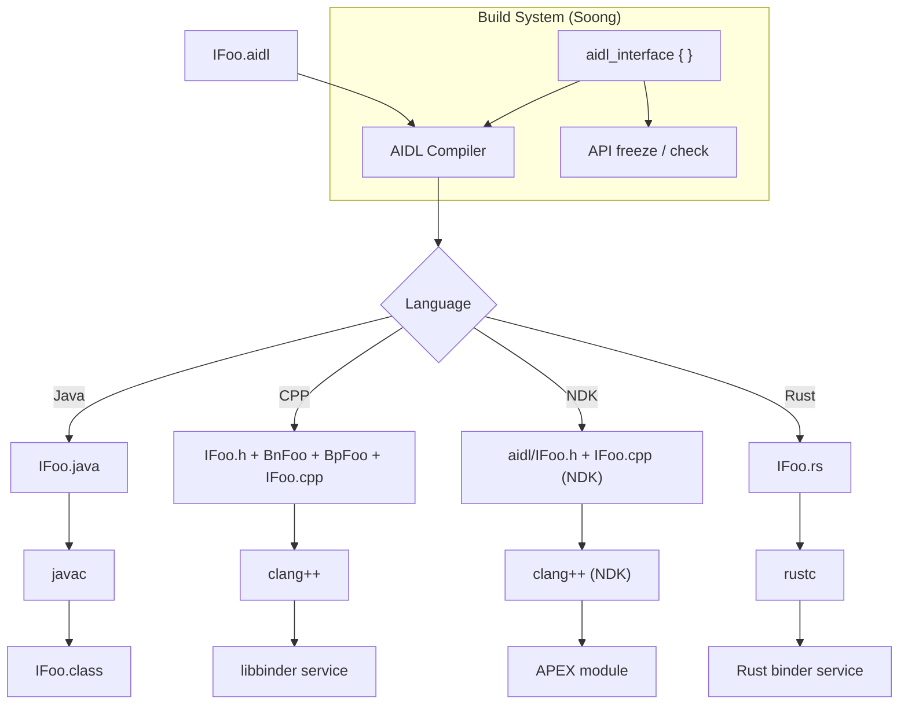
```mermaid
flowchart TD
    A["IFoo.aidl"] --> B["AIDL Compiler"]
    B --> C{"Language"}
    C -->|Java| D["IFoo.java"]
    C -->|CPP| E["IFoo.h + BnFoo + BpFoo + IFoo.cpp"]
    C -->|NDK| F["aidl/IFoo.h + IFoo.cpp (NDK)"]
    C -->|Rust| G["IFoo.rs"]

    D --> H["javac"] --> I["IFoo.class"]
    E --> J["clang++"] --> K["libbinder service"]
    F --> L["clang++ (NDK)"] --> M["APEX module"]
    G --> N["rustc"] --> O["Rust binder service"]

    subgraph "Build System (Soong)"
        P["aidl_interface { }"] --> B
        P --> Q["API freeze / check"]
    end
```

---

## 9.5 servicemanager

Source directory: `frameworks/native/cmds/servicemanager/`

The `servicemanager` is the first service that starts in Android. It is the
name-server for all Binder services: processes register services by name, and
clients look them up by name.

### 9.5.1 Architecture Overview

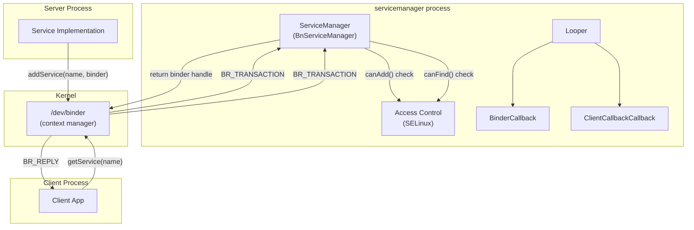
```mermaid
graph TD
    subgraph "servicemanager process"
        SM["ServiceManager<br/>(BnServiceManager)"]
        AC["Access Control<br/>(SELinux)"]
        LO["Looper"]
        BC["BinderCallback"]
        CC["ClientCallbackCallback"]
    end

    subgraph "Kernel"
        BD["/dev/binder<br/>(context manager)"]
    end

    subgraph "Server Process"
        SRV["Service Implementation"]
    end

    subgraph "Client Process"
        CLI["Client App"]
    end

    SRV -->|"addService(name, binder)"| BD
    BD -->|"BR_TRANSACTION"| SM
    SM -->|"canAdd() check"| AC

    CLI -->|"getService(name)"| BD
    BD -->|"BR_TRANSACTION"| SM
    SM -->|"canFind() check"| AC
    SM -->|"return binder handle"| BD
    BD -->|"BR_REPLY"| CLI

    LO --> BC
    LO --> CC
```

### 9.5.2 Startup Sequence

The `servicemanager` is started by init very early in boot. Its init.rc:

```rc
# frameworks/native/cmds/servicemanager/servicemanager.rc
service servicemanager /system/bin/servicemanager
    class core animation
    user system
    group system readproc
    critical
    file /dev/kmsg w
    onrestart setprop servicemanager.ready false
    onrestart restart --only-if-running apexd
    onrestart restart audioserver
    onrestart restart gatekeeperd
    onrestart class_restart --only-enabled main
    onrestart class_restart --only-enabled hal
    onrestart class_restart --only-enabled early_hal
    task_profiles ProcessCapacityHigh
    shutdown critical
```

The `critical` flag means the system will reboot if `servicemanager` crashes
too many times. The `onrestart` triggers restart all dependent services.

The `main()` function in `main.cpp`:

```cpp
// frameworks/native/cmds/servicemanager/main.cpp (line ~146)
int main(int argc, char** argv) {
    android::base::InitLogging(argv, android::base::KernelLogger);

    const char* driver = argc == 2 ? argv[1] : "/dev/binder";

    sp<ProcessState> ps = ProcessState::initWithDriver(driver);
    ps->setThreadPoolMaxThreadCount(0);
    ps->setCallRestriction(ProcessState::CallRestriction::FATAL_IF_NOT_ONEWAY);

    IPCThreadState::self()->disableBackgroundScheduling(true);

    sp<ServiceManager> manager =
        sp<ServiceManager>::make(std::make_unique<Access>());
    manager->setRequestingSid(true);
    if (!manager->addService("manager", manager,
            false /*allowIsolated*/,
            IServiceManager::DUMP_FLAG_PRIORITY_DEFAULT).isOk()) {
        LOG(ERROR) << "Could not self register servicemanager";
    }

    IPCThreadState::self()->setTheContextObject(manager);
    if (!ps->becomeContextManager()) {
        LOG(FATAL) << "Could not become context manager";
    }

    sp<Looper> looper = Looper::prepare(false /*allowNonCallbacks*/);
    sp<BinderCallback> binderCallback = BinderCallback::setupTo(looper);
    ClientCallbackCallback::setupTo(looper, manager, binderCallback);

    if (!SetProperty("servicemanager.ready", "true")) {
        LOG(ERROR) << "Failed to set servicemanager ready property";
    }

    while(true) {
        looper->pollAll(-1);
    }
}
```

Key initialization steps:

1. **Open the driver** with `ProcessState::initWithDriver("/dev/binder")`
2. **Set max threads to 0** -- servicemanager uses a single-threaded event loop
3. **Set FATAL_IF_NOT_ONEWAY** -- servicemanager must never make blocking calls
4. **Create the ServiceManager** with an `Access` object for SELinux checks
5. **Enable SID requests** (`setRequestingSid(true)`) so every transaction
   includes the caller's SELinux context
6. **Become the context manager** via `becomeContextManager()`
7. **Enter the event loop** using `Looper::pollAll(-1)`

The `BinderCallback` uses `IPCThreadState::setupPolling()` to get a file
descriptor for the binder driver, then adds it to the `Looper`:

```cpp
// frameworks/native/cmds/servicemanager/main.cpp (line ~59)
class BinderCallback : public LooperCallback {
public:
    static sp<BinderCallback> setupTo(const sp<Looper>& looper) {
        sp<BinderCallback> cb = sp<BinderCallback>::make();
        cb->mLooper = looper;

        IPCThreadState::self()->setupPolling(&cb->mBinderFd);
        LOG_ALWAYS_FATAL_IF(cb->mBinderFd < 0,
            "Failed to setupPolling: %d", cb->mBinderFd);

        int ret = looper->addFd(cb->mBinderFd, Looper::POLL_CALLBACK,
                                Looper::EVENT_INPUT, cb, nullptr);
        LOG_ALWAYS_FATAL_IF(ret != 1,
            "Failed to add binder FD to Looper");
        return cb;
    }

    int handleEvent(int, int, void*) override {
        IPCThreadState::self()->handlePolledCommands();
        return 1;  // Continue receiving callbacks.
    }
};
```

### 9.5.3 The ServiceManager Class

The `ServiceManager` class extends `BnServiceManager` (generated from AIDL)
and implements the `DeathRecipient` interface:

```cpp
// frameworks/native/cmds/servicemanager/ServiceManager.h (line ~41)
class ServiceManager : public os::BnServiceManager,
                       public IBinder::DeathRecipient {
public:
    ServiceManager(std::unique_ptr<Access>&& access);
    ~ServiceManager();

    binder::Status getService(const std::string& name,
                              sp<IBinder>* outBinder) override;
    binder::Status checkService(const std::string& name,
                                sp<IBinder>* outBinder) override;
    binder::Status addService(const std::string& name,
                              const sp<IBinder>& binder,
                              bool allowIsolated,
                              int32_t dumpPriority) override;
    binder::Status listServices(int32_t dumpPriority,
                                std::vector<std::string>* outList) override;
    binder::Status registerForNotifications(
        const std::string& name,
        const sp<IServiceCallback>& callback) override;
    binder::Status isDeclared(const std::string& name,
                              bool* outReturn) override;
    // ...

    void binderDied(const wp<IBinder>& who) override;

private:
    struct Service {
        sp<IBinder> binder;         // not null
        bool allowIsolated;
        int32_t dumpPriority;
        bool hasClients = false;
        bool guaranteeClient = false;
        Access::CallingContext ctx;  // process that registered this
        ssize_t getNodeStrongRefCount();
        ~Service();
    };

    using ServiceMap = std::map<std::string, Service>;
    ServiceMap mNameToService;
    // ...
    std::unique_ptr<Access> mAccess;
};
```

### 9.5.4 Service Registration (addService)

When a server process calls `addService()`:

```cpp
// frameworks/native/cmds/servicemanager/ServiceManager.cpp (line ~512)
Status ServiceManager::addService(const std::string& name,
                                  const sp<IBinder>& binder,
                                  bool allowIsolated,
                                  int32_t dumpPriority) {
    auto ctx = mAccess->getCallingContext();

    // Security: Only system UIDs can register services
    if (multiuser_get_app_id(ctx.uid) >= AID_APP) {
        return Status::fromExceptionCode(Status::EX_SECURITY,
            "App UIDs cannot add services.");
    }

    // SELinux: Check if this caller can add this service name
    std::optional<std::string> accessorName;
    if (auto status = canAddService(ctx, name, &accessorName);
            !status.isOk()) {
        return status;
    }

    if (binder == nullptr) {
        return Status::fromExceptionCode(Status::EX_ILLEGAL_ARGUMENT,
            "Null binder.");
    }

    if (!isValidServiceName(name)) {
        return Status::fromExceptionCode(Status::EX_ILLEGAL_ARGUMENT,
            "Invalid service name.");
    }

    // VINTF: For HAL services, verify VINTF manifest declaration
    if (!meetsDeclarationRequirements(ctx, binder, name)) {
        return Status::fromExceptionCode(Status::EX_ILLEGAL_ARGUMENT,
            "VINTF declaration error.");
    }

    // Register for death notification to clean up when server dies
    if (binder->remoteBinder() != nullptr &&
        binder->linkToDeath(sp<ServiceManager>::fromExisting(this)) != OK) {
        return Status::fromExceptionCode(Status::EX_ILLEGAL_STATE,
            "Couldn't linkToDeath.");
    }

    // Store the service
    mNameToService[name] = Service{
        .binder = binder,
        .allowIsolated = allowIsolated,
        .dumpPriority = dumpPriority,
        .ctx = ctx,
    };

    // Notify any processes waiting for this service
    // (via registerForNotifications)
    // ...
    return Status::ok();
}
```

Service name validation is strict:

```cpp
// frameworks/native/cmds/servicemanager/ServiceManager.cpp (line ~494)
bool isValidServiceName(const std::string& name) {
    if (name.size() == 0) return false;
    if (name.size() > 127) return false;

    for (char c : name) {
        if (c == '_' || c == '-' || c == '.' || c == '/') continue;
        if (c >= 'a' && c <= 'z') continue;
        if (c >= 'A' && c <= 'Z') continue;
        if (c >= '0' && c <= '9') continue;
        return false;
    }
    return true;
}
```

### 9.5.5 Service Lookup (getService / checkService)

```cpp
// frameworks/native/cmds/servicemanager/ServiceManager.cpp (line ~395)
Status ServiceManager::getService(const std::string& name,
                                  sp<IBinder>* outBinder) {
    *outBinder = tryGetBinder(name, true).service;
    return Status::ok();
}

Status ServiceManager::checkService(const std::string& name,
                                    sp<IBinder>* outBinder) {
    *outBinder = tryGetBinder(name, false).service;
    return Status::ok();
}
```

The difference: `getService()` passes `startIfNotFound=true`, which tries to
start the service via init if it is not running. `checkService()` returns
immediately (null if not found).

### 9.5.6 SELinux Access Control

Every service manager operation is gated by SELinux:

```cpp
// frameworks/native/cmds/servicemanager/Access.cpp (line ~130)
bool Access::canFind(const CallingContext& ctx, const std::string& name) {
    return actionAllowedFromLookup(ctx, name, "find");
}

bool Access::canAdd(const CallingContext& ctx, const std::string& name) {
    return actionAllowedFromLookup(ctx, name, "add");
}

bool Access::canList(const CallingContext& ctx) {
    return actionAllowed(ctx, mThisProcessContext, "list", "service_manager");
}
```

The actual check uses `selinux_check_access()`:

```cpp
// frameworks/native/cmds/servicemanager/Access.cpp (line ~142)
bool Access::actionAllowed(const CallingContext& sctx, const char* tctx,
                           const char* perm, const std::string& tname) {
    const char* tclass = "service_manager";

    AuditCallbackData data = {
        .context = &sctx,
        .tname = &tname,
    };

    return 0 == selinux_check_access(sctx.sid.c_str(), tctx, tclass, perm,
        reinterpret_cast<void*>(&data));
}
```

The calling context is obtained from `IPCThreadState`:

```cpp
// frameworks/native/cmds/servicemanager/Access.cpp (line ~113)
Access::CallingContext Access::getCallingContext() {
    IPCThreadState* ipc = IPCThreadState::self();
    const char* callingSid = ipc->getCallingSid();
    pid_t callingPid = ipc->getCallingPid();

    return CallingContext {
        .debugPid = callingPid,
        .uid = ipc->getCallingUid(),
        .sid = callingSid ? std::string(callingSid)
                          : getPidcon(callingPid),
    };
}
```

### 9.5.7 VINTF Manifest Integration

For HAL services, `servicemanager` verifies that the service is declared in the
VINTF manifest:

```cpp
// frameworks/native/cmds/servicemanager/ServiceManager.cpp (line ~342)
static bool meetsDeclarationRequirements(const Access::CallingContext& ctx,
                                         const sp<IBinder>& binder,
                                         const std::string& name) {
    if (!Stability::requiresVintfDeclaration(binder)) {
        return true;
    }
    return isVintfDeclared(ctx, name);
}
```

This ensures that HAL services are properly declared in device manifest files,
preventing ad-hoc service registration.

### 9.5.8 Client Callback Support

Servicemanager includes a timer-based system to track whether services have
active clients (used for lazy services):

```cpp
// frameworks/native/cmds/servicemanager/main.cpp (line ~92)
class ClientCallbackCallback : public LooperCallback {
    // Fires every 5 seconds
    int handleEvent(int fd, int, void*) override {
        uint64_t expirations;
        int ret = read(fd, &expirations, sizeof(expirations));
        mManager->handleClientCallbacks();
        mBinderCallback->repoll();
        return 1;
    }
};
```

### 9.5.9 dumpsys Integration

The `dumpsys` command-line tool communicates with servicemanager to list
services and dump their state. When you run:

```bash
adb shell dumpsys activity
```

This:

1. Calls `servicemanager.getService("activity")` to get the ActivityManager binder
2. Calls `IBinder::DUMP_TRANSACTION` on that binder
3. The service writes its state to the provided file descriptor

The `listServices()` call in servicemanager returns services filtered by
dump priority:

```cpp
// From ServiceManager.h
binder::Status listServices(int32_t dumpPriority,
                            std::vector<std::string>* outList) override;
```

Dump priorities allow `dumpsys` to dump critical services first:

```cpp
static const int DUMP_FLAG_PRIORITY_CRITICAL = 1 << 0;
static const int DUMP_FLAG_PRIORITY_HIGH     = 1 << 1;
static const int DUMP_FLAG_PRIORITY_NORMAL   = 1 << 2;
static const int DUMP_FLAG_PRIORITY_DEFAULT  = 1 << 3;
```

### 9.5.10 Service Registration Flow (Complete)

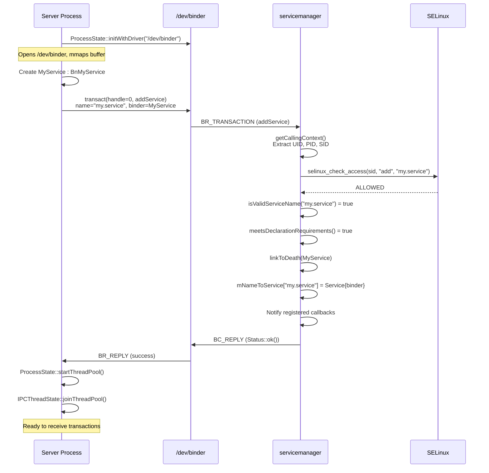
```mermaid
sequenceDiagram
    participant SP as Server Process
    participant BD as /dev/binder
    participant SM as servicemanager
    participant SE as SELinux

    SP->>BD: ProcessState::initWithDriver("/dev/binder")
    Note over SP: Opens /dev/binder, mmaps buffer

    SP->>SP: Create MyService : BnMyService
    SP->>BD: transact(handle=0, addService)<br/>name="my.service", binder=MyService
    BD->>SM: BR_TRANSACTION (addService)

    SM->>SM: getCallingContext()<br/>Extract UID, PID, SID
    SM->>SE: selinux_check_access(sid, "add", "my.service")
    SE-->>SM: ALLOWED

    SM->>SM: isValidServiceName("my.service") = true
    SM->>SM: meetsDeclarationRequirements() = true
    SM->>SM: linkToDeath(MyService)
    SM->>SM: mNameToService["my.service"] = Service{binder}
    SM->>SM: Notify registered callbacks

    SM->>BD: BC_REPLY (Status::ok())
    BD->>SP: BR_REPLY (success)

    SP->>SP: ProcessState::startThreadPool()
    SP->>SP: IPCThreadState::joinThreadPool()
    Note over SP: Ready to receive transactions
```

### 9.5.11 Service Lookup Flow (Complete)

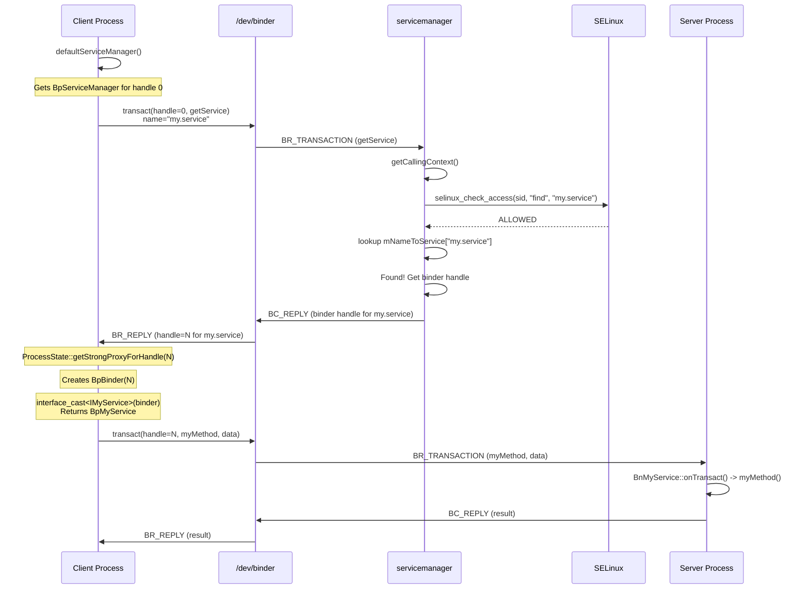
```mermaid
sequenceDiagram
    participant CP as Client Process
    participant BD as /dev/binder
    participant SM as servicemanager
    participant SE as SELinux
    participant SP as Server Process

    CP->>CP: defaultServiceManager()
    Note over CP: Gets BpServiceManager for handle 0

    CP->>BD: transact(handle=0, getService)<br/>name="my.service"
    BD->>SM: BR_TRANSACTION (getService)

    SM->>SM: getCallingContext()
    SM->>SE: selinux_check_access(sid, "find", "my.service")
    SE-->>SM: ALLOWED

    SM->>SM: lookup mNameToService["my.service"]
    SM->>SM: Found! Get binder handle

    SM->>BD: BC_REPLY (binder handle for my.service)
    BD->>CP: BR_REPLY (handle=N for my.service)

    Note over CP: ProcessState::getStrongProxyForHandle(N)
    Note over CP: Creates BpBinder(N)
    Note over CP: interface_cast<IMyService>(binder)<br/>Returns BpMyService

    CP->>BD: transact(handle=N, myMethod, data)
    BD->>SP: BR_TRANSACTION (myMethod, data)
    SP->>SP: BnMyService::onTransact() -> myMethod()
    SP->>BD: BC_REPLY (result)
    BD->>CP: BR_REPLY (result)
```

### 9.5.12 vndservicemanager

The vendor service manager is the same binary compiled with different flags:

```rc
# frameworks/native/cmds/servicemanager/vndservicemanager.rc
service vndservicemanager /vendor/bin/vndservicemanager /dev/vndbinder
    class core
    user system
    group system readproc
    file /dev/kmsg w
    task_profiles ServiceCapacityLow
    onrestart class_restart main
    onrestart class_restart hal
    onrestart class_restart early_hal
    shutdown critical
```

It uses `/dev/vndbinder` instead of `/dev/binder`, creating a completely
separate namespace for vendor services. The VNDK (Vendor NDK) build
configuration ensures vendor libraries use `/dev/vndbinder` by default:

```cpp
#ifdef __ANDROID_VNDK__
const char* kDefaultDriver = "/dev/vndbinder";
#else
const char* kDefaultDriver = "/dev/binder";
#endif
```

### 9.5.13 LazyServiceRegistrar

For services that should only run when they have clients, Android provides
`LazyServiceRegistrar`:

```cpp
// frameworks/native/libs/binder/include/binder/LazyServiceRegistrar.h
class LazyServiceRegistrar {
public:
    static LazyServiceRegistrar& getInstance();

    status_t registerService(
        const sp<IBinder>& service,
        const std::string& name = "default",
        bool allowIsolated = false,
        int dumpFlags = IServiceManager::DUMP_FLAG_PRIORITY_DEFAULT);

    void forcePersist(bool persist);

    void setActiveServicesCallback(
        const std::function<bool(bool)>& activeServicesCallback);

    bool tryUnregister();
    void reRegister();
};
```

When all clients disconnect, the lazy service shuts down. When a client requests
the service, init restarts it. This is used for HAL services that are expensive
to keep running when idle.

### 9.5.14 waitForService and Efficient Polling

The recommended way to obtain a service is `waitForService`, which uses
`registerForNotifications` to block efficiently rather than polling:

```cpp
// frameworks/native/libs/binder/include/binder/IServiceManager.h
template<typename INTERFACE>
sp<INTERFACE> waitForService(const String16& name) {
    const sp<IServiceManager> sm = defaultServiceManager();
    return interface_cast<INTERFACE>(sm->waitForService(name));
}
```

For VINTF-declared services:

```cpp
template<typename INTERFACE>
sp<INTERFACE> waitForVintfService(
        const String16& instance = String16("default")) {
    return waitForDeclaredService<INTERFACE>(
        INTERFACE::descriptor + String16("/") + instance);
}
```

---

## 9.6 hwservicemanager and HIDL Binder

Source directory: `system/hwservicemanager/`

### 9.6.1 The Three Binder Domains

Android uses three separate binder driver instances to enforce isolation between
the framework, HAL, and vendor components:


```mermaid
graph TB
    subgraph "Framework Domain"
        A[Apps] <-->|"/dev/binder"| B[system_server]
        B <-->|"/dev/binder"| C[servicemanager]
    end

    subgraph "HAL Domain (deprecated)"
        D["Framework<br/>clients"] <-->|"/dev/hwbinder"| E[HAL services]
        E <-->|"/dev/hwbinder"| F[hwservicemanager]
    end

    subgraph "Vendor Domain"
        G["Vendor<br/>processes"] <-->|"/dev/vndbinder"| H[Vendor services]
        H <-->|"/dev/vndbinder"| I[vndservicemanager]
    end

    style A fill:#e1f5fe
    style B fill:#e1f5fe
    style C fill:#e1f5fe
    style D fill:#fff3e0
    style E fill:#fff3e0
    style F fill:#fff3e0
    style G fill:#e8f5e9
    style H fill:#e8f5e9
    style I fill:#e8f5e9
```

| Domain | Device | Context Manager | Interface Language | Status |
|--------|--------|----------------|-------------------|--------|
| Framework | `/dev/binder` | `servicemanager` | AIDL | Active |
| HAL | `/dev/hwbinder` | `hwservicemanager` | HIDL | **Deprecated** (Android 13+) |
| Vendor | `/dev/vndbinder` | `vndservicemanager` | AIDL | Active |

### 9.6.2 Why Three Domains?

The three-domain architecture was introduced with Project Treble (Android 8.0)
to enforce the vendor/framework boundary:

1. **Framework domain** (`/dev/binder`): Used for all communication between
   apps and system services. Only framework processes should register here.

2. **HAL domain** (`/dev/hwbinder`): Used for communication between the
   framework and vendor HAL implementations. Uses HIDL (HAL Interface
   Definition Language) for stable binary interfaces.

3. **Vendor domain** (`/dev/vndbinder`): Used for vendor-internal communication
   that does not cross the Treble boundary.

SELinux policy enforces these boundaries -- a vendor process cannot open
`/dev/binder`, and a framework process should not open `/dev/vndbinder`.

### 9.6.3 hwservicemanager

The `hwservicemanager` manages HIDL services on `/dev/hwbinder`:

```rc
# system/hwservicemanager/hwservicemanager.rc
service hwservicemanager /system/system_ext/bin/hwservicemanager
    user system
    disabled
    group system readproc
    critical
    onrestart setprop hwservicemanager.ready false
    onrestart class_restart --only-enabled main
    onrestart class_restart --only-enabled hal
    onrestart class_restart --only-enabled early_hal
    task_profiles ServiceCapacityLow HighPerformance
    class animation
    shutdown critical
```

Note the `disabled` keyword -- on newer devices that have migrated all HALs to
AIDL, `hwservicemanager` is not started at all.

The `hwservicemanager` uses the HIDL `IServiceManager` interface:

```cpp
// system/hwservicemanager/ServiceManager.h
struct ServiceManager : public V1_2::IServiceManager,
                        hidl_death_recipient {
    Return<sp<IBase>> get(const hidl_string& fqName,
                          const hidl_string& name) override;
    Return<bool> add(const hidl_string& name,
                     const sp<IBase>& service) override;
    Return<Transport> getTransport(const hidl_string& fqName,
                                   const hidl_string& name);
    Return<void> list(list_cb _hidl_cb) override;
    Return<void> listByInterface(const hidl_string& fqInstanceName,
                                 listByInterface_cb _hidl_cb) override;
    Return<bool> registerForNotifications(
        const hidl_string& fqName,
        const hidl_string& name,
        const sp<IServiceNotification>& callback) override;
    // ...
};
```

### 9.6.4 HIDL vs AIDL

| Feature | HIDL | AIDL |
|---------|------|------|
| Transport | `/dev/hwbinder` | `/dev/binder` or `/dev/vndbinder` |
| Service naming | `package@version::IInterface/instance` | `package.IInterface/instance` |
| Versioning | Package-level (`@1.0`, `@1.1`) | Method-level (append only) |
| Language support | C++, Java | C++, Java, NDK C++, Rust |
| Status | **Deprecated** | Active, recommended |
| Passthrough mode | Supported | Not applicable |

HIDL used Fully Qualified Names (FQN) like:
```
android.hardware.camera.provider@2.4::ICameraProvider/internal/0
```

AIDL uses dot-separated names:
```
android.hardware.camera.provider.ICameraProvider/internal/0
```

### 9.6.5 The Migration from HIDL to AIDL

Starting with Android 13, all new HAL interfaces must use AIDL. Existing HIDL
interfaces are being migrated to AIDL over successive releases. The migration
path:

1. Define the new AIDL interface in `hardware/interfaces/`
2. Implement the service using AIDL
3. Register with `servicemanager` instead of `hwservicemanager`
4. Update VINTF manifest from `hidl` format to `aidl` format
5. Eventually remove the HIDL interface

Services that have migrated from HIDL to AIDL use `/dev/binder` and register
with the regular `servicemanager`, but their names are validated against the
VINTF manifest.

### 9.6.6 Passthrough HALs

HIDL supported a "passthrough" mode where the HAL was loaded directly into the
client process as a shared library (no IPC). This was used for performance-
critical HALs like the graphics HAL. AIDL does not support passthrough mode --
all communication is via Binder IPC. The passthrough functionality is replaced
by a direct dlopen mechanism:

```cpp
// frameworks/native/libs/binder/include/binder/IServiceManager.h
void* openDeclaredPassthroughHal(const String16& interface,
                                 const String16& instance, int flag);
```

### 9.6.7 RPC Binder

Android 12+ introduced RPC Binder (`/dev/binder` over sockets) for
cross-device and VM communication. This uses the same `libbinder` interfaces
but transports data over TCP/Unix sockets instead of the kernel driver:

```cpp
// frameworks/native/libs/binder/include/binder/RpcServer.h
class RpcServer : public virtual RefBase {
public:
    static sp<RpcServer> make(
        std::unique_ptr<RpcTransportCtxFactory> rpcTransportCtxFactory = nullptr);
    // ...
};
```

`BpBinder` uses the `std::variant<BinderHandle, RpcHandle>` to transparently
support both kernel binder and RPC binder:

```cpp
// frameworks/native/libs/binder/include/binder/BpBinder.h
struct BinderHandle {
    int32_t handle;
};
struct RpcHandle {
    sp<RpcSession> session;
    uint64_t address;
};
using Handle = std::variant<BinderHandle, RpcHandle>;
```

---

## 9.7 Try It: Write a Binder Service

This section walks through creating a complete Binder service and client. We
will create a simple "echo" service that demonstrates the full lifecycle.

### 9.7.1 Step 1: Define the AIDL Interface

Create the AIDL file:

```aidl
// hardware/interfaces/example/echo/aidl/android/hardware/echo/IEchoService.aidl
package android.hardware.echo;

interface IEchoService {
    /** Echo back the input string */
    String echo(in String input);

    /** Return the number of echo calls made */
    int getCallCount();

    /** Fire-and-forget notification */
    oneway void ping();
}
```

### 9.7.2 Step 2: Build Configuration

Create the `Android.bp` for the AIDL interface:

```
// hardware/interfaces/example/echo/aidl/Android.bp
aidl_interface {
    name: "android.hardware.echo",
    vendor_available: true,
    srcs: ["android/hardware/echo/*.aidl"],
    stability: "vintf",
    backend: {
        cpp: {
            enabled: true,
        },
        java: {
            enabled: true,
        },
        rust: {
            enabled: true,
        },
    },
}
```

### 9.7.3 Step 3: Implement the Service (C++)

```cpp
// hardware/interfaces/example/echo/aidl/default/EchoService.h
#pragma once

#include <aidl/android/hardware/echo/BnEchoService.h>
#include <atomic>

namespace aidl::android::hardware::echo {

class EchoService : public BnEchoService {
public:
    // Synchronous: echo back the input
    ndk::ScopedAStatus echo(const std::string& input,
                            std::string* _aidl_return) override {
        mCallCount++;
        *_aidl_return = "Echo: " + input;
        return ndk::ScopedAStatus::ok();
    }

    // Synchronous: return call count
    ndk::ScopedAStatus getCallCount(int32_t* _aidl_return) override {
        *_aidl_return = mCallCount.load();
        return ndk::ScopedAStatus::ok();
    }

    // Oneway: no reply needed
    ndk::ScopedAStatus ping() override {
        ALOGI("Ping received! Call count: %d", mCallCount.load());
        return ndk::ScopedAStatus::ok();
    }

private:
    std::atomic<int32_t> mCallCount{0};
};

}  // namespace aidl::android::hardware::echo
```

### 9.7.4 Step 4: Service Main Entry Point

```cpp
// hardware/interfaces/example/echo/aidl/default/main.cpp
#include "EchoService.h"

#include <android-base/logging.h>
#include <android/binder_manager.h>
#include <android/binder_process.h>

using aidl::android::hardware::echo::EchoService;

int main() {
    // Initialize the binder thread pool
    ABinderProcess_setThreadPoolMaxThreadCount(0);

    // Create the service
    std::shared_ptr<EchoService> echo =
        ndk::SharedRefBase::make<EchoService>();

    // Register with servicemanager
    const std::string instance =
        std::string() + EchoService::descriptor + "/default";
    binder_status_t status = AServiceManager_addService(
        echo->asBinder().get(), instance.c_str());
    CHECK_EQ(status, STATUS_OK)
        << "Failed to register " << instance;

    LOG(INFO) << "EchoService registered as " << instance;

    // Join the thread pool (blocks forever)
    ABinderProcess_startThreadPool();
    ABinderProcess_joinThreadPool();

    // Should not reach here
    LOG(FATAL) << "EchoService exited unexpectedly";
    return EXIT_FAILURE;
}
```

### 9.7.5 Step 5: Build Configuration for the Service

```
// hardware/interfaces/example/echo/aidl/default/Android.bp
cc_binary {
    name: "android.hardware.echo-service",
    relative_install_path: "hw",
    vendor: true,
    srcs: ["main.cpp"],
    shared_libs: [
        "libbase",
        "libbinder_ndk",
        "android.hardware.echo-V1-ndk",
    ],
}
```

### 9.7.6 Step 6: Init Configuration

```rc
// hardware/interfaces/example/echo/aidl/default/echo-service.rc
service vendor.echo /vendor/bin/hw/android.hardware.echo-service
    class hal
    user system
    group system
```

### 9.7.7 Step 7: VINTF Manifest Entry

Add to the device manifest:

```xml
<hal format="aidl">
    <name>android.hardware.echo</name>
    <version>1</version>
    <fqname>IEchoService/default</fqname>
</hal>
```

### 9.7.8 Step 8: Write the Client

```cpp
// A simple client that calls the echo service
#include <aidl/android/hardware/echo/IEchoService.h>
#include <android/binder_manager.h>
#include <android-base/logging.h>

using aidl::android::hardware::echo::IEchoService;

int main() {
    // Get the service
    const std::string instance =
        std::string() + IEchoService::descriptor + "/default";
    std::shared_ptr<IEchoService> service =
        IEchoService::fromBinder(
            ndk::SpAIBinder(AServiceManager_waitForService(
                instance.c_str())));
    CHECK(service != nullptr) << "Failed to get " << instance;

    // Make an echo call
    std::string result;
    auto status = service->echo("Hello, Binder!", &result);
    CHECK(status.isOk()) << "echo failed: "
                         << status.getDescription();
    LOG(INFO) << "Echo result: " << result;

    // Get call count
    int32_t count;
    status = service->getCallCount(&count);
    CHECK(status.isOk());
    LOG(INFO) << "Call count: " << count;

    // Send a oneway ping (returns immediately)
    status = service->ping();
    CHECK(status.isOk());
    LOG(INFO) << "Ping sent (oneway)";

    return 0;
}
```

### 9.7.9 Step 9: Implement in Rust

The same service in Rust:

```rust
// Rust service implementation
use binder::BinderFeatures;
use android_hardware_echo::aidl::android::hardware::echo::IEchoService::{
    BnEchoService, IEchoService,
};
use std::sync::atomic::{AtomicI32, Ordering};

struct EchoService {
    call_count: AtomicI32,
}

impl binder::Interface for EchoService {}

impl IEchoService for EchoService {
    fn echo(&self, input: &str) -> binder::Result<String> {
        self.call_count.fetch_add(1, Ordering::Relaxed);
        Ok(format!("Echo: {}", input))
    }

    fn getCallCount(&self) -> binder::Result<i32> {
        Ok(self.call_count.load(Ordering::Relaxed))
    }

    fn ping(&self) -> binder::Result<()> {
        log::info!("Ping received! Count: {}",
                   self.call_count.load(Ordering::Relaxed));
        Ok(())
    }
}

fn main() {
    binder::ProcessState::start_thread_pool();

    let service = EchoService {
        call_count: AtomicI32::new(0),
    };
    let service_binder = BnEchoService::new_binder(
        service,
        BinderFeatures::default(),
    );

    binder::add_service(
        &format!("{}/default", <BnEchoService as IEchoService>::get_descriptor()),
        service_binder.as_binder(),
    ).expect("Failed to register service");

    binder::ProcessState::join_thread_pool();
}
```

### 9.7.10 Step 10: Implement the Client in Java

```java
// Java client for the echo service
import android.hardware.echo.IEchoService;
import android.os.IBinder;
import android.os.ServiceManager;
import android.util.Log;

public class EchoClient {
    private static final String TAG = "EchoClient";
    private static final String SERVICE_NAME =
        "android.hardware.echo.IEchoService/default";

    public static void main(String[] args) {
        // Get the service from service manager
        IBinder binder = ServiceManager.waitForService(SERVICE_NAME);
        if (binder == null) {
            Log.e(TAG, "Failed to get echo service");
            return;
        }

        // Convert to typed interface
        IEchoService service = IEchoService.Stub.asInterface(binder);
        if (service == null) {
            Log.e(TAG, "Failed to cast to IEchoService");
            return;
        }

        try {
            // Make a synchronous echo call
            String result = service.echo("Hello from Java!");
            Log.i(TAG, "Echo result: " + result);

            // Get the call count
            int count = service.getCallCount();
            Log.i(TAG, "Call count: " + count);

            // Send a oneway ping
            service.ping();
            Log.i(TAG, "Ping sent");

        } catch (android.os.RemoteException e) {
            Log.e(TAG, "Remote exception: " + e.getMessage());
        }
    }
}
```

Under the hood, `IEchoService.Stub.asInterface(binder)` checks if the binder
is a local object (same process) or a remote proxy:

- If local, it returns the actual `IEchoService` implementation directly
  (zero-copy, no IPC)
- If remote, it wraps it in `IEchoService.Stub.Proxy` that marshalls calls
  through binder

This is the `queryLocalInterface()` optimization that avoids unnecessary
serialization for in-process calls.

### 9.7.11 Step 11: Handle Death Notifications

```cpp
// C++ example: Register for death notifications
class MyDeathRecipient : public android::IBinder::DeathRecipient {
public:
    void binderDied(const android::wp<android::IBinder>& who) override {
        ALOGE("Echo service died! Attempting to reconnect...");
        // Reconnect logic here
    }
};

// In client code:
sp<MyDeathRecipient> deathRecipient = sp<MyDeathRecipient>::make();
status_t status = binder->linkToDeath(deathRecipient);
if (status != OK) {
    ALOGE("Failed to link to death: %d", status);
}
```

Death notifications are essential for robust client implementations. When the
server process crashes, the client receives the notification and can attempt to
reconnect or clean up resources.

### 9.7.12 Step 12: Debugging Your Service

**List all registered services:**

```bash
adb shell service list
# or
adb shell dumpsys -l
```

**Check if your service is registered:**

```bash
adb shell service check android.hardware.echo.IEchoService/default
```

**Call a service method from the command line:**

```bash
adb shell service call android.hardware.echo.IEchoService/default \
    1 s16 "Hello"
# 1 = FIRST_CALL_TRANSACTION (echo method)
# s16 = String16 argument
```

**Dump service state:**

```bash
adb shell dumpsys android.hardware.echo.IEchoService/default
```

**View binder debug info:**

```bash
adb shell cat /sys/kernel/debug/binder/stats
adb shell cat /sys/kernel/debug/binder/transactions
adb shell cat /sys/kernel/debug/binder/state
```

**View binder calls with systrace/perfetto:**

```bash
adb shell perfetto -o /data/misc/perfetto-traces/trace \
    -c - <<EOF
buffers: {
    size_kb: 63488
}
data_sources: {
    config {
        name: "linux.ftrace"
        ftrace_config {
            ftrace_events: "binder/*"
        }
    }
}
duration_ms: 5000
EOF
```

### 9.7.13 Common Pitfalls

1. **Binder thread pool not started.** If you forget
   `ABinderProcess_startThreadPool()`, your service will register but never
   respond to transactions.

2. **Blocking in oneway methods.** Oneway methods should return quickly.
   Long-running work should be posted to a separate worker thread.

3. **Binder buffer overflow.** The 1 MB mmap buffer is shared among all
   pending incoming transactions. Sending large data (e.g., big bitmaps)
   through Binder is an anti-pattern -- use `ashmem` or `ParcelFileDescriptor`
   instead.

4. **Binder proxy leak.** Accumulating too many `BpBinder` references without
   releasing them triggers the proxy throttle (watermark at 2500). This
   typically manifests as `JavaBinder: !!! FAILED BINDER TRANSACTION !!!`.

5. **Missing VINTF declaration.** HAL services that do not have a VINTF
   manifest entry will fail to register with an `EX_ILLEGAL_ARGUMENT`.

6. **Wrong binder domain.** Vendor processes default to `/dev/vndbinder`. If
   you accidentally register on the wrong domain, clients in other domains
   cannot find your service.

7. **Fork after binder use.** `ProcessState` installs fork handlers that
   invalidate the binder FD in the child. Using Binder after `fork()` will
   crash:
   ```cpp
   static void verifyNotForked(bool forked) {
       LOG_ALWAYS_FATAL_IF(forked,
           "libbinder ProcessState can not be used after fork");
   }
   ```

### 9.7.14 Architecture of a Complete Binder Service

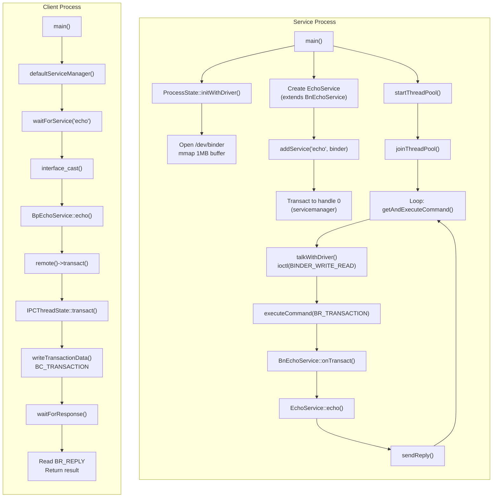
```mermaid
graph TD
    subgraph "Service Process"
        direction TB
        M["main()"] --> PS["ProcessState::initWithDriver()"]
        PS --> TB["Open /dev/binder<br/>mmap 1MB buffer"]
        M --> SVC["Create EchoService<br/>(extends BnEchoService)"]
        SVC --> REG["addService('echo', binder)"]
        REG --> SM_CALL["Transact to handle 0<br/>(servicemanager)"]
        M --> TP["startThreadPool()"]
        TP --> JT["joinThreadPool()"]
        JT --> LOOP["Loop: getAndExecuteCommand()"]
        LOOP --> TW["talkWithDriver()<br/>ioctl(BINDER_WRITE_READ)"]
        TW --> EX["executeCommand(BR_TRANSACTION)"]
        EX --> OT["BnEchoService::onTransact()"]
        OT --> EC["EchoService::echo()"]
        EC --> REP["sendReply()"]
        REP --> LOOP
    end

    subgraph "Client Process"
        direction TB
        CM["main()"] --> DSM["defaultServiceManager()"]
        DSM --> WS["waitForService('echo')"]
        WS --> IC["interface_cast<IEchoService>()"]
        IC --> BP["BpEchoService::echo()"]
        BP --> TR["remote()->transact()"]
        TR --> IPT["IPCThreadState::transact()"]
        IPT --> WTD["writeTransactionData()<br/>BC_TRANSACTION"]
        WTD --> WFR["waitForResponse()"]
        WFR --> RES["Read BR_REPLY<br/>Return result"]
    end
```

---

## 9.8 Binder Internals: Deep Dive

This section provides a detailed walkthrough of the internal data flows and
state machines within `libbinder`, aimed at kernel and framework developers who
need to understand the exact code paths involved in a Binder transaction.

### 9.8.1 The writeTransactionData Function

This is where outgoing transaction data is formatted:

```cpp
// frameworks/native/libs/binder/IPCThreadState.cpp (line ~1387)
status_t IPCThreadState::writeTransactionData(int32_t cmd,
    uint32_t binderFlags, int32_t handle, uint32_t code,
    const Parcel& data, status_t* statusBuffer)
{
    binder_transaction_data tr;

    tr.target.ptr = 0;
    tr.target.handle = handle;
    tr.code = code;
    tr.flags = binderFlags;
    tr.cookie = 0;
    tr.sender_pid = 0;
    tr.sender_euid = 0;

    const status_t err = data.errorCheck();
    if (err == NO_ERROR) {
        tr.data_size = data.ipcDataSize();
        tr.data.ptr.buffer = data.ipcData();
        tr.offsets_size = data.ipcObjectsCount()*sizeof(binder_size_t);
        tr.data.ptr.offsets = data.ipcObjects();
    } else if (statusBuffer) {
        tr.flags |= TF_STATUS_CODE;
        *statusBuffer = err;
        tr.data_size = sizeof(status_t);
        tr.data.ptr.buffer = reinterpret_cast<uintptr_t>(statusBuffer);
        tr.offsets_size = 0;
        tr.data.ptr.offsets = 0;
    } else {
        return (mLastError = err);
    }

    mOut.writeInt32(cmd);
    mOut.write(&tr, sizeof(tr));

    return NO_ERROR;
}
```

Note that `sender_pid` and `sender_euid` are set to 0 -- the kernel driver
fills these in with the actual values.

### 9.8.2 The executeCommand Function (BR_TRANSACTION)

When a transaction arrives at the server, `executeCommand()` processes the
`BR_TRANSACTION` command. This is the most complex case:

```cpp
// frameworks/native/libs/binder/IPCThreadState.cpp (line ~1510)
case BR_TRANSACTION_SEC_CTX:
case BR_TRANSACTION:
    {
        binder_transaction_data_secctx tr_secctx;
        binder_transaction_data& tr = tr_secctx.transaction_data;

        if (cmd == (int) BR_TRANSACTION_SEC_CTX) {
            result = mIn.read(&tr_secctx, sizeof(tr_secctx));
        } else {
            result = mIn.read(&tr, sizeof(tr));
            tr_secctx.secctx = 0;
        }

        Parcel buffer;
        buffer.ipcSetDataReference(
            reinterpret_cast<const uint8_t*>(tr.data.ptr.buffer),
            tr.data_size,
            reinterpret_cast<const binder_size_t*>(tr.data.ptr.offsets),
            tr.offsets_size/sizeof(binder_size_t), freeBuffer);

        // Save and set the caller identity
        const pid_t origPid = mCallingPid;
        const char* origSid = mCallingSid;
        const uid_t origUid = mCallingUid;

        mCallingPid = tr.sender_pid;
        mCallingSid = reinterpret_cast<const char*>(tr_secctx.secctx);
        mCallingUid = tr.sender_euid;

        // Dispatch to the target binder object
        if (tr.target.ptr) {
            if (reinterpret_cast<RefBase::weakref_type*>(tr.target.ptr)
                        ->attemptIncStrong(this)) {
                BBinder* binder = reinterpret_cast<BBinder*>(tr.cookie);
                error = doTransactBinder(binder, tr.code, buffer, &reply, tr.flags);
                binder->decStrong(this);
            }
        } else {
            // target.ptr == 0 means this is for the context manager
            BBinder* binder = the_context_object.get();
            error = doTransactBinder(binder, tr.code, buffer, &reply, tr.flags);
        }

        // For synchronous calls, send the reply
        if ((tr.flags & TF_ONE_WAY) == 0) {
            buffer.setDataSize(0);  // Free buffer before reply
            sendReply(reply, (tr.flags & kForwardReplyFlags));
        }

        // Restore caller identity
        mCallingPid = origPid;
        mCallingSid = origSid;
        mCallingUid = origUid;
    }
```

Key observations:

1. **Identity setup:** The caller's PID, UID, and SELinux SID are extracted from
   the transaction data and stored in thread-local state. This is what
   `getCallingPid()`, `getCallingUid()`, and `getCallingSid()` return.

2. **Strong reference acquisition:** Before calling into the BBinder, the code
   attempts to promote a weak reference to a strong reference. This handles the
   race where the BBinder might be in the process of being destroyed.

3. **Buffer management:** The reply buffer is cleared (`buffer.setDataSize(0)`)
   before sending the reply to avoid a race condition where the client receives
   the reply and sends another transaction before the original buffer is freed.

4. **Context manager dispatch:** When `tr.target.ptr` is null, the transaction
   is directed to the context manager (`the_context_object`), which is the
   `servicemanager`.

The reference counting commands are also handled in `executeCommand()`:

```cpp
// frameworks/native/libs/binder/IPCThreadState.cpp (line ~1444)
case BR_ACQUIRE:
    refs = (RefBase::weakref_type*)mIn.readPointer();
    obj = (BBinder*)mIn.readPointer();
    obj->incStrong(mProcess.get());
    mOut.writeInt32(BC_ACQUIRE_DONE);
    mOut.writePointer((uintptr_t)refs);
    mOut.writePointer((uintptr_t)obj);
    break;

case BR_RELEASE:
    refs = (RefBase::weakref_type*)mIn.readPointer();
    obj = (BBinder*)mIn.readPointer();
    mPendingStrongDerefs.push(obj);
    break;

case BR_INCREFS:
    refs = (RefBase::weakref_type*)mIn.readPointer();
    obj = (BBinder*)mIn.readPointer();
    refs->incWeak(mProcess.get());
    mOut.writeInt32(BC_INCREFS_DONE);
    mOut.writePointer((uintptr_t)refs);
    mOut.writePointer((uintptr_t)obj);
    break;

case BR_DECREFS:
    refs = (RefBase::weakref_type*)mIn.readPointer();
    obj = (BBinder*)mIn.readPointer();
    mPendingWeakDerefs.push(refs);
    break;
```

Notice that `BR_RELEASE` and `BR_DECREFS` do not immediately decrement the
reference counts. Instead, they are queued in `mPendingStrongDerefs` and
`mPendingWeakDerefs` and processed later by `processPendingDerefs()`. This
avoids potential deadlocks and ensures that destructors do not run while
the thread is in the middle of processing driver commands.

### 9.8.3 BBinder::transact and the Template Method Pattern

When a transaction reaches a BBinder, the `transact()` method (which is `final`)
handles meta-transactions and delegates to `onTransact()`:

```cpp
// frameworks/native/libs/binder/Binder.cpp (simplified)
status_t BBinder::transact(uint32_t code, const Parcel& data,
                           Parcel* reply, uint32_t flags)
{
    data.setDataPosition(0);

    if (reply != nullptr && (flags & FLAG_CLEAR_BUF)) {
        reply->markSensitive();
    }

    switch (code) {
        case PING_TRANSACTION:
            err = pingBinder();
            break;
        case EXTENSION_TRANSACTION:
            CHECK(googReply != nullptr);
            err = reply->writeStrongBinder(getExtension());
            break;
        case DEBUG_PID_TRANSACTION:
            err = reply->writeInt32(getDebugPid());
            break;
        case INTERFACE_TRANSACTION:
            reply->writeString16(getInterfaceDescriptor());
            err = NO_ERROR;
            break;
        case DUMP_TRANSACTION: {
            int fd = data.readFileDescriptor();
            // ...read args...
            err = dump(fd, args);
            break;
        }
        case SHELL_COMMAND_TRANSACTION: {
            // ...handle shell command...
            break;
        }
        default:
            err = onTransact(code, data, reply, flags);
            break;
    }

    if (reply != nullptr) {
        reply->setDataPosition(0);
        if (reply->dataSize() > LOG_SIZE) {
            // ...log warning about large replies...
        }
    }
    return err;
}
```

The AIDL-generated `BnFoo::onTransact()` is what dispatches to your specific
interface methods.

### 9.8.4 BBinder::Extras and the Lazy Initialization Pattern

BBinder uses lazy initialization for its "extras" -- optional metadata that
most binder objects never need:

```cpp
// frameworks/native/libs/binder/Binder.cpp (line ~294)
class BBinder::Extras {
public:
    sp<IBinder> mExtension;
    int mPolicy = SCHED_NORMAL;
    int mPriority = 0;
    bool mRequestingSid = false;
    bool mInheritRt = false;
    bool mRecordingOn = false;

    RpcMutex mLock;
    std::set<sp<RpcServerLink>> mRpcServerLinks;
    BpBinder::ObjectManager mObjectMgr;
    uint16_t mMinThreads = kDefaultMinThreads;
    unique_fd mRecordingFd;
};
```

The `Extras` pointer is stored as an `std::atomic<Extras*>` and allocated on
first access via `getOrCreateExtras()`. This keeps the `BBinder` base class
small (40 bytes on LP64) since most binder objects never use extensions,
custom scheduling, or recording.

### 9.8.5 The waitForResponse Loop (Continued)

After sending a transaction, the thread enters a loop waiting for the reply:

```cpp
// frameworks/native/libs/binder/IPCThreadState.cpp (line ~1163)
status_t IPCThreadState::waitForResponse(Parcel *reply,
                                         status_t *acquireResult)
{
    uint32_t cmd;
    int32_t err;

    while (1) {
        if ((err=talkWithDriver()) < NO_ERROR) break;
        err = mIn.errorCheck();
        if (err < NO_ERROR) break;
        if (mIn.dataAvail() == 0) continue;

        cmd = (uint32_t)mIn.readInt32();

        switch (cmd) {
        case BR_TRANSACTION_COMPLETE:
            if (!reply && !acquireResult) goto finish;
            break;

        case BR_DEAD_REPLY:
            err = DEAD_OBJECT;
            goto finish;

        case BR_FAILED_REPLY:
            err = FAILED_TRANSACTION;
            goto finish;

        case BR_FROZEN_REPLY:
            err = FAILED_TRANSACTION;
            goto finish;

        case BR_REPLY: {
            binder_transaction_data tr;
            err = mIn.read(&tr, sizeof(tr));
            if (reply) {
                if ((tr.flags & TF_STATUS_CODE) == 0) {
                    reply->ipcSetDataReference(
                        reinterpret_cast<const uint8_t*>(tr.data.ptr.buffer),
                        tr.data_size,
                        reinterpret_cast<const binder_size_t*>(tr.data.ptr.offsets),
                        tr.offsets_size/sizeof(binder_size_t),
                        freeBuffer);
                } else {
                    err = *reinterpret_cast<const status_t*>(
                        tr.data.ptr.buffer);
                    freeBuffer(/*...*/);
                }
            }
            goto finish;
        }

        default:
            err = executeCommand(cmd);
            if (err != NO_ERROR) goto finish;
            break;
        }
    }
    // ...
}
```

The `default` case is important: while waiting for a reply, the thread may
receive other commands from the driver (like `BR_DEAD_BINDER` death
notifications or nested `BR_TRANSACTION` calls). These are handled by
`executeCommand()`.

### 9.8.6 Nested Transactions

Binder supports re-entrant calls. If process A calls process B, and B calls
back into A during the handling of A's request, the driver delivers the
callback to the same thread in A that is waiting for B's reply. This is
detected in `waitForResponse()` by the `default` case calling
`executeCommand()`.

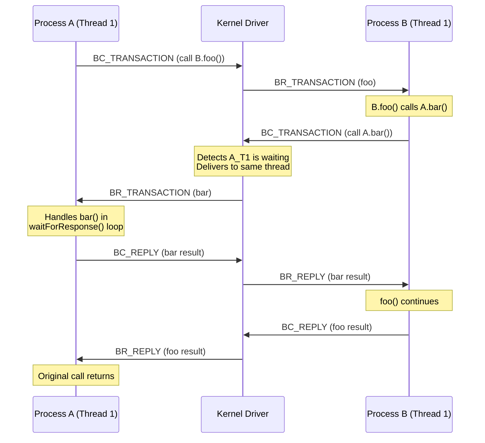
```mermaid
sequenceDiagram
    participant A_T1 as Process A (Thread 1)
    participant KD as Kernel Driver
    participant B_T1 as Process B (Thread 1)

    A_T1->>KD: BC_TRANSACTION (call B.foo())
    KD->>B_T1: BR_TRANSACTION (foo)
    Note over B_T1: B.foo() calls A.bar()
    B_T1->>KD: BC_TRANSACTION (call A.bar())
    Note over KD: Detects A_T1 is waiting<br/>Delivers to same thread
    KD->>A_T1: BR_TRANSACTION (bar)
    Note over A_T1: Handles bar() in<br/>waitForResponse() loop
    A_T1->>KD: BC_REPLY (bar result)
    KD->>B_T1: BR_REPLY (bar result)
    Note over B_T1: foo() continues
    B_T1->>KD: BC_REPLY (foo result)
    KD->>A_T1: BR_REPLY (foo result)
    Note over A_T1: Original call returns
```

### 9.8.7 Binder Context Object (Handle 0)

Handle 0 is special -- it always refers to the context manager
(`servicemanager`). When a process first needs to talk to servicemanager, it
calls:

```cpp
// frameworks/native/libs/binder/ProcessState.cpp (line ~183)
sp<IBinder> ProcessState::getContextObject(const sp<IBinder>& /*caller*/)
{
    sp<IBinder> context = getStrongProxyForHandle(0);
    if (context) {
        internal::Stability::markCompilationUnit(context.get());
    }
    return context;
}
```

The `getStrongProxyForHandle(0)` path has special handling -- it sends a
`PING_TRANSACTION` to ensure the context manager is alive before creating the
proxy:

```cpp
// frameworks/native/libs/binder/ProcessState.cpp (line ~361)
if (handle == 0) {
    // Special case for context manager...
    IPCThreadState* ipc = IPCThreadState::self();
    Parcel data;
    status_t status = ipc->transact(
            0, IBinder::PING_TRANSACTION, data, nullptr, 0);
    if (status == DEAD_OBJECT)
       return nullptr;
}
```

### 9.8.8 Stability Enforcement

The `Stability` class ensures that binder objects are not used across
incompatible domains:

```cpp
// frameworks/native/libs/binder/include/binder/Stability.h
class Stability {
    enum Level : int32_t {
        UNDECLARED = 0,     // Within a compilation unit
        VENDOR = 0b000011,  // Vendor stability
        SYSTEM = 0b001100,  // System stability
        VINTF = 0b111111,   // VINTF-stable (cross-partition)
    };
};
```

A `VINTF`-stable binder can be used across the framework/vendor boundary. A
`SYSTEM`-stable binder can only be used within the system partition. This
prevents accidental use of unstable interfaces across partitions.

### 9.8.9 Parcel Internals

The `Parcel` class manages a flat byte buffer with an "objects" array that
tracks embedded binder references and file descriptors:

```
┌──────────────────────────────────────────┐
│                 Parcel                    │
│                                          │
│  data: [int32 | string | binder | int32] │
│         ↑                ↑               │
│  objects: [           offset=12        ] │
│                                          │
│  The objects array stores offsets into    │
│  the data buffer where flat_binder_obj   │
│  structs are embedded.                   │
└──────────────────────────────────────────┘
```

When the kernel driver copies a Parcel, it processes the objects array to:

- Translate binder node references to handles (and vice versa)
- Duplicate file descriptors into the target process
- Maintain reference counts on binder nodes

### 9.8.10 The ProcessState Constructor

The full initialization of `ProcessState` opens the driver and mmaps:

```cpp
// frameworks/native/libs/binder/ProcessState.cpp
ProcessState::ProcessState(const char* driver)
    : mDriverName(String8(driver))
    , mDriverFD(-1)
    , mVMStart(MAP_FAILED)
    , mExecutingThreadsCount(0)
    , mMaxThreads(DEFAULT_MAX_BINDER_THREADS)
    , mCurrentThreads(0)
    , mKernelStartedThreads(0)
    , mStarvationStartTime(never())
    , mForked(false)
    , mThreadPoolStarted(false)
    , mThreadPoolSeq(1)
    , mCallRestriction(CallRestriction::NONE)
{
    base_fd fd(open(driver, O_RDWR | O_CLOEXEC));
    if (fd.ok()) {
        // ...
        mVMStart = mmap(nullptr, BINDER_VM_SIZE,
                        PROT_READ,
                        MAP_PRIVATE | MAP_NORESERVE,
                        fd.get(), 0);
        // ...
        mDriverFD = fd.release();
    }
}
```

The buffer is mapped `PROT_READ` only -- only the kernel can write to it.

### 9.8.11 Binder Caching

Recent versions of AOSP include a `BinderCacheWithInvalidation` that caches
service lookups to avoid repeated roundtrips to servicemanager:

```cpp
// frameworks/native/libs/binder/BackendUnifiedServiceManager.h
class BinderCacheWithInvalidation
      : public std::enable_shared_from_this<BinderCacheWithInvalidation> {
    class BinderInvalidation : public IBinder::DeathRecipient {
    public:
        void binderDied(const wp<IBinder>& who) override {
            sp<IBinder> binder = who.promote();
            if (std::shared_ptr<BinderCacheWithInvalidation> cache =
                    mCache.lock()) {
                cache->removeItem(mKey, binder);
            }
        }
    };

    struct Entry {
        sp<IBinder> service;
        sp<BinderInvalidation> deathRecipient;
    };

public:
    sp<IBinder> getItem(const std::string& key) const {
        std::lock_guard<std::mutex> lock(mCacheMutex);
        if (auto it = mCache.find(key); it != mCache.end()) {
            return it->second.service;
        }
        return nullptr;
    }
    // ...
};
```

The cache automatically invalidates entries when the target service dies
(using `linkToDeath`). This is a significant performance optimization since
`getService()` calls are extremely frequent.

### 9.8.12 The defaultServiceManager() Singleton

The `defaultServiceManager()` function returns a cached reference to the
service manager:

```cpp
// From IServiceManager.cpp
sp<IServiceManager> defaultServiceManager()
{
    std::call_once(gSmOnce, []() {
        sp<AidlServiceManager> sm = nullptr;
        while (sm == nullptr) {
            sm = interface_cast<AidlServiceManager>(
                ProcessState::self()->getContextObject(nullptr));
            if (sm == nullptr) {
                ALOGE("Waiting 1s on context object on %s.",
                      ProcessState::self()->getDriverName().c_str());
                sleep(1);
            }
        }

        gDefaultServiceManager = sp<CppBackendShim>::make(
            sp<BackendUnifiedServiceManager>::make(sm));
    });

    return gDefaultServiceManager;
}
```

This blocks until the service manager is available, with a 1-second retry loop.
This is why it is safe to call `defaultServiceManager()` very early in boot --
it will wait for servicemanager to start.

### 9.8.13 Flat Binder Objects

When a binder reference is serialized into a Parcel, it is written as a
`flat_binder_object`:

```c
struct flat_binder_object {
    struct binder_object_header hdr;
    __u32 flags;
    union {
        binder_uintptr_t binder;  /* local object */
        __u32 handle;             /* remote handle */
    };
    binder_uintptr_t cookie;
};
```

The kernel driver translates between local objects and remote handles during
copy: when process A sends a `flat_binder_object` containing a local BBinder
pointer, the driver converts it to a handle in process B's handle table. When
process B sends that handle back, the driver converts it back to the original
BBinder pointer.

This translation is transparent to userspace -- Parcel's `writeStrongBinder()`
and `readStrongBinder()` methods handle the serialization, and the kernel
handles the handle-to-pointer translation.

### 9.8.14 The Parcel Objects Array

A Parcel's "objects array" tracks the byte offsets of all embedded
`flat_binder_object` structures within the data buffer. When the kernel driver
copies a Parcel from one process to another, it:

1. Copies the raw data buffer
2. Walks the objects array
3. For each offset, reads the `flat_binder_object` at that location
4. Translates binder references (local ptr <-> remote handle)
5. Duplicates file descriptors into the target process

This is why `Parcel::ipcObjectsCount()` and `Parcel::ipcObjects()` exist:
```cpp
// From writeTransactionData():
tr.offsets_size = data.ipcObjectsCount() * sizeof(binder_size_t);
tr.data.ptr.offsets = data.ipcObjects();
```

### 9.8.15 Transaction Flags

Several flags control transaction behavior:

| Flag | Value | Meaning |
|------|-------|---------|
| `TF_ONE_WAY` | 0x01 | Asynchronous (fire-and-forget) |
| `TF_ROOT_OBJECT` | 0x04 | Contents are the root object of a binder RPC |
| `TF_STATUS_CODE` | 0x08 | Data is a status code (error reply) |
| `TF_ACCEPT_FDS` | 0x10 | Allow file descriptors in the transaction |
| `TF_CLEAR_BUF` | 0x20 | Clear the transaction buffer after use (for sensitive data) |
| `TF_UPDATE_TXN` | 0x40 | Update an existing pending async transaction |

The `TF_ACCEPT_FDS` flag is always set by `IPCThreadState::transact()`:
```cpp
flags |= TF_ACCEPT_FDS;
```

The `TF_CLEAR_BUF` flag is used for transactions containing sensitive data
(like passwords or encryption keys) -- it tells the kernel to zero out the
buffer after the transaction completes.

---

## 9.9 Advanced Topics

### 9.9.1 Binder Observers

The `BinderObserver` infrastructure (enabled via `BINDER_WITH_OBSERVERS`)
provides telemetry for binder transactions:

```cpp
// frameworks/native/libs/binder/include/binder/ProcessState.h
#if defined(LIBBINDER_BINDER_OBSERVER) && defined(BINDER_WITH_KERNEL_IPC)
#define BINDER_WITH_OBSERVERS
#endif
```

When enabled, each `IPCThreadState` has a stats queue:

```cpp
// frameworks/native/libs/binder/include/binder/IPCThreadState.h
#ifdef BINDER_WITH_OBSERVERS
    std::shared_ptr<BinderStatsSpscQueue> mBinderStatsQueue;
#endif
```

### 9.9.2 Call Restrictions

`ProcessState` supports call restrictions to catch incorrect usage:

```cpp
// frameworks/native/libs/binder/include/binder/ProcessState.h
enum class CallRestriction {
    NONE,                   // all calls okay
    ERROR_IF_NOT_ONEWAY,    // log when calls are blocking
    FATAL_IF_NOT_ONEWAY,    // abort process on blocking calls
};
```

`servicemanager` uses `FATAL_IF_NOT_ONEWAY` because it must never make
blocking binder calls (to avoid deadlocks -- since all processes need
servicemanager, a blocking call from servicemanager could deadlock the system).

### 9.9.3 Background Scheduling

When a binder call arrives, the kernel may move the receiving thread to the
background scheduling group to prevent priority inversion. This can be disabled:

```cpp
// frameworks/native/libs/binder/IPCThreadState.cpp
void IPCThreadState::disableBackgroundScheduling(bool disable)
{
    gDisableBackgroundScheduling.store(disable, std::memory_order_relaxed);
}
```

`servicemanager` disables background scheduling because it should always run
at high priority.

### 9.9.4 Scheduler Policy Inheritance

BBinder supports inheriting the caller's scheduler policy:

```cpp
// frameworks/native/libs/binder/include/binder/Binder.h
void setMinSchedulerPolicy(int policy, int priority);
bool isInheritRt();
void setInheritRt(bool inheritRt);
```

When `inheritRt` is true and the caller is a real-time thread, the receiving
thread temporarily inherits the real-time scheduling policy for the duration
of the transaction. This is critical for audio and display pipelines.

### 9.9.5 Extensions

The extension mechanism allows attaching additional interfaces to a binder
object without modifying its original interface:

```cpp
// frameworks/native/libs/binder/include/binder/IBinder.h (line ~157)
status_t getExtension(sp<IBinder>* out);
```

Usage pattern (from the IBinder.h documentation):

```cpp
// Server side:
sp<MyFoo> foo = new MyFoo; // AOSP class
sp<MyBar> bar = new MyBar; // custom extension
foo->setExtension(bar);

// Client side:
sp<IBinder> barBinder;
binder->getExtension(&barBinder);
sp<IBar> bar = interface_cast<IBar>(barBinder);
// bar is null if no extension or wrong type
```

This is the recommended way for downstream vendors to extend AOSP interfaces
without modifying them.

### 9.9.6 Binder Recording

BBinder supports recording all transactions to a file descriptor for debugging
and replay:

```cpp
// frameworks/native/libs/binder/include/binder/BpBinder.h
status_t startRecordingBinder(const binder::unique_fd& fd);
status_t stopRecordingBinder();
```

This is gated to root-only access and must be explicitly enabled at build time
with `BINDER_ENABLE_RECORDING`. The recorded transactions can be replayed using
the `RecordedTransaction` class for testing and debugging.

### 9.9.7 RPC Binder Overview

RPC Binder enables Binder-like communication over sockets instead of the
`/dev/binder` kernel driver. See section 9.10 for full coverage.

### 9.9.8 Binder Interface Stability Levels

The stability system prevents accidental cross-boundary usage of unstable
interfaces:

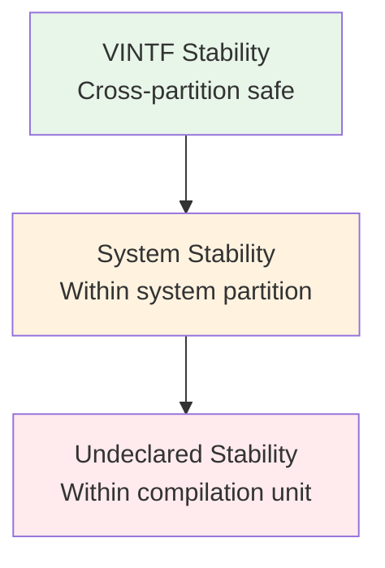
```mermaid
graph TD
    V["VINTF Stability<br/>Cross-partition safe"] --> S["System Stability<br/>Within system partition"]
    S --> U["Undeclared Stability<br/>Within compilation unit"]

    style V fill:#e8f5e9
    style S fill:#fff3e0
    style U fill:#ffebee
```

When a binder object crosses a partition boundary (e.g., from system to vendor),
the stability level is checked. A VINTF-stable interface can cross any boundary.
A system-stable interface can only be used within the system partition. An
undeclared interface (the default) can only be used within its compilation unit.

This is enforced at runtime by the `Stability` class, which stamps each binder
object with its stability level when it is created.

### 9.9.9 Binder Thread Pool Configuration Patterns

Different services use different thread pool configurations:

| Service | Max Threads | Pattern |
|---------|------------|---------|
| servicemanager | 0 | Single-threaded event loop with Looper |
| system_server | 31 | Large pool for many concurrent clients |
| SurfaceFlinger | 4 | Moderate pool for display clients |
| Typical HAL | 0 | Single main thread + spawned as needed |
| Media services | Variable | Depends on concurrent stream count |

The thread count is the kernel-managed maximum. The total thread count is:
```
total = startThreadPool(1) + setThreadPoolMaxThreadCount(N) + joinThreadPool(M)
      = 1 + N + M
```

Where:

- `startThreadPool()` always spawns 1 thread
- The kernel can spawn up to N additional threads on demand
- M additional threads join via `joinThreadPool()` directly

---

## 9.10 RPC Binder

Traditional Binder relies on the `/dev/binder` kernel driver, which requires
both communicating processes to share the same Linux kernel. RPC Binder
(introduced in Android 12) replaces the kernel driver with **socket-based
transport**, enabling Binder communication across kernel boundaries — between
virtual machines, over network connections, or into trusted execution
environments.

### 9.10.1 Why RPC Binder?

The kernel binder driver has a fundamental constraint: both client and server
must run on the same kernel with access to the same `/dev/binder` device. This
breaks down in several scenarios:

| Scenario | Problem | RPC Binder Solution |
|---|---|---|
| Protected VMs (pKVM) | Guest VM has no access to host's `/dev/binder` | vsock transport |
| Microdroid | Lightweight VM running isolated workloads | Unix domain socket bootstrap |
| Trusty TEE | Secure world has separate kernel | TIPC transport |
| Remote debugging | Developer machine ≠ device kernel | TCP/inet transport |
| CompOS | Compilation in isolated VM | vsock to host services |

### 9.10.2 Architecture

RPC Binder mirrors the kernel binder's BBinder/BpBinder model but replaces the
driver with a userspace wire protocol over sockets:

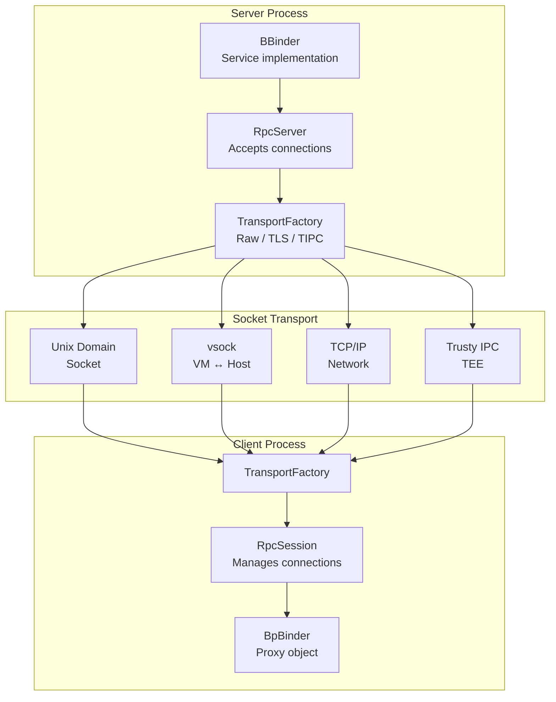
```mermaid
graph TB
    subgraph Server["Server Process"]
        BB["BBinder<br/>Service implementation"] --> RS["RpcServer<br/>Accepts connections"]
        RS --> TF["TransportFactory<br/>Raw / TLS / TIPC"]
    end

    subgraph Transport["Socket Transport"]
        direction LR
        UDS["Unix Domain<br/>Socket"]
        VSOCK["vsock<br/>VM ↔ Host"]
        TCP["TCP/IP<br/>Network"]
        TIPC["Trusty IPC<br/>TEE"]
    end

    subgraph Client["Client Process"]
        SESS["RpcSession<br/>Manages connections"] --> BP["BpBinder<br/>Proxy object"]
        CTF["TransportFactory"] --> SESS
    end

    TF --> UDS
    TF --> VSOCK
    TF --> TCP
    TF --> TIPC
    UDS --> CTF
    VSOCK --> CTF
    TCP --> CTF
    TIPC --> CTF
```

The key insight is that **AIDL interfaces work unchanged** over RPC Binder.
A service implemented with `BnFoo` (extending `BBinder`) can be exposed via
`RpcServer` without any code changes to the service itself. Clients obtain a
`BpBinder` proxy through `RpcSession` and call it exactly as they would a
kernel binder proxy.

### 9.10.3 Core Classes

#### RpcServer

`RpcServer` listens for incoming connections and dispatches them to handler
threads. It supports multiple transport setup methods:

```cpp
// Source: frameworks/native/libs/binder/include/binder/RpcServer.h:57-104
sp<RpcServer> server = RpcServer::make();

// Choose ONE transport:
server->setupUnixDomainServer("/path/to/socket");
server->setupVsockServer(VMADDR_CID_ANY, port, &assignedPort);
server->setupInetServer("0.0.0.0", port, &assignedPort);
server->setupUnixDomainSocketBootstrapServer(bootstrapFd);

// Configure:
server->setRootObject(myService);         // Single root object
server->setPerSessionRootObject(factory);  // Per-session factory
server->setMaxThreads(4);                  // Thread pool size

// Start accepting connections:
server->join();  // Blocking
```

The `setPerSessionRootObject()` factory function creates a fresh root binder
object for each client session — useful when the server needs per-client state
or isolation.

#### RpcSession

`RpcSession` establishes outgoing connections to an `RpcServer` and provides
the client-side binder proxy:

```cpp
// Source: frameworks/native/libs/binder/include/binder/RpcSession.h:125-141
sp<RpcSession> session = RpcSession::make();
session->setupUnixDomainClient("/path/to/socket");
// or: session->setupVsockClient(cid, port);
// or: session->setupInetClient("10.0.0.1", port);

sp<IBinder> root = session->getRootObject();
sp<IMyService> service = IMyService::asInterface(root);
service->doSomething();  // RPC call over socket
```

#### RpcState

`RpcState` implements the wire protocol state machine — serializing
transactions into `RpcWireTransaction` structs, managing binder reference
counts across the socket, and handling async (oneway) transaction ordering.

### 9.10.4 Wire Protocol

The RPC wire protocol is defined in `RpcWireFormat.h` and consists of
length-prefixed messages:

#### Connection Handshake

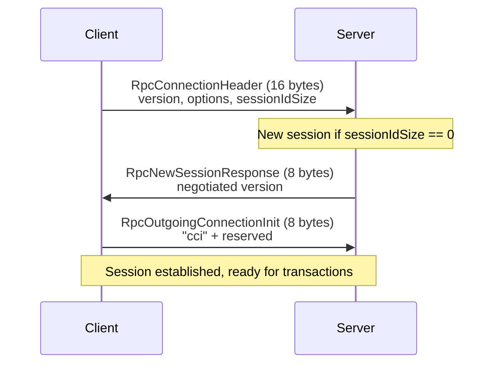
```mermaid
sequenceDiagram
    participant C as Client
    participant S as Server

    C->>S: RpcConnectionHeader (16 bytes)<br/>version, options, sessionIdSize
    Note over S: New session if sessionIdSize == 0
    S->>C: RpcNewSessionResponse (8 bytes)<br/>negotiated version
    C->>S: RpcOutgoingConnectionInit (8 bytes)<br/>"cci" + reserved
    Note over C,S: Session established, ready for transactions
```

```cpp
// Source: frameworks/native/libs/binder/RpcWireFormat.h:47-56
struct RpcConnectionHeader {
    uint32_t version;              // max supported by caller
    uint8_t  options;              // RPC_CONNECTION_OPTION_INCOMING
    uint8_t  fileDescriptorTransportMode;
    uint8_t  reserved[8];
    uint16_t sessionIdSize;        // 0 = new session, 32 = existing
};
static_assert(sizeof(RpcConnectionHeader) == 16);
```

Session IDs are 32 bytes (`kSessionIdBytes`), generated randomly by the server
when a new session is created.

#### Transaction Format

Every message over the wire starts with an `RpcWireHeader`:

```cpp
// Source: frameworks/native/libs/binder/RpcWireFormat.h:123-129
struct RpcWireHeader {
    uint32_t command;     // RPC_COMMAND_TRANSACT / REPLY / DEC_STRONG
    uint32_t bodySize;
    uint32_t reserved[2];
};

struct RpcWireTransaction {
    RpcWireAddress address;   // 8 bytes: target binder address
    uint32_t code;            // Transaction code (AIDL method index)
    uint32_t flags;           // FLAG_ONEWAY, etc.
    uint64_t asyncNumber;     // Ordering for oneway calls
    uint32_t parcelDataSize;  // Parcel payload size
    uint32_t reserved[3];
    uint8_t  data[];          // Parcel data follows
};
```

The `asyncNumber` field ensures oneway transactions are delivered in order,
since socket transport doesn't guarantee in-order delivery across multiple
connections.

#### Protocol Versions

| Version | Feature |
|---|---|
| 0 | Initial protocol |
| 1 | Explicit parcel size in replies |
| 2 | Binder positions in transaction headers (current stable) |
| 3 | Next version (in development) |
| 0xF0000000 | Experimental (development only) |

Version negotiation happens during the connection handshake — client sends its
maximum supported version, server responds with the highest version it supports
that is ≤ the client's maximum.

### 9.10.5 Transport Layers

#### Unix Domain Sockets

The most common transport for on-device RPC Binder. Used for communication
between processes on the same machine when kernel binder is unavailable or
undesirable:

```cpp
// Server side
server->setupUnixDomainServer("/dev/socket/my_rpc_service");

// Client side
session->setupUnixDomainClient("/dev/socket/my_rpc_service");
```

The bootstrap variant passes an existing connected socket pair, useful for
parent-child process communication:

```cpp
// Source: frameworks/native/libs/binder/RpcServer.cpp:66
status_t RpcServer::setupUnixDomainSocketBootstrapServer(unique_fd bootstrapFd);
```

#### Vsock (Virtual Machine Sockets)

Vsock provides direct communication between a VM guest and its host without
network configuration. This is the primary transport for **pKVM protected VMs**
and **Microdroid**:

```cpp
// Source: frameworks/native/libs/binder/RpcServer.cpp:74
status_t RpcServer::setupVsockServer(unsigned bindCid, unsigned port,
                                      unsigned* assignedPort);
```

```rust
// Source: packages/modules/Virtualization/android/virtmgr/src/virtualmachine.rs:1503
let (vm_server, _) = RpcServer::new_vsock(service, cid, port)
    .context(format!("Could not start RpcServer on port {port}"))?;
```

#### TCP/IP (Inet)

For network-accessible RPC services, primarily used in testing and remote
debugging scenarios:

```cpp
// Source: frameworks/native/libs/binder/RpcServer.cpp
status_t RpcServer::setupInetServer(const char* address, unsigned int port,
                                     unsigned int* assignedPort);
```

#### Trusty TIPC

A specialized transport for communication with the Trusty TEE (Trusted
Execution Environment). Uses Trusty's IPC mechanism instead of sockets:

```cpp
// Source: frameworks/native/libs/binder/trusty/RpcServerTrusty.cpp
// Separate RpcServerTrusty class with TIPC-specific transport
// Source: frameworks/native/libs/binder/trusty/RpcTransportTipcTrusty.cpp
// TIPC transport implementation for the Trusty-side binder
```

The Trusty transport enables Android services to call into secure-world
services (like Keymaster or Gatekeeper) using the same AIDL interface
definitions they use for regular binder calls.

### 9.10.6 Security: TLS and Authentication

RPC Binder supports TLS encryption for transports that cross trust boundaries:

```cpp
// Create server with TLS
auto tlsFactory = RpcTransportCtxFactoryTls::make(authInfo);
sp<RpcServer> server = RpcServer::make(std::move(tlsFactory));
```

The TLS implementation uses OpenSSL and supports:

- **`RpcAuth`** — configures SSL context with certificates and private keys
- **`RpcCertificateVerifier`** — custom peer certificate verification callback
- **Certificate formats** — PEM and DER (`RpcCertificateFormat.h`)
- **Key formats** — PEM and DER (`RpcKeyFormat.h`)

For transports within a single device (Unix domain sockets), TLS is typically
unnecessary — the raw (unencrypted) transport is used instead:

```cpp
// Source: frameworks/native/libs/binder/RpcServer.cpp:57
sp<RpcServer> RpcServer::make(
        std::unique_ptr<RpcTransportCtxFactory> rpcTransportCtxFactory) {
    // Default is without TLS
    if (rpcTransportCtxFactory == nullptr)
        rpcTransportCtxFactory = binder::os::makeDefaultRpcTransportCtxFactory();
    // ...
}
```

### 9.10.7 File Descriptor Transport

RPC Binder can pass file descriptors across process boundaries using socket
ancillary data (SCM_RIGHTS), similar to kernel binder's flat_binder_object:

```cpp
// Source: frameworks/native/libs/binder/include/binder/RpcSession.h:107-113
enum class FileDescriptorTransportMode : uint8_t {
    NONE   = 0,   // No FD passing (default)
    UNIX   = 1,   // Unix domain socket ancillary data
    TRUSTY = 2,   // Trusty IPC handles
};
```

This is essential for sharing memory-mapped buffers, hardware device handles,
or other kernel resources across RPC boundaries.

### 9.10.8 Threading Model

RPC Binder manages two pools of connections per session:

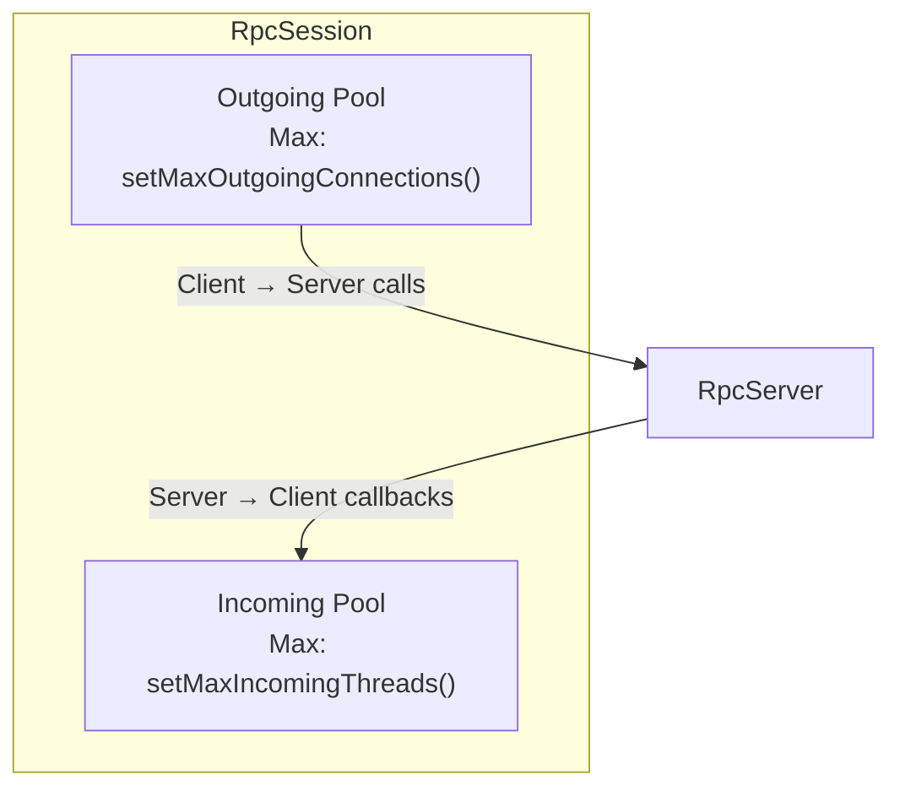
```mermaid
graph TB
    subgraph Session["RpcSession"]
        direction TB
        OUT["Outgoing Pool<br/>Max: setMaxOutgoingConnections()"]
        IN["Incoming Pool<br/>Max: setMaxIncomingThreads()"]
    end

    OUT -->|"Client → Server calls"| SERVER["RpcServer"]
    SERVER -->|"Server → Client callbacks"| IN
```

- **Outgoing connections** carry client-to-server transactions. The pool is
  limited by `setMaxOutgoingConnections()` (default 10).
- **Incoming connections** handle server-to-client callbacks (reverse calls).
  Limited by `setMaxIncomingThreads()`.
- **Server threads** are managed via `RpcServer::setMaxThreads()`.

For embedded environments (Trusty), a **single-threaded mode** is available
via the `BINDER_RPC_SINGLE_THREADED` compile flag, which replaces mutexes
and threads with no-op implementations.

### 9.10.9 Rust and NDK Bindings

#### Rust API

The `rpcbinder` crate provides Rust bindings for RPC Binder:

```rust
// Source: packages/modules/Virtualization/android/virtmgr/src/main.rs:35
use rpcbinder::{FileDescriptorTransportMode, RpcServer};

// Source: packages/modules/Virtualization/android/virtmgr/src/virtualmachine.rs:1503
let (vm_server, _) = RpcServer::new_vsock(service, cid, port)?;
```

The Rust API supports:

- `RpcServer::new_vsock()` — vsock server
- `RpcServer::new_unix_domain_bootstrap()` — bootstrap server
- `RpcSession` — client connections
- `FileDescriptorTransportMode` — FD passing configuration

#### NDK API (Unstable)

The NDK provides a C API for RPC Binder, currently marked as unstable
(platform-only):

```cpp
// Source: frameworks/native/libs/binder/ndk/include_platform/android/binder_rpc.h
ARpcSession* ARpcSession_new();
void ARpcSession_free(ARpcSession* session);
AIBinder* ARpcSession_setupUnixDomainBootstrapClient(
        ARpcSession* session, int bootstrapFd);
void ARpcSession_setMaxIncomingThreads(ARpcSession* session, size_t threads);
void ARpcSession_setMaxOutgoingConnections(ARpcSession* session, size_t connections);
void ARpcSession_setFileDescriptorTransportMode(
        ARpcSession* session, ARpcSession_FileDescriptorTransportMode mode);
```

### 9.10.10 Use Cases in AOSP

#### Microdroid and Protected VMs

The primary production use case for RPC Binder is **Microdroid** — a
lightweight Android VM used for isolated computation. The Virtual Machine
Manager (`virtmgr`) uses RPC Binder over vsock to expose services to guest VMs:

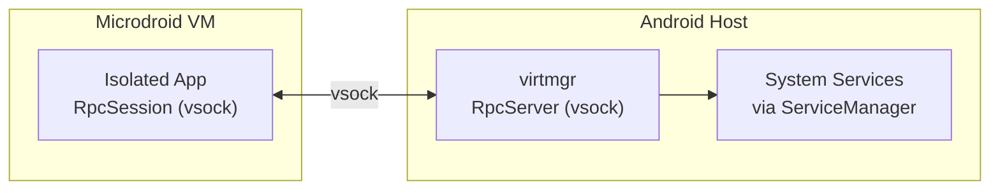
```mermaid
graph LR
    subgraph Host["Android Host"]
        VM_MGR["virtmgr<br/>RpcServer (vsock)"]
        SVC["System Services<br/>via ServiceManager"]
    end

    subgraph Guest["Microdroid VM"]
        APP["Isolated App<br/>RpcSession (vsock)"]
    end

    APP <-->|"vsock"| VM_MGR
    VM_MGR --> SVC
```

The guest VM has no `/dev/binder` device. All binder communication with the
host goes through RPC Binder over vsock. The `virtmgr` daemon creates an
`RpcServer` that accepts vsock connections from the guest, providing access to
a curated set of host services.

```rust
// Source: packages/modules/Virtualization/android/virtmgr/src/virtualmachine.rs:1503
let (vm_server, _) = RpcServer::new_vsock(service, cid, port)
    .context(format!("Could not start RpcServer on port {port}"))?;
```

The NDK demo (`vm_demo_native`) shows the client side in the guest VM:

```cpp
// Source: packages/modules/Virtualization/android/vm_demo_native/main.cpp:126-132
std::unique_ptr<ARpcSession, decltype(&ARpcSession_free)>
    session(ARpcSession_new(), &ARpcSession_free);
ARpcSession_setFileDescriptorTransportMode(session.get(),
    ARpcSession_FileDescriptorTransportMode::Unix);
ARpcSession_setMaxIncomingThreads(session.get(), VIRTMGR_THREADS);
AIBinder* binder = ARpcSession_setupUnixDomainBootstrapClient(
    session.get(), fd);
```

#### CompOS (Compilation OS)

CompOS runs `dex2oat` (DEX-to-native compilation) inside an isolated VM for
verified boot integrity. It uses RPC Binder to receive compilation requests
from the host and return compiled artifacts.

#### Trusty TEE Communication

RPC Binder over TIPC provides a standard AIDL interface to Trusty secure-world
services. Instead of custom IPC protocols, services like Keymaster and
Gatekeeper can use the same AIDL definitions on both Android and Trusty sides:

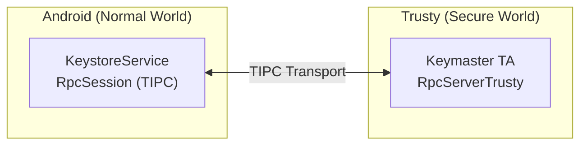
```mermaid
graph LR
    subgraph Android["Android (Normal World)"]
        CLIENT["KeystoreService<br/>RpcSession (TIPC)"]
    end

    subgraph Trusty["Trusty (Secure World)"]
        KM["Keymaster TA<br/>RpcServerTrusty"]
    end

    CLIENT <-->|"TIPC Transport"| KM
```

#### Service Access in VMs via AccessorProvider

The NDK `ABinderRpc_AccessorProvider` API enables automatic service discovery
across VM boundaries. When a service is not available locally (because the
process is in a VM without kernel binder), the AccessorProvider callback
transparently sets up an RPC Binder connection to the host:

```cpp
// Source: frameworks/native/libs/binder/ndk/include_platform/android/binder_rpc.h:75
// AccessorProvider bridges service discovery in VMs
// When kernel binder is unavailable, the provider creates
// RPC connections to host services transparently
```

### 9.10.11 Kernel Binder vs. RPC Binder

| Aspect | Kernel Binder | RPC Binder |
|---|---|---|
| **Transport** | `/dev/binder` driver | Sockets (Unix/vsock/TCP/TIPC) |
| **Data copy** | One-copy via `mmap` | Standard socket send/recv |
| **Scope** | Same kernel only | Cross-kernel, cross-machine |
| **FD passing** | `flat_binder_object` | `SCM_RIGHTS` ancillary data |
| **Thread management** | Kernel-managed pool | Userspace thread pool |
| **Reference counting** | Kernel-tracked | Wire protocol (`DEC_STRONG`) |
| **Death notifications** | Kernel obituaries | Connection close detection |
| **Performance** | Lower latency (mmap) | Higher latency (socket copies) |
| **Security** | UID/PID from kernel | TLS certificates / socket perms |
| **AIDL compatibility** | Native | Fully compatible (same interfaces) |

---

## 9.11 Debugging and Diagnostics

### 9.11.1 debugfs Interface

The binder driver exposes debug information via debugfs:

```
/sys/kernel/debug/binder/
├── failed_transaction_log  # Log of failed transactions
├── state                   # Current driver state
├── stats                   # Global statistics
├── transaction_log         # Recent transaction log
└── proc/                   # Per-process information
    ├── <pid>/
    │   ├── state
    │   └── stats
    └── ...
```

**Example: view all binder processes:**
```bash
adb shell cat /sys/kernel/debug/binder/state
```

**Example: view transactions for a specific process:**
```bash
adb shell cat /sys/kernel/debug/binder/proc/<pid>/state
```

### 9.11.2 Perfetto Tracing

`servicemanager` integrates with Perfetto for tracing:

```cpp
// frameworks/native/cmds/servicemanager/ServiceManager.cpp
#define SM_PERFETTO_TRACE_FUNC(...) \
    PERFETTO_TE_SCOPED(servicemanager, \
        PERFETTO_TE_SLICE_BEGIN(__func__) __VA_OPT__(,) __VA_ARGS__)
```

Every `addService`, `getService`, and `checkService` call is traced.

### 9.11.3 service command

The `service` shell command directly interacts with services:

```bash
# List all services
adb shell service list

# Check if a service exists
adb shell service check SurfaceFlinger

# Call a service method (raw)
adb shell service call SurfaceFlinger 1
# 1 = FIRST_CALL_TRANSACTION (first method in ISurfaceComposer)
```

### 9.11.4 Common Error Codes

| Error | Meaning |
|-------|---------|
| `DEAD_OBJECT` | The server process died |
| `FAILED_TRANSACTION` | Transaction failed (buffer overflow, frozen process, etc.) |
| `PERMISSION_DENIED` | SELinux denied the access |
| `BAD_TYPE` | Interface descriptor mismatch |
| `UNKNOWN_TRANSACTION` | The server does not recognize the transaction code |
| `FDS_NOT_ALLOWED` | File descriptors not allowed in this transaction |

### 9.11.5 Diagnosing Binder Buffer Exhaustion

When a process's binder buffer fills up, you see errors like:

```
binder: 1234:5678 transaction failed 29201, size 100-0 line 3170
```

To diagnose:

```bash
# Check buffer allocation for a specific process
adb shell cat /sys/kernel/debug/binder/proc/<pid>/state

# Look for "allocated" and "free" buffer sizes
# A process with many pending incoming transactions will show high allocation
```

Common causes:

1. **Slow onTransact handler:** The server takes too long to process transactions,
   filling the buffer with queued requests
2. **Binder thread starvation:** All threads are busy, and new transactions queue
3. **Large transactions:** Sending bitmaps or large data through Binder instead
   of using shared memory

### 9.11.6 Tracing Binder Transactions with atrace

```bash
# Enable binder tracing
adb shell atrace --async_start -c binder_driver binder_lock

# Collect the trace
adb shell atrace --async_stop > trace.txt

# View in Perfetto UI
```

### 9.11.7 Monitoring Binder Proxy Counts

```bash
# Check per-UID proxy counts
adb shell dumpsys activity binder-proxies

# Check total proxy count for a process
adb shell cat /proc/<pid>/fd | wc -l  # rough approximation
```

The proxy throttle watermarks (2000 low / 2250 warning / 2500 high) are
configurable via system properties on debug builds.

### 9.11.8 Using binder_exception_to_string

When debugging AIDL binder exceptions, the status code can be decoded:

| Exception Code | Name | Meaning |
|----------------|------|---------|
| -1 | `EX_SECURITY` | Security violation |
| -2 | `EX_BAD_PARCELABLE` | Bad parcelable data |
| -3 | `EX_ILLEGAL_ARGUMENT` | Invalid argument |
| -4 | `EX_NULL_POINTER` | Null pointer |
| -5 | `EX_ILLEGAL_STATE` | Invalid state |
| -6 | `EX_NETWORK_MAIN_THREAD` | Network on main thread |
| -7 | `EX_UNSUPPORTED_OPERATION` | Unsupported operation |
| -8 | `EX_SERVICE_SPECIFIC` | Service-specific error (with detail code) |
| -9 | `EX_PARCELABLE` | Custom parcelable exception |
| -128 | `EX_TRANSACTION_FAILED` | Transaction failure |

These are the AIDL `binder::Status` exception codes, distinct from the kernel-
level `status_t` return codes.

---

## 9.12 Summary

### Key Source Files

| Component | Path |
|-----------|------|
| ProcessState | `frameworks/native/libs/binder/ProcessState.cpp` |
| IPCThreadState | `frameworks/native/libs/binder/IPCThreadState.cpp` |
| IBinder header | `frameworks/native/libs/binder/include/binder/IBinder.h` |
| BBinder | `frameworks/native/libs/binder/Binder.cpp` |
| BpBinder | `frameworks/native/libs/binder/BpBinder.cpp` |
| IInterface | `frameworks/native/libs/binder/include/binder/IInterface.h` |
| Parcel | `frameworks/native/libs/binder/include/binder/Parcel.h` |
| IServiceManager | `frameworks/native/libs/binder/include/binder/IServiceManager.h` |
| servicemanager main | `frameworks/native/cmds/servicemanager/main.cpp` |
| ServiceManager | `frameworks/native/cmds/servicemanager/ServiceManager.cpp` |
| Access control | `frameworks/native/cmds/servicemanager/Access.cpp` |
| servicemanager.rc | `frameworks/native/cmds/servicemanager/servicemanager.rc` |
| vndservicemanager.rc | `frameworks/native/cmds/servicemanager/vndservicemanager.rc` |
| AIDL compiler | `system/tools/aidl/aidl.cpp` |
| AIDL to C++ | `system/tools/aidl/aidl_to_cpp.cpp` |
| AIDL to Java | `system/tools/aidl/aidl_to_java.cpp` |
| AIDL to Rust | `system/tools/aidl/aidl_to_rust.cpp` |
| Rust binder | `frameworks/native/libs/binder/rust/src/lib.rs` |
| Rust binder traits | `frameworks/native/libs/binder/rust/src/binder.rs` |
| Rust proxy | `frameworks/native/libs/binder/rust/src/proxy.rs` |
| Rust native | `frameworks/native/libs/binder/rust/src/native.rs` |
| hwservicemanager | `system/hwservicemanager/ServiceManager.h` |
| hwservicemanager.rc | `system/hwservicemanager/hwservicemanager.rc` |
| LazyServiceRegistrar | `frameworks/native/libs/binder/include/binder/LazyServiceRegistrar.h` |
| Kernel header bridge | `frameworks/native/libs/binder/binder_module.h` |

### Architecture Summary

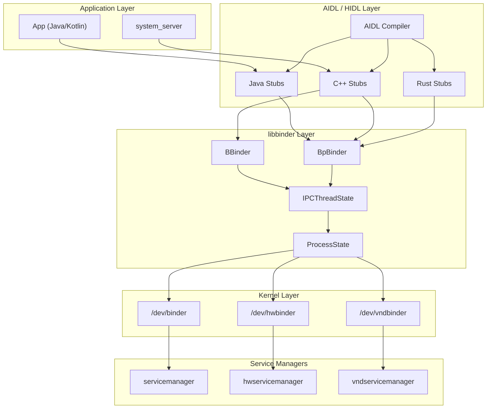
```mermaid
graph TB
    subgraph "Application Layer"
        APP["App (Java/Kotlin)"]
        SYS["system_server"]
    end

    subgraph "AIDL / HIDL Layer"
        AIDL["AIDL Compiler"]
        JAVA_STUB["Java Stubs"]
        CPP_STUB["C++ Stubs"]
        RUST_STUB["Rust Stubs"]
    end

    subgraph "libbinder Layer"
        BB["BBinder"]
        BP["BpBinder"]
        IPC["IPCThreadState"]
        PS["ProcessState"]
    end

    subgraph "Kernel Layer"
        BD["/dev/binder"]
        HBD["/dev/hwbinder"]
        VBD["/dev/vndbinder"]
    end

    subgraph "Service Managers"
        SM["servicemanager"]
        HSM["hwservicemanager"]
        VSM["vndservicemanager"]
    end

    APP --> JAVA_STUB
    SYS --> CPP_STUB
    AIDL --> JAVA_STUB
    AIDL --> CPP_STUB
    AIDL --> RUST_STUB

    JAVA_STUB --> BP
    CPP_STUB --> BB
    CPP_STUB --> BP
    RUST_STUB --> BP

    BB --> IPC
    BP --> IPC
    IPC --> PS
    PS --> BD
    PS --> HBD
    PS --> VBD

    BD --> SM
    HBD --> HSM
    VBD --> VSM
```

### Key Takeaways

1. **Binder is a one-copy IPC mechanism** that achieves high performance through
   memory mapping. The kernel copies data directly into the receiver's mapped
   buffer.

2. **Every transaction carries kernel-verified identity** (UID, PID, SELinux
   context), making it the foundation of Android's security model.

3. **Object reference semantics** with reference counting and death
   notifications enable robust distributed object lifecycle management.

4. **The architecture is layered:** kernel driver -> libbinder (C++/Rust) ->
   AIDL-generated stubs -> service implementations.

5. **servicemanager is the name server** for the entire system, protected by
   SELinux and VINTF manifest validation.

6. **Three binder domains** (binder, hwbinder, vndbinder) enforce the Treble
   architecture boundary between framework and vendor.

7. **AIDL is the standard interface definition language** for all new Binder
   interfaces, generating code for Java, C++, NDK C++, and Rust.

8. **HIDL and hwbinder are deprecated** in favor of AIDL for HAL interfaces
   starting with Android 13.

---

*Next chapter: Chapter 8 will explore the Hardware Abstraction Layer (HAL)
architecture, building on the AIDL and binder concepts covered here.*
