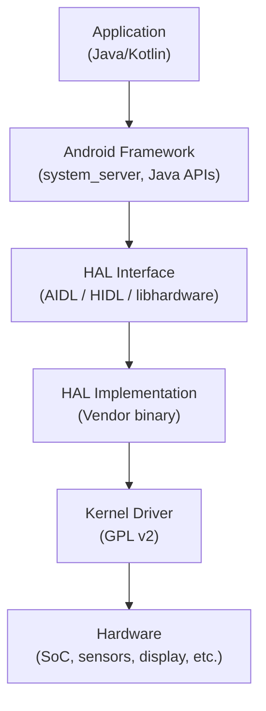
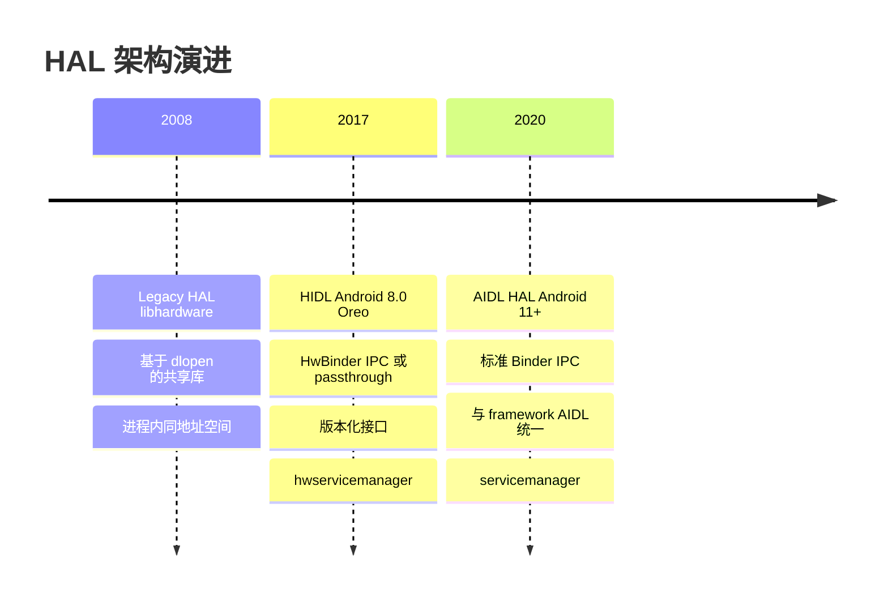
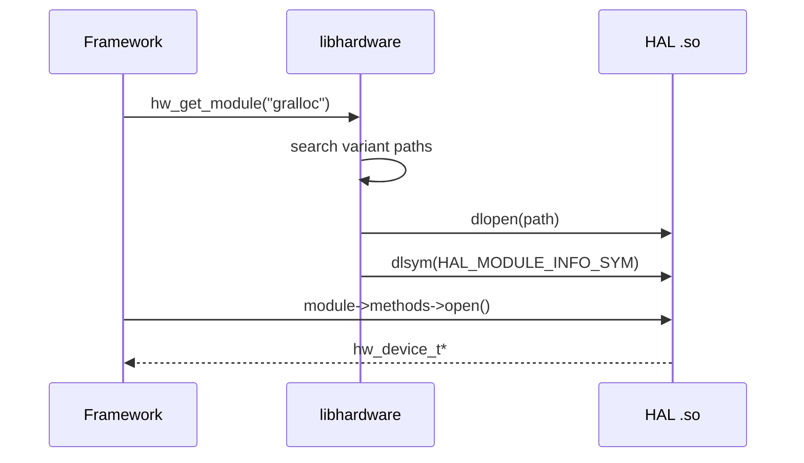
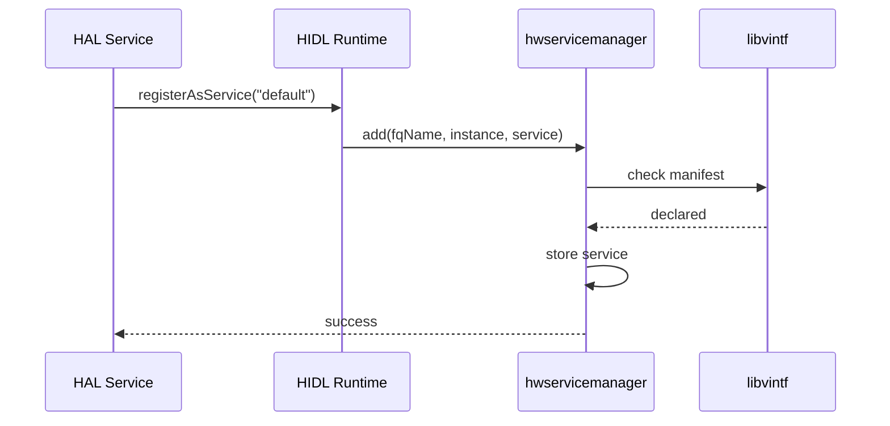
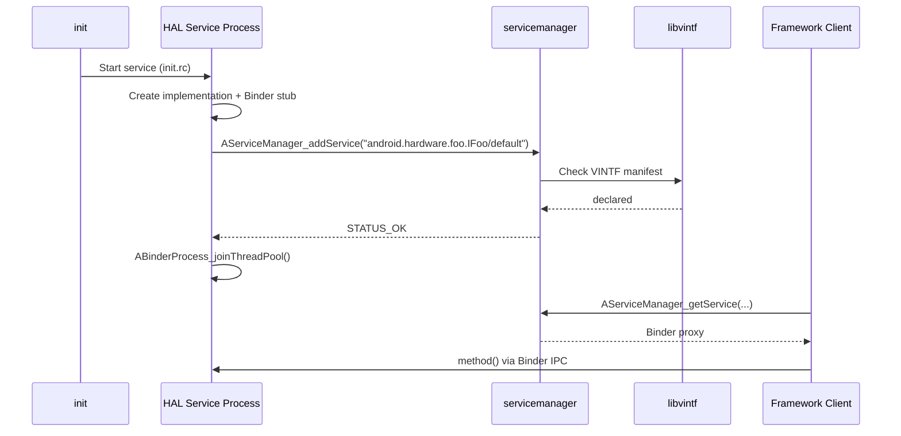
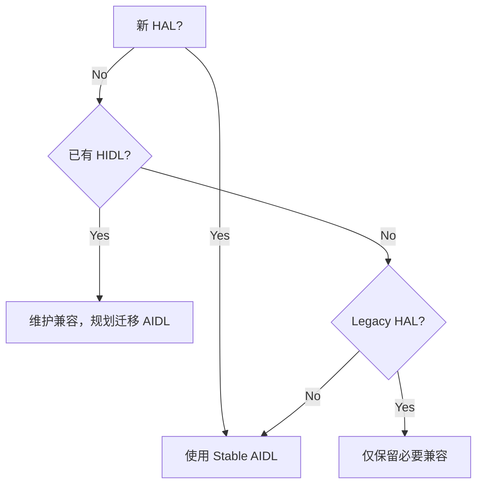
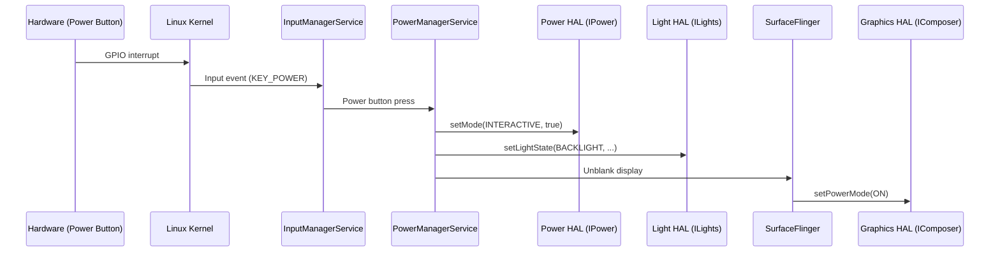

# 第 10 章：HAL -- 硬件抽象层

> *“HAL 是内核空间 GPL 代码与用户空间 Apache 许可代码之间的法律防火墙和工程接缝。它让 Android 成为一个平台，而不仅仅是一个 Linux 发行版。”*

---

## 10.1 HAL 架构概览

### 10.1.1 HAL 为什么存在：许可证分界

硬件抽象层存在的根本原因，是 Android 核心处的一种法律张力。Linux 内核使用 GPL v2，要求派生作品也以 GPL 分发；Android 用户态 framework 使用 Apache 2.0，允许专有派生，这正是设备厂商在不开源代码的情况下实现产品差异化的基础。

硬件厂商面临两难。设备驱动必须运行在内核空间，因此至少链接内核头文件的部分会受到 GPL 约束。但他们的专有算法，例如 camera ISP tuning、DSP firmware interface、GPU shader compiler、modem protocol，代表大量研发投入，不愿开源。

HAL 是法律与架构上的解决方案。它在 Apache 许可的 Android framework 与 vendor 专用闭源代码之间定义稳定接口。vendor 可以用共享库或独立进程实现 HAL 接口，并以二进制形式分发。framework 只通过明确契约与 HAL 通信，不直接链接 GPL 内核代码。

这不仅是政策选择，也由构建系统执行。Android 8.0（Project Treble）之后，VNDK 和 linker namespace 隔离确保 framework 代码不能任意加载 vendor 库，vendor 代码也不能任意依赖 framework 私有库，除非通过批准的 HAL 接口。

### 10.1.2 四层栈

硬件请求从应用向下到硬件的路径如下：



| 层级 | 许可证 | 职责 |
|-------|---------|----------------|
| Application | 各异 | 面向用户的功能 |
| Framework | Apache 2.0 | 系统服务、Java/Kotlin API |
| HAL Interface | Apache 2.0 | framework 与 vendor 之间的稳定契约 |
| HAL Implementation | 可专有 | vendor 专用硬件交互逻辑 |
| Kernel Driver | GPL v2 | 直接硬件寄存器访问、中断处理 |

HAL interface 层是关键接缝。它以上的内容由 Google 通过 system 分区 OTA 更新；它以下的内容由设备厂商通过 vendor 分区更新。两边可以独立更新，这就是 Project Treble 的核心承诺。

### 10.1.3 三代 HAL

Android 先后经历了三种 HAL 架构：

| 代际 | 引入时间 | Transport | 版本化 | 当前状态 |
|-----------|-----------|-----------|-----------|---------------|
| Legacy HAL | Android 1.0 (2008) | 进程内 `dlopen()` | module API version 字段 | 已废弃但仍存在 |
| HIDL | Android 8.0 (2017) | HwBinder 或 passthrough | `package@major.minor` | Android 13 起废弃 |
| AIDL HAL | Android 11 (2020) | Binder | package version int | 当前标准 |

Legacy HAL 简单，但没有 IPC 隔离和正式版本化。HIDL 增加了版本化和 IPC，但引入了单独 IDL 语言与工具链。AIDL HAL 把 HAL 接口语言统一到 Android framework 已广泛使用的 AIDL 生态中，消除了重复。

### 10.1.4 HAL 演进时间线



### 10.1.5 设计原则

三代 HAL 共享若干设计原则：

1. **接口稳定性。** HAL 接口发布后不能进行向后不兼容变更。旧客户端必须能继续使用新实现，旧实现也要尽量能与新客户端共存。
2. **Vendor 隔离。** framework 不能依赖 vendor 实现细节，vendor 不能依赖 framework 私有实现，HAL 是唯一通信通道。
3. **可发现性。** 系统必须能枚举可用 HAL、版本和运行位置，这对构建期、OTA 和启动期兼容性检查非常关键。
4. **可测试性。** HAL 接口必须能通过 VTS 等测试验证。
5. **最小权限。** HAL 实现应运行在独立进程和 SELinux domain 中，只持有访问硬件所需的权限。

### 10.1.5.1 Project Treble 与 HAL

Project Treble 把 Android 系统拆分为 framework 和 vendor 两个可独立更新的部分。HAL 是这条边界上的正式 ABI/API。Treble 要求 vendor 提供的 HAL 与 framework compatibility matrix 匹配，也要求 framework 通过稳定接口访问 vendor 实现。

### 10.1.5.2 分区布局

Treble 之后，HAL 实现通常位于 vendor、odm 或 APEX 中；HAL 接口定义位于 system 侧源码中，例如 `hardware/interfaces/`。常见路径如下：

```text
/vendor/bin/hw/                         # binderized HAL service
/vendor/lib64/hw/                       # legacy/passthrough HAL .so
/vendor/etc/vintf/manifest.xml          # device manifest
/system/etc/vintf/compatibility_matrix.xml
/apex/com.android.hardware.*            # updatable HAL/APEX 场景
```

### 10.1.6 HAL 在磁盘上的位置

Legacy HAL 通常是 `/vendor/lib64/hw/<module>.<variant>.so`。binderized HAL 通常是 `/vendor/bin/hw/<service>`。AIDL/HIDL 接口定义在 AOSP 的 `hardware/interfaces/<name>/` 目录下，包含 `aidl/`、`default/`、`vts/`、`aidl_api/` 等子目录。

---

## 10.2 Legacy HAL（libhardware）

### 10.2.1 核心数据结构：`hw_module_t` 与 `hw_device_t`

Legacy HAL 的核心是 C 结构体和函数指针。所有模块都以 `hw_module_t` 开头，所有设备都以 `hw_device_t` 开头，这形成了 C 风格多态。

```c
typedef struct hw_module_t {
    uint32_t tag;
    uint16_t module_api_version;
    uint16_t hal_api_version;
    const char *id;
    const char *name;
    const char *author;
    struct hw_module_methods_t* methods;
    void* dso;
} hw_module_t;

typedef struct hw_device_t {
    uint32_t tag;
    uint32_t version;
    struct hw_module_t* module;
    int (*close)(struct hw_device_t* device);
} hw_device_t;
```

每个具体 HAL 在这些基础结构后追加自己的字段和函数指针，例如 gralloc、camera、sensors、audio。

### 10.2.2 模块 Magic Symbol：`HAL_MODULE_INFO_SYM`

Legacy HAL `.so` 必须导出名为 `HAL_MODULE_INFO_SYM` 的符号。`hardware.c` 通过 `dlsym()` 查找该符号，获取模块描述结构。若符号不存在，模块加载失败。

```c
struct hw_module_t HAL_MODULE_INFO_SYM = {
    .tag = HARDWARE_MODULE_TAG,
    .module_api_version = ...,
    .id = GRALLOC_HARDWARE_MODULE_ID,
    .name = "Graphics Memory Allocator Module",
    .methods = &gralloc_module_methods,
};
```

### 10.2.3 模块发现：Variant 搜索顺序

Legacy HAL 模块按 module id 和 variant 搜索。系统会根据属性选择最具体的实现，例如 board、platform、arch，再回退到 default。

典型路径形如：

```text
/vendor/lib64/hw/gralloc.<ro.hardware>.so
/vendor/lib64/hw/gralloc.<ro.product.board>.so
/vendor/lib64/hw/gralloc.default.so
/system/lib64/hw/gralloc.default.so
```

这种属性驱动的发现机制简单直接，但缺少显式 manifest 和强版本检查。

### 10.2.4 模块加载：`dlopen` 与符号解析

`hw_get_module()` 最终调用 `dlopen()` 加载 `.so`，再通过 `dlsym()` 找到 `HAL_MODULE_INFO_SYM`。模块加载后，framework 调用模块的 `methods->open()` 获取 `hw_device_t`，再调用设备函数指针操作硬件。



### 10.2.5 完整 Legacy HAL：Gralloc 模块

Gralloc 是典型 legacy HAL。framework 通过 gralloc 分配图形缓冲区，HAL 实现与 ION/DMA-BUF、GPU、display controller 协作。它展示了 legacy HAL 的典型模式：固定 C header、函数指针表、`hw_module_t` 扩展结构、vendor `.so` 实现。

### 10.2.6 所有 Legacy HAL 模块

`hardware/libhardware/modules/` 下包含多种 legacy HAL 示例和默认实现，例如 audio、camera、gralloc、hwcomposer、sensors、thermal、vibrator、vr、usbaudio、usbcamera 等。

### 10.2.6.1 Legacy HAL Header 契约

每种 legacy HAL 都在 `hardware/libhardware/include/hardware/` 下有一个 header，定义模块 ID、扩展结构和函数指针表。

| Header | Module ID | 扩展结构 |
|--------|-----------|----------|
| `audio.h` | `AUDIO_HARDWARE_MODULE_ID` | `audio_module`, `audio_stream_out`, `audio_stream_in` |
| `camera.h` | `CAMERA_HARDWARE_MODULE_ID` | `camera_module_t`, `camera_device_t` |
| `camera3.h` | 同上 | `camera3_device_t` |
| `gralloc.h` | `GRALLOC_HARDWARE_MODULE_ID` | `gralloc_module_t`, `alloc_device_t` |
| `hwcomposer.h` | `HWC_HARDWARE_MODULE_ID` | `hwc_module_t`, `hwc_composer_device_1` |
| `sensors.h` | `SENSORS_HARDWARE_MODULE_ID` | `sensors_module_t`, `sensors_poll_device_1` |
| `power.h` | `POWER_HARDWARE_MODULE_ID` | `power_module_t` |
| `fingerprint.h` | `FINGERPRINT_HARDWARE_MODULE_ID` | `fingerprint_module_t`, `fingerprint_device_t` |

如果 Google 在结构体中新增函数指针，vendor 必须重新构建 HAL；运行时无法可靠检测布局不匹配，因为 ABI 由编译期 C struct 固定。

### 10.2.6.2 Camera HAL：多 API 版本

Camera HAL 展示了 legacy 系统如何处理 API 演进。`camera.h`、`camera2.h`、`camera3.h` 分别定义不同 API 版本。CameraService 根据 `module_api_version` 分派到不同代码路径。这种方式可用，但脆弱，并要求 framework 永久保留兼容代码。

### 10.2.7 推动 HIDL 出现的限制

Legacy HAL 的根本限制包括：

1. **无进程隔离。** HAL `.so` 与 framework 进程同地址空间，vendor bug 可崩溃 framework。
2. **无正式版本化。** `module_api_version` 只是提示，不是可验证契约。
3. **无可发现性。** framework 只能尝试 `dlopen()`。
4. **无法独立更新。** framework 和 HAL 必须针对兼容 header 编译。
5. **无 IPC。** HAL 无法自然运行在低权限独立进程中。

这些限制推动了 HIDL 和 Project Treble 的出现。

---

## 10.3 HIDL（HAL Interface Definition Language）

HIDL 随 Android 8.0 Oreo 和 Project Treble 引入，是专为硬件 HAL 设计的接口定义语言，拥有自己的编译器、运行时和 service manager。HIDL 目标是把 vendor HAL 变成正式、版本化、可测试的契约，可进程内 passthrough，也可独立进程 binderized。

源码位于：

```text
system/libhidl/
```

### 10.3.1 为什么创建 HIDL

Project Treble 目标是解耦 framework 与 vendor 代码，让 Google 可以在不等待 vendor HAL 更新的情况下推送 framework 更新，让 vendor 也可以独立更新 HAL，并加快安全补丁交付。HIDL 提供了工程机制：一个由 service manager 管理、版本化的 framework/vendor IPC 接口。

### 10.3.2 HIDL 语法与 `.hal` 文件

HIDL 使用自己的语法。例如：

```text
package android.hidl.manager@1.0;

interface IServiceManager {
    get(string fqName, string name) generates (interface service);
    add(string name, interface service) generates (bool success);
}
```

| 元素 | 示例 | 含义 |
|---------|---------|------|
| Package | `android.hidl.manager@1.0` | 带版本的完整包名 |
| Interface | `interface IServiceManager` | RPC 接口定义 |
| Method | `get(...) generates (...)` | 带输入输出的 RPC 方法 |
| `generates` | `generates (bool success)` | 返回值，HIDL 支持多个返回值 |
| `oneway` | `oneway notifySyspropsChanged()` | 异步调用 |
| `vec<T>` | `vec<string>` | 动态数组 |

完整命名形式为：

```text
package@major.minor::InterfaceName/instance
```

例如 `android.hardware.camera.provider@2.4::ICameraProvider/internal/0`。

### 10.3.3 Passthrough 与 Binderized 模式

HIDL 支持两种 transport：

- **Binderized mode**：HAL 运行在独立进程，通过 HwBinder 与 framework 通信。它提供进程隔离、SELinux 访问控制和最小权限运行。
- **Passthrough mode**：HIDL wrapper 在 framework 进程内调用 legacy HAL `.so`。它用于兼容旧 HAL，不是新设计推荐模式。

VINTF manifest 中用 `<transport>hwbinder</transport>` 或 `<transport>passthrough</transport>` 声明模式。

### 10.3.4 `hwservicemanager`

`hwservicemanager` 位于 `system/hwservicemanager/`，负责 HIDL HAL 注册与发现。它类似普通 `servicemanager`，但工作在 HwBinder 域。

它承担两项关键职责：

1. **注册。** HAL service 调用 `IFoo::registerAsService("instance")` 注册。
2. **发现。** framework 调用 `IFoo::getService("instance")` 获取 HwBinder proxy。

它还会在启用时检查 VINTF manifest，确保注册的 HAL 已声明。

### 10.3.5 `IBase` 根接口

所有 HIDL 接口都继承 `android.hidl.base@1.0::IBase`。它提供 `interfaceChain()`、`debug()`、`getHashChain()`、`linkToDeath()`、`ping()`、`getDebugInfo()` 等通用能力。

### 10.3.6 代码生成与构建集成

HIDL 编译器根据 `.hal` 文件生成 C++/Java 绑定、proxy、stub、transport glue 和 build metadata。生成物被 Soong 模块消费，用于 HAL service 和 framework client。

### 10.3.7 Passthrough Wrapping 内部机制

passthrough 模式中，HIDL runtime 会加载 legacy `.so`，查找 `HIDL_FETCH_I*` 函数，创建本地对象，再用 `Bs*` wrapper 包装为 HIDL 接口。这允许旧 C/C++ HAL 通过 HIDL 表面被调用。

### 10.3.8 HIDL Transport 层

HIDL transport 层位于 `system/libhidl/transport/`。它处理 service discovery、HwBinder 通信、passthrough 加载、lazy HAL、death recipient 和线程池。

### 10.3.8.1 HIDL 服务注册流程（详细）



### 10.3.8.2 HIDL 版本化规则

HIDL 使用 package-level major/minor 版本。minor 版本可向后兼容扩展；major 版本表示不兼容变更。接口名包含版本，例如 `android.hardware.foo@1.2::IFoo`。

### 10.3.9 HIDL 废弃状态

Android 13 起，新 HAL 接口必须使用 AIDL。HIDL 仍保留用于升级设备和旧 HAL 兼容，但不再是新开发标准。

---

## 10.4 AIDL HAL（当前标准）

### 10.4.1 为什么 AIDL 取代 HIDL

AIDL HAL 取代 HIDL 的原因包括：

- 统一 framework 与 HAL 的接口语言。
- 复用成熟 Binder 工具链和 servicemanager。
- 支持 Java、C++、NDK C++、Rust 多后端。
- 通过 stable AIDL 和 API freeze 提供版本兼容。
- 减少 HIDL 专用运行时、语法和 service manager 维护成本。

### 10.4.2 AIDL HAL 接口定义

AIDL HAL 使用普通 `.aidl` 文件定义接口：

```aidl
package android.hardware.light;

@VintfStability
interface ILights {
    HwLight[] getLights();
    void setLightState(in int id, in HwLightState state);
}
```

### 10.4.3 `@VintfStability` 注解

`@VintfStability` 表示该 AIDL 接口可作为 VINTF 稳定接口跨 system/vendor 边界使用。它要求接口演进遵守 stable AIDL 规则，并参与 VINTF manifest/matrix 检查。

### 10.4.4 走读：Lights HAL

Lights HAL 是简单 AIDL HAL 示例，位于：

```text
hardware/interfaces/light/aidl/
```

它定义灯光类型、灯光状态和 `ILights` 接口。默认实现可用 C++ 或 Rust 编写，注册服务名通常类似：

```text
android.hardware.light.ILights/default
```

### 10.4.4.1 理解 Lights HAL 数据类型

Lights HAL 的数据类型包括 `HwLight`、`HwLightState`、light type、flash mode、brightness mode 等。AIDL 会为这些 parcelable/enum 生成多语言绑定，使 framework 和 vendor 实现共享同一协议。

### 10.4.5 走读：Audio Core HAL

Audio Core HAL 是复杂生产级 AIDL HAL，包含 module、stream、port、route、patch、config 等大量对象。它展示了 stable AIDL 如何表达复杂硬件图、回调和版本演进。

### 10.4.6 Power HAL：复杂现代接口

Power HAL 通过 `IPower` 暴露 CPU/GPU boost、交互模式、低功耗提示等能力。framework 在用户交互、启动应用、显示唤醒时调用 Power HAL，vendor 实现根据 SoC 调整 governor 和电源策略。

### 10.4.7 Vibrator HAL：C++ NDK Backend

Vibrator HAL 展示了使用 NDK backend 编写 vendor HAL 的典型方式。服务实现链接 `libbinder_ndk` 和生成的 `-ndk` AIDL 库，并通过 `AServiceManager_addService()` 注册。

### 10.4.7.1 Sensors HAL：高吞吐数据的 FMQ

传感器数据吞吐高，不适合每个 sample 都走 Binder transaction。Sensors HAL 使用 Fast Message Queue（FMQ）传输高频数据，Binder 主要用于控制面和队列配置。

### 10.4.7.2 Health HAL：Callback 模式

Health HAL 使用 callback 向 framework 推送电池和健康状态变化。AIDL callback 本身也是 Binder 接口，服务端持有客户端 callback proxy 并在状态变化时调用。

### 10.4.8 构建系统集成：`aidl_interface`

AIDL HAL 使用 Soong 的 `aidl_interface` 模块：

```bp
aidl_interface {
    name: "android.hardware.light",
    vendor_available: true,
    srcs: ["android/hardware/light/*.aidl"],
    stability: "vintf",
    backend: {
        cpp: { enabled: true },
        java: { enabled: true },
        ndk: { enabled: true },
        rust: { enabled: true },
    },
}
```

### 10.4.9 API 版本化与冻结

Stable AIDL 通过 `aidl_api/` 快照冻结 API。开发期修改主源码；准备发布时运行 `<name>-update-api` 生成新版本目录；`frozen: true` 后构建系统验证当前源码与最新冻结版本兼容。

冻结快照包含不可编辑警告：

```java
///////////////////////////////////////////////////////////////////////////////
// THIS FILE IS IMMUTABLE. DO NOT EDIT IN ANY CASE.                          //
///////////////////////////////////////////////////////////////////////////////
```

### 10.4.10 `hardware/interfaces/` 目录

`hardware/interfaces/` 包含 AOSP 所有 HAL 接口定义，覆盖 audio、camera、graphics、light、sensors、biometrics、security、power、input、automotive、tv、virtualization 等。

典型目录结构：

```text
hardware/interfaces/<name>/
    aidl/
        Android.bp
        android/hardware/<name>/
        aidl_api/
        default/
        vts/
```

### 10.4.11 AIDL HAL 注册流程



未在 VINTF manifest 声明的 HAL 会被 servicemanager 拒绝注册。

### 10.4.12 多语言支持：Rust、Java、C++、NDK

| Backend | 库后缀 | 链接对象 | 稳定性 | 主要用途 |
|---------|--------|----------|--------|----------|
| Java | `-java` | framework.jar | Platform | framework Java 服务 |
| C++ platform | `-cpp` | libbinder.so | 仅 platform | framework native 代码 |
| NDK C++ | `-ndk` | libbinder_ndk.so | NDK stable | vendor HAL 实现 |
| Rust | `-rust` | libbinder_rs | NDK stable | vendor HAL 实现 |

vendor 代码应使用 NDK 或 Rust backend，因为它们链接稳定 NDK 库，不随平台版本破坏 ABI。

---

## 10.5 VINTF（Vendor Interface）

VINTF 框架位于 `system/libvintf/`，用于确保 framework 分区与 vendor 分区兼容。它随 Android 8.0 和 HIDL 引入，现在同时用于 HIDL 和 AIDL HAL。

### 10.5.1 VINTF 解决的问题

Project Treble 之前，升级 system 分区需要重新测试甚至修改所有 vendor HAL。VINTF 提供正式兼容性检查机制：

1. **vendor** 声明它提供哪些 HAL（device manifest）。
2. **framework** 声明它需要哪些 HAL（framework compatibility matrix）。
3. **framework** 声明它提供哪些服务（framework manifest）。
4. **vendor** 声明它需要哪些 framework 能力（device compatibility matrix）。

兼容性在构建期、OTA 期和启动期检查。

### 10.5.2 Manifest 文件

VINTF manifest 声明某个分区提供什么。device manifest 通常位于 `/vendor/etc/vintf/manifest.xml`，列出 vendor 实现的 HAL：

```xml
<manifest version="1.0" type="device">
    <hal format="aidl">
        <name>android.hardware.light</name>
        <version>2</version>
        <fqname>ILights/default</fqname>
    </hal>
    <hal format="hidl">
        <name>android.hardware.graphics.mapper</name>
        <transport>passthrough</transport>
        <version>4.0</version>
        <interface>
            <name>IMapper</name>
            <instance>default</instance>
        </interface>
    </hal>
</manifest>
```

framework manifest 位于 `/system/etc/vintf/manifest.xml`，列出 vendor 可依赖的 framework 侧服务。

### 10.5.3 Compatibility Matrices

compatibility matrix 声明一个分区对另一侧的要求。framework compatibility matrix 例如 `hardware/interfaces/compatibility_matrices/compatibility_matrix.202504.xml`，列出 framework 可要求的 HAL、版本范围、接口和实例。

关键 XML 元素如下：

| 元素 | 含义 |
|------|------|
| `<hal format="aidl">` | AIDL HAL 要求 |
| `<name>` | 包名 |
| `<version>1-3</version>` | 接受版本范围 |
| `<interface>` | 必需接口 |
| `<instance>` | 必需实例 |
| `<regex-instance>` | 实例名模式 |
| `updatable-via-apex="true"` | HAL 可通过 APEX 更新 |
| `level="202504"` | FCM level |

### 10.5.4 兼容性检查算法

检查逻辑验证：manifest 中声明的 HAL 是否满足 matrix 中的必需项，版本是否落在允许范围内，实例是否匹配，transport 是否正确，APEX/update 属性是否一致。缺失必需 HAL 或版本不匹配会导致构建、OTA 或启动期检查失败。

### 10.5.4.1 Compatibility Matrix 详细分析

matrix 既表达强制要求，也表达可选能力。带明确版本范围和实例要求的 HAL 是必需项；未列出或无强制版本的 HAL 可以是可选。regex instance 允许表示动态实例名，例如多摄像头或多音频模块。

### 10.5.4.2 版本范围语义

`<version>1-3</version>` 表示版本 1、2、3 都可接受。AIDL HAL 版本是整数，HIDL HAL 版本是 major.minor。版本范围让较新的 framework 可以继续支持较旧 vendor image。

### 10.5.5 FCM Levels 与时间线

FCM（Framework Compatibility Matrix）level 表示某一 Android 发布周期的兼容性要求。设备 launch 时选择一个 FCM level，之后 framework 更新会根据该 level 保持兼容。

### 10.5.6 `libvintf` 内部机制

`libvintf` 提供 manifest/matrix 数据模型、XML 解析、合并、版本匹配和兼容性检查 API。关键类包括 `VintfObject`、`HalManifest`、`CompatibilityMatrix`。

### 10.5.7 启动时 VINTF

启动时，系统会组合来自 system、vendor、odm、product、system_ext、APEX 的 manifest 和 matrix，调用 `VintfObject::checkCompatibility()` 验证运行中分区组合一致。

### 10.5.7.1 Manifest 组装

manifest 可来自多个 fragment。vendor manifest、ODM manifest、APEX manifest 会被合并成运行时视图。合并过程需要处理重复 HAL、override、optional 和 instance 合并。

### 10.5.7.2 构建期 VINTF 检查

构建系统使用 `assemble_vintf` 和 `check_vintf` 在镜像生成阶段验证 manifest 与 matrix。这样可以在刷机前发现接口不兼容。

### 10.5.8 VINTF 与 OTA 更新

OTA 时必须确保新 system 与旧 vendor 兼容，或新 vendor 与旧 system 兼容。VINTF 是 Project Treble 能支持独立分区更新的核心机制。

---

## 10.6 HAL 生命周期

### 10.6.1 注册与发现

HAL service 启动后创建实现对象，注册到 servicemanager 或 hwservicemanager。客户端通过 service manager 按完整服务名查询，拿到 Binder/HwBinder proxy 后发起调用。

### 10.6.2 `servicemanager` 与 `hwservicemanager`

| 管理器 | Binder 域 | 接口类型 | 状态 |
|--------|-----------|----------|------|
| `servicemanager` | `/dev/binder` | AIDL | 当前标准 |
| `hwservicemanager` | `/dev/hwbinder` | HIDL | 已废弃，保留兼容 |
| `vndservicemanager` | `/dev/vndbinder` | vendor AIDL | vendor 内部 |

### 10.6.3 Lazy HALs

Lazy HAL 只有在有客户端请求时才运行，空闲后可退出。它降低常驻内存和功耗，适合不频繁使用的硬件服务。service manager 和 init 协作：客户端请求不存在的 lazy service 时，init 启动服务；最后一个客户端断开后服务可 unregister 并退出。

### 10.6.3.1 AIDL 的 Lazy HAL

AIDL 使用 `LazyServiceRegistrar` 支持 lazy service。服务注册时声明可 lazy，客户端活跃状态变化时回调服务，服务可决定是否退出。

### 10.6.4 init.rc 中的 HAL 进程生命周期

HAL service 通常由 init 管理：

```rc
service vendor.foo-hal /vendor/bin/hw/android.hardware.foo-service
    class hal
    user system
    group system
    interface aidl android.hardware.foo.IFoo/default
    oneshot
```

`interface` 声明让 init 知道该 service 提供哪个 HAL 接口，并支持 lazy 启动。

### 10.6.5 Death Recipients 与恢复

客户端可注册 death recipient 监听 HAL 进程死亡。HAL 死亡时，framework 清理 proxy，必要时重新等待 service，并恢复硬件状态。

### 10.6.5.1 实践中的死亡通知

电源、音频、相机等服务通常都有 HAL death handling。正确策略包括：标记 HAL 不可用、取消 pending request、释放资源、等待服务重启、重新初始化状态。

### 10.6.5.2 SELinux 与 HAL 服务

每个 HAL 运行在自己的 SELinux domain 中，只允许访问对应设备节点、sysfs、vendor 配置和 Binder service。service_contexts 和 hal_* domain 规则共同控制注册、查找和硬件访问。

### 10.6.6 HAL 客户端访问模式

客户端通常使用 `waitForService()` 或 `AServiceManager_waitForService()`。性能敏感场景应缓存 proxy，处理 death notification，并避免在主线程执行长时间同步 HAL 调用。

---

## 10.7 动手实践：编写最小 AIDL HAL

### 10.7.1 步骤 1：定义 AIDL 接口

创建接口文件，例如：

```aidl
package android.hardware.example;

@VintfStability
interface IExample {
    String echo(in String input);
    int getCounter();
}
```

### 10.7.2 步骤 2：创建构建定义

使用 `aidl_interface`：

```bp
aidl_interface {
    name: "android.hardware.example",
    vendor_available: true,
    srcs: ["android/hardware/example/*.aidl"],
    stability: "vintf",
    backend: {
        ndk: { enabled: true },
        rust: { enabled: true },
    },
}
```

### 10.7.3 步骤 3：用 C++ 实现 HAL（NDK Backend）

C++ NDK 实现继承生成的 `BnExample`，返回 `ndk::ScopedAStatus`。服务 main 创建对象，通过 `AServiceManager_addService()` 注册，再调用 `ABinderProcess_joinThreadPool()`。

### 10.7.4 步骤 4：用 Rust 实现 HAL

Rust 实现生成的 trait，创建 Binder service，并注册到 service manager。Rust 适合新 HAL，因为它减少 use-after-free、data race 和空指针风险。

### 10.7.5 步骤 5：编写 VINTF Manifest Fragment

```xml
<manifest version="1.0" type="device">
    <hal format="aidl">
        <name>android.hardware.example</name>
        <version>1</version>
        <fqname>IExample/default</fqname>
    </hal>
</manifest>
```

### 10.7.6 步骤 6：编写 init.rc Service 定义

```rc
service vendor.example-hal /vendor/bin/hw/android.hardware.example-service
    class hal
    user system
    group system
    interface aidl android.hardware.example.IExample/default
```

### 10.7.7 步骤 7：编写客户端

客户端通过服务名查询：

```cpp
auto binder = ndk::SpAIBinder(AServiceManager_waitForService(
    "android.hardware.example.IExample/default"));
auto service = IExample::fromBinder(binder);
```

### 10.7.8 步骤 8：构建与测试

构建 HAL service、刷入 vendor 分区或运行在开发环境中。用 `service list`、`lshal`（旧 HIDL）、`dumpsys`、logcat 和 VTS 验证注册与调用。

### 10.7.9 步骤 9：冻结 API

准备发布稳定 AIDL HAL 时运行：

```bash
m android.hardware.example-update-api
```

生成 `aidl_api/<version>/` 快照后，设置 `frozen: true` 并确保后续变更保持向后兼容。

### 10.7.9.1 理解 API 演进

允许的演进通常包括追加方法、追加 parcelable 字段、追加 enum 值。禁止删除方法、改变参数类型、改变已有字段语义、复用 transaction ID 或破坏旧客户端。

### 10.7.10 调试 HAL 服务

常用命令：

```bash
adb shell service list | grep hardware
adb shell dumpsys <service>
adb logcat -s servicemanager hwservicemanager
adb shell cat /vendor/etc/vintf/manifest.xml
adb shell checkvintf
```

### 10.7.11 常见陷阱

| 陷阱 | 症状 | 解决方式 |
|------|------|----------|
| manifest 缺失 | service 注册被拒 | 添加 VINTF fragment |
| SELinux service_contexts 缺失 | `avc: denied` | 添加 service context 和 allow 规则 |
| 使用 cpp backend 给 vendor | ABI 不稳定 | 使用 NDK 或 Rust backend |
| 忘记 freeze API | 构建或 VTS 失败 | 运行 `*-update-api` |
| 长时间同步调用 | framework 卡顿 | 使用异步、FMQ 或拆分工作 |

---

## 10.8 总结

### 10.8.1 架构对比

| 维度 | Legacy HAL | HIDL | AIDL HAL |
|------|------------|------|----------|
| 进程模型 | 通常进程内 | binderized 或 passthrough | binderized |
| IDL | C header | `.hal` | `.aidl` |
| Service manager | 无 | `hwservicemanager` | `servicemanager` |
| 版本化 | 弱 | package major/minor | stable AIDL version |
| 当前状态 | 保留兼容 | 废弃 | 标准 |

### 10.8.2 关键指标

- `hardware/libhardware/hardware.c`：legacy HAL 加载核心。
- `hardware/interfaces/`：AOSP HAL 接口定义中心。
- `system/libhidl/`：HIDL runtime 和 transport。
- `system/libvintf/`：VINTF 兼容性检查。
- `frameworks/native/cmds/servicemanager/`：AIDL HAL 注册与发现。

### 10.8.3 决策树：该使用哪种 HAL 技术？



### 10.8.4 大图景

HAL 是 Android 开源 framework 与 vendor 专有硬件支持之间的关键边界。它经历了三代演进：Legacy HAL 提供基础模块发现和 `dlopen()` 加载；HIDL 加入版本化 IPC 和进程隔离；AIDL HAL 成为当前标准，统一到标准 Binder/AIDL 生态。VINTF 把这些接口变成可验证契约，使 system 和 vendor 可以独立更新。

关键文件如下：

| 文件 | 用途 |
|------|------|
| `hardware/libhardware/hardware.c` | Legacy HAL 模块加载 |
| `hardware/libhardware/include/hardware/hardware.h` | 核心 HAL 数据结构 |
| `system/libhidl/transport/ServiceManagement.cpp` | HIDL service discovery |
| `system/libhidl/transport/HidlLazyUtils.cpp` | Lazy HAL 支持 |
| `hardware/interfaces/light/aidl/android/hardware/light/ILights.aidl` | 简单 AIDL HAL 示例 |
| `hardware/interfaces/light/aidl/default/main.rs` | Rust HAL service 示例 |
| `hardware/interfaces/vibrator/aidl/default/main.cpp` | NDK C++ HAL 示例 |
| `system/libvintf/include/vintf/VintfObject.h` | VINTF 兼容性检查 API |
| `frameworks/native/cmds/servicemanager/ServiceManager.cpp` | servicemanager VINTF 集成 |
| `hardware/interfaces/compatibility_matrices/` | framework compatibility matrices |

### 10.8.5 当你按下电源键时：一条 HAL Trace



这个序列涉及多个 HAL：Power HAL 调整 CPU/GPU governor，Light HAL 设置背光，Graphics HAL 打开显示硬件。framework 只依赖 AIDL 接口，不需要了解 vendor 实现细节。

### 10.8.6 未来方向

HAL 架构仍在演进：

1. **APEX HAL。** 更多 HAL 会以 APEX 模块打包，通过 Google Play system update 更新。
2. **Rust HAL。** Google 鼓励新 HAL 使用 Rust，Light HAL Rust 参考实现是模板。
3. **Virtual HAL。** 汽车和嵌入式场景中，运行在容器或 VM 中的虚拟 HAL 越来越重要。
4. **HAL 减少。** 部分原本由 vendor HAL 实现的功能会迁移到可配置 framework 代码。
5. **Stable AIDL 覆盖所有跨分区接口。** 长期目标是所有跨分区接口都使用 stable AIDL。

从 `dlopen()` 到版本化 Binder IPC 的演进，反映了 Android 从手机 OS 到可支持海量设备配置独立更新平台的转变。理解 HAL 层是做设备 bring-up、系统架构和 framework-vendor 兼容性的基础。
