# 第 10 章：HAL —— 硬件抽象层

## 10.1 HAL 架构概览

### 10.1.1 为什么存在 HAL：许可协议的分水岭

硬件抽象层（HAL）的存在源于 Android 核心中一种根本性的法律张力。Linux 内核采用 GPL v2 许可协议，这要求任何衍生作品也必须以 GPL 协议发布。然而，Android 的用户空间框架采用 Apache 2.0 许可协议，允许闭源衍生——这种机制正是设备制造商在不公开源码的情况下实现产品差异化的核心。

硬件供应商（Vendor）面临着两难境地。他们的设备驱动程序必须运行在内核空间，因此必须遵循 GPL（至少在链接内核头文件的部分）。但他们的专有算法——如摄像头 ISP 调优、DSP 固件接口、GPU 着色器编译器、调制解调器协议——代表了数亿美元的研发投入，他们不愿将其开源。

HAL 是法律和架构层面的解决方案。它定义了 Apache 许可的 Android 框架与供应商专有代码之间的稳定接口。供应商在动态库（或独立进程）中实现 HAL 接口，这些动态库可以作为闭源二进制文件分发。框架通过定义明确的契约与 HAL 通信，从不直接链接 GPL 内核代码。

这不仅是政策选择，而且在构建系统中强制执行。自 Android 8.0（Project Treble）以来，供应商原生开发包（VNDK）和链接器命名空间隔离确保了框架代码无法加载供应商库，反之亦然，除非通过核准的 HAL 接口。

### 10.1.2 四层堆栈

下图展示了硬件请求如何从应用程序向下流经 Android 堆栈到达硬件：

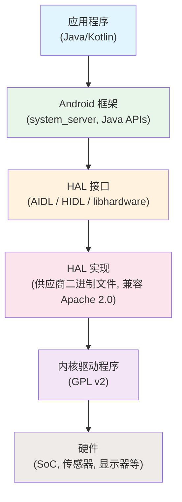
```mermaid
graph TD
    A["应用程序<br/>(Java/Kotlin)"] --> B["Android 框架<br/>(system_server, Java APIs)"]
    B --> C["HAL 接口<br/>(AIDL / HIDL / libhardware)"]
    C --> D["HAL 实现<br/>(供应商二进制文件, 兼容 Apache 2.0)"]
    D --> E["内核驱动程序<br/>(GPL v2)"]
    E --> F["硬件<br/>(SoC, 传感器, 显示器等)"]

    style A fill:#e1f5fe
    style B fill:#e8f5e9
    style C fill:#fff3e0
    style D fill:#fce4ec
    style E fill:#f3e5f5
    style F fill:#efebe9
```

每一层都有明确的职责：

| 层级 | 许可协议 | 职责 |
|-------|---------|----------------|
| 应用程序 | 各异 | 面向用户的功能 |
| 框架 | Apache 2.0 | 系统服务, Java/Kotlin APIs |
| HAL 接口 | Apache 2.0 | 框架与供应商之间的稳定契约 |
| HAL 实现 | 可专有/闭源 | 供应商特定的硬件交互逻辑 |
| 内核驱动程序 | GPL v2 | 直接的硬件寄存器访问, 中断处理 |

HAL 接口层是关键的接缝。其上的一切由 Google 通过系统分区 OTA 更新。其下的一切由设备供应商通过供应商分区更新。两边可以独立更新——这是 Project Treble 的核心承诺。

### 10.1.3 三代 HAL

Android 经历了三种不同的 HAL 架构：

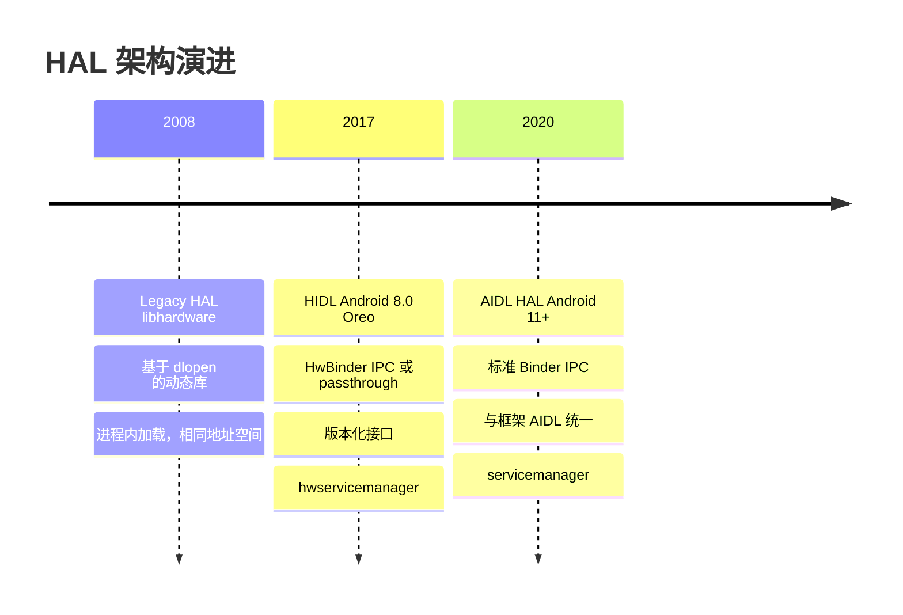
```mermaid
timeline
    title HAL 架构演进
    2008 : Legacy HAL libhardware
         : 基于 dlopen 的动态库
         : 进程内加载，相同地址空间
    2017 : HIDL Android 8.0 Oreo
         : HwBinder IPC 或 passthrough
         : 版本化接口
         : hwservicemanager
    2020 : AIDL HAL Android 11+
         : 标准 Binder IPC
         : 与框架 AIDL 统一
         : servicemanager
```

| 代次 | 引入版本 | 传输机制 | 版本管理 | 当前状态 |
|-----------|-----------|-----------|-----------|---------------|
| Legacy HAL | Android 1.0 (2008) | 进程内 `dlopen()` | Module API version 字段 | 已弃用，但仍然存在 |
| HIDL | Android 8.0 (2017) | HwBinder 或 passthrough | Package@major.minor | 自 Android 13 起弃用 |
| AIDL HAL | Android 11 (2020) | Binder | Package version int | **当前标准** |

每一代都解决了其前身的局限性。Legacy HAL 简单但缺乏 IPC 隔离和版本管理。HIDL 增加了这两点，但引入了独立的 IDL 语言和工具链。AIDL HAL 将 HAL 接口语言与 Android 框架中广泛使用的现有 AIDL 统一起来，消除了冗余。

### 10.1.4 HAL 演进时间线

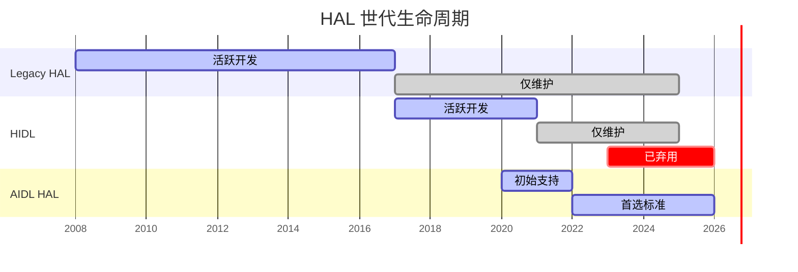
```mermaid
gantt
    title HAL 世代生命周期
    dateFormat  YYYY
    axisFormat  %Y

    section Legacy HAL
    活跃开发      :active, 2008, 2017
    仅维护        :done, 2017, 2025

    section HIDL
    活跃开发      :active, 2017, 2021
    仅维护        :done, 2021, 2025
    已弃用        :crit, 2023, 2026

    section AIDL HAL
    初始支持      :active, 2020, 2022
    首选标准      :active, 2022, 2026
```

### 10.1.5 设计原则

所有三代 HAL 都遵循几个共同的设计原则：

1. **接口稳定性。** HAL 接口一旦发布，不得以不向后兼容的方式更改。旧客户端必须能够与新实现一起工作，旧实现必须能够与新客户端一起工作。

2. **供应商隔离。** 框架不得依赖供应商的实现细节。供应商不得依赖框架内部细节。HAL 是唯一的通信渠道。

3. **可发现性。** 系统必须能够枚举哪些 HAL 可用、它们实现了哪些版本以及它们在哪里运行。这对于 OTA 更新期间的兼容性检查至关重要。

4. **可测试性。** HAL 接口必须能够通过 VTS（供应商测试套件）进行测试，而无需访问真实硬件（使用模拟或默认实现）。

### 10.1.5.1 Project Treble 与 HAL

Android 8.0 (2017) 引入的 Project Treble 正式将 HAL 定义为可独立更新的系统分区与供应商分区之间的边界。在 Treble 之前，更新 Android 需要供应商在每一步的配合——系统代码和供应商代码交织在一起，没有清晰的分离。

Treble 的架构强制执行严格的分层模型：

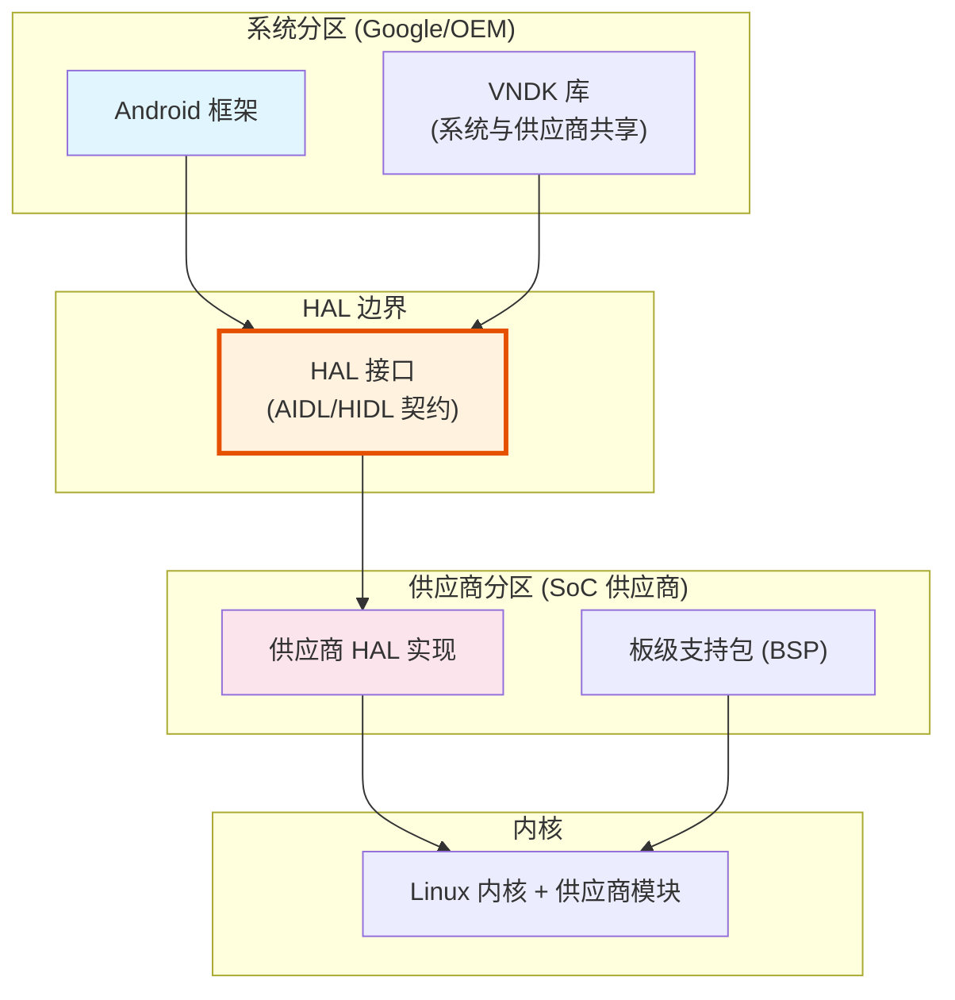
```mermaid
graph TD
    subgraph "系统分区 (Google/OEM)"
        SYS["Android 框架"]
        VNDK["VNDK 库<br/>(系统与供应商共享)"]
    end

    subgraph "HAL 边界"
        HAL_IF["HAL 接口<br/>(AIDL/HIDL 契约)"]
    end

    subgraph "供应商分区 (SoC 供应商)"
        VENDOR["供应商 HAL 实现"]
        BSP["板级支持包 (BSP)"]
    end

    subgraph "内核"
        KERN["Linux 内核 + 供应商模块"]
    end

    SYS --> HAL_IF
    VNDK --> HAL_IF
    HAL_IF --> VENDOR
    VENDOR --> KERN
    BSP --> KERN

    style HAL_IF fill:#fff3e0,stroke:#e65100,stroke-width:3px
    style SYS fill:#e1f5fe
    style VENDOR fill:#fce4ec
```

核心强制机制包括：

1. **链接器命名空间隔离。** 动态链接器强制要求系统库无法加载供应商库，反之亦然，除非通过明确允许的接口（VNDK 库和 HAL 接口）。

2. **VNDK (Vendor NDK)。** 一组经过挑选的、允许供应商代码链接的系统库。这些库具有稳定的 ABI。

3. **VINTF。** 正式的声明系统（在 10.5 节中描述），记录了每一侧提供和需要的 HAL。

4. **SELinux。** 强制访问控制，防止未经授权的跨分区通信。

这些机制共同确保了系统分区的 OTA 更新不会破坏供应商 HAL，而供应商分区的更新也不会破坏框架——只要双方都遵守 VINTF 中定义的 HAL 契约。

### 10.1.5.2 分区布局

在兼容 Treble 的设备上，存储分区如下：

| 分区 | 包含内容 | 更新方 |
|-----------|----------|-----------|
| `/system` | Android 框架, 系统应用, VNDK | Google (系统 OTA) |
| `/system_ext` | OEM 框架扩展 | OEM (OTA) |
| `/vendor` | 供应商 HAL 实现, 固件 | SoC 供应商 (供应商 OTA) |
| `/odm` | ODM 特定定制 | 设备制造商 |
| `/product` | 产品特定应用和覆盖层 | 产品团队 |
| `/apex/*` | 可独立更新的模块 | Google Play / OTA |

HAL 接口位于 `/system`（框架侧）和 `/vendor`（供应商侧）的边界。当框架 OTA 到达时：

1. 针对现有的 `/vendor` manifest 校验新的 `/system` 镜像。
2. 如果 VINTF 兼容性通过，则进行更新。
3. 新框架自动与现有的供应商 HAL 配合使用。

这是 HAL 存在的根本原因：它是支持独立分区更新的契约。

### 10.1.6 HAL 在磁盘上的位置

在运行的 Android 设备上，与 HAL 相关的文件分布在多个分区中：

```
/system/lib64/hw/           # 框架侧 Legacy HAL 模块
/vendor/lib64/hw/           # 供应商 Legacy HAL 模块
/odm/lib64/hw/              # ODM 特定 Legacy HAL 模块

/vendor/bin/hw/              # 供应商 HAL 服务二进制文件 (HIDL/AIDL)
/vendor/etc/vintf/           # 供应商 VINTF manifest
/system/etc/vintf/           # 框架 VINTF manifest

/apex/com.android.hardware.*/ # 打包在 APEX 模块中的 HAL
```

在 AOSP 源码树中，关键目录为：

```
hardware/libhardware/        # Legacy HAL 框架及参考模块
hardware/interfaces/         # HIDL 和 AIDL HAL 接口定义
system/libhidl/             # HIDL 运行时库和传输机制
system/libvintf/            # VINTF 兼容性检查库
frameworks/native/cmds/servicemanager/  # AIDL service manager
system/hwservicemanager/    # HIDL service manager
```

---

## 10.2 Legacy HAL (libhardware)

Legacy HAL 在 `hardware/libhardware/` 中实现，是 Android 最初的硬件抽象机制。它采用了简单的基于 C 语言的 `dlopen()` 方式：框架在运行时加载动态库，查找一个知名的符号，并将其强转为已知的结构体类型。尽管年代久远，理解 Legacy HAL 仍然至关重要，因为它的设计模式影响了后续所有的 HAL 设计，并且一些 Legacy 模块在出货设备中仍然存在。

### 10.2.1 核心数据结构：hw_module_t 和 hw_device_t

整个 Legacy HAL 架构围绕 `hardware/libhardware/include/hardware/hardware.h` 中定义的两个 C 结构体展开。

**hw_module_t** 代表一个已加载的 HAL 模块（一个 `.so` 文件）：

```c
// hardware/libhardware/include/hardware/hardware.h, lines 86-154

typedef struct hw_module_t {
    /** tag 必须初始化为 HARDWARE_MODULE_TAG */
    uint32_t tag;

    /**
     * 实现模块的 API 版本。当模块接口发生变化时，
     * 模块所有者负责更新版本。
     */
    uint16_t module_api_version;

    /**
     * HAL 模块接口的 API 版本。这用于对
     * hw_module_t, hw_module_methods_t 和 hw_device_t
     * 的结构和定义进行版本管理。
     */
    uint16_t hal_api_version;
    /** 模块的标识符 */
    const char *id;

    /** 此模块的名称 */
    const char *name;

    /** 模块的作者/所有者/实现者 */
    const char *author;

    /** 模块方法 */
    struct hw_module_methods_t* methods;

    /** 模块的 dso */
    void* dso;

#ifdef __LP64__
    uint64_t reserved[32-7];
#else
    /** 填充至 128 字节，保留供未来使用 */
    uint32_t reserved[32-7];
#endif

} hw_module_t;
```

`tag` 字段必须设置为魔数常量 `HARDWARE_MODULE_TAG`，其定义为 `MAKE_TAG_CONSTANT('H', 'W', 'M', 'T')`。这是一个四字节标签，编码为 `0x48574D54`——用于验证通过 `dlsym()` 解析出的指针是否确实指向有效的 HAL 模块结构。

`module_api_version` 使用打包在 16 位中的主版本号.次版本号（major.minor）方案：

```c
// hardware/libhardware/include/hardware/hardware.h, line 68
#define HARDWARE_MODULE_API_VERSION(maj,min) HARDWARE_MAKE_API_VERSION(maj,min)
```

其中 `HARDWARE_MAKE_API_VERSION` 将主版本号打包在高字节，次版本号打包在低字节。1.0 版本为 `0x0100`，2.3 版本为 `0x0203`。

`methods` 指针指向模块的“open”函数：

```c
// hardware/libhardware/include/hardware/hardware.h, lines 156-161

typedef struct hw_module_methods_t {
    /** 打开特定设备 */
    int (*open)(const struct hw_module_t* module, const char* id,
            struct hw_device_t** device);

} hw_module_methods_t;
```

而 **hw_device_t** 代表一个已打开的设备实例：

```c
// hardware/libhardware/include/hardware/hardware.h, lines 167-202

typedef struct hw_device_t {
    /** tag 必须初始化为 HARDWARE_DEVICE_TAG */
    uint32_t tag;

    /**
     * 模块特定设备 API 的版本。此值由
     * 派生模块的用户用于管理不同的设备实现。
     */
    uint32_t version;

    /** 指向此设备所属模块的引用 */
    struct hw_module_t* module;

    /** 保留供未来使用的填充 */
#ifdef __LP64__
    uint64_t reserved[12];
#else
    uint32_t reserved[12];
#endif

    /** 关闭此设备 */
    int (*close)(struct hw_device_t* device);

} hw_device_t;
```

这种模式是 C 风格的多态：每个特定的 HAL（如 gralloc, camera, audio 等）都会定义自己的结构体，该结构体以 `hw_module_t` 或 `hw_device_t` 开头，并在其后添加领域特定的字段和函数指针。框架将通用指针强转为特定类型。

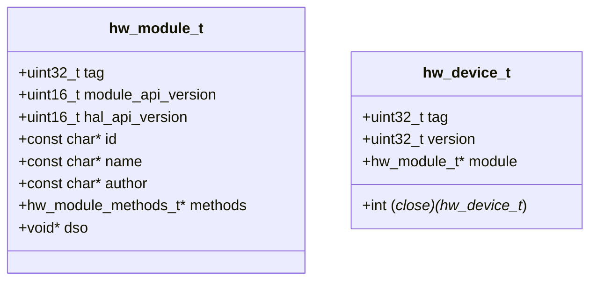
```mermaid
classDiagram
    class hw_module_t {
        +uint32_t tag
        +uint16_t module_api_version
        +uint16_t hal_api_version
        +const char* id
        +const char* name
        +const char* author
        +hw_module_methods_t* methods
        +void* dso
    }

    class hw_device_t {
        +uint32_t tag
        +uint32_t version
        +hw_module_t* module
        +int (*close)(hw_device_t*)
    }
```

### 10.2.2 模块加载机制：hw_get_module()

框架不直接调用 `dlopen()`。相反，它调用 `hw_get_module()`，这是 Legacy HAL 的入口点。

```c
// hardware/libhardware/include/hardware/hardware.h

/**
 * 根据模块 ID 获取与该模块关联的结构。
 *
 * @return 0 表示成功，或者在出错时返回负的错误代码。
 */
int hw_get_module(const char *id, const struct hw_module_t **module);
```

其实现位于 `hardware/libhardware/hardware.c`。加载逻辑遵循预定义的搜索顺序。例如，对于 ID 为 `"gralloc"` 的模块，系统会查找以下路径中的动态库：

1. `ro.hardware` 属性指定的变体（例如 `gralloc.goldfish.so` 或 `gralloc.coral.so`）。
2. `ro.product.board` 属性。
3. `ro.board.platform` 属性。
4. 默认模块 `gralloc.default.so`。

搜索路径按以下顺序排列：
- `/vendor/lib64/hw/` (如果是 64 位)
- `/odm/lib64/hw/`
- `/system/lib64/hw/`

### 10.2.3 方法分发：函数指针

一旦加载了模块并打开了设备，框架就会通过结构体中的函数指针调用硬件功能。这种方式称为“方法分发”（Method Dispatch）。

以 Audio HAL 为例，`audio_hw_device_t` 扩展了 `hw_device_t`：

```c
struct audio_hw_device {
    struct hw_device_t common; // 必须是第一个成员以支持强转

    /**
     * 获取支持的音频路由。
     */
    uint32_t (*get_supported_devices)(const struct audio_hw_device *dev);

    /**
     * 创建一个音频输出流。
     */
    int (*open_output_stream)(struct audio_hw_device *dev, ...);

    // ... 更多音频特定函数 ...
};
```

这种设计虽然原始，但有效地将框架（调用方）与供应商代码（实现方）解耦。只要结构体布局和函数签名保持不变，框架就可以在不了解底层供应商库具体实现的情况下进行调用。


## 10.3 HIDL (HAL 接口定义语言)

HIDL（HAL Interface Definition Language）在 Android 8.0 (Oreo) 中随 Project Treble 一同引入。它是一种专为硬件 HAL 设计的接口定义语言，拥有独立的编译器、运行时和工作进程管理器。HIDL 的目标是将供应商 HAL 转变为一种正式的、版本化的、可测试的合约，既可以实现在进程内（直通模式/passthrough mode），也可以实现在独立进程中（绑定模式/binderized mode）。

HIDL 的源代码位于 `system/libhidl/`。

### 10.3.1 为什么创建 HIDL

Project Treble 旨在将 Android 框架与供应商特定的代码解耦，从而实现：

- **解耦更新**：Google 可以推送框架更新，而无需等待供应商更新 HAL。
- **并行开发**：供应商可以在不等待框架更改的情况下更新其 HAL。
- **快速补丁**：设备可以更快地接收安全补丁。

HIDL 提供了工程实现机制：一个位于框架和供应商之间的版本化 IPC 接口，由强制执行接口合约的服务管理器进行协调。

### 10.3.2 HIDL 语法与 .hal 文件

HIDL 拥有独立的语法来定义接口。以下是 HIDL 自身服务管理器使用的 `IServiceManager` 接口的一个代表性示例：

```
// system/libhidl/transport/manager/1.0/IServiceManager.hal (节选)

package android.hidl.manager@1.0;

import IServiceNotification;
import android.hidl.base@1.0::DebugInfo.Architecture;

/**
 * 管理设备上所有的 hidl hal。
 */
interface IServiceManager {

    /**
     * 获取支持请求版本的现有服务。
     *
     * @param fqName   完全限定的接口名称。
     * @param name     实例名称。与 IServiceManager::add 中的名称相同。
     *
     * @return service 请求服务的句柄。
     */
    get(string fqName, string name) generates (interface service);

    /**
     * 注册一个服务。
     *
     * @param name           实例名称。
     * @param service        正在注册的服务句柄。
     * @return success       服务是否注册成功。
     */
    add(string name, interface service) generates (bool success);
```

关键语法元素：

| 元素 | 示例 | 含义 |
|---------|---------|---------|
| Package | `android.hidl.manager@1.0` | 带版本的完全限定名称 |
| Interface | `interface IServiceManager` | RPC 接口定义 |
| Method | `get(string, string) generates (interface)` | 带输入和输出的 RPC 方法 |
| `generates` | `generates (bool success)` | 返回值（HIDL 方法可以有多个返回值） |
| `oneway` | `oneway notifySyspropsChanged()` | 异步（触发后即忘）调用 |
| `vec<T>` | `vec<string> fqInstanceNames` | 动态数组类型（对应 hidl_vec） |
| `enum` | `enum Transport : uint8_t { ... }` | 强类型枚举 |
| `struct` | `struct InstanceDebugInfo { ... }` | 复合数据类型 |
| `import` | `import IServiceNotification` | 从同包中导入 |

HIDL 命名规范使用如下形式的完全限定名称：

```
package@major.minor::InterfaceName/instance
```

例如：
- `android.hardware.camera.provider@2.4::ICameraProvider/internal/0`
- `android.hardware.audio@7.0::IDevicesFactory/default`

### 10.3.3 Passthrough 与 Binderized 模式

HIDL 支持两种传输模式，从而实现从传统 HAL 的平滑迁移：

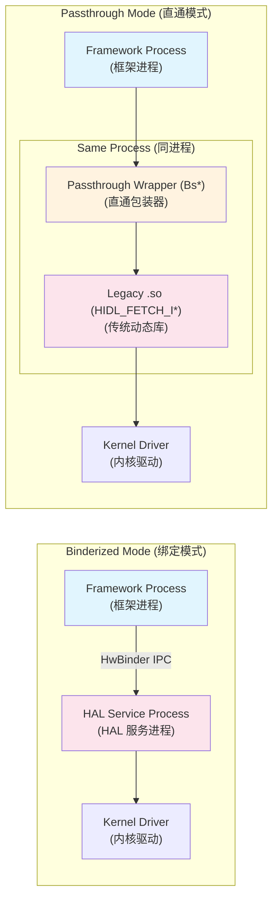
```mermaid
graph LR
    subgraph "Binderized Mode (绑定模式)"
        C1["Framework Process<br/>(框架进程)"] -->|"HwBinder IPC"| S1["HAL Service Process<br/>(HAL 服务进程)"]
        S1 --> K1["Kernel Driver<br/>(内核驱动)"]
    end

    subgraph "Passthrough Mode (直通模式)"
        C2["Framework Process<br/>(框架进程)"]
        subgraph "Same Process (同进程)"
            PT["Passthrough Wrapper (Bs*)<br/>(直通包装器)"] --> LIB["Legacy .so (HIDL_FETCH_I*)<br/>(传统动态库)"]
        end
        C2 --> PT
        LIB --> K2["Kernel Driver<br/>(内核驱动)"]
    end

    style C1 fill:#e1f5fe
    style S1 fill:#fce4ec
    style C2 fill:#e1f5fe
    style PT fill:#fff3e0
    style LIB fill:#fce4ec
```

**Binderized 模式**是标准模式。HAL 运行在独立的进程中，通过 **HwBinder**（针对 HAL 用途优化的 Android Binder IPC 变体）与框架通信。这提供了进程隔离、SELinux 强制访问控制，并允许 HAL 以最小权限运行。

**Passthrough 模式**使用 HIDL 接口封装了传统的进程内（in-process）HAL 实现。框架调用 HIDL 方法，这些方法被转发到运行在同一进程中的传统 HAL。此模式纯粹为了向后兼容——它允许通过 HIDL 接口使用现有的传统 HAL `.so` 文件，而无需重写它们。

每个 HAL 的传输模式在设备的 **VINTF manifest** 中声明。

绑定模式示例：
```xml
<hal format="hidl">
    <name>android.hardware.camera.provider</name>
    <transport>hwbinder</transport>
    <version>2.4</version>
    <interface>
        <name>ICameraProvider</name>
        <instance>internal/0</instance>
    </interface>
</hal>
```

直通模式示例：
```xml
<hal format="hidl">
    <name>android.hardware.graphics.mapper</name>
    <transport>passthrough</transport>
    <version>4.0</version>
    <interface>
        <name>IMapper</name>
        <instance>default</instance>
    </interface>
</hal>
```

### 10.3.4 hwservicemanager

HIDL 服务管理器（`hwservicemanager`）是一个专门的守护进程，负责管理 HIDL HAL 服务的注册和发现。它类似于标准的 Android `servicemanager`，但运行在 HwBinder 之上而非普通的 Binder。

`hwservicemanager` 执行两个关键功能：

1. **注册**：当 HAL 服务启动时，它调用 `IFoo::registerAsService("instance_name")`，将服务的 HwBinder 端点注册到 `hwservicemanager`。
2. **发现**：当框架组件需要 HAL 时，它调用 `IFoo::getService("instance_name")`。HIDL 运行时联系 `hwservicemanager`，后者返回 HwBinder 代理（Proxy）。

此外，`hwservicemanager` 还负责强制执行 VINTF 清单合规性检查，确保注册的服务已在 VINTF 中声明。

### 10.3.5 IBase 根接口

每个 HIDL 接口都隐式继承自 `android.hidl.base@1.0::IBase`。这类似于 Java 中的 `java.lang.Object`。

`IBase` 提供了所有 HAL 服务继承的关键方法：

- `ping()`：存活性检查。
- `interfaceChain()`：返回完整的继承链（例如 `[V2.6, V2.4, IBase]`），允许框架验证服务实现的接口版本。
- `interfaceDescriptor()`：获取接口描述符。
- `linkToDeath()` / `unlinkToDeath()`：死亡通知监听。
- `getHashChain()`：提供接口定义的加密哈希，用于验证客户端和服务端接口是否一致。

### 10.3.6 代码生成与构建集成

HIDL 编译器（`hidl-gen`）处理 `.hal` 文件并生成以下内容：

1. **C++ 桩（Stubs）头文件和源文件**：涵盖客户端（代理/BpInterface）和服务器端（原生/BnInterface）。
2. **Java 接口**：供框架层使用。
3. **VTS (Vendor Test Suite) 模板**：用于自动化测试。

对于接口 `android.hardware.foo@1.0::IFoo`，生成的关键类包括：
- `IFoo`：抽象接口类。
- `BpHwFoo`：Binder 代理类（Client 端使用，实现序列化）。
- `BnHwFoo`：Binder 原生类（Server 端桩，实现反序列化）。
- `BsFoo`：直通模式包装类（Passthrough shim）。

### 10.3.7 HIDL 数据类型与内存映射

HIDL 定义了一套与底层内存布局对应的 C++ 数据类型，以确保高效的跨进程传输：

- **`hidl_string`**：用于传输字符串。它不拥有内存所有权（通常指向 `std::string` 或 C 风格字符串缓冲区），在 Binder 传输时进行拷贝。
- **`hidl_vec<T>`**：动态数组（对应 `.hal` 中的 `vec<T>`）。
- **`hidl_handle`**：用于传输文件描述符（native_handle_t）。
- **`hidl_memory`**：用于高效的大块共享内存传输。

在生成代码中，`BpInterface`（代理端）负责将这些类型“打入” `Parcel`（Marshalling），而 `BnInterface`（服务端）负责从 `Parcel` 中提取它们（Unmarshalling）。

### 10.3.8 HIDL 传输层与服务注册流程

HIDL 传输层（Transport Layer）负责管理线程池和 IPC 细节。典型的 Binderized HAL 服务启动流程如下：

1. **配置线程池**：调用 `configureRpcThreadpool(maxThreads, callerWillJoin)`。
2. **实例化服务**：创建 `IFoo` 的具体实现对象。
3. **注册服务**：调用 `service->registerAsService("default")`。此步会联系 `hwservicemanager`。
4. **加入线程池**：调用 `joinRpcThreadpool()`，开始处理传入的 IPC 请求。

### 10.3.9 版本化规则

HIDL 采用严格的版本化方案（major.minor）：

- **小版本升级**（1.0 -> 1.1）：允许添加新方法，但禁止更改现有方法。1.1 接口必须继承自 1.0 接口。
- **大版本升级**（1.x -> 2.0）：允许破坏性更改，新接口独立于旧接口。

这种继承机制保证了向后兼容性：当客户端请求 `V1.0::IFoo` 时，系统可以返回 `V1.1` 的实现，因为 `V1.1` 完整涵盖了 `V1.0` 的合约。


## 10.4 AIDL HAL (当前标准)

从 Android 11 开始，Google 开始将 HAL 接口从 HIDL 迁移到 AIDL (Android 接口定义语言)。在当前的 AOSP 中，AIDL HAL 已成为所有新硬件接口以及大多数现有接口的标准。

AIDL 已经是 Android 框架内进程间通信的通用语言。通过扩展 AIDL 以支持 HAL，Google 消除了对独立 IDL 语言 (HIDL)、独立 IPC 机制 (HwBinder) 和独立服务管理器 (hwservicemanager) 的需求。

### 10.4.1 为什么 AIDL 取代了 HIDL

| 特性 | HIDL | AIDL HAL |
|--------|------|----------|
| IDL 语言 | 自定义 `.hal` 语法 | 标准 `.aidl` 语法 |
| IPC 传输层 | HwBinder | 标准 Binder |
| 服务管理器 | hwservicemanager | servicemanager |
| 语言支持 | C++, Java | C++, Java, Rust, NDK C++ |
| 工具链 | hidl-gen | aidl (现有) |
| 学习曲线 | 需要学习新语法 | Android 开发者已熟知 |
| 测试基础设施 | 独立的 VTS 套件 | 统一的 VTS/CTS 基础设施 |

AIDL HAL 的关键优势：

1. **统一工具链**：AIDL 编译器已经存在且经过充分测试，无需独立维护 `hidl-gen`。
2. **Rust 支持**：AIDL 可以生成 Rust 绑定，允许使用内存安全的 Rust 语言实现 HAL。HIDL 不支持 Rust。
3. **NDK 后端**：AIDL HAL 可以使用 NDK 后端，允许供应商代码使用稳定的 NDK API，而无需链接到平台的 C++ 库。
4. **更简单的版本控制**：AIDL 使用整数版本号，而非 HIDL 的主次版本号 (major.minor) 方案。每个版本都是接口的完整快照。
5. **统一的生态系统**：框架服务和 HAL 服务现在使用相同的 IPC 机制、相同的服务管理器和相同的调试工具 (如 `dumpsys`)。

### 10.4.2 AIDL HAL 接口定义

AIDL HAL 接口看起来与常规的框架 AIDL 接口几乎完全相同，但有一个关键补充：`@VintfStability` 注解。

以下是 Lights (灯光) HAL 接口示例：

```java
// hardware/interfaces/light/aidl/android/hardware/light/ILights.aidl

package android.hardware.light;

import android.hardware.light.HwLightState;
import android.hardware.light.HwLight;

@VintfStability
interface ILights {
    void setLightState(in int id, in HwLightState state);
    HwLight[] getLights();
}
```

这是标准的 AIDL 语法。`@VintfStability` 注解是区分 HAL 接口与常规框架服务的唯一标识。

### 10.4.3 @VintfStability 注解

`@VintfStability` 注解有两个主要作用：

1. **编译时**：AIDL 编译器强制执行更严格的规则。该接口引用的所有类型也必须标记为 `@VintfStability`。接口在发布前必须进行版本化并“冻结” (frozen)。
2. **运行时**：Binder 框架在允许服务向 `servicemanager` 注册之前，会检查该服务是否已在设备的 VINTF 清单 (Manifest) 中声明。

该注解将 AIDL 世界与 VINTF 兼容性框架连接起来，确保 HAL 接口享有与 HIDL 接口相同的兼容性保证。

### 10.4.4 AIDL HAL 中的 Parcelable 与枚举 (Enums)

AIDL HAL 广泛使用 Parcelable 来处理结构化数据。以 Lights HAL 为例：

```java
// android/hardware/light/HwLight.aidl
package android.hardware.light;

@VintfStability
parcelable HwLight {
    int id;
    int ordinal;
    LightType type; // 枚举类型
}
```

在 AIDL HAL 中，枚举是强类型的，可以基于特定的整数类型：

```java
// android/hardware/light/LightType.aidl
package android.hardware.light;

@VintfStability
@Backing(type="byte")
enum LightType {
    BACKLIGHT = 0,
    KEYBOARD = 1,
    BUTTONS = 2,
    // ...
}
```

使用 `parcelable` 和强类型 `enum` 确保了数据在跨进程传输时的序列化安全性和语义一致性。

### 10.4.5 后端差异：NDK vs. CPP 后端

AIDL 编译器支持多种后端。对于 HAL 开发，选择正确的后端至关重要：

1. **NDK 后端 (`-ndk`)**：
   - **用途**：供应商 (Vendor) HAL 实现的首选。
   - **稳定性**：提供稳定的 ABI。链接到 `libbinder_ndk.so`，这是 NDK 的一部分。
   - **隔离性**：不依赖于平台内部的 `libbinder.so`，避免了供应商分区与系统分区之间的 ABI 耦合。
   - **语法**：使用 `aidl::android::hardware::...` 命名空间和 `ndk::` 辅助工具。

2. **CPP 后端 (`-cpp`)**：
   - **用途**：主要用于系统分区的原生框架代码。
   - **稳定性**：不保证长期 ABI 稳定。链接到平台私有的 `libbinder.so`。
   - **局限性**：供应商代码禁止链接到此后端，因为它不是 VNDK 的一部分。

### 10.4.6 稳定 AIDL 规则与 API 冻结

为了保证 Treble 的独立更新能力，AIDL HAL 必须遵循严格的稳定性规则：

1. **接口冻结**：
   一旦 HAL 接口发布，其定义的快照会存储在 `aidl_api/` 目录下。这些文件是不可变的。
   ```
   hardware/interfaces/light/aidl/aidl_api/android.hardware.light/
       1/  # 冻结的版本 1
       2/  # 冻结的版本 2
       current/ # 开发中的最新快照
   ```
2. **向后兼容性**：
   版本 N+1 必须是版本 N 的超集。允许添加新方法或可选字段，但严禁删除或修改现有成员。
3. **非冻结接口 (Unfrozen Interfaces)**：
   在开发阶段，接口是“非冻结”的，可以自由修改。但这类接口不能在正式发布的 VINTF 清单中使用。

### 10.4.7 VINTF 稳定性检查

当 HAL 服务尝试注册到 `servicemanager` 时，会触发 VINTF 稳定性验证：

1. **清单验证**：`servicemanager` 调用 `libvintf` 检查设备的 `manifest.xml`。如果请求注册的 HAL 接口和版本未在清单中显式声明，注册将被拒绝。
2. **级别匹配**：系统会验证 HAL 的版本是否处于框架兼容性矩阵 (FCM) 允许的范围内。

这种机制防止了未声明或不兼容的 HAL 服务在系统上运行，确保了 OTA 更新后的系统稳定性。

### 10.4.8 性能优化：FMQ 与 Oneway 方法

尽管 AIDL 使用标准 Binder，但它针对 HAL 场景提供了性能优化：

- **Oneway 方法**：用于异步调用，调用方无需等待回复。常用于对延迟敏感的指示器（如电源提示）。
- **FMQ (快速消息队列)**：
  对于传感器或音频等高吞吐量数据，AIDL HAL 采用“Binder 建立连接，FMQ 传输数据”的模式。FMQ 使用共享内存环形缓冲区，避免了 Binder 事务的上下文切换开销。

### 10.4.9 总结

AIDL HAL 通过统一 Android 的 IPC 基础设施，简化了硬件抽象层的开发。它不仅引入了 Rust 等现代语言支持，还通过 NDK 后端和严格的 API 冻结机制，强化了 Project Treble 倡导的系统与供应商分区解耦。


## 10.5 VINTF (Vendor Interface)

Vendor Interface (VINTF) 框架实现在 `system/libvintf/` 中，是确保框架（Framework）与供应商（Vendor）分区之间兼容性的系统。它随 Android 8.0 中的 HIDL 一起引入，目前同时用于 HIDL 和 AIDL HAL。

### 10.5.1 VINTF 解决的问题

在 Project Treble 之前，升级 Android 框架（系统分区）需要重新测试并可能修改所有供应商 HAL。当时没有正式的方法来验证新的框架版本是否与现有的供应商分区兼容。

VINTF 提供了一种正式的兼容性检查机制：

1.  **供应商（Vendor）** 声明其提供的 HAL（设备清单，Device Manifest）。
2.  **框架（Framework）** 声明其需要的 HAL（框架兼容性矩阵，Framework Compatibility Matrix）。
3.  **框架（Framework）** 声明其提供的服务（框架清单，Framework Manifest）。
4.  **供应商（Vendor）** 声明其需要的框架特性（设备兼容性矩阵，Device Compatibility Matrix）。

兼容性在三个时间点进行验证：

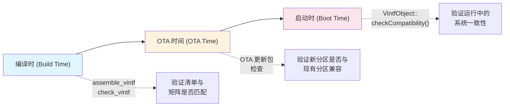
```mermaid
graph LR
    A["编译时 (Build Time)"] --> B["OTA 时间 (OTA Time)"]
    B --> C["启动时 (Boot Time)"]

    A -.->|"assemble_vintf<br/>check_vintf"| D["验证清单与<br/>矩阵是否匹配"]
    B -.->|"OTA 更新包<br/>检查"| E["验证新分区是否与<br/>现有分区兼容"]
    C -.->|"VintfObject::<br/>checkCompatibility()"| F["验证运行中的<br/>系统一致性"]

    style A fill:#e1f5fe
    style B fill:#fff3e0
    style C fill:#fce4ec
```

### 10.5.2 清单文件 (Manifest Files)

VINTF 清单声明了分区提供的内容。主要有两种类型：

**设备清单 (Device Manifest)**（供应商提供的内容）：

位于 `/vendor/etc/vintf/manifest.xml`，列出了供应商分区实现的所有 HAL 服务。以下是一个代表性片段：

```xml
<manifest version="1.0" type="device">
    <!-- AIDL HAL -->
    <hal format="aidl">
        <name>android.hardware.light</name>
        <version>2</version>
        <fqname>ILights/default</fqname>
    </hal>

    <!-- 具有多个实例的 AIDL HAL -->
    <hal format="aidl">
        <name>android.hardware.audio.core</name>
        <version>4</version>
        <fqname>IModule/default</fqname>
    </hal>
    <!-- ... 其他实例 ... -->

    <!-- 旧版 HIDL HAL -->
    <hal format="hidl">
        <name>android.hardware.graphics.mapper</name>
        <transport>passthrough</transport>
        <version>4.0</version>
        <interface>
            <name>IMapper</name>
            <instance>default</instance>
        </interface>
    </hal>
</manifest>
```

**框架清单 (Framework Manifest)**（框架提供的内容）：

位于 `/system/etc/vintf/manifest.xml`，列出了供应商代码可能依赖的框架侧服务。

### 10.5.3 兼容性矩阵 (Compatibility Matrices)

兼容性矩阵声明了一个分区对另一分区的要求。

框架兼容性矩阵（如 `hardware/interfaces/compatibility_matrices/compatibility_matrix.202504.xml`）是一个详细的 XML 文件，列出了框架可能需要的每个 HAL 及其版本要求。

框架兼容性矩阵的关键元素：

| XML 元素 | 含义 |
| :--- | :--- |
| `<hal format="aidl">` | 这是一个 AIDL HAL 要求 |
| `<name>` | 包名 |
| `<version>1-3</version>` | 可接受的版本范围（1 到 3） |
| `<interface>` | 要求的接口 |
| `<instance>` | 要求的实例名称 |
| `level="202504"` | FCM (Framework Compatibility Matrix) 级别 |

注意版本范围 `<version>1-3</version>`。这意味着框架可以与提供版本 1、2 或 3 的供应商映像协作。这种范围机制是向后兼容性的核心，允许旧的供应商映像与新的框架映像配合工作。

### 10.5.4 兼容性检查算法

兼容性检查（Runtime Compatibility Check）验证以下内容：

1.  对于框架兼容性矩阵中的每个**必需** HAL，设备清单是否提供了兼容版本的实现。
2.  设备清单中的每个 HAL 版本是否在框架兼容性矩阵接受的范围内。
3.  内核要求（配置选项、版本）是否得到满足。
4.  SELinux 策略版本要求是否匹配。

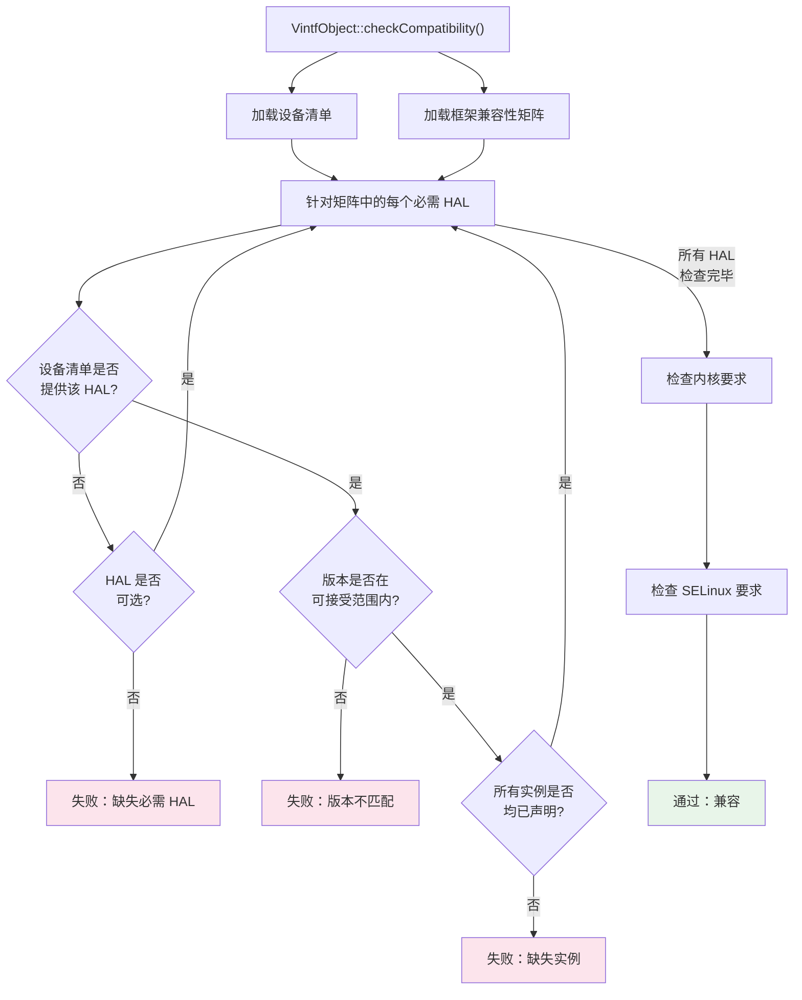
```mermaid
flowchart TD
    A["VintfObject::checkCompatibility()"] --> B["加载设备清单"]
    A --> C["加载框架兼容性矩阵"]
    B --> D["针对矩阵中的每个必需 HAL"]
    C --> D
    D --> E{"设备清单是否<br/>提供该 HAL?"}
    E -->|否| F{"HAL 是否<br/>可选?"}
    F -->|是| D
    F -->|否| G["失败：缺失必需 HAL"]
    E -->|是| H{"版本是否在<br/>可接受范围内?"}
    H -->|否| I["失败：版本不匹配"]
    H -->|是| J{"所有实例是否<br/>均已声明?"}
    J -->|否| K["失败：缺失实例"]
    J -->|是| D
    D -->|"所有 HAL<br/>检查完毕"| L["检查内核要求"]
    L --> M["检查 SELinux 要求"]
    M --> N["通过：兼容"]

    style G fill:#fce4ec
    style I fill:#fce4ec
    style K fill:#fce4ec
    style N fill:#e8f5e9
```

### 10.5.5 FCM 级别与时间线

框架兼容性矩阵级别（FCM Level）标识了设备针对的 Android 版本。`hardware/interfaces/compatibility_matrices/` 目录包含了每个级别的矩阵：

| FCM 级别 | Android 版本 |
| :--- | :--- |
| 5 | Android 11 |
| 8 | Android 14 |
| 202404 | Android 15 |
| 202504 | Android 16 |

从 Android 15 开始，级别命名从简单的整数转变为基于日期的标识符。设备在设备清单中声明其“目标 FCM 级别”（target-level），框架据此选择合适的矩阵。

### 10.5.6 VINTF 与 OTA 更新

VINTF 在 OTA 更新中起着至关重要的作用。在应用系统分区更新时，更新系统会根据现有供应商的清单检查新框架的兼容性矩阵。如果不兼容，OTA 将被拒绝。这确保了框架可以独立更新，而不会破坏与供应商分区的协作。

---

## 10.6 HAL 生命周期 (HAL Lifecycle)

### 10.6.1 注册与发现

HAL 服务经历注册、发现、使用和可能的注销过程：

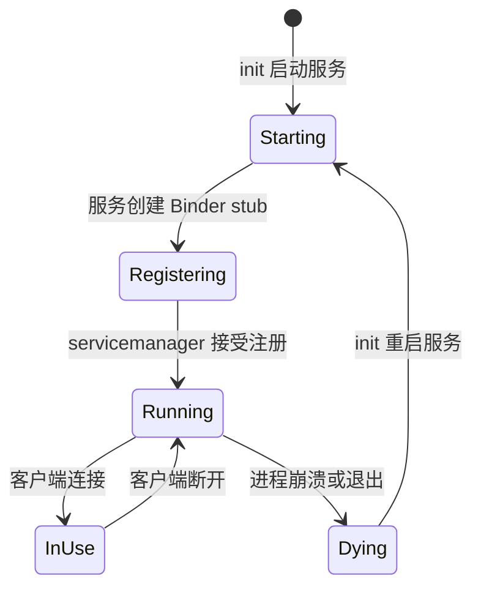
```mermaid
stateDiagram-v2
    [*] --> Starting : init 启动服务
    Starting --> Registering : 服务创建 Binder stub
    Registering --> Running : servicemanager 接受注册
    Running --> InUse : 客户端连接
    InUse --> Running : 客户端断开
    Running --> Dying : 进程崩溃或退出
    Dying --> Starting : init 重启服务
```

### 10.6.2 servicemanager 与 hwservicemanager

Android 拥有两个针对不同时代的进程管理器：

*   **servicemanager**：实现在 `frameworks/native/cmds/servicemanager/`。处理 AIDL HAL 和框架服务（如 ActivityManager）。它是当前的主流标准。
*   **hwservicemanager**：实现在 `system/hwservicemanager/`。专门用于旧版的 HIDL HAL。在较新的设备上，它可能被移除或处于弃用状态。

### 10.6.3 延迟加载 HAL (Lazy HALs)

并非所有 HAL 都需要始终运行。**Lazy HALs** 是按需启动的服务：当客户端请求时启动，并在没有客户端连接时关闭。这极大地优化了内存，因为每个空闲的 HAL 进程都会占用数兆字节的 RAM。

**Lazy HAL 周期：**

1.  设备启动——Lazy HAL 服务**未**启动（在 `init.rc` 中标记为 `disabled`）。
2.  客户端向 `servicemanager` 请求该服务。
3.  `servicemanager` 通知 `init` 启动该服务。
4.  `init` 启动 HAL 进程。
5.  HAL 使用 `LazyServiceRegistrar` 进行注册。
6.  客户端获得 Binder 代理并使用 HAL。
7.  客户端断开连接（引用计数归零）。
8.  `servicemanager` 通知 HAL 客户端计数为零。
9.  HAL 注销并调用 `exit()`。

### 10.6.4 init.rc 中的 HAL 配置

HAL 服务由 Android 的 `init` 系统启动。`init.rc` 定义控制了安全性、优先级和重启行为：

```
service vendor.light-default /vendor/bin/hw/android.hardware.lights-service.example
    class hal
    user nobody
    group nobody
    shutdown critical
```

对于音频等对延迟敏感的 HAL，会授予更高的优先级（如 `rtprio`）和特定的能力（`capabilities`）。

### 10.6.5 死亡通知与恢复 (Death Recipients and Recovery)

当 HAL 进程崩溃时，客户端需要感知并优雅地恢复。AIDL 提供了 **Death Recipient** 机制：

```c++
// C++ (NDK 示例)
AIBinder_DeathRecipient* deathRecipient = AIBinder_DeathRecipient_new(onServiceDied);
AIBinder_linkToDeath(binder, deathRecipient, cookie);
```

**恢复逻辑：**
1.  框架客户端检测到 HAL 崩溃（通过 Binder 驱动的死亡通知）。
2.  框架清除旧的引用以防止无效调用。
3.  `init` 检测到进程结束并根据配置重启 HAL。
4.  框架客户端尝试重新连接并重新获取 Binder 代理。

### 10.6.6 SELinux 与 HAL 服务

SELinux 控制着 HAL 服务的访问权限：
*   **注册权限**：哪个域可以注册哪个服务名称。
*   **查找权限**：谁可以查找并使用该服务。
*   **硬件访问**：HAL 进程是否有权读取/写入对应的设备节点（如 `/dev/binder` 或 `/sys/class/leds/`）。

如果没有正确的 SELinux 策略，HAL 可能会注册失败（AVC 拒绝）或无法访问其控制的硬件。


## 10.7 动手实践：编写最小 AIDL HAL

在本节中，我们将从头开始编写一个完整的 AIDL HAL：包括接口定义、C++ 和 Rust 的实现、VINTF manifest、init.rc、构建规则以及客户端。我们将创建一个简单的“Greeting（问候）”HAL，用它来演示本章涵盖的所有核心概念。

### 10.7.1 步骤 1：定义 AIDL 接口

首先创建目录结构：

```
hardware/interfaces/greeting/aidl/
    Android.bp
    android/hardware/greeting/
        IGreeting.aidl
        GreetingResponse.aidl
    default/
        Android.bp
        main.cpp
        Greeting.cpp
        Greeting.h
        greeting-default.rc
        greeting-default.xml
```

第一步，定义接口类型。创建一个 Response Parcelable：

```java
// android/hardware/greeting/GreetingResponse.aidl

package android.hardware.greeting;

@VintfStability
parcelable GreetingResponse {
    /** 问候消息 */
    String message;
    /** 生成问候语的时间戳 */
    long timestampMs;
    /** HAL 实现的名称 */
    String implementationName;
}
```

接着定义主接口：

```java
// android/hardware/greeting/IGreeting.aidl

package android.hardware.greeting;

import android.hardware.greeting.GreetingResponse;

/**
 * 一个用于教学目的的最小 AIDL HAL 示例。
 *
 * 该 HAL 演示了以下核心概念：
 * - 用于 HAL 接口的 @VintfStability 注解
 * - 用于结构化数据的 Parcelable 类型
 * - 多种方法签名
 * - 使用服务特定异常进行错误处理
 */
@VintfStability
interface IGreeting {
    /**
     * 获取简单的问候语。
     *
     * @return 包含 HAL 实现名称和当前时间戳的问候响应。
     */
    GreetingResponse greet();

    /**
     * 获取个性化的问候语。
     *
     * @param name 要包含在问候语中的名称。
     * @return 个性化的问候响应。
     * @throws ServiceSpecificException 如果名称为空，则抛出错误码为 1 的异常。
     */
    GreetingResponse greetByName(in String name);

    /**
     * 获取自 HAL 启动以来服务的问候次数。
     *
     * @return 问候总数。
     */
    int getGreetingCount();
}
```

**关键点：**

- 在接口和 Parcelable 上同时使用 `@VintfStability`，标记它们为 HAL 类型，在出厂前必须进行版本冻结。
- `String name` 之前的 `in` 关键字表示该参数仅作为输入（由调用者提供）。AIDL 还支持 `out`（由服务端填充）和 `inout`（双向）。
- 错误报告使用 `ServiceSpecificException`，它对应 Binder 协议中的 `EX_SERVICE_SPECIFIC`。

### 10.7.2 步骤 2：创建构建定义

```
// hardware/interfaces/greeting/aidl/Android.bp

aidl_interface {
    name: "android.hardware.greeting",
    vendor_available: true,
    srcs: [
        "android/hardware/greeting/*.aidl",
    ],
    stability: "vintf",
    backend: {
        java: {
            sdk_version: "module_current",
        },
        rust: {
            enabled: true,
        },
        ndk: {
            enabled: true,
        },
        cpp: {
            enabled: true,
        },
    },
    versions_with_info: [
        // 初始为空；在运行 `m android.hardware.greeting-update-api` 后将包含冻结的版本
    ],
}
```

这会为所有四个后端生成库：

- `android.hardware.greeting-V1-java`
- `android.hardware.greeting-V1-cpp`
- `android.hardware.greeting-V1-ndk`
- `android.hardware.greeting-V1-rust`

### 10.7.3 步骤 3：用 C++ 实现 HAL（NDK 后端）

对于 C++ 供应商 HAL 实现，推荐使用 NDK 后端。

**Greeting.h:**

```c++
// hardware/interfaces/greeting/aidl/default/Greeting.h

#pragma once

#include <aidl/android/hardware/greeting/BnGreeting.h>
#include <atomic>

namespace aidl::android::hardware::greeting {

class Greeting : public BnGreeting {
public:
    Greeting();

    ndk::ScopedAStatus greet(GreetingResponse* _aidl_return) override;
    ndk::ScopedAStatus greetByName(const std::string& name,
                                    GreetingResponse* _aidl_return) override;
    ndk::ScopedAStatus getGreetingCount(int32_t* _aidl_return) override;

private:
    GreetingResponse makeResponse(const std::string& message);
    std::atomic<int32_t> mGreetingCount{0};
};

}  // namespace aidl::android::hardware::greeting
```

**Greeting.cpp:**

```c++
// hardware/interfaces/greeting/aidl/default/Greeting.cpp

#define LOG_TAG "GreetingHAL"

#include "Greeting.h"

#include <android-base/logging.h>
#include <chrono>

namespace aidl::android::hardware::greeting {

Greeting::Greeting() {
    LOG(INFO) << "Greeting HAL 初始完成";
}

GreetingResponse Greeting::makeResponse(const std::string& message) {
    GreetingResponse response;
    response.message = message;
    response.timestampMs =
        std::chrono::duration_cast<std::chrono::milliseconds>(
            std::chrono::system_clock::now().time_since_epoch())
        .count();
    response.implementationName = "GreetingHAL-Default-CPP";
    mGreetingCount.fetch_add(1, std::memory_order_relaxed);
    return response;
}

ndk::ScopedAStatus Greeting::greet(GreetingResponse* _aidl_return) {
    LOG(INFO) << "greet() 被调用";
    *_aidl_return = makeResponse("来自 Greeting HAL 的问候！");
    return ndk::ScopedAStatus::ok();
}

ndk::ScopedAStatus Greeting::greetByName(const std::string& name,
                                          GreetingResponse* _aidl_return) {
    LOG(INFO) << "greetByName() 被调用，参数 name: " << name;

    if (name.empty()) {
        return ndk::ScopedAStatus::fromServiceSpecificError(1);
    }

    *_aidl_return = makeResponse("你好, " + name + "! 欢迎来到 AOSP。");
    return ndk::ScopedAStatus::ok();
}

ndk::ScopedAStatus Greeting::getGreetingCount(int32_t* _aidl_return) {
    *_aidl_return = mGreetingCount.load(std::memory_order_relaxed);
    return ndk::ScopedAStatus::ok();
}

}  // namespace aidl::android::hardware::greeting
```

**main.cpp:**

```c++
// hardware/interfaces/greeting/aidl/default/main.cpp

#define LOG_TAG "android.hardware.greeting-service"

#include "Greeting.h"

#include <android-base/logging.h>
#include <android/binder_manager.h>
#include <android/binder_process.h>

using aidl::android::hardware::greeting::Greeting;

int main() {
    LOG(INFO) << "Greeting HAL 服务正在启动...";

    // 设置线程池大小。0 表示仅使用调用线程
    //（适用于不需要并发处理的简单 HAL）。
    ABinderProcess_setThreadPoolMaxThreadCount(0);

    // 创建实现对象
    auto greeting = ndk::SharedRefBase::make<Greeting>();

    // 构建服务名称："android.hardware.greeting.IGreeting/default"
    const std::string instance = std::string() +
        Greeting::descriptor + "/default";

    // 注册到 servicemanager
    binder_status_t status = AServiceManager_addService(
        greeting->asBinder().get(), instance.c_str());
    CHECK_EQ(status, STATUS_OK)
        << "无法注册服务 " << instance;

    LOG(INFO) << "Greeting HAL 服务已注册为: " << instance;

    // 永久阻塞，处理 Binder 事务
    ABinderProcess_joinThreadPool();
    return EXIT_FAILURE;  // 理论上不应到达此处
}
```

**实现的 Android.bp:**

```
// hardware/interfaces/greeting/aidl/default/Android.bp

cc_binary {
    name: "android.hardware.greeting-service.example",
    relative_install_path: "hw",
    init_rc: ["greeting-default.rc"],
    vintf_fragments: ["greeting-default.xml"],
    vendor: true,
    shared_libs: [
        "libbase",
        "libbinder_ndk",
    ],
    static_libs: [
        "android.hardware.greeting-V1-ndk",
    ],
    srcs: [
        "Greeting.cpp",
        "main.cpp",
    ],
}
```

**关键构建标志：**

- `vendor: true` —— 安装到 `/vendor/bin/hw/`。
- `relative_install_path: "hw"` —— HAL 二进制文件的标准子目录。
- `init_rc` —— 自动安装 init.rc 文件。
- `vintf_fragments` —— 自动安装 VINTF manifest 片段。
- `static_libs` 包含生成的 NDK 接口库。

### 10.7.4 步骤 4：用 Rust 实现 HAL

Rust 中的替代实现（参考 Lights HAL）：

**main.rs:**

```rust
// hardware/interfaces/greeting/aidl/default-rust/main.rs

use android_hardware_greeting::aidl::android::hardware::greeting::{
    IGreeting::BnGreeting,
    IGreeting::IGreeting,
    GreetingResponse::GreetingResponse,
};
use binder::{BinderFeatures, Interface, Status, ExceptionCode};
use std::sync::atomic::{AtomicI32, Ordering};
use std::time::{SystemTime, UNIX_EPOCH};
use log::{info, LevelFilter};

const LOG_TAG: &str = "greeting_hal_rust";

struct GreetingService {
    count: AtomicI32,
}

impl Interface for GreetingService {}

impl Default for GreetingService {
    fn default() -> Self {
        Self { count: AtomicI32::new(0) }
    }
}

impl GreetingService {
    fn make_response(&self, message: String) -> GreetingResponse {
        self.count.fetch_add(1, Ordering::Relaxed);
        GreetingResponse {
            message,
            timestampMs: SystemTime::now()
                .duration_since(UNIX_EPOCH)
                .unwrap()
                .as_millis() as i64,
            implementationName: "GreetingHAL-Default-Rust".into(),
        }
    }
}

impl IGreeting for GreetingService {
    fn greet(&self) -> binder::Result<GreetingResponse> {
        info!("greet() 被调用");
        Ok(self.make_response("来自 Greeting HAL (Rust) 的问候！".into()))
    }

    fn greetByName(&self, name: &str) -> binder::Result<GreetingResponse> {
        info!("greetByName() 被调用，参数 name: {}", name);
        if name.is_empty() {
            return Err(Status::new_service_specific_error(1, None));
        }
        Ok(self.make_response(
            format!("你好, {}! 欢迎来到 AOSP (来自 Rust)。", name)))
    }

    fn getGreetingCount(&self) -> binder::Result<i32> {
        Ok(self.count.load(Ordering::Relaxed))
    }
}

fn main() {
    logger::init(
        logger::Config::default()
            .with_tag_on_device(LOG_TAG)
            .with_max_level(LevelFilter::Trace),
    );

    binder::ProcessState::set_thread_pool_max_thread_count(0);

    let service = GreetingService::default();
    let binder = BnGreeting::new_binder(service, BinderFeatures::default());

    let name = format!(
        "{}/default",
        <GreetingService as IGreeting>::get_descriptor()
    );

    binder::add_service(&name, binder.as_binder())
        .expect("无法注册 Greeting HAL");

    info!("Greeting HAL (Rust) 已注册为: {}", name);

    binder::ProcessState::join_thread_pool();
}
```

**Rust 实现的 Android.bp:**

```
// hardware/interfaces/greeting/aidl/default-rust/Android.bp

rust_binary {
    name: "android.hardware.greeting-service.rust-example",
    relative_install_path: "hw",
    init_rc: ["greeting-default.rc"],
    vintf_fragments: ["greeting-default.xml"],
    vendor: true,
    rustlibs: [
        "liblogger",
        "liblog_rust",
        "libbinder_rs",
        "android.hardware.greeting-V1-rust",
    ],
    srcs: ["main.rs"],
}
```

### 10.7.5 步骤 5：编写 VINTF Manifest 片段

```xml
<!-- hardware/interfaces/greeting/aidl/default/greeting-default.xml -->
<manifest version="1.0" type="device">
    <hal format="aidl">
        <name>android.hardware.greeting</name>
        <version>1</version>
        <fqname>IGreeting/default</fqname>
    </hal>
</manifest>
```

该片段在编译时会自动合并到设备的 VINTF manifest 中（由于 `Android.bp` 中的 `vintf_fragments` 指令）。

该片段声明了：

- **format**: "aidl" (而非 "hidl")
- **name**: AIDL 包名
- **version**: 该实现提供的已冻结 API 版本
- **fqname**: `接口名/实例名`

### 10.7.6 步骤 6：编写 init.rc 服务定义

```
# hardware/interfaces/greeting/aidl/default/greeting-default.rc
service vendor.greeting-default /vendor/bin/hw/android.hardware.greeting-service.example
    class hal
    user nobody
    group nobody
    shutdown critical
```

对于像这样的简单 HAL，最小化配置即可满足需求：

- `class hal` 确保它与其他 HAL 服务一起启动。
- `user nobody` / `group nobody` 遵循最小权限原则。
- `shutdown critical` 确保有序关机。

如果 HAL 需要额外权限，可以这样添加：

```
# 带有额外权限的示例（Greeting HAL 实际不需要）
service vendor.greeting-default /vendor/bin/hw/android.hardware.greeting-service.example
    class hal
    user system
    group system input
    capabilities SYS_NICE
    rlimit rtprio 10 10
```

### 10.7.7 步骤 7：编写客户端

**C++ 客户端 (NDK):**

```c++
// greeting_client.cpp

#include <aidl/android/hardware/greeting/IGreeting.h>
#include <android/binder_manager.h>
#include <android-base/logging.h>

using aidl::android::hardware::greeting::IGreeting;
using aidl::android::hardware::greeting::GreetingResponse;

int main() {
    // 获取服务（会等待直到可用）
    const std::string instance = std::string() +
        IGreeting::descriptor + "/default";

    auto binder = ndk::SpAIBinder(
        AServiceManager_waitForService(instance.c_str()));
    if (binder == nullptr) {
        LOG(ERROR) << "无法获取 Greeting HAL";
        return 1;
    }

    auto greeting = IGreeting::fromBinder(binder);
    if (greeting == nullptr) {
        LOG(ERROR) << "无法转换 Greeting HAL";
        return 1;
    }

    // 调用 greet()
    GreetingResponse response;
    auto status = greeting->greet(&response);
    if (status.isOk()) {
        LOG(INFO) << "问候语: " << response.message;
        LOG(INFO) << "  时间戳: " << response.timestampMs;
        LOG(INFO) << "  实现方案: " << response.implementationName;
    } else {
        LOG(ERROR) << "greet() 失败: " << status.getDescription();
    }

    // 调用 greetByName()
    status = greeting->greetByName("Alice", &response);
    if (status.isOk()) {
        LOG(INFO) << "个性化问候: " << response.message;
    }

    // 调用 greetByName() 传入空字符串（预期报错）
    status = greeting->greetByName("", &response);
    if (!status.isOk()) {
        LOG(INFO) << "预期空名称报错: "
                  << status.getDescription();
    }

    // 获取计数
    int32_t count;
    status = greeting->getGreetingCount(&count);
    if (status.isOk()) {
        LOG(INFO) << "已服务的问候总数: " << count;
    }

    return 0;
}
```

**Rust 客户端:**

```rust
// greeting_client.rs

use android_hardware_greeting::aidl::android::hardware::greeting::{
    IGreeting::IGreeting,
};
use log::{info, error, LevelFilter};

fn main() {
    logger::init(
        logger::Config::default()
            .with_tag_on_device("greeting_client")
            .with_max_level(LevelFilter::Trace),
    );

    let service_name = format!(
        "{}/default",
        <dyn IGreeting>::get_descriptor()
    );

    let greeting = binder::get_interface::<dyn IGreeting>(&service_name)
        .expect("无法获取 Greeting HAL");

    // 调用 greet()
    match greeting.greet() {
        Ok(response) => {
            info!("问候语: {}", response.message);
            info!("  时间戳: {}", response.timestampMs);
            info!("  实现方案: {}", response.implementationName);
        }
        Err(e) => error!("greet() 失败: {:?}", e),
    }

    // 调用 greetByName()
    match greeting.greetByName("Alice") {
        Ok(response) => info!("个性化问候: {}", response.message),
        Err(e) => error!("greetByName() 失败: {:?}", e),
    }

    // 获取计数
    match greeting.getGreetingCount() {
        Ok(count) => info!("已服务的问候总数: {}", count),
        Err(e) => error!("getGreetingCount() 失败: {:?}", e),
    }
}
```

### 10.7.8 步骤 8：构建与测试

**构建 HAL:**

```bash
# 构建 AIDL 接口库
m android.hardware.greeting

# 构建 HAL 服务
m android.hardware.greeting-service.example

# 构建客户端
m greeting_client
```

**部署并进行设备测试:**

```bash
# 推送 HAL 服务二进制文件
adb push out/target/product/<device>/vendor/bin/hw/android.hardware.greeting-service.example \
    /vendor/bin/hw/

# 推送 VINTF manifest 片段
adb push greeting-default.xml /vendor/etc/vintf/manifest/

# 推送 init.rc (或手动启动服务)
adb shell /vendor/bin/hw/android.hardware.greeting-service.example &

# 运行客户端
adb push out/target/product/<device>/system/bin/greeting_client /data/local/tmp/
adb shell /data/local/tmp/greeting_client
```

**预期输出：**

```
I greeting_client: 问候语: 来自 Greeting HAL 的问候！
I greeting_client:   时间戳: 1710763200000
I greeting_client:   实现方案: GreetingHAL-Default-CPP
I greeting_client: 个性化问候: 你好, Alice! 欢迎来到 AOSP。
I greeting_client: 预期空名称报错: Status(-8, EX_SERVICE_SPECIFIC): '1'
I greeting_client: 已服务的问候总数: 2
```

**使用 dumpsys 验证：**

```bash
# 列出所有已注册服务
adb shell dumpsys -l | grep greeting
# 预期结果: android.hardware.greeting.IGreeting/default

# 检查服务详情
adb shell service check android.hardware.greeting.IGreeting/default
# 预期结果: Service android.hardware.greeting.IGreeting/default: found
```

### 10.7.9 步骤 9：冻结 API

在发布 HAL 之前，需要冻结 API 以创建不可变的快照：

```bash
# 生成已冻结的版本快照
m android.hardware.greeting-update-api
```

这会将当前的 `.aidl` 文件复制到 `aidl_api/android.hardware.greeting/1/`，并将版本 1 添加到 `Android.bp` 的 `versions_with_info` 列表中：

```
versions_with_info: [
    {
        version: "1",
        imports: [],
    },
],
```

冻结后，在 `Android.bp` 中设置 `frozen: true`。构建系统现在会验证当前源码是否与冻结快照一致。任何更改都需要创建新版本（版本 2）。

### 10.7.10 调试 HAL 服务

可以使用多种工具在运行时调试 HAL 服务：

- **dumpsys**: 列出所有向 `servicemanager` 注册的服务。
- **lshal**: 列出 HIDL 和 AIDL HAL 服务及其传输状态。
- **logcat**: 查看 HAL 服务日志（通过 `LOG_TAG` 过滤）。
- **VINTF 检查**: 使用 `vintf --check-compat` 验证兼容性。
- **Binder 调试**: 查看 `/sys/kernel/debug/binder/` 下的事务和进程状态。

### 10.7.11 常见陷阱

- **遗漏 @VintfStability**: 如果接口引用的任何类型没有该注解，构建会报错。
- **服务名称不匹配**: VINTF、注册代码和客户端查找时使用的名称必须严格一致。
- **生产环境使用未冻结接口**: 如果没设 `frozen: true`，API 的不可变性就无法保证。
- **供应商代码用了错误的后端**: 供应商代码应使用 `ndk` 后端而非 `cpp`，否则会链接到非 VNDK 的 `libbinder.so`。
- **SEPolicy 缺失**: SELinux 策略不正确会导致静默失败（注册成功但查找不到）。

---

## 10.8 总结

### 10.8.1 架构对比

下图总结了三代 HAL 及其与系统架构的关系：

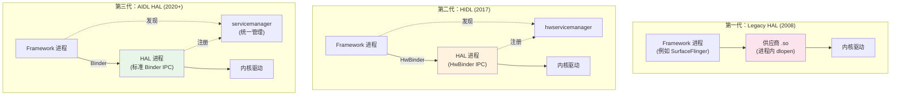
```mermaid
graph TD
    subgraph "第一代：Legacy HAL (2008)"
        L_FW["Framework 进程<br/>(例如 SurfaceFlinger)"]
        L_HAL["供应商 .so<br/>(进程内 dlopen)"]
        L_DRV["内核驱动"]
        L_FW --> L_HAL
        L_HAL --> L_DRV
        style L_HAL fill:#fce4ec
    end

    subgraph "第二代：HIDL (2017)"
        H_FW["Framework 进程"]
        H_HWSM["hwservicemanager"]
        H_HAL["HAL 进程<br/>(HwBinder IPC)"]
        H_DRV["内核驱动"]
        H_FW -->|"HwBinder"| H_HAL
        H_FW -.->|"发现"| H_HWSM
        H_HAL -.->|"注册"| H_HWSM
        H_HAL --> H_DRV
        style H_HAL fill:#fff3e0
    end

    subgraph "第三代：AIDL HAL (2020+)"
        A_FW["Framework 进程"]
        A_SM["servicemanager<br/>(统一管理)"]
        A_HAL["HAL 进程<br/>(标准 Binder IPC)"]
        A_DRV["内核驱动"]
        A_FW -->|"Binder"| A_HAL
        A_FW -.->|"发现"| A_SM
        A_HAL -.->|"注册"| A_SM
        A_HAL --> A_DRV
        style A_HAL fill:#e8f5e9
    end
```

### 10.8.2 关键指标

| 指标 | Legacy HAL | HIDL | AIDL HAL |
|--------|-----------|------|----------|
| 源码文件 (接口定义) | ~30 个头文件 | ~200 个 .hal 文件 | ~400 个 .aidl 文件 |
| 进程隔离 | 否 | 是 | 是 |
| 单次调用 IPC 开销 | 无 (进程内) | ~2-5 us (HwBinder) | ~2-5 us (Binder) |
| 语言支持 | 仅限 C | C++, Java | C++, Java, Rust, NDK |
| VINTF 集成 | 否 | 是 | 是 |
| Lazy HAL 支持 | 否 | 是 | 是 |
| APEX 更新支持 | 否 | 有限 | 是 |
| 每个 HAL 的内存占用 | 与主机共享 | 每个进程 2-8 MB | 每个进程 2-8 MB |

### 10.8.3 决策树：该使用哪种 HAL 技术？

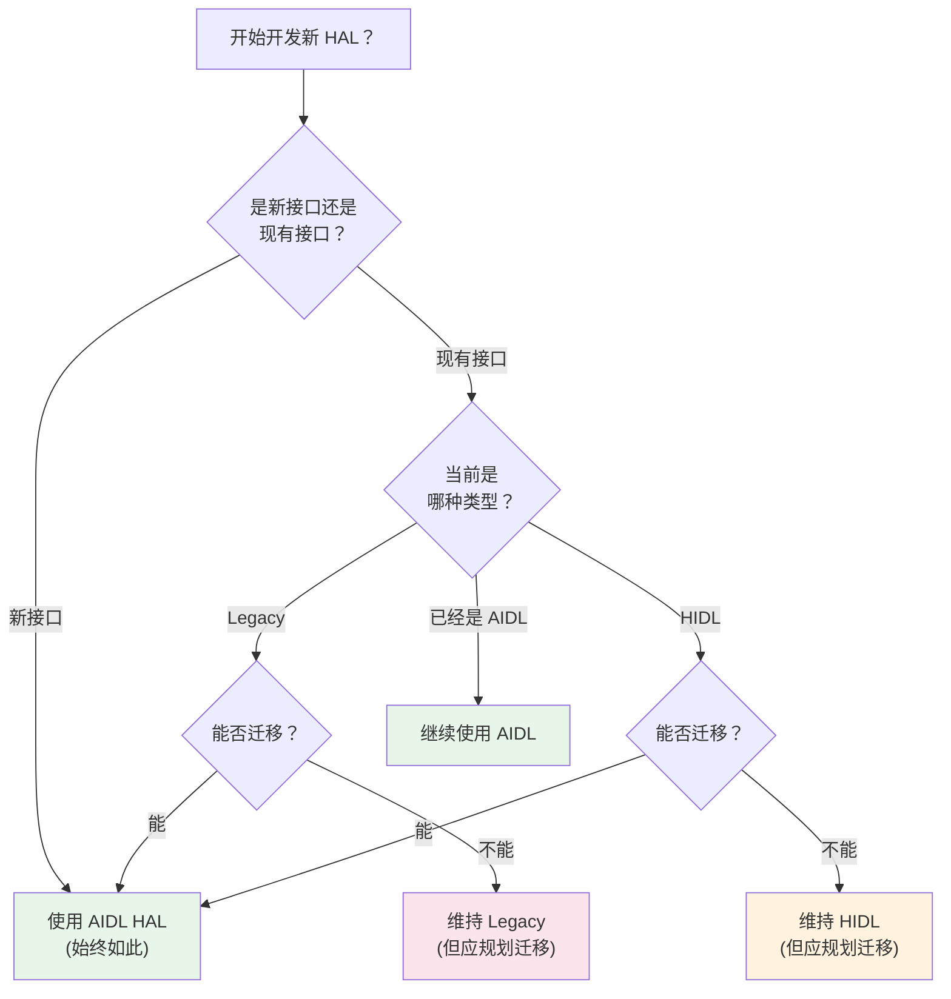
```mermaid
flowchart TD
    A["开始开发新 HAL？"] --> B{"是新接口还是<br/>现有接口？"}
    B -->|新接口| C["使用 AIDL HAL<br/>(始终如此)"]
    B -->|现有接口| D{"当前是<br/>哪种类型？"}
    D -->|Legacy| E{"能否迁移？"}
    D -->|HIDL| F{"能否迁移？"}
    D -->|已经是 AIDL| G["继续使用 AIDL"]
    E -->|能| C
    E -->|不能| H["维持 Legacy<br/>(但应规划迁移)"]
    F -->|能| C
    F -->|不能| I["维持 HIDL<br/>(但应规划迁移)"]

    style C fill:#e8f5e9
    style G fill:#e8f5e9
    style H fill:#fce4ec
    style I fill:#fff3e0
```

### 10.8.4 大图景

HAL 是 Android 开源框架与供应商私有硬件支持之间的关键边界。其设计经历了三代演进：

**Legacy HAL (libhardware)** 引入了基本概念：通过系统属性发现模块、通过 `dlopen()` 加载，以及通过 `hw_module_t` / `hw_device_t` 实现 C 风格的多态性。位于 `hardware/libhardware/hardware.c` 的代码（仅 279 行）至今仍是 AOSP 中理解 Android 如何对接硬件的最重要文件之一。

**HIDL** 增加了带版本的 IPC 接口，将 HAL 实现分离到独立进程中。`system/libhidl/transport/` 的传输层负责管理 Passthrough 包装、通过 HwBinder 实现的 Binder 化通信，以及位于 `system/hwservicemanager/` 的 `hwservicemanager`。HIDL 目前虽已弃用，但仍保留在代码库中以支持向后兼容。

**AIDL HAL** 是当前的标准，它将 HAL 接口与现有的 AIDL 生态系统统一。`hardware/interfaces/` 下的 55 个接口目录定义了 Android 的每一个硬件接口。AIDL 的多语言支持以及与标准 `servicemanager` 的集成使其成为迄今为止功能最强大的 HAL 框架。

**VINTF** (`system/libvintf/`) 将所有内容联系在一起，提供兼容性检查，从而实现 Framework 和 Vendor 的独立更新。`hardware/interfaces/compatibility_matrices/` 中的兼容性矩阵定义了每个 Android 发布版本中两层之间的契约。

**源码文件参考表：**

| 文件路径 | 行数 | 用途 |
|------|-------|---------|
| `hardware/libhardware/hardware.c` | 279 | Legacy HAL 模块加载 |
| `hardware/libhardware/include/hardware/hardware.h` | 245 | HAL 核心数据结构 |
| `system/libhidl/transport/ServiceManagement.cpp` | ~500 | HIDL 服务发现 |
| `system/libhidl/transport/HidlLazyUtils.cpp` | 309 | Lazy HAL 支持工具 |
| `hardware/interfaces/light/aidl/android/hardware/light/ILights.aidl` | 47 | 简单 AIDL HAL 接口示例 |
| `hardware/interfaces/light/aidl/default/main.rs` | 46 | Rust HAL 服务示例 |
| `hardware/interfaces/vibrator/aidl/default/main.cpp` | 45 | NDK C++ HAL 服务示例 |
| `hardware/interfaces/audio/aidl/default/Module.cpp` | ~2000 | 复杂的生产级 HAL 实现 |
| `system/libvintf/include/vintf/VintfObject.h` | ~200 | VINTF 兼容性检查 API |
| `hardware/interfaces/compatibility_matrices/compatibility_matrix.202504.xml` | 736 | Framework 兼容性矩阵 |

### 10.8.5 当你按下电源键时：一条 HAL Trace

为了让 HAL 架构更具体，让我们追踪一下当用户按下电源键唤醒设备时发生了什么。这涉及多个 HAL 的协同工作：

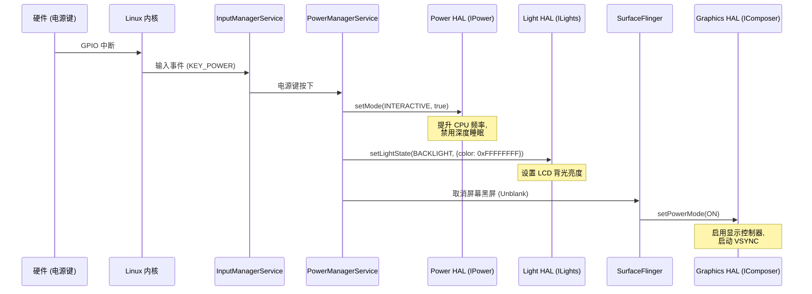
```mermaid
sequenceDiagram
    participant HW as 硬件 (电源键)
    participant Kernel as Linux 内核
    participant Input as InputManagerService
    participant Power as PowerManagerService
    participant PHAL as Power HAL (IPower)
    participant LHAL as Light HAL (ILights)
    participant Display as SurfaceFlinger
    participant GHAL as Graphics HAL (IComposer)

    HW->>Kernel: GPIO 中断
    Kernel->>Input: 输入事件 (KEY_POWER)
    Input->>Power: 电源键按下
    Power->>PHAL: setMode(INTERACTIVE, true)
    Note over PHAL: 提升 CPU 频率,<br/>禁用深度睡眠
    Power->>LHAL: setLightState(BACKLIGHT, {color: 0xFFFFFFFF})
    Note over LHAL: 设置 LCD 背光亮度
    Power->>Display: 取消屏幕黑屏 (Unblank)
    Display->>GHAL: setPowerMode(ON)
    Note over GHAL: 启用显示控制器,<br/>启动 VSYNC
```

在此序列中：
1. **Power HAL** (`IPower`) 调整 CPU/GPU 策略以供交互使用。
2. **Light HAL** (`ILights`) 设置显示屏背光亮度。
3. **Graphics HAL** (`IComposer`) 开启显示硬件。

每个 HAL 都是一个独立的进程，运行在自己的 SELinux 域中，通过 Binder IPC 进行访问。Framework 负责编排它们，而无需了解其实现细节 —— 只需要知道它们的 AIDL 接口。

### 10.8.6 未来方向

HAL 架构仍在持续演进：
1. **APEX HAL**: 越来越多的 HAL 被打包成 APEX 模块，允许通过 Google Play 系统更新进行更新。
2. **Rust HAL**: Google 正在大力推行在新 HAL 实现中使用 Rust 以保证内存安全。
3. **虚拟 HAL**: 对于汽车和嵌入式应用，在容器或虚拟机中运行的虚拟 HAL 变得越来越重要。
4. **统一 Stable AIDL**: 长期目标是让所有跨分区接口都使用稳定的 AIDL。
