# Chapter 10: HAL -- Hardware Abstraction Layer

> *"The HAL is the legal firewall and the engineering seam between kernel-space GPL
> code and userspace Apache-licensed code.  It is what makes Android a platform
> rather than just a Linux distribution."*

---

---

## 10.1 HAL Architecture Overview

### 10.1.1 Why HAL Exists: The License Divide

The Hardware Abstraction Layer exists because of a fundamental legal tension at
the heart of Android.  The Linux kernel is licensed under GPL v2, which requires
that any derivative work also be distributed under GPL.  Android's userspace
framework, however, is licensed under Apache 2.0, which permits proprietary
derivatives -- the very mechanism that allows device manufacturers to
differentiate their products without opening their source code.

Hardware vendors face a dilemma.  Their device drivers must run in kernel space,
making them subject to GPL (at least for the portions that link against kernel
headers).  But their proprietary algorithms -- camera ISP tuning, DSP firmware
interfaces, GPU shader compilers, modem protocols -- represent hundreds of
millions of dollars of R&D investment that they are unwilling to open-source.

The HAL is the legal and architectural solution.  It defines a stable interface
between the Apache-licensed Android framework and vendor-specific proprietary
code.  The vendor implements the HAL interface in a shared library (or a
separate process) that can be distributed as a closed-source binary.  The
framework talks to the HAL through a well-defined contract, never linking
directly against GPL kernel code.

This is not merely a policy choice -- it is enforced in the build system.  Since
Android 8.0 (Project Treble), the Vendor Native Development Kit (VNDK) and
linker namespace isolation ensure that framework code cannot load vendor
libraries and vice versa, except through approved HAL interfaces.

### 10.1.2 The Four-Layer Stack

The following diagram shows how a hardware request flows from an application
down through the Android stack to the hardware:

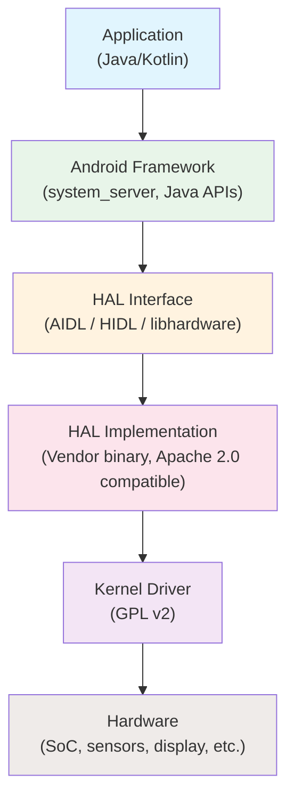
```mermaid
graph TD
    A["Application<br/>(Java/Kotlin)"] --> B["Android Framework<br/>(system_server, Java APIs)"]
    B --> C["HAL Interface<br/>(AIDL / HIDL / libhardware)"]
    C --> D["HAL Implementation<br/>(Vendor binary, Apache 2.0 compatible)"]
    D --> E["Kernel Driver<br/>(GPL v2)"]
    E --> F["Hardware<br/>(SoC, sensors, display, etc.)"]

    style A fill:#e1f5fe
    style B fill:#e8f5e9
    style C fill:#fff3e0
    style D fill:#fce4ec
    style E fill:#f3e5f5
    style F fill:#efebe9
```

Each layer has a distinct responsibility:

| Layer | License | Responsibility |
|-------|---------|----------------|
| Application | Varies | User-facing functionality |
| Framework | Apache 2.0 | System services, Java/Kotlin APIs |
| HAL Interface | Apache 2.0 | Stable contract between framework and vendor |
| HAL Implementation | Proprietary OK | Vendor-specific hardware interaction logic |
| Kernel Driver | GPL v2 | Direct hardware register access, interrupt handling |

The HAL interface layer is the critical seam.  Everything above it is updated by
Google through system partition OTA updates.  Everything below it is updated by
the device vendor through vendor partition updates.  The two sides can be
updated independently -- this is the core promise of Project Treble.

### 10.1.3 Three Generations of HAL

Android has had three distinct HAL architectures:

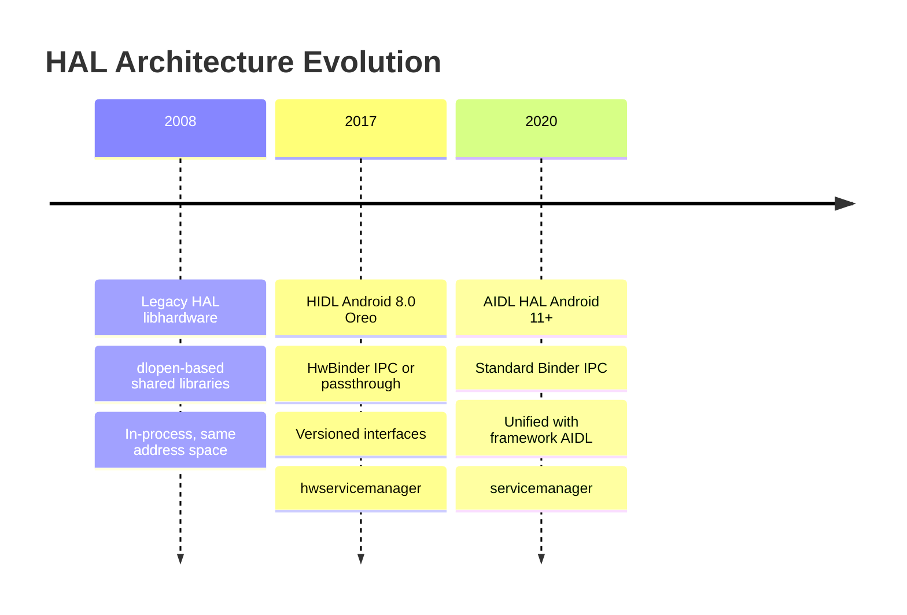
```mermaid
timeline
    title HAL Architecture Evolution
    2008 : Legacy HAL libhardware
         : dlopen-based shared libraries
         : In-process, same address space
    2017 : HIDL Android 8.0 Oreo
         : HwBinder IPC or passthrough
         : Versioned interfaces
         : hwservicemanager
    2020 : AIDL HAL Android 11+
         : Standard Binder IPC
         : Unified with framework AIDL
         : servicemanager
```

| Generation | Introduced | Transport | Versioning | Current Status |
|-----------|-----------|-----------|-----------|---------------|
| Legacy HAL | Android 1.0 (2008) | `dlopen()` in-process | Module API version field | Deprecated, still present |
| HIDL | Android 8.0 (2017) | HwBinder or passthrough | Package@major.minor | Deprecated since Android 13 |
| AIDL HAL | Android 11 (2020) | Binder | Package version int | **Current standard** |

Each generation addressed limitations of its predecessor.  Legacy HALs were
simple but had no IPC isolation and no versioning.  HIDL added both but
introduced a separate IDL language and toolchain.  AIDL HALs unified the HAL
interface language with the existing AIDL used throughout the Android framework,
eliminating duplication.

### 10.1.4 HAL Evolution Timeline

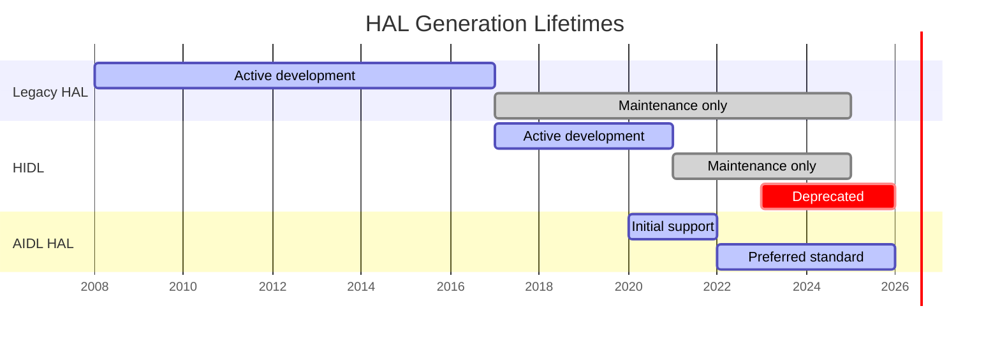
```mermaid
gantt
    title HAL Generation Lifetimes
    dateFormat  YYYY
    axisFormat  %Y

    section Legacy HAL
    Active development   :active, 2008, 2017
    Maintenance only     :done, 2017, 2025

    section HIDL
    Active development   :active, 2017, 2021
    Maintenance only     :done, 2021, 2025
    Deprecated           :crit, 2023, 2026

    section AIDL HAL
    Initial support      :active, 2020, 2022
    Preferred standard   :active, 2022, 2026
```

### 10.1.5 Design Principles

All three HAL generations share several design principles:

1. **Interface stability.**  Once published, a HAL interface must not change in
   backward-incompatible ways.  Old clients must continue to work with new
   implementations, and old implementations must continue to work with new
   clients.

2. **Vendor isolation.**  The framework must not depend on vendor implementation
   details.  The vendor must not depend on framework internals.  The HAL is the
   only communication channel.

3. **Discoverability.**  The system must be able to enumerate which HALs are
   available, what versions they implement, and where they are running.  This is
   critical for compatibility checking during OTA updates.

4. **Testability.**  HAL interfaces must be testable through VTS (Vendor Test
   Suite) without access to real hardware, using mock or default
   implementations.

### 10.1.5.1 Project Treble and the HAL

Project Treble, introduced in Android 8.0 (2017), formalized the HAL as the
boundary between independently updatable system and vendor partitions.  Before
Treble, updating Android required vendor cooperation at every step -- the system
and vendor code were interleaved, with no clean separation.

Treble's architecture enforces a strict layered model:

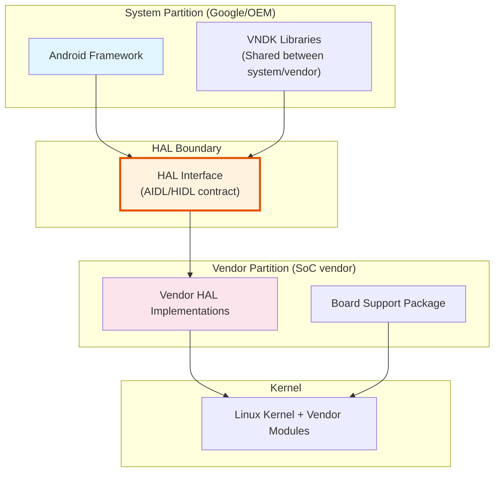
```mermaid
graph TD
    subgraph "System Partition (Google/OEM)"
        SYS["Android Framework"]
        VNDK["VNDK Libraries<br/>(Shared between system/vendor)"]
    end

    subgraph "HAL Boundary"
        HAL_IF["HAL Interface<br/>(AIDL/HIDL contract)"]
    end

    subgraph "Vendor Partition (SoC vendor)"
        VENDOR["Vendor HAL Implementations"]
        BSP["Board Support Package"]
    end

    subgraph "Kernel"
        KERN["Linux Kernel + Vendor Modules"]
    end

    SYS --> HAL_IF
    VNDK --> HAL_IF
    HAL_IF --> VENDOR
    VENDOR --> KERN
    BSP --> KERN

    style HAL_IF fill:#fff3e0,stroke:#e65100,stroke-width:3px
    style SYS fill:#e1f5fe
    style VENDOR fill:#fce4ec
```

The key enforcement mechanisms are:

1. **Linker namespace isolation.**  The dynamic linker enforces that system
   libraries cannot load vendor libraries and vice versa, except through
   explicitly allowed interfaces (VNDK libraries and HAL interfaces).

2. **VNDK (Vendor NDK).**  A curated set of system libraries that vendor code
   is permitted to link against.  These libraries have stable ABIs.

3. **VINTF.**  The formal declaration system (described in Section 5.5) that
   records which HALs each side provides and requires.

4. **SELinux.**  Mandatory access control that prevents unauthorized
   cross-partition communication.

Together, these mechanisms ensure that a system partition OTA update will not
break vendor HALs, and a vendor partition update will not break the framework --
as long as both sides honor the HAL contracts defined in VINTF.

### 10.1.5.2 The Partition Layout

On a Treble-compliant device, the storage is partitioned as follows:

| Partition | Contains | Updated By |
|-----------|----------|-----------|
| `/system` | Android framework, system apps, VNDK | Google (system OTA) |
| `/system_ext` | OEM framework extensions | OEM (OTA) |
| `/vendor` | Vendor HAL implementations, firmware | SoC vendor (vendor OTA) |
| `/odm` | ODM-specific customizations | Device manufacturer |
| `/product` | Product-specific apps and overlays | Product team |
| `/apex/*` | Independently updatable modules | Google Play / OTA |

The HAL interface sits at the boundary between `/system` (framework side) and
`/vendor` (vendor side).  When a framework OTA arrives:

1. The new `/system` image is verified against the existing `/vendor` manifest.
2. If VINTF compatibility passes, the update proceeds.
3. The new framework automatically works with the existing vendor HALs.

This is the fundamental reason the HAL exists: it is the contract that enables
independent partition updates.

### 10.1.6 Where HALs Live on Disk

On a running Android device, HAL-related files are spread across several
partitions:

```
/system/lib64/hw/           # Framework-side legacy HAL modules
/vendor/lib64/hw/           # Vendor legacy HAL modules
/odm/lib64/hw/              # ODM-specific legacy HAL modules

/vendor/bin/hw/              # Vendor HAL service binaries (HIDL/AIDL)
/vendor/etc/vintf/           # Vendor VINTF manifests
/system/etc/vintf/           # Framework VINTF manifests

/apex/com.android.hardware.*/ # HALs packaged in APEX modules
```

In the AOSP source tree, the key directories are:

```
hardware/libhardware/        # Legacy HAL framework and reference modules
hardware/interfaces/         # HIDL and AIDL HAL interface definitions
system/libhidl/             # HIDL runtime libraries and transport
system/libvintf/            # VINTF compatibility checking library
frameworks/native/cmds/servicemanager/  # AIDL service manager
system/hwservicemanager/    # HIDL service manager
```

---

## 10.2 Legacy HAL (libhardware)

The legacy HAL, implemented in `hardware/libhardware/`, was Android's original
mechanism for abstracting hardware.  It is a simple C-based `dlopen()` approach:
the framework loads a shared library at runtime, looks up a well-known symbol,
and casts it to a known struct type.  Despite its age, understanding the legacy
HAL is essential because its patterns influenced all subsequent HAL designs, and
some legacy modules still exist on shipping devices.

### 10.2.1 Core Data Structures: hw_module_t and hw_device_t

The entire legacy HAL architecture revolves around two C structures defined in
`hardware/libhardware/include/hardware/hardware.h`.

**hw_module_t** represents a loaded HAL module (a `.so` file):

```c
// hardware/libhardware/include/hardware/hardware.h, lines 86-154

typedef struct hw_module_t {
    /** tag must be initialized to HARDWARE_MODULE_TAG */
    uint32_t tag;

    /**
     * The API version of the implemented module. The module owner is
     * responsible for updating the version when a module interface has
     * changed.
     */
    uint16_t module_api_version;

    /**
     * The API version of the HAL module interface. This is meant to
     * version the hw_module_t, hw_module_methods_t, and hw_device_t
     * structures and definitions.
     */
    uint16_t hal_api_version;

    /** Identifier of module */
    const char *id;

    /** Name of this module */
    const char *name;

    /** Author/owner/implementor of the module */
    const char *author;

    /** Modules methods */
    struct hw_module_methods_t* methods;

    /** module's dso */
    void* dso;

#ifdef __LP64__
    uint64_t reserved[32-7];
#else
    /** padding to 128 bytes, reserved for future use */
    uint32_t reserved[32-7];
#endif

} hw_module_t;
```

The `tag` field must be set to the magic constant `HARDWARE_MODULE_TAG`, defined
as `MAKE_TAG_CONSTANT('H', 'W', 'M', 'T')`.  This is a four-byte tag encoding
`0x48574D54` -- a sanity check to verify that a `dlsym()`-resolved pointer
actually points to a valid HAL module structure.

The `module_api_version` uses a major.minor scheme packed into 16 bits:

```c
// hardware/libhardware/include/hardware/hardware.h, line 68
#define HARDWARE_MODULE_API_VERSION(maj,min) HARDWARE_MAKE_API_VERSION(maj,min)
```

where `HARDWARE_MAKE_API_VERSION` packs major into the high byte and minor into
the low byte.  Version 1.0 is `0x0100`, version 2.3 is `0x0203`.

The `methods` pointer leads to the module's "open" function:

```c
// hardware/libhardware/include/hardware/hardware.h, lines 156-161

typedef struct hw_module_methods_t {
    /** Open a specific device */
    int (*open)(const struct hw_module_t* module, const char* id,
            struct hw_device_t** device);

} hw_module_methods_t;
```

And **hw_device_t** represents an opened device instance:

```c
// hardware/libhardware/include/hardware/hardware.h, lines 167-202

typedef struct hw_device_t {
    /** tag must be initialized to HARDWARE_DEVICE_TAG */
    uint32_t tag;

    /**
     * Version of the module-specific device API. This value is used by
     * the derived-module user to manage different device implementations.
     */
    uint32_t version;

    /** reference to the module this device belongs to */
    struct hw_module_t* module;

    /** padding reserved for future use */
#ifdef __LP64__
    uint64_t reserved[12];
#else
    uint32_t reserved[12];
#endif

    /** Close this device */
    int (*close)(struct hw_device_t* device);

} hw_device_t;
```

The pattern is C-style polymorphism: each specific HAL (gralloc, camera, audio,
etc.) defines its own struct that begins with `hw_module_t` or `hw_device_t`
and adds domain-specific fields and function pointers after them.  The framework
casts the generic pointer to the specific type.

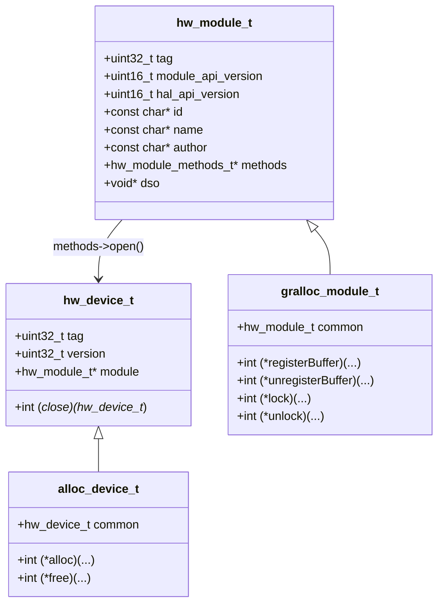
```mermaid
classDiagram
    class hw_module_t {
        +uint32_t tag
        +uint16_t module_api_version
        +uint16_t hal_api_version
        +const char* id
        +const char* name
        +const char* author
        +hw_module_methods_t* methods
        +void* dso
    }

    class hw_device_t {
        +uint32_t tag
        +uint32_t version
        +hw_module_t* module
        +int (*close)(hw_device_t*)
    }

    class gralloc_module_t {
        +hw_module_t common
        +int (*registerBuffer)(...)
        +int (*unregisterBuffer)(...)
        +int (*lock)(...)
        +int (*unlock)(...)
    }

    class alloc_device_t {
        +hw_device_t common
        +int (*alloc)(...)
        +int (*free)(...)
    }

    hw_module_t <|-- gralloc_module_t
    hw_device_t <|-- alloc_device_t
    hw_module_t --> hw_device_t : methods->open()
```

### 10.2.2 The Module Magic Symbol: HAL_MODULE_INFO_SYM

Every legacy HAL shared library must export a symbol named `HMI` (for "Hardware
Module Info"):

```c
// hardware/libhardware/include/hardware/hardware.h, lines 213-218

#define HAL_MODULE_INFO_SYM         HMI
#define HAL_MODULE_INFO_SYM_AS_STR  "HMI"
```

When the framework loads a HAL `.so`, it calls `dlsym(handle, "HMI")` to find
the module's `hw_module_t` structure.  The structure is a global variable in the
`.so`, initialized at compile time with all the module's metadata and function
pointers.

Here is a real example from the gralloc module:

```c
// hardware/libhardware/modules/gralloc/gralloc.cpp, lines 73-99

static struct hw_module_methods_t gralloc_module_methods = {
        .open = gralloc_device_open
};

struct private_module_t HAL_MODULE_INFO_SYM = {
    .base = {
        .common = {
            .tag = HARDWARE_MODULE_TAG,
            .version_major = 1,
            .version_minor = 0,
            .id = GRALLOC_HARDWARE_MODULE_ID,
            .name = "Graphics Memory Allocator Module",
            .author = "The Android Open Source Project",
            .methods = &gralloc_module_methods
        },
        .registerBuffer = gralloc_register_buffer,
        .unregisterBuffer = gralloc_unregister_buffer,
        .lock = gralloc_lock,
        .unlock = gralloc_unlock,
    },
    .framebuffer = 0,
    .flags = 0,
    .numBuffers = 0,
    .bufferMask = 0,
    .lock = PTHREAD_MUTEX_INITIALIZER,
    .currentBuffer = 0,
};
```

Notice the nested initialization: `private_module_t` contains a `gralloc_module_t`
(as `.base`), which contains an `hw_module_t` (as `.common`).  This is the
C-style inheritance chain.

### 10.2.3 Module Discovery: Variant Search Order

The framework does not hard-code the path to a HAL `.so`.  Instead, it searches
for a module whose filename encodes both the hardware type and the device
variant.  The search is implemented in `hw_module_exists()` and
`hw_get_module_by_class()`.

The filename format is:

```
<module_id>.<variant>.so
```

For example, for the `gralloc` module on a Pixel device with `ro.hardware=oriole`:

```
gralloc.oriole.so
```

The variant is determined by system properties, checked in this order:

```c
// hardware/libhardware/hardware.c, lines 63-69

static const char *variant_keys[] = {
    "ro.hardware",       /* This goes first so that it can pick up a different
                            file on the emulator. */
    "ro.product.board",
    "ro.board.platform",
    "ro.arch"
};
```

And the search paths are:

```c
// hardware/libhardware/hardware.c, lines 48-50

#define HAL_LIBRARY_PATH1 "/system/" HAL_LIBRARY_SUBDIR
#define HAL_LIBRARY_PATH2 "/vendor/" HAL_LIBRARY_SUBDIR
#define HAL_LIBRARY_PATH3 "/odm/" HAL_LIBRARY_SUBDIR
```

where `HAL_LIBRARY_SUBDIR` is `lib64/hw` on 64-bit devices.

The complete search algorithm, from `hw_get_module_by_class()`:

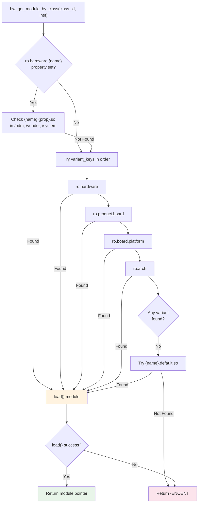
```mermaid
flowchart TD
    A["hw_get_module_by_class(class_id, inst)"] --> B{"ro.hardware.{name}<br/>property set?"}
    B -->|Yes| C["Check {name}.{prop}.so<br/>in /odm, /vendor, /system"]
    B -->|No| D["Try variant_keys in order"]
    C -->|Found| L["load() module"]
    C -->|Not Found| D
    D --> E["ro.hardware"]
    E --> F["ro.product.board"]
    F --> G["ro.board.platform"]
    G --> H["ro.arch"]
    H --> I{"Any variant<br/>found?"}
    E -->|Found| L
    F -->|Found| L
    G -->|Found| L
    H -->|Found| L
    I -->|No| J["Try {name}.default.so"]
    J -->|Found| L
    J -->|Not Found| K["Return -ENOENT"]
    L --> M{"load() success?"}
    M -->|Yes| N["Return module pointer"]
    M -->|No| K

    style L fill:#fff3e0
    style N fill:#e8f5e9
    style K fill:#fce4ec
```

The property-specific check (lines 245-250 of `hardware.c`) allows a device to
override the search entirely:

```c
// hardware/libhardware/hardware.c, lines 244-250

/* First try a property specific to the class and possibly instance */
snprintf(prop_name, sizeof(prop_name), "ro.hardware.%s", name);
if (property_get(prop_name, prop, NULL) > 0) {
    if (hw_module_exists(path, sizeof(path), name, prop) == 0) {
        goto found;
    }
}
```

For example, setting `ro.hardware.gralloc=myvendor` would make the system look
for `gralloc.myvendor.so` first, regardless of the device board name.

If no variant-specific module is found, the system falls back to the `default`
variant (line 263):

```c
// hardware/libhardware/hardware.c, lines 262-265

/* Nothing found, try the default */
if (hw_module_exists(path, sizeof(path), name, "default") == 0) {
    goto found;
}
```

### 10.2.4 Module Loading: dlopen and Symbol Resolution

The `load()` function in `hardware/libhardware/hardware.c` (lines 79-153)
handles the actual loading of a HAL shared library.  It is a careful sequence:

```c
// hardware/libhardware/hardware.c, lines 79-153 (simplified)

static int load(const char *id,
        const char *path,
        const struct hw_module_t **pHmi)
{
    int status = -EINVAL;
    void *handle = NULL;
    struct hw_module_t *hmi = NULL;

    // 1. Load the shared library
    if (try_system &&
        strncmp(path, HAL_LIBRARY_PATH1, strlen(HAL_LIBRARY_PATH1)) == 0) {
        handle = dlopen(path, RTLD_NOW);
    } else {
        handle = android_load_sphal_library(path, RTLD_NOW);
    }
    if (handle == NULL) {
        char const *err_str = dlerror();
        ALOGE("load: module=%s\n%s", path, err_str?err_str:"unknown");
        status = -EINVAL;
        goto done;
    }

    // 2. Find the HMI symbol
    const char *sym = HAL_MODULE_INFO_SYM_AS_STR;
    hmi = (struct hw_module_t *)dlsym(handle, sym);
    if (hmi == NULL) {
        ALOGE("load: couldn't find symbol %s", sym);
        status = -EINVAL;
        goto done;
    }

    // 3. Verify the module ID matches
    if (strcmp(id, hmi->id) != 0) {
        ALOGE("load: id=%s != hmi->id=%s", id, hmi->id);
        status = -EINVAL;
        goto done;
    }

    // 4. Store the DSO handle for later unloading
    hmi->dso = handle;
    status = 0;

done:
    if (status != 0) {
        hmi = NULL;
        if (handle != NULL) {
            dlclose(handle);
            handle = NULL;
        }
    }
    *pHmi = hmi;
    return status;
}
```

There are several important details:

**VNDK namespace isolation.**  On Android 8.0+, vendor libraries are loaded in
the SP-HAL (Same-Process HAL) linker namespace using
`android_load_sphal_library()` instead of plain `dlopen()`.  This is controlled
by the `__ANDROID_VNDK__` and `__ANDROID_APEX__` preprocessor macros (line 86).
The SP-HAL namespace restricts which system libraries the vendor `.so` can
link against, preventing silent ABI dependencies on unstable framework
internals.

**RTLD_NOW flag.**  The library is loaded with `RTLD_NOW` to resolve all symbols
immediately rather than lazily.  This ensures that any missing symbol dependency
is caught at load time rather than at an unpredictable point during execution.

**APEX awareness.**  When running inside a VAPEX (Vendor APEX), the search is
restricted to the APEX's own library directory (lines 181-193):

```c
// hardware/libhardware/hardware.c, lines 181-193

#ifdef __ANDROID_APEX__
    if (__builtin_available(android __ANDROID_API_V__, *)) {
        AApexInfo *apex_info;
        if (AApexInfo_create(&apex_info) == AAPEXINFO_OK) {
            snprintf(path, path_len, "/apex/%s/%s/%s.%s.so",
                    AApexInfo_getName(apex_info), HAL_LIBRARY_SUBDIR, name, subname);
            AApexInfo_destroy(apex_info);
            if (access(path, R_OK) == 0)
                return 0;
        }
    }
#endif
```

### 10.2.5 A Complete Legacy HAL: The Gralloc Module

To see all the pieces working together, let us trace the gralloc (graphics memory
allocator) module from definition to usage.

**1. The header defines the module ID and extended structures:**

The file `hardware/libhardware/include/hardware/gralloc.h` (not shown in full)
defines `GRALLOC_HARDWARE_MODULE_ID` as `"gralloc"` and extends `hw_module_t`
with graphics-specific functions like `registerBuffer`, `lock`, and `unlock`.

**2. The implementation exports the HMI symbol:**

As shown above, `hardware/libhardware/modules/gralloc/gralloc.cpp` defines a
global `HAL_MODULE_INFO_SYM` variable that includes all the module metadata
and function pointers.

**3. The framework loads the module:**

A framework component (like SurfaceFlinger's gralloc wrapper) calls:

```c
const hw_module_t *module;
int err = hw_get_module(GRALLOC_HARDWARE_MODULE_ID, &module);
if (err == 0) {
    gralloc_module_t *gralloc = (gralloc_module_t *)module;
    // Now use gralloc->registerBuffer, gralloc->lock, etc.
}
```

**4. The framework opens a device:**

```c
alloc_device_t *allocDev;
err = module->methods->open(module, GRALLOC_HARDWARE_GPU0,
                            (hw_device_t **)&allocDev);
if (err == 0) {
    // Use allocDev->alloc, allocDev->free
    // ...
    allocDev->common.close((hw_device_t *)allocDev);
}
```

The complete flow:

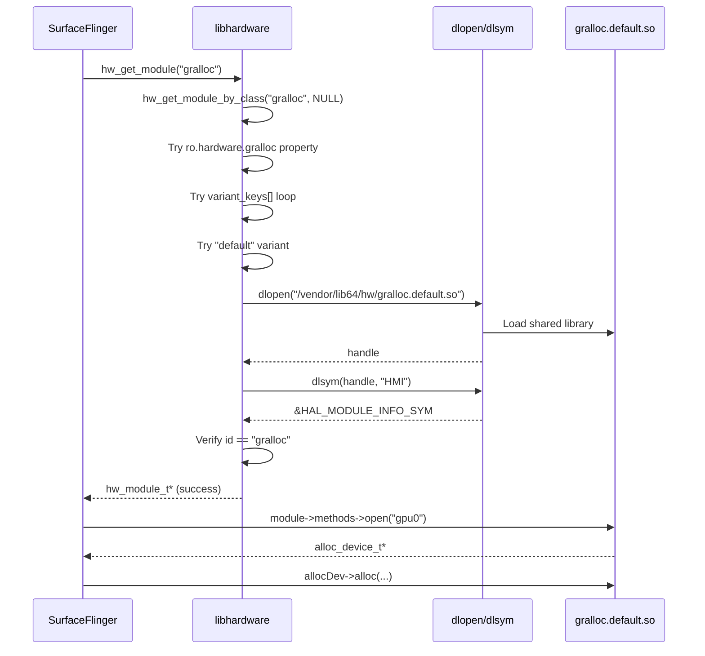
```mermaid
sequenceDiagram
    participant SF as SurfaceFlinger
    participant LH as libhardware
    participant DL as dlopen/dlsym
    participant SO as gralloc.default.so

    SF->>LH: hw_get_module("gralloc")
    LH->>LH: hw_get_module_by_class("gralloc", NULL)
    LH->>LH: Try ro.hardware.gralloc property
    LH->>LH: Try variant_keys[] loop
    LH->>LH: Try "default" variant
    LH->>DL: dlopen("/vendor/lib64/hw/gralloc.default.so")
    DL->>SO: Load shared library
    DL-->>LH: handle
    LH->>DL: dlsym(handle, "HMI")
    DL-->>LH: &HAL_MODULE_INFO_SYM
    LH->>LH: Verify id == "gralloc"
    LH-->>SF: hw_module_t* (success)
    SF->>SO: module->methods->open("gpu0")
    SO-->>SF: alloc_device_t*
    SF->>SO: allocDev->alloc(...)
```

### 10.2.6 All Legacy HAL Modules

The directory `hardware/libhardware/modules/` contains reference implementations
for 22 legacy HAL modules:

| Module | Directory | Purpose |
|--------|-----------|---------|
| audio | `modules/audio` | Primary audio HAL |
| audio_remote_submix | `modules/audio_remote_submix` | Remote submix audio |
| camera | `modules/camera` | Camera HAL |
| consumerir | `modules/consumerir` | Consumer infrared blaster |
| fingerprint | `modules/fingerprint` | Fingerprint sensor |
| gralloc | `modules/gralloc` | Graphics memory allocator |
| hwcomposer | `modules/hwcomposer` | Hardware composer (display) |
| input | `modules/input` | Input device configuration |
| local_time | `modules/local_time` | Local time HAL |
| nfc | `modules/nfc` | NFC controller |
| nfc-nci | `modules/nfc-nci` | NFC Controller Interface |
| power | `modules/power` | Power management |
| radio | `modules/radio` | FM radio |
| sensors | `modules/sensors` | Sensor HAL (accelerometer, gyro, etc.) |
| soundtrigger | `modules/soundtrigger` | Sound trigger (hotword detection) |
| thermal | `modules/thermal` | Thermal management |
| tv_input | `modules/tv_input` | TV input HAL |
| usbaudio | `modules/usbaudio` | USB audio |
| usbcamera | `modules/usbcamera` | USB camera |
| vibrator | `modules/vibrator` | Vibrator motor |
| vr | `modules/vr` | Virtual reality mode |

The header directory `hardware/libhardware/include/hardware/` contains the
interface definitions for all of these, plus additional ones like `camera2.h`,
`camera3.h`, `gralloc1.h`, `hwcomposer2.h`, and `keymaster2.h` that represent
evolved versions of the same interfaces.

### 10.2.6.1 Legacy HAL Header Contracts

Each legacy HAL module type has a header in
`hardware/libhardware/include/hardware/` that defines its specific struct
extension and module ID.  The full set of headers includes:

| Header | Module ID | Extended Structure |
|--------|-----------|-------------------|
| `audio.h` | `AUDIO_HARDWARE_MODULE_ID` | `audio_module`, `audio_stream_out`, `audio_stream_in` |
| `camera.h` | `CAMERA_HARDWARE_MODULE_ID` | `camera_module_t`, `camera_device_t` |
| `camera3.h` | (same) | `camera3_device_t` (Camera HAL v3) |
| `gralloc.h` | `GRALLOC_HARDWARE_MODULE_ID` | `gralloc_module_t`, `alloc_device_t` |
| `hwcomposer.h` | `HWC_HARDWARE_MODULE_ID` | `hwc_module_t`, `hwc_composer_device_1` |
| `sensors.h` | `SENSORS_HARDWARE_MODULE_ID` | `sensors_module_t`, `sensors_poll_device_1` |
| `power.h` | `POWER_HARDWARE_MODULE_ID` | `power_module_t` |
| `fingerprint.h` | `FINGERPRINT_HARDWARE_MODULE_ID` | `fingerprint_module_t`, `fingerprint_device_t` |
| `gps.h` | `GPS_HARDWARE_MODULE_ID` | `gps_device_t` |
| `bluetooth.h` | `BT_HARDWARE_MODULE_ID` | `bluetooth_module_t`, `bluetooth_device_t` |
| `vibrator.h` | `VIBRATOR_HARDWARE_MODULE_ID` | `vibrator_device_t` |
| `thermal.h` | `THERMAL_HARDWARE_MODULE_ID` | `thermal_module_t` |
| `memtrack.h` | `MEMTRACK_MODULE_API_VERSION_0_1` | `memtrack_module_t` |

Each header follows the same pattern:

1. Define a string constant for the module ID (e.g., `"gralloc"`).
2. Define an extended `hw_module_t` subtype with module-level function pointers.
3. Define an extended `hw_device_t` subtype with device-level function pointers.
4. Define any associated data types (e.g., `buffer_handle_t` for gralloc).

This pattern means that for each legacy HAL type, both the framework and the
vendor must agree on the same header version.  If Google adds a new function
pointer to `gralloc_module_t`, all vendors must rebuild their gralloc HALs --
there is no way to detect the mismatch at runtime because the struct layout is
fixed at compile time.

### 10.2.6.2 The Camera HAL: Multiple API Versions

The camera HAL illustrates how the legacy system handled API evolution.  Three
distinct header versions coexist:

- `camera.h` -- Camera HAL v1 (original, preview-focused)
- `camera2.h` -- Camera HAL v2 (transitional, never widely used)
- `camera3.h` -- Camera HAL v3 (current, request-based pipeline)

Each version defines a different `camera_device_t` variant with different
function pointer sets.  The Camera Service in the framework checks the
`module_api_version` field and dispatches to different code paths depending
on which version the vendor provides.  This approach works but is fragile
and requires the framework to carry backward-compatibility code indefinitely.

### 10.2.7 Limitations That Motivated HIDL

The legacy HAL has several fundamental limitations:

1. **No process isolation.**  The HAL `.so` runs in the same address space as
   the framework process (e.g., SurfaceFlinger).  A bug in a vendor HAL can
   crash the framework process.  A security vulnerability in the HAL exposes
   the framework process's permissions.

2. **No formal versioning.**  The `module_api_version` field is a hint, not an
   enforced contract.  There is no mechanism to verify at build time or boot
   time that a module implements the version the framework expects.

3. **No discoverability.**  There is no registry of available HALs.  The
   framework must try to `dlopen()` a library and hope it exists.

4. **No independent updates.**  Because the framework and HAL share an address
   space, they must be compiled against compatible headers.  Updating the
   framework or vendor partition independently risks ABI breaks.

5. **No IPC.**  Because HALs are loaded into the framework process, there is no
   way to run a HAL in a separate process with reduced privileges.

These limitations motivated the creation of HIDL and Project Treble.

---

## 10.3 HIDL (HAL Interface Definition Language)

HIDL was introduced in Android 8.0 (Oreo) as part of Project Treble.  It is a
dedicated interface definition language for hardware HALs, with its own compiler,
runtime, and service manager.  HIDL's goal was to make the vendor HAL a formal,
versioned, testable contract that could be implemented either in-process
(passthrough mode) or in a separate process (binderized mode).

The HIDL source lives in `system/libhidl/`.

### 10.3.1 Why HIDL Was Created

Project Treble aimed to decouple Android's framework from vendor-specific code
so that:

- Google could push framework updates without waiting for vendor HAL updates.
- Vendors could update their HALs without waiting for framework changes.
- Devices could receive security patches faster.

HIDL provided the engineering mechanism: a versioned IPC interface between
framework and vendor, mediated by a service manager that enforced interface
contracts.

### 10.3.2 HIDL Syntax and .hal Files

HIDL has its own syntax for defining interfaces.  Here is a representative
example from the IServiceManager interface used by HIDL's own service manager:

```
// system/libhidl/transport/manager/1.0/IServiceManager.hal (excerpt, lines 17-52)

package android.hidl.manager@1.0;

import IServiceNotification;
import android.hidl.base@1.0::DebugInfo.Architecture;

/**
 * Manages all the hidl hals on a device.
 */
interface IServiceManager {

    /**
     * Retrieve an existing service that supports the requested version.
     *
     * @param fqName   Fully-qualified interface name.
     * @param name     Instance name. Same as in IServiceManager::add.
     *
     * @return service Handle to requested service.
     */
    get(string fqName, string name) generates (interface service);

    /**
     * Register a service.
     *
     * @param name           Instance name.
     * @param service        Handle to registering service.
     * @return success       Whether or not the service was registered.
     */
    add(string name, interface service) generates (bool success);
```

Key syntax elements:

| Element | Example | Meaning |
|---------|---------|---------|
| Package | `android.hidl.manager@1.0` | Fully-qualified name with version |
| Interface | `interface IServiceManager` | RPC interface definition |
| Method | `get(string, string) generates (interface)` | RPC method with inputs and outputs |
| `generates` | `generates (bool success)` | Return values (HIDL methods can have multiple returns) |
| `oneway` | `oneway notifySyspropsChanged()` | Asynchronous (fire-and-forget) call |
| `vec<T>` | `vec<string> fqInstanceNames` | Dynamic array type |
| `enum` | `enum Transport : uint8_t { ... }` | Typed enumeration |
| `struct` | `struct InstanceDebugInfo { ... }` | Compound data type |
| `import` | `import IServiceNotification` | Import from same package |

The HIDL naming convention uses fully-qualified names of the form:

```
package@major.minor::InterfaceName/instance
```

For example:

```
android.hardware.camera.provider@2.4::ICameraProvider/internal/0
android.hardware.audio@7.0::IDevicesFactory/default
```

### 10.3.3 Passthrough vs Binderized Mode

HIDL supports two transport modes, enabling a gradual migration from legacy
HALs:

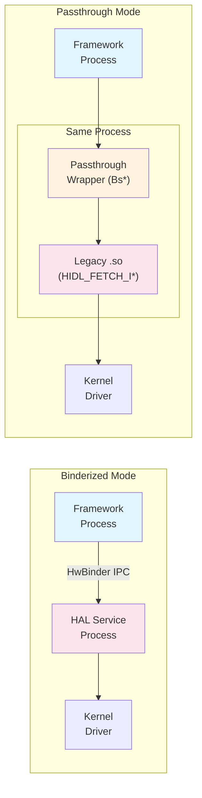
```mermaid
graph LR
    subgraph "Binderized Mode"
        C1["Framework<br/>Process"] -->|"HwBinder IPC"| S1["HAL Service<br/>Process"]
        S1 --> K1["Kernel<br/>Driver"]
    end

    subgraph "Passthrough Mode"
        C2["Framework<br/>Process"]
        subgraph "Same Process"
            PT["Passthrough<br/>Wrapper (Bs*)"] --> LIB["Legacy .so<br/>(HIDL_FETCH_I*)"]
        end
        C2 --> PT
        LIB --> K2["Kernel<br/>Driver"]
    end

    style C1 fill:#e1f5fe
    style S1 fill:#fce4ec
    style C2 fill:#e1f5fe
    style PT fill:#fff3e0
    style LIB fill:#fce4ec
```

**Binderized mode** is the standard mode.  The HAL runs in its own process and
communicates with the framework through HwBinder (a variant of Android's Binder
IPC optimized for HAL use).  This provides process isolation, SELinux-enforced
access control, and the ability to run HALs with minimal permissions.

**Passthrough mode** wraps a legacy in-process HAL implementation with HIDL
interfaces.  The framework calls HIDL methods, which are forwarded to the
legacy HAL running in the same process.  This mode exists solely for backward
compatibility -- it allows existing legacy HAL `.so` files to be used through
HIDL interfaces without rewriting them.

The transport mode for each HAL is declared in the device's VINTF manifest.
For binderized:

```xml
<hal format="hidl">
    <name>android.hardware.camera.provider</name>
    <transport>hwbinder</transport>
    <version>2.4</version>
    <interface>
        <name>ICameraProvider</name>
        <instance>internal/0</instance>
    </interface>
</hal>
```

For passthrough:

```xml
<hal format="hidl">
    <name>android.hardware.graphics.mapper</name>
    <transport>passthrough</transport>
    <version>4.0</version>
    <interface>
        <name>IMapper</name>
        <instance>default</instance>
    </interface>
</hal>
```

### 10.3.4 hwservicemanager

The HIDL service manager (`system/hwservicemanager/`) is a dedicated daemon that
manages registration and discovery of HIDL HAL services.  It is analogous to the
standard Android `servicemanager` but operates over HwBinder instead of regular
Binder.

From `system/hwservicemanager/ServiceManager.cpp` (lines 64-99), the service
manager maintains a map of registered services:

```c++
// system/hwservicemanager/ServiceManager.cpp, lines 64-71

size_t ServiceManager::countExistingService() const {
    size_t total = 0;
    forEachExistingService([&] (const HidlService *) {
        ++total;
        return true;  // continue
    });
    return total;
}
```

The hwservicemanager performs two critical functions:

1. **Registration.**  When a HAL service starts, it calls
   `IFoo::registerAsService("instance_name")`, which registers the service's
   HwBinder endpoint with hwservicemanager.

2. **Discovery.**  When a framework component needs a HAL, it calls
   `IFoo::getService("instance_name")`.  The HIDL runtime contacts
   hwservicemanager, which returns the HwBinder proxy.

The hwservicemanager also enforces VINTF manifest compliance -- it checks that
any HAL being registered is declared in the device's VINTF manifest (when
`ENFORCE_VINTF_MANIFEST` is defined):

```c++
// system/libhidl/transport/ServiceManagement.cpp, lines 148-151

#ifdef ENFORCE_VINTF_MANIFEST
static constexpr bool kEnforceVintfManifest = true;
#else
static constexpr bool kEnforceVintfManifest = false;
#endif
```

With HIDL now deprecated, newer devices may not ship hwservicemanager at all.
The `NoHwServiceManager` class in `ServiceManagement.cpp` (lines 213-348) acts
as a stub that returns empty results when hwservicemanager is absent:

```c++
// system/libhidl/transport/ServiceManagement.cpp, lines 204-221

/*
 * A replacement for hwservicemanager when it is not installed on a device.
 *
 * Clients in the framework need to continue supporting HIDL services through
 * hwservicemanager for upgrading devices. Being unable to get an instance of
 * hardware service manager is a hard error, so this implementation is returned
 * to be able service the requests and tell clients there are no services
 * registered.
 */
struct NoHwServiceManager : public IServiceManager1_2, hidl_death_recipient {
    Return<sp<IBase>> get(const hidl_string& fqName, const hidl_string&) override {
        sp<IBase> ret = nullptr;
        if (isServiceManager(fqName)) {
            ret = defaultServiceManager1_2();
        }
        return ret;
    }
    // ... all other methods return empty/false
};
```

### 10.3.5 The IBase Root Interface

Every HIDL interface implicitly extends `android.hidl.base@1.0::IBase`,
defined in `system/libhidl/transport/base/1.0/IBase.hal`.  This is analogous
to `java.lang.Object` in Java.

IBase provides several critical methods that all HAL services inherit:

```
// system/libhidl/transport/base/1.0/IBase.hal (lines 30-141, key methods)

interface IBase {
    // Liveness check
    ping();

    // Run-time type information (interface inheritance chain)
    interfaceChain() generates (vec<string> descriptors);

    // Single descriptor for this interface
    interfaceDescriptor() generates (string descriptor);

    // Death notification
    linkToDeath(death_recipient recipient, uint64_t cookie)
        generates (bool success);
    unlinkToDeath(death_recipient recipient) generates (bool success);

    // Diagnostic dump
    debug(handle fd, vec<string> options);

    // Source hash chain for version verification
    getHashChain() generates (vec<uint8_t[32]> hashchain);
};
```

The `interfaceChain()` method is particularly important.  It returns the full
inheritance chain, allowing the framework to verify exactly which interfaces a
service implements.  For example, calling `interfaceChain()` on a
`ICameraProvider@2.6` service returns:

```
["android.hardware.camera.provider@2.6::ICameraProvider",
 "android.hardware.camera.provider@2.4::ICameraProvider",
 "android.hidl.base@1.0::IBase"]
```

The `getHashChain()` method provides cryptographic verification that the
interface definitions match between client and server.

### 10.3.6 Code Generation and Build Integration

The HIDL compiler (`hidl-gen`) processes `.hal` files and generates:

1. **C++ stub headers and sources** for both client (proxy/Bp) and server
   (native/Bn) sides.
2. **Java interfaces** for framework-side use.
3. **VTS (Vendor Test Suite) templates** for automated testing.

For a HIDL interface like `android.hardware.foo@1.0::IFoo`, the generated code
includes:

| Generated File | Purpose |
|----------------|---------|
| `IFoo.h` | Interface definition |
| `BpHwFoo.h/cpp` | Binder proxy (client-side) |
| `BnHwFoo.h/cpp` | Binder native (server-side stub) |
| `BsFoo.h` | Passthrough wrapper |
| `IHwFoo.h` | HwBinder serialization helpers |
| `FooAll.cpp` | Combined compilation unit |

### 10.3.7 Passthrough Wrapping Internals

The passthrough mode wrapping logic is in
`system/libhidl/transport/HidlPassthroughSupport.cpp`.  When a passthrough HAL
is requested, the runtime loads the vendor `.so` and wraps it:

```c++
// system/libhidl/transport/HidlPassthroughSupport.cpp, lines 30-74

static sp<IBase> tryWrap(const std::string& descriptor, sp<IBase> iface) {
    auto func = getBsConstructorMap().get(descriptor, nullptr);
    if (func) {
        return func(static_cast<void*>(iface.get()));
    }
    return nullptr;
}

sp<IBase> wrapPassthroughInternal(sp<IBase> iface) {
    if (iface == nullptr || iface->isRemote()) {
        return iface;
    }

    // Walk the interface chain to find a wrapper
    sp<IBase> base;
    auto ret = iface->interfaceChain([&](const auto& types) {
        for (const std::string& descriptor : types) {
            base = tryWrap(descriptor, iface);
            if (base != nullptr) {
                break;
            }
        }
    });

    if (!ret.isOk()) {
        return nullptr;
    }
    return base;
}
```

The `BsConstructorMap` is populated by the generated `Bs*` (passthrough
shim) classes.  Each HIDL interface library registers its wrapper at
library-load time (via static constructors), so that when a passthrough HAL
is loaded, the runtime can find the right wrapper by walking the
`interfaceChain`.

### 10.3.8 HIDL Transport Layer

The HIDL transport support layer is implemented in
`system/libhidl/transport/HidlTransportSupport.cpp`.  It provides the thread
pool management for binderized HAL services:

```c++
// system/libhidl/transport/HidlTransportSupport.cpp, lines 31-38

void configureRpcThreadpool(size_t maxThreads, bool callerWillJoin) {
    configureBinderRpcThreadpool(maxThreads, callerWillJoin);
}

void joinRpcThreadpool() {
    joinBinderRpcThreadpool();
}
```

A typical binderized HIDL HAL service main() function looks like:

```c++
int main() {
    // Configure thread pool
    configureRpcThreadpool(4, true /* callerWillJoin */);

    // Create service implementation
    sp<IFoo> service = new Foo();

    // Register with hwservicemanager
    status_t status = service->registerAsService("default");
    CHECK_EQ(status, android::OK);

    // Join the thread pool (blocks forever)
    joinRpcThreadpool();
    return 0;  // should not reach
}
```

The `setMinSchedulerPolicy()` function (lines 62-96) allows HAL services to
request elevated scheduling priority, which is important for latency-sensitive
HALs like audio:

```c++
// system/libhidl/transport/HidlTransportSupport.cpp, lines 62-96

bool setMinSchedulerPolicy(const sp<IBase>& service, int policy, int priority) {
    if (service->isRemote()) {
        LOG(ERROR) << "Can't set scheduler policy on remote service.";
        return false;
    }

    switch (policy) {
        case SCHED_NORMAL: {
            if (priority < -20 || priority > 19) {
                LOG(ERROR) << "Invalid priority for SCHED_NORMAL: " << priority;
                return false;
            }
        } break;
        case SCHED_RR:
        case SCHED_FIFO: {
            if (priority < 1 || priority > 99) {
                LOG(ERROR) << "Invalid priority for " << policy << ": " << priority;
                return false;
            }
        } break;
        // ...
    }

    details::gServicePrioMap->setLocked(service, {policy, priority});
    return true;
}
```

### 10.3.8.1 HIDL Service Registration Flow (Detailed)

The complete HIDL service registration flow involves several components working
together.  Let us trace through the full sequence:

**1. Service starts and creates implementation:**

```c++
// In the HAL service's main()
sp<IFoo> service = new FooImpl();
```

**2. Service calls registerAsService():**

The generated `IFoo::registerAsService()` calls into
`system/libhidl/transport/ServiceManagement.cpp`:

```c++
// system/libhidl/transport/include/hidl/ServiceManagement.h (lines 69-70)

status_t registerAsServiceInternal(
    const sp<::android::hidl::base::V1_0::IBase>& service,
    const std::string& name);
```

**3. The runtime contacts hwservicemanager:**

The HIDL runtime gets the hwservicemanager singleton:

```c++
// system/libhidl/transport/ServiceManagement.cpp (lines 193-195)

sp<IServiceManager1_0> defaultServiceManager() {
    return defaultServiceManager1_2();
}
```

**4. hwservicemanager validates against VINTF:**

The service manager checks the device's VINTF manifest to verify the HAL is
declared.  The `Vintf.cpp` file in `system/hwservicemanager/` performs this
check.

**5. hwservicemanager stores the service:**

The service's HwBinder reference is stored in the `mServiceMap` indexed by
fully-qualified interface name and instance name.

**6. Client calls getService():**

```c++
sp<IFoo> service = IFoo::getService("default");
```

This triggers `getRawServiceInternal()` which contacts hwservicemanager to
get the HwBinder proxy:

```c++
// system/libhidl/transport/include/hidl/ServiceManagement.h (lines 65-67)

sp<::android::hidl::base::V1_0::IBase> getRawServiceInternal(
    const std::string& descriptor,
    const std::string& instance,
    bool retry, bool getStub);
```

The `retry` parameter controls whether the call blocks until the service
is available (true for `getService()`) or returns immediately (false for
`tryGetService()`).

**7. For passthrough, the runtime loads the vendor .so:**

If the VINTF manifest declares the HAL as `transport=passthrough`, instead
of contacting hwservicemanager, the runtime uses the passthrough service
manager to dlopen the vendor library and call `HIDL_FETCH_IFoo()`.

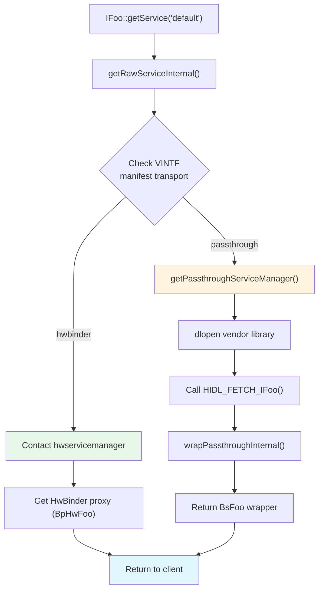
```mermaid
flowchart TD
    A["IFoo::getService('default')"] --> B["getRawServiceInternal()"]
    B --> C{"Check VINTF<br/>manifest transport"}
    C -->|hwbinder| D["Contact hwservicemanager"]
    C -->|passthrough| E["getPassthroughServiceManager()"]

    D --> F["Get HwBinder proxy (BpHwFoo)"]
    F --> G["Return to client"]

    E --> H["dlopen vendor library"]
    H --> I["Call HIDL_FETCH_IFoo()"]
    I --> J["wrapPassthroughInternal()"]
    J --> K["Return BsFoo wrapper"]
    K --> G

    style D fill:#e8f5e9
    style E fill:#fff3e0
    style G fill:#e1f5fe
```

### 10.3.8.2 HIDL Versioning Rules

HIDL uses a strict versioning scheme based on major.minor versions:

- **Minor version bump** (1.0 -> 1.1): New methods can be added, but existing
  methods must not change.  A 1.1 implementation must also implement all 1.0
  methods.

- **Major version bump** (1.x -> 2.0): Breaking changes allowed.  The new
  interface is independent of the old one.

Interface inheritance across minor versions is enforced:

```
// Example: ICameraProvider evolves through minor versions
package android.hardware.camera.provider@2.4;
interface ICameraProvider {
    getCameraIdList() generates (Status status, vec<string> cameraDeviceNames);
    // ... other methods
};

package android.hardware.camera.provider@2.5;
import @2.4::ICameraProvider;
interface ICameraProvider extends @2.4::ICameraProvider {
    // Adds new method while inheriting all 2.4 methods
    notifyDeviceStateChange(bitfield<DeviceState> newState);
};

package android.hardware.camera.provider@2.6;
import @2.5::ICameraProvider;
interface ICameraProvider extends @2.5::ICameraProvider {
    // Adds more methods while inheriting all 2.4 and 2.5 methods
    getConcurrentStreamingCameraIds()
        generates (Status status, vec<vec<string>> cameraIds);
};
```

When `getService()` is called for `@2.4::ICameraProvider`, the runtime will
accept any implementation that provides 2.4, 2.5, or 2.6 -- because all
later versions inherit from 2.4.

### 10.3.9 HIDL Deprecation Status

As of Android 13 (2022), HIDL is officially deprecated.  New HALs must use
AIDL.  Existing HIDL HALs are being migrated to AIDL on a per-interface basis.
The HIDL runtime and hwservicemanager remain available for backward
compatibility with older vendor partitions, but no new HIDL interfaces will be
accepted into AOSP.

Key files reflecting this deprecation:

- `system/libhidl/transport/ServiceManagement.cpp` contains `NoHwServiceManager`
  for devices that have fully migrated away from HIDL.
- The `isHidlSupported()` function (line 75) checks whether HwBinder is even
  available on the device.

---

## 10.4 AIDL HAL (Current Standard)

Starting with Android 11, Google began migrating HAL interfaces from HIDL to
AIDL (Android Interface Definition Language).  As of current AOSP, AIDL HALs
are the standard for all new hardware interfaces and most existing ones.

AIDL was already the lingua franca for inter-process communication within the
Android framework.  By extending AIDL to support HALs, Google eliminated the
need for a separate IDL language (HIDL), a separate IPC mechanism (HwBinder),
and a separate service manager (hwservicemanager).

### 10.4.1 Why AIDL Replaced HIDL

| Aspect | HIDL | AIDL HAL |
|--------|------|----------|
| IDL language | Custom `.hal` syntax | Standard `.aidl` syntax |
| IPC transport | HwBinder | Standard Binder |
| Service manager | hwservicemanager | servicemanager |
| Language support | C++, Java | C++, Java, Rust, NDK C++ |
| Toolchain | hidl-gen | aidl (existing) |
| Learning curve | New syntax to learn | Already known by Android developers |
| Test infrastructure | Separate VTS harness | Unified VTS/CTS infrastructure |

The key advantages of AIDL HALs:

1. **Single toolchain.**  The AIDL compiler already existed and was well-tested.
   No need to maintain `hidl-gen` separately.

2. **Rust support.**  AIDL generates Rust bindings, enabling HAL implementations
   in memory-safe Rust.  HIDL had no Rust support.

3. **NDK backend.**  AIDL HALs can use the NDK backend, allowing vendor code to
   use stable NDK APIs without linking against the platform's C++ library.

4. **Simpler versioning.**  AIDL uses integer versions instead of HIDL's
   major.minor scheme.  Each version is a complete snapshot of the interface.

5. **Unified ecosystem.**  Framework services and HAL services now use the
   same IPC mechanism, the same service manager, and the same debugging tools
   (like `dumpsys`).

### 10.4.2 AIDL HAL Interface Definition

An AIDL HAL interface looks almost identical to a regular framework AIDL
interface, with one critical addition: the `@VintfStability` annotation.

Here is the Lights HAL interface:

```java
// hardware/interfaces/light/aidl/android/hardware/light/ILights.aidl (lines 17-47)

package android.hardware.light;

import android.hardware.light.HwLightState;
import android.hardware.light.HwLight;

/**
 * Allows controlling logical lights/indicators, mapped to LEDs in a
 * hardware-specific manner by the HAL implementation.
 */
@VintfStability
interface ILights {
    /**
     * Set light identified by id to the provided state.
     *
     * If control over an invalid light is requested, this method exists with
     * EX_UNSUPPORTED_OPERATION.
     *
     * @param id ID of logical light to set as returned by getLights()
     * @param state describes what the light should look like.
     */
    void setLightState(in int id, in HwLightState state);

    /**
     * Discover what lights are supported by the HAL implementation.
     *
     * @return List of available lights
     */
    HwLight[] getLights();
}
```

This is straightforward AIDL.  The `@VintfStability` annotation is the only
indicator that this is a HAL interface rather than a regular framework service.

### 10.4.3 The @VintfStability Annotation

The `@VintfStability` annotation has two effects:

1. **Build-time**: The AIDL compiler enforces stricter rules.  All types
   referenced by the interface must also be `@VintfStability`.  The interface
   must be versioned and frozen before being shipped.

2. **Runtime**: The Binder framework checks that the service is declared in
   the device's VINTF manifest before allowing it to be registered with
   `servicemanager`.

This annotation bridges the AIDL world to the VINTF compatibility framework,
ensuring that HAL interfaces are subject to the same compatibility guarantees
as HIDL interfaces were.

### 10.4.4 Walkthrough: The Lights HAL

The Lights HAL is one of the simplest AIDL HALs, making it an excellent example
for understanding the full stack.  The reference implementation uses Rust.

**Interface definition** (`hardware/interfaces/light/aidl/`):

The `Android.bp` file defines the AIDL interface module:

```
// hardware/interfaces/light/aidl/Android.bp (lines 10-38)

aidl_interface {
    name: "android.hardware.light",
    vendor_available: true,
    srcs: [
        "android/hardware/light/*.aidl",
    ],
    stability: "vintf",
    frozen: true,
    backend: {
        java: {
            sdk_version: "module_current",
        },
        rust: {
            enabled: true,
        },
    },
    versions_with_info: [
        {
            version: "1",
            imports: [],
        },
        {
            version: "2",
            imports: [],
        },
    ],
}
```

Key fields:

- `stability: "vintf"` -- enables `@VintfStability` checking.
- `frozen: true` -- the latest version is frozen (no modifications allowed).
- `vendor_available: true` -- the generated libraries are available to vendor code.
- `backend.rust.enabled: true` -- generate Rust bindings.
- `versions_with_info` -- lists all frozen API versions (1 and 2).

**Reference implementation in Rust** (`hardware/interfaces/light/aidl/default/`):

The main entry point (`main.rs`, lines 28-46):

```rust
// hardware/interfaces/light/aidl/default/main.rs (lines 28-46)

fn main() {
    let logger_success = logger::init(
        logger::Config::default()
            .with_tag_on_device(LOG_TAG)
            .with_max_level(LevelFilter::Trace),
    );
    if !logger_success {
        panic!("{LOG_TAG}: Failed to start logger.");
    }

    binder::ProcessState::set_thread_pool_max_thread_count(0);

    let lights_service = LightsService::default();
    let lights_service_binder = BnLights::new_binder(
        lights_service, BinderFeatures::default());

    let service_name = format!("{}/default", LightsService::get_descriptor());
    binder::add_service(&service_name, lights_service_binder.as_binder())
        .expect("Failed to register service");

    binder::ProcessState::join_thread_pool()
}
```

The implementation (`lights.rs`, lines 37-80):

```rust
// hardware/interfaces/light/aidl/default/lights.rs (lines 37-80)

pub struct LightsService {
    lights: Mutex<HashMap<i32, Light>>,
}

impl Interface for LightsService {}

impl Default for LightsService {
    fn default() -> Self {
        let id_mapping_closure =
            |light_id| HwLight {
                id: light_id,
                ordinal: light_id,
                r#type: LightType::BACKLIGHT,
            };
        Self::new((1..=NUM_DEFAULT_LIGHTS).map(id_mapping_closure))
    }
}

impl ILights for LightsService {
    fn setLightState(&self, id: i32, state: &HwLightState) -> binder::Result<()> {
        info!("Lights setting state for id={} to color {:x}", id, state.color);

        if let Some(light) = self.lights.lock().unwrap().get_mut(&id) {
            light.state = *state;
            Ok(())
        } else {
            Err(Status::new_exception(
                ExceptionCode::UNSUPPORTED_OPERATION, None))
        }
    }

    fn getLights(&self) -> binder::Result<Vec<HwLight>> {
        info!("Lights reporting supported lights");
        Ok(self.lights.lock().unwrap().values()
            .map(|light| light.hw_light).collect())
    }
}
```

**VINTF manifest fragment** (`lights-default.xml`):

```xml
<!-- hardware/interfaces/light/aidl/default/lights-default.xml -->
<manifest version="1.0" type="device">
    <hal format="aidl">
        <name>android.hardware.light</name>
        <version>2</version>
        <fqname>ILights/default</fqname>
    </hal>
</manifest>
```

**init.rc service definition** (`lights-default.rc`):

```
# hardware/interfaces/light/aidl/default/lights-default.rc
service vendor.light-default /vendor/bin/hw/android.hardware.lights-service.example
    class hal
    user nobody
    group nobody
    shutdown critical
```

**Build definition** (`Android.bp`):

```
// hardware/interfaces/light/aidl/default/Android.bp (lines 10-23)

rust_binary {
    name: "android.hardware.lights-service.example",
    relative_install_path: "hw",
    init_rc: ["lights-default.rc"],
    vintf_fragments: ["lights-default.xml"],
    vendor: true,
    rustlibs: [
        "liblogger",
        "liblog_rust",
        "libbinder_rs",
        "android.hardware.light-V2-rust",
    ],
    srcs: [ "main.rs" ],
}
```

The complete flow from build to runtime:

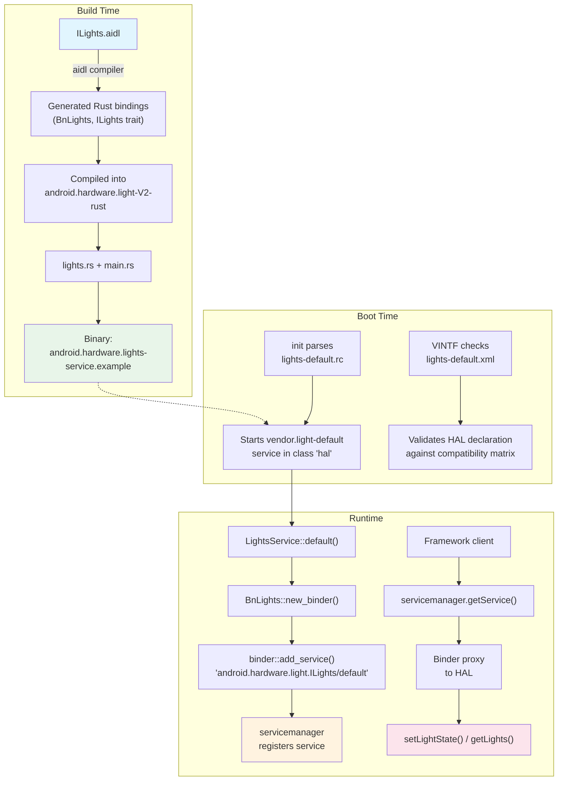
```mermaid
flowchart TD
    subgraph "Build Time"
        A1["ILights.aidl"] -->|"aidl compiler"| A2["Generated Rust bindings<br/>(BnLights, ILights trait)"]
        A2 --> A3["Compiled into<br/>android.hardware.light-V2-rust"]
        A3 --> A4["lights.rs + main.rs"]
        A4 --> A5["Binary:<br/>android.hardware.lights-service.example"]
    end

    subgraph "Boot Time"
        B1["init parses<br/>lights-default.rc"] --> B2["Starts vendor.light-default<br/>service in class 'hal'"]
        B3["VINTF checks<br/>lights-default.xml"] --> B4["Validates HAL declaration<br/>against compatibility matrix"]
    end

    subgraph "Runtime"
        C1["LightsService::default()"] --> C2["BnLights::new_binder()"]
        C2 --> C3["binder::add_service()<br/>'android.hardware.light.ILights/default'"]
        C3 --> C4["servicemanager<br/>registers service"]
        C5["Framework client"] --> C6["servicemanager.getService()"]
        C6 --> C7["Binder proxy<br/>to HAL"]
        C7 --> C8["setLightState() / getLights()"]
    end

    A5 -.-> B2
    B2 --> C1

    style A1 fill:#e1f5fe
    style A5 fill:#e8f5e9
    style C4 fill:#fff3e0
    style C8 fill:#fce4ec
```

### 10.4.4.1 Understanding the Lights HAL Data Types

The Lights HAL uses two supporting AIDL types.  `HwLight` describes a physical
light, and `HwLightState` describes the desired state of that light.  These are
defined as parcelables in the same package:

```java
// android/hardware/light/HwLight.aidl (representative)

package android.hardware.light;

@VintfStability
parcelable HwLight {
    /** Unique ID for this light */
    int id;
    /** Ordinal for ordering within the same type */
    int ordinal;
    /** Type of light (BACKLIGHT, KEYBOARD, BUTTONS, etc.) */
    LightType type;
}
```

```java
// android/hardware/light/HwLightState.aidl (representative)

package android.hardware.light;

@VintfStability
parcelable HwLightState {
    /** Color in ARGB format */
    int color;
    /** Flash mode (NONE, TIMED, HARDWARE) */
    FlashMode flashMode;
    /** Flash on time in milliseconds */
    int flashOnMs;
    /** Flash off time in milliseconds */
    int flashOffMs;
    /** Brightness mode (USER, SENSOR, LOW_PERSISTENCE) */
    BrightnessMode brightnessMode;
}
```

The Rust implementation in `lights.rs` stores a mapping from light ID to state,
using `Mutex<HashMap<i32, Light>>` to handle concurrent access.  The
`NUM_DEFAULT_LIGHTS` constant (set to 3) creates three default backlight
instances.

The error handling pattern is notable: when `setLightState` receives an
unknown ID, it returns `ExceptionCode::UNSUPPORTED_OPERATION`, which maps to
`EX_UNSUPPORTED_OPERATION` in the Binder protocol.  This is a standard
AIDL HAL convention -- capability queries and unsupported operations use
this exception code, allowing clients to gracefully fall back.

### 10.4.5 Walkthrough: The Audio Core HAL

The Audio Core HAL is one of the most complex AIDL HALs in AOSP, demonstrating
the full power of the AIDL HAL framework.

The IModule interface
(`hardware/interfaces/audio/aidl/aidl_api/android.hardware.audio.core/current/android/hardware/audio/core/IModule.aidl`)
defines 35+ methods for audio device management:

```java
// IModule.aidl (excerpt, lines 36-77)

@VintfStability
interface IModule {
  void setModuleDebug(in ModuleDebug debug);
  @nullable ITelephony getTelephony();
  @nullable IBluetooth getBluetooth();
  @nullable IBluetoothA2dp getBluetoothA2dp();
  @nullable IBluetoothLe getBluetoothLe();
  AudioPort connectExternalDevice(in AudioPort templateIdAndAdditionalData);
  void disconnectExternalDevice(int portId);
  AudioPatch[] getAudioPatches();
  AudioPort getAudioPort(int portId);
  AudioPortConfig[] getAudioPortConfigs();
  AudioPort[] getAudioPorts();
  AudioRoute[] getAudioRoutes();
  OpenInputStreamReturn openInputStream(in OpenInputStreamArguments args);
  OpenOutputStreamReturn openOutputStream(in OpenOutputStreamArguments args);
  SupportedPlaybackRateFactors getSupportedPlaybackRateFactors();
  AudioPatch setAudioPatch(in AudioPatch requested);
  boolean setAudioPortConfig(in AudioPortConfig requested,
                             out AudioPortConfig suggested);
  void resetAudioPatch(int patchId);
  void resetAudioPortConfig(int portConfigId);
  boolean getMasterMute();
  void setMasterMute(boolean mute);
  float getMasterVolume();
  void setMasterVolume(float volume);
  boolean getMicMute();
  void setMicMute(boolean mute);
  MicrophoneInfo[] getMicrophones();
  void updateAudioMode(AudioMode mode);
  void updateScreenRotation(ScreenRotation rotation);
  void updateScreenState(boolean isTurnedOn);
  @nullable ISoundDose getSoundDose();
  // ...
}
```

The interface uses nested parcelable types for complex arguments:

```java
// IModule.aidl (lines 80-99)

  @VintfStability
  parcelable OpenInputStreamArguments {
    int portConfigId;
    SinkMetadata sinkMetadata;
    long bufferSizeFrames;
  }
  @VintfStability
  parcelable OpenInputStreamReturn {
    IStreamIn stream;
    StreamDescriptor desc;
  }
  @VintfStability
  parcelable OpenOutputStreamArguments {
    int portConfigId;
    SourceMetadata sourceMetadata;
    @nullable AudioOffloadInfo offloadInfo;
    long bufferSizeFrames;
    @nullable IStreamCallback callback;
    @nullable IStreamOutEventCallback eventCallback;
  }
```

The default implementation in `hardware/interfaces/audio/aidl/default/Module.cpp`
demonstrates the scale of a production HAL.  The file begins with 66 lines of
just `using` declarations:

```c++
// hardware/interfaces/audio/aidl/default/Module.cpp (lines 37-67, excerpt)

using aidl::android::hardware::audio::common::SinkMetadata;
using aidl::android::hardware::audio::common::SourceMetadata;
using aidl::android::hardware::audio::core::sounddose::ISoundDose;
using aidl::android::media::audio::common::AudioChannelLayout;
using aidl::android::media::audio::common::AudioDevice;
using aidl::android::media::audio::common::AudioDeviceType;
using aidl::android::media::audio::common::AudioFormatDescription;
using aidl::android::media::audio::common::AudioFormatType;
// ... (many more)
```

The Audio HAL VINTF manifest fragment from
`hardware/interfaces/audio/aidl/default/android.hardware.audio.service-aidl.xml`:

```xml
<!-- hardware/interfaces/audio/aidl/default/android.hardware.audio.service-aidl.xml -->
<manifest version="1.0" type="device">
  <hal format="aidl">
    <name>android.hardware.audio.core</name>
    <version>4</version>
    <fqname>IModule/default</fqname>
  </hal>
  <hal format="aidl">
    <name>android.hardware.audio.core</name>
    <version>4</version>
    <fqname>IModule/r_submix</fqname>
  </hal>
  <hal format="aidl">
    <name>android.hardware.audio.core</name>
    <version>4</version>
    <fqname>IModule/bluetooth</fqname>
  </hal>
  <hal format="aidl">
    <name>android.hardware.audio.core</name>
    <version>4</version>
    <fqname>IConfig/default</fqname>
  </hal>
  <hal format="aidl">
    <name>android.hardware.audio.effect</name>
    <version>3</version>
    <fqname>IFactory/default</fqname>
  </hal>
</manifest>
```

Note that a single HAL service process can host multiple IModule instances
(default, r_submix, bluetooth) -- each registered as a separate service name
with servicemanager.

The init.rc service definition
(`hardware/interfaces/audio/aidl/default/android.hardware.audio.service-aidl.example.rc`)
shows the security and performance configuration for a latency-critical HAL:

```
# android.hardware.audio.service-aidl.example.rc (lines 2-12)

service vendor.audio-hal-aidl /apex/com.android.hardware.audio/bin/hw/android.hardware.audio.service-aidl.example
    class hal
    user audioserver
    group audio camera drmrpc inet media mediadrm net_bt net_bt_admin net_bw_acct wakelock context_hub
    capabilities BLOCK_SUSPEND SYS_NICE
    # setting RLIMIT_RTPRIO allows binder RT priority inheritance
    rlimit rtprio 10 10
    ioprio rt 4
    task_profiles ProcessCapacityHigh HighPerformance
    onrestart restart audioserver
```

Key configuration details:

- **APEX packaging**: The binary lives in an APEX module (`com.android.hardware.audio`),
  allowing it to be updated independently.
- **Capabilities**: `BLOCK_SUSPEND` prevents the device from sleeping during
  audio playback; `SYS_NICE` allows setting real-time scheduling.
- **Real-time priority**: `rlimit rtprio 10 10` and `ioprio rt 4` ensure the
  audio HAL gets scheduling priority.
- **Restart cascade**: `onrestart restart audioserver` ensures that if the HAL
  crashes, the audio server also restarts to re-initialize.

### 10.4.6 The Power HAL: A Complex Modern Interface

The Power HAL (`hardware/interfaces/power/aidl/android/hardware/power/IPower.aidl`)
demonstrates how modern AIDL HALs handle advanced features like hint sessions
and FMQ (Fast Message Queue) channels:

```java
// hardware/interfaces/power/aidl/android/hardware/power/IPower.aidl (excerpt, lines 33-200)

@VintfStability
interface IPower {
    oneway void setMode(in Mode type, in boolean enabled);
    boolean isModeSupported(in Mode type);
    oneway void setBoost(in Boost type, in int durationMs);
    boolean isBoostSupported(in Boost type);

    IPowerHintSession createHintSession(
            in int tgid, in int uid, in int[] threadIds, in long durationNanos);

    long getHintSessionPreferredRate();

    IPowerHintSession createHintSessionWithConfig(in int tgid, in int uid,
            in int[] threadIds, in long durationNanos,
            in SessionTag tag, out SessionConfig config);

    ChannelConfig getSessionChannel(in int tgid, in int uid);
    oneway void closeSessionChannel(in int tgid, in int uid);
    SupportInfo getSupportInfo();

    CpuHeadroomResult getCpuHeadroom(in CpuHeadroomParams params);
    GpuHeadroomResult getGpuHeadroom(in GpuHeadroomParams params);

    oneway void sendCompositionData(in CompositionData[] data);
    oneway void sendCompositionUpdate(in CompositionUpdate update);
}
```

Notable features:

- **`oneway` methods**: `setMode`, `setBoost`, `sendCompositionData`, and
  `closeSessionChannel` are marked `oneway`, meaning they are asynchronous
  fire-and-forget calls.  This is critical for power hints that must not block
  the caller.

- **Session management**: `createHintSession` and `createHintSessionWithConfig`
  return `IPowerHintSession` sub-interfaces, demonstrating AIDL's ability to
  return interface references that create new per-session Binder connections.

- **FMQ channels**: `getSessionChannel` returns a `ChannelConfig` that includes
  FMQ (Fast Message Queue) descriptors for zero-copy, low-latency communication
  between the framework and the power HAL.

### 10.4.7 The Vibrator HAL: NDK Backend in C++

The Vibrator HAL reference implementation
(`hardware/interfaces/vibrator/aidl/default/main.cpp`) demonstrates the NDK
(Native Development Kit) C++ backend, which is the preferred backend for
vendor HAL implementations:

```c++
// hardware/interfaces/vibrator/aidl/default/main.cpp (lines 17-45)

#include "vibrator-impl/Vibrator.h"
#include "vibrator-impl/VibratorManager.h"

#include <android-base/logging.h>
#include <android/binder_manager.h>
#include <android/binder_process.h>

using aidl::android::hardware::vibrator::Vibrator;
using aidl::android::hardware::vibrator::VibratorManager;

int main() {
    ABinderProcess_setThreadPoolMaxThreadCount(0);

    // make a default vibrator service
    auto vib = ndk::SharedRefBase::make<Vibrator>();
    binder_status_t status = AServiceManager_addService(
            vib->asBinder().get(),
            Vibrator::makeServiceName("default").c_str());
    CHECK_EQ(status, STATUS_OK);

    // make the vibrator manager service with a different vibrator
    auto managedVib = ndk::SharedRefBase::make<Vibrator>();
    auto vibManager = ndk::SharedRefBase::make<VibratorManager>(
        std::move(managedVib));
    status = AServiceManager_addService(
        vibManager->asBinder().get(),
        VibratorManager::makeServiceName("default").c_str());
    CHECK_EQ(status, STATUS_OK);

    ABinderProcess_joinThreadPool();
    return EXIT_FAILURE;  // should not reach
}
```

The NDK backend uses `A*` prefixed C APIs (like `AServiceManager_addService`,
`ABinderProcess_setThreadPoolMaxThreadCount`) instead of the C++ `binder::`
namespace APIs.  This is important because:

1. The NDK APIs have stable ABI, so vendor code compiled against one version
   will work with future platform versions.
2. The NDK backend does not link against `libbinder.so` (the platform C++
   Binder library), which is not part of the VNDK.

### 10.4.7.1 The Sensors HAL: FMQ for High-Throughput Data

The Sensors HAL (`hardware/interfaces/sensors/aidl/android/hardware/sensors/ISensors.aidl`)
demonstrates an advanced AIDL HAL pattern: using Fast Message Queues (FMQ)
for bulk data transfer rather than individual Binder transactions.

Sensor events (accelerometer readings, gyroscope samples, etc.) can arrive at
rates of hundreds of Hz.  Individual Binder calls for each event would be
prohibitively expensive.  Instead, the Sensors HAL uses FMQ -- shared-memory
ring buffers with lock-free synchronization:

```java
// hardware/interfaces/sensors/aidl/android/hardware/sensors/ISensors.aidl (excerpt)

@VintfStability
interface ISensors {
    void activate(in int sensorHandle, in boolean enabled);

    void batch(in int sensorHandle, in long samplingPeriodNs,
               in long maxReportLatencyNs);

    void flush(in int sensorHandle);

    SensorInfo[] getSensorsList();

    /**
     * Initialize the Sensors HAL's Fast Message Queues (FMQ) and callback.
     *
     * The Event FMQ is used to transport sensor events from the HAL to the
     * framework.  The Wake Lock FMQ is used by the framework to notify the
     * HAL when it is safe to release its wake_lock.
     */
    void initialize(
        in MQDescriptor<Event, SynchronizedReadWrite> eventQueueDescriptor,
        in MQDescriptor<int, SynchronizedReadWrite> wakeLockDescriptor,
        in ISensorsCallback sensorsCallback);
}
```

The `MQDescriptor` type is a Binder-serializable description of a shared-memory
FMQ channel.  The framework creates the FMQ, passes its descriptor to the HAL
via `initialize()`, and then both sides can read/write events through shared
memory without any Binder overhead.

This pattern of "Binder for setup, FMQ for data" is common in
performance-critical HALs:

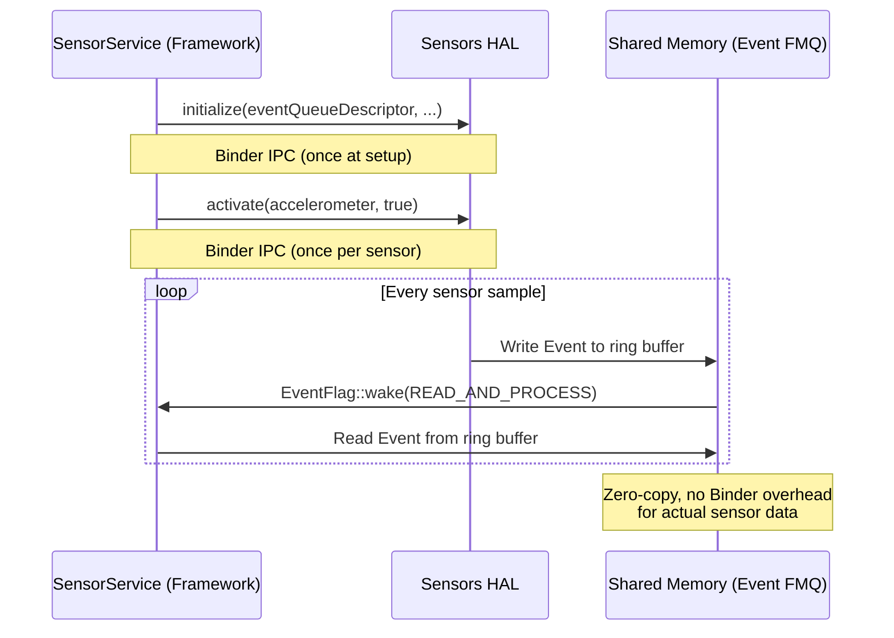
```mermaid
sequenceDiagram
    participant FW as SensorService (Framework)
    participant HAL as Sensors HAL
    participant FMQ as Shared Memory (Event FMQ)

    FW->>HAL: initialize(eventQueueDescriptor, ...)
    Note over FW,HAL: Binder IPC (once at setup)
    FW->>HAL: activate(accelerometer, true)
    Note over FW,HAL: Binder IPC (once per sensor)

    loop Every sensor sample
        HAL->>FMQ: Write Event to ring buffer
        FMQ->>FW: EventFlag::wake(READ_AND_PROCESS)
        FW->>FMQ: Read Event from ring buffer
    end

    Note over FMQ: Zero-copy, no Binder overhead<br/>for actual sensor data
```

### 10.4.7.2 The Health HAL: Callback Pattern

The Health HAL (`hardware/interfaces/health/aidl/android/hardware/health/IHealth.aidl`)
demonstrates the callback interface pattern, where the HAL pushes data to
the framework asynchronously:

```java
// hardware/interfaces/health/aidl/android/hardware/health/IHealth.aidl (lines 33-258, excerpt)

@VintfStability
interface IHealth {
    const int STATUS_UNKNOWN = 2;
    const int STATUS_CALLBACK_DIED = 4;

    void registerCallback(in IHealthInfoCallback callback);
    void unregisterCallback(in IHealthInfoCallback callback);
    void update();

    int getChargeCounterUah();
    int getCurrentNowMicroamps();
    int getCurrentAverageMicroamps();
    int getCapacity();
    long getEnergyCounterNwh();
    BatteryStatus getChargeStatus();
    StorageInfo[] getStorageInfo();
    DiskStats[] getDiskStats();
    HealthInfo getHealthInfo();

    void setChargingPolicy(BatteryChargingPolicy in_value);
    BatteryChargingPolicy getChargingPolicy();
    BatteryHealthData getBatteryHealthData();
    HingeInfo[] getHingeInfo();
}
```

The IHealth interface combines two access patterns:

1. **Pull model** -- methods like `getCapacity()`, `getChargeStatus()`,
   `getHealthInfo()` for on-demand queries.

2. **Push model** -- `registerCallback()` / `unregisterCallback()` for
   asynchronous notifications via the `IHealthInfoCallback` interface.

The `update()` method triggers the HAL to push the latest health info to all
registered callbacks.  This is called periodically by the framework and also
during significant power events (charger connected/disconnected, low battery).

The error handling demonstrates AIDL's exception codes:

- `EX_UNSUPPORTED_OPERATION` -- the hardware does not support this query
  (e.g., the sysfs file does not exist on this device).
- Service-specific error with `STATUS_UNKNOWN` -- an unexpected error occurred.
- Service-specific error with `STATUS_CALLBACK_DIED` -- a previously registered
  callback's hosting process has died.

This distinction allows the framework to handle each case appropriately:
unsupported features are not retried, while unknown errors may trigger a
retry or HAL restart.

### 10.4.8 Build System Integration: aidl_interface

The `aidl_interface` Soong module type is the build system entry point for
AIDL HALs.  Here is the complete definition from the Lights HAL:

```
// hardware/interfaces/light/aidl/Android.bp

aidl_interface {
    name: "android.hardware.light",
    vendor_available: true,
    srcs: [
        "android/hardware/light/*.aidl",
    ],
    stability: "vintf",
    frozen: true,
    backend: {
        java: {
            sdk_version: "module_current",
        },
        rust: {
            enabled: true,
        },
    },
    versions_with_info: [
        {
            version: "1",
            imports: [],
        },
        {
            version: "2",
            imports: [],
        },
    ],
}
```

This single module definition generates the following library variants:

| Generated Library | Language | Used By |
|-------------------|----------|---------|
| `android.hardware.light-V2-java` | Java | Framework services |
| `android.hardware.light-V2-ndk` | C++ (NDK) | Vendor HAL implementations (C++) |
| `android.hardware.light-V2-cpp` | C++ (platform) | Framework native code |
| `android.hardware.light-V2-rust` | Rust | Vendor HAL implementations (Rust) |

The naming convention is `<package>-V<version>-<backend>`.

### 10.4.9 API Versioning and Freezing

AIDL HALs use integer versioning.  Each version is a complete snapshot of the
interface, stored in the `aidl_api/` directory:

```
hardware/interfaces/light/aidl/
    android/hardware/light/ILights.aidl          # Current (development) version
    aidl_api/
        android.hardware.light/
            1/                                    # Frozen version 1
                android/hardware/light/ILights.aidl
                android/hardware/light/HwLight.aidl
                android/hardware/light/HwLightState.aidl
            2/                                    # Frozen version 2
                android/hardware/light/ILights.aidl
                android/hardware/light/HwLight.aidl
                android/hardware/light/HwLightState.aidl
            current/                              # Latest snapshot
                android/hardware/light/ILights.aidl
                android/hardware/light/HwLight.aidl
                android/hardware/light/HwLightState.aidl
```

The frozen version snapshots are immutable -- the files contain a header warning:

```java
// From any frozen AIDL snapshot (e.g., IModule.aidl, lines 17-18)

///////////////////////////////////////////////////////////////////////////////
// THIS FILE IS IMMUTABLE. DO NOT EDIT IN ANY CASE.                          //
///////////////////////////////////////////////////////////////////////////////
```

The build system enforces this:

1. During development, changes can be made to the `.aidl` files in the main
   source directory.
2. When a version is ready to ship, it is "frozen" by running
   `m <name>-update-api`, which copies the current files to a new numbered
   directory.
3. The `frozen: true` flag in `Android.bp` tells the build system to verify
   that the current sources match the latest frozen version.

Backward compatibility is enforced: version N+1 must be a superset of version N.
You can add new methods, types, and fields, but cannot remove or change
existing ones.

### 10.4.10 The hardware/interfaces/ Directory

The `hardware/interfaces/` directory contains all AOSP HAL interface
definitions.  As of current AOSP, it contains 55 top-level interface
directories:

| Category | HAL Interfaces |
|----------|---------------|
| **Media** | audio, camera, cas, drm, media, soundtrigger |
| **Connectivity** | bluetooth, nfc, radio, tetheroffload, wifi, uwb, threadnetwork |
| **Display** | graphics, light |
| **Sensors** | sensors, contexthub |
| **Biometrics** | biometrics (face, fingerprint) |
| **Security** | gatekeeper, keymaster, security, weaver, oemlock, authsecret, confirmationui, identity, secure_element |
| **Power** | power, thermal, health, memtrack |
| **Input** | input, vibrator, ir |
| **Storage** | boot, fastboot, dumpstate |
| **Automotive** | automotive (vehicle, audiocontrol, evs, can, etc.) |
| **TV** | tv |
| **Other** | broadcastradio, configstore, gnss, macsec, neuralnetworks, renderscript, usb, virtualization |
| **Infrastructure** | common, compatibility_matrices, scripts, staging, tests |

Each interface directory typically contains:

```
hardware/interfaces/<name>/
    aidl/                          # AIDL interface definition
        Android.bp                 # aidl_interface module
        android/hardware/<name>/   # .aidl files
        aidl_api/                  # Frozen version snapshots
        default/                   # Reference implementation
        vts/                       # VTS tests
```

### 10.4.11 AIDL HAL Registration Flow

The following diagram shows the complete lifecycle of an AIDL HAL service from
startup to client access:

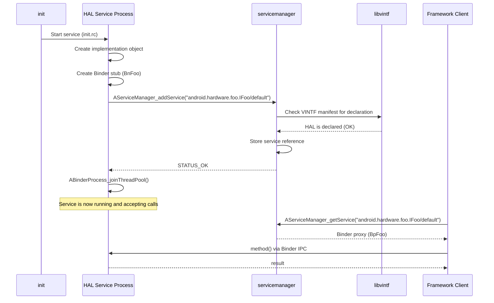
```mermaid
sequenceDiagram
    participant Init as init
    participant HAL as HAL Service Process
    participant SM as servicemanager
    participant VINTF as libvintf
    participant Client as Framework Client

    Init->>HAL: Start service (init.rc)
    HAL->>HAL: Create implementation object
    HAL->>HAL: Create Binder stub (BnFoo)
    HAL->>SM: AServiceManager_addService("android.hardware.foo.IFoo/default")
    SM->>VINTF: Check VINTF manifest for declaration
    VINTF-->>SM: HAL is declared (OK)
    SM->>SM: Store service reference
    SM-->>HAL: STATUS_OK
    HAL->>HAL: ABinderProcess_joinThreadPool()

    Note over HAL: Service is now running and accepting calls

    Client->>SM: AServiceManager_getService("android.hardware.foo.IFoo/default")
    SM-->>Client: Binder proxy (BpFoo)
    Client->>HAL: method() via Binder IPC
    HAL-->>Client: result
```

If the HAL is not declared in the VINTF manifest, `servicemanager` rejects the
registration:

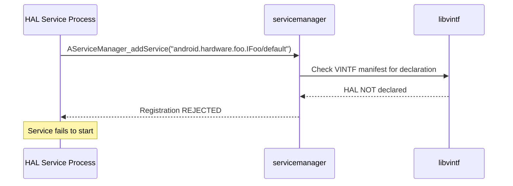
```mermaid
sequenceDiagram
    participant HAL as HAL Service Process
    participant SM as servicemanager
    participant VINTF as libvintf

    HAL->>SM: AServiceManager_addService("android.hardware.foo.IFoo/default")
    SM->>VINTF: Check VINTF manifest for declaration
    VINTF-->>SM: HAL NOT declared
    SM-->>HAL: Registration REJECTED
    Note over HAL: Service fails to start
```

### 10.4.12 Multi-Language Support: Rust, Java, C++, NDK

One of AIDL's major advantages is its multi-language support.  A single `.aidl`
file generates bindings for four language backends:

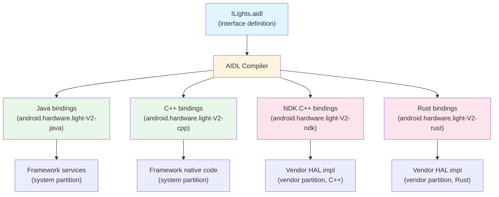
```mermaid
graph TD
    A["ILights.aidl<br/>(interface definition)"] --> B["AIDL Compiler"]
    B --> C["Java bindings<br/>(android.hardware.light-V2-java)"]
    B --> D["C++ bindings<br/>(android.hardware.light-V2-cpp)"]
    B --> E["NDK C++ bindings<br/>(android.hardware.light-V2-ndk)"]
    B --> F["Rust bindings<br/>(android.hardware.light-V2-rust)"]

    C --> G["Framework services<br/>(system partition)"]
    D --> H["Framework native code<br/>(system partition)"]
    E --> I["Vendor HAL impl<br/>(vendor partition, C++)"]
    F --> J["Vendor HAL impl<br/>(vendor partition, Rust)"]

    style A fill:#e1f5fe
    style B fill:#fff3e0
    style C fill:#e8f5e9
    style D fill:#e8f5e9
    style E fill:#fce4ec
    style F fill:#fce4ec
```

| Backend | Library Suffix | Link Against | Stability | Primary Use |
|---------|---------------|-------------|-----------|-------------|
| Java | `-java` | framework.jar | Platform | Framework Java services |
| C++ (platform) | `-cpp` | libbinder.so | Platform only | Framework native code |
| NDK C++ | `-ndk` | libbinder_ndk.so | **NDK stable** | **Vendor HAL implementations** |
| Rust | `-rust` | libbinder_rs | **NDK stable** | **Vendor HAL implementations** |

The NDK and Rust backends are the correct choices for vendor code because they
link against NDK-stable libraries that will not change across platform versions.

---

## 10.5 VINTF (Vendor Interface)

The Vendor Interface (VINTF) framework, implemented in `system/libvintf/`,
is the system that ensures compatibility between the framework and vendor
partitions.  It was introduced alongside HIDL in Android 8.0 and is now used
for both HIDL and AIDL HALs.

### 10.5.1 The Problem VINTF Solves

Before Project Treble, upgrading Android's framework (system partition) required
re-testing and potentially modifying all vendor HALs.  There was no formal way
to verify that a new framework version was compatible with the existing vendor
partition.

VINTF provides a formal compatibility checking mechanism:

1. The **vendor** declares what HALs it provides (device manifest).
2. The **framework** declares what HALs it requires (framework compatibility
   matrix).
3. The **framework** declares what HALs it provides (framework manifest).
4. The **vendor** declares what framework features it requires (device
   compatibility matrix).

Compatibility is verified at three points:

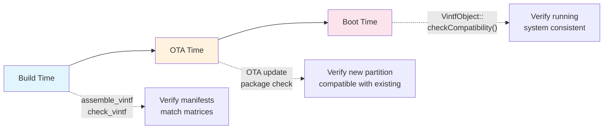
```mermaid
graph LR
    A["Build Time"] --> B["OTA Time"]
    B --> C["Boot Time"]

    A -.->|"assemble_vintf<br/>check_vintf"| D["Verify manifests<br/>match matrices"]
    B -.->|"OTA update<br/>package check"| E["Verify new partition<br/>compatible with existing"]
    C -.->|"VintfObject::<br/>checkCompatibility()"| F["Verify running<br/>system consistent"]

    style A fill:#e1f5fe
    style B fill:#fff3e0
    style C fill:#fce4ec
```

### 10.5.2 Manifest Files

A VINTF manifest declares what a partition provides.  There are two types:

**Device manifest** (what the vendor provides):

Located at `/vendor/etc/vintf/manifest.xml`, it lists all HAL services the
vendor partition implements.  Here is a representative fragment:

```xml
<manifest version="1.0" type="device">
    <!-- AIDL HAL -->
    <hal format="aidl">
        <name>android.hardware.light</name>
        <version>2</version>
        <fqname>ILights/default</fqname>
    </hal>

    <!-- AIDL HAL with multiple instances -->
    <hal format="aidl">
        <name>android.hardware.audio.core</name>
        <version>4</version>
        <fqname>IModule/default</fqname>
    </hal>
    <hal format="aidl">
        <name>android.hardware.audio.core</name>
        <version>4</version>
        <fqname>IModule/r_submix</fqname>
    </hal>
    <hal format="aidl">
        <name>android.hardware.audio.core</name>
        <version>4</version>
        <fqname>IModule/bluetooth</fqname>
    </hal>

    <!-- Legacy HIDL HAL (for older devices) -->
    <hal format="hidl">
        <name>android.hardware.graphics.mapper</name>
        <transport>passthrough</transport>
        <version>4.0</version>
        <interface>
            <name>IMapper</name>
            <instance>default</instance>
        </interface>
    </hal>
</manifest>
```

**Framework manifest** (what the framework provides):

Located at `/system/etc/vintf/manifest.xml`, it lists framework-side services
that vendor code may depend on.

### 10.5.3 Compatibility Matrices

A compatibility matrix declares what a partition requires from the other side.

The framework compatibility matrix
(`hardware/interfaces/compatibility_matrices/compatibility_matrix.202504.xml`)
is a 736-line XML file listing every HAL the framework may require.  Here is
an excerpt:

```xml
<!-- hardware/interfaces/compatibility_matrices/compatibility_matrix.202504.xml (lines 1-36) -->

<compatibility-matrix version="1.0" type="framework" level="202504">
    <hal format="aidl">
        <name>android.hardware.audio.core</name>
        <version>1-3</version>
        <interface>
            <name>IModule</name>
            <instance>default</instance>
            <instance>a2dp</instance>
            <instance>bluetooth</instance>
            <instance>hearing_aid</instance>
            <instance>msd</instance>
            <instance>r_submix</instance>
            <instance>stub</instance>
            <instance>usb</instance>
        </interface>
        <interface>
            <name>IConfig</name>
            <instance>default</instance>
        </interface>
    </hal>
    <hal format="aidl">
        <name>android.hardware.audio.effect</name>
        <version>1-3</version>
        <interface>
            <name>IFactory</name>
            <instance>default</instance>
        </interface>
    </hal>
    <hal format="aidl" updatable-via-apex="true">
         <name>android.hardware.authsecret</name>
         <version>1</version>
         <interface>
             <name>IAuthSecret</name>
             <instance>default</instance>
         </interface>
    </hal>
    <!-- ... 700+ more lines -->
</compatibility-matrix>
```

Key elements of the compatibility matrix:

| XML Element | Meaning |
|-------------|---------|
| `<hal format="aidl">` | This is an AIDL HAL requirement |
| `<name>` | Package name |
| `<version>1-3</version>` | Acceptable version range (1 through 3) |
| `<interface>` | Required interface |
| `<instance>` | Required instance names |
| `<regex-instance>` | Instance name pattern (e.g., `[a-z]+/[0-9]+`) |
| `updatable-via-apex="true"` | HAL can be updated through APEX |
| `level="202504"` | FCM (Framework Compatibility Matrix) level |

Note the version range `<version>1-3</version>` for audio.core.  This means the
framework can work with any vendor providing version 1, 2, or 3 of the audio
core HAL.  This range is critical for compatibility -- it allows older vendor
images to work with newer framework images.

HALs that are not listed in the compatibility matrix (or are listed without
a `<version>` range) are optional.  Only HALs with explicit version
requirements are mandatory for a device at that FCM level.

### 10.5.4 The Compatibility Check Algorithm

The compatibility check verifies that:

1. For every **required** HAL in the framework compatibility matrix, the device
   manifest provides an implementation at a compatible version.

2. For every HAL in the device manifest, the version is within the range
   accepted by the framework compatibility matrix.

3. Kernel requirements (config options, version) are satisfied.

4. SELinux policy version requirements are met.

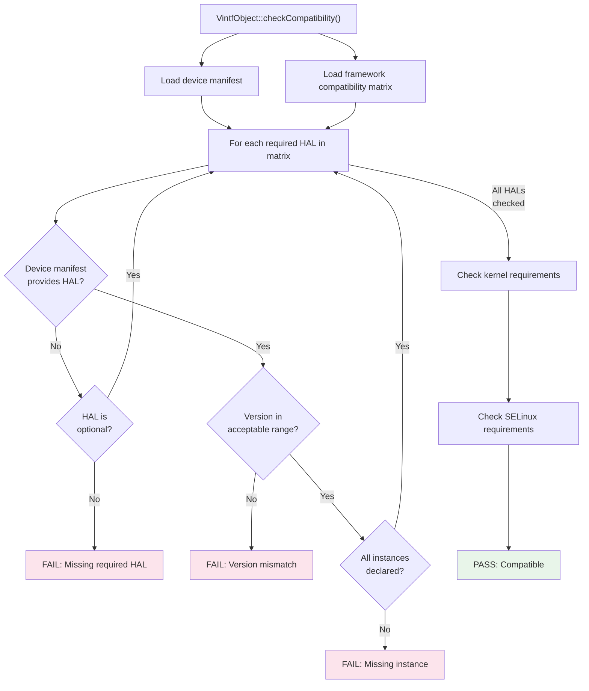
```mermaid
flowchart TD
    A["VintfObject::checkCompatibility()"] --> B["Load device manifest"]
    A --> C["Load framework compatibility matrix"]
    B --> D["For each required HAL in matrix"]
    C --> D
    D --> E{"Device manifest<br/>provides HAL?"}
    E -->|No| F{"HAL is<br/>optional?"}
    F -->|Yes| D
    F -->|No| G["FAIL: Missing required HAL"]
    E -->|Yes| H{"Version in<br/>acceptable range?"}
    H -->|No| I["FAIL: Version mismatch"]
    H -->|Yes| J{"All instances<br/>declared?"}
    J -->|No| K["FAIL: Missing instance"]
    J -->|Yes| D
    D -->|"All HALs<br/>checked"| L["Check kernel requirements"]
    L --> M["Check SELinux requirements"]
    M --> N["PASS: Compatible"]

    style G fill:#fce4ec
    style I fill:#fce4ec
    style K fill:#fce4ec
    style N fill:#e8f5e9
```

### 10.5.4.1 Detailed Compatibility Matrix Analysis

To understand the scale of compatibility checking, let us examine the framework
compatibility matrix for FCM level 202504
(`hardware/interfaces/compatibility_matrices/compatibility_matrix.202504.xml`).
This 736-line file encodes the complete set of HAL requirements for devices
launching with Android 16.

The matrix includes entries for every hardware subsystem:

| HAL Package | Required Versions | Instance Pattern |
|-------------|------------------|------------------|
| `android.hardware.audio.core` | 1-3 | default, a2dp, bluetooth, hearing_aid, msd, r_submix, stub, usb |
| `android.hardware.audio.effect` | 1-3 | default |
| `android.hardware.biometrics.face` | 3-4 | default, virtual |
| `android.hardware.biometrics.fingerprint` | 3-5 | default, virtual |
| `android.hardware.bluetooth` | (latest) | default |
| `android.hardware.bluetooth.audio` | 3-5 | default |
| `android.hardware.camera.provider` | 1-3 | regex: `[^/]+/[0-9]+` |
| `android.hardware.gnss` | 2-6 | default |
| `android.hardware.graphics.allocator` | 1-2 | default |
| `android.hardware.graphics.composer3` | 4 | default |
| `android.hardware.health` | 3-4 | default |
| `android.hardware.identity` | 1-5 | default |
| `android.hardware.power` | (latest) | default |
| `android.hardware.sensors` | (latest) | default |
| `android.hardware.security.secretkeeper` | 1-2 | default, nonsecure |
| `android.hardware.thermal` | (latest) | default |
| `android.hardware.vibrator` | (latest) | default |

Some entries use `<regex-instance>` for dynamic naming:

```xml
<!-- Camera provider uses regex to allow provider/id naming -->
<hal format="aidl" updatable-via-apex="true">
    <name>android.hardware.camera.provider</name>
    <version>1-3</version>
    <interface>
        <name>ICameraProvider</name>
        <regex-instance>[^/]+/[0-9]+</regex-instance>
    </interface>
</hal>

<!-- Broadcast radio allows any instance name -->
<hal format="aidl">
    <name>android.hardware.broadcastradio</name>
    <version>1-3</version>
    <interface>
        <name>IBroadcastRadio</name>
        <regex-instance>.*</regex-instance>
    </interface>
</hal>
```

The `updatable-via-apex="true"` attribute on camera and biometric HALs indicates
that these HALs can be delivered through APEX modules, allowing them to be
updated through the Google Play system update mechanism without a full OTA.

### 10.5.4.2 Version Range Semantics

The version range syntax `<version>1-3</version>` means the framework can work
with any vendor that provides version 1, 2, or 3 of that HAL.  This range grows
over time:

- When a new HAL version is introduced, the upper bound increases.
- When an old version is deprecated (all devices using it are past end-of-life),
  the lower bound increases.

For example, the GNSS HAL version range `2-6` tells us:

- Version 1 has been deprecated (no supported devices still use it).
- Versions 2 through 6 are all supported by the current framework.
- The framework's GNSS code has backward-compatibility logic for each version.

This version range mechanism is the key to Treble's compatibility promise:
a vendor shipping version 2 of the GNSS HAL can receive framework updates
that add support for version 6 without needing to update their HAL.

### 10.5.5 FCM Levels and Timeline

The Framework Compatibility Matrix level identifies the Android version that a
device targets.  The `hardware/interfaces/compatibility_matrices/` directory
contains matrices for each level:

| File | FCM Level | Android Version |
|------|-----------|----------------|
| `compatibility_matrix.5.xml` | 5 | Android 11 |
| `compatibility_matrix.6.xml` | 6 | Android 12 |
| `compatibility_matrix.7.xml` | 7 | Android 13 |
| `compatibility_matrix.8.xml` | 8 | Android 14 |
| `compatibility_matrix.202404.xml` | 202404 | Android 15 |
| `compatibility_matrix.202504.xml` | 202504 | Android 16 |
| `compatibility_matrix.202604.xml` | 202604 | Android 17 (future) |

The level naming changed from simple integers (5, 6, 7, 8) to date-based
identifiers (202404, 202504, 202604) starting with Android 15.

A device declares its target FCM level in the device manifest.  The framework
selects the appropriate compatibility matrix based on that level.  This is how
older devices can continue to work with newer frameworks -- the framework knows
what HAL versions the device era supports and only requires those.

### 10.5.6 libvintf Internals

The VINTF checking logic is implemented in `system/libvintf/`.  The main entry
point is the `VintfObject` class defined in
`system/libvintf/include/vintf/VintfObject.h`:

```c++
// system/libvintf/include/vintf/VintfObject.h (lines 93-151, key methods)

class VintfObject {
   public:
    virtual ~VintfObject() = default;

    // Return the device-side HAL manifest
    virtual std::shared_ptr<const HalManifest> getDeviceHalManifest();

    // Return the framework-side HAL manifest
    virtual std::shared_ptr<const HalManifest> getFrameworkHalManifest();

    // Return the device-side compatibility matrix
    virtual std::shared_ptr<const CompatibilityMatrix>
        getDeviceCompatibilityMatrix();

    // Return the framework-side compatibility matrix
    // (automatically selects by target-level)
    virtual std::shared_ptr<const CompatibilityMatrix>
        getFrameworkCompatibilityMatrix();

    // Return device runtime info (kernel version, configs, etc.)
    std::shared_ptr<const RuntimeInfo> getRuntimeInfo(
        RuntimeInfo::FetchFlags flags = RuntimeInfo::FetchFlag::ALL);

    // Check compatibility between all manifests and matrices
    int32_t checkCompatibility(std::string* error = nullptr,
                               CheckFlags::Type flags = CheckFlags::DEFAULT);

    // Check for deprecated HALs
    int32_t checkDeprecation(
        const std::vector<HidlInterfaceMetadata>& hidlMetadata,
        std::string* error = nullptr);

    // Return kernel FCM version
    Level getKernelLevel(std::string* error = nullptr);
};
```

The `HalManifest` class (`system/libvintf/include/vintf/HalManifest.h`)
provides the manifest data model:

```c++
// system/libvintf/include/vintf/HalManifest.h (lines 64-91, key members)

struct HalManifest : public HalGroup<ManifestHal>,
                     public XmlFileGroup<ManifestXmlFile>,
                     public WithFileName {
   public:
    HalManifest() : mType(SchemaType::DEVICE) {}

    bool add(ManifestHal&& hal, std::string* error = nullptr);
    bool addAllHals(HalManifest* other, std::string* error = nullptr);

    // Get transport for a specific HIDL HAL
    Transport getHidlTransport(const std::string& name, const Version& v,
                               const std::string& interfaceName,
                               const std::string& instanceName) const;

    // Check compatibility against a compatibility matrix
    bool checkCompatibility(const CompatibilityMatrix& mat,
                            std::string* error = nullptr,
                            CheckFlags::Type flags = CheckFlags::DEFAULT) const;

    // Generate a matrix that this manifest is compatible with
    CompatibilityMatrix generateCompatibleMatrix() const;

    // Get all HAL names declared in the manifest
    std::set<std::string> getHalNames() const;
};
```

The `CompatibilityMatrix` class
(`system/libvintf/include/vintf/CompatibilityMatrix.h`) provides the matrix
data model:

```c++
// system/libvintf/include/vintf/CompatibilityMatrix.h (lines 49-80)

struct CompatibilityMatrix : public HalGroup<MatrixHal>,
                             public XmlFileGroup<MatrixXmlFile>,
                             public WithFileName {
    CompatibilityMatrix() : mType(SchemaType::FRAMEWORK) {}

    SchemaType type() const;
    Level level() const;

    std::string getXmlSchemaPath(const std::string& xmlFileName,
                                 const Version& version) const;

    std::string getVendorNdkVersion() const;
    std::vector<SepolicyVersionRange> getSepolicyVersions() const;

    bool add(MatrixHal&&, std::string* error = nullptr);
    bool addAllHals(CompatibilityMatrix* other, std::string* error = nullptr);
};
```

### 10.5.7 VINTF at Boot Time

During boot, `servicemanager` uses libvintf to validate HAL registrations.  From
`frameworks/native/cmds/servicemanager/ServiceManager.cpp` (lines 74-111):

```c++
// frameworks/native/cmds/servicemanager/ServiceManager.cpp (lines 76-97)

struct ManifestWithDescription {
    std::shared_ptr<const vintf::HalManifest> manifest;
    const char* description;
};

static std::vector<ManifestWithDescription> GetManifestsWithDescription() {
    auto vintfObject = vintf::VintfObject::GetInstance();
    if (vintfObject == nullptr) {
        ALOGE("NULL VintfObject!");
        return {};
    }
    return {
        ManifestWithDescription{
            vintfObject->getDeviceHalManifest(), "device"},
        ManifestWithDescription{
            vintfObject->getFrameworkHalManifest(), "framework"}
    };
}

static bool forEachManifest(
    const std::function<bool(const ManifestWithDescription&)>& func) {
    for (const ManifestWithDescription& mwd : GetManifestsWithDescription()) {
        if (mwd.manifest == nullptr) {
            ALOGE("NULL VINTF MANIFEST!: %s", mwd.description);
            continue;
        }
        if (func(mwd)) return true;
    }
    return false;
}
```

This code shows that `servicemanager` loads both the device manifest and
framework manifest at startup, and uses them to validate every HAL
registration request.  The `isAllowedToUseLibvintf()` function in
`VintfObject.cpp` (lines 82-100) restricts which processes can query VINTF
information to prevent unnecessary memory usage:

```c++
// system/libvintf/VintfObject.cpp (lines 82-100)

static bool isAllowedToUseLibvintf() {
    if constexpr (!kIsTarget) {
        return true;
    }
    auto execPath = android::base::GetExecutablePath();
    if (android::base::StartsWith(execPath, "/data/")) {
        return true;
    }
    std::vector<std::string> allowedBinaries{
        "/system/bin/servicemanager",
        "/system/bin/hwservicemanager",
        "/system_ext/bin/hwservicemanager",
        "/system/bin/app_process32",
        "/system/bin/app_process64",
        "/system/bin/lshal",
        // ...
    };
    // ...
}
```

### 10.5.7.1 Manifest Assembly

The device manifest is not a single file.  It is assembled from fragments
spread across multiple partitions and APEX modules.  The assembly process:

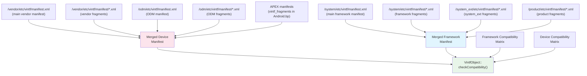
```mermaid
flowchart TD
    A["/vendor/etc/vintf/manifest.xml<br/>(main vendor manifest)"] --> M["Merged Device<br/>Manifest"]
    B["/vendor/etc/vintf/manifest/*.xml<br/>(vendor fragments)"] --> M
    C["/odm/etc/vintf/manifest.xml<br/>(ODM manifest)"] --> M
    D["/odm/etc/vintf/manifest/*.xml<br/>(ODM fragments)"] --> M
    E["APEX manifests<br/>(vintf_fragments in Android.bp)"] --> M

    F["/system/etc/vintf/manifest.xml<br/>(main framework manifest)"] --> N["Merged Framework<br/>Manifest"]
    G["/system/etc/vintf/manifest/*.xml<br/>(framework fragments)"] --> N
    H["/system_ext/etc/vintf/manifest/*.xml<br/>(system_ext fragments)"] --> N
    I["/product/etc/vintf/manifest/*.xml<br/>(product fragments)"] --> N

    M --> O["VintfObject::<br/>checkCompatibility()"]
    N --> O
    P["Framework Compatibility<br/>Matrix"] --> O
    Q["Device Compatibility<br/>Matrix"] --> O

    style M fill:#fce4ec
    style N fill:#e1f5fe
    style O fill:#e8f5e9
```

The `vintf_fragments` directive in `Android.bp` (as seen in the Lights and
Vibrator HALs) causes the build system to automatically install manifest
fragments into the correct location.  At boot time, `libvintf` scans these
directories and merges all fragments into a single logical manifest.

This fragment-based assembly has several benefits:

1. **Modularity**: Each HAL can ship its own manifest fragment without
   modifying a central file.
2. **APEX support**: APEX modules can declare HALs that are dynamically
   added to the manifest when the APEX is installed.
3. **Conflict detection**: `libvintf` detects and reports conflicts when
   two fragments declare the same HAL at incompatible versions.

### 10.5.7.2 Build-Time VINTF Checks

The build system runs VINTF compatibility checks during the build to catch
issues early.  Two tools are used:

**assemble_vintf** (`system/libvintf/assemble_vintf_main.cpp`):
Assembles manifest and matrix fragments into complete files, checking for
well-formedness and internal consistency.

**check_vintf** (`system/libvintf/check_vintf.cpp`):
Verifies that a device image's manifests and matrices are mutually compatible.
This tool is run as part of `make check-vintf` and during VTS testing.

```bash
# Build-time check (run automatically during make)
check_vintf \
    --check-compat \
    --device-manifest /vendor/etc/vintf/manifest.xml \
    --framework-matrix /system/etc/vintf/compatibility_matrix.xml
```

If the check fails, the build stops with a clear error message indicating
which HAL is missing or at an incompatible version.

### 10.5.8 VINTF and OTA Updates

VINTF plays a critical role in OTA (Over The Air) updates.  When a system
partition update is being applied, the update system checks the new framework's
compatibility matrix against the existing vendor's manifest.  If they are
incompatible, the OTA is rejected.

This is what makes Project Treble's independent update promise possible: the
framework can be updated without touching the vendor partition, as long as the
VINTF compatibility check passes.

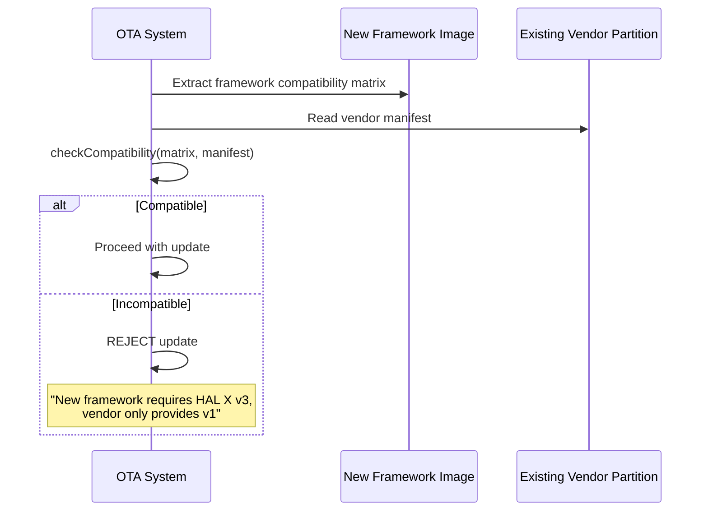
```mermaid
sequenceDiagram
    participant OTA as OTA System
    participant New as New Framework Image
    participant Vendor as Existing Vendor Partition

    OTA->>New: Extract framework compatibility matrix
    OTA->>Vendor: Read vendor manifest
    OTA->>OTA: checkCompatibility(matrix, manifest)
    alt Compatible
        OTA->>OTA: Proceed with update
    else Incompatible
        OTA->>OTA: REJECT update
        Note over OTA: "New framework requires HAL X v3,<br/>vendor only provides v1"
    end
```

---

## 10.6 HAL Lifecycle

### 10.6.1 Registration and Discovery

HAL services go through a lifecycle of registration, discovery, use, and
potentially unregistration:

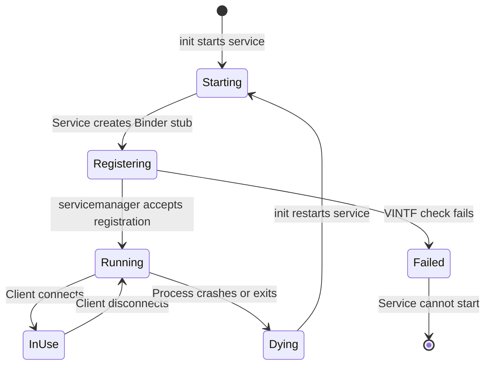
```mermaid
stateDiagram-v2
    [*] --> Starting : init starts service
    Starting --> Registering : Service creates Binder stub
    Registering --> Running : servicemanager accepts registration
    Running --> InUse : Client connects
    InUse --> Running : Client disconnects
    Running --> Dying : Process crashes or exits
    Dying --> Starting : init restarts service

    Registering --> Failed : VINTF check fails
    Failed --> [*] : Service cannot start
```

For AIDL HALs, the registration API differs by language:

**C++ (NDK backend):**

```c++
// Used by most vendor HAL implementations
AServiceManager_addService(binder.get(), "android.hardware.foo.IFoo/default");
```

**Rust:**

```rust
// Used by Rust HAL implementations
binder::add_service(&service_name, binder_object.as_binder())
    .expect("Failed to register service");
```

**C++ (platform backend):**

```c++
// Used by framework-side services (not typical for HALs)
defaultServiceManager()->addService(String16("android.hardware.foo.IFoo/default"),
                                    service);
```

For HIDL HALs, registration uses:

```c++
service->registerAsService("default");
```

Discovery follows a similar pattern.  For AIDL:

```c++
// C++ (NDK)
auto binder = AServiceManager_getService("android.hardware.foo.IFoo/default");
auto service = IFoo::fromBinder(ndk::SpAIBinder(binder));

// Rust
let service = binder::get_interface::<dyn IFoo>("android.hardware.foo.IFoo/default")?;

// Java
IFoo service = IFoo.Stub.asInterface(
    ServiceManager.getService("android.hardware.foo.IFoo/default"));
```

For HIDL:

```c++
sp<IFoo> service = IFoo::getService("default");
```

### 10.6.2 servicemanager vs hwservicemanager

Android has two service managers for two eras:

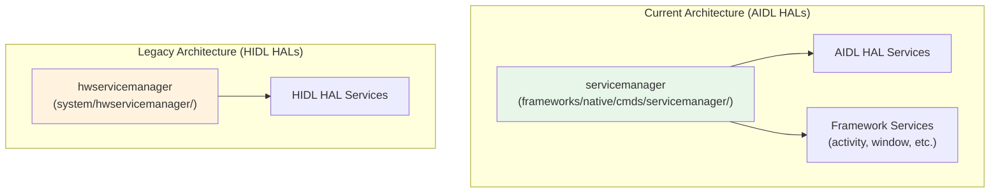
```mermaid
graph TD
    subgraph "Current Architecture (AIDL HALs)"
        SM["servicemanager<br/>(frameworks/native/cmds/servicemanager/)"]
        SM --> AIDL_HAL["AIDL HAL Services"]
        SM --> FW_SVC["Framework Services<br/>(activity, window, etc.)"]
    end

    subgraph "Legacy Architecture (HIDL HALs)"
        HWSM["hwservicemanager<br/>(system/hwservicemanager/)"]
        HWSM --> HIDL_HAL["HIDL HAL Services"]
    end

    style SM fill:#e8f5e9
    style HWSM fill:#fff3e0
```

| Aspect | servicemanager | hwservicemanager |
|--------|---------------|-----------------|
| Source | `frameworks/native/cmds/servicemanager/` | `system/hwservicemanager/` |
| IPC | Standard Binder | HwBinder |
| Used by | AIDL HALs + framework services | HIDL HALs only |
| VINTF | Checks both device and framework manifests | Checks device manifest |
| Status | **Active** | Deprecated (may be absent on new devices) |
| Naming | `<package>.<interface>/<instance>` | `<package>@<version>::<interface>/<instance>` |

The unification under a single `servicemanager` was a major simplification.
Previously, a framework service that needed to discover both AIDL services and
HIDL HALs had to talk to two different service managers.  Now, AIDL HALs are
registered alongside regular framework services, simplifying discovery.

The `servicemanager` performs VINTF manifest checks from
`frameworks/native/cmds/servicemanager/ServiceManager.cpp`.  When a service
tries to register, `servicemanager` calls `forEachManifest()` to verify the
HAL is declared:

```c++
// frameworks/native/cmds/servicemanager/ServiceManager.cpp (lines 113-115)

static std::string getNativeInstanceName(
    const vintf::ManifestInstance& instance) {
    return instance.package() + "/" + instance.instance();
}
```

The service name format for AIDL HALs in `servicemanager` is:

```
<package>/<instance>
```

For example:

```
android.hardware.light.ILights/default
android.hardware.audio.core.IModule/bluetooth
android.hardware.vibrator.IVibrator/default
```

### 10.6.3 Lazy HALs

Not all HAL services need to run all the time.  A device may have hardware
(like a fingerprint sensor or IR blaster) that is only used occasionally.
Running HAL services for such hardware continuously wastes memory.

**Lazy HALs** are services that start on demand when a client requests them,
and shut down when no clients are connected.  This is a significant memory
optimization -- each idle HAL process consumes several megabytes of RAM.

For HIDL HALs, lazy support is implemented in
`system/libhidl/transport/HidlLazyUtils.cpp`.  The `LazyServiceRegistrar`
class (lines 280-305) provides the registration mechanism:

```c++
// system/libhidl/transport/HidlLazyUtils.cpp (lines 280-305)

LazyServiceRegistrar::LazyServiceRegistrar() {
    mImpl = std::make_shared<details::LazyServiceRegistrarImpl>();
}

LazyServiceRegistrar& LazyServiceRegistrar::getInstance() {
    static auto registrarInstance = new LazyServiceRegistrar();
    return *registrarInstance;
}

status_t LazyServiceRegistrar::registerService(
    const sp<::android::hidl::base::V1_0::IBase>& service,
    const std::string& name) {
    return mImpl->registerService(service, name);
}

bool LazyServiceRegistrar::tryUnregister() {
    return mImpl->tryUnregister();
}

void LazyServiceRegistrar::reRegister() {
    mImpl->reRegister();
}
```

The core mechanism is a `ClientCounterCallback` (lines 35-95) that receives
notifications from hwservicemanager when clients connect or disconnect:

```c++
// system/libhidl/transport/HidlLazyUtils.cpp (lines 157-191)

Return<void> ClientCounterCallback::onClients(
    const sp<::android::hidl::base::V1_0::IBase>& service, bool clients) {
    std::lock_guard<std::mutex> lock(mMutex);
    Service& registered = assertRegisteredServiceLocked(service);
    // ...
    registered.clients = clients;

    size_t numWithClients = 0;
    for (const Service& registered : mRegisteredServices) {
        if (registered.clients) numWithClients++;
    }

    LOG(INFO) << "Process has " << numWithClients << " (of "
              << mRegisteredServices.size() << " available) client(s)";

    // If no clients for any service, try to shut down
    if (!handledInCallback && numWithClients == 0) {
        tryShutdownLocked();
    }
    return Status::ok();
}
```

When `tryShutdownLocked()` determines no clients remain, it unregisters all
services and exits:

```c++
// system/libhidl/transport/HidlLazyUtils.cpp (lines 231-243)

void ClientCounterCallback::tryShutdownLocked() {
    LOG(INFO) << "Trying to exit HAL. No clients in use for any service.";

    if (tryUnregisterLocked()) {
        LOG(INFO) << "Unregistered all clients and exiting";
        exit(EXIT_SUCCESS);
    }

    // If we failed to unregister some services, re-register them
    // to maintain consistency
    reRegisterLocked();
}
```

For AIDL HALs, the same pattern exists but uses the standard
`LazyServiceRegistrar` from `libbinder`.

The lazy HAL lifecycle:

```mermaid
sequenceDiagram
    participant Init as init
    participant SM as servicemanager
    participant HAL as HAL Process
    participant Client as Framework Client

    Note over Init: init knows HAL is "lazy"<br/>(interface_start in AIDL manifest)

    Client->>SM: getService("android.hardware.foo.IFoo/default")
    SM->>SM: Service not registered
    SM->>Init: Request start of HAL service
    Init->>HAL: Start process
    HAL->>SM: LazyServiceRegistrar::registerService()
    SM-->>Client: Binder proxy

    Client->>HAL: method calls

    Note over Client: Client disconnects

    SM->>HAL: onClients(false)
    HAL->>HAL: numWithClients == 0
    HAL->>SM: tryUnregister()
    HAL->>HAL: exit(EXIT_SUCCESS)

    Note over HAL: Process exits, memory freed

    Client->>SM: getService("android.hardware.foo.IFoo/default")
    SM->>Init: Request start again
    Init->>HAL: Start process again
```

### 10.6.3.1 Lazy HALs for AIDL

For AIDL HALs, the lazy registration pattern is simpler.  The framework's
`libbinder` provides `LazyServiceRegistrar`:

```c++
#include <binder/LazyServiceRegistrar.h>

int main() {
    ABinderProcess_setThreadPoolMaxThreadCount(0);

    auto greeting = ndk::SharedRefBase::make<Greeting>();

    auto lazyRegistrar = android::binder::LazyServiceRegistrar::getInstance();
    lazyRegistrar.registerService(
        greeting->asBinder().get(),
        "android.hardware.greeting.IGreeting/default");

    ABinderProcess_joinThreadPool();
    return EXIT_FAILURE;
}
```

The init.rc for a lazy HAL uses `interface` declarations to tell init which
service names to watch for:

```
service vendor.greeting-lazy /vendor/bin/hw/android.hardware.greeting-service.lazy
    interface aidl android.hardware.greeting.IGreeting/default
    class hal
    user nobody
    group nobody
    disabled  # Not started at boot!
    oneshot   # Don't auto-restart
```

The `disabled` keyword means init does not start this service at boot.
When a client calls `AServiceManager_waitForService()` or
`AServiceManager_getService()`, servicemanager asks init to start the
service.  The `interface aidl` declaration tells init which AIDL service
name maps to this init service.

The lifecycle for a lazy AIDL HAL:

1. Device boots -- lazy HAL service is NOT started.
2. Client requests the service from servicemanager.
3. servicemanager tells init to start the service.
4. init starts the HAL process.
5. HAL registers with LazyServiceRegistrar.
6. LazyServiceRegistrar registers with servicemanager and requests client
   count notifications.
7. Client gets the Binder proxy and uses the HAL.
8. Client disconnects (Binder reference count drops to zero).
9. servicemanager notifies LazyServiceRegistrar that client count is zero.
10. LazyServiceRegistrar unregisters the service and calls `exit()`.
11. The process is gone, memory is freed.

### 10.6.4 HAL Process Lifecycle in init.rc

HAL services are started by Android's init system.  The init.rc service
definition controls security, priority, and restart behavior.

A typical HAL service definition:

```
service vendor.light-default /vendor/bin/hw/android.hardware.lights-service.example
    class hal
    user nobody
    group nobody
    shutdown critical
```

Key directives:

| Directive | Meaning |
|-----------|---------|
| `class hal` | Groups this service with other HALs; all started together |
| `user nobody` | Run as unprivileged user (principle of least privilege) |
| `group nobody` | Minimal group membership |
| `shutdown critical` | Must be among the last services stopped during shutdown |
| `capabilities` | Linux capabilities granted to the process |
| `rlimit rtprio` | Maximum real-time scheduling priority |
| `ioprio` | I/O scheduling class and priority |
| `task_profiles` | CGroup configuration for CPU scheduling |
| `onrestart restart <service>` | Cascade restart if this HAL crashes |

For latency-critical HALs like audio, the init.rc includes elevated privileges:

```
# From audio HAL init.rc
service vendor.audio-hal-aidl ...
    class hal
    user audioserver
    group audio camera drmrpc inet media mediadrm net_bt net_bt_admin net_bw_acct wakelock context_hub
    capabilities BLOCK_SUSPEND SYS_NICE
    rlimit rtprio 10 10
    ioprio rt 4
    task_profiles ProcessCapacityHigh HighPerformance
    onrestart restart audioserver
```

### 10.6.5 Death Recipients and Recovery

When a HAL process crashes, clients need to know so they can recover gracefully.
Both HIDL and AIDL provide death notification mechanisms.

In HIDL, death recipients are built into IBase:

```
// From IBase.hal (lines 87-97)

linkToDeath(death_recipient recipient, uint64_t cookie)
    generates (bool success);

unlinkToDeath(death_recipient recipient) generates (bool success);
```

In AIDL, the Binder framework provides equivalent death notification:

```c++
// C++ (NDK)
AIBinder_DeathRecipient* deathRecipient =
    AIBinder_DeathRecipient_new(onServiceDied);
AIBinder_linkToDeath(binder, deathRecipient, cookie);

// Rust
binder.link_to_death(&mut death_recipient)?;

// Java
binder.linkToDeath(deathRecipient, 0);
```

When a HAL crashes, init (which started it) automatically restarts the service.
The `onrestart` directive in init.rc ensures that dependent services are also
restarted.  For example, if the audio HAL crashes, the audio server is
restarted to re-establish its HAL connections.

### 10.6.5.1 Death Notification in Practice

Here is a concrete example of how a framework service handles HAL death.
Consider the Light Service in system_server:

```java
// Simplified Java client with death handling
public class LightService {
    private ILights mLights;
    private final IBinder.DeathRecipient mDeathRecipient = () -> {
        Log.w(TAG, "Lights HAL died, reconnecting...");
        synchronized (this) {
            mLights = null;
        }
        connectToHal();  // Attempt to reconnect
    };

    private void connectToHal() {
        IBinder binder = ServiceManager.getService(
            "android.hardware.light.ILights/default");
        if (binder != null) {
            try {
                binder.linkToDeath(mDeathRecipient, 0);
                synchronized (this) {
                    mLights = ILights.Stub.asInterface(binder);
                }
            } catch (RemoteException e) {
                Log.e(TAG, "Failed to link to death", e);
            }
        }
    }
}
```

The death notification pattern ensures that:

1. The framework detects HAL crashes immediately (via Binder kernel driver
   death notification, not polling).
2. The framework nullifies its stale reference to prevent use-after-death.
3. The framework can attempt reconnection when init restarts the HAL.
4. In-flight Binder calls fail gracefully with `DeadObjectException`.

```mermaid
sequenceDiagram
    participant FW as Framework Client
    participant SM as servicemanager
    participant HAL as HAL Process
    participant Kernel as Binder Kernel Driver
    participant Init as init

    FW->>HAL: linkToDeath(deathRecipient)
    FW->>HAL: Normal method calls...

    Note over HAL: HAL process crashes!
    HAL->>Kernel: Process exits
    Kernel->>FW: Death notification
    FW->>FW: mDeathRecipient.binderDied()
    FW->>FW: Nullify reference, log warning

    Kernel->>Init: Process terminated
    Init->>HAL: Restart service (oneshot/restart)
    HAL->>SM: Re-register service

    FW->>SM: getService() (reconnect)
    SM-->>FW: New Binder proxy
    FW->>HAL: linkToDeath(deathRecipient)
    FW->>HAL: Resume normal operations
```

### 10.6.5.2 SELinux and HAL Services

SELinux plays a critical role in HAL service security.  Every HAL service runs
in a specific SELinux domain, and the policy controls:

1. **Service registration**: The `add` permission on `service_manager_type`
   controls which domains can register which service names.

2. **Service lookup**: The `find` permission controls which domains can
   discover which services.

3. **Binder communication**: The `call` permission controls which domains
   can send Binder transactions to which other domains.

4. **Hardware access**: File access rules control which domains can read/write
   device nodes (e.g., `/dev/lights`, `/sys/class/leds/`).

A typical SELinux policy for a HAL service includes:

```
# Type declarations
type hal_greeting_default, domain;
type hal_greeting_default_exec, exec_type, vendor_file_type, file_type;

# Service registration
allow hal_greeting_default greeting_service:service_manager add;

# Allow clients to find the service
allow system_server greeting_service:service_manager find;

# Allow Binder communication
binder_call(system_server, hal_greeting_default)
binder_call(hal_greeting_default, system_server)

# Hardware access (if needed)
allow hal_greeting_default sysfs_greeting:file { read write };
```

Without correct SELinux policy, the HAL service will:

- Fail silently during registration (AVC denial logged in `dmesg`)
- Be invisible to clients even though it is registered
- Crash when trying to access hardware device nodes

Debugging SELinux issues:

```bash
# Check for AVC denials
adb shell dmesg | grep "avc: denied"

# Generate policy from denials (development only!)
adb shell dmesg | audit2allow
```

### 10.6.6 HAL Client Access Patterns

There are three common patterns for accessing HAL services:

**Pattern 1: Get-and-hold (most common)**

The client obtains a reference to the HAL at startup and holds it for the
lifetime of the process.

```c++
// Obtained once during initialization
auto service = IFoo::fromBinder(
    ndk::SpAIBinder(AServiceManager_waitForService(
        "android.hardware.foo.IFoo/default")));
// Used throughout the process lifetime
service->doSomething();
```

`AServiceManager_waitForService` blocks until the service is available, which
is appropriate for system services that start during boot.

**Pattern 2: Get-on-demand**

The client obtains a reference to the HAL only when needed, and releases it
when done.  This pairs well with lazy HALs.

```c++
void doOperation() {
    auto service = IFoo::fromBinder(
        ndk::SpAIBinder(AServiceManager_checkService(
            "android.hardware.foo.IFoo/default")));
    if (service == nullptr) {
        // Service not available
        return;
    }
    service->doSomething();
    // service reference released when function returns
}
```

`AServiceManager_checkService` returns immediately, returning `nullptr` if the
service is not currently registered.

**Pattern 3: Notification-based**

The client registers for notifications when a service becomes available.

```c++
AServiceManager_registerForServiceNotifications(
    "android.hardware.foo.IFoo/default",
    [](const char* instance, AIBinder* binder) {
        auto service = IFoo::fromBinder(ndk::SpAIBinder(binder));
        // Service is now available, begin using it
    });
```

---

## 10.7 Try It: Write a Minimal AIDL HAL

In this section, we will write a complete AIDL HAL from scratch: interface
definition, implementation in both C++ and Rust, VINTF manifest, init.rc, build
rules, and a client.  We will create a simple "Greeting" HAL that demonstrates
all the concepts covered in this chapter.

### 10.7.1 Step 1: Define the AIDL Interface

Create the directory structure:

```
hardware/interfaces/greeting/aidl/
    Android.bp
    android/hardware/greeting/
        IGreeting.aidl
        GreetingResponse.aidl
    default/
        Android.bp
        main.cpp
        Greeting.cpp
        Greeting.h
        greeting-default.rc
        greeting-default.xml
```

First, define the interface types.  A response parcelable:

```java
// android/hardware/greeting/GreetingResponse.aidl

package android.hardware.greeting;

@VintfStability
parcelable GreetingResponse {
    /** The greeting message */
    String message;
    /** Timestamp of when the greeting was generated */
    long timestampMs;
    /** Name of the HAL implementation */
    String implementationName;
}
```

Then the main interface:

```java
// android/hardware/greeting/IGreeting.aidl

package android.hardware.greeting;

import android.hardware.greeting.GreetingResponse;

/**
 * A minimal example AIDL HAL for educational purposes.
 *
 * This HAL demonstrates the core concepts:
 * - @VintfStability annotation for HAL interfaces
 * - Parcelable types for structured data
 * - Multiple method signatures
 * - Error handling with service-specific exceptions
 */
@VintfStability
interface IGreeting {
    /**
     * Get a simple greeting.
     *
     * @return A greeting message including the HAL implementation name
     *         and current timestamp.
     */
    GreetingResponse greet();

    /**
     * Get a personalized greeting.
     *
     * @param name The name to include in the greeting.
     * @return A personalized greeting message.
     * @throws ServiceSpecificException with error code 1 if name is empty.
     */
    GreetingResponse greetByName(in String name);

    /**
     * Get the number of greetings served since the HAL started.
     *
     * @return The total greeting count.
     */
    int getGreetingCount();
}
```

Key observations:

- `@VintfStability` on both the interface and the parcelable marks them as HAL
  types that must be version-frozen before shipping.
- The `in` keyword on `String name` means the parameter is input-only (the
  caller provides it).  AIDL also supports `out` (server fills it in) and
  `inout` (both).
- Error reporting uses `ServiceSpecificException`, which maps to
  `EX_SERVICE_SPECIFIC` in the Binder protocol.

### 10.7.2 Step 2: Create the Build Definition

```
// hardware/interfaces/greeting/aidl/Android.bp

aidl_interface {
    name: "android.hardware.greeting",
    vendor_available: true,
    srcs: [
        "android/hardware/greeting/*.aidl",
    ],
    stability: "vintf",
    backend: {
        java: {
            sdk_version: "module_current",
        },
        rust: {
            enabled: true,
        },
        ndk: {
            enabled: true,
        },
        cpp: {
            enabled: true,
        },
    },
    versions_with_info: [
        // Initially empty; will contain frozen versions after
        // running `m android.hardware.greeting-update-api`
    ],
}
```

This generates libraries for all four backends:

- `android.hardware.greeting-V1-java`
- `android.hardware.greeting-V1-cpp`
- `android.hardware.greeting-V1-ndk`
- `android.hardware.greeting-V1-rust`

### 10.7.3 Step 3: Implement the HAL in C++ (NDK Backend)

The NDK backend is the recommended choice for C++ vendor HAL implementations.

**Greeting.h:**

```c++
// hardware/interfaces/greeting/aidl/default/Greeting.h

#pragma once

#include <aidl/android/hardware/greeting/BnGreeting.h>
#include <atomic>

namespace aidl::android::hardware::greeting {

class Greeting : public BnGreeting {
public:
    Greeting();

    ndk::ScopedAStatus greet(GreetingResponse* _aidl_return) override;
    ndk::ScopedAStatus greetByName(const std::string& name,
                                    GreetingResponse* _aidl_return) override;
    ndk::ScopedAStatus getGreetingCount(int32_t* _aidl_return) override;

private:
    GreetingResponse makeResponse(const std::string& message);
    std::atomic<int32_t> mGreetingCount{0};
};

}  // namespace aidl::android::hardware::greeting
```

**Greeting.cpp:**

```c++
// hardware/interfaces/greeting/aidl/default/Greeting.cpp

#define LOG_TAG "GreetingHAL"

#include "Greeting.h"

#include <android-base/logging.h>
#include <chrono>

namespace aidl::android::hardware::greeting {

Greeting::Greeting() {
    LOG(INFO) << "Greeting HAL initialized";
}

GreetingResponse Greeting::makeResponse(const std::string& message) {
    GreetingResponse response;
    response.message = message;
    response.timestampMs =
        std::chrono::duration_cast<std::chrono::milliseconds>(
            std::chrono::system_clock::now().time_since_epoch())
        .count();
    response.implementationName = "GreetingHAL-Default-CPP";
    mGreetingCount.fetch_add(1, std::memory_order_relaxed);
    return response;
}

ndk::ScopedAStatus Greeting::greet(GreetingResponse* _aidl_return) {
    LOG(INFO) << "greet() called";
    *_aidl_return = makeResponse("Hello from the Greeting HAL!");
    return ndk::ScopedAStatus::ok();
}

ndk::ScopedAStatus Greeting::greetByName(const std::string& name,
                                          GreetingResponse* _aidl_return) {
    LOG(INFO) << "greetByName() called with name: " << name;

    if (name.empty()) {
        return ndk::ScopedAStatus::fromServiceSpecificError(1);
    }

    *_aidl_return = makeResponse("Hello, " + name + "! Welcome to AOSP.");
    return ndk::ScopedAStatus::ok();
}

ndk::ScopedAStatus Greeting::getGreetingCount(int32_t* _aidl_return) {
    *_aidl_return = mGreetingCount.load(std::memory_order_relaxed);
    return ndk::ScopedAStatus::ok();
}

}  // namespace aidl::android::hardware::greeting
```

**main.cpp:**

```c++
// hardware/interfaces/greeting/aidl/default/main.cpp

#define LOG_TAG "android.hardware.greeting-service"

#include "Greeting.h"

#include <android-base/logging.h>
#include <android/binder_manager.h>
#include <android/binder_process.h>

using aidl::android::hardware::greeting::Greeting;

int main() {
    LOG(INFO) << "Greeting HAL service starting...";

    // Set thread pool size.  0 means use the calling thread only
    // (suitable for simple HALs that do not need concurrency).
    ABinderProcess_setThreadPoolMaxThreadCount(0);

    // Create the implementation
    auto greeting = ndk::SharedRefBase::make<Greeting>();

    // Build the service name: "android.hardware.greeting.IGreeting/default"
    const std::string instance = std::string() +
        Greeting::descriptor + "/default";

    // Register with servicemanager
    binder_status_t status = AServiceManager_addService(
        greeting->asBinder().get(), instance.c_str());
    CHECK_EQ(status, STATUS_OK)
        << "Failed to register " << instance;

    LOG(INFO) << "Greeting HAL service registered as: " << instance;

    // Block forever, processing Binder transactions
    ABinderProcess_joinThreadPool();
    return EXIT_FAILURE;  // Should not reach
}
```

**Android.bp for the implementation:**

```
// hardware/interfaces/greeting/aidl/default/Android.bp

cc_binary {
    name: "android.hardware.greeting-service.example",
    relative_install_path: "hw",
    init_rc: ["greeting-default.rc"],
    vintf_fragments: ["greeting-default.xml"],
    vendor: true,
    shared_libs: [
        "libbase",
        "libbinder_ndk",
    ],
    static_libs: [
        "android.hardware.greeting-V1-ndk",
    ],
    srcs: [
        "Greeting.cpp",
        "main.cpp",
    ],
}
```

Key build flags:

- `vendor: true` -- installs to `/vendor/bin/hw/`.
- `relative_install_path: "hw"` -- standard subdirectory for HAL binaries.
- `init_rc` -- automatically installs the init.rc file.
- `vintf_fragments` -- automatically installs the VINTF manifest fragment.
- `static_libs` includes the generated NDK interface library.

### 10.7.4 Step 4: Implement the HAL in Rust

An alternative implementation in Rust (as shown by the Lights HAL):

**main.rs:**

```rust
// hardware/interfaces/greeting/aidl/default-rust/main.rs

use android_hardware_greeting::aidl::android::hardware::greeting::{
    IGreeting::BnGreeting,
    IGreeting::IGreeting,
    GreetingResponse::GreetingResponse,
};
use binder::{BinderFeatures, Interface, Status, ExceptionCode};
use std::sync::atomic::{AtomicI32, Ordering};
use std::time::{SystemTime, UNIX_EPOCH};
use log::{info, LevelFilter};

const LOG_TAG: &str = "greeting_hal_rust";

struct GreetingService {
    count: AtomicI32,
}

impl Interface for GreetingService {}

impl Default for GreetingService {
    fn default() -> Self {
        Self { count: AtomicI32::new(0) }
    }
}

impl GreetingService {
    fn make_response(&self, message: String) -> GreetingResponse {
        self.count.fetch_add(1, Ordering::Relaxed);
        GreetingResponse {
            message,
            timestampMs: SystemTime::now()
                .duration_since(UNIX_EPOCH)
                .unwrap()
                .as_millis() as i64,
            implementationName: "GreetingHAL-Default-Rust".into(),
        }
    }
}

impl IGreeting for GreetingService {
    fn greet(&self) -> binder::Result<GreetingResponse> {
        info!("greet() called");
        Ok(self.make_response("Hello from the Greeting HAL (Rust)!".into()))
    }

    fn greetByName(&self, name: &str) -> binder::Result<GreetingResponse> {
        info!("greetByName() called with name: {}", name);
        if name.is_empty() {
            return Err(Status::new_service_specific_error(1, None));
        }
        Ok(self.make_response(
            format!("Hello, {}! Welcome to AOSP (from Rust).", name)))
    }

    fn getGreetingCount(&self) -> binder::Result<i32> {
        Ok(self.count.load(Ordering::Relaxed))
    }
}

fn main() {
    logger::init(
        logger::Config::default()
            .with_tag_on_device(LOG_TAG)
            .with_max_level(LevelFilter::Trace),
    );

    binder::ProcessState::set_thread_pool_max_thread_count(0);

    let service = GreetingService::default();
    let binder = BnGreeting::new_binder(service, BinderFeatures::default());

    let name = format!(
        "{}/default",
        <GreetingService as IGreeting>::get_descriptor()
    );

    binder::add_service(&name, binder.as_binder())
        .expect("Failed to register Greeting HAL");

    info!("Greeting HAL (Rust) registered as: {}", name);

    binder::ProcessState::join_thread_pool();
}
```

**Android.bp for the Rust implementation:**

```
// hardware/interfaces/greeting/aidl/default-rust/Android.bp

rust_binary {
    name: "android.hardware.greeting-service.rust-example",
    relative_install_path: "hw",
    init_rc: ["greeting-default.rc"],
    vintf_fragments: ["greeting-default.xml"],
    vendor: true,
    rustlibs: [
        "liblogger",
        "liblog_rust",
        "libbinder_rs",
        "android.hardware.greeting-V1-rust",
    ],
    srcs: ["main.rs"],
}
```

### 10.7.5 Step 5: Write the VINTF Manifest Fragment

```xml
<!-- hardware/interfaces/greeting/aidl/default/greeting-default.xml -->
<manifest version="1.0" type="device">
    <hal format="aidl">
        <name>android.hardware.greeting</name>
        <version>1</version>
        <fqname>IGreeting/default</fqname>
    </hal>
</manifest>
```

This fragment is automatically merged into the device's VINTF manifest at build
time (because of the `vintf_fragments` directive in `Android.bp`).

The fragment declares:

- **format**: "aidl" (not "hidl")
- **name**: The AIDL package name
- **version**: The frozen API version this implementation provides
- **fqname**: `InterfaceName/instance`

### 10.7.6 Step 6: Write the init.rc Service Definition

```
# hardware/interfaces/greeting/aidl/default/greeting-default.rc
service vendor.greeting-default /vendor/bin/hw/android.hardware.greeting-service.example
    class hal
    user nobody
    group nobody
    shutdown critical
```

For a simple HAL like this, the minimal configuration is sufficient:

- `class hal` ensures it starts with other HAL services.
- `user nobody` / `group nobody` follow the principle of least privilege.
- `shutdown critical` ensures orderly shutdown.

If the HAL needed additional permissions, we would add them:

```
# Example with additional permissions (not needed for greeting HAL)
service vendor.greeting-default /vendor/bin/hw/android.hardware.greeting-service.example
    class hal
    user system
    group system input
    capabilities SYS_NICE
    rlimit rtprio 10 10
```

### 10.7.7 Step 7: Write a Client

**C++ client (NDK):**

```c++
// greeting_client.cpp

#include <aidl/android/hardware/greeting/IGreeting.h>
#include <android/binder_manager.h>
#include <android-base/logging.h>

using aidl::android::hardware::greeting::IGreeting;
using aidl::android::hardware::greeting::GreetingResponse;

int main() {
    // Get the service (waits until available)
    const std::string instance = std::string() +
        IGreeting::descriptor + "/default";

    auto binder = ndk::SpAIBinder(
        AServiceManager_waitForService(instance.c_str()));
    if (binder == nullptr) {
        LOG(ERROR) << "Failed to get Greeting HAL";
        return 1;
    }

    auto greeting = IGreeting::fromBinder(binder);
    if (greeting == nullptr) {
        LOG(ERROR) << "Failed to cast Greeting HAL";
        return 1;
    }

    // Call greet()
    GreetingResponse response;
    auto status = greeting->greet(&response);
    if (status.isOk()) {
        LOG(INFO) << "Greeting: " << response.message;
        LOG(INFO) << "  Timestamp: " << response.timestampMs;
        LOG(INFO) << "  Implementation: " << response.implementationName;
    } else {
        LOG(ERROR) << "greet() failed: " << status.getDescription();
    }

    // Call greetByName()
    status = greeting->greetByName("Alice", &response);
    if (status.isOk()) {
        LOG(INFO) << "Personalized: " << response.message;
    }

    // Call greetByName() with empty string (expect error)
    status = greeting->greetByName("", &response);
    if (!status.isOk()) {
        LOG(INFO) << "Expected error for empty name: "
                  << status.getDescription();
    }

    // Get count
    int32_t count;
    status = greeting->getGreetingCount(&count);
    if (status.isOk()) {
        LOG(INFO) << "Total greetings served: " << count;
    }

    return 0;
}
```

**Rust client:**

```rust
// greeting_client.rs

use android_hardware_greeting::aidl::android::hardware::greeting::{
    IGreeting::IGreeting,
};
use log::{info, error, LevelFilter};

fn main() {
    logger::init(
        logger::Config::default()
            .with_tag_on_device("greeting_client")
            .with_max_level(LevelFilter::Trace),
    );

    let service_name = format!(
        "{}/default",
        <dyn IGreeting>::get_descriptor()
    );

    let greeting = binder::get_interface::<dyn IGreeting>(&service_name)
        .expect("Failed to get Greeting HAL");

    // Call greet()
    match greeting.greet() {
        Ok(response) => {
            info!("Greeting: {}", response.message);
            info!("  Timestamp: {}", response.timestampMs);
            info!("  Implementation: {}", response.implementationName);
        }
        Err(e) => error!("greet() failed: {:?}", e),
    }

    // Call greetByName()
    match greeting.greetByName("Alice") {
        Ok(response) => info!("Personalized: {}", response.message),
        Err(e) => error!("greetByName() failed: {:?}", e),
    }

    // Get count
    match greeting.getGreetingCount() {
        Ok(count) => info!("Total greetings served: {}", count),
        Err(e) => error!("getGreetingCount() failed: {:?}", e),
    }
}
```

### 10.7.8 Step 8: Build and Test

**Build the HAL:**

```bash
# Build the AIDL interface library
m android.hardware.greeting

# Build the HAL service
m android.hardware.greeting-service.example

# Build the client
m greeting_client
```

**Deploy and test on device:**

```bash
# Push the HAL service binary
adb push out/target/product/<device>/vendor/bin/hw/android.hardware.greeting-service.example \
    /vendor/bin/hw/

# Push the VINTF manifest fragment
adb push greeting-default.xml /vendor/etc/vintf/manifest/

# Push the init.rc (or manually start the service)
adb shell /vendor/bin/hw/android.hardware.greeting-service.example &

# Run the client
adb push out/target/product/<device>/system/bin/greeting_client /data/local/tmp/
adb shell /data/local/tmp/greeting_client
```

**Expected output:**

```
I greeting_client: Greeting: Hello from the Greeting HAL!
I greeting_client:   Timestamp: 1710763200000
I greeting_client:   Implementation: GreetingHAL-Default-CPP
I greeting_client: Personalized: Hello, Alice! Welcome to AOSP.
I greeting_client: Expected error for empty name: Status(-8, EX_SERVICE_SPECIFIC): '1'
I greeting_client: Total greetings served: 2
```

**Verify with dumpsys:**

```bash
# List all registered services
adb shell dumpsys -l | grep greeting
# Expected: android.hardware.greeting.IGreeting/default

# Check service details
adb shell service check android.hardware.greeting.IGreeting/default
# Expected: Service android.hardware.greeting.IGreeting/default: found
```

### 10.7.9 Step 9: Freeze the API

Before shipping the HAL, freeze the API to create an immutable version
snapshot:

```bash
# Generate the frozen version snapshot
m android.hardware.greeting-update-api
```

This copies the current `.aidl` files to
`aidl_api/android.hardware.greeting/1/` and adds version 1 to the
`versions_with_info` list in `Android.bp`:

```
versions_with_info: [
    {
        version: "1",
        imports: [],
    },
],
```

After freezing, set `frozen: true` in `Android.bp`.  The build system will
now verify that the current source files match the frozen snapshot.  Any
changes require a new version (2).

To add new methods in a future version:

1. Remove `frozen: true` temporarily.
2. Add new methods to the `.aidl` files (without removing or changing
   existing methods).
3. Test thoroughly.
4. Run `m android.hardware.greeting-update-api` to create version 2.
5. Re-add `frozen: true`.

### 10.7.9.1 Understanding API Evolution

API evolution is the most important aspect of long-term HAL maintenance.  Let
us walk through how you would add a new method to the Greeting HAL in version 2.

**Step 1: Modify the current .aidl file:**

Add a new method (never remove or change existing ones):

```java
// android/hardware/greeting/IGreeting.aidl (version 2)

@VintfStability
interface IGreeting {
    // All version 1 methods remain unchanged
    GreetingResponse greet();
    GreetingResponse greetByName(in String name);
    int getGreetingCount();

    // NEW in version 2:
    /**
     * Get a greeting in a specific language.
     *
     * @param name The name to greet.
     * @param languageTag BCP-47 language tag (e.g., "en-US", "ja-JP").
     * @return A localized greeting.
     * @throws ServiceSpecificException with code 1 if name is empty,
     *         code 2 if language is not supported.
     */
    GreetingResponse greetInLanguage(in String name, in String languageTag);
}
```

**Step 2: Update the parcelable if needed:**

```java
// android/hardware/greeting/GreetingResponse.aidl (version 2)

@VintfStability
parcelable GreetingResponse {
    String message;
    long timestampMs;
    String implementationName;
    // NEW in version 2:
    /** BCP-47 language tag of the response, or empty if not applicable */
    @nullable String languageTag;
}
```

Note the use of `@nullable` for the new field -- this ensures backward
compatibility, as old clients that do not know about this field will see it
as null/default.

**Step 3: Freeze version 2:**

```bash
m android.hardware.greeting-update-api
```

**Step 4: Update Android.bp:**

```
versions_with_info: [
    {
        version: "1",
        imports: [],
    },
    {
        version: "2",
        imports: [],
    },
],
```

**Step 5: Implement in the HAL service:**

The implementation adds the new method while maintaining all existing methods:

```c++
ndk::ScopedAStatus Greeting::greetInLanguage(
        const std::string& name,
        const std::string& languageTag,
        GreetingResponse* _aidl_return) {
    if (name.empty()) {
        return ndk::ScopedAStatus::fromServiceSpecificError(1);
    }

    std::string message;
    if (languageTag == "ja-JP") {
        message = "こんにちは、" + name + "さん！AOSPへようこそ。";
    } else if (languageTag == "es-ES") {
        message = "¡Hola, " + name + "! Bienvenido a AOSP.";
    } else if (languageTag == "en-US" || languageTag.empty()) {
        message = "Hello, " + name + "! Welcome to AOSP.";
    } else {
        return ndk::ScopedAStatus::fromServiceSpecificError(2);
    }

    *_aidl_return = makeResponse(message);
    _aidl_return->languageTag = languageTag;
    return ndk::ScopedAStatus::ok();
}
```

**Backward compatibility:**

- A version-1 client talking to a version-2 server: works fine.  The client
  simply never calls `greetInLanguage()`.  The extra `languageTag` field in
  `GreetingResponse` is ignored by the old client (it does not read it).

- A version-2 client talking to a version-1 server: the client can call
  `greetInLanguage()`, but the server will return `EX_UNSUPPORTED_OPERATION`
  or a transaction error.  The client must handle this gracefully, typically
  by falling back to `greetByName()`.

### 10.7.10 Debugging HAL Services

Several tools are available for debugging HAL services at runtime:

**dumpsys -- list all services:**

```bash
# List all services registered with servicemanager
adb shell dumpsys -l

# Check if a specific service is registered
adb shell service check android.hardware.greeting.IGreeting/default
```

**lshal -- list HAL services (HIDL and AIDL):**

```bash
# List all HAL services with their transport and status
adb shell lshal

# Show detailed info for a specific HAL
adb shell lshal debug android.hardware.greeting.IGreeting/default
```

**logcat -- HAL service logs:**

```bash
# Filter for HAL logs
adb logcat -s GreetingHAL:* HidlServiceManagement:*

# Filter for servicemanager logs
adb logcat -s servicemanager:*
```

**VINTF checks:**

```bash
# Dump the device's VINTF manifest
adb shell cat /vendor/etc/vintf/manifest.xml

# Dump the merged device manifest
adb shell dumpsys DumpVintf

# Check compatibility
adb shell /system/bin/vintf --check-compat
```

**Binder debugging:**

```bash
# Show binder transactions for a specific service
adb shell cat /sys/kernel/debug/binder/transactions

# Show binder process state
adb shell cat /sys/kernel/debug/binder/proc/<pid>
```

### 10.7.11 Common Pitfalls

When developing AIDL HALs, several common issues arise:

**1. Missing @VintfStability annotation.**  Forgetting this annotation on any
type referenced by the interface causes a build error.  Every parcelable, enum,
and union used by a VINTF-stable interface must also be `@VintfStability`.

**2. Incorrect service name.**  The service name must match exactly between
the VINTF manifest, the registration code, and the client lookup.  The
convention is `<package>.<InterfaceName>/<instance>`.

**3. Unfrozen interface in production.**  If `frozen: true` is not set in
`Android.bp`, the build system will not enforce API immutability.  This can
lead to accidental backward-incompatible changes.

**4. Wrong backend for vendor code.**  Using the `cpp` backend instead of
`ndk` for vendor code links against `libbinder.so`, which is not part of the
VNDK.  This causes linker errors on real devices where namespace isolation is
enforced.

**5. Not handling version differences.**  When a framework is newer than the
vendor HAL, the framework may call methods that do not exist in the HAL.  The
framework must check the HAL's interface version and handle
`EX_UNSUPPORTED_OPERATION` gracefully.

**6. SELinux policy.**  Every HAL service needs appropriate SELinux policy to:
   - Register with servicemanager
   - Be found by clients
   - Access the hardware devices it manages

Missing SELinux policy causes silent failures where `addService()` returns
success but clients get `nullptr` from `getService()`.

---

## 10.8 Summary

### 10.8.1 Architecture Comparison

The following diagram summarizes the three HAL generations and their
relationship to the system architecture:

```mermaid
graph TD
    subgraph "Generation 1: Legacy HAL (2008)"
        L_FW["Framework Process<br/>(e.g., SurfaceFlinger)"]
        L_HAL["Vendor .so<br/>(dlopen'd in-process)"]
        L_DRV["Kernel Driver"]
        L_FW --> L_HAL
        L_HAL --> L_DRV
        style L_HAL fill:#fce4ec
    end

    subgraph "Generation 2: HIDL (2017)"
        H_FW["Framework Process"]
        H_HWSM["hwservicemanager"]
        H_HAL["HAL Process<br/>(HwBinder IPC)"]
        H_DRV["Kernel Driver"]
        H_FW -->|"HwBinder"| H_HAL
        H_FW -.->|"discover"| H_HWSM
        H_HAL -.->|"register"| H_HWSM
        H_HAL --> H_DRV
        style H_HAL fill:#fff3e0
    end

    subgraph "Generation 3: AIDL HAL (2020+)"
        A_FW["Framework Process"]
        A_SM["servicemanager<br/>(unified)"]
        A_HAL["HAL Process<br/>(Standard Binder IPC)"]
        A_DRV["Kernel Driver"]
        A_FW -->|"Binder"| A_HAL
        A_FW -.->|"discover"| A_SM
        A_HAL -.->|"register"| A_SM
        A_HAL --> A_DRV
        style A_HAL fill:#e8f5e9
    end
```

### 10.8.2 Key Metrics

| Metric | Legacy HAL | HIDL | AIDL HAL |
|--------|-----------|------|----------|
| Source files (interface definitions) | ~30 headers | ~200 .hal files | ~400 .aidl files |
| Process isolation | No | Yes | Yes |
| IPC overhead per call | None (in-process) | ~2-5 us (HwBinder) | ~2-5 us (Binder) |
| Language support | C only | C++, Java | C++, Java, Rust, NDK |
| VINTF integration | No | Yes | Yes |
| Lazy HAL support | No | Yes | Yes |
| APEX updatability | No | Limited | Yes |
| Memory per HAL | Shared with host | 2-8 MB per process | 2-8 MB per process |

### 10.8.3 Decision Tree: Which HAL Technology to Use

```mermaid
flowchart TD
    A["Starting a new HAL?"] --> B{"New or existing<br/>interface?"}
    B -->|New| C["Use AIDL HAL<br/>(always)"]
    B -->|Existing| D{"Currently<br/>which type?"}
    D -->|Legacy| E{"Can migrate?"}
    D -->|HIDL| F{"Can migrate?"}
    D -->|Already AIDL| G["Continue with AIDL"]
    E -->|Yes| C
    E -->|No| H["Maintain legacy<br/>(but plan migration)"]
    F -->|Yes| C
    F -->|No| I["Maintain HIDL<br/>(but plan migration)"]

    style C fill:#e8f5e9
    style G fill:#e8f5e9
    style H fill:#fce4ec
    style I fill:#fff3e0
```

### 10.8.4 The Big Picture

The HAL is the critical boundary between Android's open-source framework and
vendor-proprietary hardware support.  Its design has evolved through three
generations:

**Legacy HAL (libhardware)** introduced the fundamental concepts: module
discovery via system properties, loading via `dlopen()`, and C-style
polymorphism through `hw_module_t` / `hw_device_t`.  The code at
`hardware/libhardware/hardware.c` (279 lines) remains one of the most
important files in AOSP for understanding how Android bridges to hardware.

**HIDL** added versioned IPC interfaces, separating HAL implementations into
their own processes.  The transport layer at `system/libhidl/transport/`
manages passthrough wrapping, binderized communication through HwBinder,
and the `hwservicemanager` at `system/hwservicemanager/`.  HIDL is now
deprecated but remains in the codebase for backward compatibility.

**AIDL HALs** are the current standard, unifying HAL interfaces with the
existing AIDL ecosystem.  The 55 interface directories under
`hardware/interfaces/` define every hardware interface in Android, from audio
to vibrators.  AIDL's multi-language support (C++, Java, Rust, NDK) and its
integration with the standard `servicemanager` at
`frameworks/native/cmds/servicemanager/` make it the most capable HAL
framework yet.

**VINTF** (`system/libvintf/`) ties everything together, providing the
compatibility checking that enables independent framework and vendor updates.
The compatibility matrices at
`hardware/interfaces/compatibility_matrices/` encode the contract between
framework and vendor for each Android release.

The key files for further exploration:

| File | Lines | Purpose |
|------|-------|---------|
| `hardware/libhardware/hardware.c` | 279 | Legacy HAL module loading |
| `hardware/libhardware/include/hardware/hardware.h` | 245 | Core HAL data structures |
| `system/libhidl/transport/ServiceManagement.cpp` | ~500 | HIDL service discovery |
| `system/libhidl/transport/HidlLazyUtils.cpp` | 309 | Lazy HAL support |
| `system/libhidl/transport/base/1.0/IBase.hal` | 141 | HIDL root interface |
| `system/libhidl/transport/manager/1.0/IServiceManager.hal` | 165 | HIDL service manager interface |
| `hardware/interfaces/light/aidl/android/hardware/light/ILights.aidl` | 47 | Simple AIDL HAL example |
| `hardware/interfaces/light/aidl/default/main.rs` | 46 | Rust HAL service example |
| `hardware/interfaces/light/aidl/default/lights.rs` | 80 | Rust HAL implementation |
| `hardware/interfaces/vibrator/aidl/default/main.cpp` | 45 | NDK C++ HAL service example |
| `hardware/interfaces/audio/aidl/default/Module.cpp` | ~2000 | Complex production HAL |
| `hardware/interfaces/power/aidl/android/hardware/power/IPower.aidl` | 200 | Advanced AIDL features |
| `system/libvintf/include/vintf/VintfObject.h` | ~200 | VINTF compatibility checking API |
| `system/libvintf/include/vintf/HalManifest.h` | ~100 | VINTF manifest data model |
| `frameworks/native/cmds/servicemanager/ServiceManager.cpp` | ~120 | Service manager VINTF integration |
| `hardware/interfaces/compatibility_matrices/compatibility_matrix.202504.xml` | 736 | Framework compatibility matrix |

### 10.8.5 What Happens When You Press the Power Button: A HAL Trace

To make the HAL architecture concrete, let us trace what happens when a user
presses the power button to wake the device.  This involves multiple HALs
working in concert:

```mermaid
sequenceDiagram
    participant HW as Hardware (Power Button)
    participant Kernel as Linux Kernel
    participant Input as InputManagerService
    participant Power as PowerManagerService
    participant PHAL as Power HAL (IPower)
    participant LHAL as Light HAL (ILights)
    participant Display as SurfaceFlinger
    participant GHAL as Graphics HAL (IComposer)

    HW->>Kernel: GPIO interrupt
    Kernel->>Input: Input event (KEY_POWER)
    Input->>Power: Power button press
    Power->>PHAL: setMode(INTERACTIVE, true)
    Note over PHAL: Boost CPU frequency,<br/>disable deep sleep
    Power->>LHAL: setLightState(BACKLIGHT, {color: 0xFFFFFFFF})
    Note over LHAL: Set LCD backlight brightness
    Power->>Display: Unblank display
    Display->>GHAL: setPowerMode(ON)
    Note over GHAL: Enable display controller,<br/>start VSYNC
```

In this sequence:

1. The **Power HAL** (`IPower`) adjusts CPU/GPU governors for interactive use.
2. The **Light HAL** (`ILights`) sets the display backlight brightness.
3. The **Graphics HAL** (`IComposer`) turns on the display hardware.

Each HAL is a separate process, running in its own SELinux domain, accessed
through Binder IPC.  The framework orchestrates them without knowing their
implementation details -- only their AIDL interfaces.

### 10.8.6 Future Directions

The HAL architecture continues to evolve:

1. **APEX HALs.**  More HALs are being packaged as APEX modules, allowing
   them to be updated through Google Play system updates without full OTA.
   The audio HAL already demonstrates this pattern.

2. **Rust HALs.**  Google is encouraging Rust for new HAL implementations.
   The Light HAL's reference implementation in Rust is the template for
   memory-safe HAL development.

3. **Virtual HALs.**  For automotive and embedded applications, virtual HALs
   that run in containers or VMs are becoming important.

4. **HAL reduction.**  Some functionality that was previously in vendor HALs
   is being moved to configurable framework code, reducing the number of
   HALs vendors need to implement.

5. **Stable AIDL for everything.**  The long-term goal is to have all
   cross-partition interfaces use stable AIDL, including interfaces that
   currently use other mechanisms.

The evolution from `dlopen()` to versioned Binder IPC reflects Android's
transformation from a phone OS to a platform that must support independent
updates across tens of thousands of device configurations.  Understanding the
HAL layer is essential for anyone working on device bring-up, system
architecture, or framework-vendor compatibility.
