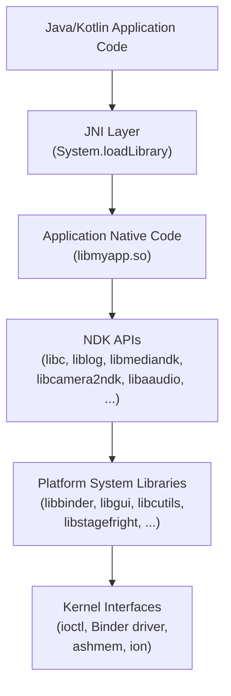
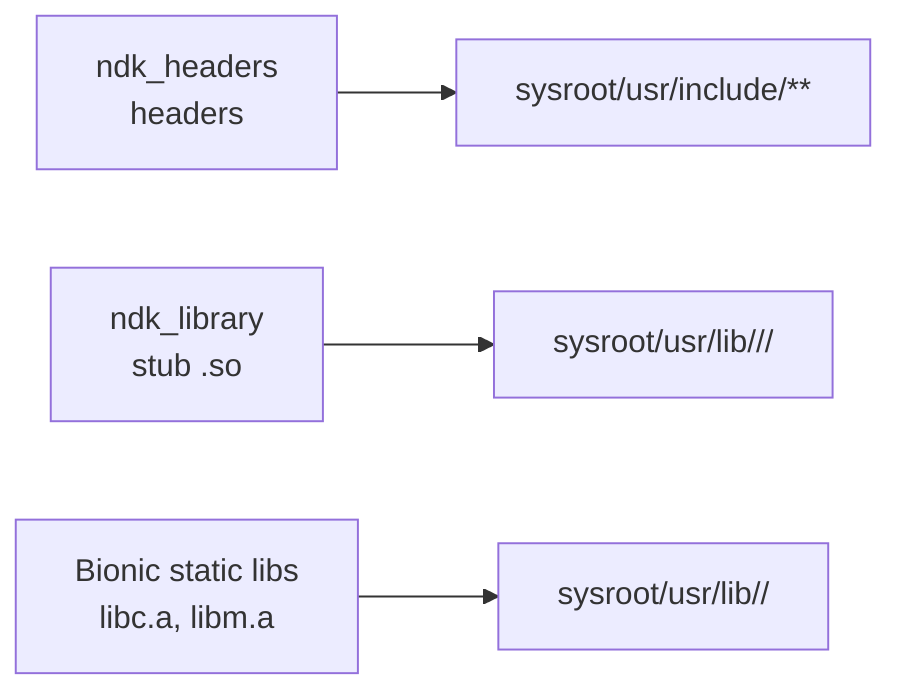
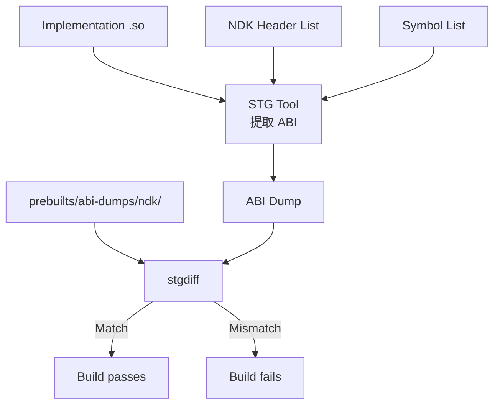
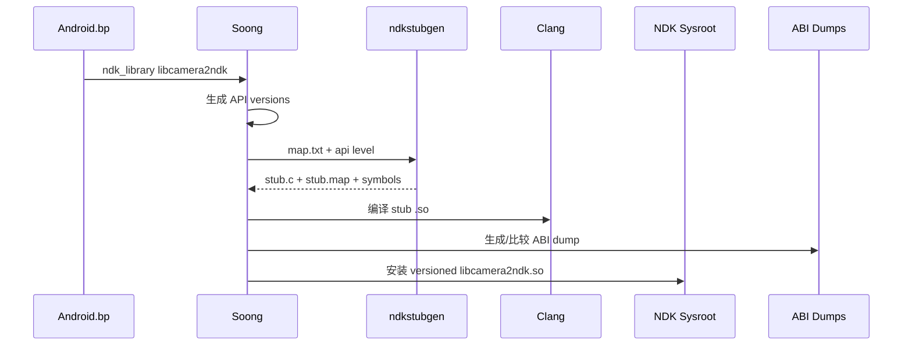
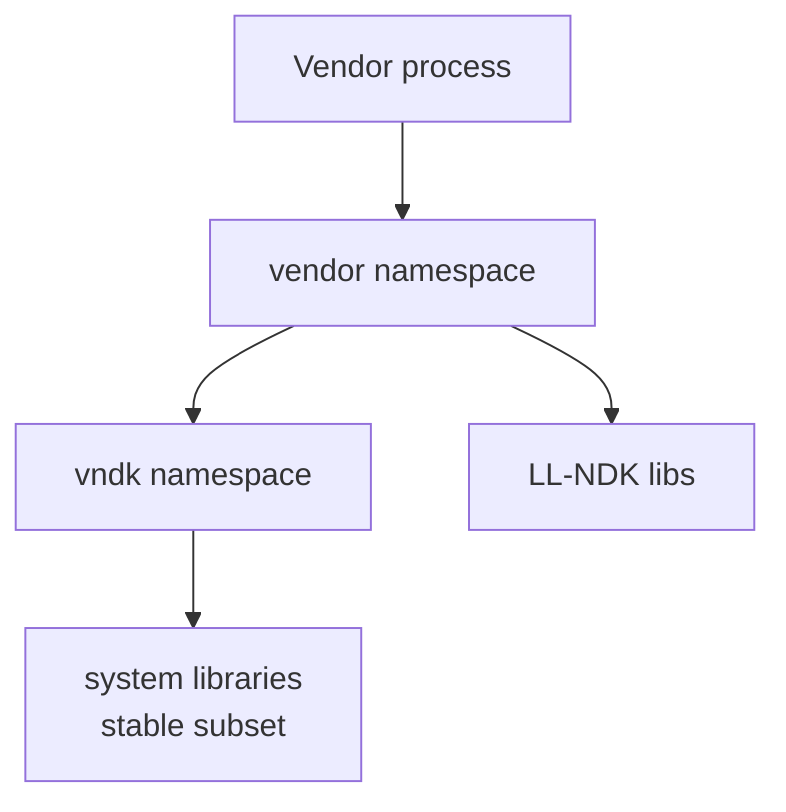
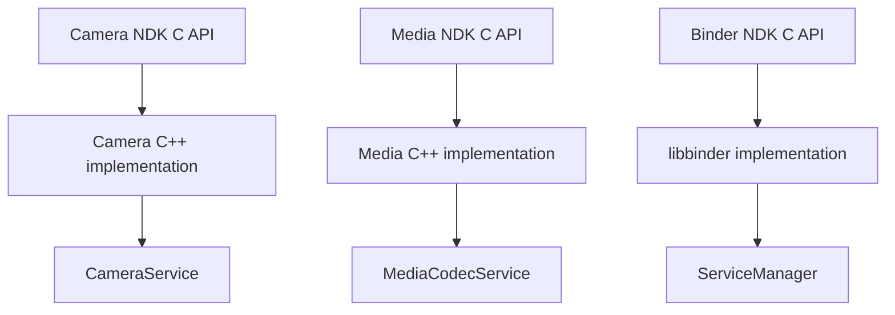
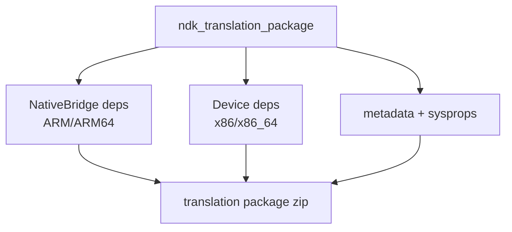

# 第 11 章：NDK -- Native Development Kit

Android NDK（Native Development Kit）是 C/C++ 应用访问 Android 平台的入口。不同于可以随版本自由演进的 Java/Kotlin framework API，NDK API 带有严格稳定性保证：API level 21 导出的符号必须在之后所有版本中继续可用，并保持 ABI 兼容。这个约束深刻影响了 NDK 的构建方式、AOSP 内部如何生成 headers 和 stub libraries，以及 NDK、LL-NDK、VNDK 三层库分类如何把 native 世界划分为不同稳定层级。

本章从平台构建者视角追踪 NDK。我们会从区分应用可见 API 与 framework 内部代码的架构开始，检查生成 app 开发者 sysroot 的 Soong 模块类型（`ndk_library`、`ndk_headers`、`llndk_libraries_txt`、`vndk_prebuilt_shared`），再分析 LL-NDK 与 VNDK 如何把同一稳定性原则扩展到 vendor 代码。随后会查看 Camera、Media、Binder 的 NDK framework bindings，了解它们如何通过 NDK header 暴露 native 服务；还会介绍 `ndk_translation_package` 如何打包 NativeBridge 依赖，并以一个动手示例收尾。

本章引用的路径、结构体定义和构建规则都来自真实 AOSP 源码树。

---

## 11.1 NDK 架构概览

### 11.1.1 NDK 是什么，以及不是什么

NDK 是一组 **稳定 C/C++ API**，应用开发者可以从 `System.loadLibrary()` 加载的 native 代码或纯 native `NativeActivity` 中调用。“稳定”包含两层含义：

1. **ABI 稳定。** 某个 API level 导出的每个函数，其符号名、调用约定和数据结构布局都不能改变。
2. **Header 稳定。** 安装进 NDK sysroot 的每个 header 都必须在构建时验证为自包含、合法 C 代码。

NDK 不是平台中所有 native 代码的集合。`frameworks/`、`system/`、`hardware/` 下的大部分 C/C++ 代码都是 **framework-internal**，不会暴露给应用。

边界由两层机制执行：

- **构建期**：`ndk_library` 和 `ndk_headers` 控制哪些符号和头文件进入 sysroot。
- **运行期**：动态链接器 namespace 隔离阻止 app `dlopen()` 非 NDK/LL-NDK 列表中的库。

### 11.1.2 NDK 调用栈

典型调用路径如下：



| 层级 | 稳定性保证 | 消费者 |
|-------|-------------|--------|
| NDK APIs | 跨 Android 版本 ABI 稳定 | 应用开发者 |
| Platform system libs | 无稳定性保证 | framework 开发者 |
| Kernel interfaces | 通过内核 ABI 稳定 | 所有 native 代码 |

### 11.1.3 NDK 与 Framework Native Code

必须区分“使用 NDK 的 native 代码”和“平台内部 native 代码”。

**使用 NDK 的应用**：游戏引擎链接 `libc.so`、`liblog.so`、`libEGL.so`、`libGLESv3.so`、`libaaudio.so`。这些库都在 NDK 列表中，平台保证同一或更高 API level 的设备上这些 API 行为兼容。

**framework native 代码**：`SurfaceFlinger` 链接 `libgui.so`、`libui.so`、`libsync.so`、`libhwbinder.so` 等内部库。这些库没有 NDK 稳定性保证，必须与对应平台源码树一起构建。

当模块设置 `sdk_version: "current"` 时，Soong 会把 shared library 依赖解析到 NDK stub libraries，而不是平台真实实现。若模块使用非 NDK 符号，链接会在构建期失败。

### 11.1.4 Sysroot 生成流程

NDK sysroot 不是手工维护目录，而是 AOSP 构建产物。Soong 在 `build/soong/cc/ndk_sysroot.go` 中注册相关模块类型并组装：



`ndk_headers` 提供头文件，`ndk_library` 生成版本化 stub `.so`，Bionic 提供静态库。最终输出构成 app 开发者使用的 sysroot。

---

## 11.2 NDK API Surface

### 11.2.1 NDK 库概览

NDK API surface 由一组稳定库组成，包括 C/C++ 基础库、图形、多媒体、音频、日志、Binder、Camera、NativeActivity 等。

常见 NDK 库包括：

| 库 | 用途 |
|----|------|
| `libc.so` | Bionic C library |
| `libm.so` | 数学库 |
| `libdl.so` | dynamic loading |
| `liblog.so` | Android logging |
| `libandroid.so` | NativeActivity、looper、asset、input、window |
| `libEGL.so` / `libGLESv*.so` | OpenGL ES |
| `libvulkan.so` | Vulkan |
| `libaaudio.so` | 低延迟音频 |
| `libmediandk.so` | MediaCodec、MediaExtractor、ImageReader |
| `libcamera2ndk.so` | Camera2 NDK |
| `libbinder_ndk.so` | Binder NDK / AIDL NDK backend |

### 11.2.2 API 分类

NDK API 可按用途分为：

- **基础运行时**：libc、libm、libdl。
- **平台服务绑定**：Camera、Media、Binder。
- **图形与显示**：EGL、GLES、Vulkan、ANativeWindow、AHardwareBuffer。
- **音频**：AAudio、OpenSL ES（遗留）。
- **应用 glue**：NativeActivity、input、looper、asset manager。
- **硬件/CPU 特性**：cpufeatures、sync、native bridge 相关支持。

### 11.2.3 关键 NDK API

关键 API 示例：

- `ANativeActivity`：纯 native activity 生命周期。
- `ALooper`：native event loop。
- `AAssetManager`：访问 APK assets。
- `ANativeWindow`：native 渲染目标。
- `AHardwareBuffer`：跨 CPU/GPU/HWC 的硬件 buffer。
- `AMediaCodec`：硬件/软件编解码。
- `ACameraManager`：camera 设备枚举与打开。
- `AServiceManager` / `AIBinder`：native Binder service。

### 11.2.4 Native App Glue

Native app glue 位于：

```text
prebuilts/ndk/current/sources/android/native_app_glue/
```

它为纯 native app 提供 `android_app` 结构、事件循环、input 处理、window 生命周期回调。它通过 pipe 在 UI thread 和 app thread 之间传递命令，应用需要正确处理 `APP_CMD_INIT_WINDOW`、`APP_CMD_TERM_WINDOW`、`APP_CMD_GAINED_FOCUS` 等事件。

### 11.2.5 Symbol Map Files

NDK 库通过 `.map.txt` 文件控制导出符号和 API level。map 文件定义每个版本导出哪些符号，stub generator 根据它生成 stub source、version script 和 ABI symbol list。

示意：

```text
LIBFOO_24 {
  global:
    AFoo_create;
    AFoo_destroy;
  local:
    *;
};

LIBFOO_26 {
  global:
    AFoo_newApi;
} LIBFOO_24;
```

### 11.2.6 Bionic NDK Headers

Bionic 负责提供大部分标准 C/POSIX 头文件，例如 `stdio.h`、`stdlib.h`、`pthread.h`、`unistd.h`、`sys/mman.h`。这些 header 需要同时满足 Android 行为、POSIX 兼容性、API level gating 和 NDK 自包含验证。

### 11.2.7 CPU Features

CPU features 库帮助 native 代码在运行时检测 CPU 能力，例如 NEON、AES、SHA、SVE 等。应用可根据结果选择优化代码路径，但必须保留 fallback，避免在不支持的设备上崩溃。

---

## 11.3 NDK 构建集成

### 11.3.1 `ndk_library` 模块类型

`ndk_library` 生成 NDK stub shared library。实现位于 `build/soong/cc/ndk_library.go`。它的输入包括 symbol map、first_version 和实际实现库。输出包括每个 API level 对应的 stub `.so`、version script 和 ABI symbol list。

Stub 只用于链接，不会运行。stub 函数通常是占位实现，真正运行时由设备上的平台库提供。

stub 编译使用特殊 flags：

```go
var stubLibraryCompilerFlags = []string{
    "-Wno-incompatible-library-redeclaration",
    "-Wno-incomplete-setjmp-declaration",
    "-Wall",
    "-Werror",
    "-fno-unwind-tables",
}
```

`-fno-unwind-tables` 是合理的，因为 stub 永远不执行，不需要 unwind 信息。

每个 `ndk_library` 会从 `first_version` 到当前版本和 future API 生成一组 stubs。例如 `libcamera2ndk` 的 `first_version: "24"` 会生成 API 24 到 current/future 的版本化 stubs。

### 11.3.2 `ndk_headers` 模块类型

`ndk_headers` 把 header 安装到 NDK sysroot，实现位于 `build/soong/cc/ndk_headers.go`。

主要属性包括：

| 属性 | 说明 |
|------|------|
| `from` | 源 header 基准目录 |
| `to` | 相对于 `usr/include` 的安装路径 |
| `srcs` | 要安装的 header 列表 |
| `exclude_srcs` | 排除的 header |
| `license` | 对应 NOTICE 文件 |
| `skip_verification` | 是否跳过自包含 C 验证 |

每个 NDK header 都会用 clang `-fsyntax-only` 做自包含验证。极少数 header 可设置 `skip_verification: true`，但这应非常罕见。

### 11.3.3 ABI Monitoring

NDK ABI 稳定性由构建系统自动监控，实现位于 `build/soong/cc/ndk_abi.go`。系统使用 STG（Symbol/Type Graph）从带 DWARF 的 ELF 中提取 ABI 信息，再用 `stgdiff` 与 `prebuilts/abi-dumps/ndk/` 中的参考 dump 比较。

ABI 检查流程如下：



当前 API level 必须与 checked-in dump 精确匹配；下一 API level 必须是当前 ABI 的超集，允许新增符号，但不允许删除或修改。

Bionic 目前因 ifunc 和手写汇编导致 STG 误报较多，暂时豁免该 ABI monitoring 流程。Bionic ABI 稳定性通过 CTS、人工 review 等其他机制维护。

### 11.3.4 NDK Known Libraries Registry

每个 `ndk_library` 会把自己注册到全局 known NDK libraries 列表中。构建系统用该列表验证 SDK-built 模块只能链接批准的 NDK 库。该列表在并行 mutator 阶段更新，因此使用 mutex 保护。

### 11.3.5 端到端：一个 NDK 库如何构建

以 `libcamera2ndk` 为例：



---

## 11.4 LL-NDK -- Low-Level NDK

### 11.4.1 什么是 LL-NDK？

LL-NDK 是一小组底层稳定 native 库，既可被 app 使用，也可被 vendor 代码使用。它是 vendor 进程与 platform 之间最基础的稳定链接层，包含 `libc`、`libm`、`libdl`、`liblog`、`libbinder_ndk` 等。

### 11.4.2 Soong 中的 LLNDK 声明

LL-NDK 库通常在 `cc_library` 中通过 `llndk` block 声明：

```bp
cc_library {
    name: "libfoo",
    llndk: {
        symbol_file: "libfoo.map.txt",
    },
}
```

### 11.4.3 LLNDK 属性

`llndk` block 控制导出符号文件、是否私有、是否覆盖 stub behavior、是否可用给 vendor 等。它让同一个平台库可以生成供 vendor 链接的稳定 stub。

### 11.4.4 LLNDK Mutator

Soong mutator 会为 LLNDK 库创建特殊变体：真实平台实现、vendor 可链接 stub、API surface 元数据。vendor 模块链接的是 stub，而运行时由 linker namespace 解析到允许的系统库。

### 11.4.5 LLNDK Libraries List 生成

构建系统会生成 LLNDK 库列表，供 linkerconfig 和 VNDK 检查使用。这些列表定义 vendor namespace 可以从 system namespace 访问哪些底层库。

### 11.4.6 LL-NDK 与 NDK 架构对比

| 维度 | NDK | LL-NDK |
|------|-----|--------|
| 消费者 | app 开发者 | app + vendor code |
| 构建入口 | `ndk_library` | `cc_library { llndk: ... }` |
| 安装位置 | NDK sysroot | vendor/system linker namespace 支持 |
| 稳定目标 | app ABI | vendor ABI |
| 示例 | `libcamera2ndk` | `libc`, `liblog`, `libbinder_ndk` |

### 11.4.7 Moved-to-Apex LLNDK Libraries

部分 LLNDK 库已迁移到 APEX 中。linkerconfig 和 VINTF 需要正确声明这些库的路径和可访问性，保证 vendor 代码仍可通过稳定 namespace link 找到它们。

---

## 11.5 VNDK -- Vendor NDK

### 11.5.1 Vendor 稳定性问题

vendor 代码需要使用一部分 framework native 库，但不能依赖 framework 私有 ABI。VNDK 通过定义 vendor 可用的稳定库集合解决这个问题。

### 11.5.2 VNDK 架构

VNDK 位于 system/framework 与 vendor 之间。vendor 进程可通过 linker namespace 访问 VNDK 库，而不能访问任意 framework 私有库。



### 11.5.3 Soong 中的 VNDK 声明

平台库通过 `vndk` block 声明是否属于 VNDK：

```bp
cc_library {
    name: "libfoo",
    vendor_available: true,
    vndk: {
        enabled: true,
        support_system_process: true,
    },
}
```

### 11.5.4 VNDK Link-Type Checking

Soong 会检查 vendor、VNDK、LLNDK、framework-only 库之间的链接关系，防止 vendor 模块链接 framework-only 私有库。违反规则会构建失败。

### 11.5.5 VNDK Library List Files

构建系统生成 VNDK 列表文件，供 linkerconfig、VTS 和兼容性检查使用。这些列表描述哪些库属于 VNDK、VNDK-SP、LLNDK。

### 11.5.6 VNDK Prebuilt Snapshots

VNDK snapshot 允许 vendor 针对某个平台版本稳定构建。snapshot 包含预编译 VNDK 库、headers 和 metadata，使 vendor 构建不依赖不断变化的平台源码。

### 11.5.7 Linker Namespace Isolation

运行时，linker namespace 强制执行 VNDK 边界。vendor namespace 的搜索路径指向 `/vendor/lib*`，只能通过显式 link 访问 LLNDK 和 VNDK namespace 中允许的 soname。

### 11.5.8 VNDK-SP：Same-Process Libraries

VNDK-SP 是可被 same-process HAL 使用的 VNDK 子集。它们必须满足更严格要求，因为可能与 framework 进程同地址空间运行。

### 11.5.9 VNDK 弱化趋势

随着 APEX 和 stable AIDL 普及，VNDK 的重要性在下降。长期趋势是用 APEX 模块和稳定 AIDL 接口替代大量 native library 级别共享。但 VNDK 仍对旧设备和 vendor 兼容性很重要。

---

## 11.6 NDK Framework Bindings

NDK framework bindings 把复杂 C++ framework service 包装成稳定 C API，供 app native 代码调用。典型模式是 opaque pointer + C wrapper + hidden C++ implementation + symbol map。

### 11.6.1 Camera NDK（`libcamera2ndk`）

Camera NDK 位于 `frameworks/av/camera/ndk/`。它暴露 `ACameraManager`、`ACameraDevice`、`ACaptureRequest`、`ACameraCaptureSession` 等 C API，内部通过 CameraService 和 Binder 与 framework 通信。

常见 API：

- `ACameraManager_create()` / `ACameraManager_delete()`
- `ACameraManager_getCameraIdList()`
- `ACameraManager_openCamera()`
- `ACameraDevice_createCaptureRequest()`
- `ACameraCaptureSession_setRepeatingRequest()`

### 11.6.2 Media NDK（`libmediandk`）

Media NDK 位于 `frameworks/av/media/ndk/`，提供 codec、extractor、muxer、format、image reader 等 API。

核心组件包括：

- **AMediaCodec**：硬件/软件编解码。
- **AMediaExtractor**：容器格式 demux。
- **AImageReader**：从 camera 或 video 获取 image buffer。
- **AMediaFormat**：key/value 媒体格式描述。

### 11.6.3 Binder NDK（`libbinder_ndk`）

Binder NDK 位于 `frameworks/native/libs/binder/ndk/`，提供 Android Binder IPC 的 C 接口。它对 AIDL NDK backend 至关重要。

目录结构包括：

```text
frameworks/native/libs/binder/ndk/
    ibinder.cpp
    ibinder_jni.cpp
    libbinder.cpp
    parcel.cpp
    process.cpp
    service_manager.cpp
    binder_rpc.cpp
    stability.cpp
    status.cpp
    include_ndk/android/
        binder_ibinder.h
        binder_parcel.h
        binder_status.h
```

`libbinder_ndk` 同时是 NDK 库和 LL-NDK 库：app 可以使用，vendor HAL 也可以通过稳定 ABI 使用。

关键 API：

**Service Management：**

- `AServiceManager_addService()`
- `AServiceManager_getService()`
- `AServiceManager_waitForService()`

**Binder Objects：**

- `AIBinder_Class_define()`
- `AIBinder_new()`
- `AIBinder_prepareTransaction()` / `AIBinder_transact()`
- `AIBinder_linkToDeath()` / `AIBinder_unlinkToDeath()`

**Parcels：**

- `AParcel_writeInt32()` / `AParcel_readInt32()`
- `AParcel_writeString()` / `AParcel_readString()`
- `AParcel_writeStrongBinder()` / `AParcel_readStrongBinder()`

### 11.6.4 Framework Binding 架构总结

三类 binding 共享同一架构：



标准模式是：

1. **C header**：定义 public API 和 opaque pointer。
2. **C source**：带 `EXPORT` 的薄 wrapper。
3. **C++ implementation**：使用 framework API 的真实逻辑。
4. **Symbol map**：控制导出符号。
5. **Visibility control**：`-fvisibility=hidden` + `EXPORT`。

---

## 11.7 NDK Translation Packages

### 11.7.1 什么是 NDK Translation Packages？

NDK translation package 是构建系统机制，用于打包 **NativeBridge** 所需的库和二进制。NativeBridge 负责把一个架构的 native 代码翻译到另一个架构运行，例如在 x86 设备上运行 ARM 代码。`ndk_translation_package` 模块类型位于 `build/soong/cc/ndk_translation_package.go`。

### 11.7.2 `ndk_translation_package` 模块类型

该模块类型通过 Soong 注册：

```go
android.RegisterModuleType("ndk_translation_package", NdkTranslationPackageFactory)
```

factory 创建一个支持多架构目标的 device module，用来收集 translation 相关依赖并生成 zip 包。

### 11.7.3 属性

主要属性包括：

| 属性 | 说明 |
|------|------|
| `native_bridge_deps` | 需要打包 native bridge 变体的依赖 |
| `device_both_deps` | 需要打包 32/64 设备变体的依赖 |
| `device_64_deps` | 64 位设备变体依赖 |
| `device_32_deps` | 32 位设备变体依赖 |
| `device_first_deps` | 主架构依赖 |
| `version` | sysprop 使用的版本 |
| `android_bp_gen_path` | Android.bp 生成器路径 |
| `product_mk_gen_path` | product.mk 生成器路径 |
| `generate_build_files` | 是否生成构建文件 |

### 11.7.4 依赖解析

`DepsMutator` 根据目标架构和 NativeBridge 状态把不同依赖映射到对应变体。例如在 x86_64 设备上，ARM/ARM64 库是 native bridge 变体，x86/x86_64 库是设备本机变体。

### 11.7.5 RISC-V 考量

该模块类型对 disabled RISC-V native bridge 模块有特殊容忍。RISC-V native bridge 仍在演进，一些依赖可能暂时没有 RISC-V 变体；构建系统会优雅处理而不是直接失败。

### 11.7.6 包生成

`GenerateAndroidBuildActions` 收集依赖文件并打包为 zip archive。包内包含 native bridge 所需库、本机辅助库、metadata、可选生成的 Android.bp/product.mk。

### 11.7.7 构建文件生成

模块可调用指定 generator 生成 Android.bp 和 product.mk，使 translation package 可以在其他构建环境中被消费。

### 11.7.8 NDK Translation Package 架构



### 11.7.9 与 NativeBridge 的关系

NativeBridge 负责运行时加载和翻译异构架构 native 代码。translation package 提供其运行所需的库集合和构建集成，是 NativeBridge 生态的分发单元。

---

## 11.8 动手实践：编写 Native NDK App

### 11.8.1 项目结构

最小 native app 结构可包含：

```text
AndroidManifest.xml
Android.bp
main.cpp
```

### 11.8.2 Manifest

使用 `NativeActivity` 时，manifest 指定 activity 名称和 native library：

```xml
<activity android:name="android.app.NativeActivity"
          android:label="NativeDemo"
          android:exported="true">
    <meta-data android:name="android.app.lib_name"
               android:value="native-demo" />
</activity>
```

### 11.8.3 构建文件

`Android.bp` 示例：

```bp
cc_library_shared {
    name: "libnative-demo",
    srcs: ["main.cpp"],
    sdk_version: "current",
    shared_libs: ["libandroid", "liblog"],
    stl: "c++_static",
}
```

`sdk_version: "current"` 很关键，它确保模块链接 NDK stubs，而不是平台内部库。

### 11.8.4 应用代码

native app 通常实现 `android_main(struct android_app* app)`，设置 command callback、input callback，并在事件循环中处理 looper 事件。`ANativeWindow_lock()` 可用于简单 CPU 绘制，实际应用通常使用 EGL 或 Vulkan。

### 11.8.5 代码走读

关键对象包括：

- `android_app`：native glue 传入的 app 状态。
- `ALooper_pollOnce()`：等待 input、lifecycle 和 sensor 事件。
- `onAppCmd()`：处理窗口创建/销毁、焦点变化等命令。
- `onInputEvent()`：处理触摸、按键等输入。
- `ANativeWindow`：native 渲染目标。

### 11.8.6 构建与运行

```bash
m NativeDemo
adb install out/target/product/<device>/system/app/NativeDemo/NativeDemo.apk
adb shell am start -n com.example.nativedemo/.NativeActivity
adb logcat -s NativeDemo:V
```

预期日志会显示窗口大小、焦点变化、传感器或输入事件。

### 11.8.7 扩展点

从最小示例可以扩展：

1. **EGL/Vulkan 渲染**：用 `eglCreateWindowSurface()` 或 `vkCreateAndroidSurfaceKHR()` 替代 CPU lock 绘制。
2. **AAudio 播放**：链接 `libaaudio`，使用 `AAudioStreamBuilder`。
3. **Camera 捕获**：链接 `libcamera2ndk`，使用 `ACameraManager`。
4. **AIDL 服务**：链接 `libbinder_ndk`，使用 AIDL NDK stubs。
5. **Neural Networks**：链接 `libneuralnetworks` 使用 NNAPI。

### 11.8.8 调试 NDK 应用

**Logcat：**

```bash
adb logcat -s NativeDemo:V
adb logcat --pid=$(adb shell pidof com.example.nativedemo)
adb logcat -s DEBUG:V
```

**ASan：**

```bp
cc_library_shared {
    name: "libnative-demo",
    sanitize: { address: true },
}
```

ASan 可检测 heap/stack overflow、use-after-free、double free、memory leak。

**LLDB：**

```bash
adb shell am start -D -n com.example.nativedemo/.NativeActivity
adb forward tcp:1234 tcp:1234
lldb
(lldb) platform select remote-android
(lldb) platform connect connect://localhost:1234
(lldb) process attach --name native-demo
```

**simpleperf：**

```bash
adb shell simpleperf record -p $(adb shell pidof com.example.nativedemo) \
    --duration 5 -o /data/local/tmp/perf.data
adb pull /data/local/tmp/perf.data
simpleperf report -i perf.data
```

### 11.8.9 常见陷阱

1. **缺少 `sdk_version`。** 模块会链接平台库而非 NDK stubs，可能使用非稳定符号。
2. **跨 API level ABI 差异。** 应使用 accessor 函数，不要直接访问 opaque 结构体字段。
3. **线程安全。** native app glue 用 pipe 在线程间通信，访问共享 `android_app` 字段时要使用 mutex。
4. **忘记处理 `APP_CMD_TERM_WINDOW`。** window 销毁后继续使用 `ANativeWindow` 会崩溃。
5. **链接非 NDK 库。** Android 7.0+ 的 linker namespace 会拒绝 app 访问非 NDK 库，例如 `libgui.so`。

---

## 总结

本章从平台构建者视角审视 Android NDK。NDK 不是从 developer.android.com 下载的一组文件，而是嵌入 AOSP 源码树中的构建规则、header module、stub generator 和 ABI monitor 的组合。

关键架构层如下：

| 层级 | 稳定范围 | 关键 Soong 模块类型 |
|------|----------|----------------------|
| **NDK** | App developers | `ndk_library`, `ndk_headers` |
| **LL-NDK** | App + vendor code | `cc_library` 中的 `llndk:` block |
| **VNDK** | Vendor code | `cc_library` 中的 `vndk:` block, `vndk_prebuilt_shared` |
| **NDK Translation** | NativeBridge | `ndk_translation_package` |

构建系统通过以下机制执行稳定性：

1. **Symbol maps**：精确定义导出 API surface。
2. **Stub libraries**：应用构建时链接 stub。
3. **ABI monitoring**：通过 STG dump 和 `stgdiff` 捕获不兼容变更。
4. **Header verification**：确保每个 NDK header 自包含且是合法 C。
5. **Linker namespace isolation**：运行时阻止访问非 NDK 库。

Camera、Media、Binder 的 framework bindings 展示了通过稳定 C API 暴露复杂 C++ 服务的标准模式：opaque pointer、`EXPORT` wrapper、`-fvisibility=hidden` 和 version script。

进一步探索的关键源码：

| 文件 | 用途 |
|------|------|
| `build/soong/cc/ndk_library.go` | Stub library 生成 |
| `build/soong/cc/ndk_headers.go` | Header 安装 |
| `build/soong/cc/ndk_sysroot.go` | Sysroot 组装 |
| `build/soong/cc/ndk_abi.go` | ABI monitoring |
| `build/soong/cc/llndk_library.go` | LL-NDK 支持 |
| `build/soong/cc/vndk.go` | VNDK 属性 |
| `build/soong/cc/vndk_prebuilt.go` | VNDK snapshots |
| `build/soong/cc/ndk_translation_package.go` | Translation packaging |
| `frameworks/av/camera/ndk/` | Camera NDK 实现 |
| `frameworks/av/media/ndk/` | Media NDK 实现 |
| `frameworks/native/libs/binder/ndk/` | Binder NDK 实现 |
| `system/linkerconfig/` | Linker namespace 配置 |
| `prebuilts/ndk/current/sources/android/` | App glue 与 CPU features |
