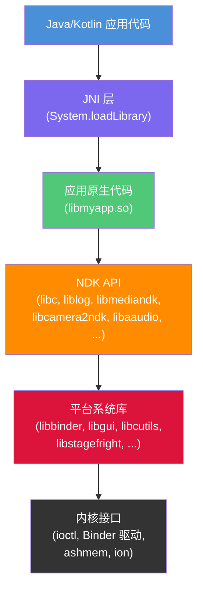
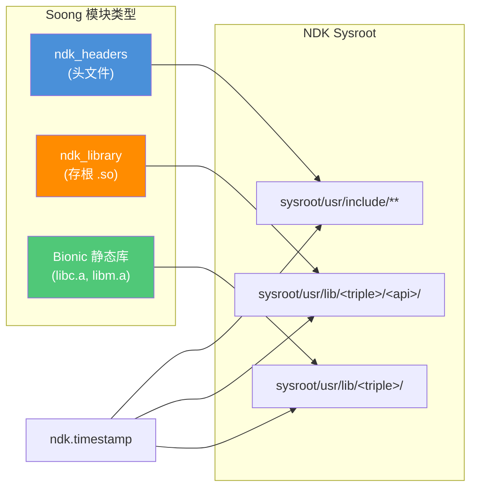
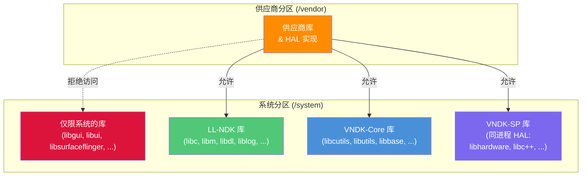
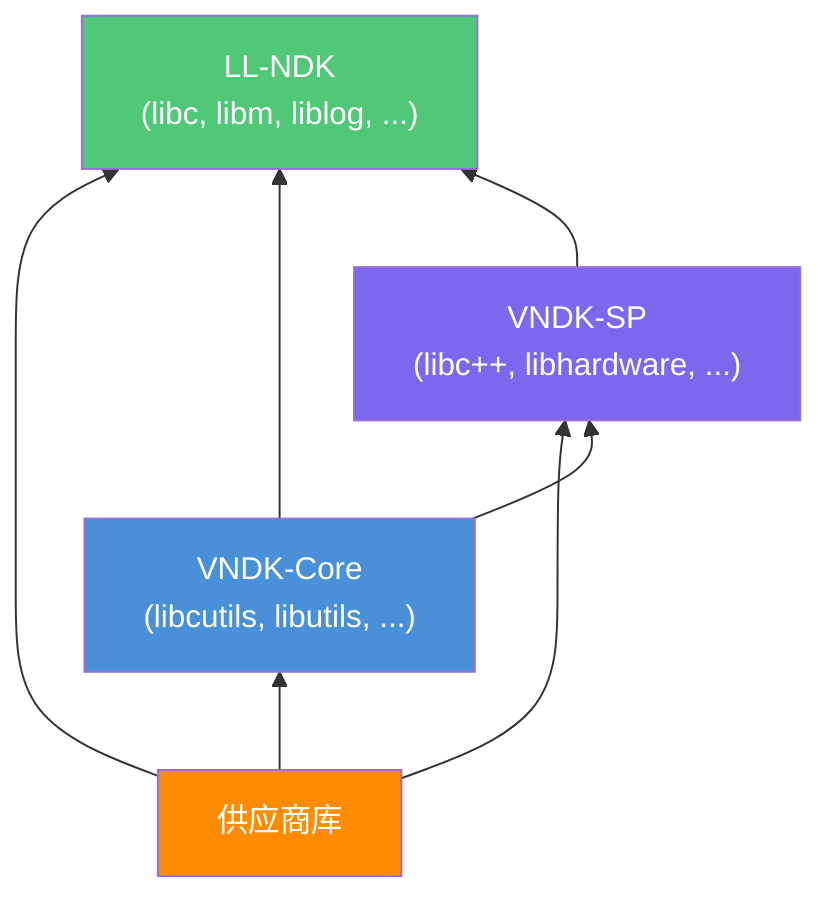
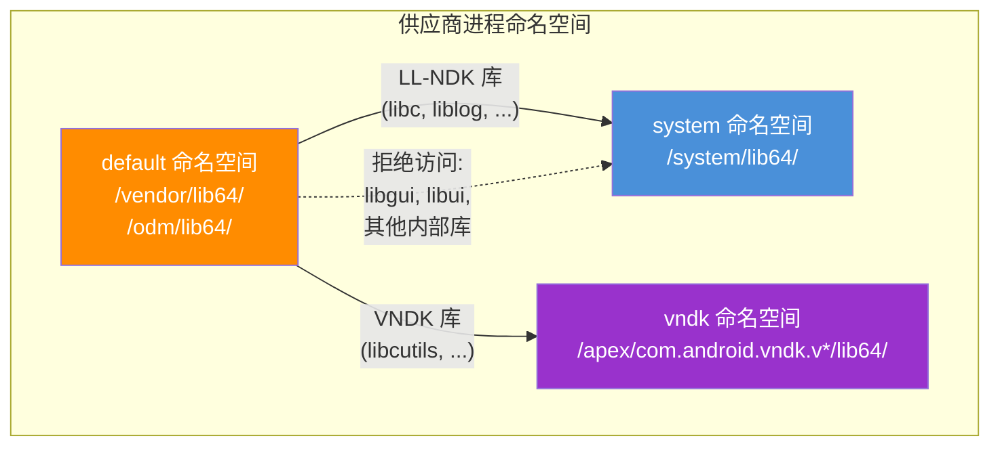

# 第 11 章：NDK —— 原生开发工具包

Android NDK（Native Development Kit，原生开发工具包）是使用 C 和 C++ 编写的应用访问 Android 平台的门户。与各版本间可以自由演进的 Java/Kotlin 框架 API 不同，NDK API 带有严格的稳定性保证：在 API 级别 21 中导出的符号必须在每一个后续版本中保持可用且 ABI 兼容。这种约束从根本上决定了 NDK 的构建方式、AOSP 内部头文件和存根库（stub libraries）的生成机制，以及三个嵌套的库类别 —— NDK、LL-NDK 和 VNDK —— 如何将原生世界划分为稳定的层级。

本章将从平台构建者的视角审视 NDK。我们首先分析将面向应用的 API 与内部框架代码分离的架构，然后检查生成交付给应用开发者的 sysroot 的 Soong 模块类型（`ndk_library`、`ndk_headers`、`llndk_libraries_txt`、`vndk_prebuilt_shared`）。接着，我们将追踪 LL-NDK 和 VNDK 层如何将相同的稳定性原则扩展到供应商代码，研究 Camera、Media 和 Binder 的框架绑定，探索打包 NativeBridge 依赖项的 `ndk_translation_package` 模块类型，最后通过一个实战练习将所有内容串联起来。

## 11.1 NDK 架构概览 (NDK Architecture Overview)

### 11.1.1 什么是 NDK，什么不是 NDK

NDK 是一套**稳定的 C/C++ API**，应用开发者可以通过 `System.loadLibrary()` 加载的原生代码调用，或者在纯原生应用（`NativeActivity`）中使用。这里的“稳定”包含两层含义：

1. **ABI 稳定性**：在特定 API 级别导出的每个函数的符号名称、调用约定和数据结构布局永远不会改变。
2. **头文件稳定性**：安装到 NDK sysroot 中的每个头文件在构建时都经过验证，确保其自包含且是有效的 C 代码。

显而易见，NDK *并不代表* 平台中所有的原生代码。`frameworks/`、`system/` 和 `hardware/` 目录下的大部分 C/C++ 代码都是**框架内部（framework-internal）**代码，绝不会暴露给应用。NDK 与非 NDK 之间的边界在两个层面受到强制约束：

- **构建时**：通过 `ndk_library` 和 `ndk_headers` 这类 Soong 模块类型，精确控制哪些符号和头文件被放入 sysroot。
- **运行时**：动态链接器的命名空间隔离（Namespace Isolation）机制阻止应用 `dlopen()` 那些不在 NDK 或 LL-NDK 列表中的库。

### 11.1.2 NDK 调用栈

下图追踪了一个典型的调用流程：从 Java 应用代码开始，通过 JNI 进入 NDK API，最终到达系统库：


```mermaid
graph TD
    A["Java/Kotlin 应用代码"] --> B["JNI 层<br/>(System.loadLibrary)"]
    B --> C["应用原生代码<br/>(libmyapp.so)"]
    C --> D["NDK API<br/>(libc, liblog, libmediandk,<br/>libcamera2ndk, libaaudio, ...)"]
    D --> E["平台系统库<br/>(libbinder, libgui, libcutils,<br/>libstagefright, ...)"]
    E --> F["内核接口<br/>(ioctl, Binder 驱动,<br/>ashmem, ion)"]

    style A fill:#4a90d9,color:white
    style B fill:#7b68ee,color:white
    style C fill:#50c878,color:white
    style D fill:#ff8c00,color:white
    style E fill:#dc143c,color:white
    style F fill:#333,color:white
```

图中的每一层代表不同的稳定性域：

| 层级 | 稳定性保证 | 消费者 |
|:---|:---|:---|
| **NDK API** | 跨版本 ABI 稳定 | 应用开发者 |
| **平台系统库** | 无稳定性保证 | 框架开发者 |
| **内核接口** | 通过内核 ABI 保持稳定 | 所有原生代码 |

### 11.1.3 NDK vs 框架原生代码

区分“使用 NDK 的原生代码”和“作为平台一部分的原生代码”至关重要。

**使用 NDK 的应用**：例如一个游戏引擎链接到 `libc.so`、`liblog.so`、`libEGL.so`、`libGLESv3.so` 和 `libaaudio.so`。这些库都在 NDK 列表中。游戏发布的 APK 包含 `lib/arm64-v8a/libgame.so`，平台保证它调用的 API 在运行相同或更高 API 级别的任何设备上都能以相同方式工作。

**框架原生代码**：例如 `SurfaceFlinger` 合成器链接到 `libgui.so`、`libui.so`、`libsync.so`、`libhwbinder.so` 以及数十个其他内部库。这些库都不具备 NDK 稳定性保证。设备制造商可以（且必须）针对特定的平台树重新构建 `SurfaceFlinger`。

构建系统强制执行这种区分。当模块设置 `sdk_version: "current"` 时，Soong 会针对 NDK 存根库（stub libraries）而非真实的平台实现来解析其共享库依赖项。如果模块尝试使用非 NDK 符号，链接将在构建时失败。

### 11.1.4 Sysroot 生成流程

NDK sysroot 不是手动维护的头文件和库目录，而是 AOSP 构建的产物。构建系统根据 `build/soong/cc/ndk_sysroot.go` 中注册的三种 Soong 模块类型来组装它：


```mermaid
graph LR
    subgraph "Soong 模块类型"
        NH["ndk_headers<br/>(头文件)"]
        NL["ndk_library<br/>(存根 .so)"]
        BS["Bionic 静态库<br/>(libc.a, libm.a)"]
    end

    subgraph "NDK Sysroot"
        INC["sysroot/usr/include/**"]
        LIB["sysroot/usr/lib/&lt;triple&gt;/&lt;api&gt;/"]
        STA["sysroot/usr/lib/&lt;triple&gt;/"]
    end

    NH --> INC
    NL --> LIB
    BS --> STA

    TS["ndk.timestamp"] --> INC
    TS --> LIB
    TS --> STA

    style NH fill:#4a90d9,color:white
    style NL fill:#ff8c00,color:white
    style BS fill:#50c878,color:white
```

`build/soong/cc/ndk_sysroot.go` 明确指出平台需要为 NDK 提供四种构件：Bionic 头文件、平台 API 头文件、NDK 存根共享库以及 Bionic 静态库。

## 11.2 NDK API 表面 (NDK API Surface)

### 11.2.1 NDK 库概览

NDK API 表面是 AOSP 中声明的所有 `ndk_library` 模块的并集。这些是应用开发者可以链接的库。

| 库 | 起始 API | 源码位置 |
|:---|:---|:---|
| `libc` | 9 | `bionic/libc/Android.bp` |
| `libm` | 9 | `bionic/libm/Android.bp` |
| `libdl` | 9 | `bionic/libdl/Android.bp` |
| `liblog` | 9 | `system/logging/liblog/Android.bp` |
| `libz` | 9 | `external/zlib/Android.bp` |
| `libandroid` | 9 | `frameworks/base/native/android/Android.bp` |
| `libEGL` | 9 | `frameworks/native/opengl/libs/Android.bp` |
| `libGLESv1_CM` | 9 | `frameworks/native/opengl/libs/Android.bp` |
| `libGLESv2` | 9 | `frameworks/native/opengl/libs/Android.bp` |
| `libGLESv3` | 9 | `frameworks/native/opengl/libs/Android.bp` |
| `libmediandk` | 21 | `frameworks/av/media/ndk/Android.bp` |
| `libcamera2ndk` | 24 | `frameworks/av/camera/ndk/Android.bp` |
| `libnativewindow` | 26 | `frameworks/native/libs/nativewindow/Android.bp` |
| `libaaudio` | 26 | `frameworks/av/media/libaaudio/Android.bp` |
| `libvulkan` | 26 | `frameworks/native/vulkan/libvulkan/Android.bp` |
| `libbinder_ndk` | 29 | `frameworks/native/libs/binder/ndk/Android.bp` |
| `libsync` | 26 | `system/core/libsync/Android.bp` |
| `libneuralnetworks` | 27 | `packages/modules/NeuralNetworks/runtime/Android.bp` |
| `libicu` | 31 | `external/icu/libicu/Android.bp` |
| `libnativehelper` | 34 | `system/extras/module_ndk_libs/libnativehelper/Android.bp` |

### 11.2.2 应用二进制接口 (ABI) 定义

Android NDK 支持多种 CPU 架构，每种架构都定义了一个**应用二进制接口 (ABI)**。ABI 决定了机器代码在运行时如何与系统交互。目前支持的 ABI 包括：

- **`arm64-v8a`**：基于 64 位 ARMv8-A 架构。支持 NEON 指令集和可选的 SVE（可伸缩向量扩展）。这是目前最主流的 Android ABI。
- **`armeabi-v7a`**：基于 32 位 ARMv7 架构。支持硬件浮点（VFPv3-D16）和 NEON 向量指令。
- **`x86_64`**：基于 64 位 x86 指令集（通常称为 x64 或 AMD64）。常用于模拟器和某些平板设备。
- **`x86`**：基于 32 位 x86 指令集（IA-32）。

每个 ABI 都有其特定的调用约定、对齐规则和指令集扩展。NDK 允许开发者通过 `CPU 特性（cpufeatures）` 库在运行时检测 CPU 能力（如 SSE4.2、AVX、NEON），以便在高性能路径中使用手写的 SIMD 优化代码。

### 11.2.3 稳定 C API 哲学

NDK 的核心设计哲学是提供**稳定 C API**。虽然 Android 框架内部广泛使用 C++，但暴露给应用的 NDK API 几乎全是 C 函数。

- **C 链接性**：C 语言具有稳定的符号修饰（Mangling）规则，而 C++ 的符号修饰随编译器版本和标准库实现而变。使用 `extern "C"` 包装 API 确保了二进制兼容性。
- **不透明句柄**：API 通常返回指向结构体的不透明指针（句柄），应用无法直接访问其成员，只能通过特定的函数进行操作。这允许平台在不破坏二进制兼容性的情况下修改底层实现。
- **无异常机制**：NDK API 不会跨越库边界抛出 C++ 异常，错误通常通过返回码（如 `camera_status_t`）进行处理。

### 11.2.4 关键 NDK API 深钻

#### `AHardwareBuffer`（原生硬件缓冲区）

`AHardwareBuffer` 提供了一个跨进程访问 GPU 分配内存的句柄。它在 API 26 中引入，属于 `libnativewindow` 库。它允许在 CPU、GPU、相机和视频解码器之间共享图形缓冲区，而无需进行昂贵的内存拷贝。

关键功能：
- `AHardwareBuffer_allocate()`：分配具有指定格式和使用标志的缓冲区。
- `AHardwareBuffer_lock()`：将缓冲区映射到 CPU 地址空间以供访问。
- `AHardwareBuffer_sendHandleToUnixSocket()`：通过 Unix 套接字跨进程共享缓冲区句柄。

#### `ANativeWindow`（原生窗口）

`ANativeWindow` 是 `android.view.Surface` 在原生层的对应物。它是应用直接渲染帧（通过 OpenGL ES、Vulkan 或软件渲染）的主要接口。

#### `AAudio`（原生音频）

AAudio 是从 API 26 开始推荐使用的低延迟音频 API，旨在替代 OpenSL ES。它直接与音频端点交互，通过 `AAudioStream` 提供高性能、低抖动的音频路径。

#### 神经网络 API（NNAPI）

通过 `libneuralnetworks` 导出，NNAPI 允许原生应用利用板载硬件加速器（如 GPU、DSP、NPU）来执行机器学习推理任务。它是一个高性能、低层级的 API，通常作为 TensorFlow Lite 等高级框架的后端。

### 11.2.5 库详细说明

NDK 的核心系统库包括：
- **`libc` (Bionic)**：Android 的标准 C 库。虽然与 GNU libc (glibc) 类似，但针对移动设备的内存和功耗进行了高度优化，且具有不同的线程模型。
- **`libm`**：标准数学库。
- **`liblog`**：用于向 Android 系统日志（logcat）写入消息。
- **`libz`**：标准 zlib 压缩库。
- **`libdl`**：动态链接器接口（`dlopen`, `dlsym` 等）。

高级库包括：
- **`libandroid`**：提供对原生窗口、输入事件、传感器和资产管理器的访问。
- **`libvulkan`**：现代、低开销的 3D 图形 API，旨在替代 OpenGL ES 以获得更好的多线程性能。
- **`libcamera2ndk`**：提供对 Camera2 管道的原生访问，支持复杂的摄影控制。
- **`libmediandk`**：提供对媒体编解码器、提取器和 DRM 的原生支持。

### 11.2.6 符号映射文件 (.map.txt)

每个 NDK 库的 API 表面都由一个 `.map.txt` 文件严格定义。该文件指明了哪些符号是导出的，以及它们是在哪个 API 级别引入的。例如，如果一个函数带有 `# introduced=29` 注解，`ndkstubgen` 工具在为 API 28 生成存根时就会自动将其排除。这种机制确保了应用在旧版本系统上运行时，动态链接器不会因为找不到符号而崩溃。


## 11.3 NDK 构建集成

AOSP 中的 NDK 构建集成主要由 `build/soong/cc/` 目录下的四个核心 Go 源文件处理：

| 文件 | 用途 |
|------|------|
| `ndk_library.go` | 处理 Stub 共享库（Stub shared library）的生成 |
| `ndk_headers.go` | 处理头文件到 Sysroot 的安装 |
| `ndk_sysroot.go` | Sysroot 组装的单例（Singleton）逻辑 |
| `ndk_abi.go` | ABI 转储（Dump）与差异比对（Diff）监控 |

### 11.3.1 `ndk_library` 模块类型

`ndk_library` 是生成 NDK Stub 库的核心构建原语。在 AOSP 中，每个 NDK 库都是成对声明的：一个 `ndk_library` 模块用于生成 Stub，以及一个 `cc_library_shared` 模块提供真实的实现。Stub 库是应用开发者编译链接的对象，而真实库则运行在设备上。

#### 核心属性

`ndk_library` 模块接受以下关键属性：

*   **`symbol_file`**: 指向 `.map.txt` 文件，该文件定义了导出的符号及其引入的 API 级别（API Level）。
*   **`first_version`**: 指定该库开始提供 Stub 的最早 API 级别。构建系统会为从 `first_version` 到当前版本的每个级别生成独立的 Stub 库。
*   **`unversioned_until`**: 控制版本脚本（Version Script）的应用时机。

#### Stub 生成流程

NDK 使用 LLVM/Clang 作为唯一的工具链。传统的 GCC 已经从构建流程中完全移除，符号链接则由 LLD 处理。

1.  **ndkstubgen**: Soong 调用 `ndkstubgen` 工具解析 `.map.txt` 符号文件。
2.  **生成 C 代码**: 该工具生成一个 `stub.c` 源文件（包含函数的占位实现）和一个 `stub.map` 版本脚本。
3.  **编译与链接**: 使用 Clang 将 `stub.c` 编译为目标文件，并由 LLD 结合版本脚本链接成 Stub `.so`。

这些 Stub 库被安装到 Sysroot 的版本化路径中，例如：
`sysroot/usr/lib/aarch64-linux-android/24/libcamera2ndk.so`

### 11.3.2 `ndk_headers` 与头文件验证

`ndk_headers` 模块负责将头文件安装到 NDK Sysroot。为了保证 SDK 的质量，每个 NDK 头文件都必须经过 **C 兼容性验证**：

*   构建系统会使用 Clang 开启 `-fsyntax-only` 标志对每个头文件进行独立编译。
*   这确保了头文件是自包含的（Self-contained），且在纯 C 环境下是有效的。
*   只有通过验证的头文件才会被放入 `sysroot/usr/include`。

### 11.3.3 ABI 监控与稳定性强制

NDK 的 ABI 稳定性不仅是政策要求，还通过构建系统自动强制执行。

*   **STG (Symbol/Type Graph)**: 构建系统使用 STG 工具从带有 DWARF 调试信息的 ELF 二进制文件中提取 ABI 信息。
*   **ABI 转储**: 生成当前实现的 `.stg` 格式转储文件。
*   **差异检测 (`stgdiff`)**: 将生成的转储与 `prebuilts/abi-dumps/ndk/` 中签入的参考转储进行对比。
*   **强制策略**: 如果检测到符号删除或现有符号的签名更改，构建将失败。新的符号允许出现在下一个 API 级别（通过 `--ignore=interface_addition` 允许），但严禁修改历史 API。

---

## 11.4 LL-NDK -- 低层 NDK (Low-Level NDK)

### 11.4.1 LL-NDK 的定义与定位

LL-NDK 是系统库的一个子集，它们在 Android 分区架构中扮演着桥梁的角色。与普通 NDK 库不同，LL-NDK 库对 **应用 (Framework)** 分区和 **供应商 (Vendor)** 分区都是可见的。

在 Treble 架构中，LL-NDK 解决了跨分区调用的稳定性问题。它们通常是系统最底层的库，由 Bionic 或 Framework 核心提供。

### 11.4.2 LL-NDK 与普通 NDK 的对比

| 特性 | 普通 NDK (Regular NDK) | LL-NDK |
|------|----------------------|--------|
| **可见性** | 仅应用命名空间可见 | 跨命名空间（应用与供应商）可见 |
| **稳定性保证** | 强 ABI 稳定性 | 强 ABI 稳定性 |
| **查找路径** | `/system/lib[64]` (应用) | `/system/lib[64]` (全局) |
| **分区边界** | 系统内部 API 的子集 | Framework 与 Vendor 的边界 API |

### 11.4.3 Soong 中的 LL-NDK 声明

在 Soong 中，LL-NDK 并不是一个独立的模块类型，而是 `cc_library` 或 `cc_library_shared` 模块中的一个 `llndk` 属性块。

```
cc_library {
    name: "libnativewindow",
    llndk: {
        symbol_file: "libnativewindow.map.txt",
        unversioned: true,
        override_export_include_dirs: ["include"],
    },
}
```

关键属性包括：
*   **`symbol_file`**: 指定 LL-NDK 暴露的符号映射。
*   **`unversioned`**: 指示该库是否使用符号版本化。
*   **`private`**: 如果设为 `true`，则该库仅对 VNDK 内部可见，不对供应商代码直接公开。

### 11.4.4 核心 LL-NDK 库

以下是 Android 平台中最关键的 LL-NDK 库及其用途：

*   **`libnativewindow`**: 提供 `AHardwareBuffer` 和 `ANativeWindow` 的底层支持，是图形缓冲区跨进程共享的基础。
*   **`libsync`**: 提供同步栅栏（Sync Fence）支持，用于协调 CPU 与 GPU/显示硬件之间的操作。
*   **`libvulkan`**: 直接暴露 Vulkan 图形 API 的入口点。
*   **`libc`, `libm`, `libdl`, `liblog`**: 标准 C 库、数学库、动态链接器接口和日志系统。
*   **`libbinder_ndk`**: 提供 Binder 的 C 接口，使供应商 HAL 能与系统服务通信。

### 11.4.5 运行时隔离：链接器命名空间 (Linker Namespace)

LL-NDK 的稳定性是通过运行时动态链接器的命名空间隔离（Namespace Isolation）来强制执行的。

1.  **供应商进程**: 供应商进程运行在 `vendor` 命名空间中，默认无法访问 `/system/lib64` 下的库。
2.  **显式链接**: 链接器配置生成器 (`linkerconfig`) 会显式地为 LL-NDK 库建立从 `vendor` 命名空间到 `system` 命名空间的链接。
3.  **白名单制**: 只有在 `llndk.libraries.txt` 中列出的库才会被加入这个白名单。如果供应商代码尝试 `dlopen` 一个非 LL-NDK 的系统库（如 `libgui.so`），链接器将拒绝加载，从而保证了分区的解耦。


## 11.5 供应商 NDK (VNDK)

### 11.5.1 供应商稳定性问题

在 Android 8.0 (Oreo) 之前，供应商可以链接系统分区上的任何库。这造成了一种脆弱的耦合：当 Google 在平台发布中更新系统库时，供应商代码经常会因为依赖的内部符号发生变化而崩溃。这导致每次 Android 发布都需要经历痛苦的“大爆炸”式集成周期。

Android 8.0 引入了 VNDK (Vendor Native Development Kit) 来解决这个问题。它定义了一组**允许**供应商代码使用的系统库，并保证这些库在平台更新时保持 ABI 兼容性。

### 11.5.2 VNDK 架构


```mermaid
graph TD
    subgraph "系统分区 (/system)"
        SYSLIBS["仅限系统的库<br/>(libgui, libui, libsurfaceflinger, ...)"]
        LLNDK["LL-NDK 库<br/>(libc, libm, libdl, liblog, ...)"]
        VNDK_CORE["VNDK-Core 库<br/>(libcutils, libutils, libbase, ...)"]
        VNDK_SP["VNDK-SP 库<br/>(同进程 HAL:<br/>libhardware, libc++, ...)"]
    end

    subgraph "供应商分区 (/vendor)"
        VENDOR["供应商库<br/>& HAL 实现"]
    end

    VENDOR -->|允许| LLNDK
    VENDOR -->|允许| VNDK_CORE
    VENDOR -->|允许| VNDK_SP
    VENDOR -.->|拒绝访问| SYSLIBS

    style SYSLIBS fill:#dc143c,color:white
    style LLNDK fill:#50c878,color:white
    style VNDK_CORE fill:#4a90d9,color:white
    style VNDK_SP fill:#7b68ee,color:white
    style VENDOR fill:#ff8c00,color:white
```

VNDK 分为以下几个类别：

| 类别 | 描述 | 示例 |
|----------|-------------|---------|
| VNDK-Core | 标准 VNDK 库 | `libcutils`, `libutils`, `libbase` |
| VNDK-SP | 同进程 (Same-Process) VNDK 库（可与供应商库一起加载到供应商进程中） | `libhardware`, `libc++`, `libhidlbase` |
| VNDK-Private | VNDK 私有库，供应商代码不可直接使用 | VNDK 的内部依赖项 |
| LL-NDK | 最底层 NDK (跨分区) | `libc`, `libm`, `liblog` |

### 11.5.3 在 Soong 中声明 VNDK

库通过包含 `vndk` 代码块将自身声明为 VNDK。相关属性定义在 `build/soong/cc/vndk.go` 中：

```go
// build/soong/cc/vndk.go (第 45-76 行)
type VndkProperties struct {
    Vndk struct {
        // 声明为 VNDK 或 VNDK-SP 模块。
        Enabled *bool

        // 声明为 VNDK-SP 模块，它是 VNDK 的子集。
        // 所有这些模块仅允许链接到 VNDK-SP 或 LL-NDK 模块。
        Support_system_process *bool

        // 声明为 VNDK-private 模块。
        // 仅对其他 VNDK 模块可用，对供应商代码不可见。
        Private *bool

        // 扩展另一个模块
        Extends *string
    }
}
```

典型的 VNDK 声明如下：

```
cc_library_shared {
    name: "libcutils",
    vendor_available: true,
    vndk: {
        enabled: true,
    },
    // ...
}
```

对于 VNDK-SP (同进程) 库：

```
cc_library_shared {
    name: "libhardware",
    vendor_available: true,
    vndk: {
        enabled: true,
        support_system_process: true,
    },
    // ...
}
```

### 11.5.4 VNDK 链接类型检查

构建系统在构建时强制执行 VNDK 依赖规则。链接约束如下：

| 模块类型 | 可链接到 |
|-------------|------------|
| **Vendor (供应商)** | LL-NDK, VNDK-Core, VNDK-SP, 其他供应商库 |
| **VNDK-Core** | LL-NDK, VNDK-Core, VNDK-SP |
| **VNDK-SP** | LL-NDK, VNDK-SP |
| **System (系统)** | 任何系统库 |

这些规则建立了一个严格的层级结构：


```mermaid
graph BT
    LLNDK_LAYER["LL-NDK<br/>(libc, libm, liblog, ...)"]
    VNDKSP_LAYER["VNDK-SP<br/>(libc++, libhardware, ...)"]
    VNDKCORE_LAYER["VNDK-Core<br/>(libcutils, libutils, ...)"]
    VENDOR_LAYER["供应商库"]

    VENDOR_LAYER --> VNDKCORE_LAYER
    VENDOR_LAYER --> VNDKSP_LAYER
    VENDOR_LAYER --> LLNDK_LAYER
    VNDKCORE_LAYER --> VNDKSP_LAYER
    VNDKCORE_LAYER --> LLNDK_LAYER
    VNDKSP_LAYER --> LLNDK_LAYER

    style LLNDK_LAYER fill:#50c878,color:white
    style VNDKSP_LAYER fill:#7b68ee,color:white
    style VNDKCORE_LAYER fill:#4a90d9,color:white
    style VENDOR_LAYER fill:#ff8c00,color:white
```

如果 VNDK-SP 库尝试链接到 VNDK-Core 库，构建将由于链接类型错误而失败。这种严格的层级结构防止了在 Oreo 之前的 Android 中普遍存在的循环依赖问题。

### 11.5.5 链接器命名空间隔离 (Linker Namespace Isolation)

VNDK 的稳定性保证在运行时通过动态链接器的命名空间隔离来强制执行。配置由位于 `system/linkerconfig/` 的 `linkerconfig` 工具生成。

供应商进程的命名空间架构如下：

对于 **vendor** 部分：

```
[vendor]
additional.namespaces = ...,system,vndk
namespace.default.isolated = true
namespace.default.search.paths = /odm/${LIB}
namespace.default.search.paths += /vendor/${LIB}
```

`default` 命名空间中的供应商代码只能从 `/odm/${LIB}` 和 `/vendor/${LIB}` 加载库。要访问系统库，必须通过显式链接到其他命名空间：

```
namespace.default.links = rs,system,vndk,...
namespace.default.link.system.shared_libs = libc.so:libm.so:libdl.so:liblog.so:libbinder_ndk.so:...
namespace.default.link.vndk.shared_libs = libcutils.so:libutils.so:libbase.so:libc++.so:...
```

`link.system.shared_libs` 列表对应 LL-NDK 库，而 `link.vndk.shared_libs` 列表对应 VNDK 库。


```mermaid
graph TD
    subgraph "供应商进程命名空间"
        DEF["default 命名空间<br/>/vendor/lib64/<br/>/odm/lib64/"]
        SYS["system 命名空间<br/>/system/lib64/"]
        VNDK_NS["vndk 命名空间<br/>/apex/com.android.vndk.v*/lib64/"]
    end

    DEF -->|"LL-NDK 库<br/>(libc, liblog, ...)"| SYS
    DEF -->|"VNDK 库<br/>(libcutils, ...)"| VNDK_NS

    DEF -.->|"拒绝访问:<br/>libgui, libui,<br/>其他内部库"| SYS

    style DEF fill:#ff8c00,color:white
    style SYS fill:#4a90d9,color:white
    style VNDK_NS fill:#9932cc,color:white
```

### 11.5.6 VNDK 的废弃趋势 (Android 14+)

从 Android 14 开始，Google 一直在逐步缩小 VNDK 的范围。**供应商 API 级别** (Vendor API Level, `RELEASE_BOARD_API_LEVEL`) 的概念正在取代特定的 VNDK 版本。对于较新的设备，构建系统趋向于不再使用独立的 VNDK 目录，而是通过 LL-NDK 和基于 AIDL 的 HAL 来实现分区解耦。

---

## 11.6 NDK 框架绑定 (NDK Framework Bindings)

NDK 不仅仅暴露底层的系统函数，它还为主要的 Android 框架服务（如 Camera、Media 和 Binder）提供 C 语言绑定。这些绑定遵循一致的架构：一个 C API 层包装内部的 C++ 框架对象，并配合严格的符号可见性控制。

### 11.6.1 JNI 内部机制与性能挑战

在讨论现代 NDK 绑定之前，必须理解传统的 JNI (Java Native Interface) 性能瓶颈，这是推动 Native Binder 等技术发展的核心动力。

#### JNI 性能瓶颈：

1.  **编组与反编组 (Marshalling/Unmarshalling)**：在 Java 对象和原生 C/C++ 结构体之间转换数据（如字符串编码转换、数组拷贝）会消耗大量 CPU 周转时间。
2.  **内存锁定 (Pinning)**：当原生代码需要直接访问 Java 堆内存（如 `GetPrimitiveArrayCritical`）时，必须通知 GC 锁定该内存区域，防止其被移动。频繁的锁定会阻碍 GC 效率并增加内存碎片。
3.  **引用管理**：**局部引用 (LocalReference)** 与 **全局引用 (GlobalReference)** 的维护开销。每个从 Java 传递到原生的对象都会创建一个局部引用，如果不及时删除，会填满引用表导致崩溃。

### 11.6.2 现代替代方案：原生 Binder (libbinder_ndk)

为了规避 JNI 开销并提供统一的通信机制，Android 引入了 **libbinder_ndk**。它允许原生代码直接通过 C API 使用 Binder IPC，而无需经过 Java 层。

*   **稳定性**：作为 LL-NDK 的一部分，它在系统和供应商分区之间提供了稳定的 ABI。
*   **AIDL 集成**：AIDL 工具现在可以生成 NDK 后端代码，使开发者能够用纯 C++ 或 **Rust** 实现 Binder 服务。
*   **Rust 桥接**：Android 官方正在推广使用 Rust 编写系统组件。通过 `libbinder_rs`，Rust 模块可以与 C++/Java 编写的 Binder 服务实现零成本互操作。

### 11.6.3 高效缓冲区传递

对于多媒体和图形等大数据量场景，NDK 提供了避免拷贝的机制：

1.  **直接字节缓冲区 (Direct ByteBuffer)**：在 Java 层分配 `ByteBuffer.allocateDirect()`，原生代码通过 `GetDirectBufferAddress` 获取原始内存指针。这种方式避免了 JNI 数组拷贝，但仍受限于 JVM 生命周期。
2.  **AHardwareBuffer**：这是 NDK 中最高效的方案。它包装了 AOSP 内部的 `GraphicBuffer`，提供了一个指向显存或共享内存的跨进程句柄。
    *   **零拷贝**：Camera 采集的图像可以直接作为 `AHardwareBuffer` 传递给 MediaCodec 编码，或传递给 GPU 进行渲染，整个过程无需 CPU 介入拷贝。
    *   **硬件兼容性**：它支持定义 CPU 读/写、GPU 采样、视频编码等多种硬件使用标志（Usage Flags）。

### 11.6.4 框架绑定架构总结

无论是 Camera NDK、Media NDK 还是 Binder NDK，它们都共享同一种架构模式：

1.  **C 头文件** (`NdkFoo.h`)：定义公共 API，使用不透明指针 (Opaque Pointers) 隐藏内部实现。
2.  **C 源文件** (`NdkFoo.cpp`)：使用 `EXPORT` 宏标记的极薄包装层。
3.  **C++ 实现** (`impl/AFoo.cpp`)：调用真实的框架 C++ 类（如 `libbinder` 或 `libstagefright`）。
4.  **符号映射表** (`libfoo.map.txt`)：严格控制哪些函数对外部可见。
5.  **可见性控制**：通过 `-fvisibility=hidden` 编译标志，确保只有 `EXPORT` 函数出现在动态符号表中。


## 11.7 NDK 翻译包 (NDK Translation Packages)

### 11.7.1 什么是 NDK 翻译包？

NDK 翻译包是 AOSP 构建系统的一种机制，用于打包 **NativeBridge** 所需的库和二进制文件。NativeBridge 是 Android 系统中负责跨架构指令翻译的子系统（例如在 x86 设备上运行 ARM 代码）。`ndk_translation_package` 模块类型于 2025 年引入（位于 `build/soong/cc/ndk_translation_package.go`），其作用是收集翻译相关的依赖项并生成可分发的 zip 归档文件。

在 Android 历史上，最著名的 NativeBridge 实现是 Intel 的 **libhoudini**（用于 ARM 到 x86 的翻译）。NativeBridge 允许开发者只分发一种架构（通常是 ARM）的 APK，而让系统在运行时透明地处理指令转换。这种转换虽然提供了极大的兼容性，但不可避免地会引入性能开销（Performance Overhead），因为每一条指令都需要通过翻译引擎进行重写。

### 11.7.2 `ndk_translation_package` 模块类型

该模块类型在 Soong 中注册如下：

```go
// build/soong/cc/ndk_translation_package.go (lines 28-29)
func init() {
    android.RegisterModuleType("ndk_translation_package",
        NdkTranslationPackageFactory)
}
```

其工厂函数创建的模块支持多架构目标：

```go
// build/soong/cc/ndk_translation_package.go (lines 32-37)
func NdkTranslationPackageFactory() android.Module {
    module := &ndkTranslationPackage{}
    module.AddProperties(&module.properties)
    android.InitAndroidMultiTargetsArchModule(module,
        android.DeviceSupported, android.MultilibCommon)
    return module
}
```

### 11.7.3 模块属性

`ndk_translation_package` 拥有丰富的依赖属性，反映了指令翻译的多架构特性：

```go
// build/soong/cc/ndk_translation_package.go (lines 46-80)
type ndkTranslationPackageProperties struct {
    // 包含 NativeBridge 变体的依赖项，应该被打包（例如 x86_64 设备上的 arm 和 arm64 库）
    Native_bridge_deps proptools.Configurable[[]string]

    // 非 NativeBridge 变体的依赖项（例如 x86_64 设备上的 x86 和 x86_64 库）
    Device_both_deps []string

    // 仅 64 位非 NativeBridge 依赖
    Device_64_deps []string

    // 仅 32 位非 NativeBridge 依赖
    Device_32_deps []string

    // 第一个架构变体
    Device_first_deps []string

    // ...
    Version *string
    Android_bp_gen_path *string
    Product_mk_gen_path *string
}
```
### 11.7.4 依赖解析与 RISC-V 考量

Soong 的 `DepsMutator` 将依赖分类映射到正确的架构变体。对于 RISC-V，构建系统包含了一个特殊处理，允许在 NativeBridge 场景下引用禁用的模块，因为 RISC-V 的翻译支持仍在发展阶段。

### 11.7.5 翻译机制与性能权衡

NativeBridge 的核心是在运行时将 **Guest 架构**（如 ARM）的 ELF 文件加载到 **Host 架构**（如 x86）的进程中。翻译引擎（如 libhoudini 或 NDK Translation）拦截 Guest 代码的执行流，并将其转换为 Host 指令序列。

- **性能开销**：由于存在即时编译（JIT）或解释执行的过程，翻译后的代码性能通常只有原生架构的 50% 到 80%。
- **兼容性权衡**：NativeBridge 必须模拟 Guest 架构的内存模型、异常处理和系统调用接口。如果应用依赖于未记录的 CPU 行为（如特定的流水线副作用），翻译可能会失败。

---

## 11.8 动手实践：编写一个原生 NDK 应用

本节将指导你创建一个最小化的原生 Android 应用，该应用不包含任何 Java 代码，直接通过 `NativeActivity` 运行。

### 11.8.1 构建原生应用的 10 个步骤

1.  **准备源代码**：编写 C++ 主逻辑。
2.  **引入头文件**：包含 `<android_native_app_glue.h>` 和 NDK API 头文件。
3.  **定义入口函数**：实现 `android_main` 而不是 `main`。
4.  **配置清单文件**：在 `AndroidManifest.xml` 中声明 `NativeActivity`。
5.  **编写构建规则**：创建 `Android.bp`（AOSP 内部）或 `CMakeLists.txt`（NDK 外部）。
6.  **声明依赖库**：链接 `libandroid`、`liblog` 等 NDK 稳定库。
7.  **管理生命周期**：处理 `APP_CMD_INIT_WINDOW` 等命令。
8.  **处理输入事件**：拦截触摸和按键。
9.  **渲染输出**：使用 `ANativeWindow` 进行软件绘制或初始化 EGL/Vulkan。
10. **部署与运行**：通过 `adb install` 安装并启动应用。

### 11.8.2 NativeActivity 与 libandroid.so

原生应用通常依赖于 `android.app.NativeActivity`。这是一个由框架提供的 Java 类，它加载你的共享库并通过 JNI 将生命周期回调转发给 C++ 代码。

- **`libandroid.so`**：这是原生应用的核心依赖，提供了 Looper、窗口管理、传感器和资源访问的 C 接口。
- **Native 生命周期**：在原生端，应用运行在独立线程中，通过 `ALooper_pollOnce` 监听来自 UI 线程的管道消息。

### 11.8.3 示例代码详解

原生入口通常如下所示：

```cpp
void android_main(struct android_app* app) {
    // 设置回调
    app->onAppCmd = handle_cmd;
    app->onInputEvent = handle_input;

    // 主事件循环
    while (!app->destroyRequested) {
        int events;
        struct android_poll_source* source;
        if (ALooper_pollOnce(-1, nullptr, &events, (void**)&source) >= 0) {
            if (source != nullptr) source->process(app, source);
        }
    }
}
```

### 11.8.4 调试原生代码

调试 NDK 应用是确保技术深度的关键环节。Android 提供了以下工具：

- **`lldb-server`**：现代 Android 调试的首选。它运行在设备上，通过 `adb forward` 与主机端的 `lldb` 通信。
- **`gdbserver`**：在旧版 Android 或特定内核调试中仍有使用，但正逐渐被 LLDB 取代。
- **`addr2line`**：当你拿到一个只有地址的崩溃堆栈（Crash Stack）时，可以使用此工具配合带符号表的库文件（Unstripped Lib）将地址转换为源码行号。
- **`logcat`**：使用 `__android_log_print` 输出日志，这是最基础的调试手段。

---

## 本章小结 (Summary)

本章从平台构建者的视角深入剖析了 Android NDK。NDK 不仅仅是一个下载包，它是 AOSP 源码树中一套严密的构建规则、头文件模块、存根生成器和 ABI 监控体系。

### 核心要点回顾

- **NDK 架构层级**：区分了面向应用的 NDK、跨分区的 LL-NDK 以及面向供应商的 VNDK。
- **稳定性保障**：通过符号映射表（`.map.txt`）、存根库（Stubs）和 ABI 差异检测（`stgdiff`）强制执行兼容性契约。
- **框架绑定**：Camera、Media 和 Binder NDK 遵循统一的设计模式：不透明指针、隐藏符号可见性、以及版本脚本控制。
- **指令翻译**：`ndk_translation_package` 为跨架构运行 ARM 应用提供了底层支持。
- **原生应用模型**：`NativeActivity` 和 `native_app_glue` 简化了纯 C++ 应用的开发流程。

### 关键源码参考

| 文件/目录 | 说明 |
|------|---------|
| `build/soong/cc/ndk_library.go` | 存根共享库生成逻辑 |
| `build/soong/cc/ndk_headers.go` | NDK 头文件安装逻辑 |
| `build/soong/cc/ndk_abi.go` | ABI 监控与 `stgdiff` 集成 |
| `build/soong/cc/llndk_library.go` | LL-NDK 支持实现 |
| `build/soong/cc/vndk.go` | VNDK 属性与链接类型检查 |
| `frameworks/av/camera/ndk/` | Camera NDK 实现源码 |
| `frameworks/av/media/ndk/` | Media NDK 实现源码 |
| `frameworks/native/libs/binder/ndk/` | Binder NDK (AIDL 支撑层) |
| `system/linkerconfig/` | 动态链接器命名空间配置生成器 |
| `prebuilts/ndk/current/` | AOSP 中预置的 NDK 资源 |
