# Chapter 11: NDK -- Native Development Kit

The Android NDK (Native Development Kit) is the gateway through which
applications written in C and C++ access the Android platform. Unlike the
Java/Kotlin framework APIs that evolve freely across releases, NDK APIs carry a
strict stability guarantee: a symbol exported in API level 21 must remain
available and ABI-compatible on every subsequent release. This constraint
fundamentally shapes how the NDK is built, how its headers and stub libraries
are generated inside AOSP, and how three nested library categories -- NDK,
LL-NDK, and VNDK -- divide the native world into stable tiers.

This chapter follows the NDK from the perspective of the platform builder. We
start with the architecture that separates app-facing APIs from internal
framework code, then inspect the Soong module types (`ndk_library`,
`ndk_headers`, `llndk_libraries_txt`, `vndk_prebuilt_shared`) that generate the
sysroot shipped to app developers. We then trace how the LL-NDK and VNDK layers
extend the same stability principles to vendor code, examine the framework
bindings for Camera, Media, and Binder that expose native services through NDK
headers, explore the `ndk_translation_package` module type that packages
NativeBridge dependencies, and conclude with a hands-on exercise that ties it
all together.

Throughout this chapter, we reference real files in the AOSP source tree. Every
path, struct definition, and build rule cited here can be found in that tree.

---

## 11.1 NDK Architecture Overview

### 11.1.1 What the NDK Is -- and What It Is Not

The NDK is a set of **stable C/C++ APIs** that application developers can call
from native code loaded via `System.loadLibrary()` or from a purely native
`NativeActivity`. "Stable" means two things:

1. **ABI stability** -- the symbol name, calling convention, and data-structure
   layout of every function exported in a given API level never change.
2. **Header stability** -- every header installed into the NDK sysroot is
   verified to be self-contained and valid C at build time.

The NDK is explicitly _not_ the totality of native code in the platform. Most
of the C/C++ code under `frameworks/`, `system/`, and `hardware/` is
**framework-internal** and is never exposed to applications. The boundary
between "NDK" and "non-NDK" is enforced at two levels:

- **Build time**: the `ndk_library` and `ndk_headers` Soong module types control
  exactly which symbols and headers are placed into the sysroot.
- **Runtime**: the dynamic linker's namespace isolation prevents apps from
  `dlopen()`-ing libraries that are not on the NDK or LL-NDK lists.

### 11.1.2 The NDK Call Stack

The following diagram traces a typical call from Java application code through
JNI into NDK APIs and down to system libraries:

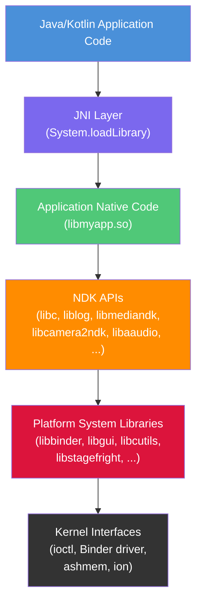

Each layer in the diagram represents a different stability domain:

| Layer | Stability guarantee | Who consumes it |
|-------|-------------------|----------------|
| NDK APIs | ABI-stable across releases | App developers |
| Platform system libs | No stability guarantee | Framework developers |
| Kernel interfaces | Stable via kernel ABI | All native code |

### 11.1.3 NDK vs Framework Native Code

It is essential to distinguish between "native code that uses the NDK" and
"native code that is part of the platform". Consider two concrete examples:

**App using the NDK** -- a game engine links against `libc.so`, `liblog.so`,
`libEGL.so`, `libGLESv3.so`, and `libaaudio.so`. These libraries are all on the
NDK list. The game ships an APK containing `lib/arm64-v8a/libgame.so`, and the
platform guarantees that the APIs it calls will work identically on any device
running the same or higher API level.

**Framework native code** -- the `SurfaceFlinger` compositor links against
`libgui.so`, `libui.so`, `libsync.so`, `libhwbinder.so`, and dozens of other
internal libraries. None of these carry an NDK stability guarantee. A device
manufacturer can (and must) rebuild `SurfaceFlinger` against the exact platform
tree.

The build system enforces this distinction. When a module sets
`sdk_version: "current"`, Soong resolves its shared library dependencies against
the NDK stub libraries rather than the real platform implementations. If the
module tries to use a non-NDK symbol, linking fails at build time.

### 11.1.4 Sysroot Generation Flow

The NDK sysroot is not a hand-curated directory of headers and libraries. It is
an output of the AOSP build. The build system assembles it from three components
registered as Soong module types in
`build/soong/cc/ndk_sysroot.go`:

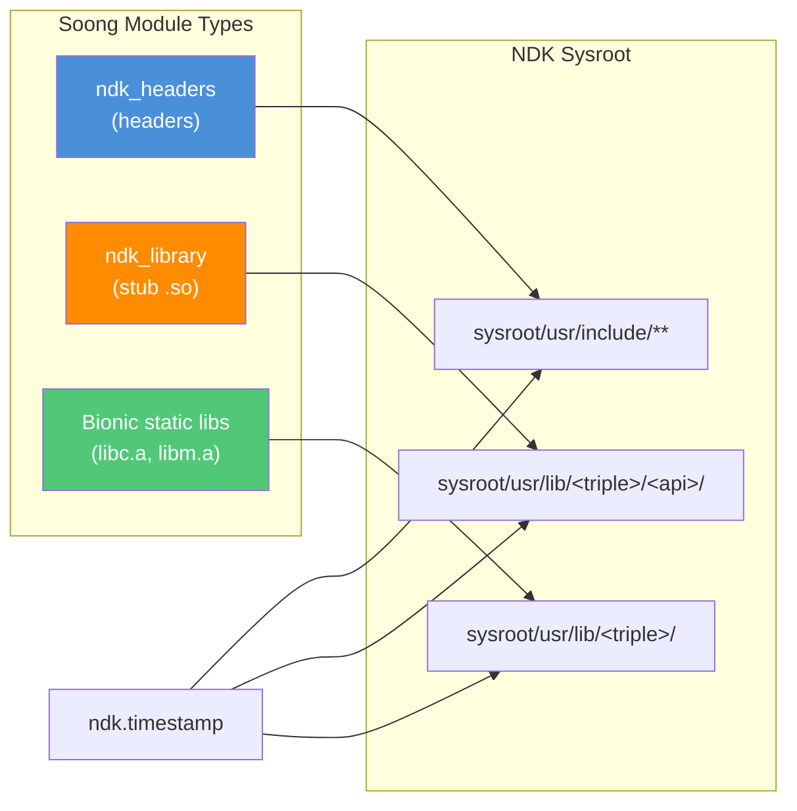

The comment at the top of `build/soong/cc/ndk_sysroot.go` spells out these four
components explicitly:

```
// The platform needs to provide the following artifacts for the NDK:
// 1. Bionic headers.
// 2. Platform API headers.
// 3. NDK stub shared libraries.
// 4. Bionic static libraries.
```

The file `ndk_sysroot.go` registers three module types and a singleton:

```go
// build/soong/cc/ndk_sysroot.go (lines 80-85)
func RegisterNdkModuleTypes(ctx android.RegistrationContext) {
    ctx.RegisterModuleType("ndk_headers", NdkHeadersFactory)
    ctx.RegisterModuleType("ndk_library", NdkLibraryFactory)
    ctx.RegisterModuleType("preprocessed_ndk_headers", preprocessedNdkHeadersFactory)
    ctx.RegisterParallelSingletonType("ndk", NdkSingleton)
}
```

The `NdkSingleton` walks every module in the tree, collecting headers, stub
libraries, and static libraries. It writes three timestamp files that the
top-level Makefile depends on:

- `ndk_headers.timestamp` -- depends only on headers (used by `.tidy` checks)
- `ndk_base.timestamp` -- depends on headers + stub shared libraries
- `ndk.timestamp` -- depends on the base + static libraries

Building with `m ndk` triggers generation of all sysroot artifacts.

---

## 11.2 NDK API Surface

### 11.2.1 Overview of NDK Libraries

The NDK API surface is the union of every `ndk_library` module declared in AOSP.
These are the libraries that app developers can link against. Searching the tree
for `ndk_library {` reveals the complete list:

| Library | First API | Source location |
|---------|-----------|----------------|
| `libc` | 9 | `bionic/libc/Android.bp` |
| `libm` | 9 | `bionic/libm/Android.bp` |
| `libdl` | 9 | `bionic/libdl/Android.bp` |
| `liblog` | 9 | `system/logging/liblog/Android.bp` |
| `libz` | 9 | `external/zlib/Android.bp` |
| `libandroid` | 9 | `frameworks/base/native/android/Android.bp` |
| `libEGL` | 9 | `frameworks/native/opengl/libs/Android.bp` |
| `libGLESv1_CM` | 9 | `frameworks/native/opengl/libs/Android.bp` |
| `libGLESv2` | 9 | `frameworks/native/opengl/libs/Android.bp` |
| `libGLESv3` | 9 | `frameworks/native/opengl/libs/Android.bp` |
| `libmediandk` | 21 | `frameworks/av/media/ndk/Android.bp` |
| `libcamera2ndk` | 24 | `frameworks/av/camera/ndk/Android.bp` |
| `libnativewindow` | 26 | `frameworks/native/libs/nativewindow/Android.bp` |
| `libaaudio` | 26 | `frameworks/av/media/libaaudio/Android.bp` |
| `libvulkan` | 26 | `frameworks/native/vulkan/libvulkan/Android.bp` |
| `libbinder_ndk` | 29 | `frameworks/native/libs/binder/ndk/Android.bp` |
| `libsync` | 26 | `system/core/libsync/Android.bp` |
| `libneuralnetworks` | 27 | `packages/modules/NeuralNetworks/runtime/Android.bp` |
| `libicu` | 31 | `external/icu/libicu/Android.bp` |
| `libnativehelper` | 34 | `system/extras/module_ndk_libs/libnativehelper/Android.bp` |

Each entry in this table corresponds to a Soong `ndk_library` block such as:

```
// frameworks/av/camera/ndk/Android.bp (lines 51-56)
ndk_library {
    name: "libcamera2ndk",
    symbol_file: "libcamera2ndk.map.txt",
    first_version: "24",
    unversioned_until: "current",
}
```

### 11.2.2 API Categories

The NDK APIs span a wide range of functionality. Here is a conceptual grouping:

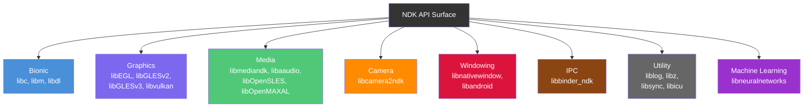

### 11.2.3 Key NDK APIs

This section examines the most important NDK APIs that applications use.

#### AHardwareBuffer

`AHardwareBuffer` provides a cross-process handle to GPU-allocated memory.
Introduced in API 26 as part of `libnativewindow`, it allows sharing graphical
buffers between the CPU, GPU, camera, and video decoder without copying.

Key functions (from `libnativewindow`):

- `AHardwareBuffer_allocate()` -- allocate a buffer with specified format and
  usage flags
- `AHardwareBuffer_lock()` -- map the buffer for CPU access
- `AHardwareBuffer_sendHandleToUnixSocket()` -- share across processes
- `AHardwareBuffer_recvHandleFromUnixSocket()` -- receive from another process

#### ANativeWindow

`ANativeWindow` is the native side of `android.view.Surface`. It is the primary
interface for applications that render frames directly (OpenGL ES, Vulkan, or
software rendering). Available since API 9 through `libandroid`:

- `ANativeWindow_fromSurface()` -- convert a Java Surface to a native handle
- `ANativeWindow_setBuffersGeometry()` -- configure buffer dimensions
- `ANativeWindow_lock()` / `ANativeWindow_unlockAndPost()` -- software rendering

#### AAudio

AAudio (Android Audio) replaced OpenSL ES as the recommended low-latency audio
API starting with API 26. Defined in `libaaudio`:

- `AAudioStreamBuilder_create()` -- create a stream builder
- `AAudioStreamBuilder_setPerformanceMode()` -- request low latency
- `AAudioStream_requestStart()` / `AAudioStream_requestStop()` -- control
  playback

The NDK headers for AAudio are declared in:
```
// frameworks/av/media/libaaudio/Android.bp (lines 24-31)
ndk_headers {
    name: "libAAudio_headers",
    from: "include",
    to: "",
    srcs: ["include/aaudio/AAudio.h"],
    license: "include/aaudio/NOTICE",
}
```

#### ACamera

The Camera NDK, introduced at API 24 in `libcamera2ndk`, exposes the Camera2
API to native code. We will examine its implementation in detail in Section 8.6.

#### ASensor

The sensor API is part of `libandroid` and provides access to accelerometer,
gyroscope, and other hardware sensors:

- `ASensorManager_getInstance()` -- get the sensor manager
- `ASensorManager_getDefaultSensor()` -- get a specific sensor
- `ASensorEventQueue_enableSensor()` -- start receiving events

### 11.2.4 Native App Glue

The NDK includes a helper library called "native app glue" that simplifies
writing purely native applications. It is shipped as source code at:

```
prebuilts/ndk/current/sources/android/native_app_glue/
    android_native_app_glue.c
    android_native_app_glue.h
```

The glue library provides a threading model where the application runs its main
loop in a separate thread from the Activity's UI thread. The core data structure
is `struct android_app`:

```c
// prebuilts/ndk/current/sources/android/native_app_glue/
//     android_native_app_glue.h (lines 109-183)
struct android_app {
    void* userData;
    void (*onAppCmd)(struct android_app* app, int32_t cmd);
    int32_t (*onInputEvent)(struct android_app* app, AInputEvent* event);
    ANativeActivity* activity;
    AConfiguration* config;
    void* savedState;
    size_t savedStateSize;
    ALooper* looper;
    AInputQueue* inputQueue;
    ANativeWindow* window;
    ARect contentRect;
    int activityState;
    int destroyRequested;
    // ... private implementation fields
};
```

The app receives lifecycle events through command codes:

| Command | Meaning |
|---------|---------|
| `APP_CMD_INIT_WINDOW` | A new `ANativeWindow` is ready |
| `APP_CMD_TERM_WINDOW` | The window is being destroyed |
| `APP_CMD_GAINED_FOCUS` | The activity has gained input focus |
| `APP_CMD_LOST_FOCUS` | The activity has lost input focus |
| `APP_CMD_RESUME` | The activity has been resumed |
| `APP_CMD_PAUSE` | The activity has been paused |
| `APP_CMD_SAVE_STATE` | The app should save state |
| `APP_CMD_DESTROY` | The activity is being destroyed |

The application entry point is `android_main()` rather than `main()`:

```c
// prebuilts/ndk/current/sources/android/native_app_glue/
//     android_native_app_glue.h (line 346)
extern void android_main(struct android_app* app);
```

### 11.2.5 Symbol Map Files

Every NDK library is controlled by a `.map.txt` symbol file. This file is the
definitive specification of the library's API surface. Here is an excerpt from
the Camera NDK symbol file:

```
// frameworks/av/camera/ndk/libcamera2ndk.map.txt (excerpt)
LIBCAMERA2NDK {
  global:
    ACameraCaptureSession_abortCaptures;
    ACameraCaptureSession_capture;
    ACameraCaptureSession_captureV2; # introduced=33
    ACameraCaptureSession_logicalCamera_capture; # introduced=29
    ACameraCaptureSession_close;
    ACameraCaptureSession_getDevice;
    ACameraCaptureSession_setRepeatingRequest;
    ACameraCaptureSession_stopRepeating;
    ACameraCaptureSession_updateSharedOutput; # introduced=28
    ACameraDevice_close;
    ACameraDevice_createCaptureRequest;
    ACameraDevice_createCaptureRequest_withPhysicalIds; # introduced=29
    ACameraDevice_createCaptureSession;
    ACameraDevice_getId;
    ACameraManager_create;
    ACameraManager_delete;
    ACameraManager_deleteCameraIdList;
    ACameraManager_getCameraCharacteristics;
    ACameraManager_getCameraIdList;
    ACameraManager_openCamera;
    ACameraManager_registerAvailabilityCallback;
    ACameraManager_unregisterAvailabilityCallback;
    ACameraMetadata_copy;
    ACameraMetadata_free;
    ACameraMetadata_getAllTags;
    ACameraMetadata_getConstEntry;
    ACameraMetadata_getTagFromName; # introduced=35
    ACameraMetadata_isLogicalMultiCamera; # introduced=29
    ACameraMetadata_fromCameraMetadata; # introduced=30
    ACameraOutputTarget_create;
    ACameraOutputTarget_free;
    ACaptureRequest_addTarget;
    ACaptureRequest_copy; # introduced=28
    ACaptureRequest_free;
    ACaptureRequest_getAllTags;
    ACaptureRequest_getConstEntry;
    ACaptureRequest_setEntry_double;
    ACaptureRequest_setEntry_float;
    ACaptureRequest_setEntry_i32;
    ACaptureRequest_setEntry_i64;
    ACaptureRequest_setEntry_rational;
    ACaptureRequest_setEntry_u8;
    ACaptureSessionOutputContainer_add;
    ACaptureSessionOutputContainer_create;
    ACaptureSessionOutputContainer_free;
    ACaptureSessionOutputContainer_remove;
    ACaptureSessionOutput_create;
    ACaptureSessionOutput_free;
  local:
    *;
};
```

Key aspects of the symbol map format:

- **`global:`** -- symbols listed here are exported from the stub library
- **`local: *;`** -- all other symbols are hidden (this is the default catch-all)
- **`# introduced=N`** -- the symbol was added at API level N; the `ndkstubgen`
  tool excludes it from stubs for earlier API levels
- **`# systemapi`** -- the symbol is only available to system apps, not regular
  third-party apps
- Symbols without an `# introduced=` annotation are available from the
  library's `first_version` (e.g., API 24 for `libcamera2ndk`)

This format allows precise per-symbol API level tracking within a single file.
When `ndkstubgen` generates stubs for API 28, it includes all symbols that
were introduced at or before API 28, but excludes symbols introduced at API 29
or later.

### 11.2.6 Bionic NDK Headers

The bionic C library contributes the largest collection of NDK headers. In
`bionic/libc/Android.bp`, there are multiple `ndk_headers` modules:

```
// bionic/libc/Android.bp (lines 2084-2089)
ndk_headers {
    name: "common_libc",
    from: "include",
    to: "",
    srcs: ["include/**/*.h"],
    license: "NOTICE",
}
```

Additional header modules cover kernel UAPI headers, architecture-specific
headers, and more:

```
// bionic/libc/Android.bp (lines 2097-2106)
ndk_headers {
    name: "libc_uapi",
    from: "kernel/uapi",
    to: "",
    srcs: [
        "kernel/uapi/asm-generic/**/*.h",
        // ...
    ],
    license: "NOTICE",
}
```

These bionic headers form the foundation of the NDK sysroot and include:

- Standard C library headers (`stdio.h`, `stdlib.h`, `string.h`, etc.)
- POSIX headers (`pthread.h`, `unistd.h`, `sys/mman.h`, etc.)
- Linux kernel UAPI headers (`linux/*.h`, `asm/*.h`)
- Android-specific extensions (`android/log.h`, `android/dlext.h`)

### 11.2.7 CPU Features

The `cpufeatures` library allows native code to query CPU capabilities at
runtime. Located at:

```
prebuilts/ndk/current/sources/android/cpufeatures/
    cpu-features.c
    cpu-features.h
```

The primary API consists of two functions:

```c
// prebuilts/ndk/current/sources/android/cpufeatures/cpu-features.h (line 58)
extern AndroidCpuFamily android_getCpuFamily(void);

// cpu-features.h (line 65)
extern uint64_t android_getCpuFeatures(void);
```

The `android_getCpuFamily()` function returns one of:

- `ANDROID_CPU_FAMILY_ARM`
- `ANDROID_CPU_FAMILY_ARM64`
- `ANDROID_CPU_FAMILY_X86`
- `ANDROID_CPU_FAMILY_X86_64`

The `android_getCpuFeatures()` function returns a bitmask of CPU capabilities.
For ARM64, the flags include:

```c
// cpu-features.h (lines 246-254)
enum {
    ANDROID_CPU_ARM64_FEATURE_FP      = (1 << 0),
    ANDROID_CPU_ARM64_FEATURE_ASIMD   = (1 << 1),
    ANDROID_CPU_ARM64_FEATURE_AES     = (1 << 2),
    ANDROID_CPU_ARM64_FEATURE_PMULL   = (1 << 3),
    ANDROID_CPU_ARM64_FEATURE_SHA1    = (1 << 4),
    ANDROID_CPU_ARM64_FEATURE_SHA2    = (1 << 5),
    ANDROID_CPU_ARM64_FEATURE_CRC32   = (1 << 6),
};
```

For x86/x86_64 architectures:

```c
// cpu-features.h (lines 260-271)
enum {
    ANDROID_CPU_X86_FEATURE_SSSE3  = (1 << 0),
    ANDROID_CPU_X86_FEATURE_POPCNT = (1 << 1),
    ANDROID_CPU_X86_FEATURE_MOVBE  = (1 << 2),
    ANDROID_CPU_X86_FEATURE_SSE4_1 = (1 << 3),
    ANDROID_CPU_X86_FEATURE_SSE4_2 = (1 << 4),
    ANDROID_CPU_X86_FEATURE_AES_NI = (1 << 5),
    ANDROID_CPU_X86_FEATURE_AVX    = (1 << 6),
    ANDROID_CPU_X86_FEATURE_RDRAND = (1 << 7),
    ANDROID_CPU_X86_FEATURE_AVX2   = (1 << 8),
    ANDROID_CPU_X86_FEATURE_SHA_NI = (1 << 9),
};
```

This is invaluable for libraries that provide hand-optimized SIMD paths --
applications can check feature flags at startup and branch to the most efficient
code path for the current CPU.

---

## 11.3 NDK Build Integration

The NDK build integration in AOSP is handled by four key Go source files in
`build/soong/cc/`:

| File | Lines | Purpose |
|------|-------|---------|
| `ndk_library.go` | 611 | Stub shared library generation |
| `ndk_headers.go` | 276 | Header installation into sysroot |
| `ndk_sysroot.go` | 320 | Sysroot assembly singleton |
| `ndk_abi.go` | 102 | ABI dump and diff monitoring |

### 11.3.1 The `ndk_library` Module Type

The `ndk_library` module type is the core build primitive for NDK stub
libraries. Each NDK library is declared as a pair: an `ndk_library` module that
generates stubs, and a `cc_library_shared` module that provides the real
implementation. The stub is what app developers link against; the real library
is what runs on the device.

The module type is implemented by `NdkLibraryFactory()` in
`build/soong/cc/ndk_library.go`:

```go
// build/soong/cc/ndk_library.go (lines 605-611)
func NdkLibraryFactory() android.Module {
    module := newStubLibrary()
    android.InitAndroidArchModule(module, android.DeviceSupported,
        android.MultilibBoth)
    return module
}
```

#### Properties

The `ndk_library` module type accepts these properties:

```go
// build/soong/cc/ndk_library.go (lines 91-117)
type libraryProperties struct {
    // Relative path to the symbol map.
    Symbol_file *string `android:"path"`

    // The first API level a library was available.
    First_version *string

    // The first API level that library should have the version script
    // applied.
    Unversioned_until *string

    // DO NOT USE THIS
    // NDK libraries should not export their headers.
    Export_header_libs []string
}
```

The `symbol_file` property points to a `.map.txt` file that lists every exported
symbol and the API level at which it was introduced. This is the source of truth
for the NDK API surface. For example, `libcamera2ndk.map.txt` lists every
function in the Camera NDK and the API level at which it became available.

The `first_version` property specifies the earliest API level for which stubs
should be generated. The build system generates a separate stub library for
every API level from `first_version` through the current level plus a "future"
level.

#### Stub Generation Process

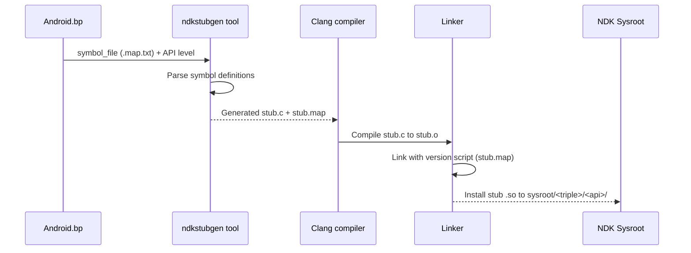

The stub generation begins in the `compile()` method of `stubDecorator`:

```go
// build/soong/cc/ndk_library.go (lines 474-507)
func (c *stubDecorator) compile(ctx ModuleContext, flags Flags,
        deps PathDeps) Objects {
    if !strings.HasSuffix(String(c.properties.Symbol_file), ".map.txt") {
        ctx.PropertyErrorf("symbol_file", "must end with .map.txt")
    }
    // ...
    symbolFile := String(c.properties.Symbol_file)
    nativeAbiResult := ParseNativeAbiDefinition(ctx, symbolFile,
        c.apiLevel, "")
    objs := CompileStubLibrary(ctx, flags, nativeAbiResult.StubSrc,
        ctx.getSharedFlags())
    c.versionScriptPath = nativeAbiResult.VersionScript
    // ...
}
```

The `ParseNativeAbiDefinition()` function invokes the `ndkstubgen` tool:

```go
// build/soong/cc/ndk_library.go (lines 258-286)
func ParseNativeAbiDefinition(ctx android.ModuleContext,
        symbolFile string, apiLevel android.ApiLevel,
        genstubFlags string) NdkApiOutputs {

    stubSrcPath := android.PathForModuleGen(ctx, "stub.c")
    versionScriptPath := android.PathForModuleGen(ctx, "stub.map")
    symbolFilePath := android.PathForModuleSrc(ctx, symbolFile)
    symbolListPath := android.PathForModuleGen(ctx,
        "abi_symbol_list.txt")
    apiLevelsJson := android.GetApiLevelsJson(ctx)
    ctx.Build(pctx, android.BuildParams{
        Rule:        genStubSrc,
        Description: "generate stubs " + symbolFilePath.Rel(),
        Outputs: []android.WritablePath{stubSrcPath,
            versionScriptPath, symbolListPath},
        Input:     symbolFilePath,
        Implicits: []android.Path{apiLevelsJson},
        Args: map[string]string{
            "arch":     ctx.Arch().ArchType.String(),
            "apiLevel": apiLevel.String(),
            "apiMap":   apiLevelsJson.String(),
            "flags":    genstubFlags,
        },
    })
    // ...
}
```

This invokes the `genStubSrc` rule:

```go
// build/soong/cc/ndk_library.go (lines 38-43)
genStubSrc = pctx.AndroidStaticRule("genStubSrc",
    blueprint.RuleParams{
        Command: "$ndkStubGenerator --arch $arch --api $apiLevel " +
            "--api-map $apiMap $flags $in $out",
        CommandDeps: []string{"$ndkStubGenerator"},
    }, "arch", "apiLevel", "apiMap", "flags")
```

The tool reads the `.map.txt` symbol file and produces:

1. A `stub.c` source file containing placeholder implementations of every
   exported function
2. A `stub.map` version script that controls which symbols are exported
3. An `abi_symbol_list.txt` enumerating all symbols for ABI monitoring

#### Stub Compilation Flags

Stub libraries are compiled with special flags that suppress warnings about
the placeholder implementations:

```go
// build/soong/cc/ndk_library.go (lines 220-232)
var stubLibraryCompilerFlags = []string{
    "-Wno-incompatible-library-redeclaration",
    "-Wno-incomplete-setjmp-declaration",
    "-Wno-builtin-requires-header",
    "-Wno-invalid-noreturn",
    "-Wall",
    "-Werror",
    "-fno-unwind-tables",
}
```

The `-fno-unwind-tables` flag is notable: since stubs are never actually
executed, there is no need for unwinding information. This reduces the size of
the generated stubs.

#### Version Management

Each `ndk_library` produces stubs for every API level from `first_version` to
the current release:

```go
// build/soong/cc/ndk_library.go (lines 145-155)
func ndkLibraryVersions(ctx android.BaseModuleContext,
        from android.ApiLevel) []string {
    versionStrs := []string{}
    for _, version := range ctx.Config().FinalApiLevels() {
        if version.GreaterThanOrEqualTo(from) {
            versionStrs = append(versionStrs, version.String())
        }
    }
    versionStrs = append(versionStrs,
        android.FutureApiLevel.String())
    return versionStrs
}
```

This means that `libcamera2ndk` with `first_version: "24"` generates stubs for
API 24, 25, 26, ..., current, and "future". Each versioned stub exports only
the symbols that were available at that API level.

#### Stub Installation

Stubs are installed into a versioned path within the sysroot:

```go
// build/soong/cc/ndk_library.go (lines 562-569)
func getVersionedLibraryInstallPath(ctx ModuleContext,
        apiLevel android.ApiLevel) android.OutputPath {
    return getUnversionedLibraryInstallPath(ctx).Join(ctx,
        apiLevel.String())
}
```

This produces paths like:
```
sysroot/usr/lib/aarch64-linux-android/24/libcamera2ndk.so
sysroot/usr/lib/aarch64-linux-android/26/libaaudio.so
sysroot/usr/lib/aarch64-linux-android/29/libbinder_ndk.so
```

### 11.3.2 The `ndk_headers` Module Type

The `ndk_headers` module type installs header files into the NDK sysroot. It is
implemented in `build/soong/cc/ndk_headers.go`.

#### Properties

```go
// build/soong/cc/ndk_headers.go (lines 39-71)
type headerProperties struct {
    // Base directory of the headers being installed.
    From *string

    // Install path within the sysroot relative to usr/include.
    To *string

    // List of headers to install. Glob compatible.
    Srcs []string `android:"path"`

    // Source paths that should be excluded.
    Exclude_srcs []string `android:"path"`

    // Path to the NOTICE file associated with the headers.
    License *string `android:"path"`

    // Set to true if the headers should skip verification.
    Skip_verification *bool
}
```

The `from` and `to` properties control how header paths are mapped from the
source tree into the sysroot. The comment in the source explains the mapping:

```
// ndk_headers {
//     name: "foo",
//     from: "include",
//     to: "",
//     srcs: ["include/foo/bar/baz.h"],
// }
//
// Will install $SYSROOT/usr/include/foo/bar/baz.h.
```

#### Header Verification

Every NDK header is verified to be self-contained and valid C. This happens in
the `NdkSingleton` in `ndk_sysroot.go`:

```go
// build/soong/cc/ndk_sysroot.go (lines 121-158)
func verifyNdkHeaderIsCCompatible(ctx android.SingletonContext,
        src android.Path, dest android.Path) android.Path {
    // ...
    ctx.Build(pctx, android.BuildParams{
        Rule:        verifyCCompat,
        Description: fmt.Sprintf("Verifying C compatibility of %s",
            src),
        Output:      output,
        Input:       dest,
        Implicits:   []android.Path{
            getNdkHeadersTimestampFile(ctx)},
        Args: map[string]string{
            "ccCmd": "${config.ClangBin}/clang",
            "flags": fmt.Sprintf(
                "-target aarch64-linux-android%d --sysroot %s",
                android.FutureApiLevel.FinalOrFutureInt(),
                getNdkSysrootBase(ctx).String(),
            ),
        },
    })
    return output
}
```

This compiles each header with `-fsyntax-only` to ensure it parses cleanly as
standalone C code. Headers that have been granted `skip_verification: true`
bypass this check -- but the comment in the property definition notes that this
should be extremely rare.

#### Preprocessed Headers

Some NDK headers require preprocessing before installation (e.g., architecture-
specific definitions). The `preprocessed_ndk_headers` module type handles this:

```go
// build/soong/cc/ndk_headers.go (lines 192-215)
type preprocessedHeadersProperties struct {
    // The preprocessor to run.
    Preprocessor *string

    // Source path to the files to be preprocessed.
    Srcs []string

    // Install path within the sysroot relative to usr/include.
    To *string

    // Path to the NOTICE file.
    License *string
}
```

### 11.3.3 ABI Monitoring

NDK ABI stability is not just a policy -- it is enforced by automated
monitoring in the build system. The implementation lives in
`build/soong/cc/ndk_abi.go`.

#### ABI Dump Generation

The system uses STG (Symbol/Type Graph), a tool that extracts ABI information
from ELF binaries using DWARF debug information:

```go
// build/soong/cc/ndk_library.go (lines 51-55)
stg = pctx.AndroidStaticRule("stg",
    blueprint.RuleParams{
        Command: "$stg -S :$symbolList --file-filter :$headersList " +
            "--elf $in -o $out",
        CommandDeps: []string{"$stg"},
    }, "symbolList", "headersList")
```

The `headersList` is critical: it tells STG to only monitor types that are
defined in NDK public headers. Types from internal headers are excluded from
monitoring. This prevents false positives from internal implementation details
leaking through DWARF.

The header filtering logic is in `ndk_sysroot.go`:

```go
// build/soong/cc/ndk_sysroot.go (lines 186-196)
func writeNdkAbiSrcFilter(ctx android.BuilderContext,
        headerSrcPaths android.Paths,
        outputFile android.WritablePath) {
    var filterBuilder strings.Builder
    filterBuilder.WriteString("[decl_file_allowlist]\n")
    for _, headerSrcPath := range headerSrcPaths {
        filterBuilder.WriteString(headerSrcPath.String())
        filterBuilder.WriteString("\n")
    }
    android.WriteFileRule(ctx, outputFile, filterBuilder.String())
}
```

#### ABI Diff Detection

When an ABI dump exists for a given API level, the build compares it against
the prebuilt reference dump stored in `prebuilts/abi-dumps/ndk/`:

```go
// build/soong/cc/ndk_library.go (lines 57-65)
stgdiff = pctx.AndroidStaticRule("stgdiff",
    blueprint.RuleParams{
        Command: "$stgdiff $args --stg $in -o $out || " +
            "(cat $out && echo 'Run " +
            "$$ANDROID_BUILD_TOP/development/tools/ndk/" +
            "update_ndk_abi.sh to update the ABI dumps.' " +
            "&& false)",
        CommandDeps: []string{"$stgdiff"},
    }, "args")
```

If `stgdiff` detects an ABI change, the build fails with an error message
telling the developer to run `update_ndk_abi.sh`. This is an intentional
friction point: breaking NDK ABI is a serious matter that requires explicit
acknowledgment.

The diff logic checks two things:

1. **Current API level**: the built ABI must match the prebuilt dump for this
   level exactly. Any change is an error.
2. **Next API level**: the ABI must be a superset of the current level. New
   additions are allowed, but removals or modifications are not.

```go
// build/soong/cc/ndk_library.go (lines 397-471)
func (this *stubDecorator) diffAbi(ctx ModuleContext) {
    // Catch any ABI changes compared to the checked-in definition
    // ...
    ctx.Build(pctx, android.BuildParams{
        Rule: stgdiff,
        // ...
        Args: map[string]string{
            "args": "--format=small",
        },
    })
    // Also ensure the next API level is compatible
    // ...
    ctx.Build(pctx, android.BuildParams{
        Rule: stgdiff,
        // ...
        Args: map[string]string{
            "args": "--format=small --ignore=interface_addition",
        },
    })
}
```

The `--ignore=interface_addition` flag is key: it allows new symbols to appear
in the next API level but flags any removal or signature change.

#### ABI Monitoring Flow

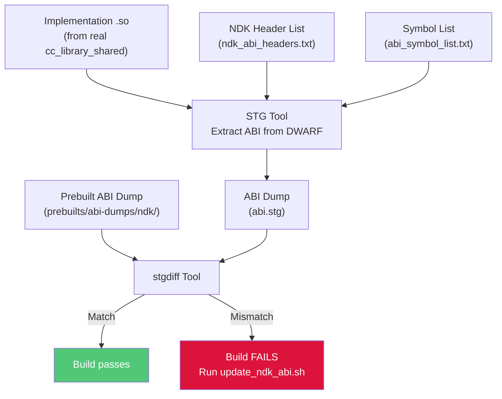

#### Bionic Exception

Interestingly, bionic libraries are currently exempted from ABI monitoring:

```go
// build/soong/cc/ndk_library.go (lines 336-352)
func (this *stubDecorator) canDumpAbi(ctx ModuleContext) bool {
    if runtime.GOOS == "darwin" {
        return false
    }
    if strings.HasPrefix(ctx.ModuleDir(), "bionic/") {
        // Bionic has enough uncommon implementation details like
        // ifuncs and asm code that the ABI tracking here has a ton
        // of false positives. That's causing pretty extreme friction
        // for development there, so disabling it until the workflow
        // can be improved.
        //
        // http://b/358653811
        return false
    }
    return ctx.Config().ReleaseNdkAbiMonitored()
}
```

This is a pragmatic concession: bionic's use of ifuncs (indirect functions for
runtime dispatch) and hand-written assembly generates DWARF information that
confuses the STG tool. Bionic ABI stability is maintained through other means
(CTS tests, manual review).

### 11.3.4 The NDK Known Libraries Registry

Every `ndk_library` module registers itself in a global list of known NDK
libraries:

```go
// build/soong/cc/ndk_library.go (lines 195-218)
func getNDKKnownLibs(config android.Config) *[]string {
    return config.Once(ndkKnownLibsKey, func() interface{} {
        return &[]string{}
    }).(*[]string)
}

func (c *stubDecorator) compilerInit(ctx BaseModuleContext) {
    c.baseCompiler.compilerInit(ctx)

    name := ctx.baseModuleName()
    // ...
    ndkKnownLibsLock.Lock()
    defer ndkKnownLibsLock.Unlock()
    ndkKnownLibs := getNDKKnownLibs(ctx.Config())
    for _, lib := range *ndkKnownLibs {
        if lib == name {
            return
        }
    }
    *ndkKnownLibs = append(*ndkKnownLibs, name)
}
```

This list is used by the build system to validate that SDK-built modules only
link against approved NDK libraries. A mutex (`ndkKnownLibsLock`) protects the
list because `compilerInit()` runs during the parallel `BeginMutator` phase.

### 11.3.5 End-to-End: How an NDK Library Is Built

Let us trace the complete lifecycle of `libcamera2ndk` from declaration to
sysroot installation:

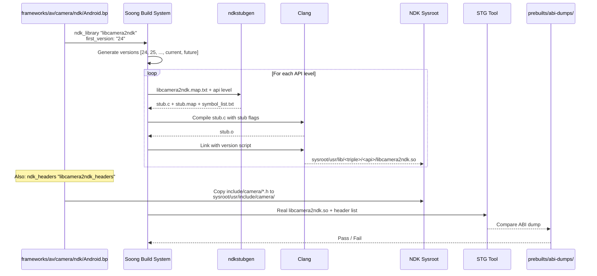

---

## 11.4 LL-NDK -- Low-Level NDK

### 11.4.1 What Is LL-NDK?

LL-NDK (Low-Level NDK) is a subset of system libraries that are available to
**both** NDK applications **and** vendor/product native code. While regular NDK
libraries are only accessible to apps running in the app linker namespace,
LL-NDK libraries are visible across namespace boundaries.

The canonical LL-NDK libraries are the fundamental system libraries that
everything depends on:

| Library | Purpose |
|---------|---------|
| `libc.so` | C standard library (bionic) |
| `libm.so` | Math library |
| `libdl.so` | Dynamic linker interface |
| `liblog.so` | Android logging |
| `libz.so` | zlib compression |
| `libnativewindow.so` | Window/buffer management |
| `libsync.so` | Fence synchronization |
| `libvulkan.so` | Vulkan graphics API |
| `libEGL.so` | EGL interface |
| `libGLESv1_CM.so` | OpenGL ES 1.x |
| `libGLESv2.so` | OpenGL ES 2.0+ |
| `libGLESv3.so` | OpenGL ES 3.x |
| `libmediandk.so` | Media framework |
| `libbinder_ndk.so` | Binder NDK interface |

### 11.4.2 LLNDK Declaration in Soong

A library declares itself as LL-NDK by including an `llndk` block within its
`cc_library` or `cc_library_shared` definition. For example, `libnativewindow`:

```
// frameworks/native/libs/nativewindow/Android.bp (lines 72-80)
cc_library {
    name: "libnativewindow",
    llndk: {
        symbol_file: "libnativewindow.map.txt",
        unversioned: true,
        override_export_include_dirs: [
            "include",
        ],
        export_llndk_headers: [
```

And `libbinder_ndk`:

```
// frameworks/native/libs/binder/ndk/Android.bp (lines 77-85)
cc_library {
    name: "libbinder_ndk",
    // ...
    llndk: {
        symbol_file: "libbinder_ndk.map.txt",
    },
```

Similarly, `libmediandk`:

```
// frameworks/av/media/ndk/Android.bp (lines 87-91)
cc_library_shared {
    name: "libmediandk",
    llndk: {
        symbol_file: "libmediandk.map.txt",
    },
```

### 11.4.3 LLNDK Properties

The LL-NDK property structure is defined in
`build/soong/cc/llndk_library.go`:

```go
// build/soong/cc/llndk_library.go (lines 30-63)
type llndkLibraryProperties struct {
    // Relative path to the symbol map.
    Symbol_file *string `android:"path,arch_variant"`

    // Whether to export headers as -isystem instead of -I.
    Export_headers_as_system *bool

    // Whether the system library uses symbol versions.
    Unversioned *bool

    // List of llndk headers to re-export.
    Export_llndk_headers []string

    // Override export include dirs for the LLNDK variant.
    Override_export_include_dirs []string

    // Whether this module can be directly depended upon by
    // vendor/product libraries.
    Private *bool

    // If true, provide headers to other LLNDK modules.
    Llndk_headers *bool

    // Marks this module as having been distributed through an apex.
    Moved_to_apex *bool
}
```

The `Private` property is noteworthy: when set to `true`, the library is
accessible to other VNDK libraries but not directly to vendor code. This allows
the platform to use a library as an internal implementation detail of the VNDK
without exposing it to all vendor modules.

### 11.4.4 LLNDK Mutator

The `llndkMutator` in `llndk_library.go` marks modules as LL-NDK during the
build:

```go
// build/soong/cc/llndk_library.go (lines 224-249)
func llndkMutator(mctx android.BottomUpMutatorContext) {
    m, ok := mctx.Module().(*Module)
    if !ok {
        return
    }
    if shouldSkipLlndkMutator(mctx, m) {
        return
    }

    lib, isLib := m.linker.(*libraryDecorator)
    prebuiltLib, isPrebuiltLib := m.linker.(*prebuiltLibraryLinker)

    if m.InVendorOrProduct() && isLib && lib.HasLLNDKStubs() {
        m.VendorProperties.IsLLNDK = true
    }
    if m.InVendorOrProduct() && isPrebuiltLib &&
            prebuiltLib.HasLLNDKStubs() {
        m.VendorProperties.IsLLNDK = true
    }
    // ...
}
```

The mutator skips modules that are disabled, not device targets, or NativeBridge
targets:

```go
// build/soong/cc/llndk_library.go (lines 252-263)
func shouldSkipLlndkMutator(mctx android.BottomUpMutatorContext,
        m *Module) bool {
    if !m.Enabled(mctx) {
        return true
    }
    if !m.Device() {
        return true
    }
    if m.Target().NativeBridge == android.NativeBridgeEnabled {
        return true
    }
    return false
}
```

### 11.4.5 LLNDK Libraries List Generation

The `llndk_libraries_txt` singleton module generates a text file listing all
LL-NDK libraries. This file is used by Make and by the linker configuration
generator:

```go
// build/soong/cc/llndk_library.go (lines 127-138)
// llndk_libraries_txt is a singleton module whose content is a list
// of LLNDK libraries generated by Soong but can be referenced by
// other modules.
func llndkLibrariesTxtFactory() android.SingletonModule {
    m := &llndkLibrariesTxtModule{}
    android.InitAndroidArchModule(m, android.DeviceSupported,
        android.MultilibCommon)
    return m
}
```

The Make variable `LLNDK_LIBRARIES` is set from this module:

```go
// build/soong/cc/llndk_library.go (lines 210-212)
func (txt *llndkLibrariesTxtModule) MakeVars(
        ctx android.MakeVarsContext) {
    ctx.Strict("LLNDK_LIBRARIES",
        strings.Join(txt.moduleNames, " "))
}
```

### 11.4.6 LL-NDK vs NDK: Architecture Comparison

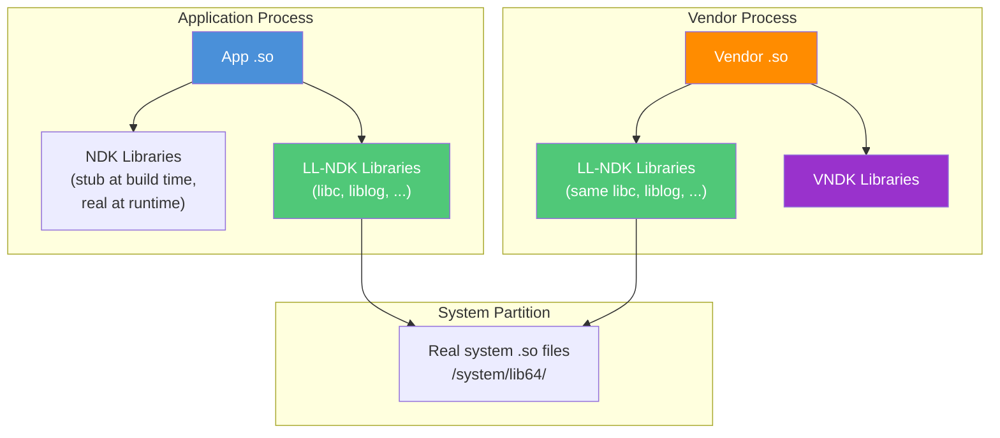

The key difference: LL-NDK libraries live on the system partition but are
accessible to code on the vendor partition. Regular NDK libraries like
`libcamera2ndk` are only available in the app linker namespace. LL-NDK
libraries form the minimal shared ABI between system and vendor partitions.

### 11.4.7 Moved-to-Apex LLNDK Libraries

Some LL-NDK libraries have been moved into APEX modules. The
`movedToApexLlndkLibraries` singleton tracks these:

```go
// build/soong/cc/llndk_library.go (lines 74-103)
func (s *movedToApexLlndkLibraries) GenerateBuildActions(
        ctx android.SingletonContext) {
    movedToApexLlndkLibrariesMap := make(map[string]bool)
    ctx.VisitAllModuleProxies(func(module android.ModuleProxy) {
        if library, ok := android.OtherModuleProvider(ctx, module,
                LinkableInfoProvider); ok {
            if library.HasLLNDKStubs &&
                    library.IsLLNDKMovedToApex {
                movedToApexLlndkLibrariesMap[
                    library.ImplementationModuleName] = true
            }
        }
    })
    // ...
}
```

This generates the `LLNDK_MOVED_TO_APEX_LIBRARIES` Make variable, which the
linker configuration generator uses to set up namespace fallback paths to
APEX directories.

---

## 11.5 VNDK -- Vendor NDK

### 11.5.1 The Vendor Stability Problem

Before Android 8.0 (Oreo), vendors could link against any library on the system
partition. This created a fragile coupling: when Google updated system libraries
in a platform release, vendor code often broke because it depended on internal
symbols that changed. This forced a painful "big-bang" integration cycle for
every Android release.

The VNDK (Vendor Native Development Kit) was introduced in Android 8.0 to solve
this problem. It defines a set of system libraries that vendor code is
**permitted** to use, with the guarantee that these libraries maintain ABI
compatibility across platform updates.

### 11.5.2 VNDK Architecture

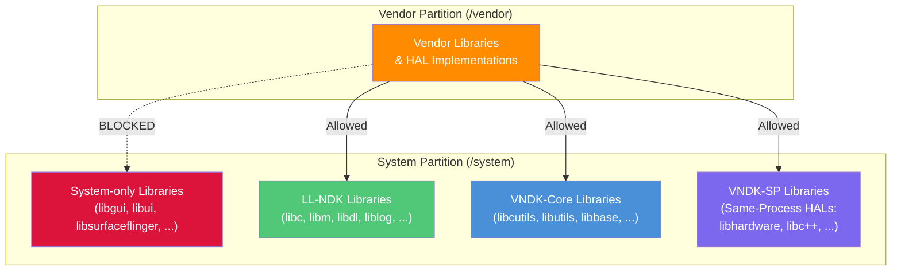

The VNDK is divided into several categories:

| Category | Description | Example |
|----------|-------------|---------|
| VNDK-Core | Standard VNDK libraries | `libcutils`, `libutils`, `libbase` |
| VNDK-SP | Same-Process VNDK libraries (can be loaded into vendor processes alongside vendor libs) | `libhardware`, `libc++`, `libhidlbase` |
| VNDK-Private | VNDK libraries not directly usable by vendor code | Internal dependencies of VNDK |
| LL-NDK | Lowest-level NDK (cross-partition) | `libc`, `libm`, `liblog` |

### 11.5.3 VNDK Declaration in Soong

A library declares itself as VNDK by including a `vndk` block. The properties
are defined in `build/soong/cc/vndk.go`:

```go
// build/soong/cc/vndk.go (lines 45-76)
type VndkProperties struct {
    Vndk struct {
        // declared as a VNDK or VNDK-SP module.
        Enabled *bool

        // declared as a VNDK-SP module, which is a subset of VNDK.
        // All these modules are allowed to link to VNDK-SP or LL-NDK
        // modules only.
        Support_system_process *bool

        // declared as a VNDK-private module.
        // Only available to other VNDK modules, not to vendor code.
        Private *bool

        // Extending another module
        Extends *string
    }
}
```

A typical VNDK declaration looks like:

```
cc_library_shared {
    name: "libcutils",
    vendor_available: true,
    vndk: {
        enabled: true,
    },
    // ...
}
```

For VNDK-SP (Same-Process) libraries:

```
cc_library_shared {
    name: "libhardware",
    vendor_available: true,
    vndk: {
        enabled: true,
        support_system_process: true,
    },
    // ...
}
```

### 11.5.4 VNDK Link-Type Checking

The build system enforces VNDK dependency rules at build time. The linking
constraints are:

| Module type | Can link to |
|-------------|------------|
| **Vendor** | LL-NDK, VNDK-Core, VNDK-SP, other vendor libs |
| **VNDK-Core** | LL-NDK, VNDK-Core, VNDK-SP |
| **VNDK-SP** | LL-NDK, VNDK-SP only |
| **System** | Any system library |

These rules create a strict hierarchy:

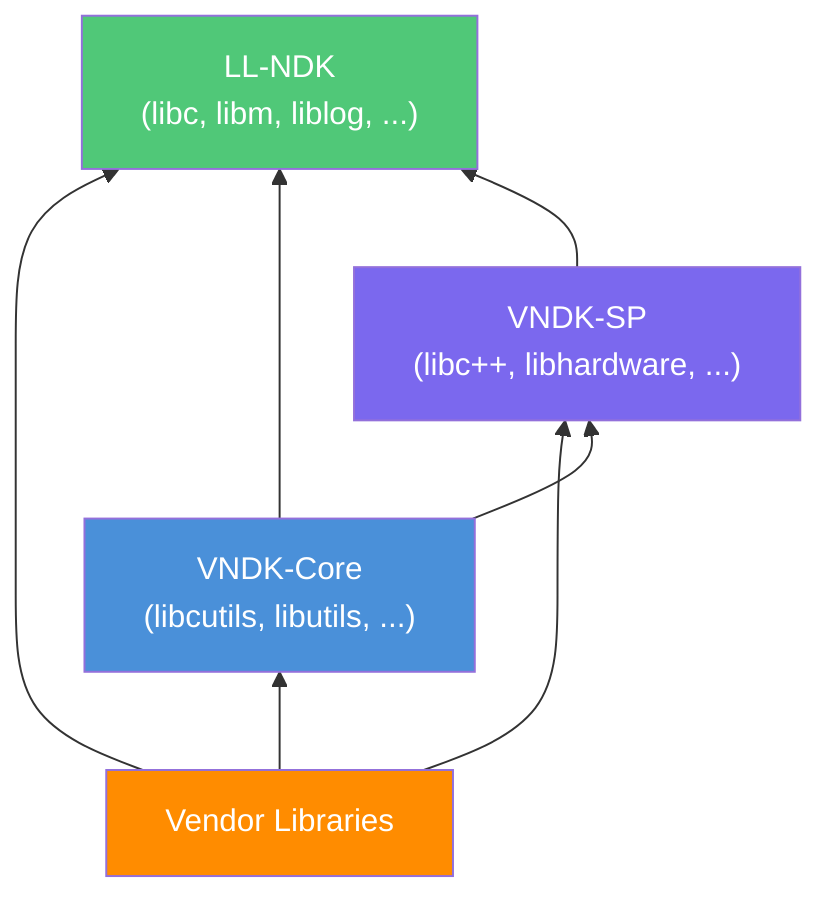

If a VNDK-SP library attempts to link against a VNDK-Core library, the build
fails with a link-type error. This strict hierarchy prevents the circular
dependency problems that plagued pre-Oreo Android.

### 11.5.5 VNDK Library List Files

The build system generates several text files that enumerate the VNDK:

```go
// build/soong/cc/vndk.go (lines 23-29)
const (
    llndkLibrariesTxt       = "llndk.libraries.txt"
    vndkCoreLibrariesTxt    = "vndkcore.libraries.txt"
    vndkSpLibrariesTxt      = "vndksp.libraries.txt"
    vndkPrivateLibrariesTxt = "vndkprivate.libraries.txt"
    vndkProductLibrariesTxt = "vndkproduct.libraries.txt"
)
```

Each file is versioned:

```go
// build/soong/cc/vndk.go (lines 78-83)
func insertVndkVersion(filename string, vndkVersion string) string {
    if index := strings.LastIndex(filename, "."); index != -1 {
        return filename[:index] + "." + vndkVersion +
            filename[index:]
    }
    return filename
}
```

So for VNDK version 34, the file names become `vndkcore.libraries.34.txt`,
`vndksp.libraries.34.txt`, etc.

### 11.5.6 VNDK Prebuilt Snapshots

When Google releases a new platform version, it also ships a VNDK snapshot --
a set of prebuilt VNDK libraries for the previous version. This allows vendors
to use an older platform's VNDK without rebuilding. The `vndk_prebuilt_shared`
module type handles this:

```go
// build/soong/cc/vndk_prebuilt.go (lines 51-73)
type vndkPrebuiltProperties struct {
    VndkProperties

    // VNDK snapshot version.
    Version *string

    // Target arch name of the snapshot.
    Target_arch *string

    // If the prebuilt snapshot lib is built with 32-bit binder.
    Binder32bit *bool

    // Prebuilt files for each arch.
    Srcs []string `android:"arch_variant"`

    // Flags for linking.
    Export_flags []string `android:"arch_variant"`

    // Check the prebuilt ELF files.
    Check_elf_files *bool `android:"arch_variant"`
}
```

A VNDK prebuilt declaration:

```
// Example from build/soong/cc/vndk_prebuilt.go comments
vndk_prebuilt_shared {
    name: "libfoo",
    version: "27",
    target_arch: "arm64",
    vendor_available: true,
    product_available: true,
    vndk: {
        enabled: true,
    },
    export_include_dirs: [
        "include/external/libfoo/vndk_include"
    ],
    arch: {
        arm64: {
            srcs: ["arm/lib64/libfoo.so"],
        },
        arm: {
            srcs: ["arm/lib/libfoo.so"],
        },
    },
}
```

The prebuilt module matches against the device configuration:

```go
// build/soong/cc/vndk_prebuilt.go (lines 186-198)
func (p *vndkPrebuiltLibraryDecorator) MatchesWithDevice(
        config android.DeviceConfig) bool {
    arches := config.Arches()
    if len(arches) == 0 ||
            arches[0].ArchType.String() != p.arch() {
        return false
    }
    if config.BinderBitness() != p.binderBit() {
        return false
    }
    if len(p.properties.Srcs) == 0 {
        return false
    }
    return true
}
```

### 11.5.7 Linker Namespace Isolation

The VNDK's stability guarantee is enforced at runtime through the dynamic
linker's namespace isolation. The configuration is generated by the
`linkerconfig` tool located at `system/linkerconfig/`.

The static `ld.config.txt` at `system/core/rootdir/etc/ld.config.txt` now
contains only a redirect:

```
# This file is no longer in use.
# Please update linker configuration generator instead.
# You can find the code from /system/linkerconfig
```

The generated configuration (visible in test golden files at
`system/linkerconfig/testdata/golden_output/vendor_with_vndk/ld.config.txt`)
shows the namespace architecture:

For the **vendor** section:

```
[vendor]
additional.namespaces = ...,system,vndk
namespace.default.isolated = true
namespace.default.search.paths = /odm/${LIB}
namespace.default.search.paths += /vendor/${LIB}
namespace.default.search.paths += /vendor/${LIB}/hw
namespace.default.search.paths += /vendor/${LIB}/egl
```

Vendor code in the `default` namespace can only load libraries from
`/odm/${LIB}` and `/vendor/${LIB}`. To access system libraries, it must go
through explicit links to other namespaces:

```
namespace.default.links = rs,system,vndk,...
namespace.default.link.system.shared_libs = libc.so:libm.so:libdl.so:
    liblog.so:libbinder_ndk.so:libmediandk.so:libnativewindow.so:
    libvulkan.so:libEGL.so:libGLESv1_CM.so:libGLESv2.so:libGLESv3.so:
    libsync.so:libvndksupport.so:...
namespace.default.link.vndk.shared_libs = libcutils.so:libutils.so:
    libbase.so:libhidlbase.so:libc++.so:...
```

The `link.system.shared_libs` list corresponds to LL-NDK libraries.
The `link.vndk.shared_libs` list corresponds to VNDK libraries.

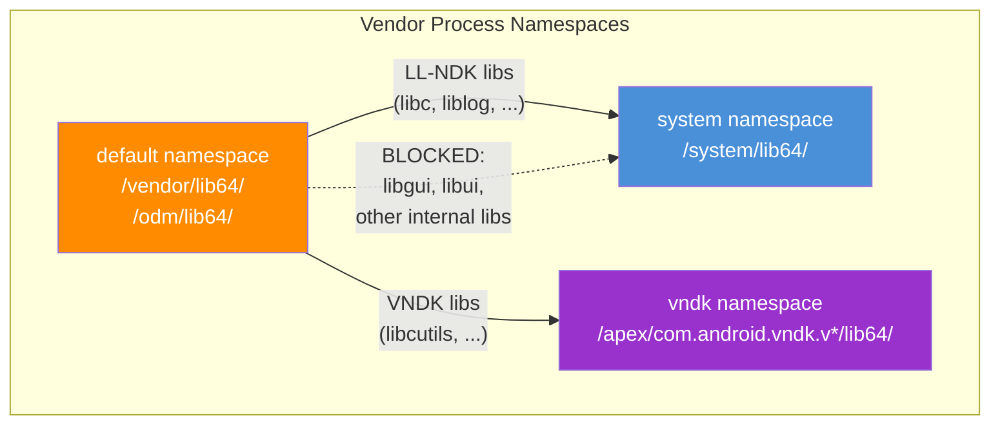

### 11.5.8 VNDK-SP: Same-Process Libraries

VNDK-SP (Same-Process) libraries are a special subset that can be loaded into
the same process as vendor code without going through an IPC boundary. This is
necessary for HALs that are loaded as shared libraries directly into system
processes (e.g., the graphics HAL loaded into SurfaceFlinger).

The key constraint on VNDK-SP is tighter than regular VNDK: VNDK-SP libraries
can only depend on other VNDK-SP libraries or LL-NDK libraries. This prevents
circular dependencies between system and vendor code loaded in the same process.

### 11.5.9 The VNDK Deprecation Trend

Starting with Android 14, Google has been gradually reducing the VNDK's scope.
The Vendor API Level concept (`RELEASE_BOARD_API_LEVEL`) replaces the VNDK
version, and the VNDK APEX (`com.android.vndk.v*`) provides a cleaner packaging
mechanism than the flat directory structure. For builds without VNDK, the linker
configuration simplifies significantly -- vendor code links directly against
system libraries, with namespace isolation relying on stub libraries and the
linker config generator rather than a separate VNDK directory.

---

## 11.6 NDK Framework Bindings

The NDK does not merely expose low-level system functions. It also provides C
bindings to major Android framework services: Camera, Media, and Binder. These
bindings follow a consistent architecture: a C API layer that wraps internal
C++ framework objects, with strict symbol visibility control.

### 11.6.1 Camera NDK (`libcamera2ndk`)

The Camera NDK is located at `frameworks/av/camera/ndk/`. It exposes the
Camera2 API -- the same camera pipeline used by the Java
`android.hardware.camera2` package -- through C functions.

#### Source Structure

```
frameworks/av/camera/ndk/
    Android.bp                      # Build rules
    NdkCameraCaptureSession.cpp     # Capture session API
    NdkCameraDevice.cpp             # Device open/close/create request
    NdkCameraManager.cpp            # Camera enumeration and callbacks
    NdkCameraMetadata.cpp           # Metadata (settings, results)
    NdkCaptureRequest.cpp           # Capture request construction
    impl/                           # Internal implementation
        ACameraCaptureSession.cpp
        ACameraDevice.cpp
        ACameraManager.cpp
        ACameraMetadata.cpp
    ndk_vendor/                     # Vendor variant (uses AIDL HAL)
        impl/
            ACameraDevice.cpp
            ACameraManager.cpp
            utils.cpp
    include/camera/                 # Public NDK headers
        NdkCameraCaptureSession.h
        NdkCameraDevice.h
        NdkCameraError.h
        NdkCameraManager.h
        NdkCameraMetadata.h
        NdkCameraMetadataTags.h
        NdkCameraWindowType.h
        NdkCaptureRequest.h
    libcamera2ndk.map.txt           # Symbol export map
```

#### NDK and Header Declarations

The Camera NDK declares both its stub library and its headers in the same
`Android.bp`:

```
// frameworks/av/camera/ndk/Android.bp (lines 51-64)
ndk_library {
    name: "libcamera2ndk",
    symbol_file: "libcamera2ndk.map.txt",
    first_version: "24",
    unversioned_until: "current",
}

ndk_headers {
    name: "libcamera2ndk_headers",
    from: "include/camera",
    to: "camera",
    srcs: ["include/camera/**/*.h"],
    license: "NOTICE",
}
```

#### Implementation Pattern

The Camera NDK functions follow a consistent pattern: a thin C wrapper that
delegates to an internal C++ implementation. Here is `ACameraManager_create()`:

```cpp
// frameworks/av/camera/ndk/NdkCameraManager.cpp (lines 38-41)
EXPORT
ACameraManager* ACameraManager_create() {
    ATRACE_CALL();
    return new ACameraManager();
}
```

And `ACameraDevice_close()`:

```cpp
// frameworks/av/camera/ndk/NdkCameraDevice.cpp (lines 31-39)
EXPORT
camera_status_t ACameraDevice_close(ACameraDevice* device) {
    ATRACE_CALL();
    if (device == nullptr) {
        ALOGE("%s: invalid argument! device is null",
              __FUNCTION__);
        return ACAMERA_ERROR_INVALID_PARAMETER;
    }
    delete device;
    return ACAMERA_OK;
}
```

The `EXPORT` macro is defined as `__attribute__((visibility("default")))`, and
the library is compiled with `-fvisibility=hidden`. This ensures that only
functions explicitly marked with `EXPORT` appear in the shared library's dynamic
symbol table:

```
// frameworks/av/camera/ndk/Android.bp (lines 102-108)
cflags: [
    "-DEXPORT=__attribute__((visibility(\"default\")))",
    "-Wall",
    "-Werror",
    "-Wextra",
    "-fvisibility=hidden",
],
```

#### Vendor vs Non-Vendor Variants

The Camera NDK has two variants. The standard library (`libcamera2ndk`) uses
the framework's internal `CameraService` binder interface:

```cpp
// frameworks/av/camera/ndk/NdkCameraManager.cpp (lines 27-32)
#ifdef __ANDROID_VNDK__
#include "ndk_vendor/impl/ACameraManager.h"
#else
#include "impl/ACameraManager.h"
#endif
```

The vendor variant (`libcamera2ndk_vendor`) uses the AIDL camera service HAL
interface instead, allowing vendor code to access the camera without going
through the system camera service.

#### Camera NDK Call Flow

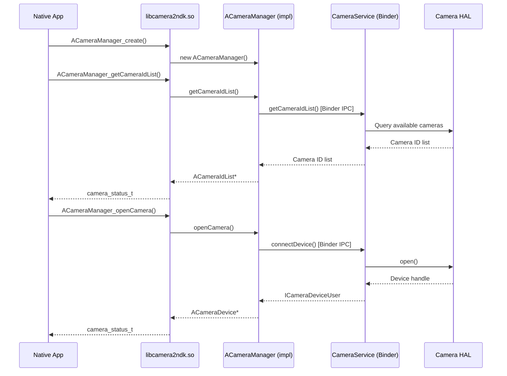

### 11.6.2 Media NDK (`libmediandk`)

The Media NDK at `frameworks/av/media/ndk/` provides native access to media
codecs, extractors, DRM, and image readers.

#### Source Structure

```
frameworks/av/media/ndk/
    Android.bp                  # Build rules
    NdkMediaCodec.cpp          # MediaCodec wrapper
    NdkMediaCodecInfo.cpp      # Codec capability queries
    NdkMediaCodecStore.cpp     # Codec enumeration
    NdkMediaCrypto.cpp         # DRM/crypto support
    NdkMediaDataSource.cpp     # Data source abstraction
    NdkMediaDrm.cpp            # DRM session management
    NdkMediaExtractor.cpp      # Container format parsing
    NdkMediaFormat.cpp         # Key-value format metadata
    NdkMediaMuxer.cpp          # Container muxing
    NdkImage.cpp               # Image buffer access
    NdkImageReader.cpp         # Image reader (camera, video)
    libmediandk.map.txt        # Symbol export map
```

#### NDK Declarations

```
// frameworks/av/media/ndk/Android.bp (lines 50-63)
ndk_library {
    name: "libmediandk",
    symbol_file: "libmediandk.map.txt",
    first_version: "21",
    unversioned_until: "current",
}

ndk_headers {
    name: "libmediandk_headers",
    from: "include/media",
    to: "media",
    srcs: ["include/media/**/*.h"],
    license: "NOTICE",
}
```

The Media NDK is one of the most widely used NDK libraries. It was introduced
at API 21 and has been expanded significantly over the years. The library is
also marked as LL-NDK, making it accessible to vendor code:

```
// frameworks/av/media/ndk/Android.bp (lines 87-91)
cc_library_shared {
    name: "libmediandk",
    llndk: {
        symbol_file: "libmediandk.map.txt",
    },
```

#### Key APIs

The Media NDK exposes several major API families:

**MediaCodec** -- hardware-accelerated video/audio encoding and decoding:

- `AMediaCodec_createDecoderByType()` -- create a decoder for a MIME type
- `AMediaCodec_configure()` -- configure with format parameters
- `AMediaCodec_start()` / `AMediaCodec_stop()` -- lifecycle
- `AMediaCodec_dequeueInputBuffer()` / `AMediaCodec_queueInputBuffer()`
- `AMediaCodec_dequeueOutputBuffer()` / `AMediaCodec_releaseOutputBuffer()`

**MediaExtractor** -- container format demuxing:

- `AMediaExtractor_new()` -- create an extractor
- `AMediaExtractor_setDataSource()` -- set the input
- `AMediaExtractor_getTrackCount()` / `AMediaExtractor_getTrackFormat()`
- `AMediaExtractor_readSampleData()` -- read compressed samples

**ImageReader** -- acquiring image buffers from camera or video:

- `AImageReader_new()` -- create a reader with format/dimensions
- `AImageReader_acquireNextImage()` -- acquire the next available image
- `AImage_getPlaneData()` -- access pixel data

### 11.6.3 Binder NDK (`libbinder_ndk`)

The Binder NDK at `frameworks/native/libs/binder/ndk/` provides a C interface
to Android's Binder IPC mechanism. This is critical for AIDL services that
need to be accessed from native code.

#### Source Structure

```
frameworks/native/libs/binder/ndk/
    Android.bp                 # Build rules
    ibinder.cpp               # AIBinder implementation
    ibinder_jni.cpp           # JNI integration
    libbinder.cpp             # AServiceManager, etc.
    parcel.cpp                # AParcel data marshaling
    parcel_jni.cpp            # Parcel JNI bridge
    persistable_bundle.cpp    # PersistableBundle support
    process.cpp               # Process state management
    service_manager.cpp       # Service registration/lookup
    binder_rpc.cpp            # RPC Binder support
    stability.cpp             # Stability enforcement
    status.cpp                # AStatus wrapper
    include_ndk/android/      # NDK headers
        binder_ibinder.h
        binder_ibinder_jni.h
        binder_parcel.h
        binder_parcel_jni.h
        binder_status.h
        persistable_bundle.h
    include_cpp/              # C++ convenience wrappers
    include_platform/         # Platform-internal headers
```

#### NDK and LLNDK Declarations

The Binder NDK is both an NDK library (for apps) and an LL-NDK library (for
vendor code):

```
// frameworks/native/libs/binder/ndk/Android.bp (lines 77-85, 271-279)
cc_library {
    name: "libbinder_ndk",
    // ...
    llndk: {
        symbol_file: "libbinder_ndk.map.txt",
    },
    // ...
    stubs: {
        symbol_file: "libbinder_ndk.map.txt",
        versions: [
            "29",
            "30",
        ],
    },
}

ndk_library {
    name: "libbinder_ndk",
    symbol_file: "libbinder_ndk.map.txt",
    first_version: "29",
    // ...
}
```

#### Implementation Pattern

The Binder NDK wraps `libbinder`'s C++ classes in C-compatible types. The
implementation in `ibinder.cpp` shows the pattern:

```cpp
// frameworks/native/libs/binder/ndk/ibinder.cpp (lines 17-47)
#include <android/binder_ibinder.h>
#include <android/binder_ibinder_platform.h>
#include <android/binder_stability.h>
#include <android/binder_status.h>
#include <binder/Functional.h>
#include <binder/IPCThreadState.h>
// ...

using ::android::IBinder;
using ::android::Parcel;
using ::android::sp;
using ::android::status_t;
// ...

AIBinder::AIBinder(const AIBinder_Class* clazz) : mClazz(clazz) {}
AIBinder::~AIBinder() {}
```

#### Key APIs

The Binder NDK provides:

**Service Management:**

- `AServiceManager_addService()` -- register a service
- `AServiceManager_getService()` -- look up a service by name
- `AServiceManager_waitForService()` -- block until a service appears

**Binder Objects:**

- `AIBinder_Class_define()` -- define a binder interface class
- `AIBinder_new()` -- create a local binder object
- `AIBinder_prepareTransaction()` / `AIBinder_transact()` -- IPC calls
- `AIBinder_linkToDeath()` / `AIBinder_unlinkToDeath()` -- death notifications

**Parcels:**

- `AParcel_writeInt32()` / `AParcel_readInt32()` -- marshaling primitives
- `AParcel_writeString()` / `AParcel_readString()` -- string marshaling
- `AParcel_writeStrongBinder()` / `AParcel_readStrongBinder()` -- pass binders

**AIDL Integration:**
AIDL-generated code for NDK backends produces C++ wrappers that call through
the `libbinder_ndk` C API. This allows services defined in AIDL to be
implemented and consumed in pure native code without any Java dependency.

#### Binder NDK Call Flow

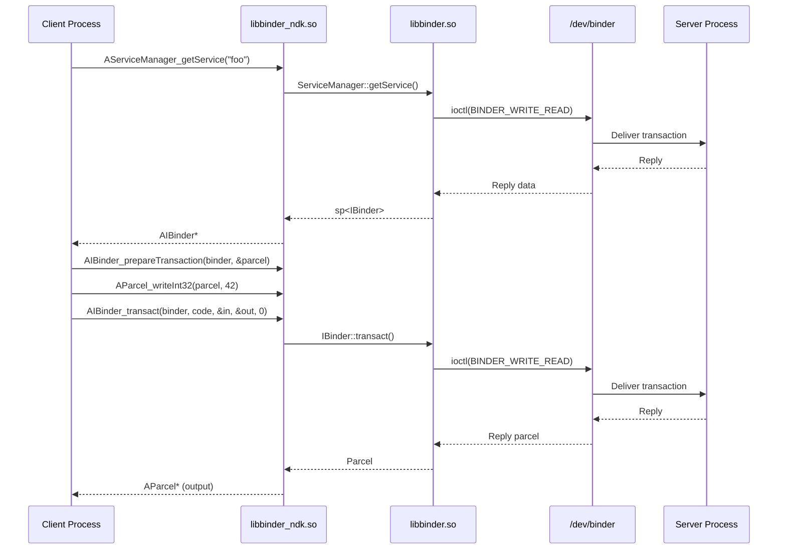

### 11.6.4 Framework Binding Architecture Summary

All three framework bindings share a common architecture:

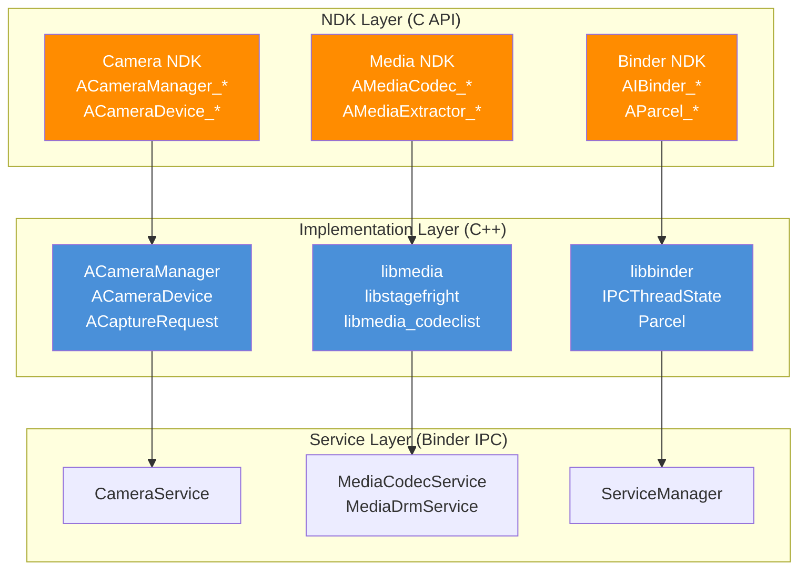

The pattern is always:

1. **C header** (`NdkFoo.h`) -- defines the public API with opaque pointer types
2. **C source** (`NdkFoo.cpp`) -- thin wrappers marked with `EXPORT`
3. **C++ implementation** (`impl/AFoo.cpp`) -- actual logic using framework APIs
4. **Symbol map** (`libfoo.map.txt`) -- controls which symbols are exported
5. **Visibility control** -- `-fvisibility=hidden` + `EXPORT` macro

---

## 11.7 NDK Translation Packages

### 11.7.1 What Are NDK Translation Packages?

NDK translation packages are a build-system mechanism for packaging libraries
and binaries required by **NativeBridge** -- the system that translates native
code from one architecture to another (e.g., running ARM code on an x86
device). The `ndk_translation_package` module type, introduced in 2025 at
`build/soong/cc/ndk_translation_package.go`, gathers translation-related
dependencies and produces a distributable zip archive.

### 11.7.2 The `ndk_translation_package` Module Type

The module type is registered as:

```go
// build/soong/cc/ndk_translation_package.go (lines 28-29)
func init() {
    android.RegisterModuleType("ndk_translation_package",
        NdkTranslationPackageFactory)
}
```

The factory creates a module that targets multiple architectures:

```go
// build/soong/cc/ndk_translation_package.go (lines 32-37)
func NdkTranslationPackageFactory() android.Module {
    module := &ndkTranslationPackage{}
    module.AddProperties(&module.properties)
    android.InitAndroidMultiTargetsArchModule(module,
        android.DeviceSupported, android.MultilibCommon)
    return module
}
```

### 11.7.3 Properties

The `ndk_translation_package` module type has a rich set of dependency
properties that reflect the multi-architecture nature of translation:

```go
// build/soong/cc/ndk_translation_package.go (lines 46-80)
type ndkTranslationPackageProperties struct {
    // Dependencies with native bridge variants that should be
    // packaged (e.g. arm and arm64 on an x86_64 device)
    Native_bridge_deps proptools.Configurable[[]string]

    // Non-native bridge variants that should be packaged
    // (e.g. x86 and x86_64 on an x86_64 device)
    Device_both_deps []string

    // Non-native bridge variants with lib64
    Device_64_deps []string

    // Non-native bridge variants with lib32
    Device_32_deps []string

    // Non-native bridge first variant
    Device_first_deps []string

    // First variant, always into lib/ directories
    Device_first_to_32_deps []string

    // Dependencies for build file generation only
    Device_both_extra_allowed_deps []string
    Device_32_extra_allowed_deps   []string

    // Version for sysprops
    Version *string

    // Path to Android.bp generator
    Android_bp_gen_path *string

    // Path to product.mk generator
    Product_mk_gen_path *string

    // Whether to generate build files (default true)
    Generate_build_files *bool
}
```

### 11.7.4 Dependency Resolution

The `DepsMutator` maps each dependency category to the appropriate architecture
variant:

```go
// build/soong/cc/ndk_translation_package.go (lines 108-127)
func (n *ndkTranslationPackage) DepsMutator(
        ctx android.BottomUpMutatorContext) {
    for index, t := range ctx.MultiTargets() {
        if t.NativeBridge == android.NativeBridgeEnabled {
            ctx.AddFarVariationDependencies(t.Variations(),
                ndkTranslationPackageTag,
                n.properties.Native_bridge_deps.GetOrDefault(
                    ctx, nil)...)
        } else if t.Arch.ArchType == android.X86_64 {
            ctx.AddFarVariationDependencies(t.Variations(),
                ndkTranslationPackageTag,
                n.properties.Device_64_deps...)
            ctx.AddFarVariationDependencies(t.Variations(),
                ndkTranslationPackageTag,
                n.properties.Device_both_deps...)
        } else if t.Arch.ArchType == android.X86 {
            ctx.AddFarVariationDependencies(t.Variations(),
                ndkTranslationPackageTag,
                n.properties.Device_32_deps...)
            // ...
        }
        if index == 0 { // Primary arch
            ctx.AddFarVariationDependencies(t.Variations(),
                ndkTranslationPackageTag,
                n.properties.Device_first_deps...)
        }
    }
}
```

This allows the package to collect:

- **NativeBridge variants** -- ARM/ARM64 libraries compiled for an x86 device
  that will be used by the translation layer
- **Device variants** -- x86/x86_64 libraries needed by the host side of the
  translation

### 11.7.5 RISC-V Consideration

The dependency tag includes a special allowance for disabled RISC-V modules:

```go
// build/soong/cc/ndk_translation_package.go (lines 90-93)
func (_ ndkTranslationPackageDepTag) AllowDisabledModuleDependency(
        target android.Module) bool {
    return target.Target().NativeBridge ==
            android.NativeBridgeEnabled &&
        target.Target().Arch.ArchType == android.Riscv64
}
```

This is forward-looking: RISC-V native bridge support is still emerging, and
some translation dependencies may not have RISC-V variants yet. Rather than
breaking the build, the module type gracefully handles missing RISC-V
dependencies.

### 11.7.6 Package Generation

The `GenerateAndroidBuildActions` method collects all dependency files and
packages them into a zip archive:

```go
// build/soong/cc/ndk_translation_package.go (lines 129-181)
func (n *ndkTranslationPackage) GenerateAndroidBuildActions(
        ctx android.ModuleContext) {
    var files []android.PackagingSpec
    var files64 []android.PackagingSpec

    ctx.VisitDirectDepsProxy(func(child android.ModuleProxy) {
        tag := ctx.OtherModuleDependencyTag(child)
        info := android.OtherModuleProviderOrDefault(ctx, child,
            android.InstallFilesProvider)
        // ... categorize files by architecture
        files = append(files, info.PackagingSpecs...)
    })

    outZip := android.PathForModuleOut(ctx,
        ctx.ModuleName()+".zip")
    builder := android.NewRuleBuilder(pctx, ctx)
    cmd := builder.Command().
        BuiltTool("soong_zip").
        FlagWithOutput("-o ", outZip)

    // Generate build files if enabled
    if proptools.BoolDefault(
            n.properties.Generate_build_files, true) {
        outBp := n.genAndroidBp(ctx, files)
        outArm64ArmMk, outArm64Mk := n.genProductMk(ctx,
            files, files64, extraFiles, extraFiles64)
        // ...
    }

    for _, file := range files {
        cmd.
            FlagWithArg("-e ", "system/"+
                file.RelPathInPackage()).
            FlagWithInput("-f ", file.SrcPath())
    }

    builder.Build("ndk_translation_package.zip", ...)
}
```

### 11.7.7 Build File Generation

The package generates two types of build files:

1. **Android.bp** -- for building the translation package as part of the
   platform build
2. **product.mk** -- for inclusion in device makefiles

The Android.bp generator:

```go
// build/soong/cc/ndk_translation_package.go (lines 184-199)
func (n *ndkTranslationPackage) genAndroidBp(
        ctx android.ModuleContext,
        files []android.PackagingSpec) android.Path {
    genDir := android.PathForModuleOut(ctx, "android_bp_dir")
    generator := android.PathForModuleSrc(ctx,
        proptools.String(n.properties.Android_bp_gen_path))
    builder := android.NewRuleBuilder(pctx, ctx).Sbox(
        genDir,
        android.PathForModuleOut(ctx,
            "Android.bp.sbox.textproto"),
    )
    outBp := genDir.Join(ctx, "Android.bp")
    builder.Command().
        Input(generator).
        Implicits(specsToSrcPaths(files)).
        Flag(strings.Join(
            filesRelativeToInstallDir(ctx, files), " ")).
        FlagWithOutput("> ", outBp)
    builder.Build("ndk_translation_package.Android.bp", ...)
    return outBp
}
```

The product.mk generator creates two variants -- one for ARM64+ARM and one
for ARM64-only:

```go
// build/soong/cc/ndk_translation_package.go (lines 203-239)
func (n *ndkTranslationPackage) genProductMk(
        ctx android.ModuleContext,
        files, files64, extraFiles, extraFiles64
        []android.PackagingSpec) (android.Path, android.Path) {
    // Both arches
    // ...
    builder.Command().
        Input(generator).
        FlagWithArg("--version=",
            proptools.String(n.properties.Version)).
        Flag("--arm64 --arm").
        // ...
    // ARM64 only
    // ...
    builder.Command().
        Input(generator).
        FlagWithArg("--version=",
            proptools.String(n.properties.Version)).
        Flag("--arm64").
        // ...
}
```

### 11.7.8 NDK Translation Package Architecture

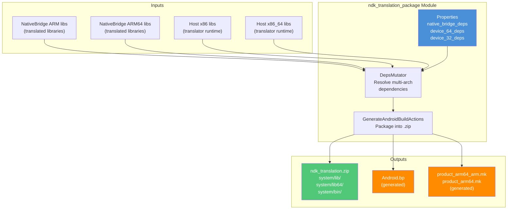

### 11.7.9 Connection to NativeBridge

The NDK translation package is the packaging layer for NativeBridge
implementations. The NativeBridge interface itself is defined in
`frameworks/libs/binary_translation/native_bridge/` and provides the
`NativeBridgeCallbacks` structure that translation engines implement. The
translation package bundles all the shared libraries, configuration files, and
host-side tools that a NativeBridge implementation needs to run on the device.

On a device with NativeBridge enabled (e.g., an x86 device running ARM apps),
the translation package provides the libraries that the `libnativebridge.so`
runtime loads to perform instruction translation. The `Native_bridge_deps`
property specifically targets the translated (guest) architecture variants,
while the `Device_*_deps` properties target the host architecture variants.

---

## 11.8 Try It: Write a Native NDK App

This section walks through creating a minimal native Android application that
uses several NDK APIs. We will build a native activity that initializes a
window, logs messages, and queries sensor information.

### 11.8.1 Project Structure

```
native-demo/
    AndroidManifest.xml
    Android.bp
    src/
        main.cpp
```

### 11.8.2 The Manifest

A native activity requires a specific manifest configuration:

```xml
<?xml version="1.0" encoding="utf-8"?>
<manifest xmlns:android="http://schemas.android.com/apk/res/android"
    package="com.example.nativedemo">

    <application
        android:label="Native Demo"
        android:hasCode="false">

        <activity
            android:name="android.app.NativeActivity"
            android:exported="true"
            android:configChanges=
                "orientation|keyboardHidden|screenSize">

            <meta-data
                android:name="android.app.lib_name"
                android:value="native-demo" />

            <intent-filter>
                <action android:name=
                    "android.intent.action.MAIN" />
                <category android:name=
                    "android.intent.category.LAUNCHER" />
            </intent-filter>
        </activity>
    </application>
</manifest>
```

Key points:

- `android:hasCode="false"` -- no Java/Kotlin code
- `android:name="android.app.NativeActivity"` -- the platform's built-in native
  activity host
- `android.app.lib_name` -- the name of the shared library (without `lib`
  prefix and `.so` suffix)

### 11.8.3 The Build File

For an AOSP tree build using Soong:

```
cc_library_shared {
    name: "libnative-demo",
    srcs: ["src/main.cpp"],
    shared_libs: [
        "libandroid",
        "liblog",
        "libnativewindow",
    ],
    static_libs: [
        "libandroid_native_app_glue",
    ],
    sdk_version: "current",
    stl: "c++_shared",
    cflags: [
        "-Wall",
        "-Werror",
    ],
}
```

For an external NDK build using CMake:

```cmake
cmake_minimum_required(VERSION 3.18)
project(native-demo)

add_library(native-demo SHARED src/main.cpp)

# Find the native_app_glue
find_library(log-lib log)
find_library(android-lib android)

target_link_libraries(native-demo
    android
    log
    nativewindow
)

# Enable native app glue
set(APP_GLUE_DIR ${ANDROID_NDK}/sources/android/native_app_glue)
add_library(app-glue STATIC ${APP_GLUE_DIR}/android_native_app_glue.c)
target_include_directories(app-glue PUBLIC ${APP_GLUE_DIR})
target_link_libraries(native-demo app-glue)
```

### 11.8.4 The Application Code

```cpp
// src/main.cpp -- Minimal NDK native activity

#include <android/log.h>
#include <android/native_activity.h>
#include <android/sensor.h>
#include <android_native_app_glue.h>

#include <cassert>
#include <cstring>

#define LOG_TAG "NativeDemo"
#define LOGI(...) __android_log_print(ANDROID_LOG_INFO, LOG_TAG, __VA_ARGS__)
#define LOGW(...) __android_log_print(ANDROID_LOG_WARN, LOG_TAG, __VA_ARGS__)
#define LOGE(...) __android_log_print(ANDROID_LOG_ERROR, LOG_TAG, __VA_ARGS__)

// Application state
struct AppState {
    struct android_app* app;
    ASensorManager* sensorManager;
    const ASensor* accelerometer;
    ASensorEventQueue* sensorEventQueue;
    bool windowReady;
    bool running;
};

// Handle sensor events
static int handleSensorEvents(int /* fd */, int /* events */,
                              void* data) {
    auto* state = static_cast<AppState*>(data);
    ASensorEvent event;

    while (ASensorEventQueue_getEvents(
               state->sensorEventQueue, &event, 1) > 0) {
        if (event.type == ASENSOR_TYPE_ACCELEROMETER) {
            LOGI("Accelerometer: x=%.2f y=%.2f z=%.2f",
                 event.acceleration.x,
                 event.acceleration.y,
                 event.acceleration.z);
        }
    }
    return 1; // Continue receiving events
}

// Initialize sensors
static void initSensors(AppState* state) {
    state->sensorManager = ASensorManager_getInstance();
    if (state->sensorManager == nullptr) {
        LOGW("No sensor manager available");
        return;
    }

    state->accelerometer = ASensorManager_getDefaultSensor(
        state->sensorManager, ASENSOR_TYPE_ACCELEROMETER);
    if (state->accelerometer == nullptr) {
        LOGW("No accelerometer available");
        return;
    }

    state->sensorEventQueue =
        ASensorManager_createEventQueue(
            state->sensorManager, state->app->looper,
            LOOPER_ID_USER, handleSensorEvents, state);

    LOGI("Sensors initialized successfully");
}

// Enable accelerometer
static void enableSensors(AppState* state) {
    if (state->accelerometer != nullptr &&
        state->sensorEventQueue != nullptr) {
        ASensorEventQueue_enableSensor(
            state->sensorEventQueue, state->accelerometer);
        // Set event rate to 60 Hz
        ASensorEventQueue_setEventRate(
            state->sensorEventQueue, state->accelerometer,
            (1000L / 60) * 1000);
        LOGI("Accelerometer enabled");
    }
}

// Disable accelerometer
static void disableSensors(AppState* state) {
    if (state->accelerometer != nullptr &&
        state->sensorEventQueue != nullptr) {
        ASensorEventQueue_disableSensor(
            state->sensorEventQueue, state->accelerometer);
        LOGI("Accelerometer disabled");
    }
}

// Handle application commands
static void handleCmd(struct android_app* app, int32_t cmd) {
    auto* state = static_cast<AppState*>(app->userData);

    switch (cmd) {
        case APP_CMD_INIT_WINDOW:
            LOGI("Window initialized: %p", app->window);
            if (app->window != nullptr) {
                // Query window properties
                int32_t width = ANativeWindow_getWidth(app->window);
                int32_t height =
                    ANativeWindow_getHeight(app->window);
                int32_t format =
                    ANativeWindow_getFormat(app->window);
                LOGI("Window size: %dx%d, format: %d",
                     width, height, format);
                state->windowReady = true;
            }
            break;

        case APP_CMD_TERM_WINDOW:
            LOGI("Window terminated");
            state->windowReady = false;
            break;

        case APP_CMD_GAINED_FOCUS:
            LOGI("Gained focus -- enabling sensors");
            enableSensors(state);
            break;

        case APP_CMD_LOST_FOCUS:
            LOGI("Lost focus -- disabling sensors");
            disableSensors(state);
            break;

        case APP_CMD_RESUME:
            LOGI("Activity resumed");
            state->running = true;
            break;

        case APP_CMD_PAUSE:
            LOGI("Activity paused");
            state->running = false;
            break;

        case APP_CMD_DESTROY:
            LOGI("Activity destroyed");
            break;

        case APP_CMD_CONFIG_CHANGED:
            LOGI("Configuration changed");
            break;

        case APP_CMD_LOW_MEMORY:
            LOGW("Low memory warning");
            break;
    }
}

// Handle input events
static int32_t handleInput(struct android_app* /* app */,
                           AInputEvent* event) {
    int32_t type = AInputEvent_getType(event);

    if (type == AINPUT_EVENT_TYPE_MOTION) {
        float x = AMotionEvent_getX(event, 0);
        float y = AMotionEvent_getY(event, 0);
        int32_t action =
            AMotionEvent_getAction(event) &
            AMOTION_EVENT_ACTION_MASK;

        switch (action) {
            case AMOTION_EVENT_ACTION_DOWN:
                LOGI("Touch DOWN at (%.1f, %.1f)", x, y);
                return 1;
            case AMOTION_EVENT_ACTION_MOVE:
                // Suppress move logs to avoid spam
                return 1;
            case AMOTION_EVENT_ACTION_UP:
                LOGI("Touch UP at (%.1f, %.1f)", x, y);
                return 1;
        }
    }

    return 0; // Event not handled
}

// Main entry point -- called by native_app_glue
void android_main(struct android_app* app) {
    LOGI("=== Native Demo Starting ===");

    AppState state = {};
    state.app = app;
    state.running = true;

    app->userData = &state;
    app->onAppCmd = handleCmd;
    app->onInputEvent = handleInput;

    // Initialize sensors
    initSensors(&state);

    // Main event loop
    LOGI("Entering main loop");
    while (!app->destroyRequested) {
        int events;
        struct android_poll_source* source;

        // Block if not running (paused/stopped),
        // poll without blocking if running
        int timeout = state.running ? 0 : -1;

        while (ALooper_pollOnce(timeout, nullptr, &events,
                                reinterpret_cast<void**>(&source))
                   >= 0) {
            if (source != nullptr) {
                source->process(app, source);
            }

            if (app->destroyRequested) {
                break;
            }
        }

        // Application rendering/logic would go here
        if (state.running && state.windowReady) {
            // In a real app, you would:
            // 1. Lock the ANativeWindow buffer
            // 2. Draw to the buffer
            // 3. Unlock and post the buffer
            //
            // Or use EGL/Vulkan for GPU rendering
        }
    }

    // Cleanup
    if (state.sensorEventQueue != nullptr) {
        ASensorManager_destroyEventQueue(
            state.sensorManager, state.sensorEventQueue);
    }

    LOGI("=== Native Demo Exiting ===");
}
```

### 11.8.5 Code Walkthrough

#### Entry Point and Threading Model

The native app glue library spawns a new thread and calls `android_main()` on
it. The main UI thread is handled by the glue's internal `android_app_entry()`
function, which forwards lifecycle callbacks from the `NativeActivity` to the
application thread via a pipe.

The `ALooper_pollOnce()` call is the heart of the event loop. It waits for
events from two sources:

- `LOOPER_ID_MAIN` (command pipe) -- lifecycle events like `APP_CMD_INIT_WINDOW`
- `LOOPER_ID_INPUT` (input queue) -- touch, key, and motion events
- `LOOPER_ID_USER` and above -- custom sources like sensor events

#### NDK APIs Used

This example uses four NDK libraries:

1. **`liblog`** -- `__android_log_print()` for logging
2. **`libandroid`** -- `ANativeWindow_*` for window access, `ASensor*` for
   sensors, `AInputEvent_*` and `AMotionEvent_*` for input, `ALooper_*` for
   the event loop
3. **`libnativewindow`** -- `ANativeWindow` (shared with `libandroid`)
4. **Native app glue** (static library) -- `android_app`, event loop glue

#### Event Flow

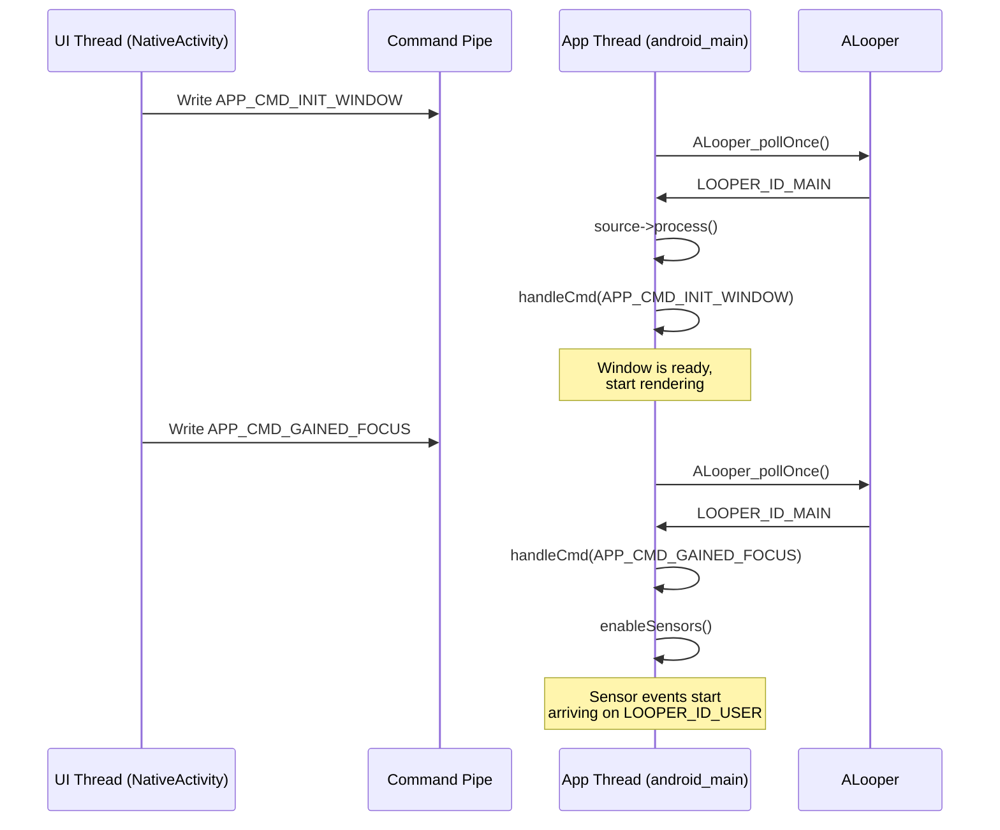

### 11.8.6 Building and Running

#### Building within AOSP

If the module is placed in the AOSP tree (e.g., under
`packages/apps/NativeDemo/`), build it with:

```bash
source build/envsetup.sh
lunch <target>
m libnative-demo
```

The output `.so` will be at:
```
out/target/product/<device>/system/lib64/libnative-demo.so
```

Package it into an APK using `aapt2` or the Android Gradle plugin.

#### Building with the Standalone NDK

If building outside the AOSP tree using the NDK toolchain:

```bash
# Set NDK path
export ANDROID_NDK=/path/to/android-ndk-r27

# Create build directory
mkdir build && cd build

# Configure with CMake
cmake -DCMAKE_TOOLCHAIN_FILE=$ANDROID_NDK/build/cmake/android.toolchain.cmake \
      -DANDROID_ABI=arm64-v8a \
      -DANDROID_PLATFORM=android-26 \
      ..

# Build
cmake --build .
```

#### Running on Device

```bash
# Install the APK
adb install native-demo.apk

# Launch
adb shell am start -n com.example.nativedemo/.NativeActivity

# Watch logs
adb logcat -s NativeDemo:V
```

Expected output:

```
I NativeDemo: === Native Demo Starting ===
I NativeDemo: Sensors initialized successfully
I NativeDemo: Entering main loop
I NativeDemo: Window initialized: 0x7a3c4d1000
I NativeDemo: Window size: 1080x2340, format: 1
I NativeDemo: Gained focus -- enabling sensors
I NativeDemo: Accelerometer enabled
I NativeDemo: Accelerometer: x=0.18 y=0.24 z=9.77
I NativeDemo: Touch DOWN at (540.0, 1170.0)
I NativeDemo: Touch UP at (540.0, 1170.0)
```

### 11.8.7 Extension Points

From this minimal example, a real application would add:

1. **EGL/Vulkan rendering** -- replace the `ANativeWindow_lock()` path with
   `eglCreateWindowSurface()` or `vkCreateAndroidSurfaceKHR()` for GPU
   rendering.

2. **AAudio playback** -- add `libaaudio` to `shared_libs` and use
   `AAudioStreamBuilder` for low-latency audio output.

3. **Camera capture** -- add `libcamera2ndk` and use `ACameraManager` to open
   a camera and stream frames to the window.

4. **AIDL services** -- add `libbinder_ndk` and use AIDL-generated NDK stubs to
   communicate with system services.

5. **Neural Networks** -- add `libneuralnetworks` for on-device ML inference
   using the NNAPI.

### 11.8.8 Debugging NDK Applications

#### Logcat Filtering

Use tag-based filtering to focus on your application's output:

```bash
# Filter by tag
adb logcat -s NativeDemo:V

# Filter by PID
adb logcat --pid=$(adb shell pidof com.example.nativedemo)

# Show native crashes
adb logcat -s DEBUG:V
```

#### Address Sanitizer (ASan)

The NDK supports ASan for detecting memory errors. Add to your build:

```
cc_library_shared {
    name: "libnative-demo",
    // ...
    sanitize: {
        address: true,
    },
}
```

Or with CMake:

```cmake
target_compile_options(native-demo PRIVATE -fsanitize=address)
target_link_options(native-demo PRIVATE -fsanitize=address)
```

ASan detects:

- Heap buffer overflows
- Stack buffer overflows
- Use after free
- Double free
- Memory leaks (with LeakSanitizer)

#### GDB / LLDB Debugging

For debugging native crashes:

```bash
# Start the app in debug mode
adb shell am start -D -n com.example.nativedemo/.NativeActivity

# Attach lldb-server
adb forward tcp:1234 tcp:1234
lldb
(lldb) platform select remote-android
(lldb) platform connect connect://localhost:1234
(lldb) process attach --name native-demo
```

#### Simpleperf Profiling

For performance analysis of NDK code:

```bash
# Record CPU profile
adb shell simpleperf record -p $(adb shell pidof com.example.nativedemo) \
    --duration 5 -o /data/local/tmp/perf.data

# Pull and report
adb pull /data/local/tmp/perf.data
simpleperf report -i perf.data
```

### 11.8.9 Common Pitfalls

1. **Missing `sdk_version`** -- if you forget to set `sdk_version: "current"`,
   your module links against platform libraries instead of NDK stubs. This means
   it may use symbols that are not available on all devices.

2. **ABI differences across API levels** -- structures like `ANativeWindow` may
   have different sizes at different API levels. Always use accessor functions
   rather than accessing struct members directly.

3. **Thread safety** -- the native app glue uses a pipe to communicate between
   the UI thread and the app thread. Accessing `android_app` fields from both
   threads without proper synchronization causes races. Always use the mutex:
   ```c
   pthread_mutex_lock(&app->mutex);
   // access shared state
   pthread_mutex_unlock(&app->mutex);
   ```

4. **Forgetting to handle `APP_CMD_TERM_WINDOW`** -- if you hold a reference
   to `ANativeWindow` past this callback, subsequent operations on it will
   crash. Always null out your window pointer in the `TERM_WINDOW` handler.

5. **Linking non-NDK libraries** -- if your native code tries to
   `dlopen("libgui.so")` or link against a non-NDK library, the dynamic linker
   will reject it at runtime on devices running Android 7.0+. The linker
   namespace isolation prevents access to libraries not on the NDK list.

---

## Summary

This chapter has examined the Android NDK from the platform builder's
perspective -- not as a download from developer.android.com, but as a set of
build rules, header modules, stub generators, and ABI monitors embedded in the
AOSP source tree.

The key architectural layers we have covered are:

| Layer | Stability scope | Key Soong module types |
|-------|---------------|----------------------|
| **NDK** | App developers | `ndk_library`, `ndk_headers` |
| **LL-NDK** | Apps + vendor code | `llndk:` block in `cc_library` |
| **VNDK** | Vendor code | `vndk:` block in `cc_library`, `vndk_prebuilt_shared` |
| **NDK Translation** | NativeBridge | `ndk_translation_package` |

The build system enforces stability through:

1. **Symbol maps** (`.map.txt`) that precisely define the exported API surface
2. **Stub libraries** that apps link against at build time
3. **ABI monitoring** via STG dumps and `stgdiff` that catches incompatible
   changes
4. **Header verification** that ensures every NDK header is self-contained and
   valid C
5. **Linker namespace isolation** that prevents runtime access to non-NDK
   libraries

The framework bindings for Camera, Media, and Binder demonstrate the standard
pattern for exposing complex C++ services through stable C APIs: opaque pointer
types, `EXPORT`-marked wrapper functions, `fvisibility=hidden`, and version
scripts.

Key source files for further exploration:

| File | Purpose |
|------|---------|
| `build/soong/cc/ndk_library.go` | Stub library generation |
| `build/soong/cc/ndk_headers.go` | Header installation |
| `build/soong/cc/ndk_sysroot.go` | Sysroot assembly |
| `build/soong/cc/ndk_abi.go` | ABI monitoring |
| `build/soong/cc/llndk_library.go` | LL-NDK support |
| `build/soong/cc/vndk.go` | VNDK properties |
| `build/soong/cc/vndk_prebuilt.go` | VNDK snapshots |
| `build/soong/cc/ndk_translation_package.go` | Translation packaging |
| `frameworks/av/camera/ndk/` | Camera NDK implementation |
| `frameworks/av/media/ndk/` | Media NDK implementation |
| `frameworks/native/libs/binder/ndk/` | Binder NDK implementation |
| `system/linkerconfig/` | Linker namespace configuration |
| `prebuilts/ndk/current/sources/android/` | App glue and CPU features |
