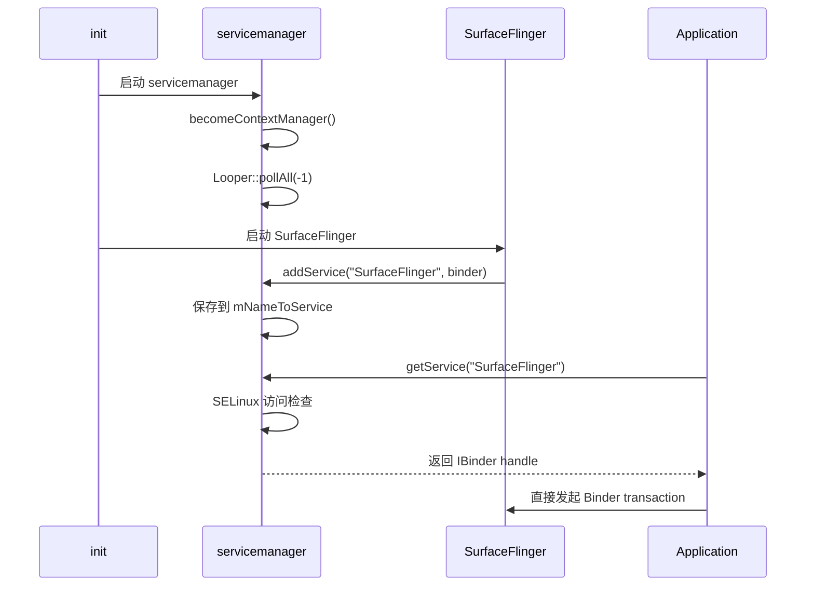
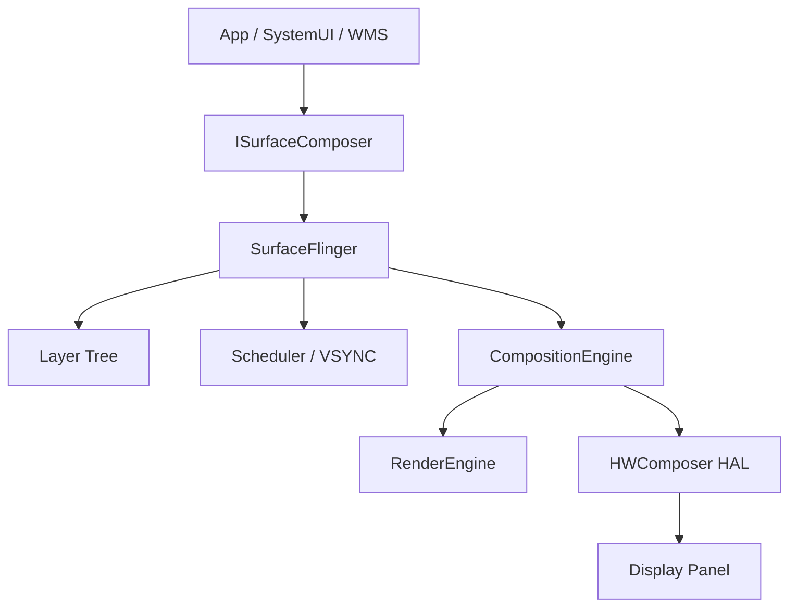
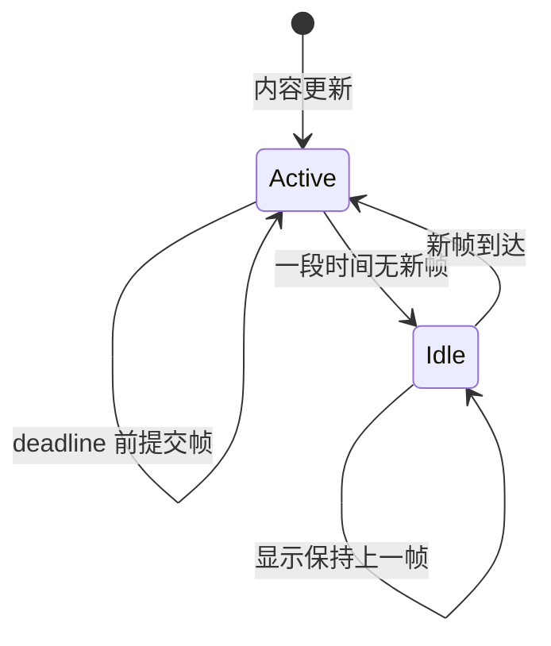
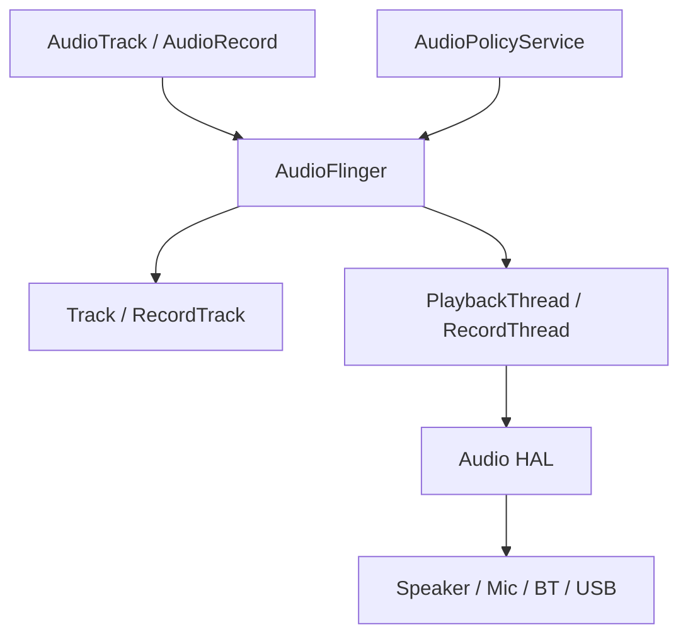
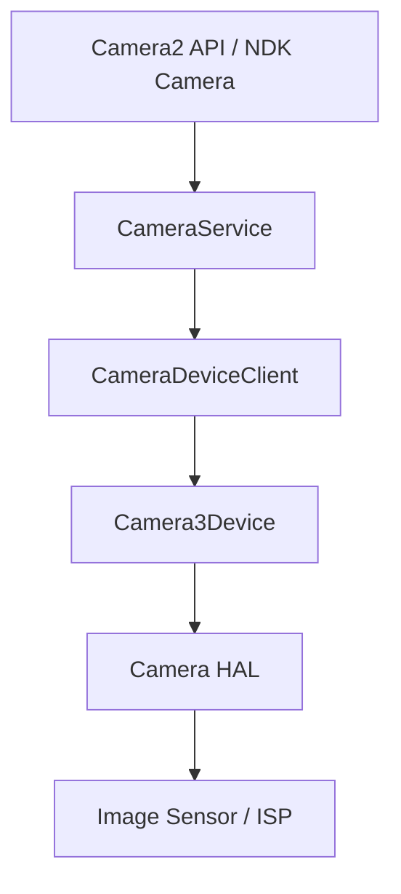
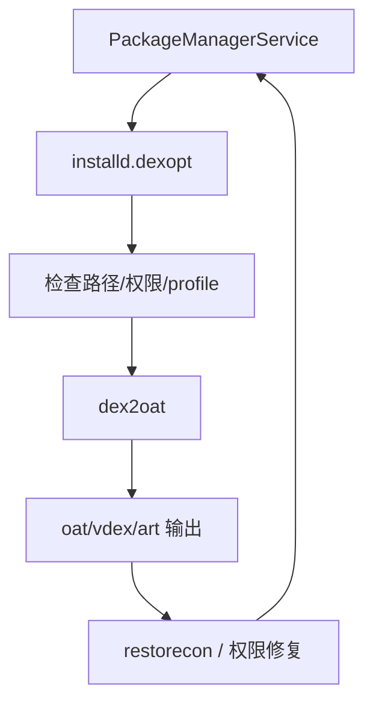
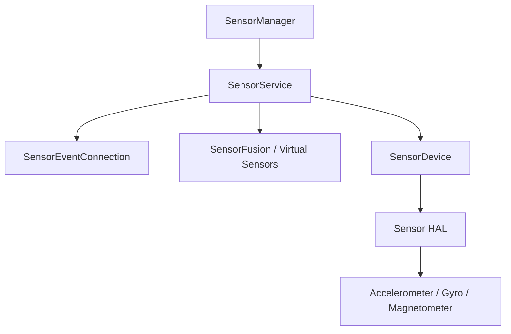
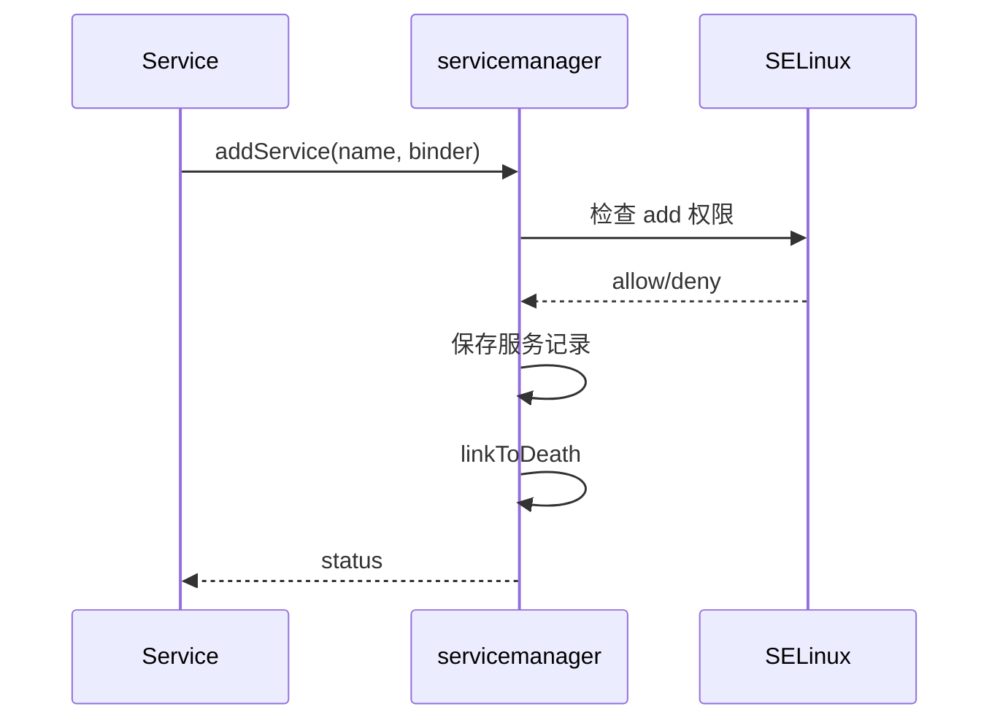

# 第 12 章：Native Services

Android 的系统功能由一组协作进程提供。`system_server` 承载 Java 层系统服务，例如 ActivityManagerService、WindowManagerService、PackageManagerService 等；平台中大量关键能力运行在独立的 C++ native 进程中。这些 native services 负责屏幕合成、输入分发、APK 安装、音频、相机、媒体、GPU 与传感器等基础能力。

本章从 AOSP 源码视角讲解 native services 的体系结构。核心问题包括：服务如何由 `init` 启动、如何注册到 `servicemanager`、如何通过 Binder 通信、如何与 HAL 和 framework 协作、如何通过 `dumpsys` 与 Perfetto 诊断。

---

## 12.1 Native Service 架构

### 12.1.1 什么是 Native Service？

**Native service** 是一个 C++ 进程，通常具备以下特征：

1. 由 `init` 根据 `.rc` 文件独立启动。
2. 向 `servicemanager` 注册一个或多个 Binder 接口。
3. 进入 Binder 线程池或事件循环处理请求。
4. 随系统生命周期长期运行，并在崩溃后由 `init` 重启。

Java 系统服务运行在 `system_server` JVM 中，native services 则运行在各自的地址空间中。这种模型提供进程隔离、最小权限、SELinux 域隔离和更直接的硬件交互能力。

### 12.1.2 `servicemanager` 注册表模式

`servicemanager` 是 Android 服务发现机制的核心。Native 服务和 Java 服务都会向它注册，客户端也通过它查找服务。



该模式保证服务注册经过身份校验，服务发现集中在统一 Binder context 中，服务死亡事件可传递给已注册回调。

### 12.1.3 标准服务生命周期

多数 native service 的入口遵循固定模式。GPU service 是最小化示例，入口位于：

> `frameworks/native/services/gpuservice/main_gpuservice.cpp`

```cpp
int main(int /* argc */, char** /* argv */) {
    signal(SIGPIPE, SIG_IGN);

    sp<GpuService> gpuservice = new GpuService();
    sp<IServiceManager> sm(defaultServiceManager());
    sm->addService(String16(GpuService::SERVICE_NAME), gpuservice, false);

    ProcessState::self()->setThreadPoolMaxThreadCount(4);

    sp<ProcessState> ps(ProcessState::self());
    ps->startThreadPool();
    ps->giveThreadPoolName();
    IPCThreadState::self()->joinThreadPool();

    return 0;
}
```

| 步骤 | 代码 | 目的 |
|------|------|------|
| 1 | `signal(SIGPIPE, SIG_IGN)` | 忽略 broken pipe 信号 |
| 2 | `new GpuService()` | 构造服务对象 |
| 3 | `sm->addService(...)` | 注册到 servicemanager |
| 4 | `setThreadPoolMaxThreadCount(N)` | 设置 Binder 线程池上限 |
| 5 | `joinThreadPool()` | 主线程进入 Binder 请求处理循环 |

`SensorService` 使用 `BinderService<T>` 模板封装注册和进入线程池的过程：

```cpp
int main(int /*argc*/, char** /*argv*/) {
    signal(SIGPIPE, SIG_IGN);
    SensorService::publishAndJoinThreadPool();
    return 0;
}
```

`BinderService<T>::publishAndJoinThreadPool()` 会调用 `T::getServiceName()` 获取注册名，构造服务对象，调用 `addService()`，并进入 Binder 线程池。

### 12.1.4 进程隔离与 `init.rc` 配置

每个 native service 都在 `.rc` 文件中定义，`init` 在启动阶段解析这些文件。典型配置如下：

```rc
service surfaceflinger /system/bin/surfaceflinger
    class core animation
    user system
    group graphics drmrpc readproc
    capabilities SYS_NICE
    onrestart restart --only-if-running zygote
    task_profiles HighPerformance
```

| 属性 | 含义 |
|------|------|
| `class` | 服务所属启动类别，例如 `core`、`main`、`late_start` |
| `user` / `group` | 进程使用的 Linux UID/GID |
| `capabilities` | 进程获得的 Linux capability 集合 |
| `onrestart` | 服务重启时执行的级联动作 |
| `task_profiles` | CPU 调度与 cgroup 配置 |

### 12.1.5 三类 `servicemanager`

Android 包含三个 `servicemanager` 实例，对应三条 Binder 设备通道。

| 实例 | 二进制 | Binder 设备 | 用途 |
|------|--------|-------------|------|
| `servicemanager` | `/system/bin/servicemanager` | `/dev/binder` | Framework services |
| `vndservicemanager` | `/vendor/bin/vndservicemanager` | `/dev/vndbinder` | Vendor services |
| `hwservicemanager` | `/system/bin/hwservicemanager` | `/dev/hwbinder` | HIDL HAL services |

Framework 侧服务通过 `/dev/binder` 暴露给 system 与 app；vendor 侧服务通过 `/dev/vndbinder` 隔离；旧 HIDL HAL 通过 `/dev/hwbinder` 注册。

### 12.1.6 Binder 线程池大小

Native service 需要选择合适的 Binder 线程池大小。线程过少会导致请求排队，线程过多会增加上下文切换和内存占用。

常见策略如下：

| 服务 | 线程池特点 |
|------|------------|
| SurfaceFlinger | 结合主线程事件循环与 Binder 线程 |
| GPU Service | 小规模线程池，主要处理诊断与属性查询 |
| SensorService | 中等线程池，处理多客户端连接 |
| AudioFlinger | 多个实时音频线程配合 Binder 控制线程 |
| CameraService | 多客户端、高延迟 HAL 调用，需要谨慎隔离 |

线程池配置通过 `ProcessState::self()->setThreadPoolMaxThreadCount()` 完成。实时或高优先级工作通常放在专用线程中，Binder 线程负责控制面请求。

### 12.1.7 死亡通知与服务恢复

Binder 支持 death notification。客户端可通过 `linkToDeath()` 监听远端 Binder 对象死亡，服务端死亡后 Binder driver 会通知相关客户端。

服务恢复链路如下：

1. 服务进程崩溃或退出。
2. Binder driver 标记 binder node 死亡。
3. `servicemanager` 收到服务死亡通知并移除注册项。
4. `init` 根据 service 定义重启进程。
5. 新进程重新向 `servicemanager` 注册。
6. 客户端重新查询服务并重建状态。

`onrestart` 可触发级联重启。例如 SurfaceFlinger 重启通常会带动 zygote 重启，使图形状态与应用进程状态重新同步。

### 12.1.8 权限与 Capabilities

Native services 通过多层机制收敛权限：

| 层级 | 机制 | 示例 |
|------|------|------|
| Linux UID/GID | `user`、`group` | `system`、`graphics`、`audioserver` |
| Linux capabilities | `capabilities` | `SYS_NICE`、`NET_ADMIN` |
| SELinux domain | `seclabel` 或策略推导 | `u:r:surfaceflinger:s0` |
| Binder service policy | `service_contexts` | 控制谁可查找或添加服务 |
| Framework permission | Java 层权限检查 | `android.permission.CAMERA` |

该组合允许服务以最小权限运行，并将服务发现、Binder 调用、文件访问、设备节点访问限制在策略允许范围内。

### 12.1.9 Native Services Map

常见 native services 如下：

| 服务 | 进程 | 主要职责 | 典型源码路径 |
|------|------|----------|--------------|
| SurfaceFlinger | `/system/bin/surfaceflinger` | 图层合成、显示输出、VSYNC | `frameworks/native/services/surfaceflinger/` |
| InputFlinger | system server 内 native 组件或独立组件 | 输入读取与分发 | `frameworks/native/services/inputflinger/` |
| AudioFlinger | `/system/bin/audioserver` | 音频混音、录制、HAL 控制 | `frameworks/av/services/audioflinger/` |
| CameraService | `/system/bin/cameraserver` | 相机设备管理和客户端仲裁 | `frameworks/av/services/camera/libcameraservice/` |
| MediaCodecService | media codec 进程 | 编解码组件管理 | `frameworks/av/services/mediacodec/` |
| installd | `/system/bin/installd` | App 数据目录、dexopt、profile | `frameworks/native/cmds/installd/` |
| GPU Service | `/system/bin/gpuservice` | GPU 属性、驱动统计、调试 | `frameworks/native/services/gpuservice/` |
| SensorService | `/system/bin/sensorservice` | 传感器注册、轮询、分发 | `frameworks/native/services/sensorservice/` |
| servicemanager | `/system/bin/servicemanager` | Binder 服务注册表 | `frameworks/native/cmds/servicemanager/` |

---

## 12.2 SurfaceFlinger

SurfaceFlinger 是 Android 显示栈的核心 native service。它接收来自应用、SystemUI、WindowManager 和其他组件的图层 buffer，决定合成策略，并通过 HWComposer HAL 将最终帧送往显示设备。

### 12.2.1 Source Layout

SurfaceFlinger 源码位于：

```text
frameworks/native/services/surfaceflinger/
```

关键目录和文件：

| 路径 | 用途 |
|------|------|
| `SurfaceFlinger.cpp` | 服务主体、事务处理、主循环 |
| `Layer.cpp` | 图层状态、buffer latch、可见区域计算 |
| `Scheduler/` | VSYNC、帧调度、refresh rate 策略 |
| `DisplayHardware/` | HWComposer 封装、显示设备抽象 |
| `CompositionEngine/` | 合成规划与输出管线 |
| `RenderEngine/` | GPU 合成与 Skia/GL/Vulkan 后端 |
| `FrontEnd/` | 新事务模型与前端状态处理 |
| `TimeStats/` | 帧时间统计 |
| `tests/` | 单元测试与集成测试 |

### 12.2.2 High-Level Architecture

SurfaceFlinger 架构可分为五层：



`ISurfaceComposer` 是 Binder API；`Layer` 表示可合成对象；`Scheduler` 决定何时合成；`CompositionEngine` 决定如何合成；`RenderEngine` 负责 GPU fallback 或 GPU 合成；`HWComposer` 负责硬件 overlay、display controller 与显示提交。

### 12.2.3 The Composition Cycle

一次合成周期包含以下阶段：

1. VSYNC 或事务唤醒 SurfaceFlinger。
2. 收集并应用 pending transactions。
3. 从 BufferQueue latch 最新 buffer。
4. 计算 dirty region、可见区域和 z-order。
5. 询问 HWC 每个 layer 的合成类型。
6. 对 GPU 合成 layer 调用 RenderEngine。
7. 将 layer、fence、display state 提交给 HWC。
8. 获取 present fence 并更新时间统计。

该流程的目标是在显示 deadline 前完成合成并提交，从而降低掉帧和输入延迟。

### 12.2.4 Layer Management

`Layer` 是 SurfaceFlinger 的核心数据结构。它承载 buffer、几何变换、裁剪、透明度、dataspace、HDR metadata、可见性和父子关系。

Layer 状态分为 current state 和 drawing state。客户端通过 transaction 修改 current state，SurfaceFlinger 在合适时机将其提交到 drawing state，使合成线程看到一致快照。

常见 layer 类型包括：

| 类型 | 用途 |
|------|------|
| Buffer layer | 应用窗口、SurfaceView、TextureView 等提交 buffer 的图层 |
| Container layer | 仅组织子图层的容器 |
| Effect layer | 颜色、模糊、阴影等效果图层 |
| Display mirror layer | 屏幕镜像和虚拟显示 |

### 12.2.5 The Scheduler and VSYNC

Scheduler 负责根据显示 VSYNC、应用帧率、触摸事件、事务负载和功耗策略调度合成。它使用 `EventThread`、`DispSync`、`VsyncSchedule`、`VsyncModulator` 等组件。

核心职责：

- 生成 app VSYNC 和 SurfaceFlinger VSYNC。
- 按 refresh rate 与 frame timeline 对齐 wakeup。
- 根据触摸、动画、事务突发进入 early wakeup。
- 在空闲时降低 wakeup 频率。
- 支持可变刷新率 VRR 与帧率投票。

### 12.2.6 HWComposer HAL Relationship

SurfaceFlinger 通过 HWComposer HAL 与显示硬件通信。HWC 决定每个 layer 使用 device composition 还是 client composition。

| 合成类型 | 执行者 | 特点 |
|----------|--------|------|
| Device composition | HWC/display controller | 低功耗、利用 overlay 硬件 |
| Client composition | SurfaceFlinger + GPU | 灵活，适合复杂变换和效果 |
| Solid color / Cursor / Sideband | HWC 特殊路径 | 针对特定场景优化 |

SurfaceFlinger 通过 `validateDisplay()` 让 HWC 给出合成建议，通过 `presentDisplay()` 提交最终帧。

### 12.2.7 The CompositionEngine

CompositionEngine 将 SurfaceFlinger 的全局状态转换为每个 display 的输出计划。它将 layer stack、display transform、dataspace、color mode、clip 与 damage 信息组织成可执行合成步骤。

核心对象：

| 对象 | 职责 |
|------|------|
| `CompositionEngine` | 管理 displays、outputs 和合成策略 |
| `Output` | 一个显示输出，物理或虚拟 |
| `OutputLayer` | 某个输出上的 layer 表示 |
| `Display` | 显示设备状态 |
| `RenderSurface` | GPU 合成目标 |

CompositionEngine 降低了 SurfaceFlinger 主体的复杂度，使合成决策与服务状态管理解耦。

### 12.2.8 RenderEngine: GPU Composition

RenderEngine 是 SurfaceFlinger 的 GPU 合成后端。它可基于 Skia、OpenGL ES 或 Vulkan 实现，将多个 layer 渲染到 client target buffer，再交给 HWC 显示。

GPU 合成适用于以下情况：

- HWC overlay 资源不足。
- Layer 存在复杂变换、圆角、模糊或颜色效果。
- 虚拟显示需要渲染到离屏 buffer。
- HDR/SDR tone mapping 或 dataspace 转换需要 GPU 参与。

### 12.2.9 Transaction Model

客户端通过 transaction 原子更新 layer 状态。一次 transaction 可以同时修改位置、大小、alpha、crop、matrix、buffer、metadata 和显示属性。

Transaction 模型的关键点：

- **原子性**：多个属性变更在同一帧生效。
- **同步性**：通过 apply token、frame number 和 fence 协调。
- **批处理**：多个客户端事务可合并处理。
- **回调**：客户端通过 transaction completed callback 获取 present 时间。

### 12.2.10 HWComposer Callbacks

HWC 会向 SurfaceFlinger 回调显示事件：

| 回调 | 作用 |
|------|------|
| `onVsync()` | 显示 VSYNC 事件 |
| `onHotplug()` | 显示插拔 |
| `onRefresh()` | HWC 请求重新合成 |
| `onVsyncPeriodTimingChanged()` | VSYNC 周期变化 |
| `onSeamlessPossible()` | seamless refresh rate 切换可行 |
| `onVsyncIdle()` | VRR idle 事件 |

SurfaceFlinger 将这些事件传给 Scheduler、DisplayDevice 和上层监听器。

### 12.2.11 The ISurfaceComposer API

`ISurfaceComposer` 是 SurfaceFlinger 暴露的 Binder API。典型能力包括：

- 创建连接与 layer。
- 创建 display、mirror display 和 virtual display。
- 提交 transaction。
- 查询显示配置、color mode、HDR capability。
- 注册 VSYNC、frame rate、HDR layer、region sampling、window info listener。
- 执行 screenshot、capture layers 等调试和系统功能。

该 API 同时服务应用、WindowManager、SystemUI、InputFlinger 和调试工具。

### 12.2.12 Variable Refresh Rate (VRR) Support

现代屏幕支持 Variable Refresh Rate。SurfaceFlinger 根据内容帧率、空闲状态和功耗策略动态调整显示刷新节奏。



`VsyncSchedule` 管理 VRR 感知调度。活跃内容按内容帧率刷新；空闲时进入 idle，减少唤醒；`KernelIdleTimerController` 管理内核显示 idle timer，让面板进入低功耗 self-refresh。

### 12.2.13 Latch Unsignaled

`LatchUnsignaledConfig` 控制 SurfaceFlinger 是否可在 acquire fence signal 前 latch buffer。

```cpp
enum class LatchUnsignaledConfig {
    Disabled,
    AutoSingleLayer,
    Always,
};
```

生产默认通常是 `AutoSingleLayer`。单 layer buffer-only 更新可把 acquire fence 直接传给 HWC，若 fence 在显示 deadline 前 signal，则本帧显示；否则继续显示上一帧。该策略可降低简单 buffer 更新的一帧延迟。

### 12.2.14 Power Management

SurfaceFlinger 与电源管理通过三类机制协作：

1. **PowerAdvisor**：向 PowerHAL 发送 ADPF hint，报告预估和实际合成耗时。
2. **Display Power Modes**：控制 `OFF`、`ON`、`DOZE`、`DOZE_SUSPEND` 等显示状态。
3. **CPU Load Notification**：在事务突发等场景通知电源系统 CPU 负载即将上升。

### 12.2.15 Display Brightness and Color Management

SurfaceFlinger 管理显示色彩管线：

- Wide color gamut：支持 Display-P3、BT.2020 等色域。
- HDR：处理 HDR 合成、SDR/HDR tone mapping 与 HDR layer 信息上报。
- Color matrix：对全屏应用 4x4 色彩变换，用于色彩反转、色盲辅助等功能。
- Region sampling：采样屏幕区域像素，帮助状态栏根据背景调整文字颜色。

### 12.2.16 Boot Stages

SurfaceFlinger 跟踪三个启动阶段：

```cpp
enum class BootStage {
    BOOTLOADER,
    BOOTANIMATION,
    FINISHED,
};
```

`BOOTLOADER` 阶段显示 bootloader 画面；`BOOTANIMATION` 阶段合成开机动画；`system_server` 调用 `bootFinished()` 后进入 `FINISHED`，系统开始正常显示流程。

### 12.2.17 Cross-References

SurfaceFlinger 与图形栈其他章节紧密相关：BufferQueue 负责生产和消费 buffer，HWComposer HAL 提供显示硬件接口，CompositionEngine 与 RenderEngine 负责逐帧合成算法。

---

## 12.3 InputFlinger

InputFlinger 处理触摸、按键、手写笔、鼠标、游戏手柄等所有用户输入，并把事件路由到正确窗口。它是 Android 中延迟敏感度最高的服务之一。

### 12.3.1 Source Layout

源码位于：

```text
frameworks/native/services/inputflinger/
```

关键组件包括 `EventHub`、`InputReader`、`InputDispatcher`、`InputListener`、Rust input 组件，以及与 Java `InputManagerService` 的 JNI 绑定。

### 12.3.2 The Input Pipeline

输入管线如下：


`EventHub` 读取 Linux evdev 原始事件；`InputReader` 根据设备配置和校准信息解释原始事件；`InputDispatcher` 基于焦点、窗口区域、权限和 ANR 状态选择目标窗口；`InputChannel` 通过 socketpair 将事件送到应用。

### 12.3.3 EventHub: Reading Raw Events

`EventHub` 监视 `/dev/input` 目录和每个 `eventX` 设备。它使用 `epoll` 等待设备事件，读取 `input_event` 结构，并处理设备热插拔。

职责包括：

- 扫描输入设备并读取能力位。
- 解析 key layout、key character map、input device configuration。
- 处理设备添加、删除、变化事件。
- 将内核事件提供给 `InputReader`。

### 12.3.4 InputReader: Interpreting Raw Events

`InputReader` 将原始 evdev 事件转换为 Android 语义事件。它使用 mapper 抽象不同设备类型。

| Mapper | 设备类型 |
|--------|----------|
| `KeyboardInputMapper` | 键盘、按键 |
| `TouchInputMapper` | 触摸屏、触控板 |
| `CursorInputMapper` | 鼠标、轨迹球 |
| `JoystickInputMapper` | 游戏手柄 |
| `SwitchInputMapper` | lid、dock、耳机开关 |

`InputReader` 负责坐标校准、方向变换、palm rejection、hover 处理、按键映射和 meta state 维护。

### 12.3.5 Pipeline Stages

输入事件经过以下阶段：

1. Kernel 驱动产生 evdev 事件。
2. `EventHub` 读取并打包事件。
3. `InputReader` 映射为 `NotifyMotionArgs` 或 `NotifyKeyArgs`。
4. `InputDispatcher` 转换为 dispatch entry。
5. Dispatcher 根据窗口状态选择目标。
6. 事件写入目标 `InputChannel`。
7. 应用 Looper 读取事件并回传 finish 信号。

### 12.3.6 InputDispatcher: Routing to Windows

`InputDispatcher` 根据窗口元数据分发事件。窗口信息由 WindowManager 经 SurfaceFlinger 传递到 InputFlinger。

分发决策考虑：

- 当前 focused window 和 focused application。
- 触摸坐标命中的 window handle。
- 窗口 flags，例如不可触摸、遮挡、trusted overlay。
- display id、portal window、split touch。
- 权限、注入来源、目标 UID。
- 当前是否存在 ANR 或冻结状态。

### 12.3.7 Dispatcher Event Types

Dispatcher 处理多类事件：

| 类型 | 说明 |
|------|------|
| Key event | 按键 down/up、repeat、long press |
| Motion event | touch、mouse、stylus、hover、scroll |
| Focus event | 窗口焦点变化 |
| Touch mode event | touch mode 状态变化 |
| Sensor event | 输入相关传感器事件 |
| Drag event | 拖拽分发 |

每个事件都有队列项、目标列表、dispatch 状态和完成回调。

### 12.3.8 Focus Management

焦点管理决定按键和部分 motion 事件的目标窗口。WindowManager 更新 focused window，InputDispatcher 根据 focused application 和 display 维护焦点状态。

焦点变化会触发 focus event，并影响 ANR 超时归属。若 focused window 尚未准备好接收输入，Dispatcher 会等待或触发 ANR 检测。

### 12.3.9 ANR (Application Not Responding) Detection

InputDispatcher 通过等待应用对事件的 finish 确认来检测 ANR。若事件在指定超时时间内未处理完成，Dispatcher 会将 ANR 信息回调给 `InputManagerService`，再由 ActivityManager 展示 ANR 对话框或执行策略处理。

ANR 诊断信息包括等待事件、目标窗口、连接状态、队列长度、等待时长和应用 token。

### 12.3.10 Touch State Tracking

Touch state 记录每个 display 上的触摸目标、pointer id、down window、split touch 状态和 pilfer 关系。它确保同一手势序列内事件持续送往一致目标，同时支持多窗口、多 pointer 与手势拦截。

### 12.3.11 InputChannels and Transport

`InputChannel` 基于 socketpair 实现跨进程事件传输。服务端持有 server channel，应用持有 client channel。事件通过 `InputPublisher` 写入，应用通过 `InputConsumer` 读取并发送 finished signal。

### 12.3.12 Event Injection

事件注入用于测试、辅助功能、shell 命令和系统组件。注入路径需要权限检查，并可指定同步模式：等待事件入队、等待分发完成、等待处理完成。

典型入口包括 `input` shell 命令、Instrumentation、AccessibilityService 和系统内部 API。

### 12.3.13 Latency Tracking

InputFlinger 记录从硬件时间戳到应用消费、GPU 渲染、SurfaceFlinger present 的端到端延迟。关键指标包括 event time、read time、dispatch time、finish time 和 frame timeline。

Perfetto 可将 input、binder、sched、gfx 事件串联成完整触摸到显示链路。

### 12.3.14 The Rust Component

AOSP 输入栈逐步引入 Rust 组件，用于更安全地处理部分输入分类、配置或工具逻辑。Rust 代码通过 FFI 与 C++ 管线集成，保持核心分发路径的性能约束。

### 12.3.15 The InputManager Binding

Java `InputManagerService` 通过 JNI 与 native InputManager 绑定。Java 层负责策略、权限、显示和窗口集成；native 层负责低延迟读取、解析与分发。

---

## 12.4 AudioFlinger Overview

AudioFlinger 是 Android 音频栈的核心 native service，运行在 `audioserver` 进程中，负责播放、录制、混音、音频线程调度和 Audio HAL 交互。

### 12.4.1 Source Location

关键源码路径：

```text
frameworks/av/services/audioflinger/
frameworks/av/services/audiopolicy/
frameworks/av/media/libaudioclient/
```

`AudioFlinger` 处理数据面和控制面；`AudioPolicyService` 决定路由、设备选择和策略；`libaudioclient` 提供客户端 Binder 接口。

### 12.4.2 Architecture Overview

音频架构如下：



AudioFlinger 将多个 app 的 PCM buffer 混合，应用音量、效果、重采样和格式转换，然后写入 Audio HAL。录音路径反向从 HAL 读取数据并分发给客户端。

### 12.4.3 The AudioFlinger Thread Model

AudioFlinger 使用多种线程类型：

| 线程 | 用途 |
|------|------|
| `MixerThread` | 普通播放混音 |
| `DirectOutputThread` | 直接输出，常用于压缩格式或低延迟 |
| `DuplicatingThread` | 将音频复制到多个输出 |
| `RecordThread` | 录音采集 |
| `MmapThread` | MMAP 低延迟路径 |
| `OffloadThread` | 硬件 offload 播放 |

实时音频线程对调度延迟敏感，通常使用较高优先级和专用 buffer 机制。

### 12.4.4 Shared Memory Audio Transport

客户端与 AudioFlinger 通过共享内存传输音频数据。`AudioTrack` 使用 control block 管理读写指针、状态和同步，避免每个音频 buffer 都经过 Binder 拷贝。

Binder 用于创建 track、控制状态和传递 handle；大块音频数据通过共享内存环形缓冲区传输。

### 12.4.5 Cross-Reference

音频系统的深入内容涉及 AudioPolicy、Audio HAL、AAudio、OpenSL ES、effects、spatial audio 和低延迟路径。

---

## 12.5 CameraService Overview

CameraService 运行在 `cameraserver` 进程中，负责相机设备枚举、打开、权限、客户端仲裁、HAL 会话和 capture request 管线。

### 12.5.1 Source Location

关键源码路径：

```text
frameworks/av/services/camera/libcameraservice/
frameworks/av/camera/
hardware/interfaces/camera/
```

其中 `libcameraservice` 是服务主体，`frameworks/av/camera` 提供客户端 API，HAL 接口定义在 AIDL/HIDL camera 目录中。

### 12.5.2 Architecture Overview

CameraService 架构如下：



CameraService 负责权限检查、UID/PID 记录、设备状态广播、torch 控制、availability callback 和客户端生命周期管理。

### 12.5.3 Client Priority and Eviction

相机是稀缺硬件资源。CameraService 使用客户端优先级和 eviction 机制处理竞争。

优先级考虑因素包括：

- 前台应用优先于后台应用。
- 系统组件和 camera provider 具备更高权重。
- 当前用户、进程状态、oom score 和权限影响仲裁。
- 新客户端可驱逐低优先级旧客户端。

驱逐时旧客户端收到断开通知，HAL session 被关闭，新客户端获得设备。

### 12.5.4 The CameraServiceWatchdog

CameraServiceWatchdog 用于检测可能卡住的 camera 操作。它跟踪关键调用耗时，在 HAL 或服务内部调用长时间未返回时记录诊断信息，帮助定位 provider、driver 或同步死锁问题。

### 12.5.5 Virtual Camera

Virtual Camera 支持由软件或外部来源提供相机数据流。它扩展 CameraService 设备模型，使虚拟设备能够像真实 camera 一样被枚举和打开，并参与权限、状态和 capture session 管理。

### 12.5.6 Cross-Reference

相机深度内容包括 Camera2 API、Camera HAL3、stream configuration、capture request/result、buffer queue 和 image reader 管线。

---

## 12.6 MediaService Overview

Android 媒体栈由多个隔离进程组成，用于降低解析器、编解码器和 DRM 等高风险组件的攻击面。

### 12.6.1 MediaCodecService

`MediaCodecService` 提供 codec 创建和管理能力。客户端通过 `MediaCodec` Java API 或 NDK `AMediaCodec` 访问，底层通过 Binder 与 codec service 交互。

职责包括：

- 枚举可用 codec。
- 创建 encoder/decoder。
- 管理 input/output buffer。
- 调用 Codec2 或 OMX 兼容层。
- 将媒体 buffer 与 graphic buffer 连接到 Surface。

### 12.6.2 MediaExtractorService

`MediaExtractorService` 隔离媒体容器解析逻辑。解析 MP4、Matroska、Ogg 等容器时，服务在受限进程中运行，降低恶意媒体文件触发漏洞后的影响范围。

### 12.6.3 Codec2 (C2) Framework

Codec2 是 Android 新一代媒体 codec 框架。它定义 component、work、block pool、buffer queue 和 parameter model，用统一接口封装软件 codec 与硬件 codec。

核心概念：

| 概念 | 含义 |
|------|------|
| Component | codec 实例，例如 decoder 或 encoder |
| Work | 一次输入到输出的处理请求 |
| BlockPool | buffer 分配和共享机制 |
| Configurable | 参数查询与配置接口 |
| Listener | 异步事件与输出回调 |

### 12.6.4 Process Isolation Architecture

媒体服务拆分为多个进程：

| 进程 | 职责 |
|------|------|
| `media.codec` | 编解码服务 |
| `media.extractor` | 容器解析 |
| `media.metrics` | 媒体指标 |
| `mediadrmserver` 或相关进程 | DRM 相关能力 |
| App process | API 调用与 Surface 持有者 |

这种隔离使不同风险面具备不同 SELinux 域、seccomp 过滤器和权限集合。

### 12.6.5 Codec2 Component Lifecycle

C2 component 生命周期通常包括：

1. 查询 component store。
2. 创建 component。
3. 配置格式、profile、level 和 surface。
4. 启动 component。
5. 提交 work 和 input block。
6. 接收 output work。
7. flush、stop、release。

### 12.6.6 Cross-Reference

媒体深度内容包括 MediaCodec API、Codec2、Extractor、DRM、Camera 到 MediaRecorder 管线和 Surface 输入输出。

---

## 12.7 installd

`installd` 是 PackageManager 的 native helper，负责需要高权限文件系统操作的任务，例如 app 数据目录创建、dexopt、profile 管理、存储统计和 fs-verity。

### 12.7.1 Why installd Exists

PackageManager 运行在 `system_server` 中。许多包管理操作需要访问 `/data` 下受保护目录、设置 UID/GID、应用 SELinux label、调用 dex2oat。`installd` 将这些高权限操作隔离到专用 native 进程中。

### 12.7.2 Source Layout

源码位于：

```text
frameworks/native/cmds/installd/
```

关键文件包括 `installd.cpp`、`InstalldNativeService.cpp`、`dexopt.cpp`、`utils.cpp`、`CacheTracker.cpp` 和 AIDL 接口定义。

### 12.7.3 Startup and Initialization

`installd` 由 `init` 启动，初始化后注册 Binder 服务。启动过程包括创建目录、初始化全局路径、准备 mount namespace 相关状态、注册 `installd` 服务，并进入 Binder 线程池。

`installd` 运行在受限 SELinux 域中，但拥有执行安装相关文件操作所需权限。

### 12.7.4 The InstalldNativeService Interface

`InstalldNativeService` 暴露给 PackageManager 的 native Binder 接口。常用方法包括：

| 方法 | 用途 |
|------|------|
| `createAppData()` | 创建 app 数据目录 |
| `destroyAppData()` | 删除 app 数据目录 |
| `dexopt()` | 执行 DEX 优化 |
| `mergeProfiles()` | 合并 profile |
| `getAppSize()` | 计算 app 占用 |
| `freeCache()` | 释放缓存 |
| `snapshotAppData()` | 创建数据快照 |
| `restoreconAppData()` | 修复 SELinux label |

### 12.7.5 App Data Directory Structure

典型 app 数据目录结构：

```text
/data/user/<userId>/<package>/
/data/user_de/<userId>/<package>/
/data/misc/profiles/cur/<userId>/<package>/
/data/misc/profiles/ref/<package>/
/data/app/<package>-<random>/
```

Credential-encrypted 与 device-encrypted 数据分开存放，以支持 Direct Boot。

### 12.7.6 DEX Optimization (dexopt)

`dexopt` 通过 `dex2oat` 将 DEX 编译为 oat/vdex/art 文件。编译策略取决于安装场景、profile 信息、电量状态、温度、编译 reason 和 compiler filter。

常见 compiler filter：

| Filter | 含义 |
|--------|------|
| `verify` | 仅验证 |
| `quicken` | 快速解释优化 |
| `speed-profile` | 按 profile 编译热点代码 |
| `speed` | 编译更多代码 |
| `everything` | 尽可能完整编译 |

### 12.7.7 Profile Management

ART 使用 profile-guided compilation。运行时收集当前 profile，`installd` 合并到 reference profile，再由 dexopt 使用 profile 指导编译。

Profile 操作包括创建、合并、快照、清理和 dump。

### 12.7.8 The dexopt Flow

dexopt 流程如下：



`installd` 会构造安全的参数列表，fork/exec `dex2oat`，等待结果并记录状态。

### 12.7.9 Storage Management

`installd` 负责计算 app size、清理 cache、删除孤立数据、管理 code cache 和外部存储相关目录。PackageManager 和 StorageManager 通过这些接口实现设置页存储统计和系统清理。

### 12.7.10 Batched Operations

批处理接口减少 Binder 往返开销。PackageManager 可把多个包或多个用户的操作合并提交给 `installd`，提高启动、升级和清理场景性能。

### 12.7.11 SDK Sandbox Data

Android SDK Sandbox 引入隔离数据目录。`installd` 负责创建、删除和统计 sandbox 相关目录，确保 SDK 运行时代码与宿主 app 数据按策略隔离。

### 12.7.12 fs-verity Support

fs-verity 为文件提供透明完整性校验。`installd` 可为 APK 或相关文件启用 fs-verity，配合内核和包管理策略确保文件内容未被篡改。

### 12.7.13 Concurrency Control

`installd` 对文件系统操作和 dexopt 使用锁、队列和参数校验避免竞态。关键操作需要在多用户、多包、OTA、安装和卸载并发场景中保持一致性。

---

## 12.8 GPU Service

GPU Service 提供 GPU 相关调试、属性查询、驱动选择、Vulkan 信息和统计数据能力。

### 12.8.1 Source Layout

源码位于：

```text
frameworks/native/services/gpuservice/
```

关键文件包括 `GpuService.cpp`、`main_gpuservice.cpp`、`GpuStats.cpp`、`GpuMem.cpp`、`GraphicsEnv` 相关集成。

### 12.8.2 Service Implementation

GPU Service 的主体是一个 Binder service。入口创建 `GpuService`，注册服务名，设置 Binder 线程池，然后等待请求。

服务接口通常用于 dumpsys、Vulkan properties、GPU stats、driver loading policy 和调试数据查询。

### 12.8.3 Subsystems

GPU Service 包含多个子系统：

| 子系统 | 职责 |
|--------|------|
| GPU stats | 记录每个 app 使用的 GPU driver、Vulkan 版本和错误信息 |
| GPU memory | 查询或聚合 GPU 内存使用 |
| Vulkan properties | 导出物理设备、扩展、layer 和 profile 信息 |
| Game driver | 支持 per-app game driver 或 updatable driver 策略 |
| eBPF stats | 采集内核侧 GPU 监控数据 |

### 12.8.4 eBPF Programs for GPU Monitoring

GPU monitoring 可使用 eBPF 程序在内核侧采集 GPU 内存、进程归属或驱动事件。用户态服务读取 map 数据并通过 dumpsys 输出。

eBPF 的优势是低开销、可按 UID/PID 聚合、适合长期监控。

### 12.8.5 Asynchronous Initialization

部分 GPU 信息查询耗时较长，GPU Service 使用异步初始化避免阻塞服务启动。服务先注册 Binder 接口，再在后台线程准备 Vulkan properties、driver 信息或统计数据。

### 12.8.6 Game Driver Support

Android 支持为特定游戏选择系统 driver、预装 game driver 或更新的 driver package。GPU Service 与 `GraphicsEnv`、包管理和设置策略协作，记录每个 app 实际加载的 driver。

### 12.8.7 Shell Commands

常见诊断命令：

```bash
adb shell dumpsys gpu
adb shell dumpsys gpu --gpustats
adb shell dumpsys gpu --vkjson
adb shell dumpsys gpu --help
```

---

## 12.9 Sensor Service

SensorService 管理设备上传感器，负责连接 Sensor HAL、轮询事件、实现虚拟传感器、向客户端分发数据，并执行速率限制和隐私策略。

### 12.9.1 Source Layout

源码位于：

```text
frameworks/native/services/sensorservice/
frameworks/native/libs/sensor/
```

关键组件包括 `SensorService`、`SensorDevice`、`SensorEventConnection`、`SensorInterface`、`SensorFusion` 和各类 virtual sensor。

### 12.9.2 Architecture

架构如下：



SensorService 将 HAL 上报的原始传感器事件转发给客户端，并可基于多个物理传感器生成虚拟传感器数据。

### 12.9.3 Service Startup

SensorService 通过 `SensorService::publishAndJoinThreadPool()` 启动。初始化时连接 Sensor HAL、枚举 sensor list、创建 SensorDevice singleton、注册服务、启动 polling thread。

### 12.9.4 The SensorDevice Singleton

`SensorDevice` 封装 Sensor HAL 访问，是 native 服务与 HAL 的桥梁。它负责 activate、batch、flush、poll 等操作，并维护每个 sensor 的启用状态、采样周期和 batch 参数。

### 12.9.5 Sensor Fusion and Virtual Sensors

Sensor fusion 将加速度计、陀螺仪、磁力计等数据组合，生成 orientation、rotation vector、linear acceleration、gravity 等虚拟传感器。

虚拟传感器可由 AOSP 实现，也可由 vendor HAL 提供。SensorService 会根据可用硬件和精度选择合适实现。

### 12.9.6 Client Connection Model

每个客户端通过 `SensorEventConnection` 接收事件。连接记录订阅的 sensor、采样率、batch latency、wake lock 状态和权限信息。

事件通过 BitTube 或 socket 机制传递给客户端，减少 Binder 数据开销。

### 12.9.7 Rate Limiting and Privacy

SensorService 实施速率限制和隐私策略。后台 app 可能被限制采样率；敏感 sensor 需要权限；传感器隐私开关可暂停相关数据流。

### 12.9.8 The SensorService Polling Loop

Polling loop 从 HAL 批量读取 sensor events，按 sensor handle 分派到对应连接。对于 wake-up sensor，服务需要管理 wake lock，确保事件在系统休眠场景下被应用处理。

### 12.9.9 Dynamic Sensor Support

Dynamic sensor 可在运行时出现或消失，例如 USB 或蓝牙传感器。SensorService 监听动态连接事件，更新 sensor list，并通知客户端。

### 12.9.10 Operating Modes

SensorService 支持不同工作模式，例如 normal、restricted、data injection。Data injection 用于测试或虚拟化场景，使系统可注入模拟 sensor events。

### 12.9.11 Direct Sensor Channels

Direct channel 允许 sensor event 写入共享内存，减少传输开销，适合高频传感器数据。客户端创建 ashmem 或 gralloc channel，并向 HAL 配置 direct report。

---

## 12.10 servicemanager and dumpsys

`servicemanager` 是 Binder 服务发现基础设施，`dumpsys` 是系统诊断的通用入口。两者共同构成 native services 的观察与调试基础。

### 12.10.1 servicemanager: The Foundation

`servicemanager` 是 Binder context manager。它维护服务名到 Binder handle 的映射，执行 SELinux 检查，处理服务死亡，支持 VINTF 声明校验，并提供调试信息。

### 12.10.2 servicemanager Startup

启动流程：

1. `init` 启动 `/system/bin/servicemanager`。
2. 进程打开 `/dev/binder`。
3. 调用 `becomeContextManager()` 成为 context manager。
4. 初始化 SELinux access object。
5. 注册 Binder callback。
6. 进入 looper 等待 Binder driver 事件。

### 12.10.3 The Service Registry

服务注册表通常以服务名为 key，保存 Binder 对象、allowIsolated、dump priority、debug pid、client callback 等元数据。

服务名采用层级命名，例如 `SurfaceFlinger`、`media.audio_flinger`、`package_native`、`android.hardware.foo.IFoo/default`。

### 12.10.4 SELinux Access Control

`servicemanager` 在 `addService()` 和 `getService()` 时执行 SELinux 检查。策略文件包括：

```text
system/sepolicy/private/service_contexts
system/sepolicy/public/service.te
vendor/.../service_contexts
```

服务名映射到 service type，调用方 domain 需要具备 `add` 或 `find` 权限。

### 12.10.5 Service Registration Flow

注册流程如下：



### 12.10.6 The getService and addService Flows

`getService()` 会检查调用方 `find` 权限，若服务存在则返回 Binder handle。`checkService()` 通常立即返回；`waitForService()` 可等待服务出现。

`addService()` 检查 `add` 权限、服务名有效性、VINTF 声明和重复注册策略，然后保存记录并发布回调。

### 12.10.7 VINTF Integration

VINTF 描述系统与 vendor interface 的稳定合约。对于 AIDL HAL 服务，`servicemanager` 可校验实例是否在 manifest 中声明，确保 framework 与 vendor 的接口一致。

### 12.10.8 Client Callback Mechanism

客户端可注册 service notification callback，在服务注册或死亡时得到通知。该机制支持 lazy service、HAL 启动和 framework 组件动态绑定。

### 12.10.9 The tryUnregisterService Method

`tryUnregisterService()` 用于 lazy service 在无客户端时尝试注销。若服务仍有客户端或策略不允许注销，调用会失败；成功注销后进程可退出，由 init 或 lazy HAL 机制按需重启。

### 12.10.10 Service Debug Information

`servicemanager` 可输出服务名、PID、debug info、client 数量、dump priority 和声明状态。该信息用于 `dumpsys -l`、`service list` 和问题诊断。

### 12.10.11 Perfetto Tracing Integration

`servicemanager` 和 native services 可向 Perfetto 输出 trace 事件。Binder transaction、sched、freq、gfx、input、hal 等数据源可共同展示跨进程调用链。

### 12.10.12 dumpsys: The Diagnostic Swiss Army Knife

常用命令：

```bash
# Dump all services
adb shell dumpsys

# Dump a specific service
adb shell dumpsys SurfaceFlinger

# List all registered services
adb shell dumpsys -l

# Dump with priority filter
adb shell dumpsys --priority HIGH

# Dump with timeout
adb shell dumpsys -t 10 SurfaceFlinger

# Dump PID of service host process
adb shell dumpsys --pid SurfaceFlinger

# Dump thread usage
adb shell dumpsys --thread SurfaceFlinger

# Dump client PIDs
adb shell dumpsys --clients SurfaceFlinger

# Dump binder stability info
adb shell dumpsys --stability SurfaceFlinger

# Skip certain services
adb shell dumpsys --skip SurfaceFlinger
```

### 12.10.13 dumpsys Implementation

`dumpsys` 通过 `IServiceManager` 枚举服务或查找指定服务，然后调用目标 Binder 对象的 `dump()` 方法。输出通过文件描述符传递，服务直接写入 fd。

执行流程：

1. 解析命令行参数。
2. 查询服务列表或目标服务。
3. 根据 priority、timeout、skip 过滤。
4. fork 或启动线程执行 dump。
5. 监控超时并输出结果。

### 12.10.14 Priority-Based Dumping

服务可声明 dump priority。`dumpsys --priority CRITICAL|HIGH|NORMAL` 用于快速收集关键诊断数据，避免全量 dump 耗时过长。

### 12.10.15 The dumpsys Timeout Mechanism

`dumpsys` 使用 timeout 防止卡住。若服务 `dump()` 长时间不返回，工具会停止等待并继续处理其他服务。服务实现 dump 时应避免持有关键锁过久。

### 12.10.16 dumpsys Additional Dump Types

额外 dump 类型包括 PID、thread、clients、stability、proto 输出和服务特定参数。很多服务支持 `--help` 输出自己的调试参数。

### 12.10.17 Service Name Conventions

服务命名应稳定、唯一、语义清晰。Framework native services 常使用简短名称或 `media.*` 前缀；AIDL HAL 使用 `interface/instance` 形式；vendor 服务应遵循 vendor 命名空间并与 SELinux service_contexts 匹配。

---

## 12.11 Try It

本节提供一组在 userdebug 或 eng 设备上执行的练习，用于观察 native services 的真实行为。

### 12.11.1 Overview

练习覆盖服务枚举、SurfaceFlinger、InputFlinger、installd、GPU、Sensor、servicemanager、Binder trace 和服务隔离。部分命令需要 root、userdebug build 或特定设备能力。

### Exercise 1: List All Running Services

```bash
# List all services registered with servicemanager
adb shell service list

# List with dumpsys (shows running status)
adb shell dumpsys -l

# Count the total number of services
adb shell service list | wc -l
```

### Exercise 2: Explore SurfaceFlinger State

```bash
# Full SurfaceFlinger dump
adb shell dumpsys SurfaceFlinger

# Look for specific information
adb shell dumpsys SurfaceFlinger | grep -E "Display|Layer|Composition"

# Count visible layers
adb shell dumpsys SurfaceFlinger --list | wc -l
```

关注 display 配置、layer tree、composition type、visible region 和 frame stats。

### Exercise 3: Monitor Input Events

```bash
# Watch raw input events
adb shell getevent -lt

# Watch interpreted input events (requires root)
adb shell dumpsys input

# Look for input devices
adb shell dumpsys input | grep -A 20 "Input devices"
```

### Exercise 4: Inspect installd Operations

```bash
# Watch installd operations in real time
adb logcat | grep installd

# Dump installd state
adb shell dumpsys installd

# Check app data directories (requires root)
adb shell ls -l /data/user/0
```

### Exercise 5: GPU Service Diagnostics

```bash
# Dump GPU service state
adb shell dumpsys gpu

# Get Vulkan device properties
adb shell dumpsys gpu --vkjson

# Check Vulkan profile support
adb shell dumpsys gpu --vulkan-profiles

# View GPU memory usage (if available)
adb shell dumpsys gpu --gpumem

# View GPU driver statistics
adb shell dumpsys gpu --gpustats
```

### Exercise 6: Sensor Service Exploration

```bash
# Dump all sensor information
adb shell dumpsys sensorservice

# Look for virtual sensors
adb shell dumpsys sensorservice | grep -i virtual

# Watch sensor registrations
adb logcat | grep SensorService
```

### Exercise 7: servicemanager Internals

```bash
# Dump servicemanager state
adb shell dumpsys servicemanager

# Check if a specific service is registered
adb shell service check SurfaceFlinger

# View service debug info
adb shell dumpsys -l
```

### Exercise 8: Trace a Binder Call End-to-End

```bash
# Record a 5-second trace with Binder and scheduling info
adb shell perfetto -o /data/misc/perfetto-traces/binder-trace.pftrace -t 5s \
    sched freq idle binder_driver

# Pull and analyze in the Perfetto UI
adb pull /data/misc/perfetto-traces/binder-trace.pftrace
```

在 Perfetto UI 中观察 app、system_server、native service 之间的 Binder transaction 和线程调度。

### Exercise 9: Build and Modify a Native Service

```bash
# Navigate to the GPU service
cd frameworks/native/services/gpuservice

# Edit main_gpuservice.cpp - add a log message at startup
# Before sm->addService(...), add:
# ALOGI("GpuService starting - custom build");

# Build just the GPU service module
m gpuservice

# The output binary will be at:
# out/target/product/<device>/system/bin/gpuservice
```

### Exercise 10: Observe SurfaceFlinger Composition Types

```bash
# Dump SurfaceFlinger layer state
adb shell dumpsys SurfaceFlinger --list

# Get detailed composition information
adb shell dumpsys SurfaceFlinger

# Watch composition type changes in real-time with systrace
adb shell atrace gfx view sched freq -t 5
```

### Exercise 11: Explore the Input Pipeline Latency

```bash
# Enable input event tracing
adb shell atrace input view sched freq -t 5

# Or use Perfetto for more detailed analysis
adb shell perfetto -o /data/misc/perfetto-traces/input.pftrace -t 10s \
    input sched gfx view binder_driver
adb pull /data/misc/perfetto-traces/input.pftrace
```

分析从触摸中断、InputReader、InputDispatcher、应用处理到 SurfaceFlinger present 的链路。

### Exercise 12: Monitor installd During App Install

```bash
# In one terminal, watch installd logs
adb logcat | grep -E "installd|dexopt|PackageManager"

# In another terminal, install an APK
adb install example.apk

# Watch for these key operations:
# - createAppData: Creating the app's data directories
# - dexopt: Optimizing the DEX code
# - restorecon: Setting SELinux labels
# - Profile operations: Setting up profiling

# List the app's data directories (requires root)
adb shell ls -l /data/user/0/<package>

# Check the OAT (compiled code) files
adb shell find /data/app -name "*.oat" | head

# Check the profile
adb shell ls -l /data/misc/profiles/cur/0/<package>
```

### Exercise 13: Examine Service Process Isolation

```bash
# View the processes and their UIDs
adb shell ps -A | grep -E "surfaceflinger|audioserver|cameraserver|installd"

# Check the capabilities of a service process (requires root)
adb shell su root cat /proc/$(adb shell pidof surfaceflinger)/status | grep Cap

# Decode the capabilities
capsh --decode=<capability-mask>

# Check SELinux context of a service
adb shell ps -AZ | grep surfaceflinger

# View the seccomp filter (if applicable)
adb shell cat /proc/$(adb shell pidof surfaceflinger)/status | grep Seccomp
```

### Exercise 14: Service Death and Recovery

```bash
# In one terminal, watch for crash/recovery
adb logcat | grep -E "init|servicemanager|gpuservice"

# Kill a non-critical service
adb shell su root kill $(adb shell pidof gpuservice)

# Watch the logs for:
# 1. init detecting the death
# 2. servicemanager getting the death notification
# 3. init restarting the service
# 4. The service re-registering with servicemanager

# Verify the service came back
adb shell pidof gpuservice
```

SurfaceFlinger 是核心显示服务，测试设备上操作也会触发 zygote 和应用重启链路。

### Exercise 15: Compare servicemanager Variants

```bash
# System servicemanager
adb shell ps -A | grep servicemanager

# Vendor servicemanager
adb shell ps -A | grep vndservicemanager

# Check which binder device each uses
adb shell ls -l /dev/binder /dev/vndbinder /dev/hwbinder
```

### Exercise 16: Analyze GPU Driver Statistics

```bash
# Dump complete GPU service state
adb shell dumpsys gpu

# Get Vulkan device properties in JSON format
adb shell dumpsys gpu --vkjson

# Check which GPU driver is in use
adb shell dumpsys gpu --gpustats

# View per-app GPU stats
adb shell dumpsys gpu --gpustats | grep -A 10 package
```

### Exercise 17: Sensor Fusion in Action

```bash
# List all registered sensors
adb shell dumpsys sensorservice

# Identify virtual sensors (vendor = "AOSP")
adb shell dumpsys sensorservice | grep -i "AOSP\|virtual\|rotation"

# Watch sensor activity
adb logcat | grep SensorService

# Check sensor direct channel support
adb shell dumpsys sensorservice | grep -i "direct"
```

### Exercise 18: servicemanager SELinux Policy

```bash
# View the service_contexts file
adb shell cat /system/etc/selinux/plat_service_contexts | grep SurfaceFlinger

# Check which SELinux domain a service runs in
adb shell ps -AZ | grep surfaceflinger
# Output: u:r:surfaceflinger:s0

# Verify that an app cannot access installd directly
# (This should fail due to SELinux policy)
adb shell service call installd 1
```

### Exercise 19: Examine the Binder Thread Pool

```bash
# View Binder threads for a service
adb shell ps -T -p $(adb shell pidof surfaceflinger)

# Count Binder threads
adb shell ps -T -p $(adb shell pidof surfaceflinger) | grep Binder | wc -l

# View thread names
adb shell cat /proc/$(adb shell pidof surfaceflinger)/task/*/comm
```

### Exercise 20: End-to-End Touch Event Trace

```bash
# Step 1: Start tracing
adb shell atrace input view gfx sched freq binder_driver -t 10 -o /data/local/tmp/touch.trace

# Step 2: Touch the screen and interact with an app

# Step 3: Pull the trace
adb pull /data/local/tmp/touch.trace

# Or use Perfetto for a more detailed trace:
adb shell perfetto -o /data/misc/perfetto-traces/touch.pftrace -t 10s \
    input view gfx sched freq binder_driver surfaceflinger
adb pull /data/misc/perfetto-traces/touch.pftrace
```

端到端 trace 可展示内核输入事件、InputFlinger 分发、应用处理、渲染提交、SurfaceFlinger 合成和 HWC present 的完整路径。

---

## 总结

Native services 构成 Android 平台的 C++ 系统服务层。它们围绕 `init`、Binder、`servicemanager`、SELinux、HAL 和 dumpsys 形成稳定运行模型。

本章覆盖的服务可按职责分组：

| 类别 | 服务 | 核心职责 |
|------|------|----------|
| 显示 | SurfaceFlinger | 图层合成、VSYNC、HWC 提交 |
| 输入 | InputFlinger | 输入读取、解释、分发、ANR 检测 |
| 音频 | AudioFlinger | 播放、录音、混音、Audio HAL |
| 相机 | CameraService | 设备管理、客户端仲裁、HAL session |
| 媒体 | MediaCodecService、MediaExtractorService | 编解码、解析、进程隔离 |
| 包管理 | installd | 数据目录、dexopt、profile、存储 |
| GPU | GpuService | GPU 属性、驱动统计、诊断 |
| 传感器 | SensorService | 传感器轮询、融合、客户端分发 |
| 基础设施 | servicemanager、dumpsys | 服务注册、发现、诊断 |

### Architectural Lessons

Native services 展示了 Android 系统架构中的几个核心原则：

1. **进程隔离**：高风险或高实时性组件运行在独立进程中。
2. **最小权限**：每个服务通过 UID/GID、capabilities 和 SELinux 获得必要权限。
3. **Binder 中心化发现**：`servicemanager` 提供统一注册与查找机制。
4. **HAL 边界清晰**：服务位于 framework 与硬件抽象层之间，负责策略和资源管理。
5. **数据面和控制面分离**：大数据通过共享内存、buffer queue 或 HAL 通道传输，Binder 主要处理控制消息。
6. **可诊断性内建**：`dumpsys`、logcat、Perfetto、stats 和 service debug info 是服务设计的一部分。
7. **恢复机制明确**：`init`、death notification 和客户端重连共同支撑服务崩溃恢复。

### Source File Reference

| 服务 | 关键源码 |
|------|----------|
| SurfaceFlinger | `frameworks/native/services/surfaceflinger/` |
| InputFlinger | `frameworks/native/services/inputflinger/` |
| AudioFlinger | `frameworks/av/services/audioflinger/` |
| CameraService | `frameworks/av/services/camera/libcameraservice/` |
| MediaCodecService | `frameworks/av/services/mediacodec/` |
| MediaExtractorService | `frameworks/av/services/mediaextractor/` |
| installd | `frameworks/native/cmds/installd/` |
| GPU Service | `frameworks/native/services/gpuservice/` |
| SensorService | `frameworks/native/services/sensorservice/` |
| servicemanager | `frameworks/native/cmds/servicemanager/` |
| dumpsys | `frameworks/native/cmds/dumpsys/` |

掌握这些服务后，可以从进程、Binder、HAL、线程、fence、buffer、权限和诊断工具多个维度追踪 Android 系统行为。Native services 是理解 AOSP 运行时架构的关键入口。
