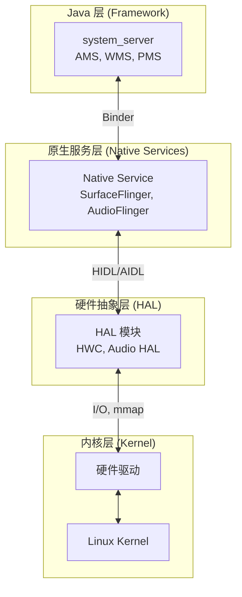
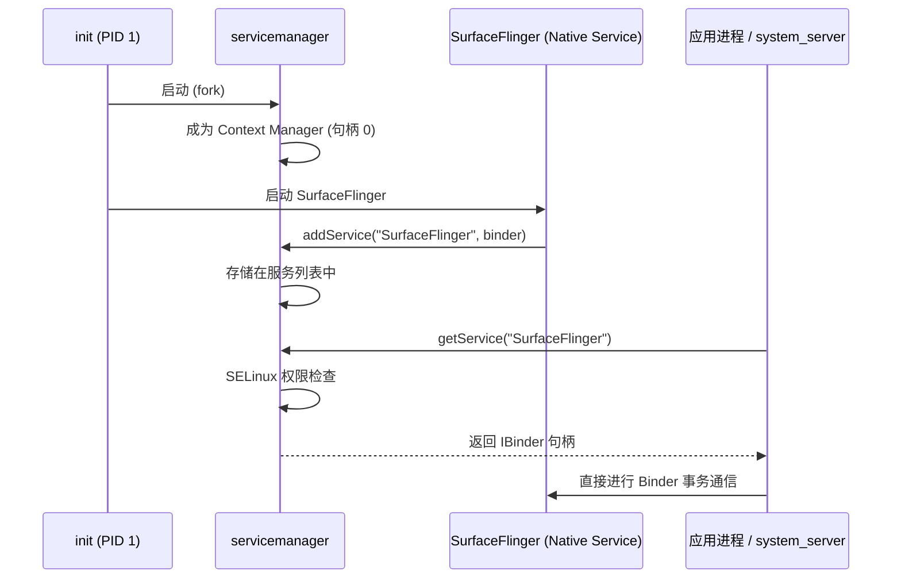
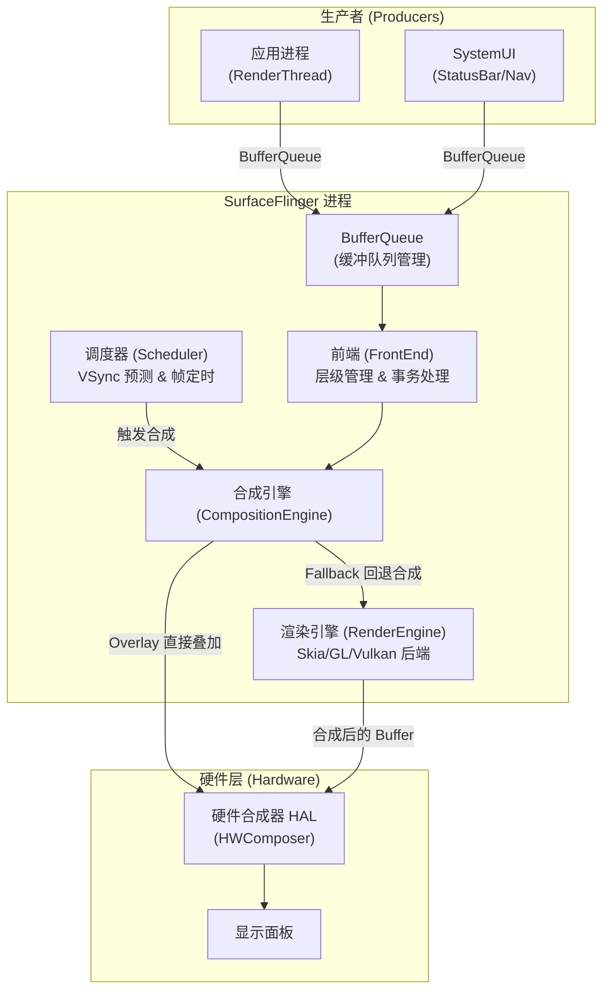
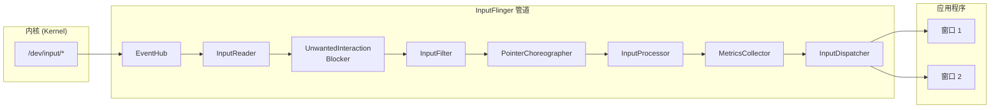
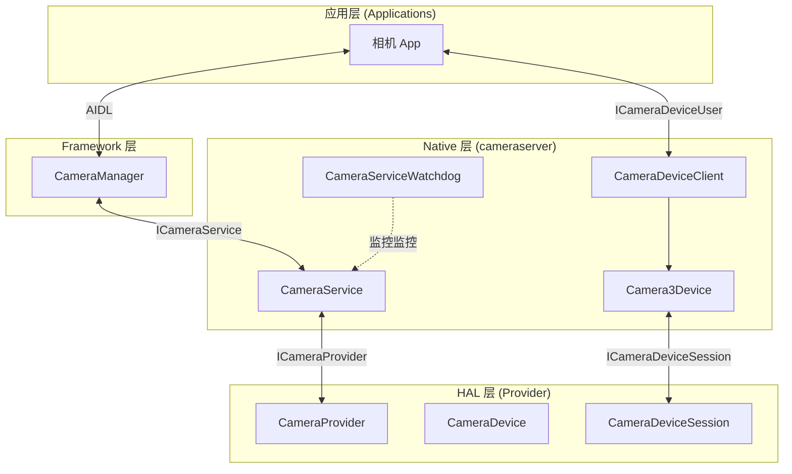
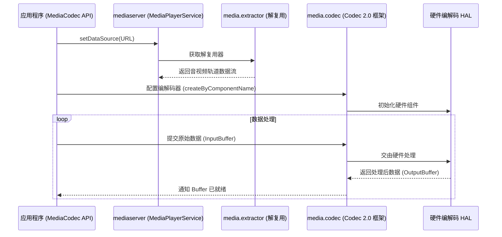
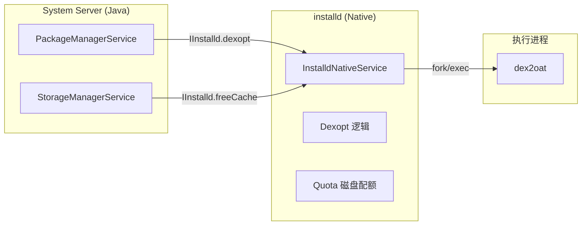
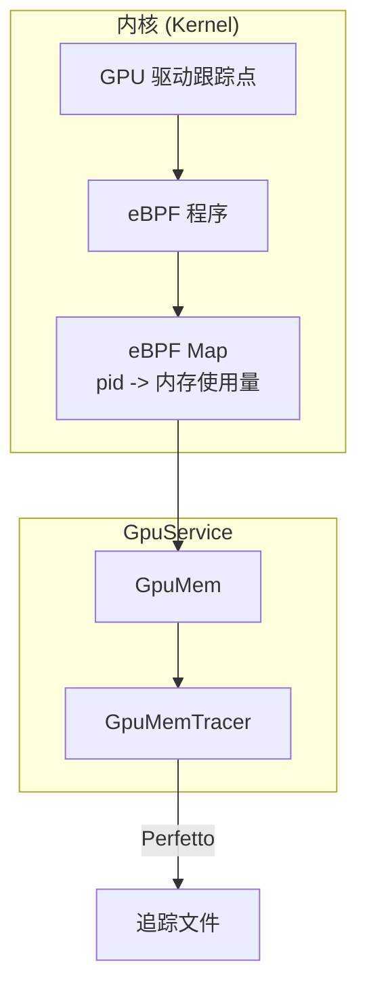
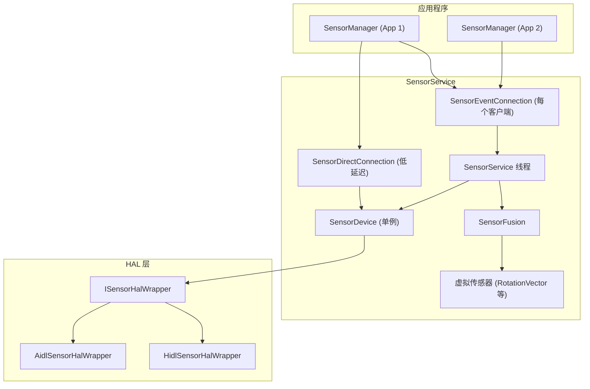

# 第 12 章：原生服务 (Native Services)

Android 的系统功能并非由单一的单体进程提供。虽然 `system_server` 承载了基于 Java 的系统服务（如 ActivityManagerService、WindowManagerService、PackageManagerService 等数十个服务），但平台大部分的关键功能实际上运行在用 C++ 编写的**独立原生进程**中。这些原生服务处理从屏幕像素合成、触摸事件路由到磁盘 APK 安装的所有核心任务。

本章将深入探讨这些原生服务的架构与实现，分析它们如何向 `servicemanager` 注册、如何通过 Binder 通信，以及如何与硬件（通过 HAL）和框架的其他部分进行交互。

---

## 12.1 原生服务架构 (Native Service Architecture)

### 12.1.1 什么是原生服务？为什么它们存在？

**原生服务 (Native Service)** 是一个 C++ 进程，它具有以下特征：

1. **独立启动**：作为一个独立进程运行（通常由 `init` 通过 `.rc` 文件启动）。
2. **注册接口**：向 `servicemanager` 注册一个或多个 Binder 接口。
3. **事件驱动**：进入 Binder 线程池或事件循环以处理请求。
4. **生命周期持久**：在系统运行期间持续存在（如果崩溃，由 `init` 重启）。

**原生服务存在的核心理由：**

*   **执行效率与 C++ 优势**：高性能、对内存的精细控制以及对底层硬件驱动的直接访问。例如，SurfaceFlinger 需要极高的帧率稳定性，AudioFlinger 需要极低的音频延迟，这些在 Java 层难以通过垃圾回收 (GC) 机制完美实现。
*   **早期启动需求**：在 Android 运行时 (ART) 和 `system_server` 启动之前，系统就需要某些核心功能。例如，`servicemanager` 本身必须最先启动，以便后续所有服务（包括 Java 服务）进行注册。
*   **进程隔离与安全**：原生服务运行在各自的地址空间。SurfaceFlinger 的崩溃不会导致 AudioFlinger 宕机。此外，通过 SELinux 和 Linux 能力 (Capabilities)，每个服务可以仅拥有所需的最小权限。

### 12.1.2 原生服务分层架构

原生服务在 Android 整体架构中充当了连接内核驱动与 Java 框架的桥梁：


```mermaid
graph TD
    subgraph "Java 层 (Framework)"
        SS[system_server<br/>AMS, WMS, PMS]
    end

    subgraph "原生服务层 (Native Services)"
        NS[Native Service<br/>SurfaceFlinger, AudioFlinger]
    end

    subgraph "硬件抽象层 (HAL)"
        HAL[HAL 模块<br/>HWC, Audio HAL]
    end

    subgraph "内核层 (Kernel)"
        K[Linux Kernel]
        D[硬件驱动]
    end

    SS <-->|Binder| NS
    NS <-->|HIDL/AIDL| HAL
    HAL <-->|I/O, mmap| D
    D <--> K
```

### 12.1.3 servicemanager 注册模式

`servicemanager` 是 Android 服务发现机制的核心，它是第一个也是最基础的原生服务。


```mermaid
sequenceDiagram
    participant Init as init (PID 1)
    participant SM as servicemanager
    participant SF as SurfaceFlinger (Native Service)
    participant App as 应用进程 / system_server

    Init->>SM: 启动 (fork)
    SM->>SM: 成为 Context Manager (句柄 0)

    Init->>SF: 启动 SurfaceFlinger
    SF->>SM: addService("SurfaceFlinger", binder)
    SM->>SM: 存储在服务列表中
    App->>SM: getService("SurfaceFlinger")
    SM->>SM: SELinux 权限检查
    SM-->>App: 返回 IBinder 句柄
    App->>SF: 直接进行 Binder 事务通信
```

### 12.1.4 进程隔离与 init.rc 配置

每个原生服务都在 `.rc` 文件中定义。以 `surfaceflinger` 为例：

```
service surfaceflinger /system/bin/surfaceflinger
    class core animation
    user system
    group graphics drmrpc readproc
    capabilities SYS_NICE
    onrestart restart --only-if-running zygote
    task_profiles HighPerformance
```

*   **`user`/`group`**：定义 Linux UID/GID，实现进程级隔离。
*   **`capabilities SYS_NICE`**：允许服务设置实时优先级（对 VSync 同步至关重要）。
*   **`onrestart`**：定义级联重启逻辑。如果 SurfaceFlinger 崩溃，必须重启 Zygote，因为所有应用的图形上下文（BufferQueue）都已失效。

---

## 12.2 SurfaceFlinger

SurfaceFlinger 是 Android 的**显示合成器 (Compositor)**。它是系统中复杂度最高、对性能要求最严苛的原生服务之一。它接收来自所有应用程序和系统 UI 组件的图形缓冲块，将它们合成在一起，并在 VSync（垂直同步）信号的精确控制下显示到屏幕上。

### 12.2.1 SurfaceFlinger 核心职责

1.  **合成 (Composition)**：将多个图层（Layers）合并为一个最终的帧缓冲区。
2.  **层级管理 (Layer management)**：管理 Z-轴顺序、透明度、旋转、缩放和裁剪。
3.  **VSync 同步**：通过 Scheduler 协调所有显示更新，确保无撕裂感。

### 12.2.2 SurfaceFlinger 详细架构图


```mermaid
graph TB
    subgraph "生产者 (Producers)"
        App["应用进程<br/>(RenderThread)"]
        SysUI["SystemUI<br/>(StatusBar/Nav)"]
    end

    subgraph "SurfaceFlinger 进程"
        direction TB
        BQ["BufferQueue<br/>(缓冲队列管理)"]
        FE["前端 (FrontEnd)<br/>层级管理 & 事务处理"]
        SCH["调度器 (Scheduler)<br/>VSync 预测 & 帧定时"]
        CE["合成引擎 (CompositionEngine)"]
        RE["渲染引擎 (RenderEngine)<br/>Skia/GL/Vulkan 后端"]
    end

    subgraph "硬件层 (Hardware)"
        HWC["硬件合成器 HAL<br/>(HWComposer)"]
        Display["显示面板"]
    end

    App -->|BufferQueue| BQ
    SysUI -->|BufferQueue| BQ
    BQ --> FE
    SCH -->|触发合成| CE
    FE --> CE
    CE -->|Overlay 直接叠加| HWC
    CE -->|Fallback 回退合成| RE
    RE -->|合成后的 Buffer| HWC
    HWC --> Display
```

### 12.2.3 核心组件详解

#### 1. BufferQueue 与 SurfaceFlinger 的关系
BufferQueue 是 SurfaceFlinger 与应用之间的通信纽带。
*   **生产者 (Producer)**：应用程序（如 Skia 或 OpenGL）将渲染好的 Buffer 放入队列。
*   **消费者 (Consumer)**：SurfaceFlinger 从队列中获取 Buffer。
*   **关系**：每创建一个 Window，系统都会为之创建一个对应的 BufferQueue。SurfaceFlinger 监控这些队列，当有新帧到来时，标记该图层为 "Dirty"（待更新）。

#### 2. 硬件合成器 (HWC) 集成
**Hardware Composer (HWC)** 是显示硬件的抽象。其核心优势是利用专门的显示硬件（Overlay Planes）进行合成，而无需消耗 GPU 资源。
*   **DEVICE 合成**：HWC 直接在硬件中叠加图层。这是最省电、最快的方式。
*   **CLIENT 合成**：如果图层过多或过于复杂（如特殊的滤镜），HWC 会要求 SurfaceFlinger 使用 **RenderEngine** 进行合成。

#### 3. 渲染引擎 (RenderEngine) 后端
当硬件合成不可用时，SurfaceFlinger 启动 RenderEngine。
*   **Skia 后端**：现代 Android 版本（如 Android 12+）主要使用 Skia 进行 GPU 合成。
*   **功能**：执行混合、色彩空间转换、圆角裁剪以及阴影处理。合成后的结果作为单个图层发送给 HWC。

#### 4. VSync 与调度器 (Scheduler)
SurfaceFlinger 的所有动作都围绕 VSync 展开。
*   **VSyncPredictor**：根据历史硬件信号预测未来的 VSync 时间点。
*   **帧调度**：SurfaceFlinger 会在 VSync 到来前的某个特定偏移量（Offset）唤醒，以确保在屏幕刷新前完成合成工作。

### 12.2.4 合成生命周期

1.  **Commit 阶段**：处理挂起的事务（如移动窗口、改变透明度），并生成图层快照。
2.  **Composite 阶段**：
    *   **验证 (Validate)**：询问 HWC 哪些层可以硬件合成。
    *   **渲染 (Render)**：如果需要，调用 RenderEngine 合成 CLIENT 层。
    *   **发布 (Present)**：向显示驱动提交最终结果。
3.  **释放 (Release)**：将不再使用的 Buffer 返回给应用程序。

## 12.3 InputFlinger (输入系统服务)

InputFlinger 负责处理所有的用户输入——包括触摸事件、按键按下、手写笔笔划、鼠标移动、游戏手柄按钮等，并将其路由到正确的应用程序窗口。它是 Android 中对延迟最敏感的服务之一；即使是几毫秒的额外延迟，用户也能明显感知到。

### 12.3.1 源码布局

InputFlinger 的源码位于 `frameworks/native/services/inputflinger/`，其组织结构如下：

| 目录 | 用途 |
|-----------|---------|
| `reader/` | EventHub + InputReader：读取原始内核事件 |
| `dispatcher/` | InputDispatcher：将事件路由到窗口 |
| `reporter/` | 报告输入事件（用于辅助功能） |
| `trace/` | Perfetto 追踪集成 |
| `rust/` | 通过 `IInputFlingerRust` 实现的 Rust FFI 组件 |
| `aidl/` | AIDL 接口定义 |
| 根目录文件 | InputManager、过滤器、阻塞器、编排器（Choreographer） |

### 12.3.2 输入管道 (The Input Pipeline)

`InputManager.cpp` 中的注释描述了完整的处理管道：

> `frameworks/native/services/inputflinger/InputManager.cpp`

```cpp
/**
 * 事件流通过 "InputListener" 接口传递，过程如下：
 *   InputReader (输入读取器)
 *     -> UnwantedInteractionBlocker (无效交互阻塞器)
 *     -> InputFilter (输入过滤器)
 *     -> PointerChoreographer (指针编排器)
 *     -> InputProcessor (输入处理器)
 *     -> InputDeviceMetricsCollector (输入设备指标收集器)
 *     -> InputDispatcher (输入分发器)
 */
```

让我们追踪从硬件到应用程序的这个管道：


```mermaid
graph LR
    subgraph "内核 (Kernel)"
        DEV["/dev/input/*"]
    end

    subgraph "InputFlinger 管道"
        EH[EventHub]
        IR[InputReader]
        UIB["UnwantedInteraction<br/>Blocker"]
        IF[InputFilter]
        PC[PointerChoreographer]
        IP[InputProcessor]
        MC[MetricsCollector]
        ID[InputDispatcher]
    end

    subgraph "应用程序"
        W1[窗口 1]
        W2[窗口 2]
    end

    DEV --> EH
    EH --> IR
    IR --> UIB
    UIB --> IF
    IF --> PC
    PC --> IP
    IP --> MC
    MC --> ID
    ID --> W1
    ID --> W2
```

### 12.3.3 EventHub：读取原始事件

EventHub 是输入堆栈的最底层。它集成并利用了 Linux 的 **evdev** 子系统，负责：

1. 使用 `inotify` 监控 `/dev/input/` 以获取设备热插拔事件。
2. 打开输入设备节点，并使用 `epoll` 高效地同时等待多个设备文件描述符。
3. 当任何设备产生事件时，`epoll_wait()` 返回，EventHub 从内核读取原始的 `struct input_event`。
4. 识别设备功能（键盘、触摸屏、鼠标等）。
5. 使用按键布局映射（`.kl`）和按键字符映射（`.kcm`）文件将原始扫描码映射为 Android 键码。

### 12.3.4 InputReader：解析原始事件

InputReader 运行在自己的线程中，负责消费来自 EventHub 的原始事件。它维护一组 **InputDevice** 对象，每个对象包含一个或多个 **InputMapper** 实例。

InputMapper（位于 `reader/mapper/`）负责将 `evdev` 事件解析为 Android 的 `NotifyArgs`：
- **KeyboardInputMapper**：处理按键，产生 `NotifyKeyArgs`。
- **MultiTouchInputMapper**：解析多点触控协议，产生 `NotifyMotionArgs`。
- **CursorInputMapper**：处理鼠标或触控板的相对移动。

### 12.3.5 管道阶段与 InputClassifier

在 InputReader 产生事件参数后，事件流经多个阶段，其中 **InputProcessor** 是关键环节：
- **InputProcessor** 与 `IInputProcessor` HAL 交互，利用 **InputClassifier** 进行事件分类。
- 例如，它可能将某个触控动作分类为“手掌（Palm）”并建议抑制，从而实现硬件辅助的手掌误触过滤。
- **UnwantedInteractionBlocker** 则在软件层面进一步处理无效交互。

### 12.3.6 InputDispatcher：路由与分发

InputDispatcher 是最终的交付阶段，它负责将事件从 InputFlinger 路由到 **WindowManager** 管理的各个窗口：

1. **窗口寻址**：根据触摸坐标和从 `WindowManagerService` 获取的窗口信息（`WindowInfo`）层级，确定目标窗口。
2. **焦点管理**：`FocusResolver` 跟踪每个显示屏上的输入焦点，确保按键事件准确分发。
3. **ANR 检测**：`AnrTracker` 监控应用程序的响应情况。如果应用未能在规定时间（通常 5s）内通过 `InputChannel` 发回完成信号，则触发 ANR。

### 12.3.11 输入通道与传输 (InputChannels and Transport)

事件通过 **InputChannels** 交付给应用程序，这实质上是一对 Unix 域套接字（Socket Pairs）。这种设计避免了在 120Hz-240Hz 的高频输入流中使用 Binder IPC 带来的延迟压力。

---

## 12.4 AudioFlinger 概览 (AudioFlinger Overview)

AudioFlinger 是负责音频流混合、处理与路由的原生服务。它作为 `audioserver` 进程的核心部分运行，负责管理音频轨道（Tracks）并将其交付给硬件。

### 12.4.2 AudioFlinger 内部机制：Tracks 与 Threads

AudioFlinger 的核心在于其精密的线程模型和音轨管理：

- **Track (音轨)**：代表应用程序的音频流。每个 `AudioTrack` 客户端在 AudioFlinger 中都有对应的 `Track` 实例，通过**共享内存**传输数据。
- **MixerThread (混音线程)**：音频系统的核心工作负载。它从多个音轨中拉取 PCM 数据，应用音量、平移，并通过软件混音器（或 **FastMixer**）进行混合。
- **FastMixer**：一个专门的低延迟混音组件，运行在实时优先级线程中，旨在绕过标准混音路径中的大缓冲区，显著降低音频输出延迟。

### 12.4.3 线程类型与低延迟路径

AudioFlinger 根据场景使用不同的线程：
- **MixerThread**：标准的软件混音路径。
- **DirectOutputThread**：用于无需混音的场景（如位深透传或压缩音频格式）。
- **MmapThread**：支持 **AAudio MMAP** 模式，通过将 HAL 缓冲区直接映射到应用空间，实现极低延迟（Low-latency）路径。

### 12.4.4 缓冲区管理与共享内存

AudioFlinger 使用基于环形缓冲区的共享内存机制：
- **控制块 (Control Block)**：存放读写指针，实现 lock-free 的数据交换。
- **同步机制**：利用 Linux **Futex** 实现高效的线程唤醒，确保混音循环的确定性时序。

### 12.4.5 Audio HAL 集成与 AudioPolicyService

AudioFlinger 并不孤立工作，它依赖两个关键组件：

1. **AudioPolicyService**：音频系统的“大脑”。它负责路由决策（例如：当耳机插入时，将流从扬声器切换到耳机）。它指示 AudioFlinger 创建或移动音轨到特定的输出线程。
2. **Audio HAL**：AudioFlinger 通过 AIDL/HIDL 接口与 Audio HAL 交互。它将混合后的缓冲区写入 HAL，由 HAL 进一步交给硬件 DSP 或 DAC。

这种“策略（Policy）”与“执行（Flinger）”分离的架构，使得 Android 能够灵活处理复杂的音频场景，同时保持核心混音逻辑的高效性。


## 12.5 CameraService 详解

CameraService（通常运行在 `cameraserver` 进程中）负责管理 Android 设备上所有摄像头硬件的访问。它充当门控角色，确保多个应用程序能够安全、有序地共享有限的摄像头资源。

### 12.5.1 源码位置与核心组件

CameraService 的核心源码位于：
```
frameworks/av/services/camera/libcameraservice/
```

| 核心文件 | 职能描述 |
|------|---------|
| `CameraService.h/cpp` | 服务的入口点，负责客户端连接管理与资源仲裁 |
| `Camera3Device.h/cpp` | 对应一个具体的物理/逻辑摄像头，管理 Camera3 协议的内部状态 |
| `CameraServiceWatchdog.h/cpp` | 监控 HAL 层的响应时间，处理超时与故障恢复 |
| `api2/CameraDeviceClient.h/cpp` | 针对 Camera2 API 的客户端会话实现 |

### 12.5.2 架构与 Binder 通信

CameraService 通过 Binder 接口与 Framework 层（`CameraManager`）以及应用进程进行通信。


```mermaid
graph TB
    subgraph "应用层 (Applications)"
        App[相机 App]
    end

    subgraph "Framework 层"
        CM[CameraManager]
    end

    subgraph "Native 层 (cameraserver)"
        CS[CameraService]
        CDC[CameraDeviceClient]
        C3D[Camera3Device]
        WD[CameraServiceWatchdog]
    end

    subgraph "HAL 层 (Provider)"
        CP[CameraProvider]
        CD[CameraDevice]
        CDS[CameraDeviceSession]
    end

    App <-->|AIDL| CM
    CM <-->|ICameraService| CS
    App <-->|ICameraDeviceUser| CDC
    CDC --> C3D
    C3D <-->|ICameraDeviceSession| CDS
    CS <-->|ICameraProvider| CP
    WD -.->|监控监控| CS
```

### 12.5.3 Camera3Device 内部机制与 Buffer 流转

`Camera3Device` 是 CameraService 中最复杂的组件，它实现了 Camera3 硬件抽象层协议。

1.  **Provider 管理**：CameraService 启动时会枚举并连接所有的 `ICameraProvider`（通过 HIDL 或 AIDL）。Provider 负责发现物理设备并返回 `ICameraDevice` 实例。
2.  **Buffer 流转**：
    *   **从应用到 HAL**：应用进程通过 `Surface`（对应于 `IGraphicBufferProducer`）提供 Buffer。CameraService 将这些 Buffer 封装进 `CaptureRequest`。
    *   **HAL 交互**：`Camera3Device` 将 Request 提交给 `ICameraDeviceSession`。HAL 层负责将图像数据填充到 Buffer 中。
    *   **从 HAL 到应用**：一旦 HAL 完成渲染，`Camera3Device` 收到 `processCaptureResult` 回调。Buffer 被送回相应的 `Surface`，最终在应用的界面上显示或进行编码。

### 12.5.4 虚拟摄像头 (Virtual Camera)

最近引入的虚拟摄像头子系统位于 `frameworks/av/services/camera/virtualcamera/`。它允许开发者通过软件方式模拟摄像头设备，广泛应用于单元测试、远程摄像头接入以及折叠屏设备的后置自拍模式。

---

## 12.6 MediaService 详解

MediaService 并不是一个单一的服务，而是由多个 Native 进程组成的集群，每个进程都拥有极低的权限并受到 seccomp 沙盒保护。

### 12.6.1 核心进程与职责

| 进程名称 | 对应的 AIDL/HIDL 接口 | 核心职责 |
|------|---------|---------|
| `mediaserver` | `IMediaPlayerService` | 维护音频输出、播放器状态机（NuPlayer） |
| `media.codec` | `IOmx` / `ICodec2` | 托管硬件编解码器驱动 |
| `media.swcodec` | `ICodec2` | 托管 Google 提供的软件编解码器（如 libvpx, libaom） |
| `media.extractor` | `IMediaExtractorService` | 负责解析容器格式（MP4, MKV, OGG）并解复用 |

### 12.6.2 MediaCodec 与 Codec 2.0 (C2)

Codec 2.0 是 Android 现代化的编解码框架，旨在取代旧有的 OMX 接口。它提供了更好的多实例支持和更高效的 Buffer 内存管理。

**Media 流程示意图：**


```mermaid
sequenceDiagram
    participant App as 应用程序 (MediaCodec API)
    participant MS as mediaserver (MediaPlayerService)
    participant ME as media.extractor (解复用)
    participant C2 as media.codec (Codec 2.0 框架)
    participant HAL as 硬件编解码 HAL

    App->>MS: setDataSource(URL)
    MS->>ME: 获取解复用器
    ME-->>MS: 返回音视频轨道数据流
    App->>C2: 配置编解码器 (createByComponentName)
    C2->>HAL: 初始化硬件组件
    loop 数据处理
        App->>C2: 提交原始数据 (InputBuffer)
        C2->>HAL: 交由硬件处理
        HAL-->>C2: 返回处理后数据 (OutputBuffer)
        C2-->>App: 通知 Buffer 已就绪
    end
```

### 12.6.3 进程隔离与安全性

由于媒体解析器（Extractor）通常是恶意媒体文件的首要攻击目标，Android 采用了**深度防御**策略：
- **权限最小化**：`media.extractor` 不具备访问网络或存储的权限，只能通过调用者传递的文件描述符（FD）进行读取。
- **vndbinder 隔离**：硬件编解码进程使用 `/dev/vndbinder` 与厂商驱动通信，完全隔离于系统 Framework。

---

## 12.7 installd 详解

`installd` 是 Android 系统中权限极高的守护进程，负责执行所有与磁盘操作相关的应用安装、数据管理和 DEX 优化任务。

### 12.7.1 核心职能

1.  **包目录管理**：
    *   在应用安装时，`installd` 会创建 `/data/app/` 下的安装目录。
    *   创建数据目录：
        *   **CE (Credential Encrypted)**: `/data/user/{userId}/{pkg}/`（用户解锁后可用）。
        *   **DE (Device Encrypted)**: `/data/user_de/{userId}/{pkg}/`（设备启动后即可用，支持 Direct Boot）。
2.  **DEX 优化 (dexopt) 编排**：
    *   `installd` 接收来自 `PackageManagerService` 的 `dexopt` 请求。
    *   它负责 fork 并执行 `dex2oat` 进程，将 DEX 字节码编译为原生机器码（OAT/VDEX 文件）。
    *   管理 ART Profile 文件，实现基于配置文件的优化（PGO）。
3.  **用户存储清理**：
    *   当系统存储空间不足时，`system_server` 调用 `installd` 的 `freeCache` 接口。
    *   `installd` 会扫描所有应用的 `cache` 和 `code_cache` 目录，根据 LRU 算法清理文件。

### 12.7.2 Binder 与 Framework 的交互

`installd` 实现了 `IInstalld` AIDL 接口。由于它需要以 `root` 权限操作各种 UID 的目录，它是 `system_server` 必不可少的提权代理。


```mermaid
graph LR
    subgraph "System Server (Java)"
        PMS[PackageManagerService]
        SMS[StorageManagerService]
    end

    subgraph "installd (Native)"
        INS[InstalldNativeService]
        DXO[Dexopt 逻辑]
        QT[Quota 磁盘配额]
    end

    subgraph "执行进程"
        D2O[dex2oat]
    end

    PMS -->|IInstalld.dexopt| INS
    SMS -->|IInstalld.freeCache| INS
    INS -->|fork/exec| D2O
```

### 12.7.3 安全性与权限

尽管 `installd` 以 root 运行，但它受到严格的 SELinux 约束：
- 只能在特定的文件上下文（Context）中创建目录。
- 只有来自 `system_server` 的 Binder 调用才会被执行。
- 处理 APK 时会应用 `fs-verity` 以确保安装包在磁盘上的完整性。


## 12.8 GPU Service

GpuService 负责管理 GPU 相关的核心功能，包括驱动统计信息、内存追踪、负载监控以及游戏驱动管理。

### 12.8.1 源码布局

源码位于 `frameworks/native/services/gpuservice/`：

| 目录 | 用途 |
|-----------|---------|
| `gpustats/` | GPU 驱动加载统计信息 |
| `gpumem/` | 通过 eBPF 追踪进程级 GPU 内存使用 |
| `gpuwork/` | 通过 eBPF 追踪 GPU 负载（Workload） |
| `tracing/` | 基于 Perfetto 的 GPU 内存追踪 |
| `feature_override/` | ANGLE 特性覆盖（Override）配置 |
| 根目录文件 | 主要的服务实现 |

### 12.8.2 服务实现

> `frameworks/native/services/gpuservice/include/gpuservice/GpuService.h`

```cpp
class GpuService : public BnGpuService, public PriorityDumper {
public:
    static const char* const SERVICE_NAME ANDROID_API;  // "gpu"

    GpuService() ANDROID_API;

private:
    // 组件
    std::shared_ptr<GpuMem> mGpuMem;
    std::shared_ptr<gpuwork::GpuWork> mGpuWork;
    std::unique_ptr<GpuStats> mGpuStats;
    std::unique_ptr<GpuMemTracer> mGpuMemTracer;
    std::mutex mLock;
    std::string mDeveloperDriverPath;
    FeatureOverrideParser mFeatureOverrideParser;
};
```

### 12.8.3 子系统

**GpuStats (驱动统计)**

追踪每个应用程序的驱动加载统计信息，包括：

- 驱动包名和版本。
- GL、Vulkan 和 ANGLE 的加载成功/失败计数。
- 各个 App 的加载耗时。
- Vulkan 引擎名称（用于游戏识别）。

数据通过 `frameworks/native/services/gpuservice/gpustats/GpuStats.cpp` 中的 `addLoadingCount` 等方法收集，并上报给 `statsd` 进行遥测（Telemetry）。

**GpuMem (GPU 内存追踪)**

利用 eBPF (extended Berkeley Packet Filter) 程序来追踪每个进程的 GPU 内存分配。eBPF 程序挂载在 GPU 驱动的跟踪点（Tracepoints）上，并维护一个 PID 到内存使用量的映射表（Map），用户空间可以读取该表。


```mermaid
graph TB
    subgraph "内核 (Kernel)"
        TP[GPU 驱动跟踪点]
        BPF[eBPF 程序]
        MAP["eBPF Map<br/>pid -> 内存使用量"]
    end

    subgraph "GpuService"
        GM[GpuMem]
        GMT[GpuMemTracer]
    end

    TP --> BPF
    BPF --> MAP
    MAP --> GM
    GM --> GMT
    GMT -->|Perfetto| Trace[追踪文件]
```

**GpuWork (GPU 负载追踪)**

与 GpuMem 类似，使用 eBPF 追踪进程级 GPU 负载，包括在 GPU 上执行的时间。

**ANGLE 集成**

GpuService 将 ANGLE（Almost Native Graphics Layer Engine）作为系统驱动进行管理。`toggleAngleAsSystemDriver()` 方法用于设置 `persist.graphics.egl` 属性。该操作具有严格的权限检查：仅允许 `system_server` 且必须持有 `ACCESS_GPU_SERVICE` 权限。

**特性覆盖解析器 (Feature Override Parser)**

从 `/system/etc/angle/feature_config_vk.binarypb` 解析 ANGLE 的特性覆盖配置，允许 OEM 厂商根据 App 或设备覆盖特定的 Vulkan/GLES 特性。

### 12.8.4 用于 GPU 监控的 eBPF 程序

eBPF 程序在内核中运行，能够高效追踪事件，避免了频繁的用户态/内核态切换开销。

- **GpuMem**: `GpuMem::initialize()` 负责加载 eBPF 程序并设置 Map。`GpuMemTracer` 定期读取 Map 并将数据导出到 Perfetto。
- **GpuWork**: 监控每个进程在 GPU 上执行的时间，用于功耗归属（Power Attribution）、性能分析和调试。

### 12.8.5 异步初始化

为了避免延迟服务注册，GpuService 采用异步方式初始化 eBPF 子系统：

```cpp
GpuService::GpuService() {
    mGpuMemAsyncInitThread = std::make_unique<std::thread>([this]() {
        mGpuMem->initialize();
        mGpuMemTracer->initialize(mGpuMem);
    });
    // ... GpuWork 的异步初始化 ...
};
```

### 12.8.6 游戏驱动支持 (Game Driver)

Android 通过游戏驱动机制支持可更新的 GPU 驱动。GpuService 追踪两个驱动插槽（Slot）：
- `ro.gfx.driver.0`: 稳定版游戏驱动。
- `ro.gfx.driver.1`: 预发布版游戏驱动。

### 12.8.7 Shell 命令

支持通过 `adb shell cmd gpu` 执行诊断命令：
- `vkjson`: 以 JSON 格式导出 Vulkan 设备属性。
- `vkprofiles`: 打印 Vulkan Profile 支持情况。
- `featureOverrides`: 显示 ANGLE 特性覆盖。

---

## 12.9 Sensor Service

SensorService 负责管理对所有硬件和虚拟传感器（加速度计、陀螺仪、磁力计、气压计、近距离传感器等）的访问。

### 12.9.1 源码布局

源码位于 `frameworks/native/services/sensorservice/`：

| 文件 | 用途 |
|------|---------|
| `SensorService.h/cpp` | 服务主实现 |
| `SensorDevice.h/cpp` | HAL 层抽象（单例） |
| `SensorEventConnection.cpp` | 每个客户端的连接处理 |
| `SensorDirectConnection.h` | 直接传感器通道（低延迟） |
| `ISensorHalWrapper.h` | HAL 包装器接口 |
| `SensorFusion.cpp` | 软件传感器融合算法 |
| `RotationVectorSensor.cpp` | 计算得出的旋转矢量传感器 |

### 12.9.2 架构


```mermaid
graph TB
    subgraph "应用程序"
        SM1["SensorManager (App 1)"]
        SM2["SensorManager (App 2)"]
    end

    subgraph "SensorService"
        SS["SensorService 线程"]
        SEC["SensorEventConnection (每个客户端)"]
        SDC["SensorDirectConnection (低延迟)"]
        SD["SensorDevice (单例)"]
        SF[SensorFusion]
        VS["虚拟传感器 (RotationVector 等)"]
    end

    subgraph "HAL 层"
        HW[ISensorHalWrapper]
        AIDL[AidlSensorHalWrapper]
        HIDL[HidlSensorHalWrapper]
    end

    SM1 --> SEC
    SM2 --> SEC
    SM1 --> SDC
    SEC --> SS
    SDC --> SD
    SS --> SD
    SD --> HW
    HW --> AIDL
    HW --> HIDL
    SS --> SF
    SF --> VS
```

### 12.9.3 服务启动

SensorService 继承自 `BinderService<SensorService>`、`BnSensorServer` 和 `Thread`。它在自己的轮询线程中运行。

### 12.9.4 SensorDevice 单例与 HAL 包装器

`SensorDevice` 是与传感器 HAL 交互的单例。`ISensorHalWrapper` 屏蔽了 AIDL 和 HIDL HAL 的差异，支持：
- **传统轮询 (poll)**：阻塞调用，等待事件。
- **快速消息队列 (Fast Message Queue, FMQ)**：使用共享内存 FIFO 实现低延迟事件交付（HAL 2.0+ 推荐）。

### 12.9.5 传感器融合与虚拟传感器

SensorService 提供了多种基于物理传感器数据计算得出的虚拟传感器：
- `FUSION_9AXIS` (旋转矢量)：结合加速度计 + 陀螺仪 + 磁力计。
- `FUSION_NOMAG` (游戏旋转矢量)：结合加速度计 + 陀螺仪。
- `FUSION_NOGYRO` (地磁旋转矢量)：结合加速度计 + 磁力计。

### 12.9.6 客户端连接与 BitTube

每个注册传感器事件的客户端都会获得一个 `SensorEventConnection`。事件通过 `BitTube` 交付，这是一种针对批量事件交付优化的底层套接字对（Socket Pair）。
- 批量模式缓冲区：100 KB。
- 非批量模式缓冲区：4 KB。

### 12.9.7 采样率限制与隐私

为了防止利用高频传感器数据进行的侧信道攻击，SensorService 对未持有 `HIGH_SAMPLING_RATE_SENSORS` 权限的 App（Target API 31+）实施采样率限制：
- 普通采样上限：200 Hz。
- 直接通道上限：NORMAL 级别（<= 110 Hz）。

### 12.9.8 轮询循环 (Polling Loop)

SensorService 的线程循环流程如下：
1. 调用 `SensorDevice::poll()` 阻塞等待事件（使用传统读取或 FMQ）。
2. 批量处理物理传感器事件。
3. 将数据输入 `SensorFusion` 算法。
4. 生成虚拟传感器事件。
5. 分发到所有 `SensorEventConnection` 并写入 BitTube 套接字。
6. 通过 `BatteryService` 追踪每个 App 的传感器功耗。

### 12.9.9 动态传感器与操作模式

- **动态传感器**：支持运行时连接/断开的传感器（如 USB 或蓝牙传感器）。
- **操作模式**：
    - `NORMAL`：常规运行。
    - `DATA_INJECTION`：允许注入数据（用于 CTS 测试）。
    - `RESTRICTED`：仅允许白名单 App 访问。

### 12.9.10 直接传感器通道 (Direct Channels)

对于极致低延迟需求（如 VR），支持将传感器事件直接写入应用映射的共享内存（GRALLOC 或 ashmem），从而绕过 SensorService 的所有处理逻辑。

---

## 12.10 servicemanager 与 dumpsys

### 12.10.1 servicemanager：架构基石

`servicemanager` 是 Android 服务基础设施的核心，负责所有（原生和 Java）服务的注册与发现。

**源码位置**：`frameworks/native/cmds/servicemanager/`

### 12.10.2 启动过程与 Context Manager

在启动过程中，`servicemanager` 执行了以下关键步骤：
1. **打开 Binder 驱动**：使用 `ProcessState::initWithDriver("/dev/binder")`。
2. **单线程模型**：使用 `setThreadPoolMaxThreadCount(0)`，通过 Looper 顺序处理请求，避免死锁。
3. **成为 Context Manager**：通过 `becomeContextManager()` (即 `BINDER_SET_CONTEXT_MGR` ioctl) 将自己设置为默认的 Binder 上下文管理器。所有发往 Handle 0 的事务都会路由到此进程。
4. **服务自注册**：将自己注册为名为 `"manager"` 的服务。

### 12.10.3 服务注册表与 SELinux 控制

`ServiceManager` 类维护了服务名称到 Binder 对象的映射。每个操作都受 SELinux 策略约束：
- **查找权限 (canFind)**：检查调用者是否有权查找特定服务。
- **添加权限 (canAdd)**：检查调用者是否有权注册特定服务。

权限检查通过 `Access` 类实现，它会从 `service_contexts` 文件中查找服务的 SELinux 上下文，并执行 `selinux_check_access`。

### 12.10.4 服务注册流程

1. 验证服务名称。
2. SELinux 权限检查（`canAdd`）。
3. 检查 Binder 稳定性（稳定性不达标的服务不允许注册）。
4. 存入 `mNameToService` 映射表。
5. 调用 `binder->linkToDeath()`：如果服务进程异常退出，`servicemanager` 会收到通知并清理注册信息。
6. 通知所有通过 `registerForNotifications` 监听该服务的客户端。

### 12.10.5 延迟服务 (Lazy Services)

`servicemanager` 支持通过 `ctl.interface_start` 属性按需启动服务。当客户端请求一个尚未注册的 HAL 服务时，`servicemanager` 会触发 `init` 启动该服务，从而减少系统启动时间和内存占用。

### 12.10.6 客户端回调与自动注销

- **Client Callback**：允许服务追踪是否有活跃客户端。`servicemanager` 每 5 秒检查一次引用计数。
- **tryUnregisterService**：当服务发现没有活跃客户端时，可以申请注销并退出进程以回收资源。

### 12.10.7 dumpsys：诊断瑞士军刀

`dumpsys` 是用于查询系统服务状态的命令行工具。

**核心实现原理**：
1. 通过 `servicemanager` 获取所有服务列表或特定服务的 `IBinder`。
2. 为每个服务创建一个**带超时的线程**来调用 `service->dump(fd, args)`。
3. 远程服务接收到一个文件描述符（FD），并将其状态信息写入该 FD。
4. `dumpsys` 从管道读取输出并显示。

**关键特性**：
- **优先级管理**：服务可以注册为 `CRITICAL`、`HIGH` 或 `NORMAL` 优先级。`bugreport` 会优先收集高优先级信息。
- **超时机制**：默认超时为 10 秒。如果服务发生死锁，`dumpsys` 会放弃该服务的 dump 并打印超时错误，防止阻塞整个诊断过程。
- **附加诊断类型**：
    - `--pid`：获取托管进程的 PID。
    - `--thread`：检查线程池使用情况。
    - `--clients`：查看连接到该服务的客户端 PID 列表。
    - `--stability`：检查 Binder 稳定性信息。

### 12.10.8 安全边界与权限执行

在原生代码中，权限执行主要依赖：
- **UID/GID 检查**：验证调用进程的用户标识。
- **SELinux**：最核心的安全边界，定义了进程间通信的严格准则。
- **PermissionCache**：对耗时的权限检查进行缓存。
- **文件描述符传递**：通过向受限进程传递特定 FD，在不授予广泛文件权限的情况下允许其进行特定读写操作（如 `dumpsys` 的工作方式）。


## 12.11 动手实践

本节提供了一些动手练习，用于探索本章涵盖的原生服务。

### 12.11.1 概述

以下练习旨在开发设备或具有 `adb` 访问权限的模拟器上运行。某些练习需要 `root` 权限（在 `userdebug` 或 `eng` 版本中可用）。每个练习都建立在本章概念的基础上，从简单的观察逐步过渡到主动实验。

### 练习 1：列出所有运行的服务

连接到设备或模拟器，并列出所有已注册的服务：

```bash
# 列出在 servicemanager 中注册的所有服务
adb shell service list

# 使用 dumpsys 列出（显示运行状态）
adb shell dumpsys -l

# 计算服务总数
adb shell service list | wc -l
```

你通常会看到 150-200 个已注册的服务。注意原生服务（简单的名称，如 `SurfaceFlinger`、`gpu`、`installd`）和 Java 服务（名称如 `activity`、`window`、`package`）的混合。

### 练习 2：探索 SurfaceFlinger 状态

```bash
# 完整的 SurfaceFlinger dump
adb shell dumpsys SurfaceFlinger

# 查找特定信息
adb shell dumpsys SurfaceFlinger | grep "Display"
adb shell dumpsys SurfaceFlinger | grep "VSYNC"
adb shell dumpsys SurfaceFlinger | grep "Layer"

# 列出可见图层
adb shell dumpsys SurfaceFlinger --list
```

在 dump 输出中，查找以下内容：

- **显示配置 (Display configuration)**：分辨率、刷新率、颜色模式。
- **图层列表 (Layer list)**：当前提交合成的每个表面。
- **合成类型 (Composition type)**：哪些图层是 DEVICE（硬件叠加层）与 CLIENT（GPU 合成）。
- **VSYNC 信息**：预测的 VSYNC 时间戳和调度参数。
- **帧统计 (Frame statistics)**：丢帧数、卡顿计数、合成时间。

### 练习 3：监控输入事件

```bash
# 查看原始输入事件
adb shell getevent -lt

# 查看解释后的输入事件（需要 root）
adb shell dumpsys input

# 查找输入设备
adb shell dumpsys input | grep "Device"
```

在 `getevent` 运行时触摸屏幕并观察：

1. `EV_ABS ABS_MT_TRACKING_ID` —— 触摸开始（分配追踪 ID）。
2. `EV_ABS ABS_MT_POSITION_X/Y` —— 触摸坐标。
3. `EV_ABS ABS_MT_PRESSURE` —— 触摸压力。
4. `EV_SYN SYN_REPORT` —— 事件数据包结束。
5. `EV_ABS ABS_MT_TRACKING_ID ffffffff` —— 触摸结束（追踪 ID 为 -1）。

### 练习 4：检查 installd 操作

```bash
# 实时观察 installd 操作
adb logcat -s installd

# Dump installd 状态
adb shell dumpsys installd

# 检查应用数据目录（需要 root）
adb shell ls -la /data/user/0/com.android.settings/
adb shell ls -la /data/user_de/0/com.android.settings/
```

在观察 `logcat` 的同时安装一个新应用，以查看 `createAppData`、`dexopt` 和配置文件设置操作。

### 练习 5：GPU 服务诊断

```bash
# Dump GPU 服务状态
adb shell dumpsys gpu

# 获取 Vulkan 设备属性
adb shell cmd gpu vkjson

# 检查 Vulkan Profile 支持情况
adb shell cmd gpu vkprofiles

# 查看 GPU 内存使用情况（如果可用）
adb shell dumpsys gpu --gpumem

# 查看 GPU 驱动统计信息
adb shell dumpsys gpu --gpustats
```

### 练习 6：传感器服务探索

```bash
# Dump 所有传感器信息
adb shell dumpsys sensorservice

# 查找虚拟传感器
adb shell dumpsys sensorservice | grep "AOSP"

# 查看传感器注册情况
adb shell dumpsys sensorservice | grep "Connection"
```

在输出中识别：

- **物理传感器**：带有供应商名称的硬件传感器。
- **虚拟传感器**：AOSP 提供的融合传感器（旋转矢量、游戏旋转矢量等）。
- **活动连接**：哪些应用当前正在接收传感器数据，以及接收频率。

### 练习 7：servicemanager 内部机制

```bash
# Dump servicemanager 状态
adb shell dumpsys -t 5 manager

# 检查特定服务是否已注册
adb shell service check SurfaceFlinger
adb shell service check installd

# 查看服务调试信息
adb shell cmd -w servicemanager getServiceDebugInfo
```

### 练习 8：端到端追踪 Binder 调用

使用 Perfetto 追踪完整的 Binder 事务：

```bash
# 录制一段 5 秒的追踪，包含 Binder 和调度信息
adb shell perfetto \
  -c - --txt \
  -o /data/misc/perfetto-traces/native-services.perfetto-trace \
  <<EOF
buffers: {
    size_kb: 63488
    fill_policy: DISCARD
}
data_sources: {
    config {
        name: "linux.ftrace"
        ftrace_config {
            ftrace_events: "sched/sched_switch"
            ftrace_events: "binder/binder_transaction"
            ftrace_events: "binder/binder_transaction_received"
        }
    }
}
duration_ms: 5000
EOF

# 拉取并在 Perfetto UI 中分析
adb pull /data/misc/perfetto-traces/native-services.perfetto-trace
```

在 Perfetto UI (https://ui.perfetto.dev) 中打开追踪文件并查找：

- 应用进程与原生服务之间的 Binder 事务。
- SurfaceFlinger 合成周期的线程调度。
- VSYNC 的定时关系。

### 练习 9：构建并修改原生服务

为了理解构建系统的集成，尝试修改一个简单的原生服务：

```bash
# 进入 GPU 服务目录
cd $AOSP_ROOT/frameworks/native/services/gpuservice/

# 编辑 main_gpuservice.cpp - 在启动时添加一条日志消息
# 在 sm->addService(...) 之前，添加：
# ALOGI("GpuService starting - custom build");

# 仅构建 GPU 服务模块
cd $AOSP_ROOT
m gpuservice

# 生成的二进制文件将位于：
# out/target/product/<device>/system/bin/gpuservice
```

### 练习 10：观察 SurfaceFlinger 合成类型

```bash
# Dump SurfaceFlinger 图层状态
adb shell dumpsys SurfaceFlinger --list

# 获取详细的合成信息
adb shell dumpsys SurfaceFlinger | grep -A5 "Composition type"

# 使用 systrace 实时观察合成类型变化
adb shell atrace --list_categories | grep gfx
```

在观察 SurfaceFlinger dump 的同时打开视频播放器。注意：

- 视频表面通常被合成为 `DEVICE`（硬件叠加层），以避免视频帧的 GPU 拷贝。
- 如果混合模式复杂，UI 叠加层（播放按钮、进度条）可能会被合成为 `CLIENT` (GPU)。
- 状态栏和导航栏是具有各自合成类型的独立图层。

### 练习 11：探索输入管道延迟

```bash
# 启用输入事件追踪
adb shell atrace -c input -b 32768 -t 5 > /tmp/input-trace.txt

# 或者使用 Perfetto 进行更详细的分析
cat > /tmp/input_trace_config.txt << 'EOF'
buffers { size_kb: 32768 fill_policy: DISCARD }
data_sources {
    config {
        name: "linux.ftrace"
        ftrace_config {
            ftrace_events: "input/input_event"
            ftrace_events: "sched/sched_switch"
            ftrace_events: "sched/sched_wakeup"
        }
    }
}
duration_ms: 5000
EOF

adb push /tmp/input_trace_config.txt /data/local/tmp/
adb shell perfetto -c /data/local/tmp/input_trace_config.txt \
    -o /data/misc/perfetto-traces/input.perfetto-trace
adb pull /data/misc/perfetto-traces/input.perfetto-trace
```

在追踪捕获期间触摸屏幕，然后分析追踪以测量：

- **硬件到 EventHub**：从内核事件时间戳到 EventHub 读取的时间。
- **EventHub 到 InputReader**：Reader 线程中的处理时间。
- **InputReader 到 InputDispatcher**：通过管道阶段的时间。
- **InputDispatcher 到应用程序**：Socket 写入 + 应用主线程唤醒。
- **应用程序处理**：从收到事件到发送完成信号的时间。

### 练习 12：在应用安装期间监控 installd

```bash
# 在一个终端中，观察 installd 日志
adb logcat -s installd:* &

# 在另一个终端中，安装 APK
adb install some-app.apk

# 观察以下关键操作：
# - createAppData：创建应用的数据目录
# - dexopt：优化 DEX 代码
# - restorecon：设置 SELinux 标签
# - Profile 操作：设置分析配置文件
```

安装后，验证数据布局：

```bash
# 列出应用的数据目录（需要 root）
adb shell su -c "ls -la /data/user/0/com.example.app/"
adb shell su -c "ls -la /data/user_de/0/com.example.app/"

# 检查 OAT（编译后的代码）文件
adb shell su -c "find /data/app/ -name '*.oat' -o -name '*.vdex' | head -10"

# 检查配置文件 (profile)
adb shell su -c "ls -la /data/misc/profiles/cur/0/com.example.app/"
adb shell su -c "ls -la /data/misc/profiles/ref/com.example.app/"
```

### 练习 13：检查服务进程隔离

```bash
# 查看进程及其 UID
adb shell ps -A | grep -E "surface|sensor|audio|camera|install|gpu"

# 检查服务进程的 capability（需要 root）
adb shell su -c "cat /proc/$(pidof surfaceflinger)/status | grep Cap"

# 解码 capability
adb shell su -c "capsh --decode=$(cat /proc/$(pidof surfaceflinger)/status | grep CapEff | awk '{print $2}')"

# 检查服务的 SELinux 上下文
adb shell ps -Z | grep -E "surfaceflinger|installd|sensorservice"

# 查看 seccomp 过滤器（如果适用）
adb shell su -c "cat /proc/$(pidof media.codec)/status | grep Seccomp"
```

### 练习 14：服务死亡与恢复

在 `userdebug` 或 `eng` 版本上，你可以观察崩溃恢复过程：

```bash
# 在一个终端中，观察崩溃/恢复
adb logcat -s init:* servicemanager:* &

# 杀死一个非关键服务（切勿在生产设备上杀死 surfaceflinger
# —— 它会重启 zygote 和所有应用！）
adb shell su -c "kill -9 $(pidof gpuservice)"

# 观察日志：
# 1. init 检测到死亡
# 2. servicemanager 收到死亡通知
# 3. init 重启服务
# 4. 服务重新向 servicemanager 注册

# 验证服务已恢复
adb shell service check gpu
```

对于 SurfaceFlinger，恢复过程更为剧烈：

```bash
# 警告：这将重启所有应用程序！
# 仅在测试设备上执行此操作。
adb shell su -c "kill -9 $(pidof surfaceflinger)"

# 观察级联重启：
# 1. SurfaceFlinger 死亡
# 2. init 重启 SurfaceFlinger
# 3. onrestart 触发 zygote 重启
# 4. 所有应用进程被杀死并重启
# 5. 开机动画短暂播放
# 6. 出现锁定屏幕
```

### 练习 15：比较 servicemanager 变体

检查相同的源码如何构建成不同的二进制文件：

```bash
# 系统 servicemanager
adb shell ls -la /system/bin/servicemanager

# Vendor servicemanager
adb shell ls -la /vendor/bin/vndservicemanager

# 检查每个变体使用的 binder 设备
adb shell cat /proc/$(pidof servicemanager)/cmdline | tr '\0' ' '
adb shell cat /proc/$(pidof vndservicemanager)/cmdline | tr '\0' ' '
```

Vendor 版本的 servicemanager 在编译时定义了 `-DVENDORSERVICEMANAGER`，这将禁用 VINTF manifest 检查和 Perfetto 追踪，并将 SELinux 上下文查找更改为使用 `vendor_service_contexts` 而非 `service_contexts`。

---

### 练习 16：分析 GPU 驱动统计信息

```bash
# Dump 完整的 GPU 服务状态
adb shell dumpsys gpu

# 以 JSON 格式获取 Vulkan 设备属性
adb shell cmd gpu vkjson | python3 -m json.tool | head -50

# 检查正在使用的 GPU 驱动程序
adb shell getprop ro.gfx.driver.0
adb shell getprop persist.graphics.egl

# 查看每个应用的 GPU 统计信息
adb shell dumpsys gpu --gpustats
```

### 练习 17：动作中的传感器融合

```bash
# 列出所有已注册的传感器
adb shell dumpsys sensorservice | grep "handle"

# 识别虚拟传感器 (vendor = "AOSP")
adb shell dumpsys sensorservice | grep -B2 "AOSP"

# 观察传感器活动
adb shell dumpsys sensorservice | grep "active"

# 检查传感器直连通道 (direct channel) 支持情况
adb shell dumpsys sensorservice | grep "direct"
```

在设备上使用指南针或水平仪应用。然后 dump 传感器服务，查看哪些物理传感器（加速度计、陀螺仪、磁力计）被激活，以及它们如何输入到虚拟旋转矢量传感器中。

### 练习 18：servicemanager SELinux 策略

```bash
# 查看 service_contexts 文件
adb shell cat /system/etc/selinux/plat_service_contexts | head -30

# 检查服务运行的 SELinux 域
adb shell ps -Z | grep surfaceflinger
# 输出示例：u:r:surfaceflinger:s0

# 验证应用是否无法直接访问 installd
# （由于 SELinux 策略，这应该会失败）
adb shell run-as com.android.settings service call installd 1
```

### 练习 19：检查 Binder 线程池

```bash
# 查看服务的 Binder 线程
adb shell su -c "ls /proc/$(pidof surfaceflinger)/task/"

# 统计 Binder 线程数
adb shell su -c "ls /proc/$(pidof surfaceflinger)/task/ | wc -l"

# 查看线程名称
for tid in $(adb shell su -c "ls /proc/$(pidof surfaceflinger)/task/"); do
    name=$(adb shell su -c "cat /proc/$(pidof surfaceflinger)/task/$tid/comm")
    echo "  $tid: $name"
done
```

观察不同服务如何拥有不同数量的线程：

- `servicemanager`：极少（1-2 个）—— 单线程 Looper 模型。
- `surfaceflinger`：中等（10-20 个）—— 合成线程、Binder 线程、事件线程。
- `audioserver`：大量线程 —— 每个活动的音频流对应一个，外加 Binder 线程。

### 练习 20：端到端触摸事件追踪

这是本章的总结性练习。追踪一个触摸事件从内核通过整个原生服务栈的过程：

```bash
# 第 1 步：开始追踪
adb shell atrace -c input view gfx -b 65536 -t 10 &

# 第 2 步：触摸屏幕并与应用交互

# 第 3 步：拉取追踪文件
adb pull /sdcard/trace.html

# 或者使用 Perfetto 获取更详细的追踪：
cat > /tmp/e2e_config.pbtx << 'EOF'
buffers { size_kb: 65536 }
data_sources {
    config {
        name: "linux.ftrace"
        ftrace_config {
            ftrace_events: "input/*"
            ftrace_events: "sched/sched_switch"
            ftrace_events: "sched/sched_wakeup"
            ftrace_events: "binder/binder_transaction"
            ftrace_events: "binder/binder_transaction_received"
            ftrace_events: "mdss/*"
        }
    }
}
data_sources {
    config { name: "android.surfaceflinger.frametimeline" }
}
duration_ms: 10000
EOF
```

在追踪中，跟踪单个触摸事件经过的路径：

1. **内核** (`input_event`)：触摸屏驱动程序生成原始事件。
2. **EventHub** (`input_reader` 线程)：从 `/dev/input/eventN` 读取。
3. **InputReader**：将原始事件转换为 `NotifyMotionArgs`。
4. **管道阶段**：`UnwantedInteractionBlocker` -> `InputFilter` -> `PointerChoreographer` -> `InputProcessor` -> `MetricsCollector`。
5. **InputDispatcher** (`input_dispatcher` 线程)：路由到目标窗口。
6. **应用程序** (`main` 线程)：通过 `InputChannel` socket 接收。
7. **应用程序渲染**：应用处理事件并渲染一帧。
8. **SurfaceFlinger**：在下一个 VSYNC 信号处合成新帧。
9. **显示器**：帧显示在屏幕上。

现代设备上从触摸到光子显示的端到端延迟通常为 40-100 毫秒，其中输入管道贡献了大约 4-8 毫秒。

### 练习 21：编写简单的原生服务测试客户端

为了从代码中与原生服务交互，你可以编写一个简单的 C++ 客户端。以下是一个连接到 `SurfaceFlinger` 的基本示例：

```cpp
#include <binder/IServiceManager.h>
#include <binder/IBinder.h>
#include <utils/String16.h>
#include <iostream>

using namespace android;

int main() {
    // 1. 获取默认的 ServiceManager 代理
    sp<IServiceManager> sm = defaultServiceManager();
    if (sm == nullptr) {
        std::cerr << "无法获取 ServiceManager" << std::endl;
        return 1;
    }

    // 2. 检索服务的 Binder 句柄
    std::cout << "正在查找 SurfaceFlinger..." << std::endl;
    sp<IBinder> binder = sm->getService(String16("SurfaceFlinger"));

    if (binder != nullptr) {
        std::cout << "成功连接到 SurfaceFlinger！" << std::endl;
        // 在实际应用中，你会在这里使用 interface_cast 将其转换为特定的接口
        // 例如：sp<ISurfaceComposer> sc = interface_cast<ISurfaceComposer>(binder);
    } else {
        std::cerr << "未找到 SurfaceFlinger 服务。" << std::endl;
        return 1;
    }

    return 0;
}
```

**编译说明**：
在 AOSP 中，你需要创建一个 `Android.bp` 文件并链接到 `libbinder` 和 `libutils`。

---

## 总结

本章调查了构成 Android 系统功能骨干的主要原生服务。以下是关键服务及其作用的回顾：

| 服务 | 二进制文件 | 注册名称 | 主要角色 |
|---------|--------|-------------------|--------------|
| servicemanager | `servicemanager` | `manager` | 服务注册与发现 |
| SurfaceFlinger | `surfaceflinger` | `SurfaceFlinger` | 屏幕画面合成 |
| InputFlinger | (位于 system_server) | `inputflinger` | 输入事件路由 |
| AudioFlinger | `audioserver` | `audio` | 音频混音与路由 |
| CameraService | `cameraserver` | `media.camera` | 摄像头硬件管理 |
| MediaCodecService | `media.codec` | (HIDL) | 硬件编解码器托管 |
| installd | `installd` | `installd` | APK 安装、dexopt |
| GpuService | `gpuservice` | `gpu` | GPU 统计与驱动管理 |
| SensorService | `sensorservice` | `sensorservice` | 传感器访问与融合 |

我们在所有服务中观察到的关键架构模式：

1. **基于 Binder 的 IPC**：每个服务都通过 Binder 通信，SELinux 对每笔事务执行访问控制。

2. **HAL 抽象**：面向硬件的服务（SurfaceFlinger、AudioFlinger、SensorService）使用 HAL 包装类，抽象了 AIDL 和 HIDL HAL 版本。

3. **线程模型**：服务在基于 Looper 的事件循环（servicemanager）、线程池（大多数服务）和专用线程（SurfaceFlinger 的 Scheduler、InputFlinger 的 reader/dispatcher 线程）之间进行选择。

4. **优先级 Dump**：服务实现 `PriorityDumper` 以通过 `dumpsys` 提供结构化的诊断输出。

5. **特权分离**：服务以所需的最小特权运行，使用 Linux capability、SELinux 和 seccomp-bpf 沙箱。

6. **崩溃恢复**：`init` 进程监控所有原生服务，并在它们崩溃时重启，通过 `onrestart` 触发器级联到相关服务。

### 架构启示

通过研究这些原生服务，可以总结出几个设计原则：

**1. 数据路径与控制路径分离**

性能要求最高的服务（AudioFlinger、SensorService、InputFlinger）将高频数据路径与低频控制路径分离：

- **数据路径**：共享内存（AudioFlinger）、Socket 对（InputFlinger、SensorService）或直接内存映射（SensorService 直连通道）。这些完全绕过了 Binder。
- **控制路径**：使用 Binder IPC 进行不频繁发生的设置、配置和销毁操作。

**2. 双缓冲状态 (Double-Buffered State)**

SurfaceFlinger 和 InputFlinger 都使用双缓冲状态来允许并发读写：

- SurfaceFlinger 拥有 `mCurrentState`（由 Binder 线程写入）和 `mDrawingState`（由合成线程读取）。
- InputFlinger 拥有独立的 reader 和 dispatcher 线程，两者之间通过队列连接。

这种模式消除了热点路径上的锁竞争。

**3. 预测性调度 (Predictive Scheduling)**

SurfaceFlinger 的 `VSyncPredictor` 将数学模型拟合到硬件 VSYNC 时间戳上，使其能够预测未来的 VSYNC 时间，并在恰当的时刻唤醒。这最大限度地减少了延迟（唤醒太晚）和浪费的 CPU 时间（唤醒太早）。

**4. 级联特权 (Graduated Privilege)**

将特权操作委托给专用守护进程的 `installd` 模式在整个 Android 中不断重复：

- `installd` 为 `PackageManagerService` 处理文件系统操作。
- `vold` 为 `StorageManagerService` 处理卷挂载。
- `keystore2` 为 `KeychainService` 处理密钥操作。

这最大限度地降低了 Java 系统服务的特权，因为 Java 服务更复杂，因此更容易出现漏洞。

**5. HAL 抽象**

每个面向硬件的服务都将其 HAL 接口封装在一个支持多个 HAL 版本的抽象层中：

- `SensorDevice` 包装了 `ISensorHalWrapper`（AIDL 和 HIDL）。
- `HWComposer` 包装了 `IComposer`（AIDL v3）。
- `AudioFlinger` 包装了音频 HAL（AIDL）。

这使得服务在持续的 HIDL 到 AIDL 迁移过程中，能够同时与旧的和新的 HAL 实现协同工作。

### 源码参考表

本章中引用的所有源路径均相对于 AOSP 根目录：

| 组件 | 关键源码路径 |
|-----------|-----------------|
| servicemanager | `frameworks/native/cmds/servicemanager/` |
| SurfaceFlinger | `frameworks/native/services/surfaceflinger/` |
| InputFlinger | `frameworks/native/services/inputflinger/` |
| AudioFlinger | `frameworks/av/services/audioflinger/` |
| CameraService | `frameworks/av/services/camera/` |
| MediaCodecService | `frameworks/av/services/mediacodec/` |
| Codec2 | `frameworks/av/codec2/` |
| installd | `frameworks/native/cmds/installd/` |
| GpuService | `frameworks/native/services/gpuservice/` |
| SensorService | `frameworks/native/services/sensorservice/` |
| dumpsys | `frameworks/native/cmds/dumpsys/` |

在接下来的章节中，我们将深入研究特定的子系统：图形合成管道（第 13 章）、音频管道（第 15 章）以及媒体/摄像头管道（第 16 章）。
