# Chapter 12: Native Services

Android's system functionality is not delivered by a single monolithic process. While
`system_server` hosts the Java-based system services (ActivityManagerService,
WindowManagerService, PackageManagerService, and dozens of others), a significant
portion of the platform's critical functionality runs in **standalone native
processes** written in C++. These native services handle everything from compositing
pixels on screen, to routing touch events, to installing APKs on disk.

This chapter explores the architecture and implementation of these native services,
examining how they register with `servicemanager`, communicate over Binder, and
interact with both hardware (via HALs) and the rest of the framework. We will
walk through actual AOSP source code, trace data flows through complete
pipelines, and understand the design decisions that shaped each service.

---

## 12.1 Native Service Architecture

### 12.1.1 What Is a Native Service?

A **native service** is a C++ process that:

1. Starts as an independent process (launched by `init` from an `.rc` file).
2. Registers one or more Binder interfaces with `servicemanager`.
3. Enters a Binder thread pool or event loop to process requests.
4. Runs for the lifetime of the system (restarted by `init` if it crashes).

Unlike Java system services that all live inside the `system_server` JVM,
native services run in their own address spaces. This provides process
isolation -- a crash in SurfaceFlinger does not bring down AudioFlinger -- and
allows each service to run with the minimum set of Linux capabilities and
SELinux permissions it needs.

### 12.1.2 The servicemanager Registry Pattern

At the center of Android's service discovery mechanism sits `servicemanager`,
the first and most fundamental native service. Every other service -- native or
Java -- registers with it, and every client finds services through it.

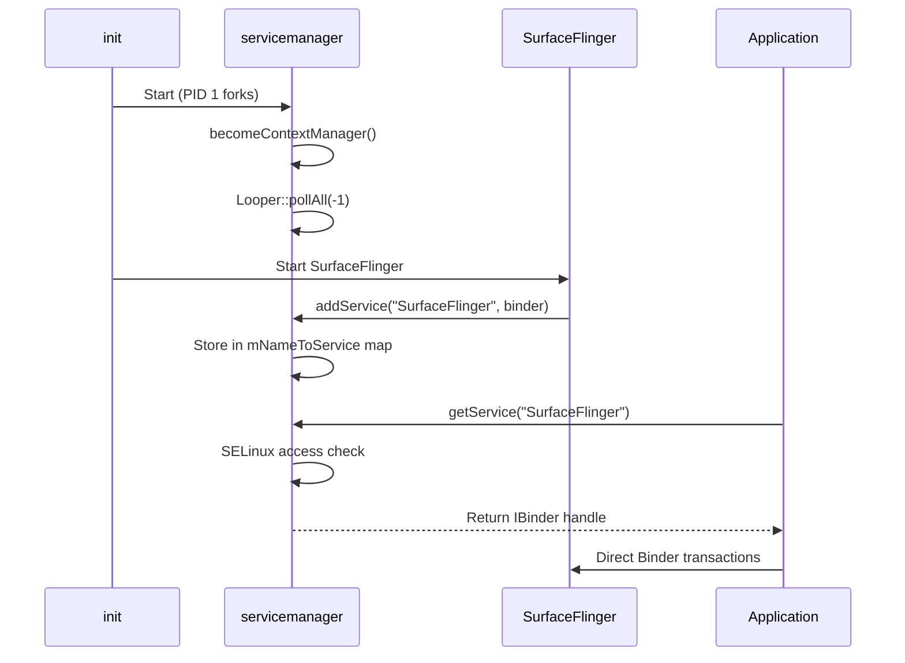

The architecture guarantees that:

- **Registration is authenticated**: `servicemanager` verifies SELinux labels
  before allowing `addService()` or `getService()` calls.
- **Discovery is centralized**: All services are findable through a single
  well-known Binder context.
- **Death notifications propagate**: When a service dies, `servicemanager`
  notifies all registered callbacks.

### 12.1.3 The Standard Service Lifecycle

Every native service follows a common pattern. Let us examine it using the GPU
service as a concrete, minimal example. The entry point is at:

> `frameworks/native/services/gpuservice/main_gpuservice.cpp`

```cpp
int main(int /* argc */, char** /* argv */) {
    signal(SIGPIPE, SIG_IGN);

    // publish GpuService
    sp<GpuService> gpuservice = new GpuService();
    sp<IServiceManager> sm(defaultServiceManager());
    sm->addService(String16(GpuService::SERVICE_NAME), gpuservice, false);

    // limit the number of binder threads to 4.
    ProcessState::self()->setThreadPoolMaxThreadCount(4);

    // start the thread pool
    sp<ProcessState> ps(ProcessState::self());
    ps->startThreadPool();
    ps->giveThreadPoolName();
    IPCThreadState::self()->joinThreadPool();

    return 0;
}
```

This pattern has five steps:

| Step | Code | Purpose |
|------|------|---------|
| 1 | `signal(SIGPIPE, SIG_IGN)` | Prevent crashes from broken pipes |
| 2 | `new GpuService()` | Construct the service object |
| 3 | `sm->addService(...)` | Register with servicemanager |
| 4 | `setThreadPoolMaxThreadCount(N)` | Configure Binder thread pool size |
| 5 | `joinThreadPool()` | Block main thread processing Binder calls |

Some services use a slightly different pattern. The `SensorService` uses the
`BinderService<T>` template, which wraps steps 2-5 into a single call:

> `frameworks/native/services/sensorservice/main_sensorservice.cpp`

```cpp
int main(int /*argc*/, char** /*argv*/) {
    signal(SIGPIPE, SIG_IGN);
    SensorService::publishAndJoinThreadPool();
    return 0;
}
```

The `BinderService<T>::publishAndJoinThreadPool()` template calls
`T::getServiceName()` to determine the registration name, constructs the
service, calls `addService()`, and enters the thread pool.

### 12.1.4 Process Isolation and init.rc Configuration

Each native service is defined in an `.rc` file that `init` parses at boot.
A typical definition looks like:

```
service surfaceflinger /system/bin/surfaceflinger
    class core animation
    user system
    group graphics drmrpc readproc
    capabilities SYS_NICE
    onrestart restart --only-if-running zygote
    task_profiles HighPerformance
```

Key properties:

- **`class`**: Determines when the service starts during boot (e.g., `core`,
  `main`, `late_start`).
- **`user`/`group`**: Linux UID/GID for process isolation.
- **`capabilities`**: Restricted set of Linux capabilities.
- **`onrestart`**: Actions to take when the service is restarted (typically
  cascading restarts of dependent services).
- **`task_profiles`**: cgroup configurations for CPU scheduling.

### 12.1.5 The Three Types of servicemanager

Android actually has three instances of `servicemanager`:

| Instance | Binary | Binder Device | Purpose |
|----------|--------|---------------|---------|
| `servicemanager` | `/system/bin/servicemanager` | `/dev/binder` | Framework services |
| `vndservicemanager` | `/vendor/bin/vndservicemanager` | `/dev/vndbinder` | Vendor HAL services |
| `servicemanager` (recovery) | Built with `__ANDROID_RECOVERY__` | `/dev/binder` | Recovery mode |

The vendor service manager exists to enforce the Treble boundary: vendor
processes cannot directly access framework services and vice versa. This
separation is enforced at the kernel level through distinct Binder device nodes.

### 12.1.6 Binder Thread Pool Sizing

Each native service carefully configures its Binder thread pool size based on
its expected concurrency. The choice matters:

- **Too few threads**: Clients block waiting for a thread, increasing latency.
- **Too many threads**: Wasted memory and context-switching overhead.

Here are the thread pool configurations from actual source code:

| Service | Max Threads | Rationale |
|---------|-------------|-----------|
| `servicemanager` | 0 (Looper-based) | Single-threaded to avoid deadlocks |
| `surfaceflinger` | Varies (usually 4) | VSYNC-driven, limited concurrency |
| `gpuservice` | 4 | Moderate concurrency for stats/queries |
| `media.codec` | 64 | Many parallel codec sessions |
| `installd` | Default (~15) | Multiple concurrent package operations |
| `sensorservice` | Default (~15) | Many concurrent sensor clients |

The `setThreadPoolMaxThreadCount(0)` call in servicemanager deserves special
attention. With zero threads in the pool, all Binder processing happens on
the main thread through the Looper. This is deliberate: servicemanager must
never call synchronously into another service (which could deadlock), so
all its outgoing calls are one-way, and incoming calls are processed
sequentially.

### 12.1.7 Death Notifications and Service Recovery

When a native service crashes, the recovery sequence is:

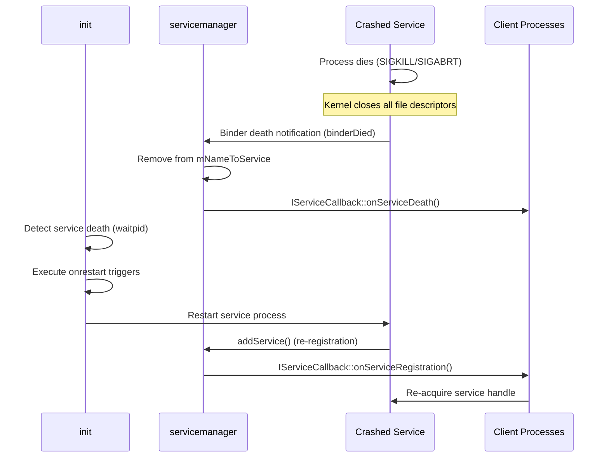

The `onrestart` directive in `.rc` files triggers cascading restarts. For
example, when SurfaceFlinger crashes:

```
onrestart restart --only-if-running zygote
```

This restarts the `zygote` process (and by extension all application
processes), because SurfaceFlinger state is not recoverable -- all layer
handles and buffer queues are lost.

### 12.1.8 Permissions and Capabilities

Native services use multiple layers of security:

1. **Linux UID/GID**: Set by the `user` and `group` directives in `.rc` files.
   For example, SurfaceFlinger runs as `user system` with groups including
   `graphics`, `drmrpc`, and `readproc`.

2. **Linux Capabilities**: Fine-grained privilege control. For example,
   SurfaceFlinger has `SYS_NICE` capability for real-time scheduling:
   ```
   capabilities SYS_NICE
   ```

3. **SELinux Mandatory Access Control**: Every IPC call is checked against
   SELinux policy. The `service_contexts` file maps service names to SELinux
   types:
   ```
   SurfaceFlinger  u:object_r:surfaceflinger_service:s0
   installd        u:object_r:installd_service:s0
   gpu             u:object_r:gpu_service:s0
   ```

4. **seccomp-bpf Sandboxing**: Used by media services to restrict system calls.
   The `SetUpMinijail()` function applies a seccomp filter that limits the
   syscalls the process can make, reducing the attack surface from malicious
   media content.

### 12.1.9 Native Services Map

The following diagram shows the major native services and their relationships:

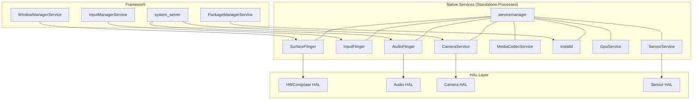

Each arrow represents a Binder connection. The native services sit between the
Java framework above and the HAL implementations below, translating high-level
API calls into hardware operations.

---

## 12.2 SurfaceFlinger

SurfaceFlinger is the **display composition service** -- arguably the most
complex and performance-critical native service in Android. It takes graphical
buffers from every application and system UI component, composites them
together, and presents the result on the display at the correct time
synchronized to the vertical sync (VSYNC) signal.

### 12.2.1 Source Layout

The SurfaceFlinger source tree at `frameworks/native/services/surfaceflinger/`
is massive -- approximately 546 files organized into the following structure:

| Directory | Purpose |
|-----------|---------|
| `CompositionEngine/` | Abstraction for the compositing pipeline |
| `Display/` | Display device management, mode switching |
| `DisplayHardware/` | HWComposer HAL interface, power control |
| `Effects/` | Color correction (Daltonizer for color-blind users) |
| `FrameTracer/` | Per-frame performance tracing |
| `FrontEnd/` | Layer lifecycle, snapshot building, transaction handling |
| `Jank/` | Jank detection and reporting |
| `PowerAdvisor/` | ADPF power hints to the kernel |
| `Scheduler/` | VSYNC prediction, frame scheduling, refresh rate selection |
| `TimeStats/` | Frame timing statistics |
| `Tracing/` | Perfetto integration for layer and transaction tracing |
| `Utils/` | Shared utilities (fences, dumpers) |

The main implementation spans over **10,600 lines** in `SurfaceFlinger.cpp`
alone. The header at `SurfaceFlinger.h` reveals the class hierarchy:

> `frameworks/native/services/surfaceflinger/SurfaceFlinger.h`

```cpp
class SurfaceFlinger : public BnSurfaceComposer,
                       public PriorityDumper,
                       private IBinder::DeathRecipient,
                       private HWC2::ComposerCallback,
                       private ICompositor,
                       private scheduler::ISchedulerCallback,
                       private compositionengine::ICEPowerCallback {
```

SurfaceFlinger inherits from:

- **`BnSurfaceComposer`**: The Binder native implementation of
  `ISurfaceComposer`, the AIDL interface that clients use.
- **`PriorityDumper`**: Supports `dumpsys SurfaceFlinger` with priority-based
  dump sections.
- **`HWC2::ComposerCallback`**: Receives callbacks from the Hardware Composer
  HAL (hotplug, VSYNC, refresh rate changes).
- **`ICompositor`**: The Scheduler's interface for triggering composition.
- **`ISchedulerCallback`**: Receives scheduling decisions (mode changes,
  frame rate updates).

### 12.2.2 High-Level Architecture

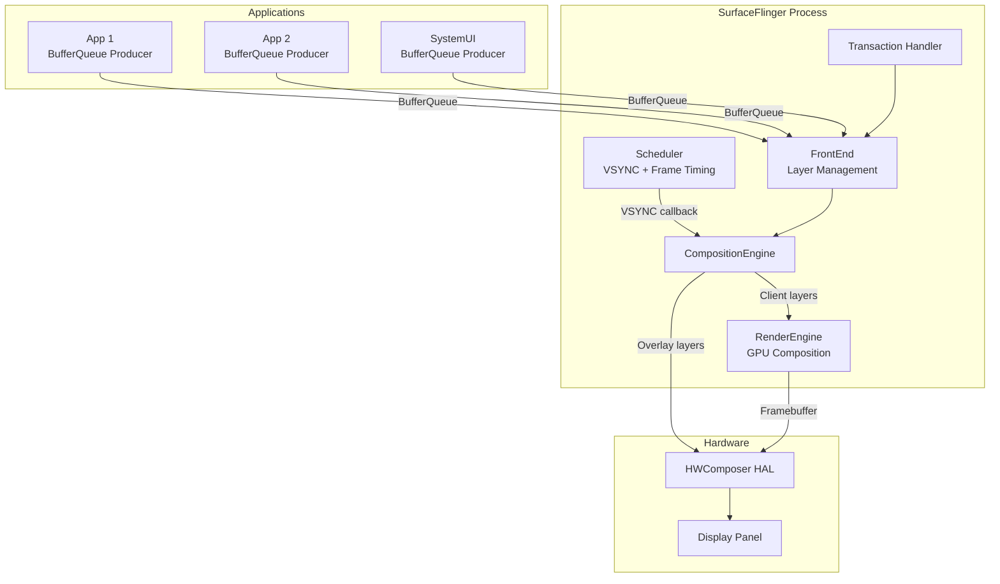

### 12.2.3 The Composition Cycle

SurfaceFlinger's main loop is driven by the Scheduler. On each VSYNC period,
the following steps execute:

1. **Commit Phase** (`commit()`):
   - Apply pending transactions (layer creation, property changes, buffer
     updates).
   - Build layer snapshots from the front-end state.
   - Update the layer tree hierarchy.

2. **Composite Phase** (`composite()`):
   - For each display, determine the visible layer set.
   - Send layers to HWComposer for `validateDisplay()`.
   - HWC decides which layers it can composite in hardware (overlay) and which
     require GPU fallback (client composition).
   - If client composition is needed, use RenderEngine (Skia/OpenGL) to
     render those layers into a framebuffer.
   - Call `presentDisplay()` to submit the final frame to the display.

3. **Post-composition**:
   - Signal release fences to applications so they can reuse buffers.
   - Update frame timing statistics.
   - Send jank metrics if frames were missed.

The key performance insight is that HWC overlay composition is essentially
"free" -- the display hardware composites the layers with zero GPU cost. GPU
composition is the fallback for layers that HWC cannot handle (e.g., complex
blending modes, too many layers, color space conversion).

### 12.2.4 Layer Management

A **Layer** represents a rectangular region of graphical content.
Each layer has:

- A **BufferQueue** for receiving graphic buffers from the producer.
- A **drawing state** and **current state** (double-buffered to allow
  concurrent updates).
- Geometric properties: position, size, crop, transform, z-order.
- Visual properties: alpha, color, blend mode, color space.

From `frameworks/native/services/surfaceflinger/Layer.cpp`:

```cpp
Layer::Layer(const surfaceflinger::LayerCreationArgs& args)
      : sequence(args.sequence),
        mFlinger(sp<SurfaceFlinger>::fromExisting(args.flinger)),
        mName(base::StringPrintf("%s#%d", args.name.c_str(), sequence)),
        mWindowType(static_cast<WindowInfo::Type>(
                args.metadata.getInt32(gui::METADATA_WINDOW_TYPE, 0))) {
    ALOGV("Creating Layer %s", getDebugName());

    mDrawingState.crop = {0, 0, -1, -1};
    mDrawingState.sequence = 0;
    mDrawingState.transform.set(0, 0);
    mDrawingState.frameNumber = 0;
    // ...
}
```

The `FrontEnd/` subsystem manages the layer lifecycle through:

- **`LayerLifecycleManager`**: Tracks creation and destruction.
- **`LayerSnapshotBuilder`**: Produces immutable snapshots for the composition
  engine, avoiding lock contention between the transaction thread and the
  composition thread.
- **`TransactionHandler`**: Queues and applies transactions atomically.

SurfaceFlinger enforces a maximum of 4096 layers (`MAX_LAYERS = 4096`) to
prevent resource exhaustion.

### 12.2.5 The Scheduler and VSYNC

The Scheduler subsystem at `frameworks/native/services/surfaceflinger/Scheduler/`
is responsible for:

- **VSYNC prediction**: Using `VSyncPredictor` to estimate future VSYNC
  timestamps based on historical data.
- **Refresh rate selection**: Choosing the optimal display refresh rate
  (60Hz, 90Hz, 120Hz, etc.) based on active layer frame rates.
- **Frame scheduling**: Waking SurfaceFlinger at the right time before
  VSYNC to perform composition.

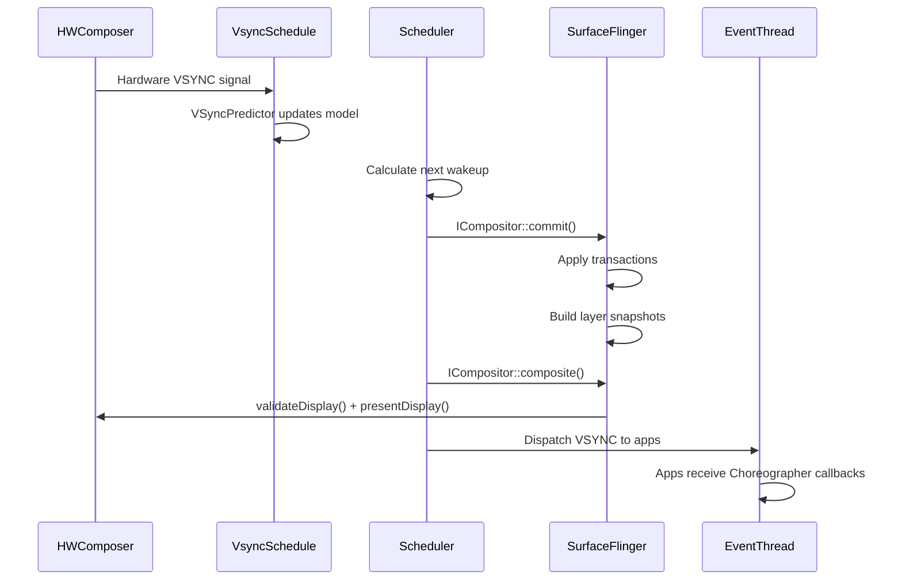

Key classes:

- **`Scheduler`** (`Scheduler.h`): Coordinates all timing. Inherits from both
  `IEventThreadCallback` and `MessageQueue`.
- **`VSyncPredictor`** (`VSyncPredictor.cpp`): Fits a linear model to hardware
  VSYNC timestamps to predict future events.
- **`VSyncDispatchTimerQueue`** (`VSyncDispatchTimerQueue.cpp`): Manages
  timer-based wakeups for different VSYNC clients.
- **`RefreshRateSelector`** (`RefreshRateSelector.cpp`): Chooses the display
  mode (refresh rate + resolution) that best satisfies all active layers.
- **`EventThread`** (`EventThread.cpp`): Delivers VSYNC events to applications
  via `DisplayEventConnection`.

### 12.2.6 HWComposer HAL Relationship

SurfaceFlinger communicates with the display hardware through the HWComposer
HAL (Hardware Composer). The interface is defined as an AIDL HAL at:

```
hardware/interfaces/graphics/composer/aidl/
```

The `HWComposer` wrapper class (`DisplayHardware/HWComposer.h`) translates
SurfaceFlinger's internal representation into HAL calls:


The critical HAL operations are:

| HAL Method | Purpose |
|-----------|---------|
| `createLayer()` | Allocate a hardware overlay plane |
| `setLayerBuffer()` | Assign a graphic buffer to a layer |
| `setLayerCompositionType()` | Mark as DEVICE (overlay) or CLIENT (GPU) |
| `validateDisplay()` | Ask HWC to evaluate the layer stack |
| `acceptDisplayChanges()` | Accept HWC's composition type decisions |
| `presentDisplay()` | Submit the frame for display |
| `getReleaseFences()` | Get fences for buffer recycling |

### 12.2.7 The CompositionEngine

The `CompositionEngine` (at `CompositionEngine/`) is the abstraction that
decouples the composition algorithm from the SurfaceFlinger policy logic.
It processes a set of `CompositionRefreshArgs` and produces a composited
frame for each display.

The composition flow within the engine:

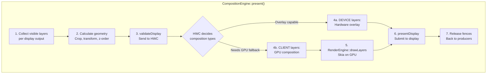

Each `Output` in the composition engine represents a display or virtual
display. The engine's `OutputLayer` objects wrap individual layer snapshots
with display-specific composition state (e.g., the composition type that
HWC assigned to that layer on that display).

**Predictive Composition Strategy**

A modern optimization is predictive composition, controlled by the flag:

```cpp
// If set, composition engine tries to predict the composition strategy
// provided by HWC based on the previous frame. If the strategy can be
// predicted, gpu composition will run parallel to the hwc validateDisplay
// call and re-run if the prediction is incorrect.
bool mPredictCompositionStrategy = false;
```

When enabled, the composition engine predicts which layers will require GPU
fallback based on the previous frame's HWC decisions. It starts GPU
composition in parallel with the `validateDisplay()` call. If the prediction
is correct, the GPU work is already done when `validateDisplay()` returns,
saving a full frame of latency for the GPU composition path.

### 12.2.8 RenderEngine: GPU Composition

When HWC cannot composite all layers (too many layers, unsupported blend modes,
color space conversion needed), SurfaceFlinger uses RenderEngine for GPU-based
composition. RenderEngine is implemented using:

- **Skia**: The primary rendering backend, using Vulkan or GLES.
- **Threaded rendering**: RenderEngine can operate on a dedicated thread to
  avoid blocking the main composition thread.

The key RenderEngine operation is `drawLayers()`, which takes a set of layer
settings (source buffer, geometry, blend mode, color matrix) and composites
them into a single output buffer that is then passed to HWC as a "client
target" layer.

### 12.2.9 Transaction Model

Applications modify layer properties through **transactions**. A transaction
is an atomic set of changes that are applied together:

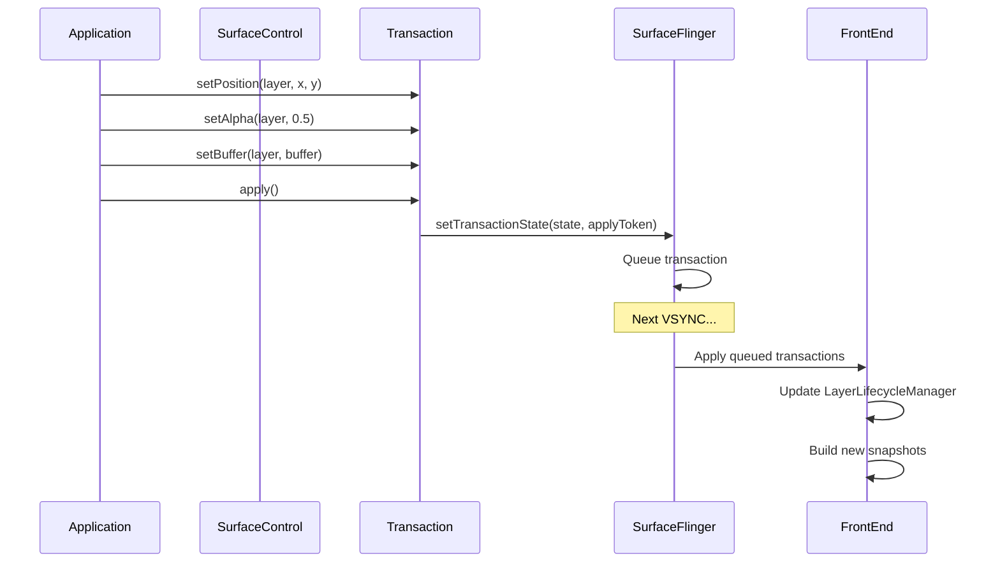

The `TransactionHandler` manages a queue of pending transactions. Transactions
can be:

- **Immediate**: Applied at the next VSYNC.
- **Deferred**: Applied at a future frame number or when a barrier fence
  signals.
- **Synchronized**: Multiple transactions applied atomically across different
  surfaces.

The `LayerLifecycleManager` is particularly noteworthy:

> `frameworks/native/services/surfaceflinger/FrontEnd/LayerLifecycleManager.h`

```cpp
// Owns a collection of RequestedLayerStates and manages their lifecycle
// and state changes.
//
// RequestedLayerStates are tracked and destroyed if they have no parent
// and no handle left to keep them alive.
class LayerLifecycleManager {
public:
    void addLayers(std::vector<std::unique_ptr<RequestedLayerState>>);
    void applyTransactions(const std::vector<QueuedTransactionState>&,
                           bool ignoreUnknownLayers = false);
    void onHandlesDestroyed(const std::vector<std::pair<uint32_t,
                            std::string>>&,
                            bool ignoreUnknownHandles = false);
    void fixRelativeZLoop(uint32_t relativeRootId);
    void commitChanges();
    // ...
};
```

### 12.2.10 HWComposer Callbacks

SurfaceFlinger receives several callbacks from the HWComposer HAL:

```cpp
// HWC2::ComposerCallback overrides:
void onComposerHalVsync(hal::HWDisplayId, nsecs_t timestamp,
                        std::optional<hal::VsyncPeriodNanos>) override;
void onComposerHalHotplugEvent(hal::HWDisplayId,
                                DisplayHotplugEvent) override;
void onComposerHalRefresh(hal::HWDisplayId) override;
void onComposerHalVsyncPeriodTimingChanged(hal::HWDisplayId,
                        const hal::VsyncPeriodChangeTimeline&) override;
void onComposerHalSeamlessPossible(hal::HWDisplayId) override;
void onComposerHalVsyncIdle(hal::HWDisplayId) override;
void onRefreshRateChangedDebug(
                        const RefreshRateChangedDebugData&) override;
void onComposerHalHdcpLevelsChanged(hal::HWDisplayId,
                        const HdcpLevels& levels) override;
```

| Callback | Trigger | SurfaceFlinger Response |
|----------|---------|------------------------|
| `onVsync` | Hardware VSYNC pulse | Updates VSyncPredictor model |
| `onHotplugEvent` | Display connected/disconnected | Creates/destroys DisplayDevice |
| `onRefresh` | HWC requests a refresh | Schedules immediate composition |
| `onVsyncPeriodTimingChanged` | Refresh rate change in progress | Updates timing parameters |
| `onVsyncIdle` | Display has gone idle (VRR) | Adjusts scheduling for idle |
| `onHdcpLevelsChanged` | HDCP protection level change | Updates content protection state |

### 12.2.11 The ISurfaceComposer API

SurfaceFlinger exposes a rich API through the `ISurfaceComposer` AIDL
interface. Key method categories include:

**Display Management**:

- `createVirtualDisplay()` / `destroyVirtualDisplay()`
- `getPhysicalDisplayIds()` / `getPhysicalDisplayToken()`
- `setDesiredDisplayModeSpecs()` (refresh rate policy)
- `setPowerMode()` (ON, OFF, DOZE, DOZE_SUSPEND)
- `setDisplayBrightness()`

**Layer Operations**:

- `setTransactionState()` (the primary channel for all layer changes)
- `setFrameRate()` (per-surface frame rate preference)
- `setGameModeFrameRateOverride()` (game-specific overrides)

**Screen Capture**:

- `captureDisplay()` (screenshot of a display)
- `captureLayers()` (screenshot of specific layers)

**Monitoring**:

- `addFpsListener()` / `addHdrLayerInfoListener()`
- `addRegionSamplingListener()` (brightness sampling for auto-brightness)
- `addWindowInfosListener()` (window info updates for InputFlinger)

### 12.2.12 Variable Refresh Rate (VRR) Support

Modern displays support Variable Refresh Rate (VRR), where the display's
refresh period can change dynamically. SurfaceFlinger handles this through:

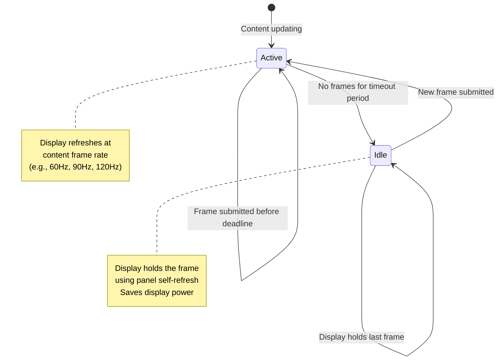

The `VsyncSchedule` class manages VRR-aware scheduling:

- When content is actively updating, VSYNC runs at the content's frame rate.
- When no new content arrives, the display enters idle mode and
  `onComposerHalVsyncIdle()` is called.
- The `vrrDisplayIdle()` callback informs the scheduler to stop unnecessary
  wakeups.
- The `KernelIdleTimerController` manages the display's idle timer in the
  kernel, which can put the display panel into a low-power self-refresh mode.

The `VsyncModulator` adjusts VSYNC offsets based on workload:

```cpp
class VsyncModulator {
    // Early offset: Used when SurfaceFlinger needs to wake up earlier
    // (e.g., when a touch event arrives and we expect new frames)
    VsyncConfig mEarlyConfig;

    // Late offset: Used during normal operation when the workload
    // is predictable
    VsyncConfig mLateConfig;

    // Early for GPU composition: Used when we expect GPU fallback
    VsyncConfig mEarlyGpuConfig;
};
```

### 12.2.13 Latch Unsignaled

The `LatchUnsignaledConfig` controls whether SurfaceFlinger can latch
(use) a buffer before its acquire fence has signaled:

```cpp
enum class LatchUnsignaledConfig {
    Disabled,           // Never latch unsignaled buffers
    AutoSingleLayer,    // Latch unsignaled only for single-layer
                        // buffer-only updates
    Always,             // Always latch unsignaled (risky)
};
```

The `AutoSingleLayer` mode is the production default. When a single layer
submits a buffer update with no other pending transactions, SurfaceFlinger
passes the buffer's acquire fence directly to HWC. If the fence signals
before the display's deadline, the frame is displayed; otherwise, the
display shows the previous frame. This reduces latency by one frame for
simple buffer updates.

### 12.2.14 Power Management

SurfaceFlinger integrates with Android's power management through:

1. **PowerAdvisor**: Communicates with the `PowerHAL` to send ADPF
   (Android Dynamic Performance Framework) hints. Before composition,
   SurfaceFlinger reports the expected workload duration; after composition,
   it reports the actual duration. The power HAL uses this information to
   adjust CPU/GPU frequencies.

2. **Display Power Modes**: SurfaceFlinger controls display power states:
   - `OFF`: Display is off, SurfaceFlinger stops compositing.
   - `ON`: Normal operation.
   - `DOZE`: Ambient display (low power, low brightness).
   - `DOZE_SUSPEND`: Like DOZE but SurfaceFlinger stops compositing
     (the display controller shows a static image).

3. **CPU Load Notification**: The `ICEPowerCallback::notifyCpuLoadUp()`
   callback warns the power system when the CPU load is about to increase
   (e.g., a burst of transactions is being processed).

### 12.2.15 Display Brightness and Color Management

SurfaceFlinger manages the display's color pipeline:

- **Wide color gamut**: Supports Display-P3 and BT.2020 color spaces.
  The `defaultCompositionDataspace` and `wideColorGamutCompositionDataspace`
  control the rendering color space.

- **HDR**: Manages HDR content compositing, including SDR-to-HDR and
  HDR-to-SDR tone mapping. The `HdrLayerInfoReporter` notifies interested
  clients when HDR content is on screen.

- **Color matrix**: A 4x4 color transformation matrix can be applied to the
  entire display output for accessibility features (color inversion,
  daltonizer for color blindness).

- **Region sampling**: The `RegionSamplingThread` samples pixel values from
  a specified screen region, used by the status bar to adjust its text color
  for readability against the background content.

### 12.2.16 Boot Stages

SurfaceFlinger tracks three boot stages:

```cpp
enum class BootStage {
    BOOTLOADER,     // Display showing bootloader splash
    BOOTANIMATION,  // Boot animation playing
    FINISHED,       // System fully booted
};
```

During `BOOTLOADER` stage, SurfaceFlinger initializes but does not yet drive
the display. Once `BOOTANIMATION` starts, SurfaceFlinger begins compositing
the boot animation frames. When `bootFinished()` is called by
`system_server`, the stage transitions to `FINISHED` and normal operation
begins.

### 12.2.17 Cross-References

SurfaceFlinger is deeply intertwined with the graphics pipeline covered in
other chapters:

- **Chapter 9 (Graphics Render Pipeline)**: The BufferQueue producer-consumer
  model that feeds buffers to SurfaceFlinger.
- **Chapter 5 (HAL)**: The HWComposer HAL interface and its AIDL definition.
- **Chapters 16-17 (Graphics Deep Dive)**: Detailed coverage of the
  CompositionEngine, RenderEngine (Skia), and the frame-by-frame compositing
  algorithm.

---

## 12.3 InputFlinger

InputFlinger processes all user input -- touch events, key presses, stylus
strokes, mouse movements, gamepad buttons -- and routes them to the correct
application window. It is one of the most latency-sensitive services in
Android; even a few extra milliseconds of delay is perceptible to users.

### 12.3.1 Source Layout

The InputFlinger source lives at
`frameworks/native/services/inputflinger/` and is organized into:

| Directory | Purpose |
|-----------|---------|
| `reader/` | EventHub + InputReader: reads raw kernel events |
| `dispatcher/` | InputDispatcher: routes events to windows |
| `reporter/` | Reports input events (for accessibility) |
| `trace/` | Perfetto tracing integration |
| `rust/` | Rust FFI components via `IInputFlingerRust` |
| `aidl/` | AIDL interface definitions |
| Root files | InputManager, filters, blockers, choreographer |

### 12.3.2 The Input Pipeline

The comment in `InputManager.cpp` describes the complete pipeline:

> `frameworks/native/services/inputflinger/InputManager.cpp`

```cpp
/**
 * The event flow is via the "InputListener" interface, as follows:
 *   InputReader
 *     -> UnwantedInteractionBlocker
 *     -> InputFilter
 *     -> PointerChoreographer
 *     -> InputProcessor
 *     -> InputDeviceMetricsCollector
 *     -> InputDispatcher
 */
```

Let us trace this pipeline from hardware to application:

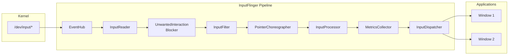

### 12.3.3 EventHub: Reading Raw Events

The EventHub is the lowest layer of the input stack. It:

1. Monitors `/dev/input/` using `inotify` for device hotplug events.
2. Opens input device nodes and reads `struct input_event` via `epoll`.
3. Identifies device capabilities (keyboard, touchscreen, mouse, etc.).
4. Maps key codes using Key Layout Map (`.kl`) and Key Character Map (`.kcm`)
   files.

From `frameworks/native/services/inputflinger/reader/EventHub.cpp`:

```cpp
static const char* DEVICE_INPUT_PATH = "/dev/input";
// v4l2 devices go directly into /dev
static const char* DEVICE_PATH = "/dev";

static constexpr size_t EVENT_BUFFER_SIZE = 256;

// Logs if the difference between the event timestamp and the read time is
// greater than this threshold.
static constexpr nsecs_t SLOW_READ_LOG_THRESHOLD_NS = ms2ns(100);
```

The EventHub uses `epoll` to efficiently wait on multiple device file
descriptors simultaneously. When an event arrives on any device, `epoll_wait()`
returns and the EventHub reads up to `EVENT_BUFFER_SIZE` (256) raw events in
a batch.

Each raw event is a Linux `struct input_event`:

```c
struct input_event {
    struct timeval time;  // Kernel timestamp
    __u16 type;           // EV_KEY, EV_ABS, EV_REL, EV_SYN, ...
    __u16 code;           // KEY_A, ABS_MT_POSITION_X, ...
    __s32 value;          // Key state, coordinate value, ...
};
```

### 12.3.4 InputReader: Interpreting Raw Events

The InputReader runs in its own thread and consumes raw events from EventHub.
It maintains a set of **InputDevice** objects, each containing one or more
**InputMapper** instances:

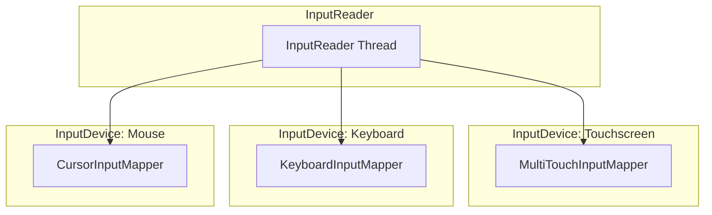

Key InputMapper types (in `reader/mapper/`):

| Mapper | Input Type | Output |
|--------|-----------|--------|
| `KeyboardInputMapper` | `EV_KEY` events | `NotifyKeyArgs` |
| `MultiTouchInputMapper` | `EV_ABS` multi-touch protocol | `NotifyMotionArgs` |
| `SingleTouchInputMapper` | `EV_ABS` single-touch protocol | `NotifyMotionArgs` |
| `CursorInputMapper` | `EV_REL` relative movement | `NotifyMotionArgs` |
| `TouchpadInputMapper` | Touchpad gestures | `NotifyMotionArgs` |
| `RotaryEncoderInputMapper` | Rotary encoder (watches, cars) | `NotifyMotionArgs` |
| `SwitchInputMapper` | `EV_SW` switch events (lid, headset) | `NotifySwitchArgs` |
| `VibratorInputMapper` | Force feedback / haptics | Haptic control |

Sub-device detection merges multiple Linux input device nodes that represent a
single physical device (e.g., a keyboard with an integrated touchpad):

```cpp
bool isSubDevice(const InputDeviceIdentifier& identifier1,
                 const InputDeviceIdentifier& identifier2) {
    return (identifier1.vendor == identifier2.vendor &&
            identifier1.product == identifier2.product &&
            identifier1.bus == identifier2.bus &&
            identifier1.version == identifier2.version &&
            identifier1.uniqueId == identifier2.uniqueId &&
            identifier1.location == identifier2.location);
}
```

### 12.3.5 Pipeline Stages

After the InputReader produces `NotifyArgs` (either `NotifyKeyArgs` or
`NotifyMotionArgs`), the events flow through several processing stages:

**UnwantedInteractionBlocker**

Removes unintentional touches, particularly palm touches on touchscreens.
When a large contact area is detected at the edge of the screen, the blocker
either removes individual pointers or suppresses the entire touch sequence.

**InputFilter**

Applies filtering rules defined by the system. This is used for accessibility
features (e.g., slow keys, sticky keys) and for the `InputFilter` AIDL
interface that allows the Rust component to apply additional filtering logic:

```cpp
mInputFilter = std::make_unique<InputFilter>(
    *mTracingStages.back(), *mInputFlingerRust,
    inputFilterPolicy, env);
```

**PointerChoreographer**

Manages pointer icons and their positions. For touchpad and mouse input, it
determines which display the pointer appears on and applies any coordinate
transformations needed for multi-display setups.

**InputProcessor**

Communicates with the device-specific `IInputProcessor` HAL to apply
hardware-assisted event classification. For example, the HAL might classify
a touch gesture as a palm rejection candidate.

**InputDeviceMetricsCollector**

Gathers usage statistics per input device: how often each device is used,
latency measurements, and interaction patterns. This data feeds into the
system's telemetry pipeline.

### 12.3.6 InputDispatcher: Routing to Windows

The InputDispatcher is the final and most complex stage. It runs in its own
thread and is responsible for:

1. **Window targeting**: Determining which window(s) should receive each event
   based on touch coordinates and the window hierarchy.
2. **Focus management**: Tracking which window has input focus for key events.
3. **ANR detection**: Monitoring whether windows respond to events within the
   timeout window (typically 5 seconds).
4. **Event injection**: Supporting programmatic event injection for testing.

From the header comment in `frameworks/native/services/inputflinger/dispatcher/InputDispatcher.h`:

```cpp
/* Dispatches events to input targets. Some functions of the input
 * dispatcher, such as identifying input targets, are controlled by a
 * separate policy object.
 *
 * IMPORTANT INVARIANT:
 *     Because the policy can potentially block or cause re-entrance
 *     into the input dispatcher, the input dispatcher never calls
 *     into the policy while holding its internal locks.
 */
class InputDispatcher : public android::InputDispatcherInterface {
```

The dispatcher maintains several key data structures:

| Data Structure | Purpose |
|----------------|---------|
| `mInboundQueue` | Incoming events waiting to be dispatched |
| `mConnectionsByToken` | Maps window tokens to `Connection` objects |
| `TouchState` (per display) | Tracks ongoing touch sequences |
| `FocusResolver` | Determines the focused window |
| `AnrTracker` | Monitors response timeouts |

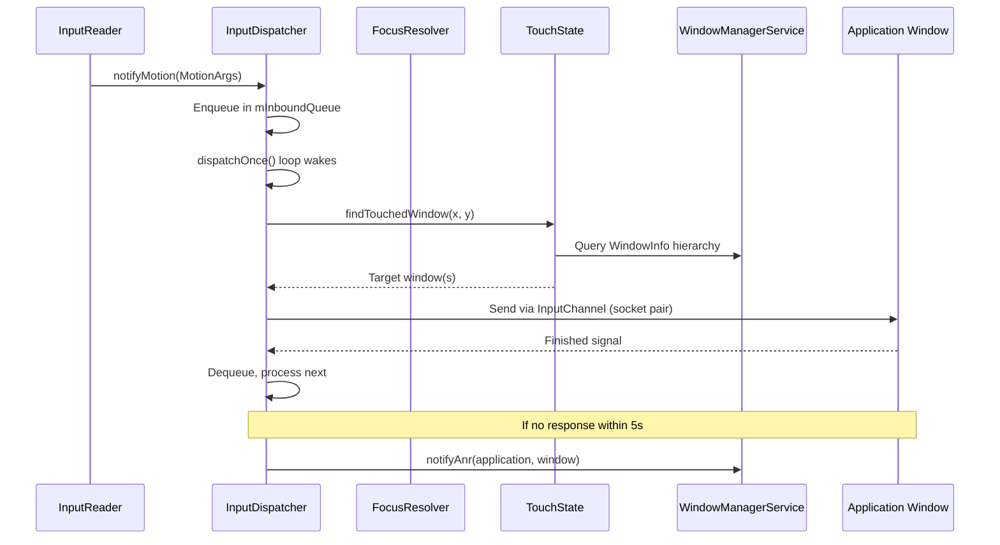

### 12.3.7 Dispatcher Event Types

The InputDispatcher processes several types of events, defined in
`frameworks/native/services/inputflinger/dispatcher/Entry.h`:

```cpp
struct EventEntry {
    enum class Type {
        DEVICE_RESET,             // Input device was reset
        FOCUS,                    // Focus changed to a new window
        KEY,                      // Keyboard key press/release
        MOTION,                   // Touch, mouse, trackpad motion
        SENSOR,                   // Sensor event (rare)
        POINTER_CAPTURE_CHANGED,  // Pointer capture mode changed
        DRAG,                     // Drag-and-drop state change
        TOUCH_MODE_CHANGED,       // Touch mode toggled

        ftl_last = TOUCH_MODE_CHANGED
    };

    int32_t id;
    Type type;
    nsecs_t eventTime;
    uint32_t policyFlags;
    std::shared_ptr<InjectionState> injectionState;
    mutable bool dispatchInProgress;

    // Injected events are from external (untrusted) sources
    inline bool isInjected() const { return injectionState != nullptr; }

    // Synthesized events aren't directly from hardware
    inline bool isSynthesized() const {
        return isInjected() ||
            IdGenerator::getSource(id) != IdGenerator::Source::INPUT_READER;
    }
};
```

Key specializations include:

- **`KeyEntry`**: Contains `deviceId`, `source`, `displayId`, `action`,
  `keyCode`, `scanCode`, `metaState`, `repeatCount`, and `flags`.
- **`MotionEntry`**: Contains pointer data arrays (`PointerProperties`,
  `PointerCoords`), `action`, `actionButton`, `edgeFlags`, `xPrecision`,
  `yPrecision`, and `classification` (e.g., palm, ambiguous).

### 12.3.8 Focus Management

The `FocusResolver` class tracks which window has input focus on each display:

> `frameworks/native/services/inputflinger/dispatcher/FocusResolver.h`

```cpp
// Focus Policy:
//   Window focusability - A window token can be focused if there is
//   at least one window handle that is visible with the same token
//   and all window handles with the same token are focusable.
//
//   Focus request - Granted if the window is focusable. If not,
//   persisted and granted when it becomes focusable.
//
//   Conditional focus request - Granted only if the specified focus
//   token is currently focused. Otherwise dropped.
class FocusResolver {
public:
    sp<IBinder> getFocusedWindowToken(
        ui::LogicalDisplayId displayId) const;

    struct FocusChanges {
        sp<IBinder> oldFocus;
        sp<IBinder> newFocus;
        ui::LogicalDisplayId displayId;
        std::string reason;
    };
    // ...
private:
    enum class Focusability {
        OK,
        NO_WINDOW,
        NOT_FOCUSABLE,
        NOT_VISIBLE,
    };
};
```

Focus changes generate `FocusEntry` events that are dispatched through the
same pipeline as key and motion events. This ensures focus changes are
ordered correctly with respect to the events that triggered them.

### 12.3.9 ANR (Application Not Responding) Detection

The InputDispatcher monitors whether applications respond to dispatched
events within the timeout window. The `AnrTracker` maintains per-connection
deadlines:

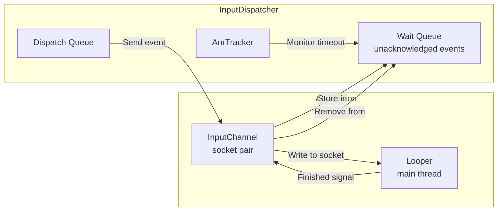

If an application does not send a `finished` signal within 5 seconds (the
default ANR timeout), the dispatcher notifies the policy:

1. The policy (InputManagerService in system_server) shows the ANR dialog.
2. The user can choose to wait or force-close the application.
3. If force-closed, all pending events for that window are cancelled.

### 12.3.10 Touch State Tracking

The `TouchState` class tracks ongoing multi-touch interactions per display:

- Which windows are currently being touched.
- The set of "touched windows" -- windows that received `ACTION_DOWN` and
  should continue receiving motion events until `ACTION_UP`.
- Split motion support -- a single touch stream can be split across multiple
  windows (e.g., when dragging across a window boundary).
- Pointer ID tracking for multi-touch disambiguation.

The `TouchedWindow` class stores per-window touch information:

```
frameworks/native/services/inputflinger/dispatcher/TouchedWindow.h
frameworks/native/services/inputflinger/dispatcher/TouchState.h
```

### 12.3.11 InputChannels and Transport

Events are delivered to applications through **InputChannels** -- pairs of
Unix domain sockets. One end is held by the InputDispatcher, and the other
is passed to the application process. The `InputTransport` protocol defines
a binary message format that is zero-copy optimized:

- **`InputMessage::Type::MOTION`**: Touch/mouse events with coordinates.
- **`InputMessage::Type::KEY`**: Keyboard events with key codes.
- **`InputMessage::Type::FINISHED`**: Application acknowledges receipt.
- **`InputMessage::Type::TIMELINE`**: Frame timing feedback.

The socket-based transport avoids the overhead of Binder IPC for the
high-frequency input event stream. A typical touch screen generates events
at 120-240 Hz, and Binder round-trips would add unacceptable latency.

### 12.3.12 Event Injection

InputDispatcher supports event injection for testing and accessibility:

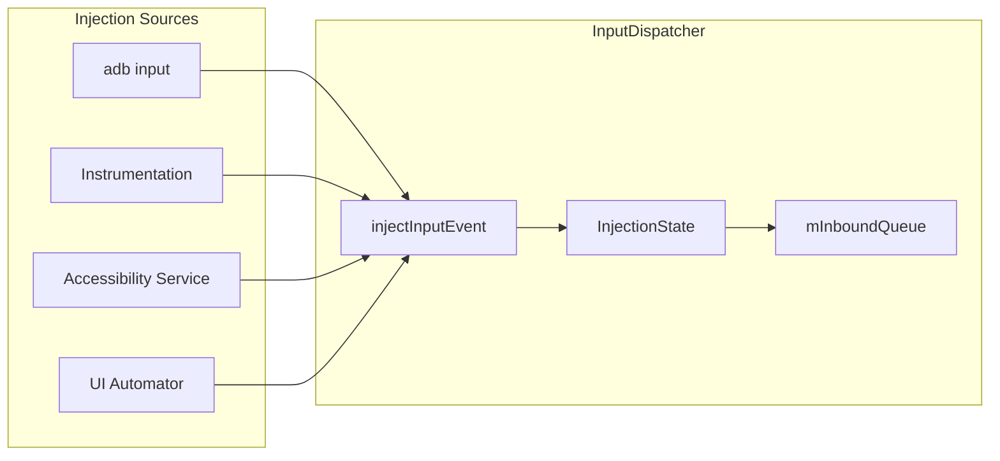

Injected events are tagged with `POLICY_FLAG_INJECTED` and tracked through
an `InjectionState` object. The dispatcher can wait for the injection to
complete (synchronous mode) or return immediately (asynchronous mode).

Permission checking ensures that only privileged callers can inject events:

- `INJECT_EVENTS` permission for general injection.
- Accessibility services have special injection privileges for the
  accessibility overlay.
- `adb shell input` uses the shell UID's injection permissions.

### 12.3.13 Latency Tracking

The InputDispatcher includes a `LatencyTracker` that measures end-to-end
input latency:

```
// From LatencyTracker.h / LatencyAggregator.h
// Tracks the timeline for each event:
// 1. Event creation time (kernel timestamp)
// 2. Event read time (EventHub)
// 3. Dispatch time (InputDispatcher)
// 4. Delivery time (written to InputChannel)
// 5. Consumption time (app reads from channel)
// 6. Finish time (app sends finished signal)
// 7. Graphics latency (frame presented on display)
```

The `LatencyAggregatorWithHistograms` produces histogram data that is
reported to the system's telemetry pipeline, enabling:

- Detection of apps with consistently high input latency.
- Identification of systemic latency regressions.
- Device-level input performance benchmarking.

### 12.3.14 The Rust Component

A notable architectural evolution in the current AOSP is the introduction of
Rust into the input pipeline via `IInputFlingerRust`:

```cpp
// Create the Rust component of InputFlinger that uses AIDL interfaces
// as the foreign function interface (FFI).
std::shared_ptr<IInputFlingerRust> createInputFlingerRust() {
    // ...
    create_inputflinger_rust(binderToPointer(*callback));
    // ...
}
```

The Rust implementation is bootstrapped through a C++ callback pattern:

1. C++ creates a `BnInputFlingerRustBootstrapCallback`.
2. Calls the CXX bridge function `create_inputflinger_rust()`.
3. The Rust side creates the `IInputFlingerRust` implementation.
4. Passes it back to C++ through the callback.

This hybrid approach allows new input filtering and processing logic to be
written in Rust (with its memory safety guarantees) while maintaining the
existing C++ infrastructure.

### 12.3.15 The InputManager Binding

The `InputManager` class ties everything together and implements the
`BnInputFlinger` Binder interface:

> `frameworks/native/services/inputflinger/InputManager.h`

```cpp
class InputManager : public InputManagerInterface, public BnInputFlinger {
private:
    std::unique_ptr<InputReaderInterface> mReader;
    std::unique_ptr<UnwantedInteractionBlockerInterface> mBlocker;
    std::unique_ptr<InputFilterInterface> mInputFilter;
    std::unique_ptr<PointerChoreographerInterface> mChoreographer;
    std::unique_ptr<InputProcessorInterface> mProcessor;
    std::unique_ptr<InputDeviceMetricsCollectorInterface> mCollector;
    std::unique_ptr<InputDispatcherInterface> mDispatcher;
    std::shared_ptr<IInputFlingerRust> mInputFlingerRust;
    std::vector<std::unique_ptr<TracedInputListener>> mTracingStages;
};
```

The `start()` method launches the reader and dispatcher threads:

```cpp
status_t InputManager::start() {
    status_t result = mDispatcher->start();
    if (result) {
        ALOGE("Could not start InputDispatcher thread due to error %d.", result);
        return result;
    }
    result = mReader->start();
    if (result) {
        ALOGE("Could not start InputReader due to error %d.", result);
        mDispatcher->stop();
        return result;
    }
    return OK;
}
```

The InputManager is not a standalone process -- it is created and owned by
`InputManagerService` in `system_server` via JNI. However, the entire C++
pipeline runs in native threads within `system_server`'s process.

---

## 12.4 AudioFlinger Overview

AudioFlinger is the native service responsible for mixing and routing audio
streams. It runs as a standalone process (`audioserver`) and is one of the
most mature native services in Android, with roots going back to the earliest
versions of the platform.

### 12.4.1 Source Location

The AudioFlinger implementation lives at:

```
frameworks/av/services/audioflinger/
```

Key files include:

| File | Purpose |
|------|---------|
| `AudioFlinger.h` / `.cpp` | Main service implementation |
| `Threads.h` / `.cpp` | Playback and recording thread management |
| `Tracks.cpp` | Audio track lifecycle and mixing |
| `Effects.h` / `.cpp` | Audio effect chain processing |
| `PatchPanel.h` / `.cpp` | Audio routing patch management |
| `MelReporter.h` / `.cpp` | Sound dose measurement (Media Exposure Limit) |
| `DeviceEffectManager.h` / `.cpp` | Per-device audio effects |
| `Client.h` / `.cpp` | Per-client state tracking |

### 12.4.2 Architecture Overview

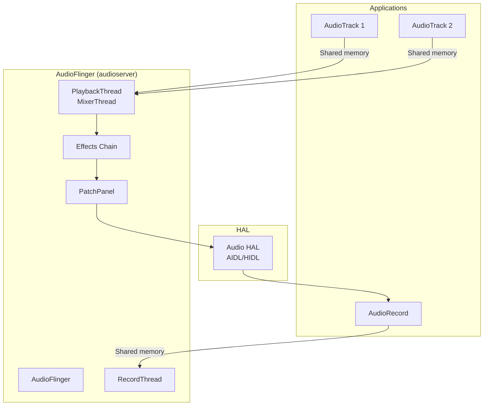

AudioFlinger uses shared memory (ashmem/memfd) buffers for zero-copy audio
data transfer between applications and the mixer threads. This is critical
for maintaining low audio latency.

The thread model is based on specialized thread classes:

- **`MixerThread`**: The most common playback thread. Mixes multiple audio
  tracks using a software mixer (or offloads to hardware).
- **`DirectOutputThread`**: Sends a single track directly to the HAL without
  software mixing (used for compressed audio passthrough).
- **`OffloadThread`**: For hardware-offloaded audio decoding and playback.
- **`RecordThread`**: Captures audio from input devices.
- **`MmapThread`**: Uses memory-mapped I/O for ultra-low-latency paths (AAudio
  MMAP mode).

### 12.4.3 The AudioFlinger Thread Model

AudioFlinger's thread architecture is central to understanding its design.
Each audio output device (speaker, headphones, Bluetooth, USB) typically
has one or more dedicated threads:

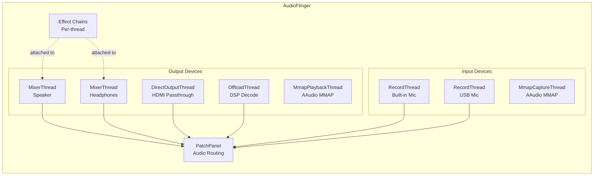

**MixerThread** is the workhorse. It runs in a tight loop:

1. Wait for the next buffer period (typically 5-20ms).
2. Pull data from all active `Track` objects (via shared memory ring buffers).
3. Mix all tracks together, applying per-track volume, pan, and aux effects.
4. Apply output effects (equalizer, bass boost, virtualizer, etc.).
5. Write the mixed buffer to the Audio HAL.

**DirectOutputThread** bypasses the mixer for formats that should not be
mixed (e.g., compressed audio sent to an HDMI receiver for decoding).

**OffloadThread** delegates decoding to the audio DSP, allowing the
application processor to sleep during playback. This is critical for
battery life during music playback.

**MmapThread** provides the lowest possible latency by mapping the HAL's
buffer directly into the application's address space, eliminating all
copy operations. This is used by the AAudio MMAP mode for pro audio
applications.

### 12.4.4 Shared Memory Audio Transport

AudioFlinger uses shared memory for zero-copy audio data transfer:

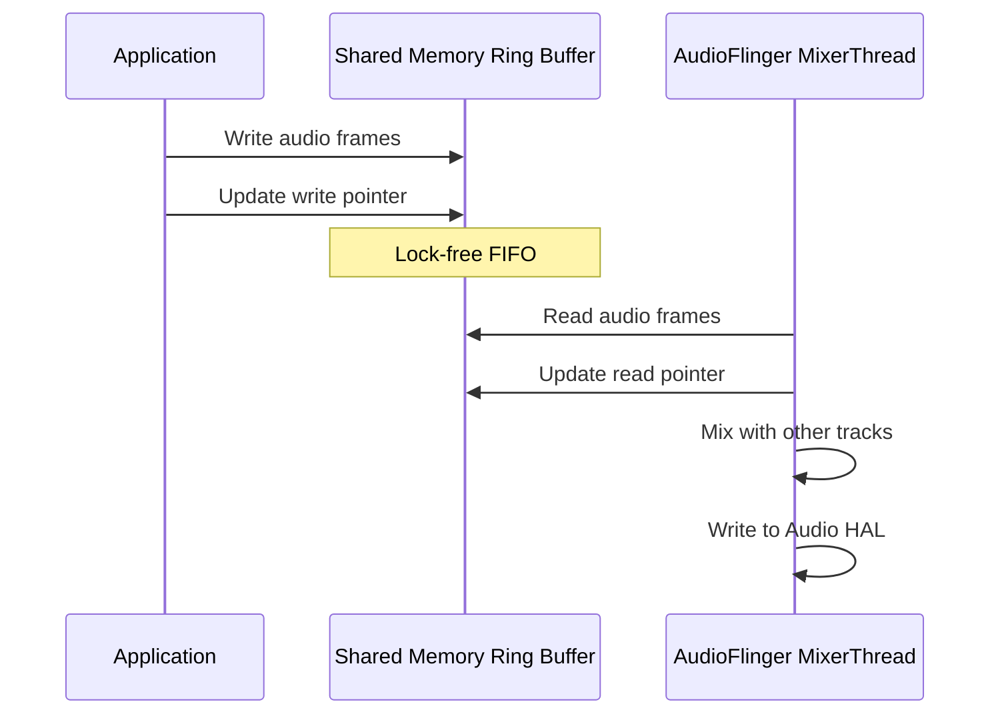

The shared memory region contains:

- A **control block** with read/write pointers and flow control flags.
- A **circular buffer** for the audio data (PCM samples).
- Flow control **futexes** for efficient blocking when the buffer is
  full (producer) or empty (consumer).

This design eliminates Binder IPC from the audio data path entirely. Only
control operations (start, stop, set volume) use Binder -- the actual audio
data flows through shared memory with minimal kernel involvement.

### 12.4.5 Cross-Reference

For a deep dive into AudioFlinger's mixing pipeline, effect chains, latency
optimization, and the Audio HAL interface, see **Chapter 11 (Audio
Subsystem)**. That chapter covers:

- The complete audio routing model and `AudioPolicy` interaction.
- Shared memory ring buffers and the `AudioTrack`/`AudioRecord` protocol.
- Effect processing chains and the `EffectModule` architecture.
- The AAudio/MMAP low-latency path.
- Audio HAL versioning (HIDL to AIDL migration).

---

## 12.5 CameraService Overview

CameraService manages all camera hardware access and is the gatekeeper
ensuring that multiple applications can share camera resources safely.

### 12.5.1 Source Location

The CameraService source lives at:

```
frameworks/av/services/camera/libcameraservice/
```

Key files:

| File | Purpose |
|------|---------|
| `CameraService.h` / `.cpp` | Main service, client management |
| `CameraFlashlight.h` / `.cpp` | Flashlight/torch control |
| `CameraServiceWatchdog.h` / `.cpp` | Detects and recovers from HAL hangs |

An interesting recent addition is the **virtual camera** subsystem at:

```
frameworks/av/services/camera/virtualcamera/
```

This provides software-based camera devices for testing, remote cameras,
and virtual displays.

### 12.5.2 Architecture Overview

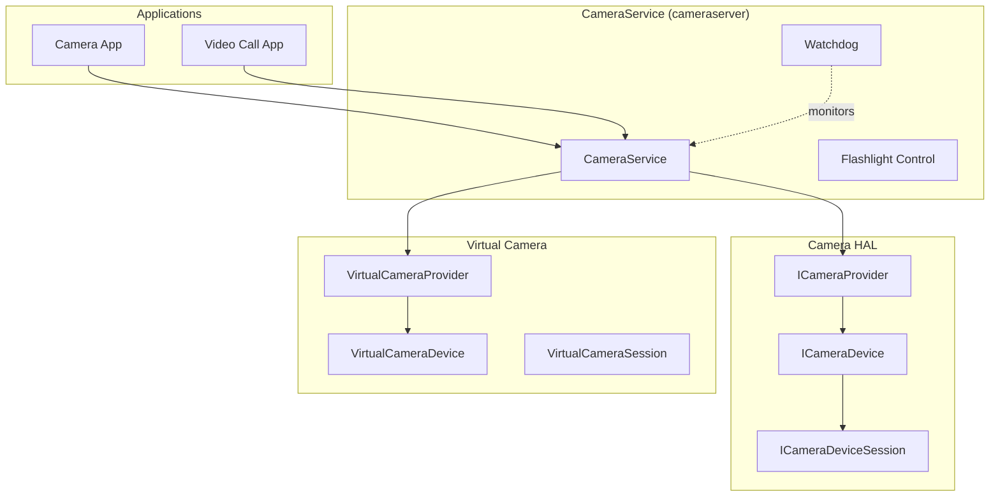

CameraService enforces strict resource arbitration:

- Only one client can use a camera device at a time (with priority-based
  eviction for foreground vs. background apps).
- The `CameraServiceWatchdog` monitors HAL responses and triggers recovery
  if the HAL becomes unresponsive.
- Camera access is subject to `android.permission.CAMERA` and AppOps checks.

### 12.5.3 Client Priority and Eviction

CameraService implements a priority-based eviction system. When a higher-priority
client requests a camera that is already in use by a lower-priority client,
the lower-priority client is evicted:

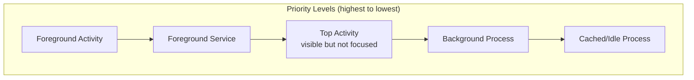

The eviction algorithm:

1. A new client requests a camera.
2. CameraService checks if the camera is currently in use.
3. If in use, compare the new client's priority (based on its process state)
   with the current client's priority.
4. If the new client has higher priority, disconnect the old client and
   connect the new one.
5. The old client receives a `disconnect()` callback and must release all
   resources.

This ensures that a foreground camera app always gets priority over background
processes, and that system-level camera access (e.g., face unlock) takes
priority over all user applications.

### 12.5.4 The CameraServiceWatchdog

The watchdog monitors for HAL hangs, which are a common failure mode with
complex camera hardware:

```cpp
class CameraServiceWatchdog {
    // Monitors camera operations and triggers recovery if they exceed
    // the configured timeout (typically 10-30 seconds)
};
```

When a HAL operation takes too long:

1. The watchdog logs a detailed diagnostic dump.
2. It may trigger a camera HAL restart.
3. All connected clients are notified of the disconnection.
4. The HAL re-initializes and clients can reconnect.

### 12.5.5 Virtual Camera

The virtual camera subsystem (`frameworks/av/services/camera/virtualcamera/`)
provides software-implemented camera devices. Key components:

| Class | Purpose |
|-------|---------|
| `VirtualCameraProvider` | Implements `ICameraProvider` for virtual cameras |
| `VirtualCameraDevice` | Implements `ICameraDevice` |
| `VirtualCameraSession` | Implements `ICameraDeviceSession` |
| `VirtualCameraRenderThread` | Generates camera frames from various sources |
| `VirtualCameraStream` | Manages output streams |

Virtual cameras can be sourced from:

- Screen capture (for remote desktop scenarios).
- Network streams (for IP cameras or remote collaboration).
- Synthetic content (for testing and development).
- Display output (for rear-display cameras on foldables).

### 12.5.6 Cross-Reference

For complete coverage of the Camera HAL interface, the capture pipeline,
stream configuration, and the Camera2 API, see **Chapter 12 (Media and
Camera)**. That chapter covers:

- The `ICameraDevice` / `ICameraDeviceSession` AIDL HAL interface.
- Request/result metadata processing.
- Stream configuration and buffer management.
- Multi-camera support and concurrent access.

---

## 12.6 MediaService Overview

The media subsystem is split across several native services, each running in
its own process with restricted permissions (using seccomp sandboxing).

### 12.6.1 MediaCodecService

The codec service runs as `media.codec` and hosts the hardware codec HAL
implementations. It uses seccomp-bpf sandboxing to restrict system calls:

> `frameworks/av/services/mediacodec/main_codecservice.cpp`

```cpp
int main(int argc __unused, char** argv) {
    strcpy(argv[0], "media.codec");
    LOG(INFO) << "mediacodecservice starting";
    signal(SIGPIPE, SIG_IGN);
    SetUpMinijail(kSystemSeccompPolicyPath, kVendorSeccompPolicyPath);

    android::ProcessState::initWithDriver("/dev/vndbinder");
    android::ProcessState::self()->startThreadPool();

    ::android::hardware::configureRpcThreadpool(64, false);

    // Default codec services
    using namespace ::android::hardware::media::omx::V1_0;
    sp<IOmx> omx = new implementation::Omx();
    // ...
    ::android::hardware::joinRpcThreadpool();
}
```

Key observations:

- Uses `/dev/vndbinder` (vendor binder), placing it in the vendor domain.
- Configures 64 RPC threads for parallel codec operations.
- Applies minijail seccomp policies from `/system/etc/seccomp_policy/`.
- Registers the `IOmx` HAL interface for OMX-based codecs.

A separate `media.swcodec` process handles software-only codecs, further
isolating them from hardware codec drivers.

### 12.6.2 MediaExtractorService

The media extractor runs as `media.extractor` and is responsible for parsing
container formats (MP4, MKV, OGG, etc.) and demultiplexing them into
elementary streams. Like the codec service, it runs in a seccomp-sandboxed
process.

### 12.6.3 Codec2 (C2) Framework

The modern codec framework is Codec2 (C2), located at:

```
frameworks/av/codec2/
```

Codec2 replaces the older OMX (OpenMAX IL) interface with a more flexible
architecture:

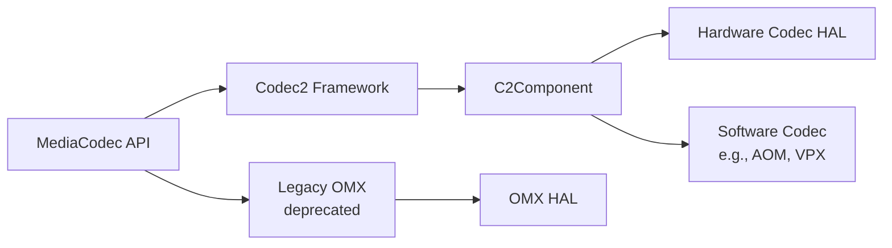

Codec2 provides:

- **Component-based architecture**: Each codec is a `C2Component` with
  well-defined input/output work queues.
- **Buffer pool management**: Efficient buffer allocation and recycling.
- **Tunneled playback**: Direct buffer passing between decoder and
  SurfaceFlinger without CPU copies.
- **Multi-instance support**: Running multiple codec instances concurrently.

### 12.6.4 Process Isolation Architecture

The media services demonstrate Android's defense-in-depth approach. Each
media service runs in its own process with restricted privileges:

```mermaid
graph TB
    subgraph "Media Processes"
        direction LR
        MC["media.codec<br/>seccomp + vndbinder"]
        ME["media.extractor<br/>seccomp + binder"]
        SWMC["media.swcodec<br/>seccomp + binder"]
        MS["mediaserver<br/>binder"]
    end

    subgraph "Isolation Measures"
        direction TB
        SEC["seccomp-bpf<br/>Syscall filtering"]
        MJ["Minijail<br/>Privilege restriction"]
        SEL["SELinux<br/>Mandatory access control"]
        NS[Namespace isolation]
    end

    MC --- SEC
    MC --- MJ
    MC --- SEL
    ME --- SEC
    ME --- MJ
    SWMC --- SEC
    SWMC --- MJ
```

The rationale for this isolation:

- **Media parsers (extractor)** are the primary attack surface for malicious
  media files. A crafted MP4/MKV file could exploit a parser bug. Running the
  parser in a sandboxed process limits the impact of such exploits.
- **Hardware codecs** interact with vendor-specific drivers that may have
  their own vulnerabilities. Using `/dev/vndbinder` isolates them from
  framework services.
- **Software codecs** have historically been a source of vulnerabilities
  (e.g., Stagefright). Running them in a separate process from hardware
  codecs prevents a software codec exploit from accessing hardware codec
  drivers.

The seccomp policy files restrict system calls to the minimum set needed:

```
/system/etc/seccomp_policy/mediacodec.policy
/vendor/etc/seccomp_policy/mediacodec.policy
```

### 12.6.5 Codec2 Component Lifecycle

A Codec2 component goes through a well-defined lifecycle:

```mermaid
stateDiagram-v2
    [*] --> UNLOADED
    UNLOADED --> LOADED: create()
    LOADED --> RUNNING: start()
    RUNNING --> LOADED: stop()
    RUNNING --> RUNNING: process()
    RUNNING --> FLUSHING: flush()
    FLUSHING --> RUNNING: flush complete
    LOADED --> UNLOADED: destroy()
    RUNNING --> ERROR: error
    ERROR --> LOADED: reset()
```

The component processes work items from an input queue:

1. Client submits `C2Work` items containing input buffers.
2. The component processes each work item (decode/encode).
3. Completed work items are returned to the client with output buffers.
4. The client reads the output data and recycles the buffers.

### 12.6.6 Cross-Reference

For the full media pipeline architecture, including `MediaCodec`, `MediaPlayer`,
`MediaRecorder`, and the Codec2 internals, see **Chapter 12 (Media and
Camera)**.

---

## 12.7 installd

`installd` is the privileged daemon responsible for all on-disk operations
related to application installation, data management, and DEX optimization. It
runs with elevated permissions that `system_server` itself does not have,
providing a secure escalation path for package management operations.

### 12.7.1 Why installd Exists

`system_server` runs as UID `system` (1000), but application data directories
are owned by per-app UIDs (10000+). Creating, modifying, and deleting these
directories requires root or specific capabilities. Rather than giving
`system_server` these privileges, Android delegates filesystem operations to
`installd`, which runs as root with restricted capabilities and SELinux
enforcement.

### 12.7.2 Source Layout

The source is at `frameworks/native/cmds/installd/`:

| File | Purpose |
|------|---------|
| `installd.cpp` | Main entry point, initialization |
| `InstalldNativeService.h` / `.cpp` | Binder service implementation |
| `dexopt.h` / `.cpp` | DEX optimization (dex2oat invocation) |
| `utils.cpp` | Filesystem utility functions |
| `CacheTracker.h` | Cache size tracking for storage management |
| `QuotaUtils.h` / `.cpp` | Disk quota management |
| `CrateManager.cpp` | "Crate" storage management |
| `run_dex2oat.cpp` | dex2oat process spawning |
| `installd_constants.h` | Shared constants and flags |
| `globals.h` | Global path variables |

### 12.7.3 Startup and Initialization

The `installd` main function performs careful initialization before accepting
Binder calls:

> `frameworks/native/cmds/installd/installd.cpp`

```cpp
static int installd_main(const int argc ATTRIBUTE_UNUSED, char *argv[]) {
    // ...
    SLOGI("installd firing up");

    // SELinux setup
    union selinux_callback cb;
    cb.func_log = log_callback;
    selinux_set_callback(SELINUX_CB_LOG, cb);

    if (!initialize_globals()) {
        SLOGE("Could not initialize globals; exiting.\n");
        exit(1);
    }

    if (initialize_directories() < 0) {
        SLOGE("Could not create directories; exiting.\n");
        exit(1);
    }

    if (selinux_enabled && selinux_status_open(true) < 0) {
        SLOGE("Could not open selinux status; exiting.\n");
        exit(1);
    }

    if ((ret = InstalldNativeService::start()) != android::OK) {
        SLOGE("Unable to start InstalldNativeService: %d", ret);
        exit(1);
    }

    IPCThreadState::self()->joinThreadPool();
    // ...
}
```

The `initialize_directories()` function handles filesystem layout upgrades.
It reads a version file at `{android_data_dir}/misc/installd/layout_version`
and performs migrations when the layout version changes:

```cpp
if (version < 2) {
    SLOGD("Assuming that device has multi-user storage layout; "
          "upgrade no longer supported");
    version = 2;
}
```

### 12.7.4 The InstalldNativeService Interface

The `InstalldNativeService` implements the `IInstalld` AIDL interface,
exposing dozens of operations to `PackageManagerService`:

> `frameworks/native/cmds/installd/InstalldNativeService.h`

```cpp
class InstalldNativeService : public BinderService<InstalldNativeService>,
                              public os::BnInstalld {
public:
    static char const* getServiceName() { return "installd"; }

    // User data management
    binder::Status createUserData(const std::optional<std::string>& uuid,
            int32_t userId, int32_t userSerial, int32_t flags);
    binder::Status destroyUserData(const std::optional<std::string>& uuid,
            int32_t userId, int32_t flags);

    // App data management
    binder::Status createAppData(/* ... */);
    binder::Status createAppDataBatched(/* ... */);
    binder::Status clearAppData(/* ... */);
    binder::Status destroyAppData(/* ... */);

    // DEX optimization
    binder::Status dexopt(const std::string& apkPath, int32_t uid,
                          /* ... 14 more parameters ... */);

    // Storage management
    binder::Status freeCache(/* ... */);
    binder::Status getAppSize(/* ... */);
    binder::Status getUserSize(/* ... */);

    // Profile management
    binder::Status mergeProfiles(/* ... */);
    binder::Status dumpProfiles(/* ... */);

    // fs-verity
    binder::Status createFsveritySetupAuthToken(/* ... */);
    binder::Status enableFsverity(/* ... */);
    // ... and many more
};
```

### 12.7.5 App Data Directory Structure

When an app is installed, `installd` creates the following directory structure:

```
/data/user/{userId}/{packageName}/      (CE - Credential Encrypted)
/data/user_de/{userId}/{packageName}/   (DE - Device Encrypted)
```

The distinction between CE (Credential Encrypted) and DE (Device Encrypted)
storage is critical for Direct Boot support:

| Storage | Available | Use Case |
|---------|-----------|----------|
| CE | After user unlock | App databases, user files |
| DE | After device boot (before unlock) | Alarm data, notification channels |

The flags are defined in `installd_constants.h`:

```cpp
// NOTE: keep in sync with StorageManager
constexpr int FLAG_STORAGE_DE = 1 << 0;
constexpr int FLAG_STORAGE_CE = 1 << 1;
```

### 12.7.6 DEX Optimization (dexopt)

One of `installd`'s most important responsibilities is invoking `dex2oat` to
compile DEX bytecode into native machine code. The `dexopt()` function accepts
a large number of parameters:

> `frameworks/native/cmds/installd/dexopt.h`

```cpp
int dexopt(const char *apk_path, uid_t uid, const char *pkgName,
        const char *instruction_set, int dexopt_needed,
        const char* oat_dir, int dexopt_flags,
        const char* compiler_filter, const char* volume_uuid,
        const char* class_loader_context, const char* se_info,
        bool downgrade, int target_sdk_version,
        const char* profile_name, const char* dexMetadataPath,
        const char* compilation_reason, std::string* error_msg,
        /* out */ bool* completed = nullptr);
```

The dex2oat binaries are located in the ART APEX:

```cpp
#define ANDROID_ART_APEX_BIN "/apex/com.android.art/bin"
static constexpr const char* kDex2oat32Path = ANDROID_ART_APEX_BIN "/dex2oat32";
static constexpr const char* kDex2oat64Path = ANDROID_ART_APEX_BIN "/dex2oat64";
static constexpr const char* kDex2oatDebug32Path = ANDROID_ART_APEX_BIN "/dex2oatd32";
static constexpr const char* kDex2oatDebug64Path = ANDROID_ART_APEX_BIN "/dex2oatd64";
```

The dexopt flags control compilation behavior:

```cpp
constexpr int DEXOPT_PUBLIC         = 1 << 1;   // Shared library (world-readable)
constexpr int DEXOPT_DEBUGGABLE     = 1 << 2;   // Include debug info
constexpr int DEXOPT_BOOTCOMPLETE   = 1 << 3;   // Boot has finished
constexpr int DEXOPT_PROFILE_GUIDED = 1 << 4;   // Use profile for compilation
constexpr int DEXOPT_SECONDARY_DEX  = 1 << 5;   // Secondary DEX file
constexpr int DEXOPT_FORCE          = 1 << 6;   // Force recompilation
constexpr int DEXOPT_STORAGE_CE     = 1 << 7;   // CE storage
constexpr int DEXOPT_STORAGE_DE     = 1 << 8;   // DE storage
constexpr int DEXOPT_IDLE_BACKGROUND_JOB = 1 << 9;  // Background optimization
constexpr int DEXOPT_ENABLE_HIDDEN_API_CHECKS = 1 << 10;
constexpr int DEXOPT_GENERATE_COMPACT_DEX = 1 << 11;
constexpr int DEXOPT_GENERATE_APP_IMAGE = 1 << 12;
```

The dexopt needed level determines the type of compilation required:

```cpp
static constexpr int NO_DEXOPT_NEEDED            = 0;  // Already optimized
static constexpr int DEX2OAT_FROM_SCRATCH        = 1;  // Full compilation
static constexpr int DEX2OAT_FOR_BOOT_IMAGE      = 2;  // Boot image changed
static constexpr int DEX2OAT_FOR_FILTER          = 3;  // Compiler filter changed
```

### 12.7.7 Profile Management

`installd` manages ART profiles that guide Profile-Guided Optimization (PGO):

1. **Current profiles**: Per-user profiles recording which methods were executed
   at runtime (`/data/misc/profiles/cur/{userId}/{packageName}/primary.prof`).
2. **Reference profiles**: Merged profiles used as input to dex2oat
   (`/data/misc/profiles/ref/{packageName}/primary.prof`).

The `mergeProfiles()` operation combines current profiles into the reference
profile. When the merged profile indicates significant changes, the system
schedules background dexopt to recompile the app with the updated profile
data.

The result of profile analysis is one of:

```cpp
constexpr int PROFILES_ANALYSIS_OPTIMIZE                     = 1;
constexpr int PROFILES_ANALYSIS_DONT_OPTIMIZE_SMALL_DELTA    = 2;
constexpr int PROFILES_ANALYSIS_DONT_OPTIMIZE_EMPTY_PROFILES = 3;
```

### 12.7.8 The dexopt Flow

The complete dexopt flow from package installation to optimized code:

```mermaid
sequenceDiagram
    participant PMS as PackageManagerService
    participant INS as installd (IInstalld)
    participant D2O as dex2oat process
    participant ART as ART Runtime

    PMS->>INS: createAppData(uuid, pkg, userId, ...)
    INS->>INS: mkdir /data/user/{userId}/{pkg}/
    INS->>INS: chown to app UID
    INS->>INS: restorecon (SELinux labels)

    PMS->>INS: dexopt(apkPath, uid, pkgName, isa, ...)
    INS->>INS: Determine dex2oat binary (32/64 bit)
    INS->>INS: Open profile file (if PGO)
    INS->>INS: Create output .oat/.art/.vdex files
    INS->>D2O: fork + exec dex2oat
    D2O->>D2O: Parse DEX bytecode
    D2O->>D2O: Apply compiler filter (speed, speed-profile, etc.)
    D2O->>D2O: Generate native machine code
    D2O->>D2O: Write .oat (code), .art (image), .vdex (dex)
    D2O-->>INS: Exit code
    INS-->>PMS: Return success/failure

    Note over ART: At app launch...
    ART->>ART: Load .oat file for pre-compiled methods
    ART->>ART: JIT remaining methods as needed
```

The compiler filter determines the optimization level:

| Filter | Behavior | Use Case |
|--------|----------|----------|
| `verify` | Only verify DEX, no compilation | First install (minimal delay) |
| `quicken` | Verify + optimize bytecode | Quick install optimization |
| `speed` | Full AOT compilation | Background optimization |
| `speed-profile` | AOT only hot methods from profile | Best balance of size/speed |
| `everything` | Compile all methods | Testing/benchmarking |

The `dex2oat` process runs as a child of `installd`. It inherits restricted
capabilities and is subject to resource limits (CPU, memory). When running
as a background job (`DEXOPT_IDLE_BACKGROUND_JOB`), `dex2oat` uses lower
CPU priority and may include extra debugging information.

### 12.7.9 Storage Management

`installd` manages storage across multiple volumes and users:

```mermaid
graph TB
    subgraph "Internal Storage"
        DATA["/data"]
        U0["/data/user/0<br/>(Primary user)"]
        U10["/data/user/10<br/>(Work profile)"]
        DE0["/data/user_de/0<br/>(Device encrypted)"]
        DE10["/data/user_de/10"]
        PROF["/data/misc/profiles"]
        DALVIK["/data/dalvik-cache"]
    end

    subgraph "External Storage"
        EXT["/data/media/0"]
    end

    subgraph "Per-App Layout"
        direction TB
        CE_APP["CE: /data/user/0/{pkg}/"]
        DE_APP["DE: /data/user_de/0/{pkg}/"]
        CACHE["cache/"]
        CODE_CACHE["code_cache/"]
        FILES["files/"]
        DB["databases/"]
        SP["shared_prefs/"]
    end

    DATA --> U0
    DATA --> U10
    DATA --> DE0
    DATA --> DE10
    DATA --> PROF
    DATA --> DALVIK

    U0 --> CE_APP
    DE0 --> DE_APP
    CE_APP --> CACHE
    CE_APP --> CODE_CACHE
    CE_APP --> FILES
    CE_APP --> DB
    CE_APP --> SP
```

The `freeCache()` method is called when disk space runs low. It walks
through app cache directories and removes the least-recently-used cache
files until the target free space is achieved. The `CacheTracker` uses
file modification timestamps to prioritize which caches to clear first.

Disk quotas are managed through the `QuotaUtils` module, which interfaces
with the Linux filesystem quota system (when supported by the filesystem):

```cpp
// From QuotaUtils.h/cpp
// Check if the given UUID volume supports disk quotas
binder::Status isQuotaSupported(const std::optional<std::string>& volumeUuid,
        bool* _aidl_return);

// Map from UID to cache quota size
std::unordered_map<uid_t, int64_t> mCacheQuotas;
```

### 12.7.10 Batched Operations

For performance during bulk operations (e.g., creating data directories for
all apps after a user is created), `installd` supports batched variants:

```cpp
binder::Status createAppDataBatched(
    const std::vector<android::os::CreateAppDataArgs>& args,
    std::vector<android::os::CreateAppDataResult>* _aidl_return);
```

The batched API reduces Binder round-trip overhead by processing multiple
operations in a single IPC call.

### 12.7.11 SDK Sandbox Data

For the Privacy Sandbox, `installd` manages isolated data directories for
SDK sandboxes:

```cpp
binder::Status createSdkSandboxDataPackageDirectory(
    const std::optional<std::string>& uuid,
    const std::string& packageName,
    int32_t userId, int32_t appId, int32_t flags);
```

These directories are isolated from the main app's data directories,
preventing SDKs from accessing the hosting app's private data.

### 12.7.12 fs-verity Support

Modern `installd` supports fs-verity for APK integrity verification. The
`createFsveritySetupAuthToken()` and `enableFsverity()` methods allow
`PackageManagerService` to enable Merkle tree-based integrity checking on
installed APK files:

```cpp
binder::Status createFsveritySetupAuthToken(
    const android::os::ParcelFileDescriptor& authFd,
    int32_t uid,
    android::sp<IFsveritySetupAuthToken>* _aidl_return);

binder::Status enableFsverity(
    const android::sp<IFsveritySetupAuthToken>& authToken,
    const std::string& filePath,
    const std::string& packageName,
    int32_t* _aidl_return);
```

The auth token pattern ensures that only the process that opened the file
can enable fs-verity on it, preventing TOCTOU (time-of-check-time-of-use)
races.

### 12.7.13 Concurrency Control

`installd` uses fine-grained locking to allow concurrent operations on
different packages:

```cpp
private:
    std::recursive_mutex mLock;
    std::unordered_map<userid_t, std::weak_ptr<std::shared_mutex>> mUserIdLock;
    std::unordered_map<std::string, std::weak_ptr<std::recursive_mutex>> mPackageNameLock;
```

Operations on different packages can proceed in parallel, while operations
on the same package are serialized. The `mUserIdLock` map provides shared
locks per user ID, allowing multiple package operations for different packages
within the same user to run concurrently.

---

## 12.8 GPU Service

The GpuService manages GPU-related functionality including driver statistics,
memory tracking, workload monitoring, and game driver management.

### 12.8.1 Source Layout

The source is at `frameworks/native/services/gpuservice/`:

| Directory | Purpose |
|-----------|---------|
| `gpustats/` | GPU driver loading statistics |
| `gpumem/` | Per-process GPU memory tracking via eBPF |
| `gpuwork/` | GPU workload tracking via eBPF |
| `tracing/` | Perfetto-based GPU memory tracing |
| `feature_override/` | ANGLE feature override configuration |
| Root files | Main service implementation |

### 12.8.2 Service Implementation

> `frameworks/native/services/gpuservice/include/gpuservice/GpuService.h`

```cpp
class GpuService : public BnGpuService, public PriorityDumper {
public:
    static const char* const SERVICE_NAME ANDROID_API;  // "gpu"

    GpuService() ANDROID_API;

private:
    // Components
    std::shared_ptr<GpuMem> mGpuMem;
    std::shared_ptr<gpuwork::GpuWork> mGpuWork;
    std::unique_ptr<GpuStats> mGpuStats;
    std::unique_ptr<GpuMemTracer> mGpuMemTracer;
    std::mutex mLock;
    std::string mDeveloperDriverPath;
    FeatureOverrideParser mFeatureOverrideParser;
};
```

### 12.8.3 Subsystems

**GpuStats**

Tracks driver loading statistics for each application, including:

- Driver package name and version.
- Loading success/failure counts for GL, Vulkan, and ANGLE.
- Per-app loading times.
- Vulkan engine names (for game identification).

From `frameworks/native/services/gpuservice/gpustats/GpuStats.cpp`:

```cpp
static void addLoadingCount(GpuStatsInfo::Driver driver, bool isDriverLoaded,
                            GpuStatsGlobalInfo* const outGlobalInfo) {
    switch (driver) {
        case GpuStatsInfo::Driver::GL:
        case GpuStatsInfo::Driver::GL_UPDATED:
            outGlobalInfo->glLoadingCount++;
            if (!isDriverLoaded) outGlobalInfo->glLoadingFailureCount++;
            break;
        case GpuStatsInfo::Driver::VULKAN:
        case GpuStatsInfo::Driver::VULKAN_UPDATED:
            outGlobalInfo->vkLoadingCount++;
            if (!isDriverLoaded) outGlobalInfo->vkLoadingFailureCount++;
            break;
        case GpuStatsInfo::Driver::ANGLE:
            outGlobalInfo->angleLoadingCount++;
            if (!isDriverLoaded) outGlobalInfo->angleLoadingFailureCount++;
            break;
        // ...
    }
}
```

This data is reported to statsd for telemetry.

**GpuMem (GPU Memory Tracking)**

Uses eBPF (extended Berkeley Packet Filter) programs to track per-process GPU
memory allocations. The eBPF program attaches to GPU driver tracepoints and
maintains a map of PID-to-memory-usage that can be read from userspace.

```mermaid
graph TB
    subgraph "Kernel"
        TP[GPU Driver Tracepoints]
        BPF[eBPF Program]
        MAP["eBPF Map<br/>pid -> memory"]
    end

    subgraph "GpuService"
        GM[GpuMem]
        GMT[GpuMemTracer]
    end

    TP --> BPF
    BPF --> MAP
    MAP --> GM
    GM --> GMT
    GMT -->|Perfetto| Trace[Trace File]
```

**GpuWork (GPU Workload Tracking)**

Similar to GpuMem, uses eBPF to track GPU workload per process, including
time spent on GPU execution. The BPF program header is at:

```
frameworks/native/services/gpuservice/gpuwork/bpfprogs/include/gpuwork/gpuWork.h
```

**ANGLE Integration**

GpuService manages ANGLE (Almost Native Graphics Layer Engine) as a system
driver. The `toggleAngleAsSystemDriver()` method sets the
`persist.graphics.egl` property:

```cpp
void GpuService::toggleAngleAsSystemDriver(bool enabled) {
    // Permission check: only system_server allowed
    if (multiuserappid != AID_SYSTEM ||
        !PermissionCache::checkPermission(sAccessGpuServicePermission, pid, uid)) {
        ALOGE("Permission Denial: can't set persist.graphics.egl");
        return;
    }

    if (enabled) {
        android::base::SetProperty("persist.graphics.egl", sAngleGlesDriverSuffix);
    } else {
        android::base::SetProperty("persist.graphics.egl", "");
    }
}
```

**Feature Override Parser**

Parses ANGLE feature override configurations from:

```cpp
const std::string kConfigFilePath =
    "/system/etc/angle/feature_config_vk.binarypb";
```

This allows OEMs to override specific Vulkan/GLES features on a per-app or
per-device basis.

### 12.8.4 eBPF Programs for GPU Monitoring

The GPU service uses eBPF (extended Berkeley Packet Filter) programs for
kernel-level monitoring. eBPF programs run inside the kernel and can
efficiently track events without the overhead of user-kernel transitions
for each event.

**GPU Memory Tracking (GpuMem)**:

The eBPF program attaches to GPU driver tracepoints and maintains a
per-process memory map:

```mermaid
graph TB
    subgraph "Kernel Space"
        TP[gpu_mem tracepoint]
        BPF_PROG["eBPF Program:<br/>gpu_mem_total"]
        BPF_MAP["eBPF Map:<br/>gpu_mem_total_map<br/>key: pid<br/>value: bytes"]
    end

    subgraph "User Space"
        GM[GpuMem::initialize]
        READ[Read eBPF map]
        DUMP[dumpsys gpu --gpumem]
    end

    TP -->|triggers| BPF_PROG
    BPF_PROG -->|updates| BPF_MAP
    GM -->|loads program| BPF_PROG
    READ -->|reads| BPF_MAP
    READ --> DUMP
```

The `GpuMem::initialize()` method loads the eBPF program and sets up the
map. The `GpuMemTracer` periodically reads the map and exports the data
to Perfetto for visualization in trace files.

**GPU Work Tracking (GpuWork)**:

Similarly, the GPU work tracker uses eBPF to monitor time spent executing
on the GPU per process. The BPF program header:

```
frameworks/native/services/gpuservice/gpuwork/bpfprogs/include/gpuwork/gpuWork.h
```

This data is used for:

- Power attribution: Determining which app is consuming GPU power.
- Performance analysis: Identifying apps with excessive GPU usage.
- Debugging: Understanding GPU scheduling behavior.

Both eBPF programs are compiled from restricted C and loaded into the
kernel at service startup. They run with minimal overhead because they
execute directly in kernel context, avoiding context switches.

### 12.8.5 Asynchronous Initialization

GpuService initializes its eBPF subsystems asynchronously to avoid
delaying service registration:

```cpp
GpuService::GpuService()
      : mGpuMem(std::make_shared<GpuMem>()),
        mGpuWork(std::make_shared<gpuwork::GpuWork>()),
        mGpuStats(std::make_unique<GpuStats>()),
        mGpuMemTracer(std::make_unique<GpuMemTracer>()),
        mFeatureOverrideParser(kConfigFilePath) {

    mGpuMemAsyncInitThread = std::make_unique<std::thread>([this]() {
        mGpuMem->initialize();
        mGpuMemTracer->initialize(mGpuMem);
    });

    mGpuWorkAsyncInitThread = std::make_unique<std::thread>([this]() {
        mGpuWork->initialize();
    });
};
```

The eBPF program loading and map creation happen on dedicated threads,
allowing the GpuService to start accepting Binder calls immediately. The
destructor joins both threads to ensure clean shutdown:

```cpp
GpuService::~GpuService() {
    mGpuMem->stop();
    mGpuWork->stop();
    mGpuWorkAsyncInitThread->join();
    mGpuMemAsyncInitThread->join();
}
```

### 12.8.6 Game Driver Support

Android supports updatable GPU drivers through the Game Driver mechanism.
GpuService tracks two driver slots:

```cpp
void dumpGameDriverInfo(std::string* result) {
    char stableGameDriver[PROPERTY_VALUE_MAX] = {};
    property_get("ro.gfx.driver.0", stableGameDriver, "unsupported");
    StringAppendF(result, "Stable Game Driver: %s\n", stableGameDriver);

    char preReleaseGameDriver[PROPERTY_VALUE_MAX] = {};
    property_get("ro.gfx.driver.1", preReleaseGameDriver, "unsupported");
    StringAppendF(result, "Pre-release Game Driver: %s\n", preReleaseGameDriver);
}
```

The `setUpdatableDriverPath()` method allows `system_server` to specify
an alternative driver path for development purposes.

### 12.8.7 Shell Commands

GpuService supports shell commands via `adb shell cmd gpu`:

| Command | Purpose |
|---------|---------|
| `vkjson` | Dump Vulkan device properties as JSON |
| `vkprofiles` | Print support for Vulkan profiles |
| `featureOverrides` | Display ANGLE feature overrides |

---

## 12.9 Sensor Service

The SensorService manages access to all hardware and virtual sensors --
accelerometer, gyroscope, magnetometer, barometer, proximity sensor, and
many others.

### 12.9.1 Source Layout

The source is at `frameworks/native/services/sensorservice/`:

| File | Purpose |
|------|---------|
| `SensorService.h` / `.cpp` | Main service implementation |
| `SensorDevice.h` / `.cpp` | HAL abstraction (singleton) |
| `SensorEventConnection.cpp` | Per-client connection handling |
| `SensorDirectConnection.h` | Direct sensor channel (low-latency) |
| `ISensorHalWrapper.h` | HAL wrapper interface |
| `AidlSensorHalWrapper.h` | AIDL HAL implementation |
| `SensorFusion.cpp` | Software sensor fusion |
| `RotationVectorSensor.cpp` | Computed rotation vector |
| `CorrectedGyroSensor.cpp` | Bias-corrected gyroscope |
| `OrientationSensor.cpp` | Computed orientation |
| `LimitedAxesImuSensor.h` | Limited-axis IMU sensor |
| `SensorInterface.h` / `.cpp` | Abstract sensor interface |
| `SensorRecord.h` | Per-sensor activation tracking |
| `RecentEventLogger.h` | Recent event history |
| `BatteryService.h` | Battery usage tracking for sensors |

### 12.9.2 Architecture

```mermaid
graph TB
    subgraph "Applications"
        SM1["SensorManager<br/>App 1"]
        SM2["SensorManager<br/>App 2"]
    end

    subgraph "SensorService"
        SS["SensorService<br/>Thread"]
        SEC["SensorEventConnection<br/>per client"]
        SDC["SensorDirectConnection<br/>low-latency"]
        SD["SensorDevice<br/>Singleton"]
        SF[SensorFusion]
        VS["Virtual Sensors<br/>RotationVector, etc."]
    end

    subgraph "HAL"
        HW[ISensorHalWrapper]
        AIDL[AidlSensorHalWrapper]
        HIDL[HidlSensorHalWrapper]
    end

    SM1 --> SEC
    SM2 --> SEC
    SM1 --> SDC
    SEC --> SS
    SDC --> SD
    SS --> SD
    SD --> HW
    HW --> AIDL
    HW --> HIDL
    SS --> SF
    SF --> VS
```

### 12.9.3 Service Startup

SensorService uses the `BinderService` template for registration:

> `frameworks/native/services/sensorservice/main_sensorservice.cpp`

```cpp
int main(int /*argc*/, char** /*argv*/) {
    signal(SIGPIPE, SIG_IGN);
    SensorService::publishAndJoinThreadPool();
    return 0;
}
```

The `SensorService` class inherits from three base classes:

```cpp
class SensorService :
        public BinderService<SensorService>,
        public BnSensorServer,
        protected Thread
{
```

- **`BinderService<SensorService>`**: Handles registration with servicemanager.
- **`BnSensorServer`**: Binder native implementation of `ISensorServer`.
- **`Thread`**: SensorService runs its own polling thread.

### 12.9.4 The SensorDevice Singleton

`SensorDevice` is a singleton that interfaces with the sensor HAL:

> `frameworks/native/services/sensorservice/SensorDevice.cpp`

```cpp
ANDROID_SINGLETON_STATIC_INSTANCE(SensorDevice)

SensorDevice::SensorDevice() : mInHalBypassMode(false) {
    if (!connectHalService()) {
        return;
    }
    initializeSensorList();
    mIsDirectReportSupported =
        (mHalWrapper->unregisterDirectChannel(-1) != INVALID_OPERATION);
}
```

The HAL wrapper interface (`ISensorHalWrapper`) abstracts over both AIDL and
HIDL HAL versions:

```cpp
class ISensorHalWrapper {
public:
    enum HalConnectionStatus {
        CONNECTED,
        DOES_NOT_EXIST,
        FAILED_TO_CONNECT,
        UNKNOWN,
    };

    virtual bool connect(SensorDeviceCallback *callback) = 0;
    virtual ssize_t poll(sensors_event_t *buffer, size_t count) = 0;
    virtual ssize_t pollFmq(sensors_event_t *buffer,
                            size_t maxNumEventsToRead) = 0;
    virtual std::vector<sensor_t> getSensorsList() = 0;
    virtual status_t activate(int32_t sensorHandle, bool enabled) = 0;
    virtual status_t batch(int32_t sensorHandle, int64_t samplingPeriodNs,
                           int64_t maxReportLatencyNs) = 0;
    virtual status_t flush(int32_t sensorHandle) = 0;
    // ...
};
```

The wrapper supports two polling modes:

- **Traditional polling** (`poll()`): Blocking call that returns when events
  are available.
- **Fast Message Queue** (`pollFmq()`): Uses a shared-memory FIFO for
  lower-latency event delivery (HAL 2.0+).

### 12.9.5 Sensor Fusion and Virtual Sensors

SensorService creates several **virtual sensors** that do not correspond to
physical hardware. These are computed from physical sensor data using sensor
fusion algorithms:

From `frameworks/native/services/sensorservice/RotationVectorSensor.cpp`:

```cpp
RotationVectorSensor::RotationVectorSensor(int mode) : mMode(mode) {
    const sensor_t sensor = {
        .name       = getSensorName(),
        .vendor     = "AOSP",
        .version    = 3,
        .handle     = getSensorToken(),
        .type       = getSensorType(),
        .maxRange   = 1,
        .resolution = 1.0f / (1<<24),
        .power      = mSensorFusion.getPowerUsage(),
        .minDelay   = mSensorFusion.getMinDelay(),
    };
    mSensor = Sensor(&sensor);
}
```

The fusion modes produce different rotation vectors:

| Mode | Sensor Type | Input Sensors |
|------|-------------|---------------|
| `FUSION_9AXIS` | `ROTATION_VECTOR` | Accel + Gyro + Mag |
| `FUSION_NOMAG` | `GAME_ROTATION_VECTOR` | Accel + Gyro |
| `FUSION_NOGYRO` | `GEOMAGNETIC_ROTATION_VECTOR` | Accel + Mag |

The `GyroDriftSensor` computes gyroscope bias estimates from the sensor
fusion algorithm, allowing other components to correct for gyroscope drift.

### 12.9.6 Client Connection Model

Each client that registers for sensor events gets a `SensorEventConnection`:

```cpp
SensorService::SensorEventConnection::SensorEventConnection(
        const sp<SensorService>& service, uid_t uid, String8 packageName,
        bool isDataInjectionMode, const String16& opPackageName,
        const String16& attributionTag)
    : mService(service), mUid(uid), mWakeLockRefCount(0),
      mHasLooperCallbacks(false), mDead(false),
      mDataInjectionMode(isDataInjectionMode), mEventCache(nullptr),
      mCacheSize(0), mMaxCacheSize(0), /* ... */ {
    mUserId = multiuser_get_user_id(mUid);
    mChannel = new BitTube(mService->mSocketBufferSize);
}
```

Events are delivered through `BitTube` objects -- low-level socket pairs
optimized for batch event delivery. The socket buffer size is configurable:

```cpp
#define MAX_SOCKET_BUFFER_SIZE_BATCHED (100 * 1024)    // 100 KB
#define SOCKET_BUFFER_SIZE_NON_BATCHED (4 * 1024)      // 4 KB
```

### 12.9.7 Rate Limiting and Privacy

For privacy protection, SensorService caps the sampling rate for apps
targeting Android 12+ that lack the `HIGH_SAMPLING_RATE_SENSORS` permission:

```cpp
// Capped at 200 Hz
#define SENSOR_SERVICE_CAPPED_SAMPLING_PERIOD_NS (5 * 1000 * 1000)
// Direct channel rate capped to NORMAL (<=110 Hz)
#define SENSOR_SERVICE_CAPPED_SAMPLING_RATE_LEVEL SENSOR_DIRECT_RATE_NORMAL
```

This prevents apps from using high-frequency sensor data for side-channel
attacks (e.g., inferring screen taps from accelerometer data).

### 12.9.8 The SensorService Polling Loop

SensorService inherits from `Thread` and runs a continuous polling loop:

```mermaid
graph TB
    subgraph "SensorService Thread Loop"
        A[threadLoop start]
        B["SensorDevice::poll<br/>Block until events available"]
        C{Events received?}
        D[Process physical sensor events]
        E[Feed to SensorFusion]
        F[Generate virtual sensor events]
        G["Distribute to all<br/>SensorEventConnections"]
        H[Write to BitTube sockets]
        I[Track battery usage]
    end

    A --> B
    B --> C
    C -->|Yes| D
    C -->|No events / error| B
    D --> E
    E --> F
    F --> G
    G --> H
    H --> I
    I --> B
```

The loop is designed for efficiency:

1. `poll()` blocks in the kernel until sensor events are available,
   using either traditional blocking reads or a Fast Message Queue (FMQ).
2. Events are batched -- the HAL can deliver up to hundreds of events
   in a single poll return.
3. Virtual sensor processing (fusion) happens inline with the physical
   event processing, adding minimal latency.
4. Distribution to clients is batched -- all events for a single poll
   cycle are written to client sockets together.

The FMQ-based polling (`pollFmq()`) is preferred for HAL 2.0+ because
it avoids the overhead of a Binder/HIDL call for each poll cycle. The
FMQ is a shared-memory ring buffer between SensorService and the HAL,
with a lightweight signaling mechanism using eventfd or futex.

### 12.9.9 Dynamic Sensor Support

SensorService supports dynamic sensors -- sensors that can be connected
and disconnected at runtime (e.g., USB sensors, Bluetooth sensors):

```cpp
class ISensorHalWrapper {
public:
    class SensorDeviceCallback {
    public:
        virtual void onDynamicSensorsConnected(
            const std::vector<sensor_t>& dynamicSensorsAdded) = 0;
        virtual void onDynamicSensorsDisconnected(
            const std::vector<int32_t>& dynamicSensorHandlesRemoved) = 0;
    };
};
```

When a dynamic sensor connects:

1. The HAL notifies SensorDevice via the callback.
2. SensorDevice adds the new sensor to its internal list.
3. SensorService creates a new `SensorInterface` for the dynamic sensor.
4. Clients that registered for dynamic sensor notifications are informed.

### 12.9.10 Operating Modes

SensorService supports multiple operating modes:

```cpp
enum Mode {
    NORMAL = 0,         // Regular operation
    DATA_INJECTION = 1, // HAL accepts injected data (testing)
    RESTRICTED = 2,     // Only allowlisted apps can access sensors
    // ...
};
```

`DATA_INJECTION` mode is used by CTS tests to provide known sensor values.
`RESTRICTED` mode allows only allowlisted apps (typically CTS) to access
sensors, disabling all other connections.

### 12.9.11 Direct Sensor Channels

For ultra-low-latency sensor delivery, SensorService supports **direct
channels**. Instead of going through the socket-based `SensorEventConnection`,
events are written directly into a shared memory region that the application
maps:

```
SensorHAL -> Shared Memory (GRALLOC/ashmem) -> Application
```

This bypasses all SensorService processing, achieving the lowest possible
latency for applications like VR that need immediate sensor data.

---

## 12.10 servicemanager and dumpsys

### 12.10.1 servicemanager: The Foundation

`servicemanager` is the first native service to start (after `init` itself)
and is the cornerstone of Android's service infrastructure. Every other
service -- both native and Java -- depends on it for registration and
discovery.

**Source Location**: `frameworks/native/cmds/servicemanager/`

| File | Purpose |
|------|---------|
| `main.cpp` | Entry point, Binder setup, event loop |
| `ServiceManager.h` / `.cpp` | Core service registry |
| `Access.h` / `.cpp` | SELinux permission checking |
| `NameUtil.h` | Service name parsing utilities |

### 12.10.2 servicemanager Startup

The startup sequence in `main.cpp` is a masterclass in Binder architecture:

> `frameworks/native/cmds/servicemanager/main.cpp`

```cpp
int main(int argc, char** argv) {
    android::base::InitLogging(argv, android::base::KernelLogger);

    const char* driver = argc == 2 ? argv[1] : "/dev/binder";

    sp<ProcessState> ps = ProcessState::initWithDriver(driver);
    ps->setThreadPoolMaxThreadCount(0);
    ps->setCallRestriction(ProcessState::CallRestriction::FATAL_IF_NOT_ONEWAY);

    IPCThreadState::self()->disableBackgroundScheduling(true);

    sp<ServiceManager> manager =
        sp<ServiceManager>::make(std::make_unique<Access>());
    manager->setRequestingSid(true);

    if (!manager->addService("manager", manager, false,
            IServiceManager::DUMP_FLAG_PRIORITY_DEFAULT).isOk()) {
        LOG(ERROR) << "Could not self register servicemanager";
    }

    IPCThreadState::self()->setTheContextObject(manager);
    if (!ps->becomeContextManager()) {
        LOG(FATAL) << "Could not become context manager";
    }

    sp<Looper> looper = Looper::prepare(false);
    sp<BinderCallback> binderCallback = BinderCallback::setupTo(looper);
    ClientCallbackCallback::setupTo(looper, manager, binderCallback);

    if (!SetProperty("servicemanager.ready", "true")) {
        LOG(ERROR) << "Failed to set servicemanager ready property";
    }

    while(true) {
        looper->pollAll(-1);
    }

    return EXIT_FAILURE;
}
```

Key initialization steps:

1. **`ProcessState::initWithDriver("/dev/binder")`**: Opens the Binder driver.
   For vendor servicemanager, this would be `/dev/vndbinder`.

2. **`setThreadPoolMaxThreadCount(0)`**: servicemanager uses a single-threaded
   Looper model, not a thread pool. All Binder calls are processed
   sequentially on the main thread.

3. **`setCallRestriction(FATAL_IF_NOT_ONEWAY)`**: Since servicemanager
   processes all calls on a single thread, allowing synchronous (two-way)
   calls into other services would risk deadlock. This restriction ensures
   servicemanager only makes one-way calls.

4. **`becomeContextManager()`**: This special Binder ioctl
   (`BINDER_SET_CONTEXT_MGR`) makes this process the default Binder context
   manager. Any Binder transaction to handle 0 (the "null" handle) is routed
   to this process. This is how `defaultServiceManager()` works -- it returns
   a proxy to handle 0.

5. **Self-registration**: servicemanager registers itself as `"manager"`,
   making it discoverable through the same mechanism as all other services.

6. **Looper-based event loop**: Instead of `joinThreadPool()`, servicemanager
   uses a `Looper` with callback-based FD monitoring. This allows it to also
   process timer events for client callback management.

### 12.10.3 The Service Registry

The `ServiceManager` class maintains three key data structures:

```cpp
ServiceMap mNameToService;                     // name -> Service
ServiceCallbackMap mNameToRegistrationCallback; // name -> callbacks
ClientCallbackMap mNameToClientCallback;        // name -> client callbacks
```

The `Service` struct stores everything about a registered service:

```cpp
struct Service {
    sp<IBinder> binder;       // not null
    bool allowIsolated;       // Accessible from isolated processes?
    int32_t dumpPriority;     // CRITICAL, HIGH, NORMAL, DEFAULT
    bool hasClients = false;  // Client notification state
    bool guaranteeClient = false;
    Access::CallingContext ctx; // Who registered this service
};
```

### 12.10.4 SELinux Access Control

Every operation on servicemanager is subject to SELinux policy enforcement.
The `Access` class wraps the SELinux check:

> `frameworks/native/cmds/servicemanager/Access.cpp`

```cpp
bool Access::canFind(const CallingContext& ctx, const std::string& name) {
    return actionAllowedFromLookup(ctx, name, "find");
}

bool Access::canAdd(const CallingContext& ctx, const std::string& name) {
    return actionAllowedFromLookup(ctx, name, "add");
}

bool Access::canList(const CallingContext& ctx) {
    return actionAllowed(ctx, mThisProcessContext, "list", "service_manager");
}
```

The implementation looks up the service's SELinux context from
`service_contexts` files, then performs a permission check:

```cpp
bool Access::actionAllowedFromLookup(const CallingContext& sctx,
        const std::string& name, const char *perm) {
    char *tctx = nullptr;
    if (selabel_lookup(getSehandle(), &tctx, name.c_str(),
                       SELABEL_CTX_ANDROID_SERVICE) != 0) {
        LOG(ERROR) << "SELinux: No match for " << name
                   << " in service_contexts.";
        return false;
    }
    bool allowed = actionAllowed(sctx, tctx, perm, name);
    freecon(tctx);
    return allowed;
}
```

This is the mechanism that prevents arbitrary apps from registering as system
services or looking up services they should not access. For example, an
untrusted app process cannot look up `"installd"` because its SELinux domain
does not have `find` permission for that service's context.

The calling context is extracted from the Binder transaction:

```cpp
Access::CallingContext Access::getCallingContext() {
    IPCThreadState* ipc = IPCThreadState::self();
    const char* callingSid = ipc->getCallingSid();
    pid_t callingPid = ipc->getCallingPid();

    return CallingContext {
        .debugPid = callingPid,
        .uid = ipc->getCallingUid(),
        .sid = callingSid ? std::string(callingSid)
                          : getPidcon(callingPid),
    };
}
```

### 12.10.5 Service Registration Flow

When a service calls `addService()`, the following happens:

```mermaid
sequenceDiagram
    participant Svc as New Service
    participant SM as ServiceManager
    participant SEL as SELinux
    participant CB as Registered Callbacks

    Svc->>SM: addService("name", binder, allowIsolated, priority)
    SM->>SM: getCallingContext()
    SM->>SEL: canAdd(ctx, "name")
    SEL->>SEL: selabel_lookup + selinux_check_access
    SEL-->>SM: allowed = true
    SM->>SM: mNameToService["name"] = Service{binder, ...}
    SM->>SM: binder->linkToDeath(this)
    SM->>CB: Notify all mNameToRegistrationCallback["name"]
    SM-->>Svc: Status::ok()
```

The `linkToDeath()` call ensures that if the service process dies,
servicemanager receives a death notification and removes the service from
its registry. Clients that registered callbacks via
`registerForNotifications()` are notified when services appear or disappear.

### 12.10.6 The getService and addService Flows

Let us trace the complete code path for both registration and discovery.

**addService Flow**:

When a service calls `sm->addService("SurfaceFlinger", binder, ...)`, the
following code path executes inside servicemanager:

```cpp
// ServiceManager.cpp (simplified)
binder::Status ServiceManager::addService(
        const std::string& name, const sp<IBinder>& binder,
        bool allowIsolated, int32_t dumpPriority) {
    auto ctx = mAccess->getCallingContext();

    // 1. Validate the service name
    std::optional<std::string> accessor;
    auto status = canAddService(ctx, name, &accessor);
    if (!status.isOk()) return status;

    // 2. Check Binder stability
    // Only stable services can be registered

    // 3. Store in the service map
    mNameToService[name] = Service {
        .binder = binder,
        .allowIsolated = allowIsolated,
        .dumpPriority = dumpPriority,
        .ctx = ctx,
    };

    // 4. Register for death notifications
    binder->linkToDeath(sp<ServiceManager>::fromExisting(this));

    // 5. Notify waiting clients
    auto it = mNameToRegistrationCallback.find(name);
    if (it != mNameToRegistrationCallback.end()) {
        for (const auto& cb : it->second) {
            cb->onRegistration(name, binder);
        }
    }

    return Status::ok();
}
```

**getService Flow**:

When a client calls `sm->getService("SurfaceFlinger")`:

```cpp
binder::Status ServiceManager::getService(
        const std::string& name, sp<IBinder>* outBinder) {
    *outBinder = tryGetService(name, true /* startIfNotFound */).binder;
    return Status::ok();
}

Service ServiceManager::tryGetService(const std::string& name,
                                       bool startIfNotFound) {
    auto ctx = mAccess->getCallingContext();

    // 1. SELinux permission check
    std::optional<std::string> accessor;
    if (!canFindService(ctx, name, &accessor).isOk()) {
        return {};
    }

    // 2. Look up in the service map
    auto it = mNameToService.find(name);
    if (it != mNameToService.end()) {
        return it->second;
    }

    // 3. If not found and startIfNotFound, try to start it
    if (startIfNotFound) {
        tryStartService(ctx, name);
    }

    return {};
}
```

The `tryStartService()` method sets a system property
(`ctl.interface_start`) that triggers `init` to start the service:

```cpp
void ServiceManager::tryStartService(
        const Access::CallingContext& ctx,
        const std::string& name) {
    // ... property-based service start
    android::base::SetProperty("ctl.interface_start",
                               "aidl/" + name);
}
```

This is the "lazy service" mechanism: HAL services are only started when
first requested, reducing boot time and memory usage.

### 12.10.7 VINTF Integration

For non-vendor servicemanager, the `isDeclared()` method checks whether a
service is declared in the VINTF (Vendor Interface) manifest:

```cpp
binder::Status ServiceManager::isDeclared(const std::string& name,
                                          bool* outReturn) {
    // ... checks VINTF manifest for the service name
}
```

This is used during boot to verify that all required HAL services are
declared and will eventually be registered. The `getDeclaredInstances()`
method returns all declared instances of a particular HAL interface.

### 12.10.8 Client Callback Mechanism

servicemanager provides a notification mechanism for services to track whether
they have active clients:

```cpp
binder::Status registerClientCallback(const std::string& name,
                                      const sp<IBinder>& service,
                                      const sp<IClientCallback>& cb);
```

A timer fires every 5 seconds to check client reference counts:

```cpp
// From main.cpp
itimerspec timespec {
    .it_interval = { .tv_sec = 5, .tv_nsec = 0, },
    .it_value = { .tv_sec = 5, .tv_nsec = 0, },
};
```

When the reference count drops to zero (no more clients), the callback
notifies the service, which can then decide to stop or enter an idle state.

### 12.10.9 The tryUnregisterService Method

Services can voluntarily unregister themselves. This is used when a service
determines it is no longer needed:

```cpp
binder::Status tryUnregisterService(const std::string& name,
                                     const sp<IBinder>& binder);
```

The method succeeds only if:

1. The caller is the same process that registered the service.
2. The service has no remaining clients (or the `hasClients` flag indicates
   all clients have been notified).

This is part of the "lazy service" pattern: a HAL service starts when first
requested, serves clients, and then unregisters when all clients disconnect.
The service process can then exit, freeing memory and CPU resources.

### 12.10.10 Service Debug Information

The `getServiceDebugInfo()` method returns detailed information about all
registered services:

```cpp
binder::Status getServiceDebugInfo(
    std::vector<ServiceDebugInfo>* outReturn);
```

Each `ServiceDebugInfo` entry includes:

- Service name
- PID of the hosting process
- Whether the service is alive
- Whether the service has clients

This information is used by system monitoring tools and `bugreport` to
provide a snapshot of the service ecosystem.

### 12.10.11 Perfetto Tracing Integration

The system servicemanager (but not the vendor servicemanager) integrates
with Perfetto for tracing service registration and lookup events:

```cpp
#if !defined(VENDORSERVICEMANAGER) && !defined(__ANDROID_RECOVERY__)
#define PERFETTO_SM_CATEGORIES(C) \
    C(servicemanager, "servicemanager", "Service Manager category")
PERFETTO_TE_CATEGORIES_DECLARE(PERFETTO_SM_CATEGORIES);
#endif
```

This allows developers to see service registration and lookup events in
Perfetto traces, helping diagnose boot-time performance issues (e.g., a
service taking too long to start because a HAL it depends on is slow to
register).

### 12.10.12 dumpsys: The Diagnostic Swiss Army Knife

`dumpsys` is the command-line tool for querying the state of system services.
It lives at `frameworks/native/cmds/dumpsys/`.

**Usage**:

```bash
# Dump all services
adb shell dumpsys

# Dump a specific service
adb shell dumpsys SurfaceFlinger

# List all registered services
adb shell dumpsys -l

# Dump with priority filter
adb shell dumpsys --priority CRITICAL

# Dump with timeout
adb shell dumpsys -t 30 SurfaceFlinger

# Dump PID of service host process
adb shell dumpsys --pid SurfaceFlinger

# Dump thread usage
adb shell dumpsys --thread SurfaceFlinger

# Dump client PIDs
adb shell dumpsys --clients SurfaceFlinger

# Dump binder stability info
adb shell dumpsys --stability SurfaceFlinger

# Skip certain services
adb shell dumpsys --skip SurfaceFlinger,input
```

### 12.10.13 dumpsys Implementation

The `Dumpsys` class wraps the `IServiceManager` interface:

> `frameworks/native/cmds/dumpsys/dumpsys.h`

```cpp
class Dumpsys {
public:
    explicit Dumpsys(android::IServiceManager* sm) : sm_(sm) {}

    int main(int argc, char* const argv[]);

    enum Type {
        TYPE_DUMP = 0x1,
        TYPE_PID = 0x2,
        TYPE_STABILITY = 0x4,
        TYPE_THREAD = 0x8,
        TYPE_CLIENTS = 0x10,
    };

    // ...
};
```

The dump mechanism works by:

1. Calling `sm_->listServices()` to get all registered services.
2. For each service, calling `sm_->checkService()` to get the `IBinder`.
3. Spawning a thread that calls `service->dump(fd, args)` on the service.
4. Reading the output from a pipe with a configurable timeout (default 10s).
5. Writing the output to stdout with section headers and timing information.

The threaded dump with timeout is essential because `dump()` calls go into
the service's process and could potentially hang:

```cpp
status_t Dumpsys::startDumpThread(int dumpTypeFlags,
        const String16& serviceName, const Vector<String16>& args) {
    sp<IBinder> service = sm_->checkService(serviceName);
    if (service == nullptr) {
        std::cerr << "Can't find service: " << serviceName << std::endl;
        return NAME_NOT_FOUND;
    }

    int sfd[2];
    if (pipe(sfd) != 0) { /* error handling */ }

    redirectFd_ = unique_fd(sfd[0]);
    unique_fd remote_end(sfd[1]);

    // dump blocks until completion, so spawn a thread..
    activeThread_ = std::thread([=, remote_end{std::move(remote_end)}]() {
        if (dumpTypeFlags & TYPE_DUMP) {
            status_t err = service->dump(remote_end.get(), args);
            reportDumpError(serviceName, err, "dumping");
        }
        // ... other dump types
    });
    return OK;
}
```

### 12.10.14 Priority-Based Dumping

Services register with a dump priority when calling `addService()`:

```cpp
sm->addService(name, binder, allowIsolated, dumpPriority);
```

Priority levels are:

| Priority | Flag | Use |
|----------|------|-----|
| `DUMP_FLAG_PRIORITY_CRITICAL` | Critical system state | First in bug reports |
| `DUMP_FLAG_PRIORITY_HIGH` | Important but not critical | Second in reports |
| `DUMP_FLAG_PRIORITY_NORMAL` | Standard services | Bulk of dump output |
| `DUMP_FLAG_PRIORITY_DEFAULT` | Unspecified priority | Same as NORMAL |

The `PriorityDumper` helper class (used by SurfaceFlinger, GpuService, etc.)
routes dump requests to the appropriate handler based on the priority
argument:

```cpp
status_t dumpCritical(int fd, const Vector<String16>& args, bool asProto);
status_t dumpHigh(int fd, const Vector<String16>& args, bool asProto);
status_t dumpNormal(int fd, const Vector<String16>& args, bool asProto);
status_t dumpAll(int fd, const Vector<String16>& args, bool asProto);
```

This allows tools like `bugreport` to collect critical information first
(before a timeout) and then collect less critical information afterward.

### 12.10.15 The dumpsys Timeout Mechanism

The timeout handling deserves special attention because service dumps can
hang if a service is deadlocked:

```cpp
status_t Dumpsys::writeDump(int fd, const String16& serviceName,
        std::chrono::milliseconds timeout, bool asProto,
        std::chrono::duration<double>& elapsedDuration,
        size_t& bytesWritten) const {
    // ...
    struct pollfd pfd = {.fd = serviceDumpFd, .events = POLLIN};

    while (true) {
        auto time_left_ms = [end]() {
            auto now = std::chrono::steady_clock::now();
            auto diff = std::chrono::duration_cast<
                std::chrono::milliseconds>(end - now);
            return std::max(diff.count(), 0LL);
        };

        int rc = TEMP_FAILURE_RETRY(poll(&pfd, 1, time_left_ms()));
        if (rc == 0 || time_left_ms() == 0) {
            status = TIMED_OUT;
            break;
        }

        char buf[4096];
        rc = TEMP_FAILURE_RETRY(read(redirectFd_.get(), buf, sizeof(buf)));
        // ... write to output
    }
}
```

The mechanism works by:

1. The dump runs in a separate thread that writes to one end of a pipe.
2. The main thread reads from the other end of the pipe with `poll()`.
3. If `poll()` times out (default 10 seconds), the dump is abandoned.
4. The dump thread is detached (not joined) to avoid blocking indefinitely.

When a timeout occurs, dumpsys prints:

```
*** SERVICE 'SurfaceFlinger' DUMP TIMEOUT (10000ms) EXPIRED ***
```

This prevents a hung service from blocking the entire `bugreport` collection.

### 12.10.16 dumpsys Additional Dump Types

Beyond the standard `dump()` call, dumpsys can extract other information:

```cpp
enum Type {
    TYPE_DUMP = 0x1,       // Call service->dump()
    TYPE_PID = 0x2,        // Get host process PID
    TYPE_STABILITY = 0x4,  // Binder stability information
    TYPE_THREAD = 0x8,     // Thread pool usage
    TYPE_CLIENTS = 0x10,   // Client process PIDs
};
```

The **thread dump** is particularly useful for diagnosing thread pool
exhaustion:

```cpp
static status_t dumpThreadsToFd(const sp<IBinder>& service,
                                 const unique_fd& fd) {
    pid_t pid;
    service->getDebugPid(&pid);
    BinderPidInfo pidInfo;
    getBinderPidInfo(BinderDebugContext::BINDER, pid, &pidInfo);
    WriteStringToFd("Threads in use: " +
        std::to_string(pidInfo.threadUsage) + "/" +
        std::to_string(pidInfo.threadCount) + "\n", fd.get());
    return OK;
}
```

The **client dump** shows which processes are connected to a service:

```cpp
static status_t dumpClientsToFd(const sp<IBinder>& service,
                                 const unique_fd& fd) {
    // ... uses Binder debug interface to find client PIDs
    WriteStringToFd("Client PIDs: " +
        ::android::base::Join(pids, ", ") + "\n", fd.get());
    return OK;
}
```

### 12.10.17 Service Name Conventions

Service names follow specific conventions validated by `NameUtil.h`:

> `frameworks/native/cmds/servicemanager/NameUtil.h`

```cpp
struct NativeName {
    std::string package;
    std::string instance;

    // Parse {package}/{instance}
    static bool fill(std::string_view name, NativeName* nname) {
        size_t slash = name.find('/');
        if (slash == std::string_view::npos) return false;
        if (name.find('/', slash + 1) != std::string_view::npos) return false;
        if (slash == 0 || slash + 1 == name.size()) return false;
        if (name.rfind('.', slash) != std::string_view::npos) return false;
        nname->package = name.substr(0, slash);
        nname->instance = name.substr(slash + 1);
        return true;
    }
};
```

AIDL HAL services use the `{package}/{instance}` format (e.g.,
`android.hardware.sensors.ISensors/default`), while framework services
use simple names (e.g., `SurfaceFlinger`, `installd`, `gpu`).

---

## 12.11 Try It

This section provides hands-on exercises for exploring the native services
covered in this chapter.

### 12.11.1 Overview

The exercises below are designed to be run on a development device or
emulator with `adb` access. Some exercises require `root` access (available
on `userdebug` or `eng` builds). Each exercise builds on concepts from the
chapter, progressing from simple observation to active experimentation.

### Exercise 1: List All Running Services

Connect to a device or emulator and list all registered services:

```bash
# List all services registered with servicemanager
adb shell service list

# List with dumpsys (shows running status)
adb shell dumpsys -l

# Count the total number of services
adb shell service list | wc -l
```

You will typically see 150-200 services registered. Note the mix of native
services (simple names like `SurfaceFlinger`, `gpu`, `installd`) and Java
services (names like `activity`, `window`, `package`).

### Exercise 2: Explore SurfaceFlinger State

```bash
# Full SurfaceFlinger dump
adb shell dumpsys SurfaceFlinger

# Look for specific information
adb shell dumpsys SurfaceFlinger | grep "Display"
adb shell dumpsys SurfaceFlinger | grep "VSYNC"
adb shell dumpsys SurfaceFlinger | grep "Layer"

# Count visible layers
adb shell dumpsys SurfaceFlinger --list
```

In the dump output, look for:

- **Display configuration**: Resolution, refresh rate, color mode.
- **Layer list**: Every surface currently submitted for composition.
- **Composition type**: Which layers are DEVICE (hardware overlay) vs.
  CLIENT (GPU composite).
- **VSYNC information**: The predicted VSYNC timestamps and scheduling
  parameters.
- **Frame statistics**: Missed frames, jank counts, composition times.

### Exercise 3: Monitor Input Events

```bash
# Watch raw input events
adb shell getevent -lt

# Watch interpreted input events (requires root)
adb shell dumpsys input

# Look for input devices
adb shell dumpsys input | grep "Device"
```

Touch the screen while `getevent` is running and observe:

1. `EV_ABS ABS_MT_TRACKING_ID` -- Touch begin (tracking ID assigned).
2. `EV_ABS ABS_MT_POSITION_X/Y` -- Touch coordinates.
3. `EV_ABS ABS_MT_PRESSURE` -- Touch pressure.
4. `EV_SYN SYN_REPORT` -- End of event packet.
5. `EV_ABS ABS_MT_TRACKING_ID ffffffff` -- Touch end (tracking ID -1).

### Exercise 4: Inspect installd Operations

```bash
# Watch installd operations in real time
adb logcat -s installd

# Dump installd state
adb shell dumpsys installd

# Check app data directories (requires root)
adb shell ls -la /data/user/0/com.android.settings/
adb shell ls -la /data/user_de/0/com.android.settings/
```

Install a new app while watching `logcat` to see the `createAppData`,
`dexopt`, and profile setup operations.

### Exercise 5: GPU Service Diagnostics

```bash
# Dump GPU service state
adb shell dumpsys gpu

# Get Vulkan device properties
adb shell cmd gpu vkjson

# Check Vulkan profile support
adb shell cmd gpu vkprofiles

# View GPU memory usage (if available)
adb shell dumpsys gpu --gpumem

# View GPU driver statistics
adb shell dumpsys gpu --gpustats
```

### Exercise 6: Sensor Service Exploration

```bash
# Dump all sensor information
adb shell dumpsys sensorservice

# Look for virtual sensors
adb shell dumpsys sensorservice | grep "AOSP"

# Watch sensor registrations
adb shell dumpsys sensorservice | grep "Connection"
```

In the output, identify:

- **Physical sensors**: Hardware sensors with vendor names.
- **Virtual sensors**: AOSP-provided fusion sensors (Rotation Vector,
  Game Rotation Vector, etc.).
- **Active connections**: Which apps are currently receiving sensor data
  and at what rate.

### Exercise 7: servicemanager Internals

```bash
# Dump servicemanager state
adb shell dumpsys -t 5 manager

# Check if a specific service is registered
adb shell service check SurfaceFlinger
adb shell service check installd

# View service debug info
adb shell cmd -w servicemanager getServiceDebugInfo
```

### Exercise 8: Trace a Binder Call End-to-End

Use Perfetto to trace a complete Binder transaction:

```bash
# Record a 5-second trace with Binder and scheduling info
adb shell perfetto \
  -c - --txt \
  -o /data/misc/perfetto-traces/native-services.perfetto-trace \
  <<EOF
buffers: {
    size_kb: 63488
    fill_policy: DISCARD
}
data_sources: {
    config {
        name: "linux.ftrace"
        ftrace_config {
            ftrace_events: "sched/sched_switch"
            ftrace_events: "binder/binder_transaction"
            ftrace_events: "binder/binder_transaction_received"
        }
    }
}
duration_ms: 5000
EOF

# Pull and analyze in the Perfetto UI
adb pull /data/misc/perfetto-traces/native-services.perfetto-trace
```

Open the trace in the Perfetto UI (https://ui.perfetto.dev) and look for:

- Binder transactions between application processes and native services.
- The thread scheduling of SurfaceFlinger's composition cycle.
- The VSYNC timing relationships.

### Exercise 9: Build and Modify a Native Service

To understand the build system integration, try modifying a simple native
service:

```bash
# Navigate to the GPU service
cd $AOSP_ROOT/frameworks/native/services/gpuservice/

# Edit main_gpuservice.cpp - add a log message at startup
# Before sm->addService(...), add:
# ALOGI("GpuService starting - custom build");

# Build just the GPU service module
cd $AOSP_ROOT
m gpuservice

# The output binary will be at:
# out/target/product/<device>/system/bin/gpuservice
```

### Exercise 10: Observe SurfaceFlinger Composition Types

```bash
# Dump SurfaceFlinger layer state
adb shell dumpsys SurfaceFlinger --list

# Get detailed composition information
adb shell dumpsys SurfaceFlinger | grep -A5 "Composition type"

# Watch composition type changes in real-time with systrace
adb shell atrace --list_categories | grep gfx
```

Open a video player while watching the SurfaceFlinger dump. Notice how:

- The video surface is typically composed as `DEVICE` (hardware overlay) to
  avoid GPU copies of the video frames.
- The UI overlay (play button, scrub bar) may be composed as `CLIENT` (GPU)
  if the blend mode is complex.
- The status bar and navigation bar are separate layers with their own
  composition types.

### Exercise 11: Explore the Input Pipeline Latency

```bash
# Enable input event tracing
adb shell atrace -c input -b 32768 -t 5 > /tmp/input-trace.txt

# Or use Perfetto for more detailed analysis
cat > /tmp/input_trace_config.txt << 'EOF'
buffers { size_kb: 32768 fill_policy: DISCARD }
data_sources {
    config {
        name: "linux.ftrace"
        ftrace_config {
            ftrace_events: "input/input_event"
            ftrace_events: "sched/sched_switch"
            ftrace_events: "sched/sched_wakeup"
        }
    }
}
duration_ms: 5000
EOF

adb push /tmp/input_trace_config.txt /data/local/tmp/
adb shell perfetto -c /data/local/tmp/input_trace_config.txt \
    -o /data/misc/perfetto-traces/input.perfetto-trace
adb pull /data/misc/perfetto-traces/input.perfetto-trace
```

Touch the screen during the trace capture, then analyze the trace to measure:

- **Hardware to EventHub**: Time from kernel event timestamp to EventHub read.
- **EventHub to InputReader**: Processing time in the reader thread.
- **InputReader to InputDispatcher**: Time through the pipeline stages.
- **InputDispatcher to Application**: Socket write + app main thread wakeup.
- **Application handling**: Time from event receipt to finished signal.

### Exercise 12: Monitor installd During App Install

```bash
# In one terminal, watch installd logs
adb logcat -s installd:* &

# In another terminal, install an APK
adb install some-app.apk

# Watch for these key operations:
# - createAppData: Creating the app's data directories
# - dexopt: Optimizing the DEX code
# - restorecon: Setting SELinux labels
# - Profile operations: Setting up profiling
```

After installation, verify the data layout:

```bash
# List the app's data directories (requires root)
adb shell su -c "ls -la /data/user/0/com.example.app/"
adb shell su -c "ls -la /data/user_de/0/com.example.app/"

# Check the OAT (compiled code) files
adb shell su -c "find /data/app/ -name '*.oat' -o -name '*.vdex' | head -10"

# Check the profile
adb shell su -c "ls -la /data/misc/profiles/cur/0/com.example.app/"
adb shell su -c "ls -la /data/misc/profiles/ref/com.example.app/"
```

### Exercise 13: Examine Service Process Isolation

```bash
# View the processes and their UIDs
adb shell ps -A | grep -E "surface|sensor|audio|camera|install|gpu"

# Check the capabilities of a service process (requires root)
adb shell su -c "cat /proc/$(pidof surfaceflinger)/status | grep Cap"

# Decode the capabilities
adb shell su -c "capsh --decode=$(cat /proc/$(pidof surfaceflinger)/status | grep CapEff | awk '{print $2}')"

# Check SELinux context of a service
adb shell ps -Z | grep -E "surfaceflinger|installd|sensorservice"

# View the seccomp filter (if applicable)
adb shell su -c "cat /proc/$(pidof media.codec)/status | grep Seccomp"
```

### Exercise 14: Service Death and Recovery

On a `userdebug` or `eng` build, you can observe crash recovery:

```bash
# In one terminal, watch for crash/recovery
adb logcat -s init:* servicemanager:* &

# Kill a non-critical service (DO NOT kill surfaceflinger on
# production -- it will restart zygote and all apps!)
adb shell su -c "kill -9 $(pidof gpuservice)"

# Watch the logs for:
# 1. init detecting the death
# 2. servicemanager getting the death notification
# 3. init restarting the service
# 4. The service re-registering with servicemanager

# Verify the service came back
adb shell service check gpu
```

For SurfaceFlinger, the recovery is more dramatic:

```bash
# WARNING: This will restart all applications!
# Only do this on a test device.
adb shell su -c "kill -9 $(pidof surfaceflinger)"

# Watch for the cascading restart:
# 1. SurfaceFlinger dies
# 2. init restarts SurfaceFlinger
# 3. onrestart triggers zygote restart
# 4. All app processes are killed and restarted
# 5. The boot animation briefly plays
# 6. The lock screen appears
```

### Exercise 15: Compare servicemanager Variants

Examine how the same source builds into different binaries:

```bash
# System servicemanager
adb shell ls -la /system/bin/servicemanager

# Vendor servicemanager
adb shell ls -la /vendor/bin/vndservicemanager

# Check which binder device each uses
adb shell cat /proc/$(pidof servicemanager)/cmdline | tr '\0' ' '
adb shell cat /proc/$(pidof vndservicemanager)/cmdline | tr '\0' ' '
```

The vendor servicemanager is compiled with `-DVENDORSERVICEMANAGER`, which
disables VINTF manifest checking and Perfetto tracing, and changes the
SELinux context lookup to use `vendor_service_contexts` instead of
`service_contexts`.

---

### Exercise 16: Analyze GPU Driver Statistics

```bash
# Dump complete GPU service state
adb shell dumpsys gpu

# Get Vulkan device properties in JSON format
adb shell cmd gpu vkjson | python3 -m json.tool | head -50

# Check which GPU driver is in use
adb shell getprop ro.gfx.driver.0
adb shell getprop persist.graphics.egl

# View per-app GPU stats
adb shell dumpsys gpu --gpustats
```

### Exercise 17: Sensor Fusion in Action

```bash
# List all registered sensors
adb shell dumpsys sensorservice | grep "handle"

# Identify virtual sensors (vendor = "AOSP")
adb shell dumpsys sensorservice | grep -B2 "AOSP"

# Watch sensor activity
adb shell dumpsys sensorservice | grep "active"

# Check sensor direct channel support
adb shell dumpsys sensorservice | grep "direct"
```

Use a compass or level app on the device. Then dump the sensor service
to see which physical sensors (accelerometer, gyroscope, magnetometer) are
activated and how they feed into the virtual rotation vector sensor.

### Exercise 18: servicemanager SELinux Policy

```bash
# View the service_contexts file
adb shell cat /system/etc/selinux/plat_service_contexts | head -30

# Check which SELinux domain a service runs in
adb shell ps -Z | grep surfaceflinger
# Output: u:r:surfaceflinger:s0

# Verify that an app cannot access installd directly
# (This should fail due to SELinux policy)
adb shell run-as com.android.settings service call installd 1
```

### Exercise 19: Examine the Binder Thread Pool

```bash
# View Binder threads for a service
adb shell su -c "ls /proc/$(pidof surfaceflinger)/task/"

# Count Binder threads
adb shell su -c "ls /proc/$(pidof surfaceflinger)/task/ | wc -l"

# View thread names
for tid in $(adb shell su -c "ls /proc/$(pidof surfaceflinger)/task/"); do
    name=$(adb shell su -c "cat /proc/$(pidof surfaceflinger)/task/$tid/comm")
    echo "  $tid: $name"
done
```

Observe how different services have different numbers of threads:

- `servicemanager`: Very few (1-2) -- single-threaded Looper model.
- `surfaceflinger`: Moderate (10-20) -- composition threads, Binder threads,
  event threads.
- `audioserver`: Many threads -- one per active audio stream plus Binder.

### Exercise 20: End-to-End Touch Event Trace

This is the capstone exercise. Trace a touch event from the kernel through
the entire native service stack:

```bash
# Step 1: Start tracing
adb shell atrace -c input view gfx -b 65536 -t 10 &

# Step 2: Touch the screen and interact with an app

# Step 3: Pull the trace
adb pull /sdcard/trace.html

# Or use Perfetto for a more detailed trace:
cat > /tmp/e2e_config.pbtx << 'EOF'
buffers { size_kb: 65536 }
data_sources {
    config {
        name: "linux.ftrace"
        ftrace_config {
            ftrace_events: "input/*"
            ftrace_events: "sched/sched_switch"
            ftrace_events: "sched/sched_wakeup"
            ftrace_events: "binder/binder_transaction"
            ftrace_events: "binder/binder_transaction_received"
            ftrace_events: "mdss/*"
        }
    }
}
data_sources {
    config { name: "android.surfaceflinger.frametimeline" }
}
duration_ms: 10000
EOF
```

In the trace, follow a single touch event through:

1. **Kernel** (`input_event`): The touchscreen driver generates the raw event.
2. **EventHub** (`input_reader` thread): Reads from `/dev/input/eventN`.
3. **InputReader**: Converts raw events to `NotifyMotionArgs`.
4. **Pipeline stages**: `UnwantedInteractionBlocker` -> `InputFilter` ->
   `PointerChoreographer` -> `InputProcessor` -> `MetricsCollector`.
5. **InputDispatcher** (`input_dispatcher` thread): Routes to the target window.
6. **Application** (`main` thread): Receives via `InputChannel` socket.
7. **Application rendering**: The app processes the event and renders a frame.
8. **SurfaceFlinger**: Composites the new frame at the next VSYNC.
9. **Display**: The frame appears on screen.

The total end-to-end latency from touch to photons is typically 40-100ms
on modern devices, with the pipeline contributing approximately 4-8ms of
that total.

---

## Summary

This chapter surveyed the major native services that form the backbone of
Android's system functionality. Here is a recap of the key services and their
roles:

| Service | Binary | Registration Name | Primary Role |
|---------|--------|-------------------|--------------|
| servicemanager | `servicemanager` | `manager` | Service registry and discovery |
| SurfaceFlinger | `surfaceflinger` | `SurfaceFlinger` | Display composition |
| InputFlinger | (in system_server) | `inputflinger` | Input event routing |
| AudioFlinger | `audioserver` | `audio` | Audio mixing and routing |
| CameraService | `cameraserver` | `media.camera` | Camera hardware management |
| MediaCodecService | `media.codec` | (HIDL) | Hardware codec hosting |
| installd | `installd` | `installd` | APK installation, dexopt |
| GpuService | `gpuservice` | `gpu` | GPU stats and driver management |
| SensorService | `sensorservice` | `sensorservice` | Sensor access and fusion |

Key architectural patterns we observed across all services:

1. **Binder-based IPC**: Every service communicates through Binder, with
   SELinux enforcing access control on every transaction.

2. **HAL abstraction**: Hardware-facing services (SurfaceFlinger, AudioFlinger,
   SensorService) use HAL wrapper classes that abstract over AIDL and HIDL
   HAL versions.

3. **Thread models**: Services choose between Looper-based event loops
   (servicemanager), thread pools (most services), and dedicated threads
   (SurfaceFlinger's Scheduler, InputFlinger's reader/dispatcher threads).

4. **Priority dumping**: Services implement `PriorityDumper` to support
   structured diagnostic output through `dumpsys`.

5. **Privilege separation**: Services run with the minimum privileges needed,
   using Linux capabilities, SELinux, and seccomp-bpf sandboxing.

6. **Crash recovery**: The `init` process monitors all native services and
   restarts them if they crash, with `onrestart` triggers that cascade to
   dependent services.

### Architectural Lessons

Several design principles emerge from studying these native services:

**1. Separation of Data Path and Control Path**

The highest-performance services (AudioFlinger, SensorService, InputFlinger)
separate the high-frequency data path from the low-frequency control path:

- **Data path**: Shared memory (AudioFlinger), socket pairs (InputFlinger,
  SensorService), or direct memory mapping (SensorService direct channels).
  These bypass Binder entirely.
- **Control path**: Binder IPC for setup, configuration, and teardown
  operations that happen infrequently.

**2. Double-Buffered State**

SurfaceFlinger and InputFlinger both use double-buffered state to allow
concurrent reads and writes:

- SurfaceFlinger has `mCurrentState` (written by Binder threads) and
  `mDrawingState` (read by the composition thread).
- InputFlinger has separate reader and dispatcher threads with queues
  between them.

This pattern eliminates lock contention on the hot path.

**3. Predictive Scheduling**

SurfaceFlinger's `VSyncPredictor` fits a mathematical model to hardware
VSYNC timestamps, allowing it to predict future VSYNC times and wake up
at exactly the right moment. This minimizes both latency (waking up too late)
and wasted CPU time (waking up too early).

**4. Graduated Privilege**

The `installd` pattern of delegating privileged operations to a dedicated
daemon is repeated throughout Android:

- `installd` handles filesystem operations for `PackageManagerService`.
- `vold` handles volume mounting for `StorageManagerService`.
- `keystore2` handles key operations for `KeychainService`.

This minimizes the privilege of the Java system services, which are more
complex and thus more likely to have vulnerabilities.

**5. HAL Abstraction**

Every hardware-facing service wraps its HAL interface in an abstraction
layer that supports multiple HAL versions:

- `SensorDevice` wraps `ISensorHalWrapper` (AIDL and HIDL).
- `HWComposer` wraps `IComposer` (AIDL v3).
- `AudioFlinger` wraps the Audio HAL (AIDL).

This allows the service to work with both old and new HAL implementations
during the ongoing HIDL-to-AIDL migration.

### Source File Reference

All source paths referenced in this chapter are relative to the AOSP root:

| Component | Key Source Path |
|-----------|-----------------|
| servicemanager | `frameworks/native/cmds/servicemanager/` |
| SurfaceFlinger | `frameworks/native/services/surfaceflinger/` |
| InputFlinger | `frameworks/native/services/inputflinger/` |
| AudioFlinger | `frameworks/av/services/audioflinger/` |
| CameraService | `frameworks/av/services/camera/` |
| MediaCodecService | `frameworks/av/services/mediacodec/` |
| Codec2 | `frameworks/av/codec2/` |
| installd | `frameworks/native/cmds/installd/` |
| GpuService | `frameworks/native/services/gpuservice/` |
| SensorService | `frameworks/native/services/sensorservice/` |
| dumpsys | `frameworks/native/cmds/dumpsys/` |

In the next chapters, we will dive deeper into specific subsystems: the
graphics composition pipeline (Chapters 16-17), the audio pipeline
(Chapter 11), and the media/camera pipeline (Chapter 12).
