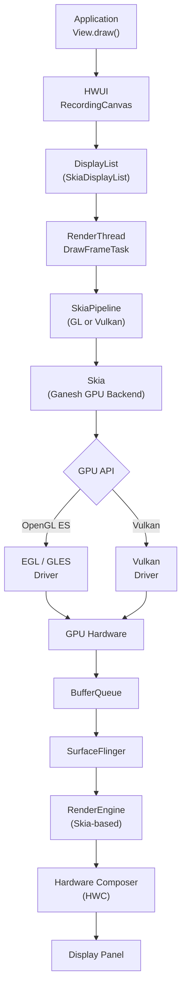
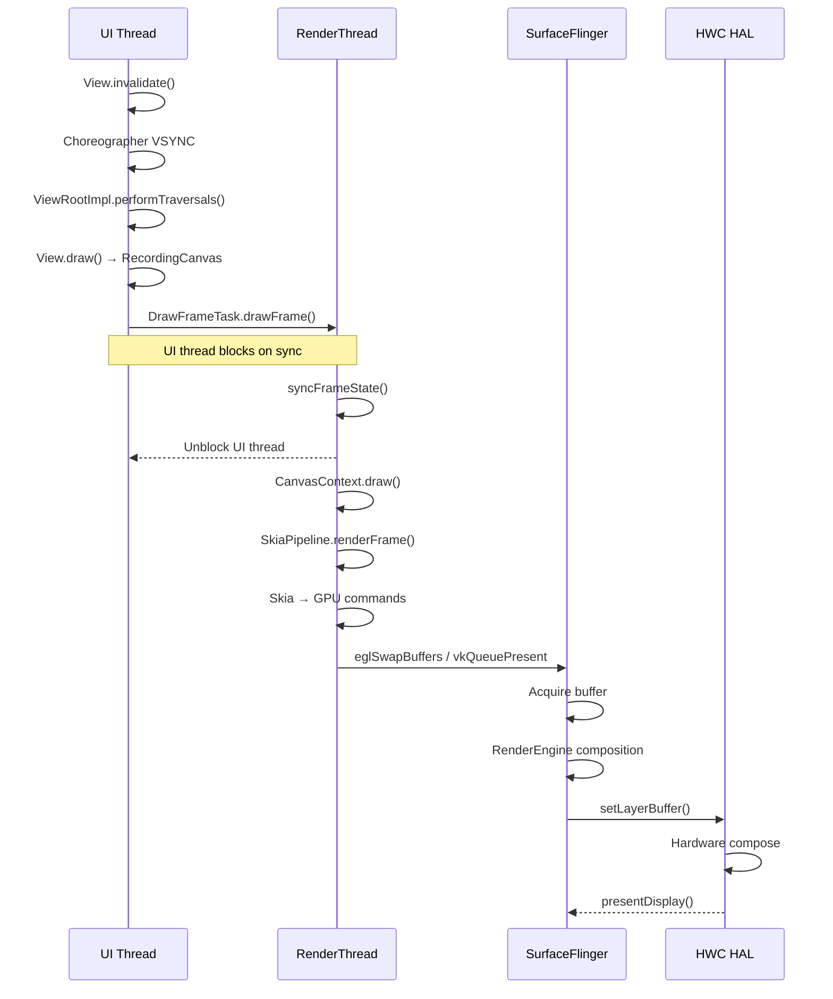
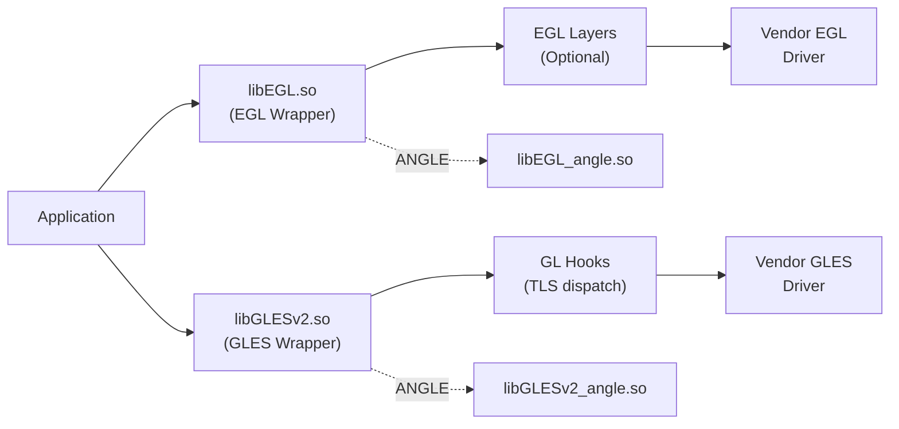
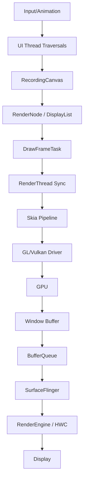

# 第 13 章：图形与渲染管线

Android 图形栈是 AOSP 中最复杂的子系统之一。它从应用 UI 线程中的 Java `View.draw()` 调用开始，向下贯穿 native C++ 渲染库、GPU shader 编译、硬件加速合成，最终到达物理显示面板并发出光子。本章沿着 AOSP 源码追踪这一完整路径，解释支撑 60+ FPS 渲染的架构、数据结构、同步机制与设计决策。

---

## 13.1 图形栈概览

### 13.1.1 完整管线总览

Android 屏幕上出现的每一帧都会沿着确定性的路径穿过多个子系统。这条路径是性能分析、驱动调试和 framework 开发的基础。



这条链路可划分为应用录制、RenderThread 同步与绘制、GPU 提交、BufferQueue 传输、SurfaceFlinger 合成和 HWC 显示六个阶段。

### 13.1.2 线程架构

Android 渲染天然是多线程架构。每个应用窗口至少有两个关键线程参与绘制：UI Thread 和 RenderThread。



UI Thread 负责 View 树测量、布局和记录绘制命令。RenderThread 负责把 DisplayList 同步为 GPU 命令，减少 UI Thread 在 GPU 路径上的阻塞。

### 13.1.3 关键源码目录

图形栈横跨多个 AOSP 顶层目录：

| 目录 | 作用 | 关键文件 |
|------|------|----------|
| `frameworks/native/opengl/` | EGL/GLES loader 与封装 | `libs/EGL/eglApi.cpp`, `libs/EGL/egl.cpp` |
| `frameworks/native/vulkan/` | Vulkan loader | `libvulkan/driver.cpp`, `libvulkan/api.cpp` |
| `frameworks/base/libs/hwui/` | 硬件 UI 渲染器 | `RenderNode.h`, `renderthread/` |
| `external/skia/` | 2D 渲染引擎 | `src/gpu/ganesh/`, `include/core/` |
| `frameworks/native/services/surfaceflinger/` | 系统合成器 | `SurfaceFlinger.cpp` |
| `hardware/interfaces/graphics/` | 图形 HAL 接口 | `composer/`, `allocator/` |
| `external/angle/` | GL-on-Vulkan 翻译层 | `src/libGLESv2/`, `src/libEGL/` |

### 13.1.4 管线选择

HWUI 支持两种渲染后端，通过系统属性在启动时选择：

```text
# Source: frameworks/base/libs/hwui/Properties.h
# Property: debug.hwui.renderer
#   "skiavk" → SkiaVulkan pipeline
#   "skiagl" → SkiaGL pipeline
```

`RenderThread.cpp` 中的逻辑把属性解析为具体管线类型：

```cpp
static const char* pipelineToString() {
    switch (auto renderType = Properties::getRenderPipelineType()) {
        case RenderPipelineType::SkiaGL:
            return "Skia (OpenGL)";
        case RenderPipelineType::SkiaVulkan:
            return "Skia (Vulkan)";
        default:
            LOG_ALWAYS_FATAL("canvas context type %d not supported",
                             (int32_t)renderType);
    }
}
```

`CanvasContext::create()` 工厂再根据结果实例化 `SkiaOpenGLPipeline` 或 `SkiaVulkanPipeline`。这使 HWUI 的上层记录模型可在保持一致 API 的前提下切换底层 GPU 后端。

---

## 13.2 OpenGL ES

### 13.2.1 EGL/GLES Loader 架构

Android 的 OpenGL ES 实现采用 loader-layer 架构。应用不会直接链接 GPU 厂商驱动，而是链接 `libEGL.so` 和 `libGLESv2.so` 这组分发库。分发库位于 `frameworks/native/opengl/`，负责驱动发现、函数派发、layer 插桩和错误管理。



这一层次结构允许 Android 统一控制驱动入口，并为 updated driver、ANGLE、validation layer 和调试插桩提供挂接点。

### 13.2.2 EGL Connection：`egl_connection_t`

EGL loader 的核心数据结构是 `egl_connection_t`。它持有 EGL 平台调用表、GLES hooks 表和已加载驱动 DSO。

```cpp
struct egl_connection_t {
    platform_impl_t platform;
    gl_hooks_t* hooks[2];
    void* dso;
};
```

全局单例 `gEGLImpl` 保存在 `egl.cpp` 中，与 `gHooks` 和 `gHooksNoContext` 共同构成全局派发状态。

### 13.2.3 驱动初始化

驱动加载是懒执行的。第一次 EGL 调用会触发 `egl_init_drivers()`。该过程配置 hooks、调用 `Loader::open()` 执行 `dlopen()`，并在驱动加载后初始化可选 EGL layers。

驱动查找顺序通常包括：

1. `GraphicsEnv` 指定的 updated 或 game driver。
2. 内建厂商驱动，例如 `libEGL_<name>.so`、`libGLESv2_<name>.so`。
3. ANGLE 对应的 `libEGL_angle.so` 与相关 GLES 库。

### 13.2.4 EGL API Dispatch

`eglApi.cpp` 中的每个公开 EGL API 基本遵循同一模式：

1. 初始化驱动。
2. 清理线程本地错误码。
3. 获取全局 `egl_connection_t`。
4. 通过 `platform` 函数表派发到底层驱动。

```cpp
EGLDisplay eglGetDisplay(EGLNativeDisplayType display) {
    ATRACE_CALL();
    if (egl_init_drivers() == EGL_FALSE) {
        return setError(EGL_BAD_PARAMETER, EGL_NO_DISPLAY);
    }
    clearError();
    egl_connection_t* const cnx = &gEGLImpl;
    return cnx->platform.eglGetDisplay(display);
}
```

`platform` 表可以直接指向厂商实现，也可以经过 EGL layer 包装。

### 13.2.5 通过 TLS 派发 GLES 函数

GLES 函数不使用 `platform` 表，而是通过 Thread-Local Storage 完成派发。`eglMakeCurrent()` 绑定上下文时，会把 TLS hooks 切换到对应驱动函数表。这样每个线程都能快速访问当前 GL 上下文的函数入口，减少全局锁和额外查表开销。

### 13.2.6 EGL Layers

EGL layers 为调试、验证和插桩提供可插拔中间层。它们位于应用与实际厂商实现之间，可记录 API 调用、注入验证逻辑、替换某些扩展实现，或把调用转发给 ANGLE。

### 13.2.7 内建扩展

Android loader 提供部分内建扩展和平台特定扩展字符串。某些扩展由 loader 自己实现，某些由厂商驱动实现后通过统一字符串暴露。该机制保证 Android 平台级 API 的行为一致性。

### 13.2.8 `MultifileBlobCache`

`MultifileBlobCache` 用于缓存 shader 编译结果和相关图形二进制。它使用多文件结构降低单文件损坏风险并提升更新灵活性。缓存命中能减少冷启动时的 shader 编译延迟。

### 13.2.9 Java Bindings

Java 层通过 `android.opengl.*` 和 EGL JNI 绑定访问底层 OpenGL ES。Java API 最终会进入 native EGL/GLES wrapper，再由 wrapper 派发到驱动。

### 13.2.10 EGL 对象生命周期

EGL 中的 display、context、surface、config 具有清晰生命周期：创建、绑定、使用、解绑和销毁。Android loader 负责把这些对象映射到厂商驱动的实际对象，并在 `eglTerminate()`、`eglDestroyContext()`、`eglDestroySurface()` 等路径中维护一致状态。

### 13.2.11 线程本地错误处理

EGL 使用线程本地错误码存放最近一次错误。`eglGetError()` 会读取并清除当前线程错误状态。该设计保证多个线程并发使用 EGL 时不会互相覆盖错误信息。

### 13.2.12 EGL 初始化序列

典型 EGL 初始化包括：

1. `eglGetDisplay()` 获取 display。
2. `eglInitialize()` 初始化连接。
3. `eglChooseConfig()` 选择 config。
4. `eglCreateContext()` 创建 GL context。
5. `eglCreateWindowSurface()` 或 `eglCreatePbufferSurface()` 创建 surface。
6. `eglMakeCurrent()` 绑定上下文。

这一序列为 HWUI、游戏引擎和 SurfaceFlinger 的 OpenGL 路径提供统一入口。

### 13.2.13 扩展字符串管理

EGL 和 GLES 扩展字符串需要合并平台、layer 和驱动三部分结果。Android loader 负责构建最终扩展字符串，确保客户端看到的能力集合既符合平台策略又反映底层驱动真实支持。

### 13.2.14 BlobCache：单文件缓存

除多文件缓存外，Android 还维护单文件形式的 `BlobCache` 机制，适用于某些简单持久化场景。它通常缓存 key-value 形式的 shader binary 或程序对象状态。

---

## 13.3 Vulkan

### 13.3.1 Vulkan Loader 架构

Android 的 Vulkan 实现同样使用 loader 设计。应用链接系统 `libvulkan.so`，系统 loader 负责发现实际厂商驱动、创建 instance 和 device、维护 dispatch table，并桥接 Android surface 与 swapchain。

### 13.3.2 驱动加载（`driver.cpp`）

`driver.cpp` 负责厂商 Vulkan 驱动发现与装载。核心工作包括查找驱动路径、`dlopen()` 驱动库、读取 `vkGetInstanceProcAddr`、校验 HAL 接口版本，并把 driver hooks 安装到 loader。

### 13.3.3 从 APEX 加载驱动

Android 支持从 APEX 中提供图形驱动或相关组件。APEX 机制为驱动更新提供更可控的模块化发布路径，使部分图形栈可以随系统模块更新而演进。

### 13.3.4 Instance 与 Device 创建（`api.cpp`）

`api.cpp` 实现 Vulkan loader 对外公开的 API，包括 `vkCreateInstance`、`vkEnumeratePhysicalDevices`、`vkCreateDevice` 等。loader 需要：

- 过滤和补充 Android 平台要求的扩展。
- 封装应用传入的 create info。
- 创建 loader 自身的对象包装层。
- 把 instance 与 device 级 dispatch table 绑定到返回对象。

### 13.3.5 `CreateInfoWrapper` 类

`CreateInfoWrapper` 用于包装应用提交的 `VkInstanceCreateInfo` 或 `VkDeviceCreateInfo`。它负责安全复制、扩展链处理、字段修正与 Android 平台扩展注入，防止 loader 直接依赖上层可变内存。

### 13.3.6 Swapchain：Vulkan 与 Android Surface 的连接点

Swapchain 是 Vulkan 与 Android 图形栈的关键交界面。Android 通过 `ANativeWindow` 把窗口表面抽象暴露给 Vulkan，Vulkan WSI 再基于它创建 `VkSurfaceKHR` 和 `VkSwapchainKHR`。

核心流程：

1. 应用从 `Surface` 获取 `ANativeWindow`。
2. 通过 Android WSI 创建 `VkSurfaceKHR`。
3. 查询 surface capabilities 与支持格式。
4. 创建 swapchain images。
5. 应用渲染到 image 并通过 present 交给 `BufferQueue`。
6. SurfaceFlinger 消费 buffer 并继续合成。

### 13.3.7 Vulkan Profiles

Vulkan Profiles 提供标准化能力集合，帮助应用判断目标设备是否满足某一功能档位。Android 可通过 GPU service、设置选项或 loader 侧机制查询和暴露这些 profile 信息。

### 13.3.8 Null Driver

Null driver 提供无实际硬件渲染能力的空实现，用于测试、调试或极端 fallback 场景。它帮助验证 loader 行为，而不依赖真实 GPU 驱动。

### 13.3.9 代码生成

Vulkan loader 的大量样板代码通过生成脚本创建，例如 dispatch table、入口声明、扩展枚举和 hook 点定义。代码生成减少手写错误并保持与 Vulkan registry 同步。

### 13.3.10 Dispatch Table 架构

Vulkan 采用分层 dispatch table：

| 级别 | 说明 |
|------|------|
| Global | 与实例无关的入口 |
| Instance | `VkInstance` 级别函数表 |
| Device | `VkDevice` 级别函数表 |
|

Loader 通过包装对象头或关联结构找到对应表，再派发到厂商驱动。

### 13.3.11 扩展 Hook 点

扩展 hook 点允许 loader 在特定扩展调用前后执行平台逻辑，例如 Android surface 扩展、调试扩展、profile 查询和平台约束检查。

### 13.3.12 Vulkan Instance 创建流程

Instance 创建的高层流程包括：验证参数、合并平台扩展、创建 loader instance 包装、调用厂商驱动真实 `vkCreateInstance`、建立 dispatch table，并返回包装对象给应用。

### 13.3.13 Physical Device 枚举

`vkEnumeratePhysicalDevices` 在 Android 上由 loader 转发给厂商驱动，并将返回设备包装为 loader 管理对象。多 GPU 设备、外接 GPU 或特定模拟环境会在此阶段暴露多个 physical device。

### 13.3.14 Queue Family 选择

队列族选择直接影响图形、计算、传输和 present 的调度方式。Android 图形应用通常至少需要支持 graphics 与 present 的 queue family；复杂场景还会单独使用 transfer 或 compute 队列以减少资源争用。

---

## 13.4 ANGLE

### 13.4.1 GL-on-Vulkan Translation

ANGLE 是一层 OpenGL ES 到 Vulkan 的翻译层。它让应用继续使用 GLES API，同时在底层转换为 Vulkan 命令，从而绕过质量较差或功能不足的原生 GLES 驱动。

### 13.4.2 ANGLE 何时使用

ANGLE 会在以下场景被启用：

- 系统或开发者选项为特定应用启用 ANGLE。
- 设备厂商或 Google 通过策略为兼容性问题应用启用 ANGLE。
- 调试或验证需要 Vulkan validation 与统一行为时。

### 13.4.3 ANGLE 的收益

ANGLE 的主要收益包括更一致的驱动行为、更好的兼容性、更稳定的扩展支持，以及更容易接入 Vulkan 工具链和调试设施。

### 13.4.4 ANGLE 架构

ANGLE 包含 `libEGL_angle.so`、`libGLESv2_angle.so`、内部 Vulkan backend 和 GLSL/ESSL 到中间表示再到 SPIR-V 的编译路径。Android loader 可以把 EGL/GLES 调用导向 ANGLE，再由 ANGLE 完成 Vulkan 提交。

---

## 13.5 Skia

### 13.5.1 Skia 在 Android 中的角色

Skia 是 Android 2D 图形渲染核心。它承担 Canvas、文本、路径、图片解码后的绘制、HWUI 后端、SurfaceFlinger RenderEngine 的 GPU 路径，以及多种软件或 GPU raster 任务。

Skia 在 Android 中同时服务：

- 应用 UI 绘制。
- 图像解码与后处理。
- SurfaceFlinger GPU 合成。
- PDF、截图、打印等图形输出。

### 13.5.2 Core API（`include/core/`）

Skia Core API 提供 `SkCanvas`、`SkPaint`、`SkPath`、`SkImage`、`SkSurface`、`SkFont` 等基础对象。Android HWUI 大量依赖这些对象来表达绘图命令。

### 13.5.3 Ganesh GPU Backend（`src/gpu/ganesh/`）

Ganesh 是 Skia 的成熟 GPU backend。它支持 OpenGL 和 Vulkan，通过 `GrDirectContext` 管理 GPU 资源、command buffer、纹理、atlas、pipeline state 与缓存。

### 13.5.4 Graphite：下一代 Backend

Graphite 是 Skia 新一代 GPU backend，目标是更现代的 command recording、资源调度和显式 API 适配。Android 当前仍以 Ganesh 为主，但 Graphite 代表未来演进方向。

### 13.5.5 SkSL：Skia 的着色语言

SkSL 是 Skia 的 shading language，用于表达 runtime effects、部分颜色滤镜和内部着色逻辑。SkSL 可被编译到 GLSL、SPIR-V 或其他后端表示。

### 13.5.6 Codec 与图片解码

Skia 提供图像编解码框架，支持 PNG、JPEG、WebP、GIF 等格式。Android 图像解码部分能力由 Skia 承担，并与 `ImageDecoder`、`BitmapFactory` 等上层 API 集成。

### 13.5.7 文本渲染

文本渲染涉及字体匹配、glyph cache、subpixel positioning、文本 blob 和 atlas 管理。Skia 与 Minikin、HarfBuzz 等文本组件协作完成 Android 文本绘制。

### 13.5.8 SIMD 优化

Skia 在像素混合、颜色转换、图像滤镜、栅格化等热点路径中使用 NEON、SSE、AVX 等 SIMD 优化，以提升 CPU raster 和预处理性能。

### 13.5.9 Skia 的录制与回放模型

Skia 支持把绘制命令录制为命令流，再在后续阶段回放。Android HWUI 的 DisplayList 和 Skia display list 模型正是基于这一思想，以降低 UI Thread 负担并支持属性增量更新。

### 13.5.10 Ganesh 中的 GPU 资源管理

Ganesh 通过资源缓存与预算系统管理纹理、buffer、render target 和 atlas。它根据内存预算回收资源，避免 GPU 内存无限增长。

### 13.5.11 Skia 的 Path Rendering

Path rendering 是 Skia 的复杂能力之一，涉及 path tessellation、stencil、analytic AA 和 GPU path fallback。复杂路径与 clip 常是移动端 UI 性能热点。

### 13.5.12 `SkSurface` 与渲染目标

`SkSurface` 表示一个可绘制目标。它可以是 CPU bitmap、GPU render target、后端 texture 或 Android hardware buffer 封装。HWUI 通常把 window buffer 或 layer buffer 封装为 `SkSurface` 进行绘制。

### 13.5.13 文本 Atlas 管理

文本 atlas 用于缓存 glyph 位图或距离场纹理，减少重复栅格化。Atlas 命中率会显著影响文本渲染性能和 GPU 提交次数。

---

## 13.6 HWUI

### 13.6.1 HWUI 的目的

HWUI 是 Android View 系统的硬件加速渲染层。它把 Java View 的 `Canvas` 绘制转换为 native DisplayList，再由 RenderThread 和 Skia pipeline 执行 GPU 绘制。

### 13.6.2 `Canvas` 接口

Java `Canvas` 提供 `drawRect`、`drawText`、`drawBitmap`、`save`、`restore`、`clipRect`、`translate`、`scale`、`rotate` 等绘图 API。硬件加速开启时，这些 API 会映射到 native recording canvas，而不是立刻 raster 到像素。

### 13.6.3 Canvas Op Types

Canvas op 可分为：

- 几何图元绘制。
- 文本绘制。
- 图片绘制。
- save/restore 状态管理。
- clip 与变换。
- layer 与离屏缓冲控制。
- functor 和特殊 drawable。

### 13.6.4 RenderNode：View 树的镜像

`RenderNode` 是 View 树在 native 渲染层的镜像节点。每个重要 View 或绘制单元都可对应一个 RenderNode，节点保存绘制命令和属性。

### 13.6.5 双缓冲属性

RenderNode 属性采用双缓冲模型：UI Thread 更新 staging/current 属性，RenderThread 在同步阶段获取稳定快照。这避免 UI 与渲染并发访问时的锁竞争和不一致。

### 13.6.6 RenderProperties：完整属性集合

RenderProperties 包含：位置、尺寸、变换矩阵、pivot、rotation、scale、translation、alpha、elevation、clip、outline、shadow、layer type、color transform 等。

### 13.6.7 LayerProperties 与 Layer Promotion

某些节点可提升为独立 layer 进行离屏绘制。这对动画、alpha 变化、复杂重绘和 stretch/blur 等效果很重要。Layer promotion 能减少重绘区域，但会增加显存和合成开销。

### 13.6.8 DisplayList：记录的命令流

DisplayList 是 HWUI 记录阶段的结果。它把绘图操作编码为一组可快速回放的命令，供 RenderThread 在后续帧中重用或局部更新。

### 13.6.9 Skia Display List 管线

现代 HWUI 使用基于 Skia 的 display list 管线，把记录阶段生成的命令在渲染阶段映射到 `SkCanvas` 操作。这样 HWUI 既保留 Android UI 的场景图模型，又复用 Skia 的成熟后端。

---

## 13.7 RenderThread

### 13.7.1 专用渲染线程

RenderThread 是每个进程中专用的 GPU 渲染线程。它负责同步 RenderNode 状态、管理图形上下文、执行帧绘制、维护缓存，并与 SurfaceFlinger 的 present 路径对接。

### 13.7.2 初始化

RenderThread 初始化包括创建 Looper、选择渲染管线、初始化 `EglManager` 或 `VulkanManager`、建立 cache manager 和 frame callback 机制。

### 13.7.3 线程循环

RenderThread 的循环负责处理任务队列、frame callback、纹理回收、异步缓存预热和 context 生命周期事件。核心绘制任务通常以 `DrawFrameTask` 形式进入队列。

### 13.7.4 VSYNC 集成

RenderThread 与 `Choreographer`、frame timeline 和 VSYNC 信号紧密集成。UI Thread 按 VSYNC 驱动布局和记录，RenderThread 在同步后尽快开始 GPU 命令生成，并努力在 display deadline 前完成提交。

### 13.7.5 EglManager

`EglManager` 管理 EGL display、config、context 和 surface。它负责上下文创建、窗口 surface 绑定、buffer swap、fence 同步和错误恢复，是 SkiaGL pipeline 的关键支撑组件。

### 13.7.6 VulkanManager

`VulkanManager` 管理 Vulkan instance、device、queue、surface 和 swapchain，服务于 SkiaVulkan pipeline。它还负责与 Android surface、AHardwareBuffer 和同步原语的适配。

### 13.7.7 CacheManager

`CacheManager` 管理纹理缓存、路径缓存、图片解码缓存、shader cache 等图形缓存。缓存命中可以显著降低帧内 CPU/GPU 工作量。

### 13.7.8 GPU Context 生命周期

GPU context 可能在应用进入后台、显存压力升高、Surface 销毁或驱动错误时被释放。RenderThread 需要支持 context 丢失后的资源重建和惰性恢复。

---

## 13.8 端到端帧管线

### 13.8.1 完整帧旅程

一帧从 `invalidate()` 到实际显示通常经历：

1. UI Thread 收到 VSYNC，执行 measure/layout/draw。
2. RecordingCanvas 记录命令到 RenderNode/DisplayList。
3. `DrawFrameTask` 被提交到 RenderThread。
4. RenderThread 同步属性、构建绘制列表。
5. Skia 生成 GPU 命令。
6. `eglSwapBuffers()` 或 `vkQueuePresent()` 提交图形缓冲。
7. BufferQueue 把 buffer 交给 SurfaceFlinger。
8. SurfaceFlinger 合成并由 HWC 显示。

### 13.8.2 Phase 1：Recording（UI Thread）

Recording 阶段只记录绘图命令，不执行 GPU 绘制。其目标是快速返回 UI Thread，使输入、动画和布局能保持流畅。

### 13.8.3 Phase 2：Sync（RenderThread）

Sync 阶段把 UI Thread 修改的 RenderNode 属性与 display list 同步到 RenderThread 可安全使用的状态，并执行脏区计算、layer 准备和部分资源上传决策。

### 13.8.4 Phase 3：Rendering（RenderThread）

Rendering 阶段调用实际 pipeline，驱动 Skia 对目标 surface 进行绘制。GL 路径会操作 EGL context，Vulkan 路径会构建和提交 Vulkan command buffer。

### 13.8.5 Phase 4：Presentation

Presentation 阶段把绘制完成的 buffer 提交到 `BufferQueue`。SurfaceFlinger 之后获取 buffer、做系统级合成、调用 HWC 呈现到屏幕。

### 13.8.6 Timing Budget

在 60Hz 屏幕上，一帧预算约 16.67ms；90Hz 约 11.11ms；120Hz 约 8.33ms。该预算需覆盖 UI 处理、RenderThread 同步、GPU 绘制和系统合成。

---

## 13.9 SurfaceFlinger RenderEngine

### 13.9.1 RenderEngine 的职责

RenderEngine 是 SurfaceFlinger 的 GPU 合成后端。它在 HWC 无法完全处理 layer 时承担 client composition，执行图层绘制、颜色变换、模糊、裁剪和 tone mapping。

### 13.9.2 基于 Skia 的 RenderEngine

现代 RenderEngine 基于 Skia 实现，使系统合成层与应用绘制层在 GPU 后端上共享更多能力。它支持 SkiaGL 与 SkiaVk 等后端路径。

### 13.9.3 RenderEngine 操作

常见操作包括：

- 将 layer 合成到 client target。
- 执行颜色空间转换。
- 应用模糊、阴影与 alpha 混合。
- 处理截图和 layer capture。
- 管理合成目标和资源缓存。

### 13.9.4 Composition Flow

RenderEngine 合成流程通常是：准备目标 surface → 遍历待 GPU 合成的 layers → 应用裁剪与变换 → 绘制每层 buffer 或纯色 → 提交并返回 acquire/release fence。

### 13.9.5 HWC Layer 合成类型

HWC 对 layer 的决策包括 DEVICE、CLIENT、SOLID_COLOR、CURSOR、SIDEBAND 等。DEVICE 由硬件合成，CLIENT 则由 RenderEngine/GPU 合成。

### 13.9.6 RenderEngine Shader Pipeline

RenderEngine 使用 shader 处理变换、采样、颜色变换、混合、模糊与特殊效果。Skia 化后，许多 shader 细节由 Skia backend 统一管理。

### 13.9.7 三缓冲与 Buffer 管理

图形路径通常采用双缓冲或三缓冲。三缓冲可以提高吞吐与抗抖动能力，但会增加显示延迟与内存占用。Android 通过 BufferQueue slot 和显示 deadline 协调这一平衡。

---

## 13.10 GPU 驱动接口

### 13.10.1 HAL 接口

图形栈通过多个 HAL 与硬件交互：

| HAL | 用途 |
|-----|------|
| Composer HAL | 显示合成与呈现 |
| Allocator HAL | 图形 buffer 分配 |
| Mapper HAL | 图形 buffer 映射与元数据 |
| Vulkan HAL/loader | Vulkan 驱动入口 |
| EGL/GLES driver | OpenGL ES 驱动入口 |

### 13.10.2 Gralloc Allocator

Gralloc 负责图形 buffer 分配。Surface、Codec、Camera、HWUI、SurfaceFlinger 都依赖 gralloc 获取 GPU 可访问 buffer，并通过 mapper 查询 stride、format、usage 等元数据。

### 13.10.3 EGL 驱动加载

EGL 驱动由 loader 在首次使用时加载，并通过函数表派发 API。Android 会根据系统配置、updated driver 与 ANGLE 策略决定实际加载对象。

### 13.10.4 Vulkan 驱动加载

Vulkan 驱动由 `libvulkan` loader 负责加载和包装，支持平台扩展、APEX 驱动和统一 dispatch table。

### 13.10.5 Updated/Game Driver 机制

Android 支持 updated driver 和 game driver。系统可基于包名、设备策略或开发者设置为特定应用选择不同 GPU 驱动，从而修复兼容性问题或提升性能。

### 13.10.6 Hardware Composer HAL

Composer HAL 是显示硬件与系统合成器之间的接口，负责显示配置、layer 提交、vsync、hotplug、颜色模式和 present fence 管理。

### 13.10.7 Gralloc Buffer 分配

Buffer 分配需要指定宽高、格式、usage flags 和可选元数据。不同 usage 组合决定 buffer 是否适用于 GPU 采样、渲染目标、视频解码、相机输出或 CPU 访问。

### 13.10.8 常见 AIDL 类型

现代图形 HAL 大量使用 AIDL 类型，例如 pixel format、dataspace、buffer usage、color mode、present fence 和 display config 等统一结构。

---

## 13.11 动手实践：追踪一帧

### 13.11.1 使用 Perfetto 追踪帧渲染

```bash
# On a rooted device or emulator:
adb shell perfetto -o /data/misc/perfetto-traces/frame.pftrace -t 10s \
  sched freq idle gfx view binder_driver surfaceflinger
adb pull /data/misc/perfetto-traces/frame.pftrace
# Open at https://ui.perfetto.dev
```

### 13.11.2 Trace 中应观察什么

重点关注 UI Thread、RenderThread、SurfaceFlinger、GPU completion、BufferQueue、HWC present 之间的时间关系，识别卡顿点位于记录、同步、绘制还是系统合成阶段。

### 13.11.3 关键 Trace Events

关键事件通常包括 `Choreographer#doFrame`、`DrawFrameTask`、`syncFrameState`、`dequeueBuffer`、`queueBuffer`、`SurfaceFlinger` 合成事件、GPU fence signal 与 present 时序。

### 13.11.4 使用 `dumpsys gfxinfo` 测量帧时间

```bash
# Enable frame stats collection
adb shell dumpsys gfxinfo <package> reset
# Run your app, then:
adb shell dumpsys gfxinfo <package> framestats
# Output includes per-frame timing:
# Draw    Prepare Process  Execute
# 1.20    0.82    5.43     3.21
# 0.98    0.73    4.87     2.95
```

### 13.11.5 GPU 内存调试

```bash
# Dump HWUI memory usage
adb shell dumpsys gfxinfo <package>
# Output shows:
# Pipeline=Skia (Vulkan)
# Memory policy:
#   Max surface area: 2764800
#   Max resource usage: 22.12MB (x8)
#   Background retention: 50%
# CPU Caches:
#   Bitmaps: 2.45 MB
#   Glyph Cache: 1.23 MB
# GPU Caches:
#   Textures: 15.67 MB
#   Buffers: 3.21 MB
```

### 13.11.6 Vulkan Validation Layers

```bash
# Enable validation layers
adb shell setprop debug.vulkan.layers VK_LAYER_KHRONOS_validation
# Or per-app via developer settings:
# Settings > Developer options > Graphics driver preferences
# Select the target app and enable "Vulkan validation"
```

### 13.11.7 GPU Rendering Profile Bars

可通过开发者选项启用 GPU rendering profile bars，观察每帧在 input、animation、layout、draw、sync、command issue 等阶段的耗时。

### 13.11.8 ANGLE 调试

```bash
# Enable ANGLE for a specific package
adb shell settings put global angle_gl_driver_selection_pkgs <package>
adb shell settings put global angle_gl_driver_selection_values angle
```

### 13.11.9 检查当前渲染管线

```bash
# Check which pipeline is active
adb shell getprop debug.hwui.renderer
# Returns: "skiavk" or "skiagl"
# Force a specific pipeline (requires reboot)
```

### 13.11.10 构建与测试图形改动

```bash
# Build HWUI
m libhwui
# Run HWUI unit tests
atest libhwui_unit_tests
# Run rendering tests
atest CtsGraphicsTestCases
# Build the Vulkan loader
m libvulkan
# Run loader tests
```

### 13.11.11 使用 SKP 捕获调试

```bash
# Enable SKP capture
adb shell setprop debug.hwui.capture_skp_enabled true
# Capture frames from a specific app
adb shell setprop debug.hwui.capture_skp_filename /data/local/tmp/frame.skp
# Trigger capture (the next frame will be captured)
# Pull the captured file
adb pull /data/local/tmp/frame.skp
# Analyze with Skia's viewer tool or https://debugger.skia.org
```

### 13.11.12 Overdraw 调试

```bash
# Enable overdraw visualization
adb shell setprop debug.hwui.overdraw show
# Color coding:
# No color    = drawn once (ideal)
# Blue        = drawn twice
# Green       = drawn three times
# Pink        = drawn four times
# Red         = drawn five or more times (problematic)
```

### 13.11.13 GPU Completion 时间线

```bash
# Enable GPU completion fence timestamps
adb shell setprop debug.hwui.profile gpu
# The timing data includes:
# - handlePlayback: Time to issue GPU commands
# - sync: Time for frame state sync
# - draw: Time for GPU command recording
# - dequeueBuffer: Time to acquire a buffer
# - queueBuffer: Time to submit a buffer
```

### 13.11.14 检查 BufferQueue 状态

```bash
# Dump BufferQueue state for all surfaces
adb shell dumpsys SurfaceFlinger
# Dump detailed layer info
# This shows:
# - Layer name and bounds
# - Buffer size and format
# - Composition type (DEVICE/CLIENT)
# - Visible region
# - Damage region
# - Buffer queue state (slots, pending buffers)
```

### 13.11.15 Hardware Composer 调试

```bash
# Dump HWC state
adb shell dumpsys SurfaceFlinger --display-id
# Shows for each display:
# - Active config (resolution, refresh rate)
# - Layer composition decisions
# - Hardware overlay usage
# - GPU fallback reasons
```

### 13.11.16 追踪 GPU 内存

```bash
# Trace GPU memory allocations
adb shell dumpsys gpu --gpumem
# Or use Perfetto with GPU memory counters:
```

### 13.11.17 强制特定渲染行为

```bash
# Force all rendering through GPU composition (no HWC overlays)
# Disable GPU composition (force HWC overlays only)
# Show surface update flashes
# These are useful for diagnosing composition-related issues
```

### 13.11.18 使用 RenderDoc 交互式 GPU 调试

```bash
# Install RenderDoc server on device
# Connect from desktop RenderDoc application
# Capture individual frames
# Inspect:
#   - All GPU draw calls
#   - Shader source code
#   - Texture/buffer contents
#   - Pipeline state at each draw
#   - GPU timing per draw call
```

### 13.11.19 监控丢帧

```bash
# Watch for jank in real-time
adb shell dumpsys gfxinfo <package> framestats
# Output includes per-frame columns:
# FLAGS|INTENDED_VSYNC|VSYNC|OLDEST_INPUT_EVENT|
# NEWEST_INPUT_EVENT|HANDLE_INPUT_START|
# ANIMATION_START|PERFORM_TRAVERSALS_START|
# DRAW_START|SYNC_QUEUED|SYNC_START|
# ISSUE_DRAW_COMMANDS_START|SWAP_BUFFERS|
# FRAME_COMPLETED|DEADLINE|GPU_COMPLETED
```

---

## 13.12 深入解析：Layer Rendering

### 13.12.1 离屏 Layer 架构

某些节点需要先渲染到离屏 layer，再作为纹理参与主场景合成。该机制用于 alpha 动画、模糊、复杂 clip、stretch 与特效场景。

### 13.12.2 Layer 创建与尺寸

Layer 尺寸通常根据节点边界、clip、变换和 effect 扩展区域确定。尺寸过大将显著增加显存与 fill-rate 开销。

### 13.12.3 Layer 渲染顺序

离屏 layer 先单独渲染，再在主画布中按 z-order 与 blending 规则合成。该两阶段路径必须保持正确的 save/restore 与 clip 语义。

### 13.12.4 图像 Pinning

图像 pinning 用于确保某些图像资源在帧间保持驻留，减少重复上传或解码，代价是更高内存占用。

### 13.12.5 Hardware Buffer Rendering

某些 layer 可直接渲染或引用 `AHardwareBuffer`。这使 camera、video、WebView 与系统图形路径能更高效地共享图像内容。

## 13.13 深入解析：RenderNode Drawing

### 13.13.1 RenderNodeDrawable

`RenderNodeDrawable` 是 RenderNode 的可绘制包装对象，负责在回放阶段把节点内容绘制到目标 `SkCanvas`。

### 13.13.2 反向投影

Backwards projection 用于某些投影与阴影场景，把子节点视觉效果投射回父级空间，保证 elevation 与轮廓效果正确。

### 13.13.3 Outline Clipping

Outline clipping 允许节点按照圆角矩形或自定义 outline 执行裁剪，这是 Material 风格圆角和卡片效果的重要基础。

### 13.13.4 Z-Order 与重排序

HWUI 通过 z-order 和 reordering 控制节点实际绘制顺序，以正确实现 elevation、阴影与投影。重排序会影响 overdraw、clip 和 layer promotion 决策。

## 13.14 深入解析：VulkanSurface

### 13.14.1 Surface 创建

`VulkanSurface` 封装 Android window surface 与 Vulkan swapchain。它负责从 `ANativeWindow` 初始化 Vulkan surface、交换链图像和提交路径。

### 13.14.2 Pre-Transform 处理

Android 显示和 Surface 可能存在预旋转或其他变换。VulkanSurface 需要根据 surface capability 正确处理 pre-transform，避免多余矩阵运算和方向错误。

### 13.14.3 Pixel Snap Matrix

Pixel snap matrix 用于把几何边界对齐到像素网格，以减少文本与细线条模糊，提高最终输出稳定性。

## 13.15 深入解析：SkiaCanvas 实现

### 13.15.1 `SkiaCanvas` 类

`SkiaCanvas` 是 HWUI 对 Skia `SkCanvas` 的适配层，负责把 Android 语义下的绘图操作、安全检查和状态管理映射到 Skia。

### 13.15.2 Paint Looper 模式

Paint looper 模式用于在复杂 paint 效果或多 pass 绘制时反复遍历绘图步骤，例如阴影、描边、滤镜叠加等场景。

### 13.15.3 Save Stack 管理

Canvas 的 save/restore 维护一棵状态栈，包含矩阵、clip、layer 与绘制状态。栈管理错误会直接导致绘制污染或内存膨胀。

## 13.16 深入解析：RenderProxy 与线程通信

### 13.16.1 RenderProxy 模式

`RenderProxy` 是 Java/ViewRootImpl 与 RenderThread 之间的桥梁。它把 Java 层发起的渲染请求转换为 native 调用，并管理同步边界。

### 13.16.2 同步与异步操作

一些操作必须同步完成，例如帧同步、surface 销毁；另一些操作可异步排队，例如缓存清理和后台资源上传。合理划分能减少 UI 卡顿。

### 13.16.3 `DrawFrameTask` 交接

`DrawFrameTask` 是一次帧绘制的主要任务对象。UI Thread 构造它并移交给 RenderThread，RenderThread 在执行结束后返回必要同步信息。

## 13.17 深入解析：颜色管理

### 13.17.1 颜色管线

颜色管线涵盖输入图像色域、节点颜色空间、渲染目标 dataspace、SurfaceFlinger 合成色域与显示面板最终色彩模式。

### 13.17.2 HWUI 中的颜色模式

HWUI 可在 sRGB、wide color gamut 等模式下绘制，并根据窗口属性和目标 display 配置选择合适色域与 blending 规则。

### 13.17.3 Vulkan 中的广色域

Vulkan 路径需要正确选择 surface format、colorspace 与 shader 处理，才能支持 Display-P3 等广色域输出。

### 13.17.4 HDR Override Workaround

某些设备或驱动需要 HDR override workaround，以在色彩能力暴露与实际驱动行为不完全一致时维持稳定显示效果。

## 13.18 深入解析：Damage Tracking 与 Partial Updates

### 13.18.1 Damage Region 概念

Damage region 表示相对上一帧真正发生变化的屏幕区域。若准确维护 damage，可减少重绘区域和带宽消耗。

### 13.18.2 Buffer Age

Buffer age 表示当前可复用缓冲与最近历史帧之间的关系。结合 damage region，渲染器可以只重绘必要区域。

### 13.18.3 Damage 与 Swap

在支持 partial update 的路径中，swap 前会把 damage 信息传给驱动或 HWC，使后端知道哪些像素需要实际更新。

## 13.19 深入解析：动画与帧回调

### 13.19.1 动画框架集成

动画系统通过 `Choreographer`、`ValueAnimator`、RenderNode 属性动画与 RenderThread 协同，在 VSYNC 驱动下逐帧更新界面。

### 13.19.2 帧回调

Frame callback 是 UI 与渲染调度的核心抽象。它让系统在 VSYNC 到来时统一处理输入、动画、布局和绘制。

### 13.19.3 VSYNC-Deadline 调度

现代 Android 不只关注 VSYNC 到来时刻，也关注显示 deadline。系统通过 frame timeline、hint session 与 scheduler 努力让 GPU 提交更贴近截止时间并减少功耗。

## 13.20 深入解析：Shader Cache 与 Persistent Graphics Cache

### 13.20.1 ShaderCache

Shader cache 存储编译后的 shader 程序和相关中间状态，减少冷启动或首次路径出现时的卡顿。

### 13.20.2 PersistentGraphicsCache

Persistent graphics cache 把部分图形缓存跨进程生命周期持久化，可在应用重启后重用，提升启动与首帧性能。

### 13.20.3 Cache Executor

Cache executor 在后台线程异步执行 cache 预热、写入与清理，避免把昂贵 I/O 直接放在关键帧路径中。

## 13.21 深入解析：Hint Session（ADPF）

### 13.21.1 性能提示

Hint session 通过 ADPF 向性能与电源系统提供帧负载提示。渲染系统可以报告期望帧时长和当前压力，帮助 CPU/GPU DVFS 在流畅与功耗之间取得平衡。

## 13.22 性能特征与设计原则

### 13.22.1 关键设计决策

关键设计决策包括：UI Thread 只记录不执行 GPU、使用 RenderThread 隔离绘制、依赖 DisplayList 重放、使用部分更新和 damage tracking、支持多后端并共享上层语义、把系统合成与应用渲染分层。

### 13.22.2 常见性能陷阱

常见陷阱包括过度 overdraw、频繁 layer promotion、大量复杂 path、文本 atlas 抖动、shader 冷编译、频繁 bitmap 上传、过大的离屏 buffer、无效动画与错误的 clip/outline 使用。

### 13.22.3 管线比较

| 管线 | 优势 | 风险 |
|------|------|------|
| SkiaGL | 兼容性成熟、工具链普遍 | 受 GLES 驱动质量影响较大 |
| SkiaVulkan | 显式控制更强、适配现代 GPU | 驱动与同步复杂度更高 |
| ANGLE | 行为更一致、便于排障 | 增加翻译层开销 |

## 13.23 深入解析：CanvasContext Draw Flow

### 13.23.1 CanvasContext 生命周期

`CanvasContext` 是 HWUI 窗口级渲染上下文，负责维护根 RenderNode、渲染管线对象、surface 绑定、frame 生命周期和资源缓存。

### 13.23.2 Surface 设置

CanvasContext 在窗口创建、变化、销毁时更新 surface。surface 设置过程会影响 buffer 大小、颜色空间、swap 行为和后端上下文状态。

### 13.23.3 管线 Surface 配置

不同管线会以不同方式配置 surface：GL 需要 EGLSurface，Vulkan 需要 swapchain 与 image views。CanvasContext 统一抽象这些差异。

### 13.23.4 Buffer 数量管理

CanvasContext 要管理 dequeue 出来的 buffer 数量和生命周期，避免 buffer starvation 或额外延迟。

### 13.23.5 `prepareTree` 阶段

`prepareTree` 会遍历 RenderNode 树，完成属性同步、脏区计算、layer 决策和部分资源准备。它是绘制前的关键预处理阶段。

### 13.23.6 跳帧逻辑

当 frame 已错过 deadline、surface 不可用、内容未变化或系统策略需要丢弃帧时，CanvasContext 会执行 frame skipping，避免无效绘制放大抖动。

## 13.24 深入解析：WebView 集成

### 13.24.1 WebView Functors

WebView 通过 functor 与 HWUI 集成，把 Chromium 渲染输出嵌入 Android 渲染树中。Functor 允许外部渲染系统在 HWUI 帧中插入自定义绘制。

### 13.24.2 `VkInteropFunctorDrawable`

该对象用于 Vulkan 互操作场景，使 WebView 或其他外部渲染内容能通过 Vulkan 资源共享与 HWUI 协同绘制。

### 13.24.3 Functor Layer 要求

Functor 通常需要独立 layer 或特定同步约束，以保证外部内容与 HWUI 渲染在同一帧中正确组合，并避免错误重绘。

## 13.25 深入解析：阴影与 Elevation

### 13.25.1 Elevation 模型

Material elevation 把 UI 元素看作位于不同高度的平面，高度差决定阴影投射与绘制顺序。

### 13.25.2 阴影颜色

Android 阴影通常区分 ambient shadow 与 spot shadow，两者颜色与 alpha 可独立控制，以匹配真实感与设计风格。

### 13.25.3 光源

系统使用固定或可配置的光源方向和高度计算阴影形状。不同设备和版本可能使用稍有差异的参数模型。

### 13.25.4 Skia 中的阴影渲染

Skia 负责具体阴影几何计算与 GPU/CPU 渲染。复杂轮廓阴影会带来较高 fill-rate 与 blur 成本。

## 13.26 深入解析：DamageAccumulator

### 13.26.1 目的

`DamageAccumulator` 收集节点变换和内容变化导致的 damage 区域，是 partial update 的重要基础设施。

### 13.26.2 变换跟踪

DamageAccumulator 需要感知节点矩阵、clip 与父子层级变化，才能把局部变更正确投影到目标屏幕空间。

### 13.26.3 Damage 传播

一个子节点变化可能沿树向上扩散成更大 damage 区域。传播逻辑必须兼顾精确性与计算成本。

## 13.27 深入解析：内存策略

### 13.27.1 内存策略配置

HWUI 会根据屏幕尺寸、设备等级、管线后端和属性配置设定纹理缓存、layer cache、路径缓存和 GPU 预算。

### 13.27.2 资源预算计算

资源预算通常与屏幕总像素数、缓冲数量、后端类型和经验系数相关，用来限制 Skia 和 HWUI 可持有的 GPU 资源量。

### 13.27.3 后台保留比例

应用进入后台后，系统可按策略保留一部分图形缓存，以平衡回前台时的恢复速度与整体内存压力。

### 13.27.4 Context 销毁超时

长时间后台或显存紧张时，系统可在超时后销毁 GPU context 释放资源。回到前台时则重新初始化。

## 13.28 深入解析：Fence 同步

### 13.28.1 Fence 的作用

Fence 用于跨 CPU、GPU、SurfaceFlinger 和 HWC 同步缓冲使用权。Acquire fence 表示何时可读，release/present fence 表示何时完成显示或释放。

### 13.28.2 EGL 中的 Native Fence Sync

OpenGL/EGL 路径可通过 native fence sync 扩展在驱动、BufferQueue 和系统合成器之间传递同步点。

### 13.28.3 GPU 侧 Fence Wait

Vulkan 与部分 GL 路径会在 GPU 侧等待 fence，以减少 CPU busy wait 并保持图形流水线正确顺序。

## 13.29 深入解析：Stretch 与 Overscroll Effects

### 13.29.1 Stretch Effect

Stretch effect 是现代 Android 的边缘回弹视觉效果之一，它通过几何拉伸和 shader 处理在过度滚动时提供弹性反馈。

### 13.29.2 Stretch 的 Layer 要求

某些 stretch 效果需要节点提升为 layer，确保局部变换与后处理不会污染整个场景。

### 13.29.3 StretchMask

StretchMask 用于限制拉伸影响区域，保证内容只在合适区域内被变形。

## 13.30 深入解析：Force Dark（深色主题）

### 13.30.1 自动深色主题

Force Dark 能在应用未显式提供深色资源时自动对颜色进行变换，以快速生成深色主题效果。

### 13.30.2 每节点退出机制

某些节点可选择退出自动深色处理，避免品牌色、图片或特殊视觉元素被错误变换。

### 13.30.3 颜色变换

Force Dark 通过颜色矩阵和内容分类对背景、前景和文本进行变换，尽量保持可读性与层次关系。

## 13.31 深入解析：Hole Punching

### 13.31.1 什么是 Hole Punching

Hole punching 是在渲染结果中挖空区域，让底层内容直接显示出来的技术，常用于某些嵌套内容或特殊合成需求。

### 13.31.2 在管线中的使用

该技术通常需要精确 clip、blend 与 layer 配合，否则容易产生视觉伪影或错误重绘。

## 13.32 构建系统集成

### 13.32.1 HWUI 构建配置

HWUI 的构建由 `frameworks/base/libs/hwui/Android.bp` 等 Soong 文件控制，涉及 Skia、图形 HAL 头文件和多种编译选项。

### 13.32.2 Skia 构建集成

Skia 作为外部项目接入 Android 构建系统，需要对平台特性、CPU 架构、编译选项和可用后端进行裁剪与配置。

### 13.32.3 Vulkan Loader 构建

Vulkan loader 构建需要同时生成平台 loader、测试程序和可能的代码生成产物，并与图形 HAL 接口、系统属性和 APEX 机制联动。

## 13.33 测试基础设施

### 13.33.1 HWUI Tests

HWUI 具有单元测试、渲染正确性测试和回归测试，用于覆盖 RenderNode、DisplayList、Canvas 行为和后端差异。

### 13.33.2 CTS Graphics Tests

CTS Graphics Tests 用于验证平台图形 API 和行为的兼容性，是厂商设备图形实现的关键门槛。

### 13.33.3 Perfetto 测试集成

Perfetto 可用于自动化采集图形性能 trace，在回归测试中检查帧时间、Jank 和关键事件顺序。

## 13.34 演进与未来方向

### 13.34.1 历史演进

Android 图形管线经历了软件 Canvas、OpenGL display list、RenderThread、Skia GPU backend、Vulkan 支持和 SurfaceFlinger Skia 化等阶段。

### 13.34.2 Graphite 引入路径

Graphite 可能逐步承担更多 HWUI 和 RenderEngine 后端职责，以更好适配现代 GPU API 和显式资源模型。

### 13.34.3 Vulkan-First 策略

随着 Vulkan 驱动质量提升，Android 正朝 Vulkan-first 方向演进，让更多图形路径基于统一的现代 GPU API。

### 13.34.4 GPU 驱动可更新性

updated driver、game driver 和模块化发布机制让图形兼容性问题可以在不升级整机系统映像的情况下得到修复。

## 13.35 深入解析：`IRenderPipeline` 接口

### 13.35.1 管线抽象

`IRenderPipeline` 抽象 HWUI 对具体后端的依赖，使 CanvasContext 可以以统一方式驱动 GL 或 Vulkan 后端。

### 13.35.2 `DrawResult` 结构

`DrawResult` 描述一次绘制结果，例如是否成功、是否跳帧、是否需要更多同步、buffer 处理状态与统计信息。

### 13.35.3 管线选择决策树

决策树通常基于系统属性、设备能力、surface 类型、驱动可用性和 feature flag 选择合适管线。

## 13.36 深入解析：`RenderState`

### 13.36.1 目的

`RenderState` 管理上下文相关全局状态，是 pipeline 与资源管理、layer 追踪之间的桥梁。

### 13.36.2 Context Callbacks

它持有上下文创建、销毁、资源重建和后台清理等 callback，用于在 context 生命周期变化时通知相关子系统。

### 13.36.3 Layer Tracking

RenderState 跟踪独立 layer、显存占用和缓存使用情况，以支持策略调优和调试输出。

## 13.37 深入解析：帧时序与 Jank 检测

### 13.37.1 `JankTracker`

`JankTracker` 记录帧是否错过 deadline、是否存在大于阈值的抖动，以及各阶段耗时分布，为开发者和系统统计提供数据。

### 13.37.2 帧信息跟踪

Frame info 通常记录 intended vsync、actual vsync、输入时间、动画开始、遍历开始、draw、sync、swap、completion 和 GPU completion 等时间戳。

### 13.37.3 GPU Profiling Visualization

可视化工具会把 GPU profiling 数据以柱状图、时间线或 trace slice 展示出来，帮助定位 GPU 饱和、同步等待和命令提交延迟。

## 13.38 深入解析：`CommonPool` 线程池

### 13.38.1 后台工作分发

`CommonPool` 用于分发图形系统中的后台工作，如图片解码准备、缓存写入、部分预处理和异步资源任务。

### 13.38.2 与 Skia 的集成

Skia 某些可并行化任务也会借助线程池执行，以提升多核设备上的总体吞吐。

## 13.39 深入解析：Bitmap 处理

### 13.39.1 Hardware Bitmap

Hardware Bitmap 表示存放在 GPU 可访问内存中的 Bitmap，可减少 CPU 到 GPU 的重复上传，适合频繁复用图像资源。

### 13.39.2 Bitmap 上传优化

优化手段包括懒上传、批量上传、纹理复用、预缩放与解码格式选择，以减少首帧和滚动时卡顿。

### 13.39.3 `HardwareBitmapUploader`

该组件负责把 Bitmap 以合适格式上传到 GPU，并处理生命周期、线程边界和缓存关联。

## 13.40 附录：关键文件参考

### 13.40.1 OpenGL ES 栈

| 路径 | 作用 |
|------|------|
| `frameworks/native/opengl/libs/EGL/egl.cpp` | EGL loader 状态与初始化 |
| `frameworks/native/opengl/libs/EGL/eglApi.cpp` | EGL API wrapper |
| `frameworks/native/opengl/libs/EGL/Loader.cpp` | 驱动加载 |
| `frameworks/native/opengl/libs/GLES2/gl2.cpp` | GLES 导出入口 |

### 13.40.2 Vulkan 栈

| 路径 | 作用 |
|------|------|
| `frameworks/native/vulkan/libvulkan/driver.cpp` | 驱动发现与加载 |
| `frameworks/native/vulkan/libvulkan/api.cpp` | Vulkan API wrapper |
| `frameworks/native/vulkan/libvulkan/swapchain.cpp` | Android swapchain 适配 |
| `frameworks/native/vulkan/libvulkan/` | loader 其余核心实现 |

### 13.40.3 HWUI 栈

| 路径 | 作用 |
|------|------|
| `frameworks/base/libs/hwui/RenderNode.h` | RenderNode 定义 |
| `frameworks/base/libs/hwui/renderthread/RenderThread.cpp` | RenderThread 主体 |
| `frameworks/base/libs/hwui/renderthread/CanvasContext.cpp` | 窗口级渲染上下文 |
| `frameworks/base/libs/hwui/pipeline/skia/` | Skia 后端管线 |
| `frameworks/base/libs/hwui/` | 其余 HWUI 核心实现 |

### 13.40.4 系统属性参考

| 属性 | 含义 |
|------|------|
| `debug.hwui.renderer` | 选择 `skiagl` 或 `skiavk` |
| `debug.hwui.profile` | 渲染耗时分析 |
| `debug.hwui.overdraw` | overdraw 可视化 |
| `debug.vulkan.layers` | Vulkan validation layers |
| `debug.hwui.capture_skp_enabled` | SKP 捕获开关 |

### 13.40.5 Mermaid：完整数据流



## 13.41 术语表

| 术语 | 说明 |
|------|------|
| HWUI | Android 硬件加速 UI 渲染层 |
| RenderThread | 应用进程中的专用渲染线程 |
| RenderNode | View 树在 native 层的镜像节点 |
| DisplayList | 记录的绘制命令流 |
| Skia | Android 核心 2D 图形引擎 |
| Ganesh | Skia 现有 GPU backend |
| Graphite | Skia 下一代 GPU backend |
| EGL | OpenGL ES 上下文与表面管理接口 |
| GLES | OpenGL ES 图形 API |
| Vulkan | 现代显式图形 API |
| ANGLE | GLES 到 Vulkan/D3D/Metal 的翻译层 |
| BufferQueue | 生产者-消费者图形缓冲队列 |
| SurfaceFlinger | 系统显示合成器 |
| HWC | Hardware Composer HAL |
| Gralloc | 图形缓冲分配系统 |
| Damage Region | 与上一帧相比发生变化的区域 |
| Fence | 图形同步原语 |
| Jank | 帧未按期完成导致的卡顿 |

## 总结

Android 图形与渲染管线把 Java View 系统、native 记录模型、Skia 绘图后端、OpenGL/Vulkan 驱动、BufferQueue、SurfaceFlinger 和 Hardware Composer 串联成一条完整数据链路。

这套架构的关键特征如下：

| 层级 | 核心组件 | 主要职责 |
|------|----------|----------|
| 应用层 | `View`, `Canvas`, `Choreographer` | 记录 UI 绘制命令 |
| 渲染层 | `HWUI`, `RenderNode`, `RenderThread` | 同步属性并生成 GPU 命令 |
| 图形后端 | `Skia`, `EGL/GLES`, `Vulkan`, `ANGLE` | 执行实际绘制 |
| 交换层 | `Surface`, `ANativeWindow`, `BufferQueue` | 传递图形缓冲 |
| 系统合成层 | `SurfaceFlinger`, `RenderEngine`, `HWC` | 全局合成与显示输出 |
| 驱动与硬件 | GPU driver, display controller | 执行 GPU 与显示硬件工作 |

设计原则集中体现在几方面：UI 与绘制分线程、控制面与数据面分离、后端可插拔、显式同步、精细缓存、部分更新、可观测性内建，以及系统级与应用级渲染职责分层。

掌握本章后，可以沿着 `View.draw()` → `RenderThread` → `Skia` → `EGL/Vulkan` → `BufferQueue` → `SurfaceFlinger` → `HWC` 这条主线定位绝大多数 Android 图形性能、兼容性和渲染正确性问题。
