# Chapter 13: Graphics and Render Pipeline

Android's graphics stack is one of the most intricate subsystems in AOSP. It spans from
the Java `View.draw()` call in an application's UI thread all the way down through native
C++ rendering libraries, GPU shader compilation, hardware-accelerated composition, and
finally to photons leaving the physical display panel. This chapter traces that entire
journey through the actual AOSP source code, revealing the architecture, data structures,
synchronization mechanisms, and design decisions that make 60+ FPS rendering possible on
billions of devices.

---

## 13.1 Graphics Stack Overview

### 13.1.1 The Full Pipeline at a Glance

Every frame that appears on an Android screen follows a deterministic path through
multiple subsystems. Understanding this path is essential for performance analysis,
driver debugging, and framework development.

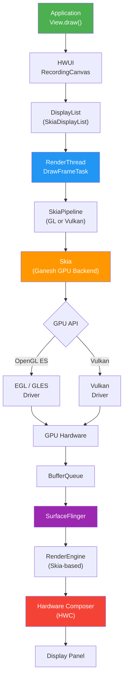

### 13.1.2 Thread Architecture

Android's rendering architecture is fundamentally multi-threaded. Each application window
has at least two threads involved in rendering:

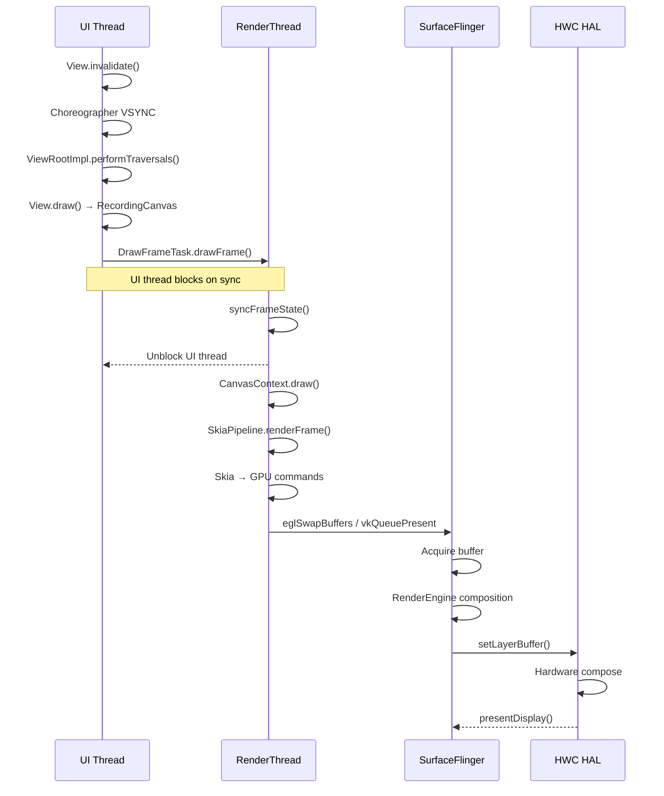

### 13.1.3 Key Source Directories

The graphics stack spans multiple top-level directories in AOSP:

| Directory | Purpose | Key Files |
|-----------|---------|-----------|
| `frameworks/native/opengl/` | EGL/GLES loader and wrappers | `libs/EGL/eglApi.cpp`, `libs/EGL/egl.cpp` |
| `frameworks/native/vulkan/` | Vulkan loader | `libvulkan/driver.cpp`, `libvulkan/api.cpp` |
| `frameworks/base/libs/hwui/` | Hardware UI renderer | `RenderNode.h`, `renderthread/` |
| `external/skia/` | 2D rendering engine | `src/gpu/ganesh/`, `include/core/` |
| `frameworks/native/services/surfaceflinger/` | System compositor | `SurfaceFlinger.cpp` |
| `hardware/interfaces/graphics/` | HAL interfaces | `composer/`, `allocator/` |
| `external/angle/` | GL-on-Vulkan translation | `src/libGLESv2/`, `src/libEGL/` |

### 13.1.4 Pipeline Selection

HWUI supports two rendering backends, selected at boot time via system properties:

```
# Source: frameworks/base/libs/hwui/Properties.h
# Property: debug.hwui.renderer
#   "skiavk" → SkiaVulkan pipeline
#   "skiagl" → SkiaGL pipeline
```

As seen in `RenderThread.cpp` (line 286):

```cpp
// frameworks/base/libs/hwui/renderthread/RenderThread.cpp, line 286
static const char* pipelineToString() {
    switch (auto renderType = Properties::getRenderPipelineType()) {
        case RenderPipelineType::SkiaGL:
            return "Skia (OpenGL)";
        case RenderPipelineType::SkiaVulkan:
            return "Skia (Vulkan)";
        default:
            LOG_ALWAYS_FATAL("canvas context type %d not supported",
                             (int32_t)renderType);
    }
}
```

The `CanvasContext::create()` factory in `CanvasContext.cpp` (line 82) instantiates the
correct pipeline:

```cpp
// frameworks/base/libs/hwui/renderthread/CanvasContext.cpp, line 82
CanvasContext* CanvasContext::create(RenderThread& thread, bool translucent,
                                     RenderNode* rootRenderNode,
                                     IContextFactory* contextFactory,
                                     pid_t uiThreadId, pid_t renderThreadId) {
    auto renderType = Properties::getRenderPipelineType();
    switch (renderType) {
        case RenderPipelineType::SkiaGL:
            return new CanvasContext(thread, translucent, rootRenderNode,
                contextFactory,
                std::make_unique<skiapipeline::SkiaOpenGLPipeline>(thread),
                uiThreadId, renderThreadId);
        case RenderPipelineType::SkiaVulkan:
            return new CanvasContext(thread, translucent, rootRenderNode,
                contextFactory,
                std::make_unique<skiapipeline::SkiaVulkanPipeline>(thread),
                uiThreadId, renderThreadId);
    }
}
```

---

## 13.2 OpenGL ES

### 13.2.1 Architecture of the EGL/GLES Loader

Android's OpenGL ES implementation is a loader-layer architecture. Applications never
link directly against GPU vendor drivers. Instead, they link against `libEGL.so` and
`libGLESv2.so`, which are thin dispatch libraries maintained in
`frameworks/native/opengl/`.

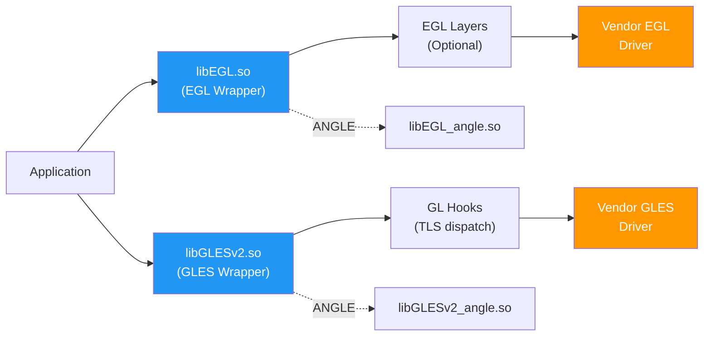

### 13.2.2 The EGL Connection: `egl_connection_t`

The central data structure is `egl_connection_t`, declared in `egldefs.h`. It holds
function pointers for both EGL and GLES calls:

```cpp
// frameworks/native/opengl/libs/EGL/egldefs.h
struct egl_connection_t {
    // function tables for EGL platform calls
    platform_impl_t platform;
    // function tables for GL calls - one per GLES version
    gl_hooks_t* hooks[2];
    // handle to the loaded driver shared object
    void* dso;
};
```

The global singleton `gEGLImpl` is declared in `egl.cpp` (line 33):

```cpp
// frameworks/native/opengl/libs/EGL/egl.cpp, line 33
egl_connection_t gEGLImpl;
gl_hooks_t gHooks[2];
gl_hooks_t gHooksNoContext;
```

### 13.2.3 Driver Initialization

Driver loading is triggered lazily on the first EGL call. The function
`egl_init_drivers()` in `egl.cpp` (line 155) is the entry point:

```cpp
// frameworks/native/opengl/libs/EGL/egl.cpp, line 125
static EGLBoolean egl_init_drivers_locked() {
    // ...
    Loader& loader(Loader::getInstance());
    egl_connection_t* cnx = &gEGLImpl;
    cnx->hooks[egl_connection_t::GLESv1_INDEX] =
        &gHooks[egl_connection_t::GLESv1_INDEX];
    cnx->hooks[egl_connection_t::GLESv2_INDEX] =
        &gHooks[egl_connection_t::GLESv2_INDEX];
    cnx->dso = loader.open(cnx);

    // Check for layers after driver load
    if (cnx->dso) {
        LayerLoader& layer_loader(LayerLoader::getInstance());
        layer_loader.InitLayers(cnx);
    }
    return cnx->dso ? EGL_TRUE : EGL_FALSE;
}
```

The `Loader::open()` method (in `Loader.cpp`) performs the actual `dlopen()` of the
vendor driver. It searches for drivers using these naming conventions:

1. Updated driver from `GraphicsEnv` namespace (Game driver / updatable driver)
2. Built-in vendor driver: `libEGL_<name>.so`, `libGLESv2_<name>.so`
3. ANGLE (if selected by the system): `libEGL_angle.so`

### 13.2.4 EGL API Dispatch

Every public EGL function in `eglApi.cpp` follows an identical pattern: clear the
thread-local error, obtain the global connection, and dispatch through the `platform`
function table:

```cpp
// frameworks/native/opengl/libs/EGL/eglApi.cpp, line 40
EGLDisplay eglGetDisplay(EGLNativeDisplayType display) {
    ATRACE_CALL();
    if (egl_init_drivers() == EGL_FALSE) {
        return setError(EGL_BAD_PARAMETER, EGL_NO_DISPLAY);
    }
    clearError();
    egl_connection_t* const cnx = &gEGLImpl;
    return cnx->platform.eglGetDisplay(display);
}
```

This pattern repeats for all 660 lines of `eglApi.cpp`. The `platform` table can point
either directly to the vendor driver or through optional EGL layers (used for debugging,
validation, or ANGLE interposition).

### 13.2.5 GLES Function Dispatch via TLS

OpenGL ES functions use a different dispatch mechanism -- Thread-Local Storage (TLS).
When `eglMakeCurrent()` binds a context, it sets the TLS hooks to point at the
correct driver:

```cpp
// frameworks/native/opengl/libs/EGL/egl.cpp, line 186
void setGlThreadSpecific(gl_hooks_t const* value) {
    gl_hooks_t const* volatile* tls_hooks = get_tls_hooks();
    tls_hooks[TLS_SLOT_OPENGL_API] = value;
}
```

Each GLES function (e.g., `glDrawArrays`) is a tiny trampoline that reads the current
hooks from TLS and jumps to the driver implementation. This is generated at build time
from `entries.in` and `entries_gles1.in` files.

When no context is current, the hooks point at `gl_no_context()` (line 42), which
logs an error:

```cpp
// frameworks/native/opengl/libs/EGL/egl.cpp, line 42
static int gl_no_context() {
    if (egl_tls_t::logNoContextCall()) {
        const char* const error = "call to OpenGL ES API with "
                                  "no current context (logged once per thread)";
        // ...
    }
    return 0;
}
```

### 13.2.6 EGL Layers

AOSP supports intercepting EGL/GLES calls through a layer mechanism, similar to Vulkan
layers. The `LayerLoader` class scans for layers based on:

- `debug.gles.layers` system property
- Application metadata in `GraphicsEnv`
- Settings from the GPU debug app

Layers are loaded as shared libraries that implement the `eglGetProcAddress`-based
interception pattern.

### 13.2.7 Built-in Extensions

The EGL wrapper exposes a set of built-in extensions that are implemented in the
wrapper itself, independent of the vendor driver. From `egl_platform_entries.cpp`
(line 86):

```cpp
// frameworks/native/opengl/libs/EGL/egl_platform_entries.cpp, line 86
const char* const gBuiltinExtensionString =
    "EGL_ANDROID_front_buffer_auto_refresh "
    "EGL_ANDROID_get_native_client_buffer "
    "EGL_ANDROID_presentation_time "
    "EGL_EXT_surface_CTA861_3_metadata "
    "EGL_EXT_surface_SMPTE2086_metadata "
    "EGL_KHR_get_all_proc_addresses "
    "EGL_KHR_swap_buffers_with_damage "
    ;
```

Android-specific extensions like `EGL_ANDROID_native_fence_sync` and
`EGL_ANDROID_presentation_time` are critical for frame timing and synchronization
with SurfaceFlinger.

### 13.2.8 The MultifileBlobCache

Shader compilation is expensive. AOSP implements a persistent shader cache via
`MultifileBlobCache` (in `frameworks/native/opengl/libs/EGL/MultifileBlobCache.cpp`,
1,097 lines). This cache:

- Stores compiled shader binaries on disk across app launches
- Uses a multi-file layout (one file per cache entry) for robustness
- Implements LRU eviction when the cache exceeds size limits
- Employs a background worker thread for deferred disk writes
- Validates entries using CRC checksums

The key data structures from `MultifileBlobCache.h`:

```cpp
// frameworks/native/opengl/libs/EGL/MultifileBlobCache.h, line 44
struct MultifileHeader {
    uint32_t magic;
    uint32_t crc;
    EGLsizeiANDROID keySize;
    EGLsizeiANDROID valueSize;
};
```

The cache also maintains a "hot cache" -- a memory-mapped subset of recently-used
entries for fast access without disk I/O:

```cpp
// frameworks/native/opengl/libs/EGL/MultifileBlobCache.h, line 64
struct MultifileHotCache {
    int entryFd;
    uint8_t* entryBuffer;
    size_t entrySize;
};
```

### 13.2.9 Java Bindings

The Java-side OpenGL ES APIs (`android.opengl.GLES20`, `GLES30`, etc.) are generated
by `frameworks/native/opengl/tools/glgen/`. This code generator reads the OpenGL ES
specification XML and produces both the Java classes and JNI stub C++ files. The
generated stubs call through to the native GLES functions, which in turn dispatch
via the TLS hooks.

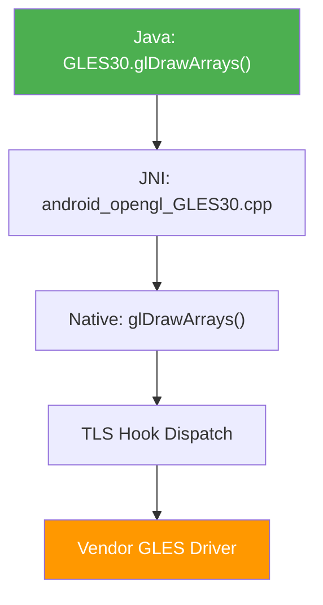

### 13.2.10 EGL Object Lifecycle

The EGL wrapper maintains reference-counted wrappers around driver EGL objects.
This prevents use-after-free bugs when applications misbehave:

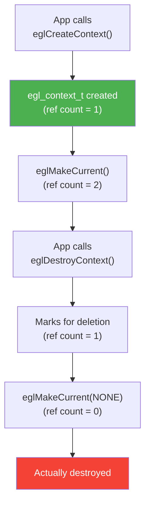

The `egl_object_t` base class in `egl_object.h` provides this reference counting:

- `egl_display_t` -- wraps `EGLDisplay`
- `egl_context_t` -- wraps `EGLContext`, tracks GL extensions
- `egl_surface_t` -- wraps `EGLSurface`

### 13.2.11 Thread-Local Error Handling

Each thread maintains its own EGL error state via `egl_tls_t`:

```cpp
// frameworks/native/opengl/libs/EGL/egl_tls.cpp
// Thread-local storage for:
// - Current EGL error code
// - Current EGL context
// - "no context call" logging flag
```

The `clearError()` call at the start of each EGL function resets the per-thread
error to `EGL_SUCCESS`, and any subsequent error overwrites it. This follows the
EGL specification requirement that `eglGetError()` returns the most recent error.

### 13.2.12 EGL Initialization Sequence

The complete EGL initialization flow on Android:

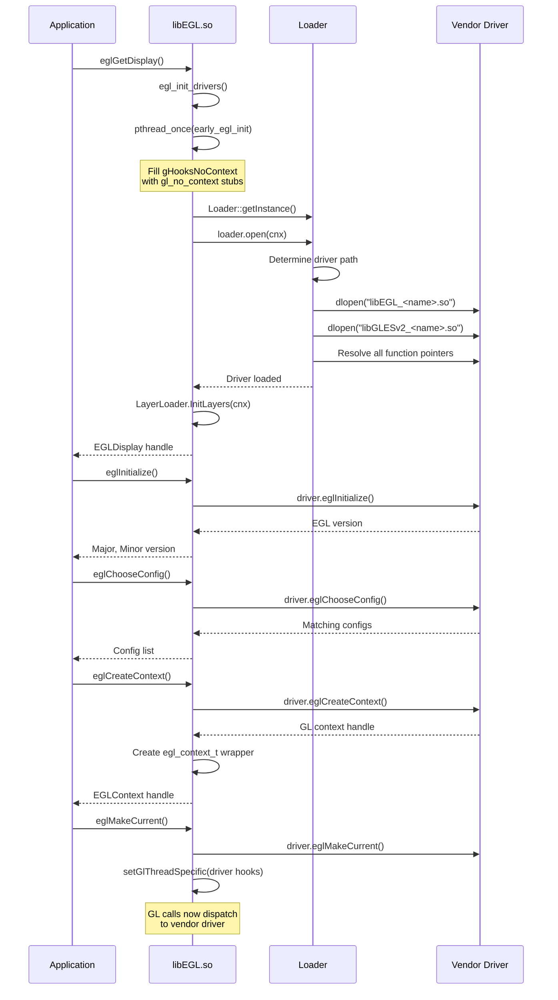

### 13.2.13 Extension String Management

The EGL wrapper manages two sets of extensions:

- **Built-in extensions**: Implemented in the wrapper itself (always available)
- **Driver extensions**: Passed through from the vendor driver (availability varies)

The combined extension string is returned to applications via `eglQueryString()`.
Android adds several proprietary extensions:

| Extension | Purpose |
|-----------|---------|
| `EGL_ANDROID_native_fence_sync` | GPU↔CPU fence synchronization |
| `EGL_ANDROID_presentation_time` | Frame presentation timestamps |
| `EGL_ANDROID_front_buffer_auto_refresh` | Direct front-buffer rendering |
| `EGL_ANDROID_get_frame_timestamps` | Per-frame timing data |
| `EGL_ANDROID_get_native_client_buffer` | AHardwareBuffer↔EGLClientBuffer |
| `EGL_KHR_swap_buffers_with_damage` | Partial screen update |

### 13.2.14 BlobCache: The Single-File Cache

Before the `MultifileBlobCache`, Android used a simpler `BlobCache` (and `FileBlobCache`)
implementation. These are still present in the codebase:

- `BlobCache.cpp` -- In-memory key-value cache with LRU eviction
- `FileBlobCache.cpp` -- Extends BlobCache with file-backed persistence
- `egl_cache.cpp` -- Integrates the blob cache with the EGL driver's cache callbacks

The `egl_cache` registers callbacks with the driver via
`EGL_ANDROID_blob_cache` extension, allowing the driver to store and retrieve
compiled shaders through the AOSP cache infrastructure.

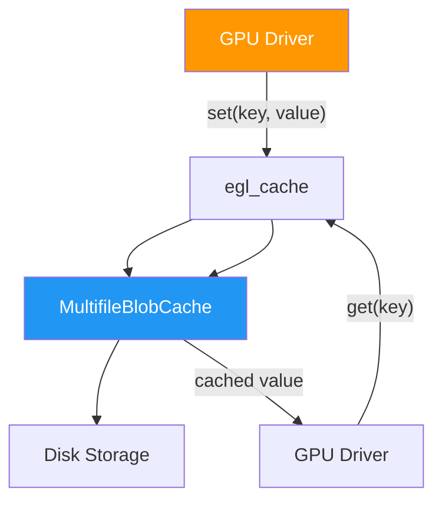

---

## 13.3 Vulkan

### 13.3.1 The Vulkan Loader Architecture

Android's Vulkan loader lives in `frameworks/native/vulkan/libvulkan/`. Unlike EGL,
Vulkan was designed from the ground up with a loader-layer-ICD architecture. The
Android loader is relatively thin because Vulkan's explicit API design reduces the
loader's responsibilities.

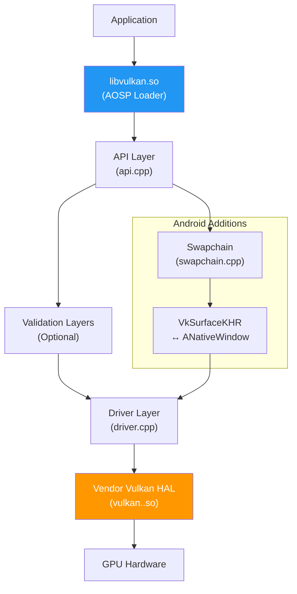

### 13.3.2 Driver Loading (`driver.cpp`)

The Vulkan HAL is loaded by the `Hal` class in `driver.cpp`. The loading sequence
tries multiple sources in priority order:

```cpp
// frameworks/native/vulkan/libvulkan/driver.cpp, line 249
bool Hal::Open() {
    ATRACE_CALL();
    const nsecs_t openTime = systemTime();

    if (hal_.ShouldUnloadBuiltinDriver()) {
        hal_.UnloadBuiltinDriver();
    }
    if (hal_.dev_) return true;

    // Use a stub device unless we successfully open a real HAL device.
    hal_.dev_ = &stubhal::kDevice;

    int result;
    const hwvulkan_module_t* module = nullptr;

    result = LoadUpdatedDriver(&module);      // 1. Game/updated driver
    if (result == -ENOENT) {
        result = LoadDriverFromApex(&module); // 2. Vulkan APEX
    }
    if (result == -ENOENT) {
        result = LoadBuiltinDriver(&module);  // 3. Built-in vendor driver
    }
    // ...
}
```

The `LoadDriver()` function (line 157) searches for the vendor HAL using system
properties:

```cpp
// frameworks/native/vulkan/libvulkan/driver.cpp, line 145
const std::array<const char*, 2> HAL_SUBNAME_KEY_PROPERTIES = {{
    "ro.hardware.vulkan",
    "ro.board.platform",
}};
```

This resolves to loading a shared library named `vulkan.<property_value>.so` from
the vendor partition.

### 13.3.3 Driver Loading from APEX

Android supports loading Vulkan drivers from APEX modules, enabling driver updates
outside of full OTA updates:

```cpp
// frameworks/native/vulkan/libvulkan/driver.cpp, line 206
int LoadDriverFromApex(const hwvulkan_module_t** module) {
    auto apex_name = android::base::GetProperty(
        RO_VULKAN_APEX_PROPERTY, "");
    if (apex_name == "") return -ENOENT;
    std::replace(apex_name.begin(), apex_name.end(), '.', '_');
    auto ns = android_get_exported_namespace(apex_name.c_str());
    if (!ns) return -ENOENT;
    // ...
    return LoadDriver(ns, apex_name.c_str(), module);
}
```

### 13.3.4 Instance and Device Creation (`api.cpp`)

The API layer in `api.cpp` handles instance/device creation, layer discovery, and
function dispatch. The `OverrideLayerNames` class (line 59) manages implicit Vulkan
layer injection:

```cpp
// frameworks/native/vulkan/libvulkan/api.cpp, line 59
class OverrideLayerNames {
public:
    OverrideLayerNames(bool is_instance,
                       const VkAllocationCallbacks& allocator)
        : is_instance_(is_instance), allocator_(allocator),
          scope_(VK_SYSTEM_ALLOCATION_SCOPE_COMMAND),
          names_(nullptr), name_count_(0), implicit_layers_() {
        implicit_layers_.result = VK_SUCCESS;
    }
    // ...
};
```

Layers can be injected via:

1. `GraphicsEnv::getDebugLayers()` -- from Android Settings UI or developer options
2. `debug.vulkan.layers` system property -- colon-separated layer list
3. `debug.vulkan.layer.<N>` properties -- individual layer selection by priority

### 13.3.5 The `CreateInfoWrapper` Class

The `CreateInfoWrapper` in `driver.cpp` (line 82) is a critical piece of infrastructure
that sanitizes `VkInstanceCreateInfo` and `VkDeviceCreateInfo` structures. It performs:

- API version validation between the app request and the ICD capability
- Extension filtering (removing extensions the ICD doesn't support)
- pNext chain sanitization (removing unrecognized structures)
- Layer name resolution

```cpp
// frameworks/native/vulkan/libvulkan/driver.cpp, line 82
class CreateInfoWrapper {
public:
    CreateInfoWrapper(const VkInstanceCreateInfo& create_info,
                      uint32_t icd_api_version,
                      const VkAllocationCallbacks& allocator);
    CreateInfoWrapper(VkPhysicalDevice physical_dev,
                      const VkDeviceCreateInfo& create_info,
                      uint32_t icd_api_version,
                      const VkAllocationCallbacks& allocator);

    VkResult Validate();
    const std::bitset<ProcHook::EXTENSION_COUNT>&
        GetHookExtensions() const;
    const std::bitset<ProcHook::EXTENSION_COUNT>&
        GetHalExtensions() const;
    // ...
};
```

### 13.3.6 The Swapchain: Vulkan Meets Android Surfaces

`swapchain.cpp` is one of the most important files in the Vulkan loader. It implements
`VK_KHR_swapchain` by bridging Vulkan's presentation model with Android's
`ANativeWindow` / `BufferQueue` system.

Key operations:

**Surface transform translation** -- Android's native window transforms and Vulkan's
surface transforms are isomorphic but encoded differently:

```cpp
// frameworks/native/vulkan/libvulkan/swapchain.cpp, line 82
VkSurfaceTransformFlagBitsKHR TranslateNativeToVulkanTransform(
    int native) {
    switch (native) {
        case 0:
            return VK_SURFACE_TRANSFORM_IDENTITY_BIT_KHR;
        case NATIVE_WINDOW_TRANSFORM_FLIP_H:
            return VK_SURFACE_TRANSFORM_HORIZONTAL_MIRROR_BIT_KHR;
        case NATIVE_WINDOW_TRANSFORM_ROT_90:
            return VK_SURFACE_TRANSFORM_ROTATE_90_BIT_KHR;
        // ...
    }
}
```

**Color space support** -- The swapchain maps Vulkan color spaces to Android data
spaces:

```cpp
// frameworks/native/vulkan/libvulkan/swapchain.cpp, line 162
const static VkColorSpaceKHR
    colorSpaceSupportedByVkEXTSwapchainColorspace[] = {
    VK_COLOR_SPACE_DISPLAY_P3_NONLINEAR_EXT,
    VK_COLOR_SPACE_DISPLAY_P3_LINEAR_EXT,
    VK_COLOR_SPACE_DCI_P3_NONLINEAR_EXT,
    VK_COLOR_SPACE_BT709_LINEAR_EXT,
    VK_COLOR_SPACE_BT709_NONLINEAR_EXT,
    VK_COLOR_SPACE_BT2020_LINEAR_EXT,
    VK_COLOR_SPACE_HDR10_ST2084_EXT,
    // ...
};
```

**Presentation timing** -- The `TimingInfo` class (line 181) tracks per-frame timing
data for `VK_GOOGLE_display_timing`:

```cpp
// frameworks/native/vulkan/libvulkan/swapchain.cpp, line 181
class TimingInfo {
public:
    TimingInfo(const VkPresentTimeGOOGLE* qp, uint64_t nativeFrameId)
        : vals_{qp->presentID, qp->desiredPresentTime, 0, 0, 0},
          native_frame_id_(nativeFrameId) {}
    bool ready() const { /* check all timestamps resolved */ }
    void calculate(int64_t rdur) { /* compute actual timings */ }
};
```

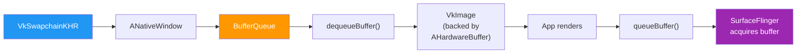

### 13.3.7 Vulkan Profiles

`frameworks/native/vulkan/vkprofiles/` defines Android Baseline Profiles (ABP) that
specify minimum Vulkan feature sets for Android API levels. These profiles are used by
CTS and by applications to query guaranteed capabilities.

### 13.3.8 The Null Driver

For testing and development, `frameworks/native/vulkan/nulldrv/` provides a null
Vulkan driver implementation. `null_driver.cpp` and `null_driver_gen.cpp` implement
the full Vulkan API surface but perform no actual GPU operations. This is invaluable
for:

- Running CTS tests on emulators without GPU support
- Testing the loader/layer infrastructure in isolation
- Verifying application Vulkan usage patterns

### 13.3.9 Code Generation

Much of the Vulkan loader is generated from the Vulkan specification XML. The files
`api_gen.cpp`, `driver_gen.cpp`, and `null_driver_gen.cpp` are auto-generated, providing:

- Dispatch tables for all Vulkan entry points
- ProcHook tables for extension-dependent functions
- Stub implementations for the null driver

### 13.3.10 The Dispatch Table Architecture

Vulkan uses a two-level dispatch table system:

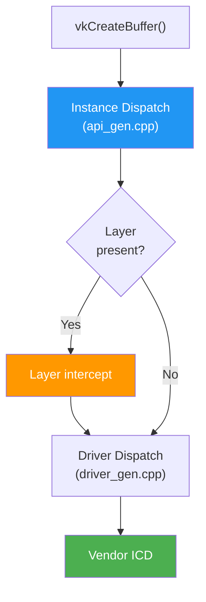

The instance dispatch table is indexed by `VkInstance` and contains function pointers
for instance-level commands. The device dispatch table is indexed by `VkDevice` and
contains device-level function pointers.

### 13.3.11 Extension Hook Points

The loader intercepts certain Vulkan functions that require Android-specific behavior.
These "proc hooks" are defined for extensions like:

| Extension | Hooked Functions | Android Behavior |
|-----------|-----------------|------------------|
| `VK_KHR_surface` | `vkCreateAndroidSurfaceKHR` | Wraps ANativeWindow |
| `VK_KHR_swapchain` | `vkCreateSwapchainKHR` | Maps to BufferQueue |
| `VK_GOOGLE_display_timing` | `vkGetPastPresentationTimingGOOGLE` | Queries frame stats |
| `VK_EXT_debug_report` | All debug callbacks | Routes to logcat |

### 13.3.12 Vulkan Instance Creation Flow

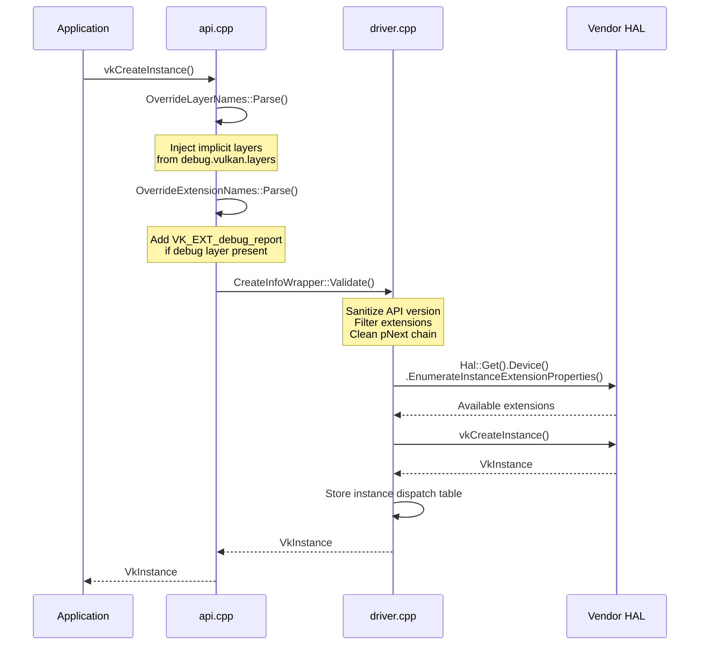

### 13.3.13 Physical Device Enumeration

The Vulkan loader enumerates physical devices from the HAL:

```cpp
// driver.cpp (in setupDevice, continued from line 197)
uint32_t gpuCount;
mEnumeratePhysicalDevices(mInstance, &gpuCount, nullptr);
// Just returning the first physical device
```

Android typically has a single physical device (the mobile GPU). Multi-GPU
configurations are not common on mobile devices, so the loader simply selects
the first available device.

### 13.3.14 Queue Family Selection

VulkanManager selects queue families that support graphics operations. The queue
selection also considers the `VK_EXT_global_priority` extension for requesting
elevated GPU scheduling priority:

```cpp
// VulkanManager.cpp (sEnableExtensions)
VK_EXT_GLOBAL_PRIORITY_EXTENSION_NAME,
VK_EXT_GLOBAL_PRIORITY_QUERY_EXTENSION_NAME,
VK_KHR_GLOBAL_PRIORITY_EXTENSION_NAME,
```

This allows HWUI's rendering queue to have higher priority than background
compute workloads.

---

## 13.4 ANGLE

### 13.4.1 GL-on-Vulkan Translation

ANGLE (Almost Native Graphics Layer Engine) is Google's implementation of OpenGL ES
on top of Vulkan. In AOSP, it lives at `external/angle/` and serves as an alternative
GLES driver that translates OpenGL ES calls into Vulkan commands.

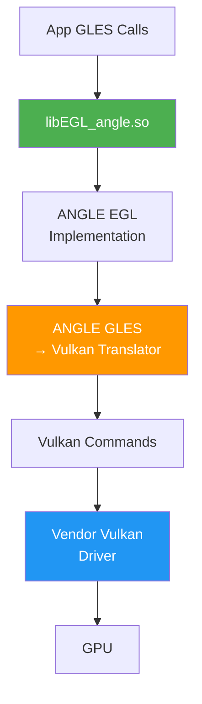

### 13.4.2 When ANGLE Is Used

ANGLE is selected through the EGL loader integration. The `egl_platform_entries.cpp`
file includes `EGL/eglext_angle.h` (line 44), indicating ANGLE-specific extension
support. The selection happens based on:

1. Per-app opt-in via the ANGLE preference UI in developer settings
2. System-wide ANGLE enablement via `ro.hardware.egl` property
3. Game driver selection through `GraphicsEnv`

### 13.4.3 Benefits of ANGLE

- **Driver consistency**: Same GLES behavior across different GPU vendors
- **Bug isolation**: GLES bugs can be fixed in ANGLE without vendor driver updates
- **Feature emulation**: ANGLE can emulate GLES extensions using Vulkan features
- **Updatability**: ANGLE can be updated via Google Play system updates

### 13.4.4 ANGLE Architecture

ANGLE translates at the command level, not the shader level:

- GLES state tracking in the "front-end"
- Vulkan command buffer recording in the "back-end"
- SPIRV-Cross for GLSL-to-SPIR-V shader translation
- Efficient resource management (texture, buffer, render pass)

---

## 13.5 Skia

### 13.5.1 Skia's Role in Android

Skia (`external/skia/`) is the 2D graphics library that powers nearly all rendering
in Android. It provides:

- Path rendering (curves, fills, strokes)
- Text layout and rasterization
- Image decoding and sampling
- GPU-accelerated rendering via its "Ganesh" backend
- Color management (wide gamut, HDR)

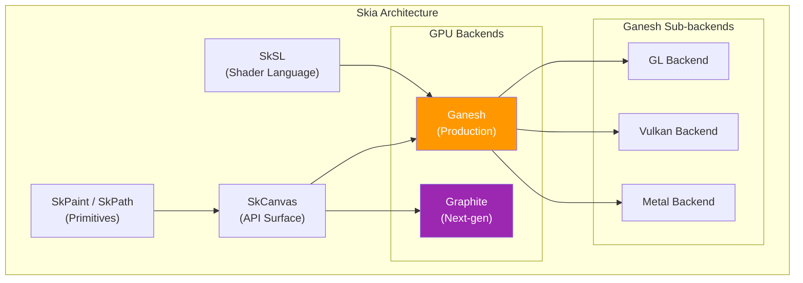

### 13.5.2 Core API (`include/core/`)

Skia's public API is defined in `external/skia/include/core/`. Key classes:

- **`SkCanvas`**: The drawing surface. All draw commands go through this.
- **`SkPaint`**: Describes how to draw (color, style, blend mode, shader, etc.)
- **`SkPath`**: Geometric path data (moves, lines, curves, arcs)
- **`SkImage`**: Immutable image data (can be GPU-backed)
- **`SkSurface`**: A writable drawing target (wraps a canvas)
- **`SkShader`**: Per-pixel color generation (gradients, images, custom)
- **`SkColorSpace`**: ICC profile-based color management
- **`SkMatrix` / `SkM44`**: 2D and 3D transformation matrices

### 13.5.3 Ganesh GPU Backend (`src/gpu/ganesh/`)

Ganesh is Skia's current production GPU backend. It translates `SkCanvas` draw calls
into GPU commands using either OpenGL or Vulkan. Key concepts:

**GrDirectContext**: The GPU context that owns all GPU resources.

```cpp
// Used by RenderThread to create the Skia GPU context
// frameworks/base/libs/hwui/renderthread/RenderThread.cpp, line 232
sk_sp<GrDirectContext> grContext(
    GrDirectContexts::MakeGL(std::move(glInterface), options));
```

**GrContextOptions**: Configuration for the GPU context, set by HWUI in
`RenderThread.cpp` (line 255):

```cpp
// frameworks/base/libs/hwui/renderthread/RenderThread.cpp, line 255
void RenderThread::initGrContextOptions(GrContextOptions& options) {
    options.fPreferExternalImagesOverES3 = true;
    options.fDisableDistanceFieldPaths = true;
    if (android::base::GetBoolProperty(
            PROPERTY_REDUCE_OPS_TASK_SPLITTING, true)) {
        options.fReduceOpsTaskSplitting = GrContextOptions::Enable::kYes;
    }
}
```

**Render passes (OpsTask)**: Ganesh batches draw calls into render passes and
reorders them to minimize state changes and render target switches. The
`fReduceOpsTaskSplitting` option controls how aggressively Ganesh merges render
passes.

### 13.5.4 Graphite: The Next-Generation Backend

Graphite (`src/gpu/graphite/`) is Skia's next-generation GPU backend, designed to
take better advantage of modern explicit APIs (Vulkan, Metal, D3D12). Key differences
from Ganesh:

| Aspect | Ganesh | Graphite |
|--------|--------|----------|
| Recording | Immediate | Deferred |
| Thread model | Single-threaded GPU work | Multi-threaded recording |
| Command buffers | Implicit | Explicit |
| Pipeline state | Lazy | Pre-compiled |
| Resource management | GC-based | Explicit ownership |

Graphite is not yet the default for Android HWUI but is under active development.

### 13.5.5 SkSL: Skia's Shading Language

SkSL is Skia's custom shading language that compiles to GLSL, SPIR-V, or MSL
depending on the backend. It powers:

- Runtime shader effects (`SkRuntimeEffect`)
- Custom blend modes
- Color filters and image filters
- The `SkSL::Compiler` translates SkSL into the target GPU shading language

### 13.5.6 Codecs and Image Decoding

Skia includes codecs for PNG, JPEG, WebP, GIF, BMP, ICO, and WBMP. These are used
by `BitmapFactory` (via HWUI's JNI layer) to decode images. The codec system is
in `src/codec/` and integrates with Android's `ImageDecoder` API.

### 13.5.7 Text Rendering

Skia handles glyph rasterization using:

- **FreeType**: Outline and bitmap glyph rendering
- **HarfBuzz**: Complex text shaping (handled by minikin on Android)
- **GPU glyph atlas**: Ganesh maintains a texture atlas for cached glyphs, with
  the atlas size configured by HWUI's `CacheManager` (see Section 9.7.4)

### 13.5.8 SIMD Optimizations

Skia uses SIMD instructions extensively for CPU-side operations:

- **NEON** (ARM): Used for blending, color conversion, image sampling
- **SSE/AVX** (x86): Used for the same operations on x86 devices
- Code paths are selected at compile time based on target architecture
- Located primarily in `src/opts/`

### 13.5.9 Skia's Recording and Playback Model

Skia supports both immediate-mode rendering (draw directly to GPU) and recording
mode (record to `SkPicture` for later playback). HWUI uses the recording model:

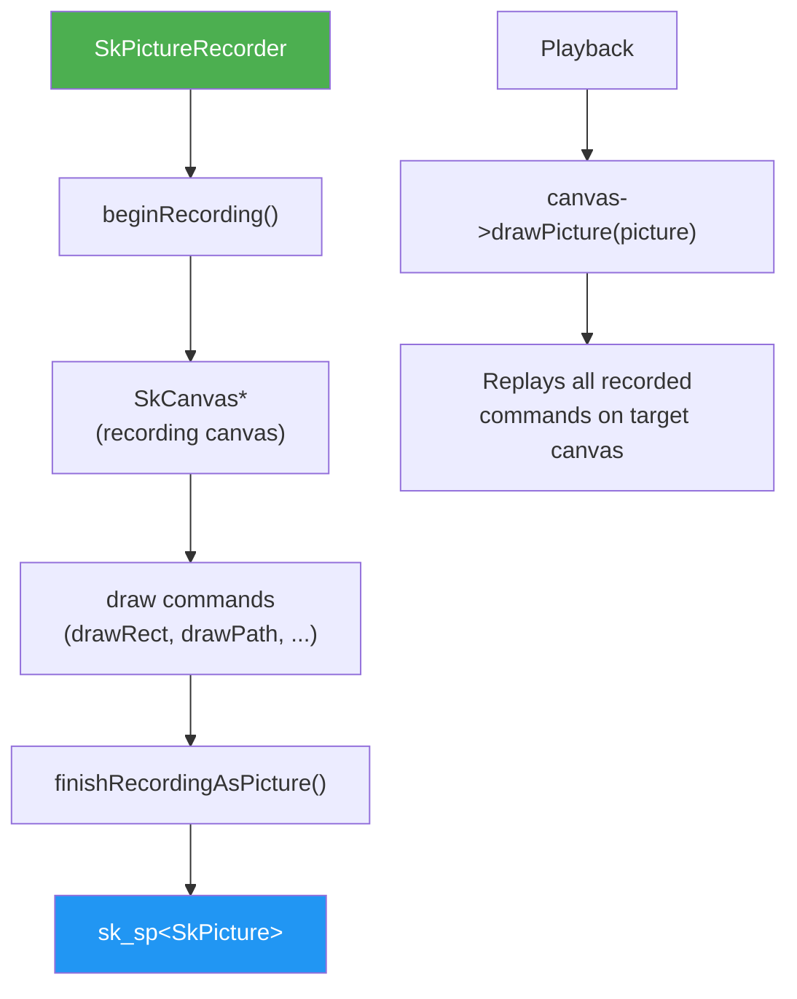

The recording approach enables:

- Deferred rendering (record on UI thread, render on RenderThread)
- Display list caching (re-render without re-recording)
- Serialization (save/load for debugging with SKP files)

### 13.5.10 GPU Resource Management in Ganesh

Ganesh manages GPU resources through a resource cache:

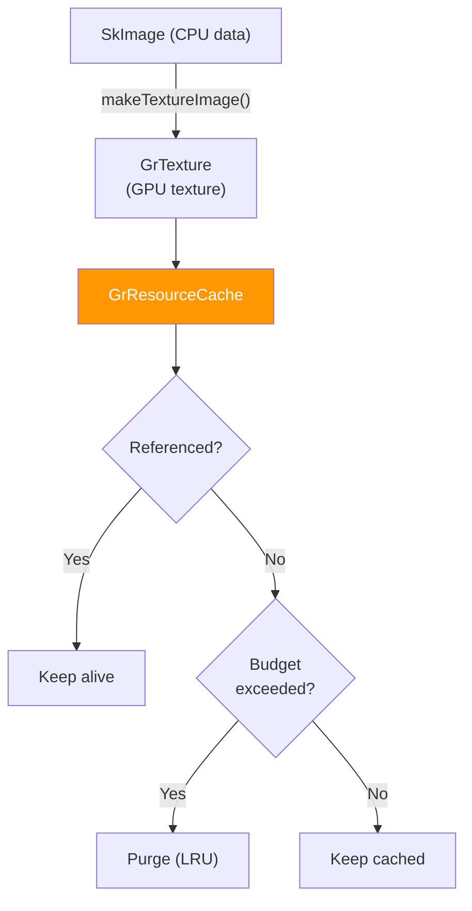

The resource cache budget is set by HWUI's CacheManager:

```cpp
// CacheManager.cpp, line 87
mGrContext->setResourceCacheLimit(mMaxResourceBytes);
```

Resources are classified as:

- **Scratch resources**: Can be reused for any purpose (render targets, vertex buffers)
- **Unique resources**: Tied to specific content (textures, shader programs)

### 13.5.11 Skia's Path Rendering

Path rendering is one of Skia's most complex subsystems. For GPU rendering, paths
are tessellated into triangles:

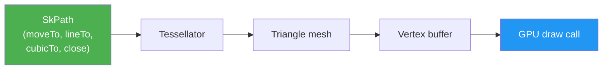

Ganesh uses several strategies depending on path complexity:

- **Simple convex paths**: Direct tessellation
- **Complex paths**: Stencil-then-cover algorithm
- **Small paths**: Rasterized to a mask texture
- **Distance field paths**: SDF-based rendering for resolution-independent paths

HWUI disables distance field paths:
```cpp
// RenderThread.cpp, line 257
options.fDisableDistanceFieldPaths = true;
```

### 13.5.12 SkSurface and Rendering Targets

`SkSurface` represents a drawing destination. In HWUI, surfaces wrap GPU rendering
targets:

**For SkiaGL**: The surface wraps the EGL default framebuffer (FBO 0):
```cpp
// SkiaOpenGLPipeline.cpp
surface = SkSurfaces::WrapBackendRenderTarget(
    mRenderThread.getGrContext(), backendRT,
    getSurfaceOrigin(), colorType,
    mSurfaceColorSpace, &props);
```

**For SkiaVulkan**: The surface wraps a Vulkan swapchain image:
```cpp
// SkiaVulkanPipeline.cpp
backBuffer = mVkSurface->getCurrentSkSurface();
```

**For offscreen layers**: Surfaces are created as GPU render targets:
```cpp
// SkiaGpuPipeline.cpp
node->setLayerSurface(SkSurfaces::RenderTarget(
    mRenderThread.getGrContext(),
    skgpu::Budgeted::kYes, info, 0,
    this->getSurfaceOrigin(), &props));
```

### 13.5.13 Text Atlas Management

Skia maintains GPU texture atlases for cached glyph images. The atlas configuration
in HWUI:

```cpp
// CacheManager.cpp
contextOptions->fGlyphCacheTextureMaximumBytes =
    mMaxGpuFontAtlasBytes;
```

The atlas size is derived from the screen area:
```
mMaxGpuFontAtlasBytes = nextPowerOfTwo(screenWidth * screenHeight)
```

For a 1080x2400 display: `nextPowerOfTwo(2592000) = 4194304` (4 MB per atlas)

Multiple atlases may be allocated:

- A8 atlas for grayscale glyphs
- ARGB atlas for color emoji
- Distance field atlas for small text (if enabled)

---

## 13.6 HWUI

### 13.6.1 HWUI's Purpose

HWUI (Hardware UI) is the native rendering library that bridges Android's Java View
system with the GPU. It lives in `frameworks/base/libs/hwui/` and contains 488 files
spanning canvas recording, display list management, render node properties, animation,
and GPU pipeline integration.

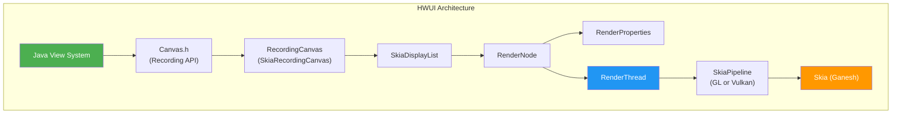

### 13.6.2 The `Canvas` Interface

The abstract `Canvas` class in `hwui/Canvas.h` defines the full drawing API that
Java `android.graphics.Canvas` maps to. It includes:

**Recording API** (used by the View system):

```cpp
// frameworks/base/libs/hwui/hwui/Canvas.h, line 94
static WARN_UNUSED_RESULT Canvas* create_recording_canvas(
    int width, int height,
    uirenderer::RenderNode* renderNode = nullptr);
```

```cpp
// frameworks/base/libs/hwui/hwui/Canvas.h, line 127
virtual void resetRecording(int width, int height,
    uirenderer::RenderNode* renderNode = nullptr) = 0;
virtual void finishRecording(
    uirenderer::RenderNode* destination) = 0;
```

**Drawing primitives** -- over 40 virtual methods covering:

```cpp
// frameworks/base/libs/hwui/hwui/Canvas.h (selection)
virtual void drawColor(int color, SkBlendMode mode) = 0;
virtual void drawRect(float l, float t, float r, float b,
                      const Paint& paint) = 0;
virtual void drawRoundRect(float l, float t, float r, float b,
                           float rx, float ry, const Paint& paint) = 0;
virtual void drawCircle(float x, float y, float radius,
                        const Paint& paint) = 0;
virtual void drawPath(const SkPath& path, const Paint& paint) = 0;
virtual void drawBitmap(Bitmap& bitmap, float left, float top,
                        const Paint* paint) = 0;
virtual void drawRenderNode(
    uirenderer::RenderNode* renderNode) = 0;
```

**View system operations** (not exposed in public API):

```cpp
virtual void enableZ(bool enableZ) = 0;
virtual void drawLayer(
    uirenderer::DeferredLayerUpdater* layerHandle) = 0;
virtual void drawWebViewFunctor(int functor) { }
virtual void punchHole(const SkRRect& rect, float alpha) = 0;
```

### 13.6.3 Canvas Op Types

The canvas operations that can be recorded are enumerated in `CanvasOpTypes.h`:

```cpp
// frameworks/base/libs/hwui/canvas/CanvasOpTypes.h, line 23
enum class CanvasOpType : int8_t {
    // State ops
    Save, SaveLayer, SaveBehind, Restore, BeginZ, EndZ,

    // Clip ops
    ClipRect, ClipPath,

    // Drawing ops
    DrawColor, DrawRect, DrawRegion, DrawRoundRect,
    DrawRoundRectProperty, DrawDoubleRoundRect,
    DrawCircleProperty, DrawRippleDrawable, DrawCircle,
    DrawOval, DrawArc, DrawPaint, DrawPoint, DrawPoints,
    DrawPath, DrawLine, DrawLines, DrawVertices,
    DrawImage, DrawImageRect, DrawImageLattice,
    DrawPicture, DrawLayer, DrawRenderNode,

    COUNT
};
```

### 13.6.4 RenderNode: The View Tree Mirror

`RenderNode` (`RenderNode.h`, 452 lines) is the native counterpart of a Java `View`.
Each `View` in the UI hierarchy has a corresponding `RenderNode` that stores:

1. **RenderProperties** -- visual properties (position, transform, alpha, clip, etc.)
2. **DisplayList** -- recorded drawing commands
3. **AnimatorManager** -- active property animations

```cpp
// frameworks/base/libs/hwui/RenderNode.h, line 77
class RenderNode : public VirtualLightRefBase {
public:
    enum DirtyPropertyMask {
        GENERIC       = 1 << 1,
        TRANSLATION_X = 1 << 2,
        TRANSLATION_Y = 1 << 3,
        TRANSLATION_Z = 1 << 4,
        SCALE_X       = 1 << 5,
        SCALE_Y       = 1 << 6,
        ROTATION      = 1 << 7,
        ROTATION_X    = 1 << 8,
        ROTATION_Y    = 1 << 9,
        X             = 1 << 10,
        Y             = 1 << 11,
        Z             = 1 << 12,
        ALPHA         = 1 << 13,
        DISPLAY_LIST  = 1 << 14,
    };
    // ...
};
```

The `DirtyPropertyMask` enum enables fine-grained dirty tracking. When a View property
changes (e.g., `setTranslationX()`), only the corresponding bit is set, avoiding
unnecessary work during the sync phase.

### 13.6.5 Double-Buffered Properties

RenderNode uses a double-buffering scheme for thread safety. Properties are set by
the UI thread on the "staging" copy, then synced to the "render" copy on the
RenderThread:

```cpp
// frameworks/base/libs/hwui/RenderNode.h, line 138
const RenderProperties& properties() const { return mProperties; }
RenderProperties& animatorProperties() { return mProperties; }
const RenderProperties& stagingProperties() { return mStagingProperties; }
RenderProperties& mutateStagingProperties() { return mStagingProperties; }
```

This pattern allows the UI thread and RenderThread to work concurrently without locks
on the property data.

### 13.6.6 RenderProperties: The Full Property Set

`RenderProperties.h` (627 lines) contains the complete set of visual properties for
a RenderNode:

```cpp
// frameworks/base/libs/hwui/RenderProperties.h, line 574
struct PrimitiveFields {
    int mLeft = 0, mTop = 0, mRight = 0, mBottom = 0;
    int mWidth = 0, mHeight = 0;
    int mClippingFlags = CLIP_TO_BOUNDS;
    SkColor mSpotShadowColor = SK_ColorBLACK;
    SkColor mAmbientShadowColor = SK_ColorBLACK;
    float mAlpha = 1;
    float mTranslationX = 0, mTranslationY = 0, mTranslationZ = 0;
    float mElevation = 0;
    float mRotation = 0, mRotationX = 0, mRotationY = 0;
    float mScaleX = 1, mScaleY = 1;
    float mPivotX = 0, mPivotY = 0;
    bool mHasOverlappingRendering = false;
    bool mPivotExplicitlySet = false;
    bool mMatrixOrPivotDirty = false;
    bool mProjectBackwards = false;
    bool mProjectionReceiver = false;
    bool mAllowForceDark = true;
    bool mClipMayBeComplex = false;
    Rect mClipBounds;
    Outline mOutline;
    RevealClip mRevealClip;
} mPrimitiveFields;
```

### 13.6.7 LayerProperties and Layer Promotion

A RenderNode can be "promoted" to an offscreen layer for composition. This happens
when:

- The node has a non-opaque alpha with overlapping rendering
- An `SkImageFilter` is applied (blur, color matrix, etc.)
- A stretch effect is active
- WebView functors require a layer for clipping

```cpp
// frameworks/base/libs/hwui/RenderProperties.h, line 552
bool promotedToLayer() const {
    return mLayerProperties.mType == LayerType::None &&
           fitsOnLayer() &&
           (mComputedFields.mNeedLayerForFunctors ||
            mLayerProperties.mImageFilter != nullptr ||
            mLayerProperties.getStretchEffect().requiresLayer() ||
            (!MathUtils::isZero(mPrimitiveFields.mAlpha) &&
             mPrimitiveFields.mAlpha < 1 &&
             mPrimitiveFields.mHasOverlappingRendering));
}
```

### 13.6.8 DisplayList: The Recorded Command Stream

`DisplayList.h` defines the container for recorded canvas operations. AOSP currently
uses `SkiaDisplayListWrapper` as the active implementation:

```cpp
// frameworks/base/libs/hwui/DisplayList.h, line 338
using DisplayList = SkiaDisplayListWrapper;
```

The `SkiaDisplayListWrapper` wraps a `skiapipeline::SkiaDisplayList`, which stores:

- An `SkPicture`-like recording of Skia draw calls
- References to child `RenderNode`s
- References to `AnimatedImageDrawable`s
- WebView functor handles
- Vector drawable references

There is also a `MultiDisplayList` variant (line 173) that supports both the Skia
recording and a new `CanvasOpBuffer` format, indicating ongoing modernization of
the display list system.

### 13.6.9 The Skia Display List Pipeline

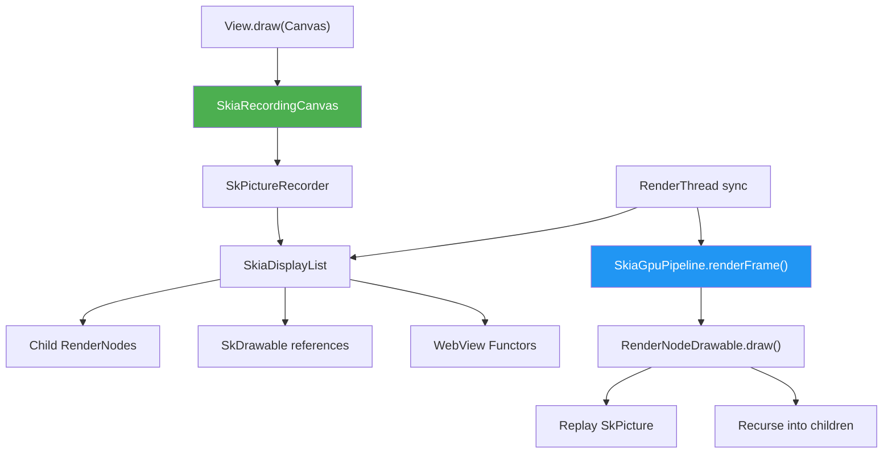

---

## 13.7 RenderThread

### 13.7.1 The Dedicated Render Thread

The RenderThread is a singleton thread that handles all GPU rendering for an
application. It is created once per process and manages the GPU context (GL or Vulkan),
frame timing, and all rendering operations.

```cpp
// frameworks/base/libs/hwui/renderthread/RenderThread.cpp, line 158
RenderThread& RenderThread::getInstance() {
    [[clang::no_destroy]] static sp<RenderThread> sInstance = []() {
        sp<RenderThread> thread = sp<RenderThread>::make();
        thread->start("RenderThread");
        return thread;
    }();
    gHasRenderThreadInstance = true;
    return *sInstance;
}
```

### 13.7.2 Initialization

When the RenderThread starts, it initializes several subsystems in
`initThreadLocals()` (line 204):

```cpp
// frameworks/base/libs/hwui/renderthread/RenderThread.cpp, line 204
void RenderThread::initThreadLocals() {
    setupFrameInterval();
    initializeChoreographer();
    mEglManager = new EglManager();
    mRenderState = new RenderState(*this);
    mVkManager = VulkanManager::getInstance();
    mCacheManager = new CacheManager(*this);
}
```

The thread runs at `PRIORITY_DISPLAY` priority (line 394) and integrates directly
with the Choreographer for VSYNC timing.

### 13.7.3 The Thread Loop

The main loop in `threadLoop()` (line 393) follows a classic work-queue pattern:

```cpp
// frameworks/base/libs/hwui/renderthread/RenderThread.cpp, line 393
bool RenderThread::threadLoop() {
    setpriority(PRIO_PROCESS, 0, PRIORITY_DISPLAY);
    Looper::setForThread(mLooper);
    if (gOnStartHook) {
        gOnStartHook("RenderThread");
    }
    initThreadLocals();

    while (true) {
        waitForWork();
        processQueue();
        // Handle VSYNC frame callbacks
        if (mPendingRegistrationFrameCallbacks.size() &&
            !mFrameCallbackTaskPending) {
            mVsyncSource->drainPendingEvents();
            mFrameCallbacks.insert(
                mPendingRegistrationFrameCallbacks.begin(),
                mPendingRegistrationFrameCallbacks.end());
            mPendingRegistrationFrameCallbacks.clear();
            requestVsync();
        }
        mCacheManager->onThreadIdle();
    }
    return false;
}
```

### 13.7.4 VSYNC Integration

The RenderThread listens for VSYNC signals via `AChoreographer`:

```cpp
// frameworks/base/libs/hwui/renderthread/RenderThread.cpp, line 106
class ChoreographerSource : public VsyncSource {
public:
    virtual void requestNextVsync() override {
        AChoreographer_postVsyncCallback(
            mRenderThread->mChoreographer,
            RenderThread::extendedFrameCallback,
            mRenderThread);
    }
};
```

The VSYNC callback delivers timing data including the vsync ID, frame deadline,
and frame interval:

```cpp
// frameworks/base/libs/hwui/renderthread/RenderThread.cpp, line 58
void RenderThread::extendedFrameCallback(
    const AChoreographerFrameCallbackData* cbData, void* data) {
    // ...
    AVsyncId vsyncId = AChoreographerFrameCallbackData_getFrameTimelineVsyncId(
        cbData, preferredFrameTimelineIndex);
    int64_t frameDeadline =
        AChoreographerFrameCallbackData_getFrameTimelineDeadlineNanos(
            cbData, preferredFrameTimelineIndex);
    int64_t frameTimeNanos =
        AChoreographerFrameCallbackData_getFrameTimeNanos(cbData);
    int64_t frameInterval =
        AChoreographer_getFrameInterval(rt->mChoreographer);
    rt->frameCallback(vsyncId, frameDeadline, frameTimeNanos,
                      frameInterval);
}
```

### 13.7.5 EglManager

`EglManager.cpp` (789 lines) manages the EGL context for the SkiaGL pipeline. Key
operations:

**Initialization** (line 109):

```cpp
// frameworks/base/libs/hwui/renderthread/EglManager.cpp, line 109
void EglManager::initialize() {
    if (hasEglContext()) return;
    ATRACE_NAME("Creating EGLContext");
    mEglDisplay = eglGetDisplay(EGL_DEFAULT_DISPLAY);
    EGLint major, minor;
    eglInitialize(mEglDisplay, &major, &minor);
    initExtensions();
    loadConfigs();
    createContext();
    createPBufferSurface();
    makeCurrent(mPBufferSurface, nullptr, true);
    // ...
}
```

**Config selection** -- The EglManager loads four configurations for different pixel
formats:

| Config | Pixel Format | Use Case |
|--------|-------------|----------|
| `mEglConfig` | RGBA8888 | Default rendering |
| `mEglConfigF16` | RGBA_F16 | Wide color gamut / HDR |
| `mEglConfig1010102` | RGB10_A2 | 10-bit color |
| `mEglConfigA8` | R8 | Alpha-only (masks) |

**Color space handling** -- `createSurface()` (line 396) maps Android `ColorMode` to
EGL color space attributes:

```cpp
// frameworks/base/libs/hwui/renderthread/EglManager.cpp, line 466
switch (colorMode) {
    case ColorMode::Default:
        attribs[1] = EGL_GL_COLORSPACE_LINEAR_KHR;
        break;
    case ColorMode::Hdr:
        attribs[1] = EGL_GL_COLORSPACE_SCRGB_EXT;
        break;
    case ColorMode::WideColorGamut:
        attribs[1] = EGL_GL_COLORSPACE_DISPLAY_P3_PASSTHROUGH_EXT;
        break;
}
```

**Fence synchronization** -- `fenceWait()` (line 689) implements GPU-side fence waits
using `EGL_KHR_wait_sync`:

```cpp
// frameworks/base/libs/hwui/renderthread/EglManager.cpp, line 689
status_t EglManager::fenceWait(int fence) {
    if (EglExtensions.waitSync && EglExtensions.nativeFenceSync) {
        int fenceFd = ::dup(fence);
        EGLint attribs[] = {
            EGL_SYNC_NATIVE_FENCE_FD_ANDROID, fenceFd, EGL_NONE
        };
        EGLSyncKHR sync = eglCreateSyncKHR(mEglDisplay,
            EGL_SYNC_NATIVE_FENCE_ANDROID, attribs);
        eglWaitSyncKHR(mEglDisplay, sync, 0);
        eglDestroySyncKHR(mEglDisplay, sync);
    } else {
        // Fall back to CPU-side wait
        sync_wait(fence, -1);
    }
    return OK;
}
```

### 13.7.6 VulkanManager

`VulkanManager.cpp` is the Vulkan counterpart to EglManager. It is a singleton
shared across threads (the RenderThread and the HardwareBitmapUploader thread):

```cpp
// frameworks/base/libs/hwui/renderthread/VulkanManager.cpp, line 85
sp<VulkanManager> VulkanManager::getInstance() {
    std::lock_guard _lock{sLock};
    sp<VulkanManager> vulkanManager = sWeakInstance.promote();
    if (!vulkanManager.get()) {
        vulkanManager = new VulkanManager();
        sWeakInstance = vulkanManager;
    }
    return vulkanManager;
}
```

The VulkanManager enables 26 Vulkan extensions (line 49):

```cpp
// frameworks/base/libs/hwui/renderthread/VulkanManager.cpp, line 49
static std::array<std::string_view, 26> sEnableExtensions{
    VK_KHR_EXTERNAL_MEMORY_CAPABILITIES_EXTENSION_NAME,
    VK_KHR_EXTERNAL_MEMORY_EXTENSION_NAME,
    VK_KHR_SURFACE_EXTENSION_NAME,
    VK_KHR_SWAPCHAIN_EXTENSION_NAME,
    VK_KHR_IMAGE_FORMAT_LIST_EXTENSION_NAME,
    VK_EXT_IMAGE_DRM_FORMAT_MODIFIER_EXTENSION_NAME,
    VK_ANDROID_EXTERNAL_MEMORY_ANDROID_HARDWARE_BUFFER_EXTENSION_NAME,
    VK_EXT_QUEUE_FAMILY_FOREIGN_EXTENSION_NAME,
    VK_KHR_EXTERNAL_SEMAPHORE_FD_EXTENSION_NAME,
    VK_KHR_ANDROID_SURFACE_EXTENSION_NAME,
    VK_EXT_GLOBAL_PRIORITY_EXTENSION_NAME,
    VK_EXT_GLOBAL_PRIORITY_QUERY_EXTENSION_NAME,
    VK_KHR_GLOBAL_PRIORITY_EXTENSION_NAME,
    VK_EXT_DEVICE_FAULT_EXTENSION_NAME,
    VK_EXT_FRAME_BOUNDARY_EXTENSION_NAME,
    VK_ANDROID_FRAME_BOUNDARY_EXTENSION_NAME,
};
```

**Device setup** (line 125) follows the standard Vulkan initialization pattern: enumerate
physical devices, select extensions, create a logical device:

```cpp
// frameworks/base/libs/hwui/renderthread/VulkanManager.cpp, line 125
void VulkanManager::setupDevice() {
    constexpr VkApplicationInfo app_info = {
        VK_STRUCTURE_TYPE_APPLICATION_INFO,
        nullptr,
        "android framework",  // pApplicationName
        0,
        "android framework",  // pEngineName
        0,
        mAPIVersion,
    };
    // Enumerate instance extensions, create instance,
    // enumerate physical devices, create logical device...
}
```

### 13.7.7 CacheManager

`CacheManager.cpp` (364 lines) manages GPU memory budgets for the Skia GrDirectContext.
It implements memory pressure responses at multiple levels:

```cpp
// frameworks/base/libs/hwui/renderthread/CacheManager.cpp, line 122
void CacheManager::trimMemory(TrimLevel mode) {
    if (!mGrContext) return;
    mGrContext->flushAndSubmit(GrSyncCpu::kYes);

    if (mode >= TrimLevel::BACKGROUND) {
        mGrContext->freeGpuResources();
        SkGraphics::PurgeAllCaches();
        mRenderThread.destroyRenderingContext();
    } else if (mode == TrimLevel::UI_HIDDEN) {
        mGrContext->setResourceCacheLimit(mBackgroundResourceBytes);
        SkGraphics::SetFontCacheLimit(mBackgroundCpuFontCacheBytes);
        mGrContext->purgeUnlockedResources(
            toSkiaEnum(mMemoryPolicy.purgeScratchOnly));
        mGrContext->setResourceCacheLimit(mMaxResourceBytes);
        SkGraphics::SetFontCacheLimit(mMaxCpuFontCacheBytes);
    }
}
```

**Cache sizing**: The cache limits are derived from the screen resolution:

```cpp
// frameworks/base/libs/hwui/renderthread/CacheManager.cpp, line 45
CacheManager::CacheManager(RenderThread& thread)
    : mRenderThread(thread), mMemoryPolicy(loadMemoryPolicy()) {
    mMaxSurfaceArea = static_cast<size_t>(
        (DeviceInfo::getWidth() * DeviceInfo::getHeight()) *
        mMemoryPolicy.initialMaxSurfaceAreaScale);
    setupCacheLimits();
}
```

```cpp
// line 62
void CacheManager::setupCacheLimits() {
    mMaxResourceBytes = mMaxSurfaceArea *
        mMemoryPolicy.surfaceSizeMultiplier;
    mBackgroundResourceBytes = mMaxResourceBytes *
        mMemoryPolicy.backgroundRetentionPercent;
    mMaxGpuFontAtlasBytes = nextPowerOfTwo(mMaxSurfaceArea);
    mMaxCpuFontCacheBytes = std::max(
        mMaxGpuFontAtlasBytes * 4,
        SkGraphics::GetFontCacheLimit());
}
```

**Deferred cleanup**: On every idle tick, the CacheManager performs incremental resource
cleanup:

```cpp
// line 281
void CacheManager::onThreadIdle() {
    if (!mGrContext || mFrameCompletions.size() == 0) return;
    const nsecs_t now = systemTime(CLOCK_MONOTONIC);
    if ((now - mLastDeferredCleanup) > 25_ms) {
        mLastDeferredCleanup = now;
        // ...
        mGrContext->performDeferredCleanup(
            std::chrono::milliseconds(cleanupMillis),
            toSkiaEnum(mMemoryPolicy.purgeScratchOnly));
    }
}
```

### 13.7.8 GPU Context Lifecycle

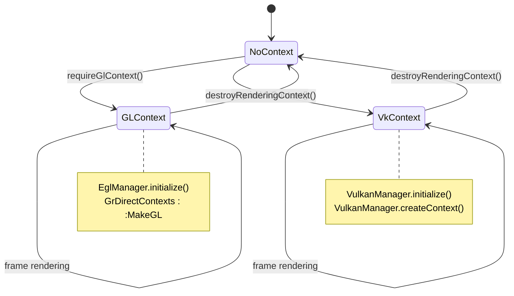

The RenderThread lazily creates the GPU context on first use:

```cpp
// frameworks/base/libs/hwui/renderthread/RenderThread.cpp, line 218
void RenderThread::requireGlContext() {
    if (mEglManager->hasEglContext()) return;
    mEglManager->initialize();
    sk_sp<const GrGLInterface> glInterface = GrGLMakeNativeInterface();
    GrContextOptions options;
    initGrContextOptions(options);
    cacheManager().configureContext(&options, glesVersion, size);
    sk_sp<GrDirectContext> grContext(
        GrDirectContexts::MakeGL(std::move(glInterface), options));
    setGrContext(grContext);
}

void RenderThread::requireVkContext() {
    if (vulkanManager().hasVkContext() && mGrContext) return;
    mVkManager->initialize();
    GrContextOptions options;
    initGrContextOptions(options);
    cacheManager().configureContext(&options, &vkDriverVersion,
                                   sizeof(vkDriverVersion));
    sk_sp<GrDirectContext> grContext =
        mVkManager->createContext(options);
    setGrContext(grContext);
}
```

---

## 13.8 End-to-End Frame Pipeline

### 13.8.1 The Complete Frame Journey

This section traces a single frame from `View.invalidate()` to photons leaving the
display, referencing exact source files and line numbers.

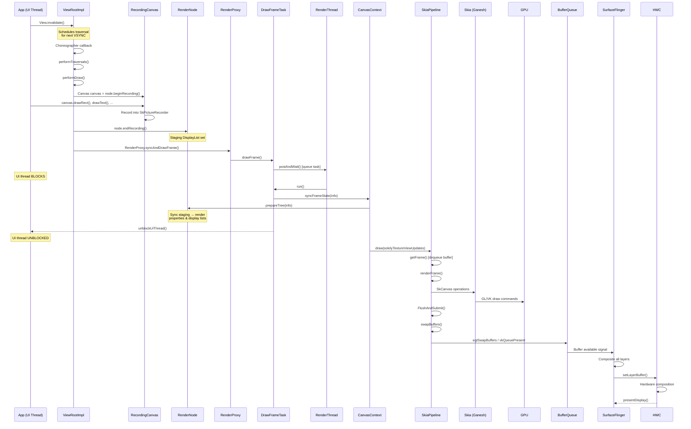

### 13.8.2 Phase 1: Recording (UI Thread)

**Step 1: Invalidation.** When `View.invalidate()` is called, the framework marks the
View and its ancestors dirty. `ViewRootImpl` schedules a traversal callback with
`Choreographer`.

**Step 2: Traversal.** On the next VSYNC, `ViewRootImpl.performTraversals()` is called.
This triggers measure, layout, and draw passes.

**Step 3: Recording.** During the draw pass:

```java
// View.java (simplified)
void updateDisplayListIfDirty() {
    RecordingCanvas canvas = renderNode.beginRecording(width, height);
    try {
        draw(canvas);  // View.draw(Canvas) - app code runs here
    } finally {
        renderNode.endRecording();
    }
}
```

The `Canvas.create_recording_canvas()` factory (in `Canvas.h`, line 94) creates a
`SkiaRecordingCanvas` that wraps `SkPictureRecorder`. Every `canvas.drawRect()`,
`canvas.drawText()`, etc. call is recorded into the SkPicture, not executed
immediately.

### 13.8.3 Phase 2: Sync (RenderThread)

**Step 4: Post and Wait.** `RenderProxy` posts a `DrawFrameTask` to the RenderThread
and blocks:

```cpp
// frameworks/base/libs/hwui/renderthread/DrawFrameTask.cpp, line 82
void DrawFrameTask::postAndWait() {
    ATRACE_CALL();
    AutoMutex _lock(mLock);
    mRenderThread->queue().post([this]() { run(); });
    mSignal.wait(mLock);
}
```

**Step 5: Frame State Sync.** The RenderThread calls `syncFrameState()` (line 169):

```cpp
// frameworks/base/libs/hwui/renderthread/DrawFrameTask.cpp, line 169
bool DrawFrameTask::syncFrameState(TreeInfo& info) {
    int64_t vsync = mFrameInfo[static_cast<int>(
        FrameInfoIndex::Vsync)];
    mRenderThread->timeLord().vsyncReceived(vsync, ...);
    bool canDraw = mContext->makeCurrent();
    mContext->unpinImages();

    // Apply deferred layer updates (TextureView, etc.)
    for (size_t i = 0; i < mLayers.size(); i++) {
        if (mLayers[i]) mLayers[i]->apply();
    }
    mLayers.clear();

    mContext->setContentDrawBounds(mContentDrawBounds);
    mContext->prepareTree(info, mFrameInfo, mSyncQueued, mTargetNode);
    // ...
}
```

`prepareTree()` walks the entire RenderNode tree, syncing staging properties and
display lists to their render counterparts. After sync completes, the UI thread
is unblocked:

```cpp
// DrawFrameTask.cpp, line 125
if (canUnblockUiThread) {
    unblockUiThread();
}
```

### 13.8.4 Phase 3: Rendering (RenderThread)

**Step 6: Draw.** `CanvasContext::draw()` orchestrates the actual rendering:

```cpp
// CanvasContext.cpp (simplified)
void CanvasContext::draw(bool solelyTextureViewUpdates) {
    Frame frame = mRenderPipeline->getFrame();
    SkRect dirty = computeDirtyRect(frame, ...);
    auto drawResult = mRenderPipeline->draw(
        frame, screenDirty, dirty, lightGeometry,
        &mLayerUpdateQueue, mContentDrawBounds,
        mOpaque, lightInfo, mRenderNodes, ...);
    bool


 requireSwap;
    mRenderPipeline->swapBuffers(frame, drawResult,
        screenDirty, currentFrameInfo, &requireSwap);
}
```

**For the SkiaGL pipeline** (`SkiaOpenGLPipeline.cpp`, line 116):

```cpp
// frameworks/base/libs/hwui/pipeline/skia/SkiaOpenGLPipeline.cpp, line 116
IRenderPipeline::DrawResult SkiaOpenGLPipeline::draw(...) {
    mEglManager.damageFrame(frame, dirty);

    // Create an SkSurface wrapping the EGL default framebuffer
    GrGLFramebufferInfo fboInfo;
    fboInfo.fFBOID = 0;
    fboInfo.fFormat = GL_RGBA8;  // or GL_RGBA16F for HDR

    auto backendRT = GrBackendRenderTargets::MakeGL(
        frame.width(), frame.height(), 0, STENCIL_BUFFER_SIZE, fboInfo);
    sk_sp<SkSurface> surface = SkSurfaces::WrapBackendRenderTarget(
        mRenderThread.getGrContext(), backendRT,
        getSurfaceOrigin(), colorType, mSurfaceColorSpace, &props);

    LightingInfo::updateLighting(localGeometry, lightInfo);
    renderFrame(*layerUpdateQueue, dirty, renderNodes,
        opaque, contentDrawBounds, surface, preTransform);

    skgpu::ganesh::FlushAndSubmit(surface);
    return {true, ...};
}
```

**For the SkiaVulkan pipeline** (`SkiaVulkanPipeline.cpp`, line 74):

```cpp
// frameworks/base/libs/hwui/pipeline/skia/SkiaVulkanPipeline.cpp, line 74
IRenderPipeline::DrawResult SkiaVulkanPipeline::draw(...) {
    sk_sp<SkSurface> backBuffer =
        mVkSurface->getCurrentSkSurface();
    SkMatrix preTransform =
        mVkSurface->getCurrentPreTransform();

    renderFrame(*layerUpdateQueue, dirty, renderNodes,
        opaque, contentDrawBounds, backBuffer, preTransform);

    auto drawResult = vulkanManager().finishFrame(
        backBuffer.get());
    return {true, drawResult.submissionTime,
            std::move(drawResult.presentFence)};
}
```

### 13.8.5 Phase 4: Presentation

**Step 7: Swap Buffers.** The completed frame is submitted to the BufferQueue:

For GL:
```cpp
// EglManager.cpp, line 621
bool EglManager::swapBuffers(const Frame& frame,
                              const SkRect& screenDirty) {
    EGLint rects[4];
    frame.map(screenDirty, rects);
    eglSwapBuffersWithDamageKHR(mEglDisplay, frame.mSurface,
        rects, screenDirty.isEmpty() ? 0 : 1);
    // ...
}
```

For Vulkan:
```cpp
// SkiaVulkanPipeline.cpp, line 130
bool SkiaVulkanPipeline::swapBuffers(...) {
    currentFrameInfo->markSwapBuffers();
    if (*requireSwap) {
        vulkanManager().swapBuffers(mVkSurface, screenDirty,
            std::move(drawResult.presentFence));
    }
    return *requireSwap;
}
```

**Step 8: SurfaceFlinger Composition.** SurfaceFlinger acquires the buffer from the
BufferQueue, composites all visible layers (using RenderEngine for GPU composition
or HWC for hardware overlay composition), and presents the result to the display.

### 13.8.6 Timing Budget

For a 60 FPS display (16.67ms frame budget):

```mermaid
gantt
    title Frame Timing Budget (16.67ms @ 60 FPS)
    dateFormat X
    axisFormat %L

    section UI Thread
    VSYNC arrival           :v1, 0, 0
    Input handling          :a1, 0, 2
    Animation callbacks     :a2, 2, 4
    Measure + Layout        :a3, 4, 6
    Draw (Record)           :a4, 6, 9
    Sync wait               :a5, 9, 10

    section RenderThread
    Sync frame state        :b1, 9, 10
    GPU draw commands       :b2, 10, 14
    Swap buffers            :b3, 14, 15

    section SurfaceFlinger
    Composite               :c1, 15, 16
    Present to HWC          :c2, 16, 17
```

---

## 13.9 SurfaceFlinger RenderEngine

### 13.9.1 What RenderEngine Does

SurfaceFlinger's RenderEngine performs GPU-based layer composition when the Hardware
Composer (HWC) cannot handle all layers through hardware overlays. Common scenarios:

- Layers with complex blend modes
- Layers requiring color space conversion
- More layers than HWC overlay planes support
- Rounded corners or other visual effects

### 13.9.2 Skia-Based RenderEngine

Modern AOSP uses a Skia-based RenderEngine, replacing the legacy OpenGL-based
implementation. This lives in `frameworks/native/libs/renderengine/skia/`.

```mermaid
graph TD
    A["SurfaceFlinger"] --> B["RenderEngine"]
    B --> C["SkiaRenderEngine"]
    C --> D["Skia (Ganesh)"]
    D --> E{"Backend"}
    E -->|GL| F["GL RenderEngine"]
    E -->|Vulkan| G["Vulkan RenderEngine"]
    F --> H["GPU"]
    G --> H

    style B fill:#9C27B0,color:#fff
    style C fill:#FF9800,color:#fff
```

### 13.9.3 RenderEngine Operations

RenderEngine handles:

- **Layer composition**: Drawing each layer's buffer onto the output buffer
- **Color management**: Converting between different layer color spaces
- **HDR tone-mapping**: Mapping HDR content for SDR displays
- **Shadow rendering**: Drawing window shadows below elevation
- **Blur effects**: Background blur for notification shade, dialogs
- **Dim layers**: System-level dimming overlays
- **Screenshot capture**: Compositing visible layers for screenshots

### 13.9.4 Composition Flow

```mermaid
sequenceDiagram
    participant SF as SurfaceFlinger
    participant HWC as HWC HAL
    participant RE as RenderEngine

    SF->>HWC: validate(layers)
    HWC-->>SF: composition types<br/>(DEVICE, CLIENT, CURSOR)
    Note over SF: Some layers marked CLIENT

    SF->>RE: drawLayers(clientLayers)
    RE->>RE: For each CLIENT layer:
    RE->>RE: 1. Bind layer buffer as texture
    RE->>RE: 2. Apply color transform
    RE->>RE: 3. Draw to output buffer
    RE-->>SF: Composited output buffer

    SF->>HWC: setClientTarget(outputBuffer)
    SF->>HWC: presentDisplay()
```

### 13.9.5 HWC Layer Composition Types

The Hardware Composer classifies each layer into a composition type:

```mermaid
graph TD
    A["All Visible Layers"] --> B["HWC validate()"]
    B --> C{"HWC Decision"}
    C -->|DEVICE| D["Hardware Overlay<br/>(Direct scanout)"]
    C -->|CLIENT| E["GPU Composition<br/>(RenderEngine)"]
    C -->|CURSOR| F["Hardware Cursor<br/>(Dedicated plane)"]
    C -->|SIDEBAND| G["Sideband Stream<br/>(Video tunnel)"]

    D --> H["Display Controller"]
    E --> I["Client Target Buffer"]
    I --> H
    F --> H
    G --> H

    style D fill:#4CAF50,color:#fff
    style E fill:#FF9800,color:#fff
    style F fill:#2196F3,color:#fff
```

**DEVICE composition** is preferred because it avoids GPU work entirely. The display
controller directly reads from the layer's buffer. This is used for:

- Simple rectangular layers without complex blend modes
- Video playback surfaces
- Status bar and navigation bar

**CLIENT composition** falls back to GPU rendering when hardware capabilities are
exceeded. Common triggers:

- More layers than available hardware planes
- Complex blend modes or color transforms
- Non-rectangular clip regions
- Layers requiring rotation that hardware cannot handle

### 13.9.6 RenderEngine Shader Pipeline

The Skia-based RenderEngine uses a custom shader pipeline for composition:

```mermaid
graph LR
    A["Layer Buffer<br/>(Texture)"] --> B["Vertex Shader<br/>(Position + UV)"]
    B --> C["Fragment Shader"]
    C --> D["Color Space<br/>Conversion"]
    D --> E["Tone Mapping<br/>(HDR→SDR)"]
    E --> F["Alpha Blend"]
    F --> G["Output Buffer"]

    style C fill:#FF9800,color:#fff
    style D fill:#2196F3,color:#fff
```

### 13.9.7 Triple Buffering and Buffer Management

The BufferQueue between the application and SurfaceFlinger typically maintains
three buffers:

```mermaid
graph TD
    subgraph "Buffer States"
        A["Buffer A<br/>Being Displayed"]
        B["Buffer B<br/>Queued for Display"]
        C["Buffer C<br/>App Rendering"]
    end

    subgraph "Flow"
        D["App dequeues C"] --> E["App renders into C"]
        E --> F["App queues C"]
        F --> G["SF acquires B"]
        G --> H["SF displays B"]
        H --> I["SF releases A"]
        I --> D
    end

    style A fill:#4CAF50,color:#fff
    style B fill:#FF9800,color:#fff
    style C fill:#2196F3,color:#fff
```

This triple-buffering scheme ensures that:

- The app always has a buffer to render to (no stalling)
- SurfaceFlinger always has a buffer ready for display
- Frames can be dropped without visible glitches

---

## 13.10 GPU Driver Interface

### 13.10.1 HAL Interfaces

The GPU driver interface is defined in `hardware/interfaces/graphics/`. The key HAL
modules are:

```mermaid
graph TD
    subgraph "Graphics HAL Stack"
        A["IComposer<br/>(HWC HAL)"]
        B["IAllocator<br/>(Gralloc HAL)"]
        C["IMapper<br/>(Buffer Mapping)"]
        D["Vulkan HAL<br/>(hwvulkan)"]
        E["EGL/GLES<br/>(Vendor Driver)"]
    end

    F["SurfaceFlinger"] --> A
    F --> B
    F --> C

    G["HWUI / Apps"] --> D
    G --> E

    A --> H["Display Hardware"]
    B --> I["Memory Allocator"]
    D --> J["GPU Hardware"]
    E --> J

    style A fill:#F44336,color:#fff
    style B fill:#FF9800,color:#fff
    style D fill:#2196F3,color:#fff
```

### 13.10.2 The Gralloc Allocator

Buffer allocation is handled by the Gralloc HAL, defined via AIDL in
`hardware/interfaces/graphics/allocator/aidl/`:

```
// hardware/interfaces/graphics/allocator/aidl/android/hardware/graphics/allocator/IAllocator.aidl
interface IAllocator {
    AllocationResult allocate(in BufferDescriptorInfo descriptor,
                              in int count);
    boolean isSupported(in BufferDescriptorInfo descriptor);
}
```

### 13.10.3 EGL Driver Loading

The EGL driver is loaded by `Loader::open()` in `frameworks/native/opengl/libs/EGL/Loader.cpp`.
The loader searches for:

1. `libEGL_<name>.so` -- EGL implementation
2. `libGLESv1_CM_<name>.so` -- OpenGL ES 1.x implementation
3. `libGLESv2_<name>.so` -- OpenGL ES 2.0+ implementation

Where `<name>` comes from properties like `ro.hardware.egl` or the system board
platform name.

### 13.10.4 Vulkan Driver Loading

As detailed in Section 9.3.2, the Vulkan driver is loaded via the `hwvulkan` HAL
module. The driver library is named `vulkan.<name>.so` where `<name>` comes from:

```cpp
// frameworks/native/vulkan/libvulkan/driver.cpp, line 145
const std::array<const char*, 2> HAL_SUBNAME_KEY_PROPERTIES = {{
    "ro.hardware.vulkan",
    "ro.board.platform",
}};
```

### 13.10.5 Updated/Game Driver Mechanism

Android supports updatable GPU drivers through the `GraphicsEnv` system:

```mermaid
graph TD
    A["App Launch"] --> B["GraphicsEnv"]
    B --> C{"Updated Driver<br/>Available?"}
    C -->|Yes| D["Load from<br/>updatable namespace"]
    C -->|No| E{"APEX Driver?"}
    E -->|Yes| F["Load from<br/>APEX namespace"]
    E -->|No| G["Load built-in<br/>vendor driver"]

    style D fill:#4CAF50,color:#fff
    style F fill:#FF9800,color:#fff
    style G fill:#2196F3,color:#fff
```

For Vulkan (`driver.cpp`, line 232):
```cpp
int LoadUpdatedDriver(const hwvulkan_module_t** module) {
    auto ns = android::GraphicsEnv::getInstance().getDriverNamespace();
    if (!ns) return -ENOENT;
    android::GraphicsEnv::getInstance().setDriverToLoad(
        android::GpuStatsInfo::Driver::VULKAN_UPDATED);
    int result = LoadDriver(ns, "updatable gfx driver", module);
    if (result != 0) {
        LOG_ALWAYS_FATAL("couldn't find an updated Vulkan implementation");
    }
    return result;
}
```

### 13.10.6 The Hardware Composer HAL

The HWC HAL is the interface between SurfaceFlinger and the display hardware. It
has evolved through several versions:

```mermaid
graph TD
    A["HWC 1.x<br/>(Legacy C API)"] --> B["HWC 2.x<br/>(HIDL)"]
    B --> C["HWC 3.x<br/>(AIDL)"]

    style A fill:#F44336,color:#fff
    style B fill:#FF9800,color:#fff
    style C fill:#4CAF50,color:#fff
```

The current AIDL-based HWC 3 interface is defined in
`hardware/interfaces/graphics/composer/aidl/`. Key operations:

| Operation | Description |
|-----------|-------------|
| `createDisplay` | Register a new display |
| `setLayerBuffer` | Assign a buffer to a layer |
| `setLayerBlendMode` | Set alpha blending mode |
| `setLayerDataspace` | Set layer color space |
| `setLayerTransform` | Set rotation/flip transform |
| `validate` | Classify layers for composition |
| `present` | Submit the final frame to display |
| `getReleaseFences` | Get fences for released buffers |

### 13.10.7 Gralloc Buffer Allocation

All graphics buffers in Android are allocated through the Gralloc HAL. The
allocation flow:

```mermaid
sequenceDiagram
    participant App as Application
    participant BQ as BufferQueue
    participant GA as GraphicBufferAllocator
    participant HAL as Gralloc HAL
    participant DMA as DMA-BUF / ION

    App->>BQ: dequeueBuffer()
    Note over BQ: No free buffers
    BQ->>GA: allocate(w, h, format, usage)
    GA->>HAL: IAllocator.allocate()
    HAL->>DMA: Allocate DMA buffer
    DMA-->>HAL: Buffer handle + fd
    HAL-->>GA: AllocationResult
    GA-->>BQ: GraphicBuffer
    BQ-->>App: Buffer ready
```

The `BufferUsage` flags determine where the buffer can be used:

| Flag | Meaning |
|------|---------|
| `GPU_TEXTURE` | Can be sampled as a texture |
| `GPU_RENDER_TARGET` | Can be rendered to |
| `COMPOSER_OVERLAY` | Can be used as HWC overlay |
| `CPU_READ_OFTEN` | Efficient CPU read access |
| `VIDEO_ENCODER` | Can be consumed by video encoder |
| `CAMERA` | Can be produced by camera HAL |

### 13.10.8 Common AIDL Types

The common graphics types are defined in
`hardware/interfaces/graphics/common/aidl/`. Key types include:

| Type | Purpose |
|------|---------|
| `PixelFormat` | Buffer pixel format (RGBA8888, RGBA_FP16, etc.) |
| `Dataspace` | Color space + transfer function + range |
| `BufferUsage` | Usage flags (GPU_TEXTURE, GPU_RENDER_TARGET, etc.) |
| `BlendMode` | Hardware composition blend modes |
| `Transform` | Display transforms (rotation, flip) |
| `Hdr` | HDR capability types (HLG, HDR10, Dolby Vision) |
| `ColorTransform` | Color correction matrix types |

---

## 13.11 Try It: Trace a Frame

### 13.11.1 Using Perfetto to Trace Frame Rendering

Perfetto (the system-wide tracing tool) is the primary way to observe the graphics
pipeline in action. The ATRACE calls scattered throughout the code (`ATRACE_CALL()`,
`ATRACE_NAME()`, `ATRACE_FORMAT()`) produce trace events that Perfetto captures.

**Step 1: Capture a trace with GPU and graphics categories.**

```bash
# On a rooted device or emulator:
adb shell perfetto \
  -c - --txt \
  -o /data/misc/perfetto-traces/trace.perfetto-trace \
<<EOF
buffers: {
    size_kb: 63488
    fill_policy: RING_BUFFER
}
data_sources: {
    config {
        name: "linux.ftrace"
        ftrace_config {
            ftrace_events: "ftrace/print"
            atrace_categories: "gfx"
            atrace_categories: "view"
            atrace_categories: "hwui"
            atrace_categories: "input"
            atrace_apps: "com.example.myapp"
        }
    }
}
duration_ms: 10000
EOF
```

**Step 2: Interact with the app during the 10-second capture window.**

**Step 3: Pull and analyze the trace.**

```bash
adb pull /data/misc/perfetto-traces/trace.perfetto-trace .
# Open at https://ui.perfetto.dev
```

### 13.11.2 What to Look For in the Trace

In the Perfetto UI, you will see these key tracks:

```mermaid
graph LR
    subgraph "Perfetto Trace Tracks"
        A["UI Thread<br/>- Choreographer#doFrame<br/>- performTraversals<br/>- draw"]
        B["RenderThread<br/>- DrawFrames<br/>- syncFrameState<br/>- flush commands"]
        C["GPU Completion<br/>- Actual GPU work time"]
        D["SurfaceFlinger<br/>- onMessageInvalidate<br/>- composite"]
        E["HWC<br/>- present"]
    end

    A --> B
    B --> C
    C --> D
    D --> E
```

### 13.11.3 Key Trace Events

| Trace Event | Source File | Meaning |
|-------------|------------|---------|
| `Choreographer#doFrame` | `Choreographer.java` | VSYNC-triggered frame start |
| `Record View#draw()` | `ViewRootImpl.java` | Canvas recording phase |
| `DrawFrames <vsyncId>` | `DrawFrameTask.cpp:91` | RenderThread frame start |
| `syncFrameState` | `DrawFrameTask.cpp:170` | Property/DL sync |
| `flush commands` | `SkiaOpenGLPipeline.cpp:181` | GPU command submission |
| `eglSwapBuffers` | `eglApi.cpp:260` | Buffer presentation |
| `dequeueBuffer` | `BufferQueueProducer.cpp` | Buffer acquisition |
| `queueBuffer` | `BufferQueueProducer.cpp` | Buffer completion |

### 13.11.4 Measuring Frame Timing with `dumpsys gfxinfo`

```bash
# Enable frame stats collection
adb shell setprop debug.hwui.profile true

# Run your app, then:
adb shell dumpsys gfxinfo com.example.myapp

# Output includes per-frame timing:
# Draw    Prepare Process  Execute
# 1.20    0.82    5.43     3.21
# 0.98    0.73    4.87     2.95
```

The four columns correspond to:

- **Draw**: UI thread recording time
- **Prepare**: Sync time (texture uploads, etc.)
- **Process**: RenderThread GPU command recording
- **Execute**: GPU execution and swap time

### 13.11.5 GPU Memory Debugging

```bash
# Dump HWUI memory usage
adb shell dumpsys gfxinfo com.example.myapp meminfo

# Output shows:
# Pipeline=Skia (Vulkan)
# Memory policy:
#   Max surface area: 2764800
#   Max resource usage: 22.12MB (x8)
#   Background retention: 50%
# CPU Caches:
#   Bitmaps: 2.45 MB
#   Glyph Cache: 1.23 MB
# GPU Caches:
#   Textures: 15.67 MB
#   Buffers: 3.21 MB
```

### 13.11.6 Vulkan Validation Layers

Enable Vulkan validation for debugging:

```bash
# Enable validation layers
adb shell setprop debug.vulkan.layers VK_LAYER_KHRONOS_validation

# Or per-app via developer settings:
# Settings > Developer options > Graphics driver preferences
# Select the target app and enable "Vulkan validation"
```

### 13.11.7 GPU Rendering Profile Bars

The on-device GPU rendering profiler visualizes frame timing as color-coded bars:

```bash
# Enable via developer options or:
adb shell setprop debug.hwui.profile visual_bars
```

The bars show:

- **Blue**: Draw (UI thread)
- **Purple**: Prepare
- **Red**: Process (RenderThread)
- **Orange**: Execute (GPU + swap)
- **Green line**: 16ms budget threshold

### 13.11.8 ANGLE Debugging

To force a specific app to use ANGLE:

```bash
# Enable ANGLE for a specific package
adb shell settings put global angle_gl_driver_selection_pkgs \
    com.example.myapp
adb shell settings put global angle_gl_driver_selection_values \
    angle
```

### 13.11.9 Inspecting the Render Pipeline

```bash
# Check which pipeline is active
adb shell getprop debug.hwui.renderer
# Returns: "skiavk" or "skiagl"

# Force a specific pipeline (requires reboot)
adb shell setprop debug.hwui.renderer skiavk
adb shell stop
adb shell start
```

### 13.11.10 Building and Testing Graphics Changes

When modifying HWUI:

```bash
# Build HWUI
cd frameworks/base/libs/hwui
mm -j$(nproc)

# Run HWUI unit tests
adb sync
adb shell /data/nativetest64/hwui_unit_tests/hwui_unit_tests

# Run rendering tests
adb shell am instrument -w \
    android.uirendering.cts/androidx.test.runner.AndroidJUnitRunner
```

When modifying the Vulkan loader:

```bash
# Build the Vulkan loader
cd frameworks/native/vulkan
mm -j$(nproc)

# Run loader tests
adb sync
adb shell /data/nativetest64/libvulkan_test/libvulkan_test
```

### 13.11.11 SKP Capture for Debugging

HWUI supports capturing Skia Picture (SKP) files that record all drawing commands
for offline analysis:

```bash
# Enable SKP capture
adb shell setprop debug.hwui.capture_skp_enabled true

# Capture frames from a specific app
adb shell setprop debug.hwui.capture_skp_filename \
    /data/local/tmp/frame.skp

# Trigger capture (the next frame will be captured)
adb shell kill -10 $(pidof com.example.myapp)

# Pull the captured file
adb pull /data/local/tmp/frame.skp

# Analyze with Skia's viewer tool or https://debugger.skia.org
```

SKP files contain:

- Every `SkCanvas` draw call with full parameters
- All referenced `SkImage` data (bitmaps)
- `SkPaint` state for each operation
- Transform and clip state changes

This is invaluable for debugging rendering issues because you can replay the
exact sequence of draw calls in Skia's debugger tool.

### 13.11.12 Overdraw Debugging

HWUI can visualize overdraw (regions drawn multiple times per frame):

```bash
# Enable overdraw visualization
adb shell setprop debug.hwui.overdraw show

# Color coding:
# No color    = drawn once (ideal)
# Blue        = drawn twice
# Green       = drawn three times
# Pink        = drawn four times
# Red         = drawn five or more times (problematic)
```

```mermaid
graph TD
    A["No Overdraw<br/>(1x draw)"] -->|"Normal"| B["Optimal Performance"]
    C["2x Overdraw<br/>(Blue)"] -->|"Common"| D["Usually Acceptable"]
    E["3x Overdraw<br/>(Green)"] -->|"Watch"| F["Consider Optimization"]
    G["4x+ Overdraw<br/>(Red)"] -->|"Issue"| H["Needs Optimization"]

    style A fill:#FFFFFF,color:#000
    style C fill:#6495ED,color:#fff
    style E fill:#4CAF50,color:#fff
    style G fill:#F44336,color:#fff
```

### 13.11.13 GPU Completion Timeline

For detailed GPU timing analysis:

```bash
# Enable GPU completion fence timestamps
adb shell setprop debug.hwui.profile true

# The timing data includes:
# - handlePlayback: Time to issue GPU commands
# - sync: Time for frame state sync
# - draw: Time for GPU command recording
# - dequeueBuffer: Time to acquire a buffer
# - queueBuffer: Time to submit a buffer
```

### 13.11.14 Inspecting BufferQueue State

```bash
# Dump BufferQueue state for all surfaces
adb shell dumpsys SurfaceFlinger --list

# Dump detailed layer info
adb shell dumpsys SurfaceFlinger

# This shows:
# - Layer name and bounds
# - Buffer size and format
# - Composition type (DEVICE/CLIENT)
# - Visible region
# - Damage region
# - Buffer queue state (slots, pending buffers)
```

### 13.11.15 Hardware Composer Debugging

```bash
# Dump HWC state
adb shell dumpsys SurfaceFlinger --hwc

# Shows for each display:
# - Active config (resolution, refresh rate)
# - Layer composition decisions
# - Hardware overlay usage
# - GPU fallback reasons
```

### 13.11.16 Tracing GPU Memory

```bash
# Trace GPU memory allocations
adb shell setprop debug.hwui.trace_gpu_resources true

# Or use Perfetto with GPU memory counters:
adb shell perfetto \
  -c - --txt \
  -o /data/misc/perfetto-traces/gpu_mem.perfetto-trace \
<<EOF
buffers: {
    size_kb: 32768
}
data_sources: {
    config {
        name: "android.gpu.memory"
    }
}
duration_ms: 5000
EOF
```

### 13.11.17 Forcing Specific Render Behavior

```bash
# Force all rendering through GPU composition (no HWC overlays)
adb shell service call SurfaceFlinger 1008 i32 1

# Disable GPU composition (force HWC overlays only)
adb shell service call SurfaceFlinger 1008 i32 0

# Show surface update flashes
adb shell service call SurfaceFlinger 1002

# These are useful for diagnosing composition-related issues
```

### 13.11.18 Interactive GPU Debugging with RenderDoc

For advanced GPU debugging, RenderDoc can be used on Android:

```bash
# Install RenderDoc server on device
adb install renderdoc-server.apk

# Connect from desktop RenderDoc application
# Capture individual frames
# Inspect:
#   - All GPU draw calls
#   - Shader source code
#   - Texture/buffer contents
#   - Pipeline state at each draw
#   - GPU timing per draw call
```

### 13.11.19 Monitoring Frame Drops

```bash
# Watch for jank in real-time
adb shell dumpsys gfxinfo com.example.myapp framestats

# Output includes per-frame columns:
# FLAGS|INTENDED_VSYNC|VSYNC|OLDEST_INPUT_EVENT|
# NEWEST_INPUT_EVENT|HANDLE_INPUT_START|
# ANIMATION_START|PERFORM_TRAVERSALS_START|
# DRAW_START|SYNC_QUEUED|SYNC_START|
# ISSUE_DRAW_COMMANDS_START|SWAP_BUFFERS|
# FRAME_COMPLETED|DEADLINE|GPU_COMPLETED
```

Each column is a nanosecond timestamp. The difference between consecutive columns
reveals exactly where time was spent in each frame phase.

---

## 13.12 Deep Dive: Layer Rendering

### 13.12.1 Offscreen Layer Architecture

HWUI uses offscreen rendering layers for Views that need to be composited separately.
This includes Views with non-1.0 alpha, image filters (blur, color matrix), or stretch
effects. The `SkiaGpuPipeline` manages these layers in `SkiaGpuPipeline.cpp`.

```mermaid
graph TD
    A["RenderNode<br/>(LayerType::RenderLayer)"] --> B["SkSurface<br/>(GPU texture)"]
    B --> C["Render layer content<br/>into offscreen texture"]
    C --> D["Composite into parent<br/>with alpha/blend/filter"]

    E["RenderNode<br/>(promotedToLayer)"] --> F["Automatic Layer<br/>Promotion"]
    F --> B

    style A fill:#FF9800,color:#fff
    style E fill:#2196F3,color:#fff
```

### 13.12.2 Layer Creation and Sizing

Layers are created with dimensions rounded up to the nearest `LAYER_SIZE` boundary:

```cpp
// frameworks/base/libs/hwui/pipeline/skia/SkiaGpuPipeline.cpp, line 72
bool SkiaGpuPipeline::createOrUpdateLayer(RenderNode* node,
        const DamageAccumulator& damageAccumulator,
        ErrorHandler* errorHandler) {
    const int surfaceWidth =
        ceilf(node->getWidth() / float(LAYER_SIZE)) * LAYER_SIZE;
    const int surfaceHeight =
        ceilf(node->getHeight() / float(LAYER_SIZE)) * LAYER_SIZE;

    SkSurface* layer = node->getLayerSurface();
    if (!layer || layer->width() != surfaceWidth ||
        layer->height() != surfaceHeight) {
        SkImageInfo info = SkImageInfo::Make(
            surfaceWidth, surfaceHeight,
            getSurfaceColorType(), kPremul_SkAlphaType,
            getSurfaceColorSpace());
        node->setLayerSurface(SkSurfaces::RenderTarget(
            mRenderThread.getGrContext(),
            skgpu::Budgeted::kYes, info, 0,
            this->getSurfaceOrigin(), &props));
        // ...
    }
}
```

### 13.12.3 Layer Rendering Sequence

The layer rendering pipeline processes all dirty layers before drawing the main frame:

```cpp
// frameworks/base/libs/hwui/pipeline/skia/SkiaGpuPipeline.cpp, line 36
void SkiaGpuPipeline::renderLayersImpl(
        const LayerUpdateQueue& layers, bool opaque) {
    sk_sp<GrDirectContext> cachedContext;
    for (size_t i = 0; i < layers.entries().size(); i++) {
        RenderNode* layerNode = layers.entries()[i].renderNode.get();
        if (CC_UNLIKELY(layerNode->getLayerSurface() == nullptr)) {
            continue;
        }
        bool rendered = renderLayerImpl(
            layerNode, layers.entries()[i].damage);
        // Batch GPU context flushes
        GrDirectContext* currentContext = GrAsDirectContext(
            layerNode->getLayerSurface()
                ->getCanvas()->recordingContext());
        if (cachedContext.get() != currentContext) {
            if (cachedContext.get()) {
                ATRACE_NAME("flush layers (context changed)");
                cachedContext->flushAndSubmit();
            }
            cachedContext.reset(SkSafeRef(currentContext));
        }
    }
    if (cachedContext.get()) {
        ATRACE_NAME("flush layers");
        cachedContext->flushAndSubmit();
    }
}
```

### 13.12.4 Image Pinning

For hardware bitmaps, `SkiaGpuPipeline` pins images as GPU textures to ensure they
are available during rendering:

```cpp
// frameworks/base/libs/hwui/pipeline/skia/SkiaGpuPipeline.cpp, line 115
bool SkiaGpuPipeline::pinImages(
        std::vector<SkImage*>& mutableImages) {
    for (SkImage* image : mutableImages) {
        if (skgpu::ganesh::PinAsTexture(
                mRenderThread.getGrContext(), image)) {
            mPinnedImages.emplace_back(sk_ref_sp(image));
        } else {
            return false;
        }
    }
    return true;
}
```

### 13.12.5 Hardware Buffer Rendering

Both pipelines support rendering to `AHardwareBuffer` for off-screen rendering
targets (used by `SurfaceTexture`, `ImageReader`, etc.):

```cpp
// frameworks/base/libs/hwui/pipeline/skia/SkiaGpuPipeline.cpp, line 153
sk_sp<SkSurface> SkiaGpuPipeline::getBufferSkSurface(
        const HardwareBufferRenderParams& bufferParams) {
    auto bufferColorSpace = bufferParams.getColorSpace();
    if (mBufferSurface == nullptr || mBufferColorSpace == nullptr ||
        !SkColorSpace::Equals(mBufferColorSpace.get(),
                              bufferColorSpace.get())) {
        mBufferSurface = SkSurfaces::WrapAndroidHardwareBuffer(
            mRenderThread.getGrContext(), mHardwareBuffer,
            kTopLeft_GrSurfaceOrigin, bufferColorSpace,
            nullptr, true);
        mBufferColorSpace = bufferColorSpace;
    }
    return mBufferSurface;
}
```

---

## 13.13 Deep Dive: RenderNode Drawing

### 13.13.1 RenderNodeDrawable

The `RenderNodeDrawable` class (`pipeline/skia/RenderNodeDrawable.cpp`) is the bridge
between the display list tree and Skia's drawing system. It implements `SkDrawable`
and handles:

- Z-order reordering for elevation and shadows
- Projection of child nodes onto ancestor surfaces
- Outline clipping (for rounded corners)
- Layer composition with blend modes and filters

```cpp
// frameworks/base/libs/hwui/pipeline/skia/RenderNodeDrawable.cpp, line 41
RenderNodeDrawable::RenderNodeDrawable(
        RenderNode* node, SkCanvas* canvas,
        bool composeLayer, bool inReorderingSection)
    : mRenderNode(node)
    , mRecordedTransform(canvas->getTotalMatrix())
    , mComposeLayer(composeLayer)
    , mInReorderingSection(inReorderingSection) {}
```

### 13.13.2 Backwards Projection

Android's View system supports "projection" -- a child View can project its rendering
onto an ancestor's surface. This is used for ripple effects that extend beyond the
View's bounds:

```cpp
// RenderNodeDrawable.cpp, line 54
void RenderNodeDrawable::drawBackwardsProjectedNodes(
        SkCanvas* canvas, const SkiaDisplayList& displayList,
        int nestLevel) const {
    for (auto& child : displayList.mChildNodes) {
        if (!child.getRenderNode()->isRenderable()) continue;
        const RenderProperties& childProperties =
            child.getNodeProperties();
        if (childProperties.getProjectBackwards() &&
            nestLevel > 0) {
            SkAutoCanvasRestore acr2(canvas, true);
            canvas->concat(child.getRecordedMatrix());
            child.drawContent(canvas);
        }
        // Recurse into sub-nodes...
    }
}
```

### 13.13.3 Outline Clipping

RenderNode outline clipping supports rectangles, rounded rectangles, and arbitrary
paths:

```cpp
// RenderNodeDrawable.cpp, line 89
static void clipOutline(const Outline& outline,
        SkCanvas* canvas, const SkRect* pendingClip) {
    Rect possibleRect;
    float radius;
    if (!outline.getAsRoundRect(&possibleRect, &radius)) {
        if (pendingClip) canvas->clipRect(*pendingClip);
        const SkPath* path = outline.getPath();
        if (path) {
            canvas->clipPath(*path, SkClipOp::kIntersect, true);
        }
        return;
    }
    SkRect rect = possibleRect.toSkRect();
    if (radius != 0.0f) {
        if (pendingClip && !pendingClip->contains(rect)) {
            canvas->clipRect(*pendingClip);
        }
        canvas->clipRRect(
            SkRRect::MakeRectXY(rect, radius, radius),
            SkClipOp::kIntersect, true);
    } else {
        if (pendingClip) (void)rect.intersect(*pendingClip);
        canvas->clipRect(rect);
    }
}
```

### 13.13.4 Z-Order and Reordering

Nodes with non-zero Z values (elevation) are drawn in a special reordering section.
The `onDraw` method skips the draw if the node is in a reordering section but has
zero Z:

```cpp
// RenderNodeDrawable.cpp, line 125
void RenderNodeDrawable::onDraw(SkCanvas* canvas) {
    if ((!mInReorderingSection) ||
        MathUtils::isZero(mRenderNode->properties().getZ())) {
        this->forceDraw(canvas);
    }
}
```

Nodes with positive Z get shadows rendered first, then their content. Nodes with
negative Z are drawn before their parent's content. This creates Android's Material
Design elevation system.

---

## 13.14 Deep Dive: VulkanSurface

### 13.14.1 Surface Creation

`VulkanSurface.cpp` manages the integration between Vulkan and Android's native
window system. When creating a surface, it connects to the native window and
configures buffer management:

```cpp
// frameworks/base/libs/hwui/renderthread/VulkanSurface.cpp, line 80
static bool ConnectAndSetWindowDefaults(ANativeWindow* window) {
    int err = native_window_api_connect(window,
        NATIVE_WINDOW_API_EGL);
    err = window->setSwapInterval(window, 1);
    err = native_window_set_shared_buffer_mode(window, false);
    err = native_window_set_auto_refresh(window, false);
    err = native_window_set_scaling_mode(window,
        NATIVE_WINDOW_SCALING_MODE_FREEZE);
    err = native_window_set_buffers_dimensions(window, 0, 0);
    // Enable auto prerotation for 90/270 degree rotation
    err = native_window_set_auto_prerotation(window, true);
    return true;
}
```

### 13.14.2 Pre-Transform Handling

Display rotation requires special handling in Vulkan. The VulkanSurface computes a
pre-transform matrix that accounts for the display's current orientation:

```cpp
// VulkanSurface.cpp, line 49
static SkMatrix GetPreTransformMatrix(
        SkISize windowSize, int transform) {
    const int width = windowSize.width();
    const int height = windowSize.height();
    switch (transform) {
        case 0:
            return SkMatrix::I();
        case ANATIVEWINDOW_TRANSFORM_ROTATE_90:
            return SkMatrix::MakeAll(
                0, -1, height, 1, 0, 0, 0, 0, 1);
        case ANATIVEWINDOW_TRANSFORM_ROTATE_180:
            return SkMatrix::MakeAll(
                -1, 0, width, 0, -1, height, 0, 0, 1);
        case ANATIVEWINDOW_TRANSFORM_ROTATE_270:
            return SkMatrix::MakeAll(
                0, 1, 0, -1, 0, width, 0, 0, 1);
    }
}
```

### 13.14.3 Pixel Snap Matrix

VulkanSurface also includes a "pixel snap" matrix that adds a small offset to prevent
pixel-aligned geometry from falling on sub-pixel boundaries:

```cpp
// VulkanSurface.cpp, line 68
SkM44 VulkanSurface::GetPixelSnapMatrix(
        SkISize windowSize, int transform) {
    static const SkScalar kOffset = 0.063f;  // ~1/16th pixel
    SkMatrix preRotation =
        GetPreTransformMatrix(windowSize, transform);
    SkMatrix invert;
    preRotation.invert(&invert);
    return SkM44::Translate(kOffset, kOffset)
        .postConcat(SkM44(preRotation))
        .preConcat(SkM44(invert));
}
```

This is a subtle but important optimization -- without the pixel snap, non-anti-aliased
axis-aligned rectangles can produce hairline gaps due to floating-point precision issues.

---

## 13.15 Deep Dive: SkiaCanvas Implementation

### 13.15.1 The SkiaCanvas Class

`SkiaCanvas` (`SkiaCanvas.h`) is the concrete implementation of the `Canvas` abstract
class. It wraps an `SkCanvas` and adds Android-specific features:

```cpp
// frameworks/base/libs/hwui/SkiaCanvas.h, line 41
class SkiaCanvas : public Canvas {
public:
    explicit SkiaCanvas(const SkBitmap& bitmap);
    explicit SkiaCanvas(SkCanvas* canvas);

    // State operations
    virtual int getSaveCount() const override;
    virtual int save(SaveFlags::Flags flags) override;
    virtual void restore() override;

    // Drawing operations
    virtual void drawRect(float left, float top, float right,
        float bottom, const Paint& paint) override;
    virtual void drawRenderNode(
        uirenderer::RenderNode* renderNode) override;
    // ... 40+ more draw methods
};
```

### 13.15.2 The Paint Looper Pattern

SkiaCanvas implements a "looper" pattern for applying shadow/blur effects:

```cpp
// SkiaCanvas.h, line 190
template <typename Proc>
void applyLooper(const Paint* paint, Proc proc,
                 void (*preFilter)(SkPaint&) = nullptr) {
    BlurDrawLooper* looper = paint ? paint->getLooper() : nullptr;
    Paint pnt = paint ? *paint : Paint();
    if (preFilter) preFilter(pnt);
    this->onFilterPaint(pnt);
    if (looper) {
        looper->apply(pnt,
            [&](SkPoint offset, const Paint& modifiedPaint) {
                mCanvas->save();
                mCanvas->translate(offset.fX, offset.fY);
                proc(modifiedPaint);
                mCanvas->restore();
            });
    } else {
        proc(pnt);
    }
}
```

This pattern draws the shadow layer first (with an offset and blur), then the
foreground layer. It is used for text shadows and drop shadow effects.

### 13.15.3 Save Stack Management

SkiaCanvas maintains a save stack that tracks partial saves (saves that only preserve
matrix or clip, not both):

```cpp
// SkiaCanvas.h, line 210
struct SaveRec {
    int saveCount;
    SaveFlags::Flags saveFlags;
    size_t clipIndex;
};
std::unique_ptr<std::deque<SaveRec>> mSaveStack;
std::vector<Clip> mClipStack;
```

---

## 13.16 Deep Dive: RenderProxy and Thread Communication

### 13.16.1 The RenderProxy Pattern

`RenderProxy` (`renderthread/RenderProxy.cpp`) is the UI thread's handle to the
RenderThread. It provides a type-safe interface for posting work:

```cpp
// frameworks/base/libs/hwui/renderthread/RenderProxy.cpp, line 48
RenderProxy::RenderProxy(bool translucent,
        RenderNode* rootRenderNode,
        IContextFactory* contextFactory)
    : mRenderThread(RenderThread::getInstance()),
      mContext(nullptr) {
    pid_t uiThreadId = pthread_gettid_np(pthread_self());
    pid_t renderThreadId = getRenderThreadTid();
    mContext = mRenderThread.queue().runSync(
        [=, this]() -> CanvasContext* {
            return CanvasContext::create(mRenderThread,
                translucent, rootRenderNode, contextFactory,
                uiThreadId, renderThreadId);
        });
    mDrawFrameTask.setContext(
        &mRenderThread, mContext, rootRenderNode);
}
```

### 13.16.2 Synchronous vs Asynchronous Operations

RenderProxy uses two communication patterns:

**Synchronous** (`runSync`): Used when the UI thread needs a result.
```cpp
bool RenderProxy::loadSystemProperties() {
    return mRenderThread.queue().runSync([this]() -> bool {
        bool needsRedraw = Properties::load();
        if (mContext->profiler().consumeProperties()) {
            needsRedraw = true;
        }
        return needsRedraw;
    });
}
```

**Asynchronous** (`post`): Used for fire-and-forget operations.
```cpp
void RenderProxy::setSwapBehavior(SwapBehavior swapBehavior) {
    mRenderThread.queue().post(
        [this, swapBehavior]() {
            mContext->setSwapBehavior(swapBehavior);
        });
}
```

### 13.16.3 The DrawFrameTask Handoff

The most critical communication is `DrawFrameTask.drawFrame()`, which uses a
mutex+condition variable for precise handoff:

```mermaid
sequenceDiagram
    participant UI as UI Thread
    participant Q as RenderThread Queue
    participant RT as RenderThread

    UI->>UI: DrawFrameTask.drawFrame()
    UI->>UI: mSyncResult = OK
    UI->>UI: mSyncQueued = now()
    UI->>Q: post(run)
    UI->>UI: mSignal.wait(mLock) [BLOCKED]

    RT->>RT: DrawFrameTask.run()
    RT->>RT: syncFrameState(info)
    Note over RT: Copy staging → render

    alt canUnblockUiThread
        RT-->>UI: mSignal.signal() [UNBLOCK]
        Note over UI: UI thread resumes
    end

    RT->>RT: context->draw()
    RT->>RT: GPU commands
    RT->>RT: swapBuffers()

    alt !canUnblockUiThread
        RT-->>UI: mSignal.signal() [UNBLOCK]
    end
```

The UI thread is typically unblocked as soon as the sync phase completes (before GPU
work begins), allowing the next frame's measure/layout/record to overlap with the
current frame's GPU rendering.

---

## 13.17 Deep Dive: Color Management

### 13.17.1 The Color Pipeline

Android's graphics stack supports wide color gamut and HDR rendering throughout the
pipeline:

```mermaid
graph LR
    A["App Content<br/>(sRGB / P3 / BT2020)"] --> B["HWUI<br/>Color Mode"]
    B --> C["Skia<br/>SkColorSpace"]
    C --> D["EGL/Vulkan Surface<br/>Color Space Attrib"]
    D --> E["BufferQueue<br/>Dataspace"]
    E --> F["SurfaceFlinger<br/>Color Management"]
    F --> G["HWC<br/>Layer Dataspace"]
    G --> H["Display<br/>Panel Gamut"]

    style B fill:#4CAF50,color:#fff
    style F fill:#9C27B0,color:#fff
```

### 13.17.2 Color Modes in HWUI

HWUI supports multiple color modes, managed through `EglManager.createSurface()`:

| ColorMode | EGL Attribute | Surface Format | Use Case |
|-----------|-------------|----------------|----------|
| `Default` | `EGL_GL_COLORSPACE_LINEAR_KHR` | RGBA8888 | Standard sRGB |
| `WideColorGamut` | `EGL_GL_COLORSPACE_DISPLAY_P3_PASSTHROUGH_EXT` | RGBA8888 | P3 content |
| `Hdr` | `EGL_GL_COLORSPACE_SCRGB_EXT` | RGBA_F16 | HDR content |
| `Hdr10` | P3 passthrough + override | RGBA_1010102 | HDR10 content |
| `A8` | None | R8 | Alpha masks |

### 13.17.3 Wide Color Gamut in Vulkan

The VulkanSurface also supports wide color gamut:

```cpp
// VulkanSurface.cpp (in Create method)
// Color space is set on the Vulkan swapchain through
// VkSwapchainCreateInfoKHR::imageColorSpace
// The actual dataspace is set via
// ANativeWindow_setBuffersDataSpace()
```

### 13.17.4 HDR Override Workaround

The EglManager contains a notable workaround for HDR: since there is no standard EGL
color space for extended-range P3, it overrides the dataspace after surface creation:

```cpp
// EglManager.cpp, line 517
if (overrideWindowDataSpaceForHdr) {
    int32_t err = ANativeWindow_setBuffersDataSpace(
        window, P3_XRB);
    LOG_ALWAYS_FATAL_IF(err,
        "Failed to ANativeWindow_setBuffersDataSpace %d", err);
}
```

---

## 13.18 Deep Dive: Damage Tracking and Partial Updates

### 13.18.1 The Damage Region Concept

HWUI tracks which portions of the screen have changed (the "damage region") to
minimize GPU work. Only the damaged region needs to be re-rendered.

### 13.18.2 Buffer Age

The EglManager implements buffer age tracking for partial updates:

```cpp
// frameworks/base/libs/hwui/renderthread/EglManager.cpp, line 578
EGLint EglManager::queryBufferAge(EGLSurface surface) {
    switch (mSwapBehavior) {
        case SwapBehavior::Discard:
            return 0;  // Must redraw everything
        case SwapBehavior::Preserved:
            return 1;  // Previous frame preserved
        case SwapBehavior::BufferAge:
            EGLint bufferAge;
            eglQuerySurface(mEglDisplay, surface,
                EGL_BUFFER_AGE_EXT, &bufferAge);
            return bufferAge;  // Age of buffer contents
    }
    return 0;
}
```

Buffer age tells the renderer how old the buffer's contents are:

- Age 0: Unknown/new buffer, must redraw everything
- Age 1: Previous frame's content, only need to update damaged area
- Age 2: Frame from 2 frames ago, need larger damage union
- Age N: Frame from N frames ago

### 13.18.3 Damage and Swap

The damage region is communicated to the driver via `EGL_KHR_partial_update`:

```cpp
// EglManager.cpp, line 604
void EglManager::damageFrame(const Frame& frame,
                              const SkRect& dirty) {
    if (EglExtensions.setDamage &&
        mSwapBehavior == SwapBehavior::BufferAge) {
        EGLint rects[4];
        frame.map(dirty, rects);
        eglSetDamageRegionKHR(mEglDisplay, frame.mSurface,
            rects, 1);
    }
}
```

And the swap is also performed with damage information:

```cpp
// EglManager.cpp, line 621
bool EglManager::swapBuffers(const Frame& frame,
                              const SkRect& screenDirty) {
    EGLint rects[4];
    frame.map(screenDirty, rects);
    eglSwapBuffersWithDamageKHR(mEglDisplay, frame.mSurface,
        rects, screenDirty.isEmpty() ? 0 : 1);
}
```

---

## 13.19 Deep Dive: Animation and Frame Callbacks

### 13.19.1 The Animation Framework Integration

HWUI integrates with Android's animation framework through the `AnimatorManager`
class. Each `RenderNode` has an `AnimatorManager` that handles property animations
that run on the RenderThread:

```cpp
// RenderNode.h, line 157
void addAnimator(const sp<BaseRenderNodeAnimator>& animator);
void removeAnimator(const sp<BaseRenderNodeAnimator>& animator);
AnimatorManager& animators() { return mAnimatorManager; }
```

### 13.19.2 Frame Callbacks

The RenderThread supports frame callbacks for custom rendering (e.g., `TextureView`):

```cpp
// RenderThread.cpp, line 368
void RenderThread::dispatchFrameCallbacks() {
    ATRACE_CALL();
    mFrameCallbackTaskPending = false;
    std::set<IFrameCallback*> callbacks;
    mFrameCallbacks.swap(callbacks);
    if (callbacks.size()) {
        requestVsync();  // Pre-emptively request next VSYNC
        for (auto it = callbacks.begin();
             it != callbacks.end(); it++) {
            (*it)->doFrame();
        }
    }
}
```

### 13.19.3 VSYNC-Deadline Scheduling

The RenderThread uses a sophisticated scheduling algorithm that accounts for the
frame deadline:

```cpp
// RenderThread.cpp, line 73
void RenderThread::frameCallback(
        int64_t vsyncId, int64_t frameDeadline,
        int64_t frameTimeNanos, int64_t frameInterval) {
    mVsyncRequested = false;
    if (timeLord().vsyncReceived(
            frameTimeNanos, frameTimeNanos,
            vsyncId, frameDeadline, frameInterval) &&
        !mFrameCallbackTaskPending) {
        mFrameCallbackTaskPending = true;
        // Schedule work at 25% of the way to the deadline
        const auto timeUntilDeadline =
            deadlineTimePoint - frameTimeTimePoint;
        const auto runAt =
            (frameTimeTimePoint + (timeUntilDeadline / 4));
        queue().postAt(
            toNsecs_t(runAt.time_since_epoch()).count(),
            [this]() { dispatchFrameCallbacks(); });
    }
}
```

This scheduling at 25% of the deadline ensures that the RenderThread's frame work
starts early enough to complete before the deadline, while also leaving time for
the UI thread to process input events after the VSYNC.

---

## 13.20 Deep Dive: Shader Cache and Persistent Graphics Cache

### 13.20.1 ShaderCache

HWUI maintains a persistent shader cache via `pipeline/skia/ShaderCache.h`. This
cache stores compiled GPU shader binaries so they do not need to be recompiled on
subsequent app launches:

```mermaid
graph TD
    A["Skia requests<br/>shader compilation"] --> B["ShaderCache::store()"]
    B --> C["Write to disk<br/>(persistent)"]

    D["Skia needs<br/>cached shader"] --> E["ShaderCache::load()"]
    E --> F["Read from disk"]
    F --> G["Return compiled<br/>binary"]

    style B fill:#4CAF50,color:#fff
    style E fill:#2196F3,color:#fff
```

### 13.20.2 PersistentGraphicsCache

The `PersistentGraphicsCache` is an additional caching layer that Skia uses through
its `GrContextOptions::fPersistentCache` interface:

```cpp
// CacheManager.cpp, line 104
void CacheManager::configureContext(
        GrContextOptions* contextOptions,
        const void* identity, ssize_t size) {
    contextOptions->fAllowPathMaskCaching = true;
    contextOptions->fGlyphCacheTextureMaximumBytes =
        mMaxGpuFontAtlasBytes;
    contextOptions->fExecutor = &sDefaultExecutor;

    auto& shaderCache = skiapipeline::ShaderCache::get();
    shaderCache.initShaderDiskCache(identity, size);

    auto& graphicsCache =
        skiapipeline::PersistentGraphicsCache::get();
    contextOptions->fPersistentCache = &graphicsCache;
}
```

The `identity` parameter is the GLES version string (for GL) or the Vulkan driver
version (for Vulkan), ensuring that cached shaders are invalidated when the driver
changes.

### 13.20.3 Cache Executor

HWUI uses a `CommonPoolExecutor` for offloading Skia's background work (shader
compilation, texture uploads) to a thread pool:

```cpp
// CacheManager.cpp, line 97
class CommonPoolExecutor : public SkExecutor {
public:
    virtual void add(std::function<void(void)> func) override {
        CommonPool::post(std::move(func));
    }
};
```

---

## 13.21 Deep Dive: The Hint Session (ADPF)

### 13.21.1 Performance Hints

HWUI integrates with Android's Dynamic Performance Framework (ADPF) through the
`HintSessionWrapper`. This allows the framework to communicate rendering workload
predictions to the CPU/GPU governors:

```cpp
// CanvasContext.cpp (constructor)
mHintSessionWrapper = std::make_shared<HintSessionWrapper>(
    uiThreadId, renderThreadId);
```

The hint session reports:

- Expected frame completion time
- Actual frame completion time
- Thread IDs involved in rendering

This enables the platform to:

- Boost CPU/GPU frequency for heavy frames
- Reduce frequency for light frames
- Migrate threads to appropriate CPU cores

---

## 13.22 Performance Characteristics and Design Principles

### 13.22.1 Key Design Decisions

1. **Double-buffered properties**: Staging properties on the UI thread, render
   properties on the RenderThread. No locks during the hot path.

2. **Recording + replay**: Canvas operations are recorded into display lists, then
   replayed by the RenderThread. This decouples app code from GPU submission.

3. **Lazy GPU context creation**: The GPU context is not created until the first
   frame needs to be rendered, saving memory for backgrounded apps.

4. **Aggressive cache management**: The CacheManager continuously prunes GPU resources
   based on screen size, memory pressure, and app lifecycle state.

5. **Pre-rotation**: VulkanSurface handles display rotation in the rendering transform
   rather than relying on the display controller, reducing composition overhead.

6. **Fence-based synchronization**: Native fences (`EGL_ANDROID_native_fence_sync`)
   enable GPU-to-GPU synchronization without CPU involvement.

### 13.22.2 Common Performance Pitfalls

| Pitfall | Cause | Diagnosis |
|---------|-------|-----------|
| Jank on first frame | Shader compilation | Check for "shader compile" in Perfetto |
| High draw time | Too many draw calls | Reduce View hierarchy depth |
| Excessive layer creation | Alpha animations on complex Views | Set `hasOverlappingRendering=false` |
| GPU memory pressure | Too many large bitmaps | Profile with `dumpsys gfxinfo meminfo` |
| Texture upload stalls | Large images decoded on RenderThread | Use `prepareToDraw()` API |
| VSync misses | Long UI thread work | Move work off the UI thread |

### 13.22.3 Pipeline Comparison

```mermaid
graph LR
    subgraph "SkiaGL Pipeline"
        A1["EglManager"] --> B1["EGL Context"]
        B1 --> C1["GrDirectContext<br/>(GL)"]
        C1 --> D1["SkSurface wrapping<br/>FBO 0"]
        D1 --> E1["eglSwapBuffers"]
    end

    subgraph "SkiaVulkan Pipeline"
        A2["VulkanManager"] --> B2["VkDevice"]
        B2 --> C2["GrDirectContext<br/>(Vulkan)"]
        C2 --> D2["SkSurface wrapping<br/>VkImage"]
        D2 --> E2["vkQueuePresentKHR"]
    end

    style A1 fill:#4CAF50,color:#fff
    style A2 fill:#2196F3,color:#fff
```

| Aspect | SkiaGL | SkiaVulkan |
|--------|--------|------------|
| Context creation | Faster | Slower (more setup) |
| Per-frame overhead | Higher (implicit state) | Lower (explicit state) |
| Shader compilation | Driver-dependent | SPIR-V (more predictable) |
| Multi-threaded recording | Limited | Better support |
| Memory management | Driver-managed | Explicit (via Skia) |
| Pre-rotation | Not supported | Supported (in swapchain) |
| Buffer age | Via EGL extension | Via VkSwapchain |

---

## 13.23 Deep Dive: The CanvasContext Draw Flow

### 13.23.1 CanvasContext Lifecycle

The `CanvasContext` is the central coordinator for a window's rendering. Its lifecycle
is tied to the window surface:

```mermaid
stateDiagram-v2
    [*] --> Created : CanvasContext create
    Created --> SurfaceSet : setSurface
    SurfaceSet --> Drawing : draw
    Drawing --> Drawing : subsequent frames
    Drawing --> Paused : pauseSurface
    Paused --> Drawing : resumeSurface
    Drawing --> Stopped : setStopped true
    Stopped --> Drawing : setStopped false
    Drawing --> SurfaceLost : surface destroyed
    SurfaceLost --> SurfaceSet : setSurface newWindow
    Stopped --> Destroyed : destroy
    SurfaceLost --> Destroyed : destroy
    Destroyed --> [*]
```

### 13.23.2 Surface Setup

When a new surface is provided, the CanvasContext configures the pipeline and
the native window:

```cpp
// frameworks/base/libs/hwui/renderthread/CanvasContext.cpp, line 216
void CanvasContext::setSurface(ANativeWindow* window,
                                bool enableTimeout) {
    startHintSession();
    if (window) {
        mNativeSurface =
            std::make_unique<ReliableSurface>(window);
        mNativeSurface->init();
        if (enableTimeout) {
            ANativeWindow_setDequeueTimeout(window, 4000_ms);
        }
    } else {
        mNativeSurface = nullptr;
    }
    setupPipelineSurface();
}
```

The `ReliableSurface` wrapper adds robustness to the native window by handling
transient errors in `dequeueBuffer` and `queueBuffer`.

### 13.23.3 Pipeline Surface Configuration

```cpp
// CanvasContext.cpp, line 268
void CanvasContext::setupPipelineSurface() {
    bool hasSurface = mRenderPipeline->setSurface(
        mNativeSurface ? mNativeSurface->getNativeWindow()
                       : nullptr,
        mSwapBehavior);

    if (mNativeSurface && !mNativeSurface->didSetExtraBuffers()) {
        setBufferCount(mNativeSurface->getNativeWindow());
    }

    mFrameNumber = 0;
    if (mNativeSurface != nullptr && hasSurface) {
        mHaveNewSurface = true;
        mSwapHistory.clear();
        native_window_enable_frame_timestamps(
            mNativeSurface->getNativeWindow(), true);
        native_window_set_scaling_mode(
            mNativeSurface->getNativeWindow(),
            NATIVE_WINDOW_SCALING_MODE_FREEZE);
    } else {
        mRenderThread.removeFrameCallback(this);
        mGenerationID++;
    }
}
```

### 13.23.4 Buffer Count Management

The buffer count is calculated based on the window's minimum undequeued buffers:

```cpp
// CanvasContext.cpp, line 186
static void setBufferCount(ANativeWindow* window) {
    int query_value;
    int err = window->query(window,
        NATIVE_WINDOW_MIN_UNDEQUEUED_BUFFERS, &query_value);
    auto min_undequeued_buffers =
        static_cast<uint32_t>(query_value);
    // min_undequeued + 2 because renderahead was already
    // factored into the query
    int bufferCount = min_undequeued_buffers + 2;
    native_window_set_buffer_count(window, bufferCount);
}
```

Typically this results in 3 buffers (triple buffering): one being displayed, one
being composited by SurfaceFlinger, and one being rendered to by the app.

### 13.23.5 The prepareTree Phase

`prepareTree` is the critical tree-walk that syncs all RenderNode properties and
display lists:

```mermaid
graph TD
    A["CanvasContext::prepareTree()"] --> B["TreeInfo setup<br/>(MODE_FULL)"]
    B --> C["Root RenderNode<br/>prepareTree()"]
    C --> D["For each child node:"]
    D --> E["pushStagingPropertiesChanges()"]
    D --> F["pushStagingDisplayListChanges()"]
    D --> G["prepareLayer() if needed"]
    D --> H["Animate properties"]
    D --> I["Recurse into children"]

    E --> J["Copy staging props<br/>to render props"]
    F --> K["Swap staging DL<br/>to render DL"]
    G --> L["Create/resize<br/>offscreen layer"]

    style A fill:#2196F3,color:#fff
    style C fill:#4CAF50,color:#fff
```

### 13.23.6 Frame Skipping Logic

The CanvasContext can decide to skip rendering a frame under several conditions:

```cpp
// DrawFrameTask.cpp, line 107
canDrawThisFrame = !info.out.skippedFrameReason.has_value();
```

Frames are skipped when:

- No output target (surface lost)
- Context is stopped (app backgrounded)
- No content changes and no forced redraw

When a frame is skipped, any pending texture uploads are still flushed:

```cpp
// DrawFrameTask.cpp, line 143
if (CC_LIKELY(canDrawThisFrame)) {
    context->draw(solelyTextureViewUpdates);
} else {
    // Flush pending texture uploads
    if (GrDirectContext* grContext =
            mRenderThread->getGrContext()) {
        grContext->flushAndSubmit();
    }
    context->waitOnFences();
}
```

---

## 13.24 Deep Dive: WebView Integration

### 13.24.1 WebView Functors

WebView uses a special rendering path because it has its own GL/Vulkan context.
HWUI supports this through "functors" -- callbacks that WebView registers to draw
its content:

```cpp
// Canvas.h, line 150
virtual void drawWebViewFunctor(int /*functor*/) {
    LOG_ALWAYS_FATAL("Not supported");
}
```

### 13.24.2 VkInteropFunctorDrawable

When running on the Vulkan pipeline, WebView's GL content must be interoperated with
Vulkan. The `VkInteropFunctorDrawable` class handles this translation:

```mermaid
graph TD
    A["HWUI Vulkan Pipeline"] --> B["VkInteropFunctorDrawable"]
    B --> C["Allocate shared<br/>AHardwareBuffer"]
    C --> D["WebView renders<br/>GL content<br/>into AHardwareBuffer"]
    D --> E["Import AHardwareBuffer<br/>as VkImage"]
    E --> F["Composite into<br/>Vulkan frame"]

    style A fill:#2196F3,color:#fff
    style D fill:#4CAF50,color:#fff
```

### 13.24.3 Functor Layer Requirements

When a WebView functor is present in the tree, HWUI may need to force layer creation
for correct clipping behavior:

```cpp
// RenderProperties.h, line 167
bool prepareForFunctorPresence(
        bool willHaveFunctor,
        bool ancestorDictatesFunctorsNeedLayer) {
    bool functorsNeedLayer =
        ancestorDictatesFunctorsNeedLayer ||
        CC_UNLIKELY(isClipMayBeComplex()) ||
        CC_UNLIKELY(getOutline().willComplexClip()) ||
        CC_UNLIKELY(getRevealClip().willClip()) ||
        CC_UNLIKELY(getTransformMatrix() &&
            !getTransformMatrix()->isScaleTranslate());
    mComputedFields.mNeedLayerForFunctors =
        (willHaveFunctor && functorsNeedLayer);
    return CC_LIKELY(
        effectiveLayerType() == LayerType::None) &&
        functorsNeedLayer;
}
```

---

## 13.25 Deep Dive: Shadows and Elevation

### 13.25.1 The Elevation Model

Android's Material Design elevation system creates ambient and spot shadows for
Views with positive Z values:

```cpp
// RenderProperties.h, line 528
bool hasShadow() const {
    return getZ() > 0.0f &&
           getOutline().getPath() != nullptr &&
           getOutline().getAlpha() != 0.0f;
}
```

### 13.25.2 Shadow Colors

Each RenderNode has independent shadow colors:

```cpp
// RenderProperties.h, line 533
SkColor getSpotShadowColor() const {
    return mPrimitiveFields.mSpotShadowColor;
}
SkColor getAmbientShadowColor() const {
    return mPrimitiveFields.mAmbientShadowColor;
}
```

### 13.25.3 Light Source

The `LightingInfo` module maintains a global light source position used for
spot shadow calculations. The light geometry is updated before each frame:

```cpp
// SkiaOpenGLPipeline.cpp, line 163
SkPoint lightCenter = preTransform.mapXY(
    lightGeometry.center.x, lightGeometry.center.y);
LightGeometry localGeometry = lightGeometry;
localGeometry.center.x = lightCenter.fX;
localGeometry.center.y = lightCenter.fY;
LightingInfo::updateLighting(localGeometry, lightInfo);
```

### 13.25.4 Shadow Rendering in Skia

Skia renders shadows using `SkShadowUtils`. The shadow computation considers:

- View elevation (Z translation + static elevation)
- Light source position and radius
- Ambient light intensity
- Outline shape (rectangle, rounded rectangle, or path)

```mermaid
graph TD
    A["RenderNode with Z > 0"] --> B["Compute shadow params"]
    B --> C["SkShadowUtils::DrawShadow()"]
    C --> D["Ambient shadow<br/>(soft, all around)"]
    C --> E["Spot shadow<br/>(directional, below)"]
    D --> F["Composited<br/>on canvas"]
    E --> F

    style C fill:#FF9800,color:#fff
```

---

## 13.26 Deep Dive: The DamageAccumulator

### 13.26.1 Purpose

The `DamageAccumulator` tracks which regions of the screen need to be redrawn during
a tree traversal. As `prepareTree` walks the RenderNode tree, each modified node
reports its damage to the accumulator.

### 13.26.2 Transform Tracking

The DamageAccumulator also tracks the current transform from each node to the root,
which is needed for:

- Mapping node-local damage to screen coordinates
- Computing the light source position relative to each layer
- Determining shadow parameters

### 13.26.3 Damage Propagation

When a RenderNode property changes, the damage is propagated up through the tree:

```cpp
// RenderNode.h, line 248
void damageSelf(TreeInfo& info);
```

If a node changes alpha, transform, or clip, its entire bounds are damaged. If only
the display list content changes, only the union of old and new content bounds is
damaged.

---

## 13.27 Deep Dive: Memory Policies

### 13.27.1 Memory Policy Configuration

The `CacheManager` uses a `MemoryPolicy` structure that defines memory behavior
based on the device characteristics:

```mermaid
graph TD
    A["Device Boot"] --> B["loadMemoryPolicy()"]
    B --> C{"System or<br/>Persistent?"}
    C -->|Yes| D["Higher limits<br/>Longer retention"]
    C -->|No| E{"Foreground<br/>Service?"}
    E -->|Yes| F["Standard limits"]
    E -->|No| G["Lower limits<br/>Shorter retention"]

    style D fill:#4CAF50,color:#fff
    style F fill:#2196F3,color:#fff
    style G fill:#FF9800,color:#fff
```

### 13.27.2 Resource Budget Calculation

The GPU memory budget is derived from the screen area:

```
maxResourceBytes = screenWidth * screenHeight *
                   surfaceSizeMultiplier
```

For a 1080x2400 display with a multiplier of 8:
```
maxResourceBytes = 1080 * 2400 * 8 = 20,736,000 bytes (~20 MB)
```

### 13.27.3 Background Retention

When the app goes to the background, GPU resources are reduced to a fraction of the
foreground budget:

```
backgroundResourceBytes = maxResourceBytes *
                          backgroundRetentionPercent
```

Typically 50%, so the 20MB foreground budget becomes 10MB in the background.

### 13.27.4 Context Destruction Timeout

When all CanvasContexts are stopped (all windows hidden), the CacheManager schedules
the GPU context for destruction after a timeout:

```cpp
// CacheManager.cpp, line 298
void CacheManager::scheduleDestroyContext() {
    if (mMemoryPolicy.contextTimeout > 0) {
        mRenderThread.queue().postDelayed(
            mMemoryPolicy.contextTimeout,
            [this, genId = mGenerationId] {
                if (mGenerationId != genId) return;
                if (!areAllContextsStopped()) return;
                mRenderThread.destroyRenderingContext();
            });
    }
}
```

This releases all GPU memory for fully backgrounded apps.

---

## 13.28 Deep Dive: Fence Synchronization

### 13.28.1 The Role of Fences

Fences are the primary synchronization mechanism in Android's graphics stack. They
allow GPU work to be tracked without CPU blocking.

```mermaid
graph TD
    subgraph "Fence Types"
        A["EGL Fence Sync<br/>(eglCreateSyncKHR)"]
        B["Native Fence<br/>(Android sync fd)"]
        C["Vulkan Semaphore<br/>(VkSemaphore)"]
        D["Vulkan Fence<br/>(VkFence)"]
    end

    subgraph "Usage Points"
        E["Buffer release"] --> A
        E --> B
        F["Frame presentation"] --> B
        F --> C
        G["CPU wait on GPU"] --> D
        G --> A
    end

    style A fill:#4CAF50,color:#fff
    style B fill:#2196F3,color:#fff
    style C fill:#FF9800,color:#fff
    style D fill:#F44336,color:#fff
```

### 13.28.2 Native Fence Sync in EGL

The EglManager creates native fence file descriptors for cross-process synchronization:

```cpp
// EglManager.cpp, line 732
status_t EglManager::createReleaseFence(
        bool useFenceSync, EGLSyncKHR* eglFence,
        int* nativeFence) {
    *nativeFence = -1;
    if (EglExtensions.nativeFenceSync) {
        EGLSyncKHR sync = eglCreateSyncKHR(
            mEglDisplay,
            EGL_SYNC_NATIVE_FENCE_ANDROID,
            nullptr);
        glFlush();
        int fenceFd = eglDupNativeFenceFDANDROID(
            mEglDisplay, sync);
        eglDestroySyncKHR(mEglDisplay, sync);
        *nativeFence = fenceFd;
        *eglFence = EGL_NO_SYNC_KHR;
    } else if (useFenceSync && EglExtensions.fenceSync) {
        // Fall back to EGL fence sync
        *eglFence = eglCreateSyncKHR(
            mEglDisplay, EGL_SYNC_FENCE_KHR, nullptr);
        glFlush();
    }
    return OK;
}
```

### 13.28.3 GPU-Side Fence Wait

The critical `fenceWait` method allows the GPU to wait on a fence without blocking
the CPU:

```cpp
// EglManager.cpp, line 689
status_t EglManager::fenceWait(int fence) {
    if (EglExtensions.waitSync && EglExtensions.nativeFenceSync) {
        // GPU-side wait: no CPU blocking
        int fenceFd = ::dup(fence);
        EGLint attribs[] = {
            EGL_SYNC_NATIVE_FENCE_FD_ANDROID, fenceFd,
            EGL_NONE
        };
        EGLSyncKHR sync = eglCreateSyncKHR(mEglDisplay,
            EGL_SYNC_NATIVE_FENCE_ANDROID, attribs);
        eglWaitSyncKHR(mEglDisplay, sync, 0);
        eglDestroySyncKHR(mEglDisplay, sync);
    } else {
        // CPU-side wait: blocks the calling thread
        sync_wait(fence, -1);
    }
    return OK;
}
```

The GPU-side wait is strongly preferred because it allows the CPU to continue
preparing the next frame while the GPU waits for the fence to signal.

---

## 13.29 Deep Dive: Stretch and Overscroll Effects

### 13.29.1 Stretch Effect

Android 12 introduced a stretch/overscroll effect that deforms the content when the
user scrolls past the edge. This is implemented through the `StretchEffect` class:

```cpp
// RenderProperties.h, line 103
const StretchEffect& getStretchEffect() const {
    return mStretchEffect;
}
StretchEffect& mutableStretchEffect() {
    return mStretchEffect;
}
```

### 13.29.2 Layer Requirement for Stretch

The stretch effect requires a layer to apply the deformation as a post-processing
step:

```cpp
// RenderProperties.h, line 555
bool promotedToLayer() const {
    return mLayerProperties.mType == LayerType::None &&
           fitsOnLayer() &&
           (// ...
            mLayerProperties.getStretchEffect().requiresLayer() ||
            // ...);
}
```

### 13.29.3 StretchMask

The `StretchMask` on each RenderNode defines the region to which the stretch
effect applies:

```cpp
// RenderNode.h, line 130
StretchMask& getStretchMask() { return mStretchMask; }
```

---

## 13.30 Deep Dive: Force Dark (Dark Theme)

### 13.30.1 Automatic Dark Theme

HWUI includes a "force dark" mode that automatically inverts colors for apps that
do not natively support dark theme:

```cpp
// RenderNode.h (private methods)
void handleForceDark(TreeInfo* info);
bool shouldEnableForceDark(TreeInfo* info);
bool isForceInvertDark(TreeInfo& info);
```

### 13.30.2 Per-Node Opt-Out

Individual Views can opt out of force dark transformation:

```cpp
// RenderProperties.h, line 564
bool setAllowForceDark(bool allow) {
    return RP_SET(mPrimitiveFields.mAllowForceDark, allow);
}
bool getAllowForceDark() const {
    return mPrimitiveFields.mAllowForceDark;
}
```

### 13.30.3 Color Transform

When force dark is active, the display list undergoes a color transform that
inverts luminance while preserving hue:

```cpp
// DisplayList.h, line 151
void applyColorTransform(ColorTransform transform) {
    if (mImpl) {
        mImpl->applyColorTransform(transform);
    }
}
```

---

## 13.31 Deep Dive: Hole Punching

### 13.31.1 What is Hole Punching

Hole punching is a technique where HWUI creates a transparent "hole" in its rendered
content, allowing a hardware overlay (e.g., a video surface or camera preview) to
show through:

```cpp
// Canvas.h, line 154
virtual void punchHole(const SkRRect& rect, float alpha) = 0;
```

### 13.31.2 Usage in the Pipeline

```mermaid
graph TD
    A["App Window<br/>(HWUI rendered)"] --> B["Hole Punch<br/>(transparent region)"]
    B --> C["Hardware Overlay<br/>(video decoder output)"]
    C --> D["Display"]

    E["SurfaceFlinger"] --> F["App layer with hole"]
    E --> G["Video layer underneath"]
    F --> D
    G --> D

    style B fill:#FF9800,color:#fff
    style C fill:#4CAF50,color:#fff
```

Hole punching is tracked per-RenderNode:

```cpp
// RenderNode.h, line 295
bool mHasHolePunches;
```

---

## 13.32 Build System Integration

### 13.32.1 HWUI Build Configuration

HWUI is built as part of `frameworks/base` and links against both Skia and the
native graphics libraries. Key build targets:

- `libhwui` -- The main HWUI shared library
- `hwui_unit_tests` -- Native unit tests
- `hwui_static_deps` -- Static dependency libraries

### 13.32.2 Skia Build Integration

Skia is built from `external/skia/` with Android-specific build configuration that:

- Enables the Ganesh GPU backend (GL and Vulkan)
- Enables Android-specific SkSurface extensions
- Configures SIMD optimizations for the target architecture
- Excludes unused backends (Metal, Dawn, D3D)

### 13.32.3 Vulkan Loader Build

The Vulkan loader (`libvulkan.so`) is built from `frameworks/native/vulkan/libvulkan/`
with auto-generated dispatch tables from the Vulkan specification XML.

---

## 13.33 Testing Infrastructure

### 13.33.1 HWUI Tests

HWUI includes several test suites:

- **Unit tests** (`tests/unit/`): Test individual classes like `RenderNode`,
  `RenderProperties`, `DamageAccumulator`
- **Rendering tests** (`tests/rendering/`): Pixel-perfect rendering comparison tests
- **Macro benchmarks** (`tests/macrobench/`): Performance benchmarks for the full
  rendering pipeline

### 13.33.2 CTS Graphics Tests

The Compatibility Test Suite includes extensive graphics tests:

- **CtsGraphicsTestCases**: Tests for `Canvas`, `Paint`, `Path`, `Bitmap`
- **CtsUiRenderingTestCases**: Tests for hardware-accelerated rendering
- **CtsVulkanTestCases**: Vulkan CTS (based on dEQP)
- **CtsEglTestCases**: EGL conformance tests

### 13.33.3 Perfetto Integration for Testing

HWUI's ATRACE integration enables automated performance testing:

```cpp
// DrawFrameTask.cpp, line 91
ATRACE_FORMAT("DrawFrames %" PRId64, vsyncId);
```

```cpp
// RenderThread.cpp, line 92
ATRACE_FORMAT("queue mFrameCallbackTask to run after %.2fms",
    toFloatMillis(runAt - SteadyClock::now()).count());
```

These trace events can be captured and analyzed in CI pipelines to detect
performance regressions.

---

## 13.34 Evolution and Future Directions

### 13.34.1 Historical Pipeline Evolution

```mermaid
timeline
    title Android Graphics Pipeline Evolution
    section Early Android (1.0-2.x)
        Software rendering only : Skia CPU backend
    section Honeycomb (3.0)
        Hardware acceleration : HWUI v1 with OpenGL ES 2.0
    section Ice Cream Sandwich (4.0)
        GPU rendering default : DisplayList renderer
    section Lollipop (5.0)
        RenderThread : Async GPU rendering
    section Nougat (7.0)
        Vulkan 1.0 : New GPU API support
    section Pie (9.0)
        Skia pipeline : Replaced legacy GLES renderer
    section Android 10
        ANGLE : GL-on-Vulkan translation layer
    section Android 12
        Vulkan default : Primary render pipeline
        Stretch overscroll : New visual effect
    section Android 13+
        Graphite development : Next-gen Skia backend
        ADPF integration : Performance hints
```

### 13.34.2 Graphite Adoption Path

Skia's Graphite backend is being developed as the successor to Ganesh. Its adoption
path for Android includes:

1. Feature parity with Ganesh for Android use cases
2. Performance validation on representative workloads
3. Gradual rollout behind feature flags
4. Eventual replacement of Ganesh in HWUI

### 13.34.3 Vulkan-First Strategy

AOSP is moving toward a Vulkan-first strategy where:

- Vulkan is the default rendering API for HWUI
- ANGLE provides GLES compatibility on top of Vulkan
- The Vulkan driver is updatable via APEX modules
- RenderEngine in SurfaceFlinger uses the Vulkan backend

This simplifies the stack by having a single GPU API path while maintaining backward
compatibility through ANGLE.

### 13.34.4 GPU Driver Updatability

The APEX-based driver loading mechanism (`LoadDriverFromApex` in `driver.cpp`) enables:

- Monthly GPU driver updates without OTA
- Faster bug fixes for GPU-related issues
- Per-device driver optimization
- A/B driver testing

---

## 13.35 Deep Dive: The IRenderPipeline Interface

### 13.35.1 Pipeline Abstraction

The `IRenderPipeline` interface defines the contract that both `SkiaOpenGLPipeline`
and `SkiaVulkanPipeline` implement. This interface is the abstraction boundary
between the rendering logic and the GPU API:

```mermaid
classDiagram
    class IRenderPipeline {
        <<interface>>
        +makeCurrent() MakeCurrentResult
        +getFrame() Frame
        +draw() DrawResult
        +swapBuffers() bool
        +setSurface() bool
        +createTextureLayer() DeferredLayerUpdater*
        +onStop()
        +onContextDestroyed()
        +isSurfaceReady() bool
        +isContextReady() bool
        +flush() unique_fd
    }

    class SkiaPipeline {
        #mRenderThread : RenderThread&
        #mColorMode : ColorMode
        +renderFrame()
        +renderLayers()
    }

    class SkiaGpuPipeline {
        -mPinnedImages : vector
        +createOrUpdateLayer()
        +pinImages()
        +unpinImages()
        +getBufferSkSurface()
    }

    class SkiaOpenGLPipeline {
        -mEglManager : EglManager&
        -mEglSurface : EGLSurface
        +makeCurrent()
        +draw()
        +swapBuffers()
    }

    class SkiaVulkanPipeline {
        -mVkSurface : VulkanSurface*
        +makeCurrent()
        +draw()
        +swapBuffers()
    }

    IRenderPipeline <|-- SkiaPipeline
    SkiaPipeline <|-- SkiaGpuPipeline
    SkiaGpuPipeline <|-- SkiaOpenGLPipeline
    SkiaGpuPipeline <|-- SkiaVulkanPipeline
```

### 13.35.2 The DrawResult Structure

The draw result communicates timing information back to the caller:

```cpp
struct DrawResult {
    bool success;            // Whether the draw succeeded
    int64_t submissionTime;  // When GPU work was submitted
    android::base::unique_fd presentFence; // Fence for presentation
};
```

### 13.35.3 Pipeline Selection Decision Tree

```mermaid
graph TD
    A["System Property<br/>debug.hwui.renderer"] --> B{"Value?"}
    B -->|"skiavk"| C["SkiaVulkan"]
    B -->|"skiagl"| D["SkiaGL"]
    B -->|"not set"| E["Default Selection"]
    E --> F{"Vulkan Driver<br/>Available?"}
    F -->|Yes| G{"Device Config<br/>Prefers Vulkan?"}
    G -->|Yes| C
    G -->|No| D
    F -->|No| D

    style C fill:#2196F3,color:#fff
    style D fill:#4CAF50,color:#fff
```

---

## 13.36 Deep Dive: The RenderState

### 13.36.1 Purpose

The `RenderState` tracks global rendering state on the RenderThread, including:

- Active layers (for memory tracking)
- Context destruction callbacks
- GPU resource cleanup

### 13.36.2 Context Callbacks

Both `SkiaOpenGLPipeline` and `SkiaVulkanPipeline` register as context callbacks:

```cpp
// SkiaOpenGLPipeline.cpp, line 49
SkiaOpenGLPipeline::SkiaOpenGLPipeline(RenderThread& thread)
    : SkiaGpuPipeline(thread), mEglManager(thread.eglManager()) {
    thread.renderState().registerContextCallback(this);
}
```

When the GPU context is destroyed (e.g., during memory trimming), all registered
callbacks are notified so they can release their GPU resources.

### 13.36.3 Layer Tracking

The RenderState maintains a set of active layers for memory reporting:

```cpp
// CacheManager.cpp, line 244
for (std::set<Layer*>::iterator it =
        renderState->mActiveLayers.begin();
     it != renderState->mActiveLayers.end(); it++) {
    const Layer* layer = *it;
    log.appendFormat("    %s size %dx%d\n",
        layerType, layer->getWidth(), layer->getHeight());
    layerMemoryTotal +=
        layer->getWidth() * layer->getHeight() * 4;
}
```

---

## 13.37 Deep Dive: Frame Timing and Jank Detection

### 13.37.1 The JankTracker

HWUI includes a built-in jank detector (`JankTracker.h`) that monitors frame timing
and classifies frame drops:

```mermaid
graph TD
    A["Frame Completed"] --> B["JankTracker::finishFrame()"]
    B --> C{"Frame Duration<br/>> Deadline?"}
    C -->|Yes| D["Classify Jank"]
    C -->|No| E["Normal Frame"]

    D --> F{"Cause?"}
    F -->|"UI thread slow"| G["JANK_UI_THREAD"]
    F -->|"RenderThread slow"| H["JANK_RT"]
    F -->|"GPU slow"| I["JANK_GPU"]
    F -->|"Buffer stall"| J["JANK_DEQUEUE_BUFFER"]
    F -->|"Swap stall"| K["JANK_SWAP_BUFFERS"]

    style D fill:#F44336,color:#fff
    style E fill:#4CAF50,color:#fff
```

### 13.37.2 Frame Info Tracking

Each frame's timing is recorded in a `FrameInfo` array with these timestamps:

| Index | Name | Thread | Description |
|-------|------|--------|-------------|
| 0 | IntendedVsync | UI | Target VSYNC time |
| 1 | Vsync | UI | Actual VSYNC time |
| 2 | HandleInputStart | UI | Start of input processing |
| 3 | AnimationStart | UI | Start of animations |
| 4 | PerformTraversalsStart | UI | Start of measure/layout |
| 5 | DrawStart | UI | Start of draw recording |
| 6 | SyncQueued | UI | Time sync was queued |
| 7 | SyncStart | RT | Start of sync on RenderThread |
| 8 | IssueDrawCommandsStart | RT | Start of GPU command issue |
| 9 | SwapBuffers | RT | Time of buffer swap |
| 10 | FrameCompleted | RT | Frame fully complete |
| 11 | DequeueBufferDuration | RT | Time spent dequeuing buffer |
| 12 | QueueBufferDuration | RT | Time spent queuing buffer |
| 13 | GpuCompleted | GPU | GPU work completion time |
| 14 | SwapBuffersDuration | RT | Duration of swap operation |
| 15 | FrameDeadline | - | Deadline for this frame |
| 16 | FrameStartTime | - | Frame start timestamp |
| 17 | FrameInterval | - | Expected frame interval |
| 18 | VsyncId | - | VSYNC identifier |

### 13.37.3 GPU Profiling Visualization

The `FrameInfoVisualizer` draws colored bars on-screen showing per-frame timing:

```cpp
// SkiaOpenGLPipeline.cpp, line 172
if (CC_UNLIKELY(Properties::showDirtyRegions ||
    ProfileType::None != Properties::getProfileType())) {
    std::scoped_lock lock(profilerLock);
    SkCanvas* profileCanvas = surface->getCanvas();
    SkiaProfileRenderer profileRenderer(
        profileCanvas, frame.width(), frame.height());
    profiler->draw(profileRenderer);
}
```

The bars are drawn directly onto the surface canvas after the main frame content,
providing real-time performance visualization.

---

## 13.38 Deep Dive: The CommonPool Thread Pool

### 13.38.1 Background Work Distribution

HWUI uses a `CommonPool` thread pool for non-time-critical work:

```cpp
// CacheManager.cpp, line 97
class CommonPoolExecutor : public SkExecutor {
public:
    virtual void add(std::function<void(void)> func) override {
        CommonPool::post(std::move(func));
    }
};
```

This pool handles:

- Shader compilation on background threads
- Texture upload scheduling
- Deferred GPU resource cleanup
- Image decoding tasks

### 13.38.2 Integration with Skia

Skia uses the executor for parallelizing internal work:

```cpp
// CacheManager.cpp, line 108
contextOptions->fExecutor = &sDefaultExecutor;
```

This allows Ganesh to split GPU command recording work across multiple CPU threads,
reducing the wall-clock time for complex frames.

---

## 13.39 Deep Dive: Bitmap Handling

### 13.39.1 Hardware Bitmaps

Android supports "hardware bitmaps" that are stored directly in GPU memory:

```mermaid
graph TD
    A["Bitmap.createBitmap()"] --> B{"Hardware<br/>Bitmap?"}
    B -->|Yes| C["AHardwareBuffer<br/>allocation"]
    C --> D["GPU texture<br/>(via Gralloc)"]
    B -->|No| E["Java heap<br/>allocation"]
    E --> F["CPU memory"]

    G["Draw bitmap"] --> H{"Source?"}
    H -->|Hardware| I["Direct texture<br/>binding (fast)"]
    H -->|CPU| J["Upload to GPU<br/>(slow first time)"]

    style C fill:#4CAF50,color:#fff
    style E fill:#FF9800,color:#fff
```

### 13.39.2 Bitmap Upload Optimization

`SkiaGpuPipeline::prepareToDraw()` pre-uploads a bitmap to GPU memory before
the frame rendering phase:

```cpp
// SkiaGpuPipeline.cpp, line 137
void SkiaGpuPipeline::prepareToDraw(
        const RenderThread& thread, Bitmap* bitmap) {
    GrDirectContext* context = thread.getGrContext();
    if (context && !bitmap->isHardware()) {
        ATRACE_FORMAT("Bitmap#prepareToDraw %dx%d",
            bitmap->width(), bitmap->height());
        auto image = bitmap->makeImage();
        if (image.get()) {
            skgpu::ganesh::PinAsTexture(context, image.get());
            skgpu::ganesh::UnpinTexture(context, image.get());
            context->flushAndSubmit();
        }
    }
}
```

The pin/unpin sequence forces the upload to happen immediately and frees the
reference, but the texture remains in the GPU resource cache for later use.

### 13.39.3 HardwareBitmapUploader

The `HardwareBitmapUploader` class handles converting software bitmaps to
hardware bitmaps. It can use either the GL or Vulkan context:

```mermaid
graph TD
    A["Software Bitmap"] --> B["HardwareBitmapUploader"]
    B --> C["Allocate AHardwareBuffer"]
    C --> D["Create VkImage from AHB"]
    D --> E["Copy pixel data to VkImage"]
    E --> F["Hardware Bitmap Ready"]

    style B fill:#2196F3,color:#fff
    style F fill:#4CAF50,color:#fff
```

---

## 13.40 Appendix: Key File Reference

### 13.40.1 OpenGL ES Stack

| File | Path | Lines | Purpose |
|------|------|-------|---------|
| `eglApi.cpp` | `frameworks/native/opengl/libs/EGL/` | 660 | EGL API entry points |
| `egl.cpp` | `frameworks/native/opengl/libs/EGL/` | 224 | Driver initialization |
| `egl_platform_entries.cpp` | `frameworks/native/opengl/libs/EGL/` | ~2,000 | Platform EGL implementation |
| `Loader.cpp` | `frameworks/native/opengl/libs/EGL/` | ~765 | Driver loading |
| `MultifileBlobCache.cpp` | `frameworks/native/opengl/libs/EGL/` | ~1,097 | Shader cache |
| `egl_display.cpp` | `frameworks/native/opengl/libs/EGL/` | ~600 | Display management |
| `egl_object.cpp` | `frameworks/native/opengl/libs/EGL/` | ~200 | Object reference counting |
| `gl2.cpp` | `frameworks/native/opengl/libs/GLES2/` | ~50 | GLES2 trampoline |

### 13.40.2 Vulkan Stack

| File | Path | Lines | Purpose |
|------|------|-------|---------|
| `api.cpp` | `frameworks/native/vulkan/libvulkan/` | ~1,484 | API layer / layer management |
| `driver.cpp` | `frameworks/native/vulkan/libvulkan/` | ~1,953 | Driver loading / HAL interface |
| `swapchain.cpp` | `frameworks/native/vulkan/libvulkan/` | ~2,000 | Swapchain ↔ ANativeWindow |
| `layers_extensions.cpp` | `frameworks/native/vulkan/libvulkan/` | ~500 | Layer/extension discovery |
| `api_gen.cpp` | `frameworks/native/vulkan/libvulkan/` | ~1,000 | Generated dispatch |
| `driver_gen.cpp` | `frameworks/native/vulkan/libvulkan/` | ~800 | Generated driver dispatch |
| `null_driver.cpp` | `frameworks/native/vulkan/nulldrv/` | ~500 | Null driver for testing |
| `vkprofiles.cpp` | `frameworks/native/vulkan/vkprofiles/` | ~200 | Android baseline profiles |

### 13.40.3 HWUI Stack

| File | Path | Lines | Purpose |
|------|------|-------|---------|
| `RenderNode.h` | `frameworks/base/libs/hwui/` | 452 | View mirror in native |
| `RenderProperties.h` | `frameworks/base/libs/hwui/` | 627 | Visual property storage |
| `Canvas.h` | `frameworks/base/libs/hwui/hwui/` | 298 | Abstract drawing API |
| `SkiaCanvas.h` | `frameworks/base/libs/hwui/` | 241 | Skia Canvas implementation |
| `DisplayList.h` | `frameworks/base/libs/hwui/` | 342 | Command stream container |
| `CanvasOpTypes.h` | `frameworks/base/libs/hwui/canvas/` | 75 | Operation type enum |
| `RenderThread.cpp` | `frameworks/base/libs/hwui/renderthread/` | 486 | Singleton render thread |
| `DrawFrameTask.cpp` | `frameworks/base/libs/hwui/renderthread/` | 227 | Frame sync + draw task |
| `CanvasContext.cpp` | `frameworks/base/libs/hwui/renderthread/` | ~1,000 | Window rendering coordinator |
| `EglManager.cpp` | `frameworks/base/libs/hwui/renderthread/` | 789 | EGL context management |
| `VulkanManager.cpp` | `frameworks/base/libs/hwui/renderthread/` | ~1,200 | Vulkan context management |
| `VulkanSurface.cpp` | `frameworks/base/libs/hwui/renderthread/` | ~500 | Vulkan window surface |
| `CacheManager.cpp` | `frameworks/base/libs/hwui/renderthread/` | 364 | GPU memory management |
| `SkiaOpenGLPipeline.cpp` | `frameworks/base/libs/hwui/pipeline/skia/` | 306 | GL rendering pipeline |
| `SkiaVulkanPipeline.cpp` | `frameworks/base/libs/hwui/pipeline/skia/` | 227 | Vulkan rendering pipeline |
| `SkiaGpuPipeline.cpp` | `frameworks/base/libs/hwui/pipeline/skia/` | 195 | Common GPU pipeline |
| `RenderNodeDrawable.cpp` | `frameworks/base/libs/hwui/pipeline/skia/` | ~400 | Node drawing logic |
| `RenderProxy.cpp` | `frameworks/base/libs/hwui/renderthread/` | ~300 | UI thread proxy |

### 13.40.4 System Properties Reference

| Property | Default | Description |
|----------|---------|-------------|
| `debug.hwui.renderer` | (varies) | Force pipeline: `skiagl` or `skiavk` |
| `debug.hwui.profile` | `false` | Enable frame timing profiling |
| `debug.hwui.overdraw` | `false` | Show overdraw visualization |
| `debug.hwui.capture_skp_enabled` | `false` | Enable SKP capture |
| `debug.egl.callstack` | `false` | Log call stacks on EGL errors |
| `debug.vulkan.layers` | (empty) | Colon-separated Vulkan layers |
| `debug.gles.layers` | (empty) | Colon-separated GLES layers |
| `ro.hardware.vulkan` | (vendor) | Vulkan driver name |
| `ro.hardware.egl` | (vendor) | EGL driver name |
| `ro.vulkan.apex` | (empty) | Vulkan APEX module name |
| `debug.hwui.use_buffer_age` | `true` | Enable buffer age optimization |
| `debug.hwui.trace_gpu_resources` | `false` | Trace GPU memory |
| `debug.hwui.show_dirty_regions` | `false` | Flash dirty regions |
| `persist.sys.gpu.context_priority` | `0` | EGL context priority |
| `debug.hwui.disable_vsync` | `false` | Disable VSYNC synchronization |
| `debug.hwui.wait_for_gpu_completion` | `false` | Force GPU fence before swap |

### 13.40.5 Mermaid: Complete Data Flow

This diagram summarizes the complete data flow from a View property change to a pixel
on the display:

```mermaid
graph TD
    subgraph "Java Layer"
        A1["View.setAlpha(0.5f)"]
        A2["View.invalidate()"]
        A3["ViewRootImpl.scheduleTraversals()"]
        A4["Choreographer VSYNC callback"]
        A5["ViewRootImpl.performDraw()"]
        A6["View.updateDisplayListIfDirty()"]
        A7["RecordingCanvas.drawRect()"]
    end

    subgraph "HWUI Native (UI Thread)"
        B1["RenderNode.mutateStagingProperties()"]
        B2["Canvas.create_recording_canvas()"]
        B3["SkPictureRecorder.beginRecording()"]
        B4["SkCanvas draw operations"]
        B5["RenderNode.setStagingDisplayList()"]
    end

    subgraph "HWUI Native (RenderThread)"
        C1["DrawFrameTask.run()"]
        C2["syncFrameState()"]
        C3["RenderNode.prepareTree()"]
        C4["pushStagingPropertiesChanges()"]
        C5["pushStagingDisplayListChanges()"]
        C6["CanvasContext.draw()"]
        C7["SkiaPipeline.renderFrame()"]
        C8["RenderNodeDrawable.draw()"]
        C9["SkPicture.playback()"]
    end

    subgraph "GPU Layer"
        D1["Skia Ganesh"]
        D2["GrOpsTask batching"]
        D3["GPU command buffer"]
        D4["Shader compilation"]
        D5["GPU execution"]
    end

    subgraph "Composition Layer"
        E1["BufferQueue.queueBuffer()"]
        E2["SurfaceFlinger.onMessageInvalidate()"]
        E3["HWC.validate()"]
        E4["RenderEngine (if CLIENT)"]
        E5["HWC.present()"]
        E6["Display Controller"]
        E7["Physical Display"]
    end

    A1 --> B1
    A2 --> A3
    A3 --> A4
    A4 --> A5
    A5 --> A6
    A6 --> B2
    B2 --> B3
    B3 --> B4
    A7 --> B4
    B4 --> B5

    B5 --> C1
    C1 --> C2
    C2 --> C3
    C3 --> C4
    C3 --> C5
    C2 --> C6
    C6 --> C7
    C7 --> C8
    C8 --> C9

    C9 --> D1
    D1 --> D2
    D2 --> D3
    D3 --> D4
    D4 --> D5

    D5 --> E1
    E1 --> E2
    E2 --> E3
    E3 --> E4
    E4 --> E5
    E3 --> E5
    E5 --> E6
    E6 --> E7

    style A1 fill:#4CAF50,color:#fff
    style C1 fill:#2196F3,color:#fff
    style D1 fill:#FF9800,color:#fff
    style E2 fill:#9C27B0,color:#fff
    style E7 fill:#F44336,color:#fff
```

---

## 13.41 Glossary

| Term | Definition |
|------|-----------|
| **AHardwareBuffer** | Cross-process GPU buffer handle |
| **ANGLE** | Almost Native Graphics Layer Engine (GL-on-Vulkan) |
| **BufferQueue** | Producer-consumer buffer management between app and SurfaceFlinger |
| **CTS** | Compatibility Test Suite |
| **DamageRegion** | Screen area that needs redrawing |
| **DisplayList** | Recorded canvas operation stream |
| **EGL** | Native platform interface for GPU contexts |
| **FBO** | Framebuffer Object (GL offscreen render target) |
| **Ganesh** | Skia's current production GPU backend |
| **GLES** | OpenGL for Embedded Systems |
| **Graphite** | Skia's next-generation GPU backend |
| **Gralloc** | Graphics memory allocator HAL |
| **GrContext** | Skia's GPU context object |
| **HAL** | Hardware Abstraction Layer |
| **HWC** | Hardware Composer |
| **HWUI** | Hardware UI (Android's native rendering library) |
| **ICD** | Installable Client Driver (Vulkan driver) |
| **Jank** | Visible frame drop or stutter |
| **Layer** | Offscreen render target for compositing |
| **ProcHook** | Vulkan loader function interception point |
| **RenderEngine** | SurfaceFlinger's GPU composition engine |
| **RenderNode** | Native counterpart of a Java View |
| **RenderThread** | Dedicated thread for GPU rendering in each app |
| **SKP** | Skia Picture (serialized draw command recording) |
| **SkSL** | Skia's Shading Language |
| **SPIR-V** | Standard Portable Intermediate Representation for Vulkan |
| **SurfaceFlinger** | System compositor |
| **TLS** | Thread-Local Storage |
| **VSYNC** | Vertical Synchronization signal from display |
| **VulkanSurface** | HWUI's Vulkan window surface wrapper |

---

## Summary

This chapter has traced Android's graphics pipeline from application code to display
hardware, examining every layer in detail:

| Layer | Key Files | Lines of Code |
|-------|-----------|---------------|
| EGL/GLES Loader | `eglApi.cpp`, `egl.cpp`, `Loader.cpp` | ~2,500 |
| MultifileBlobCache | `MultifileBlobCache.cpp/.h` | ~1,300 |
| Vulkan Loader | `api.cpp`, `driver.cpp`, `swapchain.cpp` | ~5,400 |
| HWUI Core | `RenderNode.h`, `RenderProperties.h`, `Canvas.h` | ~1,400 |
| HWUI Display List | `DisplayList.h`, `CanvasOpTypes.h` | ~400 |
| RenderThread | `RenderThread.cpp`, `DrawFrameTask.cpp` | ~710 |
| EglManager | `EglManager.cpp` | ~789 |
| VulkanManager | `VulkanManager.cpp` | ~1,200 |
| CacheManager | `CacheManager.cpp` | ~364 |
| SkiaGL Pipeline | `SkiaOpenGLPipeline.cpp` | ~306 |
| SkiaVulkan Pipeline | `SkiaVulkanPipeline.cpp` | ~227 |
| Skia (external) | `src/gpu/ganesh/`, `include/core/` | ~500,000+ |

The architecture reflects decades of evolution:

1. **Android 1.0-2.x**: Software rendering only
2. **Android 3.0**: Hardware-accelerated rendering introduced (HWUI v1)
3. **Android 4.0**: GPU rendering default for all apps
4. **Android 5.0**: RenderThread added for async GPU work
5. **Android 7.0**: Vulkan 1.0 support
6. **Android 9.0**: Skia-based pipeline (replacing legacy OpenGL display list renderer)
7. **Android 10.0**: ANGLE integration for GL-on-Vulkan
8. **Android 12.0**: Vulkan as default render pipeline on supported devices
9. **Android 13.0+**: Skia Graphite backend development begins

The key design principle throughout is **separation of concerns with minimal
cross-thread synchronization**. The UI thread records, the RenderThread renders,
SurfaceFlinger composes, and HWC presents -- each with well-defined handoff points
and fence-based synchronization rather than locks.
