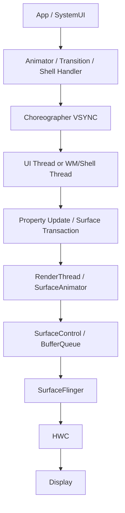
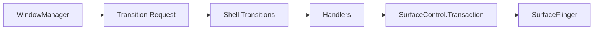

# 第 14 章：动画系统

Android 动画系统横跨 View、属性动画、Transition、WindowManager、Shell、HWUI 与 Choreographer 等多个层级。它既要为应用开发者提供易用 API，又要与 VSYNC、SurfaceControl、RenderThread 和 SurfaceFlinger 协同，在有限帧预算内输出流畅视觉效果。本章从 AOSP 实现角度梳理 Android 动画的演进、架构、线程模型、跨进程协同与性能关键点。

---

## 14.1 动画架构概览

### 14.1.1 四代动画演进

Android 动画能力大致经历四代演进：

1. **View Animation**：只改变绘制变换，未真正修改 View 属性。
2. **Property Animation**：直接驱动任意对象属性变化，是现代 Java 层动画基础。
3. **Transition / Activity / Window 动画**：面向界面切换与跨窗口过渡。
4. **Shell / Predictive Back / HWUI Native 动画**：更接近 Surface、RenderThread 与系统级过渡控制。

这种演进体现出动画系统从“局部绘制效果”走向“跨线程、跨进程、跨窗口的系统级时序协调”。

### 14.1.2 端到端动画数据流

动画从 API 调用到实际显示通常经历如下路径：



属性动画主要修改对象字段，窗口与 Shell 动画更多通过 `SurfaceControl.Transaction` 修改矩阵、alpha、crop、position 等 surface 属性。

### 14.1.3 时序基础设施

动画系统建立在统一时序基础设施之上：

- `Choreographer`：按 VSYNC 驱动帧回调。
- `AnimationHandler`：管理 `ValueAnimator` 等每帧推进。
- `RenderThread`：承载 HWUI native 动画和绘制。
- `SurfaceAnimationRunner`：驱动 WindowManager 与 Surface 动画。
- `Shell Transitions`：协调系统级窗口切换。

这些模块共享“以帧为单位推进状态”的核心思想，但运行在线程、进程和数据结构层面各不相同。

### 14.1.4 关键源码目录

| 目录 | 作用 |
|------|------|
| `frameworks/base/core/java/android/view/animation/` | 传统 View Animation |
| `frameworks/base/core/java/android/animation/` | Property Animation |
| `frameworks/base/core/java/android/transition/` | Transition Framework |
| `frameworks/base/core/java/android/window/` | 部分窗口与过渡 API |
| `frameworks/base/services/core/java/com/android/server/wm/` | WindowManager 动画与 Transition |
| `frameworks/base/libs/hwui/` | HWUI native 动画与 RenderThread |
| `frameworks/base/libs/WindowManager/Shell/` | Shell Transition、PIP、桌面模式等 |
| `frameworks/base/core/java/android/view/Choreographer.java` | VSYNC 帧调度 |
| `frameworks/base/core/java/com/android/internal/dynamicanimation/` | Physics 动画 |

### 14.1.5 线程模型

动画系统天然是多线程模型：

| 线程 | 典型职责 |
|------|----------|
| UI Thread | `ValueAnimator`、View 属性更新、Layout/Draw 触发 |
| RenderThread | HWUI native 动画、渲染推进 |
| WindowManager 线程 | 服务端窗口动画与 transition 管理 |
| Shell Main / Animation 线程 | Shell transitions、PIP、桌面模式动画 |
| SurfaceFlinger 线程 | 最终合成与显示时序 |

动画 API 的差别，很多时候本质上就是“状态在哪个线程推进”和“最终修改哪一层对象”。

### 14.1.6 跨进程动画协同

Activity 切换、共享元素、Predictive Back、Shell Transition 等系统动画需要跨进程协同：应用进程准备视图和共享元素状态，system_server 决定窗口拓扑和生命周期，Shell 选择动画策略，SurfaceFlinger 决定实际显示提交。

### 14.1.7 动画时长与缩放系数

Android 提供全局动画缩放因子，用于开发调试和无障碍需求。Window animation、transition animation、animator duration 均可受全局 scale 影响。scale 为 0 时，很多动画会直接跳到终态。

### 14.1.8 帧预算

动画必须在显示刷新率对应的帧预算内完成：60Hz 为 16.67ms，90Hz 为 11.11ms，120Hz 为 8.33ms。预算不仅包括属性推进，还包括布局、绘制、GPU 提交和系统合成。

---

## 14.2 View Animation（遗留）

### 14.2.1 Overview

View Animation 是 Android 最早的动画框架。它只影响 View 绘制时应用的变换，而不真正修改布局位置、宽高或其他语义属性。

### 14.2.2 `Animation` 基类

`Animation` 基类定义了动画的持续时间、开始时间、重复次数、fill 行为、interpolator、listener 和 transformation 计算流程。核心接口是 `getTransformation()` 与子类实现的 `applyTransformation()`。

### 14.2.3 `Transformation`

`Transformation` 持有矩阵与 alpha 等中间结果。View Animation 每一帧通过它描述当前时刻的几何变换与透明度，然后由 View 绘制过程应用。

### 14.2.4 具体动画子类

#### AlphaAnimation

`AlphaAnimation` 仅改变 alpha，从起始透明度插值到目标透明度。

#### TranslateAnimation

`TranslateAnimation` 改变绘制平移。它支持绝对值、相对自身、相对父容器三类尺寸解释方式。

#### RotateAnimation

`RotateAnimation` 围绕指定 pivot 点旋转绘制内容。

#### ScaleAnimation

`ScaleAnimation` 对绘制内容执行缩放，可设置 pivot 点与尺寸解释方式。

### 14.2.5 `AnimationSet`

`AnimationSet` 允许组合多个 View Animation，并控制子动画是否共享 interpolator、duration 等属性。它通过组合多个 `Transformation` 生成最终效果。

### 14.2.6 Interpolators

Interpolator 决定时间进度到动画进度的映射。线性时间不一定对应线性运动，插值器使动画能表现加速、减速、回弹等节奏。

### 14.2.7 `PathInterpolator`

`PathInterpolator` 通过贝塞尔曲线或 path 自定义时间曲线，是 Material 风格动画常用工具。它将输入进度映射到曲线路径上的输出值。

### 14.2.8 View Animation 类层级

核心层级包括 `Animation`、其具体子类、`AnimationSet` 与各类 Interpolator。该体系结构简单，但表达能力受限。

### 14.2.9 View Animation 的局限

View Animation 的核心缺陷包括：

- 不真正修改对象属性。
- 结束后点击区域与视觉位置可能不一致。
- 难以组合复杂状态与物理效果。
- 不适合任意对象动画。
- 与现代 RenderThread/HWUI 优化整合较弱。

### 14.2.10 `getTransformation()` 核心循环

每一帧，系统调用 `getTransformation(currentTime, outTransformation)`：

1. 判断动画是否开始。
2. 计算标准化时间。
3. 应用 interpolator。
4. 调用 `applyTransformation()`。
5. 决定是否结束、重复或触发 listener。

这是 View Animation 的时间推进核心。

### 14.2.11 `resolveSize`：值类型解析

`resolveSize` 把 `ABSOLUTE`、`RELATIVE_TO_SELF`、`RELATIVE_TO_PARENT` 这类尺寸表达解析为实际像素值，用于平移、缩放和 pivot 计算。

### 14.2.12 WindowManager 场景中的 View Animation

WindowManager 早期大量使用基于资源 XML 的传统动画来实现窗口进入、退出、旋转等效果。尽管系统内部已大量演进到 Surface 动画，View Animation 风格的资源与类结构仍保留在部分窗口动画路径中。

### 14.2.13 Interpolator Native Bridge

某些 interpolator 在 native/HWUI 路径有对应桥接实现，以便系统或 RenderThread 侧动画可复用相同时间曲线语义。

### 14.2.14 View Animation 文件摘要

核心文件集中在 `android.view.animation` 包，包括 `Animation.java`、各子类动画、插值器实现及 XML 解析辅助类。

---

## 14.3 Property Animation

### 14.3.1 Overview

Property Animation 是现代 Android 动画基础。它不局限于 View，可对任意对象属性执行时间推进，并支持 evaluator、keyframe、set、listener 与自动取消。

### 14.3.2 核心类层级

| 类 | 作用 |
|----|------|
| `Animator` | 抽象基类 |
| `ValueAnimator` | 驱动数值时间推进 |
| `ObjectAnimator` | 基于属性名或 `Property` 自动写回对象 |
| `AnimatorSet` | 组合多个 Animator |
| `PropertyValuesHolder` | 管理单个属性的插值与求值 |
| `TypeEvaluator` | 定义复杂类型插值 |
| `Keyframe` | 定义离散关键帧 |

### 14.3.3 `ValueAnimator` 深入

`ValueAnimator` 自身不绑定具体对象，它维护 start/end value、duration、interpolator、repeat mode、fraction 与 update listener。每一帧推进时它计算当前 animated value 并通知观察者。

### 14.3.4 动画帧循环

Property Animation 的帧循环由 `AnimationHandler` 与 `Choreographer` 驱动。VSYNC 到来后，`AnimationHandler` 遍历活动动画对象，调用其 `doAnimationFrame()` 或等价推进逻辑。

### 14.3.5 `ObjectAnimator`

`ObjectAnimator` 在 `ValueAnimator` 基础上增加目标对象与属性写回机制。它可通过反射、setter 方法或 `Property<T, V>` 把计算结果自动写入对象。

### 14.3.6 `PropertyValuesHolder`

`PropertyValuesHolder` 管理单个属性的关键帧、evaluator、setter/getter 与当前值计算，是 `ObjectAnimator` 同时驱动多个属性的核心构件。

### 14.3.7 Keyframes 与 `TypeEvaluator`

Keyframe 支持复杂节奏控制；`TypeEvaluator` 支持 `PointF`、颜色、矩形、路径点等复杂类型插值。两者结合后，Property Animation 能表达远超线性数值补间的复杂动画。

### 14.3.8 `AnimatorSet` 与依赖图

`AnimatorSet` 把多个动画组织成依赖图，可表达顺序播放、并发播放、after/before 关系。内部通过节点与事件系统调度子动画开始和结束。

### 14.3.9 `AnimationHandler` 与后台暂停

`AnimationHandler` 是每线程动画回调调度器。它可根据应用前后台状态暂停部分动画，减少后台无效工作与电量消耗。

### 14.3.10 `ValueAnimator.start()` 完整流程

典型流程：

1. 记录开始时间与 seek 状态。
2. 处理全局 duration scale。
3. 注册到 `AnimationHandler`。
4. 等待下一帧回调。
5. 每帧计算 fraction 和 animated value。
6. 结束时触发 listener 并从 handler 中移除。

### 14.3.11 `animateBasedOnTime()` 算法

该算法根据当前时间、开始时间、延迟、repeat、reverse、duration scale 和插值器计算当前动画 fraction，并推进内部状态机。

### 14.3.12 卡顿补偿：`commitAnimationFrame`

当实际帧时间落后于理想时序时，系统会通过 `commitAnimationFrame` 一类机制进行一定程度补偿，以减少长帧后动画明显跳变。

### 14.3.13 Duration Scale 与无障碍

动画缩放系数既是开发调试工具，也是无障碍控制项。系统必须确保动画 API 在缩放为 0、缩放较大或无障碍偏好变化时都行为合理。

### 14.3.14 `ObjectAnimator` 自动取消

AutoCancel 机制允许当新动画作用于同一目标和相同属性时自动取消旧动画，避免竞争更新和视觉抖动。

### 14.3.15 `StateListAnimator`

`StateListAnimator` 为不同 View 状态绑定不同属性动画，常用于按压、选中、悬浮等状态切换效果。

### 14.3.16 Property Animation 文件摘要

Property Animation 主要位于 `android.animation` 包，包括 `Animator.java`、`ValueAnimator.java`、`ObjectAnimator.java`、`AnimatorSet.java` 等文件。

### 14.3.17 `AnimationHandler.doAnimationFrame()` 深入

`doAnimationFrame()` 负责：

- 处理待启动动画。
- 遍历活动回调。
- 推进每个动画。
- 清理结束与取消对象。
- 处理自动取消和延迟开始。

它是 Java 层属性动画的关键调度点。

### 14.3.18 `AnimationFrameCallbackProvider`

该 provider 把 `AnimationHandler` 与具体帧源解耦。默认 provider 通常基于 `Choreographer`；测试环境可替换为自定义 provider。

### 14.3.19 AnimationHandler 中的自动取消

AnimationHandler 会在每帧或注册阶段检查 auto-cancel 规则，确保同一目标相同属性的旧动画及时停止。

### 14.3.20 `AnimatorSet` 节点与事件系统

`AnimatorSet` 内部为每个 animator 构建节点与事件，利用拓扑依赖关系控制启动顺序。该设计让复杂组合动画可以在统一时间基上运行。

### 14.3.21 `LayoutTransition`

`LayoutTransition` 在 ViewGroup 子 View 增删改导致布局变化时自动触发动画。它便捷但成本较高，在复杂布局中容易引入额外测量、布局与抖动。

---

## 14.4 Transition Framework

### 14.4.1 Overview

Transition Framework 面向界面状态切换，而非单个属性补间。它通过捕获“开始状态”和“结束状态”，自动计算需要变化的属性并生成动画。

### 14.4.2 核心概念

核心概念包括 `Transition`、`TransitionValues`、`Scene`、`TransitionManager`、target filtering、matching、propagation 与 path motion。

### 14.4.3 `Transition` 基类

`Transition` 定义捕获开始/结束值、匹配目标、创建 animator、过滤 target 与管理 listener 的模板方法。

### 14.4.4 内建 Transitions

系统内建过渡包括 `ChangeBounds`、`Fade`、`Slide`、`Explode`、`ChangeTransform`、`ChangeClipBounds` 等。

### 14.4.5 `ChangeBounds`

`ChangeBounds` 捕获 View 边界变化并创建位置/尺寸动画，是最常用的布局切换过渡之一。

### 14.4.6 `Fade`

`Fade` 通过 alpha 变化实现进入、退出或同时变换的淡入淡出。

### 14.4.7 `TransitionManager`

`TransitionManager` 负责在场景切换或布局变化时启动 transition，并管理当前场景和运行中的过渡集合。

### 14.4.8 `Scene`

`Scene` 表示一个逻辑界面状态，通常对应某个 View 层级或布局内容。Scene 切换可由 TransitionManager 驱动动画过渡。

### 14.4.9 Transition 匹配算法

系统会基于 id、name、instance、itemId 等标识在开始与结束状态之间匹配 View，再决定为哪些对象创建动画。

### 14.4.10 Transition 内部状态

Transition 维护 target 列表、capture 值、匹配结果、正在运行的 animator、listener、epicenter 与 propagation 等状态。

### 14.4.11 `TransitionValues` 容器

`TransitionValues` 保存单个目标在某一时刻捕获到的属性快照，是 Transition 进行差异比较的基础。

### 14.4.12 `TransitionSet` 顺序控制

`TransitionSet` 支持顺序执行或同时执行多个 transition，用于构造更复杂的界面切换效果。

### 14.4.13 目标过滤

Target filtering 允许按 id、View、类名或 name 包含/排除目标，以精确控制哪些元素参与 transition。

### 14.4.14 `Explode` 与 `Slide`

`Explode` 根据目标与 epicenter 的相对位置做放射状进入退出；`Slide` 则沿屏幕边缘方向平移。

### 14.4.15 Propagation 与运动路径

Propagation 控制不同目标的启动延迟，形成波纹或连锁效果；PathMotion 用于定义非直线运动路径。

### 14.4.16 Transition Framework 架构

Transition Framework 的本质是“状态捕获 + 匹配 + animator 生成 + target 过滤 + listener 管理”的通用框架。

---

## 14.5 Activity Transitions

### 14.5.1 Overview

Activity Transition 把 Transition Framework 扩展到 Activity 切换场景，支持进入、退出、返回、共享元素和 postponed enter 等复杂流程。

### 14.5.2 Transition Types

Activity 过渡主要包括 enter、exit、return、reenter 和 shared element transitions。

### 14.5.3 共享元素协调

共享元素动画需要源 Activity 与目标 Activity 协调同名元素的视图边界、截图、矩阵和生命周期。系统会在两侧间同步映射关系与回调时机。

### 14.5.4 共享元素返回动画细节

返回场景比进入更复杂，因为目标 Activity 可能已发生布局变化或被重建。系统需要重新匹配共享元素并处理不一致情况。

### 14.5.5 与 Fragment 的集成

Fragment 也支持 transition。Activity 与 Fragment 过渡组合时，需要协调容器、共享元素命名和 postponed 逻辑。

### 14.5.6 `ActivityOptions` 动画类型

`ActivityOptions` 支持自定义 enter/exit、缩放、缩略图、共享元素和 remote animation 等多种启动动画类型。

### 14.5.7 `ActivityTransitionCoordinator`

该协调器负责共享元素收集、映射、回调协调、截图处理和动画生命周期管理，是 Activity transition 的关键内部类。

### 14.5.8 Postponed Enter Transition

目标 Activity 可在数据加载或布局准备完成前调用 postponed enter，以避免共享元素尚未就绪时过早开始动画。

### 14.5.9 Return 与 Reenter Transitions

返回与重新进入过渡分别定义从目标返回源界面、源界面重新出现时的动画行为。

---

## 14.6 Window Manager 动画

### 14.6.1 Overview

WindowManager 动画处理窗口、任务、显示内容和系统容器层级上的动画。它与应用 View 动画不同，直接作用于 `SurfaceControl` 和窗口拓扑。

### 14.6.2 `SurfaceAnimator` 与 Leash 模式

`SurfaceAnimator` 使用 leash pattern：

1. 为被动画的 surface 创建一个中间 leash surface。
2. 原 surface 重新挂到 leash 下。
3. 动画只修改 leash 的变换与 alpha。
4. 动画结束后移除 leash 并恢复层级。

这种模式把“动画变换”与“真实 surface”解耦，降低并发修改冲突。

### 14.6.3 `SurfaceAnimationRunner`

`SurfaceAnimationRunner` 负责在服务端推进 surface 动画，通常基于 `ValueAnimator` 或类似时序推进机制，把每帧矩阵和 alpha 写入 `SurfaceControl.Transaction`。

### 14.6.4 `WindowAnimator`

`WindowAnimator` 是 WindowManager 传统动画调度器，负责每帧推进窗口层级动画、壁纸动画和显示动画等。

### 14.6.5 `SurfaceAnimator.startAnimation()` 流程

典型流程：

1. 取消旧动画。
2. 创建 leash。
3. 记录 adapter 与 finish callback。
4. 把 animation start 交给 adapter/runner。
5. 每帧更新 leash transaction。
6. 完成后清理 leash 并恢复原 surface。

### 14.6.6 Animation Transfer

动画 transfer 支持把正在执行的动画从一个容器迁移到另一个对象，用于窗口重组、任务重排或层级变更场景。

### 14.6.7 动画类型

WindowManager 动画包括 app open/close、task open/close、wallpaper、rotation、change、dim、thumbnail 与 remote animation 等。

### 14.6.8 WM 动画架构

WM 动画架构建立在 `WindowContainer`、`SurfaceAnimator`、`AnimationAdapter`、`SurfaceAnimationRunner`、`SurfaceControl.Transaction` 之上。

### 14.6.9 WM 服务端 Transition（`wm/Transition.java`）

较新的 WindowManager 过渡逻辑引入服务端 `Transition` 对象，用于统一描述拓扑变化，再交给 Shell 或默认处理器执行动画。

---

## 14.7 Shell Transition Animations

### 14.7.1 Overview

Shell Transition 是现代 Android 系统级窗口过渡框架。它把动画决策从传统 WindowManager 动画资源中抽离，交给 Shell 以更灵活方式处理多窗口、多任务与系统 UI 场景。

### 14.7.2 架构



### 14.7.3 `Transitions.java`

`Transitions.java` 是 Shell Transition 的核心调度器，负责注册 handlers、接收 transition 请求、分发到合适处理器并跟踪生命周期。

### 14.7.4 Handler 分发链

分发链会按优先级或能力判断由哪个 handler 处理当前过渡，例如默认处理器、remote handler、PIP、split-screen 或混合 handler。

### 14.7.5 `DefaultTransitionHandler`

默认处理器负责常见 app/task/window 过渡，使用系统资源动画、surface transaction 和时间推进驱动。

### 14.7.6 `RemoteTransitionHandler`

Remote handler 允许外部进程或组件接管动画逻辑，常用于 launcher、SystemUI 或 OEM 自定义过渡。

### 14.7.7 Mixed Transitions

Mixed transitions 用于一个过渡中同时包含多种语义变化，例如 PIP + app open、split-screen 变化 + task 切换。这类场景需要多个子 handler 协同。

### 14.7.8 Transition Types 与 Flags

Transition 对象会带有类型和 flags，描述 open、close、change、to-front、to-back、keyguard、rotation 等语义，供 handler 做策略判断。

### 14.7.9 `TransitionAnimationHelper`

该 helper 封装资源动画加载、边界计算、截图、alpha 与 crop 初始值设置等公用逻辑。

### 14.7.10 Shell Transition 生命周期

生命周期通常包括：collect → ready → startAnimation → merge / abort → finish。

### 14.7.11 屏幕旋转

Screen rotation 在新框架中通常作为 transition 处理，涉及 display transform、截图、无缝旋转与输入坐标同步。

---

## 14.8 Predictive Back Animations

### 14.8.1 Overview

Predictive Back 让返回手势在完成前就展示视觉预览。系统根据手势进度同步移动、缩放、圆角或目标界面预显，让用户预知返回结果。

### 14.8.2 架构

Predictive Back 包括输入手势识别、BackAnimationController、Shell transition 集成、应用回调与 surface 变换映射。

### 14.8.3 `BackAnimationController`

该控制器管理返回手势生命周期、参与对象、进度回调、取消与完成逻辑，是 Predictive Back 的核心调度器。

### 14.8.4 动画类型

返回动画可分为跨 Activity、跨 Task、返回 Home、跨窗口模式等类型。不同类型对应不同视觉策略。

### 14.8.5 手势驱动动画

动画进度直接受手势拖动控制，而不是单纯时间驱动。系统会把 progress 值映射到缩放、位移、圆角和 alpha。

### 14.8.6 `BackAnimationController` 状态机

状态机通常包括 idle、gesture started、progressing、committed、cancelled、finishing 等状态，用于确保系统在中断、取消或方向改变时行为稳定。

### 14.8.7 Progress 到变换的映射

系统定义 progress 曲线，将 0..1 手势进度转换为矩阵、alpha、crop 和圆角半径，保证动画视觉自然并兼顾边界条件。

### 14.8.8 与 Shell Transition 的集成

手势完成后，Predictive Back 会把最终过渡衔接到 Shell transition 或 WindowManager 生命周期，使交互动画和平滑切换统一收口。

### 14.8.9 返回动画变换细节

细节包括窗口缩放中心、边缘吸附、背景变暗、目标任务预显示与截图/实时 surface 切换。

### 14.8.10 `ProgressVelocityTracker`

该组件记录进度变化速度，用于判断取消/完成阈值和结束段动画参数。

---

## 14.9 基于物理的动画

### 14.9.1 Overview

Physics-based animation 用物理方程替代固定时长补间，适合弹簧回弹、fling 惯性滚动和手势收尾等自然运动场景。

### 14.9.2 `DynamicAnimation` 基类

`DynamicAnimation` 定义通用目标、最小可见变化量、速度、边界、监听器和每帧推进逻辑。

### 14.9.3 `SpringAnimation`

`SpringAnimation` 通过弹簧模型让属性趋向最终值，支持 stiffness、damping ratio 和起始速度，适合自然回弹。

### 14.9.4 `SpringForce`

`SpringForce` 封装弹簧方程参数，并在给定时间步下计算位置和速度的更新。

### 14.9.5 `FlingAnimation`

`FlingAnimation` 基于初速度和阻尼推进，常用于滚动、甩动和轻扫后自然减速。

### 14.9.6 `SpringForce` 内部计算

内部计算会根据阻尼比区分欠阻尼、临界阻尼和过阻尼情形，并使用解析或近似公式推进位置与速度。

### 14.9.7 `DynamicAnimation` 生命周期

生命周期包括创建、设置参数、start、逐帧推进、到达平衡点或边界、结束与回调通知。

### 14.9.8 `FlingAnimation` 详细行为

Fling 会根据摩擦、最小阈值和边界截断判断何时停止。若绑定边界并与 spring 组合，可形成先 fling 后弹簧回弹的复杂交互。

### 14.9.9 `DynamicAnimation` 的 ViewProperty 架构

系统为常见 View 属性提供预定义 `FloatPropertyCompat` 包装，使 physics 动画无需反射即可高效读写属性。

### 14.9.10 `Force` 接口

`Force` 抽象允许不同力模型参与动画推进，为后续扩展非弹簧类动力学模型提供接口基础。

### 14.9.11 `Scroller` 与 `OverScroller` 物理

`Scroller` / `OverScroller` 主要用于滚动视图惯性和越界回弹。虽然 API 形式不同，它们同样体现“以物理模型驱动连续帧更新”的思想。

### 14.9.12 与 Shell 的集成

Physics 动画可用于 Shell 手势收尾、PIP 回弹、桌面模式拖拽或 split divider 惯性移动等场景。

### 14.9.13 `Scroller` 与 `OverScroller`

二者在 fling、spring back、edge effect 与滚动边界处理上承担基础支撑角色，尤其在传统 View 滚动容器中极其常见。

---

## 14.10 Native HWUI 动画

### 14.10.1 Overview

HWUI native 动画在 RenderThread 上执行，可直接驱动 RenderNode 属性，减少 UI Thread 负担并获得更稳定的帧时序，典型代表是 `RenderNodeAnimator` 与 `AnimatedVectorDrawable` 的部分路径。

### 14.10.2 `BaseRenderNodeAnimator`

它是 RenderThread 侧动画的基类，管理目标属性、插值器、状态机、staging 与每帧推进接口。

### 14.10.3 Staging Pattern

Java 线程创建 native animator 后，先进入 staging 阶段，再由 RenderThread 安全接管。这与 RenderNode 双缓冲属性模型一致，避免并发访问问题。

### 14.10.4 PlayState 状态机

状态机通常包括 prepared、delayed、running、finished、cancelled 等状态，用于定义动画启动、延迟、取消和结束行为。

### 14.10.5 `AnimatorManager`

AnimatorManager 在 RenderThread 侧管理活跃动画集合，并在每一帧统一推进它们。

### 14.10.6 Java 侧 JNI Bridge

Java API 通过 JNI 创建、配置和启动 native animator，把 RenderNode 和目标属性传递给 HWUI。

### 14.10.7 HWUI `animate()` 核心循环

每帧 RenderThread 会：

1. 获取当前 frame time。
2. 遍历活跃 native animator。
3. 根据 interpolator 计算进度。
4. 写入目标 RenderNode 属性。
5. 标记需要重绘或重新记录的节点。

### 14.10.8 HWUI 中的属性类型

支持属性包括 alpha、translationX/Y/Z、rotation、scale、elevation、clip、reveal 等与 RenderNode 直接相关的字段。

### 14.10.9 HWUI Interpolator 实现

为保证 RenderThread 可独立推进，部分 interpolator 在 native 侧有镜像实现。

### 14.10.10 `PropertyValuesAnimatorSet`（Native）

该结构允许在 native 侧管理多属性动画组合，减少跨 JNI 往返。

### 14.10.11 `AnimationContext` 与帧时间

AnimationContext 维护本帧时间、目标节点集合与时序辅助信息，为多动画统一推进提供上下文。

### 14.10.12 HWUI 动画与 DisplayList

由于动画直接作用于 RenderNode 属性，许多帧无需重新执行 Java `View.draw()`，只需在 RenderThread 使用已有 DisplayList 回放并应用新属性。

### 14.10.13 HWUI 与 Java 动画性能比较

当动画只涉及 RenderNode 可直接表达的属性时，HWUI native 动画往往更稳、更省 UI Thread 开销。涉及复杂业务逻辑或非 RenderNode 属性时，Java Property Animation 仍更灵活。

---

## 14.11 Drawable 与 Vector 动画

### 14.11.1 `AnimatedVectorDrawable`

AVD 允许对 `VectorDrawable` 的 path、group、trim、alpha、rotation 等属性做动画，是图标和轻量 UI 动效的重要工具。

### 14.11.2 AVD 架构

AVD 把 `VectorDrawable` 目标对象与一组 animator 绑定，在启动时为每个命名 target 应用对应动画。

### 14.11.3 `VectorDrawable` 属性

可动画属性包括 pathData、fillColor、strokeColor、strokeWidth、rotation、scale、translation、trimPathStart/End/Offset 等。

### 14.11.4 AVD RenderThread 执行路径

当目标属性和实现路径允许时，AVD 可在 RenderThread/native 路径推进，降低 Java 开销并提升图标动画流畅度。

### 14.11.5 AVD 中的 Path Morphing

Path morphing 要求起始和结束 path 结构兼容。系统通过 pathData evaluator 在每帧对路径命令参数插值。

### 14.11.6 Trim Path 动画

Trim path 动画通过动态调整 path 绘制区间实现路径描边生长、消退等效果，是线条图标动画常用技巧。

### 14.11.7 AVD 性能特征

AVD 适合轻量、可复用、矢量风格动画。复杂 path 数量过多、频繁 path morph 或过大视口会显著增加 CPU/GPU 成本。

### 14.11.8 `VectorDrawable` 渲染管线

VectorDrawable 最终会转为 Path/Paint 绘制命令，由 HWUI/Skia 渲染。它的优势是分辨率独立与参数化动画能力。

### 14.11.9 `AnimationDrawable`

`AnimationDrawable` 是逐帧位图动画，简单直接，但占用内存大且缩放适配能力差。

### 14.11.10 `AnimatedImageDrawable`

该类用于播放 GIF、WebP 动图等编码动画，内部结合解码器和帧调度推进。

---

## 14.12 Choreographer

### 14.12.1 Overview

`Choreographer` 是 Android 帧调度中心。它把输入、动画、遍历和提交统一组织在 VSYNC 驱动的帧回调中。

### 14.12.2 回调类型与顺序

典型回调类型包括 INPUT、ANIMATION、INSETS_ANIMATION、TRAVERSAL、COMMIT。顺序设计确保输入先处理、动画随后推进、布局绘制再执行、最终提交最后完成。

### 14.12.3 每线程单例

Choreographer 是每个 Looper 线程一个单例。UI Thread 的 Choreographer 最关键，部分系统线程也会有自己的实例。

### 14.12.4 VSYNC 集成

Choreographer 通过 `FrameDisplayEventReceiver` 从 DisplayEventReceiver 获取 VSYNC 事件，并将其转化为 Java 层 `doFrame()` 调度。

### 14.12.5 帧回调调度

开发者和 framework 可通过 `postFrameCallback()` 或内部回调队列注册下一帧执行逻辑。Choreographer 负责在合适的 frame time 运行它们。

### 14.12.6 回调队列

不同 callback type 有独立队列和按时间排序的项。Choreographer 在 `doFrame()` 中按固定阶段依次清空可运行项。

### 14.12.7 帧时间与 Jank 检测

Choreographer 会比较实际 frame time、deadline 和偏移量，识别错过 VSYNC 或连续延迟，从而辅助 jank 检测。

### 14.12.8 Buffer Stuffing Recovery

当生产者持续快于消费速度导致 buffer stuffing 时，Choreographer 会通过时序恢复逻辑尝试重新对齐帧节奏，减轻持续抖动。

### 14.12.9 `FrameInfo` 与 Jank Tracking

FrameInfo 记录一帧各阶段时间戳，是 `gfxinfo`、JankStats 和系统性能分析的重要原始数据。

### 14.12.10 `doFrame()` 方法

`doFrame()` 是 Choreographer 核心：校验 frame、更新时间戳、处理回调队列、调用遍历、提交下一帧调度。

### 14.12.11 VSYNC Source Types

系统可能存在不同来源的 VSYNC，如 app VSYNC、SurfaceFlinger VSYNC 或特定测试/模拟源。

### 14.12.12 帧调度

帧调度不仅依赖下一个 VSYNC 时刻，还依赖 frame deadline、应用预算和是否需要跳过过期帧。

### 14.12.13 `FrameDisplayEventReceiver`

该内部类负责把 native DisplayEventReceiver 的回调桥接到 Java Looper/MessageQueue。

### 14.12.14 FPS Divisor

FPS divisor 可让应用按更低帧率运行回调，例如每两帧运行一次，以节省资源或满足特定显示策略。

### 14.12.15 Choreographer 系统属性

系统属性可调试帧调度行为，例如跳帧策略、Vsync 偏移和部分性能诊断选项。

### 14.12.16 `VsyncCallback` 与 `FrameCallback`

`VsyncCallback` 更接近原始 VSYNC 语义，`FrameCallback` 更偏向 Choreographer 帧调度阶段。二者目标相近，但语义层级不同。

### 14.12.17 预期显示时间

现代帧调度不只关注“当前 VSYNC”，也关注 expected presentation time，使动画推进和渲染更贴近真正显示时刻。

### 14.12.18 Choreographer 与 AnimationHandler 集成

AnimationHandler 通常使用 Choreographer 作为帧源，因此 Java Property Animation 本质上运行在 Choreographer 的 ANIMATION 阶段之上。

---

## 14.13 Specialized Shell Animations

### 14.13.1 Shell 动画基础设施

Shell 基础设施为系统多窗口场景提供统一动画能力，包括 surface transaction 管理、过渡 handler、截图、同步与特定场景 helper。

### 14.13.2 Picture-in-Picture（PIP）动画

PIP 动画涉及窗口缩放、圆角、裁剪与任务状态切换，常结合手势与系统栏状态变化。

### 14.13.3 展开屏动画

Unfold 动画针对折叠屏/展开屏设备，协调显示区域变化、任务布局和连续变换效果。

### 14.13.4 Desktop Mode 动画

桌面模式动画处理窗口自由缩放、拖动、任务切换和进入退出桌面布局等场景。

### 14.13.5 Letterbox 动画

Letterbox 动画处理黑边区域、背景过渡与兼容模式切换的视觉效果。

### 14.13.6 Dimmer 动画

Dimmer 动画控制遮罩层明暗变化，常用于对话框、任务切换或过渡背景暗化。

### 14.13.7 分屏分割线动画

Split-screen divider 动画响应拖拽、吸附、展开与收缩，是大屏多任务体验关键部分。

### 14.13.8 Letterbox 动画细节

细节包括圆角、背景色、内容缩放与边缘平滑过渡，确保兼容模式不突兀。

### 14.13.9 App Launch Animation

应用启动动画在任务 surface、启动画面、目标窗口第一帧之间建立连续过渡，是系统感知速度的重要来源。

### 14.13.10 Task-to-Task Animation

任务间切换动画需要协调 snapshot、real surface、launcher 和 recents 界面，确保任务切换连续自然。

### 14.13.11 与 Recents Animation 的集成

Recents 动画允许 launcher 接管最近任务界面和手势导航切换，是 Shell 动画中最复杂的协同路径之一。

### 14.13.12 与 SurfaceFlinger 的同步

Shell 动画最终都要落到 `SurfaceControl.Transaction`，并通过 SurfaceFlinger 在帧边界统一提交。同步正确性直接决定动画是否撕裂、跳变或错位。

---

## 14.14 动手实践

### 14.14.1 Property Animation：弹跳小球

使用 `ObjectAnimator` 或 `ValueAnimator` 驱动 `translationY` 和 alpha，可快速实现弹跳小球示例。

### 14.14.2 Shared Element Activity Transition

通过 `ActivityOptions.makeSceneTransitionAnimation()` 配置共享元素，验证 Activity 间共享元素过渡。

### 14.14.3 使用 `SpringAnimation` 实现自然运动

Physics 动画适合按钮回弹、拖拽吸附和自然跟手效果。

### 14.14.4 多属性 `AnimatorSet`

使用 `AnimatorSet.playTogether()` 同时驱动缩放、平移和透明度，观察组合动画的依赖与 listener 行为。

### 14.14.5 Transition Framework：Scene Change

使用 `TransitionManager.go()` 与 `Scene` 体验布局状态切换。

### 14.14.6 使用 Perfetto 追踪动画

```bash
# Record a Perfetto trace with animation-relevant categories
adb shell perfetto -o /data/misc/perfetto-traces/anim.pftrace -t 10s \
  sched freq idle gfx view wm am binder_driver surfaceflinger
adb pull /data/misc/perfetto-traces/anim.pftrace
```

### 14.14.7 调试动画问题

```bash
# Enable animation duration scale via adb
adb shell settings put global animator_duration_scale 5.0
# Reset to normal
adb shell settings put global animator_duration_scale 1.0
# Disable all animations (useful for testing)
adb shell settings put global animator_duration_scale 0
# Dump running animations
adb shell dumpsys activity animations
# Show surface update rectangles
adb shell setprop debug.hwui.show_dirty_regions true
```

### 14.14.8 实战 `AnimatedVectorDrawable`

准备带命名 target 的 `VectorDrawable` 与 `animator` XML，绑定成 AVD 观察 path、rotation 与 trimPath 效果。

### 14.14.9 自定义复杂类型 `TypeEvaluator`

为 `PointF`、颜色矩阵或自定义几何对象实现 evaluator，可扩展 Property Animation 表达能力。

### 14.14.10 使用 Keyframe 表达复杂节奏

通过 `Keyframe` 为同一属性设置多个时间点和非均匀进度，表达停顿、加速和回弹节奏。

### 14.14.11 从 Dumpsys 读取动画状态

```bash
# Dump all animation state
adb shell dumpsys activity animations
# Dump surface animator state
adb shell dumpsys window
# Dump transition state
adb shell dumpsys activity service SystemUIService
# Shell transition state
adb shell dumpsys activity service SystemUIService | grep -i transition
```

### 14.14.12 动画性能最佳实践

最佳实践包括减少无意义重绘、尽量动画可独立属性、控制层数、避免频繁 layout、合理使用硬件层与 RenderThread 路径。

### 14.14.13 使用 `ViewPropertyAnimator` 简化 View 动画

`view.animate()` 语法简洁，适合常见 alpha、translation、scale、rotation 动画，并默认集成部分优化。

### 14.14.14 使用 `SpringAnimation` 实现手势驱动动画

手势释放后用 spring 进行吸附和回弹，是构建自然交互的重要模式。

### 14.14.15 使用 Scene 的 Transition Framework

多个 Scene 和 Transition 可组合成状态机式界面过渡，适合复杂内容容器切换。

### 14.14.16 使用 `FlingAnimation` 实现滚动式运动

Fling 适合卡片甩动、吸附前的惯性移动和轻量模拟滚动。

### 14.14.17 自定义 Interpolator

自定义 interpolator 可通过数学函数或 path 描述品牌特有节奏。

### 14.14.18 `WindowInsetsAnimation`

该 API 用于与 IME、系统栏和窗口 inset 变化同步动画，是现代 edge-to-edge 场景重要工具。

### 14.14.19 多属性 Physics 动画

多个 spring/fling 组合可构成更自然的复杂交互，例如卡片堆叠、拖拽回弹和多轴动效。

### 14.14.20 Perfetto Trace 分析实战

分析动画 trace 时重点观察输入、Choreographer、AnimationHandler、RenderThread、WM/Shell transition、SurfaceFlinger 和 GPU completion 的时序衔接。

---

## 总结

Android 动画系统不是单一框架，而是一组分层协作的时序系统：

| 层级 | 核心能力 |
|------|----------|
| View Animation | 历史遗留的绘制变换动画 |
| Property Animation | 任意对象属性推进 |
| Transition Framework | 状态切换动画 |
| Activity / Fragment Transition | 跨界面共享元素与进入退出动画 |
| WindowManager / Shell | 窗口与任务级 surface 动画 |
| Physics Animation | 自然运动与手势收尾 |
| HWUI Native Animation | RenderThread 上的高效属性动画 |
| Choreographer | 全系统帧时钟与回调调度 |

### 历史演进时间线

动画系统的演进路径从简单 View 变换，发展到任意属性动画，再到基于场景、窗口和系统拓扑的多层协同动画。新系统更强调跨进程协调、SurfaceControl 直接控制和帧时序精度。

### 决策指南：选择哪种动画 API

| 需求 | 推荐 API |
|------|----------|
| 单个 View 常见属性变化 | `ViewPropertyAnimator` / `ObjectAnimator` |
| 任意对象属性变化 | `ValueAnimator` / `ObjectAnimator` |
| 自然回弹与 fling | `SpringAnimation` / `FlingAnimation` |
| 布局状态切换 | `Transition` / `TransitionManager` |
| Activity 共享元素 | Activity Transition |
| 系统窗口/任务切换 | Shell / WM Transition |
| RenderNode 属性高性能动画 | HWUI native 动画 |

### 动画与无障碍

动画必须尊重全局 duration scale、减少运动偏好与可读性需求。良好的动画系统应在 scale 为 0 时仍保证状态正确、逻辑完整。

### 线程安全考量

动画常跨 UI Thread、RenderThread、system_server 与 Shell 线程。设计上通过 staging、双缓冲、leash、transaction 边界和 callback 生命周期管理保证安全。

### 内存与资源考量

动画会引入额外 layer、截图、纹理缓存、路径缓存和事务对象。复杂动效设计应重视这些资源成本。

### 动画测试

应结合单元测试、UI 自动化、jank 指标、`gfxinfo`、`dumpsys` 与 Perfetto 进行验证。

### 常见动画陷阱

常见陷阱包括：

- 对布局属性频繁做动画导致重复 measure/layout。
- 同一属性被多个 animator 竞争修改。
- 共享元素在布局未稳定时启动。
- Shell / WM transition 未正确 finish。
- 过度依赖截图或大纹理导致内存抖动。
- 忽略 duration scale 与无障碍设置。

### 关键源码文件交叉索引

| 路径 | 作用 |
|------|------|
| `frameworks/base/core/java/android/animation/` | Property Animation |
| `frameworks/base/core/java/android/view/animation/` | View Animation |
| `frameworks/base/core/java/android/transition/` | Transition Framework |
| `frameworks/base/core/java/android/view/Choreographer.java` | 帧调度 |
| `frameworks/base/services/core/java/com/android/server/wm/` | WM 动画与 transition |
| `frameworks/base/libs/WindowManager/Shell/` | Shell transition 与专用动画 |
| `frameworks/base/libs/hwui/` | HWUI native 动画 |
| `frameworks/base/core/java/com/android/internal/dynamicanimation/` | Physics 动画 |

### 动画术语表

| 术语 | 含义 |
|------|------|
| VSYNC | 显示垂直同步信号 |
| Choreographer | 帧回调调度器 |
| Animator | Java 属性动画基类 |
| Transition | 状态切换动画框架 |
| Leash | Surface 动画中间控制层 |
| RenderThread | 应用专用渲染线程 |
| Shared Element | Activity 共享元素 |
| Predictive Back | 手势驱动返回预览动画 |
| Spring | 弹簧动力学模型 |
| Fling | 惯性减速运动 |

### 性能指标

动画性能常用指标包括帧耗时、Jank 数、掉帧比例、输入到显示延迟、GPU 完成时间、动画启动延迟和 SurfaceFlinger 合成开销。

### 进一步阅读

推荐继续阅读 WindowManager、Graphics Pipeline、SurfaceFlinger、Input System 和 HWUI 相关章节，以建立完整的动画与渲染认知闭环。

### 与其他章节的关系

动画系统与图形渲染、窗口系统、输入系统和 SurfaceFlinger 高度耦合。动画负责“状态如何变化”，图形系统负责“变化如何被绘制并显示”。理解两者协同关系，是掌握 Android 交互体验实现细节的关键。
