# Chapter 14: Animation System

Android's animation system has evolved across four generations of APIs, each
addressing a wider class of motion -- from simple view-level transforms
through physics-based spring models to coordinated window-manager shell
transitions.  This chapter traces the full path an animated value takes
from application code to the compositor, examines every major subsystem in
detail, and shows how the pieces connect through Choreographer's VSYNC-driven
timing pulse.

---

## 14.1 Animation Architecture Overview

### 14.1.1 Four Generations of Animation

Android provides four distinct animation layers, each built atop the one
before it:

| Generation | API Level | Package / Location | Scope |
|---|---|---|---|
| View Animation (legacy) | 1 | `android.view.animation` | Matrix + alpha on a single View |
| Property Animation | 11 | `android.animation` | Arbitrary typed property on any Object |
| Transition Framework | 19 | `android.transition` | Scene-change choreography across a ViewGroup |
| Shell Transitions | 12L+ | `com.android.wm.shell.transition` | Cross-window, cross-task WM transitions |

Additionally, the platform provides specialized subsystems for physics-based
motion (`DynamicAnimation`, `SpringAnimation`, `FlingAnimation`), native
RenderThread animations (HWUI), and drawable-level animations
(`AnimatedVectorDrawable`).

### 14.1.2 End-to-End Animation Data Flow

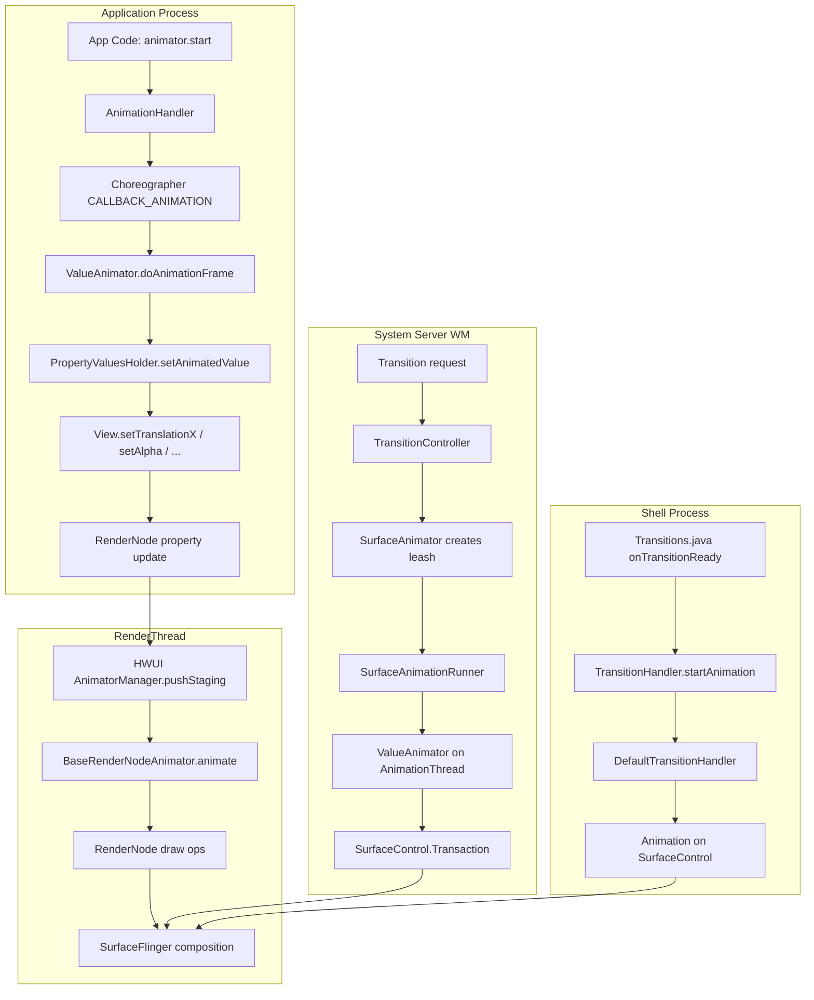
```mermaid
graph TD
    subgraph "Application Process"
        A[App Code: animator.start] --> B[AnimationHandler]
        B --> C[Choreographer CALLBACK_ANIMATION]
        C --> D[ValueAnimator.doAnimationFrame]
        D --> E[PropertyValuesHolder.setAnimatedValue]
        E --> F[View.setTranslationX / setAlpha / ...]
        F --> G[RenderNode property update]
    end

    subgraph "RenderThread"
        G --> H[HWUI AnimatorManager.pushStaging]
        H --> I[BaseRenderNodeAnimator.animate]
        I --> J[RenderNode draw ops]
        J --> K[SurfaceFlinger composition]
    end

    subgraph "System Server WM"
        L[Transition request] --> M[TransitionController]
        M --> N[SurfaceAnimator creates leash]
        N --> O[SurfaceAnimationRunner]
        O --> P[ValueAnimator on AnimationThread]
        P --> Q[SurfaceControl.Transaction]
        Q --> K
    end

    subgraph "Shell Process"
        R[Transitions.java onTransitionReady] --> S[TransitionHandler.startAnimation]
        S --> T[DefaultTransitionHandler]
        T --> U[Animation on SurfaceControl]
        U --> K
    end
```

### 14.1.3 Timing Infrastructure

All animations on the UI thread share a single timing source: the
**Choreographer**.  Choreographer receives VSYNC signals from the display
subsystem and dispatches five ordered callback types every frame:

```
// frameworks/base/core/java/android/view/Choreographer.java, lines 311-353

CALLBACK_INPUT       = 0   // Input events
CALLBACK_ANIMATION   = 1   // Animator frame callbacks
CALLBACK_INSETS_ANIMATION = 2   // WindowInsetsAnimation updates
CALLBACK_TRAVERSAL   = 3   // View measure/layout/draw
CALLBACK_COMMIT      = 4   // Post-draw commit; adjusts start time for skipped frames
```

The `AnimationHandler` registers a `FrameCallback` with Choreographer that,
on each VSYNC, iterates all registered `AnimationFrameCallback` instances --
which includes every running `ValueAnimator` and `DynamicAnimation`.

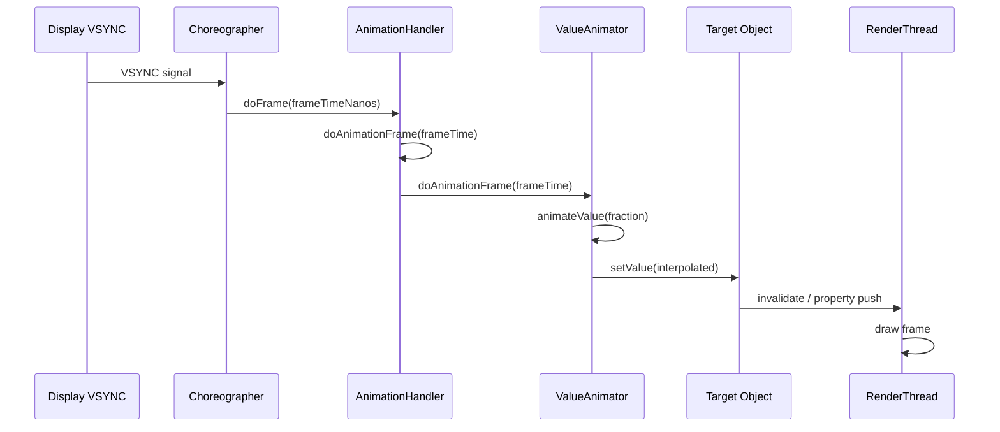
```mermaid
sequenceDiagram
    participant VSYNC as Display VSYNC
    participant Choreo as Choreographer
    participant AH as AnimationHandler
    participant VA as ValueAnimator
    participant Obj as Target Object
    participant RT as RenderThread

    VSYNC->>Choreo: VSYNC signal
    Choreo->>AH: doFrame(frameTimeNanos)
    AH->>AH: doAnimationFrame(frameTime)
    AH->>VA: doAnimationFrame(frameTime)
    VA->>VA: animateValue(fraction)
    VA->>Obj: setValue(interpolated)
    Obj->>RT: invalidate / property push
    RT->>RT: draw frame
```

### 14.1.4 Key Source Directories

| Directory | Contents | Lines (approx) |
|---|---|---|
| `frameworks/base/core/java/android/view/animation/` | View Animation classes | ~5,800 |
| `frameworks/base/core/java/android/animation/` | Property Animation framework | ~13,400 |
| `frameworks/base/core/java/android/transition/` | Transition Framework | ~9,200 |
| `frameworks/base/libs/hwui/` (Animator*) | Native HWUI animators | ~830 |
| `frameworks/base/core/java/android/view/Choreographer.java` | Timing pulse | 1,714 |
| `frameworks/base/services/core/java/com/android/server/wm/` (anim) | WM animation infrastructure | ~2,400 |
| `frameworks/base/libs/WindowManager/Shell/src/.../transition/` | Shell transitions | ~8,200 |
| `frameworks/base/libs/WindowManager/Shell/src/.../back/` | Predictive back | ~3,200 |
| `frameworks/base/core/java/com/android/internal/dynamicanimation/animation/` | Physics animations | ~1,750 |

### 14.1.5 Thread Model

Understanding which thread runs each animation type is critical for
performance analysis:

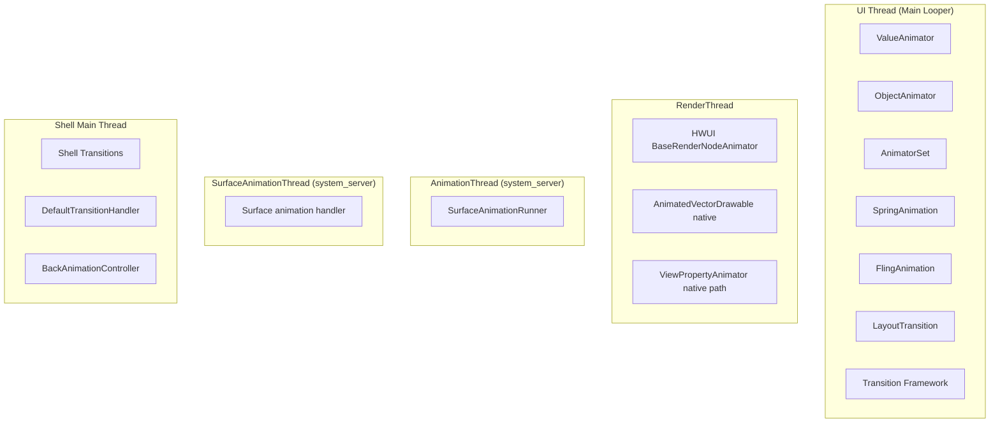
```mermaid
graph TD
    subgraph "UI Thread (Main Looper)"
        VA[ValueAnimator]
        OA[ObjectAnimator]
        AS[AnimatorSet]
        SA[SpringAnimation]
        FA[FlingAnimation]
        LT[LayoutTransition]
        TF[Transition Framework]
    end

    subgraph "RenderThread"
        HWUI[HWUI BaseRenderNodeAnimator]
        AVD[AnimatedVectorDrawable native]
        VPA[ViewPropertyAnimator native path]
    end

    subgraph "AnimationThread (system_server)"
        SAR[SurfaceAnimationRunner]
    end

    subgraph "SurfaceAnimationThread (system_server)"
        SATH[Surface animation handler]
    end

    subgraph "Shell Main Thread"
        ST[Shell Transitions]
        DTH[DefaultTransitionHandler]
        BAC[BackAnimationController]
    end
```

The key insight is that **ViewPropertyAnimator** and **AnimatedVectorDrawable**
(API 25+) run natively on the RenderThread, making them immune to UI thread
jank.  All other Java-based animations run on the UI thread and are
susceptible to interruption by garbage collection, heavy layout, or other
main-thread work.

### 14.1.6 Animation Coordination Across Processes

Modern Android animations often span multiple processes:

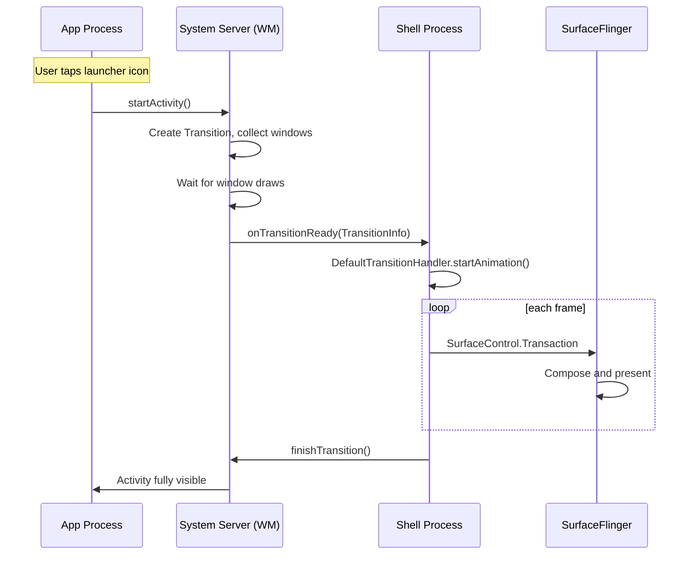
```mermaid
sequenceDiagram
    participant App as App Process
    participant SS as System Server (WM)
    participant Shell as Shell Process
    participant SF as SurfaceFlinger

    Note over App: User taps launcher icon
    App->>SS: startActivity()
    SS->>SS: Create Transition, collect windows
    SS->>SS: Wait for window draws
    SS->>Shell: onTransitionReady(TransitionInfo)
    Shell->>Shell: DefaultTransitionHandler.startAnimation()
    loop each frame
        Shell->>SF: SurfaceControl.Transaction
        SF->>SF: Compose and present
    end
    Shell->>SS: finishTransition()
    SS->>App: Activity fully visible
```

The animation runs in the Shell process, but it affects surfaces from the
App process.  This decoupling means app jank does not affect system
transition animations.

### 14.1.7 Animation Duration and Scale

All animations in Android are subject to the global animation scale settings.
There are three independent scale factors:

| Setting | Affects | Default |
|---|---|---|
| `animator_duration_scale` | Property animations (ValueAnimator, etc.) | 1.0 |
| `window_animation_scale` | Window open/close animations | 1.0 |
| `transition_animation_scale` | Activity transitions | 1.0 |

These can be modified through Developer Options or programmatically:

```bash
adb shell settings put global animator_duration_scale 2.0
adb shell settings put global window_animation_scale 0.5
adb shell settings put global transition_animation_scale 0
```

When any scale is set to 0, the corresponding animations are disabled
(complete instantly).

### 14.1.8 Frame Budget

At 60Hz, each frame has a budget of 16.67ms.  At 120Hz, the budget is
8.33ms.  The animation callback must complete within a fraction of this
budget to allow time for layout, draw, and GPU work:

| Phase | Budget (60Hz) | Budget (120Hz) |
|---|---|---|
| INPUT callbacks | ~1ms | ~0.5ms |
| ANIMATION callbacks | ~2ms | ~1ms |
| INSETS_ANIMATION | ~0.5ms | ~0.3ms |
| TRAVERSAL (layout + draw) | ~10ms | ~5ms |
| GPU render | ~3ms | ~1.5ms |
| **Total** | **~16.5ms** | **~8.3ms** |

Exceeding the budget causes frame drops (jank).  Choreographer logs a
warning when more than 30 frames are skipped.

---

## 14.2 View Animation (Legacy)

### 14.2.1 Overview

The original animation framework, present since API 1, operates by applying a
`Transformation` (matrix + alpha) to a View during the drawing phase.
Crucially, View Animations **do not change the actual layout properties** of
the view -- a translated view still receives touch events at its original
position.

Source directory:
`frameworks/base/core/java/android/view/animation/` (29 files)

### 14.2.2 The Animation Base Class

The abstract class `Animation` (1,363 lines) defines the lifecycle:

```
// frameworks/base/core/java/android/view/animation/Animation.java, lines 40-98

public abstract class Animation implements Cloneable {
    public static final int INFINITE = -1;
    public static final int RESTART = 1;
    public static final int REVERSE = 2;
    public static final int START_ON_FIRST_FRAME = -1;

    public static final int ABSOLUTE = 0;
    public static final int RELATIVE_TO_SELF = 1;
    public static final int RELATIVE_TO_PARENT = 2;

    public static final int ZORDER_NORMAL = 0;
    public static final int ZORDER_TOP = 1;
    public static final int ZORDER_BOTTOM = -1;
    ...
}
```

Key internal state (lines 110-237):

| Field | Type | Purpose |
|---|---|---|
| `mEnded` | boolean | Set by `getTransformation()` when animation ends |
| `mStarted` | boolean | Set on first frame |
| `mCycleFlip` | boolean | Toggles in REVERSE repeat mode |
| `mInitialized` | boolean | Must be true before playing |
| `mFillBefore` | boolean | Apply transform before start (default true) |
| `mFillAfter` | boolean | Persist transform after end |
| `mStartTime` | long | Absolute start time in millis |
| `mDuration` | long | Duration of one cycle |
| `mRepeatCount` | int | Number of repeats (0 = play once) |
| `mRepeatMode` | int | RESTART or REVERSE |
| `mInterpolator` | Interpolator | Easing curve |
| `mScaleFactor` | float | Scale for pivot points |

The lifecycle is driven by `getTransformation(long, Transformation)`, which
computes elapsed time, applies the interpolator, and calls the abstract method
`applyTransformation(float interpolatedTime, Transformation t)`.

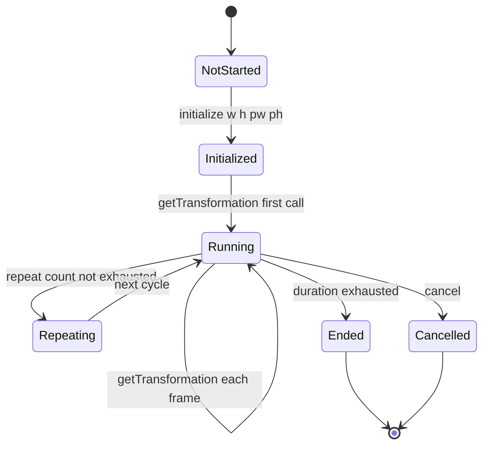
```mermaid
stateDiagram-v2
    [*] --> NotStarted
    NotStarted --> Initialized: initialize w h pw ph
    Initialized --> Running: getTransformation first call
    Running --> Running: getTransformation each frame
    Running --> Repeating: repeat count not exhausted
    Repeating --> Running: next cycle
    Running --> Ended: duration exhausted
    Ended --> [*]
    Running --> Cancelled: cancel
    Cancelled --> [*]
```

### 14.2.3 Transformation

The `Transformation` class (lines 32-80) encapsulates what a View Animation
produces:

```
// frameworks/base/core/java/android/view/animation/Transformation.java, lines 32-48

public class Transformation {
    public static final int TYPE_IDENTITY = 0x0;
    public static final int TYPE_ALPHA = 0x1;
    public static final int TYPE_MATRIX = 0x2;
    public static final int TYPE_BOTH = TYPE_ALPHA | TYPE_MATRIX;

    protected Matrix mMatrix;
    protected float mAlpha;
    protected int mTransformationType;
    ...
}
```

A `Transformation` holds a `Matrix` (for translate/rotate/scale) and an
`alpha` value.  The `compose(Transformation)` method concatenates two
transformations, which is how `AnimationSet` combines child animations.

### 14.2.4 Concrete Animation Subclasses

#### AlphaAnimation

The simplest animation -- modifies only the alpha component:

```
// frameworks/base/core/java/android/view/animation/AlphaAnimation.java, lines 67-70

@Override
protected void applyTransformation(float interpolatedTime, Transformation t) {
    final float alpha = mFromAlpha;
    t.setAlpha(alpha + ((mToAlpha - alpha) * interpolatedTime));
}
```

Note `willChangeTransformationMatrix()` returns false (line 73) -- no matrix
modification, just alpha blending.

#### TranslateAnimation

Moves a view by modifying the matrix translation:

```
// frameworks/base/core/java/android/view/animation/TranslateAnimation.java, lines 166-176

@Override
protected void applyTransformation(float interpolatedTime, Transformation t) {
    float dx = mFromXDelta;
    float dy = mFromYDelta;
    if (mFromXDelta != mToXDelta) {
        dx = mFromXDelta + ((mToXDelta - mFromXDelta) * interpolatedTime);
    }
    if (mFromYDelta != mToYDelta) {
        dy = mFromYDelta + ((mToYDelta - mFromYDelta) * interpolatedTime);
    }
    t.getMatrix().setTranslate(dx, dy);
}
```

The `initialize()` method (line 179) resolves value types:

- `ABSOLUTE` -- pixel values used directly
- `RELATIVE_TO_SELF` -- multiplied by the view's own dimensions
- `RELATIVE_TO_PARENT` -- multiplied by the parent's dimensions

#### RotateAnimation

Rotates around a configurable pivot point:

```
// frameworks/base/core/java/android/view/animation/RotateAnimation.java, lines 166-175

@Override
protected void applyTransformation(float interpolatedTime, Transformation t) {
    float degrees = mFromDegrees + ((mToDegrees - mFromDegrees) * interpolatedTime);
    float scale = getScaleFactor();
    if (mPivotX == 0.0f && mPivotY == 0.0f) {
        t.getMatrix().setRotate(degrees);
    } else {
        t.getMatrix().setRotate(degrees, mPivotX * scale, mPivotY * scale);
    }
}
```

#### ScaleAnimation

Scales with pivot support; resolves from/to values which may be fractions
or dimensions:

```
// frameworks/base/core/java/android/view/animation/ScaleAnimation.java, lines 241-258

@Override
protected void applyTransformation(float interpolatedTime, Transformation t) {
    float sx = 1.0f;
    float sy = 1.0f;
    float scale = getScaleFactor();
    if (mFromX != 1.0f || mToX != 1.0f) {
        sx = mFromX + ((mToX - mFromX) * interpolatedTime);
    }
    if (mFromY != 1.0f || mToY != 1.0f) {
        sy = mFromY + ((mToY - mFromY) * interpolatedTime);
    }
    if (mPivotX == 0 && mPivotY == 0) {
        t.getMatrix().setScale(sx, sy);
    } else {
        t.getMatrix().setScale(sx, sy, scale * mPivotX, scale * mPivotY);
    }
}
```

### 14.2.5 AnimationSet

`AnimationSet` (553 lines) groups multiple animations that play together.
Its `getTransformation()` iterates children in reverse order and calls
`compose()` to concatenate their transformations:

```
// frameworks/base/core/java/android/view/animation/AnimationSet.java, lines 390-423

@Override
public boolean getTransformation(long currentTime, Transformation t) {
    final int count = mAnimations.size();
    final ArrayList<Animation> animations = mAnimations;
    final Transformation temp = mTempTransformation;

    boolean more = false;
    boolean started = false;
    boolean ended = true;

    t.clear();

    for (int i = count - 1; i >= 0; --i) {
        final Animation a = animations.get(i);
        temp.clear();
        more = a.getTransformation(currentTime, temp, getScaleFactor()) || more;
        t.compose(temp);
        started = started || a.hasStarted();
        ended = a.hasEnded() && ended;
    }
    ...
}
```

Properties like `duration`, `fillBefore`, `fillAfter`, and `repeatMode` can
be pushed down to child animations via property flags (lines 54-61):

```
// AnimationSet.java, lines 54-61
private static final int PROPERTY_FILL_AFTER_MASK         = 0x1;
private static final int PROPERTY_FILL_BEFORE_MASK        = 0x2;
private static final int PROPERTY_REPEAT_MODE_MASK        = 0x4;
private static final int PROPERTY_START_OFFSET_MASK       = 0x8;
private static final int PROPERTY_SHARE_INTERPOLATOR_MASK = 0x10;
private static final int PROPERTY_DURATION_MASK           = 0x20;
private static final int PROPERTY_MORPH_MATRIX_MASK       = 0x40;
private static final int PROPERTY_CHANGE_BOUNDS_MASK      = 0x80;
```

### 14.2.6 Interpolators

The `android.view.animation` package provides 12 built-in interpolators:

| Interpolator | Formula / Behavior | Typical Use |
|---|---|---|
| `AccelerateDecelerateInterpolator` | `cos((t+1)*PI)/2 + 0.5` | Default; natural motion |
| `AccelerateInterpolator` | `t^(2*factor)` | Exit animations |
| `DecelerateInterpolator` | `1 - (1-t)^(2*factor)` | Enter animations |
| `LinearInterpolator` | `t` | Constant velocity |
| `BounceInterpolator` | Piecewise quadratic | Bounce at end |
| `OvershootInterpolator` | Cubic overshoot | Spring-like |
| `AnticipateInterpolator` | Pull back then shoot | Cartoon wind-up |
| `AnticipateOvershootInterpolator` | Both anticipation and overshoot | Combined |
| `CycleInterpolator` | `sin(2*PI*cycles*t)` | Shake/wiggle |
| `PathInterpolator` | Custom Bezier / SVG path | Material motion |
| `BackGestureInterpolator` | Back gesture curves | Predictive back |
| `BaseInterpolator` | Abstract base | Custom implementations |

The `AccelerateDecelerateInterpolator` formula is elegantly concise:

```
// frameworks/base/core/java/android/view/animation/AccelerateDecelerateInterpolator.java, line 39

public float getInterpolation(float input) {
    return (float)(Math.cos((input + 1) * Math.PI) / 2.0f) + 0.5f;
}
```

### 14.2.7 PathInterpolator

Introduced in API 21 for Material Design motion, `PathInterpolator` maps
any `Path` from (0,0) to (1,1) into an interpolation curve.  The path is
approximated into discrete (x,y) pairs, then binary search finds the y
value for any input t:

```
// frameworks/base/core/java/android/view/animation/PathInterpolator.java, lines 207-237

@Override
public float getInterpolation(float t) {
    if (t <= 0) return 0;
    else if (t >= 1) return 1;

    // Binary search for the correct x to interpolate between.
    int startIndex = 0;
    int endIndex = mX.length - 1;
    while (endIndex - startIndex > 1) {
        int midIndex = (startIndex + endIndex) / 2;
        if (t < mX[midIndex]) {
            endIndex = midIndex;
        } else {
            startIndex = midIndex;
        }
    }
    float xRange = mX[endIndex] - mX[startIndex];
    if (xRange == 0) return mY[startIndex];
    float tInRange = t - mX[startIndex];
    float fraction = tInRange / xRange;
    float startY = mY[startIndex];
    float endY = mY[endIndex];
    return startY + (fraction * (endY - startY));
}
```

Three construction modes are supported:

- **Quadratic Bezier**: `PathInterpolator(controlX, controlY)` -- one control point
- **Cubic Bezier**: `PathInterpolator(cx1, cy1, cx2, cy2)` -- two control points
- **SVG Path Data**: via `pathData` XML attribute, parsed through `PathParser`

All interpolators implement `NativeInterpolator` to provide a native handle
for HWUI RenderThread animations.

### 14.2.8 View Animation Class Hierarchy

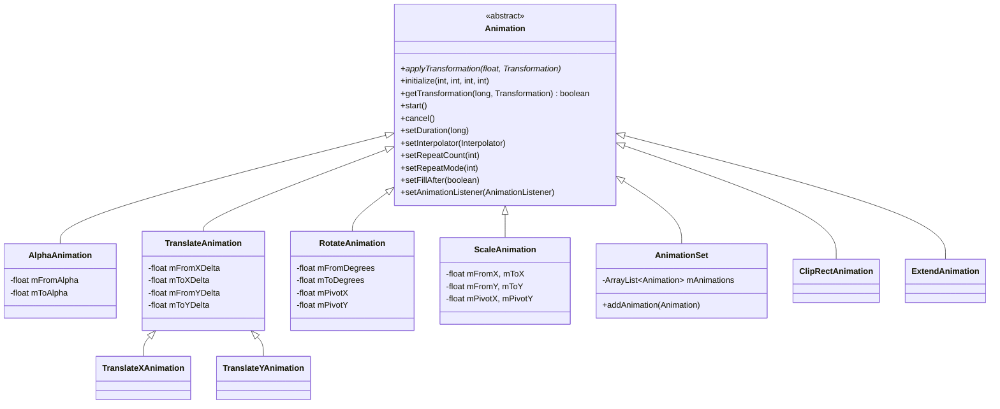
```mermaid
classDiagram
    class Animation {
        <<abstract>>
        +applyTransformation(float, Transformation)*
        +initialize(int, int, int, int)
        +getTransformation(long, Transformation) boolean
        +start()
        +cancel()
        +setDuration(long)
        +setInterpolator(Interpolator)
        +setRepeatCount(int)
        +setRepeatMode(int)
        +setFillAfter(boolean)
        +setAnimationListener(AnimationListener)
    }
    class AlphaAnimation {
        -float mFromAlpha
        -float mToAlpha
    }
    class TranslateAnimation {
        -float mFromXDelta
        -float mToXDelta
        -float mFromYDelta
        -float mToYDelta
    }
    class RotateAnimation {
        -float mFromDegrees
        -float mToDegrees
        -float mPivotX
        -float mPivotY
    }
    class ScaleAnimation {
        -float mFromX, mToX
        -float mFromY, mToY
        -float mPivotX, mPivotY
    }
    class AnimationSet {
        -ArrayList~Animation~ mAnimations
        +addAnimation(Animation)
    }
    class ClipRectAnimation
    class ExtendAnimation
    class TranslateXAnimation
    class TranslateYAnimation

    Animation <|-- AlphaAnimation
    Animation <|-- TranslateAnimation
    Animation <|-- RotateAnimation
    Animation <|-- ScaleAnimation
    Animation <|-- AnimationSet
    Animation <|-- ClipRectAnimation
    Animation <|-- ExtendAnimation
    TranslateAnimation <|-- TranslateXAnimation
    TranslateAnimation <|-- TranslateYAnimation
```

### 14.2.9 Limitations of View Animation

1. **No property change**: The animation applies a visual-only transformation.
   The view's `left`, `top`, `width`, `height` are unchanged, so hit testing
   uses the original bounds.

2. **View-only**: Cannot animate arbitrary objects or non-View properties.

3. **Limited types**: Only matrix (translate/rotate/scale) and alpha.  No
   color animations, no arbitrary typed values.

4. **Composition by matrix multiplication**: AnimationSet concatenates
   matrices, which limits complex multi-property coordination.

These limitations motivated the Property Animation framework in API 11.

### 14.2.10 The getTransformation() Core Loop

The heart of View Animation is the `getTransformation()` method that
computes the transformation for each frame.  This is the complete algorithm
(lines 1011-1079):

```
// frameworks/base/core/java/android/view/animation/Animation.java, lines 1011-1079

public boolean getTransformation(long currentTime, Transformation outTransformation) {
    if (mStartTime == -1) {
        mStartTime = currentTime;
    }

    final long startOffset = getStartOffset();
    final long duration = mDuration;
    float normalizedTime;
    if (duration != 0) {
        normalizedTime = ((float) (currentTime - (mStartTime + startOffset))) /
                (float) duration;
    } else {
        // time is a step-change with a zero duration
        normalizedTime = currentTime < mStartTime ? 0.0f : 1.0f;
    }

    final boolean expired = normalizedTime >= 1.0f || isCanceled();
    mMore = !expired;

    if (!mFillEnabled) normalizedTime = Math.max(Math.min(normalizedTime, 1.0f), 0.0f);

    if ((normalizedTime >= 0.0f || mFillBefore) && (normalizedTime <= 1.0f || mFillAfter)) {
        if (!mStarted) {
            fireAnimationStart();
            mStarted = true;
            ...
        }
        if (mFillEnabled) normalizedTime = Math.max(Math.min(normalizedTime, 1.0f), 0.0f);
        if (mCycleFlip) {
            normalizedTime = 1.0f - normalizedTime;
        }
        getTransformationAt(normalizedTime, outTransformation);
    }

    if (expired) {
        if (mRepeatCount == mRepeated || isCanceled()) {
            if (!mEnded) {
                mEnded = true;
                guard.close();
                fireAnimationEnd();
            }
        } else {
            if (mRepeatCount > 0) {
                mRepeated++;
            }
            if (mRepeatMode == REVERSE) {
                mCycleFlip = !mCycleFlip;
            }
            mStartTime = -1;
            mMore = true;
            fireAnimationRepeat();
        }
    }
    ...
    return mMore;
}
```

The algorithm breaks down into these steps:

1. **Start time initialization**: On the first call, `mStartTime` is set to
   `currentTime`, implementing the `START_ON_FIRST_FRAME` behavior.

2. **Normalized time computation**: `normalizedTime = (currentTime - startTime - offset) / duration`.
   This yields a value in [0, 1] representing progress through one cycle.

3. **Expiration check**: If `normalizedTime >= 1.0`, the current cycle is
   complete.

4. **Fill clamping**: If `mFillEnabled` is true, the normalized time is
   clamped to [0, 1] to prevent extrapolation.

5. **Cycle flip**: In REVERSE repeat mode, `mCycleFlip` alternates between
   true/false each repeat, and when true, the time is inverted: `1.0 - normalizedTime`.

6. **Transformation application**: `getTransformationAt()` applies the
   interpolator and calls the subclass `applyTransformation()`.

7. **Repeat handling**: If the animation has expired but the repeat count
   is not exhausted, `mStartTime` is reset to -1 and `mMore` is set to true
   to continue on the next frame.

### 14.2.11 resolveSize: Value Type Resolution

The `resolveSize()` method (line 1185) converts animation values to pixels
based on their type:

```
// Animation.java, lines 1185-1196

protected float resolveSize(int type, float value, int size, int parentSize) {
    switch (type) {
        case ABSOLUTE:
            return value;
        case RELATIVE_TO_SELF:
            return size * value;
        case RELATIVE_TO_PARENT:
            return parentSize * value;
        default:
            return value;
    }
}
```

This enables XML declarations like `android:fromXDelta="50%"` (relative to
self) or `android:fromXDelta="50%p"` (relative to parent).

### 14.2.12 View Animation in Window Manager Context

View Animations are also used internally by the Window Manager for legacy
window transitions.  `WindowAnimationSpec` wraps a view `Animation` to
apply it to a `SurfaceControl` instead of a View.  The animation's
`Transformation` matrix is converted into `SurfaceControl.Transaction`
operations (setPosition, setMatrix, setAlpha).

### 14.2.13 Interpolator Native Bridge

All built-in interpolators implement `NativeInterpolator`, which provides
a `createNativeInterpolator()` method returning a native handle.  This
handle is used by HWUI to run the same interpolation curve on the
RenderThread without crossing the JNI boundary per frame:

```
// AccelerateDecelerateInterpolator.java, lines 43-47

/** @hide */
@Override
public long createNativeInterpolator() {
    return NativeInterpolatorFactory.createAccelerateDecelerateInterpolator();
}
```

The native implementation in `frameworks/base/libs/hwui/Interpolator.cpp`
mirrors the Java formulas exactly, ensuring visual consistency between
UI-thread and RenderThread animations.

### 14.2.14 View Animation File Summary

| File | Lines | Purpose |
|---|---|---|
| `Animation.java` | 1,363 | Abstract base class |
| `AnimationSet.java` | 553 | Group of simultaneous animations |
| `AnimationUtils.java` | ~400 | Loading helpers, currentAnimationTimeMillis |
| `Transformation.java` | ~220 | Matrix + alpha container |
| `AlphaAnimation.java` | 89 | Opacity animation |
| `TranslateAnimation.java` | 241 | Position animation |
| `RotateAnimation.java` | 183 | Rotation animation |
| `ScaleAnimation.java` | 289 | Scale animation |
| `ClipRectAnimation.java` | ~80 | Clip rect animation |
| `ExtendAnimation.java` | ~60 | Edge extension animation |
| `TranslateXAnimation.java` | ~40 | X-only translation (optimized) |
| `TranslateYAnimation.java` | ~40 | Y-only translation (optimized) |
| `PathInterpolator.java` | 245 | Bezier/path-based interpolation |
| `AccelerateDecelerateInterpolator.java` | 48 | Default cosine ease |
| `AccelerateInterpolator.java` | ~55 | Power-curve acceleration |
| `DecelerateInterpolator.java` | ~55 | Power-curve deceleration |
| `LinearInterpolator.java` | ~35 | Identity function |
| `BounceInterpolator.java` | ~50 | Bounce at end |
| `OvershootInterpolator.java` | ~60 | Cubic overshoot |
| `AnticipateInterpolator.java` | ~55 | Wind-up before motion |
| `AnticipateOvershootInterpolator.java` | ~70 | Combined wind-up and overshoot |
| `CycleInterpolator.java` | ~45 | Sine cycle |
| `BackGestureInterpolator.java` | ~60 | Back gesture curves |
| `BaseInterpolator.java` | ~30 | Abstract base for interpolators |
| `Interpolator.java` | ~10 | Interface extending TimeInterpolator |
| `LayoutAnimationController.java` | ~350 | Staggered child animations |
| `GridLayoutAnimationController.java` | ~200 | Grid-based staggered animations |

---

## 14.3 Property Animation

### 14.3.1 Overview

Introduced in Android 3.0 (API 11), the Property Animation framework is the
modern workhorse of Android animation.  It animates **actual properties** on
**any Java object** -- not just views.  When you animate `View.setTranslationX`,
the property genuinely changes, so hit testing, layout, and accessibility
all reflect the animated state.

Source directory:
`frameworks/base/core/java/android/animation/` (31 files, ~13,400 lines)

### 14.3.2 Core Class Hierarchy

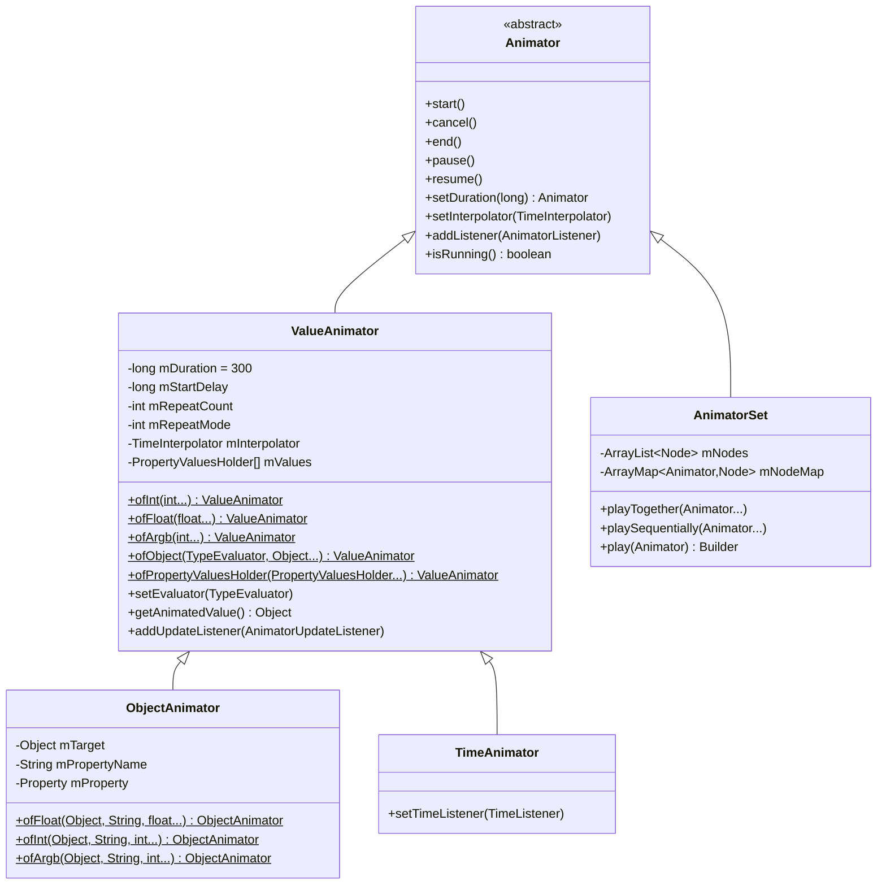
```mermaid
classDiagram
    class Animator {
        <<abstract>>
        +start()
        +cancel()
        +end()
        +pause()
        +resume()
        +setDuration(long) Animator
        +setInterpolator(TimeInterpolator)
        +addListener(AnimatorListener)
        +isRunning() boolean
    }
    class ValueAnimator {
        -long mDuration = 300
        -long mStartDelay
        -int mRepeatCount
        -int mRepeatMode
        -TimeInterpolator mInterpolator
        -PropertyValuesHolder[] mValues
        +ofInt(int...) ValueAnimator$
        +ofFloat(float...) ValueAnimator$
        +ofArgb(int...) ValueAnimator$
        +ofObject(TypeEvaluator, Object...) ValueAnimator$
        +ofPropertyValuesHolder(PropertyValuesHolder...) ValueAnimator$
        +setEvaluator(TypeEvaluator)
        +getAnimatedValue() Object
        +addUpdateListener(AnimatorUpdateListener)
    }
    class ObjectAnimator {
        -Object mTarget
        -String mPropertyName
        -Property mProperty
        +ofFloat(Object, String, float...) ObjectAnimator$
        +ofInt(Object, String, int...) ObjectAnimator$
        +ofArgb(Object, String, int...) ObjectAnimator$
    }
    class AnimatorSet {
        -ArrayList~Node~ mNodes
        -ArrayMap~Animator,Node~ mNodeMap
        +playTogether(Animator...)
        +playSequentially(Animator...)
        +play(Animator) Builder
    }
    class TimeAnimator {
        +setTimeListener(TimeListener)
    }

    Animator <|-- ValueAnimator
    ValueAnimator <|-- ObjectAnimator
    Animator <|-- AnimatorSet
    ValueAnimator <|-- TimeAnimator
```

### 14.3.3 ValueAnimator Deep Dive

`ValueAnimator.java` (1,821 lines) is the engine of property animation.

**Key fields** (lines 96-279):

```
// frameworks/base/core/java/android/animation/ValueAnimator.java

private static float sDurationScale = 1.0f;    // System-wide scale (line 96)
long mStartTime = -1;                          // First frame time (line 115)
boolean mStartTimeCommitted;                   // Jank compensation flag (line 129)
float mSeekFraction = -1;                      // Seek position (line 135)
private long mDuration = 300;                  // Default 300ms (line 218)
private int mRepeatCount = 0;                  // Default: play once (line 226)
private int mRepeatMode = RESTART;             // RESTART or REVERSE (line 234)
private TimeInterpolator mInterpolator = sDefaultInterpolator;  // (line 253)
PropertyValuesHolder[] mValues;                // Animated properties (line 263)
HashMap<String, PropertyValuesHolder> mValuesMap;  // Name-to-PVH lookup (line 269)
```

**Duration Scale**: The system-wide `sDurationScale` multiplies all animation
durations.  Developer Options > "Animator duration scale" modifies this.
When set to 0, `areAnimatorsEnabled()` returns false (line 411):

```
// ValueAnimator.java, line 410-412
public static boolean areAnimatorsEnabled() {
    return !(sDurationScale == 0);
}
```

**Factory methods** (lines 433-515):

| Factory | Evaluator | Description |
|---|---|---|
| `ofInt(int...)` | IntEvaluator | Integer range |
| `ofFloat(float...)` | FloatEvaluator | Float range |
| `ofArgb(int...)` | ArgbEvaluator | Color interpolation in sRGB |
| `ofObject(TypeEvaluator, Object...)` | Custom | Arbitrary type |
| `ofPropertyValuesHolder(PVH...)` | Per-holder | Multi-property |

### 14.3.4 The Animation Frame Loop

When `start()` is called, `ValueAnimator` registers itself with
`AnimationHandler` as an `AnimationFrameCallback`.  The handler schedules
a Choreographer frame callback.  On each VSYNC:

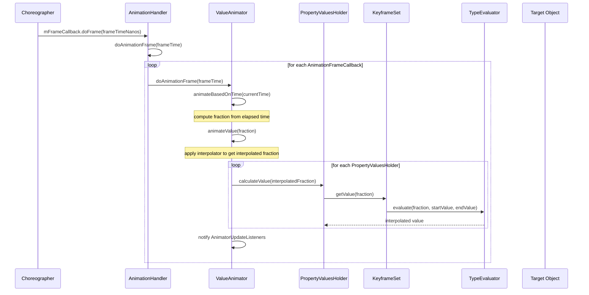
```mermaid
sequenceDiagram
    participant C as Choreographer
    participant AH as AnimationHandler
    participant VA as ValueAnimator
    participant PVH as PropertyValuesHolder
    participant KFS as KeyframeSet
    participant TE as TypeEvaluator
    participant Target as Target Object

    C->>AH: mFrameCallback.doFrame(frameTimeNanos)
    AH->>AH: doAnimationFrame(frameTime)
    loop for each AnimationFrameCallback
        AH->>VA: doAnimationFrame(frameTime)
        VA->>VA: animateBasedOnTime(currentTime)
        Note over VA: compute fraction from elapsed time
        VA->>VA: animateValue(fraction)
        Note over VA: apply interpolator to get interpolated fraction
        loop for each PropertyValuesHolder
            VA->>PVH: calculateValue(interpolatedFraction)
            PVH->>KFS: getValue(fraction)
            KFS->>TE: evaluate(fraction, startValue, endValue)
            TE-->>PVH: interpolated value
        end
        VA->>VA: notify AnimatorUpdateListeners
    end
```

The core timing logic in `animateBasedOnTime()` (simplified):

1. Compute `currentIterationFraction = (currentTime - startTime) / duration`
2. Handle repeat: divide by total iterations to get `overallFraction`
3. For REVERSE mode, flip fraction on odd iterations
4. Call `animateValue(fraction)` which applies the interpolator

### 14.3.5 ObjectAnimator

`ObjectAnimator` (1,004 lines) extends `ValueAnimator` to set the animated
value directly on a target object.  It resolves the target property through
two mechanisms:

1. **Property name (String)**: Uses reflection to find `setFoo()` / `getFoo()`
   methods.  For best performance, optimized JNI paths exist for `float` and
   `int` return types.

2. **Property object**: Uses the `Property<T, V>` abstraction which avoids
   reflection entirely.

```
// frameworks/base/core/java/android/animation/ObjectAnimator.java, lines 69-80

public final class ObjectAnimator extends ValueAnimator {
    private Object mTarget;
    private String mPropertyName;
    private Property mProperty;
    private boolean mAutoCancel = false;
    ...
}
```

Common factory methods:

- `ObjectAnimator.ofFloat(view, "translationX", 0f, 100f)`
- `ObjectAnimator.ofFloat(view, View.TRANSLATION_X, 0f, 100f)` -- preferred; no reflection
- `ObjectAnimator.ofArgb(view, "backgroundColor", Color.RED, Color.BLUE)`

### 14.3.6 PropertyValuesHolder

`PropertyValuesHolder` (1,729 lines) encapsulates one animated property:
its name/Property reference, the setter/getter methods, the keyframe set,
and the type evaluator.

```
// frameworks/base/core/java/android/animation/PropertyValuesHolder.java, lines 38-78

public class PropertyValuesHolder implements Cloneable {
    String mPropertyName;
    protected Property mProperty;
    Method mSetter = null;
    private Method mGetter = null;
    Class mValueType;
    Keyframes mKeyframes = null;
    ...
}
```

The class maintains static caches of setter/getter methods per class to avoid
repeated reflection:

```
// PropertyValuesHolder.java, lines 92-97
private static Class[] FLOAT_VARIANTS = {float.class, Float.class, double.class,
    int.class, Double.class, Integer.class};
private static Class[] INTEGER_VARIANTS = {int.class, Integer.class, float.class,
    double.class, Float.class, Double.class};
```

### 14.3.7 Keyframes and TypeEvaluators

The `Keyframe` class defines a value at a specific fraction (0.0 to 1.0).
`KeyframeSet` holds the ordered set and performs interpolation between
adjacent keyframes.

Built-in evaluators:

| Evaluator | Operation |
|---|---|
| `IntEvaluator` | `startValue + (int)(fraction * (endValue - startValue))` |
| `FloatEvaluator` | `startValue + fraction * (endValue - startValue)` |
| `ArgbEvaluator` | Per-channel interpolation in sRGB color space |
| `PointFEvaluator` | Interpolates PointF x,y independently |
| `RectEvaluator` | Interpolates Rect left/top/right/bottom |
| `IntArrayEvaluator` | Element-wise int array interpolation |
| `FloatArrayEvaluator` | Element-wise float array interpolation |

### 14.3.8 AnimatorSet and the Dependency Graph

`AnimatorSet` (2,280 lines) organizes multiple `Animator` instances into
a dependency graph using a node-based internal structure:

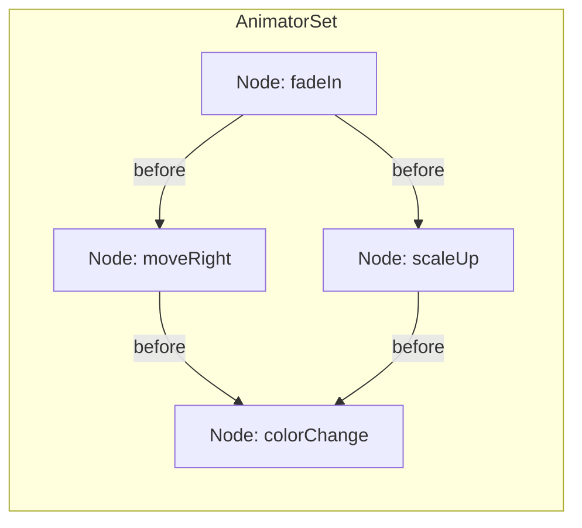
```mermaid
graph LR
    subgraph AnimatorSet
        A[Node: fadeIn] -->|before| B[Node: moveRight]
        A -->|before| C[Node: scaleUp]
        B -->|before| D[Node: colorChange]
        C -->|before| D
    end
```

The Builder API chains dependencies:

```java
AnimatorSet set = new AnimatorSet();
set.play(fadeIn).before(moveRight);
set.play(fadeIn).before(scaleUp);
set.play(moveRight).before(colorChange);
set.play(scaleUp).before(colorChange);
```

Internally, AnimatorSet uses an `AnimationEvent` list (line 90) sorted by
time.  On each frame, it processes events whose time has arrived, starting
or ending child animators as needed.

### 14.3.9 AnimationHandler and Background Pausing

`AnimationHandler` (579 lines) manages the per-thread animation loop.

Key mechanism -- **background pausing** (lines 196-288):  When all windows in
a process go to the background, `AnimationHandler` pauses all infinite-duration
animators to save CPU.  It tracks visibility through `mAnimatorRequestors`:

```
// frameworks/base/core/java/android/animation/AnimationHandler.java, lines 272-288

private Choreographer.FrameCallback mPauser = frameTimeNanos -> {
    if (mAnimatorRequestors.size() > 0) {
        return;  // something re-enabled since scheduling
    }
    for (int i = 0; i < mAnimationCallbacks.size(); ++i) {
        AnimationFrameCallback callback = mAnimationCallbacks.get(i);
        if (callback instanceof Animator) {
            Animator animator = ((Animator) callback);
            if (animator.getTotalDuration() == Animator.DURATION_INFINITE
                    && !animator.isPaused()) {
                mPausedAnimators.add(animator);
                animator.pause();
            }
        }
    }
};
```

### 14.3.10 ValueAnimator.start() Complete Flow

The `start()` method (lines 1117-1159) orchestrates the full animation
startup sequence.  Here is the detailed flow:

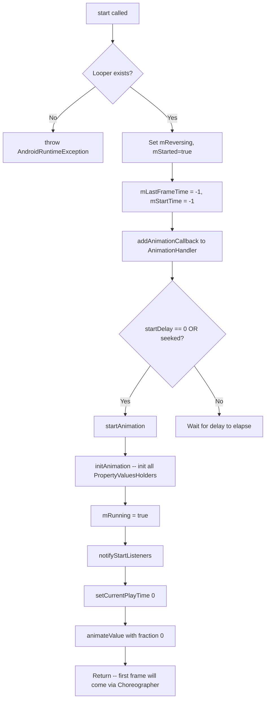
```mermaid
flowchart TD
    A[start called] --> B{Looper exists?}
    B -->|No| ERR[throw AndroidRuntimeException]
    B -->|Yes| C[Set mReversing, mStarted=true]
    C --> D[mLastFrameTime = -1, mStartTime = -1]
    D --> E[addAnimationCallback to AnimationHandler]
    E --> F{startDelay == 0 OR seeked?}
    F -->|Yes| G[startAnimation]
    F -->|No| H[Wait for delay to elapse]
    G --> I[initAnimation -- init all PropertyValuesHolders]
    I --> J[mRunning = true]
    J --> K[notifyStartListeners]
    K --> L[setCurrentPlayTime 0]
    L --> M[animateValue with fraction 0]
    M --> N[Return -- first frame will come via Choreographer]
```

Key implementation detail -- `addAnimationCallback(0)` at line 1143 calls
through to `AnimationHandler.addAnimationFrameCallback()`, which:

1. Adds this ValueAnimator to the `mAnimationCallbacks` list
2. If this is the first callback, posts `mFrameCallback` to Choreographer
3. If there is a delay, stores the delay start time in `mDelayedCallbackStartTime`

### 14.3.11 The animateBasedOnTime() Algorithm

This method (lines 1409-1434) is called each frame and converts wall-clock
time to an animation fraction:

```
// ValueAnimator.java, lines 1409-1434

boolean animateBasedOnTime(long currentTime) {
    boolean done = false;
    if (mRunning) {
        final long scaledDuration = getScaledDuration();
        final float fraction = scaledDuration > 0 ?
                (float)(currentTime - mStartTime) / scaledDuration : 1f;
        final float lastFraction = mOverallFraction;
        final boolean newIteration = (int) fraction > (int) lastFraction;
        final boolean lastIterationFinished = (fraction >= mRepeatCount + 1) &&
                (mRepeatCount != INFINITE);
        if (scaledDuration == 0) {
            done = true;
        } else if (newIteration && !lastIterationFinished) {
            notifyListeners(AnimatorCaller.ON_REPEAT, false);
        } else if (lastIterationFinished) {
            done = true;
        }
        mOverallFraction = clampFraction(fraction);
        float currentIterationFraction = getCurrentIterationFraction(
                mOverallFraction, mReversing);
        animateValue(currentIterationFraction);
    }
    return done;
}
```

Note how `getScaledDuration()` applies the system-wide duration scale:
```
private long getScaledDuration() {
    return (long)(mDuration * resolveDurationScale());
}
```

### 14.3.12 Jank Compensation: commitAnimationFrame

After the TRAVERSAL callback, Choreographer dispatches COMMIT callbacks.
ValueAnimator registers a commit callback to compensate for jank:

```
// ValueAnimator.java, lines 1384-1395

public void commitAnimationFrame(long frameTime) {
    if (!mStartTimeCommitted) {
        mStartTimeCommitted = true;
        long adjustment = frameTime - mLastFrameTime;
        if (adjustment > 0) {
            mStartTime += adjustment;
        }
    }
}
```

If the first frame of an animation is delayed by heavy layout work, the
commit callback adjusts `mStartTime` forward so the animation does not
appear to "jump" to a later position.

### 14.3.13 Duration Scale and Accessibility

The system-wide `sDurationScale` is modified by three settings:

1. **Developer Options > Animator duration scale**: 0.5x, 1x, 2x, 5x, 10x
2. **Battery Saver mode**: May set scale to 0 to disable all animations
3. **Programmatic**: `ValueAnimator.setDurationScale()` (hidden API)

When `sDurationScale` is 0, `areAnimatorsEnabled()` returns false, and
animations complete instantly.  This is critical for:

- Accessibility testing (verifying UI works without animations)
- Performance testing (removing animation overhead)
- Battery conservation

Applications can listen for scale changes:

```java
ValueAnimator.registerDurationScaleChangeListener(scale -> {
    // Adjust behavior when animation scale changes
    if (scale == 0) {
        // Animations are disabled
    }
});
```

### 14.3.14 ObjectAnimator AutoCancel

When `mAutoCancel` is true, starting an ObjectAnimator automatically cancels
any running ObjectAnimator targeting the same object and property:

```java
ObjectAnimator anim = ObjectAnimator.ofFloat(view, "alpha", 1f);
anim.setAutoCancel(true);
anim.start();
// Starting another alpha animation on the same view
// will cancel the first one automatically
```

This is the mechanism behind `ViewPropertyAnimator`'s smooth cancellation --
each new `view.animate().alpha()` call cancels the previous alpha animation.

### 14.3.15 StateListAnimator

`StateListAnimator` maps view states (pressed, focused, selected, etc.) to
`Animator` objects, enabling state-driven animations.  It is commonly used
for Material Design elevation changes:

```xml
<selector>
    <item android:state_pressed="true">
        <objectAnimator android:propertyName="translationZ"
            android:duration="100" android:valueTo="6dp"/>
    </item>
    <item>
        <objectAnimator android:propertyName="translationZ"
            android:duration="100" android:valueTo="0dp"/>
    </item>
</selector>
```

### 14.3.16 Property Animation File Summary

| File | Lines | Purpose |
|---|---|---|
| `Animator.java` | ~850 | Abstract base for all animators |
| `ValueAnimator.java` | 1,821 | Core timing engine |
| `ObjectAnimator.java` | 1,004 | Property-targeting animator |
| `AnimatorSet.java` | 2,280 | Multi-animator orchestration |
| `PropertyValuesHolder.java` | 1,729 | Per-property value management |
| `AnimationHandler.java` | 579 | Frame callback manager |
| `Keyframe.java` | ~300 | Single time/value pair |
| `KeyframeSet.java` | ~300 | Ordered keyframe collection |
| `FloatKeyframeSet.java` | ~150 | Optimized float keyframes |
| `IntKeyframeSet.java` | ~150 | Optimized int keyframes |
| `PathKeyframes.java` | ~200 | Path-based keyframes |
| `ArgbEvaluator.java` | ~90 | Color interpolation |
| `FloatEvaluator.java` | ~40 | Float interpolation |
| `IntEvaluator.java` | ~40 | Integer interpolation |
| `PointFEvaluator.java` | ~60 | PointF interpolation |
| `RectEvaluator.java` | ~70 | Rect interpolation |
| `LayoutTransition.java` | ~1,000 | ViewGroup layout change animation |
| `AnimatorInflater.java` | ~700 | XML resource loading |
| `TimeAnimator.java` | ~100 | Raw frame timing |
| `RevealAnimator.java` | ~60 | Circular reveal support |
| `StateListAnimator.java` | ~250 | State-driven animations |
| `TypeConverter.java` | ~60 | Type conversion support |
| `BidirectionalTypeConverter.java` | ~40 | Two-way conversion |

### 14.3.17 AnimationHandler.doAnimationFrame() Deep Dive

The per-frame animation dispatch (lines 395-416) is the core of the
animation loop:

```
// AnimationHandler.java, lines 395-416

private void doAnimationFrame(long frameTime) {
    long currentTime = SystemClock.uptimeMillis();
    final int size = mAnimationCallbacks.size();
    for (int i = 0; i < size; i++) {
        final AnimationFrameCallback callback = mAnimationCallbacks.get(i);
        if (callback == null) {
            continue;
        }
        if (isCallbackDue(callback, currentTime)) {
            callback.doAnimationFrame(frameTime);
            if (mCommitCallbacks.contains(callback)) {
                getProvider().postCommitCallback(new Runnable() {
                    @Override
                    public void run() {
                        commitAnimationFrame(callback, getProvider().getFrameTime());
                    }
                });
            }
        }
    }
    cleanUpList();
}
```

Key details:

1. **Null checking**: Callbacks may be nulled out by `removeCallback()` while
   iterating.  The list is cleaned up at the end.
2. **Delay checking**: `isCallbackDue()` checks if the start delay has elapsed
   by comparing against `mDelayedCallbackStartTime`.
3. **Commit callback**: If the animation has registered for commit timing
   (for jank compensation), a commit callback is posted to run after
   traversals.

### 14.3.18 AnimationFrameCallbackProvider

The `AnimationHandler` uses a pluggable callback provider for its timing
source.  The default implementation wraps Choreographer:

```java
private class MyFrameCallbackProvider implements AnimationFrameCallbackProvider {
    final Choreographer mChoreographer = Choreographer.getInstance();

    @Override
    public void postFrameCallback(Choreographer.FrameCallback callback) {
        mChoreographer.postFrameCallback(callback);
    }

    @Override
    public void postCommitCallback(Runnable runnable) {
        mChoreographer.postCallback(Choreographer.CALLBACK_COMMIT, runnable, null);
    }

    @Override
    public long getFrameTime() {
        return mChoreographer.getFrameTime();
    }

    @Override
    public long getFrameDelay() {
        return Choreographer.getFrameDelay();
    }

    @Override
    public void setFrameDelay(long delay) {
        Choreographer.setFrameDelay(delay);
    }
}
```

For testing, a custom provider can replace Choreographer with a manual
clock, enabling deterministic animation testing.

### 14.3.19 Auto-Cancel in AnimationHandler

When a new `ObjectAnimator` starts with `setAutoCancel(true)`,
`AnimationHandler.autoCancelBasedOn()` (line 466) scans all running
callbacks and cancels any `ObjectAnimator` that targets the same property
on the same object:

```
// AnimationHandler.java, lines 466-476

void autoCancelBasedOn(ObjectAnimator objectAnimator) {
    for (int i = mAnimationCallbacks.size() - 1; i >= 0; i--) {
        AnimationFrameCallback cb = mAnimationCallbacks.get(i);
        if (cb == null) {
            continue;
        }
        if (objectAnimator.shouldAutoCancel(cb)) {
            ((Animator) mAnimationCallbacks.get(i)).cancel();
        }
    }
}
```

This prevents the common bug of multiple conflicting animators competing
to set the same property.

### 14.3.20 AnimatorSet Node and Event System

AnimatorSet uses an internal `Node` class to represent each child animator
in the dependency graph.  The `Builder` API constructs relationships between
nodes:

```java
// AnimatorSet internal structure
class Node implements Cloneable {
    Animator mAnimation;
    ArrayList<Node> mChildNodes = null;
    boolean mEnded = false;
    ArrayList<Node> mSiblings;       // "with" relationships
    ArrayList<Node> mParents;        // "after" dependencies
}

class AnimationEvent {
    static final int ANIMATION_START = 0;
    static final int ANIMATION_DELAY_ENDED = 1;
    static final int ANIMATION_END = 2;
    Node mNode;
    int mEvent;
}
```

The `mEvents` list contains all start and end events sorted by time.
During animation, AnimatorSet walks this list and triggers events as their
times arrive.

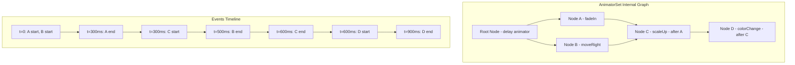
```mermaid
graph TD
    subgraph "AnimatorSet Internal Graph"
        R[Root Node - delay animator]
        R --> A[Node A - fadeIn]
        R --> B[Node B - moveRight]
        A --> C[Node C - scaleUp - after A]
        B --> C
        C --> D[Node D - colorChange - after C]
    end

    subgraph "Events Timeline"
        E1["t=0: A start, B start"] --> E2["t=300ms: A end"]
        E2 --> E3["t=300ms: C start"]
        E3 --> E4["t=500ms: B end"]
        E4 --> E5["t=600ms: C end"]
        E5 --> E6["t=600ms: D start"]
        E6 --> E7["t=900ms: D end"]
    end
```

### 14.3.21 LayoutTransition

`LayoutTransition` (part of `android.animation`) provides automatic
animations when views are added to or removed from a ViewGroup.  It defines
five animation types:

| Constant | When | Default Animation |
|---|---|---|
| `APPEARING` | View becomes visible | Fade in (alpha 0 to 1) |
| `DISAPPEARING` | View becomes invisible | Fade out (alpha 1 to 0) |
| `CHANGE_APPEARING` | Others move to make room | Bounds change |
| `CHANGE_DISAPPEARING` | Others fill gap | Bounds change |
| `CHANGING` | Layout change without add/remove | Bounds change |

By default, `DISAPPEARING` and `CHANGE_APPEARING` begin immediately;
`APPEARING` and `CHANGE_DISAPPEARING` begin after the default duration,
creating a natural sequencing effect.

---

## 14.4 Transition Framework

### 14.4.1 Overview

The Transition Framework (API 19+) automates the detection of property changes
between two states of a view hierarchy ("scenes") and creates appropriate
animations.  Rather than manually calculating from/to values, developers
describe **what** to transition and the framework figures out **how**.

Source directory:
`frameworks/base/core/java/android/transition/` (33 files, ~9,200 lines)

### 14.4.2 Core Concepts

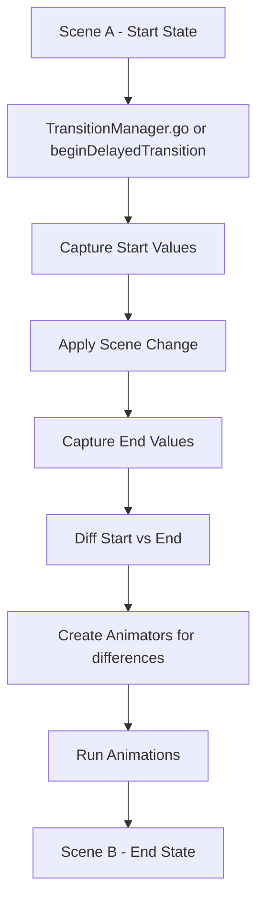
```mermaid
graph TD
    A[Scene A - Start State] --> B[TransitionManager.go or beginDelayedTransition]
    B --> C[Capture Start Values]
    C --> D[Apply Scene Change]
    D --> E[Capture End Values]
    E --> F[Diff Start vs End]
    F --> G[Create Animators for differences]
    G --> H[Run Animations]
    H --> I[Scene B - End State]
```

### 14.4.3 Transition Base Class

`Transition.java` (2,451 lines) is the abstract base.  Each subclass must
implement three methods:

1. `captureStartValues(TransitionValues)` -- Record property values before the scene change
2. `captureEndValues(TransitionValues)` -- Record property values after the scene change
3. `createAnimator(ViewGroup, TransitionValues, TransitionValues)` -- Return an `Animator` for the detected change

`TransitionValues` is a simple holder:

```java
public class TransitionValues {
    public View view;
    public final Map<String, Object> values = new ArrayMap<>();
}
```

### 14.4.4 Built-in Transitions

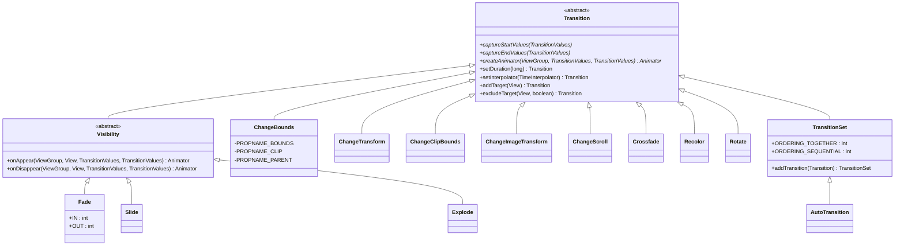
```mermaid
classDiagram
    class Transition {
        <<abstract>>
        +captureStartValues(TransitionValues)*
        +captureEndValues(TransitionValues)*
        +createAnimator(ViewGroup, TransitionValues, TransitionValues)* Animator
        +setDuration(long) Transition
        +setInterpolator(TimeInterpolator) Transition
        +addTarget(View) Transition
        +excludeTarget(View, boolean) Transition
    }
    class Visibility {
        <<abstract>>
        +onAppear(ViewGroup, View, TransitionValues, TransitionValues) Animator
        +onDisappear(ViewGroup, View, TransitionValues, TransitionValues) Animator
    }
    class Fade {
        +IN : int
        +OUT : int
    }
    class Slide
    class Explode
    class ChangeBounds {
        -PROPNAME_BOUNDS
        -PROPNAME_CLIP
        -PROPNAME_PARENT
    }
    class ChangeTransform
    class ChangeClipBounds
    class ChangeImageTransform
    class ChangeScroll
    class Crossfade
    class Recolor
    class Rotate
    class TransitionSet {
        +ORDERING_TOGETHER : int
        +ORDERING_SEQUENTIAL : int
        +addTransition(Transition) TransitionSet
    }
    class AutoTransition

    Transition <|-- Visibility
    Transition <|-- ChangeBounds
    Transition <|-- ChangeTransform
    Transition <|-- ChangeClipBounds
    Transition <|-- ChangeImageTransform
    Transition <|-- ChangeScroll
    Transition <|-- Crossfade
    Transition <|-- Recolor
    Transition <|-- Rotate
    Transition <|-- TransitionSet
    Visibility <|-- Fade
    Visibility <|-- Slide
    Visibility <|-- Explode
    TransitionSet <|-- AutoTransition
```

### 14.4.5 ChangeBounds

`ChangeBounds` (the most complex built-in transition) captures five
properties:

```
// frameworks/base/core/java/android/transition/ChangeBounds.java, lines 58-69

private static final String PROPNAME_BOUNDS = "android:changeBounds:bounds";
private static final String PROPNAME_CLIP = "android:changeBounds:clip";
private static final String PROPNAME_PARENT = "android:changeBounds:parent";
private static final String PROPNAME_WINDOW_X = "android:changeBounds:windowX";
private static final String PROPNAME_WINDOW_Y = "android:changeBounds:windowY";
```

It creates an `AnimatorSet` that animates view bounds using `ObjectAnimator`
on custom `Property` objects (`TOP_LEFT_PROPERTY`, `BOTTOM_RIGHT_PROPERTY`)
which internally call `View.setLeft()`, `View.setTop()`, etc.

### 14.4.6 Fade

`Fade` extends `Visibility` to animate alpha changes:

```
// frameworks/base/core/java/android/transition/Fade.java, lines 61-99

public class Fade extends Visibility {
    static final String PROPNAME_TRANSITION_ALPHA = "android:fade:transitionAlpha";
    public static final int IN = Visibility.MODE_IN;
    public static final int OUT = Visibility.MODE_OUT;
    ...
}
```

The `Visibility` base class handles the complex logic of detecting whether
a view appeared (became `VISIBLE` or was added) or disappeared (became
`GONE`/`INVISIBLE` or was removed).  For disappearing views, it uses
`ViewGroupOverlay` to keep the view visible during the fade-out.

### 14.4.7 TransitionManager

`TransitionManager` (470 lines) is the entry point for running transitions.
The most common API:

```java
// In-place transition on current hierarchy
TransitionManager.beginDelayedTransition(viewGroup, new AutoTransition());
// ... modify views ...
// Framework captures end values on next layout pass and runs animations
```

The default transition is `AutoTransition`, which is a `TransitionSet`
containing `Fade(OUT)`, `ChangeBounds`, and `Fade(IN)` in sequence.

### 14.4.8 Scene

`Scene` represents a snapshot of a view hierarchy.  It can be created from
a layout resource or captured from the current state:

```java
Scene scene = Scene.getSceneForLayout(sceneRoot, R.layout.scene_b, context);
TransitionManager.go(scene, new ChangeBounds());
```

### 14.4.9 Transition Matching Algorithm

A critical aspect of the Transition Framework is how it matches views between
the start and end states.  The `Transition` class defines four match
strategies, applied in a configurable order:

```
// frameworks/base/core/java/android/transition/Transition.java, lines 131-167

public static final int MATCH_INSTANCE = 0x1;   // Same View object
public static final int MATCH_NAME = 0x2;        // Same transitionName
public static final int MATCH_ID = 0x3;           // Same view ID
public static final int MATCH_ITEM_ID = 0x4;      // Same adapter item ID

private static final int[] DEFAULT_MATCH_ORDER = {
    MATCH_NAME,
    MATCH_INSTANCE,
    MATCH_ID,
    MATCH_ITEM_ID,
};
```

The default order is: transition name first, then instance, then ID, then
item ID.  This order matters because once a view in the start state is
matched with a view in the end state, both are removed from the pool of
unmatched views.

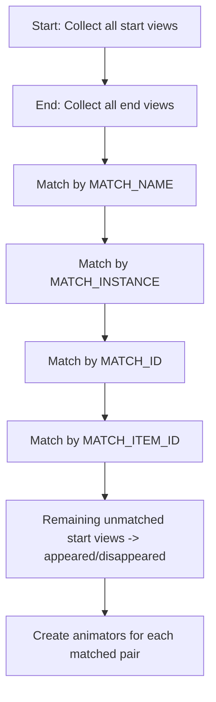
```mermaid
flowchart TD
    A[Start: Collect all start views] --> B[End: Collect all end views]
    B --> C[Match by MATCH_NAME]
    C --> D[Match by MATCH_INSTANCE]
    D --> E[Match by MATCH_ID]
    E --> F[Match by MATCH_ITEM_ID]
    F --> G[Remaining unmatched start views -> appeared/disappeared]
    G --> H[Create animators for each matched pair]
```

### 14.4.10 Transition Internal State

The `Transition` base class maintains extensive internal state (lines 179-252):

```
// Transition.java, lines 179-252 (key fields)

private String mName = getClass().getName();
long mStartDelay = -1;
long mDuration = -1;
TimeInterpolator mInterpolator = null;
ArrayList<Integer> mTargetIds = new ArrayList<>();
ArrayList<View> mTargets = new ArrayList<>();
ArrayList<String> mTargetNames = null;
ArrayList<Class> mTargetTypes = null;
// ... exclude lists ...
private TransitionValuesMaps mStartValues = new TransitionValuesMaps();
private TransitionValuesMaps mEndValues = new TransitionValuesMaps();
TransitionSet mParent = null;
int[] mMatchOrder = DEFAULT_MATCH_ORDER;
ArrayList<Animator> mCurrentAnimators = new ArrayList<>();
TransitionPropagation mPropagation;
EpicenterCallback mEpicenterCallback;
PathMotion mPathMotion = STRAIGHT_PATH_MOTION;
```

Note that duration, startDelay, and interpolator all default to -1/null,
which means "use the animator's own values."  Only if explicitly set on the
Transition will they override the child animators.

### 14.4.11 The TransitionValues Container

For each view, `captureStartValues()` and `captureEndValues()` populate a
`TransitionValues` map.  The convention is to use fully-qualified keys:

```java
// In ChangeBounds:
private static final String PROPNAME_BOUNDS = "android:changeBounds:bounds";
private static final String PROPNAME_CLIP = "android:changeBounds:clip";
private static final String PROPNAME_PARENT = "android:changeBounds:parent";
private static final String PROPNAME_WINDOW_X = "android:changeBounds:windowX";
private static final String PROPNAME_WINDOW_Y = "android:changeBounds:windowY";
```

This namespacing prevents collisions when multiple transitions capture
values for the same view.

### 14.4.12 TransitionSet Ordering

`TransitionSet` can run child transitions together or sequentially:

```java
// Together (default) - all children run simultaneously
TransitionSet set = new TransitionSet();
set.setOrdering(TransitionSet.ORDERING_TOGETHER);
set.addTransition(new Fade(Fade.OUT));
set.addTransition(new ChangeBounds());
set.addTransition(new Fade(Fade.IN));

// Sequential - children run one after another
TransitionSet seq = new TransitionSet();
seq.setOrdering(TransitionSet.ORDERING_SEQUENTIAL);
seq.addTransition(new Fade(Fade.OUT));   // First: fade out
seq.addTransition(new ChangeBounds());    // Then: move
seq.addTransition(new Fade(Fade.IN));     // Finally: fade in
```

`AutoTransition` is a pre-built sequential TransitionSet:
```java
// AutoTransition = Fade(OUT) -> ChangeBounds -> Fade(IN) (sequential)
public class AutoTransition extends TransitionSet {
    public AutoTransition() {
        setOrdering(ORDERING_SEQUENTIAL);
        addTransition(new Fade(Fade.OUT));
        addTransition(new ChangeBounds());
        addTransition(new Fade(Fade.IN));
    }
}
```

### 14.4.13 Target Filtering

Transitions can be targeted to specific views:

```java
transition.addTarget(R.id.my_view);           // By ID
transition.addTarget("hero_image");            // By transition name
transition.addTarget(TextView.class);          // By class
transition.addTarget(specificView);             // By instance

transition.excludeTarget(R.id.toolbar, true);  // Exclude by ID
transition.excludeTarget(Button.class, true);  // Exclude by class
transition.excludeChildren(R.id.list, true);   // Exclude subtree
```

When no targets are specified, the transition operates on all views in
the scene root.

### 14.4.14 Explode and Slide

`Explode` extends `Visibility` and moves views outward from (or inward to)
an epicenter point.  It uses `CircularPropagation` to stagger the animations
so views further from the center start later:

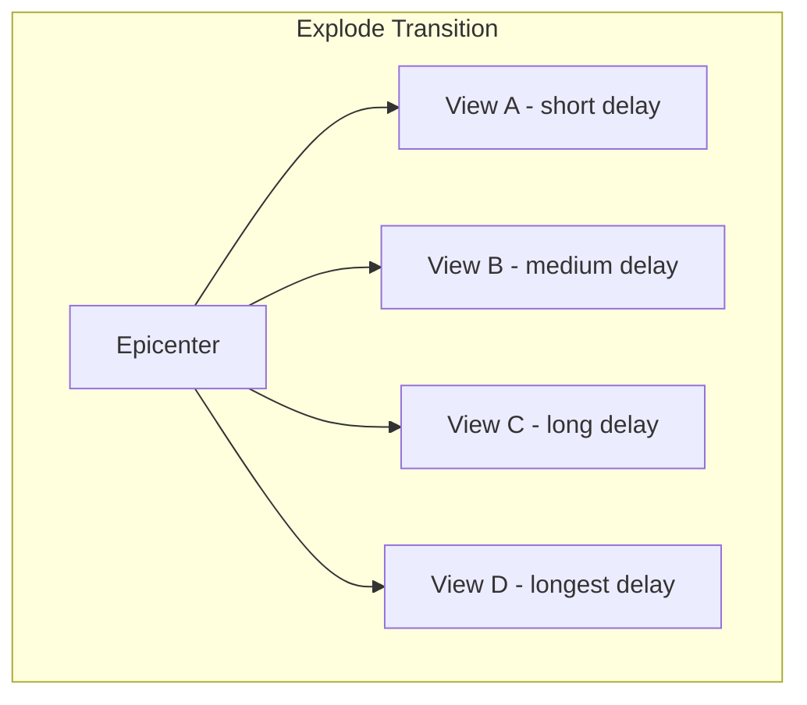
```mermaid
graph TD
    subgraph "Explode Transition"
        CENTER[Epicenter] --> A[View A - short delay]
        CENTER --> B[View B - medium delay]
        CENTER --> C[View C - long delay]
        CENTER --> D[View D - longest delay]
    end
```

`Slide` moves views from/to a specified edge (top, bottom, left, right)
and uses `SidePropagation` to create a wave effect.

### 14.4.15 Propagation and Motion Paths

**TransitionPropagation** controls the order in which targets animate during
a transition.  Built-in propagations:

- `CircularPropagation` -- Radiates from a center point (used by `Explode`)
- `SidePropagation` -- Propagates from an edge (used by `Slide`)

**PathMotion** controls the path that animated properties follow:

- `ArcMotion` -- Curved arc between start and end positions
- `PatternPathMotion` -- Custom path pattern

### 14.4.16 Transition Framework Architecture

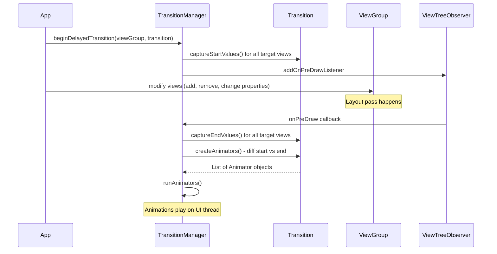
```mermaid
sequenceDiagram
    participant App
    participant TM as TransitionManager
    participant T as Transition
    participant VG as ViewGroup
    participant VTO as ViewTreeObserver

    App->>TM: beginDelayedTransition(viewGroup, transition)
    TM->>T: captureStartValues() for all target views
    TM->>VTO: addOnPreDrawListener
    App->>VG: modify views (add, remove, change properties)
    Note over VG: Layout pass happens
    VTO->>TM: onPreDraw callback
    TM->>T: captureEndValues() for all target views
    TM->>T: createAnimators() - diff start vs end
    T-->>TM: List of Animator objects
    TM->>TM: runAnimators()
    Note over TM: Animations play on UI thread
```

---

## 14.5 Activity Transitions

### 14.5.1 Overview

Activity transitions (API 21+) extend the Transition Framework across
activity boundaries, enabling shared element animations between activities
or fragments.  The system coordinates the capture and transfer of shared
element state between the calling and called activities.

Key source files:

- `frameworks/base/core/java/android/app/ActivityOptions.java` (~3,085 lines)
- `frameworks/base/core/java/android/app/ActivityTransitionCoordinator.java` (~1,122 lines)
- `frameworks/base/core/java/android/app/EnterTransitionCoordinator.java`
- `frameworks/base/core/java/android/app/ExitTransitionCoordinator.java`

### 14.5.2 Transition Types

An activity transition comprises up to four independent animations:

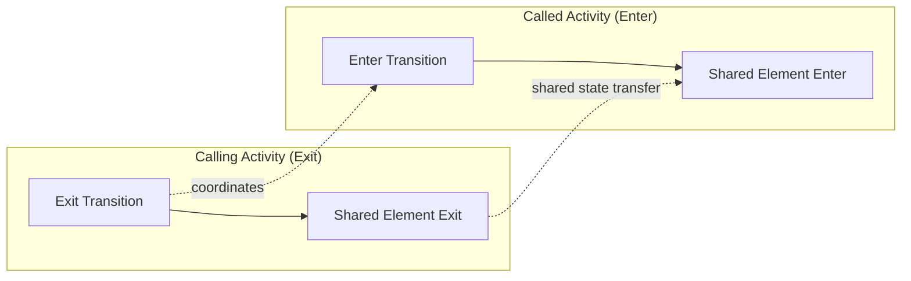
```mermaid
graph LR
    subgraph "Calling Activity (Exit)"
        A[Exit Transition] --> B[Shared Element Exit]
    end
    subgraph "Called Activity (Enter)"
        C[Enter Transition] --> D[Shared Element Enter]
    end
    A -.->|coordinates| C
    B -.->|shared state transfer| D
```

| Animation | Default | Purpose |
|---|---|---|
| Exit Transition | null (no animation) | Non-shared views in calling activity |
| Enter Transition | null | Non-shared views in called activity |
| Shared Element Exit | `ChangeTransform` + `ChangeBounds` | Shared elements leaving |
| Shared Element Enter | `ChangeTransform` + `ChangeBounds` | Shared elements arriving |
| Return Transition | Reverse of Enter | Going back |
| Reenter Transition | Reverse of Exit | Returning to calling |

### 14.5.3 Shared Element Coordination

The system transfers shared element state through a `Bundle` containing:

1. View name (the `transitionName`)
2. Screen position and size
3. Bitmap snapshot (for cross-process transfers)
4. View-specific extras (e.g., `ImageView` scale type and matrix)

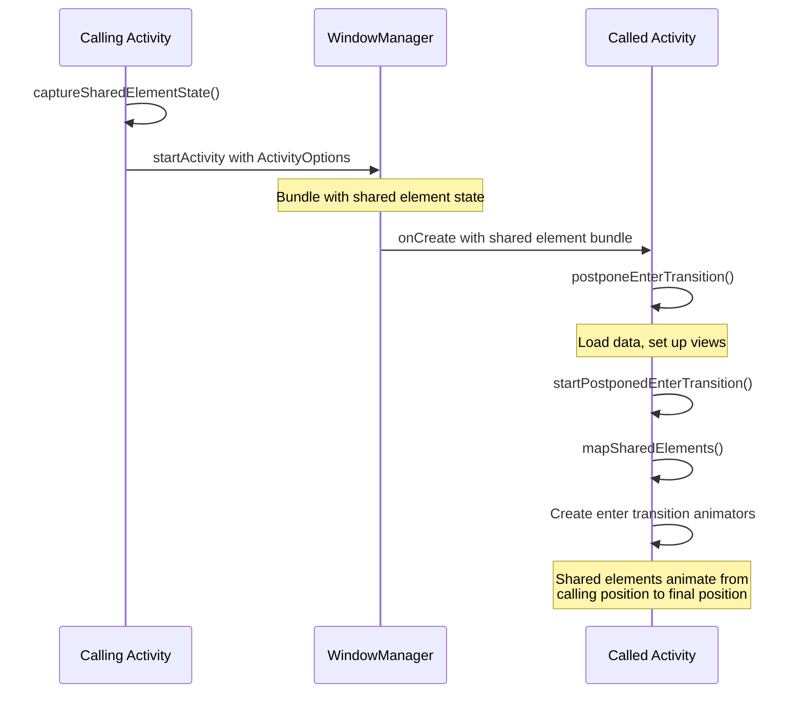
```mermaid
sequenceDiagram
    participant CallingAct as Calling Activity
    participant WM as WindowManager
    participant CalledAct as Called Activity

    CallingAct->>CallingAct: captureSharedElementState()
    CallingAct->>WM: startActivity with ActivityOptions
    Note over WM: Bundle with shared element state
    WM->>CalledAct: onCreate with shared element bundle
    CalledAct->>CalledAct: postponeEnterTransition()
    Note over CalledAct: Load data, set up views
    CalledAct->>CalledAct: startPostponedEnterTransition()
    CalledAct->>CalledAct: mapSharedElements()
    CalledAct->>CalledAct: Create enter transition animators
    Note over CalledAct: Shared elements animate from<br/>calling position to final position
```

### 14.5.4 Shared Element Return Animation Detail

When the user presses back, the shared element return animation reverses
the enter animation.  The system handles this automatically, but developers
can customize it:

```java
// Override default return shared element transition
getWindow().setSharedElementReturnTransition(
    new TransitionSet()
        .addTransition(new ChangeBounds().setDuration(300))
        .addTransition(new ChangeTransform())
        .addTransition(new ChangeImageTransform())
);
```

The return animation captures the current state of shared elements in the
called activity and animates them back to their position in the calling
activity.  This requires the calling activity to still be alive (not
destroyed), which is usually the case for standard back navigation.

### 14.5.5 Transition Fragment Integration

Fragments use the same shared element mechanism but with additional
complexity for fragment-to-fragment transitions:

```java
Fragment fragmentB = new DetailFragment();
fragmentB.setSharedElementEnterTransition(new ChangeTransform());

getSupportFragmentManager()
    .beginTransaction()
    .addSharedElement(sharedImageView, "hero_image")
    .replace(R.id.container, fragmentB)
    .addToBackStack(null)
    .commit();
```

The FragmentManager coordinates with the Transition Framework to capture
shared element state before and after the fragment swap.

### 14.5.6 ActivityOptions Animation Types

`ActivityOptions` defines numerous animation styles through constants:

| Constant | Value | Description |
|---|---|---|
| `ANIM_NONE` | 0 | No animation |
| `ANIM_CUSTOM` | 1 | Custom window animation resource |
| `ANIM_SCALE_UP` | 2 | Scale up from a rect |
| `ANIM_THUMBNAIL_SCALE_UP` | 3 | Scale up from a thumbnail |
| `ANIM_THUMBNAIL_SCALE_DOWN` | 4 | Scale down to a thumbnail |
| `ANIM_SCENE_TRANSITION` | 5 | Shared element scene transition |
| `ANIM_CLIP_REVEAL` | 6 | Circular reveal clip |
| `ANIM_OPEN_CROSS_PROFILE_APPS` | 7 | Cross-profile app launch |
| `ANIM_FROM_STYLE` | 8 | From window animation style |

### 14.5.7 ActivityTransitionCoordinator

The `ActivityTransitionCoordinator` (approximately 1,122 lines) manages the
complex handoff of shared element state between activities.  It handles:

1. **View mapping**: Matching shared element names between activities
2. **State capture**: Recording position, size, visibility, and appearance
3. **Thumbnail generation**: Creating bitmap snapshots for cross-process transfer
4. **Animation orchestration**: Coordinating enter/exit/shared element timing

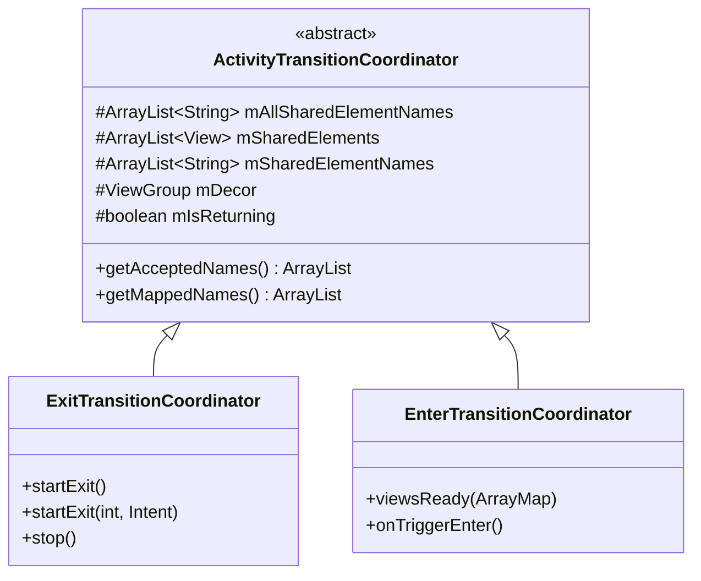
```mermaid
classDiagram
    class ActivityTransitionCoordinator {
        <<abstract>>
        #ArrayList~String~ mAllSharedElementNames
        #ArrayList~View~ mSharedElements
        #ArrayList~String~ mSharedElementNames
        #ViewGroup mDecor
        #boolean mIsReturning
        +getAcceptedNames() ArrayList
        +getMappedNames() ArrayList
    }
    class ExitTransitionCoordinator {
        +startExit()
        +startExit(int, Intent)
        +stop()
    }
    class EnterTransitionCoordinator {
        +viewsReady(ArrayMap)
        +onTriggerEnter()
    }

    ActivityTransitionCoordinator <|-- ExitTransitionCoordinator
    ActivityTransitionCoordinator <|-- EnterTransitionCoordinator
```

### 14.5.8 Postponed Enter Transition

Activities can postpone their enter transition until data is loaded:

```java
// In called Activity's onCreate:
postponeEnterTransition();

// After data is loaded and views are ready:
imageView.getViewTreeObserver().addOnPreDrawListener(
    new ViewTreeObserver.OnPreDrawListener() {
        @Override
        public boolean onPreDraw() {
            imageView.getViewTreeObserver().removeOnPreDrawListener(this);
            startPostponedEnterTransition();
            return true;
        }
    });
```

This is essential when shared elements depend on asynchronously loaded data
(e.g., images loaded from network).  Without postponement, the transition
would animate to/from the wrong position or size.

### 14.5.9 Return and Reenter Transitions

When navigating back, the transitions can be reversed or customized:

| Direction | Called Activity | Calling Activity |
|---|---|---|
| Forward | Enter Transition | Exit Transition |
| Forward shared | Shared Element Enter | Shared Element Exit |
| Return | Return Transition (default: reverse of Enter) | Reenter Transition (default: reverse of Exit) |
| Return shared | Shared Element Return (default: reverse of Enter) | |

Setting explicit return transitions enables asymmetric animations:

```java
// In the called Activity:
getWindow().setReturnTransition(new Slide(Gravity.BOTTOM));
// On back, slides down instead of reversing the enter
```

---

## 14.6 Window Manager Animations

### 14.6.1 Overview

The Window Manager (WM) in system_server orchestrates animations for
window-level operations: app launches, task switches, screen rotation,
and more.  These run on dedicated animation threads, independent of the
application's UI thread.

Key source files in `frameworks/base/services/core/java/com/android/server/wm/`:

| File | Lines | Purpose |
|---|---|---|
| `WindowAnimator.java` | 365 | Per-frame animation dispatch |
| `SurfaceAnimator.java` | 647 | Leash-based surface animation |
| `SurfaceAnimationRunner.java` | 359 | Lock-free animation execution |
| `WindowAnimationSpec.java` | ~300 | Wraps legacy `Animation` for surfaces |
| `LocalAnimationAdapter.java` | ~180 | Adapter for local animations |
| `AnimationAdapter.java` | ~100 | Interface for animation implementations |
| `WindowStateAnimator.java` | ~800 | Per-window animation state |

### 14.6.2 SurfaceAnimator and the Leash Pattern

The `SurfaceAnimator` (647 lines) implements a key architectural pattern:
the **animation leash**.  Instead of directly animating a window's surface,
it creates a temporary parent surface (the "leash"), reparents the window's
children onto the leash, and hands the leash to the animation system:

```
// frameworks/base/services/core/java/com/android/server/wm/SurfaceAnimator.java, lines 44-51

/**
 * A class that can run animations on objects that have a set of child surfaces.
 * We do this by reparenting all child surfaces of an object onto a new surface,
 * called the "Leash". The Leash gets attached in the surface hierarchy where
 * the children were attached to. We then hand off the Leash to the component
 * handling the animation, which is specified by the AnimationAdapter.
 */
```

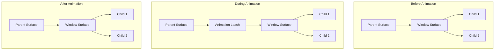
```mermaid
graph TD
    subgraph "Before Animation"
        P1[Parent Surface] --> W1[Window Surface]
        W1 --> C1[Child 1]
        W1 --> C2[Child 2]
    end

    subgraph "During Animation"
        P2[Parent Surface] --> L[Animation Leash]
        L --> W2[Window Surface]
        W2 --> C3[Child 1]
        W2 --> C4[Child 2]
    end

    subgraph "After Animation"
        P3[Parent Surface] --> W3[Window Surface]
        W3 --> C5[Child 1]
        W3 --> C6[Child 2]
    end
```

This pattern prevents the animation from interfering with the window's
internal surface tree.  When the animation completes, children are
reparented back to their original parent and the leash is destroyed.

### 14.6.3 SurfaceAnimationRunner

`SurfaceAnimationRunner` (359 lines) executes animations **without holding
the WindowManager lock**.  This is critical for performance -- the WM lock
is heavily contended, and holding it during animation would cause jank:

```
// frameworks/base/services/core/java/com/android/server/wm/SurfaceAnimationRunner.java, lines 44-47

/**
 * Class to run animations without holding the window manager lock.
 */
class SurfaceAnimationRunner {
    ...
    private final Handler mAnimationThreadHandler = AnimationThread.getHandler();
    private final Handler mSurfaceAnimationHandler = SurfaceAnimationThread.getHandler();
    ...
}
```

It uses `SfVsyncFrameCallbackProvider` to synchronize with SurfaceFlinger's
VSYNC (not the app's VSYNC), ensuring animations are timed to the compositor's
frame rate.

### 14.6.4 WindowAnimator

`WindowAnimator` (365 lines) is the per-frame dispatch coordinator.  It
schedules Choreographer callbacks and manages the overall animation state:

```
// frameworks/base/services/core/java/com/android/server/wm/WindowAnimator.java, lines 47-73

public class WindowAnimator {
    final WindowManagerService mService;
    final Choreographer.FrameCallback mAnimationFrameCallback;
    final Choreographer.VsyncCallback mAnimationVsyncCallback;
    long mCurrentTime;
    private Choreographer mChoreographer;
    ...
}
```

### 14.6.5 SurfaceAnimator.startAnimation() Flow

The `startAnimation()` method (lines 166-197) orchestrates the leash creation
and animation launch:

```
// SurfaceAnimator.java, lines 166-197

void startAnimation(@NonNull Transaction t, @NonNull AnimationAdapter anim, boolean hidden,
        @AnimationType int type,
        @Nullable OnAnimationFinishedCallback animationFinishedCallback,
        @Nullable Runnable animationCancelledCallback,
        @Nullable AnimationAdapter snapshotAnim) {
    cancelAnimation(t, true /* restarting */, true /* forwardCancel */);
    mAnimation = anim;
    mAnimationType = type;
    mSurfaceAnimationFinishedCallback = animationFinishedCallback;
    mAnimationCancelledCallback = animationCancelledCallback;
    final SurfaceControl surface = mAnimatable.getSurfaceControl();
    if (surface == null) {
        Slog.w(TAG, "Unable to start animation, surface is null or no children.");
        cancelAnimation();
        return;
    }
    if (mLeash == null) {
        mLeash = createAnimationLeash(mAnimatable, surface, t, type,
                mAnimatable.getSurfaceWidth(), mAnimatable.getSurfaceHeight(),
                0 /* x */, 0 /* y */, hidden, mService.mTransactionFactory);
        mAnimatable.onAnimationLeashCreated(t, mLeash);
    }
    mAnimatable.onLeashAnimationStarting(t, mLeash);
    mAnimation.startAnimation(mLeash, t, type, mInnerAnimationFinishedCallback);
    ...
}
```

Key steps:

1. **Cancel existing**: Any running animation is cancelled first
2. **Null check**: If the surface has been destroyed, bail out
3. **Create leash**: A new surface is created and the original surface is reparented under it
4. **Notify animatable**: The container gets a chance to adjust the leash
5. **Start animation**: The `AnimationAdapter` takes control of the leash

### 14.6.6 Animation Transfer

When a window moves between containers (e.g., during a task stack change),
the animation needs to transfer to the new container without interruption.
`transferAnimation()` (line 267) handles this by moving the leash and
animation reference from one SurfaceAnimator to another.

### 14.6.7 Animation Types

SurfaceAnimator tracks the type of animation for proper cancellation and
priority handling:

| Type | Usage |
|---|---|
| `ANIMATION_TYPE_NONE` | No animation |
| `ANIMATION_TYPE_APP_TRANSITION` | App open/close transition |
| `ANIMATION_TYPE_SCREEN_ROTATION` | Screen rotation animation |
| `ANIMATION_TYPE_RECENTS` | Recents animation |
| `ANIMATION_TYPE_WINDOW_ANIMATION` | Window-level animation |
| `ANIMATION_TYPE_DIMMER` | Dimmer fade in/out |
| `ANIMATION_TYPE_ALL` | Bitmask for all types |

### 14.6.8 WM Animation Architecture

```mermaid
graph TD
    subgraph "System Server"
        WMS[WindowManagerService] --> WA[WindowAnimator]
        WA --> SA[SurfaceAnimator]
        SA --> |creates leash| SAR[SurfaceAnimationRunner]
        SAR --> |ValueAnimator on AnimationThread| AT[AnimationThread]
        AT --> |SurfaceControl.Transaction| SF[SurfaceFlinger]
    end

    subgraph "Animation Types"
        LA[LocalAnimationAdapter] --> |WindowAnimationSpec| SAR
        RA[RemoteAnimationAdapter] --> |cross-process| SAR
    end
```

### 14.6.9 WM Server-Side Transition (Transition.java in wm/)

The WM's `Transition.java` (distinct from the framework's
`android.transition.Transition`) manages the server-side state machine for
shell transitions.  At approximately 4,587 lines, it tracks:

- Participating windows and tasks
- Transition type (open, close, change, etc.)
- Ready state and sync barriers
- Animation state for each participant

The `TransitionController` (approximately 2,049 lines) manages the lifecycle
of all active transitions and coordinates with the Shell process.

---

## 14.7 Shell Transition Animations

### 14.7.1 Overview

Shell Transitions (introduced in Android 12L) move transition animation
logic out of system_server and into the Shell process.  This architecture
gives the SystemUI/Shell process direct control over how windows animate,
enabling more sophisticated and customizable transitions.

Source directory:
`frameworks/base/libs/WindowManager/Shell/src/com/android/wm/shell/transition/`
(19 files, ~8,200 lines)

### 14.7.2 Architecture

```mermaid
sequenceDiagram
    participant App as Application
    participant WMCore as WM Core (system_server)
    participant TC as TransitionController
    participant Shell as Shell Process
    participant Trans as Transitions.java
    participant Handler as TransitionHandler
    participant SF as SurfaceFlinger

    App->>WMCore: startActivity / finish / etc
    WMCore->>TC: requestTransition
    TC->>TC: collect participating windows
    TC->>TC: sync window draws
    TC->>Shell: onTransitionReady(TransitionInfo)
    Shell->>Trans: dispatchTransition
    Trans->>Handler: startAnimation(TransitionInfo, SurfaceControl.Transaction)
    Handler->>Handler: create animations
    Handler->>SF: SurfaceControl.Transaction per frame
    Handler->>Trans: onTransitionFinished
    Trans->>WMCore: finishTransition
```

### 14.7.3 Transitions.java

`Transitions.java` (1,964 lines) is the central coordinator in the Shell
process.  It implements `ITransitionPlayer` and receives transition callbacks
from the WindowManager core:

```
// frameworks/base/libs/WindowManager/Shell/src/com/android/wm/shell/transition/Transitions.java

public class Transitions implements ... RemoteCallable<Transitions> {
    ...
}
```

It maintains an ordered list of `TransitionHandler` implementations and
dispatches each transition to the first handler that claims it.

### 14.7.4 Handler Dispatch Chain

```mermaid
graph TD
    T[Transitions.java] --> A{MixedTransitionHandler?}
    A -->|yes| B[MixedTransitionHandler]
    A -->|no| C{KeyguardTransitionHandler?}
    C -->|yes| D[KeyguardTransitionHandler]
    C -->|no| E{PipTransitionHandler?}
    E -->|yes| F[PipTransitionHandler]
    E -->|no| G{RemoteTransitionHandler?}
    G -->|yes| H[RemoteTransitionHandler]
    G -->|no| I[DefaultTransitionHandler]
```

### 14.7.5 DefaultTransitionHandler

`DefaultTransitionHandler` (1,081 lines) handles the common cases: app
launches, task switches, and activity closes.  It loads window animations
from resources and applies them to `SurfaceControl` leashes:

```
// DefaultTransitionHandler.java (imports, lines 19-70)

static imports:
    ANIM_CLIP_REVEAL, ANIM_CUSTOM, ANIM_FROM_STYLE, ANIM_NONE,
    ANIM_OPEN_CROSS_PROFILE_APPS, ANIM_SCALE_UP, ANIM_SCENE_TRANSITION,
    ANIM_THUMBNAIL_SCALE_DOWN, ANIM_THUMBNAIL_SCALE_UP
```

It builds surface animations using `TransitionAnimationHelper.loadAttributeAnimation()`
to resolve the correct window animation resource based on transition type and
window configuration.

### 14.7.6 RemoteTransitionHandler

Allows third-party launchers and apps to provide custom transition animations
by registering `RemoteTransition` objects.  The Shell dispatches the transition
info and surface controls to the remote process, which runs the animation
and signals completion.

### 14.7.7 Mixed Transitions

`MixedTransitionHandler` handles cases where multiple transition types
overlap (e.g., pip + app launch).  It splits the transition into independent
parts and delegates each to the appropriate handler.

### 14.7.8 Transition Types and Flags

The Shell processes these transition types from WindowManager:

| Type Constant | Value | Description |
|---|---|---|
| `TRANSIT_OPEN` | 1 | An app window is opening |
| `TRANSIT_CLOSE` | 2 | An app window is closing |
| `TRANSIT_TO_FRONT` | 3 | Existing window brought to front |
| `TRANSIT_TO_BACK` | 4 | Window sent to back |
| `TRANSIT_CHANGE` | 6 | Window config change (resize, etc.) |
| `TRANSIT_KEYGUARD_OCCLUDE` | 8 | Keyguard being occluded |
| `TRANSIT_KEYGUARD_UNOCCLUDE` | 9 | Keyguard being unoccluded |
| `TRANSIT_SLEEP` | 12 | Device going to sleep |
| `TRANSIT_FIRST_CUSTOM` | 1000 | Start of custom transition range |

Each participant in a transition carries flags:

| Flag | Purpose |
|---|---|
| `FLAG_IS_WALLPAPER` | Participant is wallpaper |
| `FLAG_IS_DISPLAY` | Participant is the display |
| `FLAG_NO_ANIMATION` | Skip animation for this participant |
| `FLAG_TRANSLUCENT` | Participant is translucent |
| `FLAG_SHOW_WALLPAPER` | Wallpaper should be visible |
| `FLAG_FILLS_TASK` | Participant fills its task |
| `FLAG_IS_BEHIND_STARTING_WINDOW` | Behind a starting window |
| `FLAG_STARTING_WINDOW_TRANSFER_RECIPIENT` | Receiving a starting window |
| `FLAG_IN_TASK_WITH_EMBEDDED_ACTIVITY` | In a task with embedded activities |
| `FLAG_BACK_GESTURE_ANIMATED` | Being animated by back gesture |

### 14.7.9 TransitionAnimationHelper

`TransitionAnimationHelper` provides utility methods for loading and
configuring transition animations:

- `loadAttributeAnimation()` -- Loads the correct window animation from
  theme attributes based on transition type
- `getTransitionBackgroundColorIfSet()` -- Extracts backdrop color from
  animation attributes
- `isCoveredByOpaqueFullscreenChange()` -- Determines if a change is
  hidden behind a fullscreen opaque window (skip animation)

### 14.7.10 Shell Transition Lifecycle

```mermaid
stateDiagram-v2
    [*] --> Collecting: requestTransition
    Collecting --> Syncing: all participants identified
    Syncing --> Ready: all surfaces drawn
    Ready --> Dispatched: onTransitionReady sent to Shell
    Dispatched --> Animating: handler.startAnimation
    Animating --> Finishing: animations complete
    Finishing --> Merged: merged with next transition
    Finishing --> Done: finishTransition
    Done --> [*]

    Animating --> Aborted: new transition supersedes
    Aborted --> [*]
```

### 14.7.11 Screen Rotation

`ScreenRotationAnimation` handles the special case of device rotation.  It
captures a screenshot of the pre-rotation state and crossfades/rotates it
into the post-rotation state, coordinating with the display configuration
change.

---

## 14.8 Predictive Back Animations

### 14.8.1 Overview

Predictive Back (Android 13+) provides real-time back gesture animations
that preview where the user will go before they commit the gesture.  The
Shell's back animation system drives these using `SurfaceControl`
transactions tied to gesture progress.

Source directory:
`frameworks/base/libs/WindowManager/Shell/src/com/android/wm/shell/back/`
(14 files, ~3,200 lines)

### 14.8.2 Architecture

```mermaid
sequenceDiagram
    participant User as User Gesture
    participant ISM as InputManager
    participant BAC as BackAnimationController
    participant Runner as BackAnimationRunner
    participant Anim as CrossActivityBackAnimation
    participant SF as SurfaceFlinger

    User->>ISM: Edge swipe from left/right
    ISM->>BAC: onBackMotionEvent(progress)
    BAC->>BAC: determine back destination
    BAC->>Runner: onBackStarted(BackEvent)
    loop gesture in progress
        User->>BAC: onBackProgressed(BackEvent)
        BAC->>Anim: onBackProgressed(progress, edge)
        Anim->>SF: SurfaceControl.Transaction (scale, translate)
    end
    alt user commits
        User->>BAC: onBackInvoked
        BAC->>Anim: playCloseAnimation
        Anim->>SF: final animation to completion
    else user cancels
        User->>BAC: onBackCancelled
        BAC->>Anim: playCancelAnimation
        Anim->>SF: animate back to original state
    end
```

### 14.8.3 BackAnimationController

`BackAnimationController` is the central coordinator.  It receives motion
events from the system's back gesture detector, determines the navigation
target (cross-activity, cross-task, or app callback), and dispatches to the
appropriate animation runner:

```
// frameworks/base/libs/WindowManager/Shell/src/com/android/wm/shell/back/BackAnimationController.java

public class BackAnimationController ... {
    ...
}
```

### 14.8.4 Animation Types

| Animation Class | When Used |
|---|---|
| `CrossActivityBackAnimation` | Going back within the same task |
| `CrossTaskBackAnimation` | Going back to the previous task |
| `CustomCrossActivityBackAnimation` | Apps providing custom back previews |
| `DefaultCrossActivityBackAnimation` | Default cross-activity animation |

### 14.8.5 Gesture-Driven Animation

Unlike traditional animations that run on a fixed timeline, predictive back
animations are **gesture-driven**: their progress is directly tied to the
user's finger position.  The `BackEvent` provides:

- `progress` -- 0.0 (start) to 1.0 (committed)
- `touchX`, `touchY` -- Current finger position
- `swipeEdge` -- `EDGE_LEFT` or `EDGE_RIGHT`

The animation computes scale, translation, and corner radius as functions
of progress, applying them through `SurfaceControl.Transaction` each frame.

### 14.8.6 BackAnimationController State Machine

```mermaid
stateDiagram-v2
    [*] --> Idle
    Idle --> GestureStarted: onBackMotionEvent DOWN
    GestureStarted --> Progressing: onBackProgressed
    Progressing --> Progressing: onBackProgressed continuous
    Progressing --> Committed: onBackInvoked
    Progressing --> Cancelled: onBackCancelled
    Committed --> PlayingClose: play close animation
    Cancelled --> PlayingCancel: play cancel animation
    PlayingClose --> TransitionFinished: animation done
    PlayingCancel --> Idle: animation done
    TransitionFinished --> Idle: cleanup
```

### 14.8.7 Progress-to-Transform Mapping

The predictive back animations map gesture progress to visual transforms
using piecewise functions.  For the default cross-activity animation:

| Progress | Scale | Translation X | Corner Radius |
|---|---|---|---|
| 0.0 | 1.0 | 0 | 0 |
| 0.3 | 0.9 | proportional | increasing |
| 0.6 | 0.85 | proportional | increasing |
| 1.0 | 0.8 | max | max |

The animation curves are designed to:

1. Start with minimal visual change (low sensitivity near edge)
2. Gradually increase the preview effect
3. Provide clear visual feedback about the back destination

### 14.8.8 Back Animation and Shell Transitions Integration

When predictive back commits, it triggers a shell transition.  The
`FLAG_BACK_GESTURE_ANIMATED` flag on the `TransitionInfo` tells the Shell
that this transition was initiated by a back gesture, and the animation
should smoothly continue from the current preview state rather than starting
from scratch.

### 14.8.9 Back Animation Transform Details

The default cross-activity back animation applies these transforms as
functions of gesture progress and finger position:

```
// Simplified transform calculations

// Scale shrinks the departing activity
float scale = lerp(1.0f, 0.9f, progress);
transaction.setScale(leash, scale, scale);

// Translation follows the finger horizontally
float maxTranslation = displayWidth * 0.05f;
float translationX = (swipeEdge == EDGE_LEFT)
    ? maxTranslation * progress
    : -maxTranslation * progress;
transaction.setPosition(leash, translationX, 0);

// Corner radius increases with progress
float cornerRadius = lerp(0, displayCornerRadius, progress);
transaction.setCornerRadius(leash, cornerRadius);

// The entering activity peeks from behind
float enterScale = lerp(0.85f, 1.0f, progress);
transaction.setScale(enterLeash, enterScale, enterScale);
```

The visual effect is:

1. The current activity shrinks slightly and slides in the swipe direction
2. Its corners round off to match the display corners
3. The previous activity peeks from behind, starting small and growing

### 14.8.10 ProgressVelocityTracker

`ProgressVelocityTracker.kt` tracks the velocity of the back gesture
progress value.  This velocity is used to determine:

- Whether the gesture was a quick fling (should commit immediately)
- The initial velocity for any spring animations during commit/cancel
- Whether to play the commit or cancel animation

---

## 14.9 Physics-Based Animations

### 14.9.1 Overview

Physics-based animations produce more natural motion by simulating physical
forces (springs, friction) rather than following fixed timing curves.
Unlike `ValueAnimator` which runs for a fixed duration, physics animations
run until the simulated system reaches equilibrium.

Source directory:
`frameworks/base/core/java/com/android/internal/dynamicanimation/animation/`
(6 files, ~1,750 lines)

### 14.9.2 DynamicAnimation Base Class

`DynamicAnimation` is the abstract base for all physics animations.  It
registers with `AnimationHandler` (same as `ValueAnimator`) for frame
callbacks:

```
// frameworks/base/core/java/com/android/internal/dynamicanimation/animation/DynamicAnimation.java, lines 43-44

public abstract class DynamicAnimation<T extends DynamicAnimation<T>>
        implements AnimationHandler.AnimationFrameCallback {
```

It provides pre-defined `ViewProperty` constants for common View properties:

```
// DynamicAnimation.java, lines 60-70

public static final ViewProperty TRANSLATION_X = new ViewProperty("translationX") {
    @Override
    public void setValue(View view, float value) {
        view.setTranslationX(value);
    }
    @Override
    public Float get(View view) {
        return view.getTranslationX();
    }
};
```

Available ViewProperty constants: `TRANSLATION_X`, `TRANSLATION_Y`,
`TRANSLATION_Z`, `SCALE_X`, `SCALE_Y`, `ROTATION`, `ROTATION_X`,
`ROTATION_Y`, `X`, `Y`, `Z`, `ALPHA`, `SCROLL_X`, `SCROLL_Y`.

### 14.9.3 SpringAnimation

`SpringAnimation` drives motion using a `SpringForce` -- a damped harmonic
oscillator:

```
// frameworks/base/core/java/com/android/internal/dynamicanimation/animation/SpringAnimation.java, lines 58-63

public final class SpringAnimation extends DynamicAnimation<SpringAnimation> {
    private SpringForce mSpring = null;
    private float mPendingPosition = UNSET;
    private static final float UNSET = Float.MAX_VALUE;
    private boolean mEndRequested = false;
    ...
}
```

Usage (from the class Javadoc):

```java
// Create a spring animation targeting view's X property
final SpringAnimation anim = new SpringAnimation(view, DynamicAnimation.X, 0)
        .setStartVelocity(5000);
anim.start();

// With custom spring configuration
SpringForce spring = new SpringForce(0)
        .setDampingRatio(SpringForce.DAMPING_RATIO_LOW_BOUNCY)
        .setStiffness(SpringForce.STIFFNESS_LOW);
final SpringAnimation anim2 = new SpringAnimation(view, DynamicAnimation.SCALE_Y)
        .setMinValue(0).setSpring(spring).setStartValue(1);
anim2.start();
```

### 14.9.4 SpringForce

`SpringForce` models a damped harmonic oscillator with two key parameters:

```
// frameworks/base/core/java/com/android/internal/dynamicanimation/animation/SpringForce.java, lines 35-74

public final class SpringForce implements Force {
    public static final float STIFFNESS_HIGH = 10_000f;
    public static final float STIFFNESS_MEDIUM = 1500f;
    public static final float STIFFNESS_LOW = 200f;
    public static final float STIFFNESS_VERY_LOW = 50f;

    public static final float DAMPING_RATIO_HIGH_BOUNCY = 0.2f;
    public static final float DAMPING_RATIO_MEDIUM_BOUNCY = 0.5f;
    public static final float DAMPING_RATIO_LOW_BOUNCY = 0.75f;
    public static final float DAMPING_RATIO_NO_BOUNCY = 1f;
    ...
}
```

The physics simulation uses the damped harmonic oscillator equation:

```
m * x'' + c * x' + k * x = 0
```

Where:

- `k` = stiffness (spring constant)
- `c` = damping coefficient (derived from damping ratio and natural frequency)
- `m` = mass (normalized to 1)

The `naturalFreq` is `sqrt(stiffness)`, and the solution depends on the
damping ratio:

| Damping Ratio | Behavior | Solution Type |
|---|---|---|
| = 0 | Oscillates forever | Undamped |
| < 1 | Overshoots, oscillates | Under-damped |
| = 1 | Fastest return, no overshoot | Critically damped |
| > 1 | Slow return, no overshoot | Over-damped |

```mermaid
graph LR
    subgraph "Spring Damping Behavior"
        direction TB
        A["Undamped (0.0)"] -.->|"oscillates forever"| X[Position over time]
        B["Under-damped (0.2-0.75)"] -.->|"bouncy"| X
        C["Critically damped (1.0)"] -.->|"fastest settle"| X
        D["Over-damped (>1.0)"] -.->|"slow settle"| X
    end
```

### 14.9.5 FlingAnimation

`FlingAnimation` simulates a fling gesture with friction.  It starts with an
initial velocity and decelerates due to a friction force.  The animation ends
when velocity drops below a threshold.

The friction model uses exponential decay:
```
velocity(t) = initialVelocity * e^(-friction * t)
position(t) = initialPosition + initialVelocity/friction * (1 - e^(-friction * t))
```

### 14.9.6 SpringForce Internal Computation

The SpringForce class pre-computes intermediate values for efficient
per-frame evaluation.  The initialization depends on the damping regime:

**Under-damped** (damping ratio < 1):
```
dampedFreq = naturalFreq * sqrt(1 - dampingRatio^2)
gammaPlus  = -dampingRatio * naturalFreq + dampedFreq * i
gammaMinus = -dampingRatio * naturalFreq - dampedFreq * i
```

The position and velocity at time `t` are computed analytically using
the exact solution to the damped harmonic oscillator differential equation.

**Critically damped** (damping ratio = 1):
```
position(t) = (c1 + c2 * t) * e^(-naturalFreq * t)
velocity(t) = (c2 - naturalFreq * (c1 + c2 * t)) * e^(-naturalFreq * t)
```

**Over-damped** (damping ratio > 1):
```
gammaPlus  = -dampingRatio * naturalFreq + naturalFreq * sqrt(dampingRatio^2 - 1)
gammaMinus = -dampingRatio * naturalFreq - naturalFreq * sqrt(dampingRatio^2 - 1)
```

The animation checks for convergence each frame by comparing both position
and velocity against thresholds:

```
valueThreshold  = based on the minimum visible change
velocityThreshold = valueThreshold * VELOCITY_THRESHOLD_MULTIPLIER (62.5)
```

The `VELOCITY_THRESHOLD_MULTIPLIER` (1000.0 / 16.0 = 62.5) means that if
it would take more than one frame (16ms) to move by the value threshold at
the current velocity, the spring is considered at rest.

### 14.9.7 DynamicAnimation Lifecycle

```mermaid
stateDiagram-v2
    [*] --> Created
    Created --> Running: start
    Running --> Running: doAnimationFrame each VSYNC
    Running --> Ended: force reaches equilibrium
    Running --> Cancelled: cancel
    Ended --> [*]
    Cancelled --> [*]

    note right of Running
        Each frame:
        1. Get delta time
        2. Ask Force for new value/velocity
        3. Check min/max bounds
        4. Update property on target
        5. Check if at rest
    end note
```

### 14.9.8 FlingAnimation Detailed Behavior

FlingAnimation uses an exponential decay model with configurable friction:

```
position(t) = startPosition + startVelocity / friction * (1 - e^(-friction * t))
velocity(t) = startVelocity * e^(-friction * t)
```

The friction coefficient determines how quickly the fling decelerates:

| Friction Value | Behavior | Typical Use |
|---|---|---|
| 0.1 | Very slippery, long fling | Ice-like surfaces |
| 0.5 | Low friction | Smooth scrolling lists |
| 1.0 | Default | Standard fling |
| 1.5 | Moderate friction | Slower deceleration |
| 3.0 | High friction | Quick stop |
| 10.0 | Very high friction | Near-instant stop |

The animation stops when velocity drops below the minimum visible change
threshold (approximately 1 pixel/second for position properties).

FlingAnimation also supports min/max bounds.  When the value hits a bound,
the animation stops immediately (no bounce).  To add bounce behavior,
chain a `SpringAnimation` when the fling ends at a boundary:

```java
FlingAnimation fling = new FlingAnimation(view, DynamicAnimation.TRANSLATION_X);
fling.setMinValue(0f);
fling.setMaxValue(maxX);
fling.addEndListener((anim, canceled, value, velocity) -> {
    // If ended at a boundary with remaining velocity, spring back
    if (value <= 0 || value >= maxX) {
        float target = Math.max(0, Math.min(value, maxX));
        new SpringAnimation(view, DynamicAnimation.TRANSLATION_X, target)
            .setStartVelocity(velocity)
            .start();
    }
});
```

### 14.9.9 DynamicAnimation ViewProperty Architecture

The `ViewProperty` abstract class provides a type-safe, no-reflection
mechanism for animating View properties:

```mermaid
classDiagram
    class FloatProperty~View~ {
        <<abstract>>
        +setValue(View, float)*
        +get(View) Float*
    }
    class ViewProperty {
        <<abstract>>
    }
    class TRANSLATION_X
    class TRANSLATION_Y
    class TRANSLATION_Z
    class SCALE_X
    class SCALE_Y
    class ROTATION
    class ROTATION_X
    class ROTATION_Y
    class ALPHA
    class X
    class Y
    class Z
    class SCROLL_X
    class SCROLL_Y

    FloatProperty <|-- ViewProperty
    ViewProperty <|-- TRANSLATION_X
    ViewProperty <|-- TRANSLATION_Y
    ViewProperty <|-- TRANSLATION_Z
    ViewProperty <|-- SCALE_X
    ViewProperty <|-- SCALE_Y
    ViewProperty <|-- ROTATION
    ViewProperty <|-- ROTATION_X
    ViewProperty <|-- ROTATION_Y
    ViewProperty <|-- ALPHA
    ViewProperty <|-- X
    ViewProperty <|-- Y
    ViewProperty <|-- Z
    ViewProperty <|-- SCROLL_X
    ViewProperty <|-- SCROLL_Y
```

Each property directly calls the corresponding View setter method, avoiding
reflection overhead:

```java
public static final ViewProperty ALPHA = new ViewProperty("alpha") {
    @Override
    public void setValue(View view, float value) {
        view.setAlpha(value);
    }
    @Override
    public Float get(View view) {
        return view.getAlpha();
    }
};
```

### 14.9.10 Force Interface

The `Force` interface abstracts the physics model, enabling custom force
implementations:

```java
public interface Force {
    /**
     * Returns the acceleration at the given position and velocity.
     * @param position current position
     * @param velocity current velocity
     * @return acceleration
     */
    float getAcceleration(float position, float velocity);

    /**
     * Returns whether the animation is at equilibrium.
     * @param value current value
     * @param velocity current velocity
     * @return true if at rest
     */
    boolean isAtEquilibrium(float value, float velocity);
}
```

`SpringForce` implements this interface to provide spring dynamics.
Developers can implement custom forces (e.g., gravity, magnetic attraction)
by implementing this interface and using it with `DynamicAnimation`.

### 14.9.11 Scroller and OverScroller Physics

While not part of the `DynamicAnimation` package, `Scroller` and
`OverScroller` implement the fling physics used by all standard scrollable
views.

`OverScroller` extends `Scroller` with elastic overscroll behavior at
edges.  The overscroll effect uses a spring-like model where the
displacement is proportional to the scroll velocity at the edge:

```mermaid
graph LR
    subgraph "OverScroller States"
        SCROLL[Scrolling] -->|reach edge with velocity| OVER[Overscroll]
        OVER -->|spring back| SCROLL
        SCROLL -->|fling| FLING[Flinging]
        FLING -->|reach edge| OVER
        FLING -->|decelerate to stop| SCROLL
    end
```

The fling deceleration model uses a spline-based interpolation that
approximates physical friction more accurately than pure exponential
decay.

### 14.9.12 Physics Animation Integration with Shell

The Shell process uses physics animations extensively for interactive
animations.  Bubble animations, for example, use spring dynamics to make
bubbles feel physically connected to the user's finger.

### 14.9.13 Scroller and OverScroller

While not part of the `DynamicAnimation` package, `Scroller` and
`OverScroller` in `android.widget` provide physics-based scrolling models:

- `Scroller` -- Basic fling with deceleration
- `OverScroller` -- Adds elastic overscroll at boundaries

These are used by `ScrollView`, `ListView`, `RecyclerView`, and other
scrollable containers for their fling behavior.

---

## 14.10 Native HWUI Animation

### 14.10.1 Overview

HWUI (Hardware UI) provides native C++ animation support that runs on the
**RenderThread**, completely independent of the UI thread.  This means
animations continue smoothly even if the UI thread is blocked (e.g., during
garbage collection or heavy layout).

Source files in `frameworks/base/libs/hwui/`:

| File | Lines | Purpose |
|---|---|---|
| `Animator.cpp` | ~460 | Base animation engine |
| `Animator.h` | ~280 | Animation class declarations |
| `AnimatorManager.cpp` | ~207 | Per-RenderNode animation management |
| `AnimatorManager.h` | ~80 | Manager declarations |
| `Interpolator.cpp` | ~160 | Native interpolator implementations |
| `AnimationContext.cpp` | ~100 | Frame timing context |
| `PropertyValuesAnimatorSet.cpp` | ~200 | Multi-property animation set |

### 14.10.2 BaseRenderNodeAnimator

The core native animation class manages a state machine that synchronizes
between UI thread (staging) and RenderThread (actual animation):

```
// frameworks/base/libs/hwui/Animator.cpp, lines 34-47

BaseRenderNodeAnimator::BaseRenderNodeAnimator(float finalValue)
        : mTarget(nullptr)
        , mStagingTarget(nullptr)
        , mFinalValue(finalValue)
        , mDeltaValue(0)
        , mFromValue(0)
        , mStagingPlayState(PlayState::NotStarted)
        , mPlayState(PlayState::NotStarted)
        , mHasStartValue(false)
        , mStartTime(0)
        , mDuration(300)
        , mStartDelay(0)
        , mMayRunAsync(true)
        , mPlayTime(0) {}
```

### 14.10.3 Staging Pattern

HWUI animations use a **staging pattern** to safely transfer animation state
from the UI thread to the RenderThread:

```mermaid
sequenceDiagram
    participant UI as UI Thread
    participant RT as RenderThread

    UI->>UI: animator.start()
    Note over UI: mStagingPlayState = Running
    Note over UI: mStagingRequests.push(Start)
    UI->>RT: syncFrameState (next frame)
    RT->>RT: pushStaging()
    Note over RT: resolve staging requests
    Note over RT: mPlayState = Running
    loop each RenderThread frame
        RT->>RT: animate(context)
        Note over RT: compute fraction from time
        Note over RT: apply interpolator
        Note over RT: update RenderNode property
    end
```

### 14.10.4 PlayState Machine

```
// Animator.cpp, lines 118-151 (resolveStagingRequest)

switch (request) {
    case Request::Start:
        mPlayState = PlayState::Running;
        break;
    case Request::Reverse:
        mPlayState = PlayState::Reversing;
        break;
    case Request::Reset:
        mPlayTime = 0;
        mPlayState = PlayState::Finished;
        mPendingActionUponFinish = Action::Reset;
        break;
    case Request::Cancel:
        mPlayState = PlayState::Finished;
        break;
    case Request::End:
        mPlayTime = mPlayState == PlayState::Reversing ? 0 : mDuration;
        mPlayState = PlayState::Finished;
        mPendingActionUponFinish = Action::End;
        break;
}
```

```mermaid
stateDiagram-v2
    [*] --> NotStarted
    NotStarted --> Running: Start request
    NotStarted --> Reversing: Reverse request
    Running --> Finished: duration elapsed / Cancel / End
    Running --> Reversing: Reverse request
    Reversing --> Finished: play time reaches 0 / Cancel / End
    Reversing --> Running: Start request
    Finished --> [*]
    Finished --> Running: Reset + Start
```

### 14.10.5 AnimatorManager

`AnimatorManager` (207 lines) manages all animations attached to a single
`RenderNode`:

```
// frameworks/base/libs/hwui/AnimatorManager.cpp, lines 34-55

AnimatorManager::AnimatorManager(RenderNode& parent)
        : mParent(parent), mAnimationHandle(nullptr), mCancelAllAnimators(false) {}

void AnimatorManager::addAnimator(const sp<BaseRenderNodeAnimator>& animator) {
    RenderNode* stagingTarget = animator->stagingTarget();
    if (stagingTarget == &mParent) return;
    mNewAnimators.emplace_back(animator.get());
    if (stagingTarget) {
        stagingTarget->removeAnimator(animator);
    }
    animator->attach(&mParent);
}
```

The `pushStaging()` method transfers new animators from the staging list
to the active list, and `animate()` advances all active animators for the
current frame.

### 14.10.6 Java-Side JNI Bridge

On the Java side, `RenderNodeAnimator` (approximately 513 lines) wraps native
HWUI animators.  View property animations (translationX, alpha, etc.) that
target a `RenderNode` property use this path for maximum performance:

```java
// When you call view.animate().translationX(100):
// 1. ViewPropertyAnimator creates a RenderNodeAnimator
// 2. RenderNodeAnimator calls nStart() via JNI
// 3. Native BaseRenderNodeAnimator starts on RenderThread
// 4. Each RenderThread frame: native animate() updates RenderNode
// 5. No UI thread involvement after start!
```

### 14.10.7 HWUI animate() Core Loop

The `animate()` method on BaseRenderNodeAnimator computes the current
value each RenderThread frame:

```mermaid
flowchart TD
    A[RenderThread frame] --> B[AnimatorManager.animate]
    B --> C{For each active animator}
    C --> D[Compute playTime from currentFrameTime - startTime]
    D --> E{playTime >= startDelay?}
    E -->|No| F[Still in delay, skip]
    E -->|Yes| G[fraction = playTime / duration]
    G --> H[Clamp fraction to 0..1]
    H --> I[interpolatedFraction = interpolator.interpolate fraction]
    I --> J[value = fromValue + deltaValue * interpolatedFraction]
    J --> K[Update RenderNode property]
    K --> L{fraction >= 1.0?}
    L -->|Yes| M[Mark finished, schedule callback to UI thread]
    L -->|No| N[Continue next frame]
```

### 14.10.8 Property Types in HWUI

HWUI can animate these RenderNode properties natively:

| Property | Type | Description |
|---|---|---|
| `TRANSLATION_X` | float | Horizontal translation |
| `TRANSLATION_Y` | float | Vertical translation |
| `TRANSLATION_Z` | float | Z-axis translation (elevation) |
| `SCALE_X` | float | Horizontal scale |
| `SCALE_Y` | float | Vertical scale |
| `ROTATION` | float | Z-axis rotation |
| `ROTATION_X` | float | X-axis rotation (3D) |
| `ROTATION_Y` | float | Y-axis rotation (3D) |
| `ALPHA` | float | Opacity |
| `X` | float | Absolute X position |
| `Y` | float | Absolute Y position |
| `Z` | float | Absolute Z position |

These map directly to RenderNode properties and are applied during the
display list replay phase without any Java callback.

### 14.10.9 HWUI Interpolator Implementation

The native interpolator infrastructure mirrors Java exactly.  In
`frameworks/base/libs/hwui/Interpolator.cpp`:

| Native Interpolator | Java Equivalent | Formula |
|---|---|---|
| `AccelerateDecelerateInterpolator` | Same | `cos((t+1)*PI)/2 + 0.5` |
| `AccelerateInterpolator` | Same | `t^(2*factor)` |
| `DecelerateInterpolator` | Same | `1-(1-t)^(2*factor)` |
| `LinearInterpolator` | Same | `t` |
| `PathInterpolator` | Same | Binary search on path points |
| `OvershootInterpolator` | Same | Cubic overshoot |
| `AnticipateInterpolator` | Same | Anticipation curve |
| `BounceInterpolator` | Same | Piecewise bounce |
| `CycleInterpolator` | Same | `sin(2*PI*cycles*t)` |
| `LUTInterpolator` | N/A | Lookup table from Java samples |

The `LUTInterpolator` is a special native interpolator used when a Java
interpolator does not have a native equivalent.  The Java interpolator is
sampled at regular intervals during `pushStaging()`, and the resulting
lookup table is used for RenderThread animation.

### 14.10.10 PropertyValuesAnimatorSet (Native)

For `AnimatedVectorDrawable`, the native `PropertyValuesAnimatorSet`
(`frameworks/base/libs/hwui/PropertyValuesAnimatorSet.cpp`) provides a
complete AnimatorSet implementation in C++ that runs on the RenderThread.
This enables complex multi-property AVD animations to run without any
Java callbacks.

### 14.10.11 AnimationContext and Frame Timing

`AnimationContext` provides the frame timing context for native animations:

```cpp
// AnimationContext provides frameTimeMs() used by animations
// to calculate elapsed time and fraction
class AnimationContext {
    nsecs_t frameTimeMs();
    void startFrame();
    void runRemainingAnimations(TreeInfo& info);
    ...
};
```

The frame time comes from the RenderThread's VSYNC timestamp, which may
differ slightly from the UI thread's Choreographer timestamp.  This is
intentional -- RenderThread processes the frame after the UI thread has
finished, so it uses a slightly later timestamp.

### 14.10.12 HWUI Animation and Display Lists

HWUI animations modify `RenderNode` properties, which are applied during
display list replay.  The modification happens **in-place** without
re-recording the display list, making property animations extremely
efficient:

```mermaid
graph TD
    subgraph "UI Thread"
        DL[Record Display List] --> |"only on layout/draw"| SYNC[Sync to RenderThread]
    end

    subgraph "RenderThread"
        SYNC --> PS[pushStaging - transfer new animators]
        PS --> AN[animate - update RenderNode properties]
        AN --> DRAW[Draw display list with updated properties]
        DRAW --> |"properties applied during replay"| GPU[GPU render]
    end

    style AN fill:#f96,stroke:#333,stroke-width:2px
```

Because animations modify properties but not the display list structure,
the RenderThread can animate smoothly even if the UI thread never runs.
This is why `view.animate().alpha(0.5f)` continues smoothly during GC
pauses, while a custom `ValueAnimator` that calls `invalidate()` would
stutter.

### 14.10.13 HWUI vs Java Animation Performance

| Aspect | Java (ValueAnimator) | Native (HWUI) |
|---|---|---|
| Thread | UI Thread | RenderThread |
| Survives UI jank | No | Yes |
| Property types | Any Java property | RenderNode properties only |
| Flexibility | High (custom evaluators) | Limited (float properties) |
| Overhead | Reflection, boxing | Direct native property set |
| Use case | Complex, multi-object | Simple view property animations |

---

## 14.11 Drawable and Vector Animations

### 14.11.1 AnimatedVectorDrawable

`AnimatedVectorDrawable` (approximately 1,870 lines) animates the
individual properties of a `VectorDrawable` -- paths, groups, and fills.
Starting from API 25, it runs on the **RenderThread** for jank-free
performance:

```
// frameworks/base/graphics/java/android/graphics/drawable/AnimatedVectorDrawable.java, lines 71-80

/**
 * Starting from API 25, AnimatedVectorDrawable runs on RenderThread (as
 * opposed to on UI thread for earlier APIs). This means animations in
 * AnimatedVectorDrawable can remain smooth even when there is heavy workload
 * on the UI thread.
 */
```

### 14.11.2 AVD Architecture

```mermaid
graph TD
    subgraph "XML Resources"
        AVD["animated-vector XML"] --> VD["VectorDrawable XML"]
        AVD --> OA1["ObjectAnimator XML (path)"]
        AVD --> OA2["ObjectAnimator XML (group)"]
    end

    subgraph "Runtime"
        AVD2[AnimatedVectorDrawable] --> VDS[VectorDrawableState]
        AVD2 --> AS[AnimatorSet]
        AS --> OA3[ObjectAnimator - pathData]
        AS --> OA4[ObjectAnimator - fillColor]
        AS --> OA5[ObjectAnimator - rotation]
    end

    subgraph "Rendering"
        AVD2 --> |API 25+| RT[RenderThread native animator]
        AVD2 --> |API < 25| UI[UI Thread animator]
        RT --> Canvas[RecordingCanvas]
        UI --> Canvas
    end
```

### 14.11.3 VectorDrawable Properties

`VectorDrawable` (approximately 2,398 lines) exposes numerous animatable
properties:

| Property | Target | Description |
|---|---|---|
| `pathData` | Path | SVG path morphing |
| `fillColor` | Path | Fill color |
| `fillAlpha` | Path | Fill opacity |
| `strokeColor` | Path | Stroke color |
| `strokeAlpha` | Path | Stroke opacity |
| `strokeWidth` | Path | Stroke width |
| `trimPathStart` | Path | Trim start (0-1) |
| `trimPathEnd` | Path | Trim end (0-1) |
| `trimPathOffset` | Path | Trim offset |
| `rotation` | Group | Group rotation |
| `pivotX`, `pivotY` | Group | Rotation pivot |
| `scaleX`, `scaleY` | Group | Group scale |
| `translateX`, `translateY` | Group | Group translation |

### 14.11.4 AVD RenderThread Execution Path

Starting from API 25, AVD animations execute natively on the RenderThread
through this path:

```mermaid
sequenceDiagram
    participant App as Application Code
    participant AVD as AnimatedVectorDrawable
    participant AVDS as AnimatorSet (native)
    participant RT as RenderThread
    participant RN as RenderNode
    participant VD as VectorDrawable (native)

    App->>AVD: avd.start()
    AVD->>AVDS: Start native AnimatorSet
    AVDS->>RT: Register with RenderThread frame callback
    loop each RenderThread frame
        RT->>AVDS: onAnimationFrame(frameTime)
        AVDS->>AVDS: Compute interpolated values
        AVDS->>VD: Update path data / colors / transforms
        VD->>RN: Invalidate RenderNode
        RN->>RT: Re-record display list
        RT->>RT: Draw frame
    end
    AVDS->>AVD: Animation complete callback
    AVD->>App: AnimationCallback.onAnimationEnd()
```

The key advantage is that the entire animation loop -- value computation,
property update, and drawing -- happens on the RenderThread without any
Java/JNI overhead per frame.

### 14.11.5 Path Morphing in AVD

One of the most powerful AVD features is **path morphing** -- smoothly
transitioning between two SVG path shapes.  This requires:

1. Both paths must have the same number and types of path commands
2. The framework interpolates each control point independently
3. The result is a smooth morph between shapes

```xml
<objectAnimator
    android:propertyName="pathData"
    android:valueFrom="M0,0 L24,0 L24,24 L0,24 Z"
    android:valueTo="M12,0 L24,12 L12,24 L0,12 Z"
    android:valueType="pathType"
    android:duration="500"/>
```

This morphs a square into a diamond.  The framework uses `PathParser` to
decompose each path into a sequence of points, then linearly interpolates
each point between the start and end positions.

### 14.11.6 Trim Path Animation

The trim path properties (`trimPathStart`, `trimPathEnd`, `trimPathOffset`)
enable "drawing" effects where a path appears to be drawn progressively:

```xml
<!-- Animate trimPathEnd from 0 to 1 to "draw" the path -->
<objectAnimator
    android:propertyName="trimPathEnd"
    android:valueFrom="0"
    android:valueTo="1"
    android:duration="1000"/>
```

Combined with `trimPathOffset`, this can create circular loading spinners
and progress indicators.

### 14.11.7 AVD Performance Characteristics

| Aspect | API < 25 | API >= 25 |
|---|---|---|
| Thread | UI Thread | RenderThread |
| Path morphing | Per-frame JNI | Pure native |
| Multiple AVDs | Each adds UI load | Independent of UI |
| During GC | Stutters | Smooth |
| During layout | Stutters | Smooth |
| Complexity limit | ~100 path nodes | ~500 path nodes |

Best practices for AVD performance:

1. Keep path complexity low (fewer path commands = less computation)
2. Prefer transforms (rotation, scale, translation) over path morphing
3. Use trim path for "drawing" effects instead of path morphing
4. Pre-compose complex shapes in a vector editor rather than animating
   many simple shapes

### 14.11.8 VectorDrawable Rendering Pipeline

```mermaid
flowchart TD
    A[XML/Code defines VectorDrawable] --> B[Parse groups, paths, clips]
    B --> C[Build native VectorDrawable tree]
    C --> D{Animation running?}
    D -->|No| E[Static render to Canvas]
    D -->|Yes| F[AnimatedVectorDrawableState]
    F --> G[Native PropertyValuesAnimatorSet]
    G --> |each frame| H[Update native properties]
    H --> I[Invalidate RenderNode]
    I --> J[RenderThread redraws VD to texture]
    J --> K[Composite with rest of UI]
```

### 14.11.9 AnimationDrawable

`AnimationDrawable` provides simple frame-by-frame animation, displaying
a sequence of drawables at fixed intervals.  Each frame is specified as a
drawable with a duration in the XML:

```xml
<animation-list android:oneshot="false">
    <item android:drawable="@drawable/frame1" android:duration="100"/>
    <item android:drawable="@drawable/frame2" android:duration="100"/>
    <item android:drawable="@drawable/frame3" android:duration="100"/>
</animation-list>
```

### 14.11.10 AnimatedImageDrawable

`AnimatedImageDrawable` (API 28+) supports animated image formats like
GIF and WebP.  It decodes frames on a worker thread and uses Choreographer
for frame scheduling, providing smooth playback without blocking the UI
thread.

---

## 14.12 Choreographer

### 14.12.1 Overview

`Choreographer` (1,714 lines) is the central timing coordinator for all
UI-thread work in Android.  It receives VSYNC signals from the display
subsystem and dispatches ordered callbacks that collectively produce each
frame.

Source:
`frameworks/base/core/java/android/view/Choreographer.java`

### 14.12.2 Callback Types and Ordering

```
// Choreographer.java, lines 303-355

CALLBACK_INPUT           = 0  // Input event processing
CALLBACK_ANIMATION       = 1  // Animation frame callbacks
CALLBACK_INSETS_ANIMATION = 2 // WindowInsetsAnimation updates
CALLBACK_TRAVERSAL       = 3  // View measure/layout/draw
CALLBACK_COMMIT          = 4  // Post-draw commit
```

```mermaid
graph LR
    V[VSYNC Signal] --> I[INPUT]
    I --> A[ANIMATION]
    A --> IA[INSETS_ANIMATION]
    IA --> T[TRAVERSAL]
    T --> C[COMMIT]
    C --> |next VSYNC| V
```

The ordering ensures:

1. Input events are processed first (finger positions updated)
2. Animations run next (properties updated based on new time)
3. Inset animations gather combined inset updates
4. Traversal performs layout and draw with the new state
5. Commit adjusts start times if frames were skipped

### 14.12.3 Per-Thread Singleton

Each `Looper` thread gets its own Choreographer via `ThreadLocal`:

```
// Choreographer.java, lines 127-141

private static final ThreadLocal<Choreographer> sThreadInstance =
        new ThreadLocal<Choreographer>() {
    @Override
    protected Choreographer initialValue() {
        Looper looper = Looper.myLooper();
        if (looper == null) {
            throw new IllegalStateException("The current thread must have a looper!");
        }
        Choreographer choreographer = new Choreographer(looper, VSYNC_SOURCE_APP);
        if (looper == Looper.getMainLooper()) {
            mMainInstance = choreographer;
        }
        return choreographer;
    }
};
```

### 14.12.4 VSYNC Integration

Choreographer receives VSYNC through `FrameDisplayEventReceiver`:

```
// Choreographer.java, lines 361-376

private Choreographer(Looper looper, int vsyncSource, long layerHandle) {
    mLooper = looper;
    mHandler = new FrameHandler(looper);
    mDisplayEventReceiver = USE_VSYNC
            ? new FrameDisplayEventReceiver(looper, vsyncSource, layerHandle)
            : null;
    mLastFrameTimeNanos = Long.MIN_VALUE;
    mFrameIntervalNanos = (long)(1000000000 / getRefreshRate());
    mCallbackQueues = new CallbackQueue[CALLBACK_LAST + 1];
    for (int i = 0; i <= CALLBACK_LAST; i++) {
        mCallbackQueues[i] = new CallbackQueue();
    }
    ...
}
```

### 14.12.5 Frame Callback Scheduling

```mermaid
sequenceDiagram
    participant App
    participant Choreo as Choreographer
    participant DEV as DisplayEventReceiver
    participant HW as Display Hardware

    App->>Choreo: postFrameCallback(callback)
    Choreo->>Choreo: addCallbackLocked(ANIMATION, callback)
    Choreo->>DEV: scheduleVsync()
    HW->>DEV: VSYNC signal
    DEV->>Choreo: onVsync(timestampNanos, frameIntervalNanos)
    Choreo->>Choreo: doFrame(frameTimeNanos)
    loop for each callback type (0..4)
        Choreo->>Choreo: doCallbacks(callbackType, frameTimeNanos)
    end
```

### 14.12.6 Callback Queue

Each callback type has its own `CallbackQueue` (a singly-linked list sorted
by due time):

```
// Choreographer.java, postCallbackDelayedInternal (lines 612-634)

private void postCallbackDelayedInternal(int callbackType,
        Object action, Object token, long delayMillis) {
    synchronized (mLock) {
        final long now = SystemClock.uptimeMillis();
        final long dueTime = now + delayMillis;
        mCallbackQueues[callbackType].addCallbackLocked(dueTime, action, token);
        if (dueTime <= now) {
            scheduleFrameLocked(now);
        } else {
            Message msg = mHandler.obtainMessage(MSG_DO_SCHEDULE_CALLBACK, action);
            msg.arg1 = callbackType;
            msg.setAsynchronous(true);
            mHandler.sendMessageAtTime(msg, dueTime);
        }
    }
}
```

### 14.12.7 Frame Time and Jank Detection

Choreographer detects skipped frames and logs warnings:

```
// Choreographer.java, line 178-179
private static final int SKIPPED_FRAME_WARNING_LIMIT = SystemProperties.getInt(
        "debug.choreographer.skipwarning", 30);
```

The famous log message "Skipped N frames! The application may be doing
too much work on its main thread" originates from the `doFrame()` method
when the time gap between frames exceeds `SKIPPED_FRAME_WARNING_LIMIT *
frameInterval`.

### 14.12.8 Buffer Stuffing Recovery

Modern Choreographer includes buffer stuffing detection and recovery
(lines 236-283).  When the app is blocked waiting for buffer release
(indicating too many queued frames), Choreographer adds timing offsets
to recover:

```
// Choreographer.java, lines 280-283
public void onWaitForBufferRelease(long durationNanos) {
    if (durationNanos > mLastFrameIntervalNanos / 2) {
        mBufferStuffingState.isStuffed.set(true);
    }
}
```

### 14.12.9 FrameInfo for Jank Tracking

```
// Choreographer.java, lines 296-297
FrameInfo mFrameInfo = new FrameInfo();
```

`FrameInfo` records timestamps at key points during frame processing,
used by the jank tracking infrastructure (Perfetto, HWUI) to measure
where time is spent in each frame.

### 14.12.10 The doFrame() Method

The core frame dispatch method processes all callback types in order:

```mermaid
sequenceDiagram
    participant DEV as DisplayEventReceiver
    participant FH as FrameHandler
    participant Choreo as Choreographer

    DEV->>FH: MSG_DO_FRAME
    FH->>Choreo: doFrame(frameTimeNanos)
    Note over Choreo: Check for skipped frames
    Note over Choreo: Log warning if > 30 frames skipped
    Choreo->>Choreo: mFrameInfo.markInputHandlingStart()
    Choreo->>Choreo: doCallbacks(CALLBACK_INPUT)
    Choreo->>Choreo: mFrameInfo.markAnimationsStart()
    Choreo->>Choreo: doCallbacks(CALLBACK_ANIMATION)
    Choreo->>Choreo: mFrameInfo.markInsetAnimationsStart()
    Choreo->>Choreo: doCallbacks(CALLBACK_INSETS_ANIMATION)
    Choreo->>Choreo: mFrameInfo.markPerformTraversalsStart()
    Choreo->>Choreo: doCallbacks(CALLBACK_TRAVERSAL)
    Choreo->>Choreo: doCallbacks(CALLBACK_COMMIT)
```

Each `doCallbacks()` call extracts all callbacks from the queue whose due
time has passed and invokes them.

### 14.12.11 VSYNC Source Types

Choreographer supports two VSYNC sources:

| Source | Constant | Usage |
|---|---|---|
| App VSYNC | `VSYNC_SOURCE_APP` | UI rendering (default) |
| SF VSYNC | `VSYNC_SOURCE_SURFACE_FLINGER` | Compositor-timed operations |

App VSYNC fires slightly earlier than SF VSYNC to give the app time to
render before SurfaceFlinger composites.  The `SurfaceAnimationRunner` uses
SF VSYNC via `SfVsyncFrameCallbackProvider` to synchronize WM animations
with the compositor.

### 14.12.12 Frame Scheduling

When a callback is posted, Choreographer schedules the next VSYNC if one
is not already scheduled:

```
// Choreographer.java, scheduleFrameLocked (simplified)

private void scheduleFrameLocked(long now) {
    if (!mFrameScheduled) {
        mFrameScheduled = true;
        if (USE_VSYNC) {
            if (isRunningOnLooperThreadLocked()) {
                scheduleVsyncLocked();
            } else {
                // Post message to schedule VSYNC on the correct thread
                Message msg = mHandler.obtainMessage(MSG_DO_SCHEDULE_VSYNC);
                msg.setAsynchronous(true);
                mHandler.sendMessageAtFrontOfQueue(msg);
            }
        } else {
            // Fallback: use delayed message
            final long nextFrameTime = Math.max(
                    mLastFrameTimeNanos / TimeUtils.NANOS_PER_MS + sFrameDelay, now);
            Message msg = mHandler.obtainMessage(MSG_DO_FRAME);
            msg.setAsynchronous(true);
            mHandler.sendMessageAtTime(msg, nextFrameTime);
        }
    }
}
```

Key detail: messages are set as **asynchronous** to bypass any
synchronization barriers on the message queue, ensuring VSYNC processing
is never delayed by other messages.

### 14.12.13 FrameDisplayEventReceiver

The `FrameDisplayEventReceiver` is a private inner class that bridges
between the native display event system and the Java Choreographer:

```java
private final class FrameDisplayEventReceiver extends DisplayEventReceiver {
    @Override
    public void onVsync(long timestampNanos, long physicalDisplayId,
            int frame, VsyncEventData vsyncEventData) {
        ...
        mTimestampNanos = timestampNanos;
        mFrame = frame;
        mLastVsyncEventData = vsyncEventData;
        Message msg = Message.obtain(mHandler, this);
        msg.setAsynchronous(true);
        mHandler.sendMessageAtTime(msg, timestampNanos / TimeUtils.NANOS_PER_MS);
    }

    @Override
    public void run() {
        doFrame(mTimestampNanos, mFrame, mLastVsyncEventData);
    }
}
```

The receiver is a `Runnable` that posts itself as a message.  The message
timestamp matches the VSYNC timestamp, ensuring the frame processing
happens at the correct time relative to other messages in the queue.

### 14.12.14 FPS Divisor

For low-FPS experiments, Choreographer supports an FPS divisor:

```java
void setFPSDivisor(int divisor) {
    if (divisor <= 0) divisor = 1;
    mFPSDivisor = divisor;
}
```

When `mFPSDivisor > 1`, Choreographer skips frames by not processing
every VSYNC.  For example, `mFPSDivisor = 2` on a 120Hz display would
result in 60fps rendering.

### 14.12.15 Choreographer System Properties

| Property | Default | Purpose |
|---|---|---|
| `debug.choreographer.vsync` | true | Enable VSYNC-based timing |
| `debug.choreographer.frametime` | true | Use frame time instead of current time |
| `debug.choreographer.skipwarning` | 30 | Number of skipped frames before warning |

### 14.12.16 VsyncCallback vs FrameCallback

Choreographer offers two callback interfaces:

```java
// Traditional callback - receives only frame time
public interface FrameCallback {
    void doFrame(long frameTimeNanos);
}

// Enhanced callback - receives full VSYNC event data
public interface VsyncCallback {
    void onVsync(FrameData data);
}
```

`VsyncCallback` (API 33+) provides richer information including the
VSYNC ID, preferred frame timeline, and expected presentation time.
This enables more precise animation timing for variable refresh rate
displays.

### 14.12.17 Expected Presentation Time

On devices with variable refresh rate displays, the presentation time may
not be a fixed interval from the VSYNC.  Choreographer exposes the expected
presentation time through `FrameData`:

```java
public static class FrameData {
    public long getFrameTimeNanos();
    public long getPreferredFrameTimelineDeadlineNanos();
    public long getPreferredFrameTimelinePresentationNanos();
    public long getPreferredFrameTimelineVsyncId();
    ...
}
```

Animations can use the expected presentation time to pre-compute the
value that will be visible when the frame actually appears on screen,
rather than the value at the animation callback time.

### 14.12.18 Choreographer and AnimationHandler Integration

```mermaid
graph TD
    C[Choreographer] -->|CALLBACK_ANIMATION| AH[AnimationHandler.mFrameCallback]
    AH -->|doAnimationFrame| VA1[ValueAnimator 1]
    AH -->|doAnimationFrame| VA2[ValueAnimator 2]
    AH -->|doAnimationFrame| SA1[SpringAnimation 1]
    AH -->|doAnimationFrame| FA1[FlingAnimation 1]

    C -->|CALLBACK_ANIMATION| FC1[FrameCallback 1 - app registered]
    C -->|CALLBACK_ANIMATION| FC2[FrameCallback 2 - app registered]

    C -->|CALLBACK_TRAVERSAL| VRI[ViewRootImpl.doTraversal]
```

---

## 14.13 Specialized Shell Animations

### 14.13.1 Shell Animation Infrastructure

The Shell process manages all system-level animations through a consistent
infrastructure.  Each subsystem (PIP, unfold, back, desktop) provides
animation handlers that integrate with the Shell's main thread and
transaction pipeline:

```mermaid
graph TD
    subgraph "Shell Animation Infrastructure"
        ME[Shell Main Executor] --> TC[TransactionPool]
        TC --> TXN[SurfaceControl.Transaction]
        TXN --> SF[SurfaceFlinger]

        ME --> DTH[DefaultTransitionHandler]
        ME --> PIP[PipTransitionHandler]
        ME --> BAC[BackAnimationController]
        ME --> UF[UnfoldTransitionHandler]
        ME --> DM[DesktopModeTransitionHandler]
    end

    subgraph "Common Utilities"
        TAH[TransitionAnimationHelper]
        DSA[DefaultSurfaceAnimator]
        WT[WindowThumbnail]
    end

    DTH --> TAH
    DTH --> DSA
    DTH --> WT
```

All shell animations share:

1. **TransactionPool**: Reusable transaction objects to avoid allocation
2. **ValueAnimator**: Standard property animation for timing
3. **SurfaceControl operations**: Direct compositor-level transforms
4. **Jank monitoring**: Integration with InteractionJankMonitor

### 14.13.2 Picture-in-Picture (PIP) Animations

The PIP animation system handles the unique requirements of transitioning
a window into and out of the PIP overlay:

Source: `frameworks/base/libs/WindowManager/Shell/src/com/android/wm/shell/pip2/animation/`

Key animations:

- **Enter PIP**: Full-screen window shrinks to PIP bounds with corner radius
- **Exit PIP**: PIP window expands back to full screen
- **PIP resize**: Smooth bounds change while in PIP mode
- **PIP dismiss**: Fade + scale down to dismiss point

The animations operate directly on `SurfaceControl` transactions for
smooth, compositor-level performance.

### 14.13.3 Unfold Animations

Source: `frameworks/base/libs/WindowManager/Shell/src/com/android/wm/shell/unfold/animation/`

Unfold animations handle the foldable device transitions:

- **Unfold**: Content scales and translates as the device opens
- **Fold**: Reverse of unfold
- **Half-fold**: Content adjusts for tabletop mode

These use `SurfaceControl` transforms driven by the hinge angle sensor,
providing real-time visual feedback as the user opens or closes the device.

### 14.13.4 Desktop Mode Animations

Desktop mode (freeform windowing) introduces window management animations:

- Window drag and resize with spring-based snapping
- Window minimize/maximize transitions
- Window tiling animations

### 14.13.5 Letterbox Animations

When an app that does not support the current display aspect ratio is
shown, the system applies letterbox bars and may animate the transition
between different letterbox states.

### 14.13.6 Dimmer Animations

`DimmerAnimationHelper` in the WM provides smooth dimming transitions
when a window needs a dim layer behind it (e.g., dialogs, split-screen
dividers).

### 14.13.7 Split-Screen Divider Animations

When entering or exiting split-screen mode, the divider bar animates
between its hidden and visible states.  The animation uses spring physics
for the divider position and smooth alpha transitions for visibility.

### 14.13.8 Letterbox Animation Details

Letterbox animations handle the transition between different letterbox
states:

| State Transition | Animation |
|---|---|
| No letterbox -> Letterboxed | Bars slide in from edges |
| Letterboxed -> No letterbox | Bars slide out to edges |
| Letterbox position change | Smooth bounds transition |
| Orientation change with letterbox | Crossfade with new configuration |

### 14.13.9 App Launch Animation

The default app launch animation in Shell typically follows this sequence:

```mermaid
sequenceDiagram
    participant L as Launcher Surface
    participant A as App Surface
    participant BG as Background

    Note over L,BG: Transition starts
    L->>L: Alpha: 1.0 -> 0.0 (fade out)
    A->>A: Scale: 0.8 -> 1.0 (scale up)
    A->>A: Alpha: 0.0 -> 1.0 (fade in)
    A->>A: CornerRadius: large -> 0 (square off)
    Note over L,BG: Transition ends
```

The animation is customizable through window animation style attributes
in the app's theme.  Custom launchers can provide their own animations
through `RemoteTransition`.

### 14.13.10 Task-to-Task Animation

When switching between tasks (e.g., from Recents), the animation handles:

1. **Closing task**: Slides out or fades with scale-down
2. **Opening task**: Slides in or fades with scale-up
3. **Wallpaper**: Parallax effect if visible
4. **Navigation bar**: Fade between app-colored and default states

### 14.13.11 Recents Animation Integration

The Recents animation (swipe-up gesture) is a special case that gives the
Launcher temporary control of the entire surface hierarchy:

```mermaid
sequenceDiagram
    participant User as User Gesture
    participant SS as System Server
    participant Launcher as Launcher App

    User->>SS: Swipe-up gesture detected
    SS->>Launcher: onAnimationStart(RemoteAnimationTarget[])
    Launcher->>Launcher: Create and run custom animation
    loop gesture in progress
        User->>Launcher: onMotionEvent
        Launcher->>Launcher: Update surface positions/scales
        Launcher->>SS: SurfaceControl.Transaction
    end
    alt user releases to Recents
        Launcher->>Launcher: Animate to Recents overview
    else user releases to Home
        Launcher->>SS: finishRecentsAnimation(toHome)
    else user releases to app
        Launcher->>SS: finishRecentsAnimation(toApp)
    end
```

This gives the Launcher full creative control over the transition
animation, enabling custom Recents UI designs.

### 14.13.12 Animation Synchronization with SurfaceFlinger

All shell animations ultimately produce `SurfaceControl.Transaction`
objects that are applied atomically by SurfaceFlinger.  Key transaction
operations used:

| Operation | Purpose |
|---|---|
| `setPosition(x, y)` | Move the surface |
| `setScale(sx, sy)` | Scale the surface |
| `setAlpha(alpha)` | Set surface opacity |
| `setMatrix(a, b, c, d)` | Apply 2x2 transform matrix |
| `setCornerRadius(r)` | Round corners |
| `setBackgroundBlurRadius(r)` | Apply background blur |
| `setCrop(rect)` | Clip to rectangle |
| `setLayer(z)` | Set Z-order |
| `setRelativeLayer(ref, z)` | Z-order relative to another surface |
| `reparent(newParent)` | Move in the surface hierarchy |
| `show()` / `hide()` | Visibility |

Transactions can be applied synchronously (`apply()`) or deferred to the
next VSYNC (`setDesiredPresentTime()`) for smoother timing.

---

## 14.14 Try It

### 14.14.1 Property Animation: Bouncing Ball

Create a simple property animation that bounces a view:

```java
// In an Activity
View ball = findViewById(R.id.ball);

// Method 1: ValueAnimator with manual update
ValueAnimator animator = ValueAnimator.ofFloat(0f, 500f);
animator.setDuration(1000);
animator.setInterpolator(new BounceInterpolator());
animator.addUpdateListener(animation -> {
    float value = (float) animation.getAnimatedValue();
    ball.setTranslationY(value);
});
animator.start();

// Method 2: ObjectAnimator (preferred)
ObjectAnimator objectAnimator = ObjectAnimator.ofFloat(
    ball, View.TRANSLATION_Y, 0f, 500f);
objectAnimator.setDuration(1000);
objectAnimator.setInterpolator(new BounceInterpolator());
objectAnimator.start();

// Method 3: ViewPropertyAnimator (most concise)
ball.animate()
    .translationY(500f)
    .setDuration(1000)
    .setInterpolator(new BounceInterpolator())
    .start();
```

### 14.14.2 Shared Element Activity Transition

In the calling Activity:

```java
// Define shared element
ImageView imageView = findViewById(R.id.shared_image);
imageView.setTransitionName("hero_image");

// Launch with shared element
ActivityOptions options = ActivityOptions.makeSceneTransitionAnimation(
    this, imageView, "hero_image");
startActivity(intent, options.toBundle());
```

In the called Activity:

```java
// In onCreate, before setContentView
getWindow().requestFeature(Window.FEATURE_ACTIVITY_TRANSITIONS);
getWindow().setSharedElementEnterTransition(new ChangeImageTransform());

// In layout XML
<ImageView
    android:id="@+id/detail_image"
    android:transitionName="hero_image" />
```

### 14.14.3 SpringAnimation for Natural Motion

```java
View view = findViewById(R.id.springy_view);

// Create a spring animation on translationY
SpringAnimation springAnim = new SpringAnimation(
    view, DynamicAnimation.TRANSLATION_Y, 0f);

// Configure the spring
SpringForce spring = new SpringForce(0f)
    .setDampingRatio(SpringForce.DAMPING_RATIO_MEDIUM_BOUNCY)
    .setStiffness(SpringForce.STIFFNESS_LOW);
springAnim.setSpring(spring);

// Start with velocity from a fling gesture
springAnim.setStartVelocity(velocityFromFling);
springAnim.start();
```

### 14.14.4 Multi-Property AnimatorSet

```java
View card = findViewById(R.id.card);

ObjectAnimator fadeIn = ObjectAnimator.ofFloat(card, View.ALPHA, 0f, 1f);
ObjectAnimator slideUp = ObjectAnimator.ofFloat(card, View.TRANSLATION_Y, 200f, 0f);
ObjectAnimator scaleX = ObjectAnimator.ofFloat(card, View.SCALE_X, 0.8f, 1f);
ObjectAnimator scaleY = ObjectAnimator.ofFloat(card, View.SCALE_Y, 0.8f, 1f);

AnimatorSet enterSet = new AnimatorSet();
enterSet.playTogether(fadeIn, slideUp, scaleX, scaleY);
enterSet.setDuration(350);
enterSet.setInterpolator(new DecelerateInterpolator());
enterSet.start();
```

### 14.14.5 Transition Framework: Scene Change

```java
ViewGroup sceneRoot = findViewById(R.id.scene_root);

// Create a transition
TransitionSet transition = new TransitionSet();
transition.addTransition(new Fade(Fade.OUT));
transition.addTransition(new ChangeBounds());
transition.addTransition(new Fade(Fade.IN));
transition.setOrdering(TransitionSet.ORDERING_SEQUENTIAL);

// Begin delayed transition (in-place)
TransitionManager.beginDelayedTransition(sceneRoot, transition);

// Now modify the view hierarchy
View viewToMove = findViewById(R.id.movable);
ViewGroup.LayoutParams params = viewToMove.getLayoutParams();
params.width = ViewGroup.LayoutParams.MATCH_PARENT;
viewToMove.setLayoutParams(params);
// The framework automatically captures end values and animates!
```

### 14.14.6 Tracing Animations with Perfetto

To capture animation frame timing in Perfetto:

```bash
# Record a Perfetto trace with animation-relevant categories
adb shell perfetto \
    -c - --txt \
    -o /data/misc/perfetto-traces/animation_trace.pb \
    <<EOF
buffers: {
    size_kb: 63488
    fill_policy: DISCARD
}
data_sources: {
    config {
        name: "linux.ftrace"
        ftrace_config {
            ftrace_events: "sched/sched_switch"
            ftrace_events: "power/suspend_resume"
            atrace_categories: "view"
            atrace_categories: "am"
            atrace_categories: "wm"
            atrace_categories: "anim"
            atrace_categories: "gfx"
            atrace_categories: "input"
            atrace_apps: "your.app.package"
        }
    }
}
duration_ms: 10000
EOF
```

Key Perfetto tracks to examine:

| Track | What to Look For |
|---|---|
| `Choreographer#doFrame` | Frame timing, callback durations |
| `animator:XXX` | Individual animator updates |
| `animation` | Atrace section for animation callbacks |
| `RenderThread` | Native HWUI animation ticks |
| `SurfaceFlinger` | Composition timing |

Things to look for in the trace:

1. **Frame drops**: Gaps in the Choreographer doFrame track indicate skipped
   frames.

2. **Long animation callbacks**: If the ANIMATION callback phase takes more
   than 2-3ms, consider moving work off the UI thread.

3. **RenderThread stalls**: If RenderThread is blocked waiting for the UI
   thread, the staging sync is bottlenecked.

4. **VSYNC alignment**: Animation property updates should happen in the
   ANIMATION callback and be reflected in the same frame's TRAVERSAL pass.

### 14.14.7 Debugging Animation Issues

Common diagnostic tools and techniques:

```bash
# Enable animation duration scale via adb
adb shell settings put global animator_duration_scale 10.0  # 10x slowdown

# Reset to normal
adb shell settings put global animator_duration_scale 1.0

# Disable all animations (useful for testing)
adb shell settings put global animator_duration_scale 0
adb shell settings put global window_animation_scale 0
adb shell settings put global transition_animation_scale 0

# Dump running animations
adb shell dumpsys window animator

# Show surface update rectangles
adb shell setprop debug.hwui.show_dirty_regions true
```

### 14.14.8 AnimatedVectorDrawable in Practice

Create an animated checkmark that draws itself:

**res/drawable/ic_check.xml** (VectorDrawable):
```xml
<vector xmlns:android="http://schemas.android.com/apk/res/android"
    android:width="24dp" android:height="24dp"
    android:viewportWidth="24" android:viewportHeight="24">
    <path
        android:name="check"
        android:pathData="M4.8,13.4 L9,17.6 L19.6,7"
        android:strokeColor="#4CAF50"
        android:strokeWidth="2"
        android:strokeLineCap="round"
        android:trimPathEnd="0"/>
</vector>
```

**res/drawable/avd_check.xml** (AnimatedVectorDrawable):
```xml
<animated-vector xmlns:android="http://schemas.android.com/apk/res/android"
    android:drawable="@drawable/ic_check">
    <target
        android:name="check"
        android:animation="@animator/draw_check"/>
</animated-vector>
```

**res/animator/draw_check.xml**:
```xml
<objectAnimator xmlns:android="http://schemas.android.com/apk/res/android"
    android:propertyName="trimPathEnd"
    android:valueFrom="0"
    android:valueTo="1"
    android:duration="500"
    android:interpolator="@android:interpolator/fast_out_slow_in"/>
```

In code:
```java
ImageView imageView = findViewById(R.id.check_image);
imageView.setImageResource(R.drawable.avd_check);
AnimatedVectorDrawable avd = (AnimatedVectorDrawable) imageView.getDrawable();
avd.start();
```

### 14.14.9 Custom TypeEvaluator for Complex Types

For custom types, implement `TypeEvaluator`:

```java
public class PointEvaluator implements TypeEvaluator<Point> {
    @Override
    public Point evaluate(float fraction, Point startValue, Point endValue) {
        return new Point(
            (int)(startValue.x + fraction * (endValue.x - startValue.x)),
            (int)(startValue.y + fraction * (endValue.y - startValue.y))
        );
    }
}

// Usage:
ValueAnimator animator = ValueAnimator.ofObject(
    new PointEvaluator(),
    new Point(0, 0),
    new Point(500, 500));
animator.addUpdateListener(anim -> {
    Point p = (Point) anim.getAnimatedValue();
    view.setX(p.x);
    view.setY(p.y);
});
animator.setDuration(1000);
animator.start();
```

### 14.14.10 Keyframe Animation for Complex Timing

Create multi-segment animations with different timing per segment:

```java
Keyframe kf0 = Keyframe.ofFloat(0f, 0f);
Keyframe kf1 = Keyframe.ofFloat(0.3f, 200f);  // 30% of duration
kf1.setInterpolator(new AccelerateInterpolator());
Keyframe kf2 = Keyframe.ofFloat(0.7f, 150f);  // 70% of duration
kf2.setInterpolator(new DecelerateInterpolator());
Keyframe kf3 = Keyframe.ofFloat(1f, 300f);     // 100% of duration

PropertyValuesHolder pvh = PropertyValuesHolder.ofKeyframe(
    View.TRANSLATION_Y, kf0, kf1, kf2, kf3);
ObjectAnimator animator = ObjectAnimator.ofPropertyValuesHolder(view, pvh);
animator.setDuration(1500);
animator.start();
```

### 14.14.11 Reading Animation State from Dumpsys

The WindowManager dumpsys provides animation state information:

```bash
# Dump all animation state
adb shell dumpsys window animations

# Dump surface animator state
adb shell dumpsys window surfaces

# Dump transition state
adb shell dumpsys window transitions

# Shell transition state
adb shell dumpsys activity service SystemUIService WMShell
```

Key fields to examine:

- `mAnimationLayer` -- The Z-order of the animation leash
- `mLeash` -- The SurfaceControl used for animation
- `mAnimation` -- The active AnimationAdapter
- `mPendingAnimations` / `mRunningAnimations` -- In SurfaceAnimationRunner

### 14.14.12 Animation Performance Best Practices

1. **Prefer `ViewPropertyAnimator` and RenderNode properties** for simple
   view animations -- they run on RenderThread and survive UI thread jank.

2. **Avoid allocations in update listeners**.  `AnimatorUpdateListener` runs
   every frame; allocating objects there triggers GC pauses.

3. **Use `DynamicAnimation` for gesture-driven motion**.  Springs and flings
   produce more natural results than fixed-duration animators when following
   user input.

4. **Cancel animations when views are detached**.  Leaked animations waste
   CPU and can crash when updating detached views.

5. **Batch property changes**.  Multiple `ObjectAnimator` instances on the
   same view can be combined into one `ViewPropertyAnimator` call or one
   `AnimatorSet` to reduce overhead.

6. **Profile with Perfetto**, not just visual inspection.  A 60fps animation
   that drops occasional frames is invisible to the eye but measurable in
   traces.

### 14.14.13 ViewPropertyAnimator for Concise View Animation

`ViewPropertyAnimator` provides the most concise API for common View
animations.  It is accessed through `view.animate()` and returns a builder:

```java
view.animate()
    .translationX(100f)
    .translationY(200f)
    .scaleX(1.5f)
    .scaleY(1.5f)
    .alpha(0.5f)
    .rotation(45f)
    .setDuration(500)
    .setInterpolator(new OvershootInterpolator())
    .setStartDelay(100)
    .withStartAction(() -> Log.d("Anim", "Started"))
    .withEndAction(() -> Log.d("Anim", "Ended"))
    .start();
```

Under the hood, `ViewPropertyAnimator` creates `RenderNodeAnimator` instances
that run on the RenderThread, providing the best possible performance for
view property animations.

### 14.14.14 Gesture-Driven Animation with SpringAnimation

Implement a draggable view that springs back to its original position:

```java
View draggable = findViewById(R.id.draggable);
float startX = draggable.getX();
float startY = draggable.getY();

SpringAnimation springX = new SpringAnimation(draggable, DynamicAnimation.X, startX);
springX.getSpring()
    .setDampingRatio(SpringForce.DAMPING_RATIO_MEDIUM_BOUNCY)
    .setStiffness(SpringForce.STIFFNESS_MEDIUM);

SpringAnimation springY = new SpringAnimation(draggable, DynamicAnimation.Y, startY);
springY.getSpring()
    .setDampingRatio(SpringForce.DAMPING_RATIO_MEDIUM_BOUNCY)
    .setStiffness(SpringForce.STIFFNESS_MEDIUM);

draggable.setOnTouchListener((v, event) -> {
    switch (event.getAction()) {
        case MotionEvent.ACTION_DOWN:
            springX.cancel();
            springY.cancel();
            break;
        case MotionEvent.ACTION_MOVE:
            v.setX(event.getRawX() - v.getWidth() / 2f);
            v.setY(event.getRawY() - v.getHeight() / 2f);
            break;
        case MotionEvent.ACTION_UP:
            // Calculate velocity from VelocityTracker
            springX.setStartVelocity(velocityX);
            springY.setStartVelocity(velocityY);
            springX.start();
            springY.start();
            break;
    }
    return true;
});
```

### 14.14.15 Transition Framework with Scenes

Build a two-scene transition with XML scenes:

**res/layout/scene_a.xml**:
```xml
<FrameLayout xmlns:android="http://schemas.android.com/apk/res/android"
    android:id="@+id/scene_root"
    android:layout_width="match_parent"
    android:layout_height="match_parent">

    <View
        android:id="@+id/box"
        android:layout_width="100dp"
        android:layout_height="100dp"
        android:layout_gravity="start|top"
        android:background="#FF4081"
        android:transitionName="box"/>
</FrameLayout>
```

**res/layout/scene_b.xml**:
```xml
<FrameLayout xmlns:android="http://schemas.android.com/apk/res/android"
    android:id="@+id/scene_root"
    android:layout_width="match_parent"
    android:layout_height="match_parent">

    <View
        android:id="@+id/box"
        android:layout_width="200dp"
        android:layout_height="200dp"
        android:layout_gravity="end|bottom"
        android:background="#3F51B5"
        android:transitionName="box"/>
</FrameLayout>
```

In code:
```java
ViewGroup sceneRoot = findViewById(R.id.scene_root);
Scene sceneA = Scene.getSceneForLayout(sceneRoot, R.layout.scene_a, this);
Scene sceneB = Scene.getSceneForLayout(sceneRoot, R.layout.scene_b, this);

// Custom transition with arc motion
TransitionSet transition = new TransitionSet();
ChangeBounds changeBounds = new ChangeBounds();
changeBounds.setPathMotion(new ArcMotion());
changeBounds.setDuration(500);
transition.addTransition(changeBounds);
transition.addTransition(new Recolor().setDuration(500));

// Toggle between scenes
boolean isSceneA = true;
button.setOnClickListener(v -> {
    isSceneA = !isSceneA;
    TransitionManager.go(isSceneA ? sceneA : sceneB, transition);
});
```

This produces a smooth animation where the box follows an arc path from
top-left to bottom-right while simultaneously changing color and size.

### 14.14.16 FlingAnimation for Scroll-Like Motion

```java
View card = findViewById(R.id.card);

// Create a fling animation with friction
FlingAnimation fling = new FlingAnimation(card, DynamicAnimation.TRANSLATION_X);
fling.setFriction(1.1f);  // Higher = more friction, slower
fling.setMinValue(-500f);   // Clamp to prevent going off screen
fling.setMaxValue(500f);

// Start from a velocity tracker (e.g., from a gesture)
VelocityTracker tracker = VelocityTracker.obtain();
// ... add motion events ...
tracker.computeCurrentVelocity(1000); // pixels per second
fling.setStartVelocity(tracker.getXVelocity());
fling.start();

// Chain with spring to snap to grid after fling
fling.addEndListener((animation, canceled, value, velocity) -> {
    if (!canceled) {
        float snapTarget = Math.round(value / 100f) * 100f;
        SpringAnimation spring = new SpringAnimation(card,
            DynamicAnimation.TRANSLATION_X, snapTarget);
        spring.setStartVelocity(velocity);
        spring.getSpring()
            .setStiffness(SpringForce.STIFFNESS_MEDIUM)
            .setDampingRatio(SpringForce.DAMPING_RATIO_MEDIUM_BOUNCY);
        spring.start();
    }
});
```

### 14.14.17 Custom Interpolator

Build a custom interpolator that combines ease-in with a bounce:

```java
public class EaseInBounceInterpolator extends BaseInterpolator
        implements NativeInterpolator {

    @Override
    public float getInterpolation(float t) {
        if (t < 0.6f) {
            // Ease-in for first 60%
            float normalized = t / 0.6f;
            return 0.6f * (normalized * normalized * normalized);
        } else {
            // Bounce for last 40%
            float normalized = (t - 0.6f) / 0.4f;
            float bounce = (float)(Math.sin(normalized * Math.PI * 3) *
                (1f - normalized) * 0.15f);
            return 0.6f + 0.4f * normalized + bounce;
        }
    }

    @Override
    public long createNativeInterpolator() {
        // For HWUI support, would need native implementation
        // For now, fall back to Java-side interpolation
        return 0;
    }
}
```

### 14.14.18 Window Insets Animation

Animate keyboard appearance with WindowInsetsAnimation (API 30+):

```java
// In Activity or Fragment
view.setWindowInsetsAnimationCallback(
    new WindowInsetsAnimation.Callback(DISPATCH_MODE_STOP) {
        @Override
        public void onPrepare(@NonNull WindowInsetsAnimation animation) {
            // Capture pre-animation state
        }

        @NonNull
        @Override
        public WindowInsets onProgress(@NonNull WindowInsets insets,
                @NonNull List<WindowInsetsAnimation> runningAnimations) {
            // Find the keyboard animation
            for (WindowInsetsAnimation anim : runningAnimations) {
                if ((anim.getTypeMask() & WindowInsets.Type.ime()) != 0) {
                    float progress = anim.getInterpolatedFraction();
                    // Translate view to follow keyboard
                    float offset = insets.getInsets(WindowInsets.Type.ime()).bottom;
                    view.setTranslationY(-offset * progress);
                }
            }
            return insets;
        }

        @Override
        public void onEnd(@NonNull WindowInsetsAnimation animation) {
            // Animation complete, clean up
            view.setTranslationY(0);
        }
    });
```

### 14.14.19 Multi-Property Physics Animation

Chain spring animations for a natural "rubber band" effect:

```java
View bubble = findViewById(R.id.bubble);

// X spring - tracks finger X
SpringAnimation springX = new SpringAnimation(bubble, DynamicAnimation.TRANSLATION_X);
springX.getSpring()
    .setStiffness(SpringForce.STIFFNESS_LOW)
    .setDampingRatio(SpringForce.DAMPING_RATIO_LOW_BOUNCY);

// Y spring - tracks finger Y with different stiffness
SpringAnimation springY = new SpringAnimation(bubble, DynamicAnimation.TRANSLATION_Y);
springY.getSpring()
    .setStiffness(SpringForce.STIFFNESS_VERY_LOW)
    .setDampingRatio(SpringForce.DAMPING_RATIO_LOW_BOUNCY);

// Scale spring - grows on touch
SpringAnimation springScale = new SpringAnimation(bubble, DynamicAnimation.SCALE_X);
springScale.getSpring()
    .setStiffness(SpringForce.STIFFNESS_MEDIUM)
    .setDampingRatio(SpringForce.DAMPING_RATIO_HIGH_BOUNCY);

// Link scale X and Y
springScale.addUpdateListener((anim, value, velocity) -> {
    bubble.setScaleY(value);
});

bubble.setOnTouchListener((v, event) -> {
    switch (event.getAction()) {
        case MotionEvent.ACTION_DOWN:
            springX.animateToFinalPosition(event.getRawX() - v.getWidth() / 2f);
            springY.animateToFinalPosition(event.getRawY() - v.getHeight() / 2f);
            springScale.animateToFinalPosition(1.3f);
            break;
        case MotionEvent.ACTION_MOVE:
            springX.animateToFinalPosition(event.getRawX() - v.getWidth() / 2f);
            springY.animateToFinalPosition(event.getRawY() - v.getHeight() / 2f);
            break;
        case MotionEvent.ACTION_UP:
            springX.animateToFinalPosition(0f);
            springY.animateToFinalPosition(0f);
            springScale.animateToFinalPosition(1.0f);
            break;
    }
    return true;
});
```

### 14.14.20 Perfetto Trace Analysis Walkthrough

After capturing a trace with animation categories, open it in
ui.perfetto.dev and look for these patterns:

**Healthy Animation Frame**:
```
|--- Choreographer#doFrame (16.6ms) ---|
|-- INPUT (0.5ms) --|
|-- ANIMATION (1.2ms) --|
|-- TRAVERSAL (8ms) --|
|-- COMMIT (0.1ms) --|
```

**Janky Animation Frame**:
```
|--- Choreographer#doFrame (45ms) ---|
|-- INPUT (0.5ms) --|
|-- ANIMATION (1.2ms) --|
|-- TRAVERSAL (35ms) --|  <-- Heavy layout causing jank
|-- COMMIT (0.3ms) --|     <-- Start time adjusted
```

**RenderThread Animation (no UI thread involvement)**:
```
UI Thread: (idle)
RenderThread:
|-- syncFrameState --|
|-- AnimatorManager.animate (0.2ms) --|
|-- drawRenderNode --|
```

Key metrics to track:

- Frame-to-frame time (should be ~16.6ms at 60Hz, ~8.3ms at 120Hz)
- ANIMATION callback duration (should be < 2ms)
- Time between ANIMATION callback and frame presentation

---

## Summary

Android's animation system spans four generations of Java APIs, a native
RenderThread engine, and a Shell process animation coordinator:

| Layer | Key Class | Thread | Scope |
|---|---|---|---|
| View Animation | `Animation` | UI | Visual-only transforms |
| Property Animation | `ValueAnimator`, `ObjectAnimator` | UI | Real property changes |
| Transition Framework | `Transition`, `TransitionManager` | UI | Scene-change choreography |
| Shell Transitions | `Transitions`, `DefaultTransitionHandler` | Shell | Cross-window WM transitions |
| Physics Animation | `SpringAnimation`, `FlingAnimation` | UI | Force-driven motion |
| HWUI Animation | `BaseRenderNodeAnimator` | RenderThread | Jank-free RenderNode properties |
| Predictive Back | `BackAnimationController` | Shell | Gesture-driven back previews |

Choreographer ties it all together, receiving VSYNC from the display and
dispatching the ordered callback chain (INPUT -> ANIMATION ->
INSETS_ANIMATION -> TRAVERSAL -> COMMIT) that produces each frame.

The evolution from View Animation's matrix-only transforms to the Shell
Transition system's coordinated cross-window animations reflects Android's
journey from single-window phone UI to multi-window, foldable, desktop-class
computing.  Understanding each layer's role and limitations is essential for
building smooth, responsive Android applications.

### Historical Evolution Timeline

```mermaid
timeline
    title Android Animation System Evolution
    section API 1-10
        2008 : View Animation AlphaAnimation, TranslateAnimation, etc.
        2009 : LayoutAnimationController
        2010 : AnimationDrawable improvements
    section API 11-20
        2011 : Property Animation ValueAnimator, ObjectAnimator
        2012 : LayoutTransition improvements
        2013 : Transition Framework Scene, TransitionManager
        2014 : Material transitions, shared elements, PathInterpolator
        2014 : HWUI RenderThread animations
    section API 21-30
        2015 : AnimatedVectorDrawable on RenderThread
        2016 : Physics-based animations SpringAnimation, FlingAnimation
        2017 : SurfaceAnimator leash pattern in WM
        2019 : WindowInsetsAnimation
        2020 : WindowManager refactoring
    section API 31+
        2021 : Shell Transitions architecture
        2022 : Predictive Back animations
        2023 : Predictive Back cross-activity/task
        2024 : Enhanced foldable animations, desktop mode
```

### Decision Guide: Which Animation API to Use

```mermaid
flowchart TD
    A[Need to animate] --> B{What are you animating?}
    B -->|View properties| C{Simple or complex?}
    B -->|Arbitrary object properties| D[ObjectAnimator]
    B -->|VectorDrawable paths| E[AnimatedVectorDrawable]
    B -->|View hierarchy changes| F[Transition Framework]
    B -->|Activity/Fragment enter/exit| G[Activity Transitions]
    B -->|Response to gesture| H[SpringAnimation / FlingAnimation]
    B -->|Window-level system animation| I[Shell Transitions]

    C -->|Simple: alpha, translate, scale| J[ViewPropertyAnimator]
    C -->|Complex: multiple properties, timing| K[AnimatorSet]

    J --> L[Runs on RenderThread - best perf]
    D --> M[Runs on UI thread]
    E --> N[Runs on RenderThread API 25+]
    F --> O[Automatic diffing]
    G --> P[Cross-activity coordination]
    H --> Q[No fixed duration - physics based]
    I --> R[Cross-window SurfaceControl]
    K --> M
```

### Animation and Accessibility

Android's animation system integrates with accessibility services in
several important ways:

1. **Duration scale of 0 disables all animations**: When `animator_duration_scale`
   is 0, `ValueAnimator.areAnimatorsEnabled()` returns false.  Apps should
   check this and skip to final states immediately.

2. **Reduce motion preference**: Starting in Android 12, apps can detect
   the "Remove animations" accessibility setting and adjust their animation
   strategy accordingly.

3. **Transition suppression**: The Transition Framework respects the
   animation scale.  When animations are disabled, transitions complete
   instantly.

4. **TalkBack integration**: Screen reader users benefit from reduced
   motion, as animations can interfere with focus traversal and content
   announcements.

Best practice:

```java
if (!ValueAnimator.areAnimatorsEnabled()) {
    // Skip to final state immediately
    view.setAlpha(1f);
    view.setTranslationX(0f);
} else {
    // Run normal animation
    view.animate().alpha(1f).translationX(0f).start();
}
```

### Thread Safety Considerations

The animation system has specific threading requirements:

| Component | Thread Requirement |
|---|---|
| ValueAnimator.start() | Must be called on a Looper thread |
| ObjectAnimator | Same as ValueAnimator; setter called on same thread |
| ViewPropertyAnimator | Must be called on UI thread |
| RenderThread animations | Initiated from UI thread, run on RenderThread |
| SurfaceAnimationRunner | Runs on AnimationThread |
| Shell transitions | Runs on Shell main thread |
| SpringAnimation | Must be called on a Looper thread |

Attempting to start an animator from a non-Looper thread throws:
```
AndroidRuntimeException: Animators may only be run on Looper threads
```

### Memory and Resource Considerations

Animation objects can hold references that prevent garbage collection:

1. **AnimatorListener references**: Listeners hold strong references to
   their enclosing class.  Use `AnimatorListenerAdapter` (which has empty
   default implementations) to avoid requiring all callback methods.

2. **AnimationHandler leaks**: Running animators hold strong references
   through AnimationHandler.  Always cancel animations in `onDestroy()`
   or `onDetachedFromWindow()`.

3. **Transition memory**: The Transition Framework captures view state
   (including potentially large bitmaps for shared elements).  These are
   released when the transition completes.

4. **Surface leash cleanup**: In the WM, animation leashes are surfaces
   that consume compositor memory.  The `SurfaceAnimator.reset()` method
   releases the leash when animation completes.

### Animation Testing

The animation system provides several testing hooks:

```java
// Speed up all animations for faster test execution
ValueAnimator.setDurationScale(0f);  // Instant completion

// Use custom AnimationHandler for deterministic timing
AnimationHandler testHandler = new AnimationHandler();
testHandler.setProvider(new TestAnimationFrameCallbackProvider());
AnimationHandler.setTestHandler(testHandler);

// Advance animation to specific time
testHandler.doAnimationFrame(targetTimeMs);
```

For Espresso UI tests:
```java
// In test setup
@Before
public void disableAnimations() {
    // These need ADB shell permissions in a real test
    Settings.Global.putFloat(resolver, Settings.Global.WINDOW_ANIMATION_SCALE, 0f);
    Settings.Global.putFloat(resolver, Settings.Global.TRANSITION_ANIMATION_SCALE, 0f);
    Settings.Global.putFloat(resolver, Settings.Global.ANIMATOR_DURATION_SCALE, 0f);
}
```

### Common Animation Pitfalls

1. **Starting animations in onResume()**: This can cause flickering because
   the view hierarchy may not be fully laid out.  Use `view.post()` or
   `ViewTreeObserver.OnPreDrawListener` instead.

2. **Not cancelling on config change**: Animations that hold view references
   will crash after rotation if not cancelled in `onPause()` or similar.

3. **Over-animating**: Running many simultaneous animators (>20) can cause
   frame drops even on modern devices.  Batch properties with
   `ViewPropertyAnimator` or `AnimatorSet`.

4. **Animating layout properties**: Animating `width`/`height` triggers
   `requestLayout()` every frame, which is expensive.  Prefer `scaleX`/
   `scaleY` or `setClipBounds()`.

5. **Wrong interpolator**: Using `LinearInterpolator` for UI motion looks
   robotic.  Use `FastOutSlowInInterpolator` (Material Design default) for
   most UI animations.

6. **Ignoring duration scale**: Hard-coded delays that do not respect
   `sDurationScale` will appear too long when animations are sped up
   and too short when slowed down.

### Key Source File Cross-Reference

| Section | Primary Source Files |
|---|---|
| 10.2 View Animation | `frameworks/base/core/java/android/view/animation/Animation.java` (1,363 lines) |
| | `frameworks/base/core/java/android/view/animation/AnimationSet.java` (553 lines) |
| | `frameworks/base/core/java/android/view/animation/PathInterpolator.java` (245 lines) |
| 10.3 Property Animation | `frameworks/base/core/java/android/animation/ValueAnimator.java` (1,821 lines) |
| | `frameworks/base/core/java/android/animation/ObjectAnimator.java` (1,004 lines) |
| | `frameworks/base/core/java/android/animation/AnimatorSet.java` (2,280 lines) |
| | `frameworks/base/core/java/android/animation/PropertyValuesHolder.java` (1,729 lines) |
| | `frameworks/base/core/java/android/animation/AnimationHandler.java` (579 lines) |
| 10.4 Transition Framework | `frameworks/base/core/java/android/transition/Transition.java` (2,451 lines) |
| | `frameworks/base/core/java/android/transition/TransitionManager.java` (470 lines) |
| | `frameworks/base/core/java/android/transition/ChangeBounds.java` (~500 lines) |
| | `frameworks/base/core/java/android/transition/Fade.java` (~200 lines) |
| 10.6 WM Animations | `frameworks/base/services/core/java/com/android/server/wm/SurfaceAnimator.java` (647 lines) |
| | `frameworks/base/services/core/java/com/android/server/wm/SurfaceAnimationRunner.java` (359 lines) |
| | `frameworks/base/services/core/java/com/android/server/wm/WindowAnimator.java` (365 lines) |
| 10.7 Shell Transitions | `frameworks/base/libs/WindowManager/Shell/src/.../transition/Transitions.java` (1,964 lines) |
| | `frameworks/base/libs/WindowManager/Shell/src/.../transition/DefaultTransitionHandler.java` (1,081 lines) |
| 10.8 Predictive Back | `frameworks/base/libs/WindowManager/Shell/src/.../back/BackAnimationController.java` |
| 10.9 Physics Animation | `frameworks/base/core/java/com/android/internal/dynamicanimation/animation/SpringAnimation.java` |
| | `frameworks/base/core/java/com/android/internal/dynamicanimation/animation/SpringForce.java` |
| | `frameworks/base/core/java/com/android/internal/dynamicanimation/animation/DynamicAnimation.java` |
| 10.10 HWUI Animation | `frameworks/base/libs/hwui/Animator.cpp` (~460 lines) |
| | `frameworks/base/libs/hwui/AnimatorManager.cpp` (~207 lines) |
| 10.11 Drawable Animation | `frameworks/base/graphics/java/android/graphics/drawable/AnimatedVectorDrawable.java` (~1,870 lines) |
| 10.12 Choreographer | `frameworks/base/core/java/android/view/Choreographer.java` (1,714 lines) |

### Glossary of Animation Terms

| Term | Definition |
|---|---|
| **Animator** | Abstract base class for all property animations |
| **Animation** | Abstract base class for view animations (legacy) |
| **AnimationHandler** | Per-thread manager for animation frame callbacks |
| **AnimatorSet** | Orchestrates multiple animators with timing dependencies |
| **Choreographer** | VSYNC-driven callback dispatcher for frame-synchronized work |
| **DynamicAnimation** | Base class for physics-based animations |
| **Evaluator** | Computes intermediate values between keyframes |
| **Fraction** | Progress through an animation cycle, 0.0 to 1.0 |
| **Interpolator** | Maps linear time fraction to non-linear fraction |
| **Keyframe** | A value at a specific fraction of the animation |
| **Leash** | Temporary SurfaceControl parent used during WM animations |
| **PathMotion** | Defines the motion path for position animations |
| **Propagation** | Controls staggered start delays in transitions |
| **PropertyValuesHolder** | Binds a property name to its keyframes and evaluator |
| **RenderNode** | Native drawing container with animatable properties |
| **Scene** | Snapshot of a view hierarchy for transitions |
| **SpringForce** | Damped harmonic oscillator physics model |
| **Staging** | HWUI pattern for transferring state from UI to RenderThread |
| **SurfaceControl** | Handle to a compositor surface in SurfaceFlinger |
| **Transaction** | Atomic batch of SurfaceControl operations |
| **Transformation** | Matrix + alpha result of a view animation |
| **Transition** | Detects and animates property changes between scenes |
| **TransitionInfo** | Describes participating windows in a shell transition |
| **VSYNC** | Vertical synchronization signal from the display |

### Performance Metrics

Key metrics for animation performance evaluation:

| Metric | Target | Source |
|---|---|---|
| Frame duration | < 16.67ms (60Hz) / < 8.33ms (120Hz) | Perfetto `Choreographer#doFrame` |
| Animation callback time | < 2ms | Perfetto `CALLBACK_ANIMATION` |
| Jank rate | < 1% of frames | JankTracker / FrameMetrics |
| Surface frame latency | < 2 VSYNC periods | SurfaceFlinger stats |
| Animation start latency | < 1 frame | Time from start() to first visible frame |
| Transition duration | 150-500ms (typical) | TransitionMetrics |
| Spring settle time | < 500ms | SpringForce threshold crossing |

### Further Reading

For deeper exploration of animation internals, examine these additional
source files:

- `frameworks/base/core/java/android/view/ViewPropertyAnimator.java` -- The
  concise view animation API
- `frameworks/base/core/java/android/view/RenderNodeAnimator.java` -- JNI
  bridge to HWUI animations
- `frameworks/base/libs/hwui/Interpolator.h` -- Native interpolator
  declarations
- `frameworks/base/libs/hwui/PropertyValuesAnimatorSet.cpp` -- Native
  AnimatorSet for AVD
- `frameworks/base/core/java/android/widget/Scroller.java` -- Fling
  physics for scrolling
- `frameworks/base/core/java/android/widget/OverScroller.java` -- Overscroll
  with elastic edge effects
- `frameworks/base/services/core/java/com/android/server/wm/Transition.java` --
  WM server-side transition state machine
- `frameworks/base/services/core/java/com/android/server/wm/TransitionController.java` --
  WM transition lifecycle manager
- `frameworks/base/libs/WindowManager/Shell/src/com/android/wm/shell/transition/TransitionAnimationHelper.java` --
  Animation resource loading
- `frameworks/base/libs/WindowManager/Shell/src/com/android/wm/shell/transition/DefaultSurfaceAnimator.java` --
  Surface animation builder
- `frameworks/base/core/java/android/app/ActivityTransitionCoordinator.java` --
  Cross-activity shared element coordination
- `frameworks/base/core/java/android/app/ActivityOptions.java` --
  Activity launch animation options
- `frameworks/base/libs/WindowManager/Shell/src/com/android/wm/shell/back/CrossActivityBackAnimation.kt` --
  Predictive back cross-activity animation
- `frameworks/base/libs/WindowManager/Shell/src/com/android/wm/shell/back/CrossTaskBackAnimation.java` --
  Predictive back cross-task animation
- `frameworks/base/core/java/com/android/internal/dynamicanimation/animation/FlingAnimation.java` --
  Fling physics implementation
- `frameworks/base/core/java/com/android/internal/dynamicanimation/animation/Force.java` --
  Force interface for custom physics
- `frameworks/base/core/java/android/animation/Keyframe.java` --
  Time/value pair for keyframe animations
- `frameworks/base/core/java/android/animation/KeyframeSet.java` --
  Ordered collection of keyframes with interpolation
- `frameworks/base/core/java/android/transition/Visibility.java` --
  Base class for appear/disappear transitions
- `frameworks/base/core/java/android/transition/TransitionSet.java` --
  Container for ordered transition groups
- `frameworks/base/core/java/android/transition/Scene.java` --
  View hierarchy snapshot for transitions
- `frameworks/base/core/java/android/view/animation/Transformation.java` --
  Matrix + alpha transform result
- `frameworks/base/core/java/android/view/animation/AnimationUtils.java` --
  Animation loading and timing utilities
- `frameworks/base/services/core/java/com/android/server/wm/WindowAnimationSpec.java` --
  Wraps view Animation for SurfaceControl
- `frameworks/base/services/core/java/com/android/server/wm/LocalAnimationAdapter.java` --
  Adapter for WM-local animations
- `frameworks/base/libs/WindowManager/Shell/src/com/android/wm/shell/transition/MixedTransitionHandler.java` --
  Handles overlapping transitions
- `frameworks/base/libs/WindowManager/Shell/src/com/android/wm/shell/transition/RemoteTransitionHandler.java` --
  Delegates transitions to external apps

### Relationship to Other Chapters

This chapter connects to several other topics covered in this book:

- **Chapter 9 (Graphics Render Pipeline)**: HWUI animations run on the
  RenderThread described in the graphics chapter.  Understanding display
  lists, RenderNodes, and the GPU pipeline is essential for understanding
  why RenderThread animations are jank-free.

- **Chapter 7 (Binder IPC)**: Shell transitions use Binder to communicate
  between the system_server (WindowManager) and the Shell process.  The
  `ITransitionPlayer` interface is a Binder interface, and `TransitionInfo`
  is a Parcelable transferred across the process boundary.

- **Chapter 3 (Boot and Init)**: The animation system is initialized during
  system server startup.  The `WindowManagerService` creates the
  `WindowAnimator`, `SurfaceAnimationRunner`, and animation threads during
  boot.

- **Chapter 4 (Kernel)**: VSYNC signals originate from the display hardware
  driver and are delivered through the kernel to userspace via the
  `DisplayEventReceiver` -> `Choreographer` pipeline.

The animation system sits at the intersection of application framework,
system services, and graphics pipeline, making it one of the most
cross-cutting subsystems in AOSP.
