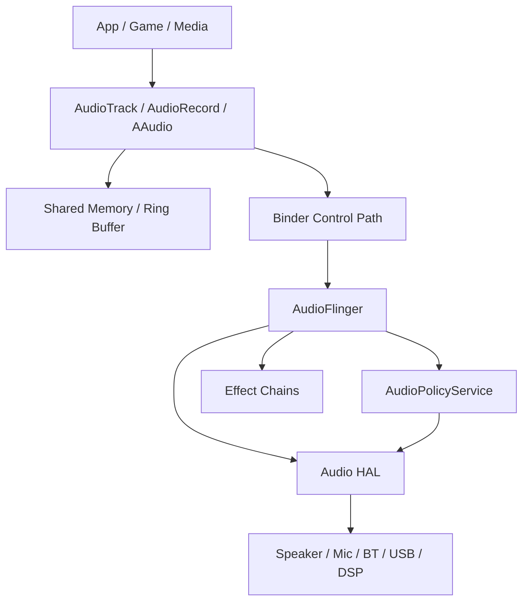

# 第 15 章：音频系统

Android 音频系统是 AOSP 中最强调低延迟、稳定路由与实时约束的子系统之一。它从应用层的 `AudioTrack`、`AudioRecord`、`MediaPlayer`、AAudio 与 Oboe 开始，向下经过共享内存、Binder 控制路径、AudioFlinger、AudioPolicyService、Audio HAL 与具体设备驱动，最终完成播放、录音、效果处理、蓝牙音频、空间音频和头部跟踪等能力。本章从 AOSP 源码视角梳理 Android 音频栈的体系结构、线程模型、共享内存设计、低延迟路径、HAL 演进与调试方法。

---

## 15.1 音频架构概览

### 15.1.1 全局图景

Android 音频栈可分为五层：

1. **应用 API 层**：`AudioTrack`、`AudioRecord`、`MediaPlayer`、`AAudio`、`Oboe`。
2. **Framework/native client 层**：`libaudioclient`、共享内存代理、路由与控制封装。
3. **服务层**：`AudioFlinger`、`AudioPolicyService`、`AAudioService`、effect service。
4. **HAL 层**：AIDL Audio HAL、effects HAL、Bluetooth audio。
5. **设备层**：Codec、DSP、麦克风、扬声器、蓝牙耳机、USB 音频设备。

Android 音频设计的核心目标是把**数据路径**做短、把**控制路径**做稳、把**实时线程**保护好，并在多种设备与路由策略下保持统一 API 语义。

### 15.1.2 进程与服务

| 进程/服务 | 主要职责 |
|-----------|----------|
| App process | 调用音频 API，生产或消费 PCM/压缩数据 |
| `audioserver` | 承载 AudioFlinger、AudioPolicyService 等核心服务 |
| `media.codec` / 其他媒体进程 | 编解码与媒体处理 |
| Bluetooth / vendor 进程 | 蓝牙与部分设备侧集成 |
| Audio HAL 进程 | 设备控制与数据路径桥接 |

### 15.1.3 信号流图



播放路径通常是应用写入共享内存，AudioFlinger 线程读取并混音后交给 HAL。控制路径如创建 track、改变路由、设置音量和效果，则通过 Binder 完成。

### 15.1.4 数据路径与控制路径

Android 音频明确区分两类路径：

- **数据路径**：高频、大吞吐、实时性敏感，尽量避免 Binder 拷贝，主要通过共享内存或 MMAP 完成。
- **控制路径**：低频、配置性强，负责 track 创建、路由、音量、会话、效果与策略判断，通常通过 Binder 调用。

这种分离是音频系统能同时兼顾灵活性与低延迟的核心设计。

### 15.1.5 共享内存架构

共享内存是 Android 音频低开销传输的基础。`AudioTrack` 和 `AudioRecord` 会与 AudioFlinger 建立共享缓冲区，应用线程与服务端线程各自维护读写指针，通过原子状态和控制块同步。

共享内存方案减少了每个 buffer 都经过 Binder 的成本，并允许服务端线程按实时节奏独立拉取或推送音频帧。

### 15.1.6 `audioserver` 进程

`audioserver` 是 Android 音频核心进程。它通常承载以下组件：

- `AudioFlinger`
- `AudioPolicyService`
- 部分效果管理与音频辅助服务
- 与媒体、蓝牙、空间音频集成的桥接能力

```rc
# From audioserver.rc (simplified)
service audioserver /system/bin/audioserver
    class core
    user audioserver
    group audio camera drmrpc inet media mediadrm net_bt net_bt_admin
    ioprio rt 4
    task_profiles ProcessCapacityHigh HighPerformance
```

这类配置体现出 `audioserver` 对实时调度、设备访问权限和系统稳定性的高要求。

### 15.1.7 线程类型概览

| 线程类型 | 主要用途 |
|----------|----------|
| `MixerThread` | 普通播放混音 |
| `FastMixer` | 低延迟快速混音路径 |
| `DirectOutputThread` | 直通输出或 offload |
| `RecordThread` | 录音采集 |
| `MmapThread` | MMAP 模式低延迟音频 |
| `SpatializerThread` | 空间音频处理 |
| Command / Policy 线程 | 路由和控制命令 |

### 15.1.8 延迟预算

音频延迟通常由以下部分组成：

1. App 生产或消费延迟。
2. 共享缓冲区积压。
3. AudioFlinger 线程周期与调度抖动。
4. HAL 缓冲与 DSP 处理延迟。
5. 设备侧物理与传输延迟，例如蓝牙链路。

低延迟路径努力把总延迟压缩到几十毫秒甚至更低，但会受硬件、HAL 与功耗策略约束。

### 15.1.9 音频格式支持

Android 音频系统支持 PCM、压缩格式、浮点、16-bit、24-bit/packed、32-bit 等多种格式，并支持不同 channel mask、sample rate 与 encoded stream 类型。系统在流建立阶段会判断是否需要格式转换、重采样和 downmix/upmix。

---

## 15.2 AudioFlinger

### 15.2.1 AudioFlinger 初始化

AudioFlinger 启动时会初始化硬件模块工厂、线程集合、音频补丁面板、效果系统、dump 支持和策略回调，并向 `audioserver` 中其他组件暴露 Binder 接口。

### 15.2.2 类层级

AudioFlinger 核心层级包括：

| 类 | 作用 |
|----|------|
| `AudioFlinger` | 服务主体 |
| `PlaybackThread` | 播放线程基类 |
| `MixerThread` | 通用混音播放线程 |
| `DirectOutputThread` | 直接输出或 offload |
| `RecordThread` | 录音线程 |
| `TrackBase` / `Track` | 播放轨对象 |
| `RecordTrack` | 录音轨对象 |
| `PatchPanel` | 路由 patch 管理 |
| `EffectChain` | 效果链 |

### 15.2.3 Binder 接口

AudioFlinger 通过 Binder 暴露 create/open/close/update 接口，典型能力包括：

- 创建 `AudioTrack` / `AudioRecord`
- 打开输出与输入流
- 获取路由/端口/patch 信息
- 设置主音量、模式、参数
- 管理会话、效果与调试 dump

### 15.2.4 Track 创建

`createTrack()` 是播放路径关键入口。它会校验参数、选择输出线程、分配共享内存控制块、创建 Track 对象，并返回给客户端可用的句柄和共享缓冲描述。

### 15.2.5 硬件模块加载

AudioFlinger 会通过硬件模块工厂打开对应 audio HAL module，枚举设备和配置，并为不同输出类型建立线程与 stream 对象。

### 15.2.6 `MixerThread` 循环

`MixerThread` 是最常见的播放线程。其循环通常执行：

1. 唤醒并检查活动 tracks。
2. 读取共享缓冲区中的 PCM 数据。
3. 执行音量、重采样、混音和效果处理。
4. 将混合结果写入 HAL stream。
5. 记录写入时序和状态。

### 15.2.7 `threadLoop_write()` 方法

`threadLoop_write()` 负责把一帧混音结果写入 HAL，并处理短写、错误码、standby 切换、睡眠补偿和时序统计。

### 15.2.8 Standby 管理

输出流空闲一段时间后可能进入 standby，以节省功耗。重新激活时需从 standby 恢复，可能引入额外延迟。低延迟场景通常要谨慎平衡 standby 策略。

### 15.2.9 Tracks

Track 表示单个播放源。它管理：

- session id
- format / channel / sample rate
- volume / mute / aux send
- shared buffer 指针
- active / paused / stopped 状态
- 与效果链和线程的关联

多个 track 可在同一 `MixerThread` 中混合。

### 15.2.10 FastMixer —— 低延迟路径

FastMixer 是 AudioFlinger 中的低延迟混音子系统，适用于小 buffer、固定格式、严格实时要求的流，如游戏、实时音频和部分通知场景。

#### FastMixer 线程循环

FastMixer 使用更短周期、更严格优先级和更少处理阶段，尽量避免复杂效果和重采样，以缩短从 app 写入到 HAL 输出的时间。

#### FastMixer 中的 Track 更新

为保证线程安全和实时性，FastMixer 通过快照或状态队列接收 track 变化，而不是在实时线程中执行复杂锁竞争与对象修改。

### 15.2.11 `PatchPanel` —— 音频路由

PatchPanel 管理 audio patch，用于把 source port 与 sink port 连接起来，支撑复杂输入输出拓扑、回采、USB/BT 切换和设备路由更新。

### 15.2.12 扩展声道与精度

AudioFlinger 支持多声道、浮点混音与更高精度数据格式。内部往往使用更高精度中间格式，以减少混音累积误差。

### 15.2.13 `createTrack()` 深入

深入看，`createTrack()` 会执行参数归一化、策略选择、fast path 资格判断、共享内存分配、session 和 effect 绑定、线程选择与权限校验等多个步骤。

### 15.2.14 `dump()` 系统

AudioFlinger 实现了丰富的 `dump()` 输出，帮助查看线程、tracks、latency、fast mixer 状态、effects、HAL stream 与统计信息，是调试音频问题的重要入口。

### 15.2.15 线程循环中的效果处理

Effect processing 可以插入在线程循环中的不同位置，例如 track 级别、session 级别或输出级别。效果链处理会改变 CPU 成本、延迟和线程结构。

### 15.2.16 写入时序与抖动跟踪

AudioFlinger 会记录写入周期、短写、休眠和实际时间偏差，用于识别调度抖动、HAL 阻塞和 underrun 风险。

### 15.2.17 `SpatializerThread`

SpatializerThread 负责空间音频的混音与处理，对声道布局、HRTF、头部姿态和输出设备特性进行综合处理。

### 15.2.18 `RecordThread`

`RecordThread` 负责从 HAL 输入流读取音频数据，执行必要格式转换、前处理与共享内存写入，并分发给客户端录音轨。

### 15.2.19 Suspended Output

在电话、焦点丢失、设备切换或策略限制下，某些输出可能进入 suspended 状态。此时线程与 track 仍存在，但音频不会正常送出。

### 15.2.20 `MelReporter` —— 声暴露监控

`MelReporter` 用于监控 Measured Exposure Level，与法规和听力安全要求相关。它会记录输出能量与暴露水平，并可与系统限制策略联动。

### 15.2.21 析构与资源清理

AudioFlinger 与线程销毁时需要清理 track、effect chain、HAL stream、共享缓冲和回调引用，确保不会留下活动线程和资源泄漏。

### 15.2.22 MMAP Stream 支持

为进一步降低延迟，AudioFlinger 支持 MMAP stream 场景，使数据路径更加接近硬件共享缓冲模式，适合专业音频和低延迟场景。

---

## 15.3 Audio Policy Service

### 15.3.1 架构

AudioPolicyService 负责路由、设备选择、音量策略、焦点与并发控制，是 Android 音频“决策层”。AudioFlinger 负责执行数据路径，PolicyService 决定应该走哪条路径。

### 15.3.2 初始化

初始化时，服务会创建 policy manager、读取配置、连接 HAL 能力、注册 Binder 接口并建立命令线程。

### 15.3.3 Policy Manager 创建

Policy manager 可为默认实现，也可由配置化 engine 或厂商扩展替代。它会解析 policy config，建立 volume group、device category、route 和 strategy 映射。

### 15.3.4 `AudioPolicyInterface`

该接口定义了路由、设备连接、音量、输入选择、patch、焦点相关操作，是 system_server 和 audioserver 之间的重要契约。

### 15.3.5 音频效果集成

PolicyService 与效果系统协作，在设备变化、场景切换和会话状态变化时注册或更新 effect 配置。

### 15.3.6 默认引擎与可配置引擎

Android 提供默认路由策略引擎，也支持更可配置的 engine，用于适配复杂设备拓扑、车载、电视或 OEM 定制需求。

### 15.3.7 Binder 方法

典型 Binder 方法包括设置设备连接状态、查询设备/端口、创建 patch、设置强制使用策略、更新音量与查询输出设备。

### 15.3.8 命令线程

AudioPolicyService 使用命令线程异步执行部分策略动作，避免 Binder 调用直接阻塞复杂路由变化或设备切换逻辑。

### 15.3.9 音量管理架构

音量管理通常基于 stream type、volume group、设备类别和曲线配置。策略层会将用户音量索引转换为设备相关增益值。

### 15.3.10 Audio Focus 与并发

音频焦点系统协调多应用并发播放。它决定谁可继续播放、谁需 duck、pause 或失去输出权限。虽然焦点上层入口在 framework Java 层，底层策略和路由仍与音频服务紧密相关。

### 15.3.11 Spatializer 集成

PolicyService 需要感知设备是否支持空间音频、是否存在头部跟踪和输出能力，以决定相关路由和能力上报。

---

## 15.4 AAudio

### 15.4.1 `AudioStream` 基类

AAudio 是面向低延迟音频的原生 API。其核心抽象是 `AudioStream`，统一表示播放或录音流，封装状态、回调、格式与底层实现差异。

### 15.4.2 Stream 架构

AAudio 可在两种大路径上运行：

- MMAP 低延迟路径
- Legacy fallback 路径

应用通过 builder 请求目标参数，系统根据设备与策略选择最终实现。

### 15.4.3 MMAP 模式

MMAP 模式通过共享缓冲和更接近硬件的时序提供更低延迟，适用于专业音频与游戏。前提是 HAL、设备与策略都允许。

### 15.4.4 Legacy Fallback

当 MMAP 不可用时，AAudio 会退回到更传统的 AudioTrack/AudioRecord 风格实现，但尽量保持 API 一致。

### 15.4.5 FIFO Buffer

AAudio 使用 FIFO 缓冲建模生产者-消费者关系，并通过读写索引、时间模型和 underflow/overflow 检测维持稳定传输。

### 15.4.6 `FlowGraph` —— 格式转换

FlowGraph 用于执行 sample rate、channel count 与 sample format 转换，把应用请求与底层实际配置之间的差异桥接起来。

### 15.4.7 AAudio Stream 状态

常见状态包括 uninitialized、open、starting、started、pausing、paused、flushing、stopped、disconnected 与 closed。

### 15.4.8 `AudioStreamBuilder` 模式

AAudio 使用 builder 模式设置 sample rate、channel count、format、sharing mode、performance mode、direction 和 callback，最终调用 `openStream()` 获取流对象。

### 15.4.9 AAudio 回调模式

AAudio 支持回调模式和阻塞读写模式。回调模式更适合低延迟持续流，要求应用提供实时安全的 callback 实现。

### 15.4.10 `IsochronousClockModel`

该时钟模型用于预测音频硬件时序，帮助把应用时间、帧位置与设备时钟对齐，以改善同步和 latency 估计。

### 15.4.11 指标与日志

AAudio 会记录 xruns、延迟、断开、模式选择和异常情况，用于开发调试与 CTS 验证。

---

## 15.5 Oboe Service（AAudioService）

### 15.5.1 服务架构

AAudioService 位于服务端，负责管理 AAudio 客户端连接、流对象、共享端点和 MMAP 资源仲裁。它常被 Oboe 和底层 AAudio API 使用。

### 15.5.2 打开流

服务端打开流时会校验请求、选择 endpoint、决定 MMAP 与 fallback、建立共享缓冲并返回客户端控制块。

### 15.5.3 MMAP Endpoint

MMAP endpoint 抽象一个底层低延迟音频端点，负责与 HAL 协调共享缓冲、同步时序和客户端附着。

### 15.5.4 Endpoint Stealing

当低延迟资源稀缺时，系统可能需要在不同客户端之间争用或“steal” endpoint，这要求策略上仔细处理优先级和断开语义。

### 15.5.5 MMAP Endpoint：`openWithConfig` 细节

该流程会校验性能模式、共享模式、sample rate、方向、格式和设备支持，最终决定是否允许 MMAP 建立。

### 15.5.6 Shared Endpoints

多个客户端可共享同一 endpoint，尤其在共享模式下。系统需维护每个客户端的读写边界和状态同步。

### 15.5.7 客户端跟踪

服务端会跟踪客户端 PID、UID、binder 死亡、stream 状态和资源占用，确保客户端异常退出时资源被回收。

### 15.5.8 共享环形缓冲

Shared ring buffer 是 AAudio/Oboe 服务的核心数据结构，支撑低拷贝与稳定时序推进。

---

## 15.6 音频效果

### 15.6.1 Effects Framework 架构

效果框架允许在播放或录音链路中插入 EQ、reverb、dynamics processing、virtualizer、visualizer 和 haptic generator 等效果模块。

### 15.6.2 `EffectBase` —— 效果状态机

`EffectBase` 管理效果的创建、初始化、启用、禁用、暂停、控制权转移和销毁，是效果对象的基类。

### 15.6.3 效果句柄与优先级

同一效果会话可被多个客户端持有 handle。系统通过优先级和 control owner 决定谁能真正改变效果参数。

### 15.6.4 策略注册

效果会与策略层注册，确保不同会话、设备和场景下的效果链布局合法且一致。

### 15.6.5 LVM（Listener Volume Manager）

LVM 用于监听音量变化相关处理，是 Android 传统效果组件之一。

### 15.6.6 `DynamicsProcessing`

该效果提供 EQ、压缩、限幅、噪声门等高级动态处理能力，适合更精细的音频后处理场景。

### 15.6.7 `Haptic Generator`

该效果可从音频信号提取或生成触觉反馈，用于与振动系统联动。

### 15.6.8 `Visualizer`

Visualizer 从会话中提取波形或频谱信息，用于可视化和轻量分析。

### 15.6.9 AIDL Effects Interface

新一代效果 HAL 使用 AIDL 定义接口，提升稳定性、可测试性与模块化能力。

### 15.6.10 `Eraser` Effect

Eraser 类效果用于特定录音/回放场景下的消除或校正处理，是较专用的效果类型。

### 15.6.11 `Downmix` Effect

Downmix 用于把多声道内容降混为更少声道，例如 5.1 到 stereo。

### 15.6.12 效果工厂与发现

系统通过 effect factory 发现可用效果模块，读取 descriptor，并按 UUID 与类型进行创建。

### 15.6.13 Device Effects

除会话级效果外，系统还可支持设备级效果，使某些处理直接绑定到特定输出或输入设备。

### 15.6.14 效果链处理

Effect chain 负责按固定顺序将多个效果串联到音频数据路径中。顺序、格式和实时预算都会影响最终效果和稳定性。

---

## 15.7 空间音频与头部跟踪

### 15.7.1 系统架构

空间音频系统综合使用播放器输出、设备能力、空间化处理器、头部姿态传感器和显示方向信息，为用户构建稳定的空间听感。

### 15.7.2 头部跟踪处理器

头部跟踪处理器负责接收传感器姿态、执行滤波和预测，并将姿态变化映射到音频渲染空间。

### 15.7.3 头部跟踪模式

常见模式包括关闭、相对世界坐标、相对屏幕坐标和设备相关模式。不同模式决定旋转参考系。

### 15.7.4 姿态预测

为了补偿传感器和渲染延迟，系统会进行 pose prediction，使听感变化更贴合真实头部运动。

### 15.7.5 自动重新居中

Auto-recentering 让空间参考系在长时间偏移后重新回到更自然的中心位置，避免用户感知漂移。

### 15.7.6 传感器姿态提供者

该组件负责与传感器框架交互，获取陀螺仪/头部姿态数据并转换为音频处理器可用坐标。

### 15.7.7 `Spatializer`（Native）

Native spatializer 负责实际空间音频算法执行，包括 HRTF、声道映射和姿态应用。

### 15.7.8 显示方向与速率限制

显示方向变化会改变“前方”参考系。系统还会对姿态更新频率进行限制，以平衡稳定性与 CPU 开销。

### 15.7.9 处理器内部状态

内部状态包括当前姿态、目标姿态、预测值、滤波历史、模式和校准信息。

### 15.7.10 空间音频处理管线

处理管线通常是：多声道输入 → 空间化算法 → 头部姿态补偿 → 设备相关后处理 → 双声道或耳机输出。

### 15.7.11 显示方向处理

当设备旋转或显示方向变化时，系统必须同步调整参考空间，避免用户感知声场突然错位。

---

## 15.8 Audio HAL

### 15.8.1 HAL 演进

Android Audio HAL 从早期 C 接口、HIDL，逐步演进到 AIDL。演进目标是接口稳定、类型安全、可测试、可模块化和可演化。

### 15.8.2 AIDL 核心接口：`IModule`

`IModule` 是 AIDL Audio HAL 的核心接口，负责公开模块能力、打开流、列举设备端口、创建 patch、设置参数和回调注册。

### 15.8.3 核心 AIDL 类型

常见类型包括：端口描述、流配置、共享内存描述、延迟模式、设备连接状态、音量曲线与 patch 对象。

### 15.8.4 Stream Descriptor 与共享内存

HAL 层的 stream descriptor 会包含共享内存区域、读写位置、状态位和同步原语，帮助服务与 HAL 高效交换音频数据。

### 15.8.5 Audio Patch 模型

Patch 模型把 source port 与 sink port 的连接显式化，适用于复杂设备拓扑、回采、通话和多设备场景。

### 15.8.6 从 HIDL 迁移到 AIDL

AIDL 迁移提升了接口稳定性和可维护性，也使 HAL 更容易与平台版本协同演进。

### 15.8.7 HAL 中的 MMAP 支持

HAL 若支持 MMAP，可向上层暴露更低延迟的数据通路和共享缓冲描述，是 AAudio 专业模式的关键前提。

### 15.8.8 蓝牙音频集成

蓝牙音频需处理编码、传输延迟、设备能力、A2DP/LE Audio 模式和策略切换。Audio HAL 与 Bluetooth stack 之间需要精确同步状态。

### 15.8.9 声暴露接口

声暴露接口允许 HAL 提供音量暴露、MEL 或相关安全数据，支撑听力保护功能。

### 15.8.10 VINTF 稳定性

AIDL Audio HAL 受 VINTF 稳定性约束，确保 framework 与 vendor 之间接口兼容。

### 15.8.11 默认 HAL 实现

AOSP 提供默认 HAL 实现与参考模块，帮助设备 bring-up 与 CTS 验证。

### 15.8.12 设备连接管理

HAL 需处理设备插拔、蓝牙连接、USB 变化与路由更新，并及时通知上层服务。

---

## 15.9 Native Audio APIs

### 15.9.1 `AudioTrack`（Native C++）

Native `AudioTrack` 是应用与 AudioFlinger 播放路径的核心客户端代理。

#### 最小帧数

最小帧数决定了 track 缓冲区下限，与 sample rate、线程周期和 latency 紧密相关。缓冲过小会更低延迟，但更容易 underrun。

#### 音高与速度

`AudioTrack` 支持 pitch 与 speed 控制，用于变速播放和轻量时间伸缩场景。

#### 关键操作

典型操作包括创建、start、stop、pause、flush、write、setVolume、getTimestamp 和释放资源。

### 15.9.2 `AudioRecord`（Native C++）

`AudioRecord` 是录音侧客户端代理，负责建立共享缓冲、读取录音数据、查询状态并与 AudioFlinger 的 `RecordThread` 协作。

### 15.9.3 `AudioSystem`

`AudioSystem` 是客户端侧的服务代理集合，封装对 AudioFlinger 和 AudioPolicyService 的静态 Binder 访问。

### 15.9.4 `AudioTrack.java`（Java API）

Java `AudioTrack` 对应 native `AudioTrack`，增加生命周期封装、线程安全保护、回调、Builder API 与 Java 使用习惯适配。

### 15.9.5 `AudioTrack` 构造流程

Java 层构造后会通过 JNI 进入 native，调用 AudioSystem / AudioFlinger 创建 track，建立共享缓冲并返回 session、状态和控制块信息。

### 15.9.6 `AudioRecord` 构造流程

录音构造流程与播放类似，但目标是输入流、record track 和共享读路径。

### 15.9.7 `AudioSystem` 作为服务代理

`AudioSystem` 缓存服务句柄、处理 binder 重连、暴露静态方法，是 Java 与 native 多处调用音频服务的统一入口。

### 15.9.8 `VolumeShaper`

`VolumeShaper` 用于按曲线控制音量包络，可实现淡入淡出、duck 与自定义增益轨迹。

### 15.9.9 Offload Playback

Offload playback 允许压缩音频直接交由硬件/DSP 处理，减少 CPU 占用和功耗，适合长时间媒体播放。

### 15.9.10 Direct Playback

Direct playback 让流绕过通用混音路径直接连接输出设备，适合特定格式或高保真场景。

### 15.9.11 共享内存传输

无论 `AudioTrack` 还是 `AudioRecord`，共享内存传输都是高性能客户端路径的核心。

### 15.9.12 音量与增益管理

音量管理涵盖 track 音量、流音量、设备增益和软件/硬件增益结合。不同层级共同决定最终输出响度。

---

## 15.10 动手实践

### Exercise 1: Dump the Audio System State

```bash
# Dump AudioFlinger state
adb shell dumpsys media.audio_flinger
# Dump AudioPolicy state
adb shell dumpsys media.audio_policy
# Dump AAudio service state
adb shell dumpsys media.aaudio
```

### Exercise 2: Trace an AudioTrack from Java to HAL

从 Java `AudioTrack` 开始，沿 JNI、`AudioSystem`、AudioFlinger `createTrack()`、PlaybackThread 和 HAL open stream 路径逐层跟踪。

### Exercise 3: Observe the FastMixer

```bash
# Check if FastMixer is active
adb shell dumpsys media.audio_flinger | grep -i FastMixer
```

### Exercise 4: List Audio Devices and Patches

```bash
# List audio ports
adb shell dumpsys media.audio_policy | grep -i port
# List audio patches
adb shell dumpsys media.audio_policy | grep -i patch
```

### Exercise 5: AAudio MMAP Detection

```bash
# Check MMAP policy
adb shell dumpsys media.aaudio | grep -i mmap
# Check AAudio configuration
adb shell dumpsys media.aaudio
```

### Exercise 6: Audio Effects Inspection

```bash
# List available effects
adb shell dumpsys media.audio_flinger | grep -i effect
# List effects on a specific session
adb shell dumpsys media.audio_flinger
```

### Exercise 7: Build and Run AAudio CTS Tests

```bash
# Build AAudio tests
m CtsNativeMediaAAudioTestCases
# Run AAudio tests
atest CtsNativeMediaAAudioTestCases
```

### Exercise 8: Monitor Sound Dose

```bash
# Check MEL (Measured Exposure Level) reporting
adb shell dumpsys media.audio_flinger | grep -i mel
```

### Exercise 9: Spatial Audio Testing

```bash
# Check spatializer status
adb shell dumpsys media.audio_policy | grep -i spatial
# Check head tracking status
adb shell dumpsys media.audio_policy | grep -i head
```

### Exercise 10: Write a Minimal AAudio Application

可基于 NDK AAudio API 创建最小播放或录音应用，验证 builder、callback 与 MMAP 模式选择。

```bp
# Android.bp
cc_binary {
    name: "aaudio-demo",
    srcs: ["main.cpp"],
    shared_libs: ["libaaudio", "liblog"],
}
```

### Exercise 11: Inspect Audio Policy Configuration

```bash
# Find the audio policy configuration file
adb shell find /vendor /system -name '*audio_policy*.xml'
# Read it
adb shell cat /vendor/etc/audio_policy_configuration.xml
```

### Exercise 12: Explore the AAudio FIFO

通过 trace 或调试日志观察 FIFO 深度变化、xrun 和 callback 周期。

### Exercise 13: Monitor Effect Chain Activity

```bash
# Watch effect chains in real-time
adb logcat | grep -i AudioFlinger
```

### Exercise 14: Capture Audio Policy Decisions

```bash
# Enable verbose audio policy logging
adb shell setprop log.tag.AudioPolicyManager VERBOSE
# Watch the log for routing decisions
adb logcat | grep -i AudioPolicy
```

### Exercise 15: Measure Audio Round-Trip Latency

```bash
# Install OboeTester (from the Oboe repository)
```

使用 OboeTester 等工具测量从扬声器输出到麦克风回采的 round-trip latency。

### Exercise 16: Observe Thread Scheduling

```bash
# Check audio thread priorities
adb shell ps -T -p $(adb shell pidof audioserver)
# Check real-time priorities
adb shell dumpsys media.audio_flinger | grep -i priority
```

### Exercise 17: Inspect AIDL Audio HAL

```bash
# Check if AIDL HAL is running
adb shell ps -A | grep -i audio
# Dump HAL state
adb shell dumpsys media.audio_policy
# List available audio ports from HAL
adb shell dumpsys media.audio_policy | grep -i port
```

### Exercise 18: Head Tracking Debug

```bash
# Check head tracking sensor status
adb shell dumpsys media.audio_policy | grep -i tracking
# Check pose data
adb shell dumpsys media.audio_policy | grep -i pose
```

### Exercise 19: Monitor MMAP Stream Health

```bash
# Check active MMAP streams
adb shell dumpsys media.aaudio | grep -i mmap
# Check endpoint state
adb shell dumpsys media.aaudio
```

### Exercise 20: Audio HAL Latency Modes

```bash
# Check supported latency modes
adb shell dumpsys media.audio_policy | grep -i latency
# Check current latency mode
adb shell dumpsys media.audio_flinger | grep -i latency
```

---

## 15.11 调试与性能分析

### 15.11.1 Audio System Properties

系统属性可控制日志级别、低延迟策略、效果调试和部分实验特性，是调试音频系统的重要开关。

### 15.11.2 Media Metrics

Media metrics 记录音频会话、设备、错误、延迟和性能数据，为调试和产品质量分析提供基础。

### 15.11.3 Systrace 集成

Systrace/Perfetto 可展示 audio thread 周期、AudioFlinger 工作段、Binder 调用和调度延迟，是定位 underrun 与抖动的重要工具。

### 15.11.4 Mutex 统计

锁争用会直接破坏实时线程稳定性。统计 mutex 等待时间有助于发现 AudioFlinger、Policy 和 HAL 之间的锁热点。

### 15.11.5 常见音频问题

常见问题包括：

- underrun / overrun
- 路由错误
- 蓝牙延迟过高
- sample rate 不匹配
- fast path 未命中
- 线程优先级不足
- 效果链过重

### 15.11.6 `TimerQueue`

TimerQueue 用于音频系统中部分延时操作、超时控制与后台任务调度。

### 15.11.7 PowerManager 集成

音频系统会与 PowerManager 协作，以管理唤醒锁、设备待机、音频活跃状态和低功耗策略。

### 15.11.8 `TimeCheck` 看门狗

TimeCheck watchdog 用于检测耗时过长的音频操作，帮助发现 HAL 卡死、策略阻塞或死锁风险。

### 15.11.9 死锁检测

音频系统中的多线程锁层次复杂。死锁检测机制与调试日志有助于发现线程间循环等待。

### 15.11.10 内存泄漏检测

音频资源包括 track、effect、HAL stream、共享缓冲与 Binder 引用。泄漏检测对长期稳定性至关重要。

### 15.11.11 电池归因

系统需要知道哪个 UID 在持续播放、录音或占用低延迟资源，以便进行功耗归因与限制。

### 15.11.12 性能基准

关键基准包括启动延迟、回放延迟、round-trip latency、CPU 占用、xrun 率和蓝牙模式切换时延。

---

## Summary

## 总结

Android 音频系统围绕几个核心原则构建：

| 原则 | 体现 |
|------|------|
| 数据路径低开销 | 共享内存、MMAP、fast mixer |
| 控制路径可扩展 | Binder + 策略层 + HAL 接口 |
| 路由与执行分离 | AudioPolicyService 决策，AudioFlinger 执行 |
| 实时线程优先 | 专用线程、高优先级、低锁争用 |
| HAL 稳定演进 | HIDL 到 AIDL，VINTF 约束 |
| 功能模块化 | 效果、空间音频、蓝牙、MMAP 各自演进 |

Android 音频栈主要组件关系如下：

| 组件 | 作用 |
|------|------|
| `AudioFlinger` | 播放/录音执行、混音、共享内存协调 |
| `AudioPolicyService` | 路由、设备选择、音量与策略 |
| `AAudio` / `AAudioService` | 低延迟原生 API 与服务端支持 |
| Effects Framework | 音效链与效果控制 |
| Spatializer | 空间音频与头部跟踪处理 |
| Audio HAL | 连接 framework 与具体设备 |
| `AudioTrack` / `AudioRecord` | 客户端基础 API |

### Source File Reference

| 路径 | 用途 |
|------|------|
| `frameworks/av/services/audioflinger/` | AudioFlinger 核心实现 |
| `frameworks/av/services/audiopolicy/` | AudioPolicyService 与策略实现 |
| `frameworks/av/media/libaudioclient/` | 客户端代理 |
| `frameworks/av/media/libaaudio/` | AAudio 客户端 |
| `frameworks/av/services/oboeservice/` | AAudio/Oboe 服务 |
| `hardware/interfaces/audio/aidl/` | Audio HAL AIDL 接口 |
| `frameworks/av/media/libeffects/` | 效果框架实现 |

### Component Counts

音频系统由大量线程、track、effect chain、端口、patch 和设备组合构成，其运行时拓扑会随应用、设备和路由策略动态变化。

### Key Concepts Glossary

| 术语 | 说明 |
|------|------|
| AudioFlinger | 音频执行服务 |
| AudioPolicyService | 音频策略服务 |
| FastMixer | 低延迟混音线程 |
| MMAP | 低延迟共享映射路径 |
| Track | 播放或录音轨对象 |
| Effect Chain | 串联效果处理链 |
| Audio Patch | 源端口到汇端口的连接 |
| Spatializer | 空间音频处理组件 |
| MEL | 声暴露级别监测 |
| Offload | 硬件/DSP 直通处理 |

### Architecture Decision Record

音频系统的关键架构决策集中体现在三点：

1. **共享内存 + Binder 分离路径**。
2. **策略与执行解耦**。
3. **实时线程与普通控制线程严格区分**。

这些决策共同支撑了 Android 在多设备、多应用并发和复杂路由条件下仍能保持音频稳定性的能力。

### Further Reading

建议继续阅读媒体、蓝牙、传感器与空间音频相关章节，以建立更完整的跨子系统理解。
