# Chapter 15: Audio System

The Android audio stack is one of the most performance-critical subsystems in
AOSP. It must deliver audio samples from Java applications all the way to
hardware DACs with deterministic latency, while simultaneously supporting
effects processing, policy-driven routing, spatial audio with head tracking,
and low-latency MMAP paths for professional-grade recording. This chapter
traces every layer of the stack from the Java `AudioTrack` API down to the
Audio HAL silicon interface, using the actual source files from the AOSP tree.

The core audio services live under `frameworks/av/` and consist of roughly
50,000 lines of C++ in AudioFlinger alone, plus another 30,000 lines spanning
the Audio Policy engine, AAudio/Oboe service, effects library, and head
tracking pipeline. We will read key data structures, follow the mixing thread
loop line by line, and explain every optimization -- from the FastMixer that
runs at SCHED_FIFO priority 3, to the MMAP zero-copy path that bypasses
AudioFlinger entirely.

---

## 15.1 Audio Architecture Overview

### 15.1.1 The Big Picture

Android's audio system is a layered pipeline. Audio data flows from application
code through multiple process boundaries before reaching the hardware:

```
Application (Java / NDK)
       |
       v
AudioTrack / AAudio  (client library, in app process)
       |  Binder IPC
       v
AudioFlinger         (audioserver process -- mixing, effects)
       |  HAL interface
       v
Audio HAL            (vendor process or same process via HIDL/AIDL)
       |
       v
Hardware (codec / DSP / DAC)
```

The Audio Policy Service runs alongside AudioFlinger in the `audioserver`
process. It does not touch audio data; it makes routing decisions -- which
output device to use, which effects to apply, and how to handle volume.

### 15.1.2 Processes and Services

The `audioserver` process hosts three primary services:

| Service | Binder interface | Source |
|---------|-----------------|--------|
| AudioFlinger | `IAudioFlinger` | `frameworks/av/services/audioflinger/AudioFlinger.cpp` (5,126 lines) |
| AudioPolicyService | `IAudioPolicyService` | `frameworks/av/services/audiopolicy/service/AudioPolicyService.cpp` (2,790 lines) |
| AAudioService | `IAAudioService` | `frameworks/av/services/oboeservice/AAudioService.cpp` (472 lines) |

AudioFlinger is registered first:

```cpp
// AudioFlinger.cpp, line 293-298
void AudioFlinger::instantiate() {
    sp<IServiceManager> sm(defaultServiceManager());
    sm->addService(String16(IAudioFlinger::DEFAULT_SERVICE_NAME),
                   new AudioFlingerServerAdapter(new AudioFlinger()), false,
                   IServiceManager::DUMP_FLAG_PRIORITY_DEFAULT);
}
```

### 15.1.3 Signal Flow Diagram

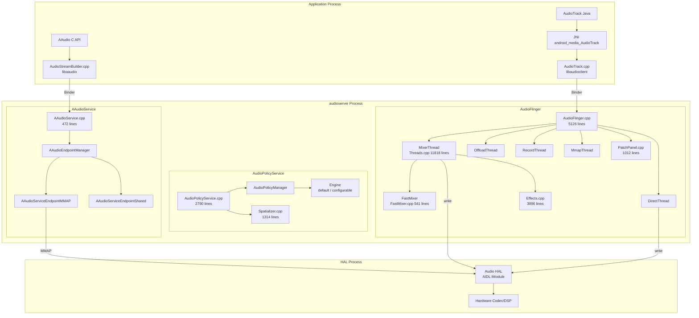
```mermaid
graph TB
    subgraph "Application Process"
        AT[AudioTrack Java]
        AAudio[AAudio C API]
        AT --> JNI[JNI android_media_AudioTrack]
        JNI --> ATC["AudioTrack.cpp<br/>libaudioclient"]
        AAudio --> ASB["AudioStreamBuilder.cpp<br/>libaaudio"]
    end

    subgraph "audioserver Process"
        subgraph "AudioFlinger"
            AF["AudioFlinger.cpp<br/>5126 lines"]
            MT["MixerThread<br/>Threads.cpp 11818 lines"]
            FM["FastMixer<br/>FastMixer.cpp 541 lines"]
            DT[DirectThread]
            OT[OffloadThread]
            RT[RecordThread]
            MMAP[MmapThread]
            EFX["Effects.cpp<br/>3896 lines"]
            PP["PatchPanel.cpp<br/>1012 lines"]
        end

        subgraph "AudioPolicyService"
            APS["AudioPolicyService.cpp<br/>2790 lines"]
            APM[AudioPolicyManager]
            ENG["Engine<br/>default / configurable"]
            SPAT["Spatializer.cpp<br/>1314 lines"]
        end

        subgraph "AAudioService"
            AAS["AAudioService.cpp<br/>472 lines"]
            EPM[AAudioEndpointManager]
            EPMMAP[AAudioServiceEndpointMMAP]
            EPSHARED[AAudioServiceEndpointShared]
        end
    end

    subgraph "HAL Process"
        HAL["Audio HAL<br/>AIDL IModule"]
        HW[Hardware Codec/DSP]
    end

    ATC -->|Binder| AF
    ASB -->|Binder| AAS
    AF --> MT
    AF --> DT
    AF --> OT
    AF --> RT
    AF --> MMAP
    MT --> FM
    MT --> EFX
    AF --> PP
    APS --> APM
    APM --> ENG
    APS --> SPAT
    AAS --> EPM
    EPM --> EPMMAP
    EPM --> EPSHARED
    EPMMAP -->|MMAP| HAL
    MT -->|write| HAL
    DT -->|write| HAL
    HAL --> HW
```

### 15.1.4 Data Path vs. Control Path

There are two distinct paths through the audio system:

**Data path** -- The actual PCM samples. In the normal mixer path, data flows:

1. Application writes to a shared memory circular buffer (the "cblk").
2. AudioFlinger's MixerThread reads from all active tracks, mixes them.
3. The mixed result is written to the HAL output stream.

**Control path** -- Routing decisions, volume changes, device connections:

1. Application calls `AudioManager` (Java).
2. `AudioPolicyService` receives the request via Binder.
3. `AudioPolicyManager` makes the routing decision.
4. AudioFlinger is instructed to create/modify threads and patches.

### 15.1.5 Shared Memory Architecture

All audio data transfer between client and server uses shared memory, not
Binder transactions. The key structure is `audio_track_cblk_t`, defined in:

```
frameworks/av/include/private/media/AudioTrackShared.h
```

This control block contains:

- A read position (server side) and write position (client side)
- Flags for underrun/overrun detection
- Volume and mute state
- A futex-based signaling mechanism for low-latency wake-up

The actual audio buffers sit in a separate shared memory region mapped into both
the client and server address spaces. This eliminates all data copies for the
transfer between processes.

### 15.1.6 The audioserver Process

The `audioserver` binary is the native daemon that hosts all audio services.
It starts early in the boot process, launched by init:

```
# From audioserver.rc (simplified)
service audioserver /system/bin/audioserver
    class core
    user audioserver
    group audio camera drmrpc media mediadrm net_bt net_bt_admin
    capabilities BLOCK_SUSPEND SYS_NICE
    ioprio rt 4
    task_profiles ProcessCapacityHigh HighPerformance
    onrestart restart vendor.audio-hal
```

Key aspects of the audioserver process:

- Runs as user `audioserver` with `audio` group permissions.
- Has `BLOCK_SUSPEND` capability for keeping the device awake during playback.
- Has `SYS_NICE` capability for setting real-time thread priorities.
- Uses `ioprio rt 4` for real-time I/O priority.
- Uses `ProcessCapacityHigh` and `HighPerformance` task profiles for CPU
  scheduling optimization.
- Restarting audioserver also restarts the vendor audio HAL.

The process structure:

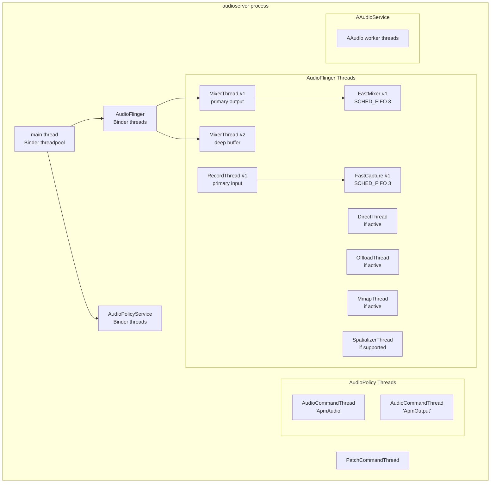
```mermaid
graph TB
    subgraph "audioserver process"
        MAIN["main thread<br/>Binder threadpool"]
        AF_BT["AudioFlinger<br/>Binder threads"]
        APS_BT["AudioPolicyService<br/>Binder threads"]

        subgraph "AudioFlinger Threads"
            M1["MixerThread #1<br/>primary output"]
            M2["MixerThread #2<br/>deep buffer"]
            D1["DirectThread<br/>if active"]
            O1["OffloadThread<br/>if active"]
            R1["RecordThread #1<br/>primary input"]
            FM1["FastMixer #1<br/>SCHED_FIFO 3"]
            FC1["FastCapture #1<br/>SCHED_FIFO 3"]
            MMAP1["MmapThread<br/>if active"]
            SPAT["SpatializerThread<br/>if supported"]
        end

        subgraph "AudioPolicy Threads"
            ACT["AudioCommandThread<br/>'ApmAudio'"]
            OCT["AudioCommandThread<br/>'ApmOutput'"]
        end

        subgraph "AAudioService"
            AAT[AAudio worker threads]
        end

        PCT[PatchCommandThread]
    end

    MAIN --> AF_BT
    MAIN --> APS_BT
    AF_BT --> M1
    AF_BT --> M2
    M1 --> FM1
    R1 --> FC1
```

### 15.1.7 Thread Types Overview

AudioFlinger creates different thread types depending on the output:

| Thread Type | Class | Purpose | Source location |
|------------|-------|---------|----------------|
| Mixer | `MixerThread` | Mix multiple PCM tracks | `Threads.cpp` line ~3700+ |
| Direct | `DirectOutputThread` | Single PCM or compressed track | `Threads.cpp` |
| Offload | `OffloadThread` | Hardware-compressed playback | `Threads.cpp` |
| Duplicating | `DuplicatingThread` | Mirror to multiple outputs | `Threads.cpp` |
| Record | `RecordThread` | Capture from input | `Threads.cpp` |
| Mmap | `MmapPlaybackThread` / `MmapCaptureThread` | MMAP zero-copy | `Threads.cpp` |
| Spatializer | `SpatializerThread` | Spatial audio mixing | `Threads.cpp` |

Each thread is associated with a HAL output or input stream and runs as a
high-priority real-time thread.

### 15.1.8 Latency Budget

Understanding the audio latency budget is critical for performance optimization.
Each stage in the pipeline contributes latency:

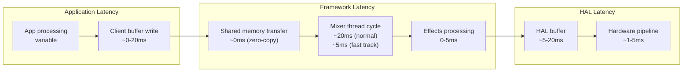
```mermaid
graph LR
    subgraph "Application Latency"
        A1["App processing<br/>variable"]
        A2["Client buffer write<br/>~0-20ms"]
    end

    subgraph "Framework Latency"
        F1["Shared memory transfer<br/>~0ms (zero-copy)"]
        F2["Mixer thread cycle<br/>~20ms (normal)<br/>~5ms (fast track)"]
        F3["Effects processing<br/>0-5ms"]
    end

    subgraph "HAL Latency"
        H1["HAL buffer<br/>~5-20ms"]
        H2["Hardware pipeline<br/>~1-5ms"]
    end

    A1 --> A2
    A2 --> F1
    F1 --> F2
    F2 --> F3
    F3 --> H1
    H1 --> H2
```

Total round-trip latency for different scenarios:

| Scenario | Typical Latency | Key Bottleneck |
|----------|----------------|----------------|
| MMAP exclusive (AAudio) | 1-5ms | HAL buffer size |
| Fast track (AudioTrack) | 10-20ms | FastMixer cycle |
| Normal mixer (AudioTrack) | 30-50ms | Mixer thread 20ms cycle |
| Offload (compressed) | 50-200ms | Hardware decode buffer |
| Bluetooth A2DP | 100-300ms | BT codec + transport |
| Bluetooth LE Audio | 30-80ms | LC3 codec |

### 15.1.9 Audio Format Support

Android supports a wide range of audio formats:

| Category | Formats |
|----------|---------|
| PCM | 16-bit, 24-bit packed, 32-bit, 8.24 fixed, float |
| Compressed lossy | MP3, AAC, AAC-LC, HE-AAC, Vorbis, Opus |
| Compressed lossless | FLAC, ALAC |
| Spatial | Dolby Atmos, DTS:X (passthrough) |
| Voice | AMR-NB, AMR-WB, EVS |

PCM formats flow through the mixer and effects chain. Compressed formats
may be decoded in software (via MediaCodec) before reaching AudioTrack,
or sent directly to the HAL for hardware decode (offload path).

---

## 15.2 AudioFlinger

AudioFlinger is the central mixing engine of Android audio. It is the single
most complex component in the audio stack, with the core implementation spread
across six source files totaling over 26,000 lines:

| File | Lines | Purpose |
|------|-------|---------|
| `AudioFlinger.cpp` | 5,126 | Service entry point, Binder methods |
| `Threads.cpp` | 11,818 | All thread loop implementations |
| `Tracks.cpp` | 3,976 | Track objects (playback, record, mmap) |
| `Effects.cpp` | 3,896 | Effect chain management |
| `PatchPanel.cpp` | 1,012 | Audio routing patches |
| `FastMixer.cpp` | 541 | Low-latency fast mixer path |

All files are under:
```
frameworks/av/services/audioflinger/
```

### 15.2.1 AudioFlinger Initialization

The `AudioFlinger` constructor is surprisingly simple. The heavy lifting
happens in `onFirstRef()`:

```cpp
// AudioFlinger.cpp, line 300-330
AudioFlinger::AudioFlinger()
{
    // Move the audio session unique ID generator start base as time passes
    // to limit risk of generating the same ID again after an audioserver restart.
    timespec ts{};
    clock_gettime(CLOCK_MONOTONIC, &ts);
    uint32_t movingBase = (uint32_t)std::max((long)1, ts.tv_sec);
    for (unsigned use = AUDIO_UNIQUE_ID_USE_UNSPECIFIED;
            use < AUDIO_UNIQUE_ID_USE_MAX; use++) {
        mNextUniqueIds[use] =
                ((use == AUDIO_UNIQUE_ID_USE_SESSION
                  || use == AUDIO_UNIQUE_ID_USE_CLIENT) ?
                    movingBase : 1) * AUDIO_UNIQUE_ID_USE_MAX;
    }
    BatteryNotifier::getInstance().noteResetAudio();
}
```

The session ID generator uses a monotonic time-based offset to avoid collisions
after audioserver restarts. This is critical because clients reuse previously
allocated session IDs when reconnecting.

In `onFirstRef()`, the factory-based device discovery begins:

```cpp
// AudioFlinger.cpp, line 332-353
void AudioFlinger::onFirstRef()
{
    audio_utils::lock_guard _l(mutex());
    mMode = AUDIO_MODE_NORMAL;
    mDeviceEffectManager = sp<DeviceEffectManager>::make(
            sp<IAfDeviceEffectManagerCallback>::fromExisting(this)),
    mDevicesFactoryHalCallback = new DevicesFactoryHalCallbackImpl;
    mDevicesFactoryHal->setCallbackOnce(mDevicesFactoryHalCallback);
    // ...
    mPatchPanel = IAfPatchPanel::create(
            sp<IAfPatchPanelCallback>::fromExisting(this));
    mMelReporter = sp<MelReporter>::make(
            sp<IAfMelReporterCallback>::fromExisting(this),
            mPatchPanel);
}
```

### 15.2.2 Class Hierarchy

AudioFlinger implements multiple callback interfaces through a diamond
inheritance pattern:

```cpp
// AudioFlinger.h, line 57-64
class AudioFlinger
    : public AudioFlingerServerAdapter::Delegate  // IAudioFlinger client interface
    , public IAfClientCallback
    , public IAfDeviceEffectManagerCallback
    , public IAfMelReporterCallback
    , public IAfPatchPanelCallback
    , public IAfThreadCallback
{
```

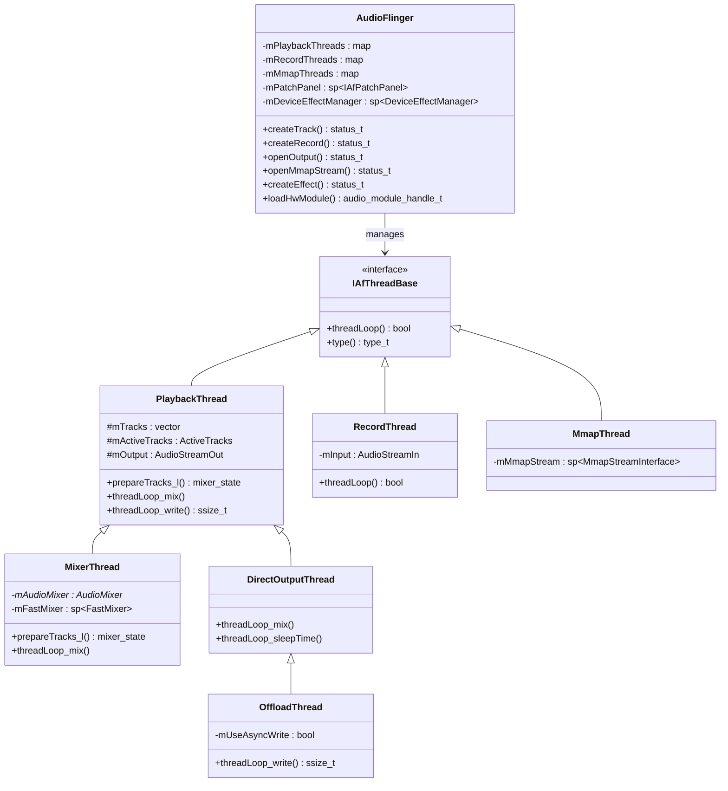
```mermaid
classDiagram
    class AudioFlinger {
        -mPlaybackThreads : map
        -mRecordThreads : map
        -mMmapThreads : map
        -mPatchPanel : sp~IAfPatchPanel~
        -mDeviceEffectManager : sp~DeviceEffectManager~
        +createTrack() status_t
        +createRecord() status_t
        +openOutput() status_t
        +openMmapStream() status_t
        +createEffect() status_t
        +loadHwModule() audio_module_handle_t
    }

    class IAfThreadBase {
        <<interface>>
        +threadLoop() bool
        +type() type_t
    }

    class PlaybackThread {
        #mTracks : vector
        #mActiveTracks : ActiveTracks
        #mOutput : AudioStreamOut
        +prepareTracks_l() mixer_state
        +threadLoop_mix()
        +threadLoop_write() ssize_t
    }

    class MixerThread {
        -mAudioMixer : AudioMixer*
        -mFastMixer : sp~FastMixer~
        +prepareTracks_l() mixer_state
        +threadLoop_mix()
    }

    class DirectOutputThread {
        +threadLoop_mix()
        +threadLoop_sleepTime()
    }

    class OffloadThread {
        -mUseAsyncWrite : bool
        +threadLoop_write() ssize_t
    }

    class RecordThread {
        -mInput : AudioStreamIn
        +threadLoop() bool
    }

    class MmapThread {
        -mMmapStream : sp~MmapStreamInterface~
    }

    AudioFlinger --> IAfThreadBase : manages
    IAfThreadBase <|-- PlaybackThread
    PlaybackThread <|-- MixerThread
    PlaybackThread <|-- DirectOutputThread
    DirectOutputThread <|-- OffloadThread
    IAfThreadBase <|-- RecordThread
    IAfThreadBase <|-- MmapThread
```

### 15.2.3 The Binder Interface

AudioFlinger exposes a rich Binder interface with over 50 methods. The complete
list is defined as a macro in `AudioFlinger.cpp`:

```cpp
// AudioFlinger.cpp, line 173-244
#define IAUDIOFLINGER_BINDER_METHOD_MACRO_LIST \
BINDER_METHOD_ENTRY(createTrack) \
BINDER_METHOD_ENTRY(createRecord) \
BINDER_METHOD_ENTRY(sampleRate) \
BINDER_METHOD_ENTRY(format) \
BINDER_METHOD_ENTRY(frameCount) \
BINDER_METHOD_ENTRY(latency) \
BINDER_METHOD_ENTRY(setMasterVolume) \
BINDER_METHOD_ENTRY(setMasterMute) \
// ... 40+ more entries
BINDER_METHOD_ENTRY(getSoundDoseInterface) \
BINDER_METHOD_ENTRY(getAudioPolicyConfig) \
BINDER_METHOD_ENTRY(getAudioMixPort) \
BINDER_METHOD_ENTRY(resetReferencesForTest) \
```

Each Binder method is tracked for statistics and performance profiling via the
`MethodStatistics` infrastructure.

### 15.2.4 Track Creation

When an application calls `new AudioTrack()`, the Binder `createTrack` method
is invoked. The key parameters (from `AudioFlinger.h` line 82-83):

```cpp
status_t createTrack(const media::CreateTrackRequest& input,
        media::CreateTrackResponse& output) final EXCLUDES_AudioFlinger_Mutex;
```

The request specifies audio attributes (usage, content type), format, sample
rate, channel mask, frame count, and flags. AudioFlinger:

1. Validates the attribution source (line 126-157 in AudioFlinger.cpp).
2. Asks AudioPolicyService for the correct output handle.
3. Finds or creates the appropriate playback thread.
4. Allocates shared memory for the track's audio buffer.
5. Creates a `Track` object and attaches it to the thread.

### 15.2.5 Hardware Module Loading

AudioFlinger loads HAL modules through a factory pattern. The well-known module
IDs are:

```cpp
// AudioFlinger.cpp, line 684-688
static const char * const audio_interfaces[] = {
    AUDIO_HARDWARE_MODULE_ID_PRIMARY,
    AUDIO_HARDWARE_MODULE_ID_A2DP,
    AUDIO_HARDWARE_MODULE_ID_USB,
};
```

The `findSuitableHwDev_l()` method (line 690) iterates through loaded HAL
modules to find one that supports the requested device type.

### 15.2.6 The MixerThread Loop

The MixerThread is where audio mixing happens. Its `threadLoop()` method in
`Threads.cpp` is the beating heart of Android audio. The loop follows this
structure:

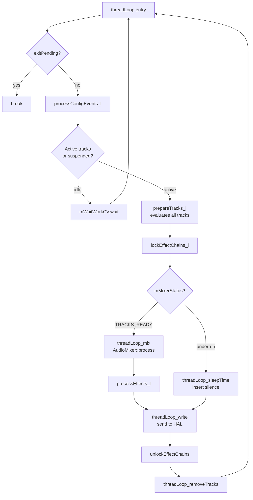
```mermaid
flowchart TB
    Start[threadLoop entry] --> Check{exitPending?}
    Check -->|yes| Exit[break]
    Check -->|no| Config[processConfigEvents_l]
    Config --> Standby{"Active tracks<br/>or suspended?"}
    Standby -->|idle| Wait[mWaitWorkCV.wait]
    Wait --> Start
    Standby -->|active| Prepare["prepareTracks_l<br/>evaluates all tracks"]
    Prepare --> Lock[lockEffectChains_l]
    Lock --> Mix{mMixerStatus?}
    Mix -->|TRACKS_READY| DoMix["threadLoop_mix<br/>AudioMixer::process"]
    Mix -->|underrun| Sleep["threadLoop_sleepTime<br/>insert silence"]
    DoMix --> Effects[processEffects_l]
    Effects --> Write["threadLoop_write<br/>send to HAL"]
    Write --> Unlock[unlockEffectChains]
    Unlock --> Remove[threadLoop_removeTracks]
    Remove --> Start
    Sleep --> Write
```

Key timing constants from `Threads.cpp`:

```cpp
// Threads.cpp, line 132-134
static const int8_t kMaxTrackRetries = 50;
static const int8_t kMaxTrackStartupRetries = 50;

// Threads.cpp, line 154
static const int32_t kMaxTrackRetriesDirectMs = 200;

// Threads.cpp, line 169
static const uint32_t kMinThreadSleepTimeUs = 5000;

// Threads.cpp, line 175-177
static const uint32_t kMinNormalSinkBufferSizeMs = 20;
static const uint32_t kMaxNormalSinkBufferSizeMs = 24;
```

The mixer loop runs on a ~20ms cycle. Each cycle:

1. **`prepareTracks_l()`** -- Evaluates all tracks, determines which are active,
   sets up the AudioMixer for each active track (sample rate, volume, format).
2. **`threadLoop_mix()`** -- Calls `AudioMixer::process()` which reads from all
   active track buffers and mixes into `mMixerBuffer`.
3. **`processEffects_l()`** -- Runs the effect chain on the mixed audio.
4. **`threadLoop_write()`** -- Writes the final buffer to the HAL.

### 15.2.7 The threadLoop_write() Method

The write path has two branches (from `Threads.cpp` line 3557-3616):

```cpp
// Threads.cpp, line 3557-3626
ssize_t PlaybackThread::threadLoop_write()
{
    LOG_HIST_TS();
    mInWrite = true;
    ssize_t bytesWritten;
    const size_t offset = mCurrentWriteLength - mBytesRemaining;

    // If an NBAIO sink is present, use it to write the normal mixer's submix
    if (mNormalSink != 0) {
        const size_t count = mBytesRemaining / mFrameSize;
        ATRACE_BEGIN("write");
        // update the setpoint when AudioFlinger::mScreenState changes
        const uint32_t screenState = mAfThreadCallback->getScreenState();
        if (screenState != mScreenState) {
            mScreenState = screenState;
            MonoPipe *pipe = (MonoPipe *)mPipeSink.get();
            if (pipe != NULL) {
                pipe->setAvgFrames((mScreenState & 1) ?
                        (pipe->maxFrames() * 7) / 8 : mNormalFrameCount * 2);
            }
        }
        ssize_t framesWritten = mNormalSink->write(
                (char *)mSinkBuffer + offset, count);
        ATRACE_END();
        // ...
    } else {
        // Direct output and offload threads
        ATRACE_BEGIN("write");
        bytesWritten = mOutput->write(
                (char *)mSinkBuffer + offset, mBytesRemaining);
        ATRACE_END();
    }
    // ...
}
```

For mixer threads, the write goes through an NBAIO (Non-Blocking Audio I/O)
`MonoPipe` to the FastMixer. For direct and offload threads, it writes directly
to the HAL stream.

The screen state optimization is notable: when the screen is on, the pipe's
average frame setpoint is raised to 7/8 of maximum, reducing the chance of
underruns during UI activity. When the screen is off, it drops to 2x the
normal frame count to save power.

### 15.2.8 Standby Management

Threads enter standby after a configurable delay (default 3 seconds):

```cpp
// Threads.cpp, line 252-262
static const nsecs_t kDefaultStandbyTimeInNsecs = seconds(3);

static nsecs_t getStandbyTimeInNanos() {
    static nsecs_t standbyTimeInNanos = []() {
        const int ms = property_get_int32(
                "ro.audio.flinger_standbytime_ms",
                kDefaultStandbyTimeInNsecs / NANOS_PER_MILLISECOND);
        ALOGI("%s: Using %d ms as standby time", __func__, ms);
        return milliseconds(ms);
    }();
    return standbyTimeInNanos;
}
```

In standby, the thread releases the HAL stream and stops its wake lock, saving
significant power. The standby delay for offloaded output is shorter:

```cpp
// Threads.cpp, line 184
static const nsecs_t kOffloadStandbyDelayNs = seconds(1);
```

### 15.2.9 Tracks

Track objects represent individual audio streams within a thread. The base
class `TrackBase` is defined in `Tracks.cpp`:

```cpp
// Tracks.cpp, line 89-138
TrackBase::TrackBase(
        IAfThreadBase *thread,
            const sp<Client>& client,
            const audio_attributes_t& attr,
            uint32_t sampleRate,
            audio_format_t format,
            audio_channel_mask_t channelMask,
            size_t frameCount,
            void *buffer,
            size_t bufferSize,
            audio_session_t sessionId,
            pid_t creatorPid,
            uid_t clientUid,
            bool isOut,
            const alloc_type alloc,
            track_type type,
            audio_port_handle_t portId,
            std::string metricsId)
    : mThread(thread),
      mAllocType(alloc),
      mClient(client),
      mCblk(NULL),
      mState(IDLE),
      mAttr(attr),
      mSampleRate(sampleRate),
      mFormat(format),
      mChannelMask(channelMask),
      mChannelCount(isOut ?
              audio_channel_count_from_out_mask(channelMask) :
              audio_channel_count_from_in_mask(channelMask)),
      mFrameSize(audio_bytes_per_frame(mChannelCount, format)),
      mFrameCount(frameCount),
      mSessionId(sessionId),
      // ...
```

Each track has a unique ID generated atomically:

```cpp
// Tracks.cpp, line 86
static volatile int32_t nextTrackId = 55;
```

The Track hierarchy is:

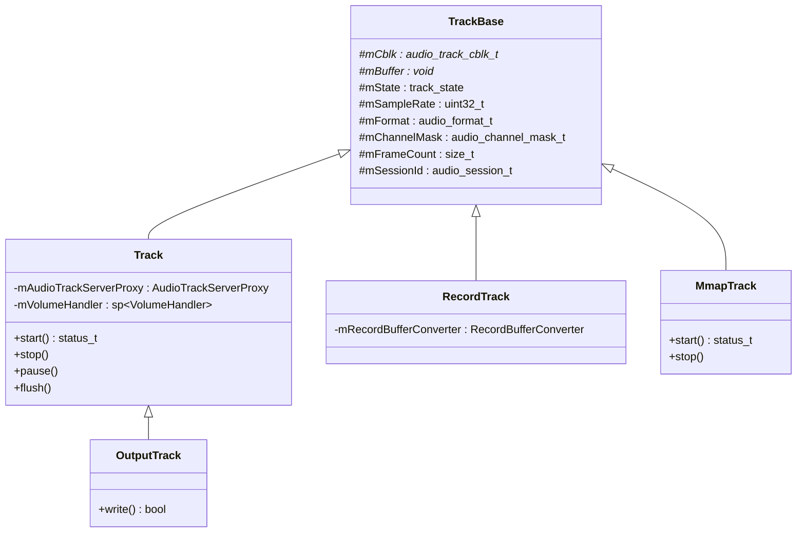
```mermaid
classDiagram
    class TrackBase {
        #mCblk : audio_track_cblk_t*
        #mBuffer : void*
        #mState : track_state
        #mSampleRate : uint32_t
        #mFormat : audio_format_t
        #mChannelMask : audio_channel_mask_t
        #mFrameCount : size_t
        #mSessionId : audio_session_t
    }

    class Track {
        -mAudioTrackServerProxy : AudioTrackServerProxy
        -mVolumeHandler : sp~VolumeHandler~
        +start() status_t
        +stop()
        +pause()
        +flush()
    }

    class OutputTrack {
        +write() bool
    }

    class RecordTrack {
        -mRecordBufferConverter : RecordBufferConverter
    }

    class MmapTrack {
        +start() status_t
        +stop()
    }

    TrackBase <|-- Track
    TrackBase <|-- RecordTrack
    TrackBase <|-- MmapTrack
    Track <|-- OutputTrack
```

### 15.2.10 FastMixer -- The Low-Latency Path

The FastMixer is a separate high-priority thread that bypasses the normal mixer
loop for latency-sensitive tracks. It is defined in:

```
frameworks/av/services/audioflinger/fastpath/FastMixer.cpp (541 lines)
```

The FastMixer design rules are strict (from the source header comment):

```cpp
// FastMixer.cpp, line 17-21
// <IMPORTANT_WARNING>
// Design rules for threadLoop() are given in the comments at section
// "Fast mixer thread" of StateQueue.h.  In particular, avoid library
// and system calls except at well-known points.
// </IMPORTANT_WARNING>
```

The FastMixer is configured with one of four policies:

```cpp
// Threads.cpp, line 202-216
static const enum {
    FastMixer_Never,    // never initialize or use: for debugging only
    FastMixer_Always,   // always initialize and use, even if not needed
    FastMixer_Static,   // initialize if needed, then use all the time
    FastMixer_Dynamic,  // initialize if needed, then use dynamically
} kUseFastMixer = FastMixer_Static;
```

The default is `FastMixer_Static`: once initialized, the FastMixer runs
continuously. The priorities are:

```cpp
// Threads.cpp, line 226-228
static const int kPriorityAudioApp = 2;
static const int kPriorityFastMixer = 3;
static const int kPriorityFastCapture = 3;
```

Fast track multiplier controls the shared buffer size:

```cpp
// Threads.cpp, line 237-244
static const int kFastTrackMultiplier = 2;
static const int kFastTrackMultiplierMin = 1;
static const int kFastTrackMultiplierMax = 2;
static int sFastTrackMultiplier = kFastTrackMultiplier;
```

#### FastMixer Thread Loop

The FastMixer's `onWork()` method (line 328) is the tight inner loop:

```cpp
// FastMixer.cpp, line 328-333
void FastMixer::onWork()
{
    const FastMixerState * const current =
            (const FastMixerState *) mCurrent;
    FastMixerDumpState * const dumpState =
            (FastMixerDumpState *) mDumpState;
```

It processes three commands:

- `MIX` -- mix tracks into the mixer buffer
- `WRITE` -- write the buffer to the output sink
- `MIX_WRITE` -- both operations combined

When the output configuration changes, the FastMixer reconfigures:

```cpp
// FastMixer.cpp, line 245-270
if (frameCount > 0 && mSampleRate > 0) {
    mMixer = new AudioMixer(frameCount, mSampleRate);
    // ...
    mPeriodNs = (frameCount * 1000000000LL) / mSampleRate;     // 1.00
    mUnderrunNs = (frameCount * 1750000000LL) / mSampleRate;   // 1.75
    mOverrunNs = (frameCount * 500000000LL) / mSampleRate;     // 0.50
    mForceNs = (frameCount * 950000000LL) / mSampleRate;       // 0.95
    mWarmupNsMin = (frameCount * 750000000LL) / mSampleRate;   // 0.75
    mWarmupNsMax = (frameCount * 1250000000LL) / mSampleRate;  // 1.25
}
```

These timing thresholds define when the FastMixer considers a cycle to be an
underrun (1.75x period) or overrun (0.5x period).

#### Track Update in FastMixer

Individual tracks are updated in `updateMixerTrack()`:

```cpp
// FastMixer.cpp, line 123-191
void FastMixer::updateMixerTrack(int index, Reason reason) {
    // ...
    switch (reason) {
    case REASON_REMOVE:
        mMixer->destroy(index);
        break;
    case REASON_ADD: {
        const status_t status = mMixer->create(
                index, fastTrack->mChannelMask,
                fastTrack->mFormat, AUDIO_SESSION_OUTPUT_MIX);
        // ...
    }
        [[fallthrough]];
    case REASON_MODIFY:
        mMixer->setBufferProvider(index, fastTrack->mBufferProvider);
        // set volume, resample, format, channel mask, haptic parameters
        mMixer->enable(index);
        break;
    }
}
```

The volume comes from the track's `VolumeProvider`:

```cpp
// FastMixer.cpp, line 155-161
float vlf, vrf;
if (fastTrack->mVolumeProvider != nullptr) {
    const gain_minifloat_packed_t vlr =
            fastTrack->mVolumeProvider->getVolumeLR();
    vlf = float_from_gain(gain_minifloat_unpack_left(vlr));
    vrf = float_from_gain(gain_minifloat_unpack_right(vlr));
} else {
    vlf = vrf = AudioMixer::UNITY_GAIN_FLOAT;
}
```

### 15.2.11 PatchPanel -- Audio Routing

The PatchPanel manages audio routing patches between sources and sinks:

```
frameworks/av/services/audioflinger/PatchPanel.cpp (1,012 lines)
```

A patch connects audio ports -- it can be device-to-device (hardware patch),
device-to-mix, or mix-to-device. The creation logic handles several scenarios:

```cpp
// PatchPanel.cpp, line 112-135
status_t PatchPanel::createAudioPatch_l(
        const struct audio_patch* patch,
        audio_patch_handle_t *handle,
        bool endpointPatch)
{
    // ...
    if (!audio_patch_is_valid(patch) ||
            (patch->num_sinks == 0 && patch->num_sources != 2)) {
        return BAD_VALUE;
    }
    // limit number of sources to 1 for now or 2 sources for
    // special cross hw module case.
    if (patch->num_sources > 2) {
        return INVALID_OPERATION;
    }
```

The special case of 2 sources handles cross-hw-module routing, where audio
must be routed between two different HAL modules (e.g., primary to USB).

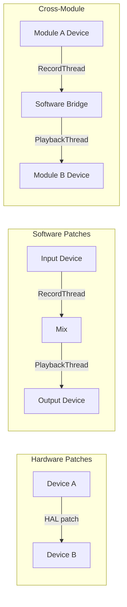
```mermaid
graph LR
    subgraph "Hardware Patches"
        D1[Device A] -->|HAL patch| D2[Device B]
    end

    subgraph "Software Patches"
        D3[Input Device] -->|RecordThread| Mix1[Mix]
        Mix1 -->|PlaybackThread| D4[Output Device]
    end

    subgraph "Cross-Module"
        D5[Module A Device] -->|RecordThread| SW[Software Bridge]
        SW -->|PlaybackThread| D6[Module B Device]
    end
```

### 15.2.12 Extended Channels and Precision

The MixerThread supports extended channel configurations beyond stereo:

```cpp
// Threads.cpp, line 267
constexpr bool kEnableExtendedChannels = true;
```

And extended precision formats:

```cpp
// Threads.cpp, line 301
constexpr bool kEnableExtendedPrecision = true;
```

Valid PCM sink formats (line 305-317):

```cpp
bool IAfThreadBase::isValidPcmSinkFormat(audio_format_t format) {
    switch (format) {
    case AUDIO_FORMAT_PCM_16_BIT:
        return true;
    case AUDIO_FORMAT_PCM_FLOAT:
    case AUDIO_FORMAT_PCM_24_BIT_PACKED:
    case AUDIO_FORMAT_PCM_32_BIT:
    case AUDIO_FORMAT_PCM_8_24_BIT:
        return kEnableExtendedPrecision;
    default:
        return false;
    }
}
```

### 15.2.13 The createTrack() Deep Dive

The full `createTrack()` implementation (line 1038 in `AudioFlinger.cpp`) shows
the complete track creation pipeline:

```cpp
// AudioFlinger.cpp, line 1038-1075
status_t AudioFlinger::createTrack(
        const media::CreateTrackRequest& _input,
        media::CreateTrackResponse& _output)
{
    ATRACE_CALL();
    CreateTrackInput input =
            VALUE_OR_RETURN_STATUS(CreateTrackInput::fromAidl(_input));
    CreateTrackOutput output;

    sp<IAfTrack> track;
    sp<Client> client;
    status_t lStatus;
    audio_stream_type_t streamType;
    audio_port_handle_t portId = AUDIO_PORT_HANDLE_NONE;
    std::vector<audio_io_handle_t> secondaryOutputs;
    bool isSpatialized = false;
    bool isBitPerfect = false;

    audio_io_handle_t effectThreadId = AUDIO_IO_HANDLE_NONE;
    std::vector<int> effectIds;
    audio_attributes_t localAttr = input.attr;
```

The method then validates the attribution source, allocates a session ID if
needed, and queries AudioPolicyService for the correct output:

```cpp
// AudioFlinger.cpp, line 1069-1091
    sessionId = input.sessionId;
    if (sessionId == AUDIO_SESSION_ALLOCATE) {
        sessionId = (audio_session_t)
                newAudioUniqueId(AUDIO_UNIQUE_ID_USE_SESSION);
    }

    lStatus = AudioSystem::getOutputForAttr(
            &localAttr, &output.outputId, sessionId,
            &streamType, adjAttributionSource,
            &input.config, input.flags,
            &selectedDeviceIds, &portId, &secondaryOutputs,
            &isSpatialized, &isBitPerfect);
```

After finding the output, it validates format and channel mask, locates the
playback thread, registers the client, and handles effect chain migration:

```cpp
// AudioFlinger.cpp, line 1114-1157
    {
        audio_utils::lock_guard _l(mutex());
        IAfPlaybackThread* thread =
                checkPlaybackThread_l(output.outputId);
        client = registerClient(
                adjAttributionSource.pid,
                adjAttributionSource.uid);

        // check if an effect chain with the same session ID is
        // present on another output thread and move it here
        for (const auto& [outputId, t] : mPlaybackThreads) {
            if (outputId != output.outputId) {
                uint32_t sessions =
                        t->hasAudioSession(sessionId);
                if (sessions & IAfThreadBase::EFFECT_SESSION) {
                    effectThread = t.get();
                    break;
                }
            }
        }

        track = thread->createTrack_l(client, streamType,
                localAttr, &output.sampleRate,
                input.config.format,
                input.config.channel_mask,
                &output.frameCount,
                &output.notificationFrameCount,
                input.notificationsPerBuffer, input.speed,
                input.sharedBuffer, sessionId,
                &output.flags, callingPid,
                adjAttributionSource,
                input.clientInfo.clientTid,
                &lStatus, portId,
                input.audioTrackCallback,
                isSpatialized, isBitPerfect,
                &output.afTrackFlags);
```

The output structure captures critical information about the thread's actual
configuration:

```cpp
// AudioFlinger.cpp, line 1161-1167
        output.afFrameCount = thread->frameCount();
        output.afSampleRate = thread->sampleRate();
        output.afChannelMask =
                static_cast<audio_channel_mask_t>(
                thread->channelMask() |
                thread->hapticChannelMask());
        output.afFormat = thread->format();
        output.afLatencyMs = thread->latency();
        output.portId = portId;
```

### 15.2.14 The dump() System

AudioFlinger's dump system is comprehensive, supporting selective debugging:

```cpp
// AudioFlinger.cpp, line 838-849
static void dump_printHelp(int fd) {
    constexpr static auto helpStr =
            "AudioFlinger dumpsys help options\n"
            "  -h/--help: Print this help text\n"
            "  --hal: Include dump of audio hal\n"
            "  --stats: Include call/lock/watchdog stats\n"
            "  --effects: Include effect definitions\n"
            "  --memory: Include memory dump\n"
            "  -a/--all: Print all except --memory\n"sv;
    write(fd, helpStr.data(), helpStr.length());
}
```

The dump method iterates through all thread types:

```cpp
// AudioFlinger.cpp, line 930-952
        // dump playback threads
        for (const auto& [_, thread] : mPlaybackThreads) {
            thread->dump(fd, args);
        }
        // dump record threads
        for (const auto& [_, thread] : mRecordThreads) {
            thread->dump(fd, args);
        }
        // dump mmap threads
        for (const auto& [_, thread] : mMmapThreads) {
            thread->dump(fd, args);
        }
        // dump orphan effect chains
        if (mOrphanEffectChains.size() != 0) {
            writeStr(fd, "  Orphan Effect Chains\n");
            for (const auto& [_, effectChain] :
                    mOrphanEffectChains) {
                effectChain->dump(fd, args);
            }
        }
```

It also dumps power management, mutex statistics, and memory state:

```cpp
// AudioFlinger.cpp, line 974-979
        dprintf(fd, "\n ## BEGIN power dump\n");
        writeStr(fd, media::psh_utils::AudioPowerManager::
                getAudioPowerManager().toString());
```

```cpp
// AudioFlinger.cpp, line 819-822
    writeStr(fd, audio_utils::mutex::all_stats_to_string());
    writeStr(fd, audio_utils::mutex::all_threads_to_string());
```

### 15.2.15 Effects Processing in the Thread Loop

The effects processing stage in the mixer thread loop deserves detailed
attention. After mixing, the effect chains are processed:

```cpp
// Threads.cpp, line 4322-4348
        if (mSleepTimeUs == 0 && mType != OFFLOAD) {
            for (size_t i = 0; i < effectChains.size(); i++) {
                effectChains[i]->process_l();
                // Handle haptic data from effect chain
                if (activeHapticSessionId != AUDIO_SESSION_NONE
                        && activeHapticSessionId ==
                           effectChains[i]->sessionId()) {
                    uint32_t hapticSessionChannelCount =
                            mEffectBufferValid ?
                            audio_channel_count_from_out_mask(
                                    mMixerChannelMask) :
                            mChannelCount;
                    const size_t audioBufferSize =
                            mNormalFrameCount *
                            audio_bytes_per_frame(
                                    hapticSessionChannelCount,
                                    AUDIO_FORMAT_PCM_FLOAT);
                    memcpy_by_audio_format(
                            (uint8_t*)effectChains[i]->outBuffer()
                                    + audioBufferSize,
                            AUDIO_FORMAT_PCM_FLOAT,
                            (const uint8_t*)effectChains[i]->inBuffer()
                                    + audioBufferSize,
                            AUDIO_FORMAT_PCM_FLOAT,
                            mNormalFrameCount * mHapticChannelCount);
                }
            }
        }
```

Haptic data is handled specially: it is copied directly from the effect input
buffer to the output buffer (bypassing the effect processing) because haptic
channels are generated by the HapticGenerator effect and should not be
processed by subsequent effects in the chain.

For offloaded tracks, effects are still processed even without audio data:

```cpp
// Threads.cpp, line 4350-4358
        if (mType == OFFLOAD) {
            for (size_t i = 0; i < effectChains.size(); i++) {
                effectChains[i]->process_l();
            }
        }
```

After effects processing, the effect buffer is copied to the sink buffer
with PCM float clamping for HAL safety:

```cpp
// Threads.cpp, line 4398-4405
                static constexpr float HAL_FLOAT_SAMPLE_LIMIT = 2.0f;
                memcpy_to_float_from_float_with_clamping(
                        static_cast<float*>(mSinkBuffer),
                        static_cast<const float*>(effectBuffer),
                        framesToCopy,
                        HAL_FLOAT_SAMPLE_LIMIT /* absMax */);
```

The clamping to +/- 2.0f protects against HALs that cannot handle NaN or
extremely large float values.

### 15.2.16 Write Timing and Jitter Tracking

After writing to the HAL, the thread loop tracks timing jitter:

```cpp
// Threads.cpp, line 4436-4476
                    const int64_t lastIoBeginNs = systemTime();
                    ret = threadLoop_write();
                    const int64_t lastIoEndNs = systemTime();
                    // ...
                    writePeriodNs = lastIoEndNs - mLastIoEndNs;

                    if (audio_has_proportional_frames(mFormat)) {
                        if (mMixerStatus == MIXER_TRACKS_READY &&
                                loopCount == lastLoopCountWritten + 1) {
                            const double jitterMs =
                                TimestampVerifier<int64_t, int64_t>::
                                    computeJitterMs(
                                        {frames, writePeriodNs},
                                        {0, 0}, mSampleRate);
                            const double processMs =
                                (lastIoBeginNs - mLastIoEndNs) * 1e-6;

                            audio_utils::lock_guard _l(mutex());
                            mIoJitterMs.add(jitterMs);
                            mProcessTimeMs.add(processMs);
                        }

                        // write blocked detection
                        const int64_t deltaWriteNs =
                                lastIoEndNs - lastIoBeginNs;
                        if ((mType == MIXER || mType == SPATIALIZER)
                                && deltaWriteNs > maxPeriod) {
                            mNumDelayedWrites++;
                            if ((lastIoEndNs - lastWarning) >
                                    kWarningThrottleNs) {
                                ATRACE_NAME("underrun");
                                ALOGW("write blocked for %lld msecs",
                                    (long long)deltaWriteNs /
                                    NANOS_PER_MILLISECOND);
                            }
                        }
                    }
```

This tracking is critical for debugging latency issues. The jitter
statistics and MonoPipe depth are available in the dumpsys output.

### 15.2.17 SpatializerThread

The `SpatializerThread` is a specialized `MixerThread` for spatial audio:

```cpp
// Threads.cpp, line 8006-8022
sp<IAfPlaybackThread> IAfPlaybackThread::createSpatializerThread(
        const sp<IAfThreadCallback>& afThreadCallback,
        AudioStreamOut* output,
        audio_io_handle_t id,
        bool systemReady,
        audio_config_base_t* mixerConfig) {
    return sp<SpatializerThread>::make(
            afThreadCallback, output, id,
            systemReady, mixerConfig);
}

SpatializerThread::SpatializerThread(
        const sp<IAfThreadCallback>& afThreadCallback,
        AudioStreamOut* output,
        audio_io_handle_t id,
        bool systemReady,
        audio_config_base_t *mixerConfig)
    : MixerThread(afThreadCallback, output, id,
                   systemReady, SPATIALIZER, mixerConfig)
{
}
```

It manages HAL latency modes for low-latency head tracking:

```cpp
// Threads.cpp, line 8024-8061
void SpatializerThread::setHalLatencyMode_l() {
    if (mSupportedLatencyModes.empty()) {
        return;
    }
    if (mActiveTracks.empty()) {
        return;
    }

    audio_latency_mode_t latencyMode = AUDIO_LATENCY_MODE_FREE;
    if (mSupportedLatencyModes.size() == 1) {
        latencyMode = mSupportedLatencyModes[0];
    } else if (mSupportedLatencyModes.size() > 1) {
        for (const auto& track : mActiveTracks) {
            if (track->isSpatialized()) {
                latencyMode = mRequestedLatencyMode;
                break;
            }
        }
    }

    if (latencyMode != mSetLatencyMode) {
        status_t status =
                mOutput->stream->setLatencyMode(latencyMode);
        if (status == NO_ERROR) {
            mSetLatencyMode = latencyMode;
        }
    }
}
```

It also manages the spatializer effect and a fallback downmixer:

```cpp
// Threads.cpp, line 8072-8123
void SpatializerThread::checkOutputStageEffects()
{
    bool hasVirtualizer = false;
    bool hasDownMixer = false;
    {
        audio_utils::lock_guard _l(mutex());
        sp<IAfEffectChain> chain =
                getEffectChain_l(AUDIO_SESSION_OUTPUT_STAGE);
        if (chain != 0) {
            hasVirtualizer =
                chain->getEffectFromType_l(FX_IID_SPATIALIZER)
                    != nullptr;
            hasDownMixer =
                chain->getEffectFromType_l(EFFECT_UIID_DOWNMIX)
                    != nullptr;
        }
    }

    if (hasVirtualizer) {
        // Spatializer present, disable downmixer
        if (finalDownMixer != nullptr) {
            int32_t ret;
            finalDownMixer->asIEffect()->disable(&ret);
        }
    } else if (!hasDownMixer) {
        // No spatializer and no downmixer, create a downmixer
        // as fallback to handle multichannel content
        // ...
    }
}
```

When the spatializer effect is active, it handles the multichannel-to-binaural
rendering. When it is not active (e.g., the effect was removed), a downmixer
is automatically created as a fallback to prevent multichannel audio from
being sent directly to stereo outputs.

### 15.2.18 RecordThread

The RecordThread handles audio capture and is created with input flags:

```cpp
// Threads.cpp, line 8139-8147
sp<IAfRecordThread> IAfRecordThread::create(
        const sp<IAfThreadCallback>& afThreadCallback,
        AudioStreamIn* input,
        audio_io_handle_t id,
        bool systemReady) {
    if (input->flags & AUDIO_INPUT_FLAG_DIRECT) {
        return sp<DirectRecordThread>::make(
                afThreadCallback, input, id, systemReady);
    }
    return sp<RecordThread>::make(
            afThreadCallback, RECORD, input, id, systemReady);
}
```

The RecordThread constructor sets up NBAIO source and read-only heap:

```cpp
// Threads.cpp, line 8149-8195
RecordThread::RecordThread(/* ... */)
    : ThreadBase(afThreadCallback, id, type, systemReady,
            false /* isOut */, input, nullptr /* output */),
      mSource(mInput),
      mRsmpInBuffer(NULL),
      mRsmpInRear(0),
      mReadOnlyHeap(new MemoryDealer(
              kRecordThreadReadOnlyHeapSize,
              "RecordThreadRO",
              MemoryHeapBase::READ_ONLY)),
      mFastTrackAvail(false),
      mBtNrecSuspended(false)
{
    snprintf(mThreadName, kThreadNameLength, "AudioIn_%X", id);
    readInputParameters_l();

    mInputSource = new AudioStreamInSource(input->stream);
    size_t numCounterOffers = 0;
    const NBAIO_Format offers[1] = {
            Format_from_SR_C(mSampleRate, mChannelCount, mFormat)};
```

The read-only heap size is 0xD000 (53,248 bytes), used for fast AudioRecord
client buffers.

### 15.2.19 Suspended Output

When a thread is suspended (e.g., during BT SCO phone call), it simulates
writing to the HAL:

```cpp
// Threads.cpp, line 4312-4320
            if (isSuspended()) {
                mSleepTimeUs = suspendSleepTimeUs();
                const size_t framesRemaining =
                        mBytesRemaining / mFrameSize;
                mBytesWritten += mBytesRemaining;
                mFramesWritten += framesRemaining;
                mSuspendedFrames += framesRemaining;
                mBytesRemaining = 0;
            }
```

The `mSuspendedFrames` counter adjusts the kernel HAL position to maintain
accurate timestamps even while suspended.

### 15.2.20 MelReporter -- Sound Dose Monitoring

AudioFlinger includes a MEL (Measured Exposure Level) reporter for hearing
protection compliance. It is initialized alongside the PatchPanel:

```cpp
// AudioFlinger.cpp, line 349-351
mMelReporter = sp<MelReporter>::make(
        sp<IAfMelReporterCallback>::fromExisting(this),
        mPatchPanel);
```

The MelReporter monitors output levels and computes cumulative sound exposure
to comply with hearing safety regulations (IEC 62368-1).

### 15.2.21 The Destructor and Resource Cleanup

AudioFlinger's destructor methodically closes all threads:

```cpp
// AudioFlinger.cpp, line 475-500
AudioFlinger::~AudioFlinger()
{
    while (!mRecordThreads.empty()) {
        closeInput_nonvirtual(mRecordThreads.begin()->first);
    }
    while (!mPlaybackThreads.empty()) {
        closeOutput_nonvirtual(mPlaybackThreads.begin()->first);
    }
    while (!mMmapThreads.empty()) {
        const audio_io_handle_t io = mMmapThreads.begin()->first;
        if (mMmapThreads.begin()->second->isOutput()) {
            closeOutput_nonvirtual(io);
        } else {
            closeInput_nonvirtual(io);
        }
    }
    for (const auto& [_, audioHwDevice] : mAudioHwDevs) {
        delete audioHwDevice;
    }
    mPatchCommandThread->exit();
}
```

### 15.2.22 MMAP Stream Support

AudioFlinger opens MMAP streams for the AAudio low-latency path:

```cpp
// AudioFlinger.cpp, line 502-538
status_t AudioFlinger::openMmapStream(
        const media::OpenMmapRequest& request,
        media::OpenMmapResponse* response)
{
    // ... parse request ...
    status_t status = MmapStreamInterface::parseRequest(
            request, &isOutput, &attr, &config, &client,
            &deviceIds, &sessionId, &callback, &offloadInfo);
    // ...
    status = openMmapStreamImpl(isOutput, attr, &config, client,
            &deviceIds, &sessionId, callback,
            offloadInfo.format == AUDIO_FORMAT_DEFAULT ?
                    nullptr : &offloadInfo,
            interface, &portId);
```

The MMAP path creates a `MmapThread` instead of a regular MixerThread. This
thread manages the hardware-shared memory buffer directly, providing the lowest
possible latency.

---

## 15.3 Audio Policy Service

The Audio Policy Service is the brain of Android audio routing. It decides
which output device to use, how to handle volume, and when to create or close
audio streams. The source resides in:

```
frameworks/av/services/audiopolicy/service/AudioPolicyService.cpp (2,790 lines)
frameworks/av/services/audiopolicy/AudioPolicyInterface.h (740 lines)
```

### 15.3.1 Architecture

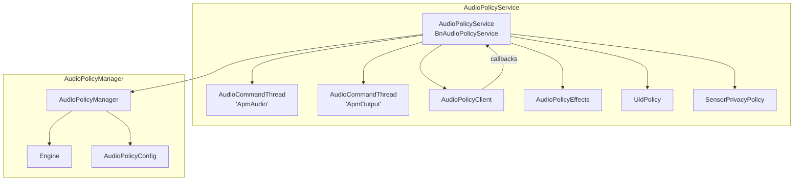
```mermaid
graph TB
    subgraph "AudioPolicyService"
        APS["AudioPolicyService<br/>BnAudioPolicyService"]
        ACT["AudioCommandThread<br/>'ApmAudio'"]
        OCT["AudioCommandThread<br/>'ApmOutput'"]
        APC[AudioPolicyClient]
        APE[AudioPolicyEffects]
        UID[UidPolicy]
        SPP[SensorPrivacyPolicy]
    end

    subgraph "AudioPolicyManager"
        APM[AudioPolicyManager]
        ENG[Engine]
        CFG[AudioPolicyConfig]
    end

    APS --> ACT
    APS --> OCT
    APS --> APC
    APS --> APE
    APS --> UID
    APS --> SPP
    APM --> ENG
    APM --> CFG
    APS --> APM
    APC -->|callbacks| APS
```

### 15.3.2 Initialization

The AudioPolicyService initialization in `onFirstRef()` (line 279-336) creates
the command threads, loads the policy manager, and initializes the spatializer:

```cpp
// AudioPolicyService.cpp, line 241-254
AudioPolicyService::AudioPolicyService()
    : BnAudioPolicyService(),
      mAudioPolicyManager(NULL),
      mAudioPolicyClient(NULL),
      mPhoneState(AUDIO_MODE_INVALID),
      mCaptureStateNotifier(false),
      mCreateAudioPolicyManager(createAudioPolicyManager),
      mDestroyAudioPolicyManager(destroyAudioPolicyManager),
      mUsecaseValidator(media::createUsecaseValidator()),
      mPermissionController(sp<NativePermissionController>::make())
{
      setMinSchedulerPolicy(SCHED_NORMAL, ANDROID_PRIORITY_AUDIO);
      setInheritRt(true);
}
```

### 15.3.3 Policy Manager Creation

The policy manager is loaded dynamically, allowing vendors to provide custom
implementations:

```cpp
// AudioPolicyService.cpp, line 210-238
static AudioPolicyInterface* createAudioPolicyManager(
        AudioPolicyClientInterface *clientInterface)
{
    AudioPolicyManager *apm = nullptr;
    media::AudioPolicyConfig apmConfig;
    if (status_t status = clientInterface->getAudioPolicyConfig(&apmConfig);
            status == OK) {
        auto config = AudioPolicyConfig::loadFromApmAidlConfigWithFallback(
                apmConfig);
        apm = new AudioPolicyManager(config,
                loadApmEngineLibraryAndCreateEngine(
                        config->getEngineLibraryNameSuffix(),
                        apmConfig.engineConfig),
                clientInterface);
    } else {
        auto config =
                AudioPolicyConfig::loadFromApmXmlConfigWithFallback();
        apm = new AudioPolicyManager(config,
                loadApmEngineLibraryAndCreateEngine(
                        config->getEngineLibraryNameSuffix()),
                clientInterface);
    }
    status_t status = apm->initialize();
    if (status != NO_ERROR) {
        delete apm;
        apm = nullptr;
    }
    return apm;
}
```

There are two configuration paths:

1. **AIDL-based configuration** from the HAL (`getAudioPolicyConfig`)
2. **XML-based fallback** (`audio_policy_configuration.xml`)

A custom policy manager can also be loaded via shared library:

```cpp
// AudioPolicyService.cpp, line 256-277
void AudioPolicyService::loadAudioPolicyManager()
{
    mLibraryHandle = dlopen(kAudioPolicyManagerCustomPath, RTLD_NOW);
    if (mLibraryHandle != nullptr) {
        mCreateAudioPolicyManager =
            reinterpret_cast<CreateAudioPolicyManagerInstance>(
                dlsym(mLibraryHandle, "createAudioPolicyManager"));
        mDestroyAudioPolicyManager =
            reinterpret_cast<DestroyAudioPolicyManagerInstance>(
                dlsym(mLibraryHandle, "destroyAudioPolicyManager"));
```

The custom library path is:

```cpp
// AudioPolicyService.cpp, line 57
static const char kAudioPolicyManagerCustomPath[] =
        "libaudiopolicymanagercustom.so";
```

### 15.3.4 The AudioPolicyInterface

The `AudioPolicyInterface` (740 lines) defines the contract between the
AudioPolicyService and the AudioPolicyManager. Key categories:

```cpp
// AudioPolicyInterface.h, line 80-105
class AudioPolicyInterface
{
public:
    typedef enum {
        API_INPUT_INVALID = -1,
        API_INPUT_LEGACY  = 0,
        API_INPUT_MIX_CAPTURE,
        API_INPUT_MIX_EXT_POLICY_REROUTE,
        API_INPUT_MIX_PUBLIC_CAPTURE_PLAYBACK,
        API_INPUT_TELEPHONY_RX,
    } input_type_t;

    typedef enum {
        API_OUTPUT_INVALID = -1,
        API_OUTPUT_LEGACY  = 0,
        API_OUT_MIX_PLAYBACK,
        API_OUTPUT_TELEPHONY_TX,
    } output_type_t;
```

The interface methods are organized into groups:

**Configuration:**
```cpp
virtual void onNewAudioModulesAvailable() = 0;
virtual status_t setDeviceConnectionState(...) = 0;
virtual void setPhoneState(audio_mode_t state) = 0;
virtual void setForceUse(...) = 0;
```

**Routing:**
```cpp
virtual status_t getOutputForAttr(
        const audio_attributes_t *attr,
        audio_io_handle_t *output,
        audio_session_t session,
        audio_stream_type_t *stream,
        const AttributionSourceState& attributionSource,
        audio_config_t *config,
        audio_output_flags_t *flags,
        DeviceIdVector *selectedDeviceIds,
        audio_port_handle_t *portId,
        std::vector<audio_io_handle_t> *secondaryOutputs,
        output_type_t *outputType,
        bool *isSpatialized,
        bool *isBitPerfect) = 0;
```

**Volume:**
```cpp
virtual void initStreamVolume(audio_stream_type_t stream,
                              int indexMin, int indexMax) = 0;
virtual status_t setStreamVolumeIndex(audio_stream_type_t stream,
                                      int index, bool muted,
                                      audio_devices_t device) = 0;
virtual status_t setVolumeIndexForAttributes(
        const audio_attributes_t &attr, int index,
        bool muted, audio_devices_t device) = 0;
```

**Patches and Ports:**
```cpp
virtual status_t createAudioPatch(
        const struct audio_patch *patch,
        audio_patch_handle_t *handle, uid_t uid) = 0;
virtual status_t releaseAudioPatch(
        audio_patch_handle_t handle, uid_t uid) = 0;
```

### 15.3.5 Audio Effects Integration

AudioPolicyService loads effects during initialization:

```cpp
// AudioPolicyService.cpp, line 302-312
    const sp<EffectsFactoryHalInterface> effectsFactoryHal =
            EffectsFactoryHalInterface::create();
    auto audioPolicyEffects =
            sp<AudioPolicyEffects>::make(effectsFactoryHal);
    auto uidPolicy = sp<UidPolicy>::make(this);
    auto sensorPrivacyPolicy =
            sp<SensorPrivacyPolicy>::make(this);
    {
        audio_utils::lock_guard _l(mMutex);
        mAudioPolicyEffects = audioPolicyEffects;
        mUidPolicy = uidPolicy;
        mSensorPrivacyPolicy = sensorPrivacyPolicy;
    }
    uidPolicy->registerSelf();
    sensorPrivacyPolicy->registerSelf();
```

The `UidPolicy` tracks application lifecycle for audio focus and recording
permission. The `SensorPrivacyPolicy` enforces microphone privacy when the
user toggles the sensor privacy switch.

Default device effects are initialized when the audio system is ready:

```cpp
// AudioPolicyService.cpp, line 342-349
void AudioPolicyService::onAudioSystemReady() {
    sp<AudioPolicyEffects> audioPolicyEffects;
    {
        audio_utils::lock_guard _l(mMutex);
        audioPolicyEffects = mAudioPolicyEffects;
    }
    audioPolicyEffects->initDefaultDeviceEffects();
}
```

### 15.3.6 Default vs. Configurable Engine

The audio policy engine comes in two flavors:

```
frameworks/av/services/audiopolicy/enginedefault/   -- hardcoded rules
frameworks/av/services/audiopolicy/engineconfigurable/ -- XML-driven rules
```

The **default engine** (`enginedefault`) implements fixed routing strategies
(STRATEGY_MEDIA, STRATEGY_PHONE, etc.) with hardcoded device selection logic.

The **configurable engine** (`engineconfigurable`) uses the Parameter Framework
to allow vendor-customizable routing rules through XML configuration files.
This is the preferred approach for complex audio topologies (automotive, smart
displays, etc.).

### 15.3.7 Binder Methods

The AudioPolicyService exposes over 80 Binder methods:

```cpp
// AudioPolicyService.cpp, line 74-188
#define IAUDIOPOLICYSERVICE_BINDER_METHOD_MACRO_LIST \
BINDER_METHOD_ENTRY(onNewAudioModulesAvailable) \
BINDER_METHOD_ENTRY(setDeviceConnectionState) \
// ...
BINDER_METHOD_ENTRY(getSpatializer) \
BINDER_METHOD_ENTRY(canBeSpatialized) \
BINDER_METHOD_ENTRY(getDirectPlaybackSupport) \
BINDER_METHOD_ENTRY(getDirectProfilesForAttributes) \
BINDER_METHOD_ENTRY(getSupportedMixerAttributes) \
BINDER_METHOD_ENTRY(setPreferredMixerAttributes) \
// ...
```

### 15.3.8 Command Thread

Commands from Binder calls are queued and executed asynchronously on dedicated
threads:

```cpp
// AudioPolicyService.cpp, line 292-294
mAudioCommandThread = new AudioCommandThread(
        String8("ApmAudio"), this);
mOutputCommandThread = new AudioCommandThread(
        String8("ApmOutput"), this);
```

Timeouts are configured for safety:

```cpp
// AudioPolicyService.cpp, line 61-65
static const nsecs_t kAudioCommandTimeoutNs = seconds(3);
static const nsecs_t kPatchAudioCommandTimeoutNs = seconds(4);
```

The longer timeout for patch creation accounts for Bluetooth device negotiation.

### 15.3.9 Volume Management Architecture

The Audio Policy Manager manages a complex volume hierarchy:

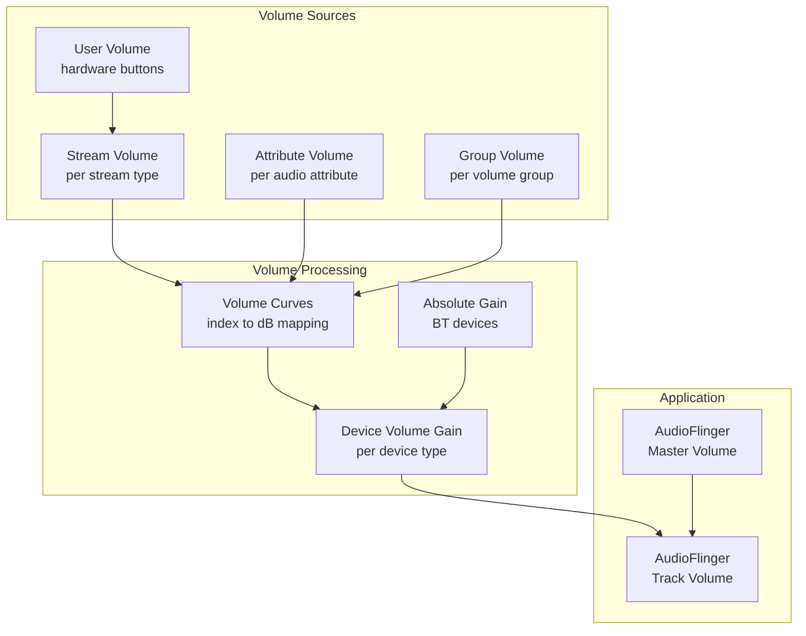
```mermaid
graph TB
    subgraph "Volume Sources"
        UV["User Volume<br/>hardware buttons"]
        SV["Stream Volume<br/>per stream type"]
        AV["Attribute Volume<br/>per audio attribute"]
        GV["Group Volume<br/>per volume group"]
    end

    subgraph "Volume Processing"
        VC["Volume Curves<br/>index to dB mapping"]
        AG["Absolute Gain<br/>BT devices"]
        DVG["Device Volume Gain<br/>per device type"]
    end

    subgraph "Application"
        AF_V["AudioFlinger<br/>Track Volume"]
        AF_MV["AudioFlinger<br/>Master Volume"]
    end

    UV --> SV
    SV --> VC
    AV --> VC
    GV --> VC
    VC --> DVG
    DVG --> AF_V
    AF_MV --> AF_V
    AG --> DVG
```

The `AudioPolicyInterface` defines volume control at multiple levels:

```cpp
// AudioPolicyInterface.h, line 204-296
    virtual void initStreamVolume(audio_stream_type_t stream,
            int indexMin, int indexMax) = 0;
    virtual status_t setStreamVolumeIndex(
            audio_stream_type_t stream,
            int index, bool muted,
            audio_devices_t device) = 0;
    virtual status_t setVolumeIndexForAttributes(
            const audio_attributes_t &attr,
            int index, bool muted,
            audio_devices_t device) = 0;
    virtual status_t setVolumeIndexForGroup(
            volume_group_t groupId, int index,
            bool muted, audio_devices_t device) = 0;
```

Volume groups allow applications to define custom volume knobs beyond the
traditional stream types. Each group has its own min/max range and volume
curve. This is particularly useful for automotive audio where multiple
independent volume controls are needed (navigation, entertainment, calls,
alerts).

### 15.3.10 Audio Focus and Concurrency

The Audio Policy Service works with the Java `AudioService` to enforce audio
focus rules. When multiple applications request audio simultaneously:

| Scenario | Policy Decision |
|----------|----------------|
| Music + Navigation | Duck music volume |
| Music + Phone Call | Pause/duck music, route call |
| Game + Notification | Duck game audio briefly |
| Music + Alarm | Both play, alarm wins focus |
| Recording + Call | May deny recording |

The `UidPolicy` tracks application foreground/background state:

```cpp
// AudioPolicyService.cpp, line 305-306
    auto uidPolicy = sp<UidPolicy>::make(this);
    // ...
    uidPolicy->registerSelf();
```

Background applications may have their audio paused or volume reduced
according to the configured policy.

### 15.3.11 Spatializer Integration

The AudioPolicyService creates the Spatializer during initialization:

```cpp
// AudioPolicyService.cpp, line 317-334
if (mAudioPolicyManager != nullptr) {
    audio_utils::lock_guard _l(mMutex);
    const audio_attributes_t attr =
            attributes_initializer(AUDIO_USAGE_MEDIA);
    AudioDeviceTypeAddrVector devices;
    bool hasSpatializer =
            mAudioPolicyManager->canBeSpatialized(&attr, nullptr, devices);
    if (hasSpatializer) {
        mMutex.unlock();
        mSpatializer = Spatializer::create(this, effectsFactoryHal);
        mMutex.lock();
    }
}
```

Note the careful lock management: `Spatializer::create()` acquires its own
locks, so the AudioPolicyService mutex must be released to avoid deadlock.

---

## 15.4 AAudio

AAudio is Android's modern native audio API, introduced in Android 8.0 (Oreo).
It provides a direct C API for high-performance audio with two data path modes:
MMAP (zero-copy) and Legacy (fallback through AudioTrack/AudioRecord).

The source is at:
```
frameworks/av/media/libaaudio/ (171 files)
```

Organized into subdirectories:

| Directory | Purpose |
|-----------|---------|
| `src/core/` | `AudioStream.cpp`, `AudioStreamBuilder.cpp` |
| `src/client/` | Client-side stream implementations |
| `src/fifo/` | Lock-free FIFO buffer |
| `src/flowgraph/` | Audio format conversion graph |
| `src/binding/` | Binder message types |
| `src/legacy/` | Legacy fallback path |
| `src/utility/` | Utility classes |

### 15.4.1 AudioStream Base Class

All AAudio streams derive from `AudioStream` (779 lines):

```cpp
// AudioStream.cpp, line 46-51
AudioStream::AudioStream()
        : mPlayerBase(new MyPlayerBase())
        , mStreamId(AAudio_getNextStreamId())
{
    setPeriodNanoseconds(0);
}
```

Stream IDs are sequential, starting at 1:

```cpp
// AudioStream.cpp, line 41-44
static aaudio_stream_id_t AAudio_getNextStreamId() {
    static std::atomic <aaudio_stream_id_t> nextStreamId{1};
    return nextStreamId++;
}
```

The `open()` method copies parameters from the builder:

```cpp
// AudioStream.cpp, line 72-131
aaudio_result_t AudioStream::open(const AudioStreamBuilder& builder)
{
    aaudio_result_t result = builder.validate();
    if (result != AAUDIO_OK) {
        return result;
    }

    mSamplesPerFrame = builder.getSamplesPerFrame();
    mChannelMask = builder.getChannelMask();
    mSampleRate = builder.getSampleRate();
    mDeviceIds = builder.getDeviceIds();
    mFormat = builder.getFormat();
    mSharingMode = builder.getSharingMode();
    mSharingModeMatchRequired = builder.isSharingModeMatchRequired();
    mPerformanceMode = builder.getPerformanceMode();

    mUsage = builder.getUsage();
    if (mUsage == AAUDIO_UNSPECIFIED) {
        mUsage = AAUDIO_USAGE_MEDIA;
    }
    mContentType = builder.getContentType();
    if (mContentType == AAUDIO_UNSPECIFIED) {
        mContentType = AAUDIO_CONTENT_TYPE_MUSIC;
    }
    // ... spatialization, input preset, capture policy ...

    // callbacks
    mFramesPerDataCallback = builder.getFramesPerDataCallback();
    mDataCallbackProc = builder.getDataCallbackProc();
    // ...
}
```

### 15.4.2 Stream Architecture

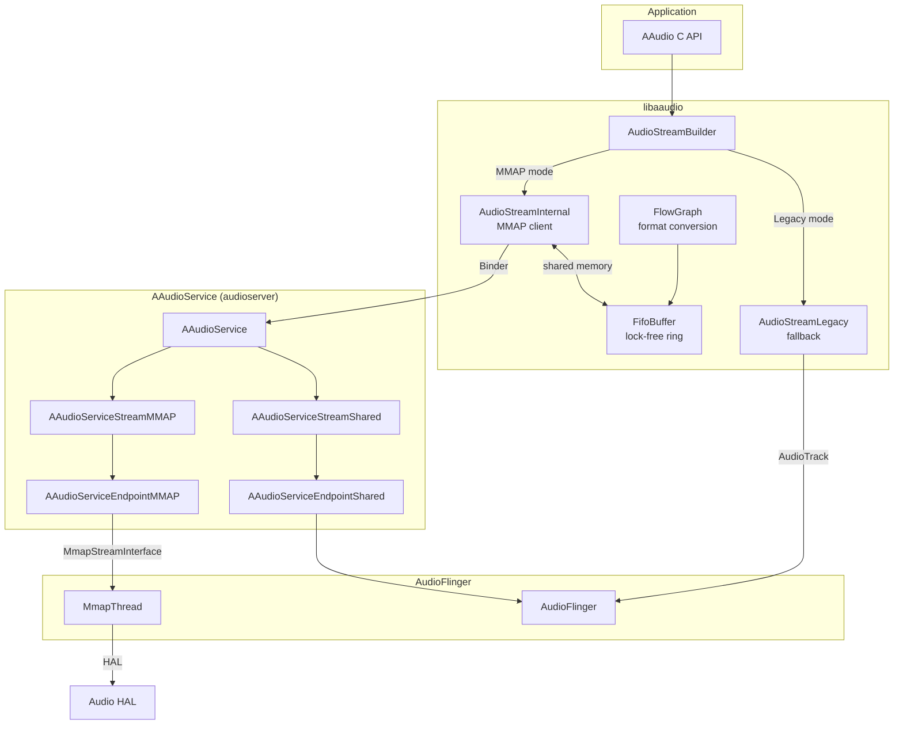
```mermaid
graph TB
    subgraph "Application"
        APP[AAudio C API]
    end

    subgraph "libaaudio"
        ASB[AudioStreamBuilder]
        ASI["AudioStreamInternal<br/>MMAP client"]
        ASL["AudioStreamLegacy<br/>fallback"]
        FIFO["FifoBuffer<br/>lock-free ring"]
        FG["FlowGraph<br/>format conversion"]
    end

    subgraph "AAudioService (audioserver)"
        AAS[AAudioService]
        SSMMAP[AAudioServiceStreamMMAP]
        SSShared[AAudioServiceStreamShared]
        EPMMAP[AAudioServiceEndpointMMAP]
        EPShared[AAudioServiceEndpointShared]
    end

    subgraph "AudioFlinger"
        AF[AudioFlinger]
        MMAPT[MmapThread]
    end

    APP --> ASB
    ASB -->|MMAP mode| ASI
    ASB -->|Legacy mode| ASL
    ASI -->|Binder| AAS
    ASL -->|AudioTrack| AF
    AAS --> SSMMAP
    AAS --> SSShared
    SSMMAP --> EPMMAP
    SSShared --> EPShared
    EPShared --> AF
    EPMMAP -->|MmapStreamInterface| MMAPT
    MMAPT -->|HAL| HAL[Audio HAL]
    ASI <-->|shared memory| FIFO
    FG --> FIFO
```

### 15.4.3 MMAP Mode

MMAP mode is the low-latency path. It maps the HAL's hardware buffer directly
into the client process's address space, eliminating all intermediate copies.
The data path bypasses AudioFlinger's mixer entirely.

Key characteristics:

- Latency can be as low as 1-2ms
- Requires HAL support (`AUDIO_OUTPUT_FLAG_MMAP_NOIRQ`)
- Uses shared memory between client and HAL
- No software mixing -- exclusive hardware access

The MMAP path flows through:

1. `AudioStreamInternal` (client side)
2. `AAudioService.openStream()` (Binder)
3. `AAudioServiceStreamMMAP` (service side)
4. `AAudioServiceEndpointMMAP` (HAL interface)
5. `MmapStreamInterface` (AudioFlinger)

### 15.4.4 Legacy Fallback

When MMAP is not available (older hardware, shared mode not supported), AAudio
falls back to the legacy path:

1. `AudioStreamLegacy` wraps an `AudioTrack` or `AudioRecord`.
2. Data flows through the normal AudioFlinger mixer path.
3. Latency is higher (typically 20-40ms).

The fallback is transparent to the application -- the same AAudio API is used
regardless of the underlying path.

### 15.4.5 FIFO Buffer

The lock-free FIFO is critical for AAudio's low-latency operation:

```cpp
// FifoBuffer.cpp, line 38-50
FifoBuffer::FifoBuffer(int32_t bytesPerFrame)
        : mBytesPerFrame(bytesPerFrame) {}

FifoBufferAllocated::FifoBufferAllocated(
        int32_t bytesPerFrame,
        fifo_frames_t capacityInFrames)
        : FifoBuffer(bytesPerFrame)
{
    mFifo = std::make_unique<FifoController>(
            capacityInFrames, capacityInFrames);
    int32_t bytesPerBuffer = bytesPerFrame * capacityInFrames;
    mInternalStorage = std::make_unique<uint8_t[]>(bytesPerBuffer);
}
```

The `FifoControllerIndirect` variant uses externally-provided read/write index
pointers, enabling the shared memory MMAP path:

```cpp
// FifoBuffer.cpp, line 52-65
FifoBufferIndirect::FifoBufferIndirect(
        int32_t bytesPerFrame,
        fifo_frames_t capacityInFrames,
        fifo_counter_t *readIndexAddress,
        fifo_counter_t *writeIndexAddress,
        void *dataStorageAddress)
        : FifoBuffer(bytesPerFrame)
        , mExternalStorage(static_cast<uint8_t *>(dataStorageAddress))
{
    mFifo = std::make_unique<FifoControllerIndirect>(
            capacityInFrames, capacityInFrames,
            readIndexAddress, writeIndexAddress);
}
```

The wrapping buffer logic handles the circular nature:

```cpp
// FifoBuffer.cpp, line 71-80
void FifoBuffer::fillWrappingBuffer(
        WrappingBuffer *wrappingBuffer,
        int32_t framesAvailable,
        int32_t startIndex) {
    wrappingBuffer->data[1] = nullptr;
    wrappingBuffer->numFrames[1] = 0;
    uint8_t *storage = getStorage();
    if (framesAvailable > 0) {
        fifo_frames_t capacity = mFifo->getCapacity();
        uint8_t *source = &storage[convertFramesToBytes(startIndex)];
```

### 15.4.6 FlowGraph -- Format Conversion

The flowgraph module performs sample format conversion and channel mixing. It
uses a node-based graph architecture with specialized converters:

| Node Class | Purpose |
|-----------|---------|
| `SourceFloat` | Read float samples from input |
| `SourceI16` / `SourceI24` / `SourceI32` | Read integer samples |
| `SinkFloat` | Write float samples to output |
| `SinkI16` / `SinkI24` / `SinkI32` | Write integer samples |
| `MonoToMultiConverter` | Upmix mono to multichannel |
| `MultiToMonoConverter` | Downmix to mono |
| `ChannelCountConverter` | General channel count conversion |
| `RampLinear` | Volume ramping |
| `SampleRateConverter` | Resampling |
| `ClipToRange` | Clipping protection |
| `Limiter` | Dynamic limiting |

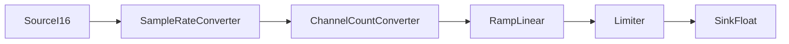
```mermaid
graph LR
    Source[SourceI16] --> SRC[SampleRateConverter]
    SRC --> CC[ChannelCountConverter]
    CC --> Ramp[RampLinear]
    Ramp --> Limit[Limiter]
    Limit --> Sink[SinkFloat]
```

### 15.4.7 AAudio Stream States

AAudio streams follow a strict state machine:

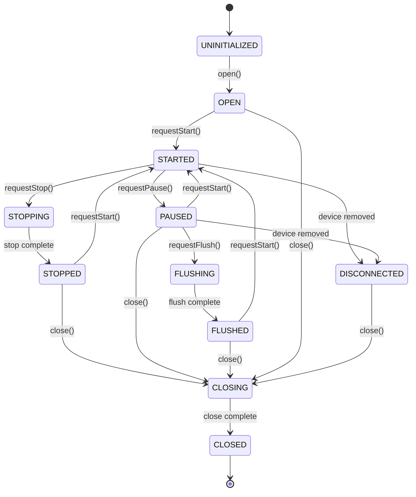
```mermaid
stateDiagram-v2
    [*] --> UNINITIALIZED
    UNINITIALIZED --> OPEN : open()
    OPEN --> STARTED : requestStart()
    STARTED --> PAUSED : requestPause()
    PAUSED --> STARTED : requestStart()
    PAUSED --> FLUSHING : requestFlush()
    FLUSHING --> FLUSHED : flush complete
    FLUSHED --> STARTED : requestStart()
    STARTED --> STOPPING : requestStop()
    STOPPING --> STOPPED : stop complete
    STOPPED --> STARTED : requestStart()
    STOPPED --> CLOSING : close()
    PAUSED --> CLOSING : close()
    FLUSHED --> CLOSING : close()
    OPEN --> CLOSING : close()
    CLOSING --> CLOSED : close complete
    CLOSED --> [*]
    STARTED --> DISCONNECTED : device removed
    PAUSED --> DISCONNECTED : device removed
    DISCONNECTED --> CLOSING : close()
```

The stream destruction has a safety assertion:

```cpp
// AudioStream.cpp, line 66-69
LOG_ALWAYS_FATAL_IF(
    !(getState() == AAUDIO_STREAM_STATE_CLOSED
      || getState() == AAUDIO_STREAM_STATE_UNINITIALIZED),
    "~AudioStream() - still in use, state = %s disconnected = %d",
    AudioGlobal_convertStreamStateToText(getState()),
    isDisconnected());
```

### 15.4.8 The AudioStreamBuilder Pattern

AAudio uses a builder pattern for stream creation. The builder collects all
parameters before creating the stream. Key methods:

```c
// Public C API
AAudio_createStreamBuilder(&builder);
AAudioStreamBuilder_setDeviceId(builder, deviceId);
AAudioStreamBuilder_setSampleRate(builder, 48000);
AAudioStreamBuilder_setChannelCount(builder, 2);
AAudioStreamBuilder_setFormat(builder, AAUDIO_FORMAT_PCM_FLOAT);
AAudioStreamBuilder_setBufferCapacityInFrames(builder, 480);
AAudioStreamBuilder_setPerformanceMode(builder,
        AAUDIO_PERFORMANCE_MODE_LOW_LATENCY);
AAudioStreamBuilder_setSharingMode(builder,
        AAUDIO_SHARING_MODE_EXCLUSIVE);
AAudioStreamBuilder_setDataCallback(builder, callback, userData);
AAudioStreamBuilder_setErrorCallback(builder, errorCb, userData);
AAudioStreamBuilder_openStream(builder, &stream);
AAudioStreamBuilder_delete(builder);
```

The builder validation ensures all parameters are consistent before attempting
to open the stream. The `open()` method copies validated parameters:

```cpp
// AudioStream.cpp, line 72-131
aaudio_result_t AudioStream::open(const AudioStreamBuilder& builder)
{
    aaudio_result_t result = builder.validate();
    if (result != AAUDIO_OK) {
        return result;
    }
    // Copy parameters from the Builder because the Builder may
    // be deleted after this call.
    mSamplesPerFrame = builder.getSamplesPerFrame();
    mChannelMask = builder.getChannelMask();
    mSampleRate = builder.getSampleRate();
    mDeviceIds = builder.getDeviceIds();
    mFormat = builder.getFormat();
    mSharingMode = builder.getSharingMode();
    // ...
    mUsage = builder.getUsage();
    if (mUsage == AAUDIO_UNSPECIFIED) {
        mUsage = AAUDIO_USAGE_MEDIA;
    }
    mContentType = builder.getContentType();
    if (mContentType == AAUDIO_UNSPECIFIED) {
        mContentType = AAUDIO_CONTENT_TYPE_MUSIC;
    }
    // ...
    mSpatializationBehavior =
            builder.getSpatializationBehavior();
    if (mSpatializationBehavior == AAUDIO_UNSPECIFIED) {
        mSpatializationBehavior =
                AAUDIO_SPATIALIZATION_BEHAVIOR_AUTO;
    }
    mIsContentSpatialized = builder.isContentSpatialized();
    mInputPreset = builder.getInputPreset();
    if (mInputPreset == AAUDIO_UNSPECIFIED) {
        mInputPreset = AAUDIO_INPUT_PRESET_VOICE_RECOGNITION;
    }
    // ...
}
```

Note the default values: `AAUDIO_USAGE_MEDIA`, `AAUDIO_CONTENT_TYPE_MUSIC`,
`AAUDIO_SPATIALIZATION_BEHAVIOR_AUTO`, `AAUDIO_INPUT_PRESET_VOICE_RECOGNITION`.
These defaults ensure reasonable behavior even when the application does not
explicitly set all parameters.

### 15.4.9 AAudio Callback Modes

AAudio supports two callback modes for data delivery:

**Standard callback** -- Called with exactly `framesPerDataCallback` frames:

```cpp
// AudioStream.cpp, line 117-124
    mFramesPerDataCallback = builder.getFramesPerDataCallback();
    mDataCallbackProc = builder.getDataCallbackProc();
    mPartialDataCallbackProc = builder.getPartialDataCallbackProc();
    if (mPartialDataCallbackProc != nullptr) {
        mDataCallbackWrapper =
                &AudioStream::partialDataCallbackInternal;
    } else if (mDataCallbackProc != nullptr) {
        mDataCallbackWrapper =
                &AudioStream::dataCallbackInternal;
    }
```

**Partial callback** -- May be called with fewer frames than requested. This
mode was added for scenarios where the audio system needs to split a buffer
boundary differently than the application expects, improving compatibility
with various HAL implementations.

### 15.4.10 IsochronousClockModel

The `IsochronousClockModel` in `src/client/IsochronousClockModel.cpp` provides
accurate timestamp estimation by modeling the hardware clock:

```
frameworks/av/media/libaaudio/src/client/IsochronousClockModel.cpp
```

It tracks the relationship between frame position and time, compensating for:

- Clock drift between the application CPU and the audio hardware
- Jitter in the callback delivery
- Phase discontinuities when the stream starts or is reconfigured

### 15.4.11 Metrics and Logging

AAudio logs detailed metrics on stream open:

```cpp
// AudioStream.cpp, line 134-150
void AudioStream::logOpenActual() {
    if (mMetricsId.size() > 0) {
        android::mediametrics::LogItem item(mMetricsId);
        item.set(AMEDIAMETRICS_PROP_EVENT,
                 AMEDIAMETRICS_PROP_EVENT_VALUE_OPEN)
            .set(AMEDIAMETRICS_PROP_PERFORMANCEMODEACTUAL,
                 AudioGlobal_convertPerformanceModeToText(
                         getPerformanceMode()))
            .set(AMEDIAMETRICS_PROP_SHARINGMODEACTUAL,
                 AudioGlobal_convertSharingModeToText(
                         getSharingMode()))
            .set(AMEDIAMETRICS_PROP_BUFFERCAPACITYFRAMES,
                 getBufferCapacity())
            .set(AMEDIAMETRICS_PROP_BURSTFRAMES,
                 getFramesPerBurst())
            // ...
```

---

## 15.5 Oboe Service (AAudioService)

The AAudioService runs inside the `audioserver` process and manages server-side
AAudio streams. It is defined across 39 files in:

```
frameworks/av/services/oboeservice/ (39 files)
```

### 15.5.1 Service Architecture

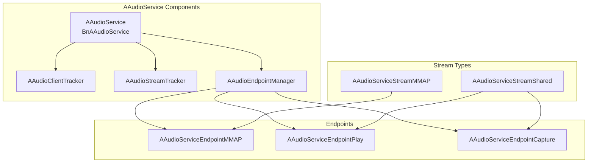
```mermaid
graph TB
    subgraph "AAudioService Components"
        AAS["AAudioService<br/>BnAAudioService"]
        CT[AAudioClientTracker]
        ST[AAudioStreamTracker]
        EPM[AAudioEndpointManager]
    end

    subgraph "Stream Types"
        SSMMAP[AAudioServiceStreamMMAP]
        SSShared[AAudioServiceStreamShared]
    end

    subgraph "Endpoints"
        EPMMAP[AAudioServiceEndpointMMAP]
        EPPLAY[AAudioServiceEndpointPlay]
        EPCAP[AAudioServiceEndpointCapture]
    end

    AAS --> CT
    AAS --> ST
    AAS --> EPM
    EPM --> EPMMAP
    EPM --> EPPLAY
    EPM --> EPCAP
    SSMMAP --> EPMMAP
    SSShared --> EPPLAY
    SSShared --> EPCAP
```

### 15.5.2 Stream Opening

The `openStream()` method (line 94-150 of `AAudioService.cpp`) handles both
MMAP and shared stream creation:

```cpp
// AAudioService.cpp, line 94-150
Status AAudioService::openStream(
        const StreamRequest &_request,
        StreamParameters* _paramsOut,
        int32_t *_aidl_return)
{
    // ...
    const aaudio_performance_mode_t performanceMode =
            configurationInput.getPerformanceMode();
    if (performanceMode != AAUDIO_PERFORMANCE_MODE_LOW_LATENCY &&
        performanceMode != AAUDIO_PERFORMANCE_MODE_POWER_SAVING_OFFLOADED) {
        ALOGE("%s denied performance mode as %d for mmap path",
              __func__, performanceMode);
        AIDL_RETURN(AAUDIO_ERROR_ILLEGAL_ARGUMENT);
    }
```

The MMAP offload mode has stricter requirements:

```cpp
// AAudioService.cpp, line 130-134
if (performanceMode ==
        AAUDIO_PERFORMANCE_MODE_POWER_SAVING_OFFLOADED &&
        (sharingMode != AAUDIO_SHARING_MODE_EXCLUSIVE ||
         !sharingModeMatchRequired)) {
    ALOGE("%s mmap offload must be exclusive", __func__);
    AIDL_RETURN(AAUDIO_ERROR_ILLEGAL_ARGUMENT);
}
```

There is a per-process stream limit:

```cpp
// AAudioService.cpp, line 44
#define MAX_STREAMS_PER_PROCESS   8
```

```cpp
// AAudioService.cpp, line 144-150
const int32_t count =
        AAudioClientTracker::getInstance().getStreamCount(pid);
if (count >= MAX_STREAMS_PER_PROCESS) {
    ALOGE("openStream(): exceeded max streams per process %d >= %d",
          count,  MAX_STREAMS_PER_PROCESS);
    AIDL_RETURN(AAUDIO_ERROR_UNAVAILABLE);
}
```

### 15.5.3 MMAP Endpoint

The `AAudioServiceEndpointMMAP` manages the hardware MMAP buffer:

```cpp
// AAudioServiceEndpointMMAP.cpp, line 42-48
#define AAUDIO_BUFFER_CAPACITY_MIN    (4 * 512)
#define AAUDIO_SAMPLE_RATE_DEFAULT    48000

// Estimated hardware timing offsets
#define OUTPUT_ESTIMATED_HARDWARE_OFFSET_NANOS \
        (3 * AAUDIO_NANOS_PER_MILLISECOND)
#define INPUT_ESTIMATED_HARDWARE_OFFSET_NANOS \
        (-1 * AAUDIO_NANOS_PER_MILLISECOND)
```

The endpoint attempts to open with the requested format, falling back through
a priority list:

```cpp
// AAudioServiceEndpointMMAP.cpp, line 78-88
const static std::map<audio_format_t, audio_format_t>
        NEXT_FORMAT_TO_TRY = {
    {AUDIO_FORMAT_PCM_FLOAT,         AUDIO_FORMAT_PCM_32_BIT},
    {AUDIO_FORMAT_PCM_32_BIT,        AUDIO_FORMAT_PCM_24_BIT_PACKED},
    {AUDIO_FORMAT_PCM_24_BIT_PACKED, AUDIO_FORMAT_PCM_8_24_BIT},
    {AUDIO_FORMAT_PCM_8_24_BIT,      AUDIO_FORMAT_PCM_16_BIT}
};
```

The open process tries up to 10 times with different configurations:

```cpp
// AAudioServiceEndpointMMAP.cpp, line 50
#define AAUDIO_MAX_OPEN_ATTEMPTS    10
```

```cpp
// AAudioServiceEndpointMMAP.cpp, line 137
while (numberOfAttempts < maxOpenAttempts) {
    if (configsTried.find(config) != configsTried.end()) {
        break;
    }
    configsTried.insert(config);
    audio_config_base_t previousConfig = config;
    result = openWithConfig(&config);
    if (result != AAUDIO_ERROR_UNAVAILABLE) {
        break;
    }
    // Try other formats
    if ((previousConfig.format == config.format) &&
            (previousConfig.sample_rate == config.sample_rate)) {
        config.format = getNextFormatToTry(config.format);
    }
    numberOfAttempts++;
}
```

### 15.5.4 Endpoint Stealing

When a second exclusive MMAP stream is requested, the first stream's endpoint
is "stolen" -- it is converted from exclusive to shared. The `openStream()`
method uses a `mOpenLock` to serialize this:

```cpp
// AAudioService.cpp, line 112
const std::unique_lock<std::recursive_mutex> lock(mOpenLock);
```

The comment explains the ordering requirement:
```
// 1) Thread A opens exclusive MMAP endpoint
// 2) Thread B wants exclusive, steals from A under this lock
// 3) Thread B opens shared MMAP endpoint
// 4) Thread A gets lock and also opens shared stream
```

### 15.5.5 MMAP Endpoint -- openWithConfig Details

The `openWithConfig()` method reveals the full MMAP stream opening sequence:

```cpp
// AAudioServiceEndpointMMAP.cpp, line 171-249
aaudio_result_t AAudioServiceEndpointMMAP::openWithConfig(
        audio_config_base_t* config) {
    aaudio_result_t result = AAUDIO_OK;
    audio_config_base_t currentConfig = *config;
    android::DeviceIdVector deviceIds;

    const audio_attributes_t attributes =
            getAudioAttributesFrom(this);

    if (mRequestedDeviceId != AAUDIO_UNSPECIFIED) {
        deviceIds.push_back(mRequestedDeviceId);
    }

    const aaudio_direction_t direction = getDirection();

    if (direction == AAUDIO_DIRECTION_OUTPUT) {
        mHardwareTimeOffsetNanos =
                OUTPUT_ESTIMATED_HARDWARE_OFFSET_NANOS;
    } else if (direction == AAUDIO_DIRECTION_INPUT) {
        mHardwareTimeOffsetNanos =
                INPUT_ESTIMATED_HARDWARE_OFFSET_NANOS;
    }
```

Hardware timing offsets compensate for the delay between the MMAP timestamp
and the actual hardware DAC/ADC operation:

- Output: +3ms (audio reaches DAC later than timestamp)
- Input: -1ms (audio was at ADC earlier than timestamp)

For offloaded MMAP, additional offload info is prepared:

```cpp
// AAudioServiceEndpointMMAP.cpp, line 207-216
    audio_offload_info_t* info = nullptr;
    audio_offload_info_t offloadInfo = AUDIO_INFO_INITIALIZER;
    if (getPerformanceMode() ==
            AAUDIO_PERFORMANCE_MODE_POWER_SAVING_OFFLOADED) {
        offloadInfo.format = config->format;
        offloadInfo.sample_rate = config->sample_rate;
        offloadInfo.channel_mask = config->channel_mask;
        offloadInfo.stream_type = AUDIO_STREAM_MUSIC;
        offloadInfo.has_video = false;
        info = &offloadInfo;
    }
```

The actual HAL open uses `MmapStreamInterface::openMmapStream()`:

```cpp
// AAudioServiceEndpointMMAP.cpp, line 218-231
    const std::lock_guard<std::mutex> lock(mMmapStreamLock);
    const status_t status = MmapStreamInterface::openMmapStream(
            isOutput,
            attributes,
            config,
            mMmapClient,
            &deviceIds,
            &sessionId,
            this, // callback
            info,
            mMmapStream,
            &mPortHandle);
```

### 15.5.6 Shared Endpoints

For shared mode, the `AAudioServiceEndpointShared` subclasses manage mixing:

- `AAudioServiceEndpointPlay` -- Mixes multiple client streams for playback
- `AAudioServiceEndpointCapture` -- Distributes capture data to multiple clients

The `AAudioMixer` class handles the mixing, working at the sample level with
float precision.

### 15.5.7 Client Tracking

The `AAudioClientTracker` monitors client processes and their streams. When a
client process dies (Binder death notification), all its streams are
automatically closed, preventing resource leaks.

### 15.5.8 Shared Ring Buffer

The `SharedRingBuffer` provides the shared memory transport between service
and client:

```
frameworks/av/services/oboeservice/SharedRingBuffer.cpp
```

It wraps a `FifoBuffer` with shared memory allocation, providing the zero-copy
path for AAudio's data transfer.

---

## 15.6 Audio Effects

Android provides a comprehensive audio effects framework with both built-in
effects and vendor-supplied effects. The source spans:

```
frameworks/av/media/libeffects/ (245 files, ~40,305 lines)
```

### 15.6.1 Effects Framework Architecture

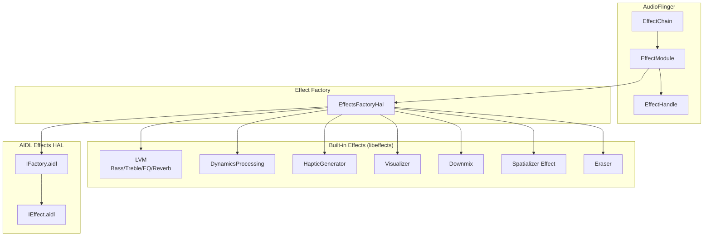
```mermaid
graph TB
    subgraph "AudioFlinger"
        EC[EffectChain]
        EM[EffectModule]
        EH[EffectHandle]
    end

    subgraph "Effect Factory"
        EF[EffectsFactoryHal]
    end

    subgraph "Built-in Effects (libeffects)"
        LVM["LVM<br/>Bass/Treble/EQ/Reverb"]
        DP[DynamicsProcessing]
        HG[HapticGenerator]
        VIS[Visualizer]
        DM[Downmix]
        SP[Spatializer Effect]
        ER[Eraser]
    end

    subgraph "AIDL Effects HAL"
        IEF[IFactory.aidl]
        IE[IEffect.aidl]
    end

    EC --> EM
    EM --> EH
    EM --> EF
    EF --> LVM
    EF --> DP
    EF --> HG
    EF --> VIS
    EF --> DM
    EF --> SP
    EF --> ER
    EF --> IEF
    IEF --> IE
```

### 15.6.2 EffectBase -- The Effect State Machine

Every effect module derives from `EffectBase`, which manages a state machine:

```cpp
// Effects.cpp, line 103-112
EffectBase::EffectBase(
        const sp<EffectCallbackInterface>& callback,
        effect_descriptor_t *desc,
        int id,
        audio_session_t sessionId,
        bool pinned)
    : mPinned(pinned),
      mCallback(callback), mId(id), mSessionId(sessionId),
      mDescriptor(*desc)
{
}
```

The state transitions:

```cpp
// Effects.cpp, line 115-150
status_t EffectBase::setEnabled_l(bool enabled)
{
    if (enabled != isEnabled()) {
        switch (mState) {
        // going from disabled to enabled
        case IDLE:
            mState = STARTING;
            break;
        case STOPPED:
            mState = RESTART;
            break;
        case STOPPING:
            mState = ACTIVE;
            break;
        // going from enabled to disabled
        case RESTART:
            mState = STOPPED;
            break;
        case STARTING:
            mState = IDLE;
            break;
        case ACTIVE:
            mState = STOPPING;
            break;
        case DESTROYED:
            return NO_ERROR;
        }
```

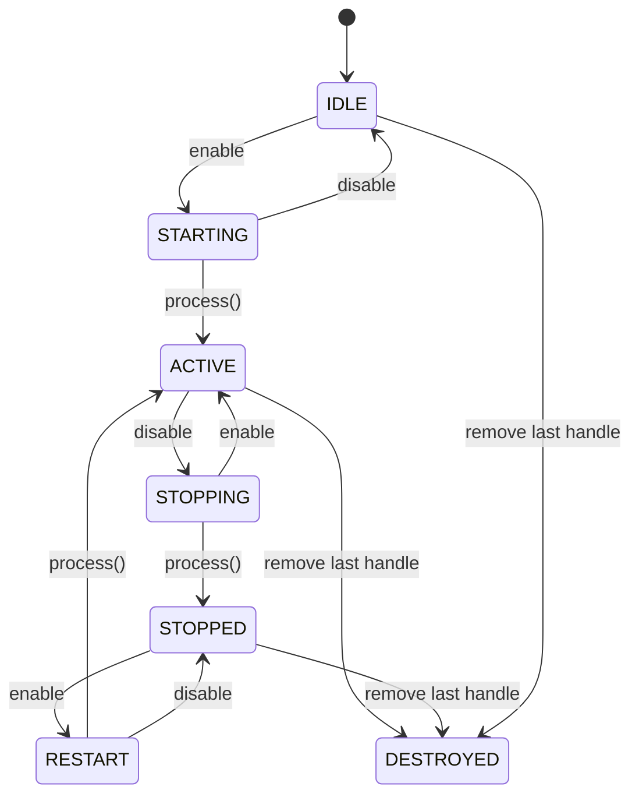
```mermaid
stateDiagram-v2
    [*] --> IDLE
    IDLE --> STARTING : enable
    STARTING --> ACTIVE : process()
    ACTIVE --> STOPPING : disable
    STOPPING --> STOPPED : process()
    STOPPED --> RESTART : enable
    RESTART --> ACTIVE : process()
    STARTING --> IDLE : disable
    STOPPING --> ACTIVE : enable
    RESTART --> STOPPED : disable
    ACTIVE --> DESTROYED : remove last handle
    STOPPED --> DESTROYED : remove last handle
    IDLE --> DESTROYED : remove last handle
```

### 15.6.3 Effect Handles and Priority

Effects support multiple handles with priority-based control. The first
non-destroyed handle is the "control" handle:

```cpp
// Effects.cpp, line 205-241
status_t EffectBase::addHandle(IAfEffectHandle *handle)
{
    audio_utils::lock_guard _l(mutex());
    int priority = handle->priority();
    size_t size = mHandles.size();
    IAfEffectHandle *controlHandle = nullptr;
    size_t i;
    for (i = 0; i < size; i++) {
        IAfEffectHandle *h = mHandles[i];
        if (h == NULL || h->disconnected()) {
            continue;
        }
        if (controlHandle == NULL) {
            controlHandle = h;
        }
        if (h->priority() <= priority) {
            break;
        }
    }
    if (i == 0) {
        // inserted in first place, take control
        if (controlHandle != NULL) {
            enabled = controlHandle->enabled();
            controlHandle->setControl(false, true, enabled);
        }
        handle->setControl(true, false, enabled);
        status = NO_ERROR;
    }
    mHandles.insert(mHandles.begin() + i, handle);
    return status;
}
```

### 15.6.4 Policy Registration

Effects are registered with the Audio Policy Manager:

```cpp
// Effects.cpp, line 244-310
status_t EffectBase::updatePolicyState()
{
    // ...
    if (doRegister) {
        if (registered) {
            status = AudioSystem::registerEffect(
                &mDescriptor, io, strategy, mSessionId, mId);
        } else {
            status = AudioSystem::unregisterEffect(mId);
        }
    }
    if (registered && doEnable) {
        status = AudioSystem::setEffectEnabled(mId, enabled);
    }
}
```

### 15.6.5 LVM (Listener Volume Manager)

The LVM bundle provides four effects in one library:

```
frameworks/av/media/libeffects/lvm/
```

| Effect | Description |
|--------|-------------|
| BassBoost | Low-frequency enhancement |
| Equalizer | 5-band parametric EQ |
| Virtualizer | Stereo widening |
| Reverb | Environmental and preset reverb |

The AIDL wrapper is in:
```
frameworks/av/media/libeffects/lvm/wrapper/Aidl/
  - BundleContext.cpp
  - EffectBundleAidl.cpp
```

### 15.6.6 DynamicsProcessing

The dynamics processing effect provides per-channel multi-band compression:

```
frameworks/av/media/libeffects/dynamicsproc/
  - dsp/DPBase.cpp (265 lines)
  - dsp/DPFrequency.cpp (677 lines)
```

It supports:

- Pre-EQ (per channel)
- Multi-band compression (per channel, per band)
- Post-EQ (per channel)
- Limiter (per channel)

### 15.6.7 Haptic Generator

The haptic generator converts audio signals into haptic feedback:

```
frameworks/av/media/libeffects/hapticgenerator/
  - Processors.cpp
  - EffectHapticGenerator.cpp
  - aidl/HapticGeneratorContext.cpp
  - aidl/EffectHapticGenerator.cpp
```

The AudioFlinger integrates haptic generation at the thread level:

```cpp
// Threads.cpp, line 4211-4228
if (mHapticChannelCount > 0) {
    for (const auto& track : mActivePlaybackTracksView) {
        sp<IAfEffectChain> effectChain =
                getEffectChain_l(track->sessionId());
        if (effectChain != nullptr
                && effectChain->containsHapticGeneratingEffect_l()) {
            activeHapticSessionId = track->sessionId();
            isHapticSessionSpatialized =
                    mType == SPATIALIZER && track->isSpatialized();
            break;
        }
    }
}
```

The FastMixer also handles haptic parameters:

```cpp
// FastMixer.cpp, line 180-185
mMixer->setParameter(index, AudioMixer::TRACK,
        AudioMixer::HAPTIC_ENABLED,
        (void *)(uintptr_t)fastTrack->mHapticPlaybackEnabled);
mMixer->setParameter(index, AudioMixer::TRACK,
        AudioMixer::HAPTIC_SCALE,
        (void *)(&(fastTrack->mHapticScale)));
mMixer->setParameter(index, AudioMixer::TRACK,
        AudioMixer::HAPTIC_MAX_AMPLITUDE,
        (void *)(&(fastTrack->mHapticMaxAmplitude)));
```

### 15.6.8 Visualizer

The Visualizer effect captures audio waveform and FFT data for visualization:

```
frameworks/av/media/libeffects/visualizer/
  - EffectVisualizer.cpp
  - aidl/
```

It is one of the effects checked by AudioFlinger during effect matching:

```cpp
// AudioFlinger.cpp, line 61
#include <system/audio_effects/effect_visualizer.h>
```

### 15.6.9 AIDL Effects Interface

Modern Android uses AIDL for the effects HAL interface:

```
hardware/interfaces/audio/aidl/ (272 AIDL files total)
```

Key effect AIDL interfaces:

| File | Purpose |
|------|---------|
| `IFactory.aidl` | Effect factory for creation and enumeration |
| `IEffect.aidl` | Individual effect instance control |
| `Parameter.aidl` | Effect parameter get/set |
| `Descriptor.aidl` | Effect type and capability description |
| `State.aidl` | Effect state machine |
| `Capability.aidl` | Effect capability declaration |

Effect types defined in AIDL:

| AIDL File | Effect Type |
|-----------|------------|
| `AcousticEchoCanceler.aidl` | AEC for voice calls |
| `NoiseSuppression.aidl` | NS for voice calls |
| `AutomaticGainControlV1.aidl` | AGC v1 |
| `AutomaticGainControlV2.aidl` | AGC v2 |
| `BassBoost.aidl` | Low-frequency boost |
| `Equalizer.aidl` | Parametric EQ |
| `Virtualizer.aidl` | Stereo widening |
| `LoudnessEnhancer.aidl` | Loudness enhancement |
| `PresetReverb.aidl` | Preset reverb environments |
| `EnvironmentalReverb.aidl` | Configurable reverb |
| `DynamicsProcessing.aidl` | Multi-band compression |
| `HapticGenerator.aidl` | Audio-to-haptic conversion |
| `Visualizer.aidl` | Waveform/FFT capture |
| `Spatializer.aidl` | Spatial audio rendering |
| `Downmix.aidl` | Channel downmixing |
| `Volume.aidl` | Volume control |
| `Eraser.aidl` | Audio source erasing |

### 15.6.10 Eraser Effect

The Eraser effect is a newer addition to the effects library:

```
frameworks/av/media/libeffects/eraser/
```

It removes specific audio sources from a mixed stream -- for example, removing
voice from music. The AIDL interface is defined at:

```
hardware/interfaces/audio/aidl/aidl_api/android.hardware.audio.effect/current/
    android/hardware/audio/effect/Eraser.aidl
```

### 15.6.11 Downmix Effect

The Downmix effect converts multichannel audio to stereo:

```
frameworks/av/media/libeffects/downmix/
```

It is used automatically by the SpatializerThread when no spatializer effect
is available, and by the framework when multichannel content needs to play
on stereo outputs. The downmix algorithm follows standard ITU-R BS.775
recommendations for channel folding.

### 15.6.12 Effect Factory and Discovery

The effects factory HAL provides effect discovery and instantiation:

```cpp
// Effects.cpp, line 22-48 (includes)
#include <media/audiohal/EffectHalInterface.h>
#include <media/audiohal/EffectsFactoryHalInterface.h>
```

AudioFlinger queries the factory at startup to build a catalog of available
effects. Each effect is identified by:

- **Type UUID** -- The class of effect (e.g., equalizer, reverb)
- **Implementation UUID** -- The specific implementation
- **API version** -- Compatibility level

Effect descriptors are matched when `createEffect()` is called:

```cpp
// AudioFlinger.h, line 167-171
    status_t getEffectDescriptor(
            const effect_uuid_t* pUuid,
            const effect_uuid_t* pTypeUuid,
            uint32_t preferredTypeFlag,
            effect_descriptor_t* descriptor) const final;
```

### 15.6.13 Device Effects

Device effects are applied to audio port devices rather than session-based
effect chains. The `DeviceEffectManager` handles these:

```cpp
// AudioFlinger.cpp, line 338-339
    mDeviceEffectManager = sp<DeviceEffectManager>::make(
            sp<IAfDeviceEffectManagerCallback>::fromExisting(this)),
```

Device effects are added/removed through the HAL:

```cpp
// AudioFlinger.cpp, line 660-682
status_t AudioFlinger::addEffectToHal(
        const struct audio_port_config *device,
        const sp<EffectHalInterface>& effect) {
    audio_utils::lock_guard lock(hardwareMutex());
    if (auto it = mAudioHwDevs.find(
            device->ext.device.hw_module);
            it != mAudioHwDevs.end()) {
        const AudioHwDevice* const audioHwDevice = it->second;
        return audioHwDevice->hwDevice()->addDeviceEffect(
                device, effect);
    }
    return NO_INIT;
}

status_t AudioFlinger::removeEffectFromHal(
        const struct audio_port_config *device,
        const sp<EffectHalInterface>& effect) {
    audio_utils::lock_guard lock(hardwareMutex());
    if (auto it = mAudioHwDevs.find(
            device->ext.device.hw_module);
            it != mAudioHwDevs.end()) {
        return it->second->hwDevice()->removeDeviceEffect(
                device, effect);
    }
    return NO_INIT;
}
```

### 15.6.14 Effect Chain Processing

In the mixer thread loop, effects are processed after mixing but before writing
to the HAL:

```cpp
// Threads.cpp, line 4271-4298
uint32_t mixerChannelCount = mEffectBufferValid ?
    audio_channel_count_from_out_mask(mMixerChannelMask)
    : mChannelCount;
if (mMixerBufferValid &&
        (mEffectBufferValid || !mHasDataCopiedToSinkBuffer)) {
    void *buffer = mEffectBufferValid ?
            mEffectBuffer : mSinkBuffer;
    audio_format_t format = mEffectBufferValid ?
            mEffectBufferFormat : mFormat;

    if (!mEffectBufferValid) {
        if (requireMonoBlend()) {
            mono_blend(mMixerBuffer, mMixerBufferFormat,
                    mChannelCount, mNormalFrameCount, true);
        }
        if (!hasFastMixer()) {
            mBalance.setBalance(mMasterBalance.load());
            mBalance.process(
                    (float *)mMixerBuffer, mNormalFrameCount);
        }
    }
    memcpy_by_audio_format(buffer, format,
            mMixerBuffer, mMixerBufferFormat,
            mNormalFrameCount *
            (mixerChannelCount + mHapticChannelCount));
}
```

The data flow is: `mMixerBuffer` -> (mono blend, balance) -> `mEffectBuffer`
-> (effects processing) -> `mSinkBuffer` -> HAL.

---

## 15.7 Spatial Audio and Head Tracking

Android's spatial audio system creates an immersive 3D audio experience by
rendering multichannel content with head tracking. The implementation spans
multiple components:

| Component | File | Lines |
|-----------|------|-------|
| Head Tracking Processor | `frameworks/av/media/libheadtracking/HeadTrackingProcessor.cpp` | 262 |
| Sensor Pose Provider | `frameworks/av/media/libheadtracking/SensorPoseProvider.cpp` | 446 |
| Spatializer (C++) | `frameworks/av/services/audiopolicy/service/Spatializer.cpp` | 1,314 |
| Spatializer (Java) | `frameworks/base/media/java/android/media/Spatializer.java` | 1,121 |
| SpatializerHelper (Java) | `frameworks/base/services/core/java/com/android/server/audio/SpatializerHelper.java` | 1,802 |

### 15.7.1 System Architecture

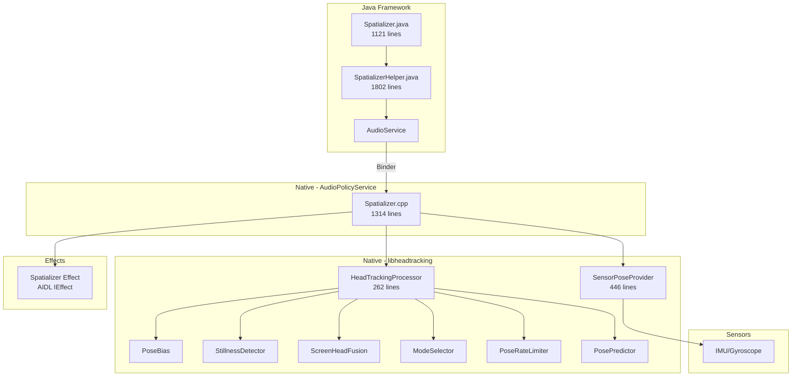
```mermaid
graph TB
    subgraph "Java Framework"
        SJ["Spatializer.java<br/>1121 lines"]
        SH["SpatializerHelper.java<br/>1802 lines"]
        AS[AudioService]
    end

    subgraph "Native - AudioPolicyService"
        SP["Spatializer.cpp<br/>1314 lines"]
    end

    subgraph "Native - libheadtracking"
        HTP["HeadTrackingProcessor<br/>262 lines"]
        SPP["SensorPoseProvider<br/>446 lines"]
        PB[PoseBias]
        SD[StillnessDetector]
        SHF[ScreenHeadFusion]
        MS[ModeSelector]
        RL[PoseRateLimiter]
        PP[PosePredictor]
    end

    subgraph "Effects"
        SE["Spatializer Effect<br/>AIDL IEffect"]
    end

    subgraph "Sensors"
        IMU[IMU/Gyroscope]
    end

    SJ --> SH
    SH --> AS
    AS -->|Binder| SP
    SP --> HTP
    SP --> SPP
    SPP --> IMU
    HTP --> PB
    HTP --> SD
    HTP --> SHF
    HTP --> MS
    HTP --> RL
    HTP --> PP
    SP --> SE
```

### 15.7.2 Head Tracking Processor

The `HeadTrackingProcessor` (262 lines) is the core pose computation engine:

```cpp
// HeadTrackingProcessor.cpp, line 37-57
class HeadTrackingProcessorImpl : public HeadTrackingProcessor {
  public:
    HeadTrackingProcessorImpl(
            const Options& options,
            HeadTrackingMode initialMode)
        : mOptions(options),
          mHeadStillnessDetector(StillnessDetector::Options{
                  .defaultValue = false,
                  .windowDuration = options.autoRecenterWindowDuration,
                  .translationalThreshold =
                          options.autoRecenterTranslationalThreshold,
                  .rotationalThreshold =
                          options.autoRecenterRotationalThreshold,
          }),
          mScreenStillnessDetector(StillnessDetector::Options{
                  .defaultValue = true,
                  .windowDuration = options.screenStillnessWindowDuration,
                  .translationalThreshold =
                          options.screenStillnessTranslationalThreshold,
                  .rotationalThreshold =
                          options.screenStillnessRotationalThreshold,
          }),
          mModeSelector(ModeSelector::Options{
                  .freshnessTimeout = options.freshnessTimeout},
                  initialMode),
          mRateLimiter(PoseRateLimiter::Options{
                  .maxTranslationalVelocity =
                          options.maxTranslationalVelocity,
                  .maxRotationalVelocity =
                          options.maxRotationalVelocity})
    {}
```

The processor combines multiple sub-components:

- **StillnessDetector** (2 instances) -- Detects when the head or screen
  is stable enough to trigger auto-recentering.
- **PoseBias** (2 instances) -- Maintains the reference pose for recentering.
- **ScreenHeadFusion** -- Fuses screen and head tracking data.
- **ModeSelector** -- Chooses between tracking modes.
- **PoseRateLimiter** -- Smooths discontinuities after mode changes.
- **PosePredictor** -- Predicts future head position to reduce latency.

### 15.7.3 Head Tracking Modes

Three modes are supported:

```cpp
// HeadTrackingProcessor.cpp, line 228-237
std::string toString(HeadTrackingMode mode) {
    switch (mode) {
        case HeadTrackingMode::STATIC:
            return "STATIC";
        case HeadTrackingMode::WORLD_RELATIVE:
            return "WORLD_RELATIVE";
        case HeadTrackingMode::SCREEN_RELATIVE:
            return "SCREEN_RELATIVE";
    }
}
```

| Mode | Description |
|------|-------------|
| STATIC | No head tracking, fixed virtual speaker positions |
| WORLD_RELATIVE | Sound sources fixed in the real world |
| SCREEN_RELATIVE | Sound sources move with the screen |

### 15.7.4 Pose Prediction

Four prediction types are available:

```cpp
// HeadTrackingProcessor.cpp, line 240-248
std::string toString(PosePredictorType posePredictorType) {
    switch (posePredictorType) {
        case PosePredictorType::AUTO: return "AUTO";
        case PosePredictorType::LAST: return "LAST";
        case PosePredictorType::TWIST: return "TWIST";
        case PosePredictorType::LEAST_SQUARES: return "LEAST_SQUARES";
    }
}
```

The predictor compensates for the latency between sensor reading and audio
rendering:

```cpp
// HeadTrackingProcessor.cpp, line 63-64
const Pose3f predictedWorldToHead = mPosePredictor.predict(
        timestamp, worldToHead, headTwist,
        mOptions.predictionDuration);
```

### 15.7.5 Auto-Recentering

The processor automatically recenters when the head or screen is still:

```cpp
// HeadTrackingProcessor.cpp, line 91-118
void calculate(int64_t timestamp) override {
    bool screenStable = true;

    if (mWorldToScreenTimestamp.has_value()) {
        const Pose3f worldToLogicalScreen =
                mScreenPoseBias.getOutput();
        screenStable =
                mScreenStillnessDetector.calculate(timestamp);
        mModeSelector.setScreenStable(
                mWorldToScreenTimestamp.value(), screenStable);
        if (!screenStable) {
            recenter(true, false, "calculate: screen movement");
        }
    }

    if (mWorldToHeadTimestamp.has_value()) {
        Pose3f worldToHead = mHeadPoseBias.getOutput();
        bool headStable =
                mHeadStillnessDetector.calculate(timestamp);
        if (headStable || !screenStable) {
            recenter(true, false, "calculate: head movement");
            worldToHead = mHeadPoseBias.getOutput();
        }
    }
```

Screen movement triggers head recentering because the reference frame has
changed. Head stillness triggers recentering to bring the virtual speaker
positions back in front of the listener.

### 15.7.6 Sensor Pose Provider

The `SensorPoseProvider` (446 lines) interfaces with the Android sensor
framework to get head orientation data:

```cpp
// SensorPoseProvider.cpp, line 59-66
class EventQueueGuard {
  public:
    EventQueueGuard(const sp<SensorEventQueue>& queue,
                    Looper* looper) : mQueue(queue) {
        mQueue->looper = Looper_to_ALooper(looper);
        mQueue->requestAdditionalInfo = false;
        looper->addFd(mQueue->getFd(), kIdent,
                ALOOPER_EVENT_INPUT, nullptr, nullptr);
    }
```

It uses `SensorEnableGuard` for RAII sensor management:

```cpp
// SensorPoseProvider.cpp, line 86-98
class SensorEnableGuard {
  public:
    SensorEnableGuard(const sp<SensorEventQueue>& queue,
                      int32_t sensor)
        : mQueue(queue), mSensor(sensor) {}

    ~SensorEnableGuard() {
        if (mSensor != SensorPoseProvider::INVALID_HANDLE) {
            int ret = mQueue->disableSensor(mSensor);
            if (ret) {
                ALOGE("Failed to disable sensor: %s",
                      strerror(ret));
            }
        }
    }
```

### 15.7.7 Spatializer (Native)

The Spatializer class (1,314 lines) ties everything together:

```cpp
// Spatializer.cpp, line 46-58
namespace android {
using aidl_utils::binderStatusFromStatusT;
using aidl_utils::statusTFromBinderStatus;
using android::content::AttributionSourceState;
using binder::Status;
using media::HeadTrackingMode;
using media::Pose3f;
using media::SensorPoseProvider;
using media::audio::common::HeadTracking;
using media::audio::common::Spatialization;
```

Channel mask selection finds the maximum supported mask:

```cpp
// Spatializer.cpp, line 61-74
static audio_channel_mask_t getMaxChannelMask(
        const std::vector<audio_channel_mask_t>& masks,
        size_t channelLimit = SIZE_MAX) {
    uint32_t maxCount = 0;
    audio_channel_mask_t maxMask = AUDIO_CHANNEL_NONE;
    for (auto mask : masks) {
        const size_t count =
                audio_channel_count_from_out_mask(mask);
        if (count > channelLimit) continue;
        if (count > maxCount) {
            maxMask = mask;
            maxCount = count;
        }
    }
    return maxMask;
}
```

### 15.7.8 Display Orientation and Rate Limiting

The rate limiter prevents jarring discontinuities when pose changes are
large (e.g., after recentering or mode change):

```cpp
// HeadTrackingProcessor.cpp, line 131-136
        HeadTrackingMode prevMode = mModeSelector.getActualMode();
        mModeSelector.calculate(timestamp);
        if (mModeSelector.getActualMode() != prevMode) {
            mRateLimiter.enable();
        }
        mRateLimiter.setTarget(
                mModeSelector.getHeadToStagePose());
        mHeadToStagePose =
                mRateLimiter.calculatePose(timestamp);
```

The rate limiter constrains translational and rotational velocity:

```cpp
// HeadTrackingProcessor.cpp, line 55-57
          mRateLimiter(PoseRateLimiter::Options{
                  .maxTranslationalVelocity =
                          options.maxTranslationalVelocity,
                  .maxRotationalVelocity =
                          options.maxRotationalVelocity})
```

This ensures smooth transitions even when the underlying pose changes
abruptly, preventing distracting audio artifacts.

### 15.7.9 Internal State of the Processor

The processor maintains rich internal state for debugging:

```cpp
// HeadTrackingProcessor.cpp, line 200-218
  private:
    const Options mOptions;
    float mPhysicalToLogicalAngle = 0;
    float mPendingPhysicalToLogicalAngle = 0;
    std::optional<int64_t> mWorldToHeadTimestamp;
    std::optional<int64_t> mWorldToScreenTimestamp;
    Pose3f mHeadToStagePose;
    PoseBias mHeadPoseBias;
    PoseBias mScreenPoseBias;
    StillnessDetector mHeadStillnessDetector;
    StillnessDetector mScreenStillnessDetector;
    ScreenHeadFusion mScreenHeadFusion;
    ModeSelector mModeSelector;
    PoseRateLimiter mRateLimiter;
    PosePredictor mPosePredictor;
    static constexpr std::size_t mMaxLocalLogLine = 10;
    SimpleLog mLocalLog{mMaxLocalLogLine};
```

The `SimpleLog` provides a rolling history of recenter events for debugging:

```cpp
// HeadTrackingProcessor.cpp, line 143-153
    void recenter(bool recenterHead, bool recenterScreen,
                  std::string source) override {
        if (recenterHead) {
            mHeadPoseBias.recenter();
            mHeadStillnessDetector.reset();
            mLocalLog.log("recenter Head from %s",
                          source.c_str());
        }
        if (recenterScreen) {
            mScreenPoseBias.recenter();
            mScreenStillnessDetector.reset();
            mLocalLog.log("recenter Screen from %s",
                          source.c_str());
        }
```

### 15.7.10 Spatial Audio Processing Pipeline

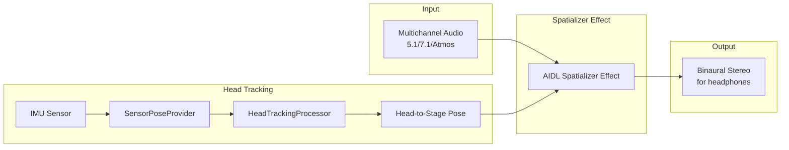
```mermaid
flowchart LR
    subgraph "Input"
        MC["Multichannel Audio<br/>5.1/7.1/Atmos"]
    end

    subgraph "Head Tracking"
        IMU[IMU Sensor] --> SPP[SensorPoseProvider]
        SPP --> HTP[HeadTrackingProcessor]
        HTP --> Pose[Head-to-Stage Pose]
    end

    subgraph "Spatializer Effect"
        SE[AIDL Spatializer Effect]
    end

    subgraph "Output"
        BIN["Binaural Stereo<br/>for headphones"]
    end

    MC --> SE
    Pose --> SE
    SE --> BIN
```

The spatializer effect receives:

1. Multichannel audio input (up to 24 channels)
2. Head-to-stage pose from the head tracking processor
3. Configuration parameters (level, mode)

It outputs binaural stereo audio that creates the illusion of speakers
surrounding the listener, with the virtual speaker positions tracking the
listener's head movements.

### 15.7.11 Display Orientation Handling

When the device display rotates, the virtual speaker positions must rotate
accordingly:

```cpp
// HeadTrackingProcessor.cpp, line 70-81
void setWorldToScreenPose(int64_t timestamp,
        const Pose3f& worldToScreen) override {
    if (mPhysicalToLogicalAngle !=
            mPendingPhysicalToLogicalAngle) {
        mRateLimiter.enable();
        mPhysicalToLogicalAngle =
                mPendingPhysicalToLogicalAngle;
    }
    Pose3f worldToLogicalScreen = worldToScreen *
            Pose3f(rotateY(-mPhysicalToLogicalAngle));
```

The `physicalToLogicalAngle` is applied as a Y-axis rotation to transform from
the physical screen orientation to the logical (content) orientation.

---

## 15.8 Audio HAL

The Audio HAL (Hardware Abstraction Layer) defines the interface between
Android's audio framework and vendor-specific audio hardware drivers.

### 15.8.1 HAL Evolution

Android has gone through several HAL interface generations:

| Version | Technology | Directory |
|---------|-----------|-----------|
| 2.0 - 7.1 | HIDL | `hardware/interfaces/audio/2.0/` through `7.1/` |
| Current | AIDL | `hardware/interfaces/audio/aidl/` |

The AIDL HAL is the current standard, with 272 AIDL files across core, effect,
and common definitions.

### 15.8.2 AIDL Core Interface: IModule

The central HAL interface is `IModule`:

```
hardware/interfaces/audio/aidl/android/hardware/audio/core/IModule.aidl
```

```java
// IModule.aidl, line 45-59
/**
 * Each instance of IModule corresponds to a separate audio module.
 * The system may have multiple modules due to the physical
 * architecture, for example, it can have multiple DSPs or other
 * audio I/O units which are not interconnected in hardware directly.
 * Usually there is at least one audio module which is responsible
 * for the "main" (or "built-in") audio functionality of the system.
 * Even if the system lacks any physical audio I/O capabilities,
 * there will be a "null" audio module.
 */
@VintfStability
interface IModule {
```

Key `IModule` methods:

| Method | Purpose |
|--------|---------|
| `setModuleDebug()` | Configure debug/test behavior |
| `getTelephony()` | Get telephony control interface |
| `getBluetooth()` | Get Bluetooth SCO/HFP interface |
| `getBluetoothA2dp()` | Get Bluetooth A2DP interface |
| `getBluetoothLe()` | Get Bluetooth LE Audio interface |
| `connectExternalDevice()` | Notify device connection |
| `getAudioPorts()` | List available audio ports |
| `getAudioRoutes()` | List available audio routes |
| `openOutputStream()` | Open output stream |
| `openInputStream()` | Open input stream |
| `setAudioPatch()` | Create/modify audio patch |
| `getMmapPolicyInfos()` | Query MMAP support |
| `getSoundDose()` | Get sound dose monitoring interface |

### 15.8.3 Core AIDL Types

Key AIDL files in `hardware/interfaces/audio/aidl/android/hardware/audio/core/`:

| File | Purpose |
|------|---------|
| `IModule.aidl` | Main HAL module interface |
| `IStreamIn.aidl` | Input stream interface |
| `IStreamOut.aidl` | Output stream interface |
| `IStreamCommon.aidl` | Common stream operations |
| `IStreamCallback.aidl` | Async stream completion callbacks |
| `IStreamOutEventCallback.aidl` | Output stream events |
| `StreamDescriptor.aidl` | Stream shared memory layout |
| `AudioPatch.aidl` | Audio patch definition |
| `AudioRoute.aidl` | Audio route definition |
| `MmapBufferDescriptor.aidl` | MMAP buffer description |
| `IConfig.aidl` | Global audio configuration |
| `IBluetooth.aidl` | Bluetooth SCO/HFP control |
| `IBluetoothA2dp.aidl` | Bluetooth A2DP control |
| `IBluetoothLe.aidl` | Bluetooth LE Audio control |
| `ITelephony.aidl` | Telephony audio control |
| `ISoundDose.aidl` | Sound dose monitoring |

### 15.8.4 Stream Descriptor and Shared Memory

The `StreamDescriptor` defines the shared memory layout between the framework
and HAL for zero-copy data transfer. It contains:

- Audio data FMQ (Fast Message Queue) descriptor
- Command FMQ descriptor for HAL commands
- Reply FMQ descriptor for HAL responses
- Buffer size in frames
- Frame size in bytes

The FMQ mechanism uses shared memory with lock-free circular buffers, similar
to AAudio's FIFO but at the HAL level.

### 15.8.5 Audio Patch Model

The HAL uses a patch-based routing model. An audio patch connects sources to
sinks:

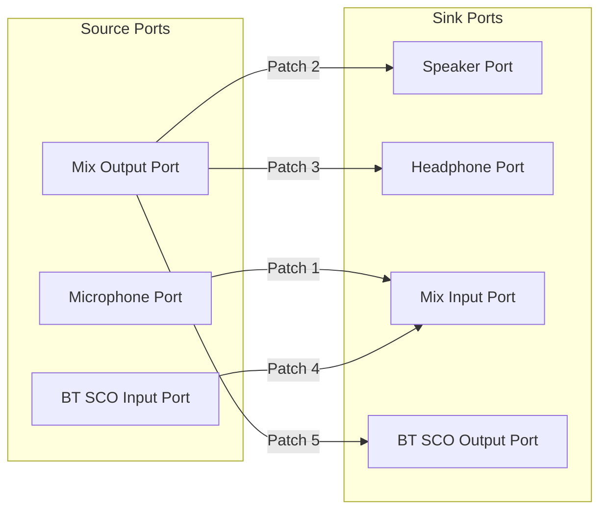
```mermaid
graph LR
    subgraph "Source Ports"
        MIC[Microphone Port]
        MIX_OUT[Mix Output Port]
        BT_IN[BT SCO Input Port]
    end

    subgraph "Sink Ports"
        SPK[Speaker Port]
        HP[Headphone Port]
        MIX_IN[Mix Input Port]
        BT_OUT[BT SCO Output Port]
    end

    MIC -->|Patch 1| MIX_IN
    MIX_OUT -->|Patch 2| SPK
    MIX_OUT -->|Patch 3| HP
    BT_IN -->|Patch 4| MIX_IN
    MIX_OUT -->|Patch 5| BT_OUT
```

### 15.8.6 HIDL to AIDL Migration

The framework supports both HIDL and AIDL HALs simultaneously. The HAL version
is checked at startup:

```cpp
// AudioFlinger.cpp, line 106-107
static const AudioHalVersionInfo kMaxAAudioPropertyDeviceHalVersion =
        AudioHalVersionInfo(AudioHalVersionInfo::Type::HIDL, 7, 1);
```

For HAL versions above HIDL 7.1, AAudio configuration comes from the HAL
directly. For older versions, it falls back to system properties:

```cpp
// AudioFlinger.cpp, line 343-346
if (mDevicesFactoryHal->getHalVersion() <=
        kMaxAAudioPropertyDeviceHalVersion) {
    mAAudioBurstsPerBuffer =
            getAAudioMixerBurstCountFromSystemProperty();
    mAAudioHwBurstMinMicros =
            getAAudioHardwareBurstMinUsecFromSystemProperty();
}
```

### 15.8.7 MMAP Support in HAL

MMAP support is queried through `getMmapPolicyInfos()`:

```cpp
// AudioFlinger.cpp, line 388-413
status_t AudioFlinger::getMmapPolicyInfos(
        AudioMMapPolicyType policyType,
        std::vector<AudioMMapPolicyInfo> *policyInfos) {
    audio_utils::lock_guard _l(mutex());
    if (mDevicesFactoryHal->getHalVersion() >
            kMaxAAudioPropertyDeviceHalVersion) {
        audio_utils::lock_guard lock(hardwareMutex());
        for (const auto& [module, audioHwDevice] : mAudioHwDevs) {
            std::vector<AudioMMapPolicyInfo> infos;
            const status_t status =
                    audioHwDevice->getMmapPolicyInfos(
                            policyType, &infos);
            policyInfos->insert(policyInfos->end(),
                    infos.begin(), infos.end());
        }
        mPolicyInfos[policyType] = *policyInfos;
    } else {
        getMmapPolicyInfosFromSystemProperty(
                policyType, policyInfos);
        mPolicyInfos[policyType] = *policyInfos;
    }
    return NO_ERROR;
}
```

### 15.8.8 Bluetooth Audio Integration

The AIDL HAL provides three separate Bluetooth interfaces reflecting the
different Bluetooth audio profiles:

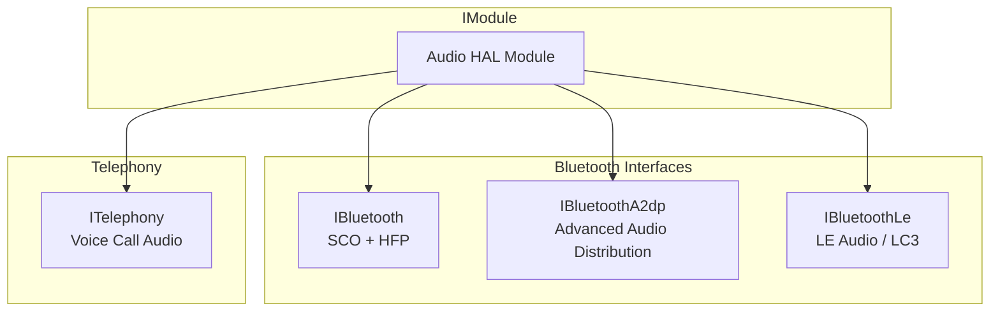
```mermaid
graph TB
    subgraph "IModule"
        MOD[Audio HAL Module]
    end

    subgraph "Bluetooth Interfaces"
        BT["IBluetooth<br/>SCO + HFP"]
        A2DP["IBluetoothA2dp<br/>Advanced Audio Distribution"]
        LE["IBluetoothLe<br/>LE Audio / LC3"]
    end

    subgraph "Telephony"
        TEL["ITelephony<br/>Voice Call Audio"]
    end

    MOD --> BT
    MOD --> A2DP
    MOD --> LE
    MOD --> TEL
```

From the IModule AIDL comments:

```java
// IModule.aidl, line 93-100
    /**
     * Retrieve the interface to control Bluetooth SCO and HFP.
     *
     * If the HAL module supports either the SCO Link or
     * Hands-Free Profile functionality (or both) for Bluetooth,
     * it must return an instance of the IBluetooth interface.
     */
    @nullable IBluetooth getBluetooth();
```

This separation allows different audio paths for:

- **SCO/HFP** -- Narrowband (8kHz) or wideband (16kHz) voice
- **A2DP** -- High-quality music streaming (SBC, AAC, LDAC, aptX)
- **LE Audio** -- Next-generation low-power audio with LC3 codec

### 15.8.9 Sound Dose Interface

The HAL includes sound dose monitoring for hearing protection:

```
hardware/interfaces/audio/aidl/android/hardware/audio/core/sounddose/ISoundDose.aidl
```

This interface allows the HAL to report MEL (Measured Exposure Level) data
directly from the hardware DSP, which can be more accurate than the software
MEL computation in AudioFlinger's MelReporter.

### 15.8.10 VINTF Stability

All AIDL interfaces are marked `@VintfStability`:

```java
// IModule.aidl, line 60
@VintfStability
interface IModule {
```

This means they are part of the Vendor Interface (VINTF) manifest and are
subject to strict compatibility requirements. The framework and HAL versions
can be updated independently, with the AIDL versioning system ensuring
backward compatibility.

### 15.8.11 Default HAL Implementation

A reference implementation is provided at:

```
hardware/interfaces/audio/aidl/default/
```

This implementation serves as both a template for vendors and a functional
null audio HAL for emulators and CTS testing. It implements all required
IModule methods with sensible defaults.

### 15.8.12 Device Connection Management

AudioFlinger manages device connection state transitions:

```cpp
// AudioFlinger.cpp, line 425-445
status_t AudioFlinger::setDeviceConnectedState(
        const struct audio_port_v7 *port,
        media::DeviceConnectedState state) {
    status_t result = NO_INIT;
    audio_utils::lock_guard _l(mutex());
    audio_utils::lock_guard lock(hardwareMutex());

    if (auto it = mAudioHwDevs.find(port->ext.device.hw_module);
            it != mAudioHwDevs.end()) {
        const AudioHwDevice* const audioHwDevice = it->second;
        mHardwareStatus = AUDIO_HW_SET_CONNECTED_STATE;
        const sp<DeviceHalInterface>& dev =
                audioHwDevice->hwDevice();
        result = state ==
                media::DeviceConnectedState::PREPARE_TO_DISCONNECT
            ? dev->prepareToDisconnectExternalDevice(port)
            : dev->setConnectedState(port,
                state == media::DeviceConnectedState::CONNECTED);
        mHardwareStatus = AUDIO_HW_IDLE;
    }
    return result;
}
```

The `PREPARE_TO_DISCONNECT` state allows the HAL to gracefully handle device
removal (e.g., rerouting audio before the device is gone).

---

## 15.9 Native Audio APIs

### 15.9.1 AudioTrack (Native C++)

The native `AudioTrack` class is the primary client-side API for audio
playback. It is defined in:

```
frameworks/av/media/libaudioclient/AudioTrack.cpp (3,894 lines)
```

#### Minimum Frame Count

The minimum buffer size is calculated from the HAL:

```cpp
// AudioTrack.cpp, line 116-119
status_t AudioTrack::getMinFrameCount(
        size_t* frameCount,
        audio_stream_type_t streamType,
        uint32_t sampleRate)
{
```

#### Pitch and Speed

AudioTrack supports playback speed and pitch control with these utilities:

```cpp
// AudioTrack.cpp, line 97-113
static const bool kFixPitch = true;

static inline uint32_t adjustSampleRate(
        uint32_t sampleRate, float pitch) {
    return kFixPitch ? (sampleRate * pitch + 0.5) : sampleRate;
}

static inline float adjustSpeed(float speed, float pitch) {
    return kFixPitch ?
        speed / max(pitch, AUDIO_TIMESTRETCH_PITCH_MIN_DELTA) :
        speed;
}

static inline float adjustPitch(float pitch) {
    return kFixPitch ? AUDIO_TIMESTRETCH_PITCH_NORMAL : pitch;
}
```

The `kFixPitch` workaround emulates pitch using the sample rate converter
because the time stretcher's pitch setting was not working correctly.

#### Key Operations

| Method | Description |
|--------|-------------|
| `set()` / `create()` | Configure the track with format, rate, channel mask |
| `start()` | Begin playback |
| `stop()` | Stop playback |
| `pause()` | Pause playback |
| `flush()` | Discard pending data |
| `write()` | Write audio data (blocking or non-blocking) |
| `obtainBuffer()` / `releaseBuffer()` | Direct buffer access |
| `setVolume()` | Set left/right volume |
| `setRate()` | Set playback speed |
| `getTimestamp()` | Get presentation timestamp |

### 15.9.2 AudioRecord (Native C++)

The native `AudioRecord` class handles audio capture:

```
frameworks/av/media/libaudioclient/AudioRecord.cpp (1,891 lines)
```

Minimum frame count calculation:

```cpp
// AudioRecord.cpp, line 51-79
status_t AudioRecord::getMinFrameCount(
        size_t* frameCount,
        uint32_t sampleRate,
        audio_format_t format,
        audio_channel_mask_t channelMask)
{
    size_t size;
    status_t status = AudioSystem::getInputBufferSize(
            sampleRate, format, channelMask, &size);
    // We double the size of input buffer for ping pong use
    const auto frameSize = audio_bytes_per_frame(
            audio_channel_count_from_in_mask(channelMask), format);
    if (frameSize == 0 ||
            ((*frameCount = (size * 2) / frameSize) == 0)) {
        return BAD_VALUE;
    }
    return NO_ERROR;
}
```

The "ping pong" doubling ensures that while one buffer is being read by the
application, the other is being filled by the HAL.

### 15.9.3 AudioSystem

`AudioSystem` provides static utility methods that act as the client-side entry
point for both AudioFlinger and AudioPolicyService:

```
frameworks/av/media/libaudioclient/AudioSystem.cpp (3,201 lines)
```

It maintains service connection state:

```cpp
// AudioSystem.cpp, line 68-76
std::mutex AudioSystem::gMutex;
dynamic_policy_callback AudioSystem::gDynPolicyCallback = NULL;
record_config_callback AudioSystem::gRecordConfigCallback = NULL;
routing_callback AudioSystem::gRoutingCallback = NULL;
vol_range_init_req_callback
        AudioSystem::gVolRangeInitReqCallback = NULL;

std::mutex AudioSystem::gApsCallbackMutex;
std::mutex AudioSystem::gErrorCallbacksMutex;
std::set<audio_error_callback>
        AudioSystem::gAudioErrorCallbacks;
```

Key static methods:

| Method | Purpose |
|--------|---------|
| `getOutputForAttr()` | Get output handle for audio attributes |
| `getInputForAttr()` | Get input handle for audio attributes |
| `startOutput()` / `stopOutput()` | Notify policy of stream activity |
| `getOutputSamplingRate()` | Query output sample rate |
| `getOutputFrameCount()` | Query output buffer size |
| `getOutputLatency()` | Query output latency |
| `setParameters()` | Set HAL parameters |
| `getParameters()` | Get HAL parameters |
| `registerEffect()` | Register effect with policy |
| `setEffectEnabled()` | Enable/disable effect |
| `onNewAudioModulesAvailable()` | Handle new HAL modules |

### 15.9.4 AudioTrack.java (Java API)

The Java `AudioTrack` class is the most commonly used audio playback API:

```
frameworks/base/media/java/android/media/AudioTrack.java (4,707 lines)
```

It wraps the native `AudioTrack` through JNI, adding:

- Builder pattern for construction
- Automatic format negotiation
- Audio focus integration
- VolumeShaper support
- Routing callback support
- Spatial audio attributes

The Java API exposes the full range of playback modes:

- `MODE_STREAM` -- streaming mode with blocking writes
- `MODE_STATIC` -- static buffer mode (load once, play many times)

It also supports:

- `WRITE_BLOCKING` / `WRITE_NON_BLOCKING` write semantics
- `ENCAPSULATION_MODE_*` for compressed audio passthrough
- Performance modes: `PERFORMANCE_MODE_LOW_LATENCY`,
  `PERFORMANCE_MODE_NONE`, `PERFORMANCE_MODE_POWER_SAVING`

### 15.9.5 AudioTrack Construction Flow

The full lifecycle of an `AudioTrack` from Java to native:

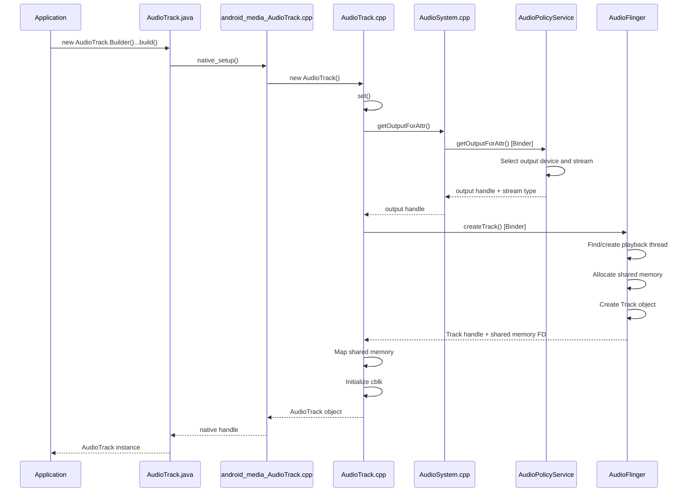
```mermaid
sequenceDiagram
    participant App as Application
    participant Java as AudioTrack.java
    participant JNI as android_media_AudioTrack.cpp
    participant Native as AudioTrack.cpp
    participant AS as AudioSystem.cpp
    participant APS as AudioPolicyService
    participant AF as AudioFlinger

    App->>Java: new AudioTrack.Builder()...build()
    Java->>JNI: native_setup()
    JNI->>Native: new AudioTrack()
    Native->>Native: set()
    Native->>AS: getOutputForAttr()
    AS->>APS: getOutputForAttr() [Binder]
    APS->>APS: Select output device and stream
    APS-->>AS: output handle + stream type
    AS-->>Native: output handle
    Native->>AF: createTrack() [Binder]
    AF->>AF: Find/create playback thread
    AF->>AF: Allocate shared memory
    AF->>AF: Create Track object
    AF-->>Native: Track handle + shared memory FD
    Native->>Native: Map shared memory
    Native->>Native: Initialize cblk
    Native-->>JNI: AudioTrack object
    JNI-->>Java: native handle
    Java-->>App: AudioTrack instance
```

### 15.9.6 AudioRecord Construction Flow

AudioRecord follows a similar pattern but for input:

```mermaid
sequenceDiagram
    participant App as Application
    participant Native as AudioRecord.cpp
    participant AS as AudioSystem
    participant APS as AudioPolicyService
    participant AF as AudioFlinger

    App->>Native: new AudioRecord()
    Native->>Native: set()
    Native->>AS: getInputForAttr()
    AS->>APS: getInputForAttr() [Binder]
    APS->>APS: Select input device
    APS-->>AS: input handle + device
    AS-->>Native: input handle
    Native->>AF: createRecord() [Binder]
    AF->>AF: Find RecordThread
    AF->>AF: Allocate shared memory
    AF->>AF: Create RecordTrack
    AF-->>Native: RecordTrack handle + shared memory FD
    Native->>Native: Map shared memory
```

The minimum frame count for recording uses "ping pong" doubling:

```cpp
// AudioRecord.cpp, line 51-79
status_t AudioRecord::getMinFrameCount(
        size_t* frameCount,
        uint32_t sampleRate,
        audio_format_t format,
        audio_channel_mask_t channelMask)
{
    size_t size;
    status_t status = AudioSystem::getInputBufferSize(
            sampleRate, format, channelMask, &size);
    // We double the size of input buffer for ping pong use
    // of record buffer.
    const auto frameSize = audio_bytes_per_frame(
            audio_channel_count_from_in_mask(channelMask),
            format);
    *frameCount = (size * 2) / frameSize;
    return NO_ERROR;
}
```

### 15.9.7 AudioSystem as Service Proxy

AudioSystem maintains singleton connections to both AudioFlinger and
AudioPolicyService. It provides static methods that hide the Binder IPC:

```cpp
// AudioSystem.cpp, line 68-79
std::mutex AudioSystem::gMutex;
dynamic_policy_callback AudioSystem::gDynPolicyCallback = NULL;
record_config_callback AudioSystem::gRecordConfigCallback = NULL;
routing_callback AudioSystem::gRoutingCallback = NULL;
vol_range_init_req_callback
        AudioSystem::gVolRangeInitReqCallback = NULL;

std::mutex AudioSystem::gApsCallbackMutex;
std::mutex AudioSystem::gErrorCallbacksMutex;
std::set<audio_error_callback>
        AudioSystem::gAudioErrorCallbacks;
```

It also handles service death notifications, allowing clients to recover
from audioserver crashes by re-establishing connections and re-creating
tracks.

### 15.9.8 VolumeShaper

Both native and Java AudioTrack support `VolumeShaper`, which provides
smooth volume transitions over time:

```mermaid
graph LR
    subgraph "VolumeShaper Configuration"
        Times["Times: [0.0, 0.5, 1.0]"]
        Volumes["Volumes: [0.0, 1.0, 0.0]"]
        Interpolation[LINEAR or CUBIC]
        Duration["Duration: 1000ms"]
    end

    subgraph "Application"
        VS[VolumeShaper]
    end

    subgraph "AudioFlinger"
        VH["VolumeHandler<br/>per-track"]
    end

    Times --> VS
    Volumes --> VS
    Interpolation --> VS
    Duration --> VS
    VS -->|apply| VH
    VH -->|modulates| Audio[Audio Data]
```

VolumeShaper configurations are sent to AudioFlinger and applied in the
mixing loop. This enables smooth fade-in/fade-out effects without the
application needing to modify audio data.

### 15.9.9 Offload Playback

For compressed audio (MP3, AAC, etc.), the AudioTrack can be created with
`AUDIO_OUTPUT_FLAG_COMPRESS_OFFLOAD`. This sends compressed data directly
to the HAL for hardware decoding:

```mermaid
graph LR
    AT["AudioTrack<br/>compressed data"] -->|write| AF[OffloadThread]
    AF -->|compressed write| HAL["Audio HAL<br/>HW decoder"]
    HAL --> DAC[DAC]
```

Benefits:

- CPU is idle during playback (significant power savings)
- No software decoding overhead
- Hardware-accurate gapless playback

Limitations:

- Only one offloaded stream at a time (typically)
- Limited format support (depends on hardware)
- Effects may not be available
- Higher latency for initial start

### 15.9.10 Direct Playback

Direct playback (`AUDIO_OUTPUT_FLAG_DIRECT`) sends PCM data to the HAL
without mixing. This is used for:

- High-resolution audio (24-bit/32-bit at high sample rates)
- Multichannel audio (5.1, 7.1)
- Passthrough formats (Dolby, DTS)

The DirectOutputThread has simpler logic than the MixerThread since it
handles only a single track.

### 15.9.11 Shared Memory Transfer

The client-server data transfer uses shared memory mapped through Binder:

```mermaid
sequenceDiagram
    participant App as Application
    participant AT as AudioTrack
    participant Cblk as audio_track_cblk_t (shared memory)
    participant AF as AudioFlinger MixerThread

    App->>AT: write(buffer, size)
    AT->>Cblk: Copy data to shared buffer
    AT->>Cblk: Update write position
    AT->>Cblk: futex wake (if needed)

    Note over AF: Thread loop running
    AF->>Cblk: Read write position
    AF->>Cblk: Copy data from shared buffer
    AF->>Cblk: Update read position
    AF->>AF: Mix with other tracks
    AF->>AF: Write to HAL
```

The futex wake is used only when necessary (the server was waiting for data),
making the normal-case data transfer completely lock-free.

### 15.9.12 Volume and Gain Management

Volume in Android's audio system flows through multiple stages:

```mermaid
graph LR
    AV["App Volume<br/>AudioTrack.setVolume"] --> TV["Track Volume<br/>in AudioFlinger"]
    TV --> MV[Master Volume]
    SV["Stream Volume<br/>AudioPolicy"] --> MV
    MV --> HV[HAL Volume]
    HV --> HW[Hardware Gain]
```

Each stage can apply gain independently. The track volume is set through the
shared memory control block and applied during mixing. The master volume
and stream volumes are managed by AudioPolicyService and applied as software
gain in AudioFlinger.

---

## 15.10 Try It

### Exercise 1: Dump the Audio System State

Use `dumpsys` to inspect the running audio system:

```bash
# Dump AudioFlinger state
adb shell dumpsys media.audio_flinger

# Dump AudioPolicy state
adb shell dumpsys media.audio_policy

# Dump AAudio service state
adb shell dumpsys media.aaudio
```

Key things to look for in the AudioFlinger dump:

- **Thread list** -- Shows all active mixer, direct, and mmap threads.
- **Track list** -- Shows all active and inactive tracks per thread.
- **Effect chains** -- Shows effects attached to each session.
- **Patch list** -- Shows all active audio patches.
- **FastMixer state** -- Shows fast track activity and timing statistics.

### Exercise 2: Trace an AudioTrack from Java to HAL

1. Enable audio tracing:
```bash
adb shell atrace --async_start -c -b 65536 audio
```

2. Play some audio on the device.

3. Capture the trace:
```bash
adb shell atrace --async_stop -c -b 65536 audio > /tmp/audio_trace.txt
```

4. Open in Perfetto or systrace. Look for:
   - `AudioTrack::write` -- client-side writes
   - `MixerThread::threadLoop` -- mixer cycle
   - `FastMixer::onWork` -- fast mixer cycle
   - `write` ATRACE in `threadLoop_write` -- HAL writes

### Exercise 3: Observe the FastMixer

```bash
# Check if FastMixer is active
adb shell dumpsys media.audio_flinger | grep -A 20 "FastMixer"
```

The dump shows:

- Number of fast tracks
- Cycle times (min, max, mean, standard deviation)
- Underrun and overrun counts
- CPU load statistics

### Exercise 4: List Audio Devices and Patches

```bash
# List audio ports
adb shell dumpsys media.audio_policy | grep -A 5 "Audio Ports"

# List audio patches
adb shell dumpsys media.audio_flinger | grep -A 20 "Patches"
```

Each patch shows the source and sink port handles, the associated thread,
and whether it is a hardware or software patch.

### Exercise 5: AAudio MMAP Detection

Check if the device supports MMAP:

```bash
# Check MMAP policy
adb shell dumpsys media.audio_flinger | grep -i mmap

# Check AAudio configuration
adb shell getprop aaudio.mmap_policy
adb shell getprop aaudio.mmap_exclusive_policy
```

Values:

- `1` = Never use MMAP
- `2` = Use MMAP if available
- `3` = Always use MMAP

### Exercise 6: Audio Effects Inspection

```bash
# List available effects
adb shell dumpsys media.audio_flinger | grep -A 3 "Effect"

# List effects on a specific session
adb shell dumpsys media.audio_flinger | grep -B 2 -A 10 "EffectChain"
```

### Exercise 7: Build and Run AAudio CTS Tests

```bash
# Build AAudio tests
cd $ANDROID_BUILD_TOP
m cts -j$(nproc)

# Run AAudio tests
adb shell am instrument -w \
    android.media.aaudio.cts/android.support.test.runner.AndroidJUnitRunner
```

### Exercise 8: Monitor Sound Dose

```bash
# Check MEL (Measured Exposure Level) reporting
adb shell dumpsys media.audio_flinger | grep -A 10 "MelReporter"
```

The MelReporter tracks cumulative sound exposure across all output streams.

### Exercise 9: Spatial Audio Testing

```bash
# Check spatializer status
adb shell dumpsys media.audio_policy | grep -A 20 "Spatializer"

# Check head tracking status
adb shell dumpsys media.audio_policy | grep -i "head.tracking"
```

The spatializer dump shows:

- Whether spatialization is enabled
- Current head tracking mode (STATIC, WORLD_RELATIVE, SCREEN_RELATIVE)
- Supported channel masks
- Connected sensor information

### Exercise 10: Write a Minimal AAudio Application

Create a simple AAudio tone generator:

```c
#include <aaudio/AAudio.h>
#include <math.h>

#define SAMPLE_RATE 48000
#define FREQUENCY 440.0

static double phase = 0.0;

aaudio_data_callback_result_t dataCallback(
        AAudioStream *stream,
        void *userData,
        void *audioData,
        int32_t numFrames) {
    float *output = (float *)audioData;
    double phaseIncrement = 2.0 * M_PI * FREQUENCY / SAMPLE_RATE;

    for (int i = 0; i < numFrames; i++) {
        output[i] = (float)sin(phase) * 0.3f;
        phase += phaseIncrement;
        if (phase >= 2.0 * M_PI) phase -= 2.0 * M_PI;
    }
    return AAUDIO_CALLBACK_RESULT_CONTINUE;
}

int main() {
    AAudioStreamBuilder *builder;
    AAudioStream *stream;

    AAudio_createStreamBuilder(&builder);
    AAudioStreamBuilder_setFormat(builder, AAUDIO_FORMAT_PCM_FLOAT);
    AAudioStreamBuilder_setChannelCount(builder, 1);
    AAudioStreamBuilder_setSampleRate(builder, SAMPLE_RATE);
    AAudioStreamBuilder_setPerformanceMode(builder,
            AAUDIO_PERFORMANCE_MODE_LOW_LATENCY);
    AAudioStreamBuilder_setDataCallback(builder,
            dataCallback, NULL);

    AAudioStreamBuilder_openStream(builder, &stream);
    AAudioStreamBuilder_delete(builder);

    AAudioStream_requestStart(stream);

    // Play for 5 seconds
    sleep(5);

    AAudioStream_requestStop(stream);
    AAudioStream_close(stream);
    return 0;
}
```

Build with:
```makefile
# Android.bp
cc_binary {
    name: "aaudio_tone",
    srcs: ["aaudio_tone.c"],
    shared_libs: ["libaaudio"],
}
```

### Exercise 11: Inspect Audio Policy Configuration

```bash
# Find the audio policy configuration file
adb shell find /vendor/etc -name "audio_policy_configuration*.xml" 2>/dev/null

# Read it
adb shell cat /vendor/etc/audio_policy_configuration.xml
```

The XML file defines:

- Audio modules (primary, a2dp, usb, etc.)
- Device ports (speakers, microphones, headphones, etc.)
- Mix ports (output and input streams with supported formats)
- Audio routes (connections between ports)
- Default volume curves

### Exercise 12: Explore the AAudio FIFO

Write a program that measures the actual AAudio FIFO characteristics:

```c
#include <aaudio/AAudio.h>
#include <stdio.h>

int main() {
    AAudioStreamBuilder *builder;
    AAudioStream *stream;

    AAudio_createStreamBuilder(&builder);
    AAudioStreamBuilder_setPerformanceMode(builder,
            AAUDIO_PERFORMANCE_MODE_LOW_LATENCY);
    AAudioStreamBuilder_setSharingMode(builder,
            AAUDIO_SHARING_MODE_EXCLUSIVE);
    AAudioStreamBuilder_setFormat(builder,
            AAUDIO_FORMAT_PCM_FLOAT);
    AAudioStreamBuilder_setChannelCount(builder, 2);
    AAudioStreamBuilder_openStream(builder, &stream);

    printf("Sample rate: %d\n",
            AAudioStream_getSampleRate(stream));
    printf("Frames per burst: %d\n",
            AAudioStream_getFramesPerBurst(stream));
    printf("Buffer capacity: %d frames\n",
            AAudioStream_getBufferCapacityInFrames(stream));
    printf("Buffer size: %d frames\n",
            AAudioStream_getBufferSizeInFrames(stream));
    printf("Sharing mode: %s\n",
            AAudioStream_getSharingMode(stream) ==
                AAUDIO_SHARING_MODE_EXCLUSIVE ?
                "EXCLUSIVE" : "SHARED");
    printf("Performance mode: %d\n",
            AAudioStream_getPerformanceMode(stream));
    printf("Direction: %s\n",
            AAudioStream_getDirection(stream) ==
                AAUDIO_DIRECTION_OUTPUT ?
                "OUTPUT" : "INPUT");

    AAudioStream_close(stream);
    AAudioStreamBuilder_delete(builder);
    return 0;
}
```

### Exercise 13: Monitor Effect Chain Activity

```bash
# Watch effect chains in real-time
watch -n 1 'adb shell dumpsys media.audio_flinger \
    | grep -A 5 "EffectChain"'
```

Play music and observe:

- Which effects are attached to the music session
- Which effects are on the OUTPUT_STAGE session
- Whether the spatializer effect is active

### Exercise 14: Capture Audio Policy Decisions

```bash
# Enable verbose audio policy logging
adb shell setprop log.tag.AudioPolicyService V
adb shell setprop log.tag.AudioPolicyManager V

# Watch the log for routing decisions
adb logcat -s AudioPolicyService:V AudioPolicyManager:V
```

Now plug in headphones and observe:

- The device connection event
- The routing decision to switch from speaker to headphones
- The audio patch creation
- Volume curve adjustment for the new device

### Exercise 15: Measure Audio Round-Trip Latency

Use the built-in OboeTester app or build one:

```bash
# Install OboeTester (from the Oboe repository)
adb install OboeTester.apk
```

In OboeTester:

1. Select "Round Trip Latency" test
2. Hold the phone so the speaker faces the microphone
3. Tap "Test"
4. The app measures the time for audio to travel from speaker to microphone

Compare results with:

- AAudio MMAP exclusive mode
- AAudio shared mode
- Legacy AudioTrack path
- Different buffer sizes

### Exercise 16: Observe Thread Scheduling

```bash
# Check audio thread priorities
adb shell ps -eT | grep audio

# Check real-time priorities
adb shell cat /proc/$(adb shell pidof audioserver)/task/*/sched | head -60
```

Audio threads typically run at:

- MixerThread: SCHED_FIFO priority 2
- FastMixer: SCHED_FIFO priority 3
- FastCapture: SCHED_FIFO priority 3
- AAudioService threads: SCHED_FIFO priority 2

### Exercise 17: Inspect AIDL Audio HAL

On devices with AIDL Audio HAL:

```bash
# Check if AIDL HAL is running
adb shell service list | grep audio

# Dump HAL state
adb shell dumpsys media.audio_flinger --hal

# List available audio ports from HAL
adb shell dumpsys media.audio_flinger | grep -A 2 "Audio port"
```

### Exercise 18: Head Tracking Debug

```bash
# Check head tracking sensor status
adb shell dumpsys media.audio_policy | grep -i sensor

# Check pose data
adb shell dumpsys media.audio_policy | \
    grep -A 30 "HeadTrackingProcessor"
```

The dump shows:

- Current head-to-stage pose (rotation quaternion + translation)
- Active tracking mode
- Stillness detector state
- Rate limiter state
- Recent recenter history

### Exercise 19: Monitor MMAP Stream Health

```bash
# Check active MMAP streams
adb shell dumpsys media.aaudio | grep -A 10 "MMAP"

# Check endpoint state
adb shell dumpsys media.aaudio | \
    grep -A 20 "AAudioServiceEndpoint"
```

Look for:

- Number of active MMAP endpoints
- Hardware timestamp offsets
- Frame transfer counts
- Shared memory file descriptors

### Exercise 20: Audio HAL Latency Modes

```bash
# Check supported latency modes
adb shell dumpsys media.audio_flinger | \
    grep -i "latency.mode"

# Check current latency mode
adb shell dumpsys media.audio_flinger | \
    grep -A 5 "SpatializerThread"
```

Devices with spatial audio support may show:

- `AUDIO_LATENCY_MODE_FREE` -- No latency constraint
- `AUDIO_LATENCY_MODE_LOW` -- Low latency for head tracking

---

## 15.11 Debugging and Performance Analysis

### 15.11.1 Audio System Properties

Key system properties that control audio behavior:

| Property | Default | Description |
|----------|---------|-------------|
| `ro.audio.flinger_standbytime_ms` | 3000 | Standby delay |
| `af.fast_track_multiplier` | 2 | Fast track buffer multiplier |
| `aaudio.mmap_policy` | 2 | MMAP usage policy |
| `aaudio.mmap_exclusive_policy` | 2 | Exclusive MMAP policy |
| `aaudio.hw_burst_min_usec` | varies | Min HAL burst size |
| `audio.timestamp.corrected_input_device` | NONE | Timestamp correction |

### 15.11.2 Media Metrics

Every audio operation logs metrics through the MediaMetrics system:

```cpp
// AudioFlinger.cpp, line 327-329
    mediametrics::LogItem(mMetricsId)
        .set(AMEDIAMETRICS_PROP_EVENT,
             AMEDIAMETRICS_PROP_EVENT_VALUE_CTOR)
        .record();
```

Query metrics:
```bash
adb shell dumpsys media.metrics --since 60
```

This shows all audio events from the last 60 seconds, including:

- Track creation/destruction
- Stream opens/closes
- Device routing changes
- Effect enable/disable
- Underrun/overrun events

### 15.11.3 Systrace Integration

AudioFlinger uses `ATRACE_TAG_AUDIO` for systrace integration:

```cpp
// AudioFlinger.cpp, line 20
#define ATRACE_TAG ATRACE_TAG_AUDIO
```

Key trace points:

- `AudioFlinger::createTrack` -- Track creation latency
- `write` -- HAL write duration
- `underrun` -- Underrun detection
- `AudioTrack::write` -- Client-side write timing

### 15.11.4 Mutex Statistics

AudioFlinger uses `audio_utils::mutex` which tracks lock contention:

```cpp
// AudioFlinger.cpp, line 820-822
    writeStr(fd, audio_utils::mutex::all_stats_to_string());
    writeStr(fd, audio_utils::mutex::all_threads_to_string());
```

The mutex statistics show:

- Total lock acquisitions
- Contention count (times a thread had to wait)
- Maximum wait time
- Current holders

### 15.11.5 Common Audio Issues

| Issue | Symptom | Diagnosis |
|-------|---------|-----------|
| Underrun | Audio glitches/clicks | Check `dumpsys` for underrun counts, increase buffer size |
| High latency | Noticeable delay | Check if MMAP is available, verify fast track usage |
| No audio | Silence | Check patches in `dumpsys`, verify device routing |
| Distortion | Clipped audio | Check volume levels, look for float overflow |
| Echo | Self-hearing | Check AEC effect is attached to input stream |
| Routing wrong | Wrong speaker | Check AudioPolicy routing rules |

### 15.11.6 TimerQueue

AudioFlinger uses a TimerQueue for deferred operations:

```cpp
// AudioFlinger.cpp, line 352
    ALOGD("%s: TimerQueue %s", __func__,
            mTimerQueue->ready() ? "ready" : "uninitialized");
```

The TimerQueue dump is available in stats output:

```cpp
// AudioFlinger.cpp, line 1005-1006
        dprintf(fd, "\n ## BEGIN TimerQueue dump\n");
        dprintf(fd, "%s\n", mTimerQueue->toString().c_str());
```

### 15.11.7 PowerManager Integration

AudioFlinger integrates with the Android power management system through
`AudioPowerManager`:

```cpp
// AudioFlinger.cpp, line 974-979
        dprintf(fd, "\n ## BEGIN power dump\n");
        char value[PROPERTY_VALUE_MAX];
        property_get("ro.build.display.id", value,
                     "Unknown build");
        std::string build(value);
        writeStr(fd, build + "\n");
        writeStr(fd, media::psh_utils::AudioPowerManager::
                getAudioPowerManager().toString());
```

The power manager tracks:

- Wake lock acquisitions and releases per thread
- Audio activity duration for battery attribution
- CPU frequency requests for real-time threads
- Device power state transitions

### 15.11.8 TimeCheck Watchdog

AudioFlinger uses TimeCheck as a watchdog for HAL calls:

```cpp
// AudioFlinger.cpp, line 816-817
    dprintf(fd, "\nTimeCheck:\n");
    writeStr(fd, mediautils::TimeCheck::toString());
```

TimeCheck monitors binder calls to the HAL. If a HAL call takes longer
than the configured timeout, it logs a warning and may trigger a HAL
restart to prevent the entire audio system from hanging.

### 15.11.9 Deadlock Detection

AudioFlinger's dump system detects potential deadlocks:

```cpp
// AudioFlinger.cpp, line 109-112
constexpr auto kDeadlockedString =
        "AudioFlinger may be deadlocked\n"sv;
constexpr auto kHardwareLockedString =
        "Hardware lock is taken\n"sv;
constexpr auto kClientLockedString =
        "Client lock is taken\n"sv;
```

During dump, it uses `FallibleLockGuard` which attempts to acquire locks
without blocking:

```cpp
// AudioFlinger.cpp, line 916-926
    {
        FallibleLockGuard l{hardwareMutex()};
        if (!l) writeStr(fd, kHardwareLockedString);
    }
    {
        FallibleLockGuard l{mutex()};
        if (!l) writeStr(fd, kDeadlockedString);
        {
            FallibleLockGuard ll{clientMutex()};
            if (!ll) writeStr(fd, kClientLockedString);
            dumpClients_ll(fd, parsedArgs.shouldDumpMem);
        }
```

If any lock cannot be acquired during dump, it reports the condition but
continues dumping whatever state is available without the lock. This ensures
that `dumpsys` never hangs even when the audio system is in trouble.

### 15.11.10 Memory Leak Detection

AudioFlinger can dump unreachable memory for leak detection:

```cpp
// AudioFlinger.cpp, line 1009-1015
    if (parsedArgs.shouldDumpMem) {
        dprintf(fd, "\n ## BEGIN memory dump \n");
        writeStr(fd, dumpMemoryAddresses(100 /* limit */));
        dprintf(fd, "\nDumping unreachable memory:\n");
        writeStr(fd, GetUnreachableMemoryString(
                true /* contents */, 100 /* limit */));
    }
```

This uses the `memunreachable` library to find memory that is still
allocated but no longer referenced -- a sign of memory leaks. Run it with:

```bash
adb shell dumpsys media.audio_flinger --memory
```

### 15.11.11 Battery Attribution

AudioFlinger tracks battery usage per client UID:

```cpp
// AudioFlinger.cpp, line 323
    BatteryNotifier::getInstance().noteResetAudio();
```

When a track starts or stops, battery attribution is updated:

```cpp
// Threads.cpp, line 3546-3553
#ifdef ADD_BATTERY_DATA
    for (const auto& track : tracksToRemove) {
        if (track->isExternalTrack()) {
            addBatteryData(
                IMediaPlayerService::kBatteryDataAudioFlingerStop);
        }
    }
#endif
```

This allows the system to accurately report how much battery each
application is consuming through audio playback.

### 15.11.12 Performance Benchmarks

Typical latency values for different paths:

```mermaid
gantt
    title Audio Latency by Path
    dateFormat X
    axisFormat %s ms

    section MMAP Exclusive
    HAL buffer        :0, 2
    Total             :0, 2

    section Fast Track
    Client buffer     :0, 5
    FastMixer cycle   :5, 10
    HAL buffer        :10, 15
    Total             :0, 15

    section Normal Mixer
    Client buffer     :0, 10
    Mixer cycle 20ms  :10, 30
    HAL buffer        :30, 40
    Total             :0, 40

    section Offload
    Client buffer     :0, 20
    HAL decode+buffer :20, 100
    Total             :0, 100
```

## Summary

The Android audio system is a masterwork of systems engineering that balances
competing demands: low latency for gaming and professional audio, power
efficiency for music playback, flexibility for diverse hardware configurations,
and the complexity of spatial audio with real-time head tracking.

The key architectural decisions that make it work:

1. **Shared memory data path** -- Audio data never crosses Binder. The
   `audio_track_cblk_t` control block with futex-based signaling provides
   zero-copy, near-zero-latency transfer between app and AudioFlinger.

2. **Dual mixer architecture** -- The normal MixerThread handles the common
   case with effects and resampling, while the FastMixer provides a dedicated
   SCHED_FIFO priority 3 path for latency-critical tracks.

3. **MMAP zero-copy path** -- AAudio's MMAP mode maps the HAL buffer directly
   into the application, bypassing AudioFlinger entirely for sub-2ms latency.

4. **Policy/mechanism separation** -- AudioFlinger handles audio data (the
   "mechanism"), while AudioPolicyService handles routing decisions (the
   "policy"). This keeps the hot path simple and moves complexity to the
   control path.

5. **Layered HAL interface** -- The AIDL Audio HAL provides a clean abstraction
   over hardware, with the IModule/IStream model supporting everything from
   simple codecs to complex DSP chains with MMAP support.

The source files we examined total over 50,000 lines of C++ and represent
some of the most performance-critical code in the entire Android platform.
Understanding this architecture is essential for anyone working on audio
hardware integration, audio application performance optimization, or audio
framework development.

### Source File Reference

The following table lists all major source files examined in this chapter,
with their locations and sizes:

| File | Path (relative to AOSP root) | Lines |
|------|------------------------------|-------|
| AudioFlinger.cpp | `frameworks/av/services/audioflinger/AudioFlinger.cpp` | 5,126 |
| AudioFlinger.h | `frameworks/av/services/audioflinger/AudioFlinger.h` | ~400 |
| Threads.cpp | `frameworks/av/services/audioflinger/Threads.cpp` | 11,818 |
| Threads.h | `frameworks/av/services/audioflinger/Threads.h` | 2,555 |
| Tracks.cpp | `frameworks/av/services/audioflinger/Tracks.cpp` | 3,976 |
| Effects.cpp | `frameworks/av/services/audioflinger/Effects.cpp` | 3,896 |
| PatchPanel.cpp | `frameworks/av/services/audioflinger/PatchPanel.cpp` | 1,012 |
| FastMixer.cpp | `frameworks/av/services/audioflinger/fastpath/FastMixer.cpp` | 541 |
| IAfThread.h | `frameworks/av/services/audioflinger/IAfThread.h` | 724 |
| AudioPolicyService.cpp | `frameworks/av/services/audiopolicy/service/AudioPolicyService.cpp` | 2,790 |
| AudioPolicyInterface.h | `frameworks/av/services/audiopolicy/AudioPolicyInterface.h` | 740 |
| Spatializer.cpp | `frameworks/av/services/audiopolicy/service/Spatializer.cpp` | 1,314 |
| AudioStream.cpp | `frameworks/av/media/libaaudio/src/core/AudioStream.cpp` | 779 |
| FifoBuffer.cpp | `frameworks/av/media/libaaudio/src/fifo/FifoBuffer.cpp` | ~120 |
| AAudioService.cpp | `frameworks/av/services/oboeservice/AAudioService.cpp` | 472 |
| AAudioServiceEndpointMMAP.cpp | `frameworks/av/services/oboeservice/AAudioServiceEndpointMMAP.cpp` | ~350 |
| HeadTrackingProcessor.cpp | `frameworks/av/media/libheadtracking/HeadTrackingProcessor.cpp` | 262 |
| SensorPoseProvider.cpp | `frameworks/av/media/libheadtracking/SensorPoseProvider.cpp` | 446 |
| AudioTrack.cpp | `frameworks/av/media/libaudioclient/AudioTrack.cpp` | 3,894 |
| AudioRecord.cpp | `frameworks/av/media/libaudioclient/AudioRecord.cpp` | 1,891 |
| AudioSystem.cpp | `frameworks/av/media/libaudioclient/AudioSystem.cpp` | 3,201 |
| AudioTrack.java | `frameworks/base/media/java/android/media/AudioTrack.java` | 4,707 |
| Spatializer.java | `frameworks/base/media/java/android/media/Spatializer.java` | 1,121 |
| SpatializerHelper.java | `frameworks/base/services/core/java/com/android/server/audio/SpatializerHelper.java` | 1,802 |
| IModule.aidl | `hardware/interfaces/audio/aidl/android/hardware/audio/core/IModule.aidl` | ~600 |

### Component Counts

| Component | Files | Total Lines (approx.) |
|-----------|-------|-----------------------|
| AudioFlinger (services/audioflinger) | ~40 | 26,369 |
| Audio Policy (services/audiopolicy) | ~60 | 15,000+ |
| AAudio library (media/libaaudio) | 171 | 12,000+ |
| Oboe service (services/oboeservice) | 39 | 5,000+ |
| Audio effects (media/libeffects) | 245 | 40,305 |
| Head tracking (media/libheadtracking) | 35 | 3,000+ |
| Audio client (media/libaudioclient) | ~30 | 9,000+ |
| Audio HAL AIDL (hardware/interfaces/audio/aidl) | 272 | 15,000+ |

### Key Concepts Glossary

| Term | Definition |
|------|-----------|
| **cblk** | `audio_track_cblk_t` -- The shared memory control block between AudioTrack client and AudioFlinger server |
| **Fast track** | A track that bypasses the normal mixer and goes directly to the FastMixer for lower latency |
| **MMAP** | Memory-Mapped Audio -- Zero-copy path where HAL buffer is mapped into client address space |
| **NBAIO** | Non-Blocking Audio I/O -- The internal I/O abstraction used between mixer threads and the FastMixer |
| **MonoPipe** | A single-reader, single-writer FIFO used to connect the MixerThread to the FastMixer |
| **Patch** | An audio routing connection between source and sink ports in the HAL |
| **Session** | A unique identifier grouping related audio streams and effects |
| **Effect chain** | An ordered list of audio effects applied to a specific session |
| **Offload** | Hardware-accelerated decoding of compressed audio |
| **Direct** | Single-stream path to HAL without software mixing |
| **Burst** | The number of frames processed per HAL read/write cycle |
| **Standby** | Power-saving state where the HAL stream is released |
| **MEL** | Measured Exposure Level -- Cumulative sound dose for hearing protection |
| **Spatializer** | 3D audio renderer that converts multichannel to binaural with head tracking |
| **Head-to-Stage Pose** | The 3D rotation/translation from listener's head to the virtual speaker stage |
| **FMQ** | Fast Message Queue -- Shared memory queue used in AIDL HAL for zero-copy data transfer |

### Architecture Decision Record

| Decision | Rationale | Trade-off |
|----------|-----------|-----------|
| Shared memory for data | Zero-copy, lowest latency | Complexity of cblk synchronization |
| FastMixer at SCHED_FIFO 3 | Guaranteed low-latency mixing | Higher priority than most apps |
| MMAP bypass of AudioFlinger | Sub-2ms latency possible | No software mixing or effects |
| Dual engine (default/configurable) | Simple default, flexible for OEMs | Two code paths to maintain |
| AIDL HAL migration | Type safety, versioning | Transition period with HIDL support |
| Head tracking in separate library | Reusable, testable | Additional IPC for pose data |
| Effect priority system | Multiple clients can share effects | Complex handle management |
| Per-stream volume with VolumeShaper | Smooth transitions, per-app control | Multiple volume stages to debug |

### Further Reading

For deeper exploration of the topics covered in this chapter, the following
AOSP directories contain additional source code and documentation:

**AudioFlinger internals:**
```
frameworks/av/services/audioflinger/afutils/     -- Utility classes
frameworks/av/services/audioflinger/datapath/    -- Data path helpers
frameworks/av/services/audioflinger/fastpath/    -- Fast mixer/capture
frameworks/av/services/audioflinger/sounddose/   -- Sound dose monitoring
frameworks/av/services/audioflinger/timing/      -- Timing utilities
```

**Audio Policy implementation:**
```
frameworks/av/services/audiopolicy/managerdefault/  -- Default APM
frameworks/av/services/audiopolicy/common/          -- Common utilities
frameworks/av/services/audiopolicy/config/          -- Configuration parser
frameworks/av/services/audiopolicy/engine/          -- Engine interface
```

**Audio utilities:**
```
system/media/audio_utils/      -- Audio math, format conversion
system/media/audio/            -- Audio type definitions
frameworks/av/media/libnbaio/  -- Non-blocking audio I/O
frameworks/av/media/libmedia/  -- Media framework utilities
```

**Audio HAL implementations:**
```
hardware/interfaces/audio/aidl/default/  -- Reference AIDL HAL
hardware/interfaces/audio/common/        -- Common HAL types
hardware/interfaces/audio/effect/        -- Effect HAL types
```

**Tests:**
```
frameworks/av/services/audioflinger/TEST_MAPPING
frameworks/av/media/libaaudio/tests/
frameworks/av/services/oboeservice/TEST_MAPPING
cts/tests/tests/media/audio/
```

The audio system continues to evolve with each Android release. Recent
additions include AIDL Audio HAL migration, MMAP PCM offload support,
improved spatial audio with multiple head tracker support, sound dose
monitoring for hearing protection compliance, and the Eraser effect for
audio source separation. The core architecture, however, remains remarkably
stable -- the AudioFlinger mixing loop, the shared memory data path, and
the policy/mechanism separation have been proven over more than 15 years
of Android releases.
