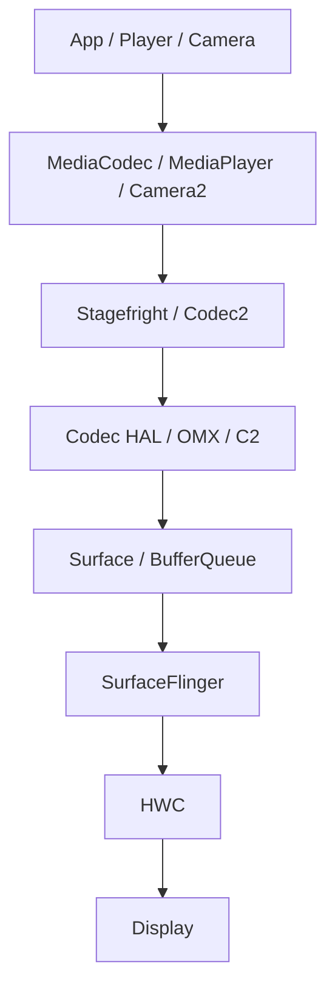

# 第 16 章：媒体与视频管线

Android 媒体栈负责解码、编码、复用、提取、播放、录制、摄像头捕获与渲染显示。它横跨应用 API、Stagefright、Codec2、MediaCodec、MediaPlayer、CameraService、MediaExtractor、Audio/Video 同步、Surface 和硬件编解码 HAL 等多个层级。本章从 AOSP 源码视角梳理媒体与视频管线的结构、状态机、资源管理、缓冲流转、Camera HAL3、能力查询和调试方法。

---

## 16.1 媒体架构概览

### 16.1.1 分层架构

Android 媒体系统可抽象为以下层次：

1. **应用 API 层**：`MediaCodec`、`MediaExtractor`、`MediaMuxer`、`MediaPlayer`、`MediaRecorder`、Camera2、NDK camera。
2. **Framework 适配层**：Java wrapper、JNI、native client 代理。
3. **Stagefright / Codec2 层**：状态机、buffer channel、container、同步与控制框架。
4. **服务层**：`MediaCodecService`、`MediaExtractorService`、`MediaPlayerService`、`CameraService`。
5. **HAL / Vendor 层**：Codec2 HAL、OMX bridge、Camera HAL3、图形缓冲与设备接口。

这套架构把“媒体控制逻辑”“编解码执行”“容器处理”“设备访问”清晰分离，并通过 Binder、共享缓冲和 Surface 完成跨进程连接。

### 16.1.2 关键进程与服务

| 进程/服务 | 主要职责 |
|-----------|----------|
| App process | 发起播放、录制、解码、编码与相机请求 |
| `media.codec` | 管理编解码组件与部分隔离执行 |
| `media.extractor` | 隔离容器解析与提取器 |
| `mediaserver`/现代拆分服务 | 历史上的综合媒体服务角色已拆分 |
| `MediaPlayerService` | 播放与录制服务 |
| `CameraService` | 相机设备发现、权限与请求管线 |
| Codec HAL / Camera HAL | 与厂商编解码器和相机设备交互 |

### 16.1.3 视频帧流转路径



对于视频播放，压缩码流经 extractor 和 codec 解码为图像 buffer，通常输出到 `Surface`。缓冲随后进入 `BufferQueue` 并由 SurfaceFlinger 合成显示。

### 16.1.4 源码树布局

| 路径 | 用途 |
|------|------|
| `frameworks/av/media/libstagefright/` | Stagefright 核心实现 |
| `frameworks/av/media/codec2/` | Codec2 框架与组件 |
| `frameworks/av/services/mediacodec/` | MediaCodec 服务 |
| `frameworks/av/services/mediaextractor/` | MediaExtractor 服务 |
| `frameworks/av/media/libmediaplayerservice/` | MediaPlayerService / NuPlayer |
| `frameworks/av/services/camera/libcameraservice/` | CameraService |
| `frameworks/av/media/libstagefright/omx/` | OMX 桥接 |
| `frameworks/av/camera/` | Camera framework / client API |

---

## 16.2 MediaCodec 与 Stagefright

### 16.2.1 MediaCodec：中心状态机

`MediaCodec` 是 Android 编解码 API 的核心状态机。无论是解码、编码、surface 输入还是 bytebuffer 输入，其生命周期都围绕一套严格状态进行推进。

#### 状态机

典型状态包括：

- Uninitialized
- Initialized
- Configured
- Starting
- Started
- Flushing
- Stopping
- Releasing
- Error

每个公开 API 都必须在合法状态下调用，否则会触发 `IllegalStateException` 或底层错误。

### 16.2.2 MediaCodec 初始化

初始化过程通常包括：

1. 选择 codec 名称或 MIME 类型。
2. 通过 Binder 连接 `MediaCodecService`。
3. 创建 codec 实例及其本地状态机。
4. 建立 looper/handler/AMessage 通道。
5. 准备 buffer channel 与 resource 管理对象。

### 16.2.3 配置与资源管理

`configure()` 阶段会设置格式、宽高、颜色格式、surface、crypto、encoder/decoder 模式与 vendor 参数。系统在此阶段同时检查 codec 资源、图形缓冲条件和安全模式要求。

### 16.2.4 资源管理器

Media codec 资源是稀缺资源。ResourceManager 负责跟踪当前被各进程和会话占用的 codec 资源，并在资源不足时触发 reclaim 逻辑，优先回收低优先级或可中断实例。

### 16.2.5 MediaCodec 指标与遥测

MediaCodec 会记录名称、MIME、分辨率、延迟、freeze、judder、渲染帧数等指标，为调试与产品分析提供基础数据。

### 16.2.6 Started 状态下的缓冲流

在 Started 状态，应用通过以下模式与 codec 交互：

- dequeue / queue 输入缓冲区
- dequeue 输出缓冲区
- surface 输入或 surface 输出
- 异步 callback 模式

每个缓冲区都有所有权转换过程：应用 → codec → 应用/Surface → release。

### 16.2.7 ACodec：OMX Bridge（9459 行）

`ACodec` 是 Stagefright 与 OMX 组件之间的桥梁。它封装 OMX component 的状态切换、端口配置、缓冲区管理和事件回调，是 Android 传统 OMX 路径的核心实现。

### 16.2.8 `MPEG4Writer`：容器复用器（6039 行）

`MPEG4Writer` 负责将编码后音视频数据封装成 MP4 容器，生成各类 box/atom，处理时间戳、轨道、元数据和最终文件完成流程。

### 16.2.9 `AMessage` 模式

Stagefright 广泛使用 `ALooper` + `AHandler` + `AMessage`。它用 typed message 在 looper 线程之间传递控制命令、状态更新和异步响应，是媒体栈内部状态机组织的关键模式。

---

## 16.3 Codec2 Framework

### 16.3.1 架构与设计哲学

Codec2 是 Android 新一代编解码框架。它以更清晰的组件模型、参数系统和 buffer/work item 机制替代早期 OMX 风格接口。设计目标包括：

- 更明确的组件抽象
- 更好的参数可扩展性
- 更清晰的错误恢复路径
- 更利于软件 codec 与硬件 codec 统一建模

### 16.3.2 `CCodec`：Codec2 到 Stagefright 的桥梁（3827 行）

`CCodec` 让 `MediaCodec` API 可以继续复用 Stagefright 表层接口，同时底层改走 Codec2 组件模型。它承担参数翻译、状态协调、buffer channel 对接与 surface 集成。

### 16.3.3 `CCodecBufferChannel`（3075 行）

该类负责在 Stagefright 风格 buffer 生命周期与 Codec2 work item/graphic block 模型之间建立桥接，是 Codec2 播放路径中最关键的通道对象之一。

### 16.3.4 `C2InputSurface` Wrapper

`C2InputSurface` 为编码场景提供 surface 输入封装，使应用可以通过 `Surface` 向编码器提交图像帧，而不直接处理 bytebuffer 输入。

### 16.3.5 软件 Codec 组件（23+ 家族）

AOSP 提供大量软件 codec 组件家族，涵盖 AVC、HEVC、VP8、VP9、AV1、AAC、Opus 等格式。这些组件适用于无硬件加速、测试或回退场景。

### 16.3.6 Codec2 HAL

Codec2 HAL 提供组件商店、组件创建、参数查询与 work item 执行接口，使 framework 可以与 vendor codec 实现解耦。

### 16.3.7 Codec2 参数系统

Codec2 参数系统使用 typed parameter 和 descriptor 建模能力、配置和约束，使参数协商更结构化。

### 16.3.8 `CCodecConfig`：参数翻译

`CCodecConfig` 负责把 `MediaFormat`、Stagefright 参数和 Codec2 参数系统互相翻译，是兼容老 API 与新框架的关键层。

### 16.3.9 Codec2 Work Items

Codec2 使用 work item 表达输入、输出、时间戳和处理结果，使异步编解码行为具有更明确的数据单位和状态含义。

---

## 16.4 MediaPlayer 与 MediaRecorder

### 16.4.1 `MediaPlayerService`（3111 行）

`MediaPlayerService` 是播放和录制服务中心之一，负责 player 实例管理、客户端连接、播放器选择与资源协调。

### 16.4.2 `NuPlayer`：默认媒体播放器

`NuPlayer` 是现代默认播放引擎。它负责：

- 数据源读取
- extractor 选择
- 解码器创建
- A/V 同步
- surface 输出
- 播放控制状态机

### 16.4.3 `NuPlayerDecoder`：MediaCodec 包装

`NuPlayerDecoder` 把 `NuPlayer` 的数据流与 `MediaCodec` 连接起来，负责输入喂码、输出缓冲处理与错误恢复。

### 16.4.4 `NuPlayerRenderer`：音视频同步

`NuPlayerRenderer` 管理音频时钟、视频帧调度、丢帧策略和同步补偿，是 A/V sync 的关键模块。

### 16.4.5 `StagefrightRecorder`（2733 行）

`StagefrightRecorder` 负责录制管线搭建，包括音视频源选择、编码器配置、muxer 写入和输出格式管理。

### 16.4.6 MediaPlayer 播放管线

典型播放管线为：data source → extractor → decoder → audio sink / surface → renderer → 显示或扬声器。

---

## 16.5 Camera Service

### 16.5.1 `CameraService` 架构（6975 行）

CameraService 是 Android 相机系统的核心服务。它负责 provider 枚举、设备管理、客户端仲裁、权限校验、API1/API2 兼容、torch 管理和 HAL3 请求协调。

### 16.5.2 Provider 枚举与设备发现

系统通过 camera provider 枚举所有相机设备，建立设备列表、特性、物理/逻辑相机关系和可用状态，并将结果暴露给 framework API。

### 16.5.3 Camera API1 与 API2

API1 提供较旧的同步与简化模型；API2 提供 request/result、stream configuration、capture session 和更细粒度控制。CameraService 内部需要同时兼容两套调用模式。

### 16.5.4 `Camera3Device`：HAL3 接口

`Camera3Device` 是 Camera HAL3 的主要 framework 包装。它负责 stream 配置、capture request 提交、结果处理、缓冲管理和错误恢复。

### 16.5.5 安全与权限模型

相机访问受多层安全模型控制：

- 应用权限和前后台状态
- 用户隐私开关
- UID/PID 校验
- 多客户端优先级仲裁
- 传感器隐私与系统策略

### 16.5.6 Camera NDK

Camera NDK 为 native 应用提供相机访问能力，底层仍通过 CameraService 和 HAL3 管线实现。

---

## 16.6 Media Extractors

### 16.6.1 `NuMediaExtractor`（896 行）

`NuMediaExtractor` 是 extractor 统一封装，用于从容器中读取样本、轨道格式和元数据，并向解码器输送压缩码流。

### 16.6.2 `MediaExtractorFactory`（395 行）

ExtractorFactory 负责发现并加载合适的 extractor 插件，根据容器格式、探测逻辑和能力信息选择对应实现。

### 16.6.3 容器格式支持

Android 支持 MP4、WebM、Matroska、Ogg、AAC、TS 等多种容器和裸流格式，具体支持由 extractor 插件与编解码能力共同决定。

---

## 16.7 视频能力

### 16.7.1 `VideoCapabilities`（1875 行）

`VideoCapabilities` 用于描述 codec 对分辨率、帧率、profile、level、码率、色彩格式等能力范围的支持，是应用能力查询的关键入口。

### 16.7.2 `MediaProfiles`（1512 行）

`MediaProfiles` 聚合设备对录制/编码/摄像头媒体能力的配置，例如支持的录制尺寸、码率和 encoder profile。

### 16.7.3 Codec 发现与选择

系统根据 MIME、能力、profile/level、software-only、vendor、hardware-accelerated 标记和 rank 选择合适 codec。

### 16.7.4 Codec Feature Flags

Feature flags 描述 adaptive playback、secure playback、tunneled playback、low-latency、HDR、surface input/output 等能力。

---

## 16.8 动手实践

### 16.8.1 检查可用 Codecs

```bash
# List all codecs with their capabilities
adb shell dumpsys media.codec
# This outputs detailed information including:
# - Decoder infos by media types
# - Encoder infos by media types
# - For each codec: aliases, attributes (encoder/vendor/software-only/hw-accelerated),
#   owner, HAL name, rank, supported profiles/levels, color formats
```

### 16.8.2 追踪一次视频解码会话

```bash
# Capture a trace with video tag enabled
adb shell perfetto -o /data/misc/perfetto-traces/video_decode.pftrace -t 10s \
  sched freq idle binder_driver gfx view media
adb pull /data/misc/perfetto-traces/video_decode.pftrace
```

### 16.8.3 监控 Codec 资源使用

```bash
# Show current codec resource allocation
adb shell dumpsys media.resource_manager
```

### 16.8.4 检查 Camera Service 状态

```bash
# Full camera service dump
adb shell dumpsys media.camera
# This provides:
# - Number of cameras
# - Camera characteristics for each camera
# - Active client connections
# - Recent error events
# - Flash unit status
# - Sensor privacy state
```

### 16.8.5 检查 Media Extractor 插件

```bash
# List loaded extractor plugins
adb shell dumpsys media.extractor
# This shows all loaded extractor shared libraries,
# their supported formats, and version information.
```

### 16.8.6 从代码查询 `VideoCapabilities`

通过 `MediaCodecList`、`MediaCodecInfo` 和 `VideoCapabilities` API 可在应用或测试代码中查询分辨率、帧率与 bitrate 范围。

### 16.8.7 构建并运行 Codec2 测试

```bash
# Build the codec2 command-line tool
m codec2
# The tool is in frameworks/av/media/codec2/components/cmds/codec2.cpp
# It can be used to test codec functionality directly from the command line
```

### 16.8.8 检查 Codec HAL 服务

```bash
# List running Codec2 HAL services
adb shell lshal | grep -i codec2
# Typical output:
# android.hardware.media.c2@1.0::IComponentStore/software
# android.hardware.media.c2@1.0::IComponentStore/default
```

### 16.8.9 触发 Codec 回收

```bash
# Filter for resource manager logs
adb logcat | grep -i ResourceManager
# When codec resources are exhausted, you'll see:
# ResourceManagerService: reclaimResource(...)
# MediaCodec: reclaim(...) <component_name>
```

### 16.8.10 读取一份 MediaCodec 指标报告

```bash
# Dump MediaMetrics
adb shell dumpsys media.metrics
# Look for entries with key "codec", which contain:
# - android.media.mediacodec.codec: <codec name>
# - android.media.mediacodec.mime: <mime type>
# - android.media.mediacodec.width/height: <dimensions>
# - android.media.mediacodec.latency.avg: <avg latency in us>
# - android.media.mediacodec.frames-rendered: <count>
# - android.media.mediacodec.freeze-count: <freeze events>
# - android.media.mediacodec.judder-count: <judder events>
```

### 16.2.10 详细的完整缓冲生命周期

#### 输入缓冲入队

输入缓冲区会经历应用填充、queueInputBuffer、进入 codec 内部队列、等待处理并最终消费的完整周期。

#### 大帧音频（Multi-Access-Unit Buffers）

对某些音频场景，单个缓冲区可能包含多个 access unit，需要特殊解析和边界处理。

#### 安全输入缓冲区（DRM）

DRM 安全路径要求输入缓冲使用受保护内存、加密元数据和安全 codec 能力，避免明文暴露。

#### Codec2 原生缓冲入队

Codec2 会把输入缓冲封装成 work item 或 block 进入组件调度系统，语义上比传统 queueBuffer 更结构化。

#### 输出缓冲出队

输出缓冲在 codec 处理完成后由应用出队，可能是字节缓冲、图形缓冲索引或 surface 输出的间接通知。

#### 输出渲染与释放

若输出绑定到 surface，releaseOutputBuffer 可触发渲染；否则应用需自行读取并处理字节缓冲。最终所有缓冲都要返回 codec 或 surface 系统复用。

### 16.2.11 `onMessageReceived` 处理器

MediaCodec 内部大量行为由 `onMessageReceived()` 驱动，包括状态切换、缓冲回调、错误处理和同步 RPC 响应，是 Stagefright 状态机的核心入口之一。

### 16.2.12 电池与功耗管理

媒体系统会记录 codec 使用、帧率、硬件加速情况和后台播放状态，支撑电量归因与功耗优化。

### 16.2.13 Vendor 参数支持

MediaCodec 与 Codec2 支持 vendor-defined 参数，用于暴露厂商特定能力，但 framework 层需要隔离并正确转译这些非标准字段。

### 16.2.14 出队处理器：同步模式细节

同步模式下，应用显式调用 dequeue API。框架内部需要处理超时、状态变化、EOS、缓冲可用性和同步唤醒。

### 16.2.15 `ReleaseSurface`：无显示 drain

某些场景需要把视频解码 drain 掉而不真正显示到屏幕，`ReleaseSurface` 一类机制可为此提供虚拟输出目标。

### 16.3.10 Codec2 错误处理与恢复

Codec2 框架必须处理组件崩溃、参数不兼容、HAL 断开和资源被回收等故障，并尽量提供可恢复路径或清晰错误传播。

### 16.4.7 `StagefrightRecorder` 输出格式选择

Recorder 会根据音视频源、编码器、容器和设备能力选择最终输出格式，并配置 muxer 参数与轨道布局。

### 16.5.7 Camera HAL3 Request Pipeline 细节

HAL3 request pipeline 包括 capture request 构造、buffer 附着、in-flight request 跟踪、result metadata 返回和 partial result 处理。

### 16.5.8 Stream 管理与缓冲分配

CameraService 与 HAL3 需要为 preview、capture、recording、reprocess 等不同 stream 分配图形缓冲并维持生命周期一致性。

### 16.6.4 Extractor 安全架构

Extractor 通常运行在隔离服务进程中，以降低恶意媒体文件触发漏洞后的影响范围。

### 16.7.5 Codec 能力查询管线

能力查询会结合 `MediaCodecList`、codec descriptor、profile/level、VideoCapabilities 与 vendor 报告，形成应用可见的能力结果。

### 16.7.6 HDR 格式支持

HDR 支持涉及 codec profile、色彩空间、容器元数据、显示设备能力和 surface/render 路径配合。

## Summary

## 总结

Android 媒体与视频系统由几条关键主线构成：

| 主线 | 核心组件 |
|------|----------|
| 编解码 | `MediaCodec`, `ACodec`, `CCodec`, Codec2 HAL |
| 播放 | `MediaPlayerService`, `NuPlayer`, renderer |
| 录制 | `StagefrightRecorder`, `MPEG4Writer` |
| 相机 | `CameraService`, `Camera3Device`, Camera HAL3 |
| 提取 | `MediaExtractorFactory`, `NuMediaExtractor` |
| 能力查询 | `VideoCapabilities`, `MediaProfiles` |

媒体系统的关键设计原则包括：

1. **状态机驱动**：MediaCodec、NuPlayer、Camera3Device 都以明确状态机组织复杂异步流程。
2. **缓冲所有权清晰**：输入、输出、surface 和图形缓冲都围绕严格的 ownership 转移。
3. **跨进程隔离**：extractor、codec 与 camera 等高风险模块被拆分到独立服务中。
4. **控制与数据分离**：Binder 用于控制，Surface/BufferQueue/共享缓冲用于高吞吐数据路径。
5. **能力查询前置**：codec 与 camera 能力必须在配置前充分查询，避免运行时失败。

### 16.2.16 Format Shaping

Format shaping 用于在上层 `MediaFormat` 与底层 codec/容器可接受格式之间做归一化、裁剪和默认值填充。

### 16.3.11 `SimpleC2Component`：基类模式

`SimpleC2Component` 提供实现软件 codec 组件的基础骨架，统一处理参数、work item 和生命周期接口。

### 16.4.8 `MediaPlayerFactory`：播放器选择

MediaPlayerFactory 根据数据源类型、协议、格式和能力选择合适 player 实现。

### 16.4.9 `NuPlayerRenderer`：帧调度细节

Renderer 通过音频时钟和视频 PTS 比较决定是渲染、延迟还是丢帧，确保 A/V 同步尽可能稳定。

### 16.5.9 Camera Torch（手电筒）管理

Torch 管理由 CameraService 协调，需处理设备占用、权限、闪光灯单元状态和错误回调。

### 16.6.5 Extractor 插件加载

Extractor 插件按约定目录和 descriptor 加载，系统会验证其支持格式并将其纳入工厂选择流程。

### 16.7.7 `PerformancePoint`：基于宏块的能力模型

PerformancePoint 用宏块吞吐量表达视频能力，使不同分辨率和帧率可在统一模型下比较。

### 16.7.8 `MPEG4Writer` 内部：Box/Atom 结构

MP4 容器由一组 box/atom 组成，例如 `ftyp`、`moov`、`mdat`。Writer 需要在录制过程中维护这些结构及其偏移、时序和索引。

### 16.8.11 调试提示：常见问题与解决方案

### Issue: Codec Allocation Fails

```bash
# Check how many codecs are in use
# Look for processes with lower priority that could be reclaimed
adb shell dumpsys media.resource_manager
```

### Issue: Video Playback Shows Green Frames

常见原因包括颜色格式不匹配、surface 绑定错误、vendor codec bug 或图形缓冲同步问题。

### Issue: Audio-Video Sync Drift

```bash
# Look for "too late" or "dropped" frame messages
# Check audio clock vs video presentation timestamps
adb logcat | grep -i NuPlayer
```

### Issue: Camera Preview Freezes

```bash
# Check active client connections
# Look for error events
# Check "in-flight request" count
adb shell dumpsys media.camera
```

### Issue: Media Extractor Returns `ERROR_UNSUPPORTED`

```bash
# Check which extractors are loaded
# Try: adb shell am start -a android.intent.action.VIEW -d file:///path/to/file.mp4
adb shell dumpsys media.extractor
```

### 16.8.12 使用 Perfetto 做性能分析

```text
# media_trace_config.pbtx
```

Perfetto 可帮助分析解码时延、渲染卡顿、A/V sync、Camera request pipeline 和 Surface 显示时序。

### 16.8.13 理解 Freeze 与 Judder 指标

Freeze 通常表示更严重的显示停顿，Judder 表示节奏不均匀。二者都是视频体验质量的重要指标。

### 16.8.14 Codec ID 生成与跟踪

系统会为 codec 实例生成唯一标识，用于日志、指标归因与资源管理追踪。

### Key Source Files Reference

| 路径 | 用途 |
|------|------|
| `frameworks/av/media/libstagefright/MediaCodec.cpp` | MediaCodec 核心状态机 |
| `frameworks/av/media/libstagefright/ACodec.cpp` | OMX 桥接 |
| `frameworks/av/media/codec2/sfplugin/CCodec.cpp` | Codec2 桥接 |
| `frameworks/av/media/libmediaplayerservice/nuplayer/` | NuPlayer |
| `frameworks/av/services/camera/libcameraservice/` | CameraService |
| `frameworks/av/media/libstagefright/NuMediaExtractor.cpp` | 提取器封装 |

## Appendix: Deep-Dive Topics

### A.1 `ALooper` / `AHandler` / `AMessage` 框架

#### `ALooper`：事件循环

`ALooper` 是 Stagefright 内部的消息循环器，用于在专用线程中分发媒体状态机消息。

#### `AMessage`：强类型消息

`AMessage` 允许以 key-value 形式携带强类型字段，适合状态切换、参数传递和异步响应。

#### `PostAndAwaitResponse`：同步 RPC

尽管媒体框架大量是异步消息驱动，某些场景仍需要同步等待响应。`PostAndAwaitResponse` 提供这种同步 RPC 语义。

### A.2 MediaCodec 域分类

媒体 codec 可按音频/视频、编码/解码、安全/非安全、软件/硬件、OMX/Codec2 等多个维度分类。

### A.3 Secure Codec Path（DRM）

安全 codec 路径要求受保护缓冲、加密 metadata 和安全显示链路，以满足 DRM 内容保护要求。

### A.4 Tunneled Playback Mode

Tunneled playback 允许视频流在更贴近硬件的路径上播放，减少 CPU 参与，并与音频时钟更紧密协同。

### A.5 Low-Latency Mode

低延迟模式适合实时视频通信、游戏流和交互式媒体场景，需要 codec、buffer 策略和渲染路径共同支持。

### A.6 Multi-Access-Unit（Large Frame）Audio

多 access unit 音频缓冲适用于特定编码或打包方式，需要 codec 和 extractor 处理单个缓冲内多个媒体单元。

### A.7 Codec2 与 OMX 特性对比

Codec2 提供更现代的参数系统与组件模型；OMX 路径历史包袱更重，但仍在部分设备与组件中存在。

### A.8 媒体框架进程边界

媒体系统通过拆分 extractor、codec、player、camera 等进程边界降低安全风险，也带来了更多 Binder 和 Surface 协调复杂度。

### A.9 MediaCodec 生命周期汇总表

MediaCodec 生命周期可概括为：创建 → 配置 → 启动 → 输入/输出循环 → flush/stop → release。

### A.10 Codec 指标关键字段参考

常见字段包括 codec name、mime、resolution、latency、frames rendered、freeze、judder、error code 和 pipeline mode。
