# Chapter 16: Media and Video Pipeline

Android's media framework is one of the most architecturally complex subsystems in AOSP.
It spans from high-level Java APIs (`MediaPlayer`, `MediaCodec`, `MediaRecorder`) through
a native C++ stack that includes Stagefright, the Codec2 framework, NuPlayer, the Camera
service, media extractors, and hardware abstraction layers that communicate directly with
vendor-supplied codec and camera hardware. Across the roughly 50,000 lines of C++ that
make up the core pipeline, every frame of video you watch, every audio sample you hear,
and every photo you capture passes through the machinery described in this chapter.

The source files we will study live primarily in:

| Directory | Purpose |
|---|---|
| `frameworks/av/media/libstagefright/` | MediaCodec, ACodec, MPEG4Writer, extractors |
| `frameworks/av/media/codec2/` | Codec2 framework (components, HAL, sfplugin) |
| `frameworks/av/media/libmediaplayerservice/` | MediaPlayerService, StagefrightRecorder, NuPlayer |
| `frameworks/av/services/camera/libcameraservice/` | CameraService, device3/ HAL3 device |
| `frameworks/av/media/libmedia/` | VideoCapabilities, MediaProfiles |

---

## 16.1 Media Architecture Overview

### 16.1.1 The Layered Architecture

Android's media stack is organized into five distinct layers. At the top, Java and NDK
APIs provide the interface that application developers use. Beneath them, a native
services layer manages codec instances, playback sessions, and recording pipelines. The
core codec abstraction layer, which includes both the legacy Stagefright/OMX path and
the modern Codec2 path, translates between the services layer and actual codec
implementations. Below that, the HAL (Hardware Abstraction Layer) provides the vendor
contract. At the bottom sits the hardware itself: DSPs, dedicated video encoders/decoders,
camera sensors, and ISPs.

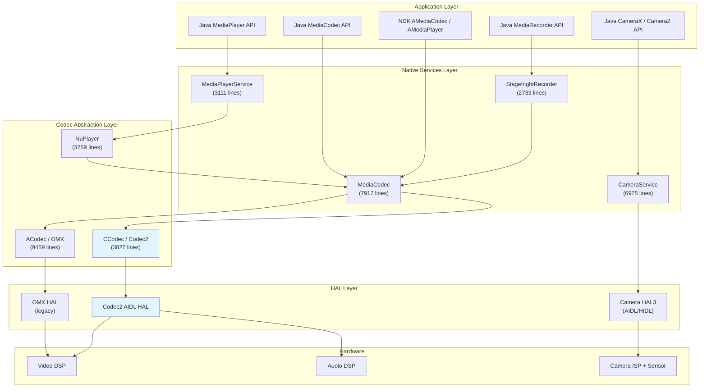
```mermaid
graph TD
    subgraph "Application Layer"
        A1["Java MediaPlayer API"]
        A2["Java MediaCodec API"]
        A3["Java MediaRecorder API"]
        A4["NDK AMediaCodec / AMediaPlayer"]
        A5["Java CameraX / Camera2 API"]
    end

    subgraph "Native Services Layer"
        B1["MediaPlayerService<br/>(3111 lines)"]
        B2["MediaCodec<br/>(7917 lines)"]
        B3["StagefrightRecorder<br/>(2733 lines)"]
        B4["CameraService<br/>(6975 lines)"]
    end

    subgraph "Codec Abstraction Layer"
        C1["ACodec / OMX<br/>(9459 lines)"]
        C2["CCodec / Codec2<br/>(3827 lines)"]
        C3["NuPlayer<br/>(3259 lines)"]
    end

    subgraph "HAL Layer"
        D1["OMX HAL<br/>(legacy)"]
        D2["Codec2 AIDL HAL"]
        D3["Camera HAL3<br/>(AIDL/HIDL)"]
    end

    subgraph "Hardware"
        E1["Video DSP"]
        E2["Audio DSP"]
        E3["Camera ISP + Sensor"]
    end

    A1 --> B1
    A2 --> B2
    A3 --> B3
    A4 --> B2
    A5 --> B4

    B1 --> C3
    B2 --> C1
    B2 --> C2
    B3 --> B2

    C1 --> D1
    C2 --> D2
    C3 --> B2

    D1 --> E1
    D2 --> E1
    D2 --> E2
    D3 --> E3

    B4 --> D3

    style C2 fill:#e1f5fe
    style D2 fill:#e1f5fe
```

The diagram above captures the central insight of Android's media architecture: there are
two parallel paths through the codec layer. The **legacy OMX path** (ACodec) dates back to
Android 1.0 and wraps OpenMAX IL components. The **modern Codec2 path** (CCodec) was
introduced in Android 10 and is now the primary path for all Google-provided software codecs
and most vendor hardware codecs. Both paths are abstracted behind the `MediaCodec` API, so
applications need not know which is in use.

### 16.1.2 Key Processes and Services

The media framework runs across several system processes:

| Process | Service(s) | Binary |
|---|---|---|
| `mediaserver` | MediaPlayerService, MediaRecorderService | `/system/bin/mediaserver` |
| `media.codec` | Codec2 component service | `/vendor/bin/hw/android.hardware.media.c2-service` |
| `media.extractor` | MediaExtractorService | `/system/bin/mediaextractor` |
| `cameraserver` | CameraService | `/system/bin/cameraserver` |
| `media.resource_manager` | ResourceManagerService | Part of mediaserver |

This process isolation is deliberate: media extractors run in a sandboxed process to
contain the security impact of parsing untrusted media files. Codec components may run
in a vendor process to isolate vendor code from the framework.

### 16.1.3 The Flow of a Video Frame

To ground the architecture, consider the lifecycle of a single video frame during
playback:

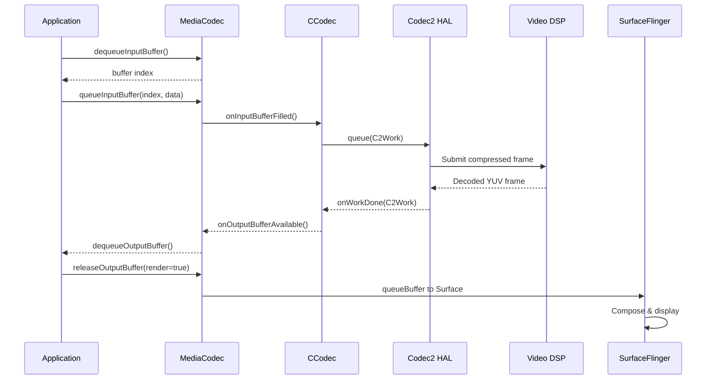
```mermaid
sequenceDiagram
    participant App as Application
    participant MC as MediaCodec
    participant CC as CCodec
    participant HAL as Codec2 HAL
    participant HW as Video DSP
    participant SF as SurfaceFlinger

    App->>MC: dequeueInputBuffer()
    MC-->>App: buffer index
    App->>MC: queueInputBuffer(index, data)
    MC->>CC: onInputBufferFilled()
    CC->>HAL: queue(C2Work)
    HAL->>HW: Submit compressed frame
    HW-->>HAL: Decoded YUV frame
    HAL-->>CC: onWorkDone(C2Work)
    CC-->>MC: onOutputBufferAvailable()
    MC-->>App: dequeueOutputBuffer()
    App->>MC: releaseOutputBuffer(render=true)
    MC->>SF: queueBuffer to Surface
    SF->>SF: Compose & display
```

This end-to-end flow involves at least three processes (app, codec service, SurfaceFlinger)
and typically two Binder/AIDL crossings for the codec alone.

### 16.1.4 Source Tree Layout

A summary of the relevant source tree within `frameworks/av/`:

```
frameworks/av/
  media/
    libstagefright/          # Core Stagefright library
      MediaCodec.cpp         # 7917 lines - the MediaCodec state machine
      ACodec.cpp             # 9459 lines - OMX codec wrapper
      MPEG4Writer.cpp        # 6039 lines - MP4 muxer
      NuMediaExtractor.cpp   # 896 lines  - extractor wrapper
      MediaExtractorFactory.cpp  # 395 lines - extractor plugin loading
    codec2/
      components/            # 23+ software codec families
        aac/  amr_nb_wb/  aom/  apv/  avc/  base/  dav1d/  flac/
        g711/ gav1/ gsm/ hevc/ iamf/ mp3/ mpeg2/ mpeg4_h263/
        opus/ raw/ vorbis/ vpx/ xaac/
      sfplugin/              # Codec2-to-Stagefright bridge
        CCodec.cpp           # 3827 lines
        CCodecBufferChannel.cpp  # 3075 lines
        CCodecConfig.cpp
        Codec2Buffer.cpp
      hal/                   # Codec2 HAL implementation
        aidl/  hidl/  services/
      core/                  # Codec2 core interfaces
    libmediaplayerservice/
      MediaPlayerService.cpp # 3111 lines
      StagefrightRecorder.cpp # 2733 lines
      nuplayer/
        NuPlayer.cpp         # 3259 lines
        NuPlayerDecoder.cpp  # 1394 lines
        NuPlayerRenderer.cpp # 2239 lines
        NuPlayerDriver.cpp   # 1240 lines
    libmedia/
      VideoCapabilities.cpp  # 1875 lines
      MediaProfiles.cpp      # 1512 lines
  services/
    camera/
      libcameraservice/
        CameraService.cpp    # 6975 lines
        device3/             # Camera HAL3 device implementation
        api1/                # Legacy camera API
        api2/                # Camera2 API (CameraDeviceClient)
```

---

## 16.2 MediaCodec and Stagefright

### 16.2.1 MediaCodec: The Central State Machine

`MediaCodec` is the single most important class in the Android media framework. At 7917
lines in `frameworks/av/media/libstagefright/MediaCodec.cpp`, it implements a complex
asynchronous state machine that manages the lifecycle of every codec instance in the
system -- audio and video, encoder and decoder, hardware and software.

The class is defined with the following factory methods:

```cpp
// frameworks/av/media/libstagefright/MediaCodec.cpp, line 1214
// static
sp<MediaCodec> MediaCodec::CreateByType(
        const sp<ALooper> &looper, const AString &mime, bool encoder,
        status_t *err, pid_t pid, uid_t uid) {
    sp<AMessage> format;
    return CreateByType(looper, mime, encoder, err, pid, uid, format);
}

sp<MediaCodec> MediaCodec::CreateByType(
        const sp<ALooper> &looper, const AString &mime, bool encoder,
        status_t *err, pid_t pid, uid_t uid, sp<AMessage> format) {
    Vector<AString> matchingCodecs;

    MediaCodecList::findMatchingCodecs(
            mime.c_str(),
            encoder,
            0,
            format,
            &matchingCodecs);

    if (err != NULL) {
        *err = NAME_NOT_FOUND;
    }
    for (size_t i = 0; i < matchingCodecs.size(); ++i) {
        sp<MediaCodec> codec = new MediaCodec(looper, pid, uid);
        AString componentName = matchingCodecs[i];
        status_t ret = codec->init(componentName);
        if (err != NULL) {
            *err = ret;
        }
        if (ret == OK) {
            return codec;
        }
        ALOGD("Allocating component '%s' failed (%d), try next one.",
                componentName.c_str(), ret);
    }
    return NULL;
}
```

This factory pattern is critical: `CreateByType` queries the `MediaCodecList` for all
codecs that support the given MIME type, then attempts to instantiate them in priority
order. If a hardware codec fails to allocate (perhaps because all hardware instances are
in use), the system falls back to a software codec.

#### The State Machine

MediaCodec implements a well-defined state machine with the following states:

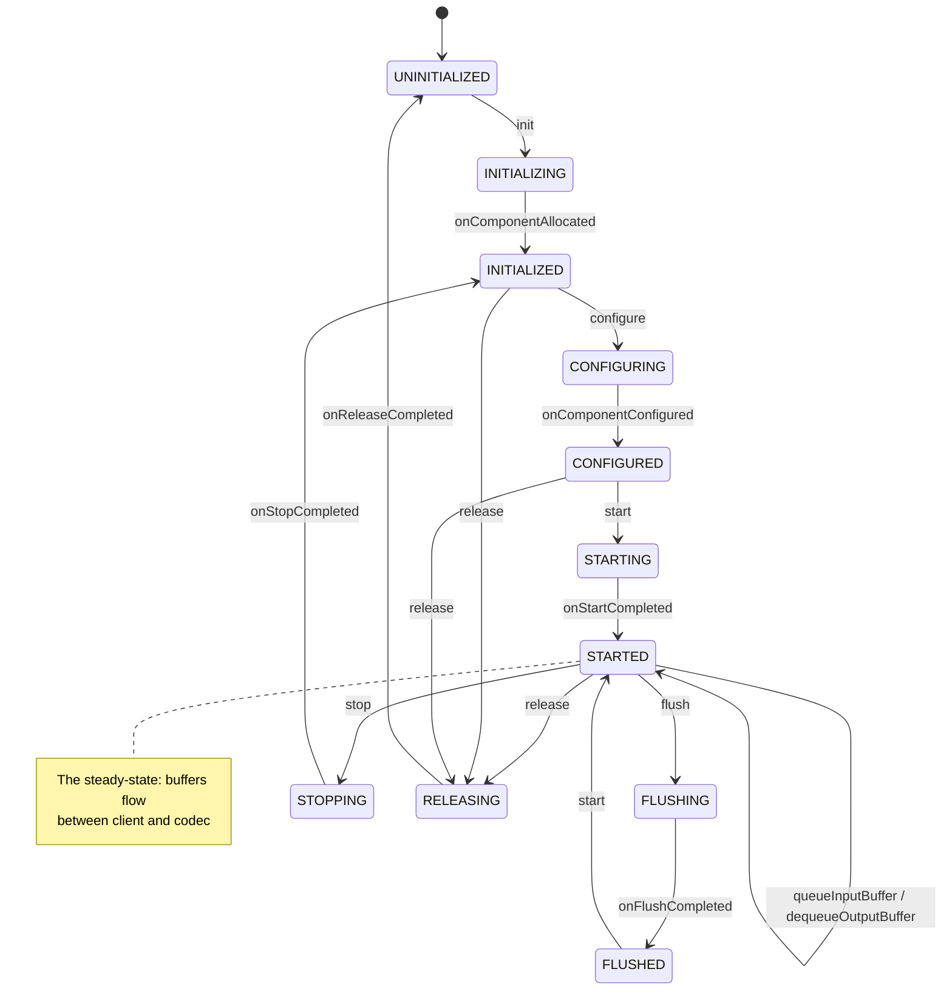
```mermaid
stateDiagram-v2
    [*] --> UNINITIALIZED
    UNINITIALIZED --> INITIALIZING : init
    INITIALIZING --> INITIALIZED : onComponentAllocated
    INITIALIZED --> CONFIGURING : configure
    CONFIGURING --> CONFIGURED : onComponentConfigured
    CONFIGURED --> STARTING : start
    STARTING --> STARTED : onStartCompleted
    STARTED --> FLUSHING : flush
    FLUSHING --> FLUSHED : onFlushCompleted
    FLUSHED --> STARTED : start
    STARTED --> STOPPING : stop
    STOPPING --> INITIALIZED : onStopCompleted
    STARTED --> RELEASING : release
    INITIALIZED --> RELEASING : release
    CONFIGURED --> RELEASING : release
    RELEASING --> UNINITIALIZED : onReleaseCompleted
    STARTED --> STARTED : queueInputBuffer / dequeueOutputBuffer

    note right of STARTED
        The steady-state: buffers flow
        between client and codec
    end note
```

The state transitions are driven by internal message codes defined at line 862 of
`MediaCodec.cpp`:

```cpp
// frameworks/av/media/libstagefright/MediaCodec.cpp, line 862
enum {
    kWhatFillThisBuffer      = 'fill',
    kWhatDrainThisBuffer     = 'drai',
    kWhatEOS                 = 'eos ',
    kWhatStartCompleted      = 'Scom',
    kWhatStopCompleted       = 'scom',
    kWhatReleaseCompleted    = 'rcom',
    kWhatFlushCompleted      = 'fcom',
    kWhatError               = 'erro',
    kWhatCryptoError         = 'ercp',
    kWhatComponentAllocated  = 'cAll',
    kWhatComponentConfigured = 'cCon',
    kWhatInputSurfaceCreated = 'isfc',
    kWhatInputSurfaceAccepted = 'isfa',
    kWhatSignaledInputEOS    = 'seos',
    kWhatOutputFramesRendered = 'outR',
    kWhatOutputBuffersChanged = 'outC',
    kWhatFirstTunnelFrameReady = 'ftfR',
    kWhatPollForRenderedBuffers = 'plrb',
    kWhatMetricsUpdated      = 'mtru',
    kWhatRequiredResourcesChanged = 'reqR',
};
```

The use of four-character codes (FourCC) as message identifiers is a signature pattern
of the Stagefright framework. These codes make debug logs human-readable: when you see
`'fill'` in a log, you immediately know it is a "fill this buffer" message.

### 16.2.2 MediaCodec Initialization

The `init()` method (line 2531) performs the crucial step of selecting and instantiating
the underlying codec implementation. It bridges between the abstract `MediaCodec` API
and concrete codec backends:

```cpp
// frameworks/av/media/libstagefright/MediaCodec.cpp, line 2531
status_t MediaCodec::init(const AString &name) {
    ScopedTrace trace(ATRACE_TAG, "MediaCodec::Init#native");
    status_t err = mResourceManagerProxy->init();
    if (err != OK) {
        mErrorLog.log(LOG_TAG, base::StringPrintf(
                "Fatal error: failed to initialize ResourceManager (err=%d)", err));
        mCodec = NULL; // remove the codec
        return err;
    }

    // save init parameters for reset
    mInitName = name;

    mCodecInfo.clear();

    bool secureCodec = false;
    const char *owner = "";
    if (!name.startsWith("android.filter.")) {
        err = mGetCodecInfo(name, &mCodecInfo);
        // ... error handling ...
        secureCodec = name.endsWith(".secure");
        Vector<AString> mediaTypes;
        mCodecInfo->getSupportedMediaTypes(&mediaTypes);
        for (size_t i = 0; i < mediaTypes.size(); ++i) {
            if (mediaTypes[i].startsWith("video/")) {
                mDomain = DOMAIN_VIDEO;
                break;
            } else if (mediaTypes[i].startsWith("audio/")) {
                mDomain = DOMAIN_AUDIO;
                break;
            } else if (mediaTypes[i].startsWith("image/")) {
                mDomain = DOMAIN_IMAGE;
                break;
            }
        }
        owner = mCodecInfo->getOwnerName();
    }

    mCodec = mGetCodecBase(name, owner);
```

There are several important details here:

1. **Resource Manager integration**: Before any codec allocation, the ResourceManager
   is initialized. This service tracks all codec instances across the system and can
   reclaim codecs from lower-priority applications when resources are scarce.

2. **Domain detection**: The codec determines whether it is handling video, audio, or
   image data by inspecting the MIME types it supports. Video codecs get a dedicated
   `ALooper` thread (`CodecLooper`) because video decoding cannot share the main event
   queue without causing stalls.

3. **Codec base selection**: The `mGetCodecBase` callback creates either an `ACodec`
   (for OMX components) or a `CCodec` (for Codec2 components), depending on the
   `owner` field from `MediaCodecInfo`.

4. **Secure codec handling**: Codecs whose names end in `.secure` indicate DRM-protected
   content paths. These require special hardware support and additional security checks.

### 16.2.3 Configuration and Resource Management

The `configure()` method (line 2856) sets up the codec with format parameters and an
output surface:

```cpp
// frameworks/av/media/libstagefright/MediaCodec.cpp, line 2856
status_t MediaCodec::configure(
        const sp<AMessage> &format,
        const sp<Surface> &surface,
        const sp<ICrypto> &crypto,
        const sp<IDescrambler> &descrambler,
        uint32_t flags) {
    ScopedTrace trace(ATRACE_TAG, "MediaCodec::configure#native");
    // Update the codec importance.
    updateCodecImportance(format);
    // ...
    sp<AMessage> msg = new AMessage(kWhatConfigure, this);
    msg->setMessage("format", format);
    msg->setInt32("flags", flags);
    msg->setObject("surface", surface);

    if (crypto != NULL || descrambler != NULL) {
        if (crypto != NULL) {
            msg->setPointer("crypto", crypto.get());
        } else {
            msg->setPointer("descrambler", descrambler.get());
        }
    }
```

The configure step includes a retry mechanism with resource reclamation. If the initial
configuration fails due to insufficient resources (e.g., all hardware codec instances are
in use), MediaCodec will ask the ResourceManagerService to reclaim a codec from a
lower-priority process and retry:

```cpp
    for (int i = 0; i <= kMaxRetry; ++i) {
        sp<AMessage> response;
        err = PostAndAwaitResponse(msg, &response);
        if (err != OK && err != INVALID_OPERATION) {
            if (isResourceError(err) && !mResourceManagerProxy->reclaimResource(resources)) {
                break;
            }
            // ...reset and retry...
        }
        if (!isResourceError(err)) {
            break;
        }
    }
```

The `kMaxRetry` constant is set to 2 (line 337), meaning configuration will be attempted
up to three times total.

### 16.2.4 The Resource Manager

The `ResourceManagerServiceProxy` (defined starting at line 415) is a sophisticated
wrapper around the system's media resource manager. It handles:

- **Resource registration**: Each codec instance registers its resource consumption
  (type, hardware/software, secure/non-secure) with the ResourceManager.
- **Resource reclamation**: When resources are exhausted, the ResourceManager identifies
  the lowest-priority client and sends it a `reclaimResource()` call.
- **Binder death handling**: If the ResourceManager process dies, the proxy automatically
  reconnects and re-registers all resources.

```cpp
// frameworks/av/media/libstagefright/MediaCodec.cpp, line 349
struct ResourceManagerClient : public BnResourceManagerClient {
    explicit ResourceManagerClient(MediaCodec* codec, int32_t pid, int32_t uid) :
            mMediaCodec(codec), mPid(pid), mUid(uid) {}

    Status reclaimResource(bool* _aidl_return) override {
        sp<MediaCodec> codec = mMediaCodec.promote();
        if (codec == NULL) {
            // Codec is already gone, so remove the resources as well
            // ...
            *_aidl_return = true;
            return Status::ok();
        }
        status_t err = codec->reclaim();
        if (err == WOULD_BLOCK) {
            ALOGD("Wait for the client to release codec.");
            usleep(kMaxReclaimWaitTimeInUs);
            ALOGD("Try to reclaim again.");
            err = codec->reclaim(true /* force */);
        }
        // ...
    }
```

The reclaim mechanism is particularly important for mobile devices where codec hardware
is limited. A typical SoC might support only 2-4 simultaneous hardware decode sessions.
When a fifth session is requested, the ResourceManager must decide which existing session
to evict. The priority is based on process OOM adjustment scores, which reflect the
application's visibility and importance to the user.

### 16.2.5 MediaCodec Metrics and Telemetry

MediaCodec implements extensive telemetry, as evidenced by the approximately 100 metric
key constants at the top of the file (lines 111-287). These metrics cover:

- **Codec identity**: name, MIME type, mode (audio/video/image), encoder/decoder,
  hardware/software, secure, tunneled
- **Performance**: latency (min/max/avg/histogram), frame rate, bitrate
- **Quality**: freeze events (count, duration, score), judder events (count, score)
- **Render quality**: frames released, rendered, dropped, skipped, stagnant
- **HDR metadata**: color standard, range, transfer function, HDR10+ info
- **Error tracking**: error codes, error states

The render quality tracking is particularly sophisticated, implementing both freeze
detection (when frames are not rendered on time) and judder detection (when frame
spacing is uneven). These metrics are surfaced to the platform's MediaMetrics system
for monitoring video playback quality at scale.

### 16.2.6 Buffer Flow in the Started State

Once a codec is started, buffers flow through a ping-pong pattern between the client
and the codec:

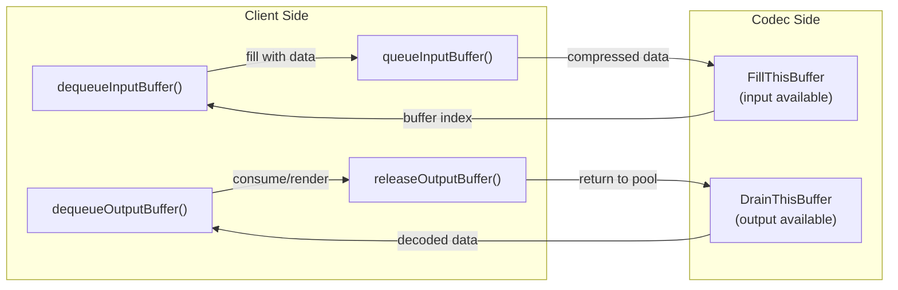
```mermaid
graph LR
    subgraph "Client Side"
        DI["dequeueInputBuffer()"]
        QI["queueInputBuffer()"]
        DO["dequeueOutputBuffer()"]
        RO["releaseOutputBuffer()"]
    end

    subgraph "Codec Side"
        FTB["FillThisBuffer<br/>(input available)"]
        DTB["DrainThisBuffer<br/>(output available)"]
    end

    FTB -->|"buffer index"| DI
    DI -->|"fill with data"| QI
    QI -->|"compressed data"| FTB
    DTB -->|"decoded data"| DO
    DO -->|"consume/render"| RO
    RO -->|"return to pool"| DTB
```

The `BufferCallback` class (line 968) translates between the codec's internal buffer
notifications and the `AMessage` events that drive MediaCodec's state machine:

```cpp
// frameworks/av/media/libstagefright/MediaCodec.cpp, line 984
void BufferCallback::onInputBufferAvailable(
        size_t index, const sp<MediaCodecBuffer> &buffer) {
    sp<AMessage> notify(mNotify->dup());
    notify->setInt32("what", kWhatFillThisBuffer);
    notify->setSize("index", index);
    notify->setObject("buffer", buffer);
    notify->post();
}

void BufferCallback::onOutputBufferAvailable(
        size_t index, const sp<MediaCodecBuffer> &buffer) {
    sp<AMessage> notify(mNotify->dup());
    notify->setInt32("what", kWhatDrainThisBuffer);
    notify->setSize("index", index);
    notify->setObject("buffer", buffer);
    notify->post();
}
```

### 16.2.7 ACodec: The OMX Bridge (9459 lines)

`ACodec` in `frameworks/av/media/libstagefright/ACodec.cpp` is the legacy bridge between
MediaCodec and OpenMAX IL (OMX) components. At 9459 lines, it is one of the largest
single source files in the media framework. While being gradually replaced by Codec2,
ACodec remains important for backward compatibility with older vendor OMX implementations.

ACodec implements its own nested state machine using the `AHierarchicalStateMachine`
pattern. Each state is a nested class:

```cpp
// frameworks/av/media/libstagefright/ACodec.cpp, line 276
struct ACodec::BaseState : public AState {
    explicit BaseState(ACodec *codec, const sp<AState> &parentState = NULL);

protected:
    enum PortMode {
        KEEP_BUFFERS,
        RESUBMIT_BUFFERS,
        FREE_BUFFERS,
    };

    ACodec *mCodec;
    virtual PortMode getPortMode(OMX_U32 portIndex);
    virtual void stateExited();
    virtual bool onMessageReceived(const sp<AMessage> &msg);
    virtual bool onOMXEvent(OMX_EVENTTYPE event, OMX_U32 data1, OMX_U32 data2);
    virtual void onOutputBufferDrained(const sp<AMessage> &msg);
    virtual void onInputBufferFilled(const sp<AMessage> &msg);
};
```

The ACodec state hierarchy is:

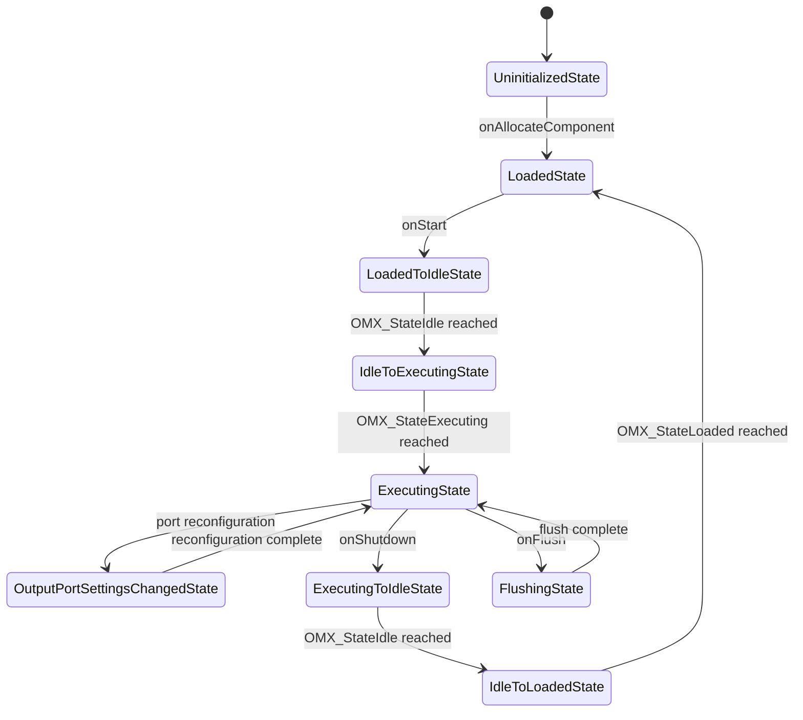
```mermaid
stateDiagram-v2
    [*] --> UninitializedState
    UninitializedState --> LoadedState : onAllocateComponent
    LoadedState --> LoadedToIdleState : onStart
    LoadedToIdleState --> IdleToExecutingState : OMX_StateIdle reached
    IdleToExecutingState --> ExecutingState : OMX_StateExecuting reached
    ExecutingState --> OutputPortSettingsChangedState : port reconfiguration
    OutputPortSettingsChangedState --> ExecutingState : reconfiguration complete
    ExecutingState --> ExecutingToIdleState : onShutdown
    ExecutingToIdleState --> IdleToLoadedState : OMX_StateIdle reached
    IdleToLoadedState --> LoadedState : OMX_StateLoaded reached
    ExecutingState --> FlushingState : onFlush
    FlushingState --> ExecutingState : flush complete
```

The `CodecObserver` class (line 192) receives OMX callback messages and translates them
into AMessage events:

```cpp
// frameworks/av/media/libstagefright/ACodec.cpp, line 192
struct CodecObserver : public BnOMXObserver {
    explicit CodecObserver(const sp<AMessage> &msg) : mNotify(msg) {}

    virtual void onMessages(const std::list<omx_message> &messages) {
        if (messages.empty()) {
            return;
        }

        sp<AMessage> notify = mNotify->dup();
        sp<MessageList> msgList = new MessageList();
        for (std::list<omx_message>::const_iterator it = messages.cbegin();
              it != messages.cend(); ++it) {
            const omx_message &omx_msg = *it;
            sp<AMessage> msg = new AMessage;
            msg->setInt32("type", omx_msg.type);
            switch (omx_msg.type) {
                case omx_message::EVENT:
                    msg->setInt32("event", omx_msg.u.event_data.event);
                    msg->setInt32("data1", omx_msg.u.event_data.data1);
                    msg->setInt32("data2", omx_msg.u.event_data.data2);
                    break;
                case omx_message::EMPTY_BUFFER_DONE:
                    msg->setInt32("buffer", omx_msg.u.buffer_data.buffer);
                    msg->setInt32("fence_fd", omx_msg.fenceFd);
                    break;
                case omx_message::FILL_BUFFER_DONE:
                    // ... range_offset, range_length, flags, timestamp, fence_fd
                    break;
                case omx_message::FRAME_RENDERED:
                    // ... media_time_us, system_nano
                    break;
            }
            msgList->getList().push_back(msg);
        }
        notify->setObject("messages", msgList);
        notify->post();
    }
};
```

The OMX message types directly map to the OpenMAX IL specification:

- `EMPTY_BUFFER_DONE`: The codec has consumed an input buffer and is returning it
- `FILL_BUFFER_DONE`: The codec has produced output in a buffer
- `EVENT`: State change notifications, error events, port settings changes
- `FRAME_RENDERED`: A frame has been rendered to the output surface

ACodec also handles the bitrate control mode translation between Android's API constants
and OMX's `OMX_VIDEO_CONTROLRATETYPE`:

```cpp
// frameworks/av/media/libstagefright/ACodec.cpp, line 147
static OMX_VIDEO_CONTROLRATETYPE getVideoBitrateMode(const sp<AMessage> &msg) {
    int32_t tmp;
    if (msg->findInt32("bitrate-mode", &tmp)) {
        switch (tmp) {
            //BITRATE_MODE_CQ
            case 0: return OMX_Video_ControlRateConstantQuality;
            //BITRATE_MODE_VBR
            case 1: return OMX_Video_ControlRateVariable;
            //BITRATE_MODE_CBR
            case 2: return OMX_Video_ControlRateConstant;
            default: break;
        }
    }
    return OMX_Video_ControlRateVariable;
}
```

### 16.2.8 MPEG4Writer: The Container Muxer (6039 lines)

`MPEG4Writer` in `frameworks/av/media/libstagefright/MPEG4Writer.cpp` implements the
ISO 14496 (MP4/3GP) container format writer. It handles the complex task of interleaving
audio and video tracks, writing metadata boxes, and managing the atom tree that makes
up an MP4 file.

The Track inner class (line 117) manages per-track state:

```cpp
// frameworks/av/media/libstagefright/MPEG4Writer.cpp, line 117
class MPEG4Writer::Track {
public:
    Track(MPEG4Writer *owner, const sp<MediaSource> &source, uint32_t aTrackId);
    ~Track();

    status_t start(MetaData *params);
    status_t stop(bool stopSource = true);
    status_t pause();
    bool reachedEOS();

    int64_t getDurationUs() const;
    int64_t getEstimatedTrackSizeBytes() const;
    void writeTrackHeader();
    // ...
    bool isAvc() const { return mIsAvc; }
    bool isHevc() const { return mIsHevc; }
    bool isAv1() const { return mIsAv1; }
    bool isApv() const { return mIsApv; }
    bool isHeic() const { return mIsHeic; }
    bool isAvif() const { return mIsAvif; }
    bool isHeif() const { return mIsHeif; }
    bool isAudio() const { return mIsAudio; }
    bool isMPEG4() const { return mIsMPEG4; }
    bool usePrefix() const { return mIsAvc || mIsHevc || mIsHeic || mIsDovi; }
```

The Track class supports a wide range of codecs: AVC (H.264), HEVC (H.265), AV1,
APV, HEIC, AVIF, HEIF, Dolby Vision, and traditional MPEG-4 Part 2. Key constants
define operational limits:

```cpp
// frameworks/av/media/libstagefright/MPEG4Writer.cpp, line 74
static const int64_t kMinStreamableFileSizeInBytes = 5 * 1024 * 1024;
static const uint8_t kNalUnitTypeSeqParamSet = 0x07;
static const uint8_t kNalUnitTypePicParamSet = 0x08;
static const int64_t kInitialDelayTimeUs     = 700000LL;
static const int64_t kMaxMetadataSize = 0x4000000LL;   // 64MB max per-frame metadata size
static const int64_t kMaxCttsOffsetTimeUs = 30 * 60 * 1000000LL;  // 30 minutes
```

MPEG4Writer also handles HEIF/AVIF image writing and gainmap (HDR) metadata, which
is critical for the newer Ultra HDR photo format. The track identification system
uses a `TrackId` struct (line 118) that enforces ISO 14496-12 constraints: track IDs
cannot be zero, and when used with `MediaRecorder`, they are limited to 4 bits (values
1-15).

### 16.2.9 The AMessage Pattern

Throughout the media framework, communication between components uses the `AMessage`/
`AHandler`/`ALooper` pattern. This is Stagefright's own lightweight actor model:

- **ALooper**: A thread that processes messages from a queue
- **AHandler**: Receives messages dispatched to it by a looper
- **AMessage**: A typed key-value container that can be posted to a handler

This pattern appears in nearly every method of MediaCodec. For example, `start()`:

```cpp
// frameworks/av/media/libstagefright/MediaCodec.cpp, line 3552
status_t MediaCodec::start() {
    ScopedTrace trace(ATRACE_TAG, "MediaCodec::start#native");
    sp<AMessage> msg = new AMessage(kWhatStart, this);

    // ...resource checking and retry logic...

    sp<AMessage> response;
    err = PostAndAwaitResponse(msg, &response);
    // ...
}
```

`PostAndAwaitResponse` is a synchronous wrapper: it posts the message to the looper
thread and blocks the calling thread until a response is received. This means that
while `MediaCodec::start()` appears synchronous to the caller, internally it executes
on the looper thread, ensuring thread-safe access to MediaCodec's state.

---

## 16.3 Codec2 Framework

### 16.3.1 Architecture and Design Philosophy

Codec2 (often abbreviated C2) is Android's modern codec framework, designed to replace
the aging OMX IL interface. Located in `frameworks/av/media/codec2/`, it comprises 11
subdirectories encompassing the core API, 23+ software codec families, a HAL layer, and
the `sfplugin` bridge to the Stagefright framework.

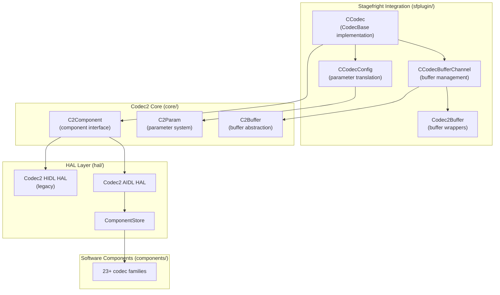
```mermaid
graph TD
    subgraph "Stagefright Integration (sfplugin/)"
        A["CCodec<br/>(CodecBase implementation)"]
        B["CCodecBufferChannel<br/>(buffer management)"]
        C["CCodecConfig<br/>(parameter translation)"]
        D["Codec2Buffer<br/>(buffer wrappers)"]
    end

    subgraph "Codec2 Core (core/)"
        E["C2Component<br/>(component interface)"]
        F["C2Buffer<br/>(buffer abstraction)"]
        G["C2Param<br/>(parameter system)"]
    end

    subgraph "HAL Layer (hal/)"
        H["Codec2 AIDL HAL"]
        I["Codec2 HIDL HAL<br/>(legacy)"]
        J["ComponentStore"]
    end

    subgraph "Software Components (components/)"
        K["23+ codec families"]
    end

    A --> B
    A --> C
    B --> D

    A --> E
    B --> F
    C --> G

    E --> H
    E --> I
    H --> J
    J --> K
```

The key design improvements over OMX include:

1. **Typed parameter system**: Instead of OMX's flat index-based parameter scheme,
   Codec2 uses a strongly-typed, reflectable parameter system (`C2Param`) that catches
   configuration errors at compile time.

2. **Work-based processing model**: Instead of OMX's separate input/output buffer
   queues, Codec2 uses a unified `C2Work` structure that bundles input and output
   together, simplifying buffer lifecycle tracking.

3. **Flexible buffer management**: Codec2 supports multiple allocator backends
   (Gralloc, ION/DMA-buf, blob) through a uniform `C2Buffer` abstraction.

4. **Component stores**: Codecs are discovered through `C2ComponentStore` interfaces
   rather than the global OMX node registry, enabling better isolation and
   vendor extensibility.

### 16.3.2 CCodec: The Codec2-to-Stagefright Bridge (3827 lines)

`CCodec` in `frameworks/av/media/codec2/sfplugin/CCodec.cpp` implements the
`CodecBase` interface, making Codec2 components usable by `MediaCodec`. It
is the counterpart of `ACodec` for the Codec2 world.

```cpp
// frameworks/av/media/codec2/sfplugin/CCodec.cpp, line 18-19
#define LOG_TAG "CCodec"
#define ATRACE_TAG  ATRACE_TAG_VIDEO
```

CCodec includes a **watchdog mechanism** to detect hung codecs:

```cpp
// frameworks/av/media/codec2/sfplugin/CCodec.cpp, line 90
class CCodecWatchdog : public AHandler {
private:
    enum {
        kWhatWatch,
    };
    constexpr static int64_t kWatchIntervalUs = 3300000;  // 3.3 secs

public:
    static sp<CCodecWatchdog> getInstance() {
        static sp<CCodecWatchdog> sInstance = [] {
            sp<CCodecWatchdog> instance = new CCodecWatchdog;
            instance->incStrong((void *)CCodecWatchdog::getInstance);
            instance->init();
            return instance;
        }();
        return sInstance;
    }

    void watch(sp<CCodec> codec) {
        bool shouldPost = false;
        {
            Mutexed<std::set<wp<CCodec>>>::Locked codecs(mCodecsToWatch);
            shouldPost = codecs->empty();
            codecs->emplace(codec);
        }
        if (shouldPost) {
            ALOGV("posting watch message");
            (new AMessage(kWhatWatch, this))->post(kWatchIntervalUs);
        }
    }
```

The watchdog runs a singleton looper thread. Every 3.3 seconds, it checks all registered
CCodec instances and calls `initiateReleaseIfStuck()` on any that appear hung. This
is essential for robustness: if a vendor codec HAL freezes, the watchdog ensures the
system eventually recovers rather than leaving the MediaCodec in a permanently stuck state.

### 16.3.3 CCodecBufferChannel (3075 lines)

`CCodecBufferChannel` in `frameworks/av/media/codec2/sfplugin/CCodecBufferChannel.cpp`
manages the buffer pipeline between MediaCodec and Codec2 components. It handles:

- Buffer allocation and pooling
- Conversion between MediaCodec's `MediaCodecBuffer` and Codec2's `C2Buffer`
- Surface buffer management for video output
- DRM/crypto buffer handling
- Large-frame audio buffer management

The flag conversion between MediaCodec and Codec2 buffer flags illustrates the
translation layer:

```cpp
// frameworks/av/media/codec2/sfplugin/CCodecBufferChannel.cpp, line 101
constexpr static std::initializer_list<std::pair<uint32_t, uint32_t>> flagList = {
        {BUFFER_FLAG_CODEC_CONFIG, C2FrameData::FLAG_CODEC_CONFIG},
        {BUFFER_FLAG_END_OF_STREAM, C2FrameData::FLAG_END_OF_STREAM},
        {BUFFER_FLAG_DECODE_ONLY, C2FrameData::FLAG_DROP_FRAME}
};

static uint32_t convertFlags(uint32_t flags, bool toC2) {
    return std::transform_reduce(
            flagList.begin(), flagList.end(),
            0u,
            std::bit_or{},
            [flags, toC2](const std::pair<uint32_t, uint32_t> &entry) {
                if (toC2) {
                    return (flags & entry.first) ? entry.second : 0;
                } else {
                    return (flags & entry.second) ? entry.first : 0;
                }
            });
}
```

The `SurfaceCallbackHandler` (line 121) manages asynchronous surface buffer events:

```cpp
// frameworks/av/media/codec2/sfplugin/CCodecBufferChannel.cpp, line 121
class SurfaceCallbackHandler {
public:
    enum callback_type_t {
        ON_BUFFER_RELEASED = 0,
        ON_BUFFER_ATTACHED
    };

    void post(callback_type_t callback,
            std::shared_ptr<Codec2Client::Component> component,
            uint32_t generation) {
        // ...post callback to handler thread...
    }
};
```

Key operational constants include:

```cpp
// frameworks/av/media/codec2/sfplugin/CCodecBufferChannel.cpp, line 88
constexpr size_t kSmoothnessFactor = 4;
const static size_t kDequeueTimeoutNs = 0;
```

The `kSmoothnessFactor` of 4 means the buffer channel allocates 4x the minimum number
of buffers needed, providing headroom for smooth operation under varying decode latencies.

### 16.3.4 The C2InputSurface Wrapper

For encoding scenarios where the input comes from a `Surface` (e.g., screen recording,
camera recording), CCodec uses the `C2InputSurfaceWrapper`:

```cpp
// frameworks/av/media/codec2/sfplugin/CCodec.cpp, line 164
class C2InputSurfaceWrapper : public InputSurfaceWrapper {
public:
    explicit C2InputSurfaceWrapper(
            const std::shared_ptr<Codec2Client::InputSurface> &surface,
            uint32_t width, uint32_t height, uint64_t usage)
        : mSurface(surface), mWidth(width), mHeight(height) {
        mDataSpace = HAL_DATASPACE_BT709;
        mConfig.mUsage = usage;
    }

    status_t connect(const std::shared_ptr<Codec2Client::Component> &comp) override {
        // Configure block size, count, usage, dataspace
        C2StreamBlockSizeInfo::output blockSize{0u, mWidth, mHeight};
        C2StreamBlockCountInfo::output blockCount{0u, getInputBufferCount(comp)};
        C2StreamUsageTuning::output usage{0u, mConfig.mUsage};
        C2StreamDataSpaceInfo::output dataspace{0u, mDataSpace};
        c2_status_t err = mSurface->config(
                {&blockSize, &blockCount, &usage, &dataspace},
                C2_MAY_BLOCK, &failures);
        // ...
        return mSurface->connect(comp, &mConnection);
    }
```

This wrapper configures the input surface's buffer dimensions, count, and usage flags,
then connects it directly to the Codec2 component. This enables zero-copy encoding
paths where camera or GPU output is fed directly into the encoder without CPU-side
buffer copies.

### 16.3.5 Software Codec Components (23+ Families)

The `frameworks/av/media/codec2/components/` directory contains Google's software codec
implementations, organized by codec family. Each component follows the naming convention
`c2.android.<codec>.<encoder|decoder>`.

The full set of 23+ component families:

| Directory | Codec(s) | Type | Source Files |
|---|---|---|---|
| `aac/` | AAC | Audio Dec+Enc | `C2SoftAacDec.cpp`, `C2SoftAacEnc.cpp` |
| `amr_nb_wb/` | AMR-NB, AMR-WB | Audio Dec+Enc | `C2SoftAmrDec.cpp`, `C2SoftAmrNbEnc.cpp`, `C2SoftAmrWbEnc.cpp` |
| `aom/` | AV1 (libaom) | Video Dec+Enc | `C2SoftAomDec.cpp`, `C2SoftAomEnc.cpp` |
| `apv/` | APV | Video Dec+Enc | `C2SoftApvDec.cpp`, `C2SoftApvEnc.cpp` |
| `avc/` | H.264/AVC | Video Dec+Enc | `C2SoftAvcDec.cpp`, `C2SoftAvcEnc.cpp` |
| `dav1d/` | AV1 (dav1d) | Video Dec | `C2SoftDav1dDec.cpp` |
| `flac/` | FLAC | Audio Dec+Enc | `C2SoftFlacDec.cpp`, `C2SoftFlacEnc.cpp` |
| `g711/` | G.711 (alaw/ulaw) | Audio Dec | `C2SoftG711Dec.cpp` |
| `gav1/` | AV1 (libgav1) | Video Dec | `C2SoftGav1Dec.cpp` |
| `gsm/` | GSM | Audio Dec | `C2SoftGsmDec.cpp` |
| `hevc/` | H.265/HEVC | Video Dec+Enc | `C2SoftHevcDec.cpp`, `C2SoftHevcEnc.cpp` |
| `iamf/` | IAMF | Audio Dec | `C2SoftIamfDec.cpp` |
| `mp3/` | MP3 | Audio Dec | `C2SoftMp3Dec.cpp` |
| `mpeg2/` | MPEG-2 | Video Dec | `C2SoftMpeg2Dec.cpp` |
| `mpeg4_h263/` | MPEG-4/H.263 | Video Dec+Enc | `C2SoftMpeg4Dec.cpp`, `C2SoftMpeg4Enc.cpp` |
| `opus/` | Opus | Audio Dec+Enc | `C2SoftOpusDec.cpp`, `C2SoftOpusEnc.cpp` |
| `raw/` | PCM | Audio Dec | `C2SoftRawDec.cpp` |
| `vorbis/` | Vorbis | Audio Dec | `C2SoftVorbisDec.cpp` |
| `vpx/` | VP8, VP9 | Video Dec+Enc | `C2SoftVpxDec.cpp`, `C2SoftVp8Enc.cpp`, `C2SoftVp9Enc.cpp` |
| `xaac/` | xHE-AAC | Audio Dec | `C2SoftXaacDec.cpp` |
| `base/` | (Base classes) | Utility | `SimpleC2Component.cpp`, `SimpleC2Interface.cpp` |

Notable observations:

- **Three AV1 decoders**: The framework includes three separate AV1 implementations:
  libaom (reference), dav1d (optimized for speed), and libgav1 (Google's implementation).
  In practice, dav1d is the preferred software decoder due to its superior performance.

- **IAMF (Immersive Audio Model and Formats)**: This is a relatively new addition
  supporting the IAMF standard for spatial audio, reflecting Android's push toward
  immersive media.

- **APV (Advanced Professional Video)**: Another recent addition for professional video
  workflows.

Each software codec extends the `SimpleC2Component` base class and implements the
`IntfImpl` pattern for parameter declaration:

```cpp
// frameworks/av/media/codec2/components/avc/C2SoftAvcDec.cpp, line 37
constexpr char COMPONENT_NAME[] = "c2.android.avc.decoder";
constexpr uint32_t kDefaultOutputDelay = 8;
constexpr uint32_t kMaxOutputDelay = 34;

class C2SoftAvcDec::IntfImpl : public SimpleInterface<void>::BaseParams {
public:
    explicit IntfImpl(const std::shared_ptr<C2ReflectorHelper> &helper)
        : SimpleInterface<void>::BaseParams(
                helper,
                COMPONENT_NAME,
                C2Component::KIND_DECODER,
                C2Component::DOMAIN_VIDEO,
                MEDIA_MIMETYPE_VIDEO_AVC) {
        noPrivateBuffers();
        noInputReferences();
        noOutputReferences();
        noInputLatency();
        noTimeStretch();

        addParameter(
                DefineParam(mActualOutputDelay, C2_PARAMKEY_OUTPUT_DELAY)
                .withDefault(new C2PortActualDelayTuning::output(kDefaultOutputDelay))
                .withFields({C2F(mActualOutputDelay, value).inRange(0, kMaxOutputDelay)})
                .withSetter(Setter<decltype(*mActualOutputDelay)>::StrictValueWithNoDeps)
                .build());

        addParameter(
                DefineParam(mSize, C2_PARAMKEY_PICTURE_SIZE)
                .withDefault(new C2StreamPictureSizeInfo::output(0u, 320, 240))
                .withFields({
                    C2F(mSize, width).inRange(2, 4096, 2),
                    C2F(mSize, height).inRange(2, 4096, 2),
                })
                .withSetter(SizeSetter)
                .build());
```

The `kMaxOutputDelay` of 34 for AVC is derived from the specification: AVC allows up to
16 frames of reordering delay, interlaced content doubles this to 32 fields, and the
software decoder adds 2 frames of internal delay, totaling 34.

### 16.3.6 Codec2 HAL

The Codec2 HAL layer in `frameworks/av/media/codec2/hal/` provides the interface between
the Android framework and vendor codec implementations. The HAL has evolved through
two generations:

```
hal/
  aidl/          # Modern AIDL HAL (current)
    Component.cpp
    ComponentInterface.cpp
    ComponentStore.cpp
    Configurable.cpp
    InputBufferManager.cpp
    ParamTypes.cpp
  hidl/          # Legacy HIDL HAL
  services/      # HAL service entry point
    vendor.cpp
    android.hardware.media.c2-default-service.rc
    manifest_media_c2_default.xml
```

The AIDL HAL defines key interfaces:

- **IComponentStore**: Discovers and instantiates codec components
- **IComponent**: Represents a single codec instance with queue/flush/start/stop/reset
- **IComponentInterface**: Provides parameter query and configuration
- **IConfigurable**: Generic configuration interface

The HAL service runs as a separate process (`android.hardware.media.c2-default-service`),
providing process isolation between vendor codec code and the framework:

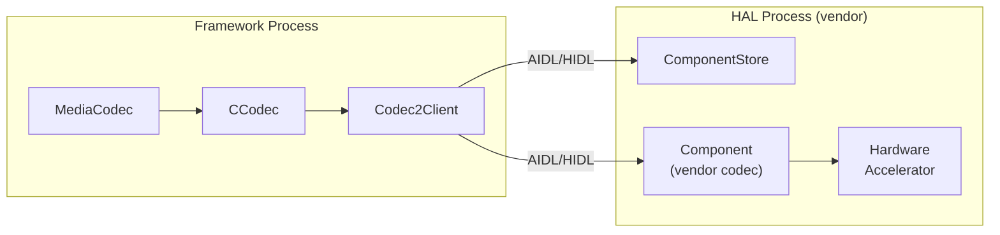
```mermaid
graph LR
    subgraph "Framework Process"
        MC["MediaCodec"]
        CC["CCodec"]
        Client["Codec2Client"]
    end

    subgraph "HAL Process (vendor)"
        Store["ComponentStore"]
        Comp["Component<br/>(vendor codec)"]
        HW["Hardware<br/>Accelerator"]
    end

    MC --> CC
    CC --> Client
    Client -->|"AIDL/HIDL"| Store
    Client -->|"AIDL/HIDL"| Comp
    Comp --> HW
```

### 16.3.7 The Codec2 Parameter System

One of Codec2's most important innovations is its typed parameter system. Unlike OMX's
flat `OMX_INDEXTYPE` + void pointer approach, Codec2 parameters are C++ structs with
compile-time type checking:

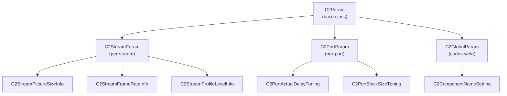
```mermaid
graph TD
    C2P["C2Param<br/>(base class)"]
    C2SP["C2StreamParam<br/>(per-stream)"]
    C2PP["C2PortParam<br/>(per-port)"]
    C2GP["C2GlobalParam<br/>(codec-wide)"]

    C2P --> C2SP
    C2P --> C2PP
    C2P --> C2GP

    C2SP --> Ex1["C2StreamPictureSizeInfo"]
    C2SP --> Ex2["C2StreamFrameRateInfo"]
    C2SP --> Ex3["C2StreamProfileLevelInfo"]
    C2PP --> Ex4["C2PortActualDelayTuning"]
    C2PP --> Ex5["C2PortBlockSizeTuning"]
    C2GP --> Ex6["C2ComponentNameSetting"]
```

The `DefineParam` / `withDefault` / `withFields` / `withSetter` / `build()` builder
pattern provides a declarative way to specify parameter constraints. For example,
the picture size parameter for the AVC decoder constrains width and height to the range
[2, 4096] in steps of 2 (ensuring even dimensions for YUV formats).

### 16.3.8 CCodecConfig: Parameter Translation

`CCodecConfig` in `frameworks/av/media/codec2/sfplugin/CCodecConfig.cpp` performs the
crucial task of translating between Stagefright's `AMessage`-based format parameters
(e.g., `"width"`, `"height"`, `"bitrate"`) and Codec2's strongly-typed `C2Param`
structures. This translation layer is necessary because the Java `MediaFormat` API
predates Codec2 and uses string keys.

The translation covers hundreds of parameter mappings, including:

- Video dimensions: `"width"` / `"height"` to `C2StreamPictureSizeInfo`
- Frame rate: `"frame-rate"` to `C2StreamFrameRateInfo`
- Bitrate: `"bitrate"` to `C2StreamBitrateInfo`
- Profile/level: `"profile"` / `"level"` to `C2StreamProfileLevelInfo`
- Color format: `"color-format"` to `C2StreamPixelFormatInfo`
- HDR metadata: various HDR keys to `C2StreamHdrStaticInfo`, etc.

### 16.3.9 Codec2 Work Items

The fundamental unit of processing in Codec2 is the `C2Work` structure:

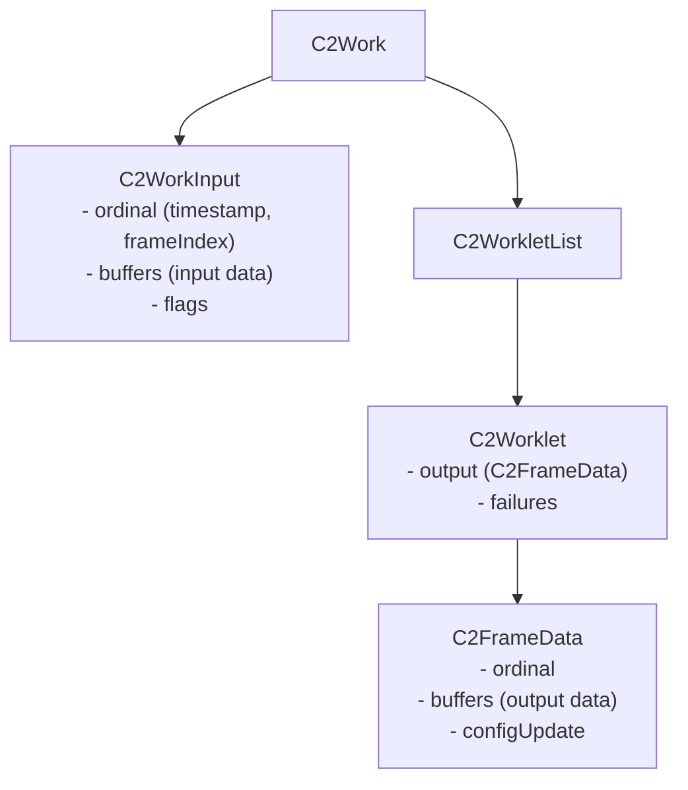
```mermaid
graph TD
    W["C2Work"]
    W --> WI["C2WorkInput<br/>- ordinal (timestamp, frameIndex)<br/>- buffers (input data)<br/>- flags"]
    W --> WL["C2WorkletList"]
    WL --> WK["C2Worklet<br/>- output (C2FrameData)<br/>- failures"]
    WK --> FD["C2FrameData<br/>- ordinal<br/>- buffers (output data)<br/>- configUpdate"]
```

Unlike OMX's separate `EmptyThisBuffer` / `FillThisBuffer` calls, a `C2Work` bundles
input and output together. The client submits a `C2Work` with input data filled in; the
component processes it and fills in the output data within the same `C2Work` structure,
then returns it via the `onWorkDone` callback. This design eliminates the complex
buffer-matching logic required by OMX.

---

## 16.4 MediaPlayer and MediaRecorder

### 16.4.1 MediaPlayerService (3111 lines)

`MediaPlayerService` in `frameworks/av/media/libmediaplayerservice/MediaPlayerService.cpp`
is the system service that manages all media playback sessions. It runs in the
`mediaserver` process and is registered as `"media.player"`.

```cpp
// frameworks/av/media/libmediaplayerservice/MediaPlayerService.cpp, line 21-22
#define LOG_TAG "MediaPlayerService"
// Proxy for media player implementations
```

The service creates client sessions through its `create()` method:

```cpp
// frameworks/av/media/libmediaplayerservice/MediaPlayerService.cpp, line 503
sp<IMediaPlayer> MediaPlayerService::create(
        const sp<IMediaPlayerClient>& client,
        audio_session_t audioSessionId,
        const AttributionSourceState& attributionSource)
{
    int32_t connId = android_atomic_inc(&mNextConnId);
    AttributionSourceState verifiedAttributionSource = attributionSource;
    verifiedAttributionSource.pid = VALUE_OR_FATAL(
        legacy2aidl_pid_t_int32_t(IPCThreadState::self()->getCallingPid()));
    verifiedAttributionSource.uid = VALUE_OR_FATAL(
        legacy2aidl_uid_t_int32_t(IPCThreadState::self()->getCallingUid()));

    sp<Client> c = new Client(
            this, verifiedAttributionSource, connId, client, audioSessionId);
    // ...
    return c;
}
```

Each client connection receives a unique connection ID (`connId`), and the
`AttributionSourceState` is verified against the actual calling process's PID and UID
to prevent spoofing.

The service also provides access to the codec list:

```cpp
// frameworks/av/media/libmediaplayerservice/MediaPlayerService.cpp, line 528
sp<IMediaCodecList> MediaPlayerService::getCodecList() const {
    return MediaCodecList::getLocalInstance();
}
```

The service includes comprehensive dumpsys support (starting at line 609), which is
invaluable for debugging. Running `adb shell dumpsys media.player` produces detailed
information about all active playback sessions, including:

- Client attribution (UID, PID, package)
- Player state (playing, paused, stopped)
- Audio output configuration (stream type, volume, latency)
- Open file descriptors and memory mappings
- Codec information for each active decoder/encoder

The MediaPlayerService also manages an important MediaRecorderClient list:

```cpp
// frameworks/av/media/libmediaplayerservice/MediaPlayerService.cpp, line 614
SortedVector< sp<Client> > clients;
SortedVector< sp<MediaRecorderClient> > mediaRecorderClients;
// ...
for (const sp<Client> &c : clients) {
    c->dump(fd, args);
}
```

### 16.4.2 NuPlayer: The Default Media Player

NuPlayer is the default `MediaPlayerBase` implementation used for all local and streaming
media playback. Located in `frameworks/av/media/libmediaplayerservice/nuplayer/`, it
comprises multiple source files totaling over 8,000 lines:

| File | Lines | Purpose |
|---|---|---|
| `NuPlayer.cpp` | 3,259 | Core player logic, action queue |
| `NuPlayerRenderer.cpp` | 2,239 | Audio/video synchronization |
| `NuPlayerDecoder.cpp` | 1,394 | Decoder management (wraps MediaCodec) |
| `NuPlayerDriver.cpp` | 1,240 | MediaPlayerBase interface adapter |
| `GenericSource.cpp` | -- | Local file playback |
| `HTTPLiveSource.cpp` | -- | HLS streaming |
| `RTSPSource.cpp` | -- | RTSP streaming |
| `RTPSource.cpp` | -- | RTP streaming |
| `StreamingSource.cpp` | -- | MPEG-TS streaming |

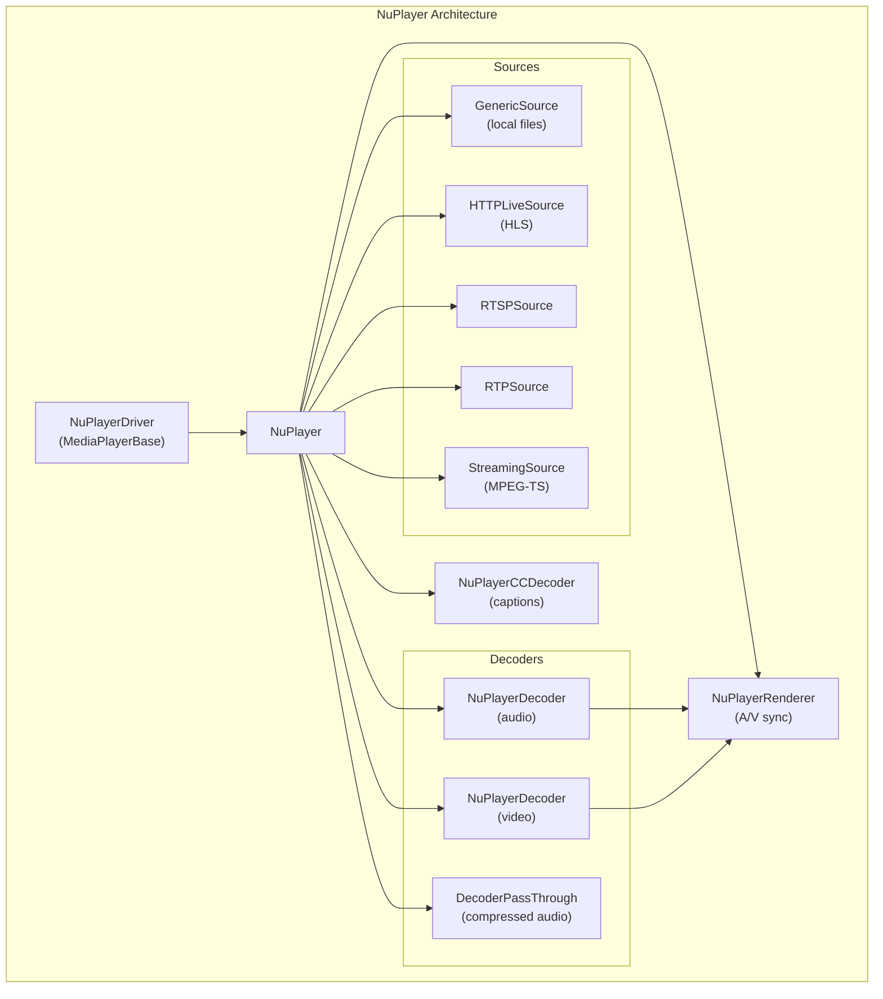
```mermaid
graph TD
    subgraph "NuPlayer Architecture"
        Driver["NuPlayerDriver<br/>(MediaPlayerBase)"]
        NP["NuPlayer"]

        subgraph "Sources"
            GS["GenericSource<br/>(local files)"]
            HLS["HTTPLiveSource<br/>(HLS)"]
            RTSP["RTSPSource"]
            RTP["RTPSource"]
            SS["StreamingSource<br/>(MPEG-TS)"]
        end

        subgraph "Decoders"
            AD["NuPlayerDecoder<br/>(audio)"]
            VD["NuPlayerDecoder<br/>(video)"]
            PT["DecoderPassThrough<br/>(compressed audio)"]
        end

        Renderer["NuPlayerRenderer<br/>(A/V sync)"]
        CC["NuPlayerCCDecoder<br/>(captions)"]
    end

    Driver --> NP
    NP --> GS
    NP --> HLS
    NP --> RTSP
    NP --> RTP
    NP --> SS

    NP --> AD
    NP --> VD
    NP --> PT
    NP --> Renderer
    NP --> CC

    AD --> Renderer
    VD --> Renderer
```

NuPlayer uses the **Action pattern** for deferred operations. This is a queue of
operations that should execute when certain conditions are met (e.g., after a flush
completes):

```cpp
// frameworks/av/media/libmediaplayerservice/nuplayer/NuPlayer.cpp, line 68
struct NuPlayer::Action : public RefBase {
    Action() {}
    virtual void execute(NuPlayer *player) = 0;
};

struct NuPlayer::SeekAction : public Action {
    explicit SeekAction(int64_t seekTimeUs, MediaPlayerSeekMode mode)
        : mSeekTimeUs(seekTimeUs), mMode(mode) {
    }
    virtual void execute(NuPlayer *player) {
        player->performSeek(mSeekTimeUs, mMode);
    }
};

struct NuPlayer::ResumeDecoderAction : public Action {
    explicit ResumeDecoderAction(bool needNotify)
        : mNeedNotify(needNotify) {
    }
    virtual void execute(NuPlayer *player) {
        player->performResumeDecoders(mNeedNotify);
    }
};

struct NuPlayer::SetSurfaceAction : public Action {
    explicit SetSurfaceAction(const sp<Surface> &surface)
        : mSurface(surface) {
    }
    virtual void execute(NuPlayer *player) {
        player->performSetSurface(mSurface);
    }
};

struct NuPlayer::FlushDecoderAction : public Action {
    FlushDecoderAction(FlushCommand audio, FlushCommand video)
        : mAudio(audio), mVideo(video) {
    }
    virtual void execute(NuPlayer *player) {
        player->performDecoderFlush(mAudio, mVideo);
    }
};
```

The deferred action pattern solves a common problem in media players: operations like
seek require flushing both audio and video decoders, waiting for the flushes to complete,
then resuming from the new position. Rather than implementing complex multi-step state
machines, NuPlayer queues actions that execute in sequence.

### 16.4.3 NuPlayerDecoder: MediaCodec Wrapper

`NuPlayerDecoder` wraps `MediaCodec` for use within NuPlayer. It handles:

- Codec selection and initialization based on the source track format
- Input buffer feeding from the NuPlayer source
- Output buffer consumption and forwarding to the renderer
- Codec error handling and recovery
- Format change detection and handling

The decoder operates in **asynchronous mode** using MediaCodec's callback API, which
means it receives `onInputBufferAvailable` and `onOutputBufferAvailable` callbacks rather
than polling with `dequeueInputBuffer` / `dequeueOutputBuffer`.

### 16.4.4 NuPlayerRenderer: Audio/Video Synchronization

`NuPlayerRenderer` (2,239 lines) is responsible for the critical task of synchronizing
audio and video playback. It implements:

- **Audio-video sync**: Video frames are scheduled to render at the correct time
  relative to the audio timeline. The audio track's position serves as the master clock.
- **Audio track management**: Creates and manages the `AudioTrack` for PCM audio output.
- **Frame scheduling**: Uses the display's vsync timing to schedule video frame
  rendering for minimal judder.
- **Playback speed**: Supports variable-speed playback by resampling audio and
  adjusting video frame timing.
- **Pause/resume**: Handles pause and resume with correct timestamp handling.

### 16.4.5 StagefrightRecorder (2733 lines)

`StagefrightRecorder` in `frameworks/av/media/libmediaplayerservice/StagefrightRecorder.cpp`
implements the `MediaRecorderBase` interface for recording audio and video. It orchestrates
the recording pipeline by connecting sources (camera, microphone) to encoders to muxers.

```cpp
// frameworks/av/media/libmediaplayerservice/StagefrightRecorder.cpp, line 128
StagefrightRecorder::StagefrightRecorder(const AttributionSourceState& client)
    : MediaRecorderBase(client),
      mWriter(NULL),
      mOutputFd(-1),
      mAudioSource((audio_source_t)AUDIO_SOURCE_CNT),
      mPrivacySensitive(PRIVACY_SENSITIVE_DEFAULT),
      mVideoSource(VIDEO_SOURCE_LIST_END),
      // ... RTP/RTSP parameters ...
      mStarted(false),
      mSelectedDeviceId(AUDIO_PORT_HANDLE_NONE),
      mDeviceCallbackEnabled(false),
      mSelectedMicDirection(MIC_DIRECTION_UNSPECIFIED),
      mSelectedMicFieldDimension(MIC_FIELD_DIMENSION_NORMAL) {
    ALOGV("Constructor");
    mMetricsItem = NULL;
    mAnalyticsDirty = false;
    reset();
}
```

StagefrightRecorder supports multiple output formats and employs the corresponding
writer for each:

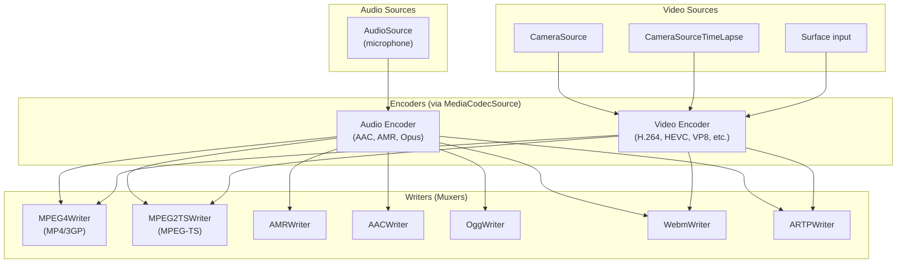
```mermaid
graph TD
    subgraph "Audio Sources"
        MIC["AudioSource<br/>(microphone)"]
    end

    subgraph "Video Sources"
        CAM["CameraSource"]
        TL["CameraSourceTimeLapse"]
        SURF["Surface input"]
    end

    subgraph "Encoders (via MediaCodecSource)"
        AE["Audio Encoder<br/>(AAC, AMR, Opus)"]
        VE["Video Encoder<br/>(H.264, HEVC, VP8, etc.)"]
    end

    subgraph "Writers (Muxers)"
        MP4["MPEG4Writer<br/>(MP4/3GP)"]
        TS["MPEG2TSWriter<br/>(MPEG-TS)"]
        AMR["AMRWriter"]
        AAC["AACWriter"]
        OGG["OggWriter"]
        WebM["WebmWriter"]
        RTP["ARTPWriter"]
    end

    MIC --> AE
    CAM --> VE
    TL --> VE
    SURF --> VE

    AE --> MP4
    VE --> MP4
    AE --> TS
    VE --> TS
    AE --> AMR
    AE --> AAC
    AE --> OGG
    AE --> WebM
    VE --> WebM
    AE --> RTP
    VE --> RTP
```

The writer includes support for various container formats, visible in the imports:

```cpp
// frameworks/av/media/libmediaplayerservice/StagefrightRecorder.cpp, line 27+
#include <webm/WebmWriter.h>
// ...
#include <media/stagefright/AMRWriter.h>
#include <media/stagefright/AACWriter.h>
#include <media/stagefright/CameraSource.h>
#include <media/stagefright/CameraSourceTimeLapse.h>
#include <media/stagefright/MPEG2TSWriter.h>
#include <media/stagefright/MPEG4Writer.h>
#include <media/stagefright/OggWriter.h>
#include <media/stagefright/rtsp/ARTPWriter.h>
```

StagefrightRecorder collects extensive metrics for telemetry:

```cpp
// frameworks/av/media/libmediaplayerservice/StagefrightRecorder.cpp, line 82
static const char *kKeyRecorder = "recorder";
static const char *kRecorderLogSessionId = "android.media.mediarecorder.log-session-id";
static const char *kRecorderAudioBitrate = "android.media.mediarecorder.audio-bitrate";
static const char *kRecorderAudioChannels = "android.media.mediarecorder.audio-channels";
static const char *kRecorderAudioSampleRate = "android.media.mediarecorder.audio-samplerate";
static const char *kRecorderFrameRate = "android.media.mediarecorder.frame-rate";
static const char *kRecorderHeight = "android.media.mediarecorder.height";
static const char *kRecorderWidth = "android.media.mediarecorder.width";
static const char *kRecorderVideoBitrate = "android.media.mediarecorder.video-bitrate";
```

Battery tracking is integrated into the recording pipeline:

```cpp
// frameworks/av/media/libmediaplayerservice/StagefrightRecorder.cpp, line 115
static void addBatteryData(uint32_t params) {
    sp<IBinder> binder =
        defaultServiceManager()->waitForService(String16("media.player"));
    sp<IMediaPlayerService> service = interface_cast<IMediaPlayerService>(binder);
    if (service.get() == nullptr) {
        ALOGE("%s: Failed to get media.player service", __func__);
        return;
    }
    service->addBatteryData(params);
}
```

This ensures that the system's battery statistics properly account for video encoding,
which is a power-intensive operation.

### 16.4.6 The MediaPlayer Playback Pipeline

The complete playback pipeline from application to hardware:

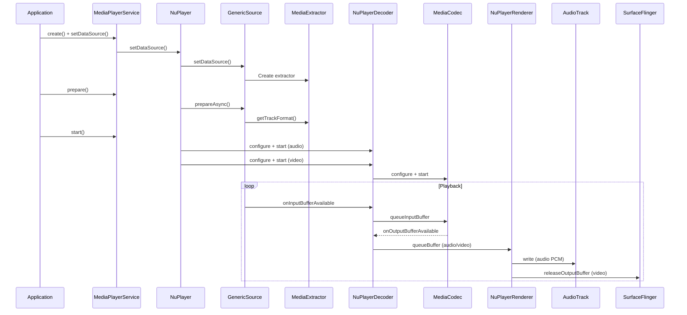
```mermaid
sequenceDiagram
    participant App as Application
    participant MPS as MediaPlayerService
    participant NP as NuPlayer
    participant Src as GenericSource
    participant Ext as MediaExtractor
    participant Dec as NuPlayerDecoder
    participant MC as MediaCodec
    participant Rend as NuPlayerRenderer
    participant AT as AudioTrack
    participant SF as SurfaceFlinger

    App->>MPS: create() + setDataSource()
    MPS->>NP: setDataSource()
    NP->>Src: setDataSource()
    Src->>Ext: Create extractor

    App->>MPS: prepare()
    NP->>Src: prepareAsync()
    Src->>Ext: getTrackFormat()

    App->>MPS: start()
    NP->>Dec: configure + start (audio)
    NP->>Dec: configure + start (video)
    Dec->>MC: configure + start

    loop Playback
        Src->>Dec: onInputBufferAvailable
        Dec->>MC: queueInputBuffer
        MC-->>Dec: onOutputBufferAvailable
        Dec->>Rend: queueBuffer (audio/video)
        Rend->>AT: write (audio PCM)
        Rend->>SF: releaseOutputBuffer (video)
    end
```

---

## 16.5 Camera Service

### 16.5.1 CameraService Architecture (6975 lines)

`CameraService` in `frameworks/av/services/camera/libcameraservice/CameraService.cpp`
is the central authority for all camera operations in Android. At 6975 lines, it
manages camera device discovery, client connections, security, resource allocation,
and the interface between Java APIs and vendor camera HALs.

```cpp
// frameworks/av/services/camera/libcameraservice/CameraService.cpp, line 17-18
#define LOG_TAG "CameraService"
#define ATRACE_TAG ATRACE_TAG_CAMERA
```

The service initializes during system boot:

```cpp
// frameworks/av/services/camera/libcameraservice/CameraService.cpp, line 189
CameraService::CameraService(
        std::shared_ptr<CameraServiceProxyWrapper> cameraServiceProxyWrapper,
        std::shared_ptr<AttributionAndPermissionUtils> attributionAndPermissionUtils) :
        // ...
        mEventLog(DEFAULT_EVENT_LOG_LENGTH),
        mNumberOfCameras(0),
        mNumberOfCamerasWithoutSystemCamera(0),
        mSoundRef(0), mInitialized(false),
        mAudioRestriction(
            hardware::camera2::ICameraDeviceUser::AUDIO_RESTRICTION_NONE) {
    ALOGI("CameraService started (pid=%d)", getpid());
}
```

### 16.5.2 Provider Enumeration and Device Discovery

On first reference (`onFirstRef`, line 225), CameraService initializes the camera
subsystem:

```cpp
// frameworks/av/services/camera/libcameraservice/CameraService.cpp, line 225
void CameraService::onFirstRef()
{
    ALOGI("CameraService process starting");
    BnCameraService::onFirstRef();

    // Update battery life tracking if service is restarting
    BatteryNotifier& notifier(BatteryNotifier::getInstance());
    notifier.noteResetCamera();
    notifier.noteResetFlashlight();

    status_t res = INVALID_OPERATION;
    res = enumerateProviders();
    if (res == OK) {
        mInitialized = true;
    }

    mUidPolicy = new UidPolicy(this);
    mUidPolicy->registerSelf();
    mSensorPrivacyPolicy = new SensorPrivacyPolicy(this, mAttributionAndPermissionUtils);
    mSensorPrivacyPolicy->registerSelf();
    mInjectionStatusListener = new InjectionStatusListener(this);
```

The `enumerateProviders()` method (line 278) creates the `CameraProviderManager` and
discovers all available cameras:

```cpp
// frameworks/av/services/camera/libcameraservice/CameraService.cpp, line 278
status_t CameraService::enumerateProviders() {
    status_t res;
    std::vector<std::string> deviceIds;
    std::unordered_map<std::string, std::set<std::string>> unavailPhysicalIds;
    {
        Mutex::Autolock l(mServiceLock);
        if (nullptr == mCameraProviderManager.get()) {
            mCameraProviderManager = new CameraProviderManager();
            res = mCameraProviderManager->initialize(this);
            // ...
        }
        mCameraProviderManager->setUpVendorTags();

        if (nullptr == mFlashlight.get()) {
            mFlashlight = new CameraFlashlight(mCameraProviderManager, this);
        }
        res = mFlashlight->findFlashUnits();
        deviceIds = mCameraProviderManager->getCameraDeviceIds(&unavailPhysicalIds);
    }

    for (auto& cameraId : deviceIds) {
        if (getCameraState(cameraId) == nullptr) {
            onDeviceStatusChanged(cameraId, CameraDeviceStatus::PRESENT);
        }
    }
```

The provider enumeration involves:

1. Creating a `CameraProviderManager` that discovers camera HAL providers
2. Setting up vendor-defined camera metadata tags
3. Enumerating flashlight units
4. Querying for all camera device IDs, including physical cameras within
   logical multi-camera setups
5. Registering each discovered camera with the service

The service also registers both HIDL and AIDL VNDK interfaces for vendor access:

```cpp
    sp<HidlCameraService> hcs = HidlCameraService::getInstance(this);
    if (hcs->registerAsService() != android::OK) {
        ALOGW("%s: Did not register default android.frameworks.cameraservice.service@2.2",
              __FUNCTION__);
    }

    if (!AidlCameraService::registerService(this)) {
        ALOGE("%s: Failed to register default AIDL VNDK CameraService", __FUNCTION__);
    }
```

### 16.5.3 Camera API1 vs API2

Android supports two camera APIs:

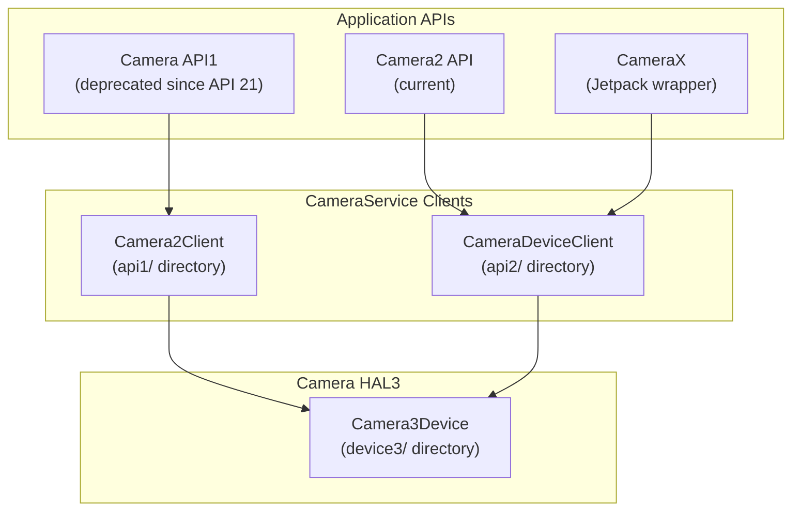
```mermaid
graph TD
    subgraph "Application APIs"
        A1["Camera API1<br/>(deprecated since API 21)"]
        A2["Camera2 API<br/>(current)"]
        AX["CameraX<br/>(Jetpack wrapper)"]
    end

    subgraph "CameraService Clients"
        C1["Camera2Client<br/>(api1/ directory)"]
        C2["CameraDeviceClient<br/>(api2/ directory)"]
    end

    subgraph "Camera HAL3"
        D["Camera3Device<br/>(device3/ directory)"]
    end

    A1 --> C1
    A2 --> C2
    AX --> C2

    C1 --> D
    C2 --> D
```

Both APIs ultimately communicate with Camera HAL3 devices, but through different
client implementations:

- **`Camera2Client`** (`api1/Camera2Client.h`): Translates the legacy API1 interface
  into Camera HAL3 operations. It maintains backward compatibility for apps that have
  not migrated to Camera2.

- **`CameraDeviceClient`** (`api2/CameraDeviceClient.h`): The native client for
  Camera2 API, providing direct access to Camera HAL3 features including manual controls,
  RAW capture, reprocessing, and multi-camera support.

### 16.5.4 Camera3Device: The HAL3 Interface

The `device3/` directory contains the Camera HAL3 device implementation, which is the
bridge between CameraService and vendor camera hardware:

```
device3/
  Camera3Device.cpp          # Main HAL3 device wrapper
  Camera3Device.h
  Camera3OutputStream.cpp    # Output stream management
  Camera3InputStream.cpp     # Input stream (reprocessing)
  Camera3IOStreamBase.cpp    # Base I/O stream
  Camera3SharedOutputStream.cpp  # Shared output streams
  Camera3StreamSplitter.cpp  # Stream splitting
  Camera3BufferManager.cpp   # Buffer allocation
  StatusTracker.cpp          # Device state tracking
  DistortionMapper.cpp       # Lens distortion correction
  ZoomRatioMapper.cpp        # Zoom coordinate mapping
  RotateAndCropMapper.cpp    # Rotation/crop transforms
  PreviewFrameSpacer.cpp     # Preview frame timing
```

The `Camera3Device` implements the core capture request pipeline:

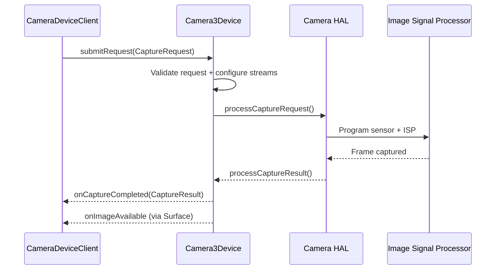
```mermaid
sequenceDiagram
    participant App as CameraDeviceClient
    participant D as Camera3Device
    participant HAL as Camera HAL
    participant ISP as Image Signal Processor

    App->>D: submitRequest(CaptureRequest)
    D->>D: Validate request + configure streams
    D->>HAL: processCaptureRequest()
    HAL->>ISP: Program sensor + ISP
    ISP-->>HAL: Frame captured
    HAL-->>D: processCaptureResult()
    D-->>App: onCaptureCompleted(CaptureResult)
    D-->>App: onImageAvailable (via Surface)
```

### 16.5.5 Security and Permission Model

CameraService implements a sophisticated permission model defined at the top of the
file:

```cpp
// frameworks/av/services/camera/libcameraservice/CameraService.cpp, line 93-96
const char* kActivityServiceName = "activity";
const char* kSensorPrivacyServiceName = "sensor_privacy";
const char* kAppopsServiceName = "appops";
const char* kProcessInfoServiceName = "processinfo";
```

Permission checking integrates with Android's `AppOpsManager`:

```cpp
// frameworks/av/services/camera/libcameraservice/CameraService.cpp, line 102
android::PermissionChecker::PermissionResult appOpModeToPermissionResult(int32_t res) {
    switch (res) {
        case android::AppOpsManager::MODE_ERRORED:
            return android::PermissionChecker::PERMISSION_HARD_DENIED;
        case android::AppOpsManager::MODE_IGNORED:
            return android::PermissionChecker::PERMISSION_SOFT_DENIED;
        case android::AppOpsManager::MODE_ALLOWED:
            return android::PermissionChecker::PERMISSION_GRANTED;
    }
    return android::PermissionChecker::PERMISSION_HARD_DENIED;
}
```

Camera access involves multiple security layers:

1. **Android permission** (`android.permission.CAMERA`)
2. **AppOps tracking** (enables per-app camera access control)
3. **Sensor privacy** (hardware/software privacy toggle)
4. **UID policy** (background app restrictions)
5. **System camera restrictions** (some cameras visible only to system apps)
6. **Virtual device isolation** (cameras in virtual device contexts)

The virtual device camera ID mapper (line 344) enables Android's multi-device support,
where different virtual devices can have different camera mappings:

```cpp
auto [deviceId, mappedCameraId] =
    mVirtualDeviceCameraIdMapper.getDeviceIdAndMappedCameraIdPair(cameraId);
```

### 16.5.6 Camera NDK

The Camera NDK (Native Development Kit) provides C APIs for camera access from native
code, used by game engines and cross-platform frameworks. It wraps the Camera2 API
through JNI:

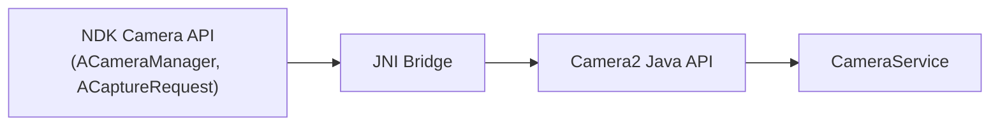
```mermaid
graph LR
    NDK["NDK Camera API<br/>(ACameraManager, ACaptureRequest)"]
    JNI["JNI Bridge"]
    Java["Camera2 Java API"]
    CS["CameraService"]

    NDK --> JNI
    JNI --> Java
    Java --> CS
```

The NDK camera APIs include:

- `ACameraManager`: Camera discovery and access
- `ACameraDevice`: Camera device control
- `ACameraCaptureSession`: Capture session management
- `ACaptureRequest`: Request builder
- `ACameraMetadata`: Metadata access
- `AImageReader`: Image output

---

## 16.6 Media Extractors

### 16.6.1 NuMediaExtractor (896 lines)

`NuMediaExtractor` in `frameworks/av/media/libstagefright/NuMediaExtractor.cpp` provides
the native interface for media container demuxing. It wraps the `MediaExtractor`
interface and adds data source management, track selection, and sample reading.

```cpp
// frameworks/av/media/libstagefright/NuMediaExtractor.cpp, line 53
NuMediaExtractor::NuMediaExtractor(EntryPoint entryPoint)
    : mEntryPoint(entryPoint),
      mTotalBitrate(-1LL),
      mDurationUs(-1LL) {
}
```

The `EntryPoint` parameter tracks where the extractor was created from, enabling
per-API telemetry.

Data sources can be set from URIs, file descriptors, or raw `DataSource` objects:

```cpp
// frameworks/av/media/libstagefright/NuMediaExtractor.cpp, line 106
status_t NuMediaExtractor::setDataSource(
        const sp<MediaHTTPService> &httpService,
        const char *path,
        const KeyedVector<String8, String8> *headers) {
    Mutex::Autolock autoLock(mLock);
    if (mImpl != NULL || path == NULL) {
        return -EINVAL;
    }
    sp<DataSource> dataSource =
        DataSourceFactory::getInstance()->CreateFromURI(httpService, path, headers);
    if (dataSource == NULL) {
        return -ENOENT;
    }
    return initMediaExtractor(dataSource);
}

status_t NuMediaExtractor::setDataSource(int fd, off64_t offset, off64_t size) {
    // ...
    sp<FileSource> fileSource = new FileSource(dup(fd), offset, size);
    status_t err = fileSource->initCheck();
    if (err != OK) {
        return err;
    }
    return initMediaExtractor(fileSource);
}
```

The actual extractor creation is delegated to `MediaExtractorFactory`:

```cpp
// frameworks/av/media/libstagefright/NuMediaExtractor.cpp, line 75
status_t NuMediaExtractor::initMediaExtractor(const sp<DataSource>& dataSource) {
    status_t err = OK;
    mImpl = MediaExtractorFactory::Create(dataSource);
    if (mImpl == NULL) {
        ALOGE("%s: failed to create MediaExtractor", __FUNCTION__);
        return ERROR_UNSUPPORTED;
    }
    setEntryPointToRemoteMediaExtractor();
    // ...
    mName = mImpl->name();
    err = updateDurationAndBitrate();
    if (err == OK) {
        mDataSource = dataSource;
    }
    return OK;
}
```

The extractor also supports CAS (Conditional Access System) for DRM-protected
broadcast content:

```cpp
// frameworks/av/media/libstagefright/NuMediaExtractor.cpp, line 181
status_t NuMediaExtractor::setMediaCas(const HInterfaceToken &casToken) {
    ALOGV("setMediaCas: casToken={%s}", arrayToString(casToken).c_str());
    Mutex::Autolock autoLock(mLock);
    if (casToken.empty()) {
        return BAD_VALUE;
    }
    mCasToken = casToken;
    if (mImpl != NULL) {
        status_t err = mImpl->setMediaCas(casToken);
        // ...
    }
```

### 16.6.2 MediaExtractorFactory (395 lines)

`MediaExtractorFactory` in `frameworks/av/media/libstagefright/MediaExtractorFactory.cpp`
implements the extractor plugin system. Extractors are loaded as shared libraries from
specific directories, enabling vendor-provided format support.

```cpp
// frameworks/av/media/libstagefright/MediaExtractorFactory.cpp, line 43
// static
sp<IMediaExtractor> MediaExtractorFactory::Create(
        const sp<DataSource> &source, const char *mime) {
    ALOGV("MediaExtractorFactory::Create %s", mime);

    if (!property_get_bool("media.stagefright.extractremote", true)) {
        // local extractor
        ALOGW("creating media extractor in calling process");
        return CreateFromService(source, mime);
    } else {
        // remote extractor
        sp<IBinder> binder = defaultServiceManager()->getService(
            String16("media.extractor"));
        if (binder != 0) {
            sp<IMediaExtractorService> mediaExService(
                    interface_cast<IMediaExtractorService>(binder));
            sp<IMediaExtractor> ex;
            mediaExService->makeExtractor(
                    CreateIDataSourceFromDataSource(source),
                    mime ? std::optional<std::string>(mime) : std::nullopt,
                    &ex);
            return ex;
        }
    }
    return NULL;
}
```

The key design decision here is **remote extraction by default**. The
`media.stagefright.extractremote` property (default true) causes extractor plugins to
run in the isolated `media.extractor` process. This is a security measure: media
container parsing is one of the most common attack surfaces, and running it in a
sandboxed process limits the impact of a parsing vulnerability.

The sniffing mechanism (line 132) iterates through all loaded plugins to find the best
match for a given data source:

```cpp
// frameworks/av/media/libstagefright/MediaExtractorFactory.cpp, line 132
void *MediaExtractorFactory::sniff(
        const sp<DataSource> &source, float *confidence, void **meta,
        FreeMetaFunc *freeMeta, sp<ExtractorPlugin> &plugin,
        uint32_t *creatorVersion) {
    *confidence = 0.0f;
    *meta = nullptr;
    // ...
    void *bestCreator = NULL;
    for (auto it = plugins->begin(); it != plugins->end(); ++it) {
        ALOGV("sniffing %s", (*it)->def.extractor_name);
        float newConfidence;
        // Each plugin returns a confidence score [0.0, 1.0]
        // The plugin with the highest confidence wins
```

Each extractor plugin reports a confidence score (0.0 to 1.0) for a given data source.
The factory selects the plugin with the highest confidence. This mechanism allows
multiple plugins to support the same container format, with the most specialized plugin
taking priority.

The plugin system uses the `ExtractorDef` structure:

```cpp
// frameworks/av/media/libstagefright/MediaExtractorFactory.cpp, line 106
struct ExtractorPlugin : public RefBase {
    ExtractorDef def;
    void *libHandle;
    String8 libPath;
    String8 uuidString;

    ExtractorPlugin(ExtractorDef definition, void *handle, String8 &path)
        : def(definition), libHandle(handle), libPath(path) {
        for (size_t i = 0; i < sizeof ExtractorDef::extractor_uuid; i++) {
            uuidString.appendFormat("%02x", def.extractor_uuid.b[i]);
        }
    }
    ~ExtractorPlugin() {
        if (libHandle != nullptr) {
            ALOGV("closing handle for %s %d", libPath.c_str(), def.extractor_version);
            dlclose(libHandle);
        }
    }
};
```

### 16.6.3 Container Format Support

Android supports a wide range of container formats through its extractor plugins:

| Container | Extractor | Description |
|---|---|---|
| MP4/M4A/3GP | MPEG4Extractor | ISO BMFF family |
| Matroska/WebM | MatroskaExtractor | Matroska container |
| MPEG-TS | MPEG2TSExtractor | Transport stream |
| MPEG-PS | MPEG2PSExtractor | Program stream |
| Ogg | OggExtractor | Ogg container |
| WAV | WAVExtractor | Waveform audio |
| FLAC | FLACExtractor | Free Lossless Audio |
| AMR | AMRExtractor | Adaptive Multi-Rate |
| AAC (ADTS) | AACExtractor | Raw AAC stream |
| MIDI | MidiExtractor | Musical Instrument Digital Interface |
| MP3 | MP3Extractor | MPEG-1/2 Audio Layer III |

The extraction pipeline for a typical MP4 file:

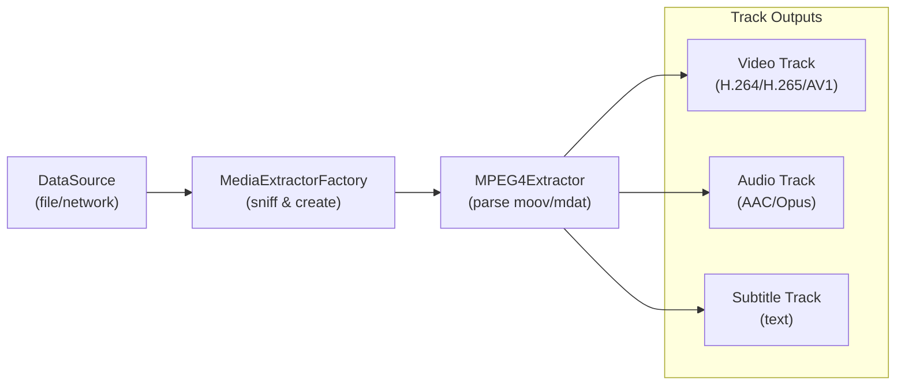
```mermaid
graph LR
    DS["DataSource<br/>(file/network)"]
    MEF["MediaExtractorFactory<br/>(sniff & create)"]
    MP4["MPEG4Extractor<br/>(parse moov/mdat)"]

    subgraph "Track Outputs"
        VT["Video Track<br/>(H.264/H.265/AV1)"]
        AT["Audio Track<br/>(AAC/Opus)"]
        ST["Subtitle Track<br/>(text)"]
    end

    DS --> MEF
    MEF --> MP4
    MP4 --> VT
    MP4 --> AT
    MP4 --> ST
```

---

## 16.7 Video Capabilities

### 16.7.1 VideoCapabilities (1875 lines)

`VideoCapabilities` in `frameworks/av/media/libmedia/VideoCapabilities.cpp` provides
the infrastructure for querying what a codec can do: supported resolutions, frame rates,
bitrates, and more. This is the native counterpart of the Java
`MediaCodecInfo.VideoCapabilities` class.

```cpp
// frameworks/av/media/libmedia/VideoCapabilities.cpp, line 18-19
#define LOG_TAG "VideoCapabilities"
```

The class defines fundamental ranges:

```cpp
// frameworks/av/media/libmedia/VideoCapabilities.cpp, line 33
static const Range<int64_t> POSITIVE_INT64 = Range((int64_t)1, INT64_MAX);
static const Range<int32_t> BITRATE_RANGE = Range<int32_t>(0, 500000000);
static const Range<int32_t> FRAME_RATE_RANGE = Range<int32_t>(0, 960);
static const Range<Rational> POSITIVE_RATIONALS =
    Range<Rational>(Rational((int32_t)1, INT32_MAX),
                    Rational(INT32_MAX, (int32_t)1));
```

The maximum bitrate of 500 Mbps and maximum frame rate of 960 fps represent the
theoretical upper bounds of the capability system. Individual codecs will report
their actual limits within these ranges.

The capability query system supports multi-dimensional constraints. For example,
`getSupportedWidthsFor(height)` computes the valid width range given a specific height:

```cpp
// frameworks/av/media/libmedia/VideoCapabilities.cpp, line 67
std::optional<Range<int32_t>> VideoCapabilities::getSupportedWidthsFor(
        int32_t height) const {
    Range<int32_t> range = mWidthRange;
    if (!mHeightRange.contains(height)
            || (height % mHeightAlignment) != 0) {
        ALOGE("unsupported height");
        return std::nullopt;
    }

    const int32_t heightInBlocks = divUp(height, mBlockHeight);
    // constrain by block count and by block aspect ratio
    const int32_t minWidthInBlocks = std::max(
            divUp(mBlockCountRange.lower(), heightInBlocks),
            (int32_t)std::ceil(mBlockAspectRatioRange.lower().asDouble()
                    * heightInBlocks));
    const int32_t maxWidthInBlocks = std::min(
            mBlockCountRange.upper() / heightInBlocks,
            (int32_t)(mBlockAspectRatioRange.upper().asDouble()
                    * heightInBlocks));
    range = range.intersect(
            (minWidthInBlocks - 1) * mBlockWidth + mWidthAlignment,
            maxWidthInBlocks * mBlockWidth);

    // constrain by smaller dimension limit
    if (height > mSmallerDimensionUpperLimit) {
        range = range.intersect(1, mSmallerDimensionUpperLimit);
    }

    // constrain by aspect ratio
    range = range.intersect(
            (int32_t)std::ceil(mAspectRatioRange.lower().asDouble() * height),
            (int32_t)(mAspectRatioRange.upper().asDouble() * height));
    if (range.empty()) {
        return std::nullopt;
    }
    return range;
}
```

The capability computation uses a **macroblock model**: the codec's capabilities are
expressed in terms of blocks (typically 16x16 for AVC, 64x64 for HEVC), and the
supported resolution range is computed from the maximum block count, block aspect
ratio constraints, alignment requirements, and smaller-dimension limits.

The frame rate capability for a given resolution uses the same block model:

```cpp
// frameworks/av/media/libmedia/VideoCapabilities.cpp, line 145
std::optional<Range<double>> VideoCapabilities::getSupportedFrameRatesFor(
        int32_t width, int32_t height) const {
    if (!supports(std::make_optional<int32_t>(width),
                  std::make_optional<int32_t>(height),
                  std::nullopt /* rate */)) {
        ALOGE("Unsupported size. width: %d, height: %d", width, height);
        return std::nullopt;
    }
```

### 16.7.2 MediaProfiles (1512 lines)

`MediaProfiles` in `frameworks/av/media/libmedia/MediaProfiles.cpp` parses device-specific
media capability profiles from XML configuration files. These profiles define:

- Supported camera recording quality levels (QCIF, CIF, 480p, 720p, 1080p, 2160p, 4K DCI, 8K UHD)
- Encoder configurations (codecs, bitrates, frame rates)
- File format support

The profile files are searched in a priority order:

```cpp
// frameworks/av/media/libmedia/MediaProfiles.cpp, line 45
std::array<char const*, 5> const& getXmlPaths() {
    static std::array<std::string const, 5> const paths =
        []() -> decltype(paths) {
            constexpr std::array<char const*, 4> searchDirs = {
                "product/etc/",
                "odm/etc/",
                "vendor/etc/",
                "system/etc/",
            };
            char variant[PROPERTY_VALUE_MAX];
            property_get("ro.media.xml_variant.profiles", variant, "_V1_0");
            std::string fileName =
                std::string("media_profiles") + variant + ".xml";
            return { searchDirs[0] + fileName,
                     searchDirs[1] + fileName,
                     searchDirs[2] + fileName,
                     searchDirs[3] + fileName,
                     "system/etc/media_profiles.xml" };
        }();
```

The search order (`product` > `odm` > `vendor` > `system`) allows device-specific
overrides at each customization layer. The variant property
`ro.media.xml_variant.profiles` enables different profile files for different device
SKUs.

The supported encoder/decoder name maps are comprehensive:

```cpp
// frameworks/av/media/libmedia/MediaProfiles.cpp, line 89
const MediaProfiles::NameToTagMap MediaProfiles::sVideoEncoderNameMap[] = {
    {"h263", VIDEO_ENCODER_H263},
    {"h264", VIDEO_ENCODER_H264},
    {"m4v",  VIDEO_ENCODER_MPEG_4_SP},
    {"vp8",  VIDEO_ENCODER_VP8},
    {"hevc", VIDEO_ENCODER_HEVC},
    {"vp9",  VIDEO_ENCODER_VP9},
    {"dolbyvision", VIDEO_ENCODER_DOLBY_VISION},
    {"apv", VIDEO_ENCODER_APV},
};

const MediaProfiles::NameToTagMap MediaProfiles::sAudioEncoderNameMap[] = {
    {"amrnb",  AUDIO_ENCODER_AMR_NB},
    {"amrwb",  AUDIO_ENCODER_AMR_WB},
    {"aac",    AUDIO_ENCODER_AAC},
    {"heaac",  AUDIO_ENCODER_HE_AAC},
    {"aaceld", AUDIO_ENCODER_AAC_ELD},
    {"opus",   AUDIO_ENCODER_OPUS}
};
```

HDR format support is also declared:

```cpp
// frameworks/av/media/libmedia/MediaProfiles.cpp, line 106
const MediaProfiles::NameToTagMap MediaProfiles::sHdrFormatNameMap[] = {
    {"sdr", HDR_FORMAT_NONE},
    {"hlg", HDR_FORMAT_HLG},
    {"hdr10", HDR_FORMAT_HDR10},
    {"hdr10+", HDR_FORMAT_HDR10PLUS},
    {"dolbyvision", HDR_FORMAT_DOLBY_VISION},
};

const MediaProfiles::NameToTagMap MediaProfiles::sChromaSubsamplingNameMap[] = {
    {"yuv 4:2:0", CHROMA_SUBSAMPLING_YUV_420},
    {"yuv 4:2:2", CHROMA_SUBSAMPLING_YUV_422},
    {"yuv 4:4:4", CHROMA_SUBSAMPLING_YUV_444},
};
```

And camcorder quality levels spanning from QCIF to 8K UHD:

```cpp
// frameworks/av/media/libmedia/MediaProfiles.cpp, line 136
const MediaProfiles::NameToTagMap MediaProfiles::sCamcorderQualityNameMap[] = {
    {"low", CAMCORDER_QUALITY_LOW},
    {"high", CAMCORDER_QUALITY_HIGH},
    {"qcif", CAMCORDER_QUALITY_QCIF},
    {"cif", CAMCORDER_QUALITY_CIF},
    {"480p", CAMCORDER_QUALITY_480P},
    {"720p", CAMCORDER_QUALITY_720P},
    {"1080p", CAMCORDER_QUALITY_1080P},
    {"2160p", CAMCORDER_QUALITY_2160P},
    {"qvga", CAMCORDER_QUALITY_QVGA},
    {"vga", CAMCORDER_QUALITY_VGA},
    {"4kdci", CAMCORDER_QUALITY_4KDCI},
    {"qhd", CAMCORDER_QUALITY_QHD},
    {"2k", CAMCORDER_QUALITY_2K},
    {"8kuhd", CAMCORDER_QUALITY_8KUHD},
```

### 16.7.3 Codec Discovery and Selection

The codec selection process involves multiple components working together:

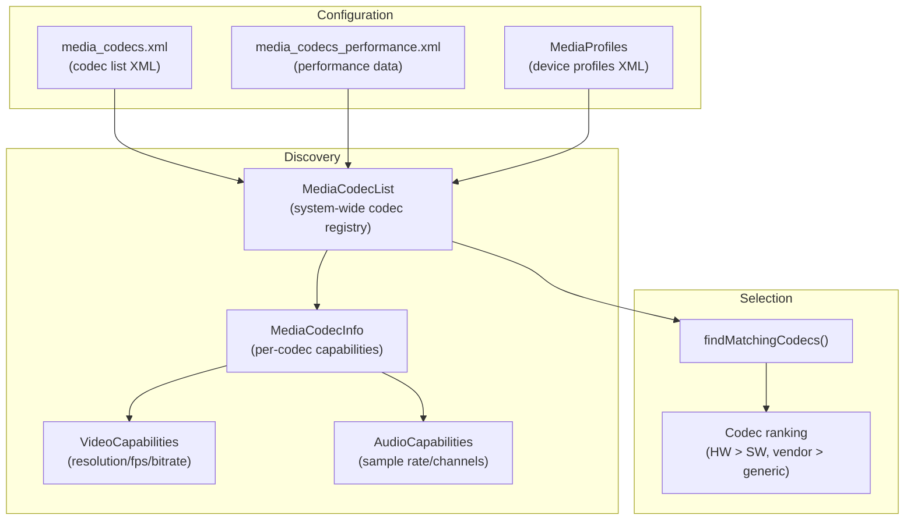
```mermaid
graph TD
    subgraph "Discovery"
        MCL["MediaCodecList<br/>(system-wide codec registry)"]
        MCI["MediaCodecInfo<br/>(per-codec capabilities)"]
        VC["VideoCapabilities<br/>(resolution/fps/bitrate)"]
        AC["AudioCapabilities<br/>(sample rate/channels)"]
    end

    subgraph "Configuration"
        MP["MediaProfiles<br/>(device profiles XML)"]
        MC2["media_codecs.xml<br/>(codec list XML)"]
        MC2P["media_codecs_performance.xml<br/>(performance data)"]
    end

    subgraph "Selection"
        FMC["findMatchingCodecs()"]
        Rank["Codec ranking<br/>(HW > SW, vendor > generic)"]
    end

    MC2 --> MCL
    MC2P --> MCL
    MCL --> MCI
    MCI --> VC
    MCI --> AC
    MP --> MCL
    MCL --> FMC
    FMC --> Rank
```

The `media_codecs.xml` file, located in the vendor or system partition, declares
all available codecs on the device. The `media_codecs_performance.xml` file provides
performance data (measured achievable resolution x frame rate combinations) that enables
the framework to distinguish between codecs that can sustain 4K@30fps and those that
can only sustain 1080p@30fps.

### 16.7.4 Codec Feature Flags

The codec capability system supports feature flags that indicate optional capabilities:

| Feature | Description |
|---|---|
| `adaptive-playback` | Supports resolution changes without restarting |
| `secure-playback` | Supports DRM-protected content |
| `tunneled-playback` | Supports hardware-tunneled rendering |
| `low-latency` | Supports low-latency mode for gaming/conferencing |
| `multiple-frames` | Supports batching multiple frames per buffer |
| `partial-frame` | Supports partial frame input |
| `frame-parsing` | Supports frame boundary detection |
| `dynamic-timestamp` | Supports changing timestamps during encoding |

These features are declared in `media_codecs.xml` and queried through
`MediaCodecInfo.CodecCapabilities.isFeatureSupported()`.

---

## 16.8 Try It

### 16.8.1 Inspect Available Codecs

Use `dumpsys` to list all registered codecs on a device:

```bash
# List all codecs with their capabilities
adb shell dumpsys media.player

# This outputs detailed information including:
# - Decoder infos by media types
# - Encoder infos by media types
# - For each codec: aliases, attributes (encoder/vendor/software-only/hw-accelerated),
#   owner, HAL name, rank, supported profiles/levels, color formats
```

The dump output categorizes codecs by media type. For example, under
`Media type 'video/avc'`, you will see entries like:

```
  Decoder "c2.android.avc.decoder" supports
    aliases: []
    attributes: 0x0
      encoder: 0, vendor: 0, software-only: 1, hw-accelerated: 0
    owner: "codec2::software"
    rank: 512
```

The rank value determines codec priority: lower rank means higher priority. Hardware
codecs typically have rank 0-256, while software codecs have rank 512+.

### 16.8.2 Trace a Video Decode Session

Use systrace/perfetto to capture a video decode trace:

```bash
# Capture a trace with video tag enabled
adb shell perfetto \
  -c - --txt \
  -o /data/misc/perfetto-traces/media-trace.pb \
<<EOF
buffers: {
    size_kb: 63488
    fill_policy: DISCARD
}
buffers: {
    size_kb: 2048
    fill_policy: DISCARD
}
data_sources: {
    config {
        name: "linux.ftrace"
        ftrace_config {
            ftrace_events: "sched/sched_switch"
            atrace_categories: "video"
            atrace_categories: "view"
        }
    }
}
duration_ms: 10000
EOF
```

In the trace, look for:

- `MediaCodec::Init#native` -- codec allocation
- `MediaCodec::configure#native` -- codec configuration
- `MediaCodec::start#native` -- codec start
- `CCodec` / `ACodec` spans showing HAL interaction
- Buffer queue events showing frame flow to SurfaceFlinger

### 16.8.3 Monitor Codec Resource Usage

The ResourceManagerService can be queried for current resource usage:

```bash
# Show current codec resource allocation
adb shell dumpsys media.resource_manager
```

This shows:

- All active codec instances grouped by process
- Resource type (secure/non-secure, HW/SW, video/audio)
- Process priority (OOM adjustment score)
- Whether any clients are marked for pending removal

### 16.8.4 Inspect Camera Service State

```bash
# Full camera service dump
adb shell dumpsys media.camera

# This provides:
# - Number of cameras
# - Camera characteristics for each camera
# - Active client connections
# - Recent error events
# - Flash unit status
# - Sensor privacy state
```

### 16.8.5 Examine Media Extractor Plugins

```bash
# List loaded extractor plugins
adb shell dumpsys media.extractor

# This shows all loaded extractor shared libraries,
# their supported formats, and version information.
```

### 16.8.6 Query VideoCapabilities from Code

The following code snippet demonstrates querying video capabilities:

```java
// Java API to query codec capabilities
MediaCodecList codecList = new MediaCodecList(MediaCodecList.ALL_CODECS);
for (MediaCodecInfo info : codecList.getCodecInfos()) {
    if (!info.isEncoder()) {
        for (String type : info.getSupportedTypes()) {
            if (type.startsWith("video/")) {
                MediaCodecInfo.CodecCapabilities caps =
                    info.getCapabilitiesForType(type);
                MediaCodecInfo.VideoCapabilities vcaps =
                    caps.getVideoCapabilities();

                // Query supported resolution range
                Range<Integer> widths = vcaps.getSupportedWidths();
                Range<Integer> heights = vcaps.getSupportedHeights();

                // Query max supported frame rate for 1080p
                Range<Double> fps1080p =
                    vcaps.getSupportedFrameRatesFor(1920, 1080);

                // Check if 4K@60fps is supported
                boolean supports4K60 =
                    vcaps.areSizeAndRateSupported(3840, 2160, 60.0);

                Log.d("Codec", info.getName() + ": " + type
                    + " widths=" + widths + " heights=" + heights
                    + " 1080p_fps=" + fps1080p
                    + " 4K60=" + supports4K60);
            }
        }
    }
}
```

### 16.8.7 Build and Run a Codec2 Test

The Codec2 framework includes a command-line codec tool:

```bash
# Build the codec2 command-line tool
cd frameworks/av/media/codec2/components/cmds
mm

# The tool is in frameworks/av/media/codec2/components/cmds/codec2.cpp
# It can be used to test codec functionality directly from the command line
```

### 16.8.8 Examine Codec HAL Services

```bash
# List running Codec2 HAL services
adb shell lshal | grep c2

# Typical output:
# android.hardware.media.c2@1.0::IComponentStore/software
# android.hardware.media.c2@1.0::IComponentStore/default
```

The "software" store provides Google's software codecs, while "default" is typically the
vendor's hardware codec store.

### 16.8.9 Trigger Codec Reclamation

To observe the resource reclamation mechanism, start multiple video decode sessions
from different apps and observe the logs:

```bash
# Filter for resource manager logs
adb logcat -s ResourceManagerService MediaCodec

# When codec resources are exhausted, you'll see:
# ResourceManagerService: reclaimResource(...)
# MediaCodec: reclaim(...) <component_name>
```

### 16.8.10 Read a MediaCodec Metrics Report

After playing a video, extract the codec metrics:

```bash
# Dump MediaMetrics
adb shell dumpsys media.metrics

# Look for entries with key "codec", which contain:
# - android.media.mediacodec.codec: <codec name>
# - android.media.mediacodec.mime: <mime type>
# - android.media.mediacodec.width/height: <dimensions>
# - android.media.mediacodec.latency.avg: <avg latency in us>
# - android.media.mediacodec.frames-rendered: <count>
# - android.media.mediacodec.freeze-count: <freeze events>
# - android.media.mediacodec.judder-count: <judder events>
```

---

### 16.2.10 The Complete Buffer Lifecycle in Detail

To fully understand MediaCodec, we must trace a buffer through every stage. The
`queueInputBuffer` and `dequeueOutputBuffer` methods reveal the complete protocol.

#### Input Buffer Queuing

```cpp
// frameworks/av/media/libstagefright/MediaCodec.cpp, line 3690
status_t MediaCodec::queueInputBuffer(
        size_t index,
        size_t offset,
        size_t size,
        int64_t presentationTimeUs,
        uint32_t flags,
        AString *errorDetailMsg) {
    ScopedTrace trace(ATRACE_TAG, "MediaCodec::queueInputBuffer#native");
    if (errorDetailMsg != NULL) {
        errorDetailMsg->clear();
    }

    sp<AMessage> msg = new AMessage(kWhatQueueInputBuffer, this);
    msg->setSize("index", index);
    msg->setSize("offset", offset);
    msg->setSize("size", size);
    msg->setInt64("timeUs", presentationTimeUs);
    msg->setInt32("flags", flags);
    msg->setPointer("errorDetailMsg", errorDetailMsg);
    sp<AMessage> response;
    return PostAndAwaitResponse(msg, &response);
}
```

The parameters are:

- **index**: The buffer slot obtained from `dequeueInputBuffer`
- **offset**: Byte offset within the buffer where valid data starts
- **size**: Number of valid data bytes
- **presentationTimeUs**: The presentation timestamp in microseconds
- **flags**: Bitfield including `BUFFER_FLAG_CODEC_CONFIG`, `BUFFER_FLAG_END_OF_STREAM`,
  `BUFFER_FLAG_KEY_FRAME`, `BUFFER_FLAG_DECODE_ONLY`

#### Large Frame Audio (Multi-Access-Unit Buffers)

A newer API supports queuing multiple access units in a single buffer, which is
particularly important for large-frame audio codecs:

```cpp
// frameworks/av/media/libstagefright/MediaCodec.cpp, line 3713
status_t MediaCodec::queueInputBuffers(
        size_t index,
        size_t offset,
        size_t size,
        const sp<BufferInfosWrapper> &infos,
        AString *errorDetailMsg) {
    ScopedTrace trace(ATRACE_TAG, "MediaCodec::queueInputBuffers#native");
    sp<AMessage> msg = new AMessage(kWhatQueueInputBuffer, this);
    uint32_t bufferFlags = 0;
    uint32_t flagsinAllAU = BUFFER_FLAG_DECODE_ONLY | BUFFER_FLAG_CODECCONFIG;
    uint32_t andFlags = flagsinAllAU;
    if (infos == nullptr || infos->value.empty()) {
        ALOGE("ERROR: Large Audio frame with no BufferInfo");
        return BAD_VALUE;
    }
    // Compute combined flags across all access units
    int infoIdx = 0;
    std::vector<AccessUnitInfo> &accessUnitInfo = infos->value;
    int64_t minTimeUs = accessUnitInfo.front().mTimestamp;
    bool foundEndOfStream = false;
    for ( ; infoIdx < accessUnitInfo.size() && !foundEndOfStream; ++infoIdx) {
        bufferFlags |= accessUnitInfo[infoIdx].mFlags;
        andFlags &= accessUnitInfo[infoIdx].mFlags;
        if (bufferFlags & BUFFER_FLAG_END_OF_STREAM) {
            foundEndOfStream = true;
        }
    }
    bufferFlags = bufferFlags & (andFlags | (~flagsinAllAU));
```

The flag aggregation logic is subtle: `BUFFER_FLAG_DECODE_ONLY` is set in the aggregate
only if ALL access units have it set (via the AND operation). Other flags are set if
ANY access unit has them (via the OR operation). The expression
`bufferFlags & (andFlags | (~flagsinAllAU))` achieves this by masking out the
"all-must-agree" flags unless they were present in every access unit.

#### Secure Input Buffers (DRM)

For DRM-protected content, the secure queuing path includes encryption metadata:

```cpp
// frameworks/av/media/libstagefright/MediaCodec.cpp, line 3757
status_t MediaCodec::queueSecureInputBuffer(
        size_t index,
        size_t offset,
        const CryptoPlugin::SubSample *subSamples,
        size_t numSubSamples,
        const uint8_t key[16],
        const uint8_t iv[16],
        CryptoPlugin::Mode mode,
        const CryptoPlugin::Pattern &pattern,
        int64_t presentationTimeUs,
        uint32_t flags,
        AString *errorDetailMsg) {
    // ...
    msg->setPointer("subSamples", (void *)subSamples);
    msg->setSize("numSubSamples", numSubSamples);
    msg->setPointer("key", (void *)key);
    msg->setPointer("iv", (void *)iv);
    msg->setInt32("mode", mode);
    msg->setInt32("encryptBlocks", pattern.mEncryptBlocks);
    msg->setInt32("skipBlocks", pattern.mSkipBlocks);
```

The `CryptoPlugin::SubSample` structure describes which portions of the buffer are
encrypted and which are clear (unencrypted). The `pattern` parameter supports CENC
pattern-based encryption where encryption is applied in a repeating pattern of
encrypted and clear blocks.

#### Codec2-Native Buffer Queuing

For Codec2 components, there is a direct path that avoids legacy buffer conversion:

```cpp
// frameworks/av/media/libstagefright/MediaCodec.cpp, line 3847
status_t MediaCodec::queueBuffer(
        size_t index,
        const std::shared_ptr<C2Buffer> &buffer,
        const sp<BufferInfosWrapper> &bufferInfos,
        const sp<AMessage> &tunings,
        AString *errorDetailMsg) {
    // ...
    sp<WrapperObject<std::shared_ptr<C2Buffer>>> obj{
        new WrapperObject<std::shared_ptr<C2Buffer>>{buffer}};
    msg->setObject("c2buffer", obj);
    if (OK != (err = generateFlagsFromAccessUnitInfo(msg, bufferInfos))) {
        return err;
    }
    msg->setObject("accessUnitInfo", bufferInfos);
    if (tunings && tunings->countEntries() > 0) {
        msg->setMessage("tunings", tunings);
    }
```

This path accepts a `C2Buffer` directly, along with per-buffer `tunings` -- runtime
parameter changes that take effect for this specific buffer. This is how applications
can change encoder parameters (like bitrate) on a per-frame basis.

#### Output Buffer Dequeuing

The `dequeueOutputBuffer` method returns decoded data:

```cpp
// frameworks/av/media/libstagefright/MediaCodec.cpp, line 3939
status_t MediaCodec::dequeueOutputBuffer(
        size_t *index,
        size_t *offset,
        size_t *size,
        int64_t *presentationTimeUs,
        uint32_t *flags,
        int64_t timeoutUs) {
    ScopedTrace trace(ATRACE_TAG, "MediaCodec::dequeueOutputBuffer#native");
    sp<AMessage> msg = new AMessage(kWhatDequeueOutputBuffer, this);
    msg->setInt64("timeoutUs", timeoutUs);

    sp<AMessage> response;
    status_t err;
    if ((err = PostAndAwaitResponse(msg, &response)) != OK) {
        return err;
    }

    CHECK(response->findSize("index", index));
    CHECK(response->findSize("offset", offset));
    CHECK(response->findSize("size", size));
    CHECK(response->findInt64("timeUs", presentationTimeUs));
    CHECK(response->findInt32("flags", (int32_t *)flags));

    return OK;
}
```

The output returns five pieces of information:

1. **index**: Buffer slot to use with `getOutputBuffer` or `releaseOutputBuffer`
2. **offset**: Start of valid data within the buffer
3. **size**: Amount of valid decoded data
4. **presentationTimeUs**: When this frame should be presented
5. **flags**: Output flags (EOS, codec config, etc.)

#### Output Rendering and Release

Decoded buffers can be rendered to a surface or simply released:

```cpp
// frameworks/av/media/libstagefright/MediaCodec.cpp, line 3965
status_t MediaCodec::renderOutputBufferAndRelease(size_t index) {
    ScopedTrace(ATRACE_TAG, "MediaCodec::renderOutputBufferAndRelease#native");
    sp<AMessage> msg = new AMessage(kWhatReleaseOutputBuffer, this);
    msg->setSize("index", index);
    msg->setInt32("render", true);
    sp<AMessage> response;
    return PostAndAwaitResponse(msg, &response);
}

// With explicit timestamp for precise rendering control
status_t MediaCodec::renderOutputBufferAndRelease(size_t index, int64_t timestampNs) {
    ScopedTrace trace(ATRACE_TAG, "MediaCodec::renderOutputBufferAndRelease#native");
    sp<AMessage> msg = new AMessage(kWhatReleaseOutputBuffer, this);
    msg->setSize("index", index);
    msg->setInt32("render", true);
    msg->setInt64("timestampNs", timestampNs);
    sp<AMessage> response;
    return PostAndAwaitResponse(msg, &response);
}

status_t MediaCodec::releaseOutputBuffer(size_t index) {
    ScopedTrace trace(ATRACE_TAG, "MediaCodec::releaseOutputBuffer#native");
    sp<AMessage> msg = new AMessage(kWhatReleaseOutputBuffer, this);
    msg->setSize("index", index);
    sp<AMessage> response;
    return PostAndAwaitResponse(msg, &response);
}
```

The timestamped variant `renderOutputBufferAndRelease(index, timestampNs)` allows the
application to specify exactly when a frame should be displayed, enabling precise
frame pacing for smooth video playback.

### 16.2.11 The onMessageReceived Handler

The central message dispatcher (line 4469) is the heart of MediaCodec's asynchronous
architecture. It processes all state transitions and buffer flow:

```cpp
// frameworks/av/media/libstagefright/MediaCodec.cpp, line 4469
void MediaCodec::onMessageReceived(const sp<AMessage> &msg) {
    switch (msg->what()) {
        case kWhatCodecNotify:
        {
            int32_t what;
            CHECK(msg->findInt32("what", &what));
            switch (what) {
                case kWhatError:
                case kWhatCryptoError:
                {
                    int32_t err, actionCode;
                    CHECK(msg->findInt32("err", &err));
                    CHECK(msg->findInt32("actionCode", &actionCode));
                    ALOGE("Codec reported err %#x/%s, actionCode %d, "
                          "while in state %d/%s",
                          err, StrMediaError(err).c_str(), actionCode,
                          mState, stateString(mState).c_str());
                    if (err == DEAD_OBJECT) {
                        mFlags |= kFlagSawMediaServerDie;
                        mFlags &= ~kFlagIsComponentAllocated;
                    }
```

Error handling distinguishes between `DEAD_OBJECT` (the codec process died) and other
errors. When `DEAD_OBJECT` is detected, the `kFlagSawMediaServerDie` flag is set,
triggering special recovery logic that attempts to reconnect with the codec service.

### 16.2.12 Battery and Power Management

MediaCodec integrates with Android's battery tracking system through `BatteryChecker`:

```cpp
// frameworks/av/media/libstagefright/MediaCodec.cpp, line 4256
BatteryChecker::BatteryChecker(const sp<AMessage> &msg, int64_t timeoutUs)
    : mTimeoutUs(timeoutUs)
    , mLastActivityTimeUs(-1ll)
    , mBatteryStatNotified(false)
    , mBatteryCheckerGeneration(0)
    , mIsExecuting(false)
    , mBatteryCheckerMsg(msg) {}

void BatteryChecker::onCodecActivity(std::function<void()> batteryOnCb) {
    if (!isExecuting()) {
        return;
    }
    if (!mBatteryStatNotified) {
        batteryOnCb();
        mBatteryStatNotified = true;
        sp<AMessage> msg = mBatteryCheckerMsg->dup();
        msg->setInt32("generation", mBatteryCheckerGeneration);
        msg->post(mTimeoutUs);
        mLastActivityTimeUs = -1ll;
    } else {
        mLastActivityTimeUs = ALooper::GetNowUs();
    }
}
```

The BatteryChecker implements a timeout-based approach: it records that the codec is
active when buffer activity occurs, and if no activity is seen for the timeout period,
it records that the codec is idle. This prevents battery statistics from being inflated
by codecs that are configured but not actively processing data.

Additionally, HDR content at high resolutions triggers a CPU boost request:

```cpp
// frameworks/av/media/libstagefright/MediaCodec.cpp, line 4230
void MediaCodec::requestCpuBoostIfNeeded() {
    if (mCpuBoostRequested) {
        return;
    }
    int32_t colorFormat;
    if (mOutputFormat->contains("hdr-static-info")
            && mOutputFormat->findInt32("color-format", &colorFormat)
            && ((mSoftRenderer != NULL
                    && colorFormat == OMX_COLOR_FormatYUV420Planar16)
                || mOwnerName.equalsIgnoreCase("codec2::software"))) {
        int32_t left, top, right, bottom, width, height;
        int64_t totalPixel = 0;
        if (mOutputFormat->findRect("crop", &left, &top, &right, &bottom)) {
            totalPixel = (right - left + 1) * (bottom - top + 1);
        } else if (mOutputFormat->findInt32("width", &width)
                && mOutputFormat->findInt32("height", &height)) {
            totalPixel = width * height;
        }
        if (totalPixel >= 1920 * 1080) {
            mResourceManagerProxy->addResource(
                MediaResource::CpuBoostResource());
            mCpuBoostRequested = true;
        }
    }
}
```

Software-decoded HDR content at 1080p or above triggers the CPU boost because the
tone-mapping operation required for HDR-to-SDR conversion is computationally expensive.

### 16.2.13 Vendor Parameter Support

MediaCodec exposes vendor-specific parameters through a discovery and subscription API:

```cpp
// frameworks/av/media/libstagefright/MediaCodec.cpp, line 4208
status_t MediaCodec::querySupportedVendorParameters(
        std::vector<std::string> *names) {
    return mCodec->querySupportedParameters(names);
}

status_t MediaCodec::describeParameter(
        const std::string &name, CodecParameterDescriptor *desc) {
    return mCodec->describeParameter(name, desc);
}

status_t MediaCodec::subscribeToVendorParameters(
        const std::vector<std::string> &names) {
    return mCodec->subscribeToParameters(names);
}

status_t MediaCodec::unsubscribeFromVendorParameters(
        const std::vector<std::string> &names) {
    return mCodec->unsubscribeFromParameters(names);
}
```

This enables hardware vendors to expose codec-specific tuning parameters (like vendor-
proprietary quality settings or hardware-specific modes) without modifying the core
MediaCodec API.

### 16.2.14 The Dequeue Handler: Synchronous Mode Detail

The internal `handleDequeueOutputBuffer` method reveals the complexity of synchronous
buffer management:

```cpp
// frameworks/av/media/libstagefright/MediaCodec.cpp, line 4371
MediaCodec::DequeueOutputResult MediaCodec::handleDequeueOutputBuffer(
        const sp<AReplyToken> &replyID, bool newRequest) {
    if (!isExecuting()) {
        PostReplyWithError(replyID, INVALID_OPERATION);
    } else if (mFlags & kFlagIsAsync) {
        PostReplyWithError(replyID, INVALID_OPERATION);
    } else if (newRequest && (mFlags & kFlagDequeueOutputPending)) {
        PostReplyWithError(replyID, INVALID_OPERATION);
    } else if (mFlags & kFlagStickyError) {
        PostReplyWithError(replyID, getStickyError());
    } else if (mFlags & kFlagOutputBuffersChanged) {
        PostReplyWithError(replyID, INFO_OUTPUT_BUFFERS_CHANGED);
        mFlags &= ~kFlagOutputBuffersChanged;
    } else {
        sp<AMessage> response = new AMessage;
        BufferInfo *info = peekNextPortBuffer(kPortIndexOutput);
        if (!info) {
            return DequeueOutputResult::kNoBuffer;
        }

        const sp<MediaCodecBuffer> &buffer = info->mData;
        handleOutputFormatChangeIfNeeded(buffer);
        if (mFlags & kFlagOutputFormatChanged) {
            PostReplyWithError(replyID, INFO_FORMAT_CHANGED);
            mFlags &= ~kFlagOutputFormatChanged;
            return DequeueOutputResult::kRepliedWithError;
        }

        ssize_t index = dequeuePortBuffer(kPortIndexOutput);
        if (discardDecodeOnlyOutputBuffer(index)) {
            return DequeueOutputResult::kDiscardedBuffer;
        }

        response->setSize("index", index);
        response->setSize("offset", buffer->offset());
        response->setSize("size", buffer->size());

        int64_t timeUs;
        CHECK(buffer->meta()->findInt64("timeUs", &timeUs));
        response->setInt64("timeUs", timeUs);

        int32_t flags;
        CHECK(buffer->meta()->findInt32("flags", &flags));
        response->setInt32("flags", flags);

        statsBufferReceived(timeUs, buffer);
        response->postReply(replyID);
        return DequeueOutputResult::kSuccess;
    }
    return DequeueOutputResult::kRepliedWithError;
}
```

The dequeue handler implements several important behaviors:

1. **Output format changes** (`INFO_FORMAT_CHANGED`): When the codec's output format
   changes (e.g., resolution change during adaptive playback), the change is delivered
   as a special return value from `dequeueOutputBuffer`, not as a separate callback.

2. **Output buffer changes** (`INFO_OUTPUT_BUFFERS_CHANGED`): When the buffer set itself
   changes, this signal tells the client to re-acquire buffer references.

3. **Decode-only buffers**: Frames marked as decode-only (used for seeking, where
   frames must be decoded but not displayed) are silently discarded.

4. **Sticky errors**: Once a fatal error occurs, all subsequent dequeue calls return
   the same error until the codec is reset.

### 16.2.15 The ReleaseSurface: Drain Without Display

When a codec needs to flush or release while holding buffered frames, MediaCodec
creates a temporary `ReleaseSurface` to drain those buffers:

```cpp
// frameworks/av/media/libstagefright/MediaCodec.cpp, line 784
class MediaCodec::ReleaseSurface {
    public:
        explicit ReleaseSurface(uint64_t usage) {
            std::tie(mConsumer, mSurface) =
                BufferItemConsumer::create(usage);
            struct FrameAvailableListener :
                    public BufferItemConsumer::FrameAvailableListener {
                FrameAvailableListener(
                        const sp<BufferItemConsumer> &consumer) {
                    mConsumer = consumer;
                }
                void onFrameAvailable(const BufferItem&) override {
                    BufferItem buffer;
                    sp<BufferItemConsumer> consumer = mConsumer.promote();
                    if (consumer != nullptr
                            && consumer->acquireBuffer(&buffer, 0) == NO_ERROR) {
                        consumer->releaseBuffer(
                            buffer.mGraphicBuffer, buffer.mFence);
                    }
                }
                wp<BufferItemConsumer> mConsumer;
            };
            mFrameAvailableListener =
                sp<FrameAvailableListener>::make(mConsumer);
            mConsumer->setFrameAvailableListener(mFrameAvailableListener);
            mConsumer->setName(String8{"MediaCodec.release"});
        }
```

The `ReleaseSurface` creates a dummy buffer consumer that immediately acquires and
releases any frame queued to it. This allows the codec to complete its pending output
operations without requiring a real display surface.

---

### 16.3.10 Codec2 Error Handling and Recovery

The Codec2 framework implements layered error handling:

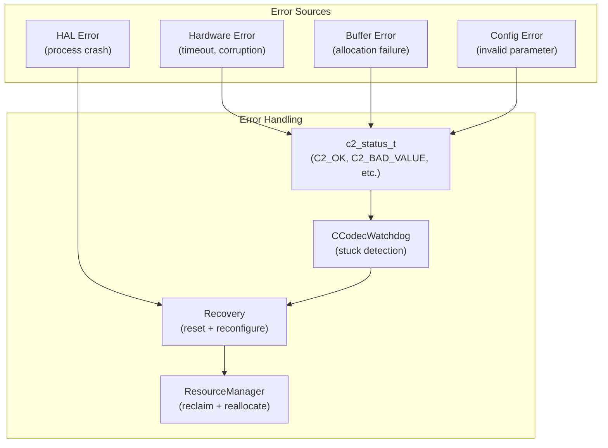
```mermaid
graph TD
    subgraph "Error Sources"
        HW_ERR["Hardware Error<br/>(timeout, corruption)"]
        BUF_ERR["Buffer Error<br/>(allocation failure)"]
        CFG_ERR["Config Error<br/>(invalid parameter)"]
        HAL_ERR["HAL Error<br/>(process crash)"]
    end

    subgraph "Error Handling"
        C2ERR["c2_status_t<br/>(C2_OK, C2_BAD_VALUE, etc.)"]
        WATCH["CCodecWatchdog<br/>(stuck detection)"]
        RECOV["Recovery<br/>(reset + reconfigure)"]
        RECLAIM["ResourceManager<br/>(reclaim + reallocate)"]
    end

    HW_ERR --> C2ERR
    BUF_ERR --> C2ERR
    CFG_ERR --> C2ERR
    HAL_ERR --> RECOV

    C2ERR --> WATCH
    WATCH --> RECOV
    RECOV --> RECLAIM
```

When the CCodecWatchdog detects a stuck codec (no activity for 3.3 seconds), it
initiates a release sequence. If the codec process dies (`DEAD_OBJECT`), MediaCodec's
`onMessageReceived` handler triggers full recovery including re-initialization from
the `UNINITIALIZED` state.

---

### 16.4.7 StagefrightRecorder Output Format Selection

StagefrightRecorder selects the appropriate writer based on the output format:

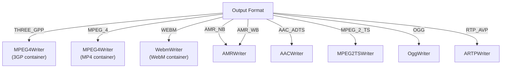
```mermaid
graph TD
    OF["Output Format"]
    OF -->|THREE_GPP| MP4W["MPEG4Writer<br/>(3GP container)"]
    OF -->|MPEG_4| MP4W2["MPEG4Writer<br/>(MP4 container)"]
    OF -->|WEBM| WEBM["WebmWriter<br/>(WebM container)"]
    OF -->|AMR_NB| AMRW["AMRWriter"]
    OF -->|AMR_WB| AMRW
    OF -->|AAC_ADTS| AACW["AACWriter"]
    OF -->|MPEG_2_TS| TSW["MPEG2TSWriter"]
    OF -->|OGG| OGGW["OggWriter"]
    OF -->|RTP_AVP| RTPW["ARTPWriter"]
```

Each writer handles the specific container format requirements:

- **MPEG4Writer** handles both MP4 and 3GP, including moov atom management,
  chunk interleaving, and HEIF/AVIF image writing
- **WebmWriter** produces Matroska-based containers for VP8/VP9/Opus content
- **AMRWriter** and **AACWriter** handle simple audio-only containers
- **MPEG2TSWriter** produces transport streams suitable for streaming
- **ARTPWriter** produces RTP packets for real-time streaming

---

### 16.5.7 Camera HAL3 Request Pipeline Detail

The Camera3Device implements a sophisticated request pipeline:

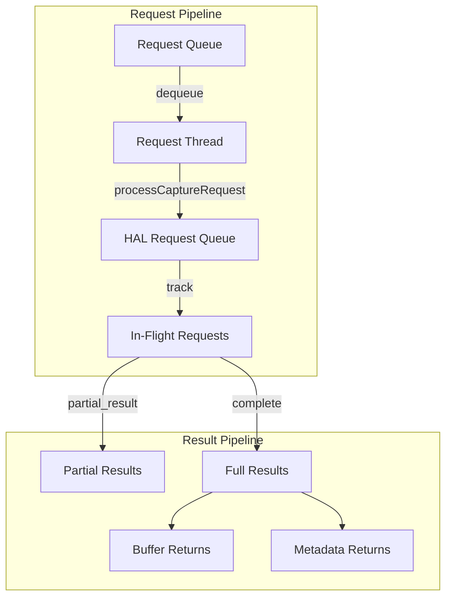
```mermaid
graph TD
    subgraph "Request Pipeline"
        RQ["Request Queue"]
        RT["Request Thread"]
        IFR["In-Flight Requests"]
        HAL_Q["HAL Request Queue"]
    end

    subgraph "Result Pipeline"
        PR["Partial Results"]
        FR["Full Results"]
        BUF["Buffer Returns"]
        META["Metadata Returns"]
    end

    RQ -->|"dequeue"| RT
    RT -->|"processCaptureRequest"| HAL_Q
    HAL_Q -->|"track"| IFR
    IFR -->|"partial_result"| PR
    IFR -->|"complete"| FR
    FR --> BUF
    FR --> META
```

Camera3Device tracks in-flight requests to ensure that:

- Results are delivered in order
- Partial results are accumulated correctly
- Buffer references are properly managed
- Stale requests are detected and cleaned up

The `StatusTracker` monitors the device state and ensures proper transitions between
idle, active, and error states.

---

### 16.5.8 Stream Management and Buffer Allocation

The device3 directory includes several specialized stream types:

```mermaid
classDiagram
    class Camera3Stream {
        +start()
        +stop()
        +getBuffer()
        +returnBuffer()
    }

    class Camera3OutputStream {
        -sp~Surface~ mConsumer
        +queueBufferToConsumer()
    }

    class Camera3InputStream {
        +getInputBuffer()
        +returnInputBuffer()
    }

    class Camera3SharedOutputStream {
        -Vector~sp~Surface~~ mSurfaces
        +attachSurface()
        +detachSurface()
    }

    Camera3Stream <|-- Camera3OutputStream
    Camera3Stream <|-- Camera3InputStream
    Camera3OutputStream <|-- Camera3SharedOutputStream
```

- **Camera3OutputStream**: Standard output stream that queues frames to a Surface
  (BufferQueue consumer). Used for preview, recording, and still capture.
- **Camera3InputStream**: Input stream for reprocessing. Allows captured frames
  to be fed back into the camera pipeline for operations like noise reduction
  or HDR+ merging.
- **Camera3SharedOutputStream**: Enables multiple consumers to share a single
  camera output stream, used for simultaneous preview and analysis.
- **Camera3StreamSplitter**: Splits a single stream into multiple copies for
  different consumers.

The `Camera3BufferManager` handles buffer allocation strategies:

- Pre-allocating buffers for low-latency operation
- Dynamic buffer allocation to minimize memory usage
- Buffer handoff between streams during reconfiguration

---

### 16.6.4 Extractor Security Architecture

The media extractor security model deserves special attention because media parsing
is one of the most exploited attack surfaces:

```mermaid
graph TD
    subgraph "App Process"
        MP["MediaPlayer"]
        MR["MediaRecorder"]
    end

    subgraph "MediaServer Process"
        NP["NuPlayer"]
        NME["NuMediaExtractor"]
    end

    subgraph "Extractor Process (sandboxed)"
        MEF["MediaExtractorFactory"]
        EP["Extractor Plugins<br/>(loaded as .so)"]
    end

    MP --> NP
    NP --> NME
    NME -->|"Binder IPC"| MEF
    MEF --> EP

    style EP fill:#ffcdd2
```

The extractor process has:

- **Minimal permissions**: No access to network, sensors, or other services
- **Seccomp filter**: System call whitelist limits the attack surface
- **Separate address space**: Exploiting an extractor vulnerability does not
  compromise the main media service
- **Plugin isolation**: Each extractor is a shared library loaded with `dlopen`,
  enabling modular updates

The `media.stagefright.extractremote` property can be set to `false` for debugging
to run extractors in-process, but this should never be done in production.

---

### 16.7.5 The Codec Capability Query Pipeline

Applications query codec capabilities through a multi-layered process:

```mermaid
sequenceDiagram
    participant App as Application
    participant MCL as MediaCodecList
    participant MCI as MediaCodecInfo
    participant VC as VideoCapabilities
    participant XML as media_codecs.xml
    participant HAL as Codec2 HAL

    App->>MCL: getInstance()
    MCL->>XML: Parse codec declarations
    MCL->>HAL: Query component capabilities
    HAL-->>MCL: C2Param capabilities
    MCL-->>App: IMediaCodecList

    App->>MCL: findCodecByName("c2.android.avc.decoder")
    MCL-->>App: codecIndex

    App->>MCL: getCodecInfo(codecIndex)
    MCL-->>App: MediaCodecInfo

    App->>MCI: getCapabilitiesForType("video/avc")
    MCI-->>App: CodecCapabilities

    App->>VC: getSupportedWidthsFor(1080)
    Note over VC: Compute from block model:<br/>block count, aspect ratio,<br/>alignment constraints
    VC-->>App: Range(1, 4096)

    App->>VC: getSupportedFrameRatesFor(1920, 1080)
    Note over VC: Compute from block rate:<br/>blocks_per_frame * fps <= max_blocks_per_sec
    VC-->>App: Range(0.0, 240.0)
```

The capability computation is performance-based: the `media_codecs_performance.xml`
file specifies measured throughput for each codec at various resolution/frame-rate
combinations. The `VideoCapabilities` class interpolates between these data points
to answer queries about arbitrary resolution/frame-rate combinations.

---

### 16.7.6 HDR Format Support

The media pipeline supports multiple HDR formats, each with different metadata and
transfer function requirements:

| HDR Format | Transfer Function | Metadata | Container Support |
|---|---|---|---|
| HLG | ARIB STD-B67 | None required | MP4, MPEG-TS |
| HDR10 | SMPTE ST 2084 (PQ) | Static (SMPTE ST 2086) | MP4, WebM |
| HDR10+ | SMPTE ST 2084 (PQ) | Dynamic (per-frame) | MP4 |
| Dolby Vision | PQ or HLG | Dynamic (RPU) | MP4 |

MediaCodec tracks HDR information through multiple metric keys:

```
kCodecConfigColorStandard    - BT.709, BT.2020, etc.
kCodecConfigColorRange       - Limited, Full
kCodecConfigColorTransfer    - SDR, HLG, PQ
kCodecParsedColorStandard    - As parsed from bitstream
kCodecParsedColorRange       - As parsed from bitstream
kCodecParsedColorTransfer    - As parsed from bitstream
kCodecHdrStaticInfo          - Mastering display metadata
kCodecHdr10PlusInfo          - Dynamic metadata present
kCodecHdrFormat              - Which HDR format
```

The distinction between "config" and "parsed" metadata is important: the config values
are what the application requested during `configure()`, while the parsed values are
what the codec actually found in the bitstream. A mismatch may indicate incorrect
content labeling.

---

## Summary

Android's media and video pipeline is a layered architecture spanning roughly 50,000
lines of core C++ code across five major subsystems:

1. **MediaCodec** (7,917 lines) provides the central state machine and API surface,
   with sophisticated resource management, metrics collection, and retry logic.

2. **ACodec** (9,459 lines) bridges to legacy OMX codecs, while **CCodec** (3,827
   lines) bridges to the modern Codec2 framework with its typed parameter system,
   work-based processing model, and 23+ software codec families.

3. **MediaPlayerService** (3,111 lines) and **NuPlayer** (3,259+ lines) orchestrate
   the complete playback pipeline from extraction through decoding to synchronized
   audio/video rendering.

4. **CameraService** (6,975 lines) manages camera hardware access with a
   comprehensive security model, multi-camera support, and both API1 (legacy) and
   API2 (modern) client paths.

5. **Media Extractors** provide container parsing with security isolation (running in
   a separate process), while **VideoCapabilities** (1,875 lines) and
   **MediaProfiles** (1,512 lines) describe what the hardware can do.

The evolution from OMX to Codec2 represents the most significant architectural shift
in Android media in the past decade, bringing type safety, better buffer management,
and improved vendor extensibility. Meanwhile, the media pipeline continues to grow
with new codec support (AV1, IAMF, APV), HDR formats (HDR10+, Dolby Vision), and
professional video features.

### 16.2.16 Format Shaping

MediaCodec includes a **format shaping** feature that can modify encoder parameters
to improve visual quality. The `FormatShaper` plugin adjusts QP (Quantization Parameter)
values and other settings based on device capabilities:

```
kCodecOriginalVideoQPIMin  - QP I-frame min before shaping
kCodecOriginalVideoQPIMax  - QP I-frame max before shaping
kCodecOriginalVideoQPPMin  - QP P-frame min before shaping
kCodecOriginalVideoQPPMax  - QP P-frame max before shaping
kCodecOriginalVideoQPBMin  - QP B-frame min before shaping
kCodecOriginalVideoQPBMax  - QP B-frame max before shaping
kCodecRequestedVideoQPIMin - QP I-frame min after shaping
kCodecRequestedVideoQPIMax - QP I-frame max after shaping
kCodecRequestedVideoQPPMin - QP P-frame min after shaping
kCodecRequestedVideoQPPMax - QP P-frame max after shaping
kCodecRequestedVideoQPBMin - QP B-frame min after shaping
kCodecRequestedVideoQPBMax - QP B-frame max after shaping
```

The `kCodecShapingEnhanced` metric tracks how many fields were modified: -1 means
shaping is disabled, 0 or more indicates the number of adjusted fields.

---

### 16.3.11 SimpleC2Component: The Base Class Pattern

All software Codec2 components extend `SimpleC2Component`, which is defined in
`frameworks/av/media/codec2/components/base/SimpleC2Component.cpp`. This base class
provides:

1. **Thread management**: A work processing thread that dequeues `C2Work` items
2. **Buffer pool management**: Integration with the Codec2 buffer allocator system
3. **Standard lifecycle**: `start()`, `stop()`, `flush()`, `reset()`, `release()`
4. **Error propagation**: Mapping from codec-specific errors to `c2_status_t`

The `SimpleInterface` companion class provides the `IntfImpl` pattern for parameter
declaration:

```mermaid
classDiagram
    class SimpleC2Component {
        #process(C2Work*, FlushedWork*)
        #drain(drain_mode_t, C2Work*)
        +start()
        +stop()
        +flush()
        +queue(C2WorkList*)
    }

    class SimpleInterface {
        +query(params, mayBlock)
        +config(params, mayBlock)
    }

    class C2SoftAvcDec {
        -IntfImpl mIntf
        #process(C2Work*, FlushedWork*)
        #drain(drain_mode_t, C2Work*)
    }

    class C2SoftHevcDec {
        -IntfImpl mIntf
        #process(C2Work*, FlushedWork*)
    }

    SimpleC2Component <|-- C2SoftAvcDec
    SimpleC2Component <|-- C2SoftHevcDec
    SimpleC2Component --> SimpleInterface
```

Each software codec overrides the `process()` method to implement its specific
decode or encode logic. The base class handles all the boilerplate of queue management,
buffer allocation, and error handling.

---

### 16.4.8 MediaPlayerFactory: Player Selection

The MediaPlayerService uses a factory pattern to select the appropriate player
implementation. The `MediaPlayerFactory` in
`frameworks/av/media/libmediaplayerservice/MediaPlayerFactory.cpp` can instantiate
different player types:

| Player Type | Implementation | Use Case |
|---|---|---|
| `NU_PLAYER` | NuPlayerDriver | Default for all local/streaming playback |
| `TEST_PLAYER` | TestPlayerStub | Testing and development |

Historically, Android supported `PV_PLAYER` (PacketVideo) and `SONIVOX_PLAYER` (MIDI),
but NuPlayer has consolidated all non-test playback into a single implementation.

The factory selection is based on the content type and data source:

```mermaid
graph TD
    DS["Data Source Type"]
    DS -->|"Local file or HTTP(S) URL"| GS["GenericSource"]
    DS -->|"HLS (.m3u8)"| HLS["HTTPLiveSource"]
    DS -->|"RTSP URL"| RTSP["RTSPSource"]
    DS -->|"RTP"| RTP["RTPSource"]
    DS -->|"MPEG-TS (push)"| SS["StreamingSource"]

    GS --> NP["NuPlayer"]
    HLS --> NP
    RTSP --> NP
    RTP --> NP
    SS --> NP
```

### 16.4.9 NuPlayerRenderer: Frame Scheduling Detail

NuPlayerRenderer implements a sophisticated frame scheduling algorithm for smooth
video playback:

```mermaid
sequenceDiagram
    participant Dec as NuPlayerDecoder
    participant Rend as NuPlayerRenderer
    participant Clock as MediaClock
    participant Display as SurfaceFlinger

    Dec->>Rend: queueBuffer(video frame, pts)
    Rend->>Clock: getRealTimeFor(pts)
    Clock-->>Rend: targetRenderTimeNs

    alt Frame is early
        Rend->>Rend: postDrainVideoQueue(delay)
        Note over Rend: Wait until target time
    else Frame is on time
        Rend->>Display: renderOutputBuffer(frame, targetRenderTimeNs)
    else Frame is late
        alt Within tolerance
            Rend->>Display: renderOutputBuffer(frame, now)
        else Too late
            Rend->>Rend: dropFrame()
            Note over Rend: Increment dropped frame counter
        end
    end
```

The renderer uses the audio clock as the master timing reference. Since audio playback
must be continuous (gaps are audible), the video renderer adjusts its timing to match
the audio position. This is why audio stalls typically cause video stalls but not vice
versa.

---

### 16.5.9 Camera Torch (Flashlight) Management

CameraService also manages the device flashlight:

```cpp
// frameworks/av/services/camera/libcameraservice/CameraService.cpp, line 341
void CameraService::broadcastTorchModeStatus(
        const std::string& cameraId,
        TorchModeStatus status,
        SystemCameraKind systemCameraKind) {
    auto [deviceId, mappedCameraId] =
        mVirtualDeviceCameraIdMapper
            .getDeviceIdAndMappedCameraIdPair(cameraId);

    Mutex::Autolock lock(mStatusListenerLock);
    for (auto& i : mListenerList) {
        if (shouldSkipStatusUpdates(systemCameraKind,
                i->isVendorListener(),
                i->getListenerPid(),
                i->getListenerUid())) {
            continue;
        }
        auto ret = i->getListener()->onTorchStatusChanged(
            mapToInterface(status), mappedCameraId, deviceId);
    }
}
```

The torch management integrates with the virtual device mapper, ensuring that
torch status updates are sent with the correct camera ID mapping for virtual devices.

---

### 16.6.5 Extractor Plugin Loading

The extractor plugin loading mechanism uses Linux dynamic linking:

```mermaid
sequenceDiagram
    participant Boot as System Boot
    participant MES as MediaExtractorService
    participant MEF as MediaExtractorFactory
    participant DL as dlopen/dlsym

    Boot->>MES: Start extractor service
    MES->>MEF: RegisterDefaultPlugins()
    MEF->>DL: Scan /system/lib64/extractors/
    DL-->>MEF: libmp4extractor.so
    DL-->>MEF: libmkvextractor.so
    DL-->>MEF: libmp3extractor.so
    DL-->>MEF: libaacextractor.so
    DL-->>MEF: libflacextractor.so
    DL-->>MEF: libwavextractor.so
    DL-->>MEF: liboggextractor.so
    DL-->>MEF: libamrextractor.so
    DL-->>MEF: libmpeg2extractor.so
    DL-->>MEF: libmidiextractor.so

    Note over MEF: Each plugin exports<br/>GETEXTRACTORDEF symbol

    MEF->>DL: dlopen(each .so)
    MEF->>DL: dlsym("GETEXTRACTORDEF")
    DL-->>MEF: ExtractorDef*
    MEF->>MEF: Register in plugin list
```

Each extractor shared library exports a single symbol `GETEXTRACTORDEF` that returns
an `ExtractorDef` structure containing:

- The extractor name and version
- A UUID for identification
- A sniff function for format detection
- A creator function for instantiation

---

### 16.7.7 PerformancePoint: Macroblock-Based Capability Model

The `VideoCapabilities::PerformancePoint` class implements the macroblock-based
performance model:

```cpp
// frameworks/av/media/libmedia/VideoCapabilities.cpp, line 260
void VideoCapabilities::PerformancePoint::init(
        int32_t width, int32_t height,
        int32_t frameRate, int32_t maxFrameRate,
        VideoSize blockSize) {
    mBlockSize = VideoSize(
        divUp(blockSize.getWidth(), (int32_t)16),
        divUp(blockSize.getHeight(), (int32_t)16));

    mWidth = (int32_t)(divUp(std::max(width, 1),
                    std::max(blockSize.getWidth(), 16))
                * mBlockSize.getWidth());
    mHeight = (int32_t)(divUp(std::max(height, 1),
                    std::max(blockSize.getHeight(), 16))
                * mBlockSize.getHeight());
    mMaxFrameRate = std::max(std::max(frameRate, maxFrameRate), 1);
    mMaxMacroBlockRate = std::max(frameRate, 1)
                       * (int64_t)getMaxMacroBlocks();
}
```

The model works as follows:

1. Resolution is expressed in macroblocks (16x16 pixels for AVC, configurable for others)
2. Total macroblock count = `ceil(width/16) * ceil(height/16)`
3. Maximum macroblock rate = `macroblock_count * max_frame_rate`
4. A PerformancePoint "covers" another if its macroblock rate is sufficient

This allows the system to answer questions like "can this codec decode 4K@60fps?" by
checking if `ceil(3840/16) * ceil(2160/16) * 60 = 240 * 135 * 60 = 1,944,000`
macroblocks per second is within the codec's capability.

The `estimateFrameRatesFor` method uses measured data points to estimate performance
at untested resolutions:

```cpp
// frameworks/av/media/libmedia/VideoCapabilities.cpp, line 186
std::optional<Range<double>> VideoCapabilities::estimateFrameRatesFor(
        int32_t width, int32_t height) const {
    std::optional<VideoSize> size = findClosestSize(width, height);
    if (!size) {
        return std::nullopt;
    }
    auto rangeItr = mMeasuredFrameRates.find(size.value());
    Range<int64_t> range = rangeItr->second;
    double ratio = getBlockCount(size.value().getWidth(),
                                  size.value().getHeight())
            / (double)std::max(getBlockCount(width, height), 1);
    return std::make_optional(
        Range(range.lower() * ratio, range.upper() * ratio));
}
```

This linear scaling assumes that codec performance scales linearly with macroblock
count, which is a reasonable approximation for most codec implementations.

---

### 16.7.8 MPEG4Writer Internals: Box/Atom Structure

The MPEG4Writer creates the complex box hierarchy required by ISO 14496-12:

```mermaid
graph TD
    FTYP["ftyp (file type)"]
    MDAT["mdat (media data)"]
    MOOV["moov (movie)"]
    MVHD["mvhd (movie header)"]
    TRAK1["trak (video track)"]
    TRAK2["trak (audio track)"]
    TKHD1["tkhd (track header)"]
    MDIA1["mdia (media)"]
    MDHD1["mdhd (media header)"]
    HDLR1["hdlr (handler)"]
    MINF1["minf (media info)"]
    STBL1["stbl (sample table)"]
    STSD1["stsd (sample desc)"]
    STSZ1["stsz (sample sizes)"]
    STSC1["stsc (sample-to-chunk)"]
    STCO1["stco/co64 (chunk offsets)"]
    STTS1["stts (time-to-sample)"]
    CTTS1["ctts (composition time)"]
    STSS1["stss (sync samples)"]

    FTYP
    MDAT
    MOOV --> MVHD
    MOOV --> TRAK1
    MOOV --> TRAK2
    TRAK1 --> TKHD1
    TRAK1 --> MDIA1
    MDIA1 --> MDHD1
    MDIA1 --> HDLR1
    MDIA1 --> MINF1
    MINF1 --> STBL1
    STBL1 --> STSD1
    STBL1 --> STSZ1
    STBL1 --> STSC1
    STBL1 --> STCO1
    STBL1 --> STTS1
    STBL1 --> CTTS1
    STBL1 --> STSS1
```

The `ListTableEntries` template class (line 197) provides efficient storage for the
sample tables:

```cpp
// frameworks/av/media/libstagefright/MPEG4Writer.cpp, line 367
ListTableEntries<uint32_t, 1> *mStszTableEntries;  // sample sizes
ListTableEntries<off64_t, 1> *mCo64TableEntries;   // chunk offsets
ListTableEntries<uint32_t, 3> *mStscTableEntries;   // sample-to-chunk
ListTableEntries<uint32_t, 1> *mStssTableEntries;   // sync samples
ListTableEntries<uint32_t, 2> *mSttsTableEntries;   // time-to-sample
ListTableEntries<uint32_t, 2> *mCttsTableEntries;   // composition time
ListTableEntries<uint32_t, 3> *mElstTableEntries;   // edit list
```

The template parameter (1, 2, or 3) indicates the number of values per entry. For
example, `mStscTableEntries` has 3 values per entry (first_chunk, samples_per_chunk,
sample_description_index), matching the MP4 specification for the `stsc` box.

The `ListTableEntries` implementation uses a chunked linked list to handle potentially
millions of entries efficiently:

```cpp
// frameworks/av/media/libstagefright/MPEG4Writer.cpp, line 278
void add(const TYPE& value) {
    CHECK_LT(mNumValuesInCurrEntry, mElementCapacity);
    uint32_t nEntries = mTotalNumTableEntries % mElementCapacity;
    uint32_t nValues  = mNumValuesInCurrEntry % ENTRY_SIZE;
    if (nEntries == 0 && nValues == 0) {
        mCurrTableEntriesElement = new TYPE[ENTRY_SIZE * mElementCapacity];
        CHECK(mCurrTableEntriesElement != NULL);
        mTableEntryList.push_back(mCurrTableEntriesElement);
    }
    uint32_t pos = nEntries * ENTRY_SIZE + nValues;
    mCurrTableEntriesElement[pos] = value;
    ++mNumValuesInCurrEntry;
    if ((mNumValuesInCurrEntry % ENTRY_SIZE) == 0) {
        ++mTotalNumTableEntries;
        mNumValuesInCurrEntry = 0;
    }
}
```

This design allocates memory in chunks (`mElementCapacity` entries at a time), avoiding
the overhead of individual per-sample allocations for videos that may contain millions
of frames.

---

### 16.8.11 Debugging Tips: Common Issues and Solutions

### Issue: Codec Allocation Fails

**Symptom**: `MediaCodec.configure()` returns `-12` (`NO_MEMORY`).

**Diagnosis**:
```bash
adb shell dumpsys media.resource_manager
# Check how many codecs are in use
# Look for processes with lower priority that could be reclaimed
```

**Root cause**: All hardware codec instances are in use. The ResourceManager could
not find a lower-priority session to reclaim.

**Solution**: Release unused codec instances, or use software codecs as fallback.

### Issue: Video Playback Shows Green Frames

**Symptom**: First few frames of video show as solid green or corrupted.

**Diagnosis**: The decoder has not yet received SPS/PPS (for H.264) or VPS/SPS/PPS
(for HEVC). Check that codec-specific data is queued with `BUFFER_FLAG_CODEC_CONFIG`
before video data.

### Issue: Audio-Video Sync Drift

**Symptom**: Audio and video gradually desynchronize during playback.

**Diagnosis**:
```bash
adb logcat -s NuPlayerRenderer
# Look for "too late" or "dropped" frame messages
# Check audio clock vs video presentation timestamps
```

**Root cause**: The video decoder is not keeping up with real-time, causing frames
to be dropped. This can happen when software decoding high-resolution content.

### Issue: Camera Preview Freezes

**Symptom**: Camera preview stops updating but the app does not report an error.

**Diagnosis**:
```bash
adb shell dumpsys media.camera
# Check active client connections
# Look for error events
# Check "in-flight request" count
```

**Root cause**: The Camera HAL may have stopped producing frames due to an internal
error. Check for HAL crash logs with `adb logcat -s CameraHal`.

### Issue: Media Extractor Returns ERROR_UNSUPPORTED

**Symptom**: Cannot play a specific media file.

**Diagnosis**:
```bash
adb shell dumpsys media.extractor
# Check which extractors are loaded
# Try: adb shell am start -a android.intent.action.VIEW -d file:///path/to/file.mp4
```

**Root cause**: No extractor plugin recognized the file format. The file may be
corrupted, use an unsupported container format, or have an unsupported codec within
a supported container.

### 16.8.12 Performance Profiling with Perfetto

For detailed media performance analysis, use Perfetto with the following configuration:

```protobuf
# media_trace_config.pbtx
buffers: {
    size_kb: 131072
    fill_policy: RING_BUFFER
}
data_sources: {
    config {
        name: "linux.ftrace"
        ftrace_config {
            ftrace_events: "sched/sched_switch"
            ftrace_events: "power/cpu_frequency"
            ftrace_events: "power/gpu_frequency"
            atrace_categories: "video"
            atrace_categories: "audio"
            atrace_categories: "camera"
            atrace_categories: "hal"
            atrace_categories: "view"
            atrace_categories: "gfx"
            atrace_apps: "*"
        }
    }
}
data_sources: {
    config {
        name: "android.surfaceflinger.frametimeline"
    }
}
duration_ms: 30000
```

In the resulting trace, key spans to look for:

| Span | Component | Indicates |
|---|---|---|
| `MediaCodec::configure#native` | MediaCodec | Configuration time |
| `MediaCodec::start#native` | MediaCodec | Start latency |
| `MediaCodec::queueInputBuffer#native` | MediaCodec | Input queue time |
| `MediaCodec::dequeueOutputBuffer#native` | MediaCodec | Output dequeue time |
| `CCodec::onWorkDone` | CCodec | HAL processing complete |
| `queueBuffer` | SurfaceFlinger | Frame submitted to compositor |
| `onMessageReceived` | NuPlayer | Player message processing |

### 16.8.13 Understanding Freeze and Judder Metrics

MediaCodec tracks two types of playback quality issues:

**Freeze**: A period where no new frames are rendered. Freezes appear as visible
pauses in playback.

```
freeze-count        - Total number of freeze events
freeze-score        - Severity score (duration-weighted)
freeze-rate         - Fraction of playback time spent frozen
freeze-duration-ms-avg  - Average freeze duration
freeze-duration-ms-max  - Longest freeze
```

**Judder**: Uneven frame spacing that causes visible stutter even when no frames
are dropped.

```
judder-count        - Total number of judder events
judder-score        - Severity score
judder-rate         - Fraction of playback with judder
judder-score-avg    - Average judder severity
judder-score-max    - Worst judder event
```

Freeze is typically caused by decoder stalls (slow hardware, resource contention),
while judder is typically caused by frame rate mismatches (e.g., 24fps content on
a 60Hz display causes a 3:2 pulldown pattern that produces uneven frame spacing).

### 16.8.14 Codec ID Generation and Tracking

Each MediaCodec instance receives a globally unique 64-bit ID:

```cpp
// frameworks/av/media/libstagefright/MediaCodec.cpp, line 1521
static uint64_t GenerateCodecId() {
    static std::atomic_uint64_t sId = [] {
        std::random_device rd;
        std::mt19937 gen(rd());
        std::uniform_int_distribution<uint32_t> distrib(0, UINT32_MAX);
        uint32_t randomID = distrib(gen);
        uint64_t id = randomID;
        return id << 32;
    }();
    return sId++;
}
```

The ID is composed of a random 32-bit prefix (unique per process) and an atomic
32-bit sequence number (unique per codec instance within the process). This enables
correlation of logs, metrics, and resource manager entries across the system.

---

### Key Source Files Reference

| File | Path | Lines |
|---|---|---|
| MediaCodec.cpp | `frameworks/av/media/libstagefright/MediaCodec.cpp` | 7,917 |
| ACodec.cpp | `frameworks/av/media/libstagefright/ACodec.cpp` | 9,459 |
| MPEG4Writer.cpp | `frameworks/av/media/libstagefright/MPEG4Writer.cpp` | 6,039 |
| CCodec.cpp | `frameworks/av/media/codec2/sfplugin/CCodec.cpp` | 3,827 |
| CCodecBufferChannel.cpp | `frameworks/av/media/codec2/sfplugin/CCodecBufferChannel.cpp` | 3,075 |
| MediaPlayerService.cpp | `frameworks/av/media/libmediaplayerservice/MediaPlayerService.cpp` | 3,111 |
| StagefrightRecorder.cpp | `frameworks/av/media/libmediaplayerservice/StagefrightRecorder.cpp` | 2,733 |
| NuPlayer.cpp | `frameworks/av/media/libmediaplayerservice/nuplayer/NuPlayer.cpp` | 3,259 |
| NuPlayerRenderer.cpp | `frameworks/av/media/libmediaplayerservice/nuplayer/NuPlayerRenderer.cpp` | 2,239 |
| CameraService.cpp | `frameworks/av/services/camera/libcameraservice/CameraService.cpp` | 6,975 |
| NuMediaExtractor.cpp | `frameworks/av/media/libstagefright/NuMediaExtractor.cpp` | 896 |
| MediaExtractorFactory.cpp | `frameworks/av/media/libstagefright/MediaExtractorFactory.cpp` | 395 |
| VideoCapabilities.cpp | `frameworks/av/media/libmedia/VideoCapabilities.cpp` | 1,875 |
| MediaProfiles.cpp | `frameworks/av/media/libmedia/MediaProfiles.cpp` | 1,512 |

---

## Appendix: Deep-Dive Topics

### A.1 The ALooper/AHandler/AMessage Framework

The Stagefright message passing framework is the backbone of all asynchronous
operations in the media stack. Understanding it is essential for reading any
media source code.

#### ALooper: The Event Loop

An `ALooper` is a thread that runs an event loop, dequeuing messages and dispatching
them to registered handlers. Key properties:

- **Thread safety**: Messages can be posted from any thread; they are enqueued
  atomically and processed sequentially on the looper thread.
- **Timed delivery**: Messages can be posted with a delay
  (`msg->post(delayUs)`), enabling timer-based operations.
- **Priority**: Loopers can run at different thread priorities. Video codec
  loopers run at `ANDROID_PRIORITY_AUDIO` for low latency.

```mermaid
graph LR
    subgraph "Any Thread"
        POST["msg->post()"]
    end

    subgraph "ALooper Thread"
        Q["Message Queue<br/>(priority-ordered)"]
        DISP["Dispatch Loop"]
        H1["Handler A<br/>onMessageReceived()"]
        H2["Handler B<br/>onMessageReceived()"]
    end

    POST -->|"enqueue"| Q
    Q -->|"dequeue"| DISP
    DISP -->|"what() routing"| H1
    DISP -->|"what() routing"| H2
```

#### AMessage: The Typed Message

`AMessage` is a key-value container that carries data between components:

```cpp
sp<AMessage> msg = new AMessage(kWhatConfigure, targetHandler);
msg->setMessage("format", format);    // nested AMessage
msg->setInt32("flags", flags);        // integer
msg->setInt64("timeUs", timestamp);   // 64-bit integer
msg->setString("name", "avc");        // string
msg->setObject("surface", surface);   // RefBase object
msg->setSize("index", bufferIndex);   // size_t
msg->setFloat("rate", 30.0f);         // float
msg->setPointer("ptr", rawPtr);       // raw pointer
msg->setRect("crop", l, t, r, b);    // rectangle
msg->post();                          // async delivery
```

#### PostAndAwaitResponse: Synchronous RPC

The `PostAndAwaitResponse` pattern converts asynchronous message passing into
synchronous function calls:

```mermaid
sequenceDiagram
    participant Caller as Calling Thread
    participant Looper as Looper Thread
    participant Handler as Handler

    Caller->>Caller: Create reply token
    Caller->>Looper: post(msg with reply token)
    Caller->>Caller: Block on reply token

    Looper->>Handler: onMessageReceived(msg)
    Handler->>Handler: Process request
    Handler->>Looper: response->postReply(replyToken)

    Looper-->>Caller: Unblock with response
    Caller->>Caller: Extract result from response
```

This pattern is used throughout MediaCodec for methods like `configure()`,
`start()`, `stop()`, `queueInputBuffer()`, and `dequeueOutputBuffer()`.

### A.2 MediaCodec Domain Classification

MediaCodec classifies codecs into three domains, each with different behavior:

| Domain | Looper | CPU Boost | Battery | Resource Type |
|---|---|---|---|---|
| `DOMAIN_VIDEO` | Dedicated `CodecLooper` | HDR at 1080p+ | Tracked | HW/SW Video Codec |
| `DOMAIN_AUDIO` | Shared main looper | Never | Tracked | HW/SW Audio Codec |
| `DOMAIN_IMAGE` | Shared main looper | Never | Not tracked | HW/SW Image Codec |

Video codecs get a dedicated looper thread because video processing is latency-
sensitive: a stall in the codec's message processing would directly cause frame
drops. Audio and image codecs share the main looper because their timing
requirements are less stringent.

### A.3 Secure Codec Path (DRM)

The secure codec path for DRM-protected content involves additional components:

```mermaid
graph TD
    subgraph "Clear World (accessible)"
        APP["Application"]
        MC["MediaCodec"]
        CRYPTO["ICrypto"]
    end

    subgraph "Secure World (inaccessible)"
        SEC_DEC["Secure Decoder"]
        SEC_BUF["Secure Buffers"]
        TEE["Trusted Execution<br/>Environment"]
    end

    subgraph "Display Path"
        HDCP["HDCP Encryption"]
        DISP["Display"]
    end

    APP -->|"encrypted data"| MC
    MC -->|"encrypted buffers"| CRYPTO
    CRYPTO -->|"decrypt to secure memory"| SEC_BUF
    SEC_BUF -->|"decode"| SEC_DEC
    SEC_DEC -->|"decoded frames"| HDCP
    HDCP -->|"re-encrypted"| DISP

    style SEC_DEC fill:#ffcdd2
    style SEC_BUF fill:#ffcdd2
    style TEE fill:#ffcdd2
```

Key security properties:

1. Decrypted content never exists in CPU-accessible memory
2. Decoded frames flow directly through a secure buffer path
3. HDCP (High-bandwidth Digital Content Protection) protects the display link
4. The crypto plugin runs in the TEE (Trusted Execution Environment)

The `queueSecureInputBuffer` method passes encryption metadata (key, IV, sub-sample
mapping, pattern) to the crypto subsystem, which decrypts directly into secure
memory accessible only by the hardware decoder.

### A.4 Tunneled Playback Mode

Tunneled playback bypasses the standard buffer exchange and renders video
directly through the hardware:

```mermaid
graph LR
    subgraph "Standard Path"
        MC1["MediaCodec"]
        APP1["App dequeue/release"]
        SF1["SurfaceFlinger"]
    end

    subgraph "Tunneled Path"
        MC2["MediaCodec"]
        HW["Hardware A/V Sync"]
        DISP2["Display"]
    end

    MC1 -->|"output buffer"| APP1
    APP1 -->|"releaseOutputBuffer"| SF1
    SF1 --> DISP2

    MC2 -->|"direct render"| HW
    HW -->|"hardware composited"| DISP2
```

In tunneled mode:

- The application never sees decoded frames
- Audio and video synchronization is handled entirely in hardware
- Frame timing is controlled by the hardware A/V sync unit
- This typically achieves lower latency and better power efficiency
- Only available on hardware codecs that support it

### A.5 Low-Latency Mode

For gaming and video conferencing, low-latency mode reduces the codec's
internal buffering:

```
kCodecNumLowLatencyModeOn    - Times low-latency was enabled
kCodecNumLowLatencyModeOff   - Times low-latency was disabled
kCodecFirstFrameIndexLowLatencyOn - Frame index when first enabled
```

When low-latency mode is active:

- Output delay is minimized (typically 0-1 frames)
- Reordering is disabled or minimized
- The codec may skip B-frame decoding
- Frame drops are preferred over buffering

### A.6 Multi-Access-Unit (Large Frame) Audio

Modern audio codecs like IAMF and xHE-AAC can benefit from processing
multiple audio frames in a single buffer:

```mermaid
graph LR
    subgraph "Traditional (one AU per buffer)"
        B1["Buffer 1: AU 0"]
        B2["Buffer 2: AU 1"]
        B3["Buffer 3: AU 2"]
    end

    subgraph "Large Frame (multiple AUs per buffer)"
        B4["Buffer 1: AU 0 | AU 1 | AU 2"]
    end
```

The `queueInputBuffers` (plural) API supports this by accepting a
`BufferInfosWrapper` that describes the boundaries and timestamps of each
access unit within the larger buffer. This reduces per-frame overhead and
enables more efficient processing pipelines.

### A.7 Codec2 vs OMX Feature Comparison

| Feature | OMX (ACodec) | Codec2 (CCodec) |
|---|---|---|
| Parameter system | Flat index + void* | Typed C2Param structs |
| Buffer model | Separate input/output queues | Unified C2Work |
| Error handling | OMX_EVENTTYPE | c2_status_t + detailed failures |
| Vendor parameters | Limited OMX extensions | First-class vendor params |
| Component discovery | Global OMX registry | Per-store component lists |
| Process model | In-process or HIDL | AIDL HAL (separate process) |
| Buffer allocation | OMX_AllocateBuffer | C2BlockPool + allocators |
| Stuck detection | Application must implement | Built-in CCodecWatchdog |
| Multi-frame input | Not supported | AccessUnitInfo |
| Per-frame tuning | Not supported | C2Work tunings |
| HAL specification | OMX IL 1.1.2 | android.hardware.media.c2 |
| Status | Maintenance mode | Active development |

### A.8 Media Framework Process Boundaries

```mermaid
graph TD
    subgraph "App Process"
        JAVA["Java MediaCodec / MediaPlayer"]
        NDK["NDK AMediaCodec"]
        JNI["JNI / libmedia_jni"]
    end

    subgraph "mediaserver"
        MPS["MediaPlayerService"]
        MRS["MediaRecorderService"]
        RMS["ResourceManagerService"]
        NP2["NuPlayer"]
    end

    subgraph "media.codec (vendor)"
        C2HAL["Codec2 AIDL HAL"]
        VENDOR["Vendor Codec Plugins"]
    end

    subgraph "media.extractor"
        EXTSVC["MediaExtractorService"]
        PLUGINS["Extractor Plugins"]
    end

    subgraph "cameraserver"
        CAMSVC["CameraService"]
        CAMHAL["Camera HAL"]
    end

    subgraph "SurfaceFlinger"
        SFCOMP["Compositor"]
    end

    JAVA --> JNI
    NDK --> JNI
    JNI -->|"Binder"| MPS
    JNI -->|"Binder"| RMS
    JNI -->|"AIDL"| C2HAL

    MPS --> NP2
    NP2 -->|"Binder"| EXTSVC
    NP2 -->|"AIDL"| C2HAL

    MRS -->|"AIDL"| C2HAL

    JNI -->|"Binder"| CAMSVC
    CAMSVC -->|"AIDL/HIDL"| CAMHAL

    C2HAL --> VENDOR
    EXTSVC --> PLUGINS

    JNI -->|"BufferQueue"| SFCOMP
```

Each process boundary represents a security isolation boundary:

- **App to mediaserver**: Binder IPC with UID/PID verification
- **mediaserver to media.codec**: AIDL HAL with SELinux policy
- **mediaserver to media.extractor**: Binder IPC, sandboxed process
- **App to cameraserver**: Binder IPC with camera permission check
- **cameraserver to Camera HAL**: AIDL/HIDL with vendor isolation

### A.9 MediaCodec Lifecycle Summary Table

| State | Entry Action | Valid Operations | Exit Conditions |
|---|---|---|---|
| UNINITIALIZED | constructor / release() | init() | init() called |
| INITIALIZING | init() posted | (wait) | Component allocated |
| INITIALIZED | Component allocated | configure(), release() | configure() called |
| CONFIGURING | configure() posted | (wait) | Component configured |
| CONFIGURED | Component configured | start(), release() | start() called |
| STARTING | start() posted | (wait) | Start completed |
| STARTED | Start completed | queue/dequeue/flush/stop/release | Any of these |
| FLUSHING | flush() posted | (wait) | Flush completed |
| FLUSHED | Flush completed | start(), stop(), release() | start()/stop() called |
| STOPPING | stop() posted | (wait) | Stop completed |
| RELEASING | release() posted | (wait) | Release completed |

### A.10 Codec Metrics Key Reference

All metrics keys are prefixed with `android.media.mediacodec.`:

| Category | Key Suffix | Type | Description |
|---|---|---|---|
| Identity | `codec` | string | Component name |
| Identity | `mime` | string | MIME type |
| Identity | `mode` | string | audio/video/image |
| Identity | `encoder` | int32 | 0=decoder, 1=encoder |
| Identity | `hardware` | int32 | 0=software, 1=hardware |
| Identity | `secure` | int32 | 0=normal, 1=secure |
| Identity | `tunneled` | int32 | 0=normal, 1=tunneled |
| Resolution | `width` | int32 | Video width |
| Resolution | `height` | int32 | Video height |
| Resolution | `rotation` | int32 | 0/90/180/270 |
| Performance | `frame-rate` | int32 | Frame rate |
| Performance | `operating-rate` | int32 | Operating rate |
| Performance | `bitrate` | int32 | Bitrate |
| Performance | `bitrate_mode` | string | CQ/VBR/CBR |
| Latency | `latency.max` | int64 | Max latency (us) |
| Latency | `latency.min` | int64 | Min latency (us) |
| Latency | `latency.avg` | int64 | Avg latency (us) |
| Latency | `latency.n` | int32 | Sample count |
| Quality | `freeze-count` | int32 | Freeze events |
| Quality | `freeze-score` | double | Freeze severity |
| Quality | `judder-count` | int32 | Judder events |
| Quality | `judder-score` | double | Judder severity |
| Render | `frames-released` | int64 | Total released |
| Render | `frames-rendered` | int64 | Actually displayed |
| Render | `frames-dropped` | int64 | Dropped (late) |
| Render | `frames-skipped` | int64 | Skipped |
| Error | `errcode` | int32 | Error code |
| Error | `errstate` | string | Error state |
| Lifecycle | `lifetimeMs` | int64 | Total lifetime (ms) |
