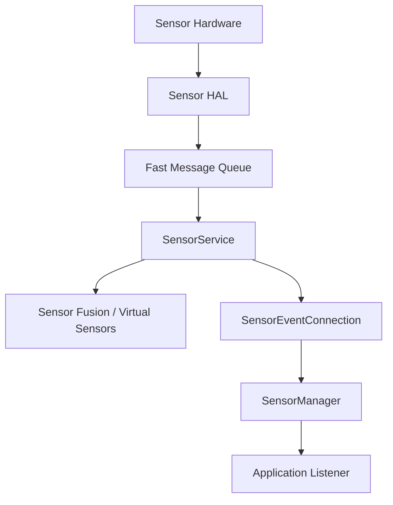
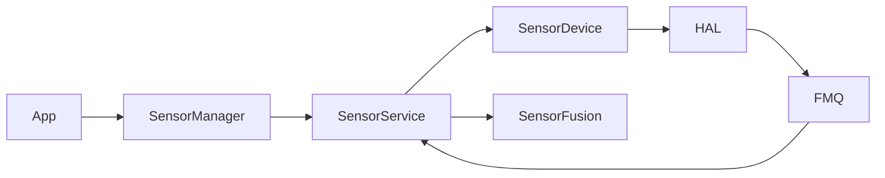

# 第 17 章：传感器系统

Android 传感器系统负责把硬件传感器数据以统一 API 暴露给应用和系统服务。它覆盖加速度计、陀螺仪、磁力计、环境传感器、身体传感器、交互传感器、头部跟踪器以及由融合算法生成的虚拟传感器。本章从 AOSP 源码视角讲解 SensorService、Sensor HAL、FMQ、传感器融合、Java `SensorManager` API、电源管理、隐私策略、头部跟踪与调试测试方法。

---

## 17.1 传感器架构概览

### 17.1.1 三层栈结构

Android 传感器栈可分为三层：

1. **应用与 framework 层**：`SensorManager`、`SensorEventListener`、Java API、NDK API。
2. **系统服务层**：`SensorService`、`SensorDevice`、融合算法、批处理与事件分发。
3. **Vendor HAL 层**：Sensor HAL、驱动、FMQ、动态传感器和 direct channel 支持。

这三层通过 Binder、共享队列和统一数据结构连接，形成从硬件事件到应用回调的完整链路。

### 17.1.2 端到端数据路径



传感器事件通常由 HAL 写入 FMQ，`SensorService` 轮询读取，按客户端连接分发，并在需要时插入融合与隐私控制逻辑。

### 17.1.3 关键抽象

核心抽象包括：

- `Sensor`：描述传感器静态能力。
- `sensors_event_t` / AIDL `Event`：描述一次事件。
- `SensorService`：系统侧事件调度中心。
- `SensorDevice`：framework 侧 HAL 代理。
- `SensorEventConnection`：每客户端状态。
- `SensorDirectConnection`：低延迟直接通道。

### 17.1.4 组件图



---

## 17.2 SensorService —— Native 系统服务

### 17.2.1 启动：`onFirstRef()`

`SensorService` 在首次引用时执行初始化，典型工作包括：

- 连接 Sensor HAL
- 枚举系统可用传感器
- 初始化 `SensorDevice`
- 创建虚拟传感器与融合器
- 启动主线程和轮询机制

### 17.2.2 主线程循环：`threadLoop()`

`threadLoop()` 是 SensorService 的核心循环。它会轮询 HAL 事件、处理动态传感器变化、执行融合、更新内部状态，并将事件分发给所有活动连接。

### 17.2.3 事件分发：`sendEventsToAllClients()`

该方法负责遍历所有客户端连接，根据各自订阅列表、权限、隐私限制、速率上限和 wake-up 语义过滤并发送事件。

### 17.2.4 `SensorEventConnection` —— 每客户端状态

每个客户端连接维护：

- 已激活传感器集合
- 采样率与 batch 参数
- FIFO/事件队列
- UID/PID 与权限信息
- 是否需要 wake-up 行为

它是 SensorService 对外分发的最小状态单元。

### 17.2.5 `SensorDirectConnection` —— 低延迟路径

Direct connection 允许客户端通过共享内存或 gralloc/hardware buffer 接收传感器事件，降低 Binder/Socket 开销，适合高频或低延迟应用。

### 17.2.6 工作模式

SensorService 支持多种模式：

- `NORMAL`
- `RESTRICTED`
- `DATA_INJECTION`

```bash
# Enter RESTRICTED mode (CTS testing)
# Enter DATA_INJECTION mode
# Return to NORMAL
```

这些模式主要用于测试、验证和受限场景控制。

### 17.2.7 传感器隐私与 UID 策略

系统会根据 UID、权限、前后台状态和隐私开关限制传感器访问。部分敏感传感器在后台或特定用户上下文中会被屏蔽或降频。

### 17.2.8 面向隐私的速率限制

为降低侧信道风险，系统会对加速度计、陀螺仪等高频传感器施加速率上限，尤其针对普通应用和后台场景。

---

## 17.3 Sensor HAL —— Vendor 接口

### 17.3.1 `ISensors` AIDL 接口

新一代 Sensor HAL 使用 AIDL 暴露核心接口，包括传感器列表、activate、batch、flush、direct channel、动态传感器和事件队列注册等能力。

### 17.3.2 Fast Message Queues（FMQ）

FMQ 是 Sensor HAL 与 framework 之间传递事件的高效机制。相比 Binder 传输每个事件，FMQ 适合高频传感器数据，降低拷贝与上下文切换成本。

### 17.3.3 `SensorInfo` —— 描述一个传感器

`SensorInfo` 包含名称、vendor、type、最大量程、分辨率、功耗、最小/最大延迟、FIFO 容量和 reporting mode 等静态信息。

### 17.3.4 `SensorDevice` —— Framework 侧 HAL 代理

`SensorDevice` 是 framework 侧对 HAL 的代理对象，负责调用 activate、batch、flush、direct channel 配置以及动态传感器管理。

### 17.3.5 AIDL 与 HIDL 包装层

Android 在过渡期需要同时支持 AIDL 与旧 HIDL 传感器 HAL，因此 framework 中存在包装层以统一向上暴露行为。

### 17.3.6 动态传感器

动态传感器可在运行时连接或断开，例如外接设备或某些蓝牙传感器。HAL 和 SensorService 都必须支持动态增删与事件通知。

### 17.3.7 Direct Channels

Direct channel 让客户端通过共享内存直接读取事件，适用于高频和低延迟需求。HAL 需支持注册 channel、配置 rate level 和写入事件格式。

### 17.3.8 Sensor Multi-HAL

Multi-HAL 用于把多个子 HAL 聚合为统一传感器系统，适合设备上存在多个 sensor hub 或不同供应商子系统的场景。

---

## 17.4 传感器融合

### 17.4.1 `SensorFusion` 单例

`SensorFusion` 是系统侧融合算法的核心单例，负责综合加速度计、陀螺仪和磁力计数据，生成姿态类虚拟传感器。

### 17.4.2 融合算法（扩展卡尔曼滤波）

Android 融合实现通常采用扩展卡尔曼滤波或类似思想，对姿态和偏差进行估计，并结合传感器噪声模型提升稳定性与精度。

### 17.4.3 虚拟传感器实现

虚拟传感器包括旋转向量、重力、线性加速度、姿态等，它们由融合器或 HAL 生成，再统一暴露给应用。

---

## 17.5 传感器类型目录

### 17.5.1 运动传感器

典型运动传感器包括加速度计、陀螺仪、线性加速度、重力和步数相关传感器。

### 17.5.2 位置 / 姿态传感器

包括磁力计、旋转向量、地磁旋转向量、姿态相关传感器等。

### 17.5.3 环境传感器

包括环境光、压力、温度、湿度和接近传感器等。

### 17.5.4 身体传感器

包括心率等与人体状态相关的传感器。

### 17.5.5 手势 / 交互传感器

包括抬起唤醒、显著运动、倾斜检测、手势相关或设备交互相关传感器。

### 17.5.6 元 / 系统传感器

包括动态传感器元事件、附加信息事件等系统级传感器或元事件类型。

### 17.5.7 头部跟踪传感器

HEAD_TRACKER 传感器是空间音频与沉浸式体验的重要输入来源。

### 17.5.8 上报模式

常见 reporting mode 包括 continuous、on-change、one-shot 和 special trigger，不同模式决定事件推送节奏和功耗特征。

---

## 17.6 `SensorManager` Java API

### 17.6.1 类层级

Java 侧核心类包括：

- `SensorManager`
- `Sensor`
- `SensorEvent`
- `SensorEventListener`
- `TriggerEventListener`
- 动态传感器 callback 类

### 17.6.2 注册监听器

应用通过 `registerListener()` 指定目标传感器、采样率和可选 handler/looper。系统内部会创建连接并在 Java 层转发事件。

### 17.6.3 事件投递管线

事件从 SensorService 进入 app 进程后，经 native queue、JNI 和 Java 事件对象包装，最终回调到 `onSensorChanged()`。

### 17.6.4 批处理与 FIFO

Java API 支持批处理参数，允许在一定延迟内累积事件以降低唤醒频率和功耗。

### 17.6.5 Trigger Sensors

Trigger sensor 是 one-shot 语义，一旦触发后自动取消注册，适合显著运动等事件型场景。

### 17.6.6 动态传感器发现

应用可注册动态传感器回调，在运行时感知新增或移除的传感器设备。

### 17.6.7 速率上限与权限

Java API 层也会体现 framework 对速率限制和权限的控制，避免应用绕过系统隐私策略。

---

## 17.7 传感器电源管理

### 17.7.1 唤醒型与非唤醒型传感器

Wake-up 传感器可在系统休眠时唤醒 AP，非唤醒型传感器则需要系统已唤醒才能及时处理事件。

### 17.7.2 Wake Lock 协议

对于 wake-up 事件，系统需要在接收和分发过程中正确管理 wakelock，确保事件不会在系统重新休眠时丢失。

### 17.7.3 为节能而批处理

Batching 是传感器电源优化的重要手段。通过在 sensor hub 或 HAL 侧积累事件，可减少 AP 被频繁唤醒。

### 17.7.4 FIFO 共享与批参数合并

当多个客户端订阅同一传感器时，系统需要合并采样率和 batch 参数，兼顾所有客户端需求与共享 FIFO 资源。

### 17.7.5 后台传感器节流

后台应用通常受到更严格采样率限制，以降低耗电和侧信道风险。

### 17.7.6 传感器隐私开关

用户或系统可通过 sensor privacy toggle 关闭某些敏感传感器访问，Camera 和麦克风外，部分姿态与身体传感器策略也可能受影响。

---

## 17.8 头部跟踪传感器与空间音频

### 17.8.1 `HEAD_TRACKER` 传感器类型

HEAD_TRACKER 传感器面向空间音频场景，提供头部姿态相关数据，使系统可根据用户头部转动动态调整声场。

### 17.8.2 事件载荷

头部跟踪事件通常包含姿态四元数、时间戳与状态信息，供空间音频处理器消费。

### 17.8.3 与空间音频集成

该传感器直接服务于音频空间化系统，与 Spatializer、显示方向和姿态预测紧密集成。

### 17.8.4 访问限制

头部跟踪数据较敏感，系统对其访问权限和可见性通常有更严格控制。

```bash
# To re-restrict:
```

### 17.8.5 运行时传感器

部分头部跟踪能力可能以运行时传感器形式出现，随蓝牙耳机或外设连接动态注册。

---

## 17.9 动手实践 —— 传感器实验

### 17.9.1 列出设备上的所有传感器

使用 `dumpsys sensorservice` 或测试应用列出设备当前所有传感器及其静态能力。

### 17.9.2 实时监控传感器事件

```bash
# List all sensors
adb shell dumpsys sensorservice
# Watch accelerometer events (requires root or debug build)
adb shell dumpsys sensorservice --proto
```

### 17.9.3 检查批处理行为

通过启用某个高频传感器并设置较大 batch latency，观察事件是否按批量突发到达。

### 17.9.4 使用 Direct Channel

编写测试应用创建 direct channel，验证更低延迟的数据路径是否可用。

### 17.9.5 注入测试数据

```bash
# Enable data injection mode
# From a test app with matching package name:
# Use SensorManager.injectSensorData() to inject events
```

### 17.9.6 追踪传感器性能

```bash
# Enable sensor atrace category
# ... exercise sensors ...
# Open in Perfetto UI: ui.perfetto.dev
```

### 17.9.7 监控功耗影响

```bash
# Battery historian can show wake lock durations
# Exercise sensors for a period
# Upload to Battery Historian: bathist.cs.android.com
```

### 17.9.8 检查传感器融合状态

可通过 `dumpsys sensorservice` 观察虚拟传感器、融合器状态和启用情况。

### 17.9.9 测试动态传感器

连接或断开支持动态传感器的外设，观察系统是否发布正确的动态注册事件。

### 17.9.10 阅读源码

建议从 `SensorService.cpp`、`SensorDevice.cpp`、`SensorFusion.cpp` 和 Java `SystemSensorManager` 开始阅读。

---

## 17.10 车载与可穿戴扩展

### 17.10.1 有限轴 IMU 传感器（车载）

车载设备可能只暴露有限轴向的 IMU 数据，系统需要在框架与融合层适配这些非标准配置。

### 17.10.2 航向传感器（车载）

航向传感器对导航和车辆姿态推断很重要，通常与车载坐标系和车速信息联动。

### 17.10.3 可穿戴专用传感器

可穿戴设备更关注功耗、身体传感器、姿态和低速率融合策略。

### 17.10.4 可穿戴融合速率调优

可穿戴设备常在 `device.mk` 或设备配置中降低融合更新频率，以换取更长续航。

```make
# In device.mk for a wearable:
```

---

## 17.11 传感器坐标系

### 17.11.1 标准 Android 传感器坐标系

Android 为传感器数据定义统一右手坐标系，保证应用可在不同设备上以一致语义解释数据。

### 17.11.2 East-North-Up 坐标系

地理参考系常用 ENU（东-北-上）表示，适合地理方向和导航类推断。

### 17.11.3 Head-Centric 坐标系

头部跟踪场景会使用以用户头部为中心的坐标系，用于空间音频和 XR 相关处理。

### 17.11.4 四元数约定

姿态类事件常以 quaternion 表示。系统必须明确分量顺序、手性和旋转方向约定，避免跨组件解释不一致。

---

## 17.12 传感器校准与附加信息

### 17.12.1 已校准与未校准传感器

已校准传感器通常经过 bias 补偿，更便于普通应用使用；未校准传感器保留原始测量和 bias 信息，更适合专业算法。

### 17.12.2 `ADDITIONAL_INFO` 事件

`ADDITIONAL_INFO` 事件可携带校准、温度或其他扩展上下文，帮助高级应用更正确解释数据。

### 17.12.3 基于 HMAC 的传感器 ID

HMAC-based 传感器 ID 用于在保护隐私前提下为传感器提供稳定标识，避免直接暴露可被跨设备跟踪的硬件身份。

---

## 17.13 传感器测试与调试

### 17.13.1 CTS 传感器测试

CTS 覆盖 API 行为、速率上限、批处理、触发器和隐私等兼容性要求。

### 17.13.2 VTS 传感器测试

VTS 更偏向 HAL 侧行为与接口一致性，验证 vendor 实现是否符合平台要求。

### 17.13.3 Dumpsys 输出格式

`dumpsys sensorservice` 提供注册情况、激活状态、客户端列表、批处理参数和动态传感器信息，是调试核心入口。

### 17.13.4 Proto 格式 Dump

Proto dump 适合结构化分析和自动化工具消费。

### 17.13.5 常见调试场景

常见问题包括：

- 无事件上报
- 采样率异常
- batch 未生效
- wake-up 行为错误
- 传感器隐私策略导致无数据
- 动态传感器未正确注册

---

## 17.14 传感器事件数据结构

### 17.14.1 Native `sensors_event_t`

`sensors_event_t` 是 native 层核心事件结构，包含传感器 handle、时间戳、类型和 union 形式的 payload。

### 17.14.2 Java `SensorEvent`

Java `SensorEvent` 是对 native 事件的高层封装，面向应用回调使用。

### 17.14.3 AIDL `Event` Parcelable

新 HAL 路径下，AIDL `Event` parcelable 为 framework 与 vendor 之间提供更稳定的结构化事件模型。

---

## 17.15 Sensor HAL 实现指南

### 17.15.1 默认参考实现

AOSP 提供默认参考实现，帮助设备 bring-up 和 HAL 行为对齐。

### 17.15.2 事件写入模式

HAL 实现应遵循固定事件写入模式：填充时间戳、sensor handle、payload，保证事件顺序并正确使用 FMQ 通知机制。

### 17.15.3 Multi-HAL 集成

多 HAL 集成时，需要保证 handle 唯一、事件归属正确、动态传感器一致性和 direct channel 行为统一。

## Summary

## 总结

Android 传感器系统的核心设计可概括为以下几点：

| 设计点 | 体现 |
|--------|------|
| 统一 API | Java `SensorManager` 与 native/NDK 提供一致模型 |
| 高效数据通道 | HAL → FMQ → SensorService → client |
| 系统级调度中心 | `SensorService` 负责轮询、融合、分发和策略控制 |
| 虚拟化能力 | 融合器生成旋转向量、重力等虚拟传感器 |
| 隐私与功耗优先 | 速率上限、后台节流、wake-up 管理、隐私开关 |
| 厂商可扩展 | AIDL HAL、动态传感器、Multi-HAL、direct channel |

主要组件关系如下：

| 组件 | 作用 |
|------|------|
| `SensorService` | Native 系统服务，负责事件调度与分发 |
| `SensorDevice` | Framework 侧 HAL 代理 |
| `SensorFusion` | 虚拟传感器和姿态融合 |
| `SensorManager` | Java API 入口 |
| Sensor HAL | Vendor 接口与硬件桥接 |
| FMQ | 高效事件传输通道 |

掌握传感器系统后，可以沿着“硬件事件 → HAL → FMQ → SensorService → SensorManager → App 回调”这条主线定位大多数传感器行为、性能、功耗和隐私问题。
