# Chapter 17: Sensors

> *"The sensor subsystem is a continuous, real-time bridge between the physical
> world and Android software -- a pipeline that must balance microsecond-level
> latency against milliwatt-level power budgets."*

Android ships with one of the most complete sensor frameworks of any
general-purpose operating system.  From the accelerometer that rotates your
screen to the head tracker that spatialises audio in earbuds, the same
architecture routes data through **three well-defined layers**: a Java/Kotlin
application API (`SensorManager`), a native system service (`SensorService`),
and a vendor HAL (`ISensors`).  This chapter traces every event from its
origin in sensor hardware, through the HAL, into the service, and up to the
application -- annotated with the exact source files in AOSP where each step
is implemented.

---

## 17.1 Sensor Architecture Overview

### 17.1.1 The Three-Layer Stack

The sensor subsystem follows the same layered approach seen throughout
AOSP.  From top to bottom the layers are:

1. **Framework (Java)** -- `android.hardware.SensorManager` and friends.
   Applications call `registerListener()` to receive periodic `SensorEvent`
   objects on a chosen `Handler` thread.

2. **System Service (C++)** -- `SensorService`, a native `BinderService`
   that runs inside `system_server`'s sensor-service thread (not inside the
   `system_server` JVM).  It manages connections, virtual sensors, fusion,
   power policy and event routing.

3. **HAL (AIDL / HIDL)** -- The vendor-supplied `ISensors` implementation
   that talks to actual sensor hardware.  Modern devices use the AIDL
   interface; older devices used HIDL 1.0 / 2.0 / 2.1.

```
Source paths:
  Framework Java .... frameworks/base/core/java/android/hardware/SensorManager.java
                      frameworks/base/core/java/android/hardware/SystemSensorManager.java
  System Service .... frameworks/native/services/sensorservice/SensorService.cpp
                      frameworks/native/services/sensorservice/SensorService.h
  Sensor HAL AIDL ... hardware/interfaces/sensors/aidl/android/hardware/sensors/ISensors.aidl
  Default HAL ....... hardware/interfaces/sensors/aidl/default/Sensors.cpp
```

### 17.1.2 End-to-End Data Path

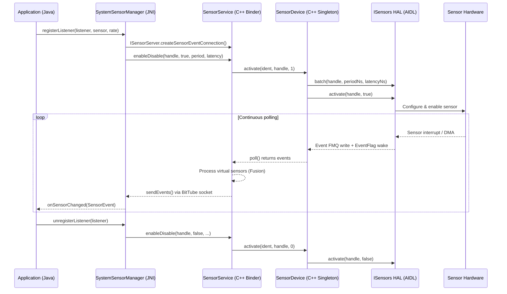
```mermaid
sequenceDiagram
    participant App as Application (Java)
    participant SM as SystemSensorManager (JNI)
    participant SS as SensorService (C++ Binder)
    participant SD as SensorDevice (C++ Singleton)
    participant HAL as ISensors HAL (AIDL)
    participant HW as Sensor Hardware

    App->>SM: registerListener(listener, sensor, rate)
    SM->>SS: ISensorServer.createSensorEventConnection()
    SM->>SS: enableDisable(handle, true, period, latency)
    SS->>SD: activate(ident, handle, 1)
    SD->>HAL: batch(handle, periodNs, latencyNs)
    SD->>HAL: activate(handle, true)
    HAL->>HW: Configure & enable sensor
    loop Continuous polling
        HW-->>HAL: Sensor interrupt / DMA
        HAL-->>SD: Event FMQ write + EventFlag wake
        SD-->>SS: poll() returns events
        SS-->>SS: Process virtual sensors (Fusion)
        SS-->>SM: sendEvents() via BitTube socket
        SM-->>App: onSensorChanged(SensorEvent)
    end
    App->>SM: unregisterListener(listener)
    SM->>SS: enableDisable(handle, false, ...)
    SS->>SD: activate(ident, handle, 0)
    SD->>HAL: activate(handle, false)
```

### 17.1.3 Key Abstractions

| Concept | Class | File |
|---------|-------|------|
| Sensor metadata | `Sensor` / `SensorInfo` | `sensor/Sensor.h`, `SensorInfo.aidl` |
| Hardware sensor wrapper | `HardwareSensor` | `SensorInterface.h` |
| Virtual (fused) sensor | `VirtualSensor` | `SensorInterface.h` |
| Runtime sensor | `RuntimeSensor` | `SensorInterface.h` |
| Per-client connection | `SensorEventConnection` | `SensorEventConnection.h` |
| Direct-channel connection | `SensorDirectConnection` | `SensorDirectConnection.h` |
| HAL abstraction | `ISensorHalWrapper` | `ISensorHalWrapper.h` |
| AIDL HAL wrapper | `AidlSensorHalWrapper` | `AidlSensorHalWrapper.h` |
| Sensor fusion | `SensorFusion` / `Fusion` | `SensorFusion.h`, `Fusion.h` |
| HAL device singleton | `SensorDevice` | `SensorDevice.h` |

### 17.1.4 Component Diagram

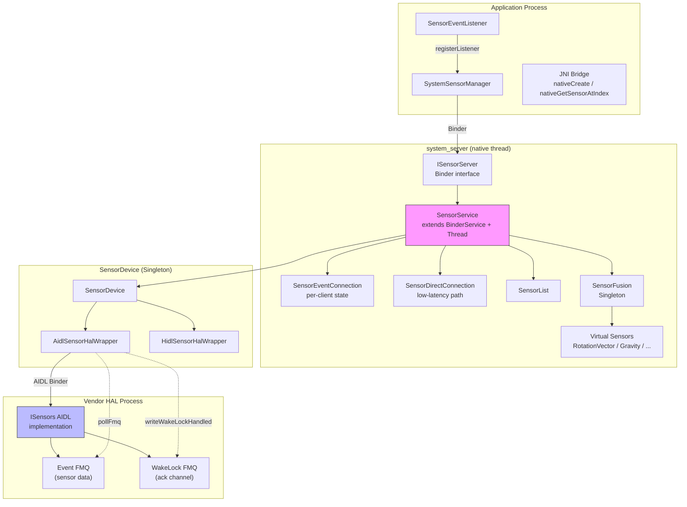
```mermaid
graph TB
    subgraph "Application Process"
        APP[SensorEventListener]
        SM[SystemSensorManager]
        JNI["JNI Bridge<br/>nativeCreate / nativeGetSensorAtIndex"]
    end

    subgraph "system_server (native thread)"
        ISS["ISensorServer<br/>Binder interface"]
        SS["SensorService<br/>extends BinderService + Thread"]
        SEC["SensorEventConnection<br/>per-client state"]
        SDC["SensorDirectConnection<br/>low-latency path"]
        SL[SensorList]
        SF["SensorFusion<br/>Singleton"]
        VS["Virtual Sensors<br/>RotationVector / Gravity / ..."]
    end

    subgraph "SensorDevice (Singleton)"
        SD[SensorDevice]
        AW[AidlSensorHalWrapper]
        HW[HidlSensorHalWrapper]
    end

    subgraph "Vendor HAL Process"
        HAL["ISensors AIDL<br/>implementation"]
        FMQ_E["Event FMQ<br/>(sensor data)"]
        FMQ_W["WakeLock FMQ<br/>(ack channel)"]
    end

    APP -->|registerListener| SM
    SM -->|Binder| ISS
    ISS --> SS
    SS --> SEC
    SS --> SDC
    SS --> SL
    SS --> SF
    SF --> VS
    SS --> SD
    SD --> AW
    SD --> HW
    AW -->|AIDL Binder| HAL
    HAL --> FMQ_E
    HAL --> FMQ_W
    AW -.->|pollFmq| FMQ_E
    AW -.->|writeWakeLockHandled| FMQ_W

    style SS fill:#f9f,stroke:#333
    style HAL fill:#bbf,stroke:#333
```

---

## 17.2 SensorService -- The Native System Service

`SensorService` is the heart of the sensor subsystem.  It is both a
`BinderService` (so it publishes itself to `servicemanager` as `"sensorservice"`)
and a `Thread` (so it has its own polling loop).

```
Source file: frameworks/native/services/sensorservice/SensorService.cpp
Header:      frameworks/native/services/sensorservice/SensorService.h
Entry point: frameworks/native/services/sensorservice/main_sensorservice.cpp
```

### 17.2.1 Startup: `onFirstRef()`

When `SensorService` is first referenced (typically at system-server boot),
`onFirstRef()` performs the full initialisation sequence:

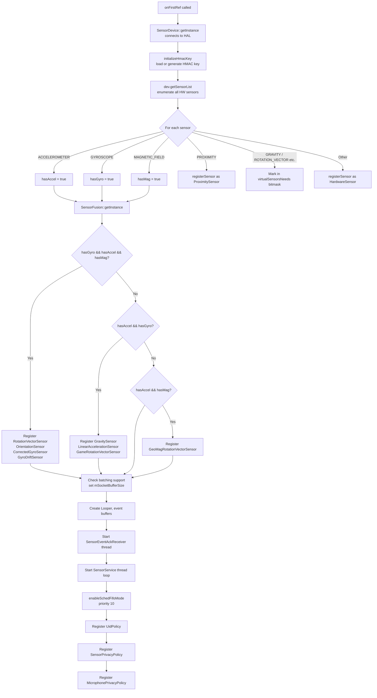
```mermaid
flowchart TD
    A[onFirstRef called] --> B["SensorDevice::getInstance<br/>connects to HAL"]
    B --> C["initializeHmacKey<br/>load or generate HMAC key"]
    C --> D["dev.getSensorList<br/>enumerate all HW sensors"]
    D --> E{For each sensor}
    E -->|ACCELEROMETER| F[hasAccel = true]
    E -->|GYROSCOPE| G[hasGyro = true]
    E -->|MAGNETIC_FIELD| H[hasMag = true]
    E -->|PROXIMITY| I[registerSensor as ProximitySensor]
    E -->|GRAVITY / ROTATION_VECTOR etc.| J[Mark in virtualSensorsNeeds bitmask]
    E -->|Other| K[registerSensor as HardwareSensor]
    F --> L[SensorFusion::getInstance]
    G --> L
    H --> L
    L --> M{hasGyro && hasAccel && hasMag?}
    M -->|Yes| N["Register RotationVectorSensor<br/>OrientationSensor<br/>CorrectedGyroSensor<br/>GyroDriftSensor"]
    M -->|No| O{hasAccel && hasGyro?}
    O -->|Yes| P["Register GravitySensor<br/>LinearAccelerationSensor<br/>GameRotationVectorSensor"]
    O -->|No| Q{hasAccel && hasMag?}
    Q -->|Yes| R[Register GeoMagRotationVectorSensor]
    N --> S["Check batching support<br/>set mSocketBufferSize"]
    P --> S
    Q --> S
    R --> S
    S --> T[Create Looper, event buffers]
    T --> U[Start SensorEventAckReceiver thread]
    U --> V[Start SensorService thread loop]
    V --> W["enableSchedFifoMode<br/>priority 10"]
    W --> X[Register UidPolicy]
    X --> Y[Register SensorPrivacyPolicy]
    Y --> Z[Register MicrophonePrivacyPolicy]
```

Key implementation details from the source:

**Sensor Registration.** Each hardware sensor from the HAL is wrapped in
a `HardwareSensor` object (except proximity, which uses `ProximitySensor`
for active-state tracking).  The call chain is:

```cpp
// SensorService.cpp onFirstRef(), line ~365
registerSensor(std::make_shared<HardwareSensor>(list[i]));
```

`registerSensor()` adds the sensor to the `SensorList` and creates a
`RecentEventLogger`:

```cpp
// SensorService.cpp, line ~538
bool SensorService::registerSensor(std::shared_ptr<SensorInterface> s,
                                   bool isDebug, bool isVirtual, int deviceId) {
    const int handle = s->getSensor().getHandle();
    const int type = s->getSensor().getType();
    if (mSensors.add(handle, std::move(s), isDebug, isVirtual, deviceId)) {
        mRecentEvent.emplace(handle, new SensorServiceUtil::RecentEventLogger(type));
        return true;
    } else {
        LOG_FATAL("Failed to register sensor with handle %d", handle);
        return false;
    }
}
```

**Virtual Sensor Gating.** The `virtualSensorsNeeds` bitmask tracks which
composite sensor types the HAL already provides.  If the HAL supplies
`SENSOR_TYPE_GRAVITY` natively (e.g. via a sensor hub), `SensorService` skips
registering its own `GravitySensor`.  The `IGNORE_HARDWARE_FUSION` compile-time
flag (default `false`) can force software fusion for all composite types.

**Socket Buffer Sizing.** If any sensor reports a non-zero `fifoMaxEventCount`,
the socket buffer is enlarged to `MAX_SOCKET_BUFFER_SIZE_BATCHED` (100 KB),
supporting batches of approximately 1,000 events per write.  The value is
clamped to the kernel's `wmem_max`.

### 17.2.2 The Main Thread Loop: `threadLoop()`

`SensorService` extends `Thread` and its `threadLoop()` is the critical
data path.  It runs at `SCHED_FIFO` priority 10 to minimise jitter.

```
Source: SensorService.cpp, line ~1125
```

The loop structure is:

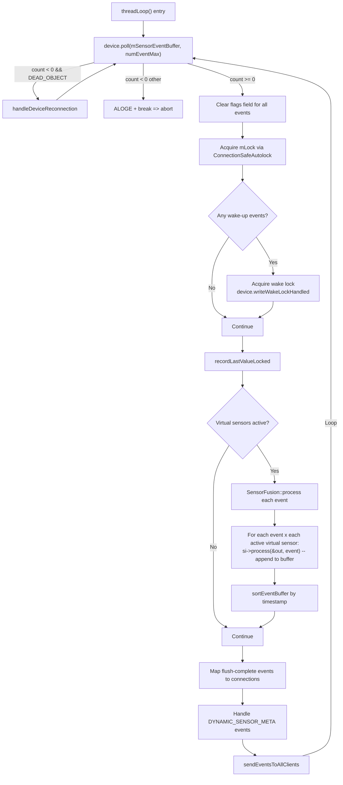
```mermaid
flowchart TD
    A["threadLoop() entry"] --> B["device.poll(mSensorEventBuffer, numEventMax)"]
    B -->|count < 0 && DEAD_OBJECT| C[handleDeviceReconnection]
    C --> B
    B -->|count < 0 other| D["ALOGE + break => abort"]
    B -->|count >= 0| E[Clear flags field for all events]
    E --> F[Acquire mLock via ConnectionSafeAutolock]
    F --> G{Any wake-up events?}
    G -->|Yes| H["Acquire wake lock<br/>device.writeWakeLockHandled"]
    G -->|No| I[Continue]
    H --> I
    I --> J[recordLastValueLocked]
    J --> K{Virtual sensors active?}
    K -->|Yes| L[SensorFusion::process each event]
    L --> M["For each event x each active virtual sensor:<br/>si->process(&out, event) -- append to buffer"]
    M --> N[sortEventBuffer by timestamp]
    K -->|No| O[Continue]
    N --> O
    O --> P[Map flush-complete events to connections]
    P --> Q[Handle DYNAMIC_SENSOR_META events]
    Q --> R[sendEventsToAllClients]
    R -->|Loop| B
```

**Virtual Sensor Processing.** For each raw hardware event, every active
virtual sensor's `process()` method is called.  If it produces an output
event, that event is appended to the buffer.  The buffer size is calculated
as `MAX_RECEIVE_BUFFER_EVENT_COUNT / (1 + virtualSensorCount)` to guarantee
space for the worst case where every virtual sensor fires on every input
event.

**Wake Lock Protocol.** When `poll()` returns events from wake-up sensors,
`SensorService` acquires the `"SensorService_wakelock"` partial wake lock.
It is held until all `SensorEventConnection` instances have acknowledged
receipt (via the `SensorEventAckReceiver` thread).  A 5-second timeout on
the `Looper` prevents permanent wake-lock leaks.

### 17.2.3 Event Dispatch: `sendEventsToAllClients()`

```cpp
// SensorService.cpp, line ~1063
void SensorService::sendEventsToAllClients(
    const std::vector<sp<SensorEventConnection>>& activeConnections,
    ssize_t count) {
   bool needsWakeLock = false;
   for (const sp<SensorEventConnection>& connection : activeConnections) {
       connection->sendEvents(mSensorEventBuffer, count, mSensorEventScratch,
                              mMapFlushEventsToConnections);
       needsWakeLock |= connection->needsWakeLock();
       if (connection->hasOneShotSensors()) {
           cleanupAutoDisabledSensorLocked(connection, mSensorEventBuffer, count);
       }
   }
   if (mWakeLockAcquired && !needsWakeLock) {
        setWakeLockAcquiredLocked(false);
   }
}
```

Each `SensorEventConnection` filters the global buffer down to only the
sensors it has registered for, then writes to its `BitTube` socket.  The
`mSensorEventScratch` buffer is used as temporary storage during filtering.

### 17.2.4 SensorEventConnection -- Per-Client State

Each client that calls `SensorManager.registerListener()` in Java gets a
corresponding `SensorEventConnection` in native code.

```
Source: frameworks/native/services/sensorservice/SensorEventConnection.h
```

Key fields:

| Field | Purpose |
|-------|---------|
| `mChannel` (`BitTube`) | Unix socket pair for event delivery |
| `mSensorInfo` | Map of sensor handle to `FlushInfo` |
| `mEventCache` | Buffer for events when socket is full |
| `mWakeLockRefCount` | Number of unacknowledged wake-up events |
| `mUid` | UID of the owning application |
| `mTargetSdk` | Used for rate-capping policy |

The `sendEvents()` method is the hot path.  It:

1. Filters the global event buffer to this connection's registered sensors.
2. Prepends any pending flush-complete events.
3. Marks exactly one wake-up event per packet with `WAKE_UP_SENSOR_EVENT_NEEDS_ACK`.
4. Writes to the `BitTube` via `SOCK_SEQPACKET`.
5. If the write fails (socket full), caches events for later delivery.

### 17.2.5 SensorDirectConnection -- Low-Latency Path

For latency-critical applications (games, VR), `SensorDirectConnection`
bypasses the `BitTube` socket entirely.  Events are written directly into
a shared memory region (ashmem or gralloc) by the HAL.

```
Source: frameworks/native/services/sensorservice/SensorDirectConnection.h
```

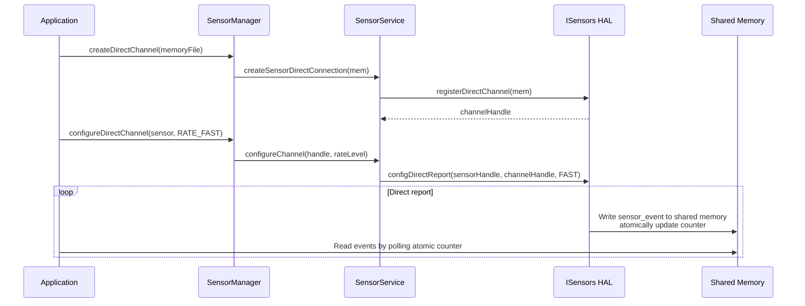
```mermaid
sequenceDiagram
    participant App as Application
    participant SM as SensorManager
    participant SS as SensorService
    participant HAL as ISensors HAL
    participant SHM as Shared Memory

    App->>SM: createDirectChannel(memoryFile)
    SM->>SS: createSensorDirectConnection(mem)
    SS->>HAL: registerDirectChannel(mem)
    HAL-->>SS: channelHandle
    App->>SM: configureDirectChannel(sensor, RATE_FAST)
    SM->>SS: configureChannel(handle, rateLevel)
    SS->>HAL: configDirectReport(sensorHandle, channelHandle, FAST)
    loop Direct report
        HAL->>SHM: Write sensor_event to shared memory<br/>atomically update counter
        App->>SHM: Read events by polling atomic counter
    end
```

Direct channel events use a fixed 104-byte format (`DIRECT_REPORT_SENSOR_EVENT_TOTAL_LENGTH`)
with an atomic counter that the app polls to detect new data.  This avoids
system call overhead entirely once the channel is configured.

### 17.2.6 Operating Modes

`SensorService` supports five operating modes, controlled via `dumpsys`:

| Mode | Value | Purpose |
|------|-------|---------|
| `NORMAL` | 0 | Standard operation |
| `DATA_INJECTION` | 1 | Accept injected data for testing algorithms |
| `RESTRICTED` | 2 | Only allow-listed packages can use sensors (CTS) |
| `REPLAY_DATA_INJECTION` | 3 | Injected data delivered to all apps |
| `HAL_BYPASS_REPLAY_DATA_INJECTION` | 4 | Injected data buffered in SensorDevice |

Mode switching is done via:
```shell
# Enter RESTRICTED mode (CTS testing)
adb shell dumpsys sensorservice restrict .cts.

# Enter DATA_INJECTION mode
adb shell dumpsys sensorservice data_injection .xts.

# Return to NORMAL
adb shell dumpsys sensorservice enable
```

### 17.2.7 Sensor Privacy and UID Policy

`SensorService` enforces two orthogonal access-control mechanisms:

**UID Policy** (`UidPolicy`): Tracks whether each UID is in `ACTIVE` or
`IDLE` state via `IUidObserver`.  Idle UIDs (background apps) do not receive
sensor events.  When a UID transitions to active, event delivery resumes
transparently.

**Sensor Privacy** (`SensorPrivacyPolicy`): A system-wide toggle that
disables all sensors for all apps.  When enabled, all direct connections are
stopped, all sensor subscriptions are paused, and new registrations are
rejected.  A separate `MicrophonePrivacyPolicy` handles the microphone
toggle, which rate-caps motion sensors to 200 Hz (5 ms period) to prevent
acoustic side-channel attacks.

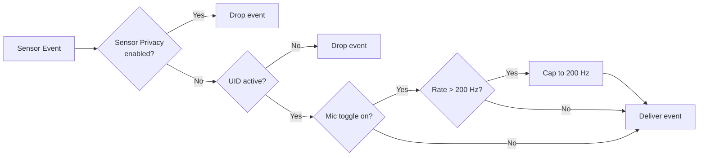
```mermaid
flowchart LR
    A[Sensor Event] --> B{"Sensor Privacy<br/>enabled?"}
    B -->|Yes| C[Drop event]
    B -->|No| D{UID active?}
    D -->|No| E[Drop event]
    D -->|Yes| F{Mic toggle on?}
    F -->|Yes| G{Rate > 200 Hz?}
    G -->|Yes| H[Cap to 200 Hz]
    G -->|No| I[Deliver event]
    F -->|No| I
    H --> I
```

### 17.2.8 Rate Capping for Privacy

Apps targeting Android S+ that lack the `HIGH_SAMPLING_RATE_SENSORS`
permission are capped at 200 Hz (`SENSOR_SERVICE_CAPPED_SAMPLING_PERIOD_NS`
= 5,000,000 ns).  For direct channels, the cap is `SENSOR_DIRECT_RATE_NORMAL`
(up to 110 Hz).

```
Source: SensorService.h, lines ~67-74
#define SENSOR_SERVICE_CAPPED_SAMPLING_PERIOD_NS (5 * 1000 * 1000)
#define SENSOR_SERVICE_CAPPED_SAMPLING_RATE_LEVEL SENSOR_DIRECT_RATE_NORMAL
```

---

## 17.3 Sensor HAL -- The Vendor Interface

### 17.3.1 ISensors AIDL Interface

Modern devices implement the AIDL Sensors HAL, defined in:

```
hardware/interfaces/sensors/aidl/android/hardware/sensors/ISensors.aidl
```

The interface exposes these core operations:

| Method | Purpose |
|--------|---------|
| `getSensorsList()` | Enumerate all static sensors |
| `initialize(eventQueueDescriptor, wakeLockDescriptor, callback)` | Set up FMQs and callback |
| `activate(sensorHandle, enabled)` | Enable/disable a sensor |
| `batch(sensorHandle, samplingPeriodNs, maxReportLatencyNs)` | Configure rate and batching |
| `flush(sensorHandle)` | Trigger FIFO flush |
| `injectSensorData(event)` | Inject data for testing |
| `registerDirectChannel(mem)` | Register shared-memory channel |
| `unregisterDirectChannel(channelHandle)` | Unregister channel |
| `configDirectReport(sensorHandle, channelHandle, rate)` | Configure direct report |
| `setOperationMode(mode)` | Switch NORMAL / DATA_INJECTION |

### 17.3.2 Fast Message Queues (FMQ)

The AIDL HAL uses two FMQs (Fast Message Queues) for zero-copy,
lock-free data transfer:

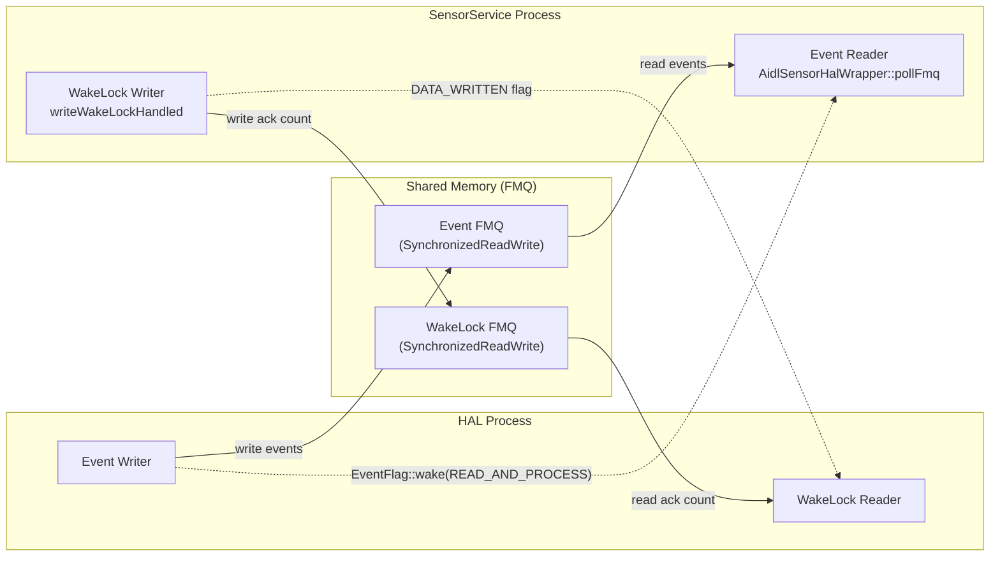
```mermaid
graph LR
    subgraph "HAL Process"
        EW[Event Writer]
        WLR[WakeLock Reader]
    end

    subgraph "Shared Memory (FMQ)"
        EQ["Event FMQ<br/>(SynchronizedReadWrite)"]
        WQ["WakeLock FMQ<br/>(SynchronizedReadWrite)"]
    end

    subgraph "SensorService Process"
        ER["Event Reader<br/>AidlSensorHalWrapper::pollFmq"]
        WLW["WakeLock Writer<br/>writeWakeLockHandled"]
    end

    EW -->|"write events"| EQ
    EQ -->|"read events"| ER
    WLW -->|"write ack count"| WQ
    WQ -->|"read ack count"| WLR

    EW -.->|"EventFlag::wake(READ_AND_PROCESS)"| ER
    WLW -.->|"DATA_WRITTEN flag"| WLR
```

**Event FMQ**: The HAL writes `Event` objects (sensor data) to this queue.
After writing, it wakes the framework using `EventFlag::wake()` with
`EVENT_QUEUE_FLAG_BITS_READ_AND_PROCESS`.

**Wake Lock FMQ**: The framework writes acknowledgement counts for wake-up
events.  The HAL reads these to determine when it is safe to release its
`"SensorsHAL_WAKEUP"` wake lock.  A timeout of `WAKE_LOCK_TIMEOUT_SECONDS`
(1 second) prevents wake-lock leaks if the framework is unresponsive.

### 17.3.3 SensorInfo -- Describing a Sensor

Every sensor is described by a `SensorInfo` parcelable:

```
Source: hardware/interfaces/sensors/aidl/android/hardware/sensors/SensorInfo.aidl
```

| Field | Type | Description |
|-------|------|-------------|
| `sensorHandle` | `int` | Unique identifier for this sensor |
| `name` | `String` | Human-readable name |
| `vendor` | `String` | Hardware vendor |
| `version` | `int` | Driver + HW version |
| `type` | `SensorType` | Sensor type enum |
| `typeAsString` | `String` | OEM type identifier (e.g. `com.google.glass.onheaddetector`) |
| `maxRange` | `float` | Maximum value in SI units |
| `resolution` | `float` | Smallest detectable change |
| `power` | `float` | Power consumption in mA |
| `minDelayUs` | `int` | Minimum sample period (continuous) or 0/-1 |
| `fifoReservedEventCount` | `int` | Guaranteed FIFO slots for this sensor |
| `fifoMaxEventCount` | `int` | Maximum FIFO slots (may be shared) |
| `requiredPermission` | `String` | Permission required to access |
| `maxDelayUs` | `int` | Maximum sample period |
| `flags` | `int` | Bitmask of `SENSOR_FLAG_BITS_*` |

The `flags` field encodes:

| Flag | Bit(s) | Meaning |
|------|--------|---------|
| `WAKE_UP` | 0 | Sensor wakes AP from suspend |
| `CONTINUOUS_MODE` | 1-3 = 0 | Reports at fixed rate |
| `ON_CHANGE_MODE` | 1-3 = 2 | Reports only when value changes |
| `ONE_SHOT_MODE` | 1-3 = 4 | Fires once then auto-disables |
| `SPECIAL_REPORTING_MODE` | 1-3 = 6 | Custom reporting logic |
| `DATA_INJECTION` | 4 | Supports data injection mode |
| `DYNAMIC_SENSOR` | 5 | Sensor was dynamically connected |
| `ADDITIONAL_INFO` | 6 | Supports additional info frames |
| `DIRECT_CHANNEL_ASHMEM` | 10 | Supports ashmem direct channel |
| `DIRECT_CHANNEL_GRALLOC` | 11 | Supports gralloc direct channel |
| `DIRECT_REPORT` | 7-9 | Maximum direct report rate level |

### 17.3.4 SensorDevice -- The Framework-Side HAL Proxy

`SensorDevice` is a `Singleton` that wraps the HAL connection and manages
per-sensor activation state.

```
Source: frameworks/native/services/sensorservice/SensorDevice.h
        frameworks/native/services/sensorservice/SensorDevice.cpp
```

It maintains an `Info` structure per sensor handle:

```cpp
struct Info {
    BatchParams bestBatchParams;
    KeyedVector<void*, BatchParams> batchParams;  // per-client params
    bool isActive = false;
};
```

When multiple clients request different rates for the same sensor,
`selectBatchParams()` computes the optimal parameters:

- **Sampling period**: minimum of all client requests.
- **Batch latency**: minimum of all client batch latencies, considering
  that the apparent batch period is `max(mTBatch, mTSample)`.

This ensures the fastest-polling client gets its requested rate while
batch-mode clients still receive data.

### 17.3.5 AIDL vs. HIDL Wrappers

`SensorDevice` uses an `ISensorHalWrapper` abstraction to support both
AIDL and HIDL HALs:

```
ISensorHalWrapper (abstract)
  |-- AidlSensorHalWrapper  (AIDL ISensors via FMQ)
  |-- HidlSensorHalWrapper  (HIDL ISensors 1.0/2.0/2.1)
```

The AIDL wrapper (`AidlSensorHalWrapper`) uses FMQ for event transport.
Its `pollFmq()` method blocks on the `EventFlag` until the HAL signals
new data, then copies events from the FMQ into the caller's buffer.

The HIDL wrapper uses the legacy `poll()` mechanism with a blocking HAL
call.

```
Source: frameworks/native/services/sensorservice/AidlSensorHalWrapper.h
        frameworks/native/services/sensorservice/HidlSensorHalWrapper.h
```

### 17.3.6 Dynamic Sensors

Dynamic sensors are sensors that can be connected and disconnected at
runtime -- for example, a Bluetooth heart-rate monitor or a USB sensor
module.

```
Source: hardware/interfaces/sensors/aidl/android/hardware/sensors/ISensorsCallback.aidl
```

The HAL notifies the framework of dynamic sensor changes via the
`ISensorsCallback` interface:

```aidl
interface ISensorsCallback {
    void onDynamicSensorsConnected(in SensorInfo[] sensorInfos);
    void onDynamicSensorsDisconnected(in int[] sensorHandles);
}
```

On the framework side, `SensorService::threadLoop()` watches for
`SENSOR_TYPE_DYNAMIC_SENSOR_META` events in the poll buffer:

```cpp
if (mSensorEventBuffer[i].type == SENSOR_TYPE_DYNAMIC_SENSOR_META) {
    if (mSensorEventBuffer[i].dynamic_sensor_meta.connected) {
        // Register new dynamic sensor
        auto si = std::make_shared<HardwareSensor>(s, uuid);
        device.handleDynamicSensorConnection(handle, true);
        registerDynamicSensorLocked(std::move(si));
    } else {
        // Disconnect and notify clients
        disconnectDynamicSensor(handle, activeConnections);
    }
}
```

Dynamic sensor handles are generated from a dedicated range and must never
collide with static sensor handles:

```
DYNAMIC_SENSOR_MASK flag set in sensor_t.flags
Handle must be unique until reboot
```

### 17.3.7 Direct Channels

Direct channels provide the lowest-latency path for sensor data by
bypassing `SensorService`'s event loop entirely.

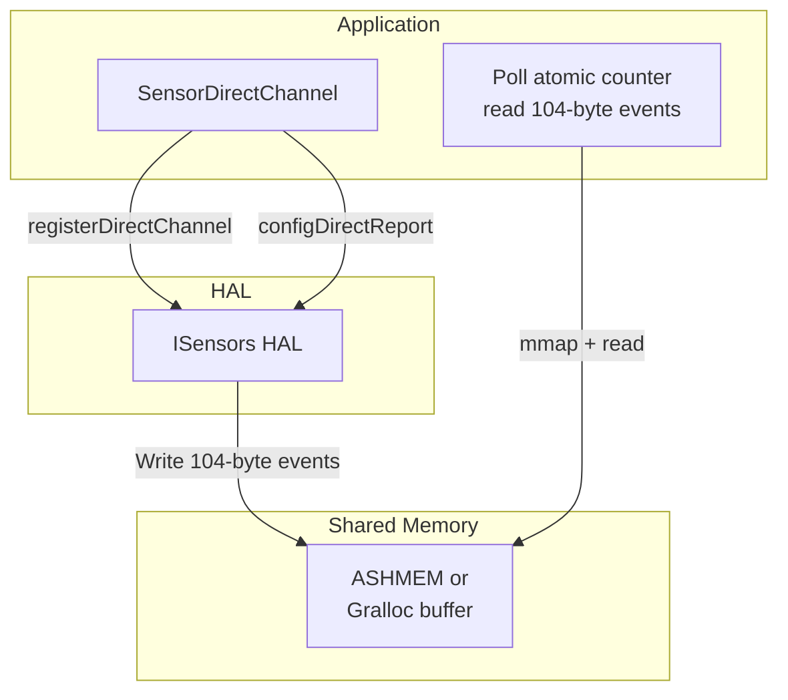
```mermaid
graph TB
    subgraph "Shared Memory"
        SM["ASHMEM or<br/>Gralloc buffer"]
    end

    subgraph "HAL"
        ISH[ISensors HAL]
    end

    subgraph "Application"
        DC[SensorDirectChannel]
        POLL["Poll atomic counter<br/>read 104-byte events"]
    end

    ISH -->|"Write 104-byte events"| SM
    DC -->|"registerDirectChannel"| ISH
    DC -->|"configDirectReport"| ISH
    POLL -->|"mmap + read"| SM
```

Each direct channel event has the following 104-byte layout:

| Offset | Type | Field |
|--------|------|-------|
| 0x00 | `int32_t` | Size (always 104) |
| 0x04 | `int32_t` | Sensor report token |
| 0x08 | `int32_t` | Sensor type |
| 0x0C | `uint32_t` | Atomic counter |
| 0x10 | `int64_t` | Timestamp |
| 0x18 | `float[16]` | Sensor data |
| 0x58 | `int32_t[4]` | Reserved (zero) |

Rate levels for direct channels:

| Level | Enum | Nominal Rate | Allowed Range |
|-------|------|-------------|---------------|
| `STOP` | 0 | 0 Hz | -- |
| `NORMAL` | 1 | ~50 Hz | 28--110 Hz |
| `FAST` | 2 | ~200 Hz | 110--440 Hz |
| `VERY_FAST` | 3 | ~800 Hz | 440--1760 Hz |

### 17.3.8 Sensor Multi-HAL

For devices with sensors from multiple vendors (e.g. a main sensor hub
plus a separate barometer chip), AOSP provides the **Sensors Multi-HAL**
framework:

```
Source: hardware/interfaces/sensors/aidl/default/multihal/
        hardware/interfaces/sensors/common/default/2.X/multihal/
```

The Multi-HAL acts as a proxy that aggregates multiple sub-HALs behind a
single `ISensors` interface.  It:

1. Discovers and loads sub-HAL shared libraries.
2. Merges sensor lists, ensuring handle uniqueness.
3. Routes `activate`/`batch`/`flush` calls to the appropriate sub-HAL.
4. Multiplexes events from all sub-HALs onto a single FMQ.

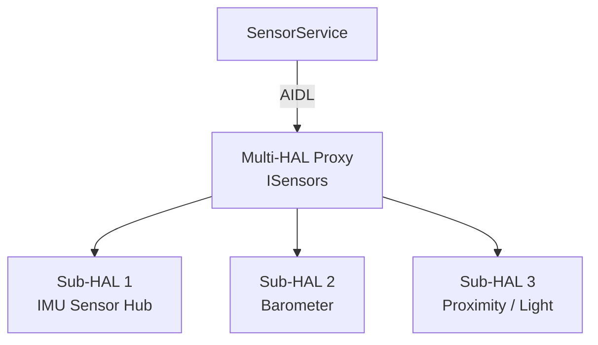
```mermaid
graph TB
    SF[SensorService]
    MH["Multi-HAL Proxy<br/>ISensors"]
    SH1["Sub-HAL 1<br/>IMU Sensor Hub"]
    SH2["Sub-HAL 2<br/>Barometer"]
    SH3["Sub-HAL 3<br/>Proximity / Light"]

    SF -->|AIDL| MH
    MH --> SH1
    MH --> SH2
    MH --> SH3
```

---

## 17.4 Sensor Fusion

Sensor fusion combines raw data from multiple physical sensors to produce
higher-quality composite measurements.  AOSP implements fusion in software
as a fallback for HALs that do not natively provide composite sensor types.

### 17.4.1 SensorFusion Singleton

```
Source: frameworks/native/services/sensorservice/SensorFusion.h
        frameworks/native/services/sensorservice/SensorFusion.cpp
```

`SensorFusion` is a process-wide `Singleton` that owns three `Fusion`
instances:

| Mode | Enum | Inputs | Output |
|------|------|--------|--------|
| 9-axis | `FUSION_9AXIS` | Accelerometer + Gyroscope + Magnetometer | Full rotation vector |
| No-mag | `FUSION_NOMAG` | Accelerometer + Gyroscope | Game rotation vector (no heading) |
| No-gyro | `FUSION_NOGYRO` | Accelerometer + Magnetometer | Geomagnetic rotation vector |

The constructor selects hardware sensors:

```cpp
// SensorFusion.cpp, constructor
// Only use non-wakeup sensors, and always pick the first one
if (list[i].type == SENSOR_TYPE_ACCELEROMETER) mAcc = Sensor(list + i);
if (list[i].type == SENSOR_TYPE_MAGNETIC_FIELD) mMag = Sensor(list + i);
if (list[i].type == SENSOR_TYPE_GYROSCOPE) mGyro = Sensor(list + i);
if (list[i].type == SENSOR_TYPE_GYROSCOPE_UNCALIBRATED)
    uncalibratedGyro = Sensor(list + i);

// Prefer uncalibrated gyroscope for fusion
if (uncalibratedGyro.getType() == SENSOR_TYPE_GYROSCOPE_UNCALIBRATED)
    mGyro = uncalibratedGyro;
```

The fusion rate defaults to 200 Hz and is configurable via the system
property `sensors.aosp_low_power_sensor_fusion.maximum_rate` (wearables
typically use 100 Hz to save power).

### 17.4.2 The Fusion Algorithm (Extended Kalman Filter)

The core algorithm lives in `Fusion.cpp`:

```
Source: frameworks/native/services/sensorservice/Fusion.h
        frameworks/native/services/sensorservice/Fusion.cpp
```

It implements an **Extended Kalman Filter (EKF)** with:

- **State vector**: Modified Rodrigues parameters (orientation quaternion `x0`)
  and estimated gyro bias (`x1`).
- **Prediction step** (`handleGyro`): Integrates gyroscope data to predict
  the next orientation.
- **Correction step** (`handleAcc`, `handleMag`): Uses accelerometer and
  magnetometer measurements to correct drift.

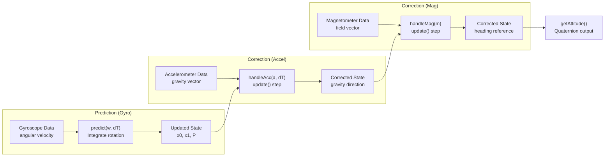
```mermaid
flowchart LR
    subgraph "Prediction (Gyro)"
        G["Gyroscope Data<br/>angular velocity"] --> P["predict(w, dT)<br/>Integrate rotation"]
        P --> S1["Updated State<br/>x0, x1, P"]
    end

    subgraph "Correction (Accel)"
        A["Accelerometer Data<br/>gravity vector"] --> UA["handleAcc(a, dT)<br/>update() step"]
        UA --> S2["Corrected State<br/>gravity direction"]
    end

    subgraph "Correction (Mag)"
        M["Magnetometer Data<br/>field vector"] --> UM["handleMag(m)<br/>update() step"]
        UM --> S3["Corrected State<br/>heading reference"]
    end

    S1 --> UA
    S2 --> UM
    S3 --> OUT["getAttitude()<br/>Quaternion output"]
```

The filter parameters are:

```cpp
// Fusion.cpp
static const float DEFAULT_GYRO_VAR = 1e-7;       // (rad/s)^2 / Hz
static const float DEFAULT_GYRO_BIAS_VAR = 1e-12;  // (rad/s)^2 / s
static const float DEFAULT_ACC_STDEV  = 0.015f;    // m/s^2
static const float DEFAULT_MAG_STDEV  = 0.1f;      // uT

// Geomagnetic (no-gyro) mode uses relaxed parameters
static const float GEOMAG_GYRO_VAR = 1e-4;
static const float GEOMAG_ACC_STDEV  = 0.05f;
```

Safety guards:

- **Free-fall detection**: Accelerometer updates are skipped when
  `|a| < 0.1 * NOMINAL_GRAVITY` to avoid division by zero.
- **Magnetic field validation**: Updates are rejected when the field
  magnitude is outside [10, 100] uT, indicating local magnetic disturbance.
- **Gyro rate estimation**: A low-pass filter (`alpha = 1 / (1 + dT)`)
  tracks the actual gyro sampling rate for diagnostics.

### 17.4.3 Virtual Sensor Implementations

Each virtual sensor wraps `SensorFusion` and transforms the quaternion
output into the format expected by the sensor type.

**RotationVectorSensor** (9-axis fusion):

```
Source: frameworks/native/services/sensorservice/RotationVectorSensor.h
```

Produces a quaternion `[x, y, z, w]` with estimated heading accuracy.
Uses `FUSION_9AXIS` mode (accelerometer + gyroscope + magnetometer).

**GameRotationVectorSensor** (no-mag fusion):

Identical to `RotationVectorSensor` but uses `FUSION_NOMAG` mode.  The
result has no absolute heading reference but is immune to magnetic
disturbances, making it ideal for gaming.

**GeoMagRotationVectorSensor** (no-gyro fusion):

Uses `FUSION_NOGYRO` mode.  Lower quality but lower power, suitable for
devices without a gyroscope.

**GravitySensor**:

```
Source: frameworks/native/services/sensorservice/GravitySensor.h
```

Extracts the gravity component from the fusion output.  Uses the rotation
matrix to determine the direction of gravity in device coordinates.

**LinearAccelerationSensor**:

```
Source: frameworks/native/services/sensorservice/LinearAccelerationSensor.h
```

Computes `linear_acceleration = raw_acceleration - gravity` by delegating
to `GravitySensor` internally.

**CorrectedGyroSensor**:

Applies the estimated gyro bias from fusion to produce a drift-corrected
gyroscope output (registered as a debug sensor).

**OrientationSensor**:

Converts the rotation vector to Euler angles (azimuth, pitch, roll).

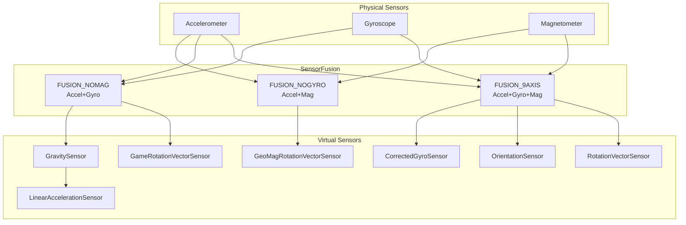
```mermaid
graph TB
    subgraph "Physical Sensors"
        ACC[Accelerometer]
        GYRO[Gyroscope]
        MAG[Magnetometer]
    end

    subgraph "SensorFusion"
        F9["FUSION_9AXIS<br/>Accel+Gyro+Mag"]
        FNM["FUSION_NOMAG<br/>Accel+Gyro"]
        FNG["FUSION_NOGYRO<br/>Accel+Mag"]
    end

    subgraph "Virtual Sensors"
        RV[RotationVectorSensor]
        GRV[GameRotationVectorSensor]
        GMRV[GeoMagRotationVectorSensor]
        GS[GravitySensor]
        LA[LinearAccelerationSensor]
        OS[OrientationSensor]
        CG[CorrectedGyroSensor]
    end

    ACC --> F9
    GYRO --> F9
    MAG --> F9

    ACC --> FNM
    GYRO --> FNM

    ACC --> FNG
    MAG --> FNG

    F9 --> RV
    F9 --> OS
    F9 --> CG
    FNM --> GRV
    FNM --> GS
    GS --> LA
    FNG --> GMRV
```

---

## 17.5 Sensor Types Catalog

The full set of `SensorType` values is defined in:

```
Source: hardware/interfaces/sensors/aidl/android/hardware/sensors/SensorType.aidl
```

### 17.5.1 Motion Sensors

| Type | ID | Reporting Mode | Units | Description |
|------|----|---------------|-------|-------------|
| `ACCELEROMETER` | 1 | Continuous | m/s^2 | Measures acceleration minus gravity on X, Y, Z axes |
| `ACCELEROMETER_UNCALIBRATED` | 35 | Continuous | m/s^2 | Raw acceleration with bias reported separately |
| `GYROSCOPE` | 4 | Continuous | rad/s | Angular velocity around X, Y, Z axes |
| `GYROSCOPE_UNCALIBRATED` | 16 | Continuous | rad/s | Raw angular velocity with drift reported separately |
| `ACCELEROMETER_LIMITED_AXES` | 38 | Continuous | m/s^2 | Accelerometer supporting fewer than 3 axes (automotive) |
| `GYROSCOPE_LIMITED_AXES` | 39 | Continuous | rad/s | Gyroscope supporting fewer than 3 axes (automotive) |
| `ACCELEROMETER_LIMITED_AXES_UNCALIBRATED` | 40 | Continuous | m/s^2 | Uncalibrated limited-axes accelerometer |
| `GYROSCOPE_LIMITED_AXES_UNCALIBRATED` | 41 | Continuous | rad/s | Uncalibrated limited-axes gyroscope |
| `SIGNIFICANT_MOTION` | 17 | One-shot | 1.0 | Triggers once on significant motion, then auto-disables |
| `STEP_DETECTOR` | 18 | Special | 1.0 | Triggers for each step taken |
| `STEP_COUNTER` | 19 | On-change | count | Cumulative step count since last reboot |
| `MOTION_DETECT` | 30 | One-shot | 1.0 | Triggers when device is in motion |
| `STATIONARY_DETECT` | 29 | One-shot | 1.0 | Triggers when device is stationary |

### 17.5.2 Position / Orientation Sensors

| Type | ID | Reporting Mode | Units | Description |
|------|----|---------------|-------|-------------|
| `MAGNETIC_FIELD` | 2 | Continuous | uT | Geomagnetic field on X, Y, Z axes |
| `MAGNETIC_FIELD_UNCALIBRATED` | 14 | Continuous | uT | Raw magnetic field with hard-iron bias |
| `ORIENTATION` | 3 | Continuous | degrees | Azimuth, pitch, roll (deprecated, use rotation vector) |
| `ROTATION_VECTOR` | 11 | Continuous | quaternion | Device orientation relative to East-North-Up frame |
| `GAME_ROTATION_VECTOR` | 15 | Continuous | quaternion | Like rotation vector but without magnetometer |
| `GEOMAGNETIC_ROTATION_VECTOR` | 20 | Continuous | quaternion | Like rotation vector but without gyroscope |
| `GRAVITY` | 9 | Continuous | m/s^2 | Direction and magnitude of gravity |
| `LINEAR_ACCELERATION` | 10 | Continuous | m/s^2 | Acceleration without gravity component |
| `POSE_6DOF` | 28 | Continuous | matrix | Full 6-DOF pose (position + orientation) |
| `DEVICE_ORIENTATION` | 27 | On-change | 0-3 | Device orientation in 90-degree increments |
| `HEADING` | 42 | Continuous | degrees | Direction relative to true north (automotive) |

### 17.5.3 Environment Sensors

| Type | ID | Reporting Mode | Units | Description |
|------|----|---------------|-------|-------------|
| `LIGHT` | 5 | On-change | lux | Ambient light level |
| `PRESSURE` | 6 | Continuous | hPa | Atmospheric pressure (barometer) |
| `PROXIMITY` | 8 | On-change | cm | Distance to nearest object |
| `RELATIVE_HUMIDITY` | 12 | On-change | % | Ambient relative humidity |
| `AMBIENT_TEMPERATURE` | 13 | On-change | degC | Ambient room temperature |
| `MOISTURE_INTRUSION` | 43 | On-change | 0/1 | Persistent moisture detection in chassis |

### 17.5.4 Body Sensors

| Type | ID | Reporting Mode | Units | Description |
|------|----|---------------|-------|-------------|
| `HEART_RATE` | 21 | On-change | bpm | Current heart rate (requires permission) |
| `HEART_BEAT` | 31 | Continuous | confidence | QRS complex peak detection |
| `LOW_LATENCY_OFFBODY_DETECT` | 34 | On-change | 0/1 | Wearable on-body/off-body detection |

### 17.5.5 Gesture / Interaction Sensors

| Type | ID | Reporting Mode | Description |
|------|----|---------------|-------------|
| `TILT_DETECTOR` | 22 | Special | Triggers on 35-degree gravity change |
| `WAKE_GESTURE` | 23 | One-shot | Wake device on vendor-defined gesture |
| `GLANCE_GESTURE` | 24 | One-shot | Briefly turn on screen to show notifications |
| `PICK_UP_GESTURE` | 25 | One-shot | Device picked up from surface |
| `WRIST_TILT_GESTURE` | 26 | Special | Wrist tilt for wearables (always wake-up) |

### 17.5.6 Meta / System Sensors

| Type | ID | Description |
|------|----|-------------|
| `META_DATA` | 0 | Internal flush-complete signal |
| `DYNAMIC_SENSOR_META` | 32 | Dynamic sensor connect/disconnect notifications |
| `ADDITIONAL_INFO` | 33 | Out-of-band calibration and diagnostic data |

### 17.5.7 Head Tracker Sensor

| Type | ID | Reporting Mode | Description |
|------|----|---------------|-------------|
| `HEAD_TRACKER` | 37 | Continuous | Head orientation for spatial audio |

This type is discussed in detail in Section 50.8.

### 17.5.8 Reporting Modes

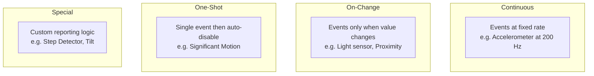
```mermaid
graph TB
    subgraph "Continuous"
        C["Events at fixed rate<br/>e.g. Accelerometer at 200 Hz"]
    end

    subgraph "On-Change"
        OC["Events only when value changes<br/>e.g. Light sensor, Proximity"]
    end

    subgraph "One-Shot"
        OS["Single event then auto-disable<br/>e.g. Significant Motion"]
    end

    subgraph "Special"
        SP["Custom reporting logic<br/>e.g. Step Detector, Tilt"]
    end
```

---

## 17.6 SensorManager Java API

### 17.6.1 Class Hierarchy

```
Source: frameworks/base/core/java/android/hardware/SensorManager.java
        frameworks/base/core/java/android/hardware/SystemSensorManager.java
        frameworks/base/core/java/android/hardware/Sensor.java
        frameworks/base/core/java/android/hardware/SensorEvent.java
        frameworks/base/core/java/android/hardware/SensorEventListener.java
```

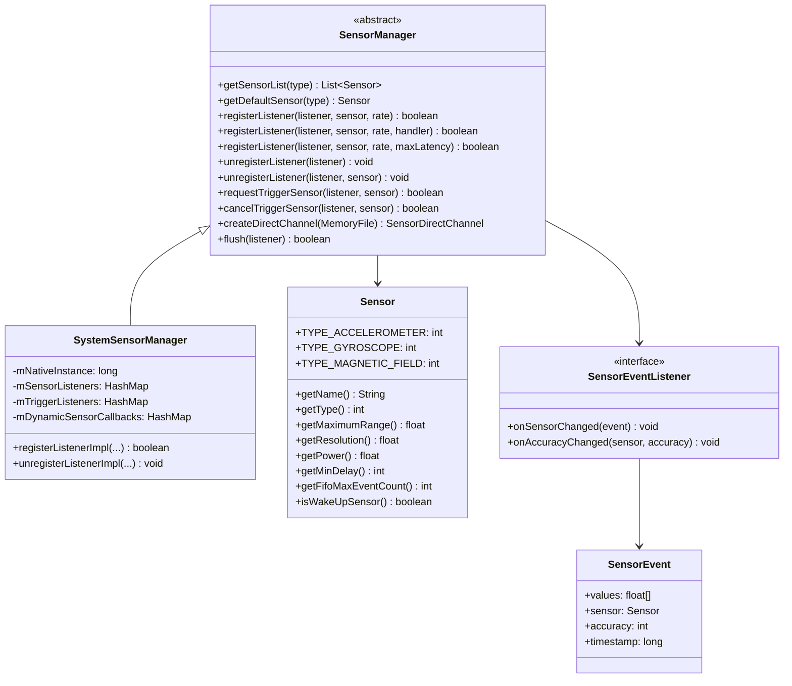
```mermaid
classDiagram
    class SensorManager {
        <<abstract>>
        +getSensorList(type) List~Sensor~
        +getDefaultSensor(type) Sensor
        +registerListener(listener, sensor, rate) boolean
        +registerListener(listener, sensor, rate, handler) boolean
        +registerListener(listener, sensor, rate, maxLatency) boolean
        +unregisterListener(listener) void
        +unregisterListener(listener, sensor) void
        +requestTriggerSensor(listener, sensor) boolean
        +cancelTriggerSensor(listener, sensor) boolean
        +createDirectChannel(MemoryFile) SensorDirectChannel
        +flush(listener) boolean
    }

    class SystemSensorManager {
        -mNativeInstance: long
        -mSensorListeners: HashMap
        -mTriggerListeners: HashMap
        -mDynamicSensorCallbacks: HashMap
        +registerListenerImpl(...) boolean
        +unregisterListenerImpl(...) void
    }

    class Sensor {
        +TYPE_ACCELEROMETER: int
        +TYPE_GYROSCOPE: int
        +TYPE_MAGNETIC_FIELD: int
        +getName() String
        +getType() int
        +getMaximumRange() float
        +getResolution() float
        +getPower() float
        +getMinDelay() int
        +getFifoMaxEventCount() int
        +isWakeUpSensor() boolean
    }

    class SensorEvent {
        +values: float[]
        +sensor: Sensor
        +accuracy: int
        +timestamp: long
    }

    class SensorEventListener {
        <<interface>>
        +onSensorChanged(event) void
        +onAccuracyChanged(sensor, accuracy) void
    }

    SensorManager <|-- SystemSensorManager
    SensorManager --> Sensor
    SensorManager --> SensorEventListener
    SensorEventListener --> SensorEvent
```

### 17.6.2 Registering a Listener

The standard usage pattern:

```java
SensorManager sensorManager = (SensorManager) getSystemService(SENSOR_SERVICE);
Sensor accelerometer = sensorManager.getDefaultSensor(Sensor.TYPE_ACCELEROMETER);

// Register with a specific rate
sensorManager.registerListener(this, accelerometer,
        SensorManager.SENSOR_DELAY_GAME);  // ~20ms period
```

The `samplingPeriodUs` parameter accepts predefined constants or a custom
microsecond value:

| Constant | Value | Approximate Rate |
|----------|-------|-----------------|
| `SENSOR_DELAY_FASTEST` | 0 | Maximum HW rate |
| `SENSOR_DELAY_GAME` | 20,000 us | 50 Hz |
| `SENSOR_DELAY_UI` | 60,000 us | 16 Hz |
| `SENSOR_DELAY_NORMAL` | 200,000 us | 5 Hz |

The overload with `maxReportLatencyUs` enables batching:

```java
// Register with batching: 50 Hz sampling, up to 5s of batching
sensorManager.registerListener(this, accelerometer,
        20_000,      // samplingPeriodUs = 20ms
        5_000_000);  // maxReportLatencyUs = 5 seconds
```

### 17.6.3 Event Delivery Pipeline

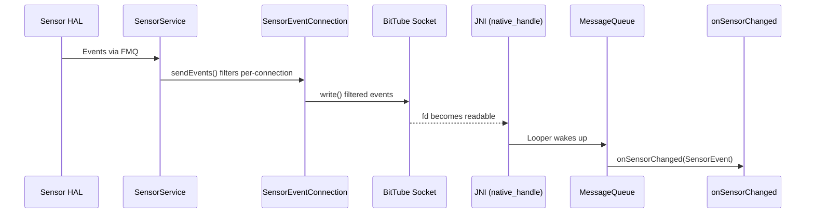
```mermaid
sequenceDiagram
    participant HAL as Sensor HAL
    participant SS as SensorService
    participant SEC as SensorEventConnection
    participant BT as BitTube Socket
    participant JNI as JNI (native_handle)
    participant MQ as MessageQueue
    participant APP as onSensorChanged

    HAL->>SS: Events via FMQ
    SS->>SEC: sendEvents() filters per-connection
    SEC->>BT: write() filtered events
    BT-->>JNI: fd becomes readable
    JNI->>MQ: Looper wakes up
    MQ->>APP: onSensorChanged(SensorEvent)
```

On the Java side, `SystemSensorManager` creates a `SensorEventQueue`
(not to be confused with the HAL-side FMQ) for each registered listener.
This queue is backed by a `BitTube` file descriptor that is registered
with the app's `Looper` via `MessageQueue.addOnFileDescriptorEventListener`.
When events arrive, the Looper wakes the thread and delivers them.

### 17.6.4 Batching and FIFO

Batching allows sensors to buffer events in hardware and deliver them
in bursts, dramatically reducing power consumption:

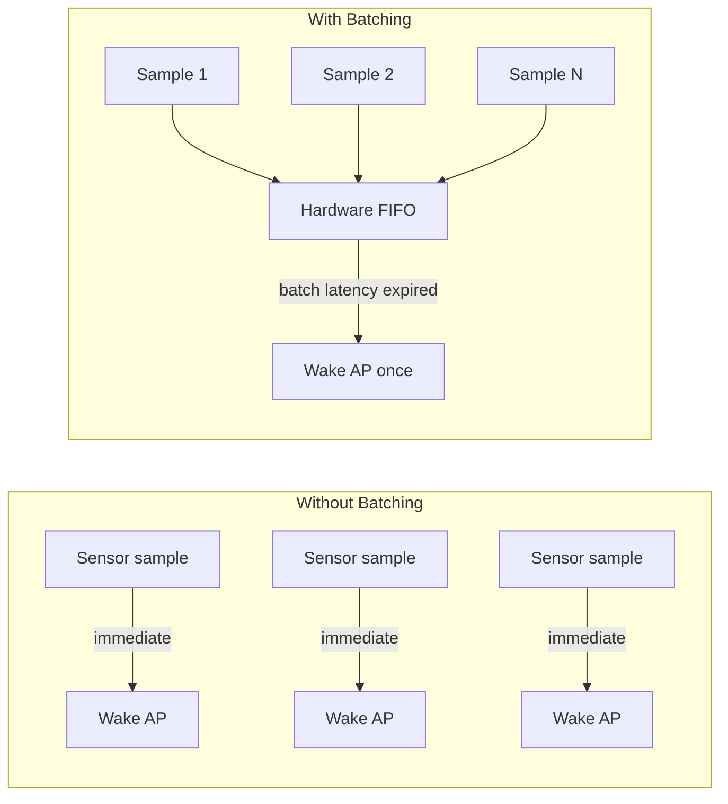
```mermaid
flowchart LR
    subgraph "Without Batching"
        S1[Sensor sample] -->|immediate| W1[Wake AP]
        S2[Sensor sample] -->|immediate| W2[Wake AP]
        S3[Sensor sample] -->|immediate| W3[Wake AP]
    end

    subgraph "With Batching"
        S4[Sample 1] --> FIFO[Hardware FIFO]
        S5[Sample 2] --> FIFO
        S6[Sample N] --> FIFO
        FIFO -->|"batch latency expired"| W4[Wake AP once]
    end
```

Key fields in `SensorInfo` that control batching:

- `fifoReservedEventCount`: Guaranteed events for this sensor in the
  shared FIFO.
- `fifoMaxEventCount`: Total FIFO capacity (may be shared with other
  sensors).
- `maxReportLatencyNs` in `batch()`: Maximum time events can be held
  before delivery.

When `maxReportLatencyNs = 0`, events are delivered in real time
(continuous mode).  When `maxReportLatencyNs > 0`, the HAL buffers
events up to this duration.

The `flush()` operation forces immediate delivery of all buffered events,
followed by a `FLUSH_COMPLETE` meta-event.

### 17.6.5 Trigger Sensors

One-shot sensors like `SIGNIFICANT_MOTION` use a different API:

```java
TriggerEventListener triggerListener = new TriggerEventListener() {
    @Override
    public void onTrigger(TriggerEvent event) {
        // Sensor auto-disables after triggering
        // Must re-request if you want another trigger
    }
};

sensorManager.requestTriggerSensor(triggerListener,
    sensorManager.getDefaultSensor(Sensor.TYPE_SIGNIFICANT_MOTION));
```

### 17.6.6 Dynamic Sensor Discovery

Applications can discover sensors that connect at runtime:

```java
sensorManager.registerDynamicSensorCallback(new DynamicSensorCallback() {
    @Override
    public void onDynamicSensorConnected(Sensor sensor) {
        // New sensor available -- register listener
    }

    @Override
    public void onDynamicSensorDisconnected(Sensor sensor) {
        // Sensor removed
    }
});
```

### 17.6.7 Rate Capping and Permissions

Since Android 12 (S), apps must declare `HIGH_SAMPLING_RATE_SENSORS` to
access sensors at rates above 200 Hz:

```xml
<uses-permission android:name="android.permission.HIGH_SAMPLING_RATE_SENSORS" />
```

Without this permission, `SensorService` silently caps the sampling period
to 5 ms (200 Hz).  For direct channels, the rate is capped to
`RATE_NORMAL` (~50 Hz).

The capping check in `SystemSensorManager`:

```java
private static final int CAPPED_SAMPLING_PERIOD_US = 5000;
private static final int CAPPED_SAMPLING_RATE_LEVEL = SensorDirectChannel.RATE_NORMAL;
```

---

## 17.7 Sensor Power Management

### 17.7.1 Wake-Up vs. Non-Wake-Up Sensors

Every sensor type can exist in two variants:

| Variant | `SENSOR_FLAG_BITS_WAKE_UP` | Behaviour |
|---------|---------------------------|-----------|
| **Wake-up** | Set | Events prevent AP from entering suspend |
| **Non-wake-up** | Clear | Events may be lost while AP is suspended |

The proximity sensor is the most common wake-up sensor -- it wakes the
device when the user brings the phone to their ear during a call.

### 17.7.2 Wake Lock Protocol

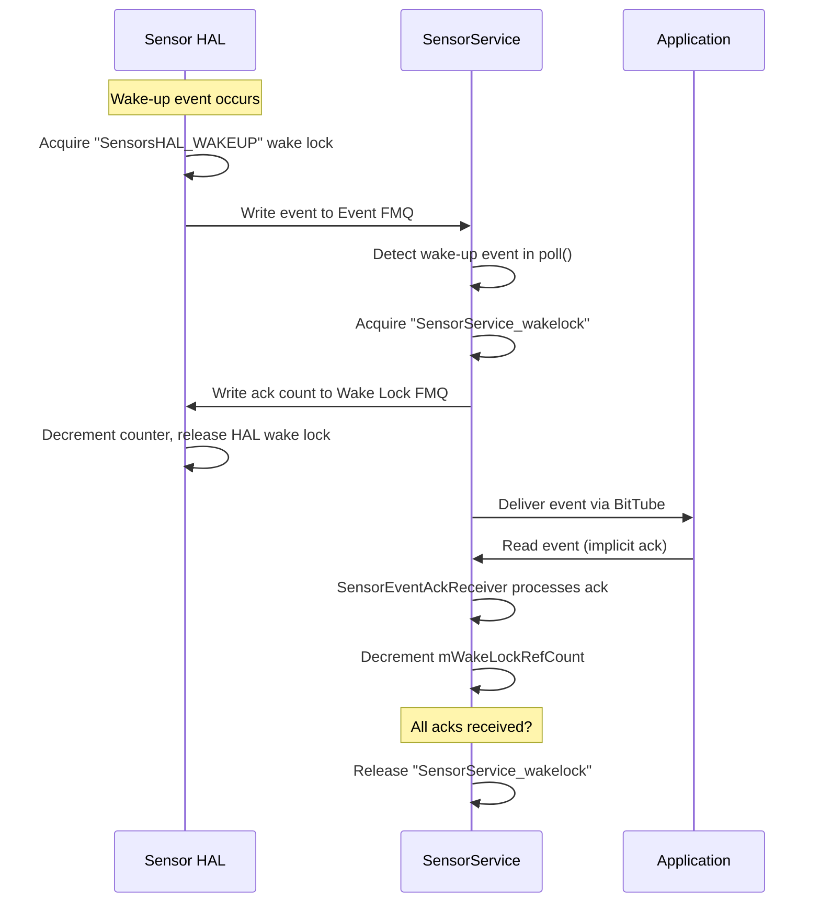
```mermaid
sequenceDiagram
    participant HAL as Sensor HAL
    participant SS as SensorService
    participant APP as Application

    Note over HAL: Wake-up event occurs
    HAL->>HAL: Acquire "SensorsHAL_WAKEUP" wake lock
    HAL->>SS: Write event to Event FMQ
    SS->>SS: Detect wake-up event in poll()
    SS->>SS: Acquire "SensorService_wakelock"
    SS->>HAL: Write ack count to Wake Lock FMQ
    HAL->>HAL: Decrement counter, release HAL wake lock

    SS->>APP: Deliver event via BitTube
    APP->>SS: Read event (implicit ack)
    SS->>SS: SensorEventAckReceiver processes ack
    SS->>SS: Decrement mWakeLockRefCount
    Note over SS: All acks received?
    SS->>SS: Release "SensorService_wakelock"
```

The wake lock chain ensures that the device stays awake from the moment
a wake-up sensor fires until the application has read the event:

1. **HAL** acquires `"SensorsHAL_WAKEUP"` before writing to the Event FMQ.
2. **SensorService** acquires `"SensorService_wakelock"` when it reads a
   wake-up event from `poll()`.
3. **SensorService** writes the wake-up event count to the Wake Lock FMQ,
   allowing the HAL to release its lock.
4. **SensorEventConnection** tracks unacknowledged events in `mWakeLockRefCount`.
5. When the app reads events, `SensorEventAckReceiver` detects the ack
   and decrements the ref count.
6. When all connections' ref counts reach zero, `SensorService` releases
   its wake lock.

A 5-second timeout prevents wake-lock leaks if the app fails to read events:

```cpp
// SensorService.h
void setWakeLockAcquiredLocked(bool acquire);
// Sets a 5-second timeout on the Looper
```

The HAL has its own 1-second timeout:

```aidl
// ISensors.aidl
const int WAKE_LOCK_TIMEOUT_SECONDS = 1;
```

### 17.7.3 Batching for Power Saving

The primary power-saving mechanism is batching.  When `maxBatchReportLatency`
is non-zero, the sensor hardware can buffer events and wake the AP
only when the FIFO is full or the latency expires.

Power savings come from allowing the AP to enter suspend mode between
batch deliveries:

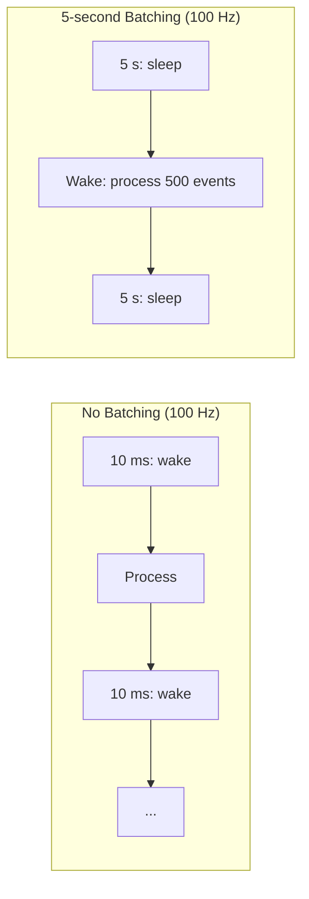
```mermaid
graph LR
    subgraph "No Batching (100 Hz)"
        A["10 ms: wake"] --> B["Process"] --> C["10 ms: wake"] --> D["..."]
    end

    subgraph "5-second Batching (100 Hz)"
        E["5 s: sleep"] --> F["Wake: process 500 events"] --> G["5 s: sleep"]
    end
```

For a 100 Hz sensor with 5-second batching:

- **Without batching**: AP wakes 100 times/second.
- **With batching**: AP wakes once every 5 seconds.

### 17.7.4 FIFO Sharing and Batch Parameter Merging

When multiple apps request different batch parameters for the same sensor,
`SensorDevice::Info::selectBatchParams()` computes the optimal setting:

```cpp
// SensorDevice.h
void merge(const BatchParams& other) {
    mTSample = std::min(mTSample, other.mTSample);
    mTBatch = std::min(mTBatch, std::max(other.mTBatch, other.mTSample));
}
```

This ensures:

- The sampling period is the minimum requested (fastest client wins).
- The batch latency is the minimum of all clients' effective latencies.

### 17.7.5 Background Sensor Throttling

When an app's UID transitions to the `IDLE` state (background), `SensorDevice`
disables its sensor subscriptions via `DisabledReason::DISABLED_REASON_UID_IDLE`.
This prevents background apps from keeping sensors active and draining the
battery.

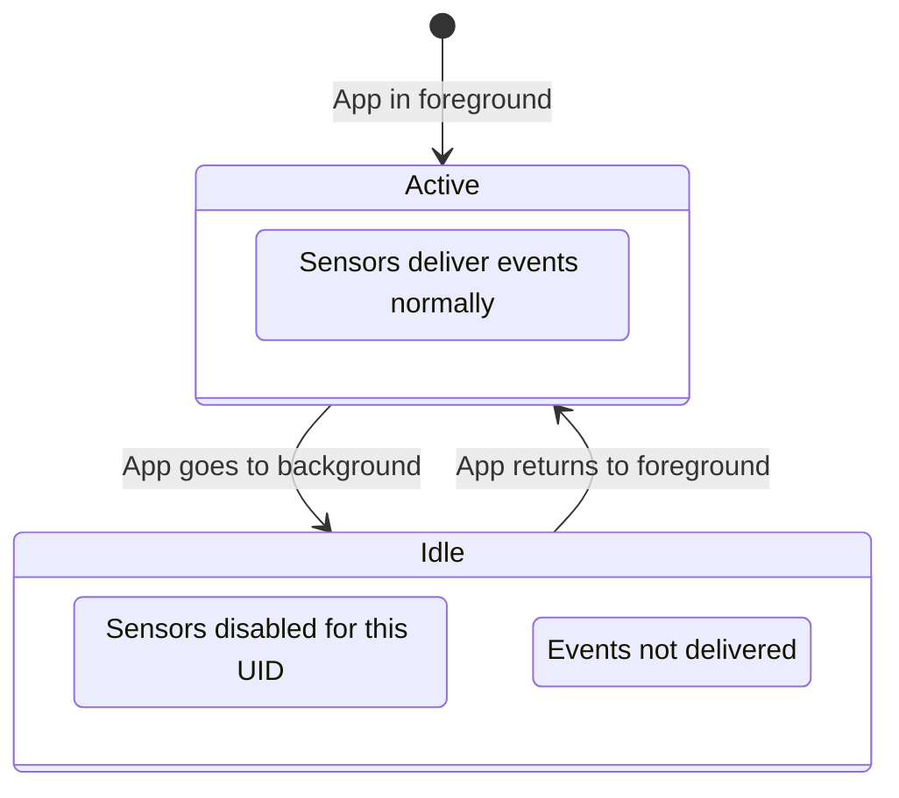
```mermaid
stateDiagram-v2
    [*] --> Active: App in foreground
    Active --> Idle: App goes to background
    Idle --> Active: App returns to foreground

    state Active {
        SensorsEnabled: Sensors deliver events normally
    }

    state Idle {
        SensorsDisabled: Sensors disabled for this UID
        EventsDropped: Events not delivered
    }
```

### 17.7.6 Sensor Privacy Toggle

The system-wide sensor privacy toggle (`SensorPrivacyPolicy`) disables all
sensors globally.  When activated:

1. All active sensors are deactivated.
2. All direct connections are stopped.
3. All pending flush connections are cleared.
4. New registrations are rejected.

When deactivated, previously active sensors are re-enabled.

---

## 17.8 Head Tracker Sensor and Spatial Audio

### 17.8.1 HEAD_TRACKER Sensor Type

The `HEAD_TRACKER` sensor type (ID 37) was introduced for spatial audio
in headphones.  It measures the orientation of the user's head relative
to an arbitrary (slowly drifting) reference frame.

```
Source: hardware/interfaces/sensors/aidl/android/hardware/sensors/SensorType.aidl
        (SensorType::HEAD_TRACKER = 37)
```

The head tracker uses a **head-centric coordinate frame** that differs
from the standard Android sensor coordinate system:

| Axis | Direction | Description |
|------|-----------|-------------|
| X | Right ear | Positive = right |
| Y | Nose | Positive = forward |
| Z | Top of head | Positive = up |
| X/Y plane | Nominally parallel to ground when upright |

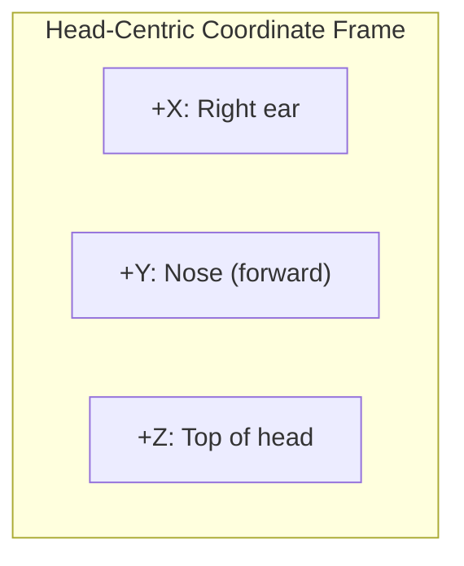
```mermaid
graph TB
    subgraph "Head-Centric Coordinate Frame"
        direction LR
        X["+X: Right ear"]
        Y["+Y: Nose (forward)"]
        Z["+Z: Top of head"]
    end
```

### 17.8.2 Event Payload

The `HeadTracker` payload contains six floats and a discontinuity counter:

| Field | Type | Description |
|-------|------|-------------|
| `rx`, `ry`, `rz` | float | Euler rotation vector (orientation), radians |
| `vx`, `vy`, `vz` | float | Angular velocity, rad/s (0 if unsupported) |
| `discontinuityCount` | int | Increments on filter state reset |

The rotation vector format is an **Euler vector** (axis-angle), not a
quaternion, unlike `ROTATION_VECTOR`.  The magnitude represents the
rotation angle in radians (range [0, pi]), and the direction is the
rotation axis.

### 17.8.3 Integration with Spatial Audio

Head tracking feeds into the spatial audio pipeline described in
**Chapter 11 (Audio System)**.  The data flow is:

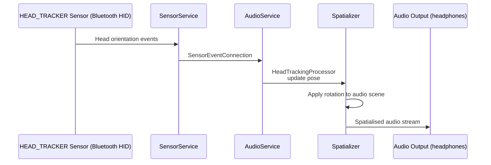
```mermaid
sequenceDiagram
    participant HT as HEAD_TRACKER Sensor (Bluetooth HID)
    participant SS as SensorService
    participant AS as AudioService
    participant SP as Spatializer
    participant OUT as Audio Output (headphones)

    HT->>SS: Head orientation events
    SS->>AS: SensorEventConnection
    AS->>SP: HeadTrackingProcessor<br/>update pose
    SP->>SP: Apply rotation to audio scene
    SP->>OUT: Spatialised audio stream
```

When a head tracker sensor is exposed as a **dynamic sensor** through
Bluetooth HID, the `DynamicSensorInfo::uuid` field is set to the HID
Persistent Unique ID, which allows the audio framework to associate
the sensor with the correct audio device.

### 17.8.4 Access Restrictions

Head tracker data is considered privacy-sensitive because it can reveal
the user's physical movements.  `SensorService` restricts access:

- By default, `mHtRestricted = true` limits head tracker access to system
  processes (UID = system or audioserver).
- For testing, the restriction can be lifted via shell command:

```shell
adb shell dumpsys sensorservice unrestrict-ht
# To re-restrict:
adb shell dumpsys sensorservice restrict-ht
```

### 17.8.5 Runtime Sensors

The head tracker is often implemented as a **runtime sensor** --
a sensor that is registered programmatically rather than being discovered
from the HAL at boot time.  Runtime sensors use handle values in the
dedicated range:

```aidl
// ISensors.aidl
const int RUNTIME_SENSORS_HANDLE_BASE = 0x5F000000;
const int RUNTIME_SENSORS_HANDLE_END  = 0x5FFFFFFF;
```

The `RuntimeSensor` class forwards `activate()` and `batch()` calls to
a `RuntimeSensorCallback`, which is typically implemented by the Bluetooth
stack or input subsystem:

```cpp
// SensorInterface.h
class RuntimeSensor : public BaseSensor {
    // ...
    sp<SensorCallback> mCallback;  // Notified on enable/disable/rate change
};
```

Registration is done via `SensorService::registerRuntimeSensor()`, which
allocates a handle from the runtime range and creates the `RuntimeSensor`
wrapper.

---

## 17.9 Try It -- Hands-On Sensor Exercises

### 17.9.1 List All Sensors on a Device

```shell
adb shell dumpsys sensorservice
```

This dumps:

- The full sensor list (name, handle, type, range, resolution, power, FIFO)
- Fusion state (9-axis, no-mag, no-gyro)
- Recent events for each sensor
- Active sensors and connections
- Operating mode and privacy state
- Recent registration history

### 17.9.2 Monitor Sensor Events in Real Time

Using `sensorservice` directly:

```shell
# List all sensors
adb shell dumpsys sensorservice

# Watch accelerometer events (requires root or debug build)
adb shell sensorservice_test -s accelerometer
```

Or using a simple app:

```java
// Minimal sensor monitor
SensorManager sm = (SensorManager) getSystemService(SENSOR_SERVICE);
for (Sensor s : sm.getSensorList(Sensor.TYPE_ALL)) {
    Log.i("Sensors", String.format("%-40s type=%2d range=%.1f power=%.2f mA",
            s.getName(), s.getType(), s.getMaximumRange(), s.getPower()));
}

Sensor accel = sm.getDefaultSensor(Sensor.TYPE_ACCELEROMETER);
sm.registerListener(new SensorEventListener() {
    @Override
    public void onSensorChanged(SensorEvent event) {
        Log.i("Accel", String.format("x=%.3f y=%.3f z=%.3f",
                event.values[0], event.values[1], event.values[2]));
    }
    @Override
    public void onAccuracyChanged(Sensor sensor, int accuracy) {}
}, accel, SensorManager.SENSOR_DELAY_GAME);
```

### 17.9.3 Examine Batching Behaviour

```java
// Request 100 Hz with 10-second batching
Sensor accel = sm.getDefaultSensor(Sensor.TYPE_ACCELEROMETER);
sm.registerListener(listener, accel,
        10_000,       // 10 ms = 100 Hz
        10_000_000);  // 10 second max latency

// Force flush of batched events
sm.flush(listener);
// onFlushCompleted() will be called after all batched events are delivered
```

### 17.9.4 Use a Direct Channel

```java
// Create shared memory
MemoryFile memFile = new MemoryFile("sensor_direct", 4096);
SensorDirectChannel channel = sm.createDirectChannel(memFile);

// Configure accelerometer at RATE_FAST (~200 Hz)
Sensor accel = sm.getDefaultSensor(Sensor.TYPE_ACCELEROMETER);
int reportToken = channel.configure(accel, SensorDirectChannel.RATE_FAST);

// Read events from shared memory (poll atomic counter at offset 0x0C)
// Each event is 104 bytes
ByteBuffer buffer = memFile.getInputStream()...;
// Parse events using the direct report format

// Stop and close
channel.configure(accel, SensorDirectChannel.RATE_STOP);
channel.close();
```

### 17.9.5 Inject Test Data

```shell
# Enable data injection mode
adb shell dumpsys sensorservice data_injection com.example.test

# From a test app with matching package name:
# Use SensorManager.injectSensorData() to inject events
```

```java
// In test code (requires DATA_INJECTION permission)
sm.registerListener(listener, accel, SensorManager.SENSOR_DELAY_FASTEST);

SensorEvent fakeEvent = ... ; // construct with desired values
sm.injectSensorData(accel, fakeEvent.values, fakeEvent.accuracy,
        fakeEvent.timestamp);
```

### 17.9.6 Trace Sensor Performance

```shell
# Enable sensor atrace category
adb shell atrace --async_start -c sensors

# ... exercise sensors ...

adb shell atrace --async_stop -o /data/local/tmp/sensors.trace
adb pull /data/local/tmp/sensors.trace
# Open in Perfetto UI: ui.perfetto.dev
```

### 17.9.7 Monitor Power Impact

```shell
# Battery historian can show wake lock durations
adb shell dumpsys batterystats --reset
# Exercise sensors for a period
adb bugreport > bugreport.zip
# Upload to Battery Historian: bathist.cs.android.com
```

Check which sensors are active and their power draw:

```shell
adb shell dumpsys sensorservice | grep "Active sensors"
```

### 17.9.8 Inspect Sensor Fusion State

```shell
adb shell dumpsys sensorservice | grep -A5 "Fusion States"
```

This displays for each fusion mode:

- Whether it is enabled
- Number of active clients
- Estimated gyro rate
- Current attitude quaternion (x, y, z, w) and its magnitude
- Estimated gyro bias vector

### 17.9.9 Test Dynamic Sensors

If you have a Bluetooth sensor (e.g., a headset with head tracking):

```java
sm.registerDynamicSensorCallback(new DynamicSensorCallback() {
    @Override
    public void onDynamicSensorConnected(Sensor sensor) {
        Log.i("Dynamic", "Connected: " + sensor.getName() +
                " type=" + sensor.getType());
        if (sensor.getType() == Sensor.TYPE_HEAD_TRACKER) {
            sm.registerListener(htListener, sensor,
                    SensorManager.SENSOR_DELAY_FASTEST);
        }
    }
});
```

### 17.9.10 Explore the Source

Here is a roadmap for further reading in the AOSP source tree:

| Area | Path |
|------|------|
| SensorService main | `frameworks/native/services/sensorservice/SensorService.cpp` |
| Sensor fusion core | `frameworks/native/services/sensorservice/Fusion.cpp` |
| Virtual sensors | `frameworks/native/services/sensorservice/RotationVectorSensor.cpp`, `GravitySensor.cpp`, etc. |
| Sensor HAL AIDL | `hardware/interfaces/sensors/aidl/android/hardware/sensors/` |
| Default HAL impl | `hardware/interfaces/sensors/aidl/default/Sensors.cpp` |
| Multi-HAL | `hardware/interfaces/sensors/aidl/default/multihal/` |
| Java SensorManager | `frameworks/base/core/java/android/hardware/SensorManager.java` |
| SystemSensorManager | `frameworks/base/core/java/android/hardware/SystemSensorManager.java` |
| Sensor JNI | `frameworks/base/core/jni/android_hardware_SensorManager.cpp` |
| CTS tests | `cts/tests/sensor/src/android/hardware/cts/` |
| VTS tests | `hardware/interfaces/sensors/aidl/vts/` |

---

## 17.10 Automotive and Wearable Sensor Extensions

### 17.10.1 Limited-Axes IMU Sensors (Automotive)

Automotive devices may have IMU sensors mounted in positions where not all
three axes can provide meaningful data.  AOSP defines four limited-axes
sensor types for this case:

| Type | ID | Based On |
|------|----|----------|
| `ACCELEROMETER_LIMITED_AXES` | 38 | `ACCELEROMETER` |
| `GYROSCOPE_LIMITED_AXES` | 39 | `GYROSCOPE` |
| `ACCELEROMETER_LIMITED_AXES_UNCALIBRATED` | 40 | `ACCELEROMETER_UNCALIBRATED` |
| `GYROSCOPE_LIMITED_AXES_UNCALIBRATED` | 41 | `GYROSCOPE_UNCALIBRATED` |

Each event includes both the measurement values and a set of "supported"
flags indicating which axes are valid:

```aidl
// Event.aidl -> LimitedAxesImu
parcelable LimitedAxesImu {
    float x;            // Value (0 if unsupported)
    float y;
    float z;
    float xSupported;   // 1.0 = supported, 0.0 = not
    float ySupported;
    float zSupported;
}
```

`SensorService` automatically creates `LimitedAxesImuSensor` virtual sensors
on automotive devices:

```cpp
// SensorService.cpp onFirstRef()
if (isAutomotive()) {
    if (hasAccel) {
        registerVirtualSensor(
            std::make_shared<LimitedAxesImuSensor>(
                list, count, SENSOR_TYPE_ACCELEROMETER));
    }
    // ... similar for gyroscope, uncalibrated variants
}
```

The `isAutomotive()` check queries `PackageManagerNative` for the
`android.hardware.type.automotive` system feature.

```
Source: frameworks/native/services/sensorservice/LimitedAxesImuSensor.h
        frameworks/native/services/sensorservice/LimitedAxesImuSensor.cpp
```

### 17.10.2 Heading Sensor (Automotive)

The `HEADING` sensor type (ID 42) provides the direction the vehicle is
pointing relative to true north:

```aidl
parcelable Heading {
    float heading;    // degrees [0, 360)
    float accuracy;   // 68% confidence interval in degrees
}
```

This is particularly useful for navigation applications on automotive
displays where the form factor makes traditional rotation-vector sensors
less meaningful.

### 17.10.3 Wearable-Specific Sensors

Several sensor types were designed primarily for wearables:

**Wrist Tilt Gesture** (`WRIST_TILT_GESTURE`, ID 26): Triggers when the
user lifts their wrist to look at a watch.  Must be implemented as a
wake-up sensor.

**Low-Latency Off-Body Detect** (`LOW_LATENCY_OFFBODY_DETECT`, ID 34):
Detects whether a wearable device is on the user's body.  Must detect
on-to-off transitions within 1 second and off-to-on within 3 seconds.

**Heart Rate** (`HEART_RATE`, ID 21): Returns beats per minute.  Requires
`SENSOR_PERMISSION_BODY_SENSORS` permission.  The framework automatically
sets the required permission based on platform SDK version.

### 17.10.4 Wearable Fusion Rate Tuning

Wearable devices can reduce fusion power consumption by lowering the
sensor fusion rate:

```shell
# In device.mk for a wearable:
PRODUCT_PROPERTY_OVERRIDES += \
    sensors.aosp_low_power_sensor_fusion.maximum_rate=100
```

This reduces the gyroscope sampling from 200 Hz to 100 Hz during fusion,
cutting IMU power roughly in half.

---

## 17.11 Sensor Coordinate Systems

### 17.11.1 Standard Android Sensor Coordinate System

For most sensor types, Android uses a right-handed coordinate system
relative to the device's default orientation (typically portrait for
phones, landscape for tablets):

```mermaid
graph TB
    subgraph "Device Default Orientation (Portrait)"
        Y["+Y: Up (toward top edge)"]
        X["+X: Right (toward right edge)"]
        Z["+Z: Out of screen (toward user)"]
    end
```

| Axis | Direction |
|------|-----------|
| X | Positive toward right edge of the screen |
| Y | Positive toward top edge of the screen |
| Z | Positive out of the screen (toward user) |

This coordinate system is **fixed to the device**, not to the display
rotation.  When the screen rotates, the sensor axes do not change.

### 17.11.2 East-North-Up Frame

The rotation vector and geomagnetic rotation vector express orientation
relative to the **East-North-Up (ENU)** coordinate frame:

| Axis | Direction |
|------|-----------|
| X | East |
| Y | North (magnetic or true) |
| Z | Up (opposite to gravity) |

### 17.11.3 Head-Centric Frame

The `HEAD_TRACKER` sensor uses a different coordinate system centered on
the user's head (see Section 50.8.1).  This frame is natural for spatial
audio processing where the audio scene is defined relative to the
listener's head.

### 17.11.4 Quaternion Conventions

AOSP rotation vectors use the **Hamilton quaternion convention** where
the quaternion `q = [x, y, z, w]` represents a rotation of angle `theta`
around unit axis `[ax, ay, az]` as:

```
x = ax * sin(theta/2)
y = ay * sin(theta/2)
z = az * sin(theta/2)
w = cos(theta/2)
```

The `RotationVectorSensor` outputs this quaternion directly from the
fusion filter:

```cpp
// RotationVectorSensor.cpp, line ~50
const vec4_t q(mSensorFusion.getAttitude(mMode));
outEvent->data[0] = q.x;
outEvent->data[1] = q.y;
outEvent->data[2] = q.z;
outEvent->data[3] = q.w;
```

---

## 17.12 Sensor Calibration and Additional Info

### 17.12.1 Calibrated vs. Uncalibrated Sensors

Three sensor types have both calibrated and uncalibrated variants:

| Calibrated | Uncalibrated | Calibration Removed |
|-----------|-------------|-------------------|
| `ACCELEROMETER` | `ACCELEROMETER_UNCALIBRATED` | Factory bias |
| `GYROSCOPE` | `GYROSCOPE_UNCALIBRATED` | Drift compensation |
| `MAGNETIC_FIELD` | `MAGNETIC_FIELD_UNCALIBRATED` | Hard-iron offset |

Uncalibrated sensors report raw measurements alongside estimated bias
values.  The relationship is:

```
calibrated_value = uncalibrated_value - bias
```

The `Uncal` payload carries both:

```aidl
parcelable Uncal {
    float x, y, z;           // Uncalibrated measurement
    float xBias, yBias, zBias;  // Estimated bias
}
```

Applications that implement their own sensor fusion (e.g. AR frameworks)
often prefer uncalibrated data to avoid double-correction artifacts.

### 17.12.2 ADDITIONAL_INFO Events

Sensors can report out-of-band metadata through `ADDITIONAL_INFO` events.
These frames carry information such as:

- Internal temperature
- Sampling rate accuracy
- Sensor placement (rotation and translation relative to device frame)
- Custom vendor data

Additional info is delivered as a sequence of frames:

1. `AINFO_BEGIN` frame (start of report)
2. One or more data frames
3. `AINFO_END` frame (end of report)

Reports are triggered by `activate()` or `flush()` calls, and may also
update periodically for time-varying parameters (recommended rate: less
than 1/1000 of the sensor event rate).

### 17.12.3 HMAC-Based Sensor IDs

Dynamic sensors need unique, stable identifiers.  `SensorService` generates
these using HMAC-SHA256 with a persistent key:

```cpp
// SensorService.cpp
#define SENSOR_SERVICE_HMAC_KEY_FILE  "/data/system/sensor_service/hmac_key"
```

The HMAC key is generated at first boot and persisted.  Each dynamic
sensor's UUID is HMACed to produce a stable, privacy-preserving ID
that survives process restarts but is not the raw UUID.

---

## 17.13 Sensor Testing and Debugging

### 17.13.1 CTS Sensor Tests

The Compatibility Test Suite includes extensive sensor tests:

```
Source: cts/tests/sensor/src/android/hardware/cts/
```

These tests verify:

- Sensor presence and properties
- Event delivery rate and jitter
- Batching behaviour and flush correctness
- Wake-up sensor wake lock protocol
- Direct channel operation
- Rate capping enforcement
- Data injection mode

### 17.13.2 VTS Sensor Tests

Vendor Test Suite tests verify the HAL implementation:

```
Source: hardware/interfaces/sensors/aidl/vts/
```

These tests exercise the AIDL ISensors interface directly, verifying
FMQ operation, event format, dynamic sensor callbacks, and direct
channel support.

### 17.13.3 Dumpsys Output Format

The `dumpsys sensorservice` output is structured as follows:

```
Captured at: HH:MM:SS.mmm
Sensor Device:
  <HAL device information>
Sensor List:
  <for each sensor: name, vendor, version, handle, type, range, resolution, power, minDelay, fifo, flags>
Fusion States:
  9-axis fusion enabled/disabled (N clients), gyro-rate=XXX Hz, q=<x,y,z,w>, b=<bx,by,bz>
  game fusion(no mag) ...
  geomag fusion (no gyro) ...
Recent Sensor events:
  <sensor name>: <last N events with timestamps>
Active sensors:
  <name> (handle=0xNN, connections=N)
Socket Buffer size = NNN events
WakeLock Status: acquired / not held
Mode: NORMAL / RESTRICTED / DATA_INJECTION
Sensor Privacy: enabled / disabled
N open event connections
N open direct connections
Previous Registrations:
  <chronological list of register/unregister operations>
```

### 17.13.4 Proto-Based Dump

For programmatic analysis, `SensorService` supports protobuf-formatted
output:

```shell
adb shell dumpsys sensorservice --proto > sensor_dump.pb
```

The proto schema is defined in:
```
Source: frameworks/base/core/proto/android/service/sensor_service.proto
```

### 17.13.5 Common Debugging Scenarios

**Problem: Sensor events not delivered.**
Check:

1. Is the sensor in the dumpsys sensor list?
2. Is it in the "Active sensors" section?
3. Is sensor privacy enabled?
4. Is the app UID active (not idle)?
5. Is the app rate-capped below its expected rate?

**Problem: High battery drain from sensors.**
Check:

1. Look for background apps with active sensor connections in dumpsys.
2. Check wake lock status -- persistent wake lock suggests wake-up sensor
   events are not being acknowledged.
3. Verify batching is being used where appropriate.

**Problem: Sensor fusion quality is poor.**
Check:

1. Examine fusion state in dumpsys -- is the gyro rate reasonable?
2. Check if the quaternion magnitude is near 1.0 (should be exactly 1.0).
3. Look at the gyro bias vector -- large values indicate calibration issues.
4. Verify the magnetometer is not disturbed (near strong magnets or metal).

---

## 17.14 Sensor Event Data Structures

### 17.14.1 Native sensors_event_t

The core C structure for sensor events is `sensors_event_t`, defined in
the hardware headers:

```c
typedef struct sensors_event_t {
    int32_t version;     // sizeof(sensors_event_t)
    int32_t sensor;      // sensor handle
    int32_t type;        // sensor type
    int32_t reserved0;
    int64_t timestamp;   // nanoseconds (elapsedRealtimeNano)
    union {
        float data[16];
        sensors_vec_t acceleration;  // TYPE_ACCELEROMETER
        sensors_vec_t magnetic;      // TYPE_MAGNETIC_FIELD
        sensors_vec_t orientation;   // TYPE_ORIENTATION
        sensors_vec_t gyro;          // TYPE_GYROSCOPE
        float temperature;           // TYPE_TEMPERATURE (deprecated)
        float distance;              // TYPE_PROXIMITY
        float light;                 // TYPE_LIGHT
        float pressure;              // TYPE_PRESSURE
        float relative_humidity;     // TYPE_RELATIVE_HUMIDITY
        sensors_meta_data_event_t meta_data;
        dynamic_sensor_meta_event_t dynamic_sensor_meta;
        additional_info_event_t additional_info;
        heart_rate_event_t heart_rate;
        head_tracker_event_t head_tracker;
    };
    uint32_t flags;      // internal flags
    uint32_t reserved1[3];
} sensors_event_t;
```

### 17.14.2 Java SensorEvent

On the Java side, `SensorEvent` is a simple container:

```java
public class SensorEvent {
    public float[] values;     // Sensor-specific data
    public Sensor sensor;      // Source sensor
    public int accuracy;       // SensorManager.SENSOR_STATUS_*
    public long timestamp;     // nanoseconds (elapsedRealtimeNano)
}
```

The `values` array size and interpretation varies by sensor type.  For
example, accelerometer events have `values[0..2]` = (x, y, z) in m/s^2,
while rotation vector events have `values[0..4]` = (x, y, z, w, accuracy).

### 17.14.3 AIDL Event Parcelable

The HAL-side event uses a typed union for type safety:

```aidl
parcelable Event {
    long timestamp;
    int sensorHandle;
    SensorType sensorType;
    EventPayload payload;
}
```

The `EventPayload` union discriminates on `sensorType` to provide
strongly-typed access to sensor data -- `Vec3` for accelerometer,
`Vec4` for game rotation vector, `Uncal` for uncalibrated sensors,
`HeadTracker` for head tracking, and so on.

---

## 17.15 Sensor HAL Implementation Guide

### 17.15.1 Default Reference Implementation

AOSP provides a reference HAL implementation in:

```
Source: hardware/interfaces/sensors/aidl/default/Sensors.cpp
        hardware/interfaces/sensors/aidl/default/include/sensors-impl/Sensors.h
```

This implementation demonstrates the core patterns:

1. **`getSensorsList()`**: Returns a vector of `SensorInfo` for all
   supported sensors.
2. **`initialize()`**: Sets up Event and Wake Lock FMQs, saves the
   callback reference, and starts a wake lock monitoring thread.
3. **`activate()`**: Enables/disables individual sensors.
4. **`batch()`**: Configures sampling rate.
5. **`flush()`**: Triggers a `FLUSH_COMPLETE` event.

### 17.15.2 Event Writing Pattern

A typical HAL writes events to the FMQ as follows:

```cpp
// After collecting sensor data:
Event event;
event.sensorHandle = handle;
event.sensorType = SensorType::ACCELEROMETER;
event.timestamp = android::elapsedRealtimeNano();
event.payload.set<EventPayload::Tag::vec3>({x, y, z, status});

// Write to FMQ
if (mEventQueue->write(&event, 1)) {
    mEventQueueFlag->wake(
        ISensors::EVENT_QUEUE_FLAG_BITS_READ_AND_PROCESS);
}
```

### 17.15.3 Multi-HAL Integration

For devices with sensors from multiple vendor chipsets, the Multi-HAL
framework (`HalProxyAidl`) aggregates sub-HALs:

```
Source: hardware/interfaces/sensors/aidl/default/multihal/HalProxyAidl.cpp
```

Each sub-HAL implements a simplified interface and is loaded as a shared
library.  The proxy handles:

- Handle remapping (ensuring uniqueness across sub-HALs)
- Event merging from multiple sources
- Lifecycle management (connect/disconnect of sub-HALs)

---

## Summary

The Android sensor framework is a layered pipeline designed for both
correctness and efficiency:

1. **The HAL** (`ISensors` AIDL) is the vendor-provided interface that
   talks to hardware.  It uses Fast Message Queues for zero-copy event
   transport and supports features like batching, direct channels, dynamic
   sensors, and data injection.

2. **SensorService** is the native system service that manages the
   lifecycle of all sensor connections.  Its dedicated `SCHED_FIFO` polling
   thread reads events from the HAL, feeds them through sensor fusion,
   and dispatches them to per-client `BitTube` sockets.  It enforces
   rate capping, sensor privacy, UID-based access control, and wake lock
   management.

3. **SensorFusion** implements an Extended Kalman Filter in three modes
   (9-axis, no-mag, no-gyro) to produce virtual sensors like rotation
   vector, gravity, and linear acceleration from raw accelerometer,
   gyroscope, and magnetometer data.

4. **The Java API** (`SensorManager`) provides the application-facing
   interface for sensor discovery, registration, batching configuration,
   trigger sensors, direct channels, and dynamic sensor callbacks.

5. **Power management** spans the entire stack: batching reduces AP wake-ups,
   wake-lock protocols ensure events are not lost during suspend, and
   UID policy throttles background applications.

6. **Head tracking** is the newest sensor type, enabling spatial audio
   in headphones via Bluetooth dynamic sensors.

The key design principle throughout is that sensor data flows through a
single, well-audited path -- from hardware through the HAL, through
`SensorService`, and out to applications -- with power policy and access
control enforced at the service layer.
