# Chapter 18: ART Runtime

The Android Runtime (ART) is the managed execution environment at the heart of
every Android application. It loads, verifies, and executes DEX bytecode --
the compiled output of Java and Kotlin source files. ART replaced Dalvik in
Android 5.0 (Lollipop) and has since undergone a dramatic transformation: from
a simple interpreter-plus-AOT model into a sophisticated, multi-tier
compilation engine with concurrent garbage collection, on-device profile-guided
optimization, and modular delivery through Project Mainline.

This chapter traces the entire lifecycle of managed code on Android -- from the
DEX file format, through ahead-of-time and just-in-time compilation, into
memory management and native interop -- all grounded in the AOSP source.

Source tree root: `art/` (37 subdirectories, approximately 1.5 million lines of
C++ and assembly).

---

## 18.1 ART Architecture

### 18.1.1 Directory Layout

The ART project under `art/` is organized into the following major
subdirectories:

| Directory | Purpose |
|-----------|---------|
| `runtime/` | Core runtime: class linker, GC, JIT, JNI, threads |
| `compiler/` | Optimizing compiler back-end (13 subdirectories) |
| `dex2oat/` | Ahead-of-time compiler driver (7 subdirectories) |
| `libdexfile/` | DEX file parsing and validation library |
| `libartbase/` | Base utilities shared across ART components |
| `libartpalette/` | Platform abstraction layer |
| `libartservice/` | ART system service (artd) |
| `libarttools/` | Command-line tool utilities |
| `libprofile/` | Profile data reading and writing |
| `libnativebridge/` | NativeBridge interface for ISA translation |
| `libnativeloader/` | Per-app native library loading |
| `libelffile/` | ELF file reading for OAT files |
| `odrefresh/` | On-device refresh after OTA updates |
| `openjdkjvm/` | JVM interface implementation |
| `openjdkjvmti/` | JVMTI agent implementation for debugging |
| `artd/` | ART daemon (dexopt service) |
| `perfetto_hprof/` | Perfetto heap profiler integration |
| `dalvikvm/` | `dalvikvm` command-line launcher |
| `dexdump/` | DEX file dumping tool |
| `oatdump/` | OAT file dumping tool |
| `profman/` | Profile manager tool |
| `sigchainlib/` | Signal chain library |
| `disassembler/` | Machine code disassembly |
| `tools/` | Miscellaneous helper scripts and tools |
| `test/` | Test infrastructure and test cases |
| `benchmark/` | Performance benchmarks |
| `build/` | Build system integration |

### 18.1.2 The Runtime Singleton

The `Runtime` class is the central singleton that owns every major subsystem.
It is declared in `art/runtime/runtime.h` and implemented across roughly 3,000
lines in `art/runtime/runtime.cc`.

```
// art/runtime/runtime.h, line 130
class Runtime {
 public:
  static bool Create(RuntimeArgumentMap&& runtime_options)
      SHARED_TRYLOCK_FUNCTION(true, Locks::mutator_lock_);

  bool Start() UNLOCK_FUNCTION(Locks::mutator_lock_);

  static Runtime* Current() {
    return instance_;
  }
  ...
};
```

Key subsystems owned by `Runtime`:

- **ClassLinker** -- class loading, linking, verification, resolution
- **Heap** (gc::Heap) -- managed heap, garbage collectors
- **Jit** (jit::Jit) -- JIT compiler front-end, thread pool, profiling
- **JitCodeCache** -- compiled code storage, garbage collection of code
- **JavaVMExt** -- JNI JavaVM implementation, native library management
- **InternTable** -- string interning
- **ThreadList** -- thread management, suspension, checkpoints
- **OatFileManager** -- OAT file discovery and loading
- **MonitorList** / **MonitorPool** -- object monitor management
- **SignalCatcher** -- SIGQUIT handler for ANR dumps
- **Instrumentation** -- method entry/exit hooks
- **Trace** -- method tracing
- **RuntimeCallbacks** -- extension point for plugins and agents

### 18.1.3 Runtime Startup Sequence

When the Zygote process starts, or when `dalvikvm` is invoked directly, the
runtime follows this initialization sequence:

1. **Parse options** -- `Runtime::ParseOptions()` processes command-line flags
   such as heap sizes, compiler filters, and GC configuration.
2. **Create runtime** -- `Runtime::Create()` allocates and initializes the
   singleton `Runtime` instance.
3. **Initialize heap** -- The `gc::Heap` constructor creates memory spaces
   (region space, large object space, non-moving space) and selects the
   garbage collector.
4. **Load boot image** -- `ClassLinker::InitFromBootImage()` maps the
   precompiled boot image (`.art` files) into memory, loading fundamental
   classes like `java.lang.Object`, `java.lang.String`, etc.
5. **Initialize class linker** -- Registers boot classpath DEX files, sets up
   DexCache objects, initializes the intern table.
6. **Create JIT** -- If JIT compilation is enabled (the default for app
   processes), `Jit::Create()` loads the compiler shared library and
   creates the JIT thread pool.
7. **Start** -- `Runtime::Start()` transitions to a fully running state:
   starts the signal catcher thread, the heap task processor, and the
   finalizer daemon.

```
// art/runtime/runtime.cc, lines 96-97 (include chain)
#include "jit/jit.h"
#include "jit/jit_code_cache.h"
```

### 18.1.4 Zygote and Process Model

ART relies heavily on the Zygote process model for efficient process creation:

1. **Zygote startup** -- The Zygote process starts the ART runtime,
   loads the boot image, and pre-initializes commonly used classes.
2. **Fork** -- When a new app process is needed, Zygote `fork()`s.
   The child process inherits:
   - The entire boot image memory mapping (shared, read-only)
   - Loaded classes and their metadata
   - The intern table
   - The JIT code cache (in zygote JIT mode)
3. **Specialize** -- The child process specializes by:
   - Loading the app's DEX files and OAT files
   - Creating app-specific class loaders
   - Adjusting GC configuration for the app's memory class
   - Starting the JIT thread pool

This model means that the ART runtime's startup cost is paid only once
(in the Zygote), and all apps share the memory pages of the boot image
through copy-on-write semantics.

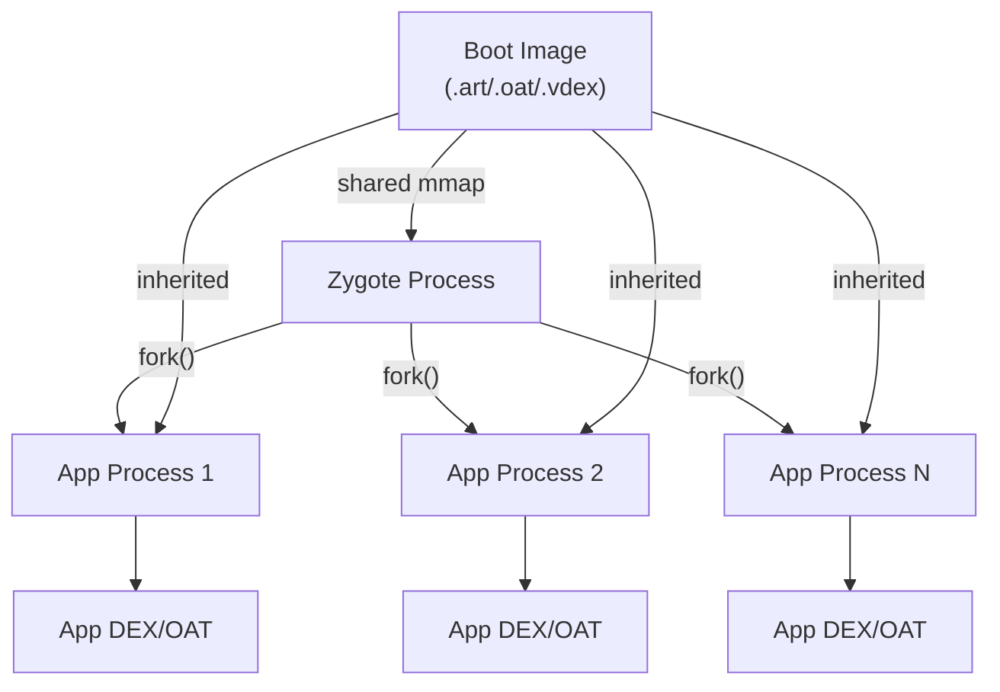

Key runtime methods for Zygote operations:

```
// art/runtime/runtime.h (selected methods)
bool IsZygote() const { return is_zygote_; }
bool IsPrimaryZygote() const { return is_primary_zygote_; }
bool IsSystemServer() const { return is_system_server_; }

void SetAsSystemServer() {
  is_system_server_ = true;
  is_zygote_ = false;
  is_primary_zygote_ = false;
}
```

### 18.1.5 App Images

In addition to the boot image, ART can create per-app images that capture
preinitialized class state for an application. App images are created by
`dex2oat` when using the `speed-profile` filter and stored as `.art` files
alongside the `.oat` files.

App images contain:

- Preinitialized classes from the app's DEX files
- Resolved strings used by the app
- DexCache entries for the app's DEX files

At app startup, the runtime maps the app image into the heap, avoiding
the cost of re-loading and re-initializing these classes. This significantly
reduces cold-start latency for apps with many classes.

### 18.1.6 Compilation Pipeline Overview

ART uses a multi-tier compilation strategy:

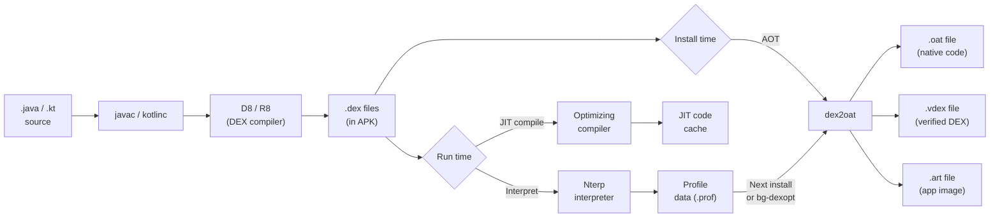

The pipeline supports multiple "compiler filters" that control what work
`dex2oat` performs (see Section 19.3).

### 18.1.7 Execution Modes

ART provides four execution modes for a given method:

1. **Interpreter (Nterp)** -- A hand-written assembly interpreter that
   executes DEX bytecode instruction by instruction. Nterp is optimized per
   architecture (ARM64, x86-64, RISC-V) and also collects profiling data.
2. **Baseline JIT** -- A fast, non-optimizing JIT compilation that produces
   native code quickly for methods that cross the warmth threshold.
3. **Optimized JIT** -- A fully optimizing compilation for hot methods.
4. **AOT (dex2oat)** -- Ahead-of-time compiled native code stored in OAT
   files.

The `CompilationKind` enum in `art/runtime/compilation_kind.h` defines:

```
// art/runtime/compilation_kind.h, lines 27-32
enum class CompilationKind {
  kOsr = 0,        // On-Stack Replacement
  kFast = 1,       // Fast (pattern-matched) compilation
  kBaseline = 2,   // Non-optimizing baseline
  kOptimized = 3,  // Full optimization
};
```

### 18.1.8 Nterp: The Fast Interpreter

Nterp (Next-generation TeRP, pronounced "en-terp") is ART's primary
interpreter. Unlike a traditional C++ switch-based interpreter, Nterp is
written in hand-crafted assembly for each supported architecture. This
eliminates the overhead of C++ function calls and enables register-to-register
DEX bytecode execution.

Source: `art/runtime/interpreter/mterp/` (architecture-specific assembly
files).

Key Nterp features:

1. **Direct threading** -- Each DEX instruction handler jumps directly to
   the next instruction's handler, avoiding the switch dispatch overhead.
2. **Register mapping** -- DEX virtual registers are mapped to a contiguous
   memory region on the stack, with commonly-accessed registers kept in
   machine registers.
3. **Inline caching** -- Nterp records receiver type information at virtual
   call sites for use by the JIT inliner.
4. **Hotness counting** -- Each method invocation and backward branch
   decrements a hotness counter. When the counter reaches zero, the JIT
   is notified.
5. **GC cooperation** -- Nterp includes safepoint checks at backward
   branches and method entries for GC suspension.

Nterp provides a good balance between startup latency (zero compilation time)
and execution speed (2-5x faster than a naive C++ interpreter).

### 18.1.9 Thread Model

ART manages Java threads through the `Thread` class
(`art/runtime/thread.h`) and the `ThreadList` class
(`art/runtime/thread_list.h`).

Each `Thread` object contains:

- **Thread-local state** -- Current state (Runnable, Native, Suspended,
  WaitingForGc, etc.)
- **Managed stack** -- The chain of managed frames for stack walking
- **JNI local references** -- Thread-local JNI reference table
- **TLAB** -- Thread-Local Allocation Buffer for fast object allocation
- **Mark stack** -- Thread-local mark stack for concurrent GC
- **Exception** -- Current pending exception
- **Class table** -- For fast class lookup during the transaction

Thread states control GC cooperation:

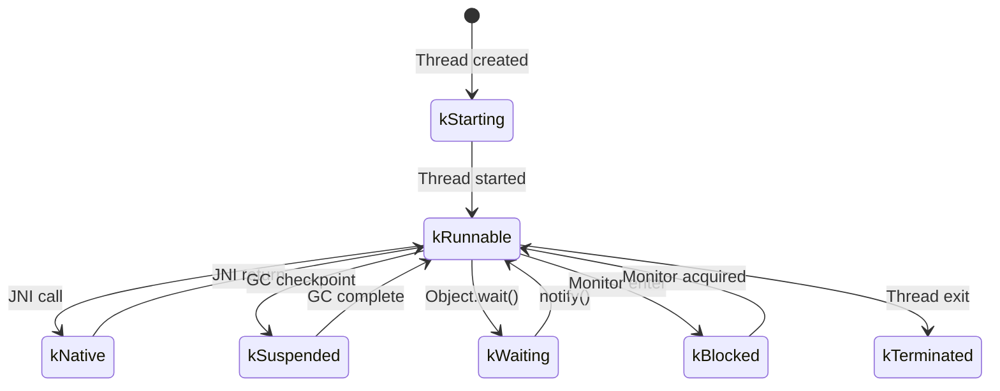

Only threads in `kRunnable` state can access the managed heap. The GC
requires all mutator threads to reach a safepoint (transition out of
kRunnable) before performing certain operations.

### 18.1.10 Locking Infrastructure

ART uses a well-defined lock hierarchy to prevent deadlocks. The hierarchy
is enforced through annotations (`REQUIRES`, `REQUIRES_SHARED`, `GUARDED_BY`)
and compile-time checking.

Key locks (in acquisition order):

1. **mutator_lock_** -- The primary reader-writer lock separating mutator
   threads (readers) from GC (exclusive writer). Most runtime operations
   hold this lock in shared mode.
2. **heap_bitmap_lock_** -- Protects GC bitmaps during marking and sweeping.
3. **classlinker_classes_lock_** -- Protects class tables during class
   loading.
4. **dex_lock_** -- Protects the list of registered DEX files.
5. **jni_libraries_lock_** -- Protects the native library table.
6. **thread_list_lock_** -- Protects the global thread list.

### 18.1.11 Signal Chain Library

The signal chain library (`art/sigchainlib/`) provides signal handling
management that allows ART's signal handlers to coexist with application
and NDK signal handlers. When a signal arrives:

1. ART's handler gets first chance to handle it.
2. If ART does not handle it (not a managed fault), it chains to the
   next handler.
3. If no handler handles it, the default action is taken.

This is critical for:

- Null pointer exception detection (SIGSEGV)
- Stack overflow detection (SIGSEGV/SIGBUS)
- GC implicit suspension (SIGSEGV on read barrier page)
- ANR dump generation (SIGQUIT)

### 18.1.12 Exception Handling

ART's exception handling follows the Java exception model:

1. **Throw** -- When a `throw` instruction executes, the runtime sets
   the pending exception on the current thread.
2. **Unwind** -- The stack walker searches up the call stack for a
   matching `catch` handler.
3. **Catch** -- If a matching handler is found, execution resumes at the
   handler's PC. The caught exception is stored in a special register via
   the `move-exception` instruction.
4. **Uncaught** -- If no handler is found, the thread's
   `UncaughtExceptionHandler` is invoked.

For compiled code, exception handling uses the stack map to determine
which handlers are active at each PC. For interpreted code, the try-item
table in the CodeItem is consulted.

The `CommonThrows` module (`art/runtime/common_throws.h`) provides factory
functions for common exceptions:

```
// art/runtime/common_throws.h (selected)
void ThrowNullPointerExceptionForFieldAccess(ArtField*, bool is_read);
void ThrowNullPointerExceptionForMethodAccess(uint32_t method_idx, InvokeType);
void ThrowArrayIndexOutOfBoundsException(int index, int length);
void ThrowClassCastException(ObjPtr<mirror::Class> actual, ObjPtr<mirror::Class> expected);
void ThrowArithmeticExceptionDivideByZero();
void ThrowStackOverflowError(Thread* self);
void ThrowNoSuchMethodError(InvokeType, mirror::Class*, std::string_view, Signature);
void ThrowNoSuchFieldError(std::string_view scope, mirror::Class*, std::string_view);
```

### 18.1.13 Monitor and Synchronization

Java's `synchronized` keyword and `Object.wait()` / `Object.notify()` are
implemented through the monitor system (`art/runtime/monitor.h`).

#### Thin Locks vs Fat Locks

ART uses a two-tier locking scheme:

1. **Thin lock** -- For uncontended synchronization, a thin lock is stored
   directly in the object's lock word (the first word of every object).
   Thin lock acquisition is a single CAS (compare-and-swap) operation:

   ```
   Lock Word layout (32 bits):
   [31:30] State (00=unlocked, 01=thin, 10=fat, 11=hash)
   [29:16] Lock count (recursion depth for thin locks)
   [15:0]  Thread ID (for thin locks)
   ```

2. **Fat lock** -- When contention is detected (another thread tries to
   acquire a thin lock held by a different thread), the thin lock is
   "inflated" to a fat lock. Fat locks use a `Monitor` object with a
   condition variable for `wait()` / `notify()` support.

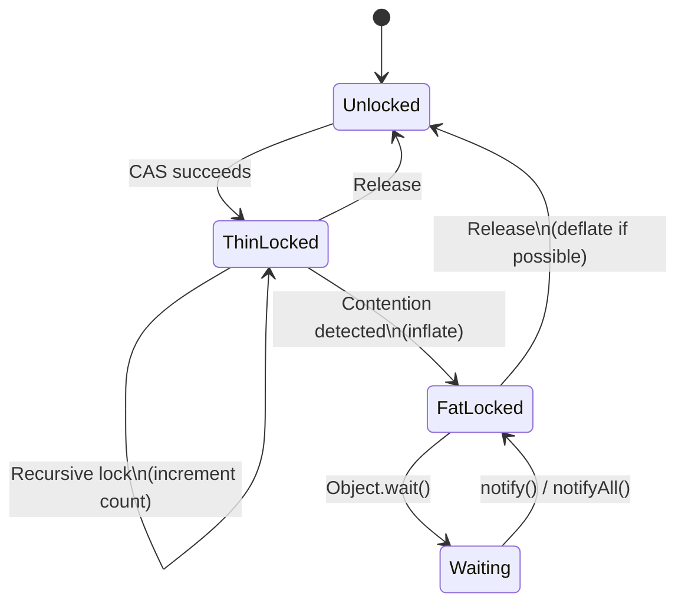

#### Monitor Pool

The `MonitorPool` (`art/runtime/monitor_pool.h`) pre-allocates Monitor
objects to avoid allocation during lock inflation (which could trigger GC
at an inconvenient time).

### 18.1.14 Intrinsics

ART recognizes certain Java methods as "intrinsics" and provides optimized
implementations that bypass the normal call sequence. Intrinsics are
implemented in architecture-specific code generators and provide
significant speedups for:

- **Math operations** -- `Math.abs()`, `Math.min()`, `Math.max()`,
  `Math.sqrt()` use hardware instructions directly.
- **String operations** -- `String.charAt()`, `String.compareTo()`,
  `String.equals()` use optimized assembly.
- **Object operations** -- `Object.getClass()` reads the class field directly.
- **System operations** -- `System.arraycopy()` uses optimized memory copy.
- **Unsafe operations** -- `Unsafe.compareAndSwapInt()` etc. use hardware
  CAS instructions.
- **Thread operations** -- `Thread.currentThread()` reads the thread-local
  storage directly.

Intrinsic recognition is controlled by the `kAccIntrinsic` access flag bit
in `ArtMethod::access_flags_`. The specific intrinsic is identified by
additional bits in the access flags:

```
// art/runtime/art_method.h, lines 256-258
bool IsIntrinsic() const {
  return IsIntrinsic(GetAccessFlags());
}
```

### 18.1.15 Memory Representation

ART uses specific in-memory representations for objects that are carefully
designed for performance:

#### Object Layout

Every Java object begins with a two-word header:

1. **Lock word** (32 bits) -- Monitor state, hash code, or GC forwarding
   pointer.
2. **Class pointer** (32 bits, compressed) -- Reference to the
   `mirror::Class` object.

Instance fields follow the header, ordered to minimize padding:

- References first (for GC scanning efficiency)
- Then 64-bit fields, 32-bit fields, 16-bit fields, 8-bit fields

#### Array Layout

Arrays have an additional word after the object header:

- **Length** (32 bits) -- Number of elements

Array elements follow the length field, aligned to their natural alignment.

#### String Layout

`java.lang.String` objects contain:

- Object header (lock word + class pointer)
- `count` (32 bits) -- Number of characters
- `hash` (32 bits) -- Cached hash code
- Character data (inline, after the fields)

Strings may use either UTF-16 or compressed (Latin-1) encoding. The
encoding is indicated by a flag in the `count` field.

### 18.1.16 Key Data Structures

#### ArtMethod

Every Java/Kotlin method is represented internally by an `ArtMethod` object
(declared in `art/runtime/art_method.h`, line 89). `ArtMethod` is not a
managed GC object -- it is allocated in LinearAlloc and pointed to by the
managed `java.lang.reflect.Method` object.

```
// art/runtime/art_method.h, lines 89-99
class EXPORT ArtMethod final {
 public:
  DECLARE_RUNTIME_DEBUG_FLAG(kCheckDeclaringClassState);
  static constexpr uint32_t kRuntimeMethodDexMethodIndex = 0xFFFFFFFF;

  ArtMethod() : access_flags_(0), dex_method_index_(0),
      method_index_(0), hotness_count_(0) { }
  ...
};
```

Key fields include:

- `declaring_class_` -- GC root pointing to the declaring `mirror::Class`
- `access_flags_` -- method modifiers and runtime flags (atomic for
  concurrent access)
- `dex_method_index_` -- index into the DEX file's method_id table
- `method_index_` -- vtable or iftable index
- `hotness_count_` -- counter used by the JIT for profiling
- `ptr_sized_fields_.data_` -- points to either the DEX CodeItem (for
  interpreted methods) or the profiling info
- `ptr_sized_fields_.entry_point_from_quick_compiled_code_` -- function
  pointer to compiled code or a trampoline

The entry point field is the mechanism by which ART selects the execution mode:
it can point to the interpreter bridge, JIT-compiled code, AOT-compiled code, or
a resolution trampoline (for unresolved methods).

ArtMethod provides rich query methods for checking method properties:

```
// art/runtime/art_method.h, lines 168-234 (selected)
bool IsPublic() const { return (GetAccessFlags() & kAccPublic) != 0; }
bool IsPrivate() const { return (GetAccessFlags() & kAccPrivate) != 0; }
bool IsStatic() const { return (GetAccessFlags() & kAccStatic) != 0; }
bool IsConstructor() const { return (GetAccessFlags() & kAccConstructor) != 0; }
bool IsDirect() const {
  constexpr uint32_t direct = kAccStatic | kAccPrivate | kAccConstructor;
  return (GetAccessFlags() & direct) != 0;
}
bool IsSynchronized() const {
  constexpr uint32_t synchonized = kAccSynchronized | kAccDeclaredSynchronized;
  return (GetAccessFlags() & synchonized) != 0;
}
bool IsFinal() const { return (GetAccessFlags() & kAccFinal) != 0; }
bool IsIntrinsic() const { return (GetAccessFlags() & kAccIntrinsic) != 0; }
```

The distinction between "direct" and "virtual" methods is critical for dispatch:

- **Direct methods** (static, private, constructors) are dispatched directly
  to their implementation -- no vtable lookup needed.
- **Virtual methods** (everything else) are dispatched through the vtable or
  interface method table (IMT).

#### ArtMethod Entry Points

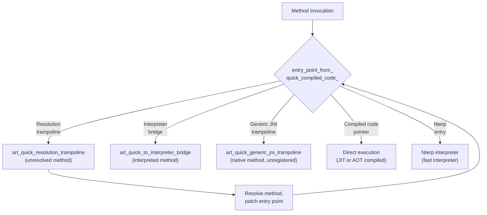

#### mirror::Class

The managed representation of a loaded class. Contains the vtable, iftable
(interface table), field arrays, method arrays, and the class status
(verified, initialized, etc.). As a managed object, `mirror::Class` instances
live on the GC heap and are subject to garbage collection and relocation.

Key components of a `mirror::Class`:

- **vtable** -- array of `ArtMethod*` for virtual method dispatch
- **iftable** -- interface table mapping interfaces to their method arrays
- **imt** -- interface method table (hash-based fast dispatch)
- **sfields** -- static field array
- **ifields** -- instance field array
- **class_size** -- size of an instance of this class
- **status** -- current class status (loaded, verified, initialized, etc.)
- **class_loader** -- reference to the ClassLoader that loaded this class

#### DexCache

A per-DEX-file cache of resolved strings, types, methods, and fields.
Accelerates repeated lookups without re-resolving from the DEX file.

The DexCache is created by the ClassLinker when a DEX file is opened and is
stored as a managed `mirror::DexCache` object on the heap. It contains:

- **Resolved strings array** -- maps `StringIndex` to `mirror::String*`
- **Resolved types array** -- maps `TypeIndex` to `mirror::Class*`
- **Resolved methods array** -- maps method index to `ArtMethod*`
- **Resolved fields array** -- maps field index to `ArtField*`

Unresolved entries contain `null` (or `GcRoot<nullptr>`), triggering
resolution on first access.

#### InternTable

The intern table stores canonical instances of `java.lang.String` objects.
When `String.intern()` is called, the intern table returns the canonical
instance if one exists, or inserts the string and returns it. The boot
image pre-populates the intern table with frequently used strings.

#### LinearAlloc

A bump-pointer allocator used for runtime metadata that is never individually
freed (only freed when the entire classloader is unloaded). Used for:

- `ArtMethod` arrays
- `ArtField` arrays
- Class tables
- IMT conflict tables
- DexCache backing storage

---

## 18.2 DEX File Format

The DEX (Dalvik Executable) file format is the bytecode container consumed by
ART. Unlike Java's `.class` files (one per class), a single `.dex` file
bundles all classes from a compilation unit into a single, deduplicated
structure optimized for memory-mapped access.

Source: `art/libdexfile/` (library that parses and validates DEX files).

### 18.2.1 Header Structure

The DEX header is defined in `art/libdexfile/dex/dex_file.h`:

```
// art/libdexfile/dex/dex_file.h, lines 137-161
struct Header {
  Magic magic_ = {};              // "dex\n035\0" or similar
  uint32_t checksum_ = 0;        // adler32 of everything except magic and this field
  Sha1 signature_ = {};          // SHA-1 hash of the rest of the file
  uint32_t file_size_ = 0;       // size of entire file
  uint32_t header_size_ = 0;     // offset to start of next section
  uint32_t endian_tag_ = 0;      // 0x12345678
  uint32_t link_size_ = 0;       // unused
  uint32_t link_off_ = 0;        // unused
  uint32_t map_off_ = 0;         // offset to map list
  uint32_t string_ids_size_ = 0; // number of StringIds
  uint32_t string_ids_off_ = 0;  // file offset of StringIds array
  uint32_t type_ids_size_ = 0;   // number of TypeIds
  uint32_t type_ids_off_ = 0;    // file offset of TypeIds array
  uint32_t proto_ids_size_ = 0;  // number of ProtoIds
  uint32_t proto_ids_off_ = 0;   // file offset of ProtoIds array
  uint32_t field_ids_size_ = 0;  // number of FieldIds
  uint32_t field_ids_off_ = 0;   // file offset of FieldIds array
  uint32_t method_ids_size_ = 0; // number of MethodIds
  uint32_t method_ids_off_ = 0;  // file offset of MethodIds array
  uint32_t class_defs_size_ = 0; // number of ClassDefs
  uint32_t class_defs_off_ = 0;  // file offset of ClassDef array
  uint32_t data_size_ = 0;       // size of data section
  uint32_t data_off_ = 0;        // file offset of data section
};
```

DEX version 41 adds container support (multiple DEX files in a single container):

```
// art/libdexfile/dex/dex_file.h, lines 184-187
struct HeaderV41 : public Header {
  uint32_t container_size_ = 0;  // total size of all dex files in the container
  uint32_t header_offset_ = 0;   // offset of this dex's header in the container
};
```

### 18.2.2 File Layout

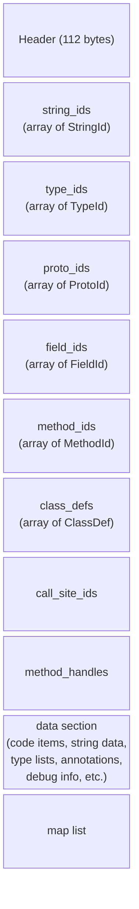

### 18.2.3 Index Tables

The DEX format uses index tables to deduplicate data. Each table is an array
of fixed-size structures, and indices into these tables are used throughout.

**StringId** (`art/libdexfile/dex/dex_file_structs.h`, line 52):
```
struct StringId {
  uint32_t string_data_off_;  // offset to MUTF-8 string data
};
```

**TypeId** (line 60):
```
struct TypeId {
  dex::StringIndex descriptor_idx_;  // index into string_ids
};
```

**FieldId** (line 68):
```
struct FieldId {
  dex::TypeIndex class_idx_;   // defining class
  dex::TypeIndex type_idx_;    // field type
  dex::StringIndex name_idx_;  // field name
};
```

**MethodId** (line 89):
```
struct MethodId {
  dex::TypeIndex class_idx_;   // defining class
  dex::ProtoIndex proto_idx_;  // method prototype (return type + parameters)
  dex::StringIndex name_idx_;  // method name
};
```

**ProtoId** (line 78):
```
struct ProtoId {
  dex::StringIndex shorty_idx_;     // shorty descriptor (e.g., "VIL")
  dex::TypeIndex return_type_idx_;  // return type
  uint16_t pad_;                    // alignment padding
  uint32_t parameters_off_;         // offset to TypeList for parameters
};
```

### 18.2.4 ClassDef and Class Data

The **ClassDef** structure (`art/libdexfile/dex/dex_file_structs.h`, line 108)
defines a class:

```
struct ClassDef {
  dex::TypeIndex class_idx_;       // this class's type
  uint16_t pad1_;
  uint32_t access_flags_;          // ACC_PUBLIC, ACC_FINAL, etc.
  dex::TypeIndex superclass_idx_;  // superclass type
  uint16_t pad2_;
  uint32_t interfaces_off_;        // offset to TypeList of interfaces
  dex::StringIndex source_file_idx_;  // source file name
  uint32_t annotations_off_;       // annotations directory
  uint32_t class_data_off_;        // offset to class_data_item
  uint32_t static_values_off_;     // initial static field values
};
```

The `class_data_item` (pointed to by `class_data_off_`) uses LEB128 encoding
to store:

- Number of static fields
- Number of instance fields
- Number of direct methods (static, private, constructors)
- Number of virtual methods
- For each field: field index delta and access flags
- For each method: method index delta, access flags, and code offset

### 18.2.5 CodeItem -- Method Bytecode

The `CodeItem` structure contains the actual DEX bytecode for a method.
In standard DEX format, it includes:

- `registers_size` -- number of registers used
- `ins_size` -- number of incoming argument registers
- `outs_size` -- number of outgoing argument registers
- `tries_size` -- number of try/catch blocks
- `debug_info_off` -- offset to debug information
- `insns_size` -- number of 16-bit code units
- `insns[]` -- the bytecode instructions
- Try items and catch handler data (if `tries_size > 0`)

### 18.2.6 Map Item Types

The map list at the end of the DEX file provides a typed table of contents.
Map item type codes are defined in `art/libdexfile/dex/dex_file.h`
(lines 190-211):

```
enum MapItemType : uint16_t {
  kDexTypeHeaderItem               = 0x0000,
  kDexTypeStringIdItem             = 0x0001,
  kDexTypeTypeIdItem               = 0x0002,
  kDexTypeProtoIdItem              = 0x0003,
  kDexTypeFieldIdItem              = 0x0004,
  kDexTypeMethodIdItem             = 0x0005,
  kDexTypeClassDefItem             = 0x0006,
  kDexTypeCallSiteIdItem           = 0x0007,
  kDexTypeMethodHandleItem         = 0x0008,
  kDexTypeMapList                  = 0x1000,
  kDexTypeTypeList                 = 0x1001,
  kDexTypeAnnotationSetRefList     = 0x1002,
  kDexTypeAnnotationSetItem        = 0x1003,
  kDexTypeClassDataItem            = 0x2000,
  kDexTypeCodeItem                 = 0x2001,
  kDexTypeStringDataItem           = 0x2002,
  kDexTypeDebugInfoItem            = 0x2003,
  kDexTypeAnnotationItem           = 0x2004,
  kDexTypeEncodedArrayItem         = 0x2005,
  kDexTypeAnnotationsDirectoryItem = 0x2006,
  kDexTypeHiddenapiClassData       = 0xF000,
};
```

### 18.2.7 Type Descriptors

DEX type descriptors follow the JNI convention:

| Descriptor | Type |
|-----------|------|
| `V` | void |
| `Z` | boolean |
| `B` | byte |
| `S` | short |
| `C` | char |
| `I` | int |
| `J` | long |
| `F` | float |
| `D` | double |
| `Ljava/lang/String;` | object reference |
| `[I` | int array |
| `[[Ljava/lang/Object;` | 2D Object array |

### 18.2.8 Hidden API Data

Since Android P, the DEX format includes a `HiddenapiClassData` section
(`art/libdexfile/dex/dex_file_structs.h`, line 274) that tags each
field and method with hidden API restriction flags. This supports the
"greylist" and "blacklist" enforcement that prevents apps from accessing
internal platform APIs.

### 18.2.9 Method Handle and Call Site Items

DEX version 38+ adds support for `invokedynamic` through:

- **MethodHandleItem** (line 179) -- references to static/instance
  getters, setters, and method invokers
- **CallSiteIdItem** (line 189) -- references to bootstrap methods for
  dynamic invocation

These are essential for lambda expressions and other `invokedynamic`-based
features.

### 18.2.10 DEX Bytecode Instructions

The DEX bytecode uses 16-bit instruction units. Instructions are encoded in
one to five 16-bit words. The first word always contains the opcode in the
lower 8 bits. The opcode space encompasses approximately 256 instructions,
organized into categories:

#### Move Instructions
```
00: nop
01: move vA, vB               (4-bit registers)
02: move/from16 vAA, vBBBB    (8-bit and 16-bit registers)
03: move/16 vAAAA, vBBBB      (16-bit registers)
04: move-wide vA, vB          (wide move, 64-bit)
07: move-object vA, vB        (object reference move)
0a: move-result vAA           (captures return value)
0b: move-result-wide vAA
0c: move-result-object vAA
0d: move-exception vAA        (captures exception in catch)
```

#### Return Instructions
```
0e: return-void
0f: return vAA
10: return-wide vAA
11: return-object vAA
```

#### Const Instructions
```
12: const/4 vA, #+B           (4-bit constant)
13: const/16 vAA, #+BBBB      (16-bit constant)
14: const vAA, #+BBBBBBBB     (32-bit constant)
15: const/high16 vAA, #+BBBB0000
18: const-wide vAA, #+BBBBBBBBBBBBBBBB  (64-bit constant)
1a: const-string vAA, string@BBBB
1c: const-class vAA, type@BBBB
```

#### Instance and Static Operations
```
52-58: iget, iget-wide, iget-object, iget-boolean, ...
59-5f: iput, iput-wide, iput-object, iput-boolean, ...
60-66: sget, sget-wide, sget-object, sget-boolean, ...
67-6d: sput, sput-wide, sput-object, sput-boolean, ...
```

#### Invoke Instructions
```
6e: invoke-virtual {vC..vG}, method@BBBB
6f: invoke-super {vC..vG}, method@BBBB
70: invoke-direct {vC..vG}, method@BBBB
71: invoke-static {vC..vG}, method@BBBB
72: invoke-interface {vC..vG}, method@BBBB
74: invoke-virtual/range {vCCCC..vNNNN}, method@BBBB
```

#### Arithmetic and Logic
```
90-af: add, sub, mul, div, rem, and, or, xor, shl, shr, ushr
       (for int, long, float, double variants)
b0-cf: add/2addr, sub/2addr, mul/2addr, ...
       (2-address form: vA = vA op vB)
d0-d7: add-int/lit16, rsub-int, mul-int/lit16, ...
       (immediate operand forms)
```

#### Comparison and Branch
```
2d-31: cmpl-float, cmpg-float, cmpl-double, cmpg-double, cmp-long
32-37: if-eq, if-ne, if-lt, if-ge, if-gt, if-le
38-3d: if-eqz, if-nez, if-ltz, if-gez, if-gtz, if-lez
28-2a: goto, goto/16, goto/32
2b: packed-switch
2c: sparse-switch
```

#### Array Operations
```
44-4a: aget, aget-wide, aget-object, aget-boolean, ...
4b-51: aput, aput-wide, aput-object, aput-boolean, ...
21: array-length vA, vB
23: new-array vA, vB, type@CCCC
24: filled-new-array {vC..vG}, type@BBBB
```

#### Object Operations
```
1f: check-cast vAA, type@BBBB
20: instance-of vA, vB, type@CCCC
22: new-instance vAA, type@BBBB
27: throw vAA
```

Each instruction operates on DEX virtual registers (numbered 0 to
`registers_size - 1`). The last `ins_size` registers are the method's
incoming parameters.

### 18.2.11 MUTF-8 String Encoding

DEX files use Modified UTF-8 (MUTF-8) for string encoding, which differs
from standard UTF-8 in two ways:

1. **Null character** (U+0000) is encoded as two bytes `0xC0 0x80` instead
   of a single zero byte. This allows C-style null-terminated string
   handling.
2. **Supplementary characters** (U+10000 and above) are encoded as two
   three-byte sequences representing a UTF-16 surrogate pair, rather than
   a single four-byte UTF-8 sequence.

String data in the DEX file is preceded by a ULEB128-encoded length
(number of UTF-16 code units, not bytes) and followed by a null terminator.

### 18.2.12 LEB128 Encoding

The DEX format extensively uses LEB128 (Little-Endian Base 128) encoding
for variable-length integers. This saves space for small values:

- **ULEB128** (unsigned): Each byte uses 7 data bits and 1 continuation bit.
  Values 0-127 use 1 byte, 128-16383 use 2 bytes, etc.
- **SLEB128** (signed): Similar but with sign extension.
- **ULEB128p1**: ULEB128 encoding of value+1, used for values that are
  often zero (the default or "no value" case).

LEB128 is used for:

- Class data item (field/method counts and deltas)
- Debug information
- Annotation encodings
- Hidden API flags

### 18.2.13 Annotations

The DEX format supports Java annotations with three visibility levels
(defined in `art/libdexfile/dex/dex_file.h`, lines 231-235):

```
enum class DexVisibility : uint8_t {
  kBuild         = 0x00,  // visible at build time only
  kRuntime       = 0x01,  // visible at runtime via reflection
  kSystem        = 0x02,  // visible to the runtime system only
};
```

Annotation data is organized as:

1. **AnnotationsDirectoryItem** -- Per-class directory of all annotations:
   ```
   struct AnnotationsDirectoryItem {
     uint32_t class_annotations_off_;
     uint32_t fields_size_;
     uint32_t methods_size_;
     uint32_t parameters_size_;
   };
   ```

2. **AnnotationSetItem** -- A set of annotations for a single target
   (class, field, method, or parameter).

3. **AnnotationItem** -- A single annotation, containing the visibility
   flag and encoded annotation data.

Annotation data uses a tagged encoding scheme with type codes:

```
// art/libdexfile/dex/dex_file.h, lines 237-255
kDexAnnotationByte          = 0x00,
kDexAnnotationShort         = 0x02,
kDexAnnotationChar          = 0x03,
kDexAnnotationInt           = 0x04,
kDexAnnotationLong          = 0x06,
kDexAnnotationFloat         = 0x10,
kDexAnnotationDouble        = 0x11,
kDexAnnotationString        = 0x17,
kDexAnnotationType          = 0x18,
kDexAnnotationField         = 0x19,
kDexAnnotationMethod        = 0x1a,
kDexAnnotationEnum          = 0x1b,
kDexAnnotationArray         = 0x1c,
kDexAnnotationAnnotation    = 0x1d,
kDexAnnotationNull          = 0x1e,
kDexAnnotationBoolean       = 0x1f,
```

### 18.2.14 Debug Information

The DEX debug info section contains information for source-level debugging:

- **Line number table** -- Maps bytecode offsets to source line numbers.
  Uses a compact bytecode-like encoding with opcodes for advancing the
  line number and PC.
- **Local variable table** -- Records the name, type, and scope of local
  variables for each method.

Debug info is optional and can be stripped from release builds to reduce
DEX file size. The debug info bytecodes include:

```
DBG_END_SEQUENCE       = 0x00  // End of debug info
DBG_ADVANCE_PC         = 0x01  // Advance PC, no line change
DBG_ADVANCE_LINE       = 0x02  // Advance line, no PC change
DBG_START_LOCAL        = 0x03  // Start of local variable scope
DBG_START_LOCAL_EXTENDED = 0x04  // With type signature
DBG_END_LOCAL          = 0x05  // End of local variable scope
DBG_RESTART_LOCAL      = 0x06  // Restart a previously ended local
DBG_SET_PROLOGUE_END   = 0x07  // Mark end of method prologue
DBG_SET_EPILOGUE_BEGIN = 0x08  // Mark start of method epilogue
DBG_SET_FILE           = 0x09  // Set source file name
// 0x0a-0xff: Special opcodes encoding line + PC advancement
```

### 18.2.15 DEX File Walkthrough

To illustrate the complete DEX file structure, consider a simple class:

```java
package com.example;

public class Hello {
    private String message;

    public Hello(String msg) {
        this.message = msg;
    }

    public String getMessage() {
        return message;
    }

    public static void main(String[] args) {
        Hello h = new Hello("world");
        System.out.println(h.getMessage());
    }
}
```

This would produce a DEX file with approximately:

- **String pool**: 15-20 entries including "com/example/Hello",
  "Ljava/lang/String;", "getMessage", "main", "message", "\<init\>",
  "world", "Ljava/io/PrintStream;", "println", etc.
- **Type pool**: 5-8 entries including `Lcom/example/Hello;`,
  `Ljava/lang/String;`, `Ljava/lang/Object;`, `[Ljava/lang/String;`,
  `Ljava/io/PrintStream;`, `Ljava/lang/System;`, `V` (void).
- **Proto pool**: 3-4 entries for method signatures like `(Ljava/lang/String;)V`,
  `()Ljava/lang/String;`, `([Ljava/lang/String;)V`.
- **Field pool**: 2+ entries for `Hello.message` and `System.out`.
- **Method pool**: 5+ entries for `Hello.<init>`, `Hello.getMessage`,
  `Hello.main`, `Object.<init>`, `PrintStream.println`.
- **Class def**: 1 entry for `com.example.Hello`.
- **Code items**: 3 items for the three methods of Hello.

### 18.2.16 Standard vs Compact DEX

ART historically supported two DEX variants:

- **Standard DEX** (`StandardDexFile`) -- the traditional DEX format as
  described above.
- **Compact DEX** (now deprecated) -- an internal optimization that used
  more compact encodings for code items and debug info. Compact DEX was
  used in VDEX files to reduce storage overhead but has been phased out
  in favor of improved standard DEX handling.

### 18.2.17 DEX File Validation

The `DexFileVerifier` validates DEX files during loading:

- Magic number and version check
- Checksum verification (adler32)
- Section offset and size bounds checking
- String data encoding validation (MUTF-8)
- Class def ordering (enforced since version 37)
- Cross-reference consistency (type/field/method references)
- Code item validation (register counts, handler offsets)

Validation is critical for security -- a malformed DEX file could crash
the runtime or enable code execution exploits.

### 18.2.18 DexFile Class API

The `DexFile` class (`art/libdexfile/dex/dex_file.h`, line 110) provides
the primary API for accessing DEX file contents:

```
// art/libdexfile/dex/dex_file.h (selected API)
class DexFile {
 public:
  static constexpr size_t kDexMagicSize = 4;
  static constexpr size_t kDexVersionLen = 4;
  static constexpr uint32_t kDexContainerVersion = 41;
  static constexpr size_t kSha1DigestSize = 20;
  static constexpr uint32_t kDexEndianConstant = 0x12345678;
  static constexpr uint16_t kDexNoIndex16 = 0xFFFF;
  static constexpr uint32_t kDexNoIndex32 = 0xFFFFFFFF;
  ...
};
```

Key operations:

- `GetStringData()` -- Get the raw MUTF-8 bytes for a string
- `GetTypeDescriptor()` -- Get the descriptor string for a type
- `GetMethodDeclaringClassDescriptor()` -- Get the declaring class of a method
- `FindClassDef()` -- Find the ClassDef for a given type descriptor
- `GetCodeItem()` -- Get the bytecode for a method
- `GetProtoParameters()` -- Get parameter types for a method prototype

---

## 18.3 Compilation: dex2oat

`dex2oat` is the ahead-of-time (AOT) compiler that transforms DEX bytecode
into native machine code. It runs at app install time, during background
optimization ("bg-dexopt"), and at boot time to compile the boot classpath.

Source: `art/dex2oat/` (7 subdirectories) with the main entry in
`art/dex2oat/dex2oat.cc`.

### 18.3.1 Architecture

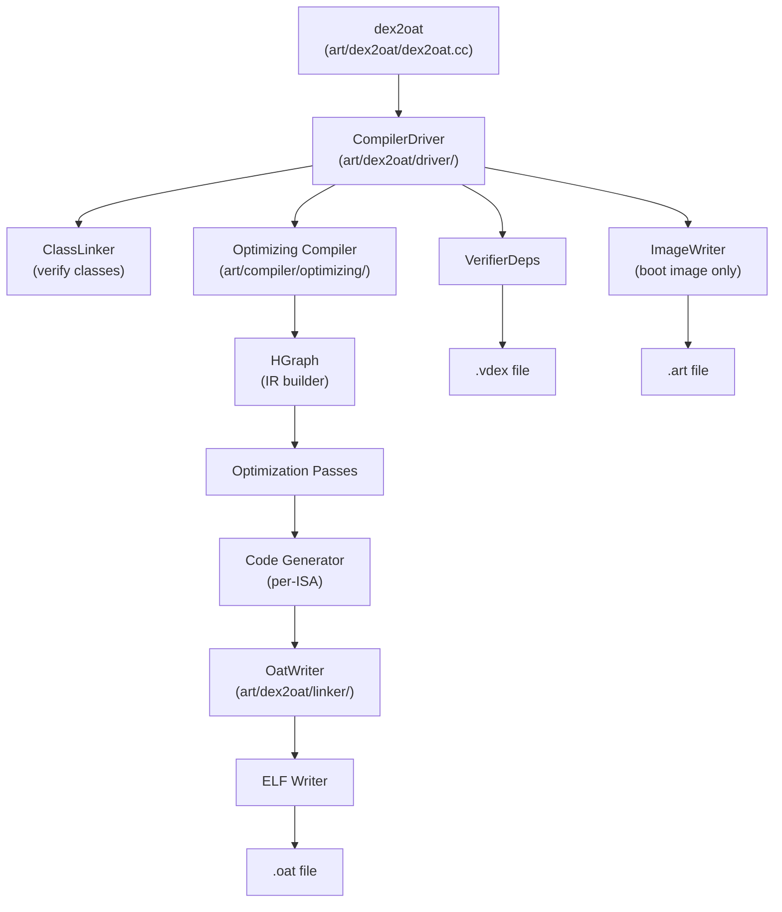

### 18.3.2 dex2oat Entry Point

The `dex2oat` binary's main function invokes the `Dex2Oat` class, which
orchestrates the entire compilation pipeline. The main source file
(`art/dex2oat/dex2oat.cc`) is substantial at over 2,000 lines.

Return codes are defined at line 114:

```
// art/dex2oat/dex2oat.cc, lines 114-118
enum class ReturnCode : int {
  kNoFailure = 0,
  kOther = 1,
  kCreateRuntime = 2,
};
```

### 18.3.3 Compiler Filters

Compiler filters control how much work `dex2oat` performs. They are defined in
`art/libartbase/base/compiler_filter.h`:

```
// art/libartbase/base/compiler_filter.h, lines 34-43
enum Filter {
  kAssumeVerified,    // Skip verification, mark all verified
  kVerify,            // Only verify classes (no compilation)
  kSpaceProfile,      // Minimize space, guided by profile
  kSpace,             // Minimize space
  kSpeedProfile,      // Maximize speed, guided by profile
  kSpeed,             // Maximize speed (compile everything)
  kEverythingProfile, // Compile everything possible, per profile
  kEverything,        // Compile absolutely everything
};
```

The default filter is `kSpeed`:

```
static const Filter kDefaultCompilerFilter = kSpeed;
```

In practice, the Android package manager uses `speed-profile` for most app
installations, falling back to `verify` for very large apps:

```
// art/dex2oat/dex2oat.cc, line 129
static constexpr CompilerFilter::Filter kLargeAppFilter = CompilerFilter::kVerify;
```

### 18.3.4 Profile-Guided Compilation (speed-profile)

The `speed-profile` filter is the most common on production devices. It works
as follows:

1. **Profile collection** -- During app execution, the JIT records which
   methods are hot (invoked frequently), which classes are used at startup,
   and which methods use inline caches. This data is persisted to
   `/data/misc/profiles/cur/<user>/<package>/primary.prof`.

2. **Profile merging** -- The `profman` tool (`art/profman/`) merges
   current profiles with the reference profile.

3. **Selective compilation** -- `dex2oat --compiler-filter=speed-profile`
   reads the merged profile and only AOT-compiles methods marked as hot.
   Other methods remain in DEX form and will be interpreted or JIT-compiled
   at runtime.

4. **Startup optimization** -- Classes used during startup are pre-initialized
   in the app image (`.art` file), reducing class loading overhead.

### 18.3.5 Boot Image Compilation

The boot image contains precompiled code for the core platform classes
(`java.lang.*`, `android.*`, etc.). It is compiled during device build or
after an OTA update by `odrefresh` (see Section 19.8).

The boot image consists of three file types per ISA:

| File | Content |
|------|---------|
| `boot.art` | Heap image: preinitialized class objects, interned strings |
| `boot.oat` | Compiled native code for boot classpath methods |
| `boot.vdex` | Verified DEX data and verifier dependencies |

Boot images are memory-mapped read-only and shared across all processes via
the Zygote fork model.

### 18.3.6 Output File Formats

#### OAT File

The OAT file is an ELF shared library containing compiled native code. Its
header is defined in `art/runtime/oat/oat.h`:

```
// art/runtime/oat/oat.h, lines 47-51
class PACKED(4) OatHeader {
 public:
  static constexpr std::array<uint8_t, 4> kOatMagic { { 'o', 'a', 't', '\n' } };
  static constexpr std::array<uint8_t, 4> kOatVersion{{'2', '6', '5', '\0'}};
  ...
};
```

The OAT header stores key-value metadata including:

- `compiler-filter` -- the filter used for compilation
- `bootclasspath` -- the boot classpath at compile time
- `bootclasspath-checksums` -- checksums for invalidation
- `dex2oat-cmdline` -- the full command used for compilation
- `compilation-reason` -- why the compilation was triggered
- `concurrent-copying` -- GC configuration at compile time

Trampoline stubs are defined as `StubType` enum values
(`art/runtime/oat/oat.h`, lines 35-43):

```
enum class StubType {
  kJNIDlsymLookupTrampoline,
  kJNIDlsymLookupCriticalTrampoline,
  kQuickGenericJNITrampoline,
  kQuickIMTConflictTrampoline,
  kQuickResolutionTrampoline,
  kQuickToInterpreterBridge,
  kNterpTrampoline,
};
```

#### VDEX File

The VDEX file stores verified DEX data and verifier dependencies. Its format
is described in `art/runtime/vdex_file.h` (lines 47-78):

```
// File format:
//   VdexFileHeader
//   VdexSectionHeader[kNumberOfSections]
//
//   Checksum section:     VdexChecksum[D]
//   Dex section:          DEX[0] ... DEX[D-1]
//   VerifierDeps section: verification dependencies
//   TypeLookupTable:      fast type lookup data
```

VDEX sections are enumerated as:

```
// art/runtime/vdex_file.h, lines 80-86
enum VdexSection : uint32_t {
  kChecksumSection = 0,
  kDexFileSection = 1,
  kVerifierDepsSection = 2,
  kTypeLookupTableSection = 3,
  kNumberOfSections = 4,
};
```

The VDEX file enables faster re-verification: if the verifier dependencies
have not changed, ART can skip re-verifying classes and use the stored
verification results.

### 18.3.7 Compilation Pipeline Internals

The `dex2oat` compilation pipeline follows these steps:

1. **Parse arguments** -- Process `--dex-file`, `--oat-file`,
   `--compiler-filter`, `--instruction-set`, profile paths, etc.
2. **Create runtime** -- Spin up a stripped-down ART runtime with no JIT,
   minimal heap, and the AOT compiler callbacks.
3. **Open DEX files** -- Load the input DEX files from APKs or standalone
   DEX files.
4. **Verify classes** -- Use the verifier to validate bytecode correctness.
   Record verifier dependencies in the `VerifierDeps` structure.
5. **Compile methods** -- For methods matching the compiler filter, invoke
   the Optimizing compiler to generate native code.
6. **Write output** -- The `OatWriter` produces the `.oat` ELF file,
   the `.vdex` file, and optionally the `.art` image file.

### 18.3.8 CompilerDriver

The `CompilerDriver` (`art/dex2oat/driver/compiler_driver.h`) orchestrates
the compilation of all methods in the input DEX files. It manages:

1. **Parallelism** -- Uses a thread pool to compile multiple methods
   concurrently across CPU cores.
2. **Class resolution** -- Resolves classes needed for compilation.
3. **Method compilation dispatch** -- Decides which methods to compile based
   on the compiler filter and profile data.
4. **Verification** -- Drives the class verifier before compilation.
5. **Transaction support** -- Tracks side effects of class initialization
   during AOT compilation to enable rollback.

#### CompilerOptions

The `CompilerOptions` (`art/dex2oat/driver/compiler_options.h`) configure
the compilation behavior:

- **Instruction set** -- Target ISA (ARM, ARM64, x86, x86-64, RISC-V 64)
- **Instruction set features** -- CPU features (NEON, SSE, etc.)
- **Compiler filter** -- What to compile
- **Profile** -- Path to the profile file for PGO
- **Debuggable** -- Whether to generate debuggable code
- **Inline max code units** -- Maximum method size for inlining
- **Number of threads** -- Compilation parallelism

### 18.3.9 The Optimizing Compiler for AOT

When `dex2oat` compiles a method, it invokes the same optimizing compiler
back-end used by the JIT. The key difference is that AOT compilation:

- Has more time for optimization (no interactive latency constraint)
- Can apply more aggressive optimizations
- Generates position-independent code (for relocation)
- Produces stack maps for GC and deoptimization
- Resolves and inlines more aggressively (knows the full classpath)

The compilation pipeline for each method:

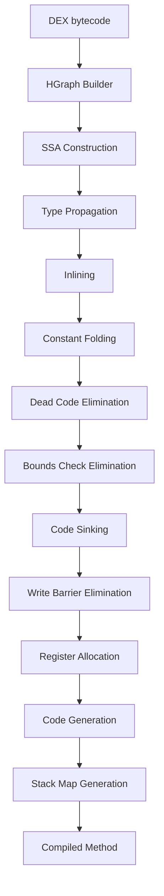

### 18.3.10 Linker and Image Writer

After compilation, the `OatWriter` (`art/dex2oat/linker/oat_writer.h`)
assembles the compiled methods into an ELF-format OAT file. Key operations:

1. **Method ordering** -- Methods are ordered to improve code locality.
2. **Relocation** -- Code is compiled as position-independent and relocated
   at load time.
3. **Deduplication** -- Identical compiled methods can share code.
4. **BSS section** -- A BSS (Block Started by Symbol) section stores
   lazily-resolved references to boot image objects.

The `ImageWriter` (`art/dex2oat/linker/image_writer.h`) creates `.art` image
files for boot images and app images. It:

1. **Computes the image layout** -- Determines which objects go into the image
   and their positions.
2. **Initializes classes** -- Runs class initializers at compile time so that
   static state is captured in the image.
3. **Fixes up references** -- Patches object references to their image-space
   addresses.
4. **Generates relocation info** -- Records which fields need patching at
   load time.

### 18.3.11 Verification at Compile Time

`dex2oat` performs class verification during compilation. The verifier checks
each method's bytecode for type safety, register consistency, and access
control violations.

Verification results are recorded in the `VerifierDeps` structure and stored
in the VDEX file. At runtime, if the verifier dependencies have not changed,
the runtime can skip re-verification -- a significant startup optimization.

Verification dependencies include:

- Types assumed to be assignable to other types
- Types assumed to NOT be assignable
- Classes resolved during verification
- Field types resolved during verification
- Method signatures resolved during verification

### 18.3.12 Transaction Mode

During boot image compilation, `dex2oat` runs class initializers (`<clinit>`)
to capture initialized state in the image. However, some initializers may
have side effects that are not desirable at compile time (e.g., accessing the
network, writing files). The Transaction mechanism
(`art/dex2oat/transaction.h`) provides rollback capability:

1. All heap modifications during class initialization are recorded.
2. If the initialization fails or is deemed unsafe, the transaction is
   rolled back, restoring the heap to its pre-initialization state.
3. If initialization succeeds, the transaction is committed and the
   initialized state is captured in the image.

```
// art/dex2oat/transaction.h (purpose)
// Track all changes that happen during class initialization in AOT
// compilation so they can be rolled back if needed.
```

### 18.3.13 AOT Class Linker

The `AotClassLinker` (`art/dex2oat/aot_class_linker.h`) extends the standard
`ClassLinker` with AOT-specific behavior:

- Prevents class initialization side effects from escaping the compiler
- Tracks which classes were successfully initialized at compile time
- Manages the transaction system for safe class initialization
- Records which classes can be assumed pre-initialized at runtime

### 18.3.14 SDK Checker

The SDK checker (`art/dex2oat/sdk_checker.h`) validates that compiled code
does not use APIs that are not available on the target SDK version. This
is particularly important for boot image compilation, where the compiled
code must be compatible with the device's SDK level.

### 18.3.15 dex2oat Argument Processing

`dex2oat` accepts a comprehensive set of command-line arguments. The most
important ones include:

| Argument | Purpose |
|----------|---------|
| `--dex-file=<path>` | Input DEX file or APK |
| `--dex-fd=<fd>` | Input DEX file descriptor |
| `--zip-fd=<fd>` | Input ZIP file descriptor |
| `--zip-location=<path>` | Expected ZIP location |
| `--oat-file=<path>` | Output OAT file path |
| `--oat-fd=<fd>` | Output OAT file descriptor |
| `--compiler-filter=<filter>` | Compilation level |
| `--instruction-set=<isa>` | Target architecture |
| `--instruction-set-features=<features>` | CPU features |
| `--profile-file=<path>` | Profile for PGO |
| `--profile-file-fd=<fd>` | Profile file descriptor |
| `--boot-image=<path>` | Boot image location |
| `--image=<path>` | Output image file (for boot image) |
| `--app-image-file=<path>` | Output app image |
| `--class-loader-context=<context>` | Class loader hierarchy |
| `--compiler-backend=<backend>` | Compiler backend (Optimizing) |
| `--threads=<n>` | Number of compilation threads |
| `--cpu-set=<cpus>` | CPU affinity for compilation |
| `--swap-file=<path>` | Swap file for low-memory devices |
| `--runtime-arg <arg>` | Pass argument to the runtime |
| `--debuggable` | Generate debuggable code |
| `--compilation-reason=<reason>` | Why compilation is triggered |

The argument parser is generated from `art/dex2oat/dex2oat_options.def`
using a declarative option definition format.

### 18.3.16 OAT File Structure (Detailed)

The OAT file is an ELF shared library with the following structure:

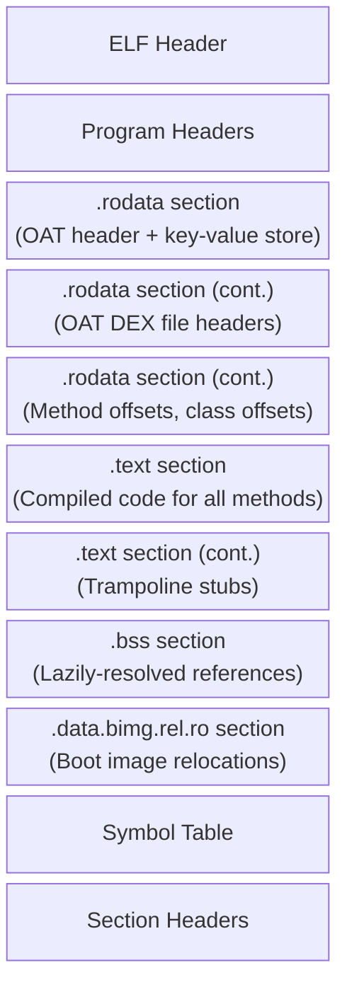

Within the `.text` section, methods are organized by DEX file and class.
Each compiled method has:

- A `OatQuickMethodHeader` preceding the code
- The native code itself
- Stack maps appended after the code (for GC and deoptimization)

The `OatQuickMethodHeader` contains:

- Code size
- Frame size
- Core and FP register spill masks
- VMAP table offset (for stack walking)

### 18.3.17 Multi-Image Compilation

For the boot image, `dex2oat` compiles multiple DEX files into a single
coordinated set of output files. The boot image is split into components:

1. **Core image** (`boot.art/oat/vdex`) -- Contains core Java classes
   from `core-oj.jar`, `core-libart.jar`, etc.
2. **Framework extension** (`boot-framework.art/oat/vdex`) -- Contains
   Android framework classes.
3. **Mainline extension** -- Contains classes from Mainline modules.

Each component can reference classes from earlier components but not later
ones, creating a layered dependency structure.

### 18.3.18 The Watchdog

`dex2oat` includes a watchdog thread that kills the process if compilation
takes too long. The default timeout is 9 minutes 30 seconds (slightly less
than PackageManagerService's 10-minute watchdog):

```
// art/dex2oat/dex2oat.cc, lines 337-350
static constexpr int64_t kWatchdogSlowdownFactor = kIsDebugBuild ? 5U : 1U;
static constexpr int64_t kWatchDogTimeoutSeconds =
    kWatchdogSlowdownFactor * (9 * 60 + 30);
```

### 18.3.19 Swap File

For devices with limited RAM, `dex2oat` can use a swap file to reduce peak
memory usage. The swap threshold is configured by:

```
// art/dex2oat/dex2oat.cc, lines 125-126
static constexpr size_t kDefaultMinDexFilesForSwap = 2;
static constexpr size_t kDefaultMinDexFileCumulativeSizeForSwap = 20 * MB;
```

---

## 18.4 JIT Compiler

The JIT (Just-In-Time) compiler compiles frequently-executed methods from DEX
bytecode into native machine code at runtime. Unlike `dex2oat` which runs at
install time, the JIT operates in the app process during execution.

Source: `art/runtime/jit/` (front-end) and `art/compiler/` (back-end).

### 18.4.1 JIT Architecture

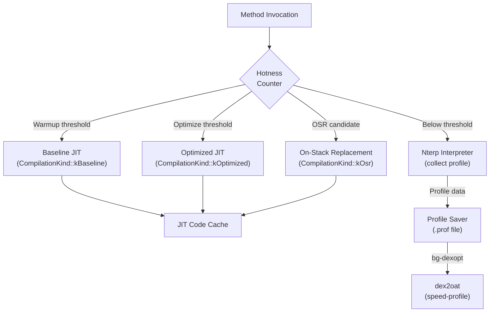

### 18.4.2 The Jit Class

The `Jit` class (`art/runtime/jit/jit.h`, line 189) manages the JIT
subsystem:

```
// art/runtime/jit/jit.h, lines 189-197
class Jit {
 public:
  static constexpr int16_t kJitRecheckOSRThreshold = 101;

  virtual ~Jit();
  static std::unique_ptr<Jit> Create(JitCodeCache* code_cache, JitOptions* options);

  bool CompileMethod(ArtMethod* method, Thread* self,
                     CompilationKind compilation_kind, bool prejit);
  ...
};
```

### 18.4.3 Method Profiling and Hotness

Every `ArtMethod` has a `hotness_count_` field that is decremented each time
the method is interpreted. When the count reaches certain thresholds, the JIT
takes action:

- **Warmup threshold** -- The method has been invoked enough times to warrant
  baseline compilation. Controlled by `JitOptions::GetWarmupThreshold()`.
- **Optimize threshold** -- The method is hot enough for full optimization.
  Controlled by `JitOptions::GetOptimizeThreshold()`.

The `Jit::AddSamples()` method (line 269) is the hotspot detection entry
point:

```
// art/runtime/jit/jit.h, lines 269-270
ALWAYS_INLINE void AddSamples(Thread* self, ArtMethod* method)
    REQUIRES_SHARED(Locks::mutator_lock_);
```

Special constants control JIT behavior:

```
// art/runtime/jit/jit.h, lines 63-68
static constexpr int16_t kJitCheckForOSR = -1;
static constexpr int16_t kJitHotnessDisabled = -2;
static constexpr int16_t kFastCompilerFrequencyCheck = 1024;
```

### 18.4.4 JIT Thread Pool

The JIT uses a custom thread pool (`JitThreadPool`, line 120) that
prioritizes compilations by type. It maintains four separate queues:

```
// art/runtime/jit/jit.h, lines 167-172
std::deque<ArtMethod*> osr_queue_;       // On-Stack Replacement
std::deque<ArtMethod*> fast_queue_;      // Pattern-matched fast compilations
std::deque<ArtMethod*> baseline_queue_;  // Non-optimizing baseline
std::deque<ArtMethod*> optimized_queue_; // Full optimization
```

The priority order is: OSR > fast > generic tasks > baseline > optimized.
OSR has highest priority because the user is actively waiting in a hot loop.

Each queue also has a corresponding set to prevent duplicate enqueuing:

```
// art/runtime/jit/jit.h, lines 177-180
std::set<ArtMethod*> osr_enqueued_methods_;
std::set<ArtMethod*> fast_enqueued_methods_;
std::set<ArtMethod*> baseline_enqueued_methods_;
std::set<ArtMethod*> optimized_enqueued_methods_;
```

### 18.4.5 JIT Compiler Interface

The JIT front-end talks to the compiler through the `JitCompilerInterface`
abstract class (`art/runtime/jit/jit.h`, line 72):

```
// art/runtime/jit/jit.h, lines 72-90
class JitCompilerInterface {
 public:
  virtual ~JitCompilerInterface() {}
  virtual bool CompileMethod(
      Thread* self, JitMemoryRegion* region, ArtMethod* method,
      CompilationKind compilation_kind) = 0;
  virtual void TypesLoaded(mirror::Class**, size_t count) = 0;
  virtual bool GenerateDebugInfo() = 0;
  virtual void ParseCompilerOptions() = 0;
  virtual bool IsBaselineCompiler() const = 0;
  virtual void SetDebuggableCompilerOption(bool value) = 0;
  virtual uint32_t GetInlineMaxCodeUnits() const = 0;
  ...
};
```

### 18.4.6 Compilation Flow

When a method becomes hot, `Jit::CompileMethodInternal()` is called
(`art/runtime/jit/jit.cc`, line 157):

```
// art/runtime/jit/jit.cc, lines 157-161
bool Jit::CompileMethodInternal(ArtMethod* method,
                                Thread* self,
                                CompilationKind compilation_kind,
                                bool prejit) {
  DCHECK(Runtime::Current()->UseJitCompilation());
  DCHECK(!method->IsRuntimeMethod());
  ...
```

The compilation is rejected if:

- The method has active breakpoints (line 185)
- The method is not compilable (e.g., obsolete due to class redefinition,
  line 192)
- The method is a proxy method
- The method is marked for pre-compilation and this is not a pre-compile
  request (line 170)

### 18.4.7 Pattern Matching

ART includes a fast path for simple methods -- the "small pattern matcher"
(`art/runtime/jit/small_pattern_matcher.h`). For methods on ARM/ARM64 that
match known patterns (e.g., simple getters, setters, trivial returns), the
JIT can install a prewritten native stub instead of running the full compiler:

```
// art/runtime/jit/jit.cc, lines 138-154
bool Jit::TryPatternMatch(ArtMethod* method_to_compile,
                           CompilationKind compilation_kind) {
  if (kRuntimeISA == InstructionSet::kArm ||
      kRuntimeISA == InstructionSet::kArm64) {
    if (!Runtime::Current()->IsJavaDebuggable() && ...) {
      const void* pattern = SmallPatternMatcher::TryMatch(method_to_compile);
      if (pattern != nullptr) {
        VLOG(jit) << "Successfully pattern matched "
                  << method_to_compile->PrettyMethod();
        Runtime::Current()->GetInstrumentation()->UpdateMethodsCode(
            method_to_compile, pattern);
        return true;
      }
    }
  }
  return false;
}
```

### 18.4.8 On-Stack Replacement (OSR)

OSR allows the JIT to replace an interpreted method frame with compiled code
while the method is still executing (typically inside a hot loop). The
`OsrData` structure (`art/runtime/jit/jit.h`, line 93) stores:

```
// art/runtime/jit/jit.h, lines 93-102
struct OsrData {
  const uint8_t* native_pc;  // native PC to jump to
  size_t frame_size;          // frame size of compiled code
  void* memory[0];            // dynamically allocated frame copy
};
```

OSR is checked with a prime-number interval to avoid aliasing patterns:

```
// art/runtime/jit/jit.h, line 192
static constexpr int16_t kJitRecheckOSRThreshold = 101;
```

### 18.4.9 JIT Code Cache

The `JitCodeCache` (`art/runtime/jit/jit_code_cache.h`) manages memory for
JIT-compiled code. It consists of:

- **Code region** -- executable memory holding compiled native code
- **Data region** -- non-executable memory holding metadata, profiling info,
  roots
- **Bitmap** -- tracks which code entries are live (for code GC)

The code cache has a fixed maximum capacity (typically 64 MB) and can garbage
collect stale compiled code when it runs low on space.

### 18.4.10 Tiered Compilation

ART implements a tiered compilation model:

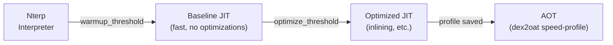

Each tier provides increasing performance at the cost of compilation time:

| Tier | Latency | Code Quality | Profile Collection |
|------|---------|-------------|-------------------|
| Nterp | None | Interpreted | Yes (counters) |
| Baseline JIT | Low (ms) | Basic native | Yes (inline caches) |
| Optimized JIT | Medium (10s of ms) | Optimized native | No |
| AOT | High (seconds) | Fully optimized | No |

### 18.4.11 Zygote JIT Compilation

In the Zygote process, the JIT pre-compiles boot classpath methods during
early boot. The `ZygoteMap` class (`art/runtime/jit/jit_code_cache.h`,
line 109) manages a shared memory region that maps methods to compiled code:

```
// art/runtime/jit/jit_code_cache.h, lines 111-117
struct Entry {
  ArtMethod* method;
  const void* code_ptr;
};
```

The zygote compilation state machine tracks progress:

```
// art/runtime/jit/jit_code_cache.h, lines 95-100
enum class ZygoteCompilationState : uint8_t {
  kInProgress = 0,
  kDone = 1,
  kNotifiedOk = 2,
  kNotifiedFailure = 3,
};
```

After compilation completes, the zygote notifies child processes that they
can map the boot image method code via shared memory (memfd).

### 18.4.12 The Optimizing Compiler

The optimizing compiler back-end (`art/compiler/optimizing/`) converts DEX
bytecode into highly optimized native code through:

1. **Graph Building** (`builder.cc`) -- DEX bytecode is converted into an
   HGraph intermediate representation (IR).
2. **SSA Construction** (`ssa_builder.cc`) -- The IR is converted to Static
   Single Assignment form.
3. **Optimization Passes** -- A series of optimization passes are applied:
   - Constant folding (`constant_folding.cc`)
   - Dead code elimination (`dead_code_elimination.cc`)
   - Inlining (`inliner.cc`)
   - Bounds check elimination (`bounds_check_elimination.cc`)
   - Code sinking (`code_sinking.cc`)
   - Write barrier elimination (`write_barrier_elimination.cc`)
   - Register allocation (`register_allocator_linear_scan.cc`)
   - And many more (the `art/compiler/optimizing/` directory contains 100+
     source files)
4. **Code Generation** -- Architecture-specific code generators:
   - ARM32: `code_generator_arm_vixl.cc`
   - ARM64: `code_generator_arm64.cc`
   - x86: `code_generator_x86.cc`
   - x86-64: `code_generator_x86_64.cc`
   - RISC-V 64: `code_generator_riscv64.cc`
5. **Stack Map Generation** -- Stack maps are generated for GC root tracking
   and deoptimization.

### 18.4.13 Optimizing Compiler Passes in Detail

The optimizing compiler applies numerous optimization passes. Here is a
more detailed view of the key passes and their effects:

#### Inlining (`inliner.cc`)

Method inlining replaces a method call with the body of the called method.
This eliminates call overhead and enables further optimizations (like
constant propagation through the inlined code). The JIT uses inline caches
to guide inlining decisions for virtual calls -- if profiling shows that a
virtual call site almost always targets the same concrete class, the inliner
can speculatively inline that implementation with a type check guard.

#### Constant Folding (`constant_folding.cc`)

Evaluates expressions with constant operands at compile time. For example,
`2 + 3` becomes `5`. This propagates through chains of constant expressions,
sometimes eliminating entire branches of code.

#### Dead Code Elimination (`dead_code_elimination.cc`)

Removes code that has no observable effect:

- Instructions whose results are never used
- Branches that are always taken or never taken (after constant folding)
- Stores to variables that are never read

#### Bounds Check Elimination (`bounds_check_elimination.cc`)

Removes redundant array bounds checks when the compiler can prove that an
index is always within bounds. This is particularly effective in loops where
the loop variable is bounded by the array length.

#### Code Sinking (`code_sinking.cc`)

Moves instructions closer to where their results are used, potentially into
less-frequently-executed paths. This reduces register pressure and can avoid
executing unnecessary instructions on the common path.

#### Write Barrier Elimination (`write_barrier_elimination.cc`)

Removes redundant write barriers (GC notifications for reference writes)
when the compiler can prove they are unnecessary. For example, stores to
newly-allocated objects that have not yet escaped the allocating thread do
not need write barriers.

#### Constructor Fence Redundancy Elimination

Removes redundant memory fences inserted after object construction when
the compiler can prove they are not needed for the Java Memory Model
guarantees.

#### Control Flow Simplification (`control_flow_simplifier.cc`)

Simplifies the control flow graph:

- Removes empty blocks
- Merges blocks with a single successor/predecessor
- Simplifies conditional branches with known conditions

#### SSA Optimization

After SSA construction, several passes exploit the SSA property:

- **Phi elimination** -- Removes trivial phi nodes
- **Copy propagation** -- Replaces copies with the original value
- **GVN (Global Value Numbering)** -- Identifies and eliminates
  redundant computations

#### Register Allocation (`register_allocator_linear_scan.cc`)

Maps the unlimited virtual registers of the SSA form onto the finite
set of machine registers. Uses linear scan allocation, which provides
good code quality with reasonable compilation time. Spills values to
the stack when registers are exhausted.

#### Architecture-Specific Optimizations

Each code generator applies architecture-specific optimizations:

- **ARM64**: NEON vectorization, paired loads/stores, conditional
  selection
- **x86-64**: SSE/AVX vectorization, addressing mode optimization
- **RISC-V 64**: Extension-aware code generation

### 18.4.14 Entrypoints

The entrypoint system (`art/runtime/entrypoints/`) provides the bridge
between compiled code (or the interpreter) and runtime services. Entrypoints
are function pointers stored in a per-thread table that compiled code calls
for operations it cannot handle inline.

Key entrypoint categories:

#### Quick Entrypoints (`quick_entrypoints.h`)

```
// art/runtime/entrypoints/quick/quick_entrypoints.h (selected)
// Allocation entrypoints
void* artAllocObjectFromCodeResolved(mirror::Class*, Thread*);
void* artAllocObjectFromCodeInitialized(mirror::Class*, Thread*);
void* artAllocArrayResolved(mirror::Class*, int32_t, Thread*);

// Type check entrypoints
void artThrowClassCastExceptionForObject(mirror::Object*, mirror::Class*, Thread*);
uint32_t artInstanceOfFromCode(mirror::Object*, mirror::Class*);

// Lock entrypoints
void artLockObjectFromCode(mirror::Object*, Thread*);
void artUnlockObjectFromCode(mirror::Object*, Thread*);

// Field access entrypoints (for unresolved fields)
uint32_t artGetFieldFromCode(uint32_t, mirror::Object*, ArtMethod*, Thread*);
void artPutFieldFromCode(uint32_t, mirror::Object*, uint32_t, ArtMethod*, Thread*);

// Exception entrypoints
void artThrowNullPointerExceptionFromCode(Thread*);
void artThrowDivZeroFromCode(Thread*);
void artThrowStackOverflowFromCode(Thread*);
void artThrowArrayBoundsFromCode(int32_t, int32_t, Thread*);

// GC entrypoints
void artReadBarrierSlow(mirror::Object*, mirror::Object*, uint32_t);
```

#### Runtime ASM Entrypoints (`runtime_asm_entrypoints.h`)

These are architecture-specific assembly stubs:

- `art_quick_resolution_trampoline` -- Resolves an unresolved method
  and patches the caller's invoke site.
- `art_quick_to_interpreter_bridge` -- Transitions from compiled code
  to the interpreter for uncompiled methods.
- `art_quick_generic_jni_trampoline` -- Generic JNI bridge for native
  methods.
- `art_quick_imt_conflict_trampoline` -- Resolves IMT conflicts during
  interface dispatch.
- `art_quick_deoptimize` -- Handles deoptimization from compiled code
  back to the interpreter.

Each architecture (ARM, ARM64, x86, x86-64, RISC-V) has its own
implementation of these assembly stubs in
`art/runtime/arch/<isa>/quick_entrypoints_<isa>.S`.

### 18.4.15 Inline Caches

Inline caches are a profiling mechanism that records the concrete types
observed at virtual call sites. When Nterp or baseline-JIT code executes a
virtual call, the inline cache is updated with the receiver's class.

Types of inline cache:

- **Monomorphic** -- Single type observed (most common, enables inlining)
- **Polymorphic** -- 2-4 types observed (can generate type-check cascade)
- **Megamorphic** -- Too many types (fall back to vtable dispatch)

The optimizing compiler uses inline cache data to:

1. Speculatively inline the monomorphic target with a type guard
2. Generate type-check cascades for polymorphic sites
3. Leave megamorphic sites as virtual dispatches

### 18.4.16 ProfilingInfo

The `ProfilingInfo` (`art/runtime/jit/profiling_info.h`) structure stores
per-method profiling data collected by the interpreter and baseline-JIT code:

- **Inline caches** -- Receiver types at each invoke site
- **Branch data** -- Which branches are taken/not-taken
- **Method counters** -- Invocation counts

ProfilingInfo is allocated in the JIT code cache's data region and is
garbage collected along with stale compiled code.

### 18.4.17 JIT Memory Region

The `JitMemoryRegion` (`art/runtime/jit/jit_memory_region.h`) manages the
executable memory used for JIT-compiled code. It uses a dual-mapping
technique:

1. **Writable mapping** -- Used by the JIT compiler to write generated code.
   This mapping has write permission but is not executable.
2. **Executable mapping** -- Used by the runtime to execute compiled code.
   This mapping has execute permission but is not writable.

Both mappings point to the same physical memory (via `memfd` or `ashmem`).
This enforces W^X (Write XOR Execute) security policy: no memory region is
simultaneously writable and executable.

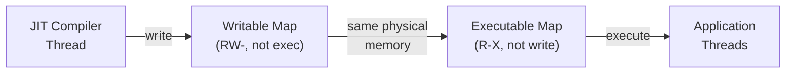

The JIT code cache is divided into:

- **Code region** -- Stores compiled native code (executable)
- **Data region** -- Stores metadata, profiling info, roots (not executable)

```
// art/runtime/jit/jit_code_cache.h, line 84
using CodeCacheBitmap = gc::accounting::MemoryRangeBitmap<kJitCodeAccountingBytes>;
```

### 18.4.18 JIT Code Garbage Collection

The JIT code cache has limited capacity. When it fills up, the JIT performs
code garbage collection to reclaim space from:

- Methods that have been superseded by newer compilations
- Methods belonging to unloaded class loaders
- Methods that are no longer hot (based on invocation counts)

Code GC uses the `CodeCacheBitmap` to track which code entries are live.
During a code GC sweep:

1. Walk all threads' stacks to find methods currently on the stack.
2. Walk all `ArtMethod` entry points to find currently-installed code.
3. Mark all referenced code entries as live.
4. Free unmarked code entries.

Code GC can be disabled by setting `GarbageCollectCode(false)`, which is
done when:

- Debug info generation is enabled (need stable code addresses)
- `JitAtFirstUse()` mode is active (prevents deadlocks)

### 18.4.19 Profile File Format

Profile files (`.prof`) use a binary format defined in
`art/libprofile/profile/profile_compilation_info.h`. The format contains:

1. **File header** -- Magic number, version, checksum
2. **DEX file records** -- For each DEX file:
   - DEX file location and checksum
   - Hot method set (bitmap or list of method indices)
   - Startup method set
   - Post-startup method set
3. **Inline cache data** -- For each profiled invoke site:
   - Method index
   - DEX PC of the invoke instruction
   - Observed receiver types

The `profman` tool (`art/profman/`) provides profile manipulation:

- `profman --dump-only` -- Dump profile in human-readable format
- `profman --create-profile-from` -- Create a profile from a text format
- `profman --profile-file` -- Merge multiple profiles
- `profman --generate-boot-image-profile` -- Generate a boot image profile

### 18.4.20 Compilation Reasons

The Android system tracks why each compilation was performed. Common
compilation reasons include:

| Reason | Trigger | Typical Filter |
|--------|---------|----------------|
| `first-boot` | First boot after factory reset | speed-profile |
| `boot-after-ota` | Boot after system update | speed-profile |
| `install` | App installation | verify/speed-profile |
| `bg-dexopt` | Background optimization | speed-profile |
| `inactive` | App unused for a long time | verify (space reclaim) |
| `cmdline` | Manual `cmd package compile` | as specified |
| `ab-ota` | A/B OTA optimization | speed-profile |
| `prebuilt` | Prebuilt on system image | speed/speed-profile |

The compilation reason is stored in the OAT header's `kCompilationReasonKey`
field and can be inspected with `oatdump`.

### 18.4.21 Profile Saver

The `ProfileSaver` (`art/runtime/jit/profile_saver.h`) runs in a background
thread and periodically writes profiling data to disk:

```
// art/runtime/jit/jit.h, lines 288-292
void StartProfileSaver(const std::string& profile_filename,
                       const std::vector<std::string>& code_paths,
                       const std::string& ref_profile_filename,
                       AppInfo::CodeType code_type);
```

Profile data includes:

- Hot methods (method indices with invocation counts)
- Startup methods (methods called during app launch)
- Inline cache data (observed receiver types at call sites)
- Hot classes (classes used during startup)

---

## 18.5 Garbage Collection

ART's garbage collector reclaims memory occupied by objects that are no longer
reachable. The GC subsystem is one of the most critical components for
application performance -- GC pauses directly impact UI smoothness.

Source: `art/runtime/gc/` (including `heap.h`, `heap.cc`, `collector/`,
`space/`, `accounting/`).

### 18.5.1 GC Architecture Overview

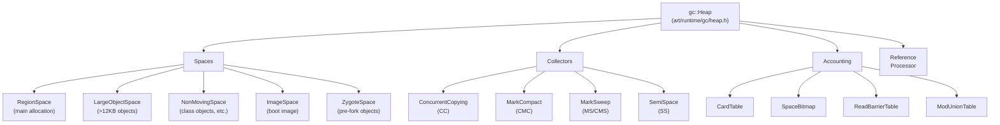

### 18.5.2 Collector Types

ART supports multiple collector types, defined in
`art/runtime/gc/collector_type.h` (lines 28-68):

```
enum CollectorType {
  kCollectorTypeNone,
  kCollectorTypeMS,           // Non-concurrent mark-sweep
  kCollectorTypeCMS,          // Concurrent mark-sweep
  kCollectorTypeCMC,          // Concurrent mark-compact
  kCollectorTypeCMCBackground,
  kCollectorTypeSS,           // Semi-space
  kCollectorTypeHeapTrim,
  kCollectorTypeCC,           // Concurrent copying (default)
  kCollectorTypeCCBackground,
  ...
};
```

The default collector is determined at build time:

```
// art/runtime/gc/collector_type.h, lines 71-83
static constexpr CollectorType kCollectorTypeDefault =
#if ART_DEFAULT_GC_TYPE_IS_CMC
    kCollectorTypeCMC
#elif ART_DEFAULT_GC_TYPE_IS_SS
    kCollectorTypeSS
#elif ART_DEFAULT_GC_TYPE_IS_CMS
    kCollectorTypeCMS
#elif ART_DEFAULT_GC_TYPE_IS_MS
    kCollectorTypeMS
#else
#error "ART default GC type must be set"
#endif
    ;
```

On modern Android devices, the **Concurrent Copying** (CC) collector is
the standard. Newer devices may use the **Concurrent Mark-Compact** (CMC)
collector with userfaultfd support.

### 18.5.3 Allocator Types

ART supports multiple allocator types for different heap spaces:

```
// art/runtime/gc/allocator_type.h
enum AllocatorType {
  kAllocatorTypeBumpPointer,     // Bump pointer for region space
  kAllocatorTypeTLAB,            // Thread-local allocation buffer
  kAllocatorTypeRosAlloc,        // Runs-of-Slots allocator
  kAllocatorTypeDlMalloc,        // Doug Lea's malloc
  kAllocatorTypeNonMoving,       // Non-moving space allocator
  kAllocatorTypeLOS,             // Large Object Space
  kAllocatorTypeRegion,          // Region-based allocator
  kAllocatorTypeRegionTLAB,      // Region-based TLAB
};
```

The default allocator for the CC collector is `kAllocatorTypeRegionTLAB`:
each thread gets a TLAB within the region space for fast, lock-free
allocation.

For the non-moving space, `kAllocatorTypeRosAlloc` is preferred
(`art/runtime/gc/allocator/rosalloc.h`). RosAlloc (Runs of Slots Allocator)
is a thread-aware, size-class-based allocator that provides:

- Per-thread free lists for common size classes
- Lock-free allocation for small objects
- Efficient bulk freeing during GC
- Memory accounting per run

### 18.5.4 Accounting Infrastructure

The GC accounting subsystem (`art/runtime/gc/accounting/`) provides the
data structures needed for tracking live objects and dirty regions:

#### Card Table (`card_table.h`)

The card table divides the heap into fixed-size cards (128 bytes each).
Each card has a single byte indicating its state:

- **Clean** -- No references in this region have been modified
- **Dirty** -- At least one reference write has occurred

During generational or concurrent collection, only dirty cards need to be
scanned for cross-generation or cross-space references. After scanning, cards
are cleaned.

#### Space Bitmap (`space_bitmap.h`)

A bitmap with one bit per object-alignment-sized chunk of the heap. Used
for:

- **Live bitmap** -- Marks which locations contain live objects
- **Mark bitmap** -- Used during marking phase to track reachable objects

After GC, the mark bitmap becomes the new live bitmap (bitmap swap).

#### Mod Union Table (`mod_union_table.h`)

Tracks references from immune spaces (boot image, zygote space) into the
collection space. Since immune spaces are not collected, their outgoing
references must be found through the mod union table rather than by
scanning the entire immune space.

#### Read Barrier Table (`read_barrier_table.h`)

Used by the CC collector to track which heap regions require read barrier
processing. When a mutator reads a reference from a region in the read
barrier table, it must check if the referenced object needs to be copied
to to-space.

### 18.5.5 Concurrent Copying Collector

The CC collector (`art/runtime/gc/collector/concurrent_copying.h`) is ART's
primary garbage collector. It uses a region-based copying algorithm that can
run mostly concurrently with application (mutator) threads.

```
// art/runtime/gc/collector/concurrent_copying.h, lines 57-73
class ConcurrentCopying : public GarbageCollector {
 public:
  static constexpr bool kEnableNoFromSpaceRefsVerification = kIsDebugBuild;
  static constexpr bool kEnableFromSpaceAccountingCheck = kIsDebugBuild;
  static constexpr bool kGrayDirtyImmuneObjects = true;

  ConcurrentCopying(Heap* heap,
                    bool young_gen,
                    bool use_generational_cc,
                    const std::string& name_prefix = "",
                    bool measure_read_barrier_slow_path = false);
  ...
};
```

#### CC Collection Phases

The CC collector runs in five phases:

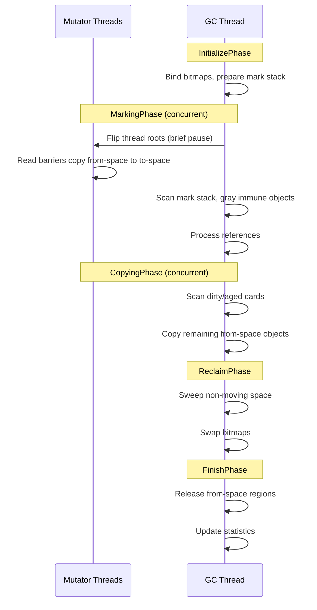

1. **InitializePhase** -- Binds bitmaps, prepares the mark stack, captures
   the live stack freeze size.
2. **MarkingPhase** -- Flips thread roots in a brief STW (stop-the-world)
   pause. After the flip, mutator threads use read barriers to help the GC
   copy objects from from-space to to-space. The GC thread concurrently
   scans the mark stack.
3. **CopyingPhase** -- Scans dirty and aged card table entries to find
   references from immune spaces (boot image, zygote space) into the
   region space. Copies any remaining from-space objects.
4. **ReclaimPhase** -- Sweeps the non-moving space and large object space.
   Swaps allocation bitmaps.
5. **FinishPhase** -- Releases evacuated regions, resets the mark stack,
   records performance statistics.

#### Read Barriers

The CC collector uses read barriers to maintain the "to-space invariant":
every reference that mutator code sees must point to a to-space copy.
When a mutator reads a reference to a from-space object, the read barrier
triggers a copy to to-space and updates the reference.

The mark stack mode controls how references are tracked:

```
// art/runtime/gc/collector/concurrent_copying.h, lines 393-401
enum MarkStackMode {
  kMarkStackModeOff = 0,
  kMarkStackModeThreadLocal,  // Thread-local mark stacks
  kMarkStackModeShared,       // Shared GC mark stack with lock
  kMarkStackModeGcExclusive   // GC-only, no lock needed
};
```

#### Forwarding Pointers

When the CC collector copies an object from from-space to to-space, it
installs a forwarding pointer in the original object's lock word. This
allows:

- Other threads encountering the from-space object to find its to-space copy
- The GC to avoid double-copying the same object
- Read barriers to redirect references efficiently

```
// art/runtime/gc/collector/concurrent_copying.h, lines 155-156
static mirror::Object* GetFwdPtrUnchecked(mirror::Object* from_ref)
    REQUIRES_SHARED(Locks::mutator_lock_);
```

#### Immune Spaces

Spaces that are not subject to collection (boot image, zygote space) are
called "immune spaces". The CC collector must still scan immune space objects
to find references into the collection space. This is done efficiently using:

1. **Mod union tables** for tracking dirty pages in immune spaces
2. **Card table scanning** for finding modified references
3. **Gray marking** of immune objects that reference from-space objects

```
// art/runtime/gc/collector/concurrent_copying.h, line 386
ImmuneSpaces immune_spaces_;
```

#### Mark Stack Processing

The CC collector processes the mark stack concurrently:

1. Pop an object from the mark stack.
2. Scan all reference fields of the object.
3. For each reference to a from-space object, copy it to to-space and
   push the copy onto the mark stack.
4. Repeat until the mark stack is empty.

The mark stack can be in different modes depending on the GC phase:

- **Thread-local mode** -- Each thread has its own mark stack to avoid
  contention.
- **Shared mode** -- All threads share a single mark stack with a lock.
- **GC-exclusive mode** -- Only the GC thread accesses the mark stack.

### 18.5.6 Generational Collection

The CC collector supports generational collection through the
`use_generational_cc_` flag:

```
// art/runtime/gc/collector/concurrent_copying.h, lines 340-344
// If true, enable generational collection when using the CC collector,
// i.e. use sticky-bit CC for minor collections and (full) CC for
// major collections.
const bool use_generational_cc_;
const bool young_gen_;
```

In generational mode:

- **Minor (young-gen) collections** use sticky-bit marking to only trace
  through recently-allocated objects and dirty cards.
- **Major (full) collections** trace the entire heap, evacuating all
  from-space objects.

The GC type reflects this:

```
// art/runtime/gc/collector/concurrent_copying.h, lines 95-99
GcType GetGcType() const override {
  return (use_generational_cc_ && young_gen_)
      ? kGcTypeSticky
      : kGcTypePartial;
}
```

### 18.5.7 Heap Spaces

The `gc::Heap` class manages multiple memory spaces:

```
// art/runtime/gc/heap.h, lines 135-151 (selected constants)
class Heap {
 public:
  static constexpr size_t kPartialTlabSize = 16 * KB;
  static constexpr size_t kDefaultInitialSize = 2 * MB;
  static constexpr size_t kDefaultMaximumSize = 256 * MB;
  static constexpr size_t kDefaultNonMovingSpaceCapacity = 64 * MB;
  static constexpr size_t kDefaultMaxFree = 32 * MB;
  static constexpr size_t kDefaultMinFree = kDefaultMaxFree / 4;
  static constexpr size_t kDefaultTLABSize = 32 * KB;
  static constexpr double kDefaultTargetUtilization = 0.6;
  static constexpr double kDefaultHeapGrowthMultiplier = 2.0;
  static constexpr size_t kMinLargeObjectThreshold = 12 * KB;
  ...
};
```

#### RegionSpace

The primary allocation space for the CC collector. It divides memory into
fixed-size regions (typically 256 KB each).

Source: `art/runtime/gc/space/region_space.h`

```
// art/runtime/gc/space/region_space.h, lines 47-55
class RegionSpace final : public ContinuousMemMapAllocSpace {
 public:
  enum EvacMode {
    kEvacModeNewlyAllocated,
    kEvacModeLivePercentNewlyAllocated,
    kEvacModeForceAll,
  };
  ...
};
```

Regions can be in one of several states:

- **Free** -- available for allocation
- **Open** -- currently being allocated into (one per thread for TLABs)
- **Newly allocated** -- allocated since the last GC
- **Evacuated** -- being copied from (from-space)
- **To-space** -- destination for copied objects
- **Large** -- spans multiple regions for large objects

#### Thread-Local Allocation Buffers (TLABs)

Each thread gets a TLAB from the region space for lock-free allocation.
The default TLAB size is 32 KB, with partial TLABs of 16 KB when the
region is partially full:

```
// art/runtime/gc/heap.h, lines 137-139
static constexpr size_t kPartialTlabSize = 16 * KB;
static constexpr bool kUsePartialTlabs = true;
```

#### NonMovingSpace

Objects that cannot be moved (e.g., class objects referenced by native code)
are allocated in the non-moving space (64 MB default capacity).

#### LargeObjectSpace

Primitive arrays larger than 12 KB are placed in the large object space,
which uses either a free-list or map-based allocator:

```
// art/runtime/gc/heap.h, lines 167-170
static constexpr space::LargeObjectSpaceType kDefaultLargeObjectSpaceType =
    USE_ART_LOW_4G_ALLOCATOR ?
        space::LargeObjectSpaceType::kFreeList
      : space::LargeObjectSpaceType::kMap;
```

#### ImageSpace

Read-only memory-mapped regions containing the boot image (`.art` files)
and app images.

### 18.5.8 GC Triggers

GC can be triggered by various causes, enumerated in
`art/runtime/gc/gc_cause.h` (lines 28-69):

```
enum GcCause {
  kGcCauseNone,                    // Invalid placeholder
  kGcCauseForAlloc,                // Allocation failure
  kGcCauseBackground,              // Proactive background GC
  kGcCauseExplicit,                // System.gc()
  kGcCauseForNativeAlloc,          // Native allocation watermark exceeded
  kGcCauseCollectorTransition,     // Foreground/background transition
  kGcCauseDisableMovingGc,         // GetPrimitiveArrayCritical
  kGcCauseTrim,                    // Heap trim
  kGcCauseInstrumentation,         // Instrumentation exclusion
  kGcCauseAddRemoveAppImageSpace,  // Image space changes
  kGcCauseDebugger,                // Debugger exclusion
  kGcCauseHomogeneousSpaceCompact, // Background compaction
  kGcCauseClassLinker,             // Class linker operations
  kGcCauseJitCodeCache,            // JIT code cache operations
  kGcCauseAddRemoveSystemWeakHolder,
  kGcCauseHprof,                   // Heap profiling
  kGcCauseGetObjectsAllocated,
  kGcCauseProfileSaver,            // Profile saver
  kGcCauseDeletingDexCacheArrays,  // Startup optimization
};
```

### 18.5.9 Reference Processing

The `ReferenceProcessor` (`art/runtime/gc/reference_processor.h`) handles
Java reference objects (`SoftReference`, `WeakReference`,
`PhantomReference`, `FinalizerReference`):

```
// art/runtime/gc/reference_processor.h, lines 47-64
class ReferenceProcessor {
 public:
  ReferenceProcessor();
  void Setup(Thread* self, collector::GarbageCollector* collector,
             bool concurrent, bool clear_soft_references);
  void ProcessReferences(Thread* self, TimingLogger* timings);
  void EnableSlowPath();
  ObjPtr<mirror::Object> GetReferent(Thread* self,
                                      ObjPtr<mirror::Reference> reference);
  ...
};
```

During GC:

1. **Soft references** are cleared if memory is low (controlled by the
   `clear_soft_references` flag).
2. **Weak references** to unreachable objects are cleared.
3. **Finalizer references** are enqueued for finalization.
4. **Phantom references** are enqueued after their referents are collected.

### 18.5.10 Card Table

The card table (`art/runtime/gc/accounting/card_table.h`) tracks which
memory regions have been written to since the last GC. Each card represents
a fixed-size region of the heap. When a reference field is written, the
corresponding card is "dirtied". During GC, only dirty cards need to be
scanned for cross-generational or cross-space references.

### 18.5.11 GC Performance Targets

ART's GC is designed to minimize pauses:

```
// art/runtime/gc/heap.h, lines 146-149
static constexpr size_t kDefaultLongPauseLogThreshold = MsToNs(5);
static constexpr size_t kDefaultLongPauseLogThresholdGcStress = MsToNs(50);
static constexpr size_t kDefaultLongGCLogThreshold = MsToNs(100);
static constexpr size_t kDefaultLongGCLogThresholdGcStress = MsToNs(1000);
```

A pause longer than 5 ms is logged as a "long pause." A GC cycle longer than
100 ms total is logged as a "long GC." These thresholds help developers
identify GC-related jank.

### 18.5.12 Native Memory Tracking

ART monitors native memory allocations and triggers GC when native allocation
exceeds a watermark. The notification interval is platform-dependent:

```
// art/runtime/gc/heap.h, lines 179-183
#ifdef __ANDROID__
static constexpr uint32_t kNotifyNativeInterval = 64;
#else
static constexpr uint32_t kNotifyNativeInterval = 384;
#endif
```

### 18.5.13 Object Allocation

Object allocation follows a fast path through the TLAB and a slow path
through the heap allocator. The primary allocation entry point is
`Heap::AllocObject()`:

```
// art/runtime/gc/heap.h, lines 256-272
template <bool kInstrumented = true, typename PreFenceVisitor>
mirror::Object* AllocObject(Thread* self,
                            ObjPtr<mirror::Class> klass,
                            size_t num_bytes,
                            const PreFenceVisitor& pre_fence_visitor)
    REQUIRES_SHARED(Locks::mutator_lock_) {
  return AllocObjectWithAllocator<kInstrumented>(
      self, klass, num_bytes, GetCurrentAllocator(), pre_fence_visitor);
}
```

For objects that must not be moved (e.g., class objects referenced by native
code), a separate allocator is used:

```
// art/runtime/gc/heap.h, lines 274-292
template <bool kInstrumented = true, typename PreFenceVisitor>
mirror::Object* AllocNonMovableObject(Thread* self,
                                      ObjPtr<mirror::Class> klass,
                                      size_t num_bytes,
                                      const PreFenceVisitor& pre_fence_visitor)
    REQUIRES_SHARED(Locks::mutator_lock_) {
  mirror::Object* obj = AllocObjectWithAllocator<kInstrumented>(
      self, klass, num_bytes, GetCurrentNonMovingAllocator(),
      pre_fence_visitor);
  return obj;
}
```

#### Allocation Fast Path (TLAB)

The typical allocation path for the CC collector:

1. Check if the TLAB has enough space.
2. Bump-allocate within the TLAB (no lock needed, thread-local).
3. If TLAB is exhausted, request a new TLAB from the RegionSpace.
4. If RegionSpace is full, trigger GC and retry.

#### Allocation Slow Path

When the fast path fails:

1. Attempt to allocate from a new region.
2. If no regions are available, trigger a concurrent GC.
3. Wait for GC to complete.
4. Retry allocation.
5. If still failing, trigger a more aggressive GC (full collection).
6. If still failing, throw `OutOfMemoryError`.

### 18.5.14 Heap Construction

The Heap constructor takes numerous parameters reflecting the complexity of
GC configuration:

```
// art/runtime/gc/heap.h, lines 208-251 (constructor signature)
Heap(size_t initial_size,
     size_t growth_limit,
     size_t min_free,
     size_t max_free,
     double target_utilization,
     bool enable_time_based_gc_trigger,
     size_t memory_gc_cost_factor,
     double foreground_heap_growth_multiplier,
     size_t stop_for_native_allocs,
     size_t capacity,
     size_t non_moving_space_capacity,
     const std::vector<std::string>& boot_class_path,
     ...
     CollectorType foreground_collector_type,
     CollectorType background_collector_type,
     space::LargeObjectSpaceType large_object_space_type,
     size_t large_object_threshold,
     size_t parallel_gc_threads,
     size_t conc_gc_threads,
     bool low_memory_mode,
     bool use_generational_gc,
     ...);
```

Key parameters include:

- `initial_size` / `capacity` -- heap size bounds
- `target_utilization` -- target ratio of live objects to heap size (0.6 default)
- `foreground_collector_type` / `background_collector_type` -- GC algorithms
  for foreground (interactive) and background (idle) modes
- `parallel_gc_threads` / `conc_gc_threads` -- thread counts for parallel
  and concurrent GC phases
- `use_generational_gc` -- enable generational collection
- `low_memory_mode` -- reduce memory footprint at the cost of performance

### 18.5.15 Process State and GC Behavior

The GC adjusts its behavior based on the app's process state:

- **Foreground (interactive)** -- Uses the foreground collector (typically CC).
  Optimizes for low latency. Heap grows more aggressively to avoid GC pauses.
- **Background (idle)** -- May switch to a background collector for
  compaction. Heap is trimmed to reduce memory footprint.

The `foreground_heap_growth_multiplier` (default 2.0) controls how much the
heap can grow beyond the target utilization when the app is in the foreground:

```
// art/runtime/gc/heap.h, line 155
static constexpr double kDefaultHeapGrowthMultiplier = 2.0;
```

### 18.5.16 Heap Trimming

When the app goes to background or after a period of inactivity, the heap
can be trimmed to release unused memory back to the operating system:

```
// art/runtime/gc/heap.h, line 192
static constexpr uint64_t kHeapTrimWait = MsToNs(5000);
```

Trimming waits 5 seconds after the last GC before executing, to avoid
thrashing between allocation and trimming.

### 18.5.17 Mark-Compact Collector (CMC)

The mark-compact collector (`art/runtime/gc/collector/mark_compact.h`) is a
newer alternative to CC that compacts the heap in-place using Linux's
userfaultfd mechanism. This avoids the need for a separate to-space, reducing
memory overhead. CMC is becoming the default on newer devices.

CMC operates in two main phases:

1. **Mark phase** -- Concurrently marks all reachable objects using the mark
   bitmap.
2. **Compact phase** -- Compacts objects in-place by sliding them toward the
   beginning of the heap. Uses userfaultfd to handle page faults from mutator
   threads that access not-yet-compacted pages.

Advantages of CMC over CC:

- Lower memory overhead (no separate to-space needed)
- Better memory locality after compaction
- Reduced RSS (resident set size) for the same heap utilization

### 18.5.18 GC Verification

In debug builds, ART can perform extensive GC verification:

```
// art/runtime/gc/heap.h, lines 366-371
void VerifyHeap() REQUIRES(!Locks::heap_bitmap_lock_);
size_t VerifyHeapReferences(bool verify_referents = true)
    REQUIRES(Locks::mutator_lock_);
bool VerifyMissingCardMarks()
    REQUIRES(Locks::heap_bitmap_lock_, Locks::mutator_lock_);
```

Verification checks include:

- All references point to valid objects on the heap
- No dangling references to freed objects
- Card table entries are correctly maintained
- Read barrier invariants are preserved
- No from-space references escape to mutator threads

---

## 18.6 Class Loading and Linking

The class linker is responsible for loading, verifying, resolving, and
initializing Java classes. It is one of the most complex components in ART,
implemented across over 11,700 lines in `art/runtime/class_linker.cc`.

Source: `art/runtime/class_linker.h`, `art/runtime/class_linker.cc` (522 KB).

### 18.6.1 Class Loading Pipeline

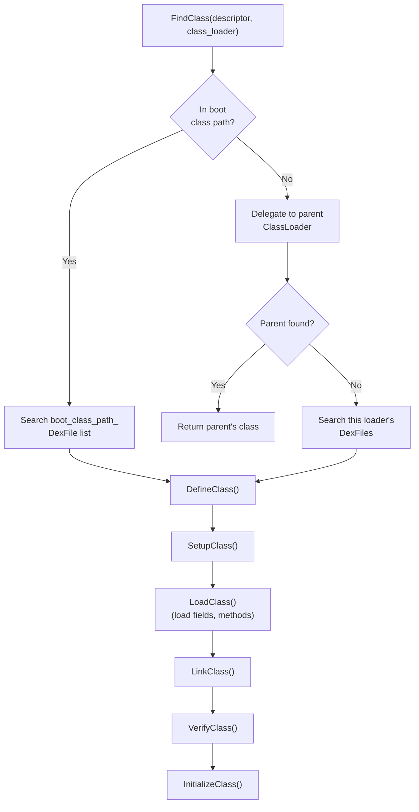

### 18.6.2 ClassLinker Initialization

The `ClassLinker` class (`art/runtime/class_linker.h`, line 167) is created
during runtime startup:

```
// art/runtime/class_linker.h, lines 168-173
class ClassLinker {
 public:
  static constexpr bool kAppImageMayContainStrings = true;
  explicit ClassLinker(InternTable* intern_table,
                       bool fast_class_not_found_exceptions = true);
  virtual ~ClassLinker();
  ...
};
```

Two initialization paths are available:

1. **InitFromBootImage** (line 182) -- Loads precompiled boot images from
   `.art` files. This is the fast path used in production.
2. **InitWithoutImage** (line 176) -- Bootstraps from raw DEX files.
   Only used during boot image generation or testing.

### 18.6.3 FindClass

The primary entry point for class loading is `FindClass()`:

```
// art/runtime/class_linker.h, lines 213-218
ObjPtr<mirror::Class> FindClass(Thread* self,
                                 const char* descriptor,
                                 size_t descriptor_length,
                                 Handle<mirror::ClassLoader> class_loader)
    REQUIRES_SHARED(Locks::mutator_lock_)
    REQUIRES(!Locks::dex_lock_);
```

This method implements the standard Java class loading delegation model:

1. Check if the class is already loaded (in the `ClassTable`).
2. If a class loader is specified, delegate to the parent class loader
   first.
3. If the parent cannot find the class, search this loader's DEX files.
4. If no class loader is specified (`null`), search the boot class path.

A convenience overload for system classes:

```
// art/runtime/class_linker.h, lines 230-234
ObjPtr<mirror::Class> FindSystemClass(Thread* self, const char* descriptor)
    REQUIRES_SHARED(Locks::mutator_lock_)
    REQUIRES(!Locks::dex_lock_) {
  return FindClass(self, descriptor, strlen(descriptor),
                   ScopedNullHandle<mirror::ClassLoader>());
}
```

### 18.6.4 DefineClass

Once a class's DEX file location is found, `DefineClass()` creates the
`mirror::Class` object:

```
// art/runtime/class_linker.h, lines 247-250
ObjPtr<mirror::Class> DefineClass(Thread* self,
                                   const char* descriptor,
                                   size_t descriptor_length,
                                   size_t hash,
                                   ...);
```

This involves:

1. **Allocating the Class object** in non-moving space.
2. **Setting up class metadata** (access flags, superclass index, etc.)
   from the `ClassDef`.
3. **Loading fields and methods** -- creating `ArtField` and `ArtMethod`
   arrays from the class data.
4. **Registering with the class table** so future lookups find this class.

### 18.6.5 Class Linking

`LinkClass()` connects a loaded class to its type hierarchy:

1. **Superclass linking** -- Resolve and link the superclass. Verify
   it is not final (cannot be extended) and not an interface (if
   extending with `extends`).
2. **Interface linking** -- Resolve all implemented interfaces and build
   the iftable (interface method table).
3. **Method linking** -- Populate the vtable (virtual method dispatch
   table) and the IMT (Interface Method Table).
4. **Field layout** -- Calculate field offsets, handling alignment
   requirements and reference field ordering.
5. **Access checks** -- Verify that the class has proper access to its
   superclass and interfaces.

### 18.6.6 Class Verification

Verification ensures that bytecode is type-safe and does not violate the
JVM specification. The verifier (`art/runtime/verifier/class_verifier.h`)
checks each method's bytecode:

- **Type checking** -- Verify that operand types match instruction
  requirements (e.g., `iadd` operates on ints, not objects).
- **Branch targets** -- Verify that all branch/jump targets are valid
  instruction boundaries.
- **Object initialization** -- Verify that `<init>` is called before
  using a newly-allocated object.
- **Access control** -- Verify that field/method access respects
  `public`/`protected`/`private` modifiers.
- **Register consistency** -- Verify that registers are not used with
  conflicting types across control flow merges.

Verification results are cached in the VDEX file's `VerifierDeps` section,
so subsequent loads can skip re-verification if dependencies have not changed.

### 18.6.7 Class Initialization

`InitializeClass()` runs the class's static initializer (`<clinit>`) and
initializes static fields. A class must be initialized before its static
fields can be accessed or its static methods invoked.

The class status progresses through these states (defined in
`art/runtime/class_status.h`):

| Status | Meaning |
|--------|---------|
| `kNotReady` | Class is not yet loaded |
| `kIdx` | Loaded: indices resolved within DEX file |
| `kLoaded` | Fields and methods loaded, but not linked |
| `kResolving` | Currently being resolved |
| `kResolved` | Superclass and interfaces resolved |
| `kVerifying` | Currently being verified |
| `kVerified` | Verification complete |
| `kInitializing` | `<clinit>` is currently running |
| `kInitialized` | Fully initialized, ready for use |
| `kVisiblyInitialized` | Initialization visible to all threads |

### 18.6.8 Interface Method Table (IMT)

The IMT is a hash-based dispatch table that provides fast interface method
calls. Each class has a fixed-size IMT (typically 43 entries). Interface
method indices are hashed into IMT slots:

- **Single entry** -- If only one interface method maps to a slot, the
  slot contains a direct pointer to the `ArtMethod`.
- **Conflict entry** -- If multiple interface methods hash to the same slot,
  the slot points to a conflict resolution table that performs a linear
  search.

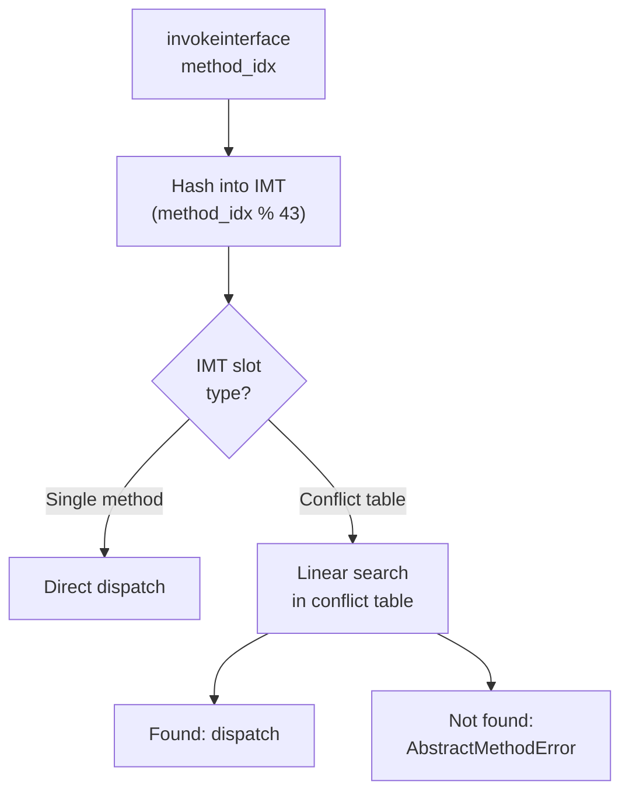

The IMT provides O(1) dispatch for the common case (no conflicts) and
falls back to O(n) for conflicted slots (rare in practice).

### 18.6.9 Virtual Method Table (vtable)

The vtable is an array of `ArtMethod*` that provides virtual method dispatch.
Each class inherits its parent's vtable entries and overrides the ones it
reimplements. The vtable index for a method is assigned at link time and
remains constant.

Virtual dispatch: `vtable[method.method_index_]` gives the most-derived
implementation for a virtual method call.

### 18.6.10 Class Linking Internals

The class linking process is one of the most intricate parts of ART. Here
is a more detailed view of each linking step:

#### Step 1: Superclass Resolution

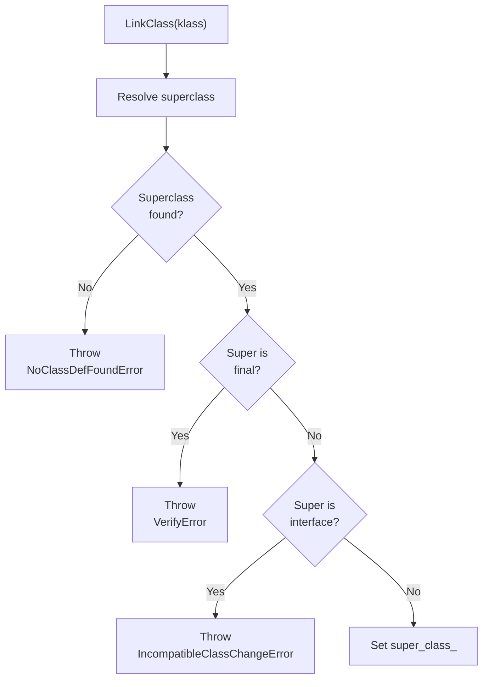

#### Step 2: Interface Resolution

For each interface in the `interfaces_off_` type list:

1. Resolve the interface type.
2. Verify it is actually an interface (not a class).
3. Build the iftable (interface method table) by combining the superclass's
   iftable with the new interfaces.

#### Step 3: Virtual Method Linking

Virtual method linking populates the vtable:

1. Copy the superclass's vtable.
2. For each virtual method declared in this class:
   a. Check if it overrides a superclass method (same name and signature).
   b. If overriding, replace the vtable entry.
   c. If new, append to the vtable.
3. For each interface method not yet implemented:
   a. Check if an inherited method provides the implementation.
   b. If no implementation exists and the class is not abstract, error.

#### Step 4: Field Layout

Field layout determines the memory offset of each field:

1. Start with the superclass's instance size as the base offset.
2. Group fields by type and sort for optimal packing:
   - References first (for GC scanning)
   - Then by decreasing alignment requirement
3. Calculate padding needed for alignment.
4. Set the class's `object_size_` to the total instance size.

#### Step 5: IMT Population

Build the Interface Method Table:

1. For each interface method in the iftable:
   a. Hash the method to an IMT slot.
   b. If the slot is empty, store the method directly.
   c. If the slot has a conflict, create or extend the conflict table.
2. Install the IMT in the class.

### 18.6.11 Class Loader Context

The `ClassLoaderContext` (`art/runtime/class_loader_context.h`) tracks the
DEX file search path for a given class loader. This is important for:

- **dex2oat** -- needs to know the class loader context to resolve cross-DEX
  references correctly.
- **OAT file validation** -- the stored classpath in the OAT header must
  match the current class loader context for the file to be valid.

### 18.6.12 DexCache

Each loaded DEX file has a corresponding `mirror::DexCache` object that
caches resolved:

- **Strings** -- resolved from `StringId` indices
- **Types** -- resolved `mirror::Class` objects
- **Methods** -- resolved `ArtMethod` pointers
- **Fields** -- resolved `ArtField` pointers

The DexCache accelerates repeated resolution of the same entity. Unresolved
entries contain `null` and trigger a resolution attempt on first access.

### 18.6.13 Resolution: Strings, Types, Methods, Fields

The ClassLinker provides resolution services for all major DEX entities.
Resolution converts symbolic references (indices) into direct runtime
pointers, caching results in the DexCache.

#### String Resolution

```
// art/runtime/class_linker.h, lines 277-288
ObjPtr<mirror::String> ResolveString(dex::StringIndex string_idx,
                                     ArtField* referrer);
ObjPtr<mirror::String> ResolveString(dex::StringIndex string_idx,
                                     ArtMethod* referrer);
ObjPtr<mirror::String> ResolveString(dex::StringIndex string_idx,
                                     Handle<mirror::DexCache> dex_cache);
```

String resolution reads the MUTF-8 encoded string data from the DEX file,
creates a `mirror::String` object on the heap, and caches it in the DexCache.
The intern table is consulted to ensure string deduplication.

#### Type Resolution

```
// art/runtime/class_linker.h, lines 299-316
ObjPtr<mirror::Class> ResolveType(dex::TypeIndex type_idx,
                                   ObjPtr<mirror::Class> referrer);
ObjPtr<mirror::Class> ResolveType(dex::TypeIndex type_idx,
                                   ArtField* referrer);
ObjPtr<mirror::Class> ResolveType(dex::TypeIndex type_idx,
                                   ArtMethod* referrer);
ObjPtr<mirror::Class> ResolveType(dex::TypeIndex type_idx,
                                   Handle<mirror::DexCache> dex_cache,
                                   Handle<mirror::ClassLoader> class_loader);
```

Type resolution converts a `TypeIndex` into a `mirror::Class*` by:

1. Looking up the type descriptor string from the DEX file.
2. Using `FindClass()` with the appropriate class loader.
3. Caching the result in the DexCache.

#### Method Resolution

```
// art/runtime/class_linker.h, lines 343-385
ArtMethod* LookupResolvedMethod(uint32_t method_idx,
                                ObjPtr<mirror::DexCache> dex_cache,
                                ObjPtr<mirror::ClassLoader> class_loader);
ArtMethod* FindResolvedMethod(ObjPtr<mirror::Class> klass,
                               ObjPtr<mirror::DexCache> dex_cache,
                               ObjPtr<mirror::ClassLoader> class_loader,
                               uint32_t method_idx);
ArtMethod* ResolveMethodId(uint32_t method_idx,
                            Handle<mirror::DexCache> dex_cache,
                            Handle<mirror::ClassLoader> class_loader);
```

Method resolution:

1. Resolves the declaring class.
2. Searches the class hierarchy for the method (virtual table for virtual
   methods, direct method list for static/private methods).
3. Checks invoke type compatibility.
4. Verifies access permissions.
5. Caches the resolved `ArtMethod*` in the DexCache.

#### Field Resolution

```
// art/runtime/class_linker.h, lines 395-418
ArtField* ResolveField(uint32_t field_idx, ArtMethod* referrer,
                        bool is_static);
ArtField* ResolveField(uint32_t field_idx,
                        Handle<mirror::DexCache> dex_cache,
                        Handle<mirror::ClassLoader> class_loader,
                        bool is_static);
ArtField* ResolveFieldJLS(uint32_t field_idx,
                           Handle<mirror::DexCache> dex_cache,
                           Handle<mirror::ClassLoader> class_loader);
```

Field resolution follows Java Language Specification (JLS) rules:

1. Resolve the declaring class.
2. Search the class and its superclasses for the field.
3. If not found, search implemented interfaces.
4. Cache the resolved `ArtField*`.

The `ResolveFieldJLS` variant follows Java field resolution semantics
(searching the class hierarchy in JLS-defined order), while `ResolveField`
with `is_static` performs a direct lookup in either the static or instance
field arrays.

### 18.6.14 ClassTable

The `ClassTable` (`art/runtime/class_table.h`) is a hash-based data structure
that maps class descriptors to `mirror::Class` objects. Each class loader
(and the boot class path) has its own ClassTable.

Operations:

- **Lookup** -- O(1) average time to find a class by descriptor
- **Insert** -- Register a newly defined class
- **Visit** -- Iterate over all classes (used by GC for root scanning)
- **Size** -- Report the number of loaded classes

The ClassTable uses a read-write lock (`classlinker_classes_lock_`) to
protect concurrent access during class loading.

### 18.6.15 Class Hierarchy Analysis (CHA)

CHA (`art/runtime/cha.h`) tracks single-implementation assumptions made
by the JIT compiler during devirtualization. When a class is loaded that
overrides a method previously assumed to have a single implementation, CHA
invalidates the compiled code and triggers deoptimization.

This enables speculative devirtualization: the JIT can inline virtual method
calls when only one implementation is known, but must be prepared to
deoptimize if the assumption is broken by dynamic class loading.

### 18.6.16 AddImageSpaces

For boot images and app images, `AddImageSpaces()` maps precompiled `.art`
files into the heap and registers their classes with the class linker:

```
// art/runtime/class_linker.h, lines 198-203
bool AddImageSpaces(ArrayRef<gc::space::ImageSpace*> spaces,
                    Handle<mirror::ClassLoader> class_loader,
                    ClassLoaderContext* context,
                    std::vector<std::unique_ptr<const DexFile>>* dex_files,
                    std::string* error_msg);
```

This is the primary mechanism by which boot image classes become available
to all processes -- the Zygote maps them, and child processes inherit the
mappings via `fork()`.

---

## 18.7 JNI Bridge

The Java Native Interface (JNI) is the standard mechanism for managed Java
code to call native (C/C++) code and vice versa. ART's JNI implementation
lives in `art/runtime/jni/` (25 files).

### 18.7.1 JNI Architecture

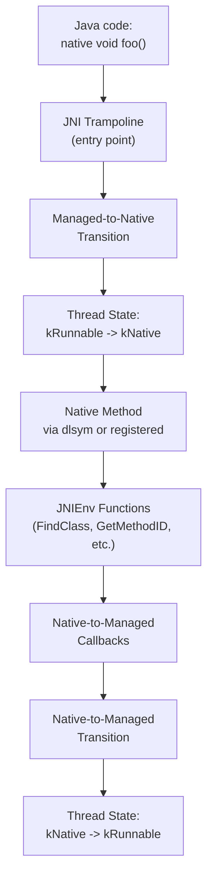

### 18.7.2 JavaVMExt

`JavaVMExt` (`art/runtime/jni/java_vm_ext.h`, line 50) extends the standard
JNI `JavaVM` interface with ART-specific functionality:

```
// art/runtime/jni/java_vm_ext.h, lines 50-57
class JavaVMExt : public JavaVM {
 public:
  static std::unique_ptr<JavaVMExt> Create(Runtime* runtime,
                                           const RuntimeArgumentMap& runtime_options,
                                           std::string* error_msg);
  ~JavaVMExt();
  ...
};
```

Key responsibilities:

- **Native library loading** -- `LoadNativeLibrary()` (line 106) loads
  shared libraries and calls `JNI_OnLoad`.
- **Global references** -- manages the global and weak-global reference
  tables.
- **CheckJNI** -- optional JNI argument validation for debugging.

```
// art/runtime/jni/java_vm_ext.h, lines 106-110
bool LoadNativeLibrary(JNIEnv* env,
                       const std::string& path,
                       jobject class_loader,
                       jclass caller_class,
                       std::string* error_msg);
```

### 18.7.3 JNIEnvExt

`JNIEnvExt` (`art/runtime/jni/jni_env_ext.h`, line 40) extends the standard
JNI `JNIEnv` with per-thread state:

```
// art/runtime/jni/jni_env_ext.h, lines 40-44
class JNIEnvExt : public JNIEnv {
 public:
  static JNIEnvExt* Create(Thread* self, JavaVMExt* vm, std::string* error_msg);
  static jint GetEnvHandler(JavaVMExt* vm, void** out, jint version);
  ~JNIEnvExt();
  ...
};
```

Key features:

- **Local reference table** -- `locals_` manages per-frame local references.
- **Reference frames** -- `PushFrame()` / `PopFrame()` manage JNI local
  reference frames for bounded reference lifetime.
- **Monitor tracking** -- `RecordMonitorEnter()` / `CheckMonitorRelease()`
  track monitor operations for CheckJNI mode.
- **Critical sections** -- `critical_` counter tracks active
  `GetPrimitiveArrayCritical` / `GetStringCritical` calls that prevent
  GC from moving objects.

### 18.7.4 Native Method Registration

Native methods can be registered in two ways:

1. **Dynamic linking** -- ART uses `dlsym()` to find native methods by
   their JNI-mangled names (e.g., `Java_com_example_MyClass_nativeMethod`).

2. **Explicit registration** -- `RegisterNatives()` directly registers
   function pointers for native methods, bypassing `dlsym()`.

The `JNI dlsym lookup trampoline` (stub type `kJNIDlsymLookupTrampoline` in
`art/runtime/oat/oat.h`, line 37) is the entry point for dynamically-linked
native methods. On first invocation, it resolves the native function via
`dlsym()` and patches the method's entry point.

### 18.7.5 Managed-to-Native Transitions

When managed code calls a native method, ART must:

1. **Transition thread state** from `kRunnable` to `kNative`. In the native
   state, the thread is not suspended by GC checkpoints.
2. **Push a managed frame** onto the stack with method information for
   stack walking.
3. **Handle the calling convention** -- convert managed calling convention
   arguments to the native (C/C++) calling convention.
4. **Set up JNIEnv** -- pass the `JNIEnv*` as the first argument to the
   native function.
5. **Handle return values** -- convert native return values back to managed
   types.

### 18.7.6 Native-to-Managed Transitions

When native code calls back into managed code (e.g., via `CallVoidMethod()`),
ART must:

1. **Transition thread state** from `kNative` back to `kRunnable`.
2. **Check for pending exceptions**.
3. **Check for GC suspension requests** and comply if needed.
4. **Resolve the target method** if needed.
5. **Invoke the method** through the appropriate entry point.

### 18.7.7 CheckJNI

CheckJNI (`art/runtime/jni/check_jni.cc`) is a debugging facility that
wraps all JNI functions with additional validation:

- Verify that `jobject` references are valid (not stale, not null when
  required).
- Verify that `jmethodID` and `jfieldID` match the expected types.
- Verify that arrays are accessed within bounds.
- Verify that critical section rules are followed.
- Detect thread-safety violations (using the wrong `JNIEnv` from a
  different thread).

CheckJNI is enabled by default for debuggable apps and can be enabled
globally with `-Xcheck:jni`.

### 18.7.8 JNI Critical Sections

`GetPrimitiveArrayCritical()` and `GetStringCritical()` provide direct
pointers to array/string data without copying. While a critical section is
active, the GC cannot move objects, which can degrade GC performance:

```
// art/runtime/jni/jni_env_ext.h, lines 95-100
uint32_t GetCritical() const { return critical_; }
void SetCritical(uint32_t new_critical) { critical_ = new_critical; }
uint64_t GetCriticalStartUs() const { return critical_start_us_; }
```

### 18.7.9 Indirect Reference Tables

JNI object references (`jobject`, `jclass`, `jstring`, etc.) are not direct
pointers to managed objects. Instead, they are indices into indirect reference
tables (`art/runtime/jni/indirect_reference_table.h`). This indirection
allows the GC to move objects without invalidating JNI references.

There are three types of reference tables:

- **Local reference table** -- per-JNIEnv, bounded lifetime
- **Global reference table** -- process-wide, explicit deletion required
- **Weak global reference table** -- process-wide, cleared by GC

### 18.7.10 JNI Trampoline Types

The OAT file includes several types of JNI-related trampolines:

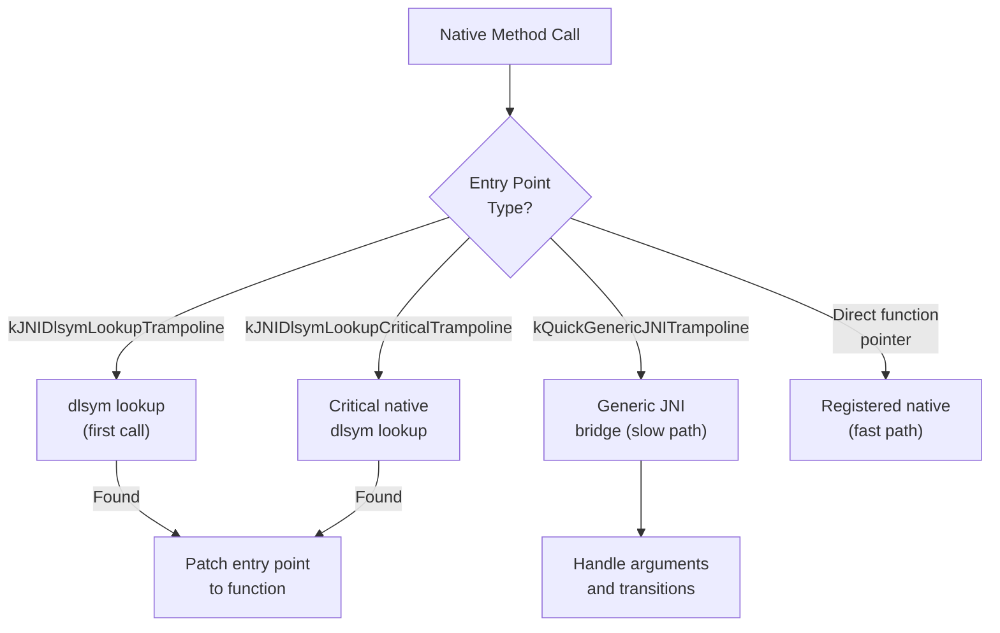

1. **JNI dlsym lookup trampoline** -- Used for methods whose native
   implementation has not yet been resolved via `dlsym()`. On first call,
   it resolves the function by name and patches the entry point.

2. **JNI dlsym lookup critical trampoline** -- Similar to above but for
   `@CriticalNative` methods that use a streamlined calling convention
   without `JNIEnv*` and `jobject` arguments.

3. **Quick generic JNI trampoline** -- A generic bridge that handles the
   managed-to-native transition for any JNI method. It marshals arguments,
   transitions the thread state, and handles return values.

4. **Direct function pointer** -- After `RegisterNatives()` or after the
   dlsym trampoline resolves the function, the entry point is patched to
   call the native function directly.

### 18.7.11 @CriticalNative and @FastNative

ART supports two Android-specific JNI optimizations:

**@FastNative** -- Methods annotated with `@FastNative` use an optimized
calling convention that:

- Skips the `JNIEnv*` stack allocation overhead
- Keeps the thread in `kRunnable` state (not `kNative`)
- Does not handle exceptions automatically
- Is faster for methods that do not need full JNI services

**@CriticalNative** -- Methods annotated with `@CriticalNative` use an even
more streamlined convention:

- No `JNIEnv*` or `jobject` (jclass) arguments passed
- No thread state transitions at all
- Cannot call any JNI functions
- Cannot access Java objects
- Fastest possible native call path
- Suitable for pure computation (e.g., math operations)

### 18.7.12 Stack Walking

When the GC needs to find all root references, or when an exception is being
unwound, ART must walk the mixed managed/native call stack. The stack walker
must handle:

- **Compiled frames** -- Use stack maps to find root references and
  deoptimization points.
- **Interpreter frames** -- Walk the shadow frame chain.
- **JNI frames** -- Identify the managed caller and the native callee.
- **Transition frames** -- Special frames at managed/native boundaries.

The stack walker is implemented in `art/runtime/stack.h` and is one of the
most architecturally sensitive parts of ART, as it must understand each
ISA's calling conventions and frame layouts.

---

## 18.8 odrefresh and OTA

`odrefresh` (On-Device Refresh) is responsible for ensuring that AOT-compiled
artifacts are up-to-date after system updates (OTA), APEX module updates, or
changes to system properties.

Source: `art/odrefresh/` (33 files).

### 18.8.1 Purpose

When the device boots after an update, precompiled boot images and system
server artifacts may be stale because:

1. The ART APEX has been updated with a new compiler or runtime.
2. The boot classpath JARs have changed.
3. System server JARs have been updated.
4. System properties affecting compilation have changed.

`odrefresh` detects these situations and triggers re-compilation using
`dex2oat`.

### 18.8.2 Architecture

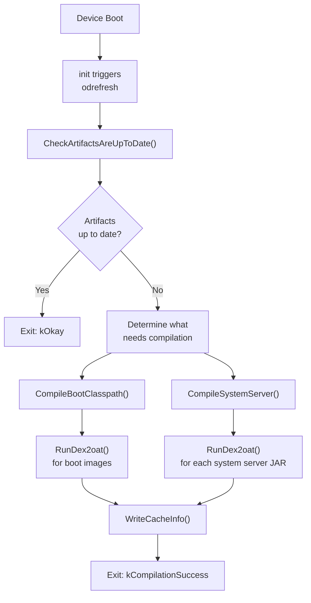

### 18.8.3 OnDeviceRefresh Class

The main class is `OnDeviceRefresh` (`art/odrefresh/odrefresh.h`, line 159):

```
// art/odrefresh/odrefresh.h, lines 159-177
class OnDeviceRefresh final {
 public:
  explicit OnDeviceRefresh(
      const OdrConfig& config,
      android::base::function_ref<int(const char*, const char*)> setfilecon,
      android::base::function_ref<int(const char*, unsigned int)> restorecon);

  ExitCode CheckArtifactsAreUpToDate(
      OdrMetrics& metrics,
      CompilationOptions* compilation_options) const;

  ExitCode Compile(OdrMetrics& metrics,
                   CompilationOptions compilation_options) const;

  bool RemoveArtifactsDirectory() const;
  ...
};
```

### 18.8.4 Precondition Checking

Before compiling, `odrefresh` checks preconditions using a layered approach:

```
// art/odrefresh/odrefresh.h, lines 109-157
class PreconditionCheckResult {
 public:
  static PreconditionCheckResult NoneOk(OdrMetrics::Trigger trigger);
  static PreconditionCheckResult BootImageMainlineExtensionNotOk(
      OdrMetrics::Trigger trigger);
  static PreconditionCheckResult SystemServerNotOk(
      OdrMetrics::Trigger trigger);
  static PreconditionCheckResult AllOk();

  bool IsAllOk() const;
  bool IsPrimaryBootImageOk() const;
  bool IsBootImageMainlineExtensionOk() const;
  bool IsSystemServerOk() const;
  ...
};
```

The check examines:

1. **APEX versions** -- Have any APEXes been updated?
2. **Boot classpath checksums** -- Do the BCP JAR checksums match?
3. **System properties** -- Have compilation-relevant properties changed?
4. **Artifact existence** -- Do all expected output files exist?

### 18.8.5 Compilation Options

The `CompilationOptions` struct defines what needs to be compiled:

```
// art/odrefresh/odrefresh.h, lines 57-67
struct CompilationOptions {
  // Boot images to generate, per ISA
  std::vector<std::pair<InstructionSet, BootImages>>
      boot_images_to_generate_for_isas;
  // System server JARs to compile
  std::set<std::string> system_server_jars_to_compile;

  static CompilationOptions CompileAll(const OnDeviceRefresh& odr);
  int CompilationUnitCount() const;
};
```

Boot images are structured as:

```
// art/odrefresh/odrefresh.h, lines 46-55
struct BootImages {
  static constexpr int kMaxCount = 2;
  bool primary_boot_image : 1;
  bool boot_image_mainline_extension : 1;
  int Count() const;
};
```

The two boot images are:

1. **Primary boot image** -- core ART and framework classes
2. **Mainline extension** -- classes from Mainline-updatable modules

### 18.8.6 Cache Info

`odrefresh` maintains a cache info file (XML) that records the state at the
time of last compilation. On subsequent boots, it compares the current state
against the cache info to determine if re-compilation is needed.

The cache info includes:

- APEX versions and last update timestamps
- Boot classpath component checksums
- System server component checksums
- System property values
- dex2oat boot classpath configuration

### 18.8.7 Compilation Results

The `CompilationResult` struct tracks the outcome of each compilation:

```
// art/odrefresh/odrefresh.h, lines 69-107
struct CompilationResult {
  OdrMetrics::Status status = OdrMetrics::Status::kOK;
  std::string error_msg;
  int64_t elapsed_time_ms = 0;
  std::optional<ExecResult> dex2oat_result;

  static CompilationResult Ok() { return {}; }
  static CompilationResult Dex2oatOk(int64_t elapsed_time_ms,
                                      const ExecResult& dex2oat_result);
  static CompilationResult Error(OdrMetrics::Status status,
                                  const std::string& error_msg);
  ...
};
```

### 18.8.8 Metrics and Reporting

`odrefresh` collects detailed metrics (`art/odrefresh/odr_metrics.h`) about
compilation time, trigger reason, success/failure status, and dex2oat exit
codes. These metrics are reported to the system via statsd
(`art/odrefresh/odr_statslog_android.cc`) for monitoring fleet-wide
compilation health.

### 18.8.9 odrefresh Execution Flow (Detailed)

The full execution flow of `odrefresh` at boot time:

```mermaid
flowchart TD
    A["odrefresh --compile"] --> B["GetApexInfoList()"]
    B --> C["ReadCacheInfo()"]
    C --> D{"Cache info\nexists?"}
    D -->|No| E["CheckSystemPropertiesAreDefault()"]
    D -->|Yes| F["CheckSystemPropertiesHaveNotChanged()"]
    E --> G["CheckPreconditionForSystem()"]
    F --> G
    G --> H["CheckPreconditionForData()"]
    H --> I["CheckBootClasspathArtifactsAreUpToDate()"]
    I --> J["CheckSystemServerArtifactsAreUpToDate()"]
    J --> K{"Need\ncompilation?"}
    K -->|No| L["Exit: kOkay"]
    K -->|Yes| M["CreateStagingDirectory()"]
    M --> N["CompileBootClasspath()"]
    N --> O["CompileSystemServer()"]
    O --> P["CleanupArtifactDirectory()"]
    P --> Q["WriteCacheInfo()"]
    Q --> R["Exit: kCompilationSuccess"]
```

### 18.8.10 Time Management

`odrefresh` manages compilation time carefully to avoid delaying boot:

- A maximum execution time limit prevents runaway compilation from
  blocking device startup.
- Individual `dex2oat` invocations have per-process timeouts.
- Compilation progress is tracked so partial results can be saved if time
  runs out.

### 18.8.11 Staging and Atomicity

To prevent corruption from interrupted compilation, `odrefresh` uses a
staging directory pattern:

1. Create a temporary staging directory.
2. Write all compilation outputs to the staging directory.
3. On success, atomically rename staging directory contents to the final
   location.
4. On failure, delete the staging directory.

This ensures that the artifact directory always contains either the old
valid artifacts or the new complete set, never a partially-written state.

### 18.8.12 fs-verity Integration

Compiled artifacts are protected by fs-verity (file-based verification)
through odsign (On-Device Signing). After `odrefresh` produces new artifacts,
odsign adds them to fs-verity to detect tampering. The
`RefreshExistingArtifacts()` method works around older odsign versions that
had issues with re-adding existing files:

```
// art/odrefresh/odrefresh.h, lines 259-260
// Loads artifacts to memory and writes them back. This is a workaround
// for old versions of odsign.
android::base::Result<void> RefreshExistingArtifacts() const;
```

### 18.8.13 Boot Image Layout

The boot image is split across multiple files for modularity:

| Component | Content | Location |
|-----------|---------|----------|
| Primary boot image | Core ART classes | `/system/framework/` |
| Framework extension | Framework classes | `/system/framework/` |
| Mainline extension | Mainline module classes | `/data/misc/apexdata/com.android.art/` |
| System server | System server JARs | `/data/misc/apexdata/com.android.art/` |

The staging directory pattern ensures atomic updates: artifacts are first
written to a staging directory, then renamed into place.

---

## 18.9 libnativeloader

`libnativeloader` manages how native (C/C++) shared libraries are loaded
for each app, enforcing namespace isolation to prevent apps from accessing
internal platform libraries.

Source: `art/libnativeloader/` (23 files).

### 18.9.1 Purpose

Android's namespace-based library loading serves several goals:

1. **API enforcement** -- Apps can only link against public NDK libraries.
   Internal platform libraries are hidden.
2. **Vendor isolation** -- Vendor libraries (on `/vendor`) are isolated
   from system libraries to support Treble.
3. **APEX isolation** -- Libraries in APEX modules have dedicated
   namespaces.
4. **Security** -- Prevents apps from loading arbitrary system libraries
   to exploit internal APIs.

### 18.9.2 Architecture

```mermaid
flowchart TD
    A["System.loadLibrary('foo')"] --> B["Runtime.loadLibrary0()"]
    B --> C["NativeLoader\n(art/libnativeloader)"]
    C --> D{"ClassLoader\ntype?"}
    D -->|"Boot CL"| E["Default namespace"]
    D -->|"App CL"| F["LibraryNamespaces::Create()"]
    F --> G["Create linker\nnamespace"]
    G --> H["Configure\nlinks & paths"]
    H --> I["android_dlopen_ext()\nwith namespace"]
    E --> J["dlopen()"]
```

### 18.9.3 Library Namespaces

The `LibraryNamespaces` class (`art/libnativeloader/library_namespaces.h`,
line 67) is the core manager:

```
// art/libnativeloader/library_namespaces.h, lines 67-99
class LibraryNamespaces {
 public:
  LibraryNamespaces() : initialized_(false), app_main_namespace_(nullptr) {}

  void Initialize();
  void Reset();
  Result<NativeLoaderNamespace*> Create(JNIEnv* env,
                                         uint32_t target_sdk_version,
                                         jobject class_loader,
                                         ApiDomain api_domain,
                                         bool is_shared,
                                         const std::string& dex_path,
                                         jstring library_path_j,
                                         jstring permitted_path_j,
                                         jstring uses_library_list_j);
  NativeLoaderNamespace* FindNamespaceByClassLoader(JNIEnv* env,
                                                     jobject class_loader);
  ...
};
```

### 18.9.4 API Domains

Libraries are organized into API domains based on their partition:

```
// art/libnativeloader/library_namespaces.h, lines 52-57
using ApiDomain = enum {
  API_DOMAIN_DEFAULT = 0,  // Ordinary apps
  API_DOMAIN_VENDOR = 1,   // Vendor partition
  API_DOMAIN_PRODUCT = 2,  // Product partition
  API_DOMAIN_SYSTEM = 3,   // System and system_ext partitions
};
```

### 18.9.5 Named Namespaces

Several well-known namespace names are defined:

```
// art/libnativeloader/library_namespaces.h, lines 41-48
constexpr const char* kVendorNamespaceName = "sphal";
constexpr const char* kProductNamespaceName = "product";
constexpr const char* kVndkNamespaceName = "vndk";
constexpr const char* kVndkProductNamespaceName = "vndk_product";
```

The `sphal` (SP-HAL) namespace contains vendor libraries that implement
same-process HALs (e.g., GPU drivers, codec implementations).

### 18.9.6 Namespace Creation for Apps

When an app's class loader first needs to load a native library,
`LibraryNamespaces::Create()` creates a new linker namespace with:

1. **Search paths** -- directories where libraries can be loaded from
   (e.g., the app's native library directory).
2. **Permitted paths** -- directories that the namespace is allowed to
   access (broader than search paths).
3. **Links** -- connections to other namespaces that allow loading libraries
   from those namespaces (e.g., a link to the platform namespace for
   NDK libraries).
4. **Shared flag** -- whether this is a shared namespace (visible to others).
5. **Target SDK version** -- older apps get access to more libraries for
   backward compatibility.

### 18.9.7 APEX Namespaces

APEX modules have their own linker namespaces, identified by their APEX name.
The `FindApexNamespace()` function resolves a native library's location to
the appropriate APEX namespace:

```
// art/libnativeloader/native_loader.cpp, lines 84-98
std::optional<NativeLoaderNamespace> FindApexNamespace(
    const char* caller_location) {
  std::optional<std::string> name =
      nativeloader::FindApexNamespaceName(caller_location);
  if (name.has_value()) {
    Result<NativeLoaderNamespace> ns =
        NativeLoaderNamespace::GetExportedNamespace(
            name.value(), /*is_bridged=*/false);
    return ns.value();
  }
  return std::nullopt;
}
```

### 18.9.8 Public Libraries

The set of libraries accessible to apps is defined by:

- `/system/etc/public.libraries.txt` -- system public libraries
- `/vendor/etc/public.libraries.txt` -- vendor public libraries
- Runtime-detected NDK library lists

The `public_libraries.cpp` file manages these lists and makes them
available to the namespace configuration.

### 18.9.9 Native Bridge Integration

When running under a native bridge (e.g., for ISA translation like ARM-on-x86),
`libnativeloader` creates "bridged" namespaces that route library loading
through the native bridge:

```
// art/libnativeloader/native_loader.cpp, line 89
Result<NativeLoaderNamespace> ns =
    NativeLoaderNamespace::GetExportedNamespace(
        name.value(), /*is_bridged=*/false);
```

The `is_bridged` parameter controls whether the namespace uses the native
bridge or the direct linker.

### 18.9.10 Library Loading Flow

When `System.loadLibrary("foo")` is called in Java, the following
sequence occurs:

```mermaid
sequenceDiagram
    participant Java as Java Code
    participant Runtime as Runtime
    participant NL as NativeLoader
    participant NS as LibraryNamespaces
    participant Linker as Dynamic Linker

    Java->>Runtime: System.loadLibrary("foo")
    Runtime->>Runtime: Resolve library name\n("foo" -> "libfoo.so")
    Runtime->>NL: OpenNativeLibrary()
    NL->>NS: FindNamespaceByClassLoader()
    alt Namespace exists
        NS-->>NL: Return existing namespace
    else Namespace not found
        NL->>NS: Create() new namespace
        NS->>Linker: android_create_namespace()
        NS->>Linker: Configure links
        NS-->>NL: Return new namespace
    end
    NL->>Linker: android_dlopen_ext()\nwith namespace
    Linker-->>NL: Handle or error
    NL->>Runtime: Call JNI_OnLoad()
    Runtime-->>Java: Library loaded
```

Key points:

1. The library name is resolved to a full path based on the class loader's
   library search path.
2. A linker namespace is created (or found) for the class loader.
3. The library is loaded within that namespace, restricting which other
   libraries it can see.
4. `JNI_OnLoad` is called to allow the library to register native methods.

### 18.9.11 Error Handling

Common native library loading errors:

| Error | Cause |
|-------|-------|
| `UnsatisfiedLinkError: dlopen failed: library not found` | Library not in search path |
| `UnsatisfiedLinkError: dlopen failed: namespace isolation` | Library blocked by namespace rules |
| `UnsatisfiedLinkError: JNI_ERR returned from JNI_OnLoad` | Library's JNI_OnLoad failed |
| `UnsatisfiedLinkError: No implementation found` | Native method not registered |

Debugging tips:

- Check `adb logcat -s linker` for detailed linker errors
- Check `adb logcat -s nativeloader` for namespace resolution
- Use `adb shell linkerconfig --dump` to see namespace configuration

### 18.9.12 Namespace Linking

Namespace linking is the mechanism by which one linker namespace can access
libraries from another. Links are directional and specify which libraries
can be accessed:

```mermaid
flowchart LR
    A["App Namespace\n(classloader-namespace)"] -->|"public libs"| B["Default\nNamespace"]
    A -->|"NDK libs\n(libc.so, libm.so, ...)"| C["Platform\nNamespace"]
    A -->|"if vendor app"| D["Vendor\nNamespace (sphal)"]
    A -->|"VNDK libs"| E["VNDK\nNamespace"]
    F["APEX Namespace\n(com_android_art)"] -->|"ART libs"| B
```

Key linking rules:

- **App to platform**: Apps can only link to libraries listed in
  `public.libraries.txt` (the NDK stable set).
- **App to vendor**: Only vendor apps (on `/vendor` or `/oem`) can
  access vendor-specific libraries.
- **Platform to APEX**: Platform namespaces have links to APEX namespaces
  for accessing module-specific libraries.
- **Cross-APEX**: APEX modules can link to each other through explicit
  namespace links configured by the linker config.

### 18.9.13 Target SDK Version Effects

The target SDK version affects which libraries are accessible:

- Apps targeting SDK < 24 get access to some private libraries that were
  historically loadable (for backward compatibility).
- Apps targeting SDK >= 24 are strictly limited to the NDK stable set.
- Apps targeting SDK >= 28 have additional restrictions on accessing
  vendor libraries.

This graduated enforcement allows older apps to continue working while
encouraging new apps to use only stable APIs.

### 18.9.14 Testing Namespace Behavior

The `NATIVELOADER_DEFAULT_NAMESPACE_LIBS` environment variable provides a
testing escape hatch:

```
// art/libnativeloader/native_loader.cpp, lines 59-77
// NATIVELOADER_DEFAULT_NAMESPACE_LIBS is an environment variable that
// can be used to list extra libraries that libnativeloader will load
// from the default namespace. The libraries must be listed without
// paths, and then LD_LIBRARY_PATH is typically set to the directories
// to load them from.
```

This is used primarily in ART run tests executed through `dalvikvm` in the
APEX environment.

---

## 18.10 ART Debugging

ART provides comprehensive debugging support through JVMTI (JVM Tool
Interface) agents, method tracing, and various diagnostic tools.

Source: `art/openjdkjvmti/` (JVMTI implementation),
`art/runtime/debugger.h` (debug support in the runtime).

### 18.10.1 Debugging Architecture

```mermaid
flowchart TD
    A["Debugger\n(Android Studio)"] --> B["adb / jdwp"]
    B --> C["JDWP Protocol"]
    C --> D["ART Runtime\nDebugger Support"]
    D --> E["JVMTI Agent\n(openjdkjvmti)"]
    E --> F["Breakpoints\n(ti_breakpoint.h)"]
    E --> G["Single Stepping\n(ti_method.h)"]
    E --> H["Class Redefinition\n(ti_redefine.h)"]
    E --> I["Heap Inspection\n(ti_heap.h)"]
    E --> J["Thread Control\n(ti_thread.h)"]
    E --> K["Method Tracing\n(ti_method.h)"]
```

### 18.10.2 Debuggable Runtime States

The runtime supports three debug states, defined in
`art/runtime/runtime.h` (lines 145-156):

```
// art/runtime/runtime.h, lines 145-156
enum class RuntimeDebugState {
  // No debug features / method tracing
  kNonJavaDebuggable,
  // Method tracing and restricted debug features
  // (redefinition not supported)
  kJavaDebuggable,
  // Full debug features including redefinition
  // (set at startup, never transitions out)
  kJavaDebuggableAtInit
};
```

When a debugger attaches or method tracing starts, the runtime transitions
to `kJavaDebuggable`. This enables:

- Deoptimization of compiled code to interpreted mode
- Method entry/exit instrumentation
- Breakpoint insertion
- Stack frame inspection

### 18.10.3 JVMTI Implementation

ART implements the JVMTI specification in `art/openjdkjvmti/`. The
implementation is organized into capability-specific files:

| File | Capability |
|------|-----------|
| `ti_breakpoint.h/cc` | Set/clear breakpoints |
| `ti_method.h/cc` | Method entry/exit events, single stepping |
| `ti_class.h/cc` | Class load/prepare events |
| `ti_redefine.h/cc` | Class redefinition (hot-swap) |
| `ti_heap.h/cc` | Heap walking, object tagging |
| `ti_stack.h/cc` | Stack frame inspection |
| `ti_thread.h/cc` | Thread start/end events, suspension |
| `ti_threadgroup.h/cc` | Thread group enumeration |
| `ti_monitor.h/cc` | Monitor contention events |
| `ti_field.h/cc` | Field access/modification events |
| `ti_jni.h/cc` | JNI function interception |
| `ti_search.h/cc` | Class search path manipulation |
| `ti_properties.h/cc` | System property access |
| `ti_timers.h/cc` | Timer information |
| `ti_dump.h/cc` | Heap dump support |
| `ti_allocator.h/cc` | JVMTI memory allocation |
| `ti_extension.h/cc` | ART-specific JVMTI extensions |
| `ti_logging.h/cc` | Logging control |
| `ti_phase.h/cc` | VM phase events |

The main entry point is `art/openjdkjvmti/OpenjdkJvmTi.cc`, which
implements the `JvmtiFunctions` class containing all JVMTI function
implementations.

Global JVMTI infrastructure:

```
// art/openjdkjvmti/OpenjdkJvmTi.cc, lines 81-83
EventHandler* gEventHandler;
DeoptManager* gDeoptManager;
AllocationManager* gAllocManager;
```

### 18.10.4 Breakpoints

Breakpoints work by:

1. **Deoptimizing the method** -- If the method has compiled code (JIT or
   AOT), the entry point is replaced with the interpreter bridge so the
   method runs in the interpreter.
2. **Installing a breakpoint callback** -- The interpreter checks for
   breakpoints at each DEX PC and fires the JVMTI breakpoint event.
3. **Notifying the agent** -- The JVMTI event callback is invoked with the
   thread, method, and location information.

### 18.10.5 Class Redefinition

ART supports structural class redefinition (hot-swap) through the JVMTI
`RedefineClasses` function (`art/openjdkjvmti/ti_redefine.h`). This allows
Android Studio's "Apply Changes" feature to modify classes without restarting
the app.

The redefinition process:

1. Validate the new class definition against the old one.
2. Create new `ArtMethod` and `ArtField` arrays.
3. Update the `mirror::Class` object with the new definitions.
4. Invalidate all compiled code for affected methods.
5. Mark old methods as "obsolete" so stack frames can still reference them.

### 18.10.6 Method Tracing

ART supports method tracing through the `Trace` class
(`art/runtime/trace.h`). Two tracing mechanisms are available:

1. **Method tracing** -- Records method entry/exit events with timestamps.
   Output format is compatible with Android Studio's CPU profiler.

2. **Sample-based profiling** -- Periodically samples the call stack of
   running threads to build a statistical profile.

Tracing is enabled via:

- `Debug.startMethodTracing()` from Java
- `am profile start <process> <file>` from the command line
- JVMTI method entry/exit events

### 18.10.7 Signal-Based Diagnostics

ART installs signal handlers for diagnostics:

- **SIGQUIT** -- Dumps thread stacks, GC info, and lock state to logcat.
  This is the mechanism behind ANR (Application Not Responding) traces.
  Handled by the `SignalCatcher` thread.

- **SIGSEGV** -- The `FaultHandler` inspects segfaults to determine if
  they are:
  - Null pointer dereferences on the managed heap (throws
    `NullPointerException`)
  - Stack overflow (throws `StackOverflowError`)
  - Implicit suspend checks (for GC suspension)
  - Genuine crashes (forwards to the default handler)

### 18.10.8 dexdump and oatdump

ART includes command-line tools for inspecting compiled artifacts:

- **dexdump** (`art/dexdump/`) -- Dumps the contents of DEX files in
  human-readable format.
- **oatdump** (`art/oatdump/`) -- Dumps the contents of OAT files,
  including the OAT header, compiled method metadata, and disassembled
  native code.

### 18.10.9 imgdiag

The `imgdiag` tool (`art/imgdiag/`) compares a running process's view
of boot image pages against the on-disk boot image to identify dirty
pages. This is useful for measuring the memory cost of boot image
modifications at runtime.

### 18.10.10 Perfetto Integration

ART integrates with Perfetto (`art/perfetto_hprof/`) for heap profiling.
When configured, ART can emit heap snapshots to a Perfetto trace, enabling
analysis with the Perfetto UI.

### 18.10.11 ART Metrics

ART collects runtime metrics through its metrics framework
(`art/libartbase/base/metrics/metrics.h`). Metrics include:

- GC pause times and durations
- JIT compilation counts and times
- Class verification times
- Method resolution times
- Code cache usage
- Heap size and utilization

These metrics are reported via statsd for fleet-wide monitoring.

### 18.10.12 Diagnostic Commands

ART responds to several diagnostic commands that can be triggered
from the host:

#### SIGQUIT Thread Dump

Sending SIGQUIT (signal 3) to a process triggers a full thread dump:

```bash
adb shell kill -3 <pid>
# Output written to /data/anr/traces.txt or logcat
```

The dump includes:

- All Java thread stacks with line numbers
- Thread state (Runnable, Waiting, Sleeping, etc.)
- Lock information (which threads hold which monitors)
- GC statistics
- JIT compilation statistics
- Heap summary
- Class loader information
- Loaded native library list

#### dumpsys meminfo

```bash
adb shell dumpsys meminfo <pid>
```

Shows ART-specific memory breakdown:

- **Java Heap** -- Objects on the managed heap
- **Native Heap** -- Native allocations (malloc)
- **Code** -- Compiled code (OAT, JIT)
- **.art mmap** -- Boot image and app image mappings
- **.dex mmap** -- DEX file mappings
- **.oat mmap** -- OAT file mappings
- **.so mmap** -- Native library mappings

#### ART-Specific System Properties

| Property | Effect |
|----------|--------|
| `dalvik.vm.heapsize` | Maximum heap size |
| `dalvik.vm.heapgrowthlimit` | Default heap growth limit |
| `dalvik.vm.heapmaxfree` | Maximum free bytes before GC |
| `dalvik.vm.heapminfree` | Minimum free bytes after GC |
| `dalvik.vm.heaptargetutilization` | GC target utilization |
| `dalvik.vm.usejit` | Enable/disable JIT |
| `dalvik.vm.usejitprofiles` | Enable profile saving |
| `dalvik.vm.jitthreshold` | JIT compilation threshold |
| `dalvik.vm.dex2oat-threads` | dex2oat thread count |
| `dalvik.vm.image-dex2oat-threads` | Boot image compilation threads |
| `dalvik.vm.check-jni` | Enable CheckJNI |
| `dalvik.vm.extra-opts` | Additional VM options |
| `persist.device_config.runtime_native.usap_pool_enabled` | USAP pool |

### 18.10.13 Runtime Instrumentation

The `Instrumentation` class (`art/runtime/instrumentation.h`) provides hooks
for method entry, method exit, and branch events. Instrumentation is the
foundation for:

- Method tracing
- Code coverage
- Performance profiling
- Debugger support

When instrumentation is active, compiled code is deoptimized to interpreted
mode so that instrumentation callbacks fire at every method boundary.

### 18.10.14 Deoptimization

Deoptimization is the process of switching from compiled code execution to
interpreted execution. This is needed when:

- A breakpoint is set in a compiled method
- A class is redefined while compiled code references it
- A CHA assumption is invalidated
- Instrumentation is enabled

The `DeoptimizationKind` enum (`art/runtime/deoptimization_kind.h`) defines
why deoptimization occurred:

- `kFullFrame` -- Full frame deoptimization
- `kOsr` -- OSR-related deoptimization
- `kJitSameTarget` -- JIT compiled code needs updating
- And several others for specific scenarios

### 18.10.15 Hidden API Enforcement

ART enforces restrictions on access to non-SDK (hidden) APIs. When an app
attempts to use a hidden API (via reflection or JNI), ART checks the API's
restriction level:

- **Whitelist** -- Always accessible
- **Light greylist** -- Accessible but generates a log warning
- **Dark greylist** -- Accessible only for apps targeting older SDK versions
- **Blacklist** -- Always blocked, throws an exception

The hidden API data is stored in the DEX file's `HiddenapiClassData` section
(see Section 19.2.8) and checked during reflection and JNI method resolution.

### 18.10.16 ART Test Infrastructure

The ART test suite (`art/test/`) is one of the most comprehensive test suites
in AOSP, containing:

- **JNI tests** -- Verify JNI function correctness
- **GC tests** -- Stress test the garbage collector
- **Compiler tests** -- Verify optimization correctness
- **DEX verifier tests** -- Ensure malformed DEX files are rejected
- **JVMTI tests** -- Test debugging and profiling features
- **Runtime tests** -- Test class loading, exception handling, threading

Tests are run on both host and device targets, and many tests include both
a Java component and a native (C++) component.

### 18.10.17 ART Daemon (artd)

The `artd` service (`art/artd/`) is a system service that manages
dex optimization operations on behalf of the package manager. It provides
a binder interface for:

- Triggering dex optimization for specific packages
- Querying the optimization status of packages
- Managing profiles (merge, delete, snapshot)
- Performing background dex optimization (bg-dexopt)

`artd` replaces the older in-process dex optimization logic that was
embedded in the package manager, providing better isolation and
testability.

### 18.10.18 dexoptanalyzer

The `dexoptanalyzer` tool (`art/dexoptanalyzer/`) determines whether a
DEX file needs optimization. It examines:

- The current compiler filter
- Whether the profile has changed
- Whether the boot classpath has been updated
- Whether the OAT file is still valid

This is used by the package manager and `artd` to decide whether to
invoke `dex2oat`.

---

## 18.11 Try It

### Exercise 18.1 -- Inspect a DEX File

Use `dexdump` to examine the contents of a DEX file:

```bash
# Build dexdump if needed
m dexdump

# Dump the header of framework.jar's DEX file
dexdump -f /system/framework/framework.jar 2>&1 | head -50

# Dump a specific class
dexdump -d /system/framework/framework.jar 2>&1 | \
    grep -A 20 "Class descriptor.*android/app/Activity"
```

Observe the string pool size, type count, method count, and class definitions.
Compare the header fields with the `DexFile::Header` structure from
Section 19.2.

### Exercise 18.2 -- Examine OAT Header Metadata

Use `oatdump` to inspect the OAT header of the boot image:

```bash
m oatdump

# Dump the boot image OAT header
oatdump --oat-file=/system/framework/arm64/boot.oat --header-only

# Look for the compiler filter, boot classpath, and compilation reason
oatdump --oat-file=/system/framework/arm64/boot.oat --header-only | \
    grep -E "compiler-filter|compilation-reason|bootclasspath"
```

Compare the `kOatVersion` with the value in `art/runtime/oat/oat.h`.

### Exercise 18.3 -- Observe JIT Compilation

Enable JIT logging and observe compilation in real-time:

```bash
# Enable JIT verbose logging
adb shell setprop dalvik.vm.extra-opts "-verbose:jit"

# Start an app and observe JIT compilations in logcat
adb logcat -s 'art:V' | grep -i jit
```

You should see messages about method compilation, pattern matching, and
code cache operations. Look for:

- "JIT compiling" -- a method is being compiled
- "Successfully pattern matched" -- a method was matched to a fast stub
- "JIT code cache" -- code cache operations

### Exercise 18.4 -- Trigger and Observe GC

Force a garbage collection and observe the GC log:

```bash
# Enable GC verbose logging
adb shell setprop dalvik.vm.extra-opts "-verbose:gc"

# Force GC via DDMS or:
adb shell kill -10 <pid>  # SIGUSR1

# Observe GC log
adb logcat -s 'art:I' | grep -E "GC|gc"
```

GC log entries include:

- Collector type (CC, CMC, etc.)
- GC cause (Alloc, Background, Explicit, etc.)
- Pause time
- Freed objects/bytes
- Heap utilization

### Exercise 18.5 -- Profile an App and Trigger bg-dexopt

Capture a profile and trigger background optimization:

```bash
# Get the current profile for an app
adb shell dumpsys package <package> | grep -A5 "dexopt state"

# Force profile compilation
adb shell cmd package bg-dexopt-job <package>

# Check the compilation result
adb shell dumpsys package <package> | grep -A5 "dexopt state"
```

Observe the compiler filter change from `verify` or `speed-profile` to
a higher optimization level.

### Exercise 18.6 -- Examine odrefresh Behavior

Check the odrefresh status after a simulated APEX update:

```bash
# Check current odrefresh status
adb shell cat /data/misc/apexdata/com.android.art/cache-info.xml

# Check which ISAs have boot images
adb shell ls /data/misc/apexdata/com.android.art/dalvik-cache/

# Force odrefresh to check artifacts
adb shell /apex/com.android.art/bin/odrefresh --check
```

### Exercise 18.7 -- Inspect Native Library Namespaces

Examine how libnativeloader configures namespaces for an app:

```bash
# List public libraries
adb shell cat /system/etc/public.libraries.txt

# Check vendor public libraries
adb shell cat /vendor/etc/public.libraries.txt 2>/dev/null

# See the linker namespace configuration for an app process
adb shell cat /proc/<pid>/maps | grep -i "linker_namespaces"
```

### Exercise 18.8 -- Use JVMTI for Debugging

Attach a JVMTI agent to a running process:

```bash
# Enable debuggable mode for an app
adb shell setprop wrap.<package> \
    'am start -D -n <package>/<activity>'

# List available JVMTI agents
ls /apex/com.android.art/lib64/
```

In Android Studio, use the "Attach Debugger" feature with the "Java and
Native" debug type to see both Java and native stack frames.

### Exercise 18.9 -- Walk the Class Loading Chain

Write a small test that demonstrates class loader delegation:

```java
// In an Android test
ClassLoader cl = getClass().getClassLoader();
while (cl != null) {
    Log.d("ClassLoader", cl.getClass().getName());
    cl = cl.getParent();
}
// Expected output:
// dalvik.system.PathClassLoader
// java.lang.BootClassLoader
```

Compare this with the `FindClass` delegation model described in
Section 19.6.3.

### Exercise 18.10 -- Measure GC Pause Times

Collect GC metrics for a running app:

```bash
# Dump ART runtime info
adb shell kill -3 <pid>  # SIGQUIT

# Read the trace file
adb shell cat /data/anr/traces.txt | head -100
```

Look for the "Cumulative GC" section showing:

- Total GC time
- Number of GC cycles
- Average and maximum pause times
- Heap utilization
- Bytes freed per cycle

### Exercise 18.11 -- Build and Run dex2oat Manually

Invoke dex2oat manually to understand its command-line interface:

```bash
# Run dex2oat with verbose output
/apex/com.android.art/bin/dex2oat \
    --dex-file=/path/to/app.apk \
    --oat-file=/tmp/app.oat \
    --compiler-filter=speed-profile \
    --profile-file=/path/to/primary.prof \
    --instruction-set=arm64 \
    --verbose-methods=* \
    2>&1 | head -100
```

Compare the available options with the code in `art/dex2oat/dex2oat.cc`.

### Exercise 18.12 -- Trace ART Startup

Use Perfetto to trace ART's startup sequence:

```bash
# Record a Perfetto trace with ART categories
perfetto -c - --txt <<EOF
buffers: { size_kb: 63488 }
data_sources: {
  config {
    name: "linux.ftrace"
    ftrace_config {
      ftrace_events: "ftrace/print"
      atrace_categories: "dalvik"
      atrace_categories: "art"
    }
  }
}
duration_ms: 10000
EOF
```

In the Perfetto UI, look for:

- `ClassLinker::InitFromBootImage` -- boot image loading
- `VerifyClass` -- class verification
- `Jit::CompileMethod` -- JIT compilations
- GC pause events

### Exercise 18.13 -- Examine ArtMethod Internals

Use `adb` to dump method information for a running process:

```bash
# Dump all methods of a specific class
adb shell cmd activity dump-heap <pid> /data/local/tmp/heap.hprof
# Then analyze with Android Studio's heap profiler

# Alternatively, use SIGQUIT to see method info in the trace
adb shell kill -3 <pid>
adb shell cat /data/anr/traces.txt | grep -A5 "ArtMethod"
```

### Exercise 18.14 -- Compare Compiler Filters

Compile the same APK with different compiler filters and compare the results:

```bash
# Verify only (fastest compile, slowest run)
dex2oat --compiler-filter=verify --dex-file=app.apk --oat-file=verify.oat

# Speed (compile everything)
dex2oat --compiler-filter=speed --dex-file=app.apk --oat-file=speed.oat

# Compare file sizes
ls -la verify.oat speed.oat

# Compare using oatdump
oatdump --oat-file=verify.oat --header-only
oatdump --oat-file=speed.oat --header-only
```

Observe the difference in OAT file size and the number of compiled methods.

### Exercise 18.15 -- Monitor Class Loading

Enable class loading verbose logging and observe the class loader delegation:

```bash
# Enable verbose class loading
adb shell setprop dalvik.vm.extra-opts "-verbose:class"

# Launch an app
adb shell am start -n com.example.app/.MainActivity

# Watch class loading in logcat
adb logcat -s 'art:V' | grep -E "Loading|Loaded|Linking|Verified"
```

You should see the progression: Loading -> Loaded -> Linking -> Verified
-> Initializing -> Initialized for each class.

### Exercise 18.16 -- Inspect the Boot Image

Examine the contents of the boot image:

```bash
# List boot image files
adb shell ls -la /system/framework/arm64/boot*.art
adb shell ls -la /system/framework/arm64/boot*.oat
adb shell ls -la /system/framework/arm64/boot*.vdex

# Dump boot image info
oatdump --image=/system/framework/arm64/boot.art --dump:art

# Count classes in the boot image
oatdump --image=/system/framework/arm64/boot.art --dump:art | \
    grep "class_def" | wc -l
```

### Exercise 18.17 -- Profile-Guided Optimization Workflow

Simulate the full PGO workflow:

```bash
# Step 1: Install app (gets verify filter initially)
adb install app.apk

# Step 2: Use the app to generate profile data

# Step 3: Check profile exists
adb shell ls -la /data/misc/profiles/cur/0/com.example.app/

# Step 4: Merge profiles
adb shell cmd package compile -m speed-profile -f com.example.app

# Step 5: Verify the result
adb shell dumpsys package com.example.app | grep "compilation"
```

### Exercise 18.18 -- Explore GC Spaces

Dump the heap space layout for a running process:

```bash
# Trigger heap dump via SIGQUIT
adb shell kill -3 <pid>

# Look for space information in the trace
adb shell cat /data/anr/traces.txt | grep -A20 "Heap:"
```

You should see:

- RegionSpace with size and utilization
- LargeObjectSpace
- Non-moving space
- Image spaces (boot image)
- Total heap size and free space

### Exercise 18.19 -- VDEX File Analysis

Examine the contents of a VDEX file:

```bash
# Find the VDEX file for an app
adb shell find /data/dalvik-cache -name "*.vdex" | head -5

# Use oatdump to examine the VDEX
oatdump --vdex-file=/path/to/file.vdex --dump:vdex-sections

# Check verifier dependencies
oatdump --vdex-file=/path/to/file.vdex --dump:verifier-deps
```

### Exercise 18.20 -- Understand ArtMethod Entry Points

Write a simple app and observe how method entry points change:

```java
public class EntryPointDemo {
    // This method starts interpreted
    public static int compute(int n) {
        int sum = 0;
        for (int i = 0; i < n; i++) {
            sum += i;
        }
        return sum;
    }

    public static void main(String[] args) {
        // First call: interpreted via Nterp
        compute(10);

        // After many calls: JIT compiles it
        for (int i = 0; i < 100000; i++) {
            compute(100);
        }
        // Now compute() runs compiled code
    }
}
```

Monitor the JIT compilation:
```bash
adb shell setprop dalvik.vm.extra-opts "-verbose:jit"
adb logcat -s art | grep "compute"
```

You should see the method transition from interpreted to baseline-compiled
to optimized-compiled.

### Exercise 18.21 -- Inspect Monitor Contention

Create a multi-threaded app with monitor contention and observe the thin
lock to fat lock inflation:

```java
public class MonitorDemo {
    static final Object lock = new Object();
    static volatile int counter = 0;

    public static void main(String[] args) throws Exception {
        Thread[] threads = new Thread[10];
        for (int i = 0; i < 10; i++) {
            threads[i] = new Thread(() -> {
                for (int j = 0; j < 10000; j++) {
                    synchronized (lock) {
                        counter++;
                    }
                }
            });
        }
        for (Thread t : threads) t.start();
        for (Thread t : threads) t.join();
        System.out.println("Counter: " + counter);
    }
}
```

Monitor contention can be observed through:
```bash
# Enable monitor logging
adb shell setprop dalvik.vm.extra-opts "-verbose:monitor"
adb logcat | grep "monitor"
```

### Exercise 18.22 -- Profile-Guided Compilation End-to-End

Perform a complete profile-guided compilation cycle:

```bash
# 1. Check initial compilation state
adb shell dumpsys package com.example.app | grep "status"

# 2. Clear existing profiles
adb shell cmd package clear-profiles com.example.app

# 3. Use the app normally for 5 minutes to generate profile data

# 4. Dump the profile
adb shell cmd package dump-profiles com.example.app

# 5. Trigger PGO compilation
adb shell cmd package compile -m speed-profile -f com.example.app

# 6. Verify the new compilation state
adb shell dumpsys package com.example.app | grep "status"

# 7. Compare cold-start time before and after PGO
adb shell am force-stop com.example.app
time adb shell am start -W com.example.app/.MainActivity
```

### Exercise 18.23 -- Examine the Lock Word

Inspect object lock states using a heap dump:

```bash
# Capture a heap dump
adb shell am dumpheap <pid> /data/local/tmp/heap.hprof
adb pull /data/local/tmp/heap.hprof

# Analyze with Android Studio's Memory Profiler or jhat
# Look for objects with non-zero lock word values
# indicating active monitors or hash codes
```

### Exercise 18.24 -- Compare Interpreter vs Compiled Performance

Create a micro-benchmark and run it with different compilation settings:

```bash
# Run with interpreter only (no JIT, no AOT)
adb shell setprop dalvik.vm.usejit false
adb shell cmd package compile -m verify -f com.example.benchmark

# Run the benchmark and record time

# Run with JIT enabled
adb shell setprop dalvik.vm.usejit true
# Run the benchmark again and compare

# Run with full AOT
adb shell cmd package compile -m speed -f com.example.benchmark
# Run the benchmark again and compare all three
```

Typical speedup ratios:

- Interpreter: 1x (baseline)
- Baseline JIT: 3-5x
- Optimized JIT/AOT: 5-20x (depends on workload)

### Exercise 18.25 -- Simulate an OTA and Observe odrefresh

Simulate what happens after an OTA update:

```bash
# Check current odrefresh cache info
adb shell cat /data/misc/apexdata/com.android.art/cache-info.xml

# Delete artifacts to simulate need for recompilation
adb shell rm -rf /data/misc/apexdata/com.android.art/dalvik-cache/

# Trigger odrefresh manually
adb shell /apex/com.android.art/bin/odrefresh --compile

# Check metrics
adb shell cat /data/misc/apexdata/com.android.art/cache-info.xml
```

---

## Summary

The ART runtime is a multi-layered execution engine that balances startup
latency, peak throughput, memory efficiency, and debuggability. Its key
architectural decisions include:

1. **Multi-tier compilation** -- Interpreter, baseline JIT, optimized JIT,
   and AOT compilation work together. Profile-guided optimization bridges
   the gap between cold-start performance and peak throughput.

2. **Concurrent garbage collection** -- The CC collector copies objects
   concurrently using read barriers, achieving sub-millisecond pause times
   on typical workloads. The newer CMC collector further reduces memory
   overhead through in-place compaction.

3. **DEX as the universal format** -- The DEX file format provides a compact,
   deduplicated, memory-mappable bytecode representation. VDEX files cache
   verification results, and OAT files store precompiled native code.

4. **Modular delivery** -- Through Project Mainline, the ART module (APEX)
   can be updated independently of the rest of the system. `odrefresh`
   ensures that compiled artifacts are regenerated after updates.

5. **Namespace isolation** -- `libnativeloader` enforces strict boundaries
   between app, vendor, and platform native libraries, supporting both
   Treble compatibility and security.

6. **Rich debugging** -- JVMTI support enables full-featured debugging
   including breakpoints, class redefinition, heap inspection, and method
   tracing -- all built on a solid foundation of runtime instrumentation.

7. **JNI bridge** -- The JNI implementation supports multiple optimization
   tiers (@CriticalNative, @FastNative, standard JNI) and provides
   comprehensive debugging support through CheckJNI. Indirect reference
   tables protect against GC-induced object movement.

8. **On-device refresh** -- `odrefresh` ensures that compilation artifacts
   survive system updates by detecting changes in APEX versions, boot
   classpath checksums, and system properties, then triggering selective
   re-compilation.

### Architecture Cross-Reference

The following diagram shows the major data flow between ART's subsystems
during a typical app execution:

```mermaid
flowchart TD
    subgraph "Install Time"
        A1["APK\n(classes.dex)"] --> A2["dex2oat"]
        A2 --> A3[".oat\n(native code)"]
        A2 --> A4[".vdex\n(verified DEX)"]
        A2 --> A5[".art\n(app image)"]
    end

    subgraph "Runtime: Class Loading"
        B1["ClassLinker"] --> B2["DexFileLoader"]
        B2 --> B3["DexFile"]
        B1 --> B4["OatFileManager"]
        B4 --> B5["OatFile"]
        B1 --> B6["ClassVerifier"]
        B6 --> B7["VerifierDeps"]
    end

    subgraph "Runtime: Execution"
        C1["Nterp\nInterpreter"] --> C2["JIT\nCompiler"]
        C2 --> C3["JIT Code\nCache"]
        C1 --> C4["Profile\nSaver"]
        C4 --> C5[".prof\nfile"]
        C5 -->|"bg-dexopt"| A2
    end

    subgraph "Runtime: Memory"
        D1["gc::Heap"] --> D2["RegionSpace"]
        D1 --> D3["LargeObjectSpace"]
        D1 --> D4["NonMovingSpace"]
        D1 --> D5["ConcurrentCopying\nCollector"]
        D5 --> D6["CardTable"]
        D5 --> D7["ReadBarrierTable"]
    end

    subgraph "Runtime: Native"
        E1["JavaVMExt"] --> E2["JNIEnvExt"]
        E2 --> E3["LocalRefTable"]
        E1 --> E4["NativeLibraries"]
        E4 --> E5["libnativeloader"]
        E5 --> E6["LinkerNamespace"]
    end

    A3 --> B5
    A4 --> B3
    A5 --> B1
    B1 --> C1
    C1 --> D1
    B1 --> E1
```

### Performance Characteristics

Understanding ART's performance characteristics helps developers make
informed choices:

| Operation | Typical Latency | Notes |
|-----------|----------------|-------|
| Object allocation (TLAB) | 10-50 ns | Bump pointer, thread-local |
| Object allocation (slow path) | 100-500 ns | Region allocation + potential GC |
| Virtual method call (compiled) | 5-10 ns | vtable lookup + indirect call |
| Interface method call (IMT, no conflict) | 5-15 ns | Hash + indirect call |
| Interface method call (IMT, conflict) | 20-100 ns | Linear search in conflict table |
| JNI call (standard) | 100-500 ns | Thread state transition overhead |
| JNI call (@FastNative) | 30-100 ns | Reduced overhead |
| JNI call (@CriticalNative) | 5-20 ns | Nearly native call speed |
| Class loading | 10-100 us | Depends on class complexity |
| Class verification | 50-500 us | Depends on method count/complexity |
| JIT baseline compilation | 1-10 ms | Per method |
| JIT optimized compilation | 5-50 ms | Per method, with inlining |
| Minor GC (young gen CC) | 1-5 ms total, <1 ms pause | Generational, concurrent |
| Major GC (full CC) | 10-100 ms total, 1-5 ms pause | Full heap, concurrent |
| dex2oat (speed-profile) | 5-60 seconds | Per app, depends on profile |
| dex2oat (boot image) | 30-120 seconds | Full boot classpath |

### Version History

ART has evolved significantly over Android releases:

| Android Version | ART Changes |
|----------------|------------|
| 5.0 (Lollipop) | ART becomes default runtime, replaces Dalvik |
| 6.0 (Marshmallow) | Profile-guided compilation, improved GC |
| 7.0 (Nougat) | JIT compiler added, hybrid AOT+JIT model |
| 8.0 (Oreo) | Concurrent Copying collector, faster boot |
| 9.0 (Pie) | Hidden API restrictions, compact DEX |
| 10 | Generational CC, improved startup |
| 11 | Memory-constrained device optimizations |
| 12 | ART module (Mainline), odrefresh |
| 13 | Improved profile-guided optimization |
| 14 | Mark-Compact (CMC) collector, RISC-V support |
| 15 | Continued CMC rollout, improved JIT |

Key source files for further exploration:

| Component | File |
|-----------|------|
| Runtime singleton | `art/runtime/runtime.h` (1,400+ lines) |
| DEX file format | `art/libdexfile/dex/dex_file.h` |
| DEX structures | `art/libdexfile/dex/dex_file_structs.h` |
| dex2oat driver | `art/dex2oat/dex2oat.cc` (2,000+ lines) |
| Compiler filters | `art/libartbase/base/compiler_filter.h` |
| JIT front-end | `art/runtime/jit/jit.h` |
| JIT code cache | `art/runtime/jit/jit_code_cache.h` |
| Optimizing compiler | `art/compiler/optimizing/optimizing_compiler.cc` |
| GC heap | `art/runtime/gc/heap.h` |
| CC collector | `art/runtime/gc/collector/concurrent_copying.h` |
| Region space | `art/runtime/gc/space/region_space.h` |
| Class linker | `art/runtime/class_linker.cc` (11,710 lines) |
| JNI VM | `art/runtime/jni/java_vm_ext.h` |
| JNI env | `art/runtime/jni/jni_env_ext.h` |
| OAT header | `art/runtime/oat/oat.h` |
| VDEX format | `art/runtime/vdex_file.h` |
| odrefresh | `art/odrefresh/odrefresh.h` |
| libnativeloader | `art/libnativeloader/library_namespaces.h` |
| JVMTI | `art/openjdkjvmti/OpenjdkJvmTi.cc` |
