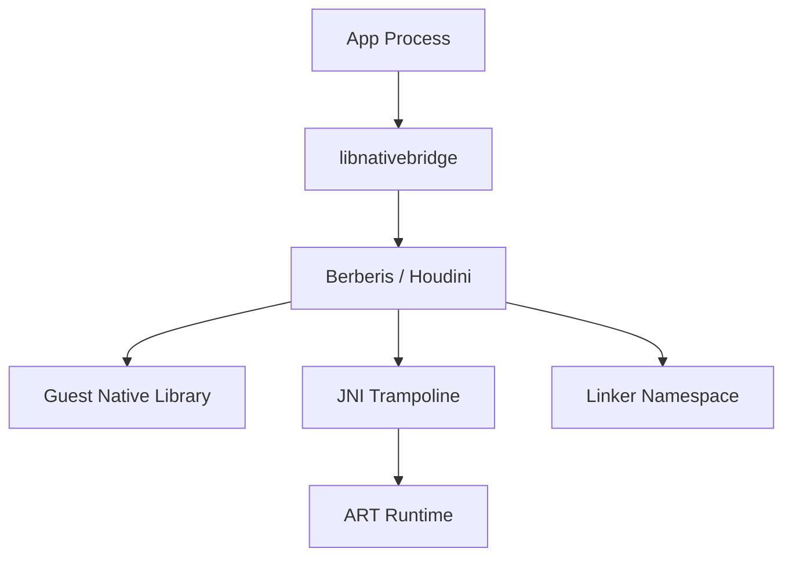

# 第 19 章：Native Bridge 与二进制翻译

Android 的 Native Bridge 机制允许设备在宿主 ISA 与应用 native 库目标 ISA 不一致时，仍然运行这些二进制代码。它是 Android 在模拟器、跨架构迁移、RISC-V 生态建设和兼容历史 ARM/x86 应用时的重要基础设施。本章从 NativeBridge 接口、Berberis、`native_bridge_support`、Houdini、模拟器配置以及 RISC-V 演进几个方面系统梳理 AOSP 中的二进制翻译体系。

---

## Chapter map

本章主要分为以下几部分：

- `NativeBridge` 接口与状态机
- Berberis 二进制翻译器
- `native_bridge_support` 访客库生态
- Houdini 与历史兼容实现
- Android Emulator 的 Native Bridge 配置
- RISC-V 及未来方向

---

## 19.1 NativeBridge 接口

### 19.1.1 为什么需要 Native Bridge

当应用内置的 native 库 ISA 与设备 CPU ISA 不匹配时，系统需要一层桥接机制完成：

1. 判断应用是否需要桥接。
2. 加载二进制翻译器。
3. 为 guest 库建立专用加载环境。
4. 通过 trampoline 和 JNI 让 guest 代码与 ART/linker 协同工作。

Native Bridge 的存在使 Android 不需要强制所有应用都重新编译到宿主 ISA，就能跨架构运行历史 native 应用。

### 19.1.2 源码布局

核心源码通常分布在以下位置：

| 路径 | 用途 |
|------|------|
| `system/core/libnativebridge/` | NativeBridge 通用接口与状态管理 |
| `frameworks/libs/binary_translation/` | Berberis 等二进制翻译支持 |
| `frameworks/libs/native_bridge_support/` | guest library 支持层 |
| `art/` | ART 与 NativeBridge 回调交互 |
| `bionic/linker/` | linker namespace 与 native loader 集成 |

### 19.1.3 `NativeBridgeCallbacks` 结构

`NativeBridgeCallbacks` 是 Native Bridge 实现向系统暴露的主接口集合，包含：

- 初始化回调
- 库加载相关回调
- trampoline 获取回调
- namespace 相关回调
- 版本能力回调
- 桥接库处理函数

系统侧通过该结构与具体桥实现解耦。

### 19.1.4 版本历史

NativeBridge 接口随着 Android 版本演进不断扩展，主要增加了：

- 更清晰的初始化与状态管理
- linker namespace 支持
- 更强的 JNI / trampoline 协同
- 对 APEX 和多架构场景的更好适配

### 19.1.5 `NativeBridgeRuntimeCallbacks` —— ART 反向回调

除了桥实现对系统暴露回调外，ART 也会通过 `NativeBridgeRuntimeCallbacks` 向桥实现提供运行时能力，例如 JNI trampoline 相关辅助和运行时状态交互。

### 19.1.6 状态机

NativeBridge 典型状态包括：

- NotSetup
- Opened
- PreInitialized
- Initialized
- Closed / Error

状态机保证系统在 boot、zygote、app 进程加载桥时遵循固定顺序，避免重复初始化或不一致行为。

### 19.1.7 加载序列 —— 系统启动时发生了什么

NativeBridge 加载大致流程：

1. 系统读取设备配置，确定 bridge 库名称。
2. Zygote 或 app 进程启动时尝试 `dlopen()` bridge 库。
3. 查找 `NativeBridgeItf` 符号。
4. 根据版本调用预初始化与初始化回调。
5. 记录状态并向 runtime/linker 暴露 bridge 能力。

### 19.1.8 `NeedsNativeBridge` —— ISA 检查

系统通过 ISA 检查判断应用 ABI 是否需要桥接。例如宿主为 x86_64，而 APK 中只包含 riscv64 或 arm64 库时，就需要 Native Bridge。

### 19.1.9 Trampoline 派发

当 guest 代码需要调用 JNI 或某些运行时入口时，NativeBridge 通过 trampoline 将控制流转到宿主侧可执行入口，再由宿主侧与 ART/linker 交互。

### 19.1.10 Linker Namespace 集成

NativeBridge 必须与 Android linker namespace 机制集成，确保 guest 库在自己的命名空间中加载，并只看到允许的宿主或代理库集合。

### 19.1.11 构建配置

设备是否启用 NativeBridge 通常由产品配置、BoardConfig、Soong 变量和 guest ISA 映射共同决定。

### 19.1.12 架构图



---

## 19.2 Berberis：Google 的二进制翻译器

### 19.2.1 Overview

Berberis 是 Google 在 AOSP 中推进的开源二进制翻译方案，主要用于把 guest ISA 二进制翻译为 host ISA 执行。它是 Android 对 RISC-V 等新架构兼容问题的关键技术尝试。

### 19.2.2 目录映射

Berberis 目录通常包含：

- decoder
- interpreter
- guest loader
- runtime
- JNI trampolines
- proxy loader
- program runner
- 与 NativeBridge 集成层

### 19.2.3 翻译管线

Berberis 翻译管线通常包括：

1. 读取 guest 指令流。
2. 进行指令解码。
3. 转换为内部表示或执行模型。
4. 解释执行或生成宿主侧执行片段。
5. 与 guest state、memory model 和 JNI/trampoline 协调。

### 19.2.4 Decoder

Decoder 负责解析 guest ISA 指令编码，并为后续执行或翻译阶段提供结构化操作信息。

### 19.2.5 Interpreter

解释器在不生成长期缓存代码的情况下直接执行 guest 语义，是正确性基础与 fallback 路径。

### 19.2.6 Guest State

Guest state 保存访客 CPU 寄存器、PC、栈、标志位和可能的 ISA 扩展状态。发生异常或崩溃时，它也是诊断信息的重要来源。

### 19.2.7 Guest Loader

Guest loader 负责加载访客二进制、处理其依赖关系、重定位和与宿主代理库的连接。

### 19.2.8 Berberis 中的 NativeBridge 实现

Berberis 通过实现 `NativeBridgeCallbacks` 与 Android 系统对接，使其可被系统当作标准 Native Bridge 使用。

### 19.2.9 双命名空间架构

Berberis 通常采用 dual namespace：

- guest 库命名空间
- 宿主/代理库命名空间

这样可以把真实 guest 代码与宿主辅助实现隔离，同时通过显式链接暴露必要符号。

### 19.2.10 JNI Trampolines

JNI trampolines 是 Berberis 与 ART 交互的关键组件。它们负责在 guest 调用 Java/native 相关接口时完成 ABI 与寄存器语义桥接。

### 19.2.11 `JNI_OnLoad` 处理

对于 guest 库中的 `JNI_OnLoad`，Berberis 需要保证其在合适的宿主上下文中调用，并正确建立 `JNIEnv*` 与桥接状态。

### 19.2.12 Trampoline 请求流

典型请求流为：guest 库请求某个 JNI/native 入口 → bridge 查找或创建 trampoline → 返回 guest 可调用地址 → 运行时完成调用转换。

### 19.2.13 Proxy Loader

Proxy loader 负责加载某些宿主代理库，使 guest 代码看到与目标环境兼容的导出符号与行为。

### 19.2.14 运行时初始化

Berberis 运行时初始化包括 ISA 支持检测、guest state 初始化、translator/interpreter 准备以及与 NativeBridge 状态机同步。

### 19.2.15 带 Guest State 的崩溃上报

崩溃上报若只包含宿主栈信息并不够。Berberis 还需要输出 guest PC、寄存器与解释器上下文，才能真正定位 guest 程序错误。

### 19.2.16 构建 Berberis

Berberis 的构建通常依赖 Soong 配置、guest/host 架构 defaults、binary translation 相关模块与测试目标。

### 19.2.17 Program Runner

Program runner 允许在更接近独立程序环境中运行和测试 Berberis，有助于验证 decoder、interpreter 与 runtime 行为。

---

## 19.3 `native_bridge_support` 库

### 19.3.1 目的

`native_bridge_support` 提供 guest 库生态的配套基础设施，使 guest 应用依赖的部分系统库或代理库能在桥接环境下被正确加载和解析。

### 19.3.2 包清单

```make
# frameworks/libs/native_bridge_support/native_bridge_support.mk
# Core infrastructure
```

该模块通常列出需要打包或生成的 guest/代理库集合，是设备构建桥接能力的重要部分。

### 19.3.3 Guest 库的两大类别

通常可分为：

1. **真实 guest 库**：面向 guest ISA 编译。
2. **proxy / support 库**：宿主侧或桥接侧辅助库，用于导出特定接口或代理行为。

### 19.3.4 构建规则

构建规则需要同时处理 guest arch 变体、宿主 arch 变体、安装路径与 APEX 可见性差异。

### 19.3.5 APEX 兼容性

```text
# If library is APEX-enabled:
#   "libraryname.native_bridge" is not installed anywhere.
#   "libraryname.bootstrap.native_bridge" gets installed into
#   /system/lib/$GUEST_ARCH/
```

这体现出 guest 库与 APEX 的安装策略并不总是与普通宿主库相同。

### 19.3.6 设备上的布局

On-device layout 通常会把 guest ISA 库安装到单独目录，例如 `/system/lib/<guest_arch>/` 或对应 64 位路径中，以便 bridge loader 正确发现。

### 19.3.7 库流转

库流转通常为：APK 请求加载 guest 库 → NativeBridge 判定需要桥接 → guest loader 在 guest 路径查找 → 如需代理库则在 support/proxy 层解析依赖。

### 19.3.8 Berberis 配置

```make
# frameworks/libs/binary_translation/berberis_config.mk
```

该配置文件定义 Berberis 构建、guest ISA 目标和桥接生态相关变量。

### 19.3.9 Berberis 与 NBS 的同步

```text
# Note: keep in sync with `berberis_all_riscv64_to_x86_64_defaults` in
#       frameworks/libs/binary_translation/Android.bp.
```

Berberis 与 `native_bridge_support` 配置必须保持一致，否则 guest 库集合与 bridge 实现会失配。

---

## 19.4 Houdini：Intel 的闭源 Bridge

### 19.4.1 背景

Houdini 是 Intel 长期用于 x86 Android 设备运行 ARM 应用的闭源二进制翻译方案。虽然实现细节不可见，但它遵循同一套 NativeBridge 接口。

### 19.4.2 相同接口，不同实现

Houdini 与 Berberis 在系统集成层面共享 `NativeBridgeCallbacks` 契约，但在翻译器内部、guest loader、性能优化与兼容细节上截然不同。

### 19.4.3 翻译方向

Houdini 历史上主要服务于 ARM → x86/x86_64 的翻译需求，而 Berberis 更被视作面向未来多方向桥接的参考实现。

### 19.4.4 架构对比

| 维度 | Houdini | Berberis |
|------|---------|----------|
| 来源 | Intel 闭源 | Google/AOSP 开源方向 |
| 主要目标 | ARM on x86 | 更广泛 guest-host 翻译 |
| 可调试性 | 受限 | 更高 |
| AOSP 参考价值 | 接口兼容 | 代码级参考 |

### 19.4.5 已知差异

差异主要体现在支持 ISA、性能策略、库生态、调试方式和可移植性上。

### 19.4.6 集成点

```text
# Device configuration
# ISA mapping
```

无论是 Houdini 还是 Berberis，系统集成都依赖设备配置、ISA 映射和 ABI 列表构建。

### 19.4.7 以 Berberis 为参考

在 AOSP 可见代码中，Berberis 是理解 NativeBridge 现代实现的最佳参考对象。

### 19.4.8 Intel Bridge Technology（IBT）

IBT 是 Houdini 生态中的相关品牌和技术概念，用于描述 Intel 在 Android 二进制兼容方面的方案体系。

### 19.4.9 Houdini 部署场景

典型部署场景包括 x86 平板、历史 Android x86 设备和特定模拟环境。

---

## 19.5 Android Emulator Native Bridge

### 19.5.1 Board 配置

```text
# Source: build/make/target/board/generic_x86_64_arm64/BoardConfig.mk:16-32
# Primary architecture: x86_64
# Secondary architecture: x86 (32-bit compat)
# Native bridge: ARM64 (translated)
# Native bridge secondary: ARM (32-bit translated)
```

这说明模拟器可把 ARM/ARM64 应用作为 bridge ABI 暴露给系统。

### 19.5.2 ABI 列表构建

```text
# Source: build/make/core/board_config.mk:387-395
# Final ABI list = native ABIs + bridge ABIs
#                      ^^^^^^^^^^^^^^ native  ^^^^^^^^^^^^^^^^^^^^^^^^ bridge
```

系统最终向应用和包管理暴露的 ABI 列表，既包含宿主原生 ABI，也包含桥接 ABI。

### 19.5.3 NDK Translation Package

模拟器场景通常还需要 NDK translation package，以提供 guest ISA 下的稳定 NDK 库集合。

### 19.5.4 Soong 架构变体

Soong 需要为宿主与桥接架构同时创建变体，以生成正确的二进制与安装布局。

### 19.5.5 图形与 Vulkan Bridge 支持

若要完整运行 guest 应用，NativeBridge 不仅要处理普通 JNI/NDK 库，还可能需要图形栈和 Vulkan 相关支持。

### 19.5.6 模拟器与设备 Bridge 对比

模拟器更强调开发、验证与兼容覆盖；真实设备则更关注性能、功耗和部署复杂度。

### 19.5.7 翻译生态

完整翻译生态通常由：NativeBridge 实现、guest 库集、proxy/support 库、NDK translation、linker namespace 与图形支持共同组成。

---

## 19.6 RISC-V 与未来

### 19.6.1 AOSP 中的 RISC-V

RISC-V 在 AOSP 中是持续推进的新架构方向。NativeBridge 对其意义尤其大，因为在生态尚未完全原生化前，二进制翻译可提供过渡兼容能力。

### 19.6.2 工具链

RISC-V 支持依赖 Clang/LLVM、binutils 相关工具和多架构构建流水线。

### 19.6.3 产品配置

产品配置需要同时定义宿主 ISA、guest ISA、bridge 库名称、guest ABI 列表和 support package。

### 19.6.4 分发产物

桥接方案涉及系统镜像中的 bridge 库、guest support 库、translation package 和可能的测试工具。

### 19.6.5 `binfmt_misc` 集成

在某些 host/开发场景中，可借助 `binfmt_misc` 让系统透明地把某类 guest 二进制交给翻译器执行。

### 19.6.6 为什么 RISC-V 翻译很重要

它能缓解生态冷启动问题，使尚未提供宿主架构原生库的应用仍可运行，从而加速新架构 adoption。

### 19.6.7 多目标架构

未来的 Android 翻译系统可能面向多 guest-host 组合，而不是单一方向桥接。

### 19.6.8 扩展支持路线图

RISC-V 扩展支持将影响 decoder、interpreter、guest state 和兼容库集合，是未来演进的重要主题。

---

## 19.7 动手实践

### Exercise 19.1: 检查 NativeBridge 状态

查看设备配置、系统属性和运行状态，确认当前系统是否启用了 NativeBridge。

```bash
# Check ISA mappings
```

### Exercise 19.2: 检查 Bridge 库

```bash
# Verify the bridge library exists
# Check the NativeBridgeItf symbol
```

### Exercise 19.3: 列出 Guest 库

```bash
# List guest RISC-V libraries
# List proxy libraries
```

### Exercise 19.4: 运行一个 Guest 二进制

```bash
# Run on device
# Run on host
```

### Exercise 19.5: 追踪一次 Bridge 加载

```bash
# Enable verbose NB logging
# Install and launch a RISC-V app, then check logs
```

### Exercise 19.6: 阅读 `NativeBridgeCallbacks` 头文件

重点观察版本字段、回调集合与 namespace/JNI/trampoline 相关接口。

### Exercise 19.7: 从源码构建 Berberis

验证 Soong 变体、配置文件与生成产物路径是否符合预期。

### Exercise 19.8: 走读一次 Trampoline

从 guest 调用发起到 trampoline 分发，再到 ART/JNI 入口，完整追踪桥接控制流。

### Exercise 19.9: 比较两个头文件

比较系统侧 NativeBridge 头文件与具体桥实现中的接口视图，确认版本和字段保持一致。

### Exercise 19.10: 检查 Decoder Opcodes

从 Berberis decoder 代码中观察 guest 指令如何被分派到解释或翻译逻辑。

## Summary

## 总结

Android Native Bridge 体系围绕“跨 ISA 执行 native 二进制”这一目标建立，核心组件如下：

| 组件 | 作用 |
|------|------|
| `libnativebridge` | 系统统一桥接接口与状态机 |
| Berberis / Houdini | 具体二进制翻译器实现 |
| `native_bridge_support` | guest 库与代理生态 |
| ART runtime callbacks | 与 JNI / runtime 协同 |
| linker namespace | 控制 guest 库可见性与隔离 |
| emulator / product config | 决定桥接 ABI 与部署方式 |

Native Bridge 的关键设计原则包括：

1. **接口标准化，具体实现可替换**。
2. **桥接库与 guest 库生态分离管理**。
3. **与 ART、linker、namespace 深度集成**。
4. **通过 trampoline 解决 guest/native/JNI 调用边界问题**。
5. **以桥接 ABI 形式对上层透明暴露能力**。

### Key source files

| 路径 | 用途 |
|------|------|
| `system/core/libnativebridge/` | NativeBridge 接口与状态管理 |
| `frameworks/libs/binary_translation/` | Berberis 与翻译基础设施 |
| `frameworks/libs/native_bridge_support/` | guest 库支持层 |
| `frameworks/libs/binary_translation/Android.bp` | Berberis 构建配置 |
| `build/make/core/board_config.mk` | ABI 列表构造 |
| `build/make/target/board/generic_x86_64_arm64/BoardConfig.mk` | 模拟器桥接配置示例 |

掌握本章后，可以沿着“ABI 判定 → NativeBridge 加载 → guest 库解析 → trampoline/JNI → linker namespace → support libraries”这条主线理解 Android 如何在异构 ISA 间维持 native 应用兼容性。
