# Chapter 19: Native Bridge and Binary Translation

Android's **Native Bridge** is the framework that allows applications with native
code compiled for one CPU architecture to run on devices with a different
architecture.  An ARM-only game, for example, can run on an x86 tablet -- or, in
the newest scenario, a RISC-V application can run on an x86_64 host.

This chapter dissects the Native Bridge interface that ART exposes, explores
Berberis (Google's open-source binary translator), examines the
`native_bridge_support` proxy libraries, touches on Intel's closed-source
Houdini translator, and looks ahead to RISC-V.

---

## Chapter map

| Section | Topic |
|---------|-------|
| 19.1 | NativeBridge Interface -- the ART-side contract |
| 19.2 | Berberis -- Google's open-source binary translator |
| 19.3 | native_bridge_support Libraries |
| 19.4 | Houdini -- Intel's closed-source translator |
| 19.5 | RISC-V and the Future |
| 19.6 | Try It -- hands-on exercises |

---

## 19.1  NativeBridge Interface

### 19.1.1  Why a Native Bridge Exists

Android's app ecosystem is built on Java/Kotlin, but performance-critical code
is compiled to native shared libraries (`.so` files) through the NDK.  Those
libraries target a specific instruction set -- `armeabi-v7a`, `arm64-v8a`,
`x86`, or `x86_64`.  When a device's ISA does not match the ISA of an app's
native library, a **native bridge** can translate the foreign instructions at
run time so the app still works.

From the ART README in `art/libnativebridge/README.md`:

> A native bridge enables apps with native components to run on systems with
> different ISA or ABI.
>
> For example, an application which has only native ARM binaries may run on an
> x86 system if there's a native bridge installed which can translate ARM to
> x86.  This is useful to bootstrap devices with an architecture that is not
> supported by the majority of native apps in the app store.

Key design points:

1. **AOSP defines the interface but does not ship a translator.** The
   `libnativebridge` library is the *host-side glue*; the actual translation
   engine is a separate `.so` loaded at runtime.
2. **The bridge is per-process.** Each Zygote-forked app process can have a
   bridge loaded (or not).
3. **The bridge is transparent to the app.** Once loaded, `System.loadLibrary()`
   and JNI calls work exactly as if the library were native.

### 19.1.2  Source Layout

```
art/libnativebridge/
    Android.bp                     # Build rules
    README.md                      # Overview
    include/
        nativebridge/
            native_bridge.h        # Public C header -- THE interface
    native_bridge.cc               # Implementation
    native_bridge_lazy.cc          # Lazy-loading shim
    libnativebridge.map.txt        # Symbol exports
    tests/                         # Unit tests
    nb-diagram.png                 # Integration diagram
```

**Source file**: `art/libnativebridge/include/nativebridge/native_bridge.h`
(472 lines)

**Source file**: `art/libnativebridge/native_bridge.cc` (649 lines)

### 19.1.3  The NativeBridgeCallbacks Structure

The central contract between ART and a bridge implementation is the
`NativeBridgeCallbacks` structure.  Any bridge implementation must export a
global symbol named `NativeBridgeItf` of this type.  ART discovers it with
`dlsym`:

```c
// art/libnativebridge/native_bridge.cc, line 73
static constexpr const char* kNativeBridgeInterfaceSymbol = "NativeBridgeItf";
```

The structure is defined in
`art/libnativebridge/include/nativebridge/native_bridge.h` (lines 188-431).
Here is the complete callback table with the version in which each field was
introduced:

```c
// art/libnativebridge/include/nativebridge/native_bridge.h
struct NativeBridgeCallbacks {
  // ---- Version 1 (Android L) ----
  uint32_t version;

  bool (*initialize)(const struct NativeBridgeRuntimeCallbacks* runtime_cbs,
                     const char* private_dir, const char* instruction_set);
  void* (*loadLibrary)(const char* libpath, int flag);
  void* (*getTrampoline)(void* handle, const char* name,
                         const char* shorty, uint32_t len);       // deprecated v7
  bool (*isSupported)(const char* libpath);
  const struct NativeBridgeRuntimeValues* (*getAppEnv)(
      const char* instruction_set);

  // ---- Version 2 (signal handling) ----
  bool (*isCompatibleWith)(uint32_t bridge_version);
  NativeBridgeSignalHandlerFn (*getSignalHandler)(int signal);

  // ---- Version 3 (namespace support) ----
  int (*unloadLibrary)(void* handle);
  const char* (*getError)();
  bool (*isPathSupported)(const char* library_path);
  bool (*unused_initAnonymousNamespace)(const char*, const char*);
  struct native_bridge_namespace_t* (*createNamespace)(...);
  bool (*linkNamespaces)(...);
  void* (*loadLibraryExt)(const char* libpath, int flag,
                          struct native_bridge_namespace_t* ns);

  // ---- Version 4 (vendor namespace) ----
  struct native_bridge_namespace_t* (*getVendorNamespace)();

  // ---- Version 5 (runtime namespaces, Android Q) ----
  struct native_bridge_namespace_t* (*getExportedNamespace)(
      const char* name);

  // ---- Version 6 (pre-zygote-fork) ----
  void (*preZygoteFork)();

  // ---- Version 7 (critical native) ----
  void* (*getTrampolineWithJNICallType)(void* handle, const char* name,
      const char* shorty, uint32_t len, enum JNICallType jni_call_type);
  void* (*getTrampolineForFunctionPointer)(const void* method,
      const char* shorty, uint32_t len, enum JNICallType jni_call_type);

  // ---- Version 8 (function pointer identification) ----
  bool (*isNativeBridgeFunctionPointer)(const void* method);
};
```

Each successive version is an additive extension -- new function pointers are
appended at the end of the struct, and the `version` field tells the host
library which callbacks are safe to call.

### 19.1.4  Version History

| Version | Android | Key addition |
|---------|---------|--------------|
| 1 | L (5.0) | Basic loading and trampolines |
| 2 | L MR1 | Signal handler delegation |
| 3 | N (7.0) | Linker namespace support |
| 4 | O (8.0) | Vendor namespace |
| 5 | Q (10) | Exported namespace lookup |
| 6 | R (11) | `preZygoteFork` for app-zygote cleanup |
| 7 | S (12) | `@CriticalNative` JNI call type |
| 8 | T (13+) | `isNativeBridgeFunctionPointer` |

The version enum in `native_bridge.cc` (lines 115-132):

```c
enum NativeBridgeImplementationVersion {
  DEFAULT_VERSION = 1,
  SIGNAL_VERSION = 2,
  NAMESPACE_VERSION = 3,
  VENDOR_NAMESPACE_VERSION = 4,
  RUNTIME_NAMESPACE_VERSION = 5,
  PRE_ZYGOTE_FORK_VERSION = 6,
  CRITICAL_NATIVE_SUPPORT_VERSION = 7,
  IDENTIFY_NATIVELY_BRIDGED_FUNCTION_POINTERS_VERSION = 8,
};
```

### 19.1.5  The NativeBridgeRuntimeCallbacks -- ART Talks Back

The bridge is not a one-way street.  ART passes a
`NativeBridgeRuntimeCallbacks` structure *to* the bridge during initialization,
giving the translator the ability to query method information from ART:

```c
// art/libnativebridge/include/nativebridge/native_bridge.h, lines 434-465
struct NativeBridgeRuntimeCallbacks {
  const char* (*getMethodShorty)(JNIEnv* env, jmethodID mid);
  uint32_t (*getNativeMethodCount)(JNIEnv* env, jclass clazz);
  uint32_t (*getNativeMethods)(JNIEnv* env, jclass clazz,
                               JNINativeMethod* methods,
                               uint32_t method_count);
};
```

The **shorty** is a compact representation of a method's signature: `V` for
void, `I` for int, `L` for an object reference, `J` for long, and so on.
The bridge needs this information to build correct calling-convention
**trampolines** -- wrapper functions that marshal arguments between host and
guest register layouts.

### 19.1.6  State Machine

The bridge progresses through a strict state machine:

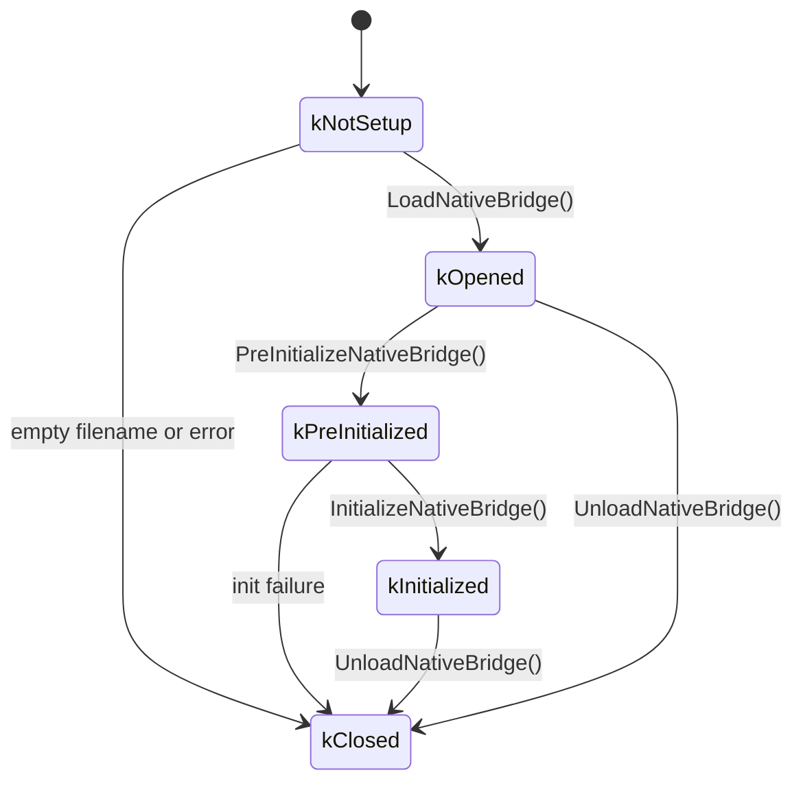

From `native_bridge.cc` (lines 75-81):

```c
enum class NativeBridgeState {
  kNotSetup,           // Initial state.
  kOpened,             // After successful dlopen.
  kPreInitialized,     // After successful pre-initialization.
  kInitialized,        // After successful initialization.
  kClosed              // Closed or errors.
};
```

### 19.1.7  Loading Sequence -- What Happens During Boot

The complete loading sequence is:

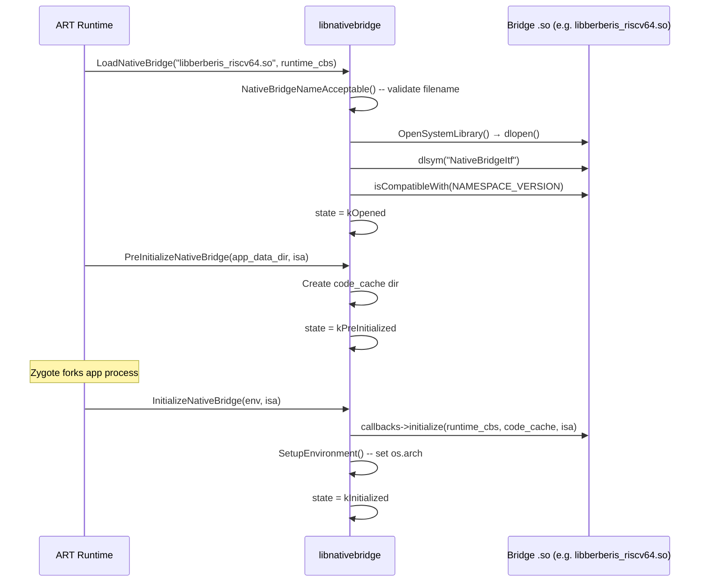

Let us walk through the most important function, `LoadNativeBridge`, from
`native_bridge.cc` (lines 227-291):

```c
bool LoadNativeBridge(const char* nb_library_filename,
                      const NativeBridgeRuntimeCallbacks* runtime_cbs) {
  // ...
  if (!NativeBridgeNameAcceptable(nb_library_filename)) {
    CloseNativeBridge(true);
  } else {
    void* handle = OpenSystemLibrary(nb_library_filename, RTLD_LAZY);
    if (handle != nullptr) {
      g_callbacks = reinterpret_cast<NativeBridgeCallbacks*>(
          dlsym(handle, kNativeBridgeInterfaceSymbol));
      if (g_callbacks != nullptr) {
        if (isCompatibleWith(NAMESPACE_VERSION)) {
          g_native_bridge_handle = handle;
        } else {
          // reject incompatible version
        }
      }
    }
    // ...
    g_runtime_callbacks = runtime_cbs;
    g_state = NativeBridgeState::kOpened;
  }
  return g_state == NativeBridgeState::kOpened;
}
```

Key observations:

1. The filename is validated character-by-character -- only `[a-zA-Z0-9._-]` is
   allowed, and the first character must be alphabetic (line 175).
2. `OpenSystemLibrary` uses `android_dlopen_ext` to open from the system
   namespace on device, or plain `dlopen` on host (lines 41-61).
3. Compatibility is checked against `NAMESPACE_VERSION` (3) -- ancient v1/v2
   bridges are rejected in modern AOSP.

### 19.1.8  NeedsNativeBridge -- The ISA Check

When Zygote prepares to load a library, it first asks whether a bridge is
needed:

```c
// native_bridge.cc, line 293
bool NeedsNativeBridge(const char* instruction_set) {
  return strncmp(instruction_set, ABI_STRING,
                 strlen(ABI_STRING) + 1) != 0;
}
```

`ABI_STRING` is a compile-time constant for the host architecture (e.g.
`"x86_64"`).  If the app's ISA is `"riscv64"` and the device is `x86_64`, the
function returns `true` and ART routes the library load through the bridge.

### 19.1.9  Trampoline Dispatch

The trampoline mechanism is how JNI calls cross the ISA boundary.  When ART
resolves a native method, it calls:

```c
// native_bridge.cc, lines 477-494
void* NativeBridgeGetTrampoline2(
    void* handle, const char* name, const char* shorty,
    uint32_t len, JNICallType jni_call_type) {
  // ...
  if (isCompatibleWith(CRITICAL_NATIVE_SUPPORT_VERSION)) {
    return g_callbacks->getTrampolineWithJNICallType(
        handle, name, shorty, len, jni_call_type);
  }
  return g_callbacks->getTrampoline(handle, name, shorty, len);
}
```

The `JNICallType` enum distinguishes:

- `kJNICallTypeRegular` (1) -- standard JNI with `JNIEnv*` and `jobject` /
  `jclass` implicit parameters.
- `kJNICallTypeCriticalNative` (2) -- `@CriticalNative` methods with no JNI
  overhead, no implicit parameters.

Version 7 added `getTrampolineWithJNICallType` specifically because
`@CriticalNative` methods have a fundamentally different calling convention --
they pass no `JNIEnv*` or `jobject`, and the bridge must not inject them.

### 19.1.10  Linker Namespace Integration

Starting with version 3, the native bridge mirrors Android's linker namespace
system.  Each namespace-related function in `NativeBridgeCallbacks` has an exact
counterpart in the dynamic linker:

| NativeBridge callback | Dynamic linker equivalent |
|---|---|
| `createNamespace` | `android_create_namespace` |
| `linkNamespaces` | `android_link_namespaces` |
| `loadLibraryExt` | `android_dlopen_ext` |
| `getExportedNamespace` | `android_get_exported_namespace` |

This parallel design ensures that guest libraries see the same isolation
boundaries as host libraries -- vendor code cannot access platform internals,
and platform libraries are separated from app libraries.

The namespace operations are all gated on version checking:

```c
// native_bridge.cc, lines 571-591
native_bridge_namespace_t* NativeBridgeCreateNamespace(...) {
  if (NativeBridgeInitialized()) {
    if (isCompatibleWith(NAMESPACE_VERSION)) {
      return g_callbacks->createNamespace(...);
    }
  }
  return nullptr;
}
```

### 19.1.11  Build Configuration

The library name is set via a system property during product configuration.
From `frameworks/libs/binary_translation/enable_riscv64_to_x86_64.mk`
(lines 24-25):

```makefile
PRODUCT_SYSTEM_PROPERTIES += \
    ro.dalvik.vm.native.bridge=libberberis_riscv64.so
```

Other relevant properties:

```makefile
PRODUCT_SYSTEM_PROPERTIES += \
    ro.dalvik.vm.isa.riscv64=x86_64 \
    ro.enable.native.bridge.exec=1
```

`ro.dalvik.vm.isa.riscv64=x86_64` tells the package manager which host ISA
can translate `riscv64` guest code.  `ro.enable.native.bridge.exec=1` enables
the standalone program runner for non-Android executables.

### 19.1.12  Architecture Diagram

The complete architecture of the NativeBridge layer:

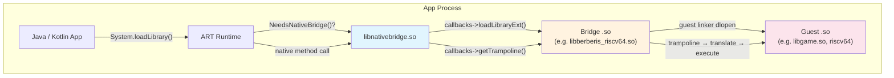

---

## 19.2  Berberis: Google's Binary Translator

### 19.2.1  Overview

**Berberis** is Google's open-source reference implementation of the
NativeBridge interface.  It is a dynamic binary translator that enables Android
apps with RISC-V 64-bit native code to run on x86_64 devices or emulators.

From `frameworks/libs/binary_translation/README.md` (line 1):

> Dynamic binary translator to run Android apps with riscv64 native code on
> x86_64 devices or emulators.

The name "Berberis" comes from a genus of shrubs.  The project's public mailing
list is `berberis-discuss@googlegroups.com`.

The source tree lives at:

```
frameworks/libs/binary_translation/
```

### 19.2.2  Directory Map

The binary translation tree contains over 35 subdirectories.  Here is the
complete layout with the role of each component:

```
frameworks/libs/binary_translation/
    Android.bp              # Top-level build
    README.md               # Getting started (239 lines)
    OWNERS
    berberis_config.mk      # Product package lists
    enable_riscv64_to_x86_64.mk  # Product configuration

    # ---- Core Translation Pipeline ----
    decoder/                # Instruction decoder (RISC-V → IR)
        include/berberis/decoder/riscv64/
            decoder.h       # Template-based decoder (2373 lines)
    interpreter/            # Instruction-by-instruction interpreter
        riscv64/
            interpreter-main.cc
            interpreter.h
            interpreter-demultiplexers.cc
            interpreter-V*.cc   # Vector instruction handlers
    lite_translator/        # Lightweight JIT: riscv64 → x86_64
        riscv64_to_x86_64/
            lite_translator.cc
            lite_translate_region.cc
    heavy_optimizer/        # Optimizing JIT (region-based)
        riscv64/
    backend/                # x86_64 code generation
        x86_64/
        common/
        gen_lir.py          # LIR generation script
    assembler/              # x86_64 assembler
    code_gen_lib/           # Common code generation utilities
    exec_region/            # Executable memory management

    # ---- Guest Environment ----
    guest_state/            # CPU register state
        riscv64/
            include/berberis/guest_state/
                guest_state_arch.h   # RISC-V register definitions
        include/berberis/guest_state/
            guest_addr.h            # GuestAddr type
            guest_state_opaque.h    # ThreadState interface
    guest_abi/              # ABI conversion (calling conventions)
        riscv64/
    guest_loader/           # ELF loading for guest binaries
        guest_loader.cc     # Main loader logic
        app_process.cc      # Guest app_process handling
    guest_os_primitives/    # Thread management, signals, mmap

    # ---- JNI Bridge ----
    jni/                    # JNI trampoline generation
        jni_trampolines.cc
        guest_jni_trampolines.cc
        gen_jni_trampolines.py
        api.json

    # ---- Native Bridge Integration ----
    native_bridge/          # NativeBridgeCallbacks implementation
        native_bridge.cc    # The NativeBridgeItf export
        native_bridge.h     # Local copy of callback struct

    # ---- API Proxies ----
    android_api/            # Host-side proxy implementations
        libEGL/   libGLESv1_CM/   libGLESv2/   libGLESv3/
        libaaudio/  libamidi/  libandroid/  libandroid_runtime/
        libbinder_ndk/  libc/  libcamera2ndk/  libjnigraphics/
        libm/  libmediandk/  libnativehelper/  libnativewindow/
        libneuralnetworks/  libvulkan/  libOpenMAXAL/
        libOpenSLES/  libwebviewchromium_plat_support/

    # ---- Supporting Infrastructure ----
    proxy_loader/           # Proxy library discovery & loading
    runtime/                # Initialization, translator dispatch
    runtime_primitives/     # Translation cache, trampolines
    calling_conventions/    # ABI parameter passing rules
    intrinsics/             # Optimized instruction implementations
    kernel_api/             # Syscall emulation
    native_activity/        # ANativeActivity wrapping
    tiny_loader/            # Lightweight ELF loader
    program_runner/         # Standalone binary runner
    base/                   # Utility library
    device_arch_info/       # Architecture information
    tools/                  # Development utilities
    tests/                  # Integration tests
    test_utils/             # Test infrastructure
    prebuilt/               # Prebuilt binaries
    docs/                   # Internal documentation
    instrument/             # Instrumentation support
```

### 19.2.3  Translation Pipeline

Berberis uses a multi-tier translation strategy:

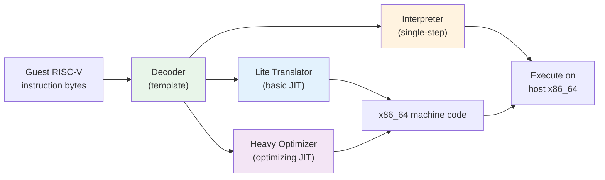

**Tier 1 -- Interpreter:** Each guest instruction is decoded and executed
one at a time.  This is the fallback path and the simplest to maintain.  It
handles all instructions including uncommon vector operations.

**Tier 2 -- Lite Translator:** A lightweight JIT compiler that translates
short regions of RISC-V code into x86_64 machine code.  Lower overhead than
the interpreter but generates less-optimized code.

**Tier 3 -- Heavy Optimizer:** A region-based optimizing JIT that performs
register allocation, dead code elimination, and other classic compiler
optimizations.  Used for hot code paths.

### 19.2.4  The Decoder

The decoder is a C++ template class that takes an `InsnConsumer` type parameter.
The same decoder template powers both the interpreter (where the consumer
executes semantics immediately) and the translators (where the consumer emits
host instructions).

From `frameworks/libs/binary_translation/decoder/include/berberis/decoder/riscv64/decoder.h`
(lines 34-37):

```cpp
template <class InsnConsumer>
class Decoder {
 public:
  explicit Decoder(InsnConsumer* insn_consumer)
      : insn_consumer_(insn_consumer) {}
```

The decoder defines enumerations for every RISC-V opcode family.  A sampling of
the `OpOpcode` enum (lines 92-127):

```cpp
enum class OpOpcode : uint16_t {
  kAdd = 0b0000'000'000,
  kSub = 0b0100'000'000,
  kSll = 0b0000'000'001,
  kSlt = 0b0000'000'010,
  kXor = 0b0000'000'100,
  kSrl = 0b0000'000'101,
  kSra = 0b0100'000'101,
  kOr  = 0b0000'000'110,
  kAnd = 0b0000'000'111,
  kMul = 0b0000'001'000,
  kDiv = 0b0000'001'100,
  // ... Zba/Zbb/Zbs bit-manipulation extensions
  kSh1add = 0b0010'000'010,
  kSh2add = 0b0010'000'100,
  kSh3add = 0b0010'000'110,
  kBclr   = 0b0100'100'001,
  kBext   = 0b0100'100'101,
  // ...
};
```

The decoder supports:

- **RV64GCV**: Base integer, multiplication/division, atomic, compressed,
  single/double float, and vector extensions.
- **Zba/Zbb/Zbs**: Bit manipulation extensions (address generation, basic bit
  operations, single-bit operations).
- **Compressed instructions**: 16-bit encodings that the decoder transparently
  expands.

### 19.2.5  The Interpreter

The interpreter is the simplest execution backend.  In
`frameworks/libs/binary_translation/interpreter/riscv64/interpreter-main.cc`:

```cpp
void InterpretInsn(ThreadState* state) {
  GuestAddr pc = state->cpu.insn_addr;

  Interpreter interpreter(state);
  SemanticsPlayer sem_player(&interpreter);
  Decoder decoder(&sem_player);
  uint8_t insn_len = decoder.Decode(ToHostAddr<const uint16_t>(pc));
  interpreter.FinalizeInsn(insn_len);
}
```

The execution model:

1. Read `insn_addr` from the guest CPU state.
2. Wrap the `Interpreter` in a `SemanticsPlayer` that maps decoded fields to
   semantic operations.
3. Feed the `SemanticsPlayer` to the `Decoder` template.
4. The decoder calls the appropriate `SemanticsPlayer` method, which calls the
   `Interpreter` method, which reads/writes guest registers in `ThreadState`.
5. `FinalizeInsn` advances the program counter by `insn_len` bytes.

This is a classic **decode-dispatch** interpreter.  For vector instructions,
the implementation is split across multiple files:

```
interpreter-VLoadIndexedArgs.cc
interpreter-VLoadStrideArgs.cc
interpreter-VLoadUnitStrideArgs.cc
interpreter-VOpFVfArgs.cc
interpreter-VOpFVvArgs.cc
interpreter-VOpIViArgs.cc
interpreter-VOpIVvArgs.cc
interpreter-VOpIVxArgs.cc
interpreter-VOpMVvArgs.cc
interpreter-VOpMVxArgs.cc
interpreter-VStoreIndexedArgs.cc
interpreter-VStoreStrideArgs.cc
interpreter-VStoreUnitStrideArgs.cc
```

From the README:

> Supported extensions include Zb* (bit manipulation) and most of Zv (vector).
> Some less commonly used vector instructions are not yet implemented, but
> Android CTS and some Android apps run with the current set of implemented
> instructions.

### 19.2.6  Guest State

The guest CPU state is the fundamental data structure that holds a
RISC-V core's register file.  It is defined per-architecture.

From `frameworks/libs/binary_translation/guest_state/include/berberis/guest_state/guest_addr.h`:

```cpp
using GuestAddr = uintptr_t;

constexpr GuestAddr kNullGuestAddr = {};

template <typename T>
inline GuestAddr ToGuestAddr(T* addr) {
  return reinterpret_cast<GuestAddr>(addr);
}

template <typename T>
inline T* ToHostAddr(GuestAddr addr) {
  return reinterpret_cast<T*>(addr);
}
```

Since Berberis currently targets 64-bit guest on 64-bit host, `GuestAddr` is
simply `uintptr_t` -- guest and host pointers are the same size.  This
simplifies the address-space mapping considerably.

The RISC-V `CPUState` is defined in a shared header (included from
`native_bridge_support`) and wrapped with convenience accessors in
`guest_state/riscv64/include/berberis/guest_state/guest_state_arch.h`.

The register file:

```cpp
constexpr uint32_t kNumGuestRegs = std::size(CPUState{}.x);     // 32
constexpr uint32_t kNumGuestFpRegs = std::size(CPUState{}.f);   // 32
```

ABI-named register constants for RISC-V (lines 213-244):

```cpp
constexpr uint8_t RA  = 1;    // Return address
constexpr uint8_t SP  = 2;    // Stack pointer
constexpr uint8_t GP  = 3;    // Global pointer
constexpr uint8_t TP  = 4;    // Thread pointer
constexpr uint8_t T0  = 5;    // Temporary 0
constexpr uint8_t A0  = 10;   // Argument 0 / return value
constexpr uint8_t A1  = 11;   // Argument 1 / return value
constexpr uint8_t A7  = 17;   // Argument 7 (syscall number)
constexpr uint8_t S0  = 8;    // Saved 0 / frame pointer
```

Templated register access:

```cpp
template <uint8_t kIndex>
inline uint64_t GetXReg(const CPUState& state) {
  static_assert(kIndex > 0);   // x0 is hardwired to zero
  static_assert(kIndex < std::size(CPUState{}.x));
  return state.x[kIndex];
}

template <uint8_t kIndex>
inline void SetXReg(CPUState& state, uint64_t val) {
  static_assert(kIndex > 0);
  static_assert(kIndex < std::size(CPUState{}.x));
  state.x[kIndex] = val;
}
```

The `ThreadState` structure wraps `CPUState` and adds process-level metadata:

```cpp
// guest_state/riscv64/include/berberis/guest_state/guest_state_arch.h
struct ThreadState {
  CPUState cpu;
  alignas(config::kScratchAreaAlign)
      uint8_t intrinsics_scratch_area[config::kScratchAreaSize];
  GuestThread* thread;
  std::atomic<uint_least8_t> pending_signals_status;
  GuestThreadResidence residence;
  void* instrument_data;
  void* thread_state_storage;
};
```

The `residence` field tracks whether the thread is currently executing inside
generated (translated) code or outside it -- essential for signal handling and
garbage collection safepoints.

CSR (Control and Status Register) support for RISC-V:

```cpp
enum class CsrName {
  kFFlags = 0b00'00'0000'0001,   // FP exception flags
  kFrm    = 0b00'00'0000'0010,   // FP rounding mode
  kFCsr   = 0b00'00'0000'0011,   // FP control/status
  kVstart = 0b00'00'0000'1000,   // Vector start index
  kVxsat  = 0b00'00'0000'1001,   // Vector fixed-point saturation
  kVxrm   = 0b00'00'0000'1010,   // Vector fixed-point rounding mode
  kVcsr   = 0b00'00'0000'1111,   // Vector control/status
  kCycle  = 0b11'00'0000'0000,   // Cycle counter (read-only)
  kVl     = 0b11'00'0010'0000,   // Vector length (read-only)
  kVtype  = 0b11'00'0010'0001,   // Vector type (read-only)
  kVlenb  = 0b11'00'0010'0010,   // Vector length in bytes (read-only)
};
```

### 19.2.7  Guest Loader

The `GuestLoader` class manages loading guest ELF binaries.  It handles three
files: the main executable, the VDSO (virtual dynamic shared object), and the
dynamic linker.

From `frameworks/libs/binary_translation/guest_loader/include/berberis/guest_loader/guest_loader.h`:

```cpp
class GuestLoader {
 public:
  static GuestLoader* StartAppProcessInNewThread(std::string* error_msg);
  static void StartExecutable(const char* main_executable_path,
                               const char* vdso_path,
                               const char* loader_path,
                               size_t argc, const char* argv[],
                               char* envp[], std::string* error_msg);
  static GuestLoader* GetInstance();

  void* DlOpen(const char* libpath, int flags);
  void* DlOpenExt(const char* libpath, int flags,
                   const android_dlextinfo* extinfo);
  GuestAddr DlSym(void* handle, const char* name);
  android_namespace_t* CreateNamespace(...);
  android_namespace_t* GetExportedNamespace(const char* name);
  bool LinkNamespaces(...);
  // ...
};
```

The initialization sequence in `guest_loader.cc` (lines 265-341):

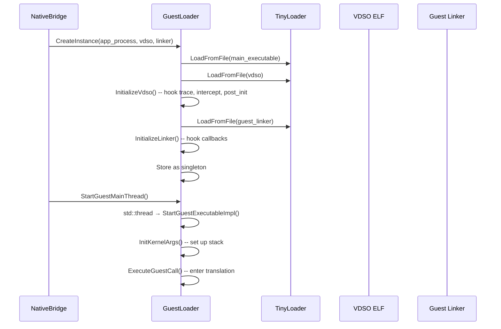

Key points:

1. **TinyLoader** is a minimal ELF loader that maps guest binaries into the
   process address space using `mmap` with `kLibraryAlignment`.
2. The **VDSO** provides trampolines for guest-to-host callbacks like tracing
   and symbol interception.  `InitializeVdso()` patches several VDSO symbols
   to call host functions:
   - `native_bridge_trace` -- forwarded to `TraceCallback`
   - `native_bridge_intercept_symbol` -- forwarded to `InterceptGuestSymbolCallback`
   - `native_bridge_post_init` -- forwarded to `PostInitCallback`
3. The **guest linker** (`linker64`) runs as guest code and handles `dlopen`,
   `dlsym`, and namespace operations for guest libraries.  Berberis intercepts
   its key functions through `LinkerCallbacks`.

The `LinkerCallbacks` structure mirrors Android's dynamic linker API:

```cpp
struct LinkerCallbacks {
  using android_create_namespace_fn_t = android_namespace_t* (*)(...);
  using android_dlopen_ext_fn_t = void* (*)(...);
  using android_get_exported_namespace_fn_t =
      android_namespace_t* (*)(const char* name);
  using dlsym_fn_t = void* (*)(void* handle, const char* symbol,
                                const void* caller_addr);
  // ... and more
};
```

### 19.2.8  The NativeBridge Implementation in Berberis

Berberis implements the NativeBridge interface in
`frameworks/libs/binary_translation/native_bridge/native_bridge.cc`.  The
crucial export at the bottom of the file (lines 645-668):

```cpp
extern "C" {
android::NativeBridgeCallbacks NativeBridgeItf = {
    kNativeBridgeCallbackVersion,     // 8
    &native_bridge_initialize,
    &native_bridge_loadLibrary,
    &native_bridge_getTrampoline,
    &native_bridge_isSupported,
    &native_bridge_getAppEnv,
    &native_bridge_isCompatibleWith,
    &native_bridge_getSignalHandler,
    &native_bridge_unloadLibrary,
    &native_bridge_getError,
    &native_bridge_isPathSupported,
    &native_bridge_initAnonymousNamespace,
    &native_bridge_createNamespace,
    &native_bridge_linkNamespaces,
    &native_bridge_loadLibraryExt,
    &native_bridge_getVendorNamespace,
    &native_bridge_getExportedNamespace,
    &native_bridge_preZygoteFork,
    &native_bridge_getTrampolineWithJNICallType,
    &native_bridge_getTrampolineForFunctionPointer,
    &native_bridge_isNativeBridgeFunctionPointer,
};
}
```

The version is set at compile time:

```cpp
const constexpr uint32_t kNativeBridgeCallbackMinVersion = 2;
const constexpr uint32_t kNativeBridgeCallbackVersion = 8;
const constexpr uint32_t kNativeBridgeCallbackMaxVersion =
    kNativeBridgeCallbackVersion;
```

### 19.2.9  Dual Namespace Architecture

Berberis maintains **two parallel linker namespaces** for every logical
namespace -- one for guest libraries and one for host libraries:

```cpp
// native_bridge/native_bridge.cc, lines 77-81
struct native_bridge_namespace_t {
  android_namespace_t* guest_namespace;
  android_namespace_t* host_namespace;
};
```

This dual-namespace design is critical.  When ART asks the bridge to create a
namespace, Berberis creates both:

```cpp
native_bridge_namespace_t* NdktNativeBridge::CreateNamespace(
    const char* name, ..., native_bridge_namespace_t* parent_ns) {
  auto* host_namespace = android_create_namespace(
      name, ..., parent_ns->host_namespace);
  auto* guest_namespace = guest_loader_->CreateNamespace(
      name, ..., parent_ns->guest_namespace);
  return CreateNativeBridgeNamespace(host_namespace, guest_namespace);
}
```

When loading a library, the system first tries the guest namespace.  If the
guest loader fails (the library does not exist for the guest ISA), Berberis
falls back to the host namespace:

```cpp
void* NdktNativeBridge::LoadLibrary(const char* libpath, int flags,
    const native_bridge_namespace_t* ns) {
  void* handle = LoadGuestLibrary(libpath, flags, ns);
  if (handle != nullptr) return handle;

  // Try falling back to host loader.
  handle = android_dlopen_ext(libpath, flags, extinfo);
  if (handle != nullptr) {
    AddHostLibrary(handle);  // Track as host handle
  }
  return handle;
}
```

This fallback is essential: many apps ship native libraries for only one ISA,
but some system libraries (like Chromium's webview support) may only be
available as host binaries.

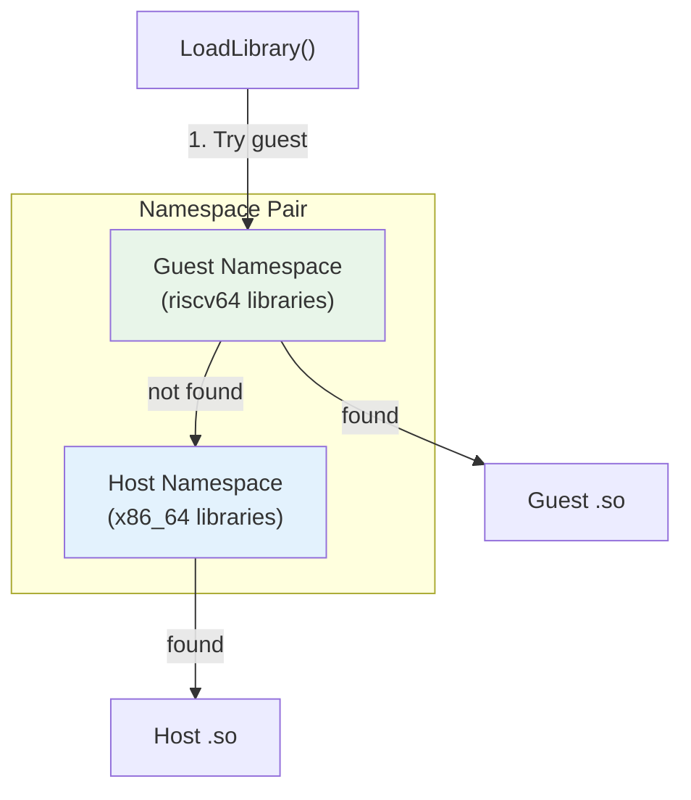

### 19.2.10  JNI Trampolines

The JNI trampoline system is the most intricate part of the bridge.  When ART
calls a native method in a guest library, it passes through a host-side
**trampoline** that:

1. Converts the host calling convention to the guest calling convention.
2. Translates `JNIEnv*` and `JavaVM*` pointers between host and guest
   representations.
3. Invokes the guest function through the translation engine.
4. Converts the return value back to the host convention.

From `frameworks/libs/binary_translation/jni/jni_trampolines.cc`:

```cpp
HostCode WrapGuestJNIFunction(GuestAddr pc,
                               const char* shorty,
                               const char* name,
                               bool has_jnienv_and_jobject) {
  const size_t size = strlen(shorty);
  char signature[size + 3];  // env, clazz, trailing zero
  ConvertDalvikShortyToWrapperSignature(
      signature, sizeof(signature), shorty, has_jnienv_and_jobject);
  auto guest_runner = has_jnienv_and_jobject
      ? RunGuestJNIFunction : RunGuestCall;
  return WrapGuestFunctionImpl(pc, signature, guest_runner, name);
}
```

The **shorty-to-wrapper conversion** maps Dalvik type characters to wrapper
type characters:

```cpp
char ConvertDalvikTypeCharToWrapperTypeChar(char c) {
  switch (c) {
    case 'V': return 'v';  // void
    case 'Z': return 'z';  // boolean
    case 'B': return 'b';  // byte
    case 'I': return 'i';  // int
    case 'L': return 'p';  // object → pointer
    case 'J': return 'l';  // long
    case 'F': return 'f';  // float
    case 'D': return 'd';  // double
    // ...
  }
}
```

For a JNI method `jint foo(JNIEnv*, jobject, jint, jfloat)` with shorty
`"IIF"`, the wrapper signature becomes `"ippif"` -- return int, two pointers
(env + jobject), int, float.

**JNIEnv translation** is particularly complex.  The guest `JNIEnv*` is not
the same as the host `JNIEnv*` because the function pointer table needs to
contain trampolines that convert guest calls back to host JNI calls.  Berberis
maintains per-thread bidirectional mappings:

```cpp
GuestType<JNIEnv*> ToGuestJNIEnv(JNIEnv* host_jni_env) {
  // Wrap host JNI functions (once)
  if (g_jni_env_wrapped == 0) {
    WrapJNIEnv(host_jni_env);
    g_jni_env_wrapped = 1;
  }
  // Create per-thread mapping
  std::lock_guard<std::mutex> lock(g_jni_guard_mutex);
  pid_t thread_id = GettidSyscall();
  JNIEnvMapping& mapping = g_jni_env_mappings[thread_id];
  // ... lookup or create mapping
}
```

Similarly, `JavaVM*` is wrapped:

```cpp
void WrapJavaVM(void* java_vm) {
  HostCode* vtable = *reinterpret_cast<HostCode**>(java_vm);
  WrapHostFunctionImpl(vtable[3], DoJavaVMTrampoline_DestroyJavaVM, ...);
  WrapHostFunctionImpl(vtable[4], DoJavaVMTrampoline_AttachCurrentThread, ...);
  WrapHostFunctionImpl(vtable[5], DoJavaVMTrampoline_DetachCurrentThread, ...);
  WrapHostFunctionImpl(vtable[6], DoJavaVMTrampoline_GetEnv, ...);
  WrapHostFunctionImpl(vtable[7],
      DoJavaVMTrampoline_AttachCurrentThreadAsDaemon, ...);
}
```

Each `JavaVM` vtable entry is replaced with a trampoline that converts between
guest and host representations.

### 19.2.11  JNI_OnLoad Handling

When a guest library is loaded, the bridge needs to intercept `JNI_OnLoad` to
convert the `JavaVM*` parameter:

```cpp
void RunGuestJNIOnLoad(GuestAddr pc, GuestArgumentBuffer* buf) {
  auto [host_java_vm, reserved] =
      HostArgumentsValues<decltype(JNI_OnLoad)>(buf);
  {
    auto&& [guest_java_vm, reserved] =
        GuestArgumentsReferences<decltype(JNI_OnLoad)>(buf);
    guest_java_vm = ToGuestJavaVM(host_java_vm);
  }
  RunGuestCall(pc, buf);
}

HostCode WrapGuestJNIOnLoad(GuestAddr pc) {
  return WrapGuestFunctionImpl(pc, "ipp", RunGuestJNIOnLoad, "JNI_OnLoad");
}
```

The wrapper is registered during JNI initialization:

```cpp
void InitializeJNI() {
  RegisterKnownGuestFunctionWrapper("JNI_OnLoad", WrapGuestJNIOnLoad);
}
```

### 19.2.12  Trampoline Request Flow

The complete flow when ART resolves a native method:

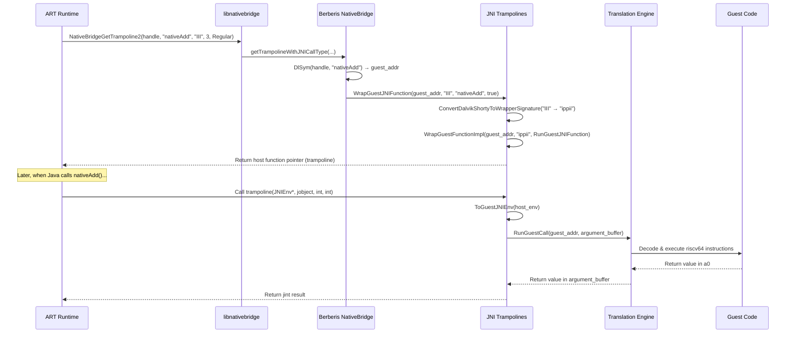

### 19.2.13  Proxy Loader

When a guest library calls a function that exists in a system library (like
`libEGL.so` or `libc.so`), the call must be redirected to a host-side **proxy**
that handles the ISA translation.

From `frameworks/libs/binary_translation/proxy_loader/proxy_loader.cc`:

```cpp
bool LoadProxyLibrary(ProxyLibraryBuilder* builder,
                      const char* library_name,
                      const char* proxy_prefix) {
  std::string proxy_name = proxy_prefix;
  proxy_name += library_name;
  void* proxy = dlopen(proxy_name.c_str(), RTLD_NOW | RTLD_LOCAL);
  // ...
  using InitProxyLibraryFunc = void (*)(ProxyLibraryBuilder*);
  InitProxyLibraryFunc init = reinterpret_cast<InitProxyLibraryFunc>(
      dlsym(proxy, "InitProxyLibrary"));
  init(builder);
}

void InterceptGuestSymbol(GuestAddr addr, const char* library_name,
                           const char* name, const char* proxy_prefix) {
  // ...
  if (res.second && !LoadProxyLibrary(&res.first->second, library_name,
                                       proxy_prefix)) {
    FATAL("Unable to load library \"%s\"", library_name);
  }
  res.first->second.InterceptSymbol(addr, name);
}
```

For each system library, there is a corresponding proxy:
`libberberis_proxy_libc.so`, `libberberis_proxy_libEGL.so`, and so on.  These
are built from the `android_api/` subdirectories.

### 19.2.14  Runtime Initialization

The Berberis runtime is initialized through `InitBerberis()`:

```cpp
// runtime/berberis.cc
bool InitBerberisUnsafe() {
  InitLargeMmap();
  InitHostEntries();
  Tracing::Init();
  InitGuestThreadManager();
  InitGuestFunctionWrapper(&IsAddressGuestExecutable);
  InitTranslator();
  InitCrashReporter();
  InitGuestArch();
  return true;
}

void InitBerberis() {
  static bool initialized = InitBerberisUnsafe();
  UNUSED(initialized);
}
```

The `static bool` trick ensures thread-safe one-time initialization (C++11
guarantees).

The translation cache manages compiled code regions:

```cpp
// runtime/translator.cc
void InvalidateGuestRange(GuestAddr start, GuestAddr end) {
  TranslationCache* cache = TranslationCache::GetInstance();
  cache->InvalidateGuestRange(start, end);
  FlushGuestCodeCache();
}
```

### 19.2.15  Crash Reporting with Guest State

Berberis provides detailed crash reports that include both host and guest
thread state.  From the README's tombstone example:

```
ABI: 'x86_64'
Guest architecture: 'riscv64'
```

The tombstone includes the x86_64 host backtrace:

```
backtrace:
  #00 pc .../libc.so (syscall+24)
  #01 pc .../libberberis_riscv64.so (berberis::RunGuestSyscall+82)
  #02 pc .../libberberis_riscv64.so (berberis::Decoder<...>::DecodeSystem()+133)
  #03 pc .../libberberis_riscv64.so (berberis::Decoder<...>::DecodeBaseInstruction()+831)
  #04 pc .../libberberis_riscv64.so (berberis::InterpretInsn+100)
```

Followed by the RISC-V guest thread information:

```
Guest thread information for tid: 2896
    pc  00007442942e4e64  ra  00007442ecc88b08
    sp  00007442eced6fc0  gp  000074428dee8000
    a0  0000000000000b3b  a1  0000000000000b50
    a7  0000000000000083
```

And the guest backtrace:

```
backtrace:
  #00 pc .../riscv64/libc.so (tgkill+4)
  #01 pc .../base.apk!libberberis_jni_tests.so (add42+18)
  #02 pc .../riscv64/libnative_bridge_vdso.so
```

This dual-stack trace is invaluable for debugging -- developers can see both
where the crash happened in guest code and what the translator was doing at
that point.

### 19.2.16  Building Berberis

From the README:

```bash
source build/envsetup.sh
lunch sdk_phone64_x86_64_riscv64-trunk_staging-eng
m berberis_all
```

The `sdk_phone64_x86_64_riscv64` target is an x86_64 emulator image with
RISC-V binary translation support.  To build all targets:

```bash
mmm frameworks/libs/binary_translation
```

To run a simple test:

```bash
out/host/linux-x86/bin/berberis_program_runner_riscv64 \
  out/target/product/emu64xr/testcases/\
  berberis_hello_world_static.native_bridge/x86_64/\
  berberis_hello_world_static
```

### 19.2.17  Program Runner

The `berberis_program_runner_riscv64` binary is a standalone host program that
can run guest RISC-V ELF executables without a full Android environment.  Two
variants exist:

- `berberis_program_runner_riscv64` -- manual invocation
- `berberis_program_runner_binfmt_misc_riscv64` -- registered as a binfmt_misc
  handler so the kernel automatically invokes it for RISC-V binaries

Build artifacts installed on device:

```
system/bin/berberis_program_runner_riscv64
system/bin/berberis_program_runner_binfmt_misc_riscv64
system/etc/binfmt_misc/riscv64_dyn
system/etc/binfmt_misc/riscv64_exe
system/etc/init/berberis.rc
```

---

## 19.3  native_bridge_support Libraries

### 19.3.1  Purpose

The `native_bridge_support` libraries are **guest-ISA libraries** that are
cross-compiled for the guest architecture and installed alongside the bridge.
They provide the guest-side counterparts that apps link against.

When a guest app calls `malloc()`, the call goes to the guest-ISA `libc.so`.
That guest `libc.so` is a **modified** version that routes certain operations
through the bridge to the host system.

**Source**: `frameworks/libs/native_bridge_support/`

```
frameworks/libs/native_bridge_support/
    Android.bp
    native_bridge_support.mk    # Package lists (140 lines)
    android_api/                # Guest-side API stubs
        libc/
        app_process/
        linker/
        vdso/
        libEGL/  libGLESv1_CM/  libGLESv2/  libGLESv3/
        ... (26+ subdirectories)
    guest_state/                # Guest CPU state definitions
    guest_state_accessor/       # State accessor utilities
    tools/
```

### 19.3.2  The Package Manifest

`native_bridge_support.mk` is the central manifest that defines which libraries
are included in a native-bridge-enabled build.  It exports several variables:

```makefile
# frameworks/libs/native_bridge_support/native_bridge_support.mk

# Core infrastructure
NATIVE_BRIDGE_PRODUCT_PACKAGES := \
    libnative_bridge_vdso.native_bridge \
    native_bridge_guest_app_process.native_bridge \
    native_bridge_guest_linker.native_bridge
```

These three packages are the minimum required for any native bridge:

1. **libnative_bridge_vdso** -- The guest VDSO that provides host callbacks.
2. **native_bridge_guest_app_process** -- The guest `app_process64` binary
   (the entry point for every Android app process).
3. **native_bridge_guest_linker** -- The guest `linker64` (the dynamic linker
   that loads guest `.so` files).

### 19.3.3  Two Categories of Guest Libraries

The makefile distinguishes two categories:

**Original guest libraries** -- cross-compiled from the same AOSP source as the
host version, without modifications:

```makefile
NATIVE_BRIDGE_ORIG_GUEST_LIBS := \
    libandroidicu.bootstrap \
    libcompiler_rt \
    libcrypto \
    libcutils \
    libdl.bootstrap \
    libdl_android.bootstrap \
    libicu.bootstrap \
    liblog \
    libsqlite \
    libssl \
    libstdc++ \
    libsync \
    libutils \
    libz
```

These are pure libraries that do not make system calls requiring ISA-specific
handling.  They can be compiled directly for the guest ISA and will work without
translation issues.

**Modified guest libraries** -- require host-side proxy support:

```makefile
NATIVE_BRIDGE_MODIFIED_GUEST_LIBS := \
    libaaudio \
    libamidi \
    libandroid \
    libandroid_runtime \
    libbinder_ndk \
    libc \
    libcamera2ndk \
    libEGL \
    libGLESv1_CM \
    libGLESv2 \
    libGLESv3 \
    libjnigraphics \
    libm \
    libmediandk \
    libnativehelper \
    libnativewindow \
    libneuralnetworks \
    libOpenMAXAL \
    libOpenSLES \
    libvulkan \
    libwebviewchromium_plat_support
```

These 21 libraries interact with hardware, kernel interfaces, or other
host-specific APIs.  `libc` and `libm` contain syscall wrappers.  `libEGL`,
`libGLESv2`, and `libvulkan` interact with the GPU driver.  `libaaudio`
talks to the audio HAL.  Each needs a corresponding proxy on the host side.

### 19.3.4  Build Rules

Modified guest libraries use a naming convention:

```makefile
NATIVE_BRIDGE_PRODUCT_PACKAGES += \
    $(addprefix libnative_bridge_guest_,\
        $(addsuffix .native_bridge,$(NATIVE_BRIDGE_MODIFIED_GUEST_LIBS)))
```

So `libc` becomes `libnative_bridge_guest_libc.native_bridge`, which is
built for the guest ISA and installed at `/system/lib64/riscv64/libc.so`.

Original guest libraries use a simpler pattern:

```makefile
NATIVE_BRIDGE_PRODUCT_PACKAGES += \
    $(addsuffix .native_bridge,$(NATIVE_BRIDGE_ORIG_GUEST_LIBS))
```

### 19.3.5  APEX Compatibility

The makefile includes a workaround for APEX-enabled libraries:

```makefile
# If library is APEX-enabled:
#   "libraryname.native_bridge" is not installed anywhere.
#   "libraryname.bootstrap.native_bridge" gets installed into
#   /system/lib/$GUEST_ARCH/
```

This is because APEX libraries are normally installed inside APEX modules
(`/apex/com.android.runtime/lib64/`), but the native bridge support libraries
need to be in the traditional `/system/lib64/riscv64/` path.  The `.bootstrap`
variant is the mechanism that makes this work.

### 19.3.6  On-Device Layout

On an x86_64 device with RISC-V bridge support, guest libraries are installed
under a subdirectory named by guest ISA:

```
/system/lib64/riscv64/
    libc.so
    libm.so
    libdl.so
    liblog.so
    libEGL.so
    libGLESv2.so
    libvulkan.so
    libnative_bridge_vdso.so
    ... (30+ libraries)

/system/bin/riscv64/
    app_process64
    linker64

/system/lib64/
    libberberis_riscv64.so              # The bridge itself
    libberberis_proxy_libc.so           # Host-side proxies
    libberberis_proxy_libEGL.so
    libberberis_proxy_libGLESv2.so
    ... (21 proxy libraries)
    libberberis_exec_region.so          # Executable memory manager
```

### 19.3.7  Library Flow

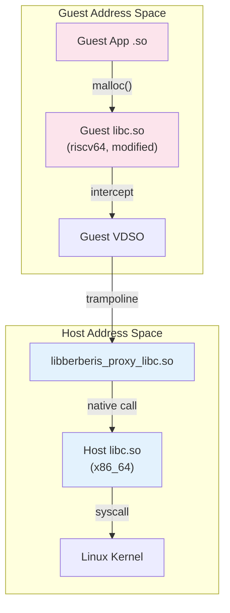

The proxy libraries are loaded lazily.  When the guest linker resolves a symbol
in a modified guest library, the VDSO calls `InterceptGuestSymbol`, which
triggers `LoadProxyLibrary` to load the corresponding
`libberberis_proxy_<name>.so` and register the interception.

### 19.3.8  The Berberis Config

`berberis_config.mk` ties everything together by defining the complete product
package list:

```makefile
# frameworks/libs/binary_translation/berberis_config.mk
include frameworks/libs/native_bridge_support/native_bridge_support.mk

BERBERIS_PRODUCT_PACKAGES_RISCV64_TO_X86_64 := \
    libberberis_exec_region \
    libberberis_proxy_libEGL \
    libberberis_proxy_libGLESv1_CM \
    libberberis_proxy_libGLESv2 \
    ...
    libberberis_proxy_libwebviewchromium_plat_support \
    berberis_prebuilt_riscv64 \
    berberis_program_runner_binfmt_misc_riscv64 \
    berberis_program_runner_riscv64 \
    libberberis_riscv64
```

### 19.3.9  Synchronization Between Berberis and NBS

The build files contain explicit synchronization comments:

```makefile
# Note: keep in sync with `berberis_all_riscv64_to_x86_64_defaults` in
#       frameworks/libs/binary_translation/Android.bp.
```

This comment appears three times in `native_bridge_support.mk` (lines 31, 61,
81) -- a sign that the two projects are tightly coupled and changes to one
must be reflected in the other.

---

## 19.4  Houdini: Intel's Closed-Source Bridge

### 19.4.1  Background

**Houdini** is Intel's proprietary binary translator that enables ARM native
code to run on x86/x86_64 Android devices.  It was first deployed on Intel
Atom-based tablets and Chromebooks, and remains the most widely-deployed
native bridge implementation in production Android devices.

Unlike Berberis, Houdini is **not** part of AOSP.  It is distributed as a
proprietary binary by Intel and integrated by OEMs.

### 19.4.2  Same Interface, Different Implementation

Houdini implements exactly the same `NativeBridgeCallbacks` interface that
Berberis does.  It exports the same `NativeBridgeItf` symbol with the same
structure layout.  The system property that activates it follows the same
pattern:

```
ro.dalvik.vm.native.bridge=libhoudini.so
```

Where Berberis uses `libberberis_riscv64.so`, Houdini uses `libhoudini.so`.
From ART's perspective, the two are interchangeable.

### 19.4.3  Translation Direction

| Translator | Guest (source) | Host (target) |
|------------|---------------|---------------|
| Berberis | RISC-V 64-bit | x86_64 |
| Houdini | ARM / ARM64 | x86 / x86_64 |

Houdini translates ARM (32-bit) and ARM64 (64-bit) native code to run on x86
and x86_64 hosts.  This is the reverse of the typical ARM server scenario
(where x86 code runs on ARM) -- Houdini was designed for the Intel mobile
platform.

### 19.4.4  Architecture Comparison

Both translators share these architectural patterns due to the common interface:

1. **Dual linker namespace design**: Both maintain parallel guest and host
   namespaces, because the `NativeBridgeCallbacks` requires namespace operations
   (`createNamespace`, `linkNamespaces`, etc.).

2. **JNI trampoline generation**: Both must generate trampolines based on JNI
   method shorty strings, because `getTrampoline` / `getTrampolineWithJNICallType`
   requires mapping between guest and host calling conventions.

3. **Modified guest libraries**: Both ship guest-ISA versions of system
   libraries.  Houdini ships ARM/ARM64 libraries on x86 devices, while Berberis
   ships RISC-V libraries on x86_64 devices.

4. **Signal handler delegation**: Both implement `getSignalHandler` to handle
   signals (especially SIGSEGV) that originate from translated code.

5. **Pre-zygote-fork cleanup**: Both implement `preZygoteFork` to clean up
   translation state before process forking.

### 19.4.5  Known Differences

While the interfaces are identical, the implementations differ significantly:

| Aspect | Berberis | Houdini |
|--------|----------|---------|
| License | Apache 2.0 (open source) | Proprietary |
| Guest ISA | RISC-V 64 | ARM / ARM64 |
| Host ISA | x86_64 | x86 / x86_64 |
| Translation engine | Interpreter + JIT (lite + heavy) | Proprietary JIT |
| Vector support | RISC-V V extension | ARM NEON |
| Available in AOSP | Yes | No |
| Distributed as | Source code | Binary blobs |

### 19.4.6  Integration Points

Houdini integrates with the same system properties and init scripts.  A typical
integration looks like:

```
# Device configuration
PRODUCT_SYSTEM_PROPERTIES += \
    ro.dalvik.vm.native.bridge=libhoudini.so

# ISA mapping
PRODUCT_SYSTEM_PROPERTIES += \
    ro.dalvik.vm.isa.arm=x86 \
    ro.dalvik.vm.isa.arm64=x86_64
```

The package manager uses `ro.dalvik.vm.isa.arm` to determine that ARM code
can run on this x86 device through translation.  When an APK contains only
ARM native libraries, the system knows to extract them and route them through
the bridge.

### 19.4.7  Berberis as the Reference

The AOSP codebase makes it clear that Berberis serves as the reference
implementation for the NativeBridge interface.  The `native_bridge_support`
libraries in AOSP are designed to work with any bridge implementation that
follows the `NativeBridgeCallbacks` contract.  The `native_bridge_support.mk`
file defines the library lists without any Berberis-specific references --
Houdini could (and does) reuse the same lists.

The three explicit "keep in sync" comments in `native_bridge_support.mk`
demonstrate that the support libraries and the translator are designed as
a coordinated pair, regardless of which translator implementation is used.

### 19.4.8  Intel Bridge Technology (IBT)

Intel Bridge Technology is the evolution of Houdini for modern Intel platforms.
While Houdini was designed for Intel Atom mobile SoCs, IBT targets Intel Core
and Xeon processors running Android (including Chrome OS with Android app
support and Windows Subsystem for Android):

| Generation | Product | Target Platform |
|---|---|---|
| Houdini v1-v6 | Intel Atom tablets/phones | ARM → x86 (32-bit) |
| Houdini v7+ | Chromebooks, Android-x86 | ARM/ARM64 → x86_64 |
| Intel Bridge Technology | Alder Lake+ | ARM64 → x86_64 (desktop-class) |

IBT improves on Houdini with:

- **Hybrid core awareness** — schedules translated ARM code across P-cores and
  E-cores on Intel's hybrid architectures (Alder Lake, Raptor Lake)
- **AVX/AVX2 utilization** — maps ARM NEON SIMD operations to wider Intel
  vector instructions for better throughput
- **Improved JIT compilation** — more aggressive optimization for long-running
  translated code, reducing the overhead gap from ~30% (Houdini) toward ~10-15%
- **Memory model translation** — handles ARM's weakly-ordered memory model on
  Intel's TSO (Total Store Order) model with minimal fence insertion

IBT still implements the same `NativeBridgeCallbacks` interface and is
configured via the same `ro.dalvik.vm.native.bridge` system property.

### 19.4.9  Houdini Deployment Scenarios

Houdini and its successors are deployed across several product categories:

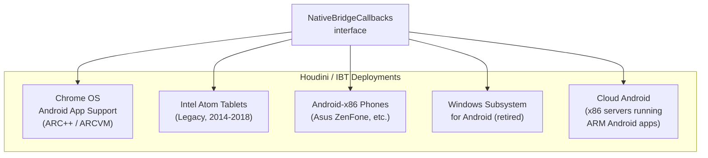

In each deployment, the same pattern applies: Houdini/IBT is installed as
`libhoudini.so`, guest ARM libraries are placed in `system/lib/arm/` and
`system/lib64/arm64/`, and the package manager advertises ARM ABIs in the
device's ABI list as fallback targets.

---

## 19.5  Android Emulator Native Bridge

The Android Emulator (Goldfish/Ranchu) uses a distinct native bridge
configuration to support ARM apps on x86_64 emulator images. This is
separate from both Houdini (device-side) and Berberis (RISC-V) — it enables
developers to test ARM-only apps in the x86_64 emulator without requiring
a full ARM system image.

### 19.5.1  Board Configuration

The emulator defines ARM as a native bridge architecture in its BoardConfig:

```makefile
# Source: build/make/target/board/generic_x86_64_arm64/BoardConfig.mk:16-32
# Primary architecture: x86_64
TARGET_CPU_ABI := x86_64
TARGET_ARCH := x86_64

# Secondary architecture: x86 (32-bit compat)
TARGET_2ND_CPU_ABI := x86
TARGET_2ND_ARCH := x86

# Native bridge: ARM64 (translated)
TARGET_NATIVE_BRIDGE_ARCH := arm64
TARGET_NATIVE_BRIDGE_ARCH_VARIANT := armv8-a
TARGET_NATIVE_BRIDGE_ABI := arm64-v8a

# Native bridge secondary: ARM (32-bit translated)
TARGET_NATIVE_BRIDGE_2ND_ARCH := arm
TARGET_NATIVE_BRIDGE_2ND_ARCH_VARIANT := armv7-a-neon
TARGET_NATIVE_BRIDGE_2ND_ABI := armeabi-v7a armeabi
```

This produces a device that natively runs x86/x86_64 code and can translate
ARM/ARM64 code through the native bridge.

### 19.5.2  ABI List Construction

The build system constructs the device's ABI list by placing native ABIs
first, then appending native bridge ABIs as fallbacks:

```makefile
# Source: build/make/core/board_config.mk:387-395
# Final ABI list = native ABIs + bridge ABIs
TARGET_CPU_ABI_LIST := x86_64,x86,arm64-v8a,armeabi-v7a,armeabi
#                      ^^^^^^^^^^^^^^ native  ^^^^^^^^^^^^^^^^^^^^^^^^ bridge
```

The **ordering matters**: the package manager prefers native x86_64 libraries
when available and only falls back to ARM through the bridge when an APK
contains no x86 code. This is why most apps run at full native speed on the
emulator — only apps with ARM-only native libraries go through translation.

### 19.5.3  NDK Translation Package

The `ndk_translation_package` Soong module bundles ARM libraries for x86
devices:

```go
// Source: build/soong/cc/ndk_translation_package.go:29-60
func init() {
    android.RegisterModuleType("ndk_translation_package",
        NdkTranslationPackageFactory)
}

type ndkTranslationPackageProperties struct {
    // ARM/ARM64 libraries that should be bundled for translation
    Native_bridge_deps  proptools.Configurable[[]string]
    // x86/x86_64 libraries that should be bundled alongside
    Device_both_deps    []string
    Device_64_deps      []string
    Device_32_deps      []string
}
```

At build time, this module collects ARM-compiled libraries and packages them
into the system image at paths like:

```
/system/lib/arm/           # 32-bit ARM libraries
/system/lib64/arm64/       # 64-bit ARM64 libraries
```

These directories mirror the standard library layout but contain
ARM-architecture binaries that the native bridge translates at runtime.

### 19.5.4  Soong Architecture Variants

Soong's build system creates special "native bridge" variants for each
module when building for an x86 target with ARM bridge support:

```go
// Source: build/soong/android/arch.go:391-399
func (target Target) ArchVariation() string {
    if target.NativeBridge == NativeBridgeEnabled {
        return "native_bridge_" + target.Arch.String()
    }
    return target.Arch.String()
}
```

For an x86_64 device with ARM64 native bridge, each native library is
compiled twice:

| Variant | Architecture | Output Path | Purpose |
|---|---|---|---|
| `x86_64` | Native x86_64 | `/system/lib64/` | Direct execution |
| `x86` | Native x86 | `/system/lib/` | 32-bit compat |
| `native_bridge_arm64` | ARM64 | `/system/lib64/arm64/` | Bridge translation |
| `native_bridge_arm` | ARM | `/system/lib/arm/` | Bridge translation |

### 19.5.5  Graphics and Vulkan Bridge Support

The native bridge integrates with the graphics stack to support ARM apps
that use OpenGL ES or Vulkan:

```
// Source: frameworks/native/opengl/libs/Android.bp:193
// EGL loader depends on libnativebridge_lazy for bridge-aware GL dispatch

// Source: frameworks/native/vulkan/libvulkan/Android.bp:147
// Vulkan loader integrates with native bridge for cross-architecture dispatch
```

When an ARM app calls OpenGL ES or Vulkan functions, the native bridge
must translate the calling convention and redirect to the host GPU driver.
This is handled through the same trampoline mechanism used for JNI calls
(see section 19.2.10).

### 19.5.6  Emulator vs. Device Bridge Comparison

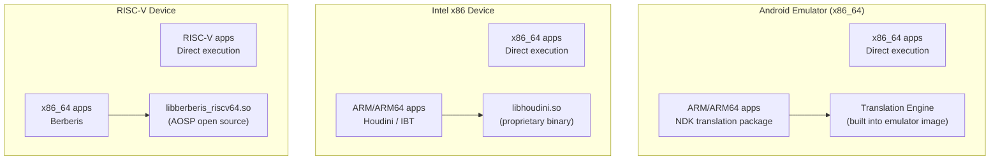

| Aspect | Emulator Bridge | Houdini / IBT | Berberis |
|---|---|---|---|
| **Host** | x86_64 (QEMU) | x86 / x86_64 (bare metal) | x86_64 (bare metal) |
| **Guest** | ARM / ARM64 | ARM / ARM64 | RISC-V 64 |
| **Source** | AOSP build system | Intel proprietary | AOSP open source |
| **Config file** | `BoardConfig.mk` | System property | `berberis_config.mk` |
| **Library path** | `system/lib/arm/` | `system/lib/arm/` | `system/lib/riscv64/` |
| **Primary use** | Developer testing | Production devices | Future RISC-V devices |

### 19.5.7  The Translation Ecosystem

All three bridge implementations — Berberis, Houdini/IBT, and the emulator's
NDK translation — share the same NativeBridge interface and the same runtime
integration points. This unified architecture means:

1. **App developers don't need to care** which bridge is in use — their ARM
   APK runs identically on all three platforms
2. **The framework handles fallback transparently** — PackageManager selects
   the best ABI from the device's list, using the bridge only when necessary
3. **Testing on the emulator validates real-device behavior** — the same
   translation path is exercised whether running on an x86 emulator or an
   Intel Chromebook with Houdini

---

## 19.6  RISC-V and the Future

### 19.6.1  RISC-V in AOSP

RISC-V is a strategic focus for AOSP's binary translation story.  While
ARM-to-x86 translation (Houdini) was the historical use case, Google's current
investment is in RISC-V-to-x86_64 translation through Berberis.

The toolchain configuration for RISC-V is in
`build/soong/cc/config/riscv64_device.go`:

```go
var (
  riscv64Cflags = []string{
    "-Werror=implicit-function-declaration",
    "-march=rv64gcv_zba_zbb_zbs",
    "-mno-implicit-float",
  }
  riscv64Ldflags = []string{
    "-march=rv64gcv_zba_zbb_zbs",
    "-Wl,-z,max-page-size=4096",
  }
)
```

The `-march=rv64gcv_zba_zbb_zbs` flag specifies:

| Extension | Meaning |
|-----------|---------|
| rv64g | Base 64-bit integer + M (multiply) + A (atomic) + F (single float) + D (double float) |
| c | Compressed instructions (16-bit) |
| v | Vector extension |
| zba | Address generation (bit manipulation) |
| zbb | Basic bit manipulation |
| zbs | Single-bit operations |

The `-mno-implicit-float` flag is a workaround:

```go
// TODO: remove when qemu V works
// (Note that we'll probably want to wait for berberis to be good enough
// that most people don't care about qemu's V performance either!)
"-mno-implicit-float",
```

This comment reveals an important strategic detail: **Berberis is positioned
as a successor to QEMU for running RISC-V Android**.  Once Berberis's vector
translation is mature enough, the `-mno-implicit-float` workaround for QEMU's
limitations can be removed.

### 19.6.2  The Toolchain

The RISC-V toolchain is registered in the Soong build system:

```go
func (t *toolchainRiscv64) ClangTriple() string {
  return "riscv64-linux-android"
}

func init() {
  registerToolchainFactory(android.Android, android.Riscv64,
      riscv64ToolchainFactory)
}
```

`riscv64-linux-android` is the Clang triple for Android RISC-V targets.  The
page size is set to 4096 bytes (`-Wl,-z,max-page-size=4096`), matching the
typical configuration for mobile devices.

### 19.6.3  Product Configuration

The RISC-V bridge is activated through product configuration.  From
`enable_riscv64_to_x86_64.mk`:

```makefile
include frameworks/libs/binary_translation/berberis_config.mk

PRODUCT_PACKAGES += $(BERBERIS_PRODUCT_PACKAGES_RISCV64_TO_X86_64)

PRODUCT_SYSTEM_PROPERTIES += \
    ro.dalvik.vm.native.bridge=libberberis_riscv64.so

PRODUCT_SYSTEM_PROPERTIES += \
    ro.dalvik.vm.isa.riscv64=x86_64 \
    ro.enable.native.bridge.exec=1

BUILD_BERBERIS := true
BUILD_BERBERIS_RISCV64_TO_X86_64 := true
$(call soong_config_set,berberis,translation_arch,riscv64_to_x86_64)
```

The Soong config variable `berberis.translation_arch=riscv64_to_x86_64`
controls which translation modules are built.  The `BUILD_BERBERIS` and
`BUILD_BERBERIS_RISCV64_TO_X86_64` flags are used by the legacy Make build
system.

### 19.6.4  Distribution Artifacts

The complete set of files installed on device for RISC-V bridge support
(`berberis_config.mk`, lines 57-130):

**Binaries:**
```
system/bin/berberis_program_runner_binfmt_misc_riscv64
system/bin/berberis_program_runner_riscv64
system/bin/riscv64/app_process64
system/bin/riscv64/linker64
```

**Configuration:**
```
system/etc/binfmt_misc/riscv64_dyn
system/etc/binfmt_misc/riscv64_exe
system/etc/init/berberis.rc
system/etc/ld.config.riscv64.txt
```

**Host-side libraries (x86_64):**
```
system/lib64/libberberis_riscv64.so
system/lib64/libberberis_exec_region.so
system/lib64/libberberis_proxy_lib*.so   (21 proxy libraries)
```

**Guest-side libraries (RISC-V):**
```
system/lib64/riscv64/libc.so
system/lib64/riscv64/libm.so
system/lib64/riscv64/libEGL.so
system/lib64/riscv64/libGLESv2.so
system/lib64/riscv64/libvulkan.so
... (30+ guest libraries)
```

### 19.6.5  binfmt_misc Integration

The binfmt_misc registration files allow the Linux kernel to automatically
invoke Berberis when a RISC-V ELF binary is executed:

```
system/etc/binfmt_misc/riscv64_dyn    # Dynamic executables
system/etc/binfmt_misc/riscv64_exe    # Static executables
```

The init script `berberis.rc` registers these with the kernel's binfmt_misc
filesystem during boot, enabling transparent execution of RISC-V binaries
from the shell.

### 19.6.6  Why RISC-V Translation Matters

The RISC-V focus represents a strategic investment:

1. **Ecosystem bootstrapping**: RISC-V Android hardware is emerging but lacks
   app support.  Binary translation closes the gap by allowing x86_64 devices
   (emulators, development boards) to run RISC-V apps during the transition.

2. **QEMU replacement**: The comment in `riscv64_device.go` explicitly positions
   Berberis as eventually replacing QEMU for RISC-V Android development.
   Berberis runs inside the Android process model with proper ART integration,
   while QEMU is a full-system emulator with higher overhead.

3. **Bidirectional value**: Unlike ARM-to-x86 translation (which benefits x86
   devices by running ARM apps), RISC-V translation also benefits the RISC-V
   ecosystem by providing a development platform before hardware is widely
   available.

### 19.6.7  Multi-Target Architecture

Berberis's architecture supports multiple guest-to-host translation pairs.
The code already contains references to ARM64 support:

```
guest_state/arm/
guest_state/arm64/
guest_abi/arm/
guest_abi/arm64/
```

And the program runner has an ARM64 variant:

```
berberis_program_runner_riscv64_to_arm64
```

This suggests that Berberis could eventually support RISC-V-to-ARM64
translation as well, which would be relevant for running RISC-V apps on
ARM-based Android devices.

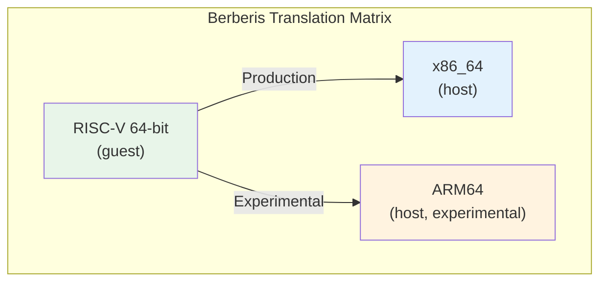

### 19.6.8  Extension Support Roadmap

The RISC-V ISA is modular -- new extensions can be added without changing the
base instruction set.  The current Berberis decoder already handles:

- **RV64I**: Base integer instructions
- **M**: Integer multiplication and division
- **A**: Atomic instructions (LR/SC, AMO)
- **F/D**: Single and double precision floating point
- **C**: Compressed (16-bit) instructions
- **V**: Vector extension (most instructions)
- **Zba/Zbb/Zbs**: Bit manipulation

The decoder's enum-based opcode design makes it straightforward to add new
extensions.  Each extension adds new enum values and new `Decode*` methods
in the decoder template.

---

## 19.7  Try It

### Exercise 19.1: Inspect the NativeBridge State

Check whether a native bridge is configured on your device or emulator:

```bash
adb shell getprop ro.dalvik.vm.native.bridge
```

If a bridge is configured, you will see a library name (e.g.
`libberberis_riscv64.so` or `libhoudini.so`).  If the output is `0`, no bridge
is loaded.

```bash
# Check ISA mappings
adb shell getprop ro.dalvik.vm.isa.riscv64
adb shell getprop ro.dalvik.vm.isa.arm
adb shell getprop ro.dalvik.vm.isa.arm64
```

### Exercise 19.2: Examine the Bridge Library

On a Berberis-enabled emulator:

```bash
# Verify the bridge library exists
adb shell ls -la /system/lib64/libberberis_riscv64.so

# Check the NativeBridgeItf symbol
adb shell readelf -s /system/lib64/libberberis_riscv64.so | \
    grep NativeBridgeItf
```

The output should show a GLOBAL symbol named `NativeBridgeItf` of type OBJECT.

### Exercise 19.3: List Guest Libraries

```bash
# List guest RISC-V libraries
adb shell ls /system/lib64/riscv64/

# List proxy libraries
adb shell ls /system/lib64/libberberis_proxy_*
```

Compare the proxy list to the `NATIVE_BRIDGE_MODIFIED_GUEST_LIBS` in
`native_bridge_support.mk` -- every modified guest library should have a
corresponding proxy.

### Exercise 19.4: Run a Guest Binary

If `berberis_program_runner_riscv64` is installed:

```bash
# Run on device
adb shell /system/bin/berberis_program_runner_riscv64 \
    /data/nativetest64/berberis_hello_world_static.native_bridge/x86_64/\
    berberis_hello_world_static
```

Or from a host build:

```bash
# Run on host
out/host/linux-x86/bin/berberis_program_runner_riscv64 \
    out/target/product/emu64xr/testcases/\
    berberis_hello_world_static.native_bridge/x86_64/\
    berberis_hello_world_static
```

### Exercise 19.5: Trace a Bridge Load

Enable native bridge tracing and watch a library load:

```bash
# Enable verbose NB logging
adb shell setprop log.tag.nativebridge VERBOSE

# Install and launch a RISC-V app, then check logs
adb logcat -s nativebridge:* berberis:*
```

You should see messages like:

```
native_bridge_initialize(runtime_callbacks=0x..., private_dir='...', app_isa='riscv64')
Initialized Berberis (riscv64)
native_bridge_loadLibraryExt(path=libgame.so)
native_bridge_getTrampolineWithJNICallType(handle=0x..., name='nativeInit', shorty='VL', ...)
```

### Exercise 19.6: Read the NativeBridgeCallbacks Header

Open `art/libnativebridge/include/nativebridge/native_bridge.h` and:

1. Count the total number of function pointer fields in `NativeBridgeCallbacks`.
   Answer: 20 (1 uint32_t version + 19 function pointers plus
   `isNativeBridgeFunctionPointer` = 20 function pointers total).

2. Identify which version introduced namespace support.
   Answer: Version 3 -- the `createNamespace`, `linkNamespaces`, and
   `loadLibraryExt` callbacks.

3. Find the `NativeBridgeRuntimeCallbacks` structure and explain what
   `getMethodShorty` does.
   Answer: It retrieves the compact type descriptor ("shorty") for a Java
   method, which the bridge uses to generate the correct trampoline calling
   convention.

### Exercise 19.7: Build Berberis from Source

```bash
source build/envsetup.sh
lunch sdk_phone64_x86_64_riscv64-trunk_staging-eng
m berberis_all
```

After building, run the host tests:

```bash
m berberis_all berberis_run_host_tests
```

Or directly:

```bash
out/host/linux-x86/nativetest64/berberis_host_tests/berberis_host_tests
```

### Exercise 19.8: Walk Through a Trampoline

Trace the code path for a JNI native method call through the bridge:

1. Start at `NativeBridgeGetTrampoline2()` in `art/libnativebridge/native_bridge.cc`
   (line 477).
2. Follow the dispatch to `g_callbacks->getTrampolineWithJNICallType()`.
3. This calls `native_bridge_getTrampolineWithJNICallType()` in
   `frameworks/libs/binary_translation/native_bridge/native_bridge.cc`
   (line 432).
4. The function calls `DlSym` to find the guest address, then
   `WrapGuestJNIFunction` to create the trampoline.
5. Inside `jni_trampolines.cc`, the shorty is converted to a wrapper
   signature and `WrapGuestFunctionImpl` creates the host-callable function.

### Exercise 19.9: Compare the Two Headers

Open these two files side by side:

- `art/libnativebridge/include/nativebridge/native_bridge.h`
  (ART's canonical definition)
- `frameworks/libs/binary_translation/native_bridge/native_bridge.h`
  (Berberis's local copy)

The Berberis header notes at line 17:

```cpp
// ATTENTION: this is a local copy of system/core/include/nativebridge/
// native_bridge.h for v3, modded to remove interfaces used by the
// runtime to control native bridge.
// The copy makes berberis compile-time independent from native bridge
// version in system/core/libnativebridge.
```

Compare the structures.  They should be identical in layout (same function
pointer offsets) but the Berberis copy may omit some utility functions.  This
decoupling allows Berberis to compile without depending on the exact version of
`libnativebridge` in the build tree.

### Exercise 19.10: Examine the Decoder Opcodes

Open `frameworks/libs/binary_translation/decoder/include/berberis/decoder/riscv64/decoder.h`
and:

1. Find the `BranchOpcode` enum and list all branch types.
2. Find the `AmoOpcode` enum and identify which atomic operations are
   supported.
3. Look for compressed instruction handling -- the decoder transparently
   handles 16-bit compressed instructions alongside 32-bit base instructions.

---

## Summary

The NativeBridge system is one of Android's most architecturally elegant
subsystems.  By defining a clean callback interface (`NativeBridgeCallbacks`
v1-v8) in `libnativebridge`, AOSP allows any binary translator to plug in
without modifying ART.

Berberis, Google's open-source reference implementation, demonstrates the full
complexity of binary translation on Android: multi-tier translation (interpreter,
lite JIT, heavy optimizer), dual linker namespaces, JNI trampoline generation
from method shorty strings, guest CPU state management, proxy library
interception, and crash reporting with dual stack traces.

The `native_bridge_support` libraries provide the guest-side runtime
environment -- 26+ proxy libraries, a guest linker, a guest VDSO, and a guest
app_process.  Together with the bridge implementation, they form a complete
execution environment for foreign-ISA applications.

The RISC-V focus positions Berberis as a strategic investment in Android's
future.  The comments in `riscv64_device.go` explicitly position it as a QEMU
successor, and the comprehensive vector extension support and CTS compatibility
demonstrate production-grade ambition.

### Key source files

| File | Role |
|------|------|
| `art/libnativebridge/include/nativebridge/native_bridge.h` | Canonical NativeBridgeCallbacks definition |
| `art/libnativebridge/native_bridge.cc` | ART-side bridge management |
| `frameworks/libs/binary_translation/native_bridge/native_bridge.cc` | Berberis NativeBridgeItf export |
| `frameworks/libs/binary_translation/README.md` | Berberis getting started |
| `frameworks/libs/binary_translation/decoder/include/berberis/decoder/riscv64/decoder.h` | RISC-V decoder |
| `frameworks/libs/binary_translation/interpreter/riscv64/interpreter-main.cc` | Interpreter entry |
| `frameworks/libs/binary_translation/guest_state/riscv64/include/berberis/guest_state/guest_state_arch.h` | RISC-V register definitions |
| `frameworks/libs/binary_translation/guest_loader/guest_loader.cc` | Guest ELF loading |
| `frameworks/libs/binary_translation/jni/jni_trampolines.cc` | JNI trampoline generation |
| `frameworks/libs/binary_translation/proxy_loader/proxy_loader.cc` | Proxy library loading |
| `frameworks/libs/binary_translation/runtime/berberis.cc` | Runtime initialization |
| `frameworks/libs/native_bridge_support/native_bridge_support.mk` | Guest library manifest |
| `frameworks/libs/binary_translation/enable_riscv64_to_x86_64.mk` | Product configuration |
| `build/soong/cc/config/riscv64_device.go` | RISC-V toolchain |
