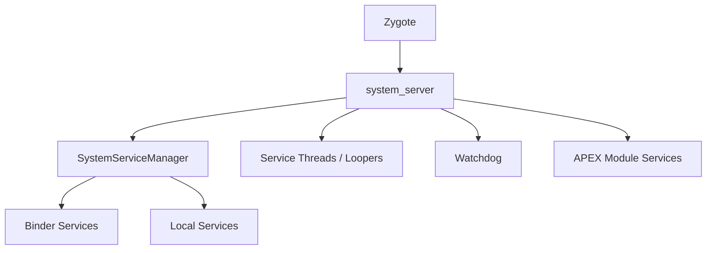
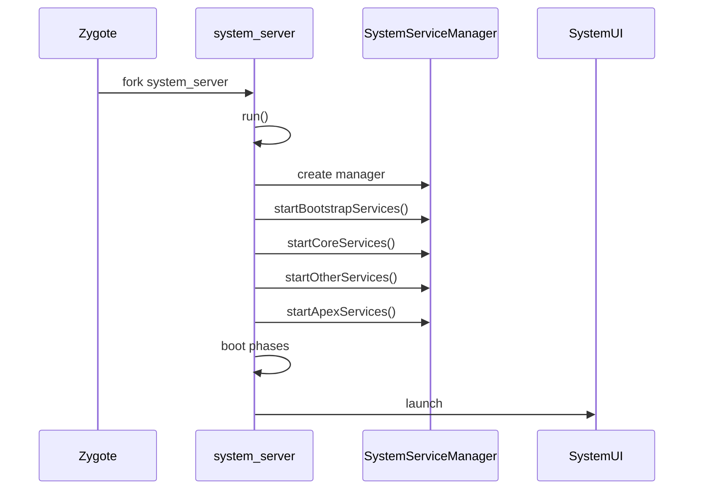
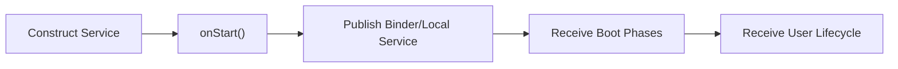

# 第 20 章：system_server

`system_server` 是 Android framework 层最核心的 Java 进程。它承载大量系统服务，负责活动管理、窗口管理、包管理、电源管理、通知、显示、输入、备份、剪贴板、下载管理以及大量设备和形态相关服务。本章从 AOSP 源码视角梳理 `system_server` 的进程起源、服务生命周期、启动顺序、线程模型、Watchdog、APEX 模块化服务加载与一系列关键服务内部模式。

## Overview

`system_server` 的本质是一台系统级服务编排器。它出生于 Zygote，通过 `SystemServer.java` 进入主流程，按严格顺序启动 bootstrap、core、other 与 APEX 服务，并在整个系统生命周期内维持 Binder 服务、local service、线程、Watchdog、Boot Phase 与用户生命周期回调的一致性。

---

## 20.1 `system_server` 进程

### 20.1.1 来自 Zygote 的诞生

`system_server` 由 Zygote fork 出来。这样它可以共享大量预加载类与资源，同时在独立进程中运行高权限系统服务逻辑。

### 20.1.2 `run()` 方法 —— 初始化整个世界

`SystemServer.run()` 是系统服务世界的真正入口。它负责：

- 设置进程优先级与运行时属性
- 初始化 looper 与上下文
- 创建 `SystemServiceManager`
- 启动分阶段服务
- 进入主循环并在 boot 完成后保持长期运行

### 20.1.3 服务模块组织

`system_server` 中的服务按功能与启动阶段组织在多个包和模块中，包括 server 主包、各子领域服务包以及由 APEX 提供的模块化服务。

### 20.1.4 四个启动阶段

典型启动阶段包括：

1. `startBootstrapServices()`
2. `startCoreServices()`
3. `startOtherServices()`
4. `startApexServices()`

这种分层顺序保证依赖关系和 boot phase 能逐步满足。

---

## 20.2 服务生命周期

### 20.2.1 `SystemService` 基类

大多数系统服务都继承 `SystemService`。它定义统一生命周期模型，并向服务暴露启动、boot phase 与用户切换等回调点。

### 20.2.2 生命周期回调

常见回调包括：

- `onStart()`
- `onBootPhase()`
- `onUserStarting()` / `onUserUnlocking()` / `onUserStopping()`
- 其他用户生命周期相关回调

这些回调让服务既能参与系统启动，也能感知多用户事件。

### 20.2.3 发布服务

服务通常通过以下两类方式发布：

- Binder 服务：对跨进程调用开放
- Local Services：仅在 `system_server` 内部供其他服务访问

### 20.2.4 Boot Phases

Boot phase 是 `system_server` 协调服务 readiness 的关键机制。各服务可在特定阶段前只做最小初始化，在对应 boot phase 到来时再完成依赖系统的工作。

### 20.2.5 `TargetUser` 与用户生命周期

多用户系统中，服务不仅要随着系统启动，也要随着用户启动、切换、解锁和停止进入不同状态。`TargetUser` 与相关回调为此提供统一建模。

### 20.2.6 `SystemServiceManager`

`SystemServiceManager` 负责实例化、注册和调度所有 `SystemService` 生命周期，是 `system_server` 中最核心的服务管理器之一。

---

## 20.3 关键服务目录

### 20.3.1 Bootstrap Services

Bootstrap services 是最早启动的一组核心服务，通常包括：

- Activity / task 管理相关核心组件
- Power / display / package 等启动链必需服务
- 建立后续服务依赖基础的服务

### 20.3.2 Core Services

Core services 在 bootstrap 之后启动，负责进一步建立系统主干能力，例如电池统计、使用统计、WebView 更新管理等。

### 20.3.3 Other Services（主要子集）

#### 安全与凭据

如 KeyChain、Credential、Trust、DevicePolicy 等。

#### 窗口、显示与输入

如 WindowManagerService、DisplayManagerService、InputManager 等。

#### 网络

如 Connectivity、NetworkPolicy、NetworkStats、Wifi 相关服务。

#### 存储与包管理

如 PackageManager、StorageManager、Installer 桥接等。

#### 电源与热管理

如 PowerManagerService、ThermalService、BatteryService。

#### 音频、媒体与相机

如 AudioService、MediaRouter、CameraService 对应 framework 桥接。

#### 通知与状态

如 NotificationManagerService、StatusBarManagerService 等。

#### 位置、时间与传感器

如 LocationManager、TimeDetector、Sensor 相关服务桥接。

#### 应用管理

如 ActivityManager、UsageStats、AppOps、ProcessStats 等。

#### 通信

如 Telephony、Telecom、Bluetooth 相关系统服务。

#### 作业与调度

如 JobScheduler、AlarmManager。

#### 内容与搜索

如 ContentService、SearchManagerService。

#### TV 与 HDMI

电视和 HDMI CEC 相关系统服务。

#### 文本与本地化

如 TextServicesManager、Locale 相关服务。

#### 硬件与外设

USB、NFC、打印、输入设备等。

#### AI 与智能

AppFunctions、智能助手、ML 相关服务。

#### 系统基础设施

DropBox、Bugreport、Stats、Rollback、CrashRecovery 等。

### 20.3.4 Mainline 模块服务（APEX 交付）

部分服务由 Mainline/APEX 模块提供，可独立于整机 OTA 更新，这改变了 `system_server` 的服务发现和类加载方式。

### 20.3.5 Core Server 包结构

#### 进程与活动管理

`com.android.server.am` 与 `wm` 等包。

#### 包管理

`com.android.server.pm`。

#### 安全

权限、凭据、策略、回滚和隐私相关包。

#### 显示与图形

`display`、`wm`、`graphics` 相关服务包。

#### 输入与辅助功能

`input`、`accessibility` 等。

#### 网络

`connectivity`、`net`、`wifi` 协调层。

#### 电源与热

`power`、`thermal`、`battery` 等。

#### 音频与媒体

`audio`、`media` 桥接服务。

#### 通信

蓝牙、电话、短消息等。

#### 存储

`storage` 与安装协同逻辑。

#### 时间与位置

`timezonedetector`、`location` 等。

#### 内容

内容服务、剪贴板、搜索等。

#### 通知与状态栏

通知管理、状态栏与系统 UI 协作。

#### 设备管理

设备策略、多用户与企业管理。

#### 系统服务

系统内部基础设施和通用管理器。

#### Specialized

特定形态或 OEM 相关服务。

#### Intelligence and ML

智能和机器学习相关服务。

#### Miscellaneous

其他系统基础服务。

---

## 20.4 服务启动顺序

### 20.4.1 `startBootstrapServices()`

这一阶段启动最基础的依赖链服务。其目标是确保系统可以继续安全引导到更高层功能。

### 20.4.2 `startCoreServices()`

核心服务阶段继续补齐系统主干能力，但仍保持较强依赖顺序控制。

### 20.4.3 `startOtherServices()`

该阶段会启动大量业务与设备相关服务，是 `system_server` 服务数量增长最快的阶段。

### 20.4.4 Boot Phase 序列的上下文

服务启动顺序与 boot phase 交织进行。某些服务虽然已实例化，但要等到特定 boot phase 才真正完成初始化。

### 20.4.5 条件化启动

许多服务受设备特性、form factor、feature flag、系统属性或模块存在性影响，因此不是所有设备都会启动完全相同的服务集合。

---

## 20.5 Watchdog

### 20.5.1 目的与架构

Watchdog 用于检测 `system_server` 中关键线程是否长时间无响应，并在必要时收集诊断信息甚至杀进程重启系统关键服务链。

### 20.5.2 默认超时

默认超时覆盖主线程和若干重要服务线程，具体数值会随版本和场景调整。

### 20.5.3 完成状态

Watchdog 会根据线程响应情况划分完成状态，如已完成、部分阻塞、完全超时等。

### 20.5.4 `HandlerChecker`

`HandlerChecker` 通过向被监控 Looper 发布检查任务，确认对应线程是否能在超时内处理消息。

### 20.5.5 被监控线程

典型包括主线程、UI 线程、前台线程、IO 线程、显示线程和部分服务专用线程。

### 20.5.6 `Monitor` 接口

某些服务可实现 `Watchdog.Monitor`，让 Watchdog 直接调用其 `monitor()` 检查更细粒度的内部锁与状态。

### 20.5.7 Watchdog 运行循环

运行循环通常执行：

1. 安排检查任务。
2. 睡眠直到超时点。
3. 汇总各 checker 状态。
4. 若超时则收集诊断并决定是否杀进程。

### 20.5.8 Watchdog 触发后发生什么

系统会记录线程栈、关键日志、DropBox 条目，必要时终止 `system_server`，使 Zygote / init 重新拉起核心系统流程。

### 20.5.9 Watchdog 暂停机制

在某些受控场景下，Watchdog 可被短暂暂停，以避免合法长操作被误判为卡死。

### 20.5.10 超时历史与循环打破

系统会记录超时历史，避免在某些循环性故障中重复执行无意义恢复动作。

---

## 20.6 线程模型

### 20.6.1 Overview

`system_server` 是典型的多 Looper、多 Handler、多 Binder thread 进程。不同线程承担不同服务类别与实时性要求。

### 20.6.2 `ServiceThread` 基类

许多 `system_server` 专用线程基于 `ServiceThread`，它封装了 thread priority、looper 初始化和调试命名逻辑。

### 20.6.3 线程目录

#### Main Looper Thread

主线程承载大量核心服务主 Handler 与 boot 流程。

#### `DisplayThread`

服务显示和某些图形相关调度。

#### `AnimationThread`

处理系统动画相关任务。

#### `SurfaceAnimationThread`

处理 Surface 动画与窗口层级动画任务。

#### `UiThread`

服务 `system_server` 内部分需要 UI 优先级的消息处理。

#### `FgThread`（前台线程）

用于对响应性要求较高的系统服务任务。

#### `IoThread`

处理 IO 类任务与阻塞性较高工作。

#### `BackgroundThread`

承载低优先级后台任务。

#### `PermissionThread`

用于权限相关异步工作。

### 20.6.4 线程优先级摘要

线程优先级按职责不同配置，以在响应性、吞吐和后台工作之间取得平衡。

### 20.6.5 `Handler`、`Looper` 与 `MessageQueue`

绝大多数系统服务逻辑通过 Handler 驱动，形成串行化的线程内事件处理模型。

### 20.6.6 Binder 线程

除 Looper 线程外，`system_server` 还拥有 Binder 线程池，用于处理来自其他进程的 Binder 调用。

### 20.6.7 线程选择指南

服务开发者需要根据任务类型选择合适线程：

- 主线程仅做轻量协调
- IO 放到 `IoThread`
- 用户感知快路径放到前台线程
- 长耗时初始化可交给专用线程池

### 20.6.8 `SystemServerInitThreadPool`

初始化线程池用于在 boot 阶段并行执行部分可安全并发的初始化任务，以降低整体启动时间。

---

## 20.7 动手实践

### 20.7.1 列出所有系统服务

使用 `service list`、`dumpsys -l` 或 SystemServer dumper 查看系统服务目录。

### 20.7.2 检查 `system_server` 进程

```bash
# Process ID
# Thread count
# Process status
# Memory usage
```

### 20.7.3 `dumpsys` 命令

```bash
# Dump all services (very long!)
# Dump a specific service
# Dump the SystemServer dumper for internal state
```

### 20.7.4 检查 Boot Phases

```bash
# View boot timing events
# View SystemServer timing tags
# Full boot tracing with Perfetto
```

### 20.7.5 观察服务启动顺序

```bash
# Filter for service start messages
# Look for specific boot phase transitions
```

### 20.7.6 Watchdog 诊断

```bash
# Dump Watchdog state
# View Watchdog-related logs
# Check for past Watchdog kills
# View timeout history
```

### 20.7.7 线程检查

```bash
# List all system_server threads with names
# View specific named threads
# Get Java thread dump (sends SIGQUIT)
# Then check /data/anr/ for the trace file
```

### 20.7.8 服务依赖与启动耗时

```bash
# View how long each service took to start
# Check if a specific service is running
# Call a service directly
```

### 20.7.9 检查 `SystemServiceManager` 状态

```bash
# Dump all registered system services
```

### 20.7.10 监控 Binder 线程池

```bash
# Check Binder thread usage
# View Binder calls stats
# View specific Binder transaction information
```

### 20.7.11 强制 Watchdog 超时（仅开发环境）

```bash
# Reduce watchdog timeout (settings must be available)
# Or use the debug property
```

### 20.7.12 使用 Perfetto 追踪服务启动

```bash
# Record a boot trace
# After reboot, pull the trace
# Open in ui.perfetto.dev
```

### 20.7.13 模拟 Boot Phases

```bash
# Reboot and immediately start capturing
```

### 20.7.14 检查服务注册

```bash
# Check if a service exists and get its interface descriptor
# Get service debug info (PID, interface)
```

### 20.7.15 监控 Looper 统计

```bash
# Dump looper statistics to see message processing times
# This shows for each looper:
# - Message count
# - Total time
# - Max time
# - Exception count
```

---

## 20.8 深入解析：关键服务内部

### 20.8.1 `ActivityManagerService` 与 `ActivityTaskManagerService`

这两者负责进程、活动、任务栈和应用生命周期管理，是 `system_server` 最关键的服务之一。

### 20.8.2 `WindowManagerService`

负责窗口层级、显示布局、动画、配置变化和输入窗口协调。

### 20.8.3 `PackageManagerService`

负责包扫描、安装、卸载、权限解析、组件解析和包数据库维护。

### 20.8.4 `PowerManagerService`

负责电源状态、唤醒锁、休眠/唤醒策略和与显示/热管理协同。

### 20.8.5 `NotificationManagerService`

负责通知生命周期、渠道、打断策略与 SystemUI 协作。

### 20.8.6 `DisplayManagerService`

负责显示设备管理、显示配置、亮度和多显示支持。

---

## 20.9 服务通信模式

### 20.9.1 Binder 服务 vs Local Services

Binder 服务用于跨进程；Local Services 用于 `system_server` 内部直接依赖注入和高效调用。

### 20.9.2 `Lifecycle` 内部类模式

许多服务使用 `Lifecycle` 内部类包装 `SystemService` 生命周期接口，使主服务实现与生命周期桥接分离。

### 20.9.3 服务依赖

服务之间常通过 LocalServices、Binder 获取或 manager facade 建立依赖，需要谨慎处理初始化顺序。

### 20.9.4 通过 Handler 的跨服务通信

即便都在同一进程中，不同服务仍经常通过 Handler/Message 异步交互，以避免阻塞和锁循环。

### 20.9.5 `SystemServer` Dumper

```bash
# List all dumpables
# Dump a specific dumpable
```

Dumper 提供除 Binder 服务外的内部状态转储能力。

---

## 20.10 错误处理与恢复

### 20.10.1 `reportWtf` 模式

`reportWtf` 用于记录严重但未必立刻致命的系统错误，是 `system_server` 重要的异常上报模式。

### 20.10.2 Early WTF 处理

在 boot 早期，错误处理更敏感，因为很多恢复路径尚未可用。

### 20.10.3 待机关闭检查

系统需要避免在 shutdown 过程中误触发某些错误恢复逻辑。

### 20.10.4 安全模式

Safe mode 提供最小化系统启动路径，帮助设备在异常状态下仍可进入恢复或调试环境。

### 20.10.5 FD 泄漏检测

文件描述符泄漏会导致长期稳定性问题，系统具备相应检测与日志支持。

### 20.10.6 `CriticalEventLog`

该日志聚合关键事件，帮助分析系统级故障与恢复行为。

---

## 20.11 性能考量

### 20.11.1 启动时间优化

并行初始化、延迟初始化、条件化启动和 APEX 模块按需加载是降低 boot time 的关键手段。

### 20.11.2 内存优化

通过 Zygote 继承、共享对象、避免冗余缓存和及时释放临时结构降低 `system_server` 内存占用。

### 20.11.3 Binder 性能

Binder 调用频率、序列化成本和线程池占用会直接影响 `system_server` 响应性。

### 20.11.4 慢日志阈值

系统对服务启动、消息处理和 Binder 调用设置慢日志阈值，以识别性能热点。

---

## 20.12 APEX 模块服务加载

### 20.12.1 模块化挑战

当服务由 APEX 提供时，`system_server` 不能再假设所有类都在同一系统镜像中，需要动态发现与类加载。

### 20.12.2 `SystemServerClassLoaderFactory`

该工厂为来自 APEX 的 JAR/service 创建专用 class loader，是模块化服务启动的关键部件。

### 20.12.3 带模块的服务生命周期

模块服务仍要融入相同的 `SystemService` 生命周期和 boot phase，但其代码来源和类加载链不同。

### 20.12.4 完整 APEX JAR 路径

AOSP 中存在明确的 APEX JAR 路径拼接和发现逻辑，用于定位模块服务实现。

---

## 20.13 设备特定与形态特定服务

### 20.13.1 设备特定服务

OEM 可按设备能力和功能需求附加设备特定系统服务。

### 20.13.2 手表特定服务

手表设备常加入低功耗、表盘、身体传感器与通知相关特化服务。

### 20.13.3 车载特定服务

车载系统强调多用户、车辆状态、导航与安全策略集成。

### 20.13.4 TV 特定服务

TV 形态常引入 HDMI、CEC、电视输入与推荐系统相关服务。

### 20.13.5 IoT 服务

IoT 设备可能启用更轻量或更专用的服务集合。

---

## 20.14 SystemUI 启动

### 20.14.1 最后一步

系统服务主干启动后，`system_server` 会触发 SystemUI 进程或组件的启动，标志着用户可见系统界面即将就绪。

### 20.14.2 Boot Completed 阶段

`BOOT_COMPLETED` 阶段使许多服务和应用开始执行延后工作，是系统从“可启动”转向“可用”的关键节点。

### 20.14.3 无限循环

`system_server` 启动完成后并不会退出，而是进入主 looper/binder 驱动的长期运行状态。

---

## 20.15 调试 `system_server`

### 20.15.1 常见失败模式

包括死锁、Watchdog 超时、Binder 线程池耗尽、服务启动失败、boot loop 和内存膨胀等。

### 20.15.2 获取线程转储

```bash
# Method 1: SIGQUIT (generates ANR trace)
# Method 2: debuggerd (native + Java stacks)
```

### 20.15.3 识别死锁

通过线程栈、锁持有关系、LockGuard 和 Watchdog monitor 输出可定位死锁模式。

### 20.15.4 分析启动时序

```bash
# Get timing for each service start
```

### 20.15.5 读取 Watchdog 转储

```bash
# Check DropBox for Watchdog entries
# Check kernel log for the kill
```

### 20.15.6 Profiling `system_server`

```bash
# CPU profiling with simpleperf
# Java method tracing (debug builds)
```

### 20.15.7 有用的系统属性

系统属性常用于开启详细日志、调整阈值和启用调试行为。

---

## 20.16 编写自定义系统服务

### 20.16.1 服务结构模板

自定义系统服务通常包括：

- 继承 `SystemService`
- Binder service 实现
- 可能的 `Lifecycle` 包装类
- Local service 发布
- 合适的线程模型与权限检查

### 20.16.2 在 `SystemServer` 中注册

需要在合适启动阶段实例化并注册该服务，并处理 boot phase 与用户生命周期。

### 20.16.3 线程安全考量

服务内部必须明确锁顺序、Handler 线程边界和 Binder 调用的同步策略。

### 20.16.4 使用 Ravenwood 测试

Ravenwood 等测试框架帮助在受控环境中验证系统服务逻辑。

---

## 20.17 `startApexServices()` 阶段

### 20.17.1 APEX 服务发现

此阶段会扫描可用模块并启动由 APEX 提供的 system services。

### 20.17.2 更新 Watchdog 超时

由于 APEX 服务启动可能增加时延，系统会相应调整 Watchdog 关注窗口。

---

## 20.18 锁顺序与死锁预防

### 20.18.1 锁层级

`system_server` 中常定义显式锁层级，以避免跨服务循环等待。

### 20.18.2 `LockGuard`

LockGuard 是辅助检测与约束锁顺序的工具，帮助在开发阶段发现危险加锁模式。

### 20.18.3 `ThreadPriorityBooster`

该机制可在持锁关键路径短暂提升线程优先级，减少高优先级线程因锁竞争而被延迟。

### 20.18.4 常见死锁模式

典型模式包括双向 Binder 调用持锁、主线程等待后台线程而后台线程又等待主线程、跨服务锁顺序不一致等。

---

## 20.19 内存架构

### 20.19.1 Heap 配置

`system_server` 具有特定堆配置，以适应长期运行和大对象图需求。

### 20.19.2 共享内存优化

与 Zygote 共享、Binder ashmem/共享内存和图形缓冲共享都影响其内存布局。

### 20.19.3 Zygote 内存继承

大量类和部分对象从 Zygote 继承，可减少初始内存占用与启动成本。

### 20.19.4 GC 考量

系统服务对象存活时间长，GC 行为和对象生命周期分布与普通应用不同。

---

## 20.20 `SystemServerInitThreadPool`

### 20.20.1 目的

该线程池用于并行执行安全可并发的初始化任务，加速系统启动。

### 20.20.2 使用模式

服务或初始化步骤可把耗时任务提交到该线程池，并在后续合适点等待其完成。

### 20.20.3 同步

所有并发初始化都必须在依赖被真正使用前完成同步，避免竞态条件。

### 20.20.4 转储状态

线程池状态可通过调试输出或 dumper 查看。

---

## 20.21 Binder 事务监控

### 20.21.1 事务回调

系统可对 Binder 事务建立监控回调，用于性能统计、异常诊断和调用行为分析。

### 20.21.2 GC 后内存指标

某些监控会在 GC 后统计关键内存指标，用于观察服务健康度。

---

## 20.22 `system_server` 中的特性开关

### 20.22.1 由 Flag 控制的服务启动

越来越多服务启动由 feature flags 控制，以支持灰度发布、模块化和故障回退。

### 20.22.2 `FeatureFlagsService`

该服务集中提供 flag 查询与部分恢复逻辑，是配置化系统行为的基础设施之一。

### 20.22.3 Crash Recovery Flags

某些 crash recovery 行为也由 flag 控制，以便快速关闭有风险的新逻辑。

---

## 20.23 架构图

### 20.23.1 完整 `system_server` 架构



### 20.23.2 Boot Sequence 时间线



### 20.23.3 服务注册流



---

## 20.24 历史背景

### 20.24.1 `system_server` 的演进

`system_server` 从较小的框架进程逐步发展为承载数百个系统服务和复杂模块化逻辑的核心系统进程。

### 20.24.2 单体模式

它体现了典型单体进程模式：大量服务驻留一个高权限进程，共享内存与类加载环境。

### 20.24.3 为什么不是微服务

Android 选择单体模式主要出于性能、启动时延、进程间通信成本和共享状态复杂度考虑。

---

## 20.25 快速参考

### 20.25.1 源文件索引

| 路径 | 用途 |
|------|------|
| `frameworks/base/services/java/com/android/server/SystemServer.java` | `system_server` 主入口 |
| `frameworks/base/services/core/java/com/android/server/SystemService.java` | 服务基类 |
| `frameworks/base/services/core/java/com/android/server/SystemServiceManager.java` | 服务管理器 |
| `frameworks/base/services/core/java/com/android/server/Watchdog.java` | Watchdog |

### 20.25.2 Boot Phase 快速参考

Boot phase 用于分步启动和通知服务 readiness。

### 20.25.3 线程快速参考

主线程、UI 线程、前台线程、IO 线程、后台线程和显示相关线程构成主要运行骨架。

### 20.25.4 关键常量

包括 boot phase 常量、Watchdog timeout、线程优先级与日志阈值等。

### 20.25.5 常用 `dumpsys` 命令

```bash
# Essential dumpsys Commands
```

---

## 20.26 `BackupManagerService`

### 20.26.1 架构概览

BackupManagerService 负责系统备份与恢复主流程，协调 transport、包管理、用户、策略和回调协议。

### 20.26.2 启用与禁用

备份服务可因用户设置、设备策略、构建类型或恢复场景而启用或关闭。

### 20.26.3 Backup Transports

Transport 抽象云端、本地或 OEM 备份后端，使备份框架与实际存储目的地解耦。

### 20.26.4 键值备份 vs 全量备份

键值备份更轻量；全量备份更完整但成本更高。系统按应用能力和策略选择路径。

### 20.26.5 `BackupHandler` 消息协议

内部大量通过 Handler message 协调备份任务、超时、transport 调用与重试。

### 20.26.6 备份资格

并非所有应用都可被备份，需考虑 manifest、用户策略、系统应用特性与权限限制。

### 20.26.7 恢复操作

恢复流程需协调目标应用状态、数据写入、权限和一致性约束。

### 20.26.8 云端 vs 本地备份

云端备份强调跨设备恢复，本地备份强调离线与局部可控性。

### 20.26.9 多用户考量

备份数据必须与用户空间严格隔离，避免跨用户泄露或错误恢复。

---

## 20.27 `CrashRecoveryModule` 与 `RescueParty`

### 20.27.1 CrashRecoveryModule 生命周期

CrashRecoveryModule 在系统启动和运行过程中监控关键异常，并决定何时启用更激进恢复策略。

### 20.27.2 `PackageWatchdog`

PackageWatchdog 监控包级崩溃与恢复情况，为模块化服务和系统组件提供健康度追踪。

### 20.27.3 `RescueParty` 升级级别

RescueParty 通过逐级升级策略执行恢复动作，例如重置设置、回滚模块乃至更严重措施。

### 20.27.4 RescueParty 禁用条件

在某些构建类型、开发环境或特定策略下，RescueParty 可能被禁用或降级。

### 20.27.5 Boot Loop 检测

系统会根据连续重启和关键服务异常判断是否进入 boot loop 场景。

### 20.27.6 恢复出厂节流

为避免激进恢复策略误伤设备，系统会对 factory reset 等极端动作加节流与保护条件。

### 20.27.7 `CrashRecoveryHelper`

辅助类负责汇总状态、调用恢复模块与提供诊断工具接口。

### 20.27.8 与 `RollbackManager` 集成

模块化时代，崩溃恢复可以与回滚管理器协同，优先回滚有问题的模块版本。

---

## 20.28 `ClipboardService`

### 20.28.1 架构概览

ClipboardService 管理系统剪贴板数据、权限控制、通知和跨设备/虚拟设备隔离。

### 20.28.2 剪贴板数据模型

剪贴板基于 `ClipData` 和 `ClipDescription` 建模，可包含文本、URI、Intent 等多种载荷。

### 20.28.3 跨应用安全限制

现代 Android 对后台应用读取剪贴板有严格限制，以降低敏感数据泄露风险。

### 20.28.4 剪贴板访问通知

系统可能在应用访问剪贴板时向用户显示提示，提升透明度。

### 20.28.5 自动清空剪贴板

为保护隐私，系统可在一定时间后自动清除剪贴板内容。

### 20.28.6 虚拟设备剪贴板隔离

虚拟设备或多实例环境中，系统可为不同上下文提供独立剪贴板空间。

### 20.28.7 Emulator 与 ARC 集成

在 Emulator 或 ARC 场景中，剪贴板可能与宿主系统存在桥接与同步逻辑。

---

## 20.29 `DownloadManager` 与 `DownloadProvider`

### 20.29.1 架构

DownloadManager API 与 DownloadProvider 数据库/执行后端共同组成下载系统。

### 20.29.2 下载数据库

DownloadProvider 持有下载任务数据库，记录 URL、状态、重试、目标路径和通知信息。

### 20.29.3 使用 `JobScheduler` 执行下载

现代下载执行常依赖 JobScheduler，根据网络、电量和设备状态调度下载任务。

### 20.29.4 重试逻辑

系统根据错误类型、HTTP 状态、网络可用性和指数退避策略决定重试时机。

### 20.29.5 通知集成

下载进度和完成状态通常通过通知系统反馈给用户。

### 20.29.6 网络感知

下载逻辑会考虑网络类型、计费网络、漫游和带宽约束。

## Summary

## 总结

`system_server` 是 Android framework 服务层的中枢，其核心职责包括：

| 维度 | 说明 |
|------|------|
| 进程角色 | 从 Zygote fork 出来的高权限 Java 系统进程 |
| 生命周期 | 统一管理系统服务启动、boot phase 与用户生命周期 |
| 通信 | 通过 Binder 服务与 Local Services 组织跨进程与进程内协作 |
| 线程模型 | 多 Looper、多 Handler、多 Binder thread 池 |
| 健康度 | Watchdog、CrashRecovery、RescueParty 等机制持续监控 |
| 模块化 | 支持 APEX 模块服务动态加载 |

`system_server` 的关键设计原则包括：

1. **统一生命周期框架**：`SystemService` + `SystemServiceManager`。
2. **严格启动顺序**：bootstrap、core、other、APEX 分层启动。
3. **线程职责清晰**：主线程协调，专用线程处理特定任务。
4. **高可诊断性**：`dumpsys`、Watchdog、Perfetto、DropBox、thread dump。
5. **恢复优先**：CrashRecovery、PackageWatchdog、RescueParty 形成故障闭环。

掌握本章后，可以沿着“Zygote fork → `SystemServer.run()` → 服务启动顺序 → boot phase → Watchdog/线程模型 → 调试与恢复”这条主线理解 Android framework 服务层如何被组织和维护。
