# Chapter 20: system_server

## Overview

The `system_server` process is the beating heart of the Android framework. Born
from Zygote during early boot, it hosts over one hundred Java system services
that collectively manage every aspect of the device: activities, windows,
packages, power, networking, notifications, input, display, audio, security,
and much more. Every Android app interacts with `system_server` dozens of
times per second through Binder IPC, even if the developer never writes a
single line of code that mentions it.

This chapter traces `system_server` from its creation by Zygote through its
multi-phase boot sequence, catalogs the services it hosts, explains its
threading model, examines the Watchdog that guards against deadlocks, and
provides hands-on exercises for inspecting a live system.

**Key source files for this chapter:**

| File | Description |
|------|-------------|
| `frameworks/base/services/java/com/android/server/SystemServer.java` | Entry point and service startup orchestration |
| `frameworks/base/services/core/java/com/android/server/SystemService.java` | Base class for all system services |
| `frameworks/base/services/core/java/com/android/server/SystemServiceManager.java` | Manages service lifecycle and boot phases |
| `frameworks/base/services/core/java/com/android/server/Watchdog.java` | Deadlock detection and recovery |
| `frameworks/base/core/java/com/android/server/ServiceThread.java` | Base class for named handler threads |
| `frameworks/base/services/core/java/com/android/server/DisplayThread.java` | Display-priority shared thread |
| `frameworks/base/services/core/java/com/android/server/AnimationThread.java` | Animation-priority shared thread |
| `frameworks/base/core/java/com/android/server/FgThread.java` | Foreground shared thread |
| `frameworks/base/services/core/java/com/android/server/IoThread.java` | I/O shared thread |
| `frameworks/base/services/core/java/com/android/server/UiThread.java` | UI shared thread |
| `frameworks/base/core/java/com/android/internal/os/BackgroundThread.java` | Background shared thread |

---

## 20.1 The system_server Process

### 20.1.1 Birth from Zygote

When the Android runtime starts, `init` launches `app_process` which creates
the Zygote process. Zygote preloads common classes and resources, then
forks `system_server` as its very first child. This fork-based creation
gives `system_server` an enormous head start: all preloaded framework classes,
common libraries, and shared resources are already mapped into its address
space via copy-on-write memory.

The entry point in `SystemServer.java` is minimal. At line 710:

```java
// frameworks/base/services/java/com/android/server/SystemServer.java, line 710
public static void main(String[] args) {
    new SystemServer().run();
}
```

The constructor records basic start information (line 714-727):

```java
// frameworks/base/services/java/com/android/server/SystemServer.java, line 714
public SystemServer() {
    // Check for factory test mode.
    mFactoryTestMode = FactoryTest.getMode();

    // Record process start information.
    mStartCount = SystemProperties.getInt(SYSPROP_START_COUNT, 0) + 1;
    mRuntimeStartElapsedTime = SystemClock.elapsedRealtime();
    mRuntimeStartUptime = SystemClock.uptimeMillis();
    Process.setStartTimes(mRuntimeStartElapsedTime, mRuntimeStartUptime,
            mRuntimeStartElapsedTime, mRuntimeStartUptime);

    // Remember if it's runtime restart or reboot.
    mRuntimeRestart = mStartCount > 1;
}
```

The `mStartCount` field tracks how many times `system_server` has started.
A value greater than 1 indicates a runtime restart rather than a fresh boot --
an important distinction because a runtime restart skips certain one-time
initialization steps.

### 20.1.2 The run() Method -- Initializing the World

The `run()` method (line 836) is where all initialization happens. It follows
a carefully ordered sequence:

```
run()
  |
  +-- InitBeforeStartServices
  |     +-- Record start info in system properties
  |     +-- Initialize time zone
  |     +-- Set Binder to warn on blocking calls
  |     +-- Configure SQLite defaults
  |     +-- Prepare main looper
  |     +-- Start SystemServerInitThreadPool
  |     +-- Enqueue SystemConfig loading
  |     +-- Load libandroid_servers.so
  |     +-- Spawn fd leak check thread (debug builds)
  |     +-- Check for pending shutdown
  |     +-- Create system context
  |     +-- Create SystemServiceManager
  |
  +-- Start services
  |     +-- startBootstrapServices()
  |     +-- startCoreServices()
  |     +-- startOtherServices()
  |     +-- startApexServices()
  |     +-- updateWatchdogTimeout()
  |
  +-- Enter Looper.loop() -- runs forever
```

Several critical early steps deserve attention.

**Binder thread pool configuration** (line 932):

```java
// frameworks/base/services/java/com/android/server/SystemServer.java, line 493
private static final int sMaxBinderThreads = 31;
// ...
// line 932
BinderInternal.setMaxThreads(sMaxBinderThreads);
```

The system_server raises its Binder thread pool to 31 threads, well above the
default of 15 for regular apps. This is necessary because `system_server`
simultaneously serves hundreds of client processes.

**Main looper preparation** (line 934-939):

```java
// frameworks/base/services/java/com/android/server/SystemServer.java, line 934
android.os.Process.setThreadPriority(
        android.os.Process.THREAD_PRIORITY_FOREGROUND);
Looper.prepareMainLooper();
Looper.getMainLooper().setSlowLogThresholdMs(
        SLOW_DISPATCH_THRESHOLD_MS, SLOW_DELIVERY_THRESHOLD_MS);
```

The main thread gets foreground priority, and its looper is configured to log
warnings for messages taking longer than 100ms to dispatch or 200ms to
deliver. These thresholds help identify performance problems.

**System context creation** (line 1160-1168):

```java
// frameworks/base/services/java/com/android/server/SystemServer.java, line 1160
private void createSystemContext() {
    ActivityThread activityThread = ActivityThread.systemMain();
    mSystemContext = activityThread.getSystemContext();
    mSystemContext.setTheme(DEFAULT_SYSTEM_THEME);

    final Context systemUiContext = activityThread.getSystemUiContext();
    systemUiContext.setTheme(DEFAULT_SYSTEM_THEME);
    Trace.registerWithPerfetto();
}
```

Even though `system_server` is not a typical Android app, it needs an
`ActivityThread` and a `Context` for accessing resources, databases,
content providers, and the rest of the framework APIs.

**SystemServiceManager creation** (line 978-983):

```java
// frameworks/base/services/java/com/android/server/SystemServer.java, line 978
mSystemServiceManager = new SystemServiceManager(mSystemContext);
mSystemServiceManager.setStartInfo(mRuntimeRestart,
        mRuntimeStartElapsedTime, mRuntimeStartUptime);
mDumper.addDumpable(mSystemServiceManager);

LocalServices.addService(SystemServiceManager.class, mSystemServiceManager);
```

The `SystemServiceManager` is the central coordinator. It maintains the list
of all started `SystemService` instances, drives boot phase transitions,
and dispatches user lifecycle events. It is published as a local service
so any code within `system_server` can access it without Binder.

### 20.1.3 Service Module Organization

The `frameworks/base/services/` directory contains 59 modules organized by
functional area. The main module is `services/java/` which contains
`SystemServer.java` itself. The core module `services/core/` hosts the
majority of services, with 74 Java files and 102 subdirectory packages
directly under `com.android.server`:

```
frameworks/base/services/
  +-- java/              # SystemServer.java entry point
  +-- core/              # Core services (102 sub-packages)
  +-- accessibility/     # AccessibilityManagerService
  +-- appfunctions/      # AppFunctionManagerService
  +-- appprediction/     # AppPredictionManagerService
  +-- appwidget/         # AppWidgetService
  +-- autofill/          # AutofillManagerService
  +-- backup/            # BackupManagerService
  +-- companion/         # CompanionDeviceManagerService
  +-- contentcapture/    # ContentCaptureManagerService
  +-- contentsuggestions/ # ContentSuggestionsManagerService
  +-- contextualsearch/  # ContextualSearchManagerService
  +-- coverage/          # CoverageService
  +-- credentials/       # CredentialManagerService
  +-- devicepolicy/      # DevicePolicyManagerService
  +-- flags/             # FeatureFlagsService
  +-- midi/              # MidiService
  +-- musicrecognition/  # MusicRecognitionManagerService
  +-- net/               # NetworkManagementService
  +-- people/            # PeopleService
  +-- permission/        # AccessCheckingService
  +-- print/             # PrintManagerService
  +-- profcollect/       # ProfcollectForwardingService
  +-- restrictions/      # RestrictionsManagerService
  +-- searchui/          # SearchUiManagerService
  +-- selectiontoolbar/  # SelectionToolbarManagerService
  +-- serial/            # SerialManagerService
  +-- smartspace/        # SmartspaceManagerService
  +-- supervision/       # SupervisionService
  +-- systemcaptions/    # SystemCaptionsManagerService
  +-- texttospeech/      # TextToSpeechManagerService
  +-- translation/       # TranslationManagerService
  +-- usage/             # UsageStatsService, StorageStatsService
  +-- usb/               # UsbService
  +-- voiceinteraction/  # VoiceInteractionManagerService
  +-- wifi/              # (managed via APEX jar)
  +-- ... (59 total entries)
```

### 20.1.4 The Four Startup Phases

After initialization, `SystemServer.run()` calls four methods in strict
sequence (lines 1031-1034):

```java
// frameworks/base/services/java/com/android/server/SystemServer.java, line 1024
// Start services.
try {
    t.traceBegin("StartServices");
    // ...
    startBootstrapServices(t);
    startCoreServices(t);
    startOtherServices(t);
    startApexServices(t);
    // ...
}
```

After all services are started, the main thread enters `Looper.loop()` at
line 1081 and never returns:

```java
// frameworks/base/services/java/com/android/server/SystemServer.java, line 1080
// Loop forever.
Looper.loop();
throw new RuntimeException("Main thread loop unexpectedly exited");
```

The following Mermaid diagram shows the complete lifecycle:

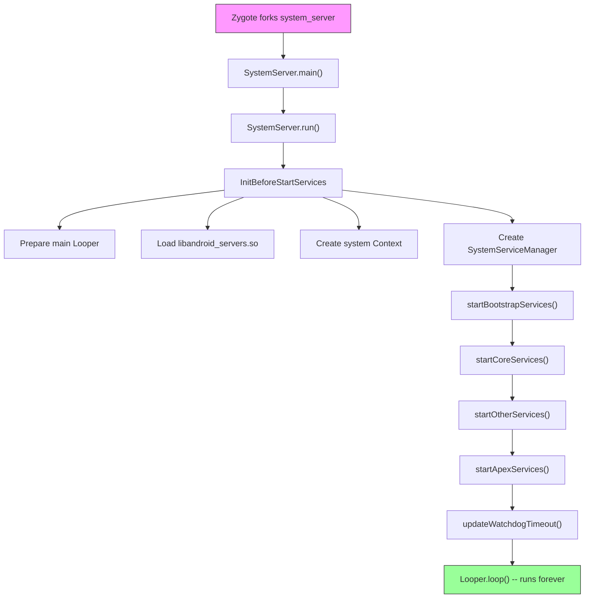

---

## 20.2 Service Lifecycle

### 20.2.1 The SystemService Base Class

Every service running inside `system_server` extends the abstract
`SystemService` class, defined in:

```
frameworks/base/services/core/java/com/android/server/SystemService.java
```

The class is annotated `@SystemApi(client = Client.SYSTEM_SERVER)`, making
it a stable API surface for system server modules. Its core structure is
straightforward (lines 72, 337-360):

```java
// frameworks/base/services/core/java/com/android/server/SystemService.java, line 72
@SystemApi(client = Client.SYSTEM_SERVER)
public abstract class SystemService {

    private final Context mContext;
    private final List<Class<?>> mDependencies;

    // line 337
    public SystemService(@NonNull Context context) {
        this(context, Collections.emptyList());
    }

    // line 357
    public SystemService(@NonNull Context context,
                         @NonNull List<Class<?>> dependencies) {
        mContext = context;
        mDependencies = Objects.requireNonNull(dependencies);
    }
```

The `dependencies` list is used by the Ravenwood deviceless testing
environment to understand transitive dependencies needed to support a
specific test. In production, most services pass an empty list.

### 20.2.2 Lifecycle Callbacks

`SystemService` defines the following lifecycle callbacks:

| Callback | When called | Purpose |
|----------|-------------|---------|
| `onStart()` | Service creation | Publish binder interfaces via `publishBinderService()` |
| `onBootPhase(int)` | Each boot phase | React to system readiness milestones |
| `onUserStarting(TargetUser)` | User starts | Initialize per-user state |
| `onUserUnlocking(TargetUser)` | User unlocking | Access credential-encrypted storage |
| `onUserUnlocked(TargetUser)` | User unlocked | Post-unlock initialization |
| `onUserSwitching(from, to)` | User switch | Transfer foreground user state |
| `onUserStopping(TargetUser)` | User stopping | Last chance for CE storage access |
| `onUserStopped(TargetUser)` | User stopped | Final cleanup after process teardown |
| `onUserCompletedEvent(TargetUser, type)` | After user events complete | Deferred non-urgent processing |

The `onStart()` method is the only abstract method (line 412):

```java
// frameworks/base/services/core/java/com/android/server/SystemService.java, line 412
public abstract void onStart();
```

All other callbacks have empty default implementations, allowing services to
override only what they need.

**Important note from the source** (line 65-66):

> NOTE: All lifecycle methods are called from the system server's main
> looper thread.

This means lifecycle callbacks must not block. Long-running initialization
must be dispatched to background threads.

### 20.2.3 Publishing Services

`SystemService` provides three mechanisms for publishing interfaces:

**1. Binder service** -- accessible by other processes via `ServiceManager`
(line 578-608):

```java
// frameworks/base/services/core/java/com/android/server/SystemService.java, line 578
protected final void publishBinderService(@NonNull String name,
        @NonNull IBinder service) {
    publishBinderService(name, service, false);
}

// line 606
protected final void publishBinderService(String name, IBinder service,
        boolean allowIsolated, int dumpPriority) {
    ServiceManager.addService(name, service, allowIsolated, dumpPriority);
}
```

**2. Local service** -- accessible only within `system_server` via
`LocalServices` (line 625-627):

```java
// frameworks/base/services/core/java/com/android/server/SystemService.java, line 625
protected final <T> void publishLocalService(Class<T> type, T service) {
    LocalServices.addService(type, service);
}
```

Local services avoid Binder IPC overhead for intra-process communication.
Many services publish both a Binder interface (for apps) and a local
interface (for other system services).

**3. Direct registration** -- some services bypass `SystemService` and
register directly with `ServiceManager.addService()`. This older pattern
is still used by services that predate the `SystemService` framework.

### 20.2.4 Boot Phases

Boot phases allow services to synchronize their initialization with the
overall system readiness. Each phase is a numeric constant, and services
receive them in ascending order. The phases defined in `SystemService.java`
(lines 80-124):

| Phase | Value | Constant | Meaning |
|-------|-------|----------|---------|
| Wait for default display | 100 | `PHASE_WAIT_FOR_DEFAULT_DISPLAY` | Display manager has provided the default display |
| Wait for sensor service | 200 | `PHASE_WAIT_FOR_SENSOR_SERVICE` | SensorService is available (hidden, internal) |
| Lock settings ready | 480 | `PHASE_LOCK_SETTINGS_READY` | Lock settings data can be obtained |
| System services ready | 500 | `PHASE_SYSTEM_SERVICES_READY` | Core services like PowerManager and PackageManager are safe to call |
| Device-specific services ready | 520 | `PHASE_DEVICE_SPECIFIC_SERVICES_READY` | OEM/device-specific services are available |
| Activity manager ready | 550 | `PHASE_ACTIVITY_MANAGER_READY` | Services can broadcast Intents |
| Third-party apps can start | 600 | `PHASE_THIRD_PARTY_APPS_CAN_START` | Apps can make Binder calls into services |
| Boot completed | 1000 | `PHASE_BOOT_COMPLETED` | Boot is complete, home app has started |

The `SystemServiceManager` dispatches phases to all registered services:

```java
// SystemServiceManager iterates all services:
// for each service: service.onBootPhase(phase)
```

```mermaid
graph LR
    A["PHASE_WAIT_FOR_DEFAULT_DISPLAY<br/>100"] --> B["PHASE_WAIT_FOR_SENSOR_SERVICE<br/>200"]
    B --> C["PHASE_LOCK_SETTINGS_READY<br/>480"]
    C --> D["PHASE_SYSTEM_SERVICES_READY<br/>500"]
    D --> E["PHASE_DEVICE_SPECIFIC_SERVICES_READY<br/>520"]
    E --> F["PHASE_ACTIVITY_MANAGER_READY<br/>550"]
    F --> G["PHASE_THIRD_PARTY_APPS_CAN_START<br/>600"]
    G --> H["PHASE_BOOT_COMPLETED<br/>1000"]

    style A fill:#fdd,stroke:#333
    style D fill:#ffd,stroke:#333
    style H fill:#dfd,stroke:#333
```

The boot phases form a contract: a service that needs to call
`PowerManager` should wait until `PHASE_SYSTEM_SERVICES_READY` (500),
while a service that needs to start third-party app components should wait
until `PHASE_THIRD_PARTY_APPS_CAN_START` (600).

### 20.2.5 TargetUser and User Lifecycle

The `TargetUser` inner class (lines 147-246) wraps user information for
lifecycle callbacks:

```java
// frameworks/base/services/core/java/com/android/server/SystemService.java, line 147
public static final class TargetUser {
    private final @UserIdInt int mUserId;
    private final boolean mFull;
    private final boolean mProfile;
    private final String mUserType;
    private final boolean mPreCreated;
    // ...
}
```

Services can override `isUserSupported(TargetUser)` (line 428) to opt out of
lifecycle callbacks for specific user types. For example, a service that
only works for full users (not profiles) can return `false` for profile
users, avoiding unnecessary per-user initialization.

The `UserCompletedEventType` (lines 254-326) allows batched notification
of completed user events. This is a performance optimization -- services
that need to react to multiple user events can handle them together in
`onUserCompletedEvent()` rather than individually.

### 20.2.6 The SystemServiceManager

The `SystemServiceManager` (defined in `SystemServiceManager.java`,
lines 75-138) is the orchestrator:

```java
// frameworks/base/services/core/java/com/android/server/SystemServiceManager.java, line 75
public final class SystemServiceManager implements Dumpable {
    private List<SystemService> mServices;
    private Set<String> mServiceClassnames;
    private int mCurrentPhase = -1;
    // ...
}
```

It provides several `startService()` variants:

1. **By class** -- `startService(Class<T>)` -- for services in `services.jar`
2. **By class name** -- `startService(String)` -- for services on the system
   server classpath but not in `services.jar`
3. **From JAR** -- `startServiceFromJar(String, String)` -- for services in
   standalone APEX JARs (like WiFi, Bluetooth, Connectivity)

The JAR-based loading (line 167-173) uses `PathClassLoader`:

```java
// frameworks/base/services/core/java/com/android/server/SystemServiceManager.java, line 167
public SystemService startServiceFromJar(String className, String path) {
    PathClassLoader pathClassLoader =
            SystemServerClassLoaderFactory.getOrCreateClassLoader(
                    path, this.getClass().getClassLoader(), isJarInTestApex(path));
    final Class<SystemService> serviceClass =
            loadClassFromLoader(className, pathClassLoader);
    return startService(serviceClass);
}
```

This modular loading allows mainline modules (WiFi, Bluetooth, Connectivity,
UWB) to deliver their system services via APEXes rather than being compiled
into the platform monolith.

---

## 20.3 Key Services Catalog

### 20.3.1 Bootstrap Services

Bootstrap services form the critical dependency chain. They have circular
dependencies that prevent simple sequential initialization, which is why
they are started in a special `startBootstrapServices()` method. Listed in
start order from `SystemServer.java`:

| # | Service | Class | Purpose |
|---|---------|-------|---------|
| 1 | Watchdog | `Watchdog` | Deadlock detection (started first) |
| 2 | PlatformCompat | `PlatformCompat` | App compatibility framework |
| 3 | FileIntegrityService | `FileIntegrityService` | fs-verity support |
| 4 | Installer | `Installer` | Package installation daemon interface |
| 5 | DeviceIdentifiersPolicyService | `DeviceIdentifiersPolicyService` | Device ID access policy |
| 6 | FeatureFlagsService | `FeatureFlagsService` | Runtime flag overrides |
| 7 | UriGrantsManagerService | `UriGrantsManagerService.Lifecycle` | Content URI permission grants |
| 8 | PowerStatsService | `PowerStatsService` | Rail power data tracking |
| 9 | AccessCheckingService | `AccessCheckingService` | Permissions and app-ops |
| 10 | **ActivityTaskManagerService** | `ActivityTaskManagerService.Lifecycle` | Activity/task management |
| 11 | **ActivityManagerService** | `ActivityManagerService.Lifecycle` | Process lifecycle management |
| 12 | DataLoaderManagerService | `DataLoaderManagerService` | Incremental data loading |
| 13 | **PowerManagerService** | `PowerManagerService` | Power state management |
| 14 | ThermalManagerService | `ThermalManagerService` | Thermal throttling |
| 15 | RecoverySystemService | `RecoverySystemService.Lifecycle` | OTA and recovery |
| 16 | LightsService | `LightsService` | LED and backlight control |
| 17 | **DisplayManagerService** | `DisplayManagerService` | Display management |
| 18 | DomainVerificationService | `DomainVerificationService` | App link verification |
| 19 | **PackageManagerService** | `PackageManagerService` | Package/APK management |
| 20 | UserManagerService | `UserManagerService.LifeCycle` | Multi-user management |
| 21 | OverlayManagerService | `OverlayManagerService` | Runtime resource overlays |
| 22 | ResourcesManagerService | `ResourcesManagerService` | Resource package management |
| 23 | SensorPrivacyService | `SensorPrivacyService` | Camera/mic privacy toggles |
| 24 | SensorService | `SensorService` | Sensor HAL interface |

### 20.3.2 Core Services

Core services are not entangled in the bootstrap dependency web but are
still essential. From `startCoreServices()`:

| # | Service | Class | Purpose |
|---|---------|-------|---------|
| 1 | SystemConfigService | `SystemConfigService` | System configuration |
| 2 | BatteryService | `BatteryService` | Battery level tracking |
| 3 | UsageStatsService | `UsageStatsService` | App usage statistics |
| 4 | WebViewUpdateService | `WebViewUpdateService` | WebView provider management |
| 5 | CachedDeviceStateService | `CachedDeviceStateService` | Device state caching |
| 6 | BinderCallsStatsService | `BinderCallsStatsService.LifeCycle` | Binder call metrics |
| 7 | LooperStatsService | `LooperStatsService.Lifecycle` | Handler message timing |
| 8 | RollbackManagerService | `RollbackManagerService` | APK rollback management |
| 9 | NativeTombstoneManagerService | `NativeTombstoneManagerService` | Native crash tracking |
| 10 | BugreportManagerService | `BugreportManagerService` | Bugreport capture |
| 11 | GpuService | `GpuService` | GPU driver management |
| 12 | RemoteProvisioningService | `RemoteProvisioningService` | Remote key provisioning |

### 20.3.3 Other Services (Major Subset)

The `startOtherServices()` method is the largest -- it starts the bulk of
the system services. Here is a comprehensive catalog organized by functional
area:

#### Security and Credentials

| Service | Class | Source Package | Purpose |
|---------|-------|---------------|---------|
| KeyChainSystemService | `KeyChainSystemService` | `security/` | Certificate management |
| KeyAttestationApplicationIdProvider | Direct registration | `security/` | Key attestation IDs |
| LockSettingsService | `LockSettingsService.Lifecycle` | `locksettings/` | Screen lock and encryption |
| PersistentDataBlockService | `PersistentDataBlockService` | `pdb/` | Factory reset protection |
| OemLockService | `OemLockService` | `oemlock/` | Bootloader lock state |
| TrustManagerService | `TrustManagerService` | `trust/` | Trust agents (Smart Lock) |
| BiometricService | `BiometricService` | `biometrics/` | Biometric coordination |
| AuthService | `AuthService` | `biometrics/` | Authentication routing |
| FaceService | `FaceService` | `biometrics/sensors/face/` | Face unlock |
| FingerprintService | `FingerprintService` | `biometrics/sensors/fingerprint/` | Fingerprint unlock |
| AttestationVerificationService | `AttestationVerificationManagerService` | `security/` | Attestation verification |
| AdvancedProtectionService | `AdvancedProtectionService.Lifecycle` | `security/advancedprotection/` | Advanced protection mode |
| CredentialManagerService | `CredentialManagerService` | `credentials/` | Credential management |

#### Window, Display, and Input

| Service | Class | Source Package | Purpose |
|---------|-------|---------------|---------|
| **WindowManagerService** | `WindowManagerService` | `wm/` | Window management and composition |
| **InputManagerService** | `InputManagerService.Lifecycle` | `input/` | Input event routing |
| InputMethodManagerService | `InputMethodManagerService.Lifecycle` | `inputmethod/` | Soft keyboard management |
| AccessibilityManagerService | `AccessibilityManagerService.Lifecycle` | `accessibility/` | Accessibility features |
| DeviceStateManagerService | `DeviceStateManagerService` | `devicestate/` | Foldable/posture states |
| ColorDisplayService | `ColorDisplayService` | `display/color/` | Night light, color correction |
| UiModeManagerService | `UiModeManagerService` | core | Car/TV/watch mode detection |

#### Networking

| Service | Class | Source Package | Purpose |
|---------|-------|---------------|---------|
| NetworkManagementService | `NetworkManagementService` | `net/` | Network interface management |
| NetworkPolicyManagerService | `NetworkPolicyManagerService` | `net/` | Data usage policies |
| ConnectivityService | Loaded from APEX JAR | connectivity module | Network connectivity |
| VpnManagerService | `VpnManagerService` | core | VPN management |
| WiFiService | Loaded from APEX JAR | WiFi module | WiFi management |
| WiFiScanningService | Loaded from APEX JAR | WiFi module | WiFi scanning |
| WiFiAwareService | Loaded from APEX JAR | WiFi module | WiFi Aware (NAN) |
| WiFiP2pService | Loaded from APEX JAR | WiFi module | WiFi Direct |
| BluetoothService | Loaded from APEX JAR | Bluetooth module | Bluetooth management |
| NetworkStatsService | Loaded from APEX JAR | connectivity module | Network statistics |

#### Storage and Package Management

| Service | Class | Source Package | Purpose |
|---------|-------|---------------|---------|
| StorageManagerService | `StorageManagerService.Lifecycle` | core | Volume and storage management |
| StorageStatsService | `StorageStatsService.Lifecycle` | `usage/` | Storage usage statistics |
| DeviceStorageMonitorService | `DeviceStorageMonitorService` | `storage/` | Low storage warnings |
| BackupManagerService | `BackupManagerService.Lifecycle` | `backup/` | App backup and restore |
| BlobStoreManagerService | `BlobStoreManagerService` | `blob/` | Shared binary large objects |

#### Power and Thermal

| Service | Class | Source Package | Purpose |
|---------|-------|---------------|---------|
| HintManagerService | `HintManagerService` | `power/hint/` | Performance hints to HAL |
| DeviceIdleController | `DeviceIdleController` | core | Doze mode management |
| DreamManagerService | `DreamManagerService` | `dreams/` | Screen savers and doze UI |
| TwilightService | `TwilightService` | `twilight/` | Sunrise/sunset tracking |

#### Audio, Media, and Camera

| Service | Class | Source Package | Purpose |
|---------|-------|---------------|---------|
| **AudioService** | `AudioService.Lifecycle` | `audio/` | Audio routing and volume |
| SoundTriggerMiddlewareService | `SoundTriggerMiddlewareService.Lifecycle` | `soundtrigger_middleware/` | "Hey Google" detection |
| SoundTriggerService | `SoundTriggerService` | `soundtrigger/` | Sound trigger management |
| MediaSessionService | `MediaSessionService` | `media/` | Media playback control |
| MediaRouterService | `MediaRouterService` | `media/` | Media output routing |
| MediaProjectionManagerService | `MediaProjectionManagerService` | `media/projection/` | Screen recording/casting |
| MediaResourceMonitorService | `MediaResourceMonitorService` | `media/` | Media resource tracking |
| MediaMetricsManagerService | `MediaMetricsManagerService` | `media/metrics/` | Media performance metrics |
| CameraServiceProxy | `CameraServiceProxy` | `camera/` | Camera service coordination |
| BroadcastRadioService | `BroadcastRadioService` | `broadcastradio/` | AM/FM radio |

#### Notifications and Status

| Service | Class | Source Package | Purpose |
|---------|-------|---------------|---------|
| **NotificationManagerService** | `NotificationManagerService` | `notification/` | Notification management |
| StatusBarManagerService | `StatusBarManagerService` | `statusbar/` | Status bar control |

#### Location, Time, and Sensors

| Service | Class | Source Package | Purpose |
|---------|-------|---------------|---------|
| LocationManagerService | `LocationManagerService.Lifecycle` | `location/` | Location providers |
| TimeDetectorService | `TimeDetectorService.Lifecycle` | `timedetector/` | Automatic time setting |
| TimeZoneDetectorService | `TimeZoneDetectorService.Lifecycle` | `timezonedetector/` | Time zone detection |
| LocationTimeZoneManagerService | `LocationTimeZoneManagerService.Lifecycle` | `timezonedetector/location/` | Location-based TZ |
| NetworkTimeUpdateService | `NetworkTimeUpdateService` | `timedetector/` | NTP time sync |
| GnssTimeUpdateService | `GnssTimeUpdateService.Lifecycle` | `timedetector/` | GPS time sync |
| CountryDetectorService | `CountryDetectorService` | core | Country detection |
| AltitudeService | `AltitudeService.Lifecycle` | `location/altitude/` | Altitude data |
| SensorNotificationService | `SensorNotificationService` | core | Sensor event notifications |

#### App Management

| Service | Class | Source Package | Purpose |
|---------|-------|---------------|---------|
| DevicePolicyManagerService | `DevicePolicyManagerService.Lifecycle` | `devicepolicy/` | Enterprise device management |
| ShortcutService | `ShortcutService.Lifecycle` | `pm/` | App shortcuts |
| LauncherAppsService | `LauncherAppsService` | `pm/` | Launcher-app interaction |
| CrossProfileAppsService | `CrossProfileAppsService` | `pm/` | Cross-profile app launching |
| AppHibernationService | `AppHibernationService` | `apphibernation/` | Unused app hibernation |
| AppBindingService | `AppBindingService.Lifecycle` | `appbinding/` | System app binding |
| BackgroundInstallControlService | `BackgroundInstallControlService` | `pm/` | Background install control |
| GameManagerService | `GameManagerService.Lifecycle` | `app/` | Game mode management |

#### Communication

| Service | Class | Source Package | Purpose |
|---------|-------|---------------|---------|
| TelecomLoaderService | `TelecomLoaderService` | `telecom/` | Telecom service loading |
| TelephonyRegistry | `TelephonyRegistry` | core | Telephony event broadcasting |
| MmsServiceBroker | `MmsServiceBroker` | core | MMS service coordination |
| ClipboardService | `ClipboardService` | `clipboard/` | System clipboard |

#### Jobs and Scheduling

| Service | Class | Source Package | Purpose |
|---------|-------|---------------|---------|
| **AlarmManagerService** | `AlarmManagerService` | `alarm/` | Alarm scheduling |
| **JobSchedulerService** | `JobSchedulerService` | `job/` | Deferred job scheduling |

#### Content and Search

| Service | Class | Source Package | Purpose |
|---------|-------|---------------|---------|
| AccountManagerService | `AccountManagerService.Lifecycle` | `accounts/` | Account management |
| ContentService | `ContentService.Lifecycle` | `content/` | Content provider sync |
| SearchManagerService | `SearchManagerService.Lifecycle` | `search/` | System search |
| ContentCaptureManagerService | `ContentCaptureManagerService` | `contentcapture/` | Content capture for intelligence |
| AppSearchModule | Loaded from APEX | AppSearch module | On-device search indexing |

#### TV and HDMI

| Service | Class | Source Package | Purpose |
|---------|-------|---------------|---------|
| HdmiControlService | `HdmiControlService` | `hdmi/` | HDMI-CEC control |
| TvInputManagerService | `TvInputManagerService` | `tv/` | TV input framework |
| TvInteractiveAppManagerService | `TvInteractiveAppManagerService` | `tv/interactive/` | Interactive TV apps |
| TunerResourceManagerService | `TunerResourceManagerService` | `tv/tunerresourcemanager/` | TV tuner resources |

#### Text and Localization

| Service | Class | Source Package | Purpose |
|---------|-------|---------------|---------|
| TextServicesManagerService | `TextServicesManagerService.Lifecycle` | `textservices/` | Spell checker |
| TextClassificationManagerService | `TextClassificationManagerService.Lifecycle` | `textclassifier/` | Smart text selection |
| FontManagerService | `FontManagerService.Lifecycle` | `graphics/fonts/` | System font management |
| LocaleManagerService | `LocaleManagerService` | `locales/` | Per-app locale |
| GrammaticalInflectionService | `GrammaticalInflectionService` | `grammaticalinflection/` | Grammatical gender |

#### Hardware and Peripherals

| Service | Class | Source Package | Purpose |
|---------|-------|---------------|---------|
| UsbService | `UsbService.Lifecycle` | `usb/` | USB host/device management |
| SerialManagerService | `SerialManagerService.Lifecycle` | `serial/` | Serial port management |
| HardwarePropertiesManagerService | `HardwarePropertiesManagerService` | core | CPU/GPU temperatures |
| ConsumerIrService | `ConsumerIrService` | core | IR blaster |
| VibratorManagerService | `VibratorManagerService.Lifecycle` | `vibrator/` | Haptic feedback |
| DockObserver | `DockObserver` | core | Dock state detection |
| WiredAccessoryManager | `WiredAccessoryManager` | core | Wired headset detection |
| MidiService | `MidiService.Lifecycle` | `midi/` | MIDI device management |

#### AI and Intelligence

| Service | Class | Source Package | Purpose |
|---------|-------|---------------|---------|
| VoiceInteractionManagerService | `VoiceInteractionManagerService` | `voiceinteraction/` | Voice assistant |
| SpeechRecognitionManagerService | `SpeechRecognitionManagerService` | `speech/` | Speech recognition |
| AppPredictionManagerService | `AppPredictionManagerService` | `appprediction/` | App usage prediction |
| SmartspaceManagerService | `SmartspaceManagerService` | `smartspace/` | At-a-glance widgets |
| AttentionManagerService | `AttentionManagerService` | `attention/` | User attention detection |
| RotationResolverManagerService | `RotationResolverManagerService` | `rotationresolver/` | Rotation based on face |
| AmbientContextManagerService | `AmbientContextManagerService` | `ambientcontext/` | Ambient context detection |
| WearableSensingManagerService | `WearableSensingManagerService` | `wearable/` | Wearable sensor processing |
| OnDeviceIntelligenceManagerService | Loaded from APEX | On-device intelligence | On-device AI services |

#### System Infrastructure

| Service | Class | Source Package | Purpose |
|---------|-------|---------------|---------|
| DropBoxManagerService | `DropBoxManagerService` | core | Error/diagnostic log storage |
| IncidentCompanionService | `IncidentCompanionService` | `incident/` | Incident reporting |
| StatsCompanion | Loaded from APEX | statsd module | Metrics collection helper |
| StatsPullAtomService | `StatsPullAtomService` | `stats/` | Pull-based metrics atoms |
| BinaryTransparencyService | `BinaryTransparencyService` | core | Binary integrity verification |
| PinnerService | `PinnerService` | `pinner/` | Pin critical files in RAM |
| TracingServiceProxy | `TracingServiceProxy` | `tracing/` | Perfetto trace coordination |
| LogcatManagerService | `LogcatManagerService` | `logcat/` | Logcat access management |
| CoverageService | `CoverageService` | `coverage/` | Code coverage (debug builds) |
| GraphicsStatsService | `GraphicsStatsService` | graphics | Frame timing statistics |

### 20.3.4 Mainline Module Services (APEX-delivered)

Several services are delivered through mainline module APEXes and loaded from
standalone JAR files:

| Module | JAR Path | Service Classes |
|--------|----------|-----------------|
| WiFi | `/apex/com.android.wifi/javalib/service-wifi.jar` | WifiService, WifiScanningService, WifiRttService, WifiAwareService, WifiP2pService |
| Bluetooth | `/apex/com.android.bt/javalib/service-bluetooth.jar` | BluetoothService |
| Connectivity | `/apex/com.android.tethering/javalib/service-connectivity.jar` | ConnectivityServiceInitializer, NetworkStatsServiceInitializer |
| UWB | `/apex/com.android.uwb/javalib/service-uwb.jar` | UwbService |
| Statsd | `/apex/com.android.os.statsd/javalib/service-statsd.jar` | StatsCompanion.Lifecycle |
| Scheduling | `/apex/com.android.scheduling/javalib/service-scheduling.jar` | RebootReadinessManagerService |
| Profiling | `/apex/com.android.profiling/javalib/service-profiling.jar` | ProfilingService.Lifecycle |
| DeviceLock | `/apex/com.android.devicelock/javalib/service-devicelock.jar` | DeviceLockService |

### 20.3.5 Core Server Package Structure

The `frameworks/base/services/core/java/com/android/server/` directory
contains 102 sub-packages and 74 top-level Java files. Here is the complete
sub-package listing organized by functional domain:

#### Process and Activity Management
- `am/` -- ActivityManagerService, process management, broadcast dispatch
- `wm/` -- WindowManagerService, ActivityTaskManagerService, window policy
- `app/` -- GameManagerService
- `appbinding/` -- AppBindingService
- `apphibernation/` -- AppHibernationService
- `appop/` -- AppOpsService (app operation permissions)
- `appwindowlayout/` -- AppWindowLayoutSettingsService

#### Package Management
- `pm/` -- PackageManagerService, UserManagerService, Installer
- `integrity/` -- AppIntegrityManagerService
- `rollback/` -- RollbackManagerService

#### Security
- `biometrics/` -- BiometricService, FaceService, FingerprintService
- `locksettings/` -- LockSettingsService
- `permission/` -- AccessCheckingService, permission grants
- `security/` -- KeyChain, attestation, advanced protection
- `trust/` -- TrustManagerService
- `sensorprivacy/` -- SensorPrivacyService
- `selinux/` -- SELinux audit logging

#### Display and Graphics
- `display/` -- DisplayManagerService, ColorDisplayService
- `graphics/` -- FontManagerService
- `dreams/` -- DreamManagerService

#### Input and Accessibility
- `input/` -- InputManagerService
- `inputmethod/` -- InputMethodManagerService
- `accessibility/` -- AccessibilityManagerService

#### Networking
- `connectivity/` -- PacProxyService, IpConnectivityMetrics
- `net/` -- NetworkManagementService, NetworkPolicyManagerService
- `vcn/` -- VcnManagementService

#### Power and Thermal
- `power/` -- PowerManagerService, ShutdownThread, HintManagerService
- `powerstats/` -- PowerStatsService

#### Audio and Media
- `audio/` -- AudioService
- `media/` -- MediaSessionService, MediaRouterService, MediaProjection
- `soundtrigger/` -- SoundTriggerService
- `soundtrigger_middleware/` -- SoundTriggerMiddlewareService
- `broadcastradio/` -- BroadcastRadioService
- `camera/` -- CameraServiceProxy

#### Communication
- `telecom/` -- TelecomLoaderService
- `companion/` -- CompanionDeviceManagerService

#### Storage
- `storage/` -- DeviceStorageMonitorService
- `blob/` -- BlobStoreManagerService
- `pdb/` -- PersistentDataBlockService

#### Time and Location
- `timedetector/` -- TimeDetectorService, NetworkTimeUpdateService
- `timezonedetector/` -- TimeZoneDetectorService
- `timezone/` -- Time zone data management
- `location/` -- LocationManagerService
- `twilight/` -- TwilightService

#### Content
- `content/` -- ContentService
- `contentcapture/` -- ContentCaptureManagerService
- `search/` -- SearchManagerService
- `accounts/` -- AccountManagerService

#### Notifications and Status Bar
- `notification/` -- NotificationManagerService
- `statusbar/` -- StatusBarManagerService
- `slice/` -- SliceManagerService

#### Device Management
- `devicepolicy/` -- DevicePolicyManagerService
- `devicestate/` -- DeviceStateManagerService

#### System Services
- `flags/` -- FeatureFlagsService
- `compat/` -- PlatformCompat
- `crashrecovery/` -- CrashRecoveryAdaptor
- `criticalevents/` -- CriticalEventLog
- `cpu/` -- CpuMonitorService
- `gpu/` -- GpuService
- `incident/` -- IncidentCompanionService
- `stats/` -- StatsCompanion
- `tracing/` -- TracingServiceProxy
- `logcat/` -- LogcatManagerService
- `os/` -- BugreportManagerService, SchedulingPolicyService
- `recoverysystem/` -- RecoverySystemService
- `resources/` -- ResourcesManagerService
- `uri/` -- UriGrantsManagerService
- `utils/` -- Utility classes

#### Specialized
- `tv/` -- TvInputManagerService, TvRemoteService
- `hdmi/` -- HdmiControlService
- `vibrator/` -- VibratorManagerService
- `lights/` -- LightsService
- `usb/` -- (module-level, not in core)
- `vr/` -- VR mode support
- `om/` -- OverlayManagerService
- `wallpaper/` -- WallpaperManagerService
- `theming/` -- ThemeManagerService
- `webkit/` -- WebViewUpdateService
- `sensors/` -- SensorService
- `pinner/` -- PinnerService
- `clipboard/` -- ClipboardService
- `emergency/` -- EmergencyAffordanceService

#### Intelligence and ML
- `attention/` -- AttentionManagerService
- `ambientcontext/` -- AmbientContextManagerService
- `rotationresolver/` -- RotationResolverManagerService
- `speech/` -- SpeechRecognitionManagerService
- `textclassifier/` -- TextClassificationManagerService
- `textservices/` -- TextServicesManagerService

#### Miscellaneous
- `infra/` -- Infrastructure base classes
- `feature/` -- Feature detection
- `firewall/` -- Intent firewall
- `health/` -- Health HAL integration
- `locales/` -- LocaleManagerService
- `grammaticalinflection/` -- GrammaticalInflectionService
- `memory/` -- Memory management
- `privatecompute/` -- Private compute services
- `role/` -- Role management helpers
- `signedconfig/` -- Signed configuration
- `testharness/` -- Test harness mode
- `updates/` -- System update handling
- `wearable/` -- WearableSensingManagerService

---

## 20.4 Service Start Order

### 20.4.1 startBootstrapServices()

The bootstrap phase (line 1176-1451 of `SystemServer.java`) starts the
services that form the critical dependency chain. The exact order is
significant because of mutual dependencies:


Key dependency relationships in the bootstrap phase:

1. **Watchdog starts first** (line 1192-1196): It must be running before any
   service that might deadlock.
2. **Installer before PackageManager** (line 1228-1230): `installd` must
   create critical directories before PMS scans packages.
3. **AMS and ATMS together** (line 1274-1283): These two are tightly coupled
   -- ATMS manages activities/tasks while AMS manages processes.
4. **PowerManager early** (line 1296-1302): Many services need power management.
5. **DisplayManager before PMS** (line 1339-1341): Package manager needs
   display metrics for density-based resource selection.
6. **PHASE_WAIT_FOR_DEFAULT_DISPLAY** (line 1344-1346): All services needing
   display information wait here.
7. **PackageManager pauses Watchdog** (line 1364-1370): PMS initialization is
   so slow that the Watchdog is explicitly paused.

### 20.4.2 startCoreServices()

Core services (line 1457-1533) are simpler -- no circular dependencies:

```
startCoreServices()
  +-- SystemConfigService
  +-- BatteryService
  +-- UsageStatsService
  +-- WebViewUpdateService (if FEATURE_WEBVIEW)
  +-- CachedDeviceStateService
  +-- BinderCallsStatsService
  +-- LooperStatsService
  +-- RollbackManagerService
  +-- NativeTombstoneManagerService
  +-- BugreportManagerService
  +-- GpuService
  +-- RemoteProvisioningService
  +-- CpuMonitorService (debug builds only)
```

### 20.4.3 startOtherServices()

The `startOtherServices()` method (line 1539-3600+) is by far the longest.
It contains conditional service starts based on device features, form
factor (phone/watch/TV/auto), and feature flags. The high-level flow:

```
startOtherServices()
  |
  +-- Pre-WMS services
  |     +-- KeyChainSystemService
  |     +-- BinaryTransparencyService
  |     +-- SchedulingPolicyService
  |     +-- TelecomLoaderService
  |     +-- TelephonyRegistry
  |     +-- AccountManagerService
  |     +-- ContentService
  |     +-- System providers installation
  |     +-- DropBoxManagerService
  |     +-- HintManagerService
  |     +-- RoleManagerService
  |     +-- VibratorManagerService
  |     +-- AlarmManagerService
  |     +-- InputManagerService
  |     +-- DeviceStateManagerService
  |     +-- CameraServiceProxy
  |
  +-- WindowManagerService startup
  |     +-- PHASE_WAIT_FOR_SENSOR_SERVICE (200)
  |     +-- WindowManagerService.main()
  |     +-- AMS.setWindowManager()
  |     +-- WMS.onInitReady()
  |     +-- BluetoothService
  |
  +-- Post-WMS services
  |     +-- InputMethodManagerService
  |     +-- AccessibilityManagerService
  |     +-- StorageManagerService
  |     +-- UiModeManagerService
  |     +-- LockSettingsService
  |     +-- DevicePolicyManagerService
  |     +-- StatusBarManagerService
  |     +-- NetworkManagementService
  |     +-- NetworkPolicyManagerService
  |     +-- WiFi services (from APEX)
  |     +-- ConnectivityService (from APEX)
  |     +-- NotificationManagerService
  |     +-- LocationManagerService
  |     +-- AudioService
  |     +-- JobSchedulerService
  |     +-- BackupManagerService
  |     +-- Biometric services
  |     +-- ShortcutService
  |     +-- LauncherAppsService
  |     +-- MediaProjectionManagerService
  |     +-- SliceManagerService
  |     +-- StatsCompanion (from APEX)
  |     +-- AutofillManagerService
  |     +-- ClipboardService
  |     +-- TracingServiceProxy
  |
  +-- Boot phase transitions
  |     +-- PHASE_LOCK_SETTINGS_READY (480)
  |     +-- PHASE_SYSTEM_SERVICES_READY (500)
  |     +-- Device-specific services
  |     +-- PHASE_DEVICE_SPECIFIC_SERVICES_READY (520)
  |     +-- SafetyCenterService
  |     +-- AppSearchModule
  |     +-- HealthConnectManagerService
  |
  +-- AMS.systemReady() callback
        +-- PHASE_ACTIVITY_MANAGER_READY (550)
        +-- CarServiceHelperService (automotive)
        +-- Networking systemReady calls
        +-- PHASE_THIRD_PARTY_APPS_CAN_START (600)
        +-- Start SystemUI
        +-- PHASE_BOOT_COMPLETED (1000)
```

### 20.4.4 The Boot Phase Sequence in Context

Here is how boot phases interleave with service starts. Each vertical
position represents a moment in time:

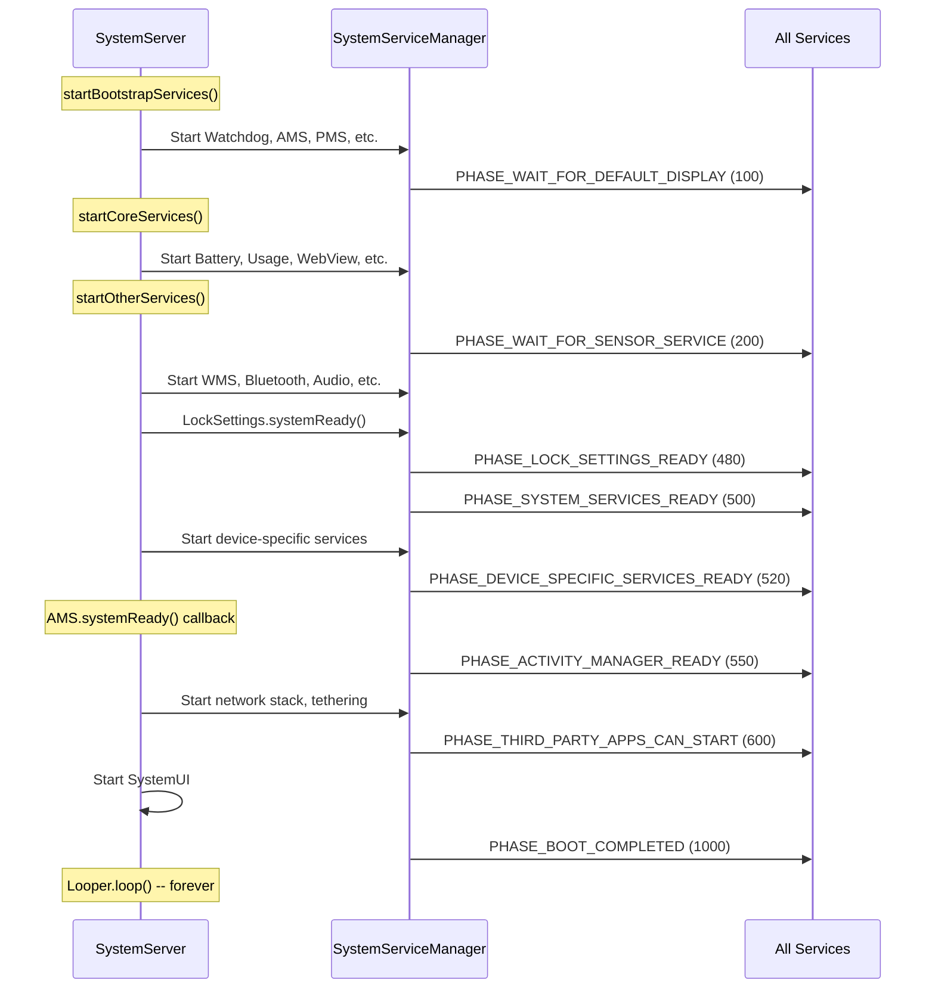

### 20.4.5 Conditional Service Starts

Many services are started only when specific hardware features are present.
`SystemServer` checks `PackageManager.hasSystemFeature()` before starting:

| Feature Flag | Services Gated |
|-------------|----------------|
| `FEATURE_BLUETOOTH` | BluetoothService |
| `FEATURE_WIFI` | WiFi*, WifiScanning |
| `FEATURE_WIFI_RTT` | WifiRttService |
| `FEATURE_WIFI_AWARE` | WifiAwareService |
| `FEATURE_WIFI_DIRECT` | WifiP2pService |
| `FEATURE_USB_HOST` or `FEATURE_USB_ACCESSORY` | UsbService |
| `FEATURE_FINGERPRINT` | FingerprintService |
| `FEATURE_FACE` | FaceService |
| `FEATURE_IRIS` | IrisService |
| `FEATURE_COMPANION_DEVICE_SETUP` | CompanionDeviceManagerService |
| `FEATURE_HDMI_CEC` | HdmiControlService |
| `FEATURE_LIVE_TV` | TvInputManagerService, TvInteractiveAppManagerService |
| `FEATURE_PRINTING` | PrintManagerService |
| `FEATURE_BACKUP` | BackupManagerService |
| `FEATURE_APP_WIDGETS` | AppWidgetService |
| `FEATURE_MIDI` | MidiService |
| `FEATURE_TELEPHONY` | TelecomLoaderService, MmsServiceBroker |
| `FEATURE_AUTOFILL` | AutofillManagerService |
| `FEATURE_CREDENTIALS` | CredentialManagerService |
| `FEATURE_CONTEXT_HUB` | ContextHubSystemService |
| `FEATURE_UWB` | UwbService |
| `FEATURE_CONSUMER_IR` | ConsumerIrService |
| `FEATURE_BROADCAST_RADIO` | BroadcastRadioService |
| `FEATURE_PICTURE_IN_PICTURE` | MediaResourceMonitorService |
| `FEATURE_TUNER` | TunerResourceManagerService |

Form factor checks also gate services:

| Form Factor | Boolean Variable | Example Services Affected |
|-------------|-----------------|--------------------------|
| Watch | `isWatch` | Many services skipped (Search, Twilight, etc.) |
| TV | `isTv` | TvRemoteService enabled; VibratorManager skipped |
| Automotive | `isAutomotive` | CarServiceHelperService enabled |
| ARC (ChromeOS) | `isArc` | ArcSystemHealthService, special AudioService |

---

## 20.5 Watchdog

### 20.5.1 Purpose and Architecture

The Watchdog (defined in `Watchdog.java`) is a critical safety mechanism that
detects when `system_server` threads become unresponsive. If a monitored thread
fails to respond within the timeout period (default: 60 seconds), the Watchdog
kills `system_server`, triggering a runtime restart. This is preferable to
leaving the device in an unresponsive state.

From the class documentation (line 84-86):

```java
// frameworks/base/services/core/java/com/android/server/Watchdog.java, line 84
/**
 * This class calls its monitor every minute. Killing this process if they
 * don't return.
 **/
public class Watchdog implements Dumpable {
```

The Watchdog is a singleton (line 484-490):

```java
// frameworks/base/services/core/java/com/android/server/Watchdog.java, line 484
public static Watchdog getInstance() {
    if (sWatchdog == null) {
        sWatchdog = new Watchdog();
    }
    return sWatchdog;
}
```

### 20.5.2 Default Timeout

The default timeout is 60 seconds in production, or 10 seconds in debug
builds (line 101):

```java
// frameworks/base/services/core/java/com/android/server/Watchdog.java, line 101
private static final long DEFAULT_TIMEOUT = DB ? 10 * 1000 : 60 * 1000;
```

The pre-watchdog timeout ratio divides the full timeout into check intervals
(line 107):

```java
// frameworks/base/services/core/java/com/android/server/Watchdog.java, line 107
private static final int PRE_WATCHDOG_TIMEOUT_RATIO = 4;
```

This means with a 60-second timeout, the Watchdog checks every 15 seconds.
At the 15-second mark it enters `WAITED_UNTIL_PRE_WATCHDOG` state and
generates a non-fatal thread dump. At 60 seconds, it becomes `OVERDUE` and
kills the process.

### 20.5.3 Completion States

The Watchdog defines four states (lines 114-117):

```java
// frameworks/base/services/core/java/com/android/server/Watchdog.java, line 114
static final int COMPLETED = 0;
static final int WAITING = 1;
static final int WAITED_UNTIL_PRE_WATCHDOG = 2;
static final int OVERDUE = 3;
```

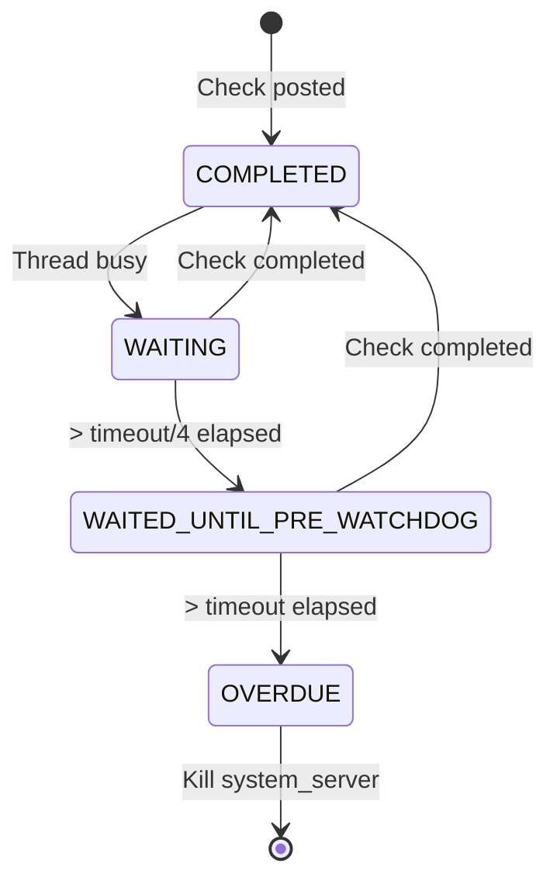

### 20.5.4 HandlerChecker

The core monitoring mechanism is the `HandlerChecker` inner class (line
263-436). Each `HandlerChecker` is associated with a Handler (and therefore
a specific thread's Looper):

```java
// frameworks/base/services/core/java/com/android/server/Watchdog.java, line 263
public static class HandlerChecker implements Runnable {
    private final Handler mHandler;
    private final String mName;
    private final ArrayList<Monitor> mMonitors = new ArrayList<Monitor>();
    private long mWaitMaxMillis;
    private boolean mCompleted;
    private Monitor mCurrentMonitor;
    private long mStartTimeMillis;
    private int mPauseCount;
```

The check mechanism works as follows:

1. The Watchdog thread calls `scheduleCheckLocked()` which posts the
   `HandlerChecker` (as a `Runnable`) to the front of the monitored
   thread's message queue.
2. When the monitored thread processes the message, `run()` executes
   all registered monitors and sets `mCompleted = true`.
3. If the monitored thread is blocked (deadlocked, or processing a very
   slow message), the `Runnable` never executes, and `mCompleted` remains
   `false`.

The `run()` method (lines 373-390):

```java
// frameworks/base/services/core/java/com/android/server/Watchdog.java, line 373
@Override
public void run() {
    final int size = mMonitors.size();
    for (int i = 0 ; i < size ; i++) {
        synchronized (mLock) {
            mCurrentMonitor = mMonitors.get(i);
        }
        mCurrentMonitor.monitor();
    }

    synchronized (mLock) {
        mCompleted = true;
        mCurrentMonitor = null;
    }
}
```

There is an important optimization (line 311-321): if the target looper
is currently polling (idle), the HandlerChecker skips posting. An idle
looper means the thread is not blocked -- no need to waste time with a
context switch.

### 20.5.5 Monitored Threads

The Watchdog constructor (line 492-549) registers checkers for all
critical system_server threads:

```java
// frameworks/base/services/core/java/com/android/server/Watchdog.java, line 492
private Watchdog() {
    mThread = new Thread(this::run, "watchdog");

    // Custom monitor checker thread
    ServiceThread t = new ServiceThread("watchdog.monitor",
            android.os.Process.THREAD_PRIORITY_DEFAULT, true);
    t.start();
    mMonitorChecker = new HandlerChecker(
            new Handler(t.getLooper()), "monitor thread", mLock);
    mHandlerCheckers.add(withDefaultTimeout(mMonitorChecker));

    // Foreground thread
    mHandlerCheckers.add(withDefaultTimeout(
        new HandlerChecker(FgThread.getHandler(),
                           "foreground thread", mLock)));
    // Main thread
    mHandlerCheckers.add(withDefaultTimeout(
        new HandlerChecker(new Handler(Looper.getMainLooper()),
                           "main thread", mLock)));
    // UI thread
    mHandlerCheckers.add(withDefaultTimeout(
        new HandlerChecker(UiThread.getHandler(),
                           "ui thread", mLock)));
    // I/O thread
    mHandlerCheckers.add(withDefaultTimeout(
        new HandlerChecker(IoThread.getHandler(),
                           "i/o thread", mLock)));
    // Display thread
    mHandlerCheckers.add(withDefaultTimeout(
        new HandlerChecker(DisplayThread.getHandler(),
                           "display thread", mLock)));
    // Animation thread
    mHandlerCheckers.add(withDefaultTimeout(
        new HandlerChecker(AnimationThread.getHandler(),
                           "animation thread", mLock)));
    // Surface animation thread
    mHandlerCheckers.add(withDefaultTimeout(
        new HandlerChecker(SurfaceAnimationThread.getHandler(),
                           "surface animation thread", mLock)));

    // Binder thread monitor
    addMonitor(new BinderThreadMonitor());
    mInterestingJavaPids.add(Process.myPid());
}
```

The eight monitored threads plus the monitor thread total nine checkers.

### 20.5.6 The Monitor Interface

Services that hold critical locks should implement `Watchdog.Monitor`
(line 460-462):

```java
// frameworks/base/services/core/java/com/android/server/Watchdog.java, line 460
public interface Monitor {
    void monitor();
}
```

The `monitor()` method should attempt to acquire the service's lock and
return. If the lock is held by a deadlocked thread, `monitor()` will block,
and the Watchdog will detect the deadlock.

The `BinderThreadMonitor` (line 453-458) checks that at least one Binder
thread is available:

```java
// frameworks/base/services/core/java/com/android/server/Watchdog.java, line 453
private static final class BinderThreadMonitor implements Watchdog.Monitor {
    @Override
    public void monitor() {
        Binder.blockUntilThreadAvailable();
    }
}
```

If all 31 Binder threads are blocked (e.g., in a deadlock chain), this
monitor will trigger the Watchdog.

### 20.5.7 The Watchdog Run Loop

The main Watchdog loop (line 858-900+) runs continuously:

```java
// frameworks/base/services/core/java/com/android/server/Watchdog.java, line 858
private void run() {
    boolean preWatchdogTriggered = false;
    // ...
    while (true) {
        // ...
        final long watchdogTimeoutMillis = mWatchdogTimeoutMillis;
        final long checkIntervalMillis =
                watchdogTimeoutMillis / PRE_WATCHDOG_TIMEOUT_RATIO;

        synchronized (mLock) {
            // Schedule checks on all handler checkers
            for (int i=0; i<mHandlerCheckers.size(); i++) {
                HandlerCheckerAndTimeout hc = mHandlerCheckers.get(i);
                hc.checker().scheduleCheckLocked(
                    hc.customTimeoutMillis()
                        .orElse(watchdogTimeoutMillis
                                * Build.HW_TIMEOUT_MULTIPLIER));
            }

            // Wait for check interval
            long start = SystemClock.uptimeMillis();
            while (timeout > 0) {
                // ...
                mLock.wait(timeout);
                // ...
            }

            // Evaluate results
            final int waitState = evaluateCheckerCompletionLocked();
            if (waitState == COMPLETED) {
                // everything is fine
                continue;
            } else if (waitState == WAITING) {
                continue;
            } else if (waitState == WAITED_UNTIL_PRE_WATCHDOG) {
                // pre-watchdog: dump but don't kill
            }
        }
        // If OVERDUE: collect stacks and kill
    }
}
```

### 20.5.8 What Happens When Watchdog Triggers

When the Watchdog detects an OVERDUE state:

1. **Stack trace collection**: Dumps stack traces of:
   - system_server (Java threads)
   - "Interesting" Java processes (StorageManager, phone process)
   - Native processes of interest (surfaceflinger, audioserver,
     cameraserver, mediaserver, etc.)
   - HAL services matching HIDL and AIDL interfaces of interest

2. **Dropbox entry**: Writes the collected data to DropBoxManager.

3. **Process kill**: Calls `Process.killProcess(Process.myPid())` to
   terminate system_server.

4. **Runtime restart**: The init process detects that system_server has
   died and triggers a full runtime restart (all Java processes are
   killed and respawned from Zygote).

The native processes of interest (line 126-149):

```java
// frameworks/base/services/core/java/com/android/server/Watchdog.java, line 126
public static final String[] NATIVE_STACKS_OF_INTEREST = new String[] {
    "/system/bin/audioserver",
    "/system/bin/cameraserver",
    "/system/bin/drmserver",
    "/system/bin/keystore2",
    "/system/bin/mediaserver",
    "/system/bin/netd",
    "/system/bin/servicemanager",
    "/system/bin/surfaceflinger",
    "/system/bin/vold",
    "media.extractor",
    "media.metrics",
    "media.codec",
    "media.swcodec",
    "media.transcoding",
    "com.android.bluetooth",
    "/apex/com.android.art/bin/artd",
    "/apex/com.android.os.statsd/bin/statsd",
    "/apex/com.android.virt/bin/virtualizationservice",
    // ...
};
```

### 20.5.9 Watchdog Pause Mechanism

For known long-running operations, the Watchdog provides pause/resume
APIs. For example, PackageManagerService initialization (line 1364-1370
in SystemServer.java):

```java
// frameworks/base/services/java/com/android/server/SystemServer.java, line 1364
try {
    Watchdog.getInstance().pauseWatchingCurrentThread("packagemanagermain");
    mPackageManagerService = PackageManagerService.main(
            mSystemContext, installer, domainVerificationService,
            mFactoryTestMode != FactoryTest.FACTORY_TEST_OFF);
} finally {
    Watchdog.getInstance().resumeWatchingCurrentThread("packagemanagermain");
}
```

Similarly, DEX optimization pauses the Watchdog (line 1972-1978):

```java
// frameworks/base/services/java/com/android/server/SystemServer.java, line 1972
try {
    Watchdog.getInstance().pauseWatchingCurrentThread("dexopt");
    mPackageManagerService.updatePackagesIfNeeded();
} catch (Throwable e) {
    reportWtf("update packages", e);
} finally {
    Watchdog.getInstance().resumeWatchingCurrentThread("dexopt");
}
```

The pause mechanism supports nesting -- each `pauseLocked()` increments
a counter, and each `resumeLocked()` decrements it. Monitoring only
resumes when the counter reaches zero.

### 20.5.10 Timeout History and Loop Breaking

The Watchdog tracks timeout history to detect crash loops (line 120-123):

```java
// frameworks/base/services/core/java/com/android/server/Watchdog.java, line 120
private static final String TIMEOUT_HISTORY_FILE =
        "/data/system/watchdog-timeout-history.txt";
private static final String PROP_FATAL_LOOP_COUNT =
        "framework_watchdog.fatal_count";
private static final String PROP_FATAL_LOOP_WINDOWS_SECS =
        "framework_watchdog.fatal_window.second";
```

If `system_server` repeatedly crashes due to Watchdog timeouts within a
configured window, the system can take more drastic recovery action
(such as entering recovery mode).

---

## 20.6 Threading Model

### 20.6.1 Overview

The `system_server` process uses a carefully designed threading model with
shared singleton threads for different priority levels. Rather than each
service creating its own thread, most services share a small set of
well-known threads. This reduces context switching, simplifies lock
ordering, and makes the system easier to reason about.

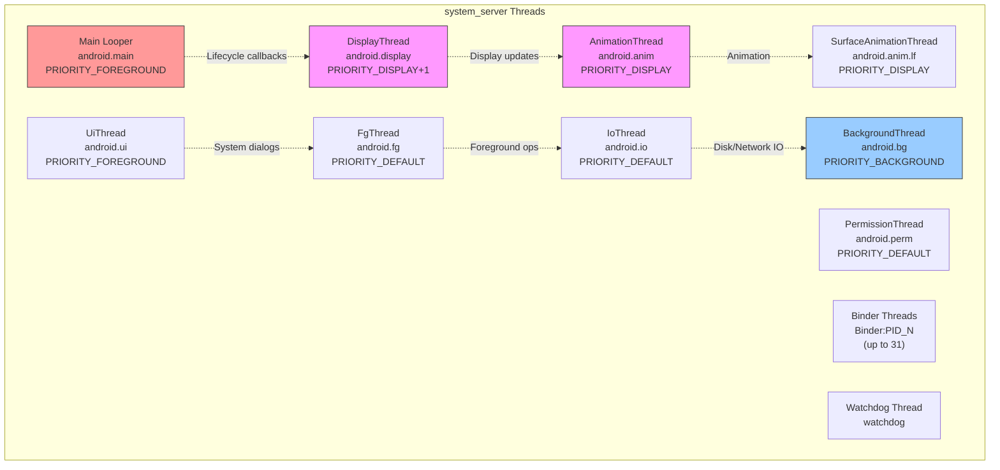

### 20.6.2 ServiceThread Base Class

All system server threads extend `ServiceThread` (defined in
`frameworks/base/core/java/com/android/server/ServiceThread.java`),
which itself extends `HandlerThread`:

```java
// frameworks/base/core/java/com/android/server/ServiceThread.java, line 30
public class ServiceThread extends HandlerThread {
    private final boolean mAllowIo;

    public ServiceThread(String name, int priority, boolean allowIo) {
        super(name, priority);
        mAllowIo = allowIo;
    }

    @Override
    public void run() {
        if (!mAllowIo) {
            StrictMode.initThreadDefaults(null);
        }
        super.run();
    }

    protected static Handler makeSharedHandler(Looper looper) {
        return new Handler(looper, null, false, /* shared= */ true);
    }
}
```

The `allowIo` parameter controls StrictMode enforcement. Threads that should
not perform disk or network I/O (like the display and animation threads)
set this to `false`, causing StrictMode violations if I/O occurs.

The `makeSharedHandler()` factory method creates handlers with `shared=true`,
allowing multiple components to safely post to the same handler without
holding its internal lock.

### 20.6.3 Thread Catalog

#### Main Looper Thread

- **Name**: the main thread of `system_server`
- **Priority**: `THREAD_PRIORITY_FOREGROUND` (-2)
- **Purpose**: Runs the main message loop; receives all `SystemService`
  lifecycle callbacks
- **Initialized at**: `SystemServer.run()` line 937

```java
// frameworks/base/services/java/com/android/server/SystemServer.java, line 937
Looper.prepareMainLooper();
```

The main looper has slow dispatch/delivery thresholds:

- Slow dispatch: 100ms
- Slow delivery: 200ms

#### DisplayThread

- **File**: `frameworks/base/services/core/java/com/android/server/DisplayThread.java`
- **Thread name**: `android.display`
- **Priority**: `THREAD_PRIORITY_DISPLAY + 1` (-3)
- **Allow I/O**: `false`
- **Trace tag**: `TRACE_TAG_SYSTEM_SERVER`
- **Purpose**: Operations affecting what is on the display. Used by
  WindowManager, DisplayManager, and InputManager for quick real-time
  operations.

From the source comment (line 26-29):

> Shared singleton foreground thread for the system. This is a thread for
> operations that affect what's on the display, which needs to have a
> minimum of latency. This thread should pretty much only be used by the
> WindowManager, DisplayManager, and InputManager to perform quick
> operations in real time.

#### AnimationThread

- **File**: `frameworks/base/services/core/java/com/android/server/AnimationThread.java`
- **Thread name**: `android.anim`
- **Priority**: `THREAD_PRIORITY_DISPLAY` (-4)
- **Allow I/O**: `false`
- **Trace tag**: `TRACE_TAG_WINDOW_MANAGER`
- **Purpose**: All legacy window animations, starting windows, and
  traversals. Has a slightly higher priority than DisplayThread.

#### SurfaceAnimationThread

- **File**: `frameworks/base/services/core/java/com/android/server/wm/SurfaceAnimationThread.java`
- **Thread name**: `android.anim.lf`
- **Priority**: `THREAD_PRIORITY_DISPLAY` (-4)
- **Allow I/O**: `false`
- **Trace tag**: `TRACE_TAG_WINDOW_MANAGER`
- **Purpose**: Runs `SurfaceAnimationRunner` which does not hold the
  window manager lock. This separation prevents animation jank when the
  WM lock is contended.

#### UiThread

- **File**: `frameworks/base/services/core/java/com/android/server/UiThread.java`
- **Thread name**: `android.ui`
- **Priority**: `THREAD_PRIORITY_FOREGROUND` (-2)
- **Allow I/O**: `false`
- **Thread group**: `THREAD_GROUP_TOP_APP` (set in `run()`)
- **Purpose**: System UI operations. Must not have operations taking more
  than a few milliseconds to avoid UI jank.

Special behavior (line 42-46):

```java
// frameworks/base/services/core/java/com/android/server/UiThread.java, line 42
@Override
public void run() {
    // Make sure UiThread is in the fg stune boost group
    Process.setThreadGroup(Process.myTid(), Process.THREAD_GROUP_TOP_APP);
    super.run();
}
```

The UiThread explicitly places itself in the `THREAD_GROUP_TOP_APP`
scheduling group for maximum CPU priority.

#### FgThread (Foreground Thread)

- **File**: `frameworks/base/core/java/com/android/server/FgThread.java`
- **Thread name**: `android.fg`
- **Priority**: `THREAD_PRIORITY_DEFAULT` (0)
- **Allow I/O**: `true`
- **Purpose**: Foreground service operations that should not be blocked by
  background work. Many services schedule their primary work here.

From the source comment (line 27-35):

> Shared singleton foreground thread for the system. This is a thread for
> regular foreground service operations, which shouldn't be blocked by
> anything running in the background. In particular, the shared background
> thread could be doing relatively long-running operations like saving
> state to disk (in addition to simply being a background priority),
> which can cause operations scheduled on it to be delayed for a
> user-noticeable amount of time.

#### IoThread

- **File**: `frameworks/base/services/core/java/com/android/server/IoThread.java`
- **Thread name**: `android.io`
- **Priority**: `THREAD_PRIORITY_DEFAULT` (0)
- **Allow I/O**: `true`
- **Purpose**: Non-background operations that may briefly block on network
  I/O (not waiting for data, but communicating with network daemons).

#### BackgroundThread

- **File**: `frameworks/base/core/java/com/android/internal/os/BackgroundThread.java`
- **Thread name**: `android.bg`
- **Priority**: `THREAD_PRIORITY_BACKGROUND` (10)
- **Purpose**: Background operations across the system. Shares a singleton
  across the entire process. Has very generous slow thresholds:
  - Slow dispatch: 10,000ms (10 seconds!)
  - Slow delivery: 30,000ms (30 seconds!)

The generous thresholds reflect that background operations are expected
to be slower and are not on the critical path for user experience.

#### PermissionThread

- **File**: `frameworks/base/services/core/java/com/android/server/PermissionThread.java`
- **Thread name**: `android.perm`
- **Priority**: `THREAD_PRIORITY_DEFAULT` (0)
- **Allow I/O**: `true`
- **Purpose**: Handles calls to and from PermissionController, and
  synchronization between permissions and app-ops states.

### 20.6.4 Thread Priority Summary

| Thread | Name | Priority | Numeric | Allow I/O | StrictMode |
|--------|------|----------|---------|-----------|------------|
| AnimationThread | `android.anim` | DISPLAY | -4 | No | Enforced |
| SurfaceAnimationThread | `android.anim.lf` | DISPLAY | -4 | No | Enforced |
| DisplayThread | `android.display` | DISPLAY+1 | -3 | No | Enforced |
| UiThread | `android.ui` | FOREGROUND | -2 | No | Enforced |
| Main Looper | `main` | FOREGROUND | -2 | N/A | N/A |
| FgThread | `android.fg` | DEFAULT | 0 | Yes | Not enforced |
| IoThread | `android.io` | DEFAULT | 0 | Yes | Not enforced |
| PermissionThread | `android.perm` | DEFAULT | 0 | Yes | Not enforced |
| BackgroundThread | `android.bg` | BACKGROUND | 10 | Yes | Not enforced |

### 20.6.5 Handler, Looper, and MessageQueue

Each shared thread has a `Looper` running a `MessageQueue`. Services
interact with threads by posting `Message` objects or `Runnable` callbacks
through `Handler` instances:

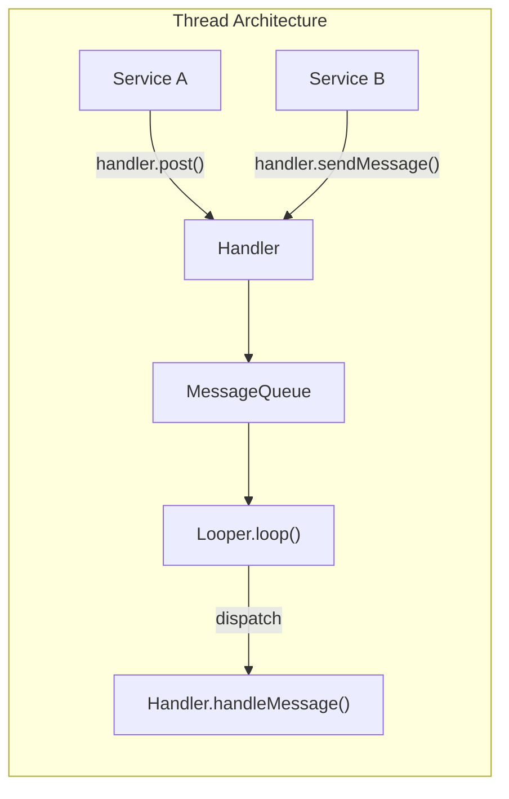

Key patterns used in system_server:

1. **Shared handlers**: Created with `shared=true` to allow posting from
   any thread without external synchronization.
2. **Handler executors**: `HandlerExecutor` wraps a Handler as a Java
   `Executor`, allowing use with modern async APIs.
3. **Message priorities**: `Message.setAsynchronous(true)` bypasses sync
   barriers, used for time-critical operations.

### 20.6.6 Binder Threads

In addition to the named threads, `system_server` maintains a pool of
up to 31 Binder threads (line 493 of SystemServer.java):

```java
// frameworks/base/services/java/com/android/server/SystemServer.java, line 493
private static final int sMaxBinderThreads = 31;
```

Binder threads are named `Binder:PID_N` where PID is the process ID and
N is the thread number. These threads handle all incoming IPC from app
processes. When all 31 threads are busy, new incoming Binder calls
queue up, and the Watchdog's `BinderThreadMonitor` will eventually
trigger if the congestion persists.

### 20.6.7 Thread Selection Guidelines

When implementing a system service, choosing the right thread is critical:

| Scenario | Recommended Thread | Rationale |
|----------|-------------------|-----------|
| Display composition, window layout | DisplayThread | Minimal latency for display |
| Window animations | AnimationThread | Highest priority for smooth animation |
| Surface animations (lock-free) | SurfaceAnimationThread | Avoids WM lock contention |
| System dialogs, overlays | UiThread | Foreground priority, TOP_APP group |
| Service business logic | FgThread | Default priority, not blocked by background |
| Disk I/O, database writes | IoThread | Allows I/O, default priority |
| Non-urgent background work | BackgroundThread | Low priority, generous timeouts |
| Permission checks | PermissionThread | Dedicated to avoid blocking other threads |

### 20.6.8 SystemServerInitThreadPool

During boot, `system_server` uses a temporary thread pool for parallel
initialization (line 944):

```java
// frameworks/base/services/java/com/android/server/SystemServer.java, line 944
SystemServerInitThreadPool.start();
```

This pool allows multiple independent initialization tasks to run
concurrently, reducing boot time. Examples include:

- `SystemConfig.getInstance()` (line 1156)
- Secondary Zygote preloading (line 1581)
- Sensor manager service startup (line 1743)
- HIDL services startup (line 1750)
- WebView preparation (line 3363)

The pool is shut down after initialization completes and is not used
during normal operation.

---

## 20.7 Try It

### 20.7.1 Listing All System Services

Use `service list` to see all registered Binder services:

```bash
adb shell service list
```

This produces output like:

```
Found 290 services:
0	DockObserver: [android.os.IBinder]
1	SurfaceFlinger: [android.ui.ISurfaceComposer]
2	accessibility: [android.view.accessibility.IAccessibilityManager]
3	account: [android.accounts.IAccountManager]
4	activity: [android.app.IActivityManager]
5	activity_task: [android.app.IActivityTaskManager]
...
```

Count the total:

```bash
adb shell service list | head -1
```

### 20.7.2 Inspecting system_server Process

View basic process information:

```bash
# Process ID
adb shell pidof system_server

# Thread count
adb shell ls /proc/$(adb shell pidof system_server)/task | wc -l

# Process status
adb shell cat /proc/$(adb shell pidof system_server)/status | head -20

# Memory usage
adb shell dumpsys meminfo system_server
```

### 20.7.3 Dumpsys Commands

`dumpsys` is the primary tool for inspecting service state. Each service
implements a `dump()` method:

```bash
# Dump all services (very long!)
adb shell dumpsys

# Dump a specific service
adb shell dumpsys activity
adb shell dumpsys window
adb shell dumpsys package
adb shell dumpsys power
adb shell dumpsys notification
adb shell dumpsys audio
adb shell dumpsys connectivity
adb shell dumpsys display
adb shell dumpsys input
adb shell dumpsys alarm
adb shell dumpsys jobscheduler
adb shell dumpsys battery
adb shell dumpsys usagestats
adb shell dumpsys deviceidle

# Dump the SystemServer dumper for internal state
adb shell dumpsys system_server_dumper
adb shell dumpsys system_server_dumper --list
adb shell dumpsys system_server_dumper --name SystemServer
adb shell dumpsys system_server_dumper --name Watchdog
```

### 20.7.4 Inspecting Boot Phases

Boot phase transitions are logged and can be traced:

```bash
# View boot timing events
adb shell logcat -b events | grep boot_progress

# View SystemServer timing tags
adb shell logcat -s SystemServerTiming

# Full boot tracing with Perfetto
adb shell perfetto -o /data/misc/perfetto-traces/boot.pb \
    -c - <<EOF
buffers: { size_kb: 65536 }
data_sources: {
    config {
        name: "android.log"
        android_log_config {
            log_ids: LID_EVENTS
        }
    }
}
duration_ms: 60000
EOF
```

### 20.7.5 Observing Service Start Order

The SystemServer logs each service start with timing information:

```bash
# Filter for service start messages
adb shell logcat -s SystemServer SystemServiceManager

# Look for specific boot phase transitions
adb shell logcat | grep -E "PHASE_|startBootPhase"
```

### 20.7.6 Watchdog Diagnostics

```bash
# Dump Watchdog state
adb shell dumpsys system_server_dumper --name Watchdog

# View Watchdog-related logs
adb shell logcat -s Watchdog

# Check for past Watchdog kills
adb shell logcat -b crash | grep -i watchdog

# View timeout history
adb shell cat /data/system/watchdog-timeout-history.txt
```

### 20.7.7 Thread Inspection

```bash
# List all system_server threads with names
adb shell ps -T -p $(adb shell pidof system_server)

# View specific named threads
adb shell ps -T -p $(adb shell pidof system_server) | grep -E \
    "android\.(display|anim|ui|fg|io|bg|perm)|Binder:|watchdog"

# Get Java thread dump (sends SIGQUIT)
adb shell kill -3 $(adb shell pidof system_server)
# Then check /data/anr/ for the trace file
adb shell ls -la /data/anr/
```

### 20.7.8 Service Dependencies and Boot Timing

```bash
# View how long each service took to start
adb shell logcat -s SystemServerTimingAsync SystemServerTiming | \
    grep -E "traceBegin|traceEnd"

# Check if a specific service is running
adb shell service check activity
adb shell service check window
adb shell service check package

# Call a service directly
adb shell service call activity 1  # IBinder.FIRST_CALL_TRANSACTION
```

### 20.7.9 Examining SystemServiceManager State

```bash
# Dump all registered system services
adb shell dumpsys system_server_dumper --name SystemServiceManager
```

This shows:

- All registered services and their classes
- Current boot phase
- Service start times
- Active user IDs

### 20.7.10 Monitoring Binder Thread Pool

```bash
# Check Binder thread usage
adb shell cat /proc/$(adb shell pidof system_server)/status | \
    grep Threads

# View Binder calls stats
adb shell dumpsys binder_calls_stats

# View specific Binder transaction information
adb shell cat /sys/kernel/debug/binder/proc/$(adb shell pidof system_server) \
    2>/dev/null | head -50
```

### 20.7.11 Forcing a Watchdog Timeout (Development Only)

On userdebug/eng builds, you can test the Watchdog by inducing a deadlock.
**WARNING: This will crash system_server and restart the runtime.**

```bash
# Reduce watchdog timeout (settings must be available)
adb shell settings put global watchdog_timeout_millis 10000

# Or use the debug property
adb shell setprop persist.sys.debug.watchdog_timeout 10
```

### 20.7.12 Tracing Service Startup with Perfetto

```bash
# Record a boot trace
adb shell setprop persist.debug.atrace.boottrace 1
adb shell setprop persist.traced.enable 1

# After reboot, pull the trace
adb pull /data/misc/perfetto-traces/boottrace.perfetto-trace

# Open in ui.perfetto.dev
```

The trace will show all the `TimingsTraceAndSlog` spans from SystemServer,
including every service start and boot phase transition, with precise
timestamps.

### 20.7.13 Simulating Boot Phases

You can watch boot phases progress in real time during a reboot:

```bash
# Reboot and immediately start capturing
adb reboot && sleep 5 && adb wait-for-device && \
    adb logcat -s SystemServiceManager | grep -i phase
```

Expected output sequence:

```
SystemServiceManager: Starting phase 100
SystemServiceManager: Starting phase 200
SystemServiceManager: Starting phase 480
SystemServiceManager: Starting phase 500
SystemServiceManager: Starting phase 520
SystemServiceManager: Starting phase 550
SystemServiceManager: Starting phase 600
SystemServiceManager: Starting phase 1000
```

### 20.7.14 Examining Service Registration

To see how a specific service is registered:

```bash
# Check if a service exists and get its interface descriptor
adb shell service check activity
adb shell service check window
adb shell service check package

# Get service debug info (PID, interface)
adb shell dumpsys -l
```

### 20.7.15 Monitoring Looper Statistics

```bash
# Dump looper statistics to see message processing times
adb shell dumpsys looper_stats

# This shows for each looper:
# - Message count
# - Total time
# - Max time
# - Exception count
```

This data comes from the `LooperStatsService` started in
`startCoreServices()` and is invaluable for identifying which messages
are slow on which threads.

---

## 20.8 Deep Dive: Key Service Internals

### 20.8.1 ActivityManagerService and ActivityTaskManagerService

The ActivityManagerService (AMS) and ActivityTaskManagerService (ATMS) are
the most important services in `system_server`. They were originally a
single monolithic service, but were split to separate process management
(AMS) from activity/task management (ATMS).

**Source files:**

- `frameworks/base/services/core/java/com/android/server/am/ActivityManagerService.java`
- `frameworks/base/services/core/java/com/android/server/wm/ActivityTaskManagerService.java`

The startup sequence in `startBootstrapServices()` (lines 1274-1283):

```java
// frameworks/base/services/java/com/android/server/SystemServer.java, line 1274
t.traceBegin("StartActivityManager");
ActivityTaskManagerService atm = mSystemServiceManager.startService(
        ActivityTaskManagerService.Lifecycle.class).getService();
mActivityManagerService = ActivityManagerService.Lifecycle.startService(
        mSystemServiceManager, atm);
mActivityManagerService.setSystemServiceManager(mSystemServiceManager);
mActivityManagerService.setInstaller(installer);
mWindowManagerGlobalLock = atm.getGlobalLock();
```

Key observations:

1. ATMS starts first and returns its service reference.
2. AMS starts second and receives the ATMS reference.
3. AMS gets references to SystemServiceManager and Installer.
4. The WindowManagerGlobalLock is obtained from ATMS.

**AMS responsibilities:**

- Process lifecycle management (start, stop, kill)
- OOM adjustment calculation
- Broadcast dispatch
- Content provider management
- Crash and ANR handling
- App permissions enforcement at runtime

**ATMS responsibilities:**

- Activity stack and task management
- Activity lifecycle (create, resume, pause, stop, destroy)
- Recent tasks
- Multi-window management
- Activity transitions

Later in `startBootstrapServices()`, critical cross-references are
established (lines 1406-1418):

```java
// frameworks/base/services/java/com/android/server/SystemServer.java, line 1406
t.traceBegin("SetSystemProcess");
mActivityManagerService.setSystemProcess();
t.traceEnd();

// ...

t.traceBegin("InitWatchdog");
watchdog.init(mSystemContext, mActivityManagerService);
t.traceEnd();
```

`AMS.setSystemProcess()` registers the activity service as a Binder
service and sets up the system process's ApplicationInfo. The Watchdog
initialization requires AMS for registering the reboot broadcast
receiver.

### 20.8.2 WindowManagerService

WindowManagerService (WMS) manages all windows on the device -- app
windows, status bar, navigation bar, dialogs, toasts, and more. It is
one of the most complex services in Android.

**Source:** `frameworks/base/services/core/java/com/android/server/wm/WindowManagerService.java`

WMS starts in `startOtherServices()` (lines 1722-1730):

```java
// frameworks/base/services/java/com/android/server/SystemServer.java, line 1722
t.traceBegin("StartWindowManagerService");
mSystemServiceManager.startBootPhase(t,
        SystemService.PHASE_WAIT_FOR_SENSOR_SERVICE);
wm = WindowManagerService.main(context, inputManager, !mFirstBoot,
        new PhoneWindowManager(), mActivityManagerService.mActivityTaskManager);
ServiceManager.addService(Context.WINDOW_SERVICE, wm, false,
        DUMP_FLAG_PRIORITY_CRITICAL | DUMP_FLAG_PRIORITY_HIGH
                | DUMP_FLAG_PROTO);
```

WMS depends on:

- InputManagerService (for input event dispatch)
- PhoneWindowManager (for policy decisions like key handling)
- ActivityTaskManagerService (for activity window management)
- SensorService (must wait for PHASE_WAIT_FOR_SENSOR_SERVICE)

The WMS is registered with `DUMP_FLAG_PRIORITY_CRITICAL | DUMP_FLAG_PRIORITY_HIGH`
because its dump output is essential for debugging display issues.

After WMS starts, several critical callbacks fire:

```java
// line 1733
mActivityManagerService.setWindowManager(wm);

// line 1737
wm.onInitReady();

// line 1758
inputManager.setWindowManagerCallbacks(wm.getInputManagerCallback());
inputManager.start();

// line 1763
mDisplayManagerService.windowManagerAndInputReady();
```

This dance of cross-references is why WMS, AMS, InputManager, and
DisplayManager are all in the bootstrap/early-other phase -- they cannot
function independently.

### 20.8.3 PackageManagerService

PackageManagerService (PMS) manages all installed packages (APKs), their
permissions, components, and metadata. It is so large and complex that
its initialization is one of the longest operations during boot.

**Source:** `frameworks/base/services/core/java/com/android/server/pm/PackageManagerService.java`

PMS starts in `startBootstrapServices()` (lines 1362-1374):

```java
// frameworks/base/services/java/com/android/server/SystemServer.java, line 1362
t.traceBegin("StartPackageManagerService");
try {
    Watchdog.getInstance().pauseWatchingCurrentThread("packagemanagermain");
    mPackageManagerService = PackageManagerService.main(
            mSystemContext, installer, domainVerificationService,
            mFactoryTestMode != FactoryTest.FACTORY_TEST_OFF);
} finally {
    Watchdog.getInstance().resumeWatchingCurrentThread("packagemanagermain");
}
mFirstBoot = mPackageManagerService.isFirstBoot();
mPackageManager = mSystemContext.getPackageManager();
```

PMS depends on:

- Installer (`installd` daemon interface)
- DomainVerificationService (app link verification)
- DisplayManager (must have display metrics for resource selection)

The Watchdog is explicitly paused during PMS initialization because the
package scan can take many seconds (or even minutes on first boot with
many pre-installed apps). Without the pause, the Watchdog would kill
`system_server` during a legitimate long operation.

### 20.8.4 PowerManagerService

PowerManagerService manages the device's power state -- wake locks,
display power, doze mode, battery saver, and shutdown.

**Source:** `frameworks/base/services/core/java/com/android/server/power/PowerManagerService.java`

```java
// frameworks/base/services/java/com/android/server/SystemServer.java, line 1300
t.traceBegin("StartPowerManager");
mPowerManagerService = mSystemServiceManager.startService(
        PowerManagerService.class);
t.traceEnd();
```

PowerManager starts early because many other services need to acquire
wake locks during initialization. After AMS starts, power management
is fully initialized:

```java
// line 1310
t.traceBegin("InitPowerManagement");
mActivityManagerService.initPowerManagement();
t.traceEnd();
```

### 20.8.5 NotificationManagerService

NotificationManagerService (NMS) manages all notifications, channels,
notification policies, and interactions with the status bar.

**Source:** `frameworks/base/services/core/java/com/android/server/notification/NotificationManagerService.java`

```java
// frameworks/base/services/java/com/android/server/SystemServer.java, line 2341
t.traceBegin("StartNotificationManager");
mSystemServiceManager.startService(NotificationManagerService.class);
SystemNotificationChannels.removeDeprecated(context);
SystemNotificationChannels.createAll(context);
notification = INotificationManager.Stub.asInterface(
        ServiceManager.getService(Context.NOTIFICATION_SERVICE));
```

NMS depends on StorageManagerService (for media/USB notifications),
which is why StorageManager starts first when the filesystem is
available.

### 20.8.6 DisplayManagerService

DisplayManagerService manages physical and virtual displays, display
power state, and display adapters.

**Source:** `frameworks/base/services/core/java/com/android/server/display/DisplayManagerService.java`

```java
// frameworks/base/services/java/com/android/server/SystemServer.java, line 1339
t.traceBegin("StartDisplayManager");
mDisplayManagerService = mSystemServiceManager.startService(
        DisplayManagerService.class);
```

The critical PHASE_WAIT_FOR_DEFAULT_DISPLAY (100) boot phase follows
immediately:

```java
// line 1344
t.traceBegin("WaitForDisplay");
mSystemServiceManager.startBootPhase(t,
        SystemService.PHASE_WAIT_FOR_DEFAULT_DISPLAY);
```

No package scanning can begin until the default display is available,
because PackageManagerService needs display metrics to select the
correct resources for the device's density.

---

## 20.9 Service Communication Patterns

### 20.9.1 Binder Services vs. Local Services

Services in `system_server` communicate through two distinct patterns:

**Binder services** are registered with `ServiceManager` and are accessible
from any process on the device. They provide the public API surface that
apps use:

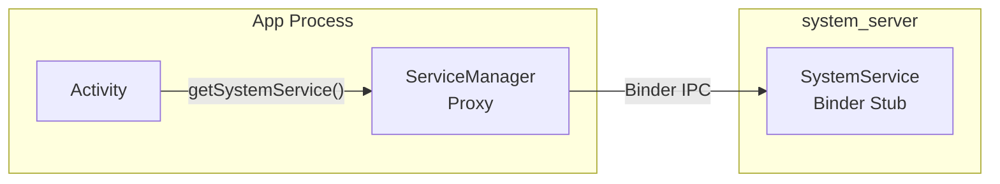

**Local services** are registered with `LocalServices` and are accessible
only within the `system_server` process. They provide privileged internal
APIs that other system services use:

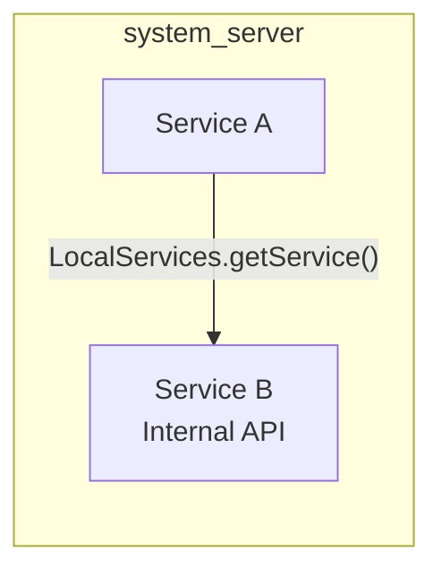

The dual-interface pattern is extremely common. For example, PowerManager:

- **Binder**: `IPowerManager` -- for apps to acquire wake locks
- **Local**: `PowerManagerInternal` -- for system services to force
  display on/off, override wake lock behavior, etc.

### 20.9.2 The Lifecycle Inner Class Pattern

Many services use an inner `Lifecycle` class that extends `SystemService`:

```java
public class ExampleManagerService extends IExampleManager.Stub {

    public static final class Lifecycle extends SystemService {
        private ExampleManagerService mService;

        public Lifecycle(Context context) {
            super(context);
        }

        @Override
        public void onStart() {
            mService = new ExampleManagerService(getContext());
            publishBinderService(Context.EXAMPLE_SERVICE, mService);
            publishLocalService(ExampleManagerInternal.class,
                    mService.new LocalService());
        }

        @Override
        public void onBootPhase(int phase) {
            mService.onBootPhase(phase);
        }
    }
}
```

This pattern separates the Binder stub implementation (the outer class)
from the lifecycle management (the inner class). The `Lifecycle` class
is what `SystemServiceManager` instantiates and manages.

### 20.9.3 Service Dependencies

Service dependencies in `system_server` are not formally declared (unlike
dependency injection frameworks). Instead, they are implicit in the
start order. A service that needs `PowerManager` is simply started after
`PowerManagerService`. This works because `SystemServer.java` explicitly
controls the order.

There have been multiple attempts to formalize dependencies:

- The `TODO: Use service dependencies instead` comment appears in
  `SystemServer.java` (line 1762)
- The `dependencies` parameter in `SystemService` constructor was added
  for the Ravenwood testing environment
- Boot phases provide coarse-grained synchronization

However, for the most part, the start order in `SystemServer.java` remains
the primary dependency mechanism.

### 20.9.4 Cross-Service Communication via Handlers

When one service needs to notify another asynchronously, it posts a
message to the target service's handler. For example, when
DisplayManagerService detects a display change, it may notify
WindowManagerService by posting to the DisplayThread handler.

Common patterns:

1. **Direct handler posting**: `displayThread.getHandler().post(callback)`
2. **Message objects**: `handler.obtainMessage(MSG_TYPE).sendToTarget()`
3. **Local service callbacks**: Register a listener interface with
   `LocalServices.getService()` and call it directly

### 20.9.5 The SystemServer Dumper

SystemServer registers a special `system_server_dumper` Binder service
(line 974) that acts as a central dump coordinator:

```java
// frameworks/base/services/java/com/android/server/SystemServer.java, line 974
ServiceManager.addService("system_server_dumper", mDumper);
mDumper.addDumpable(this);
```

The `SystemServerDumper` (lines 759-834) accepts `Dumpable` objects and
provides a unified interface for dumping their state:

```bash
# List all dumpables
adb shell dumpsys system_server_dumper --list

# Dump a specific dumpable
adb shell dumpsys system_server_dumper --name SystemServiceManager
```

This is separate from the per-service `dumpsys` mechanism because it
dumps internal `system_server` state that is not associated with any
specific Binder service.

---

## 20.10 Error Handling and Recovery

### 20.10.1 The reportWtf Pattern

Throughout `SystemServer.java`, failed service starts are caught with
a consistent pattern (line 1095-1098):

```java
// frameworks/base/services/java/com/android/server/SystemServer.java, line 1095
private void reportWtf(String msg, Throwable e) {
    Slog.w(TAG, "***********************************************");
    Slog.wtf(TAG, "BOOT FAILURE " + msg, e);
}
```

`Slog.wtf()` (What a Terrible Failure) logs the error and, on userdebug
builds, can trigger additional diagnostic actions. Most service start
failures are caught and reported with `reportWtf()` rather than crashing
`system_server`, because a partial system is better than no system at all.

### 20.10.2 Early WTF Handling

Before AMS is fully initialized, WTFs cannot be immediately processed
(there is no dropbox yet). `SystemServer` buffers them (lines 1015-1016):

```java
// frameworks/base/services/java/com/android/server/SystemServer.java, line 1016
RuntimeInit.setDefaultApplicationWtfHandler(SystemServer::handleEarlySystemWtf);
```

Later, after AMS is ready, pending WTFs are flushed (lines 3174-3179):

```java
// line 3174
synchronized (SystemService.class) {
    if (sPendingWtfs != null) {
        mActivityManagerService.schedulePendingSystemServerWtfs(sPendingWtfs);
        sPendingWtfs = null;
    }
}
```

### 20.10.3 Pending Shutdown Check

Before starting services, `SystemServer` checks if a shutdown was pending
from a previous session (lines 1100-1150):

```java
// frameworks/base/services/java/com/android/server/SystemServer.java, line 1100
private void performPendingShutdown() {
    final String shutdownAction = SystemProperties.get(
            ShutdownThread.SHUTDOWN_ACTION_PROPERTY, "");
    if (shutdownAction != null && shutdownAction.length() > 0) {
        boolean reboot = (shutdownAction.charAt(0) == '1');
        // ...
        ShutdownThread.rebootOrShutdown(null, reboot, reason);
    }
}
```

This handles the case where the device was in the middle of a reboot
(e.g., for an OTA update) when it crashed. The pending reboot is
completed before normal boot continues.

### 20.10.4 Safe Mode

Safe mode is detected after WindowManagerService starts (line 1851):

```java
// frameworks/base/services/java/com/android/server/SystemServer.java, line 1851
final boolean safeMode = wm.detectSafeMode();
if (safeMode) {
    Settings.Global.putInt(context.getContentResolver(),
            Settings.Global.AIRPLANE_MODE_ON, 1);
}
```

In safe mode:

- Airplane mode is enabled immediately
- AMS enters safe mode (`mActivityManagerService.enterSafeMode()`)
- Third-party services may be restricted
- The system shows a safe mode overlay

### 20.10.5 FD Leak Detection

On debug builds, `SystemServer` spawns a thread to monitor file descriptor
usage (line 642-695):

```java
// frameworks/base/services/java/com/android/server/SystemServer.java, line 642
private static void spawnFdLeakCheckThread() {
    final int enableThreshold = SystemProperties.getInt(
            SYSPROP_FDTRACK_ENABLE_THRESHOLD, 1600);
    final int abortThreshold = SystemProperties.getInt(
            SYSPROP_FDTRACK_ABORT_THRESHOLD, 3000);
```

The thread periodically checks the highest file descriptor number:

- Above 1600: Enables `libfdtrack` for detailed tracking
- Above 3000: Dumps an hprof heap dump and aborts the process

This prevents a slow FD leak from eventually causing mysterious failures
when the process runs out of file descriptors.

### 20.10.6 CriticalEventLog

After all services start, a critical event is logged (line 1038):

```java
// frameworks/base/services/java/com/android/server/SystemServer.java, line 1038
CriticalEventLog.getInstance().logSystemServerStarted();
```

The `CriticalEventLog` maintains a persistent record of critical system
events (boots, crashes, Watchdog kills) that survives reboots. This data
is used by rescue party logic to detect crash loops and take corrective
action (such as entering recovery mode or disabling problematic apps).

---

## 20.11 Performance Considerations

### 20.11.1 Boot Time Optimization

`SystemServer` uses several strategies to minimize boot time:

**1. Parallel initialization**: The `SystemServerInitThreadPool` runs
independent init tasks concurrently:

```java
// line 944
SystemServerInitThreadPool.start();

// line 1156 - SystemConfig loading
SystemServerInitThreadPool.submit(SystemConfig::getInstance, ...);

// line 1581 - Secondary Zygote preload
mZygotePreload = SystemServerInitThreadPool.submit(() -> { ... });

// line 1743 - Sensor manager
SystemServerInitThreadPool.submit(() -> {
    startISensorManagerService();
});

// line 1750 - HIDL services
SystemServerInitThreadPool.submit(() -> {
    startHidlServices();
});
```

**2. Deferred initialization**: Many services do minimal work in
`onStart()` and defer heavy initialization to later boot phases.

**3. Lazy loading**: Services like `FgThread`, `IoThread`, and
`BackgroundThread` use holder pattern or `NoPreloadHolder` pattern
for lazy initialization.

**4. Boot time tracking**: Timing information is tracked and reported:

```java
// line 1049
if (!mRuntimeRestart && !isFirstBootOrUpgrade()) {
    final long uptimeMillis = SystemClock.elapsedRealtime();
    // ...
    final long maxUptimeMillis = 60 * 1000;
    if (uptimeMillis > maxUptimeMillis) {
        Slog.wtf(SYSTEM_SERVER_TIMING_TAG,
                "SystemServer init took too long. uptimeMillis=" + uptimeMillis);
    }
}
```

A WTF is logged if boot takes longer than 60 seconds.

### 20.11.2 Memory Optimization

Early in `run()`, `system_server` clears its growth limit (line 911):

```java
// frameworks/base/services/java/com/android/server/SystemServer.java, line 911
VMRuntime.getRuntime().clearGrowthLimit();
```

Normal apps have a heap growth limit (typically 256MB or 512MB), but
`system_server` removes this limit because it needs to manage the entire
system's state, which can require significant memory.

### 20.11.3 Binder Performance

Several optimizations ensure Binder IPC performance:

**Background scheduling disabled** (line 929):

```java
// line 929
BinderInternal.disableBackgroundScheduling(true);
```

This ensures all incoming Binder calls to `system_server` run at
foreground priority, preventing starvation.

**Blocking call warnings** (line 880):

```java
// line 880
Binder.setWarnOnBlocking(true);
```

Within `system_server`, blocking (synchronous) Binder calls to other
processes are discouraged because they can cause deadlocks. This setting
logs warnings when they occur.

**Transaction callback** (line 1062-1067):

```java
// line 1062
Binder.setTransactionCallback(new IBinderCallback() {
    @Override
    public void onTransactionError(int pid, int code, int flags, int err) {
        mActivityManagerService.frozenBinderTransactionDetected(
                pid, code, flags, err);
    }
});
```

This detects when a frozen (cached) process receives a Binder transaction
that fails, which is important for managing process lifecycle.

### 20.11.4 Slow Log Thresholds

Each thread has configurable slow dispatch and delivery thresholds:

| Thread | Dispatch Threshold | Delivery Threshold |
|--------|-------------------|-------------------|
| Main Looper | 100ms | 200ms |
| UiThread | 100ms | 200ms |
| FgThread | 100ms | 200ms |
| PermissionThread | 100ms | 200ms |
| BackgroundThread | 10,000ms | 30,000ms |
| DisplayThread | Default | Default |
| AnimationThread | Default | Default |
| IoThread | Default | Default |

When a message exceeds these thresholds, a warning is logged with the
message details and timing information. This is invaluable for
identifying jank-causing operations.

The definitions:

- **Dispatch threshold**: How long it takes to start processing a message
  after it is dequeued
- **Delivery threshold**: How long between when a message is posted and
  when processing begins (includes time waiting in the queue)

---

## 20.12 APEX Module Service Loading

### 20.12.1 The Modularization Challenge

As Android modularized via Project Mainline, services that were previously
compiled into `services.jar` needed to be loaded from module-delivered
APEXes. This created a challenge: how to load a `SystemService` subclass
from a JAR that is not on the default classpath.

### 20.12.2 SystemServerClassLoaderFactory

The `SystemServiceManager.startServiceFromJar()` method creates a
`PathClassLoader` for each standalone JAR:

```java
// frameworks/base/services/core/java/com/android/server/SystemServiceManager.java, line 167
public SystemService startServiceFromJar(String className, String path) {
    PathClassLoader pathClassLoader =
            SystemServerClassLoaderFactory.getOrCreateClassLoader(
                    path, this.getClass().getClassLoader(),
                    isJarInTestApex(path));
    final Class<SystemService> serviceClass =
            loadClassFromLoader(className, pathClassLoader);
    return startService(serviceClass);
}
```

The class loader hierarchy:

1. The APEX JAR's `PathClassLoader` has the system server's default
   class loader as its parent.
2. This allows the APEX service to access all framework classes while
   having its own classes loaded from the APEX JAR.
3. `SystemServerClassLoaderFactory` caches class loaders so the same
   APEX JAR is not loaded multiple times.

### 20.12.3 Service Lifecycle with Modules

APEX-delivered services participate in the same lifecycle as built-in
services. They receive boot phase callbacks, user lifecycle events, and
are monitored by the Watchdog. The only difference is the loading
mechanism.

Example from WiFi:

```java
// frameworks/base/services/java/com/android/server/SystemServer.java, line 2205
t.traceBegin("StartWifi");
mSystemServiceManager.startServiceFromJar(
        WIFI_SERVICE_CLASS, WIFI_APEX_SERVICE_JAR_PATH);
```

Where:
```java
// line 434
private static final String WIFI_APEX_SERVICE_JAR_PATH =
        "/apex/com.android.wifi/javalib/service-wifi.jar";
private static final String WIFI_SERVICE_CLASS =
        "com.android.server.wifi.WifiService";
```

### 20.12.4 Complete APEX JAR Paths

Here is the complete mapping of APEX paths used in `SystemServer.java`:

| Constant | Path |
|----------|------|
| `WIFI_APEX_SERVICE_JAR_PATH` | `/apex/com.android.wifi/javalib/service-wifi.jar` |
| `BLUETOOTH_APEX_SERVICE_JAR_PATH` | `/apex/com.android.bt/javalib/service-bluetooth.jar` |
| `CONNECTIVITY_SERVICE_APEX_PATH` | `/apex/com.android.tethering/javalib/service-connectivity.jar` |
| `UWB_APEX_SERVICE_JAR_PATH` | `/apex/com.android.uwb/javalib/service-uwb.jar` |
| `RANGING_APEX_SERVICE_JAR_PATH` | `/apex/com.android.uwb/javalib/service-ranging.jar` |
| `STATS_COMPANION_APEX_PATH` | `/apex/com.android.os.statsd/javalib/service-statsd.jar` |
| `SCHEDULING_APEX_PATH` | `/apex/com.android.scheduling/javalib/service-scheduling.jar` |
| `DEVICE_LOCK_APEX_PATH` | `/apex/com.android.devicelock/javalib/service-devicelock.jar` |
| `PROFILING_SERVICE_JAR_PATH` | `/apex/com.android.profiling/javalib/service-profiling.jar` |
| `UPROBESTATS_SERVICE_JAR_PATH` | `/apex/com.android.uprobestats/javalib/service-uprobestats.jar` |

---

## 20.13 Device-Specific and Form-Factor Services

### 20.13.1 Device-Specific Services

After the standard services start, `SystemServer` loads OEM-specific
services from a resource array (lines 3232-3244):

```java
// frameworks/base/services/java/com/android/server/SystemServer.java, line 3232
t.traceBegin("StartDeviceSpecificServices");
final String[] classes = mSystemContext.getResources().getStringArray(
        R.array.config_deviceSpecificSystemServices);
for (final String className : classes) {
    t.traceBegin("StartDeviceSpecificServices " + className);
    try {
        mSystemServiceManager.startService(className);
    } catch (Throwable e) {
        reportWtf("starting " + className, e);
    }
    t.traceEnd();
}
```

OEMs populate `config_deviceSpecificSystemServices` in their device
overlays to add custom system services without modifying
`SystemServer.java`.

### 20.13.2 Watch-Specific Services

Wear OS devices start several additional services:

| Service | Class Reference |
|---------|----------------|
| WearPowerService | `WEAR_POWER_SERVICE_CLASS` |
| HealthService | `HEALTH_SERVICE_CLASS` |
| SystemStateDisplayService | `SYSTEM_STATE_DISPLAY_SERVICE_CLASS` |
| WearConnectivityService | `WEAR_CONNECTIVITY_SERVICE_CLASS` |
| WearDisplayService | `WEAR_DISPLAY_SERVICE_CLASS` |
| WearDebugService | `WEAR_DEBUG_SERVICE_CLASS` (debug builds) |
| WearTimeService | `WEAR_TIME_SERVICE_CLASS` |
| WearSettingsService | `WEAR_SETTINGS_SERVICE_CLASS` |
| WearModeService | `WEAR_MODE_SERVICE_CLASS` |
| WristOrientationService | `WRIST_ORIENTATION_SERVICE_CLASS` (conditional) |
| WearGestureService | `WEAR_GESTURE_SERVICE_CLASS` (conditional) |
| WearInputService | `WEAR_INPUT_SERVICE_CLASS` (conditional) |
| DisplayOffloadService | `WEAR_DISPLAYOFFLOAD_SERVICE_CLASS` |

These are defined in the `com.android.clockwork` package and loaded from
the `PRODUCT_SYSTEM_SERVER_JARS` classpath.

### 20.13.3 Automotive-Specific Services

Automotive (Android Automotive OS) devices start:

```java
// line 3374
t.traceBegin("StartCarServiceHelperService");
final SystemService cshs = mSystemServiceManager
        .startService(CAR_SERVICE_HELPER_SERVICE_CLASS);
```

The `CarServiceHelperService` bridges the system server to the Car
Service, which runs in a separate process and manages automotive-specific
features like vehicle HAL, cabin controls, and driving safety.

### 20.13.4 TV-Specific Services

TV devices get additional media services:

| Feature Check | Service |
|--------------|---------|
| `FEATURE_LIVE_TV` or `isTv` | TvInteractiveAppManagerService |
| `FEATURE_LIVE_TV` or `isTv` | TvInputManagerService |
| `FEATURE_TUNER` | TunerResourceManagerService |
| `isTv` | TvRemoteService |
| `isTv` and `mediaQualityFw()` | MediaQualityService |

### 20.13.5 IoT Services

Embedded/IoT devices running Android Things:

```java
// line 2941
if (RoSystemFeatures.hasFeatureEmbedded(context)) {
    t.traceBegin("StartIoTSystemService");
    mSystemServiceManager.startService(IOT_SERVICE_CLASS);
    t.traceEnd();
}
```

---

## 20.14 SystemUI Launch

### 20.14.1 The Final Step

After all services are running and all boot phases have completed, the
very last step before entering the main loop is launching SystemUI
(lines 3594-3599):

```java
// frameworks/base/services/java/com/android/server/SystemServer.java, line 3594
t.traceBegin("StartSystemUI");
try {
    startSystemUi(context, windowManagerF);
} catch (Throwable e) {
    reportWtf("starting System UI", e);
}
```

SystemUI is a separate app process (not a service within `system_server`),
but it is started by `system_server` because it provides the status bar,
navigation bar, notification shade, quick settings, and other critical
UI elements.

### 20.14.2 The Boot Completed Phase

After SystemUI starts, the final boot phase is dispatched:

```java
mSystemServiceManager.startBootPhase(t, SystemService.PHASE_BOOT_COMPLETED);
```

This signals to all services that the boot is complete. Services can
now:

- Allow full user interaction
- Start background maintenance tasks
- Begin collecting statistics
- Enable features that depend on the complete system

### 20.14.3 The Infinite Loop

Finally, the main thread enters the event loop (line 1081):

```java
// frameworks/base/services/java/com/android/server/SystemServer.java, line 1081
Looper.loop();
throw new RuntimeException("Main thread loop unexpectedly exited");
```

The `RuntimeException` on line 1082 is a safety net -- `Looper.loop()`
should never return. If it does, something is catastrophically wrong.

From this point forward, all work in `system_server` happens through:

1. Handler messages on the main looper and shared threads
2. Binder thread callbacks from app processes
3. Native callbacks from HAL services
4. Timer and alarm callbacks

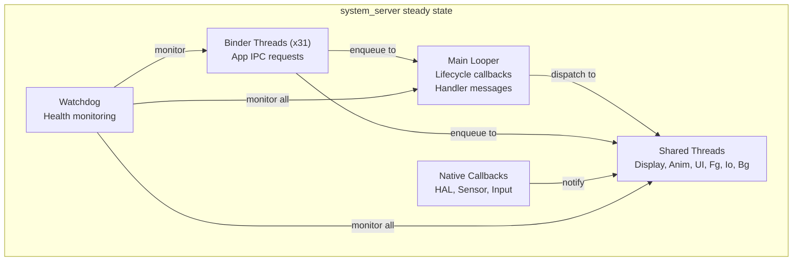

---

## 20.15 Debugging system_server

### 20.15.1 Common Failure Modes

| Symptom | Likely Cause | Diagnosis |
|---------|-------------|-----------|
| Device stuck at boot animation | Service init deadlock or crash loop | Check logcat for BOOT FAILURE, Watchdog logs |
| Runtime restart loop | Persistent Watchdog timeout | Check `/data/system/watchdog-timeout-history.txt` |
| Service not responding (ANR-like) | Lock contention or blocked thread | Get thread dump with `kill -3` |
| Binder transaction failures | Thread pool exhaustion | Check `dumpsys binder_calls_stats` |
| Memory pressure | Heap too large or leak | Check `dumpsys meminfo system_server` |
| System UI crash | SystemUI process died | Check logcat for SystemUI crashes |

### 20.15.2 Getting Thread Dumps

Java thread dumps are the most useful diagnostic tool for `system_server`
issues:

```bash
# Method 1: SIGQUIT (generates ANR trace)
adb shell kill -3 $(adb shell pidof system_server)
sleep 2
adb pull /data/anr/traces.txt

# Method 2: debuggerd (native + Java stacks)
adb shell debuggerd $(adb shell pidof system_server)
```

The trace file contains:

- Stack traces for every Java thread
- Lock ownership information
- Thread states (RUNNABLE, BLOCKED, WAITING, etc.)
- Monitor information (which thread holds which lock)

### 20.15.3 Identifying Deadlocks

A classic `system_server` deadlock involves two services holding locks
and waiting for each other. The thread dump will show:

```
"android.display" prio=5 tid=12 BLOCKED
  - waiting to lock <0x12345678> (a WindowManagerGlobalLock)
    held by thread 15
  at WindowManagerService.doSomething()

"Binder:1234_5" prio=5 tid=15 BLOCKED
  - waiting to lock <0x87654321> (a ActivityManagerService)
    held by thread 12
  at ActivityManagerService.doSomethingElse()
```

This shows thread 12 waiting for a lock held by thread 15, while
thread 15 waits for a lock held by thread 12 -- a classic deadlock.

### 20.15.4 Analyzing Boot Timing

To identify which service is slowing down boot:

```bash
# Get timing for each service start
adb logcat -s SystemServerTiming | sort -t= -k2 -n -r | head -20
```

### 20.15.5 Reading Watchdog Dumps

When the Watchdog triggers, it writes detailed information to both
logcat and DropBox:

```bash
# Check DropBox for Watchdog entries
adb shell dumpsys dropbox --print | grep -A 100 "SYSTEM_SERVER_WATCHDOG"

# Check kernel log for the kill
adb shell dmesg | grep system_server
```

The Watchdog dump includes:

- Which checker(s) were blocked
- Whether blocked in a handler or a specific monitor
- Stack traces of all interesting processes
- Kernel stack traces for native processes

### 20.15.6 Profiling system_server

For performance analysis:

```bash
# CPU profiling with simpleperf
adb shell simpleperf record -p $(adb shell pidof system_server) \
    --duration 10 -o /data/local/tmp/perf.data
adb pull /data/local/tmp/perf.data
simpleperf report -i perf.data

# Java method tracing (debug builds)
adb shell am profile start system $(adb shell pidof system_server) \
    /data/local/tmp/system_server.trace
sleep 5
adb shell am profile stop system
adb pull /data/local/tmp/system_server.trace
```

### 20.15.7 Useful System Properties

| Property | Purpose | Default |
|----------|---------|---------|
| `sys.system_server.start_count` | Number of system_server starts since boot | 1 |
| `sys.system_server.start_elapsed` | Start time (elapsed realtime ms) | varies |
| `sys.system_server.start_uptime` | Start time (uptime ms) | varies |
| `persist.sys.debug.fdtrack_enable_threshold` | FD count to enable tracking | 1600 |
| `persist.sys.debug.fdtrack_abort_threshold` | FD count to abort | 3000 |
| `persist.sys.debug.fdtrack_interval` | FD check interval (seconds) | 120 |
| `framework_watchdog.fatal_count` | Watchdog crash count for loop detection | varies |
| `framework_watchdog.fatal_window.second` | Time window for crash loop detection | varies |

---

## 20.16 Writing a Custom System Service

### 20.16.1 Service Structure Template

A well-structured system service follows this pattern:

```java
// IMyService.aidl -- define the Binder interface

// MyManagerService.java
package com.android.server.myservice;

public class MyManagerService extends IMyService.Stub {

    // Internal interface for other system services
    final class LocalService extends MyManagerInternal {
        // Privileged operations
    }

    // Lifecycle class for SystemServiceManager
    public static final class Lifecycle extends SystemService {
        private MyManagerService mService;

        public Lifecycle(Context context) {
            super(context);
        }

        @Override
        public void onStart() {
            mService = new MyManagerService(getContext());
            publishBinderService(Context.MY_SERVICE, mService);
            publishLocalService(MyManagerInternal.class,
                    mService.new LocalService());
        }

        @Override
        public void onBootPhase(int phase) {
            if (phase == PHASE_SYSTEM_SERVICES_READY) {
                mService.systemReady();
            }
        }

        @Override
        public void onUserStarting(@NonNull TargetUser user) {
            mService.onUserStarting(user.getUserIdentifier());
        }
    }
}
```

### 20.16.2 Registration in SystemServer

Add the service start to the appropriate method in `SystemServer.java`:

```java
// In startOtherServices() or startCoreServices()
t.traceBegin("StartMyService");
mSystemServiceManager.startService(MyManagerService.Lifecycle.class);
t.traceEnd();
```

### 20.16.3 Thread Safety Considerations

When writing a system service, thread safety is paramount:

1. **Binder calls come on Binder threads** -- any public method in the
   Binder stub can be called concurrently from multiple threads.
2. **Lifecycle callbacks come on the main thread** -- but other calls
   may come simultaneously on Binder threads.
3. **Use the appropriate shared thread** -- do not create new threads
   for every operation.
4. **Implement Watchdog.Monitor** if you hold a lock that could
   deadlock with other system services.
5. **Avoid holding locks during Binder calls to other services** --
   this is the primary cause of deadlocks.

### 20.16.4 Testing with Ravenwood

The Ravenwood framework supports deviceless testing of system services.
The `dependencies` parameter in the `SystemService` constructor helps
Ravenwood understand which other services need to be available:

```java
public MyManagerService(Context context) {
    super(context, List.of(PowerManager.class, PackageManager.class));
}
```

This tells Ravenwood that `MyManagerService` requires `PowerManager`
and `PackageManager` to function, so they must be set up in the test
environment.

---

## 20.17 The startApexServices() Phase

### 20.17.1 APEX Service Discovery

After `startOtherServices()` completes, `SystemServer` enters the fourth
and final startup method: `startApexServices()`. This phase handles
services that are defined in APEX modules and registered via
`SystemServiceRegistry` rather than being hardcoded in `SystemServer.java`.

The key difference from `startServiceFromJar()` calls in
`startOtherServices()` is that APEX services discovered here are
declared by the APEX manifest and registered dynamically. This allows
APEX modules to add system services without modifying `SystemServer.java`
at all.

### 20.17.2 Updating the Watchdog Timeout

After all services are started, the Watchdog timeout is updated from
system settings (line 1037):

```java
// frameworks/base/services/java/com/android/server/SystemServer.java, line 1037
updateWatchdogTimeout(t);
```

This call registers a `SettingsObserver` that watches for changes to
`Settings.Global.WATCHDOG_TIMEOUT_MILLIS`, allowing the timeout to be
adjusted dynamically by the server-side configuration system:

```java
// frameworks/base/services/core/java/com/android/server/Watchdog.java, line 617
void updateWatchdogTimeout(long timeoutMillis) {
    if (!DB && !Build.IS_USERDEBUG
            && timeoutMillis
                <= ZygoteConnectionConstants.WRAPPED_PID_TIMEOUT_MILLIS) {
        timeoutMillis =
                ZygoteConnectionConstants.WRAPPED_PID_TIMEOUT_MILLIS + 1;
    }
    mWatchdogTimeoutMillis = timeoutMillis;
    Slog.i(TAG, "Watchdog timeout updated to "
            + mWatchdogTimeoutMillis + " millis");
}
```

The timeout cannot be set below the Zygote wrapped PID timeout on
non-debug builds to prevent false positives when debugging wrapped
applications.

---

## 20.18 Lock Ordering and Deadlock Prevention

### 20.18.1 The Lock Hierarchy

Within `system_server`, multiple services hold multiple locks. To prevent
deadlocks, the framework uses an informal lock ordering convention:

1. **WindowManagerGlobalLock** -- The "big lock" shared between WMS and
   ATMS. This is the most contended lock in the system.
2. **ActivityManagerService lock** -- Protects AMS internal state.
3. **PowerManagerService.mLock** -- Protects power state.
4. **Individual service locks** -- Each service's internal state.

The general rule: always acquire locks in a consistent order. Never hold
a service-specific lock while calling into another service that might
try to acquire a higher-level lock.

### 20.18.2 LockGuard

The `LockGuard` class (in `frameworks/base/services/core/java/com/android/server/LockGuard.java`)
provides runtime lock-order verification:

```java
// Usage pattern:
LockGuard.installLock(this, LockGuard.INDEX_WINDOW);
// Later:
LockGuard.guard(LockGuard.INDEX_POWER); // warns if holding WINDOW lock
```

When a thread acquires locks out of order, LockGuard logs a warning
that helps developers identify potential deadlock scenarios before they
become actual deadlocks in the field.

### 20.18.3 ThreadPriorityBooster

The `ThreadPriorityBooster` class (in
`frameworks/base/services/core/java/com/android/server/ThreadPriorityBooster.java`)
temporarily boosts thread priority while holding critical locks. This
prevents priority inversion, where a low-priority thread holds a lock
that a high-priority thread needs.

Pattern:

```java
class MyService {
    private final ThreadPriorityBooster mBooster =
            new ThreadPriorityBooster(
                    Process.THREAD_PRIORITY_DISPLAY,
                    LockGuard.INDEX_WINDOW);

    void criticalOperation() {
        mBooster.boost();
        try {
            synchronized (mLock) {
                // Critical work at display priority
            }
        } finally {
            mBooster.reset();
        }
    }
}
```

### 20.18.4 Common Deadlock Patterns

The most common deadlock patterns in `system_server`:

**Pattern 1: Service A calls Service B while holding lock**

```
Thread 1: ServiceA.lock() -> ServiceB.method() -> ServiceB.lock()
Thread 2: ServiceB.lock() -> ServiceA.method() -> ServiceA.lock()
```

Prevention: Never call into another service while holding your own lock.
Instead, copy needed data under lock, release the lock, then make the
external call.

**Pattern 2: Binder call while holding lock**

```
Thread 1 (Binder): ServiceA.lock() -> app process Binder call
App process: ServiceA.method() -> ServiceA.lock() (blocked!)
```

Prevention: This is why `Binder.setWarnOnBlocking(true)` is set in
`system_server`. Avoid making outgoing Binder calls while holding locks.

**Pattern 3: Lock and Handler**

```
Thread 1: lock() -> handler.post(runnable that needs lock)
Handler thread: runnable runs -> tries to acquire lock -> blocked
Meanwhile Thread 1 waits for handler.runWithScissors() -> deadlock
```

Prevention: Avoid `runWithScissors()` (post and wait) patterns. Use
asynchronous message passing instead.

---

## 20.19 Memory Architecture

### 20.19.1 Heap Configuration

`system_server` has special heap configuration compared to regular apps:

```java
// frameworks/base/services/java/com/android/server/SystemServer.java, line 911
VMRuntime.getRuntime().clearGrowthLimit();
```

Regular apps typically have:

- Default heap size: 256MB (varies by device)
- Growth limit: same as default (enforced)

`system_server`:

- Growth limit: removed (unlimited growth)
- Actual usage: typically 200-500MB depending on number of apps
  installed and device configuration

### 20.19.2 Shared Memory Optimization

Early in `run()`, `system_server` initializes a shared memory region
(lines 1021-1022):

```java
// frameworks/base/services/java/com/android/server/SystemServer.java, line 1021
ApplicationSharedMemory instance = ApplicationSharedMemory.create();
ApplicationSharedMemory.setInstance(instance);
```

This shared memory region allows efficient data sharing between
`system_server` and app processes without Binder IPC overhead. It is
used for high-frequency, small-data communication paths.

### 20.19.3 Zygote Memory Inheritance

Since `system_server` is forked from Zygote, it inherits:

- All preloaded framework classes (already in the class table)
- Common resources and assets
- ICU and timezone data
- OpenGL/Vulkan driver state

This shared memory (via Linux copy-on-write pages) means the actual
private memory footprint of `system_server` is much smaller than its
virtual memory size would suggest.

### 20.19.4 GC Considerations

`system_server`'s garbage collector behavior has special implications:

1. **Large heap**: More objects to scan, longer GC pauses
2. **Concurrent GC**: The ART runtime uses concurrent GC to minimize
   pause times, but `system_server` allocates rapidly during boot
3. **GC during PMS init**: PackageManagerService allocates heavily
   during package scanning. The ArtModuleServiceInitializer is loaded
   early (before PMS) specifically to avoid the class linker competing
   with GC (as noted in the code comment at line 1182-1186):

```java
// line 1180
// This needs to happen before DexUseManagerLocal init. We do it
// here to avoid colliding with a GC. ArtModuleServiceInitializer
// is a class from a separate dex file "service-art.jar", so
// referencing it involves the class linker. The class linker and
// the GC are mutually exclusive (b/263486535).
```

---

## 20.20 The SystemServerInitThreadPool

### 20.20.1 Purpose

The `SystemServerInitThreadPool` provides a temporary thread pool
specifically for parallelizing initialization work during boot. It is
started early (line 944) and shut down after initialization completes.

**Source:** `frameworks/base/services/core/java/com/android/server/SystemServerInitThreadPool.java`

### 20.20.2 Usage Pattern

Tasks are submitted as lambdas with descriptive names:

```java
// SystemConfig loading - line 1156
SystemServerInitThreadPool.submit(
        SystemConfig::getInstance, "ReadingSystemConfig");

// Secondary Zygote preload - line 1581
mZygotePreload = SystemServerInitThreadPool.submit(() -> {
    String[] abis32 = Build.SUPPORTED_32_BIT_ABIS;
    if (abis32.length > 0
            && !Process.ZYGOTE_PROCESS.preloadDefault(abis32[0])) {
        Slog.e(TAG, "Unable to preload default resources");
    }
}, "SecondaryZygotePreload");

// Native sensor manager - line 1743
SystemServerInitThreadPool.submit(() -> {
    startISensorManagerService();
}, "StartISensorManagerService");

// HIDL services - line 1750
SystemServerInitThreadPool.submit(() -> {
    startHidlServices();
}, "StartHidlServices");

// WebView preparation - line 3363
webviewPrep = SystemServerInitThreadPool.submit(() -> {
    ConcurrentUtils.waitForFutureNoInterrupt(
            mZygotePreload, "Zygote preload");
    mZygotePreload = null;
    mWebViewUpdateService.prepareWebViewInSystemServer();
}, "WebViewFactoryPreparation");
```

### 20.20.3 Synchronization

Some tasks depend on earlier tasks. The `Future<?>` returned by
`submit()` allows later code to wait for completion:

```java
// Wait for Zygote preload before WebView prep
ConcurrentUtils.waitForFutureNoInterrupt(mZygotePreload, "Zygote preload");

// Wait for WebView prep before starting third-party apps
if (webviewPrep != null) {
    ConcurrentUtils.waitForFutureNoInterrupt(
            webviewPrep, WEBVIEW_PREPARATION);
}
```

### 20.20.4 Dumping State

The pool is registered as a dumpable (line 945):

```java
mDumper.addDumpable(SystemServerInitThreadPool.getInstance());
```

This allows monitoring which initialization tasks are still pending or
have completed during boot.

---

## 20.21 Binder Transaction Monitoring

### 20.21.1 Transaction Callbacks

After all services start, `system_server` installs a Binder transaction
callback (lines 1062-1067):

```java
// frameworks/base/services/java/com/android/server/SystemServer.java, line 1062
Binder.setTransactionCallback(new IBinderCallback() {
    @Override
    public void onTransactionError(int pid, int code, int flags, int err) {
        mActivityManagerService.frozenBinderTransactionDetected(
                pid, code, flags, err);
    }
});
```

This detects failed Binder transactions to frozen (cached) processes.
When a process is frozen (moved to the cgroup freezer), Binder
transactions to it fail immediately. This callback notifies AMS, which
can then handle the situation (e.g., killing the frozen process or
requeuing the transaction).

### 20.21.2 Post-GC Memory Metrics

`system_server` also registers a post-GC callback for memory monitoring
(lines 1071-1078):

```java
// line 1071
if (android.app.Flags.reportPostgcMemoryMetrics()
        && com.android.libcore.readonly.Flags.postCleanupApis()) {
    VMRuntime.addPostCleanupCallback(new Runnable() {
        @Override public void run() {
            MetricsLoggerWrapper.logPostGcMemorySnapshot();
        }
    });
}
```

This collects memory metrics after each GC cycle, providing insights
into the long-term memory behavior of `system_server`.

---

## 20.22 Feature Flags in system_server

### 20.22.1 Flag-Gated Service Starts

Many service starts in modern AOSP are gated by feature flags. This
allows services to be enabled/disabled without code changes:

```java
// Example: IntrusionDetectionService
if (!isWatch && !isTv && !isAutomotive
        && android.security.Flags.aflApi()) {
    t.traceBegin("StartIntrusionDetectionService");
    mSystemServiceManager.startService(IntrusionDetectionService.class);
    t.traceEnd();
}

// Example: AdvancedProtectionService
if (!isWatch && !isTv && !isAutomotive
        && android.security.Flags.aapmApi()) {
    t.traceBegin("StartAdvancedProtectionService");
    mSystemServiceManager.startService(
            AdvancedProtectionService.Lifecycle.class);
    t.traceEnd();
}

// Example: TradeInModeService
if (!isWatch && !isTv && !isAutomotive && enableTradeInMode()) {
    t.traceBegin("StartTradeInModeService");
    mSystemServiceManager.startService(TradeInModeService.class);
    t.traceEnd();
}

// Example: UserRecoveryManagerService
if (enableUserRecoveryManager()) {
    t.traceBegin("StartUserRecoveryManager");
    mSystemServiceManager.startService(
            UserRecoveryManagerService.class);
    t.traceEnd();
}
```

### 20.22.2 FeatureFlagsService

The `FeatureFlagsService` is started in the bootstrap phase (line 1240):

```java
// line 1240
t.traceBegin("StartFeatureFlagsService");
mSystemServiceManager.startService(FeatureFlagsService.class);
t.traceEnd();
```

This service is started early because other services need to read flag
values during their initialization. It provides the mechanism for
distributing runtime flag overrides and keeping processes in sync with
the latest flag values.

### 20.22.3 Crash Recovery Flags

The crash recovery mechanism is itself flag-gated (line 1319):

```java
// line 1319
if (!Flags.refactorCrashrecovery()) {
    CrashRecoveryAdaptor.rescuePartyRegisterHealthObserver(mSystemContext);
}
```

And later (line 3208):

```java
// line 3208
if (Flags.refactorCrashrecovery()) {
    t.traceBegin("StartCrashRecoveryModule");
    CrashRecoveryAdaptor.initializeCrashrecoveryModuleService(
            mSystemServiceManager);
    t.traceEnd();
} else {
    CrashRecoveryAdaptor.packageWatchdogNoteBoot(mSystemContext);
}
```

This shows the ongoing migration of crash recovery logic from the
platform to a modular implementation.

---

## 20.23 Architecture Diagrams

### 20.23.1 Complete system_server Architecture

```mermaid
graph TB
    subgraph "system_server Process"
        direction TB

        subgraph "Thread Pool"
            BT1["Binder:1000_1"]
            BT2["Binder:1000_2"]
            BTN["Binder:1000_31"]
        end

        subgraph "Named Threads"
            MT["Main Thread<br/>(main looper)"]
            DT["android.display"]
            ANT["android.anim"]
            SAT["android.anim.lf"]
            UIT["android.ui"]
            FGT["android.fg"]
            IOT["android.io"]
            BGT["android.bg"]
            PMT["android.perm"]
        end

        subgraph "Monitoring"
            WDT["Watchdog Thread"]
            WDM["watchdog.monitor"]
        end

        subgraph "Bootstrap Services"
            AMS["ActivityManagerService"]
            ATMS["ActivityTaskManagerService"]
            PMS["PackageManagerService"]
            PWR["PowerManagerService"]
            DMS["DisplayManagerService"]
        end

        subgraph "Core Services"
            BAT["BatteryService"]
            USG["UsageStatsService"]
            WVU["WebViewUpdateService"]
        end

        subgraph "Other Services"
            WMS["WindowManagerService"]
            IMS["InputManagerService"]
            NMS["NotificationManagerService"]
            AUD["AudioService"]
            LOC["LocationManagerService"]
            CON["ConnectivityService"]
            JOB["JobSchedulerService"]
            100P["100+ more services..."]
        end

        SSM["SystemServiceManager<br/>(orchestrator)"]
    end

    subgraph "External"
        ZYG["Zygote<br/>(parent process)"]
        APP1["App Process 1"]
        APP2["App Process 2"]
        APPN["App Process N"]
        HAL["HAL Services"]
        SMGR["ServiceManager"]
    end

    ZYG -->|"fork()"| MT
    APP1 -->|"Binder IPC"| BT1
    APP2 -->|"Binder IPC"| BT2
    APPN -->|"Binder IPC"| BTN
    HAL -->|"HIDL/AIDL"| IOT

    SSM -->|"lifecycle"| AMS
    SSM -->|"lifecycle"| WMS
    SSM -->|"lifecycle"| NMS
    WDT -->|"monitors"| MT
    WDT -->|"monitors"| DT
    WDT -->|"monitors"| FGT
    WDT -->|"monitors"| IOT

    style SSM fill:#ffd,stroke:#333
    style WDT fill:#f99,stroke:#333
    style AMS fill:#9df,stroke:#333
    style WMS fill:#9df,stroke:#333
    style PMS fill:#9df,stroke:#333
```

### 20.23.2 Boot Sequence Timeline

```mermaid
gantt
    title system_server Boot Sequence
    dateFormat X
    axisFormat %s

    section Init
    Load native libs          :a1, 0, 2
    Create system context     :a2, 2, 4
    Create SSM                :a3, 4, 5

    section Bootstrap
    Watchdog                  :b1, 5, 6
    AMS + ATMS                :b2, 6, 10
    PowerManager              :b3, 10, 12
    DisplayManager            :b4, 12, 14
    PHASE 100                 :milestone, 14, 14
    PackageManager            :b5, 14, 25
    UserManager               :b6, 25, 27

    section Core
    BatteryService            :c1, 27, 28
    UsageStats                :c2, 28, 29
    WebView                   :c3, 29, 30

    section Other
    WMS + InputManager        :d1, 30, 35
    Bluetooth                 :d2, 35, 37
    Audio                     :d3, 37, 39
    Notification              :d4, 39, 41
    PHASE 480                 :milestone, 41, 41
    PHASE 500                 :milestone, 42, 42
    Device-specific           :d5, 42, 45
    PHASE 520                 :milestone, 45, 45
    PHASE 550                 :milestone, 46, 46
    Network stack             :d6, 46, 48
    PHASE 600                 :milestone, 48, 48
    SystemUI                  :d7, 48, 50
    PHASE 1000                :milestone, 50, 50
```

### 20.23.3 Service Registration Flow

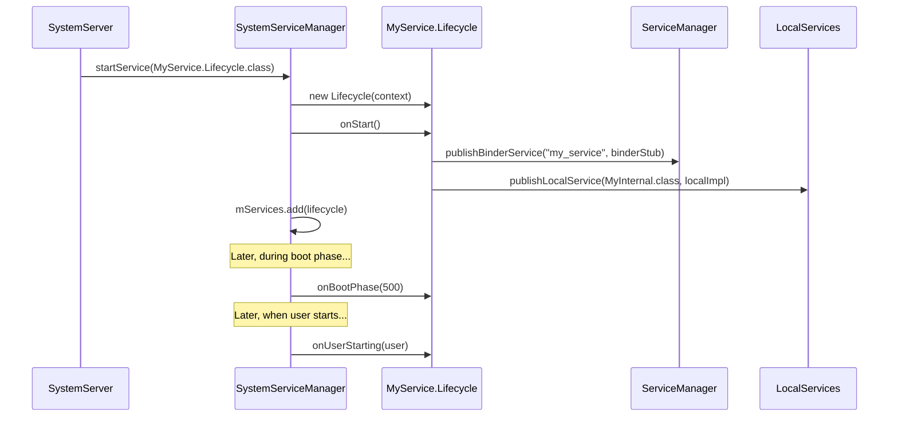

---

## 20.24 Historical Context

### 20.24.1 Evolution of system_server

The `system_server` architecture has evolved significantly:

**Early Android (1.x-2.x)**:

- Monolithic `SystemServer.java` with inline service construction
- No `SystemService` base class
- No boot phases
- Limited threading model

**Android 4.x-5.x**:

- Introduction of `SystemService` base class
- Boot phases added for orderly initialization
- `SystemServiceManager` for lifecycle management
- Shared threads introduced (Display, Animation, UI, Fg, Io, Bg)

**Android 8.x-9.x (Project Treble)**:

- HAL interfaces moved to HIDL
- Stronger separation between framework and vendor code
- Watchdog AIDL interface monitoring added

**Android 10+ (Project Mainline)**:

- Services moved to APEX modules
- `startServiceFromJar()` mechanism added
- `SystemServerClassLoaderFactory` for APEX class loading
- Connectivity, WiFi, Bluetooth services modularized

**Android 12+**:

- ActivityTaskManagerService split from ActivityManagerService
- PermissionThread added
- Enhanced Watchdog with pre-watchdog timeout
- Feature flag gating of service starts

**Android 14+**:

- Ravenwood testing framework integration
- Service dependencies for testing
- Enhanced crash recovery module
- Refactored CrashRecovery as a module

### 20.24.2 The Monolith Pattern

`system_server` follows a "monolithic process, modular services" pattern.
All services run in a single process for several reasons:

1. **Performance**: Intra-process calls via `LocalServices` avoid
   Binder IPC overhead. Given that services call each other thousands
   of times per second, this is significant.
2. **Atomicity**: Having all services in one process means a crash in
   any service restarts all of them, maintaining consistency.
3. **Lock sharing**: Critical locks (like `WindowManagerGlobalLock`)
   can be shared across services without IPC.
4. **Memory efficiency**: Shared heap reduces overall memory usage.

The downside is that one poorly-written service can bring down the
entire system, which is why the Watchdog is so important.

### 20.24.3 Why Not Microservices?

Android considered splitting system services into separate processes
(a microservices-like architecture) but rejected it because:

1. **IPC cost**: Every cross-service call would require Binder IPC
   (~10us minimum), which is unacceptable for the tight interaction
   patterns between AMS, WMS, and InputManager.
2. **Consistency**: Partial failures would require complex recovery
   logic. With a monolithic process, it is all-or-nothing.
3. **Memory overhead**: Each process has its own heap, class loading,
   and VM overhead. Hundreds of small processes would use much more
   memory than one large process.

The APEX module approach is a middle ground: the code is modular and
updatable, but it all runs in the same process.

---

## 20.25 Quick Reference

### 20.25.1 Source File Index

| File Path | Lines | Purpose |
|-----------|-------|---------|
| `frameworks/base/services/java/com/android/server/SystemServer.java` | ~3600 | Entry point, startup orchestration |
| `frameworks/base/services/core/java/com/android/server/SystemService.java` | 641 | Service base class, boot phase constants |
| `frameworks/base/services/core/java/com/android/server/SystemServiceManager.java` | ~500 | Service lifecycle management |
| `frameworks/base/services/core/java/com/android/server/Watchdog.java` | ~1100 | Deadlock detection, thread monitoring |
| `frameworks/base/core/java/com/android/server/ServiceThread.java` | 52 | Handler thread base class |
| `frameworks/base/services/core/java/com/android/server/DisplayThread.java` | 79 | Display operations thread |
| `frameworks/base/services/core/java/com/android/server/AnimationThread.java` | 76 | Window animation thread |
| `frameworks/base/services/core/java/com/android/server/wm/SurfaceAnimationThread.java` | 76 | Lock-free surface animation |
| `frameworks/base/services/core/java/com/android/server/UiThread.java` | 89 | System UI thread |
| `frameworks/base/core/java/com/android/server/FgThread.java` | 69 | Foreground operations thread |
| `frameworks/base/services/core/java/com/android/server/IoThread.java` | 59 | I/O operations thread |
| `frameworks/base/core/java/com/android/internal/os/BackgroundThread.java` | 104 | Background operations thread |
| `frameworks/base/services/core/java/com/android/server/PermissionThread.java` | 72 | Permission operations thread |
| `frameworks/base/services/core/java/com/android/server/SystemServerInitThreadPool.java` | ~100 | Boot-time parallel init pool |

### 20.25.2 Boot Phase Quick Reference

| Value | Constant | Gate |
|-------|----------|------|
| 100 | `PHASE_WAIT_FOR_DEFAULT_DISPLAY` | Default display available |
| 200 | `PHASE_WAIT_FOR_SENSOR_SERVICE` | Sensor HAL ready |
| 480 | `PHASE_LOCK_SETTINGS_READY` | Lock settings readable |
| 500 | `PHASE_SYSTEM_SERVICES_READY` | Core services callable |
| 520 | `PHASE_DEVICE_SPECIFIC_SERVICES_READY` | OEM services callable |
| 550 | `PHASE_ACTIVITY_MANAGER_READY` | Can broadcast Intents |
| 600 | `PHASE_THIRD_PARTY_APPS_CAN_START` | Apps can make Binder calls |
| 1000 | `PHASE_BOOT_COMPLETED` | Home app started |

### 20.25.3 Thread Quick Reference

| Thread Name | Java Class | Priority | I/O | Monitored by Watchdog |
|-------------|-----------|----------|-----|----------------------|
| `main` | Main Looper | FOREGROUND (-2) | Yes | Yes |
| `android.display` | `DisplayThread` | DISPLAY+1 (-3) | No | Yes |
| `android.anim` | `AnimationThread` | DISPLAY (-4) | No | Yes |
| `android.anim.lf` | `SurfaceAnimationThread` | DISPLAY (-4) | No | Yes |
| `android.ui` | `UiThread` | FOREGROUND (-2) | No | Yes |
| `android.fg` | `FgThread` | DEFAULT (0) | Yes | Yes |
| `android.io` | `IoThread` | DEFAULT (0) | Yes | Yes |
| `android.bg` | `BackgroundThread` | BACKGROUND (10) | Yes | No |
| `android.perm` | `PermissionThread` | DEFAULT (0) | Yes | No |
| `watchdog` | `Watchdog` | DEFAULT (0) | N/A | N/A |
| `watchdog.monitor` | `ServiceThread` | DEFAULT (0) | Yes | N/A |
| `Binder:PID_N` | Binder pool | FOREGROUND (-2) | Yes | Yes (via BinderThreadMonitor) |

### 20.25.4 Key Constants

| Constant | Value | Location |
|----------|-------|----------|
| `sMaxBinderThreads` | 31 | `SystemServer.java:493` |
| `DEFAULT_TIMEOUT` | 60,000ms | `Watchdog.java:101` |
| `PRE_WATCHDOG_TIMEOUT_RATIO` | 4 | `Watchdog.java:107` |
| `SLOW_DISPATCH_THRESHOLD_MS` | 100ms | `SystemServer.java:346` |
| `SLOW_DELIVERY_THRESHOLD_MS` | 200ms | `SystemServer.java:347` |
| `DEFAULT_SYSTEM_THEME` | `Theme_DeviceDefault_System` | `SystemServer.java:499` |
| `SERVICE_CALL_WARN_TIME_MS` | 50ms | `SystemServiceManager.java:78` |
| `DEFAULT_MAX_USER_POOL_THREADS` | 3 | `SystemServiceManager.java:92` |
| `USER_POOL_SHUTDOWN_TIMEOUT_SECONDS` | 30s | `SystemServiceManager.java:97` |

### 20.25.5 Essential dumpsys Commands

| Command | Information Shown |
|---------|-------------------|
| `dumpsys activity` | AMS state: processes, activities, broadcasts |
| `dumpsys activity processes` | Running processes and OOM adj |
| `dumpsys window` | WMS state: windows, displays, input |
| `dumpsys package <pkg>` | Package details, permissions, components |
| `dumpsys power` | Power state, wake locks, battery stats |
| `dumpsys notification` | Active notifications and channels |
| `dumpsys audio` | Audio routing, volumes, devices |
| `dumpsys connectivity` | Network state, connections |
| `dumpsys display` | Display configuration, brightness |
| `dumpsys input` | Input devices, event dispatching |
| `dumpsys alarm` | Scheduled alarms |
| `dumpsys jobscheduler` | Pending and running jobs |
| `dumpsys battery` | Battery state and history |
| `dumpsys usagestats` | App usage statistics |
| `dumpsys meminfo system_server` | Memory breakdown |
| `dumpsys binder_calls_stats` | Binder call statistics |
| `dumpsys looper_stats` | Handler message timing |
| `dumpsys system_server_dumper` | Internal system_server state |
| `service list` | All registered Binder services |

---

## 20.26 BackupManagerService

The Android backup framework enables applications to back up their data to
cloud or local storage and restore it after device reset, migration, or app
reinstallation. `BackupManagerService` (BMS) is the system service that
orchestrates this entire process -- managing backup transports, scheduling
key-value and full-data backups, and coordinating restore operations.

**Key source files:**

| File | Description |
|------|-------------|
| `frameworks/base/services/backup/java/com/android/server/backup/BackupManagerService.java` | Top-level delegator service |
| `frameworks/base/services/backup/java/com/android/server/backup/UserBackupManagerService.java` | Per-user backup logic |
| `frameworks/base/services/backup/java/com/android/server/backup/TransportManager.java` | Transport lifecycle management |
| `frameworks/base/services/backup/java/com/android/server/backup/FullBackupJob.java` | JobScheduler integration for full backups |
| `frameworks/base/services/backup/java/com/android/server/backup/keyvalue/KeyValueBackupTask.java` | Key-value backup execution |
| `frameworks/base/services/backup/java/com/android/server/backup/fullbackup/PerformFullTransportBackupTask.java` | Full backup execution |
| `frameworks/base/services/backup/java/com/android/server/backup/restore/PerformUnifiedRestoreTask.java` | Restore execution |
| `frameworks/base/services/backup/java/com/android/server/backup/transport/TransportConnection.java` | Transport binding logic |

### 20.26.1 Architecture Overview

BMS uses a two-layer architecture: a system-level delegator and per-user
managers. This design mirrors Android's multi-user model.

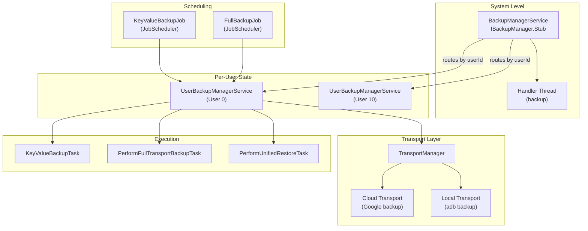

The `BackupManagerService` class documentation states its role:

```java
// frameworks/base/services/backup/java/com/android/server/backup/BackupManagerService.java
/**
 * This class is responsible for handling user-aware operations and acts as
 * a delegator, routing incoming calls to the appropriate per-user
 * {@link UserBackupManagerService} to handle the corresponding
 * backup/restore operation.
 */
public class BackupManagerService extends IBackupManager.Stub
        implements BackupManagerInternal {
```

Each `UserBackupManagerService` instance maintains its own:

- **TransportManager** -- tracks registered transports for that user
- **BackupHandler** -- message-based task scheduling
- **ProcessedPackagesJournal** -- persistent log of backed-up packages
- **DataChangedJournal** -- list of packages with pending key-value changes
- **FullBackupQueue** -- round-robin schedule for full backups

### 20.26.2 Activation and Disablement

BMS can be disabled at two levels:

1. **Permanent** -- The system property `ro.backup.disable` set to `true`
2. **Temporary** -- The `setBackupServiceActive(userId, boolean)` API, typically
   called by `DevicePolicyManager` for enterprise devices

Activation state is tracked using sentinel files:

```java
// frameworks/base/services/backup/java/com/android/server/backup/BackupManagerService.java
private static final String BACKUP_SUPPRESS_FILENAME = "backup-suppress";
private static final String BACKUP_ACTIVATED_FILENAME = "backup-activated";
private static final String REMEMBER_ACTIVATED_FILENAME = "backup-remember-activated";
```

The activation check follows a four-level precedence:

1. **Global suppression** -- Suppress file for `USER_SYSTEM` disables all users
2. **User-specific suppression** -- Suppress file for a particular user
3. **Default activation** -- Whether the user's backup defaults to active
4. **Explicit activation file** -- Presence of activation file for the user

### 20.26.3 Backup Transports

A backup transport is a pluggable component that defines where backup data
goes. Transports are discovered via `PackageManager` by scanning for services
with the action `android.backup.TRANSPORT_HOST`:

```java
// frameworks/base/services/backup/java/com/android/server/backup/TransportManager.java
public static final String SERVICE_ACTION_TRANSPORT_HOST =
        "android.backup.TRANSPORT_HOST";
```

The `TransportManager` maintains a whitelist of allowed transports from
`SystemConfig.getBackupTransportWhitelist()`. Only whitelisted transports
can register. Each transport is wrapped in a `TransportConnection` that
handles the Binder binding lifecycle:

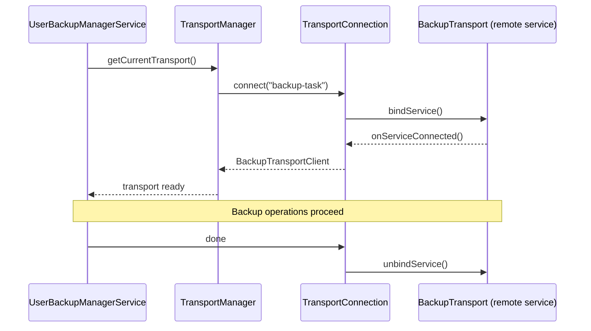

Google's cloud backup transport (`com.google.android.gms/.backup.BackupTransportService`)
implements the `IBackupTransport` interface, but the architecture is open --
OEMs can provide their own transport implementations.

### 20.26.4 Key-Value vs. Full Backup

Android supports two fundamentally different backup strategies:

**Key-Value Backup:**

- Apps extend `BackupAgent` and implement `onBackup()`/`onRestore()`
- Data is stored as key-value pairs using `BackupDataOutput`
- Incremental -- only changed keys are transmitted
- Scheduled via `KeyValueBackupJob` through `JobScheduler`
- Tracked through `DataChangedJournal` -- when an app calls
  `BackupManager.dataChanged()`, its package name is written to the journal

**Full Backup:**

- Automatic backup of entire app directories (internal storage, databases, etc.)
- No app code changes required (unless `BackupAgent` overrides `onFullBackup()`)
- Configured via `android:fullBackupContent` in the manifest
- Scheduled via `FullBackupJob` in a round-robin queue
- Requires the device to be idle and charging (except on Wear devices)

```java
// frameworks/base/services/backup/java/com/android/server/backup/FullBackupJob.java
builder.setRequiredNetworkType(constants.getFullBackupRequiredNetworkType())
        .setRequiresCharging(constants.getFullBackupRequireCharging());
if (!ctx.getPackageManager().hasSystemFeature(PackageManager.FEATURE_WATCH)) {
    builder.setRequiresDeviceIdle(true);
}
```

The backup lifecycle for both types:

```mermaid
flowchart TB
    subgraph "Key-Value Backup"
        KV1["App calls<br/>BackupManager.dataChanged()"]
        KV2["Package added to<br/>DataChangedJournal"]
        KV3["KeyValueBackupJob fires"]
        KV4["KeyValueBackupTask<br/>binds to app's BackupAgent"]
        KV5["Agent.onBackup() called<br/>(incremental state delta)"]
        KV6["Delta sent to transport<br/>via performBackup()"]

        KV1 --> KV2 --> KV3 --> KV4 --> KV5 --> KV6
    end

    subgraph "Full Backup"
        FB1["FullBackupJob fires<br/>(idle + charging)"]
        FB2["Next app in<br/>round-robin queue"]
        FB3["Bind to app's<br/>BackupAgent"]
        FB4["Agent.onFullBackup() called<br/>(or default file walker)"]
        FB5["Tar-format stream sent<br/>to transport"]

        FB1 --> FB2 --> FB3 --> FB4 --> FB5
    end
```

### 20.26.5 The BackupHandler Message Protocol

`UserBackupManagerService` uses a handler-based message protocol defined in
`BackupHandler`:

| Message | Purpose |
|---------|---------|
| `MSG_RUN_BACKUP` | Execute a pending key-value backup pass |
| `MSG_RUN_ADB_BACKUP` | Execute an adb backup (user-initiated) |
| `MSG_RUN_ADB_RESTORE` | Execute an adb restore |
| `MSG_RUN_RESTORE` | Execute a cloud restore |
| `MSG_RUN_CLEAR` | Clear backup data for a package |
| `MSG_RETRY_CLEAR` | Retry clearing after transport unavailability |
| `MSG_REQUEST_BACKUP` | Request backup of specific packages |
| `MSG_SCHEDULE_BACKUP_PACKAGE` | Schedule a package for backup |
| `MSG_BACKUP_OPERATION_TIMEOUT` | Timeout during backup agent operation |
| `MSG_RESTORE_OPERATION_TIMEOUT` | Timeout during restore operation |
| `MSG_RESTORE_SESSION_TIMEOUT` | Timeout for a restore session |
| `MSG_FULL_CONFIRMATION_TIMEOUT` | User confirmation timeout for full backup |
| `MSG_OP_COMPLETE` | Operation completion notification |

### 20.26.6 Backup Eligibility

Not all packages are eligible for backup. The `BackupEligibilityRules` class
determines eligibility based on:

- `android:allowBackup` manifest attribute (default `true`)
- Application flags: must not be `STOPPED`, must be a real package
- Target SDK and backup-specific compat changes
- For key-value backup: must have a declared `BackupAgent`
- For full backup: can use the default agent if no custom agent specified
- Signature verification: restore data from a different signing key is rejected

### 20.26.7 Restore Operations

Restore is coordinated by `PerformUnifiedRestoreTask`, which handles both
key-value and full-data restores through a state machine:

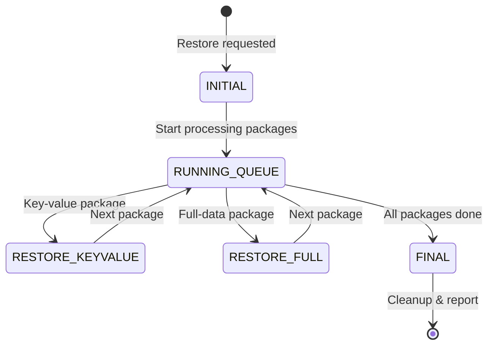

Restores are queued in `mPendingRestores` and processed serially -- only one
restore can run at a time per user:

```java
// frameworks/base/services/backup/java/com/android/server/backup/UserBackupManagerService.java
@GuardedBy("mPendingRestores")
private boolean mIsRestoreInProgress;

@GuardedBy("mPendingRestores")
private final Queue<PerformUnifiedRestoreTask> mPendingRestores = new ArrayDeque<>();
```

### 20.26.8 Cloud vs. Local Backup

The transport architecture allows seamless switching between backup destinations:

| Aspect | Cloud Backup (Google) | Local Backup (adb) |
|--------|----------------------|-------------------|
| Transport | `com.google.android.gms` | `com.android.internal.backup.LocalTransport` |
| Trigger | JobScheduler (automatic) | `adb backup` command (manual) |
| Encryption | TLS + server-side encryption | Optional user-set password |
| Format | Transport-specific (protobuf) | Tar archive with optional encryption |
| Quota | Limited (25MB key-value, configurable full) | Unlimited |
| Network required | Yes | No |
| File version header | N/A | `ANDROID BACKUP\n` + version 5 |

The file format for ADB backups is:

```java
// frameworks/base/services/backup/java/com/android/server/backup/UserBackupManagerService.java
public static final int BACKUP_FILE_VERSION = 5;
public static final String BACKUP_FILE_HEADER_MAGIC = "ANDROID BACKUP\n";
public static final String BACKUP_METADATA_FILENAME = "_meta";
public static final int BACKUP_METADATA_VERSION = 1;
public static final int BACKUP_WIDGET_METADATA_TOKEN = 0x01FFED01;
```

### 20.26.9 Multi-User Considerations

BMS handles edge cases around multi-user devices:

- The main user might not exist at boot time (first boot), tracked via
  `mDidMainUserExistAtBoot`
- Non-system user backup state is stored in both the user's directory
  and the system directory -- when a user is removed, BMS cleans up the
  system-dir portion via `onRemovedNonSystemUser()`
- Each user gets an independent `UserBackupManagerService` with its own
  transports, schedules, and state

---

## 20.27 CrashRecoveryModule and RescueParty

When Android detects persistent crashes -- whether from apps, system services,
or boot loops -- the crash recovery subsystem progressively escalates through
increasingly aggressive mitigations to restore the device to a functional state.
This system is built on three cooperating components: `PackageWatchdog`,
`RescueParty`, and `CrashRecoveryModule`.

**Key source files:**

| File | Description |
|------|-------------|
| `frameworks/base/packages/CrashRecovery/services/platform/java/com/android/server/crashrecovery/CrashRecoveryModule.java` | Module lifecycle |
| `frameworks/base/packages/CrashRecovery/services/platform/java/com/android/server/PackageWatchdog.java` | Failure monitoring engine |
| `frameworks/base/packages/CrashRecovery/services/platform/java/com/android/server/RescueParty.java` | Escalating mitigation logic |
| `frameworks/base/services/core/java/com/android/server/crashrecovery/CrashRecoveryHelper.java` | Connectivity module health listener |

### 20.27.1 CrashRecoveryModule Lifecycle

`CrashRecoveryModule` is delivered as an APEX module and follows the
`SystemService` lifecycle:

```java
// frameworks/base/packages/CrashRecovery/services/platform/java/com/android/server/crashrecovery/CrashRecoveryModule.java
public static class Lifecycle extends SystemService {
    @Override
    public void onStart() {
        RescueParty.registerHealthObserver(mSystemContext);
        mPackageWatchdog.registerShutdownBroadcastReceiver();
        mPackageWatchdog.noteBoot();
    }

    @Override
    public void onBootPhase(int phase) {
        if (phase == PHASE_THIRD_PARTY_APPS_CAN_START) {
            mPackageWatchdog.onPackagesReady();
        }
    }
}
```

At `onStart()`, three critical actions happen:

1. RescueParty registers itself as a health observer with PackageWatchdog
2. PackageWatchdog registers to listen for shutdown broadcasts
3. PackageWatchdog records the boot event (for boot loop detection)

At boot phase 600 (`PHASE_THIRD_PARTY_APPS_CAN_START`), PackageWatchdog
initializes its health check controller and begins monitoring.

### 20.27.2 PackageWatchdog

PackageWatchdog is the central failure monitoring engine. It tracks package
health through multiple failure signals and delegates mitigation to registered
observers.

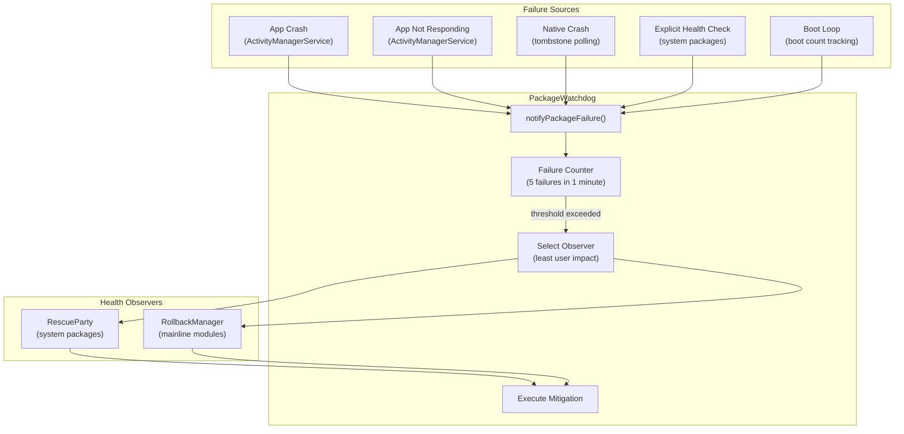

**Failure reasons:**

```java
// frameworks/base/packages/CrashRecovery/services/platform/java/com/android/server/PackageWatchdog.java
public static final int FAILURE_REASON_UNKNOWN = 0;
public static final int FAILURE_REASON_NATIVE_CRASH = 1;
public static final int FAILURE_REASON_EXPLICIT_HEALTH_CHECK = 2;
public static final int FAILURE_REASON_APP_CRASH = 3;
public static final int FAILURE_REASON_APP_NOT_RESPONDING = 4;
public static final int FAILURE_REASON_BOOT_LOOP = 5;
```

**Trigger thresholds:**

| Parameter | Default | Description |
|-----------|---------|-------------|
| `DEFAULT_TRIGGER_FAILURE_COUNT` | 5 | Failures needed to trigger mitigation |
| `DEFAULT_TRIGGER_FAILURE_DURATION_MS` | 60,000ms (1 min) | Window for counting failures |
| `DEFAULT_OBSERVING_DURATION_MS` | 2 days | How long to monitor a package |
| `DEFAULT_DEESCALATION_WINDOW_MS` | 1 hour | Sliding window for mitigation count |
| `DEFAULT_BOOT_LOOP_TRIGGER_COUNT` | 5 | Boots to detect a boot loop |
| `DEFAULT_BOOT_LOOP_TRIGGER_WINDOW_MS` | 10 min | Window for boot loop detection |

When `notifyPackageFailure()` is called, the watchdog:

1. Records the failure timestamp for the package
2. Counts failures within the trigger window
3. If the threshold is exceeded, selects the registered observer with the
   **lowest user impact** (using `PackageHealthObserverImpact` levels)
4. Calls the observer's mitigation method
5. Records the mitigation for de-escalation tracking

**Observer registration and selection:**

```java
// Each observer registers with PackageWatchdog
PackageWatchdog.getInstance(context).registerHealthObserver(
        null, RescuePartyObserver.getInstance(context));
```

When multiple observers are registered (e.g., RescueParty and RollbackManager),
the watchdog selects the one whose mitigation has the least user impact. This
ensures a package rollback is preferred over a factory reset.

**State persistence:**

PackageWatchdog persists its observer state to `/data/system/package-watchdog.xml`
using the `AtomicFile` mechanism. Boot loop mitigation counts are stored
separately in `/metadata/watchdog/mitigation_count.txt` to survive filesystem
checkpoint aborts.

### 20.27.3 RescueParty Escalation Levels

RescueParty registers as a `PackageHealthObserver` and implements a graduated
escalation strategy. Each successive mitigation attempt escalates to a more
aggressive level:

```mermaid
flowchart TB
    subgraph "Legacy Escalation (pre-flag)"
        L1["Level 1: Reset untrusted<br/>settings to defaults"]
        L2["Level 2: Reset untrusted<br/>settings changes"]
        L3["Level 3: Reset trusted<br/>settings to defaults"]
        L4["Level 4: Warm reboot"]
        L5["Level 5: Factory reset"]

        L1 --> L2 --> L3 --> L4 --> L5
    end

    subgraph "New Escalation (recoverabilityDetection flag)"
        N1["Level 1: Scoped DeviceConfig<br/>reset (per-package)"]
        N2["Level 2: All DeviceConfig<br/>reset"]
        N3["Level 3: Warm reboot"]
        N4["Level 4: Reset untrusted<br/>settings defaults"]
        N5["Level 5: Reset untrusted<br/>settings changes"]
        N6["Level 6: Reset trusted<br/>settings defaults"]
        N7["Level 7: Factory reset"]

        N1 --> N2 --> N3 --> N4 --> N5 --> N6 --> N7
    end

    subgraph "Simplified Escalation (deprecateFlagsAndSettingsResets flag)"
        S1["Level 1: Warm reboot"]
        S2["Level 2: Factory reset"]

        S1 --> S2
    end
```

The escalation constants:

```java
// frameworks/base/packages/CrashRecovery/services/platform/java/com/android/server/RescueParty.java
static final int RESCUE_LEVEL_NONE = 0;
static final int RESCUE_LEVEL_SCOPED_DEVICE_CONFIG_RESET = 1;
static final int RESCUE_LEVEL_ALL_DEVICE_CONFIG_RESET = 2;
static final int RESCUE_LEVEL_WARM_REBOOT = 3;
static final int RESCUE_LEVEL_RESET_SETTINGS_UNTRUSTED_DEFAULTS = 4;
static final int RESCUE_LEVEL_RESET_SETTINGS_UNTRUSTED_CHANGES = 5;
static final int RESCUE_LEVEL_RESET_SETTINGS_TRUSTED_DEFAULTS = 6;
static final int RESCUE_LEVEL_FACTORY_RESET = 7;
```

### 20.27.4 RescueParty Disable Conditions

RescueParty is deliberately disabled in several scenarios to avoid interfering
with development and testing:

- **Engineering builds** (`Build.TYPE.equals("eng")`) -- Always disabled
- **USB-connected userdebug** -- Disabled when USB is active on userdebug
  builds, indicating active debugging
- **DeviceConfig flag** -- `persist.device_config.configuration.disable_rescue_party`
- **Manual property** -- `persist.sys.disable_rescue` for emergency override
- **Explicit enable** -- `persist.sys.enable_rescue` overrides all disable checks

```java
// frameworks/base/packages/CrashRecovery/services/platform/java/com/android/server/RescueParty.java
// We're disabled on userdebug devices connected over USB, since that's
// a decent signal that someone is actively trying to debug the device,
// or that it's in a lab environment.
if (Build.TYPE.equals("userdebug") && isUsbActive()) {
    Slog.v(TAG, "Disabled because of active USB connection");
    return true;
}
```

### 20.27.5 Boot Loop Detection

Boot loops are detected by `PackageWatchdog.BootThreshold`:

```
Boot loop detection:
  - Track: mBootThreshold(count=5, window=10min)
  - PackageWatchdog.noteBoot() called at every system_server start
  - If 5 boots occur within 10 minutes → FAILURE_REASON_BOOT_LOOP
  - Boot loop failures skip per-package scoped mitigations
    (no package to blame → go straight to global mitigations)
```

When a boot loop is detected without a specific failing package, the
mitigation count offset shifts by 1 because scoped DeviceConfig reset
is meaningless without a target package.

### 20.27.6 Factory Reset Throttling

To prevent rapid factory reset cycles, RescueParty implements throttling:

```java
// frameworks/base/packages/CrashRecovery/services/platform/java/com/android/server/RescueParty.java
static final long DEFAULT_FACTORY_RESET_THROTTLE_DURATION_MIN = 1440; // 24 hours
```

The `CrashRecoveryProperties` system stores:

- `attemptingFactoryReset` -- Whether a factory reset is in progress
- `attemptingReboot` -- Whether a reboot is in progress
- `lastFactoryResetTimeMs` -- Timestamp of last factory reset
- `maxRescueLevelAttempted` -- Highest level ever reached

### 20.27.7 CrashRecoveryHelper

The `CrashRecoveryHelper` class bridges PackageWatchdog with the
connectivity module health monitoring:

```java
// frameworks/base/services/core/java/com/android/server/crashrecovery/CrashRecoveryHelper.java
public void registerConnectivityModuleHealthListener() {
    mConnectivityModuleConnector.registerHealthListener(
            packageName -> {
            final VersionedPackage pkg = getVersionedPackage(packageName);
            if (pkg == null) {
                Slog.wtf(TAG, "NetworkStack failed but could not find its package");
                return;
            }
            final List<VersionedPackage> pkgList = Collections.singletonList(pkg);
            PackageWatchdog.getInstance(mContext).notifyPackageFailure(pkgList,
                    PackageWatchdog.FAILURE_REASON_EXPLICIT_HEALTH_CHECK);
        });
}
```

This ensures network stack crashes are funneled through the same
PackageWatchdog pipeline as other failures, enabling consistent
mitigation (including potential rollback of the Tethering APEX).

### 20.27.8 Integration with RollbackManager

PackageWatchdog works alongside `RollbackManager` for mainline module
crash recovery:

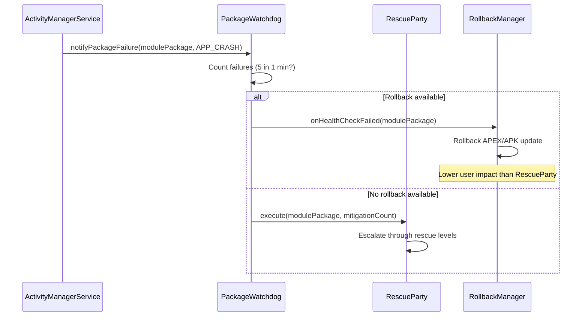

The key principle is **least user impact**: rollback (restoring the previous
version) is always preferred over settings resets or factory reset because
it is less disruptive.

---

## 20.28 ClipboardService

The `ClipboardService` manages the system clipboard -- the mechanism that
enables copy-and-paste across applications. What seems like a trivial
feature involves deep security considerations: cross-app data leakage,
content URI permission grants, multi-user isolation, virtual device
clipboard silos, automatic clipboard clearing, and access notification
toasts.

> **Source:**
> `frameworks/base/services/core/java/com/android/server/clipboard/ClipboardService.java`

### 20.28.1 Architecture Overview

ClipboardService extends `SystemService` and publishes two interfaces on
startup:

```java
// ClipboardService.java, line 251-254
@Override
public void onStart() {
    publishBinderService(Context.CLIPBOARD_SERVICE, new ClipboardImpl());
    LocalServices.addService(ClipboardManagerInternal.class, new ClipboardInternalImpl());
}
```

The dual interface follows the standard `system_server` pattern:
`ClipboardImpl` (Binder) for app-facing IPC, and `ClipboardInternalImpl`
(local) for intra-process use by other system services.

```mermaid
graph TD
    App["Application"] -->|"IClipboard (Binder)"| CI["ClipboardImpl"]
    CI --> CS["ClipboardService"]
    SS["Other System Services"] -->|"ClipboardManagerInternal (local)"| IL["ClipboardInternalImpl"]
    IL --> CS
    CS --> CB["Clipboard objects<br/>(per userId + deviceId)"]
    CS --> UGM["UriGrantsManager<br/>(permission grants)"]
    CS --> AO["AppOpsManager<br/>(access control)"]
    CS --> TC["TextClassifier<br/>(content classification)"]
```

### 20.28.2 The Clipboard Data Model

Clipboard data is stored in `Clipboard` objects indexed by a composite key
of `(userId, deviceId)`:

```java
// ClipboardService.java, line 182
@GuardedBy("mLock")
private final SparseArrayMap<Integer, Clipboard> mClipboards = new SparseArrayMap<>();
```

Each `Clipboard` instance holds:

| Field | Type | Purpose |
|-------|------|---------|
| `primaryClip` | `ClipData` | The actual clipboard content |
| `primaryClipUid` | `int` | UID of the app that set the clip |
| `mPrimaryClipPackage` | `String` | Package that set the clip |
| `primaryClipListeners` | `RemoteCallbackList` | Registered change listeners |
| `mNotifiedUids` | `SparseBooleanArray` | UIDs already shown access toast |
| `mNotifiedTextClassifierUids` | `SparseBooleanArray` | UIDs already sent to classifier |
| `mTextClassifier` | `TextClassifier` | Session for content annotation |

`ClipData` itself is the framework's representation of clipboard content. It
wraps a `ClipDescription` (MIME types) and one or more `ClipData.Item`
objects. Each item can carry plain text, HTML text, an `Intent`, or a
content `Uri`. The MIME types supported include:

- `MIMETYPE_TEXT_PLAIN` -- simple text
- `MIMETYPE_TEXT_HTML` -- HTML markup
- `MIMETYPE_TEXT_INTENT` -- an Intent
- `MIMETYPE_TEXT_URILIST` -- content URIs
- `MIMETYPE_APPLICATION_SHORTCUT` -- launcher shortcuts
- `MIMETYPE_APPLICATION_ACTIVITY` -- activity references
- `MIMETYPE_APPLICATION_TASK` -- task references

### 20.28.3 Cross-App Security Restrictions

The clipboard is a high-value attack vector because any app can read data
placed by any other app. Android enforces several layers of protection:

**AppOps gating.** Every read and write goes through `AppOpsManager`:

```java
// clipboardAccessAllowed checks both OP_READ_CLIPBOARD and OP_WRITE_CLIPBOARD
if (!clipboardAccessAllowed(
        AppOpsManager.OP_READ_CLIPBOARD, pkg, attributionTag,
        intendingUid, intendingUserId, intendingDeviceId)) {
    return null;
}
```

**Content URI permission grants.** When a `ClipData` contains a content URI,
the clipboard service grants temporary read permissions to the reading app
via `UriGrantsManager`. This is the `addActiveOwnerLocked()` call that runs
when `getPrimaryClip()` is invoked.

**User isolation.** Each Android user gets a separate clipboard namespace.
The `getIntendingUserId()` method validates cross-user access through
`ActivityManagerInternal.handleIncomingUser()`, requiring either
`INTERACT_ACROSS_USERS_FULL` or `INTERACT_ACROSS_USERS` permission.

**Device lock check.** If the user profile is locked (device locked, FBE
credential-encrypted storage not yet available), clipboard reads return null:

```java
if (isDeviceLocked(intendingUserId, deviceId)) {
    return null;
}
```

### 20.28.4 Clipboard Access Notification

Starting with Android 12, the system shows a toast notification whenever an
app reads the clipboard. This is the "Pasted from <app>" message users see:

```java
// ClipboardService.java, line 161
private static final long ACCESS_NOTIFICATION_SUPPRESSION_TIMEOUT_MILLIS = 1000L;
```

The notification is suppressed for 1 second after a previous notification for
the same UID, preventing toast spam when apps read the clipboard multiple
times rapidly. The feature is controlled by a per-user setting
(`CLIPBOARD_SHOW_ACCESS_NOTIFICATIONS`) and a server-side `DeviceConfig` flag.

The `showAccessNotificationLocked()` method also sends the clipboard content
to the `TextClassifier` for content-type logging via
`notifyTextClassifierLocked()`, which classifies up to
`mMaxClassificationLength` (default 400) characters.

### 20.28.5 Automatic Clipboard Clearing

To reduce the window during which sensitive data (passwords, credit cards)
sits on the clipboard, the service implements auto-clear:

```java
// ClipboardService.java, line 139
public static final long DEFAULT_CLIPBOARD_TIMEOUT_MILLIS = 3600000; // 1 hour
```

When `setPrimaryClip()` is called, the service schedules a delayed
`ClipboardClearHandler.MSG_CLEAR` message. The timeout (default 1 hour)
and the feature toggle are both controlled via `DeviceConfig`:

```java
if (DeviceConfig.getBoolean(DeviceConfig.NAMESPACE_CLIPBOARD,
        PROPERTY_AUTO_CLEAR_ENABLED, true)) {
    mClipboardClearHandler.sendMessageDelayed(clearMessage,
            getTimeoutForAutoClear());
}
```

If the user pastes the content before the timeout, a new timer is
rescheduled from the paste time, giving the user another full timeout window.

### 20.28.6 Virtual Device Clipboard Silos

With the introduction of virtual devices (CDM -- Companion Device Manager),
clipboard isolation becomes more complex. Apps running on a virtual device
can have a separate clipboard from the default device:

```java
// getIntendingDeviceId() determines which clipboard an app should access
private int getIntendingDeviceId(int requestedDeviceId, int uid) {
    if (mVdmInternal == null) {
        return DEVICE_ID_DEFAULT;
    }
    ArraySet<Integer> virtualDeviceIds = mVdmInternal.getDeviceIdsForUid(uid);
    // ...
}
```

The policy is controlled per virtual device via
`VirtualDeviceManager.getDevicePolicy(deviceId, POLICY_TYPE_CLIPBOARD)`.
When `DEVICE_POLICY_CUSTOM` is set, the virtual device shares the default
clipboard. Otherwise, it gets its own isolated clipboard. When a virtual
device is closed, the `VirtualDeviceListener` callback removes its clipboard.

```mermaid
graph LR
    subgraph "Default Device"
        DC["Clipboard<br/>(userId=0, deviceId=DEFAULT)"]
    end
    subgraph "Virtual Device 1"
        VC1["Clipboard<br/>(userId=0, deviceId=1)"]
    end
    subgraph "Virtual Device 2 (shared)"
        VC2["Uses Default Clipboard<br/>(DEVICE_POLICY_CUSTOM)"]
    end
    VC2 -.->|"shares"| DC
```

### 20.28.7 Emulator and ARC Integration

ClipboardService detects the execution environment at construction time and
installs an appropriate clipboard monitor:

```java
// ClipboardService.java, line 223-238
if (Build.IS_EMULATOR) {
    mClipboardMonitor = new EmulatorClipboardMonitor(/* callback */);
} else if (Build.IS_ARC) {
    mClipboardMonitor = new ArcClipboardMonitor(/* callback */);
} else {
    mClipboardMonitor = (clip) -> {};
}
```

The `EmulatorClipboardMonitor` syncs the clipboard between the Android
emulator and the host machine. `ArcClipboardMonitor` enables clipboard
sharing between the ChromeOS host and the Android container in ARC
(Android Runtime for Chrome).

---

## 20.29 DownloadManager and DownloadProvider

The download subsystem provides a system-level download service that handles
background HTTP downloads with notification integration, retry logic, network
constraint awareness, and MediaStore integration. Unlike most system
services, the download infrastructure is split between a system API
(`DownloadManager`) and a separate ContentProvider process
(`DownloadProvider`).

> **Source root:**
> `packages/providers/DownloadProvider/src/com/android/providers/downloads/`

### 20.29.1 Architecture

```mermaid
graph TD
    App["Application"] -->|"DownloadManager API"| DM["DownloadManager"]
    DM -->|"ContentResolver.insert()"| DP["DownloadProvider<br/>(ContentProvider)"]
    DP -->|"schedules"| JS["DownloadJobService<br/>(JobScheduler)"]
    JS -->|"spawns"| DT["DownloadThread"]
    DT -->|"HTTP request"| Net["Network"]
    DT -->|"progress updates"| DP
    DT -->|"notifications"| DN["DownloadNotifier"]
    DT -->|"media scanning"| DS["DownloadScanner"]
    DP -->|"SQLite"| DB["downloads.db"]

    style DP fill:#f9f,stroke:#333
    style DT fill:#bbf,stroke:#333
```

The key components are:

| Component | File | Role |
|-----------|------|------|
| `DownloadProvider` | `DownloadProvider.java` | ContentProvider managing the downloads database |
| `DownloadJobService` | `DownloadJobService.java` | JobService hosting download execution threads |
| `DownloadThread` | `DownloadThread.java` | Performs the actual HTTP download on a background thread |
| `DownloadNotifier` | `DownloadNotifier.java` | Manages download progress/completion notifications |
| `DownloadInfo` | `DownloadInfo.java` | In-memory representation of a download's state |
| `DownloadScanner` | `DownloadScanner.java` | Triggers MediaStore scanning for completed downloads |
| `Constants` | `Constants.java` | Retry limits, timeout values, other constants |

### 20.29.2 The Download Database

DownloadProvider uses a SQLite database (`downloads.db`, version 114) with a
single `downloads` table. The database tracks every download's URI, file
path, status, bytes downloaded, MIME type, notification visibility, retry
count, ETag, and more.

```java
// DownloadProvider.java, line 97-101
private static final String DB_NAME = "downloads.db";
private static final int DB_VERSION = 114;
private static final String DB_TABLE = "downloads";
private static final int IDLE_CONNECTION_TIMEOUT_MS = 30000;
```

URI matching routes requests through a standard `UriMatcher`:

| URI Pattern | Constant | Description |
|-------------|----------|-------------|
| `downloads/my_downloads` | `MY_DOWNLOADS` | Downloads belonging to calling UID |
| `downloads/my_downloads/#` | `MY_DOWNLOADS_ID` | Individual download by calling UID |
| `downloads/all_downloads` | `ALL_DOWNLOADS` | All downloads (requires permission) |
| `downloads/all_downloads/#` | `ALL_DOWNLOADS_ID` | Individual download (any UID) |

### 20.29.3 Download Execution with JobScheduler

Each download is executed as a job in `DownloadJobService`. When a new
download is inserted into the provider, a job is scheduled. The service
maintains a `SparseArray<DownloadThread>` of active threads:

```java
// DownloadJobService.java, line 57-76
@Override
public boolean onStartJob(JobParameters params) {
    final int id = params.getJobId();
    final DownloadInfo info = DownloadInfo.queryDownloadInfo(this, id);
    if (info == null) {
        return false;
    }
    final DownloadThread thread;
    synchronized (mActiveThreads) {
        if (mActiveThreads.indexOfKey(id) >= 0) {
            return false; // Already running
        }
        thread = new DownloadThread(this, params, info);
        mActiveThreads.put(id, thread);
    }
    thread.start();
    return true;
}
```

The job timeout is 10 minutes (standard JobScheduler limit). If a download
does not finish, the job is rescheduled and the download resumes using HTTP
Range headers and the stored ETag.

### 20.29.4 Retry Logic

`DownloadThread` implements a retry mechanism with exponential backoff:

```java
// Constants.java, line 143-155
public static final int MAX_RETRIES = 5;
public static final int MIN_RETRY_AFTER = 30;      // 30 seconds
public static final int MAX_RETRY_AFTER = 24 * 60 * 60; // 24 hours
```

When an error occurs, the thread distinguishes between retryable and
permanent failures:

```mermaid
flowchart TD
    E["Error occurs"] --> R{"Is status retryable?"}
    R -->|"Yes"| P{"Made progress?"}
    P -->|"Yes"| Reset["Reset fail count to 1"]
    P -->|"No"| Inc["Increment fail count"]
    Reset --> C{"numFailed < MAX_RETRIES (5)?"}
    Inc --> C
    C -->|"Yes"| Net{"Network available?"}
    Net -->|"Yes"| Retry["STATUS_WAITING_TO_RETRY<br/>(backoff delay)"]
    Net -->|"No"| Wait["STATUS_WAITING_FOR_NETWORK"]
    C -->|"No"| Fail["Permanent failure"]
    R -->|"No"| Fail
```

The "made progress" check is key: if any data was transferred during the
current attempt, the failure counter resets to 1. This prevents a large
file download from failing permanently due to intermittent connectivity.

### 20.29.5 Notification Integration

`DownloadNotifier` manages three notification channels:

| Channel | Importance | Usage |
|---------|-----------|-------|
| `active` | `IMPORTANCE_MIN` | Downloads in progress |
| `waiting` | `IMPORTANCE_DEFAULT` | Downloads waiting for network |
| `complete` | `IMPORTANCE_DEFAULT` | Completed or failed downloads |

Download visibility is controlled by the `VISIBILITY_*` constants set in
the `DownloadManager.Request`:

- `VISIBILITY_VISIBLE` -- show notification while running
- `VISIBILITY_VISIBLE_NOTIFY_COMPLETED` -- show while running and after completion
- `VISIBILITY_VISIBLE_NOTIFY_ONLY_COMPLETION` -- show only on completion
- `VISIBILITY_HIDDEN` -- no notification (requires `DOWNLOAD_WITHOUT_NOTIFICATION`)

The notifier tracks active download speeds in a `LongSparseLongArray` to
calculate and display estimated time remaining.

### 20.29.6 Network Awareness

`DownloadThread` uses the caller's default network rather than the system
default, respecting per-UID network restrictions:

```java
// DownloadThread.java, line 300-304
mNetwork = mSystemFacade.getNetwork(mParams);
if (mNetwork == null) {
    throw new StopRequestException(STATUS_WAITING_FOR_NETWORK,
            "No network associated with requesting UID");
}
```

The thread registers a `NetworkPolicyListener` to react to policy changes
(metered network restrictions, data saver mode) mid-download. Traffic is
tagged with the requesting UID for proper data accounting:

```java
TrafficStats.setThreadStatsTagDownload();
TrafficStats.setThreadStatsUid(mInfo.mUid);
```

---

## Summary

The `system_server` process is the largest and most complex process in
Android. It is forked from Zygote and initializes over 100 Java system
services through a carefully ordered four-phase startup sequence:
bootstrap, core, other, and APEX services. Each service extends the
`SystemService` base class and receives lifecycle callbacks as the
system progresses through eight boot phases from
`PHASE_WAIT_FOR_DEFAULT_DISPLAY` (100) to `PHASE_BOOT_COMPLETED` (1000).

The threading model uses eight shared singleton threads (plus the main
looper and a pool of 31 Binder threads), each with a specific priority
level and purpose. The Watchdog monitors all critical threads every 15
seconds and kills `system_server` if any thread remains unresponsive for
60 seconds, triggering a runtime restart rather than leaving the device
frozen.

Service communication uses a dual-interface pattern: Binder services
for cross-process access from apps, and local services for efficient
intra-process access from other system services. The lock ordering
discipline, ThreadPriorityBooster, and LockGuard mechanisms prevent
deadlocks across the hundreds of interacting services.

Performance is optimized through parallel initialization via
`SystemServerInitThreadPool`, lazy singleton thread creation, Zygote
memory inheritance, and careful boot phase ordering. The APEX module
loading mechanism allows services to be delivered and updated through
mainline modules without modifying `SystemServer.java`.

Understanding `system_server` is essential for AOSP development because
virtually every framework API passes through it. Whether you are adding
a new system service, debugging a boot hang, optimizing startup time,
or investigating a Watchdog timeout, the concepts in this chapter --
service lifecycle, boot phases, threading model, Watchdog monitoring,
lock ordering, and the dual-interface communication pattern -- provide
the foundation for working effectively with the Android framework.
