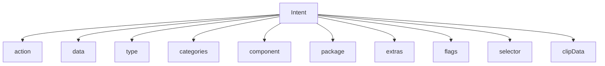

# 第 21 章：Intent 系统深度解析

Intent 系统是 Android 组件通信模型的核心。它支撑 Activity 启动、Service 调用、Broadcast 分发、PendingIntent 令牌、Deep Link、App Links、跨用户/跨 profile 跳转，以及大量系统事件通知。本章从 Intent 对象模型、解析流程、Broadcast 子系统、PendingIntent、安全策略与调试方法几方面系统解析 Android Intent 体系。

---

## 21.1 Intent 架构

### 21.1.1 Intent 对象模型

`Intent` 是一种“带语义的消息对象”，主要包含以下字段：

- `action`
- `data` / `type`
- `categories`
- `component`
- `package`
- `extras`
- `flags`
- `selector`
- `clipData`

这些字段组合在一起，描述“要做什么、由谁做、带什么参数、以什么方式做”。

### 21.1.2 Intent 结构图



### 21.1.3 Intent 的两种形式

Intent 有两种基本形态：

1. **显式 Intent**：指定目标组件或包。
2. **隐式 Intent**：只描述语义，由系统解析匹配组件。

显式 Intent 用于确定性组件调用；隐式 Intent 用于能力发现和跨应用协作。

### 21.1.4 `filterEquals` 契约

`filterEquals()` 用于比较两个 Intent 是否在“用于解析和标识”的关键字段上相等。它通常忽略 extras，因此常用于 PendingIntent 身份判定和 Intent 去重逻辑。

### 21.1.5 Intent Flags

Flags 用于修饰启动和分发行为，例如：

- Activity task 栈控制
- 新任务启动
- 清栈行为
- URI grant 语义
- receiver 行为修饰

### 21.1.6 Intent 构造模式

常见构造模式包括：

- 基于 action + data
- 基于明确 component
- 基于 package 限制范围
- 基于 `setClassName()` 或 `setComponent()`
- 通过 helper 工厂方法创建系统标准 Intent

### 21.1.7 Selector 机制

Selector 允许一个 Intent 拥有“实际要发送的数据”和“真正用于解析的 selector Intent”，常用于高级分享与 chooser 语义中。

### 21.1.8 `ClipData` 与 URI 权限授予

若 Intent 携带 `content://` URI，`ClipData` 可附带多个 URI，并与 `FLAG_GRANT_READ_URI_PERMISSION` / `FLAG_GRANT_WRITE_URI_PERMISSION` 配合，让接收方获得受控访问权限。

### 21.1.9 Intent 复制模式

Intent 支持浅复制、深复制与字段选择性复制。不同复制模式影响 extras、clipData 和 flags 是否被完整保留。

### 21.1.10 标准 Action 深入

标准 Action 如 `ACTION_VIEW`、`ACTION_SEND`、`ACTION_MAIN`、`ACTION_EDIT` 等，是应用互操作的共同语言。系统解析器会围绕这些标准 action 实现广泛匹配逻辑。

---

## 21.2 Intent 解析

### 21.2.1 解析架构

Intent 解析通常发生在 PackageManager / ActivityTaskManager / Broadcast 系统与专门 resolver 逻辑之间，目标是从已安装组件中找出最匹配的候选者。

### 21.2.2 显式 Intent 解析

显式 Intent 若指定了 component，系统基本直接定位该组件，仅做导出、权限和存在性检查，不进行模糊匹配。

### 21.2.3 隐式 Intent 解析：三个测试

隐式 Intent 匹配通常要通过三个主要测试：

1. action 匹配
2. data/type 匹配
3. category 匹配

只有同时满足这些约束的 filter 才是有效候选。

### 21.2.4 `ResolveInfo`：解析结果

`ResolveInfo` 是解析结果容器，包含匹配组件、优先级、图标、标签、目标 info 和匹配质量等信息。

### 21.2.5 完整的 `match()` 方法

`IntentFilter.match()` 会综合 action、scheme、authority、path、mime type 与 category 生成匹配结果，是 Android Intent 解析最核心的方法之一。

### 21.2.6 Predicate API

新式 API 允许在已有解析基础上用 predicate 进一步筛选结果，提高框架与工具链的灵活性。

### 21.2.7 解析优先级与排序

系统会根据 filter priority、默认性、已选默认应用、域验证结果和系统策略排序候选结果。

### 21.2.8 `CATEGORY_DEFAULT` 深入

对于 `startActivity()` 的大多数隐式解析，目标 filter 通常必须包含 `CATEGORY_DEFAULT` 才会被视为有效候选，这是一条容易被忽略的规则。

### 21.2.9 Chooser

Chooser 为用户显式选择目标组件提供统一 UI，并可附加分享目标、额外初始候选和安全控制。

### 21.2.10 基于 Scheme 的匹配细节

URI scheme（如 `http`、`https`、`content`、`tel`）会显著影响解析路径。不同 scheme 常与不同 authority/path 规则结合。

---

## 21.3 PendingIntent

### 21.3.1 源码位置与类结构

`PendingIntent` 由 framework Java API 与 system_server 中的 ActivityManager / PendingIntentRecord 协同实现，本质上是“未来可由其他进程代你执行的 Intent 令牌”。

### 21.3.2 创建方法

常见创建方法包括：

- `getActivity()`
- `getBroadcast()`
- `getService()`
- `getForegroundService()`

### 21.3.3 PendingIntent Flags

常见 flag 包括：

- `FLAG_UPDATE_CURRENT`
- `FLAG_CANCEL_CURRENT`
- `FLAG_NO_CREATE`
- `FLAG_IMMUTABLE`
- `FLAG_MUTABLE`

### 21.3.4 可变与不可变 PendingIntent

现代 Android 强调显式声明 mutable 或 immutable。不可变 PendingIntent 更安全，可避免接收方在发送时修改关键字段。

### 21.3.5 安全影响

PendingIntent 若设计不当，可能导致权限借用、Intent 重定向或 extras 注入风险。正确使用 immutable 和最小授权非常关键。

### 21.3.6 `getActivity` 的实现路径

创建 PendingIntent 时，framework 会把目标 Intent 及身份关键字段交给 system_server 生成或复用对应记录对象。

### 21.3.7 `PendingIntent.send()` 与 Fill-In

`send()` 时可传入 fill-in Intent，对 mutable PendingIntent 的未固定字段进行补充或覆盖。

### 21.3.8 `OnFinished` 回调

发送完成后可通过 `OnFinished` 获取结果回调，用于通知、闹钟和系统流程同步。

### 21.3.9 PendingIntent 与通知

通知点击、操作按钮、气泡和前台服务控制等大量依赖 PendingIntent 作为跨进程、安全持久的回调令牌。

### 21.3.10 PendingIntent 身份

PendingIntent 的身份主要取决于请求类型、requestCode、目标意图在 `filterEquals()` 意义上的等价性以及创建方上下文。

---

## 21.4 Broadcast 系统

### 21.4.1 Broadcast 架构

Broadcast 系统负责把 Intent 类型事件从发送方分发到匹配的接收器，包括动态注册 receiver、manifest receiver 和系统内部有序广播队列。

### 21.4.2 `BroadcastRecord`：广播信封

`BroadcastRecord` 封装一次广播的 Intent、接收目标、状态、时间戳、权限要求和分发进度，是 system_server 中广播生命周期的核心对象。

### 21.4.3 投递状态机

广播分发会经历排队、开始、逐接收器处理、完成或超时等状态，是一个严格管理的状态机。

### 21.4.4 `BroadcastProcessQueue`

新式广播实现更强调按进程队列组织，减少全局队列复杂度并更精细控制优先级。

### 21.4.5 有序广播

Ordered broadcast 会按优先级顺序发送给接收器，并允许前一接收器修改结果或中断传播。

### 21.4.6 Sticky 广播

Sticky broadcast 会在系统中保留最后一次值，后注册接收者也能立即获得。但现代 Android 已大幅限制其使用。

### 21.4.7 动态注册 vs Manifest Receiver

动态 receiver 只在进程存活且注册期间有效；manifest receiver 可在进程未启动时由系统拉起进程接收特定广播。

### 21.4.8 `LocalBroadcastManager`

这是应用内广播方案，现多被更现代架构替代，但它说明 Intent 语义也可被限定在进程内。

### 21.4.9 广播投递优先级

系统会考虑前台状态、重要性、接收器类型和广播类型来调整投递优先级。

### 21.4.10 Broadcast ANR

广播接收器若长时间不返回，会导致广播 ANR，是 Android 中常见稳定性问题之一。

### 21.4.11 Broadcast Options

BroadcastOptions 提供更细粒度的发送行为控制，如后台启动限制、交付分组与时序约束。

### 21.4.12 广播分组策略

系统可对重复或可合并广播做 delivery grouping，以减少广播风暴和功耗开销。

### 21.4.13 `BroadcastSkipPolicy`

SkipPolicy 决定某些接收器是否应被跳过，用于后台限制、权限限制和系统策略执行。

### 21.4.14 广播历史

system_server 会记录广播历史，便于调试投递时序、失败和慢接收器问题。

### 21.4.15 后台广播限制的历史演进

Android 逐步收紧后台广播，以提升性能、功耗和隐私保护，manifest receiver 的适用范围也随版本变化。

---

## 21.5 App Links 与 Deep Links

### 21.5.1 Deep Links vs App Links

Deep Links 是能跳转到应用内部页面的 URI；App Links 则是在此基础上增加域名所有权验证，使系统更确定地把网页 URL 交给特定应用处理。

### 21.5.2 App Links 的 Intent Filter

App Links 通常通过 `VIEW` + `BROWSABLE` + `DEFAULT` + `http/https` data filter 声明。

### 21.5.3 可验证资格

只有满足一定条件的 filter 与域名配置才有资格进入自动验证流程。

### 21.5.4 Digital Asset Links

域名所有者通过 `assetlinks.json` 声明与应用包名和证书的绑定关系，系统据此完成验证。

### 21.5.5 `intent://` Scheme

`intent://` 提供一种把 URI 与 Intent 字段编码在一起的方式，常用于浏览器跳转和 fallback 逻辑。

### 21.5.6 App Link 验证时机

验证可能在安装后、升级后、显式重触发或用户操作后发生。

### 21.5.7 测试 App Links

```bash
# Check current state
# Manually approve a domain (for testing)
# Reset all verification
# Re-trigger verification
# Test with a URL launch
```

### 21.5.8 验证状态管理

系统会记录每个包与域名的验证状态、用户选择和策略覆盖结果。

---

## 21.6 Intent Filters

### 21.6.1 `IntentFilter` 内部结构

IntentFilter 内部维护 action、category、data schemes、mime types、authorities、paths 和额外匹配配置。

### 21.6.2 Filter 匹配规则

匹配规则围绕 action、category 和 data 三大维度展开，其中 data 又细分为 scheme、host、port、path 与 mime type。

### 21.6.3 匹配质量常量

系统使用 match quality 常量来表示匹配精度，供 resolver 排序和调试使用。

### 21.6.4 `AuthorityEntry`

AuthorityEntry 描述 URI authority 的 host 与 port 匹配规则，是 content/http 等 URI 匹配的重要部分。

### 21.6.5 Priority

Priority 可影响有序广播和解析排序，但现代 Android 对其影响范围做了更多限制。

### 21.6.6 Auto-Verify

autoVerify 是 App Links 中的声明项，提示系统应尝试验证该域名与应用的归属关系。

### 21.6.7 `UriRelativeFilterGroup`（现代新增）

这一现代机制扩展了 URI 相对路径级别的更细粒度过滤表达能力。

### 21.6.8 XML 声明

IntentFilter 主要通过 manifest XML 声明，是组件可发现性的核心元数据之一。

### 21.6.9 常见 IntentFilter 模式

常见模式包括分享、网页打开、打开文件、启动主界面、广播监听和系统回调入口。

### 21.6.10 `PatternMatcher` 类型

路径匹配支持 literal、prefix、simple glob 等不同模式，影响 URI path 匹配范围。

---

## 21.7 跨 Profile Intent

### 21.7.1 `CrossProfileIntentFilter`

该机制允许工作资料与个人资料等 profile 之间按规则转发特定 Intent。

### 21.7.2 访问控制级别

跨 profile 转发受到更严格的管理员、策略和用户边界控制。

### 21.7.3 跨 Profile 解析流

系统会先在当前 profile 解析，再根据 cross-profile filter 判断是否转发到目标 profile 继续解析。

### 21.7.4 默认跨 Profile Filter

系统可预置一部分跨 profile 转发规则，例如查看联系人、拍照或文件打开等场景。

### 21.7.5 `CrossProfileIntentResolverEngine`

该引擎统一处理跨 profile 解析逻辑和结果合并。

---

## 21.8 Protected Broadcasts

### 21.8.1 声明

Protected broadcast 在平台 manifest 中声明，只允许系统或特权发送方发出。

### 21.8.2 强制执行

系统在发送广播时检查调用方身份，阻止普通应用伪造关键系统事件。

### 21.8.3 常见 Protected Broadcast

如开机完成、包变化、电池状态变化等系统关键广播通常都受保护。

### 21.8.4 为什么 Protected Broadcast 很重要

它能阻止恶意应用伪造系统级状态变化，从而避免权限提升、欺骗和系统不一致。

---

## 21.9 Intent 安全

### 21.9.1 显式组件规则

对敏感跳转，显式指定组件通常比隐式 Intent 更安全，因为解析空间更小、行为更可预测。

### 21.9.2 `exported` 属性

组件是否导出决定其他应用是否能直接触达它，是 Intent 安全边界的核心配置之一。

### 21.9.3 Broadcast 的权限检查

广播发送与接收可附加权限要求，从而限制谁能发、谁能收。

### 21.9.4 Intent Redirect 防护

Intent redirect 漏洞常见于应用把外部传入 Intent 原样转发到内部敏感组件。系统和开发者都需要防范此类路径。

### 21.9.5 URI 权限授予

对 URI 授权必须最小化、显式化，并结合生命周期在适当时机撤销。

### 21.9.6 包可见性过滤

现代 Android 会限制应用查询其他包和解析组件的可见性，这会影响 Intent 解析结果集。

### 21.9.7 `CATEGORY_DEFAULT` 要求

未声明 `CATEGORY_DEFAULT` 的 activity 往往不会被普通 `startActivity()` 隐式解析选中，这是安全和兼容的重要细节。

### 21.9.8 进程边界上的 Intent 校验

在跨进程边界传递 Intent 时，接收方不应盲目信任 extras、URI 或内嵌 Intent，而应重新校验来源和内容。

### 21.9.9 广播排除

系统可基于权限、导出状态、后台策略和 skip policy 排除不应接收广播的组件。

### 21.9.10 安全检查清单

典型检查项包括：

- 是否显式指定组件
- exported 是否合理
- 是否缺少权限保护
- PendingIntent 是否应为 immutable
- 是否存在 URI grant 过宽问题
- 是否校验来自 extras 的内嵌 Intent

### 21.9.11 常见 Intent 安全漏洞

常见漏洞包括 Intent 重定向、导出组件暴露、可变 PendingIntent 被利用、未受保护广播入口和 URI 授权滥用。

---

## 21.10 动手实践

### Exercise 21.1: 用 adb 检查 Intent 字段

```bash
# Launch an explicit intent
# Launch an implicit intent with action and data
# Send a broadcast
# Send an ordered broadcast
# View broadcast delivery with verbose logging
```

### Exercise 21.2: 探索 Intent 解析

```bash
# Query which activities handle a specific intent
# Resolve a specific URL
# List all intent filters for a package
# Check preferred activities (default apps)
```

### Exercise 21.3: 检查广播队列状态

```bash
# Dump the entire broadcast system state
# Watch broadcasts in real-time
# Send a test broadcast and observe delivery
# This will fail with SecurityException - it's a protected broadcast!
# Send a non-protected broadcast
```

### Exercise 21.4: 验证 App Links

```bash
# Check domain verification state for a package
# Manually trigger verification
# Reset verification state
# Approve a domain manually for testing
```

### Exercise 21.5: 在源码中追踪 Intent 解析

建议从 `IntentResolver`、`PackageManagerService`、`IntentFilter.match()` 和 AMS/ATMS 调用链开始。

### Exercise 21.6: PendingIntent 检查

```bash
# List all pending intents in the system
# Create a test PendingIntent via an alarm
# Inspect PendingIntent records
```

### Exercise 21.7: 跨 Profile Intent 转发

```bash
# List cross-profile intent filters (requires root or work profile)
# Check which intents forward between profiles
# On a device with work profile (user 10):
```

### Exercise 21.8: 构建自定义 IntentFilter 测试器

编写小工具批量构造 action/category/data 组合，验证 match 结果与优先级排序。

### Exercise 21.9: Protected Broadcast 审计

```bash
# Find all protected broadcasts declared in the platform
# Search for protected broadcasts across all system packages
# Attempt to send a protected broadcast (will fail from shell on user builds)
# Expected: Security exception for non-system sender
```

### Exercise 21.10: Intent Redirect 漏洞检测

```bash
# Find potential intent redirect patterns
# Find startActivity calls on extras
```

### Exercise 21.11: 监控广播投递时间

```bash
# Trigger a configuration change and monitor broadcast timing
# Immediately dump broadcast state
# Look for timing data:
# enqueueTime: when the broadcast was queued
# dispatchTime: when delivery began
# finishTime: when the last receiver completed
# receiverTime: per-receiver start time
# Reset
```

### Exercise 21.12: IntentFilter 匹配质量分析

通过构造不同 scheme、type、authority、path 组合，观察 match quality 常量变化。

### Exercise 21.13: 调试 PendingIntent 等价性

重点观察 requestCode、flags 与 `filterEquals()` 对 identity 的影响。

### Exercise 21.14: 阅读 Intent 源码

从 `Intent.java`、`IntentFilter.java`、`PendingIntentRecord` 和广播队列实现入手。

### Exercise 21.15: 构建广播投递监视器

实现一个小工具记录广播发送时间、投递时间和接收器完成时间，用于识别慢广播。

### Exercise 21.16: 验证导出组件安全

```bash
# Find all exported components
# Find components with intent filters but no permission
# Find broadcast receivers without permission protection
# Find services that are exported
```

## Summary

## 总结

Intent 系统是 Android 组件解耦和跨进程交互的基础设施，其核心组成如下：

| 组件 | 作用 |
|------|------|
| `Intent` | 统一描述操作语义与目标 |
| `IntentFilter` | 描述组件可处理的语义集合 |
| 解析器 | 基于 action/data/category 执行匹配 |
| `PendingIntent` | 可跨进程持有并稍后执行的能力令牌 |
| Broadcast 系统 | 面向事件分发的多接收器管线 |
| App Links | 把 Web 域名与应用能力绑定 |
| Cross-Profile Resolver | 处理多 profile Intent 转发 |

### Architectural Overview

Intent 体系围绕“语义描述 → 组件发现 → 权限与策略检查 → 最终投递”展开，是 Android 高度解耦架构的重要代表。

### Key Takeaways

- 显式 Intent 更确定，隐式 Intent 更灵活。
- `IntentFilter.match()` 是解析核心。
- PendingIntent 的 identity 不等于 extras 完全相同。
- 广播系统有独立队列、历史和 ANR 机制。
- App Links 在 Deep Links 之上增加域验证。
- Intent 安全问题经常来自导出配置与 redirect 链路。

### 重大 Intent 系统变更的版本历史

Android 持续加强：

- exported 显式声明要求
- 后台广播限制
- PendingIntent mutable/immutable 约束
- 包可见性限制
- App Links 与域验证能力

### 设计原则

1. **语义优先**：用 action/data/category 描述“做什么”。
2. **组件解耦**：发送方不必预先绑定接收方实现。
3. **渐进收紧安全**：随着平台演进增加可见性、导出与权限限制。
4. **系统统一解析**：解析逻辑集中在框架与系统服务中。
5. **能力令牌化**：通过 PendingIntent 和 URI grants 控制延迟执行与受限访问。
