# Chapter 21: Intent System Deep Dive

The Intent system is the central inter-component and inter-application messaging mechanism
in Android. Every activity launch, every broadcast delivery, every service binding, and
every content provider query ultimately flows through an Intent or an Intent-like
mechanism. This chapter dissects the full lifecycle of an Intent -- from construction
through resolution to delivery -- by examining the real AOSP source code that implements
it.

We will trace through the core classes in `frameworks/base/core/java/android/content/`,
the resolution machinery in `frameworks/base/services/core/java/com/android/server/pm/resolution/`,
the broadcast infrastructure in `frameworks/base/services/core/java/com/android/server/am/`,
and the domain verification system that governs App Links.

---

## 21.1 Intent Architecture

### 21.1.1 The Intent Object Model

An Intent is, at its core, a passive data structure -- a message envelope that describes
an operation to be performed. The class is defined in:

```
frameworks/base/core/java/android/content/Intent.java
```

The Javadoc in the source captures this precisely:

> "An intent is an abstract description of an operation to be performed. It can be used
> with startActivity to launch an Activity, broadcastIntent to send it to any interested
> BroadcastReceiver components, and startService or bindService to communicate with a
> background Service."

The Intent class itself is roughly 12,000 lines long, containing hundreds of standard
action constants, category constants, extra key definitions, and flag declarations. The
actual data carried by an individual Intent instance, however, fits into a compact set of
private fields (around line 8010 in the source):

```java
// frameworks/base/core/java/android/content/Intent.java, line ~8010
private String mAction;
private Uri mData;
private String mType;
private String mIdentifier;
private String mPackage;
private ComponentName mComponent;
private int mFlags;
private int mLocalFlags;
private int mExtendedFlags;
private ArraySet<String> mCategories;
private Bundle mExtras;
private Rect mSourceBounds;
private Intent mSelector;
private ClipData mClipData;
private int mContentUserHint = UserHandle.USER_CURRENT;
```

These fields partition into two tiers of importance.

**Primary fields** (used for resolution and matching):

| Field | Type | Purpose |
|-------|------|---------|
| `mAction` | `String` | The general action to perform (e.g., `ACTION_VIEW`) |
| `mData` | `Uri` | The data URI to operate on |
| `mType` | `String` | Explicit MIME type |
| `mComponent` | `ComponentName` | Explicit target component |
| `mCategories` | `ArraySet<String>` | Additional classification categories |
| `mPackage` | `String` | Restrict resolution to a specific package |
| `mIdentifier` | `String` | Unique identity for distinguishing otherwise-equal intents |

**Secondary fields** (metadata and payload):

| Field | Type | Purpose |
|-------|------|---------|
| `mExtras` | `Bundle` | Arbitrary key-value payload data |
| `mFlags` | `int` | Behavioral flags (activity launch mode, receiver flags) |
| `mSelector` | `Intent` | Alternate Intent used for resolution |
| `mClipData` | `ClipData` | Rich content attached to the Intent |
| `mSourceBounds` | `Rect` | Visual origin hint for transitions |

### 21.1.2 Intent Structure Diagram

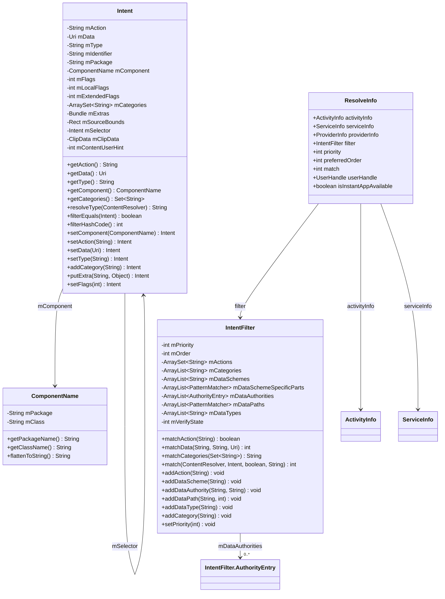
```mermaid
classDiagram
    class Intent {
        -String mAction
        -Uri mData
        -String mType
        -String mIdentifier
        -String mPackage
        -ComponentName mComponent
        -int mFlags
        -int mLocalFlags
        -int mExtendedFlags
        -ArraySet~String~ mCategories
        -Bundle mExtras
        -Rect mSourceBounds
        -Intent mSelector
        -ClipData mClipData
        -int mContentUserHint
        +getAction() String
        +getData() Uri
        +getType() String
        +getComponent() ComponentName
        +getCategories() Set~String~
        +resolveType(ContentResolver) String
        +filterEquals(Intent) boolean
        +filterHashCode() int
        +setComponent(ComponentName) Intent
        +setAction(String) Intent
        +setData(Uri) Intent
        +setType(String) Intent
        +addCategory(String) Intent
        +putExtra(String, Object) Intent
        +setFlags(int) Intent
    }

    class IntentFilter {
        -int mPriority
        -int mOrder
        -ArraySet~String~ mActions
        -ArrayList~String~ mCategories
        -ArrayList~String~ mDataSchemes
        -ArrayList~PatternMatcher~ mDataSchemeSpecificParts
        -ArrayList~AuthorityEntry~ mDataAuthorities
        -ArrayList~PatternMatcher~ mDataPaths
        -ArrayList~String~ mDataTypes
        -int mVerifyState
        +matchAction(String) boolean
        +matchData(String, String, Uri) int
        +matchCategories(Set~String~) String
        +match(ContentResolver, Intent, boolean, String) int
        +addAction(String) void
        +addDataScheme(String) void
        +addDataAuthority(String, String) void
        +addDataPath(String, int) void
        +addDataType(String) void
        +addCategory(String) void
        +setPriority(int) void
    }

    class ResolveInfo {
        +ActivityInfo activityInfo
        +ServiceInfo serviceInfo
        +ProviderInfo providerInfo
        +IntentFilter filter
        +int priority
        +int preferredOrder
        +int match
        +UserHandle userHandle
        +boolean isInstantAppAvailable
    }

    class ComponentName {
        -String mPackage
        -String mClass
        +getPackageName() String
        +getClassName() String
        +flattenToString() String
    }

    Intent --> ComponentName : mComponent
    Intent --> Intent : mSelector
    IntentFilter --> "0..*" IntentFilter.AuthorityEntry : mDataAuthorities
    ResolveInfo --> IntentFilter : filter
    ResolveInfo --> ActivityInfo : activityInfo
    ResolveInfo --> ServiceInfo : serviceInfo
```

### 21.1.3 The Two Forms of Intents

The source code at line ~257 of `Intent.java` documents the two fundamental forms:

**Explicit Intents** have a specified component via `setComponent()` or `setClass()`.
When an explicit component is set, the system bypasses all resolution logic -- the named
component is used directly. This is the mechanism for intra-application navigation and
for targeting specific system services.

**Implicit Intents** have no component set. Instead, they carry enough information
(action, data, type, categories) for the system to determine which available component
is the best match. This is the mechanism for inter-application communication and for
leveraging the "late runtime binding" that the Intent documentation describes.

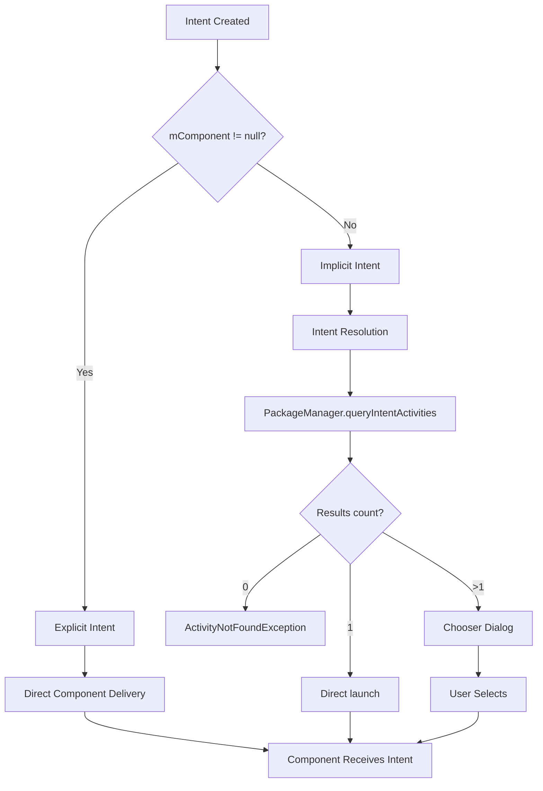
```mermaid
flowchart TD
    A[Intent Created] --> B{mComponent != null?}
    B -->|Yes| C[Explicit Intent]
    B -->|No| D[Implicit Intent]
    C --> E[Direct Component Delivery]
    D --> F[Intent Resolution]
    F --> G[PackageManager.queryIntentActivities]
    G --> H{Results count?}
    H -->|0| I[ActivityNotFoundException]
    H -->|1| J[Direct launch]
    H -->|>1| K[Chooser Dialog]
    E --> L[Component Receives Intent]
    J --> L
    K --> M[User Selects] --> L
```

### 21.1.4 The filterEquals Contract

A critical method on Intent is `filterEquals()`, defined around line 11969:

```java
// frameworks/base/core/java/android/content/Intent.java
public boolean filterEquals(Intent other) {
    if (other == null) {
        return false;
    }
    if (!Objects.equals(this.mAction, other.mAction)) return false;
    if (!Objects.equals(this.mData, other.mData)) return false;
    if (!Objects.equals(this.mType, other.mType)) return false;
    if (!Objects.equals(this.mIdentifier, other.mIdentifier)) return false;
    if (!Objects.equals(this.mPackage, other.mPackage)) return false;
    if (!Objects.equals(this.mComponent, other.mComponent)) return false;
    if (!Objects.equals(this.mCategories, other.mCategories)) return false;
    return true;
}
```

This method defines the identity of an Intent for purposes of:

- PendingIntent matching (two PendingIntents with filterEquals Intents share the same token)
- `FLAG_RECEIVER_REPLACE_PENDING` broadcast replacement
- `FilterComparison` wrapper used as HashMap keys

Note that `mExtras` is deliberately excluded. Two Intents that differ only in their
extras are considered the same Intent for resolution and PendingIntent purposes. This
is a common source of bugs, documented explicitly in the PendingIntent Javadoc.

### 21.1.5 Intent Flags

The Intent class defines flags in two categories, both encoded as bitmasks in `mFlags`.

**Activity flags** (bits 0-25, roughly) control launch behavior:

| Flag | Value | Effect |
|------|-------|--------|
| `FLAG_ACTIVITY_NEW_TASK` | `0x10000000` | Launch into a new task |
| `FLAG_ACTIVITY_CLEAR_TOP` | `0x04000000` | Clear activities above target in stack |
| `FLAG_ACTIVITY_SINGLE_TOP` | `0x20000000` | Reuse existing instance at top |
| `FLAG_ACTIVITY_NO_HISTORY` | `0x40000000` | Do not keep in history |
| `FLAG_ACTIVITY_CLEAR_TASK` | `0x00008000` | Clear task before launching |
| `FLAG_ACTIVITY_EXCLUDE_FROM_RECENTS` | `0x00800000` | Hide from Recents |
| `FLAG_ACTIVITY_FORWARD_RESULT` | `0x02000000` | Relay result to original caller |
| `FLAG_ACTIVITY_LAUNCH_ADJACENT` | `0x00001000` | Multi-window adjacent launch |

**Receiver flags** (bits 26-31, roughly) control broadcast behavior:

| Flag | Value | Effect |
|------|-------|--------|
| `FLAG_RECEIVER_REGISTERED_ONLY` | `0x40000000` | Only registered receivers |
| `FLAG_RECEIVER_REPLACE_PENDING` | `0x20000000` | Replace matching pending broadcasts |
| `FLAG_RECEIVER_FOREGROUND` | `0x10000000` | Deliver at foreground priority |
| `FLAG_RECEIVER_NO_ABORT` | `0x08000000` | Cannot abort ordered broadcast |
| `FLAG_RECEIVER_INCLUDE_BACKGROUND` | `0x01000000` | Include stopped/background apps |
| `FLAG_RECEIVER_EXCLUDE_BACKGROUND` | `0x00800000` | Exclude background apps |

**URI permission flags** (bits 0-2) grant temporary access:

| Flag | Value | Effect |
|------|-------|--------|
| `FLAG_GRANT_READ_URI_PERMISSION` | `0x00000001` | Grant read on data URI |
| `FLAG_GRANT_WRITE_URI_PERMISSION` | `0x00000002` | Grant write on data URI |
| `FLAG_GRANT_PERSISTABLE_URI_PERMISSION` | `0x00000040` | Permission survives reboot |
| `FLAG_GRANT_PREFIX_URI_PERMISSION` | `0x00000080` | Grant on URI prefix |

### 21.1.6 Intent Construction Patterns

The Intent class supports several construction patterns. Understanding these is crucial
because they affect which fields are populated and how resolution behaves.

**Direct constructors:**

```java
// Empty intent - requires setters
Intent intent = new Intent();

// Action-only intent
Intent intent = new Intent(Intent.ACTION_VIEW);

// Action + URI (implicit)
Intent intent = new Intent(Intent.ACTION_VIEW, Uri.parse("https://example.com"));

// Explicit class target
Intent intent = new Intent(context, TargetActivity.class);

// Explicit component via strings
Intent intent = new Intent();
intent.setClassName("com.example.app", "com.example.app.TargetActivity");
```

**The setData/setType mutual exclusion:**

A critical API subtlety: `setData()` clears the type, and `setType()` clears the data.
To set both, you must use `setDataAndType()`:

```java
// WRONG: type is cleared
intent.setData(Uri.parse("content://media/images/1"));
intent.setType("image/jpeg");  // This clears mData!

// CORRECT: both preserved
intent.setDataAndType(Uri.parse("content://media/images/1"), "image/jpeg");
```

The source code confirms this mutual exclusion pattern (around line 10440):

```java
public @NonNull Intent setData(@Nullable Uri data) {
    mData = data;
    mType = null;   // Type cleared!
    return this;
}

public @NonNull Intent setType(@Nullable String type) {
    mData = null;   // Data cleared!
    mType = type;
    return this;
}

public @NonNull Intent setDataAndType(@Nullable Uri data, @Nullable String type) {
    mData = data;
    mType = type;   // Both preserved
    return this;
}
```

### 21.1.7 The Selector Mechanism

The `mSelector` field (line 8024) provides a powerful but rarely used indirection
mechanism. When a selector is set, the system uses the selector Intent for resolution
instead of the main Intent. However, the main Intent's identity (for `filterEquals`)
remains based on the main Intent, not the selector.

From the source (line ~10590):

```java
// Intent.java
public void setSelector(@Nullable Intent selector) {
    if (selector == this) {
        throw new IllegalArgumentException(
                "Intent being set as a selector of itself");
    }
    if (selector != null && mPackage != null) {
        throw new IllegalArgumentException(
                "Can't set selector when package name is already set");
    }
    mSelector = selector;
}
```

Use case: The `CATEGORY_APP_BROWSER` intent uses a selector to target the browser's
launcher activity specifically:

```java
Intent browserIntent = new Intent(Intent.ACTION_MAIN);
Intent selector = new Intent(Intent.ACTION_MAIN);
selector.addCategory(Intent.CATEGORY_APP_BROWSER);
browserIntent.setSelector(selector);
startActivity(browserIntent);
```

This launches the browser via its MAIN/LAUNCHER entry point rather than a VIEW intent,
avoiding task confusion if the user has previously launched the browser normally.

### 21.1.8 ClipData and URI Permission Grants

The `mClipData` field (line 8025) serves a dual purpose: carrying rich content and
enabling URI permission grants on multiple URIs. When `FLAG_GRANT_READ_URI_PERMISSION`
or `FLAG_GRANT_WRITE_URI_PERMISSION` is set, the grant applies to both the main `mData`
URI and all URIs in the ClipData items.

From the source documentation (line ~10633):

> "The main feature of using this over the extras for data is that
> FLAG_GRANT_READ_URI_PERMISSION and FLAG_GRANT_WRITE_URI_PERMISSION will operate on
> any URI items included in the clip data."

This is essential for the `ACTION_SEND_MULTIPLE` pattern where an app shares multiple
content URIs:

```java
Intent shareIntent = new Intent(Intent.ACTION_SEND_MULTIPLE);
shareIntent.setType("image/*");
shareIntent.addFlags(Intent.FLAG_GRANT_READ_URI_PERMISSION);

ArrayList<Uri> imageUris = new ArrayList<>();
imageUris.add(uri1);
imageUris.add(uri2);
imageUris.add(uri3);
shareIntent.putParcelableArrayListExtra(Intent.EXTRA_STREAM, imageUris);

// ClipData ensures URI permissions are granted for all URIs
ClipData clip = ClipData.newUri(resolver, "images", uri1);
for (int i = 1; i < imageUris.size(); i++) {
    clip.addItem(new ClipData.Item(imageUris.get(i)));
}
shareIntent.setClipData(clip);
```

### 21.1.9 Intent Copy Modes

The Intent class defines three copy modes (line ~8033):

```java
private static final int COPY_MODE_ALL = 0;      // Full copy
private static final int COPY_MODE_FILTER = 1;    // Only filter-relevant fields
private static final int COPY_MODE_HISTORY = 2;   // All except extras/clipdata
```

`COPY_MODE_FILTER` creates a "stripped" Intent containing only the fields used for
matching: action, data, type, identifier, package, component, and categories. Flags,
extras, ClipData, and source bounds are excluded. This mode is used when the system
needs to store an Intent for matching purposes without the overhead of the payload.

`COPY_MODE_HISTORY` is similar to a full copy but replaces the extras with a
`Bundle.STRIPPED` sentinel if they are non-empty. This is used for historical records
and debugging dumps where the full extra data is not needed.

### 21.1.10 Standard Actions Deep Dive

The Intent class defines over 100 standard actions. They are grouped by purpose:

**Activity Actions** (launched with `startActivity()`):

| Action | String Value | Purpose |
|--------|-------------|---------|
| `ACTION_MAIN` | `android.intent.action.MAIN` | Main entry point |
| `ACTION_VIEW` | `android.intent.action.VIEW` | Display data |
| `ACTION_EDIT` | `android.intent.action.EDIT` | Edit data |
| `ACTION_PICK` | `android.intent.action.PICK` | Select an item |
| `ACTION_CHOOSER` | `android.intent.action.CHOOSER` | Show chooser dialog |
| `ACTION_GET_CONTENT` | `android.intent.action.GET_CONTENT` | Get content by type |
| `ACTION_SEND` | `android.intent.action.SEND` | Share content |
| `ACTION_SENDTO` | `android.intent.action.SENDTO` | Send to specific recipient |
| `ACTION_DIAL` | `android.intent.action.DIAL` | Show dialer |
| `ACTION_CALL` | `android.intent.action.CALL` | Place phone call |
| `ACTION_INSERT` | `android.intent.action.INSERT` | Insert new data |
| `ACTION_DELETE` | `android.intent.action.DELETE` | Delete data |
| `ACTION_SEARCH` | `android.intent.action.SEARCH` | Perform search |
| `ACTION_WEB_SEARCH` | `android.intent.action.WEB_SEARCH` | Web search |
| `ACTION_QUICK_VIEW` | `android.intent.action.QUICK_VIEW` | Preview data |
| `ACTION_INSERT_OR_EDIT` | `android.intent.action.INSERT_OR_EDIT` | Insert or edit |

**Broadcast Actions** (delivered via `sendBroadcast()`):

| Action | String Value | Protected? |
|--------|-------------|-----------|
| `ACTION_BOOT_COMPLETED` | `android.intent.action.BOOT_COMPLETED` | Yes |
| `ACTION_SHUTDOWN` | `android.intent.action.ACTION_SHUTDOWN` | Yes |
| `ACTION_TIME_TICK` | `android.intent.action.TIME_TICK` | Yes |
| `ACTION_TIME_CHANGED` | `android.intent.action.TIME_SET` | Yes |
| `ACTION_TIMEZONE_CHANGED` | `android.intent.action.TIMEZONE_CHANGED` | Yes |
| `ACTION_BATTERY_CHANGED` | `android.intent.action.BATTERY_CHANGED` | Yes |
| `ACTION_POWER_CONNECTED` | `android.intent.action.ACTION_POWER_CONNECTED` | Yes |
| `ACTION_PACKAGE_ADDED` | `android.intent.action.PACKAGE_ADDED` | Yes |
| `ACTION_PACKAGE_REMOVED` | `android.intent.action.PACKAGE_REMOVED` | Yes |
| `ACTION_SCREEN_ON` | `android.intent.action.SCREEN_ON` | Yes |
| `ACTION_SCREEN_OFF` | `android.intent.action.SCREEN_OFF` | Yes |
| `ACTION_LOCALE_CHANGED` | `android.intent.action.LOCALE_CHANGED` | Yes |

**Standard Categories:**

| Category | String Value | Purpose |
|----------|-------------|---------|
| `CATEGORY_DEFAULT` | `android.intent.category.DEFAULT` | Default for startActivity |
| `CATEGORY_BROWSABLE` | `android.intent.category.BROWSABLE` | Can be opened from browser |
| `CATEGORY_LAUNCHER` | `android.intent.category.LAUNCHER` | Show in app launcher |
| `CATEGORY_HOME` | `android.intent.category.HOME` | Home screen replacement |
| `CATEGORY_ALTERNATIVE` | `android.intent.category.ALTERNATIVE` | Alternative action |
| `CATEGORY_TAB` | `android.intent.category.TAB` | Tab UI |
| `CATEGORY_INFO` | `android.intent.category.INFO` | Information about package |
| `CATEGORY_PREFERENCE` | `android.intent.category.PREFERENCE` | Preferences screen |
| `CATEGORY_CAR_DOCK` | `android.intent.category.CAR_DOCK` | Car dock activity |
| `CATEGORY_DESK_DOCK` | `android.intent.category.DESK_DOCK` | Desk dock activity |
| `CATEGORY_APP_BROWSER` | `android.intent.category.APP_BROWSER` | Browser app |
| `CATEGORY_APP_EMAIL` | `android.intent.category.APP_EMAIL` | Email app |
| `CATEGORY_APP_MAPS` | `android.intent.category.APP_MAPS` | Maps app |
| `CATEGORY_APP_MESSAGING` | `android.intent.category.APP_MESSAGING` | Messaging app |
| `CATEGORY_APP_MUSIC` | `android.intent.category.APP_MUSIC` | Music app |
| `CATEGORY_APP_CALENDAR` | `android.intent.category.APP_CALENDAR` | Calendar app |
| `CATEGORY_APP_CONTACTS` | `android.intent.category.APP_CONTACTS` | Contacts app |
| `CATEGORY_APP_GALLERY` | `android.intent.category.APP_GALLERY` | Gallery app |

---

## 21.2 Intent Resolution

Intent resolution is the process of mapping an implicit Intent to one or more concrete
components that can handle it. The system performs this resolution by comparing the
Intent's attributes against the `<intent-filter>` declarations in installed packages
and against dynamically registered receivers.

### 21.2.1 Resolution Architecture

The resolution machinery lives in the PackageManagerService and its helper classes:

```
frameworks/base/services/core/java/com/android/server/pm/resolution/ComponentResolverBase.java
frameworks/base/services/core/java/com/android/server/pm/resolution/ComponentResolver.java
frameworks/base/services/core/java/com/android/server/pm/resolution/ComponentResolverApi.java
```

`ComponentResolverBase` maintains four specialized resolvers, one per component type:

```java
// frameworks/base/services/core/java/com/android/server/pm/resolution/ComponentResolverBase.java
protected ComponentResolver.ActivityIntentResolver mActivities;
protected ComponentResolver.ProviderIntentResolver mProviders;
protected ComponentResolver.ReceiverIntentResolver mReceivers;
protected ComponentResolver.ServiceIntentResolver mServices;
protected ArrayMap<String, ParsedProvider> mProvidersByAuthority;
```

Each resolver indexes the IntentFilters of all installed components of that type. When a
resolution query arrives, the appropriate resolver performs the matching.

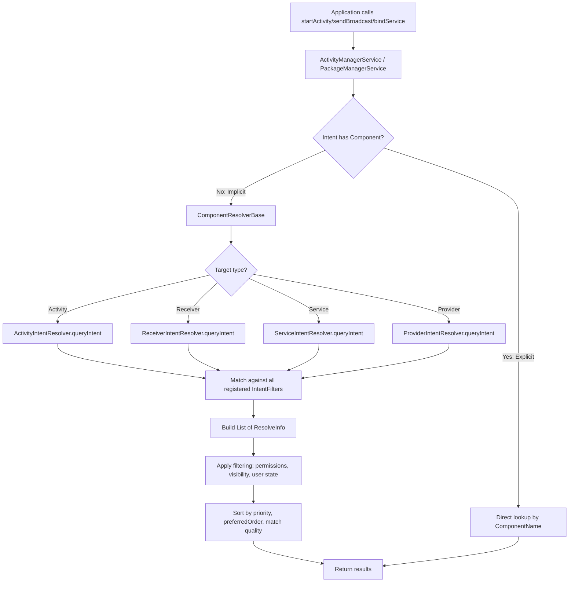
```mermaid
flowchart TD
    A[Application calls startActivity/sendBroadcast/bindService] --> B[ActivityManagerService / PackageManagerService]
    B --> C{Intent has Component?}
    C -->|Yes: Explicit| D[Direct lookup by ComponentName]
    C -->|No: Implicit| E[ComponentResolverBase]
    E --> F{Target type?}
    F -->|Activity| G[ActivityIntentResolver.queryIntent]
    F -->|Receiver| H[ReceiverIntentResolver.queryIntent]
    F -->|Service| I[ServiceIntentResolver.queryIntent]
    F -->|Provider| J[ProviderIntentResolver.queryIntent]
    G --> K[Match against all registered IntentFilters]
    H --> K
    I --> K
    J --> K
    K --> L[Build List of ResolveInfo]
    L --> M[Apply filtering: permissions, visibility, user state]
    M --> N[Sort by priority, preferredOrder, match quality]
    N --> O[Return results]
    D --> O
```

### 21.2.2 Explicit Intent Resolution

Explicit resolution is trivial. When `mComponent` is set on an Intent, the system
performs a direct lookup:

```java
// ComponentResolverBase.java
public boolean componentExists(@NonNull ComponentName componentName) {
    ParsedMainComponent component = mActivities.mActivities.get(componentName);
    if (component != null) return true;
    component = mReceivers.mActivities.get(componentName);
    if (component != null) return true;
    component = mServices.mServices.get(componentName);
    if (component != null) return true;
    return mProviders.mProviders.get(componentName) != null;
}
```

This is an O(1) HashMap lookup. No filter matching occurs. The component must exist,
be enabled, be exported (or share the same UID as the caller), and the caller must
have any required permissions.

### 21.2.3 Implicit Intent Resolution: The Three Tests

Implicit resolution matches an Intent against every IntentFilter registered for the
relevant component type. The matching algorithm from `IntentFilter` (defined in
`frameworks/base/core/java/android/content/IntentFilter.java`) applies three tests
in sequence. All three must pass for a match.

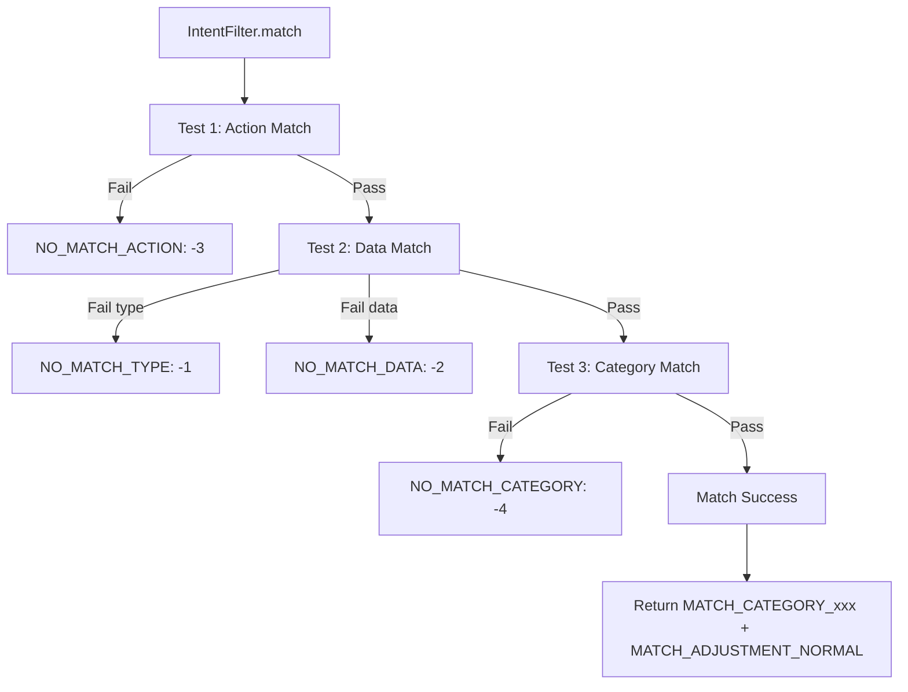
```mermaid
flowchart TD
    A[IntentFilter.match] --> B[Test 1: Action Match]
    B -->|Fail| C[NO_MATCH_ACTION: -3]
    B -->|Pass| D[Test 2: Data Match]
    D -->|Fail type| E[NO_MATCH_TYPE: -1]
    D -->|Fail data| F[NO_MATCH_DATA: -2]
    D -->|Pass| G[Test 3: Category Match]
    G -->|Fail| H[NO_MATCH_CATEGORY: -4]
    G -->|Pass| I[Match Success]
    I --> J[Return MATCH_CATEGORY_xxx + MATCH_ADJUSTMENT_NORMAL]
```

**Test 1: Action Match** (`matchAction()`):

The Intent's action must be listed in the filter's action set. If the filter specifies
no actions, the match always fails. If the Intent's action is null, modern Android
(targeting V+) blocks the match via the `BLOCK_NULL_ACTION_INTENTS` compatibility change.

```java
// IntentFilter.java
public final boolean matchAction(String action) {
    return matchAction(action, false, null);
}

private boolean matchAction(String action, boolean wildcardSupported,
        @Nullable Collection<String> ignoreActions) {
    if (wildcardSupported && WILDCARD.equals(action)) {
        // Wildcard matches any action in the filter
        ...
        return !mActions.isEmpty();
    }
    if (ignoreActions != null && ignoreActions.contains(action)) {
        return false;
    }
    return hasAction(action);
}
```

**Test 2: Data Match** (`matchData()`):

The data match is the most complex test, evaluating the Intent's MIME type, URI scheme,
authority, and path against the filter's data specifications. The method returns a match
quality constant that encodes how specific the match was:

| Constant | Value | Meaning |
|----------|-------|---------|
| `MATCH_CATEGORY_EMPTY` | `0x0100000` | No data specification |
| `MATCH_CATEGORY_SCHEME` | `0x0200000` | Scheme matched |
| `MATCH_CATEGORY_HOST` | `0x0300000` | Scheme + host matched |
| `MATCH_CATEGORY_PORT` | `0x0400000` | Scheme + host + port matched |
| `MATCH_CATEGORY_PATH` | `0x0500000` | Full URI matched |
| `MATCH_CATEGORY_SCHEME_SPECIFIC_PART` | `0x0580000` | Scheme + SSP matched |
| `MATCH_CATEGORY_TYPE` | `0x0600000` | MIME type matched |

Higher values indicate more specific matches. The `MATCH_ADJUSTMENT_NORMAL` value
(`0x8000`) is added to successful matches as a quality baseline.

The data matching logic from `IntentFilter.matchData()` (line ~1742) follows a
hierarchical evaluation:

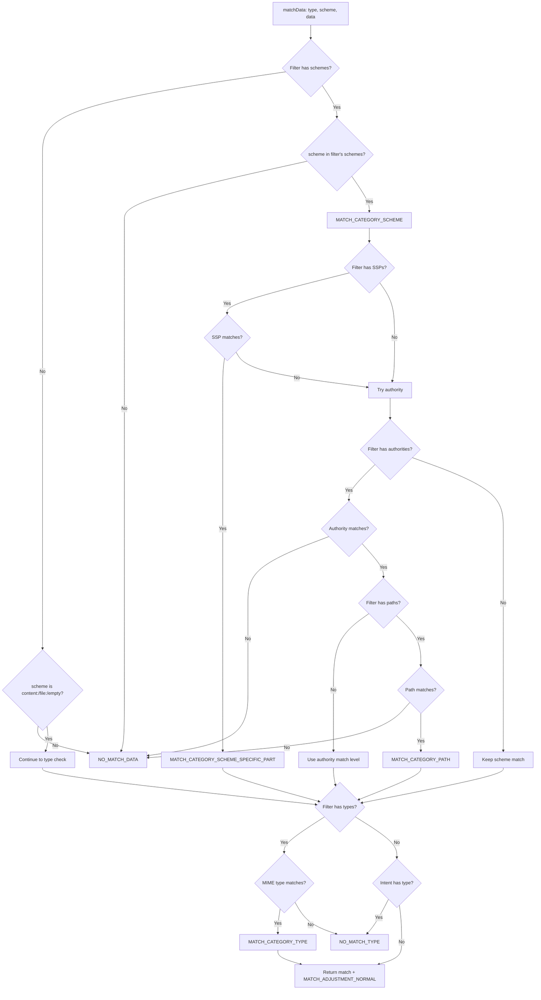
```mermaid
flowchart TD
    A[matchData: type, scheme, data] --> B{Filter has schemes?}
    B -->|No| C{scheme is content:/file:/empty?}
    C -->|No| D[NO_MATCH_DATA]
    C -->|Yes| E[Continue to type check]
    B -->|Yes| F{scheme in filter's schemes?}
    F -->|No| D
    F -->|Yes| G[MATCH_CATEGORY_SCHEME]
    G --> H{Filter has SSPs?}
    H -->|Yes| I{SSP matches?}
    I -->|Yes| J[MATCH_CATEGORY_SCHEME_SPECIFIC_PART]
    I -->|No| K[Try authority]
    H -->|No| K
    K --> L{Filter has authorities?}
    L -->|Yes| M{Authority matches?}
    M -->|No| D
    M -->|Yes| N{Filter has paths?}
    N -->|No| O[Use authority match level]
    N -->|Yes| P{Path matches?}
    P -->|No| D
    P -->|Yes| Q[MATCH_CATEGORY_PATH]
    L -->|No| R[Keep scheme match]
    E --> S{Filter has types?}
    J --> S
    O --> S
    Q --> S
    R --> S
    S -->|Yes| T{MIME type matches?}
    T -->|Yes| U[MATCH_CATEGORY_TYPE]
    T -->|No| V[NO_MATCH_TYPE]
    S -->|No| W{Intent has type?}
    W -->|Yes| V
    W -->|No| X[Return match + MATCH_ADJUSTMENT_NORMAL]
    U --> X
```

**Test 3: Category Match** (`matchCategories()`):

Every category in the Intent must appear in the filter. Extra categories in the filter
that are absent from the Intent do not cause failure. If the filter has no categories,
it only matches Intents with no categories.

```java
// IntentFilter.java, line ~1904
public final String matchCategories(Set<String> categories) {
    if (categories == null) {
        return null;  // Success: no categories required
    }
    Iterator<String> it = categories.iterator();
    if (mCategories == null) {
        return it.hasNext() ? it.next() : null;  // Fail if intent has categories
    }
    while (it.hasNext()) {
        final String category = it.next();
        if (!mCategories.contains(category)) {
            return category;  // Return the first unmatched category
        }
    }
    return null;  // Success: all categories matched
}
```

The critical implication: any activity that wants to be reachable via `startActivity()`
with an implicit Intent must declare `CATEGORY_DEFAULT` in its filter, because
`startActivity()` always adds `CATEGORY_DEFAULT` to the Intent.

### 21.2.4 ResolveInfo: The Resolution Result

The result of resolution is a `ResolveInfo` object (or a list of them), defined in:

```
frameworks/base/core/java/android/content/pm/ResolveInfo.java
```

Key fields:

```java
// ResolveInfo.java
public class ResolveInfo implements Parcelable {
    public ActivityInfo activityInfo;    // Non-null for activity/receiver matches
    public ServiceInfo serviceInfo;      // Non-null for service matches
    public ProviderInfo providerInfo;    // Non-null for provider matches
    public IntentFilter filter;          // The matched filter
    public int priority;                 // Declared priority
    public int preferredOrder;           // User preference order
    public int match;                    // Match quality constant
    public UserHandle userHandle;        // Cross-profile origin
    public boolean isInstantAppAvailable;
}
```

The `match` field encodes the quality of the match as a combination of
`MATCH_CATEGORY_MASK` and `MATCH_ADJUSTMENT_MASK`. When multiple components match, they
are sorted by: (1) priority (higher first), (2) preferredOrder (user preference), (3)
match quality (more specific matches first).

### 21.2.5 The Full match() Method

The complete `match()` method in IntentFilter (line ~2452) orchestrates all three tests
plus the newer extras matching:

```java
// IntentFilter.java, line ~2452
public final int match(String action, String type, String scheme,
        Uri data, Set<String> categories, String logTag, boolean supportWildcards,
        @Nullable Collection<String> ignoreActions, @Nullable Bundle extras) {
    // Test 1: Action
    if (action != null && !matchAction(action, supportWildcards, ignoreActions)) {
        return NO_MATCH_ACTION;
    }

    // Test 2: Data (type + scheme + authority + path)
    int dataMatch = matchData(type, scheme, data, supportWildcards);
    if (dataMatch < 0) {
        return dataMatch;
    }

    // Test 3: Categories
    String categoryMismatch = matchCategories(categories);
    if (categoryMismatch != null) {
        return NO_MATCH_CATEGORY;
    }

    // Test 4: Extras (newer addition, hidden API)
    String extraMismatch = matchExtras(extras);
    if (extraMismatch != null) {
        return NO_MATCH_EXTRAS;
    }

    return dataMatch;
}
```

Note the fourth test: extras matching. While still a hidden API, this allows system
services to create IntentFilters that match against specific extra values. The
`matchExtras()` method (line ~1941) checks that every key-value pair in the filter's
extras exists with an identical value in the Intent's extras.

The convenience method that most client code uses:

```java
// IntentFilter.java, line ~2386
public final int match(ContentResolver resolver, Intent intent,
        boolean resolve, String logTag) {
    String type = resolve ? intent.resolveType(resolver) : intent.getType();
    return match(intent.getAction(), type, intent.getScheme(),
                 intent.getData(), intent.getCategories(), logTag,
                 false /* supportWildcards */, null /* ignoreActions */,
                 intent.getExtras());
}
```

The `resolve` parameter is important: when true, the type is determined by calling
`intent.resolveType(resolver)`, which queries the ContentResolver for the MIME type
of the data URI if no explicit type is set. When false, only `intent.getType()` is
used (returns the explicitly-set type or null).

### 21.2.6 The Predicate API

IntentFilter also exposes a `Predicate<Intent>` API for functional-style matching:

```java
// IntentFilter.java, line ~2348
public @NonNull Predicate<Intent> asPredicate() {
    return i -> match(null, i, false, TAG) >= 0;
}

public @NonNull Predicate<Intent> asPredicateWithTypeResolution(
        @NonNull ContentResolver resolver) {
    return i -> match(resolver, i, true, TAG) >= 0;
}
```

This enables usage like:

```java
IntentFilter filter = new IntentFilter(Intent.ACTION_VIEW);
filter.addDataScheme("https");
filter.addDataAuthority("example.com", null);

List<Intent> matchingIntents = allIntents.stream()
    .filter(filter.asPredicate())
    .collect(Collectors.toList());
```

### 21.2.7 Resolution Priority and Ordering

When multiple components match an implicit Intent, the system must choose which one to
use (for activities) or determine delivery order (for broadcasts). The ordering algorithm
considers several factors:

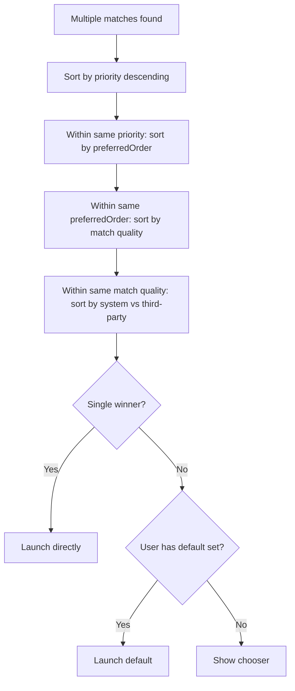
```mermaid
flowchart TD
    A[Multiple matches found] --> B[Sort by priority descending]
    B --> C[Within same priority: sort by preferredOrder]
    C --> D[Within same preferredOrder: sort by match quality]
    D --> E[Within same match quality: sort by system vs third-party]
    E --> F{Single winner?}
    F -->|Yes| G[Launch directly]
    F -->|No| H{User has default set?}
    H -->|Yes| I[Launch default]
    H -->|No| J[Show chooser]
```

The system also considers:

- **Default browser**: When resolving web URLs, the user's default browser gets priority
- **Instant apps**: If `isInstantAppAvailable` is true in a ResolveInfo, the instant
  app version may be preferred
- **Auto-verified domains**: App Links with verified domains bypass the chooser entirely
  (see Section 59.5)
- **Cross-profile matches**: Matches from other profiles are included in the chooser
  with a work/personal badge

### 21.2.8 The CATEGORY_DEFAULT Deep Dive

The `CATEGORY_DEFAULT` requirement is one of the most important and most frequently
misunderstood aspects of intent resolution. Here is the exact behavior:

1. `Context.startActivity()` adds `CATEGORY_DEFAULT` to the Intent automatically
2. `PackageManager.queryIntentActivities()` does NOT add it automatically
3. `Context.sendBroadcast()` does NOT add it
4. `Context.startService()` does NOT add it

This means:

- Activities MUST declare `CATEGORY_DEFAULT` to be launchable via implicit intents
- Broadcast receivers do NOT need `CATEGORY_DEFAULT`
- Services do NOT need `CATEGORY_DEFAULT`

```xml
<!-- This activity is reachable via startActivity() with implicit intent -->
<activity android:name=".ReachableActivity" android:exported="true">
    <intent-filter>
        <action android:name="com.example.MY_ACTION" />
        <category android:name="android.intent.category.DEFAULT" />
    </intent-filter>
</activity>

<!-- This activity is NOT reachable via startActivity() with implicit intent -->
<!-- But IS findable via queryIntentActivities() -->
<activity android:name=".HiddenActivity" android:exported="true">
    <intent-filter>
        <action android:name="com.example.MY_ACTION" />
        <!-- No CATEGORY_DEFAULT! -->
    </intent-filter>
</activity>
```

### 21.2.9 The Chooser

When multiple activities match an implicit Intent and no default is set, the system
presents a Chooser dialog. Applications can also explicitly invoke the Chooser:

```java
Intent chooser = Intent.createChooser(targetIntent, "Share via");
startActivity(chooser);
```

The `ACTION_CHOOSER` wraps the original intent in `EXTRA_INTENT` and optionally adds
`EXTRA_INITIAL_INTENTS` for additional options. The Chooser is itself an Activity
(`com.android.internal.app.ChooserActivity`) that queries the PackageManager and
presents the results.

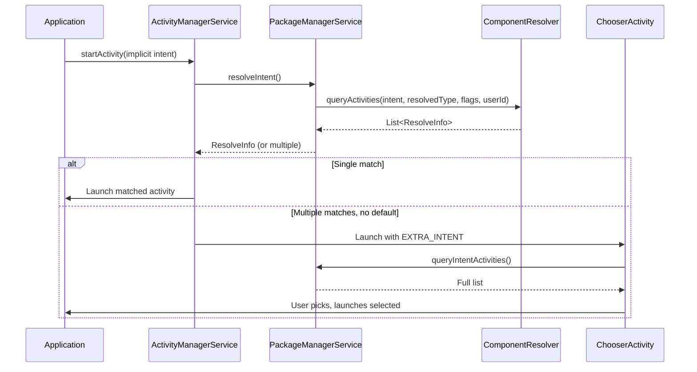
```mermaid
sequenceDiagram
    participant App as Application
    participant AMS as ActivityManagerService
    participant PMS as PackageManagerService
    participant CR as ComponentResolver
    participant Chooser as ChooserActivity

    App->>AMS: startActivity(implicit intent)
    AMS->>PMS: resolveIntent()
    PMS->>CR: queryActivities(intent, resolvedType, flags, userId)
    CR-->>PMS: List<ResolveInfo>
    PMS-->>AMS: ResolveInfo (or multiple)
    alt Single match
        AMS->>App: Launch matched activity
    else Multiple matches, no default
        AMS->>Chooser: Launch with EXTRA_INTENT
        Chooser->>PMS: queryIntentActivities()
        PMS-->>Chooser: Full list
        Chooser->>App: User picks, launches selected
    end
```

### 21.2.10 Scheme-Based Matching Details

A subtle but important behavior: when a filter declares no schemes, it will implicitly
match intents with no data URI, or with `content:` or `file:` scheme URIs. This
allows MIME-type-only filters to work with ContentProviders. From `matchData()`:

```java
// IntentFilter.java, line ~1802
} else {
    // Special case: match either an Intent with no data URI,
    // or with a scheme: URI.  This is to give a convenience for
    // the common case where you want to deal with data in a
    // content provider, which is done by type...
    if (scheme != null && !"".equals(scheme)
            && !"content".equals(scheme)
            && !"file".equals(scheme)) {
        return NO_MATCH_DATA;
    }
}
```

This means a filter with only `<data android:mimeType="image/*"/>` will match an Intent
with `data=content://media/images/1` and `type=image/jpeg`, even though no scheme is
declared in the filter.

---

## 21.3 PendingIntent

A PendingIntent is a token that represents a future Intent operation, maintained by the
system and executable by any party holding the token. It is one of the most security-
sensitive objects in the Android framework.

### 21.3.1 Source Location and Class Structure

```
frameworks/base/core/java/android/app/PendingIntent.java
```

The PendingIntent class wraps an `IIntentSender` binder token:

```java
// PendingIntent.java, line ~135
public final class PendingIntent implements Parcelable {
    private final IIntentSender mTarget;
    private IBinder mWhitelistToken;
    private @Nullable PendingIntentInfo mCachedInfo;
}
```

The actual pending intent state is maintained on the server side in
`ActivityManagerService`. The client-side `PendingIntent` object is merely a handle.

### 21.3.2 Creation Methods

PendingIntents are created through four static factory methods, corresponding to the
four types of operations:

```java
PendingIntent.getActivity(context, requestCode, intent, flags)
PendingIntent.getActivities(context, requestCode, intents, flags)
PendingIntent.getBroadcast(context, requestCode, intent, flags)
PendingIntent.getService(context, requestCode, intent, flags)
PendingIntent.getForegroundService(context, requestCode, intent, flags)
```

Each method calls through to `ActivityManagerService`, which creates an
`PendingIntentRecord` stored in a process-independent map. The `requestCode` parameter
is used to distinguish PendingIntents that would otherwise be considered equivalent
via `filterEquals()`.

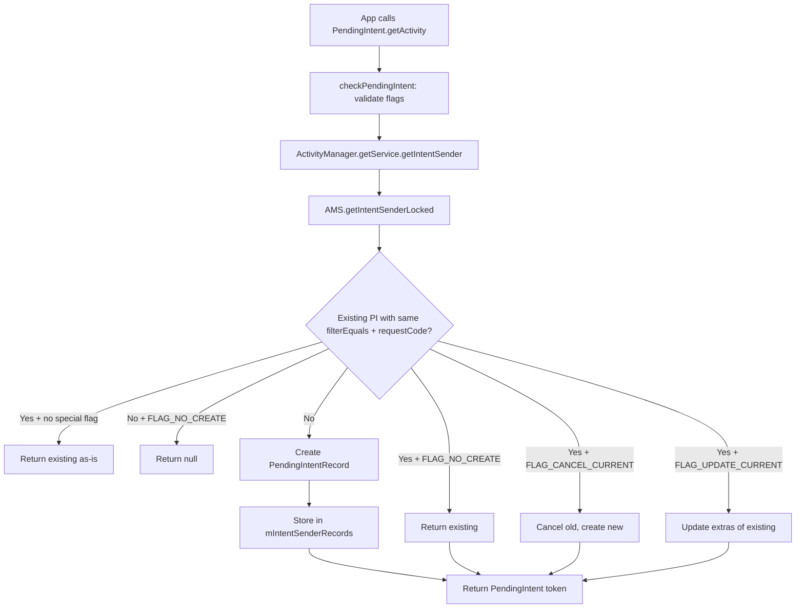
```mermaid
flowchart TD
    A[App calls PendingIntent.getActivity] --> B[checkPendingIntent: validate flags]
    B --> C[ActivityManager.getService.getIntentSender]
    C --> D[AMS.getIntentSenderLocked]
    D --> E{Existing PI with same filterEquals + requestCode?}
    E -->|Yes + FLAG_NO_CREATE| F[Return existing]
    E -->|Yes + FLAG_CANCEL_CURRENT| G[Cancel old, create new]
    E -->|Yes + FLAG_UPDATE_CURRENT| H[Update extras of existing]
    E -->|Yes + no special flag| I[Return existing as-is]
    E -->|No + FLAG_NO_CREATE| J[Return null]
    E -->|No| K[Create PendingIntentRecord]
    K --> L[Store in mIntentSenderRecords]
    L --> M[Return PendingIntent token]
    F --> M
    G --> M
    H --> M
```

### 21.3.3 PendingIntent Flags

The flags control both the behavior of the PendingIntent and its identity:

| Flag | Value | Behavior |
|------|-------|----------|
| `FLAG_ONE_SHOT` | `1<<30` | Can be sent only once; auto-cancels after use |
| `FLAG_NO_CREATE` | `1<<29` | Return null if no matching PI exists |
| `FLAG_CANCEL_CURRENT` | `1<<28` | Cancel any existing matching PI first |
| `FLAG_UPDATE_CURRENT` | `1<<27` | Replace extras of existing matching PI |
| `FLAG_IMMUTABLE` | `1<<26` | Prevent modification at send time |
| `FLAG_MUTABLE` | `1<<25` | Allow modification at send time |
| `FLAG_ALLOW_UNSAFE_IMPLICIT_INTENT` | `1<<24` | Allow mutable + implicit (dangerous) |

### 21.3.4 Mutable vs. Immutable PendingIntents

Starting with Android 12 (API 31), apps must explicitly choose mutability. The
compatibility change `PENDING_INTENT_EXPLICIT_MUTABILITY_REQUIRED` (change ID
`160794467`) enforces this:

```java
// PendingIntent.java, line ~442
private static void checkPendingIntent(int flags, @NonNull Intent intent,
        @NonNull Context context, boolean isActivityResultType) {
    final boolean isFlagImmutableSet = (flags & PendingIntent.FLAG_IMMUTABLE) != 0;
    final boolean isFlagMutableSet = (flags & PendingIntent.FLAG_MUTABLE) != 0;

    if (isFlagImmutableSet && isFlagMutableSet) {
        throw new IllegalArgumentException(
            "Cannot set both FLAG_IMMUTABLE and FLAG_MUTABLE for PendingIntent");
    }

    if (Compatibility.isChangeEnabled(PENDING_INTENT_EXPLICIT_MUTABILITY_REQUIRED)
            && !isFlagImmutableSet && !isFlagMutableSet) {
        throw new IllegalArgumentException(
            packageName + ": Targeting S+ ... requires that one of "
            + "FLAG_IMMUTABLE or FLAG_MUTABLE be specified ...");
    }
}
```

Starting with Android 14 (API 34), creating a mutable PendingIntent with an implicit
Intent is blocked via `BLOCK_MUTABLE_IMPLICIT_PENDING_INTENT` (change ID `236704164`):

```java
// PendingIntent.java, line ~481
public static boolean isNewMutableDisallowedImplicitPendingIntent(int flags,
        @NonNull Intent intent, boolean isActivityResultType) {
    if (isActivityResultType) return false;
    boolean isFlagMutableSet = (flags & PendingIntent.FLAG_MUTABLE) != 0;
    boolean isImplicit = (intent.getComponent() == null)
                      && (intent.getPackage() == null);
    boolean isFlagAllowUnsafe =
            (flags & PendingIntent.FLAG_ALLOW_UNSAFE_IMPLICIT_INTENT) != 0;
    return !isFlagNoCreateSet && isFlagMutableSet && isImplicit
            && !isFlagAllowUnsafe;
}
```

### 21.3.5 Security Implications

PendingIntents are a delegation mechanism: they execute with the identity and permissions
of the creator, not the sender. This creates several security considerations:

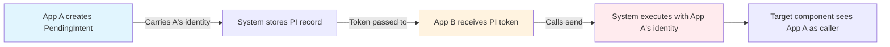
```mermaid
flowchart LR
    A[App A creates PendingIntent] -->|Carries A's identity| B[System stores PI record]
    B -->|Token passed to| C[App B receives PI token]
    C -->|Calls send| D[System executes with App A's identity]
    D --> E[Target component sees App A as caller]

    style A fill:#e1f5fe
    style C fill:#fff3e0
    style D fill:#ffebee
```

**Security best practices enforced by the framework:**

1. **Use FLAG_IMMUTABLE by default** -- prevents the sender from modifying the Intent
2. **Set an explicit component** -- prevents redirection attacks
3. **Use FLAG_ONE_SHOT for sensitive operations** -- prevents replay attacks
4. **Avoid mutable + implicit** -- blocked for targetSdk 34+

### 21.3.6 The getActivity Implementation Path

The actual creation of a PendingIntent for an activity follows a detailed path through
the system. From `PendingIntent.getActivityAsUser()` (line ~573):

```java
// PendingIntent.java
public static PendingIntent getActivityAsUser(Context context, int requestCode,
        @NonNull Intent intent, int flags, Bundle options, UserHandle user) {
    String packageName = context.getPackageName();
    String resolvedType = intent.resolveTypeIfNeeded(context.getContentResolver());
    checkPendingIntent(flags, intent, context, false);
    try {
        intent.migrateExtraStreamToClipData(context);
        intent.prepareToLeaveProcess(context);
        IIntentSender target =
            ActivityManager.getService().getIntentSenderWithFeature(
                INTENT_SENDER_ACTIVITY, packageName,
                context.getAttributionTag(), null, null, requestCode,
                new Intent[] { intent },
                resolvedType != null ? new String[] { resolvedType } : null,
                flags, options, user.getIdentifier());
        return target != null ? new PendingIntent(target) : null;
    } catch (RemoteException e) {
        throw e.rethrowFromSystemServer();
    }
}
```

Key steps in this path:

1. **Type resolution**: `resolveTypeIfNeeded()` queries the ContentResolver for the
   MIME type if the Intent has a `content:` URI but no explicit type
2. **Validation**: `checkPendingIntent()` enforces mutability requirements
3. **Stream migration**: `migrateExtraStreamToClipData()` moves EXTRA_STREAM URIs to
   ClipData for proper URI permission grants
4. **Process preparation**: `prepareToLeaveProcess()` performs security checks on the
   Intent before it crosses process boundaries
5. **IPC call**: The request crosses to `ActivityManagerService` via Binder

### 21.3.7 PendingIntent.send() and Fill-In

When a PendingIntent is sent, the caller can optionally provide a "fill-in" Intent
that supplements the original. The fill-in only applies if the PendingIntent is mutable:

```java
pendingIntent.send(context, resultCode, fillInIntent);
```

The fill-in uses `Intent.fillIn()` which respects specific fill-in flags:

```java
public static final int FILL_IN_ACTION       = 1<<0;
public static final int FILL_IN_DATA         = 1<<1;
public static final int FILL_IN_CATEGORIES   = 1<<2;
public static final int FILL_IN_COMPONENT    = 1<<3;
public static final int FILL_IN_PACKAGE      = 1<<4;
public static final int FILL_IN_SOURCE_BOUNDS = 1<<5;
public static final int FILL_IN_SELECTOR     = 1<<6;
public static final int FILL_IN_CLIP_DATA    = 1<<7;
```

By default, a field in the fill-in Intent only replaces the corresponding field in
the original Intent if the original field was null/empty. The fill-in flags override
this: if `FILL_IN_ACTION` is set, the action is always replaced even if the original
had one.

For immutable PendingIntents, the fill-in Intent is ignored entirely.

### 21.3.8 The OnFinished Callback

PendingIntent supports a completion callback via the `OnFinished` interface:

```java
// PendingIntent.java
public interface OnFinished {
    void onSendFinished(PendingIntent pendingIntent, Intent intent,
            int resultCode, String resultData, Bundle resultExtras);
}
```

This is primarily useful for broadcast PendingIntents, where you want to know the
result of an ordered broadcast. The `FinishedDispatcher` inner class handles the
callback delivery, ensuring it runs on the correct Handler.

### 21.3.9 PendingIntent and Notifications

PendingIntents are the backbone of notification interaction. Every tap on a
notification, every action button, and every reply action uses a PendingIntent:

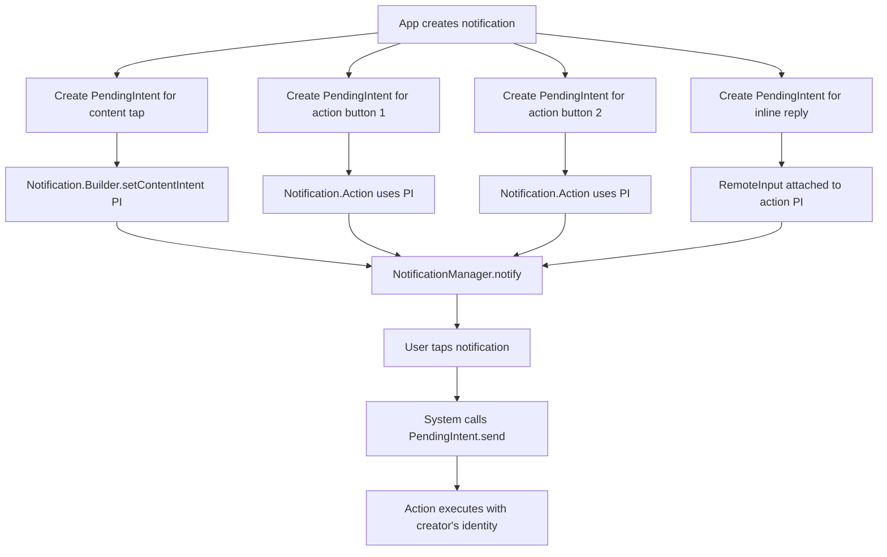
```mermaid
flowchart TD
    A[App creates notification] --> B[Create PendingIntent for content tap]
    A --> C[Create PendingIntent for action button 1]
    A --> D[Create PendingIntent for action button 2]
    A --> E[Create PendingIntent for inline reply]

    B --> F[Notification.Builder.setContentIntent PI]
    C --> G[Notification.Action uses PI]
    D --> H[Notification.Action uses PI]
    E --> I[RemoteInput attached to action PI]

    F --> J[NotificationManager.notify]
    G --> J
    H --> J
    I --> J

    J --> K[User taps notification]
    K --> L[System calls PendingIntent.send]
    L --> M[Action executes with creator's identity]
```

Common pattern with FLAG_IMMUTABLE for notifications:

```java
// Content tap: immutable, explicit component
PendingIntent contentPI = PendingIntent.getActivity(context, 0,
    new Intent(context, DetailActivity.class).putExtra("id", itemId),
    PendingIntent.FLAG_IMMUTABLE | PendingIntent.FLAG_UPDATE_CURRENT);

// Inline reply: must be mutable to receive RemoteInput
PendingIntent replyPI = PendingIntent.getBroadcast(context, 0,
    new Intent(context, ReplyReceiver.class),
    PendingIntent.FLAG_MUTABLE | PendingIntent.FLAG_UPDATE_CURRENT);
```

### 21.3.10 PendingIntent Identity

Two PendingIntents are considered the same if they have:

- Same type (activity, broadcast, service)
- Same request code
- Same Intent (per `filterEquals()`)
- Same flags (including mutability)

The `FLAG_ONE_SHOT` and `FLAG_IMMUTABLE` flags are part of the identity. To retrieve
a previously created one-shot PendingIntent, you must pass both `FLAG_ONE_SHOT` and
`FLAG_NO_CREATE`.

---

## 21.4 Broadcast System

The broadcast system delivers Intents to registered receivers. It is one of the most
complex subsystems in Android, handling ordering, permissions, background restrictions,
deferral, and cross-user delivery.

### 21.4.1 Broadcast Architecture

The core broadcast classes reside in:

```
frameworks/base/services/core/java/com/android/server/am/BroadcastQueue.java
frameworks/base/services/core/java/com/android/server/am/BroadcastRecord.java
frameworks/base/services/core/java/com/android/server/am/BroadcastProcessQueue.java
```

`BroadcastQueue` is an abstract base class defining the queue interface:

```java
// BroadcastQueue.java, line ~44
public abstract class BroadcastQueue {
    final @NonNull ActivityManagerService mService;
    final @NonNull Handler mHandler;
    final @NonNull BroadcastSkipPolicy mSkipPolicy;
    final @NonNull BroadcastHistory mHistory;
}
```

Key abstract operations:

| Method | Purpose |
|--------|---------|
| `enqueueBroadcastLocked()` | Add broadcast for future delivery |
| `finishReceiverLocked()` | Signal receiver completion |
| `onApplicationAttachedLocked()` | Process attached, dispatch pending |
| `onApplicationTimeoutLocked()` | Process start timed out |
| `onApplicationProblemLocked()` | Process crashed or ANR |
| `onApplicationCleanupLocked()` | Process killed |
| `isIdleLocked()` | Check if queue is empty |
| `waitForIdle()` | Block until all dispatched |
| `waitForBarrier()` | Block until current pending dispatched |

### 21.4.2 BroadcastRecord: The Broadcast Envelope

Every broadcast in transit is represented by a `BroadcastRecord`:

```java
// BroadcastRecord.java, line ~82
final class BroadcastRecord extends Binder {
    final @NonNull Intent intent;           // the broadcast intent
    final @Nullable ComponentName targetComp;
    final @Nullable ProcessRecord callerApp;
    final @Nullable String callerPackage;
    final int callingPid;
    final int callingUid;
    final boolean ordered;                  // serialize delivery?
    final boolean sticky;                   // from sticky data?
    final boolean alarm;                    // from alarm trigger?
    final boolean pushMessage;              // from push message?
    final boolean interactive;              // from user interaction?
    final boolean initialSticky;            // initial sticky delivery?
    final boolean prioritized;              // multiple priority tranches?
    final boolean deferUntilActive;         // infinitely deferrable?
    final boolean urgent;                   // classified as urgent?
    final int userId;
    final @Nullable String[] requiredPermissions;
    final @Nullable String[] excludedPermissions;
    final @Nullable String[] excludedPackages;
    final @NonNull List<Object> receivers;  // BroadcastFilter and ResolveInfo
    final @DeliveryState int[] delivery;    // per-receiver delivery state
    final @NonNull String[] deliveryReasons;
    int nextReceiver;                       // index of next receiver
    int resultCode;
    @Nullable String resultData;
    @Nullable Bundle resultExtras;
    boolean resultAbort;
}
```

The `receivers` list contains a mix of `BroadcastFilter` objects (for dynamically
registered receivers) and `ResolveInfo` objects (for manifest-declared receivers).
These are interleaved in priority order.

### 21.4.3 Delivery State Machine

Each receiver in a BroadcastRecord goes through a delivery state machine:

```java
// BroadcastRecord.java
static final int DELIVERY_PENDING   = 0;  // Waiting to run
static final int DELIVERY_DELIVERED = 1;  // Finished successfully (terminal)
static final int DELIVERY_SKIPPED   = 2;  // Skipped by policy (terminal)
static final int DELIVERY_TIMEOUT   = 3;  // Timed out (terminal)
static final int DELIVERY_SCHEDULED = 4;  // Currently executing
static final int DELIVERY_FAILURE   = 5;  // Dispatch failure (terminal)
static final int DELIVERY_DEFERRED  = 6;  // Deferred while app cached
```

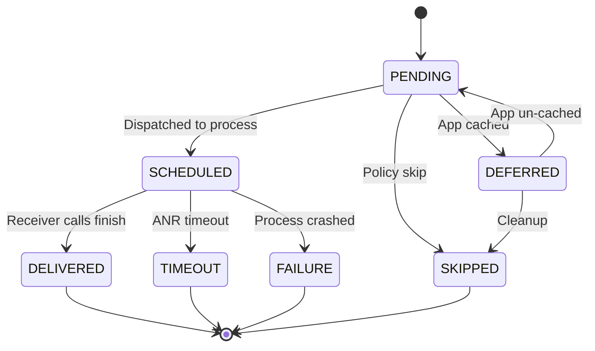
```mermaid
stateDiagram-v2
    [*] --> PENDING
    PENDING --> SCHEDULED : Dispatched to process
    PENDING --> SKIPPED : Policy skip
    PENDING --> DEFERRED : App cached
    SCHEDULED --> DELIVERED : Receiver calls finish
    SCHEDULED --> TIMEOUT : ANR timeout
    SCHEDULED --> FAILURE : Process crashed
    DEFERRED --> PENDING : App un-cached
    DEFERRED --> SKIPPED : Cleanup
    DELIVERED --> [*]
    SKIPPED --> [*]
    TIMEOUT --> [*]
    FAILURE --> [*]
```

### 21.4.4 BroadcastProcessQueue

The modern broadcast implementation uses per-process queues:

```java
// BroadcastProcessQueue.java, line ~67
class BroadcastProcessQueue {
    final @NonNull BroadcastConstants constants;
    final @NonNull String processName;
    final int uid;
    @Nullable BroadcastProcessQueue processNameNext;  // linked list
    @Nullable BroadcastProcessQueue runnableAtNext;    // runnable list
    @Nullable BroadcastProcessQueue runnableAtPrev;
    @Nullable ProcessRecord app;
}
```

This design allows the broadcast system to:

- Rate-limit delivery per process
- Defer delivery to cached/frozen processes
- Maintain ordering within a process while allowing parallelism across processes
- Handle process death without losing broadcast state for other processes

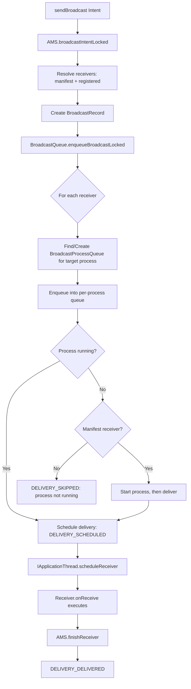
```mermaid
flowchart TD
    A[sendBroadcast Intent] --> B[AMS.broadcastIntentLocked]
    B --> C[Resolve receivers: manifest + registered]
    C --> D[Create BroadcastRecord]
    D --> E[BroadcastQueue.enqueueBroadcastLocked]
    E --> F{For each receiver}
    F --> G[Find/Create BroadcastProcessQueue for target process]
    G --> H[Enqueue into per-process queue]
    H --> I{Process running?}
    I -->|Yes| J[Schedule delivery: DELIVERY_SCHEDULED]
    I -->|No| K{Manifest receiver?}
    K -->|Yes| L[Start process, then deliver]
    K -->|No| M[DELIVERY_SKIPPED: process not running]
    J --> N[IApplicationThread.scheduleReceiver]
    N --> O[Receiver.onReceive executes]
    O --> P[AMS.finishReceiver]
    P --> Q[DELIVERY_DELIVERED]
    L --> J
```

### 21.4.5 Ordered Broadcasts

Ordered broadcasts are delivered one receiver at a time, in priority order. Each
receiver can inspect and modify the result, or abort the broadcast.

```java
// Sending an ordered broadcast
sendOrderedBroadcast(
    intent,
    receiverPermission,
    resultReceiver,     // final receiver (always called)
    scheduler,
    initialCode,
    initialData,
    initialExtras
);
```

In a `BroadcastRecord`, the `ordered` field is `true` for ordered broadcasts. The
`resultCode`, `resultData`, and `resultExtras` fields carry the rolling result that
each receiver can modify. The `resultAbort` field is set when a receiver calls
`abortBroadcast()`.

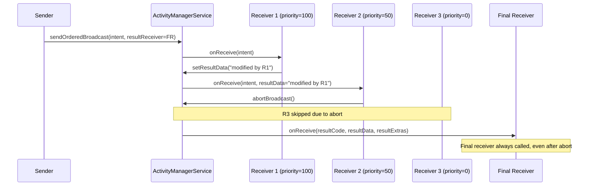
```mermaid
sequenceDiagram
    participant S as Sender
    participant AMS as ActivityManagerService
    participant R1 as Receiver 1 (priority=100)
    participant R2 as Receiver 2 (priority=50)
    participant R3 as Receiver 3 (priority=0)
    participant FR as Final Receiver

    S->>AMS: sendOrderedBroadcast(intent, resultReceiver=FR)
    AMS->>R1: onReceive(intent)
    R1->>AMS: setResultData("modified by R1")
    AMS->>R2: onReceive(intent, resultData="modified by R1")
    R2->>AMS: abortBroadcast()
    Note over AMS,R3: R3 skipped due to abort
    AMS->>FR: onReceive(resultCode, resultData, resultExtras)
    Note over FR: Final receiver always called, even after abort
```

Key behaviors of ordered broadcasts:

- Receivers execute serially, highest priority first
- Each receiver has a timeout (typically 10 seconds for foreground)
- `abortBroadcast()` stops delivery to remaining receivers
- The final/result receiver always executes regardless of abort
- `FLAG_RECEIVER_NO_ABORT` prevents receivers from aborting

### 21.4.6 Sticky Broadcasts

Sticky broadcasts persist after delivery. When a receiver registers for a sticky action,
it immediately receives the last broadcast with that action.

```java
// Deprecated but still functional in the source:
sendStickyBroadcast(intent);
```

Sticky broadcasts were deprecated in API 21, and their use requires the
`BROADCAST_STICKY` permission. The system still uses them internally for some system
state like `ACTION_BATTERY_CHANGED`.

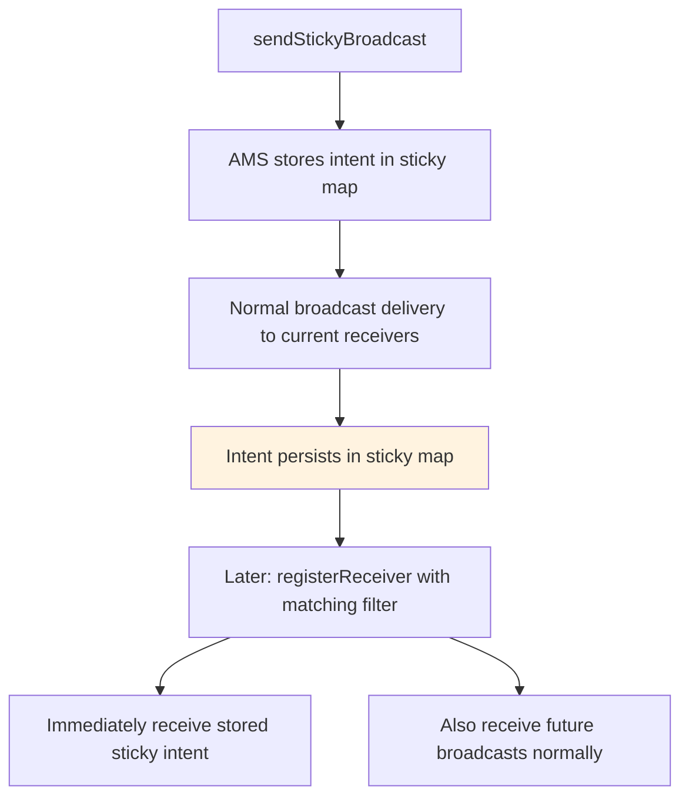
```mermaid
flowchart TD
    A[sendStickyBroadcast] --> B[AMS stores intent in sticky map]
    B --> C[Normal broadcast delivery to current receivers]
    C --> D[Intent persists in sticky map]
    D --> E[Later: registerReceiver with matching filter]
    E --> F[Immediately receive stored sticky intent]
    E --> G[Also receive future broadcasts normally]

    style D fill:#fff3e0
```

In `BroadcastRecord`, sticky broadcasts are identified by the `sticky` boolean field,
and the initial delivery from the sticky store sets `initialSticky = true`.

### 21.4.7 Registered vs. Manifest Receivers

Android supports two registration mechanisms for broadcast receivers:

**Dynamic (registered) receivers** are registered at runtime via `Context.registerReceiver()`.
They exist only while the registering component is alive. They are represented as
`BroadcastFilter` objects in the receiver list.

**Static (manifest) receivers** are declared in `AndroidManifest.xml` with `<receiver>`
tags. They can be launched even when the app is not running (subject to background
restrictions). They are represented as `ResolveInfo` objects in the receiver list.

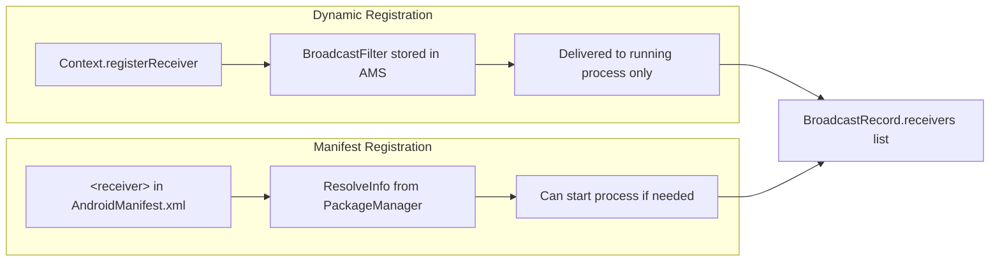
```mermaid
flowchart LR
    subgraph "Dynamic Registration"
        A1[Context.registerReceiver] --> B1[BroadcastFilter stored in AMS]
        B1 --> C1[Delivered to running process only]
    end

    subgraph "Manifest Registration"
        A2["&lt;receiver&gt; in AndroidManifest.xml"] --> B2[ResolveInfo from PackageManager]
        B2 --> C2[Can start process if needed]
    end

    C1 --> D[BroadcastRecord.receivers list]
    C2 --> D
```

**Background restrictions** (Android 8.0+): Most implicit broadcasts cannot be delivered
to manifest-declared receivers. Apps targeting API 26+ can only receive implicit broadcasts
in the manifest for a small allowlist of exempt broadcasts. This restriction was
introduced to reduce unnecessary process starts and improve battery life.

Exceptions to the manifest receiver restriction include:

- `ACTION_BOOT_COMPLETED`
- `ACTION_LOCALE_CHANGED`
- `ACTION_USB_ACCESSORY_ATTACHED`
- Broadcasts with explicit component targeting

### 21.4.8 LocalBroadcastManager

`LocalBroadcastManager` (in the AndroidX library, now deprecated) provided in-process
broadcast delivery without IPC overhead. It was implemented as a simple observer pattern
with no involvement of `ActivityManagerService`.

The modern replacement is to use `LiveData`, `Flow`, or other reactive patterns for
in-process communication. The system never used `LocalBroadcastManager` internally.

### 21.4.9 Broadcast Delivery Prioritization

Broadcasts in the modern queue system carry classification metadata:

```java
// BroadcastRecord.java fields
final boolean alarm;              // BROADCAST_TYPE_ALARM
final boolean pushMessage;        // BROADCAST_TYPE_PUSH_MESSAGE
final boolean interactive;        // BROADCAST_TYPE_INTERACTIVE
final boolean urgent;             // classified as urgent
final boolean deferUntilActive;   // BROADCAST_TYPE_DEFERRABLE_UNTIL_ACTIVE
```

The `BroadcastProcessQueue` uses these to determine delivery urgency and scheduling.
Interactive broadcasts (triggered by user action) get priority over alarm broadcasts,
which get priority over background broadcasts.

### 21.4.10 Broadcast ANR

When a broadcast receiver does not complete within its timeout, the system triggers
an ANR (Application Not Responding):

- Foreground broadcasts: 10 seconds
- Background broadcasts: 60 seconds

The `receiverTime` field in `BroadcastRecord` tracks when the current receiver started
execution. The `anrCount` field tracks how many ANRs a particular broadcast has caused.

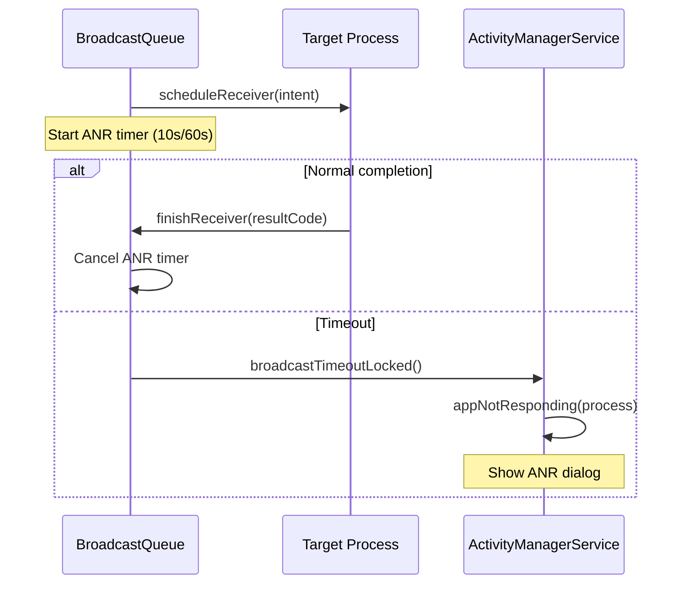
```mermaid
sequenceDiagram
    participant BQ as BroadcastQueue
    participant Proc as Target Process
    participant AMS as ActivityManagerService

    BQ->>Proc: scheduleReceiver(intent)
    Note over BQ: Start ANR timer (10s/60s)
    alt Normal completion
        Proc->>BQ: finishReceiver(resultCode)
        BQ->>BQ: Cancel ANR timer
    else Timeout
        BQ->>AMS: broadcastTimeoutLocked()
        AMS->>AMS: appNotResponding(process)
        Note over AMS: Show ANR dialog
    end
```

### 21.4.11 Broadcast Options

The `BroadcastOptions` class provides fine-grained control over broadcast delivery.
It is passed as a `Bundle` to `sendBroadcast()`:

```java
BroadcastOptions options = BroadcastOptions.makeBasic();
options.setDeliveryGroupPolicy(BroadcastOptions.DELIVERY_GROUP_POLICY_MOST_RECENT);
options.setDeferralPolicy(BroadcastOptions.DEFERRAL_POLICY_UNTIL_ACTIVE);

sendBroadcast(intent, null, options.toBundle());
```

Key options available in `BroadcastOptions`:

| Option | Purpose |
|--------|---------|
| `setDeliveryGroupPolicy()` | Control grouping of similar broadcasts |
| `setDeferralPolicy()` | When to defer delivery (e.g., until app is active) |
| `setTemporaryAppAllowlist()` | Grant temporary background execution allowlist |
| `setRequireCompatChange()` | Only deliver to apps with specific compat change |
| `setShareIdentityEnabled()` | Share sender identity with receivers |

The `DEFERRAL_POLICY_UNTIL_ACTIVE` policy is particularly important for battery
optimization. Broadcasts with this policy are held until the target app is in the
foreground or otherwise active. From `BroadcastRecord.java`:

```java
// BroadcastRecord.java
static boolean CORE_DEFER_UNTIL_ACTIVE = true;
```

When enabled, system/core apps that use `DEFERRAL_POLICY_DEFAULT` are treated as
`DEFERRAL_POLICY_UNTIL_ACTIVE`, reducing unnecessary wake-ups.

### 21.4.12 Broadcast Delivery Group Policies

The `DeliveryGroupPolicy` in `BroadcastOptions` controls how the system handles
multiple broadcasts to the same receiver:

| Policy | Behavior |
|--------|----------|
| `DELIVERY_GROUP_POLICY_ALL` | Deliver every broadcast (default) |
| `DELIVERY_GROUP_POLICY_MOST_RECENT` | Only deliver the most recent matching broadcast |
| `DELIVERY_GROUP_POLICY_MERGED` | Merge extras from all matching broadcasts |

`DELIVERY_GROUP_POLICY_MOST_RECENT` is used for state-update broadcasts where only the
latest value matters (e.g., connectivity changes). This prevents receivers from
processing stale intermediate states.

### 21.4.13 The BroadcastSkipPolicy

The `BroadcastSkipPolicy` (referenced in `BroadcastQueue`'s constructor) determines
which receivers should be skipped during delivery:

```java
// BroadcastQueue.java
final @NonNull BroadcastSkipPolicy mSkipPolicy;
```

Skip reasons include:

- Receiver's package is stopped or disabled
- Receiver's package is suspended
- Receiver is in a crashed state
- Background execution restrictions apply
- Receiver doesn't meet permission requirements
- Receiver is excluded by `excludedPackages` or `excludedPermissions`
- Receiver's app is frozen or in a hibernation state

Each skip is recorded in the `deliveryReasons` array of the `BroadcastRecord`,
providing detailed audit trails for debugging broadcast delivery issues.

### 21.4.14 Broadcast History

The `BroadcastHistory` class (stored in `BroadcastQueue.mHistory`) maintains a
historical record of recent broadcast deliveries for debugging purposes. This
history is dumped when you run:

```bash
adb shell dumpsys activity broadcasts
```

The history includes:

- The Intent action and data
- The sender package and UID
- The list of receivers and their delivery states
- Timing information (enqueue, dispatch, finish)
- Any ANRs that occurred

### 21.4.15 Background Broadcast Restrictions: Historical Evolution

The restrictions on implicit broadcasts to manifest receivers have evolved across
Android versions:

| Android Version | API | Change |
|----------------|-----|--------|
| 7.0 (Nougat) | 24 | `ACTION_NEW_PICTURE` and `ACTION_NEW_VIDEO` removed |
| 8.0 (Oreo) | 26 | Most implicit broadcasts blocked for manifest receivers |
| 9.0 (Pie) | 28 | `ACTION_BATTERY_CHANGED` no longer delivered to manifest receivers |
| 10 (Q) | 29 | No new restrictions |
| 11 (R) | 30 | Package visibility affects broadcast resolution |
| 12 (S) | 31 | Exported attribute required for components with filters |
| 13 (T) | 33 | Context-registered receivers require export flag |
| 14 (U) | 34 | Further tightening of dynamic receiver registration |

The workarounds for background restrictions:

1. Use `JobScheduler` or `WorkManager` for deferred work
2. Register receivers dynamically at runtime
3. Use explicit intents (target specific components)
4. Use `FLAG_RECEIVER_INCLUDE_BACKGROUND` (system-only)

---

## 21.5 App Links and Deep Links

App Links and Deep Links allow HTTP/HTTPS URLs to open directly in an app instead of
a browser. The AOSP implementation involves IntentFilter verification, Digital Asset
Links, and the DomainVerificationManager.

### 21.5.1 Deep Links vs. App Links

**Deep Links** are any URI that leads to a specific screen in an app. They require an
intent filter with the matching URI pattern but do not require verification. If multiple
apps handle the same URI, the user sees a disambiguation dialog.

**App Links** (Android 6.0+) are verified deep links. The app proves ownership of the
web domain through Digital Asset Links, and the system automatically opens verified links
in the app without a disambiguation dialog.

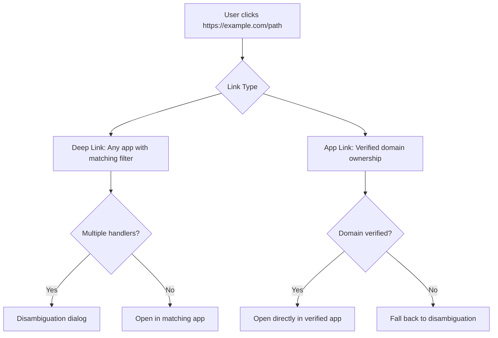
```mermaid
flowchart TD
    A[User clicks https://example.com/path] --> B{Link Type}
    B --> C[Deep Link: Any app with matching filter]
    B --> D[App Link: Verified domain ownership]
    C --> E{Multiple handlers?}
    E -->|Yes| F[Disambiguation dialog]
    E -->|No| G[Open in matching app]
    D --> H{Domain verified?}
    H -->|Yes| I[Open directly in verified app]
    H -->|No| J[Fall back to disambiguation]
```

### 21.5.2 Intent Filter for App Links

An App Link intent filter must declare:

```xml
<intent-filter android:autoVerify="true">
    <action android:name="android.intent.action.VIEW" />
    <category android:name="android.intent.category.DEFAULT" />
    <category android:name="android.intent.category.BROWSABLE" />
    <data android:scheme="https"
          android:host="example.com"
          android:pathPrefix="/products" />
</intent-filter>
```

The `android:autoVerify="true"` attribute triggers domain verification. The
`IntentFilter` class tracks this via:

```java
// IntentFilter.java
private static final int STATE_VERIFY_AUTO         = 0x00000001;
private static final int STATE_NEED_VERIFY         = 0x00000010;
private static final int STATE_NEED_VERIFY_CHECKED = 0x00000100;
private static final int STATE_VERIFIED            = 0x00001000;

private int mVerifyState;
```

### 21.5.3 Verification Eligibility

Not all filters with `autoVerify` actually need verification. The `needsVerification()`
method checks the requirements:

```java
// IntentFilter.java, line ~754
public final boolean needsVerification() {
    return getAutoVerify() && handlesWebUris(true);
}
```

The `handlesWebUris(true)` method verifies that:

1. The filter handles `ACTION_VIEW`
2. The filter includes `CATEGORY_BROWSABLE`
3. The filter declares at least one scheme
4. When `onlyWebSchemes=true`, all declared schemes are `http` or `https`

```java
// IntentFilter.java, line ~704
public final boolean handlesWebUris(boolean onlyWebSchemes) {
    if (!hasAction(Intent.ACTION_VIEW)
        || !hasCategory(Intent.CATEGORY_BROWSABLE)
        || mDataSchemes == null
        || mDataSchemes.size() == 0) {
        return false;
    }
    final int N = mDataSchemes.size();
    for (int i = 0; i < N; i++) {
        final String scheme = mDataSchemes.get(i);
        final boolean isWebScheme =
                SCHEME_HTTP.equals(scheme) || SCHEME_HTTPS.equals(scheme);
        if (onlyWebSchemes) {
            if (!isWebScheme) return false;
        } else {
            if (isWebScheme) return true;
        }
    }
    return onlyWebSchemes;
}
```

### 21.5.4 Digital Asset Links

Domain verification uses the Digital Asset Links protocol. The system fetches:

```
https://example.com/.well-known/assetlinks.json
```

The JSON file must contain:

```json
[{
    "relation": ["delegate_permission/common.handle_all_urls"],
    "target": {
        "namespace": "android_app",
        "package_name": "com.example.app",
        "sha256_cert_fingerprints": [
            "AA:BB:CC:DD:EE:FF:00:11:22:33:44:55:66:77:88:99:..."
        ]
    }
}]
```

The `DomainVerificationManager` service manages verification state. Its source is
located in:

```
frameworks/base/services/core/java/com/android/server/pm/verify/domain/
```

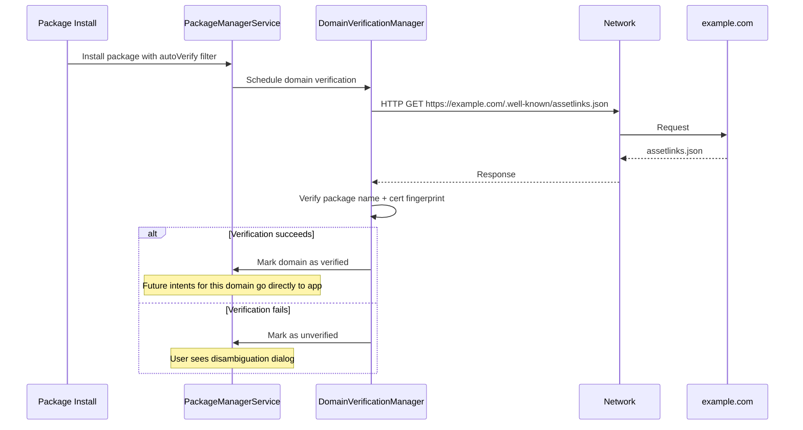
```mermaid
sequenceDiagram
    participant Install as Package Install
    participant PMS as PackageManagerService
    participant DVM as DomainVerificationManager
    participant Net as Network
    participant Web as example.com

    Install->>PMS: Install package with autoVerify filter
    PMS->>DVM: Schedule domain verification
    DVM->>Net: HTTP GET https://example.com/.well-known/assetlinks.json
    Net->>Web: Request
    Web-->>Net: assetlinks.json
    Net-->>DVM: Response
    DVM->>DVM: Verify package name + cert fingerprint
    alt Verification succeeds
        DVM->>PMS: Mark domain as verified
        Note over PMS: Future intents for this domain go directly to app
    else Verification fails
        DVM->>PMS: Mark as unverified
        Note over PMS: User sees disambiguation dialog
    end
```

### 21.5.5 The intent:// Scheme

The `intent://` scheme allows web pages to create Intents directly:

```
intent://scan/#Intent;scheme=zxing;package=com.google.zxing.client.android;end
```

This URI is parsed by `Intent.parseUri()` to create an Intent with:

- scheme: `zxing`
- package: `com.google.zxing.client.android`
- action: `android.intent.action.VIEW` (default)

The browser uses this to launch apps with specific intents. If the target app is
not installed, the browser can optionally redirect to the Play Store using the
`S.browser_fallback_url` extra in the intent URI.

### 21.5.6 App Link Verification Timing

Domain verification is triggered at package installation time. The system schedules
verification for all intent filters that have `autoVerify="true"` and meet the
`needsVerification()` criteria.

The verification has several important timing characteristics:

1. **Verification is asynchronous**: The app is installed immediately; verification
   happens in the background
2. **Network required**: Verification requires network access to fetch assetlinks.json
3. **Retry behavior**: If verification fails due to network issues, the system may
   retry at a later time
4. **Multi-domain handling**: If an app declares multiple domains, ALL domains must
   verify successfully for automatic linking to work for any of them
5. **Re-verification**: When an app is updated, verification may be re-triggered if
   the intent filters changed

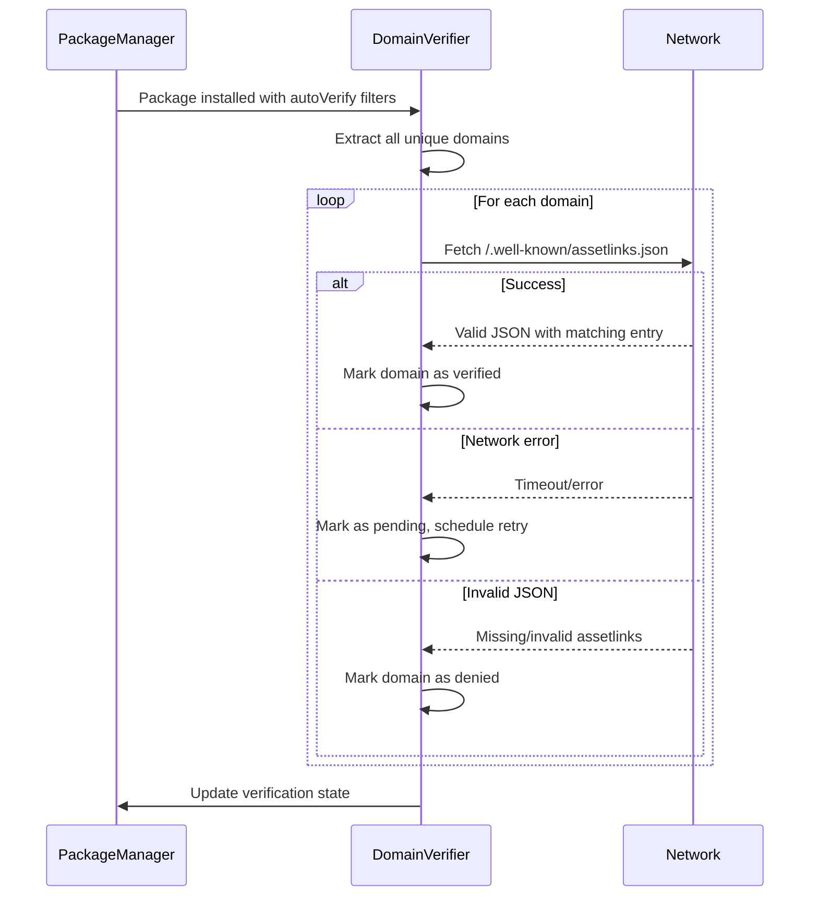
```mermaid
sequenceDiagram
    participant PM as PackageManager
    participant DV as DomainVerifier
    participant Net as Network

    PM->>DV: Package installed with autoVerify filters
    DV->>DV: Extract all unique domains
    loop For each domain
        DV->>Net: Fetch /.well-known/assetlinks.json
        alt Success
            Net-->>DV: Valid JSON with matching entry
            DV->>DV: Mark domain as verified
        else Network error
            Net-->>DV: Timeout/error
            DV->>DV: Mark as pending, schedule retry
        else Invalid JSON
            Net-->>DV: Missing/invalid assetlinks
            DV->>DV: Mark domain as denied
        end
    end
    DV->>PM: Update verification state
```

### 21.5.7 Testing App Links

The Android toolchain provides several mechanisms for testing App Links:

```bash
# Check current state
adb shell pm get-app-links --user cur com.example.app

# Manually approve a domain (for testing)
adb shell pm set-app-links --package com.example.app 2 example.com

# Reset all verification
adb shell pm set-app-links --package com.example.app 0 all

# Re-trigger verification
adb shell pm verify-app-links --re-verify com.example.app

# Test with a URL launch
adb shell am start -a android.intent.action.VIEW \
    -c android.intent.category.BROWSABLE \
    -d "https://example.com/products/123"
```

The Digital Asset Links JSON can be validated using:
```
https://digitalassetlinks.googleapis.com/v1/statements:list?source.web.site=https://example.com
```

### 21.5.8 Verification State Management

Domain verification state is per-user and per-package. The possible states are:

| State | Meaning |
|-------|---------|
| `STATE_NO_RESPONSE` | Verification not yet attempted or no response |
| `STATE_SUCCESS` | Domain verified successfully |
| `STATE_DENIED` | Verification failed (domain does not match) |
| `STATE_MIGRATED` | State migrated from legacy system |
| `STATE_RESTORED` | State restored from backup |

Users can also manually manage App Link settings through Settings, which can override
the automatic verification state.

---

## 21.6 Intent Filters

Intent Filters are the matching patterns against which Intents are resolved. They are
defined in the `IntentFilter` class and declared in XML within `AndroidManifest.xml`.

### 21.6.1 IntentFilter Internal Structure

```
frameworks/base/core/java/android/content/IntentFilter.java
```

The IntentFilter class maintains separate collections for each matching dimension:

```java
// IntentFilter.java, line ~335
private int mPriority;
private int mOrder;
private final ArraySet<String> mActions;
private ArrayList<String> mCategories = null;
private ArrayList<String> mDataSchemes = null;
private ArrayList<PatternMatcher> mDataSchemeSpecificParts = null;
private ArrayList<AuthorityEntry> mDataAuthorities = null;
private ArrayList<PatternMatcher> mDataPaths = null;
private ArrayList<UriRelativeFilterGroup> mUriRelativeFilterGroups = null;
private ArrayList<String> mStaticDataTypes = null;
private ArrayList<String> mDataTypes = null;
private ArrayList<String> mMimeGroups = null;
private boolean mHasStaticPartialTypes = false;
private boolean mHasDynamicPartialTypes = false;
private PersistableBundle mExtras = null;
private int mVerifyState;
```

### 21.6.2 Filter Matching Rules

The IntentFilter documentation (starting at line ~102) defines the precise matching
rules:

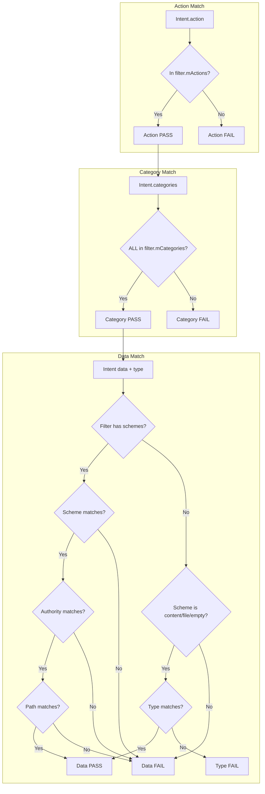
```mermaid
flowchart TD
    subgraph "Action Match"
        A1[Intent.action] --> A2{In filter.mActions?}
        A2 -->|Yes| A3[Action PASS]
        A2 -->|No| A4[Action FAIL]
    end

    subgraph "Category Match"
        C1[Intent.categories] --> C2{ALL in filter.mCategories?}
        C2 -->|Yes| C3[Category PASS]
        C2 -->|No| C4[Category FAIL]
    end

    subgraph "Data Match"
        D1[Intent data + type] --> D2{Filter has schemes?}
        D2 -->|Yes| D3{Scheme matches?}
        D3 -->|Yes| D4{Authority matches?}
        D4 -->|Yes| D5{Path matches?}
        D5 -->|Yes| D6[Data PASS]
        D3 -->|No| D7[Data FAIL]
        D4 -->|No| D7
        D5 -->|No| D7
        D2 -->|No| D8{Scheme is content/file/empty?}
        D8 -->|Yes| D9{Type matches?}
        D8 -->|No| D7
        D9 -->|Yes| D6
        D9 -->|No| D10[Type FAIL]
    end

    A3 --> C1
    C3 --> D1
```

**Key rules from the source Javadoc:**

1. **Action**: If the filter specifies actions, the Intent action must match one. If the
   filter specifies no actions, it only matches Intents with no action (but this is
   rarely useful).

2. **Data Type**: MIME type matching is **case-sensitive** (unlike RFC MIME). Always use
   lowercase. Wildcards work: `audio/*` matches `audio/mpeg`.

3. **Data Scheme**: Also **case-sensitive**. Always use lowercase.

4. **Data Authority**: Case-sensitive host matching. Wildcard subdomain matching uses the
   `*` prefix (e.g., `*.example.com`).

5. **Data Path**: Supports literal, prefix, suffix, simple glob, and advanced glob patterns
   via `PatternMatcher`.

6. **Categories**: All categories in the Intent must be present in the filter. Extra
   categories in the filter are ignored.

### 21.6.3 Match Quality Constants

The match quality is a bitmask combining a category constant and an adjustment:

```java
// IntentFilter.java
public static final int MATCH_CATEGORY_MASK     = 0xfff0000;
public static final int MATCH_ADJUSTMENT_MASK   = 0x000ffff;
public static final int MATCH_ADJUSTMENT_NORMAL = 0x8000;
```

The category values form a hierarchy of specificity:

```
MATCH_CATEGORY_EMPTY (0x0100000)
  < MATCH_CATEGORY_SCHEME (0x0200000)
    < MATCH_CATEGORY_HOST (0x0300000)
      < MATCH_CATEGORY_PORT (0x0400000)
        < MATCH_CATEGORY_PATH (0x0500000)
          < MATCH_CATEGORY_SCHEME_SPECIFIC_PART (0x0580000)
            < MATCH_CATEGORY_TYPE (0x0600000)
```

When multiple filters match, the one with the highest match quality wins.

### 21.6.4 AuthorityEntry

The `AuthorityEntry` inner class handles host and port matching:

```java
// IntentFilter.java, line ~1120 (approximate)
public static final class AuthorityEntry {
    private final String mOrigHost;
    private final String mHost;
    private final boolean mWild;    // true if host starts with "*."
    private final int mPort;

    public int match(Uri data, boolean wildcardSupported) {
        String host = data.getHost();
        if (host == null) return NO_MATCH_DATA;

        if (mWild) {
            if (host.length() < mHost.length()) return NO_MATCH_DATA;
            host = host.substring(host.length() - mHost.length());
        }
        if (host.compareToIgnoreCase(mHost) != 0) return NO_MATCH_DATA;

        if (!wildcardSupported && mPort >= 0) {
            if (mPort != data.getPort()) return NO_MATCH_DATA;
            return MATCH_CATEGORY_PORT;
        }
        return MATCH_CATEGORY_HOST;
    }
}
```

Note that authority matching in IntentFilter uses `compareToIgnoreCase` for the host
portion, even though the general rule states case-sensitivity. This is because host
matching specifically lowercases during comparison, while other aspects (scheme, type)
do not.

### 21.6.5 Priority

The `mPriority` field influences the order in which matching components are considered.
The system defines two sentinel values:

```java
// IntentFilter.java
public static final int SYSTEM_HIGH_PRIORITY = 1000;
public static final int SYSTEM_LOW_PRIORITY = -1000;
```

Applications should never use priorities at or above `SYSTEM_HIGH_PRIORITY`. In
practice, the system truncates application-declared priorities. For ordered broadcasts,
priority determines delivery order. For activities, priority is used when resolving
preferred activities.

The `LIMIT_PRIORITY_SCOPE` compatibility change in `BroadcastRecord` further restricts
priority scope to process-level ordering, meaning priority values only influence delivery
order within the same process for modern apps.

### 21.6.6 Auto-Verify

The `autoVerify` attribute on an intent filter is stored in `mVerifyState`:

```java
// IntentFilter.java
private static final int STATE_VERIFY_AUTO         = 0x00000001;
private static final int STATE_NEED_VERIFY         = 0x00000010;
private static final int STATE_NEED_VERIFY_CHECKED = 0x00000100;
private static final int STATE_VERIFIED            = 0x00001000;
```

When an intent filter has `autoVerify="true"` and handles web URIs (http/https with
ACTION_VIEW and CATEGORY_BROWSABLE), the system initiates domain verification at
install time. This was covered in detail in Section 59.5.

### 21.6.7 UriRelativeFilterGroup (Modern Addition)

Recent AOSP versions added `UriRelativeFilterGroup` for more granular URI matching.
This is gated behind the `FLAG_RELATIVE_REFERENCE_INTENT_FILTERS` feature flag:

```java
// IntentFilter.java, line ~1619
@FlaggedApi(Flags.FLAG_RELATIVE_REFERENCE_INTENT_FILTERS)
public final void addUriRelativeFilterGroup(@NonNull UriRelativeFilterGroup group) {
    Objects.requireNonNull(group);
    if (mUriRelativeFilterGroups == null) {
        mUriRelativeFilterGroups = new ArrayList<>();
    }
    mUriRelativeFilterGroups.add(group);
}
```

URI relative filter groups allow matching against query parameters and fragments,
which standard data path matching does not support. Groups are evaluated after path
matching, and matching is done in the order groups were added.

### 21.6.8 XML Declaration

An intent filter in the manifest maps to the internal data structures:

```xml
<intent-filter android:priority="0" android:autoVerify="false">
    <!-- Actions: one or more -->
    <action android:name="android.intent.action.VIEW" />
    <action android:name="android.intent.action.EDIT" />

    <!-- Categories: zero or more -->
    <category android:name="android.intent.category.DEFAULT" />
    <category android:name="android.intent.category.BROWSABLE" />

    <!-- Data: zero or more, combined conjunctively -->
    <data android:scheme="https"
          android:host="example.com"
          android:port="443"
          android:pathPrefix="/api/"
          android:mimeType="application/json" />
</intent-filter>
```

Each `<action>` adds to `mActions`. Each `<category>` adds to `mCategories`. The
`<data>` element's attributes are distributed across multiple internal collections:
scheme to `mDataSchemes`, host+port to `mDataAuthorities`, path/pathPrefix/pathPattern
to `mDataPaths`, and mimeType to `mDataTypes`.

**Important**: Multiple `<data>` elements within a single `<intent-filter>` are
combined, not treated independently. A filter with two `<data>` elements creates a
cross-product of all schemes, hosts, and paths. To match independent URI patterns,
use separate `<intent-filter>` blocks.

### 21.6.9 Common IntentFilter Patterns

**Pattern 1: App launcher entry point**

```xml
<intent-filter>
    <action android:name="android.intent.action.MAIN" />
    <category android:name="android.intent.category.LAUNCHER" />
</intent-filter>
```

No `CATEGORY_DEFAULT` needed because the launcher uses explicit intents.

**Pattern 2: Share target (receive shared content)**

```xml
<intent-filter>
    <action android:name="android.intent.action.SEND" />
    <category android:name="android.intent.category.DEFAULT" />
    <data android:mimeType="image/*" />
</intent-filter>
<intent-filter>
    <action android:name="android.intent.action.SEND" />
    <category android:name="android.intent.category.DEFAULT" />
    <data android:mimeType="text/plain" />
</intent-filter>
<intent-filter>
    <action android:name="android.intent.action.SEND_MULTIPLE" />
    <category android:name="android.intent.category.DEFAULT" />
    <data android:mimeType="image/*" />
</intent-filter>
```

Note: Separate filters for different MIME types, not combined in one filter.

**Pattern 3: Custom scheme deep link**

```xml
<intent-filter>
    <action android:name="android.intent.action.VIEW" />
    <category android:name="android.intent.category.DEFAULT" />
    <category android:name="android.intent.category.BROWSABLE" />
    <data android:scheme="myapp" android:host="open" android:pathPrefix="/item/" />
</intent-filter>
```

This handles URIs like `myapp://open/item/123`.

**Pattern 4: HTTPS App Link (verified)**

```xml
<intent-filter android:autoVerify="true">
    <action android:name="android.intent.action.VIEW" />
    <category android:name="android.intent.category.DEFAULT" />
    <category android:name="android.intent.category.BROWSABLE" />
    <data android:scheme="https" android:host="www.example.com" />
    <data android:pathPrefix="/products/" />
    <data android:pathPrefix="/categories/" />
</intent-filter>
```

**Pattern 5: Content provider data viewer**

```xml
<intent-filter>
    <action android:name="android.intent.action.VIEW" />
    <action android:name="android.intent.action.EDIT" />
    <category android:name="android.intent.category.DEFAULT" />
    <data android:mimeType="vnd.android.cursor.item/vnd.example.note" />
</intent-filter>
```

This matches intents with `content:` URIs that resolve to the specified MIME type.

**Pattern 6: Service binding filter**

```xml
<service android:name=".MyService" android:exported="true"
         android:permission="com.example.BIND_MY_SERVICE">
    <intent-filter>
        <action android:name="com.example.action.BIND_SERVICE" />
    </intent-filter>
</service>
```

No `CATEGORY_DEFAULT` needed for services.

### 21.6.10 PatternMatcher Types

The `PatternMatcher` class (used for path and SSP matching) supports five pattern types:

| Type | Constant | Behavior |
|------|----------|----------|
| Literal | `PATTERN_LITERAL` | Exact string match |
| Prefix | `PATTERN_PREFIX` | Matches if string starts with pattern |
| Simple glob | `PATTERN_SIMPLE_GLOB` | `*` matches any sequence, `.` is literal |
| Advanced glob | `PATTERN_ADVANCED_GLOB` | Full glob with `[`, `]`, `{`, `}` |
| Suffix | `PATTERN_SUFFIX` | Matches if string ends with pattern |

The `PATTERN_SIMPLE_GLOB` is the most commonly used. Unlike regex, `.` is a literal
character, not a wildcard. The `*` wildcard matches zero or more characters. Examples:

- `"/products/*"` matches `/products/` and `/products/123` and `/products/123/details`
- `"/items/.*\\.json"` matches `/items/data.json` and `/items/list.json`
- `"*.pdf"` as a suffix matches any string ending in `.pdf`

---

## 21.7 Cross-Profile Intents

Android's work profile feature creates separate user spaces on a single device. Intents
do not cross profile boundaries by default. The `CrossProfileIntentFilter` mechanism
allows controlled forwarding.

### 21.7.1 CrossProfileIntentFilter

```
frameworks/base/services/core/java/com/android/server/pm/CrossProfileIntentFilter.java
```

The `CrossProfileIntentFilter` extends `WatchedIntentFilter` and adds cross-profile
routing metadata:

```java
// CrossProfileIntentFilter.java, line ~42
class CrossProfileIntentFilter extends WatchedIntentFilter {
    private static final String ATTR_TARGET_USER_ID = "targetUserId";
    private static final String ATTR_FLAGS = "flags";
    private static final String ATTR_OWNER_PACKAGE = "ownerPackage";
    private static final String ATTR_ACCESS_CONTROL = "accessControl";

    public static final int FLAG_IS_PACKAGE_FOR_FILTER = 0x00000008;
    public static final int FLAG_ALLOW_CHAINED_RESOLUTION = 0x00000010;
}
```

When an implicit Intent is resolved, the system checks whether any
`CrossProfileIntentFilter` matches. If a match is found, the resolution also queries
the target user's profile for matching components.

### 21.7.2 Access Control Levels

The `CrossProfileIntentFilter` defines three access control levels:

```java
// CrossProfileIntentFilter.java
public static final int ACCESS_LEVEL_ALL = 0;            // Any caller can modify
public static final int ACCESS_LEVEL_SYSTEM = 10;        // Only system can modify
public static final int ACCESS_LEVEL_SYSTEM_ADD_ONLY = 20; // System add, no removal
```

These levels protect against malicious modification of cross-profile routing rules.
`ACCESS_LEVEL_SYSTEM_ADD_ONLY` is the most restrictive: once a rule is added by the
system, it cannot be removed or modified by any caller.

### 21.7.3 Cross-Profile Resolution Flow

```mermaid
flowchart TD
    A[Intent from Work Profile] --> B[PackageManagerService.resolveIntent]
    B --> C[Resolve in current user's profile]
    C --> D[Check CrossProfileIntentFilters]
    D --> E{Any CPIF matches?}
    E -->|No| F[Return local results only]
    E -->|Yes| G[Resolve in target user's profile]
    G --> H[Merge results]
    H --> I{FLAG_ALLOW_CHAINED_RESOLUTION?}
    I -->|Yes| J[Also check profiles linked from target]
    I -->|No| K[Return merged results]
    J --> K
    K --> L[IntentForwarderActivity wraps for cross-profile delivery]
```

The `IntentForwarderActivity` (`com.android.internal.app.IntentForwarderActivity`) is the
system component that performs the actual cross-profile forwarding. `ResolveInfo` objects
from cross-profile resolution carry a `userHandle` field to identify their origin.

### 21.7.4 Default Cross-Profile Filters

The system establishes default cross-profile intent filters between personal and work
profiles:

```
frameworks/base/services/core/java/com/android/server/pm/DefaultCrossProfileIntentFiltersUtils.java
```

These defaults ensure basic functionality works across profiles:

- Web browsing intents can resolve across profiles
- Phone call intents reach the correct dialer
- SMS intents can cross profiles
- Camera capture intents work from either profile

Device administrators can add or remove cross-profile intent filters using the
`DevicePolicyManager` API.

### 21.7.5 The CrossProfileIntentResolverEngine

The resolution engine that handles cross-profile queries:

```
frameworks/base/services/core/java/com/android/server/pm/CrossProfileIntentResolverEngine.java
frameworks/base/services/core/java/com/android/server/pm/CrossProfileResolver.java
frameworks/base/services/core/java/com/android/server/pm/DefaultCrossProfileResolver.java
```

These classes implement the algorithm for:

1. Checking if the source user has any cross-profile intent filters
2. Evaluating whether the intent matches those filters
3. Querying the target user's PackageManager for matching components
4. Constructing ResolveInfo entries that reference the IntentForwarderActivity
5. Handling chained resolution when multiple profiles are involved

---

## 21.8 Protected Broadcasts

Protected broadcasts are actions that only the system (UID 1000 / system_server) can
send. They are a security mechanism to prevent apps from spoofing critical system events.

### 21.8.1 Declaration

Protected broadcasts are declared in `AndroidManifest.xml` files of system packages
using the `<protected-broadcast>` tag:

```xml
<!-- From frameworks/base/core/res/AndroidManifest.xml -->
<protected-broadcast android:name="android.intent.action.BOOT_COMPLETED" />
<protected-broadcast android:name="android.intent.action.PACKAGE_ADDED" />
<protected-broadcast android:name="android.intent.action.PACKAGE_REMOVED" />
<protected-broadcast android:name="android.intent.action.BATTERY_CHANGED" />
<protected-broadcast android:name="android.intent.action.TIME_SET" />
<protected-broadcast android:name="android.intent.action.TIMEZONE_CHANGED" />
<!-- ... hundreds more ... -->
```

### 21.8.2 Enforcement

The PackageManagerService maintains a set of protected broadcast actions:

```
frameworks/base/services/core/java/com/android/server/pm/PackageManagerService.java
```

During package scanning, each `<protected-broadcast>` declaration is added to
`mProtectedBroadcasts`. When a broadcast is sent, `ActivityManagerService` checks:

```mermaid
flowchart TD
    A[App sends broadcast with action X] --> B{Is X a protected broadcast?}
    B -->|No| C[Allow: normal broadcast delivery]
    B -->|Yes| D{Is caller system UID or root?}
    D -->|Yes| E[Allow: system can send protected broadcasts]
    D -->|No| F[Reject: SecurityException]
    F --> G[Log warning: non-system sender of protected broadcast]
```

### 21.8.3 Common Protected Broadcasts

| Action | Purpose |
|--------|---------|
| `ACTION_BOOT_COMPLETED` | Device finished booting |
| `ACTION_SHUTDOWN` | Device is shutting down |
| `ACTION_PACKAGE_ADDED` | New package installed |
| `ACTION_PACKAGE_REMOVED` | Package uninstalled |
| `ACTION_PACKAGE_CHANGED` | Package component state changed |
| `ACTION_BATTERY_CHANGED` | Battery level or state changed |
| `ACTION_POWER_CONNECTED` | External power connected |
| `ACTION_POWER_DISCONNECTED` | External power disconnected |
| `ACTION_TIME_CHANGED` | System time set explicitly |
| `ACTION_TIMEZONE_CHANGED` | Timezone changed |
| `ACTION_LOCALE_CHANGED` | System locale changed |
| `ACTION_CONFIGURATION_CHANGED` | Device configuration changed |
| `ACTION_SCREEN_ON` | Screen turned on |
| `ACTION_SCREEN_OFF` | Screen turned off |
| `ACTION_USER_PRESENT` | User unlocked device |

### 21.8.4 Why Protected Broadcasts Matter

Without protection, any app could send `ACTION_BOOT_COMPLETED` and trick receivers
into performing post-boot initialization at arbitrary times. Or an app could send
`ACTION_PACKAGE_REMOVED` with a forged package name to confuse package tracking logic.

Protected broadcasts are part of Android's defense-in-depth strategy. Even though
broadcast receivers should validate their inputs, preventing the spoofing of system
events removes an entire class of attacks.

---

## 21.9 Intent Security

Intents are a powerful IPC mechanism, and their misuse creates security vulnerabilities.
This section covers the security model and the framework's defenses.

### 21.9.1 The Explicit Component Rule

The single most important security principle: **always use explicit Intents when the
target is known**. Implicit Intents can be intercepted by malicious apps that declare
matching intent filters.

```java
// Secure: explicit Intent
Intent intent = new Intent(context, MyActivity.class);
startActivity(intent);

// Also secure: explicit component
Intent intent = new Intent();
intent.setComponent(new ComponentName("com.example", "com.example.SecureActivity"));
startActivity(intent);

// Risky: implicit Intent (can be intercepted)
Intent intent = new Intent("com.example.CUSTOM_ACTION");
startActivity(intent);
```

### 21.9.2 The Exported Attribute

Components must be explicitly exported to receive Intents from other applications:

```xml
<!-- Exported: reachable from other apps -->
<activity android:name=".PublicActivity"
          android:exported="true">
    <intent-filter>
        <action android:name="android.intent.action.VIEW" />
    </intent-filter>
</activity>

<!-- Not exported: only reachable from same app -->
<activity android:name=".PrivateActivity"
          android:exported="false" />
```

Starting with Android 12 (API 31), the `exported` attribute must be explicitly set
for any component that has intent filters. Previously, having an intent filter
automatically made a component exported.

```mermaid
flowchart TD
    A[Intent targets ComponentName] --> B{Target exported?}
    B -->|Yes| C{Caller has required permissions?}
    B -->|No| D{Same UID as target?}
    D -->|Yes| E[Allow]
    D -->|No| F[SecurityException]
    C -->|Yes| E
    C -->|No| F
```

### 21.9.3 Permission Checks for Broadcasts

Broadcasts support bidirectional permission checks:

**Sender-side permission**: The sender can require receivers to hold a permission:

```java
sendBroadcast(intent, Manifest.permission.ACCESS_FINE_LOCATION);
```

Only receivers that hold `ACCESS_FINE_LOCATION` will receive the broadcast.

**Receiver-side permission**: A receiver can require senders to hold a permission:

```java
// In registerReceiver:
registerReceiver(receiver, filter, Manifest.permission.BLUETOOTH_CONNECT, handler);
```

```xml
<!-- In manifest: -->
<receiver android:name=".MyReceiver"
          android:permission="com.example.MY_PERMISSION" />
```

Only senders holding `com.example.MY_PERMISSION` can deliver broadcasts to this receiver.

```mermaid
flowchart TD
    A[Sender sends broadcast with requiredPermission P1] --> B[Receiver registered with requiredPermission P2]
    B --> C{Receiver holds P1?}
    C -->|No| D[Skip this receiver]
    C -->|Yes| E{Sender holds P2?}
    E -->|No| D
    E -->|Yes| F[Deliver broadcast]
```

### 21.9.4 Intent Redirect Prevention

Android 15 introduced `FLAG_PREVENT_INTENT_REDIRECT`, tracked by the flag constant
`preventIntentRedirect` (visible in the Intent.java imports at line 23):

```java
// Intent.java imports
import static android.security.Flags.FLAG_PREVENT_INTENT_REDIRECT;
import static android.security.Flags.preventIntentRedirect;
```

This addresses a class of vulnerabilities where an app launches an activity with an
Intent that contains another Intent in its extras, and the receiving activity blindly
launches the inner Intent with its own elevated permissions. The framework now validates
and blocks these redirect chains when the security flag is enabled.

### 21.9.5 URI Permission Grants

Intents can carry temporary URI permission grants:

```java
Intent intent = new Intent(Intent.ACTION_VIEW);
intent.setData(contentUri);
intent.addFlags(Intent.FLAG_GRANT_READ_URI_PERMISSION);
startActivity(intent);
```

These grants are:

- Temporary (revoked when the receiving task is finished, unless persistable)
- Scoped to the specific URI (or URI prefix with `FLAG_GRANT_PREFIX_URI_PERMISSION`)
- Tracked by `ActivityManagerService` per process

The `FLAG_GRANT_PERSISTABLE_URI_PERMISSION` flag allows the receiver to persist the
grant across reboots using `ContentResolver.takePersistableUriPermission()`.

### 21.9.6 Package Visibility Filtering

Android 11 (API 30) introduced package visibility restrictions. An app can only see
packages that are:

- Explicitly queried via `<queries>` in the manifest
- Covered by broad visibility permissions like `QUERY_ALL_PACKAGES`
- System packages
- Packages the app already interacts with

This affects intent resolution: `queryIntentActivities()` will not return components
from invisible packages. However, launching an explicit Intent to a specific component
still works even if the target package is not visible.

```mermaid
flowchart TD
    A[App queries PackageManager] --> B{Target package visible?}
    B -->|Yes| C[Return component info]
    B -->|No| D{App has QUERY_ALL_PACKAGES?}
    D -->|Yes| C
    D -->|No| E{Target in app's queries manifest?}
    E -->|Yes| C
    E -->|No| F[Filter out from results]

    G[App starts explicit Intent] --> H{Component exists?}
    H -->|Yes| I[Allow launch regardless of visibility]
    H -->|No| J[ActivityNotFoundException]
```

### 21.9.7 The CATEGORY_DEFAULT Requirement

A frequently misunderstood security-relevant behavior: `Context.startActivity()` always
adds `CATEGORY_DEFAULT` to implicit Intents. This means any activity that wants to be
discoverable via implicit intents must include `CATEGORY_DEFAULT` in its filter.

This is documented in the Intent class (line ~406):

> "Note also the DEFAULT category supplied here: this is **required** for the
> Context.startActivity method to resolve your activity when its component name is not
> explicitly specified."

The practical implication: if you omit `CATEGORY_DEFAULT`, your activity can still
be found via `PackageManager.queryIntentActivities()` (which does not add the default
category) but cannot be launched via `startActivity()` with an implicit intent. This
provides a mechanism for "queryable but not directly launchable" activities.

### 21.9.8 Intent Validation at Process Boundaries

When an Intent crosses process boundaries (via Binder), several validations occur:

1. **Parcel size limits**: Intents with very large extras can exceed the Binder
   transaction buffer (typically 1MB). This causes a `TransactionTooLargeException`.

2. **Type safety**: Starting with Android 13 (API 33), `getParcelableExtra()` requires
   a class parameter for type-safe deserialization:
   ```java
   // Old (deprecated): returns Object, unchecked cast
   Intent inner = intent.getParcelableExtra("key");

   // New (safe): returns typed result or null
   Intent inner = intent.getParcelableExtra("key", Intent.class);
   ```

3. **prepareToLeaveProcess()**: Called automatically when an Intent is about to cross
   a process boundary. This validates URI permissions and performs security checks.

4. **Strict mode violations**: In development mode, passing file:// URIs to other apps
   triggers `FileUriExposedException` (API 24+). Content URIs with proper grants must
   be used instead.

### 21.9.9 Broadcast Exclusion

The `BroadcastRecord` supports fine-grained delivery control:

```java
// BroadcastRecord.java
final @Nullable String[] requiredPermissions;  // receivers must hold these
final @Nullable String[] excludedPermissions;  // receivers must NOT hold these
final @Nullable String[] excludedPackages;     // these packages are excluded
```

`excludedPermissions` is used for privacy-sensitive broadcasts where holders of certain
permissions should not receive the broadcast (for example, excluding apps with
`INTERACT_ACROSS_USERS` from receiving user-specific broadcasts).

`excludedPackages` allows the sender to explicitly block specific packages from
receiving the broadcast.

### 21.9.10 Security Checklist

```mermaid
flowchart TD
    A[Sending an Intent?] --> B{Target known?}
    B -->|Yes| C[Use explicit component]
    B -->|No| D[Use implicit + verify resolves]
    D --> E[Add permission requirement if sensitive]

    F[Creating PendingIntent?] --> G{Need modification at send?}
    G -->|No| H[Use FLAG_IMMUTABLE]
    G -->|Yes| I[Use FLAG_MUTABLE + explicit component]
    H --> J[Set explicit component]
    I --> J

    K[Declaring broadcast receiver?] --> L{Need external access?}
    L -->|Yes| M[Set exported=true + permission]
    L -->|No| N[Set exported=false]

    O[Receiving Intent?] --> P[Validate all data]
    P --> Q[Never blindly launch inner intents]
    Q --> R[Check caller identity if relevant]
```

### 21.9.11 Common Intent Security Vulnerabilities

**1. Intent Redirect (Confused Deputy)**

An app receives an Intent containing another Intent in its extras, then blindly
launches the inner Intent. Since the launching app may have elevated permissions
(e.g., system app), the inner Intent executes with those permissions.

```mermaid
flowchart LR
    A[Malicious App] -->|Sends Intent with embedded evil Intent| B[Vulnerable App]
    B -->|Launches evil Intent with its own privileges| C[Protected Component]
    style A fill:#ffebee
    style C fill:#e8f5e9
```

Mitigation: Always validate inner Intents. Check that the component belongs to your
package. Never launch an unvalidated Intent from extras.

**2. Intent Sniffing (Man-in-the-Middle)**

A malicious app registers an intent filter that matches a target app's implicit Intents,
intercepting sensitive data.

```mermaid
flowchart LR
    A[App A sends implicit Intent] --> B{Intent Resolution}
    B --> C[Legitimate App B]
    B --> D[Malicious App M]
    D -->|Intercepts data| E[Data Leak]
    style D fill:#ffebee
```

Mitigation: Use explicit Intents for sensitive operations. Set the package name to
restrict resolution to a specific app.

**3. Broadcast Injection**

A malicious app sends a broadcast that a receiver trusts as coming from the system.
This is mitigated by protected broadcasts for system actions, but custom actions
remain vulnerable.

Mitigation: Use permission-protected receivers. Validate the sender's identity using
`BroadcastReceiver.getSenderApplication()` or permission checks.

**4. PendingIntent Hijacking**

If a PendingIntent with a mutable implicit Intent is leaked to an untrusted app, that
app can modify the Intent to redirect the action.

Mitigation: Use `FLAG_IMMUTABLE` and explicit components. Modern Android blocks
mutable implicit PendingIntents for apps targeting API 34+.

**5. Task Hijacking via Intent Flags**

Malicious use of `FLAG_ACTIVITY_NEW_TASK`, `FLAG_ACTIVITY_CLEAR_TASK`, and similar
flags can manipulate the target app's task stack, potentially overlaying phishing UIs.

Mitigation: Validate incoming Intent flags. Use `launchMode` attributes in the manifest
to control how your activities are launched.

---

## 21.10 Try It

This section provides hands-on exercises to explore the Intent system using real AOSP
tools and source code.

### Exercise 21.1: Inspect Intent Fields with adb

Use `adb shell am` to construct and send intents:

```bash
# Launch an explicit intent
adb shell am start -n com.android.settings/.Settings

# Launch an implicit intent with action and data
adb shell am start -a android.intent.action.VIEW -d "https://example.com"

# Send a broadcast
adb shell am broadcast -a com.example.TEST_ACTION --es message "hello"

# Send an ordered broadcast
adb shell am broadcast -a com.example.ORDERED --ei priority 100

# View broadcast delivery with verbose logging
adb shell dumpsys activity broadcasts
```

### Exercise 21.2: Explore Intent Resolution

```bash
# Query which activities handle a specific intent
adb shell pm query-activities -a android.intent.action.VIEW -t "image/*"

# Resolve a specific URL
adb shell pm resolve-activity -a android.intent.action.VIEW \
    -d "https://www.google.com"

# List all intent filters for a package
adb shell dumpsys package com.android.settings | grep -A 20 "intent-filter"

# Check preferred activities (default apps)
adb shell dumpsys preferred-activities
```

### Exercise 21.3: Examine Broadcast Queue State

```bash
# Dump the entire broadcast system state
adb shell dumpsys activity broadcasts

# Watch broadcasts in real-time
adb logcat -s BroadcastQueue:V ActivityManager:I

# Send a test broadcast and observe delivery
adb shell am broadcast -a android.intent.action.TIME_SET
# This will fail with SecurityException - it's a protected broadcast!

# Send a non-protected broadcast
adb shell am broadcast -a com.example.MY_CUSTOM_ACTION --es key value
```

### Exercise 21.4: Verify App Links

```bash
# Check domain verification state for a package
adb shell pm get-app-links com.example.app

# Manually trigger verification
adb shell pm verify-app-links --re-verify com.example.app

# Reset verification state
adb shell pm set-app-links --package com.example.app 0 all

# Approve a domain manually for testing
adb shell pm set-app-links --package com.example.app 2 example.com
```

### Exercise 21.5: Trace Intent Resolution in Source

Navigate the resolution path through the source code:

1. Start at `Context.startActivity()`:
   ```
   frameworks/base/core/java/android/app/ContextImpl.java
   ```

2. Follow to `Instrumentation.execStartActivity()`:
   ```
   frameworks/base/core/java/android/app/Instrumentation.java
   ```

3. Cross the Binder boundary to `ActivityTaskManagerService`:
   ```
   frameworks/base/services/core/java/com/android/server/wm/ActivityTaskManagerService.java
   ```

4. Resolution happens in the PackageManager:
   ```
   frameworks/base/services/core/java/com/android/server/pm/ComputerEngine.java
   ```

5. Component matching occurs in:
   ```
   frameworks/base/services/core/java/com/android/server/pm/resolution/ComponentResolverBase.java
   ```

6. IntentFilter matching:
   ```
   frameworks/base/core/java/android/content/IntentFilter.java
   ```

### Exercise 21.6: PendingIntent Inspection

```bash
# List all pending intents in the system
adb shell dumpsys activity intents

# Create a test PendingIntent via an alarm
adb shell am broadcast -a android.intent.action.SET_ALARM \
    --es android.intent.extra.alarm.HOUR 12 \
    --es android.intent.extra.alarm.MINUTES 30

# Inspect PendingIntent records
adb shell dumpsys activity processes | grep -A 5 "PendingIntent"
```

### Exercise 21.7: Cross-Profile Intent Forwarding

```bash
# List cross-profile intent filters (requires root or work profile)
adb shell dumpsys package cross-profile-intent-filters

# Check which intents forward between profiles
adb shell pm list-cross-profile-intent-filters --user 0

# On a device with work profile (user 10):
adb shell am start --user 10 \
    -a android.intent.action.VIEW -d "https://example.com"
```

### Exercise 21.8: Build a Custom Intent Filter Tester

Create a minimal app that exercises the IntentFilter matching algorithm:

```java
// IntentFilterTester.java
import android.content.Intent;
import android.content.IntentFilter;
import android.net.Uri;

public class IntentFilterTester {
    public static void main(String[] args) {
        // Create a filter matching web URLs for a specific domain
        IntentFilter filter = new IntentFilter();
        filter.addAction(Intent.ACTION_VIEW);
        filter.addCategory(Intent.CATEGORY_DEFAULT);
        filter.addCategory(Intent.CATEGORY_BROWSABLE);
        filter.addDataScheme("https");
        filter.addDataAuthority("example.com", null);
        filter.addDataPath("/products", PatternMatcher.PATTERN_PREFIX);

        // Test various intents
        testMatch(filter, "https://example.com/products/123");     // Should match
        testMatch(filter, "https://example.com/about");            // Should NOT match
        testMatch(filter, "http://example.com/products/123");      // Should NOT match
        testMatch(filter, "https://evil.com/products/123");        // Should NOT match
    }

    static void testMatch(IntentFilter filter, String uri) {
        Intent intent = new Intent(Intent.ACTION_VIEW, Uri.parse(uri));
        intent.addCategory(Intent.CATEGORY_DEFAULT);
        intent.addCategory(Intent.CATEGORY_BROWSABLE);
        int match = filter.match(
            null,    // ContentResolver
            intent,
            false,   // resolve
            "test"   // tag for logging
        );
        System.out.printf("URI: %-50s Match: %s (0x%x)%n",
            uri,
            match >= 0 ? "YES" : "NO",
            match);
    }
}
```

### Exercise 21.9: Protected Broadcast Audit

```bash
# Find all protected broadcasts declared in the platform
grep -r "protected-broadcast" \
    frameworks/base/core/res/AndroidManifest.xml | wc -l

# Search for protected broadcasts across all system packages
find . -name "AndroidManifest.xml" -path "*/res/*" \
    -exec grep -l "protected-broadcast" {} \;

# Attempt to send a protected broadcast (will fail from shell on user builds)
adb shell am broadcast -a android.intent.action.BOOT_COMPLETED
# Expected: Security exception for non-system sender
```

### Exercise 21.10: Intent Redirect Vulnerability Detection

Inspect an app for potential Intent redirect vulnerabilities:

```java
// Vulnerable pattern:
@Override
protected void onCreate(Bundle savedInstanceState) {
    super.onCreate(savedInstanceState);
    Intent innerIntent = getIntent().getParcelableExtra("next_intent");
    if (innerIntent != null) {
        startActivity(innerIntent);  // DANGEROUS: launches arbitrary intent
    }
}

// Safe pattern:
@Override
protected void onCreate(Bundle savedInstanceState) {
    super.onCreate(savedInstanceState);
    Intent innerIntent = getIntent().getParcelableExtra("next_intent", Intent.class);
    if (innerIntent != null) {
        // Validate the component
        ComponentName component = innerIntent.getComponent();
        if (component != null
            && component.getPackageName().equals(getPackageName())) {
            startActivity(innerIntent);  // Safe: only our own components
        }
    }
}
```

Use the following to search for potential vulnerabilities in a codebase:

```bash
# Find potential intent redirect patterns
grep -rn "getParcelableExtra.*Intent" \
    --include="*.java" \
    app/src/main/java/ | grep -v "test"

# Find startActivity calls on extras
grep -rn "startActivity.*getIntent\(\)\.get" \
    --include="*.java" \
    app/src/main/java/
```

### Exercise 21.11: Monitor Broadcast Delivery Timing

Use the `BroadcastQueue` dumpsys output to analyze delivery timing:

```bash
# Trigger a configuration change and monitor broadcast timing
adb shell settings put system font_scale 1.1

# Immediately dump broadcast state
adb shell dumpsys activity broadcasts | head -100

# Look for timing data:
# enqueueTime: when the broadcast was queued
# dispatchTime: when delivery began
# finishTime: when the last receiver completed
# receiverTime: per-receiver start time

# Reset
adb shell settings put system font_scale 1.0
```

Parse the output to calculate:

- Queue wait time = dispatchTime - enqueueTime
- Total delivery time = finishTime - enqueueTime
- Per-receiver time = terminalTime[i] - scheduledTime[i]

### Exercise 21.12: IntentFilter Match Quality Analysis

Write a test that demonstrates the match quality hierarchy:

```java
// Create filters of increasing specificity
IntentFilter emptyFilter = new IntentFilter(Intent.ACTION_VIEW);
// Match: MATCH_CATEGORY_EMPTY + MATCH_ADJUSTMENT_NORMAL

IntentFilter schemeFilter = new IntentFilter(Intent.ACTION_VIEW);
schemeFilter.addDataScheme("https");
// Match: MATCH_CATEGORY_SCHEME + MATCH_ADJUSTMENT_NORMAL

IntentFilter hostFilter = new IntentFilter(Intent.ACTION_VIEW);
hostFilter.addDataScheme("https");
hostFilter.addDataAuthority("example.com", null);
// Match: MATCH_CATEGORY_HOST + MATCH_ADJUSTMENT_NORMAL

IntentFilter pathFilter = new IntentFilter(Intent.ACTION_VIEW);
pathFilter.addDataScheme("https");
pathFilter.addDataAuthority("example.com", null);
pathFilter.addDataPath("/products", PatternMatcher.PATTERN_PREFIX);
// Match: MATCH_CATEGORY_PATH + MATCH_ADJUSTMENT_NORMAL

IntentFilter typeFilter = IntentFilter.create(Intent.ACTION_VIEW, "text/html");
// Match: MATCH_CATEGORY_TYPE + MATCH_ADJUSTMENT_NORMAL

// Test each filter against the same intent
Intent intent = new Intent(Intent.ACTION_VIEW, Uri.parse("https://example.com/products/1"));
// Expected order from lowest to highest match:
// emptyFilter < schemeFilter < hostFilter < pathFilter
```

### Exercise 21.13: Debugging PendingIntent Equivalence

Demonstrate the common PendingIntent mistake where extras don't affect identity:

```java
// These two PendingIntents are THE SAME because extras don't count
Intent intent1 = new Intent(context, MyActivity.class);
intent1.putExtra("notification_id", 1);
PendingIntent pi1 = PendingIntent.getActivity(context, 0, intent1,
    PendingIntent.FLAG_IMMUTABLE);

Intent intent2 = new Intent(context, MyActivity.class);
intent2.putExtra("notification_id", 2);
PendingIntent pi2 = PendingIntent.getActivity(context, 0, intent2,
    PendingIntent.FLAG_IMMUTABLE);

// pi1 and pi2 reference the SAME PendingIntent!
// Both notifications will open with notification_id=1

// Fix 1: Use different request codes
PendingIntent pi1 = PendingIntent.getActivity(context, 1, intent1, ...);
PendingIntent pi2 = PendingIntent.getActivity(context, 2, intent2, ...);

// Fix 2: Use different data URIs
intent1.setData(Uri.parse("app://notification/1"));
intent2.setData(Uri.parse("app://notification/2"));

// Fix 3: Use setIdentifier() (API 29+)
intent1.setIdentifier("notification_1");
intent2.setIdentifier("notification_2");
```

### Exercise 21.14: Reading the Intent Source Code

Navigate through these key methods in the AOSP source, tracing the data flow:

```
1. Intent constructor and field initialization:
   frameworks/base/core/java/android/content/Intent.java:8049-8100

2. Intent.filterEquals() - understand identity:
   frameworks/base/core/java/android/content/Intent.java:11969-11982

3. IntentFilter.match() - the complete matching algorithm:
   frameworks/base/core/java/android/content/IntentFilter.java:2452-2500

4. IntentFilter.matchData() - the complex data matching:
   frameworks/base/core/java/android/content/IntentFilter.java:1742-1833

5. ComponentResolverBase.queryActivities() - system-side resolution:
   frameworks/base/services/core/java/com/android/server/pm/resolution/
       ComponentResolverBase.java:128-131

6. BroadcastQueue.enqueueBroadcastLocked() - broadcast entry point:
   frameworks/base/services/core/java/com/android/server/am/
       BroadcastQueue.java:112

7. BroadcastRecord delivery states:
   frameworks/base/services/core/java/com/android/server/am/
       BroadcastRecord.java:196-234

8. PendingIntent.checkPendingIntent() - security validation:
   frameworks/base/core/java/android/app/PendingIntent.java:442-478

9. CrossProfileIntentFilter access control:
   frameworks/base/services/core/java/com/android/server/pm/
       CrossProfileIntentFilter.java:42-98

10. IntentFilter.needsVerification() - App Link eligibility:
    frameworks/base/core/java/android/content/IntentFilter.java:754-756
```

### Exercise 21.15: Build a Broadcast Delivery Monitor

Create a diagnostic tool that monitors broadcast delivery:

```java
// BroadcastMonitor.java
public class BroadcastMonitor extends BroadcastReceiver {

    // Register for all broadcasts (requires system permission on real devices)
    // For testing, register for specific actions
    public static IntentFilter createWideFilter() {
        IntentFilter filter = new IntentFilter();
        filter.addAction(Intent.ACTION_SCREEN_ON);
        filter.addAction(Intent.ACTION_SCREEN_OFF);
        filter.addAction(Intent.ACTION_BATTERY_CHANGED);
        filter.addAction(Intent.ACTION_POWER_CONNECTED);
        filter.addAction(Intent.ACTION_POWER_DISCONNECTED);
        filter.addAction(Intent.ACTION_PACKAGE_ADDED);
        filter.addAction(Intent.ACTION_PACKAGE_REMOVED);
        filter.addAction(Intent.ACTION_TIME_TICK);
        filter.addAction(Intent.ACTION_TIMEZONE_CHANGED);
        // Add data schemes for package broadcasts
        filter.addDataScheme("package");
        return filter;
    }

    @Override
    public void onReceive(Context context, Intent intent) {
        long receiveTime = SystemClock.uptimeMillis();
        String action = intent.getAction();
        Bundle extras = intent.getExtras();

        StringBuilder sb = new StringBuilder();
        sb.append("Broadcast received: ").append(action);
        sb.append("\n  Time: ").append(receiveTime);
        sb.append("\n  Data: ").append(intent.getData());
        sb.append("\n  Flags: 0x").append(Integer.toHexString(intent.getFlags()));
        if (extras != null) {
            sb.append("\n  Extras: ").append(extras.keySet());
        }
        if (isOrderedBroadcast()) {
            sb.append("\n  Ordered: true");
            sb.append("\n  ResultCode: ").append(getResultCode());
            sb.append("\n  ResultData: ").append(getResultData());
        }
        Log.i("BroadcastMonitor", sb.toString());
    }
}
```

### Exercise 21.16: Verify Exported Component Security

Audit a project for potentially insecure exported components:

```bash
# Find all exported components
grep -rn 'android:exported="true"' \
    --include="AndroidManifest.xml" \
    app/src/main/

# Find components with intent filters but no permission
grep -B5 -A20 '<intent-filter' \
    --include="AndroidManifest.xml" \
    app/src/main/AndroidManifest.xml | \
    grep -v 'android:permission'

# Find broadcast receivers without permission protection
grep -B2 -A10 '<receiver' \
    --include="AndroidManifest.xml" \
    app/src/main/AndroidManifest.xml | \
    grep -E '(exported="true"|<intent-filter)' | \
    grep -v 'permission'

# Find services that are exported
grep -B2 -A10 '<service' \
    --include="AndroidManifest.xml" \
    app/src/main/AndroidManifest.xml | \
    grep 'exported="true"'
```

For each exported component found, verify:

1. Does it need to be exported?
2. Is it protected by a permission?
3. Does it validate incoming Intent data?
4. Could an attacker cause harm by invoking it?

---

## Summary

### Architectural Overview

```mermaid
flowchart TD
    subgraph "Application Layer"
        A1[startActivity]
        A2[sendBroadcast]
        A3[startService / bindService]
        A4[ContentResolver.query]
    end

    subgraph "Framework Layer"
        B1[Intent Object]
        B2[PendingIntent Token]
        B3[IntentFilter Matching]
    end

    subgraph "System Server"
        C1[ActivityTaskManagerService]
        C2[ActivityManagerService / BroadcastQueue]
        C3[PackageManagerService / ComponentResolver]
        C4[DomainVerificationManager]
    end

    subgraph "Resolution Infrastructure"
        D1[ComponentResolverBase]
        D2[ActivityIntentResolver]
        D3[ReceiverIntentResolver]
        D4[ServiceIntentResolver]
        D5[CrossProfileIntentResolverEngine]
    end

    A1 --> B1 --> C1
    A2 --> B1 --> C2
    A3 --> B1 --> C1
    A4 --> B1 --> C3

    C1 --> C3
    C2 --> C3
    C3 --> D1
    D1 --> D2
    D1 --> D3
    D1 --> D4
    D1 --> D5

    B2 --> C2
    B3 --> D1
    C3 --> C4
```

### Key Takeaways

The Intent system is Android's universal messaging fabric. This chapter traced the full
lifecycle from the Intent object's fields through the resolution algorithm in
`ComponentResolverBase`, the broadcast delivery system in `BroadcastQueue` and
`BroadcastProcessQueue`, the PendingIntent token system, App Links domain verification,
cross-profile forwarding, and the security mechanisms that protect it all.

Key source files examined:

| File | Purpose |
|------|---------|
| `frameworks/base/core/java/android/content/Intent.java` | Intent class (~12K lines) |
| `frameworks/base/core/java/android/content/IntentFilter.java` | Filter matching |
| `frameworks/base/core/java/android/app/PendingIntent.java` | Deferred intent tokens |
| `frameworks/base/core/java/android/content/pm/ResolveInfo.java` | Resolution results |
| `frameworks/base/services/core/java/com/android/server/am/BroadcastQueue.java` | Broadcast dispatch |
| `frameworks/base/services/core/java/com/android/server/am/BroadcastRecord.java` | Broadcast state |
| `frameworks/base/services/core/java/com/android/server/am/BroadcastProcessQueue.java` | Per-process queue |
| `frameworks/base/services/core/java/com/android/server/pm/resolution/ComponentResolverBase.java` | Component resolution |
| `frameworks/base/services/core/java/com/android/server/pm/CrossProfileIntentFilter.java` | Cross-profile routing |

The resolution algorithm applies three sequential tests -- action, data, and category --
each of which must pass. The match quality hierarchy (EMPTY < SCHEME < HOST < PORT <
PATH < SSP < TYPE) determines which component wins when multiple filters match. The
modern broadcast system uses per-process queues with delivery state tracking, deferral
for cached processes, and classification-based prioritization. PendingIntents delegate
execution authority through system-managed tokens, with mandatory mutability declarations
since Android 12 and mandatory explicitness for mutable PendingIntents since Android 14.

### Version History of Major Intent System Changes

| Android Version | API | Significant Changes |
|----------------|-----|---------------------|
| 1.0 | 1 | Original Intent system |
| 3.0 (Honeycomb) | 11 | Fragment arguments via Intents |
| 4.1 (Jelly Bean) | 16 | Intent.setSelector() |
| 5.0 (Lollipop) | 21 | Sticky broadcasts deprecated |
| 6.0 (Marshmallow) | 23 | App Links (autoVerify), runtime permissions |
| 7.0 (Nougat) | 24 | FileUriExposedException, some implicit broadcasts removed |
| 8.0 (Oreo) | 26 | Implicit broadcast restrictions for manifest receivers |
| 10 (Q) | 29 | Intent.setIdentifier() |
| 11 (R) | 30 | Package visibility filtering |
| 12 (S) | 31 | PendingIntent mutability required, exported required |
| 13 (T) | 33 | Type-safe getParcelableExtra, registered receiver export flag |
| 14 (U) | 34 | Mutable implicit PendingIntent blocked |
| 15 (V) | 35 | Null action intent blocking, intent redirect prevention |

### Design Principles

The Intent system embodies several fundamental Android design principles:

1. **Late binding**: Components are connected at runtime, not compile time. An app does
   not need to know which other apps are installed to communicate with them.

2. **Component reuse**: Any app can leverage functionality provided by any other app
   through implicit intents, without direct code dependencies.

3. **Security by default**: Starting from recent Android versions, components are not
   exported by default, PendingIntents must declare mutability, and implicit broadcasts
   to manifest receivers are restricted.

4. **User choice**: When multiple apps can handle an intent, the user decides. The
   system never silently routes to a potentially malicious handler.

5. **Verifiable trust**: App Links use Digital Asset Links to establish verified
   relationships between apps and web domains, replacing user-trust with
   cryptographic verification.

The overarching theme: the Intent system balances openness (any app can participate in
intent resolution) with security (explicit components, protected broadcasts, permission
checks, package visibility, and redirect prevention). Understanding both sides of this
balance is essential for building robust Android applications and for working on the
framework itself.
